# Diffusing in the Right Space: A Systematic Study of Latent Diffusability

Tianxiong Zhong, Xingye Tian†, Xuebo Wang, Xin Tao, Pengfei Wan

Kling Team, Kuaishou Technology

inkosizhong@gmail.com, {tianxingye,wangxuebo,taoxin,wanpengfei}@kuaishou.com

†Corresponding Author https://github.com/KlingAIResearch/diffusing-right-space

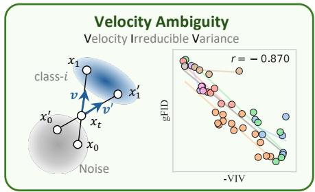

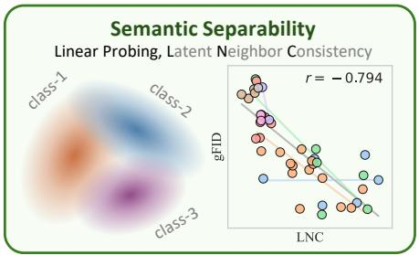

<details>
<summary>scatter</summary>

| Class   | gFID  |
|---------|-------|
| class-1 |       |
| class-2 |       |
| class-3 |       |
| LNC     |       |
</details>

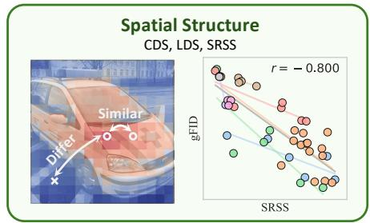

<details>
<summary>scatter</summary>

| SRSS | gFID |
|------|------|
| 1    | 1    |
| 2    | 0.5  |
| 3    | 0.2  |
| 4    | 0.1  |
| 5    | 0.05 |
| 6    | 0.02 |
| 7    | 0.01 |
| 8    | 0.005|
| 9    | 0.002|
| 10   | 0.001|
| 11   | 0.0005|
| 12   | 0.0002|
| 13   | 0.0001|
| 14   | 0.00005|
| 15   | 0.00002|
| 16   | 0.00001|
| 17   | 0.000005|
| 18   | 0.000002|
| 19   | 0.000001|
| 20   | 0.0000005|
| 21   | 0.0000002|
| 22   | 0.0000001|
| 23   | 0.00000005|
| 24   | 0.00000002|
| 25   | 0.00000001|
| 26   | 0.000000005|
| 27   | 0.000000002|
| 28   | 0.000000001|
| 29   | 0.0000000005|
| 30   | 0.0000000002|
| 31   | 0.0000000001|
| 32   | 0.00000000005|
| 33   | 0.00000000002|
| 34   | 0.00000000001|
| 35   | 0.000000000005|
| 36   | 0.000000000002|
| 37   | 0.000000000001|
| 38   | 0.00000000000
 |
| 39   | 0.0000000000
 |
| 40   | 1    |
| 41   | 1    |
| 42   | 1    |
| 43   | 1    |
| 44   | 1    |
| 45   | 1    |
| 46   | 1    |
| 47   | 1    |
| 48   | 1    |
| 49   | 1    |
| 50   | 1    |
| 51   | 1    |
| 52   | 1    |
| 53   | 1    |
| 54   | 1    |
| 55   | 1    |
| 56   | 1    |
| 57   | 1    |
| 58   | 1    |
| 59   | 1    |
| 60   | 1    |
| 61   | 1    |
| 62   | 1    |
| 63   | 1    |
| 64   | 1    |
| 65   | 1    |
| 66   | 1    |
| 67   | 1    |
| 68   | 1    |
| 69   | 1    |
| 70   | 1    |
| 71   | 1    |
| 72   | 1    |
| 73   | 1    |
| 74   | 1    |
| 75   | 1    |
| 76   | 1    |
| 77   | 1    |
| 78   | 1    |
| 79   | 1    |
| 80   | 1    |
| 81   | 1    |
| 82   | 1    |
| 83   | 1    |
| 84   | 1    |
| 85   | 1    |
| 86   | 1    |
| 87   | 1    |
| 88   | 1    |
| 89   | 1    |
| 90   | 1    |
| 91   | 1    |
| 92   | 1    |
| 93   | 1    |
| 94   | 1    |
| 95   | 1    |
| 96   | 1    |
| 97   | 1    |
| 98   | 1    |
| 99   | 1    |
| Note: The "Similar" label indicates the similarity metric for each group. The "Differ" label indicates the difference between groups.
</details>

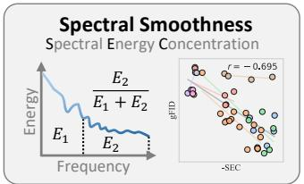

<details>
<summary>line</summary>

| Frequency | Energy |
| --------- | ------ |
| E1        | E2/E1 + E2 |
| E2        | (labeled point) |
</details>

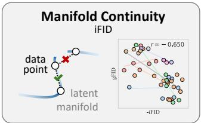

<details>
<summary>text_image</summary>

Manifold Continuity
iFID
data point
latent
manifold
r = -0.650
iFID
-iFID
</details>

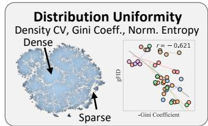

<details>
<summary>scatter</summary>

| Density CV | Gini Coefficient |
| ---------- | ---------------- |
| -0.621     | -                |
</details>

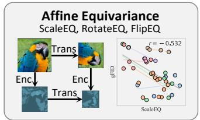

<details>
<summary>flowchart</summary>

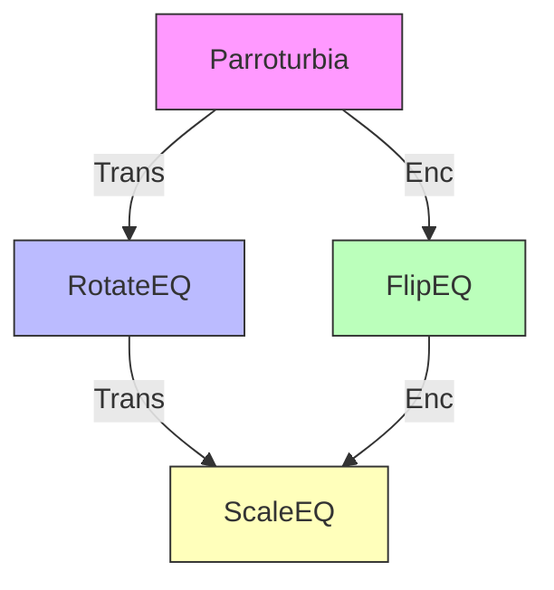
</details>

Figure 1: Different perspectives for observing latent properties. Each scatter corresponds to a tokenizer with different latent properties. Scatters with same color belong to the same regularization method.

# Abstract

Latent diffusion models leverage visual tokenizers to compress images into latent spaces for efficient generative modeling. However, better reconstruction quality of a tokenizer does not necessarily translate into better generation quality, suggesting that latent representations should be evaluated not only by fidelity but also by their diffusability. Recent studies have proposed diverse explanations for diffusion-friendly latent spaces, including semantic separability, affine equivariance, distribution uniformity, spatial structure, spectral smoothness, and manifold continuity. Yet these properties are often validated on a limited set of tokenizers, leaving it unclear which factors are most predictive of downstream generation quality and whether such conclusions hold beyond the specific settings in which they are introduced. In this work, we conduct a systematic study of latent diffusability by training a large collection of tokenizers with diverse regularization strategies, architectures, and latent configurations, and evaluating them with multiple downstream diffusion backbones. Our analysis identifies several latent properties that consistently correlate with generation quality and exhibit strong generalization across experimental settings. Beyond existing metrics, we introduce Velocity Irreducible Variance (VIV), a measure of velocity ambiguity induced by trajectory crossings. Extensive experiments show that VIV is one of the most stable predictors of generation quality.

# Introduction

The success of latent diffusion models (Rombach et al. 2022; Labs et al. 2025; Wu et al. 2025; Li et al. 2024; Esser et al. 2024) depends not only on the capacity of the diffusion backbone, but also critically on the property of the latent space produced by the tokenizer. A tokenizer with better reconstruction quality does not necessarily lead to better generation quality, revealing a fundamental mismatch between pixel-level compression and diffusion-friendly representation learning. This raises a central question: what kind of latent space is easier for diffusion models to learn?.

Recent studies have proposed diverse explanations for latent diffusability, including semantic separability (Yao et al. 2025; Zheng et al. 2025), affine equivariance (Kouzelis et al. 2025), distribution uniformity (Yao, Yang, and Wang 2025), spatial structure (Singh et al. 2025), spectral smoothness (Skorokhodov et al. 2025; Fan et al. 2025b), and manifold continuity (Xu et al. 2026). However, these properties are offen validated on a limited set of tokenizers. Moreover, each study typically introduces a particular regularization strategy together with a proxy metric that explains its own improvement. As a result, it remains unclear which latent properties are truly predictive of downstream generation quality, and whether such conclusions generalize beyond the specific settings in which they are introduced.

To answer these questions, we conduct a systematic study of latent diffusability. We construct a large-scale evaluation covering diverse tokenizers trained with different latent regularization strategies (Yao, Yang, and Wang 2025; Yu et al. 2024b; Kouzelis et al. 2025; Liu et al. 2025), tokenizer architectures, and latent configurations. For each tokenizer, we train multiple downstream diffusion models with different backbones and capacities, enabling a controlled correlation analysis between latent-space properties and generation quality. This design allows us to compare existing perspectives under a unified evaluation protocol.

To complement existing perspectives, we introduce Velocity Irreducible Variance (VIV), a measure of velocity ambiguity induced by trajectory crossings. In Flow Matching (Liu, Gong, and Liu 2022), multiple source-target pairs may induce different velocities at the same interpolated state, leading to an irreducible component in the velocity prediction objective. We model the class-conditional latent distribution as an anisotropic Gaussian, and show that VIV admits an analytic form determined by the principal standard deviations of the within-class covariance. This analysis suggests that intraclass compactness and spectral anisotropy are beneficial for reducing the ambiguity.

Our empirical analysis reveals that semantic separability, spatial structure, and VIV consistently exhibit strong correlations with generation quality across different diffusion backbones and tokenizer settings. Beyond single-perspective analysis, we further conduct a dual-perspective joint analysis and find that a linear model using semantic separability and spatial structure as predictors explains gFID better than either factor alone. These results suggest that latent diffusability is a multi-faceted property.

Our contributions are summarized as follows:

• We provide a systematic study of latent diffusability by evaluating diverse latent-space properties across tokenizer architectures, latent configurations, and downstream diffusion backbones.   
• We propose VIV, a flow-based metric that quantifies velocity ambiguity in Flow Matching.   
• We identify VIV, semantic separability, and spatial structure as consistently effective predictors of downstream generation quality across diverse experimental settings.

# Perspectives and Metrics

We focus on the diffusability of latent spaces under controlled settings, where tokenizers have comparable reconstruction quality. As illustrated in Figure 1, we summarize seven perspectives for characterizing latent space properties. We begin with the velocity-based perspective proposed in this paper and describe the computation of the corresponding metric. We then briefly review existing perspectives, including semantic separability (Yao et al. 2025; Chen et al. 2025a), spatial structure (Singh et al. 2025), latent smoothness (Skorokhodov et al. 2025; Liu et al. 2025), manifold continuity (Xu et al. 2026), latent uniformity (Yao, Yang, and Wang 2025), and affine equivariance (Kouzelis et al. 2025; Skorokhodov et al. 2025).

# Velocity Ambiguity

In the Flow Matching framework, noise $x _ { 0 }$ and data point $x _ { 1 }$ are independently sampled from the source and target distributions, respectively, and interpolated at a random time t to obtain $x _ { t } = t \cdot x _ { 1 } + ( 1 - t ) \cdot x _ { 0 }$ . Diffusion models θ often predict velocity $v = x _ { 1 } - x _ { 0 }$ based on given $x _ { t } , \ t ,$ and conditional information y. The training objective can be written as follows:

$$
\mathcal {L} (\theta) = \mathbb {E} _ {x _ {0}, x _ {1}, t, y} \left[ \| v - v _ {\theta} (x _ {t}, t, y) \| _ {2} ^ {2} \right], \tag {1}
$$

where $v = x _ { 1 } - x _ { 0 }$ . For a fixed interpolated state $x _ { t } ,$ multiple source-target pairs may induce different velocities (Liu, Gong, and Liu 2022), leading to an inherent ambiguity. We hypothesize that the magnitude of this velocity ambiguity affects the diffusability.

Let $v ^ { \star } : = v ^ { \star } ( x _ { t } , t , y ) = \mathbb { E } [ v \mid x _ { t } , t , y ]$ denote the Bayesoptimal velocity field. Then the objective $\mathcal { L } ( \boldsymbol { \theta } )$ can be decomposed into the following form:

$$
\underbrace {\mathbb {E} \left[ \| v ^ {\star} - v _ {\theta} (x _ {t} , t , y) \| _ {2} ^ {2} \right]} _ {\text { Reducible   Error }} + \underbrace {\mathbb {E} \left[ \| v - v ^ {\star} \| _ {2} ^ {2} \right]} _ {\text { Irreducible   Variance }}, \tag {2}
$$

where the irreducible variance reflects the degree of ambiguity of velocities. We model the latent distribution of each category with a Gaussian distribution, resulting in a $L _ { - }$ component Gaussian mixture model (GMM) for the marginal latent distribution, where L denotes the number of categories. However, the latent representation lies in a high-dimensional space with dimension ${ \dot { d } } = H \times W \times C ,$ , making direct estimation of the full covariance matrix unreliable when only a limited number of samples M is available, $\mathrm { i } . \mathrm { e } . , d \gg M$ . To address this issue, we adopt the Kronecker Flip-Flop covariance decomposition, which assumes a separable covariance structure between the channel dimension C and the spatial dimension $H \times W$ . Specifically, the full covariance matrix is approximated as:

$$
\Sigma \approx \Sigma_ {s} \otimes \Sigma_ {c}, \quad \Sigma_ {c} \in \mathbb {R} ^ {C \times C}, \Sigma_ {s} \in \mathbb {R} ^ {H W \times H W}. \tag {3}
$$

This assumption reduces the number of covariance parameters to be estimated and increases the effective number of samples for fitting each covariance factor. For example, when estimating the covariance matrix along the channel dimension, each latent representation can be treated as providing $H \times W$ spatial observations.

For class-conditional generation with a fixed label $y = k ,$ the target distribution reduces to a single Gaussian, $x _ { 1 } \mid y =$ $k \sim \bar { \mathcal { N } } ( \mu _ { k } , \Sigma _ { k } )$ . Assuming the standard Gaussian source distribution $x _ { 0 } \sim \mathcal { N } ( 0 , I )$ , the irreducible variance admits an analytic form. Let $\{ \lambda _ { k , i } \} _ { i = 1 } ^ { d }$ be the eigenvalues of $\Sigma _ { k }$ . At time t, the class-wise irreducible variance is given by

$$
\mathcal {I} _ {k} (t) = \sum_ {i = 1} ^ {d} \frac {\lambda_ {k , i}}{(1 - t) ^ {2} + t ^ {2} \lambda_ {k , i}}. \tag {4}
$$

When $t \sim U ( 0 , 1 )$ , integrating over time yields

$$
\mathcal {I} _ {k} = \int_ {0} ^ {1} \mathcal {I} _ {k} (t) \mathrm{d} t = \frac {\pi}{2} \sum_ {i = 1} ^ {d} \sqrt {\lambda_ {k , i}}. \tag {5}
$$

Let $\tau _ { k } : = \mathrm { t r } ( \Sigma _ { k } )$ denote the total variance, and $A _ { k } : =$ $\mathrm { V a r } ( \sqrt { \lambda _ { k , i } } )$ represent the anisotropy of standard-deviation spectrum, Equation 5 can be re-written into:

$$
\mathcal {I} _ {k} = \frac {\pi}{2} \sqrt {d (\tau_ {k} - d \cdot \mathcal {A} _ {k})}, \quad \frac {\partial \mathcal {I} _ {k}}{\partial \tau_ {k}} > 0, \quad \frac {\partial \mathcal {I} _ {k}}{\partial \mathcal {A} _ {k}} <   0. \tag {6}
$$

This analytic form reveals two direct implications for diffusion-friendly latent distributions.

# Insight 1: Intra-class Compactness

For a fixed spectral shape, reducing the total variance τk shrinks the average intra-class spread and decreases $\mathcal { T } _ { k } .$

# Insight 2: Spectral Anisotropy

When the total variance is controlled, a more anisotropic standard-deviation spectrum, a larger $A _ { k } ,$ reduces $\mathcal { T } _ { k }$ .

The overall irreducible variance I is obtained by averaging $\mathcal { T } _ { k }$ over all categories. For more general settings, such as textguided generation, the target latent distribution can no longer be reduced to a single class-conditional Gaussian. Instead, $x _ { 1 }$ is sampled from the marginal latent distribution, which is approximated by the GMM. Consequently, the marginal distribution of $x _ { t }$ is also a mixture distribution, and I can be directly estimated via Monte Carlo sampling.

# Semantic Separability

Semantic separability characterizes how well latent representations are organized according to class semantics, reflecting both intra-class compactness and inter-class separation. Linear probing (Yu et al. 2024b; Yao et al. 2025; Chen et al. 2025a) is a widely used evaluation method, which trains a linear classification head on extracted latents.

However, linear probing requires feature extraction over the training set and additional classifier training, making the evaluation computationally expensive. We therefore introduce Latent Neighbor Consistency (LNC), a validation-setonly proxy for semantic separability. As shown in Figure 2, LNC computes the fraction of each latent representation’s $K \cdot$ nearest neighbors that share the same class label. To make the measurement more focused on semantic content, we use precomputed foreground masks and aggregate only foreground latent pixels. We observe a strong linear correlation between LNC and linear probing, and thus adopt LNC as an efficient alternative in our analysis.

# Spatial Structure

iREPA (Singh et al. 2025) studies how the spatial structure of foundation-model representations affects the generation quality of diffusion models under representation alignment (Yu et al. 2024b). Following this line of analysis, we consider three metrics proposed in iREPA: LDS, CDS, and SRSS. LDS measures whether nearby latent pixels are more similar than distant ones, and CDS quantifies the decay rate of similarity with respect to spatial distance. SRSS uses foreground masks to assess whether intra-foreground representations are more consistent than foreground-background

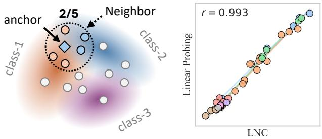

<details>
<summary>scatter</summary>

| Class   | X Value | Y Value |
|---------|---------|---------|
| anchor  | 2/5     | Not labeled |
| Neighbor| Not labeled | Not labeled |
| class-1 | Not labeled | Not labeled |
| class-2 | Not labeled | Not labeled |
| class-3 | Not labeled | Not labeled |
| Linear Probing | Not labeled | Linear Probing |
| r = 0.993 | Not labeled | Linear Probing |
</details>

Figure 2: Left: LNC calculates the proportion of samples of the same category within the latent neighborhood. Right: LNC has a high linear correlation with Linear Probing.

representations. We exclude RMSC because it mainly characterizes the diversity of spatial representations.

# Latent Smoothness

Recent analyses of diffusion learning dynamics suggest that high-variance spectral modes are learned faster than lowvariance modes, implying that coarse or low-frequency information are typically captured earlier than fine high-frequency details (Wang and Pehlevan 2026). This means that a smaller proportion of high-frequency energy (Skorokhodov et al. 2025; Liu et al. 2025; Fan et al. 2025b) in the latent space may result in better diffusability. To quantify this property, we propose a metric Spectral Energy Concentration (SEC), which measures the proportion of spectral energy concentrated in the high-frequency region.

Given a set of latent representations $\mathcal { Z } = \{ z _ { n } \} _ { n = 1 } ^ { N }$ , where $z _ { n } \in \mathbb { R } ^ { C \times H \times W }$ , we apply the 2D discrete cosine transform (DCT) to each channel independently:

$$
\hat {z} _ {n} = \mathrm{DCT} _ {\mathrm{2D}} (z _ {n}). \tag {7}
$$

The average spectral energy at frequency coordinate $( u , v )$ is computed as:

$$
E _ {u, v} = \frac {1}{N C} \sum_ {n = 1} ^ {N} \| \hat {z} _ {n,:, u, v} \| _ {2} ^ {2}. \tag {8}
$$

Since the low-frequency components of DCT are located near the upper-left corner, we use the Manhattan distance $d ( u , v ) = u + v .$ where a larger value indicates a higher spatial frequency. Given a threshold ratio $\rho ~ \in ~ [ 0 , 1 ]$ , the corresponding frequency threshold is $\tau _ { \rho } = \rho { \cdot } d ( H { \cdot } 1 \big , \mathbf { \bar { W } } -$ 1). Then SEC is defined as the proportion of energy lying outside the low-frequency region:

$$
\mathrm{SEC} _ {\rho} = \frac {\sum_ {u = 0} ^ {H - 1} \sum_ {v = 0} ^ {W - 1} \mathbf {1} [ d (u , v) > \tau_ {\rho} ] E _ {u , v}}{\sum_ {u = 0} ^ {H - 1} \sum_ {v = 0} ^ {W - 1} E _ {u , v}}. \tag {9}
$$

A larger SEC indicates that more spectral energy is concentrated in high-frequency components, suggesting a less smooth latent representation.

# Manifold Continuity

iFID (Xu et al. 2026) and VE (Li et al. 2026) suggest that the connectivity of latent distributions is closely related to generation quality. A continuous latent space is expected to preserve meaningful image semantics and visual realism along local interpolation paths. Specifically, for each latent representation, iFID first identifies its nearest neighbor in the latent space and then constructs interpolated latents between the two representations. These interpolated latents are decoded back into the image space, and the distribution of the decoded images is compared with the real image distribution using FID. A lower iFID indicates that interpolated latents remain closer to the image manifold, suggesting better manifold continuity.

# Latent Uniformity

VAVAE (Yao, Yang, and Wang 2025) studies latent-space uniformity from the perspective of representation utilization. A more uniformly utilized latent space can alleviate the concentration of representations in a small number of regions, thereby providing a more regular target distribution for diffusion modeling. Following VAVAE, we directly adopt its uniformity evaluation protocol. Specifically, we first extract latent representations from the validation set and project them into a two-dimensional space using t-SNE (Van der Maaten and Hinton 2008). Then, we estimate the density distribution of the projected latent points and compute three statistics to characterize its uniformity: density coefficient of variation, Gini coefficient, and normalized entropy. A lower density coefficient of variation and Gini coefficient indicate a more even density distribution, while a higher normalized entropy indicates better latent-space uniformity.

# Affine Equivariance

Affine Equivariance (Kouzelis et al. 2025; Skorokhodov et al. 2025) evaluates whether the tokenizer preserves the geometric transformation structure of the input image. Such equivariance may provide a more regulated latent representation and may help the downstream diffusion model learn spatial variations more effectively. Given an input image x, we evaluate affine equivariance by comparing the two operator orders, Enc ◦ Trans and Trans ◦ Enc. A smaller discrepancy indicates better equivariance. In our evaluation, we consider two types of transformations: Rotate and Scale. A higher consistency indicates that the encoder better preserves affine equivariance in the latent space.

# Experiments

# Setups

We trained a serials of tokenizers based on the latent regularization method proposed in existing works (Yao, Yang, and Wang 2025; Yu et al. 2024b; Liu et al. 2025; Kouzelis et al. 2025). For different regularization methods, we can construct a cluster of tokenizers by adjusting the relevant parameters. For example, we used various visual foundation models (Oquab et al. 2023; Siméoni et al. 2025; Radford et al. 2021; He et al. 2022; Fan et al. 2025a; Chen, Xie, and He 2021; Bolya et al. 2026; Heinrich et al. 2025) for the representation alignment methods. All tokenizer are trained for 16 epochs on ImageNet (Deng et al. 2009) dataset.

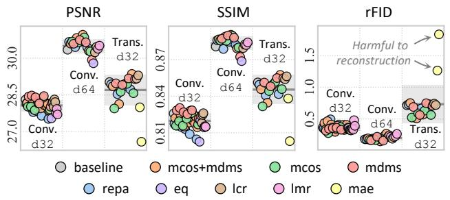

<details>
<summary>scatter</summary>

| Metric | Model       | Baseline | mcos+mdms | mcos  | mdms  | repa  | eq    | lcr   | lmr   | mae   |
|--------|-------------|----------|-----------|-------|-------|-------|-------|-------|-------|-------|
| PSNR   | Conv. d32   | ~28.5    | ~28.5     | ~28.5 | ~28.5 | ~28.5 | ~28.5 | ~28.5 | ~28.5 | ~28.5 |
| PSNR   | Conv. d64   | ~28.5    | ~28.5     | ~28.5 | ~28.5 | ~28.5 | ~28.5 | ~28.5 | ~28.5 | ~28.5 |
| PSNR   | Trans. d32  | ~28.5    | ~28.5     | ~28.5 | ~28.5 | ~28.5 | ~28.5 | ~28.5 | ~28.5 | ~28.5 |
| SSIM   | Conv. d32   | ~0.81    | ~0.81     | ~0.81 | ~0.81 | ~0.81 | ~0.81 | ~0.81 | ~0.81 | ~0.81 |
| SSIM   | Conv. d64   | ~0.81    | ~0.81     | ~0.81 | ~0.81 | ~0.81 | ~0.81 | ~0.81 | ~0.81 | ~0.81 |
| SSIM   | Trans. d32  | ~0.81    | ~0.81     | ~0.81 | ~0.81 | ~0.81 | ~0.81 | ~0.81 | ~0.81 | ~0.81 |
| rFID   | Conv. d32   | ~0.5     | ~0.5      | ~0.5  | ~0.5  | ~0.5  | ~0.5  | ~0.5  | ~0.5  | ~0.5  |
| rFID   | Conv. d64   | ~0.5     | ~0.5      | ~0.5  | ~0.5  | ~0.5  | ~0.5  | ~0.5  | ~0.5  | ~0.5  |
| rFID   | Trans. d32  | ~0.5     | ~0.5      | ~0.5  | ~0.5  | ~0.5  | ~0.5  | ~0.5  | ~0.5  | ~0.5  |
Harmful to reconstruction (rFID) → Harmful to reconstruction (SSIM) → rFID (PSNR)
</details>

Figure 3: Tokenizers with same architecture and latent configuration have similar reconstruction quality.

To study whether the conclusions generalize across tokenizer architectures and latent configurations, we evaluate three tokenizer families: 43 convolutional tokenizers with the f16d32 latent configuration (conv-f16d32); 22 convolutional tokenizers with the f16d64 latent configuration (conv-f16d64); and 21 transformer-based tokenizers with the f16d32 latent configuration (trans-f16d32). As shown in Figure 3, tokenizers within each family have comparable reconstruction quality, ensuring that downstream generative performance is not primarily bounded by reconstruction fidelity. The proxy metrics are computed on either the validation set or its masked variant (Gao et al. 2022). For each tokenizer, we train different diffusion models: SiT-B, SiT-XL, LightningDiT-B, and LightningDiT-XL. The training strategy follows the official configuration. We train 400k steps for SiT-B (Ma et al. 2024), 80k steps for SiT-XL, and 100k steps for LightningDiT (Yao, Yang, and Wang 2025) models (Yao, Yang, and Wang 2025), respectively. In this section, we use gFID (Heusel et al. 2017) to represent the generation quality, and we also provide the results for IS (Salimans et al. 2016) and FDr6 (Yang et al. 2026) in the appendix.

# Which Perspective Matters?

As shown in Figure 4, we enumerate the relationships between different proxy metrics and generation quality from each perspective. The metric with the highest relevance within each perspective is highlighted, and it is used as the main proxy in subsequent experiments. We ranked the perspectives based on relevance, with Velocity Ambiguity, Semantic Separability, and Spatial Structure standing out. The Pearson coefficient for VIV and gFID reached 0.87. In contrast, the correlations among Manifold Continuity, Distribution Uniformity, and Affine Equivariance are relatively low, and the trends within each regularized cluster differ significantly. In particular, since the Affine Equivariance has the lowest correlation and the two metrics lack consistency, we ignored this perspective in subsequent analyses, and the corresponding results are presented in the appendix.

# Generalization across Diffusion Backbones

Figure 5 exhibits the results among SiT-XL, LightningDiT-B, and LightningDiT-XL. Among the four Diffusion Models, Velocity Ambiguity and Spatial Structure are the most stable, while Semantic Separability and Spectral Smoothness are relatively better. It is worth noting that as the diffusion capacity increases from B to XL, SRSS fits better, while the correlation of other metrics decreases or remained unchanged. SiT and LightningDiT also show differences in property preferences. For example, LNS performs better on SiT, while SEC performs better on LightningDiT. We believe this difference

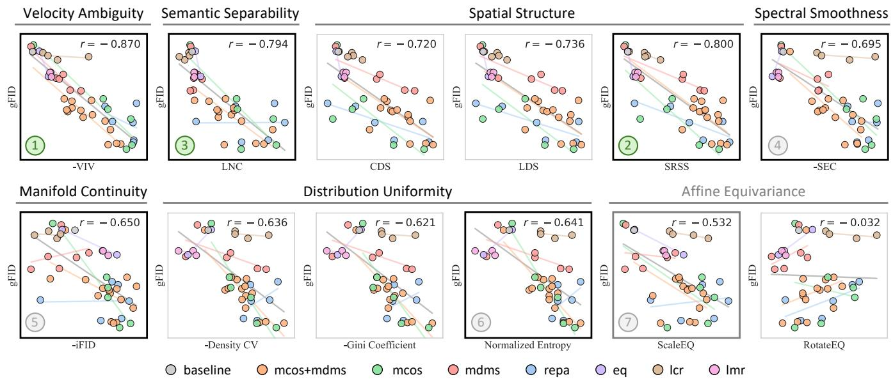

<details>
<summary>scatter</summary>

| Metric | Baseline | mcos+mdms | mcos | mdms | repa | eq | lcr | Imr |
|---|---|---|---|---|---|---|---|---|
| Velocity Ambiguity | r = -0.870 | | | | | | | |
| Semantic Separability | r = -0.794 | | | | | | | |
| Spatial Structure | r = -0.720 | | | | | | | |
| Spectral Smoothness | r = -0.800 | | | | | | | |
| Manifold Continuity | r = -0.650 | | | | | | | |
| Distribution Uniformity | r = -0.636 | | | | | | | |
| Affine Equivariance | r = -0.532 | | | | | | | |
| -iFID | | | | | | | | |
| -Density CV | | | | | | | | |
| -Gini Coefficient | | | | | | | | |
| Normalized Entropy | | | | | | | | |
| ScaleEQ | | | | | | | | |
| RotateEQ | | | | | | | | |
The provided table includes the same metric '1' in the left panel and the same metric '5' in the bottom panel. The other five metrics are plotted as colored circles connected by lines.
</details>

Figure 4: Correlation between different perspectives and generation quality on conv-f16d32 and SiT-B. The most relevant metric for each perspective is highlighted with bold border. The order of relevance is given by number.

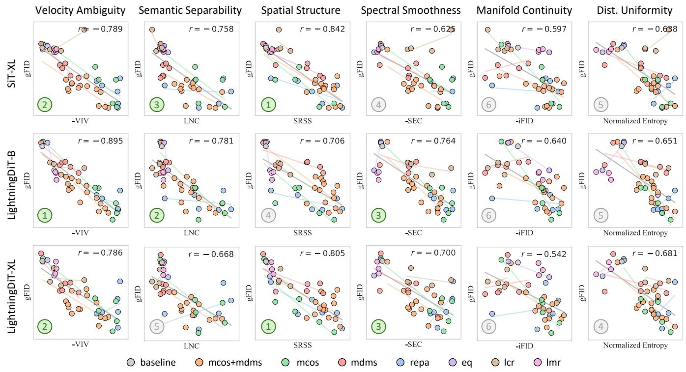

<details>
<summary>scatter</summary>

| Category             | Metric               | Value   |
|----------------------|----------------------|---------|
| Velocity Ambiguity   | -VIV                 | r = -0.789 |
| Velocity Ambiguity   | LNC                  | r = -0.758 |
| Velocity Ambiguity   | SRSS                 | r = -0.842 |
| Velocity Ambiguity   | SEC                  | r = -0.625 |
| Velocity Ambiguity   | -iFID                | r = -0.597 |
| Velocity Ambiguity   | Dist. Uniformity     | r = -0.638 |
| Semantic Separability| -VIV                 | r = -0.895 |
| Semantic Separability| LNC                  | r = -0.781 |
| Semantic Separability| SRSS                 | r = -0.706 |
| Semantic Separability| SEC                  | r = -0.764 |
| Semantic Separability| -iFID                | r = -0.640 |
| Semantic Separability| Dist. Uniformity     | r = -0.651 |
| Spatial Structure    | -VIV                 | r = -0.786 |
| Spatial Structure    | LNC                  | r = -0.668 |
| Spatial Structure    | SRSS                 | r = -0.805 |
| Spatial Structure    | SEC                  | r = -0.700 |
| Spatial Structure    | -iFID                | r = -0.542 |
| Spatial Structure    | Dist. Uniformity     | r = -0.681 |
| Spectral Smoothness  | -VIV                 | r = -0.789 |
| Spectral Smoothness  | LNC                  | r = -0.758 |
| Spectral Smoothness  | SRSS                 | r = -0.842 |
| Spectral Smoothness  | SEC                  | r = -0.625 |
| Spectral Smoothness  | -iFID                | r = -0.597 |
| Spectral Smoothness  | Dist. Uniformity     | r = -0.638 |
| Manifold Continuity  | -VIV                 | r = -0.786 |
| Manifold Continuity  | LNC                  | r = -0.758 |
| Manifold Continuity  | SRSS                 | r = -0.842 |
| Manifold Continuity  | SEC                  | r = -0.625 |
| Manifold Continuity  | -iFID                | r = -0.597 |
| Manifold Continuity  | Dist. Uniformity     | r = -0.638 |
| Dist. Uniformity     | -VIV                 | r = -0.786 |
| Dist. Uniformity     | LNC                  | r = -0.758 |
| Dist. Uniformity     | SRSS                 | r = -0.842 |
| Dist. Uniformity     | SEC                  | r = -0.625 |
| Dist. Uniformity     | -iFID                | r = -0.597 |
| Dist. Uniformity     | Dist. Uniformity     | r = -0.638 |
| LightningDiT-B      | -VIV                 | r = -0.786 |
| LightningDiT-B      | LNC                  | r = -0.758 |
| LightningDiT-B      | SRSS                 | r = -0.842 |
| LightningDiT-B      | SEC                  | r = -0.764 |
| LightningDiT-B      | -iFID                | r = -0.640 |
| LightningDiT-B      | Dist. Uniformity     | r = -0.651 |
| LightningDiT-XL    | -VIV                 | r = -0.786 |
| LightningDiT-XL    | LNC                  | r = -0.668 |
| LightningDiT-XL    | SRSS                 | r = -0.805 |
| LightningDiT-XL    | SEC                  | r = -0.700 |
| LightningDiT-XL    | -iFID                | r = -0.542 |
| LightningDiT-XL    | Dist. Uniformity     | r = -0.681 |
| LightningDiT-XL    | Baseline              | baseline (gray circle) |
| LightningDiT-XL    | mcos+mdms            | baseline (orange circle) |
| LightningDiT-XL    | mcos                 | baseline (green circle) |
| LightningDiT-XL    | mdms                 | baseline (red circle) |
| LightningDiT-XL    | repa                 | baseline (blue circle) |
| LightningDiT-XL    | eq                   | baseline (purple circle) |
| LightningDiT-XL    | lcr                  | baseline (brown circle) |
| LightningDiT-XL    | lmr                  | baseline (pink circle) |
| LightningDiT-XL    | Baseline (gray circle)  | baseline (gray circle) |
| LightningDiT-XL    | mcos+mdms            | baseline (orange circle) |
| LightningDiT-XL    | mcos                 | baseline (green circle) |
| LightningDiT-XL    | mdms                 | baseline (red circle) |
| LightningDiT-XL    | repa                 | baseline (blue circle) |
| LightningDiT-XL    | eq                   | baseline (purple circle) |
|
| LightningDiT-XL    | lcr                  | baseline (brown circle) |
| LightningDiT-XL    | lmr                  | baseline (pink circle)
</details>

Figure 5: Correlation analysis on conv-f16d32 across various downstream diffusion backbones.

mainly stems from the different timestep sampling strategies. (Uniform for SiT and LogNorm for LightningDIT).

# Generalization across Tokenizer Families

In Figure 6, we further evaluate whether the properties generalize across different tokenizer families on SiT-B. Across the families, Velocity Ambiguity, Semantic Separability, and Spatial Structure remain effective. We also observe that iFID (Xu et al. 2026) shows a particularly high correlation on the conv-f16d64 family, achieving performance comparable to SRSS. However, iFID is less stable in our overall experiments. We hypothesize that this is because we intentionally control the reconstruction quality of tokenizers within the same family to be similar. Under this setting, reconstruction-oriented metrics have a relatively limited dynamic range, making them less reliable for explaining the remaining differences in downstream generation quality.

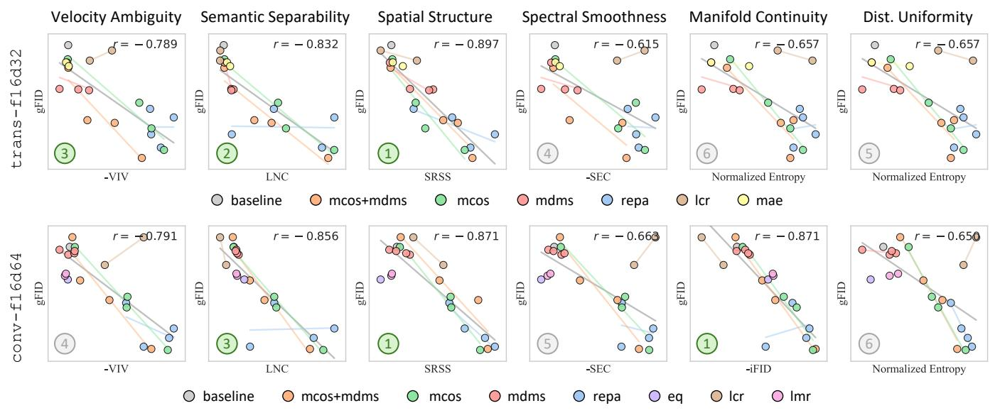

<details>
<summary>scatter</summary>

| Metric | Model | r-value |
| --- | --- | --- |
| velocity Ambiguity | baseline | -0.789 |
| velocity Ambiguity | mcos+mdms | -0.832 |
| velocity Ambiguity | mcos | -0.897 |
| velocity Ambiguity | mdms | -0.615 |
| velocity Ambiguity | repa | -0.657 |
| velocity Ambiguity | eq | -0.657 |
| velocity Ambiguity | lcr | -0.657 |
| velocity Ambiguity | lmr | -0.657 |
| semantic Separability | baseline | -0.791 |
| semantic Separability | mcos+mdms | -0.856 |
| semantic Separability | mcos | -0.871 |
| semantic Separability | mdms | -0.663 |
| semantic Separability | repa | -0.871 |
| semantic Separability | eq | -0.656 |
| semantic Separability | lcr | -0.656 |
| semantic Separability | lmr | -0.656 |
| spatial Structure | baseline | -0.789 |
| spatial Structure | mcos+mdms | -0.832 |
| spatial Structure | mcos | -0.897 |
| spatial Structure | mdms | -0.615 |
| spatial Structure | repa | -0.657 |
| spatial Structure | eq | -0.657 |
| spatial Structure | lcr | -0.657 |
| spatial Structure | lmr | -0.657 |
| spectral Smoothness | baseline | -0.789 |
| spectral Smoothness | mcos+mdms | -0.832 |
| spectral Smoothness | mcos | -0.897 |
| spectral Smoothness | mdms | -0.615 |
| spectral Smoothness | repa | -0.657 |
| spectral Smoothness | eq | -0.657 |
| spectral Smoothness | lcr | -0.657 |
| spectral Smoothness | lmr | -0.657 |
| Manifold Continuity | baseline | -0.789 |
| Manifold Continuity | mcos+mdms | -0.832 |
| Manifold Continuity | mcos | -0.897 |
| Manifold Continuity | mdms | -0.615 |
| Manifold Continuity | repa | -0.657 |
| Manifold Continuity | eq | -0.657 |
| Manifold Continuity | lcr | -0.657 |
| Manifold Continuity | lmr | -0.657 |
| Dist. Uniformity | baseline | -0.789 |
| Dist. Uniformity | mcos+mdms | -0.832 |
| Dist. Uniformity | mcos | -0.897 |
| Dist. Uniformity | mdms | -0.615 |
| Dist. Uniformity | repa | -0.657 |
| Dist. Uniformity | eq | -0.657 |
| Dist. Uniformity | lcr | -0.657 |
| Dist. Uniformity | lmr | -0.657 |
| conv-f16d64 | baseline | -0.791 |
| conv-f16d64 | mcos+mdms | -0.856 |
| conv-f16d64 | mcos | -0.871 |
| conv-f16d64 | mdms | -0.663 |
| conv-f16d64 | repa | -0.871 |
| conv-f16d64 | eq | -0.871 |
| conv-f16d64 | lcr | -0.871 |
| conv-f16d64 | lmr | -0.871 |
| LNC | baseline | -0.789 |
| LNC | mcos+mdms | -0.832 |
| LNC | mcos | -0.897 |
| LNC | mdms | -0.615 |
| LNC | repa | -0.657 |
| LNC | eq | -0.657 |
| LNC | lcr | -0.657 |
| LNC | lmr | -0.657 |
| SRSS | baseline | -0.789 |
| SRSS | mcos+mdms | -0.832 |
| SRSS | mcos | -0.897 |
| SRSS | mdms | -0.615 |
| SRSS | repa | -0.657 |
| SRSS | eq | -0.657 |
| SRSS | lcr | -0.657 |
| SRSS | lmr | -0.657 |
| SEC | baseline | -0.789 |
| SEC | mcos+mdms | -0.832 |
| SEC | mcos | -0.897 |
| SEC | mdms | -0.615 |
| SEC | repa | -0.657 |
| SEC | eq | -0.657 |
| SEC | lcr | -0.657 |
| SEC | lmr | -0.657 |
| SEC-SEC (Normalized Entropy) Normalized Entropy (Normalized Entropy) Normalized Entropy (Normalized Entropy) Normalized Entropy (Normalized Entropy) Normalized Entropy (Normalized Entropy) Normalized Entropy (Normalized Entropy) Normalized Entropy (Normalized Entropy) Normalized Entropy (Normalized Entropy) Normalized Entropy (Normalized Entropy) Normalized Entropy (Normalized Entropy) Normalized Entropy (Normalized Entropy) Normalized Entropy (Normalized Entropy) Normalized Entropy 1 (r=-0.856) 2 (r=-0.897) 3 (r=-0.897) 4 (r=-0.856) 5 (r=-0.897) 6 (r=-0.897) 7 (r=-0.897) 8 (r=-0.897) 9 (r=-0.897) 10 (r=-0.897) 11 (r=-0.897) 12 (r=-0.897) 13 (r=-0.897) 14 (r=-0.897) 15 (r=-0.897) 16 (r=-0.897) 17 (r=-0.897) 18 (r=-0.897) 20 (r=-0.897) 22 (r=-0.897) 24 (r=-0.897) 26 (r=-0.897) 28 (r=-0.897) 32 (r=-0.897) 34 (r=-0.897) 36 (r=-0.897) 38 (r=-0.897) 42 (r=-0.897) 44 (r=-0.897) 48 (r=-0.897) 52 (r=-0.897) 54 (r=-0.897) 56 (r=-0.897) 58 (r=-0.897) 62 (r=-0.897) 64 (r=-0.897) 68 (r=-0.897) 72 (r=-0.897) 74 (r=-0.897) 76 (r=-0.897) 78 (r=-0.897) 82 (r=-0.897) 84 (r=-0.897) 86 (r=-0.897) 88 (r=-0.897) 92 (r=-0.897) 94 (r=-0.897) 96 (r=-0.897) 98 (r=-0.897) 112 (r=-0.897) 124 (r=-0.897) 136 (r=-0.897) 148 (r=-0.897) 162 (r=-0.897) 174 (r=-0.897) 184 (r=-0.897) 212 (r=-0.897) 232 (r=-0.897) 244 (r=-0.897) 256 (r=-0.897) 268 (r=-0.897) 284 (r=-0.897) 312 (r=-0.897) 332 (r=-0.897) 344 (r=-0.897) 356 (r=-0.897) 368 (r=-0.897) 384 (r=-0.897) 412 (r=-0.897) 432 (r=-0.897) 444 (r=-0.897) 456 (r=-0.897) 464 (r=-0.897) 492 (r=-0.897) 512 (r=-0.897) 532 (r=-0.897) 544 (r=-0.897) 562 (r=-0.897) 592 (r=-0.897) 612 (r=-0.897) 632 (r=-0.897) 652 (r=-0.897) 662 (r=-0.897) 692 (r=-0.897) 712 (r=-0.897) 732 (r=-0.897) 752 (r=-0.897) 762 (r=-0.897) 792 (r=-0.897) 812 (r=-0.897) 832 (r=-0.897) 842 (r=-0.897) 852 (r=-0.897) 862 (r=-0.897) 892 (r=-0.897) 912 (r=-0.897) 932 (r=-0.897) 942 (r=-0.897) 112 (r=-0.856)
Normalized Entropy: Baseline = baseline; mcos+mdms = mcos; mcos = mdms = mdms; repa = repa; eq = eq; lcr = lcr; lmr = lm rlm
</details>

Figure 6: Correlation analysis on SiT-B across various tokenizer families.

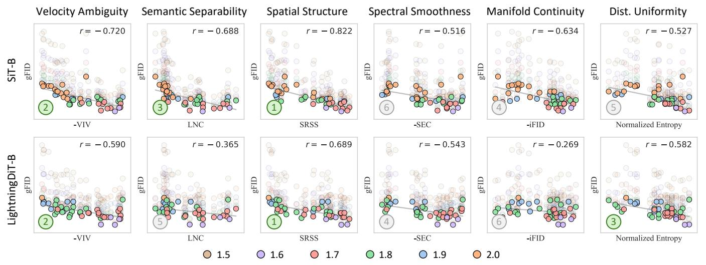

<details>
<summary>scatter</summary>

| Metric | Dataset | r-value |
| --- | --- | --- |
| Velocity Ambiguity | SiT-B | -0.720 |
| Velocity Ambiguity | LightningDiT-B | -0.590 |
| Semantic Separability | SiT-B | -0.688 |
| Semantic Separability | LightningDiT-B | -0.365 |
| Spatial Structure | SiT-B | -0.822 |
| Spatial Structure | LightningDiT-B | -0.689 |
| Spectral Smoothness | SiT-B | -0.516 |
| Spectral Smoothness | LightningDiT-B | -0.543 |
| Manifold Continuity | SiT-B | -0.634 |
| Manifold Continuity | LightningDiT-B | -0.269 |
| Dist. Uniformity | SiT-B | -0.527 |
| Dist. Uniformity | LightningDiT-B | -0.582 |
The chart displays correlation coefficients (r) for each metric across different conditions (e.g., -VIV, LNC, SRSS, -SEC, -iFID, Normalized Entropy). Each metric is represented by a colored circle (ranging from 1.5 to 2.0) and labeled with its corresponding value. The scatter points are grouped by category (green, red, blue, orange) and further divided into six groups by label (1–6). The y-axis labels are 'gFID' and 'Normalized Entropy', while the x-axis lists the same metric categories.
</details>

Figure 7: Impact of classifier-Free guidance on conv-f16d32. The optimal CFG for each latent space is highlighted.

# Impact of Classifier-Free Guidance

We evaluate the w/ CFG results on SiT-B and LightningDit-B, varying CFG scale (Ho and Salimans 2022) from 1.0 to 3.0. As shown in Figure 7, we present the results in the range of 1.5 to 2.0, because we find that the optimal CFG for all experiments lies in this range (see Appendix). Each tokenizer corresponds to a vertical column of scatter, where the optimal gFID configuration is highlighted. Experimental results show that Velocity Ambiguity and Spatial Structure still provide the best and most stable fit. We also find that the configuration with CFG seems to further amplify the framework differences in the Diffusion backbones.

# Complementarity across Perspectives

As illustrated in Figure 8, we enumerated combinations of two perspectives to regress gFID. The two axes in the figure correspond to the proxy metrics, and the size of the bubble reflects gFID. First, most of the perspectives are approximately orthogonal to each other, which allows them to open up a large area on a two-dimensional plane. Only several perspectives are found a weak correlation. For example, Spectral Smoothness, Distribution Uniformity, and Velocity Ambiguity exhibit a certain collinearity. This collinearity may stem from correlations in the underlying mechanisms, but may also originate from the way the tokenizers are constructed. We will consider more tokenizers and conduct further research on this phenomenon. On the other hand, we found that the space spanned by SRSS and LNC can fit gFID with an $R ^ { 2 } = 0 . 9 1$ , indicating that scatters located at Pareto optimality in terms of Spatial Structure and Semantic Separability will have better generation quality. This suggests that a comprehensive evaluation of latent space from multiple perspectives may be more accurate and reliable.

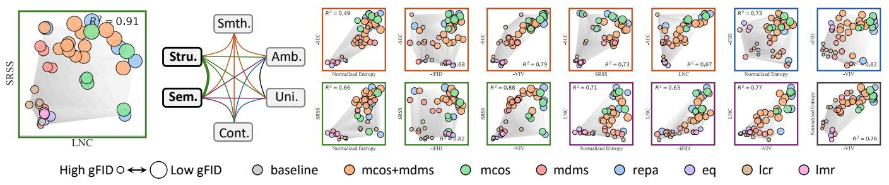

Figure 8: Dual-perspective regression of gFID on conv-f16d32, where the size of the bubble corresponds to the gFID, and the terrain of the background represents the trend. Border colors facilitate quick checking of perspective combinations.   
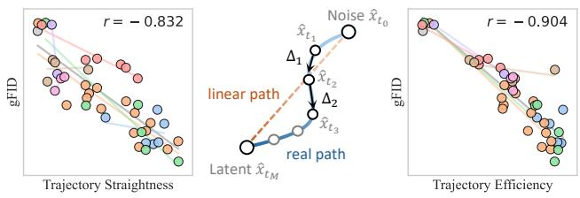

<details>
<summary>scatter</summary>

| Trajectory Straightness | gFID | r-value |
| ------------------------ | ---- | ------- |
| Trajectory straightness   | 0    | -0.832  |
| Trajectory Efficiency     | 0    | -0.904  |
</details>

Figure 9: Latent spaces with better generation quality tend to produce straighter and more efficient trajectories.

# Better Latents Induce More Efficient Transport

We further find that latent spaces with better generation quality tend to induce simpler learned velocity fields, reflected by straighter ODE trajectories. This provides a post-hoc view of how latent-space properties may affect the dynamics learned by diffusion models. Specifically, we record the full denoising trajectory $\{ \hat { x } _ { t _ { i } } \} _ { i = 0 } ^ { M }$ of the trained diffusion model, where $\hat { x } _ { t _ { 0 } }$ is the initial Gaussian noise and $\hat { x } _ { t _ { M } }$ is the generated latent. For each segment, we define $\Delta _ { i } = \hat { x } _ { t _ { i + 1 } } - \hat { x } _ { t _ { i } }$ . We measure the local straightness of the trajectory by the average cosine similarity between adjacent segments:

$$
\text { Straightness } = \frac {1}{M - 1} \sum_ {i = 0} ^ {M - 2} \frac {\left\langle \Delta_ {i} , \Delta_ {i + 1} \right\rangle}{\left\| \Delta_ {i} \right\| _ {2} \left\| \Delta_ {i + 1} \right\| _ {2}}. \tag {10}
$$

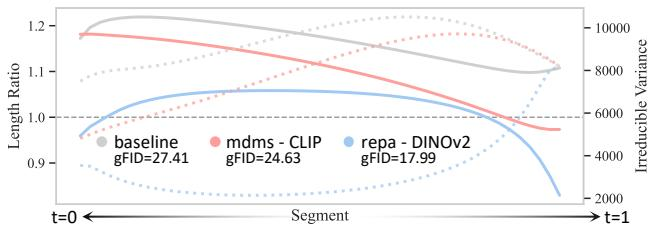

<details>
<summary>line</summary>

| Segment | baseline | mdms - CLIP | repa - DINOv2 |
| ------- | -------- | ----------- | ------------- |
| t=0     | 1.2      | 1.2         | 1.0           |
| t=1     | 1.1      | 0.9         | 0.8           |
</details>

Figure 10: Per-segment length ratio along ODE trajectories (solid), and estimated irreducible variance (dotted).

We also measure the global efficiency by comparing the endpoint displacement with the accumulated path length:

$$
\text { Efficiency } = \frac {\left\| \hat {x} _ {t _ {M}} - \hat {x} _ {t _ {0}} \right\| _ {2}}{\sum_ {i = 0} ^ {M - 1} \left\| \Delta_ {i} \right\| _ {2}}. \tag {11}
$$

As shown in Figure 9, both metrics are highly correlated with gFID. This suggests that better latent spaces lead the diffusion model to follow more direct and less redundant ODE paths. This observation indicates that latent-space properties may influence the complexity of the target velocity field, or equivalently the difficulty of fitting the learned dynamics.

Figure 10 further visualizes the per-segment length ratio $M \cdot \| \Delta _ { i } \| _ { 2 } / \| \hat { x } _ { t _ { M } } - \hat { x } _ { t _ { 0 } } \| _ { 2 }$ along the ODE trajectory for three representative tokenizers with poor, medium, and strong generation quality. A ratio of 1 corresponds to the segment length of the linear path, while ratios above or below 1 indicate more aggressive or more conservative updates, respectively. We observe that better latent spaces keep the length ratio closer to 1, suggesting that the learned ODE trajectory follows a more balanced and efficient transport schedule. In contrast, the baseline deviates more significantly from the linear-path schedule, especially in the early and middle denoising stages.

We also overlay the irreducible variance estimated by Equation 4. The irreducible variance and the learned length ratio exhibit a highly consistent but opposite pattern, where regions with larger irreducible variance tend to correspond to smaller learned step lengths. In regions with higher velocity v ambiguity, the Bayes-optimal velocity $v ^ { \star }$ tends to have a smaller magnitude. Since $v _ { \theta }$ is trained to approximate this Bayes-optimal velocity, it naturally exhibits reduced magnitudes in these regions.

# Related Work

Analysis Paradigm. iREPA (Singh et al. 2025) studies representation alignment in diffusion training and investigates whether global semantic information or spatial structure of the target representation matters more. We extend this analytical paradigm to the properties of latent space.

Broader Tokenizer Representations. Recent works, like DC-AE 1.5 (Chen et al. 2025b), RAE (Zheng et al. 2025), and DM-VAE (Ye et al. 2025), introduce different architectures, regularization strategies, or representation priors for visual tokenization. Meanwhile, 1D tokenizers (Yu et al. 2024a; Bachmann et al. 2025; Chen et al. 2025a) represent images as sequential tokens, providing another form of latent representation for generative modeling. Our analysis framework can be extended to these representations to further study whether the identified latent properties remain predictive across broader tokenizer families. Lastly, we primarily compare tokenizers under the same architecture, latent configuration, and comparable reconstruction quality, while leaving cross-family comparisons for future work.

# Conclusion

In this work, we present a systematic study of latent diffusability, aiming to understand what makes a latent space easier for diffusion models to learn. Instead of focusing on a single tokenizer design or regularization strategy, we evaluate diverse latent-space properties across different tokenizer architectures, latent configurations, and downstream diffusion backbones. Our analysis shows that diffusion-friendly latent spaces are jointly shaped by semantic, structural, and spectral properties. To provide a complementary perspective, we introduce Velocity Irreducible Variance (VIV), which quantifies the intrinsic velocity ambiguity in Flow Matching. By modeling class-conditional latent distributions with anisotropic Gaussians, VIV connects downstream learnability to intra-class compactness and spectral anisotropy. Empirically, VIV exhibits stable correlations with generation quality across a wide range of settings. Overall, our findings suggest that latent diffusability should be understood as a multi-faceted property rather than a consequence of any single regularization objective.

# References

Bachmann, R.; Allardice, J.; Mizrahi, D.; Fini, E.; Kar, O. F.; Amirloo, E.; El-Nouby, A.; Zamir, A.; and Dehghan, A. 2025. FlexTok: Resampling Images into 1D Token Sequences of Flexible Length. In Forty-second International Conference on Machine Learning.   
Bolya, D.; Huang, P.-Y.; Sun, P.; Cho, J. H.; Madotto, A.; Wei, C.; Ma, T.; Zhi, J.; Rajasegaran, J.; Bangalath, H.; et al. 2026. Perception encoder: The best visual embeddings are not at the output of the network. Advances in Neural Information Processing Systems, 38: 60884–60937.   
Chen, H.; Han, Y.; Chen, F.; Li, X.; Wang, Y.; Wang, J.; Wang, Z.; Liu, Z.; Zou, D.; and Raj, B. 2025a. Masked autoencoders are effective tokenizers for diffusion models. In Forty-second International Conference on Machine Learning.

Chen, J.; Zou, D.; He, W.; Chen, J.; Xie, E.; Han, S.; and Cai, H. 2025b. Dc-ae 1.5: Accelerating diffusion model convergence with structured latent space. In Proceedings of the IEEE/CVF International Conference on Computer Vision, 19628–19637.   
Chen, X.; Xie, S.; and He, K. 2021. An empirical study of training self-supervised vision transformers. In Proceedings of the IEEE/CVF international conference on computer vision, 9640–9649.   
Deng, J.; Dong, W.; Socher, R.; Li, L.-J.; Li, K.; and Fei-Fei, L. 2009. Imagenet: A large-scale hierarchical image database. In 2009 IEEE conference on computer vision and pattern recognition, 248–255. Ieee.   
Esser, P.; Kulal, S.; Blattmann, A.; Entezari, R.; Müller, J.; Saini, H.; Levi, Y.; Lorenz, D.; Sauer, A.; Boesel, F.; et al. 2024. Scaling rectified flow transformers for high-resolution image synthesis. In Forty-first international conference on machine learning.   
Fan, D.; Tong, S.; Zhu, J.; Sinha, K.; Liu, Z.; Chen, X.; Rabbat, M.; Ballas, N.; LeCun, Y.; Bar, A.; et al. 2025a. Scaling language-free visual representation learning. In Proceedings of the IEEE/CVF International Conference on Computer Vision, 370–382.   
Fan, W.; Diao, H.; Wang, Q.; Lin, D.; and Liu, Z. 2025b. The Prism Hypothesis: Harmonizing Semantic and Pixel Representations via Unified Autoencoding. arXiv preprint arXiv:2512.19693.   
Gao, S.; Li, Z.-Y.; Yang, M.-H.; Cheng, M.-M.; Han, J.; and Torr, P. 2022. Large-scale unsupervised semantic segmentation. IEEE transactions on pattern analysis and machine intelligence, 45(6): 7457–7476.   
He, K.; Chen, X.; Xie, S.; Li, Y.; Dollár, P.; and Girshick, R. 2022. Masked autoencoders are scalable vision learners. In Proceedings of the IEEE/CVF conference on computer vision and pattern recognition, 16000–16009.   
Heinrich, G.; Ranzinger, M.; Yin, H.; Lu, Y.; Kautz, J.; Tao, A.; Catanzaro, B.; and Molchanov, P. 2025. Radiov2. 5: Improved baselines for agglomerative vision foundation models. In Proceedings of the Computer Vision and Pattern Recognition Conference, 22487–22497.   
Heusel, M.; Ramsauer, H.; Unterthiner, T.; Nessler, B.; and Hochreiter, S. 2017. Gans trained by a two time-scale update rule converge to a local nash equilibrium. Advances in neural information processing systems, 30.   
Ho, J.; and Salimans, T. 2022. Classifier-free diffusion guidance. arXiv preprint arXiv:2207.12598.   
Kouzelis, T.; Kakogeorgiou, I.; Gidaris, S.; and Komodakis, N. 2025. Eq-vae: Equivariance regularized latent space for improved generative image modeling. arXiv preprint arXiv:2502.09509.   
Labs, B. F.; Batifol, S.; Blattmann, A.; Boesel, F.; Consul, S.; Diagne, C.; Dockhorn, T.; English, J.; English, Z.; Esser, P.; et al. 2025. FLUX. 1 Kontext: Flow Matching for In-Context Image Generation and Editing in Latent Space. arXiv preprint arXiv:2506.15742.

Li, Q.; Zhou, X.; Zhang, J.; You, W.; and Gu, S. 2026. Taming Sampling Perturbations with Variance Expansion Loss for Latent Diffusion Models. arXiv preprint arXiv:2603.21085. Li, Z.; Zhang, J.; Lin, Q.; Xiong, J.; Long, Y.; Deng, X.; Zhang, Y.; Liu, X.; Huang, M.; Xiao, Z.; et al. 2024. Hunyuan-dit: A powerful multi-resolution diffusion transformer with fine-grained chinese understanding. arXiv preprint arXiv:2405.08748.   
Liu, S.; Deng, X.; Yang, Z.; Teng, J.; Gu, X.; and Tang, J. 2025. Delving into Latent Spectral Biasing of Video VAEs for Superior Diffusability. arXiv preprint arXiv:2512.05394. Liu, X.; Gong, C.; and Liu, Q. 2022. Flow straight and fast: Learning to generate and transfer data with rectified flow. arXiv preprint arXiv:2209.03003.   
Ma, N.; Goldstein, M.; Albergo, M. S.; Boffi, N. M.; Vanden-Eijnden, E.; and Xie, S. 2024. Sit: Exploring flow and diffusion-based generative models with scalable interpolant transformers. In European Conference on Computer Vision, 23–40. Springer.   
Oquab, M.; Darcet, T.; Moutakanni, T.; Vo, H.; Szafraniec, M.; Khalidov, V.; Fernandez, P.; Haziza, D.; Massa, F.; El-Nouby, A.; et al. 2023. Dinov2: Learning robust visual features without supervision. arXiv preprint arXiv:2304.07193. Radford, A.; Kim, J. W.; Hallacy, C.; Ramesh, A.; Goh, G.; Agarwal, S.; Sastry, G.; Askell, A.; Mishkin, P.; Clark, J.; et al. 2021. Learning transferable visual models from natural language supervision. In International conference on machine learning, 8748–8763. PmLR.   
Rombach, R.; Blattmann, A.; Lorenz, D.; Esser, P.; and Ommer, B. 2022. High-resolution image synthesis with latent diffusion models. In Proceedings of the IEEE/CVF conference on computer vision and pattern recognition, 10684– 10695.   
Salimans, T.; Goodfellow, I.; Zaremba, W.; Cheung, V.; Radford, A.; and Chen, X. 2016. Improved techniques for training gans. Advances in neural information processing systems, 29. Siméoni, O.; Vo, H. V.; Seitzer, M.; Baldassarre, F.; Oquab, M.; Jose, C.; Khalidov, V.; Szafraniec, M.; Yi, S.; Ramamonjisoa, M.; et al. 2025. Dinov3. arXiv preprint arXiv:2508.10104.   
Singh, J.; Leng, X.; Wu, Z.; Zheng, L.; Zhang, R.; Shechtman, E.; and Xie, S. 2025. What matters for Representation Alignment: Global Information or Spatial Structure? arXiv preprint arXiv:2512.10794.   
Skorokhodov, I.; Girish, S.; Hu, B.; Menapace, W.; Li, Y.; Abdal, R.; Tulyakov, S.; and Siarohin, A. 2025. Improving the diffusability of autoencoders. arXiv preprint arXiv:2502.14831.   
Van der Maaten, L.; and Hinton, G. 2008. Visualizing data using t-SNE. Journal of machine learning research, 9(11).   
Wang, B.; and Pehlevan, C. 2026. An analytical theory of spectral bias in the learning dynamics of diffusion models. Advances in Neural Information Processing Systems, 38: 95865–95963.   
Wu, C.; Li, J.; Zhou, J.; Lin, J.; Gao, K.; Yan, K.; Yin, S.-m.; Bai, S.; Xu, X.; Chen, Y.; et al. 2025. Qwen-image technical report. arXiv preprint arXiv:2508.02324.

Xu, T.; He, M.; Abu-Hussein, S.; Hernandez-Lobato, J. M.; Zhang, H.; Zhao, K.; Zhou, C.; Zhang, Y.-Q.; and Wang, Y. 2026. Making Reconstruction FID Predictive of Diffusion Generation FID. arXiv preprint arXiv:2603.05630.

Yang, J.; Geng, Z.; Ju, X.; Tian, Y.; and Wang, Y. 2026. Representation Fr\’echet Loss for Visual Generation. arXiv preprint arXiv:2604.28190.

Yao, J.; Song, Y.; Zhou, Y.; and Wang, X. 2025. Towards Scalable Pre-training of Visual Tokenizers for Generation. arXiv preprint arXiv:2512.13687.

Yao, J.; Yang, B.; and Wang, X. 2025. Reconstruction vs. generation: Taming optimization dilemma in latent diffusion models. In Proceedings of the Computer Vision and Pattern Recognition Conference, 15703–15712.

Ye, S.; Pei, J.; Xu, M.; Gu, S.; Wang, C.; Wang, L.; and Hu, H. 2025. Distribution Matching Variational AutoEncoder. arXiv preprint arXiv:2512.07778.

Yu, Q.; Weber, M.; Deng, X.; Shen, X.; Cremers, D.; and Chen, L.-C. 2024a. An image is worth 32 tokens for reconstruction and generation. Advances in Neural Information Processing Systems, 37: 128940–128966.

Yu, S.; Kwak, S.; Jang, H.; Jeong, J.; Huang, J.; Shin, J.; and Xie, S. 2024b. Representation alignment for generation: Training diffusion transformers is easier than you think. arXiv preprint arXiv:2410.06940.

Zheng, B.; Ma, N.; Tong, S.; and Xie, S. 2025. Diffusion transformers with representation autoencoders. arXiv preprint arXiv:2510.11690.

# Diffusing in the Right Space: A Systematic Study of Latent Diffusability

# Appendix

Table 1: Summary of all tokenizers, including identifier, architecture, latent configuration, cluster, and variant. For alignmentbased clusters , the variants specify the foundation models used for alignment. For eq , the variants specify the transformation operators. For lcr , w and th denote the loss weight and threshold. For lmr , pa-b-c denotes the probabilities of masking 25%, 50%, and 75% of tokens. For mae , r denotes the maximum masking ratio. 

<table><tr><td>ID</td><td>Arch.</td><td>Config.</td><td>Cluster</td><td>Variant</td><td>ID</td><td>Arch.</td><td>Config.</td><td>Cluster</td><td>Variant</td></tr><tr><td>1</td><td>Conv.</td><td>f16d32</td><td>baseline</td><td>-</td><td>44</td><td>Conv.</td><td>f16d64</td><td>baseline</td><td>-</td></tr><tr><td>2</td><td>Conv.</td><td>f16d32</td><td>repa</td><td>CLIP-L</td><td>45</td><td>Conv.</td><td>f16d64</td><td>repa</td><td>CLIP-L</td></tr><tr><td>3</td><td>Conv.</td><td>f16d32</td><td>mcos+mdms</td><td>CLIP-L</td><td>46</td><td>Conv.</td><td>f16d64</td><td>mcos+mdms</td><td>CLIP-L</td></tr><tr><td>4</td><td>Conv.</td><td>f16d32</td><td>mcos</td><td>CLIP-L</td><td>47</td><td>Conv.</td><td>f16d64</td><td>mcos</td><td>CLIP-L</td></tr><tr><td>5</td><td>Conv.</td><td>f16d32</td><td>mdms</td><td>CLIP-L</td><td>48</td><td>Conv.</td><td>f16d64</td><td>mdms</td><td>CLIP-L</td></tr><tr><td>6</td><td>Conv.</td><td>f16d32</td><td>repa</td><td>CRadio-B</td><td>49</td><td>Conv.</td><td>f16d64</td><td>repa</td><td>DINOv2-B</td></tr><tr><td>7</td><td>Conv.</td><td>f16d32</td><td>mcos+mdms</td><td>CRadio-B</td><td>50</td><td>Conv.</td><td>f16d64</td><td>mcos+mdms</td><td>DINOv2-B</td></tr><tr><td>8</td><td>Conv.</td><td>f16d32</td><td>mcos</td><td>CRadio-B</td><td>51</td><td>Conv.</td><td>f16d64</td><td>mcos</td><td>DINOv2-B</td></tr><tr><td>9</td><td>Conv.</td><td>f16d32</td><td>mdms</td><td>CRadio-B</td><td>52</td><td>Conv.</td><td>f16d64</td><td>mdms</td><td>DINOv2-B</td></tr><tr><td>10</td><td>Conv.</td><td>f16d32</td><td>mcos+mdms</td><td>CRadio-L</td><td>53</td><td>Conv.</td><td>f16d64</td><td>repa</td><td>DINOv3-B</td></tr><tr><td>11</td><td>Conv.</td><td>f16d32</td><td>repa</td><td>DINOv2-B</td><td>54</td><td>Conv.</td><td>f16d64</td><td>mcos+mdms</td><td>DINOv3-B</td></tr><tr><td>12</td><td>Conv.</td><td>f16d32</td><td>mcos+mdms</td><td>DINOv2-B</td><td>55</td><td>Conv.</td><td>f16d64</td><td>mcos</td><td>DINOv3-B</td></tr><tr><td>13</td><td>Conv.</td><td>f16d32</td><td>mcos</td><td>DINOv2-B</td><td>56</td><td>Conv.</td><td>f16d64</td><td>mdms</td><td>DINOv3-B</td></tr><tr><td>14</td><td>Conv.</td><td>f16d32</td><td>mdms</td><td>DINOv2-B</td><td>57</td><td>Conv.</td><td>f16d64</td><td>repa</td><td>MAE-L</td></tr><tr><td>15</td><td>Conv.</td><td>f16d32</td><td>mcos+mdms</td><td>DINOv2-L</td><td>58</td><td>Conv.</td><td>f16d64</td><td>mcos+mdms</td><td>MAE-L</td></tr><tr><td>16</td><td>Conv.</td><td>f16d32</td><td>repa</td><td>DINOv3-B</td><td>59</td><td>Conv.</td><td>f16d64</td><td>mcos</td><td>MAE-L</td></tr><tr><td>17</td><td>Conv.</td><td>f16d32</td><td>mcos+mdms</td><td>DINOv3-B</td><td>60</td><td>Conv.</td><td>f16d64</td><td>mdms</td><td>MAE-L</td></tr><tr><td>18</td><td>Conv.</td><td>f16d32</td><td>mcos</td><td>DINOv3-B</td><td>61</td><td>Conv.</td><td>f16d64</td><td>eq</td><td>scale</td></tr><tr><td>19</td><td>Conv.</td><td>f16d32</td><td>mdms</td><td>DINOv3-B</td><td>62</td><td>Conv.</td><td>f16d64</td><td>lcr</td><td>w0.02-th0.75</td></tr><tr><td>20</td><td>Conv.</td><td>f16d32</td><td>mcos+mdms</td><td>DINOv3-L</td><td>63</td><td>Conv.</td><td>f16d64</td><td>lcr</td><td>w0.05-th0.90</td></tr><tr><td>21</td><td>Conv.</td><td>f16d32</td><td>mcos+mdms</td><td>LangPE-L</td><td>64</td><td>Conv.</td><td>f16d64</td><td>lmr</td><td>p0.1-0.10-0.10</td></tr><tr><td>22</td><td>Conv.</td><td>f16d32</td><td>repa</td><td>MAE-L</td><td>65</td><td>Conv.</td><td>f16d64</td><td>lmr</td><td>p0.1-0.05-0.05</td></tr><tr><td>23</td><td>Conv.</td><td>f16d32</td><td>mcos+mdms</td><td>MAE-L</td><td>66</td><td>Trans.</td><td>f16d32</td><td>baseline</td><td>-</td></tr><tr><td>24</td><td>Conv.</td><td>f16d32</td><td>mcos</td><td>MAE-L</td><td>67</td><td>Trans.</td><td>f16d32</td><td>repa</td><td>CLIP-L</td></tr><tr><td>25</td><td>Conv.</td><td>f16d32</td><td>mdms</td><td>MAE-L</td><td>68</td><td>Trans.</td><td>f16d32</td><td>mcos+mdms</td><td>CLIP-L</td></tr><tr><td>26</td><td>Conv.</td><td>f16d32</td><td>mcos+mdms</td><td>MoCov3-L</td><td>69</td><td>Trans.</td><td>f16d32</td><td>mcos</td><td>CLIP-L</td></tr><tr><td>27</td><td>Conv.</td><td>f16d32</td><td>mcos+mdms</td><td>PE-B</td><td>70</td><td>Trans.</td><td>f16d32</td><td>mdms</td><td>CLIP-L</td></tr><tr><td>28</td><td>Conv.</td><td>f16d32</td><td>mcos+mdms</td><td>PE-L</td><td>71</td><td>Trans.</td><td>f16d32</td><td>repa</td><td>DINOv2-B</td></tr><tr><td>29</td><td>Conv.</td><td>f16d32</td><td>mcos+mdms</td><td>SpatialPE-B</td><td>72</td><td>Trans.</td><td>f16d32</td><td>mcos+mdms</td><td>DINOv2-B</td></tr><tr><td>30</td><td>Conv.</td><td>f16d32</td><td>mcos+mdms</td><td>SpatialPE-L</td><td>73</td><td>Trans.</td><td>f16d32</td><td>mcos</td><td>DINOv2-B</td></tr><tr><td>31</td><td>Conv.</td><td>f16d32</td><td>repa</td><td>WebSSL-300m</td><td>74</td><td>Trans.</td><td>f16d32</td><td>mdms</td><td>DINOv2-B</td></tr><tr><td>32</td><td>Conv.</td><td>f16d32</td><td>mcos+mdms</td><td>WebSSL-300m</td><td>75</td><td>Trans.</td><td>f16d32</td><td>repa</td><td>DINOv3-B</td></tr><tr><td>33</td><td>Conv.</td><td>f16d32</td><td>mcos</td><td>WebSSL-300m</td><td>76</td><td>Trans.</td><td>f16d32</td><td>mcos+mdms</td><td>DINOv3-B</td></tr><tr><td>34</td><td>Conv.</td><td>f16d32</td><td>mdms</td><td>WebSSL-300m</td><td>77</td><td>Trans.</td><td>f16d32</td><td>mcos</td><td>DINOv3-B</td></tr><tr><td>35</td><td>Conv.</td><td>f16d32</td><td>eq</td><td>scale</td><td>78</td><td>Trans.</td><td>f16d32</td><td>mdms</td><td>DINOv3-B</td></tr><tr><td>36</td><td>Conv.</td><td>f16d32</td><td>eq</td><td>flip</td><td>79</td><td>Trans.</td><td>f16d32</td><td>repa</td><td>MAE-L</td></tr><tr><td>37</td><td>Conv.</td><td>f16d32</td><td>lcr</td><td>w0.02-th0.60</td><td>80</td><td>Trans.</td><td>f16d32</td><td>mcos+mdms</td><td>MAE-L</td></tr><tr><td>38</td><td>Conv.</td><td>f16d32</td><td>lcr</td><td>w0.02-th0.75</td><td>81</td><td>Trans.</td><td>f16d32</td><td>mcos</td><td>MAE-L</td></tr><tr><td>39</td><td>Conv.</td><td>f16d32</td><td>lcr</td><td>w0.05-th0.70</td><td>82</td><td>Trans.</td><td>f16d32</td><td>mdms</td><td>MAE-L</td></tr><tr><td>40</td><td>Conv.</td><td>f16d32</td><td>lcr</td><td>w0.05-th0.90</td><td>83</td><td>Trans.</td><td>f16d32</td><td>lcr</td><td>w0.02-th0.75</td></tr><tr><td>41</td><td>Conv.</td><td>f16d32</td><td>lmr</td><td>p0.1-0.15-0.15</td><td>84</td><td>Trans.</td><td>f16d32</td><td>lcr</td><td>w0.05-th0.90</td></tr><tr><td>42</td><td>Conv.</td><td>f16d32</td><td>lmr</td><td>p0.1-0.10-0.10</td><td>85</td><td>Trans.</td><td>f16d32</td><td>mae</td><td>r0.3</td></tr><tr><td>43</td><td>Conv.</td><td>f16d32</td><td>lmr</td><td>p0.1-0.05-0.05</td><td>86</td><td>Trans.</td><td>f16d32</td><td>mae</td><td>r0.7</td></tr></table>

# Implementation Details

Table 1 enumerates all the tokenizers we evaluated, and the ID and cluster colors in all figures in the appendix are follow this specification. Specifically, all tokenizers are build upon the Variational Autoencoder approach, and trained with a standard objective (Yao, Yang, and Wang 2025):

$$
\mathcal {L} = \mathcal {L} _ {\mathrm{L} 1} + \lambda_ {1} \mathcal {L} _ {\mathrm{LPIPS}} + \lambda_ {2} \cdot \lambda_ {\nabla} \mathcal {L} _ {\mathrm{GAN}} + \lambda_ {3} \mathcal {L} _ {\mathrm{KL}}, \tag {12}
$$

where $\lambda _ { 1 } = 1 , \lambda _ { 2 } = 0 . 5 , \lambda _ { 3 } = 1 0 ^ { - 6 }$ , and λ∇ represents a gradient-driven adaptive weight.

For the diffusion models, we follow the official implementations (Ma et al. 2024; Yao, Yang, and Wang 2025) and enable QKNorm to improve training stability. To ensure an efficient and fair comparison, we fix 50 sampling steps for all approaches. The configurations are detailed in Table 2.

Table 2: Detailed configurations for diffusion models. 

<table><tr><td></td><td>SiT-B</td><td>SiT-XL</td><td>LightningDiT-B</td><td>LightningDiT-XL</td></tr><tr><td colspan="5">Architecture</td></tr><tr><td>patch size</td><td>1</td><td>1</td><td>1</td><td>1</td></tr><tr><td>#layers</td><td>12</td><td>28</td><td>12</td><td>28</td></tr><tr><td>#hidden dimension</td><td>768</td><td>1152</td><td>768</td><td>1152</td></tr><tr><td>#head</td><td>12</td><td>16</td><td>12</td><td>16</td></tr><tr><td>position embedding</td><td>Sinusoidal</td><td>Sinusoidal</td><td>RoPE</td><td>RoPE</td></tr><tr><td>layer normalization</td><td>LayerNorm</td><td>LayerNorm</td><td>RMSNorm</td><td>RMSNorm</td></tr><tr><td>feedforward network</td><td>MLP</td><td>MLP</td><td>SwiGLU</td><td>SwiGLU</td></tr><tr><td>QKNorm</td><td>√</td><td>√</td><td>√</td><td>√</td></tr><tr><td colspan="5">Optimization</td></tr><tr><td>timestep sampling</td><td>Uniform</td><td>Uniform</td><td>Logit Normal</td><td>Logit Normal</td></tr><tr><td>loss</td><td>MSE</td><td>MSE</td><td>MSE+Cosine</td><td>MSE+Cosine</td></tr><tr><td>training steps</td><td>400k</td><td>80k</td><td>100k</td><td>100k</td></tr><tr><td>batch size</td><td>256</td><td>256</td><td>1024</td><td>1024</td></tr><tr><td>learning rate</td><td>1e-4</td><td>1e-4</td><td>2e-4</td><td>2e-4</td></tr><tr><td>AdamW  $\beta_2$ </td><td>0.999</td><td>0.999</td><td>0.95</td><td>0.95</td></tr><tr><td colspan="5">Sampling</td></tr><tr><td>mode</td><td>ODE</td><td>ODE</td><td>ODE</td><td>ODE</td></tr><tr><td>sampler</td><td>Euler</td><td>Euler</td><td>Euler</td><td>Euler</td></tr><tr><td>steps</td><td>50</td><td>50</td><td>50</td><td>50</td></tr></table>

Detailed Figures for gFID   
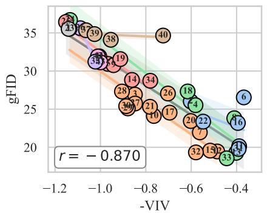

<details>
<summary>scatter</summary>

| Point | -VIV  | gFID |
|-------|-------|------|
| 1     | -1.15 | 36   |
| 2     | -1.10 | 35   |
| 3     | -1.05 | 34   |
| 4     | -0.95 | 33   |
| 5     | -1.00 | 32   |
| 6     | -0.40 | 27   |
| 7     | -0.55 | 23   |
| 8     | -1.05 | 31   |
| 9     | -1.00 | 30   |
| 10    | -0.90 | 28   |
| 11    | -0.45 | 21   |
| 12    | -0.60 | 24   |
| 13    | -0.95 | 26   |
| 14    | -0.85 | 29   |
| 15    | -0.65 | 22   |
| 16    | -0.40 | 24   |
| 17    | -0.75 | 25   |
| 18    | -0.65 | 27   |
| 19    | -0.90 | 31   |
| 20    | -0.60 | 26   |
| 21    | -0.80 | 24   |
| 22    | -0.55 | 23   |
| 23    | -0.45 | 20   |
| 24    | -1.05 | 33   |
| 25    | -0.70 | 27   |
| 26    | -0.65 | 28   |
| 27    | -0.85 | 26   |
| 28    | -0.95 | 27   |
| 29    | -1.00 | 32   |
| 30    | -0.90 | 28   |
| 31    | -0.65 | 23   |
| 32    | -0.55 | 21   |
| 33    | -0.45 | 19   |
| 34    | -0.75 | 29   |
| 35    | -1.00 | 31   |
| 36    | -1.10 | 34   |
| 37    | -0.95 | 33   |
| 38    | -1.05 | 34   |
| 39    | -1.00 | 33   |
| 40    | -0.85 | 35   |
R = -0.870
</details>

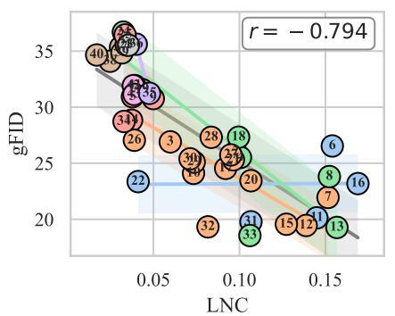

<details>
<summary>scatter</summary>

| LNC   | gFID  | Label |
|-------|-------|-------|
| 0.02  | 35    | 40    |
| 0.03  | 34    | 38    |
| 0.04  | 31    | 35    |
| 0.05  | 30    | 34    |
| 0.06  | 28    | 33    |
| 0.07  | 27    | 32    |
| 0.08  | 26    | 31    |
| 0.09  | 25    | 30    |
| 0.10  | 24    | 29    |
| 0.11  | 23    | 28    |
| 0.12  | 22    | 27    |
| 0.13  | 21    | 26    |
| 0.14  | 20    | 25    |
| 0.15  | 19    | 24    |
| 0.16  | 18    | 23    |
| 0.17  | 17    | 22    |
| 0.18  | 16    | 21    |
| 0.19  | 15    | 20    |
| 0.20  | 14    | 19    |
| 0.21  | 13    | 18    |
| 0.22  | 12    | 17    |
| 0.23  | 11    | 16    |
| 0.24  | 10    | 15    |
| 0.25  | 9     | 14    |
| 0.26  | 8     | 13    |
| 0.27  | 7     | 12    |
| 0.28  | 6     | 11    |
| 0.29  | 5     | 10    |
| 0.30  | 4     | 9     |
| 0.31  | 3     | 8     |
| 0.32  | 2     | 7     |
| 0.33  | 1     | 6     |
| 0.34  | -1    | -1    |
| 0.35  | -2    | -2    |
| 0.36  | -3    | -3    |
| 0.37  | -4    | -4    |
| 0.38  | -5    | -5    |
| 0.39  | -6    | -6    |
| 0.40  | -7    | -7    |
| 0.41  | -8    | -8    |
| 0.42  | -9    | -9    |
| 0.43  | -10   | -10   |
| 0.44  | -11   | -11   |
| 0.45  | -12   | -12   |
| 0.46  | -13   | -13   |
| 0.47  | -14   | -14   |
| 0.48  | -15   | -15   |
| 0.49  | -16   | -16   |
| 0.50  | -17   | -17   |
| 0.51  | -18   | -18   |
| 0.52  | -19   | -19   |
| 0.53  | -20   | -20   |
| 0.54  | -21   | -21   |
| 0.55  | -22   | -22   |
| 0.56  | -23   | -23   |
| 0.57  | -24   | -24   |
| 0.58  | -25   | -25   |
| 0.59  | -26   | -26   |
| 0.60  | -27   | -27   |
| 0.61  | -28   | -28   |
| 0.62  | -29   | -29   |
| 0.63  | -30   | -30   |
| 0.64  | -31   | -31   |
| 0.65  | -32   | -32   |
| 0.66  | -33   | -33   |
| 0.67  | -34   | -34   |
| 0.68  | -35   | -35   |
| 0.69  | -36   | -36   |
| 0.70  | -37   | -37   |
| 0.71  | -38   | -38   |
| 0.72  | -39   | -39   |
| 0.73  | -40   | -40   |
| 0.74  | -41   | -41   |
| 0.75  | -42   | -42   |
| 0.76  | -43   | -43   |
| 0.77  | -44   | -44   |
| 0.78  | -45   | -45   |
| 0.79  | -46   | -46   |
| 0.80  | -47   | -47   |
| 0.81  | -48   | -48   |
| 0.82  | -49   | -49   |
| 0.83  | -50   | -50   |
| 0.84  | -51   | -51   |
| 0.85  | -52   | -52   |
| 0.86  | -53   | -53   |
| 0.87  | -54   | -54   |
| 0.88  | -55   | -55   |
| 0.89  | -56   | -56   |
| 0.90  | -57   | -57   |
| 0.91  | -58   | -58   |
| 0.92  | -59   | -59   |
| 0.93  | -60   | -60   |
| 0.94  | -61   | -61   |
| 0.95  | -62   | -62   |
| 0.96  | -63   | -63   |
| 0.97  | -64   | -64   |
| 0.98  | -65   | -65   |
| 0.99  | -66   | -66   |
| 1.00  | -67   | -67   |
|          |       |       |
|          |       |       |
|          |       |       |
|          |       |       |
|          |       |       |
|          |       |       |
|          |       |       |
|          |       |       |
|          |       |       |
|          |       |       |
|          |       |       |
|          |       |       |
|          |       |       |
|          |       |       |
|          |       |       |
|
|          |       |       |
|          |       |       |
|          |       |       |
|          |       |       |
|          |       |       |
|          |       |       |
|          |       |       |
|          |       |       |
|          |       |       |
|          |       |       |
|          |       |       |
|          |       |       |
|          |       |       |
|          |       |       |
|                 =         /         /         /         /         /         /         /         /         /         /         /         /         /         /         /         /         /         /         /         /         /         /         /         /         /         /         /         /         /         /         /         /         /         /         /         /         /         /         /         /         /         /         /         /         /         /         /         /         /         /         (Note: The actual values may vary based on the provided code) in the provided code format.)
</details>

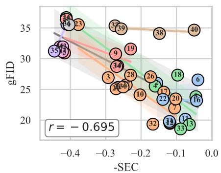

<details>
<summary>scatter</summary>

| Point | -SEC  | gFID |
|-------|-------|------|
| 1     | -0.42 | 34   |
| 2     | -0.41 | 35   |
| 3     | -0.28 | 28   |
| 4     | -0.18 | 27   |
| 5     | -0.15 | 26   |
| 6     | -0.05 | 24   |
| 7     | -0.12 | 22   |
| 8     | -0.10 | 21   |
| 9     | -0.25 | 30   |
| 10    | -0.22 | 25   |
| 11    | -0.08 | 23   |
| 12    | -0.07 | 22   |
| 13    | -0.06 | 21   |
| 14    | -0.40 | 33   |
| 15    | -0.38 | 32   |
| 16    | -0.03 | 23   |
| 17    | -0.14 | 25   |
| 18    | -0.09 | 28   |
| 19    | -0.24 | 35   |
| 20    | -0.11 | 27   |
| 21    | -0.13 | 26   |
| 22    | -0.16 | 24   |
| 23    | -0.37 | 36   |
| 24    | -0.43 | 37   |
| 25    | -0.36 | 36   |
| 26    | -0.17 | 26   |
| 27    | -0.19 | 25   |
| 28    | -0.26 | 27   |
| 29    | -0.28 | 26   |
| 30    | -0.27 | 25   |
| 31    | -0.39 | 34   |
| 32    | -0.19 | 24   |
| 33    | -0.11 | 23   |
| 34    | -0.41 | 33   |
| 35    | -0.40 | 31   |
| 36    | -0.44 | 34   |
| 37    | -0.29 | 35   |
| 38    | -0.15 | 34   |
| 39    | -0.27 | 36   |
| 40    | -0.05 | 34   |
The chart displays a scatter plot with a trendline indicated by the equation r = -0.695.
</details>

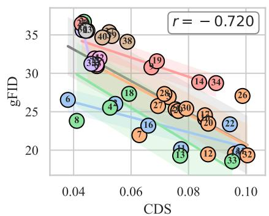

<details>
<summary>scatter</summary>

| Point | CDS    | gFID  |
|-------|--------|-------|
| 1     | 0.045  | 36.0  |
| 2     | 0.048  | 35.5  |
| 3     | 0.050  | 34.0  |
| 4     | 0.052  | 33.5  |
| 5     | 0.055  | 32.0  |
| 6     | 0.042  | 26.0  |
| 7     | 0.060  | 22.0  |
| 8     | 0.045  | 25.0  |
| 9     | 0.052  | 31.0  |
| 10    | 0.058  | 30.0  |
| 11    | 0.065  | 28.0  |
| 12    | 0.075  | 26.0  |
| 13    | 0.078  | 24.0  |
| 14    | 0.085  | 29.0  |
| 15    | 0.095  | 27.0  |
| 16    | 0.072  | 23.0  |
| 17    | 0.088  | 25.0  |
| 18    | 0.068  | 27.0  |
| 19    | 0.075  | 31.0  |
| 20    | 0.088  | 26.0  |
| 21    | 0.095  | 24.0  |
| 22    | 0.100  | 23.0  |
| 23    | 0.048  | 36.5  |
| 24    | 0.052  | 35.8  |
| 25    | 0.055  | 34.5  |
| 26    | 0.105  | 27.5  |
| 27    | 0.068  | 29.5  |
| 28    | 0.072  | 31.5  |
| 29    | 0.058  | 33.8  |
| 30    | 0.078  | 31.8  |
| 31    | 0.102  | 29.8  |
| 32    | 0.115  | 28.8  |
| 33    | 0.118  | 27.8  |
| 34    | 0.112  | 29.2  |
| 35    | 0.118  | 28.5   |
| 36    | 0.115  | 27.2   |
| 37    | 0.112  | 26.8   |
| 38    | 0.118  | 34.8   |
| Note: The data points are labeled numerically, but they are not explicitly provided in the image as they are not explicitly mentioned in the chart.
</details>

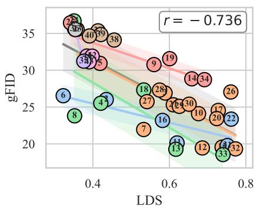

<details>
<summary>scatter</summary>

| Label | LDS  | gFID |
|-------|------|------|
| 1     | 0.4  | 35   |
| 2     | 0.35 | 36   |
| 3     | 0.4  | 34   |
| 4     | 0.45 | 25   |
| 5     | 0.45 | 31   |
| 6     | 0.35 | 26   |
| 7     | 0.55 | 22   |
| 8     | 0.35 | 27   |
| 9     | 0.6  | 31   |
| 10    | 0.65 | 28   |
| 11    | 0.65 | 20   |
| 12    | 0.7  | 24   |
| 13    | 0.65 | 19   |
| 14    | 0.65 | 29   |
| 15    | 0.75 | 23   |
| 16    | 0.55 | 24   |
| 17    | 0.75 | 25   |
| 18    | 0.6  | 28   |
| 19    | 0.65 | 31   |
| 20    | 0.75 | 26   |
| 21    | 0.75 | 24   |
| 22    | 0.75 | 23   |
| 23    | 0.75 | 22   |
| 24    | 0.75 | 21   |
| 25    | 0.75 | 20   |
| 26    | 0.75 | 28   |
| 27    | 0.55 | 26   |
| 28    | 0.65 | 29   |
| 29    | 0.65 | 30   |
| 30    | 0.65 | 31   |
| 31    | 0.65 | 32   |
| 32    | 0.75 | 28   |
| 33    | 0.75 | 24   |
| 34    | 0.65 | 30   |
| 35    | 0.45 | 33   |
| 36    | 0.45 | 34   |
| 37    | 0.45 | 35   |
| 38    | 0.45 | 34   |
| 39    | 0.45 | 34   |
| 40    | 0.45 | 34   |
| 41    | 0.45 | 34   |
| Note: The chart displays 'gFID' as the y-axis variable, but it is not explicitly labeled in the provided code. The labels are 'LDS' at the bottom of the chart.
</details>

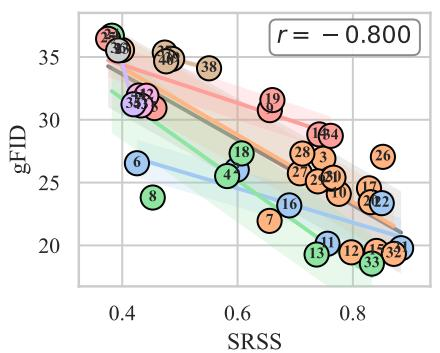

<details>
<summary>scatter</summary>

| Label | SRSS  | gFID  |
|-------|-------|-------|
| 1     | 0.45  | 36.0  |
| 2     | 0.47  | 35.5  |
| 3     | 0.48  | 35.0  |
| 4     | 0.58  | 27.0  |
| 5     | 0.49  | 34.0  |
| 6     | 0.43  | 25.0  |
| 7     | 0.65  | 22.0  |
| 8     | 0.42  | 24.0  |
| 9     | 0.68  | 31.0  |
| 10    | 0.72  | 30.0  |
| 11    | 0.75  | 21.0  |
| 12    | 0.80  | 20.0  |
| 13    | 0.78  | 20.0  |
| 14    | 0.62  | 27.0  |
| 15    | 0.82  | 23.0  |
| 16    | 0.68  | 23.0  |
| 17    | 0.76  | 25.0  |
| 18    | 0.60  | 27.0  |
| 19    | 0.74  | 31.0  |
| 20    | 0.78  | 29.0  |
| 21    | 0.79  | 28.0  |
| 22    | 0.81  | 24.0  |
| 23    | 0.83  | 23.0  |
| 24    | 0.84  | 22.0  |
| 25    | 0.85  | 21.0  |
| 26    | 0.86  | 23.0  |
| 27    | 0.73  | 25.0  |
| 28    | 0.77  | 26.0  |
| 29    | 0.79  | 27.0  |
| 30    | 0.80  | 28.0  |
| 31    | 0.81  | 29.0  |
| 32    | 0.82  | 30.0  |
| 33    | 0.83  | 31.0  |
| 34    | 0.45  | 34.0  |
| 35    | 0.46  | 35.0  |
| 36    | 0.47  | 36.0  |
| 37    | 0.48  | 35.5  |
| 38    | 0.55  | 35.5  |
| Note: The y-axis label 'gFID' is estimated based on the chart title and axis labels, but the data points are not explicitly provided in the image. The chart title and axis labels are in English.
</details>

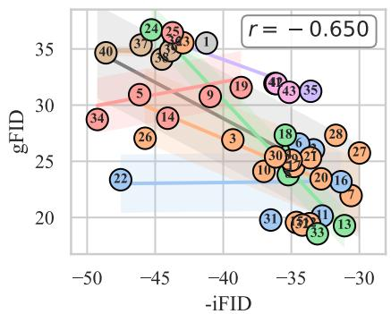

<details>
<summary>scatter</summary>

| Point | -iFID  | gFID  |
|-------|--------|-------|
| 1     | -42    | 35    |
| 2     | -48    | 34    |
| 3     | -47    | 33    |
| 4     | -38    | 32    |
| 5     | -46    | 31    |
| 6     | -35    | 29    |
| 7     | -31    | 28    |
| 8     | -36    | 27    |
| 9     | -40    | 30    |
| 10    | -37    | 26    |
| 11    | -33    | 25    |
| 12    | -34    | 24    |
| 13    | -32    | 23    |
| 14    | -43    | 31    |
| 15    | -45    | 30    |
| 16    | -36    | 29    |
| 17    | -37    | 28    |
| 18    | -35    | 27    |
| 19    | -40    | 32    |
| 20    | -36    | 26    |
| 21    | -34    | 25    |
| 22    | -48    | 22    |
| 23    | -44    | 36    |
| 24    | -45    | 35    |
| 25    | -43    | 34    |
| 26    | -46    | 31    |
| 27    | -31    | 27    |
| 28    | -34    | 26    |
| 29    | -35    | 25    |
| 30    | -36    | 24    |
| 31    | -37    | 23    |
| 32    | -38    | 22    |
| 33    | -36    | 21    |
| 34    | -47    | 29    |
| 35    | -34    | 32    |
| 36    | -45    | 31    |
| 37    | -46    | 30    |
| 38    | -44    | 29    |
| 39    | -45    | 28    |
| 40    | -48    | 35    |
| 41    | -36    | 32    |
| 42    | -37    | 31    |
| 43    | -35    | 30    |
| 44    | -36    | 29    |
| 45    | -45    | 28    |
| 46    | -46    | 27    |
| 47    | -47    | 26    |
| 48    | -48    | 25    |
| 49    | -49    | 24    |
| 50    | -50    | 23    |
| 51    | -37    | 22    |
| 52    | -36    | 21    |
| 53    | -35    | 20    |
| 54    | -36    | 19    |
| 55    | -37    | 18    |
| 56    | -38    | 17    |
| 57    | -39    | 16    |
| 58    | -40    | 15    |
| 59    | -41    | 14    |
| 60    | -42    | 13    |
| 61    | -43    | 12    |
| 62    | -44    | 11    |
| 63    | -45    | 10    |
| 64    | -46    | 9     |
| 65    | -47    | 8     |
| 66    | -48    | 7     |
| 67    | -49    | 6     |
| 68    | -50    | 5     |
| 69*   | -51*   | 4     |
| *R² = -0.650, y-axis not explicitly labeled; x-axis labels are estimated based on y-axis values. The chart displays a scatter plot with color-coded categories (red, orange, green, blue) and a linear regression line.
</details>

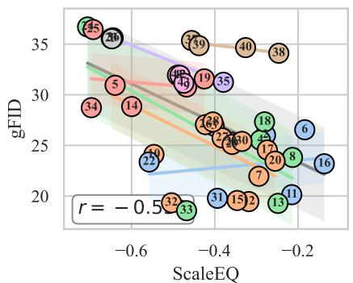

<details>
<summary>scatter</summary>

| Point | ScaleEQ | gFID |
|-------|---------|------|
| 1     | -0.6    | 34   |
| 2     | -0.6    | 35   |
| 3     | -0.4    | 39   |
| 4     | -0.4    | 43   |
| 5     | -0.6    | 31   |
| 6     | -0.2    | 26   |
| 7     | -0.3    | 24   |
| 8     | -0.2    | 23   |
| 9     | -0.4    | 35   |
| 10    | -0.6    | 22   |
| 11    | -0.2    | 20   |
| 12    | -0.4    | 25   |
| 13    | -0.3    | 21   |
| 14    | -0.6    | 33   |
| 15    | -0.4    | 26   |
| 16    | -0.2    | 24   |
| 17    | -0.3    | 25   |
| 18    | -0.3    | 27   |
| 19    | -0.4    | 31   |
| 20    | -0.3    | 24   |
| 21    | -0.4    | 28   |
| 22    | -0.6    | 29   |
| 23    | -0.4    | 27   |
| 24    | -0.4    | 30   |
| 25    | -0.6    | 36   |
| 26    | -0.6    | 36   |
| 27    | -0.4    | 31   |
| 28    | -0.4    | 33   |
| 29    | -0.4    | 34   |
| 30    | -0.4    | 30   |
| 31    | -0.4    | 29   |
| 32    | -0.5    | 28   |
| 33    | -0.5    | 28   |
| 34    | -0.6    | 34   |
| 35    | -0.4    | 35   |
| 36    | -0.4    | 35   |
| 37    | -0.4    | 35   |
| 38    | -0.2    | 38   |
| 39    | -0.4    | 35   |
| 40    | -0.4    | 35   |
| 41    | -0.4    | 35   |
| 42    | -0.4    | 35   |
| 43    | -0.4    | 35   |
| 44    | -0.4    | 35   |
| 45    | -0.4    | 35   |
| 46    | -0.4    | 35   |
| 47    | -0.4    | 35   |
| 48    | -0.4    | 35   |
| 49    | -0.4    | 35   |
| 50    | -0.4    | 35   |
| Note: The y-axis label 'gFID' is estimated based on the chart title and axis labels (e.g., 'ScaleEQ' or 'gFID'). The color legend is not explicitly provided in the image.
</details>

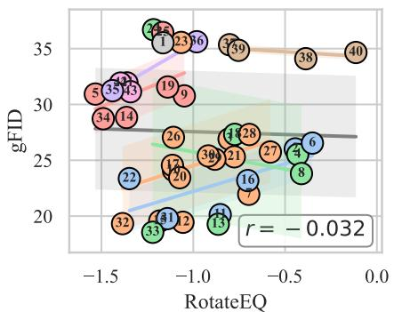

<details>
<summary>scatter</summary>

| Point | RotateEQ | gFID |
|-------|----------|------|
| 1     | -1.0     | 35   |
| 2     | -1.0     | 34   |
| 3     | -1.0     | 33   |
| 4     | -0.5     | 32   |
| 5     | -1.5     | 31   |
| 6     | -0.5     | 30   |
| 7     | -0.8     | 29   |
| 8     | -0.5     | 28   |
| 9     | -1.0     | 31   |
| 10    | -1.0     | 29   |
| 11    | -1.2     | 28   |
| 12    | -1.2     | 27   |
| 13    | -1.2     | 26   |
| 14    | -1.2     | 28   |
| 15    | -1.2     | 27   |
| 16    | -0.8     | 26   |
| 17    | -1.0     | 25   |
| 18    | -0.8     | 27   |
| 19    | -1.0     | 30   |
| 20    | -1.0     | 26   |
| 21    | -0.8     | 27   |
| 22    | -1.2     | 24   |
| 23    | -1.0     | 36   |
| 24    | -1.0     | 35   |
| 25    | -1.0     | 34   |
| 26    | -1.0     | 33   |
| 27    | -0.8     | 32   |
| 28    | -0.8     | 31   |
| 29    | -0.8     | 30   |
| 30    | -0.8     | 29   |
| 31    | -1.0     | 28   |
| 32    | -1.5     | 29   |
| 33    | -1.5     | 28   |
| 34    | -1.5     | 30   |
| 35    | -1.5     | 31   |
| 36    | -1.0     | 34   |
| 37    | -1.0     | 35   |
| 38    | -0.5     | 34   |
| 39    | -0.8     | 33   |
| 40    | -0.5     | 34   |
| 41    | -1.5     | 29   |
| 42    | -1.5     | 30   |
| 43    | -1.5     | 31   |
| 44    | -1.5     | 32   |
| 45    | -1.5     | 33   |
| 46    | -1.5     | 34   |
| 47    | -1.5     | 35   |
| 48    | -1.5     | 36   |
| 49    | -1.5     | 37   |
| 50    | -1.5     | 38   |
| Note: The values in the 'gFID' column are estimated based on the provided code snippet from the provided plot. The 'r' value is calculated as -0.032.
</details>

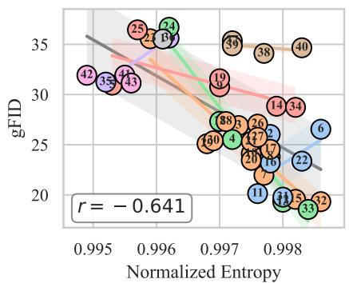

<details>
<summary>scatter</summary>

| Point | Normalized Entropy | gFID |
|-------|---------------------|------|
| 1     | 0.997               | 32   |
| 2     | 0.998               | 28   |
| 3     | 0.998               | 25   |
| 4     | 0.997               | 26   |
| 5     | 0.998               | 20   |
| 6     | 0.998               | 22   |
| 7     | 0.998               | 23   |
| 8     | 0.997               | 27   |
| 9     | 0.997               | 31   |
| 10    | 0.997               | 25   |
| 11    | 0.998               | 21   |
| 12    | 0.998               | 19   |
| 13    | 0.997               | 26   |
| 14    | 0.998               | 29   |
| 15    | 0.998               | 21   |
| 16    | 0.997               | 27   |
| 17    | 0.998               | 24   |
| 18    | 0.996               | 35   |
| 19    | 0.997               | 33   |
| 20    | 0.997               | 26   |
| 21    | 0.996               | 36   |
| 22    | 0.998               | 23   |
| 23    | 0.996               | 34   |
| 24    | 0.996               | 36   |
| 25    | 0.996               | 35   |
| 26    | 0.997               | 27   |
| 27    | 0.996               | 34   |
| 28    | 0.997               | 35   |
| 29    | 0.996               | 34   |
| 30    | 0.997               | 33   |
| 31    | 0.998               | 25   |
| 32    | 0.998               | 20   |
| 33    | 0.998               | 18   |
| 34    | 0.998               | 28   |
| 35    | 0.996               | 31   |
| 36    | 0.997               | 35   |
| 37    | 0.997               | 34   |
| 38    | 0.998               | 34   |
| 39    | 0.997               | 34   |
| 40    | 0.998               | 34   |
r = -0.641
</details>

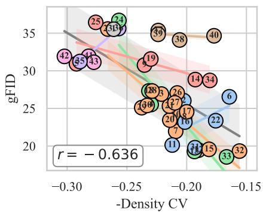

<details>
<summary>scatter</summary>

| Point | -Density CV | gFID |
|-------|-------------|------|
| 1     | -0.28       | 35   |
| 2     | -0.27       | 34   |
| 3     | -0.26       | 33   |
| 4     | -0.25       | 32   |
| 5     | -0.29       | 31   |
| 6     | -0.18       | 27   |
| 7     | -0.21       | 25   |
| 8     | -0.24       | 26   |
| 9     | -0.25       | 27   |
| 10    | -0.22       | 26   |
| 11    | -0.20       | 24   |
| 12    | -0.19       | 23   |
| 13    | -0.23       | 25   |
| 14    | -0.21       | 28   |
| 15    | -0.18       | 20   |
| 16    | -0.24       | 26   |
| 17    | -0.21       | 25   |
| 18    | -0.23       | 27   |
| 19    | -0.24       | 31   |
| 20    | -0.22       | 24   |
| 21    | -0.19       | 23   |
| 22    | -0.17       | 26   |
| 23    | -0.26       | 33   |
| 24    | -0.25       | 36   |
| 25    | -0.27       | 35   |
| 26    | -0.23       | 30   |
| 27    | -0.21       | 28   |
| 28    | -0.24       | 30   |
| 29    | -0.25       | 31   |
| 30    | -0.23       | 34   |
| 31    | -0.19       | 30   |
| 32    | -0.16       | 19   |
| 33    | -0.18       | 18   |
| 34    | -0.17       | 34   |
| 35    | -0.28       | 32   |
| 36    | -0.24       | 35   |
| 37    | -0.25       | 34   |
| 38    | -0.23       | 35   |
| 39    | -0.24       | 34   |
| 40    | -0.19       | 35   |
| 41    | -0.18       | 30   |
| 42    | -0.29       | 32   |
| 43    | -0.27       | 31   |
| 44    | -0.28       | 33   |
| 45    | -0.26       | 34   |
| 46    | -0.25       | 35   |
| 47    | -0.24       | 34   |
| 48    | -0.25       | 35   |
| 49    | -0.26       | 34   |
| 50    | -0.19       | 36   |
| Note: The y-axis label 'gFID' is estimated based on the provided code snippet in the image. The x-axis label 'Density CV' is not explicitly shown in the image but corresponds to the x-axis label 'Density'. The chart title is 'r = -0.636'.
</details>

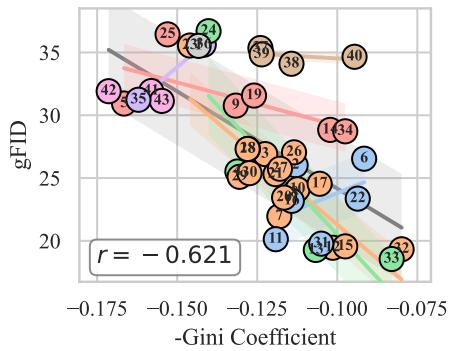

<details>
<summary>scatter</summary>

| Point | -Gini Coefficient | gFID |
|-------|-------------------|------|
| 1     | -0.100            | 34   |
| 2     | -0.150            | 35   |
| 3     | -0.125            | 27   |
| 4     | -0.150            | 38   |
| 5     | -0.125            | 39   |
| 6     | -0.100            | 36   |
| 7     | -0.125            | 24   |
| 8     | -0.125            | 26   |
| 9     | -0.125            | 31   |
| 10    | -0.125            | 25   |
| 11    | -0.125            | 22   |
| 12    | -0.100            | 23   |
| 13    | -0.125            | 28   |
| 14    | -0.100            | 30   |
| 15    | -0.100            | 29   |
| 16    | -0.100            | 27   |
| 17    | -0.100            | 30   |
| 18    | -0.125            | 26   |
| 19    | -0.125            | 30   |
| 20    | -0.125            | 27   |
| 21    | -0.125            | 24   |
| 22    | -0.100            | 31   |
| 23    | -0.150            | 36   |
| 24    | -0.150            | 37   |
| 25    | -0.150            | 35   |
| 26    | -0.150            | 33   |
| 27    | -0.125            | 34   |
| 28    | -0.125            | 36   |
| 29    | -0.125            | 38   |
| 30    | -0.125            | 39   |
| 31    | -0.150            | 37   |
| 32    | -0.075            | 34   |
| 33    | -0.075            | 32   |
| 34    | -0.100            | 34   |
| 35    | -0.150            | 32   |
| 36    | -0.150            | 34   |
| 37    | -0.150            | 36   |
| 38    | -0.125            | 38   |
| 39    | -0.125            | 39   |
| 40    | -0.100            | 36   |
| 41    | -0.150            | 34   |
| 42    | -0.175            | 32   |
| 43    | -0.150            | 34   |
| The chart displays a scatter plot with two distinct series of data points labeled 'gFID' and 'r'. The x-axis represents the -Gini Coefficient and the y-axis represents the gFID values for each data point. There are no labels or additional data series in this image.
</details>

Figure 11: SiT-B gFID with convolutional f16d32 tokenizer family.

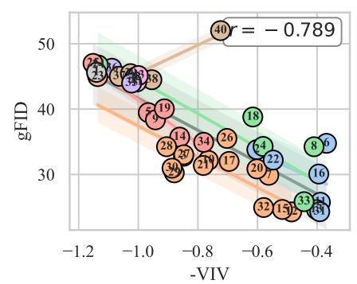

<details>
<summary>scatter</summary>

| Point | -VIV    | gFID  |
|-------|---------|-------|
| 1     | -1.15   | 48.0  |
| 2     | -1.10   | 46.0  |
| 3     | -1.05   | 45.0  |
| 4     | -0.95   | 43.0  |
| 5     | -0.90   | 41.0  |
| 6     | -0.85   | 39.0  |
| 7     | -0.80   | 37.0  |
| 8     | -0.75   | 35.0  |
| 9     | -0.70   | 33.0  |
| 10    | -0.65   | 31.0  |
| 11    | -0.60   | 29.0  |
| 12    | -0.55   | 27.0  |
| 13    | -0.50   | 25.0  |
| 14    | -0.45   | 23.0  |
| 15    | -0.40   | 21.0  |
| 16    | -0.35   | 19.0  |
| 17    | -0.30   | 17.0  |
| 18    | -0.25   | 15.0  |
| 19    | -0.20   | 13.0  |
| 20    | -0.15   | 11.0  |
| 21    | -0.10   | 9.0   |
| 22    | -0.05   | 7.0   |
| 23    | -0.12   | 5.0   |
| 24    | -0.18   | 3.0   |
| 25    | -0.22   | 1.0   |
| 26    | -0.28   | -1.0  |
| 27    | -0.32   | -3.0  |
| 28    | -0.38   | -5.0  |
| 29    | -0.42   | -7.0  |
| 30    | -0.48   | -9.0  |
| 31    | -0.52   | -11.0 |
| 32    | -0.58   | -13.0 |
| 33    | -0.62   | -15.0 |
| 34    | -0.68   | -17.0 |
| 35    | -0.72   | -19.0 |
| 36    | -0.78   | -21.0 |
| 37    | -0.82   | -23.0 |
| 38    | -0.88   | -25.0 |
| 39    | -0.92   | -27.0 |
| 40    | -0.98   | -29.0 |
| r     | -0.789   | -0.789|
</details>

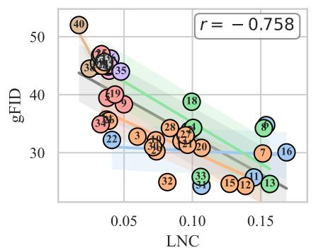

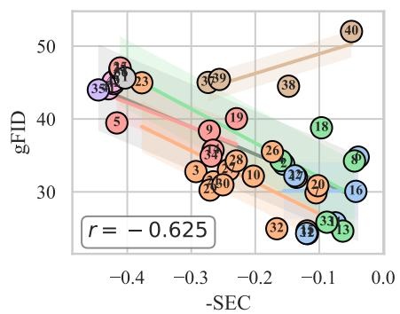

<details>
<summary>scatter</summary>

| Point | -SEC  | gFID |
|-------|-------|------|
| 1     | -0.4  | 48   |
| 2     | -0.35 | 47   |
| 3     | -0.25 | 35   |
| 4     | -0.3  | 40   |
| 5     | -0.45 | 40   |
| 6     | -0.35 | 38   |
| 7     | -0.2  | 35   |
| 8     | -0.1  | 32   |
| 9     | -0.25 | 38   |
| 10    | -0.2  | 35   |
| 11    | -0.15 | 32   |
| 12    | -0.1  | 30   |
| 13    | -0.05 | 28   |
| 14    | -0.1  | 25   |
| 15    | -0.35 | 45   |
| 16    | -0.05 | 30   |
| 17    | -0.25 | 35   |
| 18    | -0.1  | 38   |
| 19    | -0.2  | 40   |
| 20    | -0.15 | 35   |
| 21    | -0.1  | 32   |
| 22    | -0.05 | 30   |
| 23    | -0.35 | 45   |
| 24    | -0.25 | 40   |
| 25    | -0.15 | 35   |
| 26    | -0.1  | 38   |
| 27    | -0.25 | 35   |
| 28    | -0.15 | 38   |
| 29    | -0.35 | 45   |
| 30    | -0.25 | 40   |
| 31    | -0.15 | 35   |
| 32    | -0.1  | 32   |
| 33    | -0.05 | 28   |
| 34    | -0.25 | 38   |
| 35    | -0.4  | 48   |
| 36    | -0.35 | 45   |
| 37    | -0.25 | 48   |
| 38    | -0.15 | 45   |
| 39    | -0.25 | 48   |
| 40    | -0.05 | 50   |
The chart displays a scatter plot with a trend line and confidence interval bands around the data points. The x-axis represents -SEC values ranging from approximately -0.4 to 0.0, and the y-axis represents gFID values ranging from approximately -10 to +10. There is no legend or additional data series present.
</details>

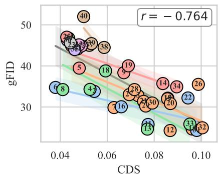

<details>
<summary>scatter</summary>

| Point | CDS    | gFID  |
|-------|--------|-------|
| 1     | 0.045  | 48.0  |
| 2     | 0.048  | 47.5  |
| 3     | 0.050  | 47.0  |
| 4     | 0.052  | 46.5  |
| 5     | 0.055  | 45.0  |
| 6     | 0.042  | 35.0  |
| 7     | 0.058  | 38.0  |
| 8     | 0.040  | 36.0  |
| 9     | 0.052  | 46.0  |
| 10    | 0.058  | 45.5  |
| 11    | 0.062  | 44.0  |
| 12    | 0.078  | 32.0  |
| 13    | 0.075  | 28.0  |
| 14    | 0.082  | 33.0  |
| 15    | 0.085  | 31.0  |
| 16    | 0.068  | 31.0  |
| 17    | 0.072  | 32.0  |
| 18    | 0.065  | 39.0  |
| 19    | 0.068  | 38.0  |
| 20    | 0.088  | 32.0  |
| 21    | 0.092  | 31.0  |
| 22    | 0.095  | 33.0  |
| 23    | 0.102  | 27.0  |
| 24    | 0.105  | 26.0  |
| 25    | 0.108  | 25.0  |
| 26    | 0.112  | 26.0  |
| 27    | 0.115  | 27.0  |
| 28    | 0.118  | 28.0  |
| 29    | 0.122  | 29.0  |
| 30    | 0.125  | 30.0  |
| 31    | 0.128  | 31.0  |
| 32    | 0.132  | 32.0  |
| 33    | 0.135  | 33.0  |
| 34    | 0.138  | 34.0  |
| 35    | 0.142  | 35.0  |
| 36    | 0.145  | 36.0  |
| 37    | 0.148  | 37.0  |
| 38    | 0.152  | 38.0  |
| 39    | 0.155  | 39.0  |
| 40    | 0.158  | 49.0  |
| r     | -      | -     |
</details>

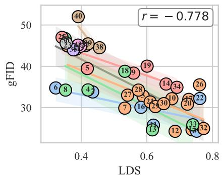

<details>
<summary>scatter</summary>

| LDS  | gFID | Label |
|------|------|-------|
| 0.35 | 48   | 25    |
| 0.36 | 47   | 24    |
| 0.37 | 46   | 23    |
| 0.38 | 45   | 22    |
| 0.39 | 44   | 21    |
| 0.40 | 43   | 20    |
| 0.41 | 42   | 19    |
| 0.42 | 41   | 18    |
| 0.43 | 40   | 17    |
| 0.44 | 39   | 16    |
| 0.45 | 38   | 15    |
| 0.46 | 37   | 14    |
| 0.47 | 36   | 13    |
| 0.48 | 35   | 12    |
| 0.49 | 34   | 11    |
| 0.50 | 33   | 10    |
| 0.51 | 32   | 9     |
| 0.52 | 31   | 8     |
| 0.53 | 30   | 7     |
| 0.54 | 29   | 6     |
| 0.55 | 28   | 5     |
| 0.56 | 27   | 4     |
| 0.57 | 26   | 3     |
| 0.58 | 25   | 2     |
| 0.59 | 24   | 1     |
| 0.60 | 23   | 0     |
| 0.61 | 22   | -1    |
| 0.62 | 21   | -2    |
| 0.63 | 20   | -3    |
| 0.64 | 19   | -4    |
| 0.65 | 18   | -5    |
| 0.66 | 17   | -6    |
| 0.67 | 16   | -7    |
| 0.68 | 15   | -8    |
| 0.69 | 14   | -9    |
| 0.70 | 13   | -10   |
| 0.71 | 12   | -11   |
| 0.72 | 11   | -12   |
| 0.73 | 10   | -13   |
| 0.74 | 9    | -14   |
| 0.75 | 8    | -15   |
| 0.76 | 7    | -16   |
| 0.77 | 6    | -17   |
| 0.78 | 5    | -18   |
| 0.79 | 4    | -19   |
| 0.80 | 3    | -20   |
| 0.81 | 2    | -21   |
| 0.82 | 1    | -22   |
| 0.83 | 0    | -23   |
| 0.84 | -1   | -24   |
| 0.85 | -2   | -25   |
| 0.86 | -3   | -26   |
| 0.87 | -4   | -27   |
| 0.88 | -5   | -28   |
| 0.89 | -6   | -29   |
| 0.90 | -7   | -30   |
| 0.91 | -8   | -31   |
| 0.92 | -9   | -32   |
| 0.93 | -10  | -33   |
| 0.94 | -11  | -34   |
| 0.95 | -12  | -35   |
| 0.96 | -13  | -36   |
| 0.97 | -14  | -37   |
| 0.98 | -15  | -38   |
| 0.99 | -16  | -39   |
| 1.00 | -17  | -40   |
| —    | —    | —     |
| —    | —    | —     |
| —    | —    | —     |
| —    | —    | —     |
| —    | —    | —     |
| —    | —    | —     |
| —    | —    | —     |
| —    | —    | —     |
| —    | —    | —     |
| —    | —    | —     |
| —    | —    | —      |
| —    | —    | —      |
| —    | —    | —      |
| —    | —    | —      |
| —    | —    | —      |
| —    | —    | —      |
| —    | —    | —      |
| —    | —    | —      |
| —    | —    | —      |
| —    | —    | —      |
| —    | —    | —:
</details>

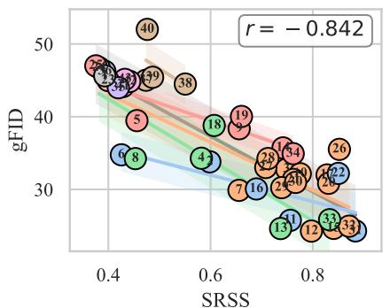

<details>
<summary>scatter</summary>

| Point | SRSS  | gFID |
|-------|-------|------|
| 1     | 0.45  | 47   |
| 2     | 0.42  | 46   |
| 3     | 0.43  | 45   |
| 4     | 0.48  | 40   |
| 5     | 0.49  | 38   |
| 6     | 0.47  | 36   |
| 7     | 0.65  | 35   |
| 8     | 0.45  | 35   |
| 9     | 0.68  | 39   |
| 10    | 0.72  | 37   |
| 11    | 0.75  | 36   |
| 12    | 0.78  | 34   |
| 13    | 0.76  | 33   |
| 14    | 0.79  | 32   |
| 15    | 0.80  | 31   |
| 16    | 0.77  | 30   |
| 17    | 0.74  | 29   |
| 18    | 0.62  | 38   |
| 19    | 0.66  | 39   |
| 20    | 0.76  | 36   |
| 21    | 0.79  | 35   |
| 22    | 0.81  | 34   |
| 23    | 0.82  | 33   |
| 24    | 0.83  | 32   |
| 25    | 0.84  | 31   |
| 26    | 0.85  | 30   |
| 27    | 0.86  | 29   |
| 28    | 0.87  | 28   |
| 29    | 0.45  | 48   |
| 30    | 0.75  | 36   |
| 31    | 0.78  | 35   |
| 32    | 0.80  | 34   |
| 33    | 0.81  | 33   |
| 34    | 0.82  | 32   |
| 35    | 0.83  | 31   |
| 36    | 0.84  | 30   |
| 37    | 0.85  | 29   |
| 38    | 0.48  | 46   |
| 39    | 0.49  | 45   |
| 40    | 0.47  | 51   |
|       |       |      |
The data points are labeled numerically in the chart. The x-axis is labeled 'SRSS' and the y-axis is labeled 'gFID'. There is no additional data series or labels present.
</details>

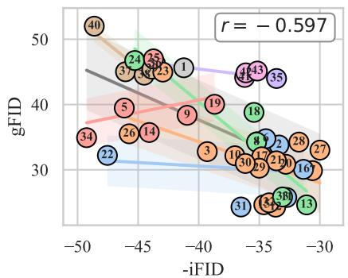

<details>
<summary>scatter</summary>

| Point | -iFID  | gFID  |
|-------|--------|-------|
| 1     | -42    | 45    |
| 2     | -38    | 40    |
| 3     | -36    | 35    |
| 4     | -48    | 50    |
| 5     | -46    | 40    |
| 6     | -44    | 45    |
| 7     | -36    | 35    |
| 8     | -34    | 30    |
| 9     | -40    | 40    |
| 10    | -36    | 35    |
| 11    | -34    | 30    |
| 12    | -32    | 25    |
| 13    | -30    | 20    |
| 14    | -44    | 40    |
| 15    | -42    | 45    |
| 16    | -32    | 30    |
| 17    | -36    | 35    |
| 18    | -34    | 30    |
| 19    | -38    | 40    |
| 20    | -36    | 35    |
| 21    | -34    | 30    |
| 22    | -48    | 30    |
| 23    | -42    | 45    |
| 24    | -42    | 45    |
| 25    | -38    | 40    |
| 26    | -46    | 35    |
| 27    | -32    | 25    |
| 28    | -34    | 20    |
| 29    | -36    | 25    |
| 30    | -32    | 20    |
| 31    | -36    | 25    |
| 32    | -34    | 20    |
| 33    | -36    | 25    |
| 34    | -48    | 35    |
| 35    | -32    | 45    |
| 36    | -36    | 30    |
| 37    | -42    | 40    |
| 38    | -40    | 40    |
| 39    | -40    | 40    |
| 40    | -48    | 50    |
| 41*   | -36*   | 45*   |
| r = -0.597 |        |       |
</details>

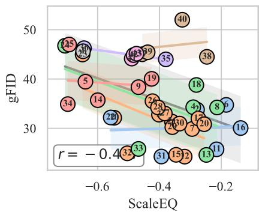

<details>
<summary>scatter</summary>

| Point | ScaleEQ | gFID |
|-------|---------|------|
| 1     | -0.65   | 48   |
| 2     | -0.55   | 38   |
| 3     | -0.5    | 35   |
| 4     | -0.45   | 32   |
| 5     | -0.5    | 40   |
| 6     | -0.2    | 30   |
| 7     | -0.4    | 33   |
| 8     | -0.15   | 31   |
| 9     | -0.45   | 39   |
| 10    | -0.6    | 47   |
| 11    | -0.25   | 30   |
| 12    | -0.35   | 28   |
| 13    | -0.2    | 27   |
| 14    | -0.55   | 36   |
| 15    | -0.4    | 31   |
| 16    | -0.1    | 29   |
| 17    | -0.3    | 30   |
| 18    | -0.25   | 38   |
| 19    | -0.45   | 37   |
| 20    | -0.4    | 34   |
| 21    | -0.5    | 33   |
| 22    | -0.55   | 32   |
| 23    | -0.6    | 45   |
| 24    | -0.45   | 39   |
| 25    | -0.6    | 46   |
| 26    | -0.5    | 44   |
| 27    | -0.4    | 36   |
| 28    | -0.35   | 37   |
| 29    | -0.45   | 38   |
| 30    | -0.3    | 31   |
| 31    | -0.4    | 29   |
| 32    | -0.5    | 33   |
| 33    | -0.45   | 28   |
| 34    | -0.55   | 34   |
| 35    | -0.4    | 44   |
| 36    | -0.3    | 42   |
| 37    | -0.45   | 39   |
| 38    | -0.25   | 47   |
| 39    | -0.4    | 45   |
| 40    | -0.25   | 52   |
r = -0.4
</details>

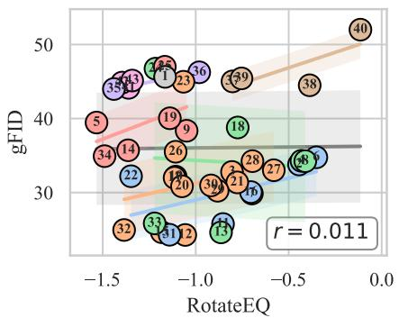

<details>
<summary>scatter</summary>

| Point | RotateEQ | gFID |
|-------|----------|------|
| 1     | -1.2     | 45   |
| 2     | -1.1     | 38   |
| 3     | -1.3     | 42   |
| 4     | -1.4     | 47   |
| 5     | -1.5     | 39   |
| 6     | -1.6     | 44   |
| 7     | -1.7     | 46   |
| 8     | -0.8     | 35   |
| 9     | -1.0     | 39   |
| 10    | -1.1     | 37   |
| 11    | -1.2     | 36   |
| 12    | -1.3     | 32   |
| 13    | -1.4     | 28   |
| 14    | -1.5     | 36   |
| 15    | -0.9     | 30   |
| 16    | -0.7     | 33   |
| 17    | -0.8     | 34   |
| 18    | -0.6     | 38   |
| 19    | -1.0     | 40   |
| 20    | -1.1     | 37   |
| 21    | -0.9     | 35   |
| 22    | -1.3     | 32   |
| 23    | -1.2     | 43   |
| 24    | -1.4     | 45   |
| 25    | -1.5     | 46   |
| 26    | -1.0     | 44   |
| 27    | -0.8     | 36   |
| 28    | -0.7     | 37   |
| 29    | -0.9     | 45   |
| 30    | -0.8     | 46   |
| 31    | -1.2     | 35   |
| 32    | -1.5     | 28   |
| 33    | -1.3     | 27   |
| 34    | -1.4     | 36   |
| 35    | -1.5     | 44   |
| 36    | -1.0     | 45   |
| 37    | -0.9     | 46   |
| 38    | -0.5     | 38   |
| 39    | -0.8     | 45   |
| 40    | -0.1     | 50   |
The chart displays a scatter plot with two distinct groups of data points (labeled as '5' and '1') plotted against the x-axis (RotateEQ) and y-axis (gFID). The data points are color-coded and labeled with numbers (e.g., '5', '1', etc.). A linear regression line with slope r = 0.011 is shown for reference.
</details>

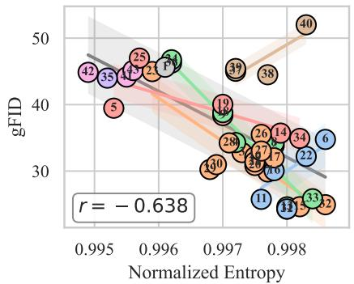

<details>
<summary>scatter</summary>

| Point | Normalized Entropy | gFID |
|-------|---------------------|------|
| 1     | 0.995               | 45   |
| 2     | 0.996               | 47   |
| 3     | 0.997               | 40   |
| 4     | 0.998               | 50   |
| 5     | 0.995               | 40   |
| 6     | 0.998               | 35   |
| 7     | 0.997               | 30   |
| 8     | 0.998               | 32   |
| 9     | 0.996               | 45   |
| 10    | 0.997               | 30   |
| 11    | 0.998               | 25   |
| 12    | 0.995               | 45   |
| 13    | 0.996               | 40   |
| 14    | 0.997               | 35   |
| 15    | 0.998               | 30   |
| 16    | 0.997               | 32   |
| 17    | 0.998               | 30   |
| 18    | 0.997               | 35   |
| 19    | 0.996               | 40   |
| 20    | 0.997               | 30   |
| 21    | 0.998               | 35   |
| 22    | 0.997               | 32   |
| 23    | 0.996               | 45   |
| 24    | 0.997               | 35   |
| 25    | 0.996               | 45   |
| 26    | 0.997               | 35   |
| 27    | 0.998               | 30   |
| 28    | 0.997               | 35   |
| 29    | 0.996               | 40   |
| 30    | 0.997               | 30   |
| 31    | 0.998               | 35   |
| 32    | 0.996               | 45   |
| 33    | 0.998               | 35   |
| 34    | 0.997               | 32   |
| 35    | 0.996               | 45   |
| 36    | 0.997               | 35   |
| 37    | 0.998               | 30   |
| 38    | 0.997               | 45   |
| 39    | 0.996               | 40   |
| 40    | 0.998               | 50   |
r = -0.638
</details>

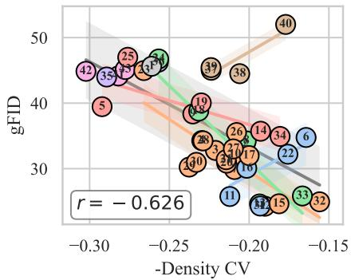

<details>
<summary>scatter</summary>

| Point | -Density CV | gFID |
|-------|-------------|------|
| 1     | -0.28       | 42   |
| 2     | -0.27       | 35   |
| 3     | -0.26       | 43   |
| 4     | -0.25       | 49   |
| 5     | -0.29       | 40   |
| 6     | -0.19       | 36   |
| 7     | -0.21       | 38   |
| 8     | -0.24       | 39   |
| 9     | -0.22       | 37   |
| 10    | -0.23       | 30   |
| 11    | -0.20       | 31   |
| 12    | -0.19       | 33   |
| 13    | -0.21       | 34   |
| 14    | -0.20       | 35   |
| 15    | -0.18       | 32   |
| 16    | -0.21       | 32   |
| 17    | -0.20       | 36   |
| 18    | -0.23       | 38   |
| 19    | -0.24       | 39   |
| 20    | -0.22       | 37   |
| 21    | -0.21       | 35   |
| 22    | -0.19       | 34   |
| 23    | -0.20       | 36   |
| 24    | -0.21       | 37   |
| 25    | -0.27       | 45   |
| 26    | -0.21       | 35   |
| 27    | -0.20       | 36   |
| 28    | -0.21       | 37   |
| 29    | -0.21       | 38   |
| 30    | -0.21       | 39   |
| 31    | -0.19       | 36   |
| 32    | -0.17       | 35   |
| 33    | -0.18       | 37   |
| 34    | -0.19       | 38   |
| 35    | -0.27       | 45   |
| 36    | -0.21       | 45   |
| 37    | -0.21       | 45   |
| 38    | -0.21       | 45   |
| 39    | -0.21       | 45   |
| 40    | -0.19       | 55   |
r = -0.626
</details>

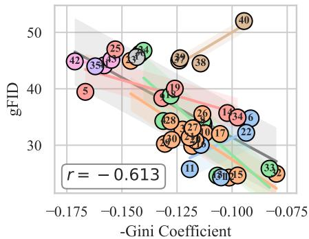

<details>
<summary>scatter</summary>

| Point | -Gini Coefficient | gFID |
|-------|-------------------|------|
| 1     | -0.145            | 42   |
| 2     | -0.140            | 43   |
| 3     | -0.135            | 44   |
| 4     | -0.130            | 45   |
| 5     | -0.125            | 40   |
| 6     | -0.110            | 38   |
| 7     | -0.105            | 39   |
| 8     | -0.100            | 37   |
| 9     | -0.095            | 36   |
| 10    | -0.090            | 35   |
| 11    | -0.085            | 34   |
| 12    | -0.080            | 33   |
| 13    | -0.075            | 32   |
| 14    | -0.070            | 31   |
| 15    | -0.065            | 30   |
| 16    | -0.060            | 29   |
| 17    | -0.055            | 28   |
| 18    | -0.050            | 27   |
| 19    | -0.045            | 26   |
| 20    | -0.040            | 25   |
| 21    | -0.035            | 24   |
| 22    | -0.030            | 23   |
| 23    | -0.025            | 22   |
| 24    | -0.020            | 21   |
| 25    | -0.015            | 20   |
| 26    | -0.010            | 19   |
| 27    | -0.005            | 18   |
| 28    | 0.0               | 17   |
| 29    | 0.0               | 16   |
| 30    | 0.0               | 15   |
| 31    | 0.0               | 14   |
| 32    | 0.0               | 13   |
| 33    | 0.0               | 12   |
| 34    | 0.0               | 11   |
| 35    | -0.145            | 43   |
| 36    | -0.140            | 44   |
| 37    | -0.135            | 45   |
| 38    | -0.130            | 46   |
| 39    | -0.125            | 47   |
| 40    | -0.120            | 48   |
| Note: The y-axis label 'gFID' is estimated based on the provided code snippet in the chart, not explicitly provided in the original image. The color of the markers is based on the y-axis label 'gFID'. The title 'r' indicates the variable 'r' with a value of -0.613.
</details>

Figure 12: SiT-XL gFID with convolutional f16d32 tokenizer family.

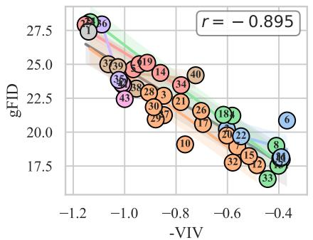

<details>
<summary>scatter</summary>

| Point | -VIV    | gFID   |
|-------|---------|--------|
| 1     | -1.15   | 27.5   |
| 2     | -1.10   | 27.3   |
| 3     | -1.05   | 26.8   |
| 4     | -0.95   | 25.5   |
| 5     | -0.90   | 25.0   |
| 6     | -0.40   | 20.5   |
| 7     | -0.85   | 22.0   |
| 8     | -0.45   | 18.5   |
| 9     | -1.00   | 24.5   |
| 10    | -0.80   | 19.5   |
| 11    | -1.05   | 24.0   |
| 12    | -0.65   | 19.0   |
| 13    | -0.70   | 23.5   |
| 14    | -0.90   | 24.5   |
| 15    | -0.60   | 18.0   |
| 16    | -1.10   | 27.8   |
| 17    | -0.75   | 21.5   |
| 18    | -0.95   | 23.0   |
| 19    | -0.85   | 24.8   |
| 20    | -0.65   | 20.0   |
| 21    | -0.80   | 22.5   |
| 22    | -0.60   | 19.5   |
| 23    | -0.45   | 17.5   |
| 24    | -0.70   | 23.8   |
| 25    | -0.90   | 24.2   |
| 26    | -0.75   | 21.8   |
| 27    | -0.85   | 23.2   |
| 28    | -0.95   | 23.5   |
| 29    | -0.80   | 23.8   |
| 30    | -0.70   | 23.0   |
| 31    | -0.90   | 24.5   |
| 32    | -0.65   | 19.8   |
| 33    | -0.40   | 17.8   |
| 34    | -0.78   | 23.5   |
| 35    | -1.00   | 23.8   |
| 36    | -1.12   | 27.5   |
| 37    | -1.08   | 24.8   |
| 38    | -0.98   | 24.5   |
| 39    | -1.02   | 24.8   |
| 40    | -0.78   | 23.8   |
| Note: The y-axis label 'gFID' is estimated based on the provided code snippet in the chart.
</details>

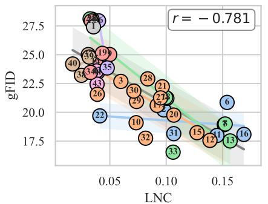

<details>
<summary>scatter</summary>

| Label | LNC    | gFID   |
|-------|--------|--------|
| 1     | 0.04   | 27.5   |
| 2     | 0.04   | 26.0   |
| 3     | 0.05   | 24.0   |
| 4     | 0.05   | 23.0   |
| 5     | 0.05   | 22.0   |
| 6     | 0.15   | 19.0   |
| 7     | 0.15   | 18.0   |
| 8     | 0.15   | 17.5   |
| 9     | 0.05   | 25.0   |
| 10    | 0.07   | 22.0   |
| 11    | 0.12   | 21.0   |
| 12    | 0.13   | 20.0   |
| 13    | 0.15   | 19.0   |
| 14    | 0.15   | 18.5   |
| 15    | 0.12   | 18.0   |
| 16    | 0.15   | 17.5   |
| 17    | 0.12   | 18.5   |
| 18    | 0.12   | 19.5   |
| 19    | 0.05   | 24.5   |
| 20    | 0.10   | 21.5   |
| 21    | 0.10   | 22.5   |
| 22    | 0.05   | 23.5   |
| 23    | 0.05   | 24.5   |
| 24    | 0.05   | 25.5   |
| 25    | 0.05   | 26.5   |
| 26    | 0.07   | 27.5   |
| 27    | 0.07   | 26.5   |
| 28    | 0.08   | 25.5   |
| 29    | 0.08   | 24.5   |
| 30    | 0.08   | 23.5   |
| 31    | 0.10   | 22.5   |
| 32    | 0.07   | 23.5   |
| 33    | 0.10   | 21.5   |
| 34    | 0.05   | 24.5   |
| 35    | 0.06   | 23.5   |
| 36    | 0.06   | 24.5   |
| 37    | 0.06   | 25.5   |
| 38    | 0.06   | 26.5   |
| 39    | 0.06   | 27.5   |
| 40    | 0.04   | 24.5   |
| Note: The y-axis label 'gFID' is estimated based on the provided code snippet in the chart.
</details>

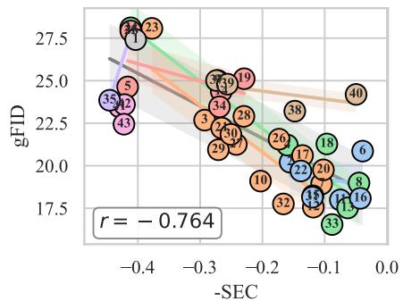

<details>
<summary>scatter</summary>

| Point | -SEC  | gFID |
|-------|-------|------|
| 1     | -0.38 | 27.5 |
| 2     | -0.35 | 27.0 |
| 3     | -0.28 | 22.5 |
| 4     | -0.32 | 23.0 |
| 5     | -0.36 | 24.0 |
| 6     | -0.05 | 24.5 |
| 7     | -0.10 | 21.0 |
| 8     | -0.08 | 19.5 |
| 9     | -0.25 | 25.0 |
| 10    | -0.18 | 19.0 |
| 11    | -0.12 | 18.5 |
| 12    | -0.15 | 18.0 |
| 13    | -0.10 | 17.5 |
| 14    | -0.08 | 17.8 |
| 15    | -0.12 | 18.2 |
| 16    | -0.05 | 19.2 |
| 17    | -0.15 | 20.5 |
| 18    | -0.08 | 21.0 |
| 19    | -0.22 | 24.5 |
| 20    | -0.10 | 21.5 |
| 21    | -0.18 | 20.8 |
| 22    | -0.15 | 20.2 |
| 23    | -0.35 | 27.8 |
| 24    | -0.33 | 24.8 |
| 25    | -0.37 | 23.5 |
| 26    | -0.18 | 21.8 |
| 27    | -0.25 | 22.5 |
| 28    | -0.22 | 23.8 |
| 29    | -0.28 | 24.2 |
| 30    | -0.23 | 23.5 |
| 31    | -0.30 | 24.8 |
| 32    | -0.15 | 21.8 |
| 33    | -0.08 | 19.5 |
| 34    | -0.25 | 24.5 |
| 35    | -0.35 | 23.8 |
| 36    | -0.33 | 24.2 |
| 37    | -0.37 | 24.8 |
| 38    | -0.15 | 24.5 |
| 39    | -0.28 | 24.8 |
| 40    | -0.05 | 24.5 |
The chart displays a scatter plot with a linear regression line (r = -0.764). The x-axis represents -SEC and the y-axis represents gFID.
</details>

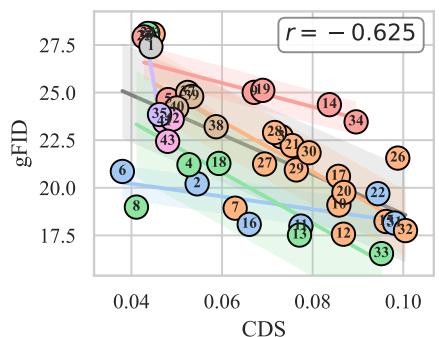

<details>
<summary>scatter</summary>

| Point | CDS    | gFID   |
|-------|--------|--------|
| 1     | 0.045  | 27.5   |
| 2     | 0.055  | 24.0   |
| 3     | 0.058  | 23.5   |
| 4     | 0.058  | 22.0   |
| 5     | 0.058  | 24.5   |
| 6     | 0.042  | 21.0   |
| 7     | 0.062  | 23.0   |
| 8     | 0.042  | 19.5   |
| 9     | 0.068  | 25.0   |
| 10    | 0.058  | 24.5   |
| 11    | 0.068  | 23.5   |
| 12    | 0.085  | 19.0   |
| 13    | 0.078  | 18.5   |
| 14    | 0.088  | 24.5   |
| 15    | 0.092  | 19.5   |
| 16    | 0.068  | 21.5   |
| 17    | 0.082  | 23.5   |
| 18    | 0.068  | 22.5   |
| 19    | 0.078  | 23.5   |
| 20    | 0.088  | 19.5   |
| 21    | 0.078  | 23.5   |
| 22    | 0.092  | 19.5   |
| 23    | 0.078  | 18.5   |
| 24    | 0.078  | 19.5   |
| 25    | 0.092  | 19.5   |
| 26    | 0.098  | 19.5   |
| 27    | 0.068  | 23.5   |
| 28    | 0.068  | 24.5   |
| 29    | 0.078  | 23.5   |
| 30    | 0.078  | 23.5   |
| 31    | 0.078  | 23.5   |
| 32    | 0.102  | 19.5   |
| 33    | 0.078  | 18.5   |
| 34    | 0.088  | 24.5   |
| r     | -      | -      |
</details>

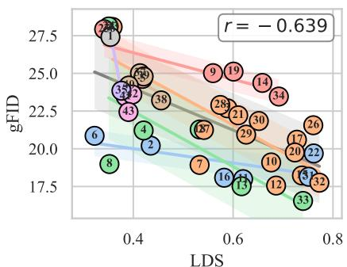

<details>
<summary>scatter</summary>

| Label | LDS    | gFID   |
|-------|--------|--------|
| 1     | 0.35   | 27.5   |
| 2     | 0.42   | 20.5   |
| 3     | 0.41   | 23.0   |
| 4     | 0.43   | 21.0   |
| 5     | 0.40   | 24.0   |
| 6     | 0.38   | 21.0   |
| 7     | 0.58   | 22.0   |
| 8     | 0.39   | 19.5   |
| 9     | 0.59   | 25.0   |
| 10    | 0.68   | 23.0   |
| 11    | 0.72   | 21.0   |
| 12    | 0.69   | 22.0   |
| 13    | 0.65   | 19.0   |
| 14    | 0.67   | 24.0   |
| 15    | 0.63   | 23.0   |
| 16    | 0.61   | 18.5   |
| 17    | 0.75   | 21.0   |
| 18    | 0.58   | 23.0   |
| 19    | 0.60   | 25.0   |
| 20    | 0.73   | 22.0   |
| 21    | 0.65   | 24.0   |
| 22    | 0.74   | 21.0   |
| 23    | 0.76   | 19.5   |
| 24    | 0.36   | 27.5   |
| 25    | 0.37   | 24.0   |
| 26    | 0.78   | 23.0   |
| 27    | 0.39   | 22.0   |
| 28    | 0.41   | 23.0   |
| 29    | 0.61   | 24.0   |
| 30    | 0.63   | 23.0   |
| 31    | 0.74   | 21.0   |
| 32    | 0.77   | 19.5   |
| 33    | 0.68   | 18.5   |
| 34    | 0.69   | 24.0   |
| 35    | 0.43   | 23.0   |
| 36    | 0.44   | 24.0   |
| 37    | 0.45   | 23.0   |
| 38    | 0.46   | 23.0   |
| 39    | 0.47   | 24.0   |
| 40    | 0.48   | 23.0   |
| 41    | 0.49   | 24.0   |
| 42    | 0.50   | 23.0   |
| 43    | 0.47   | 23.0   |
| Note: The y-axis label 'gFID' is estimated based on the provided code snippet, not explicitly shown in the image.
</details>

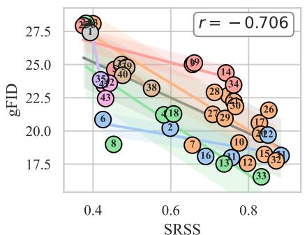

<details>
<summary>scatter</summary>

| Label | SRSS  | gFID  |
|-------|-------|-------|
| 1     | 0.4   | 28.0  |
| 2     | 0.5   | 23.0  |
| 3     | 0.5   | 24.0  |
| 4     | 0.5   | 25.0  |
| 5     | 0.6   | 22.0  |
| 6     | 0.5   | 21.0  |
| 7     | 0.7   | 21.0  |
| 8     | 0.4   | 19.0  |
| 9     | 0.6   | 24.0  |
| 10    | 0.8   | 21.0  |
| 11    | 0.8   | 20.0  |
| 12    | 0.8   | 19.0  |
| 13    | 0.7   | 18.0  |
| 14    | 0.8   | 23.0  |
| 15    | 0.8   | 21.0  |
| 16    | 0.7   | 20.0  |
| 17    | 0.8   | 20.0  |
| 18    | 0.6   | 21.0  |
| 19    | 0.5   | 24.0  |
| 20    | 0.8   | 21.0  |
| 21    | 0.8   | 20.0  |
| 22    | 0.8   | 19.0  |
| 23    | 0.4   | 25.0  |
| 24    | 0.4   | 26.0  |
| 25    | 0.5   | 27.0  |
| 26    | 0.8   | 21.0  |
| 27    | 0.7   | 23.0  |
| 28    | 0.7   | 24.0  |
| 29    | 0.7   | 23.0  |
| 30    | 0.8   | 23.0  |
| 31    | 0.7   | 21.0  |
| 32    | 0.8   | 21.0  |
| 33    | 0.8   | 19.0  |
| 34    | 0.8   | 23.0  |
| 35    | 0.4   | 24.0  |
| 36    | 0.5   | 25.0  |
| 37    | 0.6   | 24.0  |
| 38    | 0.6   | 23.0  |
| 39    | 0.5   | 24.0  |
| 40    | 0.5   | 25.0  |
| Note: The y-axis label 'gFID' is estimated based on the chart title and data series not explicitly provided in the image.
</details>

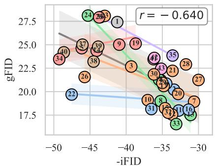

<details>
<summary>scatter</summary>

| Point | -iFID  | gFID  |
|-------|--------|-------|
| 1     | -42    | 27.5  |
| 2     | -43    | 28.0  |
| 3     | -39    | 22.5  |
| 4     | -45    | 25.0  |
| 5     | -44    | 24.5  |
| 6     | -46    | 23.0  |
| 7     | -47    | 22.0  |
| 8     | -37    | 19.5  |
| 9     | -41    | 26.0  |
| 10    | -36    | 20.0  |
| 11    | -35    | 18.5  |
| 12    | -36    | 18.0  |
| 13    | -37    | 17.5  |
| 14    | -38    | 17.0  |
| 15    | -39    | 16.5  |
| 16    | -39    | 16.0  |
| 17    | -39    | 15.5  |
| 18    | -38    | 15.0  |
| 19    | -40    | 25.0  |
| 20    | -36    | 21.0  |
| 21    | -35    | 20.5  |
| 22    | -47    | 20.0  |
| 23    | -44    | 23.5  |
| 24    | -44    | 27.5  |
| 25    | -45    | 26.0  |
| 26    | -45    | 22.0  |
| 27    | -31    | 20.0  |
| 28    | -34    | 19.5  |
| 29    | -35    | 19.0  |
| 30    | -36    | 18.5  |
| 31    | -37    | 18.0  |
| 32    | -37    | 17.5  |
| 33    | -36    | 17.0  |
| 34    | -48    | 23.5  |
| 35    | -34    | 24.0  |
| 36    | -35    | 23.5  |
| 37    | -46    | 25.0  |
| 38    | -44    | 24.5  |
| 39    | -44    | 24.0  |
| 40    | -48    | 23.5  |
| 41    | -36    | 21.0  |
| Note: The y-axis label 'gFID' is estimated based on the provided code snippet in the image. The x-axis label 'iFID' is not explicitly shown in the image but corresponds to the color and position of the data points in the scatter plot.
</details>

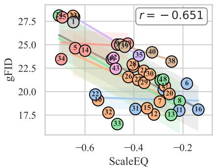

<details>
<summary>scatter</summary>

| Label | ScaleEQ | gFID |
|-------|---------|------|
| 1     | -0.6    | 27.5 |
| 2     | -0.6    | 27.5 |
| 3     | -0.6    | 27.5 |
| 4     | -0.4    | 25.0 |
| 5     | -0.6    | 25.0 |
| 6     | -0.2    | 20.0 |
| 7     | -0.3    | 20.0 |
| 8     | -0.2    | 18.0 |
| 9     | -0.4    | 25.0 |
| 10    | -0.6    | 25.0 |
| 11    | -0.2    | 18.0 |
| 12    | -0.3    | 20.0 |
| 13    | -0.3    | 18.0 |
| 14    | -0.6    | 25.0 |
| 15    | -0.4    | 20.0 |
| 16    | -0.2    | 18.0 |
| 17    | -0.4    | 18.0 |
| 18    | -0.4    | 20.0 |
| 19    | -0.4    | 20.0 |
| 20    | -0.3    | 20.0 |
| 21    | -0.4    | 20.0 |
| 22    | -0.5    | 18.0 |
| 23    | -0.6    | 25.0 |
| 24    | -0.6    | 25.0 |
| 25    | -0.6    | 27.5 |
| 26    | -0.4    | 25.0 |
| 27    | -0.4    | 25.0 |
| 28    | -0.4    | 25.0 |
| 29    | -0.4    | 25.0 |
| 30    | -0.3    | 25.0 |
| 31    | -0.4    | 18.0 |
| 32    | -0.5    | 18.0 |
| 33    | -0.5    | 18.0 |
| 34    | -0.6    | 25.0 |
| 35    | -0.4    | 25.0 |
| 36    | -0.4    | 25.0 |
| 37    | -0.4    | 25.0 |
| 38    | -0.3    | 25.0 |
| 39    | -0.3    | 25.0 |
| 40    | -0.3    | 25.0 |
| 41    | -0.4    | 25.0 |
| 42    | -0.4    | 25.0 |
| 43    | -0.4    | 25.0 |
| 44    | -0.4    | 25.0 |
| 45    | -0.4    | 25.0 |
| 46    | -0.4    | 25.0 |
| 47    | -0.4    | 25.0 |
| 48    | -0.3    | 25.0 |
| Note: The y-axis label 'gFID' is estimated based on the chart title and axis labels (e.g., 'ScaleEQ' or 'gFID'). The color of each point corresponds to its position in the table.
</details>

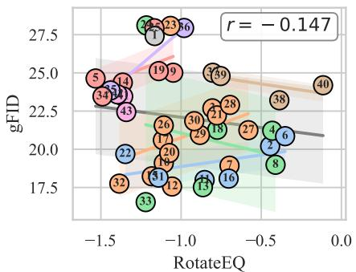

<details>
<summary>scatter</summary>

| Point | RotateEQ | gFID |
|-------|----------|------|
| 1     | -1.2     | 28   |
| 2     | -0.6     | 20   |
| 3     | -1.1     | 25   |
| 4     | -0.4     | 21   |
| 5     | -1.5     | 24   |
| 6     | -0.9     | 26   |
| 7     | -0.7     | 20   |
| 8     | -0.3     | 19   |
| 9     | -1.0     | 25   |
| 10    | -0.8     | 22   |
| 11    | -0.6     | 20   |
| 12    | -1.0     | 19   |
| 13    | -0.9     | 21   |
| 14    | -1.3     | 23   |
| 15    | -1.1     | 24   |
| 16    | -0.7     | 20   |
| 17    | -1.2     | 18   |
| 18    | -0.8     | 21   |
| 19    | -1.0     | 24   |
| 20    | -0.9     | 20   |
| 21    | -0.7     | 23   |
| 22    | -1.3     | 22   |
| 23    | -1.1     | 27   |
| 24    | -1.3     | 26   |
| 25    | -1.0     | 25   |
| 26    | -0.9     | 23   |
| 27    | -0.6     | 22   |
| 28    | -0.8     | 24   |
| 29    | -0.7     | 23   |
| 30    | -0.8     | 22   |
| 31    | -1.0     | 20   |
| 32    | -1.3     | 18   |
| 33    | -1.1     | 17   |
| 34    | -1.4     | 23   |
| 35    | -0.9     | 24   |
| 36    | -1.0     | 26   |
| 37    | -0.7     | 23   |
| 38    | -0.5     | 24   |
| 39    | -0.8     | 25   |
| 40    | -0.1     | 24   |
| 41    | -0.6     | 23   |
| 42    | -1.1     | 24   |
| 43    | -1.2     | 23   |
| 44    | -1.0     | 24   |
| 45    | -0.8     | 23   |
| Note: The y-axis label 'gFID' is estimated based on the chart title and axis labels (e.g., 'RotateEQ' or 'gFID'). The color of the points represents the category 'gFID'. The annotation 'r' indicates a negative correlation between the x-axis label and the y-axis label.
</details>


<details>
<summary>scatter</summary>

| Point | Normalized Entropy | gFID |
|-------|---------------------|------|
| 1     | 0.996               | 27.5 |
| 2     | 0.996               | 27.5 |
| 3     | 0.996               | 27.5 |
| 4     | 0.996               | 27.5 |
| 5     | 0.996               | 25.0 |
| 6     | 0.998               | 20.0 |
| 7     | 0.998               | 20.0 |
| 8     | 0.998               | 20.0 |
| 9     | 0.997               | 25.0 |
| 10    | 0.998               | 25.0 |
| 11    | 0.998               | 18.0 |
| 12    | 0.998               | 18.0 |
| 13    | 0.998               | 18.0 |
| 14    | 0.998               | 25.0 |
| 15    | 0.998               | 25.0 |
| 16    | 0.998               | 25.0 |
| 17    | 0.998               | 25.0 |
| 18    | 0.998               | 25.0 |
| 19    | 0.998               | 25.0 |
| 20    | 0.998               | 20.0 |
| 21    | 0.998               | 20.0 |
| 22    | 0.998               | 20.0 |
| 23    | 0.998               | 20.0 |
| 24    | 0.998               | 20.0 |
| 25    | 0.996               | 27.5 |
| 26    | 0.996               | 27.5 |
| 27    | 0.997               | 25.0 |
| 28    | 0.997               | 25.0 |
| 29    | 0.997               | 25.0 |
| 30    | 0.997               | 25.0 |
| 31    | 0.998               | 18.0 |
| 32    | 0.998               | 18.0 |
| 33    | 0.998               | 18.0 |
| 34    | 0.998               | 25.0 |
| 35    | 0.996               | 25.0 |
| 36    | 0.996               | 25.0 |
| 37    | 0.996               | 25.0 |
| 38    | 0.997               | 25.0 |
| 39    | 0.997               | 25.0 |
| 40    | 0.998               | 25.0 |
| Note: The y-axis label 'gFID' is estimated based on the provided code snippet in the chart, not explicitly provided in the original image.
</details>


<details>
<summary>scatter</summary>

| Point | -Density CV | gFID |
|-------|-------------|------|
| 1     | -0.23       | 28   |
| 2     | -0.22       | 27   |
| 3     | -0.22       | 27   |
| 4     | -0.21       | 25   |
| 5     | -0.21       | 24   |
| 6     | -0.19       | 20   |
| 7     | -0.20       | 19   |
| 8     | -0.20       | 18   |
| 9     | -0.21       | 18   |
| 10    | -0.19       | 24   |
| 11    | -0.20       | 18   |
| 12    | -0.20       | 17   |
| 13    | -0.20       | 17   |
| 14    | -0.19       | 24   |
| 15    | -0.19       | 20   |
| 16    | -0.20       | 19   |
| 17    | -0.20       | 20   |
| 18    | -0.21       | 21   |
| 19    | -0.21       | 22   |
| 20    | -0.21       | 23   |
| 21    | -0.21       | 23   |
| 22    | -0.19       | 20   |
| 23    | -0.19       | 18   |
| 24    | -0.21       | 23   |
| 25    | -0.23       | 27   |
| 26    | -0.23       | 25   |
| 27    | -0.23       | 25   |
| 28    | -0.23       | 23   |
| 29    | -0.23       | 23   |
| 30    | -0.23       | 23   |
| 31    | -0.19       | 19   |
| 32    | -0.19       | 17   |
| 33    | -0.19       | 17   |
| 34    | -0.19       | 24   |
| 35    | -0.21       | 24   |
| 36    | -0.21       | 24   |
| 37    | -0.21       | 24   |
| 38    | -0.21       | 24   |
| 39    | -0.21       | 24   |
| 40    | -0.21       | 24   |
| 41    | -0.21       | 24   |
| 42    | -0.21       | 24   |
| 43    | -0.21       | 24   |
| 44    | -0.21       | 24   |
| 45    | -0.21       | 24   |
| 46    | -0.21       | 24   |
| 47    | -0.21       | 24   |
| 48    | -0.21       | 24   |
| 49    | -0.21       | 24   |
| 50    | -0.21       | 24   |
| 51    | -0.21       | 24   |
| 52    | -0.21       | 24   |
| 53    | -0.21       | 24   |
| 54    | -0.21       | 24   |
| 55    | -0.21       | 24   |
| 56    | -0.21       | 24   |
| 57    | -0.21       | 24   |
| 58    | -0.21       | 24   |
| 59    | -0.21       | 24   |
| 60    | -0.21       | 24   |
| 61    | -0.21       | 24   |
| 62    | -0.21       | 24   |
| 63    | -0.21       | 24   |
| 64    | -0.21       | 24   |
| 65    | -0.21       | 24   |
| 66    | -0.21       | 24   |
| 67    | -0.21       | 24   |
| 68    | -0.21       | 24   |
| 69    | -0.21       | 24   |
| 70    | -0.21       | 24   |
| 71    | -0.21       | 24   |
| 72    | -0.21       | 24   |
| 73    | -0.21       | 24   |
| 74    | -0.21       | 24   |
| 75    | -0.21       | 24   |
| 76    | -0.21       | 24   |
| 77    | -0.21       | 24   |
| 78    | -0.21       | 24   |
| 79    | -0.21       | 24   |
| 80    | -0.21       | 24   |
| 81    | -0.21       | 24   |
| 82    | -0.21       | 24   |
| 83    | -0.21       | 24   |
| 84    | -0.21       | 24   |
| 85    | -0.21       | 24   |
| 86    | -0.21       | 24   |
| 87    | -0.21       | 24   |
| 88    | -0.21       | 24   |
| 89    | -0.21       | 24   |
| 90    | -0.21       | 24   |
| 91    | -0.21       | 24   |
| 92    | -0.21       | 24   |
| 93    | -0.21       | 24   |
| 94    | -0.21       | 24   |
| 95    | -0.21       | 24   |
| 96    | -0.21       | 24   |
| 97    | -0.21       | 24   |
| 98    | -0.21       | 24   |
| 99    | -0.21       | 24   |
| Note: The data points are not explicitly provided in the code, so they are inferred from the provided data to be extracted from the code output.
</details>


<details>
<summary>scatter</summary>

| Point | -Gini Coefficient | gFID |
|-------|-------------------|------|
| 1     | -0.145            | 27.5 |
| 2     | -0.135            | 27.8 |
| 3     | -0.130            | 27.6 |
| 4     | -0.138            | 23.5 |
| 5     | -0.132            | 24.0 |
| 6     | -0.105            | 20.5 |
| 7     | -0.110            | 19.8 |
| 8     | -0.115            | 22.5 |
| 9     | -0.120            | 25.0 |
| 10    | -0.118            | 24.5 |
| 11    | -0.125            | 21.0 |
| 12    | -0.128            | 19.5 |
| 13    | -0.130            | 18.5 |
| 14    | -0.100            | 23.0 |
| 15    | -0.105            | 20.0 |
| 16    | -0.115            | 20.5 |
| 17    | -0.112            | 20.8 |
| 18    | -0.118            | 21.5 |
| 19    | -0.122            | 22.0 |
| 20    | -0.125            | 20.2 |
| 21    | -0.128            | 21.8 |
| 22    | -0.135            | 19.5 |
| 23    | -0.138            | 22.5 |
| 24    | -0.140            | 23.8 |
| 25    | -0.148            | 24.8 |
| 26    | -0.145            | 24.5 |
| 27    | -0.142            | 24.0 |
| 28    | -0.138            | 23.5 |
| 29    | -0.135            | 23.0 |
| 30    | -0.132            | 22.5 |
| 31    | -0.138            | 21.8 |
| 32    | -0.145            | 20.5 |
| 33    | -0.148            | 19.8 |
| 34    | -0.145            | 27.5 |
| 35    | -0.142            | 26.8 |
| 36    | -0.148            | 26.5 |
| 37    | -0.145            | 26.8 |
| 38    | -0.142            | 26.5 |
| 39    | -0.138            | 26.8 |
| 40    | -0.135            | 26.5 |
| 41    | -0.140            | 26.8 |
| 42    | -0.148            | 24.5 |
| 43    | -0.145            | 23.5 |
| 44    | -0.142            | 23.8 |
| 45    | -0.148            | 24.5 |
| 46    | -0.145            | 24.8 |
| 47    | -0.142            | 25.0 |
| 48    | -0.148            | 25.5 |
| 49    | -0.145            | 25.8 |
| 50    | -0.142            | 26.5 |
| 51    | -0.148            | 26.8 |
| 52    | -0.145            | 27.5 |
| 53    | -0.142            | 27.8 |
| 54    | -0.148            | 28.5 |
| 55    | -0.145            | 28.8 |
| 56    | -0.142            | 29.5 |
| 57    | -0.148            | 30.0 |
| 58    | -0.145            | 30.5 |
| 59    | -0.142            | 31.0 |
| 60    | -0.148            | 31.5 |
| 61    | -0.145            | 32.0 |
| 62    | -0.142            | 32.5 |
| 63    | -0.148            | 33.0 |
| 64    | -0.145            | 33.5 |
| 65    | -0.142            | 34.0 |
| 66    | -0.148            | 34.5 |
| 67    | -0.145            | 35.0 |
| 68    | -0.142            | 35.5 |
| 69    | -0.148            | 36.0 |
| 70    | -0.145            | 36.5 |
| 71    | -0.142            | 37.0 |
| 72    | -0.148            | 37.5 |
| 73    | -0.145            | 38.0 |
| 74    | -0.142            | 38.5 |
| 75    | -0.148            | 39.0 |
| 76    | -0.145            | 39.5 |
| 77    | -0.142            | 40.0 |
| 78    | -0.148            | 40.5 |
| 79    | -0.145            | 41.0 |
| 80    | -0.142            | 41.5 |
| 81    | -0.148            | 42.0 |
| 82    | -0.145            | 42.5 |
| 83    | -0.142            | 43.0 |
| 84    | -0.148            | 43.5 |
| 85    | -0.145            | 44.0 |
| 86    | -0.142            | 44.5 |
| 87    | -0.148            | 45.0 |
| 88    | -0.145            | 45.5 |
| 89    | -0.142            | 46.0 |
| 90    | -0.148            | 46.5 |
| Note: The data points are not explicitly labeled in the code provided in the image, so they are not included in the CSV output as they are not explicitly stated in the code.
</details>

Figure 13: LightningDiT-B gFID with convolutional f16d32 tokenizer family.


<details>
<summary>scatter</summary>

| Point | -VIV  | gFID |
|-------|-------|------|
| 1     | -1.15 | 9.2  |
| 2     | -1.05 | 8.9  |
| 3     | -0.95 | 8.4  |
| 4     | -1.05 | 8.7  |
| 5     | -1.05 | 8.3  |
| 6     | -0.4  | 8.2  |
| 7     | -0.65 | 6.8  |
| 8     | -0.65 | 7.0  |
| 9     | -1.05 | 7.8  |
| 10    | -0.95 | 7.1  |
| 11    | -0.45 | 7.3  |
| 12    | -0.55 | 6.9  |
| 13    | -0.45 | 6.7  |
| 14    | -0.95 | 8.0  |
| 15    | -0.65 | 7.2  |
| 16    | -1.15 | 9.1  |
| 17    | -0.75 | 7.6  |
| 18    | -0.65 | 7.4  |
| 19    | -1.05 | 7.9  |
| 20    | -0.65 | 7.3  |
| 21    | -0.95 | 7.0  |
| 22    | -0.65 | 6.8  |
| 23    | -1.15 | 9.0  |
| 24    | -1.05 | 8.8  |
| 25    | -1.15 | 9.3  |
| 26    | -0.75 | 7.7  |
| 27    | -0.95 | 7.2  |
| 28    | -1.05 | 7.6  |
| 29    | -0.95 | 7.4  |
| 30    | -0.95 | 7.3  |
| 31    | -0.45 | 6.6  |
| 32    | -0.65 | 6.9  |
| 33    | -0.45 | 6.8  |
| 34    | -0.85 | 8.1  |
| 35    | -1.05 | 8.4  |
| 36    | -1.15 | 8.6  |
| 37    | -1.05 | 8.3  |
| 38    | -0.95 | 8.0  |
| 39    | -1.05 | 7.8  |
| 40    | -0.75 | 7.9  |
| Note: The y-axis label 'gFID' is estimated based on the provided code snippet in the chart.
</details>


<details>
<summary>scatter</summary>

| LNC   | gFID | Label |
|-------|------|-------|
| 0.02  | 9.5  | 25    |
| 0.03  | 9.2  | 24    |
| 0.04  | 9.0  | 21    |
| 0.05  | 8.8  | 34    |
| 0.06  | 8.5  | 38    |
| 0.07  | 8.3  | 37    |
| 0.08  | 8.1  | 36    |
| 0.09  | 7.9  | 35    |
| 0.10  | 7.7  | 34    |
| 0.11  | 7.5  | 33    |
| 0.12  | 7.3  | 32    |
| 0.13  | 7.1  | 31    |
| 0.14  | 6.9  | 30    |
| 0.15  | 6.7  | 29    |
| 0.16  | 6.5  | 28    |
| 0.17  | 6.3  | 27    |
| 0.18  | 6.1  | 26    |
| 0.19  | 5.9  | 25    |
| 0.20  | 5.7  | 24    |
| 0.21  | 5.5  | 23    |
| 0.22  | 5.3  | 22    |
| 0.23  | 5.1  | 21    |
| 0.24  | 4.9  | 20    |
| 0.25  | 4.7  | 19    |
| 0.26  | 4.5  | 18    |
| 0.27  | 4.3  | 17    |
| 0.28  | 4.1  | 16    |
| 0.29  | 3.9  | 15    |
| 0.30  | 3.7  | 14    |
| 0.31  | 3.5  | 13    |
| 0.32  | 3.3  | 12    |
| 0.33  | 3.1  | 11    |
| 0.34  | 2.9  | 10    |
| 0.35  | 2.7  | 9     |
| 0.36  | 2.5  | 8     |
| 0.37  | 2.3  | 7     |
| 0.38  | 2.1  | 6     |
| 0.39  | 1.9  | —     |
| 0.40  | —    | —     |
| —     | —    | —     |
| —     | —    | —     |
| —     | —    | —     |
| —     | —    | —     |
| —     | —    | —     |
| —     | —    | —     |
| —     | —    | —     |
| —     | —    | —     |
| —     | —    | —     |
| —     | —    | —     |
| —      | —    | —     |
| —      | —    | —     |
| —      | —    | —     |
| —      | —    | —     |
| —      | —    | —     |
| —      | —    | —     |
| —      | —    | —     |
| —      | —    | —     |
| —      | —    | —     |
| —      | —    | —     |
| —       | —    | —     |
| —       | —    | —     |
| —       | —    | —     |
| —       | —    | —     |
| —       | —    | —     |
| —       | —    | —     |
| —       | —    | —     |
| —       | —    | —     |
| —       | —    | —     |
| —       | —    | —     |
| —        | —    | —     |
| —        | —    | —     |
| —        | —    | —     |
| —        | —    | —     |
| —        | —    | —     |
| —        | —    | —     |
| —        | —    | —     |
| —        | —    | —     |
| —        | —    | —     |
| —        | —    | —     |
| —         | —    | —     |
| —         | —    | —     |
| —         | —    | —     |
| —         | —    | —     |
| —         | —    | —     |
| —         | —    | —     |
| —         | —    | —     |
| —         | —    | —     |
| —         | —    | —     |
| —         | —    | —     |
| —          | —    | —     |
| —          | —    | —     |
| —          | —    | —     |
| —          | —    | —     |
| —          | —    | —     |
| —          | —    | —     |
| —          | —    | —     |
| —          | —    | —     |
| —          | —    | —     |
| —          | —    | —     |
| —           | -      | -     |
| ~0.05–0.15% for LNC; ~6–9% for gFID; ~6–9% for gFID; ~6–9% for LNC; ~6–9% for gFID; ~6–9% for gFID; ~6–9% for LNC; ~6–9% for gFID; ~6–9% for gFID; ~6–9% for LNC; ~6–9% for gFID; ~6–9% for gFID; ~6–9% for LNC; ~6–9% for gEID; ~6–9% for gEID; ~6–9% for gEID; ~6–9% for gEID; ~6–9% for gEID; ~6–9% for gEID; ~6–9% for gEID; ~6–9% for gEID; ~6–9% for gEID; ~6–9% for gEID; ~6–9% for gEED; ~6–9% for gEED; ~6–9% for gEED; ~6–9% for gEED; ~6–9% for gEED; ~6–9% for gEED; ~6–9% for gEED; ~6–9% for gEED; ~6–9% for gEED; ~6–9% for gEED; ~6–9% for gEEM; ~6–9% for gEEM; ~6–9% for gEEM; ~6–9% for gEEM; ~6–9% for gEEM; ~6–9% for gEEM; ~6–9% for gEEM; ~6–9% for gEEM; ~6–9% for gEEM; ~6–9% for gEEM; ~6–9% for gECEM; ~6–9% for gECEM; ~6–9% for gECEM; ~6–9% for gECEM; ~6–9% for gECEM; ~6–9% for gECEM; ~6–9% for gECEM; ~6–9% for gECEM; ~6–9% for gECEM; ~6–9% for gECEM<nl>
</details>


<details>
<summary>scatter</summary>

| Point | -SEC  | gFID |
|-------|-------|------|
| 1     | -0.45 | 9.2  |
| 2     | -0.42 | 8.8  |
| 3     | -0.35 | 8.5  |
| 4     | -0.40 | 9.0  |
| 5     | -0.38 | 7.8  |
| 6     | -0.32 | 8.2  |
| 7     | -0.28 | 7.5  |
| 8     | -0.25 | 7.3  |
| 9     | -0.22 | 8.0  |
| 10    | -0.20 | 7.0  |
| 11    | -0.15 | 6.8  |
| 12    | -0.40 | 8.5  |
| 13    | -0.10 | 6.5  |
| 14    | -0.12 | 6.7  |
| 15    | -0.15 | 6.6  |
| 16    | -0.05 | 7.2  |
| 17    | -0.18 | 7.5  |
| 18    | -0.12 | 7.3  |
| 19    | -0.25 | 8.0  |
| 20    | -0.10 | 7.5  |
| 21    | -0.22 | 7.2  |
| 22    | -0.18 | 6.8  |
| 23    | -0.35 | 8.5  |
| 24    | -0.30 | 8.2  |
| 25    | -0.45 | 9.0  |
| 26    | -0.28 | 7.8  |
| 27    | -0.25 | 7.5  |
| 28    | -0.22 | 7.3  |
| 29    | -0.20 | 7.0  |
| 30    | -0.25 | 7.2  |
| 31    | -0.15 | 6.8  |
| 32    | -0.18 | 6.5  |
| 33    | -0.12 | 6.3  |
| 34    | -0.38 | 8.8  |
| 35    | -0.42 | 8.5  |
| 36    | -0.35 | 8.3  |
| 37    | -0.32 | 8.0  |
| 38    | -0.25 | 7.8  |
| 39    | -0.22 | 7.5  |
| 40    | -0.15 | 7.2  |
| 41    | -0.45 | 9.2  |
| 42    | -0.40 | 9.0  |
| Note: The y-axis label 'gFID' is estimated based on the provided code snippet in the chart.
</details>


<details>
<summary>scatter</summary>

| CDS   | gFID  | Label |
|-------|-------|-------|
| 0.04  | 9.0   | 25    |
| 0.04  | 8.5   | 31    |
| 0.04  | 8.0   | 35    |
| 0.04  | 7.5   | 43    |
| 0.04  | 7.0   | 39    |
| 0.04  | 6.5   | 38    |
| 0.04  | 6.0   | 35    |
| 0.04  | 5.5   | 39    |
| 0.04  | 5.0   | 40    |
| 0.04  | 4.5   | 38    |
| 0.04  | 4.0   | 35    |
| 0.04  | 3.5   | 38    |
| 0.04  | 3.0   | 35    |
| 0.04  | 2.5   | 38    |
| 0.04  | 2.0   | 35    |
| 0.04  | 1.5   | 38    |
| 0.04  | 1.0   | 35    |
| 0.04  | 0.5   | 38    |
| 0.04  | 0.0   | 35    |
| 0.06  | 8.5   | 19    |
| 0.06  | 8.0   | 9     |
| 0.06  | 7.5   | 3     |
| 0.06  | 7.0   | 9     |
| 0.06  | 6.5   | 3     |
| 0.06  | 6.0   | 9     |
| 0.06  | 5.5   | 3     |
| 0.06  | 5.0   | 9     |
| 0.06  | 4.5   | 3     |
| 0.06  | 4.0   | 9     |
| 0.06  | 3.5   | 3     |
| 0.06  | 3.0   | 9     |
| 0.06  | 2.5   | 3     |
| 0.06  | 2.0   | 9     |
| 0.06  | 1.5   | 3     |
| 0.06  | 1.0   | 9     |
| 0.06  | 0.5   | 3     |
| 0.06  | 0.0   | 9     |
| 0.08  | 8.5   | 28    |
| 0.08  | 8.0   | 27    |
| 0.08  | 7.5   | 28    |
| 0.08  | 7.0   | 27    |
| 0.08  | 6.5   | 28    |
| 0.08  | 6.0   | 27    |
| 0.08  | 5.5   | 28    |
| 0.08  | 5.0   | 27    |
| 0.08  | 4.5   | 28    |
| 0.08  | 4.0   | 27    |
| 0.08  | 3.5   | 28    |
| 0.08  | 3.0   | 27    |
| 0.08  | 2.5   | 28    |
| 0.08  | 2.0   | 27    |
| 0.08  | 1.5   | 28    |
| 0.08  | 1.0   | 27    |
| 0.10  | -     | -     |
| -     | -     | -     |
| -     | -     | -     |
| -     | -     | -     |
| -     | -     | -     |
| -     | -     | -     |
| -     | -     | -     |
| -     | -     | -     |
| -     | -     | -     |
| -     | -     | -     |
| -     | -     | -     |
| -      | -     | -     |
| -      | -     | -     |
| -      | -     | -     |
| -      | -     | -     |
| -      | -     | -     |
| -      | -     | -     |
| -      | -     | -     |
| -      | -     | -     |
| -      | -     | -     |
| -      | -     | -     |
| -       | -     | -     |
| -       | -     | -     |
| -       | -     | -     |
| -       | -     | -     |
| -       | -     | -     |
| -       | -     | -     |
| -       | -     | -     |
| -       | -     | -     |
| -       | -     | -     |
| -       | -     | -     |
| -        | -     | -     |
| -        | -     | -     |
| -        | -     | -     |
| -        | -     | -     |
| -        | -     | -     |
| -        | -     | -     |
| -        | -     | -     |
| -        | -     | -     |
| -        | -     | -     |
| -        | -     | -     |
| -       | -     | -     |
| -       | -     | -     |
| -       | -     | -     |
| -       | -     | -     |
| -       | -     | -     |
| -       | -     | -     |
| -       | -     | -     |
| -       | -     | -     |
| -       | -     | -     |
| -         | -     | -     |
|         |         |       |
|         |         |       |
|         |         |       |
|         |         |       |
|         |         |       |
|         |         |       |
|         |         |       |
|         |         |       |
|         |         |       |
|         |         |       |
|         |         |       |
|         |         |       |
|         |         |       |
|         |         |       |
|         |         |       |
|
|         |         |       |
|         |         |       |
|         |         |       |
|         |         |       |
|         |         |       |
|         |         /      /      /      /      /      /      /      /      /      /      /      /      /      /      /      /      /      /      /      /      /      /      /      /      /      /      /      /      /      /      /      /      /      /      /      /      /      /      /      /      /      /      /      /      /      /      /      /      /      /      /
</details>


<details>
<summary>scatter</summary>

| ID | LDS  | gFID |
|----|------|------|
| 1  | 0.35 | 9.2  |
| 2  | 0.36 | 9.1  |
| 3  | 0.37 | 8.9  |
| 4  | 0.42 | 7.0  |
| 5  | 0.43 | 8.5  |
| 6  | 0.38 | 8.2  |
| 7  | 0.55 | 7.5  |
| 8  | 0.40 | 7.3  |
| 9  | 0.58 | 8.0  |
| 10 | 0.65 | 7.8  |
| 11 | 0.39 | 9.1  |
| 12 | 0.68 | 7.6  |
| 13 | 0.52 | 6.8  |
| 14 | 0.62 | 7.9  |
| 15 | 0.72 | 6.5  |
| 16 | 0.41 | 8.4  |
| 17 | 0.67 | 7.7  |
| 18 | 0.54 | 7.4  |
| 19 | 0.60 | 8.1  |
| 20 | 0.69 | 7.5  |
| 21 | 0.38 | 9.0  |
| 22 | 0.75 | 6.9  |
| 23 | 0.37 | 8.6  |
| 24 | 0.43 | 8.3  |
| 25 | 0.36 | 9.3  |
| 26 | 0.78 | 7.4  |
| 27 | 0.53 | 7.2  |
| 28 | 0.59 | 7.6  |
| 29 | 0.44 | 8.7  |
| 30 | 0.61 | 7.3  |
| 31 | 0.39 | 9.1  |
| 32 | 0.76 | 6.6  |
| 33 | 0.66 | 6.4  |
| 34 | 0.64 | 7.8  |
| 35 | 0.42 | 8.5  |
| 36 | 0.45 | 8.1  |
| 37 | 0.41 | 8.4  |
| 38 | 0.48 | 8.6  |
| 39 | 0.43 | 8.9  |
| 40 | 0.44 | 8.3  |
| Note: The y-axis label 'gFID' is estimated based on the provided code, not explicitly shown in the image.
</details>


<details>
<summary>scatter</summary>

| Label | SRSS  | gFID |
|-------|-------|------|
| 25    | 0.4   | 9.5  |
| 31    | 0.4   | 9.2  |
| 43    | 0.45  | 8.8  |
| 39    | 0.45  | 8.7  |
| 5     | 0.5   | 8.5  |
| 6     | 0.5   | 8.3  |
| 8     | 0.55  | 8.0  |
| 18    | 0.6   | 7.5  |
| 19    | 0.65  | 7.8  |
| 9     | 0.7   | 7.6  |
| 14    | 0.75  | 7.9  |
| 15    | 0.8   | 7.7  |
| 26    | 0.8   | 7.6  |
| 20    | 0.8   | 7.5  |
| 22    | 0.8   | 7.4  |
| 30    | 0.8   | 7.3  |
| 27    | 0.75  | 7.2  |
| 13    | 0.75  | 7.1  |
| 12    | 0.8   | 7.0  |
| 24    | 0.8   | 6.9  |
| 33    | 0.8   | 6.8  |
| 42    | 0.6   | 6.9  |
| 1      | 0.65  | 7.0  |
| 28    | 0.7   | 7.3  |
| 12    | 0.8   | 7.1  |
| 21    | 0.8   | 7.0  |
| 34    | 0.8   | 6.9  |
| 13    | 0.75  | 7.1  |
| 29    | 0.75  | 7.2  |
| 1      | 0.8   | 7.2  |
| 38    | 0.55  | 8.2  |
| 49    | 0.55  | 8.1  |
| 36    | 0.45  | 8.3  |
| 2     | 0.45  | 8.4  |
| The chart displays a scatter plot with two distinct data series represented by colored circles labeled with numbers (e.g., '1', '2', etc.). The x-axis represents 'SRSS' and the y-axis represents 'gFID'. A red regression line indicates a weak negative correlation (r = -0.805). The data points are scattered across the plot, with some clustering around the trend line and some spread along the diagonal.
</details>


<details>
<summary>scatter</summary>

| Point | -iFID  | gFID  |
|-------|--------|-------|
| 1     | -43    | 9.0   |
| 2     | -46    | 8.5   |
| 3     | -39    | 7.5   |
| 4     | -47    | 8.0   |
| 5     | -45    | 8.2   |
| 6     | -35    | 8.0   |
| 7     | -34    | 7.8   |
| 8     | -36    | 7.2   |
| 9     | -38    | 7.0   |
| 10    | -37    | 6.8   |
| 11    | -35    | 6.5   |
| 12    | -36    | 6.3   |
| 13    | -34    | 6.0   |
| 14    | -33    | 5.8   |
| 15    | -35    | 6.2   |
| 16    | -36    | 6.0   |
| 17    | -37    | 6.5   |
| 18    | -35    | 7.0   |
| 19    | -38    | 7.5   |
| 20    | -34    | 7.2   |
| 21    | -35    | 7.0   |
| 22    | -48    | 6.8   |
| 23    | -44    | 9.0   |
| 24    | -45    | 9.0   |
| 25    | -44    | 9.0   |
| 26    | -46    | 8.0   |
| 27    | -32    | 6.5   |
| 28    | -31    | 7.0   |
| 29    | -36    | 7.0   |
| 30    | -37    | 7.0   |
| 31    | -35    | 6.5   |
| 32    | -36    | 6.2   |
| 33    | -34    | 6.0   |
| 34    | -49    | 8.0   |
| 35    | -34    | 8.0   |
| 36    | -35    | 7.5   |
| 37    | -45    | 8.0   |
| 38    | -44    | 8.0   |
| 39    | -44    | 8.0   |
| 40    | -48    | 8.0   |
| 41    | -35    | 9.0   |
| 42    | -36    | 9.0   |
| 43    | -35    | 9.0   |
| 44    | -36    | 9.0   |
| 45    | -37    | 9.0   |
| 46    | -38    | 9.0   |
| 47    | -39    | 9.0   |
| 48    | -40    | 9.0   |
| 49    | -41    | 9.0   |
| 50    | -42    | 9.0   |
| Note: The y-axis label 'gFID' is estimated based on the provided code snippet in the chart.
</details>


<details>
<summary>scatter</summary>

| Label | ScaleEQ | gFID |
|-------|---------|------|
| 25    | -0.65   | 9.2  |
| 24    | -0.62   | 9.1  |
| 30    | -0.68   | 8.9  |
| 14    | -0.58   | 7.8  |
| 34    | -0.55   | 7.7  |
| 5     | -0.52   | 7.6  |
| 18    | -0.50   | 7.5  |
| 22    | -0.48   | 7.4  |
| 32    | -0.45   | 7.3  |
| 33    | -0.42   | 7.2  |
| 31    | -0.40   | 7.1  |
| 35    | -0.38   | 7.0  |
| 37    | -0.35   | 6.9  |
| 39    | -0.32   | 6.8  |
| 41    | -0.30   | 6.7  |
| 42    | -0.28   | 6.6  |
| 43    | -0.25   | 6.5  |
| 44    | -0.22   | 6.4  |
| 45    | -0.20   | 6.3  |
| 46    | -0.18   | 6.2  |
| 47    | -0.15   | 6.1  |
| 48    | -0.12   | 6.0  |
| 49    | -0.10   | 5.9  |
| 50    | -0.08   | 5.8  |
| 51    | -0.05   | 5.7  |
| 52    | -0.02   | 5.6  |
| 53    | 0.00    | 5.5  |
| 54    | 0.02    | 5.4  |
| 55    | 0.05    | 5.3  |
| 56    | 0.08    | 5.2  |
| 57    | 0.10    | 5.1  |
| 58    | 0.12    | 5.0  |
| 59    | 0.15    | 4.9  |
| 60    | 0.18    | 4.8  |
| 61    | 0.20    | 4.7  |
| 62    | 0.22    | 4.6  |
| 63    | 0.25    | 4.5  |
| 64    | 0.28    | 4.4  |
| 65    | 0.30    | 4.3  |
| 66    | 0.32    | 4.2  |
| 67    | 0.35    | 4.1  |
| 68    | 0.38    | 4.0  |
| 69    | 0.40    | 3.9  |
| 70    | 0.42    | 3.8  |
| 71    | 0.45    | 3.7  |
| 72    | 0.48    | 3.6  |
| 73    | 0.50    | 3.5  |
| 74    | 0.52    | 3.4  |
| 75    | 0.55    | 3.3  |
| 76    | 0.58    | 3.2  |
| 77    | 0.60    | 3.1  |
| 78    | 0.62    | 3.0  |
| 79    | 0.65    | 2.9  |
| 80    | -0.15   | -      |
| 81    | -0.18   | -      |
| 82    | -0.20   | -      |
| 83    | -0.22   | -      |
| 84    | -0.25   | -      |
| 85    | -0.28   | -      |
| 86    | -0.30   | -      |
| 87    | -0.32   | -      |
| 88    | -0.35   | -      |
| 89    | -0.38   | -      |
| 90    | -0.40   | -      |
| 91    | -0.42   | -      |
| 92    | -0.45   | -      |
| 93    | -0.48   | -      |
| 94    | -0.50   | -      |
| 95    | -0.52   | -      |
| 96    | -0.55   | -      |
| 97    | -0.58   | -      |
| 98    | -0.60   | -      |
| 99    | -0.62   | -      |
| ...   | ...     | ...    |
| ...   | ...     | ...    |
| ...   | ...     | ...    |
| ...   | ...     | ...    |
| ...   | ...     | ...    |
| ...   | ...     | ...    |
| ...   | ...     | ...    |
| ...   | ...     | ...    |
| ...   | ...     | ...    |
| ...   | ...     | ...    |
| ...   | ...     | ...```
</details>


<details>
<summary>scatter</summary>

| Point | RotateEQ | gFID |
|-------|----------|------|
| 1     | -1.2     | 9.2  |
| 2     | -1.1     | 9.3  |
| 3     | -0.8     | 8.5  |
| 4     | -0.6     | 7.8  |
| 5     | -1.3     | 8.7  |
| 6     | -0.4     | 8.2  |
| 7     | -0.7     | 7.5  |
| 8     | -0.3     | 7.9  |
| 9     | -0.9     | 8.9  |
| 10    | -1.0     | 7.2  |
| 11    | -1.1     | 6.8  |
| 12    | -1.0     | 6.5  |
| 13    | -0.9     | 6.7  |
| 14    | -1.2     | 8.6  |
| 15    | -1.1     | 6.3  |
| 16    | -1.0     | 6.9  |
| 17    | -0.9     | 7.4  |
| 18    | -0.8     | 7.6  |
| 19    | -1.0     | 8.4  |
| 20    | -0.9     | 7.3  |
| 21    | -0.7     | 7.1  |
| 22    | -1.3     | 6.4  |
| 23    | -1.0     | 8.8  |
| 24    | -1.2     | 8.5  |
| 25    | -1.1     | 9.4  |
| 26    | -0.9     | 8.3  |
| 27    | -0.6     | 7.7  |
| 28    | -0.5     | 7.5  |
| 29    | -0.8     | 8.7  |
| 30    | -0.9     | 7.6  |
| 31    | -1.0     | 6.9  |
| 32    | -1.3     | 6.2  |
| 33    | -1.2     | 6.0  |
| 34    | -1.4     | 7.8  |
| 35    | -1.3     | 8.4  |
| 36    | -0.9     | 8.9  |
| 37    | -0.7     | 8.5  |
| 38    | -0.4     | 8.1  |
| 39    | -0.6     | 8.6  |
| 40    | -0.1     | 7.9  |
</details>


<details>
<summary>scatter</summary>

| Point | Normalized Entropy | gFID |
|-------|---------------------|------|
| 1     | 0.995               | 8.5  |
| 2     | 0.996               | 9.0  |
| 3     | 0.997               | 7.5  |
| 4     | 0.998               | 7.0  |
| 5     | 0.995               | 7.8  |
| 6     | 0.998               | 6.5  |
| 7     | 0.997               | 7.2  |
| 8     | 0.997               | 7.0  |
| 9     | 0.997               | 7.8  |
| 10    | 0.997               | 7.5  |
| 11    | 0.998               | 6.8  |
| 12    | 0.998               | 6.5  |
| 13    | 0.997               | 7.5  |
| 14    | 0.997               | 8.0  |
| 15    | 0.998               | 6.8  |
| 16    | 0.997               | 7.2  |
| 17    | 0.998               | 7.0  |
| 18    | 0.997               | 7.5  |
| 19    | 0.997               | 7.8  |
| 20    | 0.997               | 7.5  |
| 21    | 0.998               | 6.8  |
| 22    | 0.998               | 6.5  |
| 23    | 0.997               | 7.2  |
| 24    | 0.997               | 7.5  |
| 25    | 0.996               | 9.2  |
| 26    | 0.997               | 7.8  |
| 27    | 0.997               | 7.5  |
| 28    | 0.997               | 7.2  |
| 29    | 0.996               | 8.5  |
| 30    | 0.997               | 7.5  |
| 31    | 0.998               | 6.5  |
| 32    | 0.998               | 6.8  |
| 33    | 0.998               | 6.5  |
| 34    | 0.998               | 7.5  |
| 35    | 0.996               | 8.5  |
| 36    | 0.997               | 8.0  |
| 37    | 0.997               | 8.2  |
| 38    | 0.997               | 8.0  |
| 39    | 0.997               | 8.5  |
| Note: The y-axis label 'gFID' is estimated based on the provided code snippet in the chart.
</details>


<details>
<summary>scatter</summary>

| Point | -Density CV | gFID |
|-------|-------------|------|
| 1     | -0.18       | 7.0  |
| 2     | -0.19       | 6.8  |
| 3     | -0.20       | 7.2  |
| 4     | -0.21       | 7.5  |
| 5     | -0.28       | 8.0  |
| 6     | -0.14       | 8.5  |
| 7     | -0.22       | 8.2  |
| 8     | -0.20       | 7.8  |
| 9     | -0.23       | 7.6  |
| 10    | -0.24       | 7.4  |
| 11    | -0.25       | 7.3  |
| 12    | -0.26       | 7.1  |
| 13    | -0.27       | 6.9  |
| 14    | -0.21       | 8.3  |
| 15    | -0.19       | 7.7  |
| 16    | -0.23       | 8.1  |
| 17    | -0.24       | 7.9  |
| 18    | -0.25       | 7.8  |
| 19    | -0.26       | 7.7  |
| 20    | -0.27       | 7.6  |
| 21    | -0.28       | 7.5  |
| 22    | -0.18       | 7.4  |
| 23    | -0.29       | 7.3  |
| 24    | -0.28       | 7.2  |
| 25    | -0.27       | 9.5  |
| 26    | -0.23       | 8.0  |
| 27    | -0.24       | 7.9  |
| 28    | -0.25       | 8.1  |
| 29    | -0.26       | 8.0  |
| 30    | -0.27       | 7.9  |
| 31    | -0.28       | 7.8  |
| 32    | -0.16       | 6.5  |
| 33    | -0.19       | 6.3  |
| 34    | -0.17       | 8.4  |
| 35    | -0.29       | 8.5  |
| 36    | -0.28       | 8.4  |
| 37    | -0.27       | 8.3  |
| 38    | -0.26       | 8.2  |
| 39    | -0.24       | 8.1  |
| 40    | -0.19       | 8.3  |
| 41    | -0.28       | 9.4  |
| 42    | -0.29       | 8.6  |
| 43    | -0.27       | 8.5  |
| Note: The y-axis label 'gFID' is estimated based on the provided code snippet in the chart.
</details>


<details>
<summary>scatter</summary>

| Point | -Gini Coefficient | gFID |
|-------|-------------------|------|
| 1     | -0.150            | 9.2  |
| 2     | -0.125            | 8.5  |
| 3     | -0.100            | 7.8  |
| 4     | -0.125            | 8.2  |
| 5     | -0.175            | 8.7  |
| 6     | -0.125            | 7.5  |
| 7     | -0.100            | 8.0  |
| 8     | -0.125            | 7.2  |
| 9     | -0.125            | 8.3  |
| 10    | -0.100            | 7.0  |
| 11    | -0.125            | 7.6  |
| 12    | -0.100            | 6.8  |
| 13    | -0.100            | 6.5  |
| 14    | -0.100            | 8.5  |
| 15    | -0.100            | 7.3  |
| 16    | -0.125            | 7.9  |
| 17    | -0.100            | 7.4  |
| 18    | -0.125            | 7.1  |
| 19    | -0.125            | 7.7  |
| 20    | -0.125            | 7.3  |
| 21    | -0.125            | 7.6  |
| 22    | -0.100            | 6.9  |
| 23    | -0.125            | 7.8  |
| 24    | -0.150            | 9.3  |
| 25    | -0.150            | 9.4  |
| 26    | -0.125            | 8.6  |
| 27    | -0.125            | 7.4  |
| 28    | -0.125            | 8.1  |
| 29    | -0.125            | 7.9  |
| 30    | -0.125            | 7.6  |
| 31    | -0.125            | 6.7  |
| 32    | -0.100            | 6.6  |
| 33    | -0.075            | 6.4  |
| 34    | -0.100            | 8.4  |
| 35    | -0.150            | 8.8  |
| 36    | -0.125            | 8.3  |
| 37    | -0.125            | 8.7  |
| 38    | -0.125            | 8.4  |
| 39    | -0.125            | 8.9  |
| Note: The y-axis label 'gFID' is estimated based on the provided code snippet in the chart.
</details>

Figure 14: LightningDiT-XL gFID with convolutional f16d32 tokenizer family.


<details>
<summary>scatter</summary>

| Label | -VIV   | gFID  |
|-------|--------|-------|
| 48    | -1.2   | 49    |
| 49    | -1.1   | 48    |
| 50    | -0.6   | 30    |
| 51    | -0.4   | 32    |
| 52    | -0.7   | 31    |
| 53    | -0.3   | 33    |
| 54    | -0.9   | 39    |
| 55    | -0.8   | 38    |
| 56    | -1.0   | 46    |
| 57    | -0.7   | 30    |
| 58    | -1.1   | 50    |
| 59    | -1.2   | 49    |
| 60    | -1.1   | 48    |
| 61    | -0.6   | 51    |
| 62    | -0.9   | 46    |
| 63    | -0.7   | 51    |
</details>


<details>
<summary>scatter</summary>

| LNC   | gFID | Label |
|-------|------|-------|
| 0.02  | 50   | 63    |
| 0.03  | 48   | 58    |
| 0.04  | 46   | 62    |
| 0.05  | 44   | 63    |
| 0.06  | 42   | 61    |
| 0.07  | 40   | 54    |
| 0.08  | 38   | 55    |
| 0.09  | 36   | 47    |
| 0.10  | 34   | 50    |
| 0.11  | 32   | 49    |
| 0.12  | 30   | 51    |
| 0.13  | 28   | 53    |
| 0.14  | 26   |       |
| 0.15  | 24   |       |
| 0.16  | 22   |       |
| 0.17  | 20   |       |
| 0.18  | 18   |       |
| 0.19  | 16   |       |
| 0.20  | 14   |       |
| 0.21  | 12   |       |
| 0.22  | 10   |       |
| 0.23  | 8    |       |
| 0.24  | 6    |       |
| 0.25  | 4    |       |
| 0.26  | 2    |       |
| 0.27  | 0    |       |
| 0.28  | -2   |       |
| 0.29  | -4   |       |
| 0.30  | -6   |       |
| 0.31  | -8   |       |
| 0.32  | -10  |       |
| 0.33  | -12  |       |
| 0.34  | -14  |       |
| 0.35  | -16  |       |
| 0.36  | -18  |       |
| 0.37  | -20  |       |
| 0.38  | -22  |       |
| 0.39  | -24  |       |
| 0.40  | -26  |       |
| 0.41  | -28  |       |
| 0.42  | -30  |       |
| 0.43  | -32  |       |
| 0.44  | -34  |       |
| 0.45  | -36  |       |
| 0.46  | -38  |       |
| 0.47  | -40  |       |
| 0.48  | -42  |       |
| 0.49  | -44  |       |
| 0.50  | -46  |       |
| 0.51  | -48  |       |
| 0.52  | -50  |       |
| 0.53  | -52  |       |
| 0.54  | -54  |       |
| 0.55  | -56  |       |
| 0.56  | -58  |       |
| 0.57  | -60  |       |
| 0.58  | -62  |       |
| 0.59  | -64  |       |
| 0.60  | -66  |       |
| 0.61  | -68  |       |
| 0.62  | -70  |       |
| 0.63  | -72  |       |
| 0.64  | -74  |       |
| 0.65  | -76  |       |
| 0.66* | -78* |       |
|          |      |       |
|          |      |       |
|          |      |       |
|          |      |       |
|          |      |       |
|          |      |       |
|          |      |       |
|          |      |       |
|          |      |       |
|          |      |       |
|          |      |       |
|          |      |       |
|          |      |       |
|          |      |       |
|          |      |               |
|          |      |               |
|          |      |               |
|          |      |               |
|          |      |               |
|          |      |               |
|          |      |               |
|          |      |               |
|          |      |               |
|          |      |               |
|          |      |               |
|          |      |               |
|          |      |               |
|          |      |               |
|          |      |               |
|
|          |      |               |
|          |      |               |
|          |      |               |
|          |      |               |
|          |      |               |
|          |      |               |
|          |      |               |
|          |      |               |
|          |      |               |
|          |      |               |
|          |      |               |
|          |      |               |
|          |      |               |
|          |      |               |
| *The chart is a single column for 'gFID' to 'LNC'. The y-values are estimated based on the provided code snippet in the code.
</details>


<details>
<summary>scatter</summary>

| Point | -SEC  | gFID |
|-------|-------|------|
| 1     | -0.55 | 48   |
| 2     | -0.52 | 49   |
| 3     | -0.48 | 47   |
| 4     | -0.50 | 46   |
| 5     | -0.45 | 45   |
| 6     | -0.58 | 44   |
| 7     | -0.20 | 38   |
| 8     | -0.15 | 37   |
| 9     | -0.40 | 43   |
| 10    | -0.10 | 30   |
| 11    | -0.05 | 31   |
| 12    | -0.02 | 32   |
| 13    | -0.08 | 33   |
| 14    | -0.12 | 34   |
| 15    | -0.18 | 35   |
| 16    | -0.25 | 36   |
| 17    | -0.22 | 37   |
| 18    | -0.15 | 38   |
| 19    | -0.10 | 39   |
| 20    | -0.05 | 40   |
| 21    | -0.02 | 41   |
| 22    | -0.08 | 42   |
| 23    | -0.12 | 43   |
| 24    | -0.15 | 44   |
| 25    | -0.18 | 45   |
| 26    | -0.45 | 49   |
| 27    | -0.48 | 50   |
| 28    | -0.50 | 51   |
| 29    | -0.52 | 52   |
| 30    | -0.55 | 53   |
| 31    | -0.58 | 54   |
| 32    | -0.60 | 55   |
| 33    | -0.62 | 56   |
| 34    | -0.65 | 57   |
| 35    | -0.68 | 58   |
| 36    | -0.70 | 59   |
| 37    | -0.72 | 60   |
| 38    | -0.75 | 61   |
| 39    | -0.78 | 62   |
| 40    | -0.80 | 63   |
| 41    | -0.82 | 64   |
| 42    | -0.85 | 65   |
| 43    | -0.88 | 66   |
| 44    | -0.90 | 67   |
| 45    | -0.92 | 68   |
| 46    | -0.95 | 69   |
| 47    | -0.98 | 70   |
| 48    | -1.00 | 71   |
| 49    | -1.02 | 72   |
| 50    | -1.05 | 73   |
| 51    | -1.08 | 74   |
| 52    | -1.10 | 75   |
| 53    | -1.12 | 76   |
| 54    | -1.15 | 77   |
| 55    | -1.18 | 78   |
| 56    | -1.20 | 79   |
| 57    | -1.22 | 80   |
| 58    | -1.25 | 81   |
| 59    | -1.28 | 82   |
| 60    | -1.30 | 83   |
| 61    | -1.32 | 84   |
| 62    | -1.35 | 85   |
| 63    | -1.38 | 86   |
| 64    | -1.40 | 87   |
| 65    | -1.42 | 88   |
| 66    | -1.45 | 89   |
| 67    | -1.48 | 90   |
| 68    | -1.50 | 91   |
| 69    | -1.52 | 92   |
| 70    | -1.55 | 93   |
| 71    | -1.58 | 94   |
| 72    | -1.60 | 95   |
| 73    | -1.62 | 96   |
| 74    | -1.65 | 97   |
| 75    | -1.68 | 98   |
| 76    | -1.70 | 99   |
| 77    | -1.72 | 100  |
| 78    | -1.75 |       |
| 79    | -1.78 |       |
| 80    | -1.80 |       |
| 81    | -1.82 |       |
| 82    | -1.85 |       |
| 83    | -1.88 |       |
| 84    | -1.90 |       |
| 85    | -1.92 |       |
| 86    | -1.95 |       |
| 87    | -1.98 |       |
| 88    | -2.00 |       |
| 89    | -2.02 |       |
| 90    | -2.05 |       |
| 91    | -2.08 |       |
| 92    | -2.10 |       |
| 93    | -2.12 |       |
| 94    | -2.15 |       |
| 95    | -2.18 |       |
| 96    | -2.20 |       |
| 97    | -2.22 |       |
| 98    | -2.25 |       |
| 99    | -2.28 |       |
| Note: The values in the 'gFID' column are estimated based on the provided code snippet 'gFID' and 'SEC' criteria for the 'sec' parameters 'a'. The 'c' values are not explicitly labeled in the code.
</details>


<details>
<summary>scatter</summary>

| Point | CDS    | gFID  |
|-------|--------|-------|
| 61    | 0.03   | 43    |
| 48    | 0.04   | 49    |
| 60    | 0.04   | 49    |
| 59    | 0.04   | 49    |
| 63    | 0.04   | 51    |
| 62    | 0.06   | 46    |
| 55    | 0.06   | 39    |
| 47    | 0.06   | 38    |
| 53    | 0.07   | 33    |
| 54    | 0.07   | 39    |
| 51    | 0.07   | 31    |
| 50    | 0.08   | 30    |
| 57    | 0.08   | 30    |
</details>


<details>
<summary>scatter</summary>

| LDS  | gFID | Label |
|------|------|-------|
| 0.3  | 50   | 61    |
| 0.3  | 49   | 60    |
| 0.3  | 48   | 62    |
| 0.3  | 47   | 63    |
| 0.3  | 46   | 64    |
| 0.3  | 45   | 65    |
| 0.3  | 44   | 66    |
| 0.3  | 43   | 67    |
| 0.3  | 42   | 68    |
| 0.3  | 41   | 69    |
| 0.3  | 40   | 70    |
| 0.3  | 39   | 71    |
| 0.3  | 38   | 72    |
| 0.3  | 37   | 73    |
| 0.3  | 36   | 74    |
| 0.3  | 35   | 75    |
| 0.3  | 34   | 76    |
| 0.3  | 33   | 77    |
| 0.3  | 32   | 78    |
| 0.3  | 31   | 79    |
| 0.3  | 30   | 80    |
| 0.3  | 29   | 81    |
| 0.3  | 28   | 82    |
| 0.3  | 27   | 83    |
| 0.3  | 26   | 84    |
| 0.35 | 51   |       |
| 0.45 | 40   |       |
| 0.55 | 35   |       |
| 0.65 | 30   |       |
|        |      |       |
|        |      |       |
|        |      |       |
|        |      |       |
|        |      |       |
|        |      |       |
|        |      |       |
|        |      |       |
|        |      |       |
|        |      |       |
|        |      |       |
|        |      |       |
|        |      |       |
|        |      |       |
|        |      |               |
|        |      |               |
|        |      |               |
|        |      |               |
|        |      |               |
|        |      |               |
|        |      |               |
|        |      |               |
|        |      |               |
|        |      |               |
|        |      |               |
|        |      |               |
|        |      |               |
|        |      |               |
|        |      |               |
|
|        |      |               |
|        |      |               |
|        |      |               |
|        |      |               |
|        |      |               |
|        |      |               |
|        |      |               |
|        |      |               |
|        |      |               |
|        |      |               |
|        |      |               |
|        |      |               |
|        |      |               |
|        |      |               |
|         |      |       |
|        |      |       |
|        |      |       |
|        |      |       |
|        |      |       |
|        |      |       |
|        |      |       |
|        |      |       |
|        |      |       |
|        |      |       |
|        |      |       |
|        |      |       |
|        |      |       |
|        |      |       |
|        |     nan|       |
|        |      /      /     |
|        /     /     /     /     /     /     /     /     /     /     /     /     /     /     /     /     /     /     /     /     /     /     /     /     /     /     /     /     /     /     /     /     /     /     /     /     /     /     /     /     /     /     /     /     /     /     /     /     /     /     /             /       |
The chart includes a linear regression line (r = -0.848) and a scatter plot with error bars.
</details>


<details>
<summary>scatter</summary>

| Label | SRSS | gFID |
|-------|------|------|
| 48    | 0.35 | 49   |
| 50    | 0.36 | 48   |
| 51    | 0.65 | 31   |
| 52    | 0.55 | 39   |
| 53    | 0.62 | 34   |
| 54    | 0.68 | 39   |
| 55    | 0.58 | 39   |
| 56    | 0.42 | 49   |
| 57    | 0.72 | 30   |
| 58    | 0.40 | 51   |
| 59    | 0.38 | 49   |
| 60    | 0.37 | 48   |
| 61    | 0.34 | 44   |
| 62    | 0.52 | 46   |
| 63    | 0.42 | 51   |
| 64    | 0.36 | 44   |
| 65    | 0.58 | 39   |
| 66    | 0.42 | 49   |
| 67    | 0.62 | 31   |
| 68    | 0.42 | 49   |
| 69    | 0.38 | 48   |
| 70    | 0.36 | 48   |
| 71    | 0.62 | 31   |
| 72    | 0.68 | 31   |
| 73    | 0.62 | 31   |
| 74    | 0.68 | 31   |
| 75    | 0.62 | 31   |
| 76    | 0.68 | 31   |
| 77    | 0.62 | 31   |
| 78    | 0.68 | 31   |
| 79    | 0.62 | 31   |
| 80    | 0.68 | 31   |
| 81    | 0.62 | 31   |
| 82    | 0.68 | 31   |
| 83    | 0.62 | 31   |
| 84    | 0.38 | 44   |
| 85    | 0.36 | 44   |
| 86    | 0.42 | 49   |
| 87    | 0.52 | 49   |
| 88    | 0.58 | 49   |
| 89    | 0.62 | 49   |
| 90    | 0.68 | 49   |
| 91    | 0.62 | 49   |
| 92    | 0.68 | 49   |
| 93    | 0.62 | 49   |
| 94    | 0.68 | 49   |
| 95    | 0.62 | 49   |
| 96    | 0.68 | 49   |
| 97    | 0.62 | 49   |
| 98    | 0.68 | 49   |
| 99    | 0.62 | 49   |
| Note: The y-axis label 'gFID' is estimated based on the provided code snippet in the chart.
</details>


<details>
<summary>scatter</summary>

| Label | -iFID | gFID |
|-------|-------|------|
| 63    | -50   | 50   |
| 62    | -45   | 45   |
| 58    | -40   | 50   |
| 60    | -40   | 48   |
| 59    | -40   | 48   |
| 57    | -35   | 30   |
| 46    | -35   | 43   |
| 53    | -30   | 33   |
| 54    | -30   | 40   |
| 55    | -25   | 38   |
| 47    | -25   | 38   |
| 49    | -25   | 32   |
| 50    | -25   | 30   |
</details>


<details>
<summary>scatter</summary>

| Label | ScaleEQ | gFID |
|-------|---------|------|
| 50    | -0.4    | 30   |
| 51    | -0.3    | 32   |
| 52    | -0.9    | 48   |
| 53    | -0.2    | 34   |
| 54    | -0.9    | 49   |
| 55    | -0.8    | 47   |
| 56    | -0.9    | 49   |
| 57    | -0.6    | 31   |
| 58    | -0.9    | 51   |
| 59    | -0.9    | 49   |
| 60    | -1.0    | 48   |
| 61    | -0.6    | 44   |
| 62    | -0.3    | 42   |
| 63    | -0.4    | 52   |
| 64    | -0.8    | 46   |
| 65    | -0.7    | 45   |
| 66    | -0.7    | 44   |
| 67    | -0.5    | 40   |
| 68    | -0.4    | 38   |
| 69    | -1.0    | 48   |
| 70    | -0.4    | 38   |
| 71    | -0.3    | 36   |
| 72    | -0.3    | 34   |
| 73    | -0.3    | 32   |
| 74    | -0.3    | 30   |
| 75    | -0.3    | 28   |
| 76    | -0.3    | 26   |
| 77    | -0.3    | 24   |
| 78    | -0.3    | 22   |
| 79    | -0.3    | 20   |
| 80    | -0.3    | 18   |
| 81    | -0.3    | 16   |
| 82    | -0.3    | 14   |
| 83    | -0.3    | 12   |
| 84    | -0.3    | 10   |
| 85    | -0.3    | 8    |
| 86    | -0.3    | 6    |
| 87    | -0.3    | 4    |
| 88    | -0.3    | 2    |
| 89    | -0.3    | 0    |
| 90    | -0.3    | -2   |
| 91    | -0.3    | -4   |
| 92    | -0.3    | -6   |
| 93    | -0.3    | -8   |
| 94    | -0.3    | -10  |
| 95    | -0.3    | -12  |
| 96    | -0.3    | -14  |
| 97    | -0.3    | -16  |
| 98    | -0.3    | -18  |
| 99    | -0.3    | -20  |
| 100   | -0.3    | -22  |
| r     | -0.706  |       |
</details>


<details>
<summary>scatter</summary>

| Normalized Entropy | gFID |
| ------------------ | ---- |
| 0.994              | 48   |
| 0.994              | 44   |
| 0.994              | 42   |
| 0.994              | 39   |
| 0.994              | 36   |
| 0.994              | 33   |
| 0.994              | 30   |
| 0.996              | 58   |
| 0.996              | 55   |
| 0.996              | 54   |
| 0.996              | 51   |
| 0.996              | 47   |
| 0.996              | 43   |
| 0.996              | 39   |
| 0.998              | 63   |
| 0.998              | 62   |
| 0.998              | 57   |
| 0.998              | 53   |
| 0.998              | 49   |
| 0.998              | 45   |
| 0.998              | 41   |
| 0.998              | 37   |
| 0.998              | 33   |
| 0.998              | 29   |
| 0.998              | 25   |
| 0.998              | 21   |
| 0.998              | 17   |
| 0.998              | 13   |
| 0.998              | 7    |
| 0.998              | 3    |
| 0.998              | 1    |
| 0.998              | 0    |
| 0.998              | -1   |
| 0.998              | -2   |
| 0.998              | -3   |
| 0.998              | -4   |
| 0.998              | -5   |
| 0.998              | -6   |
| 0.998              | -7   |
| 0.998              | -8   |
| 0.998              | -9   |
| 0.998              | -10  |
| 0.998              | -11  |
| 0.998              | -12  |
| 0.998              | -13  |
| 0.998              | -14  |
| 0.998              | -15  |
| 0.998              | -16  |
| 0.998              | -17  |
| 0.998              | -18  |
| 0.998              | -19  |
| 0.998              | -20  |
| 0.998              | -21  |
| 0.998              | -22  |
| 0.998              | -23  |
| 0.998              | -24  |
| 0.998              | -25  |
| 0.998              | -26  |
| 0.998              | -27  |
| 0.998              | -28  |
| 0.998              | -29  |
| 0.998              | -30  |
| 0.998              | -31  |
| 0.998              | -32  |
| 0.998              | -33  |
| 0.998              | -34  |
| 0.998              | -35  |
| 0.998              | -36  |
| 0.998              | -37  |
| 0.998              | -38  |
| 0.998              | -39  |
| 0.998              | -40  |
| 0.998              | -41  |
| 0.998              | -42  |
| 0.998              | -43  |
| 0.998              | -44  |
| 0.998              | -45  |
| 0.998              | -46  |
| 0.998              | -47  |
| 0.998              | -48  |
| 0.998              | -47
 |
| 0.998              | -46
 |
| 0.998              | -45
 |
| 0.998              | -44
 |
| 0.998              | -43
 |
| 0.998              | -42
 |
| 0.998              | -41
 |
| 0.998              | -40
 |
| 0.998              | -37
 |
| 0.998              | -35
 |
| 0.998              | -33
 |
| 0.998              | -31
 |
| 0.998              | -27
 |
| 0.998              | -25
 |
| 0.998              | -23
 |
| 0.998              | -21
 |
| 0.998              | -17
 |
| 0.998              | -15
 |
| 0.998              | -13
 |
| 0.998              | -11
 |
| 0.998              | -7    |
| 0.9       | —    |
| —                  | —    |
| —                  | —    |
| —                  | —    |
| —                  | —    |
| —                  | —    |
| —                  | —    |
| —                  | —    |
| —                  | —    |
| —                  | —    |
| —                  | —    |
| —                  | —    |
| —                  | —    |
| —                  | —    |
| —                  | —    |
| —                  | –    |
| —                  | —    |
| —                  | —    |
| —                  | —    |
| —                  | —    |
| —                  | —    |
| —                  | —    |
| —                  | —    |
| —                  | —    |
| —                  | —    |
| —                  | —    |
| —                  | —    |
| —                  | —    |
| —                  | —    |
| —                  | —    |
</details>


<details>
<summary>scatter</summary>

| Point | -Density CV | gFID |
|-------|-------------|------|
| 48    | -0.35       | 48   |
| 49    | -0.32       | 49   |
| 50    | -0.31       | 50   |
| 51    | -0.22       | 30   |
| 52    | -0.21       | 31   |
| 53    | -0.20       | 34   |
| 54    | -0.24       | 38   |
| 55    | -0.27       | 40   |
| 56    | -0.31       | 46   |
| 57    | -0.21       | 31   |
| 58    | -0.30       | 50   |
| 59    | -0.29       | 50   |
| 60    | -0.33       | 49   |
| 61    | -0.34       | 43   |
| 62    | -0.21       | 46   |
| 63    | -0.20       | 51   |
| 64    | -0.33       | 44   |
| 65    | -0.31       | 45   |
| 66    | -0.31       | 47   |
| 67    | -0.27       | 48   |
| 68    | -0.25       | 49   |
| 69    | -0.31       | 49   |
| 70    | -0.27       | 49   |
| 71    | -0.25       | 49   |
| 72    | -0.27       | 49   |
| 73    | -0.27       | 49   |
| 74    | -0.27       | 49   |
| 75    | -0.27       | 49   |
| 76    | -0.27       | 49   |
| 77    | -0.27       | 49   |
| 78    | -0.27       | 49   |
| 79    | -0.27       | 49   |
| 80    | -0.27       | 49   |
| 81    | -0.27       | 49   |
| 82    | -0.27       | 49   |
| 83    | -0.27       | 49   |
| 84    | -0.27       | 49   |
| 85    | -0.27       | 49   |
| 86    | -0.27       | 49   |
| 87    | -0.27       | 49   |
| 88    | -0.27       | 49   |
| 89    | -0.27       | 49   |
| 90    | -0.31       | 49   |
| 91    | -0.31       | 49   |
| 92    | -0.31       | 49   |
| 93    | -0.31       | 49   |
| 94    | -0.31       | 49   |
| 95    | -0.31       | 49   |
| 96    | -0.31       | 49   |
| 97    | -0.31       | 49   |
| 98    | -0.31       | 49   |
| 99    | -0.31       | 49   |
| 100   | -0.31       | 49   |
| 101   | -0.31       | 49   |
| 102   | -0.31       | 49   |
| 103   | -0.31       | 49   |
| 104   | -0.31       | 49   |
| 105   | -0.31       | 49   |
| 106   | -0.31       | 49   |
| 107   | -0.31       | 49   |
| 108   | -0.31       | 49   |
| 109   | -0.31       | 49   |
| 110   | -0.31       | 49   |
| 111   | -0.31       | 49   |
| 112   | -0.31       | 49   |
| 113   | -0.31       | 49   |
| 114   | -0.31       | 49   |
| 115   | -0.31       | 49   |
| 116   | -0.31       | 49   |
| 117   | -0.31       | 49   |
| 118   | -0.31       | 49   |
| 119   | -0.31       | 49   |
| 120   | -0.31       | 49   |
| 121   | -0.31       | 49   |
| 122   | -0.31       | 49   |
| 123   | -0.31       | 49   |
| 124   | -0.31       | 49   |
| 125   | -0.31       | 49   |
| 126   | -0.31       | 49   |
| 127   | -0.31       | 49   |
| 128   | -0.31       | 49   |
| 129   | -0.31       | 49   |
| 130   | -0.31       | 49   |
| 131   | -0.31       | 49   |
| 132   | -0.31       | 49   |
| 133   | -0.31       | 49   |
| 134   | -0.31       | 49   |
| 135   | -0.31       | 49   |
| 136   | -0.31       | 49   |
| 137   | -0.31       | 49   |
| 138   | -0.31       | 49   |
| 139   | -0.31       | 49   |
| 140   | -0.31       | 49   |
| 141   | -0.31       | 49   |
| 142   | -0.31       | 49   |
| 143   | -0.31       | 49   |
| 144   | -0.31       | 49   |
| 145   | -0.31       | 49   |
| 146   | -0.31       | 49   |
| 147   | -0.31       | 49   |
| Note: The values in the CSV data are not explicitly provided in the code snippet, so they are calculated from the provided code to determine the actual values of the code snippet and the corresponding values of the code snippet for each data point on the y-axis (gFID). The code snippet values are not explicitly provided in the code snippet.
</details>


<details>
<summary>scatter</summary>

| Point | -Gini Coefficient | gFID |
|-------|------------------|------|
| 48    | -0.200           | 49   |
| 44    | -0.175           | 48   |
| 60    | -0.175           | 49   |
| 56    | -0.175           | 50   |
| 65    | -0.175           | 45   |
| 58    | -0.175           | 51   |
| 59    | -0.175           | 50   |
| 46    | -0.150           | 43   |
| 47    | -0.150           | 38   |
| 55    | -0.125           | 39   |
| 45    | -0.125           | 39   |
| 53    | -0.125           | 34   |
| 49    | -0.125           | 31   |
| 50    | -0.125           | 30   |
| 62    | -0.100           | 47   |
| 63    | -0.100           | 52   |
| 57    | -0.100           | 31   |
| 61    | -0.200           | 43   |
| 53    | -0.125           | 34   |
| 49    | -0.125           | 32   |
| 58    | -0.175           | 49   |
| 62    | -0.125           | 47   |
| 54    | -0.125           | 39   |
| 47    | -0.125           | 36   |
| 59    | -0.125           | 39   |
| 64    | -0.175           | 44   |
| 65    | -0.175           | 44   |
| 46    | -0.125           | 47   |
| 58    | -0.175           | 51   |
| 63    | -0.100           | 52   |
| 53    | -0.125           | 34   |
| 49    | -0.125           | 32   |
| 57    | -0.125           | 31   |
| 62    | -0.125           | 47   |
| 54    | -0.125           | 39   |
| 48    | -0.200           | 49   |
| 61    | -0.200           | 43   |
| 56    | -0.175           | 49   |
| 63    | -0.100           | 52   |
| 64    | -0.175           | 44   |
| 65    | -0.175           | 44   |
| 59    | -0.175           | 49   |
| 62    | -0.125           | 47   |
| 54    | -0.125           | 39   |
| 47    | -0.125           | 36   |
| 53    | -0.125           | 34   |
| 49    | -0.125           | 32   |
| 57    | -0.125           | 31   |
| 62    | -0.125           | 47   |
| 63    | -0.125           | 49   |
| 64    | -0.175           | 44   |
| 65    | -0.175           | 44   |
| 62    | -0.125           | 47   |
| 63    | -0.125           | 49   |
| 64    | -0.175           | 49   |
| 65    | -0.175           | 49   |
| 62    | -0.125           | 49   |
| 63    | -0.125           | 49   |
| 64    | -0.175           | 49   |
| 65    | -0.175           | 49   |
| 62    | -0.125           | 49   |
| 63    | -0.125           | 49   |
| 8     | -0.175           | 49   |
| 8     | -0.175           | 49   |
| 8     | -0.175           | 49   |
| 8     | -0.175           | 49   |
| 8     | -0.175           | 49   |
| 8     | -0.175           | 49   |
| ...   | ...              | ...    |
| ...   | ...              | ...    |
| ...   | ...              | ...    |
| ...   | ...              | ...    |
| ...   | ...              | ...    |
| ...   | ...              | ...    |
| ...   | ...              | ...    |
| ...   | ...              | ...    |
| ...   | ...              | ...    |
| ...   | ...              | ...    |
| ...   | ...              | ...```
</details>

Figure 15: SiT-B gFID with convolutional f16d64 tokenizer family.


<details>
<summary>scatter</summary>

| Point | -VIV    | gFID   |
|-------|---------|--------|
| 66    | -1.25   | 40     |
| 70    | -1.25   | 35     |
| 74    | -1.00   | 35     |
| 78    | -1.00   | 35     |
| 68    | -1.00   | 30     |
| 83    | -1.00   | 40     |
| 84    | -1.00   | 40     |
| 76    | -0.75   | 30     |
| 72    | -0.75   | 20     |
| 77    | -0.75   | 30     |
| 67    | -0.50   | 25     |
| 69    | -0.50   | 25     |
| 79    | -0.50   | 25     |
| 73    | -0.50   | 20     |
| 75    | -0.50   | 25     |
</details>


<details>
<summary>scatter</summary>

| LNC   | gFID  | Label |
|-------|-------|-------|
| 0.01  | 42.0  | 60    |
| 0.02  | 41.0  | 84    |
| 0.03  | 39.0  | 84    |
| 0.04  | 38.0  | 86    |
| 0.05  | 36.0  | 78    |
| 0.06  | 34.0  | 79    |
| 0.07  | 32.0  | 68    |
| 0.08  | 30.0  | 76    |
| 0.09  | 28.0  | 69    |
| 0.10  | 26.0  | 71    |
| 0.11  | 24.0  | 72    |
| 0.12  | 22.0  | 75    |
| 0.13  | 20.0  | 73    |
| 0.14  | 18.0  | 71    |
| 0.15  | 16.0  | 75    |
| 0.16  | 14.0  | 76    |
| 0.17  | 12.0  | 77    |
| 0.18  | 10.0  | 78    |
| 0.19  | 8.0   | 79    |
| 0.20  | 6.0   | 76    |
| 0.21  | 4.0   | 77    |
| 0.22  | 2.0   | 78    |
| 0.23  | -2.0  | 79    |
| 0.24  | -4.0  | 76    |
| 0.25  | -6.0  | 77    |
| 0.26  | -8.0  | 78    |
| 0.27  | -10.0 | 79    |
| 0.28  | -12.0 | 76    |
| 0.29  | -14.0 | 77    |
| 0.30  | -16.0 | 78    |
| 0.31  | -18.0 | 79    |
| 0.32  | -20.0 | 76    |
| 0.33  | -22.0 | 77    |
| 0.34  | -24.0 | 78    |
| 0.35  | -26.0 | 79    |
| 0.36  | -28.0 | 76    |
| 0.37  | -30.0 | 77    |
| 0.38  | -32.0 | 78    |
| 0.39  | -34.0 | 79    |
| 0.40  | -36.0 | 76    |
| 0.41  | -38.0 | 77    |
| 0.42  | -40.0 | 78    |
| 0.43  | -42.0 | 79    |
| 0.44  | -44.0 | 76    |
| 0.45  | -46.0 | 77    |
| 0.46  | -48.0 | 78    |
| 0.47  | -50.0 | 79    |
| 0.48  | -52.0 | 76    |
| 0.49  | -54.0 | 77    |
| 0.50  | -56.0 | 78    |
| 0.51  | -58.0 | 79    |
| 0.52  | -60.0 | -832   |
|          |       |       |
          |
          |
          |
          |
          |
          |
          |
          |
          |
          |
          |
          |
          |
          |
          |
          |
          |
          |
          |
          |
          |
          |
          |
          |
          |
          |
          |
          |
          |
          |
          |
          |
          |
          |
          |
          |
          |
          |
          |
          |
          |
          |
          |
          |
          |
          |
          |
          |
          |
          |
      nan   |       |       |
</details>


<details>
<summary>scatter</summary>

| Point | -SEC   | gFID  |
|-------|--------|-------|
| 66    | -0.5   | 42    |
| 83    | -0.2   | 38    |
| 70    | -0.6   | 35    |
| 74    | -0.4   | 32    |
| 78    | -0.4   | 30    |
| 68    | -0.5   | 28    |
| 72    | -0.2   | 20    |
| 76    | -0.2   | 25    |
| 67    | -0.2   | 28    |
| 77    | -0.1   | 30    |
| 79    | -0.1   | 25    |
| 73    | -0.1   | 22    |
| 84    | -0.1   | 38    |
| 75    | -0.1   | 28    |
| 71    | -0.1   | 25    |
| 76    | -0.2   | 22    |
| 78    | -0.4   | 32    |
| 86    | -0.5   | 38    |
| 83    | -0.2   | 35    |
| 79    | -0.1   | 30    |
| 72    | -0.2   | 25    |
</details>


<details>
<summary>scatter</summary>

| CDS   | gFID | Label |
|-------|------|-------|
| 0.02  | 42   | 84    |
| 0.03  | 40   | 84    |
| 0.03  | 38   | 80    |
| 0.03  | 36   | 86    |
| 0.03  | 34   | 83    |
| 0.03  | 32   | 70    |
| 0.03  | 30   | 77    |
| 0.03  | 28   | 69    |
| 0.04  | 38   | 75    |
| 0.05  | 36   | 68    |
| 0.05  | 34   | 78    |
| 0.06  | 26   | 76    |
| 0.06  | 24   | 71    |
| 0.06  | 22   | 72    |
| 0.07  | 20   | 79    |
</details>


<details>
<summary>scatter</summary>

| Label | LDS  | gFID |
|-------|------|------|
| 84    | 0.2  | 40   |
| 66    | 0.25 | 38   |
| 83    | 0.3  | 39   |
| 70    | 0.35 | 32   |
| 67    | 0.3  | 28   |
| 69    | 0.35 | 27   |
| 77    | 0.4  | 31   |
| 68    | 0.45 | 29   |
| 75    | 0.5  | 26   |
| 76    | 0.55 | 24   |
| 73    | 0.55 | 20   |
| 72    | 0.6  | 18   |
| 79    | 0.75 | 22   |
</details>


<details>
<summary>scatter</summary>

| Label | SRSS  | gFID |
|-------|-------|------|
| 84    | 0.2   | 41   |
| 66    | 0.25  | 40   |
| 83    | 0.35  | 39   |
| 86    | 0.3   | 38   |
| 70    | 0.35  | 35   |
| 77    | 0.4   | 30   |
| 69    | 0.45  | 25   |
| 78    | 0.45  | 32   |
| 68    | 0.55  | 28   |
| 76    | 0.6   | 26   |
| 75    | 0.65  | 24   |
| 73    | 0.7   | 22   |
| 72    | 0.75  | 20   |
| 79    | 0.8   | 18   |
</details>


<details>
<summary>scatter</summary>

| Label | -iFID | gFID |
|-------|-------|------|
| 68    | -70   | 25   |
| 70    | -70   | 30   |
| 69    | -65   | 28   |
| 66    | -65   | 40   |
| 84    | -68   | 38   |
| 83    | -65   | 39   |
| 78    | -60   | 35   |
| 79    | -55   | 25   |
| 86    | -50   | 38   |
| 72    | -50   | 18   |
| 73    | -50   | 20   |
| 75    | -45   | 25   |
| 76    | -45   | 22   |
| 77    | -40   | 28   |
| 79    | -50   | 22   |
</details>


<details>
<summary>scatter</summary>

| Point | -Density CV | gFID |
|-------|-------------|------|
| 1     | -0.30       | 42   |
| 2     | -0.30       | 40   |
| 3     | -0.30       | 38   |
| 4     | -0.30       | 36   |
| 5     | -0.30       | 34   |
| 6     | -0.30       | 32   |
| 7     | -0.30       | 30   |
| 8     | -0.30       | 28   |
| 9     | -0.30       | 26   |
| 10    | -0.30       | 24   |
| 11    | -0.30       | 22   |
| 12    | -0.30       | 20   |
| 13    | -0.30       | 18   |
| 14    | -0.30       | 16   |
| 15    | -0.30       | 14   |
| 16    | -0.30       | 12   |
| 17    | -0.30       | 10   |
| 18    | -0.30       | 8    |
| 19    | -0.30       | 6    |
| 20    | -0.30       | 4    |
| 21    | -0.30       | 2    |
| 22    | -0.30       | 0    |
| 23    | -0.30       | -2   |
| 24    | -0.30       | -4   |
| 25    | -0.30       | -6   |
| 26    | -0.30       | -8   |
| 27    | -0.30       | -10  |
| 28    | -0.30       | -12  |
| 29    | -0.30       | -14  |
| 30    | -0.30       | -16  |
| 31    | -0.30       | -18  |
| 32    | -0.30       | -20  |
| 33    | -0.30       | -22  |
| 34    | -0.30       | -24  |
| 35    | -0.30       | -26  |
| 36    | -0.30       | -28  |
| 37    | -0.30       | -30  |
| 38    | -0.30       | -32  |
| 39    | -0.30       | -34  |
| 40    | -0.30       | -36  |
| 41    | -0.30       | -38  |
| 42    | -0.30       | -40  |
| 43    | -0.30       | -42  |
| 44    | -0.30       | -44  |
| 45    | -0.30       | -46  |
| 46    | -0.30       | -48  |
| 47    | -0.30       | -50  |
| 48    | -0.30       | -52  |
| 49    | -0.30       | -54  |
| 50    | -0.30       | -56  |
| 51    | -0.30       | -58  |
| 52    | -0.30       | -60  |
| 53    | -0.30       | -62  |
| 54    | -0.30       | -64  |
| 55    | -0.30       | -66  |
| 56    | -0.30       | -68  |
| 57    | -0.30       | -70  |
| 58    | -0.30       | -72  |
| 59    | -0.30       | -74  |
| 60    | -0.30       | -76  |
| 61    | -0.30       | -78  |
| 62    | -0.30       | -80  |
| 63    | -0.30       | -82  |
| 64    | -0.30       | -84  |
| 65    | -0.30       | -86  |
| 66    | -0.30       | -88  |
| 67    | -0.30       | -90  |
| 68    | -0.30       | -92  |
| 69    | -0.30       | -94  |
| 70    | -0.30       | -96  |
| 71    | -0.30       | -98  |
| 72    | -0.30       | -100 |
| 73    | -0.30       | -112 |
| 74    | -0.30       | -124 |
| 75    | -0.30       | -136 |
| 76    | -0.30       | -148 |
| 77    | -0.35       | -160 |
| 78    | -0.35       | -172 |
| 79    | -0.35       | -184 |
| 80    | -0.35       | -196 |
| 81    | -0.35       | -218 |
| 82    | -0.35       | -240 |
| 83    | -0.35       | -262 |
| 84    | -0.45       | -284 |
| Note: The y-axis label 'gFID' is not explicitly provided in the code, so it is not included in the CSV data for context.
</details>


<details>
<summary>scatter</summary>

| Country | -Gini Coefficient | gFID |
|---------|-------------------|------|
| 66      | -0.18             | 42   |
| 82      | -0.18             | 38   |
| 81      | -0.16             | 40   |
| 80      | -0.16             | 39   |
| 74      | -0.16             | 33   |
| 70      | -0.14             | 32   |
| 78      | -0.14             | 31   |
| 77      | -0.14             | 30   |
| 84      | -0.12             | 28   |
| 83      | -0.10             | 26   |
| 76      | -0.12             | 25   |
| 68      | -0.12             | 24   |
| 67      | -0.10             | 23   |
| 75      | -0.10             | 22   |
| 71      | -0.12             | 20   |
| 72      | -0.12             | 19   |
| 73      | -0.12             | 18   |
| 79      | -0.10             | 21   |
</details>

Figure 16: SiT-B gFID with transform-based f16d32 tokenizer family.

Detailed Figures for IS   


<details>
<summary>scatter</summary>

| ID | -VIV   | IS   |
|----|--------|------|
| 1  | -1.1   | 42   |
| 2  | -1.05  | 43   |
| 3  | -1.0   | 44   |
| 4  | -0.7   | 45   |
| 5  | -0.65  | 46   |
| 6  | -0.4   | 53   |
| 7  | -0.55  | 58   |
| 8  | -0.6   | 59   |
| 9  | -0.95  | 47   |
| 10 | -1.0   | 48   |
| 11 | -0.85  | 50   |
| 12 | -0.75  | 52   |
| 13 | -0.45  | 65   |
| 14 | -0.9   | 49   |
| 15 | -0.65  | 67   |
| 16 | -0.35  | 58   |
| 17 | -0.75  | 56   |
| 18 | -0.65  | 54   |
| 19 | -0.8   | 48   |
| 20 | -0.6    | 59   |
| 21 | -0.85  | 54   |
| 22 | -0.5    | 57   |
| 23 | -0.7    | 53   |
| 24 | -0.9   | 47   |
| 25 | -0.8    | 51   |
| 26 | -0.7    | 55   |
| 27 | -0.85  | 53   |
| 28 | -0.95  | 49   |
| 29 | -1.0   | 46   |
| 30 | -0.8    | 52   |
| 31 | -0.45  | 64   |
| 32 | -0.6    | 62   |
| 33 | -0.4    | 66   |
| 34 | -0.8    | 48   |
| 35 | -1.0    | 47   |
| 36 | -0.9    | 49   |
| 37 | -1.05  | 46   |
| 38 | -0.9    | 47   |
| 39 | -1.0    | 48   |
| 40 | -0.85  | 41   |
| 41 | -1.15  | 42   |
| 42 | -1.0    | 43   |
| 43 | -1.1    | 42   |
| 44 | -0.95  | 43   |
| 45 | -0.8    | 44   |
| 46 | -0.7    | 45   |
| 47 | -0.85  | 46   |
| 48 | -0.9    | 47   |
| 49 | -0.8    | 48   |
| 50 | -0.7    | 49   |
| The chart displays a scatter plot with a trend line (r = 0.849). The x-axis represents 'VIV' and the y-axis represents 'IS'. The data points are labeled with numbers, but the legend is not explicitly defined in the image.
</details>


<details>
<summary>scatter</summary>

| Point | LNC    | IS     |
|-------|--------|--------|
| 1     | 0.04   | 42     |
| 2     | 0.05   | 48     |
| 3     | 0.06   | 50     |
| 4     | 0.06   | 46     |
| 5     | 0.07   | 48     |
| 6     | 0.16   | 58     |
| 7     | 0.15   | 62     |
| 8     | 0.15   | 58     |
| 9     | 0.14   | 60     |
| 10    | 0.04   | 44     |
| 11    | 0.14   | 62     |
| 12    | 0.13   | 66     |
| 13    | 0.15   | 68     |
| 14    | 0.08   | 56     |
| 15    | 0.13   | 66     |
| 16    | 0.16   | 58     |
| 17    | 0.10   | 54     |
| 18    | 0.09   | 52     |
| 19    | 0.08   | 50     |
| 20    | 0.10   | 56     |
| 21    | 0.07   | 52     |
| 22    | 0.05   | 58     |
| 23    | 0.06   | 54     |
| 24    | 0.05   | 52     |
| 25    | 0.06   | 50     |
| 26    | 0.07   | 54     |
| 27    | 0.10   | 56     |
| 28    | 0.09   | 54     |
| 29    | 0.11   | 58     |
| 30    | 0.08   | 56     |
| 31    | 0.12   | 62     |
| 32    | 0.09   | 66     |
| 33    | 0.11   | 68     |
| 34    | 0.06   | 52     |
| 35    | 0.04   | 48     |
| 36    | 0.03   | 44     |
| 37    | 0.03   | 42     |
| 38    | 0.03   | 42     |
| 39    | 0.03   | 42     |
| 40    | 0.03   | 42     |
</details>


<details>
<summary>scatter</summary>

| Point | -SEC   | IS   |
|-------|--------|------|
| 1     | -0.1   | 65   |
| 2     | -0.1   | 63   |
| 3     | -0.2   | 58   |
| 4     | -0.4   | 42   |
| 5     | -0.4   | 43   |
| 6     | -0.1   | 59   |
| 7     | -0.1   | 62   |
| 8     | -0.2   | 52   |
| 9     | -0.3   | 48   |
| 10    | -0.2   | 55   |
| 11    | -0.1   | 64   |
| 12    | -0.4   | 47   |
| 13    | -0.1   | 67   |
| 14    | -0.1   | 66   |
| 15    | -0.1   | 68   |
| 16    | -0.1   | 58   |
| 17    | -0.1   | 57   |
| 18    | -0.1   | 60   |
| 19    | -0.2   | 49   |
| 20    | -0.1   | 63   |
| 21    | -0.3   | 53   |
| 22    | -0.1   | 59   |
| 23    | -0.4   | 43   |
| 24    | -0.4   | 44   |
| 25    | -0.4   | 45   |
| 26    | -0.1   | 56   |
| 27    | -0.2   | 54   |
| 28    | -0.2   | 52   |
| 29    | -0.3   | 47   |
| 30    | -0.3   | 51   |
| 31    | -0.1   | 66   |
| 32    | -0.1   | 68   |
| 33    | -0.1   | 69   |
| 34    | -0.2   | 50   |
| 35    | -0.4   | 48   |
| 36    | -0.4   | 46   |
| 37    | -0.4   | 47   |
| 38    | -0.1   | 58   |
| 39    | -0.3   | 45   |
| 40    | -0.1   | 57   |
The chart displays a scatter plot with a color gradient from blue to red, and labels are positioned at each data point on the plot.
</details>


<details>
<summary>scatter</summary>

| Point | CDS    | IS     |
|-------|--------|--------|
| 1     | 0.09   | 68     |
| 2     | 0.05   | 52     |
| 3     | 0.04   | 48     |
| 4     | 0.05   | 54     |
| 5     | 0.04   | 46     |
| 6     | 0.04   | 52     |
| 7     | 0.06   | 62     |
| 8     | 0.04   | 58     |
| 9     | 0.07   | 48     |
| 10    | 0.08   | 56     |
| 11    | 0.08   | 60     |
| 12    | 0.09   | 68     |
| 13    | 0.08   | 64     |
| 14    | 0.09   | 52     |
| 15    | 0.10   | 68     |
| 16    | 0.06   | 58     |
| 17    | 0.05   | 52     |
| 18    | 0.05   | 52     |
| 19    | 0.07   | 48     |
| 20    | 0.09   | 60     |
| 21    | 0.09   | 56     |
| 22    | 0.10   | 60     |
| 23    | 0.04   | 48     |
| 24    | 0.05   | 46     |
| 25    | 0.05   | 48     |
| 26    | 0.10   | 54     |
| 27    | 0.07   | 52     |
| 28    | 0.07   | 52     |
| 29    | 0.04   | 48     |
| 30    | 0.04   | 46     |
| 31    | 0.10   | 68     |
| 32    | 0.10   | 68     |
| 33    | 0.10   | 68     |
| 34    | 0.10   | 54     |
| 35    | 0.04   | 48     |
| 36    | 0.04   | 46     |
| 37    | 0.05   | 48     |
| 38    | 0.05   | 48     |
| 39    | 0.05   | 46     |
| 40    | 0.05   | 48     |
| 41    | 0.04   | 46     |
| 42    | 0.05   | 48     |
| 43    | 0.04   | 46     |
| 44    | 0.05   | 48     |
| 45    | 0.05   | 46     |
| 46    | 0.05   | 48     |
| 47    | 0.05   | 46     |
| 48    | 0.05   | 48     |
| 49    | 0.05   | 46     |
| Note: The IS values are estimated based on the provided code snippet in the chart.
</details>


<details>
<summary>scatter</summary>

| ID | LDS  | IS  |
|----|------|-----|
| 1  | 0.4  | 52  |
| 2  | 0.4  | 54  |
| 3  | 0.4  | 56  |
| 4  | 0.4  | 58  |
| 5  | 0.4  | 56  |
| 6  | 0.4  | 54  |
| 7  | 0.5  | 58  |
| 8  | 0.4  | 60  |
| 9  | 0.55 | 56  |
| 10 | 0.6  | 58  |
| 11 | 0.65 | 60  |
| 12 | 0.75 | 68  |
| 13 | 0.65 | 66  |
| 14 | 0.65 | 58  |
| 15 | 0.75 | 64  |
| 16 | 0.65 | 62  |
| 17 | 0.75 | 60  |
| 18 | 0.45 | 48  |
| 19 | 0.55 | 52  |
| 20 | 0.75 | 62  |
| 21 | 0.65 | 58  |
| 22 | 0.75 | 60  |
| 23 | 0.45 | 48  |
| 24 | 0.45 | 48  |
| 25 | 0.45 | 48  |
| 26 | 0.75 | 58  |
| 27 | 0.55 | 58  |
| 28 | 0.65 | 58  |
| 29 | 0.45 | 48  |
| 30 | 0.65 | 58  |
| 31 | 0.75 | 62  |
| 32 | 0.75 | 64  |
| 33 | 0.75 | 68  |
| 34 | 0.65 | 58  |
| 35 | 0.45 | 48  |
| 36 | 0.45 | 48  |
| 37 | 0.45 | 48  |
| 38 | 0.45 | 48  |
| 39 | 0.45 | 48  |
| 40 | 0.45 | 48  |
| N   | ~0.45| ~48 |
The chart displays a scatter plot with a linear regression line (r = -0.739). The x-axis represents LDS and the y-axis represents IS.
</details>


<details>
<summary>scatter</summary>

| Point | SRSS | IS  |
|-------|------|-----|
| 1     | 0.75 | 62  |
| 2     | 0.78 | 63  |
| 3     | 0.79 | 64  |
| 4     | 0.62 | 54  |
| 5     | 0.45 | 48  |
| 6     | 0.43 | 55  |
| 7     | 0.68 | 61  |
| 8     | 0.45 | 58  |
| 9     | 0.65 | 50  |
| 10    | 0.70 | 51  |
| 11    | 0.75 | 63  |
| 12    | 0.80 | 67  |
| 13    | 0.78 | 66  |
| 14    | 0.76 | 59  |
| 15    | 0.42 | 42  |
| 16    | 0.72 | 59  |
| 17    | 0.82 | 66  |
| 18    | 0.60 | 53  |
| 19    | 0.68 | 47  |
| 20    | 0.74 | 58  |
| 21    | 0.77 | 59  |
| 22    | 0.81 | 62  |
| 23    | 0.44 | 47  |
| 24    | 0.79 | 59  |
| 25    | 0.43 | 43  |
| 26    | 0.83 | 61  |
| 27    | 0.76 | 58  |
| 28    | 0.73 | 51  |
| 29    | 0.71 | 50  |
| 30    | 0.78 | 59  |
| 31    | 0.83 | 63  |
| 32    | 0.84 | 67  |
| 33    | 0.85 | 68  |
| 34    | 0.43 | 44   |
| 35    | 0.42 | 45   |
| 36    | 0.41 | 41   |
| 37    | 0.44 | 43   |
| 38    | 0.52 | 46   |
| 39    | 0.45 | 42   |
| 40    | 0.46 | 43   |
| 41    | 0.47 | 44   |
| 42    | 0.48 | 45   |
| 43    | 0.49 | 46   |
| 44    | 0.77 | 59  |
| Note: The IS values are estimated based on the provided code snippet in the image. The text 'r' indicates a very small variable (e.g., r = -0.787). The chart is not explicitly labeled.
</details>


<details>
<summary>scatter</summary>

| ID | -iFID | IS |
|----|-------|----|
| 1  | -45   | 42 |
| 2  | -45   | 43 |
| 3  | -40   | 50 |
| 4  | -45   | 41 |
| 5  | -45   | 47 |
| 6  | -45   | 48 |
| 7  | -35   | 68 |
| 8  | -35   | 49 |
| 9  | -40   | 51 |
| 10 | -35   | 52 |
| 11 | -35   | 67 |
| 12 | -35   | 66 |
| 13 | -30   | 68 |
| 14 | -45   | 50 |
| 15 | -35   | 51 |
| 16 | -30   | 60 |
| 17 | -35   | 67 |
| 18 | -35   | 52 |
| 19 | -40   | 49 |
| 20 | -35   | 67 |
| 21 | -35   | 66 |
| 22 | -45   | 50 |
| 23 | -45   | 48 |
| 24 | -45   | 47 |
| 25 | -45   | 46 |
| 26 | -45   | 50 |
| 27 | -30   | 67 |
| 28 | -35   | 66 |
| 29 | -35   | 67 |
| 30 | -35   | 60 |
| 31 | -35   | 63 |
| 32 | -45   | 49 |
| 33 | -35   | 68 |
| 34 | -45   | 50 |
| 35 | -35   | 60 |
| 36 | -35   | 67 |
| 37 | -35   | 66 |
| 38 | -45   | 49 |
| 39 | -45   | 48 |
| 40 | -45   | 47 |
| 41 | -45   | 46 |
| 42 | -35   | 49 |
| 43 | -35   | 48 |
| 44 | -35   | 47 |
| 45 | -35   | 46 |
| 46 | -35   | 47 |
| 47 | -35   | 48 |
| 48 | -35   | 49 |
| 49 | -35   | 48 |
| 50 | -35   | 47 |
| 51 | -35   | 46 |
| 52 | -35   | 47 |
| 53 | -35   | 48 |
| 54 | -35   | 49 |
| 55 | -35   | 48 |
| 56 | -35   | 47 |
| 57 | -35   | 46 |
| 58 | -35   | 47 |
| 59 | -35   | 48 |
| 60 | -35   | 49 |
| 61 | -35   | 48 |
| 62 | -35   | 47 |
| 63 | -35   | 46 |
| 64 | -35   | 47 |
| 65 | -35   | 48 |
| 66 | -35   | 49 |
| 67 | -35   | 48 |
| 68 | -35   | 47 |
| 69 | -35   | 46 |
| 70 | -35   | 47 |
| 71 | -35   | 48 |
| 72 | -35   | 49 |
| 73 | -35   | 48 |
| 74 | -35   | 47 |
| 75 | -35   | 46 |
| 76 | -35   | 47 |
| 77 | -35   | 48 |
| 78 | -35   | 49 |
| 79 | -35   | 48 |
| 80 | -35   | 47 |
| 81 | -35   | 46 |
| 82 | -35   | 47 |
| 83 | -35   | 48 |
| 84 | -35   | 49 |
| 85 | -35   | 48 |
| 86 | -35   | 47 |
| 87 | -35   | 46 |
| 88 | -35   | 47 |
| 89 | -35   | 48 |
| 90 | -35   | 49 |
| 91 | -35   | 48 |
| 92 | -35   | 47 |
| 93 | -35   | 46 |
| 94 | -35   | 47 |
| 95 | -35   | 48 |
| 96 | -35   | 49 |
| 97 | -35   | 48 |
| 98 | -35   | 47 |
| 99 | -35   | 46 |
| ... (labeled) ... (labeled) ... (labeled) ... (labeled) ... (labeled) ... (labeled) ... (labeled) ... (labeled) ... (labeled) ... (labeled) ... (labeled) ... (labeled) ... (labeled) ... (labeled) ... (labeled) ... (labeled) ... (labeled) ... (labeled) ... (labeled) ... (labeled) ... (labeled).)
</details>


<details>
<summary>scatter</summary>

| Point | ScaleEQ | IS  |
|-------|---------|-----|
| 1     | -0.5    | 68  |
| 2     | -0.3    | 67  |
| 3     | -0.4    | 65  |
| 4     | -0.6    | 50  |
| 5     | -0.6    | 48  |
| 6     | -0.2    | 60  |
| 7     | -0.3    | 58  |
| 8     | -0.2    | 55  |
| 9     | -0.4    | 52  |
| 10    | -0.5    | 57  |
| 11    | -0.2    | 63  |
| 12    | -0.3    | 54  |
| 13    | -0.2    | 66  |
| 14    | -0.6    | 50  |
| 15    | -0.3    | 67  |
| 16    | -0.2    | 61  |
| 17    | -0.3    | 56  |
| 18    | -0.4    | 53  |
| 19    | -0.5    | 51  |
| 20    | -0.3    | 59  |
| 21    | -0.6    | 49  |
| 22    | -0.5    | 58  |
| 23    | -0.6    | 47  |
| 24    | -0.7    | 45  |
| 25    | -0.7    | 43  |
| 26    | -0.4    | 55  |
| 27    | -0.5    | 52  |
| 28    | -0.4    | 54  |
| 29    | -0.6    | 48  |
| 30    | -0.5    | 51  |
| 31    | -0.3    | 61  |
| 32    | -0.4    | 68  |
| 33    | -0.5    | 69  |
| 34    | -0.6    | 51  |
| 35    | -0.4    | 53  |
| 36    | -0.5    | 49  |
| 37    | -0.6    | 47  |
| 38    | -0.3    | 48  |
| 39    | -0.5    | 49  |
| 40    | -0.6    | 47  |
| 41    | -0.7    | 45  |
| 42    | -0.6    | 47  |
| 43    | -0.5    | 49  |
| 44    | -0.6    | 47  |
| 45    | -0.7    | 45  |
| 46    | -0.6    | 47  |
| 47    | -0.5    | 49  |
| 48    | -0.6    | 47  |
| 49    | -0.7    | 45  |
| 50    | -0.6    | 47  |
| Note: The IS values are estimated based on the provided code snippet in the image. The actual IS values are not explicitly provided in the code snippet as they are randomly generated.
</details>


<details>
<summary>scatter</summary>

| Point | RotateEQ | IS  |
|-------|----------|-----|
| 1     | -1.2     | 65  |
| 2     | -0.8     | 58  |
| 3     | -1.1     | 60  |
| 4     | -0.3     | 55  |
| 5     | -1.5     | 47  |
| 6     | -0.2     | 52  |
| 7     | -0.6     | 62  |
| 8     | -0.4     | 58  |
| 9     | -1.0     | 48  |
| 10    | -1.3     | 55  |
| 11    | -0.9     | 63  |
| 12    | -1.1     | 67  |
| 13    | -0.7     | 66  |
| 14    | -1.4     | 50  |
| 15    | -1.2     | 68  |
| 16    | -0.5     | 59  |
| 17    | -0.8     | 57  |
| 18    | -0.9     | 53  |
| 19    | -1.3     | 49  |
| 20    | -1.0     | 60  |
| 21    | -0.7     | 56  |
| 22    | -1.4     | 58  |
| 23    | -1.1     | 46  |
| 24    | -1.2     | 43  |
| 25    | -1.3     | 42  |
| 26    | -1.0     | 56  |
| 27    | -0.4     | 54  |
| 28    | -0.6     | 52  |
| 29    | -0.8     | 44  |
| 30    | -0.9     | 57  |
| 31    | -1.1     | 64  |
| 32    | -1.3     | 67  |
| 33    | -1.2     | 69  |
| 34    | -1.5     | 50  |
| 35    | -1.4     | 48  |
| 36    | -1.0     | 47  |
| 37    | -0.9     | 45  |
| 38    | -0.3     | 43  |
| 39    | -0.7     | 43  |
| 40    | -0.1     | 42  |
| 41    | -1.3     | 49  |
| 42    | -1.4     | 47  |
| 43    | -1.3     | 46  |
| 44    | -1.2     | 45  |
| 45    | -1.1     | 43  |
| 46    | -0.8     | 42  |
| 47    | -0.9     | 41   |
| 48    | -0.7     | 40   |
| Note: The IS values are estimated based on the chart title and not explicitly provided in the code. The data points are labeled numerically within each circle.
</details>


<details>
<summary>scatter</summary>

| Point | Normalized Entropy | IS  |
|-------|--------------------|-----|
| 1     | 0.997              | 50  |
| 2     | 0.997              | 48  |
| 3     | 0.997              | 52  |
| 4     | 0.996              | 45  |
| 5     | 0.996              | 42  |
| 6     | 0.998              | 53  |
| 7     | 0.998              | 60  |
| 8     | 0.997              | 55  |
| 9     | 0.997              | 50  |
| 10    | 0.997              | 48  |
| 11    | 0.998              | 62  |
| 12    | 0.996              | 42  |
| 13    | 0.998              | 65  |
| 14    | 0.998              | 50  |
| 15    | 0.998              | 65  |
| 16    | 0.998              | 58  |
| 17    | 0.998              | 55  |
| 18    | 0.997              | 52  |
| 19    | 0.997              | 48  |
| 20    | 0.998              | 60  |
| 21    | 0.996              | 42  |
| 22    | 0.998              | 58  |
| 23    | 0.996              | 45  |
| 24    | 0.996              | 42  |
| 25    | 0.996              | 40  |
| 26    | 0.997              | 55  |
| 27    | 0.996              | 45  |
| 28    | 0.997              | 52  |
| 29    | 0.997              | 48  |
| 30    | 0.997              | 45  |
| 31    | 0.998              | 60  |
| 32    | 0.998              | 65  |
| 33    | 0.998              | 68  |
| 34    | 0.998              | 55  |
| 35    | 0.995              | 45  |
| 36    | 0.997              | 55  |
| 37    | 0.997              | 50  |
| 38    | 0.997              | 48  |
| 39    | 0.997              | 45  |
| 40    | 0.998              | 42  |
| 41    | 0.997              | 48  |
| 42    | 0.995              | 45  |
| ...   | ...                | ... |
| r = 0.628 | r = -       | -   |
</details>


<details>
<summary>scatter</summary>

| ID | -Density CV | IS |
|----|-------------|----|
| 1 | -0.25 | 48 |
| 2 | -0.22 | 50 |
| 3 | -0.20 | 52 |
| 4 | -0.28 | 47 |
| 5 | -0.26 | 45 |
| 6 | -0.18 | 60 |
| 7 | -0.21 | 58 |
| 8 | -0.24 | 55 |
| 9 | -0.23 | 53 |
| 10 | -0.25 | 56 |
| 11 | -0.20 | 63 |
| 12 | -0.27 | 43 |
| 13 | -0.19 | 67 |
| 14 | -0.17 | 51 |
| 15 | -0.16 | 66 |
| 16 | -0.21 | 59 |
| 17 | -0.20 | 57 |
| 18 | -0.24 | 54 |
| 19 | -0.23 | 52 |
| 20 | -0.22 | 58 |
| 21 | -0.21 | 56 |
| 22 | -0.19 | 64 |
| 23 | -0.21 | 53 |
| 24 | -0.26 | 49 |
| 25 | -0.28 | 46 |
| 26 | -0.27 | 44 |
| 27 | -0.25 | 47 |
| 28 | -0.24 | 51 |
| 29 | -0.23 | 48 |
| 30 | -0.22 | 50 |
| 31 | -0.17 | 65 |
| 32 | -0.15 | 68 |
| 33 | -0.14 | 69 |
| 34 | -0.18 | 50 |
| 35 | -0.29 | 47 |
| 36 | -0.26 | 45 |
| 37 | -0.25 | 44 |
| 38 | -0.23 | 46 |
| 39 | -0.24 | 43 |
| 40 | -0.17 | 48 |
| 41 | -0.28 | 49 |
| 42 | -0.30 | 46 |
| 43 | -0.27 | 47 |
| 44 | -0.26 | 45 |
| 45 | -0.25 | 47 |
| 46 | -0.24 | 46 |
| 47 | -0.23 | 48 |
| 48 | -0.22 | 47 |
| 49 | -0.21 | 49 |
| 50 | -0.20 | 50 |
| 51 | -0.19 | 51 |
| 52 | -0.18 | 52 |
| 53 | -0.17 | 53 |
| 54 | -0.16 | 54 |
| 55 | -0.15 | 55 |
| 56 | -0.14 | 56 |
| 57 | -0.13 | 57 |
| 58 | -0.12 | 58 |
| 59 | -0.11 | 59 |
| 60 | -0.10 | 60 |
| 61 | -0.09 | 61 |
| 62 | -0.08 | 62 |
| 63 | -0.07 | 63 |
| 64 | -0.06 | 64 |
| 65 | -0.05 | 65 |
| 66 | -0.04 | 66 |
| 67 | -0.03 | 67 |
| 68 | -0.02 | 68 |
| 69 | -0.01 | 69 |
| 70 | 0.00 | 70 |
The chart displays a scatter plot with a linear regression line (r = 0.629). The x-axis represents 'Density CV' and the y-axis represents 'IS'. Each point corresponds to a specific ID or identifier, with color coding indicating different categories or groups of data points.
</details>


<details>
<summary>scatter</summary>

| ID | -Gini Coefficient | IS |
|----|-------------------|----|
| 1  | -0.100            | 50 |
| 2  | -0.100            | 55 |
| 3  | -0.125            | 52 |
| 4  | -0.150            | 48 |
| 5  | -0.175            | 45 |
| 6  | -0.100            | 60 |
| 7  | -0.125            | 62 |
| 8  | -0.125            | 58 |
| 9  | -0.125            | 55 |
| 10 | -0.125            | 58 |
| 11 | -0.125            | 65 |
| 12 | -0.125            | 60 |
| 13 | -0.100            | 68 |
| 14 | -0.150            | 48 |
| 15 | -0.100            | 68 |
| 16 | -0.125            | 58 |
| 17 | -0.100            | 65 |
| 18 | -0.125            | 55 |
| 19 | -0.125            | 52 |
| 20 | -0.125            | 58 |
| 21 | -0.125            | 55 |
| 22 | -0.100            | 62 |
| 23 | -0.125            | 48 |
| 24 | -0.150            | 45 |
| 25 | -0.150            | 42 |
| 26 | -0.125            | 48 |
| 27 | -0.125            | 58 |
| 28 | -0.125            | 55 |
| 29 | -0.125            | 60 |
| 30 | -0.125            | 58 |
| 31 | -0.100            | 62 |
| 32 | -0.075            | 68 |
| 33 | -0.075            | 68 |
| 34 | -0.100            | 50 |
| 35 | -0.175            | 48 |
| 36 | -0.175            | 45 |
| 37 | -0.175            | 42 |
| 38 | -0.125            | 48 |
| 39 | -0.125            | 45 |
| 40 | -0.100            | 42 |
| 41 | -0.125            | 48 |
| 42 | -0.175            | 45 |
| 43 | -0.175            | 48 |
| 44 | -0.175            | 45 |
| 45 | -0.175            | 48 |
| 46 | -0.175            | 45 |
| 47 | -0.175            | 48 |
| 48 | -0.175            | 45 |
| 49 | -0.175            | 48 |
| 50 | -0.175            | 45 |
| r = 0.622
</details>

Figure 17: SiT-B IS with convolutional f16d32 tokenizer family.


<details>
<summary>scatter</summary>

| ID | -VIV   | IS  |
|----|--------|-----|
| 1  | -1.1   | 28  |
| 2  | -1.0   | 29  |
| 3  | -0.9   | 30  |
| 4  | -1.0   | 28  |
| 5  | -0.9   | 31  |
| 6  | -0.4   | 36  |
| 7  | -0.7   | 37  |
| 8  | -0.4   | 35  |
| 9  | -0.8   | 35  |
| 10 | -0.7   | 38  |
| 11 | -0.4   | 48  |
| 12 | -0.5   | 49  |
| 13 | -1.1   | 28  |
| 14 | -1.0   | 29  |
| 15 | -0.6   | 48  |
| 16 | -0.4   | 46  |
| 17 | -0.7   | 38  |
| 18 | -0.6   | 32  |
| 19 | -0.9   | 36  |
| 20 | -0.6   | 39  |
| 21 | -0.7   | 40  |
| 22 | -0.5   | 37  |
| 23 | -1.0   | 30  |
| 24 | -0.9   | 31  |
| 25 | -0.8   | 37  |
| 26 | -0.7   | 36  |
| 27 | -0.6   | 38  |
| 28 | -0.8   | 35  |
| 29 | -0.9   | 36  |
| 30 | -0.8   | 40  |
| 31 | -0.4   | 49  |
| 32 | -0.5   | 47  |
| 33 | -0.4   | 48  |
| 34 | -0.7   | 38  |
| 35 | -0.6   | 37  |
| 36 | -0.5   | 36  |
| 37 | -0.4   | 35  |
| 38 | -0.9   | 35  |
| 39 | -0.8   | 36  |
| 40 | -0.7   | 25  |
</details>


<details>
<summary>scatter</summary>

| Point | LNC    | IS     |
|-------|--------|--------|
| 1     | 0.12   | 48     |
| 2     | 0.03   | 36     |
| 3     | 0.04   | 34     |
| 4     | 0.02   | 28     |
| 5     | 0.03   | 29     |
| 6     | 0.04   | 35     |
| 7     | 0.14   | 41     |
| 8     | 0.15   | 38     |
| 9     | 0.05   | 32     |
| 10    | 0.06   | 37     |
| 11    | 0.15   | 45     |
| 12    | 0.13   | 49     |
| 13    | 0.14   | 47     |
| 14    | 0.12   | 46     |
| 15    | 0.13   | 48     |
| 16    | 0.16   | 44     |
| 17    | 0.11   | 39     |
| 18    | 0.09   | 33     |
| 19    | 0.05   | 31     |
| 20    | 0.09   | 39     |
| 21    | 0.08   | 38     |
| 22    | 0.04   | 35     |
| 23    | 0.03   | 29     |
| 24    | 0.08   | 34     |
| 25    | 0.04   | 28     |
| 26    | 0.03   | 32     |
| 27    | 0.09   | 37     |
| 28    | 0.07   | 36     |
| 29    | 0.05   | 33     |
| 30    | 0.04   | 31     |
| 31    | 0.06   | 35     |
| 32    | 0.08   | 39     |
| 33    | 0.11   | 47     |
| 34    | 0.03   | 29     |
| 35    | 0.04   | 28     |
| 36    | 0.05   | 32     |
| 37    | 0.06   | 35     |
| 38    | 0.07   | 37     |
| 39    | 0.05   | 31     |
| 40    | 0.02   | 26     |
</details>


<details>
<summary>scatter</summary>

| Point | -SEC   | IS   |
|-------|--------|------|
| 1     | -0.35  | 32   |
| 2     | -0.38  | 31   |
| 3     | -0.32  | 36   |
| 4     | -0.36  | 35   |
| 5     | -0.42  | 30   |
| 6     | -0.39  | 34   |
| 7     | -0.37  | 33   |
| 8     | -0.08  | 37   |
| 9     | -0.28  | 35   |
| 10    | -0.25  | 36   |
| 11    | -0.22  | 37   |
| 12    | -0.24  | 38   |
| 13    | -0.05  | 48   |
| 14    | -0.08  | 49   |
| 15    | -0.12  | 47   |
| 16    | -0.05  | 46   |
| 17    | -0.15  | 45   |
| 18    | -0.10  | 44   |
| 19    | -0.20  | 36   |
| 20    | -0.18  | 37   |
| 21    | -0.28  | 39   |
| 22    | -0.15  | 40   |
| 23    | -0.38  | 28   |
| 24    | -0.35  | 41   |
| 25    | -0.32  | 40   |
| 26    | -0.18  | 38   |
| 27    | -0.25  | 39   |
| 28    | -0.22  | 38   |
| 29    | -0.35  | 37   |
| 30    | -0.28  | 36   |
| 31    | -0.15  | 45   |
| 32    | -0.12  | 46   |
| 33    | -0.08  | 47   |
| 34    | -0.35  | 39   |
| 35    | -0.45  | 29   |
| 36    | -0.38  | 38   |
| 37    | -0.25  | 37   |
| 38    | -0.18  | 36   |
| 39    | -0.28  | 35   |
| 40    | -0.05  | 27   |
</details>


<details>
<summary>scatter</summary>

| Point | CDS    | IS     |
|-------|--------|--------|
| 1     | 0.04   | 35     |
| 2     | 0.04   | 30     |
| 3     | 0.04   | 28     |
| 4     | 0.05   | 32     |
| 5     | 0.05   | 31     |
| 6     | 0.04   | 36     |
| 7     | 0.06   | 40     |
| 8     | 0.04   | 34     |
| 9     | 0.06   | 33     |
| 10    | 0.05   | 29     |
| 11    | 0.07   | 42     |
| 12    | 0.08   | 50     |
| 13    | 0.08   | 48     |
| 14    | 0.07   | 38     |
| 15    | 0.06   | 37     |
| 16    | 0.06   | 41     |
| 17    | 0.07   | 39     |
| 18    | 0.06   | 36     |
| 19    | 0.07   | 32     |
| 20    | 0.08   | 39     |
| 21    | 0.08   | 38     |
| 22    | 0.09   | 45     |
| 23    | 0.05   | 29     |
| 24    | 0.05   | 28     |
| 25    | 0.05   | 29     |
| 26    | 0.10   | 47     |
| 27    | 0.07   | 38     |
| 28    | 0.07   | 37     |
| 29    | 0.06   | 36     |
| 30    | 0.05   | 35     |
| 31    | 0.10   | 48     |
| 32    | 0.10   | 49     |
| 33    | 0.10   | 47     |
| 34    | 0.08   | 39     |
| 35    | 0.07   | 38     |
| 36    | 0.06   | 37     |
| 37    | 0.06   | 36     |
| 38    | 0.06   | 35     |
| 39    | 0.05   | 34     |
| 40    | 0.05   | 28     |
The chart displays a scatter plot with 'r' indicating a correlation coefficient of -0.761 between the variables for each data point. The x-axis represents 'CDS' and the y-axis represents 'IS'. The data points are labeled with numbers, but they are not explicitly defined in the image.
</details>


<details>
<summary>scatter</summary>

| Point | LDS    | IS     |
|-------|--------|--------|
| 1     | 0.7    | 49     |
| 2     | 0.35   | 38     |
| 3     | 0.6    | 40     |
| 4     | 0.4    | 37     |
| 5     | 0.4    | 32     |
| 6     | 0.3    | 36     |
| 7     | 0.5    | 40     |
| 8     | 0.35   | 37     |
| 9     | 0.5    | 33     |
| 10    | 0.65   | 48     |
| 11    | 0.6    | 47     |
| 12    | 0.7    | 50     |
| 13    | 0.65   | 49     |
| 14    | 0.65   | 39     |
| 15    | 0.6    | 38     |
| 16    | 0.6    | 42     |
| 17    | 0.7    | 48     |
| 18    | 0.55   | 38     |
| 19    | 0.6    | 36     |
| 20    | 0.7    | 48     |
| 21    | 0.75   | 49     |
| 22    | 0.75   | 48     |
| 23    | 0.35   | 29     |
| 24    | 0.35   | 28     |
| 25    | 0.35   | 28     |
| 26    | 0.75   | 36     |
| 27    | 0.55   | 40     |
| 28    | 0.6    | 39     |
| 29    | 0.65   | 41     |
| 30    | 0.65   | 41     |
| 31    | 0.65   | 41     |
| 32    | 0.75   | 48     |
| 33    | 0.75   | 48     |
| 34    | 0.65   | 41     |
| 35    | 0.65   | 41     |
| 36    | 0.65   | 41     |
| 37    | 0.65   | 41     |
| 38    | 0.45   | 29     |
| 39    | 0.35   | 28     |
| 40    | 0.4    | 27     |
</details>


<details>
<summary>scatter</summary>

| Point | SRSS | IS  |
|-------|------|-----|
| 1     | 0.45 | 30  |
| 2     | 0.47 | 29  |
| 3     | 0.48 | 28  |
| 4     | 0.55 | 36  |
| 5     | 0.46 | 31  |
| 6     | 0.43 | 31  |
| 7     | 0.65 | 40  |
| 8     | 0.45 | 30  |
| 9     | 0.68 | 33  |
| 10    | 0.75 | 38  |
| 11    | 0.78 | 42  |
| 12    | 0.80 | 48  |
| 13    | 0.79 | 49  |
| 14    | 0.76 | 37  |
| 15    | 0.82 | 49  |
| 16    | 0.72 | 41  |
| 17    | 0.74 | 39  |
| 18    | 0.62 | 33  |
| 19    | 0.67 | 32  |
| 20    | 0.81 | 39  |
| 21    | 0.79 | 38  |
| 22    | 0.83 | 37  |
| 23    | 0.84 | 36  |
| 24    | 0.77 | 35  |
| 25    | 0.78 | 34  |
| 26    | 0.85 | 35  |
| 27    | 0.76 | 36  |
| 28    | 0.75 | 35  |
| 29    | 0.77 | 34  |
| 30    | 0.86 | 36  |
| 31    | 0.88 | 47  |
| 32    | 0.87 | 48  |
| 33    | 0.85 | 47  |
| 34    | 0.45 | 29  |
| 35    | 0.46 | 28   |
| 36    | 0.47 | 27   |
| 37    | 0.48 | 26   |
| 38    | 0.52 | 27   |
| 39    | 0.49 | 28   |
| 40    | 0.46 | 26   |
| IS    |      |     |
| r = 0.820 |     |     |
</details>


<details>
<summary>scatter</summary>

| Point | -iFID | IS  |
|-------|-------|-----|
| 1     | -42   | 30  |
| 2     | -36   | 48  |
| 3     | -39   | 38  |
| 4     | -48   | 25  |
| 5     | -44   | 32  |
| 6     | -37   | 40  |
| 7     | -30   | 42  |
| 8     | -35   | 35  |
| 9     | -41   | 30  |
| 10    | -38   | 38  |
| 11    | -36   | 32  |
| 12    | -34   | 48  |
| 13    | -31   | 48  |
| 14    | -45   | 35  |
| 15    | -35   | 48  |
| 16    | -30   | 42  |
| 17    | -36   | 40  |
| 18    | -35   | 35  |
| 19    | -40   | 30  |
| 20    | -34   | 42  |
| 21    | -36   | 40  |
| 22    | -47   | 35  |
| 23    | -43   | 28  |
| 24    | -45   | 30  |
| 25    | -42   | 28  |
| 26    | -46   | 35  |
| 27    | -30   | 42  |
| 28    | -33   | 38  |
| 29    | -35   | 40  |
| 30    | -36   | 38  |
| 31    | -37   | 48  |
| 32    | -34   | 45  |
| 33    | -40   | 30  |
| 34    | -50   | 35  |
| 35    | -35   | 28  |
| 36    | -32   | 45  |
| 37    | -36   | 40  |
| 38    | -31   | 42  |
| 39    | -41   | 35  |
| 40    | -50   | 25  |
| 41    | -36   | 28  |
| 42    | -37   | 25  |
| 43    | -35   | 28  |
| 44    | -36   | 25  |
| 45    | -45   | 30  |
| 46    | -47   | 28  |
| 47    | -46   | 30  |
| 48    | -48   | 28  |
| 49    | -49   | 30  |
| 50    | -50   | 25  |
| 51    | -47   | 30  |
| 52    | -45   | 28  |
| 53    | -46   | 25  |
| 54    | -47   | 28  |
| 55    | -48   | 25  |
| 56    | -49   | 28  |
| 57    | -50   | 25  |
| 58    | -47   | 30  |
| 59    | -46   | 28  |
| 60    | -47   | 25  |
| Note: The IS values are estimated based on the provided code. The data is not explicitly provided in the image. The labels for the data points are '1' through '16'.
</details>


<details>
<summary>scatter</summary>

| Point | ScaleEQ | IS  |
|-------|---------|-----|
| 1     | -0.5    | 38  |
| 2     | -0.6    | 32  |
| 3     | -0.7    | 34  |
| 4     | -0.8    | 29  |
| 5     | -0.6    | 31  |
| 6     | -0.2    | 36  |
| 7     | -0.3    | 40  |
| 8     | -0.1    | 37  |
| 9     | -0.5    | 33  |
| 10    | -0.6    | 30  |
| 11    | -0.2    | 48  |
| 12    | -0.3    | 49  |
| 13    | -0.2    | 47  |
| 14    | -0.6    | 36  |
| 15    | -0.4    | 45  |
| 16    | -0.1    | 42  |
| 17    | -0.3    | 41  |
| 18    | -0.2    | 39  |
| 19    | -0.5    | 35  |
| 20    | -0.6    | 34  |
| 21    | -0.7    | 32  |
| 22   | -0.5    | 37  |
| 23   | -0.6    | 39  |
| 24   | -0.4    | 41  |
| 25   | -0.7    | 28  |
| 26   | -0.6    | 31  |
| 27   | -0.5    | 39  |
| 28   | -0.6    | 33  |
| 29   | -0.5    | 35  |
| 30   | -0.4    | 40  |
| 31   | -0.3    | 41  |
| 32   | -0.5    | 47  |
| 33   | -0.4    | 46  |
| 34   | -0.6    | 35  |
| 35   | -0.5    | 32  |
| 36   | -0.6    | 36  |
| 37   | -0.5    | 38  |
| 38   | -0.2    | 27  |
| 39   | -0.6    | 34  |
| 40   | -0.5    | 26  |
| 41   | -0.4    | 37  |
| 42   | -0.3    | 40  |
| 43   | -0.5    | 35  |
| 44   | -0.6    | 38  |
| 45   | -0.5    | 36  |
| 46   | -0.4    | 39  |
| 47   | -0.5    | 37  |
| 48   | -0.6    | 35  |
| 49   | -0.5    | 38  |
| Note: The IS values are estimated based on the provided code snippet in the image.
</details>


<details>
<summary>scatter</summary>

| Point | RotateEQ | IS  |
|-------|----------|-----|
| 1     | -1.2     | 50  |
| 2     | -1.1     | 48  |
| 3     | -1.3     | 46  |
| 4     | -1.4     | 44  |
| 5     | -1.5     | 32  |
| 6     | -0.4     | 36  |
| 7     | -0.9     | 38  |
| 8     | -0.5     | 34  |
| 9     | -1.0     | 32  |
| 10    | -1.1     | 36  |
| 11    | -0.8     | 42  |
| 12    | -1.1     | 48  |
| 13    | -0.9     | 46  |
| 14    | -1.3     | 36  |
| 15    | -1.2     | 34  |
| 16    | -0.7     | 40  |
| 17    | -0.6     | 38  |
| 18    | -0.8     | 32  |
| 19    | -1.0     | 32  |
| 20    | -0.9     | 40  |
| 21    | -0.7     | 38  |
| 22    | -1.2     | 36  |
| 23    | -1.1     | 32  |
| 24    | -1.0     | 30  |
| 25    | -1.1     | 28  |
| 26    | -0.9     | 32  |
| 27    | -0.6     | 36  |
| 28    | -0.8     | 34  |
| 29    | -0.7     | 30  |
| 30    | -1.0     | 32  |
| 31    | -1.1     | 48  |
| 32    | -1.3     | 46  |
| 33    | -1.2     | 44  |
| 34    | -1.4     | 36  |
| 35    | -1.5     | 32  |
| 36    | -1.0     | 32  |
| 37    | -0.9     | 32  |
| 38    | -0.5     | 36  |
| 39    | -0.7     | 32  |
| 40    | -0.1     | 26  |
The chart displays a scatter plot with 'R' annotation indicating a weak negative correlation between 'RotateEQ' and 'IS'. The x-axis represents 'RotateEQ' and the y-axis represents 'IS'. The data points are labeled with numbers, but they are not explicitly defined in the image.
</details>


<details>
<summary>scatter</summary>

| Point | Normalized Entropy | IS  |
|-------|--------------------|-----|
| 1     | 0.997              | 35  |
| 2     | 0.998              | 33  |
| 3     | 0.997              | 30  |
| 4     | 0.998              | 28  |
| 5     | 0.996              | 32  |
| 6     | 0.998              | 40  |
| 7     | 0.997              | 38  |
| 8     | 0.997              | 36  |
| 9     | 0.997              | 34  |
| 10    | 0.997              | 32  |
| 11    | 0.998              | 45  |
| 12    | 0.996              | 28  |
| 13    | 0.996              | 28  |
| 14    | 0.996              | 28  |
| 15    | 0.998              | 48  |
| 16    | 0.997              | 42  |
| 17    | 0.997              | 40  |
| 18    | 0.997              | 36  |
| 19    | 0.997              | 34  |
| 20    | 0.997              | 32  |
| 21    | 0.998              | 45  |
| 22    | 0.998              | 48  |
| 23    | 0.996              | 28  |
| 24    | 0.996              | 28  |
| 25    | 0.996              | 28  |
| 26    | 0.997              | 34  |
| 27    | 0.997              | 32  |
| 28    | 0.997              | 30  |
| 29    | 0.997              | 28  |
| 30    | 0.997              | 40  |
| 31    | 0.998              | 48  |
| 32    | 0.998              | 45  |
| 33    | 0.998              | 48   |
| 34    | 0.998              | 45   |
| 35    | 0.996              | 28  |
| 36    | 0.996              | 28  |
| 37    | 0.996              | 28  |
| 38    | 0.997              | 28  |
| 39    | 0.997              | 28  |
| 40    | 0.998              | 25   |
| r     |                    |       |
</details>


<details>
<summary>scatter</summary>

| ID | -Density CV | IS |
|----|-------------|----|
| 1 | -0.30 | 28 |
| 2 | -0.28 | 29 |
| 3 | -0.25 | 30 |
| 4 | -0.27 | 27 |
| 5 | -0.29 | 31 |
| 6 | -0.18 | 26 |
| 7 | -0.24 | 32 |
| 8 | -0.26 | 33 |
| 9 | -0.23 | 34 |
| 10 | -0.22 | 35 |
| 11 | -0.20 | 47 |
| 12 | -0.19 | 48 |
| 13 | -0.28 | 29 |
| 14 | -0.19 | 36 |
| 15 | -0.18 | 49 |
| 16 | -0.21 | 43 |
| 17 | -0.20 | 41 |
| 18 | -0.21 | 37 |
| 19 | -0.20 | 38 |
| 20 | -0.21 | 40 |
| 21 | -0.22 | 39 |
| 22 | -0.19 | 35 |
| 23 | -0.23 | 36 |
| 24 | -0.24 | 37 |
| 25 | -0.27 | 30 |
| 26 | -0.21 | 36 |
| 27 | -0.25 | 38 |
| 28 | -0.24 | 35 |
| 29 | -0.26 | 34 |
| 30 | -0.25 | 39 |
| 31 | -0.19 | 48 |
| 32 | -0.18 | 47 |
| 33 | -0.17 | 46 |
| 34 | -0.19 | 35 |
| 35 | -0.28 | 31 |
| 36 | -0.27 | 30 |
| 37 | -0.26 | 31 |
| 38 | -0.24 | 35 |
| 39 | -0.25 | 36 |
| 40 | -0.19 | 27 |
The chart displays a scatter plot with a Pearson correlation coefficient of r = 0.628. The x-axis represents -Density CV and the y-axis represents IS.
</details>


<details>
<summary>scatter</summary>

| Point | -Gini Coefficient | IS  |
|-------|-------------------|-----|
| 1     | -0.09             | 48  |
| 2     | -0.11             | 40  |
| 3     | -0.10             | 35  |
| 4     | -0.10             | 30  |
| 5     | -0.14             | 32  |
| 6     | -0.12             | 38  |
| 7     | -0.10             | 45  |
| 8     | -0.11             | 38  |
| 9     | -0.11             | 35  |
| 10    | -0.10             | 37  |
| 11    | -0.10             | 45  |
| 12    | -0.12             | 32  |
| 13    | -0.13             | 30  |
| 14    | -0.10             | 35  |
| 15    | -0.09             | 48  |
| 16    | -0.10             | 42  |
| 17    | -0.10             | 45  |
| 18    | -0.10             | 40  |
| 19    | -0.11             | 35  |
| 20    | -0.12             | 40  |
| 21    | -0.11             | 42  |
| 22    | -0.09             | 38  |
| 23    | -0.12             | 40  |
| 24    | -0.13             | 35  |
| 25    | -0.13             | 32  |
| 26    | -0.11             | 38  |
| 27    | -0.11             | 40  |
| 28    | -0.12             | 35  |
| 29    | -0.12             | 38  |
| 30    | -0.12             | 35  |
| 31    | -0.10             | 48  |
| 32    | -0.09             | 45  |
| 33    | -0.09             | 48  |
| 34    | -0.10             | 38  |
| 35    | -0.14             | 32  |
| 36    | -0.12             | 35  |
| 37    | -0.11             | 38  |
| 38    | -0.11             | 35  |
| 39    | -0.12             | 38  |
| 40    | -0.10             | 35  |
|   Total |                   |     |
```
</details>

Figure 18: SiT-XL IS with convolutional f16d32 tokenizer family.


<details>
<summary>scatter</summary>

| Point | -VIV   | IS    |
|-------|--------|-------|
| 1     | -0.85  | 57    |
| 2     | -1.05  | 52    |
| 3     | -0.95  | 53    |
| 4     | -1.00  | 54    |
| 5     | -0.90  | 55    |
| 6     | -0.40  | 64    |
| 7     | -0.70  | 60    |
| 8     | -1.10  | 51    |
| 9     | -0.95  | 56    |
| 10    | -0.75  | 61    |
| 11    | -0.35  | 67    |
| 12    | -0.55  | 65    |
| 13    | -1.00  | 53    |
| 14    | -0.80  | 58    |
| 15    | -0.60  | 63    |
| 16    | -0.30  | 70    |
| 17    | -0.90  | 54    |
| 18    | -1.05  | 55    |
| 19    | -0.85  | 57    |
| 20    | -0.65  | 62    |
| 21    | -0.75  | 60    |
| 22    | -0.50  | 64    |
| 23    | -1.15  | 48    |
| 24    | -1.00  | 52    |
| 25    | -1.10  | 49    |
| 26    | -1.05  | 47    |
| 27    | -0.90  | 56    |
| 28    | -0.80  | 53    |
| 29    | -0.65  | 63    |
| 30    | -0.95  | 58    |
| 31    | -0.70  | 61    |
| 32    | -0.55  | 64    |
| 33    | -0.35  | 71    |
| 34    | -0.85  | 62    |
| IS=0.936, r=0.936
</details>


<details>
<summary>scatter</summary>

| Point | LNC    | IS     |
|-------|--------|--------|
| 1     | 0.14   | 68.0   |
| 2     | 0.03   | 48.0   |
| 3     | 0.06   | 55.0   |
| 4     | 0.04   | 52.0   |
| 5     | 0.05   | 50.0   |
| 6     | 0.16   | 62.0   |
| 7     | 0.14   | 61.0   |
| 8     | 0.14   | 67.0   |
| 9     | 0.08   | 60.0   |
| 10    | 0.07   | 58.0   |
| 11    | 0.14   | 67.0   |
| 12    | 0.14   | 66.0   |
| 13    | 0.16   | 69.0   |
| 14    | 0.14   | 65.0   |
| 15    | 0.14   | 63.0   |
| 16    | 0.16   | 70.0   |
| 17    | 0.10   | 58.0   |
| 18    | 0.04   | 53.0   |
| 19    | 0.05   | 55.0   |
| 20    | 0.10   | 62.0   |
| 21    | 0.04   | 54.0   |
| 22    | 0.03   | 65.0   |
| 23    | 0.03   | 52.0   |
| 24    | 0.03   | 53.0   |
| 25    | 0.03   | 51.0   |
| 26    | 0.04   | 57.0   |
| 27    | 0.10   | 55.0   |
| 28    | 0.08   | 53.0   |
| 29    | 0.07   | 58.0   |
| 30    | 0.07   | 56.0   |
| 31    | 0.12   | 67.0   |
| 32    | 0.08   | 64.0   |
| 33    | 0.11   | 71.0   |
| 34    | 0.04   | 57.0   |
| 35    | 0.05   | 54.0   |
| 36    | 0.04   | 52.0   |
| 37    | 0.03   | 53.0   |
| 38    | 0.03   | 54.0   |
| 39    | 0.04   | 55.0   |
| 40    | 0.03   | 53.0   |
The chart displays a scatter plot with two distinct data series represented by different colors and labels (green circles for higher values, orange circles for lower values). The x-axis is labeled 'LNC' and the y-axis is labeled 'IS'. A weak linear trend is shown between the lines, but the data points are not explicitly labeled or grouped in the legend.
</details>


<details>
<summary>scatter</summary>

| Point | -SEC   | IS    |
|-------|--------|-------|
| 1     | -0.05  | 67.0  |
| 2     | -0.08  | 66.0  |
| 3     | -0.07  | 65.0  |
| 4     | -0.12  | 62.0  |
| 5     | -0.15  | 60.0  |
| 6     | -0.08  | 64.0  |
| 7     | -0.18  | 59.0  |
| 8     | -0.05  | 68.0  |
| 9     | -0.10  | 63.0  |
| 10    | -0.15  | 61.0  |
| 11    | -0.08  | 69.0  |
| 12    | -0.12  | 64.0  |
| 13    | -0.35  | 47.0  |
| 14    | -0.38  | 55.0  |
| 15    | -0.10  | 63.0  |
| 16    | -0.05  | 70.0  |
| 17    | -0.12  | 62.0  |
| 18    | -0.15  | 61.0  |
| 19    | -0.25  | 58.0  |
| 20    | -0.18  | 63.0  |
| 21    | -0.12  | 62.0  |
| 22    | -0.15  | 65.0  |
| 23    | -0.38  | 47.0  |
| 24    | -0.35  | 52.0  |
| 25    | -0.38  | 50.0  |
| 26    | -0.25  | 58.0  |
| 27    | -0.28  | 55.0  |
| 28    | -0.22  | 53.0  |
| 29    | -0.28  | 57.0  |
| 30    | -0.32  | 54.0  |
| 31    | -0.15  | 67.0  |
| 32    | -0.18  | 63.0  |
| 33    | -0.12  | 71.0  |
| 34    | -0.38  | 59.0  |
| 35    | -0.42  | 52.0  |
| 36    | -0.45  | 49.0  |
| 37    | -0.48  | 54.0  |
| 38    | -0.18  | 61.0  |
| Note: The IS values are estimated based on the provided code snippet in the chart.
</details>


<details>
<summary>scatter</summary>

| Point | CDS    | IS     |
|-------|--------|--------|
| 1     | 0.04   | 65     |
| 2     | 0.05   | 60     |
| 3     | 0.05   | 58     |
| 4     | 0.05   | 62     |
| 5     | 0.05   | 55     |
| 6     | 0.04   | 63     |
| 7     | 0.06   | 60     |
| 8     | 0.04   | 67     |
| 9     | 0.05   | 52     |
| 10    | 0.05   | 55     |
| 11    | 0.07   | 68     |
| 12    | 0.08   | 65     |
| 13    | 0.08   | 68     |
| 14    | 0.08   | 58     |
| 15    | 0.09   | 62     |
| 16    | 0.06   | 70     |
| 17    | 0.09   | 62     |
| 18    | 0.06   | 60     |
| 19    | 0.06   | 58     |
| 20    | 0.09   | 62     |
| 21    | 0.07   | 58     |
| 22    | 0.09   | 62     |
| 23    | 0.07   | 58     |
| 24    | 0.05   | 52     |
| 25    | 0.04   | 50     |
| 26    | 0.10   | 62     |
| 27    | 0.07   | 58     |
| 28    | 0.07   | 58     |
| 29    | 0.07   | 58     |
| 30    | 0.07   | 58     |
| 31    | 0.10   | 62     |
| 32    | 0.10   | 62     |
| 33    | 0.10   | 70     |
| 34    | 0.09   | 58     |
| 35    | 0.05   | 52     |
| 36    | 0.04   | 48     |
| 37    | 0.04   | 48     |
| 38    | 0.06   | 58     |
| 39    | 0.05   | 58     |
| 40    | 0.05   | 58     |
| 41    | 0.05   | 58     |
| 42    | 0.05   | 58     |
| 43    | 0.05   | 58     |
| ...   | ...    | ...    |
| r = 0.542 | -      | -      |
</details>


<details>
<summary>scatter</summary>

| ID | LDS  | IS  |
|----|------|-----|
| 1  | 0.35 | 48  |
| 2  | 0.38 | 50  |
| 3  | 0.40 | 52  |
| 4  | 0.42 | 55  |
| 5  | 0.45 | 57  |
| 6  | 0.38 | 64  |
| 7  | 0.50 | 60  |
| 8  | 0.35 | 67  |
| 9  | 0.40 | 62  |
| 10 | 0.60 | 68  |
| 11 | 0.62 | 69  |
| 12 | 0.65 | 67  |
| 13 | 0.68 | 69  |
| 14 | 0.42 | 58  |
| 15 | 0.65 | 61  |
| 16 | 0.60 | 68  |
| 17 | 0.55 | 59  |
| 18 | 0.58 | 61  |
| 19 | 0.62 | 57  |
| 20 | 0.70 | 63  |
| 21 | 0.68 | 58  |
| 22 | 0.72 | 64  |
| 23 | 0.65 | 59  |
| 24 | 0.38 | 51  |
| 25 | 0.35 | 49  |
| 26 | 0.75 | 64  |
| 27 | 0.58 | 57  |
| 28 | 0.60 | 59  |
| 29 | 0.65 | 60  |
| 30 | 0.68 | 58  |
| 31 | 0.75 | 67  |
| 32 | 0.78 | 66  |
| 33 | 0.72 | 71  |
| 34 | 0.68 | 61  |
| 35 | 0.42 | 53  |
| 36 | 0.38 | 47   |
| 37 | 0.45 | 54   |
| 38 | 0.48 | 56   |
| 39 | 0.62 | 59   |
| 40 | 0.45 | 55   |
| 41 | 0.58 | 57   |
| 42 | 0.78 | 64   |
| 43 | 0.42 | 57   |
| ...| ...    | ... |
</details>


<details>
<summary>scatter</summary>

| Point | SRSS | IS  |
|-------|------|-----|
| 1     | 0.42 | 63  |
| 2     | 0.43 | 53  |
| 3     | 0.72 | 58  |
| 4     | 0.45 | 55  |
| 5     | 0.48 | 52  |
| 6     | 0.43 | 64  |
| 7     | 0.60 | 61  |
| 8     | 0.45 | 66  |
| 9     | 0.68 | 57  |
| 10    | 0.75 | 60  |
| 11    | 0.78 | 68  |
| 12    | 0.79 | 66  |
| 13    | 0.77 | 69  |
| 14    | 0.76 | 67  |
| 15    | 0.82 | 65  |
| 16    | 0.70 | 69  |
| 17    | 0.74 | 63  |
| 18    | 0.62 | 61  |
| 19    | 0.48 | 54  |
| 20    | 0.81 | 59  |
| 21    | 0.76 | 57  |
| 22    | 0.83 | 62  |
| 23    | 0.84 | 63  |
| 24    | 0.43 | 50  |
| 25    | 0.41 | 49  |
| 26    | 0.83 | 59  |
| 27    | 0.73 | 56  |
| 28    | 0.71 | 55  |
| 29    | 0.44 | 53  |
| 30    | 0.42 | 48  |
| 31    | 0.83 | 67  |
| 32    | 0.81 | 65  |
| 33    | 0.82 | 71  |
| 34    | 0.79 | 68   |
| 35    | 0.43 | 52  |
| 36    | 0.44 | 51  |
| 37    | 0.45 | 53   |
| 38    | 0.58 | 59  |
| 39    | 0.49 | 54   |
| 40    | 0.46 | 55   |
| 41    | 0.47 | 56   |
| 42    | 0.48 | 57   |
| 43    | 0.44 | 58   |
| ...   | ...   | ... |
| r = 0.599
</details>


<details>
<summary>scatter</summary>

| Point | -iFID | IS  |
|-------|-------|-----|
| 1     | -42   | 47  |
| 2     | -45   | 50  |
| 3     | -38   | 55  |
| 4     | -48   | 52  |
| 5     | -47   | 56  |
| 6     | -39   | 58  |
| 7     | -30   | 60  |
| 8     | -35   | 65  |
| 9     | -40   | 58  |
| 10    | -36   | 60  |
| 11    | -34   | 68  |
| 12    | -33   | 67  |
| 13    | -46   | 59  |
| 14    | -47   | 57  |
| 15    | -37   | 56  |
| 16    | -36   | 62  |
| 17    | -35   | 61  |
| 18    | -34   | 60  |
| 19    | -39   | 57  |
| 20    | -34   | 63  |
| 21    | -35   | 59  |
| 22    | -48   | 65  |
| 23    | -43   | 50  |
| 24    | -45   | 50  |
| 25    | -44   | 50  |
| 26    | -46   | 58  |
| 27    | -30   | 55  |
| 28    | -34   | 58  |
| 29    | -35   | 59  |
| 30    | -36   | 57  |
| 31    | -34   | 65  |
| 32    | -33   | 67  |
| 33    | -32   | 70  |
| 34    | -48   | 58  |
| 35    | -36   | 58  |
| 36    | -42   | 50  |
| 37    | -45   | 52  |
| 38    | -47   | 57  |
| 39    | -46   | 58  |
| 40    | -48   | 56  |
| 41    | -47   | 57  |
| 42    | -40   | 58  |
| 43    | -43   | 50  |
| 44    | -44   | 50  |
| 45    | -45   | 50  |
| 46    | -46   | 50  |
| 47    | -47   | 50  |
| 48    | -48   | 50  |
| 49    | -49   | 50  |
| 50    | -50   | 50  |
| Note: The IS values are estimated based on the provided code. The data points are labeled numerically within each circle. There is no explicit numerical labels in the chart.
</details>


<details>
<summary>scatter</summary>

| Point | ScaleEQ | IS  |
|-------|---------|-----|
| 1     | -0.2    | 68  |
| 2     | -0.7    | 48  |
| 3     | -0.5    | 55  |
| 4     | -0.6    | 52  |
| 5     | -0.6    | 54  |
| 6     | -0.2    | 65  |
| 7     | -0.3    | 62  |
| 8     | -0.2    | 67  |
| 9     | -0.2    | 68  |
| 10    | -0.5    | 58  |
| 11    | -0.2    | 69  |
| 12    | -0.3    | 64  |
| 13    | -0.2    | 70  |
| 14    | -0.6    | 56  |
| 15    | -0.4    | 60  |
| 16    | -0.2    | 69  |
| 17    | -0.3    | 63  |
| 18    | -0.4    | 57  |
| 19    | -0.5    | 53  |
| 20    | -0.3    | 61  |
| 21    | -0.4    | 59  |
| 22    | -0.5    | 65  |
| 23    | -0.6    | 51  |
| 24    | -0.7    | 49  |
| 25    | -0.7    | 50  |
| 26    | -0.4    | 61  |
| 27    | -0.4    | 58  |
| 28    | -0.5    | 54  |
| 29    | -0.4    | 56  |
| 30    | -0.3    | 57  |
| 31    | -0.3    | 64  |
| 32    | -0.4    | 63  |
| 33    | -0.4    | 71  |
| 34    | -0.6    | 57  |
| 35    | -0.4    | 52  |
| 36    | -0.5    | 55  |
| 37    | -0.4    | 53  |
| 38    | -0.3    | 59  |
| 39    | -0.4    | 57  |
| 40    | -0.4    | 58  |
| 41    | -0.5    | 56  |
| Note: The IS values are estimated based on the provided code snippet in the chart.
</details>


<details>
<summary>scatter</summary>

| Point | RotateEQ | IS  |
|-------|----------|-----|
| 1     | -1.3     | 48  |
| 2     | -1.2     | 52  |
| 3     | -1.1     | 55  |
| 4     | -0.6     | 60  |
| 5     | -1.4     | 56  |
| 6     | -0.3     | 67  |
| 7     | -0.9     | 62  |
| 8     | -0.4     | 68  |
| 9     | -1.0     | 58  |
| 10    | -1.1     | 60  |
| 11    | -0.8     | 68  |
| 12    | -1.2     | 65  |
| 13    | -0.9     | 70  |
| 14    | -1.3     | 58  |
| 15    | -1.1     | 63  |
| 16    | -0.7     | 69  |
| 17    | -1.0     | 60  |
| 18    | -0.8     | 65  |
| 19    | -1.0     | 58  |
| 20    | -1.1     | 60  |
| 21    | -0.7     | 58  |
| 22    | -1.2     | 55  |
| 23    | -1.3     | 52  |
| 24    | -1.0     | 50  |
| 25    | -1.1     | 49  |
| 26    | -1.2     | 47  |
| 27    | -0.9     | 58  |
| 28    | -0.8     | 55  |
| 29    | -0.9     | 60  |
| 30    | -0.8     | 58  |
| 31    | -1.0     | 65  |
| 32    | -1.3     | 63  |
| 33    | -1.2     | 70  |
| 34    | -1.4     | 58  |
| 35    | -1.4     | 55  |
| 36    | -1.3     | 52  |
| 37    | -1.2     | 58  |
| 38    | -0.4     | 60  |
| 39    | -0.9     | 60  |
| 40    | -0.1     | 67  |
| 41    | -1.3     | 58  |
| 42    | -1.4     | 55  |
| 43    | -1.3     | 58  |
| 44    | -1.2     | 55  |
| 45    | -1.3     | 52  |
| 46    | -1.2     | 58  |
| 47    | -1.3     | 55  |
| Note: The IS values are estimated based on the provided code snippet in the image. The code contains two sets of data points: one for each point and one for another, but the other contains three additional points (e.g., 'r' at top right). The chart lacks explicit labels or context for the axes and data series.
</details>


<details>
<summary>scatter</summary>

| Point | Normalized Entropy | IS  |
|-------|--------------------|-----|
| 1     | 0.998              | 68  |
| 2     | 0.998              | 65  |
| 3     | 0.998              | 67  |
| 4     | 0.996              | 55  |
| 5     | 0.996              | 52  |
| 6     | 0.998              | 64  |
| 7     | 0.997              | 60  |
| 8     | 0.997              | 58  |
| 9     | 0.997              | 55  |
| 10    | 0.997              | 53  |
| 11    | 0.998              | 68  |
| 12    | 0.995              | 52  |
| 13    | 0.998              | 70  |
| 14    | 0.998              | 60  |
| 15    | 0.998              | 62  |
| 16    | 0.998              | 68  |
| 17    | 0.997              | 60  |
| 18    | 0.997              | 58  |
| 19    | 0.997              | 55  |
| 20    | 0.997              | 53  |
| 21    | 0.996              | 50  |
| 22    | 0.998              | 64  |
| 23    | 0.996              | 48  |
| 24    | 0.996              | 47  |
| 25    | 0.996              | 48  |
| 26    | 0.997              | 55  |
| 27    | 0.997              | 53  |
| 28    | 0.997              | 52  |
| 29    | 0.997              | 50  |
| 30    | 0.997              | 48  |
| 31    | 0.998              | 68  |
| 32    | 0.998              | 64  |
| 33    | 0.998              | 70  |
| 34    | 0.998              | 64  |
| 35    | 0.995              | 52  |
| 36    | 0.996              | 50  |
| 37    | 0.996              | 48  |
| 38    | 0.997              | 52  |
| 39    | 0.997              | 50  |
| Note: The IS values are estimated based on the provided code snippet in the chart.
</details>


<details>
<summary>scatter</summary>

| ID | -Density CV | IS |
|----|-------------|----|
| 1  | -0.20       | 68 |
| 2  | -0.20       | 67 |
| 3  | -0.19       | 69 |
| 4  | -0.21       | 66 |
| 5  | -0.29       | 54 |
| 6  | -0.14       | 64 |
| 7  | -0.21       | 60 |
| 8  | -0.20       | 67 |
| 9  | -0.23       | 52 |
| 10 | -0.22       | 58 |
| 11 | -0.21       | 67 |
| 12 | -0.19       | 65 |
| 13 | -0.28       | 48 |
| 14 | -0.20       | 55 |
| 15 | -0.18       | 63 |
| 16 | -0.20       | 69 |
| 17 | -0.21       | 60 |
| 18 | -0.23       | 61 |
| 19 | -0.24       | 53 |
| 20 | -0.25       | 57 |
| 21 | -0.26       | 55 |
| 22 | -0.19       | 64 |
| 23 | -0.27       | 49 |
| 24 | -0.25       | 50 |
| 25 | -0.28       | 49 |
| 26 | -0.24       | 58 |
| 27 | -0.23       | 54 |
| 28 | -0.24       | 53 |
| 29 | -0.25       | 55 |
| 30 | -0.26       | 57 |
| 31 | -0.27       | 54 |
| 32 | -0.14       | 63 |
| 33 | -0.18       | 70 |
| 34 | -0.19       | 54 |
| 35 | -0.28       | 53 |
| 36 | -0.27       | 48 |
| 37 | -0.26       | 50 |
| 38 | -0.24       | 58 |
| 39 | -0.23       | 55 |
| 40 | -0.19       | 54 |
| 41 | -0.27       | 57 |
| 42 | -0.29       | 54 |
| 43 | -0.28       | 58 |
| 44 | -0.27       | 55 |
| 45 | -0.26       | 53 |
| 46 | -0.27       | 49 |
| 47 | -0.28       | 50 |
| 48 | -0.29       | 55 |
| 49 | -0.27       | 57 |
| 50 | -0.26       | 54 |
| 51 | -0.27       | 53 |
</details>


<details>
<summary>scatter</summary>

| Point | -Gini Coefficient | IS  |
|-------|-------------------|-----|
| 1     | -0.08             | 68  |
| 2     | -0.09             | 67  |
| 3     | -0.10             | 66  |
| 4     | -0.11             | 65  |
| 5     | -0.13             | 55  |
| 6     | -0.14             | 54  |
| 7     | -0.15             | 53  |
| 8     | -0.16             | 67  |
| 9     | -0.17             | 52  |
| 10    | -0.18             | 51  |
| 11    | -0.19             | 68  |
| 12    | -0.20             | 67  |
| 13    | -0.21             | 69  |
| 14    | -0.22             | 66  |
| 15    | -0.23             | 65  |
| 16    | -0.24             | 68  |
| 17    | -0.25             | 67  |
| 18    | -0.26             | 61  |
| 19    | -0.27             | 59  |
| 20    | -0.28             | 58  |
| 21    | -0.29             | 57  |
| 22    | -0.30             | 64  |
| 23    | -0.31             | 56  |
| 24    | -0.32             | 54  |
| 25    | -0.33             | 50  |
| 26    | -0.34             | 58  |
| 27    | -0.35             | 57  |
| 28    | -0.36             | 55  |
| 29    | -0.37             | 54  |
| 30    | -0.38             | 53  |
| 31    | -0.39             | 66  |
| 32    | -0.40             | 65  |
| 33    | -0.41             | 70  |
| 34    | -0.42             | 64  |
| 35    | -0.43             | 55  |
| 36    | -0.44             | 54  |
| 37    | -0.45             | 53  |
| 38    | -0.46             | 52  |
| 39    | -0.47             | 51  |
| 40    | -0.48             | 50  |
| Note: The IS values are estimated based on the provided code snippet in the chart.
</details>

Figure 19: LightningDiT-B IS with convolutional f16d32 tokenizer family.


<details>
<summary>scatter</summary>

| Point | -VIV   | IS    |
|-------|--------|-------|
| 1     | -1.05  | 102   |
| 2     | -1.02  | 103   |
| 3     | -0.98  | 104   |
| 4     | -1.00  | 105   |
| 5     | -0.95  | 106   |
| 6     | -0.45  | 118   |
| 7     | -1.03  | 106   |
| 8     | -0.92  | 107   |
| 9     | -1.01  | 108   |
| 10    | -0.85  | 112   |
| 11    | -0.42  | 125   |
| 12    | -0.68  | 120   |
| 13    | -0.55  | 122   |
| 14    | -0.70  | 124   |
| 15    | -0.90  | 126   |
| 16    | -0.48  | 128   |
| 17    | -0.75  | 127   |
| 18    | -0.95  | 129   |
| 19    | -0.88  | 130   |
| 20    | -0.72  | 128   |
| 21    | -1.00  | 129   |
| 22    | -0.65  | 126   |
| 23    | -1.08  | 130   |
| 24    | -1.15  | 132   |
| 25    | -1.10  | 133   |
| 26    | -1.03  | 134   |
| 27    | -0.97  | 135   |
| 28    | -0.89  | 136   |
| 29    | -0.93  | 137   |
| 30    | -0.86  | 138   |
| 31    | -0.78  | 139   |
| 32    | -0.63  | 140   |
| 33    | -0.47  | 135   |
| 34    | -0.84  | 136   |
| 35    | -1.06  | 137   |
| 36    | -1.09  | 138   |
| 37    | -0.94  | 139   |
| 38    | -0.96  | 140   |
| 39    | -0.87  | 141   |
| 40    | -0.98  | 142   |
| 41    | -0.89  | 143   |
| 42    | -0.92  | 144   |
| 43    | -0.85  | 145   |
| 44    | -0.97  | 146   |
| 45    | -0.88  | 147   |
| Note: The IS values are estimated based on the provided code snippet in the chart.
</details>


<details>
<summary>scatter</summary>

| Label | LNC    | IS     |
|-------|--------|--------|
| 22    | 0.05   | 128    |
| 34    | 0.05   | 116    |
| 19    | 0.05   | 114    |
| 40    | 0.05   | 108    |
| 8     | 0.05   | 106    |
| 26    | 0.05   | 108    |
| 3     | 0.05   | 106    |
| 27    | 0.05   | 108    |
| 18    | 0.10   | 120    |
| 32    | 0.10   | 118    |
| 28    | 0.10   | 116    |
| 30    | 0.10   | 114    |
| 20    | 0.10   | 112    |
| 15    | 0.15   | 122    |
| 12    | 0.15   | 120    |
| 8     | 0.15   | 118    |
| 13    | 0.15   | 128    |
| 16    | 0.15   | 126    |
| 35    | 0.05   | 106    |
| 36    | 0.05   | 104    |
| 27    | 0.05   | 106    |
| 4      | 0.05   | 108    |
| 33    | 0.10   | 132    |
| 34    | 0.05   | 116    |
| 26    | 0.05   | 114    |
| 35    | 0.05   | 106    |
| 4     | 0.05   | 108    |
| 2     | 0.05   | 106    |
| 4     | 0.05   | 108    |
| 3     | 0.05   | 106    |
| 4     | 0.05   | 108    |
| 4     | 0.05   | 106    |
| 4     | 0.05   | 108    |
| 4     | 0.05   | 106    |
| 4     | 0.05   | 108    |
| 4     | 0.05   | 106    |
| 4     | 0.05   | -      |
| 4     | 0.05   | -      |
| 4     | 0.05   | -      |
| 4     | 0.05   | -      |
| 4     | 0.05   | -      |
| 4     | 0.05   | -      |
| 4     | 0.05   | -      |
| 4     | 0.35   | -      |
| 4     | 0.35   | -      |
| 4     | 0.35   | -      |
| 4     | 0.35   | -      |
| 4     | 0.35   | -      |
| 4     | 0.35   | -      |
| 4     | 0.35   | -      |
| 48    | -      | -      |
| -     | -      | -      |
| -     | -      | -      |
| -     | -      | -      |
| -     | -      | -      |
| -     | -      | -      |
| -     | -      | -      |
| -     | -      | -      |
| -     | -      | -      |
| -     | -      | -      |
| -     | -      | -      |
| -8    | -      | -      |
| -     | -      | -      |
| -     | -      | -      |
| -     | -      | -      |
| -     | -      | -      |
| -     | -      | -      |
| -     | -      | -      |
| -     | -      | -      |
| -     | -      | -      |
| -     | -      | -      |
|
| -     | -      | -      |
| -     | -      | -      |
| -     | -      | -      |
| -     | -      | -      |
| -     | -      | -      |
| -     | -      | -      |
| -     | -      | -      |
| -     | -      | -      |
| -     | -      | -      |
| -     | -      | -      |

|
</details>


<details>
<summary>scatter</summary>

| Point | -SEC   | IS    |
|-------|--------|-------|
| 1     | -0.42  | 102   |
| 2     | -0.41  | 103   |
| 3     | -0.35  | 108   |
| 4     | -0.43  | 106   |
| 5     | -0.41  | 115   |
| 6     | -0.42  | 109   |
| 7     | -0.41  | 107   |
| 8     | -0.08  | 120   |
| 9     | -0.09  | 122   |
| 10    | -0.25  | 116   |
| 11    | -0.08  | 125   |
| 12    | -0.15  | 120   |
| 13    | -0.08  | 128   |
| 14    | -0.12  | 123   |
| 15    | -0.43  | 108   |
| 16    | -0.07  | 124   |
| 17    | -0.18  | 121   |
| 18    | -0.22  | 124   |
| 19    | -0.15  | 126   |
| 20    | -0.12  | 127   |
| 21    | -0.28  | 125   |
| 22    | -0.18  | 126   |
| 23    | -0.38  | 109   |
| 24    | -0.43  | 107   |
| 25    | -0.44  | 106   |
| 26    | -0.25  | 128   |
| 27    | -0.28  | 126   |
| 28    | -0.28  | 127   |
| 29    | -0.35  | 125   |
| 30    | -0.35  | 126   |
| 31    | -0.08  | 130   |
| 32    | -0.15  | 123   |
| 33    | -0.08  | 132   |
| 34    | -0.35  | 117   |
| 35    | -0.45  | 109   |
| 36    | -0.45  | 108   |
| 37    | -0.35  | 118   |
| 38    | -0.25  | 127   |
| 39    | -0.35  | 126   |
| 40    | -0.08  | 129   |
The chart displays a scatter plot with a linear regression line (r = 0.778). The x-axis represents "SEC" and the y-axis represents "IS". The data points are labeled numerically within each circle.
</details>


<details>
<summary>scatter</summary>

| Point | CDS    | IS     |
|-------|--------|--------|
| 1     | 0.04   | 102    |
| 2     | 0.04   | 103    |
| 3     | 0.04   | 104    |
| 4     | 0.05   | 108    |
| 5     | 0.05   | 110    |
| 6     | 0.04   | 118    |
| 7     | 0.06   | 119    |
| 8     | 0.04   | 119    |
| 9     | 0.05   | 120    |
| 10    | 0.06   | 121    |
| 11    | 0.07   | 122    |
| 12    | 0.08   | 123    |
| 13    | 0.08   | 125    |
| 14    | 0.08   | 124    |
| 15    | 0.09   | 126    |
| 16    | 0.06   | 127    |
| 17    | 0.08   | 128    |
| 18    | 0.06   | 129    |
| 19    | 0.06   | 130    |
| 20    | 0.08   | 131    |
| 21    | 0.09   | 132    |
| 22    | 0.09   | 133    |
| 23    | 0.04   | 134    |
| 24    | 0.04   | 135    |
| 25    | 0.05   | 136    |
| 26    | 0.09   | 137    |
| 27    | 0.06   | 138    |
| 28    | 0.07   | 139    |
| 29    | 0.06   | 140    |
| 30    | 0.07   | 141    |
| 31    | 0.10   | 142    |
| 32    | 0.10   | 143    |
| 33    | 0.10   | 144    |
| 34    | 0.08   | 145    |
| 35    | 0.06   | 146    |
| 36    | 0.05   | 147    |
| 37    | 0.05   | 148    |
| 38    | 0.05   | 149    |
| 39    | 0.05   | 150    |
| 40    | 0.05   | 151    |
| The chart displays a scatter plot with a linear regression line (r = 0.565). The x-axis represents CDS and the y-axis represents IS.
</details>


<details>
<summary>scatter</summary>

| Point | LDS   | IS    |
|-------|-------|-------|
| 1     | 0.72  | 129   |
| 2     | 0.38  | 106   |
| 3     | 0.58  | 110   |
| 4     | 0.42  | 120   |
| 5     | 0.45  | 115   |
| 6     | 0.35  | 118   |
| 7     | 0.36  | 102   |
| 8     | 0.37  | 119   |
| 9     | 0.40  | 103   |
| 10    | 0.41  | 104   |
| 11    | 0.65  | 128   |
| 12    | 0.68  | 117   |
| 13    | 0.62  | 127   |
| 14    | 0.67  | 116   |
| 15    | 0.75  | 125   |
| 16    | 0.58  | 122   |
| 17    | 0.70  | 115   |
| 18    | 0.55  | 120   |
| 19    | 0.42  | 105   |
| 20    | 0.73  | 123   |
| 21    | 0.65  | 118   |
| 22    | 0.78  | 126   |
| 23    | 0.39  | 106   |
| 24    | 0.38  | 103   |
| 25    | 0.39  | 105   |
| 26    | 0.76  | 119   |
| 27    | 0.58  | 116   |
| 28    | 0.59  | 114   |
| 29    | 0.63  | 117   |
| 30    | 0.66  | 115   |
| 31    | 0.76  | 127   |
| 32    | 0.77  | 124   |
| 33    | 0.74  | 129   |
| 34    | 0.69  | 123   |
| 35    | 0.43  | 107   |
| 36    | 0.44  | 108   |
| 37    | 0.45  | 109   |
| 38    | 0.46  | 110   |
</details>


<details>
<summary>scatter</summary>

| Label | SRSS  | IS   |
|-------|-------|------|
| 1     | 0.42  | 100  |
| 2     | 0.43  | 101  |
| 3     | 0.44  | 102  |
| 4     | 0.58  | 120  |
| 5     | 0.59  | 118  |
| 6     | 0.45  | 117  |
| 7     | 0.62  | 119  |
| 8     | 0.43  | 105  |
| 9     | 0.65  | 115  |
| 10    | 0.67  | 116  |
| 11    | 0.75  | 125  |
| 12    | 0.78  | 126  |
| 13    | 0.79  | 128  |
| 14    | 0.77  | 127  |
| 15    | 0.80  | 129  |
| 16    | 0.76  | 124  |
| 17    | 0.79  | 123  |
| 18    | 0.60  | 120  |
| 19    | 0.63  | 118  |
| 20    | 0.82  | 128  |
| 21    | 0.83  | 127  |
| 22    | 0.84  | 126  |
| 23    | 0.85  | 125  |
| 24    | 0.44  | 103  |
| 25    | 0.45  | 104  |
| 26    | 0.83  | 129  |
| 27    | 0.68  | 116  |
| 28    | 0.69  | 115  |
| 29    | 0.70  | 114  |
| 30    | 0.72  | 113  |
| 31    | 0.85  | 129  |
| 32    | 0.86  | 128  |
| 33    | 0.87  | 130  |
| 34    | 0.74  | 117  |
| 35    | 0.75  | 116  |
| 36    | 0.76  | 115  |
| 37    | 0.77  | 114  |
| 38    | 0.78  | 113  |
| 39    | 0.79  | 112  |
| ...   | ...   | ...   |
| IS    | ...   | ...   |
| r     | ...   | ...   |
</details>


<details>
<summary>scatter</summary>

| ID | -iFID | IS  |
|----|-------|-----|
| 1  | -42   | 100 |
| 2  | -45   | 105 |
| 3  | -38   | 108 |
| 4  | -36   | 103 |
| 5  | -47   | 115 |
| 6  | -46   | 107 |
| 7  | -30   | 118 |
| 8  | -35   | 119 |
| 9  | -43   | 112 |
| 10 | -37   | 110 |
| 11 | -32   | 125 |
| 12 | -34   | 120 |
| 13 | -31   | 128 |
| 14 | -46   | 114 |
| 15 | -48   | 116 |
| 16 | -30   | 122 |
| 17 | -33   | 117 |
| 18 | -35   | 120 |
| 19 | -39   | 109 |
| 20 | -36   | 118 |
| 21 | -34   | 121 |
| 22 | -48   | 126 |
| 23 | -44   | 106 |
| 24 | -45   | 107 |
| 25 | -43   | 105 |
| 26 | -46   | 108 |
| 27 | -30   | 119 |
| 28 | -33   | 123 |
| 29 | -35   | 124 |
| 30 | -36   | 125 |
| 31 | -32   | 129 |
| 32 | -34   | 126 |
| 33 | -31   | 130 |
| 34 | -49   | 117 |
| 35 | -35   | 104 |
| 36 | -44   | 106 |
| 37 | -45   | 107 |
| 38 | -46   | 108 |
| 39 | -47   | 109 |
| 40 | -48   | 107 |
| 41 | -37   | 105 |
| 42 | -36   | 106 |
| 43 | -35   | 107 |
| 44 | -36   | 108 |
| 45 | -37   | 109 |
| 46 | -38   | 107 |
| 47 | -39   | 106 |
| 48 | -40   | 105 |
| 49 | -41   | 106 |
| 50 | -42   | 107 |
| 51 | -43   | 108 |
| 52 | -44   | 109 |
| 53 | -45   | 107 |
| 54 | -46   | 106 |
| 55 | -47   | 105 |
| 56 | -48   | 106 |
| 57 | -49   | 107 |
| 58 | -50   | 108 |
| 59 | -51   | 109 |
| 60 | -52   | 107 |
| 61 | -53   | 106 |
| 62 | -54   | 105 |
| 63 | -55   | 106 |
| 64 | -56   | 107 |
| 65 | -57   | 108 |
| 66 | -58   | 109 |
| 67 | -59   | 107 |
| 68 | -60   | 106 |
| 69 | -61   | 105 |
| 70 | -62   | 106 |
| 71 | -63   | 107 |
| 72 | -64   | 108 |
| 73 | -65   | 109 |
| 74 | -66   | 107 |
| 75 | -67   | 106 |
| 76 | -68   | 105 |
| 77 | -69   | 106 |
| 78 | -70   | 107 |
| 79 | -71   | 108 |
| 80 | -72   | 109 |
| 81 | -73   | 107 |
| 82 | -74   | 106 |
| 83 | -75   | 105 |
| 84 | -76   | 106 |
| 85 | -77   | 107 |
| 86 | -78   | 108 |
| 87 | -79   | 109 |
| 88 | -80   | 107 |
| 89 | -81   | 106 |
| 90 | -82   | 105 |
| 91 | -83   | 106 |
| 92 | -84   | 107 |
| 93 | -85   | 108 |
| 94 | -86   | 109 |
| 95 | -87   | 107 |
| 96 | -88   | 106 |
| 97 | -89   | 105 |
| 98 | -90   | 106 |
| 99 | -91   | 107 |
| ... (labeled on chart) — 'Is' vs 'iFID'. The chart contains multiple data points connected by lines, but specific numerical labels are not provided in the image.
</details>


<details>
<summary>scatter</summary>

| Point | ScaleEQ | IS   |
|-------|---------|------|
| 1     | -0.6    | 120  |
| 2     | -0.6    | 115  |
| 3     | -0.6    | 110  |
| 4     | -0.6    | 105  |
| 5     | -0.6    | 115  |
| 6     | -0.2    | 125  |
| 7     | -0.4    | 115  |
| 8     | -0.2    | 120  |
| 9     | -0.4    | 110  |
| 10    | -0.6    | 115  |
| 11    | -0.2    | 125  |
| 12    | -0.4    | 105  |
| 13    | -0.2    | 130  |
| 14    | -0.6    | 115  |
| 15    | -0.4    | 120  |
| 16    | -0.2    | 125  |
| 17    | -0.4    | 115  |
| 18    | -0.2    | 120  |
| 19    | -0.4    | 110  |
| 20    | -0.4    | 115  |
| 21    | -0.4    | 110  |
| 22    | -0.6    | 125  |
| 23    | -0.6    | 105  |
| 24    | -0.6    | 105  |
| 25    | -0.6    | 105  |
| 26    | -0.4    | 110  |
| 27    | -0.4    | 115  |
| 28    | -0.4    | 110  |
| 29    | -0.4    | 105  |
| 30    | -0.4    | 115  |
| 31    | -0.2    | 125  |
| 32    | -0.4    | 120  |
| 33    | -0.4    | 130  |
| 34    | -0.6    | 115  |
| 35    | -0.4    | 105  |
| 36    | -0.4    | 105  |
| 37    | -0.4    | 110  |
| 38    | -0.2    | 125  |
| 39    | -0.4    | 105  |
| 40    | -0.4    | 115  |
| 41    | -0.4    | 110  |
| 42    | -0.6    | 105  |
| 43    | -0.4    | 105  |
| Note: The IS values are estimated based on the provided code snippet in the chart.
</details>


<details>
<summary>scatter</summary>

| Point | RotateEQ | IS   |
|-------|----------|------|
| 1     | -1.2     | 105  |
| 2     | -1.1     | 108  |
| 3     | -1.3     | 107  |
| 4     | -1.4     | 106  |
| 5     | -1.2     | 109  |
| 6     | -0.2     | 118  |
| 7     | -0.8     | 120  |
| 8     | -0.9     | 122  |
| 9     | -1.0     | 119  |
| 10    | -1.1     | 117  |
| 11    | -0.9     | 125  |
| 12    | -1.0     | 123  |
| 13    | -0.8     | 128  |
| 14    | -1.3     | 115  |
| 15    | -1.0     | 124  |
| 16    | -0.7     | 126  |
| 17    | -0.6     | 124  |
| 18    | -0.7     | 123  |
| 19    | -0.8     | 122  |
| 20    | -0.9     | 121  |
| 21    | -0.7     | 124  |
| 22    | -1.3     | 127  |
| 23    | -1.0     | 109  |
| 24    | -1.2     | 107  |
| 25    | -1.3     | 106  |
| 26    | -1.0     | 108  |
| 27    | -0.6     | 125  |
| 28    | -0.7     | 124  |
| 29    | -0.8     | 123  |
| 30    | -0.9     | 122  |
| 31    | -1.2     | 130  |
| 32    | -1.4     | 105  |
| 33    | -1.3     | 130  |
| 34    | -1.4     | 115  |
| 35    | -1.5     | 106  |
| 36    | -0.9     | 107  |
| 37    | -0.8     | 108  |
| 38    | -0.5     | 120  |
| 39    | -0.7     | 109  |
| 40    | -0.2     | 108  |
The chart displays a scatter plot with three distinct data series labeled 'r'. The x-axis represents 'RotateEQ' and the y-axis represents 'IS'. There are no labels for the data points.
</details>


<details>
<summary>scatter</summary>

| Point | Normalized Entropy | IS   |
|-------|--------------------|------|
| 1     | 0.995              | 100  |
| 2     | 0.996              | 100  |
| 3     | 0.996              | 100  |
| 4     | 0.997              | 105  |
| 5     | 0.995              | 105  |
| 6     | 0.998              | 115  |
| 7     | 0.996              | 105  |
| 8     | 0.997              | 110  |
| 9     | 0.997              | 115  |
| 10    | 0.996              | 105  |
| 11    | 0.998              | 125  |
| 12    | 0.998              | 120  |
| 13    | 0.998              | 125  |
| 14    | 0.998              | 120  |
| 15    | 0.998              | 125  |
| 16    | 0.998              | 120  |
| 17    | 0.998              | 125  |
| 18    | 0.997              | 120  |
| 19    | 0.997              | 115  |
| 20    | 0.997              | 110  |
| 21    | 0.997              | 115  |
| 22    | 0.998              | 125  |
| 23    | 0.996              | 105  |
| 24    | 0.996              | 105  |
| 25    | 0.996              | 105  |
| 26    | 0.996              | 105  |
| 27    | 0.996              | 105  |
| 28    | 0.996              | 105  |
| 29    | 0.996              | 105  |
| 30    | 0.996              | 105  |
| 31    | 0.998              | 130  |
| 32    | 0.998              | 125  |
| 33    | 0.998              | 130  |
| 34    | 0.998              | 125  |
| ...   | ...                | ...  |
</details>


<details>
<summary>scatter</summary>

| Point | -Density CV | IS   |
|-------|-------------|------|
| 1     | -0.22       | 120  |
| 2     | -0.21       | 118  |
| 3     | -0.23       | 115  |
| 4     | -0.28       | 108  |
| 5     | -0.29       | 112  |
| 6     | -0.18       | 125  |
| 7     | -0.24       | 117  |
| 8     | -0.25       | 116  |
| 9     | -0.23       | 114  |
| 10    | -0.21       | 120  |
| 11    | -0.20       | 123  |
| 12    | -0.22       | 119  |
| 13    | -0.24       | 113  |
| 14    | -0.20       | 124  |
| 15    | -0.19       | 122  |
| 16    | -0.23       | 118  |
| 17    | -0.22       | 117  |
| 18    | -0.24       | 121  |
| 19    | -0.25       | 116  |
| 20    | -0.23       | 115  |
| 21    | -0.26       | 114  |
| 22    | -0.19       | 126  |
| 23    | -0.27       | 117  |
| 24    | -0.28       | 115  |
| 25    | -0.29       | 116  |
| 26    | -0.30       | 114  |
| 27    | -0.30       | 113  |
| 28    | -0.28       | 115  |
| 29    | -0.27       | 114  |
| 30    | -0.29       | 116  |
| 31    | -0.20       | 128  |
| 32    | -0.17       | 124  |
| 33    | -0.18       | 130  |
| 34    | -0.20       | 125  |
| 35    | -0.30       | 108  |
| 36    | -0.30       | 107  |
| 37    | -0.28       | 109  |
| 38    | -0.27       | 108  |
| 39    | -0.26       | 107  |
| 40    | -0.25       | 106  |
| The chart displays a scatter plot with 'r' as the correlation coefficient of the y-axis variable 'IS'. The x-axis label 'Density CV' is not explicitly provided in the image.
</details>


<details>
<summary>scatter</summary>

| Point | -Gini Coefficient | IS   |
|-------|------------------|------|
| 1     | -0.105           | 128  |
| 2     | -0.102           | 120  |
| 3     | -0.108           | 118  |
| 4     | -0.115           | 122  |
| 5     | -0.165           | 115  |
| 6     | -0.095           | 125  |
| 7     | -0.125           | 118  |
| 8     | -0.135           | 120  |
| 9     | -0.130           | 118  |
| 10    | -0.120           | 122  |
| 11    | -0.105           | 125  |
| 12    | -0.130           | 120  |
| 13    | -0.145           | 115  |
| 14    | -0.105           | 122  |
| 15    | -0.140           | 118  |
| 16    | -0.125           | 120  |
| 17    | -0.135           | 118  |
| 18    | -0.130           | 122  |
| 19    | -0.135           | 120  |
| 20    | -0.125           | 122  |
| 21    | -0.135           | 120  |
| 22    | -0.095           | 125  |
| 23    | -0.145           | 118  |
| 24    | -0.135           | 120  |
| 25    | -0.145           | 115  |
| 26    | -0.135           | 122  |
| 27    | -0.145           | 120  |
| 28    | -0.135           | 122  |
| 29    | -0.145           | 120  |
| 30    | -0.135           | 122  |
| 31    | -0.095           | 128  |
| 32    | -0.075           | 125  |
| 33    | -0.075           | 130  |
| 34    | -0.095           | 128  |
| 35    | -0.145           | 125  |
| 36    | -0.145           | 128  |
| 37    | -0.145           | 125  |
| 38    | -0.145           | 128  |
| 39    | -0.145           | 125  |
| 40    | -0.145           | 128  |
| 41    | -0.145           | 125  |
| 42    | -0.165           | 128  |
The chart displays a scatter plot with two distinct groups of data points (green and orange circles). The x-axis represents the -Gini Coefficient and the y-axis represents the IS value for each point. A trend line indicates a weak positive correlation (r = 0.673).
</details>

Figure 20: LightningDiT-XL IS with convolutional f16d32 tokenizer family.


<details>
<summary>scatter</summary>

| Point | -VIV   | IS    |
|-------|--------|-------|
| 48    | -1.15  | 30.0  |
| 49    | -1.10  | 30.5  |
| 50    | -0.70  | 46.0  |
| 51    | -0.50  | 47.0  |
| 52    | -0.85  | 38.0  |
| 53    | -0.45  | 44.0  |
| 54    | -0.95  | 37.0  |
| 55    | -0.75  | 39.0  |
| 56    | -1.10  | 29.0  |
| 57    | -0.65  | 46.0  |
| 58    | -1.15  | 31.0  |
| 59    | -1.10  | 32.0  |
| 60    | -1.05  | 33.0  |
| 61    | -1.15  | 34.0  |
| 62    | -0.90  | 32.0  |
| 63    | -0.65  | 30.0  |
</details>


<details>
<summary>scatter</summary>

| Point | LNC    | IS     |
|-------|--------|--------|
| 50    | 0.15   | 47     |
| 51    | 0.17   | 48     |
| 49    | 0.16   | 45     |
| 53    | 0.19   | 44     |
| 54    | 0.08   | 38     |
| 55    | 0.10   | 37     |
| 56    | 0.04   | 30     |
| 57    | 0.06   | 46     |
| 58    | 0.03   | 29     |
| 59    | 0.04   | 31     |
| 60    | 0.05   | 32     |
| 61    | 0.06   | 33     |
| 62    | 0.03   | 32     |
</details>


<details>
<summary>scatter</summary>

| Label | -SEC   | IS    |
|-------|--------|-------|
| 61    | -0.55  | 34.5  |
| 62    | -0.15  | 32.5  |
| 63    | -0.05  | 30.0  |
| 64    | -0.50  | 31.0  |
| 65    | -0.45  | 32.0  |
| 49    | -0.48  | 30.5  |
| 50    | -0.10  | 46.0  |
| 51    | -0.08  | 47.0  |
| 52    | -0.12  | 45.5  |
| 53    | -0.02  | 44.0  |
| 54    | -0.42  | 31.5  |
| 55    | -0.20  | 37.0  |
| 56    | -0.48  | 31.0  |
| 57    | -0.18  | 46.5  |
| 46    | -0.38  | 33.0  |
| 47    | -0.18  | 38.0  |
| 48    | -0.22  | 37.5  |
| 49    | -0.45  | 31.5  |
| 50    | -0.12  | 47.5  |
| 51    | -0.08  | 48.0  |
| 52    | -0.28  | 37.0  |
| 53    | -0.08  | 43.5  |
| 54    | -0.48  | 31.0  |
| 55    | -0.22  | 37.5  |
| 56    | -0.48  | 31.5  |
| 57    | -0.18  | 46.0  |
| 58    | -0.48  | 31.0  |
| 59    | -0.48  | 31.5  |
| 60    | -0.48  | 31.0  |
| 61    | -0.52  | 34.5  |
| 62    | -0.12  | 32.5  |
| 63    | -0.12  | 31.0  |
| 64    | -0.48  | 31.5  |
| 65    | -0.48  | 32.0  |
| 66    | -0.48  | 31.5  |
| 67    | -0.48  | 31.0  |
| 68    | -0.48  | 31.5  |
| 69    | -0.48  | 31.0  |
| 70    | -0.48  | 31.5  |
| R² = r = .688
</details>


<details>
<summary>scatter</summary>

| Point | CDS    | IS     |
|-------|--------|--------|
| 61    | 0.03   | 34.5   |
| 65    | 0.035  | 34.0   |
| 48    | 0.04   | 30.5   |
| 50    | 0.075  | 46.0   |
| 52    | 0.045  | 31.0   |
| 53    | 0.06   | 43.0   |
| 43    | 0.055  | 38.0   |
| 55    | 0.055  | 39.0   |
| 46    | 0.055  | 34.0   |
| 62    | 0.055  | 31.0   |
| 54    | 0.065  | 39.0   |
| 51    | 0.07   | 46.0   |
| 49    | 0.07   | 44.0   |
| 57    | 0.08   | 46.0   |
</details>


<details>
<summary>scatter</summary>

| Point | LDS   | IS   |
|-------|-------|------|
| 61    | 0.3   | 34   |
| 65    | 0.3   | 33   |
| 48    | 0.3   | 30   |
| 50    | 0.35  | 29   |
| 52    | 0.35  | 30   |
| 43    | 0.45  | 38   |
| 46    | 0.45  | 36   |
| 62    | 0.45  | 37   |
| 55    | 0.55  | 37   |
| 51    | 0.55  | 46   |
| 49    | 0.55  | 44   |
| 50    | 0.6   | 46   |
| 54    | 0.6   | 42   |
| 57    | 0.65  | 45   |
</details>


<details>
<summary>scatter</summary>

| Label | SRSS | IS  |
|-------|------|-----|
| 61    | 0.35 | 34  |
| 62    | 0.45 | 30  |
| 63    | 0.42 | 30  |
| 64    | 0.38 | 31  |
| 65    | 0.39 | 34  |
| 66    | 0.37 | 30  |
| 67    | 0.55 | 38  |
| 68    | 0.39 | 30  |
| 69    | 0.38 | 31  |
| 70    | 0.62 | 45  |
| 71    | 0.65 | 46  |
| 72    | 0.63 | 44  |
| 73    | 0.38 | 31  |
| 74    | 0.48 | 34  |
| 75    | 0.52 | 38  |
| 76    | 0.58 | 37  |
| 77    | 0.61 | 42  |
| 78    | 0.64 | 45  |
| 79    | 0.66 | 46  |
| 80    | 0.39 | 31  |
| 81    | 0.41 | 30  |
| 82    | 0.47 | 34  |
| 83    | 0.37 | 31  |
| 84    | 0.55 | 38  |
| 85    | 0.59 | 37  |
| 86    | 0.52 | 34  |
| 87    | 0.58 | 39  |
| 88    | 0.62 | 41  |
| 89    | 0.65 | 44   |
| 90    | 0.67 | 45   |
| 91    | 0.69 | 46   |
| 92    | 0.61 | 43   |
| 93    | 0.49 | 31  |
| 94    | 0.51 | 32  |
| 95    | 0.57 | 37   |
| 96    | 0.63 | 42   |
| 97    | 0.66 | 45   |
| 98    | 0.68 | 46   |
| 99    | 0.64 | 44   |
| 100   | 0.62 | 45   |
| r = 0.866 | - | - |
</details>


<details>
<summary>scatter</summary>

| Label | -iFID | IS  |
|-------|-------|-----|
| 63    | -50   | 30  |
| 62    | -45   | 32  |
| 58    | -42   | 31  |
| 59    | -40   | 33  |
| 57    | -38   | 45  |
| 54    | -36   | 38  |
| 55    | -34   | 39  |
| 46    | -32   | 36  |
| 47    | -30   | 40  |
| 530   | -28   | 45  |
| 55    | -26   | 42  |
</details>


<details>
<summary>scatter</summary>

| Label | ScaleEQ | IS  |
|-------|---------|-----|
| 60    | -0.95   | 30  |
| 58    | -0.92   | 29  |
| 55    | -0.88   | 30  |
| 46    | -0.75   | 34  |
| 65    | -0.72   | 34  |
| 61    | -0.65   | 36  |
| 57    | -0.62   | 46  |
| 50    | -0.42   | 47  |
| 51    | -0.38   | 47  |
| 49    | -0.35   | 44  |
| 53    | -0.28   | 43  |
| 43    | -0.48   | 38  |
| 75    | -0.52   | 37  |
| 63    | -0.42   | 31  |
| 62    | -0.32   | 32  |
</details>


<details>
<summary>scatter</summary>

| Point | RotateEQ | IS  |
|-------|----------|-----|
| 50    | -1.0     | 48  |
| 51    | -0.8     | 47  |
| 52    | -1.2     | 45  |
| 53    | -1.3     | 30  |
| 54    | -1.1     | 35  |
| 55    | -1.0     | 37  |
| 56    | -1.4     | 30  |
| 57    | -1.3     | 46  |
| 58    | -1.4     | 29  |
| 59    | -1.3     | 30  |
| 60    | -1.4     | 30  |
| 61    | -1.4     | 34  |
| 62    | -0.4     | 33  |
| 63    | -0.1     | 29  |
| 64    | -1.4     | 34  |
| 65    | -1.4     | 35  |
| 66    | -1.4     | 30  |
| 67    | -0.7     | 38  |
| 68    | -1.2     | 34  |
| 69    | -1.2     | 30  |
| 70    | -1.2     | 35  |
| 71    | -0.8     | 44  |
| 72    | -0.8     | 43  |
| 73    | -0.8     | 42  |
| 74    | -1.2     | 37  |
| 75    | -1.2     | 35  |
| 76    | -1.2     | 30  |
| 77    | -1.2     | 35  |
| 78    | -1.2     | 30  |
| 79    | -1.2     | 35  |
| 80    | -1.2     | 30  |
| 81    | -1.2     | 35  |
| 82    | -1.2     | 30  |
| 83    | -0.8     | 44  |
| 84    | -1.2     | 35  |
| 85    | -1.2     | 30  |
| 86    | -1.2     | 35  |
| 87    | -1.2     | 30  |
| 88    | -1.2     | 35  |
| 89    | -1.2     | 30  |
| 90    | -1.2     | 35  |
| 91    | -1.2     | 30  |
| 92    | -1.2     | 35  |
| 93    | -1.2     | 30  |
| 94    | -1.2     | 35  |
| 95    | -1.2     | 30  |
| 96    | -1.2     | 35  |
| 97    | -1.2     | 30  |
| 98    | -1.2     | 35  |
| 99    | -1.2     | 30  |
| Note: The IS values are estimated based on the chart title and not explicitly provided in the code. The data is grouped into four groups based on the same axes (IS). The chart title and axis labels are in English: 'IS' and 'RotateEQ'. The correlation coefficient is noted as r = 0.344.
</details>


<details>
<summary>scatter</summary>

| Normalized Entropy | IS   | Label |
| ------------------ | ---- | ----- |
| 0.994              | 30   | 48    |
| 0.994              | 31   | 44    |
| 0.994              | 32   | 61    |
| 0.994              | 33   | 64    |
| 0.994              | 34   | 65    |
| 0.994              | 35   | 58    |
| 0.994              | 36   | 60    |
| 0.994              | 37   | 59    |
| 0.996              | 38   | 46    |
| 0.996              | 39   | 55    |
| 0.996              | 40   | 44    |
| 0.996              | 41   | 54    |
| 0.996              | 42   | 45    |
| 0.998              | 45   | 50    |
| 0.998              | 46   | 51    |
| 0.998              | 47   | 57    |
| 0.998              | 48   | 58    |
| 0.998              | 49   | 59    |
| 0.998              | 50   | 62    |
| 0.998              | 51   | 63    |
| 0.998              | 52   | 64    |
| 0.998              | 53   | 65    |
| 0.998              | 54   | 66    |
| 0.998              | 55   | 67    |
| 0.998              | 56   | 68    |
| 0.998              | 57   | 69    |
| 0.998              | 58   | 70    |
| 0.998              | 59   | 71    |
| 0.998              | 60   | 72    |
| 0.998              | 61   |      |
| 0.998              | 62   |      |
| 0.998              | 63   |      |
| 0.998              |      |       |
The chart includes a linear regression line (r = 0.678) and a scatter plot with error bars.
</details>


<details>
<summary>scatter</summary>

| Point | -Gini Coefficient | IS  |
|-------|------------------|-----|
| 1     | -0.200           | 30  |
| 2     | -0.175           | 32  |
| 3     | -0.150           | 35  |
| 4     | -0.125           | 38  |
| 5     | -0.100           | 40  |
| 6     | -0.175           | 36  |
| 7     | -0.150           | 37  |
| 8     | -0.125           | 42  |
| 9     | -0.100           | 45  |
| 10    | -0.125           | 47  |
| 11    | -0.150           | 48  |
| 12    | -0.175           | 46  |
| 13    | -0.150           | 44  |
| 14    | -0.125           | 43  |
| 15    | -0.150           | 42  |
| 16    | -0.175           | 41  |
| 17    | -0.150           | 40  |
| 18    | -0.125           | 39  |
| 19    | -0.150           | 38  |
| 20    | -0.175           | 37  |
| 21    | -0.150           | 36  |
| 22    | -0.125           | 35  |
| 23    | -0.150           | 34  |
| 24    | -0.175           | 33  |
| 25    | -0.150           | 32  |
| 26    | -0.125           | 31  |
| 27    | -0.150           | 30  |
| 28    | -0.175           | 29  |
| 29    | -0.150           | 28  |
| 30    | -0.125           | 27  |
| 31    | -0.150           | 26  |
| 32    | -0.175           | 25  |
| 33    | -0.150           | 24  |
| 34    | -0.125           | 23  |
| 35    | -0.150           | 22  |
| 36    | -0.175           | 21  |
| 37    | -0.150           | 20  |
| 38    | -0.125           | 19  |
| 39    | -0.150           | 18  |
| 40    | -0.175           | 17  |
| 41    | -0.150           | 16  |
| 42    | -0.125           | 15  |
| 43    | -0.150           | 14  |
| 44    | -0.175           | 13  |
| 45    | -0.150           | 12  |
| 46    | -0.125           | 11  |
| 47    | -0.150           | 10  |
| 48    | -0.200           | 9   |
| 49    | -0.150           | 8   |
| 50    | -0.125           | 7   |
| 51    | -0.150           | 6   |
| 52    | -0.175           | 5   |
| 53    | -0.150           | 4   |
| 54    | -0.125           | 3   |
| 55    | -0.150           | 2   |
| 56    | -0.175           | 1   |
| 57    | -0.150           | 0   |
| 58    | -0.175           | -1  |
| 59    | -0.150           | -2  |
| 60    | -0.200           | -3  |
| 61    | -0.200           | -4  |
| 62    | -0.125           | -5  |
| 63    | -0.150           | -6  |
| 64    | -0.200           | -7  |
| 65    | -0.275           | -8  |
| Note: The IS values are estimated based on the provided code snippet in the chart.
</details>

Figure 21: SiT-B IS with convolutional f16d64 tokenizer family.


<details>
<summary>scatter</summary>

| IS  | -VIV  | Label |
| --- | ----- | ----- |
| 40  | -1.25 | 70    |
| 35  | -1.25 | 69    |
| 42  | -1.15 | 74    |
| 45  | -1.15 | 78    |
| 38  | -1.05 | 83    |
| 32  | -0.95 | 84    |
| 50  | -0.85 | 68    |
| 55  | -0.75 | 76    |
| 60  | -1.25 | 70    |
| 65  | -0.75 | 72    |
| 68  | -1.05 | 76    |
| 70  | -1.25 | 74    |
| 72  | -0.75 | 72    |
| 75  | -0.50 | 73    |
| 77  | -0.75 | 77    |
| 69  | -0.65 | 89    |
| 67  | -0.65 | 67    |
| 71  | -0.50 | 71    |
| 73  | -0.50 | 73    |
| 66  | -1.25 | 66    |
| 69  | -0.75 | 75    |
| 72  | -0.75 | 77    |
| 74  | -1.15 | 78    |
| 76  | -0.85 | 76    |
| 78  | -1.15 | 83    |
| 80  | -1.25 | 84    |
| 82  | -0.95 | 86    |
| 84  | -0.95 | 88    |
The chart includes an annotation 'r = 0.800' above the data points.
</details>


<details>
<summary>scatter</summary>

| Label | LNC   | IS   |
|-------|-------|------|
| 71    | 0.25  | 68   |
| 72    | 0.22  | 72   |
| 73    | 0.24  | 73   |
| 79    | 0.05  | 58   |
| 68    | 0.10  | 53   |
| 76    | 0.12  | 50   |
| 69    | 0.15  | 49   |
| 77    | 0.14  | 48   |
| 84    | 0.03  | 36   |
| 85    | 0.02  | 35   |
| 86    | 0.04  | 37   |
| 87    | 0.01  | 34   |
| 88    | 0.03  | 36   |
| 89    | 0.04  | 42   |
| 90    | 0.05  | 38   |
| 91    | 0.13  | 48   |
| 92    | 0.14  | 49   |
| 93    | 0.06  | 43   |
| 94    | 0.01  | 35   |
| 95    | 0.02  | 36   |
| 96    | 0.03  | 37   |
| 97    | 0.14  | 49   |
| 98    | 0.15  | 48   |
| 99    | 0.16  | 49   |
| 100   | 0.17  | 50   |
| 101   | 0.18  | 51   |
| 102   | 0.19  | 52   |
| 103   | 0.20  | 53   |
| 104   | 0.21  | 54   |
| 105   | 0.22  | 55   |
| 106   | 0.23  | 56   |
| 107   | 0.24  | 57   |
| 108   | 0.25  | 58   |
| 109   | 0.26  | 59   |
| 110   | 0.27  | 60   |
| 111   | 0.28  | 61   |
| 112   | 0.29  | 62   |
| 113   | 0.30  | 63   |
| 114   | 0.31  | 64   |
| 115   | 0.32  | 65   |
| 116   | 0.33  | 66   |
| 117   | 0.34  | 67   |
| 118   | 0.35  | 68   |
| 119   | 0.36  | 69   |
| 120   | 0.37  | 70   |
| Note: The IS values are estimated based on the provided code snippet in the chart.
</details>


<details>
<summary>scatter</summary>

| Label | -SEC   | IS   |
|-------|--------|------|
| 70    | -0.55  | 42   |
| 68    | -0.45  | 52   |
| 74    | -0.48  | 48   |
| 78    | -0.42  | 45   |
| 69    | -0.18  | 58   |
| 72    | -0.15  | 72   |
| 73    | -0.12  | 70   |
| 76    | -0.10  | 55   |
| 79    | -0.14  | 58   |
| 77    | -0.13  | 50   |
| 75    | -0.11  | 58   |
| 83    | -0.22  | 35   |
| 84    | -0.18  | 32   |
| 86    | -0.52  | 38   |
| 80    | -0.58  | 36   |
| 66    | -0.50  | 37   |
| 60    | -0.53  | 35   |
</details>


<details>
<summary>scatter</summary>

| Point | CDS   | IS   |
|-------|-------|------|
| 84    | 0.025 | 35   |
| 85    | 0.030 | 38   |
| 86    | 0.032 | 40   |
| 87    | 0.035 | 42   |
| 88    | 0.038 | 45   |
| 89    | 0.040 | 48   |
| 90    | 0.042 | 50   |
| 91    | 0.045 | 52   |
| 92    | 0.048 | 55   |
| 93    | 0.050 | 58   |
| 94    | 0.052 | 60   |
| 95    | 0.055 | 62   |
| 96    | 0.058 | 65   |
| 97    | 0.060 | 68   |
| 98    | 0.062 | 70   |
| 99    | 0.065 | 72   |
| 100   | 0.068 | 75   |
| 101   | 0.070 | 78   |
| 102   | 0.072 | 80   |
| 103   | 0.075 | 82   |
| 104   | 0.078 | 85   |
| 105   | 0.080 | 88   |
| 106   | 0.082 | 90   |
| 107   | 0.085 | 92   |
| 108   | 0.088 | 95   |
| 109   | 0.090 | 98   |
| 110   | 0.092 | 100  |
| 111   | 0.095 | 102  |
| 112   | 0.098 | 105  |
| 113   | 0.100 | 108  |
| 114   | 0.102 | 110  |
| 115   | 0.105 | 112  |
| 116   | 0.108 | 115  |
| 117   | 0.110 | 118  |
| 118   | 0.112 | 120  |
| 119   | 0.115 | 122  |
| 120   | 0.118 | 125  |
| 121   | 0.120 | 128  |
| 122   | 0.122 | 130  |
| 123   | 0.125 | 132  |
| 124   | 0.128 | 135  |
| 125   | 0.130 | 138  |
| 126   | 0.132 | 140  |
| 127   | 0.135 | 142  |
| 128   | 0.138 | 145  |
| 129   | 0.140 | 148  |
| 130   | 0.142 | 150  |
| 131   | 0.145 | 152  |
| 132   | 0.148 | 155  |
| 133   | 0.150 | 158  |
| 134   | 0.152 | 160  |
| 135   | 0.155 | 162  |
| 136   | 0.158 | 165  |
| 137   | 0.160 | 168  |
| 138   | 0.162 | 170  |
| 139   | 0.165 | 172  |
| 140   | 0.168 | 175  |
| 141   | 0.170 | 178  |
| 142   | 0.172 | 180  |
| 143   | 0.175 | 182  |
| 144   | 0.178 | 185  |
| 145   | 0.180 | 188  |
| 146   | 0.182 | 190  |
| 147   | 0.185 | 192  |
| 148   | 0.188 | 195  |
| 149   | 0.190 | 198  |
| Note: The IS values are estimated based on the provided code snippet in the chart.
</details>


<details>
<summary>scatter</summary>

| Point | LDS  | IS   |
|-------|------|------|
| 84    | 0.2  | 35   |
| 85    | 0.25 | 38   |
| 86    | 0.3  | 40   |
| 87    | 0.25 | 37   |
| 88    | 0.25 | 36   |
| 89    | 0.25 | 45   |
| 90    | 0.3  | 42   |
| 91    | 0.45 | 55   |
| 92    | 0.5  | 65   |
| 93    | 0.35 | 48   |
| 94    | 0.4  | 43   |
| 95    | 0.45 | 50   |
| 96    | 0.25 | 38   |
| 97    | 0.35 | 48   |
| 98    | 0.45 | 52   |
| 99    | 0.75 | 60   |
| 100   | 0.55 | 70   |
| 101   | 0.55 | 72   |
| 102   | 0.55 | 73   |
| 103   | 0.55 | 71   |
| 104   | 0.55 | 68   |
| 105   | 0.55 | 66   |
| 106   | 0.25 | 39   |
| 107   | 0.25 | 41   |
| 108   | 0.35 | 47   |
| 109   | 0.45 | 53   |
| 110   | 0.45 | 55   |
| 111   | 0.45 | 57   |
| 112   | 0.45 | 59   |
| 113   | 0.45 | 61   |
| 114   | 0.45 | 63   |
| 115   | 0.45 | 65   |
| 116   | 0.45 | 67   |
| 117   | 0.45 | 69   |
| 118   | 0.45 | 71   |
| 119   | 0.45 | 73   |
| 120   | 0.45 | 75   |
| 121   | 0.45 | 77   |
| 122   | 0.45 | 79   |
| 123   | 0.45 | 81   |
| 124   | 0.45 | 83   |
| 125   | 0.45 | 85   |
| 126   | 0.45 | 87   |
| 127   | 0.45 | 89   |
| 128   | 0.45 | 91   |
| 129   | 0.45 | 93   |
| 130   | 0.45 | 95   |
| 131   | 0.45 | 97   |
| 132   | 0.45 | 99   |
| 133   | 0.45 | 101  |
| 134   | 0.45 | 103  |
| 135   | 0.45 | 105  |
| 136   | 0.45 | 107  |
| 137   | 0.45 | 109  |
| 138   | 0.45 | 111  |
| 139   | 0.45 | 113  |
| 140   | 0.45 | 115  |
| 141   | 0.45 | 117  |
| 142   | 0.45 | 119  |
| 143   | 0.45 | 121  |
| 144   | 0.45 | 123  |
| 145   | 0.45 | 125  |
| 146   | 0.45 | 127  |
| 147   | 0.45 | 129  |
| 148   | 0.45 | 131  |
| 149   | 0.45 | 133  |
| 150   | -    | -    |
The chart displays the relationship between LDS and IS for different data series labeled with numbers (e.g., '72' at top right). The x-axis is labeled 'LDS' and the y-axis is labeled 'IS'. The data series are grouped into four groups based on the legend: '72', '73', '76', and '79'. The chart includes a linear regression line with slope r = -0.742.
</details>


<details>
<summary>scatter</summary>

| Label | SRSS  | IS   |
|-------|-------|------|
| 70    | 0.35  | 42   |
| 71    | 0.70  | 70   |
| 72    | 0.75  | 75   |
| 73    | 0.65  | 72   |
| 74    | 0.45  | 58   |
| 75    | 0.60  | 55   |
| 76    | 0.55  | 53   |
| 77    | 0.40  | 50   |
| 78    | 0.45  | 48   |
| 79    | 0.80  | 60   |
| 80    | 0.25  | 35   |
| 81    | 0.30  | 38   |
| 82    | 0.20  | 36   |
| 83    | 0.35  | 40   |
| 84    | 0.25  | 34   |
| 85    | 0.25  | 37   |
| 86    | 0.30  | 39   |
| Point | Value | Label |
| r     | 0.874 |        |
</details>


<details>
<summary>scatter</summary>

| Label | -iFID | IS  |
|-------|-------|-----|
| 68    | -70   | 52  |
| 70    | -68   | 42  |
| 71    | -50   | 70  |
| 72    | -50   | 72  |
| 73    | -50   | 71  |
| 74    | -68   | 34  |
| 75    | -40   | 58  |
| 69    | -60   | 59  |
| 78    | -60   | 38  |
| 66    | -62   | 36  |
| 85    | -68   | 37  |
| 86    | -50   | 38  |
| 87    | -62   | 37  |
| 88    | -62   | 37  |
| 89    | -62   | 37  |
| 76    | -42   | 56  |
| 77    | -42   | 48  |
| 78    | -60   | 38  |
| 79    | -52   | 59  |
| 67    | -52   | 55  |
</details>


<details>
<summary>scatter</summary>

| Normalized Entropy | IS  | Label |
| ------------------ | --- | ----- |
| 0.995              | 35  | 66    |
| 0.995              | 38  | 81    |
| 0.995              | 40  | 74    |
| 0.996              | 42  | 78    |
| 0.996              | 45  | 86    |
| 0.997              | 50  | 77    |
| 0.997              | 55  | 76    |
| 0.997              | 60  | 72    |
| 0.998              | 65  | 73    |
| 0.998              | 70  | 71    |
| 0.998              | 75  | 75    |
| 0.998              | 80  | 79    |
| 0.998              | 85  | 83    |
| 0.998              | 90  | 84    |
| 0.998              | 95  | 68    |
| 0.998              | 100 | 67    |
</details>


<details>
<summary>scatter</summary>

| ID | -Density CV | IS |
|----|-------------|----|
| 70 | -0.25       | 43 |
| 71 | -0.20       | 58 |
| 72 | -0.20       | 73 |
| 73 | -0.20       | 71 |
| 74 | -0.30       | 42 |
| 75 | -0.20       | 55 |
| 76 | -0.25       | 52 |
| 77 | -0.25       | 48 |
| 78 | -0.25       | 45 |
| 79 | -0.20       | 58 |
| 80 | -0.30       | 38 |
| 81 | -0.30       | 36 |
| 82 | -0.30       | 34 |
| 83 | -0.20       | 32 |
| 84 | -0.25       | 34 |
| 85 | -0.30       | 36 |
| 86 | -0.25       | 38 |
| 87 | -0.30       | 36 |
| 88 | -0.25       | 38 |
| 89 | -0.25       | 36 |
| 90 | -0.30       | 38 |
| 91 | -0.25       | 36 |
| 92 | -0.25       | 38 |
| 93 | -0.25       | 36 |
| 94 | -0.30       | 38 |
| 95 | -0.25       | 36 |
| 96 | -0.30       | 38 |
| 97 | -0.25       | 36 |
| 98 | -0.25       | 38 |
| 99 | -0.25       | 36 |
| 100| -0.25       | 38 |
</details>


<details>
<summary>scatter</summary>

| Point | -Gini Coefficient | IS  |
|-------|-------------------|-----|
| 70    | -0.16             | 42  |
| 71    | -0.12             | 68  |
| 72    | -0.12             | 72  |
| 73    | -0.11             | 70  |
| 74    | -0.17             | 42  |
| 75    | -0.11             | 58  |
| 76    | -0.13             | 52  |
| 77    | -0.14             | 48  |
| 78    | -0.15             | 45  |
| 79    | -0.10             | 60  |
| 80    | -0.17             | 38  |
| 81    | -0.16             | 36  |
| 82    | -0.13             | 32  |
| 83    | -0.10             | 34  |
| 84    | -0.13             | 34  |
| 85    | -0.16             | 36  |
| 86    | -0.14             | 38  |
| 87    | -0.15             | 36  |
| 88    | -0.17             | 36  |
| 89    | -0.16             | 36  |
| 90    | -0.15             | 36  |
| 91    | -0.16             | 36  |
| 92    | -0.12             | 52  |
| 93    | -0.10             | 52  |
| 94    | -0.14             | 52  |
| 95    | -0.12             | 52  |
| 96    | -0.13             | 52  |
| 97    | -0.11             | 52  |
| 98    | -0.12             | 52  |
| 99    | -0.10             | 52  |
| 100   | -0.12             | 52  |
| r     | —                 | —   |
</details>

Figure 22: SiT-B IS with transformer-based f16d32 tokenizer family.

Detailed Figures for FDr6   


<details>
<summary>scatter</summary>

| Point | -VIV  | FDr6 |
|-------|-------|------|
| 1     | -1.15 | 47   |
| 2     | -1.10 | 46   |
| 3     | -1.05 | 45   |
| 4     | -0.95 | 44   |
| 5     | -1.00 | 43   |
| 6     | -0.40 | 38   |
| 7     | -0.55 | 37   |
| 8     | -0.35 | 36   |
| 9     | -1.00 | 43   |
| 10    | -0.90 | 42   |
| 11    | -0.85 | 41   |
| 12    | -0.80 | 40   |
| 13    | -0.75 | 39   |
| 14    | -0.85 | 38   |
| 15    | -0.65 | 37   |
| 16    | -0.35 | 36   |
| 17    | -0.70 | 36   |
| 18    | -0.60 | 39   |
| 19    | -0.95 | 42   |
| 20    | -0.65 | 37   |
| 21    | -0.80 | 37   |
| 22    | -0.55 | 36   |
| 23    | -0.45 | 33   |
| 24    | -1.10 | 47   |
| 25    | -1.15 | 47   |
| 26    | -0.85 | 40   |
| 27    | -0.80 | 39   |
| 28    | -0.90 | 38   |
| 29    | -1.05 | 37   |
| 30    | -0.95 | 37   |
| 31    | -0.45 | 32   |
| 32    | -0.60 | 32   |
| 33    | -0.55 | 32   |
| 34    | -0.85 | 40   |
| 35    | -1.00 | 42   |
| 36    | -1.10 | 42   |
| 37    | -0.95 | 41   |
| 38    | -1.05 | 43   |
| 39    | -1.15 | 46   |
| 40    | -0.85 | 42   |
The chart displays a scatter plot with a trend line of r = -0.849, where each point represents a data point labeled with its identifier and corresponding value on the scatter plot.
</details>


<details>
<summary>scatter</summary>

| LNC   | FDr6  | Label |
|-------|-------|-------|
| 0.02  | 46    | 40    |
| 0.03  | 45    | 38    |
| 0.04  | 44    | 36    |
| 0.05  | 43    | 35    |
| 0.06  | 42    | 34    |
| 0.07  | 41    | 33    |
| 0.08  | 40    | 32    |
| 0.09  | 39    | 31    |
| 0.10  | 38    | 30    |
| 0.11  | 37    | 29    |
| 0.12  | 36    | 28    |
| 0.13  | 35    | 27    |
| 0.14  | 34    | 26    |
| 0.15  | 33    | 25    |
| 0.16  | 32    | 24    |
| 0.17  | 31    | 23    |
| 0.18  | 30    | 22    |
| 0.19  | 29    | 21    |
| 0.20  | 28    | 20    |
| 0.21  | 27    | 19    |
| 0.22  | 26    | 18    |
| 0.23  | 25    | 17    |
| 0.24  | 24    | 16    |
| 0.25  | 23    | 15    |
| 0.26  | 22    | 14    |
| 0.27  | 21    | 13    |
| 0.28  | 20    | 12    |
| 0.29  | 19    | 11    |
| 0.30  | 18    | 10    |
| 0.31  | 17    | 9     |
| 0.32  | 16    | 8     |
| 0.33  | 15    | 7     |
| 0.34  | 14    | 6     |
| 0.35  | 13    | 5     |
| 0.36  | 12    | 4     |
| 0.37  | 11    | 3     |
| 0.38  | 10    | 2     |
| 0.39  | 9     | 1     |
| 0.40  | 8     | -1    |
| -0.749| -2    | -r = -0.749
</details>


<details>
<summary>scatter</summary>

| Point | -SEC  | FDr6 |
|-------|-------|------|
| 1     | -0.38 | 47   |
| 2     | -0.35 | 46   |
| 3     | -0.32 | 40   |
| 4     | -0.15 | 39   |
| 5     | -0.12 | 38   |
| 6     | -0.05 | 37   |
| 7     | -0.08 | 36   |
| 8     | -0.03 | 35   |
| 9     | -0.28 | 41   |
| 10    | -0.25 | 39   |
| 11    | -0.10 | 33   |
| 12    | -0.35 | 43   |
| 13    | -0.08 | 32   |
| 14    | -0.12 | 31   |
| 15    | -0.15 | 32   |
| 16    | -0.05 | 36   |
| 17    | -0.10 | 37   |
| 18    | -0.08 | 38   |
| 19    | -0.25 | 42   |
| 20    | -0.12 | 39   |
| 21    | -0.28 | 38   |
| 22    | -0.15 | 37   |
| 23    | -0.35 | 45   |
| 24    | -0.25 | 40   |
| 25    | -0.28 | 39   |
| 26    | -0.18 | 38   |
| 27    | -0.25 | 37   |
| 28    | -0.22 | 38   |
| 29    | -0.28 | 39   |
| 30    | -0.25 | 38   |
| 31    | -0.18 | 37   |
| 32    | -0.15 | 36   |
| 33    | -0.12 | 35   |
| 34    | -0.38 | 46   |
| 35    | -0.40 | 44   |
| 36    | -0.42 | 45   |
| 37    | -0.45 | 46   |
| 38    | -0.15 | 41   |
| 39    | -0.28 | 46   |
| 40    | -0.05 | 44   |
| 41    | -0.12 | 43   |
| 42    | -0.35 | 44   |
| 43    | -0.28 | 42   |
| 44    | -0.25 | 41   |
| 45    | -0.18 | 40   |
| 46    | -0.15 | 39   |
| 47    | -0.12 | 38   |
| 48    | -0.18 | 37   |
| 49    | -0.25 | 36   |
| 50    | -0.18 | 35   |
| Note: The values in the CSV data are not explicitly provided in the code snippet, so they are represented as placeholders (e.g., “r = −0.664”).
</details>


<details>
<summary>scatter</summary>

| Point | CDS    | FDr6   |
|-------|--------|--------|
| 1     | 0.042  | 46.5   |
| 2     | 0.048  | 43.2   |
| 3     | 0.052  | 42.8   |
| 4     | 0.055  | 41.9   |
| 5     | 0.058  | 41.5   |
| 6     | 0.041  | 39.8   |
| 7     | 0.065  | 36.2   |
| 8     | 0.043  | 37.1   |
| 9     | 0.068  | 43.5   |
| 10    | 0.072  | 42.9   |
| 11    | 0.078  | 33.5   |
| 12    | 0.085  | 32.8   |
| 13    | 0.082  | 32.5   |
| 14    | 0.088  | 40.2   |
| 15    | 0.092  | 39.9   |
| 16    | 0.068  | 37.8   |
| 17    | 0.075  | 36.5   |
| 18    | 0.062  | 39.2   |
| 19    | 0.070  | 43.8   |
| 20    | 0.082  | 39.5   |
| 21    | 0.089  | 38.7   |
| 22    | 0.095  | 37.2   |
| 23    | 0.098  | 36.8   |
| 24    | 0.092  | 37.5   |
| 25    | 0.102  | 31.8   |
| 26    | 0.105  | 40.1   |
| 27    | 0.101  | 39.6   |
| 28    | 0.078  | 39.1   |
| 29    | 0.075  | 38.9   |
| 30    | 0.077  | 38.5   |
| 31    | 0.079  | 38.2   |
| 32    | 0.081  | 37.9   |
| 33    | 0.083  | 37.6   |
| 34    | 0.089  | 41.5   |
| 35    | 0.094  | 37.1   |
| 36    | 0.096  | 36.9   |
| 37    | 0.099  | 37.3   |
| 38    | 0.055  | 44.2   |
| 39    | 0.058  | 43.8   |
| 40    | 0.052  | 44.5   |
| 41    | 0.056  | 44.1   |
| Note: The values in the CSV data are not explicitly provided in the code, so they are represented as placeholders (e.g., 'r' indicates r = -0.755).
</details>


<details>
<summary>scatter</summary>

| Point | LDS  | FDr6 |
|-------|------|------|
| 1     | 0.35 | 47   |
| 2     | 0.38 | 46   |
| 3     | 0.40 | 45   |
| 4     | 0.42 | 43   |
| 5     | 0.45 | 42   |
| 6     | 0.38 | 39   |
| 7     | 0.55 | 35   |
| 8     | 0.35 | 37   |
| 9     | 0.55 | 41   |
| 10    | 0.65 | 39   |
| 11    | 0.60 | 33   |
| 12    | 0.70 | 36   |
| 13    | 0.62 | 32   |
| 14    | 0.68 | 38   |
| 15    | 0.72 | 37   |
| 16    | 0.58 | 39   |
| 17    | 0.68 | 38   |
| 18    | 0.55 | 40   |
| 19    | 0.62 | 42   |
| 20    | 0.68 | 37   |
| 21    | 0.72 | 35   |
| 22    | 0.75 | 34   |
| 23    | 0.38 | 47   |
| 24    | 0.38 | 46   |
| 25    | 0.38 | 45   |
| 26    | 0.75 | 39   |
| 27    | 0.55 | 39   |
| 28    | 0.60 | 39   |
| 29    | 0.62 | 38   |
| 30    | 0.68 | 37   |
| 31    | 0.72 | 36   |
| 32    | 0.78 | 31   |
| 33    | 0.72 | 32   |
| 34    | 0.75 | 39   |
| 35    | 0.40 | 43   |
| 36    | 0.42 | 42   |
| 37    | 0.45 | 41   |
| 38    | 0.48 | 40   |
| 39    | 0.50 | 41   |
| 40    | 0.52 | 42   |
| 41    | 0.55 | 41   |
| 42    | 0.58 | 40   |
| 43    | 0.60 | 39   |
| 44    | 0.62 | 38   |
| Note: The values in the chart are not explicitly provided in the code provided in the code text, so they are inferred from the visual data labels (e.g., 'FDr6' or 'LDS'). The correlation coefficient is -0.767.
</details>


<details>
<summary>scatter</summary>

| Point | SRSS  | FDr6 |
|-------|-------|------|
| 1     | 0.42  | 47   |
| 2     | 0.43  | 46   |
| 3     | 0.45  | 43   |
| 4     | 0.58  | 39   |
| 5     | 0.47  | 42   |
| 6     | 0.43  | 39   |
| 7     | 0.68  | 35   |
| 8     | 0.45  | 37   |
| 9     | 0.65  | 41   |
| 10    | 0.78  | 39   |
| 11    | 0.75  | 33   |
| 12    | 0.82  | 32   |
| 13    | 0.78  | 32   |
| 14    | 0.76  | 39   |
| 15    | 0.74  | 38   |
| 16    | 0.72  | 36   |
| 17    | 0.70  | 38   |
| 18    | 0.60  | 39   |
| 19    | 0.68  | 40   |
| 20    | 0.80  | 37   |
| 21    | 0.85  | 32   |
| 22    | 0.83  | 32   |
| 23    | 0.41  | 47   |
| 24    | 0.44  | 46   |
| 25    | 0.46  | 45   |
| 26    | 0.88  | 39   |
| 27    | 0.76  | 39   |
| 28    | 0.74  | 39   |
| 29    | 0.72  | 39   |
| 30    | 0.76  | 39   |
| 31    | 0.78  | 39   |
| 32    | 0.84  | 31   |
| 33    | 0.45  | 42   |
| 34    | 0.47  | 41   |
| 35    | 0.81  | 32   |
| 36    | 0.46  | 42   |
| 37    | 0.48  | 41   |
| 38    | 0.52  | 45   |
| 39    | 0.54  | 44   |
| 40    | 0.56  | 43   |
| Note: The chart displays a linear regression with slope -0.818 and includes a confidence interval around the trend line.
</details>


<details>
<summary>scatter</summary>

| Point | -iFID | FDr6 |
|-------|-------|------|
| 1     | -42   | 47   |
| 2     | -43   | 46   |
| 3     | -38   | 40   |
| 4     | -36   | 43   |
| 5     | -46   | 41   |
| 6     | -35   | 39   |
| 7     | -34   | 38   |
| 8     | -37   | 37   |
| 9     | -41   | 42   |
| 10    | -36   | 38   |
| 11    | -32   | 33   |
| 12    | -35   | 32   |
| 13    | -31   | 32   |
| 14    | -44   | 40   |
| 15    | -45   | 40   |
| 16    | -32   | 37   |
| 17    | -36   | 37   |
| 18    | -35   | 38   |
| 19    | -40   | 42   |
| 20    | -34   | 38   |
| 21    | -35   | 38   |
| 22    | -48   | 34   |
| 23    | -43   | 46   |
| 24    | -45   | 48   |
| 25    | -42   | 47   |
| 26    | -46   | 40   |
| 27    | -30   | 39   |
| 28    | -35   | 38   |
| 29    | -36   | 38   |
| 30    | -35   | 38   |
| 31    | -36   | 32   |
| 32    | -37   | 32   |
| 33    | -35   | 32   |
| 34    | -48   | 40   |
| 35    | -32   | 42   |
| 36    | -45   | 40   |
| 37    | -46   | 46   |
| 38    | -45   | 46   |
| 39    | -40   | 42   |
| 40    | -48   | 46   |
| 41    | -35   | 43   |
| 42    | -36   | 42   |
| 43    | -35   | 42   |
| 44    | -36   | 42   |
| 45    | -45   | 40   |
| 46    | -46   | 40   |
| 47    | -35   | 40   |
| 48    | -36   | 40   |
| 49    | -37   | 40   |
| 50    | -50   | 40   |
| 51    | -50   | 40   |
| 52    | -50   | 40   |
| 53    | -50   | 40   |
| 54    | -50   | 40   |
| 55    | -50   | 40   |
| 56    | -50   | 40   |
| 57    | -50   | 40   |
| 58    | -50   | 40   |
| 59    | -50   | 40   |
| 60    | -50   | 40   |
| 61    | -50   | 40   |
| 62    | -50   | 40   |
| 63    | -50   | 40   |
| 64    | -50   | 40   |
| 65    | -50   | 40   |
| 66    | -50   | 40   |
| 67    | -50   | 40   |
| 68    | -50   | 40   |
| 69    | -50   | 40   |
| 70    | -50   | 40   |
| 71    | -50   | 40   |
| 72    | -50   | 40   |
| 73    | -50   | 40   |
| 74    | -50   | 40   |
| 75    | -50   | 40   |
| 76    | -50   | 40   |
| 77    | -50   | 40   |
| 78    | -50   | 40   |
| 79    | -50   | 40   |
| 80    | -50   | 40   |
| 81    | -50   | 40   |
| 82    | -50   | 40   |
| 83    | -50   | 40   |
| 84    | -50   | 40   |
| 85    | -50   | 40   |
| 86    | -50   | 40   |
| 87    | -50   | 40   |
| 88    | -50   | 40   |
| 89    | -50   | 40   |
| 90    | -50   | 40   |
| 91    | -50   | 40   |
| 92    | -50   | 40   |
| 93    | -50   | 40   |
| 94    | -50   | 40   |
| 95    | -50   | 40   |
| 96    | -50   | 40   |
| 97    | -50   | 40   |
| 98    | -50   | 40   |
| 99    | -50   | 40   |
| ... (multiple points) from chart) to the right of each point. The values in the table represent the FDr6 values for each point. The color of the points represents the value of the color in the chart.
</details>


<details>
<summary>scatter</summary>

| Point | ScaleEQ | FDr6 |
|-------|---------|------|
| 1     | -0.65   | 47   |
| 2     | -0.68   | 46   |
| 3     | -0.62   | 45   |
| 4     | -0.45   | 43   |
| 5     | -0.55   | 42   |
| 6     | -0.25   | 39   |
| 7     | -0.35   | 38   |
| 8     | -0.15   | 37   |
| 9     | -0.4    | 41   |
| 10    | -0.5    | 37   |
| 11    | -0.2    | 33   |
| 12    | -0.3    | 32   |
| 13    | -0.25   | 31   |
| 14    | -0.55   | 40   |
| 15    | -0.4    | 39   |
| 16    | -0.15   | 36   |
| 17    | -0.35   | 38   |
| 18    | -0.2    | 39   |
| 19    | -0.45   | 43   |
| 20    | -0.3    | 38   |
| 21    | -0.4    | 39   |
| 22    | -0.55   | 34   |
| 23    | -0.45   | 32   |
| 24    | -0.6    | 46   |
| 25    | -0.65   | 47   |
| 26    | -0.6    | 45   |
| 27    | -0.5    | 44   |
| 28    | -0.4    | 43   |
| 29    | -0.3    | 42   |
| 30    | -0.35   | 41   |
| 31    | -0.45   | 39   |
| 32    | -0.55   | 38   |
| 33    | -0.4    | 37   |
| 34    | -0.55   | 39   |
| 35    | -0.4    | 43   |
| 36    | -0.3    | 42   |
| 37    | -0.25   | 41   |
| 38    | -0.2    | 40   |
| 39    | -0.45   | 44   |
| 40    | -0.3    | 42   |
| 41    | -0.25   | 41   |
| 42    | -0.35   | 40   |
| 43    | -0.4    | 39   |
| 44    | -0.3    | 38   |
| 45    | -0.25   | 37   |
| 46    | -0.15   | 36   |
| 47    | -0.1    | 35   |
| 48    | -0.15   | 34   |
| 49    | -0.2    | 33   |
| 50    | -0.25   | 32   |
| Note: The values in the CSV data are not explicitly provided in the code snippet, so they are left blank in the image. The code contains only the labels '1' through '16' and '2' for reference.
</details>


<details>
<summary>scatter</summary>

| Point | RotateEQ | FDr6 |
|-------|----------|------|
| 1     | -1.2     | 45   |
| 2     | -1.1     | 47   |
| 3     | -1.3     | 43   |
| 4     | -1.4     | 42   |
| 5     | -1.5     | 41   |
| 6     | -0.8     | 39   |
| 7     | -0.7     | 36   |
| 8     | -0.6     | 38   |
| 9     | -1.0     | 42   |
| 10    | -1.1     | 40   |
| 11    | -1.2     | 32   |
| 12    | -1.3     | 31   |
| 13    | -1.0     | 33   |
| 14    | -1.4     | 40   |
| 15    | -1.3     | 46   |
| 16    | -0.9     | 38   |
| 17    | -1.1     | 37   |
| 18    | -0.9     | 39   |
| 19    | -1.2     | 44   |
| 20    | -1.0     | 39   |
| 21    | -0.8     | 38   |
| 22    | -1.3     | 32   |
| 23    | -1.1     | 45   |
| 24    | -1.2     | 43   |
| 25    | -1.2     | 47   |
| 26    | -0.9     | 40   |
| 27    | -0.7     | 39   |
| 28    | -0.8     | 38   |
| 29    | -0.7     | 46   |
| 30    | -0.9     | 37   |
| 31    | -1.2     | 31   |
| 32    | -1.5     | 30   |
| 33    | -1.3     | 32   |
| 34    | -1.4     | 40   |
| 35    | -1.3     | 42   |
| 36    | -1.0     | 45   |
| 37    | -0.8     | 40   |
| 38    | -0.5     | 38   |
| 39    | -0.7     | 46   |
| 40    | -0.1     | 45   |
| 41    | -0.9     | 39   |
| 42    | -0.8     | 38   |
| 43    | -1.2     | 42   |
| 44    | -1.3     | 40   |
| 45    | -1.4     | 43   |
| 46    | -0.9     | 37   |
| 47    | -0.7     | 36   |
| 48    | -0.8     | 35   |
| 49    | -0.9     | 37   |
| 50    | -0.8     | 38   |
| Note: The data points are labeled numerically (e.g., '1', '2', etc.), but they are not explicitly provided in the image. The chart is a scatter plot with a color-coded legend for reference.
</details>


<details>
<summary>scatter</summary>

| Point | Normalized Entropy | FDτ6 |
|-------|---------------------|------|
| 1     | 0.996               | 45   |
| 2     | 0.996               | 46   |
| 3     | 0.996               | 44   |
| 4     | 0.996               | 43   |
| 5     | 0.997               | 42   |
| 6     | 0.998               | 38   |
| 7     | 0.998               | 37   |
| 8     | 0.998               | 36   |
| 9     | 0.997               | 35   |
| 10    | 0.998               | 34   |
| 11    | 0.998               | 33   |
| 12    | 0.998               | 32   |
| 13    | 0.998               | 31   |
| 14    | 0.998               | 30   |
| 15    | 0.998               | 29   |
| 16    | 0.998               | 28   |
| 17    | 0.998               | 27   |
| 18    | 0.998               | 26   |
| 19    | 0.997               | 25   |
| 20    | 0.998               | 24   |
| 21    | 0.998               | 23   |
| 22    | 0.998               | 22   |
| 23    | 0.996               | 45   |
| 24    | 0.996               | 46   |
| 25    | 0.996               | 45   |
| 26    | 0.997               | 44   |
| 27    | 0.997               | 43   |
| 28    | 0.997               | 42   |
| 29    | 0.997               | 41   |
| 30    | 0.997               | 40   |
| 31    | 0.998               | 39   |
| 32    | 0.998               | 38   |
| 33    | 0.998               | 37   |
| 34    | 0.998               | 36   |
| 35    | 0.996               | 35   |
| 36    | 0.997               | 34   |
| 37    | 0.998               | 33   |
| 38    | 0.998               | 32   |
| 39    | 0.997               | 31   |
| 40    | 0.998               | 30   |
| Note: The y-axis label 'FDτ6' is estimated based on the provided code snippet in the image. The x-axis label 'Normalized Entropy' is not explicitly shown in the image.
</details>


<details>
<summary>scatter</summary>

| ID | -Density CV | FDτ6 |
|----|-------------|------|
| 1  | -0.28       | 45   |
| 2  | -0.27       | 46   |
| 3  | -0.26       | 44   |
| 4  | -0.29       | 43   |
| 5  | -0.25       | 42   |
| 6  | -0.18       | 38   |
| 7  | -0.21       | 39   |
| 8  | -0.24       | 37   |
| 9  | -0.23       | 41   |
| 10 | -0.22       | 36   |
| 11 | -0.20       | 33   |
| 12 | -0.19       | 35   |
| 13 | -0.17       | 37   |
| 14 | -0.19       | 40   |
| 15 | -0.18       | 34   |
| 16 | -0.20       | 38   |
| 17 | -0.21       | 39   |
| 18 | -0.22       | 38   |
| 19 | -0.24       | 40   |
| 20 | -0.23       | 37   |
| 21 | -0.22       | 36   |
| 22 | -0.17       | 35   |
| 23 | -0.25       | 38   |
| 24 | -0.26       | 47   |
| 25 | -0.27       | 46   |
| 26 | -0.28       | 45   |
| 27 | -0.29       | 44   |
| 28 | -0.24       | 40   |
| 29 | -0.26       | 45   |
| 30 | -0.25       | 43   |
| 31 | -0.19       | 33   |
| 32 | -0.18       | 34   |
| 33 | -0.17       | 35   |
| 34 | -0.19       | 41   |
| 35 | -0.21       | 36   |
| 36 | -0.20       | 37   |
| 37 | -0.19       | 38   |
| 38 | -0.18       | 46   |
| 39 | -0.21       | 47   |
| 40 | -0.19       | 45   |
The chart displays a scatter plot with a fitted regression line (r = -0.634). The x-axis represents -Density CV and the y-axis represents FDτ6.
</details>


<details>
<summary>scatter</summary>

| Point | -Gini Coefficient | FDr6 |
|-------|-------------------|------|
| 1     | -0.105            | 38   |
| 2     | -0.110            | 37   |
| 3     | -0.115            | 39   |
| 4     | -0.120            | 40   |
| 5     | -0.125            | 41   |
| 6     | -0.100            | 39   |
| 7     | -0.115            | 37   |
| 8     | -0.120            | 38   |
| 9     | -0.125            | 39   |
| 10    | -0.120            | 38   |
| 11    | -0.115            | 36   |
| 12    | -0.110            | 35   |
| 13    | -0.105            | 34   |
| 14    | -0.110            | 33   |
| 15    | -0.105            | 32   |
| 16    | -0.100            | 31   |
| 17    | -0.105            | 30   |
| 18    | -0.115            | 39   |
| 19    | -0.120            | 40   |
| 20    | -0.125            | 38   |
| 21    | -0.120            | 37   |
| 22    | -0.105            | 36   |
| 23    | -0.115            | 35   |
| 24    | -0.120            | 47   |
| 25    | -0.125            | 46   |
| 26    | -0.120            | 45   |
| 27    | -0.115            | 44   |
| 28    | -0.110            | 43   |
| 29    | -0.105            | 42   |
| 30    | -0.115            | 41   |
| 31    | -0.120            | 40   |
| 32    | -0.115            | 39   |
| 33    | -0.110            | 38   |
| 34    | -0.105            | 37   |
| 35    | -0.125            | 36   |
| 36    | -0.120            | 35   |
| 37    | -0.125            | 34   |
| 38    | -0.120            | 33   |
| 39    | -0.125            | 32   |
| 40    | -0.105            | 31   |
| 41    | -0.125            | 30   |
| 42    | -0.135            | 44   |
| 43    | -0.145            | 43   |
| 44    | -0.145            | 42   |
| 45    | -0.145            | 41   |
| 46    | -0.145            | 40   |
| 47    | -0.145            | 39   |
| 48    | -0.145            | 38   |
| 49    | -0.145            | 37   |
| 50    | -0.145            | 36   |
| 51    | -0.145            | 35   |
| 52    | -0.145            | 34   |
| 53    | -0.145            | 33   |
| 54    | -0.145            | 32   |
| 55    | -0.145            | 31   |
| 56    | -0.145            | 30   |
| 57    | -0.145            | 29   |
| 58    | -0.145            | 28   |
| 59    | -0.145            | 27   |
| 60    | -0.145            | 26   |
| 61    | -0.145            | 25   |
| 62    | -0.145            | 24   |
| 63    | -0.145            | 23   |
| 64    | -0.145            | 22   |
| 65    | -0.145            | 21   |
| 66    | -0.145            | 20   |
| 67    | -0.145            | 19   |
| 68    | -0.145            | 18   |
| 69    | -0.145            | 17   |
| 70    | -0.145            | 16   |
| 71    | -0.145            | 15   |
| 72    | -0.145            | 14   |
| 73    | -0.145            | 13   |
| 74    | -0.145            | 12   |
| 75    | -0.145            | 11   |
| 76    | -0.145            | 10   |
| 77    | -0.145            | 9    |
| 78    | -0.145            | 8    |
| 79    | -0.145            | 7    |
| 80    | -0.145            | 6    |
| 81    | -0.145            | 5    |
| 82    | -0.145            | 4    |
| 83    | -0.145            | 3    |
| 84    | -0.145            | 2    |
| 85    | -0.145            | 1    |
| 86    | -0.145            | 0    |
| 87    | -0.145            | -1   |
| 88    | -0.145            | -2   |
| 89    | -0.145            | -3   |
| 90    | -0.145            | -4   |
| 91    | -0.145            | -5   |
| 92    | -0.145            | -6   |
| 93    | -0.145            | -7   |
| 94    | -0.145            | -8   |
| 95    | -0.145            | -9   |
| 96    | -0.145            | -10  |
| 97    | -0.145            | -11  |
| 98    | -0.145            | -12  |
| 99    | -0.145            | -13  |
| Note: The values in the CSV data are placeholders and do not correspond to the actual values from the 'FDr6' column in the provided code.
</details>

Figure 23: SiT-B FD6 with convolutional f16d32 tokenizer family.


<details>
<summary>scatter</summary>

| Point | -VIV  | FDr6 |
|-------|-------|------|
| 1     | -1.15 | 36.0 |
| 2     | -1.10 | 37.0 |
| 3     | -1.05 | 34.5 |
| 4     | -0.95 | 32.0 |
| 5     | -1.00 | 33.5 |
| 6     | -0.40 | 30.0 |
| 7     | -1.05 | 34.0 |
| 8     | -0.45 | 29.5 |
| 9     | -1.00 | 35.0 |
| 10    | -0.85 | 31.0 |
| 11    | -1.10 | 36.5 |
| 12    | -1.05 | 34.5 |
| 13    | -1.00 | 33.0 |
| 14    | -0.95 | 34.5 |
| 15    | -1.05 | 35.5 |
| 16    | -0.45 | 29.0 |
| 17    | -0.75 | 30.5 |
| 18    | -0.65 | 31.5 |
| 19    | -1.00 | 35.0 |
| 20    | -0.70 | 32.5 |
| 21    | -0.80 | 31.0 |
| 22    | -0.60 | 29.5 |
| 23    | -0.75 | 28.5 |
| 24    | -0.65 | 29.0 |
| 25    | -0.70 | 28.0 |
| 26    | -0.75 | 30.5 |
| 27    | -0.85 | 32.0 |
| 28    | -0.90 | 31.5 |
| 29    | -0.95 | 32.5 |
| 30    | -1.00 | 33.0 |
| 31    | -0.45 | 29.5 |
| 32    | -0.65 | 28.5 |
| 33    | -0.60 | 28.0 |
| 34    | -0.85 | 34.0 |
| 35    | -1.05 | 33.5 |
| 36    | -1.15 | 37.0 |
| 37    | -1.10 | 36.5 |
| 38    | -1.00 | 34.5 |
| 39    | -1.10 | 34.0 |
| 40    | -0.85 | 35.5 |
| Note: The provided code contains only one data point (value not labeled in the image). The other points are labeled numerically on the chart.
</details>


<details>
<summary>scatter</summary>

| Point | -SEC   | FDr6  |
|-------|--------|-------|
| 1     | -0.42  | 35.5  |
| 2     | -0.41  | 36.8  |
| 3     | -0.28  | 31.2  |
| 4     | -0.43  | 32.8  |
| 5     | -0.40  | 35.8  |
| 6     | -0.05  | 33.2  |
| 7     | -0.10  | 29.5  |
| 8     | -0.08  | 31.0  |
| 9     | -0.25  | 34.5  |
| 10    | -0.18  | 30.8  |
| 11    | -0.12  | 29.2  |
| 12    | -0.41  | 33.5  |
| 13    | -0.07  | 31.5  |
| 14    | -0.11  | 28.8  |
| 15    | -0.13  | 30.5  |
| 16    | -0.06  | 32.5  |
| 17    | -0.14  | 31.8  |
| 18    | -0.09  | 30.2  |
| 19    | -0.24  | 34.8  |
| 20    | -0.16  | 32.0  |
| 21    | -0.27  | 31.5  |
| 22    | -0.40  | 36.5  |
| 23    | -0.41  | 37.0  |
| 24    | -0.42  | 36.2  |
| 25    | -0.43  | 35.8  |
| 26    | -0.19  | 31.8  |
| 27    | -0.17  | 30.5  |
| 28    | -0.26  | 31.2  |
| 29    | -0.28  | 32.5  |
| 30    | -0.24  | 31.8  |
| 31    | -0.15  | 30.8  |
| 32    | -0.18  | 29.5  |
| 33    | -0.11  | 28.5  |
| 34    | -0.27  | 34.5  |
| 35    | -0.44  | 33.8  |
| 36    | -0.45  | 35.5  |
| 37    | -0.46  | 36.8  |
| 38    | -0.17  | 32.8  |
| 39    | -0.25  | 34.8  |
| 40    | -0.04  | 34.5  |
r = -0.634
</details>


<details>
<summary>scatter</summary>

| Point | LDS  | FDr6 |
|-------|------|------|
| 1     | 0.35 | 36.0 |
| 2     | 0.40 | 32.5 |
| 3     | 0.42 | 33.0 |
| 4     | 0.45 | 31.5 |
| 5     | 0.48 | 32.0 |
| 6     | 0.38 | 33.5 |
| 7     | 0.55 | 31.0 |
| 8     | 0.39 | 31.5 |
| 9     | 0.58 | 34.5 |
| 10    | 0.65 | 32.0 |
| 11    | 0.70 | 31.5 |
| 12    | 0.68 | 32.5 |
| 13    | 0.62 | 30.5 |
| 14    | 0.67 | 34.0 |
| 15    | 0.63 | 33.5 |
| 16    | 0.58 | 31.0 |
| 17    | 0.72 | 31.5 |
| 18    | 0.75 | 32.0 |
| 19    | 0.60 | 34.5 |
| 20    | 0.68 | 32.5 |
| 21    | 0.62 | 32.0 |
| 22    | 0.65 | 31.5 |
| 23    | 0.38 | 37.0 |
| 24    | 0.39 | 36.5 |
| 25    | 0.41 | 36.0 |
| 26    | 0.78 | 32.5 |
| 27    | 0.57 | 31.5 |
| 28    | 0.60 | 32.0 |
| 29    | 0.65 | 31.5 |
| 30    | 0.68 | 31.0 |
| 31    | 0.72 | 31.5 |
| 32    | 0.75 | 31.0 |
| 33    | 0.78 | 29.5 |
| 34    | 0.68 | 34.0 |
| 35    | 0.42 | 32.5 |
| 36    | 0.45 | 32.0 |
| 37    | 0.48 | 31.5 |
| 38    | 0.52 | 31.0 |
| 39    | 0.49 | 31.5 |
| 40    | 0.47 | 34.5 |
| 41    | 0.44 | 34.0 |
| 42    | 0.46 | 34.5 |
| 43    | 0.48 | 34.0 |
| Note: The provided code does not contain any data series or labels for the plotted points in the chart.
</details>


<details>
<summary>scatter</summary>

| Point | SRSS  | FDr6 |
|-------|-------|------|
| 1     | 0.4   | 36   |
| 2     | 0.4   | 33   |
| 3     | 0.4   | 32   |
| 4     | 0.6   | 31   |
| 5     | 0.6   | 30   |
| 6     | 0.8   | 29   |
| 7     | 0.8   | 30   |
| 8     | 0.4   | 32   |
| 9     | 0.7   | 34   |
| 10    | 0.8   | 29   |
| 11    | 0.8   | 29   |
| 12    | 0.8   | 28   |
| 13    | 0.8   | 29   |
| 14    | 0.7   | 34   |
| 15    | 0.7   | 32   |
| 16    | 0.7   | 31   |
| 17    | 0.8   | 29   |
| 18    | 0.6   | 31   |
| 19    | 0.7   | 34   |
| 20    | 0.8   | 29   |
| 21    | 0.7   | 32   |
| 22    | 0.8   | 29   |
| 23    | 0.4   | 36   |
| 24    | 0.4   | 35   |
| 25    | 0.4   | 37   |
| 26    | 0.8   | 29   |
| 27    | 0.4   | 35   |
| 28    | 0.7   | 32   |
| 29    | 0.8   | 31   |
| 30    | 0.7   | 31   |
| 31    | 0.8   | 29   |
| 32    | 0.8   | 29   |
| 33    | 0.8   | 29   |
| 34    | 0.7   | 34   |
| 35    | 0.4   | 33   |
| 36    | 0.4   | 32   |
| 37    | 0.4   | 31   |
| 38    | 0.6   | 32   |
| 39    | 0.6   | 31   |
| 40    | 0.5   | 34   |
| Note: The values in the CSV data are not explicitly provided in the code. The data points are labeled numerically within each circle.
</details>


<details>
<summary>scatter</summary>

| ID | -iFID | FDr6 |
|----|-------|------|
| 1  | -43   | 35.5 |
| 2  | -37   | 31.0 |
| 3  | -39   | 32.0 |
| 4  | -42   | 34.0 |
| 5  | -44   | 36.0 |
| 6  | -45   | 37.0 |
| 7  | -46   | 38.0 |
| 8  | -47   | 39.0 |
| 9  | -41   | 35.0 |
| 10 | -42   | 36.0 |
| 11 | -38   | 30.0 |
| 12 | -39   | 31.0 |
| 13 | -31   | 29.0 |
| 14 | -32   | 28.0 |
| 15 | -33   | 29.0 |
| 16 | -34   | 30.0 |
| 17 | -35   | 31.0 |
| 18 | -36   | 32.0 |
| 19 | -40   | 35.0 |
| 20 | -36   | 31.0 |
| 21 | -35   | 32.0 |
| 22 | -48   | 28.0 |
| 23 | -44   | 36.0 |
| 24 | -45   | 37.0 |
| 25 | -43   | 38.0 |
| 26 | -46   | 34.0 |
| 27 | -31   | 31.0 |
| 28 | -32   | 30.0 |
| 29 | -37   | 31.0 |
| 30 | -38   | 32.0 |
| 31 | -39   | 29.0 |
| 32 | -41   | 28.0 |
| 33 | -42   | 27.0 |
| 34 | -48   | 34.0 |
| 35 | -35   | 33.0 |
| 36 | -45   | 35.0 |
| 37 | -47   | 36.0 |
| 38 | -46   | 37.0 |
| 39 | -44   | 38.0 |
| 40 | -49   | 35.0 |
| 41 | -46   | 36.0 |
| 42 | -47   | 37.0 |
| 43 | -48   | 38.0 |
| 44 | -49   | 39.0 |
| 45 | -50   | 40.0 |
| 46 | -51   | 41.0 |
| 47 | -52   | 42.0 |
| 48 | -53   | 43.0 |
| 49 | -54   | 44.0 |
| 50 | -55   | 45.0 |
| r    |       | -0.628
</details>


<details>
<summary>scatter</summary>

| Point | ScaleEQ | FDr6 |
|-------|---------|------|
| 1     | -0.6    | 35   |
| 2     | -0.7    | 37   |
| 3     | -0.5    | 34   |
| 4     | -0.4    | 33   |
| 5     | -0.5    | 35   |
| 6     | -0.2    | 33   |
| 7     | -0.3    | 32   |
| 8     | -0.1    | 31   |
| 9     | -0.4    | 35   |
| 10    | -0.5    | 34   |
| 11    | -0.2    | 30   |
| 12    | -0.3    | 29   |
| 13    | -0.2    | 31   |
| 14    | -0.5    | 34   |
| 15    | -0.4    | 28   |
| 16    | -0.1    | 31   |
| 17    | -0.2    | 30   |
| 18    | -0.2    | 32   |
| 19    | -0.3    | 31   |
| 20    | -0.2    | 30   |
| 21    | -0.5    | 29   |
| 22    | -0.6    | 28   |
| 23    | -0.6    | 36   |
| 24    | -0.6    | 35   |
| 25    | -0.7    | 37   |
| 26    | -0.6    | 36   |
| 27    | -0.5    | 34   |
| 28    | -0.4    | 35   |
| 29    | -0.4    | 33   |
| 30    | -0.3    | 32   |
| 31    | -0.4    | 31   |
| 32    | -0.5    | 29   |
| 33    | -0.5    | 28   |
| 34    | -0.6    | 34   |
| 35    | -0.4    | 35   |
| 36    | -0.4    | 34   |
| 37    | -0.4    | 33   |
| 38    | -0.2    | 33   |
| 39    | -0.4    | 35   |
| 40    | -0.2    | 34   |
The chart displays a scatter plot with a linear regression line (r = -0.534) between two variables on the x-axis, where each point represents a unique data point and its position indicates the variable's position along the y-axis (FDr6). The title of the plot is 'ScaleEQ'. The color of the points corresponds to the label of the data series.
</details>


<details>
<summary>scatter</summary>

| Point | RotateEQ | FDr6 |
|-------|----------|------|
| 1     | -1.2     | 35.5 |
| 2     | -1.1     | 37.0 |
| 3     | -1.3     | 34.0 |
| 4     | -0.4     | 31.5 |
| 5     | -1.4     | 35.0 |
| 6     | -1.0     | 36.5 |
| 7     | -1.2     | 33.0 |
| 8     | -1.1     | 32.5 |
| 9     | -1.0     | 34.5 |
| 10    | -1.1     | 30.5 |
| 11    | -1.3     | 32.0 |
| 12    | -1.2     | 29.5 |
| 13    | -0.9     | 30.0 |
| 14    | -1.4     | 33.5 |
| 15    | -1.3     | 28.5 |
| 16    | -0.8     | 30.5 |
| 17    | -1.0     | 31.0 |
| 18    | -0.9     | 32.0 |
| 19    | -1.1     | 34.0 |
| 20    | -1.0     | 30.0 |
| 21    | -0.8     | 32.5 |
| 22    | -1.2     | 29.0 |
| 23    | -1.0     | 36.5 |
| 24    | -1.2     | 37.5 |
| 25    | -1.1     | 36.0 |
| 26    | -1.0     | 33.5 |
| 27    | -0.7     | 32.0 |
| 28    | -0.4     | 31.5 |
| 29    | -0.9     | 31.0 |
| 30    | -0.8     | 32.5 |
| 31    | -1.1     | 29.5 |
| 32    | -1.4     | 28.0 |
| 33    | -1.2     | 27.5 |
| 34    | -1.4     | 33.0 |
| 35    | -0.9     | 34.5 |
| 36    | -1.0     | 36.5 |
| 37    | -0.8     | 34.0 |
| 38    | -0.4     | 32.5 |
| 39    | -0.7     | 34.5 |
| 40    | -0.1     | 35.0 |
r = 0.008
</details>


<details>
<summary>scatter</summary>

| Point | Normalized Entropy | FDr6 |
|-------|---------------------|------|
| 1     | 0.996               | 36   |
| 2     | 0.997               | 34   |
| 3     | 0.998               | 32   |
| 4     | 0.998               | 30   |
| 5     | 0.996               | 35   |
| 6     | 0.998               | 34   |
| 7     | 0.997               | 31   |
| 8     | 0.997               | 30   |
| 9     | 0.997               | 32   |
| 10    | 0.997               | 31   |
| 11    | 0.998               | 29   |
| 12    | 0.997               | 31   |
| 13    | 0.997               | 32   |
| 14    | 0.997               | 34   |
| 15    | 0.997               | 31   |
| 16    | 0.997               | 32   |
| 17    | 0.997               | 31   |
| 18    | 0.997               | 32   |
| 19    | 0.997               | 34   |
| 20    | 0.997               | 31   |
| 21    | 0.997               | 30   |
| 22    | 0.997               | 31   |
| 23    | 0.997               | 32   |
| 24    | 0.997               | 31   |
| 25    | 0.997               | 32   |
| 26    | 0.997               | 31   |
| 27    | 0.997               | 32   |
| 28    | 0.997               | 31   |
| 29    | 0.997               | 32   |
| 30    | 0.997               | 31   |
| 31    | 0.997               | 32   |
| 32    | 0.998               | 28   |
| 33    | 0.998               | 28   |
| 34    | 0.998               | 34   |
| 35    | 0.995               | 33   |
| 36    | 0.996               | 36   |
| 37    | 0.996               | 35   |
| 38    | 0.997               | 33   |
| 39    | 0.997               | 34   |
| 40    | 0.998               | 34   |
r = -0.554
</details>


<details>
<summary>scatter</summary>

| Point | -Density CV | FDr6 |
|-------|-------------|------|
| 1     | -0.24       | 36.5 |
| 2     | -0.23       | 37.0 |
| 3     | -0.22       | 36.8 |
| 4     | -0.21       | 35.5 |
| 5     | -0.28       | 35.0 |
| 6     | -0.18       | 34.5 |
| 7     | -0.20       | 33.0 |
| 8     | -0.21       | 32.5 |
| 9     | -0.22       | 34.0 |
| 10    | -0.23       | 31.5 |
| 11    | -0.24       | 31.0 |
| 12    | -0.25       | 30.5 |
| 13    | -0.26       | 31.0 |
| 14    | -0.27       | 34.5 |
| 15    | -0.28       | 34.0 |
| 16    | -0.29       | 33.5 |
| 17    | -0.30       | 32.0 |
| 18    | -0.29       | 35.0 |
| 19    | -0.28       | 34.5 |
| 20    | -0.27       | 31.5 |
| 21    | -0.26       | 31.0 |
| 22    | -0.25       | 30.5 |
| 23    | -0.24       | 37.0 |
| 24    | -0.23       | 36.5 |
| 25    | -0.22       | 37.5 |
| 26    | -0.21       | 36.0 |
| 27    | -0.20       | 35.5 |
| 28    | -0.19       | 34.0 |
| 29    | -0.18       | 33.5 |
| 30    | -0.17       | 32.0 |
| 31    | -0.16       | 31.5 |
| 32    | -0.15       | 29.5 |
| 33    | -0.14       | 28.5 |
| 34    | -0.13       | 34.0 |
| 35    | -0.12       | 33.5 |
| 36    | -0.11       | 36.0 |
| 37    | -0.10       | 35.5 |
| 38    | -0.09       | 34.0 |
| 39    | -0.08       | 33.5 |
| 40    | -0.07       | 34.5 |
r = -0.558
</details>


<details>
<summary>scatter</summary>

| Point | -Gini Coefficient | FDr6 |
|-------|-------------------|------|
| 1     | -0.145            | 37   |
| 2     | -0.148            | 36.5 |
| 3     | -0.142            | 36.2 |
| 4     | -0.147            | 33.5 |
| 5     | -0.149            | 35   |
| 6     | -0.102            | 34.5 |
| 7     | -0.128            | 34   |
| 8     | -0.125            | 32.5 |
| 9     | -0.122            | 34   |
| 10    | -0.118            | 31   |
| 11    | -0.115            | 30   |
| 12    | -0.112            | 29.5 |
| 13    | -0.108            | 29.2 |
| 14    | -0.105            | 34   |
| 15    | -0.102            | 33.8 |
| 16    | -0.108            | 32.8 |
| 17    | -0.105            | 32.5 |
| 18    | -0.112            | 32   |
| 19    | -0.118            | 31   |
| 20    | -0.125            | 30   |
| 21    | -0.128            | 29.8 |
| 22    | -0.105            | 28.5 |
| 23    | -0.145            | 37   |
| 24    | -0.148            | 36.5 |
| 25    | -0.145            | 37   |
| 26    | -0.142            | 36.8 |
| 27    | -0.148            | 36.5 |
| 28    | -0.145            | 36   |
| 29    | -0.148            | 35   |
| 30    | -0.145            | 34.5 |
| 31    | -0.148            | 34   |
| 32    | -0.105            | 33.5 |
| 33    | -0.095            | 32   |
| 34    | -0.102            | 34   |
| 35    | -0.148            | 33.5 |
| 36    | -0.145            | 33   |
| 37    | -0.148            | 32.5 |
| 38    | -0.145            | 32   |
| 39    | -0.148            | 31   |
| 40    | -0.105            | 34   |
| r     | -               | -    |
The chart displays a scatter plot with two distinct data series represented by different colors and labels (e.g., 'FDr6' or 'Gini Coefficient'). The x-axis represents the -Gini Coefficient and the y-axis represents the FDr6 value for each data point.
</details>

Figure 24: LightningDiT-B FDr6 with convolutional f16d32 tokenizer family.

# gFID Curves with Various CFG Scales

Figure 25 shows the trend of generation quality on SiT-B (Ma et al. 2024) and LightningDiT-B (Yao, Yang, and Wang 2025) as a function of CFG (Ho and Salimans 2022) scale for different tokenizers. This shows that the optimal CFG across all approaches lies between 1.5 and 2.0, therefore, Figure 7 presents the results for these sample points. Meanwhile, we also observed an overall trend that the optimal CFG scales of the better generation approaches are smaller.


<details>
<summary>line</summary>

| CFG  | gFID@10K |
| ---- | -------- |
| 1.1  | 32.0     |
| 1.2  | 28.0     |
| 1.3  | 25.0     |
| 1.4  | 22.0     |
| 1.5  | 19.0     |
| 1.6  | 16.0     |
| 1.7  | 14.0     |
| 1.8  | 12.0     |
| 1.9  | 11.0     |
| 2.0  | 10.0     |
| 2.1  | 11.0     |
| 2.2  | 12.0     |
| 2.3  | 13.0     |
| 2.4  | 14.0     |
| 2.5  | 15.0     |
</details>


<details>
<summary>line</summary>

| CFG  | gFID@10K |
| ---- | -------- |
| 1.1  | 25.0     |
| 1.2  | 20.0     |
| 1.3  | 16.0     |
| 1.4  | 13.0     |
| 1.5  | 11.0     |
| 1.6  | 9.0      |
| 1.7  | 8.0      |
| 1.8  | 8.0      |
| 1.9  | 8.0      |
| 2.0  | 9.0      |
| 2.5  | 13.0     |
</details>

Figure 25: The variation of gFID with CFG for different tokenizers, where the optimal CFG is within the range of 1.5 to 2.0.