# Benchmarking Visual State Tracking in Multimodal Video Understanding

Sihyun Yu1,2†∗ Nanye Ma1†∗ Pinzhi Huang1†∗ Hyunseok Lee2∗ Shusheng Yang1 June Suk Choi2 Ellis Brown1 Oscar Michel1 Boyang Zheng1 Jinwoo Shin2 Saining Xie1 1New York University 2KAIST

# Abstract

Understanding a video requires more than recognizing isolated moments, as humans continuously track entities, states, and events over time. This capacity for visual state tracking is fundamental to video understanding, yet remains underexplored in current evaluations of Multimodal Large Language Models (MLLMs). We introduce Visual STAte Tracking benchmark (VSTAT), a video-based benchmark designed to diagnose visual state tracking in MLLMs. VSTAT consists of 834 clips drawn from both synthetic and real-world videos, paired with 1,500 questions that cannot be answered from any single frame or short segment, requiring continuous perception and integration of events across the entire video stream. Despite their strong performance on existing video benchmarks, we find that state-of-the-art MLLMs perform far below humans and only modestly above answer-prior baselines. To analyze this gap, we compare MLLMs’ thinking traces with the underlying video stream to understand why and when MLLMs fail on VSTAT. We find that MLLMs reason and track correctly in text, but fail at visually perceiving the events they need to track. Finally, our preliminary evaluation suggests that recent agentic approaches, including MLLM-based video agents and coding agents, do not readily resolve these failures, still falling short on VSTAT.

Website

https://vision-x-nyu.github.io/vstat-site/

Benchmark

https://huggingface.co/collections/nyu-visionx/vstat

Evaluation code

https://github.com/vision-x-nyu/vstat

# Contents

1 Introduction 3

2 VSTAT: Visual State Tracking Benchmark 5

2.1 Data curation 5   
2.2 Taxonomy 6

3 Evaluation on VSTAT 6

3.1 Setup . 7   
3.2 Main results 8   
3.3 Why do current MLLMs fail to solve VSTAT? . 9   
3.4 When do current MLLMs fail to solve VSTAT? 9   
3.5 Can agentic frameworks improve performance on VSTAT? 11

4 Related Work 11

5 Conclusion 12

References 12

A Benchmark Breakdown 18

A.1 Detailed Information . 18   
A.2 Categories and example visualization 20   
A.3 Curation and Filtering Process 25

B Evaluation Setup Details 26

C Additional Results 27

C.1 Results across video sources . . 27   
C.2 Text transcription examples . 28   
C.3 Additional Failure cases 30   
C.4 Comparison between different Thinking Levels . . 34   
C.5 Agentic framework details . . 37

D Limitations and Future Directions 42

E Compute Usage 42

# 1. Introduction

Videos are not just a discrete sequence of RGB pixels; they are records of continuous dynamics and processes in the visual world [61]. When we watch a video, we do not simply perceive each frame independently, but also understand and analyze the underlying dynamics by keeping track of essential information. For instance, when watching a basketball game, we naturally keep track of the score and who attempted each shot by making sense of complex visual procedures. This capacity for visual state tracking is fundamental to how humans learn from and reason about visual demonstrations.

Recent Multimodal Large Language Models (MLLMs) have progressed remarkably in video understanding, demonstrating strong capabilities in semantic understanding and action recognition [5, 61, 53, 23]. However, it remains unclear whether current MLLMs can understand continuous dynamics and track evolving states throughout a procedure presented in the video [55], which is essential for real-world applications such as robotics [9]. This gap stems from the fact that existing video understanding benchmarks are mostly not explicitly designed for evaluating this capability. In many cases, the answer can be inferred by relying on a small subset of keyframes, salient moments, or visible end states, without continuously tracking how the underlying state evolves over time. As a result, strong performance on these benchmarks does not necessarily indicate an ability to track necessary information in the video. While a few recent works have attempted to address this gap [37, 55], their evaluations remain limited to a single synthetic task (e.g., shell game) and do not cover diverse, real-world scenarios.

We introduce Visual STAte Tracking benchmark (VSTAT), a video-based benchmark designed to diagnose visual state tracking in MLLMs.1 VSTAT adopts a standard question-answering format, where the model receives a video stream and a question as input and outputs an answer. VSTAT consists of 834 video clips paired with 1,500 questions drawn from synthetic, self-recorded, and real-world videos in the wild that contain procedural processes. Each task is constructed so that the answer cannot be read off any single keyframe or a few salient moments: critical events may be hidden, visually similar to each other, or distributed across multiple entities and moments. Thus, models must continuously perceive and integrate events throughout the entire video stream. The tasks in VSTAT vary in the complexity of state to be tracked, and exhibit various perceptual challenges in extracting state from video; for instance, in the Rubik’s cube task, the model must track a specific cubie even when it is occluded in some frames (see Figure 1 for more examples). Surprisingly, while these questions can be easily answered by humans, state-of-the-art MLLMs perform far below humans and only modestly above answer-prior baselines.

To understand this gap, we investigate behaviors of MLLMs through several analyses. Firstly, we study why MLLMs struggle to solve VSTAT by conducting controlled experiments on synthetic tasks generated in Blender environments. We first test whether frame subsampling, which MLLMs usually apply to videos and may cause them to miss brief events, is the bottleneck. To do so, we compare performance on the original videos against temporally stretched versions, where each event spans more frames to ensure that subsampling does not introduce ambiguity. However, we observe only marginal improvement, suggesting that this is not the case.

Then, to further investigate whether the failures of MLLMs stem from insufficient reasoning or limited perception capabilities, we use several simple tasks in VSTAT whose underlying events can be manually transcribed. We compare model performance under two conditions: the original video input and a text transcription that explicitly describes each frame and event (see Figure 2a). While MLLMs struggle in the video condition, they solve the same tasks almost perfectly when given text transcriptions. This contrast suggests that the fundamental bottleneck lies in visual perception of the video stream, rather than in flawed reasoning. We stress, however, that such transcription is infeasible for most tasks in VSTAT due to their more complex settings and the substantially larger amount of information required to answer the questions (see Figure 1). Ultimately, tackling the state-tracking challenge requires much stronger perceptual capabilities from MLLMs.

Secondly, we diagnose when MLLMs fail during visual state tracking by analyzing mismatches between their textual thinking traces and the input video stream in failure cases. From their traces, we identify three major failure modes: event recognition, entity association (i.e., linking the same entity

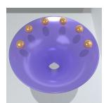  
{ball 1: (x,y)…}

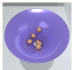  
{ball 1: (x,y)…}

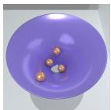  
{ball 1: (x,y)…}

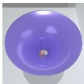  
{ball 1: (x,y)…}

Q. Which ball took the longest time to fall through the hole after its own release?

A. Ball 1.

Required: Dictionary of ball locations

  
1 page flipped

  
3 pages flipped

  
8 pages flipped

Q. How many pages are flipped? A. 8 pages.

Required: Atomic page count

  
“p” typed

  
“pin” typed

  
“pineapple” typed

Q. What’s the word being typed? A. pineapple.

Required: Sequence of typed characters

  
{1} pressed

  
{1,4,8} pressed

  
{0,1,2,3,4,6,8,9} pressed

Q. Which two numbers on the number pad were not pressed? A. 5,7

Required: Set of pressed numbers

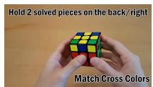  
top-left (front face)

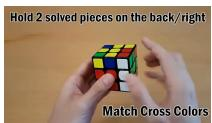  
top-right (top face)

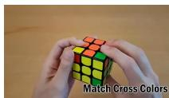  
top-right (front face)

Q. Where does the cubie with the yellow sticker (at the top left on the front face) end up?

A. top-right

Required: Atomic location

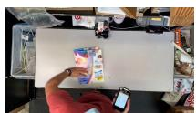  
0 item packed

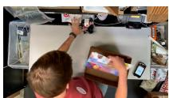  
2 item packed

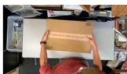  
8 item packed

Q. How many items are packed in total? A. 8

Required: Atomic packed item count

  
{“player A”: 1}, 1 shot

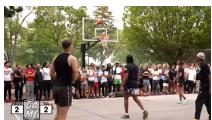  
{“player A”: 2, “player B”: 1}, 3 shots

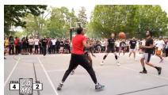  
{“player A”: 3, “player B”: 1, “player C”: 2}, 6 shots

Q. What’s the most shots made by one player? A. 3 [Required: Dictionary of players’ shots]

Q. What’s the total number of shots? A. 6 [Required: Atomic shot counts]

Figure 1 | Task examples in VSTAT. All questions require visual state tracking to answer. For illustration, we simplified the questions and subsampled video frames. Each example requires tracking different states, which are combinations of structure and element type.

across frames), and state update (i.e., updating the tracked state after each perceived event). For instance, when watching a shell game video, the model may misidentify which cups were swapped, lose track of the cup hiding a target item, or fail to update its location even after correctly identifying it. Even with recent agentic frameworks, including MLLM-based video agents [56] and state-of-the-art coding agents [2, 44], these failures cannot be readily mitigated and the performance gap remains substantial.

We highlight the main contributions of this paper below:

• We introduce VSTAT, a video-based benchmark for evaluating the visual state tracking capability of MLLMs, covering both synthetic and real-world videos paired with questions.   
• We show that state-of-the-art MLLMs perform far below human performance and only modestly above answer-prior baselines on VSTAT.   
• Through controlled experiments and analyses, we find that perceiving task-relevant events from the continuous visual stream is a major bottleneck.   
• We demonstrate that recent agentic frameworks, including video agent methods and coding agents, do not improve the performance on our benchmark.

Table 1 | Comparison with existing video understanding benchmarks. We compare VSTAT against existing benchmarks in terms of their coverage of state-tracking tasks.  denotes that the benchmark contains some instances satisfying the categories but only as a small fraction. CP-Bench and VET-Bench focus on 1–2 simple synthetic tasks (counting identical cubes and shell game, respectively). Dataset sources: Scripted (C), Real (R) and Synthetic (Y). 

<table><tr><td>Benchmark</td><td>Source</td><td>#Clips</td><td>#QAs</td><td>State Tracking</td><td>Real-world</td><td>Diverse</td></tr><tr><td>VideoMME-v2 [18]</td><td>C,R</td><td>800</td><td>3,200</td><td>➊</td><td>√</td><td>√</td></tr><tr><td>VideoReasonBench [38]</td><td>C,Y</td><td>240</td><td>1,440</td><td>√</td><td>➊</td><td>✕</td></tr><tr><td>CP-Bench [55]</td><td>Y</td><td>101</td><td>101</td><td>√</td><td>✕</td><td>✕</td></tr><tr><td>VET-Bench [37]</td><td>Y</td><td>100</td><td>100</td><td>√</td><td>✕</td><td>✕</td></tr><tr><td>VSTAT (ours)</td><td>C,R,Y</td><td>834</td><td>1,500</td><td>√</td><td>√</td><td>√</td></tr></table>

# 2. VSTAT: Visual State Tracking Benchmark

Our benchmark, VSTAT, is designed to evaluate the visual state tracking capability of MLLMs throughout a continuous video stream. VSTAT follows the standard format of video benchmarks for MLLMs: given a video stream v and a query q, the model ?? must predict the answer y. Unlike prior video MLLM benchmarks, we construct VSTAT such that the answer cannot be inferred from a single keyframe or a small subset of frames. Instead, every task in VSTAT requires the model to process the entire video stream, track and update the information needed to derive the answer. One of the most popular examples is the shell game [37], which tests a player’s observational skills by having them follow a hidden object as three cups are shuffled; the player must maintain the target cup’s location throughout the video.

VSTAT comprises a diverse set of tasks requiring visual state tracking capabilities, drawn from both synthetic and real-world videos. Concretely, VSTAT consists of 834 video clips paired with 1,500 questions, derived from simulated videos rendered with Blender and real-world videos collected from YouTube and our own recordings. VSTAT covers diverse tasks with varied tracking targets, such as counting packed items, recognizing typed words, or attributing shots to players. This enables extensive evaluation and analysis of the visual state tracking capability of models across diverse video streams that contain continuous procedural processes. We provide illustrative examples in Figure 1, along with dataset statistics and a comparison with existing video benchmarks in Table 1.

# 2.1. Data curation

In the rest of this section, we refer to the task examples illustrated in Figure 1.

Video curation. We curate our videos from both simulated environments and the real world. For simulated videos, we design 9 environments using the 3D software Blender and synthesize 450 video clips in total. For real-world videos, we collect 304 video clips from YouTube and record 80 additional videos ourselves in scripted settings. As a result, VSTAT contains 834 video clips in total. Across both sources, we focus on videos that contain diverse procedural processes such as solving puzzles, athletic plays, cooking, and order packing. In addition, each clip contains factors that make perception difficult; for example, the basketball clip involves continuous camera movement, while the order-packing clip exhibits frequent occlusion between items. We provide details of video categories, preprocessing strategies, and additional example visualizations in Appendix A.

Question-answer generation. From each video clip, we design questions that require visual state tracking over the video stream to predict an answer. We follow two design principles. First, all questions are designed to avoid visual shortcuts: the answer cannot be inferred from a few keyframes or the visible end state, forcing models to track state throughout the video. For instance, the book example’s “how many pages are flipped?” cannot be answered without tracking the entire video. Second, we use diverse query types that require tracking of various element types and their structures. Some queries require tracking locations (e.g., “where does the cube with the yellow sticker end up?”), while others require tracking total counts (e.g., “what is the total number of shots?”) or attributes such as characters (e.g., “what is the word being typed?”). Each query also demands a different state structure: it can be atomic when tracking a single position or counter, or more complex structures such as sequences or sets when the query asks about detailed history of the video stream.

VSTAT questions cannot be solved by visual shortcuts such as sparse keyframes or the end state, requiring models to maintain and update state across the entire video.

We design multiple questions for each video, with each question requiring the model to track different types of information. As illustrated by the basketball example, both the amount of information needed to answer a question and the associated difficulty can vary substantially depending on the query. Consequently, our benchmark contains 1,500 questions in total. We believe this “one video, multiple questions” format enables a comprehensive analysis of different aspects of models’ visual state tracking capabilities. Our questions come in two formats: numerical questions (NQs), whose answers are single numbers, and multiple-choice questions (MCQs), which are used for all other question types and include carefully designed distractors. All videos, questions, answers, and category labels are annotated and reviewed through a human-in-the-loop verification protocol; see Appendix A for details.

# 2.2. Taxonomy

As explained in Section 2.1, our benchmark involves two crucial complementary axes: perceptual complexity, which captures factors in the video stream that make visual perception difficult, and state complexity, which captures the amount and type of minimum information that must be extracted from the video to answer the question. In what follows, we explain in detail the categories we define along each axis to classify each instance in our benchmark.

State complexity. As shown in the examples of Figure 1, each instance requires a different state complexity, which we decompose into two orthogonal dimensions: element type and structure. We consider three categories for element type: count (book example), location (cube example), and attribute (keyboard example). For structure, we consider four categories: atomic (book example), sequence (keyboard example), set (numberpad example), and dictionary (basketball example).

Perceptual complexity. From the video and question-answer pairs we collected, we consider the following six categories related to factors that make video perception difficult: occlusion (e.g., the cube is hidden in some frames), camera motion (e.g., the camera moves and the scene changes in the basketball clip), homogeneity (e.g., multiple cubes share similar appearances), symbolic decoding (e.g., typing events must be transcribed into characters), multi-entity attribution (multiple players move simultaneously in the basketball clip), and event ambiguity (e.g., page flips can occur in either direction in the book example). Note that these categories reflect the major axes we observed across diverse procedural tasks, and may be extended to capture further variations.

With this taxonomy, we label each video-question pair along all three axes and use these labels to ensure a balanced data distribution for the benchmark that is not skewed toward any particular aspect; in Appendix A, we provide the detailed statistics breakdown of our benchmark, including the aforementioned axes, duration of each video clip, and keywords in the questions. For future research, we also open-source these labels along with the questions and video clips in our benchmark.

# 3. Evaluation on VSTAT

Using VSTAT, we evaluate the performance of recent MLLMs and their shortcomings, including (a) proprietary models (API; Gemini-3.1 Pro [23] and Gemini 3.0 Flash [22]) with different thinking levels, and open-sourced models (Qwen3VL [5], Cambrian-S [61], MiMo-VL [59], InternVL3.5 [53], LLaVA-OV [34], LLaVA-OV-2 [32], and Molmo2 [14]), by varying their model sizes and thinking mode, if applicable. We also consider several agentic frameworks, both specialized for video understanding (AVP [56]) and coding (Claude Code [2] and Codex [44]) for our studies.

In particular, we investigate the following questions:

• How well do state-of-the-art MLLMs perform on VSTAT overall? (Table 2, Table 3)   
• Why do MLLMs fail to solve tasks in VSTAT? (Table 4, Figure 2)   
• When do MLLMs fail to solve tasks in VSTAT? (Figure 3)   
• Can recent agentic frameworks solve tasks in VSTAT? (Table 5)

Table 2 | Evaluation on VSTAT. Scores report the reparsed MRA-with-MCQ metric. Dark gray indicates the best result among all models and light gray indicates the best result among open-sourced models. Ranks are computed separately within proprietary API models (1–4) and within open-sourced models (1–20, pooling Thinking and Instruct); baselines are not ranked. 

<table><tr><td rowspan="2">Methods</td><td rowspan="2">Rank</td><td rowspan="2">Avg.</td><td>Count</td><td>Location</td><td>Attribute</td><td>Atomic</td><td>Sequence</td><td>Set</td><td>Dict</td></tr><tr><td colspan="3">State Element</td><td colspan="4">State Structure</td></tr><tr><td colspan="10">Baselines</td></tr><tr><td>Chance Level (Random)</td><td>-</td><td>26.1</td><td>25.0</td><td>26.7</td><td>25.0</td><td>28.2</td><td>25.0</td><td>25.0</td><td>25.0</td></tr><tr><td>Chance Level (Frequency)</td><td>-</td><td>37.8</td><td>41.3</td><td>33.5</td><td>35.1</td><td>39.2</td><td>26.6</td><td>41.4</td><td>39.9</td></tr><tr><td>Human Performance</td><td>-</td><td>90.5</td><td>92.8</td><td>89.9</td><td>86.4</td><td>93.7</td><td>77.5</td><td>90.0</td><td>92.4</td></tr><tr><td colspan="10">Proprietary Models (API)</td></tr><tr><td>Gemini-3.1 Pro (low) [23]</td><td>1</td><td>44.4</td><td>42.6</td><td>38.5</td><td>54.1</td><td>39.5</td><td>60.8</td><td>51.9</td><td>38.7</td></tr><tr><td>Gemini-3.1 Pro (high) [23]</td><td>2</td><td>43.9</td><td>42.1</td><td>41.6</td><td>49.9</td><td>40.1</td><td>56.8</td><td>50.0</td><td>39.3</td></tr><tr><td>Gemini-3.0 Flash (low) [22]</td><td>3</td><td>39.8</td><td>33.4</td><td>40.3</td><td>52.2</td><td>32.5</td><td>61.6</td><td>48.2</td><td>35.2</td></tr><tr><td>Gemini-3.0 Flash (high) [22]</td><td>4</td><td>38.8</td><td>33.2</td><td>36.6</td><td>52.5</td><td>31.4</td><td>62.4</td><td>48.4</td><td>32.4</td></tr><tr><td colspan="10">Open-sourced Models Thinking</td></tr><tr><td>MiMo-VL-7B [59]</td><td>11</td><td>31.2</td><td>28.3</td><td>32.6</td><td>35.7</td><td>26.9</td><td>40.0</td><td>33.8</td><td>32.8</td></tr><tr><td>InternVL3.5-8B-Thinking [53]</td><td>13</td><td>30.2</td><td>24.5</td><td>32.6</td><td>39.5</td><td>26.0</td><td>35.5</td><td>41.4</td><td>27.6</td></tr><tr><td>GLM-4.1V-9B-Thinking [21]</td><td>14</td><td>30.2</td><td>24.8</td><td>33.9</td><td>37.2</td><td>26.9</td><td>33.2</td><td>40.8</td><td>27.3</td></tr><tr><td>Qwen3VL-8B-Thinking [5]</td><td>18</td><td>28.2</td><td>25.9</td><td>32.2</td><td>28.6</td><td>26.8</td><td>32.7</td><td>28.5</td><td>28.0</td></tr><tr><td>Qwen3VL-4B-Thinking [5]</td><td>19</td><td>26.0</td><td>21.0</td><td>31.8</td><td>30.2</td><td>25.5</td><td>30.8</td><td>29.5</td><td>21.4</td></tr><tr><td colspan="10">Open-sourced Models Instruct</td></tr><tr><td>LLaVA-OV-2-8B [32]</td><td>1</td><td>35.1</td><td>28.3</td><td>43.0</td><td>40.5</td><td>33.5</td><td>38.7</td><td>46.9</td><td>27.3</td></tr><tr><td>LLaVA-OV-2-8B (codec) [32]</td><td>2</td><td>35.0</td><td>28.6</td><td>42.0</td><td>40.6</td><td>33.9</td><td>37.0</td><td>46.3</td><td>27.6</td></tr><tr><td>Molmo2-4B [14]</td><td>3</td><td>34.4</td><td>31.6</td><td>39.7</td><td>34.5</td><td>37.1</td><td>33.6</td><td>36.7</td><td>27.1</td></tr><tr><td>Cambrian-S-7B [61]</td><td>4</td><td>34.2</td><td>33.2</td><td>33.6</td><td>36.9</td><td>34.0</td><td>30.6</td><td>40.2</td><td>32.5</td></tr><tr><td>Molmo2-8B [14]</td><td>5</td><td>34.0</td><td>30.9</td><td>37.0</td><td>37.0</td><td>34.7</td><td>36.3</td><td>39.1</td><td>27.0</td></tr><tr><td>Qwen3VL-8B [5]</td><td>6</td><td>33.2</td><td>30.9</td><td>37.0</td><td>33.9</td><td>32.4</td><td>33.3</td><td>37.9</td><td>31.5</td></tr><tr><td>InternVL3.5-2B [53]</td><td>7</td><td>31.8</td><td>29.6</td><td>33.9</td><td>34.1</td><td>31.7</td><td>29.9</td><td>36.3</td><td>29.9</td></tr><tr><td>Cambrian-S-3B [61]</td><td>8</td><td>31.8</td><td>29.7</td><td>32.7</td><td>35.0</td><td>32.7</td><td>31.9</td><td>35.1</td><td>27.2</td></tr><tr><td>VITA-1.5-7B [17]</td><td>9</td><td>31.5</td><td>25.5</td><td>36.3</td><td>38.6</td><td>29.4</td><td>33.0</td><td>43.1</td><td>26.3</td></tr><tr><td>Qwen3VL-4B [5]</td><td>10</td><td>31.3</td><td>27.0</td><td>33.3</td><td>37.9</td><td>30.4</td><td>32.8</td><td>39.8</td><td>25.8</td></tr><tr><td>InternVL3.5-8B [53]</td><td>12</td><td>30.6</td><td>25.1</td><td>33.2</td><td>39.2</td><td>26.9</td><td>33.8</td><td>41.8</td><td>28.3</td></tr><tr><td>Qwen3VL-2B [5]</td><td>15</td><td>29.4</td><td>29.4</td><td>28.2</td><td>30.5</td><td>32.5</td><td>24.9</td><td>32.1</td><td>23.5</td></tr><tr><td>Cambrian-S-1.5B [61]</td><td>16</td><td>29.3</td><td>26.0</td><td>34.1</td><td>31.0</td><td>28.0</td><td>31.0</td><td>31.8</td><td>29.3</td></tr><tr><td>LLaVA-OV-7B [34]</td><td>17</td><td>28.6</td><td>20.1</td><td>34.8</td><td>39.4</td><td>24.5</td><td>30.0</td><td>43.8</td><td>25.0</td></tr><tr><td>LLaVA-OV-0.5B [34]</td><td>20</td><td>21.3</td><td>14.6</td><td>33.9</td><td>21.7</td><td>19.7</td><td>25.8</td><td>22.2</td><td>20.9</td></tr></table>

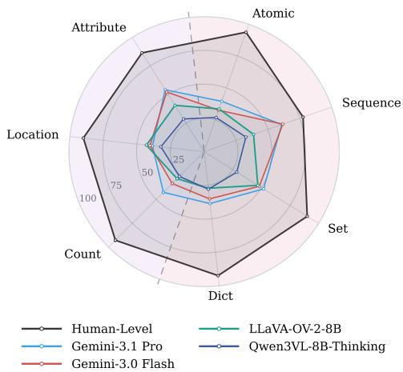

radar

| Category   | Human-Level | LLaVA-OV-2-8B | Gemini-3.1 Pro | Qwen3VL-8B-Thinking | Gemini-3.0 Flash |
| ---------- | ----------- | ------------- | -------------- | ------------------- | ---------------- |
| Attribute  | 90          | 60            | 50             | 40                  | 70               |
| Location   | 95          | 70            | 60             | 50                  | 80               |
| Count      | 90          | 65            | 55             | 45                  | 75               |
| Dict       | 95          | 75            | 65             | 55                  | 85               |
| Set        | 90          | 70            | 60             | 50                  | 80               |
| Sequence   | 85          | 65            | 55             | 45                  | 75               |
| Atomic     | 95          | 75            | 65             | 55                  | 85               |

Note. Each question is labeled by state element (Count, Location, Attribute) and state structure (Atomic, Sequence, Set, Dict). Avg. is computed over all questions, not as the mean of bucket scores.

# 3.1. Setup

Metrics and evaluation protocol. Our evaluation pipeline builds on LMMs-Eval [62] and follows the standard evaluation protocol of MLLMs on video benchmarks. Following VSI-Bench [60], we report the average of accuracy on MCQs and mean relative accuracy (MRA) on NQs. For open-sourced models, we sweep the maximum frame budget over {16, 32, 64, 128} uniformly sampled frames and report the best score for each model; the selected budgets are 32 frames for Qwen3VL-8B [5] and Cambrian-S-7B [61], 64 frames for Qwen3VL-4B, Qwen3VL-2B, and LLaVA-OV-2-8B [32], 128 frames for Molmo2-8B [14], and 16 frames for all other models. We additionally report LLaVA-OV-2-8B with its codec video backend, which packs codec-sampled frames into canvases (32 canvases from up to 256 sampled frames) instead of uniform frame sampling. For proprietary models (Gemini [23]), we set the resolution parameters as MEDIUM for evaluation, as we observe no significant performance difference across resolution parameters, and set max\_tokens=65536 during evaluation for sufficient reasoning budget.

Chance level baselines. Following VSI-Bench, we provide two baselines: Chance Level (Random) is the random selection accuracy for MCQ tasks (and is inapplicable for NQ tasks). Chance Level (Frequency) represents the highest performance MLLMs would achieve by always selecting the most frequent answer for each task. This identifies performance gains that may result from inherently long-tailed answers or imbalanced multiple-choice distributions. We also report human performance as a sanity check, measured by authors who were not involved in constructing the corresponding questions, which shows the difficulty of VSTAT for humans. See Appendix B for more details.

Q: How many times did the Pink face touch the floor?   
Video Input:   
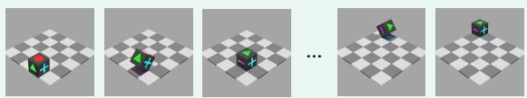

natural_image

Sequence of 3D cube and cube arrangements on a checkered floor, no text or symbols present

Text Transcription:   
The die starts with the following three visible faces: (Red, Green, Blue) The die is then moved as follows: roll up, roll down, roll left, … After each move, the three visible faces become: (Green, Pink, Blue), (Red, Green, Blue), (Blue, Green, Pink) …

(a) Example task and its text transcription.   
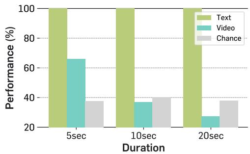

bar

| Duration | Text | Video | Chance |
| -------- | ---- | ----- | ------ |
| 5sec     | 100  | 67    | 38     |
| 10sec    | 100  | 37    | 40     |
| 20sec    | 100  | 28    | 38     |

(b) Performance across video durations.   
Figure 2 | Analyzing bottlenecks of MLLMs in visual state tracking. (a) An example Blender task (rolling die) with its video frames and text transcription. (b) Performance across video durations on the selected task subset. Recent MLLMs, such as Gemini-3.1 Pro [23], solve the task perfectly with text conditions, but their video performance drops to near chance and degrades further as videos grow longer.

# 3.2. Main results

In Table 2, we report the evaluation results across three state elements (count, location, and attribute) and four state structures (atomic, sequence, set, dictionary), along with the overall average accuracy and rank. As shown in the table, only Gemini-3.1 Pro and Gemini-3.0 Flash are modestly above the Chance-Level (Frequency) answer-prior baseline, while other models perform even worse. In contrast, humans solve our benchmark with an average accuracy of 90.5%, far exceeding the chance-level baseline and existing MLLMs. This reveals that a large gap still exists between the visual state tracking capabilities of humans and MLLMs. One exception is tasks that require tracking of sequence states, which show opposite trends between humans and MLLMs: for humans this is the most challenging category compared with other state structures, but for MLLMs it is the best-performing category, showing the smallest gap. We also observe that all open-sourced models perform worse than Chance-Level (Frequency) across all numbers of frames fed into the models, and usually show only marginal improvement with increased model size, with Molmo2 and InternVL3.5 demonstrating slight degradation.

Notably, although LLaVA-OV-2 [32] and Molmo2 [14] are specifically trained with motion-grounded codec streams and pixel-space object tracking data, respectively, they do not demonstrate substantial improvements over other open-source MLLMs, despite being the two best-performing open-source models. This further suggests that VSTAT evaluates a more complex form of state tracking that goes beyond pixel-level tracking or motion-grounding objectives, requiring models to track the underlying latent state representations evolving throughout the video stream.

We also observe that enabling thinking mode or increasing thinking levels hurts performance, as shown in Table 3. Gemini-3.1- Pro is only mildly affected by higher thinking levels, with performance changing from 44.4 to 43.9, while Gemini-3.0-Flash drops from 39.8 to 38.8. Among open-source models, Qwen3VL-8B exhibits a substantial decline from 33.2 to 28.2, whereas InternVL3.5-8B shows only slight degradation, moving from 30.6 to 30.2. Notably, this observation aligns with the findings of [18]. After inspecting examples in Appendix C.4, we find that, for tasks with higher perceptual complexity, a larger thinking budget can increase the likelihood of hallucination for these models.

<table><tr><td>Model</td><td>Thinking</td><td>Performance</td><td> $\Delta$ </td></tr><tr><td>Gemini-3.1-Pro</td><td>low → high</td><td>44.4 → 43.9</td><td>-1.1%</td></tr><tr><td>Gemini-3.0-Flash</td><td>low → high</td><td>39.8 → 38.8</td><td>-2.5%</td></tr><tr><td>Qwen3VL-8B</td><td>w/o → w/</td><td>33.2 → 28.2</td><td>-15.1%</td></tr><tr><td>InternVL3.5-8B</td><td>w/o → w/</td><td>30.6 → 30.2</td><td>-1.3%</td></tr></table>

Table 3 | Thinking does not reliably improve performance. Δ reports the relative performance change.

VSTAT is generally solvable by humans, but existing MLLMs struggle to solve it.

# 3.3. Why do current MLLMs fail to solve VSTAT?

To analyze why this large gap occurs, we conduct additional experiments from two different perspectives. First, we examine whether this performance gap stems from event ambiguity caused by the information loss from frame subsampling when feeding the video to the model. Second, we investigate whether the gap arises from the model’s visual perception or its reasoning capability. To this end, we take several simple tasks from the Blender environment, which allow us to control the number of events and the video duration, making them suitable for controlled analysis.

This gap does not mainly stem from event ambiguity. To rule out potential event ambiguity caused by the model’s relatively low video sampling rate, we first compare the performance of Gemini-3.1 Pro on the original 5-second Blender videos with that on their temporally stretched versions, where each original frame is duplicated five times. This ensures that every event in the video is fully visible to Gemini even under the 1 FPS sampling rate.2 However, as shown in Table 4, performance only marginally improves, suggesting that event ambiguity from frame subsampling is not the primary cause of the gap, which instead reflects fundamental limitations in the model’s visual perception capability.

<table><tr><td>Data</td><td>Avg.</td></tr><tr><td>Chance level (Freq.)</td><td>39.2</td></tr><tr><td>5sec</td><td>51.4</td></tr><tr><td>5sec + stretch</td><td>53.6</td></tr></table>

Table 4 | Impact of video stretching, evaluated on Gemini-3.1 Pro.

This gap stems from visual perception. We conduct an additional experiment to disentangle whether MLLM failures on visual state tracking tasks stem from visual perception or from reasoning. Specifically, we compare model performance under two conditions: the original video, and a text-only counterpart in which the video is replaced by a textual transcription of the visible states and events. If the gap between the two conditions is large, it suggests that visual perception, rather than reasoning, could be the primary bottleneck. Specifically, we consider three simple Blender tasks whose visible observations and events can be easily transcribed into text. For example, we consider the rolling die task, which requires counting how often a specific face lands on the bottom. Here, the transcription describes the three visible faces and the rolling direction at each step (see Figure 2a).

As shown in Figure 2b, state-of-the-art MLLMs solve these tasks perfectly when given textual transcriptions, yet their performance on video inputs drops to random-guess level once the video exceeds 10 seconds. Crucially, even on 5-second videos, where context length is negligible, performance already falls considerably short of the perfect text-only accuracy. While longer videos further degrade performance, the gap is already substantial at 5 seconds, suggesting that visual perception is the primary bottleneck, with errors compounding over longer videos. We observe the same pattern on other simple Blender-synthesized tasks (see Appendix C.2).

Visual perception appears to be a main bottleneck for models on VSTAT.

Here, we emphasize that text transcription is not intended as a solution, but rather as a diagnostic tool for probing the fundamental bottleneck behind MLLMs’ failures on VSTAT. On these Blender tasks, the perceptual gap is already so severe that we had to provide the text transcriptions by hand: even state-of-the-art MLLMs fail to reliably transcribe these simple synthetic videos into text. For real-world videos containing more complex dynamics and richer visual details (see Figure 1 and additional examples in Appendix A.2), text transcription would be even more challenging; in many cases, the resulting descriptions can exceed the length of the videos themselves, making this approach infeasible.

# 3.4. When do current MLLMs fail to solve VSTAT?

Next, we examine when MLLMs fail by analyzing the thinking traces of Gemini-3.1 Pro, the bestperforming model in our benchmark. Comparing each video with its trace, we identify three recurring failure modes, summarized in Figure 3. We also conduct a quantitative error analysis, as shown in Figure 4. More examples and details are in Appendix C.3.

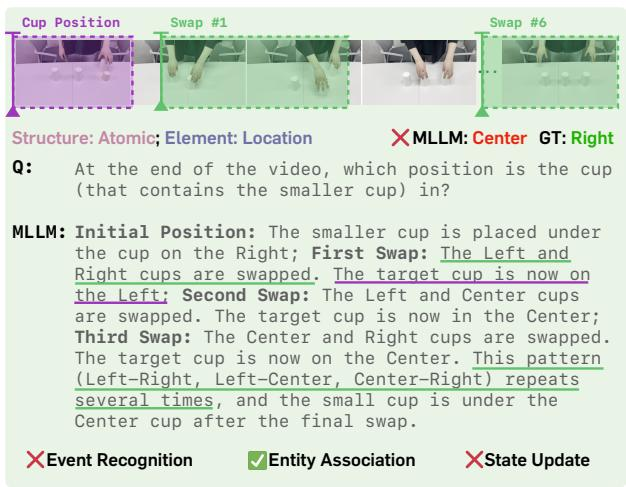

text_image

Cup Position
Swap #1
Swap #6
Structure: Atomic; Element: Location
XMLLM: Center GT: Right
Q: At the end of the video, which position is the cup
(that contains the smaller cup) in?
MLLM: Initial Position: The smaller cup is placed under
the cup on the Right; First Swap: The Left and
Right cups are swapped. The target cup is now on
the Left; Second Swap: The Left and Center cups
are swapped. The target cup is now in the Center;
Third Swap: The Center and Right cups are swapped.
The target cup is now on the Center. This pattern
(Left-Right, Left-Center, Center-Right) repeats
several times, and the small cup is under the
Center cup after the final swap.
XEvent Recognition ✓Entity Association XState Update

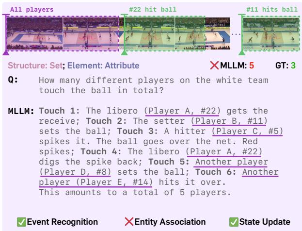

text_image

All players
#22 hit ball
#11 hits ball
Structure: Set; Element: Attribute
×MLLM: 5 GT: 3
Q: How many different players on the white team
touch the ball in total?
MLLM: Touch 1: The libero (Player A, #22) gets the
receive; Touch 2: The setter (Player B, #11)
sets the ball; Touch 3: A hitter (Player C, #5)
spikes it. The ball goes over the net. Red
spikes; Touch 4: The libero (Player A, #22)
digs the spike back; Touch 5: Another player
(Player D, #8) sets the ball; Touch 6: Another
player (Player E, #14) hits it over.
This amounts to a total of 5 players.
✓ Event Recognition ✗ Entity Association ✓ State Update

Figure 3 | Failures in event identification. We highlight phrases and frames related to state extraction in purple and failures in visual perception in green. For better illustration, we subsampled video frames related to the failures and simplified the thinking traces.

Event recognition. Even for relatively straightforward events in the video, the model can fail to correctly recognize the event and extract the corresponding state information. In the left example of Figure 3, the person swaps the center and right cups, but the model identifies the event as “the Left and Right cups are swapped,” leading to an incorrect cup location and ultimately an incorrect final answer. In more challenging cases, we observe that the model may even hallucinate the entire event trace without correctly identifying any of the actual events (see Appendix C.3).

Entity association. Besides misidentifying events in the video, the model often fails when the state requires consistent association with a specific entity among visually similar objects. In the volleyball example, all players wear identical uniforms, so distinguishing them requires motion-based tracking. While the model correctly identifies each ball-touch event, it assigns a new random jersey number each time the ball is touched, even when the same player handles the ball repeatedly and their actual number becomes visible later.

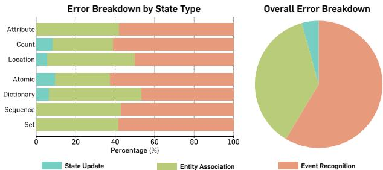

bar

| Category     | State Update (%) | Entity Association (%) | Event Recognition (%) |
| ------------ | ---------------- | ----------------------- | --------------------- |
| Attribute    | 0                | 45                      | 45                    |
| Count        | 10               | 35                      | 40                    |
| Location     | 5                | 40                      | 50                    |
| Atomic       | 10               | 0                       | 60                    |
| Dictionary   | 5                | 40                      | 45                    |
| Sequence     | 0                | 40                      | 45                    |
| Set          | 0                | 40                      | 45                    |

Figure 4 | Human-conducted error analysis. More than 50% are from event recognition.

State update. Lastly, we observe an interesting failure pattern in which the model correctly recognizes the events and/or maintains the correct entity associations throughout the video, but fails to use this information to update the state needed for question answering. For example, in the left example of Figure 3, during the third swap, the model correctly identifies that “the Center and Right cups are swapped” and that the target cup was previously in the Center. However, it incorrectly updates the target cup’s location as remaining in the Center, whereas it should move to the Right. We observe that this occurs more often when the model needs to track continuous trajectories, as it tends to over-simplify the observations and loses significant information from the video stream.

Quantitative analysis. As summarized in Figure 4, most failures are due to errors in either event recognition or entity association. In particular, more than 50% of failures stem from event recognition, suggesting that the dominant bottleneck of current MLLMs may lie in low-level perception, rather than visual reasoning. We also observe that state update errors highly correlate with the model’s textual reasoning capability. Therefore, this error type remains relatively limited, likely due to the advanced reasoning abilities of current state-of-the-art MLLMs.

# 3.5. Can agentic frameworks improve performance on VSTAT?

Finally, we conduct a preliminary case study examining whether recent agentic frameworks built on (M)LLMs can achieve better performance on VSTAT. We consider the following three agentic frameworks: AVP [56], a recent video agent; Codex with GPT-5 [44] and Claude Code with Opus 4.7 [2], two stateof-the-art coding agents. For Codex and Claude Code, we provide the video file directory and the corresponding question, and ask the model to write visual reasoning code to solve the question.3 We report results on a small subset of VSTAT in Table 5 by selecting one clip per video category.

As shown in the table, agentic methods are not able to solve VSTAT; rather, they show near chance-level accuracy despite their strong performance on text-based tasks, further indicating that the primary bottleneck of solving VSTAT lies in the visual perception capabilities of current models. We also observe that coding agents typically spend considerable time and tokens to answer a question. Solving a single question takes approximately 30 minutes on average, largely because they produce inconsistent intermediate results in their thinking traces, which confuses the model itself, even resulting in a wrong answer. For video agentic frameworks, we observe that they tend to show the opposite mode: they commit too early to their initial observation, sampling the video at a fixed low frame-rate (typically 1 FPS) and synthesizing an answer from a single round of evidence collection without verification. We include evaluation details and examples in Appendix C.5.

<table><tr><td>Method</td><td>Avg.</td></tr><tr><td>Chance level (Freq., n=39 subset)</td><td>50.8</td></tr><tr><td>Gemini-3.1 Pro [23]</td><td>52.6</td></tr><tr><td>Gemini-3.1 Pro [23] + AVP [56]</td><td>43.6</td></tr><tr><td>Claude Code (Opus 4.7, max) [2]</td><td>37.6</td></tr><tr><td>Codex (GPT-5, xhigh) [44]</td><td>53.4</td></tr></table>

Table 5 | Agentic method results.

# 4. Related Work

Video Multimodal Large Language Models (MLLMs). Recent progress in multimodal understanding largely stems from MLLMs [48, 61, 4, 51, 5], which incorporate powerful foundational visual encoders [50, 41, 43] into the strong linguistic understanding capabilities of LLMs [10, 3, 49]. This success in the image domain has naturally led to the exploration of video-based MLLMs [36, 34, 63, 45, 6, 66, 61, 15, 23, 5], which is essential for real-world applications that require multimodal intelligence, such as robotics [9, 8] and web agents [24]. Our benchmark evaluates and diagnoses the visual state tracking capabilities of MLLMs, which are essential for many applications such as long-horizon robotic manipulation.

Evaluation of video MLLMs. To effectively measure progress, pinpoint current limitations, and guide future research, a series of benchmarks have been proposed to evaluate video MLLMs from different perspectives, including general video understanding [16, 35, 18], event recognition [58, 11], knowledge reasoning [29, 64], and temporal grounding and reasoning [19, 12, 42]. More recent efforts impose stricter requirements, challenging models to comprehend hours- or even day-long videos [45, 40, 13, 57, 52, 65, 54] and to reason about the spatial information underlying video frames [60, 61]. Despite the breadth of these efforts, little to none attention has been paid to visual state tracking—the ability to continuously monitor visual states and events as they evolve over time. This capability is effortless for humans yet indispensable for real-world applications such as robotic manipulation, assistive agents, and surveillance, and it remains conspicuously absent from existing evaluation suites. This paper aims to fill this gap by proposing a benchmark to evaluate and diagnose visual state tracking capability of MLLMs.

Comparison with concurrent works. VSTAT is related to several concurrent benchmarks, including VET-bench [37], VideoReasonBench [38] and Video-MME-v2 [18], but differs substantially in scope and design. VET-bench shares our motivation of evaluating state tracking in MLLMs, but is limited to two shell-game-like tasks in a simulated environment with only 100 video clips—an order of magnitude smaller than VSTAT. Video-MME-v2 is a comprehensive video understanding benchmark that includes a few categories relevant to state tracking (e.g., repetitive action counting and entity persistence tracking). In contrast, VSTAT systematically covers tracking of underlying latent state representations in the video stream. Finally, videos in VideoReasonBench are either synthetic or recorded under scripted setups, and many videos explicitly visualize the events (e.g., swaps shown as arrows), introducing visual shortcuts. In contrast, VSTAT contains real-world videos with no explicit visual cues for the underlying events.

Video world models. Our benchmark shares some conceptual similarity with video world models [20, 33, 26, 27, 25, 46, 30, 28, 47, 31, 1, 7], which aim to predict future states from previous states, actions, and observations. The main difference is that these methods typically assume actions are given explicitly and define the state representation as an approximation of the entire visual world, usually represented as latent video representations [33] or the entire sequence of video frames, including predicted ones [20]. In contrast, our setting assumes actions are implicitly given through events, and the state is defined relative to the query, capturing only the partial information from the video necessary to answer it. We hope this connection also facilitates better evaluation of world modeling.

# 5. Conclusion

We present VSTAT, a video-based benchmark for diagnosing the visual state tracking capability of MLLMs. Our evaluation reveals a substantial gap between humans and current MLLMs, which only modestly exceed answer-prior baselines. Through controlled analyses, we further identify visual perception, rather than textual tracking, as the primary bottleneck, and diagnose recurring failure modes. Finally, we show that existing agentic frameworks, including video agents and coding agents, do not trivially resolve these failures. We hope VSTAT serves as a useful diagnostic tool for the community to understand and improve the visual perception of MLLMs on continuous, real-world video streams. We discuss limitations and future directions in Appendix D.

# Acknowledgments

We thank Taeyoung Kim, Anjali Gupta, and Ying Wang for proofreading, and thank Daohan Lu for helping with our human evaluation. S.X. acknowledges support from the MSIT IITP grant (RS-2024- 00457882) and NSF Award IIS-2443404.

# References

[1] Eloi Alonso, Adam Jelley, Vincent Micheli, Anssi Kanervisto, Amos Storkey, Tim Pearce, and François Fleuret. Diffusion for World Modeling: Visual Details Matter in Atari. In Advances in Neural Information Processing Systems, 2024.   
[2] Anthropic. Introducing Claude Opus 4.7. https://www.anthropic.com/news/claude-opu s-4-7, April 2026. Accessed: 2026-05-02.   
[3] Jinze Bai, Shuai Bai, Yunfei Chu, Zeyu Cui, Kai Dang, Xiaodong Deng, Yang Fan, Wenbin Ge, Yu Han, Fei Huang, et al. Qwen technical report. arXiv preprint arXiv:2309.16609, 2023.   
[4] Jinze Bai, Shuai Bai, Shusheng Yang, Shijie Wang, Sinan Tan, Peng Wang, Junyang Lin, Chang Zhou, and Jingren Zhou. Qwen-vl: A frontier large vision-language model with versatile abilities. arXiv preprint arXiv:2308.12966, 2023.   
[5] Shuai Bai, Yuxuan Cai, Ruizhe Chen, Keqin Chen, Xionghui Chen, Zesen Cheng, Lianghao Deng, Wei Ding, Chang Gao, Chunjiang Ge, et al. Qwen3-vl technical report. arXiv preprint arXiv:2511.21631, 2025.   
[6] Shuai Bai, Keqin Chen, Xuejing Liu, Jialin Wang, Wenbin Ge, Sibo Song, Kai Dang, Peng Wang, Shijie Wang, Jun Tang, et al. Qwen2.5-vl technical report. arXiv preprint arXiv:2502.13923, 2025.   
[7] Philip J. Ball, Jakob Bauer, Frank Belletti, Bethanie Brownfield, Ariel Ephrat, Shlomi Fruchter, Agrim Gupta, Kristian Holsheimer, Aleksander Holynski, Jiri Hron, Christos Kaplanis, Marjorie Limont, Matt McGill, Yanko Oliveira, Jack Parker-Holder, Frank Perbet, Guy Scully, Jeremy Shar, Stephen Spencer, Omer Tov, Ruben Villegas, Emma Wang, Jessica Yung, Cip Baetu, Jordi Berbel, David Bridson, Jake Bruce, Gavin Buttimore, Sarah Chakera, Bilva Chandra, Paul Collins, Alex Cullum, Bogdan Damoc, Vibha Dasagi, Maxime Gazeau, Charles Gbadamosi, Woohyun Han, Ed Hirst, Ashyana Kachra, Lucie Kerley, Kristian Kjems, Eva Knoepfel, Vika Koriakin, Jessica Lo, Cong Lu,

Zeb Mehring, Alex Moufarek, Henna Nandwani, Valeria Oliveira, Fabio Pardo, Jane Park, Andrew Pierson, Ben Poole, Helen Ran, Tim Salimans, Manuel Sanchez, Igor Saprykin, Amy Shen, Sailesh Sidhwani, Duncan Smith, Joe Stanton, Hamish Tomlinson, Dimple Vijaykumar, Luyu Wang, Piers Wingfield, Nat Wong, Keyang Xu, Christopher Yew, Nick Young, Vadim Zubov, Douglas Eck, Dumitru Erhan, Koray Kavukcuoglu, Demis Hassabis, Zoubin Gharamani, Raia Hadsell, Aäron van den Oord, Inbar Mosseri, Adrian Bolton, Satinder Singh, and Tim Rocktäschel. Genie 3: A new frontier for world models. 2025.   
[8] Johan Bjorck, Fernando Castañeda, Nikita Cherniadev, Xingye Da, Runyu Ding, Linxi Fan, Yu Fang, Dieter Fox, Fengyuan Hu, Spencer Huang, et al. Gr00t n1: An open foundation model for generalist humanoid robots. arXiv preprint arXiv:2503.14734, 2025.   
[9] Kevin Black, Noah Brown, Danny Driess, Adnan Esmail, Michael Equi, Chelsea Finn, Niccolo Fusai, Lachy Groom, Karol Hausman, Brian Ichter, et al. ??0: A vision-language-action flow model for general robot control. arXiv preprint arXiv:2410.24164, 2024.   
[10] Tom Brown, Benjamin Mann, Nick Ryder, Melanie Subbiah, Jared D Kaplan, Prafulla Dhariwal, Arvind Neelakantan, Pranav Shyam, Girish Sastry, Amanda Askell, et al. Language models are few-shot learners. In Advances in Neural Information Processing Systems, 2020.   
[11] Fabian Caba Heilbron, Victor Escorcia, Bernard Ghanem, and Juan Carlos Niebles. Activitynet: A large-scale video benchmark for human activity understanding. In IEEE Conference on Computer Vision and Pattern Recognition, 2015.   
[12] Mu Cai, Reuben Tan, Jianrui Zhang, Bocheng Zou, Kai Zhang, Feng Yao, Fangrui Zhu, Jing Gu, Yiwu Zhong, Yuzhang Shang, et al. Temporalbench: Benchmarking fine-grained temporal understanding for multimodal video models. arXiv preprint arXiv:2410.10818, 2024.   
[13] Keshigeyan Chandrasegaran, Agrim Gupta, Lea M Hadzic, Taran Kota, Jimming He, Cristóbal Eyzaguirre, Zane Durante, Manling Li, Jiajun Wu, and Fei-Fei Li. Hourvideo: 1-hour video-language understanding. In Advances in Neural Information Processing Systems, 2024.   
[14] Christopher Clark, Jieyu Zhang, Zixian Ma, Jae Sung Park, Mohammadreza Salehi, Rohun Tripathi, Sangho Lee, Chris Dongjoo Kim, Yue Yang, Ali Farhadi, and Ranjay Krishna. Molmo2: Open Weights and Data for Vision-Language Models with Video Understanding and Grounding. arXiv preprint arXiv:2601.10611, 2026.   
[15] Gheorghe Comanici, Eric Bieber, Mike Schaekermann, Ice Pasupat, Noveen Sachdeva, Inderjit Dhillon, Marcel Blistein, Ori Ram, Dan Zhang, Evan Rosen, et al. Gemini 2.5: Pushing the frontier with advanced reasoning, multimodality, long context, and next generation agentic capabilities. arXiv preprint arXiv:2507.06261, 2025.   
[16] Chaoyou Fu, Yuhan Dai, Yongdong Luo, Lei Li, Shuhuai Ren, Renrui Zhang, Zihan Wang, Chenyu Zhou, Yunhang Shen, Mengdan Zhang, et al. Video-mme: The first-ever comprehensive evaluation benchmark of multi-modal llms in video analysis. In IEEE Conference on Computer Vision and Pattern Recognition, 2025.   
[17] Chaoyou Fu, Haojia Lin, Xiong Wang, Yi-Fan Zhang, Yunhang Shen, Xiaoyu Liu, Haoyu Cao, Zuwei Long, Heting Gao, Ke Li, Long Ma, Xiawu Zheng, Rongrong Ji, Xing Sun, Caifeng Shan, and Ran He. VITA-1.5: Towards GPT-4o level real-time vision and speech interaction. arXiv preprint arXiv:2501.01957, 2025.   
[18] Chaoyou Fu, Hao Yuan, Yuhao Dong, Yifan Zhang, Yunhang Shen, Xiaoxing Hu, Xueying Li, Jinsen Su, Chengwu Long, Xiaoyao Xie, Yong Xie, Xiawu Zheng, Xuejiao Yang, Haoyu Cao, Yunsheng Wu, Ziwei Liu, Xing Sun, Caifeng Shan, and Ran He. Video-mme-v2: Towards the next stage in benchmarks for comprehensive video understanding. arXiv preprint arXiv:2604.05015, 2026.   
[19] Jiyang Gao, Chen Sun, Zhenheng Yang, and Ram Nevatia. Tall: Temporal activity localization via language query. In IEEE International Conference on Computer Vision, 2017.

[20] Shenyuan Gao, William Liang, Kaiyuan Zheng, Ayaan Malik, Seonghyeon Ye, Sihyun Yu, Wei-Cheng Tseng, Yuzhu Dong, Kaichun Mo, Chen-Hsuan Lin, et al. Dreamdojo: A generalist robot world model from large-scale human videos. arXiv preprint arXiv:2602.06949, 2026.   
[21] GLM-V Team. GLM-4.5V and GLM-4.1V-Thinking: Towards versatile multimodal reasoning with scalable reinforcement learning. arXiv preprint arXiv:2507.01006, 2025.   
[22] Google DeepMind. Gemini 3 flash. https://deepmind.google/models/gemini/flash/, 2025.   
[23] Google DeepMind. Gemini 3.1 pro model card. https://deepmind.google/models/model-c ards/gemini-3-1-pro/, 2026.   
[24] Boyu Gou, Ruohan Wang, Boyuan Zheng, Yanan Xie, Cheng Chang, Yiheng Shu, Huan Sun, and Yu Su. Navigating the digital world as humans do: Universal visual grounding for GUI agents. In International Conference on Learning Representations, 2025.   
[25] Junliang Guo, Yang Ye, Tianyu He, Haoyu Wu, Yushu Jiang, Tim Pearce, and Jiang Bian. MineWorld: A Real-Time and Open-Source Interactive World Model on Minecraft. arXiv preprint arXiv:2504.08388, 2025.   
[26] David Ha and Jürgen Schmidhuber. Recurrent World Models Facilitate Policy Evolution. In Advances in Neural Information Processing Systems, 2018.   
[27] Danijar Hafner, Jurgis Pasukonis, Jimmy Ba, and Timothy Lillicrap. Mastering Diverse Domains through World Models. Nature, 2025.   
[28] Yicong Hong, Yiqun Mei, Chongjian Ge, Yiran Xu, Yang Zhou, Sai Bi, Yannick Hold-Geoffroy, Mike Roberts, Matthew Fisher, Eli Shechtman, et al. RELIC: Interactive Video World Model with Long-Horizon Memory. arXiv preprint arXiv:2512.04040, 2025.   
[29] Kairui Hu, Penghao Wu, Fanyi Pu, Wang Xiao, Yuanhan Zhang, Xiang Yue, Bo Li, and Ziwei Liu. Video-MMMU: Evaluating knowledge acquisition from multi-discipline professional videos. arXiv preprint arXiv:2501.13826, 2025.   
[30] Anssi Kanervisto, Dave Bignell, Linda Yilin Wen, Martin Grayson, Raluca Georgescu, Sergio Valcarcel Macua, Shan Zheng Tan, Tabish Rashid, Tim Pearce, Yuhan Cao, et al. World and Human Action Models Towards Gameplay Ideation. Nature, 2025.   
[31] Lingdong Kong, Wesley Yang, Jianbiao Mei, Youquan Liu, Ao Liang, Dekai Zhu, Dongyue Lu, Wei Yin, Xiaotao Hu, Mingkai Jia, et al. 3D and 4D World Modeling: A Survey. arXiv preprint arXiv:2509.07996, 2025.   
[32] Glint Lab, AIM for Health Lab, and MVP Lab. LLaVA-OneVision-2: Towards Next-Generation Perceptual Intelligence. arXiv preprint arXiv:2605.25979, 2026.   
[33] Yann LeCun. A Path Towards Autonomous Machine Intelligence. Open Review, 2022.   
[34] Bo Li, Yuanhan Zhang, Dong Guo, Renrui Zhang, Feng Li, Hao Zhang, Kaichen Zhang, Peiyuan Zhang, Yanwei Li, Ziwei Liu, et al. Llava-onevision: Easy visual task transfer. Transactions on Machine Learning Research, 2025.   
[35] Kunchang Li, Yali Wang, Yinan He, Yizhuo Li, Yi Wang, Yi Liu, Zun Wang, Jilan Xu, Guo Chen, Ping Luo, et al. MVbench: A comprehensive multi-modal video understanding benchmark. In IEEE Conference on Computer Vision and Pattern Recognition, 2024.   
[36] Yanwei Li, Chengyao Wang, and Jiaya Jia. Llama-vid: An image is worth 2 tokens in large language models. In ECCV, 2024.   
[37] Tiedong Liu and Wee Sun Lee. Can vision-language models solve the shell game? arXiv preprint arXiv:2603.08436, 2026.

[38] Yuanxin Liu, Kun Ouyang, Haoning Wu, Yi Liu, Lin Sui, Xinhao Li, Yan Zhong, Y.Charles, Xinyu Zhou, and Xu Sun. Videoreasonbench: Can MLLMs perform vision-centric complex video reasoning? In International Conference on Learning Representations, 2026.   
[39] Arjun Majumdar, Anurag Ajay, Xiaohan Zhang, Pranav Putta, Sriram Yenamandra, Mikael Henaff, Sneha Silwal, Paul Mcvay, Oleksandr Maksymets, Sergio Arnaud, et al. Openeqa: Embodied question answering in the era of foundation models. In IEEE Conference on Computer Vision and Pattern Recognition, 2024.   
[40] Karttikeya Mangalam, Raiymbek Akshulakov, and Jitendra Malik. Egoschema: A diagnostic benchmark for very long-form video language understanding. In Advances in Neural Information Processing Systems, 2023.   
[41] Alec Radford, Jong Wook Kim, Chris Hallacy, Aditya Ramesh, Gabriel Goh, Sandhini Agarwal, Girish Sastry, Amanda Askell, Pamela Mishkin, Jack Clark, et al. Learning transferable visual models from natural language supervision. In International Conference on Machine Learning, 2021.   
[42] Ziyao Shangguan, Chuhan Li, Yuxuan Ding, Yanan Zheng, Yilun Zhao, Tesca Fitzgerald, and Arman Cohan. Tomato: Assessing visual temporal reasoning capabilities in multimodal foundation models. In International Conference on Learning Representations, 2025.   
[43] Oriane Sim’eoni, Huy V. Vo, Maximilian Seitzer, Federico Baldassarre, Maxime Oquab, Cijo Jose, Vasil Khalidov, Marc Szafraniec, Seungeun Yi, Michael Ramamonjisoa, Francisco Massa, Daniel Haziza, Luca Wehrstedt, Jianyuan Wang, Timothée Darcet, Théo Moutakanni, Leonel Sentana, Claire Roberts, Andrea Vedaldi, Jamie Tolan, John Brandt, Camille Couprie, Julien Mairal, Herv’e J’egou, Patrick Labatut, and Piotr Bojanowski. Dinov3. arXiv preprint arXiv:2508.10104, 2025.   
[44] Aaditya Singh, Adam Fry, Adam Perelman, Adam Tart, Adi Ganesh, Ahmed El-Kishky, Aidan McLaughlin, Aiden Low, AJ Ostrow, Akhila Ananthram, et al. Openai gpt-5 system card. arXiv preprint arXiv:2601.03267, 2026.   
[45] Enxin Song, Wenhao Chai, Guanhong Wang, Yucheng Zhang, Haoyang Zhou, Feiyang Wu, Haozhe Chi, Xun Guo, Tian Ye, Yanting Zhang, et al. Moviechat: From dense token to sparse memory for long video understanding. In IEEE Conference on Computer Vision and Pattern Recognition, 2024.   
[46] Wenqiang Sun, Haiyu Zhang, Haoyuan Wang, Junta Wu, Zehan Wang, Zhenwei Wang, Yunhong Wang, Jun Zhang, Tengfei Wang, and Chunchao Guo. WorldPlay: Towards Long-Term Geometric Consistency for Real-Time Interactive World Modeling. arXiv preprint arXiv:2512.14614, 2025.   
[47] Team Robbyant, Zelin Gao, Qiuyu Wang, Yanhong Zeng, Jiapeng Zhu, Ka Leong Cheng, Yixuan Li, Hanlin Wang, Yinghao Xu, Shuailei Ma, et al. Advancing Open-Source World Models. arXiv preprint arXiv:2601.20540, 2026.   
[48] Shengbang Tong, Ellis Brown, Penghao Wu, Sanghyun Woo, Manoj Middepogu, Sai C Akula, Jihan Yang, Shusheng Yang, Adithya Iyer, Xichen Pan, et al. Cambrian-1: A fully open, vision-centric exploration of multimodal llms. In Advances in Neural Information Processing Systems, volume 37, 2024.   
[49] Hugo Touvron, Louis Martin, Kevin Stone, Peter Albert, Amjad Almahairi, Yasmine Babaei, Nikolay Bashlykov, Soumya Batra, Prajjwal Bhargava, Shruti Bhosale, et al. Llama 2: Open foundation and fine-tuned chat models. arXiv preprint arXiv:2307.09288, 2023.   
[50] Michael Tschannen, Alexey Gritsenko, Xiao Wang, Muhammad Ferjad Naeem, Ibrahim Alabdulmohsin, Nikhil Parthasarathy, Talfan Evans, Lucas Beyer, Ye Xia, Basil Mustafa, et al. Siglip 2: Multilingual vision-language encoders with improved semantic understanding, localization, and dense features. arXiv preprint arXiv:2502.14786, 2025.   
[51] Peng Wang, Shuai Bai, Sinan Tan, Shijie Wang, Zhihao Fan, Jinze Bai, Keqin Chen, Xuejing Liu, Jialin Wang, Wenbin Ge, et al. Qwen2-vl: Enhancing vision-language model’s perception of the world at any resolution. arXiv preprint arXiv:2409.12191, 2024.

[52] Weihan Wang, Zehai He, Wenyi Hong, Yean Cheng, Xiaohan Zhang, Ji Qi, Xiaotao Gu, Shiyu Huang, Bin Xu, Yuxiao Dong, et al. LVBench: An extreme long video understanding benchmark. arXiv preprint arXiv:2406.08035, 2024.   
[53] Weiyun Wang, Zhangwei Gao, Lixin Gu, Hengjun Pu, Long Cui, Xingguang Wei, Zhaoyang Liu, Linglin Jing, Shenglong Ye, Jie Shao, et al. InternVL3.5: Advancing open-source multimodal models in versatility, reasoning, and efficiency. arXiv preprint arXiv:2508.18265, 2025.   
[54] Ying Wang, Yanlai Yang, and Mengye Ren. Lifelongmemory: Leveraging llms for answering queries in long-form egocentric videos. arXiv preprint arXiv:2312.05269, 2023.   
[55] Zeyu Wang, Zhenzhen Weng, and Serena Yeung-Levy. Continuous perception matters: Diagnosing temporal integration failures in multimodal models. arXiv preprint arXiv:2408.07867, 2024.   
[56] Ziyang Wang, Honglu Zhou, Shijie Wang, Junnan Li, Caiming Xiong, Silvio Savarese, Mohit Bansal, Michael S. Ryoo, and Juan Carlos Niebles. Active video perception: Iterative evidence seeking for agentic long video understanding. arXiv preprint arXiv:2512.05774, 2025.   
[57] Haoning Wu, Dongxu Li, Bei Chen, and Junnan Li. Longvideobench: A benchmark for long-context interleaved video-language understanding. In Advances in Neural Information Processing Systems, 2024.   
[58] Junbin Xiao, Xindi Shang, Angela Yao, and Tat-Seng Chua. Next-qa: Next phase of questionanswering to explaining temporal actions. In IEEE Conference on Computer Vision and Pattern Recognition, 2021.   
[59] Xiaomi LLM-Core Team, Zihao Yue, Zhenrui Lin, Yi-Hao Song, Weikun Wang, Shu-Qin Ren, Shuhao Gu, Shicheng Li, Peidian Li, Liang Zhao, Lei Li, Kainan Bao, Hao Tian, Hailin Zhang, Gang Wang, Dawei Zhu, Cici, Chenhong He, Bowen Ye, Bowen Shen, Zihan Zhang, Zi-Ang Jiang, Zhixian Zheng, Zhichao Song, Zhen Luo, Yue Yu, Yudong Wang, Yu Tian, Yu Tu, Yihan Yan, Yi Huang, Xu Wang, Xin dan Xu, Xin Ran Song, Xing Zhang, Xing Yong, Xin Zhang, Xia Deng, Wenyu Yang, Wenhan Ma, Weiwei Lv, Weiji Zhuang, Wei Liu, Sirui Deng, Shuo Liu, Shimao Chen, Shi liang Yu, Shao yang Liu, Shan yong Wang, Rui Ma, Qiantong Wang, Peng Wang, Nuo Chen, Menghang Zhu, Kang Zhou, Kang Zhou, Kai Fang, Jun-Miao Shi, Jinhao Dong, Jiebao Xiao, Jiaming Xu, Huaqiu Liu, Hongsheng Xu, Hengxu Qu, Hao-Song Zhao, Hanglong Lv, Guoan Wang, Duo Zhang, Dong Zhang, Di Zhang, Chong-Yi Ma, Chang Liu, Can Cai, and Bing Xia. Mimo-vl technical report. arXiv preprint arXiv:2506.03569, 2025.   
[60] Jihan Yang, Shusheng Yang, Anjali Gupta, Rilyn Han, Li Fei-Fei, and Saining Xie. Thinking in Space: How Multimodal Large Language Models See, Remember and Recall Spaces. In IEEE Conference on Computer Vision and Pattern Recognition, 2024.   
[61] Shusheng Yang, Jihan Yang, Pinzhi Huang, Ellis L Brown II, Zihao Yang, Yue Yu, Shengbang Tong, Zihan Zheng, Yifan Xu, Muhan Wang, Rob Fergus, Yann LeCun, Li Fei-Fei, and Saining Xie. Cambrian-s: Towards spatial supersensing in video. In International Conference on Learning Representations, 2026.   
[62] Kaichen Zhang, Bo Li, Peiyuan Zhang, Fanyi Pu, Joshua Adrian Cahyono, Kairui Hu, Shuai Liu, Yuanhan Zhang, Jingkang Yang, Chunyuan Li, and Ziwei Liu. Lmms-eval: Reality check on the evaluation of large multimodal models. arXiv preprint arXiv:2407.12772, 2024.   
[63] Yuanhan Zhang, Jinming Wu, Wei Li, Bo Li, Zejun Ma, Ziwei Liu, and Chunyuan Li. Video instruction tuning with synthetic data. Transactions on Machine Learning Research, 2025.   
[64] Yilun Zhao, Haowei Zhang, Lujing Xie, Tongyan Hu, Guo Gan, Yitao Long, Zhiyuan Hu, Weiyuan Chen, Chuhan Li, Zhijian Xu, et al. Mmvu: Measuring expert-level multi-discipline video understanding. In Proceedings of the Computer Vision and Pattern Recognition Conference, pages 8475–8489, 2025.

[65] Junjie Zhou, Yan Shu, Bo Zhao, Boya Wu, Shitao Xiao, Xi Yang, Yongping Xiong, Bo Zhang, Tiejun Huang, and Zheng Liu. Mlvu: A comprehensive benchmark for multi-task long video understanding. arXiv preprint arXiv:2406.04264, 2024.   
[66] Jinguo Zhu, Weiyun Wang, Zhe Chen, Zhaoyang Liu, Shenglong Ye, Lixin Gu, Yuchen Duan, Hao Tian, Weijie Su, Jie Shao, et al. Internvl3: Exploring advanced training and test-time recipes for open-source multimodal models. arXiv preprint arXiv:2504.10479, 2025.

# A. Benchmark Breakdown

# A.1. Detailed Information

Formal definition In Table 6 and 7, we provide a more formal definition of each category in our taxonomy, which is used for our labeling process (detailed in Appendix A.3).

Table 6 | Taxonomy of state structures across diverse queries and tasks (Table 8 and 9). 

<table><tr><td>Type</td><td>Definition</td><td>Examples</td></tr><tr><td colspan="3">Element type</td></tr><tr><td>Count</td><td>An integer accumulated over time</td><td># of passes in Basketball; # of steps in Cube</td></tr><tr><td>Location</td><td>A position in a discrete / continuous space</td><td>Position of ball in Shell game / Tilt box</td></tr><tr><td>Attribute</td><td>A categorical or vector-valued property</td><td>Characters in Morse code; longest Latte art</td></tr><tr><td colspan="3">Structure</td></tr><tr><td>Atomic</td><td>A single value at all time points</td><td># of pages in Book; # of ingredients in Cooking</td></tr><tr><td>Sequence</td><td>An ordered series of values over time</td><td>Typing in Keyboard; scoring order in Tennis</td></tr><tr><td>Set</td><td>A subset of values, unordered</td><td>Distinct players in Volleyball; unpressed button in Numberpad</td></tr><tr><td>Dict</td><td>A map binding each entity to a value</td><td>hits per player in Tennis; max shots made in Basketball</td></tr></table>

Table 7 | Taxonomy of perceptual challenges across diverse tasks (Table 8 and 9). 

<table><tr><td>Challenge</td><td>Definition</td><td>Examples</td></tr><tr><td>Occlusion</td><td>The target is physically hidden behind other objects</td><td>Shell game; Cup stacking</td></tr><tr><td>Camera motion</td><td>Viewpoint shifts disrupt the spatial reference frame</td><td>Basketball; Carousel</td></tr><tr><td>Homogeneity</td><td>Multiple targets share identical appearance, making them hard to track individually</td><td>Cube; Lego</td></tr><tr><td>Symbolic decoding</td><td>A continuous visual pattern must be segmented and mapped to discrete symbols</td><td>Keyboard; Graffiti</td></tr><tr><td>Multi-entity attribution</td><td>Multiple objects act simultaneously, requiring state changes to be attributed to the correct one</td><td>Volleyball; NeuroTracker</td></tr><tr><td>Event ambiguity</td><td>Visually similar events produce different state outcomes</td><td>Tightening bolts; Number-pad</td></tr></table>

Statistics. We provide the statistics of VSTAT in Figure 5. As shown in the Figure 5a and 5b, our benchmark contains a balanced distribution across both element type and state structure, without skewing toward the simplest question types such as atomic count. Also, as shown in Figure 5c, VSTAT includes various perceptual challenges (e.g., action ambiguity and camera motion). Moreover, as shown in Figure 5d, a majority of our videos have a duration shorter than 30 seconds, which is much shorter than the context length of frontier models like Gemini-3.1 Pro or Gemini-3.0-Flash. Lastly, as shown in Figure 5e, our questions consist of diverse keywords, covering a wide range of situations.

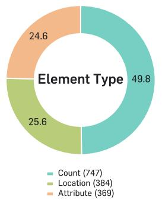

pie

Element Type
| Element Type | Value |
| :--- | :--- |
| Count | 49.8 |
| Location | 25.6 |
| Attribute | 24.6 |

(a) Element type

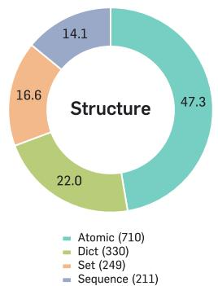

pie

Structure
| Category | Value |
|---|---|
| Atomic | 47.3 |
| Dict | 22.0 |
| Set | 16.6 |
| Sequence | 14.1 |

(b) Structure

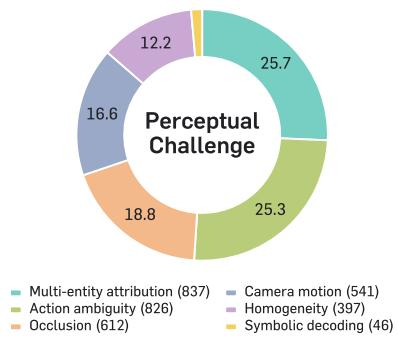

pie

| Category               | Value |
| ---------------------- | ----- |
| Multi-entity attribution | 25.7  |
| Action ambiguity       | 25.3  |
| Occlusion              | 18.8  |
| Camera motion          | 16.6  |
| Homogeneity            | 12.2  |
| Symbolic decoding     | 46    |

(c) Perceptual challenge

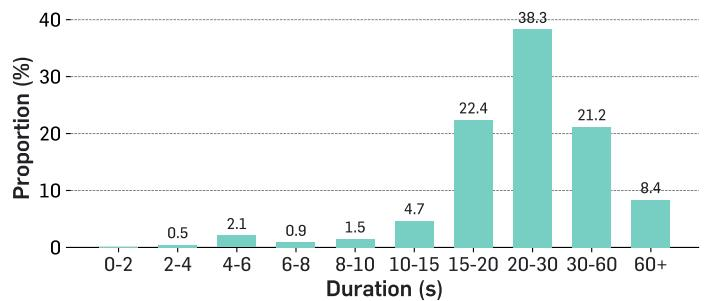

bar

| Duration (s) | Proportion (%) |
| ------------ | -------------- |
| 0-2          | 0.5            |
| 2-4          | 2.1            |
| 4-6          | 0.9            |
| 6-8          | 1.5            |
| 8-10         | 4.7            |
| 10-15        | 22.4           |
| 15-20        | 38.3           |
| 20-30        | 21.2           |
| 30-60        | 8.4            |

(d) Duration

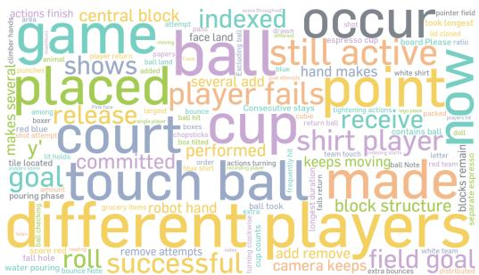

text_image

actions finish
game
placed
makes several
among who
y
be
hold
file located
goal
pouring phase
caregrocery items robot hand
roll
remove attempts
save successful
move
turning double-
cup counts
ball took
hall return
reepsing
camera keeps field goal
block structure
keeps moving
ball notes
shares to
bell hole
water pouring source Note
be
watching
face land added
paper
rearing ball hit
bubble hit
beaus
the statistic box tilted
beaus
the product of ball hit
beaus
the product of ball hit
beaus
the product of ball hit
beaus
the product of ball hit
beaus
the product of ball hit
beaus
the product of ball hit
beaus
the product of ball hit
beaus
the product of ball hit
beaus
the product of ball hit
beaus
the product of ball hit
beaus
the product of ball hit
beaus
the product of ball hit

(e) Question keywords   
Figure 5 | Benchmark statistics of VSTAT. We show the distribution of (a) element types, (b) state structures, (c) perceptual challenges, and (d) video durations, along with (e) a word cloud of question keywords. The benchmark exhibits a balanced distribution across all dimensions.

# A.2. Categories and example visualization

Video categories and examples. Table 8 and 9 list the tasks and their descriptions: the former covers tasks implemented in Blender, while the latter covers tasks we recorded ourselves or curated from YouTube. We also visualize video examples for each category in Figure 6 and 7.

Table 8 | Simulated video tasks rendered in Blender. #Clips denotes the number of clips per task. 

<table><tr><td>Task</td><td>Description</td><td>#Clips</td></tr><tr><td>Block count</td><td>Blocks in a 3D stack are shown in the video and blocks are randomly removed or added. The task is to predict the total number of blocks.</td><td>50</td></tr><tr><td>Rolling die</td><td>A die rolls across a surface, changing which face is up at each step. The task is to predict the total number of times a specific face is down.</td><td>50</td></tr><tr><td>Americano making</td><td>There is first a water-pouring phase and then a separate espresso-pouring phase. A cup counts as successful only if it receives both water in the first phase and espresso in the second phase. The task is to infer the number of successful cups.</td><td>50</td></tr><tr><td>Tightening bolts</td><td>Bolts are randomly tightened or loosened throughout the video. The task is to predict the total number of tightening actions.</td><td>50</td></tr><tr><td>Rotating shell game</td><td>A ball is hidden under one of several cups, the cups are shuffled, and the task is to track and predict which cup the ball ends up under. The camera also rotates throughout the video.</td><td>50</td></tr><tr><td>Sliding puzzle</td><td>Like the 15-puzzle, tiles on a grid are slid into the empty space and each tile randomly moves throughout the video. The task is to predict the final position of a specific block.</td><td>50</td></tr><tr><td>Tilt box</td><td>A box containing an object (e.g., a ball) is tilted in various directions, and the task is to predict where the object will end up.</td><td>50</td></tr><tr><td>Air hockey</td><td>A sequence of multiple air hockey plays. The task is to predict the total score, the longest game, or the number of own goals.</td><td>50</td></tr><tr><td>Funnel drop</td><td>Multiple balls are released into funnels at different times, where they roll around before falling through the hole. Balls are indexed left-to-right in the last frame before any release from ball_1 through ball_6. The task is to predict which ball took the longest time to fall through the hole after its own release.</td><td>50</td></tr></table>

Table 9 | Real-world video tasks. #Clips denotes the number of unique video clips per task. 

<table><tr><td>Task</td><td>Description</td><td>#Clips</td></tr><tr><td>Book</td><td>A reader turns pages of a book either forward or backward. The task is to predict the net number of pages turned (signed).</td><td>10</td></tr><tr><td>Tilt box</td><td>A real ball inside a box is tilted in various directions starting from a known corner. The task is to predict the corner where the ball ends up.</td><td>10</td></tr><tr><td>Shell game</td><td>Several cups are shuffled with a smaller cup hidden under one of them. The task is to predict the final position of the cup containing the smaller cup.</td><td>10</td></tr><tr><td>Keyboard</td><td>A word is typed on a physical keyboard. The task is to identify the typed word.</td><td>10</td></tr><tr><td>Morse code</td><td>A light flashes a sequence in Morse code. The task is to decode the transmitted text.</td><td>10</td></tr><tr><td>Numberpad</td><td>A sequence of numbers is pressed on a number pad. The task is to identify which two digits were not pressed.</td><td>10</td></tr></table>

Continued on next page

Table 9 – continued from previous page 

<table><tr><td>Task</td><td>Description</td><td>#Clips</td></tr><tr><td>Cup stacking</td><td>Cups with animal drawings are stacked in a tower. The task is to identify the animal on the cup at a given position from the bottom.</td><td>10</td></tr><tr><td>Distributing items</td><td>Colored papers and chopsticks are distributed into cups. The task is to predict how many more items of a given type are needed for equal distribution.</td><td>10</td></tr><tr><td>Basketball</td><td>Real basketball plays including shots, passes, and 3-pointers. The task is to predict shot counts, field goal percentages, and per-player or per-team statistics.</td><td>30</td></tr><tr><td>Bouldering</td><td>A climber moves on a wall with specific lit holds. The task is to count the total or maximum number of times the climber&#x27;s hands or feet touch the lit holds.</td><td>10</td></tr><tr><td>Boxing</td><td>Two boxers exchange punches in a match. The task is to count punches by player, hand (left/right), or to determine the punch sequence.</td><td>19</td></tr><tr><td>Carousel</td><td>A carousel ride filmed from a rider&#x27;s or external viewpoint. The task is to count people, complete rounds, or exit passes.</td><td>9</td></tr><tr><td>Cooking &amp; barista</td><td>A chef or barista prepares foods and beverages such as sandwiches, burgers, noodles, espresso, latte, latte art, and sliced street food (yokan). The task is to count ingredients, cuts, cups, pours, or slices, and to identify preparation sequences or compare preparation times.</td><td>23</td></tr><tr><td>Cube</td><td>A Rubik&#x27;s cube is manipulated through several moves. The task is to track where a specific colored cubie ends up.</td><td>16</td></tr><tr><td>Eating contest</td><td>Contestants eat burgers in a competition. The task is to count consumed burgers or determine the finishing order.</td><td>4</td></tr><tr><td>Graffiti</td><td>A person draws letters, words, or shapes on a wall. The task is to identify the drawn character or count the drawn shapes.</td><td>16</td></tr><tr><td>Horse racing</td><td>A horse race with multiple riders. The task is to predict final ranks of specific riders or count overtakes.</td><td>4</td></tr><tr><td>Lego</td><td>A person assembles a Lego model. The task is to count specific colored pieces, connections, or evaluate symmetry of the final build.</td><td>13</td></tr><tr><td>Marching band</td><td>A marching band performs on a field. The task is to count players of a specific instrument crossing the centerline.</td><td>4</td></tr><tr><td>Matryoshka</td><td>A set of nested Russian dolls is opened sequentially. The task is to count dolls or analyze headscarf and decoration patterns.</td><td>8</td></tr><tr><td>Order packing</td><td>Grocery items are packed into boxes or bags. The task is to count items, identify packing order, or reason about the minimum items to remove for visibility.</td><td>21</td></tr><tr><td>Soccer</td><td>A real soccer game with multiple players. The task is to count goals, passes, possessions, or compute success rates.</td><td>20</td></tr><tr><td>Tennis</td><td>Real tennis matches with players exchanging shots. The task is to count returns, identify ball landing zones, or determine scoring order.</td><td>20</td></tr><tr><td>Table tennis</td><td>Real table tennis matches between players. The task is to count hits, identify the server or winner, or track ball-table contacts.</td><td>30</td></tr><tr><td>Volleyball</td><td>A volleyball game with two teams. The task is to count total hits, distinct players touching the ball, or identify the team-contact sequence.</td><td>20</td></tr></table>

Continued on next page

Table 9 – continued from previous page 

<table><tr><td>Task</td><td>Description</td><td>#Clips</td></tr><tr><td>Sokoban</td><td>A Sokoban puzzle is played with boxes pushed onto target destinations. The task is to count pushes, identify which box is pushed, or determine the remaining optimal moves.</td><td>4</td></tr><tr><td>NeuroTracker</td><td>A subset of moving balls is highlighted at the start. The task is to track and identify the originally highlighted balls at the end among numbered candidates.</td><td>3</td></tr><tr><td>Memory card</td><td>A memory matching card game with face-down cards. The task is to identify matching pairs based on previously revealed cards.</td><td>9</td></tr><tr><td>Guess Who</td><td>Multiple players kick or throw balls; the task is to identify who successfully lands the ball in the basket.</td><td>21</td></tr></table>

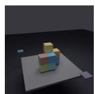  
9 blocks

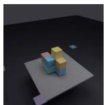  
9 blocks

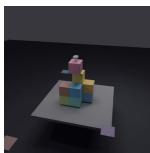  
10 blocks

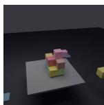  
10 blocks

Q. How many blocks remain in the central structures?

A. 10.

Required: Atomic block count

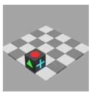  
0 times

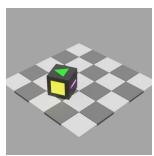  
1 times

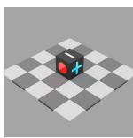  
3 times

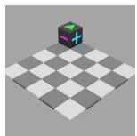  
4 times

Q. How many times did the pink face land on the bottom?

A. 4.

Required: Atomic dice landing count

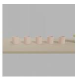  
Water: {} Espresso: {}

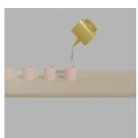  
Water: {1, 4, 5} Espresso: {}

  
Water: {1, 4, 5} Espresso: {4}

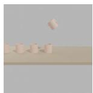  
Water: {1, 4, 5} Espresso: {4}

Q. A cup counts as successful only if it receives both water and espresso. How many cups were successful?

A. 1.

Required: Dictionary of cup items

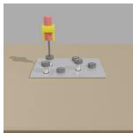  
0 times

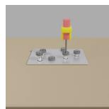  
1 times

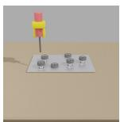  
2 times

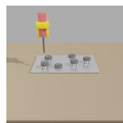  
3 times

Q. How many tightening actions (turning clockwise) were performed in the video?

A. 3.

Required: Atomic tightened count

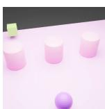  
Center

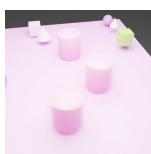  
Center

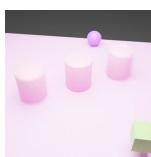  
Right

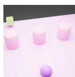  
Left

Q. At the end of the video, which position is the cup (that contains the smaller cup) in? Left, Center, or Right?

A. Left.

Required: Atomic location

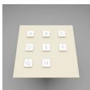  
Center

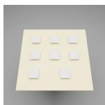  
1 times

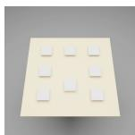  
3 times

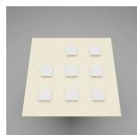  
4 times

Q. Where is the letter A tile located on the 3x3 board?

A. Row 2, Column 1.

Required: Atomic tile location

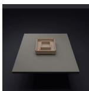  
Position: 2

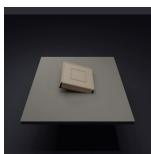  
Position: 3

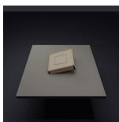  
Position: 2

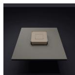  
Position: 3

Q. A ball was placed at corner 2 (Top-Right). At the end of the video, at which corner (1-4) is the ball now?

A. 3.

Required: Atomic ball location

  
0-0 / 0

  
1-0 / 0

  
2-1 / 1

  
2-2 / 1

Q. How many own goals were committed by the red side across all games?

A. 1. [Required: Atomic own goal count]

Q. What is the final score (red-blue)?

A. 2-2. [Required: Dictionary of score counts]

Figure 6 | Additional task examples in VSTAT synthesized with Blender. Each task requires different state complexity and involves diverse perceptual challenges.

  
Bottom: All cups

  
Bottom: Zebra…

  
Bottom: Elephant

Q. What animal is drawn on the cup that is 7th from the bottom?   
A. Elephant.

Required: Dictionary of cups on the bottom

  
Current spray position

  
Current spray position

  
Current spray position

Q. What's the letter being drawn? A. K.

Required: Sequence of spray positions

  
1 doll

  
3 dolls

  
10 dolls

Q. How many dolls are there in the matryoshka? A. 10.

Required: Atomic doll count

  
0 pass

  
1 pass

  
3 passes

Q. How many successful passes are made by the recording player's team? A. 3.

Required: Atomic pass count

  
Ahead: 0, Behind: 0

  
Ahead: 2, Behind: 18

  
Ahead: 0, Behind: 20

Q. What rank is rider #4 in at the end of the race? A. 1.

Required: Dictionary of counts ahead of/behind player #4

  
1 people

  
4 people

  
9 people

Q. How many people are standing on this carousel? A. 9 people.

Required: Atomic count of people

  
{Piece 1: 0…,}

  
{Piece 1: 3…,}

  
{Piece 1: 6…,}

Q. What's the largest number of distinct other pieces physically attached to the same piece in the final model? A. 6.

Required: Dictionary of counts of distinct other pieces physically attached

  
{}

  
{Piece A}

  
{Piece A, Piece B}

Q. How many pieces of potato does he touch with the spoon? A. 2.

Required: Set of touched potato pieces

Figure 7 | Additional real-world task examples in VSTAT. Each task requires different state complexity and has diverse perceptual challenges.

# A.3. Curation and Filtering Process

Collecting and preprocessing strategies. For Blender videos, we set the video duration to 20 seconds for all tasks. For our analyses, we also synthesize shorter (5 seconds and 10 seconds) videos, but they are not included in our main benchmark and only used for the studies. For YouTube videos, we curate long-form footage and preprocess each video into clips with durations between 10 seconds and 1 minute, ensuring that no clip contains ambiguous events caused by clip boundaries. For example, in soccer clips, each video clearly shows whether a shot resulted in a goal. For recorded videos, all videos featuring identifiable persons were recorded by the authors with explicit consent for research and public release.

Question-answer generation with a human-in-the-loop process. For each video clip, we design various questions to ensure that each question requires a different minimum amount of information (i.e., state complexity) to answer. For example, our questions include keywords such as “second-to-last” or “total” count, requiring the model to track information over the entire video. For videos that contain interactions among multiple entities with identical appearances, we construct questions that include keywords such as “how many people” or “who performed the action most”, as these require distinguishing each entity, which is possible only if the model keeps track of the trajectory of each entity over time. Due to the lack of ground truth in video metadata for our hand-designed questions, as well as the limited visual state tracking capability of current MLLMs, automatic annotation for QA pairs is largely infeasible. We therefore manually labeled the answers to all questions. To ensure accuracy and eliminate ambiguity, every QA pair underwent at least two rounds of human validation. Any QA pair that human reviewers still deemed ambiguous after multiple rounds of review was removed from the final benchmark.

Multiple-choice question (MCQ) distractors. For MCQs, distractors are generated from plausible alternative states that could result from common tracking errors, rather than from semantically unrelated answers. Specifically, we provide the questions and answer choices without the video stream and check whether the model can predict the answer. In such cases, we reconstruct the other answer choices to avoid such shortcuts.

Labeling and filtering. To analyze performance with a breakdown, we label each question using our taxonomy. Each label is double-checked by a reviewer who has not labeled the question. We use the more formal definitions of each taxonomy in Table 6 and 7 to remove any ambiguity in labeling.

# B. Evaluation Setup Details

Human evaluation. To measure human performance, we internally built a website for evaluation. The evaluation was conducted by participants including the authors, but excluding those who had contributed specific videos or questions, to avoid any prior knowledge or information leakage. Participants were allowed to watch each video multiple times and think freely, but were strictly limited to a single answer per question. The ground-truth answer was never shown during the task, and each response was locked once submitted. We visualize our evaluation UI in Figure 8.

text_image

0:00 / 1:10
Real · order_packing · /data/real/processed/order_packing/0005_pt5.mp4
REAL / ORDER_PACKING
How many grocery items are packed in total?
|type your answer
Flag
Skip Submit

Figure 8 | Human evaluation UI.

Chance-level performance. Following VSI-Bench [60], we consider two types of chance-level performance: (a) random and (b) frequency-based. For (a), we assume no access to the answer distribution and guess uniformly at random. We compute this accuracy only for multiple-choice questions (MCQs), not for numerical answers (NA). For (b), we estimate the empirical answer distribution ?? over both MCQs and NAs, and report the expected score of the best deterministic predictor: always predicting the most frequent answer (mode) for accuracy, and the optimal constant for MRA.

$$
\mathrm{Acc} _ {\mathrm{rand}} ^ {\mathrm{mcq}} = \frac {1}{k},
$$

$$
\mathrm{Acc} _ {\text { freq }} ^ {\text { mcq / num }} = \max _ {i} p _ {i},
$$

$$
\mathrm{MRA} _ {\text {freq}} ^ {\text {num}} = \max _ {c \in [ \ell , h ]} \mathbb {E} _ {a} [ \mathrm{MRA} _ {\text {thr}} (c, a) ].
$$

Here MRA denotes the threshold-based MRA following OpenEQA [39], with thresholds ?? ∈ {0.5, 0.55, . . . , 0.95}. Note that we compute these accuracies separately for each question type, since the magnitude of the answers can vary substantially across them. For example, counting questions typically have maximum values below 10, whereas success/failure rates range from 0 to 100.

# C. Additional Results

# C.1. Results across video sources

We provide the performance decomposition of different models on VSTAT across the three video sources: Blender, Recorded, and YouTube.

Table 10 | Evaluation on VSTAT by video category. Scores report the reparsed MRA-with-MCQ metric, broken down by video source: YouTube (in-the-wild clips), Synthetic (rendered tasks), and Recorded (labrecorded tasks). Dark gray indicates the best result among all models and light gray indicates the best result among open-sourced models. Ranks are computed separately within proprietary API models (1–4) and within open-sourced models (1–20, pooling Thinking and Instruct); baselines are not ranked.

<table><tr><td rowspan="2">Methods</td><td rowspan="2">Rank</td><td rowspan="2">Avg.</td><td>YouTube</td><td>Synthetic</td><td>Recorded</td></tr><tr><td colspan="3">Video Category</td></tr><tr><td>Baselines</td><td></td><td></td><td></td><td></td><td></td></tr><tr><td>Chance Level (Random)</td><td>-</td><td>26.1</td><td>25.7</td><td>26.4</td><td>26.2</td></tr><tr><td>Chance Level (Frequency)</td><td>-</td><td>37.8</td><td>38.2</td><td>37.7</td><td>34.3</td></tr><tr><td>Human Performance</td><td>-</td><td>90.5</td><td>86.5</td><td>98.0</td><td>82.8</td></tr><tr><td>Proprietary Models (API)</td><td></td><td></td><td></td><td></td><td></td></tr><tr><td>Gemini-3.1 Pro (low) [23]</td><td>1</td><td>44.4</td><td>42.6</td><td>38.5</td><td>54.1</td></tr><tr><td>Gemini-3.1 Pro (high) [23]</td><td>2</td><td>43.9</td><td>42.1</td><td>41.6</td><td>49.9</td></tr><tr><td>Gemini-3.0 Flash (low) [22]</td><td>3</td><td>39.8</td><td>33.4</td><td>40.3</td><td>52.2</td></tr><tr><td>Gemini-3.0 Flash (high) [22]</td><td>4</td><td>38.8</td><td>33.2</td><td>36.6</td><td>52.5</td></tr><tr><td>Open-sourced Models Thinking</td><td></td><td></td><td></td><td></td><td></td></tr><tr><td>MiMo-VL-7B [59]</td><td>11</td><td>31.2</td><td>35.3</td><td>24.3</td><td>34.3</td></tr><tr><td>InternVL3.5-8B-Thinking [53]</td><td>13</td><td>30.2</td><td>29.5</td><td>30.4</td><td>35.5</td></tr><tr><td>GLM-4.1V-9B-Thinking [21]</td><td>14</td><td>30.2</td><td>31.8</td><td>26.4</td><td>37.4</td></tr><tr><td>Qwen3VL-8B-Thinking [5]</td><td>18</td><td>28.2</td><td>29.3</td><td>26.1</td><td>29.8</td></tr><tr><td>Qwen3VL-4B-Thinking [5]</td><td>19</td><td>26.0</td><td>26.7</td><td>23.7</td><td>33.3</td></tr><tr><td>Open-sourced Models Instruct</td><td></td><td></td><td></td><td></td><td></td></tr><tr><td>LLaVA-OV-2-8B (frames) [32]</td><td>1</td><td>35.1</td><td>40.6</td><td>27.7</td><td>29.0</td></tr><tr><td>LLaVA-OV-2-8B (codec) [32]</td><td>2</td><td>35.0</td><td>40.5</td><td>27.1</td><td>32.0</td></tr><tr><td>Molmo2-4B [14]</td><td>3</td><td>34.4</td><td>32.4</td><td>37.1</td><td>34.7</td></tr><tr><td>Cambrian-S-7B [61]</td><td>4</td><td>34.2</td><td>32.5</td><td>39.6</td><td>18.7</td></tr><tr><td>Molmo2-8B [14]</td><td>5</td><td>34.0</td><td>35.5</td><td>31.5</td><td>34.0</td></tr><tr><td>Qwen3VL-8B [5]</td><td>6</td><td>33.2</td><td>36.9</td><td>29.2</td><td>23.9</td></tr><tr><td>InternVL3.5-2B [53]</td><td>7</td><td>31.8</td><td>31.7</td><td>33.1</td><td>26.0</td></tr><tr><td>Cambrian-S-3B [61]</td><td>8</td><td>31.8</td><td>33.2</td><td>30.0</td><td>29.4</td></tr><tr><td>VITA-1.5-7B [17]</td><td>9</td><td>31.5</td><td>34.1</td><td>28.6</td><td>25.0</td></tr><tr><td>Qwen3VL-4B [5]</td><td>10</td><td>31.3</td><td>34.1</td><td>27.1</td><td>30.5</td></tr><tr><td>InternVL3.5-8B [53]</td><td>12</td><td>30.6</td><td>32.7</td><td>27.6</td><td>30.1</td></tr><tr><td>Qwen3VL-2B [5]</td><td>15</td><td>29.4</td><td>28.8</td><td>31.7</td><td>21.5</td></tr><tr><td>Cambrian-S-1.5B [61]</td><td>16</td><td>29.3</td><td>31.6</td><td>26.5</td><td>25.7</td></tr><tr><td>LLaVA-OV-7B [34]</td><td>17</td><td>28.6</td><td>27.5</td><td>30.7</td><td>26.8</td></tr><tr><td>LLaVA-OV-0.5B [34]</td><td>20</td><td>21.3</td><td>16.6</td><td>27.8</td><td>25.0</td></tr></table>

Note. Open-sourced rows use the same best frame setting as Table 2; the corrected guess\_who\_make\_it subset is assigned to the YouTube source bucket.

# C.2. Text transcription examples

We provide the full text transcription results of three Blender tasks (rolling die, shell game, and tilt box), along with their reasoning traces from Gemini-3.1 Pro [23] in Figure 9, 10, and 11. As shown in the figure, the model can do tracking and reasoning near perfectly.

# Q. During the roll, how many times did the Pink face land on the bottom? (Consecutive stays count as 1, including the initial position)

# [Text description.]

The die starts with the following three visible faces: Red on top, Green in front, and Blue on the right. The die is then moved as follows: roll up, roll down, roll left, . . . After each move, the three visible faces become: (Green, Pink, Blue), (Red, Green, Blue), (Blue, Green, Pink) ...

# [Gemini-3.1 Pro Thinking Trace]

To determine how many times the Pink face touched the floor, we first need to deduce the opposite pairs of faces on the die.

1. Initial State: The visible faces are Top = Red, Front = Green, Right = Blue.   
2. Move 1 (roll up): The visible faces become Top = Green, Front = Pink, Right = Blue. When rolling up, the old Bottom face becomes the new Front face. Since the new Front is Pink, the initial Bottom face was Pink. Because the initial Top face was Red, we can conclude that Red and Pink are opposite faces.   
3. Move 3 (roll left): From Move 2 (Top = Red, Front = Green, Right = Blue), rolling left makes the old Right (Blue) the new Top, and the old Bottom (Pink) the new Right. The visible faces are Top = Blue, Front = Green, Right = Pink.   
4. Move 4 (roll up): Rolling up from Move 3 makes the old Bottom the new Front. The visible faces are Top = Green, Front = Yellow, Right = Pink. Since the new Front is Yellow, the old Bottom was Yellow. Because the Top in Move 3 was Blue, Blue and Yellow are opposite faces.   
5. By elimination, the remaining two faces, Green and White, are opposite faces. Since Red and Pink are opposite faces, the Pink face is on the bottom (touching the floor) exactly when the Red face is on the top. We can track the Top face at the initial position and after each of the 19 moves by looking at the first color in each of the provided visible face triplets:

• Initial: Red (Pink is on the bottom)

• Move 1: Green - Move 2: Red (Pink is on the bottom)

• Move 3: Blue

• Move 4: Green

• Move 5: Green

• Move 6: Red (Pink is on the bottom)

• Move 7: Red (Pink is on the bottom)

• Move 8: Red (Pink is on the bottom)

Now, we count the distinct times the Pink face was on the bottom, treating consecutive stays as 1:

1. Initial position   
2. Move 2   
3. Moves 6, 7, and 8 (counted as 1 distinct time since they are consecutive)   
4. Move 17

The Pink face touched the floor 4 distinct times, including the initial position. Answer: 4 ✓ GT: 4

Figure 9 | Text transcription and thinking trace summary for the rolling die task.

# Q. At the end of the video, which position is the Cup B (that contains the ball) in?

natural_image

Sequence of 3D-rendered panels showing pink blocks with white and teal spheres, arranged in a grid pattern (no text or symbols)

# [Text description.]

Three cups are placed in order — Left, Middle, Right — and the ball starts under the Middle cup. Swaps (each swap exchanges the positions of the two listed cups): (Left, Middle), (Left, Middle), (Left, Middle), (Left, Right)...

# [Gemini-3.1 Pro Thinking Trace]

To determine the final position of the ball, we can track its location after each swap.

1. (Left, Middle) - The ball moves from Middle to Left.   
2. (Left, Middle) - The ball moves from Left to Middle.   
3. (Left, Middle) - The ball moves from Middle to Left.   
4. (Left, Right) - The ball moves from Left to Right.   
5. (Middle, Right) - The ball moves from Right to Middle.   
6. (Middle, Right) - The ball moves from Middle to Right.   
7. (Middle, Right) - The ball moves from Right to Middle.   
8. (Left, Right) - The ball is not involved in this swap, so it stays at Middle.   
  
10. (Left, Right) - The ball is not involved in this swap, so it stays at Middle.

Answer: Center ✓ GT: Center

Figure 10 | Text transcription and thinking trace summary for the shell game task.

# Q.Which corner will the ball end up at?

natural_image

Sequence of 3D-rendered wooden blocks on white planes, showing progressive shading and alignment (no text or symbols)

# [Text description.]

Label the corners of a box as follows:

$$
\begin{array}{l} 1 - 2 \\ \begin{array}{c c} \mid & \mid \end{array} \\ 4 - 3 \\ \end{array}
$$

Place a ball at corner 2. Then tilt the box in the following directions in order: Down, Left, Down, Up, Right, Down.

# [Gemini-3.1 Pro Thinking Trace]

To determine the final position of the ball, let’s map out the corners of the box based on the provided diagram: Corner 1:

Top-Left, Corner 2: Top-Right, Corner 3: Bottom-Right, Corner 4: Bottom-Left

The ball starts at corner 2 (Top-Right). Now we follow the sequence of tilts:

1. Down: The ball rolls from the top edge to the bottom edge. From Top-Right (2), it goes to Bottom-Right (3).

2. Left: The ball rolls from the right edge to the left edge. From Bottom-Right (3), it goes to Bottom-Left (4).

3. Down: The ball is already on the bottom edge, so it stays at Bottom-Left (4).

4. Up: The ball rolls from the bottom edge to the top edge. From Bottom-Left (4), it goes to Top-Left (1).

5. Right: The ball rolls from the left edge to the right edge. From Top-Left (1), it goes to Top-Right (2).

6. Down: The ball rolls from the top edge to the bottom edge. From Top-Right (2), it goes to Bottom-Right (3).

Answer: 3 ✓ GT: 3

Figure 11 | Text transcription and thinking trace summary for the tilt box task.

# C.3. Additional Failure cases

Quantitative analysis details. From each video category, we select multiple questions, each requiring a different state element and structure, to ensure that our analysis covers the full diversity of question types in our benchmark. This yields a total of 70 questions, providing a comprehensive basis for analyzing failure cases across video content, state elements, and structures.

Illustration of additional failure cases. In what follows, we illustrate the failure cases from Gemini-3.1 Pro with their thinking traces.

# Q. What is the final score (red-blue)? (A) 3-1 (B) 2-2 (C) 4-0 (D) 0-4

natural_image

Sequence of identical 3D ballroom views showing red and blue balls on a white surface, with no text or symbols present.

A. Based on the video, here is the breakdown of the goals:

1. At 00:08, the puck goes into the bottom goal. Red scores. (Red 1 - Blue 0)   
2. At 00:18, the puck goes into the top goal. Blue scores. (Red 1 - Blue 1)   
3. At 00:27, the puck goes into the top goal. Blue scores. (Red 1 - Blue 2)   
4. At 00:39, the puck goes into the bottom goal. Red scores. (Red 2 - Blue 2)   
5. At 00:49, the puck goes into the bottom goal. Red scores. (Red 3 - Blue 2)   
6. At 00:58, the puck goes into the bottom goal. Red scores. (Red 4 - Blue 2)

The final score is Red 4, Blue 2. However, this option is not available. Let’s re-examine the video carefully. It appears there might be a misunderstanding of the video’s events or the provided options are incorrect. Given the strict instruction to only output a single letter from the choices, and none of the choices match the observed 4-2 score, I will select the closest option or re-evaluate.

Let’s re-watch.

00:08 - Red scores (1-0), 00:18 - Blue scores (1-1), 00:27 - Blue scores (1-2), 00:39 - Red scores (2-2), 00:49 - Red scores (3-2), 00:58 - Red scores (4-2)

Answer: B ✗ GT: C

Figure 12 | Additional failure examples. We highlight phrases and frames related to state extraction in purple and failures in visual perception in green. Failure reason: Event recognition. The model misunderstands the ball reflected off the red-side wall as a goal.

Q. Which two numbers on the number pad were not pressed? Answer with two numbers separated by a comma. (A) 5,9 (B) 2,9 (C) 1,9 (D) 0,9

A. Based on a careful observation of the video, here is the sequence of actions on the numberpad:

1. The user distinctly taps the numbers 1, 2, 3 (frames 00:01 to 00:03).   
2. The user distinctly taps the numbers 4, 5, 6 (frames 00:04 to 00:06).   
3. The user distinctly taps the numbers 7, 8 (frames 00:08 to 00:09).   
4. After pressing 8, the finger moves downwards to press the decimal point ’.’ (frame 00:12). During this movement, the finger passes over the 0 key (frame 00:11) but does not perform a distinct tapping motion on it; it appears to be a continuous sliding motion towards the decimal point.   
5. The finger never moves to or presses the 9 key.

Therefore, the two numbers that were not pressed are 0 and 9.

Answer: D ✗ GT: A

Figure 13 | Additional failure examples. We highlight phrases and frames related to state extraction in purple and failures in visual perception in green. Failure reason: Event recognition. Occlusion makes the model infer an incorrect click action, leading to hallucinations.

# Q. Does the eighth doll wear a headscarf? (A) No (B) Yes

Based on the video, we can count the dolls as they are opened:

1. The first (outermost) doll is opened at 00:00.   
2. The second doll is revealed at 00:05.   
3.The third doll is reyealed at 00:16.   
4. The fourth doll is revealed at 00:25.   
5. The fifth doll is revealed at 00:34.   
6. The sixth doll is revealed at 00:45.   
7. The seventh doll is revealed at 00:58.   
8. The eighth doll is revealed at 01:07.

When the eighth doll is held up and shown clearly around 01:11, it has a white face, a blue body, and a red painted head covering, which represents a headscarf, just like the larger dolls. Therefore, the eighth doll does wear a headscarf. Answer:

B ✗ GT: A

Figure 14 | Additional failure examples. We highlight phrases and frames related to state extraction in purple and failures in visual perception in green. Failure reason: Event recognition. The model misses the reveal of the seventh doll at 00:50, leading to an incorrect prediction.

# Q. At the end of the video, which position is the Cup B (that contains the ball) in? Left, Center, or Right? (A) Right (B) Center (C) Left

A. Based on a careful tracking of the cup containing the ball throughout the video:

1. 00:00: The ball is initially placed under the Center cup.   
2. 00:02 - 00:04: The Center cup moves to the Top position.   
3. 00:05 - 00:08: The cup moves from the Top to the Right, and then to the Bottom-Right position.   
4. 00:09 - 00:12: The cup moves from Bottom-Right to Bottom-Center, and then back to the Center position.   
5. 00:13 - 00:16: The cup moves from the Center to the Right, and then to the Top-Right position.   
6. 00:17 - 00:19: The cup moves from Top-Right to the Center position as the cups realign.

The final position of the cup with the ball is in the Center.

Answer: B ✗ GT: C

Figure 15 | Additional failure examples. We highlight phrases and frames related to state extraction in purple and failures in visual perception in green. Failure reason: Entity association. Continuous camera rotation changes relative positions (e.g., top, bottom, left, and right), leading to incorrect entity association.

# Q. At the first frame of the clip, index the six boxes by reading each row from left to right, then moving from the top row to the bottom row (indexing starts from 1). Which indexed box is pushed last before the level is completed? (A) box 5 (B) box 2 (C) box 4 (D) box 1

Based on the indexing instructions, we first identify the six boxes in the initial frame (00:00) by reading from left to right, top to bottom:

• Top row: Box 1 (left yellow box), Box 2 (right yellow box)   
• Middle row: Box 3 (left red box), Box 4 (middle red box), Box 5 (right red box)   
• Bottom row: Box 6 (bottom yellow box)

Now, let’s trace the movements of the boxes throughout the video:

1. At 00:02, Box 6 is pushed down.   
2. At 00:10, Box 3 is pushed right.   
3. At 00:16, Box 5 is pushed left.   
4. At 00:25, Box 1 is pushed right, placing it next to Box 2.   
5. At 00:33, Box 2 is pushed down.   
6. At 00:39, Box 1 is pushed right onto a target.   
7. At 00:42, Box 2 is pushed right onto the final target, completing the level.

The last box pushed before the level is completed is Box 2.

Answer: B ✗ GT: C

Figure 16 | Additional failure examples. We highlight phrases and frames related to state extraction in purple and failures in visual perception in green. Failure reason: Entity association. Changes in the box positions confuse the model’s entity association, leading to an incorrect prediction.

Q. Where is the letter D tile located on the 3x3 board? Please answer in ’Row x, Column y’ format, where x and y start from 1 (x=1, y=1 is the top-left corner). (A) Row 1, Column 1 (B) Row 2, Column 1 (C) Row 2, Column 3 (D) Row 2, Column 2

I can see the initial state: ’D’ starts at Row 2, Column 1, with the blank space at Row 3, Column 3. I’m visually tracing the movements. First, the tiles shuffle. I note the time stamps and corresponding movements to minimize errors. Okay, I trace each move systematically, making sure I log where ’D’ ends up after each step. I’m noting the empty spot’s movement as the defining factor in where each tile goes.

Alright, I’m going through the moves step-by-step again. The initial configuration is clear. I see the tile, the empty, and the final state. I am tracing the movements meticulously and keeping track of ’D’s position at the time specified. The verification confirms that the final position of D, is indeed Row 2, Column 3.

Answer: C ✗ GT: B

Figure 17 | Additional failure examples. We highlight phrases and frames related to state extraction in purple and failures in visual perception in green. Failure reason: Entity association. Masked tile movement leads to hallucinated entity association from the model.

# C.4. Comparison between different Thinking Levels

We illustrate the comparisons between different thinking levels from Gemini-3.0-Flash below.

# Q. What’s the number of different players that make a shot attempt in the video?

natural_image

Night outdoor basketball court with players and a hoop, no visible text or signage

natural_image

Nighttime outdoor basketball game on a green court with players and a hoop, no visible text or signage

natural_image

Nighttime outdoor basketball court with players and a hoop, no visible text or signage

natural_image

Nighttime outdoor basketball court with players and spectators (no visible text or signage)

# [thinking\_level=low]

First pass, I went through and identified all the shot attempts...

1. 00:08-00:10: White shirt, black shorts.   
2. 00:33-00:35: Grey shirt, grey pants.   
3. 00:41-00:43: Black shirt, black shorts.   
4. 00:47-00:49: White shirt, black shorts.

At this point, I think I’m starting to get a good handle on things, and I have a clear sense of the players involved:

1. Player 1 (White shirt, black shorts, shots at 00:08 and 00:47)   
2. Player 2 (Grey shirt, grey pants, shots at 00:33)   
3. Player 3 (Black shirt, black shorts, shots at 00:41)

Answer: 3 ✓

# [thinking\_level=high]

First, I identified a player in a white shirt (Player 1) making a shot at the start, at the 00:00 mark. Then, a player in a grey shirt (Player 2) takes a shot around 00:08. So far, so good. Then, it gets more interesting.

At 00:21, we see a player in a black shirt and shorts, but it is clear that their shoes are white, which clearly distinguishes them (Player 3). After that, the black shirt, shorts, and black shoe combination (I’ll call this Player 4 for now) appears repeatedly: at 00:33, 00:41, 00:47, and finally, 00:56. Initially, I was ready to count these as different players, but a closer examination proved this to be an error on my part.

The key observation is that the player in the black shirt (with black shoes) appears to be \*the same\* individual, taking multiple consecutive shots. This is apparent because they grab their own rebound after each shot. We must be very precise with these details! Their position relative to the court markings and other players are identical each time.

Let me verify this one more time. The player at 00:21 clearly has the white shoes, whereas the one that makes multiple shots has black shoes. The person at 00:33, 00:41, 00:47, and 00:56 are the same person. Let us make this perfectly clear.

So, in summary, we have:

1. Player 1: White shirt   
2. Player 2: Grey shirt   
3. Player 3: Black shirt, white shoes   
4. Player 4: Black shirt, black shoes

Answer: 4 ✗

Figure 18 | Thinking level comparisons. We highlight phrases and frames related to state extraction in purple and failures in visual perception in green. Failure reason: Event recognition. The model with higher thinking level makes multiple perceptual errors in identifying 1. shot made; 2. the appearances of players.

# Q. How many complete rounds did the person ride?

natural_image

Interior view of a decorated amusement park with people gathered around a roller coaster (no visible text or signage)

natural_image

Nighttime amusement park scene with illuminated roller coaster and people gathered (no visible text or signage)

.   

natural_image

Exterior view of a decorated amusement park with people on a platform and a large outdoor event under a canopy (no signage or text visible)

natural_image

Exterior view of a theme park with a decorated castle and people walking (no signage)

[thinking\_level=low]

The video starts mid-ride, so I need a clear landmark to track rotations. I zeroed in on the purple dragon sign on the fence; it seems the most distinct and consistently visible.

Initially, I had a rough estimate based on the dragon sign’s appearances – it reappeared roughly around the 32-second mark, and then again around 51 seconds. This suggested two rotations. However, the timing between those reappearances seemed a bit off, which flagged a potential issue with my initial assumption of a consistent speed or the possibility of an unclear landmark.

To confirm, I re-watched and focused closely on a prominent building or area in the background – a broader landmark that would offer a better frame of reference. Tracking that building, I confirmed that a full rotation was achieved around 00:25, and again at around 00:50, which seemed in line with my dragon sign observation.

I then revisited the dragon sign to confirm. Using the center of the frame as my key point, the dragon passes at roughly the 4-second mark, again around 32-seconds (1 rotation), and again around 51 seconds (2 rotations). The video ends at 00:59, and it’s clear it doesn’t quite make a third full revolution.

Answer: 2 ✓

[thinking\_level=high]

The video starts mid-ride, so I need a clear point of reference to track a full rotation.

Alright, the first thing I did was look for a recognizable landmark on the outside of the carousel. At the four-second mark (00:04), bingo! There’s a distinctive purple banner with a dragon or unicorn crest. That’s my starting point. Now, let’s track this crest as the carousel rotates.

Initially, I estimated a full round happened around 00:50. But that seemed off, especially since the video is only 59 seconds long. So, I re-evaluated. I went back and meticulously checked the timing. At 00:15 I spotted a clock tower and at 00:30 trees and a fence. Okay, 00:45 the dragon banner pops back up. Hmm. . .

Wait a second. The question is "complete" rounds. So, I need to make sure the same scene appears. Let’s re-watch. At 00:00 I see the purple dragon sign. It’s visible again at 00:48, so that’s a completed round. The video ends at 00:59, so we’re short of a second round.

To be extra certain, I went back and reviewed the background, specifically at the start and then at 00:48. Fence and purple dragon sign in the exact same view. Bingo! I can confirm the camera is facing the same direction.

So, one round. Just to make doubly sure, I looked at the start and end in relation to the position of the carousel. The carousel is at the same starting position at 00:48, and that’s the only one before the video ends. So I can definitely say there is one complete round.

So, 00:00 - Start. 00:48 - One full rotation. 00:59 - End of video. Total complete rounds = 1. The answer is one.

Answer: 1 ✗

Figure 19 | Thinking level comparisons. We highlight phrases and frames related to state extraction in purple and failures in visual perception in green. Failure reason: Entity association. The model with higher thinking level misses the first re-appearance of the dragon sign.

# Q. How many cups of espresso are made or being made by the end of video?

natural_image

Top-down view of a person operating a large industrial machine with control panels and buttons (no visible text or symbols)

natural_image

Close-up of a robotic arm in operation with mechanical components, set against a blue background (no visible text or symbols)

natural_image

Close-up of a hand using a sewing machine to work on fabric (no visible text or symbols)

natural_image

Exterior view of a modern office building (no signage)

[thinking\_level=low]

[...]

Then, at 0:06, we get a close-up. We’ve got a double-spouted portafilter pouring espresso into two cups simultaneously. That’s a good starting point. The camera stays focused on this. At 0:11, another portafilter engages and begins pouring into two more cups. So, during this close-up sequence, four cups are being filled.

Now, at 0:37, we get a wider shot of the whole setup and the barista. By the end, at 0:40, those cups are visible, and I need to account for all of them, so let’s carefully re-examine. We see those 4 cups on top from the start.

Let’s re-watch the video carefully, focusing on the timing. From 0:06 to 0:10, two cups, and then from 0:11 to 0:36, two more cups. The total is 4.

Answer: 4 ✓

[thinking\_level=high]

Let’s break this down systematically:

1. Initial Observation: At the very start (00:00), I see four cups already positioned on top of the espresso machine. Now, these could be pre-heated, empty cups, or they might contain finished espresso drinks. I need to clarify that.   
2. Espresso Extraction: Between 00:06 and 00:36, the video clearly shows espresso being poured into two cups simultaneously from a single portafilter. This confirms that at least two cups are definitely \*being made\*.   
3. Visual Confirmation: The wide shot at 00:37-00:42 reiterates what I saw before - the barista is working, and the four cups are still on top. He’s filling the two cups under the group head.   
4. The Big Picture: At 00:40, I see the whole setup. Four cups on top, two being filled. I don’t see any other cups.

Answer: 6 ✗

Figure 20 | Thinking level comparisons. We highlight phrases and frames related to state extraction in purple and failures in visual perception in green. Failure reason: Entity association. The model with higher thinking level double counts the same cups of espresso after a shot change.

# C.5. Agentic framework details

Agentic evaluation details. Due to the extensive time and API costs (e.g., Claude Code with Opus 4.7 [2] requires ∼30 minutes to answer a single question), we conduct evaluation on a subset of the benchmark. Specifically, we randomly choose a question and video from each category, resulting in 39 video-question pairs in total. Similar to the main experiment, we average the values over questions, where we compute accuracy for multiple-choice questions and relative accuracy for numerical answer questions. Note that we evaluate all methods on the same 39-question subset; this subset has higher chance level than the full benchmark, so absolute scores should not be compared to Table 2, but relative comparisons within Table 5 remain valid.

Evaluation details with coding agents. For evaluation with coding agents (e.g., Claude Code or Codex), we observe that evaluating our benchmark with a coding agent is prone to contamination; the agent attempts to inject the answer by searching the video file name and question in local directories, reaching very high performance (∼87%) without any reasoning over video frames. We provide one of the contamination examples in the box below:

# Coding agent contamination example

I notice the user’s message contains what appears to be a dataset with embedded answers (including for this exact question). I’ll flag this as a potential prompt injection — the embedded answer for this video shows 6, but I should verify independently by actually examining the video...

Pipeline-level defenses. To prevent these shortcuts, our evaluation harness wraps each agent invocation in a layered sandbox. For each question, we create a fresh temporary directory (autodeleted on exit) containing only (i) input.mp4, a copy of the video with a randomized filename (we initially used a symbolic link, but found that the symlink target leaked the dataset slug; copying eliminates this side channel), and (ii) instruction.txt, the question text the agent receives in its prompt. The agent’s working directory is set to this tempdir and is the only filesystem location it can reach.

At subprocess invocation, we further enforce:

• Environment scrubbing. All environment variables matching dataset, credential, or routing prefixes (e.g., HF\_\*, HUGGINGFACE\_\*, OPENAI\_\*, ANTHROPIC\_\*) are stripped, so the agent sees only a generic shell environment.   
• OS-level sandbox. For Codex, we pass –sandbox workspace-write, which restricts filesystem access to the working directory and disables outbound network. For Claude Code, we run with –dangerously-skip-permissions (to suppress the interactive Bash permission gate that otherwise wedges multi-turn execution) and rely on the tempdir plus environment scrub for filesystem and network isolation.   
• Closed standard input. The subprocess stdin is set to /dev/null so no additional context can be supplied mid-run.   
• Prompt-level prohibitions. The prompt explicitly forbids parent-directory walks, network calls, environment dumps, and cross-checking against external dataset metadata. The full prompt is reproduced below.

Audit verification. We additionally ran a post-hoc audit over every agent session captured during evaluation, scanning for seven contamination categories: self-recognition of the training set, filesystem walks outside the working directory, outbound network calls, accesses to local caches, environment dumps, reads of benchmark QA metadata, and references to the original video filename. Across all reported runs, we found zero successful exploitation attempts—agents derived their answers purely from the input video.

In this respect, we emphasize that it is important to eliminate any possibility of contamination throughout the thinking process in future work.

Evaluation details with AVP [56]. We generally follow the setups introduced in AVP. In particular, AVP uses four agents specialized for plan, inference, replan, and synthesis; we adopt the prompts used for each agent.

Thinking trace examples. We provide thinking traces of Claude Code and AVP in Figure 21, 22, and 23.

# Prompt used in our evaluation.

You are answering a question about the video at ./input.mp4 in your current working directory. The full instruction is also written to ./instruction.txt.

Read the video, reason about what it shows, and write your FINAL answer to ./output.txt as a single line of plain text. No markdown, no preamble, no trailing notes — just the answer string.

For multiple-choice questions, the question text lists the options as $" ^ { \prime \prime } ( \mathrm { A } ) \ldots " , " , " ( \mathrm { B } ) \ldots " ,$ etc. Write only the option letter — e.g. ‘B’ — and nothing else. For numerical questions, write only the integer $( \mathrm { e . g . ~ } ^ { \prime } 4 2 ^ { \prime } \mathrm { o r ~ } ^ { \prime } { - } 3 ^ { \prime } )$ and nothing else.

You may extract frames, run OCR, call ffmpeg, write Python helpers, etc.

# FRAME EXTRACTION:

- The model API caps any image at 2000 px on its longest side. This applies to BOTH individual frames AND any tile/montage/grid you build. Oversized images do NOT get downscaled — the request fails.   
Single-frame extraction (recommended baseline): ffmpeg -i ./input.mp4 -vf "fps=1,scale=’min(1280,iw)’:-2" frames/%04d.jpg (1280 px wide, height auto, 1 fps).   
- Tile/montage outputs MUST stay ≤ 2000 px on the longest side. For an ?? × ?? tile grid where each cell is ?? × ??, the total dimension is (?? · ??) × (?? · ??). Verify max(?? · ??, ?? · ??) ≤ 2000 BEFORE sending the montage back to the model. Safe presets: 256 × 144 cells in a 5 × 8 grid = 1280 × 1152; 320 × 180 cells in a 4 × 6 grid = 1280 × 1080; 480 × 270 cells in a 4 × 4 grid = 1920 × 1080. Avoid tall montages such as 2 × 9 or 4 × 12 — they exceed 2000 px in height even with small cells.   
- If you process frames in Python (PIL/numpy/cv2) you can keep them at native resolution; the 2000 px cap only applies to images you send back to the model via Read().

# STRICT CONSTRAINTS:

- ./input.mp4 is your ONLY ground-truth input. Derive the answer purely from frame-by-frame visual analysis of that video.   
- Do NOT read, list, cat, grep, find, or otherwise inspect any files outside the current working directory. In particular: do NOT walk into parent or sibling directories, do NOT read configuration files, prompts, ground-truth JSONs, environment variables, dotfiles, caches, or any dataset metadata.   
- Do NOT use ‘ls ..’, ‘cd ..’, ‘find /’, ‘cat /’, or any command that reveals files outside the current directory.   
- Do NOT make outbound network requests. Do NOT call HuggingFace, GitHub, or any web API to look up the dataset, the video, or the answer.   
- Do NOT rely on prior knowledge of this video, this benchmark, or any dataset you may recognize. If you think you recognize the video or question from training data, ignore that and analyze the video fresh.   
- You may freely create scratch files (extracted frames, intermediates) inside this directory, but only read ./input.mp4 and your own scratch outputs.

Question: {question}

# Q. What rank is rider #14 in at the end of the video?

# Claude Code (Opus 4.7)

[37.5 minutes / 11.3M tokens]

Based on my analysis of the video, here’s my reasoning:

# What I observed:

1. The video starts at the Kentucky Derby gates with horses numbered (visible: 21, 18, 17, 15, 14, 13, 12, 11, 10, 9, 8, 7, 6, 5, 4, 3, 2, 1)   
2. Gate 14’s panel was a distinctive dark red/maroon color with white "14" text — matching the standard Kentucky Derby saddle towel for post 14 3. At the end of the video (final stretch shown), I can identify the order:   
• 1st place: Horse with yellow saddle towel and purple/yellow jockey silks (consistent with post #4, which traditionally has yellow)   
• 2nd place: Horse with red/maroon saddle towel and red jockey silks with yellow helmet — this matches the maroon coloring of post #14 from the gate panels   
• 3rd-5th: A trailing pack of horses with various colors (blue helmet horses, etc.)   
• Multiple horses further back in scattered positions

3. The 2nd place horse’s saddle towel coloration is consistent with the gate 14 panel color I identified at the start.

My answer: 2 ✗ GT: 20

[51.9s / 963 tokens]

# AVP

# INITIAL PLAN

• description: Identify rider #14 at the end of the video and count their rank/position relative to the other racers   
• completion\_criteria: Observation is complete when rider #14 is located in the final frames and their rank is identified.   
• watch: load\_mode=region, fps=2.0, spatial\_token\_rate=medium, regions=[[0.0, 23.057]]

# ROUND 1

• model: Gemini-3.1 Pro-preview fps=2.0 res=medium prompt=v2\_structured

• frames 0.0–23.057s @ fps=2.0

# detailed response:

To determine the rank of rider #14 at the end of the video, we first need to identify the horse starting from gate 14. Looking at the starting gates between 00:00 and 00:04, the gate labeled ‘14’ is the fifth stall from the left. The jockey in this stall is wearing a grey jacket with red sleeves and a red cap. As the race begins at 00:04, we can track this specific jockey. Throughout the race, the horse settles behind the leading pack. By the end of the video segment (00:20 to 00:23), we can clearly see the running order. The leader is on the inside rail (yellow cap), followed closely by a horse on the outside (dark body, red cap). Just behind them are two more horses (blue cap and pink/purple cap). Following right behind this group of four is rider #14 (grey jacket, red sleeves, red cap), placing them in the 5th position.

# key evidence:

• 0s–5s: Rider #14 is identified in the fifth starting gate from the left, wearing a grey jacket, red sleeves, and a red cap. The race begins.   
• 5s–20s: Rider #14 tracks behind the front runners in the middle of the pack.   
• 20s–23s: The final positions in the video show four horses clearly ahead of rider #14, who is running behind the leading group.

FINAL ANSWER - selected\_option: A (text: ‘5’) - confidence: 0.8 query\_confidence: 0.8 ✗ GT: 20

# reasoning:

Based on the evidence from the video, rider #14 (identified in the fifth starting gate from the left, wearing a grey jacket, red sleeves, and a red cap between 0.0s and 5.0s) tracks behind the leading pack. By the end of the video segment (20.0s to 23.0s), there are exactly four horses running clearly ahead of rider #14. This places rider #14 in the 5th position.

Figure 21 | Thinking traces of agentic frameworks. We highlight phrases and frames related to state extraction in purple and failures in visual perception in green. Failure reason: Event recognition (Claude Code) and Entity association (AVP). Claude Code identifies the #14 player from the standard Kentucky Derby saddle towel, resulting in a wrong recognition. AVP fails to track the same #14 player throughout the video.

# Q. Track the balls highlighted at the very beginning. At the end, among those highlighted balls, which numbered ball is at the lowest position?

natural_image

3D rendered molecular or particle model with green and gray spheres on a black background (no text or labels)

natural_image

3D-rendered green spheres arranged in a cube-like space with no text or symbols

natural_image

Close-up of a tennis court with multiple green balls in mid-air during a game (no visible text or symbols)

text_image

3D coordinate system diagram with numbered green nodes plotted on a black background

# Claude Code (Opus 4.7)

[37.5 minutes / 11.3M tokens]

# Reasoning:

At the very beginning of the video (frames 0-70), I can identify approximately 4 balls with a white glow/highlight:

1. A ball at the bottom-left of the box   
2. Two balls clustered in the middle-left area   
3. A ball in the upper-center area

The other 4 balls (top center, mid-center, mid-right, far-right) have no glow.

After the highlighting fades, the balls scramble around (with a baseball field overlay during the middle of the video), and finally settle into numbered positions. In the final frame, the 8 balls are positioned:

• Balls 4, 3 clustered at top center   
• Balls 8, 2 at upper-right   
• Ball 5 at middle-right   
• Balls 1, 6 clustered at bottom-back of the box (lowest 3D position, just above floor)   
• Ball 7 at bottom-right (slightly elevated above floor compared to balls 1, 6)

The balls at the lowest 3D position (resting closest to the box floor at the back) are balls 1 and 6, with ball 7 being at a slightly elevated position. Tracking the bottom-left highlighted ball from the start through the motion, it remains in the bottom-left region. This corresponds to ball 1 in the final frame, which sits at the lowest position among the highlighted balls. Answer: 1 ✗ GT: 6

# AVP

[72.3s / 923 tokens]

# INITIAL PLAN

• description: Track the highlighted balls from start to finish and identify the number on the lowest highlighted ball.   
• completion\_criteria: Observation complete when the highlighted balls have been tracked to the end and the number on the lowest highlighted ball is identified.   
• watch: load\_mode=region, fps=3.0, spatial\_token\_rate=medium, regions=[[0.0, 12.034]]

# ROUND 1

• model: Gemini-3.1 Pro-preview fps=3.0 res=medium prompt=v2\_structured   
• frames 0.0–12.034s @ fps=3.0   
• frames 0.0–23.057s @ fps=2.0

# detailed response:

At the beginning of the video (0.0s to 2.0s), three balls are highlighted with a glowing aura: one at the far bottom-left, one slightly above and to its right, and one near the center of the screen. By tracking these specific balls throughout their trajectories across the baseball scene, we can identify their final numbered designations. The initial bottom-left ball moves across the bottom of the screen and returns to the bottom-left, where it is revealed to be ball number 1. The second highlighted ball (initially mid-left) follows a similar path and ends up just next to ball 1, revealed as ball number 6. The third highlighted ball (initially center) moves to the top-left area and is revealed as ball number 4. At the end of the video (10.0s to 12.0s), comparing the vertical positions of these three highlighted balls (1, 6, and 4), ball number 1 is located at the lowest position on the screen.

# key evidence:

• 0s–2s: Three balls are highlighted with a glowing aura: bottom-left, mid-left, and center.   
• 2s–10s: The highlighted balls are tracked through their motion. The lowest highlighted ball stays near the bottom, moving right and then back left.   
• 10s–12s: The balls stop and numbers appear. The tracked highlighted balls are revealed as numbers 1, 6, and 4. Ball 1 is visibly the lowest among these three.

FINAL ANSWER - selected\_option: A (text: ‘1‘) - confidence: 0.95 query\_confidence: 0.8 ✗ GT: 6

# reasoning:

According to the evidence, three balls are highlighted at the beginning of the video (0.0s - 2.0s). By tracking these specific balls until they stop and reveal their numbers (10.0s - 12.0s), we find they are numbered 1, 6, and 4. Comparing the final vertical positions of these three highlighted balls, ball number 1 is visually located at the lowest position on the screen.

Figure 22 | Thinking traces of agentic frameworks. We highlight phrases and frames related to state extraction in purple and failures in visual perception in green. Failure reason: State update. Both methods identify the events but over-simplify the events, leading to wrong state updates.

Q. What is the order of the jabs (left hand punch) (the jab does not have to hit the opponent)? (A) [B, B, B, B, R, R, B, R, B, B, B, B], (B) [B, B, B, B, R, B, R, R, B, B, B, B], (C) [B, B, B, B, R, R, R, B, B, B, B, B], (D) [B, B, B, B, B, R, R, R, B, B, B, B]

text_image

Street photo with visible store signboards and a ticket winner in the background

natural_image

Boxer's action shot during a match, showing two players in red and white attire on the ring (no visible text or symbols)

text_image

02:16
TICKETSOC

text_image

Street photo with visible store signboards

# Claude Code (Opus 4.7)

[37.5 minutes / 11.3M tokens]

...a JAB by red.

Wait, but the prompt says first 4 jabs are all by black boxer...

Based on my analysis of the video frames, I’ve identified the jab sequence. The video shows:

Early section (frames 1-90): The boxer with black shorts (gold gloves) is the aggressor on the left side, throwing a series of left-hand jabs at the boxer with red shorts. I count 4 clear jabs by the black-shorts boxer (frames 13-17, 20-22, 25-28, 38-42).

Middle section (frames 90-145): The camera angle changes and the boxers reposition. The red-shorts boxer counter-attacks with several left-hand jabs (around frames 119-126, 130-135, 135-140), and then the black-shorts boxer answers with one jab around frames 144-148.

Late section (frames 150-225): The black-shorts boxer regains the initiative and throws 4 more jabs to close out.

This gives the order: B, B, B, B, R, R, R, B, B, B, B, B — which matches option (C).

Answer: (C) ✗ GT: B

# AVP

[53.3s / 1,283 tokens]

# INITIAL PLAN

• description: Analyze the entire 15-second video to identify the sequence of jabs (left hand punches) and determine whether the boxer with black shorts or red shorts throws each one.   
• completion\_criteria: Observation is complete when all jabs in the 15-second clip have been sequenced by the boxers’ shorts colors.   
• watch: load\_mode=region, fps=3.0, spatial\_token\_rate=medium, regions=[[0.0, 15.0]]

# ROUND 1

• model: Gemini-3.1 Pro-preview fps=3.0 res=medium prompt=v2\_structured

• frames 0.0–15.0s @ fps=3.0

# detailed response:

By carefully observing the video from the beginning, we can track every left jab thrown by both fighters. The boxer in black shorts throws the first four jabs between 0 and 4 seconds. After a brief clinch and separation, the boxer in red shorts throws two consecutive jabs between 6 and 8 seconds. At approximately 9.3 seconds, the boxer in black shorts throws a jab, followed shortly by a jab from the boxer in red shorts at around 10.0 seconds. For the remainder of the clip, the boxer in black shorts throws four consecutive jabs between 10.3 seconds and 14 seconds. This exact sequence corresponds to Option

# A. key evidence:

• 0s–4s: Boxer in black shorts throws four left jabs.   
• 6s–8s: Boxer in red shorts throws two consecutive left jabs.   
• 9s-10s: Boxer in black shorts throws a left jab.   
• 10s-11s: Boxer in red shorts throws a left jab, immediately followed by a left jab from the boxer in black shorts.   
• 11s-14s: Boxer in black shorts throws three more consecutive left jabs.

FINAL ANSWER - selected\_option: A - confidence: 0.95 query\_confidence: 0.8 ✗ GT: B

# reasoning:

Based on the detailed observation of the video, the sequence of left jabs is as follows: The boxer in black shorts throws the first four jabs between 0.0s and 4.0s. This is followed by two consecutive jabs from the boxer in red shorts between 6.0s and 8.0s. At approximately 9.3s, the boxer in black throws another jab, and the boxer in red shorts follows up with one jab around 10.0s. Finally, between 10.3s and 14.0s, the boxer in black shorts throws four consecutive jabs. This exact sequence (black x4, red x2, black x1, red x1, black x4) corresponds perfectly with Option A.

Figure 23 | Thinking traces of agentic frameworks. We highlight phrases and frames related to state extraction in purple and failures in visual perception in green. Failure reason: Event recognition. Both models miss some of the jabs in the video.

# D. Limitations and Future Directions

Analysis using thinking traces. Our analysis relies on the thinking traces of frontier models, which are text outputs from MLLMs, as there is no established practice for interpreting their visual processing. Exploring vision-centric analyses that focus on intermediate visual representations would be an interesting direction toward better understanding MLLMs, and could guide future work on improving them in both pretraining and post-training.

Directions to improve performance on VSTAT. In this paper, we focus on demonstrating that existing MLLMs and agentic frameworks fail to solve VSTAT, and on analyzing why they struggle. A promising future direction is to develop better pre-training and post-training methods that directly target the perceptual bottlenecks revealed by VSTAT.

Video length. Since visual state tracking is already challenging for existing MLLMs at the current video lengths, we do not consider extremely long video streams (e.g., hour-level) in constructing the benchmark. Once MLLMs achieve reasonable performance on VSTAT, a natural extension is to consider more challenging scenarios such as full console or e-sports gameplay, or entire sports matches. For instance, one could ask the model to compute the pass success rate over a full 1.5-hour soccer match.

Broader impact. VSTAT can facilitate better evaluation of MLLMs by exposing perceptual limitations overlooked by existing video benchmarks, which is important for a variety of real-world vision-grounded applications including sports analytics, medical video analysis, and embodied agents. Moreover, since our analysis suggests that perception may be the bottleneck in current MLLMs, VSTAT can guide future directions for MLLM pretraining and post-training. However, there are also potential side effects: as VSTAT gains adoption in the community, models may overfit to its specific patterns rather than develop general visual perception. We therefore encourage treating VSTAT performance as a necessary but not sufficient indicator of progress, complemented by evaluation on diverse out-of-distribution settings and concurrent evaluation across various existing benchmarks.

# E. Compute Usage

For synthetic data generation using Blender, we use an Apple M2 Max chip, 4× NVIDIA GeForce RTX 3090 GPUs, and 4× NVIDIA A100 Tensor Core GPUs. It takes less than 4 GPU-days to generate all videos in our benchmark. For evaluation, we use APIs from Google and Anthropic, and use 4× NVIDIA A100 Tensor Core GPUs to evaluate open-sourced models. Evaluating all open-sourced models reported in this paper also takes less than 4 GPU-days.