# KODA: Contrastive Representation Comparison and Alignment for Vision-Language Foundation Models

Youqi Wu 1 Mohammad Jalali 1 Farzan Farnia 1

# Abstract

Vision-language foundation models such as CLIP and SigLIP provide widely used representations for multimodal learning systems. While these models are typically compared through downstream performance, such evaluations often do not explain how their representations differ structurally. In this work, we study this problem through the task of Contrastive Embedding Clustering: identifying sample subsets that are weakly clustered under one representation but strongly clustered under another. We propose Kernel Optimization for Discrepancy Analysis (KODA), a kernel-based framework for contrastive representation comparison and alignment. KODA constructs unified multimodal kernels through modality-wise kernel composition and formulates discrepancy discovery as a constrained optimization problem that searches for coherent structures in one representation while suppressing coherence in a reference representation. This yields interpretable discrepancy directions associated with specific sample subsets and modality interactions. To scale KODA to large vision-language datasets, we develop randomized low-dimensional approximations of joint kernels using random projections, including Random Fourier Features for shift-invariant kernels. Empirically, KODA identifies consistent and interpretable discrepancy structures across vision-language representations and provides sample subsets for representation alignment. The code is available at https: //github.com/yokiwuuu/KODA.

1Department of Computer Science and Engineering, The Chinese University of Hong Kong. Correspondence to: Youqi Wu <yqwu24@cse.cuhk.edu.hk>, Mohammad Jalali <mjalali24@cse.cuhk.edu.hk>, Farzan Farnia <farnia@cse.cuhk.edu.hk>.

Proceedings of the $\it 4 3 ^ { r d }$ International Conference on Machine Learning, Seoul, South Korea. PMLR 306, 2026. Copyright 2026 by the author(s).

# 1. Introduction

Multi-modal embedding models have become a central component of modern machine learning systems, enabling joint representation of images, text, and other modalities within a shared semantic space. Contrastive vision–language embeddings such as CLIP (Radford et al., 2021) and related paradigms including ALIGN (Jia et al., 2021), BLIP (Li et al., 2022), and BLIP-2 (Li et al., 2023) have demonstrated strong performance in cross-modal retrieval and transfer, and they are now widely used as fixed representation interfaces in larger pipelines. As a result, many vision–language foundation models and public variants coexist, differing in architecture, training objectives, and data sources (Cherti et al., 2023). This diversity motivates principled methods for comparing representations and characterizing how they differ in the structure they induce on data, beyond reporting aggregate downstream metrics.

Most existing comparisons of multi-modal representations rely on downstream task performance, such as retrieval accuracy or zero-shot classification on benchmark datasets. While effective for ranking models, such evaluations provide limited insight into how representations organize data. In vision–language settings, two models may achieve similar overall accuracy yet induce different groupings of image–text pairs, for example by emphasizing different semantic attributes, compositional patterns, or rare concepts. Identifying such fine-grained differences can support interpretability-oriented workflows, including targeted data curation, model selection, and representation alignment.

A recent line of work on interpretable embedding comparison has begun to study sample groups that are organized differently by two representations. In particular, the SPEC framework by Jalali et al. (2025a) compares two embeddings by constructing kernel similarity matrices on a shared reference dataset and analyzing the eigendecomposition of their kernel-difference matrix. This setting motivates the task we call Contrastive Embedding Clustering: identifying sample subsets that are weakly clustered under one representation but strongly clustered under another. However, the kernel-difference construction in SPEC does not explicitly enforce this asymmetric objective; its eigendirections may reflect structure present in both embeddings or aggregate several effects, rather than isolating subsets that are weakly grouped with respect to a specified reference embedding.

Overview of KODA Embedding Comparison:   
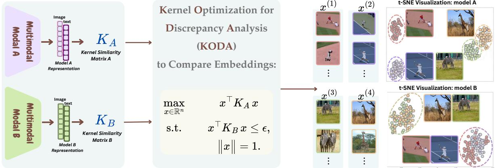

<details>
<summary>flowchart</summary>

```mermaid
graph LR
    subgraph_Modal_A["Modal A"]
        A1["Image text"] --> A2["K_A Kernel Similarity Matrix A"]
        A3["Model A Representation"] --> A2
    end

    subgraph_Modal_B["Modal B"]
        B1["Image text"] --> B2["K_B Kernel Similarity Matrix B"]
        B3["Model B Representation"] --> B2
    end

    A2 --> C["Kernel Optimization for Discrepancy Analysis (KODA) to Compare Embeddings:"]
    B2 --> C
    C --> D1["x^(1)"]
    C --> D2["x^(2)"]
    C --> D3["..."]
    C --> D4["x^(3)"]
    C --> D5["x^(4)"]
    D1 --> E1["t-SNE Visualization: model A"]
    D2 --> E2["t-SNE Visualization: model A"]
    D3 --> E3["t-SNE Visualization: model A"]
    D4 --> E4["t-SNE Visualization: model A"]
    D5 --> E5["t-SNE Visualization: model B"]
    D6["Max x ∈ ℝⁿ"] --> C
    D7["s.t. xᵀ K_A x"] --> C
    D8["||x|| = 1."] --> C
```
</details>

KODA Identified differently-embedded multi-modal clusters:   
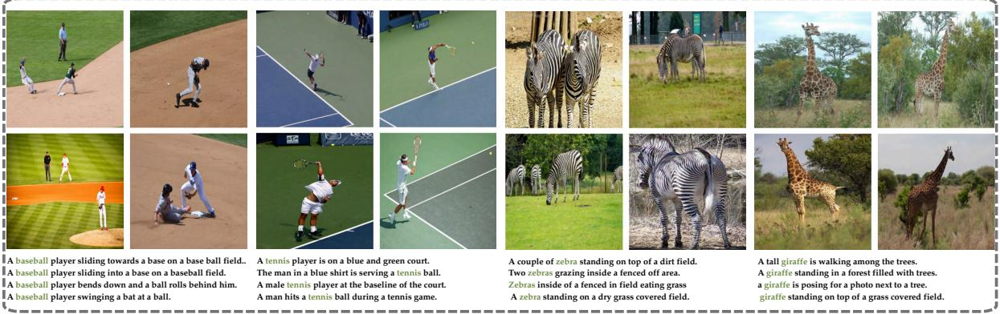

<details>
<summary>text_image</summary>

A baseball player sliding towards a base on a base ball field.
A baseball player sliding into a base on a baseball field.
A baseball player bends down and a ball rolls behind him.
A baseball player swinging a bat at a ball.
A tennis player is on a blue and green court.
The man in a blue shirt is serving a tennis ball.
A male tennis player at the baseline of the court.
A man hits a tennis ball during a tennis game.
A couple of zebra standing on top of a dirt field.
Two zebras grazing inside a fenced off area.
Zebras inside of a fenced in field eating grass
A zebra standing on a dry grass covered field.
A tall giraffe is walking among the trees.
A giraffe standing in a forest filled with trees.
a giraffe is posing for a photo next to a tree.
giraffe standing on top of a grass covered field.
</details>

Figure 1. Overview of KODA for Contrastive Embedding Clustering, which aims to discover sample clusters that are represented differently by two embeddings. We show KODA-identified contrastive clusters for BLIP and CLIP embeddings on the MS-COCO dataset.

In this work, we formulate Contrastive Embedding Clustering as a constrained optimization problem. Given kernel similarity matrices $K _ { A }$ and $K _ { B }$ induced by two representations, KODA seeks components that are strongly grouped under one representation while explicitly constrained to be weakly grouped under the other. We introduce Kernel Optimization for Discrepancy Analysis (KODA), which solves

$$
\max _ {x \in \mathbb {R} ^ {n}} \quad x ^ {\top} K _ {A} x
$$

$\mathrm { s u b j e c t \ t o ~ } x ^ { \top } K _ { B } x \leq \epsilon ,$ (1)

$$
\left\| x \right\| _ {2} = 1.
$$

To identify multiple discrepancy modes, we solve a sequence of such problems with orthogonality constraints between the current and previous solutions. Although this optimization problem is non-convex, we show that it admits an efficient solution via structured spectral computations.

We further extend KODA to the comparison of multi-modal representations by constructing unified kernels through modality-wise kernel multiplication. This product-kernel formulation enables direct comparison of representations over paired data, such as image–text samples, within the same constrained framework. However, exact covarianceoperator implementations become infeasible in multi-modal settings because effective feature dimensions can scale multiplicatively across modalities.

To enable scalable computation, we develop approximations based on random projections and Random Fourier Features (Rahimi & Recht, 2007), which reduce the effective dimensionality of the joint kernel feature map while preserving approximation guarantees. We evaluate KODA on widely used vision–language representation models, including CLIP (Radford et al., 2021), ALIGN (Jia et al., 2021), and BLIP-style models (Li et al., 2022; 2023), using standard benchmarks such as MS-COCO (Lin et al., 2014). Our experiments show that KODA identifies consistent discrepancy structures, improves over kernel-difference baselines in finding multiple discrepancy modes, and provides sample subsets that can be used for representation alignment.

# 2. Related Work

Multi-modal embedding models. Vision–language embedding models are now a standard component in cross-modal retrieval, zero-shot recognition, and multi-modal generative AI pipelines. Representative approaches include CLIP (Radford et al., 2021), ALIGN (Jia et al., 2021), and BLIP / BLIP-2 (Li et al., 2022; 2023), alongside scaling studies and public training efforts that broaden the space of available variants (Cherti et al., 2023). SigLIP (Zhai et al., 2023) and SigLip 2 (Tschannen et al., 2025) propose an alternative pre-training objective based on a sigmoid loss. While these models are commonly compared via downstream benchmarks, such evaluations often provide limited insight into how two embeddings organize the same paired data.

Explainability in representation learning. A broad line of research develops tools to interpret learned representations directly, often by linking internal directions or units to human-understandable concepts. Network Dissection (Bau et al., 2017) quantifies interpretability of visual representations by measuring alignment between hidden units and semantic concepts. Concept-based explanation methods use examples of a concept to define directions in representation space: TCAV (Kim et al., 2018) measures concept sensitivity via directional derivatives, while ACE (Ghorbani et al., 2019) automatically extracts concepts and evaluates their importance, reducing reliance on manually specified concept sets. Concept Bottleneck Models (Koh et al., 2020) further emphasize interpretability by explicitly structuring representations around a set of supervised concepts and enabling interventions on that representation. More recently, Gong et al. (2025b) improve the visual interpretability of CLIP through unsupervised adversarial fine-tuning with norm regularization, showing gains through feature-attribution and network-dissection analyses. These works motivate analyses that identify which parts of a dataset correspond to salient representational structure, but they do not directly target the embeddings’ discrepancy discovery.

Kernel-based methods for feature representations. Kernel methods provide a flexible way to compare, align, fuse, and evaluate learned feature representations through pairwise similarity structure rather than only downstream task accuracy. Recent work has used kernel matrices to explain differences between embedding spaces and align their induced cluster structures (Jalali et al., 2025a), and to improve vision-language representations by aligning CLIP visual embeddings with stronger vision-centric embeddings such as DINOv2 (Gong et al., 2025a). Complementarily, kernel product feature maps and maximum kernel entropy methods have been used to fuse and recover embeddings while preserving pairwise similarity information (Wu et al., 2025; Wu & Farnia, 2026). Kernel-based scores have also become central to generative-model evaluation, beginning with MMD-based comparison (Gretton et al., 2012) and the Kernel Inception Distance (Binkowski et al. ´ , 2018; Wang et al., 2025), and extending to entropy- and spectrum-based measures for diversity, novelty, and prompt-aware evaluation, including RKE (Jalali et al., 2023), Vendi (Friedman & Dieng, 2023; Ospanov et al., 2024), KEN (Zhang et al., 2024; 2025), and conditional kernel entropy (Jalali et al., 2025b; Ospanov et al., 2025; Jalali et al., 2026). Kernel-based uses of embeddings have also been explored for model evaluation, selection, and mixture construction (Stein et al., 2023; Hu et al., 2025b; Rezaei et al., 2025; Hu et al., 2025a; Jafari & Farnia, 2026). These methods motivate viewing embeddings and foundation models not only as feature vectors for prediction, but also as kernel-induced representations whose geometry can be systematically compared and evaluated.

# 3. Preliminaries

# 3.1. Embedding maps & comparison setting

Let X denote an input space and let $\psi : \mathcal { X }  \mathcal { S }$ be an embedding map into a representation space $s$ (typically Euclidean). We consider two embedding maps

$$
\psi_ {1}: \mathcal {X} \to \mathcal {S} _ {1}, \qquad \psi_ {2}: \mathcal {X} \to \mathcal {S} _ {2},
$$

which may have different output dimensions and thus induce different similarity structures on the same inputs. We assume access to a reference dataset $\{ x _ { i } \} _ { i = 1 } ^ { n } \subset { \mathcal { X } }$ sampled from an underlying distribution. Our goal is to compare ψ1 and $\psi _ { 2 }$ through the geometry they induce on this reference set, without relying on labeled downstream tasks.

# 3.2. Kernel functions & kernel-induced quadratic forms

A kernel function k : $\mathcal { X } \times \mathcal { X }  \mathbb { R }$ assigns a similarity score and admits a feature map $\phi : \mathcal { X } \to \mathcal { H }$ into a (possibly infinite-dimensional) Hilbert space H such that

$$
k (x, x ^ {\prime}) = \langle \phi (x), \phi (x ^ {\prime}) \rangle_ {\mathcal {H}}.
$$

Given samples $x _ { 1 } , \ldots , x _ { n }$ , the associated kernel matrix $K \in \mathbb { R } ^ { n \times n } \mathrm { ~ i ~ }$ s

$$
K _ {i j} = k (x _ {i}, x _ {j}), \tag {2}
$$

and is positive semidefinite. Common normalized examples include the cosine kernel $\begin{array} { r } { k _ { \mathrm { { c o s } } } ( u , v ) = \frac { u ^ { \top } v } { \| u \| _ { 2 } \| v \| _ { 2 } } } \end{array}$ (for nonzero $u , v )$ and the Gaussian (RBF) kernel $k _ { \mathrm { r b f } } ( u , v ) =$ $\exp \big ( - \ l | u - v | | _ { 2 } ^ { 2 } / ( 2 \sigma ^ { 2 } ) \big )$ , both satisfying $k ( x , x ) = 1$ .

For any $v \in \mathbb { R } ^ { n }$ with $\| v \| _ { 2 } = 1$ , the quadratic form

$$
v ^ {\top} K v \tag {3}
$$

is the Rayleigh quotient of K at v, and hence lies in $[ \lambda _ { \operatorname* { m i n } } ( K ) , \lambda _ { \operatorname* { m a x } } ( K ) ]$ and is maximized by a top eigenvector of $K$ . Moreover, when ϕ is finite-dimensional and $K = \Phi \Phi ^ { \top }$ with $\Phi _ { i : } = \phi (  { \boldsymbol { x } } _ { i } ) ^ { \top }$ , we have the identity

$$
v ^ {\top} K v = \| \Phi^ {\top} v \| _ {2} ^ {2} = \left\| \sum_ {i = 1} ^ {n} v _ {i} \phi (x _ {i}) \right\| _ {2} ^ {2}, \tag {4}
$$

which will be useful when interpreting and optimizing kernel-based criteria on the reference set. When $\phi ( \boldsymbol { x } ) \in \mathbb { R } ^ { d }$ the empirical covariance matrix (operator) is

$$
C _ {X} := \frac {1}{n} \Phi^ {\top} \Phi = \frac {1}{n} \sum_ {i = 1} ^ {n} \phi (x _ {i}) \phi (x _ {i}) ^ {\top} \in \mathbb {R} ^ {d \times d}. \tag {5}
$$

The matrices $K / n$ and $C _ { X }$ share the same non-zero eigenvalues (including multiplicities), since they are products of Φ and $\Phi ^ { \top }$ in opposite orders.

# 3.3. Shift-invariant kernels & random Fourier features

To scale kernel computations, we use random Fourier features (RFF) (Rahimi & Recht, 2007; Sutherland & Schneider, 2015) for shift-invariant kernels on $\mathbb { R } ^ { d }$ . Consider kernels of the form $k ( x , x ^ { \prime } ) = \kappa ( x - x ^ { \prime } )$ , where κ is continuous and positive definite. $\boldsymbol { \mathrm { B y } }$ Bochner’s theorem, there exists a non-negative finite measure (taking non-negative values) ${ \widehat { \kappa } } ,$ which is the Fourier transform of $\kappa ,$ such that

$$
\kappa (\delta) = \int_ {\mathbb {R} ^ {d}} \exp \bigl (\mathrm{i} \omega^ {\top} \delta \bigr) \widehat {\kappa} (\omega) \mathrm{d} \omega . \tag {6}
$$

For a normalized kernel with $\kappa ( 0 ) = 1 ,$ , κ will be a probability measure. We then sample $\omega _ { 1 } , \ldots , \omega _ { m } \stackrel { \mathrm { i . i . d . } } { \sim }$ κ and define the RFF proxy feature map $\varphi _ { r } : \mathcal X \to \mathbb R ^ { 2 r }$ as

$$
\varphi_ {r} (x) = \frac {1}{\sqrt {r}} \left[ \cos (\omega_ {1} ^ {\top} x), \sin (\omega_ {1} ^ {\top} x),., \cos (\omega_ {r} ^ {\top} x), \sin (\omega_ {r} ^ {\top} x) \right]. \tag {7}
$$

A direct calculation yields $\mathbb { E } [ \langle \varphi _ { r } ( x ) , \varphi _ { r } ( x ^ { \prime } ) \rangle ] = k ( x , x ^ { \prime } )$ , where the expectation is over the sampled frequency vectors. Given $\{ x _ { i } \} _ { i = 1 } ^ { n }$ , we form the approximate kernel matrix $\widetilde { K }$ by $\tilde { K } _ { i j } = \langle \varphi _ { r } ( x _ { i } ) , \varphi _ { r } ( x _ { j } ) \rangle$ ⟩, enabling computation of kernel quadratic forms and spectral quantities using an explicit feature representation.

# 4. KODA: Optimization-based discrepancy identification in kernel matrices

We formalize the comparison problem as a Contrastive $E m -$ bedding Clustering task. Given two embeddings A and B evaluated on the same reference set $\{ x _ { 1 } , \ldots , x _ { n } \}$ , the goal is to identify subsets or signed directions over the reference samples that form a coherent cluster under one embedding but not under the other. In this sense, the task is not merely to measure a global discrepancy between embeddings, but to localize it by extracting directions in the reference set where the two kernel similarity geometries disagree.

For two embeddings A and $B ,$ , we are given their normalized kernel similarity matrices $K _ { A } , K _ { B } \in \mathbb { R } ^ { n \times n }$ constructed on the same reference set $\{ x _ { 1 } , \ldots , x _ { n } \}$ , where $\textstyle { \frac { 1 } { n } } K _ { A } \succeq 0$ and $\scriptstyle { \frac { 1 } { n } } K _ { B } \ \succeq \ 0$ are PSD and unit-trace. We develop an optimization formulation for Contrastive Embedding Clustering: extracting directions on the reference set along which the structure induced by one embedding is strongly clustered while the structure by the other is weakly clustered.

# 4.1. Constrained quadratic programming for kernel-based embedding comparison

For a target level $\epsilon > 0$ , we consider the following quadratically constrained program for Contrastive Embedding Clustering. The constraint enforces weak clusterability under $K _ { B } ,$ , while the objective searches for a direction that is maximally clustered under $K _ { A } \colon$

$$
\max _ {x \in \mathbb {R} ^ {n}} x ^ {\top} K _ {A} x
$$

$$
\text { s.t. } \quad x ^ {\top} K _ {B} x \leq \epsilon , \tag {8}
$$

$$
\left\| x \right\| _ {2} ^ {2} = 1.
$$

Let $x ^ { \star }$ denote an optimizer. The constraint $x ^ { \top } K _ { B } , x \le \epsilon$ enforces that the discrepancy direction has limited energy under the second embedding, while the objective selects the direction with the strongest similarity concentration under the first embedding. Thus, $x ^ { \star }$ identifies a contrastive cluster direction: a set-level pattern that is salient in embedding A but suppressed, diffuse, or absent in embedding B.

Although the optimization problem (8) is a non-convex optimization task (maximizing a convex objective function), its optimizers admit an eigenvector-based characterization as revealed by KKT conditions.

Proposition 4.1 (Eigenvector form of an optimizer). Assume (8) is feasible and there exists x¯ with $\| \bar { x } \| _ { 2 } = 1$ and $\bar { x } ^ { \top } K _ { B } \bar { x } < \epsilon .$ . Then, there exist scalars $\lambda ^ { \star } \geq 0$ and $\nu ^ { \star } \in \mathbb { R }$ such that any optimizer $x ^ { \star }$ with unit-norm $( \| x ^ { \star } \| _ { 2 } = 1 )$ satisfies

$$
\left(K _ {A} - \lambda^ {\star} K _ {B}\right) x ^ {\star} = \nu^ {\star} x ^ {\star}, \tag {9}
$$

$$
\lambda^ {\star} \big (x ^ {\star \top} K _ {B} x ^ {\star} - \epsilon \big) = 0. \tag {10}
$$

Proof. We present the proof in the Appendix.

Searching over λ. Proposition 4.1 motivates a onedimensional search over $\lambda ~ \geq ~ 0$ : for each $\lambda ,$ compute a leading eigenvector $x _ { \lambda }$ of $K _ { A } \mathrm { ~ - ~ } \lambda K _ { B }$ (normalized to $\| \boldsymbol { x } _ { \lambda } \| _ { 2 } = 1 )$ and evaluate $g ( \lambda ) : = x _ { \lambda } ^ { \top } K _ { B } x _ { \lambda }$ . We then select a λ that yields $g ( \lambda ) \leq \epsilon$ and maximizes $x _ { \lambda } ^ { \top } K _ { A } x _ { \lambda }$ among such candidates (up to numerical tolerance).

# 4.2. Iterative extraction of discrepancy directions via KODA

A single solution of (8) yields one contrastive cluster direction. KODA solves the Contrastive Embedding Clustering task by extracting such directions, iteratively solving (8) while enforcing orthogonality to the found directions.

Let $x _ { 1 } , \ldots , x _ { t - 1 }$ be previously extracted unit vectors, and let $U _ { t - 1 } \in \mathbb { R } ^ { n \times ( t - 1 ) }$ have orthonormal columns spanning span $\{ x _ { 1 } , \ldots , x _ { t - 1 } \}$ . Define the orthogonal projector

$$
P _ {t - 1} := I - U _ {t - 1} U _ {t - 1} ^ {\top}. \tag {11}
$$

At iteration t, we solve

$$
\max _ {x \in \mathbb {R} ^ {n}} x ^ {\top} K _ {A} x
$$

$\mathrm { s . t . } \quad x ^ { \top } K _ { B } x \leq \epsilon ,$ (12)

$$
\| x \| _ {2} = 1,
$$

$$
U _ {t - 1} ^ {\top} x = 0.
$$

Proposition 4.2. The optimization problem (12) is equivalent to

$$
\max _ {x \in \mathbb {R} ^ {n}} x ^ {\top} (P _ {t - 1} K _ {A} P _ {t - 1}) x
$$

$s . t . \quad x ^ { \top } ( P _ { t - 1 } K _ { B } P _ { t - 1 } ) x \leq \epsilon ,$ (13)

$$
\| x \| _ {2} = 1,
$$

and every optimizer of (13) satisfies $U _ { t - 1 } ^ { \top } x = 0$ .

Proof. We present the proof in the Appendix.


Algorithm 1 summarizes the steps in KODA. At each iteration, we work with the projected matrices $A = P K _ { A } P$ and $B = P K _ { B } P$ from (13) and perform a 1D search over λ via repeated leading-eigenvector computations.

# 4.3. Scalable principal-eigenvector computation via covariance blocks

KODA requires repeated computation of a principal eigenvector of matrices of the form $K _ { A } \mathrm { ~ - ~ } \lambda K _ { B } \in \mathbb { R } ^ { n \times n }$ . For large reference sets $( { \mathrm { e . g . , ~ } } n \gtrapprox 2 0 0 0 0 )$ , this step can be a computational bottleneck in the dense-kernel regime: even iterative eigensolvers (Lanczos/power iteration) rely on repeated matrix–vector products, each costing $\Theta ( n ^ { \dot { 2 } } )$ time (and $\Theta ( n ^ { 2 } )$ memory if $K _ { A } , K _ { B }$ are explicitly formed). When the kernels admit explicit feature representations with feature dimensions $d _ { 1 } , d _ { 2 } \ll n \left( \mathrm { e . g } \right.$ ., via random features), the same principal-eigenvector computation can be reduced to an eigenproblem of dimension $d _ { 1 } + d _ { 2 }$ .

Assume the kernel matrices factor as

$$
K _ {A} = \Phi_ {A} \Phi_ {A} ^ {\top}, \quad K _ {B} = \Phi_ {B} \Phi_ {B} ^ {\top}, \tag {14}
$$

with $\Phi _ { A } \in \mathbb { R } ^ { n \times d _ { 1 } }$ 1 and $\Phi _ { B } \in \mathbb { R } ^ { n \times d _ { 2 } }$ . Let $\Phi : =$ $\left[ \Phi _ { A } \ \Phi _ { B } \right] \in \mathbb { R } ^ { n \times ( d _ { 1 } + d _ { 2 } ) }$ and define the covariance blocks

$$
C _ {A A} := \Phi_ {A} ^ {\top} \Phi_ {A}, \qquad C _ {A B} := \Phi_ {A} ^ {\top} \Phi_ {B},
$$

$$
C _ {B A} := \Phi_ {B} ^ {\top} \Phi_ {A}, \quad C _ {B B} := \Phi_ {B} ^ {\top} \Phi_ {B}, \tag {15}
$$

so that $G : = \Phi ^ { \top } \Phi = \left\lceil C _ { A A } \quad C _ { A B } \right\rceil .$

Proposition 4.3. For coefficient $\lambda \geq 0$ , define block matrices $S _ { \lambda } : = \mathrm { d i a g } ( I _ { d _ { 1 } } , - \lambda I _ { d _ { 2 } } )$ and

$$
M _ {\lambda} := S _ {\lambda} G = \left[ \begin{array}{c c} C _ {A A} & C _ {A B} \\ - \lambda C _ {B A} & - \lambda C _ {B B} \end{array} \right]. \tag {16}
$$

Let $\eta _ { \lambda } ~ { : = } ~ \lambda _ { \operatorname* { m a x } } ( K _ { A } - \lambda K _ { B } )$ and let $u _ { \lambda }$ be a $( r i g h t )$ eigenvector of $M _ { \lambda }$ associated with eigenvalue $\eta _ { \lambda }$ . Then, $x _ { \lambda } : = \Phi u _ { \lambda }$ is a principal eigenvector of $K _ { A } - \lambda K _ { B }$ (after normalization).

Proof. We present the proof in the Appendix.

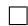

Discussion and computational implications. Proposition 4.3 reduces the principal-eigenvector computation of the n × n matrix $K _ { A } \mathrm { ~ - ~ } \lambda K _ { B }$ to an eigenproblem of size $( d _ { 1 } + d _ { 2 } ) \times ( d _ { 1 } + d _ { 2 } )$ , which is independent of n. This is particularly beneficial when $d _ { 1 } , d _ { 2 } \ll n$ , as is typical with explicit feature maps or random features. In practice, we form the covariance blocks in (15) in $O ( n ( d _ { 1 } + d _ { 2 } ) ^ { 2 } )$ time (or $O ( n ( d _ { 1 } + d _ { 2 } ) )$ time if $C _ { i j }$ are accumulated online with a single pass) and then compute a dominant eigenvector of $M _ { \lambda }$ . The lifted vector $x _ { \lambda } = \Phi u _ { \lambda }$ can be obtained without forming any $n \times n$ matrix, and can be normalized to satisfy $\| x _ { \lambda } \| _ { 2 } = 1$ before evaluating the constraint quantity $x _ { \lambda } ^ { \top } K _ { B } x _ { \lambda }$ (which can likewise be computed via $\Phi _ { B }$ as $x _ { \lambda } ^ { \top } K _ { B } ^ { \top } x _ { \lambda } = \| \Phi _ { B } ^ { \top } x _ { \lambda } \| _ { 2 } ^ { 2 } )$ .

Sample complexity of the covariance-block eigendirections. To state a population sample-complexity guarantee, we use the normalized covariance blocks $\begin{array} { r } { \widehat { C } _ { i j } : = \frac { 1 } { n } \Phi _ { i } ^ { \top } \Phi _ { j } } \end{array}$ and $\begin{array} { r } { \widehat { G } : = \frac { 1 } { n } \Phi ^ { \top } \Phi } \end{array}$ . $\mathrm { . e t } z ( x ) : = [ \Phi _ { A } ( x ) ; \Phi _ { B } ( x ) ] \in \mathbb { R } ^ { d }$ 1+d2 denote the per-sample feature vector (the ith row of $\Phi$ is $z ( x _ { i } ) ^ { \top } )$ . Assume $\| \Phi _ { A } ( x ) \| _ { 2 } ~ \leq ~ 1$ and $\| \Phi _ { B } ( x ) \| _ { 2 } ~ \leq ~ 1$ for all x (equivalently, $\| z ( x ) \| _ { 2 } ^ { 2 } \leq 2 )$ . Define the population block covariance $G : = \mathbb { E } [ z ( X ) z ( X ) ^ { \top } ]$ and $S _ { \lambda } : =$ diag $\left( I _ { d _ { 1 } } , - \lambda I _ { d _ { 2 } } \right)$ . Finally, define the symmetric matrices $B _ { \lambda } : = G ^ { 1 / 2 } S _ { \lambda } G ^ { 1 / 2 }$ and ${ \widehat B } _ { \lambda } : = { \widehat G } ^ { 1 / 2 } S _ { \lambda } { \widehat G } ^ { 1 / 2 }$ .

Theorem 4.4. Consider the setting described above. Then, for every $\lambda \geq 0$ and $\delta \in ( 0 , 1 )$ , the following holds with probability at least $1 - \delta ,$ ,

$$
\left\| \widehat {B} _ {\lambda} - B _ {\lambda} \right\| _ {2} \leq 1 2 \| S _ {\lambda} \| _ {2} \sqrt [ 4 ]{\frac {d _ {1} + d _ {2}}{n}} \left(1 + \sqrt {\log (1 / \delta)}\right).
$$

Moreover, $i f B _ { \lambda }$ has eigengap γ $\iota : = \lambda _ { 1 } ( B _ { \lambda } ) - \lambda _ { 2 } ( B _ { \lambda } ) > 0$ , and $v _ { 1 } , \widehat { v _ { 1 } }$ are unit top eigenvectors of $B _ { \lambda } , \widehat { B } _ { \lambda } ,$ , then

$$
\sin \angle (\widehat {v} _ {1}, v _ {1}) \leq \frac {\| \widehat {B} _ {\lambda} - B _ {\lambda} \| _ {2}}{\gamma_ {\lambda}}. \tag {17}
$$

Proof. We present the proof in the Appendix.

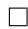

# 5. KODA for Multi-modal embeddings via product kernels and random features

We extend KODA to the comparison of multi-modal embeddings, where each reference item consists of paired observations from different modalities. We first introduce a

Algorithm 1 KODA: Kernel Optimization for Discrepancy Analysis

Require: PSD kernels $K _ { A } , K _ { B } \in \mathbb { R } ^ { n \times n }$ , threshold $\epsilon > 0 .$ , number of directions T , tolerance τ

Ensure: Directions $x _ { 1 } , \dots , x _ { T } \in \mathbb { R } ^ { n }$

1: $U \gets [ ]$ (null matrix)   
2: for $t = 1 , \dots , T$ do   
3: $P  I - U U ^ { \top }$   
4: $A  P K _ { A } P ,$ $B  P K _ { B } P$   
5: Choose $\lambda _ { t } \geq 0$ by a 1D search using: compute a leading eigenvector xλ of $A - \lambda B$ with $\| x _ { \lambda } \| _ { 2 } = 1$ , and evaluate $g ( \lambda ) = x _ { \lambda } ^ { \top } B x _ { \lambda }$   
6: Stop when $g ( \lambda _ { t } ) \leq \epsilon + \tau$ and set $\boldsymbol { x } _ { t } \gets \boldsymbol { x } _ { \lambda _ { t } }$   
7: Orthonormalize: $U \gets \mathrm { o r t h } ( [ U \ x _ { t } ] )$   
8: end for   
9: Return $\{ x _ { t } \} _ { t = 1 } ^ { T }$

product-kernel formulation that induces a joint similarity matrix on paired samples. We then address the computational challenge posed by the tensor-product feature space of product kernels by proposing a joint random Fourier feature approximation, and establish a guarantee on the stability of the leading eigenspaces used by KODA.

# 5.1. Product-kernel formulation and tensor-product bottleneck

For each reference sample that paired is $z _ { i } = ( x _ { i } , t _ { i } )$ , let

$$
u _ {i} = \psi_ {x} (x _ {i}) \in \mathbb {R} ^ {d _ {x}}, \quad v _ {i} = \psi_ {t} (t _ {i}) \in \mathbb {R} ^ {d _ {t}}.
$$

We consider normalized shift-invariant kernels for each modality as follows where $\kappa _ { x } ( 0 ) = \kappa _ { t } ( 0 ) = 1$ :

$$
k _ {x} (u, u ^ {\prime}) = \kappa_ {x} (u - u ^ {\prime}), k _ {t} (v, v ^ {\prime}) = \kappa_ {t} (v - v ^ {\prime}) \tag {18}
$$

Then, we define the multi-modal product kernel as:

$$
\begin{array}{l} k \big ((u, v), (u ^ {\prime}, v ^ {\prime}) \big) = k _ {x} (u, u ^ {\prime}) k _ {t} (v, v ^ {\prime}) \\ = \kappa_ {x} (u - u ^ {\prime}) \kappa_ {t} (v - v ^ {\prime}). \tag {19} \\ \end{array}
$$

For a reference set $\{ ( u _ { i } , v _ { i } ) \} _ { i = 1 } ^ { n }$ , the corresponding kernel matrix satisfies $K = K _ { x } \odot K _ { t }$ where

$$
(K _ {x}) _ {i j} = k _ {x} (u _ {i}, u _ {j}), \quad (K _ {t}) _ {i j} = k _ {t} (v _ {i}, v _ {j}), \tag {20}
$$

with ⊙ denoting the Hadamard product. At the kernel level, KODA applies directly by replacing unimodal kernels in Section 4 with K .

The challenge arises in covariance-based implementations: the feature map associated with (19) is the tensor product

$$
\phi (u, v) = \phi_ {x} (u) \otimes \phi_ {t} (v),
$$

whose ambient dimension scales as $d _ { x } d _ { t }$ . This renders covariance-space eigen-computations infeasible for standard multi-modal embeddings, motivating a low-dimensional kernel approximation.

# 5.2. Joint random Fourier features

Since $\kappa _ { x }$ and $\kappa _ { t }$ are continuous, real-valued, and shiftinvariant, Bochner’s theorem yields probability measures $\widehat { \kappa } _ { x }$ and $\widehat { \kappa } _ { t }$ such that

$$
\begin{array}{l} \kappa_ {x} (\delta) = \int_ {\mathbb {R} ^ {d _ {x}}} \widehat {\kappa} _ {x} \left(\omega_ {x}\right) \cos \left(\omega_ {x} ^ {\top} \delta\right) \mathrm{d} \omega_ {x}, \\ \kappa_ {t} (\zeta) = \int_ {\mathbb {R} ^ {d _ {t}}} \widehat {\kappa} _ {t} (\omega_ {t}) \cos (\omega_ {t} ^ {\top} \zeta)   \mathrm{d} \omega_ {t}. \tag {21} \\ \end{array}
$$

We sample r frequency vectors independently for each modality:

$$
\omega_ {x, 1}, \ldots , \omega_ {x, r} \stackrel {{\mathrm{iid}}} {{\sim}} \widehat {\kappa} _ {x}, \quad \omega_ {t, 1}, \ldots , \omega_ {t, r} \stackrel {{\mathrm{iid}}} {{\sim}} \widehat {\kappa} _ {t},
$$

and define the joint random Fourier feature map

$$
\begin{array}{l} \varphi (u, v) = \frac {1}{\sqrt {r}} \Big [ \cos (\omega_ {x, 1} ^ {\top} u + \omega_ {t, 1} ^ {\top} v), \sin (\omega_ {x, 1} ^ {\top} u + \omega_ {t, 1} ^ {\top} v), \\ \left. \dots , \cos \left(\omega_ {x, r} ^ {\top} u + \omega_ {t, r} ^ {\top} v\right), \sin \left(\omega_ {x, r} ^ {\top} u + \omega_ {t, r} ^ {\top} v\right) \right] \in \mathbb {R} ^ {2 r}. \tag {22} \\ \end{array}
$$

Let $\Phi \in \mathbb { R } ^ { n \times 2 r }$ contain rows $\Phi _ { i : } = \varphi ( u _ { i } , v _ { i } ) ^ { \top }$ . The approximate kernel matrix is

$$
\widetilde {K} = \Phi \Phi^ {\top} \quad \text { where } \quad \widetilde {K} _ {i j} = \langle \varphi (u _ {i}, v _ {i}), \varphi (u _ {j}, v _ {j}) \rangle . \tag {23}
$$

Next, we show a theoretical guarantee supporting scalable multi-modal KODA via the joint random Fourier feature implementation:

Theorem 5.1. Let K be defined in (20) and $\widetilde { K }$ in (23). Assume $| K _ { i j } | \le 1$ for all i, j. Then for any $\delta \in ( 0 , 1 )$ , with probability at least $1 - \delta ,$ ,

$$
\left\| \frac {1}{n} \widetilde {K} - \frac {1}{n} K \right\| _ {F} \leq \frac {2 + \sqrt {8 \log (1 / \delta)}}{\sqrt {r}} \tag {24}
$$

Moreover, for any q with eigengap $\Delta _ { q } ( K ) = \lambda _ { q } ( K ) -$ $\lambda _ { q + 1 } ( K ) > 0 ,$ , letting U and $\widetilde { U }$ denote the top-q eigenspaces of K and $\widetilde { K }$ respectively,

$$
\left\| \sin \Theta (\widetilde {U}, U) \right\| _ {F} \leq \frac {\left\| \widetilde {K} - K \right\| _ {F}}{\Delta_ {q} (K)}. \tag {25}
$$

Proof. We present the proof in the Appendix.

Theorem 5.1 provides justification for using $\widetilde { K } = \Phi \Phi ^ { \top }$ as a proxy for the true product kernel matrix K in multimodal KODA. In particular, $\widetilde { K }$ concentrates around K at rate $r ^ { - 1 / 2 }$ in Frobenius norm, and the leading eigenspaces are stable whenever $\Delta _ { q } ( K )$ is non-negligible. This enables covariance/feature-space implementations whose complexity depends on the joint random-feature dimension 2r, avoiding explicit tensor-product feature maps of size $d _ { x } d _ { t }$ .

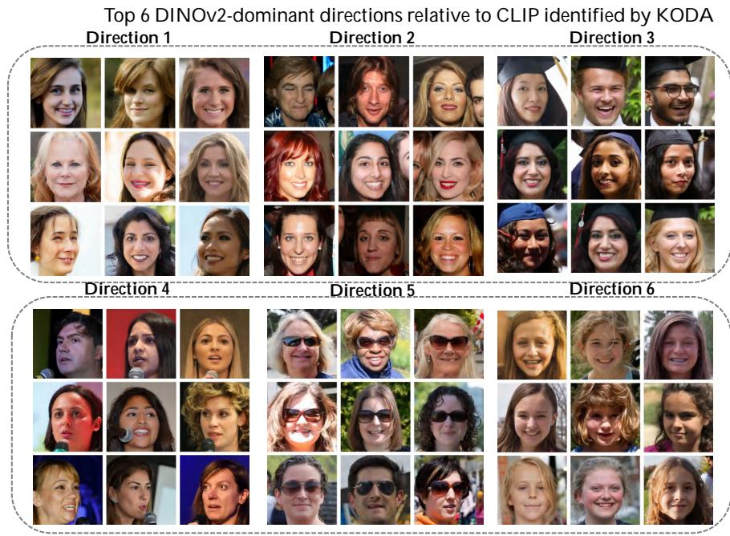

<details>
<summary>bar</summary>

Top 6 DINOv2-dominant directions relative to CLIP identified by KODA
| Direction | Top 6 DINOv2-dominant directions relative to CLIP identified by KODA |
| :--- | :--- |
| Direction 1 | Top 6 DINOv2-dominant directions relative to CLIP identified by KODA |
| Direction 2 | Top 6 DINOv2-dominant directions relative to CLIP identified by KODA |
| Direction 3 | Top 6 DINOv2-dominant directions relative to CLIP identified by KODA |
| Direction 4 | Top 6 DINOv2-dominant directions relative to CLIP identified by KODA |
| Direction 5 | Top 6 DINOv2-dominant directions relative to CLIP identified by KODA |
| Direction 6 | Top 6 DINOv2-dominant directions relative to CLIP identified by KODA |
</details>

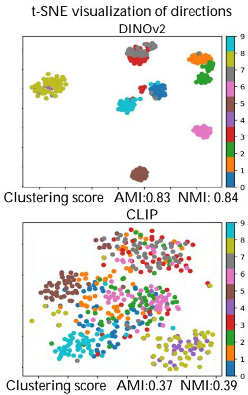

<details>
<summary>scatter</summary>

| Dataset | Clustering score | AMI  | NMI  |
|---------|------------------|------|------|
| DINOv2  | 0.83             | 0.83 | 0.84 |
| CLIP    | 0.37             | 0.37 | 0.39 |
</details>

Figure 2. Left: Visualization of the top-6 discrepancy directions that are strongly grouped under DINOv2 while being weakly clustered under CLIP on the FFHQ dataset, discovered by KODA. Right: t-SNE visualization of Top-10 directions together with clustering scores.

# 6. Numerical Results

In this section, we evaluate KODA through two complementary tasks. The first task, contrastive embedding clustering, asks whether KODA can identify sample groups that are coherently clustered under one embedding but weakly clustered under another. The second task, contrastive embedding alignment, asks whether the discovered contrastive clusters can be used as actionable slices for targeted alignment between embeddings. Finally, we provide ablation studies on key design choices in KODA.

Datasets. We evaluate our method on a diverse collection of image-only and image–text datasets to assess discrepancy discovery under both unimodal and multimodal settings. For image-only experiments, we use AFHQ (Choi et al., 2020), FFHQ (Karras et al., 2019), and ImageNet (Deng et al., 2009). For multimodal experiments, we adopt standard image-caption datasets MSCOCO (Lin et al., 2014).

Models. For unimodal discrepancy analysis, we consider two widely adopted visual encoders, DINOv2 (Oquab et al., 2023) and CLIP (Radford et al., 2021). For multimodal experiments, we evaluate a diverse set of vision-language models, including BLIP (Li et al., 2022), CLIP (Radford et al., 2021), OpenCLIP (Ilharco et al., 2021), SigLIP (Zhai et al., 2023), and SigLIP2 (Tschannen et al., 2025).

Implementation details. All experiments are conducted using the covariance-operator formulation of KODA, with spectral computations solved via Cholesky decomposition. We adopt Gaussian (RBF) kernels and kernel bandwidths are selected following prior work (Zhang et al., 2024) (Jalali et al., 2025a) to ensure comparable scaling across embeddings. Further implementation details are provided in C.1.

Contrastive embedding clustering in unimodal encoders. We begin with the contrastive embedding clustering task for two image encoders, DINOv2 and CLIP, on the AFHQ and FFHQ datasets. Figure 2 illustrates the dominant discrepancy directions identified by KODA that are strongly grouped under DINOv2 while being weakly clustered under CLIP. For visualization, we select 50 representative samples per direction and project their embeddings using t-SNE (Van der Maaten & Hinton, 2008) under each model. To quantify the identified directions, we run k-means on the corresponding embeddings with 10 times and report the averaged Adjusted Mutual Information (Vinh et al., 2009) (AMI) and Normalized Mutual Information (McDaid et al., 2013) (NMI) between the k-means labels and the KODAdiscovered labels. The results on AFHQ datasets are provided in Figure 7 and Figure 8.

Consistency with reference discrepancy structures. We further examine whether the discrepancy directions identified by KODA align with semantic mismatches derived from representation similarity statistics. We use the ImageNet dog breeds dataset since it provides category labels that enable explicit verification. We derive ground-truth discrepancy labels based on aggregated similarity statistics. Without using any label information, KODA recovers dominant discrepancy directions that closely correspond to these mismatched categories as shown in Figure 6. Additional results and visualizations are provided in Appendix C.2.

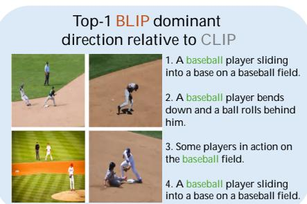

<details>
<summary>text_image</summary>

Top-1 BLIP dominant
direction relative to CLIP
1. A baseball player sliding
into a base on a baseball field.
2. A baseball player bends
down and a ball rolls behind
him.
3. Some players in action on
the baseball field.
4. A baseball player sliding
into a base on a baseball field.
</details>

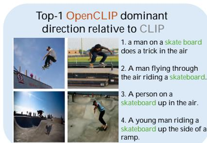

<details>
<summary>text_image</summary>

Top-1 OpenCLIP dominant
direction relative to CLIP
1. a man on a skate board
does a trick in the air
2. A man flying through
the air riding a skateboard.
3. A person on a
skateboard up in the air.
4. A young man riding a
skateboard up the side of a
ramp.
</details>

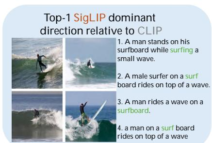

<details>
<summary>text_image</summary>

Top-1 SigLIP dominant
direction relative to CLIP
1. A man stands on his
surfboard while surfing a
small wave.
2. A male surfer on a surf
board rides on top of a wave.
3. A man rides a wave on a
surfboard.
4. a man on a surf board
rides on top of a wave
</details>

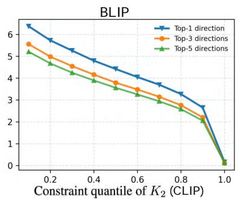

<details>
<summary>line</summary>

| Constraint quantile of K₂ (CLIP) | Top-1 direction | Top-3 directions | Top-5 directions |
| -------------------------------- | --------------- | ---------------- | ---------------- |
| 0.0                              | 6.5             | 5.5              | 5.2              |
| 0.2                              | 5.8             | 5.0              | 4.7              |
| 0.4                              | 5.0             | 4.3              | 3.9              |
| 0.6                              | 4.2             | 3.6              | 3.2              |
| 0.8                              | 3.2             | 2.8              | 2.4              |
| 1.0                              | 0.0             | 0.0              | 0.0              |
</details>

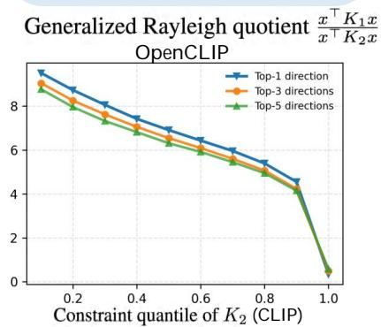

<details>
<summary>line</summary>

| Constraint quantile of K₂ (CLIP) | Top-1 direction | Top-3 directions | Top-5 directions |
| -------------------------------- | --------------- | ---------------- | ---------------- |
| 0.0                              | 9.0             | 8.8              | 8.5              |
| 0.2                              | 8.5             | 8.2              | 7.8              |
| 0.4                              | 7.8             | 7.5              | 7.0              |
| 0.6                              | 7.0             | 6.7              | 6.2              |
| 0.8                              | 6.0             | 5.7              | 5.2              |
| 1.0                              | 4.5             | 4.2              | 3.8              |
</details>

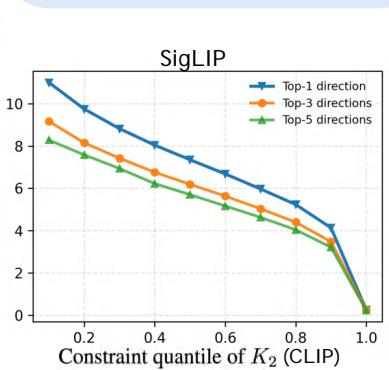

<details>
<summary>line</summary>

| Constraint quantile of K₂ (CLIP) | Top-1 direction | Top-3 directions | Top-5 directions |
| -------------------------------- | --------------- | ---------------- | ---------------- |
| 0.0                              | 11.0            | 9.0              | 8.0              |
| 0.2                              | 10.0            | 8.5              | 7.5              |
| 0.4                              | 9.0             | 7.5              | 6.5              |
| 0.6                              | 8.0             | 6.5              | 5.5              |
| 0.8                              | 7.0             | 5.5              | 4.5              |
| 1.0                              | 0.0             | 0.0              | 0.0              |
</details>

Figure 3. Multimodal discrepancy analysis on the MSCOCO dataset. Top: Representative image–caption pairs corresponding to the Top-1 discrepancy direction identified by KODA for different vision–language models relative to CLIP. Bottom: Generalized Rayleigh quotient of the identified discrepancy directions under varying constraint quantiles defined on the CLIP kernel.

Contrastive embedding clustering in vision–language models. We next evaluate KODA on contrastive embedding clustering for paired image–text data. All multimodal experiments are conducted on MSCOCO using the joint image–text representation described in Section 5.2. We consider a set of widely used vision–language models, including BLIP, CLIP, OpenCLIP, SigLIP, and SigLIP2, and perform pairwise discrepancy analysis. As shown in Figure 3 (top), the resulting samples exhibit distinct multimodal patterns across different models by fixing CLIP as the reference model. Additional comparing results and visualization across different models are provided in Appendix C.4.

Quantifying Directional Asymmetry via the Generalized Rayleigh Quotient. We further quantify the strength of multimodal discrepancy directions using the generalized Rayleigh quotient $\frac { x ^ { \top } K _ { 1 } x } { x ^ { \top } K _ { 2 } x }$ , where $K _ { 1 }$ and $K _ { 2 }$ are normalized RBF kernel matrices induced by the two embeddings. Since $x ^ { \top } K x$ measures how strongly direction x is expressed under kernel K, larger quotient values indicate stronger directional asymmetry, i.e., directions emphasized by $K _ { 1 }$ but suppressed by $K _ { 2 }$ . Following Eq. (7), the constraint parameter ϵ is set implicitly via a quantile $q \in \{ 0 . 1 , 0 . 2 , \ldots , 1 . 0 \}$ of the eigenvalue distribution of $K _ { 2 }$ , where ϵ corresponds to the q-quantile of $K _ { 2 } \mathrm { { ' } s }$ eigenvalues. Figure 3 (bottom) reports the quotient values for the Top-1 discrepancy direction as well as the averages over the Top-3 and Top-5 directions.

Contrastive embedding alignment using KODAidentified samples. To examine whether the discovered discrepancy slices are useful beyond visualization, we use them for targeted embedding alignment. In the unimodal setting, KODA identifies slices that are weakly grouped by CLIP but strongly grouped by DINOv2 on FFHQ dataset. We fine-tune CLIP on these selected samples to align its local geometry with DINOv2, following a kernel-based embedding-alignment objective of (Gong et al., 2025a). Table 2 shows that the aligned CLIP substantially improves its agreement with the KODA-discovered grouping and approaches the DINOv2 geometry on these slices. We observe a similar trend in the multimodal setting. On MSCOCO, KODA identifies image–caption pairs for which BLIP forms a clearer joint structure than CLIP. The corresponding t-SNE visualization in Figure 4 further shows that the aligned embedding forms a geometry closer to the target embedding on the same selected slice.

Multimodal discrepancy reflects cross-modal alignment differences. We further examine whether the multimodal discrepancies found by KODA mainly arise from crossmodal alignment differences or from general inter-model mismatch. Comparing image-only and joint image–text KODA directions, we find that image-only embeddings produce noisier directions with weaker semantic separation, while joint image-text embeddings yield more coherent and concentrated clusters. Visual comparisons are in Figures 10 and 11. We also evaluate image-to-text and text-to-image retrieval on MSCOCO, comparing the KODA-selected subset with the full dataset. As in Table 1, the KODA-selected slice amplifies the retrieval gap between SigLIP and CLIP.

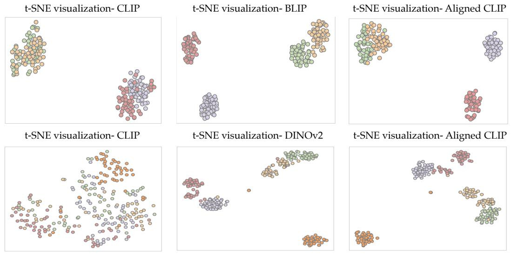

Figure 4. t-SNE visualization of KODA-selected samples before and after contrastive embedding alignment.   
Table 1. Cross-modal retrieval on the full MSCOCO set and the KODA-selected subset. The KODA-selected subset amplifies the performance gap between CLIP and SigLIP. 

<table><tr><td>Model</td><td>Evaluation set</td><td>I2T R@1</td><td>I2T R@5</td><td>I2T R@10</td><td>T2I R@1</td><td>T2I R@5</td><td>T2I R@10</td><td>Avg. drop</td></tr><tr><td>CLIP</td><td>Full</td><td>32.64</td><td>57.88</td><td>68.10</td><td>28.60</td><td>53.04</td><td>64.46</td><td>0.00</td></tr><tr><td>CLIP</td><td>KODA-selected</td><td>18.00</td><td>44.00</td><td>55.00</td><td>19.00</td><td>46.00</td><td>56.00</td><td>11.12</td></tr><tr><td>SigLIP</td><td>Full</td><td>42.64</td><td>68.32</td><td>77.98</td><td>41.86</td><td>66.42</td><td>76.22</td><td>0.00</td></tr><tr><td>SigLIP</td><td>KODA-selected</td><td>34.00</td><td>68.00</td><td>78.00</td><td>35.00</td><td>62.00</td><td>73.00</td><td>3.91</td></tr></table>

Table 2. Contrastive embedding alignment on KODA-selected slices. AMI/NMI/ARI measure agreement between the embeddinginduced clusters and the KODA-discovered grouping. 

<table><tr><td>Target</td><td>Model</td><td>AMI</td><td>NMI</td><td>ARI</td></tr><tr><td rowspan="3">DINOv2</td><td>CLIP</td><td>0.25±.002</td><td>0.26±.002</td><td>0.19±.001</td></tr><tr><td>Aligned</td><td>0.78±.004</td><td>0.78±.004</td><td>0.70±.012</td></tr><tr><td>Target</td><td>0.83±.006</td><td>0.84±.006</td><td>0.77±.017</td></tr><tr><td rowspan="3">BLIP</td><td>CLIP</td><td>0.52±.003</td><td>0.53±.009</td><td>0.37±.004</td></tr><tr><td>Aligned</td><td>0.91±.006</td><td>0.91±.008</td><td>0.90±.003</td></tr><tr><td>Target</td><td>0.96±.008</td><td>0.96±.005</td><td>0.96±.006</td></tr></table>

Ablation Study. To examine the sensitivity of KODA to major design parameters, we conduct ablation studies on the number of random Fourier features, the reference sample size, and the kernel function, discussed in Appendix C.5.

# 7. Conclusion and Limitations

In this work, we introduced Contrastive Embedding Clustering as a task for identifying sample-level structures that are organized differently across two embedding representations, and proposed KODA as a constrained kernel-based framework for solving this task. By formulating embedding comparison as a quadratic optimization problem with an explicit constraint on weak clusterability under a reference embedding, KODA directly localizes discrepancy directions that are strongly clustered in one embedding but diffuse or suppressed in the other, going beyond global kernel-difference spectral comparisons. We showed that the resulting non-convex problem admits efficient eigenvectorbased characterization and developed scalable implementations through covariance-block reductions and random feature approximations. Across experiments, KODA identified fine-grained and interpretable contrastive clusters across multi-modal and uni-modal embeddings. As limitations, KODA requires a shared reference dataset and focuses on unsupervised discrepancy discovery through kernel-induced geometry; extending the framework to unmatched datasets, supervised or task-conditioned discrepancy notions, and stronger statistical guarantees for cluster interpretation are relevant directions for future work.

# Acknowledgments

This work is supported by a grant from the Research Grants Council of the Hong Kong Special Administrative Region, China, Project 14210725, and is also supported by CUHK Direct Research Grant with CUHK Project No. 4055164. The work is partially supported by a grant under 1+1+1 CUHK-CUHK(SZ)-GDSTC Joint Collaboration Fund. Also, the authors acknowledge the support from the Hong Kong Research Grants Council (RGC) and the Hong Kong PhD Fellowship Scheme (HKPFS) award supporting Youqi Wu’s research. Finally, the authors sincerely thank the anonymous reviewers and meta-reviewer for their insightful suggestions and constructive feedback.

# Impact Statement

This work develops methods for comparing multi-modal embedding representations by identifying dataset-level discrepancy patterns between models. A positive impact is to support transparency and interpretability in the evaluation of widely used embedding interfaces, enabling more informed model selection, debugging, and analysis beyond aggregate benchmark metrics. As with other representation analysis tools, such methods could also be misused to exploit model-specific weaknesses or to support undesirable downstream applications if applied without appropriate safeguards. We therefore emphasize that KODA is intended for controlled evaluation and auditing purposes on shared reference datasets, and we encourage careful consideration of dataset provenance, privacy, and downstream use when applying embedding comparison techniques in practice.

# References

Bau, D., Zhou, B., Khosla, A., Oliva, A., and Torralba, A. Network dissection: Quantifying interpretability of deep visual representations. In 2017 IEEE Conference on Computer Vision and Pattern Recognition (CVPR), pp. 3319–3327. IEEE Computer Society, 2017. doi: 10. 1109/CVPR.2017.354. URL https://doi.org/10. 1109/CVPR.2017.354.   
Binkowski, M., Sutherland, D. J., Arbel, M., and Gretton, A. ´ Demystifying MMD GANs. In International Conference on Learning Representations, 2018.   
Cherti, M., Beaumont, R., Wightman, R., Wortsman, M., Ilharco, G., Gordon, C., Schuhmann, C., Schmidt, L., and Jitsev, J. Reproducible scaling laws for contrastive language-image learning. In Proceedings of the IEEE/CVF Conference on Computer Vision and Pattern Recognition (CVPR), pp. 2818–2829, June 2023.   
Chitta, R., Jin, R., and Jain, A. K. Efficient kernel clustering using random fourier features. In 2012 IEEE 12th

International Conference on Data Mining, pp. 161–170. IEEE, 2012.

Choi, Y., Uh, Y., Yoo, J., and Ha, J.-W. Stargan v2: Diverse image synthesis for multiple domains. In Proceedings of the IEEE/CVF conference on computer vision and pattern recognition, pp. 8188–8197, 2020.

Darrin, M., Formont, P., Ayed, I., Cheung, J. C., and Piantanida, P. When is an embedding model more promising than another? Advances in Neural Information Processing Systems, 37:68330–68379, 2024.

Deng, J., Dong, W., Socher, R., Li, L.-J., Li, K., and Fei-Fei, L. Imagenet: A large-scale hierarchical image database. In 2009 IEEE conference on computer vision and pattern recognition, pp. 248–255. Ieee, 2009.

Friedman, D. and Dieng, A. B. The Vendi score: A diversity evaluation metric for machine learning. Transactions on Machine Learning Research, 2023.

Gedon, D., Ribeiro, A. H., Wahlstrom, N., and Sch ¨ on, T. B. ¨ Invertible kernel PCA with random fourier features. IEEE Signal Processing Letters, 30:563–567, 2023.

Ghashami, M., Perry, D. J., and Phillips, J. Streaming kernel principal component analysis. In Artificial intelligence and statistics, pp. 1365–1374. PMLR, 2016.

Ghorbani, A., Wexler, J., Zou, J. Y., and Kim, B. Towards automatic concept-based explanations. In Advances in Neural Information Processing Systems (NeurIPS), volume 32, pp. 9277–9286. Curran Associates, Inc., 2019.

Gong, S., Jiang, Y., Dou, Q., and Farnia, F. Kernel-based unsupervised embedding alignment for enhanced visual representation in vision-language models. In International Conference on Machine Learning, pp. 19912–19931. PMLR, 2025a.

Gong, S., Lei, H., Dou, Q., and Farnia, F. Boosting the visual interpretability of CLIP via adversarial finetuning. In The Thirteenth International Conference on Learning Representations, 2025b. URL https: //openreview.net/forum?id=khuIvzxPRp.

Gretton, A., Borgwardt, K. M., Rasch, M. J., Scholkopf, ¨ B., and Smola, A. A kernel two-sample test. Journal of Machine Learning Research, 13(25):723–773, 2012.

Hu, X., Leung, H.-f., and Farnia, F. PAK-UCB contextual bandit: An online learning approach to promptaware selection of generative models and LLMs. In Proceedings of the 42nd International Conference on Machine Learning, volume 267 of Proceedings of Machine Learning Research, pp. 24447–24481. PMLR, 2025a. URL https://proceedings.mlr. press/v267/hu25m.html.

Hu, X., Leung, H.-f., and Farnia, F. A multi-armed bandit approach to online selection and evaluation of generative models. In Proceedings of The 28th International Conference on Artificial Intelligence and Statistics, volume 258 of Proceedings of Machine Learning Research, pp. 1864–1872. PMLR, 2025b.   
Huh, M., Cheung, B., Wang, T., and Isola, P. Position: The platonic representation hypothesis. In Proceedings of the 41st International Conference on Machine Learning, volume 235 of Proceedings of Machine Learning Research, pp. 20617–20642. PMLR, 21–27 Jul 2024. URL https://proceedings.mlr.press/ v235/huh24a.html.   
Ilharco, G., Wortsman, M., Wightman, R., Gordon, C., Carlini, N., Taori, R., Dave, A., Shankar, V., Namkoong, H., Miller, J., Hajishirzi, H., Farhadi, A., and Schmidt, L. Openclip, July 2021. URL https://doi.org/10. 5281/zenodo.5143773. If you use this software, please cite it as below.   
Jafari, D. and Farnia, F. DAK-UCB: Diversity-aware prompt routing for LLMs and generative models. In The Fourteenth International Conference on Learning Representations (ICLR), 2026. URL https://openreview. net/forum?id=nnN2TKlS5C.   
Jalali, M., Li, C. T., and Farnia, F. An information-theoretic evaluation of generative models in learning multi-modal distributions. In Advances in Neural Information Processing Systems, volume 36, 2023.   
Jalali, M., Dibaei Nia, B., and Farnia, F. Towards an explainable comparison and alignment of feature embeddings. In Proceedings of the 42nd International Conference on Machine Learning, volume 267 of Proceedings of Machine Learning Research, pp. 26757–26796. PMLR, 2025a.   
Jalali, M., Lei, H., Gohari, A., and Farnia, F. SPARKE: Scalable prompt-aware diversity and novelty guidance in diffusion models via RKE score. In Advances in Neural Information Processing Systems, 2025b.   
Jalali, M., Ospanov, A., Gohari, A., and Farnia, F. Conditional vendi score: Prompt-aware diversity evaluation for generative ai models and llms. In Proceedings of The 29th International Conference on Artificial Intelligence and Statistics, Proceedings of Machine Learning Research. PMLR, 2026.   
Jia, C., Yang, Y., Xia, Y., Chen, Y.-T., Parekh, Z., Pham, H., Le, Q., Sung, Y.-H., Li, Z., and Duerig, T. Scaling up visual and vision-language representation learning with noisy text supervision. In Proceedings of the 38th International Conference on Machine Learning, volume 139 of Proceedings of Machine

Learning Research, pp. 4904–4916. PMLR, 18–24 Jul 2021. URL https://proceedings.mlr.press/ v139/jia21b.html.   
Karras, T., Laine, S., and Aila, T. A style-based generator architecture for generative adversarial networks. In Proceedings of the IEEE/CVF conference on computer vision and pattern recognition, pp. 4401–4410, 2019.   
Kim, B., Wattenberg, M., Gilmer, J., Cai, C., Wexler, J., Viegas, F., and Sayres, R. Interpretability beyond feature attribution: Quantitative testing with concept activation vectors (TCAV). In Proceedings of the 35th International Conference on Machine Learning (ICML), volume 80 of Proceedings of Machine Learning Research, pp. 2668– 2677. PMLR, 2018. URL https://proceedings. mlr.press/v80/kim18d.html.   
Koh, P. W., Nguyen, T., Tang, Y. S., Mussmann, S., Pierson, E., Kim, B., and Liang, P. Concept bottleneck models. In Proceedings of the 37th International Conference on Machine Learning (ICML), volume 119 of Proceedings of Machine Learning Research, pp. 5338–5348. PMLR, 2020. URL https://proceedings.mlr.press/ v119/koh20a.html.   
Li, J., Li, D., Xiong, C., and Hoi, S. BLIP: Bootstrapping language-image pre-training for unified vision-language understanding and generation. In Proceedings of the 39th International Conference on Machine Learning, volume 162 of Proceedings of Machine Learning Research, pp. 12888–12900. PMLR, 2022.   
Li, J., Li, D., Savarese, S., and Hoi, S. BLIP-2: Bootstrapping language-image pre-training with frozen image encoders and large language models. In Proceedings of the 40th International Conference on Machine Learning, volume 202 of Proceedings of Machine Learning Research, pp. 19730–19742. PMLR, 2023.   
Lin, T., Maire, M., Belongie, S. J., Hays, J., Perona, P., Ramanan, D., Dollar, P., and Zitfnick, C. L. Microsoft´ coco: Common objects in context. In Computer Vision – ECCV 2014, pp. 740–755, 2014.   
McDaid, A. F., Greene, D., and Hurley, N. Normalized mutual information to evaluate overlapping community finding algorithms, 2013.   
Ng, A. Y., Jordan, M. I., and Weiss, Y. On spectral clustering: Analysis and an algorithm. In Advances in Neural Information Processing Systems, 2001.   
Oquab, M., Darcet, T., Moutakanni, T., Vo, H., Szafraniec, M., Khalidov, V., Fernandez, P., Haziza, D., Massa, F., El-Nouby, A., et al. Dinov2: Learning robust visual features without supervision. arXiv preprint arXiv:2304.07193, 2023.

Ospanov, A., Zhang, J., Jalali, M., Cao, X., Bogdanov, A., and Farnia, F. Towards a scalable reference-free evaluation of generative models. In Advances in Neural Information Processing Systems, volume 37, 2024.   
Ospanov, A., Jalali, M., and Farnia, F. Scendi score: Promptaware diversity evaluation via schur complement of clip embeddings. In Proceedings of the IEEE/CVF International Conference on Computer Vision (ICCV), pp. 16927– 16937, October 2025.   
Radford, A., Kim, J. W., Hallacy, C., Ramesh, A., Goh, G., Agarwal, S., Sastry, G., Askell, A., Mishkin, P., Clark, J., Krueger, G., and Sutskever, I. Learning transferable visual models from natural language supervision. In Proceedings of the 38th International Conference on Machine Learning, volume 139 of Proceedings of Machine Learning Research, pp. 8748–8763. PMLR, 2021.   
Rahimi, A. and Recht, B. Random features for large-scale kernel machines. In Advances in Neural Information Processing Systems, pp. 1177–1184, 2007.   
Rezaei, P., Farnia, F., and Li, C. T. Be more diverse than the most diverse: Optimal mixtures of generative models. In The Thirteenth International Conference on Learning Representations (ICLR), 2025. URL https: //openreview.net/forum?id=2Chkk5Ye2s.   
Scholkopf, B., Smola, A. J., and M ¨ uller, K.-R. Nonlin- ¨ ear component analysis as a kernel eigenvalue problem. Neural Computation, 10(5):1299–1319, 1998.   
Sriperumbudur, B. K. and Sterge, N. Approximate kernel PCA: Computational versus statistical trade-off. The Annals of Statistics, 50(5):2713–2736, 2022.   
Stein, G., Cresswell, J. C., Hosseinzadeh, R., Sui, Y., Ross, B. L., Villecroze, V., Liu, Z., Caterini, A. L., Taylor, J. E. T., and Loaiza-Ganem, G. Exposing flaws of generative model evaluation metrics and their unfair treatment of diffusion models. In Advances in Neural Information Processing Systems, volume 36, pp. 3732–3784, 2023.   
Sutherland, D. J. and Schneider, J. On the error of random fourier features. arXiv preprint arXiv:1506.02785, 2015.   
Sutherland, D. J., Strathmann, H., Arbel, M., and Gretton, A. Efficient and principled score estimation with nystrom kernel exponential families. In ¨ International Conference on Artificial Intelligence and Statistics, pp. 652–660. PMLR, 2018.   
Tschannen, M., Gritsenko, A., Wang, X., Naeem, M. F., Alabdulmohsin, I., Parthasarathy, N., Evans, T., Beyer, L., Xia, Y., Mustafa, B., et al. Siglip 2: Multilingual vision-language encoders with improved semantic understanding, localization, and dense features. arXiv preprint arXiv:2502.14786, 2025.

Ullah, E., Mianjy, P., Marinov, T. V., and Arora, R. Streaming kernel PCA with $o ( \sqrt { n } )$ random features. Advances in Neural Information Processing Systems, 31, 2018.   
Van der Maaten, L. and Hinton, G. Visualizing data using t-sne. Journal of machine learning research, 9(11), 2008.   
Vinh, N. X., Epps, J., and Bailey, J. Information theoretic measures for clusterings comparison: is a correction for chance necessary? In Proceedings of the 26th annual international conference on machine learning, pp. 1073– 1080, 2009.   
Wang, Z., Farzan, F., Lin, Z., Shen, Y., and Yu, B. On the distributed evaluation of generative models. In Proceedings of the IEEE/CVF International Conference on Computer Vision Workshops, pp. 7644–7653, 2025.   
Wu, Y. and Farnia, F. The maximum von neumann entropy principle: Theory and applications in machine learning. In IEEE International Symposium on Information Theory (ISIT), 2026.   
Wu, Y., Zhang, J., and Farnia, F. When kernels multiply, clusters unify: Fusing embeddings with the kronecker product. In Advances in Neural Information Processing Systems, 2025.   
Zhai, X., Mustafa, B., Kolesnikov, A., and Beyer, L. Sigmoid loss for language image pre-training. In Proceedings of the IEEE/CVF international conference on computer vision, pp. 11975–11986, 2023.   
Zhang, J., Li, C. T., and Farnia, F. An interpretable evaluation of entropy-based novelty of generative models. In Proceedings of the 41st International Conference on Machine Learning, volume 235 of Proceedings of Machine Learning Research, pp. 59148–59172. PMLR, 2024.   
Zhang, J., Jalali, M., Li, C. T., and Farnia, F. Unveiling differences in generative models: A scalable differential clustering approach. In Proceedings of the IEEE/CVF Conference on Computer Vision and Pattern Recognition (CVPR), pp. 8269–8278, June 2025.

# A. Additional Related Works

Beyond downstream benchmarks: representation-level comparison. Recent work has explored task-agnostic viewpoints on embedding comparison that deviate from pure downstream evaluation. Darrin et al. (2024) propose an informationtheoretic approach to comparing embedding models based on notions of sufficiency/informativeness, enabling comparison without labeled tasks. The Platonic Representation Hypothesis (Huh et al., 2024) studies the extent to which independently trained models share representational structure, offering a complementary lens on when embeddings may share geometric organization.

Kernel and spectral tools. Kernel spectral methods provide classical machinery for studying grouping structure through eigensystems Chitta et al. (2012); Ghashami et al. (2016); Ullah et al. (2018); Sriperumbudur & Sterge (2022); Gedon et al. (2023). Kernel PCA (Scholkopf et al. ¨ , 1998) and spectral clustering (Ng et al., 2001) relate eigenstructure of similarity matrices to latent clusters, while Random Fourier Features (Rahimi & Recht, 2007) enable scalable approximations for shift-invariant kernels. Building on these tools, spectral kernel-based embedding comparison methods have been proposed, including analyzing kernel differences constructed from a shared reference dataset (Jalali et al., 2025a). Our work follows this kernel-based, reference-set comparison paradigm but adopts an optimization-based formulation that explicitly enforces weak grouping under one embedding while maximizing grouping strength under another.

# B. Proofs

# B.1. Proof of Proposition 4.1

Consider Lagrangian multipliers $\lambda \geq 0$ for $x ^ { \top } K _ { B } x \leq \epsilon$ and $\nu \in \mathbb { R }$ for $\| { x } \| _ { 2 } ^ { 2 } = 1$ , and consider

$$
\mathcal {L} (x, \lambda , \nu) = x ^ {\top} K _ {A} x - \lambda (x ^ {\top} K _ {B} x - \epsilon) - \nu (x ^ {\top} x - 1).
$$

At a KKT point $( x ^ { \star } , \lambda ^ { \star } , \nu ^ { \star } )$ , stationarity gives $2 ( K _ { A } - \lambda ^ { \star } K _ { B } - \nu ^ { \star } I ) x ^ { \star } = 0 \nonumber$ , yielding (9); complementary slackness yields (10). The strict feasibility assumption is a standard constraint qualification for the inequality constraint on the sphere.

# B.2. Proof of Proposition 4.2

First, note that $U _ { t - 1 } ^ { \top } x = 0$ is equivalent to $x = P _ { t - 1 } x ,$ which directly follows from the definition of $P _ { t - 1 }$ . For such x and any symmetric $D ,$ , we have $x ^ { \top } D x = x ^ { \top } ( P _ { t - 1 } D P _ { t - 1 } )$ x since $P _ { t - 1 } = P _ { t - 1 } ^ { \top } = P _ { t - 1 } ^ { 2 }$ . Applying this to $D = K _ { A } , K _ { B }$ yields the equivalence.

# B.3. Proof of Proposition 4.3

First note that

$$
K _ {A} - \lambda K _ {B} = \Phi_ {A} \Phi_ {A} ^ {\top} - \lambda \Phi_ {B} \Phi_ {B} ^ {\top} = \Phi S _ {\lambda} \Phi^ {\top}.
$$

For any $u \in \mathbb { R } ^ { d _ { 1 } + d _ { 2 } }$ ,

$$
(K _ {A} - \lambda K _ {B}) (\Phi u) = \Phi S _ {\lambda} \Phi^ {\top} \Phi u = \Phi S _ {\lambda} (\Phi^ {\top} \Phi) u = \Phi M _ {\lambda} u.
$$

Hence, if $M _ { \lambda } u _ { \lambda } = \eta _ { \lambda } u _ { \lambda }$ , then with $x _ { \lambda } = \Phi u _ { \lambda }$ we have

$$
\left(K _ {A} - \lambda K _ {B}\right) x _ {\lambda} = \eta_ {\lambda} x _ {\lambda},
$$

thus $x _ { \lambda }$ is an eigenvector of $K _ { A } ~ - ~ \lambda K _ { B }$ with eigenvalue $\eta _ { \lambda }$ . Moreover, $\eta _ { \lambda } \neq 0$ implies $x _ { \lambda } \neq 0 ;$ if $\Phi u _ { \lambda } = 0$ then $G u _ { \lambda } = \Phi ^ { \top } \Phi u _ { \lambda } = 0$ and thus $M _ { \lambda } u _ { \lambda } = S _ { \lambda } G u _ { \lambda } = 0$ , forcing $\eta _ { \lambda } = 0$ .

It remains to show that $\eta _ { \lambda }$ is also an eigenvalue of $M _ { \lambda }$ . This follows from the fact that for every matrix pair $A \in \mathbb { R } ^ { m \times n }$ and $B \in \mathbb { R } ^ { n \times m }$ (for any integers $m , n )$ , AB and BA share the same non-zero eigenvalues (including multiplicities). Applying this to the case $A = \Phi$ and $B = S _ { \lambda } \Phi ^ { \dagger }$ shows that $\Phi S _ { \lambda } \Phi ^ { \top } = K _ { A } - \lambda K _ { B }$ and $S _ { \lambda } \Phi ^ { \top } \Phi = M _ { \lambda }$ share the same non-zero eigenvalues. Since $K _ { A } \mathrm { ~ - ~ } \lambda K _ { B }$ is symmetric, its eigenvalues are real, and particularly its largest eigenvalue $\eta _ { \lambda } = \lambda _ { \operatorname* { m a x } } ( K _ { A } - \lambda K _ { B } )$ ) is among the eigenvalues of $M _ { \lambda }$ . Therefore, $u _ { \lambda }$ can be chosen as an eigenvector of $M _ { \lambda }$ associated with $\eta _ { \lambda }$ , and the lifted vector $x _ { \lambda } = \Phi u _ { \lambda }$ is a principal eigenvector of $K _ { A } \mathrm { ~ - ~ } \lambda K _ { B }$ .

# B.4. Proof of Theorem 4.4

Let $D : = d _ { 1 } + d _ { 2 }$ . Define $z ( X ) : = [ \phi _ { 1 } ( X ) ; \phi _ { 2 } ( X ) ] \in \mathbb { R } ^ { D }$ and assume $\left\| z ( X ) \right\| _ { 2 } ^ { 2 } = \left\| \phi _ { 1 } ( X ) \right\| _ { 2 } ^ { 2 } + \left\| \phi _ { 2 } ( X ) \right\| _ { 2 } ^ { 2 } \leq 2$ almost surely. Let

$$
G := \mathbb {E} [ z (X) z (X) ^ {\top} ] \succeq 0, \quad \widehat {G} := \frac {1}{n} \sum_ {i = 1} ^ {n} z \left(X _ {i}\right) z \left(X _ {i}\right) ^ {\top} \succeq 0,
$$

and for $\lambda \geq 0$ define $S _ { \lambda } : = \mathrm { d i a g } ( I _ { d _ { 1 } } , - \lambda I _ { d _ { 2 } } )$ ,

$$
B _ {\lambda} := G ^ {1 / 2} S _ {\lambda} G ^ {1 / 2}, \quad \widehat {B} _ {\lambda} := \widehat {G} ^ {1 / 2} S _ {\lambda} \widehat {G} ^ {1 / 2}.
$$

Note $B _ { \lambda }$ and ${ \widehat { B } } _ { \lambda }$ are symmetric.

ve a and entration result for , and therefore we $\widehat { G }$ usve lbert- and quality. Let . We bound $W _ { i } : =$ $z ( X _ { i } ) z ( X _ { i } ) ^ { \top }$ $Z _ { i } : = W _ { i } - G$ $\mathbb { E } [ Z _ { i } ] = 0$ $\begin{array} { r } { \widehat { G } - G = \frac { 1 } { n } \sum _ { i = 1 } ^ { n } Z _ { i } } \end{array}$ $\left. Z _ { i } \right. _ { F }$ almost surely.

First, for any vector a, $\left\| \boldsymbol { a } \boldsymbol { a } ^ { \top } \right\| _ { F } = \left\| \boldsymbol { a } \right\| _ { 2 } ^ { 2 } ;$ : indeed, $\left\| a a ^ { \top } \right\| _ { F } ^ { 2 } = \operatorname { T r } ( ( a a ^ { \top } ) ^ { \top } ( a a ^ { \top } ) ) = \operatorname { T r } ( a a ^ { \top } a a ^ { \top } ) = \left\| a \right\| _ { 2 } ^ { 4 } .$ Thus,

$$
\left\| W _ {i} \right\| _ {F} = \left\| z (X _ {i}) z (X _ {i}) ^ {\top} \right\| _ {F} = \left\| z (X _ {i}) \right\| _ {2} ^ {2} \leq 2 \quad \text { a.s. }
$$

Also, by Jensen’s inequality and the triangle inequality for the Frobenius norm,

$$
\left\| G \right\| _ {F} = \left\| \mathbb {E} [ W _ {i} ] \right\| _ {F} \leq \mathbb {E} \left\| W _ {i} \right\| _ {F} \leq 2.
$$

Therefore,

$$
\left\| Z _ {i} \right\| _ {F} = \left\| W _ {i} - G \right\| _ {F} \leq \left\| W _ {i} \right\| _ {F} + \left\| G \right\| _ {F} \leq 4 \quad \mathrm{a.s.}
$$

We now apply the Hoeffding-type inequality for random vectors in Hilbert spaces (Sutherland et al., 2018) to the i.i.d. Hilbert-space-valued variables $Z _ { i }$ in the Hilbert space of $D \times D$ matrices equipped with Frobenius norm. With $L = 4$ , we obtain: for any $\delta \in ( 0 , 1 )$ , with probability at least $1 - \delta .$ ,

$$
\left\| \widehat {G} - G \right\| _ {F} = \left\| \frac {1}{n} \sum_ {i = 1} ^ {n} Z _ {i} \right\| _ {F} \leq \frac {4}{\sqrt {n}} \left(1 + \sqrt {2 \log \frac {1}{\delta}}\right) =: \eta_ {n} (\delta). \tag {26}
$$

Subsequently, we apply the Powers–Størmer inequality showing that for PSD matrices A, $B \succeq 0$ we have

$$
\left\| A ^ {1 / 2} - B ^ {1 / 2} \right\| _ {F} ^ {2} \leq \left\| A - B \right\| _ {*}, \tag {27}
$$

where ∥ · ∥∗ is the nuclear (trace) norm. Applying (27) to $A = { \widehat { G } }$ and B = G yields

$$
\| \widehat {G} ^ {1 / 2} - G ^ {1 / 2} \| _ {F} \leq \| \widehat {G} - G \| _ {*} ^ {1 / 2}.
$$

For any $D \times D$ matrix X , $\| X \| _ { * } \leq \sqrt { \mathrm { r a n k } ( X ) } \| X \| _ { F } \leq \sqrt { D } \| X \| _ { F }$ . Therefore,

$$
\left\| \widehat {G} ^ {1 / 2} - G ^ {1 / 2} \right\| _ {F} \leq D ^ {1 / 4} \left\| \widehat {G} - G \right\| _ {F} ^ {1 / 2}. \tag {28}
$$

Then, we bound the norm difference $\| \widehat { B } _ { \lambda } - B _ { \lambda } \| _ { F }$ using $\| G \| _ { 2 } \leq 2$ . To do so, we expand

$$
\widehat {B} _ {\lambda} - B _ {\lambda} = (\widehat {G} ^ {1 / 2} - G ^ {1 / 2}) S _ {\lambda} \widehat {G} ^ {1 / 2} + G ^ {1 / 2} S _ {\lambda} (\widehat {G} ^ {1 / 2} - G ^ {1 / 2}).
$$

Taking the Frobenius norm and using submultiplicativity inequalities $\| A X \| _ { F } \leq \| A \| _ { 2 } \| X \| _ { F }$ and $\| X B \| _ { F } \leq \| B \| _ { 2 } \| X \| _ { F }$ result in the following inequality:

$$
\left\| \widehat {B} _ {\lambda} - B _ {\lambda} \right\| _ {F} \leq \left\| S _ {\lambda} \right\| _ {2} \left(\left\| \widehat {G} ^ {1 / 2} \right\| _ {2} + \left\| G ^ {1 / 2} \right\| _ {2}\right) \left\| \widehat {G} ^ {1 / 2} - G ^ {1 / 2} \right\| _ {F}. \tag {29}
$$

We now show that $\| \widehat { G } ^ { 1 / 2 } \| _ { 2 } \leq \sqrt { 2 }$ and $\| G ^ { 1 / 2 } \| _ { 2 } \leq { \sqrt { 2 } } .$

Since $G \succeq 0 , \| G \| _ { 2 } = \lambda _ { \operatorname* { m a x } } ( G ) \leq \operatorname { T r } ( G )$ . Moreover,

$$
\operatorname{Tr} (G) = \mathbb {E} \operatorname{Tr} (z (X) z (X) ^ {\top}) = \mathbb {E} \| z (X) \| _ {2} ^ {2} \leq 2
$$

As a result, $\| G \| _ { 2 } \leq 2$ and thus $\| G ^ { 1 / 2 } \| _ { 2 } = { \sqrt { \| G \| _ { 2 } } } \leq { \sqrt { 2 } }$ . Similarly, we have ${ \widehat { G } } \succeq 0$ and $\Vert \widehat { G } \Vert _ { 2 } \leq \mathrm { T r } ( \widehat { G } )$ . However, note that

$$
\mathrm{Tr} (\widehat {G}) = \frac {1}{n} \sum_ {i = 1} ^ {n} \mathrm{Tr} (z (X _ {i}) z (X _ {i}) ^ {\top}) = \frac {1}{n} \sum_ {i = 1} ^ {n} \| z (X _ {i}) \| _ {2} ^ {2} \leq 2
$$

which holds deterministically because each $\| z ( X _ { i } ) \| _ { 2 } ^ { 2 } \leq 2$ . Therefore, $\| \widehat { G } \| _ { 2 } \leq 2$ and $\| { \widehat { G } } ^ { 1 / 2 } \| _ { 2 } \leq { \sqrt { 2 } } .$ . Consequently, the following holds

$$
\left\| \widehat {G} ^ {1 / 2} \right\| _ {2} + \left\| G ^ {1 / 2} \right\| _ {2} \leq 2 \sqrt {2}. \tag {30}
$$

Then, we substitute (28) and (30) into (29):

$$
\| \widehat {B} _ {\lambda} - B _ {\lambda} \| _ {F} \leq 2 \sqrt {2} \| S _ {\lambda} \| _ {2} D ^ {1 / 4} \| \widehat {G} - G \| _ {F} ^ {1 / 2}.
$$

On the event (26), we have $\lVert \widehat { G } - G \rVert _ { F } \leq \eta _ { n } ( \delta )$ and hence

$$
\| \widehat {B} _ {\lambda} - B _ {\lambda} \| _ {F} \leq 2 \sqrt {2} \| S _ {\lambda} \| _ {2} D ^ {1 / 4} \eta_ {n} (\delta) ^ {1 / 2}.
$$

Plugging in $\eta _ { n } ( \delta )$ from (26) leads to

$$
\| \widehat {B} _ {\lambda} - B _ {\lambda} \| _ {F} \leq 2 \sqrt {2} \| S _ {\lambda} \| _ {2} D ^ {1 / 4} \left(\frac {4}{\sqrt {n}} \left(1 + \sqrt {2 \log \frac {1}{\delta}}\right)\right) ^ {1 / 2} = 8 \sqrt {2} \| S _ {\lambda} \| _ {2} D ^ {1 / 4} n ^ {- 1 / 4} \left(1 + \sqrt {2 \log \frac {1}{\delta}}\right) ^ {1 / 2}.
$$

Finally, note that the norm inequality $\| \cdot \| _ { 2 } \leq \| \cdot \| _ { F }$ implies that

$$
\| \widehat {B} _ {\lambda} - B _ {\lambda} \| _ {2} \leq \| \widehat {B} _ {\lambda} - B _ {\lambda} \| _ {F} \leq 8 \sqrt {2} \| S _ {\lambda} \| _ {2} D ^ {1 / 4} n ^ {- 1 / 4} \left(1 + \sqrt {2 \log \frac {1}{\delta}}\right) ^ {1 / 2}.
$$

Knowing that $8 \sqrt { 2 } < 1 2$ , the proof for the matrix concentration is complete. Finally, because $B _ { \lambda }$ and ${ \widehat { B } } _ { \lambda }$ are symmetric matrices, the rank-one Davis–Kahan sin Θ bound applies as follows: Given that $\gamma _ { \lambda } : = \lambda _ { 1 } ( B _ { \lambda } ) - \lambda _ { 2 } ( B _ { \lambda } ) > 0$ and $v _ { 1 } , \widehat { v _ { 1 } }$ are unit-norm top eigenvectors, then the following inequality holds

$$
\sin \angle (\widehat {v} _ {1}, v _ {1}) \leq \frac {\| \widehat {B} _ {\lambda} - B _ {\lambda} \| _ {2}}{\gamma_ {\lambda}}.
$$

The proof is hence complete.

# B.5. Proof of Theorem 5.1

We first prove the Frobenius concentration bound (24) by applying a Hilbert-space Hoeffding inequality directly to the random matrices (viewed as vectors under the Frobenius norm). We then derive the eigenspace bound (25) via Davis–Kahan.

Note that, by assumption, $\begin{array} { r } { \widetilde K = \frac { 1 } { r } \sum _ { \ell = 1 } ^ { r } K ^ { ( \ell ) } } \end{array}$ , where the matrices $K ^ { ( \ell ) }$ are i.i.d., $\mathbb { E } [ K ^ { ( \ell ) } ] = K$ , and $| K _ { i j } ^ { ( \ell ) } | \le 1$ almost surely for all $i , j$ . Define the normalized matrices

$$
A ^ {(\ell)} := \frac {1}{n} K ^ {(\ell)}, \qquad A := \frac {1}{n} K, \qquad \widetilde {A} := \frac {1}{n} \widetilde {K} = \frac {1}{r} \sum_ {\ell = 1} ^ {r} A ^ {(\ell)}.
$$

Then $\mathbb { E } [ A ^ { ( \ell ) } ] = A$ , and

$$
\widetilde {A} - A = \frac {1}{r} \sum_ {\ell = 1} ^ {r} \bigl (A ^ {(\ell)} - A \bigr).
$$

We work in the Hilbert space $( \mathbb { R } ^ { n \times n } , \langle \cdot , \cdot \rangle _ { F } )$ where $\| M \| = \| M \| _ { F }$ . We let $X _ { \ell } : = A ^ { ( \ell ) } - A$ . Then, $\{ X _ { \ell } \} _ { \ell = 1 } ^ { r }$ are i.i.d. random elements of this Hilbert space with $\mathbb { E } [ X _ { \ell } ] = 0$ . Next, we derive applicable upper-bounds on $\| X _ { \ell } \| _ { F }$ that hold with provable probability. Since $| K _ { i j } ^ { ( \ell ) } | \le 1$ holds deterministically, we have the following for every index ℓ,

$$
\| A ^ {(\ell)} \| _ {F} ^ {2} = \sum_ {i = 1} ^ {n} \sum_ {j = 1} ^ {n} \Bigl (\frac {K _ {i j} ^ {(\ell)}}{n} \Bigr) ^ {2} \leq \sum_ {i = 1} ^ {n} \sum_ {j = 1} ^ {n} \frac {1}{n ^ {2}} = 1,
$$

and hence $\| A ^ { ( \ell ) } \| _ { F } \leq 1$ almost surely. Similarly, using $| K _ { i j } | \le 1$ for all $i , j$ ,

$$
\| A \| _ {F} ^ {2} = \sum_ {i = 1} ^ {n} \sum_ {j = 1} ^ {n} \left(\frac {K _ {i j}}{n}\right) ^ {2} \leq \sum_ {i = 1} ^ {n} \sum_ {j = 1} ^ {n} \frac {1}{n ^ {2}} = 1,
$$

Therefore, $\| A \| _ { F } \leq 1$ holds. Hence, using the triangle inequality, we can show

$$
\| X _ {\ell} \| _ {F} = \| A ^ {(\ell)} - A \| _ {F} \leq \| A ^ {(\ell)} \| _ {F} + \| A \| _ {F} \leq 2
$$

Thus, the centered summands are uniformly bounded in norm by $L = 2$ .

We now apply the Hoeffding inequality for random vectors (Sutherland et al., 2018) to the i.i.d. sequence $\{ X _ { \ell } \} _ { \ell = 1 } ^ { r }$ , with $\ell _ { 2 }$ -norm upper-bound $L = 2$ . This shows that for every $\delta > 0$ , the following holds with probability at least $1 - \delta \colon$

$$
\left\| \frac {1}{r} \sum_ {\ell = 1} ^ {r} X _ {\ell} \right\| _ {F} \leq \frac {2}{\sqrt {r}} \Big (1 + \sqrt {2 \log \frac {1}{\delta}} \Big).
$$

Recalling that $\begin{array} { r } { \frac { 1 } { r } \sum _ { \ell = 1 } ^ { r } X _ { \ell } = \widetilde { A } - A = \frac { 1 } { n } ( \widetilde { K } - K ) } \end{array}$ , we obtain

$$
\frac {1}{n} \| \widetilde {K} - K \| _ {F} = \| \widetilde {A} - A \| _ {F} \leq \frac {2}{\sqrt {r}} \left(1 + \sqrt {2 \log \frac {1}{\delta}}\right).
$$

Multiplying both sides by n yields the claimed Frobenius bound (24).

Subsequently, note that both K and $\widetilde { K }$ are symmetric matrices. Let U and $\widetilde { U }$ be the top-q eigenspaces of K and $\widetilde { K }$ (represented by $n \times q$ matrices with orthonormal columns), and assume the eigengap $\Delta _ { q } ( K ) = \lambda _ { q } ( K ) - \lambda _ { q + 1 } ( K ) > 0 . \mathrm { { A } }$ standard Davis–Kahan sin Θ bound gives

$$
\left\| \sin \Theta (\widetilde {U}, U) \right\| _ {F} \leq \frac {\left\| \widetilde {K} - K \right\| _ {2}}{\Delta_ {q} (K)}.
$$

Finally, for any matrix $E , \left\| E \right\| _ { 2 } \leq \left\| E \right\| _ { F }$ . Applying this with $E = \widetilde { K } - K$ yields

$$
\left\| \sin \Theta (\widetilde {U}, U) \right\| _ {F} \leq \frac {\left\| \widetilde {K} - K \right\| _ {F}}{\Delta_ {q} (K)}.
$$

The above inequality completes the proof.

# C. Additional Numerical Results

# C.1. Experiment Details

All experiments are conducted in the covariance-operator formulation of KODA. To ensure numerical stability and efficiency, the associated generalized eigenvalue problems are solved via Cholesky decomposition of the constrained covariance operator, following standard practice in kernel-based spectral methods. Throughout all experiments, we adopt a Gaussian (RBF) kernel without other specifications. To enable scalable computation for both unimodal and multi-modal settings, kernel features are approximated using Random Fourier Features (RFF). Unless otherwise specified, we use 3,000 random Fourier features to approximate each Gaussian kernel. The kernel bandwidth σ is selected following common practice in the representation comparison literature. We adopt the same bandwidth selection strategy as in prior work (Zhang et al.,

2024) (Jalali et al., 2025a). Specifically, for each pair of embeddings under comparison, we tune the kernel bandwidths such that the leading eigenvalues of the resulting kernel matrices are of comparable magnitude across models, ensuring that neither embedding dominates the optimization due to scale differences. For the quadratic constraint in KODA, the threshold ϵ controls the degree of weak clustering enforced under the constrained embedding. Unless otherwise stated, we set ϵ to the 0.5 quantile of the eigenvalues of the constrained model. All experiments are performed on two NVIDIA RTX 4090 GPUs.

# C.2. Sanity Check of Unimodal Comparison

Visualizing Pairwise Discrepancies via Kernel Difference Heatmaps. Figure 5 shows normalized RBF kernel similarities induced by CLIP and DINOv2 on ImageWoof (ImageNet-1k dog breeds), together with their difference matrix. The difference heatmap exhibits structured, high-magnitude regions, where darker values indicate stronger mismatch between the two embeddings under the same similarity metric. These mismatches concentrate on specific breed-level relationships, suggesting that the discrepancies arise along meaningful semantic directions rather than random fluctuations.

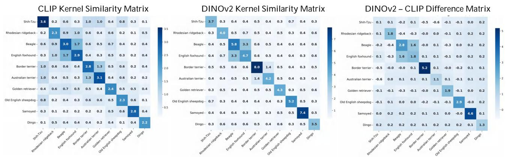  
Figure 5. Kernel similarity heatmaps induced by CLIP and DINOv2 on the ImageNet-1k dog breeds, together with their difference. (scaled by 100 for better visualization.)

Identified Discrepancy Directions Consistent with Kernel Difference Structures. Based on the above normalized RBF kernel difference between the two embeddings, we identify the dog-breed categories associated with the largest aggregated pairwise mismatches as a ground-truth reference of semantic discrepancy. We then apply KODA to the same dataset without using any label information to discover discrepancy directions between the two embeddings. For each discovered direction, we select the top-6 images for visualization. As shown in Figure 6, the top discrepancy directions recovered by KODA correspond closely to the most mismatched dog-breed categories identified from the kernel difference matrix.

# C.3. Additional Results on Unimodal Comparison

We provide additional qualitative results for unimodal embedding comparison to complement the main experiments. In particular, we analyze the dominant discrepancy directions discovered by KODA between DINOv2 and CLIP embeddings on AFHQ (Choi et al., 2020) dataset. We consider both asymmetric comparison settings: (i) directions that are weakly clustered under CLIP while being strongly grouped under DINOv2, and (ii) directions that are weakly clustered under DINOv2 while being strongly grouped under CLIP. For each setting, we visualize the top discrepancy components obtained from KODA by inspecting the samples associated with the leading directions, as shown in the Figure 7 and Figure 8. Also, we compare directions identified by KODA with those from the SPEC (Jalali et al., 2025a) baseline, using the same settings. We quantify the strength of a discrepancy direction x using the generalized Rayleigh quotien t x⊤K1xx⊤K x , where K1 and K2 are normalized $\frac { x ^ { \top } K _ { 1 } x } { x ^ { \top } K _ { 2 } x }$ $K _ { 1 }$ $K _ { 2 }$ RBF kernel matrices induced by the two embeddings. Since $x ^ { \top } K x$ measures how strongly direction x is expressed under kernel K, larger quotient values indicate stronger directional asymmetry, i.e., directions emphasized by $K _ { 1 }$ but suppressed by $K _ { 2 }$ . Figure 9 reports the quotient values of KODA’s Top-1 direction and the averages over Top-3 and Top-5 directions across different quantiles, together with SPEC’s Top-1 direction. Across all constraint levels, KODA consistently achieves substantially larger quotient values; notably, at $q = 0 . 1$ , KODA’s Top-1 direction is about 20× stronger than SPEC, and even the Top-5 average remains clearly above SPEC throughout. These additional results further demonstrate the ability of KODA to disentangle directional discrepancies that depend on the choice of reference embedding, even in unimodal settings.

DINOv2 – CLIP Difference Matrix   
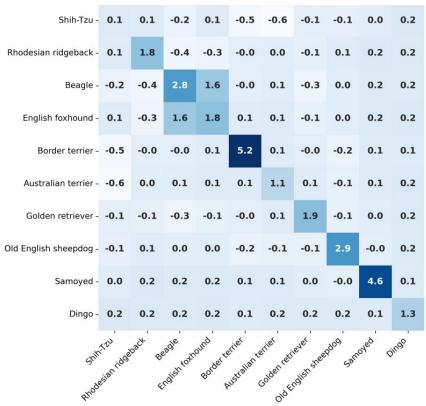

<details>
<summary>heatmap</summary>

| | Shih-Tzu | Rhodesian ridgeback | Beagle | English forehead | Border terrier | Australian terrier | Golden retriever | Old English sheepdog | Samoyed | Dingo |
|---|---|---|---|---|---|---|---|---|---|---|
| Shih-Tzu | 0.1 | 0.1 | -0.2 | 0.1 | -0.5 | -0.6 | -0.1 | -0.1 | 0.0 | 0.2 |
| Rhodesian ridgeback | 0.1 | 1.8 | -0.4 | -0.3 | -0.0 | 0.0 | -0.1 | 0.1 | 0.2 | 0.2 |
| Beagle | -0.2 | -0.4 | 2.8 | 1.6 | -0.0 | 0.1 | -0.3 | 0.0 | 0.2 | 0.2 |
| English foxhound | 0.1 | -0.3 | 1.6 | 1.8 | 0.1 | 0.1 | -0.1 | 0.0 | 0.2 | 0.2 |
| Border terrier | -0.5 | -0.0 | -0.0 | 0.1 | 5.2 | 0.1 | -0.0 | -0.2 | 0.1 | 0.1 |
| Australian terrier | -0.6 | 0.0 | 0.1 | 0.1 | 0.1 | 1.1 | 0.1 | -0.1 | 0.1 | 0.2 |
| Golden retriever | -0.1 | -0.1 | -0.3 | -0.1 | -0.0 | 0.1 | 1.9 | -0.1 | 0.0 | 0.2 |
| Old English sheepdog | -0.1 | 0.1 | 0.0 | 0.0 | -0.2 | -0.1 | -0.1 | 2.9 | -0.0 | 0.2 |
| Samoyed | 0.0 | 0.2 | 0.2 | 0.2 | 0.1 | 0.1 | 0.0 | -0.0 | 4.6 | 0.1 |
| Dingo | 0.2 | 0.2 | 0.2 | 0.2 | 0.1 | 0.2 | 0.2 | 0.2 | 0.1 | 1.3 |
</details>

Top-3 Directions (Ground Truth )   
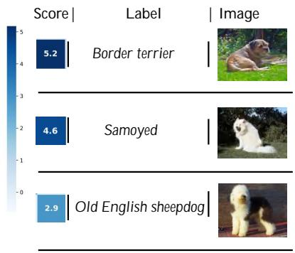

<details>
<summary>heatmap</summary>

| Label | Score | Image |
|---|---|---|
| Border terrier | 5.2 | Image |
| Samoyed | 4.6 | Image |
| Old English sheepdog | 2.9 | Image |
</details>

Top-3 Directions Identified by KODA   
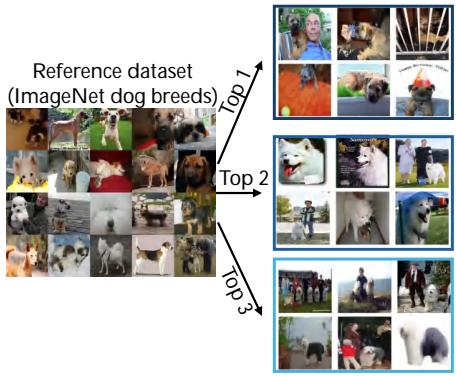

<details>
<summary>text_image</summary>

Reference dataset
(ImageNet dog breeds)
Top 1
Top 2
Top 3
</details>

Figure 6. Consistency between dominant kernel mismatches (ground truth) and discrepancy directions identified by KODA on ImageNet dog breeds. Left: the kernel difference matrix between DINOv2 and CLIP computed using normalized RBF kernels. Middle: the top-3 ground-truth dog breeds associated with the largest aggregated mismatch scores in the difference matrix, together with representative images. Right: representative samples from the top-3 discrepancy directions identified by KODA without using label information.

Top-10 mismatch directions discovered by KODA   
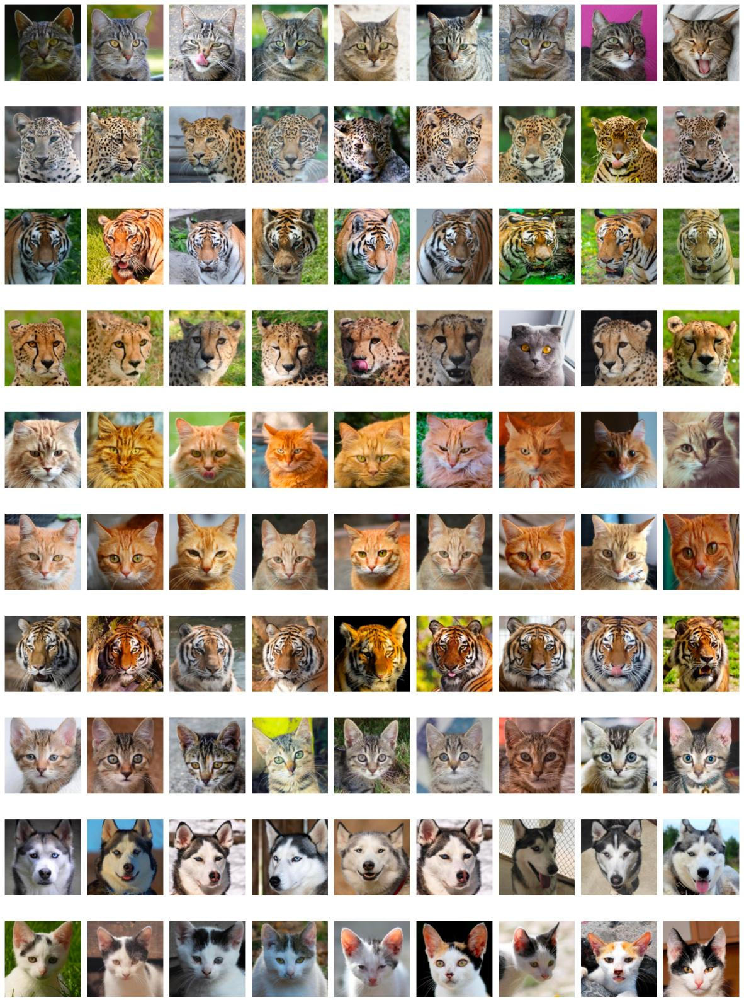  
Figure 7. Top-10 DINOv2 dominant directions relative to CLIP on the AFHQ dataset identified by KODA, visualized via representative samples for each direction.

Top-10 mismatch directions discovered by KODA   
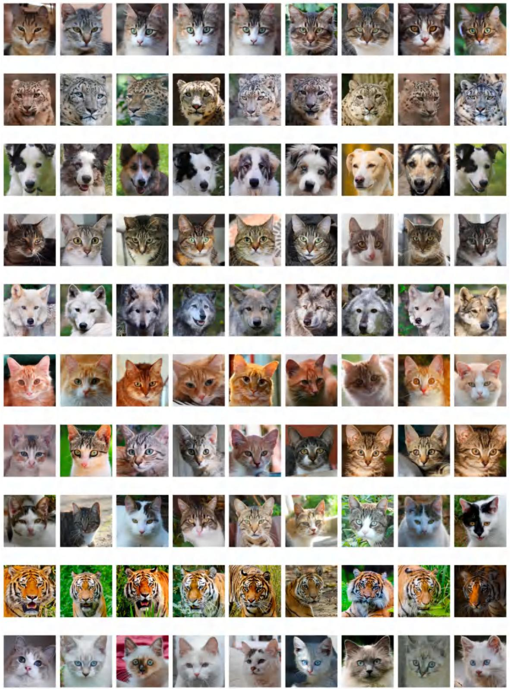  
Figure 8. Top-10 CLIP dominant directions relative to DINOv2 on the AFHQ dataset identified by KODA, visualized via representative samples for each direction.

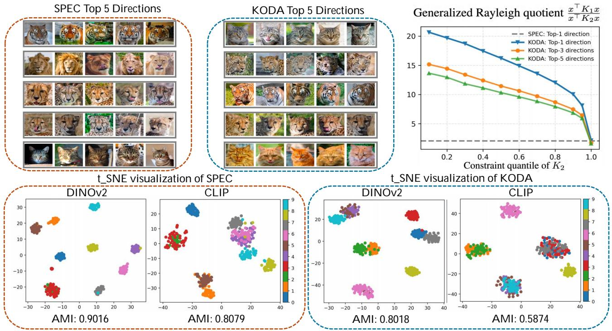  
Figure 9. Left: Visualization of the top-5 mismatch directions of DINOv2 and CLIP on the AFHQ dataset discovered by KODA (ours) and SPEC (baseline), respectively. Right: Generalized Rayleigh quotient $\frac { x ^ { \top } K _ { 1 } x } { x ^ { \top } K _ { 2 } x }$ w.r.t. the constraint on $K _ { 2 }$ . (The quotient can be interpreted as a multiplicative measure of how strongly a given direction is represented in DINOv2 relative to CLIP.)

# C.4. Additional Results on Multimodal Comparison

We further provide additional results for multimodal embedding comparison on the MS-COCO dataset. In this setting, we analyze discrepancy directions discovered by KODA across a diverse set of vision–language models, including CLIP, OpenCLIP, BLIP, SigLIP, and SigLIP2. For each pair of multimodal embeddings, we construct joint image–text kernels and apply KODA to identify dominant discrepancy directions under asymmetric constraints. We visualize the samples associated with the top discrepancy components by inspecting the image–text pairs corresponding to the leading directions, as shown in the Figure 12-18.

These visualizations highlight how different multimodal models organize paired image–text data in distinct ways, even when trained on similar objectives or datasets. Across different model combinations, the dominant discrepancy directions correspond to different subsets of samples, reflecting variations in how visual and textual information is jointly encoded. These additional results complement the main experiments by illustrating the generality of KODA across a wide range of multimodal embedding families.

SigLIP-dominant directions relative to OpenCLIP identified by Image Embedding Only   
Direction 1   
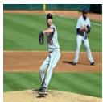


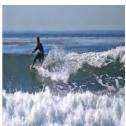

Direction 2   
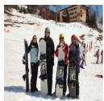

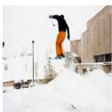

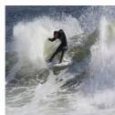

Direction 3   


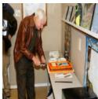


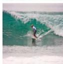

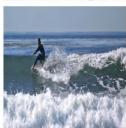

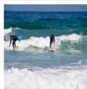

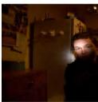


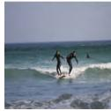


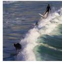

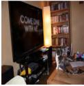


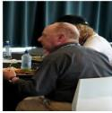

SigLIP   
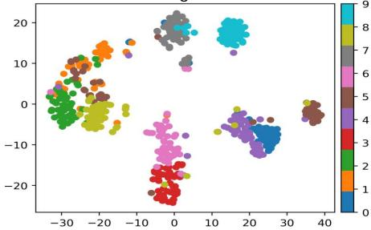

<details>
<summary>scatter</summary>

| x    | y    | cluster |
| ---- | ---- | ------- |
| -30  | 10   | 8       |
| -25  | 5    | 7       |
| -20  | 0    | 6       |
| -15  | -5   | 5       |
| -10  | -10  | 4       |
| -5   | -15  | 3       |
| 0    | -20  | 2       |
| 5    | -15  | 1       |
| 10   | -10  | 0       |
| 15   | -5   | 9       |
| 20   | 0    | 8       |
| 25   | 5    | 7       |
| 30   | 10   | 6       |
| 35   | 15   | 5       |
| 40   | 20   | 4       |
</details>

OpenCLIP   
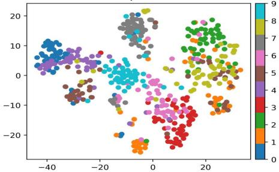

<details>
<summary>scatter</summary>

| x    | y    | cluster |
| ---- | ---- | ------- |
| -40  | 10   | 1       |
| -30  | 5    | 2       |
| -20  | 0    | 3       |
| -10  | -5   | 4       |
| 0    | -10  | 5       |
| 10   | -15  | 6       |
| 20   | -20  | 7       |
| 30   | -25  | 8       |
| 40   | -30  | 9       |
</details>

SigLIP-dominant directions relative to OpenCLIP identified by Joint Image-Text Embedding   
Direction 1   


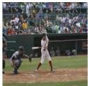


Direction 2   
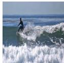

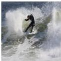

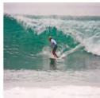

Direction 3   
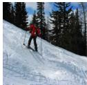

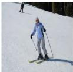

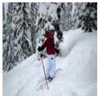


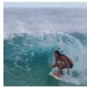


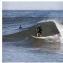

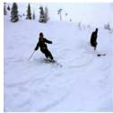

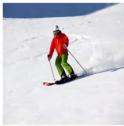

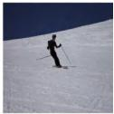


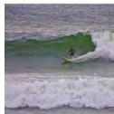

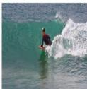


SigLIP   


<details>
<summary>scatter</summary>

| x    | y    | cluster |
| ---- | ---- | ------- |
| -25  | -15  | 0       |
| -20  | 25   | 8       |
| -15  | 20   | 6       |
| -10  | 10   | 7       |
| -5   | -5   | 4       |
| 0    | -10  | 5       |
| 5    | -30  | 3       |
| 10   | 25   | 9       |
| 15   | 10   | 2       |
| 20   | -10  | 1       |
| 25   | -15  | 2       |
| 30   | -10  | 3       |
</details>

OpenCLIP   


<details>
<summary>scatter</summary>

| x    | y    | cluster |
| ---- | ---- | ------- |
| -40  | 0    | 1       |
| -30  | 5    | 2       |
| -20  | 10   | 3       |
| -10  | 15   | 4       |
| 0    | 20   | 5       |
| 10   | 25   | 6       |
| 20   | 30   | 7       |
| 30   | 35   | 8       |
| 40   | 40   | 9       |
</details>

Figure 10. Multimodal discrepancy analysis of SigLIP dominant directions relative to OpenCLIP on the MSCOCO dataset.

OpenCLIP-dominant directions relative to SigLIP identified by Image Embedding Only   
Direction 1   


Direction 2   


Direction 3   


OpenCLIP   


<details>
<summary>scatter</summary>

| x      | y      | cluster |
| ------ | ------ | ------- |
| -18.2  | 5.3    | 1       |
| -15.7  | 12.1   | 2       |
| -12.3  | -8.9   | 3       |
| -9.1   | -15.6  | 4       |
| -6.8   | -22.3  | 5       |
| -3.5   | -18.7  | 6       |
| 0.2    | -10.4  | 7       |
| 3.9    | -5.8   | 8       |
| 7.6    | 8.2    | 9       |
| 11.3   | -12.5  | 1       |
| 14.7   | -25.1  | 2       |
| 18.4   | -28.9  | 3       |
| 21.0   | -20.3  | 4       |
| 23.6   | -15.7  | 5       |
| 26.3   | -8.4   | 6       |
| 29.0   | -3.2   | 7       |
| 31.7   | 1.5    | 8       |
| 34.4   | 10.8   | 9       |
| 37.1   | -5.6   | 1       |
| 39.8   | -18.2  | 2       |
| 42.5   | -23.7  | 3       |
| 45.2   | -16.4  | 4       |
| 47.9   | -10.1  | 5       |
| 50.6   | -5.9   | 6       |
| 53.3   | -12.8  | 7       |
| 56.0   | -17.5  | 8       |
| 58.7   | -14.2  | 9       |
| 61.4   | -8.7   | 1       |
| 64.1   | -20.4  | 2       |
| 66.8   | -15.1  | 3       |
| 69.5   | -10.8  | 4       |
| 72.2   | -5.4   | 5       |
| 74.9   | -13.6  | 6       |
| 77.6   | -18.3  | 7       |
| 80.3   | -14.0  | 8       |
| 83.0   | -9.6   | 9       |
| 85.7   | -3.3   | 1       |
| 88.4   | -16.7  | 2       |
| 91.1   | -21.4  | 3       |
| 93.8   | -16.1  | 4       |
| 96.5   | -11.7  | 5       |
| 99.2   | -5.3   | 6       |
| -17.5  | -5.2   | 7       |
| -14.8  | -14.9  | 8       |
| -11.9  | -20.6  | 9       |
| -8.7   | -16.3  | 1       |
| -5.6   | -10.0  | 2       |
| -2.4   | -23.5  | 3       |
| 0.5    | -17.2  | 4       |
| 3.7    | -12.9  | 5       |
| 6.9    | -6.5   | 6       |
| 9.1    | -14.3  | 7       |
| 12.3   | -19.0  | 8       |
| 15.5   | -14.7  | 9       |
| 18.7   | -8.3   | 1       |
| -16.8  | -8.4   | 8       |
| -13.9  | -22.1  | 9       |
| -9.8   | -17.8  | 1       |
| -6.6   | -12.5  | 2       |
| -3.4   | -6.2   | 3       |
| -0.2   | -13.7  | 4       |
| 2.0    | -18.4  | 5       |
| 5.2    | -13.1  | 6       |
| 8.4    | -7.7   | 7       |
| 11.6   | -14.9  | 8       |
| 14.8   | -10.6  | 9       |
| -14.0  | -9.5   | 1       |
| -9.0   | -24.0  | 2       |
| -5.0   | -19.7  | 3       |
| -1.0   | -14.4  | 4       |
| 2.0    | -7.0   | 5       |
| 5.0    | -16.0  | 6       |
| 8.0    | -20.7  | 7       |
| -8.0   | -15.4  | 8       |
| -4.0   | -25.0  | 9       |
| +2     | -18.7  | 1       |
| +6     | -20.4  | 2       |
| +9     | -23.1  | 3       |
| +12    | -20.8  | 4       |
| +15    | -8.4   | 5       |
| +18    | -25.0  | 6       |
| +20    | -20.7  | 7       |
| +22    | -7.3   | 8       |
| +24    | -23.5  | 9       |
| +26    | -20.2  | 1       |
| +28    | -7.9   | 2       |
| +30    | -24.3  | 3       |
| +32    | -20.0  | 4       |
| +34    | -7.6   | 5       |
| +36    | -25.5  |<fcel>
</details>

SigLIP   


<details>
<summary>scatter</summary>

| x    | y    | value |
| ---- | ---- | ----- |
| -20  | 10   | 8     |
| -15  | 5    | 7     |
| -10  | 0    | 6     |
| -5   | -5   | 5     |
| 0    | -10  | 4     |
| 5    | -15  | 3     |
| 10   | -20  | 2     |
| 15   | -25  | 1     |
| 20   | -30  | 0     |
| 25   | -25  | 9     |
| 30   | -20  | 8     |
</details>

OpenCLIP-dominant directions relative to SigLIP identified by Joint Image-Text Embedding   
Direction 1   


Direction 2   


Direction 3   


OpenCLIP   


<details>
<summary>scatter</summary>

| x    | y    | cluster |
| ---- | ---- | ------- |
| -25  | 5    | 1       |
| -20  | 20   | 2       |
| -15  | 15   | 3       |
| -10  | 5    | 4       |
| -5   | 0    | 5       |
| 0    | -5   | 6       |
| 5    | -10  | 7       |
| 10   | -15  | 8       |
| 15   | -20  | 9       |
| 20   | -25  | 1       |
| 25   | -30  | 2       |
| 30   | -35  | 3       |
| -30  | 5    | 4       |
| -25  | 15   | 5       |
| -20  | 20   | 6       |
| -15  | 15   | 7       |
| -10  | 5    | 8       |
| -5   | 0    | 9       |
| 0    | -5   | 1       |
| 5    | -10  | 2       |
| 10   | -15  | 3       |
| 15   | -20  | 4       |
| 20   | -25  | 5       |
| 25   | -30  | 6       |
| 30   | -35  | 7       |
| -30  | -15  | 8       |
| -25  | -20  | 9       |
| -20  | -25  | 1       |
| -15  | -30  | 2       |
| -10  | -35  | 3       |
| -5   | -40  | 4       |
| 0    | -45  | 5       |
| 5    | -50  | 6       |
| 10   | -55  | 7       |
| 15   | -60  | 8       |
| 20   | -65  | 9       |
| 25   | -70  | 1       |
| 30   | -75  | 2       |
| -30  | -20  | 3       |
| -25  | -25  | 4       |
| -20  | -30  | 5       |
| -15  | -35  | 6       |
| -10  | -40  | 7       |
| -5   | -45  | 8       |
| 0    | -50  | 9       |
| 5    | -55  | 1       |
| 10   | -60  | 2       |
| 15   | -65  | 3       |
| 20   | -70  | 4       |
| 25   | -75  | 5       |
| 30   | -80  | 6       |
| -30  | -25  | 7       |
| -25  | -30  | 8       |
| -20  | -35  | 9       |
| -15  | -40  | 1       |
| -10  | -45  | 2       |
| -5   | -50  | 3       |
| 0    | -55  | 4       |
| 5    | -60  | 5       |
| 10   | -65  | 6       |
| 15   | -70  | 7       |
| 20   | -75  | 8       |
| 25   | -80  | 9       |
| -30  | -30  |      |
| -25  | -35  |      |
| -20  | -40  |      |
| -15  | -45  |      |
| -10  | -50  |      |
| -5   | -55  |      |
| 0    | -60  |      |
| 5    | -65  |      |
| 10   | -70  |      |
| 15   | -75  |      |
| 20   | -80  |      |
| 25   | -85  |      |
| -30  | -35  |      |
| -25  | -40  |      |
| -20  | -45  |      |
| -15  | -50  |      |
| -10  | -55  |      |
| -5   | -60  |      |
| 0    | -65  |      |
| 5    | -70  |      |
| 10   | -75  |      |
| 15   | -80  |      |
| 20   | -85  |      |
| -30  | -40  |      |
| -25  | -45  |      |
| -20  | -50  |      |
| -15  | -55  |      |
| -10  | -60  |      |
| -5   | -65  |      |
| \      |     nan   |       |
The data is already in CSV format with the original text 'data' as it is not provided in the code. The actual data will be in the same order as it appears in the image. There is no additional data series or labels present in the code.
</details>

SigLIP   
  
Figure 11. Multimodal discrepancy analysis of OpenCLIP dominant directions relative to SigLIP on the MSCOCO dataset.

# BLIP-dominant directions relative to CLIP

Direction 1   
images   


  
captions

1. A baseball player sliding into a base on a baseball field.

2. A baseball player bends down and a ball

rolls behind him.

3. Some players in action on the baseball field.

4. A baseball player sliding into a base on a baseball field.

Direction 2   


  
1. A guy with a surf board by a big wave.   
2. A man riding a wave on a white   
surfboard   
3. A surfer rides a wave off the coast of a cliff.   
4. A man riding a wave on top of a   
surfboard.

Direction 3   


  
1. A tennis player is on a blue and green court.   
2. The man in a blue shirt is serving a tennis ball.   
3. A male tennis player at the baseline of the court, serving the ball.   
4. A man hits a tennis ball during a tennis game.

# t-SNE visualization of directions

BLIP   


<details>
<summary>scatter</summary>

| x    | y    | cluster |
| ---- | ---- | ------- |
| -15  | 35   | 8       |
| -10  | 30   | 7       |
| -5   | 25   | 6       |
| 0    | 20   | 5       |
| 5    | 15   | 4       |
| 10   | 10   | 3       |
| 15   | 5    | 2       |
| 20   | 0    | 1       |
| 25   | -5   | 0       |
| 30   | -10  | 9       |
| -12  | -15  | 6       |
| -8   | -18  | 5       |
| -3   | -20  | 4       |
| 2    | -22  | 3       |
| 7    | -25  | 2       |
| 12   | -28  | 1       |
| 17   | -30  | 0       |
| -14  | -16  | 7       |
| -11  | -19  | 6       |
| -6   | -21  | 5       |
| -1   | -23  | 4       |
| 3    | -26  | 3       |
| 8    | -29  | 2       |
| -13  | -17  | 8       |
| -9   | -20  | 7       |
| -4   | -22  | 6       |
| 0    | -24  | 5       |
| 4    | -27  | 4       |
| 9    | -30  | 3       |
| -16  | -18  | 9       |
| -12  | -21  | 8       |
| -7   | -23  | 7       |
| -2   | -25  | 6       |
| 3    | -28  | 5       |
| 8    | -31  | 4       |
| -14  | -19  | 7       |
| -10  | -22  | 6       |
| -5   | -24  | 5       |
| -1   | -26  | 4       |
| 4    | -29  | 3       |
| 9    | -32  | 2       |
| -17  | -20  | 8       |
| -13  | -23  | 7       |
| -8   | -25  | 6       |
| -3   | -27  | 5       |
| 0    | -29  | 4       |
| 4    | -32  | 3       |
| 9    | -35  | 2       |
| -18  | -21  | 9       |
| -14  | -24  | 8       |
| -9   | -26  | 7       |
| -4   | -28  | 6       |
| -9   | -30  | 5       |
| -4   | -32  | 4       |
| +1   | -34  | 3       |
| +6   | -36  | 2       |
| +11  | -38  | 1       |
| +6   | -40  | 0       |
| +11  | -42  | +9      |
| +6   | -44  | +8      |
| +11  | -46  | +7      |
| +6   | -48  | +6      |
| +11  | -50  | +5      |
| +6   | -52  | +4      |
| +11  | -54  | +3      |
| +6   | -56  | +2      |
| +11  | -58  | +1      |
| +6   | -60  | +0      |
| +11  | -62  | +9      |
| +6   | -64  | +8      |
| +11  | -66  | +7      |
| +6   | -68  | +6      |
| +11  | -70  | +5      |
| +6   | -72  | +4      |
| +11  | -74  | +3      |
| +6   | -76  | +2      |
| +11  | -78  | +1      |
| +6   | -80  | +0      |
| +11  | -82  | +9      |
| +6   | -84  | +8      |
| +11  | -86  | +7      |
| +6   | -88  | +6      |
| +11  | -90  | +5      |
| +6   | -92  | +4      |
| +11  | -94  | +3      |
| +6   | -96  | +2      |
| +11  | -98  | +1      |
| +6   | -100 | +0      |
| +11  | -102 | +9      |
| +6   | -104 | +8      |
| +11  | -106 | +7      |
| +6   | -108 | +6      |
| +11  | -110 | +5      |
| +6   | -112 | +4      |
| +11  | -114 | +3      |
| +6   | -116 | +2      |
| +11  | -118 | +1      |
| +6   | -120 | +0      |
| +11  | -122 | +9      |
| +6   | -124 | +8      |
| +11  | -126 | +7      |
| +6   | -128 | +6      |
| +11  | -130 | +5      |
| +6   | -132 | +4      |
| +11  | -134 | +3      |
| +6   | -136 | +2      |
| +11  | -138 | +1      |
| +6   | -140 | +0      |
| +11  | -142 | +9      |
| +6   | -144 | +8      |
| +11  | -146 | +7      |
| +6   | -148 | +6      |
| +11  | -150 | +5      |
| +6   | -152 | +4      |
| +11  | -154 | +3      |
| +6   | -156 | +2      |
| +11  | -158 | +1      |
| +6   | -160 | +0      |
| +11  | -162 | +9      |
| +6   | -164 | +8      |
| +11  | -166 | +7      |
| +6   | -168 | +6      |
| +11  | -170 | +5      |
| +6   | -172 | +4      |
| +11  | -174 | +3      |
| +6   | -176 | +2      |
| +11  | -178 | +1      |
| +6   | -180 | +0      |
| +11  | -182 | +9      |
| +6   | -184 | +8      |
| +11  | -186 | +7      |
| +6   | -188 | +6      |
| +11  | -190 | +5      |
| +6   | -192 | +4      |
| +11  | -194 | +3      |
| +6   | -196 | +2      |
| +11  | -198 | +1      |
| +6   | -200 | +0      |
| +11  | -202 | +9      |
| +6   | -204 | +8      |
| +11  | -206 | +7      |
| +6   | -208 | +6      |
| +11  | -210 | +5      |
| +6   | -212 | +4      |
| +11  | -214 | +3      |
| +6   | -216 | +2      |
| +11  | -218 | +1      |
| +6   | -220 | +0      |
| +11  | -222 | ~9      |
| ~-5.5)| ~-3.5)| ~7.5|
</details>

Figure 12. Multimodal discrepancy analysis of BLIP dominant directions relative to CLIP on the MSCOCO dataset. Top: Representative image–caption pairs corresponding to the Top-3 discrepancy directions identified by KODA. Bottom: t-SNE visualization of Top-10 discrepancy directions using BLIP and CLIP embeddings respectively.

# CLIP-dominant directions relative to BLIP

Direction 1   
images   


  
captions   
1. A bathroom with a white sink sitting next to a white bath tub.   
2. A toilet with a wooden seat next to a white sink.   
3. A bathroom with a sink, toilet, and a cabinet.   
4. a toilet sits inside of a cramped bathroom

Direction 2   


  
1. Two zebras confronting each other in a field with other zebras   
2. Two zebras are standing close in a field.   
3. A pack of zebra standing in a field next to an ostrich.   
4. A herd of zebra grazing on a lush green field.

Direction 3   


  
1. A metal plate with two pizzas with toppings   
2. A pizza sitting on top of a white plate.   
3. A large sliced pizza on a plate on a table.   
4. Two small whole pizza on a tabletop alongside an empty plate

# t-SNE visualization of directions

CLIP   


BLIP   
  
Figure 13. Multimodal discrepancy analysis of CLIP dominant directions relative to BLIP on the MSCOCO dataset. Top: Representative image–caption pairs corresponding to the Top-3 discrepancy directions identified by KODA. Bottom: t-SNE visualization of Top-10 discrepancy directions using CLIP and BLIP embeddings respectively.

# OpenCLIP-dominant directions relative to CLIP

Direction 1   
images   


  
captions

1. a man on a skate board does a trick in the air

2. A man flying through the air riding a skateboard.

3. A person on a skateboard up in the air.

4. A young man riding a skateboard up the side of a ramp.

Direction 2   


  
1. A man on a surfboard is riding the wave   
2. a surfer riding a small wave in the ocean   
3. The man is surfing high up on a wave.   
4. A surfer rides a wave in the ocean.

Direction 3   


  
1. A small giraffe is walking in his habitat   
2. Two tall giraffe standing next to each other in a field.   
3. A couple of giraffes are standing in the wild.   
4. A giraffe with its head cocked walking about a sandy area.

# t-SNE visualization of directions

OpenCLIP   


<details>
<summary>scatter</summary>

| x    | y    | cluster |
| ---- | ---- | ------- |
| -20  | 15   | 1       |
| -15  | 18   | 2       |
| -10  | 25   | 3       |
| -5   | 28   | 4       |
| 0    | 30   | 5       |
| 5    | 10   | 6       |
| 10   | 5    | 7       |
| 15   | -5   | 8       |
| 20   | -10  | 9       |
| 25   | -15  | 1       |
| 30   | -20  | 2       |
| 35   | -25  | 3       |
| -20  | -20  | 4       |
| -15  | -15  | 5       |
| -10  | -10  | 6       |
| -5   | -5   | 7       |
| 0    | 0    | 8       |
| 5    | 5    | 9       |
| 10   | 10   | 1       |
| 15   | 15   | 2       |
| 20   | 20   | 3       |
| 25   | 25   | 4       |
| 30   | 30   | 5       |
| -20  | -25  | 6       |
| -15  | -20  | 7       |
| -10  | -15  | 8       |
| -5   | -10  | 9       |
| 0    | -5   | 1       |
| 5    | 0    | 2       |
| 10   | 5    | 3       |
| 15   | 10   | 4       |
| 20   | 15   | 5       |
| 25   | 20   | 6       |
| 30   | 25   | 7       |
| -20  | -30  | 8       |
| -15  | -25  | 9       |
| -10  | -20  | 1       |
| -5   | -15  | 2       |
| 0    | -10  | 3       |
| 5    | -5   | 4       |
| 10   | 0    | 5       |
| 15   | 5    | 6       |
| 20   | 10   | 7       |
| 25   | 15   | 8       |
| 30   | 20   | 9       |
| -20  | -28  | 9       |
| -15  | -23  | 1       |
| -10  | -18  | 2       |
| -5   | -13  | 3       |
| 0    | -8   | 4       |
| 5    | -3   | 5       |
| 10   | 2    | 6       |
| 15   | 7    | 7       |
| 20   | 12   | 8       |
| 25   | 17   | 9       |
| 30   | 22   | 1       |
| -20  | -32  | 1       |
| -15  | -27  | 2       |
| -10  | -22  | 3       |
| -5   | -17  | 4       |
| 0    | -12  | 5       |
| 5    | -7   | 6       |
| 10   | -2   | 7       |
| 15   | 3    | 8       |
| 20   | 8    | 9       |
| 25   | 13   | 1       |
| 30   | 18   | 2       |
| -20  | -34  | 1       |
| -15  | -29  | 2       |
| -10  | -24  | 3       |
| -5   | -19  | 4       |
| 0    | -14  | 5       |
| 5    | -8   | 6       |
| 10   | -3.5 | 7       |
| 15   | -9.5 | 8       |
| 20   | -14.5|     |
|          |     nan|      |
</details>


<details>
<summary>scatter</summary>

| x       | y       | cluster |
| ------- | ------- | ------- |
| -15     | 20      | 3       |
| -10     | 15      | 2       |
| -5      | 10      | 4       |
| 0       | 5       | 6       |
| 5       | 0       | 8       |
| 10      | -5      | 7       |
| 15      | -10     | 9       |
| 20      | -15     | 1       |
| 25      | -20     | 0       |
| -30     | -10     | 5       |
| -25     | -5      | 7       |
| -20     | 0       | 6       |
| -15     | 5       | 8       |
| -10     | 10      | 9       |
| -5      | 15      | 4       |
| 0       | 20      | 2       |
| 5       | 15      | 3       |
| 10      | 10      | 5       |
| 15      | 5       | 7       |
| 20      | 0       | 6       |
| 25      | -5      | 8       |
| 30      | -10     | 7       |
| -35     | -10     | 6       |
| -30     | -5      | 8       |
| -25     | 0       | 7       |
| -20     | 5       | 9       |
| -15     | 10      | 4       |
| -10     | 15      | 2       |
| -5      | 20      | 3       |
| 0       | 15      | 5       |
| 5       | 10      | 7       |
| 10      | 5       | 6       |
| 15      | 0       | 8       |
| 20      | -5      | 7       |
| 25      | -10     | 9       |
| -40     | -10     | 7       |
| -35     | -5      | 6       |
| -30     | 0       | 8       |
| -25     | 5       | 7       |
| -20     | 10      | 9       |
| -15     | 15      | 4       |
| -10     | 20      | 2       |
| -5      | 15      | 3       |
| 0       | 10      | 5       |
| 5       | 5       | 7       |
| 10      | 0       | 6       |
| 15      | -5      | 8       |
| 20      | -10     | 7       |
| 25      | -15     | 9       |
| -38     | -15     | 8       |
| -33     | -8      | 7       |
| -28     | -3      | 9       |
| -23     | +2      | 6       |
| -18     | +8      | 8       |
| -13     | +3      | 7       |
| -8      | +1      | 9       |
| -3      | +4      | 4       |
| +2      | +8      | 2       |
| +6      | +3      | 3       |
| +10     | +1      | 5       |
| +4      | +4      | 7       |
| +8      | +8      | 6       |
| +12     | +3      | 8       |
| +4      | +1      | 7       |
| +8      | +4      | 9       |
| +12     | +8      | 4       |
| +4      | +3      | 2       |
| +8      | +1      | 3       |
| +12     | +4      | 5       |
| +4      | +8      | 7       |
| +8      | +3      | 6       |
| +12     | +1      | 8       |
| +4      | +4      | 9       |
| +8      | +8      | 4       |
| +12     | +3      | 2       |
| +4      | +1      | 3       |
| +8      | +4      | 5       |
| +12     | +8      | 7       |
| +4      | +3      | 6       |
| +8      | +1      | 8       |
| +12     | +4      | 9       |
| +4      | +8      | 4       |
| +8      | +3      | 2       |
| +12     | +1      | 3       |
| +4      | +4      | 5       |
| +8      | +8      | 7       |
| +12     | +3      | 6       |
| +4      | +1      | 8       |
| +8      | +4      | 9       |
| +12     | +8      | 4       |
| +4      | +3      | 2       |
| +8      | +1      | 3       |
| +12     | +4      | 5       |
| +4      | +8      | 7       |
| +8      | +3      | 6       |
| +12    | +1      | 8       |
| +4      | +4      | 9       |
| +8    | +8      | 4       |
| +12    | +3      | 2       |
| +4    | +1      | 3       |
| +8    | +4      | 5       |
| +12    | +8      | 7       |
| +4    | +3      | 6       |
| +8    | +1      | 8       |
| +12    | +4      | 9       |
| +4    | +8      | 4       |
| +8    | +3      | 2       |
| +12    | +1      | 3       |
| +4    | +4      | 5       |
| +8    | +8      | 7       |
| +12    | +3      | 6       |
| +4    | +1      | 8       |
| +8    | +4      | 9       |
| +12    | +8      | 4       |
| +4    | +3      | 2       |
| +8    | +1      | 3       |
| +12    | +4      | 5       |
| +4    | +8      | 7       |
| +8    | +3      | 6       |
| +12    | +1      | 8       |
| +4    | +4      | 9       |
| +8    | +8      | 4       |
| +12    | +3      | 2       |
| +4    | +1      | 3       |
| +8    | +4      | 5       |
| +12    | +8      | 7       |
| +4    | +3      | 6       |
| +8    | +1      | 7   |
| +12    | +4      | 9   |
| +4    | +8      | 4   |
| +8    | +3      | nan     |
| -36     | -20     | nan     |
| -31     | -10     | nan     |
| -26     | -5      | nan     |
| -21     | -20     | nan     |
| -16     | -10     | nan     |
| -11     | -5      | nan     |
| -6      | -20     | nan     |
| -1   | -10     | nan     |
| -5      | -5      | nan     |
| -        | -20     | nan     |
| -5      | -10     | nan     |
| -        | -5      | nan     |
| -5      | -20     | nan     |
| -        \n+         (multiple points) for visual clustering; the color scale indicates values from ~0 to ~9. The data is grouped into clusters based on the legend and the color scale. Values are estimated based on the color scale.
</details>

Figure 14. Multimodal discrepancy analysis of OpenCLIP dominant directions relative to CLIP on the MSCOCO dataset. Top: Representative image–caption pairs corresponding to the Top-3 discrepancy directions identified by KODA. Bottom: t-SNE visualization of Top-10 discrepancy directions using OpenCLIP and CLIP embeddings respectively.

# CLIP-dominant directions relative to OpenCLIP

Direction 1   
images   


  
captions

1. a bathroom with a sink and a toilet in it

2. A bathroom with a white toilet sitting next

to a bath tub and a sink.

3. A bathroom with mirror, sink, toilet and bathtub.

4. A small toilet and tub in a little bathroom.

Direction 2   


1. a small kitchen with stainless steel appliances and wooden cabinets

2. A kitchen with a stove, microwave, sink, and other kitchen items.

3. A kitchen complete with a stove,

refrigerator and countertop.

4. A kitchen with a white stove and oven.

Direction 3   


  
1. A person riding a snowboard down a snow covered slope.   
2. A man riding skis down a snow covered slope.   
3. a person riding a snowboard on a snowy slope.   
4. A man riding a pair of skis on top of a snow covered slope.

t-SNE visualization of directions   
CLIP   


OpenCLIP   
  
Figure 15. Multimodal discrepancy analysis of CLIP dominant directions relative to OpenCLIP on the MSCOCO dataset. Top: Representative image–caption pairs corresponding to the Top-3 discrepancy directions identified by KODA. Bottom: t-SNE visualization of Top-10 discrepancy directions using CLIP and OpenCLIP embeddings respectively.

# SigLIP-dominant directions relative to CLIP

Direction 1   
images   


  
captions   
1. A man stands on his surfboard while surfing a small wave. 2. A male surfer on a surf board rides on top of a wave. 3. A man rides a wave on a surfboard. 4. a man on a surf board rides on top of a wave

Direction 2   


  
1. a person riding skis on a snowy slope 2. A man riding a pair of skis on top of a snow covered slope. 3. a person riding skis on a snowy slope 4. A man riding skis on top of a snow covered slope.

Direction 3   


1. A man flying through the air while riding a skateboard.

2. A man jumping into the air with a skateboard. 3. A man flying through the air while riding a skateboard.

4. A man flying through the air while riding a skateboard.

# t-SNE visualization of directions

SigLIP   


<details>
<summary>scatter</summary>

| x    | y    | cluster |
| ---- | ---- | ------- |
| -40  | -20  | 1       |
| -30  | 10   | 2       |
| -20  | -10  | 3       |
| -10  | 25   | 4       |
| 0    | 15   | 5       |
| 10   | 5    | 6       |
| 20   | -15  | 7       |
| 30   | 10   | 8       |
| 40   | -5   | 9       |
</details>

CLIP   
  
Figure 16. Multimodal discrepancy analysis of SigLIP dominant directions relative to CLIP on the MSCOCO dataset. Top: Representative image–caption pairs corresponding to the Top-3 discrepancy directions identified by KODA. Bottom: t-SNE visualization of Top-10 discrepancy directions using SigLIP and CLIP embeddings respectively.

# SigLIP2-dominant directions relative to CLIP

Direction 1   
images   


1. A man holding a tennis racquet on a tennis court.

2. A man standing on a tennis court holding a tennis racquet.

3. A man holding a tennis racquet on a tennis court.

4. A man holding a tennis racquet on a tennis court.

Direction 2   


1. A man is surfing on the waves on the surf board

2. A man surfing a wave in the ocean

3. One surfer taking the waves, another floating on his board

4. A group of people surfing on the high waves

Direction 3   


1. A baseball player swinging his bat at a baseball.

2. A baseball player hitting a ball with a bat.

3. A baseball player swinging a bat at a ball.

4. A player at bat in a baseball game in action.

# t-SNE visualization of directions

SigLIP2   


<details>
<summary>scatter</summary>

| x       | y       | cluster |
| ------- | ------- | ------- |
| -35     | 10      | 6       |
| -25     | 30      | 8       |
| -15     | 25      | 5       |
| -5      | 15      | 7       |
| 5       | 5       | 4       |
| 20      | -10     | 3       |
| 30      | -5      | 8       |
| -40     | -10     | 6       |
| -30     | -20     | 5       |
| -20     | -30     | 4       |
| -10     | -40     | 7       |
| 0       | -30     | 6       |
| 10      | -20     | 5       |
| 20      | -10     | 4       |
| 30      | 0       | 8       |
| -35     | 5       | 6       |
| -25     | 15      | 5       |
| -15     | 25      | 4       |
| -5      | 35      | 9       |
| 5       | 25      | 7       |
| 20      | 15      | 6       |
| 30      | 5       | 8       |
| -40     | -5      | 6       |
| -30     | -15     | 5       |
| -20     | -25     | 4       |
| -10     | -35     | 7       |
| 0       | -45     | 6       |
| 10      | -35     | 5       |
| 20      | -25     | 4       |
| 30      | -15     | 8       |
| -35     | -10     | 6       |
| -25     | -20     | 5       |
| -15     | -30     | 4       |
| -5      | -40     | 7       |
| 5       | -30     | 6       |
| 20      | -20     | 5       |
| 30      | -10     | 4       |
| -40     | -15     | 6       |
| -30     | -25     | 5       |
| -20     | -35     | 4       |
| -10     | -45     | 7       |
| 0       | -35     | 6       |
| 10      | -25     | 5       |
| 20      | -15     | 4       |
| 30      | -5      | 8       |
| -35     | -20     | 6       |
| -25     | -30     | 5       |
| -15     | -40     | 4       |
| -5      | -50     | 7       |
| 5       | -40     | 6       |
| 20      | -30     | 5       |
| 30      | -20     | 4       |
| -40     | -25     | 6       |
| -30     | -35     | 5       |
| -20     | -45     | 4       |
| -10     | -55     | 7       |
| 0       | -45     | 6       |
| 10      | -35     | 5       |
| 20      | -25     | 4       |
| 30      | -15     | 8       |
| -35     | -30     | 6       |
| -25     | -40     | 5       |
| -15     | -50     | 4       |
| -5      | -60     | 7       |
| 5       | -50     | 6       |
| 20      | -40     | 5       |
| 30      | -30     | 4       |
| -40     | -35     | 6       |
| -30     | -45     | 5       |
| -20     | -55     | 4       |
| -10     | -65     | 7       |
| 0       | -55     | 6       |
| 10      | -45     | 5       |
| 20      | -35     | 4       |
| 30      | -25     | 8       |
| -35     | -40     | 6       |
| -25     | -50     | 5       |
| -15     | -60     | 4       |
| -5      | -70     | 7       |
| 5       | -60     | 6       |
| 20      | -50     | 5       |
| 30      | -40     | 4       |
| -40     | -45     | 6       |
| -30     | -55     | 5       |
| -20     | -65     | 4       |
| -10     | -75     | 7       |
| 0       | -65     | 6       |
| 10      | -55     | 5       |
| 20      | -45     | 4       |
| 30      | -35     | 8       |
| -35     | -50     | 6       |
| -25     | -60     | 5       |
| -15     | -70     | 4       |
| -5      | -80     | 7       |
| 5       | -70     | 6       |
| 20      | -60     | 5       |
| 30      | -50     | 4       |
| -40     | -65     | 6       |
| -30     | -75     | 5       |
| -20     | -85     | 4       |
| -10     | -95     | 7       |
| 0       | -85     | 6       |
| 10      | -75     | 5       |
| 20      | -65     | 4       |
| 30      | -55     | 8       |
| -35     | -70     | 6       |
| -25     | -80     | 5       |
| -15     | -90     | 4       |
| -5      | -100    | 7       |
| 5       | -90     | 6       |
| 20      | -80     | 5       |
| 30      | -70     | 4       |
| -40     | -85     | 6       |
| -30     | -95     | 5       |
| -20     | -105    | 4       |
| -10     | -115    | 7       |
| 0       | -110    | 6       |
| 10      | -100    | 5       |
| 20      | -90     | 4       |
| 30      | -80     | 8       |
| -35     | -90     | 6       |
| -25     | -100    | 5       |
| -15     | -110    | 4       |
| -5      | -120    | 7       |
| 5       | -110    | 6       |
| 20      | -100    | 5       |
| 30      | -90     | 4       |
| -40     | -100    | 7       |
| -30     | -110    | nan   |
| -20     | -120    | nan   |
| -10     | -130    | nan   |
| 0       | -140    | nan   |
| 10      | -130    | nan   |
| 20      | -120    | nan   |
| ...     ...
</details>

CLIP   
  
Figure 17. Multimodal discrepancy analysis of SigLIP2 dominant directions relative to CLIP on the MSCOCO dataset. Top: Representative image–caption pairs corresponding to the Top-3 discrepancy directions identified by KODA. Bottom: t-SNE visualization of Top-10 discrepancy directions using SigLIP2 and CLIP embeddings respectively.

# SigLIP-dominant directions relative to OpenCLIP

Direction 1   
images   


  
captions   
1. A baseball player at bat swinging at a pitch in a baseball game.   
2. A baseball batter is swinging a bat at an incoming pitch.   
3. A baseball player taking a swing at an incoming ball.   
4. A baseball player swinging at a pitch at a game

Direction 2   


  
1. A person riding a wave on a surfboard.   
2. A man riding a wave on top of a surfboard.   
3. A man riding a wave on top of a surfboard.   
4. A man riding a surfboard on top of a wave.

Direction 3   


  
1. a person riding skis on a snowy slope   
2. a person riding skis on a snowy slope   
3. A couple of people riding snowboards down a snow covered slope.   
4. A man riding skis down a snow covered slope.

# t-SNE visualization of directions

SigLIP   


<details>
<summary>scatter</summary>

| x    | y    | cluster |
| ---- | ---- | ------- |
| -25  | -15  | 0       |
| -20  | 25   | 6       |
| -15  | 20   | 7       |
| -10  | 25   | 8       |
| -5   | 10   | 5       |
| 0    | -5   | 4       |
| 5    | -30  | 3       |
| 10   | 25   | 6       |
| 15   | 10   | 5       |
| 20   | 10   | 7       |
| 25   | -10  | 2       |
| 30   | -15  | 8       |
| -25  | -10  | 1       |
| -20  | -5   | 6       |
| -15  | 5    | 7       |
| -10  | 15   | 8       |
| -5   | -10  | 4       |
| 0    | -15  | 3       |
| 5    | -20  | 2       |
| 10   | -25  | 1       |
| 15   | -20  | 7       |
| 20   | -15  | 6       |
| 25   | -10  | 8       |
| 30   | -5   | 9       |
</details>

OpenCLIP   


<details>
<summary>scatter</summary>

| x    | y    | cluster |
| ---- | ---- | ------- |
| -40  | 0    | 1       |
| -35  | 5    | 2       |
| -30  | 10   | 3       |
| -25  | 15   | 4       |
| -20  | 20   | 5       |
| -15  | 25   | 6       |
| -10  | 30   | 7       |
| -5   | 25   | 8       |
| 0    | 20   | 9       |
| 5    | 15   | 8       |
| 10   | 10   | 7       |
| 15   | 5    | 6       |
| 20   | 0    | 5       |
| 25   | -5   | 4       |
| 30   | -10  | 3       |
| 35   | -15  | 2       |
| 40   | -20  | 1       |
| 45   | -25  | 0       |
</details>

Figure 18. Multimodal discrepancy analysis of SigLIP dominant directions relative to OpenCLIP on the MSCOCO dataset. Top: Representative image–caption pairs corresponding to the Top-3 discrepancy directions identified by KODA. Bottom: t-SNE visualization of Top-10 discrepancy directions using SigLIP and OpenCLIP embeddings respectively.

# C.5. Ablation Study

We conduct a set of ablation studies to examine the sensitivity of KODA to key design choices, including the number of random Fourier features, the size of the reference sample set, and the choice of kernel function. All ablation experiments are conducted using the same experimental protocol as in the main results, with only the specified factor varied while keeping other settings fixed.

Number of Random Fourier Features. We examine the effect of the number of random Fourier features used to approximate the Gaussian kernel by varying the feature dimensionality r ∈ {500, 1000, 2000, 3000}. For each setting, we visualize the dominant discrepancy directions discovered by KODA in Figure 19. As the number of random features increases, the discovered discrepancy directions become progressively more coherent and visually well-separated. In particular, higher-dimensional approximations lead to cleaner and more stable grouping patterns, while lower-dimensional approximations exhibit increased noise in the dominant directions. These results indicate that sufficiently rich random feature approximations are beneficial for stable discrepancy discovery, and motivate our choice of r = 3000 in the main experiments.

Kernel Function. We investigate the effect of the kernel function by comparing Gaussian (RBF) kernels with cosine similarity kernels. For each kernel choice, we apply KODA using the same constraint setting and visualize the dominant discrepancy directions. As Figure 20 shows, different kernel functions lead to different discrepancy patterns, reflecting the distinct geometric properties emphasized by each kernel. In particular, Gaussian kernels capture local neighborhood structure based on Euclidean distance, whereas cosine similarity kernels emphasize angular relationships between representations. As a result, the dominant discrepancy directions discovered under different kernels correspond to different groupings of samples.

Reference Sample Size. We study the effect of the reference sample size by varying the number of samples $n \in$ {2000, 4000, 8000, 16000} while keeping all other settings fixed. For each choice of n, we apply KODA and visualize the dominant discrepancy directions in Figure 21. As the sample size increases, the discovered discrepancy directions become increasingly stable and consistent. In particular, when n = 16,000, the resulting discrepancy components exhibit highly stable grouping patterns, indicating that sufficient reference coverage is important for reliable discrepancy discovery. At smaller sample sizes, the overall structure of the discrepancy directions is preserved, albeit with increased variability in the visualizations. Notably, performing spectral decomposition directly on kernel matrices of size exceeding $1 0 , 0 0 0 \times 1 0 , 0 0 0$ is often impractical on modern GPUs due to memory and computational constraints. By operating in the covariance space induced by random feature representations, KODA reduces the effective dimensionality of the spectral problem to the feature dimension (e.g., 6,000 in our experiments), making eigen-decomposition feasible even when the number of reference samples is large. This formulation enables stable discrepancy analysis at larger sample sizes without requiring explicit construction or decomposition of full kernel matrices.

# Dimension r = 500

# images

Direction 1   


<details>
<summary>natural_image</summary>

Four-panel photo collage showing indoor sports: a man in a suit, a ball pitcher in action, a tennis player in action, and a close-up of the player's foreball on clay (no visible text or symbols)
</details>

1. People are gathering at a table for a seminar 2. A man sitting in front of a laptop computer on a table.

3. A baseball player swinging a bat at a ball in a field.

4. We are looking at a tennis player ready to return the ball.

Direction 2   


<details>
<summary>natural_image</summary>

Four-panel collage showing beach scene, cat photo, indoor room, tennis field, and two women walking (no text or symbols)
</details>

1. A man sitting on a surfboard looking at the ocean.   
2. The cat is behind the laptop screen on the desk.   
3. a bath room with a toilet and towel racks 4. Twp females walking on a tennis court carrying tennis racquets.

Direction 3   


<details>
<summary>natural_image</summary>

Four-panel collage showing a person viewing a screen, a skier on a snowy slope, a stop sign with 'KRISTA' and people holding umbrellas (no readable text or symbols)
</details>

1. Woman walking in restroom area with television picture on mirror.

2. A snow boarder going down a snowy slope.

3. a young couple having fun by a stop sign 4. A woman staying dry from the rain and holding an umbrella.

# Dimension r = 1000

# captions

Direction 1   


<details>
<summary>natural_image</summary>

Four-panel collage showing baseball and tennis events: close-up of pitcher on field, close-up of player in yard, close-up of receiver on net, and close-up of pitcher on field (no visible text or symbols)
</details>

1. A baseball player getting ready to swing a bat. 2. A baseball player swinging a bat towards a ball.

3. A baseball batter is swinging a bat at an incoming pitch.

4. a baseball player swinging a bat at a ball

Direction 2   


<details>
<summary>natural_image</summary>

Four-panel photo collage showing four different surfboarders on the ocean, each with a different view (top: clear sky, middle: gentle waves, bottom: gentle waves), no text or symbols present.
</details>

1. A person on a surfboard rides a wave. 2. A male surfer on a surf board rides on top of a wave.

3. a man rides a surfboard on a wave

4. A man is on his surfboard in the ocean water

Direction 3   


<details>
<summary>natural_image</summary>

Four-panel image showing a zebra grazing in grass, a person walking on snow, and two giraffes in a savanna landscape (no text or symbols)
</details>

1. A herd of zebras is grazing in a grassy field. 2. A zebra eats grass with another zebra beside them and a third zebra nearby.

3. A man riding a snowboard down a snow covered slope.

4. A number of giraffes mill about on the savanna.

# Dimension r = 2000

# images

Direction 1   


<details>
<summary>natural_image</summary>

Four-panel photo collage showing baseball players in action, a crowd watching, and a close-up of the ball on a field (no visible text or symbols)
</details>

1. A baseball player at bat swinging at a pitch in a baseball game.

2. A baseball player taking a swing at an incoming ball.

3. A baseball player about to swing at a pitch during a game.

4. a baseball player getting ready to swing a ba

Direction 2   


<details>
<summary>natural_image</summary>

Four-panel photo collage showing a person surfing on the ocean, with waves and surfers in action (no text or symbols visible)
</details>

1. A man riding a surfboard on a wave in the ocean.   
2. A man riding a surfboard on a wave in the ocean.   
3. A man riding a wave on top of a surfboard. 4. A man riding a wave on top of a surfboard.

Direction 3   


<details>
<summary>natural_image</summary>

Four-panel collage showing different coastal activities: waves crashing, snowboarding, skier crossing a trail, and ocean surfboard (no text or symbols)
</details>

1. A man on a surf board rides a wave.

2. A man riding a snowboard down a snow covered slope.

3. A person skiing down a snow covered mountain slope.

4. Someone riding waves on their surf board in the ocean.

# Dimension r = 3000

# images

Direction 1   


<details>
<summary>natural_image</summary>

Four-panel photo collage showing baseball players competing for the ball, with spectators watching in the background (no visible text or symbols)
</details>

1. A baseball player at bat swinging at a pitch in a baseball game.

2. A baseball batter is swinging a bat at an incoming pitch.

3. A baseball player taking a swing at an incoming ball.

4. A baseball player swinging at a pitch at a game

Direction 2   


<details>
<summary>natural_image</summary>

Four-panel collage showing four different surfboarders performing over ocean waves, no text or symbols visible.
</details>

1. A person riding a wave on a surfboard. 2. A man riding a wave on top of a

surfboard.

3. A man riding a wave on top of a surfboard.

4. A man riding a surfboard on top of a wave.

Direction 3   


<details>
<summary>natural_image</summary>

Four-panel photo collage showing skiers in outdoor gear on snowy slopes, with no visible text or symbols.
</details>

1. a person riding skis on a snowy slope 2. a person riding skis on a snowy slope

3. A couple of people riding snowboards down a snow covered slope.

4. A man riding skis down a snow covered slope.

Figure 19. Multimodal discrepancy analysis of SigLIP dominant directions relative to OpenCLIP on the MSCOCO dataset under different number of joint random fourier features.

OpenCLIP-dominant directions relative to CLIP   
Direction 1   
images   


  
captions   
1. a man on a skate board does a trick in the air 2. A man flying through the air riding a skateboard. 3. A person on a skateboard up in the air. 4. A young man riding a skateboard up the side of a ramp.

Direction 2   


  
1. A man on a surfboard is riding the wave 2. a surfer riding a small wave in the ocean 3. The man is surfing high up on a wave. 4. A surfer rides a wave in the ocean.

Direction 3   


  
1. A small giraffe is walking in his habitat 2. Two tall giraffe standing next to each other in a field. 3. A couple of giraffes are standing in the wild. 4. A giraffe with its head cocked walking about a sandy area.

OpenCLIP   


CLIP   


<details>
<summary>scatter</summary>

| x    | y    | cluster |
| ---- | ---- | ------- |
| -40  | 0    | 1       |
| -30  | 5    | 2       |
| -20  | 10   | 3       |
| -10  | 15   | 4       |
| 0    | 20   | 5       |
| 10   | 15   | 6       |
| 20   | 10   | 7       |
| 30   | 5    | 8       |
| 40   | 0    | 9       |
</details>

Direction 1   
ges   


  
1. A picture of a very nice kitchen that is white. 2. A dark picture of a very clean ns aptio dark colored kitchen. 3. A very clean kitchen that is in a house. 4. A kitchen is in need of being demolished because of its conditi

Direction 2   


  
1. A minivan is in an intersection with the traffic lights showing red. 2. A bus driving down a city street during the day. 3. A highway filled with lots of traffic with a train traveling over a bridge. 4. A blue train traveling over a red rail bridge over cars.

Direction 3   


  
1. A baseball glove with a baseball inside and a bat on a table 2. A baseball mitt and glove are laying in a field. 3. A baseball bat, ball and glove laying on a playing field 4. A man swinging a baseball bat at a ball during a game.

OpenCLIP   


<details>
<summary>scatter</summary>

| x    | y    | cluster |
| ---- | ---- | ------- |
| -30  | 15   | 1       |
| -25  | 5    | 2       |
| -20  | 0    | 3       |
| -15  | -5   | 4       |
| -10  | -10  | 5       |
| -5   | -15  | 6       |
| 0    | -20  | 7       |
| 5    | -15  | 8       |
| 10   | -10  | 9       |
| 15   | -5   | 1       |
| 20   | 0    | 2       |
| 25   | 5    | 3       |
| 30   | 10   | 4       |
| -30  | -10  | 5       |
| -25  | -15  | 6       |
| -20  | -20  | 7       |
| -15  | -15  | 8       |
| -10  | -10  | 9       |
| -5   | -5   | 1       |
| 0    | 0    | 2       |
| 5    | 5    | 3       |
| 10   | 10   | 4       |
| 15   | 15   | 5       |
| 20   | 20   | 6       |
| 25   | 25   | 7       |
| 30   | 30   | 8       |
| -30  | -20  | 9       |
| -25  | -25  | 1       |
| -20  | -30  | 2       |
| -15  | -25  | 3       |
| -10  | -20  | 4       |
| -5   | -15  | 5       |
| 0    | -10  | 6       |
| 5    | -5   | 7       |
| 10   | 0    | 8       |
| 15   | 5    | 9       |
| 20   | 10   | 1       |
| 25   | 15   | 2       |
| 30   | 20   | 3       |
| -30  | -25  | 4       |
| -25  | -30  | 5       |
| -20  | -35  | 6       |
| -15  | -40  | 7       |
| -10  | -45  | 8       |
| -5   | -50  | 9       |
| 0    | -55  | 1       |
| 5    | -60  | 2       |
| 10   | -65  | 3       |
| 15   | -70  | 4       |
| 20   | -75  | 5       |
| 25   | -80  | 6       |
| 30   | -85  | 7       |
| -30  | -30  | 8       |
| -25  | -35  | 9       |
| -20  | -40  | 1       |
| -15  | -45  | 2       |
| -10  | -50  | 3       |
| -5   | -55  | 4       |
| 0    | -60  | 5       |
| 5    | -65  | 6       |
| 10   | -70  | 7       |
| 15   | -75  | 8       |
| 20   | -80  | 9       |
| 25   | -85  | 1       |
| 30   | -90  | 2       |
| -30  | -35  | 9       |
| -25  | -40  |      |
| -20  | -45  |      |
| -15  | -50  |      |
| -10  | -55  |      |
| -5   | -60  |      |
| 0    | -65  |      |
| 5    | -70  |      |
| 10   | -75  |      |
| 15   | -80  |      |
| 20   | -85  |      |
| 25   | -90  |      |
| 30   | -95  |      |
| -30  | -40  |      |
| -25  | -45  |      |
| -20  | -50  |      |
| -15  | -55  |      |
| -10  | -60  |      |
| -5   | -65  |      |
| 0    | -70  |      |
| 5    | -75  |      |
| 10   | -80  |      |
| 15   | -85  |      |
| 20   | -90  |      |
| 25   | -95  |      |
| -30  | -45  |      |
| -25  | -50  |      |
| -20  | -55  |      |
| -15  | -60  |      |
| -10  | -65  |      |
| -5   | -70  |      |
| \      (center) = (x, y) for each cluster; color scale: red=low, blue=high; legend: color codes from '1' to '9'.)
</details>

CLIP

  
Figure 20. Multimodal discrepancy analysis of OpenCLIP dominant directions relative to CLIP on the MSCOCO dataset under gaussian kernel function or cosine kernel function.

# Sample size = 2000

# images

Direction 1   


<details>
<summary>natural_image</summary>

Four-panel collage showing outdoor activities: skateboarding, waterfront city skyline, baseball pitcher, and playground equipment (no text or symbols)
</details>

1. A man that is on a curb with a skateboard. 2. A very large city sitting along side of a large body of water. 3. A baseball player prepares to swing at the ball. 4. a person that is doing a trick on their skate board.

Direction 2   


<details>
<summary>natural_image</summary>

Four-panel collage showing a red train, a cat on a bench with scientific equipment, a glass observation deck, and a giraffe in a natural setting (no visible text or symbols)
</details>

1. A red train parked in front of a loading platform next to passengers. 2. A large giraffe eating leaves in an enclosure 3. a very cluttered bathroom with a cat in the sink 4. A giraffe eating food from the top of the tree

Direction 3   


<details>
<summary>natural_image</summary>

Four-panel collage showing bathroom fixtures, a skier on snowy slope, a bathroom sink with mirror, and a hotel room interior (no visible text or symbols)
</details>

1. A toilet, sink, mirror, and tub in a bathroom. 2. A couple of guys wearing skis and a snowboard. 3. A bathroom area of plane with a sink and toilet. 4. A clean sink is in the middle of the counter.

# Sample size = 4000

# captions

Direction 1   


<details>
<summary>natural_image</summary>

Four-panel photo collage showing baseball players in action: batting, field hockey, and batting (no visible text or symbols)
</details>

1. a batter swinging a bat at a ball at a baseball game 2. A baseball player ready to swing at a baseball game. 3. A baseball player is up to bat in a game 4. A man gets ready to hit a ball during a baseball game.

Direction 2   


<details>
<summary>natural_image</summary>

Four-panel collage showing outdoor activities: skateboarding, roller skating, beachside surfing, and surfboard (no text or symbols)
</details>

1. there is a man on a skate board doing a trick 2. Guy doing a flip trick with his skateboard at the park 3. A surfer riding a wave in the ocean 4. A surfer carrying his surf board out of the ocean.

Direction 3   


<details>
<summary>natural_image</summary>

Four-panel collage showing a boy surfing on a tennis court, a man playing on the net, and two other sports in action (tennis and surfboard).
</details>

1. A man riding a surfboard on a wave in the ocean. 2. A tennis player goes to hit the ball 3. a tennis player rushing to the net to hit the ball 4. A man riding a wave on a surfboard.

# Sample size = 8000

# images

Direction 1   


<details>
<summary>natural_image</summary>

Four-panel photo collage showing baseball players in action: batting, close-up of player, and close-up of pitcher on field (no visible text or symbols)
</details>

1. A baseball player hits a ball during a game. 2. a batter swinging a bat at a ball at a baseball game 3. A baseball player is hitting the ball with his bat. 4. A baseball player is getting ready to hit the ball.

Direction 2   


<details>
<summary>natural_image</summary>

Four-panel collage showing surfboarders on ocean waves, no text or symbols visible
</details>

1. A surfer is riding a wave in the ocean. 2. A surfer riding a wave in the ocean 3. A surfer is on his board in the middle of an ocean spraying wave. 4. A man surfing waves on his surf board in the ocean.

Direction 3   


<details>
<summary>natural_image</summary>

Four-panel collage showing outdoor sports scenes: running track, interior bathroom with shower, person playing field, and indoor toilet (no visible text or symbols)
</details>

1. A baseball player swinging a bat on top of a field. 2. A bathroom with a white toilet next to a sink. 3. A baseball player swinging a bat on top of a baseball field. 4. A white toilet sitting next to a white sink in a bathroom.

# Sample size = 16000

# images

Direction 1   


<details>
<summary>natural_image</summary>

Four-panel photo collage showing baseball players in action: batting, close-up of field, and close-up of pitcher (no visible text or symbols)
</details>

1. A baseball player at bat swinging at a pitch in a baseball game. 2. A baseball batter is swinging a bat at an incoming pitch. 3. A baseball player taking a swing at an incoming ball. 4. A baseball player swinging at a pitch at a game

Direction 2   


<details>
<summary>natural_image</summary>

Four-panel photo collage showing four different surfboarders performing on the ocean waves (no text or symbols visible)
</details>

1. A person riding a wave on a surfboard. 2. A man riding a wave on top of a surfboard. 3. A man riding a wave on top of a surfboard. 4. A man riding a surfboard on top of a

Direction 3   


<details>
<summary>natural_image</summary>

Four-panel photo collage showing skiers on snowy slopes, including outdoor gear and indoor activities (no text or symbols visible)
</details>

1. a person riding skis on a snowy slope 2. a person riding skis on a snowy slope 3. A couple of people riding snowboards down a snow covered slope. 4. A man riding skis down a snow covered slope.

Figure 21. Multimodal discrepancy analysis of SigLIP dominant directions relative to OpenCLIP on the MSCOCO dataset under different number of sample size.