# VIDEO2LORA: Parametric Video Internalization for Vision-Language Models

Manan Suri†\*, Sarvesh Baskar\*, Dinesh Manocha†

†University of Maryland, College Park manans@umd.edu baskarsarvesh@gmail.com

https://video2lora.github.io/

# Abstract

Processing video in vision-language models is expensive: each frame occupies hundreds of tokens, and inference cost scales with every frame and every repeated query. We introduce VIDEO2LORA, a method for parametric video internalization. A perceiver hypernetwork reads the intermediate representations produced layer-by-layer as a frozen VLM encodes a video, and generates a Low-Rank Adaptation (LoRA) adapter in a single forward pass. Unlike standard LoRA finetuning, which requires iterative gradient updates, VIDEO2LORA predicts these weights directly from the video. Trained for SmolVLM2 500M and 2.2B on video summarization and captioning, VIDEO2LORA enables the same frozen VLM to answer queries from the adapter alone, with zero visual tokens in its context at query time. VIDEO2LORA is statistically non-inferior and equivalent to direct videoin-context inference across all five captioning benchmarks at both model scales, and across seven of eight video question answering benchmark-scale pairings. Although trained only on 12 frames at 384px, it remains stable up to 1,024 frames and 1024px, where direct video-in-context inference often degenerates. Across this sweep, it reduces answertime visual-token load by up to 1,500× and query TTFT by 6–80×, while preserving videofaithful outputs. We also find that independently generated adapters for non-overlapping video segments can compose in rank space, suggesting a path toward chunked long-video internalization.

# 1 Introduction

Video understanding in VLMs is built on a tokenheavy abstraction: frames are encoded as visual tokens and concatenated into the model’s context window. Each frame at standard resolution contributes hundreds of visual tokens (Liu et al., 2024; Shang et al., 2025); even short clips of a few dozen frames generate tens of thousands of tokens before any text query is added, and memory and latency scale with every frame and every query. Past a capacity threshold, this bottleneck does not produce gracefully degraded outputs: VLMs generate incoherent or repetitive text unrelated to the video (Chen et al., 2025b; Zhang et al., 2024). The context window (the model’s fixed token capacity) is therefore the fundamental bottleneck for video understanding, and it is re-encountered on every query over the same video.

Much work aims to fit more video into the context window. Frame subsampling (Zhang et al., 2023) discards frames to meet a token budget, sacrificing temporal coverage. Visual token compression methods (Shang et al., 2025; Li et al., 2025) prune or merge spatial tokens before the language backbone, reducing per-frame cost without discarding entire frames. Long-context architectures (Chen et al., 2025b; Zhang et al., 2024) scale the context window itself through sequence parallelism and position encoding modifications. Streaming methods (Qian et al., 2024) process video incrementally, maintaining a compact memory buffer in lieu of full context retention. Each approach reduces the burden without resolving it: visual tokens remain in context at query time, every query re-incurs the encoding overhead, and all approaches eventually encounter the same capacity ceiling. The capacity ceiling is not a constraint to manage: it is a constraint to eliminate.

We take a fundamentally different approach. Rather than compressing visual information to fit within the context window, we eliminate it from the query entirely, encoding the video into the model’s parameters before any query is issued. The video is stored as a LoRA adapter (Hu et al., 2022); subsequent queries are answered by a frozen base model with those adapter weights, with no visual tokens in context. Prior work has shown that feedforward hypernetworks (Ha et al., 2017; Charakorn et al., 2026) can produce LoRA adapters from text documents, enabling a frozen LLM to answer queries about a document with no text tokens in context. Extending this paradigm to video introduces qualitatively harder challenges: the token volume per example is orders of magnitude larger, making iterative per-example optimization computationally impractical; the compression is cross-modal, requiring visual semantics to be expressed as perturbations to a language model’s parameter space; and the visual distribution varies along a resolution axis with no textual analog.

Main Result: We introduce VIDEO2LORA, a framework for parametrically internalizing videos into a frozen vision-language model (VLM). Given a video, a perceiver hypernetwork (Jaegle et al., 2021) processes the layer-wise hidden states of the frozen VLM encoder and generates LoRA adapter weights in a single forward pass. The generated adapter is then attached to the same frozen VLM, enabling it to answer questions about the video without requiring visual tokens in the context window. During training, both the VLM encoder and the answering model remain frozen; only the hypernetwork is optimized using cached teacher-generated captions and summaries as supervision. We train and evaluate VIDEO2LORA on SmolVLM2 500M and 2.2B (Marafioti et al., 2025). Our novel contributions include:

• First parametric video internalization. A Perceiver hypernetwork that converts a video into a LoRA adapter in a single forward pass, enabling a frozen VLM to answer queries with no visual tokens in context. We demonstrate feasibility across 2.2B and 500M model scales.

• Strong performance on captioning and video question answering. Statistical noninferiority and equivalence to direct videoin-context inference across all five captioning benchmarks at both model scales (ActivityNet Captions, PLM-RDCap, PLM-RCap, VDC, CaReBench) and across seven of eight video question answering benchmark-scale pairings (NExT-QA, ActivityNet-QA, PLM-SGQA, VidCapBench).

• Efficiency, generalization and emergent compositionality. Although trained only on 12 frames at 384px, VIDEO2LORA remains

stable up to 1,024 frames and 1024px, where direct video-in-context inference often degenerates. It reduces answer-time visual-token load by up to 1,500× and query TTFT by 6–80×, while preserving video-faithful outputs. Compared to KV caching and tokencompression techniques, we show that video internalization via Video2LoRA preserves performance across token budgets, is faster to process, and has the lowest time to first token. We further observe that adapters generated independently for non-overlapping video segments can compose in rank space, suggesting a path toward chunked long-video internalization.

# 2 Related Work

# 2.1 Efficient Video Understanding

Most efficient video-understanding methods reduce the number or cost of visual tokens while still keeping visual information in the model context. Frame subsampling (Zhang et al., 2023) lowers temporal coverage to fit a token budget; visual-token compression (Shang et al., 2025; Li et al., 2025) prunes or merges spatial tokens; long-context video models (Chen et al., 2025b; Zhang et al., 2024) extend the usable context window; and streaming methods (Qian et al., 2024; Zhang et al., 2023) maintain compact memory across time. These approaches improve scalability, but the language model still conditions on visual tokens at query time. VIDEO2LORA is orthogonal: it converts the video into adapter weights once, then answers later queries without visual tokens in context.

# 2.2 Parametric Knowledge Compression

Parameter-efficient methods such as LoRA, prefix tuning, and prompt tuning store task information in small learned updates rather than full model parameters (Hu et al., 2022; Li and Liang, 2021; Lester et al., 2021). More recent work moves instance-level context into compact representations, including gist tokens (Mu et al., 2023), hypernetwork-based editing (Mitchell et al., 2022; Ha et al., 2017), and deep context distillation (Caccia et al., 2025). Closest to our setting, Doc-to-LoRA maps text documents into LoRA adapters using a feedforward hypernetwork (Charakorn et al., 2026). VIDEO2LORA extends this idea from text to video, where the hypernetwork must compress high-volume visual context into language-model adapter weights and generalize across frame count and resolution.

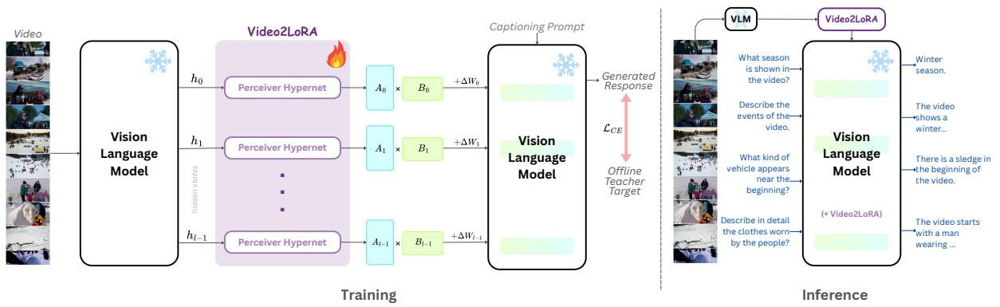

flowchart

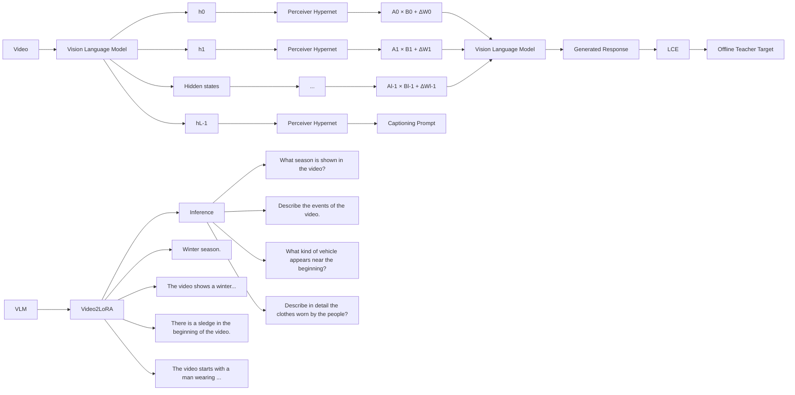
```mermaid
graph LR
    A["Video"] --> B["Vision Language Model"]
    B --> C["h0"]
    B --> D["h1"]
    B --> E["Hidden states"]
    B --> F["hL-1"]
    C --> G["Perceiver Hypernet"]
    D --> H["Perceiver Hypernet"]
    E --> I["..."]
    F --> J["Perceiver Hypernet"]
    G --> K["A0 × B0 + ΔW0"]
    H --> L["A1 × B1 + ΔW1"]
    I --> M["Al-1 × Bl-1 + ΔWl-1"]
    J --> N["Captioning Prompt"]
    K --> O["Vision Language Model"]
    L --> O
    M --> O
    O --> P["Generated Response"]
    P --> Q["LCE"]
    Q --> R["Offline Teacher Target"]
    
    S["VLM"] --> T["Video2LoRA"]
    T --> U["Inference"]
    
    U --> V["What season is shown in the video?"]
    U --> W["Describe the events of the video."]
    U --> X["What kind of vehicle appears near the beginning?"]
    U --> Y["Describe in detail the clothes worn by the people?"]
    
    T --> Z["Winter season."]
    T --> AA["The video shows a winter..."]
    T --> AB["There is a sledge in the beginning of the video."]
    T --> AC["The video starts with a man wearing ..."]
```

Figure 1: VIDEO2LORA overview. Training (left): A frozen VLM encodes the input video into hidden states. The trainable VIDEO2LORA hypernetwork reads these states and generates LoRA adapter weights in a single forward pass. The adapter-augmented frozen VLM is trained against teacher-generated targets. Inference (right): Given a new video, VIDEO2LORA generates the LoRA adapter once. The frozen VLM, augmented with this adapter, answers arbitrary text queries without visual tokens. Per-query cost is independent of video length.

# 3 VIDEO2LORA

VIDEO2LORA converts a video into a videospecific LoRA adapter in a single forward pass. A frozen VLM encodes the video into layer-wise hidden states, and a trainable Perceiver hypernetwork maps these states into LoRA weights. At inference time, the generated adapter is attached to the frozen answer model, which answers downstream text prompts without receiving any visual tokens in its context.

# 3.1 Problem Formulation

Let v denote a video, i an internalization instruction, p a downstream text prompt, and y the target response. We assume a frozen vision-language encoder E, a frozen answer model F , and a trainable hypernetwork $H _ { \phi }$ . The method is defined as:

$$
\mathbf {C} = E (v, i), \tag {1}
$$

$$
\theta (v) = H _ {\phi} (\mathbf {C}), \tag {2}
$$

$$
p _ {\phi} (y \mid p, v) = F (y \mid p; \theta (v)). \tag {3}
$$

Here, C denotes video-conditioned hidden states and $\theta ( v )$ denotes the generated LoRA adapter. The answer model receives the text prompt p and the adapter $\theta ( v )$ , but not the video tokens. During training, only ϕ is updated; both E and F remain frozen.

# 3.2 Video Encoder

We use a frozen SmolVLM2 model (Marafioti et al., 2025) as the video encoder. Given a sampled video and the internalization instruction, we collect the text-side hidden states from each transformer layer:

$$
\mathbf {C} = \operatorname{stack} (\mathbf {h} _ {0}, \mathbf {h} _ {1}, \dots , \mathbf {h} _ {L - 1}) \in \mathbb {R} ^ {L \times S \times D}, \tag {4}
$$

where L is the number of layers, S is the fused sequence length, and D is the hidden dimension. Keeping the layer dimension allows the hypernetwork to generate layer-indexed adapters instead of using a single pooled video vector for all layers.

# 3.3 Perceiver Hypernetwork

The hypernetwork maps C into LoRA weights for selected linear modules of the frozen model. We use a Perceiver-style resampler architecture (Jaegle et al., 2021). For each layer slice $\mathbf { C } _ { \ell } \in \mathbb { R } ^ { S \times D }$ an encoder resampler attends from learned latent queries to the video-conditioned hidden states, producing a fixed-size representation. A decoder resampler then uses one output query for each target module and LoRA rank direction.

For batch size B, number of target modules M, rank $R ,$ and latent size Z, the hypernetwork output has shape

$$
\mathbf {O} \in \mathbb {R} ^ {B \times L \times M \times R \times Z}. \tag {5}
$$

A shared projection head maps each rank latent to the two LoRA factors:

$$
\mathbf {A} _ {\ell , m} \in \mathbb {R} ^ {R \times d _ {\text { in }}}, \tag {6}
$$

$$
\mathbf {B} _ {\ell , m} \in \mathbb {R} ^ {R \times d _ {\mathrm{out}}}.
$$

where ℓ indexes the transformer layer and m indexes the target linear module. The generated factors are scaled by learned multipliers, with the A scale initialized to one and the B scale initialized to zero.

# 3.4 Dynamic LoRA Injection

For a frozen linear layer with weight ${ \textbf { \textsf { W } } } \in$ $\mathbb { R } ^ { d _ { \mathrm { o u t } } \times d _ { \mathrm { i n } } }$ , we use the standard LoRA factorization (Hu et al., 2022). Under the row-vector implementation convention, the frozen layer computes $\mathbf { x W } ^ { \top }$ . The generated adapter adds:

$$
\Delta \mathbf {y} = s (\mathbf {x A} _ {\ell , m} ^ {\top}) \mathbf {B} _ {\ell , m}, \tag {7}
$$

where s is the fixed LoRA scaling factor. The full adapted forward pass is:

$$
\mathbf {y} = \mathbf {x} \mathbf {W} ^ {\top} + s \left(\mathbf {x} \mathbf {A} _ {\ell , m} ^ {\top}\right) \mathbf {B} _ {\ell , m}. \tag {8}
$$

Each example receives its own generated adapter, so the LoRA weights are conditioned on the input video rather than shared across all videos.

# 3.5 Training Objective

We train the hypernetwork with teacher-forced cross-entropy over response tokens:

$$
\mathcal {L} (\phi) = - \sum_ {t} \log p _ {\phi} (y _ {t} \mid y _ {<   t}, p, \theta (v)). \tag {9}
$$

The answer model receives only the downstream text prompt and the generated adapter during this loss computation.

# 4 Experimental Setup

# 4.1 Models and Training

We evaluate two SmolVLM2 model scales: 500M and 2.2B. For each scale, the video encoder and answer model are initialized from the same frozen backbone. Only the VIDEO2LORA hypernetwork is trained. Training uses 12 uniformly sampled frames at 384px longest-edge resolution (constrained by compute). We apply generated LoRA adapters to the MLP down\_proj modules of the text decoder, with rank R = 16. We train on video spans derived from FineVideo (Farré et al., 2024). The span mixture contains single-scene spans, adjacent multi-scene spans, and full-video spans, sampled in a 60/30/10 ratio. FineVideo metadata is used only to define spans; the final training targets are cached offline teacher generations from a frozen SmolVLM2 teacher conditioned on the sampled video frames and downstream prompt. Audio is excluded throughout. The hypernetwork is trained with teacher-forced cross-entropy over response tokens, while the answer model receives only the text prompt and generated adapter. Further details on training can be found in the appendix.

# 4.2 Evaluation Benchmarks

We evaluate captioning on ActivityNet Captions (Krishna et al., 2017), PLM-RDCap (Cho et al., 2025), PLM-RCap (Cho et al., 2025), VDC (Chai et al., 2025), and CaReBench (Xu et al., 2025); and video QA on NExT-QA (Xiao et al., 2021), ActivityNet-QA (Yu et al., 2019), PLM-SGQA (Cho et al., 2025), and VidCapBench (Chen et al., 2025a).

To scale LLM Judge evaluation, we fix the number of samples from each benchmark to 500. VDC and CaReBench use 500 examples per subset/style. VidCapBench has multiple QA pairs corresponding to each video, therefore we fixed the number of videos to 100 and obtained 1,523 QA pairs corresponding to it. For all benchmarks, the direct baseline and VIDEO2LORA use the same videos, prompts, references, frame sampling, and decoding configuration.

# 4.3 Metrics and Statistical Testing

We report two quality metrics. First, we compute token-level F1 between the generated output and the reference answer or caption. Second, we use an LLM judge to score output quality on a 1–5 scale, which is linearly rescaled to [0, 1]. We use Qwen3- 30B (Yang et al., 2025) as our judge model, with a constrained rubric. Human study on this metric for a subset of 200 examples (100 captioning + 100 QA) reveals strong correlation with human judgements, with Spearman $\rho = 0 . 8 2 3$ for metric fidelity.

We estimate 95% confidence intervals using paired bootstrap resampling. For statistical measures, NI (Non-inferiority) and Eq (Equivalence) we use a margin of 0.05 for token-F1 and 0.15 for rescaled judge score.

# 5 Results

# 5.1 Captioning

VIDEO2LORA passes both non-inferiority and equivalence on all 10 benchmark–scale combinations under the LLM judge and all 10 under token-F1 (Table 1). For SmolVLM 2.2B, VIDEO2LORA recovers 91.9% of the base model’s judge score, while for SmolVLM 500M, it recovers 84.2%.

Per-benchmark analysis. Recovery rates at 500M span 79–96%, with compact clip-aligned benchmarks (PLM-RCap, PLM-RDCap) easiest to internalize and temporally dense benchmarks (VDC, ActivityNet Captions) hardest. Scale narrows this spread considerably: at 2.2B the floor rises to 85% and the ceiling breaks above the base, with PLM-RCap surpassing the base outright (CI entirely above zero) and PLM-RDCap reaching defacto equivalence (CI straddling zero). The benchmarks most sensitive to scale—particularly VDC, where the gap contracts fourfold—are those requiring compression of visually diverse, longer-form descriptions; benchmarks with consistently structured references recover well at both scales.

<table><tr><td rowspan="2">Benchmark</td><td colspan="6">SmolVLM 500M</td><td colspan="6">SmolVLM 2.2B</td></tr><tr><td>Base</td><td>V2L</td><td> $\Delta$ </td><td>CI</td><td>Eq</td><td>NI</td><td>Base</td><td>V2L</td><td> $\Delta$ </td><td>CI</td><td>Eq</td><td>NI</td></tr><tr><td>ActivityNet Captions</td><td>0.428</td><td>0.356</td><td>-0.072</td><td>[-0.104, -0.041]</td><td>Y</td><td>Y</td><td>0.576</td><td>0.492</td><td>-0.084</td><td>[-0.113, -0.057]</td><td>Y</td><td>Y</td></tr><tr><td>PLM-RDCap</td><td>0.308</td><td>0.263</td><td>-0.045</td><td>[-0.069, -0.021]</td><td>Y</td><td>Y</td><td>0.326</td><td>0.316</td><td>-0.010</td><td>[-0.032, +0.012]</td><td>Y</td><td>Y</td></tr><tr><td>PLM-RCap</td><td>0.252</td><td>0.242</td><td>-0.011</td><td>[-0.031, +0.009]</td><td>Y</td><td>Y</td><td>0.270</td><td>0.287</td><td>+0.017</td><td>[+0.001, +0.034]</td><td>Y</td><td>Y</td></tr><tr><td>VDC (aggregate)</td><td>0.515</td><td>0.406</td><td>-0.108</td><td>[-0.118, -0.098]</td><td>Y</td><td>Y</td><td>0.539</td><td>0.511</td><td>-0.028</td><td>[-0.037, -0.019]</td><td>Y</td><td>Y</td></tr><tr><td>CaReBench</td><td>0.334</td><td>0.278</td><td>-0.056</td><td>[-0.067, -0.045]</td><td>Y</td><td>Y</td><td>0.437</td><td>0.369</td><td>-0.068</td><td>[-0.078, -0.058]</td><td>Y</td><td>Y</td></tr><tr><td>Average</td><td>0.367</td><td>0.309</td><td>-0.058</td><td>[-0.078, -0.039]</td><td>Y</td><td>Y</td><td>0.430</td><td>0.395</td><td>-0.035</td><td>[-0.052, -0.018]</td><td>Y</td><td>Y</td></tr></table>

<table><tr><td rowspan="2">Benchmark</td><td colspan="6">SmolVLM 500M</td><td colspan="6">SmolVLM 2.2B</td></tr><tr><td>Base</td><td>V2L</td><td> $\Delta$ </td><td>CI</td><td>Eq</td><td>NI</td><td>Base</td><td>V2L</td><td> $\Delta$ </td><td>CI</td><td>Eq</td><td>NI</td></tr><tr><td>ActivityNet Captions</td><td>0.236</td><td>0.243</td><td>+0.007</td><td>[+0.002, +0.012]</td><td>Y</td><td>Y</td><td>0.263</td><td>0.256</td><td>-0.007</td><td>[-0.012, -0.002]</td><td>Y</td><td>Y</td></tr><tr><td>PLM-RDCap</td><td>0.189</td><td>0.198</td><td>+0.009</td><td>[+0.005, +0.013]</td><td>Y</td><td>Y</td><td>0.198</td><td>0.207</td><td>+0.009</td><td>[+0.005, +0.013]</td><td>Y</td><td>Y</td></tr><tr><td>PLM-RCap</td><td>0.177</td><td>0.203</td><td>+0.026</td><td>[+0.021, +0.031]</td><td>Y</td><td>Y</td><td>0.199</td><td>0.204</td><td>+0.005</td><td>[+0.001, +0.010]</td><td>Y</td><td>Y</td></tr><tr><td>VDC (aggregate)</td><td>0.315</td><td>0.288</td><td>-0.027</td><td>[-0.030, -0.025]</td><td>Y</td><td>Y</td><td>0.297</td><td>0.304</td><td>+0.007</td><td>[+0.003, +0.010]</td><td>Y</td><td>Y</td></tr><tr><td>CaReBench</td><td>0.295</td><td>0.275</td><td>-0.020</td><td>[-0.023, -0.017]</td><td>Y</td><td>Y</td><td>0.292</td><td>0.279</td><td>-0.013</td><td>[-0.015, -0.010]</td><td>Y</td><td>Y</td></tr><tr><td>Average</td><td>0.243</td><td>0.242</td><td>-0.001</td><td>[-0.005, +0.003]</td><td>Y</td><td>Y</td><td>0.250</td><td>0.250</td><td>+0.000</td><td>[-0.004, +0.004]</td><td>Y</td><td>Y</td></tr></table>

Table 1: Comparison of the base model with video and VIDEO2LORA generated adapters, across captioning benchmarks using LLM Judge scores and Token F1. We report mean scores, the paired difference $\Delta \left( \mathrm { V } 2 \mathrm { L } - \mathrm { B a s e } \right)$ , 95% confidence intervals, and the statistical equivalence (Eq) and non-inferiority (NI) criteria.

<table><tr><td rowspan="2">Subset</td><td colspan="2">SmolVLM 500M</td><td colspan="2">SmolVLM 2.2B</td></tr><tr><td>Base</td><td>V2L (Δ)</td><td>Base</td><td>V2L (Δ)</td></tr><tr><td>Short caption</td><td>0.629</td><td>0.535 (-0.094)</td><td>0.556</td><td>0.579 (+0.022)</td></tr><tr><td>Detailed caption</td><td>0.476</td><td>0.401 (-0.074)</td><td>0.526</td><td>0.463 (-0.063)</td></tr><tr><td>Camera</td><td>0.310</td><td>0.131 (-0.178)</td><td>0.478</td><td>0.392 (-0.085)</td></tr><tr><td>Background</td><td>0.642</td><td>0.523 (-0.117)</td><td>0.588</td><td>0.606 (+0.018)</td></tr><tr><td>Main object</td><td>0.517</td><td>0.442 (-0.075)</td><td>0.546</td><td>0.514 (-0.032)</td></tr></table>

Table 2: VDC results broken down by caption style.

<table><tr><td rowspan="2">Subset</td><td colspan="2">SmolVLM 500M</td><td colspan="2">SmolVLM 2.2B</td></tr><tr><td>Base</td><td>V2L (Δ)</td><td>Base</td><td>V2L (Δ)</td></tr><tr><td>Caption</td><td>0.418</td><td>0.324 (-0.094)</td><td>0.465</td><td>0.400 (-0.065)</td></tr><tr><td>Events</td><td>0.201</td><td>0.169 (-0.032)</td><td>0.340</td><td>0.267 (-0.073)</td></tr><tr><td>Objects</td><td>0.368</td><td>0.327 (-0.043)</td><td>0.457</td><td>0.392 (-0.065)</td></tr><tr><td>Spatial caption</td><td>0.424</td><td>0.329 (-0.095)</td><td>0.519</td><td>0.426 (-0.094)</td></tr><tr><td>Temporal caption</td><td>0.260</td><td>0.242 (-0.018)</td><td>0.404</td><td>0.360 (-0.045)</td></tr></table>

Table 3: CaReBench results broken down by subset.

Token F1. Token-F1 provides independent reference-based corroboration: the mean paired delta is −0.001 at 500M and 0.000 at 2.2B. VIDEO2LORA exceeds base on 3 of 5 benchmarks at 500M (ActivityNet Captions +0.007, PLM-RDCap +0.009, PLM-RCap +0.026) and 2 of 5 at 2.2B. The PLM-RCap result at 500M is notable: +0.026 (+14.7%; CI [+0.021, +0.031]) with no token-level supervision.

# 5.2 Fine-Grained Captioning

Tables 2 and 3 break VDC and CaReBench into caption styles and semantic dimensions.

VDC Four of five VDC styles maintain 81–85% recovery at 500M: short (85.1%, $\Delta = - 0 . 0 9 4 )$ , detailed (84.2%, $\Delta \ = \ - 0 . 0 7 4 )$ , background (81.5%, ∆ = −0.117), main object (85.5%, $\Delta =$ −0.075). Camera captions are the outlier: At 500M, VIDEO2LORA achieves only 42.3% recovery $( \Delta \ : = \ : - 0 . 1 7 8 $ base 0.310, V2L 0.131), as cinematographic attributes—shot framing, viewpoint, and camera motion—are difficult to encode as weight perturbations at this scale. At 2.2B, VIDEO2LORA recovers 82.0% $( \Delta \ : = \ : - 0 . 0 8 5 )$ , a gain of +39.7 pp. VIDEO2LORA recovers 82.0% $( \Delta = - 0 . 0 8 5 )$ , a gain of +39.7 pp—the largest single-dimension scale improvement in the fine-grained evaluation—This suggests that part of the camera-description gap is capacity-related, although targeted camera-motion supervision or adaptive rank may still be needed. At 2.2B, two styles exceed the base outright: short captions (104.1%, $\Delta = + 0 . 0 2 2 )$ and background (103.1%, $\Delta = + 0 . 0 1 8 )$ .

<table><tr><td colspan="13">LLM Judge</td></tr><tr><td rowspan="2">Benchmark</td><td colspan="6">SmolVLM 500M</td><td colspan="6">SmolVLM 2.2B</td></tr><tr><td>Base</td><td>V2L</td><td> $\Delta$ </td><td>CI</td><td>Eq</td><td>NI</td><td>Base</td><td>V2L</td><td> $\Delta$ </td><td>CI</td><td>Eq</td><td>NI</td></tr><tr><td>NExT-QA (open)</td><td>0.501</td><td>0.547</td><td>+0.046</td><td>[+0.007, +0.084]</td><td>Y</td><td>Y</td><td>0.597</td><td>0.610</td><td>+0.013</td><td>[-0.022, +0.048]</td><td>Y</td><td>Y</td></tr><tr><td>ActivityNet-QA</td><td>0.524</td><td>0.541</td><td>+0.016</td><td>[-0.031, +0.064]</td><td>Y</td><td>Y</td><td>0.627</td><td>0.531</td><td>-0.096</td><td>[-0.144, -0.049]</td><td>Y</td><td>Y</td></tr><tr><td>PLM-SGQA</td><td>0.390</td><td>0.317</td><td>-0.074</td><td>[-0.113, -0.034]</td><td>Y</td><td>Y</td><td>0.493</td><td>0.295</td><td>-0.198</td><td>[-0.236, -0.161]</td><td>-</td><td>-</td></tr><tr><td>VidCapBench</td><td>0.502</td><td>0.451</td><td>-0.050</td><td>[-0.071, -0.030]</td><td>Y</td><td>Y</td><td>0.551</td><td>0.475</td><td>-0.076</td><td>[-0.096, -0.055]</td><td>Y</td><td>Y</td></tr><tr><td>Average</td><td>0.487</td><td>0.460</td><td>-0.027</td><td>[-0.043, -0.011]</td><td>Y</td><td>Y</td><td>0.562</td><td>0.477</td><td>-0.085</td><td>[-0.101, -0.069]</td><td>Y</td><td>Y</td></tr><tr><td colspan="13">Token F1</td></tr><tr><td rowspan="2">Benchmark</td><td colspan="6">SmolVLM 500M</td><td colspan="6">SmolVLM 2.2B</td></tr><tr><td>Base</td><td>V2L</td><td> $\Delta$ </td><td>CI</td><td>Eq</td><td>NI</td><td>Base</td><td>V2L</td><td> $\Delta$ </td><td>CI</td><td>Eq</td><td>NI</td></tr><tr><td>NExT-QA (open)</td><td>0.129</td><td>0.068</td><td>-0.061</td><td>[-0.076, -0.046]</td><td>-</td><td>-</td><td>0.140</td><td>0.076</td><td>-0.063</td><td>[-0.079, -0.048]</td><td>-</td><td>-</td></tr><tr><td>ActivityNet-QA</td><td>0.197</td><td>0.023</td><td>-0.174</td><td>[-0.199, -0.149]</td><td>-</td><td>-</td><td>0.149</td><td>0.013</td><td>-0.136</td><td>[-0.156, -0.117]</td><td>-</td><td>-</td></tr><tr><td>PLM-SGQA</td><td>0.081</td><td>0.225</td><td>+0.145</td><td>[+0.131, +0.158]</td><td>-</td><td>Y</td><td>0.092</td><td>0.203</td><td>+0.111</td><td>[+0.098, +0.124]</td><td>-</td><td>Y</td></tr><tr><td>VidCapBench</td><td>0.216</td><td>0.209</td><td>-0.007</td><td>[-0.019, +0.004]</td><td>Y</td><td>Y</td><td>0.196</td><td>0.218</td><td>+0.022</td><td>[+0.010, +0.033]</td><td>Y</td><td>Y</td></tr><tr><td>Average</td><td>0.156</td><td>0.131</td><td>-0.024</td><td>[-0.041, -0.008]</td><td>Y</td><td>Y</td><td>0.144</td><td>0.128</td><td>-0.017</td><td>[-0.032, -0.002]</td><td>Y</td><td>Y</td></tr></table>

Table 4: Comparison of the base model with video and VIDEO2LORA generated adapters, across video question answering benchmarks using LLM Judge scores and Token F1. We report mean scores, the paired difference ∆ (V2L − Base), 95% confidence intervals, and the statistical equivalence (Eq) and non-inferiority (NI) criteria.

CaReBench Temporal captioning is bestrecovered at both scales (500M: 93.1%, ∆ = −0.018; 2.2B: 89.1%, $\Delta \ = \ - 0 . 0 4 5 )$ ; objects follow (500M: 88.9%; 2.2B: 85.8%). Holistic captioning and spatial description are hardest at 500M (77.5% and 77.6%), but scale closes the gap strongly: holistic reaches 86.0% (+8.5 pp) and spatial 82.1% (+4.5 pp) at 2.2B. The events dimension inverts: recovery falls from 84.1% (500M) to 78.5% (2.2B, −5.6 pp) as the 2.2B base improves substantially on event enumeration (base: 0.201 → 0.340), raising the compression target beyond the adapter’s fixed rank.

# 5.3 Video Question Answering

VIDEO2LORA is trained exclusively on captioning; video QA is entirely a zero-shot transfer task. The LLM judge passes non-inferiority and equivalence on 7 of 8 benchmark–scale combinations (Table 4).

Per-benchmark judge analysis. Across the four QA benchmarks, VIDEO2LORA matches or exceeds the base on two of four at 500M and one of four at 2.2B, with NExT-QA being the standout: VIDEO2LORA surpasses the base at both scales, with the 500M CI lying entirely above zero. The single failure—PLM-SGQA at 2.2B—is instructive rather than representative. The same benchmark passes comfortably at 500M points does not point to a fundamental limitation of parametric QA internalization.

Token-F1 and the verbosity effect. Token-F1 diverges from the judge on short-answer QA. Token-F1 exposes a strong format mismatch on shortanswer QA. This does not necessarily imply semantic failure, but it shows that captioning-trained Video2LoRA tends to produce more verbose answers than the direct baseline. On ActivityNet-QA, VIDEO2LORA token-F1 falls to 12% of base at 500M (0.023 vs. 0.197) and 9% at 2.2B (0.013 vs. 0.149); on NExT-QA it is 53%—yet both pass the judge test. The base VLM gives short, often oneto-three-word answers; VIDEO2LORA, trained on captioning, generates verbose summaries. Token-F1 is penalised by both the length mismatch and paraphrase variation, while the judge evaluates semantic correctness independently of response length. Two contrasts support this interpretation: PLM-SGQA—with longer, descriptive references— 一 reverses direction entirely (500M: $\Delta = + 0 . 1 4 5 ;$ 2.2B: $\Delta = + 0 . 1 1 1 ) \mathrm { ; }$ ; VidCapBench reaches nearparity $( \Delta = - 0 . 0 0 7 / + 0 . 0 2 2 )$ .

# 5.4 Frame and Resolution Generalization

VIDEO2LORA checkpoints were trained with uniform sampling at 12 frames and 384px resolution. We test out-of-distribution scaling on VDC background captioning by sweeping {8, 12, 24, 48, 128, 256, 512, 1024} frames and {224, 336, 512, 1024} resolution for both 500M and 2.2B models. We compare video-in-context inference with VIDEO2LORA using Token-F1, query-time TTFT (Time to First Token), and inputtoken reduction during answering (Fig. 3).

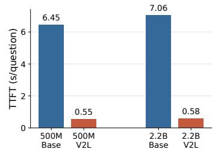

bar

| Model Size | TTFT (s/question) |
| ---------- | ----------------- |
| 500M Base  | 6.45              |
| 500M V2L   | 0.55              |
| 2.2B Base  | 7.06              |
| 2.2B V2L   | 0.58              |

(a) Single-question average TTFT, with time taken to internalize the video accounted.

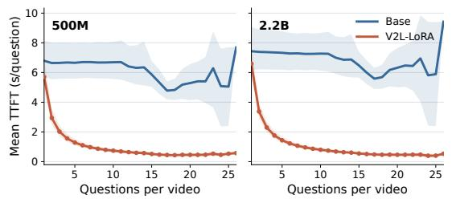

line

| Questions per video | Mean TTFT (s/question) - Base | Mean TTFT (s/question) - V2L-LoRA |
| ------------------- | ------------------------------ | ---------------------------------- |
| 0                   | 6.5                            | 6.0                                |
| 5                   | 6.8                            | 1.5                                |
| 10                  | 6.7                            | 0.8                                |
| 15                  | 6.5                            | 0.6                                |
| 20                  | 6.0                            | 0.4                                |
| 25                  | 7.0                            | 0.3                                |

(b) Amortized TTFT per question vs. number of questions per video (shaded band = bootstrap 95% confidence interval).

Figure 2: Inference efficiency on VidCapBench, comparing the base model and VIDEO2LORA.   
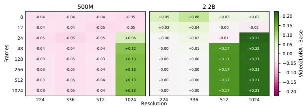

heatmap

| Frames | 224 | 336 | 512 | 1024 |
|---|---|---|---|---|
| 8 | -0.04 | -0.04 | -0.04 | -0.05 |
| 12 | -0.04 | -0.04 | -0.05 | -0.05 |
| 24 | -0.05 | -0.05 | -0.05 | +0.06 |
| 48 | -0.04 | -0.04 | -0.04 | +0.12 |
| 128 | -0.03 | -0.05 | -0.03 | +0.13 |
| 256 | -0.03 | -0.05 | -0.04 | +0.13 |
| 512 | -0.03 | -0.05 | -0.04 | +0.13 |
| 1024 | -0.03 | -0.05 | -0.04 | +0.13 |

| Resolution | Video2LoRA - Base |
| :--- | :--- |
| 224 | +0.05 |
| 336 | +0.08 |
| 512 | +0.03 |
| 1024 | +0.02 |
| 224 | +0.03 |
| 336 | +0.04 |
| 512 | -0.00 |
| 1024 | -0.02 |
| 224 | +0.00 |
| 336 | +0.02 |
| 512 | -0.01 |
| 1024 | +0.22 |
| 224 | -0.00 |
| 336 | +0.01 |
| 512 | +0.17 |
| 1024 | +0.22 |
| 224 | -0.00 |
| 336 | +0.00 |
| 512 | +0.17 |
| 1024 | +0.21 |
| 224 | +0.00 |
| 336 | +0.17 |
| 512 | +0.21 |
| 1024 | +0.21 |
| 224 | -0.00 |
| 336 | +0.17 |
| 512 | +0.21 |
| 1024 | +0.21 |
Video2LoRA - Base

(a) Change in mean Token-F1 from replacing in-context video tokens with VIDEO2LORA.

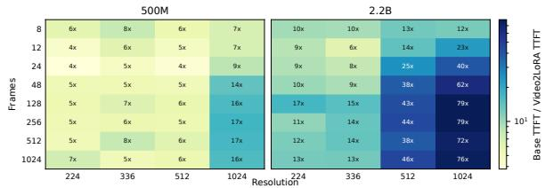

heatmap

| Frames | 224 | 336 | 512 | 1024 |
|---|---|---|---|---|
| 8 | 6x | 8x | 6x | 7x |
| 12 | 4x | 6x | 5x | 7x |
| 24 | 4x | 5x | 4x | 9x |
| 48 | 5x | 5x | 5x | 14x |
| 128 | 5x | 7x | 6x | 16x |
| 256 | 5x | 6x | 5x | 17x |
| 512 | 5x | 8x | 6x | 17x |
| 1024 | 7x | 5x | 6x | 16x |
| Resolution: 2.2B
| 10x | 10x | 13x | 12x |
| Resolution: 500M
| 9x | 6x | 14x | 23x |
| Resolution: 2.2B
| 9x | 8x | 25x | 40x |
| Resolution: 500M
| 10x | 9x | 38x | 62x |
| Resolution: 2.2B
| 17x | 15x | 43x | 79x |
| Resolution: 500M
| 11x | 14x | 44x | 79x |
| Resolution: 2.2B
| 12x | 14x | 38x | 72x |
| Resolution: 500M
| 13x | 13x | 46x | 76x |
The color scale indicates Base T TFT / Video2LoRA T TFT, with a legend on the right showing the corresponding values for each resolution and frame count. The chart is divided into two sections based on resolution and frame count, but no explicit numerical values are provided in the image.

(b) Query-time TTFT speedup of VIDEO2LORA over the base video-in-context model.

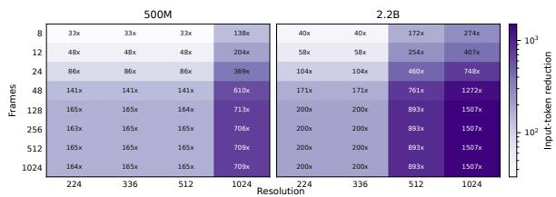

heatmap

| Frames | Resolution | Input-token reduction |
| :--- | :--- | :--- |
| 8 | 224 | 33x |
| 12 | 336 | 33x |
| 24 | 512 | 33x |
| 48 | 1024 | 138x |
| 128 | 1024 | 204x |
| 256 | 1024 | 369x |
| 512 | 1024 | 610x |
| 1024 | 1024 | 709x |
| 40x | 224 | 40x |
| 40x | 336 | 40x |
| 58x | 336 | 172x |
| 58x | 512 | 274x |
| 254x | 512 | 274x |
| 460x | 512 | 407x |
| 748x | 1024 | 748x |
| 171x | 1024 | 171x |
| 171x | 336 | 761x |
| 893x | 512 | 893x |
| 893x | 1024 | 1507x |
| 1507x | 1024 | 1507x |
| 1507x | 336 | 1507x |
| 893x | 512 | 893x |
| 893x | 1024 | 1507x |
| 893x | 336 | 893x |
| 893x | 512 | 1507x |
| 893x | 1024 | 1507x |
The image contains two rows of data: '500M' and '2.2B', each with a row label 'Frames' and a column label 'Resolution'. The color intensity corresponds to the 'Input-token reduction' value on a logarithmic scale (log scale). There is no explicit numerical values provided in the image.

(c) Input-token reduction achieved by VIDEO2LORA during answering.   
Figure 3: Scaling behavior on VDC background captioning across frame count and spatial resolution.

Despite being trained at a single frame countresolution setting, VIDEO2LORA remains stable across the sweep. For 500M, VIDEO2LORA is close to the base model overall, with an average Token-F1 change of −0.012. At 1024px and high frame counts, however, VIDEO2LORA outperforms the base model by +0.12 to +0.13 Token-F1. This large gain is partly because direct video-in-context inference becomes unstable in this regime: the base model often degenerates into repetitive or gibberish generations when significantly large number of visual tokens are supplied. The efficiency gains grow with video scale. VIDEO2LORA reduces query TTFT by a geometric mean of 6.7× for 500M and 20.1× for 2.2B, with maximum speedups of 17.2× and 79.1×, respectively (Fig. 3b). This is explained by the token compression in Fig. 3c: VIDEO2LORA reduces answer-time input tokens by 150× for 500M and 302× for 2.2B on average, reaching 713× and 1507× at the largest settings, since it passes zero tokens during inference.

# 5.5 Inference Efficiency

VidCapBench is a natural setting for evaluating inference efficiency because each video is associated with multiple questions: in our evaluation split, 100 videos produce 1,523 total queries, or 15.23 questions per video on average. This matches the intended use case of VIDEO2LORA: the video is processed once to produce a video-specific LoRA, and the adapter is reused for all subsequent questions about the same video. Thus, unlike direct in-context video inference, which repeatedly pays the cost of encoding and conditioning on the video, VIDEO2LORA pays a one-time setup cost and amortizes it over repeated queries. Figure 2 shows this amortization effect on both the 500M and 2.2B backbones. Averaged over all VidCap-Bench queries, VIDEO2LORA reduces TTFT from 6.45s to 0.55s for the 500M model, an 11.75× speedup, and from 7.06s to 0.58s for the 2.2B model, a 12.11× speedup (Figure 2a). The prefixamortization curve in Figure 2b shows that after 5 questions, amortized TTFT drops to 1.29s for

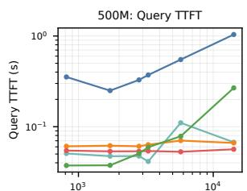

line

| x      | Blue Line | Green Line | Orange Line | Red Line |
| ------ | --------- | ---------- | ----------- | -------- |
| 10^3   | 0.5       | 0.02       | 0.05        | 0.05     |
| 10^4   | 1.0       | 0.2        | 0.05        | 0.05     |

Raw video prompt tokens

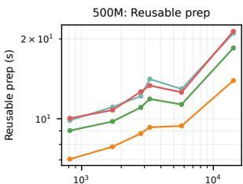

line

| x      | Reusable prep (s) |
| ------ | ----------------- |
| 10^3   | ~10               |
| 10^4   | ~20               |

Raw video prompt tokens

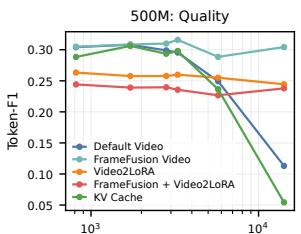

line

| Model | Token-F1 |
| --- | --- |
| Default Video | 0.30 |
| FrameFusion Video | 0.30 |
| Video2LoRA | 0.25 |
| FrameFusion + Video2LoRA | 0.25 |
| KV Cache | 0.05 |

Raw video prompt tokens

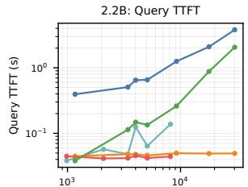

line

| x      | Blue Line | Green Line | Cyan Line | Orange Line |
| ------ | --------- | ---------- | --------- | ----------- |
| 10^3   | 0.5       | 0.05       | 0.05      | 0.05        |
| 10^4   | 1.0       | 0.1        | 0.1       | 0.05        |
| 10^5   | 2.0       | 1.0        | 0.1       | 0.05        |

Raw video prompt tokens

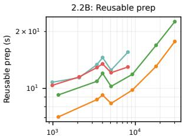

line

| x      | Reusable prep (s) |
| ------ | ----------------- |
| 10^3   | ~8                |
| 10^4   | ~15               |
| 10^5   | ~20               |

Raw video prompt tokens

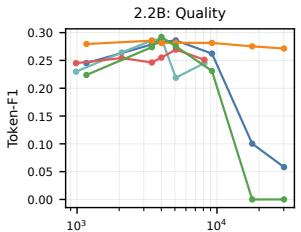

line

| x      | Token-F1 |
| ------ | -------- |
| 10^3   | 0.25     |
| 10^4   | 0.28     |
| 10^5   | 0.06     |

Raw video prompt tokens   
Figure 4: Efficiency comparison across video-token budgets. Columns report query TTFT, reusable preprocessing cost (internalization for Video2LoRA, cache creation for KV Cache, and token compression for FrameFusion), and Token-F1.

500M and 1.44s for 2.2B; after 10 questions, it falls to 0.74s and 0.80s, respectively.

Figure 4 further studies different video inference strategies on 640 samples with varying token counts (by doing using a resolution, frame count grid). We compare Video2LoRA and the default setting with, FrameFusion (Fu et al., 2025) (a token compression technique, compression factor 4), and KV caching. We also use FrameFusion with VIDEO2LORA, to show VIDEO2LORA is compatible with existing token compression techniques. Across token budgets, VIDEO2LORA is the only method that provides all three properties needed for repeated video querying: (1) query TTFT stays nearly constant and low as video tokens grow, (2) reusable preparation is competitive or fastest and much cheaper than KV caching at scale, and (3) output quality remains stable as token count increases. In contrast, the default baseline, token compression results and KV caching scale with token counts. Together, these results show that VIDEO2LORA converts video conditioning from a repeated per-query overhead into a reusable videospecific computation.

# 5.6 Chunk Composition

Video2LoRA internalizes a video by generating a LoRA adapter from its visual context. Although the model is trained to produce adapters for single video contexts, the adapter representation admits a simple test-time composition operation: independently internalize two temporal chunks of the same video, concatenate the resulting LoRA ranks, and

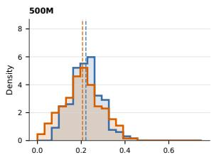

histogram

| Bin Range | Density (Blue) | Density (Orange) |
| --------- | -------------- | ---------------- |
| 0.0 - 0.1 | 0              | 0                |
| 0.1 - 0.2 | 4              | 3                |
| 0.2 - 0.3 | 6              | 5                |
| 0.3 - 0.4 | 3              | 2                |
| 0.4 - 0.5 | 1              | 1                |
| 0.5 - 0.6 | 0              | 0                |

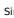

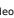

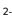

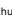

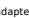  
Figure 5: Two-chunk adapter composition on VDC.

decode from the composed adapter. We evaluate whether this operation produces coherent videolevel generations, rather than degenerate text or captions tied to only one chunk.

We use the VDC short-caption and detailedcaption subsets, with 100 videos from each subset. Each video is split into two equal temporal halves. We compare two conditions: single-video adapter, where the full video is internalized as one adapter, and composed two-chunk adapter, where the two halves are internalized independently and the resulting adapters are composed before generation. Both conditions use 12 frames per adapter and the same text prompt. Figure 5 shows the resulting token-F1 score distributions against the VDC reference captions. The composed adapter remains close to the single-video adapter at both model scales. For VIDEO2LORA at 500M, the composed adapter retains 93.1% of the single-video adapter’s mean token-F1, with a mean score of 0.206 compared to 0.221. At 2.2B, it retains 86.2%, with a mean score of 0.211 compared to 0.245.

# 6 Conclusion

We introduced Video2LoRA, showing that parametric video internalization is achievable: a Perceiver hypernetwork converts a video into a LoRA adapter in a single forward pass, enabling a frozen VLM to answer queries with no visual tokens in context. Trained only on captioning, Video2LoRA is statistically non-inferior and equivalent to direct video-in-context inference across all five captioning benchmarks at both 500M and 2.2B scales, and transfers zero-shot to video QA on seven of eight benchmark-scale pairings. It remains stable at 1,024 frames where direct inference degenerates, achieves 6–76× lower query latency with up to 1,500× fewer answer-time tokens, and supports rank-space adapter composition for long-video internalization without dedicated training. Across token budgets, VIDEO2LORA uniquely combines near-constant query TTFT, scalable preprocessing costs below KV caching and token compression, and stable output quality at longer contexts.

# 7 Limitations

VIDEO2LORA demonstrates that video context can be internalized into generated adapter weights, enabling text-only querying after a one-time video processing step. Our current implementation trains a separate hypernetwork for each target VLM scale, and we evaluate it on the 500M and 2.2B SmolVLM2 backbones. Extending the same framework to additional VLM families, larger models, and shared or scale-transferable hypernetworks is an important direction for future work.

The present training setup uses captioning and summarization supervision. This makes transfer to video question answering a zero-shot setting, where answer style can differ from the direct videoin-context baseline. In particular, VIDEO2LORA sometimes produces more descriptive answers for short-answer QA, which can lower lexical-overlap metrics even when the answer is judged semantically appropriate. Future work can incorporate mixed captioning–QA supervision, answer-length control, or lightweight calibration for task-specific formats.

Because VIDEO2LORA converts a video into a compact adapter, the representation may emphasize high-level scene and event information over some fine-grained details. This is most relevant for tasks requiring precise camera, spatial, or object-level distinctions. Adaptive-rank adapters, richer internalization objectives, or more targeted supervision may improve preservation of these details.

Finally, our chunk-composition experiment is an initial two-chunk test. The result suggests that independently generated adapters can be combined in rank space, but the current operation does not explicitly model temporal order. More structured composition mechanisms and audio-visual internalization remain promising extensions.

# 8 Ethics Statement

Our research does not use any personally identifiable information (PII) and all datasets employed in this work are used in accordance with their respective licenses.

# Acknowledgments

This research is partially supported by the NVIDIA Academic Grant Program.

# References

Lucas Caccia, Alan Ansell, Edoardo M. Ponti, Ivan Vulic, and Alessandro Sordoni. 2025. Training plugn-play knowledge modules with deep context distillation. arXiv preprint arXiv:2503.08727.   
Wenhao Chai, Enxin Song, Yilun Du, Chenlin Meng, Vashisht Madhavan, Omer Bar-Tal, Jenq-Neng Hwang, Saining Xie, and Christopher D. Manning. 2025. AuroraCap: Efficient, performant video detailed captioning and a new benchmark. In International Conference on Learning Representations.   
Rujikorn Charakorn, Edoardo Cetin, Shinnosuke Uesaka, and Robert Lange. 2026. Doc-to-LoRA: Learning to instantly internalize contexts. arXiv preprint arXiv:2602.15902.   
Xinlong Chen, Yuanxing Zhang, Chongling Rao, Yushuo Guan, Jiaheng Liu, Fuzheng Zhang, Chengru Song, Qiang Liu, Di Zhang, and Tieniu Tan. 2025a. VidCapBench: A comprehensive benchmark of video captioning for controllable text-to-video generation. In Annual Meeting of the Association for Computational Linguistics.   
Yukang Chen, Fuzhao Xue, Dacheng Li, Qinghao Hu, Ligeng Zhu, Xiuyu Li, Yunhao Fang, Haotian Tang, Shang Yang, Zhijian Liu, Ethan He, Hongxu Yin, Pavlo Molchanov, Jan Kautz, Linxi Fan, Yuke Zhu, Yao Lu, and Song Han. 2025b. LongVILA: Scaling long-context visual language models for long videos. In International Conference on Learning Representations.   
Jang Hyun Cho, Andrea Madotto, Effrosyni Mavroudi, Triantafyllos Afouras, Tushar Nagarajan, Muhammad Maaz, Yale Song, Tengyu Ma, Shuming Hu, Hanoona Rasheed, Peize Sun, Po-Yao Huang, Daniel Bolya, Suyog Jain, Miguel Martin, Huiyu Wang, Nikhila Ravi, Shashank Jain, Temmy Stark, and 10 others. 2025. PerceptionLM: Open-access data and models for detailed visual understanding. arXiv preprint.   
Miquel Farré, Andi Marafioti, Lewis Tunstall, Leandro Von Werra, and Thomas Wolf. 2024. Finevideo. https://huggingface.co/datasets/ HuggingFaceFV/finevideo.   
Tianyu Fu, Tengxuan Liu, Qinghao Han, Guohao Dai, Shengen Yan, Huazhong Yang, Xuefei Ning, and Yu Wang. 2025. Framefusion: Combining similarity and importance for video token reduction on large vision language models. In Proceedings of the IEEE/CVF International Conference on Computer Vision, pages 22654–22663.   
David Ha, Andrew M. Dai, and Quoc V. Le. 2017. HyperNetworks. In International Conference on Learning Representations.   
Edward J. Hu, Yelong Shen, Phillip Wallis, Zeyuan Allen-Zhu, Yuanzhi Li, Shean Wang, Lu Wang, and Weizhu Chen. 2022. LoRA: Low-rank adaptation of

large language models. In International Conference on Learning Representations.

Andrew Jaegle, Felix Gimeno, Andy Brock, Oriol Vinyals, Andrew Zisserman, and Joao Carreira. 2021. Perceiver: General perception with iterative attention. In Proceedings of the 38th International Conference on Machine Learning, volume 139 of Proceedings of Machine Learning Research, pages 4651–4664. PMLR.

Ranjay Krishna, Kenji Hata, Frederic Ren, Li Fei-Fei, and Juan Carlos Niebles. 2017. Dense-captioning events in videos. In IEEE International Conference on Computer Vision.

Brian Lester, Rami Al-Rfou, and Noah Constant. 2021. The power of scale for parameter-efficient prompt tuning. In Conference on Empirical Methods in Natural Language Processing.

Wentong Li, Yuqian Yuan, Jian Liu, Dongqi Tang, Song Wang, Jie Qin, Jianke Zhu, and Lei Zhang. 2025. TokenPacker: Efficient visual projector for multimodal LLM. International Journal of Computer Vision.

Xiang Lisa Li and Percy Liang. 2021. Prefix-tuning: Optimizing continuous prompts for generation. In Annual Meeting of the Association for Computational Linguistics.

Haotian Liu, Chunyuan Li, Yuheng Li, and Yong Jae Lee. 2024. Improved baselines with visual instruction tuning. In Proceedings of the IEEE/CVF Conference on Computer Vision and Pattern Recognition.

Andrés Marafioti, Orr Zohar, Miquel Farré, Merve Noyan, Elie Bakouch, Pedro Cuenca, Cyril Zakka, Loubna Ben Allal, Anton Lozhkov, Nouamane Tazi, Vaibhav Srivastav, Joshua Lochner, Hugo Larcher, Mathieu Morlon, Lewis Tunstall, Leandro von Werra, and Thomas Wolf. 2025. SmolVLM: Redefining small and efficient multimodal models. arXiv preprint arXiv:2504.05299.

Eric Mitchell, Charles Lin, Antoine Bosselut, Chelsea Finn, and Christopher D. Manning. 2022. Fast model editing at scale. In International Conference on Learning Representations.

Jesse Mu, Xiang Lisa Li, and Noah D. Goodman. 2023. Learning to compress prompts with gist tokens. In Advances in Neural Information Processing Systems.

Rui Qian, Xiao-Wen Dong, Pan Zhang, Yuhang Zang, Shuangrui Ding, Dahua Lin, and Jiaqi Wang. 2024. Streaming long video understanding with large language models. In Advances in Neural Information Processing Systems.

Yuzhang Shang, Mu Cai, Bingxin Xu, Yong Jae Lee, and Yan Yan. 2025. LLaVA-PruMerge: Adaptive token reduction for efficient large multimodal models. In IEEE International Conference on Computer Vision.

Junbin Xiao, Xindi Shang, Angela Yao, and Tat-Seng Chua. 2021. NExT-QA: Next phase of questionanswering to explaining temporal actions. In Proceedings of the IEEE/CVF Conference on Computer Vision and Pattern Recognition.

Yifan Xu, Xinhao Li, Yichun Yang, Desen Meng, Rui Huang, and Limin Wang. 2025. CaReBench: A finegrained benchmark for video captioning and retrieval. arXiv preprint arXiv:2501.00513.

An Yang, Anfeng Li, Baosong Yang, Beichen Zhang, Binyuan Hui, Bo Zheng, Bowen Yu, Chang Gao, Chengen Huang, Chenxu Lv, Chujie Zheng, Dayiheng Liu, Fan Zhou, Fei Huang, Feng Hu, Hao Ge, Haoran Wei, Huan Lin, Jialong Tang, and 41 others. 2025. Qwen3 technical report. Preprint, arXiv:2505.09388.

Zhou Yu, Dejing Xu, Jun Yu, Ting Yu, Zhou Zhao, Yueting Zhuang, and Dacheng Tao. 2019. ActivityNet-QA: A dataset for understanding complex web videos via question answering. In AAAI Conference on Artificial Intelligence.

Hang Zhang, Xin Li, and Lidong Bing. 2023. Video-LLaMA: An instruction-tuned audio-visual language model for video understanding. In Conference on Empirical Methods in Natural Language Processing.

Peiyuan Zhang, Kaichen Zhang, Bo Li, Guangtao Zeng, Jingkang Yang, Yuanhan Zhang, Ziyue Wang, Haoran Tan, Chunyuan Li, and Ziwei Liu. 2024. Long context transfer from language to vision. Transactions on Machine Learning Research.

# A LLM Judge Evaluation

We use an LLM judge for two purposes: reference-based quality scoring and referencefree output preservation. The judge is Qwen/Qwen3-VL-30B-A3B-Thinking-FP8, served locally with vLLM through an OpenAI-compatible API. For the main reported judge scores, we use text-only judging: the judge receives the task prompt, reference text, and model output, but no video frames. We set temperature to 0, use a maximum of 1024 output tokens for reference-based scoring, and request JSON-formatted outputs. For pure output similarity, we use the same judge with a maximum of 768 output tokens.

For reference-based quality, each candidate is scored independently against the reference. The judge is not shown model names. For auxiliary paired judgments, the direct baseline and VIDEO2LORA outputs are anonymized as Candidate A and Candidate B, and their order is randomized with a fixed seed. These paired judgments are used as an audit and are not the primary metric unless explicitly reported.

# A.1 Reference-Based Captioning Judge

For captioning and description tasks, the judge measures semantic coverage of the reference caption. Extra details that are absent from the reference are not penalized unless they directly contradict the reference.

# Captioning Judge Prompt

Task guidance: This is video caption/reference evaluation. Judge semantic coverage, factual precision, and task fit.

Prompt: {prompt}

Reference caption: {reference}

Candidate caption: {candidate}

Evaluate only semantic coverage of the reference caption for the requested caption task. Do not reward or penalize writing style, fluency, verbosity, or formatting, except when the candidate is invalid or impossible to understand. Extra details absent from the reference are not automatically wrong. Record notable extra details separately. Penalize only direct contradictions or missing reference facts. A direct contradiction requires that the candidate and reference cannot both be true.

Coverage scoring rubric: 5 = complete coverage; 4 = mostly complete; 3 = partial; 2 = weak overlap; 1 = minimal overlap; 0 = unrelated, invalid, nonsensical, or contradicts the main reference event.

<table><tr><td>Return</td><td>only</td><td>valid</td><td>JSON</td><td>with</td></tr><tr><td>fields:</td><td colspan="2">coverage_score</td><td>integer</td><td>0-5;</td></tr><tr><td>coverage_label;</td><td colspan="4">covered_reference_facts;</td></tr><tr><td colspan="5">missing_reference_facts;</td></tr><tr><td>direct_contradictions;</td><td colspan="4">extra_details;</td></tr><tr><td colspan="5">extra_details_type; rationale.</td></tr></table>

# A.2 Reference-Based QA Judge

For QA tasks, the judge first extracts the answer implied by the model output and then compares it to the reference answer. This avoids over-penalizing verbose outputs that contain the correct answer.

# QA Judge Prompt

Task guidance: This is video question answering. Judge semantic answer correctness. Allow paraphrases and indirect answers. For yes/no references, infer yes/no from the candidate if the candidate clearly implies it.

Question: {question}

Reference answer: {reference}

Candidate response: {candidate}

First extract the candidate’s answer to the question, then compare that extracted answer to the reference. Do not require the candidate to be concise. A verbose response can be correct if it contains or clearly gives the answer. If the candidate describes the same scene but does not answer the requested attribute, action, location, or count, score it as low-to-partial rather than correct.

Scoring rubric: 5 = fully correct; 4 = correct main answer with minor missing specificity or harmless extra detail; 3 = partially correct; 2 = related but does not clearly answer; 1 = minimal overlap; 0 = contradiction,

different answer, or invalid.

Return only valid JSON with fields: extracted\_answer; score integer 0–5; answer\_label; contains\_answer; direct\_contradiction; extra\_details\_affect\_score; missing\_key\_answer\_parts; contradictory\_parts; rationale.

# B Evaluation Prompts and Task Templates

This appendix provides the exact evaluation prompts and task-specific templates used across all the benchmarks in our experiments.

# B.1 Video Captioning and Description Benchmarks

Below are the prompts used to generate descriptions for whole videos, clips, and specific features (e.g., spatial layout, temporal progression, and cinematography style).

# ActivityNet Captions

"Describe what is happening in this video."

# PLM-RDCap

"Describe what happens in this video."

# PLM-RCap

"Describe what happens in this video clip."

# Video Description Corpus (VDC)

# Short Caption:

"Summarize this video in one detailed sentence."

# Detailed Caption:

"Describe this video in detail."

# Camera:

"Describe the camera work, framing, and viewpoint in this video."

# Background:

"Describe the background, setting, and environment in this video."

# Main Object:

"Describe the main subject and its actions in this video."

# CaReBench

# Caption:

"Describe the video in as much useful visual detail as possible. Include the main activity, visible people or objects, scene context, appearance, and any important visual details that help explain what is happening."

# Events:

"Describe the key visible events in chronological order. Include all important actions and changes you can observe, with enough detail to distinguish each event clearly."

# Objects:

"Describe the important visible objects and entities in the video in as much useful detail as possible. Include their appearance, location, and role in the scene when visible."

# Spatial Caption:

"Describe the spatial layout in as much useful detail as possible: where the people, objects, and scene elements are located, how they are positioned relative to each other, and what parts of the scene are in the foreground, background, left, right, center, above, or below."

Temporal Caption: "Describe the temporal progression in as much useful detail as possible. Explain what happens over time, the order of visible actions, and how the scene or subjects change from the beginning to the end."

# B.2 Video Question Answering (QA) Benchmarks

For question answering tasks, templates are structured to format the inputs and instructions depending on whether choices are provided (offered options) or hidden.

# NExT-QA

{question}

Answer only the question, in one sentence.

# ActivityNet-QA

{question}

Answer only the question, in one sentence.

# PLM-SGQA

{question}

Answer only the question, in one sentence.

# VidCapBench

{question}

Answer only the question, in one sentence.

# C Rank-Direction Ablation

# C.1 Setup

We test whether different rank directions in a generated LoRA adapter contribute unequally to captioning performance. The ablation is run on 500 examples from the ActivityNet Captions evaluation split (Krishna et al., 2017), using the 2.2B VIDEO2LORA checkpoint. For each example, we generate the video-conditioned rankdecompose it into rank-slice pairs $\{ ( A _ { r } , B _ { r } ) \} _ { r = 1 } ^ { 1 6 } .$ where $A _ { r } \in \mathbb { R } ^ { 1 \times d _ { \operatorname { i r } } }$ and $B _ { r } \in \mathbb { R } ^ { 1 \times d _ { \mathrm { o u t } } }$ . Under our row-vector implementation, rank slice r contributes

$$
\Delta y _ {r} = s \left(x A _ {r} ^ {\top}\right) B _ {r}.
$$

We score each slice by the Frobenius norm product

$$
\left\| A _ {r} \right\| _ {F} \cdot \left\| B _ {r} \right\| _ {F}.
$$

We evaluate four selection strategies across budgets k ∈ {1, 2, 4, 8, 16}:

• Top-k: retain the k highest-scoring rank slices.   
• Bottom-k: retain the k lowest-scoring rank slices.   
• Random-k: retain k randomly selected slices, averaged over 3 seeds.   
• Remove-Top-k: remove the k highestscoring slices and retain the remaining 16 − k.

We report Token-F1 against reference captions with 95% bootstrap confidence intervals over examples.

# C.2 Analysis

Table 5 reports the numerical ablation results, and Figure 6 visualizes the same rank-pruning trajectories.

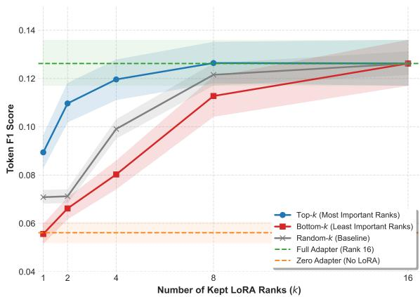

line

| Number of Kept LoRA Ranks (k) | Top-k (Most Important Ranks) | Bottom-k (Least Important Ranks) | Random-k (Baseline) | Full Adapter (Rank 16) | Zero Adapter (No LoRA) |
| ----------------------------- | ----------------------------- | -------------------------------- | ------------------- | ----------------------- | ---------------------- |
| 1                             | 0.09                          | 0.055                            | 0.07                | 0.125                   | 0.055                  |
| 2                             | 0.11                          | 0.065                            | 0.07                | 0.125                   | 0.055                  |
| 4                             | 0.12                          | 0.08                             | 0.10                | 0.125                   | 0.055                  |
| 8                             | 0.125                         | 0.11                             | 0.12                | 0.125                   | 0.055                  |
| 16                            | 0.125                         | 0.125                            | 0.125               | 0.125                   | 0.055                  |

Figure 6: Rank-direction ablation on ActivityNet Captions. Top-k rank slices recover performance faster than random or bottom-k slices, suggesting that the Frobenius norm product is a useful heuristic for rank importance. The Remove-Top-k curve has a higher point estimate than the full adapter at small k, but this should be interpreted cautiously because confidence intervals overlap.

Rank directions are redundant but not exchangeable. The generated adapters are compressible along the rank dimension. Retaining the top-8 rank slices gives a Token-F1 of 0.1264, close to the full rank-16 adapter score of 0.1262. At k = 4, the top-k adapter reaches 0.1196, which is 94.8% of the full adapter’s absolute Token-F1 and recovers 90.6% of the improvement over the zero-adapter baseline. This suggests that much of the useful adaptation is concentrated in a subset of rank directions.

Norm product is a useful heuristic for rank importance. The Frobenius norm product separates useful from less useful directions. At k = 1, Top-k reaches 0.0894, while Bottom-k reaches 0.0556, slightly below the zero-adapter baseline of 0.0561. Random-k generally falls between Topk and Bottom-k at matched budgets. Thus, highnorm rank slices tend to be more useful, although the norm product should be treated as a heuristic rather than a complete causal explanation.

Removing the dominant direction has a higher point estimate. Removing the highest-norm rank slice gives a higher point estimate than the full adapter, increasing Token-F1 from 0.1262 to 0.1317. Removing the top four slices also remains close to the full adapter at 0.1275. Since the confidence intervals overlap, we treat this as suggestive rather than conclusive. One possible explanation is that the dominant direction captures a generic captioning prior, and removing it shifts generation toward more video-specific directions.

<table><tr><td>k</td><td>Top-k</td><td>Bottom-k</td><td>Random-k</td><td>Remove-Top-k</td></tr><tr><td>0 (Zero)</td><td>0.0561 [.052,.060]</td><td>0.0561</td><td>0.0561</td><td>0.0561</td></tr><tr><td>1</td><td>0.0894 [.083,.096]</td><td>0.0556 [.052,.060]</td><td>0.0709 [.068,.074]</td><td>0.1317 [.123,.141]</td></tr><tr><td>2</td><td>0.1097 [.102,.118]</td><td>0.0662 [.062,.071]</td><td>0.0712 [.069,.074]</td><td>0.1277 [.118,.137]</td></tr><tr><td>4</td><td>0.1196 [.111,.128]</td><td>0.0803 [.074,.086]</td><td>0.0991 [.095,.103]</td><td>0.1275 [.119,.137]</td></tr><tr><td>8</td><td>0.1264 [.118,.135]</td><td>0.1128 [.104,.121]</td><td>0.1215 [.117,.126]</td><td>0.1128 [.104,.121]</td></tr><tr><td>16 (Full)</td><td>0.1262 [.117,.136]</td><td>0.1262</td><td>0.1262</td><td>0.0561</td></tr></table>

Table 5: Token F1 scores under rank-direction ablation on ActivityNet Captions. Brackets denote 95% confidence intervals. Full Adapter (k = 16) and Zero Adapter (k = 0) serve as upper and lower baselines.

Rank ordering is stable across examples. The rank ordering is highly consistent across the 500 examples: rank direction R11 is the highest-scoring direction in all examples, while R7 is consistently among the lowest-scoring directions. This suggests that the hypernetwork learns a stable output coordinate system for rank directions, rather than assigning importance arbitrarily for each video.

# D Interpreting Hypernetwork-Generated Adapters

# D.1 Setup

We use two diagnostic interventions to study how generated adapters affect the frozen 2.2B answer model: layer-wise adapter removal and direct logit attribution. The experiments are run on CareBench diagnostic examples, including caption and spatial-caption prompts.

Each example is scored by teacher-forced log-probability under the frozen answer model with the generated adapter active. Since these diagnostics use open-ended reference strings, we score each reference string and use the highest-scoring reference for the diagnostic. Candidate strings may contain multiple tokens, so we score a candidate string z by length-normalized teacher-forced log-probability:

$$
\ell (z \mid p) = \frac {1}{| z |} \sum_ {t = 1} ^ {| z |} \log P (z _ {t} \mid z _ {<   t}, p). \tag {10}
$$

The scalar diagnostic score is therefore

$$
\mathcal {S} = \max _ {r \in \mathcal {R}} \ell (r \mid p), \tag {11}
$$

where R is the set of reference strings for the example.

For direct logit attribution, we need a direction in the output-embedding space. We use the mean output embedding of the selected reference tokens and denote the normalized direction by ˆd. This gives a single diagnostic direction toward the reference answer/caption.

# D.2 Layer-Wise Adapter Removal

For each transformer layer ℓ, we zero out only the generated LoRA update at that layer and recompute the diagnostic score. We report the signed removal effect

$$
\operatorname{Effect} _ {\ell} = \mathcal {S} _ {\text { without } \ell} - \mathcal {S} _ {\text { full }}. \tag {12}
$$

Negative values indicate that removing the layer lowers the score, so the layer’s adapter update is useful under this diagnostic. Values near zero indicate little measurable effect from removing that layer.

Figure 7 shows a mismatch between generatedweight norm and functional effect. Some early layers receive relatively large LoRA updates, but removing them changes the diagnostic score only weakly. In contrast, several later layers produce larger negative removal effects, indicating that their adapter updates matter more for the scored prediction. This suggests that the adapter is not used uniformly across the transformer stack: early updates may shape intermediate representations, while later updates appear more directly connected to the final answer/caption likelihood.

This also shows that Frobenius norm alone is not a complete measure of adapter importance. Large generated weights can be weakly causal under this intervention, whereas smaller or comparable later-layer updates can have stronger effects on the output score. We therefore interpret the result as a norm–function dissociation, not as a full causal explanation of the adapter mechanism.

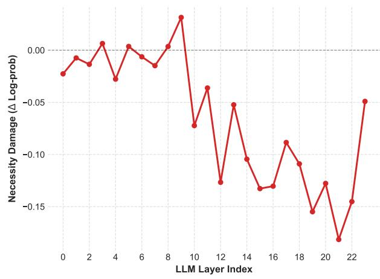

line

| LLM Layer Index | Necessity Damage (Δ Log-prob) |
| --------------- | ----------------------------- |
| 0               | -0.02                         |
| 1               | -0.01                         |
| 2               | -0.02                         |
| 3               | 0.01                          |
| 4               | -0.03                         |
| 5               | 0.01                          |
| 6               | -0.01                         |
| 7               | -0.02                         |
| 8               | 0.01                          |
| 9               | 0.03                          |
| 10              | -0.07                         |
| 11              | -0.04                         |
| 12              | -0.13                         |
| 13              | -0.05                         |
| 14              | -0.10                         |
| 15              | -0.13                         |
| 16              | -0.13                         |
| 17              | -0.09                         |
| 18              | -0.11                         |
| 19              | -0.15                         |
| 20              | -0.13                         |
| 21              | -0.18                         |
| 22              | -0.15                         |
| 23              | -0.05                         |

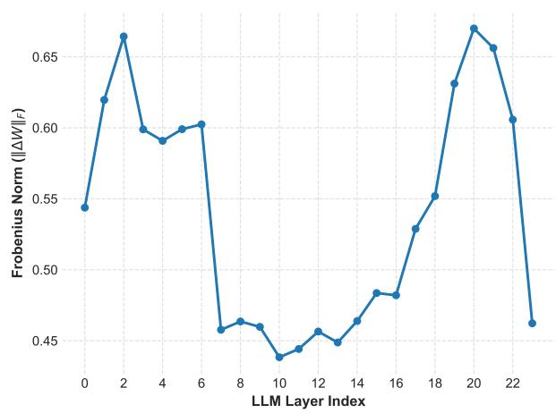

line

| LLM Layer Index | Frobenius Norm (‖ΔW‖_F) |
| --------------- | ------------------------ |
| 0               | 0.54                     |
| 2               | 0.67                     |
| 4               | 0.59                     |
| 6               | 0.60                     |
| 8               | 0.46                     |
| 10              | 0.43                     |
| 12              | 0.45                     |
| 14              | 0.47                     |
| 16              | 0.48                     |
| 18              | 0.55                     |
| 20              | 0.67                     |
| 22              | 0.61                     |

Figure 7: Layer-wise adapter-removal diagnostic. Left: signed removal effect from zeroing one layer’s generated LoRA update; negative values indicate that removing the layer lowers the score. Right: Frobenius norm $\| \Delta W \| _ { F }$ of generated LoRA weights across layers.

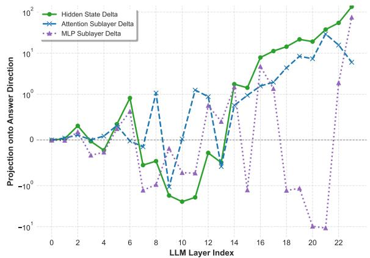

line

| LLM Layer Index | Hidden State Delta | Attention Sublayer Delta | MLP Sublayer Delta |
| --------------- | ------------------ | ------------------------ | ------------------ |
| 0               | 0                  | 0                        | 0                  |
| 2               | 0                  | 0                        | 0                  |
| 4               | -0.5               | -0.5                     | -0.5               |
| 6               | 1                  | 0                        | 0.5                |
| 8               | -0.5               | 1                        | -1                 |
| 10              | -1                 | -1                       | -1                 |
| 12              | -0.5               | 1                        | 0.5                |
| 14              | 1                  | 0                        | -1                 |
| 16              | 1                  | 1                        | 1                  |
| 18              | 1                  | 1                        | -1                 |
| 20              | 1                  | 1                        | -1                 |
| 22              | 1                  | 1                        | 1                  |
| 23              | 100                | 1                        | 100                |

Figure 8: Direct logit attribution of adapter-induced representation shifts projected onto the diagnostic answer direction across 24 LLM layers. Later layers show the largest alignment with the answer direction, suggesting late-layer logit steering.

# D.3 Direct Logit Attribution

We next ask where the adapter-induced representation shift becomes aligned with the diagnostic target direction. Let

$$
\Delta x _ {\ell} = x _ {\ell} ^ {\mathrm{adapter}} - x _ {\ell} ^ {\mathrm{base}}
$$

denote the residual-stream shift at layer ℓ, and let $\Delta a _ { \ell }$ and $\Delta m \ell$ denote the corresponding attention and MLP sublayer shifts. We project these shifts onto the diagnostic answer direction:

$$
\mathrm{DLA} _ {\ell} = \Delta x _ {\ell} \cdot \hat {d},
$$

$$
\mathrm{DLA} _ {\ell} ^ {\text { attn }} = \Delta a _ {\ell} \cdot \hat {d}, \tag {13}
$$

$$
\mathrm{DLA} _ {\ell} ^ {\mathrm{MLP}} = \Delta m _ {\ell} \cdot \hat {d}.
$$

Figure 8 shows that the adapter-induced shift is weakly aligned with the diagnostic direction in early and middle layers, but becomes much more aligned in later layers. This matches the layer-removal result: the adapter’s effect becomes most visible close to the output logits.

The sublayer breakdown suggests that both attention and MLP components contribute to this late-stage steering. Rather than claiming that the generated adapter implements a specific memory mechanism, we interpret the pattern more conservatively: VIDEO2LORA appears to induce representation changes throughout the network, but the changes most directly aligned with the target answer/caption emerge in later layers.

# E Training Details

Table 6 summarizes the main training configuration for the two VIDEO2LORA model scales. In both runs, only the hypernetwork parameters are trained; the video encoder and answer model remain frozen.

Both models use rank-16 generated LoRA adapters, 12 uniformly sampled frames, a maximum video dimension of 384 pixels, Perceiver latent size 512, learning rate $1 \times 1 0 ^ { - 4 }$ , warmup ratio 0.03, and weight decay 0.01. The 500M model is trained for 9,000 steps on 4 A100 GPUs for 37 wall-clock hours, with per-device batch size 48 and gradient accumulation 2, giving an effective batch size of 384. The 2.2B model is trained for 7,000 steps on 6 A100 GPUs for 201 wall-clock hours, with per-device batch size 8 and gradient accumulation 5, giving an effective batch size of

<table><tr><td>Setting</td><td>500M</td><td>2.2B</td></tr><tr><td>Training steps</td><td>9,000</td><td>7,000</td></tr><tr><td>GPUs</td><td>4×A100</td><td>6×A100</td></tr><tr><td>Wall-clock training time</td><td>37 hours</td><td>201 hours</td></tr><tr><td>Per-device batch size</td><td>48</td><td>8</td></tr><tr><td>Gradient accumulation steps</td><td>2</td><td>5</td></tr><tr><td>Effective batch size</td><td>384</td><td>240</td></tr><tr><td>LoRA rank</td><td>16</td><td>16</td></tr><tr><td>Sampled frames</td><td>12</td><td>12</td></tr><tr><td>Max video dimension</td><td>384 px</td><td>384 px</td></tr><tr><td>Perceiver latent size</td><td>512</td><td>512</td></tr><tr><td>Learning rate</td><td> $1 \times 10^{-4}$ </td><td> $1 \times 10^{-4}$ </td></tr><tr><td>Warmup ratio</td><td>0.03</td><td>0.03</td></tr><tr><td>Weight decay</td><td>0.01</td><td>0.01</td></tr></table>

Table 6: Training configuration for the 500M and 2.2B VIDEO2LORA runs. Wall-clock training time reports elapsed training time, not total GPU-hours. Effective batch size is computed as number of GPUs × per-device batch size × gradient accumulation steps.

240.

# F Additional Results

# F.1 Distribution Plots

Figures 9 and 10 show the LLM-judge score distributions and per-example score differences. Figures 11 and 12 show the corresponding token-F1 distributions and differences.

# F.2 Spider Plots

Figures 13 and 14 show the QA and captioning spider plots.

# G Qualitative Examples

Qualitative examples are shown in Figure 15, Figure 16, Figure 17, Figure 18, Figure 19, Figure 20, Figure 21, Figure 23, Figure 24, Figure 25, Figure 26, Figure 27, Figure 28, Figure 29, Figure 30, Figure 22.

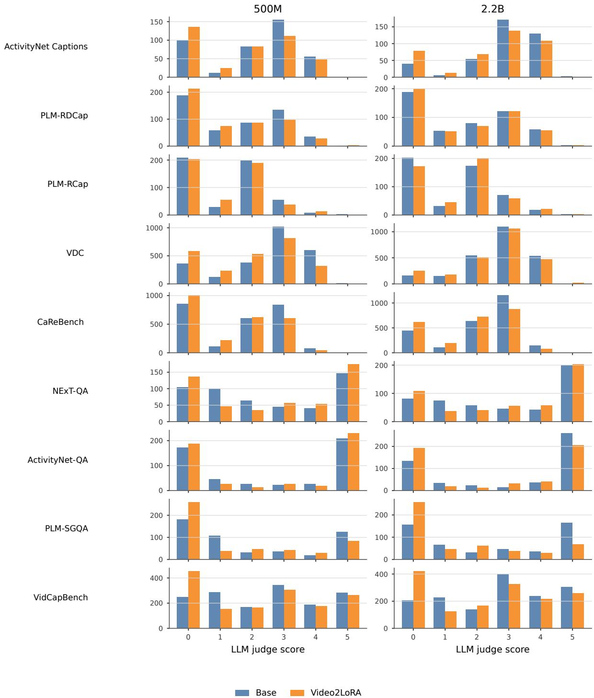

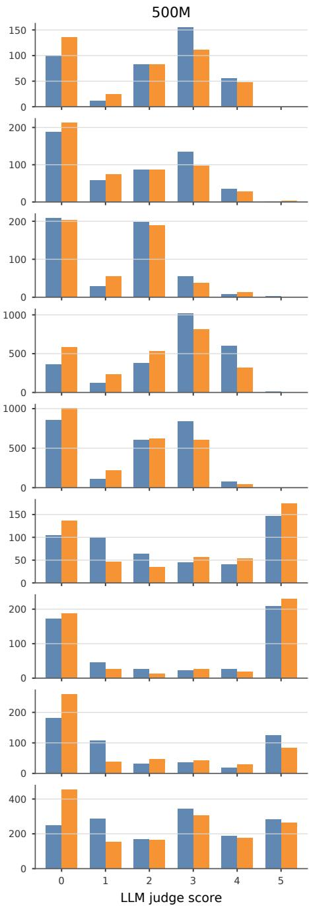  
Figure 9: LLM-judge score distributions for the direct baseline and VIDEO2LORA.

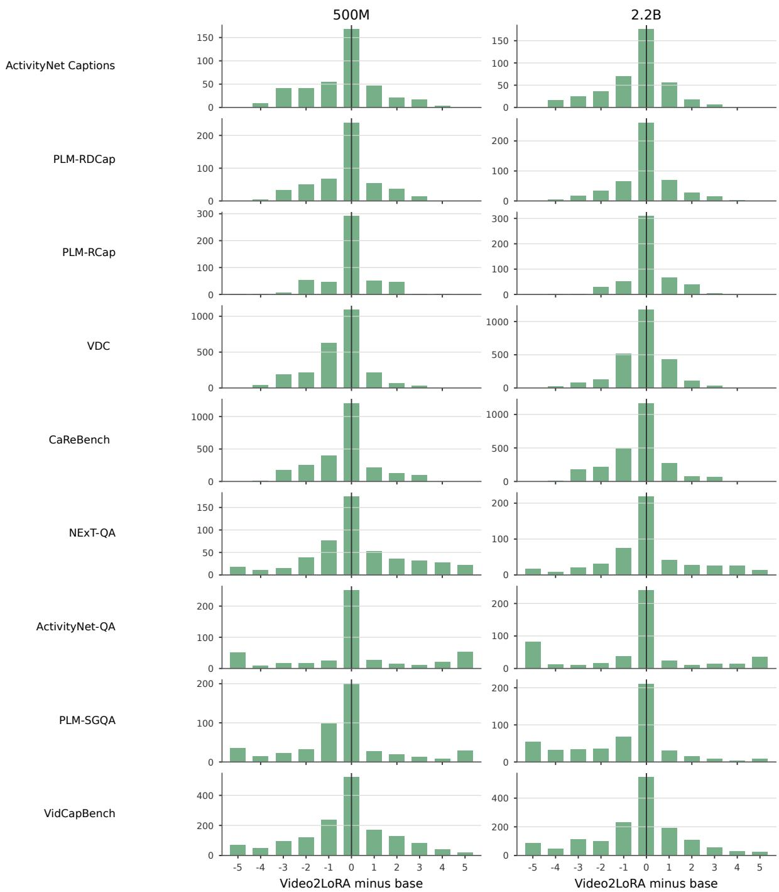  
Figure 10: Per-example LLM-judge score differences between VIDEO2LORA and the direct baseline.

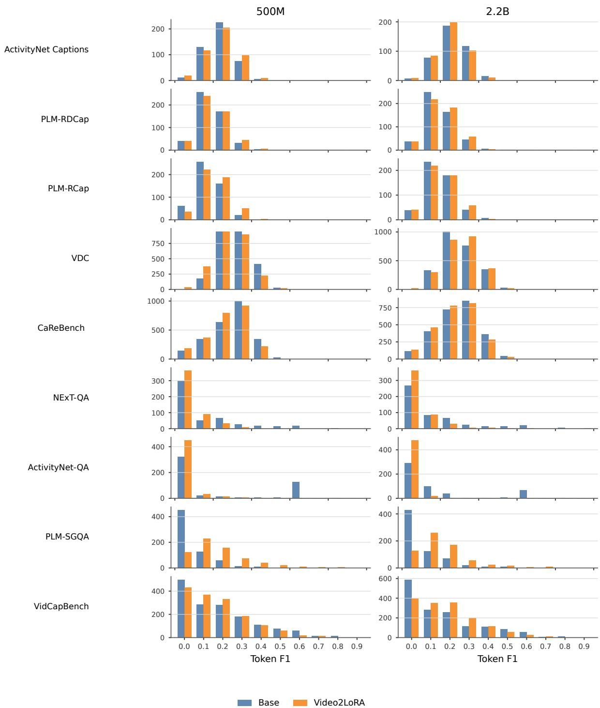

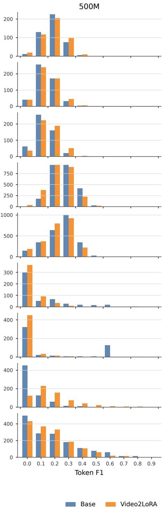  
Figure 11: Token-F1 distributions for the direct baseline and VIDEO2LORA.

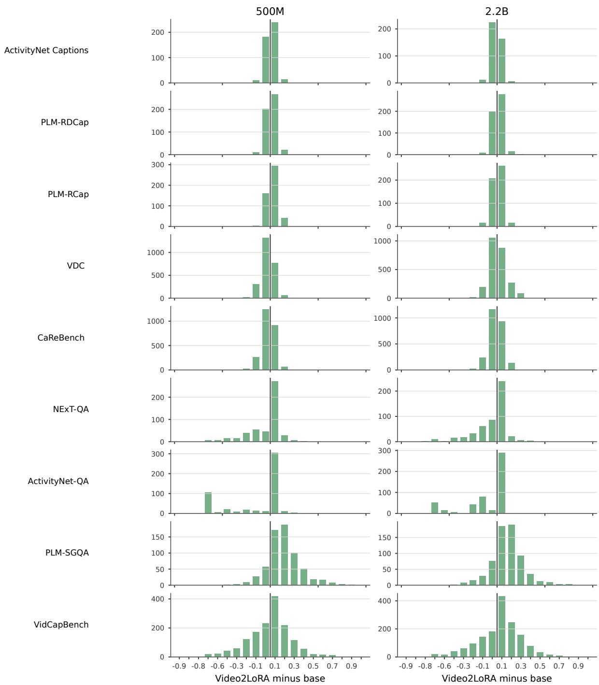  
Figure 12: Per-example token-F1 differences between VIDEO2LORA and the direct baseline.

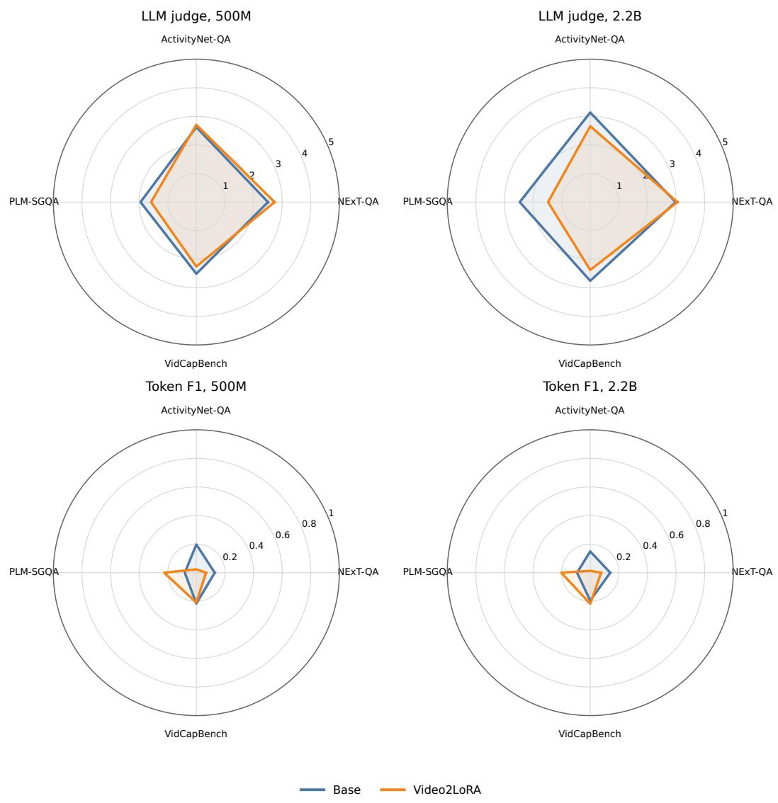  
Base Video2LoRA

Figure 13: Spider plot for video question answering benchmarks.

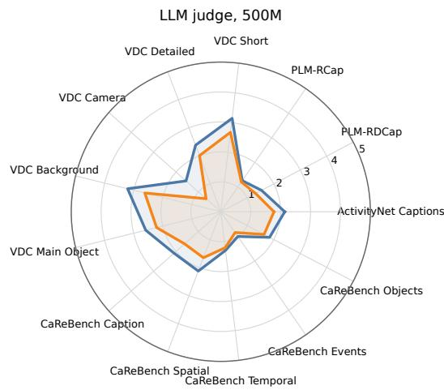

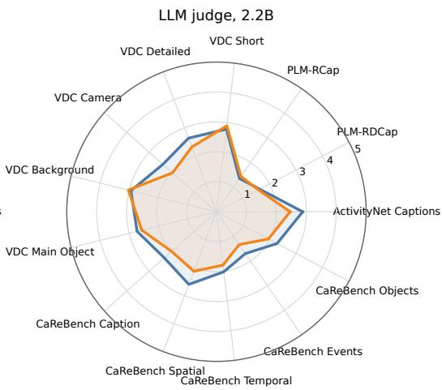

radar

| Category             | Value |
| -------------------- | ----- |
| VDC Short            | 3     |
| VDC Detailed         | 2     |
| VDC Camera           | 2     |
| VDC Background       | 3     |
| VDC Main Object      | 3     |
| CaReBench Caption    | 2     |
| CaReBench Spatial    | 2     |
| CaReBench Temporal   | 2     |
| CaReBench Events     | 2     |
| CaReBench Objects    | 2     |
| ActivityNet Captions | 3     |
| PLM-RDCap            | 2     |
| PLM-RCap             | 1     |

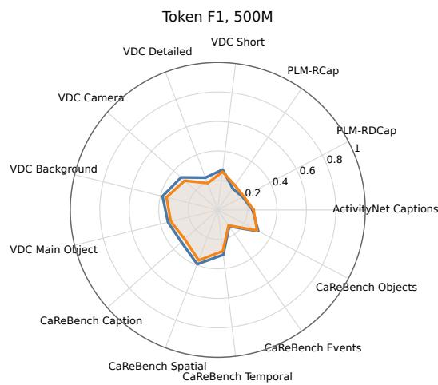

radar

| Category             | Value |
| -------------------- | ----- |
| VDC Short            | 0.3   |
| VDC Detailed         | 0.25  |
| VDC Camera           | 0.35  |
| VDC Background       | 0.4   |
| VDC Main Object      | 0.3   |
| CaReBench Caption    | 0.45  |
| CaReBench Spatial    | 0.5   |
| CaReBench Temporal   | 0.4   |
| CaReBench Events     | 0.35  |
| CaReBench Objects    | 0.45  |
| ActivityNet Captions | 0.3   |
| PLM-RDCap            | 0.25  |
| PLM-RDCap            | 0.3   |

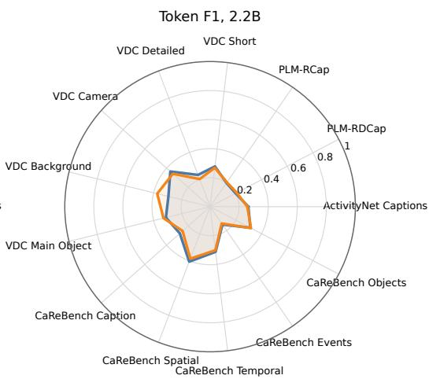

radar

| Category             | Value |
| -------------------- | ----- |
| VDC Short            | 0.3   |
| VDC Detailed         | 0.4   |
| VDC Camera           | 0.5   |
| VDC Background       | 0.6   |
| VDC Main Object      | 0.7   |
| CaReBench Caption    | 0.8   |
| CaReBench Spatial    | 0.9   |
| CaReBench Temporal   | 0.85  |
| CaReBench Events     | 0.75  |
| CaReBench Objects    | 0.65  |
| ActivityNet Captions | 0.55  |
| PLM-RDCap            | 0.45  |

Base Video2LoRA

Figure 14: Spider plot for video captioning benchmarks.

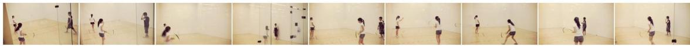

natural_image

Sequence of nine photos showing a person performing a tennis or gymnastics move, with no visible text or symbols.

# Describe what is happening in this video.

# Base model

Thevideo capturesa series ofinteractions and movements withina gymnasium,featuring two individualsengaged inagameof tennis.Initially，the scene isset inagymnasiumwithawhite walland aglasspartition,indicatingacontrolledenvironment.Thetwoindividualsoneinawhiteshirtanddark shorts,the other ina black shirtand shorts,are seen practicing or preparing fora game.They are positionedinthe centerofthegymnasium,withtheindividualinthe white shirt holdinga tennisracket and the other in the black shirt holdinga tennis ball.As the video progresses,the

0/5

# Vid2LoRA

The video showcases a tennis court with two individuals engaged in a match.The court is marked with whitelines,and theplayersaredressedin white shirtsand shorts.The player on theleft is holdinga tennisracketandappearstobepreparing toserve,whiletheplayerontherightisholdingatennisball and preparing to hitit.The scoreboard inthe background indicates that thematch isinitssecond set, withthe playeron the left leading1-0.Thevideo captures the players'movements andthe intensity of thematch,withthecoreboardprovidingevisuarepresentatinofthamesprogess.

0/5

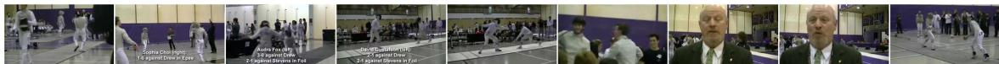

text_image

Collage of eight photos showing a person in various sports attire during a competition, with captions identifying players and matches.

#

# Base model

Thevideo captures a series ofintense moments in a basketballgame between the New York University (NYU)andtiteUetlyiski atransition orapauseintheaction.The focus then shifts toaplayer inawhitejersey with thenumber 30,whoiseeninaction,likelyinndefensivetreensiveplay.Theplayeriweeringwhitjeey withthenumber30andisinadefensivestance,withhishandsonhishipsandhisbodyfacingtowards theopposintem.Athevide

LLM Judge

3/5

# Vid2LoRA

The video begins with a black screen displaying the text “J.C.BROWN" and "J.C. BROWN" in white, followedbyJ.C.OWadJ.C.BOWinhiteithJ.C.BROWandJ.C.BOWnt llowedbyJ.CdJteJ white,followed

LLM Judge

3/5

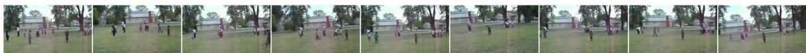

natural_image

Sequence of outdoor scenes showing people playing soccer on grass with buildings in background (no visible text or symbols)

# Describe what is happening in this video.

# Base model

The video captures alively scene of a group of children playing a game of hopscotch in a grassy area nearahouse,Initiall.thechildrenareseenrunningaroundthevard,withonechildintheforeground actively hopping.The backgroundrevealsaresidential neighborhood with houses,trees,andaroad, indicatingasuburban setting.Thechildrenaredressedincasual clothing,and the game isbeingplayed ina casual manner,withthechildrenactively participatingandmovingaroundtheyard.As the video progresses,thechildren continue toplay hopscotch,withsome childrenactively hoppingand others standing still.The

3/5

# Vid2LoRA

The video capturesa lively and energetic soccergame in progress on a grassy field.The players, dressed in various colored uniforms,are actively engaged in the game,withsomerunningandothers standing.Thefield issurrounded bytrees and houses,indicatinga suburbanneighborhood.Theplayers areseenkickingthe ball,running,andpassingitaround,with some playersattempting toscore goals. Theeusit astriped shirtandanother wearingared shirt.The childrenare seenrunningandplayingon the field, withsomechildrenstandingendothersrunning.Thevideo

4/5

natural_image

Sequence of eight photos showing a person performing a leg raise exercise, with no visible text or symbols.

# Describe what is happening in this video.

# Base model

The video showcases a womanperforming a series of exercises ona wooden floor.starting with a seatedpositionandtransitioningtoalvingpositionShebeginsbylvingonherback.withherlegs extendedandfeetflatonthefloor.Herarmsareraisedaboveherhead.andsheiswearingabright pinksportsbraandwhite leggings.Thebackgroundisaplainwhitewal,providinganeutralbackdrop thatallows the focus toremain ontheexercise.Asshe continues,she transitions intoaseated position withherlegsbentatthekneeandfeetflatonthefloor.Herarmsareraisedaboveherhead,

4/5

# Vid2LoRA

In the video,a woman is seen performing a series of exercises on a wooden floor.She is wearing a pink ttendwbteoianeeviderismiedideesom/dersetsondslikelyoor.leorisetop video.The womanstartsbylvingonherback.thentransitionsintoasplitpositionandfinallperforms seriesofexercises.The videois presentedinaclearand focuedmanner，withthewoman's movementsand thetext"video.com/dermot"visible throughout.

4/5

Figure 15: Qualitative examples from ActivityNet Captions.

# Base model

Acar.

0/5

# Vid2LoRA

The person in black clothes is standing in front of a sink with a green and white sign that reads "BREAKFASTand BREAKFASTwithapictureofa bowl of food.

1/5

# Base model

The person is using a stationary bike.

2/5

# Vid2LoRA

A man is using an exercise bike in a gym.

2/5

# Base model

The person is holding a pair of red shoes

3/5

# Vid2LoRA

A person in gray clothes is holding a bottle of shoe polish and a pair of shoes.They are also holding a red object,possiblya shoe brush.The personis talking tothecamera and explaining somethingabout the shoe polish and the shoes.

4/5

# Base model

Brown.

5/5

# Vid2LoBA

The biscuit is brown.

5/5

Figure 16: Qualitative examples from ActivityNetQA.

natural_image

Sequence of photos showing a person in orange shirt giving a haircut, with background screens and posters (no visible text or symbols)

# Describe the video in as much useful visual detail as possible. Include the mainactivity，visiblepeopleorobjects，scenecontext,appearance,andany importantvisualdetailsthathelpexplainwhatishappening.

# Base model

Thevideo depicts a grooming session in a hair salon.The setting is a wellit,modern salon with a varietyof hairproductsandstylingtoolsondisplayAyoungboyisseatedinchair，receiving haircut.The woman,wearing anorange cape,iscarefullytrimming hishair withapair ofscissors.The boy'shairisneatlycutandthewoman'scapeisneatlytiedroundhisshoulders.Thebackground featuresa variety of hair productsand styling tools,includingahairdryerandahairbrush.Thewoman isalsowearingablacktanktopandablackcap,

2/5

# Vid2LoRA

The video shows a woman in an orange shirt and a child in a black cape being shaved by a woman in a red shirt.The woman in the orange shirtis holding the child'shead andthe shaver,while the woman in thered shirt is holding the shaverand the child.The backgroundisa wel-lit room with various items and people in the distance.The woman in the orange shirt is wearinga black cape,and the child is wearinga black cape witha red and white design.The woman inthered shirt is wearinga red shirt with the Words "WELCOME BACK

1/5

text_image

Screenshot of multiple video frames showing a person holding a phone with text annotations describing their usage and usage patterns.

# Describe the video inas much useful visual detail as possible. Include the mainactivity，visiblepeopleorobjects,scenecontext,appearance,andany importantvisualdetailsthat helpexplainwhatishappening.

# Base model

The video features a person holdinga phone to their ear,with a text overlay indicating that the person needsthe time andtemperatureinAlton,linois.Theperson iswearingadark-colored shirt and appears to be inaroom witha light-colored wallanda window.Thephone is held intheir right hand, andthe person'slefthandis visible,holdingapen.Thebackground includesasignthatreadsLT'S TALK,sugestingsaoifoetinTsnsciaianddylanguge suggestthey areengaged inaconversation orpresentation

3/5

# Vid2LoRA

The video shows a person holding a botte of water in their hand, with the text overlay stating that if youareinthe20-25%of thepopulationthat is sweatinginthesummer，youshoulddrink1.5litersof waterperday.Theperson is wearinga white shirtandis inaroom withaposteron the wall.The video does not show any significant changes ormovements throughout the sequence.

2/5

natural_image

Sequence of eight photos showing hands interacting with a small object on wooden floor, no text or symbols visible

# Describe the video in as much useful visual detail as possible.Include the mainactivity，visiblepeopleorobjects,scenecontext,appearance,andany importantvisualdetailsthat helpexplainwhat ishappening.

# Base model

The video features a young boy sitting on a wooden staircase, meticulously tying the laces of a blue andwhitesneaker.He begins bytyingthe lacesaroundtheshoe's tongue,ensuringthey aresecurely fastened.Theboythenprieedstotiethelacesaroundtheshoe'sheel,kingsuretheyeerupely secured.The boycontinuestotie thelacesaround theshoe'stoe,ensuringtheyaresecurelyfastened. Thevideo captures theboy'scareful attentiontodetail as hemeticulouslyties the laces of the sneaker.

# Vid2LoRA

A young boyis siting on the floor,wearing a plaid shirt andred shorts,and is tying his shoes. He is usingapairofblueandwhitesneakers.Theboyisfocused onhis task,and thevideoshowshim meticulously tying the laces of his shoes.

4/5

natural_image

Sequence of photos showing a man gesturing in a modern office with desks and windows (no visible text or symbols)

# Describe the video in as much useful visual detail as possible. Include the mainactiity,lelectct importantvisualdetailsthathelpexplainwhatishappening.

# Base model

Aman wearingaplaid shirt is standing infront ofaglass door,holdinga tool.Heisusing the tool to tegrgtitaistn redandwhite stripedshirt.Thevideoissetinaclassroomenvironmentandthemanislikely demonstrating orexplaining something related to the glass door.

3/5

# Vid2LoRA

A man wearing a plaid shirt is standing in front of a window,looking out at a room with tables and Ahairs.Heisdingdng,tiojct,siblyareckeqipment,mndpes xamining itclosely.Theroomhasamdemdesignwithwhite wallsandaceilingwithrecessed lightingTemansmstobinthemroesdfinspectinrdemostratingelimethingeboutthe object he is holding.

4/5

Figure 17: Qualitative examples from CaReBench: Caption.

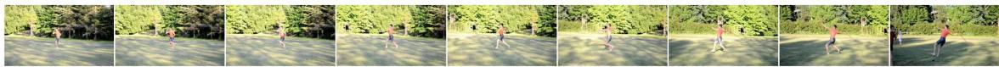

natural_image

Sequence of eight photos showing a person performing a stretching exercise on grassy ground, surrounded by trees (no text or symbols visible)

Describe the key visible events in chronological order. Include all important actionsandchangesyoucanobserve,with enoughdetailtodistinguish eacheventclearly.

# Base model

The video begins witha man in an orange shirt and black shorts running on a grassy field.He is seen runingtowardstheamerandthebackgroundfeatureslushgreenlandscape withtreesanda fence.Themanthen stopsrunningand starts performingajumpropeexercise.He beginsbyjumping upanddown,then transitions toaseriesof jumpsandtwists,showcasing hisagilityand coordination. Thevideo continues withthemanperformingaseriesofjumpsandtwists,maintaininghisenergetic and focused demeanor.

# Vid2LoRA

A man in an orange shirt and black shorts is running on a grassy field. He is performing a series of exercises,includingjumpingandrunning.Heisalso seen performingaseriesofexerciseswitharope.

0/5

text_image

RUSTED LEADERSHIP
for a
STRONGER AMERICA
RUSTED LEADERSHIP
for a
STRONGER AMERICA
RUSTED LEADERSHIP
for a
STRONGER AMERICA
RUSTED LEADERSHIP
for a
STRONGER AMERICA
RUSTED LEADERSHIP
for a
STRONGER AMERICA
RUSTED LEADERSHIP
for a
STRONGER AMERICA
RUSTED LEADERSHIP
for a
STRONGER AMAICA
RUSTED LEADERSHIP
for a
STRONGER AMERICA
RUSTED LEADERSHIP
for a
STRONGER AMERICA
RUSTED LEADERSHIP
for a
STRONGER AMERICA
RUSTED LEADERSHIP
for a
STRONGER AMERICA

Describe the key visible events in chronological order. Include allimportant actionsandchangesyoucanobserve,withenoughdetailtodistinguish each eventclearly.

# Base model

The video begins with a man standing in front ofa large crowd,addressing them with a serious expression.Heis dressed inadark sweaterandjeans,and the background featuresa large banner with thetext"TRUSTEDLEADERSHIPforaSTRONGERAMERICA"and“JEB2016.COM.ThecroWd isengaged, with someindividualsclapping and others looking towardsthe man.Theman then turnsto face the camera,maintaining hisseriousexpression.The scene transitionstoaclose-upoftheman,whoisnow wearinga brownsweaterandjeans

# Vid2LoRA

The video shows a man in a brown sweater and blue jeans standing on a stage in front of a blue backdrop with the words"SERVICE TO EVERYONEand the logo of the American Leadership in Leadership.He isspeakingtoanaudience,gesturing with his handsashe talks.The audience is seated inrows ofchairs,and there are several people standingin the background,some of whomare clapping. Themanstageiswearingamicrophoneandthereisn signinfrontofhimthatreadsSERVICETO EVERYONE."The video also showsa group of people standingin front ofa blue

2/5

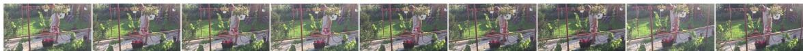

natural_image

Sequence of eight photos showing a person planting trees in a garden, with no visible text or symbols.

Describe the key visible events in chronological order. Include allimportant actionsandchanges youcanobserve,withenoughdetail todistinguish eacheventclearly.

# Base model

A man is standing in a garden,surounded by various plants and flowers.He is holding a watering can Adwateringtheplnts.Thenrdeniswell-maintainedandhndredfenceinthebackground.The man is wearing a white shirt and shorts.

# Vid2LoRA

A man is standing in a garden, holding a potted plant. He is wearing a white shirt and patterned shorts. Thardenisdilledwithvariuplantsandtewerstdtheeearredbucketsndothergerdening tools scattered around.Theman appears to be tending to the plants,possibly watering them or pruning them.

4/5

natural_image

Sequence of eight photos showing children watering potted plants in a garden, no text or symbols visible

Describe the key visible events in chronological order. Include allimportant actionsandchangesyoucanobserve,withenoughdetailtodistinguish eacheventclearly.

# Base model

Ayoung child is seen watering plants ina garden,Thechild is wearing a white tank topand blue shorts. Theggdeniledithveinlantsncludinegeottedpantwithreenleavandler potedplentwithyelowVeves.TechildisusingbluepateringantowgtertheplentsThevidle concludes withthechild standinginthe garden,surrounded bytheplantsandthe watering can.

3/5

# Vid2LoRA

A young childis seen wateringplants inagarden,Thechild is wearinga white tank top with yelow trim Andblueshorts.Tearderisilledwitvrioplntsndfoweriandthechildisusingblue watering snto Wntertheplants.

4/5

Figure 18: Qualitative examples from CaReBench: Events.

natural_image

Sequence of eight photos showing hands washing or cleaning a basin, no text or symbols visible

Describe the important visible objects and entities in the video in as much useful detail aspossible.Include theirappearance,location,and role in the scenewhenvisible.

# Base model

The video depicts a series of scenes involving a person washing their feet in a large,dark basin. Initially,thepersonisseenstandinginfrontofamrror,holdingatowel,andpreparingtowashtheir ftTterinteteo scenetransitions toa close-up ofthe person'sfeet being washed,withtheclothstillinuse.Theperson thenstandsin front ofthe miror，holdingthe towel,and continues to wash theirfeet.Thefinal scene showsthepersonstandinginfrontof themirror,holding thetowel,and washing

0/5

# Vid2LoRA

The video shows a person washing their feet ina bathtub filled with water.The person is wearing blue jeansand is seen lathering their feet withsoap.The wateris clear,and the person's feet are wet.The personisalsowearingrblueshirt.ThebackgroundincludesatiledwallndewoodentableThe personisseen lathering theirfeet with soap,and the video shows the person's feet being washed.

0/5

natural_image

Sequence of eight photos showing a child in a white shirt interacting with a toy, possibly playing basketball or playing equipment (no visible text or symbols)

Describe the important visible objects and entities in the video in as much useful detailaspossible.Includetheirappearance,location,androleinthe scenewhenvisible.

# Base model

The video features a young child dressed in a white sweaterand dark pants,standing in a room with a wooden flooranda bedwitha white andredfloral-pattemed blanket.The child isseenadjustinga pair of black pants on the bed,which are neatly folded and placed on the bed.The child then proceeds to pickupppairofblackpantsfromthebedandplacesthementhefoor,indicatingathasualandplayful pitivityTehildntinuttpicuptebackttmvingthemarndtheodtaly placing themonthebed,completingthsk

2/5

# Vid2LoRA

A young boyis siting on the floor in a room with a bed covered in ared and white pattemed blanket Heiswearinga white sweaterandblack pants.Theroomhaswoodenflorboardspndeweoden wall. Thebosioldingblackbaandappeprstobrganiingrpackingit.Hethenmovetoadiferent partofthe room,where he is sitingona wooden floor.Heis wearinga white sweaterand black pants. Theroom has wooden floorboardsanda wooden wall.The boyisholdingablack bag andappears tobe organizingorackingit.Hethenmovestoadieferentpart ofthe

3/5

natural_image

Sequence of eight photos showing children watering plants in pots, no text or symbols visible

Describe the important visible objects and entities in the video in as much usefuldetail aspossible.Include theirappearance,location,androleinthe scenewhen visible.

# Base model

A young child is seen watering plants in a garden.The child is wearing a white tank top and blue shorts Thegnrdeniflledithverinantsincludingeottedplantwithgreenleaveander potted plant with yelowleaves.The childisusingablue wateringcanto water the plants.The videois setoutdoors,with a concrete surface and a stone wallin the background

LLM Judoe

4/5

# Vid2LoRA

A young child is seen watering plants in a garden.The child is wearing a white tank top with yellow trim and blue shorts.The garden isfilled with various plantsand flowers,and thechildis seen watering the plants with a blue watering can.

4/5

natural_image

Sequence of hands slicing and chopping green vegetables on a wooden surface, no text or symbols visible

Describe the important visible objects and entities in the video in as much usefuldetail aspossible.Includetheirappearance,location,androle inthe scene when visible.

# Base model

A person is preparing a dish by chopping green onions on a wooden cutting board.The person uses a knife tocutthegreen onions into smallerpieces.The green onions are then placed onaplate.

4/5

# Vid2LoRA

The video showsa person slicing green onions ona wooden cutting board,The person is wearing ared shirtandisusingaknifetocutthe onions.The onionsaresliced intothinrounds,andtheperson is seen cuting them into smallr pieces,The video shows the person slicing the onions into smaller pieces,withthe onions beingcutinto smallerrounds.Thepersonisseen cutting the onionsinto smaller pieces,withthe onionsbeing cutinto smallerrounds.The person isseencutting the onions intosmale pieces,withthe onionsbeing cutinto smallerrounds.The personisseen cutting the onions intosmale pieces,with the onions being cut into

5/5

Figure 19: Qualitative examples from CaReBench: Objects.

natural_image

Sequence of eight photos showing a person in blue shirts on a tennis field, with no visible text or symbols.

# Describe the temporal progression in as much useful detail as possible. Explain what happens over time,the orderof visible actions,and how the scene orsubjectschange from the beginningto theend.

# Base model

The video begins witha man ina blue shirt and beige pants standing on a track,preparing fora race. Hethenrunsdownthetrack,passing byotherathletesand spectators.The scenetransitionstoagroup ofathletes in blueand yellow uniforms preparing forarace,with somerunningand others sitting on thetrack.Thevideo then showsaman inared shirtand beige pants standing ona track,observing the athletes.The scene shiftstoaman inared shirtand beige pants standing onatrack,observing the athletes.The video concludes with a man in a blue shirt and beige

0/5

# Vid2LoRA

The video shows a group of athletes in a large indoor sports facility,possibly a gymnasium, with a red floorand white lines marking the boundaries.The athletes are dressed in athletic gear,including shorts,t-shirts,and shoes,and are seen running,jumping,nd performing various athletic activities The facility is wel-lit,and thereare spectators seated in the background,watching theevent.The athletesare seen in diferent positions,some standing，others running,and somejumping.The vided captures the athletes in various stages of their performance,from standing to running,jumping,and performing various athletic activities.The facility is

0/5

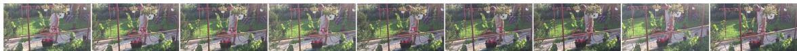

natural_image

Sequence of eight photos showing a person in a garden setting, viewed from above (no text or symbols visible)

# Describe the temporal progression in as much useful detail as possible. Explainwhathappensovertime,theorderofvisibleactions,and howthe scene orsubjectschange fromthebeginningtotheend.

# Base model

The video begins with a person standing in a garden,holdinga potted plant.They are surrounded by various plants and flowers,and the background featuresared fenceandagarden bed.The personis thenseen watering theplantsin the garden,which includesalarge pot withredflowers anda smaller pot with green plants.The scene transitionstoa close-up of theperson's hands as they pick upa pottedplant fromthe garden bed.The video thenshows the personstanding in the garden,holdinga pottedplantndoinaeitTeinenetesosdinginthrdening

3/5

# Vid2LoRA

A manis standing in a garden, holding a potted plant. He is wearing a white shirt and light-colored shorts.The garden isfiled with various plantsand flowers,and there are red buckets and other gardeningtools scatteredaround.Themanappearstobetendingtothe plants,possiblywatering them orpruning them.

3/5

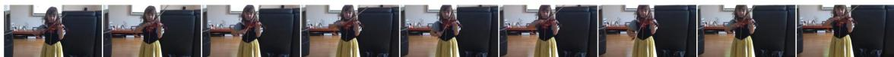

natural_image

Sequence of eight photos showing a child in yellow dress holding a violin, standing indoors with black background (no text or symbols visible)

# Describe the temporal progression inas much useful detail as possible. Explainwhat happensovertime,theorderof visibleactions,and howthe scene orsubiectschange fromthebeginningtotheend.

# Base model

Thevideo begins withayoung girlplaying theviolininacozylivingroom.She is dressed ina yellow skirtanda black top,and herhairis tied back.Theroom isdecorated with pink baloonsandawindow withaviewofacityscape.Thegirlis focusedonhermusic,andthecameracapturesherplayingthe violinwithprecisionandgrace.Thesenedevelopsastheginlcontinuestoplay,andthebackground remainsconsistentwiththesmeroomanddecorations.Thevideoconcludeswiththegirlstillplaying theviolin,mintaningtsmeettingandatmosphr.

# Vid2LoRA

A young girlis playing a violin ina room witha Christmas tree in the background.She is wearing a yellowdreandablack skirt.TheroomhasaChristmastree,ncouch,anda window withacurtain. The girlis playingthe violinwithherhandsonthe strings.

4/5

natural_image

Sequence of eight photos showing a band performing on a drum with fans and recorders, no visible text or symbols

# Describe the temporal progression in as much useful detail as possible. Explainwhathappensovertime,theorderofvisibleactions,and howthe sceneorsubjectschange fromthebeginningtotheend.

# Base model

The yideo begins with a person plaving a drumset,wearing a hat and a bandana,and adrum set is visibleinthebackaroudTheneraynisseennlavingthedrumawiththedrumdtnositionedinfront ofthem.Thescenethentransitionstoadiferent setingwherethepersonisnowplavingakeyboard. Thevideothenshowsthepersonplayingaguitar,withtheguitarplacedonatand.Thevideo concludes with the person playinga guitar,with the guitar placed ona stand

3/5

# Vid2LoRA

The video shows a drummer playing a drum set in a room with a blue wall.The drummer is wearing a hat anda black shirt.Thedrum setincludesasnare drum,a bass drum,anda hi-hat.Thedrummer is nltvindtritissetndeteTieodsomsn-tnee scene or the drummer's actions over time.

4/5

Figure 20: Qualitative examples from CaReBench: Temporal Caption.

natural_image

Sequence of photos showing a child playing with teddy bear toys on a blue platform, no text or symbols present

where is the toy sitting at Answer with a short phrase.

# Base model

toy,

4/5

# Vid2LoRA

The toy is siting on the floor.

1/5

natural_image

Sequence of photos showing a baby being held by an adult, with no visible text or symbols

why does the baby take the item from the lady in grey beside her Answer in

asingle sentence.

# Base model

toeatit.

4/5

# Vid2LoRA

Thebabytakestheitemfromtheladyingreybesideherbecausetheladyingreyisholdingapieceof food in her hand.

3/5

natural_image

Series of medical photos showing newborns, infant care, and newborn baby care (no visible text or symbols)

why is therea piece of tissue in front of the baby Answer in a single

sentence,

# Base model

To clean the baby's face.

3/5

# Vid2LoRA

Thevideoshowsababybingfedwithabotleandapieceoftissueisplacedinfrontfthebaby

4/5

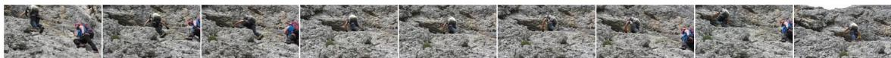

natural_image

Sequence of eight photos showing workers in a rocky, vegetated terrain, no visible text or symbols

what does the man above hold onto while climbing up Answer with a short

phrase.

# Base model

rope.

5/5

# Vid2LoRA

Theman holdsontoarope whileclimbing up.

5/5

Figure 21: Qualitative examples from NExT-QA.

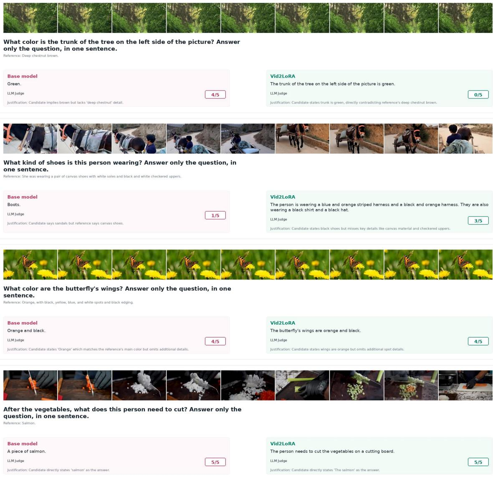

# Base model

Green,

4/5

# Vid2LoRA

Thetrunk ofthetreeontheleft sideofthepictureis green

0/5

# Base model

Boots.

1/5

# Vid2LoRA

The person is wearing a blue and orange striped harness and a black and orange hamess.They are also wearingablack shirtandablack hat.

3/5

#

Orange and black.

4/5

#

The butterflv's wings are orange and black.

4/5

#

5/5

#

The person needs to cut the vegetables on a cuting board.

5/5

Figure 22: Qualitative examples from VidCapBench.

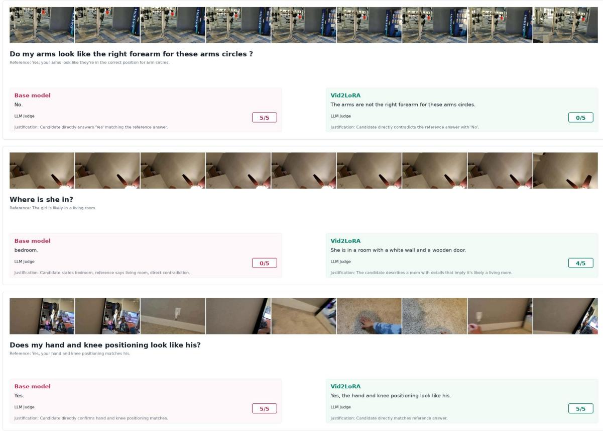

# Base model

No.

5/5

# Vid2LoRA

The arms are not the right forearm for these arms circles.

0/5

# Where is she in?

# Base model

bedroom.

0/5

# Vid2LoRA

She is in a room with a white walland a wooden door

4/5

# Base model

Yes.

5/5

# Vid2LoRA

Yes,the hand and knee positioning look like his.

5/5

Figure 23: Qualitative examples from PLM SGQA.

natural_image

Interior view of a supermarket aisle with shoppers and shoppers browsing products (no visible text or signage)

Describe what happens in this video clip.

# Base model

Thevideo capturesa bustlingscene inside a vibrant toystore,showcasing the diverse aray of products andthelivelyatmosphere.Initially，awomaninablackhijabandamaninabrownjacketareseen walkingthroughthestore,withthewomancarrvingablueshopping cart,Thestore iswelit.witha variety of colorful toysand merchandise displayed on shelvesandin bins.The womanandthemanare seeninteracting with each other,possiblydiscussing the products orengaginginaconversation.As the video progresses,the focus shifts toadifferent section of the store,wherea woman ina black hijab

0/5

# Vid2LoRA

The video showcases a bustling toystorefilled with various toys and games.The store is welt,with brightlights illuminating the shelvesandthefloor.Theshelvesare stocked witha variety of items, including toys,games,and othermerchandise.There are people walkingaround the store,some of whomare browsing the shelves while othersare looking at the products.The store is clean and organized,witha variety of products ondisplay.The video captures the livelyatmosphere of the store with peoplemovingaroundandinteracting withtheproducts.

0/5

natural_image

Sequence of nine photos showing a person in green dress and white shirt standing indoors, with bicycles and floor equipment in background (no visible text or symbols)

Describe what happens in this video clip.

# Base model

Thevideo capturesa scene ina residential area,likely in India,wherea woman ina vibrant green traditional dress isseencleaningadirtyfloor.The woman,dressedinacolorful,patterneddresswith intricate designs,is seen walking towardsawhiteplastic bag on the floor.Sheis accompanied bya child,dressedinwitetshirtandbluesortwhoisasogeenintowadstebg.ewoman isseen picking upthe bag,whichis placed onthefloor,andthen proceeds toclean the floorwitha blue plastic brush.The floor is covered in dirt and debris,indicatinga neglected or

# Vid2LoRA

In the video,a woman ina colorful sari is seen walking towards a man ina green shirt and shorts.They areinaroomwithablue tarpandabicycleinthebackground.The womaniscarringabluebagand appears to be looking at theman.Theman is standingin front ofa white wallwithablack bag on it. Thewomanthen walksaway fromthemanandthecamerafolows heras shemovestowardsablack bag on the floor.

2/5

natural_image

Group of people in a city street, some using strollers and others with motorcycles, no visible text or symbols

Describe what happens in this video clip.

# Base model

In the video,a person wearing a black hoodie with apink elephant design and a black beanie is walking downabusystreet.Thestreetislined withvariousshopsandbuildings,andthereare people walking around,some of whomarecarrying shopping bags.The person is seen holdingapink phone in their hand,posiblytaingotoorvideo.Thevideocpturesthepersonwakingdownthestreet,with the camera following them astheymove forward.

3/5

# Vid2LoRA

The video shows a person walking down a busy street in a city. The person is wearing a black hoodie witha pink unicom design anda black scarf.The street islined with buildings and cars,and thereare people walking in the background.

4/5

natural_image

Sequence of photos showing a dog interacting with colorful balloons and toys, no text or symbols visible

Describe what happens in this video clip.

# Base model

Thevideocapturesaplayfulinteractionbetweenagoldenretrieverandagreenbaloontoy.Initally, thedogis seen holding the balloon initsmouth，withits front paws restingona wooden surface.The dog'sgtetionenthealonichsitioedosetoitcetedeoprce thedog'smouthmovestowardstheballoonanditbeginstoplavwithitbvpullingittowardsitsmouth. Thedog'sodylnguagesuggestsitisenjyingthetoy，withitsfrontpawsextendedtowardsthe bllonTesetensftstseutheog'sce,

5/5

# Vid2LoRA

In the video.a smalldog isseenplaving withabunchof colorfulballoonsona wooden flor.Thedogis initiallyseen holdinga green baloon,whichis thenremoved fromitsmouth.Thedogthenpicks upa Initaaylseenhdldingagreenbaloon,wtichsthehremovedromitsmouth.edogthenpicshe ballonsbeingmovedaroundandthedog'sheadbeingtumedtodiferentdirections,Thebackground isaplain wooden floor,and thereareno otherobjects orpeople visible in the scene.Thedog's actions suggest thatit isenjoying the activityandis having fun.

5/5

Figure 24: Qualitative examples from RCAP.

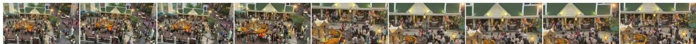

natural_image

Series of seven outdoor scenes showing a crowded market or festival with tents and stalls, no visible text or signage.

Describe what happens in this video.

# Base model

The videocaptures a lively outdoorevent,likelya festival or fair，withalarge crowd gathered around a centralstructure.The structureisadorned withornatedecorations,includingalarge goldenstatueand colorfulfloalrgemntTecowdisvrseithpeopledressedinriouscolorsdcaig festiveatmospereTeventistakingplainabustlinurbaeeawithbuildingandveicle visibleinthebackground.Thelightingisbright,suggestingitiseitherearlymorningorlateafternoon. Thevideo providesacomprehensiveviewof the event,showcasing the vibrantandcolorful atmosphere.

0/5

# Vid2LoRA

The video showcases a vibrant and bustling festival scene,likely taking place in a large indoor venue. Theatmosphereislively,with people of variousagesand genders gathered aroundalarge,omate structure adomed with golden decorations.The structure is surrounded by a crowd of people,some of whomare standingandothersare seated,allengaged inthe festivities.Theenvironment is well-lit, withnaturallightilluminatingthescenefromabove.Thevideocapturestheessenceofafestivelvent, withthecrowd'smovement andthe structure's intricatedesigncreatingadynamicand engaging visual experience.

0/5

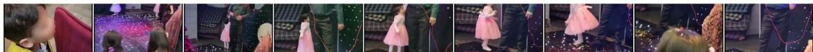

natural_image

Sequence of children performing on stage with colorful lighting and stage equipment (no visible text or symbols)

# Describe what happens in this video.

# Base model

The video capturesa livelyand festiveevent,likelyabirthday celebration,whereayoung childdressed ina pink dress and a childinawhite dressare themain subjects.The child in the pink dress is seen holdingamicrophone,whilethechildinthewhitedress isholdingapink dress.Thechildinthepink dress is thenseendancingenergetically,while thechildinthe whitedress stands nearby,possibly observingorparticipating inthecelebration.Asthevideo progresses,the childinthepinkdress is seen dancingenergetically,whilethechildinthe whitedress continuestostandnearby，possiblyobserving or

2/5

# Vid2LoRA

The video begins witha young boy ina yellow shirt and blue pants standing in front of ared curtain, holdingamicrophone.He appears tobesinging or speakingintoit.Thescene thentransitionstoa differentsetingwhereayounggirlinapinkdressisstandinginfrontofamicrophone,alsoholdinga microphone.The background shows a stage with a red curtain and a few people standing around.The girl is singing or speaking into themicrophone.The video then showsayoung boyina blue shirt and blackpnttadinginrontofmrope,ldiemicee.Heearstesingir speaking into it.The background

3/5

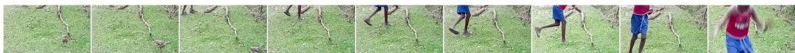

natural_image

Sequence of eight photos showing a person running on grass, with no visible text or symbols

# Describe what happens in this video.

# Base model

The video capturesa young boy engaging inaplayfulactivity ona grassy area.Initially,theboy is seen running towardsatree,which ispartially visibleinthe background.As he approaches thetree.he bendsdowntopickupastick,indicatingapossiblegameoractivityinvolvingthestick.Theboy then standsupandcontinuestopickupthestick.occasionallylookingaroundandmovingslightly.Asthe videoprogresses,theboycontinuestopickupthestick,occasionallylookingaroundandmoving slightly.He thenbendsdownagain,pickingupastickandcontinuingtopick itup,maintainingaplayful and energetic

4/5

# Vid2LoRA

In the video,a young boy is seen running towards a tree in a grassy area. He is wearing a red shirt and bluesorts.Ashepprochesthetre,etopndbeginstlimbit.Tetreealge,thicktrunk andafewbranches.Theboy continues toclimbthe tree,eventually reaching the top.Hethen stands onthetree andlooksaround,possibly observing his surroundings.The video does not show any other people oranimalsin thearea.

4/5

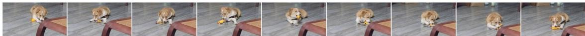

natural_image

Sequence of eight photos showing a dog eating and eating with food, placed on a wooden bench (no text or symbols visible)

# Describe what happens in this video.

# Base model

Thevideo capturesa scene ina room flled with various items,including a wooden table,a greenplant andapair of shoes.Asmalldog,likelya Pembroke,isseen lying on thefloor,chewing onayellowtoy Thedog'satentioniscapturedbythetoywichispositionedclosetothecmera.Teroomiswell-lit andthe dog's actions suggesta playful and curious behavior.The video providesa glimpse into the dog'sdailylifeshowcasingitsplayfulandcuriousnature.

4/5

# Vid2LoRA

In the video,asmalldog is seen playing witha yellow chew toy ina room with a tiled floor.The dog is brownand white,anditis holding the toy initsmouth.Theroom hasa beige wallanda gray floor.The dognpedrstiteenjyingthetoydiovingaroundte

LLM Judge

5/5

Figure 25: Qualitative examples from RDCAP.

natural_image

Sequence of eight photos showing a person adjusting equipment in a vehicle cabin (no visible text or symbols)

Describe the background,setting,and environment in this video.

# Base model

The video showcases a construction site where a person is working on a wall using a hammer and a level toensure the wallislevel andtheceilingis properlyaligned.Theperson iswearinga blue shirt andisseen usingahammertotapthe wallintoplace,indicating theprocess of installngaceiling.The environmentisa wel-litarea withawindowandadoorvisibleinthebackground,suggesting thatthe constructionistakingplaceinWresidentialorommercialbuilding.Thepersonisseenusingalevelto ensurethewallislevel,andthecameraprovidesatop-down viewoftheconstructionsite,highlighting the

# Vid2LoRA

A man is working on a wallinaresidential building.He is usinga tool to clean the walland heis also usinga ladder to reach higher areas.Theman is wearinga blue shirt and beige pants.The wallhasa holeinit,and there isa window inthe background.

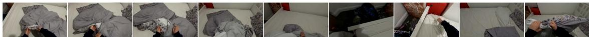

natural_image

Sequence of eight photos showing a person adjusting a blanket in a bedroom, with no visible text or symbols.

Describe the background,setting,and environment in this video

# Base model

The video begins withaperson folding agray blanket,showcasing the texture andpattern of the fabric. Thescene transitions toa close-up of a person's hands,which are seen folding a gray blanket witha floralpattem.The person thenproceeds tofolda white blanket,which isplaced onabed.The focus shifts toa close-up ofaperson's handsfoldinga gray blanket,with the background showingawhite bedwithafloral pattemandared wallTheperson continuesto fold the blanket,withthebackground remaining consistent.The video then showsa close-up of aperson's hands folding

2/5

# Vid2LoRA

A person is folding a blanket ona bed.The blanket is white and has a pattem of small squares.The personis folding the blanket ina way that shows thepattern.The bed hasa gray blanketanda white pillow.The person isalso foldinga gray blanket on the bed.

2/5

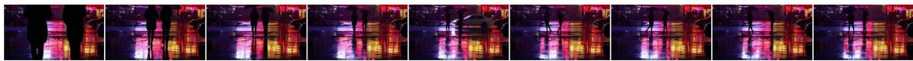

natural_image

Sequence of eight photos showing a person standing in front of illuminated lanterns with red and yellow hues, no visible text or symbols.

Describe the background,setting,and environment in this video.

# Base model

The video captures a nightime scene ona wet street,illuminated by the glow of streetlights and the reflectionsof lightsonthe wetpavement.The sceneisdominatedbythe silhouetesoftwoindividuals walking side byside,each holdinganumbrella.suggesting they areeither walking or waiting for someone.Thewetpavementreflects the vibrantcolorsofthenight,creatingadynamicanddynamic visualeffect.Theenvironmentisbustlingwithactivity.withcarsandbuildingsvisibleinthe background,adding to the urban atmosphere.The video concludes with aclose-up of the two individualsintiettetettoc

4/5

# Vid2LoRA

The video shows a nightime scene with a wet street lit by streetlights.The street is filled with people walkingand standing,some of whomare holding umbrellas.The skyisdark,and theoverall Wtmospheresnen,anynght.

4/5

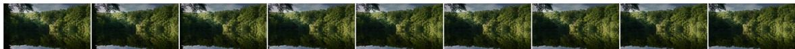

natural_image

Sequence of eight frames showing a forested landscape with water reflection (no text or symbols)

Describe the background, setting,and environment in this video.

# Base model

Thevideo showcases a serene,natural setting with a tranquil lake surrounded by lush green trees.The skyispartlycloudyand the lightissoftand difused,creatingacalmand peacefulatmosphere.The reflection of thetreesnd sky on the water'ssurface addsdepthand dimensiontothescene.The reallenvironmeeisadm,ithnisiblemnectivityphem,empsiingenteuility of thenatural seting.

5/5

# Vid2LoRA

The video showcases a serene and picturesque scene of a forest with talltrees and a calm body of Water.Thewateisadepblue,eflectingtheesrrndinggreeteryandcreetingamirolikefect. Theeskyie wereriadstinueftlightingtrhteeusrenTegreenerylusndingamwithime displayingvmixofgreenandyellowleaves,indicating thechangingsesons.Thenerallatmospee is oneof tranquilityandnaturalbeauty.

5/5

Figure 26: Qualitative examples from VDC Background.

natural_image

Sequence of eight photos showing a young boy in a light blue shirt playing soccer on the floor (no text or symbols visible)

Describe the camera work, framing,and viewpoint in this video.

# Base model

The video featuresa child engaged ina creativeactivity,likelydrawing or coloring,ona rug.Thechild isseated onthefloor，wearingalight blue polo shirtanddark pants,withasoccerballand othertoys nearby.The child's handsareactively involved intheactivity，usinga variety of coloredmarkers to createa colorfuldesign ona whitepiece of paper.The camera captures the child'smovementsand the designbeingcreated,providingaclerviewofthechild'sctionspandtheenvironment.

3/5

# Vid2LoRA

A young girlis sitting on the florin a living room,surrounded bya soccer ballanda colorful toy,Sheis wearingligtbueshirtanddarkpantsThegirlisholdingmarkeranddrawingonapieceofaper.

0/5

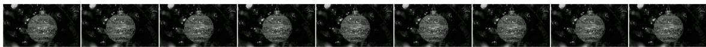

natural_image

Sequence of eight grayscale images showing a circular object with internal patterns, possibly a decorative ornament or decorative item (no text or symbols)

Describe the camera work, framing,and viewpoint in this video.

# Base model

Thevideo begins with a close-up shot of a Christmas ornament,showcasingits intricate design and sparklingsequins.TheornamentissetagainstablurredbackgroundofChristmaslights,creatinga festive atmosphere.Thecamera then zooms inon the ornament,highlighting itsdetailed design and thesparklingsequinsemphasizingtheormament'scraftsmanship.Thefocusremainsontheornament asthecamera continues to zoomin,providingadetailed viewofits intricate designand sparkling sequins.The background remains blurred,maintaining the festiveambiance.The camera then zooms sutslightyeealingreftheCsttrenthsuoudindtmt

2/5

# Vid2LoRA

Thevideo featuresacloseupofaChristmasornament,whichisalargeornateanddetailedpieceof jewelry.Theomamentismadeofashiny,reflectivematerialandisadornedwithapatternofmall, sparkling beads.The background isadark,starry night sky，whichaddsa festiveatmosphere tothe scene.Thelightingissoftanddifused,creatingadreamyeffect.Theornamentisthemain focusofthe video,and thereareno otherobjectsor people visibleinthe frame.The videodoesnotcontainany text or additional information.

3/5

natural_image

Sequence of hand typing on a laptop keyboard (no text or symbols visible)

Describe the camera work,framing,and viewpoint in this video.

# Base model

The video begins witha close-up of a person's hands typing onalaptop keyboard, with the focus on the handsandthe keyboard.Thecamera thenshiftstoawider shot,revealingthe person'supperbodyand taptp'e,icsd.etrit,fte'sdtn onthekeyboardagain,withthefocus onthehandsandthe keyboard.Thevideo thenshowsa close-up oftheperson'shandstypingonthekeyboard,withthefocusonthehandsandthekeyboard,Thevideo concludes with a close-up of the person's hands

3/5

# Vid2LoRA

The video shows a person's hands typing on a laptop keyboard.The person's hands are shown in close-deshots,withthefocuandtheinger astheyprethekeys.Thesbackgrondndis darkandthe lightingisfocusedonthehandandthekeyboard.Thevidedesntshowanyotherobjectar people,and theperson'sactionsare themain focus.

4/5

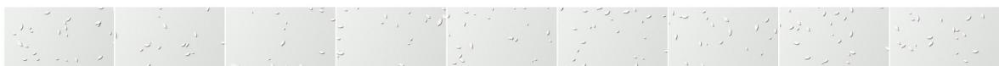

natural_image

Sequence of seven grayscale images showing a sequence of objects with no visible text or symbols

Describe the camera work, framing,and viewpoint in this video.   
Refeece

# Base model

The video begins with a close-up ofa white,leaf-like object on a light gray background,which gradually becomesmoredetailedandanimated.Theobectappearstobealeaf,withasmooth,curvedsurface andapointedtip.As the videoprogresses,the leaf-like object isshown invariousstagesofanimation, includingclose-upofaleafwithapointedtipelefwithacurvededgeandaleafwithapointedti andacurved edge.The leaf-like objectis then shown ina moredetailed view,witha textured surface andapointedtipandisfurther

3/5

# Vid2LoRA

The video begins with a plain white background, where a single pink leaf is seen floating in the air. As thevideoprogresses,theleafstartstomove,creatingasenseofmotion.Theleafthenbeginstofloat intheair.and thebackground becomesagradient of lightand darkcolors,creatingadreamy

Intmsph.Theleafcontinudseometintadierandtheanckgroundemieatinadirtoflightand dark colors,creatingadreamyatmosphere.Theleaf continues tofloatin theair,andthe background remainsagadientoflightanddark colors,creatingadreamyatmosphere.Theleafcontinuestofloat in the air

5/5

Figure 27: Qualitative examples from VDC Camera.

natural_image

Abstract blue geometric pattern with no text or symbols

# Describe this video in detail.

# Base model

The video begins witha series of blue,rectangularshapes that gradually become more defined and interconnected,creatingacomplex,abstractpattem.The shapesare arrangedinaseeminglyrandom order,withsome overlappingand othersformingdistinct lines.As thevideo progresses,theshapes become moredefined,and the lines between them becomemore pronounced,eventually forminga grid-likepattem.The video thentransitionstoa blue,abstractbackgroundwitha grid-likepattern, which gradually becomesmore defined and complex,eventuallyforming a grid-likepattem witha grid of blue rectangles.The video concludes with a blue,abstract background with a grid-

# Vid2LoRA

The video consists of a series of frames that display a blue background with a series of horizontal blue lines.Thelines are arranged inapattem that creates a sense of depthand movement.The video does notcontain any text or otherobjects,and the lines remain static throughoutthe frames.The video does notcontain any discernible actions or movements,and the lines appear tobe static.The videodoesnot contain any additional elements or objects,and the linesremain static throughout the frames.

1/5

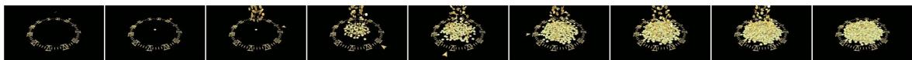

natural_image

Sequence of eight circular images showing progressive stages of a 3D object with yellow highlights, no text or symbols present.

# Describe this video in detail.

# Base model

The video begins with a black screen that transitions toa circulararrangement of golden coins.each withadistinctdesignandcolor.arrangedinacircularpattern.Thecoinsareevenlvspaced.andthe backgroundisasolidblackcoloremphasizingthecirculararngement.Asthevideopprogreses,the coinsare showntobefaling，withsome coinsappearingtobeinmotion,suggestingadynamicor possiblychaoticmotion.Thefalling coinsare scattered acrossthe screen,with some coins closerto the eterieteeli illumdygeig

# Vid2LoRA

The video begins withablack background featuringa gold-colored circularpattern in the center.As the video progressesthecircularpattern becomesmoredefined,withthe goldcolor graduallybecoming more prominent.The pattern then transforms intoaseries of gold coins,each withaunique designand color,arranged inacircularpattern.The coinsarearranged ina way that createsa sense of symmetry andbalance.The videoconcludes with the coins stillintheir circular formation,with the gold color remaining the dominant color.

2/5

natural_image

Sequence of eight photos showing a sunset over water with illuminated lights and distant structures (no text or symbols)

# Describe this video in detail.

# Base model

The video capturesaserene scene ofa sunsetovera calm body of water,likelya lake ora bay, undera clearsky.The sunisseting,castinga warm orange glow over the water,whichiscalmandreflective. Severalbntsarevisblennthewter,omcoertoteshoreandothersfurtherout,suggeting leisurely orfishingactivity.The water'ssurfaceisslightlydisturbed bythemovementoftheboats creatingarennegfmotion.Theskyissgradient ofgrangesndblue,withthesunensitionednearthe horizon,indicating theend of theday.The overallatmosphere ispeaceful and

4/5

# Vid2LoRA

The video showcases a serene and picturesque scene of a sunset over a body of water. The sky is a gradient oforangeand yellow,withthe sunjust setting belowthe horizon,castinga warm glow over the water.The water is calm,with gentle ripples visible on the surface.A small boat is visible in the distance,addingasense ofdepthtothe scene.The overallatmosphere isone of tranquility and beauty,iththesun'slight creatingtbeautifulcontrastagainstthedarkening sky.

4/5

natural_image

Sequence of eight photos showing a white domed structure with multiple towers under a blue sky (no text or symbols visible)

# Describe this video in detail.

# Base model

The video showcases a grand, white mosque with multiple domes and minarets,set against a backdrop Tfecleerbueskywithgatteedlouds.Themtneipuromdedbyuhgreevegetationndte skyislledwitft,lightbluehue,suetingnnyday.Tearcitecturedignofthmue ischaracterized byits symmetricaland symmetrical design,withacentral towerandmultiple smaller domes.Themosqueis surroundedbya well-maintained garden,enhancing itssereneand peaceful atmosphere.Thevideocapturesthemosquemromvriousrngles,providingtomprensiveviewof itarchiterturalfeaturesandthesurmundingenvironment.

4/5

# Vid2LoRA

The video showcases a grand, white mosque with a tall minaret, set against a backdrop of a clear blue sky.Themongueissurrgundedbylushgreen rtnsandtrensrecreatingalnereneaandpeaceful atmosphere.The architecture of the mosque is intricate,with multiple domesand minarets,and the overalldesignissymtetricalandsymmetrical.Thevidectpturesthemmsquefromvariouanglee, highlightingitshitecturaldetailsadthetruilityftheting

4/5

Figure 28: Qualitative examples from VDC Detailed.

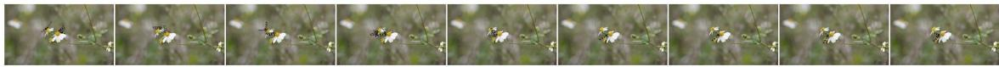

natural_image

Sequence of eight photos showing a bee perched on white flowers, no text or symbols present

# Describe the main subject and its actions in this video.

# Base model

Thevideo showcasesa series ofclose-up shots ofa white and yellow flower witha black and yellow stripedpattemichpestedisysegintardbckgroudfeenfge.iall theflowerisshowninaclose-up,withabee hoveringnearit,indicatingamomentofinteraction between the bee and the flower.Thebee isin focus,withits wings spread wide,and the floweris in sharpdetail,with itspetals fully open anda yellow center.Thebee's positionsuggests itiseither feeding on nectaror pollinating the flower.As the video progresses

2/5

# Vid2LoRA

The video features a close-up view of a bee ona flower, with the bee's wingsand body clearly visible. Thebeeis blackand yelow,witha longtongueextended towards the flower.Theflower hasa white centerandissurroundedbygreenleaves.Thebackgroundisblurred,butitappearstobeanatural setting with otherflowersand foliage.The video captures the bee'smovementasitmoves towards the flower,withthe bee's wings and body moving ina rhythmicpattern.The video alsoshows the bee's wingsand body movingina rhythmicpattem,with the bee'swings and body moving ina rhythmic pattern

1/5

natural_image

Overhead view of a kitchen interior with multiple kitchen utensils and appliances (no visible text or symbols)

# Describe the main subject and itsactions in this video

# Base model

The video showcasesa person ina kitchen setting,likely preparing food,as indicated by the presence ofamicrowave,a toaster,and variouskitchen utensils.The person is seen holdinga smartphone, possiblyrecordingortakingaphoto,andisengagedinthe processofpreparingfood.Thekitchenis equipped withasink,a stove,andamicrowave,suggestinga wellorganizedand functional kitchen environment.Theersonisenusinknifet，cutepiegaffood,indicatinga focusonood preparation.Throughout the video,theperson'sactionsand the kitchensettingremain consistent,with no significant changes in the camera

# Vid2LoRA

A person is preparing food in a kitchen.They are usinga microwave to heat up a pan on the stove.The personisalsousinga bowlto scoopout foodfrom thepan

2/5

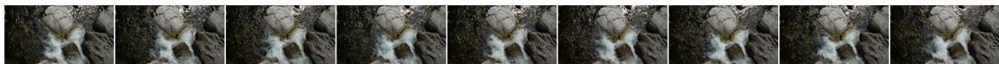

natural_image

Sequence of eight grayscale images showing a rocky surface with water splashing, no text or symbols present

# Describe the main subject and its actions in this video.

Reference：Thmnfocusfviistewateasitlowsenergeillyerthcksewateraadsineoallap

# Base model

The video captures a serene and dynamic scene ofa rocky river,where the water flows overa large rounded rock.The water'smovement is gentle,creatinga soothing rhythm that contrasts with the rockytexture.Theiverssurfcestiitefamandterinicatingrecentring waterflow.Therockssurrounding the riverare of varying sizesand shapes,with someappearing to be partiallysubmergedinthe water.The overallsceneisone oftranguilityandnatural beautywiththe water'smovementandtherocks'texturescreatingaharmoniousbalance

3/5

# Vid2LoRA

The video showcases aserene and natural scene of a waterfallcascading down a rocky cliff.The water adeepblue,iscapturedinmotion,creatingapowerfulandmesmerizing visualeffect.Therocks,amix ofgrayandwhite,are interspersed withrocks of varying sizes,adding to the natural beauty of the scene,Thewaterppearstobelowingatasteadypace,withnovisiblesignsof humanactivityor disturbance.Theoverallatmosphereisoneoftranquilityandnaturalbeautywiththe waterfallerving asa focal pointinthe video

4/5

natural_image

Sequence of nine sequential photos showing silhouetted trees against a sunset sky, no text or symbols present

# Describe the main subject and its actions in this video.

# Base model

The video capturesa serene and picturesgue scene ofa sunset overa body of water.featuring a hliteryetretainsehepdeeskieitedisueeeeleitesu justbeginningtoset.castingawarmglowoverthelandscape.The water.calmandstillreflectsthe vibrant colorsof the skycreatingamiror-like efect.The tree,devoid ofleaves,standsalone,its silhouettestarkagainstthesky.Thesceneisdevoidofany humanactivity,allowing the viewertofully imnmersethemselveiinthetranguilbeautyofthesunset.

4/5

# Vid2LoRA

The video showcases a serene and picturesgue scene of a sunset over a body of water.The sky is paintedwithhuesoforangeendyellow.reflectingoffthewater'ssurfaceThewateris.calm,with gentleripplesadding tothe tranquility of thescene.The sun is settingbehindaline oftrees,castinga warm glow on the waterand the surrounding landscape.The video captures the beauty of nature inits natural state,with nohumanactivity orman-made objects present.The overallatmosphere isone of peace and tranquility,with the sun'srays creating a beautiful and calming effect.

4/5

Figure 29: Qualitative examples from VDC Main Object.

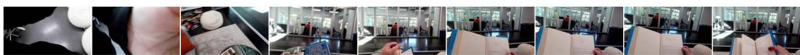

natural_image

Sequence of eight photos showing a robotic arm, hand holding a small object, and interior view of a gym or training facility (no visible text or symbols)

Summarize this video in one detailed sentence.

# Base model

The video capturesapersonina modern ofice environment,beginning witha close-up of abook titled AbouttheActionbyJohnC.MaxwellThecenetransitionstoaderviewoftheoffice,evealinga graycouch withredand whitepillows,adesk withalampanda bookshelffilled with booksand magazines.Theperson thenmoves toadiferent part of the ofice,where theyare seen holdinga book titledThe Powerof Nowby EckhartTolle.Thevideoconcludes witha view of the offcefroma different angle,showingaperson inared shirt workingata

1/5

# Vid2LoRA

Amaninared shirtisstanding inamodemofice space,talking tothecamera.Heis thenseensitting atatableinarestaurant,readinga book.The videoalsoshowsa close-up ofa book ona table,anda man in a white shirt sitting at a table ina restaurant

1/5

natural_image

Sequence of eight photos showing a child playing soccer on a surface, no text or symbols present

Summarize this video in one detailed sentence.

# Base model

A young child,dressedinalight blue polo shirtanddark pants,isengaged inacreative activityona ruginlivingoom.Techildisusinpacolorfulcdayontpdrawwhite peceefpvpersurounded by various toysand a soccer ball.

2/5

# Vid2LoRA

A young girlis siting on thefloorin aliving room,drawing ona piece ofpaper withamarker.She is wearingalightblueshirtanddarkpants.

2/5

natural_image

Sequence of eight photos showing a sunset over water with illuminated lights and distant hills (no text or symbols)

Summarize this video in one detailed sentence.

# Base model

The video captures a serene sunset over a calm body of water.with the sun setting behind a distant shoreline.The sceneispeaceful,with the sun castinga warm glowonthe waterand creatinga beautifulreflection onthe surface.The camera slowly pansacrossthe water,revealing the horizonand thedistantshoreline,iththesunsefcioaddindepthtoteseeTvideoncudswitha close-up of the sun's reflection onthe water,emphasizingthe tranquil and picturesque setting.

4/5

# Vid2LoRA

The video shows a serene sunset over a body of water, with a smallboat visible in the distance.The sky isagradient oforange and yellow,and the wateris calm.The sun issetting behindthe horizon,casting a warmglow over the scene.The boatissmallandappears to beamotorboat,andthereareno people visibleinthe video.The video captures thebeauty of the sunset and thetranguility of the water.

4/5

natural_image

Sequence of eight identical red concentric circular patterns on a white background, no text or symbols present.

Summarize this video in one detailed sentence.

# Base model

Thevideopresentsaseriesofconcentricredcircles,creatingahypnoticvisualeffect,withasubtle changeinthebackground colorfromred toblack.

5/5

# Vid2LoRA

The videodisplays aseries offrames featuringared,swirlingpatemthatappears to bea representationofawaveorrratternoflineThepterindynamitndappearstobemovingor changinginsowyetheframearnetcnsecutivendthetemcgesslightlybtween eachframe.Thevideodoesnotcontainanytextorotherdiscemibleobject,andthefocusissolelyon thevisual representation of the red,swirling pattern.

5/5

Figure 30: Qualitative examples from VDC Short.