# Stateful Visual Encoders for Vision-Language Models

Zirui Wang 1 2 Junwei Yu 1 2 Adam Yala 1 2 3 David M. Chan 2 Joseph E. Gonzalez 2 Trevor Darrell 1 2

# Abstract

Vision-language models (VLMs) are increasingly used in multi-image, multi-turn agentic settings where decisions depend on visual changes. However, in existing open-weight VLMs, visual comparisons happen only inside the language model, while the visual encoder itself remains stateless: each image is encoded independently, without access to the prior visual context. As a result, small but task-critical changes may be attenuated before the language model has a chance to compare them, especially when those changes do not affect the high-level semantics of the scene. We introduce a Stateful Visual Encoder , which conditions each visual representation on prior visual features. Under supervised finetuning, VLMs equipped with stateful encoders achieve consistent improvements on controlled tasks involving cross-image spatial aggregation, multi-object visual differencing, and visual trajectory behavior cloning. These improvements are consistent across input resolutions, language model sizes, and VLM backbones. Finally, we validate our model on real-world tasks, including longitudinal radiology, fine-grained image comparison, and remote sensing, where stateful consistently improve generalist VLM baselines and can match or surpass specialized models in selected domains. Project page: https://statefulvisualencoders. github.io/

# 1. Introduction

Vision-language models (VLMs) are increasingly used in interactive and comparative visual tasks, where a model must observe, track, and analyze visual changes across images to make grounded decisions. Despite such dynamic behavior, the dominant architecture of open-weight VLMs remains inherited from static image-language modeling: each image is passed independently through a visual encoder, and the

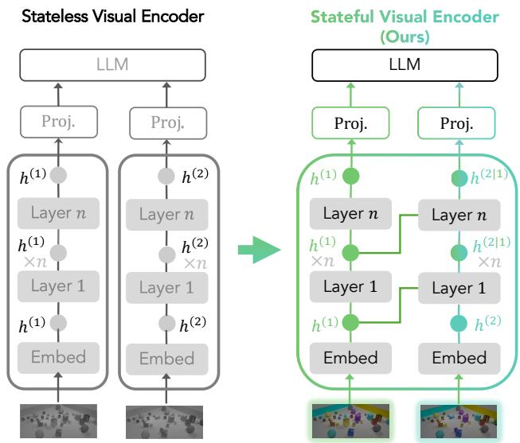

<details>
<summary>flowchart</summary>

```mermaid
graph TD
    subgraph Stateless Visual Encoder
        A["LLM"] --> B["Proj."]
        B --> C["h^(1)"]
        C --> D["Layer n"]
        D --> E["h^(1) ×n"]
        E --> F["Layer 1"]
        F --> G["h^(1)"]
        G --> H["Embed"]
    end

    subgraph Stateful Visual Encoder (Ours)
        I["LLM"] --> J["Proj."]
        J --> K["h^(2|1)"]
        K --> L["Layer n"]
        L --> M["h^(2|1) ×n"]
        M --> N["Layer 1"]
        N --> O["h^(2)"]
        O --> P["Embed"]
    end

    style Stateless Visual Encoder fill:#f9f,stroke:#333
    style Stateful Visual Encoder fill:#ccf,stroke:#333
```
</details>

Figure 1. Stateful visual encoders condition each image’s visual representation on features from the previous image within the vision backbone, enabling early cross-image comparison inside the visual encoder. The left-to-right direction ensures that the current image can attend only to past visual features, matching interactions where future observations may not yet be available.

resulting visual tokens are compared only later by the language model. Thus, while the overall VLM may process a sequence of images, its visual encoder remains stateless.

This stateless encoding is limiting because visual changes are often subtle, for example, a chest X-ray finding may newly appear or partially resolve, a small structure may appear in a satellite image, or an edited image may differ only in a localized attribute. These subtle changes are often critical to task performance. Yet visual encoders used in modern VLMs (Qwen Team, 2026; Bai et al., 2025a; Zeng et al., 2025; Wang et al., 2025b; Kamath et al., 2025) are typically pretrained for language-aligned (Radford et al., 2021; Zhai et al., 2023) or self-supervised representations (Caron et al., 2021; Tong et al., 2024) and applied to each image independently. As a result, per-image encoding can unintentionally suppress the fine-grained differences needed for comparison.

To address this, we add cross-image interaction (i.e., Fig. 1) directly into the visual encoder, conditioning the current visual representation on features from previous images before passing tokens to the language model. Using controlled synthetic tasks that require strict visual comparisons (Wang et al., 2025c; Qiu et al., 2021; Wang et al., 2026), we evaluate design choices for architecting (§3.3), initializing, and optimizing cross-image interactions (§3.4). We study several lightweight variants, including extending self-attention context, adding cross-attention from current visual features to the prior features, augmenting this interaction with an FFN, and using adaptive normalization to condition visual features. To preserve compatibility with pretrained VLMs, we initialize added interaction modules from nearby pretrained weights when possible, zero-initialize output branches to avoid disrupting the original feature distribution at the start of finetuning, and stop gradients through the prior features during cross-image retrieval.

We validate the effectiveness of SVEs both on synthetic domains, where we demonstrate that SVEs consistently improve task performance beyond what can be explained by simply adding parameters or compute, and on three realworld domains: detecting visual differences in radiology scans (Hu et al., 2025) (§5.1), performing fine-grained image comparison on edits derived from real-world/web images (Ye et al., 2025) (§5.2), and identifying changes in remotesensing images (Liu et al., 2022a) (§5.3). Compared to naive finetuning, SVE-based encoders consistently improve model performance on these tasks and can match or surpass specialized models in selected domains. Furthermore, these gains scale robustly across image resolutions (2562–7682), model sizes (0.8B–9B), and diverse VLM families, including Qwen3.5, Qwen3-VL, GLM-4.6V-Flash, InternVL3.5, and Gemma-3 (§3.5).

Overall, our contributions can be summarized as follows: (1) We introduce the Stateful Visual Encoder (SVE), a simple architectural extension that injects cross-image interactions inside the visual encoder of open-weight VLMs without replacing the visual backbone or retraining the full model from scratch. (2) We develop a practical SVE finetuning strategy, including initialization and optimization choices that stabilize finetuning and improve state-dependent visual representations in the SFT regime. (3) We demonstrate the effectiveness and generality of SVEs across controlled visual comparison tasks, image resolutions, model sizes, and VLM families, and further validate it on real-world comparison tasks in radiology, image editing, and remote sensing.

# 2. Related work

Image Difference Encoders. Specialized changedetection models compare images inside the visual encoder (Park et al., 2019; Chen et al., 2021; Bandara and Patel, 2022; Dong et al., 2025). However, unlike our SVE, these architectures are designed for specific change detection tasks, rather than studied as general-purpose visual encoders for VLMs.

Video Visual Encoders. Beyond pairwise change modeling, video encoders learn spatiotemporal representations from frame sequences. Representative video encoders include I3D (Carreira and Zisserman, 2017), MViT (Fan et al., 2021), Video Swin (Liu et al., 2022b), TimeSformer (Bertasius et al., 2021), and ViViT (Arnab et al., 2021), with recent video foundation models and MLLMs such as Video-MAE (Tong et al., 2022), InternVideo2 (Wang et al., 2024), and VideoPrism (Zhao et al., 2024) scaling this direction through video-text supervision, masked modeling, and longcontext spatiotemporal tokenization. Recent video-aware encoders, such as Perception Encoder (Bolya et al., 2026) and OneVision-Encoder (Tang et al., 2026), further train visual backbones for both image and video understanding. SVEs instead target image-based VLMs that receive multiple images in context, such as sparse observations, beforeafter pairs, and interaction states. Rather than training a spatiotemporal visual backbone, a SVE introduces causal cross-image conditioning into the existing image encoder: features of the current image condition on those from the previous image, while future images remain unavailable. This matches interactive settings while preserving the existing VLM visual interface.

Multi-Image Encoding in VLMs. Recent VLMs (Liu et al., 2023c; 2024; Li et al., 2023; Bai et al., 2025a; Dai et al., 2023; Alayrac et al., 2022; Bai et al., 2025b) have shown strong multimodal reasoning abilities (Qin et al., 2025; Bigverdi et al., 2025), but multi-image state reasoning remains challenging. Most multi-image VLMs adopt late fusion: methods such as MANTIS (Jiang et al., 2024), LLaVA-NeXT-Interleave (Li et al., 2024), LLaVA-OneVision (Li et al., 2025a), Idefics3 (Laurenc¸on et al., 2024), and VILA (Lin et al., 2024) encode images independently and leave cross-image comparison to the language model. Long-video and streaming VLMs add memory banks, token compression, or KV-cache mechanisms after visual encoding (He et al., 2024; Zhang et al., 2025; Diko et al., 2025; Shi et al., 2026; Xu et al., 2025). SVE addresses a complementary bottleneck: the current image can retrieve and integrate prior visual features inside the visual backbone before serialization to the LLM.

# 3. Stateful Visual Encoders

Background. Modern vision-language models (VLMs) typically consist of a visual encoder $f _ { V }$ , a vision-language connector W , and a large language model (LLM) $f _ { L }$ . Given an image I preprocessed into a sequence of N image patches, the visual encoder maps patches into visual features $\dot { Z } = f _ { V } ( I ) \in \mathbb { R } ^ { N \times d _ { V } }$ , where $d _ { V }$ is the hidden dimension of the visual encoder. The connector $W _ { P r o j }$ then maps these visual features into the LLM embedding space as

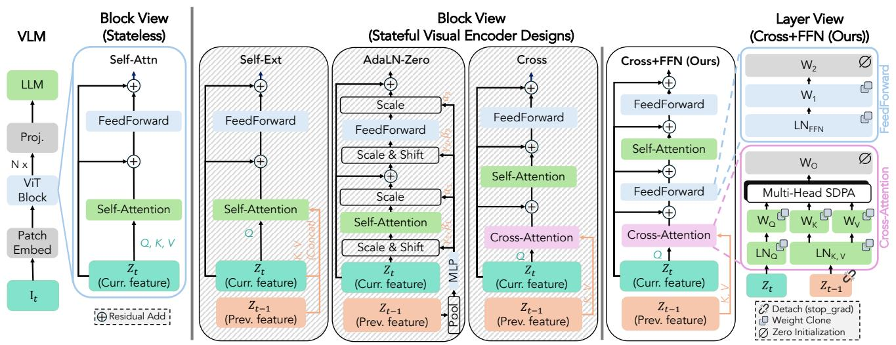

<details>
<summary>flowchart</summary>

```mermaid
graph TD
    subgraph VLM
        A["LLM"] --> B["Proj."]
        B --> C["N x"]
        C --> D["ViT Block"]
        D --> E["Patch Embed"]
        E --> F["I_t"]
    end

    subgraph Block View (Stateless)
        G["Self-Attn"] --> H["FeedForward"]
        H --> I["Self-Attention"]
        I --> J["Z_t (Curr. feature)"]
        J --> K["Z_{t-1} (Prev. feature)"]
        K --> L["Residual Add"]
    end

    subgraph Stateful Visual Encoder Designs
        M["Self-Ext"] --> N["FeedForward"]
        N --> O["Self-Attention"]
        O --> P["Z_t (Curr. feature)"]
        P --> Q["Z_{t-1} (Prev. feature)"]
        Q --> R["Z_{t-1} (Prev. feature)"]
        R --> S["MLP"]
        S --> T["Pool"]
    end

    subgraph Layer View (Cross+FFN (Ours))
        U["Cross"] --> V["FeedForward"]
        V --> W["Self-Attention"]
        W --> X["Cross-Attention"]
        X --> Y["Z_t (Curr. feature)"]
        Y --> Z["Z_{t-1} (Prev. feature)"]
        Z --> AA["Z_{t-1} (Prev. feature)"]
        AA --> AB["MLP"]
        AB --> AC["Pool"]
    end

    subgraph Cross+FFN (Ours)
        AD["Cross+FFN (Ours)"] --> AE["FeedForward"]
        AE --> AF["Self-Attention"]
        AF --> AG["Cross-Attention"]
        AG --> AH["Z_t (Curr. feature)"]
        AH --> AI["Z_{t-1} (Prev. feature)"]
        AI --> AJ["Z_{t-1} (Prev. feature)"]
        AJ --> AK["Z_{t-1} (Prev. feature)"]
        AK --> AL["MLP"]
    end

    subgraph Multi-Head SDPA
        AM["W_0"] --> AN["Multi-Head SDPA"]
        AN --> AO["W_Q"]
        AN --> AP["W_K"]
        AN --> AQ["W_V"]
        AN --> AR["LN_Q"]
        AN --> AS["LN_{K,v}"]
        AN --> AT["Z_t"]
        AN --> AU["Z_{t-1}"]
        AU --> AV["MLP"]
    end

    subgraph Cross-Attention
        AW["W_2"] --> AX["FeedForward"]
        AX --> AY["W_1"]
        AY --> AZ["LN_{FFN}"]
        AY --> BA["FeedForward"]
        BA --> BB["W_O"]
        BB --> BC["Multi-Head SDPA"]
        BC --> BD["W_Q"]
        BC --> BE["W_K"]
        BC --> BF["W_V"]
        BC --> BG["LN_Q"]
        BC --> BH["LN_{K,v}"]
        BC --> BI["Z_t"]
        BI --> BJ["Z_{t-1}"]
    end

    subgraph Weight Clone
        BK["Detach (stop_grad)"]
        BL["Zero Initialization"]
    end
```
</details>

Figure 2. Design study and implementation recipe for SVE. We compare several ways to condition current visual tokens $Z _ { t }$ on past tokens $Z _ { t - 1 }$ . The layer view expands the winning Cross-Attn + FFN design and shows its implementation recipe: stop-gradient on the past feature pathway, cloned initialization from the same ViT block, and zero initialization. Activations and positional embeddings in the layer view are omitted for simplicity.

$H = W _ { P r o j } ( Z ) \in \mathbb { R } ^ { M \times d _ { L } }$ , where $d _ { L }$ is the LLM hidden dimension and M is the number of visual tokens passed to the LLM.

Overview. As shown in Fig. 2, we study four stateful encoder designs. Self-Ext extends the pretrained selfattention key-value set with features from the previous image. AdaLN-Zero pools features from the previous image to modulate the self-attention and feed-forward layers through adaptive normalization (Perez et al., 2018; Peebles and Xie, 2023). Cross inserts a full token-level cross-attention layer before each pretrained self-attention layer, with queries from all visual tokens of the current image and keys/values from all visual tokens of the previous image. Cross+FFN further adds a feed-forward block after the inserted cross-attention layer. We summarize the block form, added parameters, and added compute of each design in §E. We use controlled multi-image comparison tasks (§3.1, §3.2) to select the final design (§3.3). We then ablate the recipe needed to exploit past visual features without destabilizing training (§3.4), and test generality across resolutions, model sizes, and model backbones (§3.5). Finally, we provide feature analysis on stateful visual representation in §4, detailed evaluation protocol in §C and training configurations in §D.

# 3.1. Task Setup

Cross-Image Spatial Aggregation. Image-text aligned visual encoders such as CLIP (Radford et al., 2021) and SigLIP (Zhai et al., 2023) can struggle to expose finegrained spatial or attribute information needed for downstream tasks (Chen et al., 2024; Pantazopoulos et al., 2024; Bianchi et al., 2024). To isolate this failure mode in a controlled setting, we construct a spatial aggregation task that requires localizing small visual changes across semantically rich computer-use backgrounds from AgentNet/Open-CUA (Wang et al., 2025c). We overlay random red dots across image sequences and ask the model to predict crossimage geometric quantities, including normalized Euclidean distance and convex-hull area (Fig. 3, top). We report mean absolute error (MAE) and root mean square error (RMSE) on a held-out set. Additional details on data formatting are available in §B.1.

Multi-Object Visual Differencing. Spatial aggregation tests geometry but not whether a model can identify which object changed in a cluttered scene. Using the CLEVR-Multi-Change engine (Johnson et al., 2017; Qiu et al., 2021), we create scene pairs with 30–40 objects and 4 subtle changes, including movement, insertion, deletion, and replacement (Fig. 3, bottom left). The model must describe the changed object and change type. We report exact-match accuracy for categorical change prediction, and BLEU (Papineni et al., 2002), CIDEr (Vedantam et al., 2015), ME-TEOR (Banerjee and Lavie, 2005), SPICE (Anderson et al., 2016), and ROUGE-L (Lin, 2004) for generated descriptions. Additional details on data formatting are available in §B.2.

Visual Trajectory Behavioral Cloning. To test state tracking in interactive settings, we train models to imitate heuristic-solver demonstrations from VisGym (Wang et al., 2026). Each trajectory contains a task instruction followed by interleaved visual observations and solver actions, and the model predicts the next action from the interaction history. We use four VisGym tasks: Patch Reassembly, 3D Mental Rotation (Cube), Matchstick Rotation, and 3D Mental Rotation (Objaverse), which require fine-grained perception, partial state tracking, and task-specific dynamics (Fig. 3, bottom right). We report perplexity on a held-out set. Additional details on data formatting are available in §B.3.

Task 1: Cross-image Spatial Aggregation Dot Distance/Area Over Rich Backgrounds   
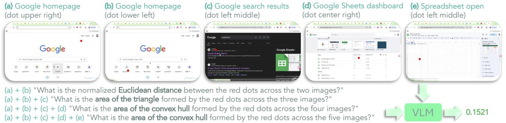

<details>
<summary>text_image</summary>

(a) Google homepage
(dot upper right)
(b) Google homepage
(dot lower left)
(c) Google search results
(dot left middle)
(d) Google Sheets dashboard
(dot center right)
(e) Spreadsheet open
(dot left middle)
(a) + (b) "What is the normalized Euclidean distance between the red dots across the two images?"
(a) + (b) + (c) "What is the area of the triangle formed by the red dots across the three images?"
(a) + (b) + (c) + (d) "What is the area of the convex hull formed by the red dots across the four images?"
(a) + (b) + (c) + (d) + (e) "What is the area of the convex hull formed by the red dots across the five images?"
VLM 0.1521
</details>

Task 2: Multi-object Visual Differencing CLEVR-Multi-Change (30-40 Objects)   
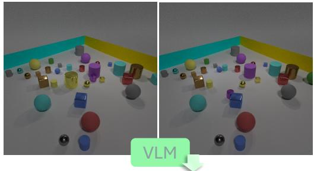

<details>
<summary>natural_image</summary>

3D-rendered cube and sphere arrangement in a room with colored walls, no text or symbols visible
</details>

The small blue rubber sphere was moved. The small purple metal cylinder was moved. The large yellow metal cylinder was removed. The large cyan rubber cube was replaced with a large green rubber sphere.

Task 3: Visual Trajectory Behavioral Cloning VisGym   
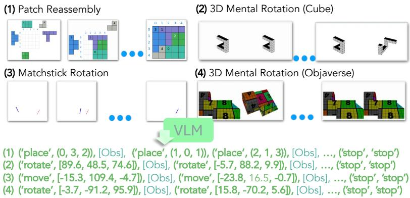

<details>
<summary>flowchart</summary>

```mermaid
graph TD
    A["(1) Patch Reassembly"] --> B["(2) 3D Mental Rotation (Cube)"]
    B --> C["(3) Matchstick Rotation"]
    C --> D["(4) 3D Mental Rotation (Objaverse)"]
    
    subgraph A
        A1["Image: Patch Reassembly"]
        A2["Image: Patch Reassembly"]
        A3["Image: Patch Reassembly"]
        A4["Image: Patch Reassembly"]
        A5["Image: Patch Reassembly"]
    end
    
    subgraph B
        B1["Image: 3D Mental Rotation Cube"]
        B2["Image: 3D Mental Rotation Cube"]
        B3["Image: 3D Mental Rotation Cube"]
        B4["Image: 3D Mental Rotation Cube"]
    end
    
    subgraph C
        C1["Image: Matchstick Rotation"]
        C2["Image: Matchstick Rotation"]
        C3["Image: Matchstick Rotation"]
    end
    
    subgraph D
        D1["Image: Matchstick Rotation"]
        D2["Image: Matchstick Rotation"]
        D3["Image: Matchstick Rotation"]
    end
    
    subgraph VLM
        VLM1["0, 1, 2"] --> VLM2["0, 1, 2, 3, 4"] --> VLM3["0, 1, 2, 3, 4"] --> VLM4["0, 1, 2, 3, 4"] --> VLM5["0, 1, 2, 3, 4"] --> VLM6["0, 1, 2, 3, 4"] --> VLM7["0, 1, 2, 3, 4"] --> VLM8["0, 1, 2, 3, 4"] --> VLM9["0, 1, 2, 3, 4"] --> VLM10["0, 1, 2, 3, 4"] --> VLM11["0, 1, 2, 3, 4"] --> VLM12["0, 1, 2, 3, 4"] --> VLM13["0, 1, 2, 3, 4"] --> VLM14["0, 1, 2, 3, 4"] --> VLM15["0, 1, 2, 3, 4"] --> VLM16["0, 1, 2, 3, 4"] --> VLM17["0, 1, 2, 3, 4"] --> VLM18["0, 1, 2, 3, 4"] --> VLM19["0, 1, 2, 3, 4"] --> VLM20["0, 1, 2, 3, 4"] --> VLM21["0, 1, 2, 3, 4"] --> VLM22["0, 1, 2, 3, 4"] --> VLM23["0, 1, 2, 3, 4"] --> VLM24["0, 1, 2, 3, 4"] --> VLM25["0, 1, 2, 3, 4"] --> VLM26["0, 1, 2, 3, 4"] --> VLM27["0, 1, 2, 3, 4"] --> VLM28["0, 1, 2, 3, 4"] --> VLM29["0, 1, 2, 3, 4"] --> VLM30["0, 1, 2, 3, 4"] --> VLM31["0, 1, 2, 3, 4"] --> VLM32["0, 1, 2, 3, 4"] --> VLM33["0, 1, 2, 3, 4"] --> VLM34["0, 1, 2, 3, 4"] --> VLM35["0, 1, 2, 3, 4"] --> VLM36["0, 1, 2, 3, 4"] --> VLM37["0, 1, 2, 3, 4"] --> VLM38["0, 1, 2, 3, 4"] --> VLM39["0, 1, 2, 3, 4"] --> VLM40["0, 1, 2, 3, 4"] --> VLM41["0, 1, 2, 3, 4"] --> VLM42["0, 1, 2, 3, 4"] --> VLM43["0, 1, 2, 3, 4"] --> VLM44["0, 1, 2, 3, 4"] --> VLM45["0, 1, 2, 3, 4"] --> VLM46["0, 1, 2, 3, 4"] --> VLM47["0, 1, 2, 3, 4"] --> VLM48["0, 1, 2, 3, 4"] --> VLM49["0, 1, 2, 3, 4"] --> VLM50["0.5-7.5"]
    end
```
</details>

Figure 3. Controlled tasks for studying stateful visual representations in vision-language models. We present 3 tasks where we train and evaluate models with: cross-image spatial aggregation (top); multi-object visual differencing (bottom left); visual trajectory behavioral cloning (bottom right). Details are in §3.1.

# 3.2. Training Setup

Initialization. Unless otherwise specified, we initialize all new parameters inside the visual encoder of a pretrained Qwen3.5-4B (Qwen Team, 2026) model. For each added cross-attention layer, we copy the input projections from the corresponding pretrained self-attention layer in the same visual-encoder block, i.e., $W _ { Q } ^ { \mathrm { c r o s s } } , W _ { K } ^ { \mathrm { c r o s s } } , W _ { V } ^ { \mathrm { c r o s s } } $ W self , $W _ { Q } ^ { \mathrm { s e l f } } , W _ { K } ^ { \mathrm { s e l f } } , W _ { V } ^ { \mathrm { s e l f } }$ , and zero-initialize the output projec-For the added FFN in Cross+FFN, we $W _ { O } ^ { \mathrm { c r o s s } } = { \bf 0 }$ similarly copy the first linear layer and zero-initialize the second, i.e., $\mathsf { \bar { W } } _ { 1 } ^ { \mathrm { c r o s s } } \gets W _ { 1 } ^ { \mathrm { s e l f } }$ and $W _ { 2 } ^ { \mathrm { c r o s s } } = { \bf 0 }$ (Fig. 2, right). This gives the added modules a layer-matched feature basis while preserving the pretrained visual encoder’s initial behavior (Kingma and Dhariwal, 2018; Bachlechner et al., 2021; Zhang et al., 2023).

Conditioning. For cross-attention variants at each layer, the current visual features $Z _ { t }$ provide queries and the predecessor visual features $Z _ { t - 1 }$ provide keys and values: $Q _ { t } =$ $Z _ { t } W _ { Q } ^ { \mathrm { c r o s s } }$ and $( K _ { t } , V _ { t } ) = ( Z _ { t - 1 } W _ { K } ^ { \mathrm { c r o s s } } , Z _ { t - 1 } W _ { V } ^ { \mathrm { c r o s s } } )$ . For the first image, we fall back to using $Z _ { 1 }$ as the key-value source. For Self-Ext, the key-value source is expanded from $Z _ { t } \mathrm { t o } \left[ Z _ { t } ; Z _ { t - 1 } \right]$ . For AdaLN-Zero, pooled predecessor visual features provide the conditioning vector, with a zero vector used for the first image.

Optimization. During training, we apply stop-gradient to the predecessor branch in all cross-attention variants reminiscent of BYOL and SimSiam (Grill et al., 2020; Chen and He, 2021): $K _ { t - 1 } = \mathsf { s t o p } _ { - 9 } \mathsf { r a d } ( Z _ { t - 1 } ) W _ { K } ^ { \mathrm { c r o s s } }$ and Vt−1 = stop grad(Zt−1)W cross (Fig. 2, right). Gradients therefore update the current-image query branch and state-conditioning parameters, but not the features from the previous image used as context. We provide SFT hyperparameters in Tab. 16.

# 3.3. Results

We compare the stateless baseline with four SVE variants (Fig. 2, left & middle).

Cross-image spatial aggregation. Tab. 1 shows that Cross+FFN performs best across all spatial aggregation tasks, with the largest gain occurring in Dot-Distance, suggesting that explicit state conditioning is especially useful for precise cross-image localization. Self-Ext. performs worse than the stateless baseline, suggesting that simply expanding the self-attention key-value set can disrupt the pretrained visual encoder. AdaLN-Zero is more stable but remains close to the baseline, indicating that pooled feature conditioning from the previous image is too compressed for fine-grained spatial retrieval. By contrast, Cross improves over the baseline, and Cross+FFN improves further, suggesting token-level retrieval and the added FFN both help transform cross-attended features before they are passed back into the visual block.

Table 1. Cross-image spatial aggregation results. We report MAE/RMSE on dot-distance and area estimation tasks; all values are $\times 1 0 ^ { - 2 }$ . Tri., Quad., and Pent. denote triangular, quadrilateral, and pentagon area estimation. Colored badges show absolute change from the stateless baseline: indicates improvement and indicates degradation. 

<table><tr><td rowspan="2">Method</td><td colspan="2">Dot Distance (2-Img)</td><td colspan="2">Tri. Area (3-Img)</td><td colspan="2">Quad. Area (4-Img)</td><td colspan="2">Pent. Area (5-Img)</td><td colspan="2">Average</td></tr><tr><td>MAE ↓</td><td>RMSE ↓</td><td>MAE ↓</td><td>RMSE ↓</td><td>MAE ↓</td><td>RMSE ↓</td><td>MAE ↓</td><td>RMSE ↓</td><td>MAE ↓</td><td>RMSE ↓</td></tr><tr><td>Baseline (Stateless)</td><td>1.17</td><td>1.51</td><td>0.85</td><td>1.22</td><td>1.11</td><td>1.64</td><td>1.47</td><td>2.03</td><td>1.15</td><td>1.60</td></tr><tr><td colspan="11">Stateful</td></tr><tr><td>Self-Ext.</td><td>1.55 .38</td><td>2.18 .67</td><td>1.16 .31</td><td>1.72 .50</td><td>1.35 .24</td><td>1.84 .20</td><td>1.71 .24</td><td>2.35 .32</td><td>1.44 .29</td><td>2.02 .42</td></tr><tr><td>AdaLN-Zero</td><td>1.23 .06</td><td>1.60 .09</td><td>0.89 .04</td><td>1.26 .04</td><td>1.12 .01</td><td>1.49 .15</td><td>1.42 .05</td><td>2.05 .02</td><td>1.17 .02</td><td>1.60 .00</td></tr><tr><td>Cross</td><td>0.97 .20</td><td>1.23 .28</td><td>0.79 .06</td><td>1.15 .07</td><td>1.03 .08</td><td>1.36 .28</td><td>1.34 .13</td><td>1.84 .19</td><td>1.03 .12</td><td>1.39 .21</td></tr><tr><td>Cross+FFN</td><td>0.56 .61</td><td>0.72 .79</td><td>0.50 .35</td><td>0.77 .45</td><td>0.76 .35</td><td>1.02 .62</td><td>1.04 .43</td><td>1.34 .69</td><td>0.72 .43</td><td>0.96 .64</td></tr></table>

Table 2. Results on visual differencing and trajectory behavioral cloning. For CLEVR, PPL, B4, C, M, S, R-L, and Acc denote perplexity, BLEU-4, CIDEr, METEOR, SPICE, ROUGE-L, and change accuracy. For VisGym, MSR, PR, MRC, and MRO denote the Patch Reassembly, 3D Mental Rotation (Cube), Matchstick Rotation, and 3D Mental Rotation (Objaverse). Colored badges show absolute change from the stateless baseline: indicates improvement and indicates degradation. 

<table><tr><td rowspan="2">Method</td><td colspan="9">CLEVR-Multi-Change (30–40 Objects)</td><td colspan="5">VisGym (Perplexity)</td></tr><tr><td>PPL ↓</td><td>B4 ↑</td><td>C ↑</td><td>M ↑</td><td>S ↑</td><td>R-L ↑</td><td>Acc ↑</td><td>MSR ↓</td><td>PR ↓</td><td>MRC ↓</td><td>MRO ↓</td><td></td><td></td><td></td></tr><tr><td>Baseline (Stateless)</td><td>1.229</td><td>90.5</td><td>529.5</td><td>93.5</td><td>79.0</td><td>92.3</td><td>91.1</td><td>2.162</td><td>2.074</td><td>1.204</td><td>1.205</td><td></td><td></td><td></td></tr><tr><td>Self-Ext.</td><td>1.226 .003</td><td>92.0 1.5</td><td>538.1 8.6</td><td>95.2 1.7</td><td>80.0 1.0</td><td>93.4 1.1</td><td>92.5 1.4</td><td>2.292 .130</td><td>2.132 .058</td><td>1.218 .014</td><td>1.218 .013</td><td></td><td></td><td></td></tr><tr><td>AdaLN-Zero</td><td>1.230 .001</td><td>90.9 .40</td><td>531.8 2.3</td><td>93.8 .30</td><td>79.1 .10</td><td>92.4 .10</td><td>91.4 .30</td><td>2.152 .010</td><td>2.069 .005</td><td>1.201 .003</td><td>1.207 .002</td><td></td><td></td><td></td></tr><tr><td>Cross</td><td>1.225 .004</td><td>88.5 2.0</td><td>515.0 14.5</td><td>91.5 2.0</td><td>77.8 1.2</td><td>90.2 2.1</td><td>89.3 1.8</td><td>2.145 .017</td><td>2.009 .065</td><td>1.201 .003</td><td>1.205 .000</td><td></td><td></td><td></td></tr><tr><td>Cross+FFN</td><td>1.219 .010</td><td>92.7 2.2</td><td>543.9 14.4</td><td>95.4 1.9</td><td>80.1 1.1</td><td>93.9 1.6</td><td>92.7 1.6</td><td>2.111 .051</td><td>1.944 .130</td><td>1.193 .011</td><td>1.203 .002</td><td></td><td></td><td></td></tr></table>

Multi-object visual differencing and visual trajectory behavioral cloning. Tab. 2 further validates this design choice on visual differencing (e.g., CLEVR-Multi-Change (30–40 objects)) and behavioral cloning (e.g., VisGym). On CLEVR, Cross+FFN improves over the stateless baseline across perplexity, change accuracy, and all languagegeneration metrics, including CIDEr from 529.5 to 543.9 and accuracy from 91.1 to 92.7. On VisGym, it also improves all four trajectory behavioral cloning tasks. Other variants are less consistent or less effective.

# 3.4. Ablations

We ablate the main components of the Cross+FFN recipe in Tabs. 3 and 4. Overall, Cross+FFN benefits from explicit cross-image access, $W _ { Q , K , V , 1 }$ cloning, $W _ { O , 2 }$ zeroinitialization, the $H _ { 1 } \left( K , V \right)$ fallback, stop ${ \mathfrak { g r a d } } ( K , V )$ , and positional embeddings in the cross-attention pathway.

Capacity-controlled baseline. Self+FFN uses the same added pathway as Cross+FFN but does not attend to features from the previous image. We use this to rule out the possibility that gains come merely from added parameters or FLOPs rather than statefulness. Although it improves over the stateless baseline with the rest of our recipe, it remains below Cross+FFN on all tasks but patch reassembly in VisGym, the only task where visual comparison is not strictly required (Wang et al., 2026).

$W _ { Q , K , V , 1 }$ clone. Removing $W _ { Q , K , V , 1 }$ cloning gives generally weaker results, suggesting that copying the input-side cross-attention weights and the first FFN layer from its following self-attention block provides a useful layer-matched feature basis.

$W _ { O , 2 }$ zero-init. Removing $W _ { O , 2 }$ zero-initialization causes the largest degradation. This supports the role of zero initialization in preserving the pretrained encoder’s feature distribution at the start of finetuning. Without it, the newly added cross-attention and FFN branches can immediately perturb visual features in large magnitude before they enter the following pretrained self-attention and FFN layers, placing those layers off-distribution.

$Z _ { 1 } ~ ( K , V )$ fallback. Removing the $Z _ { 1 } ~ ( K , V )$ fallback replaces the first-image key-value source with a learned null embedding, suggesting the stateful pathway should attend to real visual features if possible.

Table 3. Spatial aggregation ablations. We ablate the Cross+FFN recipe and report MAE/RMSE; all values are $\times 1 0 ^ { - 2 }$ . Colored badges show absolute change from Cross+FFN: indicates improvement and indicates degradation. 

<table><tr><td rowspan="2">Method</td><td colspan="2">Dot Dist.</td><td colspan="2">Tri. Area</td><td colspan="2">Quad. Area</td><td colspan="2">Pent. Area</td><td colspan="2">Average</td></tr><tr><td>MAE ↓</td><td>RMSE ↓</td><td>MAE ↓</td><td>RMSE ↓</td><td>MAE ↓</td><td>RMSE ↓</td><td>MAE ↓</td><td>RMSE ↓</td><td>MAE ↓</td><td>RMSE ↓</td></tr><tr><td>Cross+FFN</td><td>0.56</td><td>0.72</td><td>0.50</td><td>0.77</td><td>0.76</td><td>1.02</td><td>1.04</td><td>1.34</td><td>0.72</td><td>0.96</td></tr><tr><td colspan="11">Capacity-controlled baseline</td></tr><tr><td>Self+FFN</td><td>0.62 .06</td><td>0.79 .07</td><td>0.54 .04</td><td>0.80 .03</td><td>0.84 .08</td><td>1.12 .10</td><td>1.07 .03</td><td>1.42 .08</td><td>0.77 .05</td><td>1.03 .07</td></tr><tr><td colspan="11">Ablations</td></tr><tr><td>w/o  $W_{Q,K,V,1}$  clone</td><td>0.53 .03</td><td>0.71 .01</td><td>0.52 .02</td><td>0.85 .08</td><td>0.80 .04</td><td>1.05 .03</td><td>1.12 .08</td><td>1.45 .11</td><td>0.74 .02</td><td>1.02 .06</td></tr><tr><td>w/o  $W_{O,2}$  zero-init</td><td>1.13 .57</td><td>1.49 .77</td><td>0.85 .35</td><td>1.35 .58</td><td>1.17 .41</td><td>1.57 .55</td><td>1.56 .52</td><td>2.23 .89</td><td>1.18 .46</td><td>1.66 .70</td></tr><tr><td>w/o  $Z_1(K,V)$  fallback</td><td>0.64 .08</td><td>1.31 .59</td><td>0.57 .07</td><td>0.86 .09</td><td>0.81 .05</td><td>1.09 .07</td><td>1.11 .07</td><td>1.49 .15</td><td>0.78 .06</td><td>1.19 .23</td></tr><tr><td>w/o stop_grad( $K,V$ )</td><td>0.64 .08</td><td>0.83 .11</td><td>0.60 .10</td><td>0.92 .15</td><td>0.89 .13</td><td>1.19 .17</td><td>1.14 .10</td><td>1.54 .20</td><td>0.82 .10</td><td>1.12 .16</td></tr><tr><td>w/o pos-embed</td><td>0.58 .02</td><td>0.76 .04</td><td>0.59 .09</td><td>0.90 .13</td><td>0.89 .13</td><td>1.19 .17</td><td>1.15 .11</td><td>1.50 .16</td><td>0.80 .08</td><td>1.09 .13</td></tr><tr><td>Baseline (Stateless)</td><td>1.17 .61</td><td>1.51 .79</td><td>0.85 .35</td><td>1.22 .45</td><td>1.11 .35</td><td>1.64 .62</td><td>1.47 .43</td><td>2.03 .69</td><td>1.15 .43</td><td>1.60 .64</td></tr></table>

Table 4. Visual differencing and trajectory behavioral cloning ablations. We ablate the Cross+FFN recipe on CLEVR and VisGym. For CLEVR, PPL, B4, C, M, S, R-L, and Acc denote perplexity, BLEU-4, CIDEr, METEOR, SPICE, ROUGE-L, and change accuracy. For VisGym, MSR, PR, MRC, and MRO denote the Patch Reassembly, 3D Mental Rotation (Cube), Matchstick Rotation, and 3D Mental Rotation (Objaverse) tasks. Bold/underline indicate best/second-best results. Colored badges show absolute change from Cross+FFN: indicates improvement and indicates degradation. 

<table><tr><td rowspan="2">Method</td><td colspan="8">CLEVR-Multi-Change (30–40 Objects)</td><td colspan="5">VisGym</td></tr><tr><td>PPL ↓</td><td>B4 ↑</td><td>C ↑</td><td>M ↑</td><td>S ↑</td><td>R-L ↑</td><td>Acc ↑</td><td>MSR ↓</td><td>PR ↓</td><td>MRC ↓</td><td>MRO ↓</td><td></td><td></td></tr><tr><td>Cross+FFN</td><td>1.219</td><td>92.7</td><td>543.9</td><td>95.4</td><td>80.1</td><td>93.9</td><td>92.7</td><td>2.111</td><td>1.944</td><td>1.193</td><td>1.203</td><td></td><td></td></tr><tr><td colspan="14">Capacity-controlled baseline</td></tr><tr><td>Self+FFN</td><td>1.223 .004</td><td>91.6 1.1</td><td>537.2 6.7</td><td>94.8 .60</td><td>79.9 .20</td><td>93.0 .90</td><td>91.6 1.1</td><td>2.126 .015</td><td>1.938 .006</td><td>1.198 .005</td><td>1.204 .001</td><td></td><td></td></tr><tr><td colspan="14">Ablations</td></tr><tr><td>w/o  $W_{Q,K,V,1}$  clone</td><td>1.223 .004</td><td>92.2 .50</td><td>538.7 5.2</td><td>94.9 .50</td><td>79.9 .20</td><td>93.4 .50</td><td>92.5 .20</td><td>2.161 .050</td><td>1.933 .011</td><td>1.202 .009</td><td>1.207 .004</td><td></td><td></td></tr><tr><td>w/o  $W_{O,2}$  zero-init</td><td>1.238 .019</td><td>91.0 1.7</td><td>534.8 9.1</td><td>94.2 1.2</td><td>78.3 1.8</td><td>92.8 1.1</td><td>91.0 1.7</td><td>2.319 .208</td><td>2.636 .692</td><td>1.221 .028</td><td>1.220 .017</td><td></td><td></td></tr><tr><td>w/o  $Z_1(K,V)$  fallback</td><td>1.221 .002</td><td>92.2 .50</td><td>541.0 2.9</td><td>95.1 .30</td><td>80.0 .10</td><td>93.3 .60</td><td>91.8 .90</td><td>2.140 .029</td><td>1.972 .028</td><td>1.201 .008</td><td>1.205 .002</td><td></td><td></td></tr><tr><td>w/o stop_grad( $K,V$ )</td><td>1.219 .000</td><td>93.0 .30</td><td>544.4 .50</td><td>95.4 .00</td><td>80.1 .00</td><td>94.0 .10</td><td>92.6 .10</td><td>2.143 .032</td><td>1.943 .001</td><td>1.203 .010</td><td>1.205 .002</td><td></td><td></td></tr><tr><td>w/o pos-embed</td><td>1.224 .005</td><td>91.8 .90</td><td>537.3 6.6</td><td>94.5 .90</td><td>79.5 .60</td><td>93.2 .70</td><td>92.0 .70</td><td>2.112 .001</td><td>1.947 .003</td><td>1.201 .008</td><td>1.207 .004</td><td></td><td></td></tr><tr><td>Baseline (Stateless)</td><td>1.229 .010</td><td>90.5 2.2</td><td>529.5 14.4</td><td>93.5 1.9</td><td>79.0 1.1</td><td>92.3 1.6</td><td>91.1 1.6</td><td>2.162 .051</td><td>2.074 .130</td><td>1.204 .011</td><td>1.205 .002</td><td></td><td></td></tr></table>

stop grad(K, V ). Removing stop grad(K, V ) weakens spatial aggregation and gives mixed results on visual differencing. This supports treating keys and values from previous image features as a stable retrieval context, rather than allowing them to co-adapt directly through the current image’s cross-attention update.

pos-embed. Removing positional embeddings from the cross-attention degrades performance across the evaluated tasks, with especially large drops on spatial aggregation and visual differencing. This suggests that preserving positional information in cross-image attention is important for statedependent visual understanding.

# 3.5. Generality

We next evaluate the generality of SVEs (i.e., the Cross+FFN recipe). Specifically, we study whether the SVE design remains effective across different (1) input resolutions; (2) language model sizes; and (3) VLM backbones when compared to stateless baselines. We use the multi-object visual differencing task to train and evaluate all variants with two primary findings: (1) SVEs are robust across input resolutions and model sizes. As shown in Fig. 4, SVEs consistently outperform a stateless baseline from $2 5 6 ^ { 2 }$ to $7 6 8 ^ { 2 }$ input resolution and from 0.8B to 9B model size. Notably, smaller SVE models can match or even outperform much larger stateless baselines. (2) SVEs generalize across VLM architectures. As shown in Tab. 5, SVEs consistently improve over stateless baselines across diverse VLM families, including Qwen3-VL (Bai et al., 2025a), Qwen3.5 (Qwen Team, 2026), GLM-4.6V-Flash (Zeng et al., 2025), InternVL3.5 (Wang et al., 2025b), and Gemma-3 (Kamath et al., 2025). These models differ substantially in visual encoders, vision–language connectors, attention mechanisms, and language backbones, suggesting that SVEs are not tied to a particular VLM architecture.

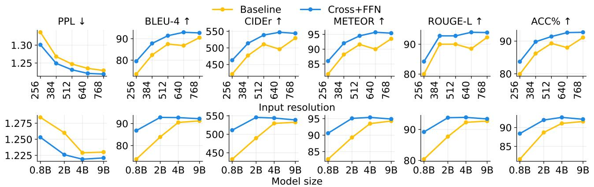

Figure 4. SVE (Cross+FFN) generalizes across input resolutions and model sizes. We compare SVE (blue) with its stateless baseline (yellow) on multi-object visual differencing across input resolutions (top) and model sizes (bottom). SVE consistently improves over the stateless baseline, especially when the baseline is weaker, while both approaches approach the task ceiling at higher resolutions and scales.   
Table 5. SVE generalizes across different VLM backbones. We compare SVE with its stateless baseline on multi-object visual differencing across VLM backbones. PPL, B4, C, M, S, R-L, and Acc denote perplexity, BLEU-4, CIDEr, METEOR, SPICE, ROUGE-L, and change accuracy. indicates improvement over the corresponding stateless baseline. 

<table><tr><td rowspan="2">Backbone</td><td colspan="2">Backbone features</td><td colspan="8">CLEVR-Multi-Change (30–40 Objects)</td></tr><tr><td>Connector design</td><td>Distinct feature</td><td>PPL ↓</td><td>B4 ↑</td><td>C ↑</td><td>M ↑</td><td>S ↑</td><td>R-L ↑</td><td>Acc ↑</td><td></td></tr><tr><td>Qwen3-VL-4B (Bai et al., 2025a)</td><td>MLP merger M = 4/N</td><td>DeepStack (Meng et al., 2024)</td><td>1.268 .004</td><td>82.5 2.5</td><td>482.1 15.1</td><td>88.6 1.3</td><td>58.7 1.0</td><td>86.8 1.5</td><td>87.3 .70</td><td></td></tr><tr><td>Qwen3.5-4B (Qwen Team, 2026)</td><td>MLP merger M = 4/N</td><td>Gated DeltaNet (Yang et al., 2025)</td><td>1.219 .010</td><td>92.7 2.2</td><td>543.9 14.4</td><td>95.4 1.9</td><td>80.1 1.1</td><td>93.9 1.6</td><td>92.7 1.6</td><td></td></tr><tr><td>GLM-4.6V-Flash (Zeng et al., 2025)</td><td>MLP merger M = 4/N</td><td>SwiGLU (Shazeer, 2020) FFN</td><td>1.236 .005</td><td>92.4 .70</td><td>542.0 3.8</td><td>95.0 .40</td><td>64.5 .40</td><td>93.6 .40</td><td>92.2 .10</td><td></td></tr><tr><td>InternVL3.5-4B (Wang et al., 2025b)</td><td>MLP merger M = 4/N</td><td>LayerScale (Touvron et al., 2021)</td><td>1.332 .026</td><td>68.2 1.7</td><td>389.5 11.5</td><td>77.8 1.1</td><td>49.9 1.2</td><td>76.3 1.2</td><td>77.4 1.8</td><td></td></tr><tr><td>Gemma-3-4B (Kamath et al., 2025)</td><td>Pool to M = 256 ∀N</td><td>Local-global Attn. (Beltagy et al., 2020)</td><td>1.316 .083</td><td>68.4 8.0</td><td>387.0 45.6</td><td>78.0 5.9</td><td>49.9 4.9</td><td>76.3 5.9</td><td>77.9 7.9</td><td></td></tr></table>

# 4. Feature Analysis of Stateful Representations

We further analyze the learned visual features to understand state-dependent visual signals that lead to the gains of SVE. We compare Cross+FFN against a capacity-controlled stateless baseline with the same architecture, trainable parameter count, training data, and optimization setup. The only difference is the source of the temporal cross-attention keys and values: SVE reads from the features of the previous image, whereas the stateless control reads features from the current image itself, which is equivalently self-attention. This comparison isolates whether the model learns to use past visual context, rather than merely benefiting from additional parameters or computation.

Let $Z _ { t } ( Y ) = f _ { V } ( I _ { t } \mid Y ) \in \mathbb { R } ^ { N \times d _ { V } }$ denote the visual representation of the current image $I _ { t }$ when the state-conditioning source is $Y ,$ , where N is the number of spatial visual tokens and $d _ { V }$ is the visual hidden dimension. To measure context sensitivity, we compare the representation induced by the true predecessor (previous image) $I _ { t - 1 }$ with the representation induced by a different predecessor $I _ { t - 1 } ^ { \prime } \colon$ :

$$
s _ {\min} (I _ {t}, I _ {t - 1}, I _ {t - 1} ^ {\prime}) = \min _ {n \in \{1, \dots , N \}} \cos \bigl (Z _ {t} (I _ {t - 1}) _ {n}, Z _ {t} (I _ {t - 1} ^ {\prime}) _ {n} \bigr)
$$

As shown in Fig. 5(a), the stateless control is invariant to predecessor swaps by construction, since there is no crossimage operation during visual encoding. In contrast, SVE produces substantially lower minimum token similarity, indicating that the representation of $I _ { t }$ depends on the preceding visual state with our introduced cross-image encoding module.

We next examine whether these context-dependent feature changes are useful for downstream change understanding. Let $a _ { i } ^ { \mathrm { s v e } }$ and $a _ { i } ^ { \mathrm { s t a t e l e s s } }$ denote the per-example Change-Acc scores of SVE and the stateless control on test example i. We define the set of non-tied examples as $\mathcal { D } = \{ \bar { i } : a _ { i } ^ { \mathrm { s v e } } \neq a _ { i } ^ { \mathrm { s t a t e l e s s } } \}$ , and compute the decidedexample win rate

$$
\mathrm{WinRate} = \frac {1}{| \mathcal {D} |} \sum_ {i \in \mathcal {D}} \mathbf {1} \left[ a _ {i} ^ {\mathrm{sve}} > a _ {i} ^ {\mathrm{stateless}} \right].
$$

As shown in Fig. 5(b), although many examples are ties due to the strength of the capacity-controlled baseline, SVE wins substantially more often among the non-tied cases. This indicates that the state-dependent representation changes are not merely incidental feature shifts, but are predictive of improved visual change understanding.

(a) Representation depends on context   
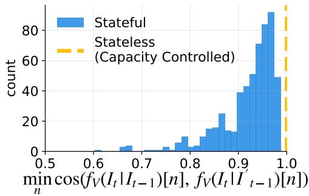

(b) Win rate when models disagree   
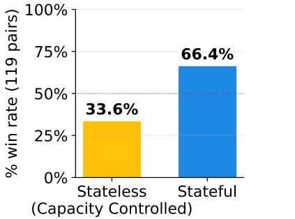

<details>
<summary>bar</summary>

| Category | % win rate (119 pairs) |
| :--- | :--- |
| Stateless (Capacity Controlled) | 33.6% |
| Stateful | 66.4% |
</details>

(c) Cross-image read is sparse   
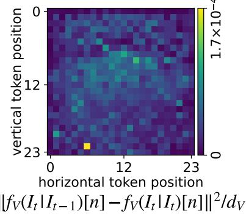  
Figure 5. Stateful encoding feature analysis. We compare SVE feature with the stateless baseline. (a) SVE produces context-dependent visual features, while the stateless baseline remains unchanged. (b) When the two models disagree, SVE wins the baseline by a large margin on CLEVR-Change. (c) Cross-image feature updates are spatially sparse.

Table 6. Medical-Diff-VQA evaluation results. We include captioning metrics i.e., BLEU-4 (B4), METEOR (M), ROUGE-L (R-L), and CIDEr (C) as well as evaluations based on RATE (Agrawal et al., 2025). 

<table><tr><td rowspan="2">Method</td><td rowspan="2">B4</td><td rowspan="2">M</td><td rowspan="2">R-L</td><td rowspan="2">C</td><td colspan="2">Finding-level F1</td><td rowspan="2">Change Acc.</td></tr><tr><td>Micro</td><td>Macro</td></tr><tr><td>Qwen3.5 4B (SFT)</td><td>47.9</td><td>40.6</td><td>62.7</td><td>145.1</td><td>31.55</td><td>11.95</td><td>86.83</td></tr><tr><td>+SVE (Ours)</td><td>49.6</td><td>40.9</td><td>66.3</td><td>178.9</td><td>32.20</td><td>12.45</td><td>89.21</td></tr></table>

Finally, Fig. 5(c) analyzes the spatial structure of the crossimage update. For each test pair, we compare the SVE representation with the true predecessor against a maskedpredecessor fallback, where the temporal cross-attention reads the current image itself:

$$
\Delta_ {n} = \frac {1}{d _ {V}} \left\| Z _ {t} (I _ {t - 1}) _ {n} - Z _ {t} (I _ {t}) _ {n} \right\| _ {2} ^ {2}.
$$

We visualize the average $\Delta _ { n }$ over test pairs on the postmerger spatial grid. The resulting heatmap is sparse: most positions have near-zero update magnitude, while a small number of tokens absorb most of the cross-image change. This supports the interpretation that SVE performs selective cross-image reading, preserving the pretrained visual representation for most tokens while updating localized features relevant to state comparison. Together, these results show that SVE learns visual features that are context-dependent, task-relevant, and spatially selective.

# 5. Validating SVE in Real-world Tasks

We validate the effectiveness of SVEs and our training recipe on three real-world comparison settings: detecting visual differences in radiology scans (Hu et al., 2025) (§5.1), performing fine-grained image comparison on edits derived from real-world/web images (Ye et al., 2025) (§5.2), and identifying changes in remote-sensing images (Liu et al., 2022a) (§5.3). We provide additional details on data formatting in §B.4, §B.5, §B.6, training configurations in §D, and evaluation setup in §C.

# 5.1. Longitudinal Radiology

We first validate SVEs in longitudinal radiology, where clinically meaningful diagnostics often require fine-grained comparison across time. We use the Medical-Diff-VQA dataset (Hu et al., 2025), which provides 16,347 paired chest X-ray images from the same patient together with annotations describing medical changes between the two studies. A SVE enables a VLM to better capture subtle longitudinal changes and therefore provides more grounded diagnostics (Fig. 6, top), and achieves gains in standard captioning metrics (Tab. 6, left).

We further introduce a structured evaluation based on the RATE framework (Agrawal et al., 2025) to measure whether models capture clinically meaningful changes across 27 chest-related finding types (e.g., lung opacity, pneumothorax, calcification) in Tab. 6 (right). We evaluate each X-ray pair by comparing the model’s predicted checklist of added or resolved findings against the reference, then report Micro/Macro F1 and whether it correctly detected any clinical change (additional details in §F). SVEs outperform the stateless baseline across all three metrics.

# 5.2. Fine-grained Image Comparison

To test whether a SVE enables better image comparison in VLMs on real-world web images, we use ImgEdit (Ye et al., 2025), which consists of source images, edited images, and edit instructions. Given a source–edited image pair, the model predicts the instruction that transformed the source image into the edited image. This setting is directly relevant

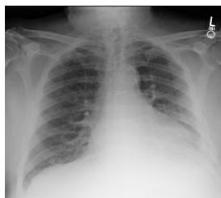

<details>
<summary>natural_image</summary>

Chest X-ray image showing rib cage and lung fields (no text or annotations)
</details>

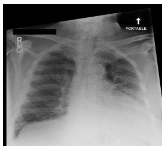

<details>
<summary>natural_image</summary>

Chest X-ray image showing rib cage and lung fields (no text or symbols visible)
</details>

Reference:

The main image has additional findings of lung opacity, and atelectasis than the reference image. the main image is missing the finding of cardiomegaly than the reference image.

Qwen 3.5 4B (SFT):

The main image has additional findings of atelectasis, and cardiomegaly than the reference image. the main image is missing the findings of pleural effusion, and lung opacity than the reference image.

Qwen 3.5 4B (SFT) + SVE (Ours):

The main image has additional findings of atelectasis, and lung opacity than the reference image. the main image is missing the finding of cardiomegaly than the reference image.


<details>
<summary>natural_image</summary>

Person standing on a rocky cliff overlooking a vast canyon with red-tinted rock formations and green valleys (no text or symbols visible)
</details>

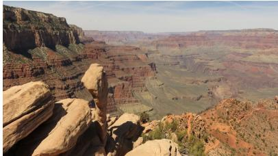

<details>
<summary>natural_image</summary>

Scenic view of a vast canyon landscape with reddish-brown rock formations and green valleys under a clear sky (no text or symbols visible)
</details>

Reference:

Replace person located slightly off-center in the upper-middle section of the image with a large rock Qwen 3.5 4B (SFT):

Remove the person standing on the rocky outcrop with arms raised, located in the central lowermiddle of the image.

Qwen 3.5 4B (SFT) + SVE (Ours):

Replace person positioned in the upper-central area of the image with a large rock

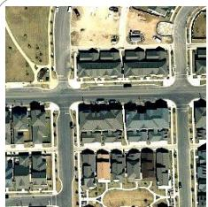

<details>
<summary>natural_image</summary>

Aerial view of a residential area with uniform housing and surrounding roads (no visible text or symbols)
</details>

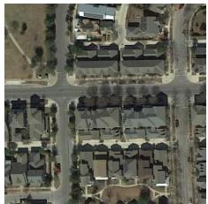

<details>
<summary>natural_image</summary>

Aerial view of a residential area with uniform houses and surrounding roads (no visible text or symbols)
</details>

Reference:

Some detached houses appear beside the road on the bareland.

Qwen 3.5 4B (SFT):

The scene is the same as before.

Qwen 3.5 4B (SFT) + SVE (Ours):

A building appears at the top of the scene .

Figure 6. Comparison of SVE vs. stateless baselines on real-world tasks. We show qualitative examples from longitudinal radiology (top), fine-grained image comparisons (bottom left), and remote sensing (bottom right). Text in green and red indicates correct and incorrect change descriptions compared to the reference, respectively.   
Table 7. ImgEdit evaluation results under MLLM-as-a-judge. We report pairwise preference counts against the baseline and reference instruction. 

<table><tr><td>Baseline</td><td>Base Win</td><td>Tied</td><td>SVE Win</td></tr><tr><td>Reference</td><td>296</td><td>758</td><td>346</td></tr><tr><td>Qwen3.5 4B (SFT)</td><td>171</td><td>1020</td><td>209</td></tr></table>

to edit verification (Ma et al., 2024), image-editing reward modeling (Luo et al., 2025; Wu et al., 2025), and imagedifference understanding (Baraldi et al., 2025; Li et al., 2025b; Di et al., 2025), all of which require models to compare before–after images and reason about whether the observed visual difference matches, explains, or refines a requested change (Fig. 6, bottom-left).

We train and evaluate SVEs against the stateless baseline on a subset of seven change categories (200 images each): add, adjust, background change, content memory, content understanding, remove, and replace (Ye et al., 2026). We exclude categories where shortcut solutions exist, such as style change, where the style may reveal the target instruction without requiring comparison. Results are in Tab. 7.

Here, we opt out of traditional reference-based metrics because the reference edit instruction is not guaranteed to match the actual transformation. Instead, we evaluate the output using a strong MLLM judge (Claude-Opus-4.7 (Anthropic, 2026)), and report pairwise preferences for SVEs

Table 8. LEVIR-CC evaluation results in comparison with prior methods. S∗m (Liu et al., 2023b) averages BLEU-4 (B4), METEOR (M), ROUGE-L (R-L), and CIDEr (C). 

<table><tr><td>Method</td><td>B4</td><td>M</td><td>R-L</td><td>C</td><td> $S_{m}^{*}$ </td></tr><tr><td colspan="6">Specialist models &amp; architectures</td></tr><tr><td>Capt-Diff (Park et al., 2019)</td><td>47.41</td><td>34.47</td><td>65.64</td><td>110.57</td><td>64.52</td></tr><tr><td>Capt-Rep (Park et al., 2019)</td><td>53.15</td><td>36.58</td><td>69.73</td><td>121.22</td><td>70.17</td></tr><tr><td>Capt-Att-Dual-Att (Park et al., 2019)</td><td>53.56</td><td>37.16</td><td>69.19</td><td>124.42</td><td>71.08</td></tr><tr><td>DUDA (Park et al., 2019)</td><td>57.79</td><td>37.15</td><td>71.04</td><td>124.32</td><td>72.58</td></tr><tr><td>MCCFormer-S (Qiu et al., 2021)</td><td>56.36</td><td>39.60</td><td>69.46</td><td>120.39</td><td>71.45</td></tr><tr><td>MCCFormer-D (Qiu et al., 2021)</td><td>56.38</td><td>39.91</td><td>70.44</td><td>124.44</td><td>72.79</td></tr><tr><td>RSICCFormer-C (Liu et al., 2022a)</td><td>62.41</td><td>38.70</td><td>73.60</td><td>132.62</td><td>76.83</td></tr><tr><td>PSNet (Liu et al., 2023a)</td><td>62.11</td><td>38.80</td><td>73.60</td><td>132.62</td><td>76.78</td></tr><tr><td>Chg2Cap (Chang and Ghamisi, 2023)</td><td>62.98</td><td>39.42</td><td>74.34</td><td>136.25</td><td>78.25</td></tr><tr><td>SEN (Zhou et al., 2024)</td><td>64.09</td><td>39.59</td><td>71.50</td><td>125.02</td><td>75.05</td></tr><tr><td>Diffusion-RSCC (Yu et al., 2025)</td><td>60.90</td><td>37.80</td><td>71.50</td><td>125.60</td><td>73.95</td></tr><tr><td>CTMTNet (Shi et al., 2024)</td><td>64.69</td><td>39.49</td><td>74.54</td><td>134.94</td><td>78.42</td></tr><tr><td>PromptCC (Liu et al., 2023b)</td><td>63.54</td><td>38.82</td><td>73.72</td><td>136.44</td><td>78.13</td></tr><tr><td>SAGE-CC (Wang et al., 2025a)</td><td>65.50</td><td>39.92</td><td>74.77</td><td>137.50</td><td>79.42</td></tr><tr><td>SACNet (Yang et al., 2026)</td><td>65.57</td><td>40.30</td><td>75.68</td><td>138.34</td><td>79.97</td></tr><tr><td colspan="6">Generalist VLMs</td></tr><tr><td>Qwen3.5 4B (SFT)</td><td>60.70</td><td>39.42</td><td>76.03</td><td>142.26</td><td>79.60</td></tr><tr><td>+SVE (Ours)</td><td>61.33</td><td>39.91</td><td>76.26</td><td>144.35</td><td>80.46</td></tr></table>

against both the stateless baseline and the original reference instruction, where the SVE is preferred over both.

# 5.3. Remote Sensing

Remote sensing change captioning requires models to compare before-after aerial or satellite images of the same geographic region and describe how the scene has changed in the later image, such as newly constructed buildings, removed infrastructure, or altered land use (Fig. 6, bottomright). This task is a natural fit for SVEs because the taskrelevant signal often lies in small, localized differences between the two images, while the surrounding geographic context remains largely unchanged. To this end, we train and evaluate SVEs on LEVIR-CC (Liu et al., 2022a), a standard remote sensing change captioning dataset. We use standard captioning metrics and $S _ { m } ^ { * }$ following prior work (Liu et al., 2023b), and present results in Tab. 8. SVEs improve over the stateless baseline, and moreover, SVEs outperforms all prior specialist models and architectures.

# 6. Conclusion

We presented the Stateful Visual Encoder (SVE), a simple yet effective method for introducing cross-image interaction into the visual encoder of a VLM. SVEs consistently outperform stateless baselines across both synthetic datasets and real-world applications, from longitudinal radiology to remote sensing, and scales robustly across resolutions, model sizes, and architectures. Overall, our results show that making the visual encoder state-aware can substantially improve multi-image reasoning while preserving the pretrained VLM interface, offering a practical path toward VLMs that better track, compare, and reason over dynamic visual contexts.

Acknowledgements We thank Kate Saenko, Mayank Mishra, Sanjay Sriram Subramanian, Kumar Krishna Agrawal, Lisa Dunlap, Natalia Harguindeguy, Baifeng Shi, XuDong Wang and Fangzhou Zhao for their discussion and/or support in developing this project. Authors, as part of their affiliation with UC Berkeley, were supported by gifts from Accenture, AMD, Anyscale, Broadcom, Cisco, Google, IBM, Intel, Intesa Sanpaolo, Lambda, Lightspeed, Mibura, Microsoft, NVIDIA, Qualcomm, Samsung SDS, and SAP.

# References

Kumar Krishna Agrawal, Longchao Liu, Long Lian, Michael Nercessian, Natalia Harguindeguy, Yufu Wu, Peter Mikhael, Gigin Lin, Lecia V Sequist, Florian Fintelmann, et al. Pillar-0: A new frontier for radiology foundation models. arXiv preprint arXiv:2511.17803, 2025.   
Jean-Baptiste Alayrac, Jeff Donahue, Pauline Luc, Antoine Miech, Iain Barr, Yana Hasson, Karel Lenc, Arthur Mensch, Katherine Millican, Malcolm Reynolds, et al. Flamingo: a visual language model for few-shot learning. Advances in neural information processing systems, 35: 23716–23736, 2022.   
Peter Anderson, Basura Fernando, Mark Johnson, and Stephen Gould. Spice: Semantic propositional image

caption evaluation. In European conference on computer vision, pages 382–398. Springer, 2016.   
Anthropic. Introducing claude opus 4.7. https://www. anthropic.com/news/claude-opus-4-7, April 2026. Accessed: 2026-05-16.   
Anurag Arnab, Mostafa Dehghani, Georg Heigold, Chen Sun, Mario Luciˇ c, and Cordelia Schmid. Vivit: A video ´ vision transformer. In Proceedings of the IEEE/CVF international conference on computer vision, pages 6836– 6846, 2021.   
Thomas Bachlechner, Bodhisattwa Prasad Majumder, Henry Mao, Gary Cottrell, and Julian McAuley. Rezero is all you need: Fast convergence at large depth. In Uncertainty in artificial intelligence, pages 1352–1361. PMLR, 2021.   
Shuai Bai, Yuxuan Cai, Ruizhe Chen, Keqin Chen, Xionghui Chen, Zesen Cheng, Lianghao Deng, Wei Ding, Chang Gao, Chunjiang Ge, et al. Qwen3-vl technical report. arXiv preprint arXiv:2511.21631, 2025a.   
Shuai Bai, Keqin Chen, Xuejing Liu, Jialin Wang, Wenbin Ge, Sibo Song, Kai Dang, Peng Wang, Shijie Wang, Jun Tang, Humen Zhong, Yuanzhi Zhu, Mingkun Yang, Zhaohai Li, Jianqiang Wan, Pengfei Wang, Wei Ding, Zheren Fu, Yiheng Xu, Jiabo Ye, Xi Zhang, Tianbao Xie, Zesen Cheng, Hang Zhang, Zhibo Yang, Haiyang Xu, and Junyang Lin. Qwen2.5-vl technical report, 2025b. URL https://arxiv.org/abs/2502.13923.   
Wele Gedara Chaminda Bandara and Vishal M. Patel. A transformer-based siamese network for change detection. In IEEE International Geoscience and Remote Sensing Symposium (IGARSS), 2022.   
Satanjeev Banerjee and Alon Lavie. METEOR: An automatic metric for MT evaluation with improved correlation with human judgments. In Jade Goldstein, Alon Lavie, Chin-Yew Lin, and Clare Voss, editors, Proceedings of the ACL Workshop on Intrinsic and Extrinsic Evaluation Measures for Machine Translation and/or Summarization, pages 65–72, Ann Arbor, Michigan, June 2005. Association for Computational Linguistics. URL https://aclanthology.org/W05-0909/.   
Lorenzo Baraldi, Davide Bucciarelli, Federico Betti, Marcella Cornia, Nicu Sebe, and Rita Cucchiara. What changed? detecting and evaluating instruction-guided image edits with multimodal large language models. In Proceedings of the IEEE/CVF International Conference on Computer Vision, pages 16217–16226, 2025.   
Iz Beltagy, Matthew E Peters, and Arman Cohan. Longformer: The long-document transformer. arXiv preprint arXiv:2004.05150, 2020.

Gedas Bertasius, Heng Wang, and Lorenzo Torresani. Is space-time attention all you need for video understanding? In Icml, volume 2, page 4, 2021.   
Lorenzo Bianchi, Fabio Carrara, Nicola Messina, and Fabrizio Falchi. Is clip the main roadblock for fine-grained open-world perception? In 2024 International Conference on Content-Based Multimedia Indexing (CBMI), pages 1–8. IEEE, 2024.   
Mahtab Bigverdi, Zelun Luo, Cheng-Yu Hsieh, Ethan Shen, Dongping Chen, Linda G Shapiro, and Ranjay Krishna. Perception tokens enhance visual reasoning in multimodal language models. In Proceedings of the Computer Vision and Pattern Recognition Conference, pages 3836–3845, 2025.   
Daniel Bolya, Po-Yao Huang, Peize Sun, Jang Hyun Cho, Andrea Madotto, Chen Wei, Tengyu Ma, Jiale Zhi, Jathushan Rajasegaran, Hanoona Bangalath, et al. Perception encoder: The best visual embeddings are not at the output of the network. Advances in Neural Information Processing Systems, 38:60884–60937, 2026.   
Mathilde Caron, Hugo Touvron, Ishan Misra, Herve J ´ egou, ´ Julien Mairal, Piotr Bojanowski, and Armand Joulin. Emerging properties in self-supervised vision transformers. In Proceedings of the IEEE/CVF international conference on computer vision, pages 9650–9660, 2021.   
Joao Carreira and Andrew Zisserman. Quo vadis, action recognition? a new model and the kinetics dataset. In proceedings of the IEEE Conference on Computer Vision and Pattern Recognition, pages 6299–6308, 2017.   
Shizhen Chang and Pedram Ghamisi. Changes to captions: An attentive network for remote sensing change captioning. IEEE Transactions on Image Processing, 32:6047– 6060, 2023.   
Boyuan Chen, Zhuo Xu, Sean Kirmani, Brain Ichter, Dorsa Sadigh, Leonidas Guibas, and Fei Xia. Spatialvlm: Endowing vision-language models with spatial reasoning capabilities. In Proceedings of the IEEE/CVF Conference on Computer Vision and Pattern Recognition, pages 14455–14465, 2024.   
Hao Chen, Zipeng Qi, and Zhenwei Shi. Remote sensing image change detection with transformers. IEEE Transactions on Geoscience and Remote Sensing, 60:1–14, 2021.   
Xinlei Chen and Kaiming He. Exploring simple siamese representation learning. In Proceedings of the IEEE/CVF conference on computer vision and pattern recognition, pages 15750–15758, 2021.

Wenliang Dai, Junnan Li, Dongxu Li, Anthony Tiong, Junqi Zhao, Weisheng Wang, Boyang Li, Pascale N Fung, and Steven Hoi. Instructblip: Towards general-purpose visionlanguage models with instruction tuning. Advances in neural information processing systems, 36:49250–49267, 2023.   
Zonglin Di, Jing Shi, Yifei Fan, Hao Tan, Alexander Black, John Collomosse, and Yang Liu. Difftell: A high-quality dataset for describing image manipulation changes. In Proceedings of the IEEE/CVF International Conference on Computer Vision, pages 24580–24590, 2025.   
Anxhelo Diko et al. ReWind: Understanding long videos with instructed learnable memory. In Proceedings of the IEEE/CVF Conference on Computer Vision and Pattern Recognition (CVPR), 2025.   
Sijun Dong, Libo Wang, Bo Du, and Xiaoliang Meng. ChangeCLIP: Remote sensing change detection with multimodal vision-language representation learning. ISPRS Journal of Photogrammetry and Remote Sensing, 220: 53–69, 2025.   
Haoqi Fan, Bo Xiong, Karttikeya Mangalam, Yanghao Li, Zhicheng Yan, Jitendra Malik, and Christoph Feichtenhofer. Multiscale vision transformers. In Proceedings of the IEEE/CVF international conference on computer vision, pages 6824–6835, 2021.   
Jean-Bastien Grill, Florian Strub, Florent Altche, Corentin ´ Tallec, Pierre Richemond, Elena Buchatskaya, Carl Doersch, Bernardo Avila Pires, Zhaohan Guo, Mohammad Gheshlaghi Azar, et al. Bootstrap your own latent-a new approach to self-supervised learning. Advances in neural information processing systems, 33:21271–21284, 2020.   
Bo He, Hengduo Li, Young Kyun Jang, Menglin Jia, Xuefei Cao, Ashish Shah, Abhinav Shrivastava, and Ser-Nam Lim. MA-LMM: Memory-augmented large multimodal model for long-term video understanding. In Proceedings of the IEEE/CVF Conference on Computer Vision and Pattern Recognition (CVPR), 2024.   
Xinyue Hu, Lin Gu, Qiyuan An, Mengliang Zhang, liangchen liu, Kazuma Kobayashi, Tatsuya Harada, Ronald Summers, and Yingying Zhu. Medical-Diff-VQA: A Large-Scale Medical Dataset for Difference Visual Question Answering on Chest X-Ray Images. PhysioNet, February 2025. doi: 10.13026/e6dd-cn74. URL https://doi.org/10.13026/e6dd-cn74. Version 1.0.1.   
Dongfu Jiang, Xuan He, Huaye Zeng, Cong Wei, Max Ku, Qian Liu, and Wenhu Chen. MANTIS: Interleaved multiimage instruction tuning. Transactions on Machine Learning Research (TMLR), 2024.

Justin Johnson, Bharath Hariharan, Laurens Van Der Maaten, Li Fei-Fei, C Lawrence Zitnick, and Ross Girshick. Clevr: A diagnostic dataset for compositional language and elementary visual reasoning. In Proceedings of the IEEE conference on computer vision and pattern recognition, pages 2901–2910, 2017.   
Gemma Team Aishwarya Kamath, Johan Ferret, Shreya Pathak, Nino Vieillard, Ramona Merhej, Sarah Perrin, Tatiana Matejovicova, Alexandre Ram’e, Morgane Riviere, Louis Rouillard, Thomas Mesnard, Geoffrey \` Cideron, Jean-Bastien Grill, Sabela Ramos, Edouard Yvinec, Michelle Casbon, Etienne Pot, Ivo Penchev, Gael Liu, Francesco Visin, Kathleen Kenealy, Lucas Beyer, Xiaohai Zhai, Anton Tsitsulin, Robert Istvan ´ Busa-Fekete, Alex Feng, Noveen Sachdeva, Benjamin Coleman, Yi Gao, Basil Mustafa, Iain Barr, Emilio Parisotto, David Tian, Matan Eyal, Colin Cherry, Jan-Thorsten Peter, Danila Sinopalnikov, Surya Bhupatiraju, Rishabh Agarwal, Mehran Kazemi, Dan Malkin, Ravin Kumar, David Vilar, Idan Brusilovsky, Jiaming Luo, Andreas Steiner, Abe Friesen, Abhanshu Sharma, Abheesht Sharma, Adi Mayrav Gilady, Adrian Goedeckemeyer, Alaa Saade, Alexander Kolesnikov, Alexei Bendebury, Alvin Abdagic, Amit Vadi, Andr’as Gyorgy, Andre Susano Pinto, Anil Das, Ankur Bapna, Antoine ´ Miech, Antoine Yang, Antonia Paterson, Ashish Shenoy, Ayan Chakrabarti, Bilal Piot, Boxi Wu, Bobak Shahriari, Bryce Petrini, Charlie Chen, Charline Le Lan, Christopher A. Choquette-Choo, Cj Carey, Cormac Brick, Daniel Deutsch, Danielle Eisenbud, Dee Cattle, Derek Cheng, Dimitris Paparas, Divyashree Shivakumar Sreepathihalli, Doug Reid, Dustin Tran, Dustin Zelle, Eric Noland, Erwin Huizenga, Eugene Kharitonov, Frederick Liu, Gagik Amirkhanyan, Glenn Cameron, Hadi Hashemi, Hanna Klimczak-Pluci’nska, Harman Singh, Harsh Mehta, Harshal Tushar Lehri, Hussein Hazimeh, Ian Ballantyne, Idan Szpektor, Ivan Nardini, Jean Pouget-Abadie, Jetha Chan, Joe Stanton, J. Michael Wieting, Jonathan Lai, Jordi Orbay, Joe Fernandez, Joshua Newlan, Junsong Ji, Jyotinder Singh, Kat Black, Kathy Yu, Kevin Hui, Kiran Vodrahalli, Klaus Greff, Linhai Qiu, Marcella Valentine, Marina Coelho, Marvin Ritter, Matt Hoffman, Matthew Watson, Mayank Chaturvedi, Michael Moynihan, Min Ma, Nabila Babar, Natasha Noy, Nathan Byrd, Nick Roy, Nikola Momchev, Nilay Chauhan, Oskar Bunyan, Pankil Botarda, Paul Caron, Paul Kishan Rubenstein, Phil Culliton, Philipp Schmid, Pier Giuseppe Sessa, Ping mei Xu, Piotr Stanczyk, Pouya Dehghani Tafti, ´ Rakesh Shivanna, Renjie Wu, Renke Pan, Reza Ardeshir Rokni, Rob Willoughby, Rohith Vallu, Ryan Mullins, Sammy Jerome, Sara Smoot, Sertan Girgin, Shariq Iqbal, Shashir Reddy, Shruti Sheth, Siim Poder, Sijal Bhat- ˜ nagar, Sindhu Raghuram Panyam, Sivan Eiger, Susan

Zhang, Tianqi Liu, Trevor Yacovone, Tyler Liechty, Uday Kalra, Utku Evci, Vedant Misra, Vincent Roseberry, Vladimir Feinberg, Vlad Kolesnikov, Woohyun Han, Woosuk Kwon, Xi Chen, Yinlam Chow, Yuvein Zhu, Zichuan Wei, Zoltan Egyed, Victor Cotruta, Minh Giang, Phoebe Kirk, Anand Rao, Jessica Lo, Erica Moreira, Luiz Gustavo Martins, Omar Sanseviero, Lucas Gonzalez, Zach Gleicher, Tris Warkentin, Vahab S. Mirrokni, Evan Senter, Eli Collins, Joelle Barral, Zoubin Ghahramani, Raia Hadsell, Yossi Matias, D. Sculley, Slav Petrov, Noah Fiedel, Noam Shazeer, Oriol Vinyals, Jeffrey Dean, Demis Hassabis, Koray Kavukcuoglu, Clement ´ Farabet, Elena Buchatskaya, Jean-Baptiste Alayrac, Rohan Anil, Dmitry Lepikhin, Sebastian Borgeaud, Olivier Bachem, Armand Joulin, Alek Andreev, Cassidy Hardin, Robert Dadashi, and L’eonard Hussenot. Gemma 3 technical report. ArXiv, abs/2503.19786, 2025. URL https://api.semanticscholar. org/CorpusID:277313563.

Durk P Kingma and Prafulla Dhariwal. Glow: Generative flow with invertible 1x1 convolutions. Advances in neural information processing systems, 31, 2018.

Hugo Laurenc¸on, Andres Marafioti, Victor Sanh, and L ´ eo´ Tronchon. Building and better understanding visionlanguage models: Insights and future directions. In Conference on Language Modeling (COLM), 2024.

Bo Li, Yuanhan Zhang, Dong Guo, Renrui Zhang, Feng Li, Hao Zhang, Kaichen Zhang, Yanwei Li, Ziwei Liu, and Chunyuan Li. LLaVA-OneVision: Easy visual task transfer. Transactions on Machine Learning Research (TMLR), 2025a.

Feng Li, Renrui Zhang, Hao Zhang, Yuanhan Zhang, Bo Li, Wei Li, Zejun Ma, and Chunyuan Li. LLaVA-NeXT-Interleave: Tackling multi-image, video, and 3d in large multimodal models. arXiv preprint arXiv:2407.07895, 2024.

Junnan Li, Dongxu Li, Silvio Savarese, and Steven Hoi. Blip-2: Bootstrapping language-image pre-training with frozen image encoders and large language models. In International conference on machine learning, pages 19730–19742. PMLR, 2023.

Ming Li, Xin Gu, Fan Chen, Xiaoying Xing, Longyin Wen, Chen Chen, and Sijie Zhu. Superedit: Rectifying and facilitating supervision for instruction-based image editing. In Proceedings of the IEEE/CVF International Conference on Computer Vision, pages 19206–19215, 2025b.

Chin-Yew Lin. ROUGE: A package for automatic evaluation of summaries. In Text Summarization Branches

Out, pages 74–81, Barcelona, Spain, July 2004. Association for Computational Linguistics. URL https: //aclanthology.org/W04-1013/.   
Ji Lin, Hongxu Yin, Wei Ping, Pavlo Molchanov, Mohammad Shoeybi, and Song Han. VILA: On pre-training for visual language models. In Proceedings of the IEEE/CVF Conference on Computer Vision and Pattern Recognition (CVPR), 2024.   
Chenyang Liu, Rui Zhao, Hao Chen, Zhengxia Zou, and Zhenwei Shi. Remote sensing image change captioning with dual-branch transformers: A new method and a large scale dataset. IEEE Transactions on Geoscience and Remote Sensing, 60:1–20, 2022a. doi: 10.1109/TGRS. 2022.3218921.   
Chenyang Liu, Jiajun Yang, Zipeng Qi, Zhengxia Zou, and Zhenwei Shi. Progressive scale-aware network for remote sensing image change captioning. In IGARSS 2023-2023 IEEE International Geoscience and Remote Sensing Symposium, pages 6668–6671. IEEE, 2023a.   
Chenyang Liu, Rui Zhao, Jianqi Chen, Zipeng Qi, Zhengxia Zou, and Zhenwei Shi. A decoupling paradigm with prompt learning for remote sensing image change captioning. IEEE Transactions on Geoscience and Remote Sensing, 61:1–18, 2023b. doi: 10.1109/TGRS.2023.3321752.   
Haotian Liu, Chunyuan Li, Qingyang Wu, and Yong Jae Lee. Visual instruction tuning. Advances in neural information processing systems, 36:34892–34916, 2023c.   
Haotian Liu, Chunyuan Li, Yuheng Li, and Yong Jae Lee. Improved baselines with visual instruction tuning. In Proceedings of the IEEE/CVF conference on computer vision and pattern recognition, pages 26296–26306, 2024.   
Ze Liu, Jia Ning, Yue Cao, Yixuan Wei, Zheng Zhang, Stephen Lin, and Han Hu. Video swin transformer. In Proceedings of the IEEE/CVF conference on computer vision and pattern recognition, pages 3202–3211, 2022b.   
Xin Luo, Jiahao Wang, Chenyuan Wu, Shitao Xiao, Xiyan Jiang, Defu Lian, Jiajun Zhang, Dong Liu, et al. Editscore: Unlocking online rl for image editing via high-fidelity reward modeling. arXiv preprint arXiv:2509.23909, 2025.   
Yiwei Ma, Jiayi Ji, Ke Ye, Weihuang Lin, Zhibin Wang, Yonghan Zheng, Qiang Zhou, Xiaoshuai Sun, and Rongrong Ji. I2ebench: A comprehensive benchmark for instruction-based image editing. Advances in Neural Information Processing Systems, 37:41494–41516, 2024.   
Lingchen Meng, Jianwei Yang, Rui Tian, Xiyang Dai, Zuxuan Wu, Jianfeng Gao, and Yu-Gang Jiang. Deepstack: Deeply stacking visual tokens is surprisingly simple and effective for lmms. Advances in Neural Information Processing Systems, 37:23464–23487, 2024.

Georgios Pantazopoulos, Alessandro Suglia, Oliver Lemon, and Arash Eshghi. Lost in space: Probing fine-grained spatial understanding in vision and language resamplers. In Proceedings of the 2024 Conference of the North American Chapter of the Association for Computational Linguistics: Human Language Technologies (Volume 2: Short Papers), pages 540–549, 2024.

Kishore Papineni, Salim Roukos, Todd Ward, and Wei-Jing Zhu. Bleu: a method for automatic evaluation of machine translation. In Pierre Isabelle, Eugene Charniak, and Dekang Lin, editors, Proceedings of the 40th Annual Meeting of the Association for Computational Linguistics, pages 311–318, Philadelphia, Pennsylvania, USA, July 2002. Association for Computational Linguistics. doi: 10.3115/1073083.1073135. URL https://aclanthology.org/P02-1040/.

Dong Huk Park, Trevor Darrell, and Anna Rohrbach. Robust change captioning. In Proceedings of the IEEE/CVF International Conference on Computer Vision (ICCV), 2019.

William Peebles and Saining Xie. Scalable diffusion models with transformers. In Proceedings of the IEEE/CVF international conference on computer vision, pages 4195– 4205, 2023.

Ethan Perez, Florian Strub, Harm De Vries, Vincent Dumoulin, and Aaron Courville. Film: Visual reasoning with a general conditioning layer. In Proceedings of the AAAI conference on artificial intelligence, volume 32, 2018.

Yiming Qin, Bomin Wei, Jiaxin Ge, Konstantinos Kallidromitis, Stephanie Fu, Trevor Darrell, and XuDong Wang. Chain-of-visual-thought: Teaching vlms to see and think better with continuous visual tokens. arXiv preprint arXiv:2511.19418, 2025.

Yue Qiu, Shintaro Yamamoto, Kodai Nakashima, Ryota Suzuki, Kenji Iwata, Hirokatsu Kataoka, and Yutaka Satoh. Describing and localizing multiple changes with transformers. In Proceedings of the IEEE/CVF International Conference on Computer Vision, pages 1971–1980, 2021.

Qwen Team. Qwen3.5: Towards native multimodal agents, February 2026. URL https://qwen.ai/blog? id=qwen3.5.

Alec Radford, Jong Wook Kim, Chris Hallacy, Aditya Ramesh, Gabriel Goh, Sandhini Agarwal, Girish Sastry, Amanda Askell, Pamela Mishkin, Jack Clark, et al. Learning transferable visual models from natural language supervision. In International conference on machine learning, pages 8748–8763. PmLR, 2021.

Noam Shazeer. Glu variants improve transformer. arXiv preprint arXiv:2002.05202, 2020.   
Baifeng Shi, Stephanie Fu, Long Lian, Hanrong Ye, David Eigen, Aaron Reite, Boyi Li, Jan Kautz, Song Han, David M. Chan, Pavlo Molchanov, Trevor Darrell, and Hongxu Yin. Attend before attention: Efficient and scalable video understanding via autoregressive gazing, 2026. URL https://arxiv.org/abs/2603.12254.   
Jingye Shi, Mengge Zhang, Yuewu Hou, Ruicong Zhi, and Jiqiang Liu. A multitask network and two large-scale datasets for change detection and captioning in remote sensing images. IEEE Transactions on Geoscience and Remote Sensing, 62:1–17, 2024. doi: 10.1109/TGRS. 2024.3485740.   
Feilong Tang, Xiang An, Yunyao Yan, Yin Xie, Bin Qin, Kaicheng Yang, Yifei Shen, Yuanhan Zhang, Chunyuan Li, Shikun Feng, et al. Onevision-encoder: Codec-aligned sparsity as a foundational principle for multimodal intelligence. arXiv preprint arXiv:2602.08683, 2026.   
Shengbang Tong, Zhuang Liu, Yuexiang Zhai, Yi Ma, Yann LeCun, and Saining Xie. Eyes wide shut? exploring the visual shortcomings of multimodal llms. In Proceedings of the IEEE/CVF conference on computer vision and pattern recognition, pages 9568–9578, 2024.   
Zhan Tong, Yibing Song, Jue Wang, and Limin Wang. Videomae: Masked autoencoders are data-efficient learners for self-supervised video pre-training. Advances in neural information processing systems, 35:10078–10093, 2022.   
Hugo Touvron, Matthieu Cord, Alexandre Sablayrolles, Gabriel Synnaeve, and Herve J ´ egou. Going deeper with ´ image transformers. In Proceedings of the IEEE/CVF international conference on computer vision, pages 32–42, 2021.   
Ramakrishna Vedantam, C Lawrence Zitnick, and Devi Parikh. Cider: Consensus-based image description evaluation. In Proceedings of the IEEE conference on computer vision and pattern recognition, pages 4566–4575, 2015.   
Futian Wang, Mengqi Wang, Xiao Wang, Haowen Wang, and Jin Tang. Sam guided semantic and motion changed region mining for remote sensing change captioning. arXiv preprint arXiv:2511.21420, 2025a.   
Weiyun Wang, Zhangwei Gao, Lixin Gu, Hengjun Pu, Long Cui, Xingguang Wei, Zhaoyang Liu, Linglin Jing, Shenglong Ye, Jie Shao, et al. Internvl3. 5: Advancing opensource multimodal models in versatility, reasoning, and efficiency. arXiv preprint arXiv:2508.18265, 2025b.

Xinyuan Wang, Bowen Wang, Dunjie Lu, Junlin Yang, Tianbao Xie, Junli Wang, Jiaqi Deng, Xiaole Guo, Yiheng Xu, Chen Henry Wu, et al. Opencua: Open foundations for computer-use agents. arXiv preprint arXiv:2508.09123, 2025c.   
Yi Wang, Kunchang Li, Xinhao Li, Jiashuo Yu, Yinan He, Guo Chen, Baoqi Pei, Rongkun Zheng, Zun Wang, Yansong Shi, et al. Internvideo2: Scaling foundation models for multimodal video understanding. In European conference on computer vision, pages 396–416. Springer, 2024.   
Zirui Wang, Junyi Zhang, Jiaxin Ge, Long Lian, Letian Fu, Lisa Dunlap, Ken Goldberg, XuDong Wang, Ion Stoica, David M Chan, et al. Visgym: Diverse, customizable, scalable environments for multimodal agents. arXiv preprint arXiv:2601.16973, 2026.   
Thomas Wolf, Lysandre Debut, Victor Sanh, Julien Chaumond, Clement Delangue, Anthony Moi, Pierric Cistac, Tim Rault, Remi Louf, Morgan Funtowicz, Joe ´ Davison, Sam Shleifer, Patrick von Platen, Clara Ma, Yacine Jernite, Julien Plu, Canwen Xu, Teven Le Scao, Sylvain Gugger, Mariama Drame, Quentin Lhoest, and Alexander M. Rush. Transformers: State-of-the-art natural language processing. In Proceedings of the 2020 Conference on Empirical Methods in Natural Language Processing: System Demonstrations, pages 38–45, Online, October 2020. Association for Computational Linguistics. URL https://www.aclweb. org/anthology/2020.emnlp-demos.6.   
Keming Wu, Sicong Jiang, Max Ku, Ping Nie, Minghao Liu, and Wenhu Chen. Editreward: A human-aligned reward model for instruction-guided image editing. arXiv preprint arXiv:2509.26346, 2025.   
Yujie Xu et al. StreamingVLM: Real-time understanding for infinite video streams. arXiv preprint arXiv:2510.09608, 2025.   
Songlin Yang, Jan Kautz, and Ali Hatamizadeh. Gated delta networks: Improving mamba2 with delta rule. In International Conference on Learning Representations, volume 2025, pages 29687–29707, 2025.   
Zhigang Yang, Huiguang Yao, Junzhen Wu, Linmao Tian, Weiping Ni, Qiang Li, and Qi Wang. Spatial-semantic alignment and change-aware network for remote sensing image change captioning. IEEE Transactions on Geoscience and Remote Sensing, 2026.   
Yang Ye, Xianyi He, Zongjian Li, Bin Lin, Shenghai Yuan, Zhiyuan Yan, Bohan Hou, and Li Yuan. Imgedit: A unified image editing dataset and benchmark, 2025. URL https://arxiv.org/abs/2505.20275.

Yang Ye, Xianyi He, Zongjian Li, Shenghai Yuan, Zhiyuan Yan, Bohan Hou, Li Yuan, et al. Imgedit: A unified image editing dataset and benchmark. Advances in Neural Information Processing Systems, 38, 2026.   
Xiaofei Yu, Yitong Li, Jie Ma, Chang Li, and Hanlin Wu. Diffusion-rscc: Diffusion probabilistic model for change captioning in remote sensing images. IEEE Transactions on Geoscience and Remote Sensing, 2025.   
Aohan Zeng, Xin Lv, Qinkai Zheng, Zhenyu Hou, Bin Chen, Chengxing Xie, Cunxiang Wang, Da Yin, Hao Zeng, Jiajie Zhang, et al. Glm-4.5: Agentic, reasoning, and coding (arc) foundation models. arXiv preprint arXiv:2508.06471, 2025.   
Xiaohua Zhai, Basil Mustafa, Alexander Kolesnikov, and Lucas Beyer. Sigmoid loss for language image pretraining. In Proceedings of the IEEE/CVF international conference on computer vision, pages 11975–11986, 2023.   
Haoji Zhang, Yiqin Wang, Yansong Tang, Yong Liu, Jiashi Feng, Jifeng Dai, and Xiaojie Jin. Flash-VStream: Memory-based real-time understanding for long video streams. In International Conference on Learning Representations (ICLR), 2025.   
Lvmin Zhang, Anyi Rao, and Maneesh Agrawala. Adding conditional control to text-to-image diffusion models. In Proceedings of the IEEE/CVF international conference on computer vision, pages 3836–3847, 2023.   
Long Zhao, Nitesh B. Gundavarapu, Liangzhe Yuan, Hao Zhou, Shen Yan, Jennifer J. Sun, Luke Friedman, Rui Qian, Tobias Weyand, Yue Zhao, Rachel Hornung, Florian Schroff, Ming-Hsuan Yang, David A. Ross, Huisheng Wang, Hartwig Adam, Mikhail Sirotenko, Ting Liu, and Boqing Gong. VideoPrism: A foundational visual encoder for video understanding. In International Conference on Machine Learning (ICML), 2024.   
Yaowei Zheng, Richong Zhang, Junhao Zhang, Yanhan Ye, and Zheyan Luo. Llamafactory: Unified efficient finetuning of 100+ language models. In Proceedings of the 62nd annual meeting of the association for computational linguistics (volume 3: system demonstrations), pages 400– 410, 2024.   
Qing Zhou, Junyu Gao, Yuan Yuan, and Qi Wang. Singlestream extractor network with contrastive pre-training for remote-sensing change captioning. IEEE Transactions on Geoscience and Remote Sensing, 62:1–14, 2024.

The appendix is organized as follows:

• Appendix A discusses some limitations of our approach.   
• Appendix B describes the training data formatting for all six task families used in our experiments, including controlled synthetic tasks and real-world comparison tasks.   
• Appendix C defines evaluation-time prompt construction and the metric conventions used across tasks.   
• Appendix D reports the software environment, distributed-training setup, tokenized cache, taskspecific hyperparameters, and hardware infrastructure.   
• Appendix E provides a table view of the SVE design space and the per-layer parameter and compute overhead of each variant.   
• Appendix F provides additional details for the findinglevel Medical-Diff-VQA evaluation protocol.   
• Appendix G discusses AI use in the preparation of this work.

# A. Limitations

Although a SVE improves multi-image reasoning across controlled and real-world comparison tasks, several limitations remain.

Boundary of visual comparison. Our current formulation conditions each image on its immediate previous image at each visual-encoder layer. This still allows information to propagate diagonally across images over depth, so the effective cross-image receptive field can grow with the number of layers. However, long-range evidence is accessed only indirectly through intermediate visual states, rather than by explicit attention to all prior images. This is suitable for before–after comparison and short visual trajectories, but may be insufficient when relevant evidence is distributed across many earlier observations.

Domains that benefit from capturing changes. Our realworld evaluations focus on image-pair or image-sequence comparison in radiology, image editing, and remote sensing. These domains cover diverse visual changes, but they do not fully capture the broader range of multimodal state tracking required in embodied agents, robotics, tactile interaction, audio-visual perception, or long-running computer-use environments.

Computational overhead. A SVE introduces additional cross-image computation inside the visual encoder (Tab. 17). This overhead is usually modest compared to scaling the language backbone, but it can become nontrivial as image resolution, sequence length, or the number of visual states increases. Scaling stateful visual encoding to very long visual histories will therefore require more efficient memory, retrieval, or sparse attention mechanisms.

# B. Training Data Formatting

This appendix documents the training data format for the six task families used to derive, train and evaluate SVE (§3, §5):

1. Cross-image Spatial Aggregation (§3.1; Dot Distance/Area Over Rich Backgrounds (Wang et al., 2025c));   
2. Multi-object Visual Differencing (§3.1; CLEVR-Multi-Change (30–40 Objects) (Johnson et al., 2017; Qiu et al., 2021));   
3. Visual Trajectory Behavioral Cloning (§3.1; Vis-Gym (Wang et al., 2026));   
4. Longitudinal Radiology (§ 5.1; Medical-Diff-VQA (Hu et al., 2025));   
5. Fine-grained Image Comparison (§5.2; ImgEdit (Ye et al., 2025));   
6. Remote Sensing (§5.3; LEVIR-CC (Liu et al., 2022a)).

For each task, we describe the data source, conversation structure, number of images, system prompt, filler turns, supervision masking, and task-specific features. We use LlamaFactory (LF) (Zheng et al., 2024) as the underlying infrastructure for all experiments, and Transformers backbone (Wolf et al., 2020) for inference and evaluation. To ensure consistency and reproducibility, all experiments used seed 42 for data preparation, so the same data sequence applies to every model we train for any single task.

# Common formatting conventions

• Schema. All non-VisGym datasets are preconverted to LF’s ShareGPT-style JSONL. Each line contains messages and images. The k-th <image> tag binds to images[k].   
• VisGym exception. VisGym uses the older ShareGPT conversation schema with {"from": "human"/"gpt", "value": ...} and embeds image paths inside conversation.   
• Image placement. Each <image> tag appears at the start of a user message, followed by a newline and task text.   
• History mask. With mask history=True, only the final answer is supervised for single-shot datasets. Intermediate filler responses are masked out.   
• Template. All tasks use LF’s qwen3 5 chat template with enable thinking=false.

# .1. Cross-image Spatial AggregatiCross-image Spatial Aggregation

We use Dot Distance/Area Over Rich Backgrounds, where backghrounds are sampled from AgentNet (Wang et al., 2025c). This is a synthetic visual-numeric task where the model estimates a distance or area from reddot locations across multiple screenshots. We downsample backgrounds to 384 × 216 for efficient experimentations.

# Conversation format

```ini
[system] <task-specific system
    prompt>
[user] <image>
    A red dot is placed on this
    screenshot.
[assistant] I see the red dot on the
    screenshot.
[user] <image>
    A red dot is placed on this
    screenshot.
[assistant] I see the red dot on the
    screenshot.
...
[user] <image>
    A red dot is placed on this
    screenshot.
    What is the {distance|area}
    formed by the red dots
    across the {two|three|four|
    five} images?
[assistant] 0.2555 
```

mask history: True. Only the final numeric answer is supervised. The filler response I see the red dot on the screenshot. is masked.

Table 9. Cross-image spatial aggregation summary. 

<table><tr><td>Sub-task</td><td>Img.</td><td>Quantity</td><td>Train</td><td>Eval</td></tr><tr><td>dot_dist.</td><td>2</td><td>Norm. Euclidean dist.</td><td>100k</td><td>1k</td></tr><tr><td>tri_area</td><td>3</td><td>Norm. triangle area</td><td>100k</td><td>1k</td></tr><tr><td>quad_area</td><td>4</td><td>Norm. convex-hull area</td><td>100k</td><td>1k</td></tr><tr><td>pent_area</td><td>5</td><td>Norm. convex-hull area</td><td>100k</td><td>1k</td></tr><tr><td>Total</td><td>-</td><td>-</td><td>400k</td><td>4k</td></tr></table>

# System prompts

2 images. You are a visual distance estimator. You are shown two screenshots, each with a red dot. Your task is to estimate the normalized Euclidean distance between the red dots across the two images. The distance is normalized to [0, 1] where 0 means the dots are at the same position and 1 means they are at opposite corners. Output only the distance as a decimal number rounded to 4 decimal places.   
3 images. You are a visual area estimator. You are shown three screenshots, each with a red dot. Your task is to estimate the normalized area of the triangle formed by the red dots across the three images. The area is normalized by the full image area, so it ranges from 0 to 0.5. Output only the area as a decimal number rounded to 4 decimal places.

# System prompts

4 images. You are a visual area estimator. You are shown four screenshots, each with a red dot. Your task is to estimate the area of the convex hull formed by the red dots across the four images. The area is normalized by the full image area. Output only the area as a decimal number rounded to 4 decimal places.   
5 images. You are a visual area estimator. You are shown five screenshots, each with a red dot. Your task is to estimate the area of the convex hull formed by the red dots across the five images. The area is normalized by the full image area. Output only the area as a decimal number rounded to 4 decimal places.

# B.2. Multi-object Visual Differencing

# Multi-object Visual Differencing

We use CLEVR-Multi-Change (30–40 Objects) (Johnson et al., 2017; Qiu et al., 2021), a two-image changecaptioning task where the model describes 4 simultaneous object edits between a before and after CLEVR scene. The original CLEVR-Multi-Change dataset only involves 3–10 objects, which appear to be overly simple for current VLMs. We instead use its underlying engine to generate a dataset involving 30–40 objects with a wider camera angle under 768 × 768 resolution. There is a total of 100,000 training samples and 1,000 test samples.

# Conversation format

```txt
[user] <image>
Here is an image of a scene with objects.
[assistant] I see the scene. Please show me the next image.
[user] <image>
What changed between the two images?
[assistant] A new large yellow metal cylinder is visible.
The large cyan rubber cube gave up its position to a
large cyan metal cylinder.
Someone replaced the large
red rubber cylinder with a large yellow metal sphere.
A new small red rubber cube is visible. 
```

mask history: True. Only the final change description is supervised.

# B.3. Visual Trajectory Behavioral Cloning

# Schema difference

VisGym uses the older ShareGPT-conversations schema: {"from": "human"/"gpt", "value": "..."}. The task description is placed in the first human turn, and each later human turn contains environment feedback plus the new visual observation.

Table 10. Visual trajectory imitation task summary. 

<table><tr><td>Sub-task</td><td>Train</td><td>Description</td></tr><tr><td>matchstick_rotation</td><td>100k</td><td>Move and rotate a blue stick to match a red target stick.</td></tr><tr><td>mental_rotation_3d_cube</td><td>100k</td><td>Rotate a colored cube to match a target orientation.</td></tr><tr><td>mental_rotation_3d_objaverse</td><td>100k</td><td>Rotate an Objaverse object to match a target view.</td></tr><tr><td>patch_reassembly</td><td>100k</td><td>Place irregular pieces to fill a 6×6 board.</td></tr><tr><td>Combined train</td><td>400k</td><td>Union of four sub-tasks.</td></tr><tr><td>Combined eval</td><td>4k</td><td>1k examples per sub-task.</td></tr></table>

# Visual Trajectory Behavioral Cloning

We use VisGym (Wang et al., 2026), an episodic multiturn visual reasoning task. Each human turn provides an updated image observation, and each GPT turn is a real action rather than a filler response. We curate SFT data from oracle solver demonstrations that is available in https://huggingface.co/datasets/ VisGym/visgym\_data. Each turn contains an observation of which the image resolution ranges from 336 × 336 to 256 × 128, depending on the task.

Conversation format   
```txt
[human] <image>
{task description with action format}
This is step 1. You are allowed to take K more steps.
[gpt] <think>{reasoning}</think>
<answer>("place", (0, 2, 4))</answer>

[human] <image>
Environment feedback: Action executed successfully.
This is step 2. You are allowed to take K-1 more steps.
[gpt] <think>{reasoning}</think>
<answer>("place", (1, 0, 1))</answer>

...
[human] <image>
Environment feedback: ...
This is step T. You are allowed to take 0 more steps.
[gpt] <think>{reasoning}</think>
<answer>("stop", 'stop')</answer> 
```

mask history: False. All turns are supervised because every turn is a real action instead of a filler response.

# B.4. Longitudinal Radiology

# Task summary: Longitudinal Radiology

We use Medical-Diff-VQA (Hu et al., 2025), a medical change-captioning task where the model compares a reference chest X-ray and a current chest X-ray from the same patient. We convert raw .dicom files to high resolution (e.g., 3056 × 2544) .png files. During training, we downsize images to ∼ 7682 due to memory overhead.

# System prompt

You are a medical imaging expert. Given a reference chest X-ray and a current chest X-ray from the same patient, describe what findings have changed.

Table 11. Medical-Diff-VQA dataset summary. 

<table><tr><td>Property</td><td>Value</td></tr><tr><td>Train samples</td><td>130,335</td></tr><tr><td>Validation samples</td><td>12,573</td></tr><tr><td>Test samples</td><td>16,347</td></tr><tr><td>Images per sample</td><td>2</td></tr></table>

Table 12. ImgEdit format summary. 

<table><tr><td>Property</td><td>Value</td></tr><tr><td>Train samples</td><td>301,142</td></tr><tr><td>Test samples</td><td>1,400</td></tr><tr><td>Images/sample</td><td>2 or 3</td></tr><tr><td>System prompts</td><td>3 variants</td></tr></table>

# Conversation format

```ini
[system] You are a medical imaging expert. Given a reference chest X-ray and a current chest X-ray from the same patient, describe what findings have changed.
[user] <image>
This is the reference (prior) chest X-ray.
[assistant] Understood. Please provide the current chest X-ray.
[user] <image>
This is the current chest X-ray.
What has changed compared to the reference image?
[assistant] the main image has an additional finding of pneumothorax
than the reference image.
the main image is missing the findings of fracture, lung opacity, and pleural effusion
than the reference image. 
```

Target format: mostly templated finding-list descriptions, including no-change, additional findings, missing findings, or both.

mask history: True. Only the final diagnostic answer is supervised.

# B.5. Fine-grained Image Comparison

# Task summary: Fine-grained Image Comparison

We use a subset of ImgEdit (Ye et al., 2025) and repurpose it as a free-form image-pair or image-sequence comparison task. The model describes what changed between the original image and edited version, or across a sequence of edits. During training, we downsize images to ∼ 3842 due to memory overhead.

# System prompt variants (depending on change category)

• You are given a pair of images. Describe the edit made between them.   
• You are given a sequence of image edits. Describe all the changes made.   
• You are given a sequence of image edits. Describe all the changes made and identify the underlying editing rule.

# Pair-format conversation

```ini
[system] You are given a pair of images. Describe the edit made between them.
[user] <image>
Here is the original image.
[assistant] I see the image. Please show me the edited version.
[user] <image>
What was edited between the two images?
[assistant] Turn bread positioned in the central to lower right area into toasted 
```

Table 13. LEVIR-CC dataset summary. 

<table><tr><td>Property</td><td>Value</td></tr><tr><td>Train captions</td><td>34,075</td></tr><tr><td>Validation captions</td><td>6,665</td></tr><tr><td>Full test captions</td><td>1,929</td></tr><tr><td>Images per sample</td><td>2</td></tr></table>

Sequence-format conversation   
```ini
[system] You are given a sequence of image edits. Describe all the changes made and identify the underlying editing rule.
[user] <image>
Here is the original image.
[assistant] I see the image. Please show me the next version.
[user] <image>
Here is the next version.
[assistant] I see the image. Please show me the next version.
[user] <image>
What was edited across all these versions?
[assistant] All subsequent edits must incorporate a warm, earthy tone
adjust the house's color and texture adjust the brick patio area's color and material 
```

mask history: True. Only the final edit description is supervised.

# Known dataset issue

Reference captions are derived from the instruction given to the editing model, not always from the visual edit that actually occurred. When the editing model fails to follow the instruction, the reference may describe a change that is not visually present.

# B.6. Remote Sensing

# Task summary: Remote Sensing

We use LEVIR-CC (Liu et al., 2022a), a bitemporal remote-sensing change-captioning task where the model compares before and after satellite images of the same location. Images in this dataset have a fixed resolution of 256 × 256.

# System prompt

You are an expert at detecting and describing changes between two images. Given a before and after image, describe what has changed.

Conversation format   
```ini
[system] You are an expert at detecting and describing changes between two images. Given a before and after image, describe what has changed.
[user] <image>
This is the before satellite image.
[assistant] Understood. Please provide the after image.
[user] <image>
This is the after satellite image. Describe what has changed.
[assistant] there is no difference. 
```

Target format: free-form change captions. Roughly half of training captions are no-change variants, while the rest describe changes.

# C. Evaluation metric conventions

At evaluation time, prompts are constructed to end immediately before the final assistant turn. Therefore, filler text contributes to training context but is not generated as part of the test-time answer. All test sets are held out from training, with no overlap in image-pair and target-answer keys.

# C.1. Metric protocol by task

Each task uses an evaluation protocol matched to its output type and to the dominant convention in prior published work on the corresponding benchmark. Numeric tasks are evaluated as regression (as discrete text tokens), agentic tasks are evaluated through action likelihood, and captioning tasks are evaluated with standard image-captioning metrics. Details are in Tab. 14.

# C.2. Caption-metric conventions

For captioning tasks, we distinguish between two metric conventions. The first is a lightweight sanity-check protocol based on common Python metric implementations. The second is the paper-aligned image-captioning protocol used by most prior work.

In the paper-aligned protocol, captions are first processed with standard caption-tokenization conventions before computing BLEU, METEOR, ROUGE-L, CIDEr, and SPICE. This matters because tokenizer choice and METEOR implementation can shift absolute values, especially on short or templated text. For comparisons with prior published results, we cite the paper-aligned protocol. The lightweight protocol is used only as an auxiliary view and for metrics such as BERTScore and perplexity that are not part of the standard captioning suite.

<table><tr><td>Task</td><td>Reported metrics</td><td>Protocol</td></tr><tr><td>Cross-image Spatial Aggregation</td><td>MAE, RMSE</td><td>Numeric regression over parsed decimal outputs. We report errors for dot-distance and area-estimation subtasks, with all values scaled by  $10^{-2}$ .</td></tr><tr><td>Multi-object Visual Differencing</td><td>PPL, B4, C, M, S, R-L, Acc</td><td>Permutation-invariant per-change captioning. We report perplexity, BLEU-4, CIDEr, METEOR, SPICE, ROUGE-L, and change accuracy.</td></tr><tr><td>Visual Trajectory Behavioral Cloning</td><td>MSR, PR, MRC, MRO</td><td>Agentic imitation evaluated by per-task perplexity. MSR, PR, MRC, and MRO denote Patch Reassembly, 3D Mental Rotation (Cube), Matchstick Rotation, and 3D Mental Rotation (Objaverse).</td></tr><tr><td>Longitudinal Radiology</td><td>B4, M, R-L, C; finding-level F1, change accuracy</td><td>Medical change captioning. We report standard captioning metrics and an adapted finding-level evaluation with micro/macro F1 and change accuracy.</td></tr><tr><td>Fine-grained Image Comparison</td><td>Base win, Reference win, tied, SVE win</td><td>Reference-free MLLM-as-a-judge evaluation. The judge compares SVE against the stateless baseline and the reference editing instruction using pairwise preference counts.</td></tr><tr><td>Remote Sensing</td><td>B4, M, R-L, C,  $S_{m}^{*}$ </td><td>Multi-reference remote-sensing change captioning.  $S_{m}^{*}$  denotes the average over BLEU-4, METEOR, ROUGE-L, and CIDEr.</td></tr></table>

Table 14. Evaluation protocol by task. We report the metric sets used in the main result tables: regression errors for spatial aggregation, captioning and accuracy metrics for CLEVR, perplexity for VisGym behavioral cloning, captioning and finding-level metrics for radiology, pairwise judge preferences for ImgEdit, and multi-reference captioning metrics for LEVIR-CC.

For perplexity, we compute token-weighted PPL under the same supervision mask used during training:

$$
\mathrm{PPL} = \exp \left(\frac {\sum_ {i} \mathrm{NLL} _ {i} \cdot n _ {i}}{\sum_ {i} n _ {i}}\right),
$$

where ni is the number of supervised tokens for sample i. For single-shot captioning datasets, this means only the final answer tokens are included. For Visual Trajectory Behavioral Cloning, all action-generating assistant turns are supervised and included.

# C.3. CLEVR Multi-Change scoring

Multi-object Visual Differencing requires a specialized scoring protocol because the reference caption describes multiple simultaneous changes whose sentence order carries no semantic content. A model should receive the same credit whether it lists the correct changes in the original order or in a different order.

We therefore score this task as permutation-invariant per-

change captioning. First, each prediction and reference is split into individual change sentences. Each reference change is assigned a change type, such as addition, deletion, movement, or replacement. For each reference change, we construct a small set of valid lexical variants corresponding to the same underlying change. This accounts for the fact that the same edit can be described by several equivalent templates, such as “a new object is visible” and “an object has been added.”

Next, we compute a pairwise similarity matrix between predicted change sentences and reference changes. The score for each pair is the best similarity between the predicted sentence and the allowed reference variants for that change. We then use one-to-one bipartite matching to find the assignment that maximizes total similarity. This makes the score invariant to the order in which changes are described.

# D. Training Configuration, Environment, and Infrastructure

This appendix complements the data-formatting appendix (§B) with the software environment, distributed-training setup, shared hyperparameters, task-specific training choices, evaluation infrastructure, and hardware used in our experiments.

# D.1. Software environment

# Software stack

All experiments use a single Python 3.12 environment with PyTorch, Transformers, Accelerate, FlashAttention, LlamaFactory, and standard captioning-evaluation libraries. Training uses bf16 precision throughout.

<table><tr><td>Component</td><td>Version / setting</td><td>Role</td></tr><tr><td>Python</td><td>3.12.13</td><td>Runtime environment</td></tr><tr><td>PyTorch</td><td>2.10.0 + CUDA 12.8</td><td>Training backend</td></tr><tr><td>Transformers</td><td>5.2.0</td><td>Model implementation</td></tr><tr><td>Accelerate</td><td>1.11.0</td><td>Distributed training support</td></tr><tr><td>FlashAttention</td><td>2.8.3</td><td>Efficient attention kernels</td></tr><tr><td>LlamaFactory</td><td>local editable checkout</td><td>SFT framework</td></tr><tr><td>pycocoevalcap</td><td>latest available</td><td>Captioning metrics</td></tr><tr><td>Anthropic SDK</td><td>0.102.0</td><td>VLM-judge evaluation</td></tr><tr><td>Weights &amp; Biases</td><td>latest available</td><td>Training logs</td></tr></table>

Table 15. Software environment. We use a fixed Python environment with PyTorch, Transformers, LlamaFactory, FlashAttention, and standard captioning-evaluation libraries.

# D.2. Distributed training

All full-finetuning experiments use single-node, 8-GPU FSDP training. We use full-parameter finetuning rather than LoRA in all results.

# FSDP setup

• Parallelism. Single-node FSDP with 8 H100 GPUs.   
• Sharding. Full-shard FSDP over both the languagemodel decoder blocks and the vision-encoder blocks.   
• Checkpointing. Gradient checkpointing is enabled with non-reentrant checkpointing for compatibility with FSDP.

The vision tower is sharded together with the language model because our method modifies the visual encoder and trains it end-to-end. We also keep the language model, visual encoder, and multimodal projector trainable in all main experiments.

# D.3. Tokenized cache

Training samples are tokenized and cached before training. The cache key includes the chat template, cutoff length, history-masking setting, and dataset identity. The same tokenized cache can be reused by the stateless baseline and SVE when the data-formatting settings match. This ensures that baseline and SVE runs consume identical text-image inputs.

# D.4. Task-specific training settings

Refer to Tab. 16 for default hyperparameters we use for each task in training.

# Rationale for task-specific differences

• Batch layout. Per-device batch size is set to the largest value that fits in GPU memory.   
• Training duration. Design-table tasks use short fixed-step training for fast ablations. Real-world tasks use epoch-based training.   
• History masking. Real-world multi-image captioning tasks explicitly mask filler assistant turns; synthetic and agentic tasks either contain no filler or use every assistant turn as training signal.   
• SVE initialization. Controlled design tasks use zero initialization, while real-world tasks use a tiny nonzero output-projection initialization $( \sigma = 1 0 ^ { - 4 } , $ , compared to a standard Transformer-scale $\sigma \approx 2 \times$ $1 0 ^ { - \hat { 2 } } )$ after ablations showed better optimization.

# E. Table view of different SVE designs

We provide a table view of different stateful visual encoder designs to complement Fig. 2. This table additionally provides added parameters and compute for reference.

# F. Finding-level Medical-Diff-VQA Evaluation Details

In this section, we provide details of the evaluation pipeline of Medical-Diff-VQA results in Tab. 6.

Task setup. We evaluate VLMs on the Medical-Diff-VQA test split (16,347 paired chest X-rays). During evaluation, we prompt VLMs with instruction “This is the reference (prior) chest X-ray. . . . This is the current chest X-ray. What has changed compared to the reference image?”

Chest X-ray Finding Categories. We group the references of the Medical-Diff-VQA test into 27 finding categories as shown in Tab. 18.

Parsing protocol. We describe how references and VLM free-form outputs are converted into a finding-level format for evaluation. Specifically, we parse both references and model outputs with a regular-expression pipeline. The references follow a templated structure with three direction categories: added, missing, and no change. For VLM outputs that do not follow the template, which account for less than 2% of cases, the pipeline yields an empty tuple set, treating them as no change.

Table 16. Default SFT hyperparameters used for each training setup. Batch layout follows per-device batch size, accumulation steps, and number of ranks. 

<table><tr><td>SFT Hyperparam.</td><td>Spatial Aggr.</td><td>Visual Diff.</td><td>Traj. Imit.</td><td>Long. Radiology</td><td>Image Comp.</td><td>Remote Sensing</td></tr><tr><td>Base model</td><td>Qwen3.5-4B</td><td>Qwen3.5-4B</td><td>Qwen3.5-4B</td><td>Qwen3.5-4B</td><td>Qwen3.5-4B</td><td>Qwen3.5-4B</td></tr><tr><td>Global batch</td><td>384</td><td>384</td><td>384</td><td>384</td><td>384</td><td>384</td></tr><tr><td>Batch layout</td><td> $8 \times 6 \times 8$ </td><td> $4 \times 12 \times 8$ </td><td> $4 \times 12 \times 8$ </td><td> $8 \times 6 \times 8$ </td><td> $16 \times 3 \times 8$ </td><td> $8 \times 6 \times 8$ </td></tr><tr><td>Training length</td><td>500 steps</td><td>250 steps</td><td>250 steps</td><td>2 epochs</td><td>2 epochs</td><td>2 epochs</td></tr><tr><td>Learning rate</td><td> $1.5 \times 10^{-5}$ </td><td> $1.5 \times 10^{-5}$ </td><td> $1.5 \times 10^{-5}$ </td><td> $1.5 \times 10^{-5}$ </td><td> $1.5 \times 10^{-5}$ </td><td> $2.0 \times 10^{-5}$ </td></tr><tr><td>LR scheduler</td><td>Cosine</td><td>Cosine</td><td>Cosine</td><td>Cosine</td><td>Cosine</td><td>Cosine</td></tr><tr><td>mask_history</td><td>true</td><td>true</td><td>false</td><td>true</td><td>true</td><td>true</td></tr><tr><td>SVE  $W_{o,2}$  std</td><td>0.0</td><td>0.0</td><td>0.0</td><td>0.0001</td><td>0.0001</td><td>0.0001</td></tr><tr><td>Precision</td><td>bf16</td><td>bf16</td><td>bf16</td><td>bf16</td><td>bf16</td><td>bf16</td></tr><tr><td>Trainable modules</td><td>Full</td><td>Full</td><td>Full</td><td>Full</td><td>Full</td><td>Full</td></tr><tr><td>FSDP</td><td>Full shard</td><td>Full shard</td><td>Full shard</td><td>Full shard</td><td>Full shard</td><td>Full shard</td></tr></table>

Table 17. Stateful visual encoder design space and per-layer overhead. Let $\boldsymbol { X } \in \mathbb { R } ^ { N \times d }$ denote current-image tokens and $\boldsymbol { Y } \in \mathbb { R } ^ { K \times d }$ denote predecessor-state tokens. Each original visual encoder layer is abstracted as $\operatorname { F F N } _ { \theta } ( \operatorname { S A } _ { \theta } ( X ) )$ . SELF EXT. reuses the pretrained self-attention module with an expanded attention mask, while CROSS and CROSS+FFN introduce separate state-conditioning modules. ADALN-ZERO conditions the original block through pooled predecessor-state modulation. Orange denotes predecessor-state information, and purple denotes newly initialized state-conditioning parameters/modules. We report additions beyond the original stateless block, ignoring residual connections, normalization layers, positional embeddings, softmax costs and bias terms. For parameter counts, one newly added attention module contains $W _ { Q } , \dot { W _ { K } } , \dot { W _ { V } } , W _ { O } \in \mathbb { R } ^ { d \times d }$ , and one newly added FFN has shape $d  d _ { \mathrm { f f } }  d .$ For SELF EXT., added compute counts only the extra current-to-predecessor score and value-attention terms induced by the expanded mask. 

<table><tr><td>Design</td><td>Block form</td><td>Added params.</td><td>Added compute</td></tr><tr><td>Self-Ext.</td><td> $\text{FFN}_{\theta}(\text{SA}_{\theta}(Q = X, KV = [X;Y]))$ </td><td>0</td><td>2NKd</td></tr><tr><td>AdaLN-Zero</td><td> $c = \text{Pool}(Y), \quad (\gamma_1, \beta_1, \alpha_1, \gamma_2, \beta_2, \alpha_2) = g_{\phi}(c),$  $\alpha_2 \odot \text{FFN}_{\theta}((1 + \gamma_2) \odot [\alpha_1 \odot \text{SA}_{\theta}((1 + \gamma_1) \odot X + \beta_1)] + \beta_2)$ </td><td> $6d^{2}$ </td><td> $Kd + 6d^{2}$  $+ 6Nd$ </td></tr><tr><td>Cross</td><td> $\text{FFN}_{\theta}(\text{SA}_{\theta}(QKV = \text{CA}_{\phi}(Q = X, KV = Y)))$ </td><td> $4d^{2}$ </td><td> $2(N + K)d^{2}$  $+ 2NKd$ </td></tr><tr><td>Cross+FFN</td><td> $\text{FFN}_{\theta}(\text{SA}_{\theta}(QKV = \text{FFN}_{\psi}(\text{CA}_{\phi}(Q = X, KV = Y))))$ </td><td> $4d^{2}$  $+ 2dd_{\text{ff}}$ </td><td> $2(N + K)d^{2}$  $+ 2NKd$  $+ 2Ndd_{\text{ff}}$ </td></tr></table>

<table><tr><td>Direction</td><td>Matched phrase</td><td>Parsed tuple</td></tr><tr><td>added</td><td>additional finding(s) of  $\langle X_1, X_2, \ldots \rangle$ </td><td> $(X_i, added)$ </td></tr><tr><td>missing</td><td>missing the finding(s) of  $\langle X_1, X_2, \ldots \rangle$ </td><td> $(X_i, missing)$ </td></tr><tr><td>no change</td><td>nothing has changed</td><td>none</td></tr></table>

Metric definitions. For each test pair $n \in \{ 1 , \ldots , N \}$ we form a 54-dimensional binary gold vector $\mathbf { g } ^ { ( n ) } \in \{ 0 , 1 \} ^ { 5 4 }$ indexed by the $2 7 \times 2$ (finding, direction) labels parsed from the reference, and an analogous prediction vector $\mathbf { p } ^ { ( n ) }$ parsed from the model output. Per label i we accumulate $\mathrm { T P } _ { i } , \mathrm { F P } _ { i } , \mathrm { F N } _ { i }$ across all N pairs and let $\operatorname { F } _ { 1 , i } =$ $\mathrm { 2 T P } _ { i } / ( \mathrm { 2 T P } _ { i } + \mathrm { F P } _ { i } + \mathrm { F N } _ { i } )$ . The metrics are calculated as follows:

$$
\text { Micro   F1 } = \frac {2 \sum_ {i = 1} ^ {5 4} \mathrm{TP} _ {i}}{2 \sum_ {i = 1} ^ {5 4} \mathrm{TP} _ {i} + \sum_ {i = 1} ^ {5 4} \mathrm{FP} _ {i} + \sum_ {i = 1} ^ {5 4} \mathrm{FN} _ {i}},
$$

$$
\text { Macro   F1 } = \frac {1}{5 4} \sum_ {i = 1} ^ {5 4} \mathrm{F} _ {1, i},
$$

$$
\text { Change   Acc. } = \frac {1}{N} \sum_ {n = 1} ^ {N} \mathbb {1} \left[ \mathbf {g} ^ {(n)} = \mathbf {0} \Leftrightarrow \mathbf {p} ^ {(n)} = \mathbf {0} \right].
$$

No-change pairs do not contain finding-level annotations in the reference: the label is “nothing has changed”. We therefore represent these cases with an all-zero finding vector, indicating that no added or missing findings are present. We calculate finding-level F1 on the 14,030 pairs whose references identify at least one specific change. Change Accuracy reports the complementary pair-level binary metric: whether the model correctly recognizes that the patient is stable.

Table 18. Finding categories used in evaluation. We list the 27 evaluated finding categories grouped by anatomy. Numbers in parentheses indicate counts in the test set. 

<table><tr><td>Anatomy</td><td>Findings (test set count)</td></tr><tr><td>Lungs</td><td>atelectasis (6,210), lung opacity (6,193), edema (3,499), pneumonia (3,257), consolidation (2,293), emphysema (616), infection (479), granuloma (140), contusion (69)</td></tr><tr><td>Pleura</td><td>pleural effusion (5,075), pneumothorax (1,027), pleural thickening (419), blunting of the costophrenic angle (371)</td></tr><tr><td>Cardiac</td><td>cardiomegaly (3,671), vascular congestion (1,889), heart failure (283), hilar congestion (67)</td></tr><tr><td>Mediastinum / Aorta / Hernia</td><td>hernia (159), pneumomediastinum (98), tortuosity of the thoracic aorta (53), tortuosity of the descending aorta (5)</td></tr><tr><td>Chest wall / Skeletal</td><td>calcification (833), fracture (746), scoliosis (202), hematoma (69)</td></tr><tr><td>Adjacent / Other</td><td>air collection (56), gastric distention (11)</td></tr></table>

Table 19. Per-anatomy Micro F1 of finding-level evaluation under greedy decoding. 

<table><tr><td>Anatomy</td><td># findings</td><td>Stateless</td><td>SVE</td><td> $\Delta$ </td></tr><tr><td>Lungs</td><td>9</td><td>31.56</td><td>32.17</td><td>+0.61</td></tr><tr><td>Pleura</td><td>4</td><td>41.10</td><td>42.03</td><td>+0.93</td></tr><tr><td>Cardiac</td><td>4</td><td>24.72</td><td>25.42</td><td>+0.70</td></tr><tr><td>Mediastinum / Aorta / Hernia</td><td>4</td><td>7.18</td><td>12.32</td><td>+5.13</td></tr><tr><td>Chest wall / Skeletal</td><td>4</td><td>8.89</td><td>8.51</td><td>-0.37</td></tr><tr><td>Adjacent / Other</td><td>2</td><td>0.00</td><td>0.00</td><td>0.00</td></tr></table>

Per-anatomy breakdown Table 19 decomposes the Micro F1 by the anatomical grouping of Table 18 to provide detailed analysis of SVE versus stateless baseline.

# G. AI Use Disclosure

The authors used AI-based tools to assist with code generation, editing, and writing during the preparation of this paper. Specifically, AI assistance was used to help draft and revise portions of the manuscript for clarity, grammar, and organization, and to support the development, debugging, and refinement of code used in the research workflow. All AI-generated or AI-assisted content, code, analyses, and interpretations were reviewed, verified, and, where necessary, modified by the authors. The authors take full responsibility for the accuracy, integrity, originality, and final content of the paper, including any code or text developed with AI assistance.