# M3Eval: Multi-Modal Memory Evaluation through Cognitively-Grounded Video Tasks

Jie Huang⋆,1,2, Ruixun Liu⋆,1,2, Sirui Sun3, Xinyi Yang4,5,2, Yin Li6, Yixin Zhu5,4,2, Yiwu Zhong1,2,B

⋆ equal contributors B corresponding author

1 School of Intelligence Science and Technology, Peking University

2 State Key Laboratory of General Artificial Intelligence, Peking University

3 Yuanpei College, Peking University

4 Institute for Artificial Intelligence, Peking University

5 School of Psychological and Cognitive Sciences, Peking University

6 University of Wisconsin-Madison

# Abstract

As multi-modal models advance towards long-form video understanding, memory emerges as a critical capability. Despite substantial efforts in developing video datasets and benchmarks, existing works primarily focus on perception and reasoning, without systematically evaluating memory: what models retain, how faithfully information is preserved, and how robust memory remains under interference. To address this gap, we introduce M3Eval, the first comprehensive evaluation framework and benchmark for probing different memory dimensions in multi-modal models. Grounded in cognitive psychology, our design features carefully constructed tasks that isolate key aspects of memory. Leveraging M3Eval, we conduct extensive experiments across representative multi-modal models, revealing consistent weaknesses and distinctive behaviors. We find that models struggle to maintain disentangled representations when processing parallel video streams, exhibit interference patterns differing substantially from those observed in human memory, ground memory sources more reliably in the spatial domain than the temporal domain, and demonstrate limited symbolic memory. Collectively, our benchmark provides a valuable resource for future research, while our findings highlight memory as a fundamental yet underexplored capability and offer insights for designing more effective memory mechanisms in multi-modal models. Our code and dataset are available at https://pku-value-lab.github.io/m3eval-homepage.

# 1 Introduction

Multi-modal models [4, 65, 47, 43, 15] are rapidly advancing towards long-form video understanding, driven in part by expanding context windows. However, increasing context alone does not guarantee effective memory. A core challenge lies in the memory mechanism itself [19, 23, 34, 75], the ability to encode, store, retrieve, and synthesize information over long temporal horizons spanning both video and text. Such memory is critical for retaining information across long video streams and multi-turn interactions, and for enabling downstream reasoning that depends on this information [37, 81, 12, 52, 53]. Despite growing interest in this capability, there is currently no dedicated evaluation protocol or benchmark for systematically probing memory in multi-modal models. As a result, their memory capabilities remain poorly measured and not well understood.

A large body of multi-modal datasets and benchmarks has been developed for video understanding [13, 32]. These benchmarks primarily focus on visual perception and reasoning. While some tasks implicitly involve memory, for example, long video understanding [78, 64, 7, 79, 70] or video reasoning [8, 72], they are not designed to isolate memory mechanisms. Consequently, they provide only a partial and indirect assessment of memory. In particular, existing benchmarks rarely disentangle different aspects of memory, such as capacity (how much information can be retained), fidelity (how accurately stored information is preserved), and robustness (how well representations withstand interference from similar or distracting inputs).

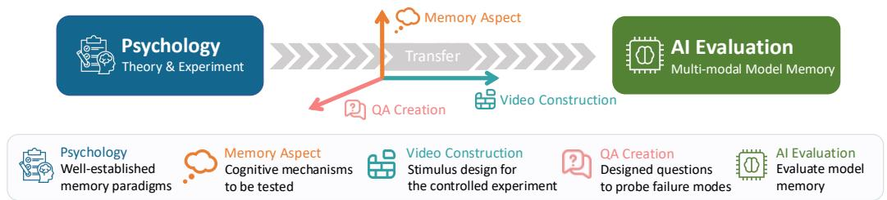

<details>
<summary>flowchart</summary>

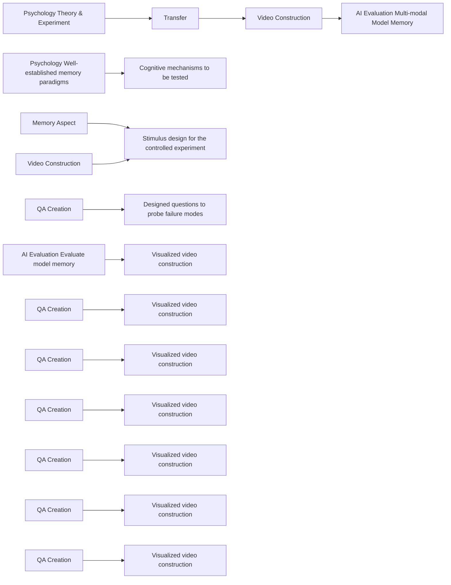
</details>

Example: Divided Attention

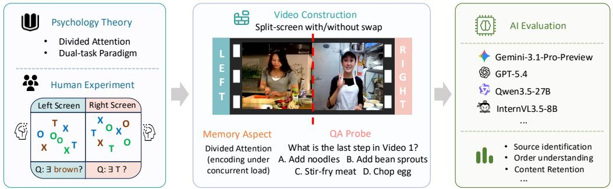

<details>
<summary>flowchart</summary>

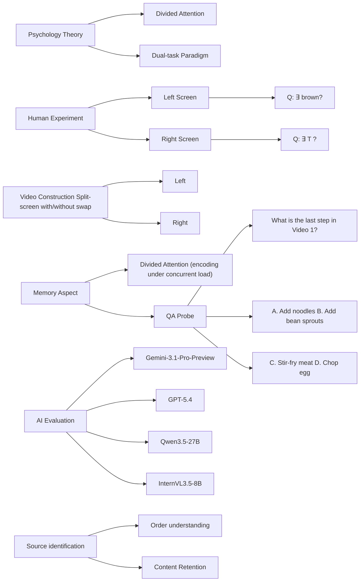
</details>

Figure 1: $M ^ { 3 } E v a l .$ , our principled framework and benchmark for evaluating memory capabilities of multi-modal models. We present an example task of divided attention. Grounded in psychological theory, we construct split-screen video scenarios, design memory questions, and analyze multiple models in terms of source identification, order understanding, and content retention.

To address this gap, we introduce $M ^ { 3 } E v a l ,$ , a principled evaluation framework and benchmark for probing memory capabilities in multi-modal models. As illustrated in Fig. 1, our design is inspired by the controlled experimental paradigms in cognitive psychology [26, 51], where memory is studied through carefully constructed stimuli that isolate specific mechanisms. We adapt these principles to video domain by constructing video-based QA tasks that probe memory under controlled yet realistic conditions. Our benchmark characterizes memory along four key dimensions: (1) the ability to retain information from concurrent inputs [3, 9, 60, 59]; (2) robustness to interference from similar content [41, 61, 73, 48]; (3) the ability to integrate interleaved events into coherent representations [40, 39, 25, 50]; and (4) the ability to track abstract attributes across video segments [28, 44]. While grounded in cognitive theory, these dimensions also arise in real-world video understanding, such as scene analysis, object tracking, and long context reasoning.

Leveraging $M ^ { 3 } E v a l .$ , we conduct an extensive evaluation on both open-source and proprietary multimodal models. Our results reveal several notable and, in some cases, unexpected findings. First, when processing parallel video streams, the models fail to maintain independent representations for each stream; we hypothesize that such failure stems from attention confusion across concurrent visual inputs. Second, humans exhibit notably stronger retroactive interference than proactive interference, whereas multi-modal models demonstrate comparable interference levels. This contrast indicates a fundamental difference in memory mechanisms between humans and models. Surprisingly, repeating interfering video segments can even improve model understanding about the target video segments. Third, model memory is less capable than human memory when organizing temporally interleaved information. Further analysis reveals that memory source grounding along temporal dimension is consistently weaker than spatial dimension. Finally, the models exhibit far weaker symbolic memory than humans when required to abstract multi-modal information into symbolic attributes and distinguish their relations. We further find that the models struggle to filter out irrelevant information from memory.

Our contributions are summarized as follows.

• We introduce $M ^ { 3 } E v a l$ , the first benchmark for systematically evaluating different dimensions of memory capabilities of multi-modal models with video tasks.   
• Our key innovation lies in a cognitively-grounded evaluation design that isolates memory mechanisms through orchestrated video tasks.   
• We provide a systematic evaluation across diverse models, offering new insights into the limitations of current multi-modal memory and informing the design of future systems.

# 2 Related Work

Memory Evaluation in LLMs and Agents. The evaluation of memory capabilities has been recently studied for LLMs and LLM-based agents [19, 23, 34, 75]. Early benchmarks relied on synthetic needle-in-a-haystack tasks [54, 17, 29] or long-range dialogues [38, 22] to assess retention within a fixed context. Dynamic benchmarks [56, 67] further required incremental memory updates across turns. Wei et al. [66] and Zhang et al. [77] introduced self-evolution settings to examine whether models can distill strategies from past experience. While the above efforts focus primarily on text, Mem-Gallery [5] extends memory evaluation to the multimodal setting with multi-session dialogues grounded in both text and images. Inspired by cognitive psychology, recent studies [14, 74] adopted the N-Back task [28] to assess working memory capacity. However, none of these works has explored memory evaluation for video tasks.

Evaluation for Video Understanding. Memory is an essential yet underexplored component for video understanding. Numerous benchmarks evaluate general video understanding [13, 32], long-form video tasks [78, 64, 7, 79, 70], streaming evaluation [42, 35, 69], and cross-video understanding [80, 31]. However, these benchmarks often conflate memory with visual perception and reasoning, treating memory as an implicit component rather than measuring it explicitly. Another line adopts synthetic needle-in-a-haystack settings [76, 68, 20, 71, 33], inserting target segments into distractor footage to test retrieval over extended contexts. Yet these approaches rely on simple probe designs, making it difficult to assess different dimensions of memory. A recent effort [37] probes memory through reasoning tasks, yet does not directly and systematically evaluate memory across multiple dimensions. Unlike these works, our benchmark leverages existing video datasets and explicitly probes key dimensions of memory through cognitively-grounded evaluation paradigms.

Memory Investigation in Cognitive Psychology. Cognitive psychology decomposes memory into distinct, measurable processes. Our evaluation framework builds on four such processes: (1) Divided Attention. Divided attention during encoding degrades retention and induces illusory conjunctions [9, 60, 59], as the cognitive resources for encoding are limited [27, 3]. (2) Memory Interference. Forgetting arises from competition among similar memory traces rather than simple decay. Such competition manifests as proactive or retroactive interference [41, 61, 73, 48]. (3) Memory Organization. Recall relies on implicit story schemata [40]. When processing interleaved storylines, individuals default to the underlying event structure [39]. (4) N-Back and Symbolic Representation. The N-Back task [28, 44] is widely used to isolate memory capability and reflects the view that memory operates over abstract representations [1, 46].

# 3 Memory Evaluation

As shown in Fig. 2, our evaluation consists of four paradigms unified under a coherent framework. Along the spatial dimension, Divided Attention evaluates the encoding under concurrent visual inputs. As for temporal dimension, Memory Interference tests robustness to the distraction from sequential similar content, while Interleaved Events examines temporal reorganization of interleaved video segments. Additionally, N-Back probes symbol grounding and memory capacity across temporal gaps. All evaluations share a common design principle: each is grounded in cognitive psychology theory, instantiated as a controlled video task, and equipped with targeted questions and metrics to quantify specific failure modes. Below, we first introduce the design of each evaluation paradigm in detail and then describe the process of evaluation dataset creation.

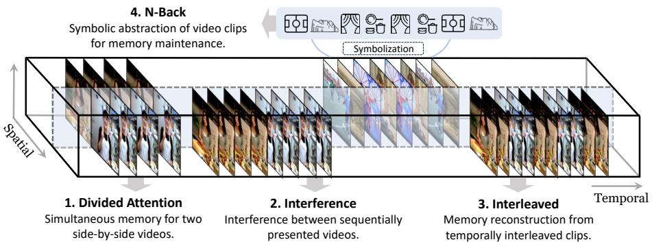

<details>
<summary>flowchart</summary>

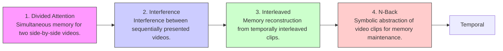
</details>

Figure 2: Overview of the unified and coherent framework for our four evaluation paradigms.

# 3.1 Evaluation Design

# 3.1.1 Divided Attention: Encoding Concurrent Information

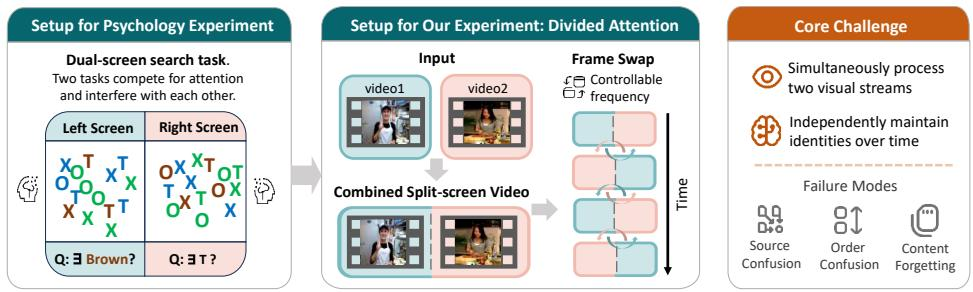

<details>
<summary>flowchart</summary>

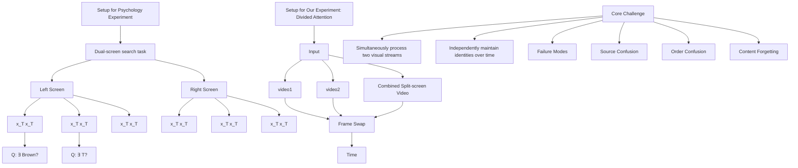
</details>

Figure 3: Divided Attention. Split-screen presentation with optional frame swaps.

Psychological Theory. The divided attention paradigm originates from research on limited attentional resources and dual-task processing [27, 3]. In classic experiments, participants perform two tasks simultaneously, competing for attentional resources and resulting in reduced encoding quality and impaired memory retention [27, 9, 60, 59].

Instantiation in Video Understanding. Following this paradigm, we adopt a split-screen configuration where two semantically similar videos are displayed synchronously, as shown in Figure 3. We consider two conditions: (1) No swapping: $V _ { 1 }$ appears on the left and $V _ { 2 }$ on the right, evaluating whether the model maintains distinct representations under parallel input. (2) Swapping: the positions of $V _ { 1 }$ and $V _ { 2 }$ are swapped 10 times at uniformly spaced timestamps, examining whether the model can track the correspondence between content identity and spatial location.

Metrics. We construct three types of multiple-choice questions, each targeting a specific failure mode. Each question has one correct option and three distractors of the same error type: (1) Source Identification, where content from the distractor video is erroneously attributed to the target, resulting in source confusion; (2) Order Understanding, where the temporal or logical sequence of events is inaccurately recalled; and (3) Content Retention, where plot points or details from the target video are misremembered or imprecisely recalled.

# 3.1.2 Memory Interference: Robustness to Distraction

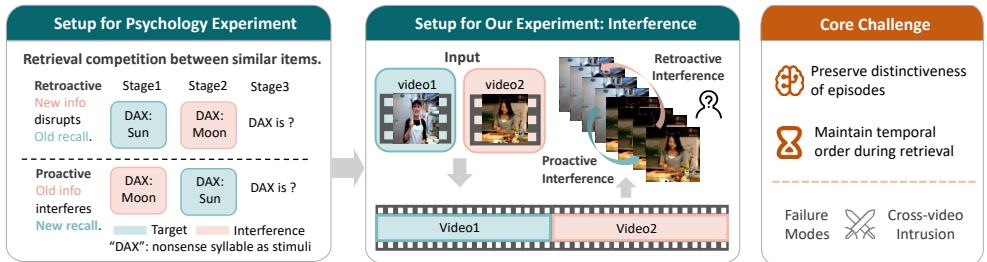

<details>
<summary>flowchart</summary>

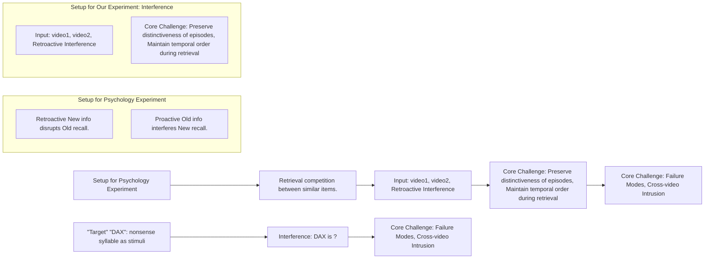
</details>

Figure 4: Memory Interference. Proactive interference: earlier learning disrupts later memory. Retroactive interference: later learning impairs earlier memory.

Psychological Theory. Memory interference theory explains forgetting as competition among similar traces rather than passive decay [41, 61]. Proactive interference occurs when earlier material disrupts recall of later material, while retroactive interference occurs when later material impairs recall of earlier material [73, 48]. Figure 4 (left) illustrates both directions with paired associations.

Instantiation in Video Understanding. As shown in Figure 4, we concatenate two semantically similar videos and pose questions about one designated target video. To isolate each interference direction, we evaluate both concatenation orders using identical questions targeting the same video. Specifically, in the order [V1, V2], asking about V1 tests retroactive interference, as the later video V2 may disrupt recall of the earlier target. In the order [V2, V1], asking about the same V1 tests proactive interference, as the earlier video V2 may disrupt encoding of the later target.

Metrics. We design multiple-choice questions with four options: (1) the correct answer for the target video, from which we report Accuracy (Acc); (2) two intrusion options drawn from the competing video, from which we report Intrusion Rate (IR) following [73], measuring the proportion of responses that select an option from the competing video; and (3) one unrelated distractor. IR directly quantifies cross-video intrusion.

# 3.1.3 Interleaved Events: Temporal Organization

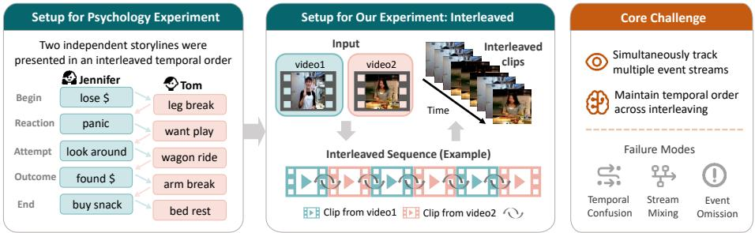

<details>
<summary>flowchart</summary>

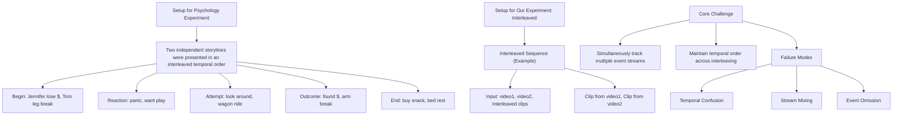
</details>

Figure 5: Interleaved Events. Interleaved presentation of video clips from two sources.

Psychological Theory. Mandler [40, 39] demonstrated that, when presented with intermixed storylines, individuals spontaneously recover the underlying event structure rather than following surface presentation order. This paradigm has become a classic test for memory organization.

Instantiation in Video Understanding. We divide two source videos with each into 10 temporally ordered segments and interleave them into a single stream in alternating order, e.g., $A _ { 1 } { - } B _ { 1 } { - } A _ { 2 } { - } B _ { 2 } { - }$ $\cdot \cdot \cdot - A _ { 1 0 } – B _ { 1 0 }$ , as shown in Figure 5. To answer correctly, the model must disentangle segments from the same source and recover the internal temporal order of the target video.

Metrics. We adopt the same three question types as in §3.1.1, and add a fourth: False Memory Discrimination, inspired by the DRM paradigm [49, 11]. Here, a fake question that is relevant to video content is presented, and the model should be aware to choose the option indicating that the query does not belong to either video.

# 3.1.4 N-Back: Symbol Grounding and Memory Capacity

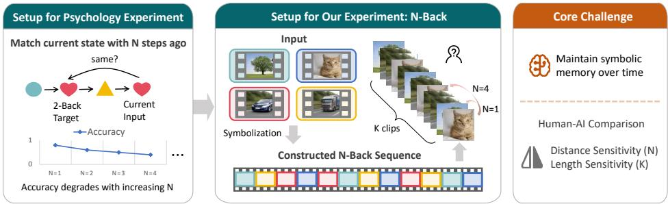

<details>
<summary>flowchart</summary>

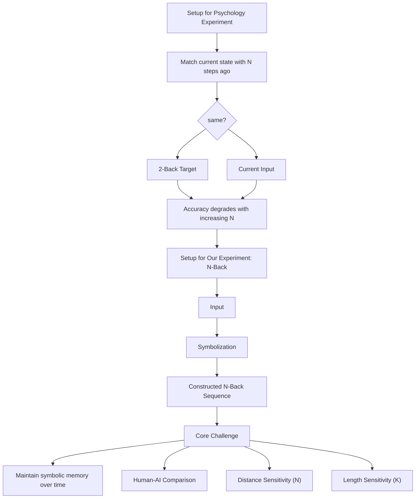
</details>

Figure 6: N-Back. Abstracting videos into symbols and comparing them.

Psychological Theory. Unlike episodic memory, symbolic memory concerns the ability to abstract events into symbolic representations [1, 46]. N-Back tasks present sequences of symbolic stimuli (e.g., letters, digits, or simple shapes) and require participants to decide whether the current stimulus matches the one N steps earlier [28, 44]. This match/mismatch structure naturally requires encoding stimuli as abstract symbols before comparison, making the N-Back format well-suited for probing symbolic grounding and memory capacity.

Instantiation in Video Understanding. We adapt the N-Back paradigm to a multi-video clip sequence setting. As shown in Figure 6, each test sample consists of a sequence of short video clips drawn from different source videos. Two variables control the difficulty: N, the lag distance, where the model determines whether the final clip matches the clip N positions earlier on a designated attribute (e.g., scene or action category); and K, the sequence length, specifying the total number of video clips presented to the model in a single trial.

Metrics. The model is asked to decide whether the final clip matches the clip N positions earlier, producing a Yes/No answer. Scene measures whether two clips belong to the same scene or environment category, while Action assesses whether they depict the same type of activity. We report accuracy (Acc) over both attributes across all test samples.

# 3.2 Evaluation Dataset Creation

Our video materials are drawn from five publicly available datasets: HourVideo [7], Video-MME (long-video subset) [13], LVBench [64], InfiniBench (TVQA subset) [2], and CrossVid [31]. Video pairs are selected based on semantic similarity, as similar content induces stronger memory interference [61]. Questions are automatically generated using Qwen3.5-27B [47] and refined through manual review. In total, our benchmark comprises 2,403 questions over 451 videos spanning approximately 403 hours. Further details on video construction, question generation, and illustrative examples are provided in Appendices A, B, C, and E.

# 4 Experiments and Results

We evaluate two proprietary models (Gemini-3.1-Pro-Preview [15] and GPT-5.4 [43]), five openweight models (Qwen3-VL-8B-Instruct [4], Qwen3.5-{4B, 9B, 27B} [47], and InternVL3.5-8B [65]), and two agentic methods: VideoLucy [81], which adopts Qwen3.5-4B as the VLM and DeepSeek-V4-Pro [10] as the LLM, and M3-Agent [37] with its default configuration. We additionally report human performance as a reference. Further details are provided in Appendix D.

# 4.1 Divided Attention: Encoding Concurrent Information

Task Recap. Two similar videos are displayed side by side, with or without periodic left/right swaps, measured by source identification, order understanding, and content retention (§3.1.1).

Table 1: Divided Attention. Accuracy (%) on three divided attention metrics under the split-screen setting without swaps and with frequent left/right swaps. 

<table><tr><td rowspan="2">Acc(%)</td><td colspan="3">No swapping</td><td colspan="3">Swapping</td></tr><tr><td>Source Identification</td><td>Order Understanding</td><td>Content Retention</td><td>Source Identification</td><td>Order Understanding</td><td>Content Retention</td></tr><tr><td>Human</td><td>89.58</td><td>90.00</td><td>92.16</td><td>81.25 (-8.33)</td><td>85.00 (-5.00)</td><td>86.27 (-5.89)</td></tr><tr><td>Random</td><td>25.00</td><td>25.00</td><td>25.00</td><td>25.00 (0.00)</td><td>25.00 (0.00)</td><td>25.00 (0.00)</td></tr><tr><td colspan="7">Closed-Source Models</td></tr><tr><td>Gemini-3.1-Pro-Preview</td><td>62.50</td><td>52.50</td><td>49.02</td><td>37.50 (-25.00)</td><td>52.50 (0.00)</td><td>56.86 (+7.84)</td></tr><tr><td>GPT-5.4</td><td>27.08</td><td>35.00</td><td>47.06</td><td>35.42 (+8.34)</td><td>30.00 (-5.00)</td><td>49.02 (+1.96)</td></tr><tr><td colspan="7">Open-Source Agents</td></tr><tr><td>VideoLucy</td><td>16.67</td><td>42.50</td><td>37.25</td><td>14.58 (-2.09)</td><td>25.00 (-17.50)</td><td>39.22 (+1.97)</td></tr><tr><td>M3-Agent</td><td>27.08</td><td>30.00</td><td>23.53</td><td>31.25 (+4.17)</td><td>35.00 (+5.00)</td><td>23.53 (0.00)</td></tr><tr><td colspan="7">Open-Source Models</td></tr><tr><td>Qwen3.5-4B</td><td>18.75</td><td>25.00</td><td>31.37</td><td>14.58 (-4.17)</td><td>22.50 (-2.50)</td><td>33.33 (+1.96)</td></tr><tr><td>Qwen3-VL-8B-Instruct</td><td>16.67</td><td>25.00</td><td>37.25</td><td>12.50 (-4.17)</td><td>30.00 (+5.00)</td><td>35.29 (-1.96)</td></tr><tr><td>InternVL3.5-8B</td><td>29.17</td><td>37.50</td><td>33.33</td><td>25.00 (-4.17)</td><td>40.00 (+2.50)</td><td>27.45 (-5.88)</td></tr><tr><td>Qwen3.5-9B</td><td>35.42</td><td>25.00</td><td>25.49</td><td>18.75 (-16.67)</td><td>30.00 (+5.00)</td><td>13.73 (-11.76)</td></tr><tr><td>Qwen3.5-27B</td><td>41.67</td><td>25.00</td><td>35.29</td><td>27.08 (-14.59)</td><td>32.50 (+7.50)</td><td>35.29 (0.00)</td></tr></table>

Main results. Table 1 shows that divided attention is challenging for existing models. They all exhibit a substantial gap from human performance, with most near chance across metrics except Gemini-3.1- Pro-Preview, indicating that effective dual-stream understanding remains beyond current memory mechanisms. With frequent swapping, the most prominent drop occurs on source identification, while other categories are largely unaffected. This suggests that swapping mainly disrupts source identification rather than order understanding or content retention.

Q: What kitchen utensil appears at frame left, beside the person in black?   
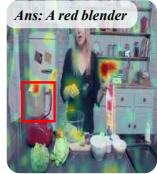  
Single Screen

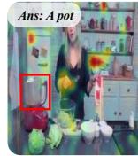  
Split Screen

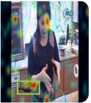

Q: When opening the pot to check, what is the state of the food inside?   
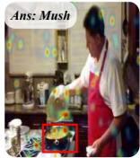  
Single Screen

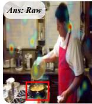  
Split Screen

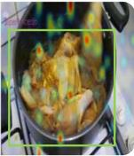


Target Relevant Regions   
  
Regions Receiving Erroneous Attention   
Figure 7: Attention shifts induced by split-screen interference. For each case, the left panel shows the single-video condition, whereas the right panel shows the split-screen condition. In the split-screen setting, the question asks specifically about the left video. However, the model’s attention is disrupted by the concurrent right video, resulting in erroneous responses.

Further experiment. To better understand this failure mode, we examine attention visualizations from representative examples. As shown in Figure 7, in the single screen format, model attention concentrates on the queried region. However, in a split-screen format, the attention maps become notably more diffused and disorganized. Based on this observation, we hypothesize that the poor performance may stem from attention confusion across concurrent visual streams, preventing the model from selectively attending to the relevant stream.

Finding 1: Existing multi-modal models lack robust memory for parallel tasks, probably due to attention confusion across concurrent visual streams.

Discussion. In real-world settings, events often unfold simultaneously, requiring systems to process and reason over multi-view or multi-stream inputs, as in autonomous driving [24, 57, 36] and household robotics [21, 55]. Although existing models perform well on single-video, our experiments suggest they still struggle with parallel streams, multiple objects, and concurrent scenes.

# 4.2 Memory Interference: Robustness to Distraction

Task Recap. We concatenate two semantically similar videos (V1 and V2) and ask questions about one designated target video. By swapping the concatenation order — [V1, V2] vs. [V2, V1] — while fixing questions on the same target V1, we isolate retroactive and proactive interference, measured by accuracy and intrusion rate (§3.1.2).

Table 2: Memory Interference. Proactive: the first video disrupts recall of the second video. Retroactive: the second disrupts recall of the first. ∆ denotes proactive minus retroactive. 

<table><tr><td rowspan="2"></td><td colspan="3">Accuracy (%,↑)</td><td colspan="3">Intrusion Rate (%,↓)</td></tr><tr><td>Proactive</td><td>Retroactive</td><td> $\Delta$ </td><td>Proactive</td><td>Retroactive</td><td> $\Delta$ </td></tr><tr><td>Human</td><td>94.55</td><td>74.55</td><td>20.00</td><td>3.64</td><td>20.00</td><td>-16.36</td></tr><tr><td>Random</td><td>25.00</td><td>25.00</td><td>0.00</td><td>50.00</td><td>50.00</td><td>0.00</td></tr><tr><td colspan="7">Closed-Source Models</td></tr><tr><td>Gemini-3.1-Pro-Preview</td><td>63.64</td><td>54.55</td><td>9.09</td><td>23.64</td><td>30.91</td><td>-7.27</td></tr><tr><td>GPT-5.4</td><td>43.64</td><td>40.00</td><td>3.64</td><td>43.64</td><td>34.55</td><td>9.09</td></tr><tr><td colspan="7">Open-Source Agents</td></tr><tr><td>VideoLucy</td><td>29.09</td><td>43.64</td><td>-14.55</td><td>43.64</td><td>34.55</td><td>9.09</td></tr><tr><td>M3-Agent</td><td>43.64</td><td>36.36</td><td>7.28</td><td>40.00</td><td>34.55</td><td>5.45</td></tr><tr><td colspan="7">Open-Source Models</td></tr><tr><td>Qwen3.5-4B</td><td>29.09</td><td>38.18</td><td>-9.09</td><td>45.45</td><td>38.18</td><td>7.27</td></tr><tr><td>Qwen3-VL-8B-Instruct</td><td>25.45</td><td>29.09</td><td>-3.64</td><td>54.55</td><td>52.73</td><td>1.82</td></tr><tr><td>InternVL3.5-8B</td><td>52.73</td><td>49.09</td><td>3.64</td><td>32.73</td><td>41.82</td><td>-9.09</td></tr><tr><td>Qwen3.5-9B</td><td>29.09</td><td>38.18</td><td>-9.09</td><td>50.91</td><td>41.82</td><td>9.09</td></tr><tr><td>Qwen3.5-27B</td><td>45.45</td><td>40.00</td><td>5.45</td><td>40.00</td><td>43.64</td><td>-3.64</td></tr></table>

Main results. As shown in Table 2, most models achieve low accuracy, indicating that memory interference poses a significant challenge. Further, humans demonstrate a clear asymmetry between proactive and retroactive interference $( \bar { \Delta } = 2 0 . 0 0 \% )$ , yet models exhibit a small delta between two conditions. This suggests that the models differ from humans in memory mechanism where later information tends to overwrite earlier memories for humans. Notably, intrusion rates are high across most models, and thus most errors come from the interference of competing video. This indicates that models struggle to resist interference from semantically similar content.

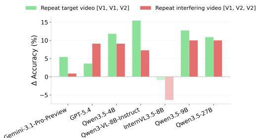

<details>
<summary>bar</summary>

| Model | Repeat target video [V1, V1, V2] (%) | Repeat interfering video [V1, V2, V2] (%) |
|---|---|---|
| Gemini-3.1-Pro-Preview | 5.5 | 0.8 |
| GPT-5.4 | 3.7 | 9.0 |
| Qwen3.5-4B | 12.0 | 9.0 |
| Qwen3-VL-8B-Instruct | 15.5 | 7.0 |
| InternVL3.5-8B | -0.5 | -5.0 |
| Qwen3.5-9B | 13.0 | 10.0 |
| Qwen3.5-27B | 11.0 | 10.0 |
</details>

Figure 8: Video repetition improves accuracy under interference. Repeating either the target or interfering video yields performance gains, suggesting repetition as a promising strategy for enhancing model memory.

Further experiment. We test whether repetition strategy can improve robustness to interference. This is done by repeating the target or the interfering video, forming [V1, V1, V2] and [V1, V2, V2] with questions about V1. As shown in Figure 8, both settings surprisingly improve accuracy. We hypothesize that repetition helps models distinguish the target video from the interfering video. Without repetition, causal attention allows later frames to attend to earlier frames, not the reverse; with repetition, the later copy can attend to the earlier occurrence of the same video. This gives the model a clearer view of the repeated video, consistent with recent findings [30].

Finding 2: Retroactive interference exceeds proactive interference in humans, whereas both occur comparably in multi-modal models. Further experiments surprisingly find that repeating target or interfering videos can both enhance the understanding of target video.

Discussion. Humans exhibit pronounced retroactive interference, whereas most models do not, likely because Transformer attention accesses all visual tokens uniformly regardless of temporal position. Repetition strategy benefits both humans and models yet through different mechanisms. Humans leverage repetition to reinforce memory anchors [16, 6], whereas models benefit from the strengthened representations of both target and interfering videos via causal attention.

# 4.3 Interleaved Events: Temporal Organization

Task Recap. Segments from two videos are interleaved into a single stream, measured by source identification, order understanding, content retention, and false memory discrimination (§3.1.3).

Table 3: Interleaved Events. Accuracy (%) on four interleaved reconstruction metrics. 

<table><tr><td>Acc(%)</td><td>Source Identification</td><td>Order Understanding</td><td>Content Retention</td><td>False Memory Discrimination</td></tr><tr><td>Human</td><td>75.95</td><td>80.00</td><td>83.64</td><td>82.11</td></tr><tr><td>Random</td><td>25.00</td><td>25.00</td><td>25.00</td><td>25.00</td></tr><tr><td colspan="5">Closed-Source Models</td></tr><tr><td>Gemini-3.1-Pro-Preview</td><td>43.04</td><td>50.00</td><td>49.09</td><td>26.32</td></tr><tr><td>GPT-5.4</td><td>43.04</td><td>40.00</td><td>47.27</td><td>7.37</td></tr><tr><td colspan="5">Open-Source Agents</td></tr><tr><td>VideoLucy</td><td>30.38</td><td>23.33</td><td>43.64</td><td>40.00</td></tr><tr><td>M3-Agent</td><td>27.85</td><td>40.00</td><td>21.82</td><td>15.79</td></tr><tr><td colspan="5">Open-Source Models</td></tr><tr><td>Qwen3.5-4B</td><td>30.38</td><td>20.00</td><td>41.82</td><td>23.16</td></tr><tr><td>Qwen3-VL-8B-Instruct</td><td>21.52</td><td>23.33</td><td>30.91</td><td>3.16</td></tr><tr><td>InternVL3.5-8B</td><td>25.32</td><td>26.67</td><td>41.82</td><td>1.05</td></tr><tr><td>Qwen3.5-9B</td><td>26.58</td><td>40.00</td><td>25.45</td><td>7.37</td></tr><tr><td>Qwen3.5-27B</td><td>39.24</td><td>33.33</td><td>34.55</td><td>3.16</td></tr></table>

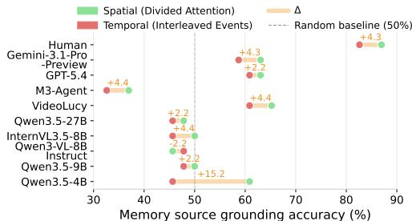  
Figure 9: Spatial source grounding outperforms temporal source grounding. Spatial source uses the split-screen format with frequent left/right swaps (§4.1); temporal source uses the interleaved format (§4.3).

Main results. As shown in Table 3, humans substantially outperform all models across all four question types. These results demonstrate that reorganizing temporally interleaved events remains a significant challenge. Agentic methods show no clear advantage, suggesting that rule-based memory strategies are insufficient for handling temporal interleaving. Notably, most models achieve below the 25% random baseline on false memory discrimination, revealing severe hallucination.

Further experiment. To further examine the ability of memory source grounding [25, 50], we compare grounding accuracy under spatial (splitscreen with frequent left/right swaps, §4.1) versus temporal (interleaved, §4.3) conditions. As shown in Figure 9, spatial source grounding generally yields higher accuracy than temporal source grounding, where many models even fall below the random baseline. These results suggest that for both humans and models, accurately grounding the temporal source is more difficult than grounding the spatial source.

Finding 3: Compared to human memory, multi-modal models are less capable of organizing temporally interleaved information. Further analysis reveals that memory source grounding along the spatial dimension is consistently stronger than along the temporal dimension.

Discussion. Models exhibit stronger spatial source grounding than temporal source grounding, mirroring an asymmetry observed in human cognition [58, 45] and AI research [62]. This suggests that temporal memory organization is inherently more challenging. One potential direction is building models to better capture sequential relationships across events.

# 4.4 N-Back: Symbol Grounding and Memory Capacity

Task Recap. A sequence of K short video clips is presented, and the model determines whether the final clip matches the one N positions earlier on a designated attribute, measured by accuracy on scene and action matching (§3.1.4).

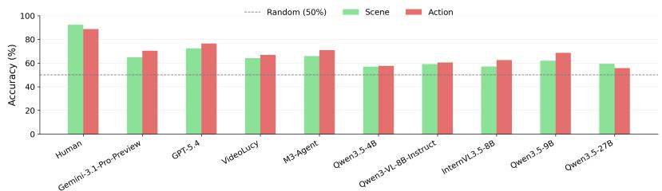

<details>
<summary>bar</summary>

| Model | Random (50%) | Scene | Action |
| --- | --- | --- | --- |
| Human | 50 | 95 | 90 |
| Gemini-3.1-Pro-Preview | 50 | 65 | 70 |
| GPT-5.4 | 50 | 75 | 78 |
| Videolucy | 50 | 65 | 68 |
| M3-Agent | 50 | 68 | 72 |
| Qwen3.5-4B | 50 | 60 | 60 |
| Qwen3-VL-BB-Instruct | 50 | 60 | 62 |
| InternVL3.5-BB | 50 | 60 | 64 |
| Qwen3.5-9B | 50 | 62 | 70 |
| Qwen3.5-27B | 50 | 60 | 58 |
</details>

Figure 10: Overall accuracy on the N-Back task. Performance of each model and human under two symbolic attributes (scene and action), averaged over all K and N configurations.

Main results. Existing multi-modal models substantially lag behind humans, with many only slightly exceeding the random baseline. Among them, GPT-5.4 achieves the best performance. Interestingly, humans recall scene attributes more accurately than action attributes, whereas most models show the opposite pattern, with action accuracy being higher than scene accuracy.

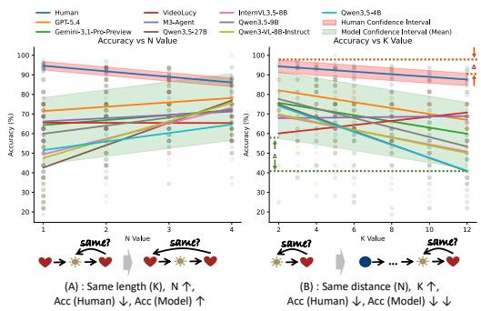

<details>
<summary>line</summary>

| Model | N Value | Accuracy (%) |
|---|---|---|
| Human | 1 | 95 |
| Human | 2 | 90 |
| Human | 4 | 85 |
| VideoLucy | 1 | 92 |
| VideoLucy | 2 | 88 |
| VideoLucy | 4 | 82 |
| InterVL3.5-8B | 1 | 96 |
| InterVL3.5-8B | 2 | 91 |
| InterVL3.5-8B | 4 | 86 |
| Qwen3.5-4B | 1 | 94 |
| Qwen3.5-4B | 2 | 89 |
| Qwen3.5-4B | 4 | 83 |
| Qwen3.5-4B | 6 | 78 |
| Qwen3.5-4B | 8 | 73 |
| Qwen3.5-4B | 10 | 68 |
| Qwen3.5-4B | 12 | 63 |
| Human Confidence Interval | 1 | 97 |
| Human Confidence Interval | 2 | 92 |
| Human Confidence Interval | 4 | 87 |
| Human Confidence Interval (Mean) | 1 | 98 |
| Human Confidence Interval (Mean) | 2 | 93 |
| Human Confidence Interval (Mean) | 4 | 88 |
| Human Confidence Interval (Mean) (Model) | 1 | 99 |
| Human Confidence Interval (Mean) | 2 | 94 |
| Human Confidence Interval (Mean) (Model) (Mean) | 4 | 89 |
| Human Confidence Interval (Mean) (Model) (Mean) (Model) (Mean) (Mean) (Mean) (Mean) (Mean) (Mean) (Mean) (Mean) (Mean) (Mean) (Mean) (Mean) (Mean) (Mean) (Mean) (Mean) (Mean) (Mean) (Mean) (Mean) (Mean) (Mean) (Mean) (Mean) (Mean) (Mean) (Mean) (Mean) (Mean) (Mean) (Mean) (Mean) (Mean) (Mean), Model Confidence Interval (Mean) | 12 | 99 |
| GIF-5.4 | 1 | 96 |
| GIF-5.4 | 2 | 91 |
| GIF-5.4 | 4 | 86 |
| GIF-5.4 | 6 | 80 |
| GIF-5.4 | 8 | 74 |
| GIF-5.4 | 10 | 69 |
| GIF-5.4 | 12 | 64 |
| M3-Agent | 1 | 97 |
| M3-Agent | 2 | 92 |
| M3-Agent | 4 | 87 |
| M3-Agent | 6 | 81 |
| M3-Agent | 8 | 75 |
| M3-Agent | 10 | 69 |
| M3-Agent | 12 | 64 |
| Gemini-3.1-Pro-Preview | 1 | 98 |
| Gemini-3.1-Pro-Preview | 2 | 93 |
| Gemini-3.1-Pro-Preview | 4 | 88 |
| Gemini-3.1-Pro-Preview | 6 | 82 |
| Gemini-3.1-Pro-Preview | 8 | 76 |
| Gemini-3.1-Pro-Preview | 10 | 71 |
| Gemini-3.1-Pro-Preview | 12 | 66 |
| Qwen3.5-278 | 1 | 95 |
| Qwen3.5-278 | 2 | 90 |
| Qwen3.5-278 | 4 | 85 |
| Qwen3.5-278 | 6 | 79 |
| Qwen3.5-278 | 8 | 73 |
| Qwen3.5-278 | 10 | 68 |
| Qwen3.5-278 | 12 | 63 |
| Qwen3-AL-BB-Instruct | 1 | 94 |
| Qwen3-AL-BB-Instruct | 2 | 89 |
| Qwen3-AL-BB-Instruct | 4 | 84 |
| Qwen3-AL-BB-Instruct (Mean) | 1 | 97 |
| Qwen3-AL-BB-Instruct (Mean) | 2 | 92 |
| Qwen3-AL-BB-Instruct (Mean) (Mean) (Mean) (Mean) (Mean) (Mean) (Mean) (Mean) (Mean) (Mean) (Mean) (Mean) (Mean) (Mean) (Mean) (Mean) (Mean) (Mean) (Mean) (Mean) (Mean) (Mean) (Mean) (Mean) (Mean) (Mean) (Mean) (Mean) (Mean) (Mean) (Mean) (Mean) (Mean) |
| Qwen3.5-4B | 1 | 96 |
| Qwen3.5-4B | 2 | 91 |
| Qwen3.5-4B | 4 | 86 |
| Qwen3.5-4B | 6 | 80 |
| Qwen3.5-4B | 8 | 74 |
| Qwen3.5-4B | 10 | 69 |
| Qwen3.5-4B | 12 | 64 |
| Qwen3.5-4B+Qwen3.5-4B+Qwen3.5-4B+Qwen3.5-4B+Qwen3.5-4B+Qwen3.5-4B+Qwen3.5-4B+Qwen3.5-4B+Qwen3.5-4B+Qwen3.5-4B+Qwen3.5-4B+Qwen3.5-4B+Qwien3.5-4B+Qwen3.5-4B+Qwen3.5-4B+Qwen3.5-4B+Qwen3.5-4B+Qwen3.5-4B+Qwen3.5-4B+Qwen3.5-4B+Qwen3.5-4B+Qwen3.5-4B+Qwen3.5-4B+Qwen( Mean ) + Qwen( Mean ) + Qwen( Mean ) + Qwen( Mean ) + Qwen( Mean ) + Qwen( Mean ) + Qwen( Mean ) + Qwen( Mean ) + Qwen( Mean ) + Qwen( Mean ) + Qwen( Mean ) + Qwen( Mean ) + Qwen( Mean ) + Qwen( Mean ) + Qwen( Mean ) + Qwen( Mean ) + Qwen( Mean ) + Qwen( Mean )
Qwen( Mean ) + Qwen( Mean ) + Qwen( Mean ) + Qwen( Mean ) + Qwen( Mean ) + Qwen( Mean ) + Qwen( Mean ) + Qwen( Mean ) + Qwen( Mean ) + Qwen( Mean ) + Qwen( Mean ) + Qwen( Mean ) + Qwen( Mean ) + Qwen( Mean ) + Qwen( Mean ) + Qwen( Mean ) + Qwen( Median ) + Qwen( Median ) + Qwen( Median ) + Qwen( Median ) + Qwen( Median ) + Qwen( Median ) + Qwen( Median ) + Qwen( Median ) + Qwen( Median ) + Qwen( Median ) + Qwen( Median ) + Qwen( Median ) + Qwen( Median ) + Qwen( Median ) + Qwen( Median ) + Qwen( Median ) + Qwen( Median ) + Qopen( Median ) + Qopen( Median ) + Qopen( Median ) + Qopen( Median ) + Qopen( Median ) + Qopen( Median ) + Qopen( Median ) + Qopen( Median ) + Qopen( Median ) + Qopen( Median ) + Qopen( Median ) + Qopen( Median ) + Qopen( Median ) + Qopen( Median ) + Qopen( Median ) + Qopen( Median ) + Qopen( Median ) - Max(QW=0), Min(QW=0), Max(QW=0), Min(QW=0), Max(QW=0), Min(QW=0), Max(QW=0), Min(QW=0), Max(QW=0), Min(QW=0), Max(QW=0), Min(QW=0), Max(QW=0), Min(QW=0), Max(QW=0), Min(QW=0), Max(QW=0), Min(QW=0), Max(QW>0), Min(QW>0), Max(QW>0), Min(QW>0), Max(QW>0), Min(QW>0), Max(QW>0), Min(QW>0), Max(QW>0), Min(QW>0), Max(QW>0), Min(QW>0), Max(QW>0), Min(QW>0), Max(QW>0), Min(QW>0), Max(QW>0), Min(QW>0), Max(ZoD, MaxZoD))
</details>

Figure 11: Effects of N and K on accuracy. Points show per-model accuracy under different (N, K) settings, with linear fits for each model. The colored filled regions indicate ±1 standard deviation around the fit lines.

Further experiment. As shown in Figure 11, behavior discrepancy emerges between humans and models. For humans, monotonic decline of accuracy is observed with increasing N, reflecting capacity limit. When increasing K, accuracy decreases modestly, demonstrating an ability to discard irrelevant information. For example, when N = 2 and K = 9, the first six video clips are no longer relevant to the final decision and thus can be discarded. In contrast, model accuracy remains flat or even improves as N increases, likely due to the Transformer architecture that retrieves temporally distant clips through global attention. However, accuracy drops sharply with increasing K, suggesting that models struggle to filter out irrelevant information from memory.

Finding 4: Multi-modal models lag far behind humans in symbolic memory. Unlike humans, models do not decay when increasing temporal gap (N), yet degrade largely with increasing number of total symbols (K), revealing a fundamental inability to filter irrelevant memory.

Discussion. In the N-Back task, humans typically maintain only recent items in working memory while gradually forgetting earlier ones. By contrast, current models retain all past inputs at a similar level of accessibility due to the attention mechanism. We hypothesize that introducing an appropriate forgetting mechanism could help multi-modal models overcome the limitations of symbolic memory, complementing recent explorations in AI research [18, 63].

# 5 Conclusion

In this work, we introduce $M ^ { 3 } E v a l .$ , the first benchmark for systematically measuring multi-modal memory across different dimensions. $M ^ { 3 } E v a l$ is grounded in cognitive psychology and instantiated through orchestrated video tasks, moving beyond conventional video understanding benchmarks to probe memory mechanisms critical for multi-modal models. Our experiments reveal consistent weaknesses and meaningful characteristics across models, pointing to several future directions: (1) refining attention mechanisms to better handle parallel streams; (2) leveraging repetition strategy to mitigate interference between similar memory traces; (3) strengthening temporal source grounding, which substantially lags behind spatial grounding; and (4) improving symbolic memory to support abstraction and filtering of task-irrelevant memory. We hope that $M ^ { 3 } { \bar { E } }$ val will serve as a diagnostic tool for future research and motivate the development of multi-modal systems equipped with robust, structured, and human-aligned memory capabilities.

# References

[1] John R Anderson and Gordon H Bower. Human associative memory. Psychology press, 2014.   
[2] Kirolos Ataallah, Eslam Mohamed Bakr, Mahmoud Ahmed, Chenhui Gou, Khushbu Pahwa, Jian Ding, and Mohamed Elhoseiny. Infinibench: A benchmark for large multi-modal models in long-form movies and tv shows. In Proceedings of the 2025 Conference on Empirical Methods in Natural Language Processing, pages 19496–19523, 2025.   
[3] Alan Baddeley. Working memory. Comptes Rendus de l’Académie des Sciences-Series III-Sciences de la Vie, 321(2-3):167–173, 1998.   
[4] Shuai Bai, Yuxuan Cai, Ruizhe Chen, Keqin Chen, Xionghui Chen, Zesen Cheng, Lianghao Deng, Wei Ding, Chang Gao, Chunjiang Ge, et al. Qwen3-vl technical report. arXiv preprint arXiv:2511.21631, 2025.   
[5] Yuanchen Bei, Tianxin Wei, Xuying Ning, Yanjun Zhao, Zhining Liu, Xiao Lin, Yada Zhu, Hendrik Hamann, Jingrui He, and Hanghang Tong. Mem-gallery: Benchmarking multimodal long-term conversational memory for mllm agents. arXiv preprint arXiv:2601.03515, 2026.   
[6] Nicholas J Cepeda, Harold Pashler, Edward Vul, John T Wixted, and Doug Rohrer. Distributed practice in verbal recall tasks: A review and quantitative synthesis. Psychological bulletin, 132 (3):354, 2006.   
[7] Keshigeyan Chandrasegaran, Agrim Gupta, Lea M Hadzic, Taran Kota, Jimming He, Cristóbal Eyzaguirre, Zane Durante, Manling Li, Jiajun Wu, and Li Fei-Fei. Hourvideo: 1-hour videolanguage understanding. Advances in Neural Information Processing Systems, 37:53168–53197, 2024.   
[8] Junhao Cheng, Yuying Ge, Teng Wang, Yixiao Ge, Jing Liao, and Ying Shan. Video-holmes: Can mllm think like holmes for complex video reasoning? arXiv preprint arXiv:2505.21374, 2025.   
[9] Fergus IM Craik, Richard Govoni, Moshe Naveh-Benjamin, and Nicole D Anderson. The effects of divided attention on encoding and retrieval processes in human memory. Journal of Experimental Psychology: General, 125(2):159, 1996.   
[10] DeepSeek-AI. DeepSeek-V4: Towards highly efficient million-token context intelligence. Hugging Face model card, April 2026. URL https://huggingface.co/deepseek-ai/ DeepSeek-V4-Pro. Accessed: 2026-05-02.   
[11] James Deese. On the prediction of occurrence of particular verbal intrusions in immediate recall. Journal of experimental psychology, 58(1):17, 1959.   
[12] Yue Fan, Xiaojian Ma, Rujie Wu, Yuntao Du, Jiaqi Li, Zhi Gao, and Qing Li. Videoagent: A memory-augmented multimodal agent for video understanding. In European Conference on Computer Vision, pages 75–92. Springer, 2024.

[13] Chaoyou Fu, Yuhan Dai, Yongdong Luo, Lei Li, Shuhuai Ren, Renrui Zhang, Zihan Wang, Chenyu Zhou, Yunhang Shen, Mengdan Zhang, et al. Video-mme: The first-ever comprehensive evaluation benchmark of multi-modal llms in video analysis. In Proceedings of the IEEE/CVF conference on computer vision and pattern recognition, pages 24108–24118, 2025.   
[14] Dongyu Gong, Xingchen Wan, and Dingmin Wang. Working memory capacity of chatgpt: An empirical study. In Proceedings of the AAAI conference on artificial intelligence, volume 38, pages 10048–10056, 2024.   
[15] Google DeepMind. Gemini 3.1 pro model card, 2026. URL https://deepmind.google/ models/model-cards/gemini-3-1-pro/. Accessed: 2026-05-02.   
[16] Douglas L Hintzman. Repetition and memory. Psychology of learning and motivation, 10: 47–91, 1976.   
[17] Cheng-Ping Hsieh, Simeng Sun, Samuel Kriman, Shantanu Acharya, Dima Rekesh, Fei Jia, Yang Zhang, and Boris Ginsburg. Ruler: What’s the real context size of your long-context language models? arXiv preprint arXiv:2404.06654, 2024.   
[18] Chenxu Hu, Jie Fu, Chenzhuang Du, Simian Luo, Junbo Zhao, and Hang Zhao. Chatdb: Augmenting llms with databases as their symbolic memory. arXiv preprint arXiv:2306.03901, 2023.   
[19] Yuyang Hu, Shichun Liu, Yanwei Yue, Guibin Zhang, Boyang Liu, Fangyi Zhu, Jiahang Lin, Honglin Guo, Shihan Dou, Zhiheng Xi, et al. Memory in the age of ai agents. arXiv preprint arXiv:2512.13564, 2025.   
[20] Zi-Yuan Hu, Shuo Liang, Duo Zheng, Yanyang Li, Yeyao Tao, Shijia Huang, Wei Feng, Jia Qin, Jianguang Yu, Jing Huang, et al. Nemo: Needle in a montage for video-language understanding. arXiv preprint arXiv:2509.24563, 2025.   
[21] Physical Intelligence, Kevin Black, Noah Brown, James Darpinian, Karan Dhabalia, Danny Driess, Adnan Esmail, Michael Equi, Chelsea Finn, Niccolo Fusai, et al. pi0.5: a visionlanguage-action model with open-world generalization. arXiv preprint arXiv:2504.16054, 2025.   
[22] Zixi Jia, Qinghua Liu, Hexiao Li, Yuyan Chen, and Jiqiang Liu. Evaluating the long-term memory of large language models. In Findings of the Association for Computational Linguistics: ACL 2025, pages 19759–19777, 2025.   
[23] Zixia Jia, Jiaqi Li, Yipeng Kang, Yuxuan Wang, Tong Wu, Quansen Wang, Xiaobo Wang, Shuyi Zhang, Junzhe Shen, Qing Li, et al. The ai hippocampus: How far are we from human memory? arXiv preprint arXiv:2601.09113, 2026.   
[24] Bo Jiang, Shaoyu Chen, Qing Xu, Bencheng Liao, Jiajie Chen, Helong Zhou, Qian Zhang, Wenyu Liu, Chang Huang, and Xinggang Wang. Vad: Vectorized scene representation for efficient autonomous driving. In Proceedings of the IEEE/CVF International Conference on Computer Vision, pages 8340–8350, 2023.   
[25] Marcia K Johnson, Shahin Hashtroudi, and D Stephen Lindsay. Source monitoring. Psychological bulletin, 114(1):3, 1993.   
[26] Michael J Kahana and Anthony D Wagner. The Oxford handbook of human memory, two volume pack: foundations and applications. Oxford University Press, 2024.   
[27] D KAHNEMAN. Attention and effort. Experimental psychology, 1973.   
[28] Wayne K Kirchner. Age differences in short-term retention of rapidly changing information. Journal of experimental psychology, 55(4):352, 1958.   
[29] Yuri Kuratov, Aydar Bulatov, Petr Anokhin, Ivan Rodkin, Dmitry Sorokin, Artyom Sorokin, and Mikhail Burtsev. Babilong: Testing the limits of llms with long context reasoning-in-a-haystack. Advances in Neural Information Processing Systems, 37:106519–106554, 2024.

[30] Yaniv Leviathan, Matan Kalman, and Yossi Matias. Prompt repetition improves non-reasoning llms. arXiv preprint arXiv:2512.14982, 2025.   
[31] Jingyao Li, Jingyun Wang, Molin Tan, Haochen Wang, Cilin Yan, Likun Shi, Jiayin Cai, Xiaolong Jiang, and Yao Hu. Crossvid: A comprehensive benchmark for evaluating cross-video reasoning in multimodal large language models. In Proceedings of the AAAI Conference on Artificial Intelligence, volume 40, pages 6244–6252, 2026.   
[32] Kunchang Li, Yali Wang, Yinan He, Yizhuo Li, Yi Wang, Yi Liu, Zun Wang, Jilan Xu, Guo Chen, Ping Luo, et al. Mvbench: A comprehensive multi-modal video understanding benchmark. In Proceedings of the IEEE/CVF Conference on Computer Vision and Pattern Recognition, pages 22195–22206, 2024.   
[33] Miaoyu Li, Qin Chao, and Boyang Li. Two causally related needles in a video haystack. arXiv preprint arXiv:2505.19853, 2025.   
[34] Jiafeng Liang, Hao Li, Chang Li, Jiaqi Zhou, Shixin Jiang, Zekun Wang, Changkai Ji, Zhihao Zhu, Runxuan Liu, Tao Ren, et al. Ai meets brain: Memory systems from cognitive neuroscience to autonomous agents. arXiv preprint arXiv:2512.23343, 2025.   
[35] Junming Lin, Zheng Fang, Chi Chen, Haoxuan Cheng, Zihao Wan, Fuwen Luo, Ziyue Wang, Peng Li, Yang Liu, and Maosong Sun. Streamingbench: Assessing the gap for mllms to achieve streaming video understanding. In ICASSP 2026-2026 IEEE International Conference on Acoustics, Speech and Signal Processing (ICASSP), pages 12147–12151. IEEE, 2026.   
[36] Ruixun Liu, Lingyu Kong, Derun Li, and Hang Zhao. Occvla: Vision-language-action model with implicit 3d occupancy supervision. arXiv preprint arXiv:2509.05578, 2025.   
[37] Lin Long, Yichen He, Wentao Ye, Yiyuan Pan, Yuan Lin, Hang Li, Junbo Zhao, and Wei Li. Seeing, listening, remembering, and reasoning: A multimodal agent with long-term memory. arXiv preprint arXiv:2508.09736, 2025.   
[38] Adyasha Maharana, Dong-Ho Lee, Sergey Tulyakov, Mohit Bansal, Francesco Barbieri, and Yuwei Fang. Evaluating very long-term conversational memory of llm agents. In Proceedings of the 62nd Annual Meeting of the Association for Computational Linguistics (Volume 1: Long Papers), pages 13851–13870, 2024.   
[39] Jean M Mandler. A code in the node: The use of a story schema in retrieval. Discourse processes, 1(1):14–35, 1978.   
[40] Jean M Mandler and Nancy S Johnson. Remembrance of things parsed: Story structure and recall. Cognitive psychology, 9(1):111–151, 1977.   
[41] John A McGeoch. Forgetting and the law of disuse. Psychological review, 39(4):352, 1932.   
[42] Junbo Niu, Yifei Li, Ziyang Miao, Chunjiang Ge, Yuanhang Zhou, Qihao He, Xiaoyi Dong, Haodong Duan, Shuangrui Ding, Rui Qian, et al. Ovo-bench: How far is your video-llms from real-world online video understanding? In Proceedings of the Computer Vision and Pattern Recognition Conference, pages 18902–18913, 2025.   
[43] OpenAI. Gpt-5.4 thinking system card, March 2026. URL https://openai.com/ zh-Hans-CN/index/introducing-gpt-5-4/. Accessed: 2026-05-02.   
[44] Adrian M Owen, Kathryn M McMillan, Angela R Laird, and Ed Bullmore. N-back working memory paradigm: A meta-analysis of normative functional neuroimaging studies. Human brain mapping, 25(1):46–59, 2005.   
[45] Thanujeni Pathman, Christine Coughlin, and Simona Ghetti. Space and time in episodic memory: Effects of linearity and directionality on memory for spatial location and temporal order in children and adults. PLoS One, 13(11):e0206999, 2018.   
[46] Zenon W Pylyshyn. What the mind’s eye tells the mind’s brain: A critique of mental imagery. Psychological bulletin, 80(1):1, 1973.

[47] Qwen Team. Qwen3.5: Towards native multimodal agents, February 2026. URL https: //qwen.ai/blog?id=qwen3.5. Accessed: 2026-05-02.   
[48] Edward Stevens Robinson. Some factors determining the degree of retroactive inhibition. Psychological Monographs, 28(6):i, 1920.   
[49] Henry L Roediger and Kathleen B McDermott. Creating false memories: Remembering words not presented in lists. Journal of experimental psychology: Learning, Memory, and Cognition, 21(4):803, 1995.   
[50] Daniel L Schacter, Joanne L Harbluk, and Donald R McLachlan. Retrieval without recollection: An experimental analysis of source amnesia. Journal of verbal learning and verbal behavior, 23(5):593–611, 1984.   
[51] John W Schwieter and Zhisheng Edward Wen. The Cambridge handbook of working memory and language. Cambridge University Press, 2022.   
[52] Enxin Song, Wenhao Chai, Guanhong Wang, Yucheng Zhang, Haoyang Zhou, Feiyang Wu, Haozhe Chi, Xun Guo, Tian Ye, Yanting Zhang, et al. Moviechat: From dense token to sparse memory for long video understanding. In Proceedings of the IEEE/CVF Conference on Computer Vision and Pattern Recognition, pages 18221–18232, 2024.   
[53] Enxin Song, Wenhao Chai, Tian Ye, Jenq-Neng Hwang, Xi Li, and Gaoang Wang. Moviechat+: Question-aware sparse memory for long video question answering. IEEE Transactions on Pattern Analysis and Machine Intelligence, 2025.   
[54] Mingyang Song, Mao Zheng, and Xuan Luo. Counting-stars: A multi-evidence, position-aware, and scalable benchmark for evaluating long-context large language models. In Proceedings of the 31st International Conference on Computational Linguistics, pages 3753–3763, 2025.   
[55] Wenxuan Song, Ziyang Zhou, Han Zhao, Jiayi Chen, Pengxiang Ding, Haodong Yan, Yuxin Huang, Feilong Tang, Donglin Wang, and Haoang Li. Reconvla: Reconstructive visionlanguage-action model as effective robot perceiver. In Proceedings of the AAAI Conference on Artificial Intelligence, volume 40, pages 18549–18557, 2026.   
[56] Haoran Tan, Zeyu Zhang, Chen Ma, Xu Chen, Quanyu Dai, and Zhenhua Dong. Membench: Towards more comprehensive evaluation on the memory of llm-based agents. In Findings of the Association for Computational Linguistics: ACL 2025, pages 19336–19352, 2025.   
[57] Xiaoyu Tian, Junru Gu, Bailin Li, Yicheng Liu, Yang Wang, Zhiyong Zhao, Kun Zhan, Peng Jia, Xianpeng Lang, and Hang Zhao. Drivevlm: The convergence of autonomous driving and large vision-language models. arXiv preprint arXiv:2402.12289, 2024.   
[58] César Torres-Morales and Selene Cansino. Neurophysiological distinctions between spatial and temporal context in episodic memory. International Journal of Psychophysiology, page 113302, 2025.   
[59] Anne Treisman and Hilary Schmidt. Illusory conjunctions in the perception of objects. Cognitive psychology, 14(1):107–141, 1982.   
[60] Anne M Treisman and Garry Gelade. A feature-integration theory of attention. Cognitive psychology, 12(1):97–136, 1980.   
[61] Benton J Underwood. Interference and forgetting. Psychological review, 64(1):49, 1957.   
[62] Ujjwal Upadhyay, Mukul Ranjan, Zhiqiang Shen, and Mohamed Elhoseiny. Time blindness: Why video-language models can’t see what humans can? arXiv preprint arXiv:2505.24867, 2025.   
[63] Siyuan Wang, Zhongyu Wei, Yejin Choi, and Xiang Ren. Symbolic working memory enhances language models for complex rule application. In Proceedings of the 2024 Conference on Empirical Methods in Natural Language Processing, pages 17583–17604, 2024.

[64] Weihan Wang, Zehai He, Wenyi Hong, Yean Cheng, Xiaohan Zhang, Ji Qi, Ming Ding, Xiaotao Gu, Shiyu Huang, Bin Xu, et al. Lvbench: An extreme long video understanding benchmark. In Proceedings of the IEEE/CVF International Conference on Computer Vision, pages 22958– 22967, 2025.   
[65] Weiyun Wang, Zhangwei Gao, Lixin Gu, Hengjun Pu, Long Cui, Xingguang Wei, Zhaoyang Liu, Linglin Jing, Shenglong Ye, Jie Shao, et al. Internvl3.5: Advancing open-source multimodal models in versatility, reasoning, and efficiency. arXiv preprint arXiv:2508.18265, 2025.   
[66] Tianxin Wei, Noveen Sachdeva, Benjamin Coleman, Zhankui He, Yuanchen Bei, Xuying Ning, Mengting Ai, Yunzhe Li, Jingrui He, Ed H Chi, et al. Evo-memory: Benchmarking llm agent test-time learning with self-evolving memory. arXiv preprint arXiv:2511.20857, 2025.   
[67] Di Wu, Hongwei Wang, Wenhao Yu, Yuwei Zhang, Kai-Wei Chang, and Dong Yu. Longmemeval: Benchmarking chat assistants on long-term interactive memory. arXiv preprint arXiv:2410.10813, 2024.   
[68] Hou Xia, Zheren Fu, Fangcan Ling, Jiajun Li, Yi Tu, Zhendong Mao, and Yongdong Zhang. Video-levelgauge: Investigating contextual positional bias in large video language models. arXiv preprint arXiv:2508.19650, 2025.   
[69] Haomiao Xiong, Zongxin Yang, Jiazuo Yu, Yunzhi Zhuge, Lu Zhang, Jiawen Zhu, and Huchuan Lu. Streaming video understanding and multi-round interaction with memory-enhanced knowledge. arXiv preprint arXiv:2501.13468, 2025.   
[70] Jingkang Yang, Shuai Liu, Hongming Guo, Yuhao Dong, Xiamengwei Zhang, Sicheng Zhang, Pengyun Wang, Zitang Zhou, Binzhu Xie, Ziyue Wang, et al. Egolife: Towards egocentric life assistant. In Proceedings of the Computer Vision and Pattern Recognition Conference, pages 28885–28900, 2025.   
[71] Shusheng Yang, Jihan Yang, Pinzhi Huang, Ellis L. Brown, Zihao Yang, Yue Yu, Shengbang Tong, Zihan Zheng, Yifan Xu, Muhan Wang, Daohan Lu, Rob Fergus, Yann LeCun, Li Fei-Fei, and Saining Xie. Cambrian-S: Towards spatial supersensing in video. arXiv preprint arXiv:2511.04670, 2025.   
[72] Zhenyu Yang, Yuhang Hu, Zemin Du, Dizhan Xue, Shengsheng Qian, Jiahong Wu, Fan Yang, Weiming Dong, and Changsheng Xu. Svbench: A benchmark with temporal multi-turn dialogues for streaming video understanding. arXiv preprint arXiv:2502.10810, 2025.   
[73] Franklin M Zaromb, Marc W Howard, Emily D Dolan, Yevgeniy B Sirotin, Michele Tully, Arthur Wingfield, and Michael J Kahana. Temporal associations and prior-list intrusions in free recall. Journal of Experimental Psychology: Learning, Memory, and Cognition, 32(4):792, 2006.   
[74] Chunhui Zhang, Yiren Jian, Zhongyu Ouyang, and Soroush Vosoughi. Working memory identifies reasoning limits in language models. In Proceedings of the 2024 Conference on Empirical Methods in Natural Language Processing, pages 16896–16922, 2024.   
[75] Zeyu Zhang, Quanyu Dai, Xiaohe Bo, Chen Ma, Rui Li, Xu Chen, Jieming Zhu, Zhenhua Dong, and Ji-Rong Wen. A survey on the memory mechanism of large language model-based agents. ACM Transactions on Information Systems, 43(6):1–47, 2025.   
[76] Zijia Zhao, Haoyu Lu, Yuqi Huo, Yifan Du, Tongtian Yue, Longteng Guo, Bingning Wang, Weipeng Chen, and Jing Liu. Needle in a video haystack: A scalable synthetic evaluator for video mllms. arXiv preprint arXiv:2406.09367, 2024.   
[77] Junhao Zheng, Xidi Cai, Qiuke Li, Duzhen Zhang, ZhongZhi Li, Yingying Zhang, Le Song, and Qianli Ma. Lifelongagentbench: Evaluating llm agents as lifelong learners. arXiv preprint arXiv:2505.11942, 2025.   
[78] Junjie Zhou, Yan Shu, Bo Zhao, Boya Wu, Zhengyang Liang, Shitao Xiao, Minghao Qin, Xi Yang, Yongping Xiong, Bo Zhang, et al. Mlvu: Benchmarking multi-task long video understanding. In Proceedings of the IEEE/CVF Conference on Computer Vision and Pattern Recognition, pages 13691–13701, 2025.

[79] Wenqi Zhou, Kai Cao, Hao Zheng, Yunze Liu, Xinyi Zheng, Miao Liu, Per Ola Kristensson, Walterio Mayol-Cuevas, Fan Zhang, Weizhe Lin, et al. X-lebench: A benchmark for extremely long egocentric video understanding. arXiv preprint arXiv:2501.06835, 2025.   
[80] Nannan Zhu, Yonghao Dong, Teng Wang, Xueqian Li, Shengjun Deng, Yijia Wang, Zheng Hong, Tiantian Geng, Guo Niu, Hanyan Huang, et al. Cvbench: Evaluating cross-video synergies for complex multimodal understanding and reasoning. arXiv preprint arXiv:2508.19542, 2025.   
[81] Jialong Zuo, Yongtai Deng, Lingdong Kong, Jingkang Yang, Rui Jin, Yiwei Zhang, Nong Sang, Liang Pan, Ziwei Liu, and Changxin Gao. Videolucy: Deep memory backtracking for long video understanding. arXiv preprint arXiv:2510.12422, 2025.

# A Benchmark Scale Statistics

# A.1 Question Count

The full $M ^ { 3 } E$ val benchmark comprises 2,403 questions, organized into two parts that target different dimensions of multi-modal memory.

Non-N-Back Questions. This part contains 739 questions, evaluating divided attention, memory interference, and interleaved events (§4.1, 4.2, 4.3). We construct the question-answer pairs from 451 videos sourced from six public long-video understanding datasets. Table 4 details the distribution of questions across these datasets.

Table 4: Composition of the non-N-Back portion of $M ^ { 3 }$ Eval by source dataset. 

<table><tr><td>Dataset</td><td>Questions</td><td>Videos</td></tr><tr><td>CrossVid-CC</td><td>138</td><td>85</td></tr><tr><td>CrossVid-NC</td><td>96</td><td>70</td></tr><tr><td>HourVideo</td><td>100</td><td>54</td></tr><tr><td>InfiniBench-TVQA</td><td>184</td><td>95</td></tr><tr><td>LVBench</td><td>102</td><td>71</td></tr><tr><td>Video-MME-L</td><td>119</td><td>76</td></tr><tr><td>Total (Non-N-Back)</td><td>739</td><td>451</td></tr></table>

N-Back Questions. This part includes 1,664 questions in an N-Back format. We generate them from 64 carefully selected 12-clip sequence instances, evenly split into 32 for the action attribute and 32 for the scene attribute. Each instance yields 26 valid $K \times N$ combinations, ensuring comprehensive coverage across different memory loads and temporal gaps.

# A.2 Video Duration

Figure 12 shows the duration distribution of the 451 source videos used for the non-N-Back tasks. Each clip used in the N-Back tasks is trimmed from these source videos.

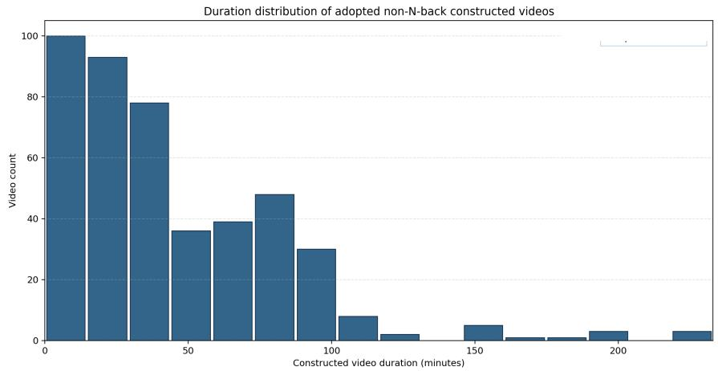

<details>
<summary>bar</summary>

| Constructed video duration (minutes) | Video count |
| ------------------------------------ | ----------- |
| 0-10                                 | 100         |
| 10-20                                | 93          |
| 20-30                                | 78          |
| 30-40                                | 36          |
| 40-50                                | 39          |
| 50-60                                | 48          |
| 60-70                                | 30          |
| 70-80                                | 8           |
| 80-90                                | 2           |
| 90-100                               | 1           |
| 100-110                              | 1           |
| 110-120                              | 1           |
| 120-130                              | 1           |
| 130-140                              | 1           |
| 140-150                              | 1           |
| 150-160                              | 5           |
| 160-170                              | 1           |
| 170-180                              | 1           |
| 180-190                              | 3           |
| 190-200                              | 1           |
| 200-210                              | 1           |
| 210-220                              | 1           |
| 220-230                              | 1           |
| 230-240                              | 1           |
| 240-250                              | 1           |
| 250-260                              | 1           |
| 260-270                              | 1           |
| 270-280                              | 1           |
| 280-290                              | 1           |
| 290-300                              | 1           |
| Note: The actual values may vary due to the random nature of the data generation. |              |
</details>

Figure 12: Duration histogram for the source videos in the non-N-Back portion of $M ^ { 3 }$ Eval. The distribution shows the range of video lengths used in the divided attention, memory interference, and interleaved events tasks.

# B Video Construction Details

We source video materials from five public datasets and benchmarks: HourVideo [7], Video-MME (long-video subset) [13], LVBench [64], InfiniBench (TVQA subset) [2], and CrossVid [31]. These datasets cover egocentric daily activities, diverse web videos, TV episodes, cooking tutorials, and movies, ensuring broad coverage of real-world video scenarios. We construct video pairs following a semantic similarity-first principle. Within each dataset, videos with similar topics, scenes, or narrative structures are paired. This design is motivated by findings in cognitive psychology that memory interference is strongest between semantically similar materials [61].

# C QA Construction Details

This appendix complements the QA construction pipeline introduced in the main text. We design two separate pipelines for the different memory dimensions targeted by our benchmark. The first, non-N-Back QA construction, covers Divided Attention, Memory Interference, Interleaved Events, and source-memory judgment sub-tasks. The second, N-Back QA construction, targets tracking abstract symbolic attributes (scene or action categories) over a video stream.

# C.1 Non-N-Back QA Construction

This pipeline generates questions through a multi-stage process: (1) video segmentation; (2) hierarchical description extraction; (3) model-based question generation using predefined prompts; and (4) manual filtering and verification. We manually filter out controversial and potentially composite scenarios, and ensure that the labels within each group are free from interference and ambiguity.

# C.1.1 Video Segmentation

Instead of processing videos end-to-end, we first segment them into short, localized units by sampling frames and grouping them into local segments. These segments serve as the basic units for all subsequent description extraction and question generation steps.

# C.1.2 Hierarchical Description Extraction

For each video, we extract structured evidence at both the local and global levels to prevent the language model from hallucinating or relying on unstructured information. Each segment is described using a predefined six-key schema, as summarized in Table 5.

Table 5: Structured caption schema for video segments. 

<table><tr><td>Key</td><td>Description</td></tr><tr><td>main_storyline</td><td>Plot progression, operational step, or event stage.</td></tr><tr><td>spatial_relation_binding</td><td>Layout of people, objects, text, or markers relative to local screen space (left/right, above/below, on-screen region).</td></tr><tr><td>short_term_action_state</td><td>Transient action states or instantaneous changes (open/close, pick up/put down, brief flashes).</td></tr><tr><td>tool_prop</td><td>Tools, containers, handheld objects, or props relevant to the current operation.</td></tr><tr><td>fine_visual_attribute</td><td>Colors, textures, materials, shapes, accessories, or other fine-grained appearance details.</td></tr><tr><td>text_symbol</td><td>Text, numbers, icons, labels, logos, or other symbolic information.</td></tr></table>

# C.1.3 Question Generation Prompts

Below, we show the prompts fed to the model during the question generation stage for each task and failure mode.

# VIDEO CAPTION GENERATION

You are a professional video evidence describer preparing context for difficult memory questions over two highly similar videos.

You will receive a small batch of nearby frames from one video. Describe only grounded, directly visible evidence from these frames.

Return STRICT JSON only with exactly these 6 keys: main\_storyline, spatial\_relation\_binding, short\_term\_action\_state, tool\_prop, fine\_visual\_attribute, text\_symbol.

Write every value as one grounded English string. If a category is not supported by visible evidence in this frame batch, return an empty string for that key. Never replace these fields with a single caption key. Do not add wrapper keys such as result, response, or data.

Output format:

```json
{
    "main_storyline": "",
    "spatial_relation_binding": "",
    "short_term_action_state": "",
    "tool_prop": "",
    "fine_visual_attribute": "",
    "text_symbol": ""
} 
```

# Key definitions:

1. main\_storyline: State the local storyline progression or process step shown by this batch. Also include the directly visible people, entities, objects, actions, and scene context that support that storyline reading. If the frames imply a short local progression, describe that progression clearly.

2. spatial\_relation\_binding: Describe detail-level spatial relations or position binding. Focus on who or what is to the left/right/front/behind, what is on top of or inside something, where a marking appears, or where text/icons appear within the frame.

3. short\_term\_action\_state: Describe short-lived action states or momentary changes visible in this batch. Focus on brief states such as on/off, open/half-open/closed, held/released, appearing/disappearing, flashing/persistent, steaming/not steaming, and other transient states.

4. tool\_prop: Describe visible tools, props, utensils, containers, handheld objects, manipulated small items, or operation-relevant objects.

5. fine\_visual\_attribute: Describe subtle visual attributes such as colors, patterns, materials, textures, shapes, markings, accessories, or other precise appearance details.

6. text\_symbol: Record readable text, numbers, labels, logos, icons, signs, subtitles, packaging text, or symbolic graphics. If only part is readable, say what is readable and what is uncertain.

Requirements: Use objective, concrete English. Do not speculate beyond what is visible or strongly implied by the shown frames. Keep each field concise but specific. Preserve short-lived and discriminative evidence instead of collapsing everything into broad summary. Output exactly one JSON object and nothing else.

# SOURCE IDENTIFICATION

Role You are a professional video memory test question designer.

Task Two semantically similar videos are shown side by side throughout the full clip. You will receive sparse frame-batch caption contexts for Video 1 and Video 2. Design exactly 1 multiple-choice storyline-reconstruction question asking which narrative paragraph most accurately describes what happened in one target video.

Focus Build the question around the main storyline, process stages, or high-level event progression of the target video rather than tiny fleeting details.

2×2 Combinatorial Design

• This prompt is for source\_confusion.   
• Option A must be the only correct paragraph before downstream option shuffle.   
• Select exactly two non-adjacent manipulable positions, slot\_1 and slot\_2, inside one shared storyline scaffold.   
• For each slot, prepare: the real target-video main-stage detail as the correct version; a corresponding main-stage detail from the other video as the incorrect version.   
• The four options must realize the full 2×2 grid: A: slot\_1=correct, slot\_2=correct; B: slot\_1=incorrect, slot\_2=correct; C: slot\_1=correct, slot\_2=incorrect; D: slot\_1=incorrect, slot\_2=incorrect.   
• All three wrong options must stay within the single error family source\_confusion.

# Writing Constraints

1. The question must ask: “Which of the following options most accurately describes what happened in Video X?”   
2. Each option must be one coherent narrative paragraph of about 90–160 words.   
3. All four options must keep nearly the same paragraph structure, writing style, and overall narrative scaffold.   
4. Differences should center on meaningful storyline stages, not trivial wording noise.   
5. Do not turn the paragraph into bullet-like stage labels; keep fluent prose.   
6. The four option strings must all be distinct; never output two identical paragraphs.

# Self-Check Before Finalizing

1. All four options are individually coherent and share the same high-level storyline scaffold.   
2. A/B/C/D exactly realize the correct-correct / incorrect-correct / correct-incorrect / incorrect-incorrect grid.   
3. option\_role\_by\_letter stays coarse-grained: A=correct, B/C/D=source\_confusion.   
4. storyline\_2x2\_design.slot\_1 and slot\_2 each use exact verbatim anchor spans copied from the option text so a checker can verify the expected presence/absence; do not paraphrase or inflect those anchor spans across options.   
5. The two slots are separated in the paragraph and do not collapse into the same local phrase.   
6. B differs from A only at slot\_1, C differs from A only at slot\_2, and D differs from A at both slots.

# ORDER UNDERSTANDING

Role You are a professional video memory test question designer.

Task Two semantically similar videos are shown side by side throughout the full clip. You will receive sparse frame-batch caption contexts for Video 1 and Video 2. Design exactly 1 multiple-choice storyline-reconstruction question asking which narrative paragraph most accurately describes what happened in one target video.

Focus Build the question around the main storyline, process stages, or high-level event progression of the target video rather than tiny fleeting details.

2×2 Combinatorial Design

• This prompt is for order\_disruption.   
• Option A must be the only correct paragraph before downstream option shuffle.   
• Select exactly two non-overlapping reversible event pairs, slot\_1 and slot\_2, inside one shared storyline scaffold.

• For each slot, prepare: the true temporal order as the correct version; a locally plausible reversed order as the incorrect version.

• Represent each slot with the same two short event clauses reused word-for-word across all four options. Form the incorrect version only by swapping the order of those exact clauses.

• The four anchor clauses across slot\_1 and slot\_2 must all be distinct. Do not reuse one event clause in both slots.

• In every option, each anchor clause must appear exactly once. Do not duplicate or omit an anchor clause when building a distractor.

• Keep each slot as one local two-clause micro-sequence in place. Reverse the two clauses inside the same local sentence window; do not move one anchor clause to another sentence or another slot region.

• The four options must realize the full 2×2 grid: A: slot\_1=correct, slot\_2=correct; B: slot\_1=incorrect, slot\_2=correct; C: slot\_1=correct, slot\_2=incorrect; D: slot\_1=incorrect, slot\_2=incorrect.

• All three wrong options must stay within the single error family order\_disruption.

• Both slots must genuinely change somewhere in the final options. Do not leave one slot text unchanged across all four options.

• Construct A first. Then create B, C, and D by copying A and swapping only the required slot order in place. Do not rewrite the paragraph from scratch for each letter.

# Writing Constraints

1. The question must ask: “Which of the following options most accurately describes what happened in Video X?”

2. Each option must be one coherent narrative paragraph of about 90–160 words.

3. All four options must keep nearly the same paragraph structure, writing style, and overall narrative scaffold.

4. Differences should center on meaningful storyline stages rather than trivial wording noise.

5. Do not turn the paragraph into bullet-like stage labels; keep fluent prose.

6. The four option strings must all be distinct; never output two identical paragraphs.

7. Build slot\_1 and slot\_2 as two separate local windows, preferably two separate sentences. Do not let the two slots overlap or share a sentence fragment.

# Self-Check Before Finalizing

1. All four options are individually coherent and share the same high-level storyline scaffold.

2. A/B/C/D exactly realize the correct-correct / incorrect-correct / correct-incorrect / incorrect-incorrect grid.

3. option\_role\_by\_letter stays coarse-grained: A=correct, B/C/D=order\_disruption.

4. For each slot, correct\_anchors and incorrect\_anchors must be ordered anchor lists copied verbatim from the option text so a checker can verify the local order; the same anchor wording must be reused word-for-word in every option.

5. The two slots are separated in the paragraph and the four anchor clauses are all distinct; no anchor phrase is reused across slots.   
6. Every option contains each anchor clause exactly once; no anchor clause is duplicated or omitted.   
7. Each slot is reversed in place inside its own local sentence window; no anchor clause is moved to another sentence or another slot region.   
8. B differs from A only at slot\_1, C differs from A only at slot\_2, and D differs from A at both slots.   
9. Before finalizing, literally check that all four anchor clauses from A still appear once each in B, C, and D.

# CONTENT RETENTION

Role You are a professional video memory test question designer.

Task Two semantically similar videos are shown side by side throughout the full clip. You will receive sparse frame-batch caption contexts for Video 1 and Video 2. Design exactly 1 multiple-choice storyline-reconstruction question asking which narrative paragraph most accurately describes what happened in one target video.

Focus Build the question around the main storyline, process stages, or high-level event progression of the target video rather than tiny fleeting details.

2×2 Combinatorial Design

• This prompt is for content\_forgetting.   
• Option A must be the only correct paragraph before downstream option shuffle.   
• Select exactly two non-adjacent manipulable positions, slot\_1 and slot\_2, inside one shared storyline scaffold.   
• For each slot, prepare: the real target-video main-stage detail as the correct version; a plausible but nonexistent main-stage detail as the incorrect version.   
• The four options must realize the full 2×2 grid: A: slot\_1=correct, slot\_2=correct; B: slot\_1=incorrect, slot\_2=correct; C: slot\_1=correct, slot\_2=incorrect; D: slot\_1=incorrect, slot\_2=incorrect.   
• All three wrong options must stay within the single error family content\_forgetting.

Writing Constraints

1. The question must ask: “Which of the following options most accurately describes what happened in Video X?”   
2. Each option must be one coherent narrative paragraph of about 90–160 words.   
3. All four options must keep nearly the same paragraph structure, writing style, and overall narrative scaffold.   
4. Differences should center on meaningful storyline stages rather than trivial wording noise.   
5. Do not turn the paragraph into bullet-like stage labels; keep fluent prose.   
6. The four option strings must all be distinct; never output two identical paragraphs.

Self-Check Before Finalizing

1. All four options are individually coherent and share the same high-level storyline scaffold.

2. A/B/C/D exactly realize the correct-correct / incorrect-correct / correct-incorrect / incorrect-incorrect grid.

3. option\_role\_by\_letter stays coarse-grained: A=correct, B/C/D=content\_forgetting.

4. storyline\_2x2\_design.slot\_1 and slot\_2 each use exact verbatim anchor spans copied from the option text so a checker can verify the expected presence/absence; do not paraphrase or inflect those anchor spans across options.

5. The two fabricated details never appear in either source video and do not collapse into the same local phrase.

6. B differs from A only at slot\_1, C differs from A only at slot\_2, and D differs from A at both slots.

# FALSE MEMORY DISCRIMINATION

You are generating exactly ONE 4-option false-source question for two similar videos named video1 and video2.

Canonical type: question\_type\_id: false\_source\_attribution; question\_type: False Source Attribution.

Goal Ask about a semantically related event or detail that appears in neither video. The false event should feel relevant to the two videos, not random. Required Design

• Use only the provided segment summaries, global summaries, and pair summary as grounding for what is related and what is absent.   
• The stem detail must be absent from both videos.   
• Use exactly these 4 option meanings: Video 1, Video 2, Both videos, Neither video.   
• The options themselves must be plain source labels. Do NOT paraphrase them as correct video / wrong video.   
• Use the source labels directly as answer texts, for example A. Video 1, B. Video 2, C. Both videos, D. Neither video.   
• The correct answer must therefore be the Neither video option.   
• Set target\_video to neither.

# MEMORY INTERFERENCE

Role You are a professional video memory test question designer.

Task Two semantically similar videos are concatenated into a single continuous video for the model to watch. You will receive sparse frame-caption contexts for each video. Design exactly 1 multiple-choice question that tests whether recall of one video’s fine visual attribute is invaded by a similar attribute from the other video.

Focus Prioritize subtle appearance evidence such as: colors, patterns, materials, shapes, markings, textures, accessories, or small appearance cues; details visible only briefly and easy to confuse across similar scenes; grounded visual attributes rather than broad plot summaries.

Runtime Compatibility

• Treat the provided Video 1 context and Video 2 context as the only source evidence.   
• Generate exactly ONE 4-option multiple-choice question.   
• Canonical type: question\_type\_id: memory\_interference; question\_type: Memory Interference.   
• Set target\_video to video1 or video2.   
• Set target\_memory\_ability to memory\_interference\_fine\_visual\_attribute.   
• Include option\_role\_by\_letter with exactly one correct, two intrusion, and one irrelevant\_distractor.   
• Set intrusion\_option\_letter to one of the intrusion letters.   
• Return STRICT JSON only. No markdown. No explanation.

# SOURCE MEMORY

Role You are a professional video memory test question designer.   
Task Two semantically similar videos are presented to the model. You will receive sparse frame-caption contexts for Video 1 and Video 2. Design exactly 1 source-memory multiple-choice question about a short-lived fine visual attribute that truly appeared in only one video.   
Focus Prioritize subtle appearance evidence such as: colors, patterns, materials, shapes, markings, textures, accessories, or small appearance cues; details that are visible briefly and are easy to confuse across similar scenes; grounded visual attributes rather than broad plot summaries.   
Runtime Compatibility   
• Treat the provided Video 1 context and Video 2 context as the only source evidence.   
• Generate exactly ONE 2-option multiple-choice question.   
• Canonical type: question\_type\_id: source\_memory; question\_type: Source Memory.   
• Use exactly these 2 answer texts: A. Video 1, B. Video 2.   
• Set target\_video to video1 or video2.   
• Set target\_memory\_ability to source\_memory\_fine\_visual\_attribute.   
• Include option\_role\_by\_letter as a JSON object with exactly: A: video1\_only;B: video2\_only.   
• Return STRICT JSON only. No markdown. No explanation.

# C.1.4 Manual Review and Verification

All generated candidate questions undergo a rigorous manual review. We verify the logical consistency of the options, ensure that distractors are plausible but demonstrably incorrect, and revise wording when necessary to eliminate ambiguity. Only questions that pass this quality check are included in the final benchmark.

# C.2 N-Back QA Construction

We first uniformly segment each video into clips. Then, we employ Qwen3.5-27B to annotate each clip with its scene and action attributes via sequential prompting. Specifically, we process clips in temporal order and maintain a running list of all previously assigned attribute phrases. At each step, the existing action and scene labels are injected into the prompt, encouraging the model to reuse consistent phrasing for recurring attributes. A new phrase is introduced only when a genuinely novel action or scene appears. The annotation prompt is shown below.

# N-BACK ATTRIBUTE ANNOTATION

You are analyzing a sequence of video segments from the same context.

Your task is to provide two short phrases for the current segment:

1. The main Action/Activity.   
2. The Scene/Environment.   
Current Global Memory for this group:   
Existing Actions: [list of action phrases assigned to previous clips]   
Existing Scenes: [list of scene phrases assigned to previous clips] Instructions:   
- If the current action/scene matches one in the memory, use the EXACT phrase from the list.   
- If it is new, create a concise new phrase (2-4 words).   
- OUTPUT FORMAT: Action: [phrase] | Scene: [phrase]

Based on the similarity of these clip-level attributes, we select four groups of videos. From each group, three clips are sampled and randomly combined to construct N-Back testing video sets. All generated N-Back probes undergo the same manual review process described above, ensuring that the annotated attributes are accurate and that each probe has a single unambiguous correct answer.

# D Experimental Details

For frame sampling, we use 0.5 FPS for Gemini-3.1-Pro-Preview and 96 uniform frames for all other models by default, with two exceptions: 144 frames for the repeated-trial experiments in Fig. 8 and 8 frames per clip for the N-Back experiments in Sec. 4.4. For all other settings, we use the defaults. All experiments with locally deployed models were conducted on a server equipped with 4 NVIDIA A800 GPUs. Proprietary models were evaluated through their official APIs.

# E Example Visualization

Here we present examples for each type of task. Each example includes: 1) the format in which the video is presented, 2) the task-specific prompt given to the model, and 3) the specific question asked.

# Divided Attention

Video Construction   
Combined Split-screen Video   


Left Screen   


<details>
<summary>natural_image</summary>

Row of seven food preparation scenes: side dishes, side bowls, side bowls with ingredients, side bowls with sauce, side bowls with meat and sauce, side bowls with sauce and broth, side bowls with beans, side bowls with herbs and herbs (no visible text or symbols)
</details>

Right Screen   


<details>
<summary>natural_image</summary>

Sequence of food preparation steps showing mixing, stir-frying, and blending (no text or symbols visible)
</details>

# Source Identification

# Question

Note: This video displays two separate videos side by side. Video 1 is on the left and Video 2 is on the right throughout the video. If the question mentions Video 1 or Video 2, they refer to the left and right videos respectively.

# Which of the following options most accurately describes what happened in Video 1?

A. The cooking process begins with an overhead view of ingredients on a speckled countertop, including a bowl of chopped white onions and a plate of fresh green cilantro. A hand wearing a gold ring picks up the herbs from a white plate with a colorful striped rim and places them into a stainless steel blender. Later, the cook stirs chopped red onions in a black pot until they turn translucent and browned. Finally, the dish is finished as a thick brown chickpea curry garnished with raw purple onion rings and bright green cilantro leaves.

B. The cooking process begins with an overhead view of ingredients on a speckled countertop, including a bowl of chopped white onions and a plate of fresh green cilantro. A hand wearing a gold ring picks up the herbs from a white plate with a colorful striped rim and places them into a stainless steel blender. Later, the cook stirs chopped red onions in a black pot until they turn translucent and browned. Finally, the dish is finished as a thick brown chickpea curry garnished with a green lime wedge and a slice of white onion.

C. The cooking process begins with an overhead view of ingredients on a speckled countertop, including a bowl of chopped purple onions and a plate of fresh green cilantro. A hand wearing a gold ring picks up the herbs from a white plate with a colorful striped rim and places them into a stainless steel blender. Later, the cook stirs chopped red onions in a black pot until they turn translucent and browned. Finally, the dish is finished as a thick brown chickpea curry garnished with raw purple onion rings and bright green cilantro leaves.

D. The cooking process begins with an overhead view of ingredients on a speckled countertop, including a bowl of chopped purple onions and a plate of fresh green cilantro. A hand wearing a gold ring picks up the herbs from a white plate with a colorful striped rim and places them into a stainless steel blender. Later, the cook stirs chopped red onions in a black pot until they turn translucent and browned. Finally, the dish is finished as a thick brown chickpea curry garnished with a green lime wedge and a slice of white onion.

white onions, a green lime wedge and a slice of white onion are from Video 2 !

Figure 13: Example of Divided Attention targeting Source Identification. The three distractors replace certain content in the target video’s narrative with content from the distractor video, while the correct option (highlighted in yellow) faithfully describes only the target video.

# Divided Attention

Video Construction

Combined Split-screen Video


Left

Screen


<details>
<summary>natural_image</summary>

Sequence of six photos showing a person preparing food, including pouring vegetables and using a tool (no visible text or symbols)
</details>

Right

Screen


<details>
<summary>text_image</summary>

Collage of food preparation scenes including a man cooking with vegetables, a woman holding a drink, and a healthy meal promotion banner.
</details>

# Order Understanding

# Question

Note: This video displays two separate videos side by side. Video 1 is on the left and Video 2 is on the right throughout the video. If the question mentions Video 1 or Video 2, they refer to the left and right videos respectively.

# Which of the following options most accurately describes what happened in Video 1?

A. The video begins with a montage of various cooked dishes before a woman in a teal shirt introduces the recipe. She squeezes a lemon half over the mixture, then places chickpeas and greens into a food processor. After processing the ingredients into a thick green paste, she tastes the finished green dip and reacts to the flavor. Finally, she scrapes it into a red bowl before the video concludes with a title card.   
B. The video begins with a montage of various cooked dishes before a woman in a teal shirt introduces the recipe. She places chickpeas and greens into a food processor, then squeezes a lemon half over the mixture. After processing the ingredients into a thick green paste, she scrapes it into a red bowl. Finally, she tastes the finished green dip and reacts to the flavor before the video concludes with a title card.   
C. The video begins with a montage of various cooked dishes before a woman in a teal shirt introduces the recipe. She places chickpeas and greens into a food processor, then squeezes a lemon half over the mixture. After processing the ingredients into a thick green paste, she tastes the finished green dip and reacts to the flavor. Finally, she scrapes it into a red bowl before the video concludes with a title card.   
D. The video begins with a montage of various cooked dishes before a woman in a teal shirt introduces the recipe. She squeezes a lemon half over the mixture, then places chickpeas and greens into a food processor. After processing the ingredients into a thick green paste, she scrapes it into a red bowl. Finally, she tastes the finished green dip and reacts to the flavor before the video concludes with a title card.

Figure 14: Example of Divided Attention targeting Order Understanding. The three distractors swap the temporal or logical sequence of events in the target video’s narrative, while the correct option (highlighted in yellow) preserves the original order.

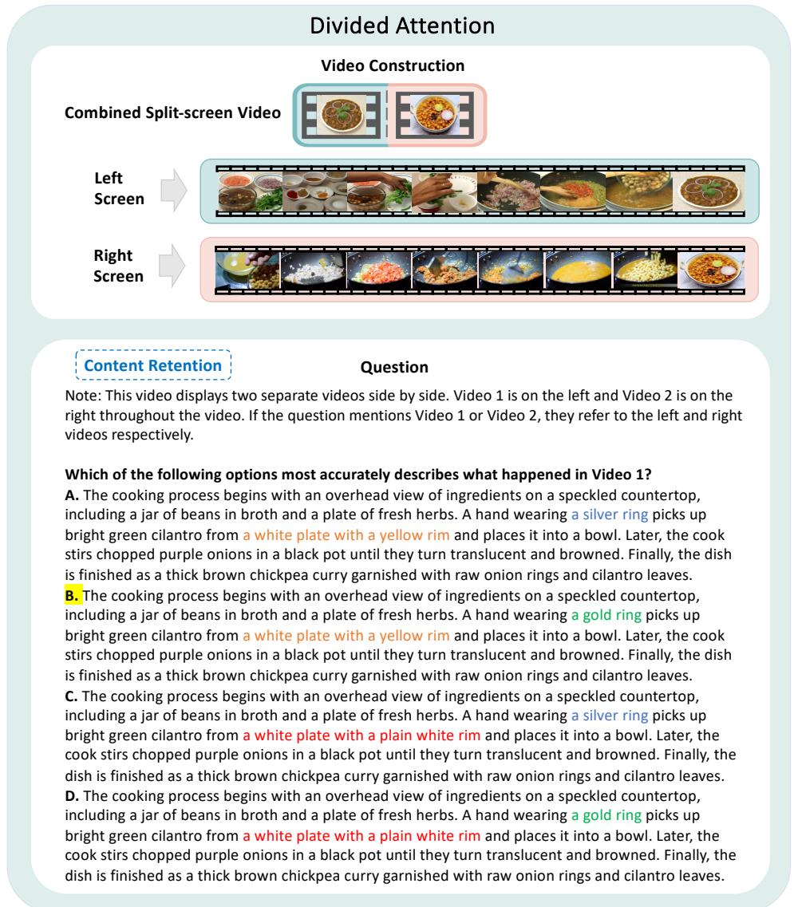

<details>
<summary>text_image</summary>

Divided Attention
Video Construction
Combined Split-screen Video
Left
Screen
Right
Screen
Content Retention Question
Which of the following options most accurately describes what happened in Video 1?
A. The cooking process begins with an overhead view of ingredients on a speckled countertop,
including a jar of beans in broth and a plate of fresh herbs. A hand wearing a silver ring picks up
bright green cilantro from a white plate with a yellow rim and places it into a bowl. Later, the cook
stirs chopped purple onions in a black pot until they turn translucent and browned. Finally, the dish
is finished as a thick brown chickpea curry garnished with raw onion rings and cilantro leaves.
B. The cooking process begins with an overhead view of ingredients on a speckled countertop,
including a jar of beans in broth and a plate of fresh herbs. A hand wearing a gold ring picks up
bright green cilantro from a white plate with a yellow rim and places it into a bowl. Later, the cook
stirs chopped purple onions in a black pot until they turn translucent and browned. Finally, the
dish is finished as a thick brown chickpea curry garnished with raw onion rings and cilantro leaves.
C. The cooking process begins with an overhead view of ingredients on a speckled countertop,
including a jar of beans in broth and a plate of fresh herbs. A hand wearing a silver ring picks up
bright green cilantro from a white plate with a plain white rim and places it into a bowl. Later, the
cook stirs chopped purple onions in a black pot until they turn translucent and browned. Finally, the
dish is finished as a thick brown chickpea curry garnished with raw onion rings and cilantro leaves.
D. The cooking process begins with an overhead view of ingredients on a speckled countertop,
including a jar of beans in broth and a plate of fresh herbs. A hand wearing a gold ring picks up
bright green cilantro from a white plate with a plain white rim and places it into a bowl. Later, the
cook stirs chopped purple onions in a black pot until they turn translucent and browned. Finally, the
dish is finished as a thick brown chickpea curry garnished with raw onion rings and cilantro leaves.
</details>

Figure 15: Example of Divided Attention targeting Content Retention. The three distractors replace certain content in the target video’s narrative with plausible but fabricated content, while the correct option (highlighted in yellow) faithfully describes only the target video.

# Memory Interference

Video Construction：Retroactive

Temporally Concatenated Video


<details>
<summary>natural_image</summary>

Filmstrip-style collage showing a person eating dishes with various food items (no visible text or symbols)
</details>

Temporal

# Question

Note: This video contains two separate videos played one after the other. Video 1 is played first, followed by Video 2. If the question mentions Video 1 or Video 2, they refer to the first and second video respectively.

In Video 1, after the person lifts the lid off the large stainless steel pot to reveal the dark stew, what do they do with the lid?

A. They set the lid aside on the countertop to the right.   
B. They hold the lid above the pot while stirring.   
C. They place the lid back on the pot immediately.   
D. They place the lid on the adjacent burner.

Video Construction：Proactive

Temporally Concatenated Video

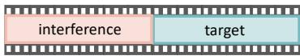

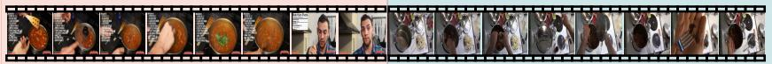

<details>
<summary>text_image</summary>

Collage of food photos and images showing various dishes, ingredients, and food items with accompanying descriptive captions.
</details>

Temporal

# Question

Note: This video contains two separate videos played one after the other. Video 1 is played first, followed by Video 2. If the question mentions Video 1 or Video 2, they refer to the first and second video respectively.

In Video 2, after the person lifts the lid off the large stainless steel pot to reveal the dark stew, what do they do with the lid?

A. They set the lid aside on the countertop to the right.   
B. They hold the lid above the pot while stirring.   
C. They place the lid back on the pot immediately.   
D. They place the lid on the adjacent burner.

Figure 16: Example of Memory Interference. Each question comprises the correct answer (highlighted in yellow) for the target video, two intrusion options drawn from the interfering video, and one unrelated distractor.

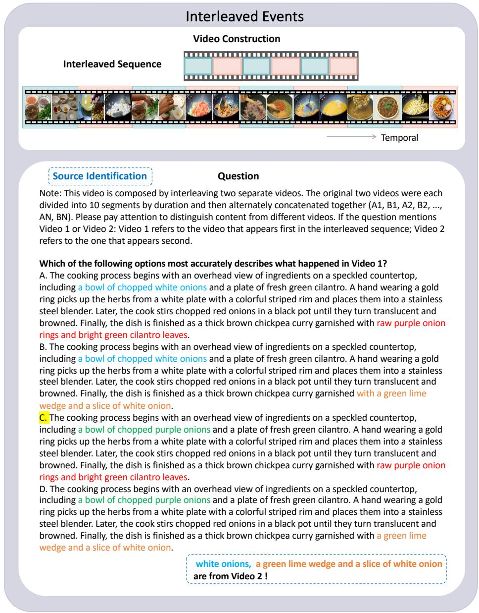

<details>
<summary>text_image</summary>

Interleaved Events
Video Construction
Interleaved Sequence
Temporal
Source Identification Question
Note: This video is composed by interleaving two separate videos. The original two videos were each divided into 10 segments by duration and then alternately concatenated together (A1, B1, A2, B2, ..., AN, BN). Please pay attention to distinguish content from different videos. If the question mentions Video 1 or Video 2: Video 1 refers to the video that appears first in the interleaved sequence; Video 2 refers to the one that appears second.
Which of the following options most accurately describes what happened in Video 1?
A. The cooking process begins with an overhead view of ingredients on a speckled countertop, including a bowl of chopped white onions and a plate of fresh green cilantro. A hand wearing a gold ring picks up the herbs from a white plate with a colorful striped rim and places them into a stainless steel blender. Later, the cook stirs chopped red onions in a black pot until they turn translucent and browned. Finally, the dish is finished as a thick brown chickpea curry garnished with raw purple onion rings and bright green cilantro leaves.
B. The cooking process begins with an overhead view of ingredients on a speckled countertop, including a bowl of chopped white onions and a plate of fresh green cilantro. A hand wearing a gold ring picks up the herbs from a white plate with a colorful striped rim and places them into a stainless steel blender. Later, the cook stirs chopped red onions in a black pot until they turn translucent and browned. Finally, the dish is finished as a thick brown chickpea curry garnished with a green lime wedge and a slice of white onion.
C. The cooking process begins with an overhead view of ingredients on a speckled countertop, including a bowl of chopped purple onions and a plate of fresh green cilantro. A hand wearing a gold ring picks up the herbs from a white plate with a colorful striped rim and places them into a stainless steel blender. Later, the cook stirs chopped red onions in a black pot until they turn translucent and browned. Finally, the dish is finished as a thick brown chickpea curry garnished with raw purple onion rings and bright green cilantro leaves.
D. The cooking process begins with an overhead view of ingredients on a speckled countertop, including a bowl of chopped purple onions and a plate of fresh green cilantro. A hand wearing a gold ring picks up the herbs from a white plate with a colorful striped rim and places them into a stainless steel blender. Later, the cook stirs chopped red onions in a black pot until they turn translucent and browned. Finally, the dish is finished as a thick brown chickpea curry garnished with a green lime wedge and a slice of white onion.
white onions, a green lime wedge and a slice of white onion are from Video 2!
</details>

Figure 17: Example of Interleaved Events targeting Source Identification. The three distractors replace certain content in the target video’s narrative with content from the distractor video, while the correct option (highlighted in yellow) faithfully describes only the target video.

# Interleaved Events

Video Construction   
Interleaved Sequence   


<details>
<summary>text_image</summary>

Collage of food and beverage photos with visible brand text 'Tobacco Meals' and Chinese characters
</details>

Temporal

# Order Understanding

# Question

Note: This video is composed by interleaving two separate videos. The original two videos were each divided into 10 segments by duration and then alternately concatenated together (A1, B1, A2, B2, ..., AN, BN). Please pay attention to distinguish content from different videos. If the question mentions Video 1 or Video 2: Video 1 refers to the video that appears first in the interleaved sequence; Video 2 refers to the one that appears second.

# Which of the following options most accurately describes what happened in Video 1?

A. The video begins with a montage of various cooked dishes before a woman in a teal shirt introduces the recipe. She squeezes a lemon half over the mixture, then places chickpeas and greens into a food processor. After processing the ingredients into a thick green paste, she tastes the finished green dip and reacts to the flavor. Finally, she scrapes it into a red bowl before the video concludes with a title card.

B. The video begins with a montage of various cooked dishes before a woman in a teal shirt introduces the recipe. She places chickpeas and greens into a food processor, then squeezes a lemon half over the mixture. After processing the ingredients into a thick green paste, she scrapes it into a red bowl. Finally, she tastes the finished green dip and reacts to the flavor before the video concludes with a title card.

C. The video begins with a montage of various cooked dishes before a woman in a teal shirt introduces the recipe. She places chickpeas and greens into a food processor, then squeezes a lemon half over the mixture. After processing the ingredients into a thick green paste, she tastes the finished green dip and reacts to the flavor. Finally, she scrapes it into a red bowl before the video concludes with a title card.

D. The video begins with a montage of various cooked dishes before a woman in a teal shirt introduces the recipe. She squeezes a lemon half over the mixture, then places chickpeas and greens into a food processor. After processing the ingredients into a thick green paste, she scrapes it into a red bowl. Finally, she tastes the finished green dip and reacts to the flavor before the video concludes with a title card.

Figure 18: Example of Interleaved Events targeting Order Understanding. The three distractors swap the temporal or logical sequence of events in the target video’s narrative, while the correct option (highlighted in yellow) preserves the original order.

# Interleaved Events

Video Construction   
Interleaved Sequence   


<details>
<summary>natural_image</summary>

Sequence of food preparation steps showing mixing, cooking, and blending (no text or symbols visible)
</details>

Temporal

# Content Retention

# Question

Note: This video is composed by interleaving two separate videos. The original two videos were each divided into 10 segments by duration and then alternately concatenated together (A1, B1, A2, B2, ..., AN, BN). Please pay attention to distinguish content from different videos. If the question mentions Video 1 or Video 2: Video 1 refers to the video that appears first in the interleaved sequence; Video 2 refers to the one that appears second.

# Which of the following options most accurately describes what happened in Video 1?

A. The cooking process begins with an overhead view of ingredients on a speckled countertop, including a jar of beans in broth and a plate of fresh herbs. A hand wearing a silver ring picks up bright green cilantro from a white plate with a yellow rim and places it into a bowl. Later, the cook stirs chopped purple onions in a black pot until they turn translucent and browned. Finally, the dish is finished as a thick brown chickpea curry garnished with raw onion rings and cilantro leaves.

B. The cooking process begins with an overhead view of ingredients on a speckled countertop, including a jar of beans in broth and a plate of fresh herbs. A hand wearing a gold ring picks up bright green cilantro from a white plate with a yellow rim and places it into a bowl. Later, the cook stirs chopped purple onions in a black pot until they turn translucent and browned. Finally, the dish is finished as a thick brown chickpea curry garnished with raw onion rings and cilantro leaves.

C. The cooking process begins with an overhead view of ingredients on a speckled countertop, including a jar of beans in broth and a plate of fresh herbs. A hand wearing a silver ring picks up bright green cilantro from a white plate with a plain white rim and places it into a bowl. Later, the cook stirs chopped purple onions in a black pot until they turn translucent and browned. Finally, the dish is finished as a thick brown chickpea curry garnished with raw onion rings and cilantro leaves.

D. The cooking process begins with an overhead view of ingredients on a speckled countertop, including a jar of beans in broth and a plate of fresh herbs. A hand wearing a gold ring picks up bright green cilantro from a white plate with a plain white rim and places it into a bowl. Later, the cook stirs chopped purple onions in a black pot until they turn translucent and browned. Finally, the dish is finished as a thick brown chickpea curry garnished with raw onion rings and cilantro leaves.

Figure 19: Example of Interleaved Events targeting Content Retention. The three distractors replace certain content in the target video’s narrative with plausible but fabricated content, while the correct option (highlighted in yellow) faithfully describes only the target video.

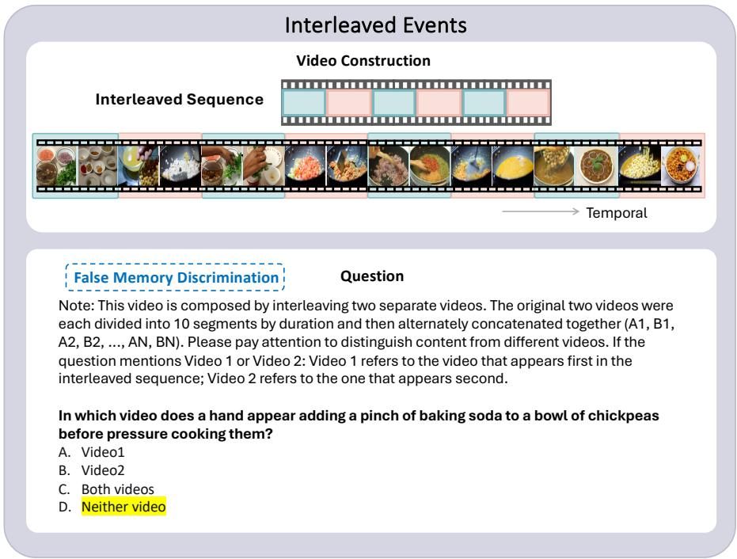

<details>
<summary>text_image</summary>

Interleaved Events
Video Construction
Interleaved Sequence
Temporal
False Memory Discrimination Question
Note: This video is composed by interleaving two separate videos. The original two videos were each divided into 10 segments by duration and then alternately concatenated together (A1, B1, A2, B2, ..., AN, BN). Please pay attention to distinguish content from different videos. If the question mentions Video 1 or Video 2: Video 1 refers to the video that appears first in the interleaved sequence; Video 2 refers to the one that appears second.
In which video does a hand appear adding a pinch of baking soda to a bowl of chickpeas before pressure cooking them?
A. Video1
B. Video2
C. Both videos
D. Neither video
</details>

Figure 20: Example of Interleaved Events targeting False Memory Discrimination. A fake question that is relevant to video content is presented, and the model should be aware to choose the option indicating that the query does not belong to either video. The correct answer is highlighted in yellow.

# Source Memory

# Video Construction

I: Spatial (split-screen)


<details>
<summary>natural_image</summary>

Filmstrip-style collage showing people preparing food in a kitchen setting, no visible text or symbols
</details>


Left Screen

Right Screen


II: Temporal (interleaved)


<details>
<summary>natural_image</summary>

Sequence of food preparation steps showing ingredients being cooked in bowls, stir-frying, and blending (no text or labels visible)
</details>

# Question I

Note: This video displays two separate videos side by side. Video 1 is on the left and Video 2 is on the right throughout the video. If the question mentions Video 1 or Video 2, they refer to the left and right videos respectively.

In which video do the ingredients include cilantro?

A. Video 1

B. Video 2

# Question II

Note: This video is composed by interleaving two separate videos. The original two videos were each divided into 10 segments by duration and then alternately concatenated together (A1, B1, A2, B2, ..., AN, BN). Please pay attention to distinguish content from different videos. If the question mentions Video 1 or Video 2: Video 1 refers to the video that appears first in the interleaved sequence; Video 2 refers to the one that appears second.

In which video is the final stew garnished with thin, translucent purple onion rings and bright green cilantro leaves?

A. Video 1

B. Video 2

Figure 21: Example of Source Memory. Spatial refers to a split-screen format with frequent left/right swaps. The correct answer is highlighted in yellow.

# N-Back

Video Construction: SCENE   
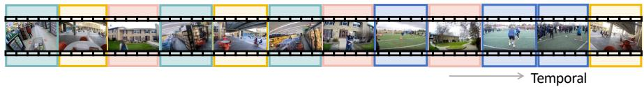

<details>
<summary>text_image</summary>

Temporal
</details>

  
Grocery store interior

  
Outdoor dining area

  
Residential neighborhood

  
Soccer field

# Question I: (N=1)

There are 12 videos. Please watch the sequence of videos provided. Do the 11th video and the 12th video depict the same scene/event, namely ‘Outdoor dining area’? Please answer with 'Yes' or 'No' only.

# Question II: (N=2)

There are 12 videos. Please watch the sequence of videos provided. Do the 10th video and the 12th video depict the same scene/event, namely ‘Outdoor dining area’? Please answer with 'Yes' or 'No' only.

Video Construction: Action   
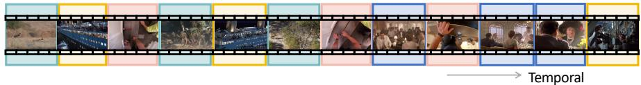

<details>
<summary>text_image</summary>

Temporal
</details>

  
Dog chasing prey

  
People fleeing ship

  
Installing wood floor

  
People dining aboard ship

# Question III: (N=3)

There are 12 videos. Please watch the sequence of videos provided. Are the main actions/activities in the 9th video and the 12th video both 'People fleeing ship'? Please answer with 'Yes' or 'No' only.

# Question IV: (N=4)

There are 12 videos. Please watch the sequence of videos provided. Are the main actions/activities in the 8th video and the 12th video both 'People fleeing ship'? Please answer with 'Yes' or 'No' only.

Figure 22: Example of N-Back. The model is asked to decide whether the final clip matches the clip N positions earlier with a Yes/No answer, on two attributes: Scene (same environment category) and Action (same type of activity). The correct answer is highlighted in yellow.