# Who Needs Labels? Adapting Vision Foundation Models With the Metadata You Already Have

Elouan Gardès1,2,†, Seung Eun Yi1, Kartik Ahuja1, Théo Moutakanni1, Huy V. Vo1, Piotr Bojanowski1, Wolfgang M. Pernice3,†, Loïc Landrieu2,†, Camille Couprie1,†

1Meta FAIR, Paris, 2LIGM, CNRS, Gustave Eiffel, ENPC, IP Paris, 3Columbia University, New York †Corresponding authors

We propose a label-free approach to adapt powerful but generic vision foundation models to specialized scientific domains. Standard supervised fine-tuning is often ill-suited to these settings: labels are scarce, and task-specific training can collapse the model’s generality and hurt robustness. We instead leverage metadata to adapt representations to new domains in a self-supervised manner. Our method, FINO, combines a standard self-supervised objective with flexible metadata guidance that handles both highly granular discrete metadata and continuous metadata. It encourages the representation to preserve informative factors while suppressing spurious ones. Across subcellular fluorescence microscopy, Earth observation, wildlife monitoring, and medical imaging, FINO consistently outperforms standard unsupervised domain adaptation and fully supervised adaptation. It also exceeds highly-specialized domain-specific state of the art, while using no task labels for backbone adaptation and only lightweight probes for supervision.

Date: June 4, 2026

Correspondence: wp2181@cumc.columbia.edu, loic.landrieu@enpc.fr, {egardes,coupriec}@meta.com

8Meta

# 1 Introduction

Visual foundation models provide rich, general representations that perform well across many natural-image tasks [1, 2, 3]. However, they often degrade on specialised domains such as biomedical microscopy [4, 5] and Earth observation [6], whose distributions differ substantially from natural images [7]. These datasets also exhibit subtle but pervasive domain shifts [8] that arise from both meaningful variation, such as geography [9] or staining protocols [10], and spurious factors such as sensor characteristics or reagent aliquot, often called batch effects in biology [11]. Fortunately, such datasets are also typically accompanied by rich metadata correlated to these variations, and which are available at virtually no extra cost.

A standard way to adapt foundation models to a new domain is supervised fine-tuning [12, 13, 14, 15]. In scientific settings, however, labels are often scarce or expensive [16], and fine-tuning can overfit taskspecific signals, hurting out-of-distribution (OOD) generalisation [17]. In the process, it can erase much of the generality of the pretrained model, occasionally yielding worse performance than zero-shot inference. Unsupervised domain adaptation instead leverages unlabelled data from the target distribution [18, 19], but remains task-driven and can likewise induce task-specific collapse [20, 21].

In this work, we study representation adaptation: specialising a pretrained foundation model to a new application domain without task labels, then evaluating the frozen adapted representation with lightweight probes (Fig. 1). Purely self-supervised adaptation can struggle under distribution shift, as its representations remain sensitive to low-level or context-specific cues [5, 22]. Recent work has shown that metadata can help steer self-supervised adaptation toward more robust representations [5, 22, 23, 24, 25]. However, existing approaches remain partial: they are often tailored to a single modality or assume only a small number of domains, whereas scientific metadata is highly granular, spanning thousands of discrete categories or continuous values.

We propose FINO (FIne tuning with NO labels), a unified framework for metadata-driven representation adaptation (Fig. 1). It augments a self-supervised objective with metadata-guided losses and targeted regularisation to preserve informative structure while suppressing spurious variation. By combining prototypebased contrastive guidance, self-supervision, and appropriate regularisation, our method scales to heterogeneous and highly granular metadata, where classical domain generalisation methods struggle.

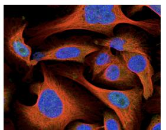

<details>
<summary>natural_image</summary>

Fluorescent microscopy image of stained cells showing blue nuclei and red cytoplasmic structures (no text or labels)
</details>

HPA   
! plates   
! antibody   
! cell line


<details>
<summary>natural_image</summary>

Group of cows grazing in a dry field under a clear sky (no text or symbols visible)
</details>

iWildCam   
! trap   
& timestamp

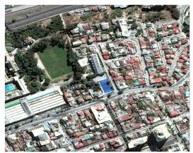

<details>
<summary>natural_image</summary>

Aerial view of a residential area with uniform housing, roads, and green spaces (no visible text or symbols)
</details>

FMoW   
! country   
! weather   
& viewing angle

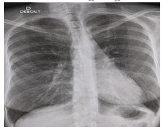

<details>
<summary>natural_image</summary>

Chest X-ray image showing rib cage and lung fields (no text or symbols visible)
</details>

MIMIC-CXR 1   
! age   
! view position

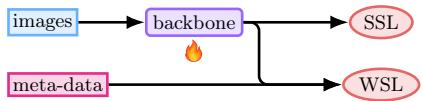

<details>
<summary>flowchart</summary>

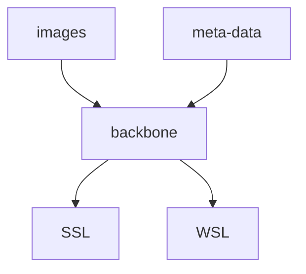
</details>

Step 1: Representation adaptation

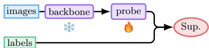

<details>
<summary>flowchart</summary>

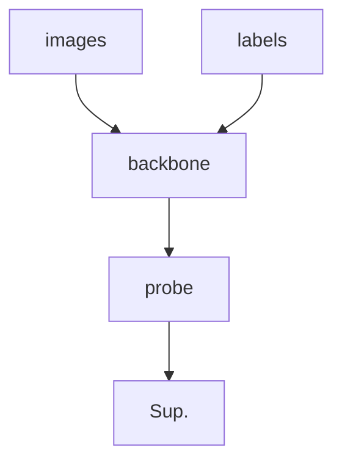
</details>

Step 2: Lightweight probing   
(b) FINO   
Frozen DINOv3 Supervised FT FINO

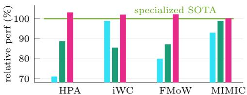

<details>
<summary>bar</summary>

|        | Series 1 | Series 2 |
| ------ | -------- | -------- |
| HPA    | 70       | 90       |
| iWC    | 100      | 85       |
| FMoW   | 80       | 90       |
| MIMIC  | 95       | 100      |
</details>

(c) Performance relative to domain SOTA   
(a) Data with metadata (! discrete, & continuous)   
Figure 1 Learning with Metadata. Scientific datasets (a) often come with rich metadata describing their acquisition conditions. We leverage these signals as weak supervision (WSL), together with a self-supervised objective (SSL), to adapt a generic foundation model to a new application domain without task labels (b). The resulting representations can be probed to outperform fully supervised fine-tuning and even match or surpass highly specialized domain-specific state-of-the-art (c).

Empirically, FINO substantially improves OOD, outperforming standard domain adaptation methods without access to unlabelled data from the test set. More strikingly, it surpasses fully supervised fine-tuning with only a lightweight probe on the frozen backbone. It also matches or exceeds highly specialised domain-specific methods, including top Kaggle solutions on Human Protein Atlas [26], and delivers consistent gains across Earth observation (FMoW [27]), wildlife monitoring (iWildCam [28]), and medical imaging (MIMIC-CXR [29]) benchmarks, with a single shared recipe across all four domains. Our contributions are as follows:

• We propose FINO, a unified metadata-guided adaptation framework that integrates heterogeneous metadata into self-supervised learning. It handles discrete and continuous metadata without requiring task labels, target-distribution data, or metadata at inference time.   
• We show that the same FINO recipe can adapt a generic vision foundation model across four scientific application domains and outperform fully supervised fine-tuning with no labels for backbone adaptation and only lightweight probes for evaluation, while surpassing highly specialized domain-specific state-ofthe-art.

# 2 Related work

Self-supervised Representation Learning. Self-supervised learning (SSL) has enabled the emergence of powerful visual representations through contrastive [34, 35], self-distillation [36, 1], bootstrapping [37], masking [38], and joint-embedding predictive approaches [39]. Several methods incorporate prototype-based objectives to structure representations, either in a fully unsupervised manner [40, 41] or with supervision [42]. A common remedy to mitigate degradation when transferring to specialised domains such as microscopy [43, 44] or remote sensing [45] is supervised fine-tuning [12, 13, 14, 15], but it relies on task-specific annotations that are often scarce in scientific settings and may lead to overfitting to spurious correlations [46, 47]. This motivates adapting representations using weak and freely available signals such as metadata.

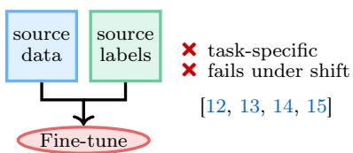

<details>
<summary>flowchart</summary>

```mermaid
graph TD
    A["source data"] --> C["Fine-tune"]
    B["source labels"] --> C
    style C fill:#ffcccc,stroke:#333
    note right of C
        ✗ task-specific
        ✗ fails under shift
    end
```
</details>

(a) Supervised fine-tuning   
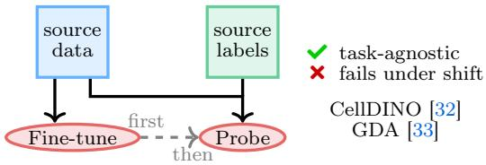

<details>
<summary>flowchart</summary>

```mermaid
graph TD
    A["source data"] --> B["Fine-tune"]
    C["source labels"] --> D["Probe"]
    style A fill:#d4edda,stroke:#333
    style C fill:#d4edda,stroke:#333
    style B fill:#f0f0f0,stroke:#333
    style D fill:#f0f0f0,stroke:#333
    note right of B: first
    note right of D: then
    classDef default stroke:#ff0000,stroke-width:2px;
    class A,B,C default;
    note right of D: green check for task-agnostic; red X for fails under shift; CellDINO["32"], GDA["33"]
```
</details>

(c) Self-Supervised Representation Adaptation

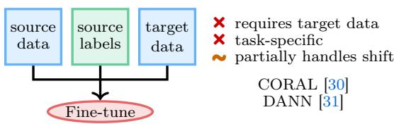

<details>
<summary>flowchart</summary>

```mermaid
graph TD
    A["source data"] --> C["Fine-tune"]
    B["source labels"] --> C
    D["target data"] --> C
    style C fill:#ffcccc,stroke:#333
    note right of C
        ✗ requires target data
        ✗ task-specific
        ∼ partially handles shift
    end
```
</details>

(b) Unsupervised Domain Adaptation   
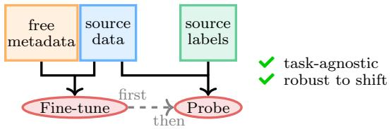

<details>
<summary>flowchart</summary>

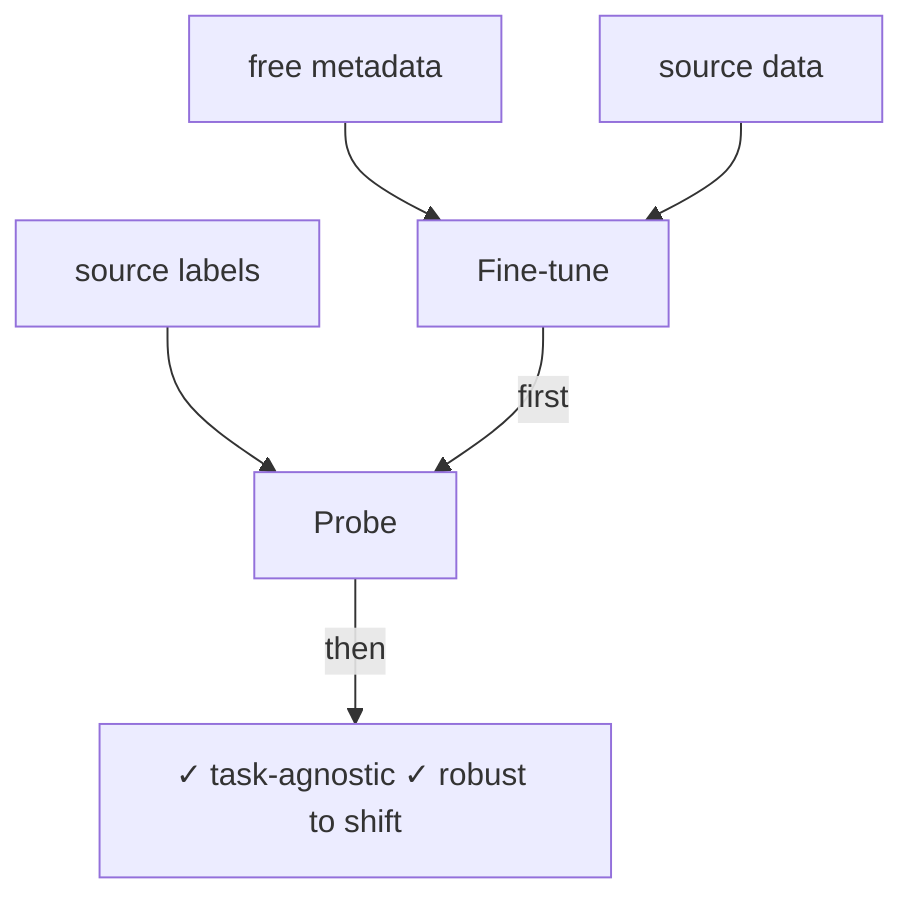
</details>

(d) Weakly-Supervised Representation Adaptation   
Figure 2 Representation adaptation paradigms. Task-centric methods (a–b) adapt models using labels. Supervised fine-tuning (a) relies on labelled source data but fails under domain shift. Unsupervised domain adaptation (b) additionally uses unlabelled data from the target distribution to mitigate this shift, but remains task-specific. In contrast, representation adaptation methods (c–d) first adapt the representation to a new application domain without task labels, and only then train a lightweight probe. Self-supervised adaptation (c) may capture spurious structure. FINO (d) leverages freely available metadata to learn representations that are both task-agnostic and robust to domain shift.

Domain Generalisation and Invariant Representations. Batch effects (systematic variations induced by experimental conditions) are a well-documented source of domain shift in scientific data [48], and are known to significantly impact learned representations, including in self-supervised settings [44, 5]. A large body of work, therefore, seeks to learn representations invariant to predefined domain labels by explicitly removing domain-specific information. In supervised settings, this is typically achieved through feature alignment across domains [30], gradient reversal mechanisms [18], contrastive fairness objectives [49], or compositional attribute decompositions [50]. In the self-supervised setting, Scalbert et al. [31] propose to standardise Fourier statistics across batches. Complementary to these approaches, post-hoc methods such as Harmony [51] and Symphony [52] correct batch effects in latent space.

These approaches treat each selected factor as a nuisance to be removed, and do not provide a mechanism to preserve or encourage informative metadata within the same framework. They also typically assume a small number of discrete domains, whereas scientific metadata often spans thousands of classes or continuous values. In contrast, we propose a unified metadata-guided framework that encourages informative factors while suppressing spurious ones, using prototype-based guidance [42] for high-cardinality discrete metadata and learned regressors for continuous factors.

Metadata Guidance in Scientific Imaging. Metadata can be viewed as a form of weak supervision for representation learning in domain-specific settings [53]. In microscopy and related medical imaging, such signals have been exploited through protein identity [54], antibody labels [55], microscopy-specific consistency objectives [22], and patient metadata in retinal imaging [56, 24]. These methods show the promise of metadata, but remain tied to specific modalities, task formulations, or supervision regimes. In remote sensing, SatMAE [57] and Scale-MAE [58] incorporate temporal, spectral, or resolution metadata through modified positional encodings. However, these methods require metadata at test time. Closer to our approach, SatMIPS [23] proposes a metadata-guided CLIP-like framework [2] for satellite imagery, but is specifically tailored to continuous geospatial metadata. More generally, Bao and Karaletsos [59] conditions a Vision Transformer on contextual tokens to improve robustness to distribution shifts, but this modifies the backbone and remains limited to environments observed during training. Framing metadata as auxiliary objectives is also related to multi-task learning [60], though prior work typically focuses on a small number of factors. An orthogonal line of work instead exploits metadata to shape the training distribution itself: El Banani et al. [61] uses caption similarity to mine semantically aligned positive pairs for contrastive learning. In this paper, we propose a unified framework that integrates arbitrary metadata into self-supervised learning, without modifying the backbone, without requiring metadata at test time, and while handling both discrete and continuous metadata at scale.

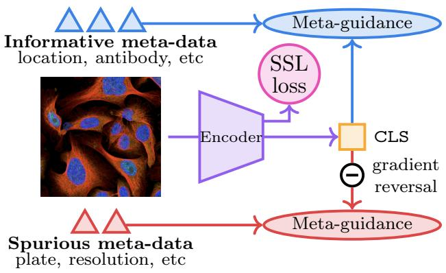

<details>
<summary>flowchart</summary>

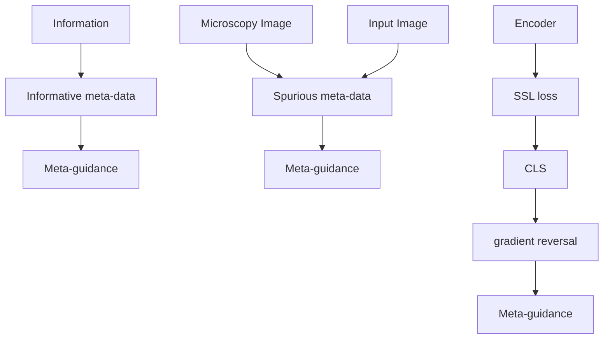
</details>

(a) Metadata-Driven Representation Adaptation

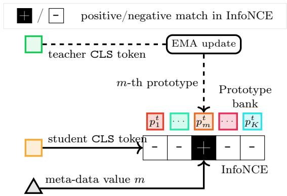

<details>
<summary>flowchart</summary>

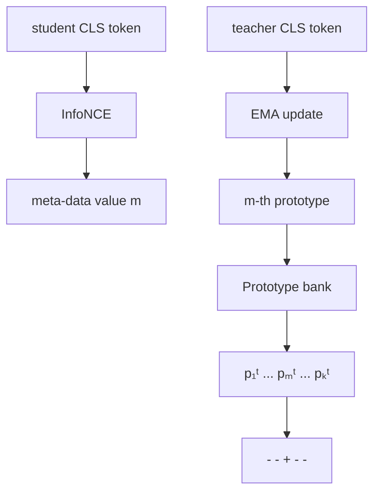
</details>

(b) Discrete metadata guidance for metadata type t   
Figure 3 FINO. Left: overall representation adaptation pipeline, which combines DINO, iBOT, metadata guidance (informative factors $\mathbb { M } _ { + }$ encouraged, spurious factors M− suppressed via gradient reversal), and SIGReg to adapt a pretrained encoder without task labels. Right: discrete metadata guidance for one metadata type t. The student embedding is contrasted against an EMA prototype bank indexed by the metadata value, and the matched prototype is updated from the teacher embedding. Continuous metadata uses a predictor head instead of a prototype bank.

# 3 Method

Our goal is to adapt the representation of a pretrained foundation model to a target application domain without task labels and independently of any downstream task. To this end, we leverage freely available metadata to encourage the model to organise its features along informative factors while reducing sensitivity to spurious ones.

Setting. Our approach is based on the standard DINO self-supervised setup[1], with a student–teacher architecture operating on augmented views and a teacher updated by exponential moving average. As shown in Fig. 3, we extend this framework to accommodate metadata supervision. Let x be an image and $\phi$ a backbone encoder. We denote by $\boldsymbol { \phi } ( \boldsymbol { x } ) \in \mathbb { R } ^ { D }$ the student embedding $( e . g .$ , the class token of a ViT), and by $\phi _ { \mathrm { t e a c h e r } } ( x )$ the corresponding teacher embedding. Each sample is associated with one or several metadata types $t \in \mathcal T$ , which may be discrete $( e . g .$ , antibody, country) or continuous $( e . g .$ , timestamp, viewing angle).

Informative and spurious metadata. We partition metadata types into informative factors $\mathbb { M } _ { + }$ , which the representation should preserve, and spurious factors $\mathbb { M } _ { - } .$ , which it should suppress. Informative metadata capture meaningful structure in the data distribution and correlates with variables of interest. For example, in fluorescence microscopy, the antibody or staining protocol determines which cellular structures are highlighted and is therefore predictive of protein localisation. In Earth observation, geographic location influences both label distributions (land use, crop types) and their appearance. Organising representations along such factors provides a meaningful supervisory signal. In contrast, spurious metadata correspond to variations introduced by the acquisition process that are not related to image content. For instance, plate identifiers in high-throughput microscopy often encode batch effects $( e . g .$ , illumination or preparation artifacts), while sensor characteristics or viewing conditions in satellite imagery reflect acquisition settings rather than scene content. Representations that encode such factors tend to generalise poorly beyond conditions observed in training [5].

Choosing metadata factors. Assigning metadata to $\mathbb { M } _ { + }$ or M− is application-dependent and does not require target-domain labels. In practice, we rely on three principles: prior domain knowledge, desired deployment invariances, and, when needed, source-only sweeps over both assignments. In microscopy, antibody identity is a natural candidate for $\mathbb { M } _ { + }$ , whereas sensor resolution identifiers typically belong to M−. In remote sensing, time may be treated as spurious when temporal invariance is desired, while geography is often informative; for geographic generalisation, this assignment can be reversed. Our sensitivity analysis in Fig. 4 shows that most factors fall cleanly into a single quadrant, making the informative-versus-spurious choice straightforward in practice. The one exception is cell line on HPA, which degrades performance in both regimes; App. A.3.2 traces this to entanglement with antibody identity and distils a practical guideline for handling such correlated factors.

Figure 4 Impact of Metadata Guidance. We measure the impact of adding individual metadata factor when encouraged (x-axis, assigned to $\mathbb { M } _ { + } )$ or suppressed (y-axis, assigned to M−), reported as the $\Delta$ on each dataset’s target metric relative to a no-guidance baseline. The quadrants characterise each factor’s role: always beneficial factors help in both regimes; informative only and spurious only factors help only under correct assignment; always harmful factors degrade performance regardless of assignment, occupied only by cell line on HPA, an entanglement artefact analysed in A.3.2. The dashed diagonal separates factors that benefit more from encouragement (below) vs suppression (above). See A.3 for a detailed per-factor analysis.   
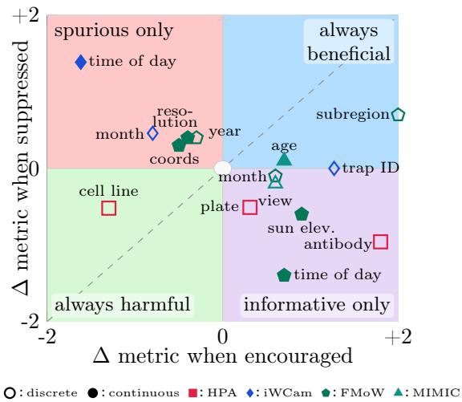

<details>
<summary>scatter</summary>

| Category | Δ metric when encouraged | Δ metric when suppressed |
| :--- | :--- | :--- |
| discrete | -1.5 | 0.5 |
| continuous | -1.2 | -0.8 |
| HPA | 0.3 | -0.7 |
| iWCam | -0.8 | 0.6 |
| FMoW | -0.5 | 0.4 |
| MIMIC | 1.2 | 0.9 |
| time of day | -1.8 | 1.2 |
| resolution | -0.3 | 0.3 |
| year | -0.2 | 0.2 |
| month | -0.1 | 0.1 |
| coords | -0.4 | 0.3 |
| cell line | -1.3 | -0.6 |
| view | 0.5 | -0.4 |
| month | 0.6 | 0.1 |
| age | 0.7 | 0.2 |
| trap ID | 1.1 | 0.0 |
| sun elev. antibody | 0.8 | -0.6 |
| time of day | 1.3 | -1.1 |
| always harmful | -1.6 | -1.8 |
| always beneficial | 2.0 | 1.5 |
| subregion | 1.8 | 1.6 |
</details>

Metadata guidance. We define a guidance loss $\mathcal { L } _ { \mathrm { m e t a } } ^ { ( t ) }$ for each metadata type t. Its form depends on whether the metadata is discrete or continuous, and its sign determines whether it encourages alignment with informative factors or suppresses spurious ones via reversed gradients.

Discrete metadata. For a discrete metadata type t taking values in $\{ 1 , \dots , M \}$ , we maintain a prototype bank $\{ p _ { m } ^ { t } \} _ { m = 1 } ^ { M }$ , where each prototype corresponds to one possible metadata value. For an image x with value m for metadata $t ,$ we define the following prototype-based contrastive objective, inspired by supervised contrastive learning [42] and prototypical contrastive learning [41]:

$$
\mathcal {L} _ {\mathrm{meta}} ^ {(t)} (x) = - \log \frac {\exp \left(\langle \phi (x) , p _ {m} ^ {t} \rangle / \tau\right)}{\sum_ {n = 1} ^ {M} \exp \left(\langle \phi (x) , p _ {n} ^ {t} \rangle / \tau\right)}, \tag {1}
$$

where $\tau > 0$ is a temperature parameter, $\phi ( x )$ and $p _ { m } ^ { t }$ are ℓ2-normalised so that $\langle \cdot , \cdot \rangle$ is a cosine similarity (see App. A.4). Unlike standard supervised contrastive learning, no positive or negative samples are needed within the batch, allowing it to scale to metadata with large numbers of classes $M$ . Prototypes are updated via an exponential moving average of teacher embeddings:

$$
p _ {m} ^ {t} \leftarrow \alpha p _ {m} ^ {t} + (1 - \alpha) \phi_ {\mathrm{teacher}} (x), \tag {2}
$$

where α is the EMA update rate; $p _ { m } ^ { t }$ is detached and re-projected onto the unit sphere after each update. The approach is illustrated in Fig. 3.

Continuous metadata. For a metadata t with continuous values $m \in \mathbb { R } ^ { d }$ , we learn a predictor $g ^ { ( t ) } \ ( e . g .$ , an MLP) and define a regression loss:

$$
\mathcal {L} _ {\text { meta }} ^ {(t)} (x) = \left\| g ^ {(t)} (\phi (x)) - m \right\| _ {2} ^ {2}. \tag {3}
$$

Encouraging and suppressing metadata. We use the same metadata loss for all metadata types, but control its effect on the encoder via gradient reversal. For informative metadata encouraging alignment with the corresponding factor. For spurious me $t \in \mathbb { M } _ { + }$ ncoder minimises , we reverse the gr $\mathcal { L } _ { \mathrm { m e t a } } ^ { ( t ) } ,$ $t \in \mathbb { M } _ { - }$ before it reaches the encoder, effectively discouraging the representation from encoding this information. When the gto minimise $\mathcal { L } _ { \mathrm { m e t a } } ^ { ( t ) } .$ e branch includes trainable parameters, following the standard adversarial for $( e . g .$ , the predictor tion of Ganin $g ^ { ( t ) } )$ ), they are always optimised Lempitsky [18].

Balancing metadata losses. Discrete and continuous metadata losses have different scales and gradient profiles, which can hinder joint training. When multiple metadata branches are used jointly, we therefore balance their gradients with a simple EMA-smoothed multiplicative factor, in the spirit of prior gradient-balancing methods [62, 63, 64]. Full details are provided in App. A.4.

Overall objective. We build on a standard self-supervised setup combining the DINO and iBOT losses respectively on the CLS and patch tokens. Following LeJEPA [65], we additionally regularise the prenormalisation DINO bottleneck with SIGReg (see App. A.4). The training objective is

$$
\mathcal {L} (x) = \mathcal {L} _ {\mathrm{DINO}} (x) + \mathcal {L} _ {\mathrm{iBOT}} (x) + \lambda_ {\mathrm{SIGReg}} \mathcal {L} _ {\mathrm{SIGReg}} (x) + \sum_ {t \in \mathbb {M} _ {+} \cup \mathbb {M} _ {-}} \lambda_ {\text {meta}} ^ {(t)} \mathcal {L} _ {\text {meta}} ^ {(t)} (x), \tag {4}
$$

where taken $\{ \lambda _ { \mathrm { m e t a } } ^ { ( t ) } \} _ { t }$ , and  the $\lambda _ { \mathrm { S I G R e g } }$ are nonnegative weights. In  paper [65], and a single value se weights are not tuned: is reused for every metad $\lambda _ { \mathrm { S I G R e g } }$ $\lambda _ { \mathrm { m e t a } } ^ { ( t ) } { = } 0 . 0 3$ without an extra hyperparameter sweep. For $t \in \mathbb { M } _ { - }$ , gradients from $\mathcal { L } _ { \mathrm { m e t a } } ^ { ( t ) }$ are reversed before reaching the

Implementation details. We initialise the backbone from an open-source DINOv3 [66] ViT-L checkpoint obtained by distilling a larger 7B-parameter teacher. As this checkpoint provides only backbone weights, we initialise all heads (DINO, iBOT, and metadata) from random weights.Training proceeds in two phases. In the first phase, the pretrained backbone is frozen, and the loss heads (DINO, iBOT, and metadata) are randomly initialised and trained, allowing them to align with the pretrained representation space. The patch embedding layer (the input projection of the ViT) is also updated during this phase to adapt to the pixel statistics of the target domain. In the second phase, the backbone is progressively updated with a linear learning-rate warmup, and the full model is trained end-to-end. This schedule prevents randomly initialised heads from destabilising the pretrained backbone early in training. Detailed hyperparameters are provided in App. A.4.

# 4 Results

# 4.1 Datasets and Evaluation

Datasets. We evaluate our approach on four datasets from distinct scientific domains: fluorescence microscopy with Human Protein Atlas (HPA) [67, 68, 26], Earth observation with Functional Map of the World (FMoW) [27, 17], wildlife monitoring with iWildCam [28], and chest X-ray analysis with MIMIC-CXR [29]. Additionally, we evaluate cross-dataset transfer within the same application domain with three additional datasets: OpenCell [69], CheXpert [70], and FLAIR-Hub [71]. Detailed descriptions of all datasets, splits, metadata, and evaluation protocols are provided in section A.2.

Evaluation Protocol. We use the same ViT-L backbone (306M parameters) for all methods. Unless specified otherwise, models are initialised from a public DINOv3 checkpoint [66]; see Appendix section A.1 for a study of generalisation to other backbones. We compare our approach to two classes of methods: task-centric domain adaptation and representation adaptation. For task-centric methods, the model is trained using labelled data from the training set, optionally combined with robustness-inducing regularisation losses. For unsupervised domain adaptation (UDA), we additionally leverage unlabelled data from the test set. In both cases, we follow the standard protocol of fully fine-tuning all model parameters; note that this involves learning a task-specific prediction head. In contrast, in representation adaptation we aim to improve the intrinsic quality of learned representations independent of a specific target task or dataset. We first adapt model weights using unlabelled source data and, optionally, metadata. The model is then frozen, and a lightweight attentive [72] or linear probe is trained on top. The linear probe concatenates the CLS token with the average-pooled patch embeddings and applies a single linear layer. The attentive probe uses a single cross-attention layer that attends to patch embeddings from the last four transformer blocks and aggregates them into a single representation. Both probes remain lightweight (2.7M parameters for the attentive probe; under 1M for the linear probe) compared to a full fine-tuning of the model.

# 4.2 Results and Analysis

We compare our approach to existing adaptation methods across several application domains, analyse the role of different metadata factors and their effect on the learned representation space, and further evaluate the method in cross-dataset evaluation and low-supervision settings.

Table 1 Quantitative results. Comparison of domain-specific state-of-the-art models and adaptation methods across four application domains. We report the best result from the sweep for each dataset; full sweeps are provided in Tab. A.6. The column “param” reports the number of parameters trained with label supervision, while “backbone” indicates whether the backbone is frozen  or trained jointly with the probe . WGA denotes worst-group accuracy. CORAL and DANN are not applied to MIMIC, which does not define source and target domains. 

<table><tr><td rowspan="2" colspan="2"></td><td colspan="2">supervision</td><td>HPA</td><td>iWildCAM</td><td>FMoW</td><td>MIMIC</td></tr><tr><td>param.</td><td>backbone</td><td>F1</td><td>OOD F1</td><td>WGA</td><td>AUROC</td></tr><tr><td></td><td>Specialized SOTA</td><td>80M-300M</td><td></td><td>59.4 [26]</td><td>52.0 [46]</td><td>51.8 [46]</td><td>81.7 [73]</td></tr><tr><td rowspan="2">supervised training</td><td>from scratch</td><td>306M</td><td></td><td>44.7</td><td>10.1</td><td>24.3</td><td>76.8</td></tr><tr><td>fine-tuning</td><td>306M</td><td></td><td>52.6</td><td>43.4</td><td>40.5</td><td>80.7</td></tr><tr><td rowspan="3">domain adaptation and generalisation</td><td>DANN [18]</td><td>306M</td><td></td><td>50.2</td><td>38.5</td><td>46.2</td><td>—</td></tr><tr><td>CORAL [30]</td><td>306M</td><td></td><td>41.1</td><td>38.5</td><td>45.9</td><td>—</td></tr><tr><td>Group-DRO [74]</td><td>306M</td><td></td><td>52.6</td><td>26.1</td><td>46.4</td><td>80.0</td></tr><tr><td rowspan="3">representation adaptation</td><td>frozen model</td><td>2.7M</td><td></td><td>42.2</td><td>51.4</td><td>45.0</td><td>75.9</td></tr><tr><td>DINO (SSL)</td><td>2.7M</td><td></td><td>60.0</td><td>50.0</td><td>48.4</td><td>81.1</td></tr><tr><td>FINO (ours)</td><td>2.7M</td><td></td><td>61.2</td><td>53.1</td><td>52.9</td><td>81.8</td></tr></table>

Adaptation performance. We report the performance of all adaptation methods in Tab. 1. First, training a ViT from scratch is generally not viable on the considered datasets. Second, despite the domain gap between its pretraining data and our target domains, fine-tuning a pretrained DINOv3 backbone yields inconsistent gains over probing the frozen model, and even degrades performance on iWildCam. Unsupervised domain adaptation methods yield inconsistent gains over supervised fine-tuning: substantially improving on FMoW but underperforming on iWildCam, with broadly comparable performance on HPA and MIMIC, with the exception of CORAL on HPA. Applying the standard DINO self-supervised adaptation recipe generally outperforms supervised fine-tuning, but its gains remain inconsistent, even underperforming the frozen DINO baseline on iWildCam.

In contrast, FINO consistently outperforms both self-supervised and fully supervised adaptation, while relying on far fewer label-supervised parameters than the latter. Moreover, it matches or exceeds long-standing, highly specialised state-of-the-art methods tailored to each domain. These methods are heavily engineered for their setting: on HPA, Ouyang et al. [26] uses higher-resolution images (15362 vs. 7682 in our case) and, to the best of our knowledge, has remained unbeaten since 2019; on MIMIC, Moutakanni et al. [73] trains with substantial external data, roughly four times larger than our adaptation and probing data; and on iWildCam/FMoW, Choi et al. [46] uses large ensembles tuned with extensive Bayesian hyperparameter search. By contrast, FINO achieves this with a single shared recipe applied unchanged across all domains despite less favorable settings. Overall, these results show that metadata-guided adaptation can learn highly discriminative representations without task labels, which can then be exploited efficiently with lightweight probes.

Which metadata helps? We report in Fig. 4 the impact of each metadata factor when treated as either informative or spurious. Some metadata are consistently informative: using them as supervisory signals improves performance, indicating that they capture meaningful structure aligned with downstream tasks. In contrast, some metadata are purely spurious: performance improves only when their influence is suppressed, suggesting that they encode nuisance variations that hinder generalisation. Interestingly, certain metadata are beneficial in both regimes: both predicting and actively suppressing these factors provide useful training signals, acting as auxiliary objectives that steer the self-supervised loss toward more semantic representations. A few metadata factors can be harmful in both regimes: they may correlate with the target variable, making them difficult to suppress entirely, while also encoding spurious variation, so encouraging them promotes undesirable associations. We provide an analysis of the effect of individual metadata factors in section A.3.

UMAP analysis of learned representations. Fig. 5 visualizes the HPA feature space for different adaptation strategies, colored either by the target variable (protein localisation) or by a spurious acquisition factor (cell line), and reports k-NN accuracy for both (k = 10 and 100, respectively). Without adaptation, the DINOv3 representation is more structured by acquisition conditions than by the target variable, for which it yields particularly poor accuracy (4%). Fully supervised fine-tuning collapses the representation into a few label-aligned clusters, but generalizes poorly to the OOD test set (48%). Pure self-supervised adaptation avoids this collapse, but remains strongly influenced by the spurious factor (87%), while target labels are less cleanly organized.

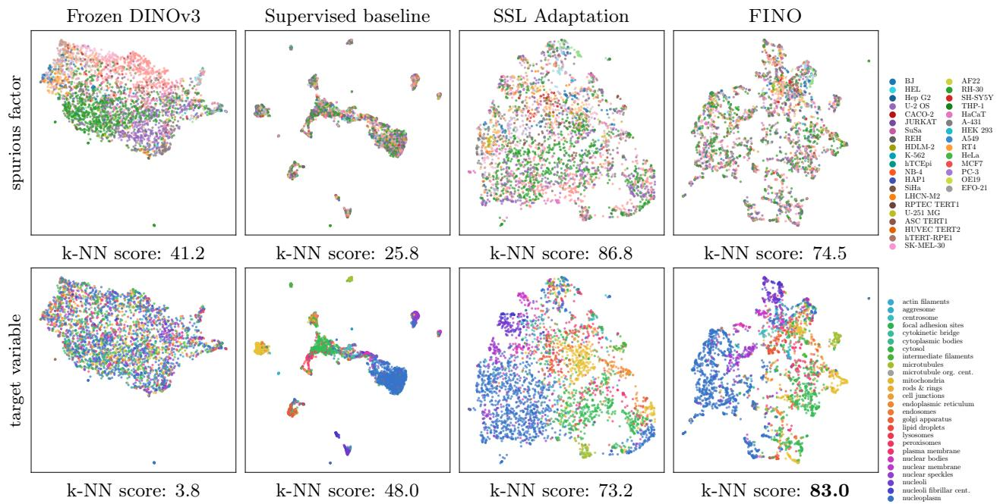

Figure 5 Representation. UMAP visualisation of learned representations on HPA, coloured by a spurious factor (cell line, top) and by the target variable (protein localisation, bottom), alongside OOD test k-NN performance. We sampled 3000 random validation images with single protein location labels for clarity. FINO uses antibody identity as informative metadata.   
Table 2 Transfer learning. A DI-NOv3 model is adapted to a target domain using one dataset, then probed and evaluated on a different dataset from the same domain. 

<table><tr><td>Adaptation set</td><td>HPA → OpenCell [69]</td><td>FMoW → FLAIRHub [71]</td><td>MIMIC-CXR → CheXpert [70]</td></tr><tr><td>Probing and evaluation set</td><td>100× ARI</td><td>mIoU</td><td>AUROC</td></tr><tr><td>Frozen DINOv3</td><td>46.6</td><td>62.0</td><td>87.0</td></tr><tr><td>Supervised adapt.</td><td>53.0</td><td>61.9</td><td>87.3</td></tr><tr><td>FINO</td><td>58.8</td><td>62.3</td><td>88.0</td></tr></table>

We then consider FINO with antibody identity treated as informative metadata, and no suppressed metadata: M− = ∅. Its representation becomes more clearly organized according to the target variable without collapsing around a few labels, as reflected by its strong k-NN accuracy on protein localization (83%), despite never using target labels during adaptation. At the same time, spurious factor is attenuated, with a lower k-NN accuracy of 75% vs. 87% for SSL adaptation, even though this factor was never explicitly suppressed. Overall, metadata guidance reduces spurious structure while promoting semantically meaningful organization.

Low-supervision regime. As shown in Fig. 6, FINO consistently outperforms all baselines across all label fractions, with particularly large gains in the low-data regime. When only 1–10% of labels are available, performance remains high (50.9–57.0%), while supervised fine-tuning and Group DRO degrade sharply (e.g., 53.3% → 29.3% and 52.6% → 25.7% at 1%). Notably, FINO also surpasses fully supervised fine-tuning even at 100% of labels, indicating that label-free representation adaptation can produce features that are both more robust and better aligned with the task. In contrast, Group DRO provides limited gains and remains below standard supervised training, suggesting that robustness to predefined groups is insufficient in this setting.

Transfer learning. A key advantage of label-free adaptation is that the representation does not collapse around a fixed label set. This improves robustness to domain shift and enables transfer across datasets within the same application domain but with different class definitions. In Tab. 2, we adapt a generic DINOv3 model using data and metadata from one dataset, then probe and evaluate on a different dataset from the same domain (Fig. A.1 summarises the structural differences between each transfer pair). When input channels differ between datasets, we drop unsupported input channels or their corresponding model weights, e.g., the nIR band in FLAIR-Hub or the microtubule and ER channels absent from OpenCell. For OpenCell, we report the Adjusted Rand Index (ARI) between protein-level embeddings and ground-truth localisation clusters, following the protocol of Kobayashi et al. [54]. We observe that supervised adaptation is either stable or improves over a frozen DINOv3 backbone, while FINO consistently improves over both. On OpenCell, the off-the-shelf DINOv3 backbone alone already exceeds prior published methods; FINO adds a further +0.122 ARI on top, despite never being trained on OpenCell data (section A.8).

Figure 6 Low-supervision regime. F1 score on HPA as a function of the fraction of labelled data (out of 94,270 annotated images) used to train the downstream predictor. We compare FINO, supervised fine-tuning, and Group DRO (using cell lines as groups). Results use a single fold without cross-validation, so absolute scores differ from Tab. 1. Each point is averaged over 5 seeds (stratified label samplings), except at 100% where the full label set is deterministic. Shaded areas indicate the standard deviation across these seeds.   
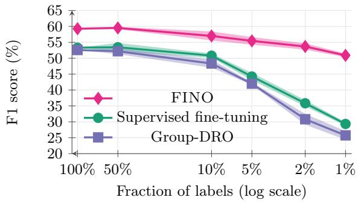

<details>
<summary>line</summary>

| Fraction of labels (log scale) | FINO  | Supervised fine-tuning | Group-DRO |
| ------------------------------ | ----- | ---------------------- | --------- |
| 100%                           | 60    | 54                     | 53        |
| 50%                            | 60    | 54                     | 52        |
| 10%                            | 58    | 52                     | 50        |
| 5%                             | 56    | 45                     | 42        |
| 2%                             | 54    | 36                     | 31        |
| 1%                             | 51    | 30                     | 26        |
</details>

Table 3 Ablation on HPA Kaggle private set. Each row removes or replaces one component from the full FINO model (top row). All runs use a single fold at lower resolution than Tab. 1 (224 vs. 768), which accounts for the difference in absolute scores. 

<table><tr><td>meta-data</td><td>regula-risation</td><td>pre-trained</td><td>discrete guide</td><td>probe</td><td>F1-score</td></tr><tr><td>√</td><td>SIGReg</td><td>√</td><td>proto</td><td>attentive</td><td>54.8 (ours)</td></tr><tr><td>✗</td><td>SIGReg</td><td>√</td><td>N/A</td><td>attentive</td><td>53.0 ↓-1.8</td></tr><tr><td>√</td><td>Koleo</td><td>√</td><td>proto</td><td>attentive</td><td>53.8 ↓-1</td></tr><tr><td>✗</td><td>Koleo</td><td>√</td><td>N/A</td><td>attentive</td><td>51.9 ↓-2.9</td></tr><tr><td>√</td><td>SIGReg</td><td>✗</td><td>proto</td><td>attentive</td><td>51.4 ↓-3.4</td></tr><tr><td>√</td><td>SIGReg</td><td>√</td><td>MLP</td><td>attentive</td><td>51.4 ↓-3.4</td></tr></table>

# 4.3 Ablation Study

We evaluate in Tab. 3 the impact of the main components of FINO on the HPA benchmark.

• Loss terms. Removing metadata guidance reduces performance by −1.8, while replacing SIGReg with Koleo yields a −1.0 drop. Removing both together leads to a larger −2.9 decrease, confirming that these components are complementary.   
• Pretraining. Initialising from a distilled DINOv3 model improves performance by +3.4 F1, indicating that general features transfer effectively even across application domains.   
• Prototype vs. MLP discrete guidance. Replacing the EMA prototype bank with an MLP classifier for discrete metadata reduces performance by −3.4, highlighting the benefit of momentum-updated prototypes for handling high-cardinality metadata.

Limitations and ethical considerations. Because our approach uses metadata as weak supervision, it may introduce or reinforce existing biases. If metadata encodes sensitive or unbalanced attributes (e.g., gender or geographic origin), treating such factors as informative may lead to uneven performance across groups. Metadata should therefore be selected with care, beyond aggregate performance alone. In this paper, we consider four domains for which reasonably informative and reliable metadata is available; in other settings, metadata may be incomplete, noisy, or only weakly aligned with the desired invariances, which can reduce the effectiveness of the approach. More generally, distinguishing informative from spurious metadata is not always straightforward without domain expertise, since the relevance of a factor depends on the target application.

# 5 Conclusion

We formalised representation adaptation, a setting where foundation models are specialised to new domains without task labels, and proposed FINO, a metadata-driven method that leverages freely available auxiliary information as weak supervision to learn domain-adapted yet task-agnostic representations. Without taskspecific fine-tuning, the resulting representations are more robust to distribution shifts and exceed fully supervised and domain-specific methods. More broadly, this work establishes scientific application domains as a fruitful setting for evaluating foundation models in computer vision.

Acknowledgements. This work was partially supported by NIH/NHGRI award 5R00HG011488-05 to WMAP.

# References

[1] Maxime Oquab, Timothée Darcet, Théo Moutakanni, Huy Vo, Marc Szafraniec, Vasil Khalidov, Pierre Fernandez, Daniel Haziza, Francisco Massa, Alaaeldin El-Nouby, Mahmoud Assran, Nicolas Ballas, Wojciech Galuba, Russell Howes, Po-Yao Huang, Shang-Wen Li, Ishan Misra, Michael Rabbat, Vasu Sharma, Gabriel Synnaeve, Hu Xu, Hervé Jegou, Julien Mairal, Patrick Labatut, Armand Joulin, and Piotr Bojanowski. Dinov2: Learning robust visual features without supervision. TMLR, 2024.   
[2] Alec Radford, Jong Wook Kim, Chris Hallacy, Aditya Ramesh, Gabriel Goh, Sandhini Agarwal, Girish Sastry, Amanda Askell, Pamela Mishkin, Jack Clark, Gretchen Krueger, and Ilya Sutskever. Learning transferable visual models from natural language supervision. In ICML, 2021.   
[3] Michael Tschannen, Alexey Gritsenko, Xiao Wang, Muhammad Ferjad Naeem, Ibrahim Alabdulmohsin, Nikhil Parthasarathy, Talfan Evans, Lucas Beyer, Ye Xia, Basil Mustafa, et al. SigLIP 2: Multilingual vision-language encoders with improved semantic understanding, localization, and dense features. arXiv:2502.14786, 2025.   
[4] Sheng Zhang, Yanbo Xu, Naoto Usuyama, Hanwen Xu, Jaspreet Bagga, Robert Tinn, Sam Preston, Rajesh Rao, Mu Wei, Naveen Valluri, Cliff Wong, Andrea Tupini, Yu Wang, Matt Mazzola, Swadheen Shukla, Lars Liden, Jianfeng Gao, Angela Crabtree, Brian Piening, Carlo Bifulco, Matthew P. Lungren, Tristan Naumann, Sheng Wang, and Hoifung Poon. A multimodal biomedical foundation model trained from fifteen million image–text pairs. NEJM AI, 2(1), 2025.   
[5] Wolfgang M Pernice, Michael Doron, Alex Quach, Aditya Pratapa, Sultan Kenjeyev, Nicholas De Veaux, Michio Hirano, and Juan C Caicedo. Out of distribution generalization via interventional style transfer in single-cell microscopy. In CVPR Workshop on Computer Vision for Microscopy Image Analysis (CVMI), 2023.   
[6] Kumar Ayush, Burak Uzkent, Chenlin Meng, Kumar Tanmay, Marshall Burke, David Lobell, and Stefano Ermon. Geography-aware self-supervised learning. In ICCV, 2021.   
[7] Antonio Torralba and Alexei A Efros. Unbiased look at dataset bias. In CVPR. IEEE, 2011.   
[8] Jindong Wang, Cuiling Lan, Chang Liu, Yidong Ouyang, Tao Qin, Wang Lu, Yiqiang Chen, Wenjun Zeng, and Philip S Yu. Generalizing to unseen domains: A survey on domain generalization. IEEE transactions on knowledge and data engineering, 2022.   
[9] Abhishek Kuriyal, Elliot Vincent, Mathieu Aubry, and Loic Landrieu. CoDEx: Combining domain expertise for spatial generalization in satellite image analysis. In CVPR workshop EarthVision, 2025.   
[10] Mehrdad Noori, Gustavo A. Vargas Hakim, David Osowiechi, Fereshteh Shakeri, Ali Bahri, Moslem Yazdanpanah, Sahar Dastani, Ismail Ben Ayed, and Christian Desrosiers. Histopath-C: Towards realistic domain shifts for histopathology vision-language adaptation. In WACV, 2026.   
[11] Karin Stacke, Gabriel Eilertsen, Jonas Unger, and Claes Lundström. Measuring domain shift for deep learning in histopathology. IEEE Journal of Biomedical and Health Informatics, 25(2):325–336, 2021.   
[12] Benjamin P Veasey and Amir A Amini. Parameter-efficient fine-tuning of DINOv2 vision transformers for lung nodule classification. In International Symposium on Biomedical Imaging (ISBI). IEEE, 2024.   
[13] Andreas Peter Steiner, Alexander Kolesnikov, Xiaohua Zhai, Ross Wightman, Jakob Uszkoreit, and Lucas Beyer. How to train your ViT? data, augmentation, and regularization in vision transformers. TMLR, 2022.   
[14] Hugo Touvron, Andrea Vedaldi, Matthijs Douze, and Hervé Jégou. Fixing the train-test resolution discrepancy. In NeurIPS, 2019.   
[15] Yanyan Huang, Weiqin Zhao, Zhengyu Zhang, Yihang Chen, Yu Fu, Feng Wu, Yuming Jiang, Li Liang, Shujun Wang, and Lequan Yu. Knowledge-guided adaptation of pathology foundation models effectively improves cross-domain generalization and demographic fairness. Nature Communications, 2025.   
[16] Devin P Sullivan, Casper F Winsnes, Lovisa Åkesson, Martin Hjelmare, Mikaela Wiking, Rutger Schutten, Linzi Campbell, Hjalti Leifsson, Scott Rhodes, Andie Nordgren, et al. Deep learning is combined with massive-scale citizen science to improve large-scale image classification. Nature biotechnology, 36(9):820–828, 2018.   
[17] Pang Wei Koh, Shiori Sagawa, Henrik Marklund, Sang Michael Xie, Marvin Zhang, Akshay Balsubramani, Weihua Hu, Michihiro Yasunaga, Richard Lanas Phillips, Irena Gao, Tony Lee, Etienne David, Ian Stavness, Wei Guo, Berton A. Earnshaw, Imran S. Haque, Sara Beery, Jure Leskovec, Anshul Kundaje, Emma Pierson, Sergey Levine, Chelsea Finn, and Percy Liang. Wilds: A benchmark of in-the-wild distribution shifts. In ICML, 2021.

[18] Yaroslav Ganin and Victor Lempitsky. Unsupervised domain adaptation by backpropagation. In ICML, 2015.   
[19] Mingsheng Long, Yue Cao, Jianmin Wang, and Michael Jordan. Learning transferable features with deep adaptation networks. In ICML. PMLR, 2015.   
[20] Eric Arazo, Diego Ortego, Paul Albert, Noel E O’Connor, and Kevin McGuinness. Pseudo-labeling and confirmation bias in deep semi-supervised learning. In IJCNN, pages 1–8. IEEE, 2020.   
[21] Elan Rosenfeld, Pradeep Kumar Ravikumar, and Andrej Risteski. The risks of invariant risk minimization. In ICLR, 2021.   
[22] Johan Fredin Haslum, Christos Matsoukas, Karl-Johan Leuchowius, Erik Müllers, and Kevin Smith. Metadataguided consistency learning for high content images. In Medical Imaging with Deep Learning, pages 918–936. PMLR, 2024.   
[23] Jules Bourcier, Gohar Dashyan, Karteek Alahari, and Jocelyn Chanussot. Learning representations of satellite images from metadata supervision. In ECCV. Springer, 2024.   
[24] Robbie Holland, Oliver Leingang, Hrvoje Bogunović, Sophie Riedl, Lars Fritsche, Toby Prevost, Hendrik P N Scholl, Ursula Schmidt-Erfurth, Sobha Sivaprasad, Andrew J Lotery, Daniel Rueckert, and Martin J Menten. Metadata-enhanced contrastive learning from retinal optical coherence tomography images. Medical Image Analysis, 2024.   
[25] Haiyan Lan, Qiaoxi Zhu, Jian Guan, Yuming Wei, and Wenwu Wang. Hierarchical metadata information constrained self-supervised learning for anomalous sound detection under domain shift. In ICASSP, 2024.   
[26] Wei Ouyang, Casper F Winsnes, Martin Hjelmare, Anthony J Cesnik, Lovisa Åkesson, Hao Xu, Devin P Sullivan, Shubin Dai, Jun Lan, Park Jinmo, Shaikat M Galib, Christof Henkel, Kevin Hwang, Dmytro Poplavskiy, Bojan Tunguz, Russell D Wolfinger, Yinzheng Gu, Chuanpeng Li, Jinbin Xie, Dmitry Buslov, Sergei Fironov, Alexander Kiselev, Dmytro Panchenko, Xuan Cao, Runmin Wei, Yuanhao Wu, Xun Zhu, Kuan-Lun Tseng, Zhifeng Gao, Cheng Ju, Xiaohan Yi, Hongdong Zheng, Constantin Kappel, and Emma Lundberg. Analysis of the Human Protein Atlas Image Classification competition. Nature Methods, 16(12):1254–1261, 2019.   
[27] Gordon Christie, Neil Fendley, James Wilson, and Ryan Mukherjee. Functional map of the world. In Proceedings of the IEEE Conference on Computer Vision and Pattern Recognition (CVPR), 2018.   
[28] Sara Beery, Elijah Cole, and Arvi Gjoka. The iwildcam 2020 competition dataset. In CVPR Fine-Grained Visual Categorization Workshop (FGVC), 2020.   
[29] Alistair EW Johnson, Tom J Pollard, Seth J Berkowitz, Nathaniel R Greenbaum, Matthew P Lungren, Chih-ying Deng, Roger G Mark, and Steven Horng. MIMIC-CXR, a de-identified publicly available database of chest radiographs with free-text reports. Scientific data, 2019.   
[30] Baochen Sun, Jiashi Feng, and Kate Saenko. Correlation alignment for unsupervised domain adaptation. In Domain adaptation in computer vision applications, pages 153–171. Springer, 2017.   
[31] Marin Scalbert, Maria Vakalopoulou, and Florent Couzinié-Devy. Towards domain-invariant self-supervised learning with batch styles standardization. In ICLR, 2024.   
[32] Théo Moutakanni, Camille Couprie, Seungeun Yi, Michael Doron, Zitong S Chen, Nikita Moshkov, Elouan Gardes, Mathilde Caron, Hugo Touvron, Armand Joulin, Piotr Bojanowski, Wolfgang M Pernice, and Juan C Caicedo. Cell-dino: Self-supervised image-based embeddings for cell fluorescent microscopy. PLOS Computational Biology, 21(12):e1013828, 2025.   
[33] Linus Scheibenreif, Michael Mommert, and Damian Borth. Parameter efficient self-supervised geospatial domain adaptation. In CVPR, 2024.   
[34] Ting Chen, Simon Kornblith, Mohammad Norouzi, and Geoffrey Hinton. A simple framework for contrastive learning of visual representations. In ICML, 2020.   
[35] Kaiming He, Haoqi Fan, Yuxin Wu, Saining Xie, and Ross Girshick. Momentum contrast for unsupervised visual representation learning. In CVPR, 2020.   
[36] Mathilde Caron, Hugo Touvron, Ishan Misra, Hervé Jégou, Julien Mairal, Piotr Bojanowski, and Armand Joulin. Emerging properties in self-supervised vision transformers. In ICCV, 2021.   
[37] Jean-Bastien Grill, Florian Strub, Florent Altché, Corentin Tallec, Pierre H. Richemond, Elena Buchatskaya, Carl Doersch, Bernardo Avila Pires, Zhaohan Daniel Guo, Mohammad Gheshlaghi Azar, Bilal Piot, Koray Kavukcuoglu,

Rémi Munos, and Michal Valko. Bootstrap your own latent: A new approach to self-supervised learning. In NeurIPS, 2020.   
[38] Kaiming He, Xinlei Chen, Saining Xie, Yanghao Li, Piotr Dollár, and Ross Girshick. Masked autoencoders are scalable vision learners. In CVPR, 2022.   
[39] Mahmoud Assran, Quentin Duval, Ishan Misra, Piotr Bojanowski, Pascal Vincent, Michael Rabbat, Yann LeCun, and Nicolas Ballas. Self-supervised learning from images with a joint-embedding predictive architecture. In CVPR, 2023.   
[40] Mathilde Caron, Ishan Misra, Julien Mairal, Priya Goyal, Piotr Bojanowski, and Armand Joulin. Unsupervised learning of visual features by contrasting cluster assignments. In NeurIPS, 2020.   
[41] Junnan Li, Pan Zhou, Caiming Xiong, and Steven C.H. Hoi. Prototypical contrastive learning of unsupervised representations. In ICLR, 2021.   
[42] Prannay Khosla, Piotr Teterwak, Chen Wang, Aaron Sarna, Yonglong Tian, Phillip Isola, Aaron Maschinot, Ce Liu, and Dilip Krishnan. Supervised contrastive learning. In NeurIPS, 2020.   
[43] Rayan Krishnan, Pranav Rajpurkar, and Eric J. Topol. Self-supervised learning in medicine and healthcare. Nature Biomedical Engineering, 2022.   
[44] Michael Doron, Théo Moutakanni, Zitong S. Chen, Nikita Moshkov, Mathilde Caron, Hugo Touvron, Piotr Bojanowski, Wolfgang M. Pernice, and Juan C. Caicedo. Unbiased single-cell morphology with self-supervised vision transformers. bioRxiv, 2023.   
[45] Yi Wang, Conrad M Albrecht, Nassim Ait Ali Braham, Lichao Mou, and Xiao Xiang Zhu. Self-supervised learning in remote sensing: A review. IEEE Geoscience and Remote Sensing Magazine, 2022.   
[46] Caroline Choi, Yoonho Lee, Annie Chen, Allan Zhou, Aditi Raghunathan, and Chelsea Finn. AutoFT: Learning an objective for robust fine-tuning. arXiv:2401.10220, 2024.   
[47] Helen Qu and Sang Michael Xie. Connect later: Improving fine-tuning for robustness with targeted augmentations. In ICML, 2024.   
[48] Jeffrey T Leek, Robert B Scharpf, Héctor Corrada Bravo, David Simcha, Ben Langmead, W Evan Johnson, Donald Geman, Keith Baggerly, and Rafael A Irizarry. Tackling the widespread and critical impact of batch effects in high-throughput data. Nature Reviews Genetics, 2010.   
[49] Aili Shen, Xudong Han, Trevor Cohn, Timothy Baldwin, and Lea Frermann. Contrastive learning for fair representations. arXiv:2109.10645, 2021.   
[50] Divyat Mahajan, Mohammad Pezeshki, Charles Arnal, Ioannis Mitliagkas, Kartik Ahuja, and Pascal Vincent. Compositional risk minimization. In ICML, 2025.   
[51] I. Korsunsky, N. Millard, J. Fan, K. Slowikowski, F. Zhang, K. Wei, Y. Baglaenko, M. Brenner, P. R. Loh, and S. Raychaudhuri. Fast, sensitive and accurate integration of single-cell data with harmony. Nature Methods, 2019.   
[52] J. B. Kang, A. Nathan, K. Weinand, F. Zhang, N. Millard, L. Rumker, D. B. Moody, I. Korsunsky, and S. Raychaudhuri. Efficient and precise single-cell reference atlas mapping with symphony. Nature Communications, 2021.   
[53] Zhi-Hua Zhou. A brief introduction to weakly supervised learning. National science review, 2018.   
[54] Hirofumi Kobayashi, Keith C. Cheveralls, Manuel D. Leonetti, and Loic A. Royer. Self-supervised deep learning encodes high-resolution features of protein subcellular localization. Nature Methods, 2022.   
[55] Ankit Gupta, Zoe Wefers, Konstantin Kahnert, Jan N. Hansen, Will Leineweber, Anthony Cesnik, Dan Lu, Ulrika Axelsson, Frederic Ballllosera Navarro, Theofanis Karaletsos, and Emma Lundberg. SubCell: Vision foundation models for microscopy capture single-cell biology. bioRxiv, 2024.   
[56] Yeonkyung Lee, Woojung Han, Youngjun Jun, Hyeonmin Kim, Jungkyung Cho, and Seong Jae Hwang. PRETI: Patient-aware retinal foundation model via metadata-guided representation learning. In International Conference on Medical Image Computing and Computer-Assisted Intervention, pages 523–533, 2025.   
[57] Yezhen Cong, Samar Khanna, Chenlin Meng, Patrick Liu, Erik Rozi, Yutong He, Marshall Burke, David B. Lobell, and Stefano Ermon. SatMAE: Pre-training transformers for temporal and multi-spectral satellite imagery. In NeurIPS, 2022.

[58] Colorado J. Reed, Ritwik Gupta, Shufan Li, Sarah Brockman, Christopher Funk, Brian Clipp, Kurt Keutzer, Salvatore Candido, Matt Uyttendaele, and Trevor Darrell. Scale-MAE: A scale-aware masked autoencoder for multiscale geospatial representation learning. In ICCV, 2023.   
[59] Yujia Bao and Theofanis Karaletsos. Contextual vision transformers for robust representation learning. In ICML Workshop on Spurious Correlations, Invariance and Stability (SCIS), 2023.   
[60] Rich Caruana. Multitask learning. Machine Learning, 1997.   
[61] Mohamed El Banani, Karan Desai, and Justin Johnson. Learning visual representations via language-guided sampling. In CVPR, 2023.   
[62] Zhao Chen, Vijay Badrinarayanan, Chen-Yu Lee, and Andrew Rabinovich. Gradnorm: Gradient normalization for adaptive loss balancing in deep multitask networks. In ICML, 2018.   
[63] Liyang Liu, Yi Li, Zhanghui Kuang, Jing-Hao Xue, Yimin Chen, Wenming Yang, Qingmin Liao, and Wayne Zhang. Towards impartial multi-task learning. In ICLR, 2021.   
[64] Adrián Javaloy and Isabel Valera. Rotograd: Gradient homogenization in multitask learning. In ICLR, 2022.   
[65] Randall Balestriero and Yann LeCun. LeJEPA: Provable and scalable self-supervised learning without the heuristics. arXiv:2511.08544, 2025.   
[66] Oriane Siméoni, Huy V Vo, Maximilian Seitzer, Federico Baldassarre, Maxime Oquab, Cijo Jose, Vasil Khalidov, Marc Szafraniec, Seungeun Yi, Michaël Ramamonjisoa, et al. Dinov3. arXiv:2508.10104, 2025.   
[67] Peter J Thul, Lovisa Åkesson, Mikaela Wiking, Diana Mahdessian, Aikaterini Geladaki, Hammou Ait Blal, Tove Alm, Anna Asplund, Lars Björk, Lisa M Breckels, et al. A subcellular map of the human proteome. Science, 2017.   
[68] Peter J Thul and Cecilia Lindskog. The human protein atlas: A spatial map of the human proteome. Protein Science, 2018.   
[69] Nathan H. Cho, Keith C. Cheveralls, Andreas-David Brunner, Kibeom Kim, André C. Michaelis, Preethi Raghavan, Hirofumi Kobayashi, Laura Savy, Jason Y. Li, Hera Canaj, James Y. S. Kim, Edna M. Stewart, Christian Gnann, Frank McCarthy, Joana P. Cabrera, Rachel M. Brunetti, Bryant B. Chhun, Greg Dingle, Marco Y. Hein, Bo Huang, Shalin B. Mehta, Jonathan S. Weissman, Rafael Gómez-Sjöberg, Daniel N. Itzhak, Loïc A. Royer, Matthias Mann, and Manuel D. Leonetti. OpenCell: endogenous tagging for the cartography of human cellular organization. Science, 375(6585):eabi6983, 2022.   
[70] Jeremy Irvin, Pranav Rajpurkar, Michael Ko, Yifan Yu, Silviana Ciurea-Ilcus, Chris Chute, Henrik Marklund, Behzad Haghgoo, Robyn Ball, Katie Shpanskaya, et al. CheXpert: A large chest radiograph dataset with uncertainty labels and expert comparison. In AAAI, 2019.   
[71] Anatol Garioud, Sébastien Giordano, Nicolas David, and Nicolas Gonthier. FLAIR-HUB: Large-scale multimodal dataset for land cover and crop mapping. ISPRS Journal of Photogrammetry and Remote Sensing, 237:271–300, 2026.   
[72] Xiaokang Chen, Mingyu Ding, Xiaodi Wang, Ying Xin, Shentong Mo, Yunhao Wang, Shumin Han, Ping Luo, Gang Zeng, and Jingdong Wang. Context autoencoder for self-supervised representation learning. IJCV, 2024.   
[73] Théo Moutakanni, Piotr Bojanowski, Guillaume Chassagnon, Céline Hudelot, Armand Joulin, Yann LeCun, Matthew Muckley, Maxime Oquab, Marie-Pierre Revel, and Maria Vakalopoulou. Advancing human-centric ai for robust x-ray analysis through holistic self-supervised learning. arXiv:2405.01469, 2024.   
[74] Shiori Sagawa, Pang Wei Koh, Tony Lee, Irena Gao, Sang Michael Xie, Kendrick Shen, Ananya Kumar, Weihua Hu, Michihiro Yasunaga, Henrik Marklund, et al. Extending the wilds benchmark for unsupervised adaptation. In ICLR, 2022.   
[75] Ozan Sener and Vladlen Koltun. Multi-task learning as multi-objective optimization. In NeurIPS, 2018.   
[76] Bo Liu, Yihao Feng, Peter Stone, and Qiang Liu. FAMO: Fast adaptive multitask optimization. In NeurIPS, 2023.   
[77] Tianhe Yu, Saurabh Kumar, Abhishek Gupta, Sergey Levine, Karol Hausman, and Chelsea Finn. Gradient surgery for multi-task learning. In NeurIPS, 2020.   
[78] Bo Liu, Xingchao Liu, Xiaojie Jin, Peter Stone, and Qiang Liu. Conflict-averse gradient descent for multi-task learning. In NeurIPS, 2021.

[79] Aviv Navon, Aviv Shamsian, Idan Achituve, Haggai Maron, Kenji Kawaguchi, Gal Chechik, and Ethan Fetaya. Multi-task learning as a bargaining game. In ICML, 2022.   
[80] Dmitry Senushkin, Nikolay Patakin, Arseny Kuznetsov, and Anton Konushin. Independent component alignment for multi-task learning. In CVPR, 2023.   
[81] René Ranftl, Alexey Bochkovskiy, and Vladlen Koltun. Vision transformers for dense prediction. In ICCV, 2021.

# Appendix

# Contents

A.1 Backbone Ablation: SigLIP2 15   
A.2 Extended Dataset Overview 15   
A.3 Per-Factor Metadata Analysis . . . 18   
A.4 Implementation Details .20   
A.5 General Experimental Setup . . . . . . 23   
A.6 Probing Protocol Details . . 24   
A.7 Baseline Implementation Details . . . . 24   
A.8 Cross-Dataset Transfer: Protocols and Results . . . . 26   
A.8.1 HPA → OpenCell 26   
A.8.2 FMoW → FLAIR-Hub 27   
A.8.3 MIMIC-CXR → CheXpert . 28

# A.1 Backbone Ablation: SigLIP2

The main paper builds on a DINOv3 [66] initialisation, whose self-distilled features are already strong on the type of dense, fine-grained content emphasised by our benchmarks. A natural concern is therefore whether the gains attributed to FINO actually come from metadata-guided adaptation, or whether they are tied to specifics of the DINOv3 recipe. To probe this, we replicate the entire representation adaptation pipeline on top of a SigLIP2 [3] ViT-L/16 checkpoint, using the publicly available HuggingFace weights2 and keeping all hyperparameters, heads, and probing protocols identical to the DINOv3 runs (cf. App. A.4 and App. A.6). Tab. A.1 reports each benchmark’s primary metric for the off-the-shelf frozen backbone, the LDINO-only adaptation, and the full FINO objective.

Table A.1 Representation adaptation on top of a SigLIP2 backbone. Each dataset’s primary metric is reported, following the same protocol as Tab. 1. The first row probes the off-the-shelf SigLIP2 ViT-L/16 weights from HuggingFace without any adaptation; the next two rows apply the same self-supervised pipeline as in the main paper, varying only the backbone initialisation. iWildCam reports OOD macro F1 on the WILDS test split; FMoW reports worst-group accuracy with the attentive probe (best of linear / attentive).

<table><tr><td>Method</td><td>HPA F1</td><td>iWildCam OOD F1</td><td>FMoW WGA</td><td>MIMIC AUROC</td></tr><tr><td>SigLIP2 (frozen)</td><td>38.0</td><td>11.3</td><td>30.0</td><td>71.5</td></tr><tr><td> $\mathcal{L}_{\text{DINO}}$  (SigLIP2)</td><td>45.7</td><td>16.9</td><td>35.1</td><td>77.6</td></tr><tr><td>FINO (SigLIP2)</td><td>47.3</td><td>21.4</td><td>36.8</td><td>79.7</td></tr></table>

Discussion. On the SigLIP2 backbone, both stages of the adaptation pipeline yield monotonic gains across all four datasets. On iWildCam, self-supervised adaptation alone lifts OOD F1 from 11.3 to 16.9 (+5.6), and adding metadata guidance contributes a further +4.5, reaching 21.4. The same ordering holds on FMoW worst-group accuracy, where LDINO recovers +5.1 points over the frozen baseline (30.0 → 35.1) and FINO adds another +1.7 on top (35.1 → 36.8). The magnitudes of both contributions are comparable to those reported on a DINOv3 initialisation in Tab. 1, despite SigLIP2 being trained with a fundamentally different (image–text contrastive) objective. This supports the interpretation that metadata-guided adaptation acts on top of, rather than in lieu of, a strong visual prior, and that its benefit is largely backbone-agnostic.

# A.2 Extended Dataset Overview

We provide in Fig. A.1 a detailed overview of all datasets used in this paper. We define micro-domains as the fine-grained domains within an application domain (e.g., plates in microscopy, countries in Earth observation). In-distribution (ID) and out-of-distribution (OOD) evaluations are defined with respect to these micro-domains, which correspond to the domain shifts typically considered in UDA.

• Human Protein Atlas (HPA) [67, 68]. A fluorescence microscopy dataset for protein localisation, consisting of four-channel cellular images with strong batch effects and acquisition variability. Microdomains correspond to plates, i.e., groups of images acquired under the same experimental conditions (e.g., staining, illumination, or preparation batch). The source (train) data contains 94,270 images from 1,239 distinct plates. These images correspond to the Kaggle train images and images downloaded from the human protein atlas website as recommended [26]. They match the HPA foV images listed by [32], resized to 768×768 resolution. The target data corresponds to the test set from the Human Protein Atlas Kaggle competition [26] and contains 10,634 images from 218 plates. We report the macro F1-score. The metadata include plate identity, antibody type, and cell line, all discrete.   
• Functional Map of the World (FMoW) [27]. A large-scale Earth observation dataset of satellite images annotated for land use classification. We use the WILDS benchmark split [17], which introduces substantial geographic and temporal distribution shifts. Micro-domains correspond to geographic regions (countries) and acquisition time (year). The source data comprises 76,863 images across 146 countries, while the target data contains 22,108 images spanning 171 countries. We report macro-accuracy and worst-group accuracy, defined as the accuracy on the worst-performing domain. The metadata include both discrete (region, country, year, month) and continuous (hour, coordinates, ground sampling distance, sun elevation, off-nadir angle) factors.   
• iWildCam [28]. A camera trap dataset for wildlife classification, characterised by long-tailed distributions and strong environmental variations across locations. Micro-domains correspond to camera trap locations. The source data contains 129,809 images from 243 locations, while the target data follows the WILDS split with 42,791 images from 48 distinct locations for evaluation. We report the macro F1-score on both the in-distribution (ID) and out-of-distribution (OOD) test sets defined in the WILDS benchmark. The metadata include trap identity (discrete) and timestamp (continuous). We used 336×336 global crops similarly to [46].   
• MIMIC-CXR [29]. A large-scale dataset of de-identified chest radiographs paired with free-text radiology reports, used here for multi-label pathology classification over 14 findings. Unlike the other three primary benchmarks, this dataset has no natural micro-domain partition, so we adopt an indistribution (IID) protocol with 368,960 training images and 5,159 IID test images. We report the macro AUROC averaged across the 14 pathology labels. The dataset exposes both discrete metadata (radiograph view position, patient sex) and continuous metadata (patient age); FINO relies only on the discrete view position.

<table><tr><td></td><td>HPA</td><td>iWildCam</td><td>FMoW</td><td>MIMIC-CXR3</td></tr><tr><td></td><td>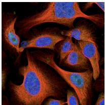</td><td>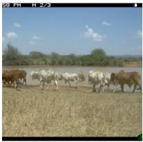</td><td>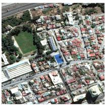</td><td>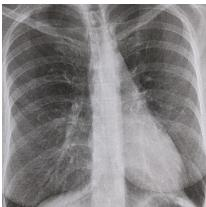</td></tr><tr><td>Domain</td><td>Fluor. microscopy</td><td>Wildlife</td><td>Earth obs.</td><td>Chest X-ray</td></tr><tr><td>Micro-domains</td><td>plates</td><td>traps</td><td>countries</td><td>— (IID)</td></tr><tr><td>Source</td><td>94,270 img1,239 plates</td><td>129,809 img243 traps</td><td>76,863 img146 countries</td><td>368,960 img5 view pos.</td></tr><tr><td>Target</td><td>23,599 img218 plates</td><td>42,791 img48 traps</td><td>22,108 img171 countries</td><td>5,159 img(IID test)</td></tr><tr><td>Metadata used in Tab. 1</td><td>...antibody</td><td>↔timestamp</td><td>...subregion, ...year</td><td>↔patient age</td></tr><tr><td>Other metadata</td><td>...plates...cell line</td><td>...trap</td><td>...region, country, month↔hour, lon, lat↔sun elev, view angle, res</td><td>...view position↔patient sex</td></tr></table>

<table><tr><td></td><td>OpenCell</td><td>FLAIR-Hub</td><td>CheXpert3</td></tr><tr><td></td><td>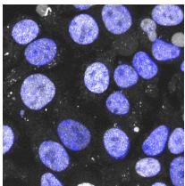</td><td>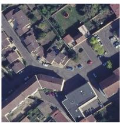</td><td>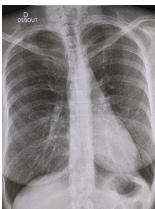</td></tr><tr><td>Transfer from</td><td>HPA</td><td>FMoW</td><td>MIMIC-CXR</td></tr><tr><td>Channels</td><td>2: nucleus, protein (microtubule, ER dropped)</td><td>RGB only (other bands dropped)</td><td>single channel (unchanged)</td></tr><tr><td>Resolution</td><td>1002 crops (vs 7682 in HPA)</td><td>0.2 m/px aerial (vs ~0.3–1.5 m satellite)</td><td>high-res X-ray (unchanged)</td></tr><tr><td>Labels</td><td>subcellular localisation (clustering protocol)</td><td>15 land-cover classes, segmentation masks (vs 62 image-level classes in FMoW)</td><td>14 findings, Stanford vs Beth Israel</td></tr></table>

! discrete & continuous metadata

Figure A.1 Extended overview of evaluation datasets. Datasets span Earth observation (FMoW, FLAIR-Hub), wildlife monitoring (iWildCam), fluorescence microscopy (HPA, OpenCell), and medical imaging (MIMIC-CXR, CheXpert). Representative sample images are shown alongside the application domain, micro-domain structure (fine-grained factors of variation such as geographic regions, camera traps, or experimental plates), dataset scale, and available metadata, categorised as discrete (! ) or continuous (& ).

# A.3 Per-Factor Metadata Analysis

The compass plot of Fig. 4 sweeps every candidate metadata factor through the two single-branch assignments (adding it in isolation to the encouraged set $\mathbb { M } _ { + }$ or the suppressed set $\mathbb { M } _ { - } )$ and records the resulting change ∆ in the dataset’s primary metric. Each factor’s pair of $\Delta \mathrm { s }$ places it in one of four quadrants: always beneficial (helps in either branch), always harmful (hurts in either), informative only (helps in $\mathbb { M } _ { + }$ , hurts in M−), and spurious only (the converse). Most factors fall cleanly into always beneficial, informative only, or spurious only. Two HPA factors do not: plate surfaces as informative only, even though as the canonical carrier of microscopy batch effects it ought to live in spurious only; and cell line lands in always harmful despite carrying obvious task-relevant structure. Both anomalies trace back to entanglement between candidate factors. App. A.3.1 and $\mathrm { A p p }$ . A.3.2 diagnose each in turn, and $\mathrm { A p p }$ . A.3.3 distills the lesson into a practical guideline.

# A.3.1 Plate: “informative only” as a side-effect of two independent leakage pathways

The plate factor lands at $\Delta { = } + 0 . 3 1$ when encouraged and $\Delta = - 0 . 5 1$ when suppressed (Fig. 4), placing it in the informative only quadrant. This is surprising: a plate is a physical experimental unit sharing illumination, fixation, and imaging settings, and is the canonical unit of batch effect in high-throughput microscopy.

Two independent leakage pathways. The HPA dataset (source plus target) covers 104,904 images, 1,457 plates, 14,678 antibodies, and 35 cell lines. Each plate uses a single cell line (99.25% of plates carry exactly one) and hosts a panel of ∼ 25 antibodies (median 25, max 64); each antibody mostly lives on one plate. Tab. A.2 measures these dependencies through the asymmetric uncertainty coefficient $U ( Y \mid X ) = 1 - H ( Y \mid X ) / H ( Y ) \in [ 0 , 1 ]$ , the fraction of $Y \mathrm { { } s }$ entropy removed by knowing X. Two entries dominate: $U ( { \mathrm { c e l l ~ l i n e } } | { \mathrm { p l a t e } } ) = 0 . 9 9 9$ (one cell line per plate) and $U ( { \mathrm { a n t i b o d y } } | { \mathrm { p l a t e } } ) = 0 . 6 5 2$ (each plate selects a ∼ 25-antibody panel out of 14,678). The two pathways are independent: controlling for cell line leaves U(antibody|plate, cell line)= 0.652 unchanged, so plate’s predictiveness of antibody is not mediated by cell line. Plate therefore carries two distinct task-relevant axes (the cell substrate and the antibody panel chosen on it) rather than a single nuisance variable.

Table A.2 Asymmetric dependence between HPA discrete metadata factors. Each cell reports $U ( Y \mid X ) =$ $1 - H ( Y | X ) / H ( Y ) \in [ 0 , 1 ]$ ], the fraction of the entropy of Y removed by knowing X. Cardinalities (1,457 plates, 14,678 antibodies, 35 cell lines) explain part of the asymmetries: a low-cardinality variable on the column side is easy to “determine” from a high-cardinality one. The two load-bearing entries are $U ( { \mathrm { c e l l ~ l i n e } } | { \mathrm { p l a t e } } ) = 0 . 9 9 9$ (one cell line per plate by construction) and $U ( { \mathrm { a n t i b o d y } } | { \mathrm { p l a t e } } ) = 0 . 6 5 2$ (each plate selects a ∼25-antibody panel). 

<table><tr><td> $U(Y|X), X \downarrow Y \rightarrow$ </td><td>plate</td><td>antibody</td><td>cell line</td></tr><tr><td>plate</td><td>1.000</td><td>0.652</td><td>0.999</td></tr><tr><td>antibody</td><td>0.869</td><td>1.000</td><td>0.567</td></tr><tr><td>cell line</td><td>0.303</td><td>0.129</td><td>1.000</td></tr></table>

Encouragement: plate is a coarsening of both informative axes. Plate guidance can be read in two complementary ways. Through U(cell line | plate) = 0.999, pulling plate-aligned images together pulls same-cell-line images together: the 1,457 plate prototypes split each of the 35 cell-line clusters into ∼ 40 sub-clusters. Through U(plate | antibody) = 0.869, the same operation also coarsens antibody guidance, bundling the 14,678 antibodies into groups of ∼ 25. Plate’s encouragement endpoint sits between those of the two axes it spans: cell line at $\Delta { = } - 1 . 3 0$ (the per-cell-line trap of App. A.3.2), antibody at $\Delta = + 1 . 8 0$ , plate at +0.31, closer to the antibody side because the finer the partition, the further it pushes the encoder away from collapsing onto cell-line identity. The benefit is real but largely subsumed by antibody when both branches are available.

Suppression: two independent leaks of informative signal. Gradient reversal on plate hits both pathways at once. Through $U ( { \mathrm { c e l l ~ l i n e } } | { \mathrm { p l a t e } } ) = 0 . 9 9 9$ , it amounts to gradient reversal on cell line, which erases the cell-morphology substrate against which the four fluorescence channels are read (App. A.3.2). Through the residual $U ( { \mathrm { a n t i b o d y } } | { \mathrm { p l a t e } } , { \mathrm { c e l l ~ l i n e } } ) = 0 . 6 5 2$ , it also suppresses the antibody-panel structure within each cell line, removing the fine-grained protein-related signal that the antibody branch would otherwise encourage. With no antibody anchor in $\mathbb { M } _ { + }$ to point to, the encoder has no direction left: the desired batch-effect-only signal is the smallest of the three components (cell line, antibody panel, residual batch effect), and the −0.51 endpoint reflects the cost of erasing the other two.

# A.3.2 Cell line: a necessary information

Cell line measures $\Delta = - 1 . 3 0$ when encouraged and $\Delta = - 0 . 5 2$ when suppressed $\left( \mathrm { F i g . ~ 4 } \right)$ , placing it in the always harmful quadrant. The label is correct for the binary ${ \mathbb { M } } _ { + } / { \mathbb { M } } _ { - }$ − knob, but masks two opposing pressures with only a narrow benign band between them:

• Cell morphology is part of the input substrate. Protein localisation in HPA is read against the cellular context (nucleus, membrane, cytoskeleton); fully unlearning morphology removes the reference frame the four fluorescence channels are interpreted in, so aggressive suppression collapses both the substrate and the main task.   
• Cell morphology correlates with the target. Different cell lines express different protein repertoires and exhibit systematically different localisation patterns, so encouraging the encoder to organise its features along cell-line identity traps protein representations in a per-cell-line manifold and hurts cross-cell-line generalisation.

The sweet spot retains enough cell morphology to read the image at all, while staying loose enough that protein-localisation features are not pinned to cell type. The binary knob lands on neither side: $\mathbb { M } _ { + }$ overshoots into the per-cell-line trap, M− overshoots into substrate erasure, and both endpoints register as harmful.

The UMAPs and the metadata cardinalities corroborate this reading. Fig. 5 shows that cell-line k-NN accuracy is high under self-supervised adaptation but drops to 74% for FINO (with antibody as the only informative guide and $\mathbb { M } _ { - } = \emptyset )$ , while protein-localisation k-NN climbs from 4% to 83%. Two mechanisms explain why an antibody guide alone lands close to the sweet spot:

• Cardinality split. HPA contains 14,678 antibodies for only 35 cell lines, so each cell-line cluster contains on average ∼420 antibody prototypes. The antibody contrastive loss splits each cell-line cluster into roughly that many sub-clusters and pushes them apart, breaking the coarse cell-line clustering captured by frozen DINOv3. The decoupling is structural: it follows from the partition refinement, not from any specific correlation in the data.   
• Anchor pressure, not collapse. The antibody guide is the dataset’s target-aligned anchor, so it overlaps with the rest of the meaningful structure by design: that is what makes it informative, and what stops it from over-erasing the other axes. The dependence U (cell line | antibody) = 0.57 in Tab. A.2 quantifies the effect: pulling same-antibody images together preserves a substantial share of cell-line structure as a by-product, consistent with cell-line k-NN dropping to 74% rather than to chance.

# A.3.3 Practical guideline

Both HPA cases above stem from the same issue (entanglement between candidate factors makes the binary ${ \mathbb { M } } _ { + } / { \mathbb { M } } .$ − assignment misleading), though they manifest differently: plate as a load-bearing aggregate of two informative axes, cell line as a target whose two failure modes the binary knob cannot interpolate between. The diagnostic is itself derived from the metadata table alone, and is computable in ∼ 2 minutes from the discrete metadata columns without running a single training job; the compass endpoints are the consistency check on it, not its source. Three takeaways follow:

• Check the dependence structure first. Before assigning a candidate factor to $\mathbb { M } _ { + }$ or $\mathbb { M } _ { - }$ , compute $U ( Y \mid X )$ as in Tab. A.2 against the other available factors (or use mutual information / coefficient of determination for symmetric or mixed cases). Conditional variants such as $U ( Y \mid X , { \overset { . } { Z } } )$ separate direct from mediated dependence, as in the plate-antibody-cell-line analysis above. The full table is a histogram count over the metadata columns; on $\mathrm { H P A ^ { \prime } s } \sim 1 0 ^ { 5 } \mathrm { – r o w }$ table it runs in minutes on a CPU, so the test is available before any branch assignment is committed to.   
• Prefer positive guidance for entangled factors. When the dependence test of the previous bullet shows that a candidate factor is a coarsening of a target-aligned axis (here, plate determines cell line at $U { = } 0 . 9 9 9$ and selects $\mathrm { { . } \sim { 2 5 } }$ -antibody panel at $U { = } 0 . 6 5 2 )$ , the binary knob has only one safe setting: assigning it to $\mathbb { M } _ { + }$ recovers most of that signal at no risk of collapse, at the cost of leaving residual batch effects in the representation. This inverts the textbook microscopy reflex of suppressing plate as a pure batch carrier (e.g., Harmony [51], Symphony [52], Scalbert et al. [31]), and the inversion is exactly what the dependence table predicts: the standard reflex is calibrated on the assumption that plate is conditionally independent of the target given the image, which the 0.999/0.652 entries reject. Plate’s

+0.31/−0.51 compass endpoints are then the empirical confirmation of that prior prediction, not the basis for it.

• Never suppress an entangled factor in isolation. Suppression alone is what destabilises the optimisation: the gradient-reversal pressure has no direction to point in. Pairing it with a positive guide on the entangled axis is the natural fix, in the spirit of DANN [18] coupling a domain-adversarial head to a label-supervised classifier; here the analogue would be to suppress plate jointly with antibody as a $\mathbb { M } _ { + }$ anchor. When the entangled factor is purely nuisance, our recipe already supplies the scaffolding: place the informative variable in $\mathbb { M } _ { + }$ and the nuisance in M− in the same run, and let the per-branch gradient equalisation of App. A.4 balance the two pressures (as we do on FMoW with sub-region encouraged and year suppressed).

A.4 Implementation Details   
1: Sample minibatch $\{(x_{n},\{m_{n}^{(t)}\}_{t\in\mathcal{T}})\}_{n=1}^{B}$ 2: Compute student $\phi(x_{n})$ and teacher $\hat{\phi}(x_{n})$ embeddings
3:Compute $L_{DINO}$ and $L_{iBOT}$ 4: for each metadata type $t\in T$ do
5: if t discrete then
6: Compute $\mathcal{L}_{\mathrm{meta}}^{(t)}$ via prototypes $\{p_{k}^{t}\}$ ; update prototypes by EMA
7: else
8: Compute $\mathcal{L}_{\mathrm{meta}}^{(t)}$ via predictor $g^{(t)}$ 9: end if
10: if $t\in M_{-}$ then
11: Apply gradient reversal to encoder
12: end if
13: end for
14: Equalise per-branch gradient norms by $s_{t}=\bar{n}/\tilde{n}_{t}$ (App. A.4)
15: Apply $L_{SIGReg}$ to the pre-normalisation bottleneck
16: Update student by AdamW and teacher by EMA   
Figure A.2 One training step of FINO. Informative metadata is encouraged, while spurious metadata is suppressed via gradient reversal.

Input resolution. Wherever a benchmark has an established input resolution from prior work, we adopt it directly: we match Choi et al. [46] on the WILDS benchmarks for both FMoW and iWildCam $( 3 3 6 ^ { 2 }$ on iWildCam), and use $5 1 2 ^ { 2 }$ on MIMIC-CXR following the standard chest-radiograph protocol. HPA is the one dataset where we deliberately depart from the source resolution: we use $7 6 8 ^ { 2 }$ in the main runs and $5 7 6 ^ { 2 }$ in the SigLIP2 ablation of App. A.1. Both are downscales adopted on compute grounds (a single full-resolution HPA run already dominates the per-dataset GPU-hours of Tab. A.4) and not a recipe constraint. The method itself imposes no resolution requirement and operates identically at either size; the two HPA values simply bracket what comfortably fit our compute envelope.

Training schedule. Training proceeds in two phases unless otherwise noted. The first phase is a short frozen-backbone warm-up in which the patch embedding, the DINO and iBOT heads, the metadata guidance modules, and SIGReg on the DINO bottleneck are trained while the rest of the encoder is held fixed; we did not tune its length and the method is robust to that choice. In the second phase the backbone is unfrozen with a linear learning-rate warmup over 1k iterations, after which all parameters are trained jointly. We recommend training for at least 50 epochs and selecting the best-validation checkpoint: this length acts as an upper bound on the search rather than a tuned hyperparameter, since best-validation selection is applied uniformly to every method we compare against and the same envelope is therefore granted to all of them.

iWildCam is the one departure from this two-phase recipe. As a camera-trap dataset of essentially natural images it sits unusually close to the DINOv3 pretraining distribution (closer than any typical adaptation target the method is designed for) and we observed prolonged adaptation to actively erode the pretrained features. We therefore skip the frozen warm-up and cap adaptation at ∼12 epochs. This reflects the proximity of iWildCam to DINOv3’s pretraining distribution and is not a hyperparameter the method asks the user to tune on more typical adaptation targets.

Heads and remaining hyperparameters. Both DINO and iBOT heads use 65,536 prototypes, a hidden dimension of 2048, a bottleneck dimension of 256, and 3 MLP layers. Discrete metadata prototype branches use a temperature $\tau = 0 . 0 2 3$ and a centroid momentum $\alpha = 0 . 9 9$ . We use a constant learning-rate schedule after warmup and float16 mixed precision. The method showed robustness to $\tau ;$ the retained value $0 . 0 2 3 = 0 . 0 7 / 3$ is one of three values explored during method development.

$\ell _ { 2 }$ normalisation in the discrete prototype branches. The inner product $\langle \phi ( x ) , p _ { m } ^ { t } \rangle$ in Eq. (1) of the main paper is computed as a cosine similarity: both the student embedding $\phi ( x )$ and each prototype $p _ { m } ^ { t }$ are $\ell _ { 2 } \cdot$ -normalised onto the unit sphere immediately before the dot product. Consistently, the EMA update of Eq. (2) is applied to the $\ell _ { 2 } \cdot$ -normalised teacher embedding $\phi _ { \mathrm { t e a c h e r } } ( x ) / \| \phi _ { \mathrm { t e a c h e r } } ( x ) \| _ { 2 } .$ , and the resulting $p _ { m } ^ { t }$ is re-projected onto the unit sphere before being used in any subsequent similarity computation.

Tab. A.3 reports the loss weights used to balance the different objectives during training. These values are held fixed across datasets and metadata types: every metadata branch in the main results uses $\lambda _ { \mathrm { m e t a } } ^ { ( t ) } { = } 0 . 0 3$ regardless of the application domain or whether the branch is discrete or continuous. We adopt $\lambda _ { \mathrm { S I G R e g } } { = } 0 . 0 5$ as proposed by the original LeJEPA paper [65] and never tune it. The only loss-weight knob we ever sweep is $\lambda _ { \mathrm { K o L e o } } { = } 0 . 1$ , used only by the ${ \mathcal { L } } _ { \mathrm { D I N O } }$ -only baseline runs in place of SIGReg.

Table A.3 Loss weights used during training. Each term is scaled by a constant factor in the total objective. The DINO and iBOT loss weights are kept at their defaults $\left( \lambda _ { \mathrm { D I N O } } { = } \lambda _ { \mathrm { i B O T } } { = } 1 \right)$ and are not listed. $\boldsymbol { \mathcal { L } } _ { \mathrm { K o L e o } }$ is only used for the ${ \mathcal { L } } _ { \mathrm { D I N O } }$ -only baseline runs and is set to 0 whenever $\mathcal { L } _ { \mathrm { S I G R e g } }$ is active.

<table><tr><td>Loss</td><td>Weight</td><td>Value</td></tr><tr><td> $\mathcal{L}_{\text{KoLeo}}$ </td><td> $\lambda_{\text{KoLeo}}$ </td><td>0.1</td></tr><tr><td> $\mathcal{L}_{\text{SIGReg}}$ </td><td> $\lambda_{\text{SIGReg}}$ </td><td>0.05</td></tr><tr><td> $\mathcal{L}_{\text{meta}}^{(t)}$ </td><td> $\lambda_{\text{meta}}^{(t)}$ </td><td>0.03</td></tr></table>

Metadata gradient schedule. The gradient flowing from each metadata branch back into the backbone is modulated by a scalar $\gamma ( s ) \in [ 0 , 1 ]$ following the standard DANN ramp [18]:

$$
\gamma (s) = \frac {2}{1 + e ^ {- 1 0 s / S}} - 1, \tag {5}
$$

where s and S are counted from the moment the backbone is unfrozen (i.e. from the Phase 1→Phase 2 transition when a frozen Phase 1 is used). The sign is flipped for spurious factors $t \in \mathbb { M } _ { - }$ (gradient reversal). The schedule applies symmetrically to both metadata branches: continuous heads $g ^ { ( t ) }$ keep training with +1 on their own parameters, and discrete prototype banks $\{ p _ { k } ^ { t } \} _ { k = 1 } ^ { K }$ keep being updated by EMA from teacher embeddings, so both representations of the metadata structure converge independently of $\gamma ( s )$ . Only the encoder is shielded: it sees no metadata gradient at the moment it unfreezes and ramps in smoothly, avoiding adversarial pressure against heads or prototypes that have not yet stabilised.

Per-branch gradient equalisation. The fixed weights $\lambda _ { \mathrm { m e t a } } ^ { ( t ) }$ of Tab. A.3 encode the relative importance the user assigns to each metadata branch. When two or more branches are trained jointly, that intent is corrupted by the very different raw gradient magnitudes of the underlying losses (prototypical contrastive on discrete factors, $\ell _ { 2 }$ regression on continuous ones), under which a single branch can dominate the encoder’s updates. We therefore apply, at every training step, a multiplicative correction $s _ { t }$ that equalises gradient $\ell _ { 2 }$ norms across branches before the fixed $\lambda _ { \mathrm { m e t a } } ^ { ( t ) }$ are honoured. With $| \tau | = 1$ the target n¯ collapses to $\tilde { n } { _ t }$ and $s _ { t } \equiv 1$ , so the procedure is a no-op and is only meaningful in the multi-guide regime. It has no learnable parameters and no auxiliary objective.

Per-step update. The full procedure is given in Alg. A.3. At the first step, each $\tilde { n } { } _ { t }$ is initialised to the raw branch gradient norm rather than to zero or an externally supplied value, so that the EMA starts on the correct scale. Probing at the shared CLS embedding $\phi ( x )$ rather than at the encoder parameters is what keeps it cheap: a single torch.autograd.grad call returns the branch gradient norm without an extra full backward pass through the FSDP-sharded backbone. This relaxation, of using feature-level rather than parameter-level gradients as a surrogate for the shared encoder, was previously used in IMTL-G [63] and RotoGrad [64] for the same reason.

Behaviour in practice. The scales $s _ { t }$ are recomputed every step from the live EMAs and drift slowly toward unity as the EMAs stabilise. On FMoW, for instance, $s _ { t }$ for the sub\_region and year branches start out

Require: metadata branches T ; EMA decay $\mu = 0 . 9 9 ;$ ; fixed weights $\{ \lambda _ { \mathrm { m e t a } } ^ { ( t ) } \} _ { t \in \mathcal { T } } :$ ; running norms $\{ \tilde { n } _ { t } \} _ { t \in \mathcal { T } }$

1: for each branch $t \in T$ do
2: $\tilde{n}_{t} \leftarrow \mu \tilde{n}_{t} + (1 - \mu) \left\| \nabla_{\phi(x)} \mathcal{L}_{\mathrm{meta}}^{(t)} \right\|_{2}$ ▷ EMA of gradient norm at the CLS embedding
3: end for
4: $\bar{n} \leftarrow \left( \prod_{t \in T} \tilde{n}_{t} \right)^{1/|\mathcal{T}|}$ ▷ geometric-mean target across branches
5: for each $t \in T$ do
6: $s_{t} \leftarrow \operatorname{detach}\left(\bar{n}/\tilde{n}_{t}\right)$ ▷ closed-form scale; no second-order gradient
7: end for
8: return $\sum_{t \in T} s_{t} \lambda_{\mathrm{meta}}^{(t)} \mathcal{L}_{\mathrm{meta}}^{(t)}$ ▷ balanced metadata loss for this step   
Figure A.3 Per-step gradient equalisation across metadata branches. For each active branch $t ,$ an EMA $\tilde { n } { } _ { t }$ of the gradient $\ell _ { 2 }$ norm is maintained at the CLS embedding $\phi ( x )$ . The branch loss is rescaled by $s _ { t } = \bar { n } / \tilde { n } _ { t }$ , with n¯ the geometric mean of the smoothed norms; the fixed weights $\dot { \lambda } _ { \mathrm { m e t a } } ^ { ( t ) }$ of Tab. $\mathrm { A . 3 }$ are applied on top, separating user-specified relative importance (λ) from runtime scale calibration (s). The detach prevents second-order gradient flow through the scale.

about 12% apart and converge to ≈ 1 within a few hundred steps, evidence that the correction is genuinely tracking online imbalances rather than acting as a precomputed constant.

Relation to multi-task gradient balancing. The metadata branches play, with respect to the shared encoder, a role analogous to tasks in multi-task learning, and the design space of per-task gradient balancers has been extensively studied in that setting. Methods broadly fall into two families: (i) magnitude balancing, which rescales each task loss so that gradient magnitudes are comparable on the shared backbone (GradNorm [62], IMTL-G [63], RotoGrad’s magnitude block [64], MGDA [75], FAMO [76]); and (ii) direction balancing, which modifies update directions to reduce inter-task conflict (PCGrad [77], CAGrad [78], NashMTL [79], Aligned-MTL [80], RotoGrad’s rotation block [64]). Our procedure belongs to the first family: it neither projects gradients onto cones nor solves an inner optimisation over directions, and is therefore conceptually orthogonal to the projection-based methods (PCGrad, CAGrad, NashMTL, Aligned-MTL). Within the magnitude-balancing family, three closed-form methods are directly comparable; we contrast them below.

• Vs. GradNorm [62]. GradNorm treats the loss weights wi as learnable parameters and updates them by SGD on a separate gradient loss $\begin{array} { r } { \mathcal { L } _ { \mathrm { g r a d } } = \sum _ { i } \left| \boldsymbol { G } _ { W } ^ { ( i ) } - \boldsymbol { \bar { G } } \cdot \boldsymbol { r } _ { i } ^ { \alpha } \right| _ { 1 } } \end{array}$ , with G¯ the average gradient norm, renormalised to $r _ { i }$ a relative inverse training rate, and α a tunable asymmetry hyperparameter. The learned $\begin{array} { r } { \sum _ { i } w _ { i } = T _ { \mathrm { t a s k s } } } \end{array}$ at each step. Our $\lambda _ { \mathrm { m e t a } } ^ { ( t ) }$ are fixed; nothing is learned, α is absent, and $w _ { i }$ are there is no sum constraint. We apply the closed-form ratio $s _ { t } = \bar { n } / \tilde { n } _ { i }$ t as a multiplicative correction on top of the fixed user weight, so that “relative importance” (the table value λ) and “scale calibration” (the live s) are separated rather than absorbed into a single learned coefficient.   
• Vs. IMTL-G [63]. Like ours, IMTL-G is closed-form, hyperparameter-free, and computed at the shared feature. The two methods differ in target: IMTL-G solves for the unique $\left\{ \alpha _ { t } \right\}$ such that the aggregated gradient has equal projections onto each unit task gradient (the angle bisector of $\{ g _ { t } \} )$ ), whereas we equalise the smoothed magnitudes of $\{ g _ { t } \}$ to their geometric mean. IMTL-G uses instantaneous per-batch gradients with no temporal smoothing; we maintain an EMA $\tilde { n } _ { t } .$ , which absorbs the high variance of branch gradient norms in early training without biasing the long-run scale. IMTL-G also reparameterises the loss weights $( \sum _ { t } \alpha _ { t } = 1$ , with $\alpha _ { 1 }$ derived from $\alpha _ { 2 : T } )$ , whereas we leave the user weights $\lambda _ { \mathrm { m e t a } } ^ { ( t ) }$ untouched and apply $s _ { t }$ on top.   
• Vs. RotoGrad’s magnitude block $I 6 4 J .$ . RotoGrad equalises per-task gradient norms to a common target $\begin{array} { r } { C = \sum _ { k } \alpha _ { k } \| G _ { k } \| } \end{array}$ with $\alpha _ { k } \propto \Vert G _ { k } \Vert / \Vert G _ { k } ^ { 0 } \Vert$ , i.e. a convergence-weighted arithmetic mean against the initial gradient norms $\| G _ { k } ^ { 0 } \|$ . We instead use the geometric mean of an EMA of current norms: this avoids both the dependence on a single early-training reference (which can be unrepresentative under our two-phase schedule with a frozen backbone) and the need to rank tasks by relative convergence. RotoGrad additionally introduces learnable per-task rotation matrices $R _ { k }$ to align directions; our procedure has no such learnable component and addresses magnitude only.

We do not claim a categorical superiority over these methods (we have not run head-to-head experiments swapping them in for our scheme), but rather a different, lightweight point in the design space, motivated by the specifics of metadata-guided pretraining: a small number of branches $( | T | \leq 3$ in our experiments), strong heterogeneity between contrastive (discrete) and regression (continuous) losses, and a desire to keep the user-facing loss weights $\lambda _ { \mathrm { m e t a } } ^ { ( t ) }$ as a single, interpretable knob for relative importance.

Expanded SIGReg We apply SIGReg [65] to the pre-normalisation bottleneck features $z _ { n }$ produced by the DINO head MLP. The loss matches the empirical characteristic function of projected features to that of an isotropic Gaussian:

$$
\mathcal {L} _ {\mathrm{SIGReg}} = \frac {1}{| A |} \sum_ {a \in A} \int \left| \frac {1}{N} \sum_ {n = 1} ^ {N} e ^ {i \omega a ^ {\top} z _ {n}} - e ^ {- \omega^ {2} / 2} \right| ^ {2} e ^ {- \omega^ {2} / 2} d \omega , \tag {6}
$$

where A is a set of random unit directions, N is the batch size, and $e ^ { - \omega ^ { 2 } / 2 }$ is the characteristic function of $\mathcal { N } ( 0 , 1 )$ . The original SIGReg formulation uses a dedicated projection head; we instead reuse the DINO head bottleneck and apply the loss before $\ell _ { 2 }$ normalisation and prototype projection. All other hyperparameters (number of slicing directions, frequency sampling, and integration scheme), as well as the loss weight $\lambda _ { \mathrm { S I G R e g } } { = } 0 . 0 5$ , are taken directly from [65] and never tuned per dataset.

# A.5 General Experimental Setup

Backbone initialisation. All experiments use a $_ { \mathrm { V i T - L } / 1 6 }$ backbone (306M parameters) initialised from the open-source DINOv3 [66] checkpoint released by the authors,4 obtained by knowledge distillation from a ViT-7B teacher trained on the LVD-1689M dataset, providing a strong general-purpose visual initialisation for all downstream adaptation and fine-tuning. This same checkpoint is used in all reported settings, including supervised fine-tuning, domain adaptation, representation adaptation, and frozen probing (e.g., the frozen model and pretrained rows of Tab. 1); the only differences across rows lie in the training objective and which parameters are updated.

Four-channel adaptation for fluorescence microscopy. The HPA dataset consists of four-channel fluorescence microscopy images, while the pretrained DINOv3 checkpoint operates on three-channel RGB inputs. To bridge this gap, we adapt the patch embedding layer. Let $\pmb { W } \in \mathbb { R } ^ { d \times 3 \times p \times p }$ denote the pretrained weights $( d { = } 1 0 2 4 , p { = } 1 6 )$ . We compute the channel-wise mean $\begin{array} { r } { m = \frac { 1 } { 3 } \sum _ { c = 1 } ^ { 3 } W _ { : , c , : , : } \in \mathbb { R } ^ { d \times 1 \times p \times p } } \end{array}$ and form the four-channel embedding:

$$
\boldsymbol {W} ^ {\prime} = \frac {3}{4} [ \boldsymbol {W} \| \boldsymbol {m} ] \in \mathbb {R} ^ {d \times 4 \times p \times p}, \tag {7}
$$

where ∥ denotes channel-wise concatenation. The factor ${ } ^ { 3 } / 4$ preserves the expected activation magnitude when summing over four input channels instead of three. All remaining backbone weights are kept unchanged.

Architecture of predictor $g ^ { ( t ) }$ . For each continuous metadata type $t , g ^ { ( t ) }$ is a 3-hidden-layer MLP applied to the backbone embedding $\phi ( x ) \in \mathbb { R } ^ { d } \ ( d { = } 1 0 2 4 )$ . Each hidden block is Linear → GELU → Dropout(0.5), with widths [512, 512, 256], followed by a linear projection $\mathbb { R } ^ { 2 5 6 } \to \mathbb { R } ^ { n _ { t } }$ and an output activation $\sigma _ { t } \in$ {sigmoid, tanh, id} matched to the target range. Cyclic factors (hour) are encoded as (sin, cos) pairs $\left( n _ { t } = 2 \right)$ , geographic coordinates as (lat, lon) $\left( n _ { t } = 2 \right)$ , and scalar bounded factors (cloud cover, sun elevation, off-nadir angle, ground sampling distance) as $n _ { t } { = } 1$ . Targets are linearly mapped per-dimension via $( m _ { \operatorname* { m i n } } ^ { ( t ) } , m _ { \operatorname* { m a x } } ^ { ( t ) } )$ into the codomain of $\sigma _ { t }$ ([0, 1] for sigmoid, [−1, 1] for tanh), and the regression loss is computed in this normalised space.

Stability of gradient reversal on continuous targets. With prediction and target both confined to the codomain of $\sigma _ { t } \in \{ \mathrm { s i g m o i d } , \mathrm { t a n h } \}$ , the squared error is bounded above and the reversed gradient saturates as $g ^ { ( t ) }$ approaches the worst-case constant predictor on that interval. SIGReg on the DINO bottleneck $\left( \mathrm { { A p p . ~ A . 4 } } \right)$ bounds the projected feature norm, and the DANN ramp $\gamma ( s )$ of $\mathrm { A p p }$ . A.4 keeps the reversed gradient at zero during the frozen-backbone warm-up. Identity activation is reserved for factors not under reversal and never paired with $t \in \mathbb { M } .$ − .

Compute resources. All experiments were conducted on H100 or H200 GPUs in a dedicated cluster. Tab. A.4 reports the cumulative GPU-hours spent on each dataset, broken down between backbone adaptation (pretraining) and downstream probing (eval). These numbers reflect the total compute consumed by the project, including ablations, preliminary experiments, and method development, rather than only the runs reported in the paper. For comparison, Tab. A.5 isolates the cost of the single final FINO run used to produce the Tab. 1 numbers on each dataset, which together account for less than 15% of the project total. Both tables are derived under the conservative assumption of constant 100% GPU utilisation for the full duration of every job, which substantially overestimates actual energy use. Transfer datasets (OpenCell, CheXpert, FLAIR-Hub) are not listed as they involve only a handful of probing runs and contribute negligibly compared to the figures reported here.

Table A.4 Cumulative GPU-hours per dataset and stage. Totals aggregate all jobs run during method development, including ablations and preliminary experiments, and assume constant 100% GPU utilisation throughout each job. 

<table><tr><td>Stage</td><td>HPA</td><td>FMoW</td><td>iWildCam</td><td>MIMIC-CXR</td><td>Total</td></tr><tr><td>Pretraining</td><td>15,360</td><td>2,560</td><td>160</td><td>11,520</td><td>29,600</td></tr><tr><td>Eval</td><td>97</td><td>256</td><td>4,000</td><td>720</td><td>5,073</td></tr><tr><td>Total</td><td>15,457</td><td>2,816</td><td>4,160</td><td>12,240</td><td>34,673</td></tr></table>

Efficiency. Self-supervised and metadata-guided training introduce a modest overhead relative to standard supervised training due to the use of a teacher model. In practice, this overhead remains small: supervised training runs at 0.68 s/iter, pure self-supervision at 0.74 s/iter (∼9% slower), and FINO at 0.76 s/iter (∼12% slower than supervised training).

Table A.5 GPU-hours of the final FINO runs reported in Tab. 1. 

<table><tr><td>Stage</td><td>HPA</td><td>FMoW</td><td>iWildCam</td><td>MIMIC-CXR</td><td>Total</td></tr><tr><td>Pretraining</td><td>3,840</td><td>160</td><td>8.0</td><td>896</td><td>4,904</td></tr><tr><td>Eval</td><td>15.5</td><td>0.8</td><td>2.7</td><td>24</td><td>43.0</td></tr><tr><td>Total</td><td>3,855.5</td><td>160.8</td><td>10.7</td><td>920</td><td>4,947</td></tr></table>

# A.6 Probing Protocol Details

To evaluate the quality of learned representations, we add lightweight classification heads on top of the backbone. For representation adaptation models, we train only the head while keeping the pre-trained backbone frozen. For a given dataset, all baselines use the same head architecture and hyperparameter grid.

Linear head. The CLS tokens from the last four transformer blocks are concatenated with the average-pooled patch tokens from the final block. A single linear layer then maps this vector to class logits. The classifier is trained with AdamW and a cosine annealing schedule; we perform a grid search over learning rate and weight decay. For iWildCam, we report the mean across two runs to account for training variability.

Attentive head. Patch tokens from the last four transformer blocks are concatenated along the feature dimension, and the resulting sequence of dimension 4d=4096 is projected to a lower-dimensional embedding space $( d _ { \mathrm { e m b } } { = } 5 1 2 )$ to reduce the number of trainable parameters. A single cross-attention layer with 8 heads and one learnable query token produces a 512-dimensional vector, which is passed through a linear head. The classifier is trained with AdamW and cosine annealing. For HPA, we use binary cross-entropy loss for multi-label classification. We perform a grid search over learning rate, weight decay, attention dropout, batch size, and the use of curriculum learning, where during the first epoch only single-labelled images are shown to the model. In the case of HPA where there is no official validation set, we use 5-fold cross-validation with splits defined by cell line for robust hyperparameter selection.

# A.7 Baseline Implementation Details

All supervised and domain adaptation baselines share the same backbone (ViT-L/16) and classification head, differing only in the adaptation loss and its hyperparameters.

Classification head. All baselines use the same attentive pooling head as FINO (cf. App. A.6), ensuring that performance differences reflect the adaptation strategy rather than the probe. Patch tokens from the last four transformer blocks are concatenated along the feature dimension (4d=4096), projected to $d _ { \mathrm { e m b } } { = } 5 1 2$ , and pooled by a single learnable query through cross-attention (8 heads), followed by a linear map to the target label space. The backbone CLS token is not used by the head; pooling operates purely over spatial patch features.

Augmentation. For FMoW and iWildCam, we use DINO-style augmentation: random resized crop, horizontal flip, color jitter, random grayscale, and Gaussian blur, with label smoothing of 0.1. For HPA, a domain-specific pipeline [32] self-normalises each fluorescence channel independently, using intensity statistics computed from that channel of the same image.

Optimiser and schedule. All baselines use AdamW (weight decay 0.04, gradient clipping 3.0) with a cosine learning rate schedule. When fine-tuning from the pretrained checkpoint, the peak learning rate is $5 \times 1 0 ^ { - 5 }$ with a 5-epoch warmup and the backbone frozen for the first 5 epochs. All runs train for up to 300 epochs with evaluation every 10 epochs and early stopping (patience 3). Model selection uses the best validation OOD metric: worst-group accuracy for FMoW, macro F1 for iWildCam and HPA.

Domain adaptation methods. We evaluate three adaptation strategies, each governed by a single scalar hyperparameter controlling adaptation strength:

• CORAL aligns source and target feature covariance matrices, with loss weight λ held constant during training. The covariance discrepancy is normalised by 1/4d2.   
• DANN trains a 2-layer MLP domain discriminator (hidden dimension 1024) via gradient reversal, with adversarial weight λ following a sigmoid warm-up schedule.   
• Group DRO reweights per-group training losses via exponentiated gradient ascent with step size η. Groups are defined by metadata: year (16 groups) on FMoW, camera location (243) on iWildCam, cell line (35) on HPA, and view position (5 groups) on MIMIC-CXR. The MIMIC-CXR grouping matches the metadata factor used by the best-performing FINO run on this dataset.

CORAL and DANN additionally leverage unlabelled OOD samples as target data; Group DRO operates on source data only.

Loss weight sensitivity. Tab. A.6 reports performance across the full loss weight sweep for each method. CORAL is robust to λ on FMoW and HPA but degrades sharply on iWildCam at larger values (λ=1.0: 24.6 OOD F1 vs. 38.5 at λ=0.01). DANN shows moderate sensitivity, with the optimal weight varying across datasets. Group DRO exhibits the most dataset-dependent behaviour, and no single step size η dominates across benchmarks: on FMoW, performance is non-monotonic, with WGA peaking at 46.4 for η=0.1 and falling off to 44.2 and 43.7 at η=0.01 and η=1.0 respectively; on HPA with cell line groups, performance is essentially flat across the sweep (52.6 → 52.1 → 52.5 Private F1); on MIMIC-CXR with view-position groups, AUROC drifts down moderately from 80.0 at η=0.01 to 77.7 at η=1.0; and on iWildCam, large steps trigger near-collapse, with OOD F1 falling from 26.1 at η=0.01 to 9.3 at η=1.0. The optimal η therefore depends on both the granularity and the semantics of the chosen grouping: coarse, balanced partitions tolerate or even benefit from aggressive reweighting, whereas fine-grained, long-tailed partitions such as iWildCam camera locations (many with very few examples) destabilise the exponentiated-gradient updates and require small step sizes to avoid collapse. This per-dataset tuning requirement contrasts with FINO, which uses a single set of loss weights across all benchmarks (Tab. A.3).

Alternative DRO grouping strategies. On FMoW, using geographic region (6 groups) instead of year yields lower WGA, with the best region run reaching 44.6% at η=1.0 versus 46.4% at η=0.1 with year groups. On HPA, grouping by plate identity (1,457 groups) underperforms cell line (35 groups) on the Kaggle private F1: the best plate run reaches 50.8% at η=0.1 versus 52.6% for cell line at η=0.01, and η=1.0 further degrades plate to 42.3% while cell line remains stable at 52.5%. This confirms that DRO performance depends on both group granularity and semantic relevance; overly fine-grained partitions fragment the optimisation and prevent effective robust learning.

iWildCam convergence sanity-check. The OOD numbers reported on iWildCam by the from-scratch supervised baseline (test OOD F1 around 10%) are noticeably lower than on FMoW or HPA, so it is worth checking that this baseline is not simply under-trained. Fig. A.4 indicates that this is unlikely: over 300 epochs the training loss falls steadily from 5.2 to 1.0 and training accuracy reaches 93%, yet held-out F1 saturates much earlier: OOD splits flatten around 10% by roughly 100 epochs, while ID splits keep improving only marginally, reaching 29% on test and 26% on validation by the final epoch. This pattern is consistent with the difficulty of the iWildCam distribution shift, as previously documented in the WILDS benchmark [17], rather than with an optimisation issue on our side.

Table A.6 Loss weight sensitivity for domain adaptation baselines. All methods use a DINOv3-pretrained ViT-L/16 backbone. We sweep the loss weight λ (CORAL, DANN) or step size η (Group DRO) and report performance: worst-group accuracy (WGA) on the FMoW test set, macro F1 on the iWildCam OOD test set, macro F1 on the HPA Kaggle private test set, and AUROC on MIMIC-CXR. Group DRO uses year groups on FMoW (16 groups), camera locations on iWildCam (243), cell line on HPA (35), and view position on MIMIC-CXR (5); see text for alternative groupings. CORAL and DANN require unlabelled target data, which is unavailable in our IID MIMIC-CXR setting (denoted by —). Italicised column headers denote each benchmark’s primary ranking metric.

<table><tr><td>Method</td><td>Weight</td><td>FMoW WGA</td><td>iWildCam OOD F1</td><td>HPA Private F1</td><td>MIMIC-CXR AUROC</td></tr><tr><td rowspan="3">CORAL</td><td> $\lambda = 0.01$ </td><td>43.8</td><td>38.5</td><td>40.5</td><td>—</td></tr><tr><td> $\lambda = 0.1$ </td><td>45.9</td><td>33.0</td><td>41.1</td><td>—</td></tr><tr><td> $\lambda = 1.0$ </td><td>42.2</td><td>24.6</td><td>37.8</td><td>—</td></tr><tr><td rowspan="3">DANN</td><td> $\lambda = 0.1$ </td><td>45.2</td><td>38.5</td><td>50.2</td><td>—</td></tr><tr><td> $\lambda = 0.5$ </td><td>46.2</td><td>33.1</td><td>30.5</td><td>—</td></tr><tr><td> $\lambda = 1.0$ </td><td>45.8</td><td>36.3</td><td>39.2</td><td>—</td></tr><tr><td rowspan="3">Group DRO</td><td> $\eta = 0.01$ </td><td>44.2</td><td>26.1</td><td>52.6</td><td>80.0</td></tr><tr><td> $\eta = 0.1$ </td><td>46.4</td><td>22.4</td><td>52.1</td><td>78.7</td></tr><tr><td> $\eta = 1.0$ </td><td>43.7</td><td>9.3</td><td>52.5</td><td>77.7</td></tr></table>

# A.8 Cross-Dataset Transfer: Protocols and Results

# A.8.1 HPA → OpenCell

Evaluation protocol. OpenCell [69] associates each image with a target protein. Following Kobayashi et al. [54], representations are first averaged at the protein level, then clustered against ground-truth subcellular localisation labels. We report two unsupervised clustering metrics, the Adjusted Rand Index (ARI) and the V-Measure, both bounded in [0, 1] with higher values indicating better agreement with the ground-truth partition. To complement these clustering metrics, which are the only ones reported in the prior work, we additionally train an attentive probe on protein-level embeddings and report its macro F1 score on a held-out test split. Means and standard deviations are computed over 5 clustering seeds; CytoSelf and SubCell numbers are taken from Kobayashi et al. [54] and Gupta et al. [55] respectively.

Table A.7 Full transfer results on HPA → OpenCell. ARI and V-Measure are computed on protein-level embeddings against ground-truth subcellular localisation labels, following the CytoSelf protocol; F1 is the macro F1-score of an attentive probe trained on protein-level embeddings. The off-the-shelf DINOv3 backbone alone already exceeds both prior published methods on the metrics they report (+0.204 ARI over CytoSelf, +0.127 over SubCell); FINO adds a further +0.122 ARI, +0.088 V-Measure and +12.6 F1 on top of that strong starting point, despite never being trained on OpenCell data. Dashes indicate metrics not reported by the corresponding work.

<table><tr><td>Model</td><td>ARI ↑</td><td>V-Measure ↑</td><td>F1 ↑</td></tr><tr><td>CYTOSELF [54]</td><td>0.262</td><td>0.500</td><td>—</td></tr><tr><td>SUBCELL [55]</td><td>0.339</td><td>0.570</td><td>—</td></tr><tr><td>Frozen DINOv3</td><td> $0.466_{\pm 0.019}$ </td><td> $0.652_{\pm 0.006}$ </td><td>65.7</td></tr><tr><td>Self-supervised adaptation</td><td> $0.486_{\pm 0.022}$ </td><td> $0.668_{\pm 0.006}$ </td><td>78.0</td></tr><tr><td>Supervised adaptation</td><td> $0.530_{\pm 0.010}$ </td><td> $0.710_{\pm 0.006}$ </td><td>69.2</td></tr><tr><td>FINO</td><td> $\mathbf{0.588}_{\pm 0.024}$ </td><td> $\mathbf{0.740}_{\pm 0.010}$ </td><td>78.3</td></tr></table>

Discussion. A first observation is that the off-the-shelf DINOv3 backbone, with no adaptation at all, already clears both prior published methods on the metrics they report: Frozen DINOv3 reaches ARI 0.466 vs. 0.339 for SubCell and 0.262 for CytoSelf, and V-Measure 0.652 vs. 0.570 and 0.500 respectively. The genuine FINO contribution on top of that strong starting point is +0.122 ARI, +0.088 V-Measure and +12.6 F1 over Frozen DINOv3.

The ranking among the three adaptation regimes is not consistent across metrics: on the clustering metrics (ARI, V-Measure) supervised adaptation comes second behind FINO, with self-supervised adaptation third; on the attentive-probe F1, the order of the two intermediate baselines flips, with self-supervised adaptation second and supervised adaptation last (and even below the frozen backbone). The gap between clustering and probe performance for the supervised baseline (high ARI but lower F1) suggests that supervised adaptation tightens clusters around the HPA label set but transfers less well to a probe trained on OpenCell labels.

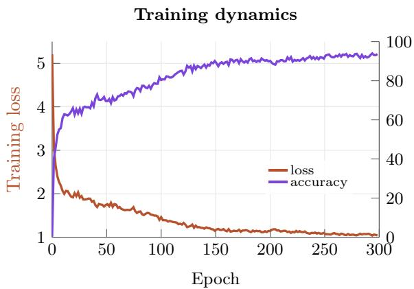

<details>
<summary>line</summary>

| Epoch | Training loss | Accuracy |
|-------|---------------|----------|
| 0     | 5.0           | 100.0    |
| 50    | 2.0           | 80.0     |
| 100   | 1.5           | 90.0     |
| 150   | 1.2           | 95.0     |
| 200   | 1.1           | 97.0     |
| 250   | 1.05          | 98.0     |
| 300   | 1.0           | 99.0     |
</details>

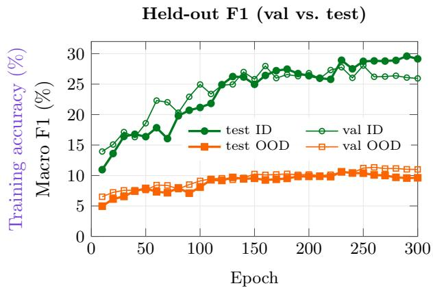

<details>
<summary>line</summary>

| Epoch | test ID | val ID | test OOD | val OOD |
|-------|---------|--------|----------|---------|
| 0     | 11.0    | 14.0   | 5.0      | 6.0     |
| 50    | 17.0    | 22.0   | 8.0      | 8.0     |
| 100   | 21.0    | 25.0   | 9.0      | 9.0     |
| 150   | 26.0    | 27.0   | 10.0     | 10.0    |
| 200   | 27.0    | 28.0   | 10.5     | 10.5    |
| 250   | 28.0    | 29.0   | 11.0     | 11.0    |
| 300   | 29.0    | 29.5   | 11.5     | 11.5    |
</details>

Figure A.4 iWildCam from-scratch supervised baseline: training behaviour vs. held-out F1. Left: training loss (brown, left axis) and training accuracy (purple, right axis) over 300 epochs of from-scratch supervised training of a $_ { \mathrm { V i T - L } / 1 6 }$ backbone; loss decreases from ∼5.2 to ∼1.04 and accuracy rises to ∼93%, indicating steady fit to the source distribution. Right: macro F1 on the held-out validation and test splits, broken down by in-distribution (green, ID) and out-of-distribution (orange, OOD) micro-domains; thicker lines with filled markers denote the test split and thinner lines with hollow markers the validation split. OOD F1 saturates near ∼10% after roughly 100 epochs, whereas ID F1 keeps improving only marginally, reaching ∼29% (test) and ∼26% (validation) at epoch 300. The low OOD numbers thus reflect the difficulty of the distribution shift rather than under-training. Training is reported in accuracy, while held-out evaluation uses the official WILDS macro F1 metric.

Self-supervised adaptation, conversely, yields a more diffuse but better-transferring representation. FINO is the only regime that wins on all three metrics simultaneously, combining the most structured clusters with the most probe-friendly features. Fig. A.5 visualises this gap qualitatively against the UMAP published by Gupta et al. [55].

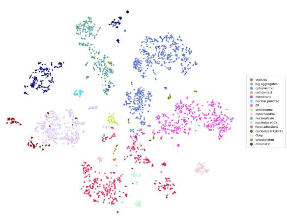

<details>
<summary>scatter</summary>

| Category             | Color  |
|----------------------|--------|
| vesicles             | Pink   |
| big aggregates       | Green  |
| cytoplasmic          | Blue   |
| cell contact         | Purple |
| membrane             | Light Green |
| nuclear punctae      | Yellow |
| ER                   | Magenta |
| centrosome           | Light Pink |
| mitochondria         | Light Pink |
| nucleoplasm          | Light Pink |
| nucleus (GC)        | Light Pink |
| focal adhesions     | Light Pink |
| nucleus (FGDFC)     | Light Pink |
| Golgi                | Light Pink |
| cytoskeleton         | Red    |
| chromatin            | Dark Blue |
</details>

(a) FINO (ours)

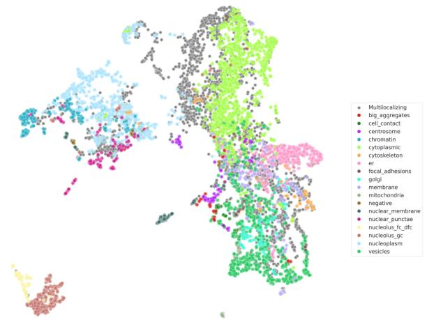

<details>
<summary>scatter</summary>

| Category             | Color  |
|----------------------|--------|
| Multilocalizing      | Grey   |
| big_aggregates       | Red    |
| cell_contact         | Green  |
| centrosome           | Purple |
| chromatin            | Light Blue |
| cytoplasmic         | Light Green |
| cytoskeleton         | Orange |
| er                   | Pink   |
| focal_adhesions     | Light Pink |
| golgi                | Dark Pink |
| membrane             | Light Pink |
| mitochondria         | Light Pink |
| negative             | Dark Pink |
| nuclear_membrane     | Dark Pink |
| nuclear_punctae      | Dark Pink |
| nucleolus_fc_dfc     | Light Pink |
| nucleolus_gc         | Light Pink |
| nucleoplasm          | Light Pink |
| vesicles             | Green  |
</details>

(b) SubCell [55], reproduced from original paper   
Figure A.5 UMAP of OpenCell protein-level embeddings, coloured by subcellular localisation. (a) Our FINO representation. (b) The corresponding visualisation from Gupta et al. [55], shown with their own colour scheme; colour assignments differ between the two panels and are therefore not directly comparable label-by-label. The point of comparison is cluster geometry: FINO produces visibly tighter, better-separated localisation clusters, consistent with the gap in clustering metrics reported in Tab. A.7.

# A.8.2 FMoW → FLAIR-Hub

We probe the FMoW-adapted backbone on FLAIR-Hub [71], a large-scale aerial imagery benchmark for land-cover and crop mapping at 0.2 m/px (vs. ∼0.3–1.5 m for FMoW satellite imagery). Only the RGB channels are kept to match the FMoW input space; the additional spectral bands are discarded.

DPT head. We use the DPT architecture from Ranftl et al. [81]. The last four transformer layers are extracted, and CLS token information is folded into the spatial features via a learned projection (concatenation followed by a linear layer). Each layer’s features are projected to intermediate channel dimensions [128, 256, 512, 1024] with 1×1 convolutions, then spatially aligned to four different scales using transposed convolutions (4× and 2× upsampling), identity, and a strided 3×3 convolution (2× downsampling). All four feature maps are then projected to 256 channels with 3×3 convolutions, and progressively fused from coarse to fine through four fusion blocks. Each fusion block consists of two pre-activation residual units followed by 2× bilinear upsampling and a 1×1 projection. A final 3×3 convolution produces the fused representation, which is mapped to class logits by a 1×1 convolution.

# A.8.3 MIMIC-CXR → CheXpert

We probe the MIMIC-CXR-adapted backbone on CheXpert [70], a chest radiograph dataset acquired at a different institution (Stanford Hospital) than MIMIC-CXR (Beth Israel Deaconess Medical Center), keeping the same multi-label pathology classification task.