# RePercENT: Scaling Disentangled Representation Learning Beyond Two Modalities

Vasiliki Rizou

EPFL

vasiliki.rizou@epfl.ch

Pascal Frossard

EPFL

pascal.frossard@epfl.ch

Dorina Thanou

EPFL

dorina.thanou@epfl.ch

§ Code

# Abstract

To leverage the full potential of multimodal data, we need representations that go beyond the state-of-the-art alignment and fusion approaches and exploit all cross-modal interactions without sacrificing modality-specific information. Learning disentangled representations is a principled way to identify these underlying shared and unique factors that are hidden in observational data. However, while multimodal disentanglement is a compelling paradigm, existing methods are largely confined to the two-modality regime due to its inherent scalability bottleneck. To address this, we propose RePercENT, a self-supervised framework designed to surpass these limitations and unlocks scalable pairwise disentanglement beyond two modalities. Through a multimodal ‘plug-and-play’ architecture, our approach operates directly on pre-extracted embeddings, eliminating the need for extensive joint pre-training while making no assumptions regarding the underlying modalities or foundation model backbones. Moreover, we introduce a joint optimization objective for simultaneously deriving the shared and unique components, and provide formal theoretical guarantees that characterize the optimality of our solution. Across diverse modalities and tasks, RePercENT successfully recovers disentangled components while maintaining competitive performance and significantly reducing computational complexity.

# 1 Introduction

A central aim of multimodal machine learning is to endow models with the ability to synthesize and reason over information coming from multiple sources, e.g. images, audio, text [Baltrušaitis et al., 2019, Krones et al., 2024]. Landmark multimodal foundation models, such as CLIP [Radford et al., 2021], ALIGN [Jia et al., 2021], Flamingo [Alayrac et al., 2022], have shown that integrating different modalities gives rise to richer, more semantic and broadly applicable representations, than those derived from a single source alone. Notably, most previous work focuses on cross-modal alignment, exploiting the critical assumption of multi-view redundancy [Liang et al., 2023], which suggests that all task-relevant information is shared across modalities. The Platonic Representation Hypothesis [Huh et al., 2024] also supports this assumption, linking better performance with more aligned representations. While this may hold in many settings, Tjandrasuwita et al. [2025] demonstrate that it crucially depends on the degree of similarity between the modalities and the balance between redundant and unique information they provide for the task under consideration (see Figure 1, left).

Multimodal fusion addresses this limitation by combining heterogeneous modalities into a joint representation that potentially captures both their shared and complementary information. While effective, such representations leave the different information factors entangled, limiting our understanding on how the observed modalities interact. This motivates disentangled representation learning, where the goal is to decompose the multimodal information into distinct, meaningful components, separating what is shared across modalities from what remains modality-specific. Identifying the underlying shared and unique factors, reveals which modalities are most task-critical, which contribute unique information, and which exhibit significant overlap. This, in turn, can inform practical decisions such as pruning modalities that are computationally or cost demanding, yet redundant. On the other hand, shared factors from observed modalities may further help compensate for missing inputs. Finally, such a decomposition can facilitate adaptability to new unseen tasks, integration of new heterogeneous modalities, and efficient fine-tuning on new datasets or cohorts.

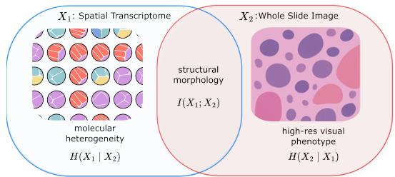

text_image

X₁: Spatial Transcriptome
molecular heterogeneity
H(X₁ | X₂)
structural morphology
I(X₁; X₂)
X₂: Whole Slide Image
high-res visual phenotype
H(X₂ | X₁)

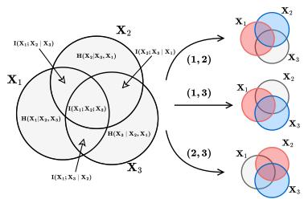

flowchart

```mermaid
graph TD
    A["X1"] --> B["X2"]
    B --> C["X3"]
    D["X1"] --> E["X2"]
    E --> F["X3"]
    G["X1"] --> H["X2"]
    H --> I["X3"]
    J["X1"] --> K["X2"]
    K --> L["X3"]
    M["X1"] --> N["X2"]
    N --> O["X3"]
    P["X1"] --> Q["X2"]
    Q --> R["X3"]
    S["X1"] --> T["X2"]
    T --> U["X3"]
    V["1(X1,X2 | X1)"] --> W["1(X1,X2 | X1)"]
    W --> X["1(X1,X2 | X1)"]
    Y["1(X1,X2 | X0)"] --> Z["1(X1,X2 | X0)"]
    Z --> AA["1(X1,X2 | X0)"]
    AB["1(X1,X4 | X1)"] --> AC["1(X1,X2 | X1)"]
    AC --> AD["1(X1,X2 | X1)"]
    AE["1(X1,X4 | X0)"] --> AF["1(X1,X2 | X0)"]
    AF --> AG["1(X1,X2 | X0)"]
    AH["1(X1,X4 | X3)"] --> AI["1(X1,X2 | X3)"]
    AI --> AJ["1(X1,X2 | X3)"]
    AK["1(X1,X4 | X0)"] --> AL["1(X1,X2 | X0)"]
    AL --> AM["1(X1,X2 | X0)"]
    AN["1(X1,X4 | X3)"] --> AO["1(X1,X2 | X3)"]
    AO --> AP["1(X1,X2 | X3)"]
    AQ["1(X1,X4 | X0)"] --> AR["1(X1,X2 | X0)"]
    AR --> AS["1(X1,X2 | X0)"]
    AT["1(X1,X4 | X3)"] --> AU["1(X1,X2 | X3)"]
    AU --> AV["1(X1,X2 | X3)"]
    AW["1(X1,X4 | X0)"] --> AX["1(X1,X2 | X0)"]
    AX --> AY["1(X1,X2 | X0)"]
    AZ["1(X1,X4 | X3)"] --> BA["1(X1,X2 | X3)"]
    BA --> BB["1(X1,X2 | X3)"]
    BC["1(X1,X4 | X0)"] --> BD["1(X1,X2 | X0)"]
    BD --> BE["1(X1,X2 | X0)"]
    BF["1(X1,X4 | X3)"] --> BG["1(X1,X2 | X3)"]
    BG --> BH["1(X1,X2 | X3)"]
    BI["1(X1,X4 | X0)"] --> BJ["1(X1,X2 | X0)"]
    BJ --> BK["1(X1,X2 | X0)"]
    BL["1(X1,X4 | X3)"] --> BM["1(X1,X2 | X3)"]
    BM --> BN["1(X1,X2 | X3)"]
    BO["1(X1,X4 | X0)"] --> BP["1(X1,X2 | X0)"]
    BP --> BQ["1(X1,X2 | X0)"]
    BR["1(X1,X4 | X3)"] --> BS["1(X1,X2 | X3)"]
    BS --> BT["1(X1,X2 | X3)"]
    BU["1(X1,X4 | X0)"] --> BV["1(X1,X2 | X0)"]
    BV --> BW["1(X1,X2 | X0)"]
    BX["1(X1,X4 | X3)"] --> BY["1(X1,X2 | X3)"]
    BY --> BZ["1(X1,X2 | X3)"]
    CA["1(X1,X4 | X0)"] --> CB["1(X1,X2 | X0)"]
    CB --> CC["1(X1,X2 | X0)"]
    CD["1(X1,X4 | X3)"] --> CE["1(X1,X2 | X3)"]
    CE --> CF["1(X1,X2 | X3)"]
    DG["1(X1,X4 | X0)"] --> DH["1(X1,X2 | X0)"]
    DH --> DI["1(X1,X2 | X0)"]
    DJ["1(X1,X4 | X3)"] --> DK["1(X1,X2 | X3)"]
    DK --> DL["1(X1,X2 | X3)"]
    DM["1(X1,X4 | X0)"] --> DN["1(X1,X2 | X0)"]
    DN --> DE["1(X1,X2 | X0)"]
    DF["1(X1,X4 | X3)"] --> DG
    DG --> DW["1(X1,X2 | X3)"]
    DX["1(X1,X4 | X0)"] --> DX
    DX --> DX
    DXB["1(X1,X4 | X3)"] --> DXB
    DXB --> DXB
    DXC["1(X1,X4 | X0)"] --> DXC
    DXC --> DXC
    DXD["1(X1,X4 | X3)"] --> DXD
    DXD --> DXD
    DXE["1(X1,X4 | X0)"] --> DXE
    DXE --> DXE
    DXF["1(X1,X4 | X3)"] --> DXF
    DXF --> DXF
    DXG["1(X1,X4 | X0)"] --> DXG
    DXG --> DXG
    DXH["1(X1,X4 | X3)"] --> DXH
    DXH --> DXH
    DXI["1(X1,X4 | X0)"] --> DXI
    DXI --> DXI
    DXJ["1(X1,X4 | X3)"] --> DXJ
    DXJ --> DXJ
    DXK["1(X1,X4 | X0)"] --> DXK
    DXK --> DXK
    DXL["1(X1,X4 | X3)"] --> DXL
    DXL --> DXL
    DXM["1(X1,X4 | X0)"] --> DXM
    DXM --> DXM
    DXN["1(X1,X4 | X3)"] --> DXN
    DXN --> DXN
    DXO["1(X1,X4 | X0)"] --> DXO
    DXO --> DXO
    DXP["1(X1,X4 | X3)"] --> DXP
    DXP --> DXP
    DXQ["1(X1,X4 | X0)"] --> DXQ
    DXQ --> DXQ
    DXR["1(X1,X4 | X3)"] --> DXR
    DXR --> DXR
```

Figure 1: Left: Example in oncology when multi-view redundancy is limited. While both modalities capture shared structural morphology, WSI resolves fine-grained cellular features, whereas ST reveals underlying molecular variations, that are invisible in histology. Right: Information Venn diagram for three modalities, along with their pairwise shared and unique component visualizations.

Despite recent progress [Wu et al., 2025, Liang et al., 2023], reliably disentangling multimodal information remains an open challenge. Importantly, the majority of prior work remains confined to two modalities, largely due to a fundamental scalability bottleneck, arising from two main factors. First, the number of possible shared and modality-specific factors grows exponentially with the number of modalities, making them increasingly difficult to model. Second, beyond two modalities, tractable objectives or bounds that explicitly characterize all these interactions remain limited. Moreover, in real-world settings, unique and shared information is often highly entangled, leading to a trade-off between minimizing redundancy across components and preserving as much relevant information as possible [Wang et al., 2025]. Capturing only the Minimal Necessary Information (MNI) [Fischer, 2020] is therefore key to learning informative, non-redundant components without inducing representational collapse. These challenges naturally raise a fundamental question:

"How can we scalably extract the underlying unique and shared factors beyond two modalities?"

We answer this question with RePercENT, a novel information-theoretic framework for Reducedcomplexity Perceiver-based disENTanglement. Our approach effectively addresses the scalability barrier, through two key ingredients. First, to avoid the exponential growth of components, we model pairwise interactions between modalities: this preserves the information of each modality while capturing all relevant cross-modal interactions–see Figure 1 (right). Secondly, we propose an architecture that redefines the efficient, modality-agnostic design of the Perceiver encoder [Jaegle et al., 2021] through dedicated structural mechanisms that effectively route the available information into shared and modality-specific representations. Furthermore, by leveraging pre-extracted foundation model embeddings and a self-supervised training regime, our method remains modality- and taskagnostic, while still being robust to missing or incomplete modalities at inference time. Finally, our approach is accompanied with formal theoretical guarantees on the optimality of our solution. Our contributions are as follows:

• Scalable multimodal disentanglement: We introduce RePercENT, a novel informationtheoretic framework for multimodal disentanglement that efficiently scales beyond the two-modality setting.   
• Plug-and-play architecture: RePercENT operates directly on pre-extracted embeddings, making it agnostic to modality types and backbone architectures. By design, it accommodates missing data during inference and seamlessly transfers to unseen tasks.   
• Formal optimality guarantees: We provide formal optimality guarantees both when minimal necessary information (MNI) is attainable and when it is not.   
• Extensive empirical validation: We demonstrate the robustness and effectiveness of our framework across diverse settings, including controlled synthetic experiments, real-world figurative language understanding, and multimodal medical analysis.

Overall, we provide a principled framework that bridges information-theoretic foundations and formal guarantees with a practical and efficient implementation, paving the way towards more reliable, interpretable, and mechanistically grounded multimodal representations.

# 2 Problem formulation

In this section, we formalize the problem of information-theoretic disentangled representation learning in multimodal settings and introduce the necessary notation and definitions.

Let $\mathcal { X } ~ = ~ \{ X _ { 1 } , X _ { 2 } , . . . , X _ { M } \}$ be the set of M modalities, and let $Z _ { i }$ correspond to a latent, information-preserving representation of each $X _ { i } .$ . We denote by $\mathcal { M } = \{ 1 , 2 , \bar { . } . . , M \}$ the corresponding modality index set. For each subset $A \subseteq { \mathcal { M } }$ , we introduce the atomic representations $z _ { A } ,$ , as the basic latent building blocks, reflecting distinct information subspaces (Definition 2.1).

Definition 2.1. Atomic representation. We define as the atomic representation $z _ { A } ,$ , the latent representation associated with a nonempty subset of modalities $A \subseteq { \mathcal { M } } ,$ , capturing information:

1. shared by all modalities $i \in A ,$ , and   
2. exclusive to the modalities in A, such that $\forall A , A ^ { \prime } \subseteq { \mathcal { M } } ,$ with $A \cap A ^ { \prime } = \varnothing .$ , we have $I ( z _ { A } ; z _ { A ^ { \prime } } ) = 0$ , where $I ( z _ { A } ; z _ { A ^ { \prime } } )$ is the mutual information between $z _ { A }$ and $z _ { A ^ { \prime } }$ .

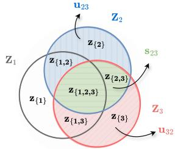

text_image

Z₁
z{1}
z{1,2}
z{1,3}
z{2}
z{2,3}
z{3}
z{3}
u₂₃
S₂₃
Z₂
Z₃
u₃₂

Figure 2: Atomic representations through a Venn diagram visualization.

Figure 2 illustrates the atomic representation subspaces through a Venn decomposition for the threemodality case. Notice that each modality-specific latent representation $Z _ { i }$ can then be interpreted as a composition of atomic representations:

Definition 2.2. Composite representation For $i \in { \mathcal { M } } ,$ let $\mathcal { A } _ { i } = \{ A \subseteq \mathcal { M } : i \in A \}$ . The composite representation $Z _ { i }$ is the combination of all atomic representations whose subsets contains i: $Z _ { i } = \begin{array} { c c } { { \oplus } } & { { z _ { A } } } \end{array}$ . Here, L denotes a generic composition operation, e.g., concatenation $A \in { \mathcal { A } } _ { i }$ or any aggregation function.

Subsequently, using the atomic representations as building blocks, we define shared and modalityspecific representations for each modality pair $( i , j )$ , according to Definition 2.3.

Definition 2.3. Pairwise unique and shared representations. For $i , j \in { \mathcal { M } } ,$ let $\mathcal { A } _ { i \mid j } = \mathcal { A } _ { i } \cap \mathcal { A } _ { j } ^ { c } ,$ where $\mathcal { A } _ { j } ^ { c }$ denotes the complementary set of $A _ { j }$ , and let $\mathcal { A } _ { i j } = \mathcal { A } _ { i } \cap \mathcal { A } _ { j }$ . The pairwise unique and shared representations are defined $\mathbf { a s } ,$

$$
\mathbf {u} _ {i j} = \bigoplus_ {A \in \mathcal {A} _ {i | j}} z _ {A}, \quad \mathbf {s} _ {i j} = \bigoplus_ {A \in \mathcal {A} _ {i j}} z _ {A}.
$$

Here, $\mathbf { u } _ { i j }$ and $\mathbf { s } _ { i j }$ capture information unique to i relative to $j ,$ and shared by i and j, respectively.

Finally, we formalize the learning objective as follows:

Problem Statement Let M be the number of modalities and $\mathcal { M } = \{ 1 , \dots , M \}$ denote the corresponding modality index set. Given the composite representation $Z _ { i }$ of each modality $i \in$ $\mathcal { M } ,$ , for every $\mathsf { \bar { j } } \in \mathcal { M } \setminus \{ \mathsf { \bar { \{ i \} } } $ , our goal is to derive the pairwise disentangled latent representations $\mathbf { u } _ { i j }$ and $\mathbf { s } _ { i j } \colon$

$$
Z _ {i} \longmapsto \left\{\left(\mathbf {u} _ {i j}, \mathbf {s} _ {i j}\right) \right\} _ {j \in \mathcal {M} \backslash \{i \}}.
$$

Notice that the above formulation efficiently circumvents the exponential growth in the number of atomic representations1 reducing the component complexity from $\mathcal { O } ( 2 ^ { M } )$ to $\mathcal { O } ( M ^ { 2 } )$ ), while still capturing all cross-modal interactions through pairwise decompositions. Importantly, this preserves the information associated with every modality, as for each $j \neq i ,$ , the pairwise components $( \mathbf { u } _ { i j } , \mathbf { s } _ { i j } )$ encapsulate the complete information reflected in $Z _ { i }$ .

# 3 RePercENT: Unlocking scalable disentangled representations

Building on this formulation, we introduce RePercENT. We first present the architectural design, then define the optimization objective leading to tractable training losses, and finally derive theoretical guarantees on the optimality of our solution.

# 3.1 Architecture overview

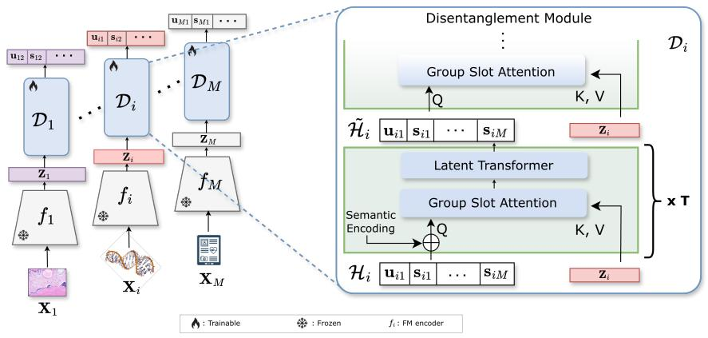

flowchart

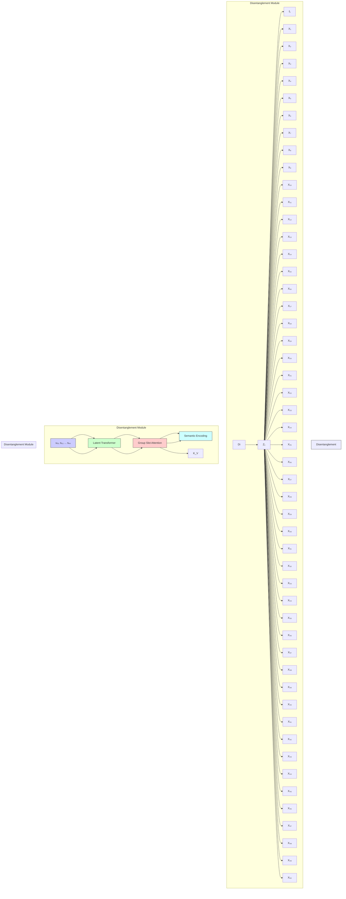

Figure 3: Model overview. Each modality $X _ { i }$ is first encoded, using modality-specific FMs. Afterwards, each encoded representation is processed through its dedicated disentanglement module $\mathcal { D } _ { i } .$ .

We propose a scalable framework for multimodal disentanglement that extracts the desired information-theoretic representations while requiring a single encoder per modality, yielding linear scaling in M . Specifically, from each modality $i ,$ we leverage pre-trained modality specific foundation models (FMs) to obtain the initial embeddings $Z _ { i }$ . Under the assumption that these encoders are sufficiently expressive and thus the resulting representations preserve most of the relevant modality information, we treat the embeddings $Z _ { i } ,$ , as composite representations. Subsequently, each representation is processed via a separate disentangling module $\mathcal { D } _ { i }$ , that decomposes $Z _ { i }$ into all desired information components involving modality i, i.e., $Z _ { i } \longmapsto \{ ( \mathbf { u } _ { i j } , \mathbf { s } _ { i j } ) \} _ { j \in \mathcal { M } \backslash \{ i \} }$ .

Disentanglement module Within each $\mathcal { D } _ { i } .$ , we model the disentangled representations using a learnable latent array $\mathcal { H } _ { i } \in \mathbb { R } ^ { N \times D }$ , where $N = 2 ( M - 1 )$ denotes the number of latent slots per modality and D is the dimension of each slot. To link pairwise unique and shared components to the latent array, we assign each row $h _ { i k } \in \mathbb { R } ^ { D }$ of $\mathcal { H } _ { i }$ to exactly one component (unique or shared) of modality i (see Appendix G.1). $\mathcal { H } _ { i }$ is then iteratively refined through a Perceiver-inspired latent attention mechanism. While Jaegle et al. [2021] introduced the Perceiver as a general-purpose architecture for scalable input processing, we repurpose its latent attention mechanism for a different objective: to extract granular disentangled representations. In our setup, $\mathcal { H } _ { i }$ i serves as a query over the encoded representation $Z _ { i } ,$ followed by a latent self-attention block, as illustrated in Figure 3. This latent bottleneck is well suited to our setting, as it enables efficient representation encoding without making any modality-specific assumptions. To encourage disentanglement, we introduce two key routing mechanisms: Semantic Encoding, which assigns a functional role to each latent slot, and a new form of attention, Group Slot Attention, that promotes competition among slots.

Semantic encoding To promote component specialization, each slot $h _ { i k }$ is augmented with two learnable encodings: a pair encoding, $e _ { i j } ^ { \mathrm { p } } \in \mathbb { R } ^ { D }$ , which identifies the modality pair $( i , j )$ , and a type encoding, $e _ { i j } ^ { { \tt t } } \in \mathbb { R } ^ { D }$ , indicating the component type, $\textrm { t \in }$ {unique, shared}. The initialized latent slot is thus defined as: $\tilde { h } _ { i k } = h _ { i k } + e _ { i j } ^ { \mathrm { p } } + e _ { i j } ^ { \mathrm { t } }$ .

Group slot attention Rather than compressing modality $X _ { i }$ into a single pooled embedding, we retain the full sequence of embeddings $\mathbf { \Psi } ^ { \mathbf { \prime } } Z _ { i } \in \mathbb { R } ^ { S _ { i } \times E _ { i } }$ , allowing the latent slots to attend to finegrained input structure. We then introduce group slot attention: a structural routing mechanism tailored to pairwise disentanglement. While motivated by the competitive assignment principle of Slot Attention [Locatello et al., 2020], our mechanism applies competition within modality-pair groups. Specifically, for each pair $( i , j )$ , the slots corresponding to $( { \bf { u } } _ { i j } , { \bf { s } } _ { i j } )$ compete over the same input embeddings, enforcing specialization within the pair. This way, each group effectively separates modality i’s information into i-specific and $i \mathrm { - } j$ shared latent representations (see Appendix G).

Together, these design choices impose an explicit routing bias, enabling each slot to specialize in its assigned representation while keeping the inference modality-local. This offers a central scalability advantage, as all pairwise unique and shared representations are obtained with only one encoder per modality. In contrast, state-of-the-art disentanglement methods [Wu et al., 2025, Liang et al., 2023] rely on separate encoders for different representations, leading to $\mathcal { O } ( M ^ { 2 } )$ structural complexity, which quickly becomes prohibitive as M grows. Our method reduces this to $\dot { \mathcal { O } } ( M )$ while retaining the full set of pairwise decompositions. Moreover, by construction, for every $j \in \mathcal { M }$ , the representations $( \mathbf { u } _ { i j } , \mathbf { s } _ { i j } )$ are inferred from $X _ { i }$ alone, i.e., $\mathbf { u } _ { i j } \sim p ( \cdot \mid X _ { i } )$ , and $\mathbf { s } _ { i j } \sim p ( \cdot \mid X _ { i } )$ . Equivalently,

$$
\left(\mathbf {u} _ {i j}, \mathbf {s} _ {i j}\right) \perp X _ {j} \mid X _ {i}, \quad \left(\mathbf {u} _ {j i}, \mathbf {s} _ {j i}\right) \perp X _ {i} \mid X _ {j}.
$$

Crucially, this decoupling ensures robustness to missing modalities during inference. Since $( { \bf { u } } _ { i j } , { \bf { s } } _ { i j } )$ are inferred directly from $X _ { i }$ , they remain available whenever $X _ { i }$ is observed, regardless of whether $X _ { j }$ is present, bypassing the need for complex imputation or heuristic mapping.

# 3.2 Information criteria for optimal disentangled representations

We now introduce how the unique and shared components of the architecture are learned. Rather than following a sequential decomposition strategy, where the shared representation is learned first, and the unique representation is then inferred as a residual component [Wang et al., 2025], we cast each pairwise decomposition as a single optimization problem. Concretely, we simultaneously optimize all representations $\theta _ { i j } = ( u _ { i j } , u _ { j i } , s _ { i j } , s _ { j i } )$ , according to the following optimization objective:

Pairwise joint optimization objective. For each modality pair $( i , j )$ , we optimize

$$
\hat {\theta} _ {i j} \in \arg \max _ {\theta_ {i j}} \mathcal {J} (\theta_ {i j}) = \arg \max _ {\theta_ {i j}} \left[ \alpha \left(\mathcal {L} _ {s _ {i}} + \mathcal {L} _ {s _ {j}}\right) + \mathcal {L} _ {u _ {i}} + \mathcal {L} _ {u _ {j}} \right], \tag {1}
$$

where $\theta _ { i j } = ( u _ { i j } , u _ { j i } , s _ { i j } , s _ { j i } )$ , and

$$
\mathcal {L} _ {s _ {i}} = I (s _ {i j}; X _ {j}) - \beta I (s _ {i j}; X _ {i} \mid X _ {j}), \quad \mathcal {L} _ {u _ {i}} = I (u _ {i j}, s _ {j i}; X _ {i}) - \lambda I (u _ {i j}; s _ {j i}) \tag {2}
$$

$$
\mathcal {L} _ {s _ {j}} = I (s _ {j i}; X _ {i}) - \beta I (s _ {j i}; X _ {j} \mid X _ {i}), \quad \mathcal {L} _ {u _ {j}} = I (u _ {j i}, s _ {i j}; X _ {j}) - \lambda I (u _ {j i}; s _ {i j}). \tag {3}
$$

The shared objectives $\mathcal { L } _ { s _ { i } } , \mathcal { L } _ { s _ { i } }$ , encourage each shared representation to capture all necessary crossmodal information, while at the same time being minimal, i.e. penalizing information that can only be explained by its source modality. Specifically, the mutual information $I ( s _ { i j } ; X _ { j } )$ , promotes cross-modal relevance, whereas the conditional mutual information, $I ( s _ { i j } ; X _ { i } \mid ^ { } \dot { X } _ { j } ) \dot $ , suppresses cross-modal leakage. Complementarily, the unique objectives $\mathcal { L } _ { u _ { i } } , \mathcal { L } _ { u } .$ j preserve source-modality information via $I ( u _ { i j } , s _ { j i } ; X _ { i } )$ , while enforcing cross-modal disentanglement by penalizing overlap between unique and shared components across modalities through $\bar { I } ( u _ { i j } ; s _ { j i } )$ . We introduce, the hyperparameter $\alpha > 0$ acting as a weighting constant between the shared and unique objectives, while (β, λ) [Wang et al., 2025] control the trade-off between representation coverage and redundancy.

# 3.2.1 Tractable training objectives.

For training the framework, we instantiate the information-theoretic components in Eq. (1) using standard surrogate losses. Specifically, we employ the InfoNCE objective [van den Oord et al., 2018] to estimate the mutual information terms $I ( s _ { i j } ; \dot { X } _ { j } )$ and $I ( u _ { i j } , s _ { j i } ; X _ { i } )$ . For the latter, positive pairs are formed from two independently augmented views of $\breve { X _ { i } }$ . We model $I ( s _ { i j } ; X _ { i } \mid ^ { \mathbf { \bar { \mu } } } X _ { j } )$ using a KL-divergence penalty, ${ \mathcal { L } } _ { \mathrm { K L } }$ , between the conditional distributions $p ( s _ { i j } \mid X _ { i } )$ and $p ( s _ { j i } \mid X _ { j } )$ , as it provides a variational upper bound on the corresponding conditional mutual information [Federici et al., 2020]. Lastly, we reduce the dependence between $u _ { i j }$ and $s _ { j i }$ via a cross-covariance penalty, $\mathcal { L } _ { \mathrm { x c o v } }$ , on standardized representations. Concretely, Eq. (2) is approximated as

$$
\mathcal {L} _ {s _ {i}} \approx \mathcal {L} _ {s _ {i}} ^ {\mathrm{tr}} = - \mathcal {L} _ {s _ {i}} ^ {\mathrm{INCE}} - \beta \mathcal {L} _ {\mathrm{KL}}, \quad \mathcal {L} _ {u _ {i}} \approx \mathcal {L} _ {u _ {i}} ^ {\mathrm{tr}} = - \mathcal {L} _ {u _ {i}} ^ {\mathrm{INCE}} - \lambda \mathcal {L} _ {\mathrm{xcov}}. \tag {4}
$$

The terms corresponding to Eq. (3) are defined analogously by exchanging i and j. Averaging over all modality pairs, we obtain the full trainable objective

$$
\mathcal {L} _ {\mathcal {E}} ^ {\mathrm{tr}} = \frac {1}{| \mathcal {E} |} \sum_ {(i, j) \in \mathcal {E}} \left[ \alpha \left(\mathcal {L} _ {s _ {i}} ^ {\mathrm{tr}} + \mathcal {L} _ {s _ {j}} ^ {\mathrm{tr}}\right) + \mathcal {L} _ {u _ {i}} ^ {\mathrm{tr}} + \mathcal {L} _ {u _ {j}} ^ {\mathrm{tr}} \right], \quad \mathcal {E} = \{(i, j) \in \mathcal {M} ^ {2}: i <   j \}. \tag {5}
$$

Detailed expressions and further discussion on the losses can be found in Appendix G.3.

# 3.2.2 Optimality guarantees

We now establish theoretical guarantees for our joint objective relative to the optimal informationtheoretic decomposition. Specifically, we show that under attainable Minimum Necessary Information (MNI) [Fischer, 2020], our proposed objective admits the same global optimum as the ideal optimizer. Moreover, we prove near-optimality, in the more challenging regime, when MNI is unattainable.

Optimal information-theoretic objectives Concretely, let us consider the ideal sequential optimization problem [Wang et al., 2025], where shared representations are derived first, following:

$$
\begin{array}{l} s _ {i j} ^ {*} \in \arg \max _ {s _ {i j}} \mathcal {L} _ {s _ {i}} ^ {o} = \arg \max _ {s _ {i j}} I (s _ {i j}; X _ {j}) - \beta I (s _ {i j}; X _ {i} \mid X _ {j}), \\ * = 2 6, \quad I (\dots , X) = 2 I (\dots , X _ {i} \mid X _ {j}). \end{array} \tag {6}
$$

$$
s _ {j i} ^ {*} \in \arg \max _ {s _ {i j}} \mathcal {L} _ {s _ {j}} ^ {o} = \arg \max _ {s _ {j i}} I (s _ {j i}; X _ {i}) - \beta   I (s _ {j i}; X _ {j} \mid X _ {i}).
$$

In the second step, the modality-specific representations are inferred, from optimal solutions of the first step, as defined in Eqs. (6). Specifically,

$$
\begin{array}{l} u _ {i j} ^ {*} \in \arg \max _ {u _ {i j}} \mathcal {L} _ {u _ {i}} ^ {o} = \arg \max _ {u _ {i j}} I (u _ {i j}, X _ {j}; X _ {i}) - \lambda I (u _ {i j}; s _ {i j} ^ {*}), \\ * = 2 a, \quad I (\dots , X _ {i}, X _ {j}) = \lambda I (\dots , *) \end{array} \tag {7}
$$

$$
u _ {j i} ^ {*} \in \arg \max _ {u _ {i j}} \mathcal {L} _ {u _ {j}} ^ {o} = \arg \max _ {u _ {j i}} I (u _ {j i}, X _ {i}; X _ {j}) - \lambda I (u _ {j i}; s _ {j i} ^ {*}).
$$

From sequential to joint optimization For the case when MNI holds, Theorem (1), demonstrates that any step-by-step optimal solution, is also a global maximizer of our joint objective.

Theorem 1. Exact optimality under attainable MNI: Let $\theta _ { i j } ^ { * } = ( u _ { i j } ^ { * } , u _ { j i } ^ { * } , s _ { i j } ^ { * } , s _ { j i } ^ { * } )$ be an optimal solution of the step-by-step optimization problem defined in Eqs. (6) and (7). If the MNI criterion is attainable and $\alpha > \lambda$ , then $\theta _ { i j } ^ { * }$ is a global optimizer of the joint objective defined in Eqs. (1) - (3). Equivalently,

$$
\theta_ {i j} ^ {*} \in \arg \max _ {\theta_ {i j}} \mathcal {J} (\theta_ {i j}).
$$

Proof. See Appendix F

Moreover, our guarantees extend beyond the idealized setting where the MNI criterion holds. This is essential, as real multimodal data rarely admit such a clean separation: shared and modalityspecific factors can be inherently entangled. (Further discussion of MNI is provided in Appendix E.) Therefore, when MNI is unattainable, we show that the maximum value of our joint objective is no worse than the optimal value of the ideal problem, up to a tractable constant, as stated in Theorem (2).

Theorem 2. Near-optimality under unattainable MNI: Let $\theta _ { i j } ^ { * } = ( u _ { i j } ^ { * } , u _ { j i } ^ { * } , s _ { i j } ^ { * } , s _ { j i } ^ { * } )$ be an optimal solution of the ideal step-by-step optimizer as stated in Eqs. $( \mathbf { \partial } ) - \left( \mathbf { \partial } \right)$ , and $\hat { \theta } _ { i j }$ the corresponding optimal solution of the joint optimization problem, as stated in Eqs. (1) - (3). If MNI is unattainable, any maximizer $\hat { \theta } _ { i j }$ of the joint objective satisfies

$$
\mathcal {J} (\hat {\theta} _ {i j}) \geq \mathcal {J} ^ {o} (\theta_ {i j} ^ {*}) - 2 (1 + \lambda) \delta_ {c},
$$

where,

$$
\mathcal {J} ^ {o} (\theta_ {i j} ^ {*}) = \alpha \mathcal {L} _ {s _ {i}} ^ {o} (\theta_ {i j} ^ {*}) + \alpha \mathcal {L} _ {s _ {j}} ^ {o} (\theta_ {i j} ^ {*}) + \mathcal {L} _ {u _ {i}} ^ {o} (\theta_ {i j} ^ {*}) + \mathcal {L} _ {u _ {j}} ^ {o} (\theta_ {i j} ^ {*}),
$$

and $\delta _ { c }$ denotes the information-gap term introduced in Wang et al. [2025], which quantifies the trade-off between coverage and redundancy in the shared representations.

Proof. See Appendix F

Together, Theorems (1) and (2) establish that our coupled objective is not merely a practical surrogate, but a formally grounded solution for the ideal step-by-step solution. This is not just a convenience, but rather a prerequisite for scalability beyond two modalities, where a sequential treatment of all shared and unique components becomes computationally prohibitive. By reconciling joint optimization with formal guarantees under both attainable and unattainable MNI, we offer a robust solution that scales without sacrificing theoretical integrity.

# 4 Experiments

In this section we evaluate RePercENT across three core axes: i) the trade-off between representation quality and scalability as the number of modalities grows, ii) the value of the resulting granular decomposition relative to alignment-based approaches and multi-encoder disentanglement variants, and iii) robustness to missing modalities.

# 4.1 Experimental setup

Datasets Our analysis spans a challenging synthetic setup, and two real-world settings, covering figurative language and oncology. For the synthetic experiments, we generate each $Z _ { i } ~ \in ~ \mathbb { R } ^ { \breve { E } }$ , following Definition 2.2, by sampling independently from a normal distribution all the relevant atomic representations $z _ { A } \stackrel { \cdot } { \sim } \mathcal { N } ( \bar { \mathbf { 0 } } , \sigma ^ { 2 } \bar { I } _ { d _ { \ell } } ) , \bar { i } \in A$ . This construction provides direct access to the ground-truth unique and shared representations $\mathbf { u } _ { i j }$ and ${ \bf s } _ { i j }$ . Unlike prior work [Liang et al., 2023, Wang et al., 2025], we further map each $Z _ { i }$ into a sequence representation. Importantly, this creates a more realistic setting in which information is distributed across multiple embeddings, as in image patches or text tokens, rather than compressed into a single pooled vector. Further details are provided in Appendix H.1. For figurative language, we employ the IRFL benchmark [Yosef et al., 2023], covering multiple forms of figurative speech, including idioms, metaphors, and similes. We retain all figurative image-caption pairs along with their literal definitions, yielding three modalities per sample: Image, Caption, and Definition. We split the data into 2,594 training and 786 test samples, ensuring that no image or caption is shared across the two sets. Lastly, to test RePercENT in a challenging clinical setting, we consider a subset of the TCGA multimodal oncology cohort, processed by HONeYBEE [Tripathi et al., 2025]. This covers 10 cancer types and contains preextracted embeddings across four modalities, including Clinical records, Pathology reports, Whole-Slide Images (WSI), and Molecular data. For each modality we group all the available embeddings associated with the same patient, and split them into 4,585 train and 1,147 test patients.

Baselines We compare RePercENT against disentanglement based approaches, including MLP, gMLP [Liu et al., 2021], and GRU [Chung et al., 2014] variants with separate representationspecific encoders, using the same pre-extracted embeddings and training regime. We additionally benchmark our framework against CLIP baselines, including zero-shot CLIP, projection-head, and end-to-end fine-tuning. Trained with the standard CLIP contrastive objective [Radford et al., 2021], these variants provide a direct comparison between alignment-based approaches and disentangled decomposition. In the oncology setting, we use the original HONeYBEE embeddings, assessing whether the learned decomposition improves the utility of existing biomedical representations. Finally, for missing-modality robustness, we compare against diverse fusion baselines over WSI and molecular embeddings, spanning conventional late averaging, mean-imputation fusion, and models explicitly trained for missing inputs via masking and dropout.

Evaluation protocol To assess the quality of the extracted representations, we conduct a linear probing experiment on the synthetic setting. We associate each ground-truth representation $\mathbf { u } _ { i j }$ and ${ \bf s } _ { i j }$ , with binary labels $y _ { u _ { i j } }$ and $y _ { s _ { i j } }$ respectively, via a non-linear deterministic projection. The learned representation $\hat { \mathbf { u } } _ { i j }$ , should accurately predict $y _ { u _ { i j } } , \mathrm { i . e }$ . 100% in the ideal case, while remaining uninformative about $y _ { s _ { i j } } .$ , i.e. near chance-level 50%, while $\hat { \bf s } _ { i j }$ should exhibit the opposite pattern. We summarize each model’s deviation from the ideal behavior with the quantity $\Delta _ { m o d e l }$ , defined as the average mismatch from these target accuracies (full definition provided in Appendix H.1).

For IRFL, each test sample consists of one figurative text description paired with one correct image match along with three distractors drawn from partially literal or random images (see Figure 7). We measure the fraction of samples where the correct text-image cosine similarity exceeds all distractor similarities and report top-1 accuracy. For the disentanglement models, we compute similarity using the shared Image–Caption representations, while for the CLIP variants, we directly compare the aligned Image–Caption embeddings.

Table 1: IRFL detection task and RePercENT ablation results over 5 random seeds. Top-1 accuracy (%), reported as (mean ± std). SE denotes semantic encodings and GSA denotes group slot attention. 

<table><tr><td>Model</td><td>SE</td><td>GSA</td><td>Idioms</td><td>Simile</td><td>Metaphor-OoD</td><td>Overall</td></tr><tr><td colspan="7">Baselines</td></tr><tr><td>CLIP-ViT-B/32 (zero-shot)</td><td>-</td><td>-</td><td>16.00</td><td>45.49</td><td>23.42</td><td>29.14</td></tr><tr><td>CLIP-ViT-B/32 (projection-only FT)</td><td>-</td><td>-</td><td> $20.4 \pm 1.0$ </td><td> $68.38 \pm 1.1$ </td><td> $31.59 \pm 1.0$ </td><td> $41.41 \pm 0.7$ </td></tr><tr><td>CLIP-ViT-B/32 (end-to-end FT)</td><td>-</td><td>-</td><td> $22.5 \pm 1.8$ </td><td> $\underline{70.18 \pm 0.6}$ </td><td> $29.61 \pm 1.0$ </td><td> $41.73 \pm 1.0$ </td></tr><tr><td>gMLP</td><td>-</td><td>-</td><td> $\underline{33.70 \pm 2.4}$ </td><td> $54.37 \pm 2.1$ </td><td> $28.23 \pm 2.4$ </td><td> $38.52 \pm 0.7$ </td></tr><tr><td>GRU</td><td>-</td><td>-</td><td> $36.10 \pm 3.1$ </td><td> $48.81 \pm 3.0$ </td><td> $\underline{33.69 \pm 1.9}$ </td><td> $39.46 \pm 1.1$ </td></tr><tr><td colspan="7">architectural ablations</td></tr><tr><td>RePercENT</td><td>✘</td><td>✘</td><td> $28.20 \pm 5.0$ </td><td> $63.97 \pm 2.0$ </td><td> $27.87 \pm 3.96$ </td><td> $40.30 \pm 1.7$ </td></tr><tr><td>RePercENT</td><td>✘</td><td>✓</td><td> $30.20 \pm 4.3$ </td><td> $63.11 \pm 2.9$ </td><td> $30.45 \pm 3.38$ </td><td> $41.56 \pm 1.34$ </td></tr><tr><td>RePercENT</td><td>✓</td><td>✘</td><td> $32.60 \pm 2.2$ </td><td> $61.88 \pm 0.9$ </td><td> $31.95 \pm 5.7$ </td><td> $42.35 \pm 2.24$ </td></tr><tr><td>RePercENT</td><td>✓</td><td>✓</td><td> $\underline{33.60 \pm 5.3}$ </td><td> $61.88 \pm 3.1$ </td><td> $\underline{35.56 \pm 3.4}$ </td><td> $44.07 \pm 0.8$ </td></tr></table>

For the TCGA dataset, we train our model using all four available modalities and evaluate our granular disentangled representations on the cancer-type classification task, through linear probing. During inference, we consider exclusively WSI and Molecular data and omit clinical and pathology reports, as they may encode explicit information revealing cancer types, e.g. tumor grade. For the considered pair, we further simulate missingness by progressively reducing WSI availability.

# 4.2 Results

Scalability and component recovery Figure 4 reports each model’s deviation from ideal disentanglement, ∆model (see Appendix H.1), w.r.t. parameter count as the number of modalities grows. For the multi-encoder baselines, scaling increases only the number of encoders while keeping per-component capacity fixed, whereas RePercENT scales by adding latent slots and disentanglement modules. Notably, RePercENT is the only method with linear scaling in M, while maintaining competitive disentanglement performance. The M = 2 confusion matrix further shows strong intra-component prediction and limited cross-component leakage, indicating effective separation of unique and shared components. A detailed breakdown in Appendix I.1 shows that only RePercENT and gMLP recover all components, while GRU and MLP suffer representation collapse as M increases. This underlines that successful component recovery depends on both the objective and the architecture. Accordingly, Table 9 in Appendix I.2 shows that gMLP requires roughly 2× more parameters and 7× more FLOPS than RePercENT without improving figurative language detection performance.

Disentanglement performance Table 1 outlines the results for the IRFL task. The reported performance suggests that, overall, disentanglement improves over the fine-tuned CLIP variants, and RePercENT outperforms all models in terms of overall accuracy, achieving additionally the highest Out-of-Distribution (OoD) performance. Comparing our method with alignment approaches, we observe that isolating the shared component yields superior performance, especially for idioms and metaphors, but is not ideal for similes. This is consistent with the linguistic nature of the task, as similes are typically more explicit and structurally constrained, favoring direct cross-modal alignment. By contrast, our principled decomposition appears to benefit idioms and mainly metaphors since they are more abstract and context-dependent. The ablation further motivates RePercENT’s key structural mechanisms: removing both semantic encodings and group slot attention gives the weakest performance, while enabling either component improves accuracy. Using both results in the best performance, improving overall accuracy from 40.30 to 44.07, with large gains on idioms (28.2 → 33.60) and metaphors (27.87 → 35.56).

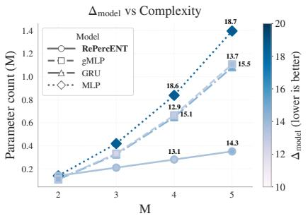

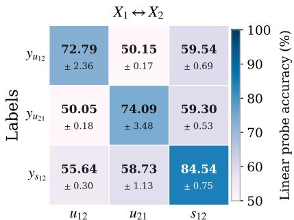

heatmap

X₁ ↔ X₂
| Labels | u₁₂ | u₂₁ | s₁₂ |
|---|---|---|---|
| yᵤ₁₂ | 72.79 ± 2.36 | 50.15 ± 0.17 | 59.54 ± 0.69 |
| yᵤ₂₁ | 50.05 ± 0.18 | 74.09 ± 3.48 | 59.30 ± 0.53 |
| yₛ₁₂ | 55.64 ± 0.30 | 58.73 ± 1.13 | 84.54 ± 0.75 |

Components   
Figure 4: Top: Synthetic performance across modality count and parameter budgets. RePercENT achieves competitive scores at substantially lower model complexity. Bottom: Linear-probe confusion matrix for M = 2.

Table 2: Cancer type prediction accuracy (%) across TCGA cohorts. In each modality block, the table compares baseline HONeYBEE embeddings with the derived disentangled components (mean ± std), highlighting the absolute performance gains, i.e., ∆ RePercent. 

<table><tr><td>Representation</td><td>BRCA</td><td>COAD</td><td>GBM</td><td>HNSC</td><td>KIRC</td><td>LGG</td><td>LUAD</td><td>LUSC</td><td>OV</td><td>PRAD</td></tr><tr><td colspan="11">WSI</td></tr><tr><td>Honeybee</td><td>95.4</td><td>32.2</td><td>41.5</td><td>18.3</td><td>48.6</td><td>22.6</td><td>26.0</td><td>14.3</td><td>36.2</td><td>29.0</td></tr><tr><td> $U_{\text{wsi,mol}}$ </td><td>79.2 ± 1.8</td><td>39.3 ± 3.7</td><td>39.8 ± 2.5</td><td>28.5 ± 3.2</td><td>61.3 ± 4.2</td><td>28.8 ± 2.6</td><td>24.2 ± 2.5</td><td>22.7 ± 1.3</td><td>47.8 ± 3.1</td><td>37.8 ± 1.9</td></tr><tr><td> $S_{\text{wsi,mol}}$ </td><td>81.6 ± 1.5</td><td>37.2 ± 4.8</td><td>39.8 ± 2.0</td><td>26.7 ± 3.0</td><td>61.1 ± 2.3</td><td>24.3 ± 2.3</td><td>26.0 ± 2.6</td><td>20.8 ± 3.1</td><td>46.9 ± 2.5</td><td>34.8 ± 2.8</td></tr><tr><td> $D_{\text{wsi,mol}}$ </td><td>79.3 ± 1.8</td><td>39.1 ± 2.7</td><td>40.2 ± 1.5</td><td>28.7 ± 2.2</td><td>63.4 ± 2.1</td><td>31.0 ± 2.8</td><td>27.8 ± 2.2</td><td>23.3 ± 1.5</td><td>51.2 ± 1.4</td><td>38.8 ± 2.8</td></tr><tr><td>Δ RePercENT</td><td>-13.8</td><td>+7.1</td><td>-1.3</td><td>+10.4</td><td>+14.8</td><td>+8.4</td><td>+1.8</td><td>+9.0</td><td>+15.0</td><td>+9.8</td></tr><tr><td colspan="11">Molecular</td></tr><tr><td>Honeybee</td><td>69.8</td><td>21.8</td><td>100.0</td><td>31.7</td><td>2.8</td><td>2.9</td><td>58.0</td><td>51.0</td><td>65.5</td><td>74.0</td></tr><tr><td> $U_{\text{mol,clin}}$ </td><td>67.9 ± 0.9</td><td>32.9 ± 3.7</td><td>98.1 ± 0.4</td><td>66.7 ± 1.9</td><td>60.6 ± 2.9</td><td>50.0 ± 2.1</td><td>51.0 ± 3.4</td><td>65.3 ± 3.8</td><td>80.3 ± 1.4</td><td>91.0 ± 0.7</td></tr><tr><td> $S_{\text{mol,clin}}$ </td><td>67.5 ± 2.9</td><td>33.6 ± 2.7</td><td>98.3 ± 0.0</td><td>66.0 ± 1.5</td><td>60.4 ± 3.1</td><td>49.2 ± 1.6</td><td>50.8 ± 4.3</td><td>66.7 ± 1.7</td><td>78.5 ± 2.9</td><td>91.8 ± 0.5</td></tr><tr><td> $D_{\text{mol,clin}}$ </td><td>70.0 ± 1.4</td><td>37.5 ± 3.1</td><td>98.3 ± 0.0</td><td>67.9 ± 1.1</td><td>62.2 ± 1.6</td><td>52.8 ± 1.8</td><td>55.4 ± 5.2</td><td>72.0 ± 2.8</td><td>79.5 ± 1.4</td><td>92.0 ± 0.0</td></tr><tr><td>Δ RePercENT</td><td>+0.2</td><td>+15.7</td><td>-1.7</td><td>+36.2</td><td>+59.4</td><td>+49.9</td><td>-2.6</td><td>+21.0</td><td>+14.8</td><td>+18.0</td></tr></table>

Table 2 compares the original HONeYBEE embeddings with the RePercENT decompositions, where $U _ { i j } , S _ { i j } .$ , and $D _ { i j } \stackrel {  } { = } U _ { i j } \oplus S _ { i j }$ denote the unique, shared, and complete decomposition of a target modality i relative to modality j. RePercENT improves prediction accuracy over HONeYBEE embeddings for most cancer types, with the largest gains observed on Molecular data. Remarkably, for KIRC and LGG, where raw molecular embeddings are nearly uninformative, the decomposed representations recover substantially higher accuracy, suggesting that cross-modal conditioning exposes predictive structure that is hidden in the original embedding space. Gains are smaller when HONeYBEE is already highly predictive, such as WSI for BRCA or molecular data for GBM. Notably, the full decomposition $D _ { i j }$ consistently outperforms both $U _ { i j }$ and $S _ { i j }$ individually, across most cancer types, challenging the assumption of multi-view redundancy.

This indicates the need for explicitly modeling the complementary information present among these modalities.

Robustness to missing modalities Figure 5 examines the robustness of different models as the fraction of available WSI samples decreases. All fusion baselines (see Appendix H.3) exhibit a clear performance drop, including those explicitly trained with modality dropout. In contrast, RePercENT maintains substantially higher Macro-F1 across all missingness levels. This behavior follows from its inference structure, which allows, both the unique information of the Molecular w.r.t. the WSI as well as the shared between the two modalities, to remain fully accessible. Notably, whenever WSI information is available, RePercENT improves over both single-modality references, further supporting the argument that there is significant complementary information between the modalities.

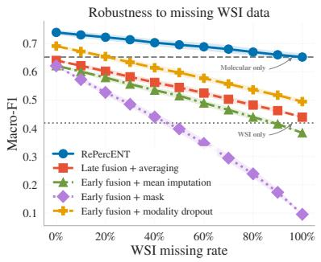

line

| WSI missing rate | RePercENT | Late fusion + averaging | Early fusion + mean imputation | Early fusion + mask | Early fusion + modality dropout |
| ---------------- | --------- | ----------------------- | ------------------------------- | ------------------- | ------------------------------- |
| 0%               | 0.72      | 0.68                    | 0.65                            | 0.63                | 0.69                            |
| 20%              | 0.71      | 0.66                    | 0.63                            | 0.60                | 0.67                            |
| 40%              | 0.70      | 0.64                    | 0.61                            | 0.55                | 0.65                            |
| 60%              | 0.69      | 0.62                    | 0.59                            | 0.50                | 0.63                            |
| 80%              | 0.68      | 0.60                    | 0.57                            | 0.45                | 0.61                            |
| 100%             | 0.67      | 0.58                    | 0.55                            | 0.40                | 0.59                            |

Figure 5: We reduce WSI availability while preserving Molecular data. Fusion baselines degrade sharply, whereas RePercENT remains robust.

# 5 Conclusion

As multimodal intelligence aims to derive representations that capture the world’s complex multimodal reality, it becomes essential to decouple the nuanced interactions across diverse modalities. In this work, we introduce RePercENT, and demonstrate that, in settings involving more than two modalities, disentangled representations are i) beneficial and ii) computationally efficient to learn, while iii) remaining theoretically grounded. Through an extensive validation of our framework across synthetic, figurative language, and complex biomedical benchmarks, we demonstrate competitive performance across diverse modalities, foundation model backbones and tasks, while scaling seamlessly as the number of modalities grows. Ultimately, we believe that RePercENT, via its flexible structure and granular representations, will help pave the way towards a more comprehensive, multimodal Perception.

# References

Tadas Baltrušaitis, Chaitanya Ahuja, and Louis-Philippe Morency. Multimodal machine learning: A survey and taxonomy. IEEE Transactions on Pattern Analysis and Machine Intelligence, 41(2): 423–443, 2019. doi: 10.1109/TPAMI.2018.2798607.   
Felix Krones, Umar Marikkar, Guy Parsons, Adam Szmul, and Adam Mahdi. Review of multimodal machine learning approaches in healthcare. An International Journal on Information Fusion, 114, 2024.   
Alec Radford, Jong Wook Kim, Chris Hallacy, Aditya Ramesh, Gabriel Goh, Sandhini Agarwal, Girish Sastry, Amanda Askell, Pamela Mishkin, Jack Clark, Gretchen Krueger, and Ilya Sutskever. Learning transferable visual models from natural language supervision. In International Conference on Machine Learning, 2021.   
Chao Jia, Yinfei Yang, Ye Xia, Yi-Ting Chen, Zarana Parekh, Hieu Pham, Quoc V. Le, Yun-Hsuan Sung, Zhen Li, and Tom Duerig. Scaling up visual and vision-language representation learning with noisy text supervision. In International Conference on Machine Learning, 2021.   
Jean-Baptiste Alayrac, Jeff Donahue, Pauline Luc, Antoine Miech, Iain Barr, Yana Hasson, Karel Lenc, Arthur Mensch, Katie Millicah, Malcolm Reynolds, Roman Ring, Eliza Rutherford, Serkan Cabi, Tengda Han, Zhitao Gong, Sina Samangooei, Marianne Monteiro, Jacob Menick, Sebastian Borgeaud, Andrew Brock, Aida Nematzadeh, Sahand Sharifzadeh, Mikolaj Binkowski, Ricardo Barreira, Oriol Vinyals, Andrew Zisserman, and Karen Simonyan. Flamingo: a visual language model for few-shot learning. In Advances in Neural Information Processing Systems, 2022.   
Paul Pu Liang, Zihao Deng, Martin Q. Ma, James Zou, Louis-Philippe Morency, and Ruslan Salakhutdinov. Factorized contrastive learning: going beyond multi-view redundancy. In Advances in Neural Information Processing Systems, 2023.   
Minyoung Huh, Brian Cheung, Tongzhou Wang, and Phillip Isola. Position: The platonic representation hypothesis. In International Conference on Machine Learning, 2024.   
Megan Tjandrasuwita, Chanakya Ekbote, Liu Ziyin, and Paul Pu Liang. Understanding the emergence of multimodal representation alignment. In International Conference on Machine Learning, 2025.   
Qilong Wu, Yiyang Shao, Jun Wang, and Xiaobo Sun. Learning optimal multimodal information bottleneck representations. In International Conference on Machine Learning, 2025.   
Chenyu Wang, Sharut Gupta, Xinyi Zhang, Sana Tonekaboni, Stefanie Jegelka, Tommi Jaakkola, and Caroline Uhler. An information criterion for controlled disentanglement of multimodal data. In International Conference on Learning Representations, 2025.   
Ian Fischer. The conditional entropy bottleneck. Entropy, 22(9):999, 2020.   
Andrew Jaegle, Felix Gimeno, Andrew Brock, Andrew Zisserman, Oriol Vinyals, and Joao Carreira. Perceiver: General perception with iterative attention. In International Conference on Machine Learning, 2021.   
Francesco Locatello, Dirk Weissenborn, Thomas Unterthiner, Aravindh Mahendran, Georg Heigold, Jakob Uszkoreit, Alexey Dosovitskiy, and Thomas Kipf. Object-centric learning with slot attention. In Advances in Neural Information Processing Systems, 2020.   
Aäron van den Oord, Yazhe Li, and Oriol Vinyals. Representation learning with contrastive predictive coding. ArXiv, abs/1807.03748, 2018.   
Marco Federici, Anjan Dutta, Patrick Forré, Nate Kushman, and Zeynep Akata. Learning robust representations via multi-view information bottleneck. In International Conference on Learning Representations, 2020.   
Ron Yosef, Yonatan Bitton, and Dafna Shahaf. Irfl: Image recognition of figurative language. In Conference on Empirical Methods in Natural Language Processing, 2023.

A. Tripathi, A. Waqas, M. B. Schabath, et al. Honeybee: enabling scalable multimodal ai in oncology through foundation model-driven embeddings. npj Digital Medicine, 8:622, 2025. doi: 10.1038/s41746-025-02003-4.   
Hanxiao Liu, Zihang Dai, David So, and Quoc V Le. Pay attention to MLPs. In Advances in Neural Information Processing Systems, 2021.   
Junyoung Chung, Caglar Gulcehre, KyungHyun Cho, and Yoshua Bengio. Empirical Evaluation of Gated Recurrent Neural Networks on Sequence Modeling, December 2014. arXiv:1412.3555 [cs].   
Paul Pu Liang, Amir Zadeh, and Louis philippe Morency. Foundations & trends in multimodal machine learning: Principles, challenges, and open questions. ACM Computing Surveys, 56:1 – 42, 2022a.   
Gemini Team, Rohan Anil, Sebastian Borgeaud, Jean-Baptiste Alayrac, Jiahui Yu, Radu Soricut, Johan Schalkwyk, Andrew M Dai, Anja Hauth, Katie Millican, et al. Gemini: a family of highly capable multimodal models. arXiv preprint arXiv:2312.11805, 2023.   
Junnan Li, Dongxu Li, Caiming Xiong, and Steven C. H. Hoi. Blip: Bootstrapping language-image pre-training for unified vision-language understanding and generation. In International Conference on Machine Learning, 2022.   
Amanpreet Singh, Ronghang Hu, Vedanuj Goswami, Guillaume Couairon, Wojciech Galuba, Marcus Rohrbach, and Douwe Kiela. Flava: A foundational language and vision alignment model. 2022 IEEE/CVF Conference on Computer Vision and Pattern Recognition (CVPR), 2021.   
Fabian Gröger, Shuo Wen, Huyen Le, and Maria Brbic. With limited data for multimodal alignment, let the STRUCTURE guide you. In Advances in Neural Information Processing Systems, 2026.   
Noël Vouitsis, Zhaoyan Liu, Satya Krishna Gorti, Valentin Villecroze, Jesse C. Cresswell, Guangwei Yu, Gabriel Loaiza-Ganem, and Maksims Volkovs. Data-efficient multimodal fusion on a single gpu. 2024 IEEE/CVF Conference on Computer Vision and Pattern Recognition (CVPR), 2023.   
Simon Kornblith, Mohammad Norouzi, Honglak Lee, and Geoffrey Hinton. Similarity of neural network representations revisited. In International Conference on Machine Learning, 2019.   
Antonio Norelli, Marco Fumero, Valentino Maiorca, Luca Moschella, Emanuele Rodolà, and Francesco Locatello. ASIF: Coupled data turns unimodal models to multimodal without training. In Advances in Neural Information Processing Systems, 2023.   
Bo Zhou, Liulei Li, Yujia Wang, Huafeng Liu, Yazhou Yao, and Wenguan Wang. Unialign: Scaling multimodal alignment within one unified model. In 2025 IEEE/CVF Conference on Computer Vision and Pattern Recognition (CVPR), 2025.   
Konstantin Hemker, Nikola Simidjievski, and Mateja Jamnik. Healnet: multimodal fusion for heterogeneous biomedical data. In Advances in Neural Information Processing Systems, 2024.   
Richard J. Chen, Tong Ding, Ming Y. Lu, et al. Towards a general-purpose foundation model for computational pathology. Nature Medicine, 30(3):850–862, 2024. doi: 10.1038/s41591-024-02857-3.   
Yingxue Xu and Hao Chen. Multimodal optimal transport-based co-attention transformer with global structure consistency for survival prediction. 2023 IEEE/CVF International Conference on Computer Vision (ICCV), 2023.   
Rohit Girdhar, Alaaeldin El-Nouby, Zhuang Liu, Mannat Singh, Kalyan Vasudev Alwala, Armand Joulin, and Ishan Misra. Imagebind one embedding space to bind them all. 2023 IEEE/CVF Conference on Computer Vision and Pattern Recognition (CVPR), 2023.   
Paul Pu Liang, Yiwei Lyu, Xiang Fan, Jeffrey Tsaw, Yudong Liu, Shentong Mo, Dani Yogatama, Louis philippe Morency, and Ruslan Salakhutdinov. High-modality multimodal transformer: Quantifying modality & interaction heterogeneity for high-modality representation learning. Transactions on Machine Learning Research, 2022b.

Xin Wang, Hong Chen, Si’ao Tang, Zihao Wu, and Wenwu Zhu. Disentangled representation learning. IEEE Transactions on Pattern Analysis and Machine Intelligence, page 9677–9696, December 2024. doi: 10.1109/TPAMI.2024.3420937.   
Aniek Eijpe, Soufyan Lakbir, Melis Erdal Cesur, Sara Pires de Oliveira, Sanne Abeln, and Wilson Silva. Disentangled and interpretable multimodal attention fusion for cancer survival prediction. In International Conference on Medical Image Computing and Computer-Assisted Intervention, 2025.   
Lu Gao, Wenlan Chen, Daoyuan Wang, Fei Guo, and Cheng Liang. Disentangled Cross-Modal Representation Learning with Enhanced Mutual Supervision. IEEE Transactions on Pattern Analysis and Machine Intelligence, 2024.   
Wenfang Yao, Kejing Yin, William K. Cheung, Jia Liu, and Jing Qin. DrFuse: Learning Disentangled Representation for Clinical Multi-Modal Fusion with Missing Modality and Modal Inconsistency. AAAI Conference on Artificial Intelligence, 2024. doi: 10.1609/aaai.v38i15.29578.   
Lucas Robinet, Ahmad Berjaoui, Ziad Kheil, and Elizabeth Cohen-Jonathan Moyal. Drim: Learning disentangled representations from incomplete multimodal healthcare data. In International Conference on Medical Image Computing and Computer-Assisted Intervention. Springer, 2024.   
Naftali Tishby, Fernando Pereira, and William Bialek. The information bottleneck method. Allerton Conference on Communication, Control and Computation, 2001. doi: 10.48550/arXiv.physics/ 0004057.   
Alessandro Achille and Stefano Soatto. Information dropout: Learning optimal representations through noisy computation. IEEE Transactions on Pattern Analysis and Machine Intelligence, page 2897–2905, December 2018. doi: 10.1109/TPAMI.2017.2784440.   
Yonglong Tian, Chen Sun, Ben Poole, Dilip Krishnan, Cordelia Schmid, and Phillip Isola. What makes for good views for contrastive learning? In Advances in Neural Information Processing Systems, 2020.   
John N Weinstein, Eric A Collisson, Gordon B Mills, Kenna R Shaw, Brad A Ozenberger, Kyle Ellrott, Ilya Shmulevich, Chris Sander, and Joshua M Stuart. The cancer genome atlas pan-cancer analysis project. Nature Genetics, 45(10):1113–1120, 2013.   
An Yang, Anfeng Li, Baosong Yang, Beichen Zhang, Binyuan Hui, Bo Zheng, Bowen Yu, Chang Gao, Chengen Huang, Chenxu Lv, Chujie Zheng, Dayiheng Liu, Fan Zhou, Fei Huang, Feng Hu, Hao Ge, Haoran Wei, Huan Lin, Jialong Tang, Jian Yang, Jianhong Tu, Jianwei Zhang, Jianxin Yang, Jiaxin Yang, Jingren Zhou, Jingren Zhou, Junyan Lin, Kai Dang, Keqin Bao, Ke-Pei Yang, Le Yu, Li-Chun Deng, Mei Li, Min Xue, Mingze Li, Pei Zhang, Peng Wang, Qin Zhu, Rui Men, Ruize Gao, Shi-Qiang Liu, Shuang Luo, Tianhao Li, Tianyi Tang, Wenbiao Yin, Xingzhang Ren, Xinyu Wang, Xinyu Zhang, Xuancheng Ren, Yang Fan, Yang Su, Yi-Chao Zhang, Yinger Zhang, Yu Wan, Yuqiong Liu, Zekun Wang, Zeyu Cui, Zhenru Zhang, Zhipeng Zhou, and Zihan Qiu. Qwen3 technical report, 2025.   
Asim Waqas, Aakash Tripathi, Sabeen Ahmed, Ashwin Mukund, Hamza Farooq, Matthew B Schabath, Paul Stewart, Mia Naeini, and Ghulam Rasool. Senmo: A self-normalizing deep learning model for enhanced multi-omics data analysis in oncology. arXiv preprint arXiv:2405.08226, 2024.

# Appendix Contents

A Useful Notation 14   
B Supplementary Related Work 14   
C Limitations and future directions 15   
D Impact Statement 15   
E Information Theory Background 15

E.1 Basic quantities and identities 15   
E.2 Multi-view redundancy 16   
E.3 Minimum Necessary Information . . . 16   
E.4 Information gap under unattainable MNI 17

F Proofs 17

F.1 Proof of Theorem 1 17   
F.2 Proof of Theorem 2 19

G Framework Implementation Details 21

G.1 Slot assignment in latent array H 21   
G.2 Group slot attention 22   
G.3 Training objectives . . . 22

H Experimental Details 23

H.1 Synthetic data creation 23   
H.2 IRFL overview 26   
H.3 TCGA dataset extraction 27   
H.4 Computational Resources 30

Additional Experiments 30

I.1 Synthetic Dataset . . . 30   
I.2 IRFL . 38   
I.3 HONeYBEE 38

# A Useful Notation

Table 3: Notation summary. 

<table><tr><td>Symbol</td><td>Meaning</td></tr><tr><td colspan="2">Sets and Indices</td></tr><tr><td>M</td><td>Total number of modalities</td></tr><tr><td> $\mathcal{M}$ </td><td>Modality index set  $\{1,\dots,M\}$ </td></tr><tr><td> $\mathcal{E}$ </td><td>Set of all unique modality pairs  $\{(i,j)\in\mathcal{M}^{2}:i</td></tr><tr><td>\( A\subseteq\mathcal{M}$ </td><td>A non-empty subset of modalities</td></tr><tr><td> $\mathcal{A}_{ij}^{u},\mathcal{A}_{ij}^{s}$ </td><td>Index sets for atomic components unique to  $i$  (w.r.t  $j$ ) or shared by  $\{i,j\}$ </td></tr><tr><td colspan="2">Representations and Components</td></tr><tr><td> $X_{i}$ </td><td>Input modality  $i$ </td></tr><tr><td> $Z_{i}$ </td><td>Composite latent representation for modality  $i$ </td></tr><tr><td> $z_{A}$ </td><td>Atomic representation associated with subset  $A$ </td></tr><tr><td> $\mathbf{u}_{ij},\mathbf{s}_{ij}$ </td><td>Unique and shared latent components for modality  $i$  relative to modality  $j$ </td></tr><tr><td> $\theta_{ij}$ </td><td>Optimization variable as a collection of all pairwise components ( $u_{ij},u_{ji},s_{ij},s_{ji}$ )</td></tr><tr><td colspan="2">Architectural Elements</td></tr><tr><td> $\mathcal{D}_{i}$ </td><td>Disentangling module for modality  $i$ </td></tr><tr><td> $\mathcal{H}_{i}$ </td><td>Latent-slot array ( $\mathbb{R}^{N\times D_{l}}$ )</td></tr><tr><td> $h_{ik}$ </td><td>The  $k$ -th individual row of  $\mathcal{H}_{i}$ </td></tr><tr><td> $\phi_{i}$ </td><td>Mapping function from latent slots to pairwise components for modality  $i$ </td></tr><tr><td colspan="2">Hyperparameters</td></tr><tr><td> $\alpha$ </td><td>Weighting parameter between unique and shared losses</td></tr><tr><td> $\beta$ </td><td>Penalty parameter for shared component coverage</td></tr><tr><td> $\lambda$ </td><td>Penalty parameter for redundancy between unique and shared components</td></tr></table>

# B Supplementary Related Work

Multimodal representation learning has revolutionized the way we process and integrate information coming from different modalities [Liang et al., 2022a, Krones et al., 2024]. Recent advances in multimodal foundation models [Team et al., 2023, Li et al., 2022, Singh et al., 2021] reflect a growing trend toward flexible, general-purpose AI systems. However, these models typically require large amounts of paired data and extensive pre-training, making them difficult to apply in domains, such as medicine, where paired multimodal data are limited.

To address this limitation, several approaches have been proposed, such as STRUCTURE [Gröger et al., 2026] and FuseMix [Vouitsis et al., 2023], that align representations into a shared space using frozen foundation models in low-data regimes. Complementary, training-free approaches have also been explored. For instance, Centered Kernel Alignment (CKA) [Kornblith et al., 2019] provides a way to compare representation spaces without additional training, while ASIF [Norelli et al., 2023] constructs a common multimodal space from paired anchor data. On the other hand, UniAlign by Zhou et al. [2025], improves scalability by using a single encoder to align diverse modalities.

While alignment approaches improve efficiency and exploit the expressive power of foundation models, they mainly capture shared cross-modal information. Fusion methods overcome this [Hemker et al., 2024, Chen et al., 2024, Xu and Chen, 2023], by leveraging joint representations that additionally encode complementary information across modalities. ImageBind [Girdhar et al., 2023] is another notable example that learns a joint embedding space for six different modalities, showing that not all modality-pairs need to be observed. Additionally, Liang et al. [2022b] propose HighMMT that learns efficient-joint representations, by scaling multimodal transformers to many modalities and measuring modality and interaction heterogeneity to guide parameter sharing.

Despite their success, fusion methods usually result to less interpretable representations, and face a difficulty in handling missing modalities. A promising, recent direction to address this is through disentanglement [Wang et al., 2024], where the different modality-interactions are explicitly encoded in separate representations. For example, DIMAF [Eijpe et al., 2025] models shared and specific components between spatial transcriptomics and histology, improving downstream performance and interpretability. Gao et al. [2024], DrFuse [Yao et al., 2024], and DRIM [Robinet et al., 2024] further explore disentangled fusion under incomplete-modality settings, while FactorCL [Liang et al., 2023] formalizes multi-view redundancy and separates shared from unique task-relevant information. More recently, Wang et al. [2025] propose information-theoretic criteria for controlled two-modality disentanglement.

# C Limitations and future directions

Although RePercENT provides a scalable and theoretically grounded framework for high-modality disentanglement, it also reveals several promising directions for future extensions. Our formulation focuses on pairwise unique and shared components, which provide a provably sufficient granularity for modeling the interactions considered in this work. While this choice comes with favorable scaling and formal guarantees, future work includes modeling richer, higher order interactions among three or more modalities through more expressive decompositions.

In addition, our practical implementation depends on the quality of the pre-extracted modality embeddings. Using foundation models provides strong representations and enables a plug-and-play design; however, it also inherits the trade-off between expressivity and compression [Tishby et al., 2001]. This motivates future work on end-to-end training, in applications with sufficient data, which could yield more complete representations. Another promising direction is to dynamically balance the objectives across modality pairs, potentially improving optimization efficiency and the quality of the learned disentangled components. Finally, having a structured disentangled decomposition opens an exciting path toward more interpretable multimodal models, motivating future work to examine how these components encode, exchange, and use information to shape the model’s predictions for different downstream tasks.

# D Impact Statement

The primary objective of this paper is to advance multimodal representation learning under a flexible framework that extracts disentangled pairwise unique and shared components, with applications spanning figurative language, and biomedical research. While this development has the potential to bring about both positive and negative societal or ethical impacts, particularly in areas like biomedical research, we currently do not foresee any immediate societal concerns associated with the proposed methodology.

# E Information Theory Background

In this section we include useful definitions, and key background elements on which we build upon our information theory objectives.

# E.1 Basic quantities and identities

We begin with some basic notions from classical information theory as well as some key inequalities that have been essential for the proofs that follow.

Mutual information (MI) Let $( X , Y )$ be a set of continuous random variables over the space $\mathcal { X } \times \mathcal { Y }$ . The mutual information $I ( X ; Y )$ is defined as:

$$
I (X; Y) = \iint_ {\mathcal {X} \times \mathcal {Y}} p _ {X, Y} (x, y) \log \left(\frac {p _ {X , Y} (x , y)}{p _ {X} (x) p _ {Y} (y)}\right) d x d y = D _ {K L} (p _ {X, Y} \parallel p _ {X} p _ {Y})
$$

where $p _ { X , Y }$ is the joint probability density function of X, Y , pX and pY are the marginal probability density functions of X and Y respectively, and $D _ { K L }$ is the Kullback-Leibler divergence. Intuitively, MI measures how much knowing one of these variables reduces uncertainty about the other.

Conditional mutual information (CMI) Let $X , Y$ and Z be three continuous random variables over the spaces $\mathcal { X } , \mathcal { y }$ and Z. The conditional mutual information (CMI) $I ( X ; Y \mid Z )$ is denoted as:

$$
\begin{array}{l} I (X; Y) = \iiint_ {\mathcal {X} \times \mathcal {Y} \times \mathcal {Z}} p _ {X, Y, Z} (x, y, z) \log \left(\frac {p _ {X , Y , Z} (x , y , z) p _ {Z} (z)}{p _ {X , Z} (x , z) p _ {Y , Z} (y , z)}\right) d x d y d z \\ = \int_ {\mathcal {Z}} D _ {K L} (p _ {(X, Y) | Z} \mid \mid p _ {X | Z} \otimes p _ {Y | Z}) d z, \\ \end{array}
$$

where all the conditional, marginal and joint probability distributions are denoted as p with the corresponding subscript. Similarly to the MI, CMI expresses the mutual information between X and Y when conditioning on a third variable Z.

Useful properties We present below several useful identities & inequalities, used extensively in the following proofs.

• $I ( X ; Y ) \ge 0$ , non-negativity of MI   
• $I ( X ; Y \mid Z ) \ge 0 .$ , non-negativity of CMI   
• $I ( X ; Y ) = I ( Y ; X )$ , symmetry   
• $I ( X ; Y , Z ) = I ( X ; Y \mid Z ) + I ( X ; Z )$ , chain rule of MI   
$\bullet I ( X ; Y ) - I ( X ; Z ) = I ( X ; Y \mid Z ) - I ( X ; Z \mid Y )$

The last one is derived, by applying the chain rule of MI in its two equivalent forms.

# E.2 Multi-view redundancy

We extend the notion of multi-view redundancy, proposed by Liang et al. [2023], to the general multimodal setting as follows:

Definition E.1. Multi-view redundancy: Let $\mathcal { X } = \{ X _ { 1 } , X _ { 2 } , \ldots , X _ { M } \}$ be a set of M modalities, and $Y$ a downstream task. Let also, $\boldsymbol { X _ { - i } } = \left\{ X _ { 1 } , \ldots , X _ { i - 1 } , X _ { i + 1 } , \ldots X _ { M } \right\}$ represent the set of all modalities except $X _ { i }$ . We say that multi-view redundancy holds, if there exists sufficiently small $\epsilon > 0$ , such that:

$$
I (X _ {- i}; Y \mid X _ {i}) <   \epsilon , \quad \forall i \in \mathcal {M}.
$$

This formulation implies that each $X _ { i }$ captures sufficient information to perform the task Y and any complementary information from the remaining modalities offers insignificant predictive gain.

# E.3 Minimum Necessary Information

In the simpler unimodal case, assume a dataset $( X , Y )$ with observations X and target labels Y . Given the Markov structure $Z  X  Y$ , we want to derive representations Z that capture useful information from X that is relevant to task Y [Tishby et al., 2001]. As introduced by Fischer [2020], the Minimum Necessary Information (MNI) criterion for a representation $Z$ is satisfied, when i) the representation $Z$ attains all the necessary information from X to perform $Y ,$ , and ii) given all the possible representations Z that solve the task Y , the desired Z needs to be minimal, i.e. achieve inf $\dot { \boldsymbol { z } } _ { E \Xi Z } I ( \bar { Z } ; X , Y )$ . In other words, at the MNI point it holds:

$$
I (X; Y) = I (X; Z) = I (Y; Z) \tag {8}
$$

When extending this idea to the multimodal self-supervised setting, according to Wang et al. [2025], let us take the observations $( X _ { i } , X _ { j } )$ from two separate modalities. We would like to derive the representations $s _ { i j }$ and $s _ { j i } .$ , respecting the Markov structures: $s _ { i j }  X _ { i }  X _ { j }$ and $s _ { j i }  X _ { j }  X _ { i } .$ , that optimally balance between expressivity and compression. In other words, $s _ { i j }$ is desired to capture all the necessary information from $X _ { i }$ that is shared with $X _ { j } ,$ while minimizing redundancy with $X _ { i } .$ . The same holds for $s _ { j i }$ . Formally, when the MNI point is attainable, $s _ { i j }$ and $s _ { j i }$ satisfy,

$$
I (s _ {i j}; X _ {i}) = I (s _ {i j}; X _ {j}) = I (X _ {i}; X _ {j}), \qquad I (s _ {j i}; X _ {i}) = I (s _ {j i}; X _ {j}) = I (X _ {i}; X _ {j}).
$$

# E.4 Information gap under unattainable MNI

In real world scenarios, the MNI point described in Eq. E.3 is not always attainable, and therefore Wang et al. [2025] propose the following definition for extracting the optimal shared representations $s _ { i j }$ and $s _ { j i } \colon$

$$
\begin{array}{l} s _ {i j} ^ {*} \in \arg \min _ {s _ {i j}} I \left(s _ {i j}; X _ {i} \mid X _ {j}\right), \quad \text {s.t.} I \left(X _ {i}; X _ {j}\right) - I \left(s _ {i j}; X _ {j}\right) \leq \delta_ {c}, \\ * \in \dots , \therefore I (\dots , X _ {i} \mid X _ {j}) = t, I (X _ {i}, X _ {j}) = I (\dots , X _ {j}) <   s. \end{array} \tag {9}
$$

$$
s _ {j i} ^ {*} \in \arg \min _ {s _ {j i}} I (s _ {j i}; X _ {j} \mid X _ {i}), \quad \text { s.t. } I (X _ {i}; X _ {j}) - I (s _ {j i}; X _ {i}) \leq \delta_ {c}.
$$

Minimizing $I ( s _ { i j } ; X _ { i } \mid X _ { j } )$ penalizes information retained by $s _ { i j }$ about $X _ { i }$ that is not explained by $X _ { j }$ . The constraint, on the other hand, ensures that $s _ { i j }$ preserves nearly all shared information between $X _ { i }$ and $X _ { j } ,$ , up to an information gap $\delta _ { c }$ . The same interpretation applies symmetrically to $s _ { j i }$ . Notice that if MNI was always attainable, we could substitute $I ( X _ { i } ; \bar { X _ { j } } ) - I ( \bar { s } _ { i j } ; X _ { j } ) \le \delta _ { c }$ with $I ( X _ { i } ; X _ { j } ) = I ( s _ { i j } ; X _ { j } )$ , as suggested by Achille and Soatto [2018]. However when MNI is unattainable, this leads to a suboptimal solution and therefore the parameter $\delta _ { c }$ is introduced, which controls the gap between capturing the complete shared information and having a compressed representation. Using the Lagrangian formulation of constrained problem in Eq. (9), we end up with the first part of the optimal step-by-step optimization objective:

$$
s _ {i j} ^ {*} \in \arg \max _ {s _ {i j}} \mathcal {L} _ {s _ {i}} ^ {o} = \arg \max _ {s _ {i j}} I (s _ {i j}; X _ {j}) - \beta I (s _ {i j}; X _ {i} \mid X _ {j}), \tag {10}
$$

$$
s _ {j i} ^ {*} \in \arg \max _ {s _ {j i}} \mathcal {L} _ {s _ {j}} ^ {o} = \arg \max _ {s _ {j i}} I (s _ {j i}; X _ {i}) - \beta   I (s _ {j i}; X _ {j} \mid X _ {i}).
$$

Here, $\beta > 0$ controls the trade-off between preserving cross-modal shared information and removing modality-specific information. As shown by Wang et al. [2025], when MNI is attainable, then for any positive $\beta _ { v }$ , maximizing the objective $\mathcal { L } _ { i } ^ { o }$ achieves MNI, and there exists a bijective mapping from $\dot { \boldsymbol { \beta } }$ in $\mathcal { L } _ { s _ { i } } ^ { o }$ to the value of the information constraint $\delta _ { c }$ as defined in Eq. (9).

# F Proofs

# F.1 Proof of Theorem 1

Theorem 1. Exact optimality under attainable MNI: Let $\theta _ { i j } ^ { * } = ( u _ { i j } ^ { * } , u _ { i i } ^ { * } , s _ { i j } ^ { * } , s _ { j i } ^ { * } )$ be an optimal solution of the step-by-step optimization problem defined in Eqs. (6) and (7). If the MNI criterion is attainable and $\alpha > \lambda$ , then $\theta _ { i j } ^ { * }$ is a global optimizer of the joint objective defined in Eqs. (1) - (3). Equivalently,

$$
\theta_ {i j} ^ {*} \in \arg \max _ {\theta_ {i j}} \mathcal {J} (\theta_ {i j}).
$$

Proof. Let $( s _ { i j } ^ { * } , s _ { j i } ^ { * } )$ and $( u _ { i j } ^ { * } , u _ { j i } ^ { * } )$ denote the optimal shared and unique representations obtained from the step-by-step optimization in Eqs. (6) and (7) respectively. We proceed by deriving an upper bound on the joint objective and then showing that this bound is attained at $\theta ^ { * }$ when MNI is attainable.

We begin with the term $\mathcal { L } _ { u } .$ i in the joint objective:

$$
\begin{array}{l} \mathcal {L} _ {u _ {i}} = I (u _ {i j}, s _ {j i}; X _ {i}) - \lambda I (u _ {i j}; s _ {j i}) \\ = I (u _ {i j}, s _ {j i}; X _ {i}) - \lambda I (u _ {i j}; s _ {j i}) \pm \lambda I (u _ {i j}; X _ {j}) \\ \leq I (u _ {i j}, X _ {j}; X _ {i}) - \lambda I (u _ {i j}; X _ {j}) + \lambda \big [ I (u _ {i j}; X _ {j}) - I (u _ {i j}; s _ {j i}) \big ]. \tag {11} \\ \end{array}
$$

The inequality follows from

$$
I (u _ {i j}, s _ {j i}; X _ {i}) \leq I (u _ {i j}, X _ {j}; X _ {i}),
$$

which holds due to the Markov relation $s _ { j i }  X _ { j }  X _ { i }$ .

Next, we use the identity

$$
I (u _ {i j}; X _ {j}) - I (u _ {i j}; s _ {j i}) = I (u _ {i j}; X _ {j} \mid s _ {j i}) - I (u _ {i j}; s _ {j i} \mid X _ {j}). \tag {12}
$$

Since the joint distribution factorizes according to the Markov structure

$$
s _ {j i} \leftarrow X _ {j} \leftrightarrow X _ {i} \rightarrow u _ {i j},
$$

we have $u _ { i j } \perp s _ { j i } \mid X _ { j }$ , and therefore

$$
I (u _ {i j}; s _ {j i} \mid X _ {j}) = 0.
$$

Hence Eq. (12) becomes

$$
\begin{array}{l} I (u _ {i j}; X _ {j}) - I (u _ {i j}; s _ {j i}) = I (u _ {i j}; X _ {j} \mid s _ {j i}) \\ \leq I \left(X _ {i}; X _ {j} \mid s _ {j i}\right), \quad \text { by } u _ {i j} \leftarrow X _ {i} \leftrightarrow X _ {j} \\ = I (X _ {i}; X _ {j}, s _ {j i}) - I (X _ {i}; s _ {j i}) \\ = I (X _ {i}; X _ {j}) - I (X _ {i}; s _ {j i}), \quad \text { by } s _ {j i} \leftarrow X _ {j} \leftrightarrow X _ {i}. \tag {13} \\ \end{array}
$$

Substituting Eq. (13) into Eq. (11) yields

$$
\begin{array}{l} \mathcal {L} _ {u _ {i}} \leq \left[ I (u _ {i j}, X _ {j}; X _ {i}) - \lambda I (u _ {i j}; X _ {j}) \right] + \lambda I (X _ {i}; X _ {j}) - \lambda I (X _ {i}; s _ {j i}) \\ = \mathbf {B} _ {u _ {i}} - \lambda I (X _ {i}; s _ {j i}) + c, \tag {14} \\ \end{array}
$$

where

$$
\mathbf {B} _ {u _ {i}} := I (u _ {i j}, X _ {j}; X _ {i}) - \lambda I (u _ {i j}; X _ {j}), \quad c := \lambda I (X _ {i}; X _ {j}) \geq 0.
$$

By symmetry, the same argument gives

$$
\mathcal {L} _ {u _ {j}} \leq \mathbf {B} _ {u _ {j}} - \lambda I (X _ {j}; s _ {i j}) + c, \tag {15}
$$

where

$$
\mathbf {B} _ {u _ {j}} := I (u _ {j i}, X _ {i}; X _ {j}) - \lambda I (u _ {j i}; X _ {i}).
$$

We now combine these bounds in the full joint objective:

$$
\begin{array}{l} \mathcal {J} = \alpha (\mathcal {L} _ {s _ {i}} + \mathcal {L} _ {s _ {j}}) + \mathcal {L} _ {u _ {i}} + \mathcal {L} _ {u _ {j}} \\ \leq \alpha (\mathcal {L} _ {s _ {i}} + \mathcal {L} _ {s _ {j}}) + \mathbf {B} _ {u _ {i}} + \mathbf {B} _ {u _ {j}} + 2 c - \lambda I (X _ {i}; s _ {j i}) - \lambda I (X _ {j}; s _ {i j}). \tag {16} \\ \end{array}
$$

Define the modified shared objectives

$$
\tilde {\mathcal {L}} _ {s _ {i}} := \alpha \mathcal {L} _ {s _ {i}} - \lambda I (X _ {j}; s _ {i j}), \tag {17}
$$

and

$$
\tilde {\mathcal {L}} _ {s _ {j}} := \alpha \mathcal {L} _ {s _ {j}} - \lambda I (X _ {i}; s _ {j i}). \tag {18}
$$

Using the definition of $\mathcal { L } _ { s _ { i } }$ , we obtain

$$
\begin{array}{l} \tilde {\mathcal {L}} _ {s _ {i}} = \alpha \left[ I (s _ {i j}; X _ {j}) - \beta I (s _ {i j}; X _ {i} \mid X _ {j}) \right] - \lambda I (X _ {j}; s _ {i j}) \\ = (\alpha - \lambda) I (s _ {i j}; X _ {j}) - \alpha \beta I (s _ {i j}; X _ {i} \mid X _ {j}) \\ \leq (\alpha - \lambda) I (X _ {i}; X _ {j}), \quad \text { for   } \alpha \geq \lambda , \tag {19} \\ \end{array}
$$

where the last step follows from

$$
I (s _ {i j}; X _ {j}) \leq I (X _ {i}; X _ {j})
$$

by the assumed Markov structure, together with the non-negativity of conditional mutual information.

By symmetry,

$$
\tilde {\mathcal {L}} _ {s _ {j}} \leq (\alpha - \lambda) I (X _ {i}; X _ {j}). \tag {20}
$$

Substituting Eqs. (19) and (20) into Eq. (16) gives

$$
\mathcal {J} \leq 2 (\alpha - \lambda) I (X _ {i}; X _ {j}) + \mathbf {B} _ {u _ {i}} + \mathbf {B} _ {u _ {j}} + 2 c, \quad \forall u _ {i j}, u _ {j i}. \tag {21}
$$

We now show that this bound is attained at the step-by-step shared optimum when MNI is attainable. Since $s _ { i j } ^ { * }$ and $s _ { j i } ^ { * }$ satisfy the MNI criterion, we have

$$
I (s _ {i j} ^ {*}; X _ {j}) = I (s _ {i j} ^ {*}; X _ {i}) = I (X _ {i}; X _ {j}), \qquad I (s _ {j i} ^ {*}; X _ {i}) = I (s _ {j i} ^ {*}; X _ {j}) = I (X _ {i}; X _ {j}),
$$

and therefore

$$
I (s _ {i j} ^ {*}; X _ {i} \mid X _ {j}) = 0, \qquad I (s _ {j i} ^ {*}; X _ {j} \mid X _ {i}) = 0
$$

as well as,

$$
I (u _ {i j}; X _ {j} \mid s _ {j i} ^ {*}) = I (X _ {i}; X _ {j} \mid s _ {j i} ^ {*}), \qquad I (u _ {j i}; X _ {i} \mid s _ {i j} ^ {*}) = I (X _ {j}; X _ {i} \mid s _ {i j} ^ {*}).
$$

Moreover, Proposition 3 by Wang et al. [2025] implies that, in the attainable-MNI regime,

$$
I (u _ {i j}, s _ {j i} ^ {*}; X _ {i}) = I (u _ {i j}, X _ {j}; X _ {i}), \qquad I (u _ {j i}, s _ {i j} ^ {*}; X _ {j}) = I (u _ {j i}, X _ {i}; X _ {j}).
$$

It follows that all inequalities above become equalities when $( s _ { i j } , s _ { j i } ) = ( s _ { i j } ^ { * } , s _ { j i } ^ { * } )$ . Hence

$$
\mathcal {J} = 2 (\alpha - \lambda) I (X _ {i}; X _ {j}) + \mathbf {B} _ {u _ {i}} + \mathbf {B} _ {u _ {j}} + 2 c
$$

$$
= 2 \alpha I (X _ {i}; X _ {j}) + \mathbf {B} _ {u _ {i}} + \mathbf {B} _ {u _ {j}}, \quad c = \lambda I (X _ {i}; X _ {j}). \tag {22}
$$

Since the term $2 \alpha I ( X _ { i } ; X _ { j } )$ is constant with respect to $u _ { i j }$ and $u _ { j i }$ , maximizing J is equivalent to maximizing

$$
\mathbf {B} _ {u _ {i}} + \mathbf {B} _ {u _ {j}}.
$$

Furthermore, $\mathbf { B } _ { u _ { i } }$ depends only on $u _ { i j }$ , while $\mathbf { B } _ { u _ { j } }$ depends only on $u _ { j i }$ . Therefore the maximization decouples as

$$
\arg \max _ {u _ {i j}, u _ {j i}} \left(\mathbf {B} _ {u _ {i}} + \mathbf {B} _ {u _ {j}}\right) = \arg \max _ {u _ {i j}} \mathbf {B} _ {u _ {i}} \times \arg \max _ {u _ {j i}} \mathbf {B} _ {u _ {j}}.
$$

By construction, this is exactly the optimization problem for the unique components in Eq. (3) under attainable MNI. Therefore the step-by-step optimizer $( u _ { i j } ^ { * } , u _ { j i } ^ { * } )$ also maximizes the joint surrogate objective. Consequently,

$$
\theta_ {i j} ^ {*} \in \arg \max _ {\theta_ {i j}} \mathcal {J} (\theta_ {i j}),
$$

which proves the claim.

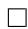

# F.2 Proof of Theorem 2

Theorem 2. Near-optimality under unattainable MNI: Let $\theta _ { i j } ^ { * } = ( u _ { i j } ^ { * } , u _ { j i } ^ { * } , s _ { i j } ^ { * } , s _ { j i } ^ { * } )$ be an optimal solution of the ideal step-by-step optimizer as stated in Eqs. $( 6 ) - ( 7 ) ,$ , and $\hat { \theta } _ { i j }$ the corresponding optimal solution of the joint optimization problem, as stated in Eqs. $\bar { ( \mathbf { \xi } ) } - \bar { ( \mathbf { \xi } ) }$ . If MNI is unattainable, any maximizer $\hat { \theta } _ { i j }$ of the joint objective satisfies

$$
\mathcal {J} (\hat {\theta} _ {i j}) \geq \mathcal {J} ^ {o} (\theta_ {i j} ^ {*}) - 2 (1 + \lambda) \delta_ {c},
$$

where,

$$
\mathcal {J} ^ {o} (\theta_ {i j} ^ {*}) = \alpha \mathcal {L} _ {s _ {i}} ^ {o} (\theta_ {i j} ^ {*}) + \alpha \mathcal {L} _ {s _ {j}} ^ {o} (\theta_ {i j} ^ {*}) + \mathcal {L} _ {u _ {i}} ^ {o} (\theta_ {i j} ^ {*}) + \mathcal {L} _ {u _ {j}} ^ {o} (\theta_ {i j} ^ {*}),
$$

and $\delta _ { c }$ denotes the information-gap term introduced in Wang et al. [2025], which quantifies the trade-off between coverage and redundancy in the shared representations.

Proof. Assume now that MNI is unattainable. Let

$$
\theta_ {i j} ^ {*} = (u _ {i j} ^ {*}, u _ {j i} ^ {*}, s _ {i j} ^ {*}, s _ {j i} ^ {*})
$$

denote the solution of the ideal step-by-step optimization problem defined in Eqs. (2) and (3), i.e.,

$$
s _ {i j} ^ {*} \in \arg \max _ {s _ {i j}} \mathcal {L} _ {s _ {i}} ^ {o} = \arg \max _ {s _ {i j}} \Big [ I (s _ {i j}; X _ {j}) - \beta   I (s _ {i j}; X _ {i} \mid X _ {j}) \Big ],
$$

$$
s _ {j i} ^ {*} \in \arg \max _ {s _ {j i}} \mathcal {L} _ {s _ {j}} ^ {o} = \arg \max _ {s _ {j i}} \Big [ I (s _ {j i}; X _ {i}) - \beta   I (s _ {j i}; X _ {j} \mid X _ {i}) \Big ],
$$

$$
u _ {i j} ^ {*} \in \arg \max _ {u _ {i j}} \mathcal {L} _ {u _ {i}} ^ {o} = \arg \max _ {u _ {i j}} \Big [ I (u _ {i j}, X _ {j}; X _ {i}) - \lambda I (u _ {i j}; s _ {i j} ^ {*}) \Big ],
$$

$$
u _ {j i} ^ {*} \in \arg \max _ {u _ {j i}} \mathcal {L} _ {u _ {j}} ^ {o} = \arg \max _ {u _ {j i}} \Big [ I (u _ {j i}, X _ {i}; X _ {j}) - \lambda I (u _ {j i}; s _ {j i} ^ {*}) \Big ].
$$

We define the corresponding ideal reweighted value at $\theta _ { i j } ^ { * }$ as

$$
\mathcal {J} ^ {o} (\theta_ {i j} ^ {*}) = \alpha I (s _ {i j} ^ {*}; X _ {j}) - \alpha \beta I (s _ {i j} ^ {*}; X _ {i} \mid X _ {j})
$$

$$
+ \alpha I (s _ {j i} ^ {*}; X _ {i}) - \alpha \beta I (s _ {j i} ^ {*}; X _ {j} \mid X _ {i})
$$

$$
+ I (u _ {i j} ^ {*}, X _ {j}; X _ {i}) - \lambda I (u _ {i j} ^ {*}; s _ {i j} ^ {*})
$$

$$
+ I (u _ {j i} ^ {*}, X _ {i}; X _ {j}) - \lambda I (u _ {j i} ^ {*}; s _ {j i} ^ {*}).
$$

Equivalently,

$$
\mathcal {J} ^ {o} (\theta_ {i j} ^ {*}) = \alpha \mathcal {L} _ {s _ {i}} ^ {o} (\theta_ {i j} ^ {*}) + \alpha \mathcal {L} _ {s _ {j}} ^ {o} (\theta_ {i j} ^ {*}) + \mathcal {L} _ {u _ {i}} ^ {o} (\theta_ {i j} ^ {*}) + \mathcal {L} _ {u _ {j}} ^ {o} (\theta_ {i j} ^ {*}).
$$

Next, for an arbitrary feasible point

$$
\theta_ {i j} = (u _ {i j}, u _ {j i}, s _ {i j}, s _ {j i}),
$$

the joint objective is

$$
\begin{array}{l} \mathcal {J} (\theta_ {i j}) = \alpha I (s _ {i j}; X _ {j}) - \alpha \beta I (s _ {i j}; X _ {i} \mid X _ {j}) \\ + \alpha I (s _ {j i}; X _ {i}) - \alpha \beta I (s _ {j i}; X _ {j} \mid X _ {i}) \\ + I (u _ {i j}, s _ {j i}; X _ {i}) - \lambda I (u _ {i j}; s _ {j i}) \\ + I (u _ {j i}, s _ {i j}; X _ {j}) - \lambda I (u _ {j i}; s _ {i j}). \\ \end{array}
$$

Let

$$
\hat {\theta} _ {i j} \in \arg \max _ {\theta_ {i j}} \mathcal {J} (\theta_ {i j}).
$$

By definition of $\hat { \theta } _ { i j }$ , we have

$$
\mathcal {J} (\hat {\theta} _ {i j}) \geq \mathcal {J} (\theta_ {i j} ^ {*}), \quad \hat {\theta} _ {i j} \in \arg \max _ {\theta_ {i j}} \mathcal {J} (\theta_ {i j}). \tag {23}
$$

Evaluating the joint objective at $\theta _ { i j } ^ { * }$ , we obtain

$$
\begin{array}{l} \mathcal {J} (\theta_ {i j} ^ {*}) = \alpha I (s _ {i j} ^ {*}; X _ {j}) - \alpha \beta I (s _ {i j} ^ {*}; X _ {i} \mid X _ {j}) \\ + \alpha I (s _ {j i} ^ {*}; X _ {i}) - \alpha \beta I (s _ {j i} ^ {*}; X _ {j} \mid X _ {i}) \\ + I (u _ {i j} ^ {*}, s _ {j i} ^ {*}; X _ {i}) - \lambda I (u _ {i j} ^ {*}; s _ {j i} ^ {*}) \\ + I (u _ {j i} ^ {*}, s _ {i j} ^ {*}; X _ {j}) - \lambda I (u _ {j i} ^ {*}; s _ {i j} ^ {*}). \\ \end{array}
$$

We now consider the difference between the ideal reweighted value and the joint objective at $\theta _ { i j } ^ { * }$ :

$$
\begin{array}{l} \mathcal {J} ^ {o} (\theta_ {i j} ^ {*}) - \mathcal {J} (\theta_ {i j} ^ {*}) = \Big [ I (u _ {i j} ^ {*}, X _ {j}; X _ {i}) - I (u _ {i j} ^ {*}, s _ {j i} ^ {*}; X _ {i}) \Big ] \\ + \left[ I (u _ {j i} ^ {*}, X _ {i}; X _ {j}) - I (u _ {j i} ^ {*}, s _ {i j} ^ {*}; X _ {j}) \right] \\ + \lambda \left[ I (u _ {i j} ^ {*}; s _ {j i} ^ {*}) - I (u _ {i j} ^ {*}; s _ {i j} ^ {*}) \right] \\ + \lambda \left[ I \left(u _ {j i} ^ {*}; s _ {i j} ^ {*}\right) - I \left(u _ {j i} ^ {*}; s _ {j i} ^ {*}\right) \right]. \\ \end{array}
$$

For brevity, we define

$$
\Delta_ {u _ {i}} := I (u _ {i j} ^ {*}, X _ {j}; X _ {i}) - I (u _ {i j} ^ {*}, s _ {j i} ^ {*}; X _ {i}), \qquad \Lambda_ {u _ {i}} := I (u _ {i j} ^ {*}; s _ {j i} ^ {*}) - I (u _ {i j} ^ {*}; s _ {i j} ^ {*}),
$$

and similarly

$$
\Delta_ {u _ {j}} := I (u _ {j i} ^ {*}, X _ {i}; X _ {j}) - I (u _ {j i} ^ {*}, s _ {i j} ^ {*}; X _ {j}), \qquad \Lambda_ {u _ {j}} := I (u _ {j i} ^ {*}; s _ {i j} ^ {*}) - I (u _ {j i} ^ {*}; s _ {j i} ^ {*}).
$$

Then

$$
\mathcal {J} ^ {o} (\theta_ {i j} ^ {*}) - \mathcal {J} (\theta_ {i j} ^ {*}) = \Delta_ {u _ {i}} + \Delta_ {u _ {j}} + \lambda (\Lambda_ {u _ {i}} + \Lambda_ {u _ {j}}).
$$

We next bound the terms $\Lambda _ { u _ { i } }$ and $\Lambda _ { u _ { j } }$ . From the Markov relation

$$
s _ {j i} \leftarrow X _ {j} \leftrightarrow X _ {i} \rightarrow u _ {i j},
$$

we have

$$
I (u _ {i j} ^ {*}; s _ {j i} ^ {*}) \leq I (u _ {i j} ^ {*}; X _ {j}), \tag {24}
$$

and therefore

$$
I (u _ {i j} ^ {*}; s _ {j i} ^ {*}) - I (u _ {i j} ^ {*}; s _ {i j} ^ {*}) \leq I (u _ {i j} ^ {*}; X _ {j}) - I (u _ {i j} ^ {*}; s _ {i j} ^ {*}). \tag {25}
$$

Hence

$$
\begin{array}{l} \Lambda_ {u _ {i}} \leq I (u _ {i j} ^ {*}; X _ {j}) - I (u _ {i j} ^ {*}; s _ {i j} ^ {*}) \\ = I (u _ {i j} ^ {*}; X _ {j} \mid s _ {i j} ^ {*}) - I (u _ {i j} ^ {*}; s _ {i j} ^ {*} \mid X _ {j}) \\ \leq I (u _ {i j} ^ {*}; X _ {j} \mid s _ {i j} ^ {*}) \\ \leq I (X _ {i}; X _ {j} \mid s _ {i j} ^ {*}), \quad \text { by } u _ {i j} \leftarrow X _ {i} \leftrightarrow X _ {j} \\ = I (X _ {j}; X _ {i}, s _ {i j} ^ {*}) - I (X _ {j}; s _ {i j} ^ {*}) \\ = I (X _ {j}; X _ {i}) - I (X _ {j}; s _ {i j} ^ {*}) \\ \leq \delta_ {c}. \tag {26} \\ \end{array}
$$

The last inequality follows from the definition of the ideal shared optimization problem: since $s _ { i j } ^ { * }$ is an optimal solution of Eq. (2), it satisfies

$$
I (X _ {j}; X _ {i}) - I (X _ {j}; s _ {i j} ^ {*}) \leq \delta_ {c}.
$$

By the same argument, we also obtain

$$
\Lambda_ {u _ {j}} \leq \delta_ {c}. \tag {27}
$$

Furthermore, by Proposition 4 of Wang et al. [2025], the terms $\Delta _ { u _ { i } }$ and $\Delta _ { u _ { j } }$ are each upper bounded by $\delta _ { c }$ . Therefore,

$$
\mathcal {J} ^ {o} (\theta_ {i j} ^ {*}) - \mathcal {J} (\theta_ {i j} ^ {*}) \leq 2 \delta_ {c} + 2 \lambda \delta_ {c}. \tag {28}
$$

Combining Eqs. (23) and (28), we conclude that

$$
\mathcal {J} (\hat {\theta} _ {i j}) \geq \mathcal {J} ^ {o} (\theta_ {i j} ^ {*}) - 2 (1 + \lambda) \delta_ {c}.
$$

proving near-optimality of the joint optimization objective with respect to the ideal step-by-step optimization problem. □

# G Framework Implementation Details

# G.1 Slot assignment in latent array H

The flexibility of our framework, permits any bijective mapping $\phi _ { i }$ between the different rows of each $\mathcal { H } _ { i }$ and the corresponding components. This mapping may vary across modalities, as each disentangling module operates independently. Nevertheless, for each modality, $\phi _ { i }$ should cover exactly once all the expected pairwise interactions, excluding self-interactions, and remain consistent throughout both training and inference. For our implementation, we adapt the following definition:

Definition G.1. We define the bijective mapping $\phi _ { i }$ as:

$$
\phi_ {i}: \mathcal {H} _ {i} \to \{u _ {i j}, s _ {i j} \} _ {j \neq i}, \quad \forall i \in \mathcal {M}.
$$

Let $k$ denote the row index of $\mathcal { H } _ { i }$ corresponding to the k-th slot of $\mathcal { H } _ { i } , h _ { i k }$ . For every modality $j ,$ we associate each $h _ { i k }$ , with either a unique component $u _ { i j }$ or a shared component $s _ { i j }$ involving modality i. We also set $j = \lceil k / 2 \rceil$ , so that:

• If k is odd:

$$
\phi_ {i} (h _ {i k}) = \left\{ \begin{array}{l l} u _ {i j} & j <   i \\ u _ {i, j + 1} & j > i \end{array} \right.
$$

• If k is even:

$$
\phi_ {i} (h _ {i k}) = \left\{ \begin{array}{l l} s _ {i j} & j <   i \\ s _ {i, j + 1} & j \geq i \end{array} \right.
$$

This construction systematically indexes all shared and unique components involving modality i while excluding self-interactions.

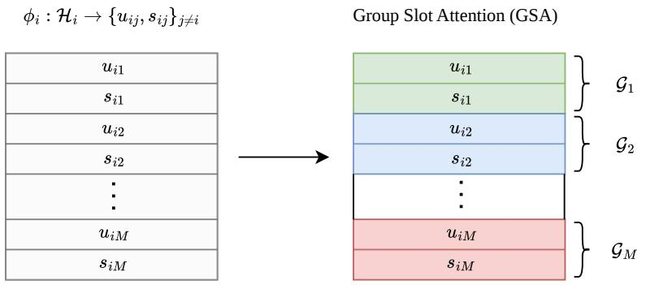

flowchart

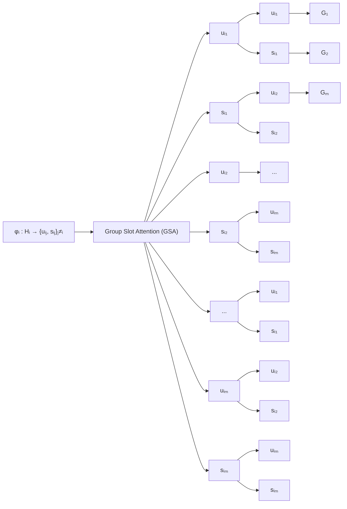

Figure 6: Illustration of the bijective mapping $\phi _ { i }$ and Group Slot Attention. Left: Visualizes the mapping defined in Definition G.1, where each latent slot, $h _ { i k }$ , is assigned to a specific unique or shared component, while in the Right: the grouping mechanism is observed, where each pair $( u _ { i j } , s _ { i j } )$ belongs in a separate group $\mathcal { G } _ { j }$ .

# G.2 Group slot attention

In grouped slot attention, slots are partitioned into disjoint groups, and competition is enforced only within each group rather than across all slots. In our setting, we select the group size equal to 2, resulting in exactly $M - 1$ groups, such that every group contains exactly two slots, e.g. the pair $( u _ { i j } , s _ { i j } )$ corresponding to the unique and shared components for the modality pair $( i , j )$ . For each input token, attention scores are normalized across the two slots in the group, so that the two slots compete to explain that particular token. As a result, each token distributes its information only between the paired slots, encouraging them to specialize into complementary roles while remaining independent of other groups.

Formally, for each cross-attention mechanism at iteration t, we compute

$$
Q = \tilde {\mathcal {H}} _ {i} ^ {t} W _ {Q} ^ {T} \in \mathbb {R} ^ {N \times D _ {h}}, \qquad K = Z _ {i} W _ {K} ^ {T} \in \mathbb {R} ^ {D _ {h} \times D} \qquad V = Z _ {i} W _ {V} ^ {T} \in \mathbb {R} ^ {D _ {h} \times D}
$$

representing the query, key and value respectively, where $W _ { Q } \in \mathbb { R } ^ { D _ { h } \times D _ { h } }$ , and $W _ { K } , W _ { v } \in \mathbb R ^ { T \times D _ { h } }$ are learnable parameter matrices. Given the mapping defined in G.1, the queries are arranged into contiguous pairs of size two. We compute the standard query-key similarities, but normalize the attention only over slots within the same group. If $\mathcal { G } _ { m } ( n )$ denotes the m-th group containing slot n, then

$$
\mathbf {A} _ {n, m} = \operatorname{softmax} _ {n ^ {\prime} \in \mathcal {G} _ {m} (n)} \frac {Q _ {n ^ {\prime}} K _ {m} ^ {T}}{\sqrt {D _ {h}}}.
$$

Afterwards, we re-normalize across the token dimension,

$$
\hat {\mathbf {A}} _ {n, m} = \frac {\mathbf {A} _ {n , m}}{\sum_ {j = 1} ^ {T} \mathbf {A} _ {n , j} + \epsilon}, \qquad \epsilon > 0.
$$

Lastly, slot representations are updated via the standard attention readout

$$
\tilde {\mathcal {H}} _ {i} ^ {t + 1} = \hat {\mathbf {A}} V.
$$

Both the bijective mapping as well as the Group Slot Attention are illustrated in Figure 6 for additional intuition.

# G.3 Training objectives

During training, in practice we optimize the losses in Eqs. (4), (5). We model the $s _ { i j } \sim p ( \cdot \mid X _ { i } )$ and $s _ { j i } \sim p ( \cdot \ | \ X _ { j } )$ as von-Mises-Fisher (vMF) distributions, i.e. $s _ { i j } \sim \mathrm { v M F } ( \bar { \mu } ( X _ { i } ) , \kappa )$ and $s _ { j i } \sim \mathrm { \bar { v M F } } ( \mu ( X _ { j } ) , \mathrm { \bar { \kappa } } )$ . The vMF distribution represents data on a hypershere, where $\mu$ is the mean direction and κ controls the concentration around that direction. For $I ( s _ { i j } ; X _ { j } )$ ) we use the InfoNCE objective [van den Oord et al., 2018] as follows:

$$
\mathcal {L} _ {s _ {i}} ^ {\mathrm{INCE}} = \mathbb {E} _ {s _ {i j}, s _ {j i} ^ {+}, \{s _ {j i, k} ^ {-} \} _ {k = 1} ^ {N}} \left[ - \log \frac {\exp (s _ {i j} ^ {\top} s _ {j i} ^ {+} / \tau)}{\exp (s _ {i j} ^ {\top} s _ {j i} ^ {+} / \tau) + \sum_ {k = 1} ^ {N} \exp (s _ {i j} ^ {\top} s _ {j i , k} ^ {-} / \tau)} \right].
$$

where $\tau$ is the temperature parameter, $s _ { j i } ^ { + }$ is the positive anchor, $s _ { j i , k } ^ { - }$ the negatives and N is the total number of negative samples. A similar formulation follows by symmetry for the case of $\mathcal { L } _ { s _ { j i } } ^ { I N C E }$ s j i . For the KL-divergence terms, as we have modeled the representations through vMF, the quantity $\mathcal { L } _ { K L }$ obtains the exact form:

$$
\mathcal {L} _ {K L} = \mathbb {E} _ {x _ {i}, x _ {j}} \left[ \mu (X _ {i}) ^ {T} \mu (X _ {j}) \right]
$$

and accordingly for the case of $s _ { j i } .$ . Analogously, for $\mathcal { L } _ { u _ { i } } ^ { \mathrm { I N C E } }$ , we employ an InfoNCE objective using augmented views of $X _ { i }$ and $X _ { j }$ . Specifically, we concatenate the unique representation $u _ { i j }$ with the shared representation $s _ { j i }$ ,

$$
\tilde {z} = u _ {i j} \oplus s _ {j i},
$$

and contrast it against the representation $\tilde { z } _ { \mathrm { a } } ^ { + }$ obtained from the augmented views of the same sample:

$$
\mathcal {L} _ {u _ {i}} ^ {\mathrm{INCE}} = \mathbb {E} _ {\tilde {z}, \tilde {z} _ {\mathrm{a}} ^ {+}, \{\tilde {z} _ {k} ^ {-} \} _ {k = 1} ^ {N}} \left[ - \log \frac {\exp (\tilde {z} ^ {\top} \tilde {z} _ {\mathrm{a}} ^ {+} / \tau)}{\exp (\tilde {z} ^ {\top} \tilde {z} _ {\mathrm{a}} ^ {+} / \tau) + \sum_ {k = 1} ^ {N} \exp (\tilde {z} ^ {\top} \tilde {z} _ {k} ^ {-} / \tau)} \right].
$$

Here, N denotes the number of negative samples, $\tilde { z } _ { \mathrm { a } } ^ { + }$ is the positive counterpart obtained from the augmented views of the same sample, and $\tilde { z } _ { k } ^ { - }$ denotes the k-th negative sample. Note that as discussed by Tian et al. [2020], the augmentation design within this setting is an important practical consideration and should be carefully chosen, so that all the desired information components are preserved within the augmented views. Lastly, the leakage between the unique and shared components is regularized through a cross-covariance orthogonality penalty. Concretely, let $\bar { U } _ { i j } \in \mathbb { R } ^ { B ^ { \star } D }$ and $\bar { S } _ { j i } \in \mathbb { R } ^ { B \times D }$ denote the row-wise $\ell _ { 2 }$ -normalized and feature-wise standardized batch representations of $u _ { i j }$ and $s _ { j i } .$ respectively. We define

$$
\mathcal {L} _ {\mathrm{xcov}} (u _ {i j}, s _ {j i}) = \frac {1}{D} \left\| \frac {1}{B} \bar {U} _ {i j} ^ {\top} \bar {S} _ {j i} \right\| _ {F},
$$

where B is the number of samples, D is the representation dimension, and $\lVert \cdot \rVert _ { F }$ denotes the Frobenius norm.

# H Experimental Details

# H.1 Synthetic data creation

For each atomic representation defined in 2.1, we begin by sampling $N$ instances for all $2 ^ { M } - 1$ latent factors independently from a normal distribution, i.e. $\hat { z _ { A } } \sim \hat { \mathcal { N } } ( 0 , \hat { \sigma } ^ { 2 } I _ { d _ { \ell } } )$ . We then concatenate the sampled factors on a per-modality basis, according to Definition $2 . 2 .$ , to construct $Z _ { i }$ for all $i \in \mathcal { M }$ . To avoid introducing structural biases related to dimensionality or distribution, we use the same σ and $d _ { \ell }$ for all sampled atomic representations. In addition, since we conduct experiments across varying numbers of modalities, we set $\begin{array} { r } { d _ { \ell } = \frac { E } { 2 M - 1 } } \end{array}$ , so that E = dim $Z _ { i }$ remains constant regardless of $M$ .

Having obtained $Z _ { i } \in \mathbb { R } ^ { E }$ , we next augment this vector representation to mimic sequence-style embeddings, yielding $Z _ { i } \in \mathbb { R } ^ { S \times E }$ , as in practice foundation models typically produce patch- or token-level representations. To this end, for each latent factor we additionally sample a base transform $U _ { A } \sim \mathcal { N } ( 0 , \dot { \sigma } _ { U } ^ { 2 } I _ { d _ { \ell } } )$ , together with a small sequence-specific variation $\dot { \Delta _ { A , s } } \sim \dot { \mathcal { N } } ( 0 , \sigma _ { \Delta } ^ { 2 } I )$ , where $\sigma _ { \Delta } \ll \sigma _ { U }$ . We then place these transformation matrices in block-diagonal form over all $s \in S$ defining $U _ { i , s } = \mathrm { b l o c k \bar { d i a g } } ( U _ { A } + \Delta _ { A , s } )$ for all $i \in \mathcal { M }$ .

Moreover, we sample binary masks $\mathbf { M } _ { i , s } = [ m _ { 1 } ^ { s } , \ldots , m _ { 2 ^ { M - 1 } } ^ { s } ]$ , with $m _ { i } ^ { s } \in \{ 0 , 1 \}$ , so that not all atomic representations are accessible at every sequence position. Intuitively, this mimics the fact that, for example, not all image patches contain all information components of an image. As a result, Mi ∈ {0, 1}S×2M−1 . $\mathbf { M } _ { i } \in \mathbf { \bar { \Gamma } } \mathbf { ( 0 , 1 \mu ) } ^ { S \times 2 ^ { M - 1 } }$ We apply this mask pointwise to the constructed transformations, yielding $\tilde { U } _ { i , s } = \mathbf { M } _ { i , s } \odot U _ { i , s }$ . Finally, we define modality-specific rotations $R _ { i }$ for all $i \in { \mathcal { M } }$ , and set $W _ { i , s } = R _ { i } \tilde { U } _ { i , s }$ . Each modality’s final representation is then given by $\mathbf { Z } _ { i , s } = \operatorname { t a n h } ( \gamma W _ { i , s } Z _ { i } )$ .

# Algorithm 1 Synthetic generation of multimodal factorized representations

Require: number of modalities M , sequence length S, embedding dimension E, variance parameters $\sigma , \sigma _ { U } , \sigma _ { \Delta } ,$ , scaling factor γ

1: Let A denote the set of all non-empty modality subsets, $| { \mathcal { A } } | = 2 ^ { M } - 1$   
2: Set latent dimension per atomic factor:

$$
d _ {\ell} = \frac {E}{2 ^ {M - 1}}
$$

3: for each atomic factor $A \in { \mathcal { A } }$ do   
4: Sample atomic latent representation:

$$
z _ {A} \sim \mathcal {N} (0, \sigma^ {2} I _ {d _ {\ell}})
$$

5: end for   
6: for each modality $i \in \mathcal { M }$ do   
7: Construct modality representation by concatenating relevant atomic factors:

$$
Z _ {i} = \operatorname{concat} \left\{z _ {A} \mid A \ni i \right\}, \quad Z _ {i} \in \mathbb {R} ^ {E}
$$

8: for each sequence position $s = 1 , \ldots , S$ do

9: for each atomic factor $A \ni i$ do

10: Sample base transform:

$$
U _ {A} \sim \mathcal {N} (0, \sigma_ {U} ^ {2} I _ {d _ {\ell}})
$$

11: Sample small sequence-specific variation:

$$
\Delta_ {A, s} \sim \mathcal {N} (0, \sigma_ {\Delta} ^ {2} I _ {d _ {\ell}}), \quad \sigma_ {\Delta} \ll \sigma_ {U}
$$

12: end for

13: Construct block-diagonal transformation:

$$
U _ {i, s} = \text { blockdiag } (U _ {A} + \Delta_ {A, s})
$$

14: Sample binary accessibility mask:

$$
\mathbf {M} _ {i, s} \in \{0, 1 \} ^ {2 ^ {M - 1}}
$$

15: Apply mask:

$$
\tilde {U} _ {i, s} = \mathbf {M} _ {i, s} \odot U _ {i, s}
$$

16: Apply modality-specific rotation:

$$
W _ {i, s} = R _ {i} \tilde {U} _ {i, s}
$$

17: Generate sequence embedding:

$$
Z _ {i, s} = \tanh (\gamma W _ {i, s} Z _ {i})
$$

18: end for   
19: end for   
20: return $\{ Z _ { i } \} _ { i \in { \mathcal { M } } }$ , where $Z _ { i } \in \mathbb { R } ^ { S \times E }$

Evaluation details We evaluate disentanglement performance by measuring whether each learned component $( \hat { \mathbf { u } } _ { i j } , \hat { \mathbf { s } } _ { i j } )$ predicts the label associated with its corresponding ground-truth component $( \mathbf { u } _ { i j } , \mathbf { s } _ { i j } )$ , while remaining uninformative about labels associated with other cross components. To assess this behavior, we report confusion matrices for each model across all values of M .

For a more holistic metric, we validate each model’s performance based on its deviation from the ideal performance using $\Delta _ { m o d e l }$ , which is defined as follows:

$$
\Delta_ {\text {model}} = \frac {1}{4} \Big (\underbrace {| A _ {\hat {\mathbf {u}} _ {i j} \to y _ {u _ {i j}}} - 1 0 0 | + | A _ {\hat {\mathbf {s}} _ {i j} \to y _ {s _ {i j}}} - 1 0 0 |} _ {\text {intra - component prediction}} + \underbrace {| A _ {\hat {\mathbf {u}} _ {i j} \to y _ {s _ {i j}}} - 5 0 | + | A _ {\hat {\mathbf {s}} _ {i j} \to y _ {u _ {i j}}} - 5 0 |} _ {\text {cross - component leakage}} \Big),
$$

where $A _ { \mathbf { u } _ { i j }  y _ { u _ { i j } } } : = \mathbb { E } [ A c c ( \mathbf { u } _ { i j }  y _ { u _ { i j } } ) ]$

Training and Hyperparameter specifications For the experiments, we test for the number of modalities $M = \{ 2 , 3 , 4 , 5 \}$ . For every case, we generate $N = 1 5 0 . 0 0 0$ training samples per modality and we set $E = 6 4$ and $S = 8$ . We also choose $\sigma _ { U } ^ { 2 } = 0 . 5$ and $\sigma _ { \Delta } = 0 . 0 0 5 \ll \sigma _ { U }$ . For the scaling factor of the non-linearity we select $\gamma = 0 . 3$ .

The architectural specifications of each model are demonstrated in Table 4 (a). In order to perform a fair scaling experiment, as M grows, the encoder backbone of each disentanglement module for RePercENT, changes only in terms of the number of the required latent slots in H. Specifically, there are 2 dedicated slots for the case of $M = 2 ,$ , 4 for the case of $M = 3$ etc. For the baselines, the capacity per separate encoder remains the same.

For the training specifications, see Table 4 (b). For every M the generated dataset is split into training, validation, and test sets with a ratio of $0 . 7 / 0 . 1 / 0 . { \dot { 2 } }$ , respectively. For the disentanglement loss parameters we fix the values of α and β. For the disentanglement loss, we keep α and $\beta$ fixed throughout training. The coefficient λ is annealed using an exponential scheduler and updated once per training iteration. Lastly, each model is trained for 150 epochs to ensure convergence. We select the best checkpoint based on the lowest validation loss observed during training and report its performance on the test set.

All models are trained on three different train/test splits, using two random seeds for each split. We aggregate the results across all runs and report the average detection accuracy as mean ± standard deviation.

Table 4: Architecture and training specifications used for the synthetic dataset experiments. For each model, table (a) reports the single encoder parameters, which remain fixed across the different values of M . The training specifications are the same across all models.   
(a) Model architecture 

<table><tr><td>Model ~ Hyperparameter</td><td>Value</td></tr><tr><td colspan="2">RePercENT</td></tr><tr><td>Embedding input dim</td><td>64</td></tr><tr><td>Embedding sequence length</td><td>8</td></tr><tr><td>Depth in  $\mathcal{D}_i$ </td><td>3</td></tr><tr><td>Cross-attention heads</td><td>2</td></tr><tr><td>Transformer latent heads</td><td>2</td></tr><tr><td>Latent dim  $D_l$ </td><td>32</td></tr><tr><td colspan="2">gMLP</td></tr><tr><td>Embedding input dim</td><td>64</td></tr><tr><td>Embedding sequence length</td><td>8</td></tr><tr><td>Feed-forward hidden dim</td><td>64</td></tr><tr><td>Projection head dim</td><td>32</td></tr><tr><td>Number of layers</td><td>2</td></tr><tr><td>Activation</td><td>GELU</td></tr><tr><td colspan="2">GRU</td></tr><tr><td>Embedding input dim</td><td>64</td></tr><tr><td>Hidden dim</td><td>64</td></tr><tr><td>Latent dim</td><td>32</td></tr><tr><td>Number of layers</td><td>1</td></tr><tr><td>Activation</td><td>ReLU</td></tr><tr><td colspan="2">MLP</td></tr><tr><td>Input dim</td><td>512</td></tr><tr><td>Hidden dim</td><td>64</td></tr><tr><td>Output dim</td><td>32</td></tr><tr><td>Activation</td><td>ReLU</td></tr></table>

(b) Training specification 

<table><tr><td>Component</td><td>Value</td></tr><tr><td colspan="2">Disentanglement loss</td></tr><tr><td> $\alpha$ </td><td>2.0</td></tr><tr><td> $\beta$ </td><td>0.1</td></tr><tr><td> $\lambda$  start value</td><td>0.1</td></tr><tr><td> $\lambda$  end value</td><td>1.0</td></tr><tr><td> $\lambda$  annealing iterations</td><td>8000</td></tr><tr><td> $\lambda$  start iteration</td><td>800</td></tr><tr><td colspan="2">Optimizer</td></tr><tr><td>Optimizer</td><td>Adam</td></tr><tr><td>Learning rate</td><td> $8 \times 10^{-4}$ </td></tr><tr><td>Weight decay</td><td> $10^{-4}$ </td></tr><tr><td colspan="2">Training</td></tr><tr><td>Number of epochs</td><td>150</td></tr><tr><td>Batch size</td><td>1024</td></tr></table>

Augmentations During training, we augment the synthetic inputs using a simple stochastic augmentation module. Given an input tensor ${ \check { Z } } ,$ , the module returns an augmented tensor $Z _ { \mathrm { a } }$ by applying one of the following transformations: Gaussian noise injection with scale $1 0 ^ { - 3 }$ , feature swapping, or random feature dropping. For random feature dropping, entries are masked according to a drop scale of 10.

# H.2 IRFL overview

Dataset creation The Image Recognition of Figurative Language (IRFL) dataset [Yosef et al., 2023]. IRFL is a multimodal benchmark that comprises approximately 6,690 instances designed to test the comprehension of figurative language, including idioms, metaphors, and similes. Each text phrase is paired with images categorized by their relationship to the text. The latter falls in one of the categories: figurative, literal, partial literal, or figurative+literal. We extract the complete dataset including idioms, metaphors, and similes, and keep only the rows that correspond to figurative images and text. For instances where no definition is provided, we manually complete the missing annotations. Afterwards, each image is encoded using the OpenAI CLIP-ViT-B/32 vision transformer, while captions and definitions are encoded using the corresponding CLIP text transformer. We preserve the sequence-like structure of both modalities rather than using a single pooled embedding. For images, we retain the patch-level embeddings before the final projection layer. For text, we retain the contextual token embeddings from the final transformer layer instead of using only the pooled end-of-text (EOT) representation. We split the data into 2,594 training and 786 test samples, ensuring that no image or caption is shared across the two sets.

Detection task overview The figurative detection task evaluates Vision and Language Pre-Trained Models’ (VL-PTMs) ability to choose the image that best visualizes the meaning of a figurative expression. Figure 7 provides two examples of the task, where even though there is shared information with most of the candidate images, only one describes best the figurative phrase. It is a very interesting task, as state-of-the-art VL models, such as CLIP-VIT-B/32, CLIP-RN50x64 [Radford et al., 2021], BLIP [Li et al., 2022] performed substantially worse than humans.

Blanket of snow   

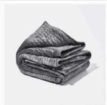

  
The car is as fast as a cheetah

  
Figure 7: Adapted from Yosef et al. [2023]. Examples of the multimodal figurative language detection task for idiom, metaphor, and simile. The input is a figurative phrase and four candidate images (for idiom, we also show the definition). The correct answer is marked with an orange square.

We evaluate all models in a zero-shot manner. Let ${ \mathit { z } } _ { \mathrm { t e x t } }$ denote the text query representation, derived from either the Caption alone or the concatenated Caption ⊕ Definition. For a given query, we compute the pairwise similarity between ${ \mathit { z } } _ { \mathrm { t e x t } }$ and the target figurative image representation $z _ { \mathrm { i m a g e } } ,$ , as well as the representations of the three distractor images $z _ { \mathrm { d i s t } , i \cdot } \mathbf { A }$ successful prediction requires the target similarity to strictly exceed all distractor similarities:

$$
\operatorname{sim} \left(z _ {\text { text }}, z _ {\text { image }}\right) > \max _ {i \in \{1, 2, 3 \}} \operatorname{sim} \left(z _ {\text { text }}, z _ {\text { dist }, i}\right)
$$

Training and Hyperparameter specifications For the alignment approach, we fine-tuned OpenAI CLIP ViT-B/32 in two settings: projection-only and end-to-end. In the projection-only setting, the

CLIP image and text encoders remain frozen, and only the final visual and text projection layers were trained using a learning rate of $2 \times 1 0 ^ { - 4 }$ . In the end-to-end setting, all CLIP parameters are trainable and fine-tuned using a learning rate of $1 0 ^ { - 5 }$ to avoid overfitting. Training in both cases uses the standard symmetric CLIP contrastive loss, AdamW optimization, cosine learning-rate decay with 10% warmup, and gradient clipping.

Similarly to the synthetic setup, all disentanglement baselines are trained under the same training protocol as RePercENT. The separate encoder architectures as well as the training parameters are reported in Table 5. Note that the two text modalities, Caption and Definition, share the same encoder architecture but are encoded by separate encoder instances with independent parameters.

All models are trained with five independent random seeds, and we report detection accuracy as the mean ± standard deviation across runs.

Table 5: Architecture and training specifications used of the disentanglement models for the IRFL Detection task experiments.   
(a) Model architecture 

<table><tr><td>Model ~ Hyperparameter</td><td>Image Encoder</td><td>Text Encoder</td></tr><tr><td colspan="3">RePercENT</td></tr><tr><td>Embedding input dim</td><td>768</td><td>512</td></tr><tr><td>Embedding sequence length</td><td>49</td><td>77</td></tr><tr><td>Depth in  $\mathcal{D}_i$ </td><td>2</td><td>2</td></tr><tr><td>Cross-attention heads</td><td>2</td><td>2</td></tr><tr><td>Transformer latent heads</td><td>1</td><td>1</td></tr><tr><td>Latent dim  $D_l$ </td><td>256</td><td>256</td></tr><tr><td colspan="3">gMLP</td></tr><tr><td>Embedding input dim</td><td>768</td><td>512</td></tr><tr><td>Embedding sequence length</td><td>49</td><td>77</td></tr><tr><td>Feed-forward hidden dim</td><td>352</td><td>352</td></tr><tr><td>Projection head dim</td><td>256</td><td>256</td></tr><tr><td>Number of layers</td><td>2</td><td>2</td></tr><tr><td>Activation</td><td>GELU</td><td>GELU</td></tr><tr><td colspan="3">GRU</td></tr><tr><td>Embedding input dim</td><td>768</td><td>512</td></tr><tr><td>Hidden dim</td><td>256</td><td>256</td></tr><tr><td>Latent dim</td><td>256</td><td>256</td></tr><tr><td>Number of layers</td><td>1</td><td>1</td></tr><tr><td>Activation</td><td>ReLU</td><td>ReLU</td></tr></table>

(b) Training specification 

<table><tr><td>Component</td><td>Value</td></tr><tr><td colspan="2">Disentanglement loss</td></tr><tr><td> $\alpha$ </td><td>6.0</td></tr><tr><td> $\beta$ </td><td>2.0</td></tr><tr><td> $\lambda$  value</td><td>4.0</td></tr><tr><td colspan="2">Optimizer</td></tr><tr><td>Optimizer</td><td>Adam</td></tr><tr><td>Learning rate</td><td> $8 \times 10^{-4}$ </td></tr><tr><td>Weight decay</td><td> $10^{-4}$ </td></tr><tr><td colspan="2">Training</td></tr><tr><td>Number of epochs</td><td>40</td></tr><tr><td>Batch size</td><td>256</td></tr></table>

Augmentations To facilitate training, and avoid the inference of the CLIP model, we additionally pre-compute the augmentations used for training. Specifically, we augment training images using a fixed set of visually conservative transformations: horizontal flip, vertical flip, Gaussian blur, Gaussian noise, and posterization. Flip-based augmentations are combined with a mild random resized crop using the scale range [0.95, 1.0] and bicubic interpolation to avoid removing the main object. Horizontal and vertical flips are applied with probability 0.95. Gaussian blur uses a kernel size of 27, Gaussian noise uses mean 0 and standard deviation 0.1 with clipping, and posterization uses 3 bits with probability 0.95. We do not apply hue or saturation jitter, since color information can be essential for figurative language. Figure 8 visualizes the result of two augmentations using gaussian noise and posterization. For the text augmentations, we only add minor formatting and neutral variation in order to fully preserve the context. During training, for each image or text, we sample one of the pre-computed embedding representations of their corresponding augmented views.

# H.3 TCGA dataset extraction

We utilize a pre-processed version of the The Cancer Genome Atlas (TCGA) multimodal oncology cohort [Weinstein et al., 2013] by Tripathi et al. [2025] containing in total 10.857 patient records.

natural_image

Illustration of a square sink with a handle and drain, emitting radiating lines to the top (no text or symbols)

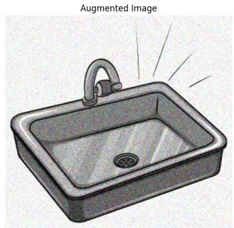

natural_image

Illustration of a rectangular sink with a faucet and drain, emitting light rays (no text or symbols)

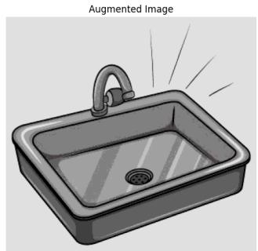

natural_image

Illustration of a square sink with a faucet and drain, emitting radiating light (no text or symbols)

Figure 8: Example of two image augmentation variants used for the figurative language task. The original image from the IRFL dataset is depicted on the left and two additional augmented images are generated.

For our experiments, we consider the four modalities and FM embeddings reported in Table 6. We group for each modality all the embeddings on a patient level, and preserve only the patients that have all four modalities available. Lastly, guided by the cancer-type distribution shown in Figure 9, we restrict our analysis to cancer types with sufficient sample representation, and retain the 10 most prevalent cancer types to ensure reliable evaluation. This results in a final set of 5,732 patients. The selected cancer types, together with brief descriptions of their clinical relevance, are summarized in Table 7.

Table 6: HONeYBEE TCGA modality embeddings used in the oncology experiments. 

<table><tr><td>Modality</td><td>Dim.</td><td>Encoder</td><td>Description</td></tr><tr><td>Clinical</td><td>1024</td><td>Qwen3 [Yang et al., 2025]</td><td>Patient-level clinical information, including structured and unstructured records such as demographics, laboratory values, medications, and clinical narratives.</td></tr><tr><td>Pathology</td><td>1024</td><td>Qwen3 [Yang et al., 2025]</td><td>Free-text pathology reports describing diagnostic and histopathological findings, processed as clinical text.</td></tr><tr><td>WSI</td><td>1024</td><td>UNI [Chen et al., 2024]</td><td>Whole-slide histopathology images processed through tissue detection, stain normalization, patch extraction, and patch-level feature extraction.</td></tr><tr><td>Molecular</td><td>48</td><td>SeNMo [Waqas et al., 2024]</td><td>Multi-omics molecular profiles, including gene expression, DNA methylation, somatic mutations, miRNA, and protein expression.</td></tr></table>

Training and Hyperparameter specifications We use all four modalities during training and extract both unique and shared representations for every modality pair. The specifications of the four RePercENT encoders are summarized in Table 8 (a), while the corresponding training details are provided in Table 8 (b). After training, for each extracted representation $\mathbf { u } _ { i j }$ and ${ \bf s } _ { i j }$ , as well as their concatenation, which together constitute the decomposition of modality i with respect to modality j, we train linear probes and report cancer-type classification accuracy. Finally, we compare against linear probes trained on the original HONeYBEE embeddings, which represent the full modality-specific representations proposed by Tripathi et al. [2025].

Table 7: Selected TCGA cancer types utilized in the Honeybee experimental evaluation. 

<table><tr><td>TCGA Code</td><td>Cancer Type Description</td></tr><tr><td>GBM</td><td>Glioblastoma multiforme</td></tr><tr><td>LGG</td><td>Brain Lower Grade Glioma</td></tr><tr><td>HNSC</td><td>Head and Neck squamous cell carcinoma</td></tr><tr><td>LUAD</td><td>Lung adenocarcinoma</td></tr><tr><td>LUSC</td><td>Lung squamous cell carcinoma</td></tr><tr><td>BRCA</td><td>Breast invasive carcinoma</td></tr><tr><td>OV</td><td>Ovarian serous cystadenocarcinoma</td></tr><tr><td>PRAD</td><td>Prostate adenocarcinoma</td></tr><tr><td>COAD</td><td>Colon adenocarcinoma</td></tr><tr><td>KIRC</td><td>Kidney renal clear cell carcinoma</td></tr></table>

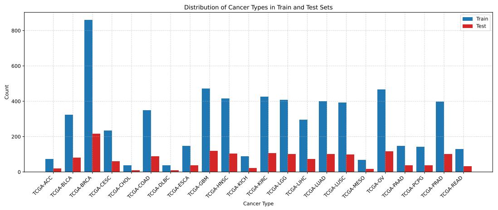

bar

| Cancer Type | Train | Test |
| --- | --- | --- |
| TCGA-ACC | 75 | 15 |
| TCGA-BLCA | 325 | 80 |
| TCGA-BRCA | 860 | 215 |
| TCGA-CESC | 235 | 60 |
| TCGA-CHOL | 40 | 10 |
| TCGA-COAD | 350 | 90 |
| TCGA-DLBC | 35 | 10 |
| TCGA-FSCA | 150 | 40 |
| TCGA-GBM | 475 | 120 |
| TCGA-HNSC | 415 | 110 |
| TCGA-KICH | 90 | 25 |
| TCGA-KIRC | 425 | 110 |
| TCGA-LGG | 405 | 105 |
| TCGA-LHC | 295 | 75 |
| TCGA-LUAD | 400 | 105 |
| TCGA-LUSC | 395 | 100 |
| TCGA-MESO | 65 | 15 |
| TCGA-OV | 470 | 120 |
| TCGA-PAAD | 145 | 35 |
| TCGA-PCPG | 140 | 35 |
| TCGA-PRAD | 395 | 105 |
| TCGA-READ | 130 | 30 |

Figure 9: Cancer type patient count of the HONeYBEE extracted embeddings.

Table 8: Architecture and training specifications used for the disentanglement models in the TCGA cohort experiments.   
(a) Model architecture 

<table><tr><td>Hyperparameters</td><td>Clinical Encoder</td><td>Pathology Encoder</td><td>WSI Encoder</td><td>Molecular Encoder</td></tr><tr><td colspan="5">RePercENT</td></tr><tr><td>Embedding input dim</td><td>1024</td><td>1024</td><td>1024</td><td>48</td></tr><tr><td>Input sequence length</td><td>1</td><td>3</td><td>16</td><td>4</td></tr><tr><td>Depth in  $\mathcal{D}_{i}$ </td><td>8</td><td>8</td><td>8</td><td>8</td></tr><tr><td>Cross-attention heads</td><td>2</td><td>2</td><td>2</td><td>2</td></tr><tr><td>Transformer latent heads</td><td>1</td><td>1</td><td>1</td><td>1</td></tr><tr><td>Latent dimension  $D_{l}$ </td><td>256</td><td>256</td><td>256</td><td>256</td></tr></table>

(b) Training specification 

<table><tr><td>Component</td><td>Value</td></tr><tr><td colspan="2">Disentanglement loss</td></tr><tr><td> $\alpha$ </td><td>5.0</td></tr><tr><td> $\beta$ </td><td>0.5</td></tr><tr><td> $\lambda$  start value</td><td>1.0</td></tr><tr><td> $\lambda$  end value</td><td>3.0</td></tr><tr><td> $\lambda$  annealing iterations</td><td>600</td></tr><tr><td> $\lambda$  start iteration</td><td>200</td></tr><tr><td colspan="2">Optimizer</td></tr><tr><td>Optimizer</td><td>Adam</td></tr><tr><td>Learning rate</td><td> $2 \times 10^{-5}$ </td></tr><tr><td>Weight decay</td><td> $5 \times 10^{-4}$ </td></tr><tr><td colspan="2">Training</td></tr><tr><td>Number of epochs</td><td>50</td></tr><tr><td>Batch size</td><td>256</td></tr></table>

Missing modality robustness setup For this experiment, we simulate missingness for the WSI-Molecular modality pair. At test time, we keep the Molecular data fully available and randomly drop WSI at varying missingness rates.

For RePercENT, we train separate linear probes on the decomposition of WSI w.r.t. Molecular, i.e., $D _ { \mathrm { w s i , m o l } }$ and the extracted decomposition of Molecular w.r.t. WSI, i.e., $D _ { \mathrm { m o l , w s i } }$ . At test time, we employ the simplest form of late fusion, were the predictions from the available modalities are combined by averaging their classifier scores.

We compare against the following four baselines trained on the original HONeYBEE modality embeddings:

• Late fusion + averaging: We train separate linear probes on the raw WSI and molecular embeddings, and averages the prediction scores of the modalities available at test time.   
• Early fusion + mean imputation: We train a single probe on the concatenated embeddings of the two modalities. During evaluation, we replace the WSI missing instances, with the corresponding train-set modality mean.

• Early fusion + mask: For this baseline, the linear probes are trained on concatenated modality embeddings augmented with binary modality-availability indicators. During training, both modalities are available, so the indicators are set to "1". At test time, an unavailable modality is zero-masked, and its corresponding availability indicator is set to zero.   
• Early fusion + modality dropout: We use the same masked representation, but in this case the training set is augmented with randomly dropped modalities to expose the classifier to missing-modality patterns during training

All methods use class-balanced logistic-regression probes. We report results across 10 uniformly spaced WSI availability levels, ranging from fully available (100%) to fully missing (0%). At each availability level, performance is averaged over 10 independently sampled stochastic missingness masks.

# H.4 Computational Resources

All experiments were run on a single NVIDIA H200 GPU with 140GB of GPU memory, 96 physical CPU cores, 192 logical threads, 1.5TB of RAM, and 7.2TB of disk storage. The software environment used Python 3.10.12. The most computationally demanding setting was the synthetic five-modality experiment, which required approximately 3 hours under the training regime described in Table 4. Experiments on the real-world datasets were substantially cheaper, with all runs completing in under 1 hour.

# I Additional Experiments

# I.1 Synthetic Dataset

In this section, we provide detailed linear probe results for all the baselines on the synthetic dataset, for each value of $\bar { M } \in \{ 2 , 3 , 4 , 5 \}$ .

For the case of M = 2 (Figure 10), most architectures demonstrate a baseline ability to isolate components, characterized by high intra-component prediction and minimal cross-component leakage. However, architectural behavior diverges significantly as complexity increases.

MLP and GRU The MLP exhibits the weakest specialization, with significantly lower diagonal accuracy even in the two-modality regime. Conversely, while the GRU improves the recovery of intended factors—particularly shared representations—its stronger diagonal performance is often offset by elevated off-diagonal values, indicating persistent entanglement. As M increases (Figures 12a, 14b), the GRU undergoes a fundamental component collapse, successfully recovering only the shared factors, while the unique components lose all discriminative power.

gMLP and RePercENT These models demonstrate the most robust disentanglement performance as M grows. Both consistently achieve the disentanglement objective where baselines fail, maintaining high diagonal dominance and near-chance off-diagonal structures well beyond the two-modality setting.

Scalability of RePercENT Notably, RePercENT achieves performance parity with the gMLP while strictly adhering to the proposed pairwise slot-based design. The preservation of a clean, diagonaldominant structure across all modality pairs demonstrates that RePercENT successfully overcomes the scalability bottleneck, maintaining granular disentanglement in high-dimensional multimodal settings. Moreover, our results indicate that performance at $M = 2$ is an unreliable predictor of architectural robustness in higher-dimensional spaces. As M increases, the information-theoretic complexity of interactions grows exponentially, introducing "interference" and potential "component collapse" risks that are absent in simpler settings.

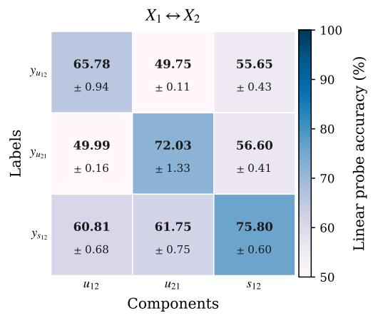

heatmap

X₁ ↔ X₂
| Labels | u12 | u21 | s12 |
|---|---|---|---|
| y_u12 | 65.78 ± 0.94 | 49.75 ± 0.11 | 55.65 ± 0.43 |
| y_u21 | 49.99 ± 0.16 | 72.03 ± 1.33 | 56.60 ± 0.41 |
| y_x12 | 60.81 ± 0.68 | 61.75 ± 0.75 | 75.80 ± 0.60 |

(a) MLP

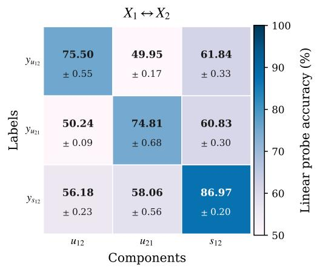

heatmap

X₁ ↔ X₂
| Labels | u12 | u21 | s12 |
|---|---|---|---|
| y_u12 | 75.50 ± 0.55 | 49.95 ± 0.17 | 61.84 ± 0.33 |
| y_u21 | 50.24 ± 0.09 | 74.81 ± 0.68 | 60.83 ± 0.30 |
| y_s12 | 56.18 ± 0.23 | 58.06 ± 0.56 | 86.97 ± 0.20 |

(b) GRU

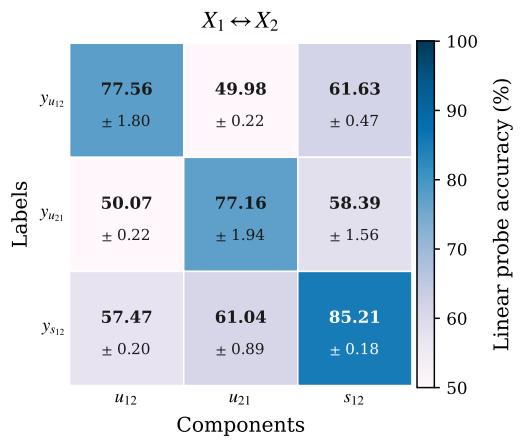

heatmap

X₁ ↔ X₂
| Labels | u₁₂ | u₂₁ | s₁₂ |
|---|---|---|---|
| yᵤ₁₂ | 77.56 ± 1.80 | 49.98 ± 0.22 | 61.63 ± 0.47 |
| yᵤ₂₁ | 50.07 ± 0.22 | 77.16 ± 1.94 | 58.39 ± 1.56 |
| yₛ₁₂ | 57.47 ± 0.20 | 61.04 ± 0.89 | 85.21 ± 0.18 |

(c) gMLP

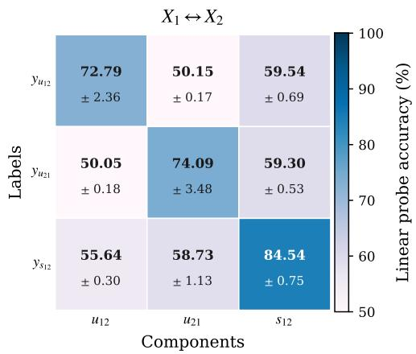

heatmap

X₁ ↔ X₂
| Labels | u₁₂ | u₂₁ | s₁₂ |
|---|---|---|---|
| yᵤ₁₂ | 72.79 ± 2.36 | 50.15 ± 0.17 | 59.54 ± 0.69 |
| yᵤ₂₁ | 50.05 ± 0.18 | 74.09 ± 3.48 | 59.30 ± 0.53 |
| yₛ₁₂ | 55.64 ± 0.30 | 58.73 ± 1.13 | 84.54 ± 0.75 |

(d) RePercENT   
Figure 10: (M = 2) Pairwise confusion matrices for the synthetic setting with two modalities, shown for MLP, GRU, gMLP, and RePercENT. While all models largely separate unique and shared information, sequence-aware models yield stronger intra-component accuracy, as reflected by higher main-diagonal values.

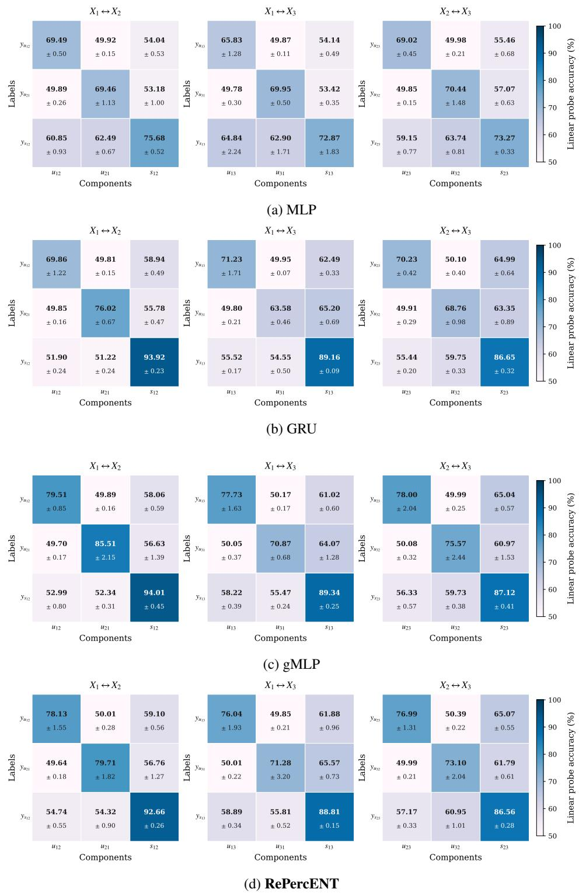  
Figure 11: (M = 3) Pairwise confusion matrices for the synthetic setting with three modalities, shown for MLP, GRU, gMLP, and RePercENT. The performance of GRU and especially MLP degrades, while the gMLP and RePercent present robust disentanglement performance.

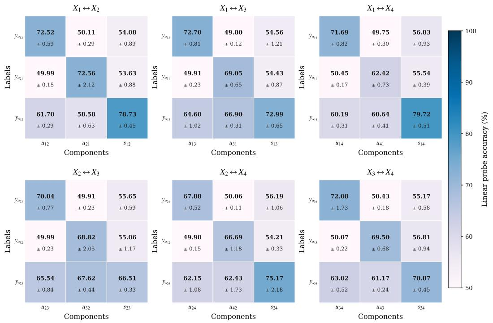

(a) MLP   
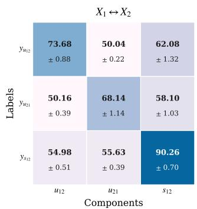

heatmap

X₁ ↔ X₂
| Labels | u₁₂ | u₂₁ | s₁₂ |
|---|---|---|---|
| yₙ₁₂ | 73.68 ± 0.88 | 50.04 ± 0.22 | 62.08 ± 1.32 |
| yₙ₁₁ | 50.16 ± 0.39 | 68.14 ± 1.14 | 58.10 ± 1.03 |
| yₛ₁₂ | 54.98 ± 0.51 | 55.63 ± 0.39 | 90.26 ± 0.70 |

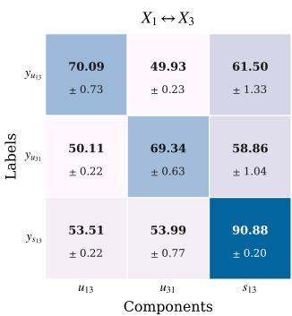

heatmap

X₁ ↔ X₃
| Labels | u₁₃ | u₃₁ | s₁₃ |
|---|---|---|---|
| yᵤ₁₃ | 70.09 ± 0.73 | 49.93 ± 0.23 | 61.50 ± 1.33 |
| yᵤ₃₁ | 50.11 ± 0.22 | 69.34 ± 0.63 | 58.86 ± 1.04 |
| yₛ₁₃ | 53.51 ± 0.22 | 53.99 ± 0.77 | 90.88 ± 0.20 |

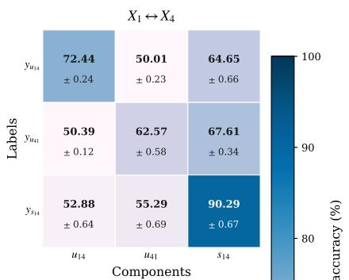

heatmap

X₁ ↔ X₄
| Labels | u₁₄ | u₄₁ | s₁₄ |
|---|---|---|---|
| yᵤ₁₄ | 72.44 ± 0.24 | 50.01 ± 0.23 | 64.65 ± 0.66 |
| yᵤ₄₁ | 50.39 ± 0.12 | 62.57 ± 0.58 | 67.61 ± 0.34 |
| yₛ₁₄ | 52.88 ± 0.64 | 55.29 ± 0.69 | 90.29 ± 0.67 |
The color scale ranges from ~80% to 100%, likely representing accuracy percentage.

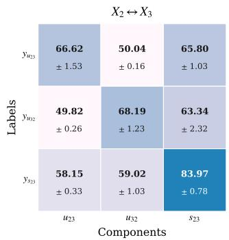

heatmap

| Labels | u23 | u32 | s23 |
|---|---|---|---|
| y123 | 66.62 ± 1.53 | 50.04 ± 0.16 | 65.80 ± 1.03 |
| y132 | 49.82 ± 0.26 | 68.19 ± 1.23 | 63.34 ± 2.32 |
| y123 | 58.15 ± 0.33 | 59.02 ± 1.03 | 83.97 ± 0.78 |

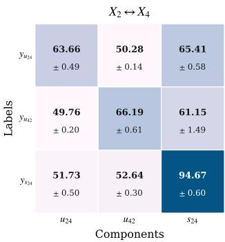

heatmap

| Labels | u24 | u42 | s24 |
|---|---|---|---|
| yU24 | 63.66 ± 0.49 | 50.28 ± 0.14 | 65.41 ± 0.58 |
| yU42 | 49.76 ± 0.20 | 66.19 ± 0.61 | 61.15 ± 1.49 |
| yS24 | 51.73 ± 0.50 | 52.64 ± 0.30 | 94.67 ± 0.60 |

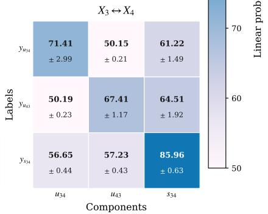

heatmap

X₃ ↔ X₄
Labels
| Labels | u₃₄ | u₄₃ | s₃₄ |
| :---: | :---: | :---: | :---: |
| y₃₄ | 71.41 ± 2.99 | 50.15 ± 0.21 | 61.22 ± 1.49 |
| y₄₃ | 50.19 ± 0.23 | 67.41 ± 1.17 | 64.51 ± 1.92 |
| y₃₄ | 56.65 ± 0.44 | 57.23 ± 0.43 | 85.96 ± 0.63 |

(b) GRU   
Figure 12: (M = 4) Pairwise confusion matrices for the synthetic setting with four modalities, shown for MLP and GRU. The MLP is unable to recover the desired representations, as it exhibits substantial cross-component leakage and weak intra-component prediction, while the GRU preserves strong shared representations but weakly encodes unique components.

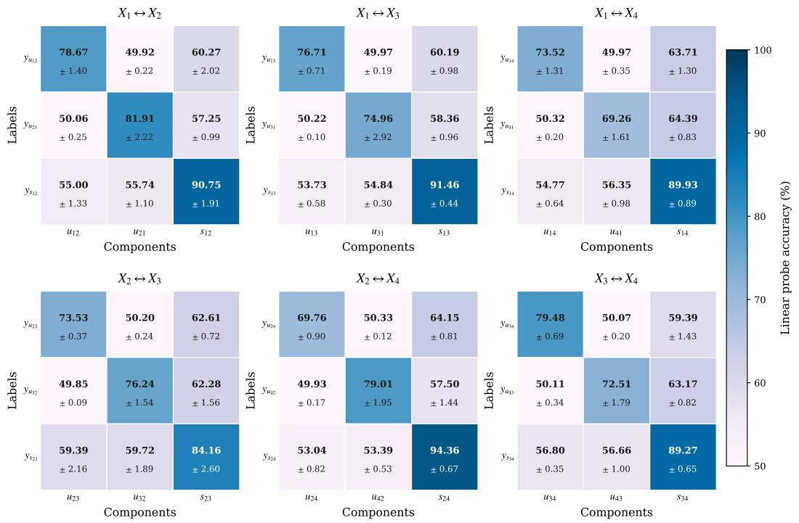

(a) gMLP   
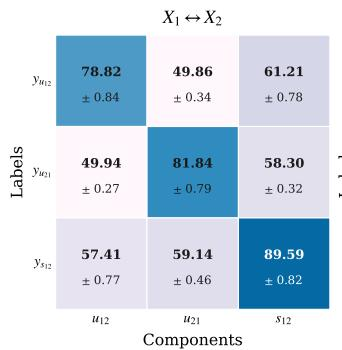

heatmap

| Labels | u12 | u21 | s12 |
|---|---|---|---|
| y_u12 | 78.82 ± 0.84 | 49.86 ± 0.34 | 61.21 ± 0.78 |
| y_u21 | 49.94 ± 0.27 | 81.84 ± 0.79 | 58.30 ± 0.32 |
| y_s12 | 57.41 ± 0.77 | 59.14 ± 0.46 | 89.59 ± 0.82 |

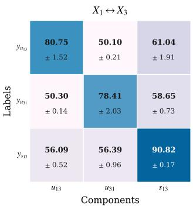

heatmap

X₁ ↔ X₃
| Labels | u₁₃ | u₃₁ | s₁₃ |
|---|---|---|---|
| yᵤ₁₃ | 80.75 ± 1.52 | 50.10 ± 0.21 | 61.04 ± 1.91 |
| yᵤ₁₁ | 50.30 ± 0.14 | 78.41 ± 2.03 | 58.65 ± 0.73 |
| yₛ₁₃ | 56.09 ± 0.52 | 56.39 ± 0.96 | 90.82 ± 0.17 |

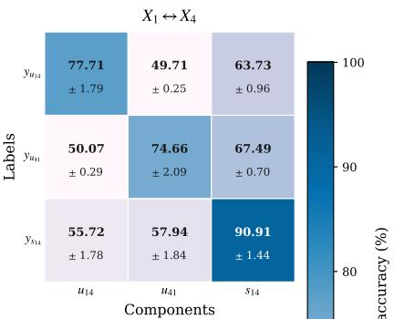

heatmap

X₁ ↔ X₄
| Labels | u₁₄ | u₄₁ | s₁₄ |
|---|---|---|---|
| yᵤ₁₄ | 77.71 ± 1.79 | 49.71 ± 0.25 | 63.73 ± 0.96 |
| yᵤ₁₁ | 50.07 ± 0.29 | 74.66 ± 2.09 | 67.49 ± 0.70 |
| yₛ₁₄ | 55.72 ± 1.78 | 57.94 ± 1.84 | 90.91 ± 1.44 |

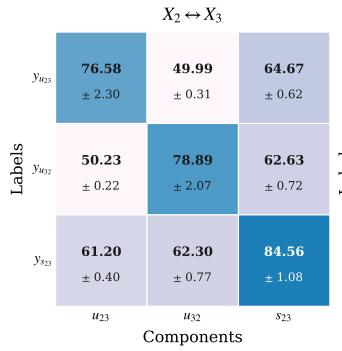

heatmap

X₂ ↔ X₃
| Labels | u₂₃ | u₃₂ | s₂₃ |
|---|---|---|---|
| y_H₂₃ | 76.58 ± 2.30 | 49.99 ± 0.31 | 64.67 ± 0.62 |
| y_H₁₂ | 50.23 ± 0.22 | 78.89 ± 2.07 | 62.63 ± 0.72 |
| y_S₂₃ | 61.20 ± 0.40 | 62.30 ± 0.77 | 84.56 ± 1.08 |

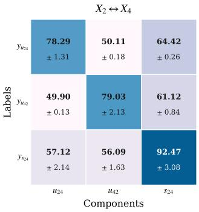

heatmap

| Labels | u24 | u42 | s24 |
|---|---|---|---|
| y_u24 | 78.29 ± 1.31 | 50.11 ± 0.18 | 64.42 ± 0.26 |
| y_u42 | 49.90 ± 0.13 | 79.03 ± 2.13 | 61.12 ± 0.84 |
| y_s24 | 57.12 ± 2.14 | 56.09 ± 1.63 | 92.47 ± 3.08 |

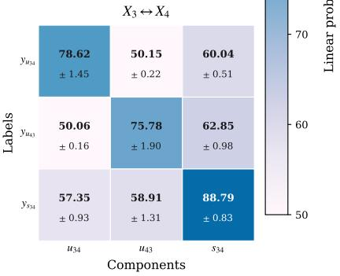

heatmap

X₃ ↔ X₄
| Labels | u34 | u43 | s34 |
|---|---|---|---|
| y_u34 | 78.62 ± 1.45 | 50.15 ± 0.22 | 60.04 ± 0.51 |
| y_u3 | 50.06 ± 0.16 | 75.78 ± 1.90 | 62.85 ± 0.98 |
| y_s34 | 57.35 ± 0.93 | 58.91 ± 1.31 | 88.79 ± 0.83 |
The color intensity reflects the linear probability scale from 50 to 70.

(b) RePercENT   
Figure 13: (M = 4) Pairwise confusion matrices for the synthetic setting with four modalities, shown for gMLP, and RePercENT. Both models achieve strong disentanglement, with RePercENT yielding slightly higher intra-component accuracy especially for the unique components, while gMLP exhibits marginally lower cross-component leakage.

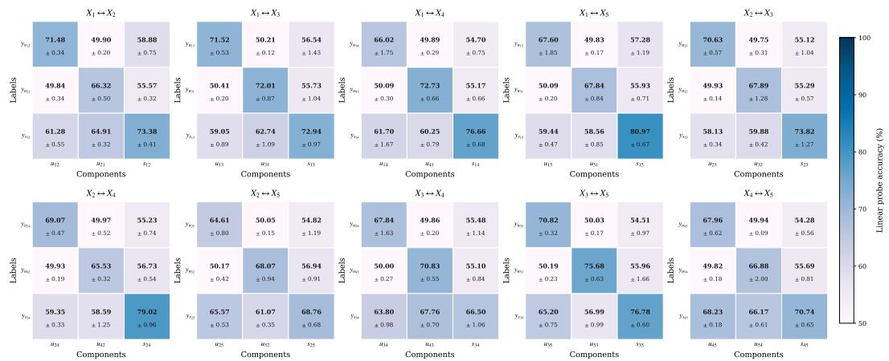  
(a) MLP

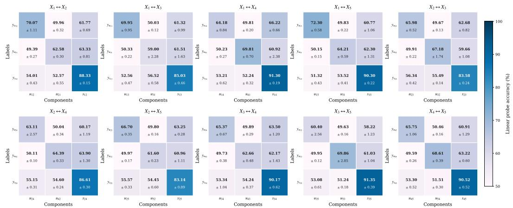

heatmap

| Label | Components | X2 ↔ X4 | X2 ↔ X5 | X3 ↔ X5 | X4 ↔ X5 |
| :--- | :--- | :--- | :--- | :--- | :--- |
| Labels | y02 ± 1.11 | 70.07 ± 1.11 | 49.96 ± 0.32 | 61.77 ± 0.69 |  |
| Labels | y02 ± 0.27 | 49.39 ± 0.27 | 62.58 ± 0.30 | 63.33 ± 0.81 |  |
| Labels | y02 ± 0.43 | 54.01 ± 0.43 | 52.57 ± 0.55 | 88.33 ± 0.15 |  |
| Labels | u12 |  | u21 | s12 | s12 |
| Labels | y02 ± 0.22 | 50.33 ± 0.22 | 59.00 ± 2.28 | 61.51 ± 1.63 |  |
| Labels | y02 ± 0.47 | 52.56 ± 0.47 | 56.52 ± 0.58 | 85.03 ± 0.46 |  |
| Labels | u13 | 64.18 ± 0.84 | 49.81 ± 0.20 | 66.22 ± 0.66 |  |
| Labels | y02 ± 0.27 | 50.23 ± 0.27 | 69.81 ± 0.70 | 60.92 ± 2.38 |  |
| Labels | y02 ± 0.62 | 53.21 ± 0.62 | 52.24 ± 0.32 | 91.30 ± 0.19 |  |
| Labels | u14 | 72.30 ± 0.58 | 49.83 ± 0.22 | 60.77 ± 1.06 |  |
| Labels | y02 ± 0.15 | 50.15 ± 0.15 | 64.21 ± 0.59 | 62.30 ± 1.31 |  |
| Labels | y02 ± 0.43 | 51.32 ± 0.43 | 53.52 ± 0.41 | 90.30 ± 0.22 |  |
| Labels | u15 | 65.98 ± 0.52 | 49.67 ± 0.13 | 62.68 ± 0.82 |  |
| Labels | y02 ± 0.22 | 49.91 ± 0.22 | 67.18 ± 1.74 | - | - |
| Labels | y02 ± 0.42 | - | - | - | - |
| Labels | u13 | - | - | - | - |
| Labels | y02 ± 0.47 | - | - | - | - |
| Labels | u14 | - | - | - | - |
| Labels | y14 | - | - | - | - |
| Labels | u15 | - | - | - | - |
| Labels | y15 | - | - | - | - |
| Labels | u16 | - | - | - | - |
| Labels | y16 | - | - | - | - |
| Labels | u17 | - | - | - | - |
| Labels | y17 | - | - | - | - |
| Labels | u18 | - | - | - | - |
| Labels | y18 | - | - | - | - |
| Labels: X1 ↔ X4; X2 ↔ X4; X3 ↔ X4; X4 ↔ X4; Y02 ± 2.57; Y02 ± 0.10; Y02 ± 0.31; Y02 ± 0.42; Y02 ± 0.34; Y02 ± 0.34; Y02 ± 1.19; Y02 ± 1.30; Y02 ± 1.30; Y02 ± 1.30; Y02 ± 1.30; Y02 ± 1.30; Y02 ± 1.30; Y02 ± 1.30; Y02 ± 1.30; Y02 ± 1.30; Y02 ± 1.30; Y02 ± 1.3<nl>

(b) GRU   
Figure 14: (M = 5) Pairwise confusion matrices for the synthetic setting with five modalities, shown for MLP and GRU. Similarly to the case of M = 4, the MLP is fails to recover the desired representations, while the GRU only captures the shared components successfully.

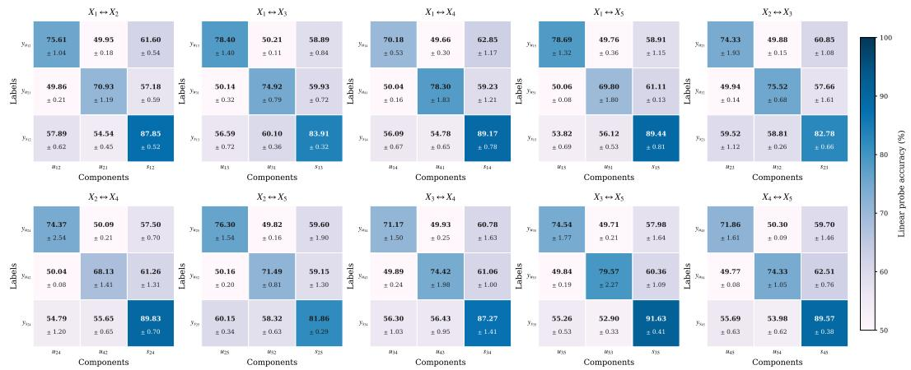

heatmap

| Labels | Components | X2 ↔ X4 | X2 ↔ X5 | X3 ↔ X4 | X3 ↔ X5 | X4 ↔ X5 |
|---|---|---|---|---|---|---|
| X1 ↔ X2 | y0a | 75.61 ± 1.04 | 49.95 ± 0.18 | 61.60 ± 0.54 | 78.40 ± 1.40 | 50.21 ± 0.11 |
| X1 ↔ X3 | y0a | 70.18 ± 0.53 | 49.66 ± 0.30 | 62.85 ± 1.17 | 78.69 ± 1.32 | 49.76 ± 0.36 |
| X1 ↔ X4 | y0a | 50.04 ± 0.16 | 78.30 ± 1.83 | 59.23 ± 1.21 | 50.06 ± 0.08 | 69.80 ± 1.89 |
| X1 ↔ X5 | y0a | 56.09 ± 0.67 | 54.78 ± 0.65 | 89.17 ± 0.78 | 53.82 ± 0.69 | 56.12 ± 0.53 |
| X2 ↔ X3 | y0a | 74.33 ± 1.93 | 49.88 ± 0.15 | 58.91 ± 1.15 | 49.94 ± 0.14 | 75.52 ± 0.68 |
| X2 ↔ X4 | y0a | 74.37 ± 2.54 | 50.09 ± 0.21 | 57.50 ± 0.70 | 76.30 ± 1.54 | 49.82 ± 0.16 |
| X2 ↔ X5 | y0a | 71.17 ± 1.50 | 49.93 ± 0.25 | 60.78 ± 1.63 | 74.54 ± 1.77 | 49.71 ± 0.21 |
| X3 ↔ X4 | y0a | 49.89 ± 0.24 | 74.42 ± 1.98 | 61.06 ± 1.00 | 49.84 ± 0.19 | 79.57 ± 2.27 |
| X3 ↔ X5 | y0a | 56.30 ± 1.03 | 56.43 ± 0.95 | 87.27 ± 1.41 | 55.26 ± 0.53 | 52.90 ± 0.33 |
| X4 ↔ X5 | y0a | 71.86 ± 1.61 | 50.30 ± 0.09 | 59.70 ± 1.46 | 49.77 ± 0.08 | 74.33 ± 1.05 |
| X4 ↔ X5 | u45 | 55.69 ± 0.63 | 53.98 ± 0.62 | 89.57 ± 0.38 | - | - |
Labels: x1, x2, x3, x4; y1, y2, y3, y4; Labels: x1, x2, x3, x4; Labels: x1, x2, x3, x4; Labels: x1, x2, x3, x4; Labels: x1, x2, x3, x4; Labels: x1, x2, x3, x4; Labels: x1, x2, x3, x4; Labels: x1, x2, x3, x4; Labels: x1, x2, x3, x4.

(a) gMLP   
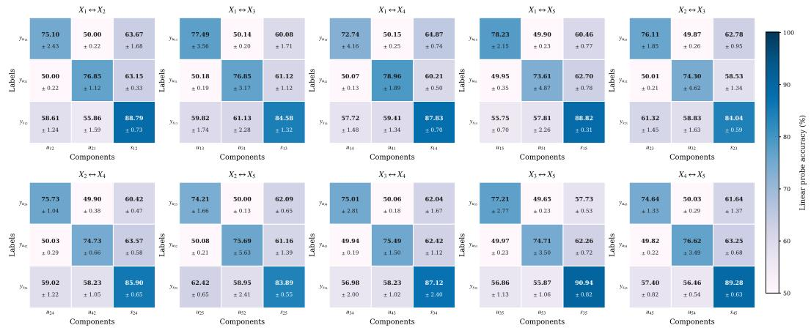  
(b) RePercENT   
Figure 15: (M = 5) Pairwise confusion matrices for the synthetic setting with five modalities, shown for gMLP, and RePercENT. Despite the increased number of modality pairs, both models successfully encode pairwise unique and shared representations, yielding similar disentanglement performance.

Hyperparameter α Figure 16 illustrates the impact of the balancing parameter α, as we keep the remaining parameters constant, for different numbers of modalities, M . Importantly, for this experiment, we set λ = 1 and β = 1. We evaluate the disentanglement performance of the unique and shared components separately, according to the quantities:

$$
\Delta_ {s} = \mathbb {E} \left[ A c c _ {\hat {\mathbf {s}} _ {i j} \rightarrow y _ {s _ {i j}}} \right] - \mathbb {E} \left[ A c c _ {\hat {\mathbf {s}} _ {i j} \rightarrow y _ {u _ {i j}}} \right], \quad \Delta_ {u} = \mathbb {E} \left[ A c c _ {\hat {\mathbf {u}} _ {i j} \rightarrow y _ {u _ {i j}}} \right] - \mathbb {E} \left[ A c c _ {\hat {\mathbf {u}} _ {i j} \rightarrow y _ {s _ {i j}}} \right]. \tag {29}
$$

Notice that these ∆ metrics, Eq. (29), measure the margin between correct intra-component prediction and inter-component leakage. A higher value indicates that the latent factors are not only task-relevant but also successfully isolated from one another. Observing both the unique and shared component performance, there is a similar emerging pattern. Concretely, for lower values of α the representation quality is quite low. The performance gradually increases as α increases, with the best behavior demonstrated within the range [1, 10].

This empirical trend aligns precisely with the requirements of Theorem (1), which states that α must be greater than λ for stable disentanglement. This suggests that during joint optimization, prioritizing the recovery of shared components is more critical than over-penalizing the overlap between shared and unique subspaces. However, extreme values of α yield a negative effect, indicating that excessive imbalance between objectives eventually degrades both the discriminative power of the unique representations and the purity of the shared components.

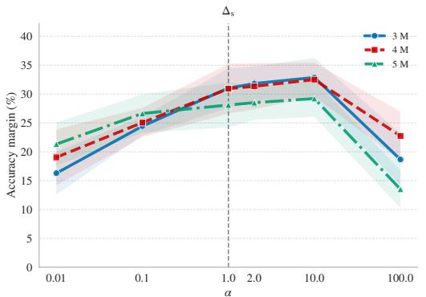

line

| α    | 3 M  | 4 M  | 5 M  |
|------|------|------|------|
| 0.01 | 16.5 | 18.5 | 21.0 |
| 0.1  | 24.0 | 25.5 | 27.0 |
| 1.0  | 31.0 | 31.5 | 28.5 |
| 2.0  | 32.5 | 32.0 | 29.0 |
| 10.0 | 32.0 | 32.5 | 29.5 |
| 100.0| 18.5 | 22.5 | 14.0 |

(a) ∆s

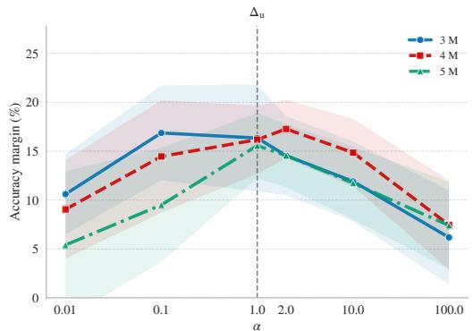

line

| α    | 3 M  | 4 M  | 5 M  |
|------|------|------|------|
| 0.01 | 10.5 | 9.0  | 5.5  |
| 0.1  | 17.0 | 14.5 | 9.5  |
| 1.0  | 16.5 | 16.0 | 15.5 |
| 2.0  | 16.0 | 17.0 | 14.5 |
| 10.0 | 12.0 | 14.5 | 11.5 |
| 100.0| 6.0  | 8.0  | 7.5  |

(b) ∆u   
Figure 16: Sweep of parameter α across different M, when λ is fixed to 1.

# I.2 IRFL

Scaling complexity Table 9 illustrates the scaling behavior of RePercENT compared to its strongest baseline, i.e., gMLP, as the number of modalities increases from two to three. For the two-modality calculation, we simulate the corresponding setting by excluding the definition encoders. Additionally, the inference latency is measured using a batch size of 32 and averaged over 100 forward passes.

Our proposed framework demonstrates exceptional parameter efficiency. The gMLP requires nearly a 3× increase in parameter count to accommodate the third modality, at the same time when RePercENT scales by a factor of only ∼ 1.5. This demonstrates that our method maintains a substantially lower computational footprint, both in parameter count and floating point operations (FLOPs), when transitioning to higher-dimensional multimodal settings. These gains are also reflected in the average inference time, where our method requires a ∼ 2.2 increase, while the gMLP rises to ∼ 2.9 with the presence of a third modality.

Table 9: Scaling complexity for RePercENT and strongest disentanglement counterpart gMLP, as we go from two to three modalities for the IRFL detection task. Growth denotes the ratio 3-modality/2- modality. The last column reports the relative reduction of RePercENT compared to gMLP at M = 3. 

<table><tr><td>Metric ~ Model</td><td>M = 2 (reference)</td><td>M = 3</td><td>Growth</td><td>Rel. diff. @ M = 3</td></tr><tr><td colspan="5">Parameter count (M) (↓)</td></tr><tr><td>gMLP</td><td>6.12</td><td>17.17</td><td>2.81×</td><td>reference</td></tr><tr><td>RePercENT</td><td>6.06</td><td>8.96</td><td>1.48×</td><td>47.8% lower</td></tr><tr><td colspan="5">Floating-point operations, FLOPs (B) (↓)</td></tr><tr><td>gMLP</td><td>20.89</td><td>63.16</td><td>3.02×</td><td>reference</td></tr><tr><td>RePercENT</td><td>5.67</td><td>9.50</td><td>1.68×</td><td>85.0% lower</td></tr><tr><td colspan="5">Inference latency (ms) (↓)</td></tr><tr><td>gMLP</td><td>15.32</td><td>44.12</td><td>2.88×</td><td>reference</td></tr><tr><td>RePercENT</td><td>16.89</td><td>37.10</td><td>2.20×</td><td>15.9% lower</td></tr></table>

Enriching text with definition When the definitions are added all the models benefit naturally, with our framework attaining the highest overall accuracy.

Table 10: IRFL figurative language detection results averaged over 5 random seeds. As a fixed reference, we provide zero-shot CLIP alongside two fine-tuned variants, including projection-only and end-to-end fine-tuning. Top-1 accuracy (%) is reported (mean ± std). 

<table><tr><td>Model</td><td>Idioms</td><td>Simile</td><td>Metaphor-OoD</td><td>Overall</td></tr><tr><td colspan="5">Image vs Caption ⊕ Definition</td></tr><tr><td>CLIP-ViT-B/32 (zero-shot)</td><td>26.00</td><td>48.38</td><td>36.04</td><td>38.78</td></tr><tr><td>CLIP-ViT-B/32 (finetune-proj)</td><td>36.00 ± 1.2</td><td>66.5 ± 1.6</td><td>41.44 ± 2.0</td><td>48.67 ± 1.3</td></tr><tr><td>CLIP-ViT-B/32 (finetune-all)</td><td>38.1 ± 1.1</td><td>70.4 ± 1.5</td><td>42.16 ± 3.2</td><td>50.81 ± 0.7</td></tr><tr><td>gMLP</td><td>43.80 ± 1.6</td><td>64.55 ± 2.9</td><td>44.92 ± 3.0</td><td>51.36 ± 1.7</td></tr><tr><td>GRU</td><td>46.40 ± 1.8</td><td>57.40 ± 2.4</td><td>44.92 ± 4.1</td><td>49.56 ± 1.7</td></tr><tr><td>RePercENT</td><td>42.50 ± 3.4</td><td>65.49 ± 2.4</td><td>44.98 ± 2.1</td><td>51.38 ± 0.8</td></tr></table>

# I.3 HONeYBEE

Towards interpretability Beyond serving as a geometric diagnostic of the learned shared spaces, the heatmaps in Figure 17 suggest that the learned shared representations capture biologically plausible cancer-type structure. For example, the lung cancer subtypes LUAD and LUSC often appear closer to one another than to unrelated cancer types, which is consistent with their shared tissue of origin. More broadly, the presence of structured off-diagonal similarities suggests that the shared representations are not only encoding cancer-type separability, but also capturing relationships between diseases that may arise from common tissue, histology, or molecular programs. Importantly, the observed geometry suggests that RePercENT may expose meaningful cross-cancer relationships, motivating future work that integrates domain-specific annotations, such as mutation status, molecular subtypes, pathway activity, immune profiles, to systematically validate and characterize the biological factors driving these patterns.

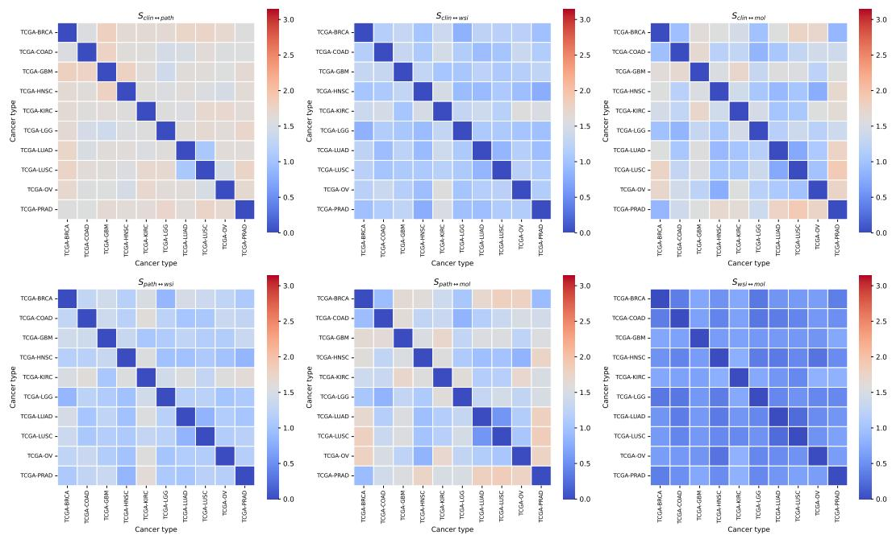  
Figure 17: Evaluation of the angular distance between the studied cancer types, across the extracted shared components. The shared components, as they are modeled with the use of von-Mises Fisher distribution, they lie on a hyper-sphere. We cluster the derived shared embeddings across modalities, based on their cancer type and calculate their centroid. The heatmap reflects the angular distance between those centroids within each shared component, where values close to zero (blue) denote proximity between those cancer types, while values closer to π (red) imply that the embeddings between these two matrices are further apart.