# Imagine Before You Predict: Interleaved Latent Visual Reasoning for Video Event Prediction

Tianxiang Jiang∗1,2 Linquan Wu∗3 Sheng Xia4 Songze Li5,2 Ziang Yan6,2 Haoyu Yang7 Yu Qiao2 Yi Wang2†

1 University of Science and Technology of China 2 Shanghai AI Laboratory 3 City University of Hong Kong 4 Nanjing University 5 Fudan University 6 Zhejiang University 7 University of Electronic Science and Technology of China https://github.com/OpenGVLab/Future-L1

# Abstract

Video event prediction (VEP) requires models to infer unobserved future states from partial video evidence. Existing video MLLMs usually verbalize intermediate future reasoning in text space: once visual evidence is verbalized, fine-grained motion, geometry, and interaction cues can be lost, leading to plausible but visually ungrounded hallucinations. We introduce FUTURE-L1, an interleaved latent visual reasoning framework that lets an MLLM alternate between language tokens and continuous latent visual spans during autoregressive decoding. To train this capability, we construct FUTURE-L1-50K by selecting examples where future visual hints help prediction and align latent states to future-frame embeddings, then further optimize sampled latent trajectories with LA-DAPO, a latent-aware RL objective with outcome-contrastive and temporal-diversity rewards. FUTURE-L1 achieves new state-ofthe-art results on both benchmarks: on FutureBench, it improves Qwen3-VL-8B from 61.0 to 85.4 and exceeds the previous best Video-CoE by 10.4 points; on TwiFF-Bench, it improves the average score from 2.44 to 3.04. These results suggest that future-oriented video reasoning benefits from preserving intermediate visual semantics in latent space rather than translating every reasoning step into text.

# 1 Introduction

Video event prediction (VEP) asks a model to infer what will happen next from a partially observed video (Koppula and Saxena, 2016; Vondrick et al., 2016a; Lei et al., 2020; Wang et al., 2025b; Su et al., 2026). Unlike standard video understanding, whose answers can usually be grounded in visible frames, VEP requires constructing an internal hypothesis about unobserved dynamic visual states: where objects will move, whether entities will interact, and how a scene will evolve. Although recent multimodal large language models (MLLMs) have made rapid progress on retrospective video tasks (Bai et al., 2025b,a; Wang et al., 2024; Li et al., 2024; Fu et al., 2024; Li et al., 2025c), futureoriented reasoning remains less explored.

Existing video MLLMs usually verbalize intermediate future reasoning in text space (Zhang et al., 2023; Han et al., 2025; Feng et al., 2026; Li et al., 2025d; Su et al., 2026). This is convenient for explanation, but it creates a poor interface for dynamic visual prediction: once visual evidence is converted into words, fine-grained motion, geometry, relative position, and interaction can be lost. The resulting reasoning may sound plausible while drifting away from visual semantics, especially when the correct answer depends on subtle future dynamics. Recent latent visual reasoning methods avoid part of this bottleneck by using continuous visual states (Li et al., 2025b; Pham and Ngo, 2025; Qin et al., 2025; Cheng et al., 2026; Li et al., 2025a; Yang et al., 2025b; Lu et al., 2026a), but most treat latent thoughts as static helper images or one-shot visual hints. VEP instead calls for a temporally organized latent process that can update imagined dynamic visual states over multiple reasoning steps.

We introduce FUTURE-L1, a framework that equips MLLMs with interleaved latent visual reasoning for VEP. During autoregressive decoding, FUTURE-L1 alternates between textual tokens and continuous latent visual spans, allowing language to organize the reasoning while latent states preserve intermediate dynamic visual structure. Training proceeds in two stages. First, we construct FUTURE-L1-50K from TwiFF-style trajectories using visual-gain data curation, selecting examples where intermediate future visual hints measurably help prediction. Supervised fine-tuning then teaches the model when to invoke latent spans and aligns their hidden states with future-frame embeddings. Second, we apply LA-DAPO, a latentaware RL objective that optimizes sampled latent trajectories with outcome-contrastive and temporaldiversity rewards, encouraging successful latent futures while discouraging repeated visual thoughts.

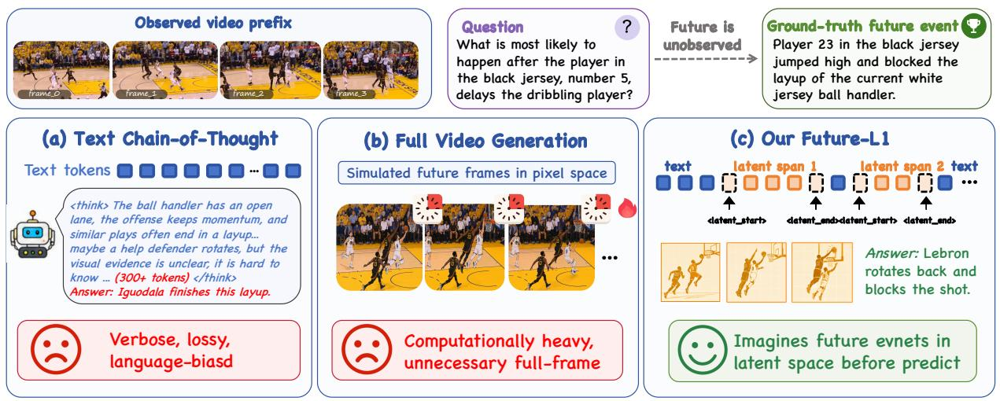

<details>
<summary>flowchart</summary>

```mermaid
graph TD
    A["(a) Text Chain-of-Thought"] --> B["Text tokens"]
    B --> C["<think> The ball handler has an open lane, the offense keeps momentum, and similar plays often end in a layup... maybe a help defender rotates, but the visual evidence is unclear, it is hard to know ... (300+ tokens) </think> Answer: Iguodala finishes this layup."]
    C --> D["Verbose, lossy, language-biasd"]
    D --> E["Computationally heavy, unnecessary full-frame"]
    F["(b) Full Video Generation"] --> G["Simulated future frames in pixel space"]
    G --> H["(-2, 2, ...)"]
    H --> I["(-1, 1)"]
    I --> J["(-2, 1)"]
    J --> K["(-1, 1)"]
    K --> L["(-2, 1)"]
    L --> M["(-1, 1)"]
    M --> N["(-2, 1)"]
    N --> O["(-1, 1)"]
    O --> P["(-2, 1)"]
    P --> Q["(-1, 1)"]
    Q --> R["(-2, 1)"]
    R --> S["(-1, 1)"]
    S --> T["(-2, 1)"]
    T --> U["(-1, 1)"]
    U --> V["(-2, 1)"]
    V --> W["(-1, 1)"]
    W --> X["(-2, 1)"]
    X --> Y["(-1, 1)"]
    Y --> Z["(-2, 1)"]
    Z --> AA["(-1, 1)"]
    AA --> AB["(-2, 1)"]
    AB --> AC["(-1, 1)"]
    AC --> AD["(-2, 1)"]
    AD --> AE["(-1, 1)"]
    AE --> AF["(-2, 1)"]
    AF --> AG["(-1, 1)"]
    AG --> AH["(-2, 1)"]
    AH --> AI["(-1, 1)"]
    AI --> AJ["(-2, 1)"]
    AJ --> AK["(-1, 1)"]
    AK --> AL["(-2, 1)"]
    AL --> AM["(-1, 1)"]
    AM --> AN["(-2, 1)"]
    AN --> AO["(-1, 1)"]
    AO --> AP["(-2, 1)"]
    AP --> AQ["(-1, 1)"]
    AQ --> AR["(-2, 1)"]
    AR --> AS["(-1, 1)"]
    AS --> AT["(-2, 1)"]
    AT --> AU["(-1, 1)"]
    AU --> AV["(-2, 1)"]
    AV --> AW["(-1, 1)"]
    AW --> AX["(-2, 1)"]
    AX --> AY["(-1, 1)"]
    AY --> AZ["(-2, 1)"]
    AZ --> BA["(-1, 1)"]
    BA --> BB["(-2, 1)"]
    BB --> BC["(-1, 1)"]
    BC --> BD["(-2, 1)"]
    BD --> BE["(-1, 1)"]
    BE --> BF["(-2, 1)"]
    BF --> BG["(-1, 1)"]
    BG --> BH["(-2, 1)"]
    BH --> BI["(-1, 1)"]
    BI --> BJ["(-2, 1)"]
    BJ --> BK["(-1, 1)"]
    BK --> BL["(-2, 1)"]
    BL --> BM["(-1, 1)"]
    BM --> BN["(-2, 1)"]
    BN --> BO["(-1, 1)"]
    BO --> BP["(-2, 1)"]
    BP --> BQ["(-1, 1)"]
    BQ --> BR["(-2, 1)"]
    BR --> BS["(-1, 1)"]
    BS --> BT["(-2, 1)"]
    BT --> BU["(-1, 1)"]
    BU --> BV["(-2, 1)"]
    BV --> BW["(-1, 1)"]
    BW --> BX["(-2, 1)"]
```
</details>

Figure 1: Motivation of interleaved latent visual reasoning. Text-CoT can be verbose and visually lossy, while pixel-space future simulation is computationally heavy. FUTURE-L1 instead inserts compact latent visual spans that preserve dynamic future semantics without generating full frames.

Experiments show that latent visual reasoning is substantially more effective than text-only reasoning for VEP. On FutureBench, FUTURE-L1-RL improves Qwen3-VL-8B from 61.0 to 85.4, exceeding the previous best Video-CoE by 10.4 points. On TwiFF-Bench, it improves the average score from 2.44 to 3.04. Under the same curated data source, text-only SFT reaches only 65.0 on FutureBench, whereas interleaved latent SFT reaches 73.2, indicating that the gain is not merely from additional supervision but from reasoning through a modality better matched to future visual structure.

Our contributions are threefold:

1. We propose visual-gain data curation and construct FUTURE-L1-50K, a high-utility corpus for supervising latent future visual reasoning.   
2. We introduce interleaved latent visual reasoning for VEP, enabling autoregressive models to alternate between language and continuous future visual states.   
3. We develop LA-DAPO, a latent-aware RL method that improves sampled latent trajectories and achieves state-of-the-art results on FutureBench and TwiFF-Bench.

# 2 Related Work

Multimodal Large Language Models. Multimodal large language models (MLLMs) connect visual encoders with strong LLM backbones and have become the mainstream framework for visual understanding (Bai et al., 2025a; Team et al., 2026; Hong et al., 2026; Xiao et al., 2026; An et al., 2026). For video understanding, recent MLLMs extend image-based models with temporal frame sampling, video instruction tuning, longercontext modeling, and large-scale video-text corpora (Wang et al., 2024; Zhang et al., 2024c; Wang et al., 2025a), substantially improving performance on diverse benchmarks (Li et al., 2024; Fu et al., 2026; Yang et al., 2025a; Xu et al., 2025; Shi et al., 2026). Beyond perception and recognition, reasoning-oriented post-training has been applied to MLLMs, including chain-of-thought supervision (Han et al., 2025) and reinforcement learning (Li et al., 2025d). More recently, paradigms that encourage models to think with images or videos move beyond purely textual rationales by retrieving visual evidence (Zheng et al., 2025b; Zeng et al., 2026; Lu et al., 2026b) with intermediate visual traces, motivating non-textual intermediate representations for visual reasoning.

Reasoning in Latent Space. Latent reasoning (Yu et al., 2026b) replaces discrete textual reasoning tokens with continuous hidden states fed back into the LLM, compressing chain-of-thought into a compact thinking space. Coconut (Hao et al., 2024) first showed that an LLM can reason in its own embedding space, and CODI (Shen et al., 2025) and SIM-CoT (Wei et al., 2025) subsequently distilled or supervised these latent steps to close the gap to explicit textual CoT. This paradigm has also been adopted by MLLMs through visual supervision: Mirage (Yang et al., 2025b) and LVR (Li et al., 2025a) align latent slots with embeddings of helper images that hint at the answer, and LaViT (Wu et al., 2026) further constrains latent visual thoughts with teacher-guided attention. More flexible designs allow models to alternate between textual tokens and continuous visual states during reasoning, as in Monet (Wang et al., 2025c), SkiLa (Tong et al., 2025), and SwimBird (Tong et al., 2026). However, these methods largely anchor latent thoughts to static images, such as helper images, sketches, or scenes already given to the model. Video event prediction instead requires reasoning over dynamic future frames that are not yet observed, where above studies have not explored. FUTURE-L1 accordingly grounds latent thoughts in future information rather than static visual hints.

Video Event Prediction. Unlike standard video understanding benchmarks (Li et al., 2024; Fu et al., 2024; Liu et al., 2024) that focus on visible content, video event prediction requires models to infer unobserved future events from a video prefix. This future-oriented setting spans low-level action anticipation (Lan et al., 2014; Gammulle et al., 2019), future-frame prediction (Ranzato et al., 2014; Vondrick et al., 2016b), and high-level semantic nextevent prediction (Lei et al., 2020; Jiang et al., 2025; Liang et al., 2025; Su et al., 2025). Most VEP methods remain text-output oriented (Cheng et al., 2025a; Wang et al., 2025b); for example, Video-CoE (Su et al., 2026) structures the reasoning trace as a long textual chain of historical events. Videoas-Answer (Cheng et al., 2025b) instead moves the answer modality from text to generated video explicitly. FUTURE-L1 differs from these routes: rather than verbalizing every intermediate event or synthesizing full videos, it represents intermediate future states in an interleaved latent visual channel supervised by future-frame embeddings.

# 3 Method

We propose FUTURE-L1, an interleaved latent visual reasoning framework for VEP. Given an observed video prefix V and question q, the model generates a response y by alternating textual reasoning, bounded latent visual spans, and a final answer. Training has two stages: SFT on FUTURE-L1-50K teaches when to invoke latent spans and aligns them with future-frame embeddings, while LA-DAPO further optimizes sampled latent trajectories with outcome-contrastive and temporaldiversity rewards. Figure 2 illustrates the pipeline.

# 3.1 Interleaved Latent Visual Reasoning

Autoregressive Reasoning with Latent Visual Spans. FUTURE-L1 augments a standard MLLM backbone (Bai et al., 2025a) with a latent visual reasoning channel using three special tokens: <|latent\_start|>, <|latent|>, and <|latent\_end|>. Generation begins in textual mode. Once <|latent\_start|> is emitted, each following <|latent|> position produces a hidden state ht that is fed back as the next input embedding rather than projected to the vocabulary. These continuous states act as latent visual thoughts and remain in the KV cache to condition later textual reasoning. Generation returns to text when <|latent\_end|> is emitted.

Dynamic Latent Budget at Inference. Latent span length is not fixed: a span ends when the model emits <|latent\_end|>. We cap each span by $L _ { \mathrm { m a x } }$ to avoid run-on latent decoding, and a response may contain multiple spans, allowing the model to allocate latent computation adaptively across reasoning stages.

# 3.2 SFT with FUTURE-L1-50K

SFT provides a necessary cold start for latent reasoning by training on curated interleaved traces and aligning latent states with future-frame embeddings. This prevents the model from either avoiding latent spans or producing continuous states not grounded in meaningful visual manifold before RL.

Visual-Gain Data Curation. We curate FUTURE-L1-50K from TwiFF-2.7M (Liu et al., 2026a), a VCoT corpus that provides intermediate reasoning frames. Unlike synthesized sketches or generic helper images, these frames are temporally later frames from the same authentic video, so they depict unseen future states that are physically consistent with the observed prefix. This makes them a natural supervision signal for latent visual reasoning: the model is not asked to imitate arbitrary visual hints, but to internalize future visual states that actually occur.

However, not every TwiFF sample provides useful supervision for VEP. Some examples are already easy to solve from the observed prefix alone, where extra future-frame hints add little value. Others remain ambiguous or uninformative even when a reasoning frame is provided. Training on them dilutes the signal that latent visual states should carry. We therefore filter examples by the marginal utility of their intermediate reasoning frames.

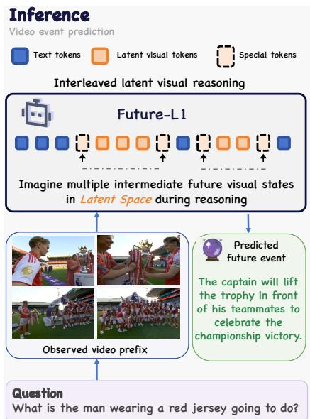

<details>
<summary>flowchart</summary>

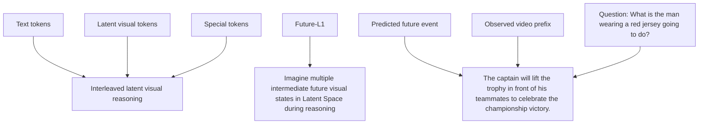
</details>

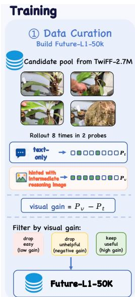

<details>
<summary>flowchart</summary>

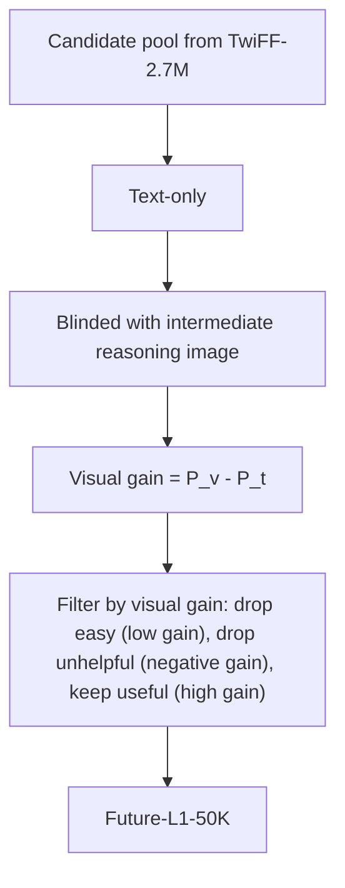
</details>

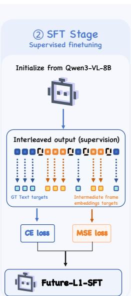

<details>
<summary>flowchart</summary>

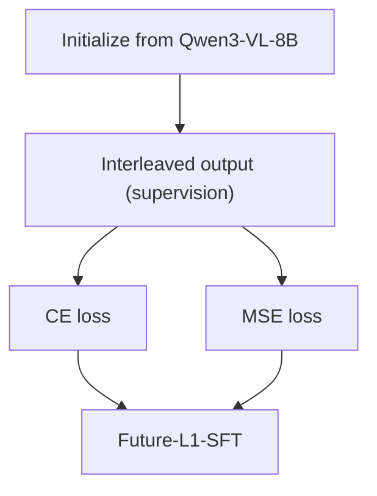
</details>

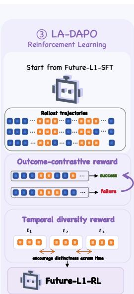

<details>
<summary>flowchart</summary>

```mermaid
graph TD
    A["Start from Future-L1-SFT"] --> B["Rollout trajectories"]
    B --> C{Outcome-contrastive reward}
    C --> D["..."]
    C --> E["..."]
    C --> F["..."]
    C --> G["..."]
    C --> H["..."]
    C --> I["..."]
    C --> J["..."]
    C --> K["..."]
    C --> L["..."]
    C --> M["..."]
    C --> N["..."]
    C --> O["..."]
    C --> P["..."]
    C --> Q["..."]
    C --> R["..."]
    C --> S["..."]
    C --> T["..."]
    C --> U["..."]
    C --> V["..."]
    C --> W["..."]
    C --> X["..."]
    C --> Y["..."]
    C --> Z["..."]
    C --> AA["..."]
    C --> AB["..."]
    C --> AC["..."]
    C --> AD["..."]
    C --> AE["..."]
    C --> AF["..."]
    C --> AG["..."]
    C --> AH["..."]
    C --> AI["..."]
    C --> AJ["..."]
    C --> AK["..."]
    C --> AL["..."]
    C --> AM["..."]
    C --> AN["..."]
    C --> AO["..."]
    C --> AP["..."]
    C --> AQ["..."]
    C --> AR["..."]
    C --> AS["..."]
    C --> AT["..."]
    C --> AU["..."]
    C --> AV["..."]
    C --> AW["..."]
    C --> AX["..."]
    C --> AY["..."]
    C --> AZ["..."]
    C --> BA["..."]
    C --> BB["..."]
    C --> BC["..."]
    C --> BD["..."]
    C --> BE["..."]
    C --> BF["..."]
    C --> BG["..."]
    C --> BH["..."]
    C --> BI["..."]
    C --> BJ["..."]
    C --> BK["..."]
    C --> BL["..."]
    C --> BM["..."]
    C --> BN["..."]
    C --> BO["..."]
    C --> BP["..."]
    C --> BQ["..."]
    C --> BR["..."]
    C --> BS["..."]
    C --> BT["..."]
    C --> BU["..."]
    C --> BV["..."]
    C --> BW["..."]
    C --> BX["..."]
    C --> BY["..."]
    C --> BZ["..."]
    C --> CA["..."]
    C --> CB["..."]
    C --> CC["..."]
    C --> CD["..."]
    C --> CE["..."]
    C --> CF["..."]
    C --> CG["..."]
    C --> CH["..."]
    C --> CI["..."]
    C --> CJ["..."]
    C --> CK["..."]
    C --> CR["..."]
    C --> CS["..."]
    C --> CT["..."]
    C --> CU["..."]
    C --> CV["..."]
    C --> CW["..."]
    C --> CX["..."]
    C --> CY["..."]
    C --> CZ["..."]
    C --> DA["..."]
```
</details>

Figure 2: Overview of FUTURE-L1. (Left) FUTURE-L1-50K is built by ranking TwiFF candidates by visual gain $p _ { v } - p _ { t }$ . (Center) SFT trains interleaved text–latent trajectories, aligning latent spans with future visual states. (Right) LA-DAPO further optimizes sampled trajectories with outcome-contrastive and temporal-diversity rewards.

FUTURE-L1-50K Training Example   
```txt
<reason> [Textual CoT 0] </reason>
<|latent_start|> [Latent Visual Frames 1] <|latent_end|>
<reason> [Textual CoT 1] </reason>
......
<|latent_start|> [Latent Visual Frames N] <|latent_end|>
<reason> [Textual CoT N] </reason>
<answer> [Predicted Future Event] </answer> 
```  
Figure 3: FUTURE-L1-50K training format: textual reasoning interleaved with bounded latent visual spans supervised by future-frame embeddings.

For each candidate, we evaluate Qwen3-VL-8B-Instruct under two conditions: (1) a text-only input with the observed video prefix and question; and (2) a hinted input that additionally includes the intermediate reasoning frames. Each condition uses 8 independent rollouts judged by Qwen3.5-397B-A17B. Let $p _ { t } , p _ { v } \ \in \ [ 0 , 8 ]$ be the correct-rollout counts; we retain samples with $p _ { t } \leq 6 .$ , so the textonly setting is not saturated, and $p _ { v } - p _ { t } \ge 2 .$ , so the visual hint provides measurable lift. We rank retained samples by descending $p _ { v } - p _ { t }$ , and take the top 50,000 items as FUTURE-L1-50K. All retained samples are reformatted into the interleaved trajectory shown in Figure 3.

Training Objective. SFT optimizes a joint objective over discrete text tokens and continuous latent visual states:

$$
\mathcal {L} _ {\mathrm{SFT}} = \mathcal {L} _ {\mathrm{CE}} + \lambda \mathcal {L} _ {\text { Latent }}, \tag {1}
$$

where λ controls the strength of latent supervision.

For discrete positions $\tau$ , including textual reasoning, answer tokens, and special control tokens, we use standard next-token prediction:

$$
\mathcal {L} _ {\mathrm{CE}} = - \sum_ {t \in \mathcal {T}} \log p _ {\theta} (w _ {t} \mid w _ {<   t}, V, q). \tag {2}
$$

For latent positions S, we align each hidden state $\mathbf { h } _ { t }$ with the visual embedding $\mathbf { e } _ { t } ^ { \star }$ of the corresponding future reasoning frame, extracted by the Qwen3-VL vision encoder:

$$
\mathcal {L} _ {\text { Latent }} = \frac {1}{| \mathcal {S} |} \sum_ {t \in \mathcal {S}} \left\| \mathbf {h} _ {t} - \mathbf {e} _ {t} ^ {\star} \right\| _ {2} ^ {2}. \tag {3}
$$

This anchors latent spans to the future-frame manifold while preserving standard language modeling over the textual channel.

# 3.3 LA-DAPO for Latent-Aware RL

SFT provides a grounded but teacher-forced initialization: each latent state is matched to a futureframe embedding, while sampled latent trajectories are not directly optimized for prediction success. We therefore introduce LA-DAPO (Latent-Aware Direct Advantage Policy Optimization), a latent-aware extension of DAPO (Yu et al., 2026a). LA-DAPO keeps DAPO’s answer and format rewards, and adds two trajectory-level latent rewards: an outcome-contrastive reward that aligns latent trajectories associated with correct answers, and a temporal-diversity reward that discourages repeating the same visual thought across spans. Because these rewards depend on rollout outcomes and generated latent states, LA-DAPO can optimize latent reasoning without requiring intermediate-frame annotations during RL.

Outcome-Contrastive Latent Reward. Answer rewards provide only a sequence-level scalar, leaving latent states weakly supervised. We introduce an outcome-contrastive reward $R _ { \mathrm { c t r } }$ that structures latent trajectories by group outcomes: correct rollouts are pulled together, while incorrect rollouts serve as negatives. Because the signal depends only on final-answer correctness, it does not require intermediate-frame annotations.

Let $\mathbf Z _ { i } = [ \mathbf z _ { i , 1 } , \dots , \mathbf z _ { i , T _ { i } } ]$ be the normalized latent trajectory of rollout i, with correctness $a _ { i } \in$ {0, 1}. We define trajectory similarity as

$$
s _ {i j} = \frac {1}{T} \sum_ {t = 1} ^ {T} \frac {1 + \langle \mathbf {z} _ {i , t} , \mathbf {z} _ {j , t} \rangle}{2}, \tag {4}
$$

where T = min $( T _ { i } , T _ { j } )$ . Let $\mathcal { P } _ { i } ~ = ~ \{ j ~ \neq ~ i ~ :$ : $a _ { j } ~ = ~ 1 \} , ~ { \mathcal { N } } _ { i } ~ = ~ \{ j ~ \neq ~ i ~ : ~ a _ { j } ~ = ~ 0 \}$ , and $s _ { i } ^ { + } = \operatorname* { m a x } _ { j \in \mathcal { P } _ { i } } s _ { i j }$ s . We use a hardest-positive InfoNCE reward:

$$
R _ {\mathrm{ctr}} (i) = \frac {\exp (s _ {i} ^ {+} / \tau)}{\exp (s _ {i} ^ {+} / \tau) + \sum_ {j \in \mathcal {N} _ {i}} \exp (s _ {i j} / \tau)}. \tag {5}
$$

Temporal Diversity Reward. $R _ { \mathrm { c t 1 } }$ aligns trajectories across rollouts but imposes no structure within a rollout: a policy can still earn a high answer reward by emitting near-identical latent states at consecutive spans, collapsing the latent channel into a single visual thought repeated over time. Although SFT discourages this through frame-distinct supervision, this constraint is no longer present during RL. We therefore add a temporal diversity reward $R _ { \mathrm { d i v } }$ that encourages adjacent latent spans to represent distinct future updates. For a response with M latent spans, we mean-pool the latent vectors within span m into a representative $ { \mathbf { b } } _ { m }$ , and penalize adjacent-span similarity:

$$
R _ {\mathrm{div}} = - \frac {1}{M - 1} \sum_ {m = 1} ^ {M - 1} \cos^ {2} (\mathbf {b} _ {m}, \mathbf {b} _ {m + 1}). \tag {6}
$$

This reward is maximized at 0 when adjacent span representatives are orthogonal and decreases as they become redundant.

Together, $R _ { \mathrm { c t r } }$ and $R _ { \mathrm { d i v } }$ regularize latent reasoning along complementary axes: $R _ { \mathrm { c t r } }$ r links latent trajectories to prediction outcomes across rollouts, while $R _ { \mathrm { d i v } }$ keeps successive latent spans within a rollout temporally distinct.

Final Rewards. The total target combines answer / format rewards and two latent terms,

$$
R = \lambda_ {a} R _ {\mathrm{acc}} + \lambda_ {f} R _ {\mathrm{fmt}} + \lambda_ {c} R _ {\mathrm{ctr}} + \lambda_ {d} R _ {\mathrm{div}}, (7)
$$

where $\lambda _ { c }$ and $\lambda _ { d }$ are ablated in $\ S 4$ .

# 4 Experiments

Benchmarks. We evaluate FUTURE-L1 on two complementary video event prediction benchmarks. FutureBench (Wang et al., 2025b) is a multiplechoice VEP benchmark that asks models to predict unobserved future events from a video prefix. It reports overall accuracy and four reasoning-depth splits: 1-Hop, 2-Hop, 3-Hop, and Interp.. While 1- Hop mainly tests immediate next-event prediction, 3-Hop and Interp. form harder OOD-style regimes: 3-Hop requires extrapolating longer future event chains, and Interp. requires reasoning over nonconsecutive future states under partial intermediate anchors. These splits therefore test whether a model can generalize beyond local next-event cues. TwiFF-Bench (Liu et al., 2026a) evaluates open-ended future-frame reasoning over 1,078 QA samples and scores both the generated reasoning trajectory and the final answer. Following the official protocol, we report CoT quality, answer quality, and their average under the benchmark judge. The TwiFF-Bench evaluation set is not used in FUTURE-L1-50K construction, SFT, or RL training.

Implementation Details. We use Qwen3-VL-8B-Instruct (Bai et al., 2025a) as the backbone. SFT trains for 1 epoch on FUTURE-L1-50K (§3.2) with global batch size 128, peak learning rate $1 \times 1 0 ^ { - 5 }$ , MSE weight λ=0.1, and maximum latent budget $L _ { \mathrm { m a x } } { = } 4$ unless otherwise specified. RL starts from the SFT checkpoint with group size G=8 and uses Qwen3.6-27B as the LLM-as-judge for the accuracy reward. All experiments run on 8×NVIDIA H200 GPUs, and all checkpoints are evaluated with lmms-eval (Zhang et al., 2024a). More detailed settings are listed in Appendix B.

# 4.1 Main Results

Prior Models Struggle on VEP. Tables 1 and 2 show that VEP remains difficult even for strong

Table 1: Main results on FutureBench (Wang et al., 2025b). Accuracy (%); best results are in bold. 

<table><tr><td>Model</td><td>Size</td><td>Method</td><td>Frames</td><td>1-Hop</td><td>2-Hop</td><td>3-Hop</td><td>Interp.</td><td>AVG</td></tr><tr><td colspan="9">Open-source and Proprietary Models</td></tr><tr><td>GLM-4.1V (Team et al., 2025)</td><td>9B</td><td></td><td>32</td><td>29.9</td><td>41.9</td><td>52.2</td><td>47.3</td><td>44.4</td></tr><tr><td>LLaVA-NeXT-Video (Zhang et al., 2024b)</td><td>7B</td><td></td><td>32</td><td>48.8</td><td>49.3</td><td>40.0</td><td>44.4</td><td>45.2</td></tr><tr><td>MiMo-VL (Xiaomi, 2025)</td><td>7B</td><td></td><td>32</td><td>59.0</td><td>59.6</td><td>50.5</td><td>43.8</td><td>50.5</td></tr><tr><td>InternVL3 (Zhu et al., 2025)</td><td>8B</td><td></td><td>32</td><td>54.3</td><td>58.0</td><td>63.2</td><td>54.4</td><td>56.7</td></tr><tr><td>Qwen2.5-VL-Instruct (Bai et al., 2025b)</td><td>7B</td><td rowspan="5">Zero-Shot</td><td>32</td><td>57.2</td><td>57.0</td><td>50.2</td><td>50.7</td><td>52.9</td></tr><tr><td>Qwen2.5-VL-Instruct (Bai et al., 2025b)</td><td>72B</td><td>32</td><td>55.5</td><td>68.4</td><td>63.7</td><td>53.2</td><td>58.3</td></tr><tr><td>Qwen3-VL (Bai et al., 2025a)</td><td>30B-A3B</td><td>32</td><td>65.3</td><td>70.5</td><td>76.1</td><td>62.2</td><td>66.9</td></tr><tr><td>GPT-4o (OpenAI, 2024)</td><td>-</td><td>32</td><td>61.9</td><td>61.7</td><td>72.1</td><td>51.6</td><td>59.0</td></tr><tr><td>GPT-5 (OpenAI, 2024)</td><td>-</td><td>32</td><td>59.6</td><td>57.3</td><td>62.6</td><td>55.6</td><td>57.9</td></tr><tr><td colspan="9">Video Reasoning Models</td></tr><tr><td>Video-RFT (Wang et al., 2026)</td><td>7B</td><td>SFT+RL</td><td>32</td><td>62.4</td><td>53.9</td><td>50.7</td><td>53.8</td><td>54.6</td></tr><tr><td>Video-R1 (Feng et al., 2026)</td><td>7B</td><td>SFT+RL</td><td>32</td><td>67.6</td><td>65.3</td><td>61.2</td><td>61.8</td><td>63.3</td></tr><tr><td>VideoAuto-R1 (Liu et al., 2026b)</td><td>8B</td><td>SFT+RL</td><td>32</td><td>63.6</td><td>69.4</td><td>67.7</td><td>59.3</td><td>63.4</td></tr><tr><td>Video-o3 (Zeng et al., 2026)</td><td>7B</td><td>SFT+RL</td><td>32</td><td>68.2</td><td>73.6</td><td>63.2</td><td>69.7</td><td>68.9</td></tr><tr><td>NEP (Wang et al., 2025b)</td><td>7B</td><td>SFT+RL</td><td>32</td><td>66.2</td><td>69.9</td><td>63.7</td><td>68.1</td><td>67.3</td></tr><tr><td>Video-CoE (Su et al., 2026)</td><td>7B</td><td>SFT+RL</td><td>32</td><td>80.9</td><td>83.9</td><td>71.6</td><td>71.4</td><td>75.0</td></tr><tr><td colspan="9">Latent Visual Reasoning Models</td></tr><tr><td>LVR (Li et al., 2025a)</td><td>7B</td><td>SFT+RL</td><td>32</td><td>22.5</td><td>26.4</td><td>22.9</td><td>17.6</td><td> $21.0^†$ </td></tr><tr><td>Monet (Wang et al., 2025c)</td><td>7B</td><td>SFT+RL</td><td>32</td><td>46.8</td><td>47.2</td><td>45.3</td><td>49.7</td><td>47.9</td></tr><tr><td>SwimBird (Tong et al., 2026)</td><td>8B</td><td>SFT</td><td>32</td><td>59.0</td><td>66.8</td><td>64.7</td><td>61.8</td><td>62.8</td></tr><tr><td colspan="9">Ours</td></tr><tr><td>Qwen3-VL-Instruct (Bai et al., 2025a)</td><td>8B</td><td>Zero-Shot</td><td>32</td><td>64.2</td><td>65.8</td><td>66.2</td><td>55.8</td><td>61.0</td></tr><tr><td>Text-Only SFT (on FUTURE-L1-50K)</td><td>8B</td><td>SFT</td><td>32</td><td>67.6</td><td>66.8</td><td>68.2</td><td>62.0</td><td>65.0</td></tr><tr><td>FUTURE-L1</td><td>8B</td><td>SFT</td><td>32</td><td>70.5</td><td>73.1</td><td>77.6</td><td>72.2</td><td>73.2</td></tr><tr><td>FUTURE-L1</td><td>8B</td><td>SFT+RL</td><td>32</td><td>83.2</td><td>86.5</td><td>86.6</td><td>85.1</td><td>85.4</td></tr></table>

†LVR often collapses under dense video visual-token inputs and fails to produce valid text responses.

Table 2: Main results on TwiFF-Bench (Liu et al., 2026a). Avg.=(CoT+Ans)/2; best results are in bold. 

<table><tr><td>Model</td><td>Size</td><td>CoT</td><td>Answer</td><td>Avg.</td></tr><tr><td colspan="5">Multimodal Large Language Models</td></tr><tr><td>Qwen2.5-VL (Bai et al., 2025b)</td><td>7B</td><td>2.46</td><td>1.63</td><td>2.05</td></tr><tr><td>InternVL3.5 (Wang et al., 2025d)</td><td>8B</td><td>2.35</td><td>1.85</td><td>2.10</td></tr><tr><td>DeepEyes (Zheng et al., 2025b)</td><td>7B</td><td>2.54</td><td>2.20</td><td>2.37</td></tr><tr><td colspan="5">Unified Models</td></tr><tr><td>Janus-Pro (Chen et al., 2025)</td><td>7B</td><td>2.04</td><td>1.04</td><td>1.54</td></tr><tr><td>Bagel (Deng et al., 2025)</td><td>7B</td><td>2.29</td><td>1.85</td><td>2.07</td></tr><tr><td>TwiFF-300K (Liu et al., 2026a)</td><td>7B</td><td>2.90</td><td>2.55</td><td>2.73</td></tr><tr><td>TwiFF-2.7M (Liu et al., 2026a)</td><td>7B</td><td>2.95</td><td>2.62</td><td>2.79</td></tr><tr><td colspan="5">Ours</td></tr><tr><td>Zero-Shot (Bai et al., 2025a)</td><td>8B</td><td>2.75</td><td>2.14</td><td>2.44</td></tr><tr><td>FUTURE-L1-SFT</td><td>8B</td><td>2.62</td><td>2.42</td><td>2.52</td></tr><tr><td>FUTURE-L1-RL</td><td>8B</td><td>3.11</td><td>2.97</td><td>3.04</td></tr></table>

MLLMs. Proprietary and open-source models do not reliably solve FutureBench: GPT-4o obtains 59.0, GPT-5 obtains 57.9, and Qwen3-VL-30B-A3B reaches 66.9. Video-reasoning models improve over generic MLLMs but continue to struggle, including Video-R1 (63.3), Video-o3 (68.9), NEP (67.3), and Video-CoE (75.0). Their remaining errors are especially visible on the harder futureoriented splits: the strongest Video-CoE reaches only 71.6 on 3-Hop and 71.4 on Interp., where models must extrapolate longer event chains or reason over non-consecutive future states. Existing static latent visual reasoning methods also do not transfer directly to dense video prediction: Monet reaches 47.9 and LVR obtains 21.0. These results suggest that VEP is not solved by scaling generic MLLMs, adding text-centric video reasoning, or directly reusing static latent-reasoning recipes.

FUTURE-L1 Boosts FutureBench. FUTURE-L1-SFT reaches 73.2, improving the Qwen3-VL backbone (from 61.0) by +12.2. It outperforms the text-only SFT control trained on the same FUTURE-L1-50K (65.0) by 8.2, isolating the gain from interleaved latent reasoning rather than sample selection alone. After LA-DAPO, FUTURE-L1-RL improves to 85.4, exceeding Qwen3-VL-30B-A3B by 18.5 points and Video-CoE by 10.4 points. The gains over the backbone are strongest on the harder splits: +19.0, +20.7, +20.4, and +29.3 on 1-Hop, 2-Hop, 3-Hop, and Interp., respectively. The larger improvements on 3-Hop and Interp. suggest that latent channel generalizes to longer future chains, rather than only improving single-step NEP.

Table 3: SFT hyperparameter ablation on FutureBench. Accuracy (%) for latent MSE weight λ and budget $L _ { \mathrm { m a x } }$ . 

<table><tr><td>Setting</td><td>1-Hop</td><td>2-Hop</td><td>3-Hop</td><td>Interp.</td><td>AVG</td></tr><tr><td colspan="6">Latent MSE weight λ</td></tr><tr><td>0.01</td><td>68.2</td><td>69.9</td><td>73.1</td><td>67.5</td><td>69.1</td></tr><tr><td>0.05</td><td>71.1</td><td>72.0</td><td>73.6</td><td>69.3</td><td>70.9</td></tr><tr><td>0.10</td><td>70.5</td><td>73.1</td><td>77.6</td><td>72.2</td><td>73.2</td></tr><tr><td>0.20</td><td>69.9</td><td>76.7</td><td>74.6</td><td>70.1</td><td>72.2</td></tr><tr><td>0.50</td><td>73.4</td><td>71.0</td><td>71.6</td><td>69.3</td><td>70.7</td></tr><tr><td>1.00</td><td>73.4</td><td>73.1</td><td>68.7</td><td>67.1</td><td>69.5</td></tr><tr><td colspan="6">Maximum latent budget  $L_{\text{max}}$ </td></tr><tr><td>2</td><td>66.5</td><td>74.1</td><td>74.6</td><td>69.3</td><td>70.7</td></tr><tr><td>4</td><td>70.5</td><td>73.1</td><td>77.6</td><td>72.2</td><td>73.2</td></tr><tr><td>8</td><td>65.9</td><td>75.1</td><td>73.6</td><td>72.4</td><td>72.1</td></tr><tr><td>16</td><td>69.9</td><td>72.5</td><td>71.1</td><td>70.8</td><td>71.0</td></tr><tr><td>32</td><td>69.4</td><td>72.0</td><td>71.1</td><td>69.5</td><td>70.3</td></tr><tr><td>64</td><td>67.1</td><td>68.9</td><td>70.6</td><td>65.6</td><td>67.4</td></tr></table>

TwiFF-Bench Shows the Same Trend. On TwiFF-Bench, FUTURE-L1-SFT raises the average score from 2.44 to 2.52. Though its CoT score decreases from 2.75 to 2.62, its answer score rises from 2.14 to 2.42, showing the curated traces strengthen prediction even when their surface reasoning is imperfect. LA-DAPO improves both dimensions, reaching 3.11 CoT and 2.97 Ans for an average of 3.04. This surpasses the previous best TwiFF-2.7M (2.79) and all listed MLLM or unified baselines, indicating that interleaved latent reasoning and trajectory-level RL are complementary.

# 4.2 Ablation Study

SFT Hyperparameters. Table 3 sweeps the latent MSE weight λ and the maximum latent budget $L _ { \mathrm { m a x } }$ . With $L _ { \operatorname* { m a x } } = 4$ fixed, $\lambda = 0 . 1$ is optimal (73.2); both weaker $( \lambda = 0 . 0 1 , 6 9 . 1 )$ and stronger $( \lambda = 1 . 0 , 6 9 . 5 )$ alignment weights cost 3-4 points, indicating that latent positions need explicit but not dominant supervision. With $\lambda = 0 . 1$ fixed, accuracy peaks at $L _ { \operatorname* { m a x } } = 4$ and degrades to 67.4 at $L _ { \mathrm { m a x } } = 6 4$ , suggesting that an overly long latent span dilutes useful signal. This indicates that latent reasoning benefits from short, explicitly supervised spans rather than simply allocating more continuous tokens. We adopt $\lambda = 0 . 1$ , $L _ { \operatorname* { m a x } } = 4$ as the default SFT setting.

RL Objective. Table 4 ablates the RL objective from FUTURE-L1-SFT. GRPO (82.8) and DePO (Cheng et al., 2026) (81.1) already lift FUTURE-L1-SFT (73.2) by about 9 points, and DAPO further reaches 83.8. Adding latent-aware rewards improves the objective beyond DAPO: the outcome-contrastive reward $R _ { \mathrm { c t r } }$ raises perfor-

Table 4: RL objective ablation on FutureBench. Accuracy (%); all variants start from FUTURE-L1-SFT. 

<table><tr><td>Method</td><td>1-Hop</td><td>2-Hop</td><td>3-Hop</td><td>Interp.</td><td>AVG</td></tr><tr><td>Text-Only SFT</td><td>67.6</td><td>66.8</td><td>68.2</td><td>62.0</td><td>65.0</td></tr><tr><td>+ GRPO</td><td>77.5</td><td>78.8</td><td>78.1</td><td>77.1</td><td>77.7</td></tr><tr><td>+ DAPO</td><td>83.2</td><td>81.3</td><td>78.1</td><td>71.2</td><td>76.3</td></tr><tr><td>FUTURE-L1-SFT</td><td>70.5</td><td>73.1</td><td>77.6</td><td>72.2</td><td>73.2</td></tr><tr><td>+ GRPO</td><td>82.7</td><td>84.5</td><td>85.1</td><td>81.2</td><td>82.8</td></tr><tr><td>+ DePO</td><td>78.0</td><td>80.3</td><td>86.6</td><td>80.2</td><td>81.1</td></tr><tr><td>+ DAPO</td><td>83.2</td><td>85.5</td><td>86.6</td><td>82.4</td><td>83.8</td></tr><tr><td>+  $R_{ctr}$ </td><td>83.2</td><td>86.0</td><td>87.1</td><td>83.2</td><td>84.5</td></tr><tr><td>+  $R_{div}$ </td><td>82.7</td><td>87.0</td><td>87.6</td><td>83.4</td><td>84.8</td></tr><tr><td>FUTURE-L1-RL</td><td>83.2</td><td>86.5</td><td>86.6</td><td>85.1</td><td>85.4</td></tr></table>

Table 5: LA-DAPO reward coefficient ablation on FutureBench. Accuracy (%) for $\lambda _ { c }$ and $\lambda _ { d } .$ . 

<table><tr><td>Setting</td><td>1-Hop</td><td>2-Hop</td><td>3-Hop</td><td>Interp.</td><td>AVG</td></tr><tr><td colspan="6">Outcome-contrastive weight  $\lambda_c$ </td></tr><tr><td>0.01</td><td>81.5</td><td>84.5</td><td>86.1</td><td>83.4</td><td>83.8</td></tr><tr><td>0.05</td><td>82.7</td><td>87.0</td><td>86.1</td><td>83.0</td><td>84.3</td></tr><tr><td>0.10</td><td>84.4</td><td>86.5</td><td>87.1</td><td>84.0</td><td>85.1</td></tr><tr><td>0.20</td><td>83.2</td><td>86.5</td><td>86.6</td><td>85.1</td><td>85.4</td></tr><tr><td>0.50</td><td>82.1</td><td>86.0</td><td>86.1</td><td>83.0</td><td>84.0</td></tr><tr><td>1.00</td><td>83.8</td><td>86.5</td><td>86.6</td><td>84.5</td><td>85.1</td></tr><tr><td colspan="6">Temporal diversity weight  $\lambda_d$ </td></tr><tr><td>0.01</td><td>83.2</td><td>86.5</td><td>86.6</td><td>83.8</td><td>84.8</td></tr><tr><td>0.05</td><td>83.8</td><td>87.0</td><td>86.6</td><td>84.3</td><td>85.1</td></tr><tr><td>0.10</td><td>83.2</td><td>86.5</td><td>86.6</td><td>85.1</td><td>85.4</td></tr><tr><td>0.20</td><td>80.9</td><td>82.9</td><td>87.1</td><td>83.2</td><td>83.5</td></tr><tr><td>0.50</td><td>79.8</td><td>83.4</td><td>85.6</td><td>81.6</td><td>82.4</td></tr><tr><td>1.00</td><td>78.0</td><td>82.4</td><td>85.6</td><td>81.0</td><td>81.6</td></tr></table>

mance to 84.5, the temporal-diversity reward $R _ { \mathrm { d i v } }$ reaches 84.8, and using both in FUTURE-L1-RL achieves 85.4. This shows that the gain is not only from stronger RL, but from rewards that directly structure latent visual trajectories.

RL Reward Coefficients. Table 5 examines the latent-reward coefficients. The outcomecontrastive weight peaks at $\lambda _ { c } = 0 . 2 ( 8 5 . 4 )$ , and the temporal-diversity weight peaks at $\lambda _ { d } = 0 . 1 ;$ larger values hurt, dropping to 81.6 at $\lambda _ { d } = 1 . 0$ . This suggests that contrastive alignment and temporal diversity are both useful, but excessive pressure can push latent spans off the manifold.

# 4.3 Analysis of Latent Visual Reasoning

Visual-Gain Filtering. Table 6 controls for a key confound: whether the SFT gain comes from visual-gain selection or merely from TwiFF-style formatting. We compare our Top-50K set with a random 50K set sampled from TwiFF-2.7M under the same interleaved-format requirement and train both with the same FUTURE-L1-SFT recipe. The random set improves Qwen3-VL-8B from 61.0 to

Table 6: Effect of visual-gain filtering. FutureBench accuracy (%) for 50K TwiFF-format SFT data. 

<table><tr><td>Training Set</td><td>1-Hop</td><td>2-Hop</td><td>3-Hop</td><td>Interp.</td><td>AVG</td></tr><tr><td>Zero-Shot</td><td>64.2</td><td>65.8</td><td>66.2</td><td>55.8</td><td>61.0</td></tr><tr><td>Random 50K</td><td>67.6</td><td>68.9</td><td>70.1</td><td>67.7</td><td>68.4</td></tr><tr><td>FUTURE-L1-50K</td><td>70.5</td><td>73.1</td><td>77.6</td><td>72.2</td><td>73.2</td></tr></table>

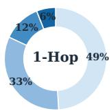

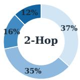

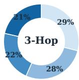  
Avg. # spans = 1.79  Avg. # spans = 2.18  Avg. # spans = 2.52 1 span 2 spans 3 spans >3 spans

Figure 4: Latent-span usage by reasoning depth. Donuts show span-count distributions; values report mean spans over six RL settings.   
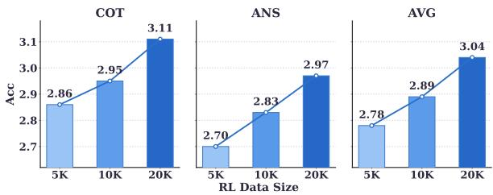

<details>
<summary>bar_line</summary>

| Model | Data Size | ACC |
| :--- | :--- | :--- |
| COT | 5K | 2.86 |
| COT | 10K | 2.95 |
| COT | 20K | 3.11 |
| ANS | 5K | 2.70 |
| ANS | 10K | 2.83 |
| ANS | 20K | 2.97 |
| AVG | 5K | 2.78 |
| AVG | 10K | 2.89 |
| AVG | 20K | 3.04 |
</details>

Figure 5: RL data scaling on TwiFF-Bench. Scores improve as LA-DAPO uses 5K, 10K, and 20K retained visual-gain samples.

68.4, showing that interleaved demonstrations help, but it remains 4.8 points below our visual-gain selected set (73.2). The gap persists on the harder splits, including 3-Hop (70.1 vs. 77.6) and Interp. (67.7 vs. 72.2). Thus FUTURE-L1-50K improves transfer not only by exposing the model to TwiFFstyle traces, but by selecting examples whose future visual hints provide measurable predictive utility.

Adaptive Latent Usage. Figure 4 examines whether FUTURE-L1 allocates latent computation according to reasoning difficulty. Averaged over six RL hyperparameter settings, the mean span count increases with depth, from 1.79 on 1-Hop to 2.18 on 2-Hop and 2.52 on 3-Hop. The distribution shifts in the same direction: one-span responses become less frequent as depth increases, while responses with more than three spans grow from 6% on 1-Hop to 12% on 2-Hop and 21% on 3-Hop. This shows that latent spans are not emitted as a fixed template; instead, FUTURE-L1 spends more latent visual computation when longer future event chains require updating dynamic visual states.

RL Data Scaling. Figure 5 tests whether LA-DAPO benefits from more retained visual-gain data. Using 5K, 10K, and 20K samples from the retained pool, the TwiFF-Bench average score increases monotonically from 2.78 to 2.89 and 3.04. This trend indicates that trajectory-level latent RL continues to benefit from high-utility samples rather than saturating on a small preference set.

Table 7: Inference cost on FutureBench. Average tokens, accuracy, latency, and accuracy per second. 

<table><tr><td>Model</td><td>Tokens ↓</td><td>Acc. ↑</td><td>Latency (s) ↓</td><td>Acc./s ↑</td></tr><tr><td>Video-R1</td><td>398.5</td><td>63.3</td><td>3.28</td><td>19.3</td></tr><tr><td>Video-o3</td><td>348.6</td><td>68.9</td><td>25.90</td><td>2.7</td></tr><tr><td>Qwen3-VL-8B</td><td>288.8</td><td>61.0</td><td>1.18</td><td>51.7</td></tr><tr><td>FUTURE-L1-SFT</td><td>205.3</td><td>73.1</td><td>0.96</td><td>76.1</td></tr><tr><td>FUTURE-L1-RL</td><td>195.3</td><td>85.4</td><td>0.91</td><td>93.8</td></tr></table>

Inference Efficiency. Table 7 compares inference cost on FutureBench. Text-heavy and multiturn baselines require substantially larger decoding budgets: Video-R1 emits 398.5 tokens at 3.28 seconds per sample, and Video-o3 emits 348.6 tokens at 25.90 seconds due to repeated model calls during search. In contrast, FUTURE-L1-SFT uses 205.3 tokens and reaches 73.1 accuracy at 0.96 seconds, while FUTURE-L1-RL uses 195.3 tokens and reaches 85.4 accuracy at 0.91 seconds, yielding the best accuracy-per-second score. Thus FUTURE-L1 improves accuracy through compact latent visual computation rather than expensive explicit multi-turn reasoning.

More analysis including latent visualizations and reward dynamics are provided in Appendix E.

# 5 Conclusion

We presented FUTURE-L1, an interleaved latent visual reasoning framework for video event prediction. The central idea is to keep dynamic future visual structure in a continuous latent channel instead of verbalizing every intermediate hypothesis as text. To make this practical, FUTURE-L1 first uses FUTURE-L1-50K to ground latent spans with future-frame embeddings selected by visualgain curation, and then applies LA-DAPO to optimize sampled latent trajectories through outcomecontrastive and temporal-diversity rewards. Across FutureBench and TwiFF-Bench, this combination improves both multiple-choice future prediction and open-ended future reasoning, with especially large gains on longer and non-consecutive futureevent splits. These results suggest a broader direction for video reasoning: language should organize and communicate predictions, while latent visual states preserve the dynamic semantics needed to imagine what happens next.

# References

Xiang An, Yin Xie, Feilong Tang, Yunyao Yan, Huajie Tan, Didi Zhu, Changrui Chen, Xiuwei Zhao, Bin Qin, Kaicheng Yang, Yifei Shen, Yuanhan Zhang, Kaichen Zhang, Wenkang Zhang, Zheng Cheng, Nansen Zhang, Chunsheng Wu, Chunjiang Ge, Zimin Ran, and 11 others. 2026. Llava-onevision-2: Towards next-generation perceptual intelligence. Preprint, arXiv:2605.25979.   
Shuai Bai, Yuxuan Cai, Ruizhe Chen, Keqin Chen, Xionghui Chen, Zesen Cheng, Lianghao Deng, Wei Ding, Chang Gao, Chunjiang Ge, and 1 others. 2025a. Qwen3-vl technical report. arXiv preprint arXiv:2511.21631.   
Shuai Bai, Keqin Chen, Xuejing Liu, Jialin Wang, Wenbin Ge, Sibo Song, Kai Dang, Peng Wang, Shijie Wang, Jun Tang, Humen Zhong, Yuanzhi Zhu, Ming-Hsuan Yang, Zhaohai Li, Jianqiang Wan, Pengfei Wang, Wei Ding, Zheren Fu, Yiheng Xu, and 8 others. 2025b. Qwen2.5-vl technical report. arXiv (Cornell University).   
Xiaokang Chen, Zhiyu Wu, Xingchao Liu, Zizheng Pan, Wen Liu, Zhenda Xie, Xingkai Yu, and Chong Ruan. 2025. Janus-pro: Unified multimodal understanding and generation with data and model scaling. arXiv preprint arXiv:2501.17811.   
Jen-Hao Cheng, Vivian Wang, Huayu Wang, Huapeng Zhou, Yi-Hao Peng, Hou-I Liu, Hsiang-Wei Huang, Kuang-Ming Chen, Cheng-Yen Yang, Wenhao Chai, and 1 others. 2025a. Tempura: Temporal event masked prediction and understanding for reasoning in action. arXiv preprint arXiv:2505.01583.   
Junhao Cheng, Liang Hou, Xin Tao, and Jing Liao. 2025b. Video-as-answer: Predict and generate next video event with joint-grpo. arXiv preprint arXiv:2511.16669.   
Tao Cheng, Shi-Zhe Chen, Hao Zhang, Yixin Qin, Jinwen Luo, and Zheng Wei. 2026. Hybrid latent reasoning with decoupled policy optimization. arXiv preprint arXiv:2604.20328.   
Chaorui Deng, Deyao Zhu, Kunchang Li, Chenhui Gou, Feng Li, Zeyu Wang, Shu Zhong, Weihao Yu, Xiaonan Nie, Ziang Song, Guang Shi, and Haoqi Fan. 2025. Emerging properties in unified multimodal pretraining. ArXiv.org.   
Kaituo Feng, Kaixiong Gong, Bohao Li, Zonghao Guo, Yibing Wang, Tianshuo Peng, Junfei Wu, Xiaoying Zhang, Benyou Wang, and Xiangyu Yue. 2026. Video-r1: Reinforcing video reasoning in mllms. Advances in Neural Information Processing Systems, 38:99114–99137.   
Chaoyou Fu, Yuhan Dai, Yongdong Luo, Lei Li, Shuhuai Ren, Renrui Zhang, Zihan Wang, Chenyu Zhou, Yunhang Shen, Mengdan Zhang, and 1 others. 2024. Video-mme: The first-ever comprehensive evaluation benchmark of multi-modal llms in video analysis. arXiv preprint arXiv:2405.21075.

Chaoyou Fu, Haozhi Yuan, Yuhao Dong, Yi-Fan Zhang, Yunhang Shen, Xiaoxing Hu, Xueying Li, Jinsen Su, Chengwu Long, Xiaoyao Xie, and 1 others. 2026. Video-mme-v2: Towards the next stage in benchmarks for comprehensive video understanding. arXiv preprint arXiv:2604.05015.

Harshala Gammulle, Simon Denman, Sridha Sridharan, and Clinton Fookes. 2019. Predicting the future: A jointly learnt model for action anticipation. In Proceedings of the IEEE/CVF International Conference on Computer Vision, pages 5562–5571.

Songhao Han, Wei Huang, Hairong Shi, Le Zhuo, Xiu Su, Shifeng Zhang, Xu Zhou, Xiaojuan Qi, Yue Liao, and Si Liu. 2025. Videoespresso: A large-scale chainof-thought dataset for fine-grained video reasoning via core frame selection. In Proceedings of the Computer Vision and Pattern Recognition Conference, pages 26181–26191.

Shibo Hao, Sainbayar Sukhbaatar, DiJia Su, Xian Li, Zhiting Hu, Jason Weston, and Yuandong Tian. 2024. Training large language models to reason in a continuous latent space. arXiv preprint arXiv:2412.06769.

Wenyi Hong, Xiaotao Gu, Ziyang Pan, Zhen Yang, Yuting Wang, Yue Wang, Yuanchang Yue, Yu Wang, Yanling Wang, Yan Wang, and 1 others. 2026. Glm-5v-turbo: Toward a native foundation model for multimodal agents. arXiv preprint arXiv:2604.26752.

Tianxiang Jiang, Sheng Xia, Yicheng Xu, Linquan Wu, Xiangyu Zeng, Limin Wang, Yu Qiao, and Yi Wang. 2025. Vknowu: Evaluating visual knowledge understanding in multimodal llms. arXiv preprint arXiv:2511.20272.

Hema S. Koppula and Ashutosh Saxena. 2016. Anticipating human activities using object affordances for reactive robotic response. IEEE Transactions on Pattern Analysis and Machine Intelligence, 38(1):14–29.

Tian Lan, Tsung-Chuan Chen, and Silvio Savarese. 2014. A hierarchical representation for future action prediction. In European conference on computer vision, pages 689–704. Springer.

Jie Lei, Licheng Yu, Tamara Berg, and Mohit Bansal. 2020. What is more likely to happen next? video-andlanguage future event prediction. In Proceedings of the 2020 conference on empirical methods in natural language processing (EMNLP), pages 8769–8784.

Bangzheng Li, Ximeng Sun, Jiang Liu, Ze Wang, Jialian Wu, Xiaodong Yu, Hao Chen, Emad Barsoum, Muhao Chen, and Zicheng Liu. 2025a. Latent visual reasoning. arXiv preprint arXiv:2509.24251.

Chengzu Li, Wenshan Wu, Huanyu Zhang, Yan Xia, Shaoguang Mao, Li Dong, Ivan Vulic, and Furu´ Wei. 2025b. Imagine while reasoning in space: Multimodal visualization-of-thought. arXiv preprint arXiv:2501.07542.

Kunchang Li, Yali Wang, Yinan He, Yizhuo Li, Yi Wang, Yi Liu, Zun Wang, Jilan Xu, Guo Chen, Ping Luo, and 1 others. 2024. Mvbench: A comprehensive multi-modal video understanding benchmark. In Proceedings of the IEEE/CVF Conference on Computer Vision and Pattern Recognition, pages 22195–22206.   
Songze Li, Zun Wang, Gengze Zhou, Jialu Li, Xiangyu Zeng, Limin Wang, Yu Qiao, Qi Wu, Mohit Bansal, and Yi Wang. 2025c. Learning goal-oriented language-guided navigation with selfimproving demonstrations at scale. arXiv preprint arXiv:2509.24910.   
Xinhao Li, Ziang Yan, Desen Meng, Lu Dong, Xiangyu Zeng, Yinan He, Yali Wang, Yu Qiao, Yi Wang, and Limin Wang. 2025d. Videochat-r1: Enhancing spatio-temporal perception via reinforcement finetuning. arXiv preprint arXiv:2504.06958.   
Baoyu Liang, Qile Su, Shoutai Zhu, Yuchen Liang, and Chao Tong. 2025. Videvent: A large dataset for understanding dynamic evolution of events in videos. In Proceedings of the AAAI Conference on Artificial Intelligence, volume 39, pages 5128–5136.   
Junhua Liu, Zhangcheng Wang, Zhike Han, Ningli Wang, Guotao Liang, and Kun Kuang. 2026a. Twiff (think with future frames): A large-scale dataset for dynamic visual reasoning. arXiv preprint arXiv:2602.10675.   
Shuming Liu, Mingchen Zhuge, Changsheng Zhao, Jun Chen, Lemeng Wu, Zechun Liu, Chenchen Zhu, Zhipeng Cai, Chong Zhou, Haozhe Liu, and 1 others. 2026b. Videoauto-r1: Video auto reasoning via thinking once, answering twice. arXiv preprint arXiv:2601.05175.   
Yuanxin Liu, Shicheng Li, Yi Liu, Yuxiang Wang, Shuhuai Ren, Lei Li, Sishuo Chen, Xu Sun, and Lu Hou. 2024. Tempcompass: Do video llms really understand videos? In Findings of the Association for Computational Linguistics: ACL 2024, pages 8731–8772.   
Jinghui Lu, Jiayi Guan, Zhijian Huang, Jinlong Li, Guang Li, Lingdong Kong, Yingyan Li, Han Wang, Shaoqing Xu, Yuechen Luo, and 1 others. 2026a. Onevl: One-step latent reasoning and planning with vision-language explanation. arXiv preprint arXiv:2604.18486.   
Ruijie Lu, Yiyang Ma, Xiaokang Chen, Lingxiao Luo, Zhiyu Wu, Zizheng Pan, Xingchao Liu, Yutong Lin, Hao Li, Wen Liu, Zhewen Hao, Xi Gao, Shaoheng Nie, Yixuan Wei, Zhenda Xie, Ting Chen, and Gang Zeng. 2026b. Thinking with visual primitives.   
OpenAI. 2024. Hello gpt-4o. https://openai.com/index/hello-gpt-4o.   
Tan-Hanh Pham and Chris Ngo. 2025. Multimodal chain of continuous thought for latent-space reasoning in vision-language models. arXiv preprint arXiv:2508.12587.

Yiming Qin, Bomin Wei, Jiaxin Ge, Konstantinos Kallidromitis, Stephanie Fu, Trevor Darrell, and Xudong Wang. 2025. Chain-of-visual-thought: Teaching vlms to see and think better with continuous visual tokens. arXiv preprint arXiv:2511.19418.   
MarcAurelio Ranzato, Arthur Szlam, Joan Bruna, Michael Mathieu, Ronan Collobert, and Sumit Chopra. 2014. Video (language) modeling: a baseline for generative models of natural videos. arXiv preprint arXiv:1412.6604.   
Zhenyi Shen, Hanqi Yan, Linhai Zhang, Zhanghao Hu, Yali Du, and Yulan He. 2025. Codi: Compressing chain-of-thought into continuous space via selfdistillation. In Proceedings of the 2025 Conference on Empirical Methods in Natural Language Processing, pages 677–693.   
Yansong Shi, Qingsong Zhao, Tianxiang Jiang, Xiangyu Zeng, Yi Wang, and Limin Wang. 2026. River: A real-time interaction benchmark for video llms. arXiv preprint arXiv:2603.03985.   
Qile Su, Jing Tang, Rui Chen, Lei Sun, and Xiangxiang Chu. 2026. Video-coe: Reinforcing video event prediction via chain of events. arXiv preprint arXiv:2603.14935.   
Qile Su, Shoutai Zhu, Shuai Zhang, Baoyu Liang, and Chao Tong. 2025. Eventformer: A node-graph hierarchical attention transformer for action-centric video event prediction. In Proceedings of the 33rd ACM International Conference on Multimedia, pages 4698– 4707.   
Kimi Team, Tongtong Bai, Yifan Bai, Yiping Bao, SH Cai, Yuan Cao, Y Charles, HS Che, Cheng Chen, Guanduo Chen, and 1 others. 2026. Kimi k2. 5: Visual agentic intelligence. arXiv preprint arXiv:2602.02276.   
V Team, Wenyi Hong, Wenmeng Yu, Xiaotao Gu, Guo Wang, Guobing Gan, Haomiao Tang, Jiale Cheng, Ji Qi, Junhui Ji, Lihang Pan, Shuaiqi Duan, Weihan Wang, Yan Wang, Yean Cheng, Zehai He, Zhe Su, Zhen Yang, Ziyang Pan, and 74 others. 2025. Glm-4.5v and glm-4.1v-thinking: Towards versatile multimodal reasoning with scalable reinforcement learning. ArXiv.org.   
Jintao Tong, Jiaqi Gu, Yujing Lou, Lubin Fan, Yixiong Zou, Yue Wu, Jieping Ye, and Ruixuan Li. 2025. Sketch-in-latents: Eliciting unified reasoning in mllms. arXiv preprint arXiv:2512.16584.   
Jintao Tong, Shilin Yan, Hongwei Xue, Xiaojun Tang, Kunyu Shi, Guannan Zhang, Ruixuan Li, and Yixiong Zou. 2026. Swimbird: Eliciting switchable reasoning mode in hybrid autoregressive mllms. arXiv preprint arXiv:2602.06040.   
Carl Vondrick, Hamed Pirsiavash, and Antonio Torralba. 2016a. Anticipating visual representations from unlabeled video. In Proceedings of the IEEE Conference on Computer Vision and Pattern Recognition, pages 98–106.

Carl Vondrick, Hamed Pirsiavash, and Antonio Torralba. 2016b. Generating videos with scene dynamics. Advances in neural information processing systems, 29.   
Chenting Wang, Kunchang Li, Tianxiang Jiang, Xiangyu Zeng, Yi Wang, and Limin Wang. 2025a. Make your training flexible: Towards deploymentefficient video models. In Proceedings of the IEEE/CVF International Conference on Computer Vision, pages 23880–23891.   
Haonan Wang, Hongfu Liu, Xiangyan Liu, Chao Du, Kenji Kawaguchi, Ye Wang, and Tianyu Pang. 2025b. Fostering video reasoning via next-event prediction. arXiv preprint arXiv:2505.22457.   
Qi Wang, Yanrui Yu, Ye Yuan, Rui Mao, and Tianfei Zhou. 2026. Videorft: Incentivizing video reasoning capability in mllms via reinforced fine-tuning. Advances in neural information processing systems, 38:4350–4376.   
Qixun Wang, Yang Shi, Yifei Wang, Yuanxing Zhang, Pengfei Wan, Kun Gai, Xianghua Ying, and Yisen Wang. 2025c. Monet: Reasoning in latent visual space beyond images and language. arXiv preprint arXiv:2511.21395.   
Weiyun Wang, Zhangwei Gao, Lixin Gu, Hengjun Pu, Long Cui, Xingguang Wei, Zhaoyang Liu, Linglin Jing, Shenglong Ye, Jie Shao, and 1 others. 2025d. Internvl3. 5: Advancing open-source multimodal models in versatility, reasoning, and efficiency. arXiv preprint arXiv:2508.18265.   
Yi Wang, Kunchang Li, Xinhao Li, Jiashuo Yu, Yinan He, Guo Chen, Baoqi Pei, Rongkun Zheng, Zun Wang, Yansong Shi, and 1 others. 2024. Internvideo2: Scaling foundation models for multimodal video understanding. In European conference on computer vision, pages 396–416. Springer.   
Xilin Wei, Xiaoran Liu, Yuhang Zang, Xiaoyi Dong, Yuhang Cao, Jiaqi Wang, Xipeng Qiu, and Dahua Lin. 2025. Sim-cot: Supervised implicit chain-ofthought. arXiv preprint arXiv:2509.20317.   
Linquan Wu, Tianxiang Jiang, Yifei Dong, Haoyu Yang, Fengji Zhang, Shichaang Meng, Ai Xuan, Linqi Song, and Jacky Keung. 2026. Lavit: Aligning latent visual thoughts for multi-modal reasoning. arXiv preprint arXiv:2601.10129.   
Bangjun Xiao, Bingquan Xia, Bo Yang, Bofei Gao, Bowen Shen, Chen Zhang, Chenhong He, Chiheng Lou, Fuli Luo, Gang Wang, and 1 others. 2026. Mimo-v2-flash technical report. arXiv preprint arXiv:2601.02780.   
LLM-Core-Team Xiaomi. 2025. Mimo-vl technical report. Preprint, arXiv:2506.03569.   
Yicheng Xu, Yue Wu, Jiashuo Yu, Ziang Yan, Tianxiang Jiang, Yinan He, Qingsong Zhao, Kai Chen, Yu Qiao, Limin Wang, and 1 others. 2025. Expvid: A benchmark for experiment video understanding & reasoning. arXiv preprint arXiv:2510.11606.

Jihan Yang, Shusheng Yang, Anjali W Gupta, Rilyn Han, Li Fei-Fei, and Saining Xie. 2025a. Thinking in space: How multimodal large language models see, remember, and recall spaces. In Proceedings of the Computer Vision and Pattern Recognition Conference, pages 10632–10643.   
Zeyuan Yang, Xueyang Yu, Delin Chen, Maohao Shen, and Chuang Gan. 2025b. Machine mental imagery: Empower multimodal reasoning with latent visual tokens. arXiv preprint arXiv:2506.17218.   
Qiying Yu, Zheng Zhang, Ruofei Zhu, Yufeng Yuan, Xiaochen Zuo, Yu Yue, Weinan Dai, Tiantian Fan, Gaohong Liu, Lingjun Liu, and 1 others. 2026a. Dapo: An open-source llm reinforcement learning system at scale. Advances in Neural Information Processing Systems, 38:113222–113244.   
Xinlei Yu, Zhangquan Chen, Yongbo He, Tianyu Fu, Cheng Yang, Chengming Xu, Yue Ma, Xiaobin Hu, Zhe Cao, Jie Xu, and 1 others. 2026b. The latent space: Foundation, evolution, mechanism, ability, and outlook. arXiv preprint arXiv:2604.02029.   
Xiangyu Zeng, Zhiqiu Zhang, Yuhan Zhu, Xinhao Li, Zikang Wang, Changlian Ma, Qingyu Zhang, Zizheng Huang, Kun Ouyang, Tianxiang Jiang, and 1 others. 2026. Video-o3: Native interleaved clue seeking for long video multi-hop reasoning. arXiv preprint arXiv:2601.23224.   
Kaichen Zhang, Bo Li, Peiyuan Zhang, Fanyi Pu, Joshua Adrian Cahyono, Kairui Hu, Shuai Liu, Yuanhan Zhang, Jingkang Yang, Chunyuan Li, and Ziwei Liu. 2024a. Lmms-eval: Reality check on the evaluation of large multimodal models. Preprint, arXiv:2407.12772.   
Yuanhan Zhang, Bo Li, haotian Liu, Yong jae Lee, Liangke Gui, Di Fu, Jiashi Feng, Ziwei Liu, and Chunyuan Li. 2024b. Llava-next: A strong zero-shot video understanding model.   
Yuanhan Zhang, Jinming Wu, Wei Li, Bo Li, Zejun Ma, Ziwei Liu, and Chunyuan Li. 2024c. Llava-video: Video instruction tuning with synthetic data. arXiv preprint arXiv:2410.02713.   
Zhuosheng Zhang, Aston Zhang, Mu Li, Hai Zhao, George Karypis, and Alex Smola. 2023. Multimodal chain-of-thought reasoning in language models. arXiv preprint arXiv:2302.00923.   
Yaowei Zheng, Junting Lu, Shenzhi Wang, Zhangchi Feng, Dongdong Kuang, Yuwen Xiong, and Richong Zhang. 2025a. Easyr1: An efficient, scalable, multimodality rl training framework. https://github. com/hiyouga/EasyR1.   
Ziwei Zheng, Michael Yang, Jack Hong, Chenxiao Zhao, Guohai Xu, Le Yang, Chao Shen, and Xing Yu. 2025b. Deepeyes: Incentivizing" thinking with images" via reinforcement learning. arXiv preprint arXiv:2505.14362.

Jinguo Zhu, Weiyun Wang, Zhe Chen, Zhaoyang Liu, Shenglong Ye, Lixin Gu, Hao Tian, Yuchen Duan, Weijie Su, Jie Shao, Zhangwei Gao, Erfei Cui, Xuehui Wang, Yue Cao, Yangzhou Liu, Xingguang Wei, Hongjie Zhang, Haomin Wang, Weiye Xu, and 32 others. 2025. Internvl3: Exploring advanced training and test-time recipes for open-source multimodal models. arXiv (Cornell University).

# A Baselines

General MLLMs. We compare against broadly trained open-source and proprietary multimodal models, including GLM-4.1V (Team et al., 2025), LLaVA-NeXT-Video (Zhang et al., 2024b), MiMo-VL (Xiaomi, 2025), InternVL3 (Zhu et al., 2025), Qwen2.5/3-VL (Bai et al., 2025b,a), GPT-4o, and GPT-5 (OpenAI, 2024). These models test whether generic video-language instruction following is sufficient for future-event prediction.

Video-Reasoning Models. We also include methods that explicitly train or optimize video reasoning behavior, including Video-RFT (Wang et al., 2026), Video-R1 (Feng et al., 2026), VideoAuto-R1 (Liu et al., 2026b), Video-o3 (Zeng et al., 2026), NEP (Wang et al., 2025b), and Video-CoE (Su et al., 2026). Most of these baselines use SFT, RL, or both to strengthen textual reasoning over video; they are the closest text-centric competitors to our latent visual reasoning pipeline.

Latent Visual Reasoning Models. We also compare against LVR (Li et al., 2025a), Monet (Wang et al., 2025c), and SwimBird (Tong et al., 2026). These models introduce non-textual or latent visual reasoning mechanisms, but were primarily developed outside dense future-event prediction. Their transfer performance helps separate the benefit of latent reasoning in general from the specific data curation and latent-aware RL used by FUTURE-L1.

Unified Models. For TwiFF-Bench, we follow the benchmark protocol and compare against representative MLLMs (Qwen2.5-VL, InternVL3.5, and DeepEyes) as well as unified understandinggeneration models. Janus-Pro (Chen et al., 2025) and Bagel (Deng et al., 2025) are unified multimodal models that support both visual understanding and generation, making them relevant baselines for future-frame reasoning beyond pure text QA. TwiFF-300K and TwiFF-2.7M (Liu et al., 2026a) are trained on large-scale interleaved future-frame reasoning data and therefore represent the strongest TwiFF-specific unified baselines. These comparisons evaluate both the quality of the generated reasoning trajectory and the correctness of the final open-ended answer.

# B Implementation Details

The training hyperparameters for the SFT and LA-DAPO stages are summarized in Tables 8 and 9, respectively. We implement the RL stage with the Easy-R1 framework (Zheng et al., 2025a).

# C Additional Evaluation Details

# C.1 Benchmark Details

FutureBench. FutureBench (Wang et al., 2025b) evaluates multiple-choice video event prediction from an observed video prefix. Each example provides a video, a question, four candidate futureevent continuations, and a single correct option. The benchmark separates examples by temporal reasoning depth: 1-Hop asks for the next immediate future event, 2-Hop and 3-Hop require progressively longer event chains, and Interp. requires reasoning over non-consecutive future events under partial intermediate anchors. We report overall accuracy and the four split accuracies. For RL, we follow NEP (Wang et al., 2025b) and Video-CoE (Su et al., 2026) and train LA-DAPO for one epoch on a 2K training set.

TwiFF-Bench. TwiFF-Bench (Liu et al., 2026a) evaluates open-ended future-frame reasoning. Each example contains input frames sampled from the observed prefix, a forecasting question, reference future reasoning with intermediate reasoning images, and a ground-truth answer. The task covers instructional, predictive, and camera-centric scenarios. Unlike FutureBench, TwiFF-Bench is not a multiple-choice benchmark: it evaluates both the model’s reasoning trajectory and final answer on a 0–5 scale, and the reported score is the average of the two dimensions. For RL, we randomly sample 20K format-valid examples from the retained visual-gain pool and train for one epoch. All SFT and RL training sets are filtered to be disjoint from the reported benchmark evaluation sets, ensuring no overlap between training examples and measured test samples.

# C.2 lmms-eval Evaluation Configuration

For FutureBench, we evaluate each sample with up to 32 input frames and allow at most 2,048 new tokens. For TwiFF-Bench, we allow at most 4,096 new tokens. Both benchmarks use deterministic decoding: temperature 0, top-p 1, beam size 1, and sampling disabled.

# D Details of FUTURE-L1-50K

FUTURE-L1-50K is the 50K subset used to coldstart latent visual reasoning before LA-DAPO. It is selected from TwiFF-format interleaved trajectories by the visual-gain probe described in §3.2. Each example contains a video prefix frame, one or more future reasoning frames, and an interleaved textual reasoning trace. The retained examples emphasize cases where future visual hints substantially improve prediction reliability, so the dataset targets samples for which visual imagination is empirically useful rather than merely available.

Table 8: SFT hyperparameters. Settings used to train FUTURE-L1-SFT. 

<table><tr><td>Item</td><td>Value</td></tr><tr><td>Initialization</td><td>Qwen3-VL-8B-Instruct (Bai et al., 2025a)</td></tr><tr><td>Training data</td><td>FUTURE-L1-50K</td></tr><tr><td>LLM Backbone</td><td>Full tuning</td></tr><tr><td>Vision tower / merger</td><td>Frozen</td></tr><tr><td>Precision</td><td>bf16</td></tr><tr><td>engine</td><td>DeepSpeed ZeRO-2</td></tr><tr><td>Optimizer</td><td>AdamW</td></tr><tr><td> $\beta_1, \beta_2$ </td><td>0.9, 0.95</td></tr><tr><td>Weight decay</td><td>0.1</td></tr><tr><td>Gradient clip</td><td>1.0</td></tr><tr><td>Schedule / warm-up</td><td>Cosine / 0.1</td></tr><tr><td>Peak LR</td><td> $1 \times 10^{-5}$ </td></tr><tr><td>Global batch</td><td>128</td></tr><tr><td>Sequence length</td><td>16,384</td></tr><tr><td>Frames</td><td>16</td></tr><tr><td>MSE weight</td><td> $\lambda=0.1$ </td></tr><tr><td>Latent budget</td><td> $L_{\text{max}}=4$ </td></tr></table>

Table 9: RL / LA-DAPO hyperparameters. Settings used to train FUTURE-L1-RL. 

<table><tr><td>Item</td><td>Value</td></tr><tr><td>Initialization</td><td>FUTURE-L1-SFT checkpoint</td></tr><tr><td>Training data</td><td>FutureBench: 2K; TwiFF-Bench: 20K</td></tr><tr><td>RL framework</td><td>Easy-R1 (Zheng et al., 2025a)</td></tr><tr><td>Rollout batch</td><td>64</td></tr><tr><td>Group size</td><td>G=8</td></tr><tr><td>Max prompt length</td><td>8,192</td></tr><tr><td>Max response length</td><td>2,048</td></tr><tr><td>Temperature / top-p</td><td>0.9/0.99</td></tr><tr><td> $\lambda_a$ </td><td>0.9</td></tr><tr><td> $\lambda_f$ </td><td>0.1</td></tr><tr><td>Clip</td><td> $\epsilon_l=0.2, \epsilon_h=0.28$ </td></tr><tr><td>Dual clip</td><td>3.0</td></tr><tr><td>KL coeff.</td><td> $10^{-2}$ </td></tr><tr><td>Group filter</td><td>mean acc. ∈ [0.1, 0.9]</td></tr><tr><td>Judge model</td><td>Qwen3.6-27B</td></tr></table>

Figure 6 shows that FUTURE-L1-50K covers all three TwiFF task categories, is dominated by high visual-gain samples. Figure 7 summarizes frequent content words in the selected traces. Notably, only 4.2% of FUTURE-L1-50K examples contain three or more future reasoning frames, yet Figure 4 shows that FUTURE-L1 allocates three-or-more latent spans increasingly often as FutureBench depth grows. This indicates that latent usage scales with inference difficulty rather than simply mirroring the SFT trace length.

# E Additional Analyses

Stage-wise Latent States. Figure 8 examines whether latent spans collapse to redundant states. We visualize token embeddings from FUTURE-L1- RL on FutureBench and group latent states by span order. Text and vision tokens occupy separate modality regions, while ordered latent spans form compact clusters that are also separated from one another. This structure suggests that the model is not repeatedly emitting the same latent visual thought across time. Instead, the latent channel provides a stage-wise representation process in which successive spans update the model’s internal future hypothesis before the final prediction.

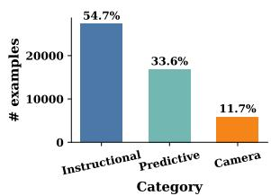

<details>
<summary>bar</summary>

| Category     | # examples |
| ------------ | ---------- |
| Instructional | 54.7%      |
| Predictive   | 33.6%      |
| Camera       | 11.7%      |
</details>

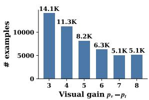

<details>
<summary>bar</summary>

| Visual gain pₙ−pₜ | # examples |
| ----------------- | ---------- |
| 3                 | 14.1K      |
| 4                 | 11.3K      |
| 5                 | 8.2K       |
| 6                 | 6.3K       |
| 7                 | 5.1K       |
| 8                 | 5.1K       |
</details>

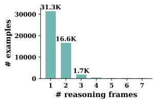

<details>
<summary>bar</summary>

| # reasoning frames | # examples |
| ------------------ | ---------- |
| 1                  | 31.3K      |
| 2                  | 16.6K      |
| 3                  | 1.7K       |
</details>

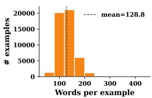

<details>
<summary>bar</summary>

| Words per example | # examples |
| ----------------- | ---------- |
| 100               | 20000      |
| 200               | 6000       |
| 300               | 100        |
</details>

Figure 6: Statistics of FUTURE-L1-50K. Category, visual-gain, reasoning-frame count, and word-count distributions.

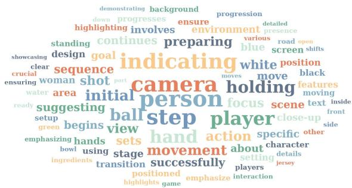

<details>
<summary>text_image</summary>

demonstrating background
progression
down progresses ensure
highlighting involves environment presence
standing continues preparing various road open
showcasing design goal indicating white position
clear sequence moves move black
encuring woman shot part
water area initial person focus scene text inside
ready suggesting ball step player close-up front
setup green begins view hand action specific other
emphasizing hands sets movement about character
bowl using stage settings details
ingredients transition successfully players jersey
positioned highlights game emphasize interaction
</details>

Figure 7: Word frequency in FUTURE-L1-50K.   
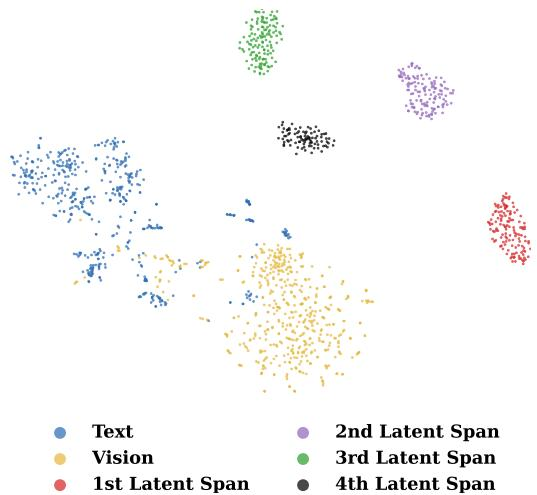

<details>
<summary>scatter</summary>

| Category             | Count |
| -------------------- | ----- |
| Text                 | 100   |
| Vision               | 50    |
| 2nd Latent Span     | 80    |
| 3rd Latent Span     | 60    |
| 1st Latent Span     | 40    |
| 4th Latent Span     | 70    |
</details>

Figure 8: Stage-wise latent representation. t-SNE of FUTURE-L1-RL embeddings on FutureBench; sequential latent spans form distinct clusters.

Reward Dynamics. Figure 9 compares the training rewards of standard DAPO and our latent-aware FUTURE-L1 policy. Across the overall reward, accuracy reward, format reward, and contrastive visual reward, FUTURE-L1 consistently yields higher and more stable trajectories than DAPO. The advantage is not limited to the final-answer signal: the

contrastive visual reward also improves, indicating that LA-DAPO aligns latent visual states with successful prediction trajectories rather than merely optimizing textual answer format. These dynamics provide training-time evidence that the proposed latent-aware rewards make RL more effective for future-event reasoning.

# F Prompts

Figure 10 shows the system prompt that enables interleaved textual and latent visual reasoning. For TwiFF-Bench evaluation, Figure 11 gives the user prompt template, while Figures 12 and 13 specify the judge prompt and payload used to score reasoning quality and answer accuracy. Figure 14 reports the binary answer-judge prompt used by the LA-DAPO accuracy reward.

# G Case Study

Figures 15–17 provide successful qualitative examples on FutureBench. In these cases, FUTURE-L1 does not compress the whole forecast into a single textual chain. Instead, it alternates short verbal anchors with latent spans at points where the future state changes: entering a new room, manipulating an object, moving from a product setup to outdoor use, or transitioning across action stages. The textual tokens make the trajectory readable, while the latent spans mark intermediate visual hypotheses that need to be carried forward before choosing the final option.

Figure 18 illustrates a representative failure. The model identifies the high-level baseball-dog context, but its latent trajectory drifts toward a plausible generic continuation and misses the specific ground-truth sequence involving the dog on the “BASEBALL” carpet, the open refrigerator, and the later dugout scene. This suggests that invoking latent spans is not sufficient by itself: the sampled latent trajectory must also preserve fine-grained event identity. This motivates the LA-DAPO stage, which optimizes latent trajectories with outcomecontrastive and temporal-diversity rewards.

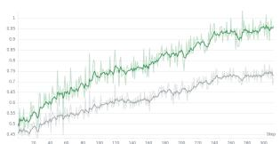

<details>
<summary>line</summary>

| Step | Green Line | Gray Line | Black Line |
|------|------------|-----------|------------|
| 20   | 0.5        | 0.4       | 0.35       |
| 40   | 0.6        | 0.45      | 0.4        |
| 60   | 0.7        | 0.5       | 0.45       |
| 80   | 0.8        | 0.55      | 0.5        |
| 100  | 0.85       | 0.6       | 0.55       |
| 120  | 0.9        | 0.65      | 0.6        |
| 140  | 0.95       | 0.7       | 0.65       |
| 160  | 0.98       | 0.75      | 0.7        |
| 180  | 1.0        | 0.8       | 0.75       |
| 200  | 1.0        | 0.85      | 0.8        |
| 220  | 1.0        | 0.9       | 0.85       |
| 240  | 1.0        | 0.95      | 0.9        |
| 260  | 1.0        | 1.0       | 0.95       |
| 280  | 1.0        | 1.0       | 1.0        |
| 300  | 1.0        | 1.0       | 1.0        |
</details>

(a) Overall reward

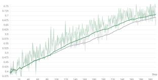

<details>
<summary>line</summary>

| Month | Price |
|-------|-------|
| Jan   | 0.375 |
| Feb   | 0.400 |
| Mar   | 0.425 |
| Apr   | 0.450 |
| May   | 0.475 |
| Jun   | 0.500 |
| Jul   | 0.525 |
| Aug   | 0.550 |
| Sep   | 0.575 |
| Oct   | 0.600 |
| Nov   | 0.625 |
| Dec   | 0.650 |
</details>

(b) Accuracy reward

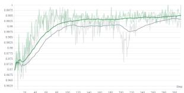

<details>
<summary>line</summary>

| Date | Price  |
|------|--------|
| 31   | 0.875  |
| 40   | 0.872  |
| 60   | 0.870  |
| 80   | 0.868  |
| 100  | 0.865  |
| 120  | 0.862  |
| 140  | 0.860  |
| 160  | 0.858  |
| 180  | 0.855  |
| 200  | 0.852  |
| 220  | 0.850  |
| 240  | 0.848  |
| 260  | 0.845  |
| 300  | 0.842  |
| 360  | 0.840  |
</details>

(c) Format reward


<details>
<summary>line</summary>

| Price | Value |
|-------|-------|
| 0     | 0.4   |
| 40    | 0.5   |
| 80    | 0.6   |
| 120   | 0.7   |
| 160   | 0.8   |
| 200   | 0.9   |
| 240   | 1.0   |
| 280   | 1.1   |
| 320   | 1.2   |
</details>

(d) Contrastive visual reward   
Figure 9: Reward dynamics during RL. FUTURE-L1 shows higher and more stable rewards than DAPO.

# Future-L1 System Prompt

You are a multimodal reasoning assistant capable of thinking in textual and visual modes.

Use the following tags to switch your thinking mode:

1. Textual Mode: <reason>Your textual reasoning process</reason> For logical analysis, planning, and verbal thought.   
2. Visual Mode: <|latent\_start|>Your visual reasoning process<|latent\_end|> For mental visualization, imagination and simulation.

Output Rules: After all thinking is complete, place the final answer inside <answer>Your Final Answer</answer>.

Figure 10: Future-L1 system prompt.

# TwiFF-Bench User Prompt Template

You are an AI assistant capable of reasoning with visual imagery. You should conduct a detailed analysis of the question. Consider different angles, potential solutions, and reason through the problem step-by-step with image. After fully reasoning through the problem–potentially using image-based thinking–provide only a clear, concise, and direct answer to the user’s question.

{Question with <image> markers stripped while retaining the original frame labels}

Optional answer-tag suffix used by the prompt-suffix evaluation variant:

Please provide the answer within the <answer> </answer> tags.

Figure 11: TwiFF-Bench user prompt template.

# TwiFF-Bench Judge System Prompt

You are a strict evaluator. You will have to evaluate the model response reasoning chain and answer based on the reference reasoning chain and ground truth answer.

Given:

Question: The original forecasting question with image originates from the first video frame.

Reference Reasoning Chain: What actually happened, as a reference for the rationality of the reasoning chain.

Ground Truth Answer: The ground truth of the question.

Model Response Reasoning Chain: The model’s reasoning chain.

Model Response Answer: The model’s answer.

The rating should base on the following rules:

Reasoning Chain Quality: Score 0–5 based on the logical coherence, completeness, and relevance of the reasoning (including appropriate use of multimodal information if present). The chain need not match the reference exactly but must be valid and support the final answer.

Answer Accuracy: Score 0–5 based on how well the final answer matches the ground truth answer. Full credit requires correctness and completeness; partial or incorrect answers receive lower scores.

Put the score in a list such that output score = [score1, score2], where ‘score1’ evaluates the Reasoning Chain and ‘score2 evaluates the Answer.

You will have to give your output in the JSON format (Keep your reasoning concise and short.):

```json
{
    “reasoning”: str # the score reasoning
    “score”: List[int]
} 
```  
Figure 12: TwiFF-Bench judge system prompt.

# TwiFF-Bench Judge User Payload Template

Question: {forecasting question with the input frames inserted at the original <image> positions}

Reference Reasoning Chain: {reference future-event reasoning chain, with reasoning images inserted at the original <rimage> positions}

Ground Truth Answer: {ground-truth answer}

Model Response Reasoning Chain: {sanitized model reasoning; Future-L1 latent/template tags and <reason> markup are removed}

Model Response Answer: {text extracted from the model’s <answer>...</answer> span}

Figure 13: TwiFF-Bench judge user payload template.

# Accuracy Judge System Prompt

You are a strict and objective answer judge. Your sole task is to determine if the model’s predicted answer matches the ground-truth answer based on the question provided.

# Important Rules:

1. Absolute Truth: The ground truth is the ONLY standard. Even if you think it is factually incorrect, judge based on it.   
2. Multiple Choice: Accept either the option letter (e.g., ‘A’) or its exact content.   
3. Numeric/Format: Ignore case, punctuation, and minor formatting; numeric values must be equivalent (e.g., 1.0=1).   
4. Key Information: For long-phrase ground truths, accept predictions capturing the essential information.   
5. Rubric Labels: For short rubric/criterion ground truths, accept predictions satisfying the rubric to a human-grader standard.   
Output only ‘yes’ or ‘no’.

Figure 14: Accuracy judge system prompt.

# Input Video

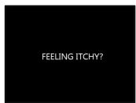

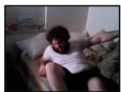

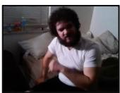

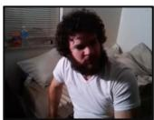

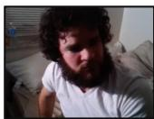


# Question

Based on the given video, predict future events and fill in the potential events in the following sequence:1. [?] 2.[?] 3. [?] 4. [A black screen displaying the text 'Your Face Music']. Which of the following options best fits the intermediate events between the observed scenes and the final scene?

# Options

A. 1. The person enters the bathroom and uses an electric trimmer to shave their beard. 2. They examine their partially shaved beard in the mirror and seal a clear plastic bag of trimmed hair. 3. They return to the dimly lit bedroom, lying on the bed in a contemplative mood while holding a small, dark-colored object.   
B. 1. The person returns to the bedroom and immediately lies in bed while holding the small object. 2. They then enter the kitchen to find a snack. 3. Afterwards, they use the trimmer in the bathroom to shave their beard.   
C. 1. The person goes into the bathroom to take a hot shower. 2. They then use the electric trimmer to shave their beard and rinse off in the sink. 3. Finally, they stand in the doorway of the bathroom, holding the dark object as if calling someone.   
D. 1. The person skips any grooming and instead checks a smartphone. 2. They leave the bedroom to make a phone call outdoors. 3. Later, they return and sit on the bed absentmindedly before the video ends with the black text.

# Future-L1 interleaved Trajectory

<reason>The video begins with a person lying in bed, seemingly itchy, as indicated by the text 'FEELING ITCHY?'. This sets the context for a grooming routine.</reason>   
<|latent\_start|><|latent|>...<|latent|><|latent\_end|>   
<reason>The person then sits up and picks up a small, dark-colored object, which appears to be an electric trimmer. This suggests the intention to groom themselves.</reason>   
<|latent\_start|><|latent|>...<|latent|><|latent\_end|>   
<reason>The scene transitions to a bathroom where the person is seen using the trimmer to shave their beard, indicating the start of the grooming process.</reason>   
<|latent\_start|><|latent|>...<|latent|><|latent\_end|>   
<reason>After shaving, the person examines their partially shaved beard in the mirror and seals a clear plastic bag of trimmed hair, showing the completion of the grooming task.</reason>   
<|latent\_start|><|latent|>...<|latent|><|latent\_end|>   
<reason>The person then returns to the dimly lit bedroom, lying on the bed in a contemplative mood while holding the small, dark-colored object, which could be a phone or another personal item. This sequence of events aligns with the logical progression of grooming and the final scene of the video.</reason> <answer>A</answer>

Figure 15: Successful case: grooming routine. From an observed bedroom scene, FUTURE-L1 predicts the missing sequence of beard trimming, mirror inspection, and returning to bed. The latent spans are inserted around scene and action transitions, while the text keeps the forecast interpretable.

# Input Video


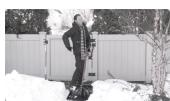


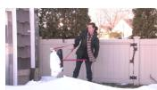


# Question

Based on the given video, predict future events and fill in the potential events in the following sequence: 1. [?] 2. [?] 3. [?] 4. [A final outdoor demonstration with a professional endorsement]. Which option correctly orders the intermediate events that lead to the final scene described above?

# Options

A. 1. A person unpacks the SHOVEL HELPER and positions a black shovel on a white table, 2. The individual attaches metal clips and tightens the thumbwheel to secure the product, 3. The tool is shown in action outdoors as the person shovels snow near a phone booth while explaining its features, 4. A person in winter attire demonstrates the tool next to a white fence and evergreen trees and receives a chiropractor's endorsement before the scene fades to black.   
B. 1. The tool is demonstrated outdoors as the person shovels snow near a phone booth while explaining its features, 2. A person unpacks the SHOVEL HELPER and positions a black shovel on a white table, 3. The individual attaches metal clips and tightens the thumbwheel to secure the product, 4. A person in winter attire demonstrates the tool next to a white fence and evergreen trees and receives a chiropractor's endorsement before the scene fades to black.   
C. 1. A person in winter attire demonstrates the tool next to a white fence and evergreen trees and receives a chiropractor's endorsement before the scene fades to black, 2. A person unpacks the SHOVEL HELPER and positions a black shovel on a white table, 3. The individual attaches metal clips and tightens the thumbwheel to secure the product, 4. The tool is shown in action outdoors as the person shovels snow near a phone booth while explaining its features.   
D. 1. A person unpacks the SHOVEL HELPER and positions a black shovel on a white table, 2. The tool is shown in action outdoors as the person shovels snow near a phone booth while explaining its features, 3. The individual attaches metal clips and tightens the thumbwheel to secure the product, 4. A person in winter attire demonstrates the tool next to a white fence and evergreen trees and receives a chiropractor's endorsement before the scene fades to black.

# Future-L1 interleaved Trajectory

<reason>The video begins with a person unpacking the SHOVEL HELPER and positioning a black shovel on a white table, as seen in the initial frames. This sets the stage for the instructional demonstration of the product.</reason> <|latent\_start|><|latent|>...<|latent|><|latent\_end|>

<reason>Next, the individual attaches metal clips and tightens the thumbwheel to secure the product, as shown in the subsequent frames. This step is crucial for the proper setup of the tool.</reason> <|latent\_start|><|latent|>...<|latent|><|latent\_end|>

<reason>Following this, the tool is demonstrated in action outdoors as the person shovels snow near a phone booth while explaining its features, highlighting its ease of use and effectiveness. This outdoor demonstration showcases the practical application of the SHOVEL HELPER.</reason> <|latent\_start|><|latent|>...<|latent|><|latent\_end|>

<reason>Finally, a person in winter attire demonstrates the tool next to a white fence and evergreen trees and receives a chiropractor's endorsement before the scene fades to black, emphasizing the product's benefits and credibility.</reason> <answer>A</answer>

Figure 16: Successful case: product demonstration. FUTURE-L1 tracks the SHOVEL HELPER demonstration from table setup to attachment, outdoor use, and endorsement. The interleaved trajectory separates physical manipulation from later usage scenes.

# Input Video


# Question

Based on the given video, predict future events and fill in the potential events in the given future events: 1. [?] 2. [?] 3. [?] 4. [Scene 19: a shirtless man meditating on a rocky cliff, representing calm introspection]. Which option best represents the correct order of events from the observed scenes to the final scene?

# Options

A. 1. A live-action sequence in front of a traditional Chinese building with a person in yellow martial arts attire performing dynamic staff movements; 2. Shirtless performers in yellow pants balancing bowls on their heads and hands during martial arts stances; 3. A close-up of a fist with a person in dark attire preparing for a challenge with the word 'DIFFICULTY' and a progress bar; 4. A shirtless man meditating on a rocky cliff.   
B. 1. A close-up of a fist with a person in dark attire preparing for a challenge with the word 'DIFFICULTY' and a progress bar; 2. A live-action sequence in front of a traditional Chinese building with a person in yellow martial arts attire performing dynamic staff movements; 3. Shirtless performers in yellow pants balancing bowls on their heads and hands during martial arts stances; 4. A shirtless man meditating on a rocky cliff.   
C. 1. Shirtless performers in yellow pants balancing bowls on their heads and hands during martial arts stances; 2. A liveaction sequence in front of a traditional Chinese building with a person in yellow martial arts attire performing dynamic staff movements; 3. A close-up of a fist with a person in dark attire preparing for a challenge with the word 'DIFFICULTY' and a progress bar; 4. A shirtless man meditating on a rocky cliff.   
D. 1. A live-action sequence in front of a traditional Chinese building with a person in yellow martial arts attire performing dynamic staff movements; 2. A close-up of a fist with a person in dark attire preparing for a challenge with the word 'DIFFICULTY' and a progress bar; 3. Shirtless performers in yellow pants balancing bowls on their heads and hands during martial arts stances; 4. A shirtless man meditating on a rocky cliff.

# Future-L1 interleaved Trajectory

<reason>The video begins with a live-action sequence in front of a traditional Chinese building, where a person in yellow martial arts attire performs dynamic staff movements, setting the stage for martial arts practice (Scene 1).</reason>

<|latent\_start|><|latent|>...<|latent|><|latent\_end|>

<reason>Next, shirtless performers in yellow pants are shown balancing bowls on their heads and hands during martial arts stances, emphasizing balance and control (Scene 2).</reason> <|latent\_start|><|latent|>...<|latent|><|latent\_end|>

<reason>Following this, a close-up of a fist with a person in dark attire preparing for a challenge with the word 'DIFFICULTY' and a progress bar appears, indicating a focus on strength and preparation (Scene 3).</reason> <|latent\_start|><|latent|>...<|latent|><|latent\_end|>

<reason>The video then transitions to a shirtless man meditating on a rocky cliff, representing calm introspection (Scene 19).</reason> <answer>A</answer>

Figure 17: Successful case: staged action sequence. FUTURE-L1 follows a martial-arts montage through performance, balance practice, challenge preparation, and the final meditation scene. The latent spans help bridge visually distinct future stages before the final answer.

# Input Video


<details>
<summary>natural_image</summary>

Collage of five photos showing baseball team activities: dog observing, field hockey with bandaged players, coach assisting, and group cleaning on field (no visible text or symbols)
</details>

# Question

Based on the given video, predict future events and fill in the potential events in the upcoming segments: 1. A group of players in light blue jerseys gathers on a baseball field with the golden retriever walking alongside a man in khaki pants and a dark blue jacket holding a baseball, while empty bleachers and a 'CAROLINA' sign form the backdrop. 2. [?] 3. The golden retriever is shown sitting on the field with a blue cap in its mouth, positioned among players standing quietly during what appears to be the national anthem. 4. [?] 5. A man in a light blue shirt and shorts is seen seated on the floor of an indoor room, happily playing with a colorful ball together with the golden retriever, while individuals in khaki pants and dark shirts can be seen in the background with tables and equipment. Which pair of missing scenes best completes the future events order?

# Options

A. Golden retriever lying on 'BASEBALL' carpet with man in black shirt; then, retriever exploring an open refrigerator and later in the dugout with a person in black shirt.   
B. Retriever exploring an open refrigerator and later in the dugout with a person in black shirt; then, golden retriever lying on 'BASEBALL' carpet with man in black shirt.   
C. Players giving fist bumps to the golden retriever on the field; then, man in a light blue shirt interacting with the dog in an indoor room with a 'BASEBALL' carpet.   
D. Man in a light blue shirt playing fetch on the baseball field; then, golden retriever lying on its back on a 'BASEBALL' carpet with a man in a black shirt.

# Future-L1 interleaved Trajectory

<reason>The video begins with a golden retriever wearing a blue vest with 'UNC' and 'BASEBALL' written on it, walking through a hallway with people in blue shirts. This sets the stage for the dog's role in a baseball setting.</reason>

<|latent\_start|><|latent|>...<|latent|><|latent\_end|> <reason>As the dog moves into a baseball dugout, it is seen interacting with players and a man holding a bucket, indicating its presence during team activities. The dog is then shown on the field, running and playing with a ball, highlighting its playful nature. The dog is later seen sitting on the field with a blue cap in its mouth, positioned among players standing quietly, suggesting a moment of focus or anticipation. The final scene shows a man in a light blue shirt and shorts playing with the dog on a 'BASEBALL' carpet, emphasizing the dog's role in team bonding and relaxation.</reason> <answer>C</answer>

Figure 18: Failure case: event-specific detail loss. FUTURE-L1 recognizes the baseball-dog setting but predicts a generic continuation rather than the ground-truth sequence with the carpet, refrigerator, and dugout events. The example shows that latent invocation must still preserve fine-grained visual event identity.