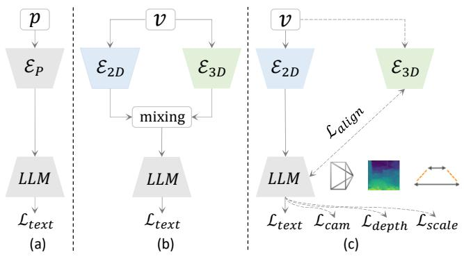
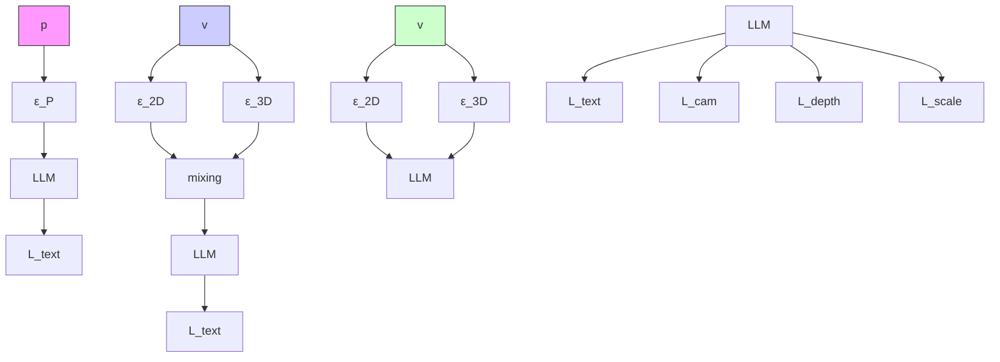
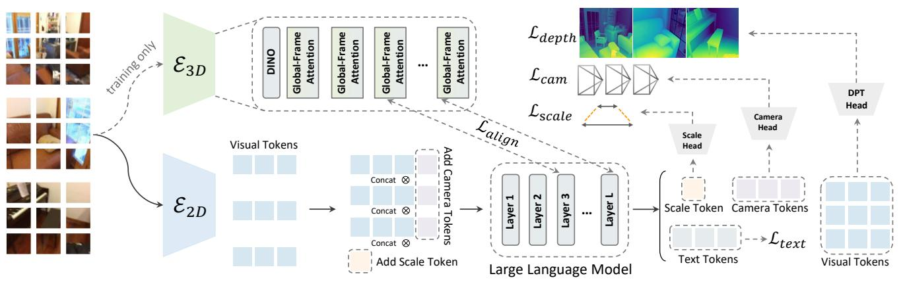
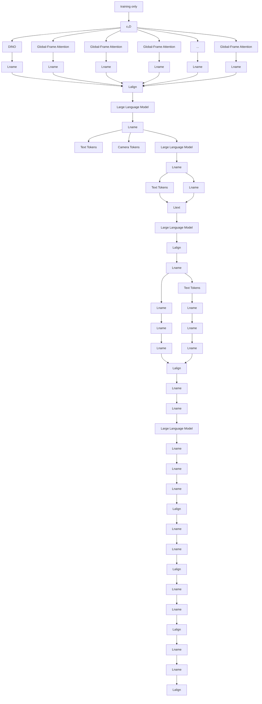
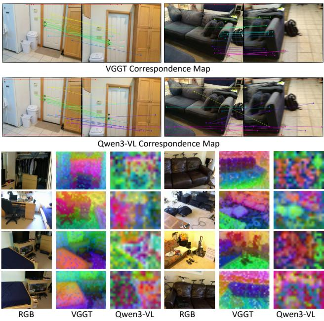
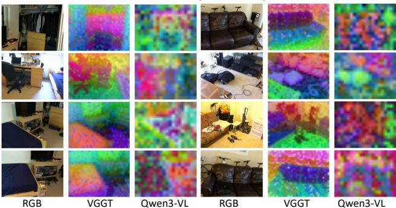
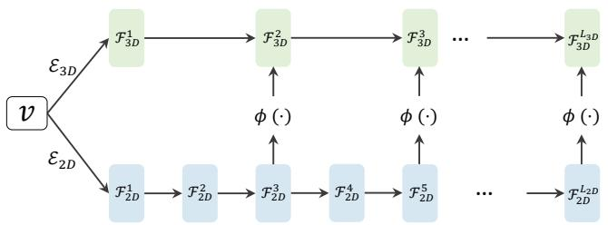
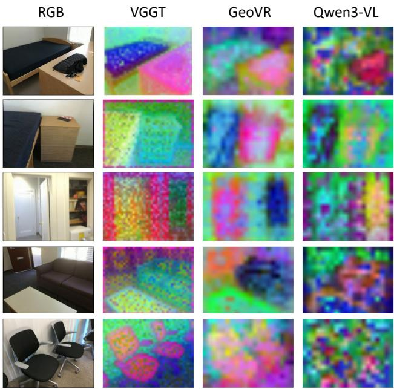
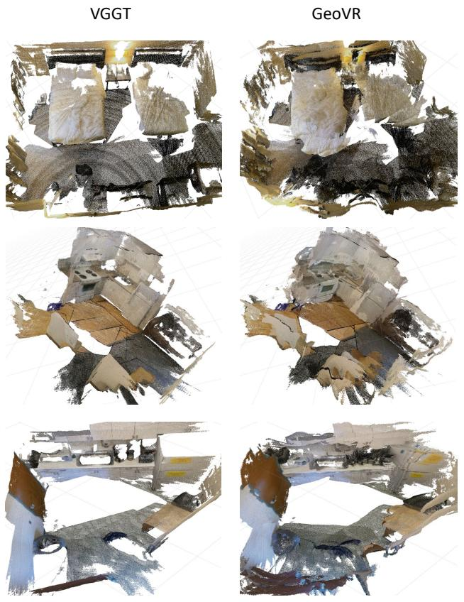

# Learning Geometric Representations from Videos for Spatial Intelligent Multimodal Large Language Models

Haibo Wang University of California, Davismixing hibwang@ucdavis.edu

Lifu Huang University of California, Davis lfuhuang@ucdavis.edu

# Abstractℒ௧௘௫௧

Multimodal Large Language Models (MLLMs) excel at 2D semantic understanding but lack intrinsic 3D awareness, resulting in representations that fail to maintain geometric and spatial consistency across video frames. Givenଶ஽ ଷ஽ the scarcity of large-scale 3D data, we present GeoVR, a novel framework that learns geometric representations using purely 2D video sequences. This approach effectively restructures the semantic latent space within MLLMs to un-?????? lock spatial intelligence. Rather than employing superficial feature mixing, GeoVR reshapes the internal representa-ℒ ℒ ℒ tions of the MLLM by distilling geometry knowledge from pre-trained 3D foundation models. This is accomplished through a multi-objective learning strategy driven by four complementary geometric targets: (1) estimating inter-frame camera poses to embed varying viewpoint dynamics, (2) regressing dense depth maps to anchor physical distances, (3) predicting a metric scale factor for real-world calibration, and (4) distilling multi-scale 3D features to align the intermediate feature space. Guided by these explicit physical and geometric constraints, the model’s internal representations naturally develop strong 3D awareness. Extensive experiments on spatial reasoning benchmarks demonstrate that GeoVR achieves state-of-the-art performance, establishing a new paradigm for endowing foundation models with spatial intelligence. Code will be available at https://github.com/WHB139426/GeoVR-MLLM.

# 1. Introduction

Multimodal Large Language Models (MLLMs) [1, 6, 14, 18, 35] have achieved unprecedented success in 2D visual understanding tasks [10, 22, 38, 51]. However, when deployed in scenarios involving dynamic viewpoint shifts or physical world reasoning, they often exhibit surprising brittleness [41, 45]. We attribute this vulnerability to a fundamental representation deficiency. The physical world is inherently three-dimensional, with videos acting as a dynamic projec-



<details>
<summary>flowchart</summary>


</details>

Figure 1. Comparison of different paradigms. P and V denote point clouds and RGB video. $\mathcal { E } _ { P } , \mathcal { E } _ { 2 D } ,$ , and $\mathcal { E } _ { 3 D }$ denote point cloud, 2D vision, and 3D foundation encoders, respectively. (a) relies on scarce 3D data, limiting scalability. (b) patches external 3D features onto 2D tokens, causing inference overhead. (c) (ours) restructures the latent space via training-only geometric constraints.

tion of a consistent, implicit 3D scene under varying camera poses. However, current MLLMs are pretrained exclusively on 2D images/videos with only language supervision [31, 39, 43, 47], and their latent spaces are optimized purely for semantic alignment, ignoring the construction of intrinsic geometric representations of physical entities. Blind to physical concepts like poses, depth, and scale, these models fail to infer the implicit 3D scene.

To mitigate this issue, existing efforts generally fall into two categories. The first attempts to directly learn 3D representations by aligning LLMs with expensive and scarce explicit 3D data (e.g., point clouds), as illustrated in Figure 1 (a) [11, 24, 40]. However, this heavy reliance on 3D annotations severely limits data scalability and compromises the model’s generalization capabilities for standard 2D visual understanding. The second approach, shown in Figure 1 (b), incorporates pre-trained 3D foundation models $\mathcal { E } _ { 3 D }$ [23, 32, 34] into the MLLM architecture to supply auxiliary 3D representations. Despite the rich 3D priors encapsulated in these models, their integration is largely confined to superficial feature mixing, such as element-wise addition (e.g., VG-LLM [49], Spatial-MLLM [37]) or attention-based fusion (e.g., VLM-3R [9], SpaceMind [48]). Such shallow alignment fails to fundamentally instill geometric awareness into the MLLM’s intrinsic visual representations. Instead, it merely fuses the 2D tokens with external 3D features with a dual-branch architecture, thereby introducing substantial computational overhead during inference.

In contrast to these paradigms, as in Figure 1 (c), we propose GeoVR, a novel framework that learns geometric representations directly from pure 2D video sequences, entirely eliminating the reliance on any manual 3D annotations. Rather than superficially mixing external features, the core philosophy of GeoVR is to fundamentally restructure the MLLM’s internal semantic space. We achieve this through a multi-objective learning strategy that leverages the robust geometric priors of existing 3D foundation models, not as external plug-ins, but as targets to rewire the visual tokens intrinsically. Specifically, GeoVR imposes four complementary geometric constraints exclusively during the training phase: (1) Camera Pose Estimation, which captures the physical logic of varying viewpoints across continuous video frames; (2) Depth Map Prediction, which grounds the 2D tokens with depth information, enabling the model to perceive physical distances and occlusions; (3) Metric Scale Calibration, which anchors the spatial features into the real-world scale, empowering the model to comprehend the absolute magnitude of the scene; and (4) Multi-scale Geometric Representation Alignment, which aligns the MLLM’s internal latent space with the structured geometric representations of a pre-trained 3D foundation model [23, 32, 33]. By confining all these explicit geometric regularizations to the training stage, GeoVR natively awakens the MLLM’s 3D reasoning capabilities without introducing additional computational burden during inference.

In summary, we conclude our contributions as follows:

• We propose GeoVR, a novel paradigm to restructure MLLM’s intrinsic representations with geometric awareness using purely 2D videos, effectively bypassing the scalability limits of explicit 3D annotations.   
• We design a multi-objective learning framework comprising pose estimation, depth prediction, metric scale calibration, and geometric representation alignment. This strategy successfully distills the multi-view geometric priors into the MLLM’s latent space without additional computational overhead during inference.   
• Through extensive experiments and representation analysis, we demonstrate that GeoVR achieves state-of-the-art performance on comprehensive spatial reasoning and 3D scene understanding benchmarks.

# 2. Related Work

MLLMs for 3D Scene Understanding has attracted significant interest recently, aiming to unify 3D understanding and visual-language reasoning. Early works rely on explicit 3D inputs. Methods such as PointLLM [40], 3D-LLM [11], Spatial-LM [24], and LL3DA [5] ingest explicit 3D data (e.g., point clouds or reconstructed meshes), process them via specialized 3D encoders, and project them into the MLLM’s embedding space. While effective for 3D-centric tasks, these approaches face the bottlenecks of severe scarcity of large-scale, high-quality 3D-text paired data. To bypass 3D data reliance, another line of work, such as SpatialVLM [4], LLaVA-3D [52], and Video-3D-LLM [50], attempts to solve spatial reasoning directly from 2D images/videos. However, they train the model with only semantics supervision, inherently lacking the capability to perceive true physical depth and multi-view consistency. In contrast, our approach entirely bypasses the need for 3D annotations and point cloud encoders, learning rich geometric representations directly from 2D video sequences.

Feed-forward 3D Reconstruction has emerged as a powerful paradigm, capable of jointly inferring varying 3D attributes in a single forward pass. This paradigm was pioneered by DUSt3R [34] for pairwise image inputs, and subsequently refined by MASt3R [17] for improved feature matching. More recently, the field has rapidly expanded to multi-view scenarios and video sequences, with architectural innovations such as VGGT [32], MapAnything [15], DepthAnyhing 3 [23], π3 [36], and VGGT-Ω [33]. These methods adopt simple and efficient end-to-end inference to predict 3D points, dense depths, and camera poses, often surpassing classical Structure-from-Motion (SfM) pipelines. However, despite their exceptional ability to extract lowlevel geometry, these models remain strictly focused on reconstruction. They lack linguistic interfaces and higher-level semantic reasoning capabilities. In our work, rather than using these models for standalone reconstruction, we exploit their robust geometric priors as distillation targets.

MLLMs with 3D Foundation Models. Recognizing the limitations of 2D data priors, contemporary research has begun integrating pre-trained 3D foundation models into MLLM architectures. The early approach is passive feature fusion. For instance, VG-LLM [49] and Spatial-MLLM [37] extract 3D features using a frozen 3D foundation model and fuse them with 2D tokens via patch-level addition, while VLM-3R [9], SpaceMind [48], and GeoThinker [21] inject 3D features via cross-attention. G2VLM [12] introduces an MoT architecture with dedicated geometric experts. However, maintaining an active 3D geometry encoder inevitably incurs a severe computational bottleneck during inference. There are also works such as Spatial Forcing [19] and 3DRS [13] shift towards training-time alignment by distilling VGGT priors into MLLM features. Yet, these methods remain fundamentally limited as they rely on singular, feature-level alignment without comprehensive physical constraints. In contrast, GeoVR proposes a holistic intrinsic representation restructuring. We enforce a multi-objective learning strategy strictly during training. By implicitly distilling multi-view geometry from 3D Foundation models, GeoVR endows the MLLM with profound spatial intelligence at zero additional inference cost.



<details>
<summary>flowchart</summary>


</details>

Figure 2. Framework of GeoVR. During training, alongside the standard next-token prediction $( \mathcal { L } _ { t e x t } )$ , the intrinsic latent space is restructured via: camera pose estimation $( \mathcal { L } _ { c a m } )$ , dense depth prediction $( \mathcal { L } _ { d e p t h } )$ , metric scale calibration $( \mathcal { L } _ { s c a l e } )$ , and geometric representation alignment $( \mathcal { L } _ { a l i g n } )$ from a frozen 3D teacher $( \mathcal { E } _ { 3 D } )$ . All auxiliary heads and the $\mathcal { E } _ { 3 D }$ branch are discarded during inference.

# 3. Method

We introduce GeoVR in Figure 2, a novel framework designed to awaken spatial intelligence within MLLMs purely from 2D video sequences. The core philosophy of our approach is to fundamentally restructure the MLLM’s internal semantic latent space into geometry-aware representations through multi-objective geometric learning.

# 3.1. Problem Formulation

Let $\mathcal { V } = \{ I _ { t } \} _ { t = 1 } ^ { T } \in \mathbb { R } ^ { T \times 3 \times H \times W }$ represent an input video comprising $T$ frames, accompanied by a text instruction $\mathcal { X } _ { t e x t }$ . In the standard MLLM paradigm, a pre-trained 2D vision encoder $\mathcal { E } _ { 2 D }$ is employed to process the sequence, extracting a set of visual tokens E2D(V) ∈ RT ×N2D×D2D , $\bar { \mathcal { E } _ { 2 D } ( \mathcal { V } ) } \in \mathbb { R } ^ { T \times N _ { 2 D } \times D _ { 2 D } }$ where $N _ { 2 D }$ denotes the number of patch tokens per frame and $D _ { 2 D }$ is the embedding dimension. These visual tokens are linearly projected and fed into the Large Language Model alongside the tokenized text instructions. The entire framework is conventionally optimized via the standard autoregressive next-token prediction objective:

$$
\mathcal {L} _ {\text { text }} = - \sum_ {i = 1} ^ {L} \log P _ {\theta} (y _ {i} \mid y _ {<   i}, \mathcal {E} _ {2 D}, \mathcal {X} _ {\text { text }}) \tag {1}
$$

where $y _ { i }$ is the i-th target text token and θ is the parameters of the MLLM. However, $\mathcal { L } _ { t e x t }$ is purely language-driven supervision and lacks explicit geometric signal, bounding the internal latent space only to 2D representations, inherently collapsing the complex 3D physical world into a flat semantic space. Consequently, the resulting visual tokens fail to perceive essential geometric concepts such as scale, depth, and multi-view structural consistency.

To empirically validate this representation deficiency, we visualize the cross-view correspondences and Principal Component Analysis (PCA) projections of the features from an MLLM (Qwen3-VL [1]) against a 3D foundation model (VGGT [32]) in Figure 3. As illustrated, the MLLM’s representations fail to establish robust correspondences across varying viewpoints and exhibit severe semantic ambiguity. For comparison, VGGT’s representations accurately track physical points across the 3D scene, and maintain sharp, instance-level geometric consistency. This stark contrast empirically confirms that purely language-driven pre-training is insufficient for spatial perception, underscoring the urgent need for explicit geometric grounding.

To overcome this, we force the MLLM to reconstruct essential geometric properties using its own representations. $B y$ optimizing for a set of geometric targets, we aim to restructure the model’s internal latent space from a semantic manifold into 3D-aware representations. Specifically, we adopt a minimalist geometric learning strategy. By dropping heavy targets like point cloud reconstruction and tracking, we focus on four geometric targets: camera poses (Sec. 3.3), depth maps (Sec. 3.4), metric scale factor (Sec. 3.5), and representation alignment (Sec. 3.6), effectively awakening the 3D awareness while preserving the model’s general capacity.

# 3.2. 3D Foundation Model Teacher

To obtain these minimal geometric targets, we introduce a 3D foundation model (e.g., VGGT(-Ω) [32, 33] or DepthAnything 3 [23]) as a 3D teacher, denoted as $\mathcal { E } _ { 3 D }$ . Unlike standard 2D vision encoders, $\mathcal { E } _ { 3 D }$ adopts a unified architecture with alternating frame-wise and global self-attention, explicitly designed to output a variety of 3D quantities directly from 2D image sequences. By feeding the same raw video ${ \boldsymbol { \mathcal { V } } } \in \mathbb { R } ^ { T \times 3 \times \mathbf { \breve { H } } \times { W } }$ into the frozen $\mathcal { E } _ { 3 D }$ , the forward pass yields several streams of geometric targets we need:



  
Figure 3. Cross-view correspondences and PCA projections of representations from Qwen3-VL and VGGT.

1. Camera Poses: The camera prediction head of $\mathcal { E } _ { 3 D }$ outputs the camera parameters (intrinsics and extrinsics) $\bar { \mathcal { P } } \in \mathbb { R } ^ { T \times 9 }$ . For each frame, this 9-dimensional vector explicitly parameterizes the camera poses, comprising a 3-dimensional translation vector, a 4-dimensional rotation quaternion, and a 2-dimensional field of view.   
2. Dense Depth Maps: The depth prediction head of $\mathcal { E } _ { 3 D }$ generates dense maps $\mathcal { D } \in \dot { \mathbb { R } ^ { T \times H \times W } }$ , associating each pixel location $( i , j )$ from the t-th camera frame with its corresponding depth value $\mathcal { D } _ { t } ( i , j ) \in \mathbb { R } ^ { + }$ .   
3. Metric Scale Factor: By aligning the up-to-scale depth maps using a Metric Depth Model [23], we derive a global metric scale factor $S \in \mathbb { R } ^ { + }$ . For each video, this scalar calibrates the relative geometric attributes (camera poses and depth maps) into absolute physical dimensions with true real-world magnitudes.   
4. Geometric Representations: We extract the intermediate features from multiple layers of the $\mathcal { E } _ { 3 D }$ backbone, yielding a representation $\bar { \mathcal { F } _ { 3 D } } ~ \in ~ \mathbb { R } ^ { L _ { 3 D } \times T \times N _ { 3 D } \times D _ { 3 D } }$ , where $L _ { 3 D }$ denotes the number of extracted layers. $\mathcal { F } _ { 3 D }$ implicitly encapsulates rich geometric knowledge.

Crucially, by leveraging $\mathcal { E } _ { 3 D } \mathrm { ^ { * } s }$ zero-shot feed-forward capability, we dynamically generate these geometric targets P, D (with C) and $\mathcal { F } _ { 3 D }$ as pseudo-labels for any arbitrary video sequence during training. This strategy decouples our GeoVR framework from the reliance on scarce, manually annotated 3D datasets. It allows our geometric representation learning to scale to large-scale, in-the-wild video corpora, bypassing the data acquisition bottleneck.

# 3.3. Camera Pose Estimation

To natively capture the viewpoint dynamics and the observer’s physical motion, we introduce a Camera Pose Estimation objective. We introduce a learnable camera token $\bar { \mathcal { F } } _ { c a m } \in \bar { \mathbb { R } ^ { D _ { 2 D } } }$ to serve as a global receptor. For each of the T frames in the video, we append $\mathcal { F } _ { c a m }$ to the end of its corresponding visual tokens before feeding them into the LLM. Through the deep self-attention layers, these camera tokens naturally aggregate multi-view context from the surrounding visual features across the entire video sequence.

We then extract $\mathcal { H } _ { c a m } \in \mathbb { R } ^ { T \times D _ { 2 D } }$ , corresponding to the T camera tokens from the MLLM’s last layer hidden states. To predict the camera state for each frame t, we process its corresponding hidden state $\mathcal { H } _ { c a m , i }$ t through a lightweight Camera Head (a simple MLP), which regresses a 9-dimensional camera parameter vector $\hat { \mathcal P } _ { t } \in \mathbb { R } ^ { 9 }$ .

Following the 3D teacher $\mathcal { E } _ { 3 D } , \hat { \mathcal { P } } _ { t } \in \mathbb { R } ^ { 9 }$ is decomposed into a translation vector $\hat { \mathbf { q } } _ { t } ~ \in \mathbb { R } ^ { 3 }$ , a rotation quaternion $\hat { \mathbf { t } } _ { t } \in \mathbb { R } ^ { 4 }$ , and a field of view vector $\hat { \mathbf { f } } _ { t } \in \mathbb { R } ^ { 2 }$ . Similarly, we denote the corresponding geometric pseudo-labels extracted from the teacher as $\mathcal { P } _ { t } = [ \mathbf { q } _ { t } , \mathbf { t } _ { t } , \mathbf { f } _ { t } ]$ . The camera pose loss $\mathcal { L } _ { c a m }$ is formulated to minimize the discrepancy between the MLLM’s internal predictions and the geometric pseudolabels with a weighted $L _ { 1 }$ loss:

$$
\mathcal {L} _ {\text { cam }} = \frac {1}{T} \sum_ {t = 1} ^ {T} \left(| \mathbf {q} _ {t} - \hat {\mathbf {q}} _ {t} | + \beta_ {q} | \mathbf {t} _ {t} - \hat {\mathbf {t}} _ {t} | + \beta_ {f} | \mathbf {f} _ {t} - \hat {\mathbf {f}} _ {t} |\right) \tag {2}
$$

where $\beta _ { q }$ and $\beta _ { f }$ are factors balancing the rotation and intrinsic components. By strictly constraining these camera tokens, we compel the MLLM’s attention mechanisms to implicitly capture the underlying 3D spatial transformations, effectively forcing the model to represent the video as a consistent 3D scene observed through a moving lens.

# 3.4. Depth Map Prediction

To ground the visual tokens with the explicit awareness of spatial layout and physical distances, we introduce a Dense Depth Prediction objective. We extract multi-scale hidden states from a selected set of layers within the MLLM to simultaneously capture low-level structural details and highlevel semantic context. For each selected layer, we discard the appended camera tokens. This process yields a hierarchical feature representation $\mathcal { H } _ { d e p t h } \dot { \in } \mathbb { R } ^ { L _ { d e p t h } \times T \times N _ { 2 D } \times D _ { 2 D } }$ , where $L _ { d e p t h }$ denotes the number of extracted layers. This structured, multi-level feature pyramid is then fed into a lightweight Dense Prediction Transformer (DPT) Head [27] (we modify some convolutional blocks with a simple MLP for efficiency). By effectively aggregating the multi-scale representations, the DPT head progressively upsamples the features to simultaneously predict high-resolution dense depth maps $\hat { \mathcal { D } } \in \mathbb { R } ^ { T \times H \times \check { W } }$ and their corresponding pixelwise confidence maps $\hat { \mathcal { C } } \in \mathbb { R } ^ { T \times H \times W }$ .

To supervise this dense regression task, the depth loss follows DUSt3R [34] and implements an aleatoric uncertainty loss [16, 25] with the predicted confidence map $\hat { \mathcal { C } } .$ , dynamically weighting the discrepancy between the predicted depth $\hat { \mathcal { D } }$ and the pseudo-labels D. Following VGGT [32], we additionally apply a gradient-based term, which is widely used in monocular depth estimation. Therefore, the final depth loss $\mathcal { L } _ { d e p t h }$ is formulated as:

$$
\begin{array}{l} \mathcal {L} _ {\text { depth }} = \frac {1}{T} \sum_ {t = 1} ^ {T} \left(\hat {\mathcal {C}} _ {t} \odot | \hat {\mathcal {D}} _ {t} - \mathcal {D} _ {t} | \right. \tag {3} \\ \left. + \hat {\mathcal {C}} _ {t} \odot | \nabla \hat {\mathcal {D}} _ {t} - \nabla \mathcal {D} _ {t} | - \alpha \log \hat {\mathcal {C}} _ {t}\right) \\ \end{array}
$$

where ⊙ computes the channel-broadcast element-wise product, ∇ denotes the gradient operator, and α controls the confidence regularization.

# 3.5. Metric Scale Calibration

While camera pose and depth map capture the relative spatial structure and layout of the scene, monocular geometric predictions inherently suffer from scale ambiguity. To anchor these relative quantities into absolute physical dimensions, we introduce the Metric Scale Calibration objective.

Specifically, we introduce a single learnable scale token $\mathcal { F } _ { s c a l e } \in \mathbb { R } ^ { D _ { 2 D } }$ as a video-level global aggregator, appended to the very end of the entire visual token sequence. Through the MLLM’s global self-attention mechanism, it aggregates spatio-temporal geometric cues to perceive the overall magnitude of the environment. The hidden state of this token, $\mathcal { H } _ { s c a l e }$ , is then processed by an MLP head with an exponential activation to regress a strictly positive absolute scale factor $\hat { \mathcal { S } } = \exp ( \mathbf { M L P } ( \mathcal { H } _ { s c a l e } ) ) \in \mathbb { R } ^ { + }$ . We formulate the scale loss $\mathcal { L } _ { s c a l e }$ in a logarithmic space with the pseudo ground-truth scale $S \in \mathbb { R } ^ { + }$ using an $L _ { 1 }$ distance:

$$
\mathcal {L} _ {\text { scale }} = \left| \log (1 + \hat {\mathcal {S}}) - \log (1 + \mathcal {S}) \right| \tag {4}
$$

This logarithmic formulation effectively compresses extreme physical dimensions, ensuring balanced gradients and stable convergence across diverse in-the-wild datasets.

# 3.6. Geometric Representation Alignment

Beyond explicit targets such as camera pose estimation and dense depth prediction, GeoVR fundamentally restructures the MLLM’s representation via multi-scale distillation. As in Figure 4, we align the MLLM’s intrinsic latent space with the rich, structured geometric priors of the 3D foundation teacher model $( \mathcal { E } _ { 3 D } )$ . Crucially, this alignment is not limited to the final output; it is enforced across multiple intermediate layers, ensuring that the MLLM develops geometric awareness at varying scales.



<details>
<summary>flowchart</summary>

```mermaid
graph TD
    v[" v "] -->|ε₃D| F1_F3_D["F₁₃D"]
    v -->|ε₂D| F2_D_F2_D["F₂D"]
    F1_F3_D --> F2_F3_D2["F₂₃D"]
    F2_F3_D2 --> F3_F3_D2F3_D2[" F₃₃D "]
    F3_F3_D --> ... --> F3_F3_D^L3_D[" F₃₃D^L₃D "]
    F2_D_F2_D --> F2_D_F2_D2["F₂₃D"]
    F2_D_F2_D --> F2_D_F2_D3["F₂₃D"]
    F2_D_F2_D --> F2_D_F2_D4["F₂₃D"]
    F2_D_F2_D --> F2_D_F2_D5["F₂₃D"]
    F2_D_F2_D --> ... --> F2_D_F2_D6[" F₂₃D^L₂D "]
    F1_F3_D -->|φ(·)| F3_D
    F2_D_F2_D -->|φ(·)| F3_D
    F3_D -->|φ(·)| ... --> F3_D
    F3_D -->|φ(·)| ... --> F3_D
```
</details>

Figure 4. Distill the geometric prior from $\mathcal { F } _ { 3 D }$ into $\mathcal { F } _ { 2 D }$ .

Formally, we extract the multi-layer hidden states $\mathcal { F } _ { 2 D } \in$ $\mathbb { R } ^ { L _ { 2 D } \times T \times \tilde { N } _ { 2 D } \times D _ { 2 D } }$ from the MLLM, and the multi-layer geometric features $\mathcal { F } _ { 3 D } \in \mathbb { R } ^ { L _ { 3 D } \times T \times N _ { 3 D } \times D _ { 3 D } }$ from the 3D teacher. Here, $L _ { 2 D }$ and $L _ { 3 D }$ represent the total number of layers in the respective models. Due to the discrepancy in patch sizes between $\mathcal { E } _ { 2 D }$ and $\mathcal { E } _ { 3 D }$ , the resulting token counts $N _ { 2 D }$ and $N _ { 3 D }$ are mismatched. To resolve this resolution gap, we introduce a projection function $\phi .$ Specifically, ϕ first restores the 1D token sequence into a 2D spatial grid and applies bilinear interpolation to resize the MLLM feature maps to match the spatial resolution of $\mathcal { F } _ { 3 D }$ . Subsequently, an MLP is applied to project the channel dimension of $\mathcal { F } _ { 2 D }$ to the target dimension $D _ { 3 D }$ . The geometric representation alignment loss $\mathcal { L } _ { a l i g n }$ is then optimized by minimizing the cosine distance between the projected MLLM features and the teacher’s geometric features:

$$
\mathcal {L} _ {\text { align }} = \frac {1}{| L |} \sum_ {l \in L} \left(\operatorname{Sim} \left(\mathcal {F} _ {3 D} ^ {l}, \phi \left(\mathcal {F} _ {2 D} ^ {s (l)}\right)\right)\right) \tag {5}
$$

where L defines the specific set of $\mathcal { E } _ { 3 D } \mathbf { \dot { s } }$ layer indices chosen for multi-scale distillation, and s(l) denotes the corresponding target layer index in the MLLM, mapped proportionally based on the network depth ratio. Sim(·, ·) computes the cosine similarity.

# 3.7. Training Objectives

The overall optimization objective is formulated as a multitask learning problem, where the model is jointly supervised by language modeling signals and explicit geometric constraints. The total loss function $\mathcal { L } _ { t o t a l }$ is defined as:

$$
\mathcal {L} _ {\text { total }} = \mathcal {L} _ {\text { text }} + \lambda_ {1} \mathcal {L} _ {\text { cam }} + \lambda_ {2} \mathcal {L} _ {\text { depth }} + \lambda_ {3} \mathcal {L} _ {\text { scale }} + \lambda_ {4} \mathcal {L} _ {\text { align }} \tag {6}
$$

where $\lambda _ { 1 , 2 , 3 , 4 }$ are hyperparameters for balancing each loss term. Crucially, all auxiliary heads and the 3D teacher model are only required during training, without additional computational overhead during inference.

# 4. Experiments

# 4.1. Implementation Details

Backbone. We adopt Qwen3-VL-2B-Instruct [1] as the base model, VGGT-1B [32] as the 3D foundation teacher, and

<table><tr><td rowspan="2">Method</td><td>w/o</td><td rowspan="2">Avg.</td><td colspan="4">Numerical Answer</td><td colspan="4">Multiple-Choice Answer</td></tr><tr><td> $\mathcal{E}_{3D}$ </td><td>Obj. Count</td><td>Abs. Dist</td><td>Obj. Size</td><td>Room Size</td><td>Rel. Dis</td><td>Rel. Dir</td><td>Route Plan</td><td>Appr. Order</td></tr><tr><td colspan="11">Proprietary Models / Human</td></tr><tr><td>Human</td><td>-</td><td>79.2</td><td>94.3</td><td>47.0</td><td>60.4</td><td>45.9</td><td>94.7</td><td>95.8</td><td>95.8</td><td>100.0</td></tr><tr><td>Seed-2.0 [28]</td><td>-</td><td>50.7</td><td>49.4</td><td>25.3</td><td>69.5</td><td>25.8</td><td>61.8</td><td>44.9</td><td>44.3</td><td>71.0</td></tr><tr><td>Gemini-2.5-pro [6]</td><td>-</td><td>53.5</td><td>46.0</td><td>37.3</td><td>68.7</td><td>54.3</td><td>61.9</td><td>43.9</td><td>47.4</td><td>68.7</td></tr><tr><td>Kimi-K2.5 [30]</td><td>-</td><td>53.6</td><td>57.2</td><td>34.9</td><td>69.3</td><td>54.4</td><td>59.6</td><td>41.3</td><td>52.1</td><td>67.0</td></tr><tr><td>GPT-5 [29]</td><td>-</td><td>55.0</td><td>53.3</td><td>34.4</td><td>73.3</td><td>47.5</td><td>63.7</td><td>48.6</td><td>50.2</td><td>68.9</td></tr><tr><td colspan="11">Open-sourced General Models</td></tr><tr><td>LLaVA-OneVision-7B [18]</td><td>-</td><td>32.4</td><td>47.7</td><td>20.2</td><td>47.4</td><td>12.3</td><td>42.5</td><td>35.2</td><td>29.4</td><td>24.4</td></tr><tr><td>LLaVA-OneVision-72B [18]</td><td>-</td><td>40.2</td><td>43.5</td><td>23.9</td><td>57.6</td><td>37.5</td><td>42.5</td><td>39.9</td><td>32.5</td><td>44.6</td></tr><tr><td>LLaVA-Video-72B [47]</td><td>-</td><td>40.9</td><td>48.9</td><td>22.8</td><td>57.4</td><td>35.3</td><td>42.4</td><td>36.7</td><td>35.0</td><td>48.6</td></tr><tr><td>InternVL3-2B [53]</td><td>-</td><td>32.9</td><td>64.8</td><td>30.8</td><td>32.4</td><td>22.9</td><td>32.2</td><td>34.9</td><td>32.9</td><td>12.6</td></tr><tr><td>InternVL3-8B [53]</td><td>-</td><td>42.1</td><td>66.0</td><td>34.8</td><td>43.6</td><td>47.5</td><td>48.0</td><td>39.3</td><td>26.2</td><td>31.3</td></tr><tr><td>Qwen2.5-VL-3B-Instruct [2]</td><td>-</td><td>29.0</td><td>24.3</td><td>24.7</td><td>31.7</td><td>22.6</td><td>38.3</td><td>42.6</td><td>26.3</td><td>21.2</td></tr><tr><td>Qwen2.5-VL-7B-Instruct [2]</td><td>-</td><td>31.4</td><td>40.9</td><td>14.8</td><td>43.4</td><td>10.7</td><td>38.6</td><td>40.1</td><td>33.0</td><td>29.8</td></tr><tr><td>Qwen3-VL-2B-Instruct [1]</td><td>-</td><td>50.3</td><td>62.1</td><td>40.2</td><td>71.4</td><td>49.7</td><td>52.2</td><td>42.0</td><td>30.4</td><td>54.5</td></tr><tr><td>Qwen3-VL-8B-Instruct [1]</td><td>-</td><td>57.9</td><td>67.5</td><td>47.0</td><td>76.3</td><td>61.9</td><td>58.0</td><td>50.9</td><td>35.0</td><td>66.3</td></tr><tr><td>Qwen3.5-4B [26]</td><td>-</td><td>53.6</td><td>56.5</td><td>36.5</td><td>67.5</td><td>53.8</td><td>60.3</td><td>57.5</td><td>34.0</td><td>62.3</td></tr><tr><td colspan="11">Spatial Intelligence Models</td></tr><tr><td>SpatialLadder-3B [20]</td><td>×</td><td>45.7</td><td>63.5</td><td>34.3</td><td>61.7</td><td>43.9</td><td>45.4</td><td>44.8</td><td>35.6</td><td>36.4</td></tr><tr><td>Spatial-MLLM-4B [37]</td><td>×</td><td>48.4</td><td>65.3</td><td>34.8</td><td>63.1</td><td>45.1</td><td>41.3</td><td>46.2</td><td>33.5</td><td>46.3</td></tr><tr><td>VG-LLM-8B [49]</td><td>×</td><td>50.7</td><td>67.9</td><td>37.7</td><td>58.6</td><td>62.0</td><td>46.6</td><td>40.7</td><td>32.4</td><td>59.2</td></tr><tr><td>SpatialStack-4B [46]</td><td>×</td><td>60.9</td><td>69.2</td><td>45.4</td><td>63.0</td><td>63.2</td><td>57.9</td><td>68.4</td><td>40.2</td><td>79.6</td></tr><tr><td>SpatialStack-5B [46]</td><td>×</td><td>67.5</td><td>71.0</td><td>55.6</td><td>69.1</td><td>68.2</td><td>67.3</td><td>84.1</td><td>41.2</td><td>83.5</td></tr><tr><td>VLM-3R-7B [9]</td><td>×</td><td>60.9</td><td>70.2</td><td>49.4</td><td>69.2</td><td>67.1</td><td>65.4</td><td>80.5</td><td>45.4</td><td>40.1</td></tr><tr><td>SpaceMind-8B [48]</td><td>×</td><td>69.6</td><td>73.3</td><td>61.4</td><td>77.3</td><td>74.2</td><td>67.2</td><td>88.4</td><td>44.3</td><td>70.6</td></tr><tr><td>3DRS-7B [13]</td><td>√</td><td>45.9</td><td>68.7</td><td>34.8</td><td>53.6</td><td>56.6</td><td>40.9</td><td>43.2</td><td>30.4</td><td>39.2</td></tr><tr><td>Cambrian-S-3B [43]</td><td>√</td><td>57.3</td><td>70.7</td><td>40.6</td><td>68.0</td><td>46.3</td><td>64.8</td><td>61.9</td><td>27.3</td><td>78.8</td></tr><tr><td>Cambrian-S-7B [43]</td><td>√</td><td>67.5</td><td>73.2</td><td>50.5</td><td>74.9</td><td>72.2</td><td>71.1</td><td>76.2</td><td>41.8</td><td>80.1</td></tr><tr><td>VST-3B-SFT [42]</td><td>√</td><td>57.9</td><td>69.3</td><td>45.4</td><td>71.8</td><td>62.4</td><td>59.0</td><td>46.0</td><td>38.7</td><td>70.2</td></tr><tr><td>VST-7B-SFT [42]</td><td>√</td><td>60.6</td><td>72.0</td><td>44.4</td><td>74.3</td><td>68.3</td><td>59.7</td><td>55.8</td><td>44.9</td><td>65.2</td></tr><tr><td>GeoVR-2B (ours)</td><td>√</td><td>69.1</td><td>67.7</td><td>54.5</td><td>73.9</td><td>72.3</td><td>71.3</td><td>80.7</td><td>45.9</td><td>86.7</td></tr></table>

Table 1. Performance comparisons on the VSI-Bench benchmark. "w/o E3D" indicates that the model does not require an auxiliary 3D foundation model during inference.

DA3-Metric-Large [23] as the metric depth model for realworld scale calibration. We also explore other 3D Foundation models, including VGGT-Ω-1B [33] and DepthAnything3- Giant [23] as the 3D teacher in Sec. 4.3.

Training Setup. We train the model on a hybrid dataset comprising VSI-590K [43] and VLM-3R [9] for 1 epoch. During training, 4 to 32 frames are sampled. The model is optimized using the AdamW optimizer with a global batch size of 32 and a learning rate of $2 \times 1 0 ^ { - 5 }$ . Specifically, the newly initialized tokens and auxiliary heads are optimized with a learning rate of $1 \times 1 0 ^ { - 4 }$ . Throughout the entire training process, both the 2D vision encoder and the auxiliary 3D teacher models are kept frozen. For the multi-scale geometric representation alignment, we extract hierarchical geometric features from the 5th, 12th, 18th, and 24th layers of VGGT as our distillation targets.

Benchmark. VSI-Bench [41] contains more than 5,000 question-answer pairs from egocentric videos sourced from ScanNet [7], ScanNet++ [44], and ARKitScenes [3]. The task types are divided into Multiple-Choice Answer (MCA)

and Numerical Answer (NA). For the MCA tasks, we compute mean accuracy, and for the NA tasks, we calculate relative accuracy across confidence thresholds $C = \{ 0 . 5 , 0 . 5 5$ . . . , 0.95}. We report the final average score and individual metrics on eight task types of VSI-Bench, including: (1) configurational tasks (object count, relative distance, relative direction, route plan), (2) measurement estimation (object size, room size, and absolute distance), and (3) spatiotemporal tasks (appearance order).

# 4.2. Evaluation

Comparison on VSI-Bench. As shown in Table 1, GeoVR-2B achieves a highly competitive average score of 69.1 on the VSI-Bench, outperforming its baseline Qwen3-VL-2B-Instruct (50.3) by a massive 18.8 points. It consistently surpasses both leading proprietary models, such as GPT-5 (55.0), and massive open-source generalists like LLaVA-OneVision-72B (40.2). Crucially, compared to dedicated spatial models like SpaceMind-8B or VLM-3R-7B that suffer from computational bottlenecks by relying on active 3D foundation models during inference, GeoVR achieves stateof-the-art spatial intelligence with absolutely zero additional architectural overhead. Furthermore, despite its compact 2B size, GeoVR outperforms other free-inference 3D-aware models such as Cambrian-S-7B (67.5). Detailed metric analysis reveals that GeoVR exhibits remarkable gains in tasks requiring absolute physical grounding and multi-view temporal consistency, dominating in metrics like Abs. Dist (54.5), Room Size (72.3) and Appr. Order (86.7).

<table><tr><td rowspan="2">#</td><td rowspan="2"> $\mathcal{L}_{cam}$ </td><td rowspan="2"> $\mathcal{L}_{depth}$ </td><td rowspan="2"> $\mathcal{L}_{scale}$ </td><td rowspan="2"> $\mathcal{L}_{align}$ </td><td rowspan="2">Avg.</td><td colspan="4">Numerical Answer</td><td colspan="4">Multiple-Choice Answer</td></tr><tr><td>Obj. Count</td><td>Abs. Dist</td><td>Obj. Size</td><td>Room Size</td><td>Rel. Dis</td><td>Rel. Dir</td><td>Route Plan</td><td>Appr. Order</td></tr><tr><td>(0)</td><td>-</td><td>-</td><td>-</td><td>-</td><td>56.7</td><td>64.7</td><td>39.4</td><td>70.1</td><td>48.8</td><td>60.2</td><td>57.7</td><td>36.8</td><td>76.7</td></tr><tr><td>(1)</td><td>√</td><td>-</td><td>-</td><td>-</td><td>59.8</td><td>66.8</td><td>40.2</td><td>72.1</td><td>60.5</td><td>56.1</td><td>66.9</td><td>36.6</td><td>79.1</td></tr><tr><td>(2)</td><td>-</td><td>√</td><td>-</td><td>-</td><td>59.7</td><td>62.3</td><td>40.5</td><td>69.5</td><td>62.5</td><td>61.7</td><td>66.4</td><td>35.1</td><td>79.3</td></tr><tr><td>(3)</td><td>√</td><td>√</td><td>-</td><td>-</td><td>60.3</td><td>65.5</td><td>40.2</td><td>72.0</td><td>55.5</td><td>60.6</td><td>71.6</td><td>39.7</td><td>77.4</td></tr><tr><td>(4)</td><td>√</td><td>√</td><td>√</td><td>-</td><td>60.9</td><td>68.1</td><td>40.5</td><td>72.7</td><td>58.9</td><td>58.6</td><td>65.4</td><td>43.3</td><td>79.8</td></tr><tr><td>(5)</td><td>-</td><td>-</td><td>-</td><td>√</td><td>57.5</td><td>63.6</td><td>40.8</td><td>69.6</td><td>54.5</td><td>57.6</td><td>62.2</td><td>35.8</td><td>75.9</td></tr><tr><td>(6)</td><td>√</td><td>√</td><td>√</td><td>√</td><td>62.1</td><td>68.3</td><td>42.5</td><td>72.5</td><td>62.5</td><td>60.7</td><td>66.6</td><td>42.3</td><td>81.2</td></tr></table>

Table 2. Ablation study on Multi-task Geometric Learning, which shows that simultaneous training with camera, depth, scale, and alignment yields the highest performance on VSI-Bench. ID # (0) denotes the model finetuned with only $\mathcal { L } _ { t e x t }$ . 

<table><tr><td rowspan="2"> $\mathcal{E}_{3D}$ </td><td rowspan="2">Avg.</td><td colspan="2">Obj. Count</td><td colspan="2">Obj. Size</td><td colspan="2">Room Size</td><td colspan="2">Multiple-Choice</td><td rowspan="2">Appr. Order</td></tr><tr><td colspan="2">Numerical</td><td colspan="2">Answer</td><td colspan="2">Rel. Dis</td><td colspan="2">Rel. Dir</td></tr><tr><td>VGGT [32]</td><td>62.1</td><td>68.3</td><td>42.5</td><td>72.5</td><td>62.5</td><td>60.7</td><td>66.6</td><td>42.3</td><td>81.2</td><td></td></tr><tr><td>VGGT- $\Omega$  [33]</td><td>60.7</td><td>68.0</td><td>39.8</td><td>71.0</td><td>58.3</td><td>61.9</td><td>64.6</td><td>43.5</td><td>78.2</td><td></td></tr><tr><td>DA3 [23]</td><td>58.7</td><td>67.6</td><td>40.1</td><td>71.1</td><td>54.3</td><td>60.7</td><td>64.4</td><td>33.5</td><td>78.0</td><td></td></tr></table>

Table 3. Ablation study on different 3D Foundation Models.

# 4.3. In-Depth Analysis

Unless otherwise specified, we establish our default experimental setting using Qwen3-VL-2B-Instruct as the base MLLM and VGGT as the 3D Foundation Model. All ablated models are only trained on the video subset of VSI-590K (around 374K samples) for 1 epoch, with a maximum of 8 frames per video. During inference on VSI-Bench, we uniformly sample 128 frames per video.

3D Foundation Model Backbone. We first investigate the impact of the 3D teacher model’s capacity with three different $\mathcal { E } _ { 3 D }$ backbones, including VGGT [32], VGGT-Ω [33], and DepthAnything-3 (DA-3) [23]. For fair comparison, all models in this setting are jointly supervised by the full set of geometric targets. Specifically, for the multi-scale feature distillation, we extract representations from layers {5, 12, 18, 24} for both VGGT and VGGT-Ω, while layers {20, 28, 34, 40} for DA-3. As in Table 3, the base VGGT surprisingly outperforms the stronger VGGT-Ω variant. We attribute this to the architectural design of VGGT-Ω, which replaces a portion of its global attention with register attention to reduce computational costs. While such an aggregated scene representation might be more efficient for some 3D reconstruction downstream tasks, it inevitably compromises the fine-grained spatial correspondences within the dense image tokens. This restriction creates an information bottleneck and limits the MLLM’s ability to acquire robust geometric representations. Furthermore, both VGGT and VGGT-Ω models consistently surpass DA-3.

<table><tr><td> $\mathcal{E}_{3D}$ </td><td>Aligned  $Layer^{th}$ </td><td>VSI-Bench</td></tr><tr><td rowspan="6"> $VGGT-\Omega [33]$  $(L_{3D}=24, D_{3D}=1024)$ </td><td>12</td><td>58.14</td></tr><tr><td>18</td><td>57.96</td></tr><tr><td>24</td><td>57.90</td></tr><tr><td> $\{12, 24\}$ </td><td>57.25</td></tr><tr><td> $\{5, 18\}$ </td><td>56.74</td></tr><tr><td> $\{5, 12, 18, 24\}$ </td><td>59.67</td></tr></table>

Table 4. Ablation study on alignment strategy.

Multi-task Geometric Learning. To validate the necessity of our multi-objective learning strategy, we conduct an ablation on the proposed geometric constraints from the 3D foundation model. As shown in Table 2, the baseline model (ID # (0)) trained solely with text supervision achieves an average score of 56.7. Introducing only camera pose $\mathcal { L } _ { c a m }$ improves the performance to 59.8, notably boosting viewdependent metrics like Rel. Dir (from 57.7 to 66.9). Conversely, applying only depth prediction $\mathcal { L } _ { d e p t h }$ raises the average to 59.7, with significant gains in metrics such as Room Size (from 48.8 to 62.5). Combining them further elevates the average to 60.3, confirming that both tasks inject distinct yet complementary spatial awareness. The addition of metric scale calibration $\mathcal { L } _ { s c a l e }$ further raises the score to 60.9, proving its crucial role in helping the model understand absolute physical scales and distances in the real world. While applying geometric representation alignment $\mathcal { L } _ { a l i g n }$ alone yields a modest gain (57.5), integrating all four geometric constraints achieves the highest overall performance (62.1). This demonstrates a strong complementary synergy: explicit geometric regressions provide rigid physical grounding, while implicit feature distillation ensures robust, multi-scale 3D representations.

Alignment at Different Layers. We further investigate the effect of aligning different transformer layers of the



<details>
<summary>text_image</summary>

RGB
VGGT
GeoVR
Qwen3-VL
</details>

Figure 5. PCA projections of visual representations. 

<table><tr><td>Depth Head</td><td>Params</td><td>L1 Loss</td><td>SILog Loss</td></tr><tr><td>MLP Head</td><td>13.6M</td><td>58.42</td><td>59.31</td></tr><tr><td>DPT Head</td><td>32.7M</td><td>58.48</td><td>58.87</td></tr><tr><td>Dense Head</td><td>32.3M</td><td>60.30</td><td>58.50</td></tr></table>

Table 5. Ablation study on depth prediction heads and loss.

MLLM to the 3D teacher. Here, we only keep the $\mathcal { L } _ { a l i g n }$ loss active (discarding explicit geometric regressions Lcam, $\mathcal { L } _ { d e p t h }$ , and $\mathcal { L } _ { s c a l e } )$ to strictly isolate the impact of pure feature-level distillation. As shown in Table 4, when distilling from a single layer of VGGT-Ω, aligning with the middle layer (the 12th) yields the best performance (58.14), slightly outperforming the deeper layers (the 18th and 24th). Interestingly, naively pairing two layers (e.g., [12, 24] or [5, 18]) leads to a noticeable performance drop, decreasing to 57.25 and 56.74, respectively. We attribute this to optimization conflicts caused by an incomplete hierarchical representation. However, when we apply a proportional, multi-scale alignment covering the entire backbone uniformly ([5, 12, 18, 24]), the performance surges to a peak of 59.67. This demonstrates that a comprehensive and evenly distributed distillation strategy is essential for the MLLM to progressively internalize 3D spatial priors, seamlessly bridging low-level geometry with high-level semantics.

Depth Prediction Heads and Loss. We evaluate how the architecture of the depth prediction heads influences learning. Under pure $\mathcal { L } _ { d e p t h }$ supervision from VGGT-Ω, we try: (1) DPT Head, which follows the exact dense vision transformer [27] design used in VGGT, primarily composed of hierarchical convolutional blocks; (2) MLP Head, a minimalist architecture consisting merely of a 3-layer MLP; and (3) Dense Head, a hybrid design blending convolutions and MLPs. Additionally, we compare the L1-based loss in Eq. (3) against the scale-invariant logarithmic (SILog) loss [8]. As shown in Table 5, while the SILog loss notably improves the lightweight MLP and DPT heads by relaxing the absolute scale penalty, the Dense Head achieves the highest overall performance (60.30) when supervised by the L1 loss. Prioritizing absolute spatial reasoning accuracy over parameter efficiency, we adopt the Dense Head with L1 supervision.



<details>
<summary>natural_image</summary>

Six-panel scientific visualization of a robotic arm under different conditions, labeled VGGT and GeoVR (no text or symbols on the images themselves)
</details>

Figure 6. 3D point clouds reconstructed from 2D videos.

Feature Visualization. To qualitatively demonstrate the effectiveness of our geometric representation restructuring, we visualize the internal feature representations and the reconstructed 3D scenes. In Fig. 5, we project the high-dimensional visual tokens into RGB space using PCA. The original MLLM (Qwen3-VL) exhibits noisy and geometrically inconsistent representations, failing to delineate clear object boundaries or spatial layouts across different views. In contrast, after our multi-objective geometric learning, the representations of GeoVR become highly structured and smooth, maintaining sharp geometric consistency that closely mirrors the explicit multi-view priors of the 3D teacher (VGGT). Furthermore, in Fig. 6, we leverage the predicted depth maps and camera poses from GeoVR to reconstruct the scene by directly unprojecting the 2D video pixels into 3D point clouds. The visualizations confirm that GeoVR can kind of recover 3D scene structures and spatial layouts, demonstrating a level of spatial fidelity comparable to the 3D foundation model. This strongly supports the conclusion that our method helps MLLM effectively internalize the physical 3D world solely from 2D observations.

# 5. Conclusion

In this paper, we introduce GeoVR, a novel framework designed to awaken spatial intelligence within MLLMs relying purely on 2D video sequences. We propose a multi-objective geometric learning paradigm. By estimating inter-frame camera poses, regressing dense depth maps, calibrating realworld metric scales, and distilling multi-scale geometric priors from a pre-trained 3D foundation teacher, GeoVR fundamentally restructures the MLLM’s internal semantic latent space into geometry-aware representations. Extensive experiments on the VSI-Bench demonstrate that our method significantly enhances the model’s capabilities in spatial reasoning. In the future, we plan to scale the GeoVR paradigm to larger MLLM architectures and datasets and explore its potential in more complex spatial intelligence tasks.

# References

[1] Shuai Bai, Yuxuan Cai, Ruizhe Chen, Keqin Chen, Xionghui Chen, Zesen Cheng, Lianghao Deng, Wei Ding, Chang Gao, Chunjiang Ge, Wenbin Ge, Zhifang Guo, Qidong Huang, Jie Huang, Fei Huang, Binyuan Hui, Shutong Jiang, Zhaohai Li, Mingsheng Li, Mei Li, Kaixin Li, Zicheng Lin, Junyang Lin, Xuejing Liu, Jiawei Liu, Chenglong Liu, Yang Liu, Dayiheng Liu, Shixuan Liu, Dunjie Lu, Ruilin Luo, Chenxu Lv, Rui Men, Lingchen Meng, Xuancheng Ren, Xingzhang Ren, Sibo Song, Yuchong Sun, Jun Tang, Jianhong Tu, Jianqiang Wan, Peng Wang, Pengfei Wang, Qiuyue Wang, Yuxuan Wang, Tianbao Xie, Yiheng Xu, Haiyang Xu, Jin Xu, Zhibo Yang, Mingkun Yang, Jianxin Yang, An Yang, Bowen Yu, Fei Zhang, Hang Zhang, Xi Zhang, Bo Zheng, Humen Zhong, Jingren Zhou, Fan Zhou, Jing Zhou, Yuanzhi Zhu, and Ke Zhu. Qwen3-vl technical report. arXiv preprint arXiv:2511.21631, 2025. 1, 3, 5, 6   
[2] Shuai Bai, Keqin Chen, Xuejing Liu, Jialin Wang, Wenbin Ge, Sibo Song, Kai Dang, Peng Wang, Shijie Wang, Jun Tang, Humen Zhong, Yuanzhi Zhu, Mingkun Yang, Zhaohai Li, Jianqiang Wan, Pengfei Wang, Wei Ding, Zheren Fu, Yiheng Xu, Jiabo Ye, Xi Zhang, Tianbao Xie, Zesen Cheng, Hang Zhang, Zhibo Yang, Haiyang Xu, and Junyang Lin. Qwen2.5- vl technical report. arXiv preprint arXiv:2502.13923, 2025. 6   
[3] Gilad Baruch, Zhuoyuan Chen, Afshin Dehghan, Tal Dimry, Yuri Feigin, Peter Fu, Thomas Gebauer, Brandon Joffe, Daniel Kurz, Arik Schwartz, et al. Arkitscenes: A diverse real-world dataset for 3d indoor scene understanding using mobile rgb-d data. arXiv preprint arXiv:2111.08897, 2021. 6

[4] Boyuan Chen, Zhuo Xu, Sean Kirmani, Brian Ichter, Danny Driess, Pete Florence, Dorsa Sadigh, Leonidas Guibas, and Fei Xia. SpatialVLM: Endowing Vision-Language Models with Spatial Reasoning Capabilities. arXiv e-prints, art. arXiv:2401.12168, 2024. 2   
[5] Sijin Chen, Xin Chen, Chi Zhang, Mingsheng Li, Gang Yu, Hao Fei, Hongyuan Zhu, Jiayuan Fan, and Tao Chen. Ll3da: Visual interactive instruction tuning for omni-3d understanding reasoning and planning. In CVPR, pages 26428–26438, 2024. 2   
[6] Gheorghe Comanici, Eric Bieber, Mike Schaekermann, Ice Pasupat, Noveen Sachdeva, Inderjit Dhillon, Marcel Blistein, Ori Ram, Dan Zhang, Evan Rosen, et al. Gemini 2.5: Pushing the frontier with advanced reasoning, multimodality, long context, and next generation agentic capabilities. arXiv preprint arXiv:2507.06261, 2025. 1, 6   
[7] Angela Dai, Angel X. Chang, Manolis Savva, Maciej Halber, Thomas Funkhouser, and Matthias Nießner. Scannet: Richlyannotated 3d reconstructions of indoor scenes. In Proc. Computer Vision and Pattern Recognition (CVPR), IEEE, 2017. 6   
[8] David Eigen, Christian Puhrsch, and Rob Fergus. Depth map prediction from a single image using a multi-scale deep network. Advances in neural information processing systems, 27, 2014. 8   
[9] Zhiwen Fan, Jian Zhang, Renjie Li, Junge Zhang, Runjin Chen, Hezhen Hu, Kevin Wang, Huaizhi Qu, Shijie Zhou, Dilin Wang, et al. Vlm-3r: Vision-language models augmented with instruction-aligned 3d reconstruction. arXiv preprint arXiv:2505.20279, 2025. 2, 6   
[10] Chaoyou Fu, Yuhan Dai, Yondong Luo, Lei Li, Shuhuai Ren, Renrui Zhang, Zihan Wang, Chenyu Zhou, Yunhang Shen, Mengdan Zhang, et al. Video-mme: The first-ever comprehensive evaluation benchmark of multi-modal llms in video analysis. arXiv:2405.21075, 2024. 1   
[11] Yining Hong, Haoyu Zhen, Peihao Chen, Shuhong Zheng, Yilun Du, Zhenfang Chen, and Chuang Gan. 3d-llm: Injecting the 3d world into large language models. NeurIPS, 36:20482– 20494, 2023. 1, 2   
[12] Wenbo Hu, Jingli Lin, Yilin Long, Yunlong Ran, Lihan Jiang, Yifan Wang, Chenming Zhu, Runsen Xu, Tai Wang, and Jiangmiao Pang. G2vlm: Geometry grounded vision language model with unified 3d reconstruction and spatial reasoning. arXiv preprint arXiv:2511.21688, 2025. 2   
[13] Xiaohu Huang, Jingjing Wu, Qunyi Xie, and Kai Han. 3drs: Mllms need 3d-aware representation supervision for scene understanding. In NeurIPS, 2025. 2, 6   
[14] Aaron Hurst, Adam Lerer, Adam P Goucher, Adam Perelman, Aditya Ramesh, Aidan Clark, AJ Ostrow, Akila Welihinda, Alan Hayes, Alec Radford, et al. Gpt-4o system card. arXiv preprint arXiv:2410.21276, 2024. 1   
[15] Nikhil Keetha, Norman Müller, Johannes Schönberger, Lorenzo Porzi, Yuchen Zhang, Tobias Fischer, Arno Knapitsch, Duncan Zauss, Ethan Weber, Nelson Antunes, et al. Mapanything: Universal feed-forward metric 3d reconstruction. arXiv preprint arXiv:2509.13414, 2025. 2   
[16] Alex Kendall and Yarin Gal. What uncertainties do we need

in bayesian deep learning for computer vision? Advances in neural information processing systems, 30, 2017. 5   
[17] Vincent Leroy, Yohann Cabon, and Jérôme Revaud. Grounding image matching in 3d with mast3r. In European Conference on Computer Vision, 2024. 2   
[18] Bo Li, Yuanhan Zhang, Dong Guo, Renrui Zhang, Feng Li, Hao Zhang, Kaichen Zhang, Peiyuan Zhang, Yanwei Li, Ziwei Liu, et al. Llava-onevision: Easy visual task transfer. arXiv:2408.03326, 2024. 1, 6   
[19] Fuhao Li, Wenxuan Song, Han Zhao, Jingbo Wang, Pengxiang Ding, Donglin Wang, Long ZENG, and Haoang Li. Spatial forcing: Implicit spatial representation alignment for vision-language-action model. In The Fourteenth International Conference on Learning Representations, 2026. 2   
[20] Hongxing Li, Dingming Li, Zixuan Wang, Yuchen Yan, Hang Wu, Wenqi Zhang, Yongliang Shen, Weiming Lu, Jun Xiao, and Yueting Zhuang. Spatialladder: Progressive training for spatial reasoning in vision-language models, 2025. 6   
[21] Haoyuan Li, Qihang Cao, Tao Tang, Kun Xiang, Zihan Guo, Jianhua Han, Hang Xu, and Xiaodan Liang. Thinking with geometry: Active geometry integration for spatial reasoning. arXiv preprint arXiv:2602.06037, 2026. 2   
[22] Kunchang Li, Yali Wang, Yinan He, Yizhuo Li, Yi Wang, Yi Liu, Zun Wang, Jilan Xu, Guo Chen, Ping Luo, et al. Mvbench: A comprehensive multi-modal video understanding benchmark. In CVPR, 2024. 1   
[23] Haotong Lin, Sili Chen, Junhao Liew, Donny Y Chen, Zhenyu Li, Guang Shi, Jiashi Feng, and Bingyi Kang. Depth anything 3: Recovering the visual space from any views. arXiv preprint arXiv:2511.10647, 2025. 1, 2, 3, 4, 6, 7   
[24] Yongsen Mao, Junhao Zhong, Chuan Fang, Jia Zheng, Rui Tang, Hao Zhu, Ping Tan, and Zihan Zhou. Spatiallm: Training large language models for structured indoor modeling. In NeurIPS, 2025. 1, 2   
[25] David Novotny, Diane Larlus, and Andrea Vedaldi. Learning 3d object categories by looking around them. In Proceedings of the IEEE international conference on computer vision, pages 5218–5227, 2017. 5   
[26] Qwen Team. Qwen3.5: Towards native multimodal agents, 2026. 6   
[27] René Ranftl, Alexey Bochkovskiy, and Vladlen Koltun. Vision transformers for dense prediction. In Proceedings of the IEEE/CVF international conference on computer vision, pages 12179–12188, 2021. 4, 8   
[28] Bytedance Seed. Seed2. 0 model card: Towards intelligence frontier for real-world complexity. Technical report, Technical report, Bytedance, 2025. URL https://lf3-static. bytednsdoc. com . . . , 2026. 6   
[29] Aaditya Singh, Adam Fry, Adam Perelman, Adam Tart, Adi Ganesh, Ahmed El-Kishky, Aidan McLaughlin, Aiden Low, AJ Ostrow, Akhila Ananthram, et al. Openai gpt-5 system card. arXiv preprint arXiv:2601.03267, 2025. 6   
[30] Kimi Team, Tongtong Bai, Yifan Bai, Yiping Bao, S. H. Cai, Yuan Cao, Y. Charles, H. S. Che, Cheng Chen, Guanduo Chen, Huarong Chen, Jia Chen, Jiahao Chen, Jianlong Chen, Jun Chen, Kefan Chen, Liang Chen, Ruijue Chen, Xinhao Chen, Yanru Chen, Yanxu Chen, Yicun Chen, Yimin

Chen, Yingjiang Chen, Yuankun Chen, Yujie Chen, Yutian Chen, Zhirong Chen, Ziwei Chen, Dazhi Cheng, Minghan Chu, Jialei Cui, Jiaqi Deng, Muxi Diao, Hao Ding, Mengfan Dong, Mengnan Dong, Yuxin Dong, Yuhao Dong, Angang Du, Chenzhuang Du, Dikang Du, Lingxiao Du, Yulun Du, Yu Fan, Shengjun Fang, Qiulin Feng, Yichen Feng, Garimugai Fu, Kelin Fu, Hongcheng Gao, Tong Gao, Yuyao Ge, Shangyi Geng, Chengyang Gong, Xiaochen Gong, Zhuoma Gongque, Qizheng Gu, Xinran Gu, Yicheng Gu, Longyu Guan, Yuanying Guo, Xiaoru Hao, Weiran He, Wenyang He, Yunjia He, Chao Hong, Hao Hu, Jiaxi Hu, Yangyang Hu, Zhenxing Hu, Ke Huang, Ruiyuan Huang, Weixiao Huang, Zhiqi Huang, Tao Jiang, Zhejun Jiang, Xinyi Jin, Yu Jing, Guokun Lai, Aidi Li, C. Li, Cheng Li, Fang Li, Guanghe Li, Guanyu Li, Haitao Li, Haoyang Li, Jia Li, Jingwei Li, Junxiong Li, Lincan Li, Mo Li, Weihong Li, Wentao Li, Xinhang Li, Xinhao Li, Yang Li, Yanhao Li, Yiwei Li, Yuxiao Li, Zhaowei Li, Zheming Li, Weilong Liao, Jiawei Lin, Xiaohan Lin, Zhishan Lin, Zichao Lin, Cheng Liu, Chenyu Liu, Hongzhang Liu, Liang Liu, Shaowei Liu, Shudong Liu, Shuran Liu, Tianwei Liu, Tianyu Liu, Weizhou Liu, Xiangyan Liu, Yangyang Liu, Yanming Liu, Yibo Liu, Yuanxin Liu, Yue Liu, Zhengying Liu, Zhongnuo Liu, Enzhe Lu, Haoyu Lu, Zhiyuan Lu, Junyu Luo, Tongxu Luo, Yashuo Luo, Long Ma, Yingwei Ma, Shaoguang Mao, Yuan Mei, Xin Men, Fanqing Meng, Zhiyong Meng, Yibo Miao, Minqing Ni, Kun Ouyang, Siyuan Pan, Bo Pang, Yuchao Qian, Ruoyu Qin, Zeyu Qin, Jiezhong Qiu, Bowen Qu, Zeyu Shang, Youbo Shao, Tianxiao Shen, Zhennan Shen, Juanfeng Shi, Lidong Shi, Shengyuan Shi, Feifan Song, Pengwei Song, Tianhui Song, Xiaoxi Song, Hongjin Su, Jianlin Su, Zhaochen Su, Lin Sui, Jinsong Sun, Junyao Sun, Tongyu Sun, Flood Sung, Yunpeng Tai, Chuning Tang, Heyi Tang, Xiaojuan Tang, Zhengyang Tang, Jiawen Tao, Shiyuan Teng, Chaoran Tian, Pengfei Tian, Ao Wang, Bowen Wang, Chensi Wang, Chuang Wang, Congcong Wang, Dingkun Wang, Dinglu Wang, Dongliang Wang, Feng Wang, Hailong Wang, Haiming Wang, Hengzhi Wang, Huaqing Wang, Hui Wang, Jiahao Wang, Jinhong Wang, Jiuzheng Wang, Kaixin Wang, Linian Wang, Qibin Wang, Shengjie Wang, Shuyi Wang, Si Wang, Wei Wang, Xiaochen Wang, Xinyuan Wang, Yao Wang, Yejie Wang, Yipu Wang, Yiqin Wang, Yucheng Wang, Yuzhi Wang, Zhaoji Wang, Zhaowei Wang, Zhengtao Wang, Zhexu Wang, Zihan Wang, Zizhe Wang, Chu Wei, Ming Wei, Chuan Wen, Zichen Wen, Chengjie Wu, Haoning Wu, Junyan Wu, Rucong Wu, Wenhao Wu, Yuefeng Wu, Yuhao Wu, Yuxin Wu, Zijian Wu, Chenjun Xiao, Jin Xie, Xiaotong Xie, Yuchong Xie, Yifei Xin, Bowei Xing, Boyu Xu, Jianfan Xu, Jing Xu, Jinjing Xu, L. H. Xu, Lin Xu, Suting Xu, Weixin Xu, Xinbo Xu, Xinran Xu, Yangchuan Xu, Yichang Xu, Yuemeng Xu, Zelai Xu, Ziyao Xu, Junjie Yan, Yuzi Yan, Guangyao Yang, Hao Yang, Junwei Yang, Kai Yang, Ningyuan Yang, Ruihan Yang, Xiaofei Yang, Xinlong Yang, Ying Yang, Yi Yang, Yi Yang, Zhen Yang, Zhilin Yang, Zonghan Yang, Haotian Yao, Dan Ye, Wenjie Ye, Zhuorui Ye, Bohong Yin, Chengzhen Yu, Longhui Yu, Tao Yu, Tianxiang Yu, Enming Yuan, Mengjie Yuan, Xiaokun Yuan, Yang Yue, Weihao Zeng, Dunyuan Zha, Haobing Zhan, Dehao Zhang, Hao Zhang, Jin Zhang, Puqi Zhang, Qiao Zhang, Rui

Zhang, Xiaobin Zhang, Y. Zhang, Yadong Zhang, Yangkun Zhang, Yichi Zhang, Yizhi Zhang, Yongting Zhang, Yu Zhang, Yushun Zhang, Yutao Zhang, Yutong Zhang, Zheng Zhang, Chenguang Zhao, Feifan Zhao, Jinxiang Zhao, Shuai Zhao, Xiangyu Zhao, Yikai Zhao, Zijia Zhao, Huabin Zheng, Ruihan Zheng, Shaojie Zheng, Tengyang Zheng, Junfeng Zhong, Longguang Zhong, Weiming Zhong, M. Zhou, Runjie Zhou, Xinyu Zhou, Zaida Zhou, Jinguo Zhu, Liya Zhu, Xinhao Zhu, Yuxuan Zhu, Zhen Zhu, Jingze Zhuang, Weiyu Zhuang, Ying Zou, and Xinxing Zu. Kimi k2.5: Visual agentic intelligence, 2026. 6   
[31] Haibo Wang, Bo Feng, Zhengfeng Lai, Mingze Xu, Shiyu Li, Weifeng Ge, Afshin Dehghan, Meng Cao, and Ping Huang. Streambridge: Turning your offline video large language model into a proactive streaming assistant. In NeurIPS, 2025. 1   
[32] Jianyuan Wang, Minghao Chen, Nikita Karaev, Andrea Vedaldi, Christian Rupprecht, and David Novotny. Vggt: Visual geometry grounded transformer. In Proceedings of the Computer Vision and Pattern Recognition Conference, pages 5294–5306, 2025. 1, 2, 3, 5, 7   
[33] Jianyuan Wang, Minghao Chen, Shangzhan Zhang, Nikita Karaev, Johannes Schönberger, Patrick Labatut, Piotr Bojanowski, David Novotny, Andrea Vedaldi, and Christian Rupprecht. Vggt-Ω. In Proceedings of the IEEE/CVF Conference on Computer Vision and Pattern Recognition, 2026. 2, 3, 6, 7   
[34] Shuzhe Wang, Vincent Leroy, Yohann Cabon, Boris Chidlovskii, and Jerome Revaud. Dust3r: Geometric 3d vision made easy. In Proceedings of the IEEE/CVF conference on computer vision and pattern recognition, pages 20697–20709, 2024. 1, 2, 5   
[35] Weiyun Wang, Zhangwei Gao, Lixin Gu, Hengjun Pu, Long Cui, Xingguang Wei, Zhaoyang Liu, Linglin Jing, Shenglong Ye, Jie Shao, et al. Internvl3.5: Advancing open-source multimodal models in versatility, reasoning, and efficiency. arXiv preprint arXiv:2508.18265, 2025. 1   
[36] Yifan Wang, Jianjun Zhou, Haoyi Zhu, Wenzheng Chang, Yang Zhou, Zizun Li, Junyi Chen, Jiangmiao Pang, Chunhua Shen, and Tong He. \$\pi^3\$: Permutation-equivariant visual geometry learning. In The Fourteenth International Conference on Learning Representations, 2026. 2   
[37] Diankun Wu, Fangfu Liu, Yi-Hsin Hung, and Yueqi Duan. Spatial-mllm: Boosting mllm capabilities in visual-based spatial intelligence. arXiv preprint arXiv:2505.23747, 2025. 1, 2, 6   
[38] Haoning Wu, Dongxu Li, Bei Chen, and Junnan Li. Longvideobench: A benchmark for long-context interleaved video-language understanding. NeurIPS, 2024. 1   
[39] Mingze Xu, Mingfei Gao, Shiyu Li, Jiasen Lu, Zhe Gan, Zhengfeng Lai, Meng Cao, Kai Kang, Yinfei Yang, and Afshin Dehghan. Slowfast-llava-1.5: A family of token-efficient video large language models for long-form video understanding. In COLM, 2025. 1   
[40] Runsen Xu, Xiaolong Wang, Tai Wang, Yilun Chen, Jiangmiao Pang, and Dahua Lin. Pointllm: Empowering large language models to understand point clouds. In ECCV, pages 131–147. Springer, 2024. 1, 2

[41] Jihan Yang, Shusheng Yang, Anjali W Gupta, Rilyn Han, Li Fei-Fei, and Saining Xie. Thinking in space: How multimodal large language models see, remember, and recall spaces. In Proceedings of the Computer Vision and Pattern Recognition Conference, pages 10632–10643, 2025. 1, 6   
[42] Rui Yang, Ziyu Zhu, Yanwei Li, Jingjia Huang, Shen Yan, Siyuan Zhou, Zhe Liu, Xiangtai Li, Shuangye Li, Wenqian Wang, et al. Visual spatial tuning. arXiv preprint arXiv:2511.05491, 2025. 6   
[43] Shusheng Yang, Jihan Yang, Pinzhi Huang, Ellis L Brown II, Zihao Yang, Yue Yu, Shengbang Tong, Zihan Zheng, Yifan Xu, Muhan Wang, et al. Cambrian-s: Towards spatial supersensing in video. In The Fourteenth International Conference on Learning Representations, 2025. 1, 6   
[44] Chandan Yeshwanth, Yueh-Cheng Liu, Matthias Nießner, and Angela Dai. Scannet++: A high-fidelity dataset of 3d indoor scenes. In Proceedings of the IEEE/CVF International Conference on Computer Vision, pages 12–22, 2023. 6   
[45] Baiqiao Yin, Qineng Wang, Pingyue Zhang, Jianshu Zhang, Kangrui Wang, Zihan Wang, Jieyu Zhang, Keshigeyan Chandrasegaran, Han Liu, Ranjay Krishna, et al. Spatial mental modeling from limited views. In Structural Priors for Vision Workshop at ICCV’25, 2025. 1   
[46] Jiang Zhang, Shijie Zhou, Bangya Liu, Achuta Kadambi, and Zhiwen Fan. Spatialstack: Layered geometry-language fusion for 3d vlm spatial reasoning. arXiv preprint arXiv:2603.27437, 2026. 6   
[47] Yuanhan Zhang, Jinming Wu, Wei Li, Bo Li, Zejun Ma, Ziwei Liu, and Chunyuan Li. Llava-video: Video instruction tuning with synthetic data. arXiv preprint arXiv:2410.02713, 2024. 1, 6   
[48] Ruosen Zhao, Zhikang Zhang, Jialei Xu, Jiahao Chang, Dong Chen, Lingyun Li, Weijian Sun, and Zizhuang Wei. Spacemind: Camera-guided modality fusion for spatial reasoning in vision-language models. arXiv preprint arXiv:2511.23075, 2025. 2, 6   
[49] Duo Zheng, Shijia Huang, Yanyang Li, and Liwei Wang. Learning from videos for 3d world: Enhancing mllms with 3d vision geometry priors. arXiv preprint arXiv:2505.24625, 2025. 1, 2, 6   
[50] Duo Zheng, Shijia Huang, and Liwei Wang. Video-3d llm: Learning position-aware video representation for 3d scene understanding. In CVPR, pages 8995–9006, 2025. 2   
[51] Junjie Zhou, Yan Shu, Bo Zhao, Boya Wu, Shitao Xiao, Xi Yang, Yongping Xiong, Bo Zhang, Tiejun Huang, and Zheng Liu. Mlvu: A comprehensive benchmark for multi-task long video understanding. arXiv:2406.04264, 2024. 1   
[52] Chenming Zhu, Tai Wang, Wenwei Zhang, Jiangmiao Pang, and Xihui Liu. Llava-3d: A simple yet effective pathway to empowering lmms with 3d capabilities. In ICCV, pages 4295–4305, 2025. 2   
[53] Jinguo Zhu, Weiyun Wang, Zhe Chen, Zhaoyang Liu, Shenglong Ye, Lixin Gu, Hao Tian, Yuchen Duan, Weijie Su, Jie Shao, et al. Internvl3: Exploring advanced training and test-time recipes for open-source multimodal models. arXiv preprint arXiv:2504.10479, 2025. 6