# MEMORYCARD: Topic-Aware Multi-Modal Clue Compression for Long-Video Question Answering

Qing Yang1, Pengcheng Huang1, Xinze Li1, Zhenghao Liu1 \* ， Yukun Yan2, Yu Gu1, Ge Yu1, Gang Li3, Maosong Sun2

1School of Computer Science and Engineering, Northeastern University, Shenyang, China 2Department of Computer Science and Technology, Tsinghua University, Beijing, China 3Digital China Group, Beijing, China

# Abstract

Long-video question answering remains challenging for Vision-Language Models (VLMs), as answer-relevant evidence is often sparse, transient, and temporally dispersed across lengthy video contexts. Existing frame-centric approaches improve efficiency through uniform sampling, query-aware frame selection, visualtoken compression, and adaptive resolution strategies. However, they still rely on isolated and fragmented frames as the fundamental evidence units, limiting VLMs’ ability to effectively capture coherent event-level semantics. To address this limitation, we propose MEM-ORYCARD, a video-memory-based augmentation framework that organizes long videos into self-contained Memory Cards. Specifically, MEMORYCARD first performs a selfreading process over videos and aligned utterances to segment the video into semantically coherent units, each corresponding to a distinct topic or event. For each unit, it generates an event-level video gist and selects representative visual moments, which are then rendered into unified Memory Cards for retrieval and question answering. Experimental results demonstrate that MEMORYCARD consistently improves long-video QA performance under comparable visual-token budgets, achieving up to a 21.8% relative improvement in accuracy. All code is available at https://github.com/NEUIR/MemoryCard.

# 1 Introduction

Vision-Language Models (VLMs) have achieved remarkable progress in video understanding, enabling models to perceive dynamic visual content and answer questions about videos (Zhang et al., 2023; Shen et al., 2025). Recent advances have further improved the long-video understanding capabilities of VLMs through video instruction tuning and temporal-aware modeling (Maaz et al., 2024;

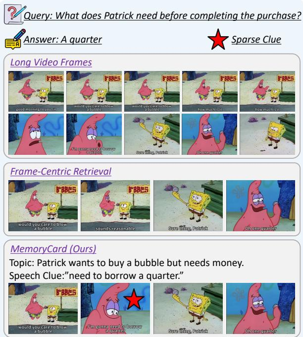

Query: What does Patrick need before completing the purchase?

Answer: A quarter

Sparse Clue

Figure 1: A motivational example illustrating the differences between Memory Cards and existing frame-based evidence construction methods.

Ren et al., 2024). However, long-video question answering remains highly challenging because queryrelevant evidence is often sparse, brief, and temporally scattered across lengthy video contexts. Critical cues, such as key objects, actions, scene transitions, textual information, and spoken content, may appear only momentarily, while the majority of frames are redundant or irrelevant (Liu et al., 2025; Islam et al., 2025). Consequently, VLMs often struggle to effectively model long-range temporal dependencies and accurately identify truly relevant evidence from long-form videos.

Existing methods primarily address this bottleneck through frame-centric clue filtering and extraction. The most straightforward strategy is to employ uniform frame sampling to compress longform videos. However, this approach relies on sparsely sampled frames to represent the entire video, which may overlook crucial evidence required for accurate question answering (Han et al., 2023; Chasmai et al., 2025). To overcome the limitations of uniform sampling, recent approaches aim to better represent long-form videos by selecting query-relevant frames (Buch et al., 2025; Yu et al., 2025b), pruning or compressing framederived visual tokens (Tao et al., 2025), and dynamically adapting input resolutions under fixed computational budgets (Huang et al., 2025). These methods help preserve informative clues for question answering while reducing redundant visual noise. Although effective in reducing noisy visual information, these methods still treat raw frames or frame-derived representations as the fundamental units of evidence, which are inherently low in semantic density. Video frames can capture objects, scenes, and instantaneous action states; however, they often provide sparse and fragmented evidence. As a result, they fail to organize continuous frames into semantically coherent events or to associate different events for comprehensive video understanding (Zacks et al., 2007; Kurby and Zacks, 2008). This limitation further hinders VLMs from forming coherent event-level units, capturing continuous video semantics, and performing effective long-range reasoning (Liao et al., 2024).

In this work, we propose MEMORYCARD, a video-memory-based augmentation framework that organizes videos into Memory Cards to facilitate long-video question answering. As illustrated in Figure 1, MEMORYCARD goes beyond isolated frame sampling by constructing self-contained Memory Cards with event-level contextual cues. Specifically, MEMORYCARD first employs a VLM to segment the video into semantically coherent sessions, each corresponding to a distinct topic or event. It then performs intensive reading over each session to generate an event-level video gist, consisting of a VLM-generated topic and aligned utterances, and selects representative visual moments from the same session. To preserve and utilize these multimodal clues, MEMORYCARD renders the video gist and representative visual moments into a unified Memory Card. This design transforms sparse frame-level clues into high-density multimodal evidence while remaining compatible with standard image-based VLM pipelines (Yu et al., 2025a).

Experiments on three long-video question answering benchmarks show that MEMORYCARD consistently improves performance under comparable visual budgets. Ablation studies further show that the gains are not merely brought by retrieval, but by the proposed evidence representation: selfread semantic session construction, high-density Memory Card rendering, and temporal clue organization. Additional analyses demonstrate that Memory Cards preserve fine-grained visual details while maintaining event-level temporal context, supporting them as effective multimodal evidence units for efficient long-video understanding.

# 2 Related Work

Vision-Language Models (VLMs) have achieved substantial progress in video understanding and temporal reasoning. Existing studies improve longvideo understanding primarily from two perspectives. One line of work strengthens the intrinsic video modeling capability of VLMs through temporal-aware modeling, large-scale video instruction tuning, and long-video QA-oriented training (Ren et al., 2024; Zhang et al., 2025b,d). Another line focuses on extending or compressing long visual contexts via long-context transfer, streaming encoding, and hierarchical compression (Weng et al., 2024; Qian et al., 2024; Zhang et al., 2025b). Despite these advances, the performance of long-video question answering under constrained visual-token budgets still critically depends on whether compact, relevant, and semantically informative evidence can be effectively accessed from lengthy videos.

Recent studies address this evidence bottleneck mainly through frame-centric selection and structured access mechanisms. Some methods identify informative frames or keyframes using VLM-based scoring, adaptive sampling, query-aware retrieval, or generation-time feedback (Hu et al., 2025; Tang et al., 2025; Zhang et al., 2025c; Yao et al., 2025). Other approaches organize video access through hierarchical structures, retrieval augmentation, or agent-based multi-step reasoning (Wang et al., 2025b; Luo et al., 2024; Chen et al., 2025; Wang et al., 2024). Although these methods improve long-video access under limited visual-token budgets, their fundamental clue units are still largely restricted to frames, clips, frame-derived representations, or tool-specific visual states. Such units effectively capture local visual content, yet often lack the event-level semantic context required to interpret sparse visual clues.

External memory modeling provides a promising direction for organizing long video context and has been widely explored in long-context reasoning for text, where memories are used to store interaction histories, user preferences, or factual knowledge beyond limited context windows (Kang et al., 2025; Fang et al., 2025; Xin et al., 2026). For videos, MovieChat compresses dense framelevel visual tokens into sparse long-term memories to reduce the cost of long-video understanding (Song et al., 2024), and MovieChat+ further introduces question-aware memory consolidation to preserve more visual tokens from query-relevant segments (Song et al., 2026). Other memorybased approaches preserve long-range information through fixed-size memory or hierarchical backtracking (Zuo et al., 2025), and maintain historical visual states, memory tokens, or model-internal memories (He et al., 2024; Wang et al., 2025a; Diko et al., 2025). While effective for extending contextual capacity, these methods mainly treat memory as latent visual-token states or modelinternal representations, and even question-aware variants use the query to control the compression process rather than constructing a reusable eventlevel memory bank. In contrast, MEMORYCARD first self-reads the video and aligned utterances to build question-independent semantic units, and then renders representative visual moments with event-level video gists into image-based Memory Cards. These cards serve as explicit, reusable, and multimodal evidence units that are naturally compatible with standard image-based VLM pipelines.

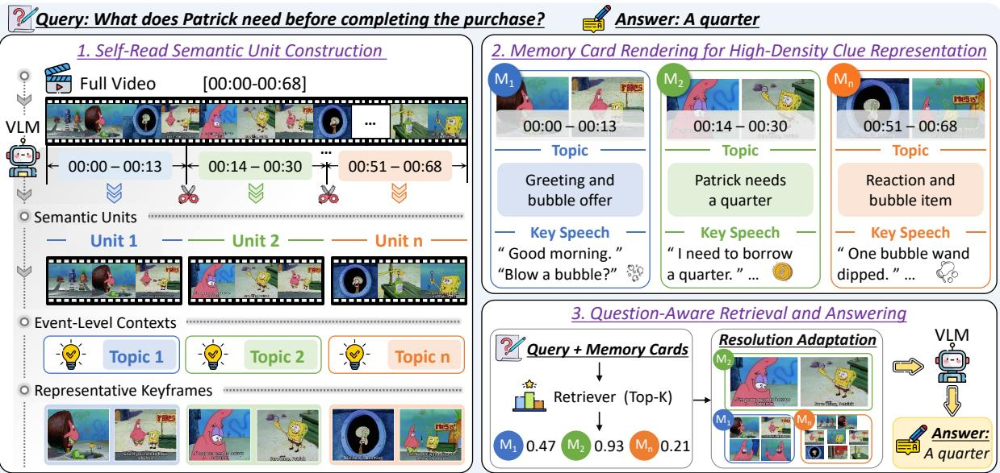

flowchart

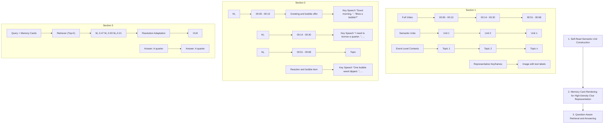

Figure 2: Overview of the MEMORYCARD framework. MEMORYCARD constructs semantic units by self-reading long-form videos together with aligned utterances, renders representative visual moments and event-level video gists into Memory Cards, and retrieves relevant cards for question answering. The retrieved cards are assigned adaptive input resolutions according to their relevance, reordered based on their original temporal positions, and then fed into the answering VLM.

# 3 Methodology

As illustrated in Figure 2, this section introduces MEMORYCARD, a video-memory-based augmentation framework that organizes long-form videos into self-contained Memory Cards for long-video question answering. We first formulate long-form video QA as a retrieval-based task and highlight the limitations of frame-centric clue units (Sec. 3.1). We then describe how MEMORYCARD constructs a Memory Card bank by segmenting the video into semantic sessions, generating an event-level video gist for each session, and rendering representative visual moments together with the corresponding gist into Memory Cards (Sec. 3.2).

# 3.1 Preliminaries of Long-Form Video Question Answering

Given a long-form video V and a question q, the goal of long-form video question answering is to predict the answer y from the long temporal context of the video. We represent the video input as:

$$
V = \{(f _ {i}, t _ {i}) \} _ {i = 1} ^ {N}, \tag {1}
$$

where N denotes the total number of frames in the video V . Based on the video input, we further construct two aligned modalities: the visual observation set $\mathcal { F } = \{ f _ { 1 } , \ldots , f _ { N } \}$ and the transcript set $\mathcal { T } = \{ t _ { 1 } , \ldots , t _ { N } \}$ , where each $t _ { i }$ denotes the transcript aligned with frame $f _ { i } .$ , such as subtitles or speech transcripts when available.

Retrieval-Augmented Video QA. Existing retrieval-augmented methods usually follow a retrieve-then-answer pipeline (Xu et al., 2023; Min et al., 2024). Given a question $q ,$ the retriever selects the top-ranked visual clues from the raw frame pool according to question-frame similarity:

$$
\tilde {\mathcal {F}} = \text { Top- } k (\text { sim } (q, \mathcal {F})), \tag {2}
$$

where $\tilde { \mathcal { F } }$ denotes the retrieved frame-level evidence, $k$ denotes the number of selected visual observations, and sim(·, ·) measures the relevance between the question and the candidate visual observations in $\mathcal { F }$ . The answering VLM then predicts the answer based on the question and the retrieved visual clues:

$$
y = \operatorname{VLM} (q, \tilde {\mathcal {F}}), \tag {3}
$$

where y denotes the predicted answer.

For frame-centric methods, the retrieved clues are selected from the raw-frame pool $\mathcal { F }$ (Gia et al., 2025). Although simple and compatible with image-based VLMs, such clue units are semantically sparse and temporally fragmented. A raw frame only records an instantaneous visual state, without explicit event boundaries, event-level context, or aligned spoken content (Huang et al., 2024). Moreover, retrieving frames independently can break the temporal and semantic continuity of the original video, hindering cross-event association and long-range reasoning (Liao et al., 2024).

Memory-Based Clue Construction. The key limitation of frame-centric retrieval lies in the clue unit itself: an isolated frame provides only sparse visual evidence and lacks the event-level context needed for long-video reasoning. To address this limitation, MEMORYCARD constructs a Memory Card bank from the original video:

$$
\mathcal {M} = \operatorname{MemConstruct} (V), \tag {4}
$$

where $\mathcal { M }$ denotes the constructed Memory Card bank and MemConstruct(·) is the memory construction method in Sec. 3.2. Specifically, the memory set M consists of multiple Memory Cards:

$$
\mathcal {M} = \{M _ {i} \} _ {i = 1} ^ {J}, \tag {5}
$$

where $J$ denotes the number of semantic sessions, and each $M _ { i }$ is an image-based memory unit derived from one semantic session. Each Memory Card anchors representative visual moments and enriches them with an event-level video gist. Through this design, MEMORYCARD converts sparse framelevel observations into compact multimodal evidence units.

Once constructed, M serves as the retrieval pool for MEMORYCARD. Given a question $q ,$ MEMO-RYCARD retrieves the most relevant Memory Cards according to the question-card similarity:

$$
\tilde {\mathcal {M}} = \operatorname{Top-} k (\operatorname{sim} (q, \mathcal {M})), \tag {6}
$$

where $M _ { i }$ denotes a Memory Card in $\mathcal { M } , \sin ( \cdot , \cdot )$ measures question-card relevance, $K _ { \mathrm { r e t } }$ denotes the number of retrieved Memory Cards, and $\tilde { \mathcal { M } }$ denotes the retrieved card set.

The answering VLM then predicts the answer based on the question and the retrieved event-level Memory Card clues:

$$
y = \operatorname{VLM} (q, \tilde {\mathcal {M}}), \tag {7}
$$

where y denotes the predicted answer generated from the retrieved Memory Card evidence $\tilde { \mathcal { M } }$ .

# 3.2 Event-Level Multimodal Evidence Construction

This subsection instantiates MemConstruct(V ) by converting the input video into an event-level Memory Card bank. The construction process consists of two stages: adaptive video segmentation and Memory Card construction.

Adaptive Video Segmentation. To construct event-level evidence, MEMORYCARD first prompts a VLM to analyze the original video input $V$ . The VLM then partitions the video into J semantic sessions according to event, topic, or scene transitions:

$$
\{(b _ {i}, e _ {i}) \} _ {i = 1} ^ {J} = \text { VLM } (\text { Instruct } _ {\text { seg}}, V), \tag {8}
$$

where $\mathrm { I n s t r u c t _ { s e g } }$ indicates the instruction for session segmentation. $s _ { i }$ denotes the i-th semantic session identified by the VLM, while $b _ { i }$ and $e _ { i }$ denote the corresponding start and end timestamps, respectively. Based on these boundaries, each semantic session $s _ { i }$ is extracted from the original video V as:

$$
s _ {i} = V [ b _ {i}: e _ {i} ]. \tag {9}
$$

Memory Card Construction. Given a semantic session $s _ { i } = V [ b _ { i } : e _ { i } ]$ , MEMORYCARD first constructs an event-level video gist $g _ { i }$ by summarizing the video segment $s _ { i } .$ , and then selects representative frames to characterize the session content.

Specifically, the model summarizes the visual and textual information within the session, i.e., $\mathcal { F } _ { b _ { i } : e _ { i } }$ and $\mathcal { T } _ { b _ { i } : e _ { i } }$ , to produce an event-level summary of both language and vision:

$$
g _ {i}, I _ {i} = \text { VLM } (\text { Instruct } _ {\text { gist }}, \mathcal {F} _ {b _ {i}: e _ {i}}, \mathcal {T} _ {b _ {i}: e _ {i}}), \tag {10}
$$

where Instruc $\mathrm { t _ { g i s t } }$ denotes the instruction that prompts the model to extract the key clues from session $s _ { i }$ to form the corresponding gist $g _ { i }$ , and to generate the indices $I _ { i }$ of representative frames that best characterize the session. Next, MEMO-RYCARD selects representative visual frames from the frame set $\mathcal { F } _ { b _ { i } : e _ { i } }$ according to the generated frame indices $I _ { i }$ to form the representative frame set $\tilde { \mathcal { F } } _ { b _ { i } : e _ { i } } ^ { }$ :

$$
\tilde {\mathcal {F}} _ {b _ {i}: e _ {i}} = \operatorname{Select} (\mathcal {F} _ {b _ {i}: e _ {i}}, I _ {i}), \tag {11}
$$

where $\tilde { \mathcal { F } } _ { b _ { i } : e _ { i } } \subseteq \mathcal { F } _ { b _ { i } : e _ { i } }$ denotes the representative visual moments selected from session $s _ { i }$ . Since the selection process is guided by the event-level video gist, the resulting visual moments are both visually informative and semantically aligned with the session content. Finally, each Memory Card is constructed by rendering the selected visual moments, the event-level video gist, and the session boundary information into a unified image-based clue representation:

$$
M _ {i} = \text { Render } \big (\tilde {\mathcal {F}} _ {b _ {i}: e _ {i}}, g _ {i}, (b _ {i}, e _ {i}) \big), \tag {12}
$$

where $M _ { i }$ denotes the Memory Card representing the i-th semantic session $s _ { i }$ .

# 4 Experimental Methodology

This section describes the experimental setup for evaluating MEMORYCARD on long-video question answering benchmarks. We use MEMORYCARD as a test-time augmentation framework: the answering VLMs are kept fixed, and no model parameters are updated. All Memory Cards are constructed before retrieval in a question-agnostic manner, without using downstream questions, answer options, or ground-truth answers.

Datasets. We evaluate MEMORYCARD on three long-video question answering benchmarks: Video-MME (Fu et al., 2025), MLVU (Zhou et al., 2024), and LongVideoBench (Wu et al., 2024). All benchmarks follow the multiple-choice protocol, and accuracy is used as the evaluation metric. For Video-MME, we report overall accuracy and durationwise accuracy on short, medium, and long videos. For MLVU and LongVideoBench, we report overall accuracy on the evaluated split. Additional dataset details and evaluation protocol are provided in Appendix A.2.

Baselines. We compare MEMORYCARD with representative video VLMs and efficient longvideo understanding methods. These methods cover video-language models, long-context or compression-based video models, frame-selection methods, and memory-based long-video approaches. Brief descriptions of the compared methods are provided in Appendix A.3. For controlled comparisons, we use three answering backbones: Qwen2-VL-7B, Qwen3-VL-8B, and MiniCPM-V-4.5. For each backbone, we compare the original model with its MEMORYCARD-augmented variant while keeping the answering model, prompt format, decoding configuration, answer extraction rule, and evaluation protocol unchanged.

Implementation Details. For MEMORYCARD, each video is first processed into a reusable Memory Card bank. We extract the audio track and use Qwen3-ASR (Team, 2026) to obtain timestamped utterances. We use Qwen3-VL-8B (Bai et al., 2025) as the self-read VLM to segment each video into semantic sessions according to visual content and temporal event structure, and the utterances are aligned to these sessions by timestamps. For videos without valid speech content, MEMORYCARD constructs Memory Cards using visual information only. For each semantic session, the VLM generates an event-level video gist, consisting of a topic and aligned utterance text when available. The temporal span is retained as session metadata. Representative visual moments, the corresponding gist, and temporal metadata are rendered into image-based Memory Cards as compact multimodal evidence for downstream question answering.

For question answering, we use Long-CLIP (Zhang et al., 2024) as the CLIP-style retriever to select question-relevant cards from the constructed Memory Card bank. Memory Card construction is question-agnostic, while retrieval is question-aware. The top-k retrieved cards are assigned input resolutions according to retrieval relevance, reordered by their original temporal positions, and fed into the answering VLM. Unless otherwise specified, we use $k _ { \mathrm { r e t } } = 4 4$ , with 4, 8, and 32 retrieved Memory Cards assigned to high, medium, and low resolutions.

All evaluations are conducted with the lmmseval framework (Zhang et al., 2025a). More implementation details are provided in Appendix A.4.

<table><tr><td rowspan="2">Method</td><td rowspan="2">LLM Size</td><td rowspan="2">#Frames</td><td colspan="4">Video-MME</td><td>MLVU</td><td>LongVideoBench</td></tr><tr><td>Overall 17min</td><td>Short 1.3min</td><td>Medium 9min</td><td>Long 41min</td><td>12min</td><td>12min</td></tr><tr><td colspan="9">Avg. Video Duration</td></tr><tr><td>Video-LLaVA</td><td>7B</td><td>8</td><td>39.9</td><td>45.3</td><td>38.0</td><td>36.2</td><td>47.3</td><td>39.1</td></tr><tr><td>Qwen-VL</td><td>7B</td><td>8</td><td>41.1</td><td>46.9</td><td>38.7</td><td>37.8</td><td>-</td><td>-</td></tr><tr><td>VideoChat2</td><td>7B</td><td>8</td><td>39.5</td><td>48.3</td><td>37.0</td><td>33.2</td><td>44.5</td><td>39.3</td></tr><tr><td>ShareGPT4Video</td><td>8B</td><td>16</td><td>39.9</td><td>48.3</td><td>36.3</td><td>35.0</td><td>46.4</td><td>41.8</td></tr><tr><td>MovieChat</td><td>7B</td><td>*</td><td>38.2</td><td>-</td><td>-</td><td>33.4</td><td>25.8</td><td>-</td></tr><tr><td>MovieChat+</td><td>7B</td><td>*</td><td>44.5</td><td>49.3</td><td>44.5</td><td>39.7</td><td>31.2</td><td>40.4</td></tr><tr><td>Video-XL</td><td>7B</td><td>128/256</td><td>55.5</td><td>64.0</td><td>53.2</td><td>49.2</td><td>64.9</td><td>-</td></tr><tr><td>LLaVA-OneVision</td><td>7B</td><td>*</td><td>58.2</td><td>-</td><td>-</td><td>-</td><td>64.7</td><td>56.3</td></tr><tr><td>Video-CCAM</td><td>9B</td><td>96</td><td>50.3</td><td>61.9</td><td>49.2</td><td>39.6</td><td>58.5</td><td>-</td></tr><tr><td>Frame-Voyager</td><td>8B</td><td>8</td><td>57.5</td><td>67.3</td><td>56.3</td><td>48.9</td><td>65.6</td><td>-</td></tr><tr><td>LongVU</td><td>7B</td><td>*</td><td>60.9</td><td>64.7</td><td>58.2</td><td>59.5</td><td>65.4</td><td>-</td></tr><tr><td>Qwen2-VL-Video</td><td>7B</td><td>8</td><td>53.0</td><td>64.1</td><td>49.3</td><td>45.6</td><td>55.6</td><td>51.0</td></tr><tr><td>Qwen2-VL</td><td>7B</td><td>8</td><td>53.7</td><td>65.0</td><td>50.7</td><td>45.3</td><td>56.9</td><td>53.5</td></tr><tr><td>+MemoryCard</td><td>7B</td><td>4+ 8+ 32</td><td>60.5</td><td>69.7</td><td>61.0</td><td>50.9</td><td>65.7</td><td>58.4</td></tr><tr><td>Qwen3-VL-Video</td><td>8B</td><td>8</td><td>56.6</td><td>67.7</td><td>51.7</td><td>50.3</td><td>56.9</td><td>54.8</td></tr><tr><td>Qwen3-VL</td><td>8B</td><td>8</td><td>57.4</td><td>68.8</td><td>53.1</td><td>50.2</td><td>57.2</td><td>56.3</td></tr><tr><td>+MemoryCard</td><td>8B</td><td>4+ 8+ 32</td><td>64.7</td><td>72.2</td><td>64.8</td><td>54.7</td><td>66.5</td><td>60.1</td></tr><tr><td>MiniCPM-V-4.5-Video</td><td>8B</td><td>8</td><td>59.7</td><td>68.4</td><td>58.9</td><td>51.8</td><td>58.9</td><td>56.3</td></tr><tr><td>MiniCPM-V-4.5</td><td>8B</td><td>8</td><td>59.9</td><td>69.6</td><td>58.2</td><td>52.0</td><td>57.0</td><td>55.6</td></tr><tr><td>+MemoryCard</td><td>8B</td><td>4+ 8+ 32</td><td>67.2</td><td>76.0</td><td>67.6</td><td>58.0</td><td>69.4</td><td>62.0</td></tr></table>

Table 1: Overall Performance of MEMORYCARD. Comparison with representative VLMs on Video-MME, MLVU, and LongVideoBench. All results are reported as accuracy. For Video-MME, we report the overall accuracy and the results on short, medium, and long videos. For MEMORYCARD, 4, 8, and 32 denote the numbers of memory-card inputs at high, medium, and low resolutions, respectively. The lighter the color, the lower the frame resolution. The best results are shown in bold.

# 5 Evaluation Results

We evaluate MEMORYCARD from four perspectives: overall performance, rendered card components, semantic session construction, and the use of Memory Cards under constrained visual budgets. Together, these analyses examine whether eventlevel multimodal evidence units provide more effective inputs for long-video question answering than frame-centric clues.

# 5.1 Overall Performance

As shown in Table 1, MEMORYCARD improves long-video QA performance across the evaluated benchmarks. Under controlled comparisons, MEM-ORYCARD consistently improves the corresponding answering backbones while keeping the answering VLM, prompt format, decoding configuration, answer extraction rule, and evaluation protocol unchanged. This indicates that the improvement mainly comes from how video evidence is constructed and presented to the answering model.

The improvements are consistent across different video durations, including short, medium, and long videos on Video-MME. This suggests that MEM-ORYCARD is not only beneficial for very long inputs, but also improves evidence quality for both local and temporally distributed questions. Together with the gains on MLVU and LongVideoBench, these results show that Memory Cards provide a robust evidence representation across benchmarks and answering backbones.

# 5.2 Ablation Study

Table 2 evaluates the contribution of the rendered event-level video gist, speech transcript, topic description, and temporal metadata. Raw-frame retrieval serves as a direct control because it uses question-aware retrieval while keeping the evidence unit as raw frames. The gap between rawframe retrieval and the full MEMORYCARD shows that selecting relevant frames is not sufficient when the retrieved clues remain semantically sparse and temporally isolated.

Removing individual fields further confirms the role of multimodal card rendering. Speech Transcript refers to the aligned utterance text rendered in each Memory Card, and its removal tests the contribution of spoken information. Topic provides the unit-level semantic summary, while Temporal Span grounds each card within the original video structure. These components complement the visual gist by binding visual content with semantic, speech, and temporal information. Thus, the effectiveness of MEMORYCARD comes not only from retrieving relevant evidence, but also from rendering the evidence into a self-contained and interpretable Memory Card. Detailed variant definitions are provided in Appendix A.5.

<table><tr><td rowspan="2">Method</td><td colspan="4">Video-MME</td><td rowspan="2">MLVU</td><td rowspan="2">LongVideoBench</td></tr><tr><td>Overall</td><td>Short</td><td>Medium</td><td>Long</td></tr><tr><td>Qwen2-VL</td><td>53.7</td><td>65.0</td><td>50.7</td><td>45.3</td><td>56.9</td><td>53.5</td></tr><tr><td>+ Raw-frame Retrieval</td><td>57.3</td><td>69.0</td><td>55.7</td><td>47.3</td><td>64.6</td><td>56.3</td></tr><tr><td>MemoryCard</td><td>60.5</td><td>69.7</td><td>61.0</td><td>50.9</td><td>65.7</td><td>58.4</td></tr><tr><td>w/o Speech Transcript</td><td>57.8</td><td>68.9</td><td>55.6</td><td>48.8</td><td>65.1</td><td>56.6</td></tr><tr><td>w/o Topic</td><td>58.6</td><td>68.0</td><td>59.1</td><td>48.6</td><td>64.7</td><td>56.7</td></tr><tr><td>w/o Temporal Span</td><td>59.5</td><td>69.1</td><td>59.7</td><td>49.6</td><td>64.9</td><td>57.2</td></tr><tr><td>Qwen3-VL</td><td>57.4</td><td>68.8</td><td>53.1</td><td>50.2</td><td>57.2</td><td>56.3</td></tr><tr><td>+ Raw-frame Retrieval</td><td>60.8</td><td>69.8</td><td>58.9</td><td>53.6</td><td>64.9</td><td>57.2</td></tr><tr><td>MemoryCard</td><td>64.7</td><td>72.2</td><td>64.8</td><td>54.7</td><td>66.5</td><td>60.1</td></tr><tr><td>w/o Speech Transcript</td><td>61.3</td><td>70.6</td><td>60.8</td><td>52.4</td><td>65.9</td><td>58.8</td></tr><tr><td>w/o Topic</td><td>62.7</td><td>70.2</td><td>63.9</td><td>54.0</td><td>64.7</td><td>58.7</td></tr><tr><td>w/o Temporal Span</td><td>63.1</td><td>71.3</td><td>64.1</td><td>53.9</td><td>65.8</td><td>59.1</td></tr><tr><td>MiniCPM-V-4.5</td><td>59.9</td><td>69.6</td><td>58.2</td><td>52.0</td><td>57.0</td><td>55.6</td></tr><tr><td>+ Raw-frame Retrieval</td><td>65.1</td><td>74.6</td><td>65.3</td><td>55.3</td><td>67.1</td><td>60.8</td></tr><tr><td>MemoryCard</td><td>67.2</td><td>76.0</td><td>67.6</td><td>58.0</td><td>69.4</td><td>62.0</td></tr><tr><td>w/o Speech Transcript</td><td>65.0</td><td>74.2</td><td>64.3</td><td>56.6</td><td>68.5</td><td>61.0</td></tr><tr><td>w/o Topic</td><td>66.6</td><td>75.1</td><td>66.9</td><td>57.8</td><td>68.4</td><td>61.3</td></tr><tr><td>w/o Temporal Span</td><td>66.8</td><td>75.8</td><td>66.7</td><td>57.9</td><td>67.6</td><td>60.9</td></tr></table>

Table 2: Ablation study of MEMORYCARD components and raw-frame retrieval baseline on three video question answering benchmarks with different answering backbones. The best results within each answering backbone are highlighted in bold. 

<table><tr><td>Method</td><td>Video-MME Overall</td><td>MLVU</td><td>LongVideo Bench</td></tr><tr><td>MemoryCard</td><td>64.7</td><td>66.5</td><td>60.1</td></tr><tr><td>w/ Uniform-frame Units</td><td>62.5</td><td>65.3</td><td>59.1</td></tr><tr><td>w/ Fixed-length Units</td><td>63.1</td><td>66.2</td><td>58.8</td></tr><tr><td>w/ Shot-based Units</td><td>63.4</td><td>65.9</td><td>61.1</td></tr></table>

Table 3: Effect of different memory unit construction strategies with Qwen3-VL as the answering backbone. For Video-MME, we report the overall accuracy. More comprehensive results are reported in Appendix Table 5.

# 5.3 Effectiveness of Semantic Memory Sessions

Table 3 studies how memory sessions should be formed before rendering. Adaptive semantic sessions achieve the strongest overall results on Video-MME and MLVU, while remaining competitive on LongVideoBench. This indicates that the gain of MEMORYCARD is not simply obtained by adding text around sampled frames; the visual anchor and

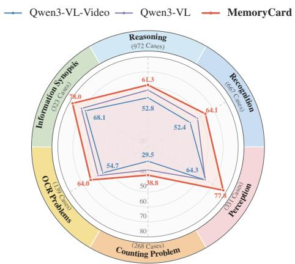

radar

| Category | Qwen3-VL-Video (Cases) | Qwen3-VL (Cases) | MemoryCard (Cases) |
| :--- | :--- | :--- | :--- |
| Reasoning | 52.8 | 61.3 | 64.1 |
| Recognition | 52.4 | 64.3 | 77.4 |
| Perception | 29.5 | 54.7 | 38.8 |
| Counting Problem | 54.7 | 64.0 | 68.1 |
| OCR Problems | 119.7 | 68.0 | 68.0 |
| Information Synopsies | 123.0 | 68.0 | 68.0 |
Reasoning (972 Cases) | 52.8 | 61.3 | 64.1 |
| Reasoning (607 Cases) | 52.4 | 64.3 | 77.4 |
| Perception (381 Cases) | 52.4 | 64.3 | 68.0 |
| Counting Problem (268 Cases) | 54.7 | 64.0 | 68.1 |
The chart displays a radar chart with three data series: Qwen3-VL-Video, Qwen3-VL, and MemoryCard. The values for each category are explicitly labeled on the chart.

Figure 3: Category-Wise Accuracies (%) of Qwen3- VL-Video, Qwen3-VL, and MEMORYCARD on six task categories in Video-MME.

its event-level context should describe the same underlying event.

Uniform or fixed-length sessions may split related evidence or merge unrelated events, while shot-based sessions mainly capture visual transitions rather than semantic boundaries. In contrast, VLM self-reading constructs content-aware sessions, making the rendered Memory Cards more coherent for retrieval and answering. This supports the central design of MEMORYCARD: Memory Cards are effective because they convert long videos into semantically coherent event-level evidence units rather than isolated frame-level clues. Complete results are provided in Appendix A.6.

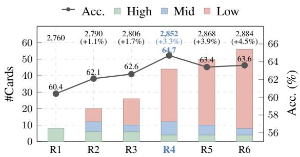

bar_line

| Rating | #Cards | Acc. (%) | High (%) | Mid (%) | Low (%) |
| :--- | :--- | :--- | :--- | :--- | :--- |
| R1 | 8 | 60.4 | 8 | 0 | 0 |
| R2 | 15 | 62.1 | 7 | 3 | 0 |
| R3 | 25 | 62.6 | 7 | 3 | 0 |
| R4 | 45 | 64.7 | 5 | 12 | 0 |
| R5 | 35 | 63.4 | 5 | 9 | 0 |
| R6 | 55 | 63.6 | 5 | 4 | 0 |
The chart includes a line graph labeled 'Acc.' showing the absolute values for each rating category on the left y-axis, and a secondary y-axis labeled 'Acc.' showing the percentage change from the right y-axis. The data is grouped by rating categories: R1 to R6. The top label indicates the total number of cards per rating category. The chart also displays the percentage change in accuracy for each rating category.

Figure 4: Resolution Allocation under Comparable Visual Budgets. R1–R6 are detailed in Appendix Table 9; bars show card resolutions and the line shows Video-MME accuracy with Qwen3-VL.

Figure 3 further analyzes where the overall gains come from. MEMORYCARD improves multiple task categories rather than only a single capability such as OCR or object recognition, suggesting that Memory Cards provide a generally useful evidence representation for different types of challenging long-video questions.

The gains are especially relevant for tasks that require local visual details to be interpreted with broader event context, such as perception, recognition, OCR, and information synopsis. Counting and reasoning remain more challenging, suggesting that some questions may require denser temporal coverage or stronger aggregation across multiple retrieved cards. Complete subtask results are provided in Appendix A.7.

# 5.4 Effectiveness of Memory Card Selection and Allocation

This subsection studies how constructed Memory Cards should be used under a fixed visual-token budget. After the Memory Card bank is built, MEMORYCARD must select relevant cards, allocate visual resolution, and determine the final input order before answer generation.

Resolution Allocation. Figure 4 compares different ways of allocating the visual budget among retrieved Memory Cards. High-resolution cards preserve fine-grained visual details but reduce event coverage, while low-resolution cards increase coverage but weaken detailed perception. The default relevance-aware allocation balances this trade-off by assigning higher resolution to likely answercritical cards and lower resolution to contextual cards. This allows MEMORYCARD to preserve both key visual details and broader temporal context within a comparable visual budget. Full results are provided in Appendix A.8.

Memory Card Ordering and Selection. Figure 5 examines two key decisions after Memory Card retrieval: how the selected cards should be ordered and how many cards should be selected for answer generation.

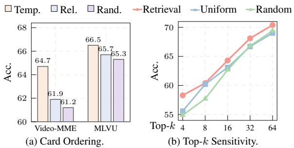

bar

| Category | Video-MME | MLVU |
| :--- | :--- | :--- |
| Temp. | 64.7 | 66.5 |
| Rel. | 61.9 | 65.7 |
| Rand. | 61.2 | 65.3 |
| Retrieval | 58.0 | 70.0 |
| Uniform | 60.0 | 67.0 |
| Random | 55.0 | 69.0 |
Top-k: 4: 55.0, Top-k: 58.0, Top-k: 60.0, Top-k: 63.0, Top-k: 67.0, Top-k: 69.0, Top-k: 70.0

Figure 5: Analysis of Memory Card Ordering and Selection. Fig. 5a shows that temporal ordering preserves the original event progression and provides a more coherent reasoning sequence after retrieval. Fig. 5b shows that retrieval-based selection is more robust across different Top-k values than uniform or random selection.

Figure 5a shows that temporal ordering outperforms relevance-based and random ordering, indicating that chronological structure provides a more coherent reasoning sequence after relevant cards are selected. Figure 5b compares retrievalbased, uniform, and random selection under different Top-k values. Retrieval is most effective under small Top-k, where the selected cards must be highly answer-relevant. As Top-k increases, larger event coverage improves performance, but retrieval-based selection remains more stable than uniform or random selection. Full results are provided in Appendix A.9 and Appendix A.10.

# 6 Conclusion

This paper presents MEMORYCARD, a videomemory-based augmentation framework for longvideo QA. By constructing coherent semantic units and rendering representative visual moments with event-level video gists into unified Memory Cards, MEMORYCARD organizes sparse video clues into high-density multimodal evidence for VLM-based answering. This design shifts long-video QA from frame-centric evidence selection toward event-level evidence construction under constrained visual budgets. Experimental results show that MEM-ORYCARD improves multiple VLM backbones, while ablations confirm the effectiveness of semantic unit construction, Memory Card rendering, and temporal organization.

# Limitations

Although MEMORYCARD improves long-video QA, constructing Memory Cards introduces extra preprocessing cost. MEMORYCARD relies on a self-read VLM to segment videos into semantic units, generate event-level video gists, select representative visual moments, align speech transcripts, and render them into unified cards. These cards can be reused across questions from the same video, but the construction process still adds overhead before answering. Moreover, because each card uses a unit-level gist and representative visual moments, MEMORYCARD may be less effective for questions requiring fine-grained motion dynamics or continuous action understanding. Improving memory-construction efficiency while preserving dense event-level evidence remains an important direction for future work.

# References

Shuai Bai, Yuxuan Cai, Ruizhe Chen, Keqin Chen, Xionghui Chen, Zesen Cheng, Lianghao Deng, Wei Ding, Chang Gao, Chunjiang Ge, Wenbin Ge, Zhifang Guo, Qidong Huang, Jie Huang, Fei Huang, Binyuan Hui, Shutong Jiang, Zhaohai Li, Mingsheng Li, and 45 others. 2025. Qwen3-vl technical report. Preprint, arXiv:2511.21631.   
Shyamal Buch, Arsha Nagrani, Anurag Arnab, and Cordelia Schmid. 2025. Flexible frame selection for efficient video reasoning. In IEEE/CVF Conference on Computer Vision and Pattern Recognition, CVPR 2025, Nashville, TN, USA, June 11-15, 2025, pages 29071–29082. Computer Vision Foundation / IEEE.   
Mustafa Chasmai, Gauri Jagatap, Gouthaman KV, Grant Van Horn, Subhransu Maji, and Andrea Fanelli. 2025. Moment sampling in video llms for long-form video QA. CoRR, abs/2507.00033.   
Qirui Chen, Shangzhe Di, and Weidi Xie. 2025. Grounded multi-hop videoqa in long-form egocentric videos. In Thirty-Ninth AAAI Conference on Artificial Intelligence, Thirty-Seventh Conference on Innovative Applications of Artificial Intelligence, Fifteenth Symposium on Educational Advances in Artificial Intelligence, AAAI 2025, Philadelphia, PA, USA, February 25 - March 4, 2025, pages 2159–2167. AAAI Press.   
Anxhelo Diko, Tinghuai Wang, Wassim Swaileh, Shiyan Sun, and Ioannis Patras. 2025. Rewind: Understanding long videos with instructed learnable memory. In IEEE/CVF Conference on Computer Vision and Pattern Recognition, CVPR 2025, Nashville, TN, USA, June 11-15, 2025, pages 13734–13743. Computer Vision Foundation / IEEE.

Jizhan Fang, Xinle Deng, Haoming Xu, Ziyan Jiang, Yuqi Tang, Ziwen Xu, Shumin Deng, Yunzhi Yao, Mengru Wang, Shuofei Qiao, Huajun Chen, and Ningyu Zhang. 2025. Lightmem: Lightweight and efficient memory-augmented generation. CoRR, abs/2510.18866.

Chaoyou Fu, Yuhan Dai, Yongdong Luo, Lei Li, Shuhuai Ren, Renrui Zhang, Zihan Wang, Chenyu Zhou, Yunhang Shen, Mengdan Zhang, Peixian Chen, Yanwei Li, Shaohui Lin, Sirui Zhao, Ke Li, Tong Xu, Xiawu Zheng, Enhong Chen, Caifeng Shan, and 2 others. 2025. Video-mme: The first-ever comprehensive evaluation benchmark of multi-modal llms in video analysis. In IEEE/CVF Conference on Computer Vision and Pattern Recognition, CVPR 2025, Nashville, TN, USA, June 11-15, 2025, pages 24108– 24118. Computer Vision Foundation / IEEE.

Bao Tran Gia, Khiem Le, Tien Do, Tien-Dung Mai, Thanh Duc Ngo, Duy-Dinh Le, and Shin’ichi Satoh. 2025. VRAG: retrieval-augmented video question answering for long-form videos. In IEEE/CVF Conference on Computer Vision and Pattern Recognition Workshops, CVPR Workshops 2025, Nashville, TN, USA, June 11-15, 2025, pages 3689–3698. Computer Vision Foundation / IEEE.

Wei Han, Hui Chen, Min-Yen Kan, and Soujanya Poria. 2023. SAS video-qa: Self-adaptive sampling for efficient video question-answering. CoRR, abs/2307.04192.

Bo He, Hengduo Li, Young Kyun Jang, Menglin Jia, Xuefei Cao, Ashish Shah, Abhinav Shrivastava, and Ser-Nam Lim. 2024. MA-LMM: memoryaugmented large multimodal model for long-term video understanding. In IEEE/CVF Conference on Computer Vision and Pattern Recognition, CVPR 2024, Seattle, WA, USA, June 16-22, 2024, pages 13504–13514. IEEE.

Kai Hu, Feng Gao, Xiaohan Nie, Peng Zhou, Son Tran, Tal Neiman, Lingyun Wang, Mubarak Shah, Raffay Hamid, Bing Yin, and Trishul Chilimbi. 2025. M-LLM based video frame selection for efficient video understanding. In IEEE/CVF Conference on Computer Vision and Pattern Recognition, CVPR 2025, Nashville, TN, USA, June 11-15, 2025, pages 13702– 13712. Computer Vision Foundation / IEEE.

Bin Huang, Xin Wang, Hong Chen, Zihan Song, and Wenwu Zhu. 2024. Vtimellm: Empower LLM to grasp video moments. In IEEE/CVF Conference on Computer Vision and Pattern Recognition, CVPR 2024, Seattle, WA, USA, June 16-22, 2024, pages 14271–14280. IEEE.

Xiaohu Huang, Hao Zhou, and Kai Han. 2025. Prunevid: Visual token pruning for efficient video large language models. In Findings of the Association for Computational Linguistics, ACL 2025, Vienna, Austria, July 27 - August 1, 2025, Findings of ACL, pages 19959–19973. Association for Computational Linguistics.

Md Mohaiminul Islam, Tushar Nagarajan, Huiyu Wang, Gedas Bertasius, and Lorenzo Torresani. 2025. BIMBA: selective-scan compression for long-range video question answering. In IEEE/CVF Conference on Computer Vision and Pattern Recognition, CVPR 2025, Nashville, TN, USA, June 11-15, 2025, pages 29096–29107. Computer Vision Foundation / IEEE.   
Jiazheng Kang, Mingming Ji, Zhe Zhao, and Ting Bai. 2025. Memory OS of AI agent. In Proceedings of the 2025 Conference on Empirical Methods in Natural Language Processing, EMNLP 2025, Suzhou, China, November 4-9, 2025, pages 25961–25970. Association for Computational Linguistics.   
Christopher A Kurby and Jeffrey M Zacks. 2008. Segmentation in the perception and memory of events. Trends in cognitive sciences, 12(2):72–79.   
Ruotong Liao, Max Erler, Huiyu Wang, Guangyao Zhai, Gengyuan Zhang, Yunpu Ma, and Volker Tresp. 2024. Videoinsta: Zero-shot long video understanding via informative spatial-temporal reasoning with llms. In Findings of the Association for Computational Linguistics: EMNLP 2024, Miami, Florida, USA, November 12-16, 2024, Findings of ACL, pages 6577–6602. Association for Computational Linguistics.   
Shuming Liu, Chen Zhao, Tianqi Xu, and Bernard Ghanem. 2025. BOLT: boost large vision-language model without training for long-form video understanding. In IEEE/CVF Conference on Computer Vision and Pattern Recognition, CVPR 2025, Nashville, TN, USA, June 11-15, 2025, pages 3318–3327. Computer Vision Foundation / IEEE.   
Yongdong Luo, Xiawu Zheng, Xiao Yang, Guilin Li, Haojia Lin, Jinfa Huang, Jiayi Ji, Fei Chao, Jiebo Luo, and Rongrong Ji. 2024. Video-rag: Visuallyaligned retrieval-augmented long video comprehension. CoRR, abs/2411.13093.   
Muhammad Maaz, Hanoona Abdul Rasheed, Salman Khan, and Fahad Khan. 2024. Video-chatgpt: Towards detailed video understanding via large vision and language models. In Proceedings of the 62nd Annual Meeting of the Association for Computational Linguistics (Volume 1: Long Papers), ACL 2024, Bangkok, Thailand, August 11-16, 2024, pages 12585–12602. Association for Computational Linguistics.   
Juhong Min, Shyamal Buch, Arsha Nagrani, Minsu Cho, and Cordelia Schmid. 2024. Morevqa: Exploring modular reasoning models for video question answering. In IEEE/CVF Conference on Computer Vision and Pattern Recognition, CVPR 2024, Seattle, WA, USA, June 16-22, 2024, pages 13235–13245. IEEE.   
Rui Qian, Xiaoyi Dong, Pan Zhang, Yuhang Zang, Shuangrui Ding, Dahua Lin, and Jiaqi Wang. 2024. Streaming long video understanding with large language models. In Advances in Neural Information Processing Systems 38: Annual Conference on Neural Information Processing Systems 2024, NeurIPS

2024, Vancouver, BC, Canada, December 10 - 15, 2024.   
Shuhuai Ren, Linli Yao, Shicheng Li, Xu Sun, and Lu Hou. 2024. Timechat: A time-sensitive multimodal large language model for long video understanding. In IEEE/CVF Conference on Computer Vision and Pattern Recognition, CVPR 2024, Seattle, WA, USA, June 16-22, 2024, pages 14313–14323. IEEE.   
Xiaoqian Shen, Yunyang Xiong, Changsheng Zhao, Lemeng Wu, Jun Chen, Chenchen Zhu, Zechun Liu, Fanyi Xiao, Balakrishnan Varadarajan, Florian Bordes, Zhuang Liu, Hu Xu, Hyunwoo J. Kim, Bilge Soran, Raghuraman Krishnamoorthi, Mohamed Elhoseiny, and Vikas Chandra. 2025. Longvu: Spatiotemporal adaptive compression for long video-language understanding. In Forty-second International Conference on Machine Learning, ICML 2025, Vancouver, BC, Canada, July 13-19, 2025, Proceedings of Machine Learning Research. PMLR / OpenReview.net.   
Enxin Song, Wenhao Chai, Guanhong Wang, Yucheng Zhang, Haoyang Zhou, Feiyang Wu, Haozhe Chi, Xun Guo, Tian Ye, Yanting Zhang, Yan Lu, Jenq-Neng Hwang, and Gaoang Wang. 2024. Moviechat: From dense token to sparse memory for long video understanding. In IEEE/CVF Conference on Computer Vision and Pattern Recognition, CVPR 2024, Seattle, WA, USA, June 16-22, 2024, pages 18221– 18232. IEEE.   
Enxin Song, Wenhao Chai, Tian Ye, Jenq-Neng Hwang, Xi Li, and Gaoang Wang. 2026. Moviechat+: Question-aware sparse memory for long video question answering. IEEE Trans. Pattern Anal. Mach. Intell., 48(1):374–389.   
Xi Tang, Jihao Qiu, Lingxi Xie, Yunjie Tian, Jianbin Jiao, and Qixiang Ye. 2025. Adaptive keyframe sampling for long video understanding. In IEEE/CVF Conference on Computer Vision and Pattern Recognition, CVPR 2025, Nashville, TN, USA, June 11-15, 2025, pages 29118–29128. Computer Vision Foundation / IEEE.   
Keda Tao, Can Qin, Haoxuan You, Yang Sui, and Huan Wang. 2025. Dycoke: Dynamic compression of tokens for fast video large language models. In IEEE/CVF Conference on Computer Vision and Pattern Recognition, CVPR 2025, Nashville, TN, USA, June 11-15, 2025, pages 18992–19001. Computer Vision Foundation / IEEE.   
Qwen Team. 2026. Qwen3-asr technical report. CoRR, abs/2601.21337.   
Xiao Wang, Qingyi Si, Shiyu Zhu, Jianlong Wu, Li Cao, and Liqiang Nie. 2025a. Adaretake: Adaptive redundancy reduction to perceive longer for videolanguage understanding. In Findings of the Association for Computational Linguistics, ACL 2025, Vienna, Austria, July 27 - August 1, 2025, Findings of ACL, pages 5417–5432. Association for Computational Linguistics.

Xiaohan Wang, Yuhui Zhang, Orr Zohar, and Serena Yeung-Levy. 2024. Videoagent: Long-form video understanding with large language model as agent. In Computer Vision - ECCV 2024 - 18th European Conference, Milan, Italy, September 29-October 4, 2024, Proceedings, Part LXXX, Lecture Notes in Computer Science, pages 58–76. Springer.   
Ziyang Wang, Shoubin Yu, Elias Stengel-Eskin, Jaehong Yoon, Feng Cheng, Gedas Bertasius, and Mohit Bansal. 2025b. Videotree: Adaptive tree-based video representation for LLM reasoning on long videos. In IEEE/CVF Conference on Computer Vision and Pattern Recognition, CVPR 2025, Nashville, TN, USA, June 11-15, 2025, pages 3272–3283. Computer Vision Foundation / IEEE.   
Yuetian Weng, Mingfei Han, Haoyu He, Xiaojun Chang, and Bohan Zhuang. 2024. Longvlm: Efficient long video understanding via large language models. In Computer Vision - ECCV 2024 - 18th European Conference, Milan, Italy, September 29-October 4, 2024, Proceedings, Part XXXIII, Lecture Notes in Computer Science, pages 453–470. Springer.   
Haoning Wu, Dongxu Li, Bei Chen, and Junnan Li. 2024. Longvideobench: A benchmark for longcontext interleaved video-language understanding. In Advances in Neural Information Processing Systems 38: Annual Conference on Neural Information Processing Systems 2024, NeurIPS 2024, Vancouver, BC, Canada, December 10 - 15, 2024.   
Haidong Xin, Xinze Li, Zhenghao Liu, Yukun Yan, Shuo Wang, Cheng Yang, Yu Gu, Ge Yu, and Maosong Sun. 2026. Metamem: Evolving meta-memory for knowledge utilization through self-reflective symbolic optimization. CoRR, abs/2602.11182.   
Jiaqi Xu, Cuiling Lan, Wenxuan Xie, Xuejin Chen, and Yan Lu. 2023. Retrieval-based video language model for efficient long video question answering. CoRR, abs/2312.04931.   
Linli Yao, Haoning Wu, Kun Ouyang, Yuanxing Zhang, Caiming Xiong, Bei Chen, Xu Sun, and Junnan Li. 2025. Generative frame sampler for long video understanding. In Findings of the Association for Computational Linguistics, ACL 2025, Vienna, Austria, July 27 - August 1, 2025, Findings of ACL, pages 17900–17917. Association for Computational Linguistics.   
Shi Yu, Chaoyue Tang, Bokai Xu, Junbo Cui, Junhao Ran, Yukun Yan, Zhenghao Liu, Shuo Wang, Xu Han, Zhiyuan Liu, and Maosong Sun. 2025a. Visrag: Vision-based retrieval-augmented generation on multi-modality documents. In The Thirteenth International Conference on Learning Representations, ICLR 2025, Singapore, April 24-28, 2025. OpenReview.net.   
Sicheng Yu, Chengkai Jin, Huanyu Wang, Zhenghao Chen, Sheng Jin, Zhongrong Zuo, Xiaolei Xu, Zhenbang Sun, Bingni Zhang, Jiawei Wu, Hao Zhang,

and Qianru Sun. 2025b. Frame-voyager: Learning to query frames for video large language models. In The Thirteenth International Conference on Learning Representations, ICLR 2025, Singapore, April 24-28, 2025. OpenReview.net.   
Jeffrey M Zacks, Nicole K Speer, Khena M Swallow, Todd S Braver, and Jeremy R Reynolds. 2007. Event perception: a mind-brain perspective. Psychological bulletin, 133(2):273.   
Beichen Zhang, Pan Zhang, Xiaoyi Dong, Yuhang Zang, and Jiaqi Wang. 2024. Long-clip: Unlocking the long-text capability of CLIP. In Computer Vision - ECCV 2024 - 18th European Conference, Milan, Italy, September 29-October 4, 2024, Proceedings, Part LI, Lecture Notes in Computer Science, pages 310–325. Springer.   
Hang Zhang, Xin Li, and Lidong Bing. 2023. Videollama: An instruction-tuned audio-visual language model for video understanding. In Proceedings of the 2023 Conference on Empirical Methods in Natural Language Processing, EMNLP 2023 - System Demonstrations, Singapore, December 6-10, 2023, pages 543–553. Association for Computational Linguistics.   
Kaichen Zhang, Bo Li, Peiyuan Zhang, Fanyi Pu, Joshua Adrian Cahyono, Kairui Hu, Shuai Liu, Yuanhan Zhang, Jingkang Yang, Chunyuan Li, and Ziwei Liu. 2025a. Lmms-eval: Reality check on the evaluation of large multimodal models. In Findings of the Association for Computational Linguistics: NAACL 2025, Albuquerque, New Mexico, USA, April 29 - May 4, 2025, Findings of ACL, pages 881–916. Association for Computational Linguistics.   
Peiyuan Zhang, Kaichen Zhang, Bo Li, Guangtao Zeng, Jingkang Yang, Yuanhan Zhang, Ziyue Wang, Haoran Tan, Chunyuan Li, and Ziwei Liu. 2025b. Long context transfer from language to vision. Trans. Mach. Learn. Res., 2025.   
Shaojie Zhang, Jiahui Yang, Jianqin Yin, Zhenbo Luo, and Jian Luan. 2025c. Q-frame: Query-aware frame selection and multi-resolution adaptation for videollms. In Proceedings of the IEEE/CVF Conference on Computer Vision and Pattern Recognition, pages 22056–22065. Computer Vision Foundation / IEEE.   
Yuanhan Zhang, Jinming Wu, Wei Li, Bo Li, Zejun Ma, Ziwei Liu, and Chunyuan Li. 2025d. Llava-video: Video instruction tuning with synthetic data. Trans. Mach. Learn. Res., 2025.   
Junjie Zhou, Yan Shu, Bo Zhao, Boya Wu, Shitao Xiao, Xi Yang, Yongping Xiong, Bo Zhang, Tiejun Huang, and Zheng Liu. 2024. Mlvu: A comprehensive benchmark for multi-task long video understanding. arXiv preprint arXiv:2406.04264, 2(5):6.   
Jialong Zuo, Yongtai Deng, Lingdong Kong, Jingkang Yang, Rui Jin, Yiwei Zhang, Nong Sang, Liang Pan, Ziwei Liu, and Changxin Gao. 2025. Videolucy: Deep memory backtracking for long video understanding. arXiv preprint arXiv:2510.12422.

# A Appendix

This appendix provides supplementary details and complete analysis results that complement the main paper. We first describe the dataset licenses, dataset protocol, and controlled evaluation settings. We then provide implementation details of Memory Card construction, retrieval, and answering. Finally, we report additional analyses on component ablations, memory-session construction, finegrained subtasks, resolution allocation, temporal ordering, and Top-k sensitivity.

# A.1 License

We use three publicly released long-video question answering benchmarks in this work: Video-MME (Fu et al., 2025), MLVU (Zhou et al., 2024), and LongVideoBench (Wu et al., 2024). All datasets are used only for academic research and evaluation purposes, following their respective licenses and usage agreements. Video-MME is released for academic research use and prohibits commercial use. MLVU and LongVideoBench are released under the CC-BY-NC-SA-4.0 license. We do not redistribute the original videos or annotations, and all experiments are conducted on the officially released benchmark splits.

# A.2 Datasets and Evaluation Protocol

We evaluate MEMORYCARD on three long-video question answering benchmarks: Video-MME, MLVU, and LongVideoBench. All benchmarks follow a multiple-choice evaluation protocol, and we report accuracy as the main metric.

Video-MME. Video-MME (Fu et al., 2025) evaluates comprehensive video understanding across diverse video durations and question categories. Following the setting in the main paper, we report overall accuracy and duration-wise accuracy on short, medium, and long videos.

MLVU. MLVU (Zhou et al., 2024) evaluates multi-task long-video understanding across diverse video genres and task types. We report the overall accuracy on the evaluated split.

LongVideoBench. LongVideoBench (Wu et al., 2024) focuses on long-context video-language understanding. Following prior work, we evaluate on the validation split without interleaved subtitles and report overall accuracy.

Controlled Evaluation. For controlled comparisons, we use Qwen2-VL, Qwen3-VL, and MiniCPM-V-4.5 as answering backbones. Unless otherwise specified, all variants use the same answering backbone, prompt format, decoding configuration, output protocol, answer extraction rule, and evaluation script. This protocol isolates the effect of the proposed Memory Card representation, retrieval strategy, ordering strategy, and resolution allocation without changing the answering VLM.

# A.3 Compared Methods

Table 1 compares MEMORYCARD with representative video VLMs and recent efficient long-video understanding methods. We briefly summarize them below.

Video-LLaVA aligns video representations with language models for video instruction following. Qwen-VL is a general vision-language model used as an early multimodal baseline. VideoChat2 is a video instruction-tuned model for video dialogue and understanding. ShareGPT4Video improves video understanding through high-quality video captions and instruction data. MovieChat compresses dense frame tokens into sparse shortterm and long-term memories for long-video understanding. MovieChat+ introduces questionaware memory consolidation to retain more information from question-relevant video segments. Video-XL enables efficient long-video processing with substantially more input frames. LLaVA-OneVision is a strong general-purpose VLM that transfers visual understanding across image and video tasks. Video-CCAM enhances videolanguage understanding with causal cross-attention modeling. Frame-Voyager learns to select informative frames for compact video understanding. LongVU improves long-video understanding through visual-token compression and long-context processing. For controlled comparisons, we evaluate Qwen2-VL, Qwen3-VL, and MiniCPM-V-4.5 together with their video-input variants, allowing us to isolate the effect of Memory Cards under the same answering backbones.

# A.4 Implementation Details

Memory Card Construction. For each video, MEMORYCARD first extracts multimodal clues for Memory Card construction. We extract the audio track and use Qwen3-ASR to generate timestamped speech transcripts. The self-read VLM segments the video into semantic sessions according to visual content and temporal event structure. The speech transcripts are then aligned to the resulting semantic sessions by their timestamps and used as the

# Self-Read Prompt

# Prompt for semantic session Construction:

You are a careful video analyst. You will read the entire video and divide it into semantically coherent sessions. Each session should correspond to a continuous event or topic in the video. Focus on the visual content and temporal event structure. For each session, provide its temporal span and concise topic summary. Do not use any downstream question, answer option, or ground-truth answer.

Table 4: Prompt template used for self-read semantic session construction in MEMORYCARD. In implementation, the generated semantic sessions are associated with event-level video gists and temporal metadata for rendering Memory Cards.

spoken content of each session. For videos without valid speech content, MEMORYCARD constructs Memory Cards using visual information only.

For each semantic session, the VLM produces an event-level video gist, where the topic serves as a compact session summary and the aligned speech transcript preserves the spoken content when available. The temporal span is retained as session metadata. Representative visual moments are selected from the semantic sessions and rendered together with the corresponding gist and temporal metadata into image-based Memory Cards. This process transforms sparse frame-level observations into high-density multimodal evidence units while preserving compatibility with standard image-based VLM pipelines.

Retrieval and Answering. For question answering, we use LongCLIP as the CLIP-style retriever to select question-relevant cards from the constructed Memory Card bank. The retrieved cards are assigned input resolutions according to their retrieval relevance, reordered by their original temporal positions, and then fed into the answering VLM. Unless otherwise specified, controlled comparisons use the same prompt format, decoding configuration, answer extraction rule, and comparable visual input budget. We use $k _ { \mathrm { r e t } } = 4 4$ , consisting of 4 high-resolution, 8 medium-resolution, and 32 low-resolution Memory Cards.

Self-Read Prompt. To construct semantic sessions in a question-agnostic manner, we prompt the self-read VLM to analyze the entire video and divide it into temporally continuous events or topics. The prompt asks the VLM to focus on the visual content and temporal event structure, and to generate the temporal span and topic summary for each session. No downstream question, answer option, or ground-truth answer is used during this process. The resulting semantic sessions are associated with event-level video gists and temporal metadata for Memory Card rendering. The complete prompt template is shown in Table 4.

# A.5 Component Ablation Settings

The component ablation in the main paper examines whether the gain of MEMORYCARD comes from question-aware retrieval alone or from the proposed rendered Memory Card representation. We provide the detailed settings below.

Raw-frame Retrieval. This variant retrieves raw frames from the original video using the same LongCLIP-based retriever and a comparable visual budget as MEMORYCARD. The retrieved frames are sorted by timestamp and passed to the answering VLM. This setting isolates the effect of question-aware retrieval without changing the evidence unit.

MEMORYCARD w/o Speech Transcript. This variant removes the aligned speech transcript from each Memory Card. The representative visual moment, topic, and temporal span are kept unchanged. This setting tests the contribution of spoken information and verifies whether the multimodal gain comes partly from rendering speech-derived clues.

MEMORYCARD w/o Topic. This variant removes the topic generated by the self-read VLM, while keeping the representative visual moment, temporal span, and aligned speech transcript unchanged. This setting tests whether the generated unit-level summary helps the answering VLM interpret the selected visual evidence.

MEMORYCARD w/o Temporal Span. This variant removes the temporal span from each Memory Card, while keeping the representative visual moment, topic, and aligned speech transcript unchanged. This setting tests whether explicit temporal grounding helps organize the selected evidence.

MEMORYCARD. This is the full method. Each Memory Card contains a representative visual moment, an event-level video gist, and temporal metadata when available. The event-level video gist consists of the VLM-generated topic and the aligned speech transcript. The cards are retrieved according to the question, assigned resolutions according to relevance, sorted by temporal order, and passed to the answering VLM.

<table><tr><td rowspan="2">Method</td><td colspan="4">Video-MME</td><td rowspan="2">MLVU</td><td rowspan="2">LongVideoBench</td></tr><tr><td>Overall</td><td>Short</td><td>Medium</td><td>Long</td></tr><tr><td>Qwen2-VL</td><td>53.7</td><td>65.0</td><td>50.7</td><td>45.3</td><td>56.9</td><td>53.5</td></tr><tr><td>MemoryCard</td><td>60.5</td><td>69.7</td><td>61.0</td><td>50.9</td><td>65.7</td><td>58.4</td></tr><tr><td>w/ Uniform-frame Units</td><td>59.1</td><td>68.1</td><td>57.3</td><td>51.8</td><td>64.6</td><td>55.9</td></tr><tr><td>w/ Fixed-length Units</td><td>59.0</td><td>68.0</td><td>58.8</td><td>50.1</td><td>65.9</td><td>56.1</td></tr><tr><td>w/ Shot-based Units</td><td>58.7</td><td>67.9</td><td>58.1</td><td>50.1</td><td>64.9</td><td>56.6</td></tr><tr><td>Qwen3-VL</td><td>57.4</td><td>68.8</td><td>53.1</td><td>50.2</td><td>57.2</td><td>56.3</td></tr><tr><td>MemoryCard</td><td>64.7</td><td>72.2</td><td>64.8</td><td>54.7</td><td>66.5</td><td>60.1</td></tr><tr><td>w/ Uniform-frame Units</td><td>62.5</td><td>71.6</td><td>62.3</td><td>53.6</td><td>65.3</td><td>59.1</td></tr><tr><td>w/ Fixed-length Units</td><td>63.1</td><td>71.9</td><td>63.3</td><td>54.0</td><td>66.2</td><td>58.8</td></tr><tr><td>w/ Shot-based Units</td><td>63.4</td><td>72.4</td><td>62.9</td><td>54.9</td><td>65.9</td><td>61.1</td></tr><tr><td>MiniCPM-V-4.5</td><td>59.9</td><td>69.6</td><td>58.2</td><td>52.0</td><td>57.0</td><td>55.6</td></tr><tr><td>MemoryCard</td><td>67.2</td><td>76.0</td><td>67.6</td><td>58.0</td><td>69.4</td><td>62.0</td></tr><tr><td>w/ Uniform-frame Units</td><td>66.5</td><td>74.6</td><td>66.0</td><td>58.9</td><td>68.3</td><td>61.4</td></tr><tr><td>w/ Fixed-length Units</td><td>66.4</td><td>74.2</td><td>64.0</td><td>61.1</td><td>69.0</td><td>61.7</td></tr><tr><td>w/ Shot-based Units</td><td>66.7</td><td>75.7</td><td>66.7</td><td>57.8</td><td>70.4</td><td>61.6</td></tr></table>

Table 5: Effect of different memory unit construction strategies on three video question answering benchmarks with different answering backbones. The best results within each answering backbone are highlighted in bold.

# A.6 Memory Session Construction Analysis

Setting. This analysis studies whether the quality of the source session affects the final Memory Card representation. All variants use the same rendering template, retriever, answering backbone, prompt format, visual budget, and evaluation protocol. The only difference is how the source sessions are constructed before rendering. Table 5 reports the complete results for different memory-session construction strategies. Uniform-frame Units uniformly sample frames from the whole video and organize them into cards according to temporal order. Fixedlength Units divide each video into fixed temporal windows. Shot-based Units construct units according to visual shot or scene boundaries. The full MEMORYCARD uses self-read semantic sessions, where a VLM organizes the video into temporally coherent local events.

Analysis. Self-read semantic sessions achieve strong overall performance and provide a reliable default source-session construction across answering backbones. This indicates that the benefit of MEMORYCARD does not only come from rendering information into image-based cards; the source session being rendered also matters. Uniformframe and fixed-length units provide temporal coverage, but they may split a coherent event or merge unrelated content. Shot-based units capture lowlevel visual transitions, but shot boundaries do not always correspond to semantic event boundaries. In contrast, self-read semantic sessions better align with event-level video structure, making each Memory Card more self-contained and more suitable for retrieval and answering. This supports the design choice that Memory Cards should be built from semantic sessions rather than mechanically segmented clips.

# A.7 Fine-Grained Subtask Analysis

Setting. We further report fine-grained taskwise results on Video-MME, MLVU, and LongVideoBench. These results complement the overall accuracy by showing which types of questions benefit from the Memory Card representation. For Video-MME, we report six categories: perception, recognition, OCR, counting, reasoning, and information synopsis. For MLVU and LongVideoBench, we follow the task definitions of the corresponding benchmarks. Tables 6, 7, and 8 report the complete subtask results on the three benchmarks.

Video-MME Analysis. The Video-MME subtask results show that MEMORYCARD improves multiple question types rather than a single isolated capability. The gains on perception, recognition, and OCR indicate that Memory Cards preserve finegrained visual details from representative visual moments. The gains on reasoning and information synopsis suggest that the rendered event-level video gist helps the model interpret visual clues within a broader temporal and semantic structure.

Counting remains relatively challenging. This is reasonable because counting often requires exhaustive coverage over long temporal ranges, while MEMORYCARD follows a retrieve-then-answer pipeline and depends on the selected card set. Thus, the subtask results show both the strength and limitation of the current design: Memory Cards improve the density and interpretability of retrieved clues, but complete temporal enumeration remains difficult.

<table><tr><td rowspan="2">Model</td><td colspan="6">Video-MME</td></tr><tr><td>Perception</td><td>Recognition</td><td>OCR</td><td>Counting</td><td>Reasoning</td><td>Information Synopsis</td></tr><tr><td>Qwen2-VL-Video</td><td>62.8</td><td>53.0</td><td>56.8</td><td>30.2</td><td>51.0</td><td>65.6</td></tr><tr><td>Qwen2-VL</td><td>65.9</td><td>54.9</td><td>56.8</td><td>30.6</td><td>50.5</td><td>65.9</td></tr><tr><td>+ MemoryCard</td><td>66.6</td><td>62.9</td><td>64.0</td><td>39.9</td><td>56.7</td><td>76.5</td></tr><tr><td>Qwen3-VL-Video</td><td>64.3</td><td>52.4</td><td>54.7</td><td>29.5</td><td>52.8</td><td>68.1</td></tr><tr><td>Qwen3-VL</td><td>63.9</td><td>58.1</td><td>58.3</td><td>35.4</td><td>57.9</td><td>71.2</td></tr><tr><td>+ MemoryCard</td><td>77.8</td><td>64.1</td><td>64.0</td><td>38.8</td><td>61.3</td><td>78.0</td></tr><tr><td>MiniCPM-V-4.5-Video</td><td>67.2</td><td>59.1</td><td>59.7</td><td>40.3</td><td>58.1</td><td>73.4</td></tr><tr><td>MiniCPM-V-4.5</td><td>65.9</td><td>60.7</td><td>59.0</td><td>40.3</td><td>58.8</td><td>75.2</td></tr><tr><td>+ MemoryCard</td><td>73.1</td><td>68.8</td><td>73.4</td><td>42.5</td><td>66.7</td><td>82.0</td></tr></table>

Table 6: Performance of different models on Video-MME subtasks. Red fonts represent positive results compared to the corresponding baseline, and blue fonts represent negative results. 

<table><tr><td rowspan="2">Model</td><td colspan="9">MLVU</td></tr><tr><td>TR</td><td>AR</td><td>VS</td><td>NQA</td><td>ER</td><td>PQA</td><td>SSC</td><td>AO</td><td>AC</td></tr><tr><td>Qwen2-VL-Video</td><td>78.4</td><td>64.0</td><td>0.0</td><td>64.5</td><td>50.6</td><td>55.1</td><td>0.0</td><td>44.8</td><td>26.2</td></tr><tr><td>Qwen2-VL</td><td>83.8</td><td>58.5</td><td>0.0</td><td>61.4</td><td>56.8</td><td>59.9</td><td>0.0</td><td>45.9</td><td>20.4</td></tr><tr><td>+ MemoryCard</td><td>87.5</td><td>54.5</td><td>0.0</td><td>79.4</td><td>66.2</td><td>68.8</td><td>0.0</td><td>50.2</td><td>38.3</td></tr><tr><td>Qwen3-VL-Video</td><td>79.8</td><td>60.0</td><td>0.0</td><td>58.6</td><td>51.1</td><td>55.1</td><td>0.0</td><td>47.9</td><td>17.5</td></tr><tr><td>Qwen3-VL</td><td>86.3</td><td>69.5</td><td>0.0</td><td>42.3</td><td>52.3</td><td>61.4</td><td>0.0</td><td>36.7</td><td>15.5</td></tr><tr><td>+ MemoryCard</td><td>85.6</td><td>63.5</td><td>0.0</td><td>73.2</td><td>61.1</td><td>73.5</td><td>0.0</td><td>55.6</td><td>41.7</td></tr><tr><td>MiniCPM-V-4.5-Video</td><td>85.9</td><td>65.0</td><td>0.0</td><td>65.6</td><td>55.1</td><td>63.6</td><td>0.0</td><td>41.3</td><td>22.8</td></tr><tr><td>MiniCPM-V-4.5</td><td>84.8</td><td>68.0</td><td>0.0</td><td>58.0</td><td>54.0</td><td>63.8</td><td>0.0</td><td>37.5</td><td>20.9</td></tr><tr><td>+ MemoryCard</td><td>85.6</td><td>61.0</td><td>0.0</td><td>80.8</td><td>64.8</td><td>76.4</td><td>0.0</td><td>51.4</td><td>49.5</td></tr></table>

Table 7: Performance of different models on MLVU subtasks. Red fonts represent positive results compared to the baseline, and blue fonts represent negative results.

MLVU Analysis. The MLVU results show that MEMORYCARD is especially useful for tasks that require event-level understanding, narrative context, or association between visual moments and surrounding information. This matches the intended role of Memory Cards: each card provides a representative visual moment together with its event-level video gist and temporal grounding.

Some categories show smaller or mixed gains. This suggests that tasks requiring fine-grained motion modeling or highly specialized action discrimination may not be fully solved by static card representations alone. Nevertheless, the overall improvement across backbones indicates that the eventlevel Memory Card bank provides a more useful input representation than isolated frames for longvideo QA.

LongVideoBench Analysis. The subtask results show that MEMORYCARD improves many temporal, object-centric, and state-association categories. These tasks require the model to locate relevant clues in long videos and reason with sufficient context, matching the intended role of Memory Cards.

The gains are not uniform across every subtask and backbone. This reveals a natural limitation of the current retrieve-then-answer framework: if retrieval misses a necessary card, or if the answering VLM fails to compare multiple selected cards correctly, the final answer may still be incorrect. Even so, the broad improvements demonstrate that structured Memory Cards provide more effective clue units for long-video understanding than sparse raw frames.

Overall Observation. Across the fine-grained analyses, MEMORYCARD improves tasks that require visual detail, speech-related information, temporal grounding, and event-level synthesis. This supports the main claim of the paper: replacing isolated frame-level inputs with high-density Memory Cards improves the quality of clues provided to the answering VLM, while preserving compatibility with standard retrieve-then-answer inference.

<table><tr><td rowspan="2">Model</td><td colspan="18">LongVideoBench</td></tr><tr><td>TOS</td><td>T2A</td><td>T2O</td><td>O2E</td><td>S2E</td><td>T3E</td><td>TAA</td><td>E3E</td><td>T3O</td><td>SSS</td><td>SOS</td><td>E2O</td><td>S2A</td><td>SAA</td><td>O3O</td><td>S2O</td><td>T2E</td><td></td></tr><tr><td>Qwen2-VL-Video</td><td>39.7</td><td>49.4</td><td>48.7</td><td>56.3</td><td>66.7</td><td>39.7</td><td>47.6</td><td>59.6</td><td>45.9</td><td>35.1</td><td>59.3</td><td>63.1</td><td>56.8</td><td>51.4</td><td>40.9</td><td>51.4</td><td>52.3</td><td></td></tr><tr><td>Qwen2-VL</td><td>31.5</td><td>51.9</td><td>60.5</td><td>59.8</td><td>61.3</td><td>41.1</td><td>47.6</td><td>60.6</td><td>48.6</td><td>36.1</td><td>60.5</td><td>78.5</td><td>53.4</td><td>52.8</td><td>54.5</td><td>55.6</td><td>58.5</td><td></td></tr><tr><td>+ MemoryCard</td><td>42.6</td><td>63.8</td><td>64.9</td><td>64.7</td><td>73.3</td><td>42.6</td><td>56.7</td><td>68.8</td><td>52.4</td><td>34.0</td><td>66.7</td><td>70.2</td><td>75.5</td><td>52.5</td><td>54.5</td><td>65.9</td><td>65.9</td><td></td></tr><tr><td>Qwen3-VL-Video</td><td>35.6</td><td>64.7</td><td>69.4</td><td>59.5</td><td>69.7</td><td>41.1</td><td>50.0</td><td>58.5</td><td>46.0</td><td>37.1</td><td>61.6</td><td>60.9</td><td>63.6</td><td>52.4</td><td>52.6</td><td>54.2</td><td>53.9</td><td></td></tr><tr><td>Qwen3-VL</td><td>35.6</td><td>65.8</td><td>64.5</td><td>63.2</td><td>69.9</td><td>38.4</td><td>51.2</td><td>64.9</td><td>48.6</td><td>39.1</td><td>60.5</td><td>61.5</td><td>67.0</td><td>59.7</td><td>57.6</td><td>51.4</td><td>53.8</td><td></td></tr><tr><td>+ MemoryCard</td><td>34.3</td><td>69.6</td><td>73.7</td><td>67.8</td><td>71.0</td><td>42.5</td><td>52.4</td><td>58.5</td><td>40.5</td><td>39.2</td><td>63.0</td><td>66.2</td><td>76.1</td><td>58.3</td><td>56.1</td><td>66.7</td><td>67.7</td><td></td></tr><tr><td>MiniCPM-V-4.5-Video</td><td>41.1</td><td>49.4</td><td>65.8</td><td>64.4</td><td>67.7</td><td>43.8</td><td>46.3</td><td>69.2</td><td>54.1</td><td>40.2</td><td>63.0</td><td>60.0</td><td>68.2</td><td>47.2</td><td>57.6</td><td>55.6</td><td>60.0</td><td></td></tr><tr><td>MiniCPM-V-4.5</td><td>37.0</td><td>55.7</td><td>64.5</td><td>62.1</td><td>64.5</td><td>50.7</td><td>42.7</td><td>64.9</td><td>46.0</td><td>35.1</td><td>66.7</td><td>64.6</td><td>67.1</td><td>52.8</td><td>56.1</td><td>52.8</td><td>61.5</td><td></td></tr><tr><td>+ MemoryCard</td><td>42.5</td><td>68.4</td><td>68.4</td><td>66.7</td><td>74.2</td><td>53.4</td><td>51.2</td><td>69.2</td><td>54.1</td><td>39.2</td><td>72.8</td><td>76.9</td><td>77.3</td><td>56.9</td><td>54.6</td><td>70.8</td><td>55.4</td><td></td></tr></table>

Table 8: Performance of different models on LongVideoBench subtasks. Red fonts represent positive results compared to the baseline, and blue fonts represent negative results. 

<table><tr><td rowspan="2">Backbone</td><td rowspan="2">Setting</td><td colspan="3">Resolution Allocation</td><td rowspan="2">#Cards</td><td rowspan="2">Visual Budget / Video</td><td colspan="4">Video-MME</td><td rowspan="2">MLVU</td><td rowspan="2">LongVideo Bench</td></tr><tr><td>High</td><td>Mid</td><td>Low</td><td>Overall</td><td>Short</td><td>Medium</td><td>Long</td></tr><tr><td rowspan="6">Qwen2-VL</td><td>R1</td><td>8</td><td>0</td><td>0</td><td>8</td><td>2,760</td><td>58.7</td><td>67.7</td><td>58.2</td><td>50.1</td><td>65.5</td><td>55.1</td></tr><tr><td>R2</td><td>6</td><td>6</td><td>8</td><td>20</td><td> $2,790^{+1.1\%}$ </td><td>59.9</td><td>68.8</td><td>59.4</td><td>51.6</td><td>65.8</td><td>55.2</td></tr><tr><td>R3</td><td>6</td><td>4</td><td>16</td><td>26</td><td> $2,806^{+1.7\%}$ </td><td>59.1</td><td>68.6</td><td>57.4</td><td>51.4</td><td>65.5</td><td>55.7</td></tr><tr><td>R4 / Ours</td><td>4</td><td>8</td><td>32</td><td>44</td><td> $2,852^{+3.3\%}$ </td><td>60.5</td><td>69.7</td><td>61.0</td><td>50.9</td><td>65.7</td><td>58.4</td></tr><tr><td>R5</td><td>4</td><td>6</td><td>40</td><td>50</td><td> $2,868^{+3.9\%}$ </td><td>60.4</td><td>69.7</td><td>59.3</td><td>52.2</td><td>65.4</td><td>56.6</td></tr><tr><td>R6</td><td>4</td><td>4</td><td>48</td><td>56</td><td> $2,884^{+4.5\%}$ </td><td>59.7</td><td>70.3</td><td>58.3</td><td>50.4</td><td>65.5</td><td>56.2</td></tr><tr><td rowspan="6">Qwen3-VL</td><td>R1</td><td>8</td><td>0</td><td>0</td><td>8</td><td>2,760</td><td>60.4</td><td>69.9</td><td>60.7</td><td>50.7</td><td>63.5</td><td>56.6</td></tr><tr><td>R2</td><td>6</td><td>6</td><td>8</td><td>20</td><td> $2,790^{+1.1\%}$ </td><td>62.1</td><td>70.8</td><td>62.1</td><td>53.6</td><td>66.0</td><td>57.5</td></tr><tr><td>R3</td><td>6</td><td>4</td><td>16</td><td>26</td><td> $2,806^{+1.7\%}$ </td><td>62.6</td><td>71.2</td><td>61.9</td><td>54.6</td><td>66.1</td><td>58.5</td></tr><tr><td>R4 / Ours</td><td>4</td><td>8</td><td>32</td><td>44</td><td> $2,852^{+3.3\%}$ </td><td>64.7</td><td>72.2</td><td>64.8</td><td>54.7</td><td>66.5</td><td>60.1</td></tr><tr><td>R5</td><td>4</td><td>6</td><td>40</td><td>50</td><td> $2,868^{+3.9\%}$ </td><td>63.4</td><td>71.2</td><td>63.9</td><td>55.1</td><td>66.5</td><td>58.2</td></tr><tr><td>R6</td><td>4</td><td>4</td><td>48</td><td>56</td><td> $2,884^{+4.5\%}$ </td><td>63.6</td><td>71.7</td><td>63.9</td><td>55.3</td><td>66.8</td><td>59.3</td></tr><tr><td rowspan="6">MiniCPM-V-4.5</td><td>R1</td><td>8</td><td>0</td><td>0</td><td>8</td><td>2,760</td><td>63.3</td><td>72.1</td><td>62.7</td><td>55.1</td><td>67.6</td><td>60.8</td></tr><tr><td>R2</td><td>6</td><td>6</td><td>8</td><td>20</td><td> $2,790^{+1.1\%}$ </td><td>65.1</td><td>73.2</td><td>64.4</td><td>57.8</td><td>68.9</td><td>61.0</td></tr><tr><td>R3</td><td>6</td><td>4</td><td>16</td><td>26</td><td> $2,806^{+1.7\%}$ </td><td>65.9</td><td>74.3</td><td>66.4</td><td>56.9</td><td>69.3</td><td>61.7</td></tr><tr><td>R4 / Ours</td><td>4</td><td>8</td><td>32</td><td>44</td><td> $2,852^{+3.3\%}$ </td><td>67.2</td><td>76.0</td><td>67.6</td><td>58.0</td><td>69.4</td><td>62.0</td></tr><tr><td>R5</td><td>4</td><td>6</td><td>40</td><td>50</td><td> $2,868^{+3.9\%}$ </td><td>67.3</td><td>76.3</td><td>68.2</td><td>57.2</td><td>69.4</td><td>61.2</td></tr><tr><td>R6</td><td>4</td><td>4</td><td>48</td><td>56</td><td> $2,884^{+4.5\%}$ </td><td>67.1</td><td>76.1</td><td>67.8</td><td>57.4</td><td>70.2</td><td>61.0</td></tr></table>

Table 9: Full results of resolution-allocation analysis under comparable visual budgets across different answering backbones. High, Mid, and Low denote the numbers of Memory Cards assigned to high, medium, and low resolutions, respectively. Visual Budget / Video reports the estimated visual patch/token cost computed by Eq. 13, with superscripts indicating the relative increase over R1.

# A.8 Resolution Allocation Analysis

Setting. This analysis studies how to allocate visual resolution after Memory Cards are retrieved. Table 9 reports the complete resolution allocation results under comparable visual budgets. All settings use comparable visual budgets but distribute the budget differently across high-, medium-, and low-resolution cards.

We estimate the visual budget as the total visual patch/token cost of the selected Memory Cards. Let $N _ { h } , N _ { m }$ , and $N _ { l }$ denote the numbers of Memory Cards assigned to high, medium, and low resolutions, respectively, and let $C _ { h } , C _ { m }$ , and $C _ { l }$ denote the corresponding per-card visual costs after image preprocessing. The visual budget per video is computed as:

$$
B = N _ {h} C _ {h} + N _ {m} C _ {m} + N _ {l} C _ {l}. \tag {13}
$$

The relative increase reported in Table 9 is computed with respect to R1:

$$
\Delta B = \frac {B - B _ {\mathrm{R1}}}{B _ {\mathrm{R1}}} \times 100 \%. \tag{14}
$$

High-resolution cards preserve fine-grained visual details, while low-resolution cards provide broader temporal coverage with lower visual cost.

<table><tr><td rowspan="2">Backbone</td><td rowspan="2">Card Order</td><td colspan="4">Video-MME</td><td rowspan="2">MLVU</td><td rowspan="2">LongVideoBench</td></tr><tr><td>Overall</td><td>Short</td><td>Medium</td><td>Long</td></tr><tr><td rowspan="3">Qwen2-VL</td><td>Temporal (Ours)</td><td>60.5</td><td>69.7</td><td>61.0</td><td>50.9</td><td>65.7</td><td>58.4</td></tr><tr><td>Relevance</td><td>58.4</td><td>68.2</td><td>56.6</td><td>50.6</td><td>63.4</td><td>55.6</td></tr><tr><td>Random</td><td>59.1</td><td>68.2</td><td>57.3</td><td>52.0</td><td>63.2</td><td>55.4</td></tr><tr><td rowspan="3">Qwen3-VL</td><td>Temporal (Ours)</td><td>64.7</td><td>72.2</td><td>64.8</td><td>54.7</td><td>66.5</td><td>60.1</td></tr><tr><td>Relevance</td><td>61.9</td><td>71.9</td><td>61.1</td><td>52.9</td><td>65.7</td><td>57.1</td></tr><tr><td>Random</td><td>61.2</td><td>71.4</td><td>59.4</td><td>52.7</td><td>65.3</td><td>56.7</td></tr><tr><td rowspan="3">MiniCPM-V-4.5</td><td>Temporal (Ours)</td><td>67.2</td><td>76.0</td><td>67.6</td><td>58.0</td><td>69.4</td><td>62.0</td></tr><tr><td>Relevance</td><td>64.6</td><td>73.7</td><td>63.6</td><td>56.4</td><td>68.4</td><td>59.2</td></tr><tr><td>Random</td><td>64.7</td><td>75.2</td><td>63.4</td><td>55.6</td><td>67.9</td><td>59.0</td></tr></table>

Table 10: Temporal ordering ablation of MEMORYCARD on three video question answering benchmarks. Temporal denotes the default setting where retrieved Memory Cards are ordered by video time before answering. Relevance keeps the retrieval ranking, while Random shuffles the retrieved Memory Cards with a fixed seed.

R1 allocates the budget to a small number of high-resolution cards. R5 and R6 increase the number of low-resolution cards to improve coverage. R4 is the default setting of MEMORYCARD, which assigns high resolution to the most relevant cards and uses medium- and low-resolution cards to preserve additional event context.

# A.9 Temporal Ordering Analysis

Setting. This analysis studies how the order of retrieved Memory Cards affects the answering VLM. The retrieved card set is kept unchanged across different variants; only the input order before answering is modified. Temporal is the default setting of MEMORYCARD, where retrieved cards are sorted according to their original timestamps. Relevance keeps the retriever ranking as the input order. Random shuffles the retrieved cards with a fixed seed. Table 10 reports the complete results for different Memory Card ordering strategies.

Analysis. Temporal ordering generally performs better than relevance ordering and random ordering on overall metrics. This result shows that retrieval relevance and reasoning order should not be conflated. Retrieval scores are useful for selecting question-relevant Memory Cards, but the ranking produced by the retriever does not necessarily preserve the event progression of the original video.

By restoring temporal order, MEMORYCARD preserves the chronological structure needed for long-video reasoning. This is especially important when questions involve event progression, state changes, or relations between temporally separated clues. The ordering analysis therefore supports a key design of MEMORYCARD: use relevance for selection and resolution allocation, but use video time for the final clue sequence.

# A.10 Top-k Sensitivity and Selection Robustness

Setting. This analysis studies how the number of selected Memory Cards and the selection strategy affect performance. Different from the default multi-resolution configuration, this experiment uses a fixed high-resolution setting to isolate the effect of card selection. We vary Top-k and compare three selection strategies. Random selects k Memory Cards from the Memory Card bank with a fixed seed. Uniform selects k Memory Cards uniformly along the video timeline. Retrieval selects the top-k Memory Cards according to question-card relevance. Table 11 reports the complete results for Top-k sensitivity and selection robustness.

Analysis. This experiment separates two questions. First, Random and Uniform selection test whether the constructed Memory Card bank itself contains useful video-level clues. Second, Retrieval tests whether question-aware selection can further focus the answering VLM on the most useful event-level clues.

The results show that increasing Top-k generally improves evidence coverage under the fixed highresolution setting, while retrieval-based selection is especially beneficial when only a limited number of cards can be selected. Together, this analysis verifies that Memory Cards provide a useful clue bank, while retrieval further improves efficiency by selecting question-relevant cards.

<table><tr><td rowspan="2">Selection</td><td rowspan="2">Top-k</td><td colspan="4">Video-MME</td><td rowspan="2">MLVU</td><td rowspan="2">LongVideoBench</td></tr><tr><td>Overall</td><td>Short</td><td>Medium</td><td>Long</td></tr><tr><td colspan="8">Qwen2-VL</td></tr><tr><td rowspan="5">Random</td><td>4</td><td>54.3</td><td>61.6</td><td>52.2</td><td>49.2</td><td>55.2</td><td>51.2</td></tr><tr><td>8</td><td>56.6</td><td>65.2</td><td>54.6</td><td>49.2</td><td>57.1</td><td>53.1</td></tr><tr><td>16</td><td>59.3</td><td>68.9</td><td>58.1</td><td>51.0</td><td>59.7</td><td>53.7</td></tr><tr><td>32</td><td>61.7</td><td>71.0</td><td>62.6</td><td>51.7</td><td>62.5</td><td>54.9</td></tr><tr><td>64</td><td>63.2</td><td>72.0</td><td>64.1</td><td>53.6</td><td>64.4</td><td>55.3</td></tr><tr><td rowspan="5">Uniform</td><td>4</td><td>53.1</td><td>59.8</td><td>48.4</td><td>51.1</td><td>54.6</td><td>52.6</td></tr><tr><td>8</td><td>58.1</td><td>67.0</td><td>55.1</td><td>52.1</td><td>57.5</td><td>53.8</td></tr><tr><td>16</td><td>59.8</td><td>69.6</td><td>58.0</td><td>51.8</td><td>59.7</td><td>56.1</td></tr><tr><td>32</td><td>62.3</td><td>71.9</td><td>62.2</td><td>52.9</td><td>62.8</td><td>56.2</td></tr><tr><td>64</td><td>62.8</td><td>72.9</td><td>62.4</td><td>53.1</td><td>62.1</td><td>55.2</td></tr><tr><td rowspan="5">Retrieval</td><td>4</td><td>57.1</td><td>66.4</td><td>56.7</td><td>48.2</td><td>63.7</td><td>54.5</td></tr><tr><td>8</td><td>58.7</td><td>67.7</td><td>58.2</td><td>50.1</td><td>65.5</td><td>55.1</td></tr><tr><td>16</td><td>61.0</td><td>70.8</td><td>59.9</td><td>52.3</td><td>66.3</td><td>56.2</td></tr><tr><td>32</td><td>62.5</td><td>72.8</td><td>61.2</td><td>53.4</td><td>67.2</td><td>57.4</td></tr><tr><td>64</td><td>62.3</td><td>72.4</td><td>61.6</td><td>52.8</td><td>66.7</td><td>56.8</td></tr><tr><td colspan="8">Qwen3-VL</td></tr><tr><td rowspan="5">Random</td><td>4</td><td>54.9</td><td>62.2</td><td>51.8</td><td>50.6</td><td>47.9</td><td>51.0</td></tr><tr><td>8</td><td>57.7</td><td>67.3</td><td>55.8</td><td>50.0</td><td>51.8</td><td>51.8</td></tr><tr><td>16</td><td>62.7</td><td>73.7</td><td>61.2</td><td>53.3</td><td>56.7</td><td>55.9</td></tr><tr><td>32</td><td>66.8</td><td>77.0</td><td>66.0</td><td>57.3</td><td>60.9</td><td>58.0</td></tr><tr><td>64</td><td>69.4</td><td>79.6</td><td>70.4</td><td>58.1</td><td>67.1</td><td>61.7</td></tr><tr><td rowspan="5">Uniform</td><td>4</td><td>55.6</td><td>61.7</td><td>52.2</td><td>53.0</td><td>47.6</td><td>50.2</td></tr><tr><td>8</td><td>60.2</td><td>70.9</td><td>57.1</td><td>52.6</td><td>52.4</td><td>54.4</td></tr><tr><td>16</td><td>63.1</td><td>72.4</td><td>62.3</td><td>54.7</td><td>58.2</td><td>56.5</td></tr><tr><td>32</td><td>66.7</td><td>75.6</td><td>66.8</td><td>57.8</td><td>63.8</td><td>59.5</td></tr><tr><td>64</td><td>69.0</td><td>79.2</td><td>69.6</td><td>58.3</td><td>68.4</td><td>61.3</td></tr><tr><td rowspan="5">Retrieval</td><td>4</td><td>58.3</td><td>68.0</td><td>58.3</td><td>48.4</td><td>60.3</td><td>54.0</td></tr><tr><td>8</td><td>60.4</td><td>69.9</td><td>60.7</td><td>50.7</td><td>63.5</td><td>56.6</td></tr><tr><td>16</td><td>64.3</td><td>73.9</td><td>63.9</td><td>55.2</td><td>66.6</td><td>59.3</td></tr><tr><td>32</td><td>68.1</td><td>78.0</td><td>68.4</td><td>57.9</td><td>67.3</td><td>60.4</td></tr><tr><td>64</td><td>70.4</td><td>81.7</td><td>71.6</td><td>58.1</td><td>69.8</td><td>61.7</td></tr><tr><td colspan="8">MiniCPM-V-4.5</td></tr><tr><td rowspan="5">Random</td><td>4</td><td>59.0</td><td>67.0</td><td>56.4</td><td>53.7</td><td>54.0</td><td>54.1</td></tr><tr><td>8</td><td>61.4</td><td>69.6</td><td>60.2</td><td>54.4</td><td>57.5</td><td>55.2</td></tr><tr><td>16</td><td>65.3</td><td>75.8</td><td>64.3</td><td>55.8</td><td>61.9</td><td>57.1</td></tr><tr><td>32</td><td>67.9</td><td>78.1</td><td>67.0</td><td>58.4</td><td>65.7</td><td>59.2</td></tr><tr><td>64</td><td>68.7</td><td>80.1</td><td>68.8</td><td>57.2</td><td>69.9</td><td>59.6</td></tr><tr><td rowspan="5">Uniform</td><td>4</td><td>57.9</td><td>65.4</td><td>54.8</td><td>53.6</td><td>53.9</td><td>54.3</td></tr><tr><td>8</td><td>62.8</td><td>73.6</td><td>59.4</td><td>55.3</td><td>58.7</td><td>56.1</td></tr><tr><td>16</td><td>66.6</td><td>78.2</td><td>63.9</td><td>57.8</td><td>63.2</td><td>59.8</td></tr><tr><td>32</td><td>69.1</td><td>78.8</td><td>69.1</td><td>59.4</td><td>67.2</td><td>60.5</td></tr><tr><td>64</td><td>69.2</td><td>79.8</td><td>70.3</td><td>57.6</td><td>69.8</td><td>60.1</td></tr><tr><td rowspan="5">Retrieval</td><td>4</td><td>60.8</td><td>69.0</td><td>59.9</td><td>53.6</td><td>63.1</td><td>56.9</td></tr><tr><td>8</td><td>63.3</td><td>72.1</td><td>62.7</td><td>55.1</td><td>66.2</td><td>59.7</td></tr><tr><td>16</td><td>65.9</td><td>74.2</td><td>64.8</td><td>58.7</td><td>68.0</td><td>60.8</td></tr><tr><td>32</td><td>68.1</td><td>77.6</td><td>68.1</td><td>58.8</td><td>70.6</td><td>61.9</td></tr><tr><td>64</td><td>69.3</td><td>77.4</td><td>70.1</td><td>60.3</td><td>71.1</td><td>59.6</td></tr></table>

Table 11: Top-k sensitivity and Memory Card selection robustness under a fixed high-resolution setting. For all variants, the selected k Memory Cards are fed to the backbone at high resolution. Random, Uniform, and Retrieval denote random sampling, temporal uniform sampling, and question-card relevance retrieval, respectively.

# A.11 Case Study

We provide qualitative examples to illustrate how MEMORYCARD constructs and uses Memory Cards for long-video question answering. Figure 6 compares uniform sampling with self-read semantic-unit construction under the same visual budget. Uniform sampling distributes frames at fixed temporal intervals, while self-read construction organizes the video according to event structure and selects representative visual moments within each semantic session. This produces evidence that is better aligned with meaningful video content rather than raw timestamps.

Figures 7 and 8 further show questionconditioned retrieval from the constructed Memory Card bank. Given a multiple-choice question, MEMORYCARD retrieves answer-relevant Memory Cards and allocates them to high, medium, and low resolutions according to retrieval relevance. The examples demonstrate that the retrieved cards provide both local visual details and broader event-level context, supporting the quantitative gains observed in the main experiments.

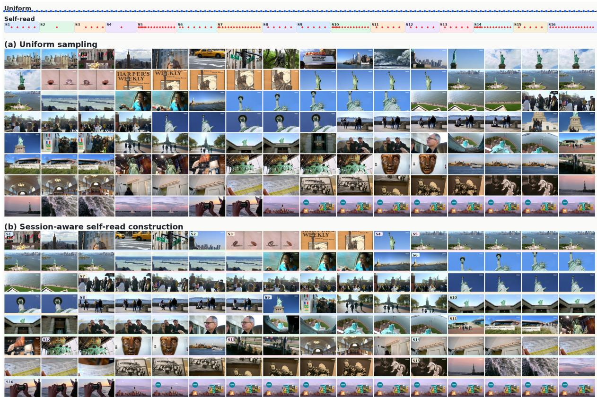

text_image

Uniform
Self-read
S1 ... S2 ... S3 ... S4 ... S5 ... S6 ... S7 ... S8 ... S9 ... S10 ... S11 ... S12 ... S13 ... S14 ... S15 ... S16...
(a) Uniform sampling
HARPER'S WEEKLY
LAWA
SLEY & COOKING
SUNDS
SUNDS
SUNDS
SUNDS
SUNDS
SUNDS
SUNDS
SUNDS
SUNDS
SUNDS
SUNDS
SUNDS
SUNDS
SUNDS
SUNDS
SUNDS
SUNDS
SUNDS
SUNDS
SUNDS
SUNDS
SUNDS
(b) Session-aware self-read construction

Figure 6: Uniform Sampling vs. Session-Aware Self-Read Construction under the same 128-frame visual budget. Uniform sampling selects frames at fixed global intervals, while self-read first segments the video into semantic sessions and then selects keyframes within each session. Colored blocks indicate session boundaries, highlighting that our visual evidence is organized by event structure rather than uniform temporal spacing.

Question: Which of the following professions does not appear at the beginning of the video?

A. Worker. B. Firemen. C. Chef. D. Judge.

HIGHresolution|Top-4 retrieved cards   
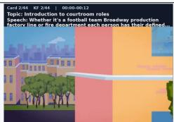

text_image

Card 2/44 KF 2/44 | 00:00:00:12
Topic: Introduction to courtroom roles
Speech: Whether it's a football team Broadway production
factory line or fire department each owner has their defined...

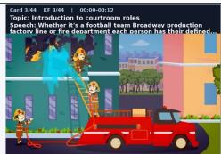

text_image

Card 3/44 87 3/44 | 00:00-00:12
Topic: Introduction to courtroom roles
Speech: Whether it's a football team Broadway production
factory line or fire department each person has their defined
1995

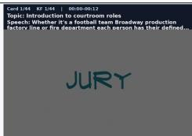

text_image

Card 1/44 KF 1/44 | 00:00-00:12
Topic: Introduction to courtroom roles
Speech: Whether it's a football team Broadway production
factory line or fire department each cursor has their defined...
JURY

text_image

Card 15/44 KF 15/44 00:43-00:58
Topic: Judge's legal authority
Speech: decision maker in the pursuit of justice Each side
makes its arguments and assents the facts and evidence that.

MEDIUM resolution|Next-8 retrieved cards   
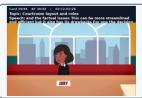

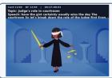

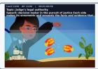

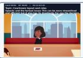

LoWresolution|Next-32retrievedcards   

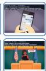

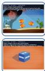

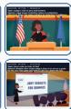

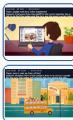

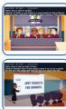

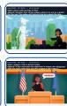

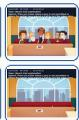

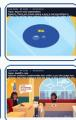

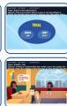

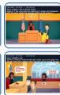

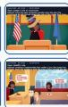  
Figure 7: Question-Conditioned Retrieval Visualization. For each multiple-choice question, MEMORYCARD retrieves Memory Cards from the self-read memory bank and organizes them into 4 high-resolution, 8 mediumresolution, and 32 low-resolution cards. The ground-truth option is highlighted in red. The retrieved cards serve as the visual evidence provided to the answering VLM.

Question: Based on the information provided in the video, which of the following locations is where the shooting occurred? A. The court. B. The actor's house. C. The TV station. D. A ranch in New Mexico.

HIGHresolution|Top-4 retrievedcards   
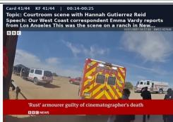

text_image

Card 41/44 KF 41/44 00:16-00:25
Topic: Courtroom scene with Hannah Gutierrez Reid
Speech: Our West Coast correspondent Emma Verdy reports
from Los Angeles This was the scene on a dance in New York.
Rust' armourer guilty of cinematographer's death

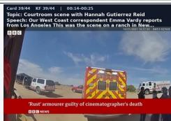

text_image

Card 39/04 KF 39/44 00:14-00:25
Topic: Courtroom scene with Hannah Gutierrez Reid
Speech: Our West Coast correspondent Emma Varcy reports
from Los Angeles. This was the scene on a ranch in Seattle.
[1] RUST ARMOURER GUITLENT
Rust' armourer guilty of cinematographer's death
■ News

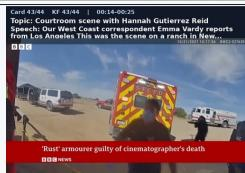

text_image

Card 43/04 KF 43/04 00:16-00:25
Topic: Courtroom scene with Hannah Gutierrez Reid
Speech: Our West Coast correspondent Emma Verdy reports
from Los Angeles. This was the scene on a French
NATIONAL EDITIONAL HISTORY
'Rust' armourer guilty of cinematographer's death
■■■■ NEWS

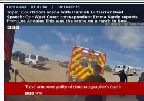

text_image

Card 42/04 KF 42/04 | 00:14-06:25
Topic: Courtroom scene with Hannah Gutierrez Reid
Speech: Our West Coast correspondent Emma Vardy reports
from Los Angeles. This was the scene on a dance in Los Angeles.
Rust' armourer guilty of cinematographer's death
■ News

MEDIUM resolution 丨Next-8 retrieved cards   

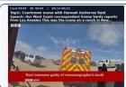

LoW resolution |Next-32 retrieved cards   

  
Figure 8: Question-Conditioned Retrieval Visualization. For each multiple-choice question, MEMORYCARD retrieves Memory Cards from the self-read memory bank and organizes them into 4 high-resolution, 8 mediumresolution, and 32 low-resolution cards. The ground-truth option is highlighted in red. The retrieved cards serve as the visual evidence provided to the answering VLM.