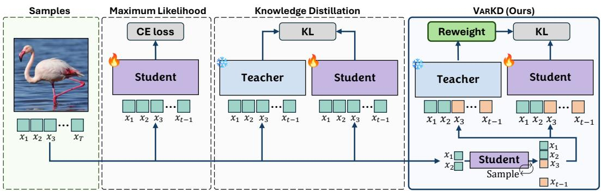
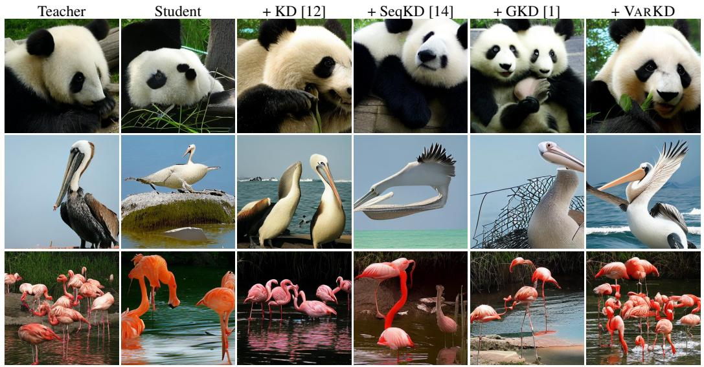
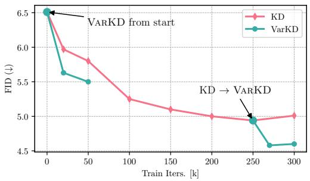
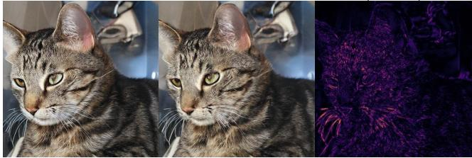
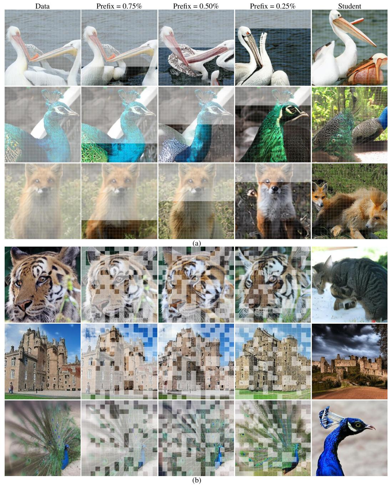
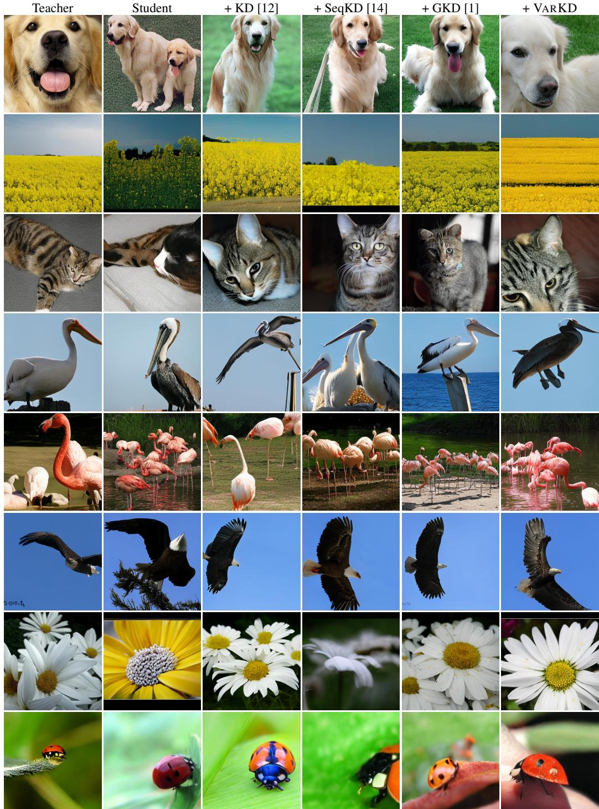
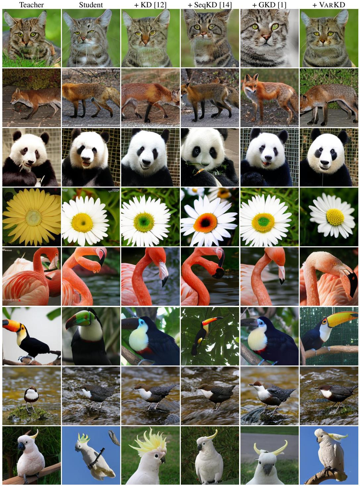

# Knowledge Distillation for Visual Autoregressive Models

Elia Peruzzo Qualcomm AI Research∗

Aritra Bhowmik Qualcomm AI Research

Guillaume Sautiere Qualcomm AI Research

Yuki M Asano University of Technology Nuremberg

Amirhossein Habibian Qualcomm AI Research

# Abstract

Autoregressive (AR) image generation models are highly expressive but computationally intensive, motivating effective model compression. Knowledge distillation (KD) is a natural approach for model compression and has been widely studied in language modeling, yet its behavior in visual AR generation remains underexplored. In this work, we present the first systematic study of distillation strategies for AR image models. Our analysis shows that while standard distillation can yield meaningful gains, recent methods developed for language do not directly transfer to images: long decoding horizons and visual token ambiguity make teacher supervision unreliable especially under student-conditioned contexts. To address this, we propose VARKD, a distillation framework for visual autoregressive models that distills on student samples while selectively applying teacher supervision and reducing token-level ambiguity. Experiments on ImageNet across multiple AR backbones show that VARKD consistently outperforms prior distillation baselines, narrowing the gap to large-scale models.

Project page: https://qualcomm-ai-research.github.io/varkd/

# 1 Introduction

Autoregressive (AR) models have become a central framework for sequence generation, driving recent advances in large language models and, increasingly, in image generation. Their appeal comes from a simple factorization of the joint distribution into a sequence of conditional predictions, enabling stable maximum likelihood training, strong global coherence, and a natural interface with multimodal and language-conditioned workflows [42, 26, 39]. In vision, combining this paradigm with discrete tokenization and Transformer decoders has produced scalable AR image generators with competitive fidelity and strong prompt faithfulness [41, 29, 27, 35, 38, 36, 10].

Despite their strong modeling capabilities, AR image models remain inefficient because image synthesis relies on long-horizon next-token decoding, often requiring hundreds or thousands of sequential steps per image [6, 16, 52]. To address this bottleneck, most prior works have focused on accelerating decoding, for example, through speculative, relaxed, or parallel decoding, while leaving the underlying autoregressive model unchanged [13, 24, 11]. Although effective in reducing latency, these approaches implicitly assume access to a large, high-capacity autoregressive model whose robustness is preserved under faster decoding.

Another way to improve efficiency, beyond faster decoding, is through model-capacity efficiency: training compact autoregressive image models that retain the robustness and generative quality of their larger counterparts. This is difficult in the visual domain because AR image models operate over much longer horizons than language models [6, 16, 52], rely on highly ambiguous discrete token vocabularies [13, 47], and exhibit strong spatial coupling, where local prediction errors can propagate into global semantic artifacts [31, 44]. These properties make visual AR models especially sensitive to the training-inference mismatch induced by teacher forcing: during training, models are optimized on data prefixes, but at inference they must condition on their own predictions [3, 50, 15]. When model capacity is limited, even small early errors become harder to recover from and can compound over hundreds or thousands of decoding steps, causing compact autoregressive image models to degrade rapidly at inference time [2].



<details>
<summary>flowchart</summary>

```mermaid
graph TD
    subgraph Samples
        A["Flaming Frog"]
        B["x1 x2 x3 ... xT"]
    end

    subgraph Maximum Likelihood
        C["Student CE loss"]
        D["x1 x2 x3 ... xT-1"]
    end

    subgraph Knowledge Distillation
        E["Teacher KL"]
        F["x1 x2 x3 ... xT-1"]
        G["x1 x2 x3 ... xT-1"]
        H["Student KL"]
        I["x1 x2 x3 ... xT-1"]
    end

    subgraph VARKD (Ours)
        J["Reweight KL"]
        K["Teacher KL"]
        L["Student KL"]
        M["x1 x2 x3 ... xT-1"]
        N["x1 x2 x3 ... xT-1"]
        O["Student KL"]
        P["x1 x2 x3 ... xT-1"]
        Q["Sample"] --> R["x1 x2 ... xT-1"]
    end

    style Samples fill:#f9f,stroke:#333
    style Maximum Likelihood fill:#ccf,stroke:#333
    style Knowledge Distillation fill:#cfc,stroke:#333
    style VARKD (Ours) fill:#fcc,stroke:#333
```
</details>

Figure 1: Comparison of training paradigms for autoregressive (AR) image models. We assume access to a dataset of real images (left), represented as sequences of discrete tokens. In standard maximum-likelihood training, the model is trained via teacher forcing, optimizing a cross-entropy loss against ground-truth tokens. In knowledge distillation (KD), a pre-trained teacher guides training by matching the student’s predictive distribution under ground-truth prefixes. In VARKD (right), we instead generate samples from the student conditioned on a partial ground-truth context and use the teacher to score these rollouts. We further introduce confidence-based reweighting to improve the reliability of the distillation signal.

Knowledge distillation (KD) naturally addresses this capacity gap by transferring the behavior of a large teacher to a compact student [4, 12]. In classification and language modeling, supervised KD [12] and sequence-level KD [14] typically provide supervision under data-distributed inputs or teacher-generated sequences. Recently, the field has shifted toward on-policy distillation [1, 23], which trains students on their own generated sequences to align supervision with inference-time rollouts, thereby reducing the training–inference mismatch and improving the performance. We summarize different training paradigms for AR image models in Figure 1, highlighting the different data-source and supervision signals.

However, our empirical investigation suggests that directly transferring these strategies to visual autoregressive generation is non-trivial. In particular, on-policy distillation in the visual domain is hampered by image-specific challenges: long decoding horizons and intrinsic token ambiguity cause student samples to rapidly drift off the data manifold [31, 13], producing contexts where teacher predictions become diffuse and weakly informative.

Motivated by these findings, we propose VARKD, a training framework that provides more reliable supervision for compact visual autoregressive models. VARKD distills under student-generated contexts, while improving generation quality at training time by conditioning on a ground-truth prefix. To enhance supervision quality, we apply a reweighting of the loss to down-weight and filter ambiguous, low-confidence teacher predictions, and compute the distillation loss in a compressed visual token space to reduce token-level ambiguity. Finally, we improve training efficiency by employing parallel decoding [11]. All components are used only during training, preserving standard next-token autoregressive decoding at inference.

Our contributions are summarized as follows:

• We present the first systematic study of knowledge distillation strategies for visual autoregressive (AR) models. We evaluate supervised KD, sequence-level KD, and on-policy distillation methods adapted from language modeling, and identify image-specific failure modes: long decoding horizons and intrinsic token ambiguity render teacher supervision unreliable under student-conditioned contexts.

• Motivated by these findings, we introduce VARKD, a distillation framework tailored to visual AR models. VARKD improves supervision under mixed student-conditioned rollouts by selectively incorporating teacher feedback based on predictive confidence, and consistently outperforms prior distillation baselines across architectures and model scales.

# 2 Related Work

# 2.1 Autoregressive Models for Image Generation

Autoregressive (AR) models are among the earliest approaches to image generation, factorizing the joint image distribution into a sequence of conditional predictions optimized via maximum likelihood. Early pixel-space models such as PixelRNN [40] and conditional PixelCNN [39] demonstrated that high-fidelity images could be generated through next-token prediction with stable training and exact likelihood evaluation, establishing autoregressive modeling as a principled alternative to adversarial methods despite high computational cost.

The modern resurgence of AR image generation was enabled by discrete latent representations, most notably VQ-VAE [41] and VQ-VAE-2 [29], which compress images into sequences of visual tokens and substantially reduce generation horizon. This paradigm forms the basis of large-scale text-toimage systems such as DALL·E [27] and subsequent autoregressive models including Parti [52], VQGAN [8], HART [36], LlamaGen [35] and SIMPLEAR [45], achieving competitive image quality, semantic coherence, and prompt alignment at scale.

Within this family, autoregressive image models vary in both tokenization and generation structure. Tokenizers range from vector-quantized codebooks [41, 29] and adversarially trained VQGAN vocabularies [8] to AR-oriented holistic tokenizers [55]. Such discrete visual token spaces can have multiple perceptually similar vocabularies, introducing token ambiguity in visual AR modeling [13]. Generation structures span raster-scan pixel prediction in iGPT [6], patch-level token generation in LlamaGen [35], and hierarchical or scale-wise formulations such as HQ-Transformer [51], VAR [38], M-VAR [30], Switti [43], and HART [36]. This paradigm has also been adopted in unified decoderonly multimodal systems such as Emu3 [46], Chameleon [37], and Lumina-mGPT [22]. Despite this diversity, many token-based AR generators still require long visual rollouts increasing latency and susceptibility to error accumulation [6, 16, 52, 31].

# 2.2 Improving Efficiency of Autoregressive Image Models

A fundamental limitation of autoregressive image generation is the inefficiency of next-token decoding at high resolution. When images are represented as sequences of discrete visual tokens, sequence length grows quadratically with spatial resolution, resulting in hundreds or thousands of sequential decoding steps per sample [6, 52]. This behavior is characteristic of large-scale autoregressive image Transformers such as iGPT [6], LlamaGen [35], and more recent visual autoregressive models [11], leading to high inference latency and low throughput. Long decoding horizons further amplify error accumulation, as early prediction errors propagate across subsequent tokens [3, 31, 2].

To reduce inference latency, prior works accelerate autoregressive decoding through speculative, draft-based, or parallel generation schemes. Speculative Decoding [17] introduced draft-and-verify generation, later extended by multi-head or tree-based methods such as Medusa [5], feature-level speculative frameworks like EAGLE [19, 20], and distillation-based draft alignment as in Distill-Spec [57]. Extensions to the visual domain explicitly account for properties of visual token sequences: LANTERN [13] accounts for token ambiguity during verification, while MuLo-SD [24] exploits multi-scale structure and spatial locality. Other methods relax strict raster-order decoding via localityaware or parallel generation, including ZipAR [11], LPD [54], and ARPG [18]. Although effective, these methods target decoding-time efficiency rather than rollout-aware training of compact visual AR models.

A complementary line of work improves efficiency through formulation-level changes, including next-scale or hierarchical AR designs such as VAR [38], M-VAR [30], Switti [43], and HART [36], as well as training-optimization pipelines such as SimpleAR [45]. These approaches improve the efficiency or scalability of visual generation, but they do not directly address how to train compact visual AR students to remain stable under their own rollouts.

# 2.3 Knowledge Distillation for Autoregressive Sequence Models

Knowledge distillation (KD) is a longstanding approach for compressing large neural networks into smaller models, originally based on logit matching and soft-label supervision [4, 12]. In autoregressive sequence modeling, token-level KD typically supervises the student under teacher-forced contexts by matching teacher and student next-token distributions, often treated as a forward Kullback-Leibler objective [53, 48, 9]. Sequence-Level Knowledge Distillation (SeqKD) [14] extended this paradigm by training students on full sequences generated by the teacher, thereby replacing the original target distribution with a teacher-induced supervision distribution. While widely adopted in language modeling, these approaches remain off-policy with respect to the student and therefore do not address the training–inference mismatch associated with exposure bias [2, 28].

Classic imitation-learning work shows that policies trained only on expert states can fail when evaluated on their own induced states, leading to compounding errors [32, 33]. Recent autoregressive distillation methods build on this view by supervising students under student-induced contexts: Lin et al. [21] applied imitation-learning-style KD to language generation, while f-DISTILL [49] generalized sequence-level KD with alternative f-divergences. Generalized Knowledge Distillation (GKD) [1] (also called on-policy distillation [23]), further trains students on self-generated rollouts using teacher probabilities as dense supervision, with related LLM distillation work exploring onpolicy or imitation-learning-based objectives to reduce exposure bias [9, 25]. However, these methods have been developed and validated primarily on text tasks, leaving their behavior in visual AR generation unexplored.

Unlike text, visual AR models combine long, spatially coupled rollouts with ambiguous token vocabularies, making student-conditioned contexts prone to error accumulation and teacher feedback less reliable under naive on-policy supervision [6, 16, 31]. This motivates distillation objectives that adapt on-policy learning to the visual domain while providing reliable teacher supervision.

# 3 Method

# 3.1 Distillation for Visual Autoregressive Image Generation

We study knowledge distillation in the setting of autoregressive (AR) image generation. Let $x _ { 1 : T } =$ $( x _ { 1 } , \dots , x _ { T } )$ denote a tokenized image with tokens $x _ { t } \in \mathcal V$ , with V the discrete token vocabulary. An autoregressive image model defines:

$$
p (x _ {1: T}) = \prod_ {t = 1} ^ {T} p (x _ {t} \mid x _ {<   t}), \tag {1}
$$

where $x _ { < t } : = x _ { 1 : t - 1 }$ is the prefix context.

We assume access to a teacher autoregressive model pT and a lower-capacity student model $p _ { S }$ , both defining next-token distributions over the same vocabulary. The goal is to train the student to match the teacher’s predictive behavior while retaining the student’s lower inference cost.

In autoregressive image models, Knowledge Distillation can be expressed as matching the teacher and student next-token distributions under a chosen distribution of conditioning prefixes:

$$
\mathcal {L} = \mathbb {E} _ {x _ {<   t} \sim p _ {\mathrm{src}}} \left[ \mathcal {D} (p _ {T} (\cdot \mid x _ {<   t}) \parallel p _ {S} (\cdot \mid x _ {<   t})) \right], \tag {2}
$$

where $p _ { \mathrm { s r c } }$ denotes the source distribution over prefix contexts, and the expectation implicitly averages over token positions. Here, D is a chosen divergence between categorical next-token distributions (e. g. KL or Jensen–Shannon divergence). Different distillation strategies can be expressed as different choices of data source $p _ { \mathrm { s r c } }$ and divergence D.

Supervised Knowledge Distillation (KD). Supervised KD [12] applies teacher supervision under prefixes drawn from the data distribution. Concretely, we set $p _ { \mathrm { s r c } } = p _ { \mathrm { d a t a } } ,$ so prefixes correspond to ground-truth visual token sequences. The resulting objective is

$$
\mathcal {L} _ {\mathrm{KD}} = \mathbb {E} _ {x _ {<   t} \sim p _ {\text { data }}} \left[ \mathcal {D} (p _ {T} (\cdot \mid x _ {<   t}) \parallel p _ {S} (\cdot \mid x _ {<   t})) \right]. \tag {3}
$$

This objective exposes the student only to data-distributed prefixes or contexts during training. Consequently, prefixes encountered at inference, where the student model conditions on its own predictions, are not represented at training time.

Sequence-level distillation (SeqKD). SeqKD [14] replaces ground-truth training sequences with full sequences sampled from the teacher model. Classic SeqKD often uses hard teacher-generated targets; here we express its soft distribution-matching analogue to maintain a unified notation. Specifically, visual token sequences are first generated as $x _ { 1 : T } \sim p _ { T } ( x _ { 1 : T } )$ and the student is trained on prefixes induced by these teacher rollouts. In our formulation, this corresponds to setting $p _ { \mathrm { s r c } } = p _ { T }$ . The resulting objective is

$$
\mathcal {L} _ {\text { SeqKD }} = \mathbb {E} _ {x _ {<   t} \sim p _ {T}} \left[ \mathcal {D} (p _ {T} (\cdot \mid x _ {<   t}) \| p _ {S} (\cdot \mid x _ {<   t})) \right]. \tag {4}
$$

Compared to supervised KD, SeqKD changes the supervision distribution by replacing data prefixes with teacher-generated ones, but supervision remains off-policy with respect to the student.

Generalized Knowledge Distillation (GKD). GKD [1] applies supervision under contexts generated by the student model itself, often referred to as on-policy distillation [23]. Formally, we set $p _ { \mathrm { s r c } } = p _ { S }$ , so prefixes are induced by student rollouts. This exposes the student to its own rollout distribution during training. The corresponding objective is

$$
\mathcal {L} _ {\mathrm{GKD}} = \mathbb {E} _ {x _ {<   t} \sim p _ {S}} \left[ \mathcal {D} (p _ {T} (\cdot \mid x _ {<   t}) \| p _ {S} (\cdot \mid x _ {<   t})) \right]. \tag {5}
$$

By training on student-generated samples, on-policy distillation reduces the training-inference mismatch. However, we find that directly applying it to visual AR models yields smaller gains than those observed in language modeling.

The next section analyzes the underlying causes and introduces practical modifications that make on-policy distillation more stable and effective for visual autoregressive generation.

# 3.2 Reliable teacher feedback under student-conditioned contexts

Mixed data–student context distributions. A direct application of Eq. (5) requires fully studentgenerated prefixes $x _ { < t } \sim p _ { S }$ . For visual autoregressive models, such free-running rollouts can drift away from data-like contexts, especially during early training or for capacity-limited students. To regulate the distribution of encountered contexts while retaining exposure to inference-time behavior, we introduce mixed data–student rollouts.

Given a prefix length k, we define a mixed rollout distribution as:

$$
p _ {\text { mix }} ^ {k} (x _ {1: T}) = p _ {\text { data }} (x _ {1: k}) \prod_ {t = k + 1} ^ {T} p _ {S} (x _ {t} \mid x _ {<   t}), \tag {6}
$$

where $p _ { \mathrm { d a t a } } ( x _ { 1 : k } )$ denotes the data distribution over length k prefixes. Under this distribution, the first k tokens are anchored to ground-truth visual tokens, while the remaining suffix is generated autoregressively by the student. As a rollout distribution, $p _ { \mathrm { m i x } } ^ { k }$ interpolates between fully dataconditioned sequences $( k = T )$ and fully student-generated sequences $( k = 0 )$ .

Unless stated otherwise, we apply the distillation objective under $p _ { \mathrm { m i x } } ^ { k } .$ which empirically improves supervision quality without altering the inference-time decoding procedure.

Student-sampled, teacher-scored objective. Let $x _ { 1 : T } \sim p _ { \mathrm { m i x } } ^ { k }$ (see Eq. (6)). For suffix positions $t > k ,$ , corresponding to tokens generated by the student under the mixed context distribution, we apply distillation via a reverse-KL divergence:

$$
\mathcal {L} _ {\mathrm{GKD}} = \mathbb {E} _ {x _ {1: T} \sim p _ {\text { mix }} ^ {k}, t > k} \left[ \mathcal {D} (p _ {S} (\cdot \mid x _ {<   t}) \| p _ {T} (\cdot \mid x _ {<   t})) \right]. \tag {7}
$$

This corresponds to on-policy distillation under controlled student rollouts, with supervision applied only to student-generated suffix positions. While Eq. (7) mitigates severe distribution shift, teacher predictions on student-generated visual contexts can remain ambiguous, so uniform supervision may still introduce noisy feedback. We address this through selective teacher supervision.

Selective teacher supervision via entropy reweighting. Visual autoregressive models operate over ambiguous discrete token spaces, where teacher uncertainty varies substantially across contexts. We therefore use teacher predictive entropy to estimate the reliability of each distillation target and down-weight uncertain supervision to prevent them from dominating the training signal. For a given context $x _ { < t }$ , the teacher entropy is:

$$
\mathcal {H} (p _ {T} (\cdot \mid x _ {<   t})) = - \sum_ {v \in \mathcal {V}} p _ {T} (v \mid x _ {<   t}) \log p _ {T} (v \mid x _ {<   t}). \tag {8}
$$

We define teacher confidence as the normalized inverse entropy:

$$
\alpha_ {x _ {<   t}} = 1 - \frac {\mathcal {H} (p _ {T} (\cdot \mid x _ {<   t}))}{\log (| \mathcal {V} |)}, \tag {9}
$$

where $\log ( | \nu | )$ is the maximum entropy, corresponding to a uniform distribution over the vocabulary. By construction, $\alpha _ { x _ { < t } } \in [ 0 , 1 ]$ : low-entropy (i.e., more confident) teacher predictions receive higher weights, while high-entropy predictions are down-weighted.

While teacher entropy is a useful proxy for model confidence, it can become unreliable once the context drifts off the data manifold: the model may remain confident even when the prefix is incorrect. Inspired by speculative decoding [17], we therefore introduce a truncation strategy that stops applying the distillation loss once confidence drops below a threshold. In practice, given a time step t¯such that $\alpha _ { x _ { < \bar { t } } } < \tau$ , we set $\alpha _ { x _ { < t } } = 0$ for all $t > \bar { t } ,$ , effectively ignoring the remainder of the sequence. This truncation prevents increasingly unreliable student-conditioned contexts from contributing to the distillation loss.

Using this confidence score, we reweight the distillation objective as:

$$
\mathcal {L} _ {\text { VarKD }} = \mathbb {E} _ {x _ {1: T} \sim p _ {\text { mix }} ^ {(k)}, t > k} \left[ \alpha_ {x <   t} \mathcal {D} (p _ {S} (\cdot | x _ {<   t}) \| p _ {T} (\cdot | x _ {<   t})) \right]. \tag {10}
$$

Codebook relaxation via compressed-space distillation. Discrete visual vocabularies often contain visually similar tokens, so teacher probability mass may be split across multiple tokens that correspond to similar image content. To reduce this token-level ambiguity, we introduce codebook relaxation: a compressed-space distillation loss that groups visually similar tokens during supervision.

Let $f : \mathcal { V } \to \tilde { \mathcal { V } }$ map the original vocabulary to a smaller set of token groups obtained by clustering visual token embeddings. For each compressed token $\tilde { x } \in \tilde { \mathcal { V } }$ , we aggregate the teacher and student distributions as:

$$
\tilde {p} _ {T} (\tilde {x} \mid x _ {<   t}) = \sum_ {x \in f ^ {- 1} (\tilde {x})} p _ {T} (x \mid x _ {<   t}), \quad \tilde {p} _ {S} (\tilde {x} \mid x _ {<   t}) = \sum_ {x \in f ^ {- 1} (\tilde {x})} p _ {S} (x \mid x _ {<   t}). \tag {11}
$$

The compressed-space objective is:

$$
\mathcal {L} _ {\text { VarKD }} = \mathbb {E} _ {x _ {1: T} \sim p _ {\text { mix }} ^ {(k)}, t > k} \left[ \alpha_ {x <   t} \mathcal {D} (\tilde {p} _ {S} (\cdot | x _ {<   t}) \| \tilde {p} _ {T} (\cdot | x _ {<   t})) \right]. \tag {12}
$$

This changes only the supervision signal, the student still predicts over the original vocabulary V and inference uses the same decoding process. By grouping visually similar tokens during supervision, compressed-space distillation reduces sensitivity to token-level ambiguity under long student-conditioned rollouts.

Parallel decoding for efficient training. Constructing student-conditioned rollouts under $p _ { \mathrm { m i x } } ^ { k }$ requires autoregressive sampling over long suffixes, which can dominate training cost. To mitigate this overhead, we employ parallel decoding [11] during rollout generation.

Given a partially decoded visual token grid, parallel decoding identifies a set of positions S that can be predicted simultaneously, and generates all corresponding tokens in a single forward pass:

$$
\{x _ {i}: i \in \mathcal {S} \} \leftarrow \text { ParallelDecode } (p _ {S}, x _ {\mathrm{obs}}), \tag {13}
$$

where $x _ { \mathrm { o b s } }$ denotes the current observed context available to the student.

This procedure is used solely to accelerate rollout construction during training. It does not modify the distillation objective, the model architecture, or the standard autoregressive decoding used at inference time.

# 4 Experiments

We evaluate different distillation strategies for visual autoregressive (AR) image generation across multiple teacher–student configurations. Our experiments focus on two representative backbones: LlamaGen [35], a standard next-token AR Transformer, and ARPG [18], a recent AR model designed to support randomized parallel decoding. We first describe the experimental setup and baselines, then report quantitative and qualitative results, and finally summarize ablations that validate our choices.

# 4.1 Setting

Dataset and task We conduct class-conditional image generation experiments on ImageNet [34]. All models are trained following the original training code released with each backbone, with distillation objectives replacing (or augmenting) the standard next-token cross-entropy loss. We report FID, Inception Score (IS), and Precision/Recall on the ImageNet validation set. Following the Llamagen evaluation protocol, we generate 50k samples per model and compute all metrics on these samples.

Baselines We compare against three distillation baselines adapted from language to visual AR generation: (i) Knowledge Distillation (KD) [12], using token-level logit matching under teacherforced samples by minimizing the forward KL divergence (ii) Sequence-level KD (SeqKD) [14], which trains on sequences sampled from the teacher (i.e., replacing ground-truth training sequences with teacher-generated samples) while keeping the same token-level distillation objective. (iii) Generalized KD (GKD) [1], which mixes ground-truth samples with student-conditioned generated samples: with probability λGKD we draw contexts from student and train the model to match the teacher distribution; otherwise we use ground-truth contexts.

Training details and hyperparameters We train all the methods on the ImageNet dataset, with a batch size of 256 and learning rage of $5 \times 1 0 ^ { - 5 }$ on 8 A100 GPUs. First, we train with KD for 250k iterations. As KD is the most data-efficient approach, requiring no sampling from either the teacher or the student, it is also the fastest to train. We therefore use KD as an alignment stage, initializing all other methods from its best checkpoint. For a fair comparison, we continue training the KD baseline for the same number of iterations as the other methods, but observe no further improvement beyond this point (see Sec. 4.3). For SeqKD, we precompute a teacher-generated dataset of 1.5M samples (approximately the size of ImageNet) to amortize teacher inference cost; training then follows the same hyperparameters as KD.

For GKD, we set $\lambda _ { \mathrm { G K D } } = 0 . 1$ and optimize a Jensen–Shannon divergence objective with $\beta = 0 . 5$ , and train the model for 20k iterations observing no further improvement beyond this point. We apply GKD (and VARKD) sampling from conditional student (see Eq. (6)) rather than fully freerunning generation, as we found full samples to be less stable for smaller students. Concretely, we seed each training example with a ground-truth prefix whose length is sampled uniformly from [0.25T, 0.75T ] (where T is the sequence length), and generate the remaining suffix from the student. This corresponds to training under mixed data–student contexts and substantially improves generation (see Fig. 5 in Supp. Mat.).

VARKD uses the same base setup as GKD, with the following additions: (i) Entropy reweighting: we reweight the per-token loss with a normalized entropy as defined by Eq. (9) and drop the suffix using threshold $\tau = 0 . 1$ . (ii) Codebook relaxation: we cluster token embeddings with K-means to compress the vocabulary by a factor of 4, and compute the distillation loss in the compressed space to reduce supervision noise from token ambiguity (see Supp. Mat. for visualization). (iii) Parallel decoding for rollout generation: we generate student suffixes using ZipAR-style blockwise [11] sampling with window size 4 during training (only to accelerate generation; inference remains standard autoregressive decoding).

# 4.2 Main Results

Quantitative results. Table 1 compares KD, SeqKD, GKD, and VARKD across three student architectures (LlamaGen-B, LlamaGen-L, ARPG-L). From our empirical evaluation, we observe that: First, supervised KD is already a strong baseline for visual AR distillation, recovering a substantial fraction of the teacher–student gap with minimal additional cost compared to on-policy approaches.

Table 1: Comparison to knowledge distillation methods (KD, SeqKD, GKD) adapted for visual autoregressive models. Results are reported on ImageNet across multiple student sizes and architectures (LlamaGen and ARPG). VARKD consistently matches or surpasses prior baselines. 

<table><tr><td>Method</td><td>FID (↓)</td><td>IS (↑)</td><td>Precision (↑)</td><td>Recall (↑)</td></tr><tr><td>Llamagen-B</td><td>6.51</td><td>156.3</td><td>0.81</td><td>0.46</td></tr><tr><td>+ KD [12]</td><td>4.92</td><td>195.6</td><td>0.84</td><td>0.45</td></tr><tr><td>+ SeqKD [14]</td><td>5.08</td><td>197.9</td><td>0.84</td><td>0.44</td></tr><tr><td>+ GKD [1]</td><td>4.94</td><td>194.7</td><td>0.85</td><td>0.44</td></tr><tr><td>+ VARKD</td><td>4.58</td><td>203.3</td><td>0.85</td><td>0.46</td></tr><tr><td>Llamagen-L</td><td>3.07</td><td>156.0</td><td>0.83</td><td>0.52</td></tr><tr><td>+ KD [12]</td><td>3.02</td><td>244.5</td><td>0.82</td><td>0.54</td></tr><tr><td>+ SeqKD [14]</td><td>3.10</td><td>258.1</td><td>0.83</td><td>0.52</td></tr><tr><td>+ GKD [1]</td><td>2.93</td><td>248.0</td><td>0.82</td><td>0.55</td></tr><tr><td>+ VARKD</td><td>2.83</td><td>242.7</td><td>0.83</td><td>0.55</td></tr><tr><td>ARPG-L</td><td>2.30</td><td>309.0</td><td>0.80</td><td>0.58</td></tr><tr><td>+ KD [12]</td><td>2.21</td><td>293.1</td><td>0.80</td><td>0.58</td></tr><tr><td>+ SeqKD [14]</td><td>2.22</td><td>310.2</td><td>0.80</td><td>0.58</td></tr><tr><td>+ GKD [1]</td><td>2.19</td><td>307.8</td><td>0.81</td><td>0.59</td></tr><tr><td>+ VARKD</td><td>2.15</td><td>301.3</td><td>0.80</td><td>0.59</td></tr></table>

  
Figure 2: Qualitative comparison showing that VARKD reduces spatial artifacts and improves global coherence over prior distillation baselines.

Second, distilling on teacher-generated sequences (SeqKD) is consistently worse than using datasampled contexts or student-generated rollouts. Third, switching to student-generated samples (GKD) yields performance comparable to supervised KD, with more consistent gains for higher-capacity students (e.g., LlamaGen-L and ARPG-L). This supports the intuition that on-policy distillation is most effective when the student is reasonably aligned with the teacher, either through a strong initialization or through objectives that mitigate the noise induced by off-manifold samples.

Consistent with this view, VARKD achieves the best (or tied-best) results across settings and delivers the most reliable improvements in FID. These gains hold across student sizes and across both LlamaGen and ARPG backbones, highlighting the importance of our training-time refinements. Finally, as expected, stronger students are harder to improve; the largest gains are observed for the smaller LlamaGen-B student.

Table 2: Method ablation. We analyze the contribution of each component of VARKD. 

<table><tr><td>Entropy Rwt.</td><td>Codebook Rlx.</td><td>Parallel Decoding</td><td>FID (↓)</td><td>IS (↑)</td></tr><tr><td>-</td><td>-</td><td>-</td><td>6.51</td><td>156.3</td></tr><tr><td>✕</td><td>✕</td><td>✕</td><td>4.94</td><td>194.7</td></tr><tr><td>√</td><td>✕</td><td>✕</td><td>4.66</td><td>190.1</td></tr><tr><td>√</td><td>√</td><td>✕</td><td>4.60</td><td>195.7</td></tr><tr><td>√</td><td>√</td><td>√</td><td>4.58</td><td>203.3</td></tr></table>

Table 3: Ablation on teacher size. Effect of teacher capacity on VARKD. 

<table><tr><td>Teacher → Student</td><td>FID (↓)</td><td>IS (↑)</td></tr><tr><td>-</td><td>6.51</td><td>156.3</td></tr><tr><td>L → B</td><td>4.58</td><td>203.3</td></tr><tr><td>XL → B</td><td>4.98</td><td>198.0</td></tr><tr><td>XXL → B</td><td>4.82</td><td>198.2</td></tr></table>

Qualitative results. Figure 2 shows class-conditional samples across methods. Compared to KD and GKD, VARKD produces samples with fewer spatial artifacts and improved global coherence. Additional qualitative comparisons are provided in the supplementary material Sec A.2.

# 4.3 Ablations

Method We ablate the main design choices of VARKD in the LlamaGen-L → B in Tab. 2. The second row corresponds to GKD, where supervision is applied on mixed-prefix, student-conditioned samples. Starting from this setting, we isolate the three components of VARKD. Adding teacherconfidence reweighting yields the largest improvement, supporting the need to down-weight unreliable teacher feedback under student-conditioned contexts. Adding codebook relaxation further improves performance, consistent with reduced ambiguity among visually similar tokens and a cleaner supervision signal. Finally, parallel decoding does not degrade quality and even yields slight improvements in generative metrics, possibly due to a regularization effect. Moreover, it accelerates training by 1.3×, making it more practical in our setting (see supplementary).

Effect of Teacher size We investigate the impact of teacher capacity on student performance in Tab. 3. Overall, we observe a trend consistent with prior findings in language-model distillation [56]: a larger teacher does not always produce a better student. In fact, we find that distillation can improve when using an intermediate or even weaker teacher, and the strongest teacher is not uniformly optimal across tasks or metrics. We hypothesize that this behavior arises because very large teachers may produce output distributions that are overly sharp or complex for the student to match, especially under limited student capacity or constrained training budgets.

Two stage approach We compare the training efficiency of standard knowledge distillation (KD) with VARKD. Under the same number of training iterations and starting from the same checkpoint, VARKD consistently outperforms KD. However, KD operates on a fixed dataset, whereas VARKD relies on online sampling, resulting in substantially higher wall-clock cost.

This motivates a simple two-stage training recipe: (i) first, align the student to the teacher using KD; (ii) then, continue training from this checkpoint with VARKD. This combination achieves the best overall performance and continues to improve beyond the point where KD alone saturates.



<details>
<summary>line</summary>

| Train Iter. [k] | KD    | VarKD |
| --------------- | ----- | ----- |
| 0               | 6.5   | 6.5   |
| 50              | 5.8   | 5.6   |
| 100             | 5.3   | -     |
| 150             | 5.1   | -     |
| 200             | 5.0   | -     |
| 250             | 4.9   | 4.9   |
| 300             | 5.0   | 4.6   |
</details>

Figure 3: FID vs. training iterations (lower is better) for KD and VARKD. We initialize VARKD from two checkpoints, leveraging KD as an efficient alignment stage.

# 5 Limitations

A limitation of our study is that we evaluate primarily on class-conditional ImageNet generation, following common AR image-generation benchmarks; extending VARKD to open-ended text-toimage settings such as Janus-Pro-style [7] unified generation remains future work. In addition, our method relies on teacher confidence and token clustering as proxies for supervision reliability, which may not fully capture semantic correctness or prompt alignment in more complex multimodal generation tasks.

# 6 Conclusion

In this paper, we study knowledge distillation for visual autoregressive image generation and show that language-model distillation methods do not directly address the long horizons, spatial coupling, and token ambiguity of visual AR models. We present VARKD, a rollout-aware distillation framework that improves teacher supervision under mixed data–student contexts through confidence reweighting and compressed-space distillation. Experiments on ImageNet with LlamaGen and ARPG show that VARKD outperforms standard KD, SeqKD, and GKD without changing inference-time decoding. These results highlight the importance of reliable supervision under student-conditioned rollouts for compressing visual AR models.

# References

[1] Rishabh Agarwal, Nino Vieillard, Yongchao Zhou, Piotr Stanczyk, Sabela Ramos Garea, Matthieu Geist, and Olivier Bachem. On-policy distillation of language models: Learning from self-generated mistakes. In The twelfth international conference on learning representations, 2024.   
[2] Kushal Arora, Layla El Asri, Hareesh Bahuleyan, and Jackie Chi Kit Cheung. Why exposure bias matters: An imitation learning perspective of error accumulation in language generation. In Findings of the Association for Computational Linguistics: ACL 2022, pages 700–710, 2022.   
[3] Samy Bengio, Oriol Vinyals, Navdeep Jaitly, and Noam Shazeer. Scheduled sampling for sequence prediction with recurrent neural networks. Advances in neural information processing systems, 28, 2015.   
[4] Cristian Bucilua, Rich Caruana, and Alexandru Niculescu-Mizil. Model compression. In ˇ Proceedings of the 12th ACM SIGKDD international conference on Knowledge discovery and data mining, pages 535–541, 2006.   
[5] Tianle Cai, Yuhong Li, Zhengyang Geng, Hongwu Peng, Jason D Lee, Deming Chen, and Tri Dao. Medusa: Simple llm inference acceleration framework with multiple decoding heads. arXiv preprint arXiv:2401.10774, 2024.   
[6] Mark Chen, Alec Radford, Rewon Child, Jeffrey Wu, Heewoo Jun, David Luan, and Ilya Sutskever. Generative pretraining from pixels. In International conference on machine learning, pages 1691–1703. PMLR, 2020.   
[7] Xiaokang Chen, Zhiyu Wu, Xingchao Liu, Zizheng Pan, Wen Liu, Zhenda Xie, Xingkai Yu, and Chong Ruan. Janus-pro: Unified multimodal understanding and generation with data and model scaling. arXiv preprint arXiv:2501.17811, 2025.   
[8] Patrick Esser, Robin Rombach, and Bjorn Ommer. Taming transformers for high-resolution image synthesis. In Proceedings of the IEEE/CVF conference on computer vision and pattern recognition, pages 12873–12883, 2021.   
[9] Yuxian Gu, Hao Zhou, Fandong Meng, Jie Zhou, and Minlie Huang. Miniplm: Knowledge distillation for pre-training language models. arXiv preprint arXiv:2410.17215, 2024.   
[10] Jian Han, Jinlai Liu, Yi Jiang, Bin Yan, Yuqi Zhang, Zehuan Yuan, Bingyue Peng, and Xiaobing Liu. Infinity: Scaling bitwise autoregressive modeling for high-resolution image synthesis. In Proceedings of the Computer Vision and Pattern Recognition Conference, pages 15733–15744, 2025.   
[11] Yefei He, Feng Chen, Yuanyu He, Shaoxuan He, Hong Zhou, Kaipeng Zhang, and Bohan Zhuang. Zipar: Parallel auto-regressive image generation through spatial locality. arXiv preprint arXiv:2412.04062, 2024.   
[12] Geoffrey Hinton, Oriol Vinyals, and Jeff Dean. Distilling the knowledge in a neural network. arXiv preprint arXiv:1503.02531, 2015.   
[13] Doohyuk Jang, Sihwan Park, June Yong Yang, Yeonsung Jung, Jihun Yun, Souvik Kundu, Sung-Yub Kim, and Eunho Yang. Lantern: Accelerating visual autoregressive models with relaxed speculative decoding. arXiv preprint arXiv:2410.03355, 2024.   
[14] Yoon Kim and Alexander M Rush. Sequence-level knowledge distillation. In Proceedings of the 2016 conference on empirical methods in natural language processing, pages 1317–1327, 2016.   
[15] Alex M Lamb, Anirudh Goyal ALIAS PARTH GOYAL, Ying Zhang, Saizheng Zhang, Aaron C Courville, and Yoshua Bengio. Professor forcing: A new algorithm for training recurrent networks. Advances in neural information processing systems, 29, 2016.   
[16] Doyup Lee, Chiheon Kim, Saehoon Kim, Minsu Cho, and Wook-Shin Han. Autoregressive image generation using residual quantization. In Proceedings of the IEEE/CVF conference on computer vision and pattern recognition, pages 11523–11532, 2022.

[17] Yaniv Leviathan, Matan Kalman, and Yossi Matias. Fast inference from transformers via speculative decoding. In International Conference on Machine Learning, pages 19274–19286. PMLR, 2023.   
[18] Haopeng Li, Jinyue Yang, Guoqi Li, and Huan Wang. Autoregressive image generation with randomized parallel decoding. In The Fourteenth International Conference on Learning Representations, 2026.   
[19] Yuhui Li, Fangyun Wei, Chao Zhang, and Hongyang Zhang. Eagle: Speculative sampling requires rethinking feature uncertainty. arXiv preprint arXiv:2401.15077, 2024.   
[20] Yuhui Li, Fangyun Wei, Chao Zhang, and Hongyang Zhang. Eagle-2: Faster inference of language models with dynamic draft trees. In Proceedings of the 2024 conference on empirical methods in natural language processing, pages 7421–7432, 2024.   
[21] Alexander Lin, Jeremy Wohlwend, Howard Chen, and Tao Lei. Autoregressive knowledge distillation through imitation learning. In Proceedings of the 2020 Conference on Empirical Methods in Natural Language Processing (EMNLP), pages 6121–6133, 2020.   
[22] Dongyang Liu, Shitian Zhao, Le Zhuo, Weifeng Lin, Yi Xin, Xinyue Li, Qi Qin, Yu Qiao, Hongsheng Li, and Peng Gao. Lumina-mgpt: Illuminate flexible photorealistic text-to-image generation with multimodal generative pretraining. arXiv preprint arXiv:2408.02657, 2024.   
[23] Kevin Lu and Thinking Machines Lab. On-policy distillation. Thinking Machines Lab: Connectionism, 2025. doi: 10.64434/tml.20251026. https://thinkingmachines.ai/blog/on-policydistillation.   
[24] Elia Peruzzo, Guillaume Sautière, and Amirhossein Habibian. Multi-scale local speculative decoding for image generation. arXiv preprint arXiv:2601.05149, 2026.   
[25] Andrea Pozzi, Alessandro Incremona, Daniele Tessera, and Daniele Toti. Mitigating exposure bias in large language model distillation: An imitation learning approach. Neural Computing and Applications, 37(18):12013–12029, 2025.   
[26] Alec Radford, Jeffrey Wu, Rewon Child, David Luan, Dario Amodei, Ilya Sutskever, et al. Language models are unsupervised multitask learners. OpenAI blog, 1(8):9, 2019.   
[27] Aditya Ramesh, Mikhail Pavlov, Gabriel Goh, Scott Gray, Chelsea Voss, Alec Radford, Mark Chen, and Ilya Sutskever. Zero-shot text-to-image generation. In International conference on machine learning, pages 8821–8831. Pmlr, 2021.   
[28] Marc’Aurelio Ranzato, Sumit Chopra, Michael Auli, and Wojciech Zaremba. Sequence level training with recurrent neural networks. arXiv preprint arXiv:1511.06732, 2015.   
[29] Ali Razavi, Aaron Van den Oord, and Oriol Vinyals. Generating diverse high-fidelity images with vq-vae-2. Advances in neural information processing systems, 32, 2019.   
[30] Sucheng Ren, Yaodong Yu, Nataniel Ruiz, Feng Wang, Alan Yuille, and Cihang Xie. M-var: Decoupled scale-wise autoregressive modeling for high-quality image generation. arXiv preprint arXiv:2411.10433, 2024.   
[31] Sucheng Ren, Qihang Yu, Ju He, Xiaohui Shen, Alan Yuille, and Liang-Chieh Chen. Beyond next-token: Next-x prediction for autoregressive visual generation. In Proceedings of the IEEE/CVF International Conference on Computer Vision, pages 15781–15791, 2025.   
[32] Stéphane Ross and Drew Bagnell. Efficient reductions for imitation learning. In Proceedings of the thirteenth international conference on artificial intelligence and statistics, pages 661–668. JMLR Workshop and Conference Proceedings, 2010.   
[33] Stéphane Ross, Geoffrey Gordon, and Drew Bagnell. A reduction of imitation learning and structured prediction to no-regret online learning. In Proceedings of the fourteenth international conference on artificial intelligence and statistics, pages 627–635. JMLR Workshop and Conference Proceedings, 2011.

[34] Olga Russakovsky, Jia Deng, Hao Su, Jonathan Krause, Sanjeev Satheesh, Sean Ma, Zhiheng Huang, Andrej Karpathy, Aditya Khosla, Michael Bernstein, et al. Imagenet large scale visual recognition challenge. International journal of computer vision, 115(3):211–252, 2015.   
[35] Peize Sun, Yi Jiang, Shoufa Chen, Shilong Zhang, Bingyue Peng, Ping Luo, and Zehuan Yuan. Autoregressive model beats diffusion: Llama for scalable image generation. arXiv preprint arXiv:2406.06525, 2024.   
[36] Haotian Tang, Yecheng Wu, Shang Yang, Enze Xie, Junsong Chen, Junyu Chen, Zhuoyang Zhang, Han Cai, Yao Lu, and Song Han. Hart: Efficient visual generation with hybrid autoregressive transformer. arXiv preprint arXiv:2410.10812, 2024.   
[37] Chameleon Team. Chameleon: Mixed-modal early-fusion foundation models. arXiv preprint arXiv:2405.09818, 2024.   
[38] Keyu Tian, Yi Jiang, Zehuan Yuan, Bingyue Peng, and Liwei Wang. Visual autoregressive modeling: Scalable image generation via next-scale prediction. Advances in neural information processing systems, 37:84839–84865, 2024.   
[39] Aaron Van den Oord, Nal Kalchbrenner, Lasse Espeholt, Oriol Vinyals, Alex Graves, et al. Conditional image generation with pixelcnn decoders. Advances in neural information processing systems, 29, 2016.   
[40] Aäron Van Den Oord, Nal Kalchbrenner, and Koray Kavukcuoglu. Pixel recurrent neural networks. In International conference on machine learning, pages 1747–1756. PMLR, 2016.   
[41] Aaron Van Den Oord, Oriol Vinyals, et al. Neural discrete representation learning. Advances in neural information processing systems, 30, 2017.   
[42] Ashish Vaswani, Noam Shazeer, Niki Parmar, Jakob Uszkoreit, Llion Jones, Aidan N Gomez, Łukasz Kaiser, and Illia Polosukhin. Attention is all you need. Advances in neural information processing systems, 30, 2017.   
[43] Anton Voronov, Denis Kuznedelev, Mikhail Khoroshikh, Valentin Khrulkov, and Dmitry Baranchuk. Switti: Designing scale-wise transformers for text-to-image synthesis. arXiv preprint arXiv:2412.01819, 2024.   
[44] Jiamian Wang, Ziqi Zhou, Chaithanya Kumar Mummadi, Sohail Dianat, Majid Rabbani, Raghuveer Rao, Chen Qiu, and Zhiqiang Tao. Visual self-refinement for autoregressive models. arXiv preprint arXiv:2510.00993, 2025.   
[45] Junke Wang, Zhi Tian, Xun Wang, Xinyu Zhang, Weilin Huang, Zuxuan Wu, and Yu-Gang Jiang. Simplear: Pushing the frontier of autoregressive visual generation through pretraining, sft, and rl. arXiv preprint arXiv:2504.11455, 2025.   
[46] Xinlong Wang, Xiaosong Zhang, Zhengxiong Luo, Quan Sun, Yufeng Cui, Jinsheng Wang, Fan Zhang, Yueze Wang, Zhen Li, Qiying Yu, et al. Emu3: Next-token prediction is all you need. arXiv preprint arXiv:2409.18869, 2024.   
[47] Yuqing Wang, Zhijie Lin, Yao Teng, Yuanzhi Zhu, Shuhuai Ren, Jiashi Feng, and Xihui Liu. Tokenbridge: Bridging continuous and discrete tokens for autoregressive visual generation. In International Conference on Computer Vision (ICCV)(19/10/2025-23/10/2025, Honolulu, Hawai’i), 2025.   
[48] Jingxuan Wei, Linzhuang Sun, Yichong Leng, Xu Tan, Bihui Yu, and Ruifeng Guo. Sentencelevel or token-level? a comprehensive study on knowledge distillation. arXiv preprint arXiv:2404.14827, 2024.   
[49] Yuqiao Wen, Zichao Li, Wenyu Du, and Lili Mou. F-divergence minimization for sequencelevel knowledge distillation. In Proceedings of the 61st Annual Meeting of the Association for Computational Linguistics (Volume 1: Long Papers), pages 10817–10834, 2023.   
[50] Yifan Xu, Kening Zhang, Haoyu Dong, Yuezhou Sun, Wenlong Zhao, and Zhuowen Tu. Rethinking exposure bias in language modeling. arXiv preprint arXiv:1910.11235, 2019.

[51] Tackgeun You, Saehoon Kim, Chiheon Kim, Doyup Lee, and Bohyung Han. Locally hierarchical auto-regressive modeling for image generation. Advances in Neural Information Processing Systems, 35:16360–16372, 2022.   
[52] Jiahui Yu, Yuanzhong Xu, Jing Yu Koh, Thang Luong, Gunjan Baid, Zirui Wang, Vijay Vasudevan, Alexander Ku, Yinfei Yang, Burcu Karagol Ayan, et al. Scaling autoregressive models for content-rich text-to-image generation. arXiv preprint arXiv:2206.10789, 2(3):5, 2022.   
[53] Songming Zhang, Yunlong Liang, Shuaibo Wang, Yufeng Chen, Wenjuan Han, Jian Liu, and Jinan Xu. Towards understanding and improving knowledge distillation for neural machine translation. In Proceedings of the 61st Annual Meeting of the Association for Computational Linguistics (Volume 1: Long Papers), pages 8062–8079, 2023.   
[54] Zhuoyang Zhang, Luke J Huang, Chengyue Wu, Shang Yang, Kelly Peng, Yao Lu, and Song Han. Locality-aware parallel decoding for efficient autoregressive image generation. arXiv preprint arXiv:2507.01957, 2025.   
[55] Anlin Zheng, Haochen Wang, Yucheng Zhao, Weipeng Deng, Tiancai Wang, Xiangyu Zhang, and Xiaojuan Qi. Holistic tokenizer for autoregressive image generation. In Proceedings of the IEEE/CVF International Conference on Computer Vision, pages 16916–16926, 2025.   
[56] Qihuang Zhong, Liang Ding, Li Shen, Juhua Liu, Bo Du, and Dacheng Tao. Revisiting knowledge distillation for autoregressive language models. In Proceedings of the 62nd Annual Meeting of the Association for Computational Linguistics (Volume 1: Long Papers), pages 10900–10913, 2024.   
[57] Yongchao Zhou, Kaifeng Lyu, Ankit Singh Rawat, Aditya Krishna Menon, Afshin Rostamizadeh, Sanjiv Kumar, Jean-François Kagy, and Rishabh Agarwal. Distillspec: Improving speculative decoding via knowledge distillation. arXiv preprint arXiv:2310.08461, 2023.

# A Supplementary

In this supplementary material, we provide additional details and results for VARKD. Sec. A.1 covers discussions on conditional student generation, codebook relaxation, and training-efficiency comparisons, including visual diagnostics for the first two components. Sec. A.2 reports extended quantitative results across teacher–student configurations and additional qualitative samples.

# A.1 Method Details and Ablations

Conditional Student Generation The first modification to standard GKD is the use of mixed data–student contexts (see Eq. (6)). In practice, we find that seeding student generation with a small number of ground-truth tokens significantly improves both sample quality and the reliability of teacher feedback. We provide visual examples in Figure 5, showing results for both LlamaGen-B and ARPG-L, demonstrating that this strategy generalizes across architectures. Notably, even a short prefix (e.g., 25% of tokens) yields substantial gains over unconditional generation.

Codebook Relaxation The codebook space of VQ models is often highly redundant, with many tokens corresponding to visually similar output patches. This redundancy can hinder distillation, as the loss treats all token mismatches equally, even when they are nearly indistinguishable in pixel space.

To address this, we introduce a simple modification. We first perform kmeans clustering over the codebook embeddings, defining a fixed mapping from the original vocabulary to a compressed set $\mathcal { V } ^ { \prime } = \mathcal { V } / k$ . Figure 4 illustrates this process. In practice, we encode an input image and decode it using (a) the full vocabulary and (b) the compressed codebook obtained from the cluster centroids.

Despite the reduced vocabulary, the visual difference remains minimal. This is confirmed by the normalized absolute difference between the reconstructed images, which shows discrepancies concentrated mainly in high-frequency components.

$\mathcal { V } = 1 6 3 8 4$ $\mathcal { V } ^ { \prime } = 4 0 9 6$ |A − B|   


<details>
<summary>natural_image</summary>

Side-by-side photos of a tabby cat and a glowing purple abstract shape (no text or symbols)
</details>

Figure 4: Codebook relaxation. We compare decoding with the full vocabulary (left) and the compressed vocabulary (middle). The visual difference is minimal, as highlighted by the normalized absolute difference (right).

Training efficiency under different Samples We further analyze the impact of different data sources on training efficiency. In this section, we focus on comparing the computational cost of distillation methods in terms of steps per second (steps/s), under identical settings of batch size, hardware, and model size. The first row reports the initial student checkpoint. The second row corresponds to KD, which is the most efficient

Table 4: Training efficiency comparison across distillation methods. We report throughput (steps/s) and performance under identical settings. 

<table><tr><td>Method</td><td>Samples</td><td>FID (↓)</td><td>IS (↑)</td><td>Steps/s (↑)</td></tr><tr><td>-</td><td>-</td><td>6.51</td><td>156.3</td><td>-</td></tr><tr><td>KD</td><td>Data</td><td>4.92</td><td>195.6</td><td>3.50</td></tr><tr><td>SeqKD</td><td>Teacher</td><td>5.08</td><td>197.6</td><td>0.02*</td></tr><tr><td>SeqKD++</td><td>Cond. Teacher</td><td>4.99</td><td>204.8</td><td>0.06</td></tr><tr><td>GKD</td><td>Cond. Student</td><td>4.94</td><td>194.7</td><td>0.15</td></tr><tr><td>VARKD</td><td>Cond. Student</td><td>4.58</td><td>203.3</td><td>0.20</td></tr></table>

method since it operates on a fixed external dataset. Notably, it already closes a large portion of the teacher–student gap. SeqKD, on the other hand, trains on teacher-generated data. While its cost can be amortized by caching generated samples, here we report the full online generation setting, which incurs the highest training cost due to the need to sample complete sequences from the teacher.

We also include a conditional-teacher variant (SeqKD++, fourth row), which generates teacher continuations online under mixed-prefix rollouts. Although not standard, this approach provides modest performance gains over SeqKD, at the expense of more complex caching.

Finally, we consider methods that train on student-generated contexts (GKD and VARKD). In this regime, we highlight the importance of parallel decoding, which improves throughput by approximately 1.3× without impacting performance (see Tab. 2).

# A.2 Extended Experiments and Visual Results

Extended teacher–student comparisons. We report a comprehensive evaluation across multiple student–teacher configurations and architectures in Table 5. For LlamaGen, we consider both B and L variants with teachers of increasing size (L, XL, XXL). For ARPG, we fine-tune the L variant using XL and XXL teachers.

Across architectures, we observe consistent trends. First, standard KD recovers a substantial portion of the teacher–student gap in terms of FID, confirming it as a strong baseline. However, KD is notably sensitive to teacher capacity: performance tends to degrade as the teacher becomes stronger. We hypothesize that this effect arises from the reliance on data-conditioned prefixes, where a stronger teacher induces a sharper and more complex target distribution that is harder for the student to match.

In contrast, this degradation is less pronounced for GKD and VARKD (although still present). We attribute this to the different role of the teacher under student-conditioned training: a stronger teacher can provide more informative guidance on off-manifold contexts, helping to correct errors introduced by the student during rollout.

Overall, the extended results reinforce the conclusions of the main paper: VARKD consistently achieves the best or second-best performance across architectures, model sizes, and teacher capacities, demonstrating robust gains in diverse settings.

Additional qualitative comparisons. We provide additional qualitative samples for LlamaGen-L and ARPG-L in Fig. 6 and Fig. 7. Across both backbones, VARKD produces samples with fewer visible artifacts and better spatial consistency than the distillation baselines. These examples complement the quantitative results in Table 5, showing that the gains from VARKD are reflected not only in FID but also in visual quality.

  
Figure 5: Conditional student sampling. Prefix tokens from the ground-truth data are highlighted in white. (a) Sampling from LlamaGen-B, which is trained with next-token prediction: the context corresponds to the first $p \%$ of image tokens. (b) Sampling from ARPG-L, trained with random token order: we randomly mask $p \%$ of tokens and generate the remaining ones.

Table 5: Extended teacher–student comparison on the ImageNet validation set. For each student model, bold marks the best result across all teacher sizes and distillation methods. For each fixed teacher–student pair, underlined marks the best result among the compared distillation methods. 

<table><tr><td>Teacher → Student</td><td>Method</td><td>FID (↓)</td><td>IS (↑)</td><td>Prec. (↑)</td><td>Recall (↑)</td></tr><tr><td>LlamaGen-B [35]</td><td>-</td><td>6.51</td><td>156.3</td><td>0.81</td><td>0.46</td></tr><tr><td rowspan="4">L → B</td><td>KD [12]</td><td>4.92</td><td>195.6</td><td>0.84</td><td>0.45</td></tr><tr><td>SeqKD [14]</td><td>5.08</td><td>197.9</td><td>0.84</td><td>0.44</td></tr><tr><td>GKD [1]</td><td>4.94</td><td>194.7</td><td>0.85</td><td>0.44</td></tr><tr><td>VARKD</td><td>4.58</td><td>203.3</td><td>0.85</td><td>0.46</td></tr><tr><td rowspan="4">XL → B</td><td>KD [12]</td><td>5.35</td><td>186.5</td><td>0.82</td><td>0.46</td></tr><tr><td>SeqKD [14]</td><td>5.37</td><td>212.8</td><td>0.84</td><td>0.42</td></tr><tr><td>GKD [1]</td><td>5.02</td><td>190.1</td><td>0.82</td><td>0.47</td></tr><tr><td>VARKD</td><td>4.98</td><td>198.0</td><td>0.85</td><td>0.46</td></tr><tr><td rowspan="4">XXL → B</td><td>KD [12]</td><td>5.72</td><td>178.7</td><td>0.83</td><td>0.44</td></tr><tr><td>SeqKD [14]</td><td>5.98</td><td>191.0</td><td>0.85</td><td>0.43</td></tr><tr><td>GKD [1]</td><td>5.32</td><td>175.2</td><td>0.81</td><td>0.47</td></tr><tr><td>VARKD</td><td>4.82</td><td>198.2</td><td>0.84</td><td>0.48</td></tr><tr><td>LLamaGen-L [35]</td><td>-</td><td>3.07</td><td>156.0</td><td>0.83</td><td>0.52</td></tr><tr><td rowspan="4">XL → L</td><td>KD [12]</td><td>3.02</td><td>244.5</td><td>0.82</td><td>0.54</td></tr><tr><td>SeqKD [14]</td><td>3.10</td><td>258.1</td><td>0.83</td><td>0.52</td></tr><tr><td>GKD [1]</td><td>2.93</td><td>248.0</td><td>0.82</td><td>0.55</td></tr><tr><td>VARKD</td><td>2.83</td><td>242.7</td><td>0.83</td><td>0.55</td></tr><tr><td rowspan="4">XXL → L</td><td>KD [12]</td><td>3.01</td><td>246.6</td><td>0.83</td><td>0.54</td></tr><tr><td>SeqKD [14]</td><td>3.15</td><td>238.6</td><td>0.83</td><td>0.52</td></tr><tr><td>GKD [1]</td><td>2.88</td><td>248.1</td><td>0.82</td><td>0.55</td></tr><tr><td>VARKD</td><td>2.91</td><td>246.7</td><td>0.83</td><td>0.54</td></tr><tr><td>ARPG-L [18]</td><td>-</td><td>2.30</td><td>309.0</td><td>0.80</td><td>0.58</td></tr><tr><td rowspan="4">XL → L</td><td>KD [12]</td><td>2.20</td><td>296.1</td><td>0.80</td><td>0.59</td></tr><tr><td>SeqKD [14]</td><td>2.28</td><td>305.2</td><td>0.80</td><td>0.59</td></tr><tr><td>GKD [1]</td><td>2.26</td><td>310.1</td><td>0.81</td><td>0.58</td></tr><tr><td>VARKD</td><td>2.19</td><td>313.0</td><td>0.81</td><td>0.57</td></tr><tr><td rowspan="4">XXL → L</td><td>KD [12]</td><td>2.21</td><td>293.1</td><td>0.80</td><td>0.58</td></tr><tr><td>SeqKD [14]</td><td>2.22</td><td>310.2</td><td>0.80</td><td>0.58</td></tr><tr><td>GKD [1]</td><td>2.19</td><td>307.8</td><td>0.81</td><td>0.59</td></tr><tr><td>VARKD</td><td>2.15</td><td>301.3</td><td>0.80</td><td>0.59</td></tr></table>

  
Figure 6: Qualitative comparison for LlamaGen-XL → LlamaGen-L, showing class-conditional samples from the teacher, student, and distilled variants.

  
Figure 7: Qualitative comparison for ARPG-XL → ARPG-L, showing class-conditional samples from the teacher, student, and distilled variants.