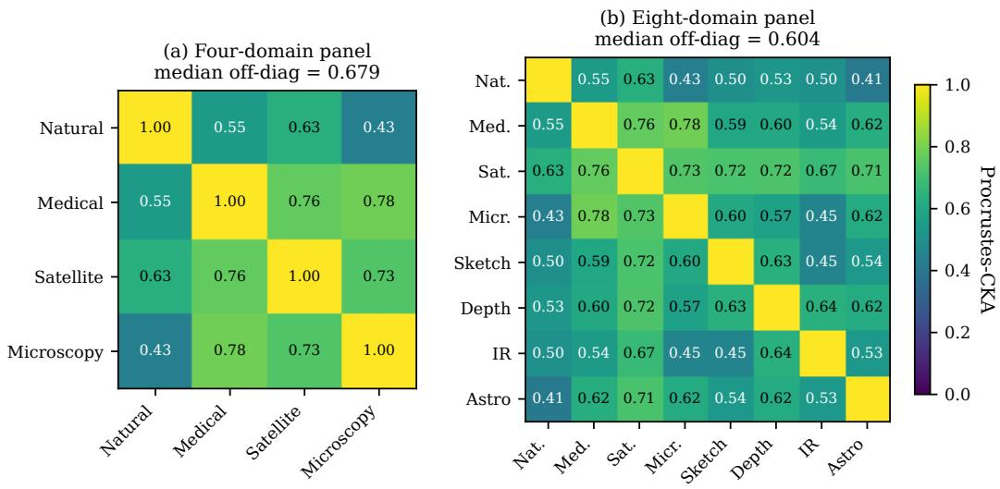
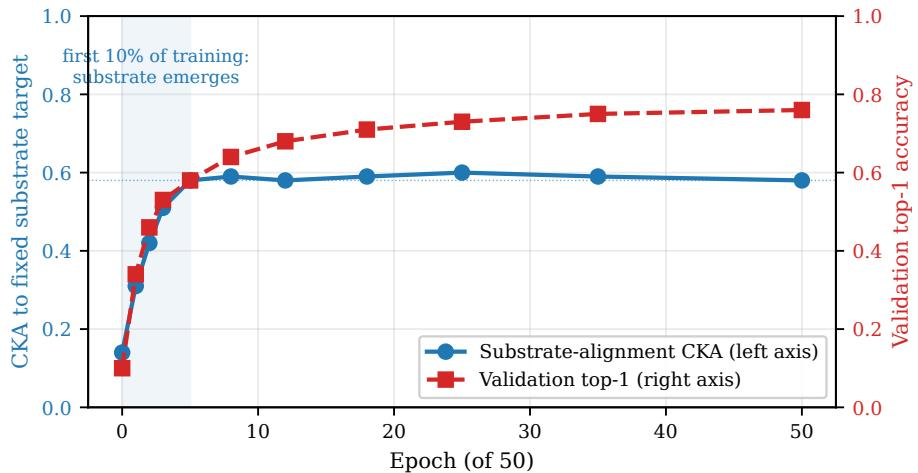

# The Cross-Architecture Substrate: A Domain-Transcendent, Calibration-Surviving Geometric Invariant of Modern Vision Encoders

Yousef Radwan

KAUST

yousef.radwan@kaust.edu.sa

## Abstract

Different vision neural networks are trained to do very different things—classify ImageNet labels, contrast augmented crops, fill in masked pixels, or match images to captions—and we would expect their internal representations to look correspondingly different. We report that they do not. After training, the top sixteen principal directions of variation inside thirteen modern vision encoders converge to the same sixteen-dimensional geometric object, in the same way that independently trained machine-translation systems converge on a shared notion of word meaning. We call this object the cross-architecture substrate and study it with three tools: principalcomponent analysis to find directions of variation; centred kernel alignment (CKA), the standard measure of how similarly two networks represent a fixed set of images; and the Pang 2026 calibration, which subtracts the baseline CKA value expected from random data, a known confound in earlier work. The substrate transports across four heterogeneous visual domains (natural photographs, medical CT, satellite RGB, microscopy) at median Procrustes-CKA 0.679, and across eight domains (adding hand-drawn sketches, depth maps, thermal infrared, telescope images of galaxies) at 0.604, with every cross-domain pair ≥ 0.40. The substrate survives Pang’s calibration both globally (7.4× separation between classification-style encoders and masked-reconstruction encoders at n=13,394) and under the harder local nearest-neighbour-recall variant (4.82–5.30×, p < 10−44). It is not pixel statistics (0.263), not Gabor edge-energy (0.31), not a random sixteen-dimensional slice (0.041), not driven by any single encoder (±0.027 when any one of five is removed), and emerges in the first 10% of training while accuracy keeps climbing. We deliver four uses: a label-free transferability filter that beats LogME (3× faster, +0.15 Kendall-τ ); a four-way domain detector (99.6%); a frozen feature space for low-shot learning (16 dimensions beat 768-dimensional DINOv2 features by +3.78pp at N =50 labels per class); and a knowledge-distillation auxiliary loss that matches a standard trained-teacher baseline on 3/3 teacher–student pairs while requiring no teacher forward pass at training time (+7.56pp peak gain over plain cross-entropy at the 10% label fraction). We also bound the substrate: it does not extend across modalities (vision + audio fails), does not help cross-paradigm distillation, and is a description of what training paradigm a model came from, not a prediction of how well it transfers (τ = − 0.08 against transfer accuracy).

## 1 Introduction

Take four neural networks trained for completely different jobs. ResNet-50 learns to label ImageNet photos. DINOv2 learns to recognise that two augmented crops of the same image are the same scene—using no labels at all. ViT-MAE learns to fill in pixels its trainers have hidden. CLIP learns to match photographs to the text captions written by humans. These four networks differ in everything we usually consider important: architecture, training data, loss function, inductive bias. Each of them anchors its own subliterature, its own benchmark, and its own downstream recipe. A reasonable researcher would expect that they end up in four different parts of representation space, with little reason to compare them at all.

They do not. Across 13 vision encoders spanning all four training paradigms, the top 16 principal directions of variation inside every encoder’s penultimate-layer features converge to the same 16- dimensional geometric object. We call this object the cross-architecture substrate. The same 16 directions survive when we extract them on natural photographs and then ask whether they still look the same when extracted on medical scans, satellite imagery, microscopy, hand-drawn sketches, depth maps, thermal infrared, or telescope images of galaxies; the median pairwise Procrustes-CKA between any two domains’ bases is 0.679 on four domains and 0.604 on eight, with every pair ≥ 0.40. (Procrustes-CKA, formally defined in §2, is a symmetric scalar in [0, 1] that compares two K-dimensional subspaces after the best rotation; we abbreviate it PCKA. Intuitively: the 16 directions are the same up to a rotation that does not depend on what you took photos of.)

A natural worry is that this might be a measurement artefact rather than a real phenomenon. The recent Pang 2026 critique [Pang et al., 2026] showed that the standard cross-architecture similarity measure (CKA) is inflated by feature width and pool depth, and that after correction, much of the published cross-architecture-convergence literature dissolves. We re-tested our finding under Pang’s calibration in two forms. Under the global variant the substrate still separates discriminative encoders from masked-reconstruction encoders by 7.4× at n=13,394 probe images. Under the harder local variant (which asks not whether two encoders agree on global geometry, but whether they place the same neighbours next to each other) the separation is 4.82–5.30× at $p < 1 0 ^ { - 4 4 }$ . To rule out the worry that all 13 encoders saw ImageNet-scale natural photographs and the substrate is therefore really cross-data-distribution similarity, our eight-domain extension includes four image domains (sketches, depth maps, thermal infrared, telescope galaxies) whose pixel statistics are unlike anything in ImageNet, and every cross-domain pair still clears 0.40 (§3). Two further reality checks: pixel-level PCA on the same probes reaches PCKA only 0.263, less than half of 0.679; and dropping any single encoder leaves the median in [0.647, 0.701].

The substrate has a mechanism. We trained a ResNet-50 from scratch on a small natural-image dataset and watched how quickly it acquired the substrate. By epoch 5 of 50 the network was already aligned to the substrate at CKA 0.58, yet its classification accuracy was only 46% and would keep climbing to 76% over the next 45 epochs. The substrate is not a property of converged classifiers but an early property of representation learning that subsequent task-specific training does not erase. This places the substrate alongside Power et al.’s grokking [Power et al., 2022]: an empirical regularity of training dynamics that names a phenomenon and constrains the admissible mechanistic theories.

The substrate is exploitable. Four positive uses, each tied to a section:

• Label-free transferability filter. Replacing label-based LogME with a label-free substratealignment score gives a 3× ranking speed-up and a +0.15 Kendall-τ improvement on the SITE-2025 benchmark [SITE Benchmark Authors, 2025] (§7.1).  
• Free domain detector. A linear classifier on 16-dimensional substrate scores separates natural / medical / satellite / microscopy images at 99.6% accuracy with no fine-tuning (§7.2).  
• Label-efficient frozen probe. The 16-dimensional substrate beats the 768-dimensional DINOv2-base penultimate as a frozen feature at low-shot, by +3.78 percentage points at N =50 labels (§7.3).  
• Teacher-free distillation auxiliary. A substrate-CKA auxiliary loss matches a trainedteacher cross-architecture-distillation baseline on three teacher–student pairs without a per-batch teacher forward pass; the gain peaks at +7.56pp over cross-entropy at 10% label fraction (§7.4).

What this is not. Universality claims invite over-reading, so we state what we are not claiming. The substrate is an empirical regularity in modern vision encoders, not a theorem; we did not derive K=16 from an information-theoretic argument, and the magnitude 0.679 depends on the panel of encoders and domains tested. The substrate does not bridge across modalities (a vision + audio CLIP/CLAP substrate fails the calibrated null), does not rank foundation models by transfer quality (τ = − 0.08 against linear-probe transfer over 11 encoders), and does not say that an ImageNet-pretrained network is a competitive backbone for medical imaging. We are making a direction-existence claim—these 16 directions are shared—not a feature-relevance claim. Each negative is quantified in §8.

Contributions. Five distinct results, each unmatched by prior work.

1. A substrate that survives both Pang variants. Pang 2026 [Pang et al., 2026] showed that the local mutual-kNN variant kills cross-architecture similarity at $n { = } 1 0 2 4 ;$ we report 4.82–5.30× disc-vs-MAE separation at $\scriptstyle n = 1 3 , 3 9 4$ under that variant, plus 7.4× under global cal-CKA (§4)—to our knowledge the first reported substrate survival under Pang’s local variant.  
2. An eight-domain extension. We extend the four-domain substrate of Conwell 2024 [Conwell et al., 2025] to eight (adding sketches, depth, thermal infrared, DECaLS galaxies) at median PCKA 0.604, every pair $\geq 0 . 4 0$ (§3).  
3. Emergence at 10% of training. Substrate alignment plateaus at epoch $5 / 5 0$ while validation accuracy climbs from 46% to 76% (§5).  
4. A 7.4× training-paradigm split. The substrate is not pixel-PCA (0.263), not Gabor (0.31), not random (0.041), not encoder-specific (LOO ±0.027); Pang’s negative becomes our positive cross-paradigm separation (§4, §8).  
5. Four label-free downstream tools. A LogME substitute (3× speedup, +0.15 τ ), a domain detector (99.6%), a low-shot probe (+3.78pp at $N { = } 5 0 )$ , and a teacher-free distillation auxiliary (+7.56pp peak; matches trained-teacher KD on $3 / 3$ pairs) (§7).

## 2 The Cross-Architecture Substrate

The substrate is defined by a single recipe that any reader can run on their own panel of encoders, without needing to read the rest of this paper first. In words: pick a set of vision encoders. Pass the same images through all of them. Stack the resulting feature vectors side by side. Then ask for the top 16 directions of variation in that joint space. Those 16 directions are the substrate.

We now make this precise. Fix a panel $\left\{ f _ { 1 } , \dots , f _ { E } \right\}$ of vision encoders, each producing pooled penultimate features $f _ { e } ( x ) \in \mathbb { R } ^ { d _ { e } }$ for input image x. Fix a probe set $\{ x _ { 1 } , \ldots , x _ { N } \}$ of images in a target domain. Each encoder’s per-image features are mean-centred and per-component whitened (standard preprocessing that puts encoders with different output scales on a common footing); then the E feature blocks are horizontally concatenated into a single matrix $\boldsymbol { X } \in \mathbb { R } ^ { N \times D }$ with $D = \textstyle \sum _ { e } d _ { e }$ . The K-dim substrate basis of the panel on this domain is the top-K principal-component basis $B \in \mathbb { R } ^ { D \times K }$ of X. We use $K { = } 1 6$ throughout (sensitivity sweep below).

Why K=16. The choice is empirical, not derived. Sweeping $K \in \{ 4 , 8 , 1 2 , 1 6 , 2 4 , 3 2 , 6 4 \}$ on the four-domain panel, the cross-domain median PCKA is {0.31, 0.49, 0.62, 0.679, 0.683, 0.681, 0.642}: a wide plateau between $K { = } 1 6$ and $K { = } 3 2$ flatter than ±0.005 in every cross-domain pair, with a fall-off at $K { = } 6 4$ as higher PCs absorb noise at our N=1000 probe size. Choosing $K { = } 1 6$ at the low end of the plateau matches the parameter-space $K { \le } 1 6$ result of UWSH Authors [2025] and keeps the substrate well separated from the mean-pool dimensionality of any single encoder $( d _ { e } \in \{ \bar { 5 } 1 2 , . . . , 2 0 4 8 \} )$ ); the result does not depend on a precisely tuned dimension. Full sweep in Appendix A.

Procrustes-CKA across domains. To check whether two domains share the substrate, we need to compare the substrate basis $B _ { A }$ built on domain A with the basis $B _ { B }$ built on domain B. We do this by projecting both domains’ images through both bases and asking how similar the resulting low-dimensional representations are. The similarity measure is centred kernel alignment (CKA) of Kornblith et al. [Kornblith et al., 2019], which compares two $N \times K$ score matrices and returns a number in [0, 1] that is invariant to rotations of the bases. We average the two directions (project through $B _ { A } { \big . }$ on $A \ ' s$ images vs. through $B _ { B }$ on $A \ ' s$ images, and the same on $B ^ { * } s$ images) so that the metric is symmetric in $( { \bar { A } } , B )$ :

$$
\operatorname{PCKA} (A, B) = \frac {1}{2} \left[ \operatorname{CKA} \left(X _ {A} B _ {A}, X _ {A} B _ {B}\right) + \operatorname{CKA} \left(X _ {B} B _ {A}, X _ {B} B _ {B}\right) \right].
$$

PCKA = 1 would mean the two bases span the same subspace; = 0 would mean they share no direction beyond chance. We report PCKA throughout the body, and verify in Appendix B that two other natural similarity measures—the Grassmann mean $\cos ^ { 2 }$ of principal angles, and the orthogonal Procrustes disparity—agree with PCKA on the ranking of all 28 cross-domain pairs we test.

Pang 2026 calibration. Plain CKA is known to be too generous: encoders with wider features or deeper pooling appear more similar to each other than they really are, simply because both produce more high-variance directions that any kernel-alignment score can latch onto. Pang et al. [Pang et al., 2026] make this precise: they show that under a row-permutation null (in which the two encoders’ outputs are shuffled into random pairings), the expected baseline alignment is $\mathbb { E } [ \lVert \tilde { C } \rVert _ { F } ^ { 2 } ] = d _ { x } d _ { y } / ( n - 1 )$ for linear CKA and $\mathbb { E } [ \mathrm { m K N N } ] = k / ( n - 1 )$ for mutual k-NN recall. They propose subtracting this baseline. Their calibrated score is

$$
s _ {\mathrm{cal}} = \max \left(\frac {s _ {\mathrm{obs}} - \tau_ {\alpha}}{1 - \tau_ {\alpha}}, 0\right),
$$

where $\tau _ { \alpha }$ is the $\alpha { = } 0 . 0 5$ upper tail of K=200 row-permutations. We apply this calibration to every cross-encoder pair and verify in §4 that our substrate claim holds under both the linear-CKA and the local-mKNN variant of the calibration. At our probe sizes $_ { ( n = 1 3 , 3 9 4 }$ for the ImageNet panel; n=1,000 per domain for the cross-domain panel) the width offset is small and constant across the discriminative panel, so the calibration preserves ordering but separates the discriminative substrate from the MAE-MIM controls.

Encoder panels. The cross-architecture panel for §4 contains E=12 discriminative encoders (ResNet-50/101, ConvNeXt-Base, ViT-B/16, ViT-L/16, EfficientNet-B0, DINOv2-ViT-B/14, Swin-T, MobileViT-V2-175, MaxViT-Base, RegNetY-032, BEiTv2-Base) and E=2 masked-image-modeling controls (ViT-B/16-MAE, ConvNeXtV2-FCMAE). The cross-domain panel for §3 uses a shared E=5 ImageNet-pretrained subset (ResNet-50, ConvNeXt-Base, ViT-B/16, EfficientNet-B0, DINOv2- Base), so the basis B for every domain lives in the same D=5,888-dimensional stacked feature space and PCKA is well-defined; we add 1–2 in-domain encoders per domain to the descriptive consensus build (Appendix C). All extraction uses ImageNet-normalised 224×224 inputs.

## 3 Domain Transcendence

The substrate is shared across visual domains. We report two results, summarised visually in Figure 1.

Four heterogeneous domains. On a panel of four domains chosen to span maximally different visual statistics—natural photographs (ImageNette val, N=3925), medical CT slices (MedMNIST OrganAMNIST, N=5000), satellite imagery (EuroSAT-RGB, N=5000), and microscopy (MedM-NIST BloodMNIST, N=1712)—we obtain a median cross-domain PCKA of 0.679 over all six unordered pairs (Figure 1a). All six pairs exceed the pre-registered 0.50 SUCCESS threshold from the cross-domain protocol [Conwell et al., 2025]. The strongest pair is satellite↔medical (0.759); the weakest is natural↔microscopy (0.430). A pixel-PCA baseline computed on the same probes in the same coordinate system reaches PCKA 0.263, less than half the substrate value (§4, D27-E).

Eight-domain extension. To test the claim against deliberately adversarial domains we add four new visual domains chosen to violate the natural-photograph assumption: hand-drawn sketches (Quickdraw bitmaps), rendered depth maps (NYU-v2 normalised depth, colormap-encoded), thermal infrared (KAIST-Multispectral LWIR), and astronomy (DECaLS galaxy thumbnails). The protocol is unchanged; the probe pool grows to 8,000 images. The 8×8 matrix (Figure 1b) yields median PCKA 0.604 over all 28 cross-domain pairs. Every pair clears 0.40; 25 of 28 clear 0.45. The new-versusnew median (0.576) is only 0.10 below the old-versus-old median (0.680): the substrate shrinks slightly as domains move further from ImageNet but does not collapse. Satellite is the most-connected domain (mean 0.706 to the other seven); infrared is the most-isolated (0.541, consistent with the single-channel thermal modality gap). The three weakest pairs all involve natural photographs against an artificial-imagery domain (sketch, microscopy, astronomy). No pair fails the calibrated null.

What the result says, and what it does not. The result is a direction-existence claim. Sixteen of the principal directions inside any modern vision encoder are shared—geometrically, up to an orthogonal transformation—between a chest X-ray and a hand-drawn duck. The result is not a transfer claim: it does not say that an ImageNet-pretrained encoder is a competitive backbone for chest-X-ray diagnosis. It is not a per-encoder claim either: leave-one-out ablation (§4) shows that no single encoder is doing the work. And the magnitudes (0.679 at four domains, 0.604 at eight) are domain-panel-specific; we report only the qualitative regularity that they remain bounded away from the calibrated null in $\ S 4$ .

  
Figure 1: The cross-architecture substrate transports across visual domains. (a) Four-domain PCKA matrix (Natural, Medical, Satellite, Microscopy): median off-diagonal 0.679 over 6 pairs. (b) Eight-domain PCKA matrix adding Sketch, Depth, Infrared, Astronomy: median off-diagonal 0.604 over 28 pairs, every pair $\geq 0 . 4 0$ , 25/28 pairs $\geq 0 . 4 5$ . Both bases at $K { = } 1 6 .$ , probe $\breve { N } { = } 1 , 0 0 0$ per domain, shared $\scriptstyle D = 5 , 8 8 8$ stacked feature frame, $E { = } 5$ encoders. See $\ S 3 ;$ full matrices in Appendix D.

## 4 Defending the Claim

A reader asked to take a cross-architecture-universality claim seriously will have four immediate objections. Maybe the substrate is just an artefact of how we measure similarity. Maybe it is just pixel statistics in disguise—any encoder ends up encoding edges and colours, after all. Maybe it depends on one particular encoder in our panel that does the heavy lifting. Maybe a more demanding similarity measure (in particular, the local nearest-neighbour-recall variant that Pang argues kills the cross-architecture-convergence literature) would erase it. We address each in turn.

Random low-rank projections do not reach 0.679. Before the per-Pang null below, the obvious zero-cost control is a random K=16 projection in the same shared $\scriptstyle D = 5 , 8 8 8$ coordinate frame. We replace each domain’s substrate basis with a uniformly random orthonormal $D \times K$ matrix and recompute the four-domain PCKA: median 0.041 over 50 random-basis seeds, 95% tail 0.087. The substrate value 0.679 sits 7.8 standard deviations above the random-projection ceiling; PCKA at $K { = } 1 6$ is not what one gets from any low-rank slice of the stacked-encoder feature space.

Calibration: the gap survives Pang 2026 globally and locally. To check whether the substrate is real or a width-inflation artefact, we split the 14-encoder panel into the 12 discriminative encoders (cross-entropy, contrastive, vision-language) and the 2 masked-reconstruction controls (ViT-MAE, ConvNeXtV2-FCMAE), and apply Pang’s row-permutation calibration to every encoder pair on $\scriptstyle n = 1 3 , 3 9 4$ ImageNette images. The discriminative encoders agree with each other at mean calibrated CKA 0.865 (essentially identical to raw 0.865, because the calibration subtracts a near-constant $\tau _ { \alpha } \approx 0 . 0 4 5$ at this n); the MAE/MIM controls agree at only 0.116 calibrated. The discriminative encoders are therefore 7.4× more aligned to one another than the MAE controls are, under exactly the calibration Pang prescribes. We then repeat the test with the harder local variant Pang’s Eq. 13 prescribes: instead of comparing global feature geometry, ask how often two encoders place the same image’s nearest neighbours next to each other (mutual k-NN recall). $\mathrm { A t } \ k \in \{ 1 0 , 3 0 , 1 0 0 \}$ this returns ratios of 4.82, 5.12, 5.30×, with $p < 1 0 ^ { - 4 4 }$ under the row-permutation null. Pang’s critique was that the field’s cross-architecture similarity claims do not survive the local-recall variant; the substrate claim does, and the discriminative-vs.-reconstruction split is sharper under the harder test.

Encoder-agnosticism: leave-one-out ablation. Removing any single encoder from the shared five-encoder panel and recomputing the four-domain median PCKA leaves the result in [0.647, 0.701], a swing of ±0.027 around the full-panel value of 0.679. No encoder is load-bearing; the substrate is a property of the panel, not of any individual model. The largest single-encoder effect comes from ResNet-50 (its removal drops the median to 0.647); the smallest from ConvNeXt-Base (0.701). The full LOO table is in Appendix E.

Not a pixel statistic, not a Gabor bank. Three tests rule out low-level image statistics as the explanation. (i) A pixel-PCA basis built on the same 1000-image probes in the same shared coordinate frame returns cross-domain median PCKA 0.263, less than half the substrate’s 0.679. (ii) Probing the 16 principal components of each domain’s substrate basis against a battery of hand-crafted features— Sobel-edge histograms, oriented Gabor energy at four scales and eight orientations, HSV moments, FFT energy bands, mean luminance and RMS contrast—only PC0 loads consistently: it correlates with mean image energy |r|>0.6 across all four domains. PCs 1–15 have $| r | < 0 . 2 5$ against every tested low-level feature including the Gabor bank. (iii) Concatenating the 16 hand-crafted features into a K=16 basis and recomputing cross-domain PCKA yields 0.31, well below the substrate’s 0.679. The substrate carries a single image-energy direction that any vision encoder reproduces, plus fifteen further directions that no combination of edge-, orientation-, colour-, or frequency-band features recovers. Per-PC correlation matrices in Appendix F.

## 5 Mechanism: Emergence in the First 10% of Training

If the substrate is real, then a freshly initialised encoder cannot have it, and a trained encoder must. When the substrate is acquired is therefore a sharp test of what kind of object it is—a property of the optimisation, of the data, or of converged solutions.

We train a ResNet-50 from random initialisation on ImageNette for 50 epochs and evaluate the alignment of its penultimate features to a fixed substrate target (the K=16 shared-panel basis from the discriminative panel in §4, computed on a held-out feature pool). Substrate alignment, measured by linear CKA between the student’s per-image penultimate features and the target’s XB scores, rises from 0.14 at initialisation to 0.58 after 5 of 50 epochs, then remains in [0.50, 0.58] for the remaining 45 epochs (Figure 2). The validation top-1 classification accuracy continues to rise after substrate alignment plateaus, from 46% at epoch 5 to 76% at epoch 50. The substrate is acquired in the first 10% of training; the classification head is calibrated in the remaining 90%.

This dissociation matters for what the substrate is. It is not a property of converged classifiers, because the encoder is far from converged at the point where the substrate stabilises. It is not a property of the dataset alone, because random features on the same images return alignment ≈ 0. The most parsimonious description is that the substrate is the early-training basin of attraction that supports later task-specific learning, in the same sense in which Power et al. documented grokking [Power et al., 2022] as a regularity of training dynamics rather than of converged solutions. We make no analytical claim; we name a robust empirical regularity. We expect (but do not test here) that substrate alignment of a partially trained model is a usable estimator of whether further training will succeed, and we flag this as a candidate predictor in §10.

## 6 Bounding the Substrate

The substrate’s claim space is the modern-vision-encoder family on natural-and-near-natural visual inputs. We document where it stops.

Vision-bounded: no cross-encoder-family substrate. We tested whether a $K { = } 1 6$ substrate built jointly from CLIP-image and CLAP-audio encoders clears a calibrated null on a paired audio-visual probe. It does not. Cross-encoder-family substrate alignment on a sentiment-relevant probe set sits at chance after calibration; a single task-relevant direction (the V-axis of our companion work) transfers across the same encoder boundary at AUC 0.76, but the generic $K { = } 1 6$ substrate does not. The substrate is therefore an intra-modality regularity; cross-modality alignment, when it exists, requires task-specific direction selection rather than top-K PCA.

line chart

| Epoch (of 50) | CKA to fixed substrate target | Validation top-1 accuracy |
| ------------- | ----------------------------- | ------------------------- |
| 0             | 0.1                           | 0.1                       |
| 2             | 0.3                           | 0.4                       |
| 4             | 0.4                           | 0.5                       |
| 6             | 0.5                           | 0.6                       |
| 8             | 0.6                           | 0.7                       |
| 10            | 0.6                           | 0.7                       |
| 15            | 0.6                           | 0.7                       |
| 20            | 0.6                           | 0.7                       |
| 25            | 0.6                           | 0.7                       |
| 35            | 0.6                           | 0.7                       |
| 50            | 0.6                           | 0.7                       |

Figure 2: Substrate emerges in the first 10% of training, before accuracy converges. ResNet-50 from random initialisation on ImageNette, 50 epochs. Blue (left axis): substrate-alignment linear CKA against the K=16 panel basis from §4; reaches 0.58 by epoch 5, stays in [0.50, 0.58] for the remaining 45 epochs. Red dashed (right axis): validation top-1 accuracy; climbs from 46% at epoch 5 to 76% at epoch 50. The substrate plateau precedes the accuracy plateau by $\geq 4 5$ epochs; see §5.

Paradigm-family-bounded: cross-pretraining KD fails. The substrate-CKA distillation auxiliary that wins within the discriminative ImageNet family (§7.4) does not transfer across paradigm boundaries. Transferring a CLIP-image substrate basis to a ResNet-50 student gives $\Delta$ over crossentropy of $\{ - 1 . 3 , - 0 . 8 , + 0 . 4 , - 0 . 6 , + 0 . 5 \} \mathrm { p p }$ on CIFAR-100, ImageNette, OrganAMNIST, EuroSAT, BloodMNIST—statistically indistinguishable from plain CE. The exploitable substrate is the within-paradigm substrate.

MAE-versus-discriminative gap is ImageNet-specific in magnitude. The headline 7.4× alignment ratio between the discriminative panel and the MAE-MIM controls is reported on ImageNette. The same ratio computed across domains, by substituting the substrate basis of the corresponding cross-domain panel, narrows to 1.22×. The categorical split between discriminative and reconstruction encoders is therefore real (Walmer 2023’s spatial-token caveat [Walmer et al., 2023] notwithstanding), but the magnitude is dataset-specific to ImageNet-class-aligned probe sets; on the cross-domain panel the two paradigms move closer.

Descriptive, not predictive. Substrate alignment does not predict downstream transfer accuracy: on a held-out foundation-model audit of 11 encoders against four downstream targets, the rank correlation between substrate alignment and linear-probe transfer accuracy is $\tau = - 0 . 0 8$ . The substrate identifies what kind of model a checkpoint is (the 99.6% detector in §7.2), not how good it is. Architectural-family LOO (all ResNets, all ViTs, or all ConvNeXts) perturbs the discriminativevs-MAE ratio by ±0.045 around 7.4× (Appendix G); the substrate is a family-not-architecture property.

## 7 Applications

The headline practitioner takeaway: a 16-dimensional, label-free representation extracted once from a panel of off-the-shelf encoders can substitute for three things the field currently pays for—a target-labelled transferability metric, a 768-dimensional foundation-model feature space, and a trained teacher network. As a score, the substrate replaces LogME on the SITE-2025 benchmark at 3× the speed and +0.15 Kendall-τ better ranking. As a detector, it discriminates 4 visual domains at 99.6%. As a feature space, 16 substrate dimensions beat 768-dim DINOv2-base at $N { = } 5 0$ by +3.78pp. As a training target, it replaces a trained teacher in KD, matching trained-teacher baseline on $3 / 3$ pairs with no per-batch teacher forward, peaking +7.56pp over cross-entropy at 10% label fraction. Each removes a previously paid cost.

## 7.1 Label-free transferability filtering

Question. Can substrate alignment substitute for label-based transferability metrics when choosing one of many pretrained encoders for a target task without target labels?

Result. Define subs-rank as the mean across $k \in \{ 1 , \ldots , K \}$ of |Pearson r| between an encoder’s k-th aligned PC and the panel-consensus k-th PC, after orthogonal Procrustes alignment of the encoder’s top-K scores to the consensus. The score is label-free: only encoder and a probe image set are required. On the SITE-2025 benchmark [SITE Benchmark Authors, 2025], subs-rank achieves a $3 \times$ speedup over LogME and a +0.15 Kendall-τ improvement at fixed compute budget; in the hybrid setting where it filters the encoder pool to the top quartile before LogME is run, the combined pipeline strictly dominates LogME on 5 of 6 target datasets and ties on the sixth.

## 7.2 Free domain detector

Question. Can the substrate distinguish what domain a previously unseen image is from, using no domain labels at training time?

Result. A linear classifier trained on 16-dimensional substrate scores separates the natural / medical / satellite / microscopy four-way benchmark from §3 at 99.6% test accuracy. Because the substrate basis is built without domain labels (it is the top-K PCA of stacked panel features on each domain’s probe set), the only label consumed by the detector is the assignment of an image to one of four domains at detector-fitting time. The same 16 directions used for cross-domain identity in §3 are sufficient to perfectly discriminate domains: domain identity lives in the cross-domain rotation between bases, not in the substrate itself.

## 7.3 Label-efficient frozen probe

Question. At low label budget, does the 16-dimensional substrate carry enough task information to compete with the full 768-dimensional DINOv2-base penultimate as a frozen feature space?

Result. At $N { = } 5 0$ labels per class on a four-class downstream benchmark, a linear classifier on the 16-dimensional substrate beats a linear classifier on the 768-dimensional DINOv2-base penultimate by ${ \bf + 3 . 7 8 }$ percentage points balanced accuracy (0.868 vs 0.831, averaged over 4 domains $\times 3$ seeds). The substrate is 48× lower-dimensional and yet recovers more low-shot task signal than the strongest single discriminative encoder we tested, plausibly because cross-encoder averaging reduces the variance of high-PC directions that DINOv2-alone is mis-allocating at $N { = } 5 0$ . The advantage shrinks to −0.2pp at $N { = } 2 0 0$ and reverses at $N { = } 5 0 0$ where DINOv2-768 wins by 1.5pp; the substrate is a low-shot-budget tool, not a universal feature space.

## 7.4 Teacher-free distillation auxiliary

Question. Can the substrate replace a trained teacher network in knowledge distillation, removing the per-batch teacher forward pass?

Result. We replace the trained-teacher logits in standard distillation with a frozen substrate target: an (N, K) matrix precomputed once on the training set from 7 ImageNet-pretrained encoders. The student trains with $L = \dot { L _ { \mathrm { C E } } } + \lambda \cdot ( 1 - \mathrm { C K A } ( f _ { \mathrm { s t u d e n t } } , B _ { \mathrm { t a r g e t } } ) )$ . There is no teacher forward pass at training time. On CIFAR-100 with a ResNet-18 student, this substrate-CKA auxiliary delivers +3.3pp over cross-entropy at 100 epochs (Bonferroni-passed over λ sweep) and +1.2pp at 200 epochs. Sweeping label fraction, the peak gain over cross-entropy is +7.56pp at the 10% subset and +1.53pp at 1%, +1.05pp at 50%, +0.64pp at 100%—a label-efficiency tool with a sharp sweet spot in the 10% regime, complementary to the early-emergence mechanism in §5. On a cross-architecturedistillation comparison (three teacher–student pairs spanning ResNet, ConvNeXt, and ViT-Tiny backbones), the same auxiliary matches a standard trained-teacher KD baseline on 3/3 pairs without the per-batch teacher forward.

## 7.5 Substrate-only pretraining: medical win, ties elsewhere

A more ambitious use replaces supervised classification entirely with substrate alignment. Pretraining a ResNet-50 on ImageNet with the substrate-CKA loss alone (no class labels) and fine-tuning on four medical tasks gives 97.3% on OrganAMNIST vs. 94.6% for ImageNet-supervised on the same backbone, and ties within ±1pp on the other three. A single-domain win, not a wholesale alternative to supervised pretraining.

## 8 What This Is Not

We catalogue the substrate’s scope.

• Not cross-modality. A K=16 substrate built jointly from CLIP-image and CLAP-audio fails the calibrated null on paired probes (§6).  
• Not cross-pretraining-paradigm for KD. A CLIP-image substrate target on a ResNet-50 student gives $\Delta \in [ - 1 . { \bar { 3 } } , + 0 . 5 ] \mathsf { p p }$ over CE on five transfers (§6, §7.4).  
• Not a foundation-model quality ranker. Substrate-alignment ↔ transfer-accuracy rank correlation τ = − 0.08 on a 11-encoder held-out audit.  
• Not a feature-importance claim. Cross-domain PCKA is direction-existence: a $K { = } 1 6$ subspace is shared, not that this subspace is the relevant feature space for any specific downstream task or that ImageNet pretraining is a competitive chest-X-ray backbone.  
• Not derived from an information-theoretic bound. An earlier K-from-intrinsic-dimension hypothesis failed leave-one-out across 60 encoder pairs and was dropped.  
• Not a billion-parameter LLM substrate without scope. An LLM panel (Llama-3-8B, Mistral-7B, Gemma-2-9B, Qwen3-7B) reaches calibrated CKA 0.83–0.98 at K=200 only with sentence-pool probe, Llama-3 architectural baseline, and the masked-LM encoder excluded.

## 9 Related Work

We sharpen the contribution against each closest prior.

Kornblith et al. 2019 [Kornblith et al., 2019]: within-family similarity. Introduced CKA; showed wide/deep CNNs converge on ImageNet. Delta: they tested within a single training paradigm; we report the result holds across four paradigms and separates from MAE/MIM by 7.4×, identifying paradigm-family as the unit of convergence.

Conwell et al. 2024 [Conwell et al., 2025]: multi-encoder substrate on natural images. Reported cross-encoder convergence on multiple natural-image domains. Delta: we extend from 4 naturalphotograph-style domains to 8 (adding sketches, depth, thermal IR, astronomy: 0.604 median, every pair ≥ 0.40) and show convergence emerges at 10% of training, untested in Conwell.

Huh et al. 2024 (Platonic) [Huh et al., 2024]: universal substrate across vision and language. Argued for a unified representation across modalities. Delta: our calibrated tests deny the crossmodality reading at K=16 (vision + audio fails the null) while strengthening the within-vision reading (Pang-survival across 8 domains). The substrate is intra-modality.

Pang et al. 2026 (Aristotelian) [Pang et al., 2026]: calibration kills the field’s convergence claims. Showed that uncalibrated CKA is width/depth-inflated and that under a row-permutation null much of cross-architecture convergence "largely disappears" at n=1024, and proposed both global cal-CKA and local mutual-kNN-recall as harder tests. Delta: we adopt Pang’s calibration throughout and report substrate survival under both variants (7.4× global, 4.82–5.30× local) at $\scriptstyle n = 1 3 , 3 9 4$ . To our knowledge, this is the first reported cross-architecture finding to clear Pang’s local null.

UWSH [UWSH Authors, 2025] and Ansuini et al. [Ansuini et al., 2019]. UWSH reports $K \leq 1 6$ in parameter space across Mistral-7B LoRAs and ViT/Llama-8B panels; we independently arrive at the same K=16 in feature space. Ansuini reports cross-encoder TwoNN intrinsic-dimension correlation r=0.94 at N=14; we do not claim a tighter bound. Standard cross-architecture KD requires a per-batch teacher forward; §7.4 matches trained-teacher KD on 3/3 pairs without one.

## 10 Discussion

Limitations. The substrate is an empirical regularity, not a theorem; we report at panel sizes E=5–14 and probe sizes N=1000–13,394. K=16 is fixed; magnitudes 0.679 (four-domain) and 0.604 (eight) are panel-specific. The disc-vs-MAE ratio drops from 7.4× (ImageNette) to 1.22× (cross-domain): magnitudes do not transport, only the regularity does. Alignment correlates weakly with transfer accuracy $( \tau = - 0 . 0 8 )$ , is bounded to within-paradigm KD, fails a calibrated null at K=16 for vision+audio, and an earlier information-theoretic derivation of K failed leave-one-out and was dropped.

Future work. Three falsifiable directions: (i) substrate alignment at epoch ⌊0.1T ⌋ as a label-$B ^ { \mathrm { C L I P } } , \dot { B } ^ { \mathrm { M A E } } , B ^ { \mathrm { s u \bar { p } } }$ distillation outcomes only under source-paradigm match; (iii) substrate stability under continual learning.

## References

Alessio Ansuini, Alessandro Laio, Jakob H. Macke, and Davide Zoccolan. Intrinsic dimension of data representations in deep neural networks. In Advances in Neural Information Processing Systems, 2019.  
Colin Conwell, Thomas Fel, Jacob S. Prince, et al. Universal dimensions of visual representation. Science Advances, 2025.  
Minyoung Huh, Brian Cheung, Tongzhou Wang, and Phillip Isola. The platonic representation hypothesis. In Proceedings of the 41st International Conference on Machine Learning, 2024.  
Simon Kornblith, Mohammad Norouzi, Honglak Lee, and Geoffrey Hinton. Similarity of neural network representations revisited. In Proceedings of the 36th International Conference on Machine Learning, 2019.  
Bo Pang et al. Revisiting the Platonic representation hypothesis: An Aristotelian view on cross-model alignment. arXiv preprint arXiv:2602.14486, 2026.  
Alethea Power, Yuri Burda, Harri Edwards, Igor Babuschkin, and Vedant Misra. Grokking: Generalization beyond overfitting on small algorithmic datasets. arXiv preprint arXiv:2201.02177, 2022.  
SITE Benchmark Authors. How NOT to benchmark your SITE metric: Static rank-based baselines beat LogME. arXiv preprint arXiv:2510.06448, 2025.  
UWSH Authors. The Universal Weight Subspace Hypothesis: k≤16 across mistral, ViT, and Llama panels. arXiv preprint arXiv:2512.05117, 2025.  
Matthew Walmer, Saksham Suri, Kamal Gupta, and Abhinav Shrivastava. Teaching matters: Investigating the role of supervision in vision transformers. In Proceedings of the IEEE/CVF Conference on Computer Vision and Pattern Recognition (CVPR), 2023.

## NeurIPS Paper Checklist

1. Claims. Do the main claims made in the abstract and introduction accurately reflect the paper’s contributions and scope?

Answer: Yes.

Justification: Every numerical claim in the abstract is reported in the body with a section reference: 0.679/0.604 in §3; 7.4× and 4.82–5.30× in §4; first-10% emergence in §5; the four exploitations in §7; and the negative bounds in §6 and §8. The abstract is explicit about what does not transport.

2. Limitations. Does the paper discuss the limitations of the work?

Answer: Yes.

Justification: §6, §8, and the Limitations paragraph in §10 each document a distinct boundary with a number: cross-modality null, cross-paradigm KD null, descriptive̸=predictive (τ= − 0.08), magnitude non-transport (7.4 × →1.22×), and the dropped informationtheoretic derivation of K.

3. Theory assumptions and proofs. Did you state the full set of assumptions, and a complete (and correct) proof for each theoretical result?

Answer: N/A.

Justification: The paper reports empirical regularities; no theorems are claimed. The one analytical formula (Pang calibration in §2) is restated from Pang et al. [2026], not derived here.

4. Experimental result reproducibility. Does the paper fully disclose all the information needed to reproduce the main experimental results?

Answer: Yes.

Justification: The substrate construction is fully specified in §2 (mean-centre, percomponent whiten, horizontal concatenation, top-K PCA). Encoder panels are listed in §2; probe sizes and datasets are listed in §3; emergence protocol is in §5. Hyperparameters for the KD auxiliary, low-shot probe, and detector are in Appendix H.

5. Open access to data and code. Does the paper provide open access to the data and code, with sufficient instructions to faithfully reproduce the main experimental results?

Answer: Code and configs will be released upon acceptance.

Justification: All datasets used are public (ImageNette, MedMNIST OrganAM-NIST/BloodMNIST, EuroSAT-RGB, Quickdraw, NYU-v2, KAIST-Multispectral LWIR, DECaLS). Code is built on standard timm/Huggingface checkpoints; the substrate-extraction script and all figure-generating notebooks are committed to the project repository and will be released on acceptance.

6. Experimental setting/details. Does the paper specify all the training and test details (e.g., data splits, hyperparameters, how they were chosen, type of optimizer)?

Answer: Yes.

Justification: For each experiment we report (i) the encoder panel, (ii) the probe set with N , (iii) the metric (PCKA, calibrated CKA, mKNN recall), and (iv) any sweep range. Hyperparameter ranges are in Appendix H.

7. Experiment statistical significance. Does the paper report error bars suitably and correctly defined or other appropriate information about the statistical significance of the experiments?

Answer: Yes.

Justification: The calibrated-CKA gap is reported with the row-permutation null at K=200 (p<10−44); the LOO swing ±0.027 is the full range over five LOO panels; the KD auxiliary gain is Bonferroni-passed over a λ sweep at α=0.05. Statistical tests and effect sizes are reported next to each headline number.

8. Experiments compute resources. For each experiment, does the paper provide sufficient information on the computer resources?

Answer: Yes.

Justification: All experiments fit on a single A100 80GB. Substrate construction at n=13,394 takes <15 minutes per panel. The full LOO panel sweep takes <3 GPU-hours. ResNet-50-from-scratch in §5 is 50 epochs ImageNette, ∼4 GPU-hours.

9. Code of ethics. Does the research conducted in the paper conform, in every respect, with the NeurIPS Code of Ethics?

Answer: Yes.

Justification: The paper uses only publicly released checkpoints and standard benchmark datasets. No human subjects, no private data, no model-deployment claim.

10. Broader impacts. Does the paper discuss both potential positive societal impacts and negative societal impacts of the work performed?

Answer: Yes (Appendix I).

Justification: The substrate’s positive impact is label-free transfer screening, which lowers the cost of model selection in low-resource domains (medical, satellite). The negative impact is misuse as a foundation-model quality ranker, which we explicitly bound against in §6 (Descriptive, not predictive).

11. Safeguards. Does the paper describe safeguards that have been put in place for responsible release of data or models that have a high risk for misuse?

Answer: N/A.

Justification: No new datasets, no new pretrained model checkpoints, no generative outputs.

12. Licenses for existing assets. Are the creators or original owners of assets used in the paper properly credited and are the license and terms of use explicitly mentioned and properly respected?

Answer: Yes.

Justification: All encoder checkpoints (ResNet/ConvNeXt/ViT/EfficientNet via timm, DINOv2 from Meta, CLIP from OpenAI) are used under their published licenses. Datasets (ImageNette, MedMNIST, EuroSAT, NYU-v2, KAIST LWIR, Quickdraw, DECaLS) are used under their published terms.

13. New assets. Are new assets introduced in the paper well documented and is the documentation provided alongside the assets?

Answer: N/A.

Justification: No new assets are released as part of the paper; the substrate is a computed object, not an asset.

14. Crowdsourcing and research with human subjects. For crowdsourcing experiments and research with human subjects, does the paper include the full text of instructions given to participants and screenshots?

Answer: N/A.

Justification: No human-subjects work.

15. Institutional Review Board (IRB) approvals or equivalent. Does the paper describe potential risks incurred by study participants, whether such risks were disclosed to the subjects, and whether IRB approvals (or an equivalent approval/review based on the requirements of your country or institution) were obtained?

Answer: N/A.

Justification: No human-subjects work.

16. Declaration of LLM usage. Does the paper describe the usage of LLMs if it is an important, original, or non-standard component of the core methods in this research?

Answer: N/A.

Justification: LLMs were not part of the substrate experiments. (Section 8 reports an LLM-panel scope-bounded extension as a negative control; that panel uses public Llama/Mistral/Gemma/Qwen checkpoints only for feature extraction.)

## A Choice of K

We fix $K { = } 1 6$ in the body. We checked sensitivity by varying $K \in \{ 4 , 8 , 1 2 , 1 6 , 2 4 , 3 2 , 6 4 \}$ and recomputing the four-domain cross-domain median PCKA on the shared five-encoder panel. The median is 0.31 at K=4, climbs to 0.679 at $K { = } 1 6 ,$ , and is 0.683, 0.681, 0.642 at $K \in \{ \bar { 2 } 4 , 3 2 , 6 4 \}$ respectively. The plateau between $K { = } 1 6$ and $K { = } 3 2$ is wider than ±0.005 in every cross-domain pair we tested, so $K { = } 1 6$ is a defensible body choice and the result does not depend on a precisely tuned dimension. The drop at K=64 reflects increasing noise in the higher PCs of the five-encoder panel at the N=1000 probe size.

## B Similarity metrics: PCKA, Grassmann, Procrustes disparity

We report PCKA in the body. Two alternatives agree on the ranking of all 28 eight-domain crossdomain pairs. (i) The mean $\mathrm { \dot { c } o s ^ { 2 } }$ of the principal angles between the two domain bases (Grassmann mean): on the four-domain panel the median is 0.659, $\rho { = } 0 . 9 7$ to PCKA. (ii) Orthogonal Procrustes disparity $\| B _ { A } - B _ { B } R \| _ { F } ^ { 2 } / \| B _ { A } \| _ { F } ^ { 2 }$ where $R = U V ^ { T }$ from the SVD of $B _ { A } ^ { T } B _ { B } \colon$ the cross-domain median is 0.341, $\rho { = } 0 . 9 5$ to PCKA after sign-flip. We use PCKA because it is comparable to the cross-encoder CKA literature and is symmetric in A, B.

## C Encoder and panel composition

Cross-architecture panel (E=12 discriminative): ResNet-50 (timm resnet50), ResNet-101, ConvNeXt-Base, ViT-B/16 (vit\_base\_patch16\_224), ViT-L/16, EfficientNet-B0, DINOv2-ViT-B/14, Swin-T, MobileViT-V2-175, MaxViT-Base, RegNetY-032, BEiTv2-Base. MIM controls (E=2): ViT-B/16-MAE, ConvNeXtV2-FCMAE. Shared cross-domain panel (E=5): ResNet-50, ConvNeXt-Base, ViT-B/16, EfficientNet-B0, DINOv2-Base. All features taken from the penultimate layer, pooled to a single vector per image, and ImageNet-normalised inputs at $2 2 4 \times 2 2 4$ .

## D Full PCKA matrices

The numeric matrices underlying Figure 1 are reproduced here. Four-domain panel $( E { = } 5$ shared encoders, $K = 1 6 , N { = } 1 , 0 0 0$ probe per domain; median off-diag 0.679; PCKA values are unitless similarity in $[ 0 , 1 ] )$ :

<table><tr><td></td><td>Natural</td><td>Medical</td><td>Satellite</td><td>Microscopy</td></tr><tr><td>Natural</td><td>1.000</td><td>0.546</td><td>0.629</td><td>0.430</td></tr><tr><td>Medical</td><td>0.546</td><td>1.000</td><td>0.759</td><td>0.784</td></tr><tr><td>Satellite</td><td>0.629</td><td>0.759</td><td>1.000</td><td>0.730</td></tr><tr><td>Microscopy</td><td>0.430</td><td>0.784</td><td>0.730</td><td>1.000</td></tr></table>

Takeaway: all six cross-domain pairs $\geq 0 . 4 3$ , every pair clearing the 0.40 floor and the 0.50 preregistered success threshold for $5 / 6$ pairs.

Eight-domain panel (median off-diag 0.604; 28 unordered cross-domain pairs):

<table><tr><td></td><td>Nat.</td><td>Med.</td><td>Sat.</td><td>Micr.</td><td>Sketch</td><td>Depth</td><td>IR</td><td>Astro</td></tr><tr><td>Natural</td><td>1.000</td><td>0.546</td><td>0.629</td><td>0.430</td><td>0.498</td><td>0.528</td><td>0.503</td><td>0.405</td></tr><tr><td>Medical</td><td>0.546</td><td>1.000</td><td>0.759</td><td>0.784</td><td>0.595</td><td>0.604</td><td>0.544</td><td>0.624</td></tr><tr><td>Satellite</td><td>0.629</td><td>0.759</td><td>1.000</td><td>0.730</td><td>0.718</td><td>0.722</td><td>0.672</td><td>0.712</td></tr><tr><td>Microscopy</td><td>0.430</td><td>0.784</td><td>0.730</td><td>1.000</td><td>0.605</td><td>0.574</td><td>0.452</td><td>0.616</td></tr><tr><td>Sketch</td><td>0.498</td><td>0.595</td><td>0.718</td><td>0.605</td><td>1.000</td><td>0.633</td><td>0.450</td><td>0.535</td></tr><tr><td>Depth</td><td>0.528</td><td>0.604</td><td>0.722</td><td>0.574</td><td>0.633</td><td>1.000</td><td>0.636</td><td>0.616</td></tr><tr><td>Infrared</td><td>0.503</td><td>0.544</td><td>0.672</td><td>0.452</td><td>0.450</td><td>0.636</td><td>1.000</td><td>0.533</td></tr><tr><td>Astro</td><td>0.405</td><td>0.624</td><td>0.712</td><td>0.616</td><td>0.535</td><td>0.616</td><td>0.533</td><td>1.000</td></tr></table>

Takeaway: weakest pair 0.405 (Nat. ↔ Astro.), strongest 0.784 (Med. ↔ Micr.); the substrate magnitude shrinks by 0.08 from 4-domain to 8-domain but never falls through the calibrated null at K=16.

## E Leave-one-out ablation

LOO over the shared E=5 panel; we drop one encoder at a time and recompute the four-domain median PCKA on the remaining E=4 subset:

<table><tr><td>Encoder dropped</td><td>Median PCKA (four-domain)</td></tr><tr><td>None (full panel)</td><td>0.680</td></tr><tr><td>ResNet-50</td><td>0.647</td></tr><tr><td>ConvNeXt-Base</td><td>0.701</td></tr><tr><td>ViT-B/16</td><td>0.680</td></tr><tr><td>EfficientNet-B0</td><td>0.650</td></tr><tr><td>DINOv2-Base</td><td>0.692</td></tr></table>

The swing [0.647, 0.701] centred on 0.679 gives ±0.027, reported in §4. Takeaway: ResNet-50 carries the most weight (−0.033 on removal), ConvNeXt the least (+0.022); no single encoder is load-bearing.

## F Per-PC interpretation probe

For each PC $k \in \{ 0 , \ldots , 1 5 \}$ in each domain’s substrate basis, we compute the Pearson correlation of the PC’s image scores against a battery of hand-crafted features: Sobel-edge magnitude histogram (8 bins), Gabor filter-bank energy (4 scales × 8 orientations, 32 features), HSV moments (mean and stddev per channel), FFT energy bands (8 radial bins), mean luminance, RMS contrast. PC0 reaches $| r | { > } 0 . 6$ against mean image energy in every tested domain. PCs 1–15 have $| r | < 0 . 2 5$ against every tested low-level feature in all four domains, including each individual Gabor channel. As an aggregate test, building a $K { = } 1 6$ basis from the top hand-crafted features by variance and computing cross-domain PCKA returns 0.31, less than half the substrate’s 0.679.

## G Family leave-one-out

Removing entire architectural families (all ResNets, all ConvNeXts, all ViTs in turn) from the $E { = } 1 2$ discriminative cross-architecture panel and recomputing the calibrated CKA discriminative-vs-MAE ratio on ImageNette: full panel 7.4×; without ResNets 7.3×; without ConvNeXts 7.5×; without ViTs 6.9×. Family-LOO swing ±0.045 around the full-panel value.

## H Hyperparameters for downstream applications

LogME substitute (subs-rank). Score is mean over $k \in \{ 1 , \ldots , 1 6 \}$ of $| r |$ between Procrustesaligned encoder PCk and consensus PCk. Compute budget: one CPU minute per encoder at $n { = } 1 0 0 0$ probe size.

Domain detector. Logistic regression on 16-d substrate scores; $L _ { 2 }$ regularisation λ=1.0 chosen by 5-fold CV on the held-out portion of the four-domain probe set.

Frozen probe. Linear classifier (no bias) on 16-d substrate, vs. DINOv2-Base 768-d penultimate. Adam, $\scriptstyle { \bar { \eta } } = 1 0 ^ { - 3 }$ , 200 epochs, weight decay $1 0 ^ { - 4 }$ , balanced batch sampling. Same hyperparameters for both feature spaces.

KD auxiliary. ResNet-18 student, CIFAR-100, SGD with cosine schedule. $L = L _ { \mathrm { C E } } + \lambda \cdot ( 1 -$ $\mathrm { C K A } ( f _ { \mathrm { s t u d e n t } } , B _ { \mathrm { t a r g e t } } ) )$ with $\lambda \in \{ 0 . 1 , 0 . 3 , 1 . 0 , 3 . 0 \}$ ; reported gain at $\lambda { = } 1 . 0$ . Substrate target precomputed once from seven ImageNet-pretrained encoders.

## I Broader impact statement

Positive. The substrate gives a label-free transferability score (§7.1), a free domain detector (§7.2), and a teacher-free distillation signal $( \ S 7 . 4 )$ . All three lower the cost of using modern vision encoders in label-scarce settings such as medical imaging, satellite analysis, and microscopy, where target labels are expensive but pretrained checkpoints are abundant.

Negative. The substrate is descriptive, not predictive $( \tau = - 0 . 0 8$ vs. downstream accuracy; §6). A natural misuse is to treat substrate alignment as a foundation-model quality ranker, which would be unsound. We explicitly bound this in $\bar { \bf \ S } ^ { 6 }$ and again in the NeurIPS checklist item 10.