# Test-Time Scaling in Multimodal Foundation Models: A Comprehensive Survey of Generation and Reasoning

Cong Wan1, Ying He1, Zhongzhan Huang1, Hefeng Wu1\*

1Sun Yat-sen University

{wanc,heying63}@mail2.sysu.edu.cn

zhongzhanhuang@foxmail.com wuhefeng@gmail.com

## Abstract

Test-time Scaling (TTS) has emerged as a pivotal research direction for enhancing model performance by dynamically allocating computational resources during inference. Recent advancements have adapted this paradigm to Multimodal Foundation Models (MFMs), unlocking their potential in multimodal reasoning and generation. Despite rapid progress, the field lacks a systematic survey and unified theoretical framework to delineate the developmental landscape of multimodal TTS. To bridge this gap, we present the first comprehensive review of TTS research for MFMs, proposing a unified taxonomic framework that categorizes existing methodologies into three distinct strategies: sampling-based, feedback-based, and searchbased approaches. We further summarize representative applications and benchmarks commonly utilized to evaluate multimodal TTS capabilities in generation and reasoning tasks. Finally, this survey discusses open challenges and outlines future research directions, providing a systematic roadmap for subsequent studies in this rapidly evolving field.

## 1 Introduction

Foundation Models have revolutionized the landscape of artificial intelligence, particularly in generation and reasoning tasks (Bommasani et al., 2022). As the cornerstone of this paradigm, Large Language Models (LLMs) have achieved remarkable advancements (Brown et al., 2020; Achiam et al., 2023; Huang et al., 2025), demonstrating exceptional emergent abilities in complex reasoning (Wei et al., 2022). This success is primarily driven by scaling model parameters, data volume, and computational resources during pre-training to enhance reasoning capabilities. This training-phase scaling behavior is termed scaling laws (Kaplan et al.,

2020), providing theoretical guidance for largescale model training.

However, recent studies suggest that relying solely on increased training data and compute is yielding diminishing marginal returns (Diaz and Madaio, 2024). Consequently, research focus has shifted toward unlocking the latent potential of strong foundation models during the inference phase. In this context, Test-time Scaling (TTS) (Snell et al., 2024; Wu et al., 2024c) has emerged as a promising paradigm complementary to pre-training scaling. Unlike pre-training scaling, TTS dynamically allocates computational resources during inference to exploit model capabilities without additional parameter updates, as illustrated in Fig. 1(c). Specifically, prior works have systematically explored TTS strategies, such as search (Xie et al., 2024), sampling (Chow et al., 2024), and verification (Hosseini et al., 2024), to enhance LLM reasoning. These efforts not only demonstrate the efficacy of TTS in LLMs but also inspire its extension to Multimodal Foundation Models (MFMs) (Li et al., 2024a).

Inspired by the success of LLMs, the research community is rapidly shifting focus toward MFMs integrating diverse modalities such as vision and language. These models refer to general-purpose foundations capable of processing multimodal data, encompassing cross-modal understanding architectures based on Multimodal Large Language Models (MLLMs) and vision-language generation frameworks typified by Diffusion Models. Through cross-modal fusion and alignment, MFMs are pivotal for the realization of Artificial General Intelligence (AGI). However, similar to LLMs, further performance improvements of MFMs are also constrained by scaling laws. Leveraging the efficacy of TTS in LLMs, researchers are adapting similar strategies to MFMs to further unlock latent potential during inference, obviating the need for additional training or parameter expansion. As illustrated in Fig. 1, this paradigm shift has triggered a surge in research interest and a rapidly evolving landscape of methodologies.

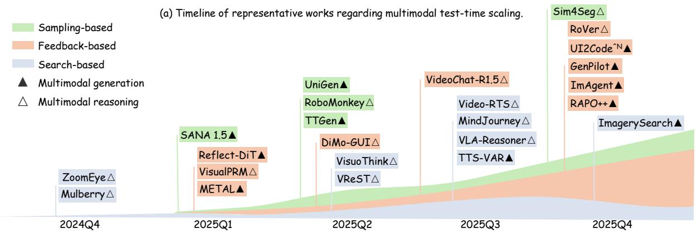

stacked bar chart

| Work | Sampling-based | Feedback-based | Search-based |
| --- | --- | --- | --- |
| 2024Q4 | ZoomEye △ | Mulberry △ | - |
| 2025Q1 | SANA 1.5 ▲ | Reflect-DiT ▲ | VisualPRM △ |
| 2025Q1 | - | METAL ▲ | - |
| 2025Q2 | UniGen ▲ | RoboMonkey △ | TTGen ▲ |
| 2025Q2 | - | DiMo-GUI △ | VisuoThink △ |
| 2025Q2 | - | VReST △ | - |
| 2025Q3 | VideoChat-R1.5 △ | Video-RTS △ | MindJourney △ |
| 2025Q3 | - | VLA-Reasoner △ | TTS-VAR △ |
| 2025Q4 | Sim4Seg △ | RoVer △ | UI2Code^N ▲ |
| 2025Q4 | - | GenPilot ▲ | ImAgent ▲ |
| 2025Q4 | - | RAPO++ ▲ | ImagerySearch ▲ |

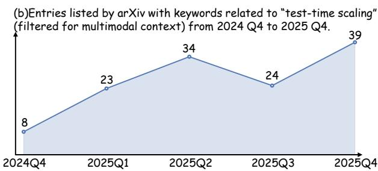

line chart

| Quarter   | Entries |
| --------- | ------- |
| 2024Q4    | 8       |
| 2025Q1    | 23      |
| 2025Q2    | 34      |
| 2025Q3    | 24      |
| 2025Q4    | 39      |

(c)Comparison between Pre-training Scaling and Test-time Scaling.  
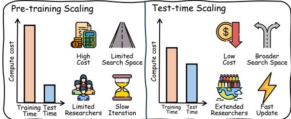

bar chart

| Category | Pre-training Scaling (Compute cost) | Test-time Scaling (Compute cost) |
|---|---|---|
| High Cost | 100 | 50 |
| Limited Search Space | 20 | 40 |
| Extended Researchers | 0 | 30 |
| Fast Update | 0 | 20 |

Figure 1: Recent trends in multimodal test-time scaling regarding historical evolution, publication growth, and the paradigm shift from pre-training. Q denotes quarter.

Current research on TTS for MFMs centers on two domains: multimodal generation (Ma et al., 2025; Xie et al., 2025) and multimodal reasoning (Zhu et al., 2025). Within these tasks, strategies such as majority voting (Byun et al., 2025), tree search (Liu et al., 2025), and reward models (Qiao et al., 2025) are being actively adapted from language models to multimodal tasks.

Despite the surge in interest, a unified taxonomy that synthesizes TTS advancements within multimodal scenarios remains absent. While prior surveys predominantly focus on TTS for LLMs (Zhang et al., 2025c; Ji et al., 2025), to the best of our knowledge, this work represents the first comprehensive review dedicated to MFMs. By systematically organizing recent advancements, we aim to provide a clear roadmap and reference for future research.

The structure of this work is organized as follows. We begin by introducing MFM techniques and TTS background in Sec. 2. Next, in Sec. 3, we establish a unified taxonomy, systematically classifying approaches into sampling-, feedback-, and search-based paradigms. Sec. 4 then details specific applications in multimodal generation and reasoning, with relevant benchmarks provided in the Appendix A. Finally, we offer a comprehensive discussion in Sec. 5, highlighting open challenges and future directions for research.

Our main contributions are threefold:

• First Systematic Survey. We present the first systematic survey dedicated to TTS in MFMs, bridging a critical gap in the current literature.  
• Unified Taxonomy. We propose a structured taxonomy categorizing existing methods, clarifying their mechanisms and applicability.  
• Future Roadmap. We analyze relevant benchmarks and highlight open challenges, offering a strategic guide for future research.

## 2 Background

## 2.1 Preliminaries of MFMs

This section outlines the preliminaries of MFMs. We specifically focus on MLLMs and Diffusion Models, as they serve as the primary foundations where test-time scaling strategies are currently explored and applied.

Multimodal Large Language Models (MLLMs) MLLMs, exemplified by GPT-4V (Achiam et al., 2023) and Gemini 2.0 (Team et al., 2023), have converged on a unified architectural paradigm. In understanding-centric MLLMs (Li et al., 2023; Liu et al., 2023b), visual, audio, or video signals are typically encoded into continuous embeddings or discrete tokens and mapped to the decoder’s input space, enabling autoregressive processing analogous to text generation. This unification provides the architectural foundation for scaling test-time computation via Chain-of-Thought (CoT) reasoning or multi-step verification.

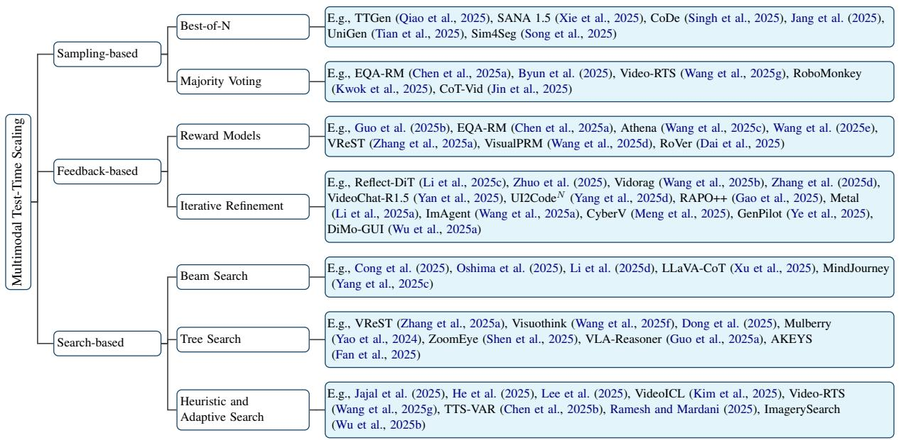

flowchart

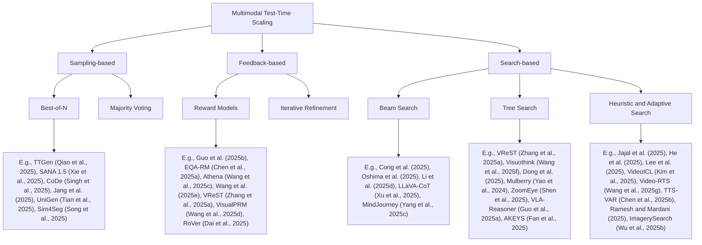

Figure 2: Taxonomy of multimodal test-time scaling methods.

Building on this, MLLMs with multimodal generation capabilities extend this paradigm, primarily by either discretizing multimodal outputs for direct autoregressive token generation (Zhan et al., 2024) or routing multimodal embeddings to specific decoders (Wu et al., 2024b). Fundamentally, these architectures reframe multimodal generation as a sequential decision-making or feature planning problem. Consequently, generation transitions from a unidirectional output to an optimizable inference process amenable to test-time search, verification, or iterative refinement, thereby catalyzing research into TTS for MLLMs.

Diffusion Models Diffusion models (Song et al., 2020; Ho and Salimans, 2022) have demonstrated superior performance in text-conditional generation, emerging as the dominant paradigm in visual generation. Unlike single-step generative models, diffusion models synthesize data via an iterative denoising process. This iterative nature facilitates a flexible trade-off between compute budget (e.g., sampling steps, candidate population) and generation fidelity, providing intrinsic support for TTS.

Fundamentally, diffusion models degrade the complex data distribution $p _ { \mathrm { d a t a } } ( \mathbf { x } )$ into Gaussian noise ${ \mathcal { N } } ( 0 , \sigma ^ { 2 } I )$ through a forward diffusion process. Given a clean sample $x _ { 0 }$ , the latent state at noise level t is formulated as:

$$
x _ {t} = \sqrt {\bar {\alpha} _ {t}} x _ {0} + \sqrt {1 - \bar {\alpha} _ {t}} \epsilon , \quad \epsilon \sim \mathcal {N} (0, I). \tag {1}
$$

where $\begin{array} { r } { \bar { \alpha } _ { t } = \prod _ { t = 1 } ^ { T } \alpha _ { t } } \end{array}$ represents a predefined noise schedule and ϵ denotes standard Gaussian noise. To reverse this, a network $\epsilon _ { \theta } ( x _ { t } , t )$ is trained to predict the added noise ϵ, enabling the gradual reconstruction of the data distribution.

In multimodal conditional generation, the noise predictor extends to a conditional form $\epsilon _ { \theta } ( x _ { t } , t , \phi )$ , typically employing Classifier-Free Guidance (CFG) (Ho and Salimans, 2022) to enhance the alignment between the output and the condition. CFG modulates the final prediction via linear extrapolation between conditional and unconditional estimates:

$$
\begin{array}{l} \hat {\epsilon} _ {t} = \epsilon_ {\theta} (x _ {t}, t, \phi_ {\text { none }}) \\ + \omega_ {g} \left(\epsilon_ {\theta} \left(x _ {t}, t, \phi_ {\text { cond }}\right) - \epsilon_ {\theta} \left(x _ {t}, t, \phi_ {\text { none }}\right)\right). \tag {2} \\ \end{array}
$$

where $\phi _ { \mathrm { c o n d } }$ and $\phi _ { \mathrm { n o n e } }$ denote the conditional $( \mathrm { e . g . }$ , text prompt) and null embeddings, respectively, and $\omega _ { g }$ is the guidance scale. This explicit controllability serves as a critical foundation for advanced test-time optimization, such as sampling-based selection or iterative refinement.

## 2.2 The Necessity of Test-time Scaling for MFMs

The necessity of TTS arises from its ability to overcome the prohibitive costs and static nature of traditional training paradigms. By dynamically allocating inference-time compute, TTS offers a costeffective alternative to static parameter expansion and enables immediate adaptation to distribution shifts without requiring weight updates. Crucially, single decoding paths often fail to capture the complex reasoning required in high-dimensional multimodal tasks. While TTS introduces mechanisms like search and verification to explore broader solution spaces, implementing these strategies in MFMs is fundamentally more challenging than in text-only LLMs.

<table><tr><td rowspan="2">Category</td><td rowspan="2">Method</td><td rowspan="2">Task</td><td colspan="2">Domain</td><td colspan="2">Guidance Signal</td><td rowspan="2">Approach Description</td></tr><tr><td>Generation</td><td>Reasoning</td><td>Function</td><td>MLLM</td></tr><tr><td rowspan="6">Best-of-N</td><td>TTGen (Qiao et al., 2025)</td><td>Image Generation</td><td>√</td><td></td><td>√</td><td></td><td>Use CLIP score to select the best latent during diffusion</td></tr><tr><td>SANA 1.5 (Xie et al., 2025)</td><td>Image Generation</td><td>√</td><td></td><td></td><td>√</td><td>Filters mismatches via VILA-Judge tournament and VLM scoring</td></tr><tr><td>CoDe (Singh et al., 2025)</td><td>Image Generation</td><td>√</td><td></td><td>√</td><td></td><td>Selects optimal diffusion outputs via block-based sampling</td></tr><tr><td>UniGen (Tian et al., 2025)</td><td>Generation&amp;Reasoning</td><td>√</td><td>√</td><td></td><td>√</td><td>Combines generation and verification via BoN</td></tr><tr><td>Jang et al. (2025)</td><td>Vision Language Action</td><td></td><td>√</td><td>√</td><td></td><td>Selects actions via masked reference KL scoring</td></tr><tr><td>Sim4Seg (Song et al., 2025)</td><td>Medical Diagnosis</td><td></td><td>√</td><td>√</td><td></td><td>Performs Best-of-N via joint semantic-visual scaling</td></tr><tr><td rowspan="5">Majority Voting</td><td>EQA-RM (Chen et al., 2025a)</td><td>Embodied QA</td><td></td><td>√</td><td>√</td><td></td><td>Generative reward model with majority voting</td></tr><tr><td>Byun et al. (2025)</td><td>Medical Diagnosis</td><td></td><td>√</td><td>√</td><td></td><td>Aggregates visual descriptions via voting to reduce misdiagnosis</td></tr><tr><td>Video-RTS (Wang et al., 2025g)</td><td>Video Reasoning</td><td></td><td>√</td><td>√</td><td></td><td>Enhance video reasoning via consistency voting</td></tr><tr><td>RoboMonkey (Kwok et al., 2025)</td><td>Vision Language Action</td><td></td><td>√</td><td>√</td><td></td><td>Select the optimal action via majority voting on perturbed samples</td></tr><tr><td>CoT-Vid (Jin et al., 2025)</td><td>Video Reasoning</td><td></td><td>√</td><td>√</td><td></td><td>Performs self-consistency via character-level clustering</td></tr></table>

Table 1: Summary of sampling-based methods. Guidance Signal distinguishes between Function (explicit scoring functions or statistical voting formulas) and MLLM (semantic judgment or aggregation).

Importantly, although TTS strategies in MFMs resemble those in LLMs, their multimodal instantiation is fundamentally more challenging. Unlike text-only models that allocate inference-time compute strictly over unimodal reasoning, MFMs must simultaneously scale compute across perceptual evidence, spatial grounding, and temporal context. Consequently, evaluating intermediate steps requires strict cross-modal faithfulness to visual and spatial relations, beyond mere textual consistency. Moreover, the inherent modality gap in multimodal generation often necessitates auxiliary VLMs or reward models. As a result, TTS for MFMs must scale not only reasoning depth, but also perception, grounding, and cross-modal verification.

## 2.3 Scope and Formalization of TTS

TTS can be formulated as selecting an inference procedure π that queries a fixed model to maximize expected utility subject to a test-time compute budget:

$$
\pi^ {*} = \arg \max _ {\pi} \mathbb {E} _ {y \sim \pi (\cdot | x, \theta)} [ U (x, y) ] \tag {3}
$$

$$
\text { s.t. } C (\pi , x) \leq B, \quad \theta \text {   fixed. }
$$

Here, x denotes the input, θ denotes the model parameters fixed at test time, y denotes the generated output, $U ( x , y )$ denotes the task utility, and $C ( \pi , x )$ denotes the test-time computational cost incurred by applying π to x. This formulation highlights that TTS scales the inference procedure rather than the model parameters, while allowing the compute cost to vary across inputs.

To further clarify the scope of this survey, we distinguish three resources that may change at test time: compute, memory/state, and weights. In this work, TTS primarily refers to compute-centric inference, where model parameters remain fixed and additional budget is allocated to operations such as sampling, search, verification, or iterative refinement. By contrast, test-time memory methods additionally modify dynamic state beyond standard one-pass inference, e.g., through retrieval stores, episodic memory, persistent caches, or expressive hidden states (Suzgun et al., 2026), whereas testtime training/adaptation updates model parameters through gradient-based or lightweight adaptation mechanisms (Dalal et al., 2025; Liang et al., 2025). Some multimodal methods may involve both compute scaling and memory augmentation; in such cases, we classify them by the dominant scaling mechanism and treat memory as an auxiliary component. A compact comparison is provided in Appendix Table A.2.

## 3 Multimodal Test-time Scaling

This section systematically reviews recent advancements in TTS for MFMs. As illustrated in Fig. 2, we categorize existing approaches into three distinct paradigms: sampling-based, feedback-based, and search-based methods, and further compare their applicability and trade-offs across multimodal tasks.

## 3.1 Sampling-based Methods

Sampling-based methods explicitly scale test-time computation by generating multiple candidate solutions in parallel, employing aggregation or selection mechanisms to enhance output fidelity and diversity. Compared to single-sample generation, such approaches explore a broader solution space, yielding superior performance in image generation, multimodal reasoning, and question-answering tasks. Once candidates are generated, the critical step is selecting the final output. As depicted in Fig. 3, prevalent strategies primarily include Bestof-N (BoN) and Majority Voting. A detailed taxonomy and summary of all surveyed methods are provided in Table 1.

## 3.1.1 Best-of-N

Best-of-N (Cobbe et al., 2021) employs a scoring function, or leverages an MLLM as a judge, to evaluate N candidate solutions generated at inference time, selecting the highest-scoring candidate as the final output. TTGen (Qiao et al., 2025) guides the diffusion trajectory by selecting the latent variable with the highest CLIP (Radford et al., 2021) score at each denoising step. Building on this, SANA-1.5 (Xie et al., 2025) refines candidate selection via tournament-style comparisons and Vision-Language Models (VLMs) scoring. Jang et al. (2025) filter Vision-Language-Action (VLA) actions using KL divergence from a Masked Reference Distribution as the scoring metric. Sim4Seg (Song et al., 2025) achieves crossmodal BoN by jointly scaling semantic reasoning paths and visual decoding perturbations. To improve efficiency, CoDe (Singh et al., 2025) mitigates BoN overhead by replacing global sampling with local BoN selection every B steps during reverse diffusion. Integrating BoN with MLLM reasoning, UniGen (Tian et al., 2025) utilizes CoT verification to enable the model to function as both generator and verifier.

## 3.1.2 Majority Voting

Unlike verifier-dependent BoN methods, Majority Voting (Wang et al., 2022; Byun et al., 2025) aggregates candidate solutions, selecting the most frequent or consistent output as the final prediction. CoT-Vid (Jin et al., 2025) substitutes traditional answer voting with character-level path clustering to ensure intermediate reasoning consistency. For Embodied QA, EQA-RM (Chen et al., 2025a) aggregates path evaluations via majority voting to enhance answer stability in uncertain contexts. Video-RTS (Wang et al., 2025g) achieves reliable few-shot video reasoning by combining progressive frame scaling with multi-path consistency voting. RoboMonkey (Kwok et al., 2025) ensures stability by constructing action distributions via majority voting on Gaussian-perturbed VLA samples.

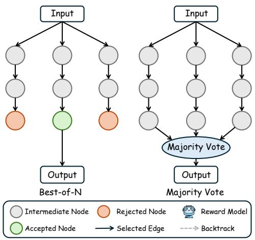

flowchart

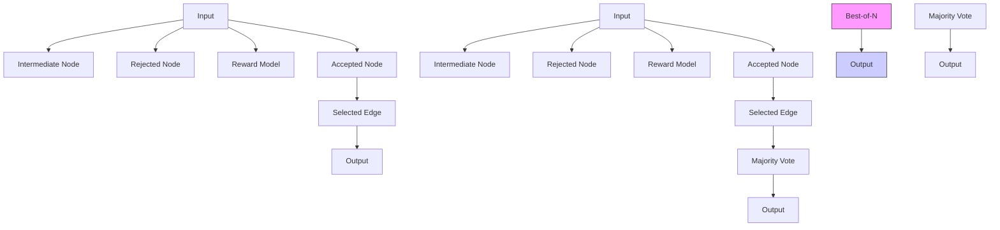

Figure 3: Illustration of sampling-based methods.

## 3.2 Feedback-based Methods

Another prominent category of TTS involves feedback-based strategies, which fundamentally rely on auxiliary evaluation signals to filter, steer, or refine model outputs during inference. Typically operating without parameter updates, these methods leverage reward models (Zhao et al., 2025) to guide candidate selection and intermediate reasoning, or employ iterative refinement (Yao et al., 2024; Zhuo et al., 2025) to continuously rectify errors during generation, as illustrated in Fig. 4. A comprehensive taxonomy and summary of the surveyed cases are provided in Table 2.

## 3.2.1 Reward Models

Reward models, utilizing score-based feedback to guide selection, are primarily categorized into Output Reward Models (ORMs) (Xin et al., 2024) and Process Reward Models (PRMs) (Wang et al., 2025d) based on the evaluation stage. ORMs typically evaluate final candidates generated in parallel, often coupled with strategies like BoN to identify the optimal solution.

For instance, Guo et al. (2025b) employ LLaVA-OneVision as a zero-shot ORM for candidate selection, further proposing PARM/PARM++ to enable reasoning self-correction via stepwise reflection. Similarly, Chen et al. (2025a) introduce EQA-RM, which generates both score-based feedback and fine-grained critiques for reasoning and grounding.

<table><tr><td rowspan="2">Category</td><td rowspan="2">Method</td><td rowspan="2">Task</td><td colspan="2">Domain</td><td colspan="2">Feedback Scope</td><td colspan="3">Feedback Form</td><td rowspan="2">Approach Description</td></tr><tr><td>Gen.</td><td>Reas.</td><td>Global</td><td>Step</td><td>Scalar</td><td>Text</td><td>Visual</td></tr><tr><td rowspan="7">Reward Models</td><td>Guo et al. (2025b)</td><td>Image Generation</td><td>✓</td><td></td><td>✓</td><td>✓</td><td>✓</td><td>✓</td><td></td><td>Adaptive hybrid assessment and refinement</td></tr><tr><td>EQA-RM (Chen et al., 2025a)</td><td>Embodied QA</td><td></td><td>✓</td><td>✓</td><td></td><td>✓</td><td>✓</td><td></td><td>Feedback with detailed reasoning and error critique</td></tr><tr><td>Athena (Wang et al., 2025c)</td><td>Math Reasoning</td><td></td><td>✓</td><td></td><td>✓</td><td>✓</td><td></td><td></td><td>Process supervision via consistency and negative sampling</td></tr><tr><td>VReST (Zhang et al., 2025a)</td><td>Math Reasoning</td><td></td><td>✓</td><td></td><td>✓</td><td>✓</td><td></td><td></td><td>Tree-level feedback integrating utility and correctness</td></tr><tr><td>Wang et al. (2025e)</td><td>Multimodal Reasoning</td><td></td><td>✓</td><td></td><td>✓</td><td>✓</td><td></td><td></td><td>Forward-looking rewards predicting coherence and fidelity</td></tr><tr><td>RoVer (Dai et al., 2025)</td><td>Vision Language Action</td><td></td><td>✓</td><td></td><td>✓</td><td>✓</td><td></td><td></td><td>Refines actions via verifier-guided 6D optimization</td></tr><tr><td>VisualPRM (Wang et al., 2025d)</td><td>Multimodal Reasoning</td><td></td><td>✓</td><td></td><td>✓</td><td>✓</td><td></td><td></td><td>VisualPRM acts as a BoN verifier to improve multimodal evaluation</td></tr><tr><td rowspan="12">Iterative Refinement</td><td>Reflect-DiT (Li et al., 2025c)</td><td>Image Generation</td><td>✓</td><td></td><td>✓</td><td></td><td></td><td>✓</td><td></td><td>Feedback-guided correction using prior outputs and text prompts</td></tr><tr><td>Zhuo et al. (2025)</td><td>Image Generation</td><td>✓</td><td></td><td>✓</td><td></td><td></td><td>✓</td><td></td><td>Sequential reflection integrating prompts and images for correction</td></tr><tr><td>Vidorag (Wang et al., 2025b)</td><td>RAG</td><td></td><td>✓</td><td></td><td>✓</td><td></td><td>✓</td><td></td><td>Multi-agent iterative reasoning through explore-inspect-answer cycles</td></tr><tr><td>CyberV (Meng et al., 2025)</td><td>Video Reasoning</td><td></td><td>✓</td><td></td><td>✓</td><td>✓</td><td>✓</td><td></td><td>Feedback loop monitors drift and triggers adaptive self-correction</td></tr><tr><td>GenPilot (Ye et al., 2025)</td><td>Image Generation</td><td>✓</td><td></td><td>✓</td><td></td><td>✓</td><td>✓</td><td></td><td>Optimizes prompts via iterative multi-agent feedback</td></tr><tr><td>VideoChat-R1.5 (Yan et al., 2025)</td><td>Video Reasoning</td><td></td><td>✓</td><td></td><td>✓</td><td></td><td>✓</td><td>✓</td><td>Refines perception via iterative visual-language modeling</td></tr><tr><td>UI2Code $^{N}$  (Yang et al., 2025d)</td><td>UI-to-Code</td><td>✓</td><td></td><td>✓</td><td></td><td></td><td>✓</td><td>✓</td><td>Refines code via internalized iterative loops</td></tr><tr><td>RAPO++ (Gao et al., 2025)</td><td>Video Generation</td><td>✓</td><td></td><td>✓</td><td></td><td></td><td>✓</td><td></td><td>Optimizes prompts via visual-semantic feedback</td></tr><tr><td>Metal (Li et al., 2025a)</td><td>Chart Generation</td><td>✓</td><td></td><td>✓</td><td></td><td></td><td>✓</td><td>✓</td><td>Refines chart code via multi-agent critique</td></tr><tr><td>ImAgent (Wang et al., 2025a)</td><td>Image Generation</td><td>✓</td><td></td><td>✓</td><td></td><td></td><td>✓</td><td></td><td>Scales generation via adaptive iterative reflection</td></tr><tr><td>Zhang et al. (2025d)</td><td>Image Generation</td><td>✓</td><td></td><td>✓</td><td></td><td></td><td>✓</td><td></td><td>Refines images via verifier-driven edit prompts</td></tr><tr><td>DiMo-GUI (Wu et al., 2025a)</td><td>GUI Grounding</td><td></td><td>✓</td><td></td><td>✓</td><td></td><td></td><td>✓</td><td>Iteratively refines coordinates through zoom-in strategy</td></tr></table>

Table 2: Summary of feedback-based methods.Gen.: Multimodal Generation, Reas.: Multimodal Reasoning.

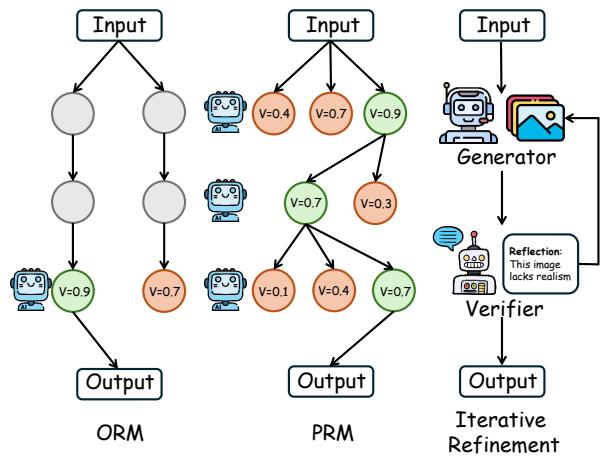

flowchart

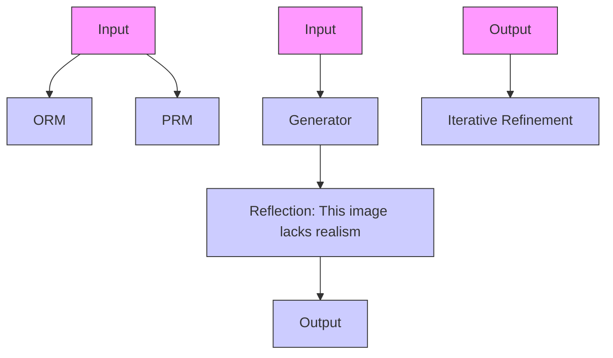

Figure 4: Illustration of feedback-based methods. ORM: Output Reward Model; PRM: Process Reward Model. Please refer to Fig. 3 for the legend.

In contrast, PRMs evaluate intermediate steps rather than final outcomes, offering granular feedback to facilitate exploration via strategies like Beam or Tree Search. Specifically, Athena (Wang et al., 2025c) derives process labels from strongweak completer consistency, enhancing PRMs through ORM initialization and negative sampling. RoVer (Dai et al., 2025) utilizes a plug-and-play PRM to refine 6D orientation for VLA models without retraining. VReST (Zhang et al., 2025a) filters reasoning paths by assessing sub-problem utility and cross-modal relevance. Finally, Wang et al. (2025e) uses prospective rewards to balance quality with future coherence, thereby reducing hallucination.

## 3.2.2 Iterative Refinement

Distinct from reward modeling, iterative refinement emphasizes an explicit "generate-evaluatecorrect" inference loop to progressively optimize outputs. Reflect-DiT (Li et al., 2025c) integrates VLM feedback with past outputs to guide the Diffusion Transformer in iteratively refining image generation. For UI tasks, UI2CodeN (Yang et al., 2025d) employs an internalized "generate-observecorrect" visual feedback mechanism to achieve iterative code refinement. Targeting video attention drift, CyberV (Meng et al., 2025) employs a sensorcontroller feedback loop for dynamic rectification.

Furthermore, Metal (Li et al., 2025a) and Vidorag (Wang et al., 2025b) extend iterative refinement to multi-agent frameworks, utilizing collaborative feedback to optimize chart generation and visual document reasoning. Meanwhile, VideoChat-R1.5 (Yan et al., 2025) and DiMo-GUI (Wu et al., 2025a) employ iterative perception and dynamic zooming to refine key regions, excelling in video spatiotemporal modeling and GUI grounding, respectively. Similarly, to transcend one-pass generation limits, RAPO++ (Gao et al., 2025), Zhang et al. (2025d), GenPilot (Ye et al., 2025), and ImAgent (Wang et al., 2025a) employ iterative prompt optimization, dynamically rewriting inputs via visual verification to progressively enhance quality.

## 3.3 Search-based Methods

Search-based TTS enables "planning-based exploration" through systematic or heuristic trajectory exploration, leveraging structured search mechanisms during inference rather than relying solely on stochastic sampling or post-hoc refinement. As illustrated in Fig. 5, we categorize search-based TTS approaches into three primary streams: Beam Search, Tree Search, and Heuristic and Adaptive Search. A comprehensive classification and summary of all surveyed works is detailed in Table 3.

<table><tr><td rowspan="2">Category</td><td rowspan="2">Method</td><td rowspan="2">Task</td><td colspan="2">Domain</td><td colspan="3">Search Strategy</td><td rowspan="2">Approach Description</td></tr><tr><td>Gen.</td><td>Reas.</td><td>Pruning</td><td>Backtrack</td><td>Dynamic</td></tr><tr><td rowspan="5">Beam Search</td><td>Cong et al. (2025)</td><td>Video Generation</td><td>√</td><td></td><td>√</td><td></td><td></td><td>Explores trajectories via combined Top-K sampling and beam search</td></tr><tr><td>Oshima et al. (2025)</td><td>Video Generation</td><td>√</td><td></td><td>√</td><td></td><td></td><td>Selects diffusion trajectories using foresight-guided beam search</td></tr><tr><td>Li et al. (2025d)</td><td>Generation Alignment</td><td>√</td><td></td><td>√</td><td></td><td>√</td><td>Dynamically schedules tree expansion with novel heuristics</td></tr><tr><td>LLaVA-CoT (Xu et al., 2025)</td><td>Multimodal Reasoning</td><td></td><td>√</td><td>√</td><td>√</td><td></td><td>Generates candidates at each stage and retraces if needed</td></tr><tr><td>MindJourney (Yang et al., 2025c)</td><td>Spatial Reasoning</td><td></td><td>√</td><td>√</td><td></td><td></td><td>Uses world model to guide beam search in spatial reasoning</td></tr><tr><td rowspan="7">Tree Search</td><td>VReST (Zhang et al., 2025a)</td><td>Math Reasoning</td><td></td><td>√</td><td></td><td>√</td><td></td><td>Combines MCTS with self-rewards to enhance reasoning</td></tr><tr><td>Visuothink (Wang et al., 2025f)</td><td>Multimodal Reasoning</td><td></td><td>√</td><td></td><td>√</td><td></td><td>Uses multimodal tree search with rollback for visual-text reasoning</td></tr><tr><td>Dong et al. (2025)</td><td>Math Reasoning</td><td></td><td>√</td><td></td><td>√</td><td></td><td>Integrates active retrieval into MCTS for dynamic knowledge</td></tr><tr><td>Mulberry (Yao et al., 2024)</td><td>Multimodal Reasoning</td><td></td><td>√</td><td>√</td><td>√</td><td>√</td><td>Incorporates collective learning into MCTS for efficient reasoning</td></tr><tr><td>ZoomEye (Shen et al., 2025)</td><td>Image Reasoning</td><td></td><td>√</td><td></td><td>√</td><td>√</td><td>Refines perception via hierarchical tree search</td></tr><tr><td>VLA-Reasoner (Guo et al., 2025a)</td><td>Vision Language Action</td><td></td><td>√</td><td></td><td>√</td><td></td><td>Optimizes actions via MCTS with world models</td></tr><tr><td>AKEYS (Fan et al., 2025)</td><td>Video Reasoning</td><td></td><td>√</td><td></td><td>√</td><td>√</td><td>Searches keyframes via agent-guided tree search</td></tr><tr><td rowspan="8">Heuristic and Adaptive Search</td><td>Jajal et al. (2025)</td><td>Generation Alignment</td><td>√</td><td></td><td>√</td><td></td><td></td><td>Introduces evolutionary search for gradient-independent alignment</td></tr><tr><td>He et al. (2025)</td><td>Multimodal Generation</td><td>√</td><td></td><td>√</td><td></td><td></td><td>Uses denoising selection and mutation mechanisms</td></tr><tr><td>Ramesh and Mardani (2025)</td><td>Image Generation</td><td>√</td><td></td><td>√</td><td></td><td></td><td>Models denoising as a multi-armed bandit problem via ε-greedy search</td></tr><tr><td>Lee et al. (2025)</td><td>Multimodal Reasoning</td><td></td><td>√</td><td>√</td><td></td><td>√</td><td>Uses adaptive cyclic diffusion for dynamic resource allocation</td></tr><tr><td>Video-RTS (Wang et al., 2025g)</td><td>Video Reasoning</td><td></td><td>√</td><td></td><td></td><td>√</td><td>Adaptively adds video frames based on output consistency</td></tr><tr><td>VideoICL (Kim et al., 2025)</td><td>Video Reasoning</td><td></td><td>√</td><td></td><td></td><td>√</td><td>Adapts context via relevant example retrieval</td></tr><tr><td>TTS-VAR (Chen et al., 2025b)</td><td>Image Generation</td><td>√</td><td></td><td>√</td><td></td><td>√</td><td>Scales generation via adaptive batch strategies</td></tr><tr><td>ImagerySearch (Wu et al., 2025b)</td><td>Video Generation</td><td>√</td><td></td><td></td><td></td><td>√</td><td>Aligns generation via dynamic search spaces</td></tr></table>

Table 3: Summary of search-based methods. Gen.: Multimodal Generation, Reas.: Multimodal Reasoning. Search Strategy: Pruning filters parallel candidates; Backtrack enables recursive state rollback; Dynamic dynamically adjusts compute budget (e.g., depth/width) based on difficulty.

## 3.3.1 Beam Search

Beam Search (Welleck et al., 2022) maintains multiple candidate paths during inference, pruning lowscoring candidates at each generation step to balance computational efficiency with search breadth. Cong et al. (2025) integrate Top-K sampling with beam search for sequence exploration. Similarly, Oshima et al. (2025) extend this logic to diffusion models via Diffusion Latent Beam Search, utilizing lookahead estimators to optimize latent trajectories based on alignment rewards. Li et al. (2025d) optimizes efficiency by dynamically adjusts tree and beam widths based on noise levels. Focusing on trajectory quality, LLaVA-CoT (Xu et al., 2025) integrates beam search with backtracking to regenerate from prior stages when local candidates underperform. MindJourney (Yang et al., 2025c) integrates a world model to simulate future views for each beam candidate, employing VLM valuation to dynamically plan optimal spatial paths.

## 3.3.2 Tree Search

Tree Search systematically explores the solution space by recursively generating, branching, and backtracking through candidate nodes during inference (Luo et al., 2024). For hierarchical exploration, AKEYS (Fan et al., 2025) guides keyframe refinement via agent-driven binary search, while ZoomEye (Shen et al., 2025) implements multiscale tree search with lookahead and backtracking mechanisms for fine-grained perception. Visuo-Think (Wang et al., 2025f) abstracts "slow thinking" into an interleaved visual-textual tree search, employing predictive rollback to simulate and prioritize promising branches. Along this line, recent works leverage Monte Carlo Tree Search (MCTS) to enable effective multimodal test-time scaling. While VReST (Zhang et al., 2025a) and VLA-Reasoner (Guo et al., 2025a) drive scaling by leveraging internal self-rewards and world model simulations to guide the MCTS process, Dong et al. (2025) and Mulberry (Yao et al., 2024) enhance inference robustness by incorporating external retrieval and collective multi-model learning into the MCTS framework.

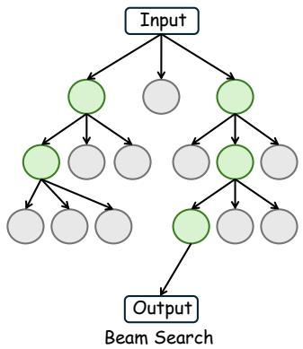

flowchart

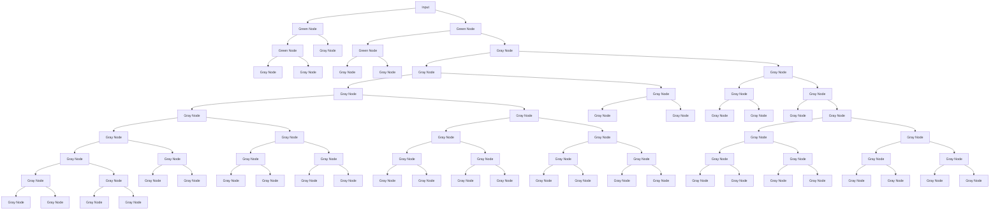

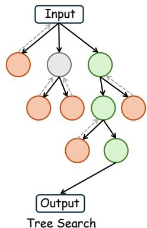

flowchart

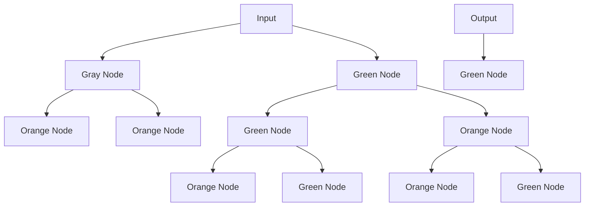

Figure 5: Illustration of search-based methods. Please refer to Fig. 3 for the legend.

## 3.3.3 Heuristic and Adaptive Search

Distinct from beam or tree search, heuristic and adaptive search leverage dynamic mechanisms to efficiently navigate the solution space without fixed structural constraints. Within this paradigm, recent works exploit evolutionary algorithms for test-time scaling. Specifically, Jajal et al. (2025) conduct black-box evolutionary search over latent spaces to enable gradient-free alignment, whereas He et al.

(2025) utilizes denoising-based selection and mutation mechanisms for exploration. To optimize efficiency, recent works dynamically allocate computational budgets based on instance difficulty. For instance, VideoICL (Kim et al., 2025) and Lee et al. (2025) implement adaptive termination mechanisms, dynamically halting the search process once prediction confidence or consistency criteria are met. Similarly, Video-RTS (Wang et al., 2025g) adopts a sparse-to-dense strategy, iteratively incorporating frames guided by output consistency to tailor computation for specific video queries. Beyond efficiency, adaptive search modulates the exploration–exploitation trade-off to enhance generative alignment. Ramesh and Mardani (2025) and ImagerySearch (Wu et al., 2025b) leverage contextual bandits or mental imagery simulation to dynamically adjust the search space, balancing global exploration with local refinement. Similarly, TTS-VAR (Chen et al., 2025b) orchestrates a coarse-tofine search trajectory, adaptively shifting from early diversity-oriented clustering to late-stage rewardguided resampling.

## 3.4 Comparative Analysis and Trade-offs

The effectiveness of multimodal TTS methods is closely related to task characteristics and modality structure. For multimodal generation tasks, sampling-based methods and iterative refinement are often more suitable than exhaustive search, because visual generation is mainly judged by final output quality rather than explicitly verifiable intermediate states. By contrast, search-based methods are more advantageous for multimodal reasoning tasks, such as mathematical and spatial reasoning, where intermediate reasoning steps are more structured and partially verifiable. This allows the model to prune erroneous branches and backtrack when necessary. Feedback-based methods lie between these two extremes, providing more targeted guidance than pure sampling while remaining less expensive than full search.

These categories also differ in trade-offs between performance and efficiency. Sampling-based methods are easy to parallelize, but their gains often diminish as the number of candidates increases. Feedback-based methods can improve alignment and reliability more directly, but they introduce sequential latency that depends heavily on the verifier or judge model. Search-based methods incur the highest computational overhead due to repeated branching, evaluation, and rollback, yet they are often the most effective when accuracy is prioritized and process supervision is available, especially for long-chain multimodal reasoning.

## 4 Applications

This section highlights representative applications of TTS for MFMs within Multimodal Generation and Multimodal Reasoning, analyzing their domain-specific scaling strategies. For a comprehensive review of benchmarks, please refer to Appendix A and the detailed summary in Appendix Table A.1.

## 4.1 Multimodal Generation

Image Generation TTS in image generation primarily exploits the trade-off between inference compute and visual-semantic alignment through search and refinement methods. The dominant BoN strategy allocates computational budget to parallel sampling, utilizing ORMs or scoring functions (Qiao et al., 2025; Tian et al., 2025) to filter the optimal candidate from a vast generation space. Complementary to sampling, iterative refinement methods dynamically optimize input prompts or conditioning signals based on self-correction feedback (Li et al., 2025c; Wang et al., 2025a).

Video Generation To ensure temporal consistency and motion smoothness, TTS strategies scale inference compute using search-based methods. Approaches such as Beam Search and Tree Search explore spatiotemporal trajectories, utilizing PRM to score and select optimal frame sequences (Cong et al., 2025; Liu et al., 2025). This mechanism allows for pruning incoherent paths to mitigate error propagation and maintain semantic stability across long durations.

## 4.2 Multimodal Reasoning

Video Reasoning To tackle long-context reasoning, TTS strategies primarily rely on searchbased methods or iterative refinement. Searchbased approaches actively navigate the temporal space to retrieve segments most relevant to the query (Fan et al., 2025). Alternatively, iterative refinement strategies focus on extracting key visual evidence and explicitly judging its relevance to the inquiry (Yan et al., 2025), thereby concentrating computational resources on critical events while filtering out redundant information.

Vision Language Action To enhance precision in physical control and long-horizon planning, TTS strategies in VLA primarily adopt sampling-based paradigms and tree search algorithms. Samplingbased methods leverage parallel computation to generate multiple candidate action trajectories, selecting the most robust execution path via consensus or scoring mechanisms (Jang et al., 2025; Kwok et al., 2025). Furthermore, tree search approaches are applied to systematically explore the expansive action solution space, enabling models to perform lookahead planning and optimize multistep decisions against complex environmental constraints (Guo et al., 2025a).

Math Reasoning TTS for multimodal math reasoning predominantly relies on MCTS (Zhang et al., 2025a; Wang et al., 2025f). By performing look-ahead simulations, MCTS systematically explores reasoning trajectories to optimize solution paths. Crucially, it incorporates prediction rollback mechanisms to revert invalid steps, enabling the model to recover from intermediate visual misinterpretations or calculation errors and re-navigate toward correct solutions.

## 5 Challenges and Future Directions

Hybrid Scaling Current multimodal TTS approaches typically rely on singular strategies, thereby underutilizing the synergistic potential of complementary mechanisms. Moderate increases in sampling paths enhance performance but incur significant costs at scale; conversely, relying solely on search strategies compromises efficiency by requiring optimal solution discovery within vast search spaces.

Hybrid scaling strategies have demonstrated potential in LLMs. For instance, Marco-o1 (Zhao et al., 2024) integrates MCTS with reflection mechanisms to dynamically plan inference paths via confidence-based search. However, systematic exploration of such hybrid TTS strategies within multimodal contexts remains nascent. Consequently, future research should explore hybrid TTS frameworks integrating multiple scaling mechanisms to balance performance and efficiency.

Error Propagation In multimodal reasoning, particularly during long-chain or cross-frame video tasks, early missteps can trigger an Error Snowballing Effect (Gan et al., 2025). Once initial visual or semantic errors occur, subsequent reasoning steps often amplify these deviations, precipitating catastrophic failure. Current multimodal TTS research lacks systematic mechanisms to arrest error propagation in long-chain reasoning, as most approaches remain confined to output-level optimization. A promising solution is employing trajectory-correcting reward models to detect and fix deviations during inference. Furthermore, establishing critical node verification mechanisms is also expected to ensure consistency across long-chain multimodal reasoning.

Hallucination Control Current MLLMs frequently hallucinate object attributes or relationships, decoupling generations from perceptual reality (Huang et al., 2024a). Current approaches largely rely on output-level post-hoc checks, such as detecting factual consistency, to address hallucinations. However, such retrospective correction fails to fundamentally constrain the formation and propagation of hallucinations during inference. Future research should pivot to process-level suppression and dynamic verification. Specifically, crossmodal consistency strategies can mitigate modality misalignment via reciprocal visual-textual checks. Furthermore, multi-level alignment is crucial to fuse perceptual and semantic constraints, ensuring both visual fidelity and logical precision throughout the inference trajectory.

## 6 Conclusion

This paper presents the first systematic review of TTS for MFMs. Grounded in fundamental principles, we establish a unified taxonomy that categorizes existing methodologies into sampling-based, feedback-based, and search-based strategies.We also formalize TTS in MFMs, distinguishing it from memory and adaptation methods, and highlight its unique multimodal challenges compared to TTS in LLMs. Furthermore, we scrutinize application patterns across multimodal generation and reasoning tasks and collate relevant benchmarks to serve as a comprehensive reference for future inquiry. Finally, we identify key challenges and outline promising avenues for future research, including hybrid scaling strategies, hallucination mitigation, and addressing error accumulation. Pursuing these avenues will enable efficient, robust MFMs, ultimately paving the way for AGI with advanced cognitive reasoning.

## 7 Limitations

While this survey strives to offer a comprehensive overview of Test-time Scaling in Multimodal Foundation Models, we acknowledge several limitations. First, regarding the scope, despite the broad connotation of the term multimodal, this work exclusively focuses on vision-language modalities (i.e., images and videos) and does not cover audio or other sensory inputs. Second, to prioritize domain-specific strategies, we do not conduct a comparative analysis with scaling techniques designed specifically for pure LLMs. Finally, given the rapid evolution of this field, some of the most recent advancements may inevitably be omitted, and due to space constraints, we cannot claim an exhaustive coverage of every existing technique or application.

## Acknowledgments

This work was supported in part by National Natural Science Foundation of China under Grant No. 62272494, and Guangdong Basic and Applied Basic Research Foundation under Grant No. 2023A1515012845.

## References

Josh Achiam, Steven Adler, Sandhini Agarwal, Lama Ahmad, Ilge Akkaya, Florencia Leoni Aleman, Diogo Almeida, Janko Altenschmidt, Sam Altman, Shyamal Anadkat, et al. 2023. Gpt-4 technical report. arXiv preprint arXiv:2303.08774.  
Rishi Bommasani, Drew A. Hudson, Ehsan Adeli, et al. 2022. On the opportunities and risks of foundation models. arXiv preprint arXiv:2108.07258.  
Tom Brown, Benjamin Mann, Nick Ryder, Melanie Subbiah, Jared D Kaplan, Prafulla Dhariwal, Arvind Neelakantan, Pranav Shyam, Girish Sastry, Amanda Askell, et al. 2020. Language models are few-shot learners. Advances in neural information processing systems, 33:1877–1901.  
Ji Young Byun, Young-Jin Park, Navid Azizan, and Rama Chellappa. 2025. Test-time-scaling for zeroshot diagnosis with visual-language reasoning. arXiv preprint arXiv:2506.11166.  
Guo Chen, Yicheng Liu, Yifei Huang, Yuping He, Baoqi Pei, Jilan Xu, Yali Wang, Tong Lu, and Limin Wang. 2024. Cg-bench: Clue-grounded question answering benchmark for long video understanding. arXiv preprint arXiv:2412.12075.  
Yuhang Chen, Zhen Tan, and Tianlong Chen. 2025a. Eqa-rm: A generative embodied reward model with test-time scaling. arXiv preprint arXiv:2506.10389.  
Zhekai Chen, Ruihang Chu, Yukang Chen, Shiwei Zhang, Yujie Wei, Yingya Zhang, and Xihui Liu. 2025b. Tts-var: A test-time scaling framework for visual auto-regressive generation. arXiv preprint arXiv:2507.18537.  
An-Chieh Cheng, Hongxu Yin, Yang Fu, Qiushan Guo, Ruihan Yang, Jan Kautz, Xiaolong Wang, and Sifei Liu. 2024a. Spatialrgpt: Grounded spatial reasoning in vision-language models. Advances in Neural Information Processing Systems, 37:135062–135093.  
Kanzhi Cheng, Qiushi Sun, Yougang Chu, Fangzhi Xu, Yantao Li, Jianbing Zhang, and Zhiyong Wu. 2024b. Seeclick: Harnessing gui grounding for advanced visual gui agents. arXiv preprint arXiv:2401.10935.  
Yinlam Chow, Guy Tennenholtz, Izzeddin Gur, Vincent Zhuang, Bo Dai, Sridhar Thiagarajan, Craig Boutilier, Rishabh Agarwal, Aviral Kumar, and Aleksandra Faust. 2024. Inference-aware fine-tuning for best-ofn sampling in large language models. arXiv preprint arXiv:2412.15287.  
Karl Cobbe, Vineet Kosaraju, Mohammad Bavarian, Mark Chen, Heewoo Jun, Lukasz Kaiser, Matthias Plappert, Jerry Tworek, Jacob Hilton, Reiichiro Nakano, et al. 2021. Training verifiers to solve math word problems. arXiv preprint arXiv:2110.14168.  
Wenyan Cong, Hanqing Zhu, Peihao Wang, Bangya Liu, Dejia Xu, Kevin Wang, David Z Pan, Yan Wang, Zhiwen Fan, and Zhangyang Wang. 2025. Can testtime scaling improve world foundation model? arXiv preprint arXiv:2503.24320.  
Mingtong Dai, Lingbo Liu, Yongjie Bai, Yang Liu, Zhouxia Wang, Rui Su, Chunjie Chen, Liang Lin, and Xinyu Wu. 2025. Rover: Robot reward model as test-time verifier for vision-language-action model. arXiv preprint arXiv:2510.10975.  
Karan Dalal, Daniel Koceja, Jiarui Xu, Yue Zhao, Shihao Han, Ka Chun Cheung, Jan Kautz, Yejin Choi, Yu Sun, and Xiaolong Wang. 2025. One-minute video generation with test-time training. In Proceedings of the Computer Vision and Pattern Recognition Conference, pages 17702–17711.  
Fernando Diaz and Michael Madaio. 2024. Scaling laws do not scale. In Proceedings of the AAAI/ACM Conference on AI, Ethics, and Society, volume 7, pages 341–357.  
Guanting Dong, Chenghao Zhang, Mengjie Deng, Yutao Zhu, Zhicheng Dou, and Ji-Rong Wen. 2025. Progressive multimodal reasoning via active retrieval. In Proceedings of the 63rd Annual Meeting of the Association for Computational Linguistics (Volume 1: Long Papers), pages 3579–3602.  
Sunqi Fan, Meng-Hao Guo, and Shuojin Yang. 2025. Agentic keyframe search for video question answering. arXiv preprint arXiv:2503.16032.  
Xinyu Fang, Kangrui Mao, Haodong Duan, Xiangyu Zhao, Yining Li, Dahua Lin, and Kai Chen. 2024. Mmbench-video: A long-form multi-shot benchmark for holistic video understanding. Advances in Neural Information Processing Systems, 37:89098–89124.  
Chaoyou Fu, Yuhan Dai, Yongdong Luo, Lei Li, Shuhuai Ren, Renrui Zhang, Zihan Wang, Chenyu Zhou, Yunhang Shen, Mengdan Zhang, et al. 2025. Video-mme: The first-ever comprehensive evaluation benchmark of multi-modal llms in video analysis. In Proceedings of the Computer Vision and Pattern Recognition Conference, pages 24108–24118.  
Zeyu Gan, Yun Liao, and Yong Liu. 2025. Rethinking external slow-thinking: From snowball errors to probability of correct reasoning. arXiv preprint arXiv:2501.15602.  
Bingjie Gao, Qianli Ma, Xiaoxue Wu, Shuai Yang, Guanzhou Lan, Haonan Zhao, Jiaxuan Chen, Qingyang Liu, Yu Qiao, Xinyuan Chen, et al. 2025. Rapo++: Cross-stage prompt optimization for textto-video generation via data alignment and test-time scaling. arXiv preprint arXiv:2510.20206.  
Dhruba Ghosh, Hannaneh Hajishirzi, and Ludwig Schmidt. 2023. Geneval: An object-focused framework for evaluating text-to-image alignment. Advances in Neural Information Processing Systems, 36:52132–52152.  
Jiayuan Gu, Fanbo Xiang, Xuanlin Li, Zhan Ling, Xiqiang Liu, Tongzhou Mu, Yihe Tang, Stone Tao, Xinyue Wei, Yunchao Yao, et al. 2023. Maniskill2: A unified benchmark for generalizable manipulation skills. arXiv preprint arXiv:2302.04659.  
Wenkai Guo, Guanxing Lu, Haoyuan Deng, Zhenyu Wu, Yansong Tang, and Ziwei Wang. 2025a. Vlareasoner: Empowering vision-language-action models with reasoning via online monte carlo tree search. arXiv preprint arXiv:2509.22643.  
Ziyu Guo, Renrui Zhang, Chengzhuo Tong, Zhizheng Zhao, Rui Huang, Haoquan Zhang, Manyuan Zhang, Jiaming Liu, Shanghang Zhang, Peng Gao, et al. 2025b. Can we generate images with cot? let’s verify and reinforce image generation step by step. arXiv preprint arXiv:2501.13926.  
Haoran He, Jiajun Liang, Xintao Wang, Pengfei Wan, Di Zhang, Kun Gai, and Ling Pan. 2025. Scaling image and video generation via test-time evolutionary search. arXiv preprint arXiv:2505.17618.  
Jonathan Ho and Tim Salimans. 2022. Classifierfree diffusion guidance. arXiv preprint arXiv:2207.12598.  
Arian Hosseini, Xingdi Yuan, Nikolay Malkin, Aaron Courville, Alessandro Sordoni, and Rishabh Agarwal. 2024. V-star: Training verifiers for self-taught reasoners. arXiv preprint arXiv:2402.06457.  
Kairui Hu, Penghao Wu, Fanyi Pu, Wang Xiao, Yuanhan Zhang, Xiang Yue, Bo Li, and Ziwei Liu. 2025. Video-mmmu: Evaluating knowledge acquisition from multi-discipline professional videos. arXiv preprint arXiv:2501.13826.  
Xiwei Hu, Rui Wang, Yixiao Fang, Bin Fu, Pei Cheng, and Gang Yu. 2024a. Ella: Equip diffusion models with llm for enhanced semantic alignment. arXiv preprint arXiv:2403.05135.  
Yutao Hu, Tianbin Li, Quanfeng Lu, Wenqi Shao, Junjun He, Yu Qiao, and Ping Luo. 2024b. Omnimedvqa: A new large-scale comprehensive evaluation benchmark for medical lvlm. In Proceedings of the IEEE/CVF Conference on Computer Vision and Pattern Recognition, pages 22170–22183.  
Kaiyi Huang, Kaiyue Sun, Enze Xie, Zhenguo Li, and Xihui Liu. 2023. T2i-compbench: A comprehensive benchmark for open-world compositional text-toimage generation. Advances in Neural Information Processing Systems, 36:78723–78747.  
Qidong Huang, Xiaoyi Dong, Pan Zhang, Bin Wang, Conghui He, Jiaqi Wang, Dahua Lin, Weiming Zhang, and Nenghai Yu. 2024a. Opera: Alleviating hallucination in multi-modal large language models via over-trust penalty and retrospection-allocation. In Proceedings of the IEEE/CVF Conference on Computer Vision and Pattern Recognition, pages 13418– 13427.  
Zhongzhan Huang, Guoming Ling, Shanshan Zhong, Hefeng Wu, and Liang Lin. 2025. Minilongbench: The low-cost long context understanding benchmark for large language models. In Annual Meeting of the Association for Computational Linguistics, pages 11442–11460.  
Ziqi Huang, Yinan He, Jiashuo Yu, Fan Zhang, Chenyang Si, Yuming Jiang, Yuanhan Zhang, Tianxing Wu, Qingyang Jin, Nattapol Chanpaisit, et al. 2024b. Vbench: Comprehensive benchmark suite for video generative models. In Proceedings of the IEEE/CVF Conference on Computer Vision and Pattern Recognition, pages 21807–21818.  
Purvish Jajal, Nick John Eliopoulos, Benjamin Shiue-Hal Chou, George K Thiruvathukal, James C Davis, and Yung-Hsiang Lu. 2025. Inference-time alignment of diffusion models with evolutionary algorithms. arXiv preprint arXiv:2506.00299.  
Suhyeok Jang, Dongyoung Kim, Changyeon Kim, Youngsuk Kim, and Jinwoo Shin. 2025. Verifierfree test-time sampling for vision language action models. arXiv preprint arXiv:2510.05681.  
Yixin Ji, Juntao Li, Yang Xiang, Hai Ye, Kaixin Wu, Kai Yao, Jia Xu, Linjian Mo, and Min Zhang. 2025. A survey of test-time compute: From intuitive inference to deliberate reasoning. arXiv preprint arXiv:2501.02497.  
Hongbo Jin, Ruyang Liu, Wenhao Zhang, Guibo Luo, and Ge Li. 2025. Cot-vid: Dynamic chain-of-thought routing with self verification for training-free video reasoning. arXiv preprint arXiv:2505.11830.  
Jared Kaplan, Sam McCandlish, Tom Henighan, Tom B Brown, Benjamin Chess, Rewon Child, Scott Gray, Alec Radford, Jeffrey Wu, and Dario Amodei. 2020. Scaling laws for neural language models. arXiv preprint arXiv:2001.08361.  
Kangsan Kim, Geon Park, Youngwan Lee, Woongyeong Yeo, and Sung Ju Hwang. 2025. Videoicl: Confidence-based iterative in-context learning for out-of-distribution video understanding. In Proceedings of the Computer Vision and Pattern Recognition Conference, pages 3295–3305.  
Jacky Kwok, Christopher Agia, Rohan Sinha, Matt Foutter, Shulu Li, Ion Stoica, Azalia Mirhoseini, and Marco Pavone. 2025. Robomonkey: Scaling testtime sampling and verification for vision-languageaction models. arXiv preprint arXiv:2506.17811.  
Gyubin Lee, Bao N Nguyen Truong, Jaesik Yoon, Dongwoo Lee, Minsu Kim, Yoshua Bengio, and Sungjin Ahn. 2025. Adaptive inference-time scaling via cyclic diffusion search. In The Thirty-ninth Annual Conference on Neural Information Processing Systems.  
Bingxuan Li, Yiwei Wang, Jiuxiang Gu, Kai-Wei Chang, and Nanyun Peng. 2025a. Metal: A multi-agent framework for chart generation with test-time scaling. arXiv preprint arXiv:2502.17651.  
Chunyuan Li, Zhe Gan, Zhengyuan Yang, Jianwei Yang, Linjie Li, Lijuan Wang, Jianfeng Gao, et al. 2024a. Multimodal foundation models: From specialists to general-purpose assistants. Foundations and Trends® in Computer Graphics and Vision, 16(1- 2):1–214.  
Junnan Li, Dongxu Li, Silvio Savarese, and Steven Hoi. 2023. Blip-2: Bootstrapping language-image pretraining with frozen image encoders and large language models. In International conference on machine learning, pages 19730–19742. PMLR.  
Kaixin Li, Ziyang Meng, Hongzhan Lin, Ziyang Luo, Yuchen Tian, Jing Ma, Zhiyong Huang, and Tat-Seng Chua. 2025b. Screenspot-pro: Gui grounding for professional high-resolution computer use. arXiv preprint arXiv:2504.07981.  
Kunchang Li, Yali Wang, Yinan He, Yizhuo Li, Yi Wang, Yi Liu, Zun Wang, Jilan Xu, Guo Chen, Ping Luo, et al. 2024b. Mvbench: A comprehensive multi-modal video understanding benchmark. In Proceedings of the IEEE/CVF Conference on Computer Vision and Pattern Recognition, pages 22195–22206.  
Shufan Li, Konstantinos Kallidromitis, Akash Gokul, Arsh Koneru, Yusuke Kato, Kazuki Kozuka, and  
Aditya Grover. 2025c. Reflect-dit: Inferencetime scaling for text-to-image diffusion transformers via in-context reflection. arXiv preprint arXiv:2503.12271.  
Xiner Li, Masatoshi Uehara, Xingyu Su, Gabriele Scalia, Tommaso Biancalani, Aviv Regev, Sergey Levine, and Shuiwang Ji. 2025d. Dynamic search for inference-time alignment in diffusion models. arXiv preprint arXiv:2503.02039.  
Xuanlin Li, Kyle Hsu, Jiayuan Gu, Karl Pertsch, Oier Mees, Homer Rich Walke, Chuyuan Fu, Ishikaa Lunawat, Isabel Sieh, Sean Kirmani, et al. 2024c. Evaluating real-world robot manipulation policies in simulation. arXiv preprint arXiv:2405.05941.  
Jian Liang, Ran He, and Tieniu Tan. 2025. A comprehensive survey on test-time adaptation under distribution shifts. International Journal of Computer Vision, 133(1):31–64.  
Tsung-Yi Lin, Michael Maire, Serge Belongie, James Hays, Pietro Perona, Deva Ramanan, Piotr Dollár, and C Lawrence Zitnick. 2014. Microsoft coco: Common objects in context. In European conference on computer vision, pages 740–755. Springer.  
Bo Liu, Yifeng Zhu, Chongkai Gao, Yihao Feng, Qiang Liu, Yuke Zhu, and Peter Stone. 2023a. Libero: Benchmarking knowledge transfer for lifelong robot learning. Advances in Neural Information Processing Systems, 36:44776–44791.  
Fangfu Liu, Hanyang Wang, Yimo Cai, Kaiyan Zhang, Xiaohang Zhan, and Yueqi Duan. 2025. Video-t1: Test-time scaling for video generation. arXiv preprint arXiv:2503.18942.  
Haotian Liu, Chunyuan Li, Qingyang Wu, and Yong Jae Lee. 2023b. Visual instruction tuning. Advances in neural information processing systems, 36:34892– 34916.  
Pan Lu, Hritik Bansal, Tony Xia, Jiacheng Liu, Chunyuan Li, Hannaneh Hajishirzi, Hao Cheng, Kai-Wei Chang, Michel Galley, and Jianfeng Gao. 2023. Mathvista: Evaluating mathematical reasoning of foundation models in visual contexts. arXiv preprint arXiv:2310.02255.  
Liangchen Luo, Yinxiao Liu, Rosanne Liu, Samrat Phatale, Meiqi Guo, Harsh Lara, Yunxuan Li, Lei Shu, Yun Zhu, Lei Meng, et al. 2024. Improve mathematical reasoning in language models by automated process supervision. arXiv preprint arXiv:2406.06592.  
Nanye Ma, Shangyuan Tong, Haolin Jia, Hexiang Hu, Yu-Chuan Su, Mingda Zhang, Xuan Yang, Yandong Li, Tommi Jaakkola, Xuhui Jia, et al. 2025. Inference-time scaling for diffusion models beyond scaling denoising steps. arXiv preprint arXiv:2501.09732.  
Oier Mees, Lukas Hermann, Erick Rosete-Beas, and Wolfram Burgard. 2022. Calvin: A benchmark for language-conditioned policy learning for longhorizon robot manipulation tasks. IEEE Robotics and Automation Letters, 7(3):7327–7334.  
Jiahao Meng, Shuyang Sun, Yue Tan, Lu Qi, Yunhai Tong, Xiangtai Li, and Longyin Wen. 2025. Cyberv: Cybernetics for test-time scaling in video understanding. arXiv preprint arXiv:2506.07971.  
Yuta Oshima, Masahiro Suzuki, Yutaka Matsuo, and Hiroki Furuta. 2025. Inference-time text-to-video alignment with diffusion latent beam search. arXiv preprint arXiv:2501.19252.  
Adam Polyak, Amit Zohar, Andrew Brown, Andros Tjandra, Animesh Sinha, Ann Lee, Apoorv Vyas, Bowen Shi, Chih-Yao Ma, Ching-Yao Chuang, et al. 2024. Movie gen: A cast of media foundation models. arXiv preprint arXiv:2410.13720.  
Runqi Qiao, Qiuna Tan, Guanting Dong, Minhui Wu, Chong Sun, Xiaoshuai Song, Zhuoma GongQue, Shanglin Lei, Zhe Wei, Miaoxuan Zhang, et al. 2024. We-math: Does your large multimodal model achieve human-like mathematical reasoning? arXiv preprint arXiv:2407.01284.  
Yuming Qiao, Yuechen Wang, Xudong Zhang, and Dan Meng. 2025. Ttgen: Incorporating test-time scaling to diffusion models. In Proceedings of the Computer Vision and Pattern Recognition Conference, pages 3362–3366.  
Alec Radford, Jong Wook Kim, Chris Hallacy, Aditya Ramesh, Gabriel Goh, Sandhini Agarwal, Girish Sastry, Amanda Askell, Pamela Mishkin, Jack Clark, et al. 2021. Learning transferable visual models from natural language supervision. In International conference on machine learning, pages 8748–8763.  
Vignav Ramesh and Morteza Mardani. 2025. Testtime scaling of diffusion models via noise trajectory search. arXiv preprint arXiv:2506.03164.  
Arijit Ray, Jiafei Duan, Ellis Brown, Reuben Tan, Dina Bashkirova, Rose Hendrix, Kiana Ehsani, Aniruddha Kembhavi, Bryan A Plummer, Ranjay Krishna, et al. 2024. Sat: Dynamic spatial aptitude training for multimodal language models. arXiv preprint arXiv:2412.07755.  
Chitwan Saharia, William Chan, Saurabh Saxena, Lala Li, Jay Whang, Emily L Denton, Kamyar Ghasemipour, Raphael Gontijo Lopes, Burcu Karagol Ayan, Tim Salimans, et al. 2022. Photorealistic text-to-image diffusion models with deep language understanding. Advances in neural information processing systems, 35:36479–36494.  
Haozhan Shen, Kangjia Zhao, Tiancheng Zhao, Ruochen Xu, Zilun Zhang, Mingwei Zhu, and Jianwei Yin. 2025. Zoomeye: Enhancing multimodal llms with human-like zooming capabilities through tree-based image exploration. In Proceedings of the  
2025 Conference on Empirical Methods in Natural Language Processing, pages 6613–6629.  
Anuj Singh, Sayak Mukherjee, Ahmad Beirami, and Hadi Jamali-Rad. 2025. Code: Blockwise control for denoising diffusion models. arXiv preprint arXiv:2502.00968.  
Charlie Snell, Jaehoon Lee, Kelvin Xu, and Aviral Kumar. 2024. Scaling llm test-time compute optimally can be more effective than scaling model parameters. arXiv preprint arXiv:2408.03314.  
Lingran Song, Yucheng Zhou, and Jianbing Shen. 2025. Sim4seg: Boosting multimodal multi-disease medical diagnosis segmentation with region-aware vision-language similarity masks. arXiv preprint arXiv:2511.06665.  
Yang Song, Jascha Sohl-Dickstein, Diederik P Kingma, Abhishek Kumar, Stefano Ermon, and Ben Poole. 2020. Score-based generative modeling through stochastic differential equations. arXiv preprint arXiv:2011.13456.  
Mirac Suzgun, Mert Yuksekgonul, Federico Bianchi, Dan Jurafsky, and James Zou. 2026. Dynamic cheatsheet: Test-time learning with adaptive memory. In Proceedings of the 19th Conference of the European Chapter of the Association for Computational Linguistics (Volume 1: Long Papers), pages 7080–7106.  
Gemini Team, Rohan Anil, Sebastian Borgeaud, Jean-Baptiste Alayrac, Jiahui Yu, Radu Soricut, Johan Schalkwyk, Andrew M Dai, Anja Hauth, Katie Millican, et al. 2023. Gemini: a family of highly capable multimodal models. arXiv preprint arXiv:2312.11805.  
Rui Tian, Mingfei Gao, Mingze Xu, Jiaming Hu, Jiasen Lu, Zuxuan Wu, Yinfei Yang, and Afshin Dehghan. 2025. Unigen: Enhanced training & test-time strategies for unified multimodal understanding and generation. arXiv preprint arXiv:2505.14682.  
Kaishen Wang, Ruibo Chen, Tong Zheng, and Heng Huang. 2025a. Imagent: A unified multimodal agent framework for test-time scalable image generation. arXiv preprint arXiv:2511.11483.  
Ke Wang, Junting Pan, Weikang Shi, Zimu Lu, Houxing Ren, Aojun Zhou, Mingjie Zhan, and Hongsheng Li. 2024. Measuring multimodal mathematical reasoning with math-vision dataset. Advances in Neural Information Processing Systems, 37:95095–95169.  
Qiuchen Wang, Ruixue Ding, Zehui Chen, Weiqi Wu, Shihang Wang, Pengjun Xie, and Feng Zhao. 2025b. Vidorag: Visual document retrieval-augmented generation via dynamic iterative reasoning agents. arXiv preprint arXiv:2502.18017.  
Shuai Wang, Zhenhua Liu, Jiaheng Wei, Xuanwu Yin, Dong Li, and Emad Barsoum. 2025c. Athena: Enhancing multimodal reasoning with dataefficient process reward models. arXiv preprint arXiv:2506.09532.  
Weiyun Wang, Zhangwei Gao, Lianjie Chen, Zhe Chen, Jinguo Zhu, Xiangyu Zhao, Yangzhou Liu, Yue Cao, Shenglong Ye, Xizhou Zhu, et al. 2025d. Visualprm: An effective process reward model for multimodal reasoning. arXiv preprint arXiv:2503.10291.  
Xiyao Wang, Zhengyuan Yang, Linjie Li, Hongjin Lu, Yuancheng Xu, Chung-Ching Lin, Kevin Lin, Furong Huang, and Lijuan Wang. 2025e. Scaling inference-time search with vision value model for improved visual comprehension. In Proceedings of the IEEE/CVF International Conference on Computer Vision, pages 1173–1184.  
Xuezhi Wang, Jason Wei, Dale Schuurmans, Quoc Le, Ed Chi, Sharan Narang, Aakanksha Chowdhery, and Denny Zhou. 2022. Self-consistency improves chain of thought reasoning in language models. arXiv preprint arXiv:2203.11171.  
Yikun Wang, Siyin Wang, Qinyuan Cheng, Zhaoye Fei, Liang Ding, Qipeng Guo, Dacheng Tao, and Xipeng Qiu. 2025f. Visuothink: Empowering lvlm reasoning with multimodal tree search. arXiv preprint arXiv:2504.09130.  
Ziyang Wang, Jaehong Yoon, Shoubin Yu, Md Mohaiminul Islam, Gedas Bertasius, and Mohit Bansal. 2025g. Video-rts: Rethinking reinforcement learning and test-time scaling for efficient and enhanced video reasoning. arXiv preprint arXiv:2507.06485.  
Jason Wei, Xuezhi Wang, Dale Schuurmans, Maarten Bosma, Fei Xia, Ed Chi, Quoc V Le, Denny Zhou, et al. 2022. Chain-of-thought prompting elicits reasoning in large language models. Advances in neural information processing systems, 35:24824–24837.  
Sean Welleck, Jiacheng Liu, Ximing Lu, Hannaneh Hajishirzi, and Yejin Choi. 2022. Naturalprover: Grounded mathematical proof generation with language models. Advances in Neural Information Processing Systems, 35:4913–4927.  
Hang Wu, Hongkai Chen, Yujun Cai, Chang Liu, Qingwen Ye, Ming-Hsuan Yang, and Yiwei Wang. 2025a. Dimo-gui: Advancing test-time scaling in gui grounding via modality-aware visual reasoning. arXiv preprint arXiv:2507.00008.  
Haoning Wu, Dongxu Li, Bei Chen, and Junnan Li. 2024a. Longvideobench: A benchmark for longcontext interleaved video-language understanding. Advances in Neural Information Processing Systems, 37:28828–28857.  
Meiqi Wu, Jiashu Zhu, Xiaokun Feng, Chubin Chen, Chen Zhu, Bingze Song, Fangyuan Mao, Jiahong Wu, Xiangxiang Chu, and Kaiqi Huang. 2025b. Imagerysearch: Adaptive test-time search for video generation beyond semantic dependency constraints. arXiv preprint arXiv:2510.14847.  
Shengqiong Wu, Hao Fei, Leigang Qu, Wei Ji, and Tat-Seng Chua. 2024b. Next-gpt: Any-to-any multimodal llm. In Forty-first International Conference on Machine Learning.  
Weijia Wu, Mingyu Liu, Zeyu Zhu, Xi Xia, Haoen Feng, Wen Wang, Kevin Qinghong Lin, Chunhua Shen, and Mike Zheng Shou. 2025c. Moviebench: A hierarchical movie level dataset for long video generation. In Proceedings of the Computer Vision and Pattern Recognition Conference, pages 28984– 28994.  
Yangzhen Wu, Zhiqing Sun, Shanda Li, Sean Welleck, and Yiming Yang. 2024c. Inference scaling laws: An empirical analysis of compute-optimal inference for problem-solving with language models. arXiv preprint arXiv:2408.00724.  
Zhiyong Wu, Zhenyu Wu, Fangzhi Xu, Yian Wang, Qiushi Sun, Chengyou Jia, Kanzhi Cheng, Zichen Ding, Liheng Chen, Paul Pu Liang, et al. 2024d. Osatlas: A foundation action model for generalist gui agents. arXiv preprint arXiv:2410.23218.  
Enze Xie, Junsong Chen, Yuyang Zhao, Jincheng Yu, Ligeng Zhu, Chengyue Wu, Yujun Lin, Zhekai Zhang, Muyang Li, Junyu Chen, et al. 2025. Sana 1.5: Efficient scaling of training-time and inferencetime compute in linear diffusion transformer. arXiv preprint arXiv:2501.18427.  
Yuxi Xie, Anirudh Goyal, Wenyue Zheng, Min-Yen Kan, Timothy P Lillicrap, Kenji Kawaguchi, and Michael Shieh. 2024. Monte carlo tree search boosts reasoning via iterative preference learning. arXiv preprint arXiv:2405.00451.  
Huajian Xin, Daya Guo, Zhihong Shao, ZZ Ren, Qihao Zhu, Bo Liu, Chong Ruan, Wenda Li, and Xiaodan Liang. 2024. Advancing theorem proving in llms through large-scale synthetic data. In The 4th Workshop on Mathematical Reasoning and AI at NeurIPS’24.  
Guowei Xu, Peng Jin, Ziang Wu, Hao Li, Yibing Song, Lichao Sun, and Li Yuan. 2025. Llava-cot: Let vision language models reason step-by-step. In Proceedings of the IEEE/CVF International Conference on Computer Vision, pages 2087–2098.  
Ziang Yan, Xinhao Li, Yinan He, Zhengrong Yue, Xiangyu Zeng, Yali Wang, Yu Qiao, Limin Wang, and Yi Wang. 2025. Videochat-r1.5: Visual test-time scaling to reinforce multimodal reasoning by iterative perception. arXiv preprint arXiv:2509.21100.  
Jihan Yang, Shusheng Yang, Anjali W Gupta, Rilyn Han, Li Fei-Fei, and Saining Xie. 2025a. Thinking in space: How multimodal large language models see, remember, and recall spaces. In Proceedings of the Computer Vision and Pattern Recognition Conference, pages 10632–10643.  
Yuhang Yang, Ke Fan, Shangkun Sun, Hongxiang Li, Ailing Zeng, FeiLin Han, Wei Zhai, Wei Liu, Yang Cao, and Zheng-Jun Zha. 2025b. Videogen-eval: Agent-based system for video generation evaluation. arXiv preprint arXiv:2503.23452.  
Yuncong Yang, Jiageng Liu, Zheyuan Zhang, Siyuan Zhou, Reuben Tan, Jianwei Yang, Yilun Du, and Chuang Gan. 2025c. Mindjourney: Test-time scaling with world models for spatial reasoning. arXiv preprint arXiv:2507.12508.  
Zhen Yang, Wenyi Hong, Mingde Xu, Xinyue Fan, Weihan Wang, Jiele Cheng, Xiaotao Gu, and Jie Tang. 2025d. Ui2coden: A visual language model for testtime scalable interactive ui-to-code generation. arXiv preprint arXiv:2511.08195.  
Huanjin Yao, Jiaxing Huang, Wenhao Wu, Jingyi Zhang, Yibo Wang, Shunyu Liu, Yingjie Wang, Yuxin Song, Haocheng Feng, Li Shen, et al. 2024. Mulberry: Empowering mllm with o1-like reasoning and reflection via collective monte carlo tree search. arXiv preprint arXiv:2412.18319.  
Jin Ye, Guoan Wang, Yanjun Li, Zhongying Deng, Wei Li, Tianbin Li, Haodong Duan, Ziyan Huang, Yanzhou Su, et al. 2024. Gmai-mmbench: A comprehensive multimodal evaluation benchmark towards general medical ai. Advances in Neural Information Processing Systems, 37:94327–94427.  
Wen Ye, Zhaocheng Liu, Yuwei Gui, Tingyu Yuan, Yunyue Su, Bowen Fang, Chaoyang Zhao, Qiang Liu, and Liang Wang. 2025. Genpilot: A multi-agent system for test-time prompt optimization in image generation. arXiv preprint arXiv:2510.07217.  
Jun Zhan, Junqi Dai, Jiasheng Ye, Yunhua Zhou, Dong Zhang, Zhigeng Liu, Xin Zhang, Ruibin Yuan, Ge Zhang, et al. 2024. Anygpt: Unified multimodal llm with discrete sequence modeling. In Proceedings of the 62nd Annual Meeting of the Association for Computational Linguistics, pages 9637–9662.  
Congzhi Zhang, Jiawei Peng, Zhenglin Wang, Yilong Lai, Haowen Sun, Heng Chang, Fei Ma, and Weijiang Yu. 2025a. Vrest: Enhancing reasoning in large vision-language models through tree search and self-reward mechanism. arXiv preprint arXiv:2506.08691.  
Jiahui Zhang, Yurui Chen, Yanpeng Zhou, Yueming Xu, Ze Huang, Jilin Mei, Junhui Chen, Yu-Jie Yuan, Xinyue Cai, Guowei Huang, et al. 2025b. From flatland to space: Teaching vision-language models to perceive and reason in 3D. arXiv preprint arXiv:2503.22976.  
Qiyuan Zhang, Fuyuan Lyu, Zexu Sun, Lei Wang, Weixu Zhang, Wenyue Hua, Haolun Wu, Zhihan Guo, Yufei Wang, Niklas Muennighoff, et al. 2025c. A survey on test-time scaling in large language models: What, how, where, and how well? arXiv preprint arXiv:2503.24235.  
Renrui Zhang, Dongzhi Jiang, Yichi Zhang, Haokun Lin, Ziyu Guo, Pengshuo Qiu, Aojun Zhou, Pan Lu, Kai-Wei Chang, Yu Qiao, et al. 2024. Mathverse: Does your multi-modal llm truly see the diagrams in visual math problems? In European Conference on Computer Vision, pages 169–186. Springer.  
Xinchen Zhang, Xiaoying Zhang, Youbin Wu, Yanbin Cao, Renrui Zhang, Ruihang Chu, Ling Yang, and Yujiu Yang. 2025d. Generative universal verifier as multimodal meta-reasoner. arXiv preprint arXiv:2510.13804.  
Jian Zhao, Runze Liu, Kaiyan Zhang, Zhimu Zhou, Junqi Gao, Dong Li, Jiafei Lyu, Zhouyi Qian, Biqing Qi, Xiu Li, et al. 2025. Genprm: Scaling test-time compute of process reward models via generative reasoning. arXiv preprint arXiv:2504.00891.  
Yu Zhao, Huifeng Yin, Bo Zeng, Hao Wang, Tianqi Shi, Chenyang Lyu, Longyue Wang, Weihua Luo, and Kaifu Zhang. 2024. Marco-o1: Towards open reasoning models for open-ended solutions. arXiv preprint arXiv:2411.14405.  
Dian Zheng, Ziqi Huang, Hongbo Liu, Kai Zou, Yinan He, Fan Zhang, Lulu Gu, Yuanhan Zhang, Jingwen He, Wei-Shi Zheng, et al. 2025. Vbench-2.0: Advancing video generation benchmark suite for intrinsic faithfulness. arXiv preprint arXiv:2503.21755.  
Junjie Zhou, Yan Shu, Bo Zhao, Boya Wu, Zhengyang Liang, Shitao Xiao, Minghao Qin, Xi Yang, Yongping Xiong, Bo Zhang, et al. 2025. Mlvu: Benchmarking multi-task long video understanding. In Proceedings of the Computer Vision and Pattern Recognition Conference, pages 13691–13701.  
Jinguo Zhu, Weiyun Wang, Zhe Chen, Zhaoyang Liu, Shenglong Ye, Lixin Gu, Hao Tian, Yuchen Duan, et al. 2025. Internvl3: Exploring advanced training and test-time recipes for open-source multimodal models. arXiv preprint arXiv:2504.10479.  
Le Zhuo, Liangbing Zhao, Sayak Paul, Yue Liao, Renrui Zhang, Yi Xin, Peng Gao, Mohamed Elhoseiny, and Hongsheng Li. 2025. From reflection to perfection: Scaling inference-time optimization for text-to-image diffusion models via reflection tuning. In Proceedings of the IEEE/CVF International Conference on Computer Vision, pages 15329–15339.  
Chengke Zou, Xingang Guo, Rui Yang, Junyu Zhang, Bin Hu, and Huan Zhang. 2024. Dynamath: A dynamic visual benchmark for evaluating mathematical reasoning robustness of vision language models. arXiv preprint arXiv:2411.00836.  
Yuxin Zuo, Shang Qu, Yifei Li, Zhangren Chen, Xuekai Zhu, Ermo Hua, Kaiyan Zhang, Ning Ding, and Bowen Zhou. 2025. Medxpertqa: Benchmarking expert-level medical reasoning and understanding. arXiv preprint arXiv:2501.18362.

## Appendix

## A Benchmarks

Complementing the discussion on applicationspecific scaling strategies in the main text, this appendix provides a detailed overview of the benchmarks used to evaluate TTS performance. We categorize these benchmarks into Multimodal Generation and Multimodal Reasoning. Table A.1 presents a comprehensive summary of these datasets, highlighting their specific tasks relevant to TTS deployment.

## A.1 Multimodal Generation

Image Generation MSCOCO (Lin et al., 2014) serves as a seminal benchmark for quantifying the semantic consistency and perceptual quality of generated images. To address MSCOCO’s limited prompt diversity, DrawBench (Saharia et al., 2022) and GenEval (Ghosh et al., 2023) were introduced for fine-grained object- and attributelevel evaluation. T2I-CompBench (Huang et al., 2023) explicitly targets compositional capabilities under varying attribute and spatial relationship constraints. Meanwhile, DPGBench (Hu et al., 2024a) addresses the lack of high-density prompt analysis by systematically benchmarking model performance on complex inputs.

Video Generation VBench (Huang et al., 2024b) aims to establish a comprehensive suite anchored in human preference validation. Advancing this, VBench2 (Zheng et al., 2025) and MovieGen-VideoBench (Polyak et al., 2024) incorporate "intrinsic reality" to assess adherence to physical laws. In parallel, VideoGen-Eval (Yang et al., 2025b) introduces an agent-based dynamic framework to better cover out-of-distribution scenarios and complex prompts. Targeting long-form generation, MovieBench (Wu et al., 2025c) evaluates multiscene narratives, cross-character consistency, and hierarchical structures.

## A.2 Multimodal Reasoning

Spatial Reasoning SAT (Ray et al., 2024) introduces a dataset spanning static and dynamic scenes, emphasizing the role of motion and temporal dynamics in spatial understanding. Subsequently, SpatialRGBT (Cheng et al., 2024a) advances crossscene spatial evaluation by integrating ground-truth 3D annotations across indoor, outdoor, and simulated environments. VSI-Bench (Yang et al., 2025a)

further proposed a video-based framework to evaluate spatial intelligence across configuration, measurement, and spatiotemporal tasks. Finally, SPAR-Bench (Zhang et al., 2025b) expands task scope and supports single/multi-view inputs, overcoming prior limitations in multi-view and local structure modeling.

GUI Grounding ScreenSpot (Cheng et al., 2024b) benchmarks cross-platform grounding, while ScreenSpot-V2 (Wu et al., 2024d) enhances reliability by rectifying annotation errors. Furthermore, ScreenSpot-Pro (Li et al., 2025b) extends to high-resolution professional scenarios across diverse OSs, aligning evaluation with realistic, complex tasks.

Math Reasoning MathVista (Lu et al., 2023) pioneered the systematic integration of diverse multimodal math tasks but remains predominantly static. MathVision (Wang et al., 2024) further enhances complexity and diversity by incorporating multidisciplinary competition problems. Building on this, MathVerse (Zhang et al., 2024) scrutinizes the model’s genuine reliance on visual cues by constructing multi-version problem variations. Diverging from outcome-oriented evaluations, We-Math (Qiao et al., 2024) adopts a knowledgecentric approach to elucidate intrinsic reasoning mechanisms. DynaMath (Zou et al., 2024) addresses prior gaps in robustness and generalization by employing a dynamic generation mechanism.

Video Reasoning Early benchmarks, such as MVBench (Li et al., 2024b), primarily focused on bridging the gap between static imagery and dynamic video. Subsequent research pivoted to longvideo scenarios, emphasizing long-temporal and multi-shot reasoning, represented by MMBench-Video (Fang et al., 2024), LongVideoBench (Wu et al., 2024a), and CG-Bench (Chen et al., 2024). More recent efforts have further expanded benchmark scope and task diversity, exemplified by MLVU (Zhou et al., 2025), Video-MME (Fu et al., 2025), and Video-MMMU (Hu et al., 2025).

Medical Reasoning Addressing data scarcity, OmniMedVQA (Hu et al., 2024b) pioneered the integration of diverse medical imagery with VQA, establishing a comprehensive evaluation framework across multiple anatomical regions. Built on this, GMAI-MMBench (Ye et al., 2024) introduces multi-granularity perception and hierarchical task taxonomies, bridging prior gaps in clinical relevance and evaluation dimensionality. MedXpertQA (Zuo et al., 2025) further incorporates licensure-level QA and authentic clinical contexts to simulate expert-grade diagnostic reasoning.

<table><tr><td>Type</td><td>Benchmark</td><td>Size</td><td>Metrics</td><td>Features</td></tr><tr><td colspan="5">Multimodal Generation</td></tr><tr><td rowspan="5">Image Generation</td><td>MSCOCO (Lin et al., 2014)</td><td>2.5M</td><td>CLIPScore</td><td>Semantic consistency</td></tr><tr><td>DrawBench (Saharia et al., 2022)</td><td>200</td><td>Human alignment</td><td>Fine-grained evaluation</td></tr><tr><td>GenEval (Ghosh et al., 2023)</td><td>6K</td><td>Human alignment</td><td>Fine-grained evaluation</td></tr><tr><td>T2I-CompBench (Huang et al., 2023)</td><td>6K</td><td>BLIP-VQA</td><td>Compositionality evaluation</td></tr><tr><td>DPGBench (Hu et al., 2024a)</td><td>1K</td><td>PLUG score</td><td>Dense-Prompt evaluation</td></tr><tr><td rowspan="5">Video Generation</td><td>VBench (Huang et al., 2024b)</td><td>Varied</td><td>Task-specific scores</td><td>Fine-Grained evaluation</td></tr><tr><td>VBench2 (Zheng et al., 2025)</td><td>Varied</td><td>Task-specific scores</td><td>Intrinsic faithfulness evaluation</td></tr><tr><td>MovieGenVideoBench (Polyak et al., 2024)</td><td>1003</td><td>Task-specific scores</td><td>Fine-Grained evaluation</td></tr><tr><td>VideoGen-Eval (Yang et al., 2025b)</td><td>12000</td><td>Task-specific scores</td><td>Agent-based evaluation</td></tr><tr><td>MovieBench (Wu et al., 2025c)</td><td>91</td><td>Task-specific scores</td><td>Long-video evaluation</td></tr><tr><td colspan="5">Multimodal Reasoning</td></tr><tr><td rowspan="4">Spatial Reasoning</td><td>SAT (Ray et al., 2024)</td><td>175K</td><td>Task-specific scores</td><td>Dynamic spatial reasoning</td></tr><tr><td>SpatialRGBT (Cheng et al., 2024a)</td><td>1406</td><td>Task-specific scores</td><td>3D-Spatial cognition evaluation</td></tr><tr><td>VSI-Bench (Yang et al., 2025a)</td><td>5K</td><td>Accuracy&amp;MRA</td><td>Video spatial reasoning</td></tr><tr><td>SPAR-Bench (Zhang et al., 2025b)</td><td>7207</td><td>Accuracy&amp;MRA</td><td>Multi-view spatial reasoning</td></tr><tr><td rowspan="3">GUI Grounding</td><td>ScreenSpot (Cheng et al., 2024b)</td><td>1.2K</td><td>Accuracy</td><td>Various GUI platforms</td></tr><tr><td>ScreenSpot-V2 (Wu et al., 2024d)</td><td>1.2K</td><td>Accuracy</td><td>Correcting annotation errors</td></tr><tr><td>ScreenSpot-Pro (Li et al., 2025b)</td><td>1581</td><td>Accuracy</td><td>High-resolution GUI evaluation</td></tr><tr><td rowspan="5">Math Reasoning</td><td>MathVista (Lu et al., 2023)</td><td>6141</td><td>Accuracy</td><td>Visual-math integration</td></tr><tr><td>MathVision (Wang et al., 2024)</td><td>3040</td><td>Accuracy</td><td>Multimodal math reasoning</td></tr><tr><td>MathVerse (Zhang et al., 2024)</td><td>15K</td><td>Accuracy</td><td>Cross-Version evaluation</td></tr><tr><td>WeMath (Qiao et al., 2024)</td><td>6.5K</td><td>Score</td><td>Stepwise reasoning analysis</td></tr><tr><td>DynaMath (Zou et al., 2024)</td><td>5K</td><td>Accuracy</td><td>Multimodal math reasoning</td></tr><tr><td rowspan="7">Video Reasoning</td><td>MVBench (Li et al., 2024b)</td><td>4K</td><td>Accuracy</td><td>Automated QA evaluation</td></tr><tr><td>CG-Bench (Chen et al., 2024)</td><td>12129</td><td>Accuracy&amp;IoU</td><td>Long-video understanding</td></tr><tr><td>MMBench-Video (Fang et al., 2024)</td><td>600</td><td>GPT-4 score</td><td>Long-video understanding</td></tr><tr><td>LongVideoBench (Wu et al., 2024a)</td><td>6678</td><td>Accuracy</td><td>Long-video understanding</td></tr><tr><td>MLVU (Zhou et al., 2025)</td><td>3102</td><td>Accuracy</td><td>Multi-type video evaluation</td></tr><tr><td>Video-MME (Fu et al., 2025)</td><td>2700</td><td>Accuracy</td><td>Expert-annotated evaluation</td></tr><tr><td>Video-MMMU (Hu et al., 2025)</td><td>900</td><td>Accuracy</td><td>Multi-Discipline video understanding</td></tr><tr><td rowspan="3">Medical Reasoning</td><td>OmniMedVQA (Hu et al., 2024b)</td><td>127K</td><td>QA&amp;Prefix-based score</td><td>Comprehensive medical VQA</td></tr><tr><td>GMAI-MMBench (Ye et al., 2024)</td><td>26K</td><td>Accuracy</td><td>Comprehensive medical reasoning</td></tr><tr><td>MedXpertQA (Zuo et al., 2025)</td><td>4460</td><td>Accuracy</td><td>Expert-level medical reasoning</td></tr><tr><td rowspan="4">Vision Language Action</td><td>SimplerEnv (Li et al., 2024c)</td><td>1500</td><td>MMRV</td><td>Visual-Spatial Robustness</td></tr><tr><td>LIBERO (Liu et al., 2023a)</td><td>130</td><td>FWT&amp;AUC</td><td>Multitask Knowledge Transfer</td></tr><tr><td>CALVIN (Mees et al., 2022)</td><td>20K</td><td>Success Rate</td><td>Long-Horizon Generalization</td></tr><tr><td>ManiSkill2 (Gu et al., 2023)</td><td>4M</td><td>Success Rate</td><td>Generalizable Dynamic Manipulation</td></tr></table>

Table A.1: Taxonomy of benchmarks for evaluating multimodal generation and reasoning capabilities.

<table><tr><td>Category</td><td>Test-Time Scaling</td><td>Test-Time Memory</td><td>TTT/Adaptation</td></tr><tr><td>Scaled dimension</td><td>Compute</td><td>Dynamic context / cache</td><td>Parameters</td></tr><tr><td>Typical mechanisms</td><td>Sampling, Search</td><td>KV cache, RAG</td><td>fine-tuning, LoRA</td></tr><tr><td>Metrics</td><td>FLOPs, latency</td><td>Context length, cache size</td><td>Gradient steps</td></tr></table>

Table A.2: A compact comparison of test-time scaling, test-time memory, and test-time training(TTT)/adaptation.

Vision Language Action Addressing sequential instruction following, CALVIN (Mees et al., 2022) benchmarks long-horizon language-conditioned tasks, utilizing the ABC→D protocol to evaluate zero-shot generalization across scenes. Targeting continuous adaptation, LIBERO (Liu et al., 2023a) introduces a framework for lifelong robot learning, focusing on knowledge transfer across diverse multitask scenarios ranging from spatial reasoning to long-horizon manipulation. Furthermore, ManiSkill2 (Gu et al., 2023) targets generalized manipulation capabilities, utilizing fully dynamic simulations and diverse object variations to evaluate policy robustness across extensive task configurations. Finally, SimplerEnv (Li et al., 2024c) mitigates physical testing limitations by developing a high-fidelity Real-to-Sim platform, serving as a scalable and reproducible proxy for evaluating generalist policies.