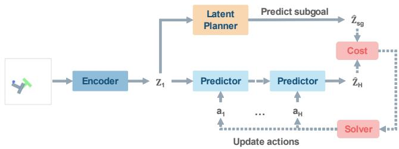
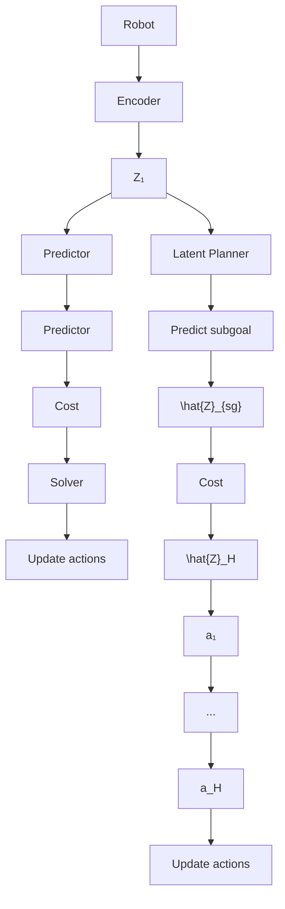
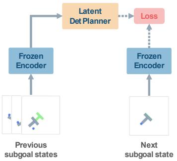
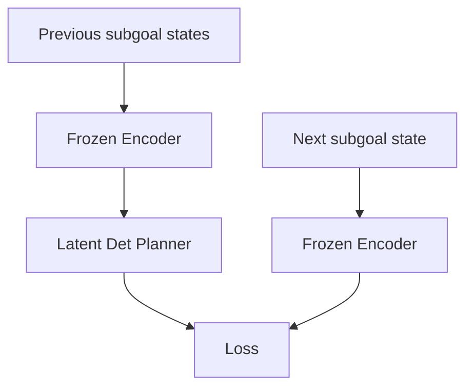
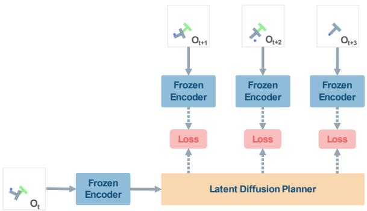
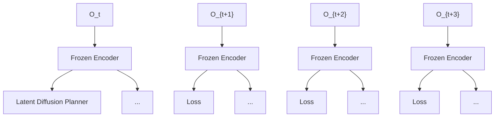
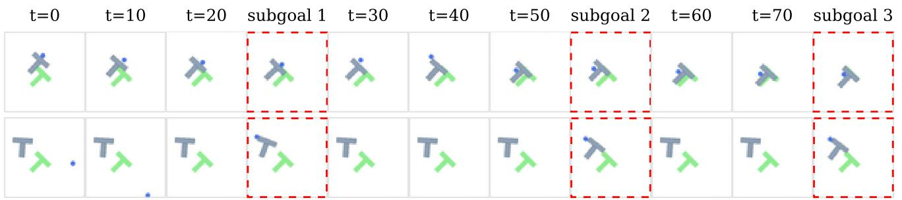
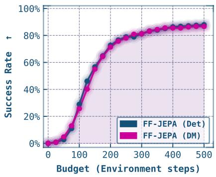
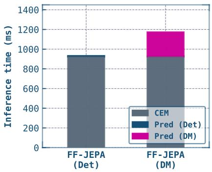

# FF-JEPA: Long-Horizon Planning in World Models with Latent Planners

Sergi Masip†, Jonathan Swinnen†, Yutong Hu§, Renaud Detry†§, and Tinne Tuytelaars†

†PSI, ESAT, KU Leuven §RAM, MECH, KU Leuven

{sergi.masipcabeza, jonathan.swinnen, yutong.hu, renaud.detry, tinne.tuytelaars}@kuleuven.be

flowchart

Fig. 1: A conceptual visualization of planning with our approach. Given the latent of the current observation or a history of observations, the latent planner G predicts the next subgoal latent for the world model. This subgoal is then used during the rollout of the predictor P to optimize the action sequence. This enables inference with world models without the need for a goal image.

Abstract—Joint Embedding Predictive Architectures (JEPAs) have shown promising world modeling capabilities, enabling planning in latent space by optimizing action trajectories using methods like the Cross-Entropy Method (CEM). These methods are, however, too computationally expensive and ineffective for long-horizon planning. Furthermore, these methods typically require an explicit image of the goal state, which is not always possible in real-world tasks. In this work, we tackle these limitations by proposing Forward-Forward-JEPA (FF-JEPA), a hierarchical approach leveraging two forward dynamics models. Alongside a standard action-conditioned forward model, we introduce an action-free latent planner that predicts the next subgoal given the current state. This approach removes the need for goal images and enables long-horizon planning by decomposing complex trajectories into a sequence of tractable, short-term optimization problems. Preliminary results on PushT demonstrate that FF-JEPA successfully overcomes flat world models’ long-horizon collapse, highlighting this approach as a promising direction for goal-free planning.

## I. INTRODUCTION

Learning world models that enable agents to plan and act in complex environments has become a trend in modern reinforcement learning and robotics. Recent advances in visual world models, such as LeWorldModel [5], DINO-based world models [13], and related architectures, have demonstrated promising capabilities in predicting future observations and supporting model-based control. These approaches learn latent dynamics that allow agents to “imagine” trajectories and optimize actions via sampling-based planners such as the Cross-Entropy Method (CEM) [8]. Despite this progress, two key limitations hinder their deployment in real-world, longhorizon tasks. First, planning over long horizons remains computationally prohibitive due to the need for repeated rollouts and the compounding of prediction errors. Second, most existing approaches require an explicit goal specification in the form of a target image or state, which is often unavailable or impractical in real-world scenarios.

A growing body of work has attempted to address the long-horizon planning problem through hierarchical decomposition or more efficient imagination. For example, hierarchical foresight methods generate intermediate subgoals to break tasks into manageable segments [6, 11]. More recent approaches improve planning efficiency by reducing the cost of latent rollouts, for instance via sparse imagination over subsets of visual tokens [3]. Generative approaches have also been proposed to guide planning. For example, Ziakas et al. [14] leverage video generation models to propose feasible trajectories. However, despite these advances, such methods still operate in pixel space or rely on externally specified goal images or trajectories, limiting their applicability in openended environments.

Closer to our approach, recent work has revisited the role of inverse dynamics models and their interaction with forward models. Predictive inverse dynamics models (PIDMs) like latent diffusion planning [10] train an action-free forward dynamics model and an inverse dynamics model separately, enabling training of the latent planner on unlabelled trajectories. PIDMs have also been shown to require fewer demonstrations to reach comparable performance to standard behavior cloning [9]. From a vision-language-action perspective, Zhang et al. [12] disentangle the pretraining of forward and inverse dynamics models to improve representation learning and downstream control. These perspectives suggest an alternative view in which the planner operates over predicted future states, rather than directly mapping observations to actions.

In this work, we propose forward-forward JEPA (FF-JEPA), a unified framework that bridges world models, forward prediction, and inverse dynamics inference to enable goal-directed behavior without requiring explicit goal images. Leveraging a pretrained world model [5], we train an action-free forward model within the world model’s latent space, referred to as the latent planner. This planner forecasts trajectories toward implicitly defined objectives. Rather than learning a separate control policy, we repurpose the world model as an inference engine to extract action sequences through sampling-based optimization. In contrast to prior approaches, we reinterpret the world model as an inverse dynamics module operating over imagined latent trajectories, effectively unifying predictive modeling and control within a single, coherent latent space. Our framework addresses the challenges of long-horizon planning and the reliance on explicit goal observations in current world models. This positions our approach as an alternative towards policies that do not strictly require action-labeled demonstrations; if a pretrained world model is available, the latent planner can be trained on unlabeled data.

flowchart

(a) Latent deterministic planner

flowchart

(b) Latent diffusion planner  
Fig. 2: Training schemes for the two architectures we evaluated. Both models are trained on the latent space defined by the world model’s frozen encoder.

## II. METHOD

## A. Preliminaries: JEPA-style world models

We build our method on top of the LeWM JEPA world model [5], which consists of an encoder E and a forward dynamics predictor P . Given an observed frame $\mathbf { o } _ { t } ,$ , the encoder produces a latent state $\mathbf { z } _ { t } ~ = ~ E ( \mathbf { o } _ { t } )$ . The predictor takes a sliding window of at most WP consecutive latent states and outputs the next predicted state:

$$
\hat {\mathbf {z}} _ {t + 1} = P (\mathbf {z} _ {t - W _ {P} + 1: t}, \mathbf {a} _ {t}),
$$

where $\mathbf { a } _ { t }$ is the action taken at time t. In other words, $P$ is an action-conditioned forward dynamics model that predicts how an action transforms the environment state in latent space.

The world model can in principle be used for goalconditioned planning. Given an initial observation $\mathbf { o } _ { 1 }$ and a goal observation ${ \mathbf { o } } _ { g }$ , we encode both as ${ \bf z } _ { 1 } ~ = ~ E ( { \bf o } _ { 1 } )$ and ${ \bf z } _ { g } = E ( { \bf o } _ { g } )$ , and search for a sequence of H actions $\widehat { \mathbf { a } } _ { 1 : H }$ that drives the predicted state towards the goal:

$$
\hat {\mathbf {a}} _ {1: H} = \arg \min _ {\mathbf {a} _ {1: H}} \| \mathbf {z} _ {g} - P _ {\mathrm{AR}} (\mathbf {z} _ {1}, \mathbf {a} _ {1: H}) \| _ {2} ^ {2},
$$

where $P _ { \mathrm { A R } } ( \mathbf { z } _ { 1 } , \mathbf { a } _ { 1 : t } )$ denotes the process of autoregressively applying $P$ to obtain the predicted state t steps in the future, and the optimization is carried out with CEM [8].

## B. Motivation

This flat planning scheme has three key limitations. First, the goal must be reachable within a fixed horizon H: longer trajectories require increasing H, which makes CEM optimization prohibitively expensive. Second, errors compound over many autoregressive steps, causing CEM to diverge for complex trajectories. Third, requiring a concrete goal image ${ \mathbf { o } } _ { g }$ upfront is often impractical in real-world tasks. We address all three issues with the hierarchical approach described next.

## C. Forward-Forward JEPA (FF-JEPA)

a) Subgoal planner: We introduce a latent planner G that operates one level above the world model. Every H steps, G predicts the next subgoal state $\hat { \mathbf { z } } _ { s g }$ directly in the encoder’s latent space:

$$
\hat {\mathbf {z}} _ {s g, m + 1} = G \left(\mathbf {z} _ {s g, m - W _ {G} + 1: m}\right),
$$

where m indexes subgoals (in our experiments, each separated by H environment steps), and $W _ { G }$ is the planner’s context window. Crucially, G is action-free: it predicts future subgoals purely from latent observations, without requiring a known final goal or an additional layer of CEM search over the full trajectory like in Zhang et al. [11]. The world model P then uses CEM to find the actions that reach each subgoal within H steps (section II-A, with $\mathbf { z } _ { g }$ replaced by $\hat { \mathbf { z } } _ { s g , m + 1 } )$ . This inference scheme is summarized in fig. 1.

b) Training: The latent planner is trained on latent representations of successful demonstrations computed by the frozen, pre-trained world model’s encoder E. Subgoal states $\mathbf { z } _ { s g , m }$ are obtained by subsampling each demonstration with stride H. We experiment with two architectures for G as illustrated in fig. 2.

• Deterministic planner $G _ { \mathrm { D e t } } .$ . This is a transformer with the same architecture as the LeWM’s predictor P but without action conditioning. It is trained to minimize the mean-squared error between the predicted and true next subgoal at H steps in the future, given a sliding context window of size $W _ { G }$ past subgoals:

$$
\hat {\mathbf {z}} _ {s g, m + 1} = G _ {\mathrm{Det}} \left(\mathbf {z} _ {s g, m - W _ {G} + 1: m}\right),
$$

$$
\mathcal {L} _ {\mathrm{Det}} = \left\| \hat {\mathbf {z}} _ {s g, m + 1} - \mathbf {z} _ {s g, m + 1} \right\| _ {2} ^ {2}.
$$

• Diffusion planner $G _ { \mathrm { D M } }$ . This architecture uses a DiT backbone [7] and is trained with a standard denoising score-matching objective over a predicted horizon of N future subgoals, similar to Xie et al. [10]. Let $k \in \{ 1 , \ldots , K \}$ denote the diffusion denoising step. The training objective is:

$$
\mathcal {L} _ {\mathrm{DM}} (\psi) = \mathbb {E} _ {k, \epsilon} \left[ \left\| \epsilon_ {\psi} \left(\mathbf {z} _ {s g, m + 1: m + N} ^ {(k)}; \mathbf {z} _ {s g, m}, k\right) - \epsilon \right\| ^ {2} \right],
$$

where ϵ denotes the added gaussian noise, and $\epsilon _ { \psi }$ is the denoising model.

c) Summary: By introducing a latent planner $G ,$ we obtain a policy that decomposes long trajectories into a sequence of short subproblems that the world model can reliably solve with CEM, without requiring known goal images or a prohibitively large planning horizons.

## III. EMPIRICAL EVALUATION OF FF-JEPA

## A. Experimental setup

We train both planners for 20 epochs on a filtered subset of the demonstrations provided in Maes et al. [5] which keeps only successful episodes. We set the planning horizon $H = 2 5$ for both architectures. We use a window size $W _ { G } = 3$ for the deterministic planner, and no sliding window $( W _ { G } = 1 )$ for the diffusion planner. The diffusion planner predicts $N =$ 3 steps in the future during the forward pass. To implement our experiments, we use the stable-pretraining [1] and stableworldmodel libraries [4].

We also evaluate the flat LeWM without additional planner as a baseline. We perform three experiments on the Push-T task with increasing horizon windows:

• Short-horizon planning: We evaluate our method using the common 25-step planning horizon setting [13, 5], with one important nuance: we consider only the final 25 steps of each trajectory, such that the last frame—where the Tpiece reaches its target position—serves as the goal state. The goal state image is used only by the flat LeWM baseline. We set the evaluation budget to 50 steps.  
• Long-horizon planning: We follow the same setup as in short-horizon but consider the last 75 steps like Zhang et al. [11] and set the evaluation budget to 150 steps.  
• Random initialization: We further test generalization to more realistic scenarios by not relying on the starting positions provided in the dataset from which it is known the target is reachable within a set amount of steps. Instead, we randomize the starting position. For LeWM, which needs an image of a goal state, we pick a final position of some random successful episode from the dataset. We increase the evaluation budget to 300 steps.

With both latent planners, we select the immediately next predicted subgoal and replan every 25 environment steps. For each experiment, we measure the success rate over a total of 256 episodes. We consider an episode successful when the T block ends up in the correct position up to a small error margin (the block is within 20 pixels of the target x/y position and within $5 ^ { \circ }$ of the target angle). Episodes that do not reach the desired target position within the amount of steps set by the evaluation budget are considered unsuccessful.

TABLE I: Task performance comparison across different models and planning horizons (t). Values represent success rate across 256 environments. Note that all the baselines require a goal image to do inference, whereas our approach does not. \*Results as reported in Zhang et al. [11], which do not incorporate our evaluation protocol variation.

<table><tr><td>Model</td><td>Short (t = 25)</td><td>Long (t = 75)</td><td>Random Init.</td></tr><tr><td colspan="4">Baselines</td></tr><tr><td>DINO*</td><td>84.0%</td><td>17.0%</td><td>—</td></tr><tr><td>DINO (Hierarchy)*</td><td>89.0%</td><td>61.0%</td><td>—</td></tr><tr><td>LeWM [5]</td><td>94.53%</td><td>3.52%</td><td>0.00%</td></tr><tr><td colspan="4">Ours</td></tr><tr><td>FF-JEPA (Det)</td><td>76.95%</td><td>88.67%</td><td>81.25%</td></tr><tr><td>FF-JEPA (DM)</td><td>96.09%</td><td>91.80%</td><td>82.42%</td></tr></table>

## B. Enabling long-horizon planning in world models

As shown in table I, flat LeWM collapses on long-horizon tasks (3.52%SR for t = 75 steps) and completely fails under random initialization, highlighting the limitations of singlelevel CEM planning. FF-JEPA addresses both failure modes, with the diffusion planner (DM) achieving 91.80% at $t = 7 5$ and 82.25% from a random initialization, tasks the baseline cannot solve at all.

The deterministic predictor (Det) achieves a comparable success rate for random initializations, but lags behind in the shorter-term settings. This worse performance might be due to it being trained with a context window of 3 past subgoals. In short-term settings with low evaluation budgets, this context window is not fully used, potentially reducing the reliability of the predictor. The diffusion predictor does not have this issue, as it does not rely on a window of past subgoals.

While not directly comparable, we have also included the results for DINO-WM reported in Zhang et al. [11]. Compared to the hierarchical DINO-WM baseline, FF-JEPA (DM) achieves competitive short-horizon performance (96.09% vs. 89.0%) and stronger long-horizon performance (91.80% vs. 61.0%), despite not requiring a goal image at inference time.1

## C. Ablations

a) Success rate vs. planning budget: Figure 4 shows success rate as a function of planning budget for the two models, given random initial environments. Both models show similar performance, with most environments solved within a moderate budget of around 250 steps, after which the curve stabilizes. This suggests that the remaining failures stem from subgoal prediction errors rather than insufficient planning.  
b) Demonstration quality: To assess the effect of demonstration quality, we train the latent diffusion planner on only 200 demonstrations selected by tightening the success filter for 250 epochs and evaluate on the random initialization setting.

text_image

t=0
t=10
t=20
subgoal 1
t=30
t=40
t=50
subgoal 2
t=60
t=70
subgoal 3
T
T
T
T
T
T
T
T
T

Fig. 3: Example trajectories produced by FF-JEPA (DM). Dashed red frames indicate subgoals predicted by the latent diffusion planner and decoded for visualization. The first row corresponds to a successful trajectory, while the second row is a failure case where the agent goes out of bounds at t=10 and never recovers.

line chart

| Budget (Environment steps) | FF-JEPA (Det) | FF-JEPA (DM) |
| -------------------------- | ------------- | ------------ |
| 0                          | 0%            | 0%           |
| 100                        | 40%           | 40%          |
| 200                        | 70%           | 70%          |
| 300                        | 85%           | 85%          |
| 400                        | 90%           | 90%          |
| 500                        | 95%           | 95%          |

Fig. 4: Success rate vs. planning budget.

TABLE II: Demonstration quality ablation for FF-JEPA (DM) on the random initialization setting. Success rate across 256 environments.

<table><tr><td>Model</td><td>Train episodes</td><td>Train iter.</td><td>Random Init. SR</td></tr><tr><td>FF-JEPA (DM)</td><td>8318</td><td>157320</td><td>82.42%</td></tr><tr><td>FF-JEPA (DM)</td><td>200</td><td>47750</td><td>76.17%</td></tr></table>

As shown in Table II, performance remains competitive despite the 40× reduction in training data, suggesting that a small set of high-quality demonstrations can substitute for a much larger but noisier dataset. This is particularly noteworthy given that diffusion policies trained on datasets of this scale are commonly used as strong baselines in imitation learning [2].

## D. Latent planner overhead

TABLE III: Parameter count for each module.

<table><tr><td>LeWM</td><td> $G_{\text{Det}}$  (total)</td><td> $G_{\text{DM}}$  (total)</td></tr><tr><td>18M</td><td>9.5M (27.5M)</td><td>50.1M (68.1M)</td></tr></table>

Table III shows the parameter overhead introduced by each variant of the latent planner. Fig. 5 reports the inference overhead introduced by each planner relative to CEM, as measured on an NVIDIA RTX 5070Ti GPU. The deterministic planner adds negligible parameter (9.5M parameters) and inference overhead (2.1±0.1 ms vs. 926.6±45.5 ms for CEM), while the diffusion planner adds a more substantial 50.1M and 242.6 ± 12.2 ms, making the deterministic planner a powerful yet lightweight choice for long-horizon tasks.

stacked bar chart

| Model | CEM (ms) | Pred (Det) (ms) | Pred (DM) (ms) |
| :--- | :--- | :--- | :--- |
| FF-JEPA (Det) | 940 | 0 | 0 |
| FF-JEPA (DM) | 920 | 0 | 250 |

Fig. 5: Inference time overhead for each architecture for one planning cycle of 25 environment steps. We show the average of 10 measurements taken during model execution.

## E. Analysis of failure cases

The bottom row of fig. 3 illustrates a common failure case of FF-JEPA, where the subgoal seems to be correct, but the agent drifts away. We suspect that this happens when the agent position is too far away from the predicted agent’s position in the subgoal. Other observed failure cases seem to happen when the latent planner generates a subgoal state that does not include the agent or is of bad quality.

## IV. CONCLUSIONS

We have presented FF-JEPA, a hierarchical planning framework that extends JEPA-style world models with a latent planner to address long-horizon planning without requiring goal images. By decomposing trajectories into short subproblems, FF-JEPA overcomes the compounding errors and computational cost of flat CEM planning. Preliminary experiments on PushT have demonstrated strong performance in long-horizon and random initialization settings where standard LeWM fails, suggesting that action-conditioned world models paired with latent planners trained on unlabeled demonstrations are a promising direction for scalable, goal-free robot learning.

## ACKNOWLEDGMENTS

We want to thank Zehao Wang and Minye Wu for their feedback. This paper has received funding from the Flemish Government under the Methusalem Funding Scheme (grant agreement n° METH/24/009).

## REFERENCES

[1] Randall Balestriero, Hugues Van Assel, Sami BuGhanem, and Lucas Maes. stable-pretrainingv1: Foundation model research made simple. arXiv preprint arXiv:2511.19484, 2025.  
[2] Cheng Chi, Zhenjia Xu, Siyuan Feng, Eric Cousineau, Yilun Du, Benjamin Burchfiel, Russ Tedrake, and Shuran Song. Diffusion policy: Visuomotor policy learning via action diffusion. The International Journal of Robotics Research, 44(10-11):1684–1704, 2025.  
[3] Junha Chun, Youngjoon Jeong, and Taesup Kim. Sparse imagination for efficient visual world model planning, 2026. URL https://arxiv.org/abs/2506.01392.  
[4] Lucas Maes, Quentin Le Lidec, Luiz Facury, Nassim Massaudi, Ayush Chaurasia, Francesco Capuano, Richard Gao, Taj Gillin, Dan Haramati, Damien Scieur, Yann LeCun, and Randall Balestriero. stable-worldmodel: A platform for reproducible world modeling research and evaluation, 2026. URL https://arxiv.org/abs/2605.21800.  
[5] Lucas Maes, Quentin Le Lidec, Damien Scieur, Yann LeCun, and Randall Balestriero. Leworldmodel: Stable end-to-end joint-embedding predictive architecture from pixels. arXiv preprint arXiv:2603.19312, 2026.  
[6] Suraj Nair and Chelsea Finn. Hierarchical foresight: Selfsupervised learning of long-horizon tasks via visual subgoal generation. In International Conference on Learning Representations, 2020. URL https://openreview.net/ forum?id=H1gzR2VKDH.  
[7] William Peebles and Saining Xie. Scalable diffusion models with transformers. In Proceedings of the IEEE/CVF International Conference on Computer Vision (ICCV), pages 4195–4205, October 2023.  
[8] Reuven Y Rubinstein and Dirk P Kroese. The crossentropy method: a unified approach to combinatorial optimization, Monte-Carlo simulation, and machine learning, volume 133. Springer, 2004.  
[9] Lukas Schafer, Pallavi Choudhury, Abdelhak Lemkhen- ¨ ter, Chris Lovett, Somjit Nath, Luis Franc¸a, Matheus Ribeiro Furtado de Mendonc¸a, Alex Lamb, Riashat Islam, Siddhartha Sen, John Langford, Katja Hofmann, and Sergio Valcarcel Macua. When does predictive inverse dynamics outperform behavior cloning?, 2026. URL https://arxiv.org/abs/2601.21718.  
[10] Amber Xie, Oleh Rybkin, Dorsa Sadigh, and Chelsea Finn. Latent diffusion planning for imitation learning. In Aarti Singh, Maryam Fazel, Daniel Hsu, Simon Lacoste-Julien, Felix Berkenkamp, Tegan Maharaj, Kiri Wagstaff, and Jerry Zhu, editors, Proceedings of the 42nd International Conference on Machine Learning, volume 267 of Proceedings of Machine Learning Research, pages  
68710–68724. PMLR, 13–19 Jul 2025. URL https: //proceedings.mlr.press/v267/xie25h.html.  
[11] Wancong Zhang, Basile Terver, Artem Zholus, Soham Chitnis, Harsh Sutaria, Mido Assran, Randall Balestriero, Amir Bar, Adrien Bardes, Yann LeCun, and Nicolas Ballas. Hierarchical planning with latent world models, 2026. URL https://arxiv.org/abs/2604.03208.  
[12] Wenyao Zhang, Bozhou Zhang, Zekun Qi, Wenjun Zeng, Xin Jin, and Li Zhang. Disentangled robot learning via separate forward and inverse dynamics pretraining. In The Fourteenth International Conference on Learning Representations, 2026. URL https://openreview.net/ forum?id=DdrsHWobR1.  
[13] Gaoyue Zhou, Hengkai Pan, Yann Lecun, and Lerrel Pinto. Dino-wm: World models on pre-trained visual features enable zero-shot planning. In International Conference on Machine Learning, pages 79115–79135. PMLR, 2025.  
[14] Christos Ziakas, Amir Bar, and Alessandra Russo. Grounding generated videos in feasible plans via world models, 2026. URL https://arxiv.org/abs/2602.01960.