# Latent Spatial Memory for Video World Models

Weijie Wang1,∗ Haoyu Zhao1,∗ Yifan Yang2 Feng Chen3 Zeyu Zhang1 Yefei He1 Zicheng Duan3 Donny Y. Chen4 Yuqing Yang2 Bohan Zhuang1

1 Zhejiang University 2 Microsoft Research 3 Adelaide University 4 Monash University

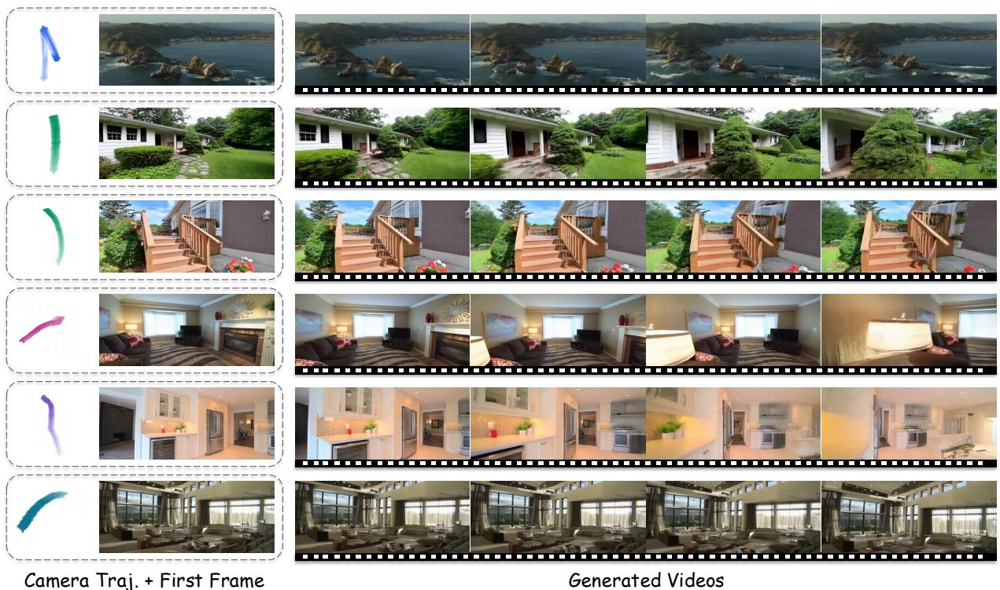  
Figure 1 Geometrically consistent videos generated by Mirage with latent spatial memory. Given a single input image and a user-specified camera trajectory (left), Mirage preserves spatial consistency by caching 3D information directly in the latent space, rather than as an RGB-colored point cloud. This design enables memory queries through a single latent-resolution projection, avoiding the costly rasterize-and-encode round trip required by prior RGB point-cloud memories. Consequently, Mirage can faithfully return to previously observed regions even after large camera detours, while achieving up to 10.57× faster end-to-end video generation and 55× lower GPU memory usage than RGB-cache baselines.

Abstract. Video world models that maintain 3D spatial consistency across generated frames typically rely on explicit point cloud memory constructed in RGB space. This design is both computationally expensive, requiring repeated rendering and VAE encoding, and inherently lossy, as the round trip through pixel space discards rich features of the learned latent representation. In this paper, we introduce latent spatial memory for video world models, a persistent 3D cache that stores scene information directly in the diffusion latent space, avoiding pixel-space reconstruction. Building on this, we propose Mirage, a latent-space spatial memory framework that constructs the memory by lifting latent tokens into 3D via depth-guided back-projection and queries it by synthesizing novel views through direct latent-space warping. This unified formulation eliminates both the information loss of pixel-space reconstruction and the computational burden of repeated encoding and rendering. Experiments show that latent spatial memory achieves up to 10.57× faster end-to-end video generation and 55× reduction in memory footprint relative to explicit 3D baselines. Leveraging the geometric prior of the diffusion model, Mirage attains state-of-the-art performance on WorldScore and strong reconstruction quality on RealEstate10K.

Project Page: aka.ms/latent-spatial-memory

Keywords: Video Generation, Spatial Memory, 3D-consistent Video Generation, Video World Models

Date: June 8, 2026

## 1 Introduction

Large-scale video diffusion models [1–5] have demonstrated remarkable ability to synthesize photorealistic sequences, motivating their use as world simulators that internalize visual dynamics and generate plausible future observations conditioned on camera trajectories or actions [6–10]. A central challenge in this paradigm is maintaining 3D spatial consistency: without explicit spatial memory, even powerful generators accumulate geometric drift, producing frames that are individually convincing but collectively inconsistent when projected into a shared world coordinate system.

A natural remedy is to equip the generator with a persistent 3D representation that tracks what has been observed. As shown in Fig 2, recent world-generation systems [11–19] adopt this strategy by maintaining an explicit point cloud in RGB space which is rendered and reencoded at every step. While effective at enforcing multi-view consistency, this pipeline introduces two fundamental bottlenecks. First, the repeated round trip between latent and pixel space is computationally prohibitive, as rendering millions of colored points at full resolution and re-encoding them dominates wall-clock time. Second, the RGB detour does not preserve the model’s native latent conditioning features. RGB point-cloud memories render a target-view image and then re-encode it into a latent tensor, producing a surrogate conditioning signal that may be distorted by VAE reconstruction error, rasterization artifacts, and distribution mismatch.

To address these bottlenecks, we propose latent spatial memory, a persistent 3D cache that stores the diffusion model’s latent features at world-space locations instead of RGB colors. As illustrated in Fig. 2, an observed frame is first encoded into a VAE latent tensor, and each latent-grid cell is lifted into 3D by depth-guided back-projection. Each memory element thus pairs a world-space coordinate with the corresponding full-channel latent token. At readout time, the cache is projected directly onto the target camera grid at latent resolution with depth-aware visibility handling, yielding a target-view latent tensor in the same space consumed by the diffusion backbone. This avoids both pixel-resolution rendering of the cache and per-step VAE encoding of the rendered image, eliminating the two main bottlenecks of RGB point-cloud memories.

Building on this representation, we present Mirage, a video world model that generates long, geometrically consistent rollouts chunk by chunk through an initialize-readout-update latent memory cycle as shown in Fig 3. First, Mirage initializes the latent spatial memory by encoding the initial frame and back-projecting its latent tokens into the 3D cache via depth-guided lifting [20– 24]. For each subsequent chunk, it reads from memory by projecting the cache onto every target camera pose, producing latent-space feature tensors that are injected into the diffusion backbone through a ControlNet-style side branch [25]. After decoding the denoised latents into output frames, Mirage updates the memory by estimating depth, segmenting dynamic objects [26], reencoding the frames into clean latent features, and back-projecting them into the cache to preserve geometric coherence. This cycle repeats over chunks to support long-horizon generation.

Extensive experiments validate the benefits of latent spatial memory in both generation quality and efficiency. Across WorldScore [27, 28] and RealEstate10K [29], Mirage achieves state-of-the-art or competitive performance against strong 3D-aware, RGB-cache, and video-generation baselines. At the same time, end-to-end video generation is up to 10.57× end-to-end faster and uses up to 55× less GPU memory in 3D cache than RGB point-cloud readout, making world-consistent generation practical for long trajectories. Our contributions can be summarized as follows:

• We introduce latent spatial memory, the 3D memory for video world models that operates entirely in latent space, avoiding pixel-space conversion.  
• We propose Mirage, a video world model built around latent spatial memory, with depth-guided back-projection for construction, occlusion-aware readout at latent resolution, and iterative refinement with dynamic object exclusion.

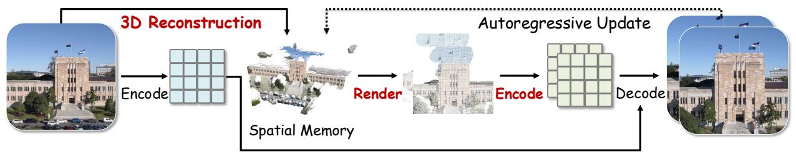

flowchart

Spatial Memory for Video World Models

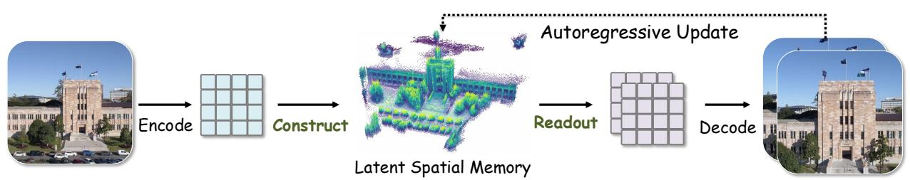

flowchart

Latent Spatial Memory for Video World Models (Ours)  
Figure 2 Latent spatial memory vs. RGB point cloud based memory for world model. Top: prior systems store memory as colored points and pay a rasterise-and-encode round trip at every conditioning step. Bottom: latent spatial memory stores latent features at world-space location and reads them back through a single latent-resolution projection, eliminating the per-step pixel-space detour and shrinking the cache footprint by the squared VAE compression factor.

• Our method achieves state-of-the-art world generation on WorldScore and competitive novel view synthesis on RealEstate10K, with up to 10.57× in end-to-end speedup and 55× in memory reduction.

## 2 Related Work

## 2.1 Video Diffusion Models

The diffusion and flow-matching frameworks [30, 31] have rapidly advanced from high-fidelity image synthesis to temporally coherent video generation. Early video diffusion methods extended image architectures by interleaving temporal attention or 3D convolution layers to capture inter-frame dependencies [5, 32, 33], while later systems scaled this paradigm to photorealistic, multi-second outputs through large-scale pretraining on diverse video corpora [1, 3, 4, 34–36]. A common strategy is to operate within a compressed VAE latent space, which significantly reduces the computational cost of the denoising process and enables generation at higher resolutions and longer durations [2, 5, 37]. More recently, Diffusion Transformers [38] have become the dominant backbone, and various autoregressive and streaming extensions have been proposed to generate longer sequences [39–43]. Despite these advances, most video diffusion models treat the generation process as fundamentally two-dimensional, in that frames are synthesized sequentially or in parallel without an explicit model of the underlying 3D scene geometry. As a consequence, generated videos frequently exhibit geometric drift, parallax violations, and inconsistent scene structure when subjected to large camera motions or extended temporal horizons.

## 2.2 Camera-controllable Video Generation

A parallel line of work seeks to condition video diffusion models on explicit camera trajectories to enable controllable viewpoint changes. Representative methods inject camera pose information through additional control modules [44–47], epipolar attention mechanisms [48, 49], or 3D-aware rendering signals fed as conditioning inputs [50–52]. While these approaches offer fine-grained camera control within a single generation pass, they do not maintain a persistent scene representation across generation steps. Each clip is generated independently of previously synthesized content, so revisiting a region or extending a trajectory beyond the context window of the model may introduce inconsistencies. The absence of a shared spatial memory limits their applicability to long-horizon, exploratory world generation where 3D coherence must be preserved across many sequential generation rounds.

## 2.3 Spatial Memory for Video Generation

To maintain spatial consistency, a growing body of work augments video diffusion pipelines with explicit spatial memory structures that maintain a 3D scene representation across generation steps. A representative strategy is to lift observed or generated RGB frames into point clouds using estimated depth, accumulate them into a persistent 3D cache, and render target-view conditioning images at each step [11–14, 53, 54]. More recent systems further incorporate long-term context retrieval [55, 56] or surfel-indexed view memory [57] to improve temporal consistency over extended sequences. Such memory-based approaches have demonstrated clear improvements in multi-view coherence, since the 3D cache anchors each new frame to a shared geometric scaffold. Nevertheless, existing spatial memory designs operate entirely in RGB pixel space, which is both computationintensive and is vulnerable to accumulated errors in repeated encoding-decoding operations. These limitations motivate our approach, which constructs and queries spatial memory entirely within the latent space of the diffusion model, preserving representational fidelity while eliminating the rendering and re-encoding overhead that constrains prior methods.

## 3 Preliminaries

A video world model synthesizes a multi-view-consistent sequence $\{ I ^ { t } \} _ { t = 1 } ^ { T }$ from an initial frame $I ^ { 0 }$ and a camera trajectory $\{ ( \mathbf { E } ^ { t } , K ^ { t } ) \}$ }, where $\mathbf { E } ^ { t }$ and $K ^ { t }$ are the extrinsics and intrinsics of frame t. Modern systems build on a pretrained video diffusion backbone that operates in the latent space of a VAE with encoder $\mathcal { E } _ { : }$ , decoder D, spatial stride s, and latent channel count $C .$ Generation proceeds autoregressively over the overlapping chunk of latent frames, each denoised from Gaussian noise conditioned on its predecessors. Although effective for short clips, this autoregressive scheme conditions only on a small temporal context, so that information about earlier observations gradually fades as the rollout advances. As a consequence, geometric drift accumulates whenever the camera revisits a previously observed region: the same physical surface may reappear at a different position, with inconsistent texture, or with altered scene layout, breaking the multi-view consistency that downstream applications rely on [2, 4].

A common remedy is to attach a persistent RGB point cloud [11–13]

$$
\mathcal {M} _ {\mathrm{rgb}} = \left\{\left(\mathbf {p} _ {i}, \mathbf {c} _ {i}\right) \right\}, \quad \mathbf {p} _ {i} \in \mathbb {R} ^ {3}, \mathbf {c} _ {i} \in [ 0, 1 ] ^ {3}, \tag {1}
$$

that records the color $\mathbf { c } _ { i }$ of every observed surface point $\mathbf { p } _ { i }$ . The cache is initialized from $I ^ { 0 }$ through depth-guided back-projection and grown along the rollout, providing a long-term geometric scaffold that the autoregressive context alone cannot maintain. Conditioning on this 3D cache, however, forces a full pixel-space round trip at every target view: the cache is first rasterised into an RGB image at the target pose $( \mathbf { E } ^ { t } , K ^ { t } )$ ), and then re-encoded into a latent tensor $\hat { \mathbf { z } } ^ { t }$ that is supplied to the denoiser,

$$
\hat {\mathbf {z}} ^ {t} = \mathcal {E} \big (\mathrm{Rasterise} (\mathcal {M} _ {\mathrm{rgb}}; \mathbf {E} ^ {t}, K ^ {t}) \big), \tag {2}
$$

where Rasterise(·) denotes z-buffered projection followed by shading. This conditioning step introduces two major costs. First, the rasterizer and VAE encoder operate at pixel resolution, while the generator consumes latent-resolution tensors, making each read unnecessarily expensive and increasingly costly as the cache grows. Second, RGB readout must be re-encoded into a surrogate latent signal, which can deviate from the model’s native latent representation due to reconstruction error, rasterization artifacts, visibility holes, and distribution mismatch. Thus, storing memory in pixel space creates both computational and representation bottlenecks for a latent-space generator.

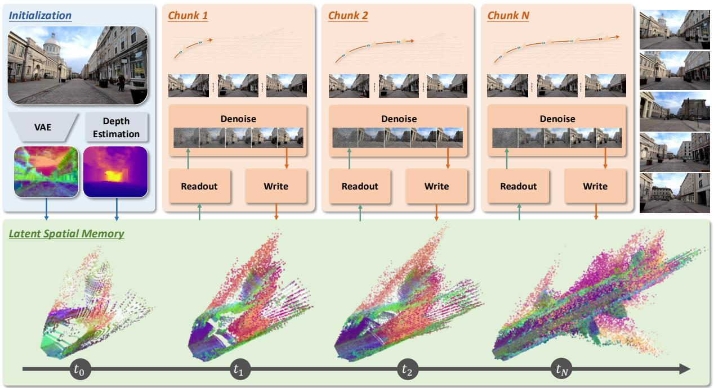

flowchart

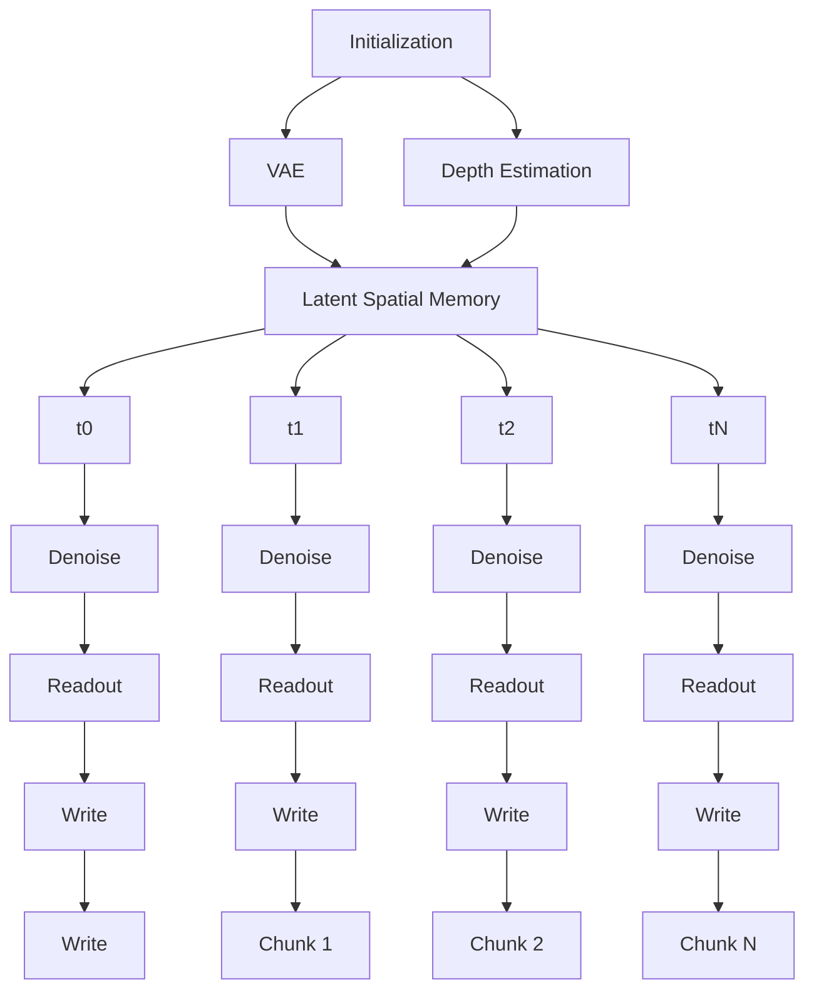

Figure 3 Overview of Mirage. Mirage initializes a 3D latent cache from $I _ { 0 }$ by encoding it into VAE latents and lifting them with depth-guided back-projection. At each target view, the cache is read through a latent-resolution projection, and generation proceeds chunk by chunk: each decoded output chunk is re-estimated for depth, re-encoded into latents, and back-projected to extend the cache.

## 4 Method

## 4.1 Overview

Mirage maintains a persistent latent cache M and generates videos by first initializing memory and then repeating a readout-update cycle over overlapping chunks, as illustrated in Figure 3. Initialization: the initial frame $I ^ { 0 }$ is encoded by encoder E and lifted into world space via depthguided back-projection, seeding M with one latent-attributed 3D point per latent cell (Section 4.2). Readout and denoising: For each chunk, M is projected onto the target camera grids at latent resolution, producing target-view latent feature tensors. These tensors are injected into the diffusion backbone through a ControlNet-style side branch, allowing the backbone to denoise the chunk entirely in latent space (Section 4.3). Cache update: the generated frames are re-encoded and back-projected to update M, with moving objects and sky excluded to preserve geometric coherence (Section 4.4). Crucially, M is queried directly in latent space, while pixel-space operations appear only during chunk-level cache update. This avoids the per-conditioning-step render-and-encode loop of RGB point cloud memories and reduces both readout cost and cache footprint by a factor of $s ^ { 2 }$ .

## 4.2 Latent Spatial Memory Initialization

We represent the memory as a set of latent-attributed 3D points

$$
\mathcal {M} = \left\{\left(\mathbf {p} _ {i}, \mathbf {f} _ {i}\right) \right\}, \quad \mathbf {p} _ {i} \in \mathbb {R} ^ {3}, \mathbf {f} _ {i} \in \mathbb {R} ^ {C}, \tag {3}
$$

where each point i pairs a world-space coordinate $\mathbf { p } _ { i }$ with latent feature $\mathbf { f } _ { i }$ drawn directly from the VAE encoder, matching the native input space of the diffusion backbone.

Construction. Given a frame with latent tensor $\mathbf { z } \in \mathbb { R } ^ { C \times h \times w }$ , metric depth map $D _ { : }$ intrinsics $K$ and camera pose E from a feed-forward reconstructor [20], we first downsample D to the latent grid and rescale K accordingly; in what follows we use D and K to refer to their latent-resolution versions. Each latent cell $( u , v )$ is then back-projected into world space, producing one memory element per cell:

$$
\mathbf {p} _ {u v} = \pi^ {- 1} (u, v, D (u, v); K, \mathbf {E}), \quad \mathbf {F} _ {u v} = \mathbf {z} [:, v, u ], \tag {4}
$$

where $\pi ^ { - 1 }$ denotes standard pinhole back-projection (Appendix A) and $\mathbf { F } _ { u v } \in \mathbb { R } ^ { C }$ denotes the latent token stored at the memory element anchored at $\mathbf { p } _ { u v }$ . The initial cache is seeded by applying $\operatorname { E q }$ . 4 to the encoded latent of $I ^ { 0 }$ , and is subsequently updated by the following autoregressive memory update.

## 4.3 Latent-space Memory Readout

Given a target view $( \mathbf { E } ^ { t } , K ^ { t } )$ , we query the latent memory $\mathcal { M }$ by projecting all memory points onto the target camera grid at latent resolution. For each target cell, we retain the frontmost projected point using z-buffering and retrieve its associated latent token:

$$
i ^ {t} (u, v) = \underset {i \in \Omega^ {t} (u, v)} {\arg \min} \left[ \mathbf {E} ^ {t} \mathbf {p} _ {i} \right] _ {z}, \quad \hat {\mathbf {z}} ^ {t} (u, v) = \mathbf {F} _ {i ^ {t} (u, v)}. \tag {5}
$$

Here $\Omega ^ { t } ( u , v )$ denotes the set of memory points that project to latent cell $( u , v )$ with positive depth under the target view $( \mathbf { E } ^ { t } , K ^ { t } )$ , and [·]z extracts the depth coordinate. Cells with $\Omega ^ { t } ( u , v ) = \emptyset$ are zero-filled. We also produce a binary visibility mask $\mathbf { m } ^ { t } \in \{ 0 , 1 \} ^ { h \times w }$ indicating which cells receive at least one projected point. This mask allows the denoiser to distinguish genuinely unseen regions from observed regions whose latent feature is zero.

This readout preserves the stored conditioning signal: when the cache is constructed from a source frame and queried from the same view, Eq. 5 retrieves the corresponding source-view latent tokens on visible cells, up to discretization and occlusion. To generate each chunk, the latent memory readouts $\hat { \mathbf { z } } ^ { t }$ and visibility masks $\mathbf { m } ^ { t }$ are concatenated and passed to a ControlNet-style side branch [25], which injects memory features into the video diffusion backbone. Besides, segment-aware rotary encodings [58] are also leveraged to mark noisy target, clean preceding, and clean reference frames in a single forward pass. Because the readouts already lie in the backbone’s latent space, no bridging encoder is needed, avoiding the rasterize-and-reencode step required by RGB-cache pipelines.

## 4.4 Autoregressive 3D Cache Update

After each chunk is generated, Mirage updates M with the newly observed static scene content. We estimate depth and camera parameters for the generated frames using a feed-forward reconstructor [20], re-encode the frames into clean VAE latents $\tilde { \mathbf { z } } ^ { t } = \mathcal { E } ( I ^ { t } )$ , and back-project the corresponding latent tokens into the cache using Eq. 4. Then, the updated memory can be denoted as:

$$
\mathcal {M} \leftarrow \mathcal {M} \cup \left\{\left(\mathbf {p} _ {u v}, \mathbf {F} _ {u v}\right) \right\} _ {(u, v) \in \Lambda^ {t}}, \tag {6}
$$

where $\Lambda ^ { t }$ contains latent cells with valid depth outside dynamic objects and sky regions, detected by an open-vocabulary entity extractor [59] and a video segmenter [26]. This filtering prevents transient or geometrically unreliable content from contaminating the persistent cache. The current chunk latents are also carried forward as short-term temporal context for the next chunk.

## 4.5 Efficient Adaptation to Existing Diffusion Models

We adapt a pretrained camera-controllable video diffusion transformer [2, 11] in two stages. In the first stage, we freeze the backbone and VAE and train only the ControlNet-style side branch, aligning latent memory readouts with the backbone feature space without perturbing the pretrained generative prior. In the second stage, we attach rank-64 LoRA adapters [60] to the self-attention projections and jointly optimize them with the side branch, enabling lightweight adaptation to the memory condition while preserving the backbone’s appearance and motion priors. Both stages use the flow-matching objective [30] on the target frames.

Table 1 Evaluation Results on WorldScore [27]. The Average Score column is the average of the Static Score and Dynamic Score, while the remaining metrics are computed by the WorldScore benchmark.

<table><tr><td>Method</td><td>Average Score</td><td>Static Score</td><td>Dynamic Score</td><td>Camera Ctrl</td><td>Object Ctrl</td><td>Content Align</td><td>3D Const</td><td>Photo Const</td><td>Style Const</td><td>Subject Quality</td><td>Motion Acc</td><td>Motion Mag</td><td>Motion Smooth</td></tr><tr><td colspan="14">Models with 3D Cache</td></tr><tr><td>WonderJourney [14]</td><td>54.19</td><td>63.75</td><td>44.63</td><td>84.60</td><td>37.10</td><td>35.54</td><td>80.60</td><td>79.03</td><td>62.82</td><td>66.56</td><td>-</td><td>-</td><td>-</td></tr><tr><td>InvisibleStitch [53]</td><td>51.95</td><td>61.12</td><td>42.78</td><td>93.20</td><td>36.51</td><td>29.53</td><td>88.51</td><td>89.19</td><td>32.37</td><td>58.50</td><td>-</td><td>-</td><td>-</td></tr><tr><td>WonderWorld [13]</td><td>61.79</td><td>72.69</td><td>50.88</td><td>92.98</td><td>51.76</td><td>71.25</td><td>86.87</td><td>85.56</td><td>70.57</td><td>49.81</td><td>-</td><td>-</td><td>-</td></tr><tr><td>Voyager [12]</td><td>66.08</td><td>77.62</td><td>54.53</td><td>85.95</td><td>66.92</td><td>68.92</td><td>81.56</td><td>85.99</td><td>84.89</td><td>71.09</td><td>-</td><td>-</td><td>-</td></tr><tr><td>FlashWorld [61]</td><td>60.23</td><td>70.85</td><td>49.60</td><td>84.43</td><td>50.28</td><td>56.54</td><td>85.87</td><td>86.72</td><td>79.36</td><td>52.75</td><td>-</td><td>-</td><td>-</td></tr><tr><td>LucidDreamer [62]</td><td>59.84</td><td>70.40</td><td>49.28</td><td>88.93</td><td>41.18</td><td>75.00</td><td>90.37</td><td>90.20</td><td>48.10</td><td>58.99</td><td>-</td><td>-</td><td>-</td></tr><tr><td>Spatia [11]</td><td>69.73</td><td>72.63</td><td>66.82</td><td>75.66</td><td>52.32</td><td>69.95</td><td>86.40</td><td>89.10</td><td>80.09</td><td>54.86</td><td>54.83</td><td>24.75</td><td>80.26</td></tr><tr><td colspan="14">General Video Models</td></tr><tr><td>VideoCrafter2 [33]</td><td>50.03</td><td>52.57</td><td>47.49</td><td>28.92</td><td>39.07</td><td>72.46</td><td>65.14</td><td>61.85</td><td>43.79</td><td>56.74</td><td>47.12</td><td>30.40</td><td>29.39</td></tr><tr><td>EasyAnimate [34]</td><td>52.25</td><td>52.85</td><td>51.65</td><td>26.72</td><td>54.50</td><td>50.76</td><td>67.29</td><td>47.35</td><td>73.05</td><td>50.31</td><td>75.00</td><td>31.16</td><td>40.32</td></tr><tr><td>Allegro [35]</td><td>53.64</td><td>55.31</td><td>51.97</td><td>24.84</td><td>57.47</td><td>51.48</td><td>70.50</td><td>69.89</td><td>65.60</td><td>47.41</td><td>54.39</td><td>40.28</td><td>37.81</td></tr><tr><td>CogVideoX-I2V [4]</td><td>60.64</td><td>62.15</td><td>59.12</td><td>38.27</td><td>40.07</td><td>36.73</td><td>86.21</td><td>88.12</td><td>83.22</td><td>62.44</td><td>69.56</td><td>26.42</td><td>60.15</td></tr><tr><td>Vchitect-2.0 [36]</td><td>40.38</td><td>42.28</td><td>38.47</td><td>26.55</td><td>49.54</td><td>65.75</td><td>41.53</td><td>42.30</td><td>25.69</td><td>44.58</td><td>33.59</td><td>33.81</td><td>21.31</td></tr><tr><td>LTX-Video [37]</td><td>55.99</td><td>55.44</td><td>56.54</td><td>25.06</td><td>53.41</td><td>39.73</td><td>78.41</td><td>88.92</td><td>53.50</td><td>49.08</td><td>76.22</td><td>29.95</td><td>71.09</td></tr><tr><td>Wan2.1 [2]</td><td>55.21</td><td>57.56</td><td>52.85</td><td>23.53</td><td>40.32</td><td>45.44</td><td>78.74</td><td>78.36</td><td>77.18</td><td>59.38</td><td>54.27</td><td>33.26</td><td>38.05</td></tr><tr><td>Mirage (Ours)</td><td>70.36</td><td>73.60</td><td>67.11</td><td>55.36</td><td>74.17</td><td>42.09</td><td>92.21</td><td>93.95</td><td>96.91</td><td>60.50</td><td>51.36</td><td>24.18</td><td>80.36</td></tr></table>

## 5 Experiments

## 5.1 Experimental Setup

Datasets and baselines. We train on a corpus of videos from RealEstate10K [29], with depth and camera poses [20, 63] and dynamic regions removed as in Sec. 4.4. Evaluation is performed on WorldScore [27, 28], which reports ten metrics covering controllability, consistency, quality, and motion, and on RealEstate10K, which provides paired ground truth for novel view synthesis and supports the closed loop protocol of Spatia [11]. On WorldScore we compare against RGB point cloud based scene generators [12–14, 53] and state of the art foundation video generators [2, 4, 11, 33– 37]. On RealEstate10K we additionally compare against the view memory baselines SEVA [49] and VMem [57], and against 3D aware video generators ViewCrafter [48] and FlexWorld [54].

Implementation and evaluation. Our backbone is Wan2.2-TI2V-5B [2], whose VAE has a compression ratio of $4 \times 1 6 \times 1 6$ and latent channel count $C = 4 8$ . Each generation chunk contains nine latent frames at resolution $4 4 \times 8 0$ , corresponding to 33 RGB frames at $7 0 4 \times 1 2 8 0$ . Training was conducted on 32 A100 GPUs with a global batch size of 64. The ControlNet-style side branch is initialized from its corresponding blocks of Wan2.2 and trained with an AdamW optimizer, bfloat16 mixed precision, and the flow-matching objective [30] on target frames. At inference, we use the UniPC flow scheduler with 40 sampling steps. We evaluate generation quality using the WorldScore Average Score and its constituent metrics, as well as PSNR, SSIM, LPIPS, and the closed-loop metrics $\mathrm { P S N R } _ { C } , \mathrm { S S I M } _ { C }$ , and $\mathrm { L P I P S } _ { C }$ on RealEstate10K following Spatia. Efficiency is measured on a single NVIDIA H100 with the wall-clock time and peak GPU memory for one cache read as rollout length increases.

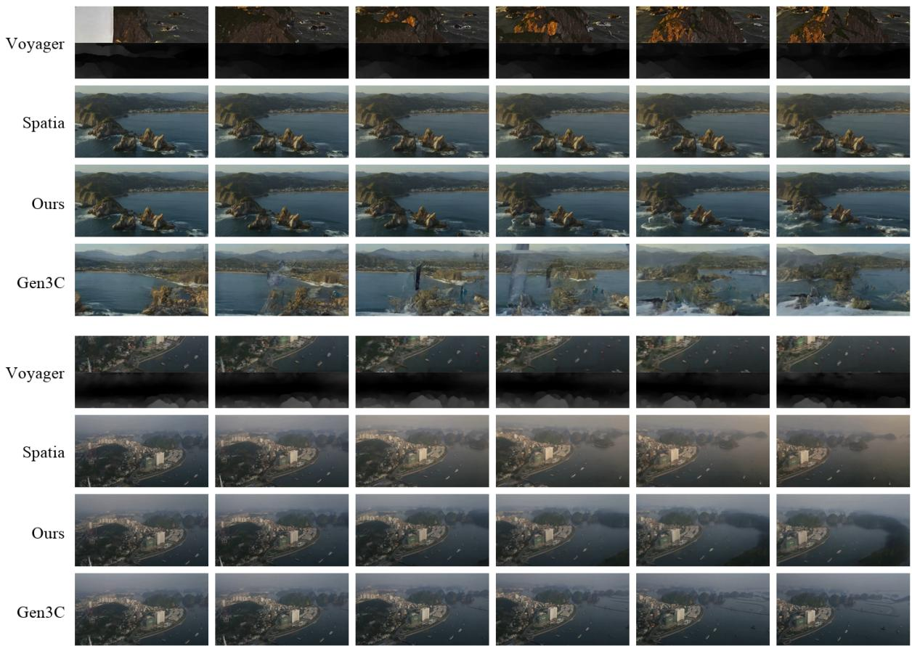

text_image

Voyager
Spatia
Ours
Gen3C
Voyager
Spatia
Ours
Gen3C

Figure 4 Open-domain video comparison. Generations on out-of-domain prompts spanning outdoor and natural scenes that lie far from the RealEstate10K training distribution. Mirage generalizes beyond indoor real-estate footage, producing temporally smooth and 3D-consistent rollouts under aggressive camera motion, whereas RGB point cloud baselines show stretched textures on unseen layouts and foundation video generators drift in geometry.

Table 2 Evaluation Results on RealEstate10K [29]. We report novel-view synthesis and closed-loop results. Following Spatia [11], closed-loop evaluation measures the similarity between the initial frame and the final frame after generating a return trajectory.

<table><tr><td rowspan="2">Method</td><td colspan="3">Novel View Synthesis</td><td colspan="3">Closed-Loop</td></tr><tr><td>PSNR ↑</td><td>SSIM ↑</td><td>LPIPS ↓</td><td> $PSNR_C$  ↑</td><td> $SSIM_C$  ↑</td><td> $LPIPS_C$  ↓</td></tr><tr><td>SEVA [49]</td><td>13.07</td><td>0.515</td><td>0.445</td><td>-</td><td>-</td><td>-</td></tr><tr><td>VMem [57]</td><td>14.62</td><td>0.522</td><td>0.426</td><td>-</td><td>-</td><td>-</td></tr><tr><td>ViewCrafter [48]</td><td>15.78</td><td>0.580</td><td>0.396</td><td>14.79</td><td>0.481</td><td>0.365</td></tr><tr><td>FlexWorld [54]</td><td>16.25</td><td>0.593</td><td>0.370</td><td>12.20</td><td>0.428</td><td>0.598</td></tr><tr><td>Voyager [12]</td><td>17.79</td><td>0.636</td><td>0.297</td><td>17.66</td><td>0.540</td><td>0.380</td></tr><tr><td>Spatia [11]</td><td>18.58</td><td>0.646</td><td>0.254</td><td>19.38</td><td>0.579</td><td>0.213</td></tr><tr><td>Mirage (Ours)</td><td>18.38</td><td>0.779</td><td>0.250</td><td>20.05</td><td>0.825</td><td>0.228</td></tr></table>

## 5.2 Main Results

World generation on WorldScore. Table 1 summarises results on WorldScore. Mirage attains the highest Average Score of all compared systems, improving over the memory augmented Spatia baseline and clearly outperforming every foundation video generator that lacks a persistent spatial representation. The advantage is strongest on the dynamic partition, while Mirage remains competitive on the static partition. On the static axis, Mirage leads on 3D and photometric consistency, confirming that latent spatial memory preserves the geometric scaffolding that RGB caches provide without incurring their representational loss. We attribute this balance to two design choices. First, the readout in Eq. 5 injects geometric hints at the same resolution and distribution as the native latents of the backbone, so the generator does not have to reconcile two incompatible signal spaces. Second, the dynamic object filter described in Section 4.4 prevents moving elements from contaminating the persistent memory, which is a common source of drift in RGB point cloud pipelines. Figure 4 provides side-by-side qualitative comparisons on out-of-domain prompts, where Mirage maintains 3D coherence on scenes that lie far from the RealEstate10K training distribution while RGB-cache and memory-free baselines exhibit visible drift.

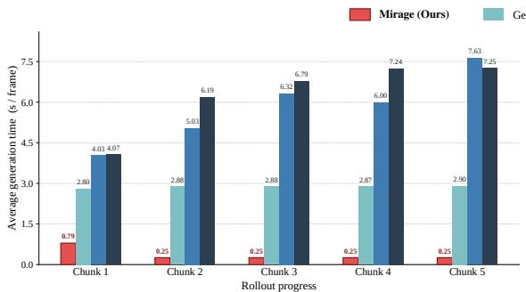

bar chart

| Rollout progress | Mirage (Ours) (s/frame) | Ge (s/frame) |
| :--- | :--- | :--- |
| Chunk 1 | 0.79 | 2.80 |
| Chunk 2 | 0.25 | 2.88 |
| Chunk 3 | 0.25 | 2.88 |
| Chunk 4 | 0.25 | 2.87 |
| Chunk 5 | 0.25 | 2.90 |
| Chunk 6 | 4.03 | 4.07 |
| Chunk 7 | 6.19 | 5.03 |
| Chunk 8 | 6.32 | 6.79 |
| Chunk 9 | 6.00 | 7.24 |
| Chunk 10 | 7.63 | 7.25 |

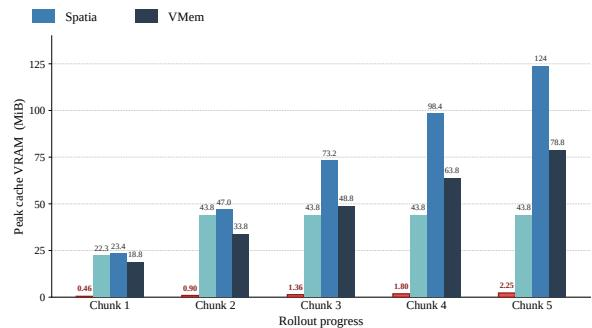

bar chart

| Rollout progress | Spia | VMem |
|---|---|---|
| Chunk 1 | 22.3 | 23.4 |
| Chunk 2 | 43.8 | 47.0 |
| Chunk 3 | 43.8 | 73.2 |
| Chunk 4 | 43.8 | 98.4 |
| Chunk 5 | 43.8 | 124 |
| | | 78.8 |
| | | 18.8 |
| | | 8.46 |
| Chunk 2 | 0.99 | 0.99 |
| Chunk 3 | 1.36 | 48.8 |
| Chunk 4 | 1.80 | 63.8 |
| Chunk 5 | 2.25 | 124 |

Figure 5 Efficiency scaling with rollout progress. Per-frame cache-read time (left) and peak cache footprint (right) measured on a single NVIDIA H100 across five autoregressive rollout chunks. Numbers above each bar report raw measurements (in s/frame and MiB respectively); the y-axes use a linear scale so the gap between methods is shown faithfully. After the first chunk amortises a one-off setup pass, Mirage settles at a per-frame cost of 0.25 s and a cache footprint that grows by less than 0.5 MiB per chunk. RGB-cache baselines (Spatia, Gen3C) require an order of magnitude more memory and one-to-two orders of magnitude more time per frame, since every conditioning step re-rasterises the accumulated point cloud and re-encodes the result through the VAE. The view-memory baseline VMem keeps memory bounded but still scales linearly because its retrieval cost grows with the number of stored views. Latent spatial memory removes the pixel-space round trip from the per-step critical path, leaving the conditioning loop with a single latent-resolution projection.

Novel view synthesis and closed-loop consistency. Table 2 reports results on RealEstate10K. In the standard novel view synthesis setting, Mirage achieves the best SSIM and LPIPS, while remaining close to Spatia on PSNR, surpassing both view memory baselines and all 3D aware video generators. The closed loop setting is particularly informative because it amplifies long horizon drift, since any per step inaccuracy accumulates over a trajectory that returns to its starting viewpoint. Mirage achieves the best $\mathrm { P S N R } _ { C }$ and $\mathrm { S S I M } _ { C }$ under this protocol, while remaining second-best on $\mathrm { L P I P S } _ { C }$ , indicating that latent spatial memory anchors the generator to a coherent geometric representation even after the camera has left and returned to a region. Figures 6 and 7 provides side-by-side video comparisons along the same trajectories: Mirage produces frames that remain sharp and structurally consistent when the camera advances through the scene, whereas Spatia and Voyager occasionally hallucinate incompatible geometry and foundation video generators without spatial memory drift noticeably. Visualizations on more challenging trajectories can be seen in Figure 8. These results show that moving the cache into latent space not only matches a well tuned RGB cache but improves on it, because the stored feature vectors carry semantic and textural information that three color channels cannot express.

Efficiency. A central motivation for latent spatial memory is to remove the pixel space round trip from the per step critical path. Figure 5 plots, as a function of rollout length, the wall clock time of a single cache read and the peak GPU memory required to maintain the cache. We compare Mirage with representative RGB point cloud baselines that rasterises the accumulated cloud with a z-buffered renderer and re-encodes the resulting image through the VAE at every step. Both quantities grow slowly for latent spatial memory, because the read operates at the native latent resolution and the cache itself is smaller by a factor of $s ^ { 2 }$ per spatial dimension. In contrast, the RGB cache exhibits rapid growth along both axes, since the per step rasterisation scales with HW rather than hw and the cloud expands roughly linearly with the number of anchored frames. At matched rollout length, end-to-end video generation is 10.57× faster than the RGB pipeline and consumes 55× less GPU memory on 3D cache. The gap widens with horizon, and RGB baselines eventually exhaust the memory budget on trajectories that latent spatial memory completes comfortably.

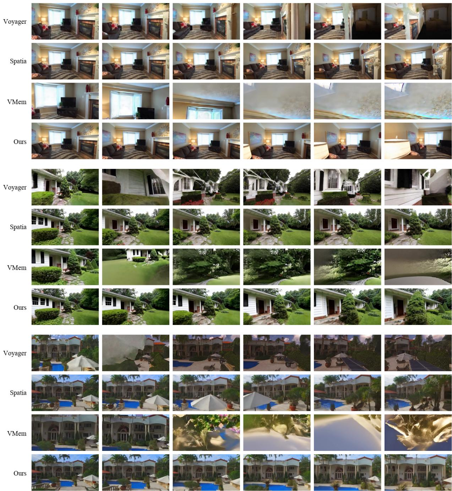  
Figure 6 Video comparison on RealEstate10K. Each block shows one RealEstate10K trajectory, with rows corresponding to Voyager, Spatia, VMem, and Mirage (Ours), and columns showing uniformly sampled frames over time. Across indoor and outdoor scenes, Mirage preserves sharper structure and more stable appearance under camera motion, while baselines exhibit geometry drift, texture distortion, or accumulated artifacts.

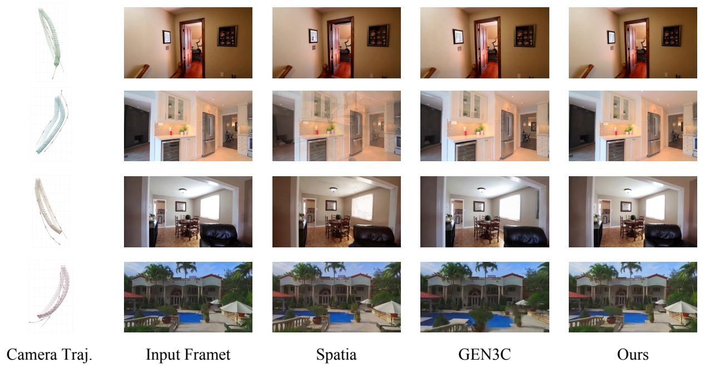  
Figure 7 Closed-loop revisit comparison on RealEstate10K. In the closed-loop test, the camera trajectory gradually returns to its starting point. The comparison between the last frame and the input frame shows that Mirage maintains strong consistency under the revisit setting.

## 5.3 Ablation Studies

We isolate the contribution of each component of Mirage on a split of WorldScore prompts, so that ablations are directly comparable to the main benchmark. Component level results are reported in Table 3, and the sensitivity to the depth source used to build the latent cache is reported separately in Table 4.

Latent vs. RGB memory. Replacing the latent cache with an RGB point cloud of the same source frames, while keeping the backbone and training recipe unchanged, decreases the Average Score and weakens 3D and photometric consistency. This confirms that bottleneck of the RGB detour discards information that backbone can exploit when the cache remains in latent space.

Feature downsampling versus geometry downsampling. An alternative to the design in Eq. 4 is to upsample the latent feature to pixel resolution and lift at full resolution, then aggregate into the latent grid during readout. This variant degrades 3D consistency because it interpolates features that lie outside the backbone’s pretraining distribution. Matching geometry to the native latent grid instead is both cheaper and more faithful to the generator.

Dynamic object filtering. Disabling the mask that excludes moving objects and the sky from cache updates degrades long horizon stability, since stale dynamic content persists in the memory and is splatted back into future chunks. The effect is largest on 3D and photometric consistency.

Two stage training. Replacing the two stage schedule with a single stage that jointly trains the side branch and LoRA reduces final quality, because the backbone adapts to an immature conditioning signal early in optimisation. Freezing the backbone during stage one and only then unlocking LoRA stabilises convergence.

Table 3 Ablation studies on a WorldScore split. Each row disables or alters a single component of Mirage while all other settings remain fixed.

<table><tr><td>Variant</td><td>Avg ↑</td><td>Static ↑</td><td>Dynamic ↑</td><td>3D Cons ↑</td><td>Photo Cons ↑</td></tr><tr><td>Mirage (full)</td><td>70.36</td><td>73.60</td><td>67.11</td><td>92.21</td><td>93.95</td></tr><tr><td>Explicit RGB Point Cloud</td><td>67.71</td><td>70.49</td><td>64.93</td><td>90.75</td><td>91.10</td></tr><tr><td>Feature Upsample, Pixel Resolution Lift</td><td>60.85</td><td>62.41</td><td>59.28</td><td>84.90</td><td>79.81</td></tr><tr><td>No Dynamic Object Filter</td><td>61.20</td><td>62.69</td><td>59.70</td><td>80.88</td><td>76.10</td></tr><tr><td>Single Stage Training</td><td>63.18</td><td>65.15</td><td>61.20</td><td>87.11</td><td>84.47</td></tr></table>

Table 4 Sensitivity to the depth source. We swap DepthAnything 3 for alternative depth predictors while keeping all other components of Mirage fixed.

<table><tr><td>Depth Source</td><td>Avg ↑</td><td>Static ↑</td><td>Dynamic ↑</td><td>3D Cons ↑</td><td>Photo Cons ↑</td></tr><tr><td>DepthAnything 3 [20] (default)</td><td>70.36</td><td>73.60</td><td>67.11</td><td>92.21</td><td>93.95</td></tr><tr><td>MapAnything [64]</td><td>69.66</td><td>72.78</td><td>66.53</td><td>91.89</td><td>93.32</td></tr><tr><td>UniDepth [65]</td><td>69.13</td><td>72.15</td><td>66.10</td><td>91.63</td><td>92.79</td></tr></table>

Depth source. Because latent spatial memory is constructed from estimated depth, we study its robustness by swapping the default DepthAnything 3 [20] reconstructor for alternative depth predictors [64, 65]. Table 4 shows that Mirage remains competitive under noisier depth, because the ControlNet style side branch treats the projected cache as a soft geometric hint rather than a hard constraint, and the dynamic filter removes the worst outliers before they enter the memory. The margin relative to the strongest depth estimator is modest, indicating that the benefits of latent spatial memory do not hinge on a particular reconstructor.

## 6 Conclusion

We have introduced latent spatial memory, a 3D cache that stores the video diffusion model’s own latent features rather than RGB colors at each world-space point, and built Mirage around this representation as a video world model that operates entirely within the VAE latent manifold. By reading the cache through a single latent-resolution projection, Mirage removes the rasterise-andencode round trip that dominates the per-step cost of RGB point cloud caches. The decode-andre-encode pair required to grow the cache is amortised over an entire chunk and never appears in the conditioning loop, so the per-step critical path is freed of pixel-space operations and the cache footprint shrinks by the squared VAE compression factor. Across WorldScore and RealEstate10K, Mirage delivers state-of-the-art quality while reading from the cache an order of magnitude faster and with an order of magnitude less GPU memory than RGB-cache baselines, turning world-consistent generation into a process that scales with the rollout horizon.

Limitations and future work. The dynamic-region filter excludes moving entities from the persistent memory because their geometry is unreliable, so Mirage does not maintain the state of dynamic actors across chunks. Scenes dominated by pervasive motion therefore benefit less from the cache than scenes dominated by rigid geometry, and persisting dynamic content across chunks is a natural direction for future work.

## 7 Acknowledgments

This work was supported by computing resources from Microsoft.

## References

[1] OpenAI. Sora. https://openai.com/sora/, 2024.  
[2] Team Wan, Ang Wang, Baole Ai, Bin Wen, Chaojie Mao, Chen-Wei Xie, Di Chen, Feiwu Yu, Haiming Zhao, Jianxiao Yang, Jianyuan Zeng, Jiayu Wang, Jingfeng Zhang, Jingren Zhou, Jinkai Wang, Jixuan Chen, Kai Zhu, Kang Zhao, Keyu Yan, Lianghua Huang, Mengyang Feng, Ningyi Zhang, Pandeng Li, Pingyu Wu, Ruihang Chu, Ruili Feng, Shiwei Zhang, Siyang Sun, Tao Fang, Tianxing Wang, Tianyi Gui, Tingyu Weng, Tong Shen, Wei Lin, Wei Wang, Wei Wang, Wenmeng Zhou, Wente Wang, Wenting Shen, Wenyuan Yu, Xianzhong Shi, Xiaoming Huang, Xin Xu, Yan Kou, Yangyu Lv, Yifei Li, Yijing Liu, Yiming Wang, Yingya Zhang, Yitong Huang, Yong Li, You Wu, Yu Liu, Yulin Pan, Yun Zheng, Yuntao Hong, Yupeng Shi, Yutong Feng, Zeyinzi Jiang, Zhen Han, Zhi-Fan Wu, and Ziyu Liu. Wan: Open and advanced large-scale video generative models. arXiv preprint arXiv:2503.20314, 2025.  
[3] Weijie Kong, Qi Tian, Zijian Zhang, Rox Min, Zuozhuo Dai, Jin Zhou, Jiangfeng Xiong, Xin Li, Bo Wu, Jianwei Zhang, et al. Hunyuanvideo: A systematic framework for large video generative models. arXiv preprint arXiv:2412.03603, 2024.  
[4] Zhuoyi Yang, Jiayan Teng, Wendi Zheng, Ming Ding, Shiyu Huang, Jiazheng Xu, Yuanming Yang, Wenyi Hong, Xiaohan Zhang, Guanyu Feng, et al. Cogvideox: Text-to-video diffusion models with an expert transformer. arXiv preprint arXiv:2408.06072, 2024.  
[5] Andreas Blattmann, Tim Dockhorn, Sumith Kulal, Daniel Mendelevitch, Maciej Kilian, Dominik Lorenz, Yam Levi, Zion English, Vikram Voleti, Adam Letts, et al. Stable video diffusion: Scaling latent video diffusion models to large datasets. arXiv preprint arXiv:2311.15127, 2023.  
[6] Jake Bruce, Michael D Dennis, Ashley Edwards, Jack Parker-Holder, Yuge Shi, Edward Hughes, Matthew Lai, Aditi Mavalankar, Richie Steigerwald, Chris Apps, et al. Genie: Generative interactive environments. In Forty-first International Conference on Machine Learning, 2024.  
[7] Jack Parker-Holder, Philip Ball, Jake Bruce, Vibhavari Dasagi, Kristian Holsheimer, Christos Kaplanis, Alexandre Moufarek, Guy Scully, Jeremy Shar, Jimmy Shi, Stephen Spencer, Jessica Yung, Michael Dennis, Sultan Kenjeyev, Shangbang Long, Vlad Mnih, Harris Chan, Maxime Gazeau, Bonnie Li, Fabio Pardo, Luyu Wang, Lei Zhang, Frederic Besse, Tim Harley, Anna Mitenkova, Jane Wang, Jeff Clune, Demis Hassabis, Raia Hadsell, Adrian Bolton, Satinder Singh, and Tim Rocktäschel. Genie 2: A large-scale foundation world model. https://deepmind.google/discover/blog/ genie-2-a-large-scale-foundation-world-model/, 2024. URL https://deepmind. google/discover/blog/genie-2-a-large-scale-foundation-world-model/.  
[8] Dani Valevski, Yaniv Leviathan, Moab Arar, and Shlomi Fruchter. Diffusion models are real-time game engines. arXiv preprint arXiv:2408.14837, 2024.  
[9] Eloi Alonso, Adam Jelley, Vincent Micheli, Anssi Kanervisto, Amos J Storkey, Tim Pearce, and François Fleuret. Diffusion for world modeling: Visual details matter in atari. Advances in Neural Information Processing Systems, 37:58757–58791, 2024.  
[10] Haoxuan Che, Xuanhua He, Quande Liu, Cheng Jin, and Hao Chen. Gamegen-x: Interactive open-world game video generation. arXiv preprint arXiv:2411.00769, 2024.  
[11] Jinjing Zhao, Fangyun Wei, Zhening Liu, Hongyang Zhang, Chang Xu, and Yan Lu. Spatia: Video generation with updatable spatial memory. In Proceedings of the IEEE/CVF Conference on Computer Vision and Pattern Recognition (CVPR), 2026.  
[12] Tianyu Huang, Wangguandong Zheng, Tengfei Wang, Yuhao Liu, Zhenwei Wang, Junta Wu, Jie Jiang, Hui Li, Rynson WH Lau, Wangmeng Zuo, et al. Voyager: Long-range and worldconsistent video diffusion for explorable 3d scene generation. arXiv preprint arXiv:2506.04225, 2025.  
[13] Hong-Xing Yu, Haoyi Duan, Charles Herrmann, William T. Freeman, and Jiajun Wu. Wonderworld: Interactive 3d scene generation from a single image. arXiv:2406.09394, 2024.  
[14] Hong-Xing Yu, Haoyi Duan, Junhwa Hur, Kyle Sargent, Michael Rubinstein, William T Freeman, Forrester Cole, Deqing Sun, Noah Snavely, Jiajun Wu, et al. Wonderjourney: Going from anywhere to everywhere. In Proceedings of the IEEE/CVF Conference on Computer Vision and Pattern Recognition, pages 6658–6667, 2024.  
[15] Zicheng Duan, Jiatong Xia, Zeyu Zhang, Wenbo Zhang, Gengze Zhou, Chenhui Gou, Yefei He, Feng Chen, Xinyu Zhang, and Lingqiao Liu. Liveworld: Simulating out-of-sight dynamics in generative video world models. arXiv preprint arXiv:2603.07145, 2026.  
[16] Weijie Wang, Jiagang Zhu, Zeyu Zhang, Xiaofeng Wang, Zheng Zhu, Guosheng Zhao, Chaojun Ni, Haoxiao Wang, Guan Huang, Xinze Chen, Yukun Zhou, Wenkang Qin, Duochao Shi, Haoyun Li, Yicheng Xiao, Donny Y. Chen, and Jiwen Lu. Drivegen3d: Boosting feed-forward driving scene generation with efficient video diffusion. arXiv preprint arXiv:2510.15264, 2025.  
[17] Weijie Wang, Xiaoxuan He, Youping Gu, Yifan Yang, Zeyu Zhang, Yefei He, Yanbo Ding, Xirui Hu, Donny Y Chen, Zhiyuan He, et al. World-r1: Reinforcing 3d constraints for text-to-video generation. arXiv preprint arXiv:2604.24764, 2026.  
[18] Tong Wu, Shuai Yang, Ryan Po, Yinghao Xu, Ziwei Liu, Dahua Lin, and Gordon Wetzstein. Video world models with long-term spatial memory. arXiv preprint arXiv:2506.05284, 2025.  
[19] Yu-Cheng Chou, Xingrui Wang, Yitong Li, Jiahao Wang, Hanting Liu, Cihang Xie, Alan Yuille, and Junfei Xiao. Captain safari: A world engine with pose-aligned 3d memory. arXiv preprint arXiv:2511.22815, 2025.  
[20] Haotong Lin, Sili Chen, Junhao Liew, Donny Y Chen, Zhenyu Li, Guang Shi, Jiashi Feng, and Bingyi Kang. Depth anything 3: Recovering the visual space from any views. International Conference on Learning Representations (ICLR), 2026.  
[21] Weijie Wang, Qihang Cao, Sensen Gao, Donny Y Chen, Haofei Xu, Wenjing Bian, Songyou Peng, Tat-Jen Cham, Chuanxia Zheng, Andreas Geiger, et al. Feed-forward 3d scene modeling: A problem-driven perspective. arXiv preprint arXiv:2604.14025, 2026.  
[22] Weijie Wang, Donny Y Chen, Zeyu Zhang, Duochao Shi, Akide Liu, and Bohan Zhuang. Zpressor: Bottleneck-aware compression for scalable feed-forward 3dgs. 38:113407–113436, 2026.  
[23] Weijie Wang, Yeqing Chen, Zeyu Zhang, Hengyu Liu, Haoxiao Wang, Zhiyuan Feng, Wenkang Qin, Zheng Zhu, Donny Y. Chen, and Bohan Zhuang. Volsplat: Rethinking feed-forward 3d gaussian splatting with voxel-aligned prediction. arXiv preprint arXiv:2509.19297, 2025.  
[24] Weijie Wang, Zimu Li, Jinchuan Shi, Zeyu Zhang, Botao Ye, Marc Pollefeys, Donny Y. Chen, and Bohan Zhuang. Trisplat: Simulation-ready feed-forward 3d scene reconstruction. arXiv preprint arXiv:2605.26115, 2026.  
[25] Lvmin Zhang, Anyi Rao, and Maneesh Agrawala. Adding conditional control to text-to-image diffusion models, 2023.  
[26] Nicolas Carion, Laura Gustafson, Yuan-Ting Hu, Shoubhik Debnath, Ronghang Hu, Didac Suris, Chaitanya Ryali, Kalyan Vasudev Alwala, Haitham Khedr, Andrew Huang, Jie Lei, Tengyu Ma, Baishan Guo, Arpit Kalla, Markus Marks, Joseph Greer, Meng Wang, Peize Sun, Roman Rädle, Triantafyllos Afouras, Effrosyni Mavroudi, Katherine Xu, Tsung-Han Wu, Yu Zhou, Liliane Momeni, Rishi Hazra, Shuangrui Ding, Sagar Vaze, Francois Porcher, Feng Li, Siyuan Li, Aishwarya Kamath, Ho Kei Cheng, Piotr Dollár, Nikhila Ravi, Kate Saenko, Pengchuan Zhang, and Christoph Feichtenhofer. Sam 3: Segment anything with concepts, 2025. URL https://arxiv.org/abs/2511.16719.  
[27] Haoyi Duan, Hong-Xing Yu, Sirui Chen, Li Fei-Fei, and Jiajun Wu. Worldscore: A unified evaluation benchmark for world generation. In Proceedings of the IEEE/CVF International Conference on Computer Vision (ICCV), pages 27713–27724, October 2025.  
[28] Haoyi Duan, Hong-Xing Yu, Sirui Chen, Li Fei-Fei, and Jiajun Wu. Worldscore: A unified evaluation benchmark for world generation. arXiv preprint arXiv:2504.00983, 2025.  
[29] Tinghui Zhou, Richard Tucker, John Flynn, Graham Fyffe, and Noah Snavely. Stereo magnification: Learning view synthesis using multiplane images. arXiv preprint arXiv:1805.09817, 2018.  
[30] Yaron Lipman, Ricky TQ Chen, Heli Ben-Hamu, Maximilian Nickel, and Matt Le. Flow matching for generative modeling. arXiv preprint arXiv:2210.02747, 2022.  
[31] Patrick Esser, Sumith Kulal, Andreas Blattmann, Rahim Entezari, Jonas Müller, Harry Saini, Yam Levi, Dominik Lorenz, Axel Sauer, Frederic Boesel, et al. Scaling rectified flow transformers for high-resolution image synthesis. In Forty-first international conference on machine learning, 2024.  
[32] Yuwei Guo, Ceyuan Yang, Anyi Rao, Zhengyang Liang, Yaohui Wang, Yu Qiao, Maneesh Agrawala, Dahua Lin, and Bo Dai. Animatediff: Animate your personalized text-to-image diffusion models without specific tuning. arXiv preprint arXiv:2307.04725, 2023.  
[33] Haoxin Chen, Yong Zhang, Xiaodong Cun, Menghan Xia, Xintao Wang, Chao Weng, and Ying Shan. Videocrafter2: Overcoming data limitations for high-quality video diffusion models. In Proceedings of the IEEE/CVF Conference on Computer Vision and Pattern Recognition, pages 7310–7320, 2024.  
[34] Jiaqi Xu, Xinyi Zou, Kunzhe Huang, Yunkuo Chen, Bo Liu, MengLi Cheng, Xing Shi, and Jun Huang. Easyanimate: A high-performance long video generation method based on transformer architecture. arXiv preprint arXiv:2405.18991, 2024.  
[35] Yuan Zhou, Qiuyue Wang, Yuxuan Cai, and Huan Yang. Allegro: Open the black box of commercial-level video generation model. arXiv preprint arXiv:2410.15458, 2024.  
[36] Weichen Fan, Chenyang Si, Junhao Song, Zhenyu Yang, Yinan He, Long Zhuo, Ziqi Huang, Ziyue Dong, Jingwen He, Dongwei Pan, et al. Vchitect-2.0: Parallel transformer for scaling up video diffusion models. arXiv preprint arXiv:2501.08453, 2025.  
[37] Yoav HaCohen, Nisan Chiprut, Benny Brazowski, Daniel Shalem, Dudu Moshe, Eitan Richardson, Eran Levin, Guy Shiran, Nir Zabari, Ori Gordon, et al. Ltx-video: Realtime video latent diffusion. arXiv preprint arXiv:2501.00103, 2024.  
[38] William Peebles and Saining Xie. Scalable diffusion models with transformers. In Proceedings of the IEEE/CVF international conference on computer vision, pages 4195–4205, 2023.  
[39] Boyuan Chen, Diego Martí Monsó, Yilun Du, Max Simchowitz, Russ Tedrake, and Vincent Sitzmann. Diffusion forcing: Next-token prediction meets full-sequence diffusion. Advances in Neural Information Processing Systems, 37:24081–24125, 2024.  
[40] Roberto Henschel, Levon Khachatryan, Hayk Poghosyan, Daniil Hayrapetyan, Vahram Tadevosyan, Zhangyang Wang, Shant Navasardyan, and Humphrey Shi. Streamingt2v: Consistent, dynamic, and extendable long video generation from text. arXiv preprint arXiv:2403.14773, 2024.  
[41] Yuchao Gu, Weijia Mao, and Mike Zheng Shou. Long-context autoregressive video modeling with next-frame prediction. arXiv preprint arXiv:2503.19325, 2025.  
[42] Guibin Chen, Dixuan Lin, Jiangping Yang, Chunze Lin, Juncheng Zhu, Mingyuan Fan, Hao Zhang, Sheng Chen, Zheng Chen, Chengchen Ma, et al. Skyreels-v2: Infinite-length film generative model. arXiv preprint arXiv:2504.13074, 2025.  
[43] Desai Xie, Zhan Xu, Yicong Hong, Hao Tan, Difan Liu, Feng Liu, Arie Kaufman, and Yang Zhou. Progressive autoregressive video diffusion models. arXiv preprint arXiv:2410.08151, 2024.  
[44] Hao He, Yinghao Xu, Yuwei Guo, Gordon Wetzstein, Bo Dai, Hongsheng Li, and Ceyuan Yang. Cameractrl: Enabling camera control for text-to-video generation. arXiv preprint arXiv:2404.02101, 2024.  
[45] Hao He, Ceyuan Yang, Shanchuan Lin, Yinghao Xu, Meng Wei, Liangke Gui, Qi Zhao, Gordon Wetzstein, Lu Jiang, and Hongsheng Li. Cameractrl ii: Dynamic scene exploration via camera-controlled video diffusion models. arXiv preprint arXiv:2503.10592, 2025.  
[46] Wanquan Feng, Jiawei Liu, Pengqi Tu, Tianhao Qi, Mingzhen Sun, Tianxiang Ma, Songtao Zhao, Siyu Zhou, and Qian He. I2vcontrol-camera: Precise video camera control with adjustable motion strength. arXiv preprint arXiv:2411.06525, 2024.  
[47] Cheng Zhang, Hanwen Liang, Donny Y Chen, Qianyi Wu, Konstantinos N Plataniotis, Camilo Cruz Gambardella, and Jianfei Cai. Panflow: Decoupled motion control for panoramic video generation. volume 40, pages 12385–12393, 2026.  
[48] Wangbo Yu, Jinbo Xing, Li Yuan, Wenbo Hu, Xiaoyu Li, Zhipeng Huang, Xiangjun Gao, Tien-Tsin Wong, Ying Shan, and Yonghong Tian. Viewcrafter: Taming video diffusion models for high-fidelity novel view synthesis. arXiv preprint arXiv:2409.02048, 2024.  
[49] Jensen Zhou, Hang Gao, Vikram Voleti, Aaryaman Vasishta, Chun-Han Yao, Mark Boss, Philip Torr, Christian Rupprecht, and Varun Jampani. Stable virtual camera: Generative view synthesis with diffusion models. arXiv preprint arXiv:2503.14489, 2025.  
[50] Zekai Gu, Rui Yan, Jiahao Lu, Peng Li, Zhiyang Dou, Chenyang Si, Zhen Dong, Qifeng Liu, Cheng Lin, Ziwei Liu, Wenping Wang, and Yuan Liu. Diffusion as shader: 3d-aware video diffusion for versatile video generation control. arXiv preprint arXiv:2501.03847, 2025.  
[51] Xuanchi Ren, Tianchang Shen, Jiahui Huang, Huan Ling, Yifan Lu, Merlin Nimier-David, Thomas Müller, Alexander Keller, Sanja Fidler, and Jun Gao. Gen3c: 3d-informed worldconsistent video generation with precise camera control. In Proceedings of the IEEE/CVF Conference on Computer Vision and Pattern Recognition, 2025.  
[52] Xiaoda Yang, Jiayang Xu, Kaixuan Luan, Xinyu Zhan, Hongshun Qiu, Shijun Shi, Hao Li, Shuai Yang, Li Zhang, Checheng Yu, et al. Omnicam: Unified multimodal video generation via camera control. arXiv preprint arXiv:2504.02312, 2025.  
[53] Paul Engstler, Andrea Vedaldi, Iro Laina, and Christian Rupprecht. Invisible stitch: Generating smooth 3d scenes with depth inpainting. In Arxiv, 2024.  
[54] Luxi Chen, Zihan Zhou, Min Zhao, Yikai Wang, Ge Zhang, Wenhao Huang, Hao Sun, Ji-Rong Wen, and Chongxuan Li. Flexworld: Progressively expanding 3d scenes for flexiable-view synthesis. arXiv preprint arXiv:2503.13265, 2025.  
[55] Jiwen Yu, Jianhong Bai, Yiran Qin, Quande Liu, Xintao Wang, Pengfei Wan, Di Zhang, and Xihui Liu. Context as memory: Scene-consistent interactive long video generation with memory retrieval. arXiv preprint arXiv:2506.03141, 2025.  
[56] Zeqi Xiao, Yushi Lan, Yifan Zhou, Wenqi Ouyang, Shuai Yang, Yanhong Zeng, and Xingang Pan. Worldmem: Long-term consistent world simulation with memory. arXiv preprint arXiv:2504.12369, 2025.  
[57] Runjia Li, Philip Torr, Andrea Vedaldi, and Tomas Jakab. Vmem: Consistent interactive video scene generation with surfel-indexed view memory. arXiv preprint arXiv:2506.18903, 2025.  
[58] Jianlin Su, Murtadha Ahmed, Yu Lu, Shengfeng Pan, Wen Bo, and Yunfeng Liu. Roformer: Enhanced transformer with rotary position embedding. Neurocomputing, 568:127063, 2024.  
[59] An Yang, Anfeng Li, Baosong Yang, Beichen Zhang, Binyuan Hui, Bo Zheng, Bowen Yu, Chang Gao, Chengen Huang, Chenxu Lv, et al. Qwen3 technical report. arXiv preprint arXiv:2505.09388, 2025.  
[60] Edward J Hu, Yelong Shen, Phillip Wallis, Zeyuan Allen-Zhu, Yuanzhi Li, Shean Wang, Liang Wang, Weizhu Chen, et al. Lora: Low-rank adaptation of large language models. International Conference on Learning Representations (ICLR), 2022.  
[61] Xinyang Li, Tengfei Wang, Zixiao Gu, Shengchuan Zhang, Chunchao Guo, and Liujuan Cao. Flashworld: High-quality 3d scene generation within seconds, 2025.  
[62] Jaeyoung Chung, Suyoung Lee, Hyeongjin Nam, Jaerin Lee, and Kyoung Mu Lee. Luciddreamer: Domain-free generation of 3d gaussian splatting scenes. arXiv preprint arXiv:2311.13384, 2023.  
[63] Jiahui Huang, Qunjie Zhou, Hesam Rabeti, Aleksandr Korovko, Huan Ling, Xuanchi Ren, Tianchang Shen, Jun Gao, Dmitry Slepichev, Chen-Hsuan Lin, et al. Vipe: Video pose engine for 3d geometric perception. arXiv preprint arXiv:2508.10934, 2025.  
[64] Nikhil Keetha, Norman Müller, Johannes Schönberger, Lorenzo Porzi, Yuchen Zhang, Tobias Fischer, Arno Knapitsch, Duncan Zauss, Ethan Weber, Nelson Antunes, Jonathon Luiten, Manuel Lopez-Antequera, Samuel Rota Bulò, Christian Richardt, Deva Ramanan, Sebastian Scherer, and Peter Kontschieder. MapAnything: Universal feed-forward metric 3D reconstruction, 2025. arXiv preprint arXiv:2509.13414.  
[65] Luigi Piccinelli, Yung-Hsu Yang, Christos Sakaridis, Mattia Segu, Siyuan Li, Luc Van Gool, and Fisher Yu. UniDepth: Universal monocular metric depth estimation. In Proceedings of the IEEE/CVF Conference on Computer Vision and Pattern Recognition (CVPR), 2024.

[66] Zeyinzi Jiang, Zhen Han, Chaojie Mao, Jingfeng Zhang, Yulin Pan, and Yu Liu. Vace: All-inone video creation and editing. In Proceedings of the IEEE/CVF International Conference on Computer Vision (ICCV), pages 17191–17202, 2025.

## A Geometric Details

This appendix spells out the geometric quantities that the main text defers, so that Section 4 stays readable while the construction in Eqs. 4–6 remains fully reproducible.

Conventions. Extrinsics $\mathbf { E } _ { t } \in \mathrm { S E } ( 3 )$ map world points into camera t, and we denote the camera-toworld inverse by $\mathbf { E } _ { t } ^ { - 1 }$ . Intrinsics follow the standard pinhole form with focal lengths $( f _ { x } , f _ { y } )$ and principal point $( c _ { x } , c _ { y } )$ . The VAE has spatial stride s dividing the pixel resolution $H \times W$ into the latent resolution $h \times w = ( H / s ) \times ( W / s )$ , with $s = 1 6$ throughout (Appendix C). Latent cells are indexed by $( u , v ) \in \{ 0 , \ldots , w - 1 \} \times \{ 0 , \ldots , h - 1 \}$ with pixel-centre homogeneous coordinates $[ u + \textstyle { \frac { 1 } { 2 } } , v + \textstyle { \frac { 1 } { 2 } } , 1 ] ^ { \top }$ .

Latent-resolution intrinsics. The latent-resolution intrinsic matrix used in Eqs. 4 and 5 is obtained from the pixel-resolution intrinsics K by scaling both axes by the corresponding stride ratio,

$$
K ^ {\ell} = \operatorname{diag} (w / W, h / H, 1) K. \tag {7}
$$

Both focal lengths and the principal point are rescaled by the same per-axis ratio, so that perspective projection remains consistent after the depth map is downsampled to latent resolution. In the main text we slightly abuse notation by writing K for $K ^ { \ell }$ wherever the context is unambiguous.

Pinhole back-projection. The operator $\pi ^ { - 1 }$ used in $\operatorname { E q . }$ 4 maps a latent cell $( u , v )$ with depth $d = D ( u , v )$ into a world point through ray-casting in camera coordinates followed by the camerato-world transform,

$$
\pi^ {- 1} (u, v, d; K ^ {\ell}, \mathbf {E}) = \mathbf {E} ^ {- 1} \left[ \begin{array}{c} d \left(K ^ {\ell}\right) ^ {- 1} \left[ u + \frac {1}{2}, v + \frac {1}{2}, 1 \right] ^ {\top} \\ 1 \end{array} \right] \Bigg | _ {1: 3}, \tag {8}
$$

where the trailing subscript denotes selection of the first three coordinates.

Projection onto the latent grid. For a memory point $\mathbf { p } _ { i }$ , its camera-space position at target view t is the first three coordinates of $\mathbf { E } _ { t } [ \mathbf { p } _ { i } ^ { \top } , 1 ] ^ { \top }$ , which we denote $\mathbf { q } _ { i } \in \mathbb { R } ^ { 3 }$ . Its position on the latent grid is then

$$
\pi^ {\ell} (\mathbf {q} _ {i}) = \big (\lfloor x \rfloor , \lfloor y \rfloor \big), \quad [ x, y, 1 ] ^ {\top} = K ^ {\ell} \mathbf {q} _ {i} / [ \mathbf {q} _ {i} ] _ {z}. \tag {9}
$$

The candidate set used in the readout of $\operatorname { E q } .$ . 5 is then

$$
\Omega_ {t} (u, v) = \left\{i: \pi^ {\ell} (\mathbf {q} _ {i}) = (u, v), [ \mathbf {q} _ {i} ] _ {z} > 0 \right\}, \tag {10}
$$

and the admissible cell set $\Lambda _ { t }$ in $\mathrm { E q . 6 }$ is defined on the same grid, restricted to cells with finite positive depth that lie outside the dynamic-object and sky masks.

## B Additional Experimental Analysis

This appendix complements Section 5 with analyses that clarify why latent spatial memory is efficient, how it behaves as the rollout horizon grows, and what the stored tokens carry compared with an RGB cache.

Asymptotic cost of cache reads. Let N denote the cache size at a given step. Reading an RGB cache costs Θ(N log $N + H W ) + \Theta ( \Phi \varepsilon ( H , W ) )$ per conditioning step, where $\Phi _ { \mathcal { E } }$ is the $\mathrm { F L O P }$ count of one VAE encoder pass. Reading a latent cache costs $\Theta ( N \log N + h w )$ : the rasterisation term shrinks by the squared VAE stride, and the per-step encoder term disappears entirely because the readout is already in the backbone’s input space. The peak memory of the cache itself follows the ratio $s ^ { 2 } \cdot ( 3 / C )$ between the RGB and latent representations, which together with the per-step pixel-resolution buffer accounts for the order-of-magnitude gap reported in Figure 5. The gap widens with the rollout horizon: the N log N sort begins to dominate the latent cache much later than the pixel cache, and the RGB baseline exhausts GPU memory on trajectories that Mirage completes comfortably.

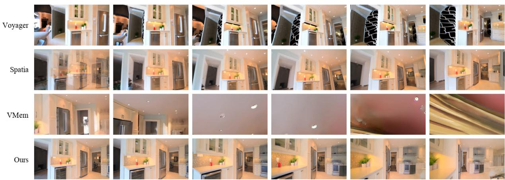

natural_image

Grid of interior photos showing modern kitchen and living room designs, including Voyager, Spatia, VMem, and Ours (no text or symbols visible)

Figure 8 Additional video comparison on a challenging indoor trajectory. Mirage maintains coherent layout over the full trajectory, whereas baselines suffer from view-dependent deformation, blur, and inconsistent scene reconstruction.

Table 5 Depth down-sampling for cache construction. Evaluated on a held-out RealEstate10K split with every other component of Mirage kept fixed.

<table><tr><td>Down-sampling D → Dl</td><td>Hole Rate ↓</td></tr><tr><td>Bilinear (default)</td><td>42.53</td></tr><tr><td>Nearest-neighbour</td><td>47.78</td></tr><tr><td>Area pooling</td><td>53.72</td></tr><tr><td>Median pooling</td><td>52.22</td></tr></table>

Per-step timing breakdown. We decompose the per-step cost of the RGB pipeline into rasterisation, VAE encoder forward, and depth estimation plus back-projection. On a 257-frame rollout, rasterisation and the encoder together account for more than 98% of the per-step RGB cost, and both are absent from the conditioning loop of Mirage, since a single latent-resolution projection replaces them. The decoder, which the RGB pipeline calls at every conditioning step to produce the image on which the cache is rasterised, is invoked in Mirage only once per chunk to materialise output frames and to feed the depth and segmentation modules; it never appears on the per-step critical path.

Depth down-sampling for cache construction. Eq. 4 requires the dense depth map and the latent grid to share a resolution, so depth must be down-sampled before lifting. Because depth is piecewise smooth with discontinuities at silhouettes, this choice is not neutral: bilinear interpolation smears foreground over background at edges and can spawn phantom points; nearest-neighbour preserves edges but aliases fine structure; area pooling over-smooths occluding contours; median pooling preserves edges but is biased on slanted surfaces. We evaluate all four with every other component fixed. Table 5 reports the fraction of empty latent cells in the projected cache (“hole rate”). Among the four down-sampling choices, bilinear interpolation gives the lowest hole rate at 42.53%. We therefore adopt bilinear as the default, since it provides the best projected-cache coverage among the tested variants.

What the cache stores. The latent tokens are expected to carry semantic and textural structure that three color channels cannot express. We visualize this by projecting each per-point feature vector onto its top three principal components and coloring the memory by the resulting RGB. Coherent semantic clusters such as walls, floors, windows, and furniture emerge that are not recoverable from an RGB point cloud built on the same frames. This is the qualitative mechanism behind Table $^ { 3 , }$ where swapping the latent cache for an RGB cache with the backbone and training recipe held fixed weakens both 3D and photometric consistency.

## C Implementation Details

Backbone and latents. The backbone is Wan2.2-TI2V-5B [2], whose VAE has spatial stride $s = 1 6$ temporal stride 4, and channel count $C = 4 8$ . Each generation chunk covers a $9 \times 4 4 \times 8 0$ latent tensor corresponding to 33 RGB frames at $7 0 4 \times 1 2 8 0$ . The transformer has hidden dimension 3072, feed-forward dimension 14336, 24 attention heads, 30 blocks, text context 512 tokens, and uses RMS $\mathrm { Q / K }$ normalisation together with cross-attention normalisation. The VAE is frozen throughout.

Conditioning branch. The latent readout $\hat { \mathbf { z } } _ { t }$ is injected through a ControlNet-style side branch whose layout mirrors the VACE [66] blocks of Wan2.2 and shares its patch embedding with the main network. The branch is attached at layers {0, 4, 8, 12, 16, 20, 24, 28} with a 48-channel input matching the VAE latent, so no bridging encoder is required. Segment-aware rotary positional encoding [58] tags each frame as noisy target, clean preceding, or clean reference inside a single forward pass; at inference, the denoised latents of the previous chunk become the preceding frames of the next.

Training. Training has two flow-matching [30] stages on the target frames. Stage one updates only the side branch at learning rate 10−5 with the backbone and VAE frozen. Stage two unlocks rank-64 LoRA adapters [60] on the $\{ \mathsf { q } , \mathtt { k } , \mathtt { v } , \mathtt { o } \}$ projections of every self-attention layer $( \alpha = 6 4$ , dropout 0.05) and jointly optimises them with the side branch at learning rate 10−4. Optimisation uses AdamW $( \beta = ( 0 . 0 , 0 . 9 9 9 )$ , weight decay $1 0 ^ { - 3 } )$ , a cosine schedule, bfloat16 mixed precision under FSDP sharding, gradient checkpointing, and text-dropout probability 0.2. At inference we use the UniPC flow scheduler with 40 steps and classifier-free guidance disabled; efficiency is reported on a single NVIDIA H100.

Data. Training clips are drawn from RealEstate10K. Each clip is processed by a feed-forward reconstructor [20] for metric depth, intrinsics, and per-frame extrinsics, and by a Qwen3-VL-2B [59] entity extractor followed by SAM3 [26] for foreground-dynamic and sky masks. Cells inside the mask are excluded from $\Lambda _ { t }$ in Eq. 6 so that only geometry compatible with the rigid-scene assumption enters the persistent memory. Frames, latents, depth, and camera parameters are stored in an LMDB-backed dataset, so no re-encoding occurs during training. Rollouts are produced in chunks of nine latent frames with one-frame overlap to preserve temporal continuity, and the cache is grown once per chunk by re-encoding the decoded frames and lifting them via Eq. 4. Algorithm 1 summarises one complete rollout.

Algorithm 1 One rollout of Mirage.  
Require: initial frame $I_{0}$ ; camera trajectory $\{(\mathbf{E}_{t}, K_{t})\}_{t=0}^{T}$ with $E_{0}$ fixed to the world frame
1: $z_{0} \leftarrow \mathcal{E}(I_{0})$ 2: $D_{0} \leftarrow DEPTHANYTHING3(I_{0})$ 3: $M_{0} \leftarrow SAM3(QWEN3-VL(I_{0})) \cup SKY(I_{0})$ 4: $M \leftarrow \{(\mathbf{p}_{uv}, \mathbf{f}_{uv}) : (u, v) \in \Lambda_{0}\}$ via Eq. 4 on $(\mathbf{z}_{0}, D_{0}, K_{0}, \mathbf{E}_{0})$ 5: $\tau \leftarrow 0; O \leftarrow \{I_{0}\}$ ▷ collected output frames
6: while $\tau < T$ do
7: sample latent chunk $W = \{\tau + 1, \ldots, \tau + |W|\}$ 8: for $t \in W$ do ▷ read at latent resolution
9: $\hat{z}_{t}, m_{t} \leftarrow \text {readout of } M \text { at } (\mathbf{E}_{t}, K_{t}) \text { via Eq. 5}$ 10: end for
11: $\{z_{t}\}_{t \in W} \leftarrow backbone(\{\hat{z}_{t}, m_{t}\}_{t \in W}, \text {preceding, reference})$ 12: for $t \in W$ do ▷ decode-and-re-encode update, once per chunk
13: $I_{t} \leftarrow \mathcal{D}(z_{t}); \text {append } I_{t} \text { to } O$ 14: $D_{t} \leftarrow DEPTHANYTHING3(I_{t})$ 15: $M_{t} \leftarrow SAM3(QWEN3-VL(I_{t})) \cup SKY(I_{t})$ 16: $\tilde{z}_{t} \leftarrow \mathcal{E}(I_{t})$ 17: $M \leftarrow M \cup \{(\mathbf{p}_{uv}, f_{uv}) : (u, v) \in \Lambda_{t}\}$ via Eq. 4 on $(\tilde{z}_{t}, D_{t}, K_{t}, E_{t})$ 18: end for
19: $\tau \leftarrow \tau + |W|$ 20: end while
21: return O