# LAFP: Preserving Latent Action Structure in Latent Policy Learning via Flow Matching

Jiexi Lyu∗

jxlv23@m.fudan.edu.cn

Xizhou Bu∗

xzbu24@m.fudan.edu.cn

Qingqiu Huang

draco.huang@morphi.com

Chufeng Tang

felix.tang@morphi.com

Xiaoshuai Hao

haoxiaoshuai714@163.com

Hongbo Wang

Wanghongbo@fudan.edu.cn

Wei Li†

fd\_liwei@fudan.edu.cn

## Abstract

Learning high-quality latent actions from large-scale unlabeled videos, coupled with limited real-world interaction data for training an action decoder, has emerged as a promising paradigm for scalable latent policy learning. However, existing approaches typically rely on behavior cloning, which tends to collapse inherently multimodal action distributions into unimodal ones, thereby degrading the pretrained latent action structure. While flow matching provides a potential alternative, directly applying it leads to a misalignment between latent actions and physical actions during action decoder training, due to the stochastic nature of the learned policy. To address these, we propose Latent Action Flow Policy (LAFP), which leverages flow matching for latent policy learning and introduces an inference-time interpolation mechanism to mitigate stochasticity-induced misalignment. Experimental results demonstrate that LAFP consistently outperforms prior methods on downstream imitation learning tasks, achieving up to 10–15% improvement in success rate while incurring less than 1× additional inference overhead.

## 1 Introduction

In recent years, the severe scarcity of high-quality action data has emerged as a fundamental bottleneck in advancing embodied intelligence. This has motivated a promising paradigm that learns latent actions from large-scale unlabeled video data, which can be naturally formulated as a three-stage pipeline [17, 18, 30]. In the pretraining stage, approaches such as the Latent Action Policies (LAPO) [21] adopt an autoencoding framework, where an inverse dynamics model (IDM) and a forward dynamics model (FDM) are jointly optimized under a reconstruction objective, encouraging latent actions to capture the temporal dynamics between consecutive observations. During the distillation stage, a latent policy is trained to predict latent actions produced by a frozen IDM, while in posttraining, an action decoder is learned from limited real-world interaction data to map latent actions into executable physical actions.

Despite the effectiveness of this paradigm, existing works have primarily focused on improving the pretraining stage, emphasizing the learning of expressive latent action representations [12, 19, 15, 7, 26, 11] and their application to downstream such as vision-language-action (VLA) models [29, 3, 5, 6]. In contrast, the distillation stage, serving as a critical bridge between representation learning and control, remains insufficiently explored, particularly in preserving the intrinsic structure of the pretrained latent action space. The core issue is that the IDM is trained on a relatively simple, often unimodal and non-causal inverse dynamics problem, whereas the latent policy must capture inherently multimodal future uncertainties. Prior work [21, 8, 19] typically relies on behavior cloning (BC) [1] to distill knowledge from the IDM into the latent policy, which tends to collapse inherently multimodal action distributions into unimodal ones. A natural alternative is flow matching (FM) [14, 16, 13] for modeling multimodal action distributions, but naively applying it introduces a new challenge, as the stochasticity of the learned latent policy causes misalignment between latent actions and physical actions during post-training, degrading the effectiveness of the action decoder.

To address these, we propose Latent Action Flow Policy (LAFP), which leverages flow matching for the latent policy learning, preserving the well-structured representation learned in the pretraining phase. Additionally, in the post-training stage, we introduce an inference-time interpolation mechanism that performs flow matching inference by interpolating between the source Gaussian noise distribution and the target latent action distribution to train the action decoder, mitigating the misalignment between latent actions and physical actions. Our main contributions are as follows:

(1) The results on 16 Procgen tasks demonstrate that learning latent policies via flow matching can explicitly preserve the intrinsic structure of the pretrained latent action space, leading to consistent improvements in downstream imitation learning performance.  
(2) we propose an inference-time interpolation mechanism for training the action decoder under a flow-matching inference paradigm, enabling the resulting policy to achieve performance comparable to an action decoder directly trained with IDM supervision;  
(3) Through ablation studies, we identify an optimal number of inference steps, which achieves up to a 10–15% improvement in success rate while incurring less than 1× additional training and inference overhead.

## 2 Related work

## 2.1 Latent action model

Recent works have explored learning latent actions from unlabeled videos through unsupervised or weakly supervised paradigms. LAPO [21] first proposes an unsupervised framework for latent action learning, while LAPA [29] extends this paradigm to VLA settings. To avoid shortcut learning, CoMo [28] replaces the future observation input in the inverse dynamics model with the difference between future and current observations, avoiding direct encoding of future observations. UniVLA [6] employs DINOv2 [20] to construct task-centric latent action representations, improving robustness against task-irrelevant environmental dynamics. LAOM [19] assumes partial access to action annotations and introduces a lightweight action decoder during pretraining to map latent actions to physical actions, further improving representation quality and robustness to background distractors. These works consistently show that even incorporating around 10% labeled action data can significantly improve downstream imitation learning performance [19, 31, 2]. LAOF [7] further explores optical flow as a substitute for action supervision, enabling stable and improved training of LAOM under extremely limited action labels. Nevertheless, its effectiveness strongly depends on optical flow quality and additionally requires an external optical flow model for supervision. Therefore, to avoid introducing additional supervision or strong priors, we adopt LAOM [19] as our baseline.

## 2.2 Generative policy learning

Generative policy learning has emerged as a dominant paradigm in embodied intelligence due to its ability to model multimodal action distributions. Diffusion-based policies [9] formulate action generation as a conditional denoising process, enabling diverse and feasible behaviors under identical observations, and have been widely applied to robot action learning and trajectory generation, including VLA frameworks such as TinyVLA [25]. However, their iterative denoising process results in high inference latency, limiting real-time applicability. To address this issue, flow matching [14, 16] based methods have been proposed as alternatives to diffusion models. These approaches directly learn continuous vector fields for state transitions, removing iterative denoising while maintaining high-quality generation and significantly improving inference efficiency. For example, $\pi _ { 0 }$ [4] adopts flow matching as its policy head, SmolVLA [23] introduces a flow matching action expert with interaction self-attention for continuous action generation, and ManiFlow [27] combines flow matching with consistency training to achieve high-quality actions in 1–2 inference steps. More recently, Just Image Transformer (JiT) [13] revisits generative modeling from an x-prediction perspective, showing that directly predicting clean data improves stability and distributional fidelity in high-dimensional generation tasks. Motivated by these advances, our work investigates how different generative objectives, including latent action prediction and vector field prediction, affect downstream task performance under different latent action dimensions.

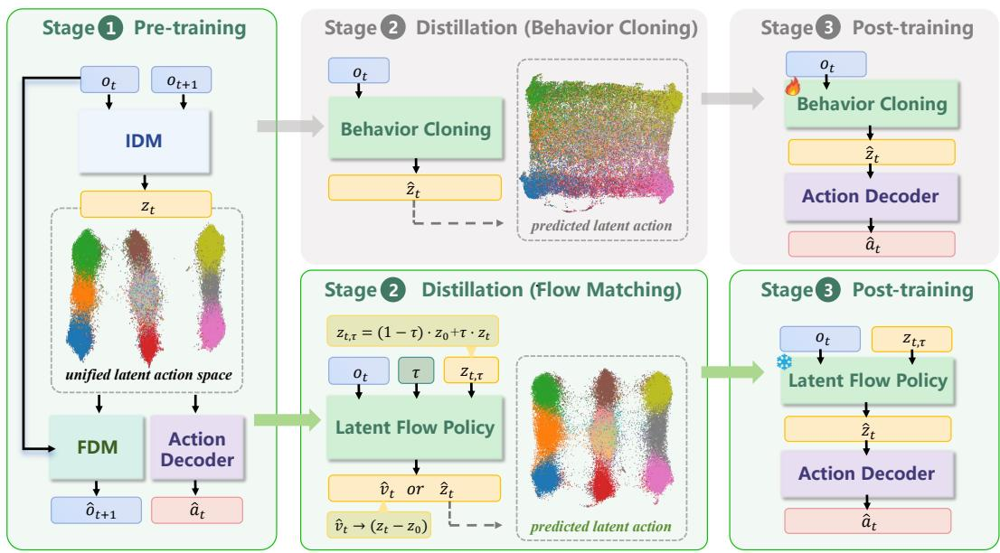

flowchart

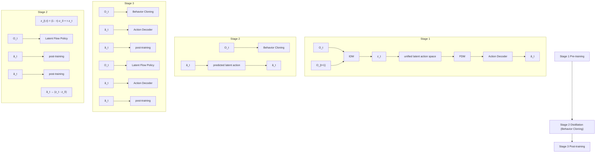

Figure 1: Overview of the LAFP framework. Compared with the standard LAOM pipeline, which learns latent policies via behavior cloning and tends to produce unimodal latent predictions, LAFP replaces behavior cloning with flow matching to better preserve the multimodal structure of latent actions. During post-training, the learned latent flow policy is frozen with only the action decoder is optimized while behavior cloning policy remains fine-tuned in LAOM.

## 3 Methodology

Figure 1 presents the proposed Latent Action Flow Policy (LAFP) framework. LAFP adopts the latentaction learning paradigm and consists of three stages: pre-training, distillation, and post-training. The pre-training stage establishes a compact latent action space from consecutive observations $\left( o _ { t } , o _ { t + 1 } \right)$ , providing a structured intermediate representation $z _ { t }$ that abstracts away low-level actuation details while preserving essential behavioral dynamics. Building on this latent space, the distillation stage learns a policy that predicts latent actions directly from the current observation $o _ { t } ,$ , which employs conditional flow matching to model the full multi-modal distribution of latent actions. Finally, the post-training stage connects the latent policy to downsteam control by training an action decoder that translates stochastically generated latent actions into physical actions $a _ { t } .$ , with the latent flow policy kept frozen to serve as a stable and diverse prior.

## 3.1 Pretraining: Latent Action Learning

We follow the LAOM framework to learn a latent action space by jointly training an IDM and an FDM, along with an action decoder, as illustrated in Stage 1 of Fig.1. The IDM encodes consecutive observations $\left( o _ { t } , o _ { t + 1 } \right)$ into a latent action $z _ { t } ,$ , while the FDM reconstructs $o _ { t + 1 }$ from $o _ { t }$ and $z _ { t }$ . The latent space is discretized via a vector-quantized variational autoencoder (VQ-VAE) [24], producing a codebook of discrete actions updated using exponential moving averages. The training objective includes a vector-quantization loss $\mathcal { L } _ { \mathrm { v q } } = \Vert \boldsymbol { z } _ { t } - \boldsymbol { e } \Vert ^ { 2 }$ , where e denotes the nearest codebook entry, and a reconstruction loss $\mathcal { L } _ { \mathrm { r e c o n s t r u c t i o n } } = \| \hat { o } _ { t + 1 } - o _ { t + 1 } \| ^ { 2 } .$ . To improve action consistency, an action decoder is trained using a subset of ground-truth actions ${ { a } _ { t } } ,$ resulting in an additional loss $\mathcal { L } _ { \mathrm { a d } } = \Vert \hat { a } _ { t } - a _ { t } \Vert ^ { 2 }$ . The weighting coefficient λ corresponds to the ratio between the amount of action-labeled data used for decoder training and the total training data, usually set to $\lambda = 0 . 1$ . The overall model is optimized using the combined objective $\mathcal { L } = \mathcal { L } _ { \mathrm { v q } } + \mathcal { L } _ { \mathrm { r e c o n s t r u c t i o n } } + \lambda \cdot \mathcal { L } _ { \mathrm { a d } }$ .

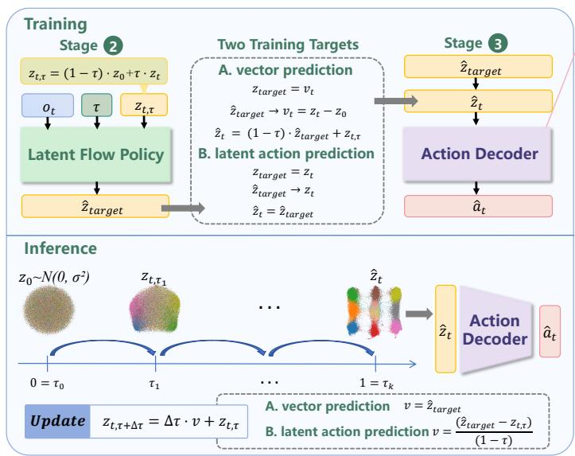

flowchart

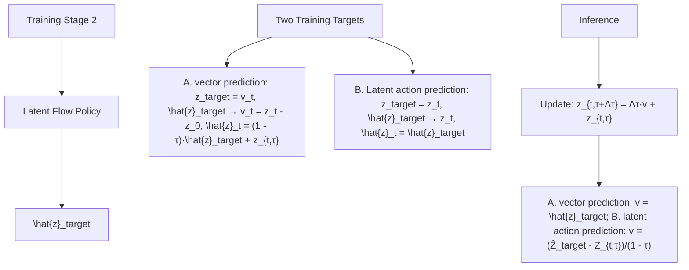

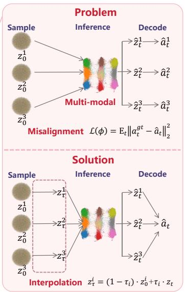

flowchart

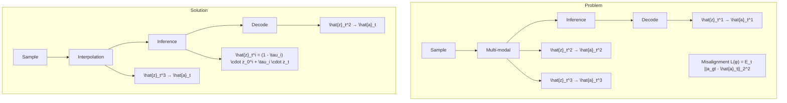

Figure 2: Training and inference pipeline of LAFP. Top: During training, two prediction targets $\hat { z } _ { t a r g e t }$ are considered for flow matching, which induce equivalent flow trajectories while providing different supervision mechanisms for latent flow policy distillation and different ways to obtain the latent action $\hat { z } _ { t }$ for decoding. Right: A key challenge in post-training is that sampling directly from noise yields multiple plausible latent $\hat { z } _ { t } ^ { \phantom { } } .$ , causing misalignment with action labels which is resolved via interpolation-based sampling. Bottom: During inference, the model performs iterative flow matching updates starting from Gaussian noise, and decodes the final latent sample into executable actions.

## 3.2 Distillation: Flow Matching Policy Learning

In LAOM, the latent policy is learned via behavior cloning using latent action labels from the pretrained IDM. However, behavior cloning yields a deterministic mapping and tends to average over multiple valid behaviors. To capture the underlying multi-modal structure, we replace it with a conditional flow matching policy $\pi _ { \mathrm { f l o w } }$ , which learns a transport process from a simple prior to the conditional distribution of latent actions given $o _ { t }$ . Training proceeds by sampling Gaussian noise $z _ { 0 }$ and a time step $\tau \sim U ( 0 , 1 )$ ), and constructing interpolated states $z _ { t , \tau } = z _ { t } \cdot \tau + z _ { 0 } \cdot ( 1 - \tau )$ . The policy takes $\left( \boldsymbol { z } _ { t , \tau } , \tau , \boldsymbol { o } _ { t } \right)$ as input and predicts $\hat { z } _ { \mathrm { t a r g e t } } = \pi _ { \mathrm { f l o w } } ( z _ { t , \tau } , \tau ; \theta _ { \mathrm { f l o w } } , o _ { t } )$ .

Prediction targets. We consider two training objectives, as illustrated in Fig. 2. For latent action prediction, the model directly regresses to $z _ { t }$ with loss $\mathcal { L } = \mathbb { E } [ \| z _ { t } - \hat { z } _ { \mathrm { t a r g e t } } \| _ { 2 } ^ { 2 } ]$ , while for vector field prediction, it estimates the displacement $v _ { t } = \left( z _ { t } - z _ { 0 } \right)$ with $\mathcal { L } = \mathbb { E } [ \| v _ { t } - \hat { z } _ { \mathrm { t a r g e t } } \| _ { 2 } ^ { 2 } ]$ . At inference, latent action samples are generated via iterative updates. Given $\hat { z } _ { \mathrm { t a r g e t } }$ , the update direction is defined as v = $\begin{array} { r } { v = { \frac { \hat { z } _ { t a r g e t } - z _ { t , \tau } } { 1 - \tau } } } \end{array}$ zˆtarget−zt,τ1−τ for latent action prediction, and v = ˆztarget for vector field prediction, followed by $v = \hat { z } _ { \mathrm { t a r g e t } }$ $z _ { t , \tau + \Delta \tau } = z _ { t , \tau } + v \cdot \Delta \tau$ . In practice, we adopt latent action prediction, as it provides more stable optimization in high-dimensional latent spaces and better preserves the learned structure.

## 3.3 Post-training: Action Decoding from Flow Matching

Unlike behavior cloning, where a deterministic latent action can be directly decoded into a groundtruth action, the flow matching policy is inherently stochastic. Given the same observation $o _ { t }$ , it can generate different latent actions $\hat { z } _ { t }$ depending on the sampled initial noise $z _ { 0 }$ . While this stochasticity enables modeling multi-modal behaviors, it breaks the one-to-one correspondence between latent actions and ground-truth actions $a _ { t } ^ { \mathrm { g t } }$ , making decoder training non-trivial (Fig. 2, Right). To address this, we avoid directly fitting paired $( \hat { z } _ { t } , a _ { t } ^ { \mathrm { g t } } )$ mappings and instead consider two practical strategies for training the action decoder $g _ { \phi }$ . In both cases, the decoder is trained with a mean squared error objective: $\mathcal { L } _ { \mathrm { m a p p i n g } } ( \phi ) = \mathbb { E } _ { t } \left[ \| a _ { t } ^ { \mathrm { g t } } - \hat { a } _ { t } \| _ { 2 } ^ { 2 } \right]$ .

LAOM LAOM(Frozen) LAFP(Fine-tuned) LAFP

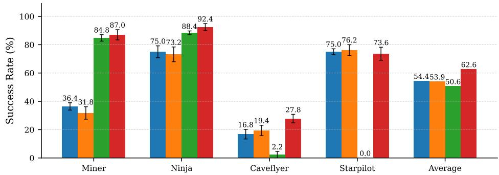

bar chart

| Aircraft Model | Blue Bar (%) | Orange Bar (%) | Green Bar (%) | Red Bar (%) |
|---|---|---|---|---|
| Miner | 36.4 | 31.8 | 84.8 | 87.0 |
| Ninja | 75.0 | 73.2 | 88.4 | 92.4 |
| Caveflyer | 16.8 | 19.4 | 2.2 | 27.8 |
| Starpilot | 75.0 | 76.2 | 0.0 | 73.6 |
| Average | 54.4 | 53.9 | 50.6 | 62.6 |

Figure 3: Success rate comparison between LAOM and LAFP. Results are averaged over 100 evaluation episodes across 5 random seeds and reported as mean ± standard deviation. Four representative environments are shown, corresponding to different behavioral categories: navigation (CaveFlyer), platforming (Ninja), collection/puzzle solving (Miner), and combat/action (StarPilot). Full results on all 16 environments are provided in the Appendix. The rightmost panel reports the average success rate across all 16 environments, consistent with the following figures.

Direct mapping from latent action labels. We use latent action labels as inputs, $\hat { a } _ { t } = g _ { \phi } ( z _ { t } )$ assuming the learned policy approximately preserves the latent structure induced by the IDM.

Inference-time interpolation mechanism. We alternatively constrain the source distribution in flow matching to interpolate between Gaussian noise and zt, reducing stochasticity and encouraging $\hat { z } _ { t } \approx z _ { t }$ . The decoder then operates on generated samples, $\hat { a } _ { t } = g _ { \phi } ( \hat { z } _ { t } )$ . During this stage, the flow matching policy can be frozen to serve as a stable action prior.

## 4 Experiments

Our experiments aim to answer the following questions:

(Q1) Does the flow matching policy faithfully preserve the structure of the latent action space learned during the IDM pre-training stage?  
(Q2) To what extent does maintaining the pre-trained latent action structure translate into improved performance on downstream imitation learning tasks?  
(Q3) What combination of prediction targets and inference step budgets yields the optimal trade-off between policy quality and computational efficiency for flow matching?  
(Q4) Among candidate decoding schemes that map stochastically generated latent actions to deterministic environment actions, which approach achieves the highest downstream success rate?

## 4.1 Experimental setup

Benchmark. We evaluate our method on PROCGEN [10], which contains 16 procedurally generated game-like environments with substantial visual and structural variation between training and testing levels. Such diversity requires strong generalization and makes PROCGEN a challenging benchmark for evaluating whether a latent action space can capture environment-invariant behavioral structure. Since each environment exhibits distinct dynamics and visual characteristics, we train a separate policy for each environment. Each environment contains approximately 2.6M training frames and 6.5K held-out testing frames, all collected from an expert PPO [22] policy trained for 50 million timesteps. Our training pipeline consists of three stages: 50K steps of latent action pre-training, 120K steps of policy distillation, and 5K steps of action decoder post-training. For the behavior cloning baseline, the latent policy is trained for 60K steps using the same pre-trained latent action space. We additionally verified that extending behavior cloning training to 120K steps yields negligible performance improvement, indicating that the shorter training schedule does not disadvantage the baseline. Unless otherwise specified, the latent action dimension is set to 128.

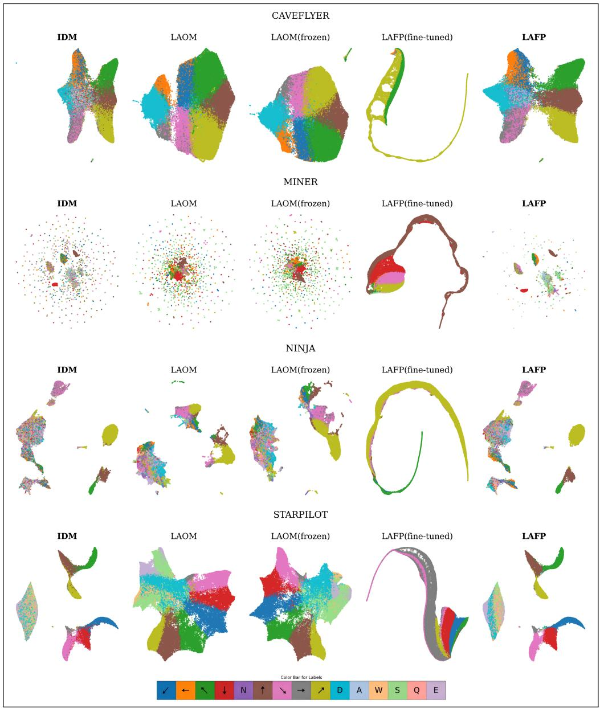

chromatography image

| Method       | IDM   | LAOM  | LAOM(frozen) | LAFP(fine-tuned) | LAFP  |
| ------------ | ----- | ----- | ------------ | ---------------- | ----- |
| CAVEFLYER    |       |       |              |                  |       |
| MINER        |       |       |              |                  |       |
| NINJA        |       |       |              |                  |       |
| STARPILOT    |       |       |              |                  |       |
| Color Bar for Labels |       |       |            |                  |       |

Figure 4: UMAP projections of latent action spaces for the IDM and downstream policies across four representative environments. Each row corresponds to one environment, while columns are ordered as LAOM, LAOM(Frozen), LAFP(Fine-tuned), LAFP, and the IDM latent space for reference. The LAFP and IDM columns are highlighted to facilitate direct comparison. Colors denote discrete action classes: the IDM latent space is colored using ground-truth action labels, while downstream policies are colored using decoded action labels.

Baseline. Our primary baseline is LAOM, which learns a latent action space through unsupervised VQ-VAE [24] based pre-training jointly regularized with an action decoder constraint. A latent policy is then trained via behavior cloning on the inferred latent actions, followed by a lightweight post-training decoder that maps latent actions back to the original action space using a small amount of action-labeled data. During both the pre-training action decoder regularization and the post-training decoder learning, only a small amount of action-labeled data is used, corresponding to 10% of the full training dataset. We evaluate two standard variants of this framework:

• LAOM: The final layers of the latent policy are jointly fine-tuned with the action decoder, allowing the representation to adapt to the downstream action space.

Table 1: Impact of action decoding (AD) on pre-trained latent action quality and downstream policy performance. ∆ Acc denotes the improvement of pre-training stage action decoding accuracy, while ∆ Score denotes the downstream policy gain (AD − NAD). The largest policy improvement is highlighted in bold with a light red background.

<table><tr><td>Environment</td><td> $\Delta$  Acc</td><td>LAOM</td><td>LAOM (Frozen)</td><td>LAFP (Fine-tuned)</td><td>LAFP</td></tr><tr><td>Caveflyer</td><td>13.3</td><td>+3.6</td><td>+6.2</td><td>-7.6</td><td>+10.6</td></tr><tr><td>Miner</td><td>7.5</td><td>-11.8</td><td>-9.2</td><td>+6.2</td><td>+14.2</td></tr><tr><td>Ninja</td><td>12.3</td><td>-4.8</td><td>-4.2</td><td>+10.4</td><td>+11.4</td></tr><tr><td>Starpilot</td><td>5.0</td><td>+0.4</td><td>-1.0</td><td>-0.2</td><td>+4.8</td></tr><tr><td>Average</td><td>7.8</td><td>+1.2</td><td>+6.4</td><td>+7.8</td><td>+10.3</td></tr></table>

Table 2: Impact of action decoder (AD) design and transfer from IDM on LAOM (Frozen) and LAFP. “IDM-AD” denotes the decoder pretrained in the IDM stage and directly transferred without finetuning. “Direct-Sample AD” denotes training action decoder without interpolation, where latent actions are obtained via direct noise sampling and three-steps inference from the flow matching policy. Others refer to a decoder retrained after policy distillation.

<table><tr><td>Environment</td><td>LAOM(Frozen) IDM-AD</td><td>LAOM(Frozen)</td><td>LAFP Direct-Sample AD</td><td>LAFP IDM-AD</td><td>LAFP</td></tr><tr><td>Miner</td><td>0.2±3.9</td><td>31.8±5.2</td><td>86.2±2.6</td><td>81.4±0.4</td><td>87.0±2.5</td></tr><tr><td>Ninja</td><td>63.8±2.1</td><td>73.2±3.7</td><td>92.4±1.3</td><td>93.0±6.7</td><td>92.4±3.0</td></tr><tr><td>Caveflyer</td><td>19.4±5.3</td><td>19.4±4.4</td><td>18.4±4.4</td><td>33.0±7.2</td><td>27.8±3.6</td></tr><tr><td>Starpilot</td><td>70.6±2.7</td><td>76.2±3.8</td><td>73.8±4.5</td><td>76.6±0.9</td><td>73.6±4.6</td></tr><tr><td>Average</td><td>44.6</td><td>53.9</td><td>61.3</td><td>62.6</td><td>62.6</td></tr></table>

• LAOM(Frozen): The latent policy remains fully frozen during decoder training, preserving the latent structure learned during distillation.

For fair comparison, our method is evaluated under the same settings, denoted as LAFP(Fine-tuned) and LAFP, respectively. LAFP adopts the same action-label setting, using 10% labeled data during both pre-training regularization and post-training.

Metrics. We focus on imitation learning performance and report success rate as the primary evaluation metric. An episode is considered successful if its cumulative reward reaches the environmentspecific maximum defined in Cobbe et al. (2020). All results are averaged over 5 random seeds, with 100 evaluation episodes per seed. Variance is reported as the standard deviation across seeds.

## 4.2 Downstream performance

Across the 16 environments, LAFP consistently outperforms LAOM in most cases, achieving an average success-rate improvement of 8.1% (Fig. 3)(Q2), corresponding to a relative improvement of 23.0%. We attribute these gains to the ability of flow matching to better preserve and utilize the latent action distribution learned during IDM pre-training, as illustrated in Fig. 4(Q1). This preservation provides a stronger inductive bias for environments that require diverse or complex behaviors. In a small number of environments, LAFP performs slightly below LAOM, suggesting that the additional modeling capacity of flow matching may offer limited advantages when the optimal policy is relatively simple. Nevertheless, LAFP remains competitive across all tasks.

Further analysis reveals a clear distinction between fine-tuned and frozen settings. LAFP(Fine-tuned) experiences a noticeable performance drop compared to LAFP, in some cases even falling below LAOM, whereas LAOM slightly benefits from fine-tuning relative to LAOM(Frozen). These results indicate that post-training fine-tuning can disrupt the latent structure preserved by flow matching, weakening its ability to represent latent actions effectively (Fig. 4). In contrast, behavior cloning benefits from fine-tuning because it improves alignment between latent representations and groundtruth actions, leading to modest performance gains.

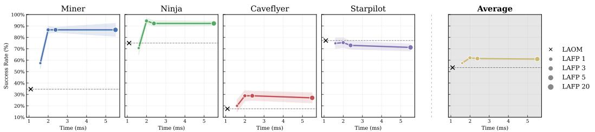  
× LAOMLAFP 1. LAFP 3. LAFP 5. LAFP 20

Figure 5: Performance and per-action inference time of flow matching under different inference step budgets, compared with behavior cloning. LAFP-k denotes a flow matching policy using k inference steps.

## 4.3 Ablation

Effect of action decoder regularization during pre-training. We investigate the effect of introducing an action decoder constraint during latent action pre-training (Table. 1). Incorporating this regularization consistently improves downstream success rates by producing a more structured and better-separated latent action distribution. This effect is particularly important for flow matching policy, which rely on accurately modeling the geometry of the latent space. When the latent space is poorly organized, the learned transport trajectories become unstable, leading to degraded policy performance. In contrast, behavior cloning is less sensitive to the global structure of the latent space and therefore benefits less from improved latent representations. These results suggest that enforcing action consistency during pre-training is especially important for flow matching, where policy quality depends directly on the structure of the latent action space.

Effect of decoder training strategy and sampling consistency. We analyze how different action decoder (AD) training strategies affect downstream performance. Across environments, the sampling mechanism in flow matching plays a critical role in determining decoder stability. When using direct noise sampling (Direct-Sample AD), the generated latent action $\hat { z } _ { t }$ becomes highly stochastic: different sampled noises can lead to different latent action modes for the same observation $o _ { t }$ , while the supervision signal $a _ { t } ^ { \mathrm { g t } }$ remains uniquely defined. As a result, the decoder is forced to map multiple inconsistent latent representations to a single action label, making the latent-to-action correspondence ambiguous and harder to optimize. This effect is reflected in the performance drop observed under direct sampling, particularly in Caveflyer (27.8 → 18.4)(Table. 2). In contrast, interpolation-based sampling constrains the generation process by encouraging $\hat { z } _ { t } \approx z _ { t }$ , thereby reducing latent variability and preserving consistency with the IDM-induced latent structure. This produces a more stable one-to-one correspondence between latent actions and action labels, leading to substantially more reliable decoder training and stronger downstream performance.

Decoder transfer from IDM. We further examine whether the decoder learned during IDM pretraining can be directly reused during policy learning. Interestingly, reusing the IDM-trained decoder causes almost no performance degradation for flow matching, while significantly reducing the performance of behavior cloning, as illustrated in Table. 2. This difference highlights a fundamental distinction between the two approaches. Flow matching remains well-aligned with the latent structure established during IDM pre-training, allowing the same decoder to generalize effectively to downstream policy inference. In contrast, behavior cloning relies more heavily on adapting the decoder to compensate for representation drift during policy learning, resulting in a less stable and more entangled optimization process.

Time–performance trade-off across environments. We compare LAFP under different inference step budgets with LAOM in terms of both performance and inference latency. As shown in Fig. 5, increasing the number of inference steps initially improves performance, and even a small number of steps is sufficient to outperform behavior cloning. However, the gains quickly saturate as the step count increases. Meanwhile, inference time grows monotonically with the number of flow steps, resulting in diminishing returns at higher budgets. Overall, using only three inference steps provides the best balance between performance and efficiency, demonstrating that flow matching policy can substantially outperform behavior cloning with only modest additional computational cost.

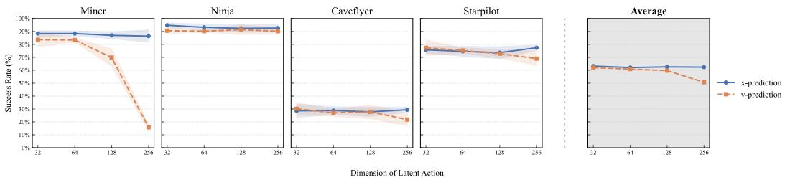  
x-prediction v-prediction  
Dimension of Latent Action

Figure 6: Comparison between latent action prediction (x-prediction) and vector field prediction (v-prediction) under different latent action dimensions.

Effect of latent dimensionality and prediction target. We study the influence of latent action dimensionality and prediction targets in flow matching, comparing direct latent action prediction with vector field prediction (Fig. 6). Direct latent prediction achieves consistently stable performance across all latent dimensions and slightly outperforms vector field prediction at lower dimensions (32–128). In contrast, vector field prediction becomes increasingly unstable as dimensionality grows, with noticeable degradation at higher dimensions such as 256 in several environments. These results suggest that directly predicting latent actions provides a more robust optimization objective, whereas vector field prediction becomes harder to optimize in high-dimensional spaces due to accumulated trajectory errors and increasingly difficult local direction estimation.

## 5 Discussion

In summary, our study suggests that the key to effective latent action policy distillation lies in preserving the structure of the pretrained latent space during policy optimization, rather than adapting the latent space to better fit downstream supervision. Unlike regression-based approaches that often collapse multimodal latent distributions into deterministic predictions, flow matching policies naturally operate at the distribution level, enabling more faithful preservation of latent dynamics and action diversity throughout both training and inference. This perspective also provides a unified explanation for several empirical observations in our experiments: the consistent gains obtained from improving latent space quality through decoder regularization, the strong performance achieved by directly reusing the IDM-trained decoder without additional adaptation, and the performance degradation observed when fine-tuning the LAFP latent policy during post-training. Moreover, the results indicate that downstream policy performance is closely tied to the stability and semantic consistency of the latent representation itself, highlighting the importance of maintaining alignment between pre-training and policy learning objectives. At the same time, flow matching policies remain computationally practical, requiring less than an additional 1× training and inference cost to obtain most of the performance improvements. Finally, our preliminary analysis of sampling noise standard deviation suggests that models without an action decoder are more sensitive to noise scale, whereas introducing a decoder leads to more stable behavior across different settings, indicating that a better-conditioned latent space may also improve robustness to sampling hyperparameters.

## 6 Limitations and future work

While LAFP demonstrates consistent improvements under the current setting, several aspects remain to be further explored. Although our method already achieves strong performance with a small number of inference steps, the iterative nature of flow matching still introduces additional computational overhead compared to one-step policies. This motivates future work on distillation or shortcut learning techniques that can compress the multi-step generation process into a single-step or near single-step policy, further improving deployment efficiency without sacrificing performance. In addition, our study is conducted under offline imitation learning in discrete action environments. Extending the framework to continuous control and online learning remains an open direction, particularly in understanding how latent action structure and flow matching policy learning interact under more dynamic data distributions. More broadly, our results reinforce that performance remains tied to latent space quality, motivating further research on better representation learning and on tighter integration between latent modeling and policy optimization.

## References

[1] Michael Bain and Claude Sammut. A framework for behavioural cloning. In Machine intelligence 15, pages 103–129, 1995.  
[2] Hongzhe Bi, Hengkai Tan, Shenghao Xie, Zeyuan Wang, Shuhe Huang, Haitian Liu, Ruowen Zhao, Yao Feng, Chendong Xiang, Yinze Rong, et al. Motus: A unified latent action world model. arXiv preprint arXiv:2512.13030, 2025.  
[3] Johan Bjorck, Fernando Castañeda, Nikita Cherniadev, Xingye Da, Runyu Ding, Linxi Fan, Yu Fang, Dieter Fox, Fengyuan Hu, Spencer Huang, et al. Gr00t n1: An open foundation model for generalist humanoid robots. arXiv preprint arXiv:2503.14734, 2025.  
[4] Kevin Black, Noah Brown, Danny Driess, Adnan Esmail, Michael Equi, Chelsea Finn, Niccolo Fusai, Lachy Groom, Karol Hausman, Brian Ichter, et al. π0: A vision-language-action flow model for general robot control. arXiv preprint arXiv:2410.24164, 2024.  
[5] Qingwen Bu, Jisong Cai, Li Chen, Xiuqi Cui, Yan Ding, Siyuan Feng, Shenyuan Gao, Xindong He, Xuan Hu, Xu Huang, et al. Agibot world colosseo: A large-scale manipulation platform for scalable and intelligent embodied systems. In IROS, 2025.  
[6] Qingwen Bu, Yanting Yang, Jisong Cai, Shenyuan Gao, Guanghui Ren, Maoqing Yao, Ping Luo, and Hongyang Li. Learning to act anywhere with task-centric latent actions. In RSS, 2025.  
[7] Xizhou Bu, Jiexi Lyu, Fulei Sun, Ruichen Yang, Zhiqiang Ma, and Wei Li. Laof: Robust latent action learning with optical flow constraints. arXiv preprint arXiv:2511.16407, 2025.  
[8] Xiaoyu Chen, Hangxing Wei, Pushi Zhang, Chuheng Zhang, Kaixin Wang, Yanjiang Guo, Rushuai Yang, Yucen Wang, Xinquan Xiao, Li Zhao, et al. Villa-x: enhancing latent action modeling in vision-language-action models. In ICLR, 2026.  
[9] Cheng Chi, Zhenjia Xu, Siyuan Feng, Eric Cousineau, Yilun Du, Benjamin Burchfiel, Russ Tedrake, and Shuran Song. Diffusion policy: Visuomotor policy learning via action diffusion. The International Journal of Robotics Research, 44(10-11):1684–1704, 2025.  
[10] Karl Cobbe, Chris Hesse, Jacob Hilton, and John Schulman. Leveraging procedural generation to benchmark reinforcement learning. In ICML, 2020.  
[11] Youngjoon Jeong, Junha Chun, and Taesup Kim. Learning to act robustly with view-invariant latent actions. arXiv preprint arXiv:2601.02994, 2026.  
[12] Albina Klepach, Alexander Nikulin, Ilya Zisman, Denis Tarasov, Alexander Derevyagin, Andrei Polubarov, Nikita Lyubaykin, and Vladislav Kurenkov. Object-centric latent action learning. In 7th Robot Learning Workshop: Towards Robots with Human-Level Abilities, 2025.  
[13] Tianhong Li and Kaiming He. Back to basics: Let denoising generative models denoise. arXiv preprint arXiv:2511.13720, 2025.  
[14] Yaron Lipman, Ricky TQ Chen, Heli Ben-Hamu, Maximilian Nickel, and Matt Le. Flow matching for generative modeling. arXiv preprint arXiv:2210.02747, 2022.  
[15] Mingyu Liu, Jiuhe Shu, Hui Chen, Zeju Li, Canyu Zhao, Jiange Yang, Shenyuan Gao, Hao Chen, and Chunhua Shen. Stamo: Unsupervised learning of generalizable robot motion from compact state representation. arXiv preprint arXiv:2510.05057, 2025.  
[16] Xingchao Liu, Chengyue Gong, and Qiang Liu. Flow straight and fast: Learning to generate and transfer data with rectified flow. arXiv preprint arXiv:2209.03003, 2022.  
[17] Robert McCarthy, Daniel CH Tan, Dominik Schmidt, Fernando Acero, Nathan Herr, Yilun Du, Thomas G Thuruthel, and Zhibin Li. Towards generalist robot learning from internet video: A survey. Journal of Artificial Intelligence Research, 83, 2025.  
[18] Dujun Nie, Fengjiao Chen, Qi Lv, Jun Kuang, Xiaoyu Li, Xuezhi Cao, and Xunliang Cai. Lary: A latent action representation yielding benchmark for generalizable vision-to-action alignment. arXiv preprint arXiv:2604.11689, 2026.  
[19] Alexander Nikulin, Ilya Zisman, Denis Tarasov, Nikita Lyubaykin, Andrei Polubarov, Igor Kiselev, and Vladislav Kurenkov. Latent action learning requires supervision in the presence of distractors. In ICML, 2025.  
[20] Maxime Oquab, Timothée Darcet, Théo Moutakanni, Huy Vo, Marc Szafraniec, Vasil Khalidov, Pierre Fernandez, Daniel Haziza, Francisco Massa, Alaaeldin El-Nouby, et al. Dinov2: Learning robust visual features without supervision. arXiv preprint arXiv:2304.07193, 2023.  
[21] Dominik Schmidt and Minqi Jiang. Learning to act without actions. In ICLR, 2024.  
[22] John Schulman, Filip Wolski, Prafulla Dhariwal, Alec Radford, and Oleg Klimov. Proximal policy optimization algorithms. arXiv preprint arXiv:1707.06347, 2017.  
[23] Mustafa Shukor, Dana Aubakirova, Francesco Capuano, Pepijn Kooijmans, Steven Palma, Adil Zouitine, Michel Aractingi, Caroline Pascal, Martino Russi, Andres Marafioti, et al. Smolvla: A vision-language-action model for affordable and efficient robotics. arXiv preprint arXiv:2506.01844, 2025.  
[24] Aaron Van Den Oord, Oriol Vinyals, et al. Neural discrete representation learning. In NeurIPS, 2017.  
[25] Junjie Wen, Yichen Zhu, Jinming Li, Minjie Zhu, Zhibin Tang, Kun Wu, Zhiyuan Xu, Ning Liu, Ran Cheng, Chaomin Shen, et al. Tinyvla: Towards fast, data-efficient vision-language-action models for robotic manipulation. IEEE Robotics and Automation Letters, 2025.  
[26] Chengen Xie, Bin Sun, Tianyu Li, Junjie Wu, Zhihui Hao, XianPeng Lang, and Hongyang Li. Latentvla: Efficient vision-language models for autonomous driving via latent action prediction. arXiv preprint arXiv:2601.05611, 2026.  
[27] Ge Yan, Jiyue Zhu, Yuquan Deng, Shiqi Yang, Ri-Zhao Qiu, Xuxin Cheng, Marius Memmel, Ranjay Krishna, Ankit Goyal, Xiaolong Wang, et al. Maniflow: A general robot manipulation policy via consistency flow training. arXiv preprint arXiv:2509.01819, 2025.  
[28] Jiange Yang, Yansong Shi, Haoyi Zhu, Mingyu Liu, Kaijing Ma, Yating Wang, Gangshan Wu, Tong He, and Limin Wang. Como: Learning continuous latent motion from internet videos for scalable robot learning. arXiv preprint arXiv:2505.17006, 2025.  
[29] Seonghyeon Ye, Joel Jang, Byeongguk Jeon, Sejune Joo, Jianwei Yang, Baolin Peng, Ajay Mandlekar, Reuben Tan, Yu-Wei Chao, Bill Yuchen Lin, et al. Latent action pretraining from videos. In ICLR, 2025.  
[30] Xinlei Yu, Zhangquan Chen, Yongbo He, Tianyu Fu, Cheng Yang, Chengming Xu, Yue Ma, Xiaobin Hu, Zhe Cao, Jie Xu, et al. The latent space: Foundation, evolution, mechanism, ability, and outlook. arXiv preprint arXiv:2604.02029, 2026.  
[31] Chuheng Zhang, Tim Pearce, Pushi Zhang, Kaixin Wang, Xiaoyu Chen, Wei Shen, Li Zhao, and Jiang Bian. What do latent action models actually learn? In NeurIPS, 2025.

## Appendix

## Overview

This appendix provides supplementary details and experimental results omitted from the main paper due to page constraints. It is organized as follows:

• Sec. A reports full quantitative results across all 16 PROCGEN environments, including an overall performance analysis. Extended ablation studies are also presented across all environments, covering action decoder regularization, decoder variants, time-performance trade-off, and prediction target.  
• Sec. B provides additional UMAP visualizations of latent action spaces for the remaining environments not shown in the main paper.  
• Sec. C details the model architecture, normalization procedure, and computational cost of all methods.

## A Full results on all PROCGEN environments

In the main paper, we report results on four representative environments. To provide a comprehensive evaluation, we extend the comparison to all 16 PROCGEN environments.

Table 3: Performance comparison across all methods and all 16 PROCGEN environments (mean ± std, in %). LAFP achieves the highest average performance, with particularly pronounced gains in environments requiring diverse or multimodal behaviors.

<table><tr><td rowspan="2">Environment</td><td colspan="4">Method</td></tr><tr><td>LAOM</td><td>LAOM (Frozen)</td><td>LAFP (Fine-tuned)</td><td>LAFP</td></tr><tr><td>bigfish</td><td>89.4 ± 1.8</td><td>88.0 ± 3.9</td><td>82.4 ± 1.8</td><td>88.8 ± 2.9</td></tr><tr><td>bossfight</td><td>45.8 ± 2.8</td><td>50.4 ± 4.2</td><td>34.2 ± 4.3</td><td>55.0 ± 7.1</td></tr><tr><td>caveflyer</td><td>16.8 ± 2.6</td><td>19.4 ± 4.4</td><td>2.2 ± 2.3</td><td>27.8 ± 3.6</td></tr><tr><td>chaser</td><td>19.8 ± 3.4</td><td>8.8 ± 2.8</td><td>27.0 ± 1.4</td><td>29.6 ± 7.4</td></tr><tr><td>climber</td><td>17.6 ± 4.2</td><td>20.4 ± 4.6</td><td>24.0 ± 4.2</td><td>29.0 ± 5.9</td></tr><tr><td>coinrun</td><td>93.4 ± 1.9</td><td>94.0 ± 2.7</td><td>94.4 ± 1.8</td><td>96.4 ± 1.1</td></tr><tr><td>dodgeball</td><td>35.0 ± 4.7</td><td>29.6 ± 4.3</td><td>0.0 ± 0.0</td><td>28.2 ± 6.2</td></tr><tr><td>fruitbot</td><td>39.2 ± 3.7</td><td>42.6 ± 6.0</td><td>33.0 ± 5.1</td><td>35.6 ± 3.2</td></tr><tr><td>heist</td><td>83.4 ± 4.0</td><td>83.2 ± 1.5</td><td>93.4 ± 0.9</td><td>97.2 ± 1.1</td></tr><tr><td>jumper</td><td>66.4 ± 3.2</td><td>69.6 ± 3.0</td><td>81.6 ± 4.5</td><td>79.4 ± 7.2</td></tr><tr><td>leaper</td><td>70.4 ± 5.5</td><td>71.2 ± 2.6</td><td>62.2 ± 1.6</td><td>73.0 ± 2.2</td></tr><tr><td>maze</td><td>98.4 ± 1.3</td><td>98.0 ± 1.7</td><td>93.0 ± 2.0</td><td>99.8 ± 0.4</td></tr><tr><td>miner</td><td>36.4 ± 4.2</td><td>31.8 ± 5.2</td><td>84.8 ± 1.3</td><td>87.0 ± 2.5</td></tr><tr><td>ninja</td><td>75.0 ± 3.4</td><td>73.2 ± 3.7</td><td>88.4 ± 2.4</td><td>92.4 ± 3.0</td></tr><tr><td>plunder</td><td>8.6 ± 2.9</td><td>5.8 ± 1.6</td><td>9.4 ± 4.6</td><td>8.0 ± 2.1</td></tr><tr><td>starpilot</td><td>75.0 ± 2.1</td><td>76.2 ± 3.8</td><td>0.0 ± 0.0</td><td>73.6 ± 4.6</td></tr><tr><td>Average</td><td>54.4</td><td>53.9</td><td>50.6</td><td>62.6</td></tr></table>

## A.1 Overall Performance.

Table 3 summarizes the performance of all methods. Overall, the results consistently corroborate the conclusions drawn in the main paper. LAFP achieves superior performance over LAOM in the majority of environments, with particularly notable gains in tasks that require diverse or multimodal behaviors, such as chaser, jumper and miner. In contrast, in relatively simple environments such as coinrun and maze, both methods perform comparably, suggesting that the advantage of LAFP mainly arises in scenarios where preserving action diversity is critical.

A consistent trend across all environments is that freezing the pretrained latent representation is crucial for LAFP. Specifically, LAFP achieves the best overall performance, while fine-tuning often leads to noticeable degradation. In contrast, LAOM exhibits a mild benefit from fine-tuning. This difference highlights a fundamental distinction between the two approaches: flow matching policies rely on preserving the pretrained latent structure, whereas behavior cloning benefits from adapting representations during downstream training.

Table 4: Ablation on action decoder (AD) constraints. AD significantly improves LAFP across environments, while removing decoder constraints (NAD) often leads to substantial performance degradation.

<table><tr><td rowspan="3">Environment</td><td colspan="8">Method</td></tr><tr><td colspan="2">LAOM</td><td colspan="2">LAOM (Frozen)</td><td colspan="2">LAFP (Fine-tuned)</td><td colspan="2">LAFP</td></tr><tr><td>AD</td><td>NAD</td><td>AD</td><td>NAD</td><td>AD</td><td>NAD</td><td>AD</td><td>NAD</td></tr><tr><td>bigfish</td><td>89.4 ± 1.8</td><td>85.2 ± 6.1</td><td>88.0 ± 3.9</td><td>88.0 ± 3.0</td><td>82.4 ± 1.8</td><td>65.6 ± 5.5</td><td>88.8 ± 2.9</td><td>79.6 ± 6.1</td></tr><tr><td>bossfight</td><td>45.8 ± 2.8</td><td>13.8 ± 1.3</td><td>50.4 ± 4.2</td><td>3.0 ± 0.7</td><td>34.2 ± 4.3</td><td>0.8 ± 0.8</td><td>55.0 ± 7.1</td><td>0.8 ± 1.3</td></tr><tr><td>caveflyer</td><td>16.8 ± 2.6</td><td>13.2 ± 4.1</td><td>19.4 ± 4.4</td><td>13.2 ± 4.0</td><td>2.2 ± 2.3</td><td>9.8 ± 3.6</td><td>27.8 ± 3.6</td><td>17.2 ± 4.1</td></tr><tr><td>chaser</td><td>19.8 ± 3.4</td><td>25.8 ± 3.5</td><td>8.8 ± 2.8</td><td>4.2 ± 1.6</td><td>27.0 ± 1.4</td><td>0.8 ± 0.8</td><td>29.6 ± 7.4</td><td>28.6 ± 3.5</td></tr><tr><td>climber</td><td>17.6 ± 4.2</td><td>22.8 ± 3.3</td><td>20.4 ± 4.6</td><td>20.4 ± 4.6</td><td>24.0 ± 4.2</td><td>24.6 ± 3.2</td><td>29.0 ± 5.9</td><td>21.2 ± 3.3</td></tr><tr><td>coinrun</td><td>93.4 ± 1.9</td><td>88.0 ± 2.6</td><td>94.0 ± 2.7</td><td>75.0 ± 3.4</td><td>94.4 ± 1.8</td><td>48.2 ± 4.7</td><td>96.4 ± 1.1</td><td>87.8 ± 2.6</td></tr><tr><td>dodgeball</td><td>35.0 ± 4.7</td><td>31.6 ± 3.6</td><td>29.6 ± 4.3</td><td>37.0 ± 1.6</td><td>0.0 ± 0.0</td><td>28.4 ± 5.8</td><td>28.2 ± 6.2</td><td>29.6 ± 3.6</td></tr><tr><td>fruitbot</td><td>39.2 ± 3.7</td><td>38.4 ± 4.7</td><td>42.6 ± 6.0</td><td>34.0 ± 4.3</td><td>33.0 ± 5.1</td><td>18.8 ± 5.5</td><td>35.6 ± 3.2</td><td>31.2 ± 4.7</td></tr><tr><td>heist</td><td>83.4 ± 4.0</td><td>83.0 ± 4.9</td><td>83.2 ± 1.5</td><td>50.0 ± 7.8</td><td>93.4 ± 0.9</td><td>88.6 ± 3.8</td><td>97.2 ± 1.1</td><td>69.6 ± 4.9</td></tr><tr><td>jumper</td><td>66.4 ± 3.2</td><td>71.4 ± 3.0</td><td>69.6 ± 3.0</td><td>67.6 ± 5.2</td><td>81.6 ± 4.5</td><td>73.8 ± 3.1</td><td>79.4 ± 7.2</td><td>77.6 ± 3.0</td></tr><tr><td>leaper</td><td>70.4 ± 5.5</td><td>74.8 ± 3.5</td><td>71.2 ± 2.6</td><td>72.2 ± 3.3</td><td>62.2 ± 1.6</td><td>71.8 ± 4.1</td><td>73.0 ± 2.2</td><td>72.0 ± 3.5</td></tr><tr><td>maze</td><td>98.4 ± 1.3</td><td>98.2 ± 1.6</td><td>98.0 ± 1.7</td><td>97.8 ± 1.3</td><td>93.0 ± 2.0</td><td>97.8 ± 0.8</td><td>99.8 ± 0.4</td><td>98.0 ± 1.6</td></tr><tr><td>miner</td><td>36.4 ± 4.2</td><td>48.2 ± 4.5</td><td>31.8 ± 5.2</td><td>41.0 ± 6.3</td><td>84.8 ± 1.3</td><td>78.6 ± 4.0</td><td>87.0 ± 2.5</td><td>72.8 ± 4.5</td></tr><tr><td>ninja</td><td>75.0 ± 3.4</td><td>79.8 ± 1.7</td><td>73.2 ± 3.7</td><td>77.4 ± 3.6</td><td>88.4 ± 2.4</td><td>78.0 ± 3.6</td><td>92.4 ± 3.0</td><td>81.0 ± 1.7</td></tr><tr><td>plunder</td><td>8.6 ± 2.9</td><td>3.0 ± 0.5</td><td>5.8 ± 1.6</td><td>1.6 ± 1.5</td><td>9.4 ± 4.6</td><td>0.0 ± 0.0</td><td>8.0 ± 2.1</td><td>0.4 ± 0.5</td></tr><tr><td>starpilot</td><td>75.0 ± 2.1</td><td>74.6 ± 3.6</td><td>76.2 ± 3.8</td><td>77.2 ± 3.8</td><td>0.0 ± 0.0</td><td>0.2 ± 0.4</td><td>73.6 ± 4.6</td><td>68.8 ± 3.6</td></tr><tr><td>Average</td><td>54.4</td><td>53.2</td><td>53.9</td><td>47.5</td><td>50.6</td><td>42.9</td><td>62.6</td><td>52.3</td></tr></table>

Table 5: Comparison of decoder designs. Reusing the pretrained IDM decoder benefits LAFP but often degrades LAOM, highlighting the importance of preserving latent structure for flow-based policies.

<table><tr><td rowspan="3">Environment</td><td colspan="4">Method</td></tr><tr><td colspan="2">LAOM (Frozen)</td><td colspan="2">LAFP</td></tr><tr><td>post-training decoder</td><td>IDM decoder</td><td>post-training decoder</td><td>IDM decoder</td></tr><tr><td>bigfish</td><td>88.0 ± 3.9</td><td>89.4 ± 3.4</td><td>88.8 ± 2.9</td><td>87.6 ± 3.2</td></tr><tr><td>bossfight</td><td>50.4 ± 4.2</td><td>47.0 ± 6.1</td><td>55.0 ± 7.1</td><td>46.0 ± 3.8</td></tr><tr><td>caveflyer</td><td>19.4 ± 4.4</td><td>19.4 ± 5.3</td><td>27.8 ± 3.6</td><td>33.0 ± 7.2</td></tr><tr><td>chaser</td><td>8.8 ± 2.8</td><td>5.6 ± 4.8</td><td>29.6 ± 7.4</td><td>25.6 ± 1.8</td></tr><tr><td>climber</td><td>20.4 ± 4.6</td><td>14.8 ± 3.2</td><td>29.0 ± 5.9</td><td>29.6 ± 0.8</td></tr><tr><td>coinrun</td><td>94.0 ± 2.7</td><td>97.8 ± 2.3</td><td>96.4 ± 1.1</td><td>97.8 ± 1.1</td></tr><tr><td>dodgeball</td><td>29.6 ± 4.3</td><td>20.2 ± 2.6</td><td>28.2 ± 6.2</td><td>33.4 ± 2.9</td></tr><tr><td>fruitbot</td><td>42.6 ± 6.0</td><td>38.8 ± 7.3</td><td>35.6 ± 3.2</td><td>36.6 ± 5.2</td></tr><tr><td>heist</td><td>83.2 ± 1.5</td><td>12.2 ± 1.5</td><td>97.2 ± 1.1</td><td>96.8 ± 3.0</td></tr><tr><td>jumper</td><td>69.6 ± 3.0</td><td>62.0 ± 6.3</td><td>79.4 ± 7.2</td><td>83.4 ± 5.8</td></tr><tr><td>leaper</td><td>71.2 ± 2.6</td><td>70.2 ± 3.7</td><td>73.0 ± 2.2</td><td>75.0 ± 3.7</td></tr><tr><td>maze</td><td>98.0 ± 1.7</td><td>96.8 ± 0.8</td><td>99.8 ± 0.4</td><td>99.2 ± 1.9</td></tr><tr><td>miner</td><td>31.8 ± 5.2</td><td>0.2 ± 3.9</td><td>87.0 ± 2.5</td><td>81.4 ± 0.4</td></tr><tr><td>ninja</td><td>73.2 ± 3.7</td><td>63.8 ± 2.1</td><td>92.4 ± 3.0</td><td>93.0 ± 6.7</td></tr><tr><td>plunder</td><td>5.8 ± 1.6</td><td>4.4 ± 1.6</td><td>8.0 ± 2.1</td><td>6.2 ± 1.5</td></tr><tr><td>starpilot</td><td>76.2 ± 3.8</td><td>70.6 ± 2.7</td><td>73.6 ± 4.6</td><td>76.6 ± 0.9</td></tr><tr><td>Average</td><td>53.9</td><td>44.6</td><td>62.6</td><td>62.6</td></tr></table>

## A.2 Additional Ablation Results

We present full ablation results across all environments to validate the generality of our findings. All reported results are averaged over 5 random seeds with 100 episodes each seed, with variance computed as the standard deviation across seeds. Table 4 shows that action decoder (AD) constraints consistently improve LAFP, while their removal (NAD) leads to significant degradation, highlighting the importance of decoder regularization for flow-based policies. Table 5 further demonstrates that reusing the pretrained IDM decoder is beneficial for LAFP but often harms LAOM, indicating that LAFP is more sensitive to preserving latent structure. Table 6 evaluates the number of flow steps and shows that a small number (3–5) provides the best performance-efficiency trade-off, with diminishing returns for larger values. Table 7 compares latent dimensions and prediction targets, where direct latent prediction remains robust across dimensions, while vector field prediction degrades substantially in high-dimensional settings.

Table 6: Effect of the number of flow steps. A small number of steps (3–5) achieves the best balance between performance and efficiency, while more steps yield diminishing returns.

<table><tr><td rowspan="2">Environment</td><td colspan="5">Model</td></tr><tr><td>LAFP(1-step)</td><td>LAFP(3-steps)</td><td>LAFP(5-steps)</td><td>LAFP(20-steps)</td><td>LAOM</td></tr><tr><td>bigfish</td><td>87.6 ± 4.5</td><td>88.4 ± 3.5</td><td>84.2 ± 4.8</td><td>84.8 ± 4.0</td><td>86.2 ± 1.9</td></tr><tr><td>bossfight</td><td>48.6 ± 2.4</td><td>45.4 ± 1.8</td><td>48.2 ± 3.3</td><td>51.4 ± 6.3</td><td>46.6 ± 2.1</td></tr><tr><td>caveflyer</td><td>20.0 ± 5.3</td><td>28.8 ± 4.6</td><td>28.8 ± 4.1</td><td>27.0 ± 4.5</td><td>17.4 ± 4.3</td></tr><tr><td>chaser</td><td>29.0 ± 1.9</td><td>25.6 ± 2.8</td><td>23.2 ± 5.8</td><td>15.2 ± 3.8</td><td>17.0 ± 2.1</td></tr><tr><td>climber</td><td>21.6 ± 3.8</td><td>27.4 ± 6.0</td><td>27.8 ± 2.0</td><td>28.8 ± 4.0</td><td>15.4 ± 2.2</td></tr><tr><td>coinrun</td><td>97.4 ± 1.8</td><td>96.6 ± 2.4</td><td>95.2 ± 2.5</td><td>96.6 ± 2.5</td><td>92.6 ± 3.2</td></tr><tr><td>dodgeball</td><td>32.4 ± 7.1</td><td>29.8 ± 4.5</td><td>26.8 ± 2.6</td><td>31.8 ± 2.9</td><td>31.2 ± 1.9</td></tr><tr><td>fruitbot</td><td>41.8 ± 7.0</td><td>33.6 ± 3.6</td><td>35.0 ± 5.3</td><td>33.6 ± 3.9</td><td>40.8 ± 6.4</td></tr><tr><td>heist</td><td>88.6 ± 2.5</td><td>96.0 ± 1.2</td><td>97.6 ± 0.9</td><td>95.2 ± 1.6</td><td>81.4 ± 2.7</td></tr><tr><td>jumper</td><td>71.4 ± 3.8</td><td>83.8 ± 1.5</td><td>84.8 ± 2.9</td><td>82.4 ± 4.3</td><td>65.4 ± 3.2</td></tr><tr><td>leaper</td><td>71.0 ± 4.0</td><td>72.4 ± 4.7</td><td>72.6 ± 2.4</td><td>73.4 ± 6.2</td><td>68.0 ± 4.3</td></tr><tr><td>maze</td><td>98.4 ± 0.9</td><td>99.8 ± 0.4</td><td>99.8 ± 0.4</td><td>99.6 ± 0.5</td><td>98.0 ± 0.7</td></tr><tr><td>miner</td><td>57.4 ± 4.7</td><td>86.6 ± 3.0</td><td>86.6 ± 2.3</td><td>86.6 ± 5.7</td><td>34.6 ± 5.4</td></tr><tr><td>ninja</td><td>70.6 ± 5.9</td><td>94.4 ± 2.3</td><td>92.2 ± 2.6</td><td>92.2 ± 2.0</td><td>75.0 ± 2.1</td></tr><tr><td>plunder</td><td>7.6 ± 2.1</td><td>9.4 ± 2.9</td><td>7.0 ± 2.4</td><td>5.6 ± 3.0</td><td>9.0 ± 1.6</td></tr><tr><td>starpilot</td><td>74.8 ± 4.7</td><td>75.4 ± 4.3</td><td>73.0 ± 3.5</td><td>71.2 ± 3.1</td><td>77.2 ± 4.2</td></tr><tr><td>Average</td><td>57.4</td><td>62.1</td><td>61.4</td><td>61.0</td><td>53.5</td></tr><tr><td>Inference time per action (ms)</td><td>1.59</td><td>2.00</td><td>2.38</td><td>5.51</td><td>1.09</td></tr></table>

Table 7: Effect of latent dimension and prediction target. Direct latent prediction remains robust across dimensions, while vector field prediction degrades significantly in high-dimensional settings.

<table><tr><td rowspan="3">Environment</td><td colspan="8">Dimension &amp; Predicted Target</td></tr><tr><td colspan="2">32</td><td colspan="2">64</td><td colspan="2">128</td><td colspan="2">256</td></tr><tr><td>latent</td><td>vector</td><td>latent</td><td>vector</td><td>latent</td><td>vector</td><td>latent</td><td>vector</td></tr><tr><td>bigfish</td><td> $85.4 \pm 5.3$ </td><td> $88.4 \pm 2.5$ </td><td> $87.4 \pm 3.2$ </td><td> $87.4 \pm 4.0$ </td><td> $88.8 \pm 2.9$ </td><td> $86.4 \pm 4.1$ </td><td> $86.0 \pm 2.9$ </td><td> $38.4 \pm 3.6$ </td></tr><tr><td>bossfight</td><td> $55.0 \pm 8.1$ </td><td> $53.4 \pm 4.3$ </td><td> $48.4 \pm 4.0$ </td><td> $52.0 \pm 3.2$ </td><td> $55.0 \pm 7.1$ </td><td> $49.4 \pm 4.5$ </td><td> $46.6 \pm 3.3$ </td><td> $49.6 \pm 4.4$ </td></tr><tr><td>caveflyer</td><td> $28.6 \pm 5.2$ </td><td> $30.2 \pm 4.7$ </td><td> $28.8 \pm 2.9$ </td><td> $27.0 \pm 2.7$ </td><td> $27.8 \pm 3.6$ </td><td> $28.8 \pm 5.4$ </td><td> $29.4 \pm 2.1$ </td><td> $21.8 \pm 4.8$ </td></tr><tr><td>chaser</td><td> $35.2 \pm 4.7$ </td><td> $31.6 \pm 5.2$ </td><td> $27.0 \pm 3.8$ </td><td> $26.2 \pm 3.7$ </td><td> $29.6 \pm 7.4$ </td><td> $28.8 \pm 3.1$ </td><td> $26.8 \pm 3.8$ </td><td> $0.0 \pm 0.0$ </td></tr><tr><td>climber</td><td> $25.6 \pm 5.3$ </td><td> $23.0 \pm 3.1$ </td><td> $26.4 \pm 6.0$ </td><td> $23.6 \pm 6.5$ </td><td> $29.0 \pm 5.9$ </td><td> $25.0 \pm 7.4$ </td><td> $27.4 \pm 1.1$ </td><td> $28.4 \pm 5.0$ </td></tr><tr><td>coinrun</td><td> $97.4 \pm 1.1$ </td><td> $94.2 \pm 2.8$ </td><td> $95.0 \pm 1.4$ </td><td> $93.0 \pm 2.2$ </td><td> $96.4 \pm 1.1$ </td><td> $97.0 \pm 1.2$ </td><td> $96.8 \pm 2.8$ </td><td> $90.8 \pm 4.1$ </td></tr><tr><td>dodgeball</td><td> $29.6 \pm 2.7$ </td><td> $32.2 \pm 6.5$ </td><td> $30.8 \pm 5.4$ </td><td> $28.2 \pm 1.9$ </td><td> $28.2 \pm 6.2$ </td><td> $28.0 \pm 5.6$ </td><td> $29.0 \pm 5.8$ </td><td> $29.0 \pm 5.8$ </td></tr><tr><td>fruitbot</td><td> $37.0 \pm 4.2$ </td><td> $32.8 \pm 4.8$ </td><td> $37.2 \pm 7.4$ </td><td> $31.6 \pm 3.4$ </td><td> $35.6 \pm 3.2$ </td><td> $35.2 \pm 4.1$ </td><td> $39.8 \pm 7.3$ </td><td> $32.2 \pm 2.2$ </td></tr><tr><td>heist</td><td> $98.4 \pm 1.5$ </td><td> $98.8 \pm 0.8$ </td><td> $96.6 \pm 1.5$ </td><td> $96.4 \pm 1.5$ </td><td> $97.2 \pm 1.1$ </td><td> $94.2 \pm 1.9$ </td><td> $97.2 \pm 1.9$ </td><td> $95.4 \pm 1.9$ </td></tr><tr><td>jumper</td><td> $82.2 \pm 1.3$ </td><td> $81.2 \pm 3.7$ </td><td> $84.6 \pm 0.9$ </td><td> $82.4 \pm 3.8$ </td><td> $79.4 \pm 7.2$ </td><td> $79.2 \pm 2.9$ </td><td> $83.6 \pm 5.4$ </td><td> $78.4 \pm 2.9$ </td></tr><tr><td>leaper</td><td> $71.6 \pm 3.9$ </td><td> $72.8 \pm 2.9$ </td><td> $72.4 \pm 3.5$ </td><td> $73.8 \pm 5.5$ </td><td> $73.0 \pm 2.2$ </td><td> $71.4 \pm 2.7$ </td><td> $73.6 \pm 4.4$ </td><td> $71.6 \pm 4.8$ </td></tr><tr><td>maze</td><td> $99.4 \pm 0.9$ </td><td> $99.6 \pm 0.5$ </td><td> $98.4 \pm 1.9$ </td><td> $100.0 \pm 0.0$ </td><td> $99.8 \pm 0.4$ </td><td> $99.6 \pm 0.5$ </td><td> $99.6 \pm 0.5$ </td><td> $100.0 \pm 0.0$ </td></tr><tr><td>miner</td><td> $88.4 \pm 2.1$ </td><td> $83.6 \pm 5.4$ </td><td> $84.4 \pm 1.9$ </td><td> $83.4 \pm 1.7$ </td><td> $87.0 \pm 2.5$ </td><td> $77.0 \pm 6.7$ </td><td> $86.4 \pm 4.8$ </td><td> $15.8 \pm 2.6$ </td></tr><tr><td>ninja</td><td> $94.8 \pm 1.8$ </td><td> $90.6 \pm 2.2$ </td><td> $93.2 \pm 2.5$ </td><td> $90.2 \pm 0.8$ </td><td> $92.4 \pm 3.0$ </td><td> $92.8 \pm 3.7$ </td><td> $92.6 \pm 3.0$ </td><td> $90.2 \pm 2.3$ </td></tr><tr><td>plunder</td><td> $7.0 \pm 2.0$ </td><td> $1.8 \pm 1.9$ </td><td> $9.0 \pm 4.2$ </td><td> $3.6 \pm 1.7$ </td><td> $8.0 \pm 2.1$ </td><td> $2.2 \pm 1.1$ </td><td> $6.8 \pm 2.4$ </td><td> $0.2 \pm 0.4$ </td></tr><tr><td>starpilot</td><td> $75.8 \pm 2.7$ </td><td> $77.4 \pm 6.1$ </td><td> $74.6 \pm 3.8$ </td><td> $75.2 \pm 2.0$ </td><td> $73.6 \pm 4.6$ </td><td> $73.6 \pm 3.2$ </td><td> $77.4 \pm 2.1$ </td><td> $69.0 \pm 5.5$ </td></tr><tr><td>Average</td><td>63.2</td><td>62.0</td><td>62.1</td><td>60.9</td><td>62.6</td><td>60.5</td><td>62.4</td><td>50.7</td></tr></table>

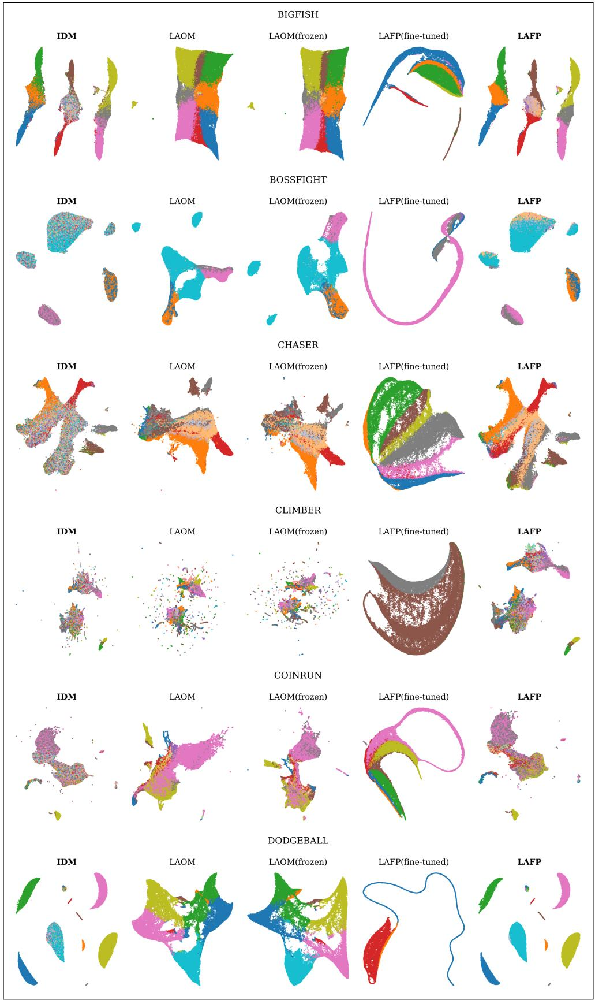

grid of 20 heatmaps

| Dataset     | Method       | IDM   | LAOM  | LAOM(frozen) | LAFP(fine-tuned) | LAFP  |
| ----------- | ------------ | ----- | ----- | ------------ | ---------------- | ----- |
| BIGFISH     | IDM          | 100   | 150   | 180          | 200              | 220   |
| BIGFISH     | LAOM         | 95    | 145   | 175          | 210              | 230   |
| BIGFISH     | LAOM(frozen) | 90    | 140   | 170          | 205              | 225   |
| BIGFISH     | LAFP(fine-tuned) | 85   | 135   | 165          | 190              | 210   |
| BOSSFIGHT   | IDM          | 85    | 130   | 160          | 185              | 200   |
| BOSSFIGHT   | LAOM         | 80    | 125   | 155          | 180              | 195   |
| BOSSFIGHT   | LAOM(frozen) | 75    | 120   | 150          | 175              | 200   |
| BOSSFIGHT   | LAFP(fine-tuned) | 70   | 115   | 145          | 170              | 185   |
| CHASER     | IDM          | 75    | 120   | 140          | 160              | 175   |
| CHASER     | LAOM         | 70    | 115   | 135          | 155              | 170   |
| CHASER     | LAOM(frozen) | 65    | 110   | 130          | 150              | 165   |
| CHASER     | LAFP(fine-tuned) | 60   | 105   | 125          | 140              | 155   |
| CLIMBER    | IDM          | 65    | 110   | 125          | 140              | 155   |
| CLIMBER    | LAOM         | 60    | 105   | 120          | 135              | 145   |
| CLIMBER    | LAOM(frozen) | 55    | 100   | 115          | 130              | 140   |
| CLIMBER    | LAFP(fine-tuned) | 50   | 95    | 110          | 125              | 135   |
| COINRUN    | IDM          | 45    | 95    | 105          | 120              | 130   |
| COINRUN    | LAOM         | 40    | 90    | 100          | 115              | 125   |
| COINRUN    | LAOM(frozen) | 35    | 85    | 95           | 110              | 120   |
| COINRUN    | LAFP(fine-tuned) | 30   | 80    | 90           | 105              | 115   |
| DODGEBALL  | IDM          | 25    | 75    | 85           | 95               | 100   |
| DODGEBALL  | LAOM         | 20    | 70    | 80           | 90               | 95    |
| DODGEBALL  | LAOM(frozen) | 15    | 65    | 75           | 85               | 90    |
| DODGEBALL  | LAFP(fine-tuned) | 10   | 60    | 70           | 80               | 85    |
| LAFP        | IDM          | -     | -     | -            | -                | -     |
| LAFP        | LAOM         | -     | -     | -            | -                | -     |
| LAFP        | LAOM(frozen) | -     | -     | -            | -                | -     |
| LAFP        | LAFP(fine-tuned) | -     | -     | -            | -                | -     |
| LAFP        | LAFP         | -     | -     | -            | -                | -     |
The chart displays the color-coded regions corresponding to each dataset. The x-axis represents the dataset labels (e.g., “BIGFISH”, “BOSSFIGHT”, “CLIMBER”, etc.), and the y-axis represents the numerical values associated with each region. There are no labels for the data series.

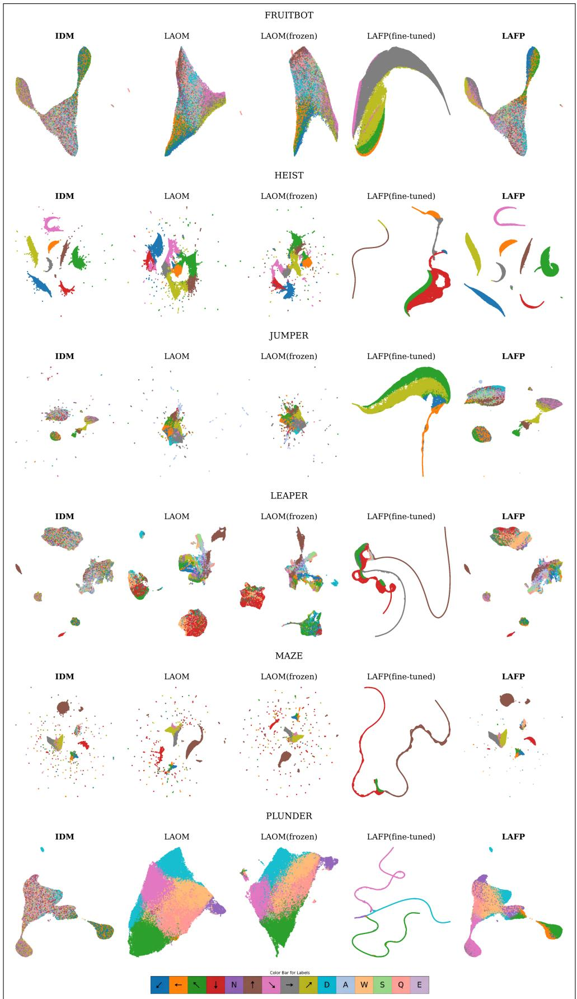

chromatography image

| Method       | Dataset   | Value |
| ------------ | --------- | ----- |
| FRUITBOT     | IDM       | ~10   |
| FRUITBOT     | LAOM      | ~8    |
| FRUITBOT     | LAOM(frozen)| ~7    |
| FRUITBOT     | LAFP(fine-tuned) | ~6    |
| FRUITBOT     | LAFP      | ~5    |
| HEIST        | IDM       | ~9    |
| HEIST        | LAOM      | ~7    |
| HEIST        | LAOM(frozen)| ~6    |
| HEIST        | LAFP(fine-tuned) | ~5    |
| HEIST        | LAFP      | ~4    |
| JUMPER       | IDM       | ~8    |
| JUMPER       | LAOM      | ~6    |
| JUMPER       | LAOM(frozen)| ~5    |
| JUMPER       | LAFP(fine-tuned) | ~4    |
| JUMPER       | LAFP      | ~3    |
| LEAPER       | IDM       | ~7    |
| LEAPER       | LAOM      | ~5    |
| LEAPER       | LAOM(frozen)| ~4    |
| LEAPER       | LAFP(fine-tuned) | ~3    |
| LEAPER       | LAFP      | ~2    |
| MAZE         | IDM       | ~6    |
| MAZE         | LAOM      | ~4    |
| MAZE         | LAOM(frozen)| ~3    |
| MAZE         | LAFP(fine-tuned) | ~2    |
| MAZE         | LAFP      | ~1    |
| PLUNDER      | IDM       | ~5    |
| PLUNDER      | LAOM      | ~3    |
| PLUNDER      | LAOM(frozen)| ~2    |
| PLUNDER      | LAFP(fine-tuned) | ~1    |
| PLUNDER      | LAFP      | ~0.5  |
Color Bar for Labels

Figure 7: UMAP projections of latent action spaces for the IDM and downstream policies across the remaining 12 PROCGEN environments.

## B Additional UMAP Visualizations

As illustrated in Fig.7, we further provide UMAP visualizations for the remaining environments not included in the main paper. Across all environments, we observe consistent qualitative patterns. The latent space learned by the IDM exhibits clear cluster structures corresponding to different action modes. LAFP preserves these structures with high fidelity, whereas LAOM and LAFP(Fine-tuned) tends to distort or collapse multiple modes into a less structured representation. These observations are consistent with the quantitative results and further support our claim that preserving the geometry of the pretrained latent action space is critical for effective downstream policy learning.

## C Implementation Details

Models. All methods share identical architectures and optimization settings across environments, without per-environment tuning. Our implementation builds upon the official LAPO codebase, where we retain the original model design and extend it to incorporate flow matching objectives. Concretely, the IDM is implemented as a lightweight CNN encoder, while the FDM adopt a U-Net architecture. The flow matching model is parameterized as a simple three-layer MLP, where the sample time variable is encoded using sinusoidal positional embeddings. The action decoder is also implemented as a three-layer MLP. This design encourages the latent space to capture meaningful action abstractions while maintaining consistency with both dynamics and ground-truth actions.

Normalization. After pre-training, we compute per-dimension statistics of the latent action space for each environment. Specifically, the center (mean) is defined as the average of the maximum and minimum values along each dimension, and the standard deviation is computed accordingly. These statistics are used to normalize latent actions during both training and inference in subsequent stages, which improves numerical stability and ensures consistent scaling across environments.

Computaional cost. All experiments are conducted on a single NVIDIA H20 GPU per environment under the same computational budget. In terms of computational cost, pre-training takes approximately 50 minutes per environment. Distillation requires around one hour for LAFP and 40-50 minutes for LAOM (behavior cloning), suggesting that the additional cost of flow matching is relatively minor. The post-training stage is lightweight, requiring only a few minutes. Overall, the total training time per environment remains within a practical range.