# WorldOlympiad: Can Your World Model Survive a Triathlon?

Yuke Zhao1∗, Wangbo Zhao23∗, Weijie Wang1∗, Zeyu Zhang2∗†, Dakai An3, Akide Liu4, Yinghao Yu5, Jiasheng Tang2‡, Fan Wang2, Wei Wang3, Bohan Zhuang1‡

1Zhejiang University 2DAMO Academy, Alibaba Group 3The Hong Kong University of Science and Technology 4Monash University 5TRE, Alibaba Group ∗Equal contribution., †Project lead., ‡Corresponding authors.

We introduce WorldOlympiad, a benchmark for diagnosing video-based world models across physical faithfulness, geometric consistency, and interaction fidelity. While existing benchmarks often focus on visual quality, semantic alignment, or short-term temporal coherence, they provide limited insight into whether generated videos obey physical rules, preserve coherent 3D structure, and sustain controllable interactions over long horizons. To address this gap, WorldOlympiad decomposes world-model evaluation into three complementary dimensions. The physical track uses object segmentation and MLLM-as-judge to assess whether generated videos follow interpretable rules in mechanics, thermal phenomena, and material properties. The geometry track reconstructs generated videos with Gaussian splatting and evaluates structural consistency, cross-view coherence, and camera-trajectory alignment. The interaction track assesses whether generated rollouts follow complex action prompts and maintain smooth, coherent transitions across consecutive video chunks. WorldOlympiad further covers three major downstream scenarios, including gaming, robotics, and general real-world videos, capturing diverse challenges from interactive control and embodied manipulation to open-domain motion and camera dynamics. Together, these tracks and scenarios form a scalable and interpretable evaluation suite that exposes failure modes beyond generic video quality. Experiments on state-of-the-art models reveal substantial gaps in physical reasoning, 3D consistency, and long-horizon interaction, underscoring the need for more structured evaluation protocols for generative world models.

Date: June 10, 2026

Project website: https://alibaba-damo-academy.github.io/WorldOlympiad

Code: https://github.com/alibaba-damo-academy/WorldOlympiad

Correspondence: jiasheng.tjs@alibaba-inc.com, bohan.zhuang@gmail.com

## 1 Introduction

Recent years have witnessed remarkable progress in video generation [36, 34, 17, 46, 3, 4], pushing these models beyond passive content creation toward video-based world modeling. A video world model is expected to predict future visual states from historical observations and control signals, which is crucial for game simulation [6, 50, 11], robotic policy development [1, 2, 7], and real-world scene generation [26, 35, 40, 31, 45]. In these applications, high visual fidelity alone is insufficient: models must preserve state continuity, respect physical and geometric constraints, respond to user actions, and maintain plausible dynamics over long generation horizons. These requirements call for a comprehensive evaluation framework that can assess video world models across multiple capability dimensions. However, existing benchmarks remain limited in several important aspects.

Early video generation benchmarks such as VBench [15] and VBench 2.0 [53] mainly evaluate visual quality, aesthetics, motion smoothness, and semantic alignment, with most evaluation settings still centered on short videos. Although VBench++ [16] extends this line of work toward long-video generation, these benchmarks still focus largely on visual appearance and temporal smoothness, while leaving key world-modeling capabilities underexplored. In particular, they pay limited attention to whether a video follows physical rules, maintains coherent 3D structure, and supports controllable interactions over long horizons. Moreover, recent taskoriented benchmarks often focus on a single downstream domain, such as gaming [47] or robotics [29, 9, 23], making it difficult to compare models under a unified protocol across gaming, robotics, and general real-world scenarios. As a result, current benchmarks still cannot fully answer a central question: can existing long-video generation pipelines serve as general video world models under multi-domain, long-horizon, and interactive settings?

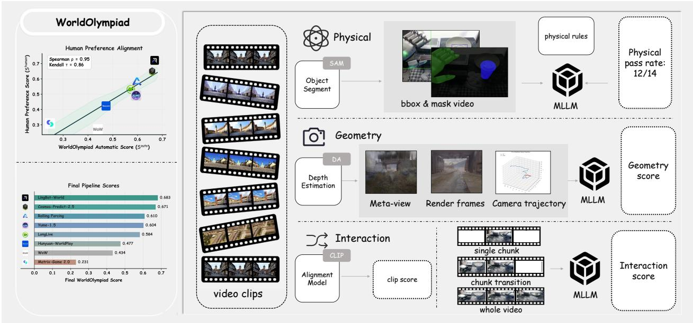

composite chart includes a line graph and a 3d bar chart.

| Category | Value |
| -------- | ----- |
| Linglet-World | 0.683 |
| Cosmos-Predict-2.5 | 0.671 |
| Rolling Fencing | 0.610 |
| Yuma-1.5 | 0.604 |
| LongLive | 0.584 |
| Hanyuan-WorldPlay | 0.477 |
| WeW | 0.434 |
| Matrix-Same 2.0 | 0.231 |
Left Chart: Human Preference Alignment vs. WorldOlympiad Automatic Score (S_autre)
| Right Chart: Video clips vs. Embedding Model vs. Intersection Metrics
| Legend: Physical SAM Object Segment → bbox & mask video → physical rules
| Image Label: Geometry Depth Estimation → Meta-view / Render frames / Camera trajectory → MLLM
| Clip Label: Interaction CLIP → single chunk / chunk transition / whole video → MLLM
Physical Pass Rate: 12/14

Figure 1 Overview of the WorldOlympiad pipeline for data collection, long-video generation, and multi-dimensional evaluation.

To bridge these gaps, we introduce WorldOlympiad, a unified benchmark for evaluating video world models across gaming, robotics, and real-world scenarios. The motivation is twofold. First, as discussed above, existing benchmarks leave physical plausibility, 3D consistency, and long-horizon interaction control largely unassessed. Second, prior works on long-video generation and world modeling [45, 14, 22] predominantly rely on metrics centered on visual quality, which capture perceptual fidelity but are fundamentally insensitive to whether generated videos respect physical laws, maintain coherent 3D geometry, or respond faithfully to control signals—failures that go entirely undetected by these metrics. These two gaps jointly motivate not only a new benchmark, but also new judge metrics designed to directly probe world-modeling capabilities. As illustrated in Figure 1, WorldOlympiad evaluates generated long videos from three complementary perspectives, examining whether they obey physical rules, preserve 3D geometric consistency, and follow control signals with coherent chunk-by-chunk transitions. To support this evaluation, we collect 1,000 high-quality long videos across three downstream domains and benchmark 8 representative long-video generation pipelines. Our evaluation reveals systematic limitations in long-context consistency, physical reasoning, geometric stability, and interaction control, providing diagnostic evidence and evaluation references for future video world models.

Our contributions are summarized as follows:

• We propose WorldOlympiad, a unified benchmark for evaluating interactive long-video world models across gaming, robotics, and real-world scenarios.  
• We design multi-dimensional judge metrics that systematically assess physical-law adherence, 3D geometric consistency, and chunk-by-chunk interactive generation.  
• We construct a dataset of 1,000 high-quality long videos and benchmark 8 long-video generation pipelines, providing a systematic evaluation of their reliability in downstream world-model applications.

## 2 Related Work

## 2.1 Video Generation

Diffusion-based video generation models [3, 46, 17, 36, 34] have demonstrated emergent physical consistency through large-scale training [4, 39], including object permanence, 3D coherence, and plausible motion dynamics. Despite these compelling properties, many early diffusion-based video generators are optimized for short clips, often on the order of 5–10 seconds, which limits their direct use as persistent world model simulators. Recently, block diffusion has emerged as a promising paradigm for scalable long-horizon video synthesis. By performing iterative diffusion denoising within each block and conditioning on previously generated content via cross-block KV caching, this approach combines the high-quality parallel generation of diffusion models with the sequential consistency of autoregressive conditioning [14, 48, 54, 51]. Such a design preserves intra-block denoising quality while enabling scalable temporal extension, positioning block diffusion as a viable road toward video-based world models.

Table 1 Comparison of existing benchmarks across evaluation metrics and video tasks.

<table><tr><td rowspan="2">Benchmark</td><td colspan="4">Eval Metrics</td><td colspan="3">Video Tasks</td></tr><tr><td>Long Video</td><td>Physical</td><td>Geometry</td><td>Interaction</td><td>Gaming</td><td>Robotics</td><td>Real-world</td></tr><tr><td>VBench [15]</td><td>X</td><td>X</td><td>X</td><td>X</td><td>X</td><td>X</td><td>√</td></tr><tr><td>VBench++ [16]</td><td>√</td><td>X</td><td>X</td><td>X</td><td>X</td><td>X</td><td>√</td></tr><tr><td>VBench 2.0 [53]</td><td>X</td><td>√</td><td>X</td><td>X</td><td>X</td><td>X</td><td>√</td></tr><tr><td>MIND [47]</td><td>√</td><td>X</td><td>X</td><td>√</td><td>√</td><td>X</td><td>X</td></tr><tr><td>EWMBench [12]</td><td>X</td><td>X</td><td>X</td><td>√</td><td>X</td><td>√</td><td>X</td></tr><tr><td>WorldEval [20]</td><td>X</td><td>X</td><td>X</td><td>√</td><td>X</td><td>√</td><td>X</td></tr><tr><td>WorldArena [29]</td><td>X</td><td>√</td><td>√</td><td>√</td><td>X</td><td>√</td><td>X</td></tr><tr><td>WorldOlympiad</td><td>√</td><td>√</td><td>√</td><td>√</td><td>√</td><td>√</td><td>√</td></tr></table>

## 2.2 Video Generation Models as World Models

The rapid advancement of world models has enabled video generation to be deployed across diverse domains, including interactive game generation [35] and robotics simulation [1, 2]. In the gaming domain, models such as GameGen-X [6] and Matrix Game [50] have demonstrated compelling interactive game simulation with controllable character actions and environment dynamics. In robotics and embodied intelligence, dedicated interactive world models provide policy generation and data augmentation capabilities for robotic agents [1, 2, 7]. However, simultaneously maintaining persistent world state and supporting real-time interaction remains a significant challenge, giving rise to two core research directions. For memory and long-context modeling, some approaches adopt implicit memory mechanisms. For instance, LongLive [45] introduces KV caching to enable long-range consistent generation. In contrast, other works explicitly incorporate 3D memory mechanisms to preserve world-state consistency over extended horizons [43, 13, 19, 52, 49, 42, 38]. More recently, MosaicMem [49] and Inspatio World [33] have begun exploring hybrid memory mechanisms, demonstrating substantial promise. On the interactive generation front, the dominant paradigm adapts controllable video generation techniques within the block diffusion framework [24, 30], enabling interactive video synthesis. Works such as LingBot-World [35] have shown strong performance on downstream tasks such as interactive game generation through scaling. Regardless of the target application, real-time interaction remains a central capability requirement in this field.

## 2.3 World Model Benchmarks

Existing benchmarks for short video generation have introduced a broad set of general evaluation metrics, as exemplified by VBench [15] and its successor VBench 2.0 [53], which cover multi-dimensional criteria spanning visual quality, motion authenticity, semantic consistency, and physical plausibility. More recently, benchmarks specifically targeting world model capabilities have been proposed, evaluating models along dimensions such as physical law adherence, simulation fidelity, and functional world modeling [10, 27, 18]. Newer benchmarks tailored to robotics downstream tasks [29, 9, 23] extend the evaluation scope to controllability, action conditioning, and closed-loop interaction. Despite this progress, existing benchmarks lack unified coverage across multiple downstream application domains, including gaming, robotics, and general scene generation, within a single evaluation framework. Moreover, assessments of interactive functionality, which is arguably the most critical capability of world models, remain notably absent. To address these gaps, we propose WorldOlympiad, a comprehensive benchmark that unifies the evaluation of game, robotics, and real-world environments, comprising 1,000 high-quality video samples spanning diverse downstream scenarios, and jointly assessing perceptual quality alongside functional world modeling capabilities.

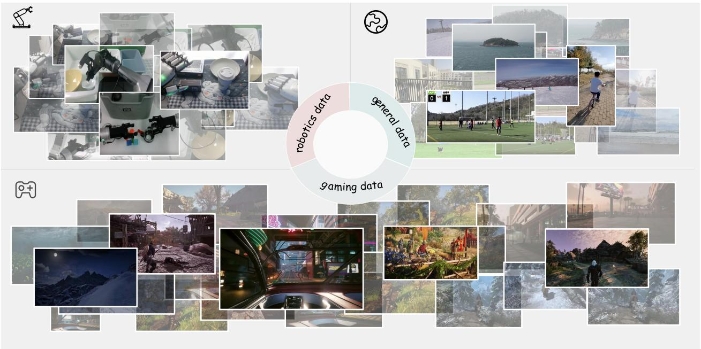

text_image

robotics data
general data
Saming data

Figure 2 Data collection overview across robotics, gaming, and real-world video sources.

## 3 WorldOlympiad

## 3.1 Data Collection

Figure 2 summarizes the data collection process of WorldOlympiad. The benchmark contains 400 robotics videos, 400 gaming videos, and 200 real-world videos, covering complementary world-modeling requirements: robotics videos emphasize object manipulation and physical interaction, gaming videos emphasize interactive control and long-context state evolution, and real-world videos emphasize open-domain motion and camera dynamics. This diverse composition enables a comprehensive evaluation of video-based world models across their three most critical application domains.

## 3.1.1 Source Domains

Robotics Domain. The robotics subset is built from RoboCOIN [41], an open-source bimanual robotic manipulation data collection. We use this source because bimanual manipulation naturally contains object contact, gripper motion, state changes, and physically grounded interactions. RoboCOIN also includes multiple bimanual robot embodiments, giving the subset broad coverage for evaluating whether generated videos preserve action-consistent dynamics. From the downloaded RoboCOIN videos, we manually filter 400 videos as the robotics portion of the benchmark test set.

Gaming Domain. The gaming subset is built from GameGen-X [6], an interactive open-world game video dataset. We randomly sample videos from the official OGameData\_50K.csv metadata file and download the corresponding videos. Since some gameplay videos are usually long and contain multiple interaction stages, we split long videos into shorter video chunks with 60 seconds before constructing the final 400-video gaming subset. This subset targets interactive world-modeling behavior such as camera movement, player navigation, combat events, skill execution, and game-state changes.

Table 2 Data composition of the WorldOlympiad benchmark test set.

<table><tr><td>Domain</td><td>Count</td><td>Source</td><td>Selection rule</td></tr><tr><td>Robotics</td><td>400</td><td>RoboCOIN [41]</td><td>Downloaded videos that are manually filtered.</td></tr><tr><td>Gaming</td><td>400</td><td>GameGen-X [6]</td><td>Randomly sampled videos from the official OGamesData_50K.csv; long videos are split into shorter evaluation chunks.</td></tr><tr><td>Real-world</td><td>200</td><td>LVD-2M [44]</td><td>Videos selected from ytb_600k_720p.csv with duration longer than 60 seconds and motion score greater than 50.</td></tr></table>

Real-world Domain. The real-world subset is built from LVD-2M [44], a long-take video dataset with temporally dense captions. We use the official ytb\_600k\_720p.csv subset and randomly select videos whose duration is longer than 60 seconds and whose motion score is greater than 50. This filtering rule favors long videos with sufficient visible motion, making the subset suitable for evaluating open-domain dynamics, camera movement, and geometric consistency in everyday scenes.

## 3.1.2 Temporal Chunking and Captioning

Detailed video captions are essential for subsequent evaluation. Instead of relying on a single-pass MLLM, we design a three-stage chunk-caption-refine pipeline to ensure the resulting annotations are both accurate and comprehensive, as illustrated in Figure 3. We adopt Gemini-3-Pro-Preview [8] across all stages, owing to its superior performance in multimodal understanding.

StageI-Chunking. The pipeline first identifies the main continuous execution interval in a video and divides it into at most six contiguous chunks. All chunks follow a left-closed, right-open interval convention, and adjacent chunks are required to have no temporal gaps or overlaps. For gaming videos, the chunking prompt focuses on gameplay execution such as combat, traversal, skill casting, and camera transitions; for real-world videos, the prompt focuses on continuous visual actions, object motion, interaction events, and view transitions.

StageII-Caption. After temporal chunking, the captioning model generates chunk-level captions for each video chunk. For each robotics, gaming, or real-world chunk, the captioning model outputs two fields: an action field and a caption field. The action field maps camera movement to WASD-style controls, with None used when the camera does not move noticeably. This action label is intentionally based on camera movement only; it is not inferred from character animation, subject motion, visual effects, or UI changes. The caption field describes the scene, visible entities, events, interactions, and outcomes in English.

StageIII-Refine. We then refine the chunk-level captions with the full video as context. Given the full video and the time-ordered chunk captions, the refinement step corrects hallucinated details, standardizes terminology across adjacent chunks, improves narrative continuity, and validates the camera-movement action label. This final pass is important for long-video evaluation because adjacent chunks often share objects, locations, player states, or scene context, and inconsistent captions would weaken the reliability of interaction and long-context assessment.

We take the outputs from Stage III as the final captions for each video chunk, which are subsequently used for evaluation. The active judge prompts used by WorldOlympiad are provided in Appendix A.

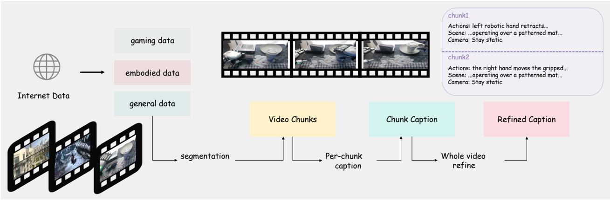

flowchart

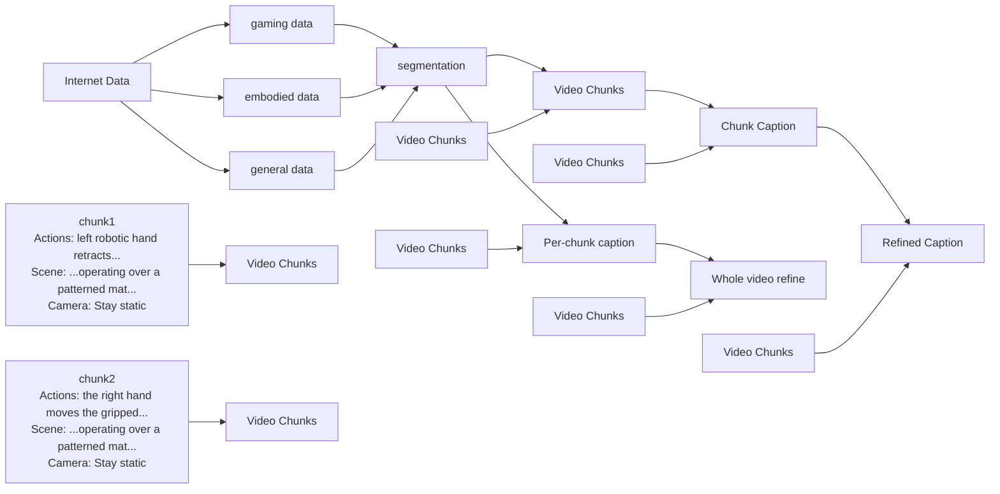

Figure 3 Data standardization pipeline from raw videos to refined action-caption annotations.

## 3.2 Evaluation Metrics

## 3.2.1 Physical Evaluation

We evaluate physical faithfulness with a rule-based benchmark spanning three subsets: mechanics, thermodynamics, and material properties. The pipeline first uses an MLLM to identify the moving or deforming entities that are most relevant to physical reasoning, and then applies SAM3 [5] to produce object-centric visualizations that expose their masks and trajectories more clearly. After this preprocessing stage, each metric is evaluated in two steps. A relevance judge first determines whether the target phenomenon is actually present in the ground-truth reference video under the given prompt; unrelated metrics are marked as not related and excluded from scoring. For each relevant metric, a compliance judge then compares the generated video with a ground-truth reference video and predicts whether the observed behavior follows the corresponding physical rule, together with a confidence score and a short explanation. Final physical results are reported by averaging compliance over the applicable metrics within each subset and then across subsets. The active mechanics, thermodynamics, and material rule prompt templates used by the physical MLLLM judges are provided in Appendix A.2.

Mechanics. Gravity evaluates whether unsupported objects move downward under gravity, rather than floating upward or accelerating in physically implausible directions. Buoyancy focuses on whether objects in fluids remain near the surface or sink in accordance with their apparent density. Compression measures whether solids deform plausibly under load, instead of staying unrealistically rigid or buckling without sufficient cause. Impact examines whether collisions lead to reasonable post-impact dynamics, including momentum transfer, rebound, fracture, or eventual rest.

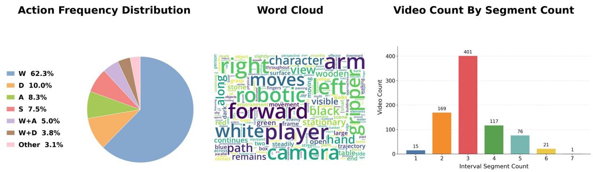  
Figure 4 Pipeline statistics for data processing, annotation coverage, and evaluation-ready samples.

Thermodynamics. Melting assesses whether a heated solid gradually transitions into a liquid state. Sublimation captures direct solid-to-gas transitions without an intermediate liquid phase. Vaporization considers whether liquids turn into vapor through evaporation or boiling when heated or exposed over time. Condensation evaluates the formation of liquid droplets from cooled gas. Deposition describes the direct transformation from gas to solid without first becoming liquid. Freezing measures whether a cooled liquid solidifies into a stable solid state.

Material. Color mixing evaluates whether mixed colored liquids or paints yield the expected resultant color. Solubility focuses on whether soluble substances disperse and dissolve into the solvent, rather than remaining intact. Hardness distinguishes whether soft materials bend or tear easily while hard materials resist deformation or break sharply. Combustibility examines whether flammable materials ignite and produce physically consistent fire, smoke, or charring behavior.

## 3.2.2 Geometry Evaluation

We evaluate geometric consistency with three complementary signals $[ 3 7 ] \colon S _ { \mathrm { r e c o n } }$ scores the rendered Gaussian-Splat video, $S _ { \mathrm { m e t a } }$ scores a diagnostic meta-view, and $S _ { \mathrm { t r a j } }$ scores agreement between the recovered and reference camera trajectories. Given a generated video $V = \bar { \{ I _ { t } \} } _ { t = 1 } ^ { T }$ , we uniformly sample $\bar { V } = \{ I _ { i } \} _ { i = 1 } ^ { N }$ , with $N \leq 3 2$ in the implementation. When dynamic-object masks are available, foreground Gaussians are removed before rendering so that the 3D judge focuses on the static scene. Depth Anything 3 [21] estimates a Gaussian scene and camera parameters, and the Gaussian-Splat renderer produces two diagnostic artifacts:

$$
\mathcal {F} _ {\mathrm{DA3}} (\bar {V}) \rightarrow \left(\mathcal {G}, \{E _ {i}, K _ {i} \} _ {i = 1} ^ {N}\right), \quad \hat {V} _ {\mathrm{GS}} = \mathcal {R} (\mathcal {G}, \{E _ {i}, K _ {i} \} _ {i = 1} ^ {N}), \quad \hat {I} _ {\mathrm{meta}} = \mathcal {R} (\mathcal {G}, E _ {i ^ {\star}}, K _ {i ^ {\star}}), \tag {1}
$$

where $\mathcal { G }$ is the reconstructed Gaussian representation, $E _ { i }$ and $K _ { i }$ are recovered extrinsics and intrinsics, and $i ^ { \star }$ denotes the recovered camera pose farthest from the reconstruction origin.

The reconstruction and meta-view scores are produced by the same calibrated MLLM judge used in the implementation. The judge inspects whether the rendered static scene preserves a recognizable layout, coherent 3D structure, stable cross-view geometry, and prompt-consistent scene organization. The judge is instructed to return a strict JSON score in [0, 1], and the parsed scores are clamped to [0, 1] to avoid ambiguity with the CLIP model used in the interaction metric:

$$
S _ {\text {recon}} = \operatorname{clamp} \left(J _ {\mathrm{vid}} (\hat {V} _ {\mathrm{GS}}, p), 0, 1\right), \quad S _ {\text {meta}} = \operatorname{clamp} \left(J _ {\mathrm{img}} (\hat {I} _ {\text {meta}}, p), 0, 1\right), \tag {2}
$$

where $p$ is the static-scene prompt used for 3D judging. In the optional LPIPS setting, the Gaussian-Splat video score is replaced by $\mathrm { c l a m p } ( 1 - \mathrm { L P I P S } ( \hat { V } _ { \mathrm { G S } } , \bar { V } ) , 0 , 1 )$ .

For camera motion, let $\{ \hat { T } _ { i } \} _ { i = 1 } ^ { L }$ and $\{ T _ { i } \} _ { i = 1 } ^ { L }$ denote the predicted and reference camera-to-world trajectories after temporal resampling to a shared length. If the reference contains non-negligible translation, the predicted trajectory is first aligned to the reference by a similarity transform. Both trajectories are then expressed relative to their first frame:

$$
\tilde {T} _ {i} = T _ {1} ^ {- 1} T _ {i}, \quad \hat {\tilde {T}} _ {i} = \hat {T} _ {1} ^ {- 1} \hat {T} _ {i}, \quad i = 1, \dots , L. \tag {3}
$$

The translation score $S _ { t }$ combines path-shape similarity, motion-extent agreement, and mean camera-center error. The rotation score $S _ { r }$ combines mean geodesic rotation error, final-frame rotation error, and total rotation-extent agreement. The final trajectory score is computed by an adaptive aggregation function $A _ { \mathrm { { m o t i o n } } } \mathrm { { : } }$

$$
S _ {\text {traj}} = A _ {\text {motion}} \left(S _ {t}, S _ {r}; \{\tilde {T} _ {i} \} _ {i = 1} ^ {L}\right). \tag {4}
$$

This aggregation is selected from the reference motion profile. For nearly static trajectories, the score penalizes reconstructed camera jitter directly. For translation-dominant or rotation-dominant trajectories, the corresponding component receives the larger weight; for mixed motion, translation and rotation are weighted evenly.

The implementation records the raw 3D reward as the sum of the three bounded subscores, while all tables report the normalized geometry score:

$$
S _ {3 D} = \frac {1}{3} \left(S _ {\text {recon}} + S _ {\text {meta}} + S _ {\text {traj}}\right). \tag {5}
$$

## 3.2.3 Interaction Evaluation

We evaluate interaction fidelity under the chunk-by-chunk generation setting. Given a generated video divided into $T$ chunks $\{ v _ { i } \} _ { i = 1 } ^ { T }$ and their corresponding captions $\{ p _ { i } \} _ { i = 1 } ^ { T }$ , the interaction benchmark measures whether each chunk follows its local instruction, whether adjacent chunks transition coherently, and whether the full video remains temporally fluent. This design matches the way interactive video world models are typically rolled out: each new chunk is conditioned on the previous visual context and a new control or action caption, so a model must satisfy both local caption alignment and long-range continuity.

The first component is a CLIP-based semantic-adherence score. For each chunk, we uniformly sample a fixed number of frames within its temporal interval $F _ { i } = \{ f _ { i , j } \} _ { j = 1 } ^ { m _ { i } }$ , where $m _ { i }$ is 8 by default. We encode each sampled frame and the corresponding chunk caption with a CLIP model [28, 45], convert both embeddings to unit-length vectors, and compute their dot-product similarity. The chunk-level score is the mean similarity over sampled frames,

$$
s _ {i} ^ {\mathrm{clip}} = \frac {1}{m _ {i}} \sum_ {j = 1} ^ {m _ {i}} \mathrm{sim} \big (\mathrm{CLIP} _ {v} (f _ {i, j}), \mathrm{CLIP} _ {t} (p _ {i}) \big), \tag {6}
$$

and the video-level semantic-adherence score is the weighted mean over all valid sampled frames:

$$
S _ {\text {clip}} = \frac {\sum_ {i = 1} ^ {T} \sum_ {j = 1} ^ {m _ {i}} \text {sim} \left(\mathrm{CLIP} _ {v} (f _ {i , j}) , \mathrm{CLIP} _ {t} (p _ {i})\right)}{\sum_ {i = 1} ^ {T} m _ {i}}. \tag {7}
$$

Because this is a cosine similarity computed from normalized CLIP embeddings, the raw score remains on its native [−1, 1] scale. To use it as a bounded auxiliary interaction signal, we convert it into a calibrated semantic score with fixed thresholds:

$$
\widetilde {S} _ {\mathrm{clip}} = \operatorname{clip} \left(\frac {S _ {\mathrm{clip}} - \tau_ {\min}}{\tau_ {\max} - \tau_ {\min}}, 0, 1\right), \quad \tau_ {\min} = 0. 2 0, \quad \tau_ {\max} = 0. 4 0. \tag {8}
$$

The thresholds are fixed across all evaluated models, so adding a new model does not change previously reported CLIP auxiliary scores. This component provides an automatic and lightweight estimate of whether the generated chunks contain the semantic content requested by their captions.

The second component uses an MLLM as a structured rubric-based judge. We query the MLLM at three complementary levels, and all returned scores are clipped to the requested 0–5 range before being normalized to [0, 1] for reporting. First, the MLLM receives each chunk $v _ { i }$ and its caption $p _ { i }$ , and scores visual quality, text alignment, and an overall chunk score $a _ { i } .$ . Second, the MLLM receives each adjacent pair $( v _ { i } , v _ { i + 1 } )$ together with their captions $( p _ { i } , p _ { i + 1 } )$ , and scores transition smoothness and an overall transition score $b _ { i }$ . Third, the MLLM receives the full generated video and scores long-range consistency, global text alignment, and a global overall score $g .$ The final MLLM interaction score averages the overall scores from the chunk, transition, and global judgments:

$$
S _ {\text { chunk }} = \frac {1}{5 T} \sum_ {i = 1} ^ {T} a _ {i}, \quad S _ {\text { trans }} = \frac {1}{5 (T - 1)} \sum_ {i = 1} ^ {T - 1} b _ {i}, \quad S _ {\text { global }} = \frac {g}{5}, \tag {9}
$$

$$
S _ {\mathrm{mllm}} = \frac {1}{3} \left(S _ {\text { chunk }} + S _ {\text { trans }} + S _ {\text { global }}\right). \tag {10}
$$

The final interaction score uses the calibrated CLIP score as a lightweight semantic auxiliary term:

$$
S _ {\text { interact }} = (1 - \lambda) S _ {\text { mllm }} + \lambda \widetilde {S} _ {\text { clip }}, \quad \lambda = 0. 1. \tag {11}
$$

This design lets CLIP contribute frame-caption semantic grounding while keeping the interaction metric dominated by the structured MLLM judge, which evaluates temporal properties such as chunk-level instruction following, boundary smoothness, state preservation, and full-video fluency.

Finally, WorldOlympiad reports an overall score by averaging the three core evaluation tracks:

$$
S _ {\text { all }} = \frac {1}{3} \left(S _ {\text { phys }} + S _ {3 D} + S _ {\text { interact }}\right). \tag {12}
$$

This equal-weight aggregation keeps the leaderboard aligned with the benchmark design: physical faithfulness, geometric consistency, and interaction fidelity contribute symmetrically to the final model ranking.

## 4 Experiment

## 4.1 Experimental Setup

Evaluation models. We evaluate eight publicly available video-generation pipelines through OpenWorldLib [32]. These pipelines cover three major families of video world models. The gaming-centric group includes Matrix-Game 2.0 [11] and LingBot-World [35]; the robotics-centric group includes Cosmos-Predict-2.5 [2] and WoW [7]; and the general long-video group includes Rolling Forcing [22], LongLive [45], Yume-1.5 [25], and Hunyuan-WorldPlay [31]. In our experiments, we test these pipelines across different downstream scenarios, including gaming, robotics, and general real-world videos.

Implementation details. For fairness, we use each released pipeline with its official default generation configuration whenever possible. Since different pipelines may adopt different chunk sizes or segment-level generation settings, we dynamically map the temporal information in the chunk captions to each model’s native generation configuration. This allows the temporal proportions of the original chunk captions to be retained while respecting each generation pipeline’s native training and inference configuration. For methods that include an explicit memory or long-context mechanism, such as Rolling Forcing, we preserve the official memory-management strategy during rollout. For pipelines without a dedicated long-horizon memory module, such as WoW, we perform long-video generation through video continuation, using the previously generated context as the condition for the next segment.

All generated videos are evaluated by the same automatic WorldOlympiad evaluator. The evaluator reports physical faithfulness, 3D consistency, CLIP-augmented interaction fidelity, and an overall composite score. Judge-based component scores are reported after averaging their normalized subscores into the [0, 1] range. Physical faithfulness aggregates rule-level judgments over mechanics, thermodynamics, and material behavior; 3D consistency combines reconstruction quality, meta-view quality, and camera trajectory consistency; and interaction fidelity measures chunk-level instruction following, CLIP-based semantic grounding, adjacent transition smoothness, and long-range coherence over the full generated video.

## 4.2 Main Benchmark Results

Table 3 summarizes the video world models evaluated in OpenWorldLib, grouped by gaming, robotics, and general world-model categories. The table reports physical faithfulness, 3D consistency, CLIP-augmented interaction fidelity, and the overall score. Figure 5 further visualizes the score distribution across pipelines and evaluation dimensions.

From visual synthesis to stateful world simulation. The most salient trend in Table 3 is that the best models are no longer distinguished only by visual plausibility, but by their ability to preserve physical state and interaction semantics over extended rollouts. LingBot-World achieves the highest overall score (0.683), with particularly strong physical faithfulness (0.942) and interaction fidelity (0.734). Notably, LingBot-World is a 14B-activated model, suggesting that large-scale capacity can substantially improve long-horizon state preservation, scene continuity, and action-conditioned dynamics. However, model scale is not the only factor that determines world-model quality. Cosmos-Predict-2.5, with only 2B parameters, reaches a comparable overall score of (0.671). Although it is categorized as a robotics-centric pipeline in our evaluation, Cosmos-Predict-2.5 is optimized for physical-world prediction, which helps it generalize beyond embodied manipulation scenarios and achieve strong physical fidelity across diverse downstream settings. This comparison suggests that targeted physical-world training and rollout design can partly compensate for smaller activated model scale, leading to competitive performance in stateful world simulation.

Physical regularity is emerging as a shared capability. A second trend is that several recent pipelines already show strong compliance with common physical regularities. LingBot-World (0.942), Cosmos-Predict-2.5 (0.906), Rolling Forcing (0.873), LongLive (0.863), and Yume-1.5 (0.863) all achieve high physical scores, suggesting that current video world models have begun to internalize frequent patterns of motion, contact, support, and material behavior. This progress is consistent with the increasing attention to physical plausibility in recent evaluation suites such as VBench 2.0. However, the capability is still uneven: fine-grained results in the

Table 3 Main benchmark results on WorldOlympiad. We evaluate eight representative video world models across gaming, robotics, and general long-video generation settings. Physical $( S _ { \mathrm { p h y s } } ) { : }$ physical faithfulness; 3D Cons. $( S _ { 3 D } ) \colon$ 3D spatial consistency; Interact. $( S _ { \mathrm { i n t e r a c t } } ) ;$ : interaction fidelity with CLIP-based semantic grounding; All $( S _ { \mathrm { a l l } } )$ : overall composite score. Best and second-best results are marked in bold and underlined, respectively.

<table><tr><td rowspan="2">Category</td><td rowspan="2">Model</td><td colspan="4">Evaluation Metrics</td><td rowspan="2">Rank</td></tr><tr><td>Physical</td><td>3D Cons.</td><td>Interact.</td><td>All</td></tr><tr><td>GAMING</td><td>Matrix-Game 2.0 [11]</td><td>0.325</td><td>0.255</td><td>0.113</td><td>0.231</td><td>8</td></tr><tr><td>WORLD MODEL</td><td>LingBot-World [35]</td><td>0.942</td><td>0.373</td><td>0.734</td><td>0.683</td><td>1</td></tr><tr><td>ROBOTICS</td><td>Cosmos-Predict-2.5 [2]</td><td>0.906</td><td>0.399</td><td>0.707</td><td>0.671</td><td>2</td></tr><tr><td>WORLD MODEL</td><td>WoW [7]</td><td>0.708</td><td>0.250</td><td>0.345</td><td>0.434</td><td>7</td></tr><tr><td></td><td>Rolling Forcing [22]</td><td>0.873</td><td>0.321</td><td>0.636</td><td>0.610</td><td>3</td></tr><tr><td>GENERAL</td><td>LongLive [45]</td><td>0.863</td><td>0.363</td><td>0.526</td><td>0.584</td><td>5</td></tr><tr><td>WORLD MODEL</td><td>Yume-1.5 [25]</td><td>0.863</td><td>0.301</td><td>0.649</td><td>0.604</td><td>4</td></tr><tr><td></td><td>Hunyuan-WorldPlay [31]</td><td>0.692</td><td>0.424</td><td>0.316</td><td>0.477</td><td>6</td></tr></table>

All is the average of Physical, 3D Cons., and Interact.; overall ranks are computed by the unrounded All score. Displayed scores are rounded to three decimal places.

(a) Overall Ranking  
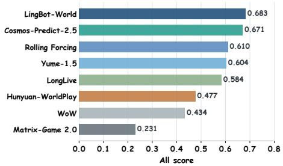

bar chart

| Game | All score |
|---|---|
| LingBot-World | 0.683 |
| Cosmos-Predict-2.5 | 0.671 |
| Rolling Forcing | 0.610 |
| Yume-1.5 | 0.604 |
| LongLive | 0.584 |
| Hunyuan-WorldPlay | 0.477 |
| WoW | 0.434 |
| Matrix-Game 2.0 | 0.231 |

(b) Capability Radar  
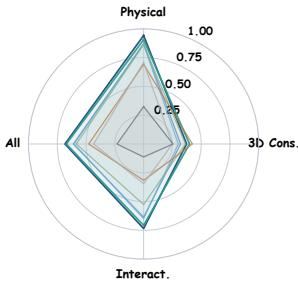

radar chart

| Category   | Value |
| ---------- | ----- |
| Physical   | 1.00  |
| 3D Cons.   | 0.50  |
| Interact.  | 0.75  |
| All        | 0.50  |

(c) Metric Heatmap  
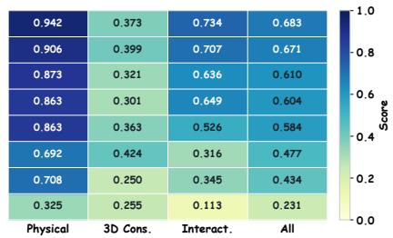  
LingBot-World Cosmos-Predict-2.5 Rolling Forcing Yume-1.5 LongLive Hunyuan-WorldPlay WoW Matrix-Game 2.0

Figure 5 Result statistics of WorldOlympiad across evaluated world-model pipelines and scoring dimensions.

appendix show that thermodynamics and material-level questions remain more fragile than many mechanics questions, and weaker models still violate basic constraints under long-horizon generation.

The geometry-simulation gap remains unresolved. Geometric consistency remains one of the most important unresolved weaknesses across current video world models. Even the strongest pipeline on this dimension, Hunyuan-WorldPlay, reaches only (0.424), while most models remain in the (0.25)–(0.40) range. Notably, models represented by Hunyuan-WorldPlay rely more heavily on camera or viewpoint control as their primary form of interaction. This design encourages the model to preserve spatial layout under view changes, which helps explain its relatively stronger 3D consistency. However, such interaction is also more constrained than open-ended action-conditioned generation: controlling the camera or viewpoint does not necessarily require the model to reason about complex object manipulation, agent behavior, or multi-step state transitions. As a result, these models can obtain better geometry scores while still achieving limited overall performance. This highlights a key trade-off in current world models: view-control pipelines may better preserve cross-view structure, but robust world simulation requires both stable 3D geometry and flexible interactive dynamics.

The specialization-generalization trade-off. LingBot-World and Cosmos-Predict-2.5 have both undergone sustained training in specific domains such as gaming and robotics. Their strong performance in our benchmark suggests that continuous domain-specific training can effectively generalize to broader evaluation settings.

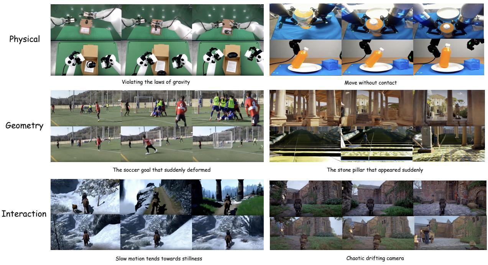  
Figure 6 Representative WorldOlympiad case studies detected by the benchmark. The upper examples show high-quality generations that preserve the intended physical behavior, scene structure, or interaction state, while the lower examples show typical failure cases with visible rule violations, geometric inconsistency, or interaction drift.

In particular, the fact that these two specialized pipelines rank at the top indicates that targeted training does not necessarily limit a model to its original domain; instead, it can provide transferable world knowledge that benefits performance across different scenarios.However, not all specialized models show the same generalization ability. WoW performs better in embodied scenarios than in other domains, but its scores drop on gaming and general real-world videos. As shown in Table 6, WoW reaches 0.502 on embodied videos, but only 0.368 on gaming videos and 0.415 on general videos. These results suggest that specialization is useful only when the learned knowledge can transfer beyond a narrow domain. Future models should therefore combine sustained domain-specific training with broader cross-domain world knowledge.

Fine-grained diagnostics. WorldOlympiad is designed to be diagnostic rather than only leaderboard-driven. Beyond the aggregate scores in Table 3, we decompose model behavior into domain-level results, physical dimensions and questions, 3D reconstruction submetrics, and interaction submetrics. These breakdowns make it possible to identify whether a low score is caused by a specific physical rule, unstable geometry, poor semantic grounding, or long-range interaction drift. Detailed tables for these fine-grained results are provided in Appendix B.

## 4.3 Qualitative Case Studies and Failure Modes

Quantitative scores are paired with qualitative cases because a leaderboard alone cannot explain model failures. As shown in Figure 6, WorldOlympiad reveals three recurring failure modes. Physical metrics identify implausible dynamics, such as objects moving against gravity, deforming without contact, or changing state abruptly. Geometry metrics expose videos that look reasonable in the original view but fail under 3D reconstruction, meta-view rendering, or camera-trajectory comparison. Interaction metrics capture rollouts that follow isolated captions but reset state, lose objects, or break action continuity across chunks. Additional qualitative examples and discussion are provided in Appendix C.

## 4.4 Human Preference Alignment

To examine whether the WorldOlympiad automatic evaluator is consistent with human preference, we conduct a controlled alignment study on the evaluated world models. Since long-video world modeling requires more than visual realism alone, human annotators compare generated videos from multiple complementary aspects, including overall perceived quality, physical plausibility, temporal coherence, and interaction fidelity. These criteria are designed to reflect the key capabilities targeted by WorldOlympiad and provide a human-centered reference for evaluating model behavior in downstream scenarios.

We aggregate the annotations into a pairwise human preference score Shuman, where higher values indicate stronger human preference. Table 4 compares the resulting human ranking with the WorldOlympiad automatic ranking over the eight annotated models. The two rankings are highly consistent, with a Spearman correlation coefficient of $\rho = 0 . 9 5$ . This strong agreement suggests that WorldOlympiad’s automatic evaluation captures model-level quality differences that are also perceived by human annotators. Meanwhile, unlike human evaluation, the automatic evaluator can be applied at a larger scale and provides more fine-grained diagnostic scores across physical, geometric, and interaction-related dimensions. These results indicate that WorldOlympiad offers a scalable yet human-aligned evaluation protocol for long-video world models. Additional annotation and aggregation details are provided in Appendix D.

Table 4 Alignment between human preference rankings and WorldOlympiad automatic rankings. Shuman denotes the pairwise human preference score, and Sauto denotes the WorldOlympiad All score. Rank gap is computed as human rank minus automatic rank.

<table><tr><td>Category</td><td>Model</td><td> $S^{human}$ </td><td> $S^{auto}$ </td><td>Human Rank</td><td>Auto Rank</td><td>Rank Gap</td></tr><tr><td>Gaming World Model</td><td>LingBot-World</td><td>0.721</td><td>0.683</td><td>1</td><td>1</td><td>0</td></tr><tr><td>Robotics World Model</td><td>Cosmos-Predict-2.5</td><td>0.648</td><td>0.671</td><td>2</td><td>2</td><td>0</td></tr><tr><td>General World Model</td><td>Rolling Forcing</td><td>0.579</td><td>0.610</td><td>3</td><td>3</td><td>0</td></tr><tr><td>General World Model</td><td>LongLive</td><td>0.532</td><td>0.584</td><td>4</td><td>5</td><td>-1</td></tr><tr><td>General World Model</td><td>Yume-1.5</td><td>0.491</td><td>0.604</td><td>5</td><td>4</td><td>1</td></tr><tr><td>General World Model</td><td>Hunyuan-WorldPlay</td><td>0.423</td><td>0.477</td><td>6</td><td>6</td><td>0</td></tr><tr><td>Gaming World Model</td><td>Matrix-Game 2.0</td><td>0.309</td><td>0.231</td><td>7</td><td>8</td><td>-1</td></tr><tr><td>Robotics World Model</td><td>WoW</td><td>0.271</td><td>0.434</td><td>8</td><td>7</td><td>1</td></tr></table>

## 5 Conclusion

We presented WorldOlympiad, a benchmark for evaluating video world models beyond surface-level visual quality, measuring three core capabilities: physical faithfulness, geometric consistency, and interaction fidelity. WorldOlympiad combines rule-based physical judging, 3D reconstruction-based geometry diagnostics, and chunk-level plus long-range interaction evaluation, providing a unified protocol for diagnosing whether generated videos behave as reliable world simulations. Experiments across gaming-centric, robotics-centric, and general world-model pipelines reveal that current models remain far from reliable world simulators: even strong models fail on physical rules, 3D structure, or long-horizon state preservation, exposing important gaps between perceptually plausible generation and controllable world modeling.

Future work. Future work will extend WorldOlympiad to study how different memory mechanisms affect long-horizon consistency and interactive controllability. Although many recent pipelines introduce memory modules to improve long-video generation, their varying model scales, training data, and architectural designs make it difficult to isolate whether performance gains stem from the memory mechanism itself or from confounding factors. We therefore aim to build a controlled evaluation environment that disentangles memory design from other variables. Relevant designs include KV-cache reuse, explicit 3D scene memory, linear attention, and hybrid temporal-spatial mechanisms. By comparing these under shared data, comparable model capacity, and a unified protocol, future analysis can more clearly reveal which memory forms best support physical consistency, geometric stability, and reliable long-horizon interaction.

## References

[1] Niket Agarwal, Arslan Ali, Maciej Bala, Yogesh Balaji, Erik Barker, Tiffany Cai, Prithvijit Chattopadhyay, Yongxin Chen, Yin Cui, Yifan Ding, et al. Cosmos world foundation model platform for physical ai. arXiv preprint arXiv:2501.03575, 2025.  
[2] Arslan Ali, Junjie Bai, Maciej Bala, Yogesh Balaji, Aaron Blakeman, Tiffany Cai, Jiaxin Cao, Tianshi Cao, Elizabeth Cha, Yu-Wei Chao, et al. World simulation with video foundation models for physical ai. arXiv preprint arXiv:2511.00062, 2025.  
[3] Andreas Blattmann, Tim Dockhorn, Sumith Kulal, Daniel Mendelevitch, Maciej Kilian, Dominik Lorenz, Yam Levi, Zion English, Vikram Voleti, Adam Letts, et al. Stable video diffusion: Scaling latent video diffusion models to large datasets. arXiv preprint arXiv:2311.15127, 2023.  
[4] Tim Brooks, Bill Peebles, Connor Holmes, Will DePue, Yufei Guo, Leo Jing, David Schnurr, Joe Taylor, Troy Luhman, Eric Luhman, et al. Video generation models as world simulators. OpenAI Blog, 1(8):1, 2024.  
[5] Nicolas Carion, Laura Gustafson, Yuan-Ting Hu, Shoubhik Debnath, Ronghang Hu, Didac Suris, Chaitanya Ryali, Kalyan Vasudev Alwala, Haitham Khedr, Andrew Huang, et al. Sam 3: Segment anything with concepts. arXiv preprint arXiv:2511.16719, 2025.  
[6] Haoxuan Che, Xuanhua He, Quande Liu, Cheng Jin, and Hao Chen. Gamegen-x: Interactive open-world game video generation. In International Conference on Learning Representations, volume 2025, pages 37546–37593, 2025.  
[7] Xiaowei Chi, Peidong Jia, Chun-Kai Fan, Xiaozhu Ju, Weishi Mi, Kevin Zhang, Zhiyuan Qin, Wanxin Tian, Kuangzhi Ge, Hao Li, et al. Wow: Towards a world omniscient world model through embodied interaction. arXiv preprint arXiv:2509.22642, 2025.  
[8] Google DeepMind. Gemini 3 pro model card, 2025.  
[9] Yufan Deng, Zilin Pan, Hongyu Zhang, Xiaojie Li, Ruoqing Hu, Yufei Ding, Yiming Zou, Yan Zeng, and Daquan Zhou. Rethinking video generation model for the embodied world. arXiv preprint arXiv:2601.15282, 2026.  
[10] Haoyi Duan, Hong-Xing Yu, Sirui Chen, Li Fei-Fei, and Jiajun Wu. Worldscore: A unified evaluation benchmark for world generation. In Proceedings of the IEEE/CVF International Conference on Computer Vision, pages 27713–27724, 2025.  
[11] Xianglong He, Chunli Peng, Zexiang Liu, Boyang Wang, Yifan Zhang, Qi Cui, Fei Kang, Biao Jiang, Mengyin An, Yangyang Ren, et al. Matrix-game 2.0: An open-source real-time and streaming interactive world model. arXiv preprint arXiv:2508.13009, 2025.  
[12] Yue Hu, Siyuan Huang, Yue Liao, Shengcong Chen, Pengfei Zhou, Liliang Chen, Maoqing Yao, and Guanghui Ren. Ewmbench: Evaluating scene, motion, and semantic quality in embodied world models. arXiv preprint arXiv:2505.09694, 2025.  
[13] Junchao Huang, Xinting Hu, Boyao Han, Shaoshuai Shi, Zhuotao Tian, Tianyu He, and Li Jiang. Memory forcing: Spatio-temporal memory for consistent scene generation on minecraft. arXiv preprint arXiv:2510.03198, 2025.  
[14] Xun Huang, Zhengqi Li, Guande He, Mingyuan Zhou, and Eli Shechtman. Self forcing: Bridging the train-test gap in autoregressive video diffusion. arXiv preprint arXiv:2506.08009, 2025.  
[15] Ziqi Huang, Yinan He, Jiashuo Yu, Fan Zhang, Chenyang Si, Yuming Jiang, Yuanhan Zhang, Tianxing Wu, Qingyang Jin, Nattapol Chanpaisit, et al. Vbench: Comprehensive benchmark suite for video generative models. In Proceedings of the IEEE/CVF Conference on Computer Vision and Pattern Recognition, pages 21807–21818, 2024.  
[16] Ziqi Huang, Fan Zhang, Xiaojie Xu, Yinan He, Jiashuo Yu, Ziyue Dong, Qianli Ma, Nattapol Chanpaisit, Chenyang Si, Yuming Jiang, et al. Vbench++: Comprehensive and versatile benchmark suite for video generative models. IEEE Transactions on Pattern Analysis and Machine Intelligence, 2025.  
[17] Weijie Kong, Qi Tian, Zijian Zhang, Rox Min, Zuozhuo Dai, Jin Zhou, Jiangfeng Xiong, Xin Li, Bo Wu, Jianwei Zhang, et al. Hunyuanvideo: A systematic framework for large video generative models. arXiv preprint arXiv:2412.03603, 2024.  
[18] Dacheng Li, Yunhao Fang, Yukang Chen, Shuo Yang, Shiyi Cao, Justin Wong, Michael Luo, Xiaolong Wang, Hongxu Yin, Joseph E Gonzalez, et al. Worldmodelbench: Judging video generation models as world models. arXiv preprint arXiv:2502.20694, 2025.  
[19] Runjia Li, Philip Torr, Andrea Vedaldi, and Tomas Jakab. Vmem: Consistent interactive video scene generation with surfel-indexed view memory. In Proceedings of the IEEE/CVF International Conference on Computer Vision, pages 25690–25699, 2025.  
[20] Yaxuan Li, Yichen Zhu, Junjie Wen, Chaomin Shen, and Yi Xu. Worldeval: World model as real-world robot policies evaluator, 2025.  
[21] Haotong Lin, Sili Chen, Junhao Liew, Donny Y Chen, Zhenyu Li, Guang Shi, Jiashi Feng, and Bingyi Kang. Depth anything 3: Recovering the visual space from any views. arXiv preprint arXiv:2511.10647, 2025.  
[22] Kunhao Liu, Wenbo Hu, Jiale Xu, Ying Shan, and Shijian Lu. Rolling forcing: Autoregressive long video diffusion in real time. arXiv preprint arXiv:2509.25161, 2025.  
[23] Mingxin Liu, Shuran Ma, Shibei Meng, Xiangyu Zhao, Zicheng Zhang, Shaofeng Zhang, Zhihang Zhong, Peixian Chen, Haoyu Cao, Xing Sun, et al. Rise-video: Can video generators decode implicit world rules? arXiv preprint arXiv:2602.05986, 2026.  
[24] Wei Liu, Ziyu Chen, Zizhang Li, Yue Wang, Hong-Xing Yu, and Jiajun Wu. Realwonder: Real-time physical action-conditioned video generation. arXiv preprint arXiv:2603.05449, 2026.  
[25] Xiaofeng Mao, Zhen Li, Chuanhao Li, Xiaojie Xu, Kaining Ying, Tong He, Jiangmiao Pang, Yu Qiao, and Kaipeng Zhang. Yume-1.5: A text-controlled interactive world generation model. arXiv preprint arXiv:2512.22096, 2025.  
[26] Xiaofeng Mao, Shaoheng Lin, Zhen Li, Chuanhao Li, Wenshuo Peng, Tong He, Jiangmiao Pang, Mingmin Chi, Yu Qiao, and Kaipeng Zhang. Yume: An interactive world generation model. arXiv preprint arXiv:2507.17744, 2025.  
[27] Yiran Qin, Zhelun Shi, Jiwen Yu, Xijun Wang, Enshen Zhou, Lijun Li, Zhenfei Yin, Xihui Liu, Lu Sheng, Jing Shao, et al. Worldsimbench: Towards video generation models as world simulators. arXiv preprint arXiv:2410.18072, 2024.  
[28] Alec Radford, Jong Wook Kim, Chris Hallacy, Aditya Ramesh, Gabriel Goh, Sandhini Agarwal, Girish Sastry, Amanda Askell, Pamela Mishkin, Jack Clark, et al. Learning transferable visual models from natural language supervision. In International conference on machine learning, pages 8748–8763. PmLR, 2021.  
[29] Yu Shang, Zhuohang Li, Yiding Ma, Weikang Su, Xin Jin, Ziyou Wang, Lei Jin, Xin Zhang, Yinzhou Tang, Haisheng Su, et al. Worldarena: A unified benchmark for evaluating perception and functional utility of embodied world models. arXiv preprint arXiv:2602.08971, 2026.  
[30] Joonghyuk Shin, Zhengqi Li, Richard Zhang, Jun-Yan Zhu, Jaesik Park, Eli Shechtman, and Xun Huang. Motionstream: Real-time video generation with interactive motion controls. arXiv preprint arXiv:2511.01266, 2025.  
[31] Wenqiang Sun, Haiyu Zhang, Haoyuan Wang, Junta Wu, Zehan Wang, Zhenwei Wang, Yunhong Wang, Jun Zhang, Tengfei Wang, and Chunchao Guo. Worldplay: Towards long-term geometric consistency for real-time interactive world modeling. arXiv preprint arXiv:2512.14614, 2025.  
[32] DataFlow Team, Bohan Zeng, Daili Hua, Kaixin Zhu, Yifan Dai, Bozhou Li, Yuran Wang, Chengzhuo Tong, Yifan Yang, Mingkun Chang, et al. Openworldlib: A unified codebase and definition of advanced world models. arXiv preprint arXiv:2604.04707, 2026.  
[33] InSpatio Team, Donghui Shen, Guofeng Zhang, Haomin Liu, Haoyu Ji, Hujun Bao, Hongjia Zhai, Jialin Liu, Jing Guo, Nan Wang, et al. Inspatio-world: A real-time 4d world simulator via spatiotemporal autoregressive modeling. arXiv preprint arXiv:2604.07209, 2026.  
[34] Meituan LongCat Team, Xunliang Cai, Qilong Huang, Zhuoliang Kang, Hongyu Li, Shijun Liang, Liya Ma, Siyu Ren, Xiaoming Wei, Rixu Xie, et al. Longcat-video technical report. arXiv preprint arXiv:2510.22200, 2025.  
[35] Robbyant Team, Zelin Gao, Qiuyu Wang, Yanhong Zeng, Jiapeng Zhu, Ka Leong Cheng, Yixuan Li, Hanlin Wang, Yinghao Xu, Shuailei Ma, et al. Advancing open-source world models. arXiv preprint arXiv:2601.20540, 2026.  
[36] Team Wan, Ang Wang, Baole Ai, Bin Wen, Chaojie Mao, Chen-Wei Xie, Di Chen, Feiwu Yu, Haiming Zhao, Jianxiao Yang, et al. Wan: Open and advanced large-scale video generative models. arXiv preprint arXiv:2503.20314, 2025.  
[37] Weijie Wang, Xiaoxuan He, Youping Gu, Yifan Yang, Zeyu Zhang, Yefei He, Yanbo Ding, Xirui Hu, Donny Y Chen, Zhiyuan He, et al. World-r1: Reinforcing 3d constraints for text-to-video generation. arXiv preprint arXiv:2604.24764, 2026.  
[38] Weijie Wang, Haoyu Zhao, Yifan Yang, Feng Chen, Zeyu Zhang, Yefei He, Zicheng Duan, Donny Y. Chen, Yuqing Yang, and Bohan Zhuang. Latent spatial memory for video world models. arXiv preprint arXiv:2606.09828, 2026.  
[39] Thaddäus Wiedemer, Yuxuan Li, Paul Vicol, Shixiang Shane Gu, Nick Matarese, Kevin Swersky, Been Kim, Priyank Jaini, and Robert Geirhos. Video models are zero-shot learners and reasoners. arXiv preprint arXiv:2509.20328, 2025.  
[40] Ruiqi Wu, Xuanhua He, Meng Cheng, Tianyu Yang, Yong Zhang, Zhuoliang Kang, Xunliang Cai, Xiaoming Wei, Chunle Guo, Chongyi Li, et al. Infinite-world: Scaling interactive world models to 1000-frame horizons via pose-free hierarchical memory. arXiv preprint arXiv:2602.02393, 2026.  
[41] Shihan Wu, Xuecheng Liu, Shaoxuan Xie, Pengwei Wang, Xinghang Li, Bowen Yang, Zhe Li, Kai Zhu, Hongyu Wu, Yiheng Liu, et al. Robocoin: An open-sourced bimanual robotic data collection for integrated manipulation. arXiv preprint arXiv:2511.17441, 2025.  
[42] Tong Wu, Shuai Yang, Ryan Po, Yinghao Xu, Ziwei Liu, Dahua Lin, and Gordon Wetzstein. Video world models with long-term spatial memory. arXiv preprint arXiv:2506.05284, 2025.  
[43] Zeqi Xiao, Yushi Lan, Yifan Zhou, Wenqi Ouyang, Shuai Yang, Yanhong Zeng, and Xingang Pan. Worldmem: Long-term consistent world simulation with memory. arXiv preprint arXiv:2504.12369, 2025.  
[44] Tianwei Xiong, Yuqing Wang, Daquan Zhou, Zhijie Lin, Jiashi Feng, and Xihui Liu. Lvd-2m: A long-take video dataset with temporally dense captions. Advances in Neural Information Processing Systems, 37:16623–16644, 2024.  
[45] Shuai Yang, Wei Huang, Ruihang Chu, Yicheng Xiao, Yuyang Zhao, Xianbang Wang, Muyang Li, Enze Xie, Yingcong Chen, Yao Lu, et al. Longlive: Real-time interactive long video generation. arXiv preprint arXiv:2509.22622, 2025.  
[46] Zhuoyi Yang, Jiayan Teng, Wendi Zheng, Ming Ding, Shiyu Huang, Jiazheng Xu, Yuanming Yang, Wenyi Hong, Xiaohan Zhang, Guanyu Feng, et al. Cogvideox: Text-to-video diffusion models with an expert transformer. arXiv preprint arXiv:2408.06072, 2024.  
[47] Yixuan Ye, Xuanyu Lu, Yuxin Jiang, Yuchao Gu, Rui Zhao, Qiwei Liang, Jiachun Pan, Fengda Zhang, Weijia Wu, and Alex Jinpeng Wang. Mind: Benchmarking memory consistency and action control in world models. arXiv preprint arXiv:2602.08025, 2026.  
[48] Tianwei Yin, Qiang Zhang, Richard Zhang, William T Freeman, Fredo Durand, Eli Shechtman, and Xun Huang. From slow bidirectional to fast autoregressive video diffusion models. In Proceedings of the IEEE/CVF Conference on Computer Vision and Pattern Recognition, pages 22963–22974, 2025.  
[49] Wei Yu, Runjia Qian, Yumeng Li, Liquan Wang, Songheng Yin, Dennis Anthony, Yang Ye, Yidi Li, Weiwei Wan, Animesh Garg, et al. Mosaicmem: Hybrid spatial memory for controllable video world models. arXiv preprint arXiv:2603.17117, 2026.  
[50] Yifan Zhang, Chunli Peng, Boyang Wang, Puyi Wang, Qingcheng Zhu, Fei Kang, Biao Jiang, Zedong Gao, Eric Li, Yang Liu, et al. Matrix-game: Interactive world foundation model. arXiv preprint arXiv:2506.18701, 2025.  
[51] Zeyu Zhang, Shuning Chang, Yuanyu He, Yizeng Han, Jiasheng Tang, Fan Wang, and Bohan Zhuang. Blockvid: Block diffusion for high-quality and consistent minute-long video generation. arXiv preprint arXiv:2511.22973, 2025.  
[52] Jinjing Zhao, Fangyun Wei, Zhening Liu, Hongyang Zhang, Chang Xu, and Yan Lu. Spatia: Video generation with updatable spatial memory. arXiv preprint arXiv:2512.15716, 2025.  
[53] Dian Zheng, Ziqi Huang, Hongbo Liu, Kai Zou, Yinan He, Fan Zhang, Lulu Gu, Yuanhan Zhang, Jingwen He, Wei-Shi Zheng, et al. Vbench-2.0: Advancing video generation benchmark suite for intrinsic faithfulness. arXiv preprint arXiv:2503.21755, 2025.  
[54] Hongzhou Zhu, Min Zhao, Guande He, Hang Su, Chongxuan Li, and Jun Zhu. Causal forcing: Autoregressive diffusion distillation done right for high-quality real-time interactive video generation. arXiv preprint arXiv:2602.02214, 2026.

## A WorldOlympiad Judge Prompt Templates

The prompt templates below cover dynamic-object extraction, physical consistency, interaction quality, and 3D reconstruction quality.

Table 5 Judge-related prompt families used by WorldOlympiad.

<table><tr><td>Component</td><td>Prompt family</td><td>Role in evaluation</td></tr><tr><td>Physical</td><td>Relevance and compliance judges</td><td>Select applicable physical rules and judge whether the generated video follows them against the reference.</td></tr><tr><td>Interaction</td><td>Chunk, transition, and global judges</td><td>Score local caption following, boundary smoothness, and long-range consistency.</td></tr><tr><td>3D</td><td>Static-scene rewrite and 3D MLLM scorers</td><td>Remove dynamic actors from the judging target and score Gaussian-splat reconstruction quality.</td></tr><tr><td>Preprocessing</td><td>Dynamic-object extraction</td><td>Select moving or deforming foreground actors for SAM-based masking and diagnostic videos.</td></tr></table>

## A.1 Dynamic-Object Extraction Prompt

Before physical and 3D scoring, WorldOlympiad uses a MLLM prompt to identify the primary dynamic or deforming objects for SAM-based visualization, masking, and background completion.

## Dynamic-object extraction

System role: The model acts as an expert at spotting only the primary physical actors that visibly move or deform in a video.

Selection rules: Return the fewest distinct moving or deforming objects, with a maximum of three. Prefer dominant moving foreground objects and omit secondary or uncertain objects. Do not include static background, scenery, floors, tables, walls, tools, supports, containers, or objects that are merely visible. If an object does not visibly change position, orientation, or shape, do not return it. Merge duplicates and synonyms into one concise noun of one to three words.

User query: Watch the video and list only the main objects that visibly move or deform. The query includes {video\_prompt} as the video description.

Output format: Return only a JSON array with one to three concise nouns, such as ["person", "ball"]. No explanations are allowed.

## A.2 Physical Judge Prompts

The physical pipeline first runs a relevance judge on the reference video to determine which physical rules are applicable. It then runs a compliance judge that compares the generated candidate against the reference.

## Physical batch relevance judge

System role: PhysicsFilterBatch, an expert video physics relevance evaluator.

Input: One reference or ground-truth video, its textual prompt, and a list of physics questions. Each question contains a question\_id, dimension, rule text, and success condition.

Decision rule: For every question, decide whether the reference video contains enough visual evidence to judge the physical rule. Use related=true when the rule can be judged from visible objects, materials, contacts, state changes, motion, support, heat or cold cues, liquid/gas/solid behavior, deformation, color or material behavior, burning, dissolving, or other relevant physical evidence. Use related=false only when the rule truly cannot be evaluated from the shown scene.

User query: The prompt provides {video\_prompt} and {question\_list\_json}, and asks the judge to evaluate relevance for every question\_id.

Output format: Return strict JSON with one result per input question: question\_id, related, confidence, and a short evidence-based reason.

## Physical batch compliance judge

System role: PhysicsJudgeBatch, an expert video physics evaluator.

Input: Two videos are provided: the generated candidate video to judge and the ground-truth reference video, which supplies context for the intended event, scene, timing, and physical evidence. The prompt also provides {video\_prompt} and the related subset of {question\_list\_json}.

Decision rule: For each related physics question, judge whether the generated candidate follows the physical rule and remains consistent with the reference. The judge does not require frame-exact matching, but it requires plausible physics, object and material identity consistency, correct temporal order, and visible evidence.

Output format: Return strict JSON with one result per input question: question\_id, compliant, confidence, a 3–5 sentence explanation with specific visual evidence, and short concrete observations.

Physical question context. The question\_list\_json variable contains rule identifiers, dimensions, questions, and success conditions. These rules cover mechanics (gravity, buoyancy, compression, impact), thermodynamics (melting, sublimation, vaporization, condensation, deposition, freezing), and material behavior (color\_mixing, solubility, hardness, combustibility).

## Mechanics rule contexts

## gravity

rule: Do free-moving objects move downward consistently with gravity?

expected\_behavior: First judge whether objects are unsupported, airborne, falling, jumping, driving over uneven terrain, or staying grounded on a support surface. Unsupported objects should fall or arc downward under gravity; supported ground vehicles, people, and objects should remain in plausible contact with the ground unless a visible jump, ramp, collision, or lift explains vertical motion. Penalize floating, sinking through the ground, sudden vertical pops, or hovering without support.

## buoyancy

rule: Do objects on or in a fluid behave consistently with buoyancy, such that floating items stay near the surface and sinking items submerge?

expected\_behavior: Floating objects should remain on or near the surface; dense objects should descend.

## compression

rule: When objects or support surfaces are stressed, loaded, squeezed, or pressed, do they deform or remain rigid in a plausible manner?

expected\_behavior: Cans may dent when crushed, soft materials should compress smoothly under load, and rigid vehicles or metal bodies should mostly keep their shape unless there is collision or heavy force. In robot manipulation, vehicle, racing, or navigation scenes, grasping, pinching, pressing, tire-ground contact, suspension loading, soil displacement, body rigidity, or lack of impossible warping can make stress and deformation relevant. Deformation should start only after visible squeezing, support, load, contact, or other applied stress, and the same object, person, or vehicle should stay visually consistent instead of morphing into a different shape or identity.

## impact

rule: Do contact, traction, collisions, impacts, and momentum changes produce reasonable motion transitions?

expected\_behavior: Look for momentum transfer, bouncing, shattering, resting poses, ground contact, tire or foot contact, traction, braking, turning, or acceleration that matches visible forces and contacts. In robot manipulation, placing or releasing an object into contact also counts as an impact or contact event. In vehicle, racing, sports, or navigation scenes, tire-ground contact, acceleration from rest, sliding, dust kick-up, braking, steering, direction changes, speed changes, near-collisions, or collisions are relevant. Abrupt deformation, direction change, or speed change should happen after visible contact, impact, or control input rather than before.

## Thermodynamics rule contexts

## melting

description: A solid substance should gradually transition to liquid when heated above its melting point.

expected\_behavior: The solid should decrease in size or volume as it transforms into liquid, and the process should be gradual and continuous.

violations: Solid increasing in size, liquid turning into solid, instantaneous disappearance without liquid formation, solid remaining unchanged despite heat, or no liquid formation.

## sublimation

description: A solid should directly transition to gas without passing through the liquid phase.

expected\_behavior: The solid should rapidly decrease or disappear while gas or vapor appears around it, with no visible liquid phase.

violations: Solid melting to liquid first, gas condensing to solid, solid remaining stable, or liquid forming as an intermediate phase.

## vaporization

description: A liquid should transition to gas when heated or over time.

expected\_behavior: The liquid should decrease in volume or disappear over time; bubbles, boiling, evaporation, or visible gas or vapor may appear.

violations: Liquid increasing in volume, gas condensing to liquid, liquid remaining constant despite heat or time, or liquid freezing.

## condensation

description: A gas should transition to liquid when cooled below its condensation point.

expected\_behavior: Liquid should form and increase in volume; small droplets may appear and merge, and gas may become less visible as it condenses.

violations: Liquid evaporating, gas remaining as gas, liquid freezing directly to solid, or no liquid formation.

## deposition

description: A gas should directly transition to solid without passing through the liquid phase.

expected\_behavior: Solid should form and increase in size or volume directly from gas, often as crystals or frost-like structures, with no visible liquid intermediate.

violations: Gas condensing to liquid first, solid melting, liquid freezing to solid, or no solid formation.

## freezing

description: A liquid should transition to solid when cooled below its freezing point.

expected\_behavior: The liquid should solidify and may expand slightly or contract; the surface may become rigid and the shape should become more defined and regular.

violations: Liquid remaining liquid, solid melting, liquid evaporating, or no solidification occurring.

## Material rule contexts

## color\_mixing

question: When different colored liquids or paints mix, do they produce the correct resulting color?

success\_condition: Colored liquids, paints, powders, smoke, dye, pigments, or other visibly colored substances should blend into plausible resulting colors when they contact and mix. Red and yellow should produce orange, blue and yellow should produce green, and red and blue should produce purple. If colored objects merely pass near each other without material transfer or blending, they should not change color.

## solubility

question: Do soluble materials such as sugar or salt dissolve properly when placed in water or other solvents?

success\_condition: Soluble or dispersible substances such as sugar, salt, powder, dye, tablets, or granular material should gradually disperse, dissolve, fade, or become suspended or invisible in a liquid solvent. Insoluble solids should remain visible or settle.

## hardness

question: Do materials with different hardness levels behave correctly when grasped, pressed, cut, folded, or broken?

success\_condition: Soft materials such as paper, cloth, foam, food, plants, soil, loose dirt, or powder should bend, fold, tear, compress, scatter, or deform when appropriate. Hard materials such as metal, stone, glass, rigid vehicle bodies, tools, or containers should resist deformation unless force or collision is strong enough. In robot, human, vehicle, racing, sports, or navigation scenes, grasping, pinching, pressing, stepping, tire-ground contact, placing, sliding, collision, or load-bearing can reveal rigidity versus softness. Shape change should follow visible contact or applied force, and the acted-on object, person, vehicle, or material should remain visually consistent.

## combustibility

question: Do flammable materials burn correctly, producing fire, smoke, or char?

success\_condition: Wood, paper, and fabric should ignite and produce flames or smoke; non-flammable materials should not.

## A.3 Interaction Judge Prompts

The interaction pipeline evaluates chunk-generated long videos at three levels: individual chunks, adjacent chunk transitions, and the stitched full video.

## Interaction judge shared instruction

System role: A strict evaluator for chunk-generated interactive videos.

Judgment scope: Judge whether each generated chunk follows its intended action and caption, whether adjacent chunks transition smoothly, and whether the full stitched video remains globally consistent. The reference video is used only as context for scene, style, camera, and intended interaction, not as a requirement for frame-exact matching.

Output rule: Always return strict JSON only. All scores must be numbers from 0 to 5.

## Chunk-level interaction judge

Inputmetadata: {chunk\_index}, {source\_interval}, generated interval [{generated\_start\_sec}, {generated\_- end\_sec}), {action}, and {caption}.

Primary evidence: Use the generated chunk frames as the primary evidence. Reference-video frames are used only for context about the intended scene and style.

Scoring criteria: Score visual\_quality by clarity, realism, temporal stability, color and lighting consistency, and lack of artifacts. Score text\_alignment by whether the visible content matches the intended action and caption.

Output format: Return strict JSON with chunk\_index, visual\_quality, text\_alignment, overall, and a short evidence-based reason.

## Transition-level interaction judge

Input metadata: The previous and next chunk indices, generated intervals, actions, and captions.

Decision rule: Judge whether the transition is smooth and continuous. Scene, lighting, style, and subject identity should remain coherent. Motion trajectory and camera movement should evolve naturally. Penalize abrupt jumps, object identity resets, impossible camera jumps, and visible stitching artifacts.

Output format: Return strict JSON with from\_chunk\_index, to\_chunk\_index, transition\_smoothness, overall, and a short evidence-based reason.

## Global interaction judge

Input: The whole stitched generated video and {prompt\_summary\_json}, which lists each chunk index, action, and caption.

Primary evidence: Use generated full-video frames as the primary evidence and reference frames only as context.

Scoring criteria: Judge whether subject, character, and object identity remain stable across the video; whether scene style, visual tone, lighting, and camera behavior remain coherent; and whether global semantics align with the combined intent of all chunk prompts.

Output format: Return strict JSON with long\_range\_consistency, global\_text\_alignment, overall, and a short evidence-based reason.

## A.4 3D Judge Prompts

The 3D pipeline first rewrites the original generation prompt into a static scene prompt, because dynamic foreground actors are masked and video-inpainted before Depth Anything 3 reconstruction and Gaussian-Splat rendering. The MLLM then scores the Gaussian-Splat video and a meta-view image. The camera trajectory score $S _ { \mathrm { t r a j } }$ is computed from DA3 camera motion similarity.

## Static-scene prompt rewrite

System role: Rewrite video generation prompts for static 3D reconstruction evaluation. The reconstruction input has dynamic foreground actors masked and video-inpainted before DA3 reconstruction.

Rewrite requirements: Keep static background, environment, layout, materials, lighting, weather, terrain, large structures, and camera/view behavior if present. Remove or explicitly ignore dynamic foreground actors and actions, including people, animals, vehicles, limbs, clothing motion, object manipulation, running, turning, and other moving subjects. If the original prompt has no camera information, set camera\_behavior exactly to "camera is static". Mention that dynamic foreground actors may be absent because they were masked and video-inpainted before reconstruction.

Input placeholder: {prompt}.

Output format: Return strict JSON with exactly static\_scene\_description, camera\_behavior, and ignore\_- for\_3d.

## Gaussian-Splat video 3D judge

System role: A calibrated 3D reconstruction judge that follows the scoring rubric and returns strict JSON only.

Input: Several sampled frames from a Gaussian-Splat render reconstructed from a source video after dynamic foreground regions were masked and video-inpainted, together with the static-scene prompt {prompt}.

Robustness instruction: Be robust to normal Gaussian-Splat artifacts, video-inpainting artifacts, blur, rain/fog/lowlight appearance, and moderate texture noise. Dynamic foreground actors and actions may be absent or incomplete because they were intentionally removed before reconstruction; do not penalize their absence.

Scoring focus: Judge whether the reconstructed static background geometry is coherent across views or time, whether static structures and scene layout are spatially plausible, whether the render preserves recognizable camera-consistent organization, whether it is faithful to the static-scene description and expected camera behavior, and whether artifacts dominate the render. If the prompt says the camera is static, do not require camera motion or parallax.

Calibration: Scores in 0.8–1.0 indicate a clear coherent 3D scene; 0.6–0.8 indicate a recognizable mostly coherent scene with noticeable artifacts; 0.4–0.6 indicate partial recognition with significant artifacts; 0.2–0.4 indicate mostly failed reconstruction; and 0.0–0.2 indicate an unusable render. Do not assign a very low score solely because the render is blurry or noisy; if the static layout is recognizable, the score should usually be at least 0.5.

Output format: Return strict JSON with score in [0, 1] and a short reason.

## Meta-view image 3D judge

System role: A calibrated 3D reconstruction judge that follows the scoring rubric and returns strict JSON only.

Input: A single meta-view image rendered from a 3D reconstruction of a source video after dynamic foreground regions were masked and video-inpainted, together with the static-scene prompt {prompt}.

Robustness instruction: Be robust to normal Gaussian-Splat artifacts, video-inpainting artifacts, blur, rain/fog/lowlight appearance, and moderate texture noise. Dynamic foreground actors and actions may be absent or incomplete because they were intentionally removed before reconstruction; do not penalize their absence.

Scoring focus: Judge whether the static background layout is recognizable, geometrically plausible, structurally coherent, and not catastrophically flat, floating, duplicated, or collapsed. If the prompt says the camera is static, do not require camera motion or parallax.

Calibration: Scores in 0.8–1.0 indicate a clear coherent static scene; 0.6–0.8 indicate a recognizable mostly coherent scene with noticeable artifacts; 0.4–0.6 indicate a partially recognizable scene; 0.2–0.4 indicate a mostly failed reconstruction; and 0.0–0.2 indicate an unusable image. Do not assign a very low score solely because the meta-view is blurry or noisy; if the static scene layout is recognizable, the score should usually be at least 0.5.

Output format: Return strict JSON with score in [0, 1] and a short reason.

## B Detailed Results

This section reports domain-wise scores, physical pass rates, interaction diagnostics, geometry diagnostics, and model-level submetrics.

## B.1 Domain-wise Results

Table 6 reports the detailed scores on the same-scene subset, grouped by evaluation domain. The table includes physical faithfulness, 3D consistency, CLIP-augmented interaction fidelity, raw and calibrated CLIP semantic alignment, and the overall score. The overall score is computed as the equal-weight average of physical faithfulness, 3D consistency, and interaction fidelity.

Table 6 Detailed WorldOlympiad scores on the same-scene subset across gaming, robotics, and general domains. All is the equal-weight average of Physical, 3D Cons., and Interact.

<table><tr><td>Domain</td><td>Pipeline</td><td>Physical</td><td>3D Cons.</td><td>Interact.</td><td>CLIP Raw</td><td>CLIP Aux.</td><td>All</td></tr><tr><td rowspan="8">Gaming</td><td>Matrix-Game 2.0</td><td>0.332</td><td>0.189</td><td>0.111</td><td>0.230</td><td>0.150</td><td>0.211</td></tr><tr><td>LingBot-World</td><td>0.884</td><td>0.366</td><td>0.778</td><td>0.315</td><td>0.575</td><td>0.676</td></tr><tr><td>Cosmos-Predict-2.5</td><td>0.867</td><td>0.361</td><td>0.679</td><td>0.306</td><td>0.530</td><td>0.636</td></tr><tr><td>WoW</td><td>0.633</td><td>0.223</td><td>0.249</td><td>0.247</td><td>0.235</td><td>0.368</td></tr><tr><td>Rolling Forcing</td><td>0.853</td><td>0.289</td><td>0.675</td><td>0.332</td><td>0.660</td><td>0.606</td></tr><tr><td>LongLive</td><td>0.851</td><td>0.292</td><td>0.554</td><td>0.322</td><td>0.610</td><td>0.566</td></tr><tr><td>Yume-1.5</td><td>0.813</td><td>0.352</td><td>0.659</td><td>0.291</td><td>0.455</td><td>0.608</td></tr><tr><td>Hunyuan-WorldPlay</td><td>0.852</td><td>0.348</td><td>0.471</td><td>0.296</td><td>0.480</td><td>0.557</td></tr><tr><td rowspan="8">Robotics</td><td>Matrix-Game 2.0</td><td>0.364</td><td>0.338</td><td>0.139</td><td>0.252</td><td>0.260</td><td>0.280</td></tr><tr><td>LingBot-World</td><td>0.949</td><td>0.393</td><td>0.710</td><td>0.314</td><td>0.570</td><td>0.684</td></tr><tr><td>Cosmos-Predict-2.5</td><td>0.937</td><td>0.479</td><td>0.721</td><td>0.321</td><td>0.605</td><td>0.712</td></tr><tr><td>WoW</td><td>0.787</td><td>0.272</td><td>0.447</td><td>0.288</td><td>0.440</td><td>0.502</td></tr><tr><td>Rolling Forcing</td><td>0.870</td><td>0.389</td><td>0.566</td><td>0.329</td><td>0.645</td><td>0.608</td></tr><tr><td>LongLive</td><td>0.857</td><td>0.472</td><td>0.470</td><td>0.327</td><td>0.635</td><td>0.600</td></tr><tr><td>Yume-1.5</td><td>0.851</td><td>0.288</td><td>0.624</td><td>0.312</td><td>0.560</td><td>0.588</td></tr><tr><td>Hunyuan-WorldPlay</td><td>0.630</td><td>0.600</td><td>0.262</td><td>0.309</td><td>0.545</td><td>0.497</td></tr><tr><td rowspan="8">General</td><td>Matrix-Game 2.0</td><td>0.216</td><td>0.220</td><td>0.067</td><td>0.222</td><td>0.110</td><td>0.168</td></tr><tr><td>LingBot-World</td><td>0.963</td><td>0.335</td><td>0.767</td><td>0.311</td><td>0.555</td><td>0.688</td></tr><tr><td>Cosmos-Predict-2.5</td><td>0.939</td><td>0.317</td><td>0.736</td><td>0.313</td><td>0.565</td><td>0.664</td></tr><tr><td>WoW</td><td>0.692</td><td>0.251</td><td>0.302</td><td>0.256</td><td>0.280</td><td>0.415</td></tr><tr><td>Rolling Forcing</td><td>0.933</td><td>0.285</td><td>0.657</td><td>0.314</td><td>0.570</td><td>0.625</td></tr><tr><td>LongLive</td><td>0.909</td><td>0.290</td><td>0.579</td><td>0.315</td><td>0.575</td><td>0.593</td></tr><tr><td>Yume-1.5</td><td>0.925</td><td>0.302</td><td>0.694</td><td>0.302</td><td>0.510</td><td>0.640</td></tr><tr><td>Hunyuan-WorldPlay</td><td>0.389</td><td>0.219</td><td>0.097</td><td>0.235</td><td>0.175</td><td>0.235</td></tr></table>

## B.2 Fine-grained Physical Results

Table 7 reports physical pass rates aggregated by physical dimension. Table 8 further breaks these scores down into individual physical questions.

Table 7 Physical dimension pass rates on the same-scene subset.

<table><tr><td>Domain</td><td>Pipeline</td><td>Overall</td><td>Mechanics</td><td>Thermodynamics</td><td>Material</td></tr><tr><td rowspan="8">Gaming</td><td>Matrix-Game 2.0</td><td>0.332</td><td>0.433</td><td>0.172</td><td>0.184</td></tr><tr><td>LingBot-World</td><td>0.884</td><td>0.983</td><td>0.450</td><td>0.969</td></tr><tr><td>Cosmos-Predict-2.5</td><td>0.867</td><td>0.951</td><td>0.418</td><td>0.884</td></tr><tr><td>WoW</td><td>0.633</td><td>0.806</td><td>0.226</td><td>0.446</td></tr><tr><td>Rolling Forcing</td><td>0.853</td><td>0.941</td><td>0.418</td><td>0.854</td></tr><tr><td>LongLive</td><td>0.851</td><td>0.941</td><td>0.377</td><td>0.865</td></tr><tr><td>Yume-1.5</td><td>0.813</td><td>0.942</td><td>0.365</td><td>0.902</td></tr><tr><td>Hunyuan-WorldPlay</td><td>0.852</td><td>0.944</td><td>0.426</td><td>0.843</td></tr><tr><td rowspan="8">Robotics</td><td>Matrix-Game 2.0</td><td>0.364</td><td>0.366</td><td>0.000</td><td>0.372</td></tr><tr><td>LingBot-World</td><td>0.949</td><td>0.961</td><td>0.000</td><td>0.957</td></tr><tr><td>Cosmos-Predict-2.5</td><td>0.937</td><td>0.939</td><td>0.000</td><td>0.968</td></tr><tr><td>WoW</td><td>0.787</td><td>0.798</td><td>0.111</td><td>0.788</td></tr><tr><td>Rolling Forcing</td><td>0.870</td><td>0.857</td><td>0.000</td><td>0.935</td></tr><tr><td>LongLive</td><td>0.857</td><td>0.864</td><td>0.000</td><td>0.869</td></tr><tr><td>Yume-1.5</td><td>0.851</td><td>0.857</td><td>0.000</td><td>0.872</td></tr><tr><td>Hunyuan-WorldPlay</td><td>0.630</td><td>0.577</td><td>0.000</td><td>0.810</td></tr><tr><td rowspan="8">General</td><td>Matrix-Game 2.0</td><td>0.216</td><td>0.246</td><td>0.097</td><td>0.036</td></tr><tr><td>LingBot-World</td><td>0.963</td><td>1.000</td><td>0.519</td><td>1.000</td></tr><tr><td>Cosmos-Predict-2.5</td><td>0.939</td><td>0.977</td><td>0.613</td><td>0.875</td></tr><tr><td>WoW</td><td>0.692</td><td>0.743</td><td>0.300</td><td>0.562</td></tr><tr><td>Rolling Forcing</td><td>0.933</td><td>0.968</td><td>0.581</td><td>0.938</td></tr><tr><td>LongLive</td><td>0.909</td><td>0.952</td><td>0.581</td><td>0.812</td></tr><tr><td>Yume-1.5</td><td>0.925</td><td>0.979</td><td>0.370</td><td>0.906</td></tr><tr><td>Hunyuan-WorldPlay</td><td>0.389</td><td>0.430</td><td>0.323</td><td>0.036</td></tr></table>

Table 8 Physical question pass rates on the same-scene subset.

<table><tr><td>Domain</td><td>Pipeline</td><td>Grav.</td><td>Buoy.</td><td>Comp.</td><td>Impact</td><td>Melt</td><td>Sub.</td><td>Vap.</td><td>Cond.</td><td>Dep.</td><td>Freez.</td><td>Color</td><td>Sol.</td><td>Hard.</td><td>Comb.</td></tr><tr><td rowspan="8">Gaming</td><td>Matrix-Game 2.0</td><td>0.494</td><td>0.479</td><td>0.324</td><td>0.247</td><td>0.214</td><td>0.000</td><td>0.146</td><td>0.179</td><td>0.167</td><td>0.231</td><td>-</td><td>-</td><td>0.168</td><td>0.222</td></tr><tr><td>LingBot-World</td><td>0.986</td><td>0.944</td><td>1.000</td><td>1.000</td><td>0.429</td><td>-</td><td>0.462</td><td>0.417</td><td>0.500</td><td>0.500</td><td>-</td><td>-</td><td>0.976</td><td>0.957</td></tr><tr><td>Cosmos-Predict-2.5</td><td>0.958</td><td>0.986</td><td>0.986</td><td>0.868</td><td>0.357</td><td>0.000</td><td>0.292</td><td>0.513</td><td>0.833</td><td>0.538</td><td>-</td><td>-</td><td>0.901</td><td>0.843</td></tr><tr><td>WoW</td><td>0.850</td><td>0.944</td><td>0.774</td><td>0.540</td><td>0.200</td><td>0.000</td><td>0.161</td><td>0.296</td><td>0.200</td><td>0.333</td><td>-</td><td>-</td><td>0.486</td><td>0.355</td></tr><tr><td>Rolling Forcing</td><td>0.949</td><td>0.987</td><td>0.947</td><td>0.871</td><td>0.357</td><td>0.500</td><td>0.298</td><td>0.475</td><td>0.667</td><td>0.615</td><td>-</td><td>-</td><td>0.854</td><td>0.854</td></tr><tr><td>LongLive</td><td>0.955</td><td>0.986</td><td>0.946</td><td>0.846</td><td>0.429</td><td>0.000</td><td>0.292</td><td>0.436</td><td>0.500</td><td>0.462</td><td>-</td><td>-</td><td>0.875</td><td>0.843</td></tr><tr><td>Yume-1.5</td><td>0.955</td><td>1.000</td><td>0.900</td><td>0.786</td><td>0.600</td><td>0.000</td><td>0.286</td><td>0.333</td><td>0.500</td><td>0.600</td><td>-</td><td>-</td><td>0.902</td><td>0.900</td></tr><tr><td>Hunyuan-WorldPlay</td><td>0.957</td><td>0.986</td><td>0.959</td><td>0.844</td><td>0.500</td><td>0.500</td><td>0.271</td><td>0.513</td><td>0.667</td><td>0.538</td><td>-</td><td>-</td><td>0.870</td><td>0.780</td></tr><tr><td rowspan="8">Robotics</td><td>Matrix-Game 2.0</td><td>0.427</td><td>0.467</td><td>0.290</td><td>0.239</td><td>-</td><td>-</td><td>0.000</td><td>-</td><td>-</td><td>-</td><td>-</td><td>0.000</td><td>0.374</td><td>-</td></tr><tr><td>LingBot-World</td><td>0.965</td><td>1.000</td><td>0.985</td><td>0.935</td><td>-</td><td>-</td><td>0.000</td><td>-</td><td>-</td><td>-</td><td>1.000</td><td>0.500</td><td>0.962</td><td>-</td></tr><tr><td>Cosmos-Predict-2.5</td><td>0.945</td><td>1.000</td><td>1.000</td><td>0.894</td><td>-</td><td>-</td><td>0.000</td><td>-</td><td>-</td><td>-</td><td>1.000</td><td>0.500</td><td>0.972</td><td>-</td></tr><tr><td>WoW</td><td>0.840</td><td>0.929</td><td>0.845</td><td>0.662</td><td>-</td><td>-</td><td>0.111</td><td>-</td><td>-</td><td>-</td><td>0.000</td><td>0.000</td><td>0.800</td><td>-</td></tr><tr><td>Rolling Forcing</td><td>0.889</td><td>1.000</td><td>0.889</td><td>0.766</td><td>-</td><td>-</td><td>0.000</td><td>-</td><td>-</td><td>-</td><td>-</td><td>0.000</td><td>0.941</td><td>-</td></tr><tr><td>LongLive</td><td>0.879</td><td>0.933</td><td>0.938</td><td>0.791</td><td>-</td><td>-</td><td>0.000</td><td>-</td><td>-</td><td>-</td><td>-</td><td>0.000</td><td>0.873</td><td>-</td></tr><tr><td>Yume-1.5</td><td>0.874</td><td>1.000</td><td>0.938</td><td>0.765</td><td>-</td><td>-</td><td>0.000</td><td>-</td><td>-</td><td>-</td><td>0.000</td><td>0.000</td><td>0.885</td><td>-</td></tr><tr><td>Hunyuan-WorldPlay</td><td>0.644</td><td>0.812</td><td>0.615</td><td>0.373</td><td>-</td><td>-</td><td>0.000</td><td>-</td><td>-</td><td>-</td><td>0.000</td><td>0.000</td><td>0.822</td><td>-</td></tr><tr><td rowspan="8">General</td><td>Matrix-Game 2.0</td><td>0.310</td><td>0.267</td><td>0.111</td><td>0.130</td><td>0.125</td><td>-</td><td>0.000</td><td>0.000</td><td>1.000</td><td>0.000</td><td>-</td><td>-</td><td>0.037</td><td>0.000</td></tr><tr><td>LingBot-World</td><td>1.000</td><td>1.000</td><td>1.000</td><td>1.000</td><td>0.600</td><td>-</td><td>0.400</td><td>0.500</td><td>1.000</td><td>0.667</td><td>-</td><td>-</td><td>1.000</td><td>1.000</td></tr><tr><td>Cosmos-Predict-2.5</td><td>0.972</td><td>1.000</td><td>1.000</td><td>0.976</td><td>0.875</td><td>-</td><td>0.333</td><td>1.000</td><td>1.000</td><td>0.800</td><td>-</td><td>-</td><td>0.903</td><td>0.000</td></tr><tr><td>WoW</td><td>0.767</td><td>0.806</td><td>0.889</td><td>0.634</td><td>0.500</td><td>-</td><td>0.133</td><td>-</td><td>0.500</td><td>0.400</td><td>-</td><td>-</td><td>0.581</td><td>0.000</td></tr><tr><td>Rolling Forcing</td><td>0.978</td><td>0.935</td><td>1.000</td><td>0.951</td><td>0.875</td><td>-</td><td>0.267</td><td>1.000</td><td>1.000</td><td>0.800</td><td>-</td><td>-</td><td>0.935</td><td>1.000</td></tr><tr><td>LongLive</td><td>0.956</td><td>1.000</td><td>1.000</td><td>0.915</td><td>0.875</td><td>-</td><td>0.400</td><td>0.000</td><td>0.500</td><td>0.800</td><td>-</td><td>-</td><td>0.839</td><td>0.000</td></tr><tr><td>Yume-1.5</td><td>0.983</td><td>1.000</td><td>1.000</td><td>0.958</td><td>0.400</td><td>-</td><td>0.267</td><td>0.500</td><td>1.000</td><td>0.333</td><td>-</td><td>-</td><td>0.903</td><td>1.000</td></tr><tr><td>Hunyuan-WorldPlay</td><td>0.494</td><td>0.467</td><td>0.500</td><td>0.260</td><td>0.500</td><td>-</td><td>0.067</td><td>0.000</td><td>1.000</td><td>0.600</td><td>-</td><td>-</td><td>0.037</td><td>0.000</td></tr></table>

## B.3 Fine-grained Interaction Results

Table 9 reports fine-grained interaction diagnostics. The chunk score measures local caption and action following, the transition score measures boundary smoothness between adjacent chunks, and the global score measures long-range consistency over the stitched video. The raw CLIP score is calibrated into a bounded auxiliary score with fixed thresholds, and the interaction score corresponds to the aggregate interaction metric reported in Table 6.

Table 9 Fine-grained interaction diagnostics on the same-scene subset.

<table><tr><td>Domain</td><td>Pipeline</td><td>Chunk</td><td>Trans.</td><td>Global</td><td>Long Range</td><td>Global Text</td><td>CLIP Raw</td><td>CLIP Aux.</td><td>Interact.</td></tr><tr><td rowspan="8">Gaming</td><td>Matrix-Game 2.0</td><td>0.135</td><td>0.074</td><td>0.087</td><td>0.087</td><td>0.087</td><td>0.230</td><td>0.150</td><td>0.111</td></tr><tr><td>LingBot-World</td><td>0.796</td><td>0.767</td><td>0.862</td><td>0.875</td><td>0.848</td><td>0.315</td><td>0.575</td><td>0.778</td></tr><tr><td>Cosmos-Predict-2.5</td><td>0.704</td><td>0.677</td><td>0.700</td><td>0.718</td><td>0.680</td><td>0.306</td><td>0.530</td><td>0.679</td></tr><tr><td>WoW</td><td>0.267</td><td>0.233</td><td>0.247</td><td>0.250</td><td>0.244</td><td>0.247</td><td>0.235</td><td>0.249</td></tr><tr><td>Rolling Forcing</td><td>0.665</td><td>0.681</td><td>0.704</td><td>0.733</td><td>0.675</td><td>0.332</td><td>0.660</td><td>0.675</td></tr><tr><td>LongLive</td><td>0.595</td><td>0.444</td><td>0.625</td><td>0.640</td><td>0.606</td><td>0.322</td><td>0.610</td><td>0.554</td></tr><tr><td>Yume-1.5</td><td>0.645</td><td>0.727</td><td>0.668</td><td>0.702</td><td>0.632</td><td>0.291</td><td>0.455</td><td>0.659</td></tr><tr><td>Hunyuan-WorldPlay</td><td>0.483</td><td>0.458</td><td>0.440</td><td>0.464</td><td>0.415</td><td>0.296</td><td>0.480</td><td>0.471</td></tr><tr><td rowspan="8">Robotics</td><td>Matrix-Game 2.0</td><td>0.136</td><td>0.167</td><td>0.041</td><td>0.042</td><td>0.041</td><td>0.252</td><td>0.260</td><td>0.139</td></tr><tr><td>LingBot-World</td><td>0.670</td><td>0.714</td><td>0.881</td><td>0.893</td><td>0.869</td><td>0.314</td><td>0.570</td><td>0.710</td></tr><tr><td>Cosmos-Predict-2.5</td><td>0.682</td><td>0.707</td><td>0.896</td><td>0.908</td><td>0.885</td><td>0.321</td><td>0.605</td><td>0.721</td></tr><tr><td>WoW</td><td>0.413</td><td>0.501</td><td>0.472</td><td>0.493</td><td>0.451</td><td>0.288</td><td>0.440</td><td>0.447</td></tr><tr><td>Rolling Forcing</td><td>0.498</td><td>0.600</td><td>0.632</td><td>0.661</td><td>0.603</td><td>0.329</td><td>0.645</td><td>0.566</td></tr><tr><td>LongLive</td><td>0.484</td><td>0.288</td><td>0.587</td><td>0.619</td><td>0.556</td><td>0.327</td><td>0.635</td><td>0.470</td></tr><tr><td>Yume-1.5</td><td>0.553</td><td>0.715</td><td>0.694</td><td>0.722</td><td>0.667</td><td>0.312</td><td>0.560</td><td>0.624</td></tr><tr><td>Hunyuan-WorldPlay</td><td>0.245</td><td>0.254</td><td>0.134</td><td>0.140</td><td>0.129</td><td>0.309</td><td>0.545</td><td>0.262</td></tr><tr><td rowspan="8">General</td><td>Matrix-Game 2.0</td><td>0.069</td><td>0.064</td><td>0.031</td><td>0.031</td><td>0.029</td><td>0.222</td><td>0.110</td><td>0.067</td></tr><tr><td>LingBot-World</td><td>0.752</td><td>0.819</td><td>0.829</td><td>0.838</td><td>0.812</td><td>0.311</td><td>0.555</td><td>0.767</td></tr><tr><td>Cosmos-Predict-2.5</td><td>0.746</td><td>0.755</td><td>0.764</td><td>0.782</td><td>0.746</td><td>0.313</td><td>0.565</td><td>0.736</td></tr><tr><td>WoW</td><td>0.314</td><td>0.294</td><td>0.292</td><td>0.293</td><td>0.285</td><td>0.256</td><td>0.280</td><td>0.302</td></tr><tr><td>Rolling Forcing</td><td>0.620</td><td>0.727</td><td>0.661</td><td>0.684</td><td>0.629</td><td>0.314</td><td>0.570</td><td>0.657</td></tr><tr><td>LongLive</td><td>0.598</td><td>0.520</td><td>0.639</td><td>0.661</td><td>0.603</td><td>0.315</td><td>0.575</td><td>0.579</td></tr><tr><td>Yume-1.5</td><td>0.637</td><td>0.814</td><td>0.718</td><td>0.744</td><td>0.684</td><td>0.302</td><td>0.510</td><td>0.694</td></tr><tr><td>Hunyuan-WorldPlay</td><td>0.130</td><td>0.030</td><td>0.073</td><td>0.073</td><td>0.073</td><td>0.235</td><td>0.175</td><td>0.097</td></tr></table>

## B.4 Fine-grained Geometry Results

Table 10 reports fine-grained geometry diagnostics. $S _ { \mathrm { r e c o n } }$ measures the quality of the Gaussian-splat reconstruction video, $S _ { \mathrm { m e t a } }$ measures the quality of the rendered meta-view image, and $S _ { \mathrm { t r a j } }$ measures cameratrajectory consistency. The 3D consistency score corresponds to the aggregate geometry metric reported in Table 6.

Table 10 Fine-grained geometry diagnostics on the same-scene subset.

<table><tr><td>Domain</td><td>Pipeline</td><td> $S_{recon}$ </td><td> $S_{meta}$ </td><td> $S_{traj}$ </td><td>3D Cons.</td></tr><tr><td rowspan="8">Gaming</td><td>Matrix-Game 2.0</td><td>0.160</td><td>0.159</td><td>0.247</td><td>0.189</td></tr><tr><td>LingBot-World</td><td>0.389</td><td>0.372</td><td>0.337</td><td>0.366</td></tr><tr><td>Cosmos-Predict-2.5</td><td>0.415</td><td>0.388</td><td>0.280</td><td>0.361</td></tr><tr><td>WoW</td><td>0.232</td><td>0.205</td><td>0.231</td><td>0.223</td></tr><tr><td>Rolling Forcing</td><td>0.324</td><td>0.292</td><td>0.250</td><td>0.289</td></tr><tr><td>LongLive</td><td>0.328</td><td>0.292</td><td>0.256</td><td>0.292</td></tr><tr><td>Yume-1.5</td><td>0.381</td><td>0.361</td><td>0.315</td><td>0.352</td></tr><tr><td>Hunyuan-WorldPlay</td><td>0.397</td><td>0.363</td><td>0.284</td><td>0.348</td></tr><tr><td rowspan="8">Robotics</td><td>Matrix-Game 2.0</td><td>0.283</td><td>0.298</td><td>0.432</td><td>0.338</td></tr><tr><td>LingBot-World</td><td>0.416</td><td>0.416</td><td>0.348</td><td>0.393</td></tr><tr><td>Cosmos-Predict-2.5</td><td>0.451</td><td>0.464</td><td>0.523</td><td>0.479</td></tr><tr><td>WoW</td><td>0.297</td><td>0.289</td><td>0.232</td><td>0.272</td></tr><tr><td>Rolling Forcing</td><td>0.458</td><td>0.432</td><td>0.278</td><td>0.389</td></tr><tr><td>LongLive</td><td>0.476</td><td>0.483</td><td>0.458</td><td>0.472</td></tr><tr><td>Yume-1.5</td><td>0.337</td><td>0.340</td><td>0.185</td><td>0.288</td></tr><tr><td>Hunyuan-WorldPlay</td><td>0.574</td><td>0.566</td><td>0.660</td><td>0.600</td></tr><tr><td rowspan="8">General</td><td>Matrix-Game 2.0</td><td>0.191</td><td>0.196</td><td>0.271</td><td>0.220</td></tr><tr><td>LingBot-World</td><td>0.373</td><td>0.319</td><td>0.312</td><td>0.335</td></tr><tr><td>Cosmos-Predict-2.5</td><td>0.341</td><td>0.322</td><td>0.288</td><td>0.317</td></tr><tr><td>WoW</td><td>0.243</td><td>0.225</td><td>0.286</td><td>0.251</td></tr><tr><td>Rolling Forcing</td><td>0.283</td><td>0.266</td><td>0.306</td><td>0.285</td></tr><tr><td>LongLive</td><td>0.289</td><td>0.280</td><td>0.300</td><td>0.290</td></tr><tr><td>Yume-1.5</td><td>0.318</td><td>0.306</td><td>0.282</td><td>0.302</td></tr><tr><td>Hunyuan-WorldPlay</td><td>0.177</td><td>0.191</td><td>0.288</td><td>0.219</td></tr></table>

## B.5 Model-level Fine-grained Results

Table 11 and Table 12 aggregate the fine-grained geometry and interaction diagnostics at the model-category level.

Table 11 Model-level 3D consistency submetrics.

<table><tr><td>Category</td><td>Model</td><td>GS</td><td>Meta</td><td>Camera Motion</td><td>3D Cons.</td></tr><tr><td>Gaming</td><td>Matrix-Game 2.0</td><td>0.216</td><td>0.222</td><td>0.326</td><td>0.255</td></tr><tr><td>World Model</td><td>LingBot-World</td><td>0.400</td><td>0.383</td><td>0.337</td><td>0.373</td></tr><tr><td>Robotics</td><td>Cosmos-Predict-2.5</td><td>0.415</td><td>0.405</td><td>0.378</td><td>0.399</td></tr><tr><td>World Model</td><td>WoW</td><td>0.262</td><td>0.245</td><td>0.244</td><td>0.250</td></tr><tr><td rowspan="2">General</td><td>Rolling Forcing</td><td>0.359</td><td>0.332</td><td>0.272</td><td>0.321</td></tr><tr><td>LongLive</td><td>0.379</td><td>0.365</td><td>0.345</td><td>0.363</td></tr><tr><td rowspan="2">World Model</td><td>Yume-1.5</td><td>0.338</td><td>0.334</td><td>0.231</td><td>0.301</td></tr><tr><td>Hunyuan-WorldPlay</td><td>0.426</td><td>0.412</td><td>0.436</td><td>0.424</td></tr></table>

Table 12 Model-level interaction submetrics.

<table><tr><td>Category</td><td>Model</td><td>Chunk</td><td>Trans.</td><td>Global</td><td>Long Range</td><td>Global Text</td><td>CLIP Raw</td><td>CLIP Aux.</td><td>Interact.</td></tr><tr><td>Gaming</td><td>Matrix-Game 2.0</td><td>0.123</td><td>0.109</td><td>0.058</td><td>0.058</td><td>0.057</td><td>0.237</td><td>0.185</td><td>0.113</td></tr><tr><td>World Model</td><td>LingBot-World</td><td>0.709</td><td>0.751</td><td>0.864</td><td>0.875</td><td>0.850</td><td>0.314</td><td>0.570</td><td>0.734</td></tr><tr><td>Robotics</td><td>Cosmos-Predict-2.5</td><td>0.704</td><td>0.705</td><td>0.791</td><td>0.807</td><td>0.775</td><td>0.313</td><td>0.565</td><td>0.707</td></tr><tr><td>World Model</td><td>WoW</td><td>0.339</td><td>0.359</td><td>0.352</td><td>0.362</td><td>0.341</td><td>0.267</td><td>0.335</td><td>0.345</td></tr><tr><td rowspan="2">General</td><td>Rolling Forcing</td><td>0.600</td><td>0.666</td><td>0.671</td><td>0.699</td><td>0.641</td><td>0.327</td><td>0.635</td><td>0.636</td></tr><tr><td>LongLive</td><td>0.552</td><td>0.398</td><td>0.613</td><td>0.636</td><td>0.585</td><td>0.323</td><td>0.615</td><td>0.526</td></tr><tr><td rowspan="2">World Model</td><td>Yume-1.5</td><td>0.590</td><td>0.745</td><td>0.697</td><td>0.726</td><td>0.667</td><td>0.306</td><td>0.530</td><td>0.649</td></tr><tr><td>Hunyuan-WorldPlay</td><td>0.320</td><td>0.294</td><td>0.247</td><td>0.259</td><td>0.235</td><td>0.290</td><td>0.450</td><td>0.316</td></tr></table>

## C Case Study

We provide representative qualitative cases that illustrate how WorldOlympiad diagnoses different failure modes beyond generic video quality. Each case uses the same source prompt or reference context across models, so the comparison focuses on model behavior rather than prompt variation.

Table 13 Representative case studies and the corresponding diagnostic signals.

<table><tr><td>Case</td><td>Evaluation focus</td><td>Typical success pattern</td><td>Typical failure pattern</td></tr><tr><td>Physical dynamics</td><td>Gravity, impact, deformation, or phase transition</td><td>The object follows the expected temporal order, preserves contact constraints, and changes state gradually when required.</td><td>The object floats, teleports, deforms without contact, changes phase instantaneously, or violates the expected direction of motion.</td></tr><tr><td>3D consistency</td><td>Gaussian-splat reconstruction and camera trajectory</td><td>The reconstructed scene remains stable under novel views, with consistent foreground objects and plausible camera motion.</td><td>The reconstruction contains stretched geometry, missing background structure, unstable object identity, or camera motion that disagrees with the reference trajectory.</td></tr><tr><td>Interactive roll-out</td><td>Chunk-level instruction following and transition coherence</td><td>Each generated chunk follows its action caption, and the next chunk preserves scene state, agent pose, and object layout.</td><td>The model resets the scene at chunk boundaries, ignores control changes, changes object identity, or accumulates visual drift over long horizons.</td></tr></table>

Gaming case study. Figure 8 shows a gaming case study, where the main diagnostic signals come from geometry consistency and interaction fidelity. The geometry metric examines whether the generated video preserves a stable and spatially coherent game scene under camera movement. In particular, it checks whether the visual content remains consistent with the textual description of the scene, including the expected environment, objects, style, and spatial layout. When the camera moves, a strong model should maintain stable geometry and avoid sudden scene deformation, object disappearance, or inconsistent background structure. The interaction metric further evaluates whether the generated rollout follows the intended action sequence and preserves the game state across chunks. Failure cases include drifting away from the described scene, producing unstable camera transitions, resetting the environment between chunks, or generating actions that no longer match the corresponding captions.

Robotics case study. Figure 7 presents an robotics manipulation case, where WorldOlympiad jointly examines physical plausibility, scene-level geometric consistency, and instruction-following behavior. For physical evaluation, the case highlights failures such as an apple floating in mid-air despite the absence of visible support, indicating a violation of gravity and object-support constraints. For geometry evaluation, the benchmark further checks whether the scene layout remains coherent throughout the rollout. For example, a drawer may suddenly appear or disappear across frames, revealing inconsistent spatial structure and unstable background reconstruction. For interaction evaluation, the judge focuses on whether the robot follows the intended manipulation instruction, such as reaching toward the correct object, grasping the target item rather than a distractor, and maintaining a plausible object state after contact. This case shows that visually plausible robotics videos can still fail when object dynamics, scene consistency, or robot-action alignment are not faithfully preserved.

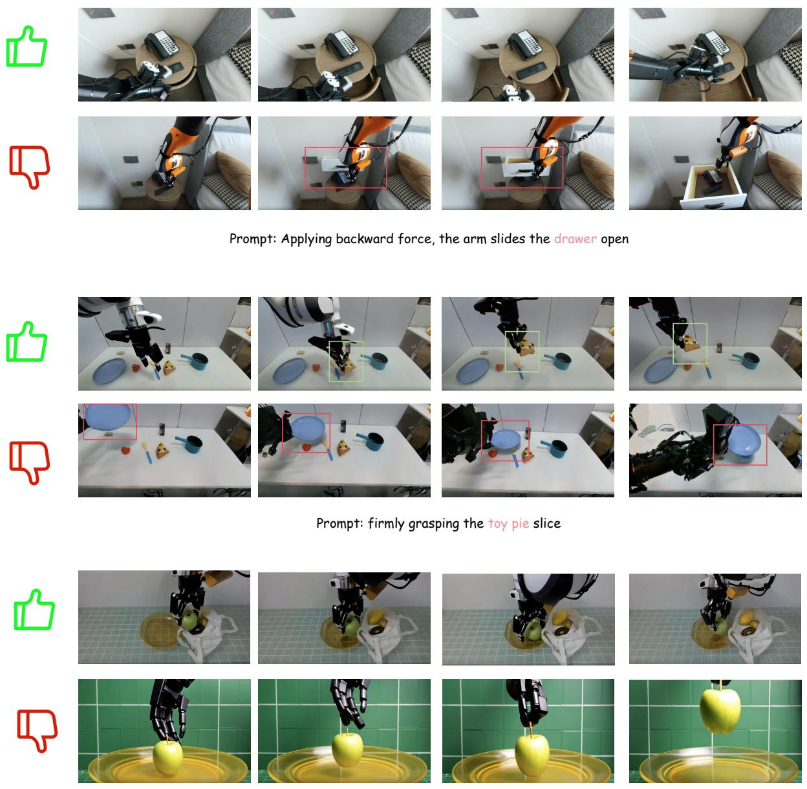  
Prompt: The arm moves steadily downward, positioning its open gripper directly over the green apple  
Figure 7 Robotics case study from WorldOlympiad. The example visualizes how the benchmark diagnoses physical interaction, object-state consistency, and temporal coherence in robotics world-model rollouts.

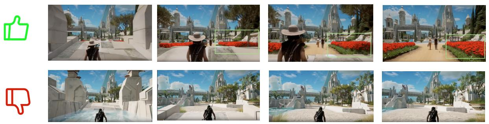  
Prompt: Along the way, they pass by patches of red flowers and several NPCs

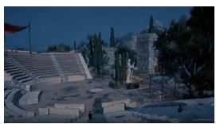

natural_image

Exterior view of an ancient stone amphitheater with tiered seating and a flag, set against a backdrop of trees and distant mountains (no signage or text visible)

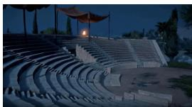

natural_image

Exterior view of a large stone amphitheater at dusk with tiered seating and flags, no visible text or symbols

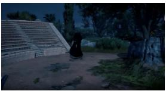

natural_image

Nighttime outdoor scene with a person sitting on the ground near a large stone structure, surrounded by trees (no visible text or symbols)

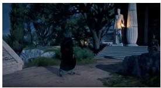

natural_image

Night scene with two figures on stone steps, one standing and one illuminated, surrounded by trees (no visible text or symbols)

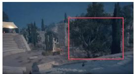

natural_image

Exterior view of a stone building with trees and a statue in the foreground (no visible text or symbols)

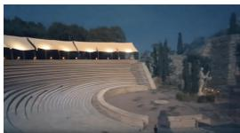

natural_image

Exterior view of a large amphitheater at dusk with illuminated structures and tiered seating (no signage or text visible)

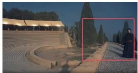

natural_image

Exterior view of a modern amphitheater with tiered seating and illuminated stage (no signage or text visible)

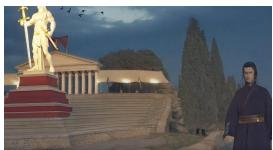

natural_image

Illustration of a classical statue in front of a large column with columns, set against a twilight sky and ancient hills (no text or symbols visible)

Prompt: The camera begins with a view of an ancient, open-air amphitheater at night

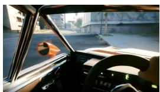

natural_image

Interior view of a car dashboard and steering wheel, showing windshield and dashboard lights (no visible text or symbols)

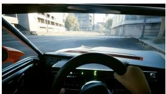

natural_image

Interior view of a car cockpit with steering wheel and dashboard, showing urban street background (no visible text or symbols)

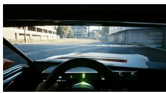

natural_image

Interior view from a car showing the dashboard and steering wheel, with no visible text or symbols on the dashboard or surroundings.

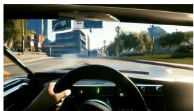

natural_image

Interior view of a car cockpit showing dashboard and steering wheel, with city skyline and streetlights visible (no readable text or symbols)

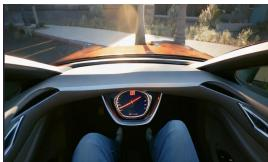

natural_image

Interior view of a car showing the dashboard and steering wheel, with no visible text or symbols on the dashboard or background.

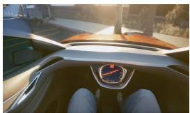

natural_image

Interior view of a car showing the dashboard and steering wheel (no visible text or symbols)

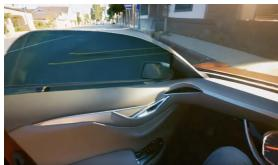

natural_image

Interior view of a car showing the dashboard and side panels, with no visible text or symbols.

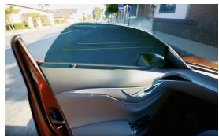

natural_image

Close-up of a car's front wheel and side panel, showing silver rim and black trim against a blurred street background (no text or symbols visible)

Prompt: The player drives the vehicle forward down the street  
Figure 8 Gaming case study from WorldOlympiad. The example highlights how interactive game rollouts expose action-following, scene-state preservation, and cross-chunk transition failures.

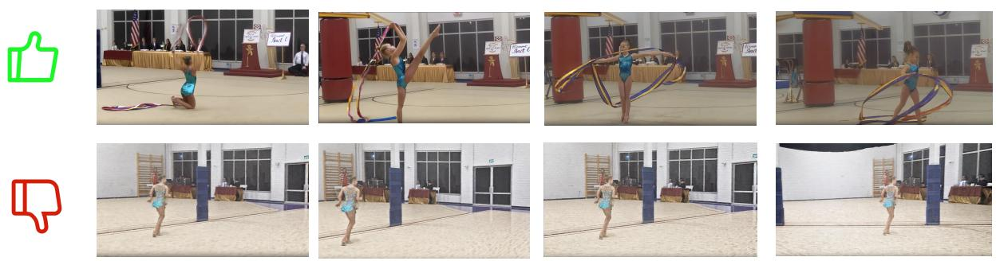  
Prompt: She expertly manipulates a long, colorful ribbon, creating large, flowing circles and spirals around her as she gracefully dances and leaps

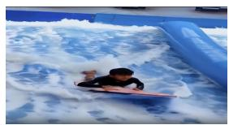

natural_image

Child surfing on a surfboard with ocean waves in the background (no text or symbols visible)

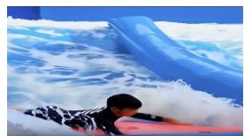

natural_image

Person surfacing in the ocean with waves crashing against a large blue wave (no text or symbols visible)

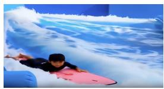

natural_image

Child surfing on a surfboard with ocean waves in the background (no text or symbols visible)

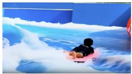

natural_image

Person riding a baby on a surfboard in a blue water channel (no text or symbols visible)

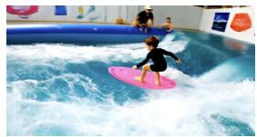

natural_image

Child surfing on a pink surfboard in an indoor water tunnel with adults watching from behind (no visible text or symbols)

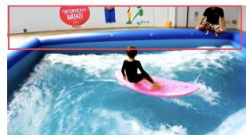

natural_image

Child playing on an inflatable surfboard in a pool (no visible text or symbols)

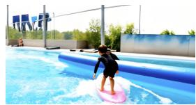

natural_image

Child playing on a blue water slide in an outdoor pool with a large structure and trees in the background (no visible text or symbols)

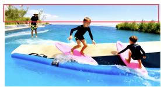

natural_image

Two children playing on a blue water board with surfers, near a shoreline (no text or symbols visible)

Prompt: In an artificial wave pool, a young boy wearing a black long-sleeved swimsuit

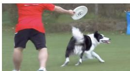

natural_image

Person playing a black-and-white dog on a grass field, no visible text or symbols

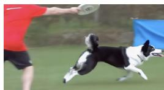

natural_image

Action photo of a dog in mid-air during a game, with a person and a blue tent in the background (no visible text or symbols)

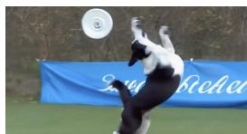

natural_image

Action shot of a soccer player mid-air to shoot a ball, with a blue banner partially visible in the background (no text or symbols on the player or background)

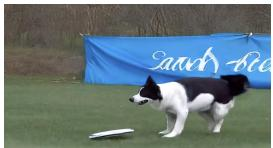

natural_image

Dog walking on grass with a blue banner in the background (no readable text or symbols)

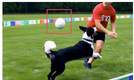

natural_image

Person kicking a black dog to catch the ball on a grass field (no text or symbols visible)

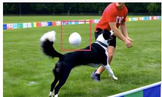

natural_image

Action shot of a soccer match with a black-and-white dog and a red player in action (no visible text or symbols)

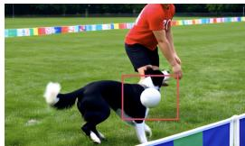

natural_image

Person in red shirt and white dog jumping on a grass field, no visible text or symbols

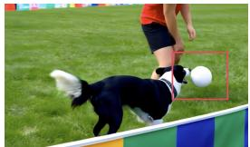

natural_image

Person playing soccer on a grass field, wearing a black dog and holding a ball (no text or symbols visible)

Prompt: throws a white frisbee to the right. A black and white dog immediately sprints across the field to chase it  
Figure 9 Real-world case study from WorldOlympiad. The example illustrates how open-domain videos reveal geometric consistency, camera-motion, and long-range visual-coherence issues.

General case study. Figure 9 presents a real-world case study, where all three evaluation dimensions are informative. For physical evaluation, the case checks whether the motion of a thrown frisbee follows a plausible trajectory, rather than floating, stopping unnaturally, or changing direction without visible cause. For geometry evaluation, the benchmark inspects whether the scene remains spatially and semantically consistent over time. For instance, a failure case may abruptly change an indoor scene into an outdoor scene, indicating severe scene-level inconsistency and poor long-range coherence. For interaction evaluation, the judge examines whether the generated video contains meaningful temporal evolution rather than becoming overly static. A strong sample should preserve realistic motion, maintain a coherent scene layout, and continue to reflect the intended event throughout the video. These qualitative examples demonstrate that WorldOlympiad can reveal complementary failure modes in physical dynamics, 3D consistency, and interactive temporal behavior.

## D Human Preference Study Details

The human preference alignment study in Table 4 uses the following annotation and aggregation protocol.

Annotation protocol. For each selected evaluation prompt, annotators compare anonymized generated videos from the evaluated models under the same prompt or reference context. Five annotators participate in the study. We sample 20 prompts from the evaluation set and compare all 82 = 28 unordered model pairs under each prompt, resulting in 560 prompt-level pairwise comparisons. Each comparison is independently labeled by all five annotators, yielding 2,800 individual preference labels. Annotators are instructed to judge the overall preference using four criteria: visual quality, physical plausibility, temporal coherence, and interaction fidelity. Model names are hidden during annotation. Ties are allowed when two videos are indistinguishable or when their strengths and weaknesses are balanced.

## Video Quality Assessment

This form compares two Al generated videos performing the same task. Please choose the one with higher overallquality, or select "tie" if they are similar.

·Physical realism

Which of the following videos has higher overall quality?

Video A  
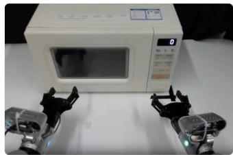

natural_image

Exterior view of a white microwave oven with control panel and two black robotic arms (no visible text or symbols)

[0 : @e, 00:11) The scene features a dual robotic arm setup in front of a white microwave. The left arm remains stationary. The right arm moves forward towards the control panel, presses a button updating the display from °O° to ‘10., then begins to retract.

from‘10.'to'nd.Itenpressesthedorreleaetton causing the microwave door to spring open.

forward, contacts the door outer face, pushes it completely shut against the microwave frame, then retracts to its initial resting position.

Video B  
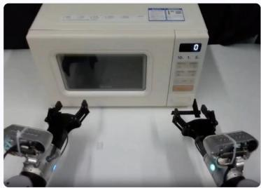

natural_image

Exterior view of a microwave oven with robotic arms and control panel (no visible text or symbols)

microwave. The left arm remains stationary. The right arm moves forward towardsthecontrolpanel,pressesatton updating the display from '0' to ‘10.', then begins to retract.  
from'10.to'End.Itthenpressesthedoorreleaseuton causing the microwave door to spring open.  
forward,contacts thedoorouterface,pushesitompletely shut against the microwave frame, then retracts to its initial

Both videos are of equal quality (tie)

Figure 10 Human preference annotation interface used in the alignment study.

## Human Preference Annotation Prompt

Input: Two anonymized generated videos, Video A and Video B, produced from the same prompt or reference context.

Instruction: Choose the video that better satisfies the prompt and shows more realistic world dynamics. Consider visual quality, physical plausibility, temporal coherence, object and scene consistency, and interaction fidelity. If neither video is clearly better, select Tie.

Output format: Return one label from {A, B, Tie} and a one-sentence rationale.

Score aggregation. Let $y _ { m , n , a }$ denote the preference outcome assigned by annotator a for model m in comparison n. A win contributes 1, a tie contributes 0.5, and a loss contributes 0. We first average the five annotator labels for each pairwise comparison and then compute the model-level preference rate:

$$
\bar {y} _ {m, n} = \frac {1}{5} \sum_ {a = 1} ^ {5} y _ {m, n, a}, S _ {m} ^ {\mathrm{human}} = \frac {1}{N _ {m}} \sum_ {n = 1} ^ {N _ {m}} \bar {y} _ {m, n},
$$

where $N _ { m } = 1 4 0$ is the number of aggregated valid comparisons involving each model. Human ranks are obtained by sorting Shuman in descending order. WorldOlympiad ranks are obtained by sorting the automatic overall evaluation score in descending order, where Sauto is the same three-track average $S _ { \mathrm { a l l } }$ used in the main benchmark table.

Rank correlation. We measure alignment using Spearman’s rank correlation:

$$
\rho = 1 - \frac {6 \sum_ {m = 1} ^ {M} d _ {m} ^ {2}}{M (M ^ {2} - 1)}, d _ {m} = r _ {m} ^ {\mathrm{human}} - r _ {m} ^ {\mathrm{auto}},
$$

where M is the number of evaluated models. For the eight models with human preference annotations, the resulting correlation is 0.95, indicating strong agreement between human preference and the WorldOlympiad automatic ranking.

The rank disagreements occur only in two adjacent pairs: LongLive and Yume-1.5, and Matrix-Game 2.0 and WoW. These swaps have a limited effect on the overall correlation and suggest that the automatic evaluator preserves the main model ordering while still exposing borderline cases where human preference and rubric-based automatic scores differ.