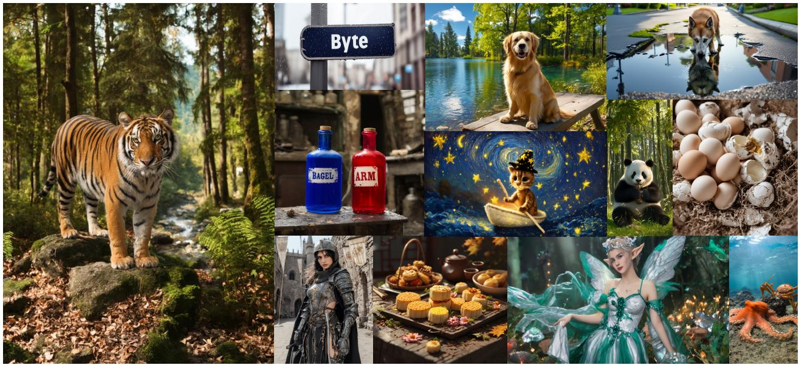
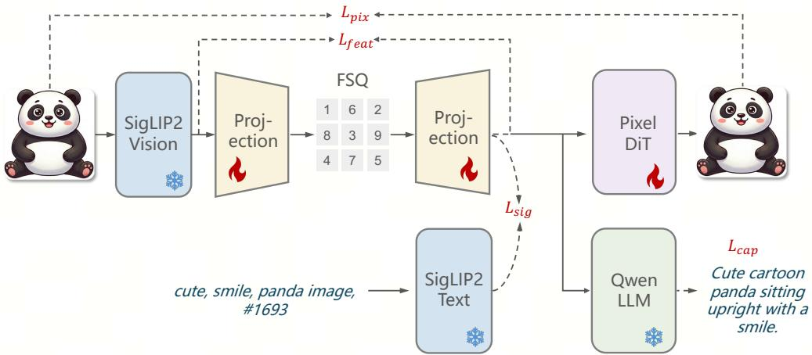
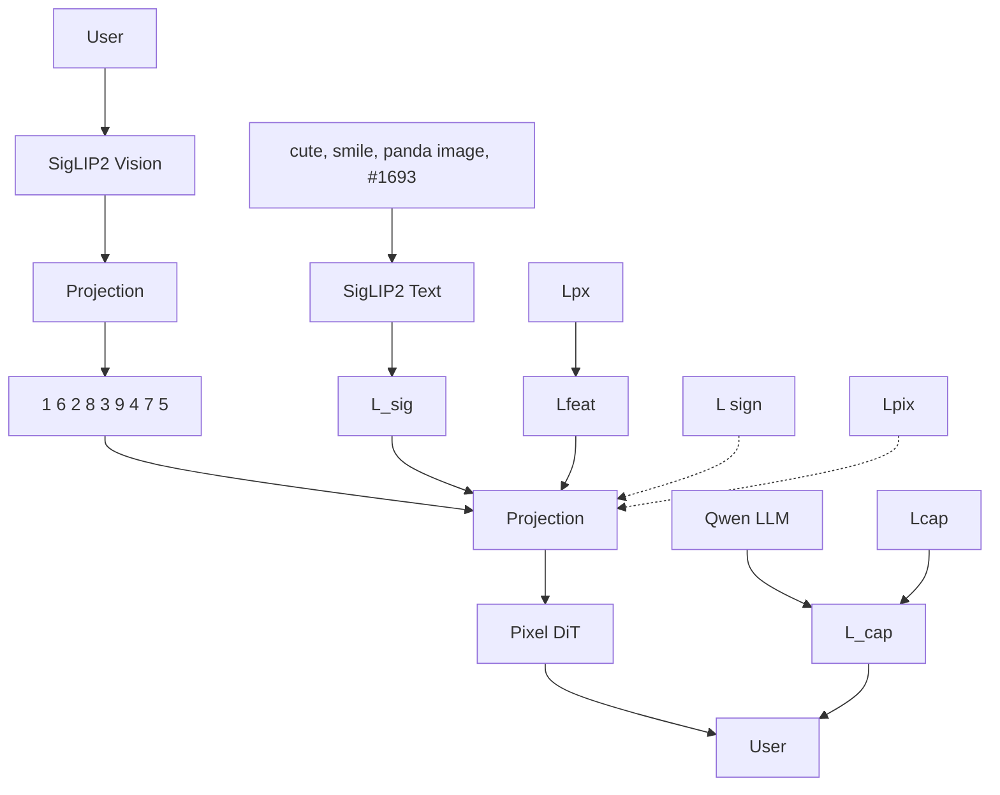
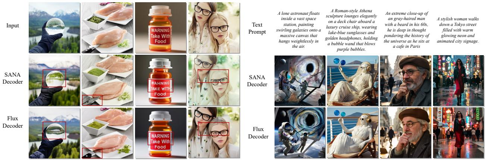
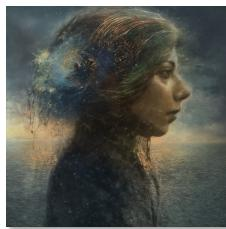
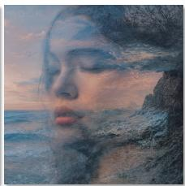
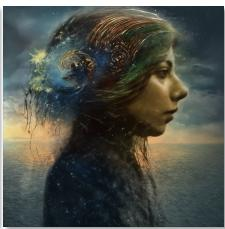
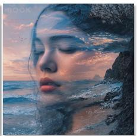
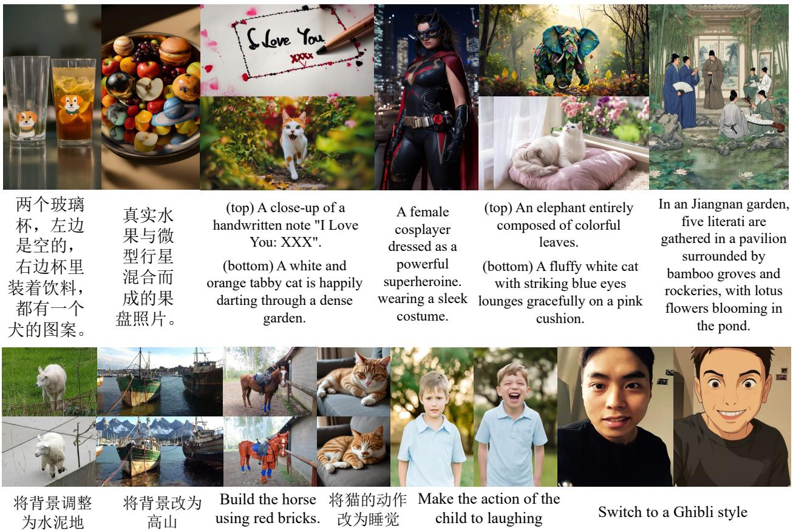
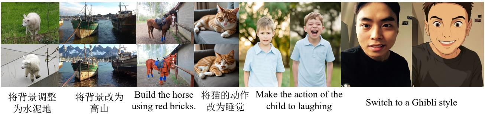

# ARM: An AutoRegressive Large Multimodal Model with Unified Discrete Representations

Junke Wang\*, Xiao Wang\*, Jiacheng Pan\*, Xuefeng Hu\* Feng Li, Jingxiang Sun, Chaorui Deng, Zilong Chen, Yunpeng Chen, Kaibin Tian Matthew Gwilliam, Hao Chen, Danhui Guan, Kun Xu, Weilin Huang Zuxuan Wu†, Haoqi Fan†, Yu-Gang Jiang†, Zhenheng Yang†

Institute of Trustworthy Embodied AI, Fudan University ByteDance TikTok ByteDance Seed

\*Equal contribution. †Correspondence.

## Abstract

This paper introduces ARM, a discrete representation-based AutoRegressive Model that unifies image understanding, generation, and editing within a next-token prediction framework. ARM is built on three efforts: first, we train a discrete semantic visual tokenizer that maps images into compact token sequences. Our tokenizer is supervised with multiple objectives that jointly promote semantic discriminability, language alignment and faithful reconstruction, thereby supporting diverse tasks in a shared latent space. With this, we train a 7B autoregressive model over large-scale text and image token sequences, seamlessly developing vision-language perception and generation capabilities. Finally, to further improve preference-aligned behavior for text-to-image generation and instruction-guided editing, ARM applies reinforcement learning (RL) to optimize task-level objectives such as visual quality, instruction adherence, and edit consistency. Surprisingly, the results show that RL not only substantially improves performance on the target tasks (e.g., raising WISE overall from 0.50 to 0.56, GEdit-Bench-EN G\_O from 5.75 to 6.68), but also induces cross-task synergy between text-to-image generation and editing. Collectively, these findings highlight autoregressive modeling, when paired with strong representations and preference optimization, as a scalable foundation for multimodal intelligence. Project page: https://github.com/wdrink/ARM.

Keywords: Autoregressive Unified Models, Discrete Representations, Semantic Tokenizers

## 1 Introduction

Large multimodal models (LMMs) [2, 42, 49] have matured into a scalable paradigm for integrating visual perception with language modeling [9], achieving consistent improvements on vision-language benchmarks and showcasing increasingly general cross-modal reasoning and instruction-following capabilities [4, 28, 40]. Building on this momentum, recent work has explored extending LMMs beyond understanding toward endto-end frameworks that unify multimodal understanding and generation [55, 74, 88, 90, 94]. Representative routines include hybrid architectures that couple token prediction with denoising [18, 104], modular designs that pair an LMM with a separate diffusion image generator [86], and fully autoregressive designs that predict

natural_image

Collage of fantasy-themed images including a tiger, a dog, a moonlit night scene, and an octopus in nature (no text or symbols)

Figure 1 High-resolution images of various aspect ratios generated by ARM.

text and visual tokens in a consistent manner [84].

Despite the progress achieved, most existing methods [18, 87, 104] still rely on separate visual encoders for multimodal understanding and generation to accommodate a long-standing mismatch in the visual representations favored by the two tasks. While technically feasible, this design leaves the system structurally fragmented, since the model must devote additional modeling capacity to bridging two distinct visual latent spaces [18]. Moreover, redundant representations of the same visual input must be carried in the context and jointly consumed by the model in cross-modal reasoning and interleaved generation, incurring substantial overhead during inference [18, 45]. Although a few recent efforts attempt to unify understanding and generation with generation-oriented visual tokens [74, 84], they significantly compromise understanding performance to prioritize synthesis fidelity.

To address these issues, we propose ARM, a large multimodal model with unified discrete representations. The core of ARM is a discrete visual tokenizer trained with complementary supervision signals, encouraging it to preserve both text-aligned semantics for recognition and appearance details for high-fidelity synthesis and editing. Building on this tokenizer, we train a 7B autoregressive model over large-scale interleaved text and visual token sequences, developing unified capabilities for vision-language understanding, image generation, and instruction-guided editing. Finally, to better align ARM with user preferences, we further improve it with Group Relative Policy Optimization [27], using powerful multimodal models, i.e., GPT [1], as reward models. Benefiting from the discrete visual token design, we surprisingly find that this stage induces cross-task synergy: optimizing either text-to-image generation or editing consistently benefits the other, and joint training yields further gains. More importantly, multimodal understanding performance remains stable, suggesting that the alignment of generative preferences for visual token prediction does not degrade the inherent understanding capacity of the model.

With the above efforts, ARM delivers state-of-the-art or competitive performance across multimodal understanding, generation, and editing. For example, we achieve 40.2 and 87.3 on MMMU [100] and POPE [44], respectively, substantially outperforming prior methods that rely on discrete visual representations. For image generation, ARM reaches 0.86 and 0.56 on GenEval [24] and WISE [57], attaining leading-level results relative to diffusion baselines [5]. In terms of image editing, ARM achieves strong results on GEdit-Bench-EN [50], with a G\_O score of 6.68 on the full set. These results indicate the potential of autoregressive modeling in multimodal artificial intelligence, paired with strong representations and effective training.

## 2 Related Work

Unified Visual Tokenizer. Two primary categories of visual tokenizers have emerged for converting images into 1D sequences. Semantic visual encoders like CLIP [6, 66] and SigLIP [78, 101] preserve high-level representations, enhancing visual understanding in MLLMs but failing to capture fine-grained details needed for precise image generation and editing. Fine-grained visual encoders such as VQVAEs [20, 80] and VAEs [67] excel at visual generation through reconstruction-based training but exhibit weaker semantic alignment for understanding tasks. Recent unified approaches [30, 54, 55, 90] address these limitations by supporting both tasks. VILA-U [90], UniTok [55], and AToken [54] jointly optimize image–text alignment and reconstruction, while TAR [30] reconstructs the SigLIP [101] feature space via discrete quantization.

Unified Vision Language Model. Following MLLM visual understanding success [40, 42], studies [96] increasingly explore unified MLLMs for both understanding and generation. Early approaches like Next-GPT [89], SEED-X [23], and EMU2 [73] use semantic encoders to tokenize images, with separate diffusion models generating final images from MLLM outputs. While performing well on understanding and generation, they struggle with editing due to lost fine-grained details. Another line [48, 74, 84] adopts VQ-GAN–style architectures [20], using encoders for understanding and decoders for generation. However, lacking semantically aligned features limits their understanding performance. Recent unified-tokenizer approaches [30, 55, 90] learn shared representations for both tasks but struggle to achieve optimal performance. Alternatively, works like Janus-Pro [15], Bagel [18], Mogao [45] decouple visual encoding using separate encoders. Though achieving strong results, this substantially increases computational cost for editing by requiring two distinct visual embeddings.

Visual Generation. Visual generation produces high-fidelity images from textual or multimodal input through three main approaches: (1) Autoregressive (AR) models [20, 72, 81, 82] advanced generation by mapping images to discrete tokens via refined VQ-VAE [29, 98] architecture. MLLMs [72, 74, 81, 97] and unified MLLMs [54, 55, 90] leverage such discrete tokens for autoregressive generation with strong results. (2) Masked prediction models [10, 98] generate VQ tokens in parallel. Modern MLLMs [11, 76, 77, 94] incorporating these methods achieve superior generation performance among discrete unified MLLMs. (3) Diffusion models [34, 62, 71] surpass VQ-based approaches in fidelity and diversity. Operating in continuous VAE latent spaces [39] further elevated quality [5, 8, 21, 67, 92]. Recent MLLMs [12, 23, 79, 89] integrate latent diffusion models to decode visual outputs, while emerging approaches [18, 45, 95] employ LLMs directly within diffusion processes.

## 3 Methods

ARM adopts a single autoregressive transformer backbone, where multimodal inputs are tokenized into onedimensional discrete sequences via their respective text and visual tokenizers. These interleaved sequences are then modeled with next-token prediction. Finally, modality-specific detokenizers map the predicted discrete tokens back to natural languages or pixels.

Next, we introduce the key components of ARM and its training pipeline. First, Sec. 3.1 presents the unified discrete visual tokenizer that bridges images and discrete sequence modeling. Sec. 3.2 then describes largescale autoregressive training over interleaved text and visual tokens. Finally, Sec. 3.3 outlines preference-based reinforcement learning, which further aligns the prediction of visual tokens with human feedback.

## 3.1 Unified Discrete Visual Tokenization

The foundation to enable visual understanding, generation, and editing through a single autoregressive backbone is a visual tokenizer that retains both high-level semantics and fine-grained visual details. Our unified tokenizer is built on a pretrained SigLIP2 encoder [78], which provides semantically strong visual features for discretization. The SigLIP2 backbone remains frozen during training to preserve its representative capability and stabilize optimization. On top of the encoder outputs, a projection module implemented as stacked attention blocks maps the high-dimensional embeddings into a compact latent subspace.

flowchart

Figure 2 Architecture of our unified discrete visual tokenizer.

Discretization is performed with Finite Scalar Quantization (FSQ) [56], which offers high capacity without the need of an explicit codebook. A symmetric projection module follows quantization, mapping the quantized embeddings back to the original feature dimension. The overall tokenizer architecture is illustrated in Figure 2.

Our tokenizer is supervised with four complementary objectives that jointly promote semantic alignment and reconstruction fidelity, as described below.

1) Caption loss: to align the tokenizer representations with the language model [75], we adopt a captioning objective, ${ \mathcal { L } } _ { \mathrm { c a p } } ,$ , formulated as a cross-entropy over text tokens $y _ { i }$ conditioned on the quantized visual representation $z _ { q }$ and the preceding context $y _ { < N } .$ :

$$
L _ {\text { cap }} = - \sum_ {i = 1} ^ {N} \log p _ {\phi} (y _ {i} | z _ {q}, y _ {<   i}) \tag {1}
$$

where $\phi$ denotes a pre-trained language model [75],  is the length of text tokens.

2) Pixel reconstruction loss: to preserve the low-level information required for high-fidelity synthesis, we define a pixel reconstruction loss $\mathcal { L } _ { \mathrm { p i x } }$ by training a lightweight diffusion transformer decoder $D _ { \mathrm { p i x } }$ [62] to learn the rectified velocity field [47] in pixel space:

$$
\mathcal {L} _ {\mathrm{pix}} = \mathbb {E} _ {t, x _ {0}, x _ {1}} \left\| D _ {\mathrm{pix}} (x _ {t}, t \mid z _ {q}) - (x _ {1} - x _ {0}) \right\| _ {2} ^ {2}, \tag {2}
$$

where $x _ { 1 }$ denotes the target image, $x _ { 0 }$ is sampled Gaussian noise, and $x _ { t } = t x _ { 1 } + ( 1 - t ) x _ { 0 }$ is the linear ??interpolation with $t \sim \mathcal { U } [ 0 , 1 ]$ ?? ???? ???? ?? ??. Optimizing directly in pixel space rather than in a VAE [64] latent space avoids ?? ,lossy compression from the VAE bottleneck, which helps preserve appearance fidelity under quantization. In addition, our diffusion decoder enjoys more stable optimization compared to GAN-style decoders [25].

3) Sigmoid loss: we further introduce a sigmoid contrastive objective [101] $\mathcal { L } _ { \mathrm { s i g } }$ to align the quantized visual embedding $z _ { q }$ with the corresponding SigLIP2 text embedding  [78]:

$$
\begin{array}{l} \mathcal {L} _ {\text { sig }} = - \log \sigma (\tau \cos (z _ {q}, s) + b) \\ - \sum_ {s _ {j} \in \mathcal {B}, s _ {j} \neq s} \log \sigma \left(- (\tau \cos (z _ {q}, s _ {j}) + b)\right), \tag {3} \\ \end{array}
$$

where ℬ denotes the set of text embeddings in the current batch, ?? and  are learnable scalars that scale and shift the logits. $\sigma ( \cdot )$ ?? is the sigmoid function, and cos(· ·) denotes cosine similarity.

4) Feature distillation loss: finally, we use a feature distillation loss $\mathcal { L } _ { \mathrm { f e a t } }$ to match the quantized embeddings $z _ { q }$ with original SigLIP2 visual features  by minimizing their cosine distance.

The final optimization objective for the unified discrete visual tokenization $L _ { \mathrm { T o k } }$ combines the above components with balancing weights:

$$
L _ {\mathrm{Tok}} = \lambda_ {c a p} L _ {\mathrm{cap}} + \lambda_ {p i x} L _ {\mathrm{pix}} + \lambda_ {s i g} L _ {\mathrm{sig}} + \lambda_ {f e a t} L _ {\mathrm{feat}}, \tag {4}
$$

where $\lambda _ { c a p } , \lambda _ { p i x } , \lambda _ { s i g . }$ , and $\lambda _ { f e a t }$ are set to 1, 5, 5, 1.

Detokenization via Latent Diffusion Decoder. While the lightweight pixel-space decoder $D _ { \mathsf { p i x } }$ provides ??supervision for detail preserving, a separate high-capacity latent diffusion model [5] is used for high-quality detokenization, conditioned on the learned quantized embeddings.

Concretely, we start from a pretrained latent DiT model $D _ { \mathrm { l a t e n t } }$ and replace its text conditioning with $z _ { q }$ produced by our tokenizer. $D _ { \mathrm { l a t e n t } }$ ??is trained to transport Gaussian noise $z _ { \mathrm { 0 } } \sim \pi _ { \mathrm { 0 } }$ ????to target image latents $z _ { 1 } \sim \pi _ { 1 }$ ??, using a rectified-flow objective [51]:

$$
\mathcal {L} _ {\text {Detok}} = \mathbb {E} _ {t, z _ {0}, z _ {1}} \left\| d _ {\text {latent}} (z _ {t}, t \mid z _ {q}) - (z _ {1} - z _ {0}) \right\| _ {2} ^ {2}, \tag {5}
$$

where $z _ { 1 }$ is obtained by encoding the target image with a pretrained VAE [5].

## 3.2 Autoregressive Large Multimodal Model

The discrete visual tokenizer detailed in Section 3.1 allows us to represent all visual inputs and outputs as discrete tokens. With this, we pack diverse data of different modalities and tasks $( e . g .$ ., image-to-text, text-to-image, text-only, and interleaved image-text) into flattened multimodal token sequences, and model their dependencies via a standard next-token prediction objective:

$$
L _ {\mathrm{ARM}} = - \sum_ {j = 1} ^ {M} \log p _ {\theta} (y _ {j} | y _ {<   j}), \tag {6}
$$

where  denotes the total sequence length, and our autoregressive LMM is parameterized by $\theta .$

## 3.3 Preference Alignment for Visual Token Prediction

Large-scale multimodal next-token prediction training provides a strong foundation for ARM to perform unified understanding, generation, and editing. Building on this foundation, we further employ Group Relative Policy Optimization (GRPO) [69] to directly align the model with preference feedback. Note that during this stage, optimization is applied only to the visual token prediction, targeting generation and editing downstream tasks.

We initialize the policy $\pi _ { \theta }$ from the previous stage and set the reference policy $\pi _ { \mathrm { r e f } }$ as a frozen copy of the same checkpoint throughout GRPO. Given a prompt $x , \pi _ { \theta }$ samples a group of $K$ visual token sequences $\{ y ^ { 1 } , \ldots , y ^ { K } \}$ ?? ??, which are then detokenized into images using the latent diffusion decoder. After this, we score ?? , . . . , ??different images with a reward model to yield the corresponding rewards $\mathbf { r } = \left\{ r _ { 1 } , \dots , r _ { K } \right\}$ . Advantages are computed by normalizing rewards within the group, $A _ { k } = ( r _ { k } - \mathrm { m e a n } ( \mathbf { r } ) ) / \mathrm { s t d } ( \mathbf { r } )$ , . . . , ????. ???? is updated with the following objective:

$$
\mathcal {L} _ {\mathrm{GRPO}} = \frac {1}{K} \sum_ {k = 1} ^ {K} \left\{\min \left[ \rho_ {k} A _ {k}, \operatorname{clip} \left(\rho_ {k}, 1 - \epsilon , 1 + \epsilon\right) A _ {k} \right] \right. \tag {7}
$$

$$
\left. - \beta \mathcal {D} _ {\mathrm{KL}} \left[ \pi_ {\theta} (y ^ {k} | x) \| \pi_ {\mathrm{ref}} (y ^ {k} | x) \right] \right\},
$$

where ?? = ???? ?? ?? ?? ??old(  | ) $\begin{array} { r } { \rho _ { k } = \frac { \pi _ { \theta } ( y ^ { k } | x ) } { \pi _ { \mathrm { o l d } } ( y ^ { k } | x ) } } \end{array}$ is the probability ratio and $\beta$ controls the strength of the KL regularization.

## 4 Experiments

## 4.1 Experimental Setup

Implementation Details. Our tokenizer comprises a frozen SigLIP2-SO400M-512 encoder [78], an FSQ quantizer [56], and two lightweight projection modules. The quantizer uses $L _ { i } ~ = ~ 2$ for $1 \leq i \leq 1 6 ,$ , ???? ??corresponding to a 65K codebook. The projection modules are implemented as 6 transformer blocks. The pixel diffusion model in Eq.2 follows a DiT architecture [62] with 24 transformer blocks, while the language model in Eq. 1 is a frozen 0.5B Qwen2.5 [75]. The latent diffusion model in Eq.5 is initialized from FLUX.1 [dev] [5].

We train the tokenizer on 2.2B internal image-text pairs using AdamW [53] with learning rate $3 \times 1 0 ^ { - 4 }$ , $\beta _ { 1 } = 0 . 9 .$ , and $\beta _ { 2 } = 0 . 9 5$ . The global batch size is 32,768.

For the unified large multimodal model, we initialize it from Qwen2.5-7B [75], and append an additional linear layer for visual tokens prediction. We support dynamic resolution image generation and editing by inserting the shape tokens into the text prompt, which explicitly specify the target height and width in the discrete token grid.

The complete training proceeds in four stages: 1) Pre-training: The LLM backbone is trained on 2.5T multimodal tokens, processing images at native resolution within defined dimension constraints. 2) Continual Training: We train the model on 2.5T tokens by incorporating higher visual resolutions and increasing the sampling ratio of interleaved data to improve reasoning capabilities. 3) Supervised Fine-tuning: We utilize 0.2B tokens from high-quality instruction-following datasets to strengthen the understanding capabilities in response to diverse user prompts, while maintaining the image generation and editing performance. 4) Reinforcement Learning: We implement training with VeRL [70]. For text-to-image generation, we employ GPT-o3 [60] as the reward model to inspect the object appearance, attributes, and spatial relationships of the generated images. For editing, we utilize GPT-4.1 [59] as the reward model, which evaluates the edited images from instruction following, preservation of non-target regions, and overall visual quality.

• Text-only Data: as strong language modeling underpins cross-modal reasoning and instruction following, we include a curated collection of high-quality text-only data spanning general-purpose text, mathematics, and code, together with other reasoning-intensive domains.  
• Image-to-Text Data: we collect large-scale image-text pairs for visual understanding, primarily from web captions and alt-text. In addition to standard vision language model (VLM) datasets [40], we incorporate OCR-rich documents, charts, and grounding-style annotations, to improve text reading and spatial understanding.  
• Text-to-Image Data: for text-to-image training, we use a curated collection of high-quality image-text pairs spanning diverse prompt styles. A small amount of synthetic pairs generated by existing T2I models [5, 26, 38, 68] are included to further expand stylistic coverage while maintaining visual fidelity.  
• Interleaved Multimodal Data. To support long-context multimodal modeling and interleaved generation with visual references, we include interleaved image-text data from video sequences [32, 83] and web documents [17, 43]. We also incorporate public image-editing datasets [3, 23, 37, 85, 91, 103] to further strengthen the capability on specific tasks.  
• Text-to-Image RL prompts: for text-to-image RL, we use a curated collection of mixed-format image generation prompts, featuring both short compositional prompts synthesized from ImageNet [19] class names and long, dense, detailed prompts from Share-GPT-4o [14];  
• Image Editing RL Data: for image editing RL, we use a curated collection of image editing prompts from HQ-Editing-6000 [37] and Share-GPT-4o [14].

For fair comparison across generation benchmarks, we run text-to-image inference at 1024 × 1024 resolution on GenEval [24], DPG [35], and WISE [57]. For GEdit [50], we keep the original image resolution to match the benchmark protocol. For text-to-image generation, we use classifier-free guidance (CFG) of 1.5 in the autoregressive model. For image editing, we apply two-branch guidance that separately conditions on the text instruction and the reference image, using guidance scales of 1.5 (text) and 1.25 (image), respectively. The diffusion decoder performs detokenization with 28 sampling steps and a CFG scale of 1.5.

Table 1 Training configuration for the large multimodal model. PT denotes pretraining, CT denotes continued training, and SFT denotes supervised fine-tuning.

<table><tr><td></td><td>PT</td><td>CT</td><td>SFT</td></tr><tr><td colspan="4">Hyperparameters</td></tr><tr><td>learning rate</td><td> $2 \times 10^{-4}$ </td><td> $2 \times 10^{-4}$ </td><td> $5 \times 10^{-5}$ </td></tr><tr><td>scheduler</td><td>Constant</td><td>Constant</td><td>Constant</td></tr><tr><td>weight decay</td><td>0</td><td>0</td><td>0</td></tr><tr><td>gradient norm clip</td><td>1.0</td><td>1.0</td><td>1.0</td></tr><tr><td>optimizer</td><td colspan="3">AdamW ( $\beta_1 = 0.9, \beta_2 = 0.95$ )</td></tr><tr><td>warmup steps</td><td>2K</td><td>2K</td><td>N/A</td></tr><tr><td>training steps</td><td>100K</td><td>100K</td><td>40K</td></tr><tr><td># of GPUs</td><td>200</td><td>160</td><td>80</td></tr><tr><td>max seq. length</td><td>80K</td><td>80K</td><td>80K</td></tr><tr><td>T2I resolution</td><td>(256, 512)</td><td>(512, 1024)</td><td>(512, 1024)</td></tr><tr><td>Editing resolution</td><td>(256, 980)</td><td>(512, 980)</td><td>(512, 1024)</td></tr><tr><td colspan="4">Data sample ratio</td></tr><tr><td>Text-only</td><td>0.05</td><td>0.05</td><td>0.05</td></tr><tr><td>Image2Text</td><td>0.10</td><td>0.10</td><td>0.05</td></tr><tr><td>Text2Image</td><td>0.70</td><td>0.55</td><td>0.50</td></tr><tr><td>Interleaved gen. (video)</td><td>0.10</td><td>0.15</td><td>0.20</td></tr><tr><td>Interleaved gen. (web)</td><td>0.05</td><td>0.15</td><td>0.20</td></tr></table>

Table 2 Reinforcement Learning Parameters.

<table><tr><td></td><td>T2I RL</td><td>Editing RL</td><td>Joint RL</td></tr><tr><td colspan="4">Training Configuration</td></tr><tr><td>Optimizer</td><td colspan="3">AdamW ( $\beta_1 = 0.9, \beta_2 = 0.95$ )</td></tr><tr><td>Learning Rate</td><td>3e-5</td><td>5e-5</td><td>5e-5</td></tr><tr><td>Scheduler</td><td>Constant</td><td>Constant</td><td>Constant</td></tr><tr><td>Weight Decay</td><td>0.01</td><td>0.01</td><td>0.01</td></tr><tr><td>Training Steps</td><td>280</td><td>100</td><td>200</td></tr><tr><td># of GPUs</td><td>8</td><td>40</td><td>40</td></tr><tr><td>Batch Size</td><td>64</td><td>40</td><td>40</td></tr><tr><td colspan="4">Sampling Configuration</td></tr><tr><td>Rollout</td><td>16</td><td>16</td><td>16</td></tr><tr><td>Temperature</td><td>0.7</td><td>1.0</td><td>1.0</td></tr><tr><td>Top-K</td><td>1000</td><td>1000</td><td>1000</td></tr><tr><td>Top-P</td><td>1.0</td><td>1.0</td><td>1.0</td></tr><tr><td colspan="4">Image Generation and Reward</td></tr><tr><td>Resolution</td><td>512~1024</td><td>512~1024</td><td>512~1024</td></tr><tr><td>Reward Model</td><td>GPT-o3</td><td>GPT-4.1</td><td>Mixed</td></tr><tr><td colspan="4">RL Configuration</td></tr><tr><td>KL Coef.</td><td>0.01</td><td>0.01</td><td>0.01</td></tr><tr><td>Clip Ratio</td><td>0.2</td><td>0.2</td><td>0.2</td></tr></table>

## 4.2 Image Understanding Results

Overall, Table 3 shows that ARM achieves competitive understanding performance while maintaining a unified, fully autoregressive architecture. Discrete unified models have historically lagged behind continuous unified counterparts on general understanding benchmarks, reflecting the difficulty of retaining fine-grained perceptual cues when discretizing visual signals. ARM narrows this gap.

In particular, ARM obtains 87.3 on POPE [44] and 40.2 on MMMU [100], placing it on par with or above representative continuous unified models (e.g., Janus-Pro and Bagel) and clearly ahead of prior discrete unified models such as Emu3 and VILA-U. ARM reaches 1463 on ${ \mathrm { M M E } } _ { \mathrm { P e r c } }$ [22] and 73.1 on SeedBench [41], indicating strong capability on knowledge-intensive and reasoning-heavy queries. This suggests that our discrete visual representations preserve key semantics for recognition while remaining compatible with an autoregressive backbone that later supports generation and editing, avoiding the need for separate visual pathways. ARM also achieves superior results on other benchmarks [36, 52].

## 4.3 Image Generation Results

We evaluate ARM on three complementary benchmarks that probe different facets of text-to-image generation. As shown in Table 4, ARM achieves competitive performance across GenEval [24] sub-dimensions, indicating reliable object-attribute binding and spatial control, and it attains high DPG [35] scores on both global and relation metrics, suggesting that the generated images remain coherent while faithfully expressing interactions and relational constraints. WISE [57] emphasizes reasoning-based generation, where correct outputs often require world knowledge across various domains. The results in Table 5 show that ARM remains competitive among unified models and shows particularly strong results on time and space categories. This indicates improved ability to translate relational and structural constraints into visually correct outcomes. Importantly, this behavior is achieved within a single unified autoregressive model, in contrast to approaches that rely on specialized prompting or auxiliary mechanisms to strengthen reasoning-driven generation.

Table 3 Multimodal understanding benchmarks. Unified indicates whether the model is trained for understanding only or unified understanding and generation, # Params reports the size of the language model backbone.

<table><tr><td>Model</td><td>Unified</td><td>#Params</td><td>POPE</td><td>MMB</td><td> $MME_{Perc}$ </td><td>MMMU</td><td>GQA</td><td>VQAv2</td><td>SEED</td></tr><tr><td colspan="10">Continuous visual representations</td></tr><tr><td>LLaVA-OV [40]</td><td>✘</td><td>7B</td><td>-</td><td>80.8</td><td>1580</td><td>48.8</td><td>-</td><td>-</td><td>-</td></tr><tr><td>Qwen2.5-VL [75]</td><td>✘</td><td>7B</td><td>-</td><td>83.5</td><td>-</td><td>58.6</td><td>-</td><td>-</td><td>-</td></tr><tr><td>InternVL2.5 [16]</td><td>✘</td><td>8B</td><td>-</td><td>84.6</td><td>-</td><td>56.0</td><td>-</td><td>-</td><td>-</td></tr><tr><td>Janus-Pro [15]</td><td>✓</td><td>7B</td><td>87.4</td><td>79.2</td><td>1567</td><td>41.0</td><td>62.0</td><td>-</td><td>72.1</td></tr><tr><td>BLIP-3o [12]</td><td>✓</td><td>8B</td><td>-</td><td>83.5</td><td>1683</td><td>50.6</td><td>-</td><td>83.1</td><td>77.5</td></tr><tr><td>Show-o2 [95]</td><td>✓</td><td>7B</td><td>-</td><td>79.3</td><td>1621</td><td>48.9</td><td>63.1</td><td>-</td><td>69.8</td></tr><tr><td>Bagel [18]</td><td>✓</td><td>7B</td><td>-</td><td>85.0</td><td>1687</td><td>55.3</td><td>-</td><td>-</td><td>-</td></tr><tr><td colspan="10">Discrete visual representations</td></tr><tr><td>LWM [48]</td><td>✓</td><td>7B</td><td>75.2</td><td>-</td><td>-</td><td>-</td><td>44.8</td><td>55.8</td><td>-</td></tr><tr><td>Chameleon [74]</td><td>✓</td><td>34B</td><td>-</td><td>-</td><td>-</td><td>22.4</td><td>-</td><td>69.6</td><td>-</td></tr><tr><td>Show-o [94]</td><td>✓</td><td>1.3B</td><td>80.0</td><td>-</td><td>1097</td><td>26.7</td><td>58.0</td><td>69.4</td><td>-</td></tr><tr><td>Liquid [88]</td><td>✓</td><td>7B</td><td>83.2</td><td>-</td><td>1448</td><td>-</td><td>61.1</td><td>76.8</td><td>-</td></tr><tr><td>VILA-U [90]</td><td>✓</td><td>7B</td><td>85.8</td><td>-</td><td>1402</td><td>-</td><td>60.8</td><td>79.4</td><td>59.0</td></tr><tr><td>UniTok [55]</td><td>✓</td><td>7B</td><td>83.2</td><td>-</td><td>1448</td><td>-</td><td>61.1</td><td>76.8</td><td>-</td></tr><tr><td>Emu3 [84]</td><td>✓</td><td>8B</td><td>85.2</td><td>58.5</td><td>-</td><td>31.6</td><td>60.3</td><td>75.1</td><td>68.2</td></tr><tr><td>ARM</td><td>✓</td><td>7B</td><td>87.3</td><td>80.7</td><td>1463</td><td>40.2</td><td>59.8</td><td>76.1</td><td>73.1</td></tr></table>

Table 4 Comparison with state-of-the-art models on GenEval and DPG. We include diffusion models (Diff.), autoregressive models (AR), and non-autoregressive models (NAR).

<table><tr><td rowspan="2">Methods</td><td rowspan="2">Type</td><td colspan="4">GenEval↑</td><td colspan="3">DPG↑</td></tr><tr><td>Two Obj.</td><td>Position</td><td>Color Attri.</td><td>Overall</td><td>Global</td><td>Relation</td><td>Overall</td></tr><tr><td>Chameleon [74]</td><td>AR</td><td>-</td><td>-</td><td>-</td><td>0.39</td><td>-</td><td>-</td><td>-</td></tr><tr><td>PixArt-alpha [13]</td><td>Diff.</td><td>0.50</td><td>0.08</td><td>0.07</td><td>0.48</td><td>74.97</td><td>82.57</td><td>71.11</td></tr><tr><td>Emu3 [84]</td><td>AR</td><td>0.71</td><td>0.17</td><td>0.21</td><td>0.54</td><td>85.21</td><td>90.22</td><td>80.60</td></tr><tr><td>Janus [87]</td><td>AR</td><td>0.68</td><td>0.46</td><td>0.42</td><td>0.61</td><td>82.33</td><td>85.46</td><td>79.68</td></tr><tr><td>SimpleAR [81]</td><td>AR</td><td>0.90</td><td>0.28</td><td>0.45</td><td>0.63</td><td>87.97</td><td>88.33</td><td>81.97</td></tr><tr><td>SD3 Medium [21]</td><td>Diff.</td><td>0.74</td><td>0.34</td><td>0.36</td><td>0.62</td><td>87.90</td><td>80.70</td><td>84.08</td></tr><tr><td>FLUX.1 [Dev] [5]</td><td>Diff.</td><td>0.81</td><td>0.22</td><td>0.45</td><td>0.66</td><td>74.35</td><td>90.87</td><td>83.84</td></tr><tr><td>DALL-E-3 [58]</td><td>Diff.</td><td>0.87</td><td>0.43</td><td>0.45</td><td>0.67</td><td>90.97</td><td>90.58</td><td>83.50</td></tr><tr><td>Show-o [94]</td><td>NAR</td><td>0.80</td><td>0.31</td><td>0.50</td><td>0.68</td><td>-</td><td>-</td><td>67.48</td></tr><tr><td>Infinity [31]</td><td>NAR</td><td>0.85</td><td>0.49</td><td>0.57</td><td>0.73</td><td>93.11</td><td>90.76</td><td>83.46</td></tr><tr><td>Lumina-Image 2.0 [65]</td><td>Diff.</td><td>0.87</td><td>-</td><td>0.62</td><td>0.73</td><td>-</td><td>94.85</td><td>87.20</td></tr><tr><td>Janus-Pro-7B [15]</td><td>AR</td><td>0.89</td><td>0.79</td><td>0.66</td><td>0.80</td><td>86.90</td><td>89.32</td><td>84.19</td></tr><tr><td>Bagel [18]</td><td>Diff.</td><td>0.94</td><td>0.64</td><td>0.63</td><td>0.82</td><td>-</td><td>-</td><td>-</td></tr><tr><td>Qwen-Image [86]</td><td>Diff.</td><td>0.92</td><td>0.76</td><td>0.77</td><td>0.87</td><td>91.32</td><td>94.31</td><td>88.32</td></tr><tr><td>ARM</td><td>AR</td><td>0.91</td><td>0.75</td><td>0.60</td><td>0.79</td><td>89.85</td><td>92.00</td><td>84.48</td></tr><tr><td>ARM-RL</td><td>AR</td><td>0.93</td><td>0.89</td><td>0.90</td><td>0.86</td><td>90.14</td><td>92.08</td><td>86.00</td></tr></table>

Reinforcement learning [27] further improves generation results across these benchmarks. Notably, the discrete token interface makes preference optimization particularly straightforward, as it formulates multimodal generation as the same token-level optimization objective used for language models.

Table 5 Comparison with state-of-the-art models on WISE benchmark for reasoning-based image generation.

<table><tr><td>Methods</td><td>Type</td><td>Cultural</td><td>Time</td><td>Space</td><td>Biology</td><td>Physics</td><td>Chemistry</td><td>Overall↑</td></tr><tr><td>Janus [87]</td><td>AR</td><td>0.16</td><td>0.26</td><td>0.35</td><td>0.28</td><td>0.30</td><td>0.14</td><td>0.23</td></tr><tr><td>VILA-U [90]</td><td>AR</td><td>0.26</td><td>0.33</td><td>0.37</td><td>0.35</td><td>0.39</td><td>0.23</td><td>0.31</td></tr><tr><td>SDv1.5 [67]</td><td>Diff.</td><td>0.34</td><td>0.35</td><td>0.32</td><td>0.28</td><td>0.29</td><td>0.21</td><td>0.32</td></tr><tr><td>Janus-Pro-7B [15]</td><td>AR</td><td>0.30</td><td>0.37</td><td>0.49</td><td>0.36</td><td>0.42</td><td>0.26</td><td>0.35</td></tr><tr><td>Emu3 [84]</td><td>AR</td><td>0.34</td><td>0.45</td><td>0.48</td><td>0.41</td><td>0.45</td><td>0.27</td><td>0.39</td></tr><tr><td>SD3 Medium [21]</td><td>Diff.</td><td>0.42</td><td>0.44</td><td>0.48</td><td>0.39</td><td>0.47</td><td>0.29</td><td>0.42</td></tr><tr><td>SDXL [63]</td><td>Diff.</td><td>0.43</td><td>0.48</td><td>0.47</td><td>0.44</td><td>0.45</td><td>0.27</td><td>0.43</td></tr><tr><td>PixArt-Alpha [13]</td><td>Diff.</td><td>0.45</td><td>0.50</td><td>0.48</td><td>0.49</td><td>0.56</td><td>0.34</td><td>0.47</td></tr><tr><td>FLUX.1[Dev] [5]</td><td>Diff.</td><td>0.48</td><td>0.58</td><td>0.62</td><td>0.42</td><td>0.51</td><td>0.35</td><td>0.50</td></tr><tr><td>BAGEL [18]</td><td>Diff.</td><td>0.44</td><td>0.55</td><td>0.68</td><td>0.44</td><td>0.60</td><td>0.39</td><td>0.52</td></tr><tr><td>MetaQuery-XL [61]</td><td>AR</td><td>0.56</td><td>0.55</td><td>0.62</td><td>0.49</td><td>0.63</td><td>0.41</td><td>0.55</td></tr><tr><td>ARM</td><td>AR</td><td>0.47</td><td>0.52</td><td>0.60</td><td>0.47</td><td>0.54</td><td>0.43</td><td>0.50</td></tr><tr><td>ARM-RL</td><td>AR</td><td>0.53</td><td>0.59</td><td>0.67</td><td>0.54</td><td>0.64</td><td>0.45</td><td>0.56</td></tr></table>

Table 6 Image editing results on GEdit-Bench. G\_SC (semantic consistency), G\_PQ (perceptual quality), and G\_O (overall score) refer to the metrics evaluated by GPT-4.1.

<table><tr><td rowspan="2">Model</td><td colspan="3">GEdit-Bench-EN (Full set)↑</td><td colspan="3">GEdit-Bench-CN (Full set)↑</td></tr><tr><td>G_SC</td><td>G_PQ</td><td>G_O</td><td>G_SC</td><td>G_PQ</td><td>G_O</td></tr><tr><td>AnyEdit [99]</td><td>3.18</td><td>5.82</td><td>3.21</td><td>-</td><td>-</td><td>-</td></tr><tr><td>Instruct-Pix2Pix [7]</td><td>3.58</td><td>5.49</td><td>3.68</td><td>-</td><td>-</td><td>-</td></tr><tr><td>MagicBrush [102]</td><td>4.68</td><td>5.66</td><td>4.52</td><td>-</td><td>-</td><td>-</td></tr><tr><td>UniWorld-v1 [46]</td><td>4.93</td><td>7.43</td><td>4.85</td><td>-</td><td>-</td><td>-</td></tr><tr><td>OmniGen [91]</td><td>5.96</td><td>5.89</td><td>5.06</td><td>-</td><td>-</td><td>-</td></tr><tr><td>BAGEL [18]</td><td>7.36</td><td>6.83</td><td>6.52</td><td>7.34</td><td>6.85</td><td>6.50</td></tr><tr><td>Step1X-Edit [50]</td><td>7.09</td><td>6.76</td><td>6.70</td><td>7.20</td><td>6.87</td><td>6.86</td></tr><tr><td>ARM</td><td>5.73</td><td>7.67</td><td>5.75</td><td>5.04</td><td>7.61</td><td>5.15</td></tr><tr><td>ARM-RL</td><td>6.85</td><td>7.68</td><td>6.68</td><td>6.38</td><td>7.67</td><td>6.27</td></tr></table>

## 4.4 Image Editing Results

Table 6 reports image editing performance on GEdit-Bench [50]. In contrast to text-to-image benchmarks that evaluate generation from scratch, GEdit-Bench focuses on instruction-guided editing, where the model must apply the requested modification while keeping unrelated content unchanged and producing a visually coherent result. The benchmark summarizes these aspects with three GPT-based metrics [59]: semantic consistency (G\_SC), perceptual quality (G\_PQ), and overall score (G\_O). Compared with prior approaches such as AnyEdit and UniWorld-v1, ARM achieves substantially higher scores across metrics, indicating more reliable instruction execution and better preservation of source content.

Surprisingly, reinforcement learning yields a clear boost on image editing for ARM, improving G\_O on the GEdit-Bench-EN full set from 5.75 to 6.68. By optimizing directly on preference feedback, it reduces common failure cases such as incomplete edits, excessive modifications, and attribute drift. This strong gain highlights the advantages of discrete token generation, where simple token-level preference optimization can lead to noticeably better visual outputs.

## 4.5 Analysis

Complementary supervision makes a unified visual tokenizer. As discussed in Sec. 3.1, $\mathcal { L } _ { c a p }$ and $\mathcal { L } _ { p i x }$ ??????provide supervision that is directly tied to downstream understanding and generation tasks, whereas $\mathcal { L } _ { s i g }$ and $\mathcal { L } _ { f e a t }$ ???? ??regularize the token space to preserve high-level semantics after discretization. To quantify ?? ??????their contributions, we take $\mathcal { L } _ { \mathrm { c a p } }$ and $\mathcal { L } _ { \mathrm { p i x } }$ as the base objectives, and ablate different loss combinations. ImageNet [19] zero-shot accuracy, PSNR, codebook usage, and codebook perplexity are reported in Table 7.

Table 7 Ablation of tokenizer supervision objectives. We report ImageNet zero-shot accuracy (INet ZS), PSNR, codebook usage, and codebook perplexity (PPL).

<table><tr><td> $\mathcal{L}_{\text{cap}}$ </td><td> $\mathcal{L}_{\text{pix}}$ </td><td> $\mathcal{L}_{\text{sig}}$ </td><td> $\mathcal{L}_{\text{feat}}$ </td><td>INet ZS↑</td><td>PSNR↑</td><td>Usage↑</td><td>PPL↑</td></tr><tr><td>✓</td><td>✓</td><td>✘</td><td>✘</td><td>0.2</td><td>15.2</td><td>69.4</td><td>0.21</td></tr><tr><td>✓</td><td>✓</td><td>✓</td><td>✘</td><td>79.4</td><td>9.3</td><td>70.5</td><td>0.24</td></tr><tr><td>✓</td><td>✓</td><td>✘</td><td>✓</td><td>58.1</td><td>17.1</td><td>71.0</td><td>0.24</td></tr><tr><td>✓</td><td>✓</td><td>✓</td><td>✓</td><td>80.2</td><td>19.6</td><td>75.6</td><td>0.28</td></tr></table>

Training with only $\mathcal { L } _ { c a p }$ and $\mathcal { L } _ { p i x }$ leads to low ImageNet zero-shot accuracy. Although this metric is not a direct proxy for downstream VLM performance, the degraded codebook usage and perplexity suggest that the learned vocabulary is poorly utilized, resulting in a less expressive token space and weaker coverage of visual concepts. Adding $\mathcal { L } _ { s i g }$ or $\mathcal { L } _ { f e a t }$ improves both recognition performance and codebook utilization, ???? ?? ?? ??????indicating that semantic regularization is crucial for building a compact yet expressive discrete vocabulary. Interestingly, $\mathcal { L } _ { f e a t }$ improves reconstruction quality whereas $\mathcal { L } _ { s i g }$ slightly hurts PSNR, which may reflect a ?? ?????? ???? ??trade-off: enforcing stronger semantic clustering can discard some low-level appearance variations that are beneficial for pixel reconstruction. Finally, combining all objectives yields the best overall balance, achieving the highest ImageNet zero-shot score while also improving PSNR, usage, and perplexity.

LMM generates, diffusion model renders. We compare our chosen diffusion decoder, FLUX.1[Dev] [5], to a smaller decoder, Sana1.5-1.6B [93], while keeping the visual tokenizer fixed. As shown in Figure 3, both decoders reconstruct highly similar images, suggesting that the visual tokens encode not only the global layout and object composition, but also much of the low-level details. Meanwhile, the diffusion decoder primarily serves as a renderer that maps the predicted visual tokens back to pixel space.

text_image

Input
WARNING
Take With
Food
Text Prompt
A lone astronaut floats
inside a vast space
station, painting
swirling galaxies onto a
massive canvas that
hangs weightlessly in
the air.
A Roman-style Athena
sculpture lounges elegantly
on a deck chair aboard a
luxury cruise ship, wearing
lake-blue sunglasses and
golden headphones, holding
a bubble wand that blows
purple bubbles.
An extreme close-up of
an gray-haired man
with a beard in his 60s,
he is deep in thought
pondering the history of
the universe as he sits at
a cafe in Paris
A stylish woman walks
down a Tokyo street
filled with warm
glowing neon and
animated city signage.
SANA
Decoder
WARNING
Take With
Food
SANA Decoder
Flux Decoder

Figure 3 Comparison between diffusion decoders. Left: reconstruction comparison between SANA1.5 and Flux with shared visual tokens. Right: text-to-image comparison between diffusion decoders.

Interestingly, we observe that a stronger decoder is more robust on challenging patterns such as faces and text, where visual quality is particularly sensitive to subtle artifacts. The gap between decoders becomes even more pronounced for text-to-image generation: the FLUX decoder produces sharper details and more stable typography, while the SANA decoder exhibits more frequent texture blur and character distortions. This suggests the decoder capacity mainly dominates visual fidelity, while the high-level semantics are largely determined by the discrete tokens predicted by autoregressive models.

Table 8 Comparison on different RL recipes. Generative RL induces T2I–Editing synergy while preserving multimodal understanding across benchmarks. T2I RL, Edit RL, and Joint RL refer to reinforcement learning over text-to-image examples, image editing examples, and a mixture of both. This table reports the G\_O score for GEdit-Bench-EN, GenEval and WISE overall scores, and the DPG overall score.

<table><tr><td rowspan="2">RL Recipes</td><td>Editing</td><td colspan="3">T2I</td><td colspan="7">Understanding</td></tr><tr><td>GEdit</td><td>GenEval</td><td>DPG</td><td>WISE</td><td>POPE</td><td>MMB</td><td>MME</td><td>MMMU</td><td>GQA</td><td>VQAv2</td><td>SEED</td></tr><tr><td>ARM-SFT</td><td>5.75</td><td>0.79</td><td>84.48</td><td>0.50</td><td>87.28</td><td>80.67</td><td>1462.89</td><td>40.2</td><td>59.83</td><td>76.11</td><td>73.07</td></tr><tr><td>→ T2I RL</td><td>5.92</td><td>0.85</td><td>85.57</td><td>0.55</td><td>87.56</td><td>80.99</td><td>1449.17</td><td>41.4</td><td>60.25</td><td>76.10</td><td>73.16</td></tr><tr><td>→ Edit RL</td><td>6.31</td><td>0.80</td><td>84.53</td><td>0.54</td><td>87.09</td><td>80.74</td><td>1454.72</td><td>40.1</td><td>60.28</td><td>76.17</td><td>73.41</td></tr><tr><td>→ T2I RL → Edit RL</td><td>6.42</td><td>0.84</td><td>86.03</td><td>0.56</td><td>87.65</td><td>80.83</td><td>1451.22</td><td>41.0</td><td>60.14</td><td>75.93</td><td>73.33</td></tr><tr><td>→ T2I RL → Edit RL → Joint RL</td><td>6.68</td><td>0.86</td><td>86.00</td><td>0.56</td><td>87.11</td><td>80.69</td><td>1464.48</td><td>41.0</td><td>60.17</td><td>75.91</td><td>72.97</td></tr></table>

Semantic tokenizer reduces the reliance on classifier-free guidance. Prior autoregressive image generation models [72] built on VQ-VAE [20] often depend heavily on classifier-free guidance (CFG) [33] to obtain promptfaithful outputs, whereas language models typically require no analogous mechanism. We hypothesize this gap largely stems from the semantics of the visual vocabulary: VQ-VAE tokens are optimized primarily for reconstruction and not aligned to the language modality, making the conditional signal less explicit at sampling time.

natural_image

Profile portrait of a woman with flowing hair and floral patterns, set against a dark sky (no text or symbols)

AR no CFG, Diff. no CFG

natural_image

Monochrome artistic portrait of a person with closed eyes, partially obscured by layered rock formations and a sunset sky (no text or symbols)

AR CFG=1.5, Diff. no CFG

natural_image

Profile portrait of a woman with glowing hair and floating elements, set against a twilight sky (no text or symbols)

AR no CFG, Diff. CFG=1.5

natural_image

Self-imposed close-up of a person's face with closed eyes, against a sunset and rocky coastline background (no text or symbols)

AR CFG=1.5, Diff. CFG=1.5  
Figure 4 Image generation w/ and w/o CFG. Prompt: “‘Book cover, A surreal double exposure portrait that blends a woman’s face with a beautiful seascape”’.

To verify this, we explore the effects of disabling CFG in ARM during inference. The comparison in Figure 4 shows that our model still produces images that follow the instruction and remain visually coherent. Enabling CFG yields marginal gains, mainly improving overall smoothness and suppressing minor artifacts. We also disable CFG in the diffusion decoder, and the results show that generation quality only degrades in local textures (e.g., hair). This observation supports our previous claim that the predicted visual tokens already provide a strong conditional signal, while the diffusion decoder mainly contributes pixel rendering. Overall, autoregressive generation with a semantic tokenizer makes it possible to use weaker guidance or even remove CFG altogether, which can significantly accelerate inference by avoiding extra forward passes.

RL on ARM demonstrates cross-task synergy. This section discusses several key findings during the reinforcement learning (RL) stage, with numbers reported in Table 8. First, we conduct RL training independently for text-to-image (T2I) and image editing tasks. The results show performance gains for the target task and, remarkably, consistent improvements in the reciprocal task. For instance, T2I RL improves the GEdit score from 5.75 to 5.92, while after Edit RL, the GenEval score increases from 0.79 to 0.80. Crucially, we find that multimodal understanding performance remains stable across all benchmarks during these individual RL stages. Based on these observations, we initialize the model with the T2I RL weights for subsequent Edit RL, followed by a final stage of joint RL. Experimental results demonstrate that performance on all tasks can be further improved, with the final joint RL stage achieving the highest overall scores.

  
Figure 5 Image generation and editing results by ARM.

The above experiments highlight a fundamental advantage of the unified architecture adopted by ARM: by modeling disparate tasks through a shared visual latent space, policy updates facilitate constructive accumulation rather than mutual interference, where gains on one task naturally propagate to others without incurring a performance penalty.

Visualizations. We provide visualization results by ARM in Figure 5. ARM can maintain natural and structured layouts in complex scenes, including both narrative object compositions and fine-grained environment details. For instruction-guided editing, the examples below show that ARM can follow compound edit requests that mix appearance edits, pose changes, and style transfer in a single instruction, indicating strong controllability under interleaved text and visual tokens.

## 5 Conclusion

This paper presents ARM, an autoregressive large multimodal model built on unified discrete visual representations. We train a semantic tokenizer that discretizes images into compact token sequences that preserve both language-aligned semantics and visual details. With this tokenizer, we scale autoregressive training on large-scale multimodal tokens using a 7B model. Finally, we apply Group Relative Policy Optimization to further align model outputs with preference feedback for generation and editing. Extensive experimental results demonstrate the potential of next-token prediction in unifying various multimodal tasks with competitive performance.

## References

[1] Josh Achiam, Steven Adler, Sandhini Agarwal, Lama Ahmad, Ilge Akkaya, Florencia Leoni Aleman, Diogo Almeida, Janko Altenschmidt, Sam Altman, Shyamal Anadkat, et al. Gpt-4 technical report. arXiv preprint arXiv:2303.08774, 2023.  
[2] Jean-Baptiste Alayrac, Jeff Donahue, Pauline Luc, Antoine Miech, Iain Barr, Yana Hasson, Karel Lenc, Arthur Mensch, Katherine Millican, Malcolm Reynolds, et al. Flamingo: a visual language model for few-shot learning. In NeurIPS, 2022.  
[3] Jinbin Bai, Wei Chow, Ling Yang, Xiangtai Li, Juncheng Li, Hanwang Zhang, and Shuicheng Yan. Humanedit: A high-quality human-rewarded dataset for instruction-based image editing. arXiv preprint arXiv:2412.04280, 2024.  
[4] Shuai Bai, Keqin Chen, Xuejing Liu, Jialin Wang, Wenbin Ge, Sibo Song, Kai Dang, Peng Wang, Shijie Wang, Jun Tang, et al. Qwen2. 5-vl technical report. arXiv preprint arXiv:2502.13923, 2025.  
[5] Black Forest Labs. Flux. https://github.com/black-forest-labs/flux, 2024.  
[6] Daniel Bolya, Po-Yao Huang, Peize Sun, Jang Hyun Cho, Andrea Madotto, Chen Wei, Tengyu Ma, Jiale Zhi, Jathushan Rajasegaran, Hanoona Rasheed, et al. Perception encoder: The best visual embeddings are not at the output of the network. In NeurIPS, 2025.  
[7] Tim Brooks, Aleksander Holynski, and Alexei A Efros. Instructpix2pix: Learning to follow image editing instructions. In CVPR, 2023.  
[8] Tim Brooks, Bill Peebles, Connor Holmes, Will DePue, Yufei Guo, Li Jing, David Schnurr, Joe Taylor, Troy Luhman, Eric Luhman, et al. Video generation models as world simulators. OpenAI Blog, 2024.  
[9] Tom Brown, Benjamin Mann, Nick Ryder, Melanie Subbiah, Jared D Kaplan, Prafulla Dhariwal, Arvind Neelakantan, Pranav Shyam, Girish Sastry, Amanda Askell, et al. Language models are few-shot learners. In NeurIPS, 2020.  
[10] Huiwen Chang, Han Zhang, Lu Jiang, Ce Liu, and William T Freeman. Maskgit: Masked generative image transformer. In CVPR, 2022.  
[11] Huiwen Chang, Han Zhang, Jarred Barber, AJ Maschinot, Jose Lezama, Lu Jiang, Ming-Hsuan Yang, Kevin Murphy, William T Freeman, Michael Rubinstein, et al. Muse: Text-to-image generation via masked generative transformers. arXiv preprint arXiv:2301.00704, 2023.  
[12] Jiuhai Chen, Zhiyang Xu, Xichen Pan, Yushi Hu, Can Qin, Tom Goldstein, Lifu Huang, Tianyi Zhou, Saining Xie, Silvio Savarese, et al. Blip3-o: A family of fully open unified multimodal models-architecture, training and dataset. arXiv preprint arXiv:2505.09568, 2025.  
[13] Junsong Chen, Jincheng Yu, Chongjian Ge, Lewei Yao, Enze Xie, Yue Wu, Zhongdao Wang, James Kwok, Ping Luo, Huchuan Lu, et al. Pixart-alpha: Fast training of diffusion transformer for photorealistic text-to-image synthesis. arXiv preprint arXiv:2310.00426, 2023.  
[14] Junying Chen, Zhenyang Cai, Pengcheng Chen, Shunian Chen, Ke Ji, Xidong Wang, Yunjin Yang, and Benyou Wang. Sharegpt-4o-image: Aligning multimodal models with gpt-4o-level image generation. arXiv preprint arXiv:2506.18095, 2025.  
[15] Xiaokang Chen, Zhiyu Wu, Xingchao Liu, Zizheng Pan, Wen Liu, Zhenda Xie, Xingkai Yu, and Chong Ruan. Janus-pro: Unified multimodal understanding and generation with data and model scaling. arXiv preprint arXiv:2501.17811, 2025.  
[16] Zhe Chen, Weiyun Wang, Yue Cao, Yangzhou Liu, Zhangwei Gao, Erfei Cui, Jinguo Zhu, Shenglong Ye, Hao Tian, Zhaoyang Liu, et al. Expanding performance boundaries of open-source multimodal models with model, data, and test-time scaling. arXiv preprint arXiv:2412.05271, 2024.  
[17] Common Crawl. Common crawl: Open repository of web crawl data. https://commoncrawl.org/, 2007.  
[18] Chaorui Deng, Deyao Zhu, Kunchang Li, Chenhui Gou, Feng Li, Zeyu Wang, Shu Zhong, Weihao Yu, Xiaonan Nie, Ziang Song, et al. Emerging properties in unified multimodal pretraining. arXiv preprint arXiv:2505.14683, 2025.  
[19] Jia Deng, Wei Dong, Richard Socher, Li-Jia Li, Kai Li, and Li Fei-Fei. Imagenet: A large-scale hierarchical image database. In CVPR, 2009.  
[20] Patrick Esser, Robin Rombach, and Bjorn Ommer. Taming transformers for high-resolution image synthesis. In CVPR, 2021.  
[21] Patrick Esser, Sumith Kulal, Andreas Blattmann, Rahim Entezari, Jonas Müller, Harry Saini, Yam Levi, Dominik Lorenz, Axel Sauer, Frederic Boesel, et al. Scaling rectified flow transformers for high-resolution image synthesis. In ICML, 2024.  
[22] Chaoyou Fu, Peixian Chen, Yunhang Shen, Yulei Qin, Mengdan Zhang, Xu Lin, Jinrui Yang, Xiawu Zheng, Ke Li, Xing Sun, Yunsheng Wu, and Rongrong Ji. Mme: A comprehensive evaluation benchmark for multimodal large language models. arXiv preprint arXiv:2306.13394, 2023.  
[23] Yuying Ge, Sijie Zhao, Jinguo Zhu, Yixiao Ge, Kun Yi, Lin Song, Chen Li, Xiaohan Ding, and Ying Shan. Seed-x: Multimodal models with unified multi-granularity comprehension and generation. arXiv preprint arXiv:2404.14396, 2024.  
[24] Dhruba Ghosh, Hannaneh Hajishirzi, and Ludwig Schmidt. Geneval: An object-focused framework for evaluating text-to-image alignment. In NeurIPS, 2023.  
[25] Ian J Goodfellow, Jean Pouget-Abadie, Mehdi Mirza, Bing Xu, David Warde-Farley, Sherjil Ozair, Aaron Courville, and Yoshua Bengio. Generative adversarial nets. In NeurIPS, 2014.  
[26] Google Developers Blog. Experiment with gemini 2.0 flash native image generation. https://developers. googleblog.com/en/experiment-with-gemini-20-flash-native-image-generation/, March 2025.  
[27] Daya Guo, Dejian Yang, Haowei Zhang, Junxiao Song, Peiyi Wang, Qihao Zhu, Runxin Xu, Ruoyu Zhang, Shirong Ma, Xiao Bi, et al. Deepseek-r1 incentivizes reasoning in llms through reinforcement learning. Nature, 2025.  
[28] Dong Guo, Faming Wu, Feida Zhu, Fuxing Leng, Guang Shi, Haobin Chen, Haoqi Fan, Jian Wang, Jianyu Jiang, Jiawei Wang, et al. Seed1. 5-vl technical report. arXiv preprint arXiv:2505.07062, 2025.  
[29] Pengbo Guo, Junke Wang, Zhen Xing, Chengxu Liu, Daoguo Dong, Xueming Qian, and Zuxuan Wu. Dera: Decoupled representation alignment for video tokenization. arXiv preprint arXiv:2512.04483, 2025.  
[30] Jiaming Han, Hao Chen, Yang Zhao, Hanyu Wang, Qi Zhao, Ziyan Yang, Hao He, Xiangyu Yue, and Lu Jiang. Vision as a dialect: Unifying visual understanding and generation via text-aligned representations. arXiv preprint arXiv:2506.18898, 2025.  
[31] Jian Han, Jinlai Liu, Yi Jiang, Bin Yan, Yuqi Zhang, Zehuan Yuan, Bingyue Peng, and Xiaobing Liu. Infinity: Scaling bitwise autoregressive modeling for high-resolution image synthesis. In CVPR, 2025.  
[32] Xiaoguang Han, Yushuang Wu, Luyue Shi, Haolin Liu, Hongjie Liao, Lingteng Qiu, Weihao Yuan, Xiaodong Gu, Zilong Dong, and Shuguang Cui. Mvimgnet2. 0: A larger-scale dataset of multi-view images. arXiv preprint arXiv:2412.01430, 2024.  
[33] Jonathan Ho and Tim Salimans. Classifier-free diffusion guidance. arXiv preprint arXiv:2207.12598, 2022.  
[34] Jonathan Ho, Ajay Jain, and Pieter Abbeel. Denoising diffusion probabilistic models. In NeurIPS, 2020.  
[35] Xiwei Hu, Rui Wang, Yixiao Fang, Bin Fu, Pei Cheng, and Gang Yu. Ella: Equip diffusion models with llm for enhanced semantic alignment. arXiv preprint arXiv:2403.05135, 2024.  
[36] Drew A Hudson and Christopher D Manning. Gqa: A new dataset for real-world visual reasoning and compositional question answering. In CVPR, 2019.  
[37] Mude Hui, Siwei Yang, Bingchen Zhao, Yichun Shi, Heng Wang, Peng Wang, Yuyin Zhou, and Cihang Xie. Hq-edit: A high-quality dataset for instruction-based image editing. arXiv preprint arXiv:2404.09990, 2024.  
[38] Aaron Hurst, Adam Lerer, Adam P Goucher, Adam Perelman, Aditya Ramesh, Aidan Clark, AJ Ostrow, Akila Welihinda, Alan Hayes, Alec Radford, et al. Gpt-4o system card. arXiv preprint arXiv:2410.21276, 2024.  
[39] Diederik P Kingma and Max Welling. Auto-encoding variational bayes. arXiv preprint arXiv:1312.6114, 2013.  
[40] Bo Li, Yuanhan Zhang, Dong Guo, Renrui Zhang, Feng Li, Hao Zhang, Kaichen Zhang, Peiyuan Zhang, Yanwei Li, Ziwei Liu, et al. Llava-onevision: Easy visual task transfer. arXiv preprint arXiv:2408.03326, 2024.  
[41] Bohao Li, Yuying Ge, Yixiao Ge, Guangzhi Wang, Rui Wang, Ruimao Zhang, and Ying Shan. Seed-bench: Benchmarking multimodal large language models. In CVPR, 2024.  
[42] Junnan Li, Dongxu Li, Silvio Savarese, and Steven Hoi. Blip-2: Bootstrapping language-image pre-training with frozen image encoders and large language models. In ICML, 2023.  
[43] Qingyun Li, Zhe Chen, Weiyun Wang, Wenhai Wang, Shenglong Ye, Zhenjiang Jin, Guanzhou Chen, Yinan He, Zhangwei Gao, Erfei Cui, et al. Omnicorpus: A unified multimodal corpus of 10 billion-level images interleaved with text. arXiv preprint arXiv:2406.08418, 2024.  
[44] Yifan Li, Yifan Du, Kun Zhou, Jinpeng Wang, Wayne Xin Zhao, and Ji-Rong Wen. Evaluating object hallucination in large vision-language models. arXiv preprint arXiv:2305.10355, 2023.  
[45] Chao Liao, Liyang Liu, Xun Wang, Zhengxiong Luo, Xinyu Zhang, Wenliang Zhao, Jie Wu, Liang Li, Zhi Tian, and Weilin Huang. Mogao: An omni foundation model for interleaved multi-modal generation. arXiv preprint arXiv:2505.05472, 2025.  
[46] Bin Lin, Zongjian Li, Xinhua Cheng, Yuwei Niu, Yang Ye, Xianyi He, Shenghai Yuan, Wangbo Yu, Shaodong Wang, Yunyang Ge, et al. Uniworld: High-resolution semantic encoders for unified visual understanding and generation. arXiv preprint arXiv:2506.03147, 2025.  
[47] Yaron Lipman, Ricky TQ Chen, Heli Ben-Hamu, Maximilian Nickel, and Matt Le. Flow matching for generative modeling. arXiv preprint arXiv:2210.02747, 2022.  
[48] Hao Liu, Wilson Yan, Matei Zaharia, and Pieter Abbeel. World model on million-length video and language with blockwise ringattention. arXiv preprint arXiv:2402.08268, 2024.  
[49] Haotian Liu, Chunyuan Li, Qingyang Wu, and Yong Jae Lee. Visual instruction tuning. In NeurIPS, 2023.  
[50] Shiyu Liu, Yucheng Han, Peng Xing, Fukun Yin, Rui Wang, Wei Cheng, Jiaqi Liao, Yingming Wang, Honghao Fu, Chunrui Han, et al. Step1x-edit: A practical framework for general image editing. arXiv preprint arXiv:2504.17761, 2025.  
[51] Xingchao Liu, Chengyue Gong, and Qiang Liu. Flow straight and fast: Learning to generate and transfer data with rectified flow. arXiv preprint arXiv:2209.03003, 2022.  
[52] Yuan Liu, Haodong Duan, Yuanhan Zhang, Bo Li, Songyang Zhang, Wangbo Zhao, Yike Yuan, Jiaqi Wang, Conghui He, Ziwei Liu, Kai Chen, and Dahua Lin. Mmbench: Is your multi-modal model an all-around player? In ECCV, 2024.  
[53] Ilya Loshchilov and Frank Hutter. Decoupled weight decay regularization. arXiv preprint arXiv:1711.05101, 2017.  
[54] Jiasen Lu, Liangchen Song, Mingze Xu, Byeongjoo Ahn, Yanjun Wang, Chen Chen, Afshin Dehghan, and Yinfei Yang. Atoken: A unified tokenizer for vision. arXiv preprint arXiv:2509.14476, 2025.  
[55] Chuofan Ma, Yi Jiang, Junfeng Wu, Jihan Yang, Xin Yu, Zehuan Yuan, Bingyue Peng, and Xiaojuan Qi. Unitok: A unified tokenizer for visual generation and understanding. In NeurIPS, 2025.  
[56] Fabian Mentzer, David Minnen, Eirikur Agustsson, and Michael Tschannen. Finite scalar quantization: Vq-vae made simple. arXiv preprint arXiv:2309.15505, 2023.  
[57] Yuwei Niu, Munan Ning, Mengren Zheng, Weiyang Jin, Bin Lin, Peng Jin, Jiaqi Liao, Chaoran Feng, Kunpeng Ning, Bin Zhu, et al. Wise: A world knowledge-informed semantic evaluation for text-to-image generation. arXiv preprint arXiv:2503.07265, 2025.  
[58] OpenAI. Dall·e 3. https://openai.com/research/dall-e-3, September 2023.  
[59] OpenAI. Introducing gpt-4.1 in the api. https://openai.com/index/gpt-4-1/, 2025.  
[60] OpenAI. Openai o3 and o4-mini system card. Technical report, OpenAI, April 2025. URL https://cdn. openai.com/pdf/2221c875-02dc-4789-800b-e7758f3722c1/o3-and-o4-mini-system-card.pdf. Accessed: 2026-01-28.  
[61] Xichen Pan, Satya Narayan Shukla, Aashu Singh, Zhuokai Zhao, Shlok Kumar Mishra, Jialiang Wang, Zhiyang Xu, Jiuhai Chen, Kunpeng Li, Felix Juefei-Xu, et al. Transfer between modalities with metaqueries. arXiv preprint arXiv:2504.06256, 2025.  
[62] William Peebles and Saining Xie. Scalable diffusion models with transformers. In ICCV, 2023.  
[63] Dustin Podell, Zion English, Kyle Lacey, Andreas Blattmann, Tim Dockhorn, Jonas Müller, Joe Penna, and Robin Rombach. Sdxl: Improving latent diffusion models for high-resolution image synthesis. arXiv preprint arXiv:2307.01952, 2023.  
[64] Yunchen Pu, Zhe Gan, Ricardo Henao, Xin Yuan, Chunyuan Li, Andrew Stevens, and Lawrence Carin. Variational autoencoder for deep learning of images, labels and captions. In NeurIPS, 2016.  
[65] Qi Qin, Le Zhuo, Yi Xin, Ruoyi Du, Zhen Li, Bin Fu, Yiting Lu, Jiakang Yuan, Xinyue Li, Dongyang Liu, et al. Lumina-image 2.0: A unified and efficient image generative framework. arXiv preprint arXiv:2503.21758, 2025.  
[66] Alec Radford, Jong Wook Kim, Chris Hallacy, Aditya Ramesh, Gabriel Goh, Sandhini Agarwal, Girish Sastry, Amanda Askell, Pamela Mishkin, Jack Clark, et al. Learning transferable visual models from natural language supervision. In ICML, 2021.  
[67] Robin Rombach, Andreas Blattmann, Dominik Lorenz, Patrick Esser, and Björn Ommer. High-resolution image synthesis with latent diffusion models. In CVPR, 2022.  
[68] Team Seedream, Yunpeng Chen, Yu Gao, Lixue Gong, Meng Guo, Qiushan Guo, Zhiyao Guo, Xiaoxia Hou, Weilin Huang, Yixuan Huang, et al. Seedream 4.0: Toward next-generation multimodal image generation. arXiv preprint arXiv:2509.20427, 2025.  
[69] Zhihong Shao, Peiyi Wang, Qihao Zhu, Runxin Xu, Junxiao Song, Xiao Bi, Haowei Zhang, Mingchuan Zhang, Y.K. Li, Y. Wu, and Daya Guo. Deepseekmath: Pushing the limits of mathematical reasoning in open language models. arXiv preprint arXiv:2402.03300, 2024.  
[70] Guangming Sheng, Chi Zhang, Zilingfeng Ye, Xibin Wu, Wang Zhang, Ru Zhang, Yanghua Peng, Haibin Lin, and Chuan Wu. Hybridflow: A flexible and efficient rlhf framework. In ECCS, 2025.  
[71] Jiaming Song, Chenlin Meng, and Stefano Ermon. Denoising diffusion implicit models. arXiv preprint arXiv:2010.02502, 2020.  
[72] Peize Sun, Yi Jiang, Shoufa Chen, Shilong Zhang, Bingyue Peng, Ping Luo, and Zehuan Yuan. Autoregressive model beats diffusion: Llama for scalable image generation. arXiv preprint arXiv:2406.06525, 2024.  
[73] Quan Sun, Yufeng Cui, Xiaosong Zhang, Fan Zhang, Qiying Yu, Yueze Wang, Yongming Rao, Jingjing Liu, Tiejun Huang, and Xinlong Wang. Generative multimodal models are in-context learners. In CVPR, 2024.  
[74] Chameleon Team. Chameleon: Mixed-modal early-fusion foundation models. arXiv preprint arXiv:2405.09818, 2024.  
[75] Qwen Team et al. Qwen2 technical report. arXiv preprint arXiv:2407.10671, 2024.  
[76] Rui Tian, Mingfei Gao, Mingze Xu, Jiaming Hu, Jiasen Lu, Zuxuan Wu, Yinfei Yang, and Afshin Dehghan. Unigen: Enhanced training & test-time strategies for unified multimodal understanding and generation. In NeurIPS, 2025.  
[77] Rui Tian, Mingfei Gao, Haiming Gang, Jiasen Lu, Zhe Gan, Yinfei Yang, Zuxuan Wu, and Afshin Dehghan. Unigen-1.5: Enhancing image generation and editing through reward unification in reinforcement learning. In CVPR, 2026.  
[78] Michael Tschannen, Alexey Gritsenko, Xiao Wang, Muhammad Ferjad Naeem, Ibrahim Alabdulmohsin, Nikhil Parthasarathy, Talfan Evans, Lucas Beyer, Ye Xia, Basil Mustafa, et al. Siglip 2: Multilingual vision-language encoders with improved semantic understanding, localization, and dense features. arXiv preprint arXiv:2502.14786, 2025.  
[79] Hanyu Wang, Jiaming Han, Ziyan Yang, Qi Zhao, Shanchuan Lin, Xiangyu Yue, Abhinav Shrivastava, Zhenheng Yang, and Hao Chen. Growing visual generative capacity for pre-trained mllms. arXiv preprint arXiv:2510.01546, 2025.  
[80] Junke Wang, Yi Jiang, Zehuan Yuan, Bingyue Peng, Zuxuan Wu, and Yu-Gang Jiang. Omnitokenizer: A joint image-video tokenizer for visual generation. In NeurIPS, 2024.  
[81] Junke Wang, Zhi Tian, Xun Wang, Xinyu Zhang, Weilin Huang, Zuxuan Wu, and Yu-Gang Jiang. Simplear: Pushing the frontier of autoregressive visual generation through pretraining, sft, and rl. arXiv preprint arXiv:2504.11455, 2025.  
[82] Junke Wang, Xun Wang, Qiushan Guo, Peize Sun, Weilin Huang, Zuxuan Wu, and Yu-Gang Jiang. Omnigen-ar: Autoregressive any-to-image generation. In NeurIPS, 2025.  
[83] Qiuheng Wang, Yukai Shi, Jiarong Ou, Rui Chen, Ke Lin, Jiahao Wang, Boyuan Jiang, Haotian Yang, Mingwu Zheng, Xin Tao, et al. Koala-36m: A large-scale video dataset improving consistency between fine-grained conditions and video content. In CVPR, 2025.  
[84] Xinlong Wang, Xiaosong Zhang, Zhengxiong Luo, Quan Sun, Yufeng Cui, Jinsheng Wang, Fan Zhang, Yueze Wang, Zhen Li, Qiying Yu, et al. Emu3: Next-token prediction is all you need. arXiv preprint arXiv:2409.18869, 2024.  
[85] Cong Wei, Zheyang Xiong, Weiming Ren, Xeron Du, Ge Zhang, and Wenhu Chen. Omniedit: Building image editing generalist models through specialist supervision. In ICLR, 2024.  
[86] Chenfei Wu, Jiahao Li, Jingren Zhou, Junyang Lin, Kaiyuan Gao, Kun Yan, Sheng-ming Yin, Shuai Bai, Xiao Xu, Yilei Chen, et al. Qwen-image technical report. arXiv preprint arXiv:2508.02324, 2025.  
[87] Chengyue Wu, Xiaokang Chen, Zhiyu Wu, Yiyang Ma, Xingchao Liu, Zizheng Pan, Wen Liu, Zhenda Xie, Xingkai Yu, Chong Ruan, et al. Janus: Decoupling visual encoding for unified multimodal understanding and generation. In CVPR, 2025.  
[88] Junfeng Wu, Yi Jiang, Chuofan Ma, Yuliang Liu, Hengshuang Zhao, Zehuan Yuan, Song Bai, and Xiang Bai. Liquid: Language models are scalable and unified multi-modal generators. IJCV, 2026.  
[89] Shengqiong Wu, Hao Fei, Leigang Qu, Wei Ji, and Tat-Seng Chua. Next-gpt: Any-to-any multimodal llm. In ICML, 2024.  
[90] Yecheng Wu, Zhuoyang Zhang, Junyu Chen, Haotian Tang, Dacheng Li, Yunhao Fang, Ligeng Zhu, Enze Xie, Hongxu Yin, Li Yi, et al. Vila-u: a unified foundation model integrating visual understanding and generation. arXiv preprint arXiv:2409.04429, 2024.  
[91] Shitao Xiao, Yueze Wang, Junjie Zhou, Huaying Yuan, Xingrun Xing, Ruiran Yan, Chaofan Li, Shuting Wang, Tiejun Huang, and Zheng Liu. Omnigen: Unified image generation. In CVPR, 2025.  
[92] Enze Xie, Junsong Chen, Junyu Chen, Han Cai, Haotian Tang, Yujun Lin, Zhekai Zhang, Muyang Li, Ligeng Zhu, Yao Lu, et al. Sana: Efficient high-resolution image synthesis with linear diffusion transformers. arXiv preprint arXiv:2410.10629, 2024.  
[93] Enze Xie, Junsong Chen, Yuyang Zhao, Jincheng YU, Ligeng Zhu, Yujun Lin, Zhekai Zhang, Muyang Li, Junyu Chen, Han Cai, Bingchen Liu, Daquan Zhou, and Song Han. SANA 1.5: Efficient scaling of training-time and inference-time compute in linear diffusion transformer. In ICML, 2025.  
[94] Jinheng Xie, Weijia Mao, Zechen Bai, David Junhao Zhang, Weihao Wang, Kevin Qinghong Lin, Yuchao Gu, Zhijie Chen, Zhenheng Yang, and Mike Zheng Shou. Show-o: One single transformer to unify multimodal understanding and generation. arXiv preprint arXiv:2408.12528, 2024.  
[95] Jinheng Xie, Zhenheng Yang, and Mike Zheng Shou. Show-o2: Improved native unified multimodal models. arXiv preprint arXiv:2506.15564, 2025.  
[96] Shenghao Xie, Wenqiang Zu, Mingyang Zhao, Duo Su, Shilong Liu, Ruohua Shi, Guoqi Li, Shanghang Zhang, and Lei Ma. Towards unifying understanding and generation in the era of vision foundation models: A survey from the autoregression perspective. arXiv preprint arXiv:2410.22217, 2024.  
[97] Jiahui Yu, Yuanzhong Xu, Jing Yu Koh, Thang Luong, Gunjan Baid, Zirui Wang, Vijay Vasudevan, Alexander Ku, Yinfei Yang, Burcu Karagol Ayan, Ben Hutchinson, Wei Han, Zarana Parekh, Xin Li, Han Zhang, Jason Baldridge, and Yonghui Wu. Scaling autoregressive models for content-rich text-to-image generation. TMLR, 2022.  
[98] Lijun Yu, Yong Cheng, Kihyuk Sohn, José Lezama, Han Zhang, Huiwen Chang, Alexander G Hauptmann, Ming-Hsuan Yang, Yuan Hao, Irfan Essa, et al. Magvit: Masked generative video transformer. In CVPR, 2023.  
[99] Qifan Yu, Wei Chow, Zhongqi Yue, Kaihang Pan, Yang Wu, Xiaoyang Wan, Juncheng Li, Siliang Tang, Hanwang Zhang, and Yueting Zhuang. Anyedit: Mastering unified high-quality image editing for any idea. In CVPR, 2025.  
[100] Xiang Yue, Yuansheng Ni, Kai Zhang, Tianyu Zheng, Ruoqi Liu, Ge Zhang, Samuel Stevens, Dongfu Jiang, Weiming Ren, Yuxuan Sun, et al. Mmmu: A massive multi-discipline multimodal understanding and reasoning benchmark for expert agi. In CVPR, 2024.  
[101] Xiaohua Zhai, Basil Mustafa, Alexander Kolesnikov, and Lucas Beyer. Sigmoid loss for language image pre-training. In ICCV, 2023.  
[102] Kai Zhang, Lingbo Mo, Wenhu Chen, Huan Sun, and Yu Su. Magicbrush: A manually annotated dataset for instruction-guided image editing. In NeurIPS, 2023.  
[103] Haozhe Zhao, Xiaojian Shawn Ma, Liang Chen, Shuzheng Si, Rujie Wu, Kaikai An, Peiyu Yu, Minjia Zhang, Qing Li, and Baobao Chang. Ultraedit: Instruction-based fine-grained image editing at scale. In NeurIPS, 2024.  
[104] Chunting Zhou, Lili Yu, Arun Babu, Kushal Tirumala, Michihiro Yasunaga, Leonid Shamis, Jacob Kahn, Xuezhe Ma, Luke Zettlemoyer, and Omer Levy. Transfusion: Predict the next token and diffuse images with one multi-modal model. arXiv preprint arXiv:2408.11039, 2024.