# When to Align, When to Predict: A Phase Diagram for Multimodal Learning

Ilay Kamai∗1, Hugues Van Assel2, Aviv Regev2, Hagai B. Perets1, and Randall Balestriero3,4

1Technion

2Genentech

3Brown University

4Meta AI, FAIR

## Abstract

Cross-modal alignment (CA) and cross-modal prediction (CP) are the dominant paradigms for multimodal representation learning, yet there is no systematic understanding of when each succeeds, when each fails, and when cross-modal training helps at all — a gap that leaves practitioners, especially in scientific domains like biomedicine or astrophysics, with heterogeneous instruments and multiple levels of organization and measurement, unable to diagnose why standard methods underperform the best single modality. We develop a unified linear framework that addresses both questions. Under a spiked signal-plus-noise model with structured cross-modal nuisance correlation, we derive separation ratios for both objectives that expose complementary failure modes: alignment whitens each modality and fails when nuisance is strongly correlated across views; prediction encodes whatever is cross-predictable through a one-sided whitening, with recovery governed by source-modality quality. The resulting phase diagram partitions multimodal problems into four regimes: Both, CA only, CP only, and Neither. We present a data-driven procedure to locate real-world datasets in this diagram using a small labeled subsample, identifying the preferred objective and prediction direction before any cross-modal training. Experiments on synthetic data, stereo-vision benchmarks, image–caption pairs, and real astrophysical data validate the predictions in the nonlinear regime, including the Neither regime where cross-modal training is actively harmful. Our framework lets practitioners diagnose their multimodal problem and choose the right objective before committing to training. Code to reproduce the results is available at https://github.com/IlayMalinyak/mm\_align\_vs\_pred.

## 1 Introduction

Multimodal representation learning aims to extract a shared latent structure from paired observations across different modalities, such as images and captions, audio and video, molecular cell profiles and tissue images, or different telescopes observing the same object. Multimodal learning is crucial when a single modality alone is insufficient to fully describe a phenomenon of interest or when the information in a single modality is degenerate or noisy. Moreover, combining multiple modalities of the same object is an important building block for foundational models. Multimodal learning has achieved many successes across domains and scales (e.g., Cui et al. (2025); Parker et al. (2025); Alayrac et al. (2022); Bodnar et al. (2024)). However, the field is mostly empirical, and theoretical studies are relatively sparse, though phenomena like the modality gap in contrastive multimodal models Liang et al. (2022) have started attracting principled analysis (e.g., Yossef Levi and Gilboa (2024)).

Here, we focus on the interplay between the two leading multimodal learning paradigms - Cross-modal alignment and Cross-modal prediction. Cross-modal alignment (CA) projects paired samples into a common embedding space, encouraging matched pairs to be close; CLIP Radford et al. (2021), ImageBind Girdhar et al. (2023), and VICReg Bardes et al. (2021) are prominent examples. Cross-modal prediction (CP) reconstructs one modality from the other through a bottleneck, so that the learned representation retains whatever is useful for prediction; masked autoencoders He et al. (2021), data2vec Baevski et al. (2022), and the decoder side of encoder-decoder models follow this approach. Both paradigms are widely used, yet they are typically studied in isolation and selected by practitioners based on empirical performance or architectural convenience rather than a principled understanding of their relative strengths and suitability to the problem at hand. We shed light on fundamental characteristics in multimodal learning, when implemented with CA or CP, and provide practical guidelines for success and failure modes of the two. We derive exact solutions and recovery conditions in the linear case, verify the results for the non-linear case using various experiments with deep neural networks, and provide a data-driven method for the analysis of multimodality problems. To the best of our knowledge, this is the first work to systematically compare CA and CP under a multimodal spiked model with structured cross-modal nuisance correlation, and to translate the resulting recovery conditions into a practical diagnostic procedure that applies to real paired datasets. Our main contributions are:

• Unified linear analysis of CA and CP. Using the known equivalences of CA with Canonical Correlation Analysis (CCA) and CP with truncated reduced-rank regression (RRR) as a starting point, we derive closed-form solutions for both objectives and analyze them under a spiked signal-plusnoise model with cross-modal nuisance correlation. We derive separation ratios $\Delta _ { \mathrm { C A } }$ and $\Delta _ { \mathrm { C P } }$ that determines when each method recovers the shared signal subspace, and exposes complementary failure modes.  
• Phase diagram with four recovery regimes. The separation ratios partition the space of multimodal problems into four regions — CA only, CP only, Both, and Neither — visualized as a phase diagram in signal-noise space. We identify the Neither regime as the natural habitat of complementary scientific modalities and an important open problem for multimodal representation learning.  
• Data-driven recovery regime estimation. We propose an algorithm that predicts the separation ratios for any paired dataset, based on a small labeled subsample, and before any cross-modal training. Beyond this regime prediction, the per-modality noise estimates identify which modality is stronger and in which direction CP should be applied, a non-trivial question to address in practice.  
• Experimental validation across scales. Experiments on synthetic data, controlled stereo-vision benchmarks, and image–caption pairs confirm that the failure modes identified in the linear theory persist with deep networks. On real astrophysical data, pairing the same spectroscopic encoder with two photometric instruments of differing quality, we confirmed the predicted regime shift experimentally, including the ’Neither’ regime where cross-modal training is actively harmful, and the stronger modality alone is the best representation.

The paper is organized as follows: in Section 3, we present the methods and construct a multimodal spiked model with both modality-specific and cross-modal correlated noise features for the linear case. We then derive signal recovery conditions and phase diagrams. In Section 4, we provide experimental results that support the theory and an algorithm for estimating recovery regimes. Conclusions are provided in Section 5.

## 2 Related Work

Theory of multimodal learning. A small but growing body of work studies multimodal learning theoretically. One study Huang et al. (2021) analyzed when using more modalities reduces population risk, showing through generalization bounds that the benefit depends on the gap in representation quality between modality subsets. Their linear analysis assumes orthonormal projections and full-rank covariance. Another work Lu (2023) proves that multimodal learning can achieve lower sample complexity than unimodal learning by decoupling the complexity of the connection function from the predictor. However, their analysis does not capture the effects of modality-specific noise, nuisance features, or rank deficiency that arise in practice. Both works establish that multimodality can help under specific assumptions; our work characterizes when it works and when it can also hurt, and shows that the specific approach (i.e. CA or CP) used to combine modalities matters. In a complementary direction, Swain et al. (2025) studies spike detection in a multimodal spiked covariance model, comparing self-covariance, cross-covariance, and jointcovariance decompositions under finite-sample (Wishart) noise. They derive Baik–Ben Arous–Péché (BBP) phase transitions for each matrix and produce phase diagrams showing which method detects the signal first as a function of signal strength and sampling ratio. Concurrently, Mergny and Zdeborová (2025) establish BBP-type thresholds for partial least squares (PLS) and CCA under finite-sample Wishart noise, and Tabanelli et al. (2025) extend this line to a multimodal spiked matrix–tensor model, showing that joint maximum-likelihood optimization is strictly worse than a sequential strategy. Both perform finite-sample BBP-type analyses of a single signal model. Our contribution is complementary, comparing CA against CP at the population level under structured cross-modal nuisance covariance $\eta _ { j }$ in a matrix–matrix setting. This parameterization is what produces phenomena that prior spiked-model analyses didnot capture, like source–target asymmetry of CP, and the Neither regime in which both paradigms fail simultaneously, for example.

Theory of self-supervised and contrastive learning. Our work also connects to a rich literature on the theory of unimodal self-supervised learning (SSL), where “views” are generated by data augmentation rather than being structurally distinct modalities. Several works derive closed-form solutions for linear SSL models and analyze the role of augmentations in shaping learned representations (e.g., Cabannes et al. (2023); Balestriero and LeCun (2022)). Most closely related is Van Assel et al. (2025), which compares joint-embedding and reconstruction-based SSL in a unified linear framework, the unimodal counterpart of our analysis. They show that joint-embedding methods impose a strictly weaker alignment condition on augmentations than reconstruction methods when irrelevant features have large magnitude, providing provable guidelines for choosing between the two paradigms. Our work extends this line of inquiry to the genuinely multimodal setting, where the two “views” are not designed augmentations of the same input but fixed, structurally distinct modalities with inherent asymmetries in quality and noise. This introduces new phenomena, such as modality bottlenecks, cross-modal nuisance correlation, and asymmetry of crossprediction, that do not arise in the unimodal SSL framework. Other theoretical works on contrastive and noncontrastive learning (e.g., Arora et al. (2019); HaoChen et al. (2021); Tian et al. (2021)) study downstream task performance as a function of augmentation design, but do not compare between alignment and prediction or address multimodal noise structure.

Beyond theory, our analysis also speaks to a core architectural choice: whether to add a predictor head on top of a joint embedding like in JEPA (LeCun (2022)) architectures $( e . g .$ , Assran et al. (2023); Balestriero and LeCun (2025)) or align embeddings directly $( e . g .$ , SimSiam Chen and He (2020), VICReg Bardes et al. (2021)). This choice has typically been motivated by collapse prevention or by the presence of conditional context. Our analysis adds a complementary axis to this design choice in the multimodal case: even without conditional information or asymmetric features, the right choice between aligning and predicting depends on the noise structure of the modality pair.

## 3 Cross-Alignment and Cross Prediction Approaches

We study two objectives for multimodal representation learning. The first is cross-alignment (CA), which aligns paired samples in a shared latent space. The second is cross-prediction (CP), which predicts one modality from the other through an encoder–decoder factorization. Both are formalized below and analyzed throughout the paper. More details and proofs are deferred to Appendix A.

## 3.1 Objectives

Let $f _ { \mathcal { X } } : \mathbb { R } ^ { d _ { \boldsymbol { x } } }  \mathbb { R } ^ { k }$ and $f _ { \mathcal { Y } } : \mathbb { R } ^ { d _ { \boldsymbol { y } } }  \mathbb { R } ^ { k }$ be encoders producing latent codes $\mathbf { z } _ { x } ^ { ( i ) } : = f _ { \mathcal { X } } ( \mathbf { x } _ { i } )$ and $\mathbf { z } _ { y } ^ { ( i ) } : = f _ { \mathcal { Y } } ( \mathbf { y } _ { i } )$ in a shared latent space of dimension k. Let $f _ { \mathcal { D } } : \mathbb { R } ^ { \bar { k } }  \mathbb { R } ^ { d _ { y } }$ be a decoder. The two objectives are

$\begin{array} { r } { \underset { f _ { \boldsymbol { x } } , f _ { \boldsymbol { y } } } { \operatorname* { m i n } } ~ \frac { 1 } { n } \sum _ { i } \| f _ { \mathcal { X } } ( \mathbf { x } _ { i } ) - f _ { \mathcal { Y } } ( \mathbf { y } _ { i } ) \| _ { 2 } ^ { 2 } \quad \mathrm { s . t . } \quad \frac { 1 } { n } \sum _ { i } f _ { \mathcal { X } } ( \mathbf { x } _ { i } ) f _ { \mathcal { Y } } ( \mathbf { y } _ { i } ) ^ { \top } = \mathbf { I } _ { k } , } \end{array}$ (1)

(CP) $\begin{array} { r } { \underset { f _ { \mathcal { X } } , f _ { \mathcal { D } } } { \operatorname* { m i n } } ~ \frac { 1 } { n } \sum _ { i } \| \mathbf { y } _ { i } - f _ { \mathcal { D } } \big ( f _ { \mathcal { X } } ( \mathbf { x } _ { i } ) \big ) \| _ { 2 } ^ { 2 } . } \end{array}$ (2)

Figure 1 illustrates the two paradigms.

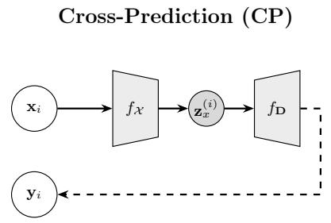

flowchart

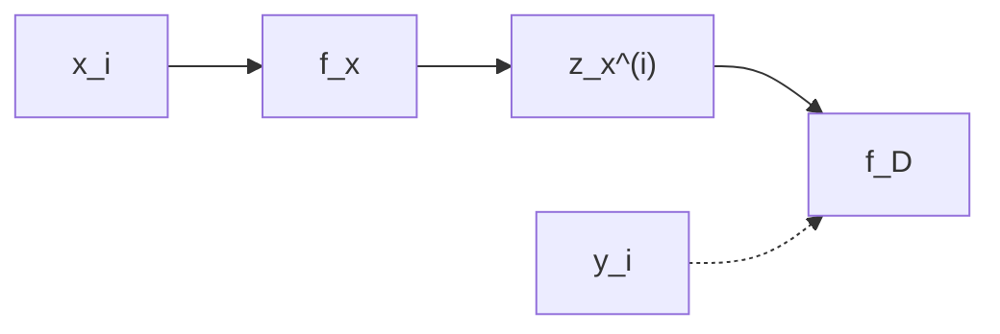

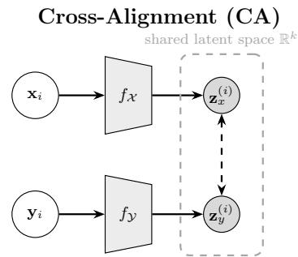

flowchart

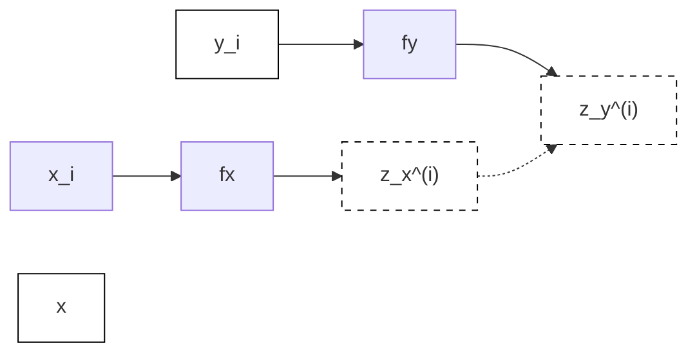

Figure 1: Two multimodal learning paradigms studied in this work. $( L e f t )$ Cross-prediction (CP), Equation (2): an encoder $f _ { \mathcal { X } }$ maps modality x to a latent code $\mathbf { z } ,$ and a decoder $f _ { \mathbf { D } }$ reconstructs the paired target $\begin{array} { r l } { \mathbf { y } . \ } & { { } ( R i g h t ) } \end{array}$ Crossalignment (CA), Equation (1): encoders $f _ { \mathcal { X } }$ and $f _ { \mathcal { Y } }$ project paired samples $\left( \mathbf { x } _ { i } , \mathbf { y } _ { i } \right)$ into a shared latent space where matched pairs are pulled together.

To understand when each objective succeeds or fails, we restrict to the linear case, where equation 1 and equation 2 admit closed-form solutions and the population geometry is fully tractable. This linear analysis captures the core mechanism and provides our main analysis tool, and its predictions transfer to the nonlinear regime in our experiments (Section 4).

## 3.2 Linear analysis under a spiked model

With linear encoders $f _ { X } ( \mathbf { x } ) = \mathbf { W } \mathbf { x } , f _ { Y } ( \mathbf { y } ) = \mathbf { V } \mathbf { y }$ for CA, and linear encoder $f _ { X } ( \mathbf { x } ) = \mathbf { E } \mathbf { x }$ and decoder $f _ { D } ( \mathbf { z } ) \ = \ \mathbf { D } \mathbf { z }$ for CP, both objectives admit closed-form solutions expressible through the SVDs of two modality-coupling matrices:

$$
\mathbf {C} := \mathbf {S} _ {x x} ^ {- 1 / 2} \mathbf {S} _ {x y} \mathbf {S} _ {y y} ^ {- 1 / 2}, \quad \mathbf {A} := \mathbf {S} _ {y x} \mathbf {S} _ {x x} ^ {- 1 / 2}, \tag {3}
$$

where $\Sigma _ { x x } , \Sigma _ { y y } , \Sigma _ { x y }$ denote the (population) (cross-)covariances. CA projects onto the leading k singular directions of C (symmetric whitening, equivalent to CCA (Hotelling, 1936; Andrew et al., 2013)); CP projects onto the leading k singular directions of A (source-side whitening only, equivalent to truncated reduced-rank regression (RRR) (Izenman, 1975; Eckart and Young, 1936)). Although CCA and RRR are classically connected (e.g., Donnat and Tuzhilina (2024)), the two paradigms diverge once structured cross-modal nuisance is present, which is the regime our analysis characterizes.

Spiked model. To analyze recovery, we posit a signal-plus-noise model in which each modality decomposes into k shared signal coordinates and $d - k$ modality-specific nuisance coordinates. In suitable orthogonal bases, the covariances are block diagonal:

$$
\mathbf {S} _ {x x} = \mathrm{diag} (\mathbf {K} ^ {2} + \boldsymbol {\Gamma} _ {x} ^ {(s)}, \boldsymbol {\Gamma} _ {x} ^ {(n)}), \quad \mathbf {S} _ {y y} = \mathrm{diag} (\mathbf {K} ^ {2} + \boldsymbol {\Gamma} _ {y} ^ {(s)}, \boldsymbol {\Gamma} _ {y} ^ {(n)}), \quad \mathbf {S} _ {x y} = \mathrm{diag} (\mathbf {K} ^ {2}, \boldsymbol {\Gamma} _ {x y}), \tag {4}
$$

$\mathbf { K } = \mathrm { d i a g } ( \kappa _ { 1 } , . . . , \kappa _ { k } )$ $\mathbf { \Gamma } \Gamma _ { x } ^ { \left( s \right) } , \mathbf { \Gamma } \Gamma _ { y } ^ { \left( s \right) }$ are the view-specific noise $\mathbf { T } _ { x } ^ { \left( n \right) } , \mathbf { T } _ { y } ^ { \left( n \right) }$ are the view-specific noise variances on the nuisance coordinates, and $\boldsymbol { \Gamma } _ { x y } = \operatorname { d i a g } ( \eta _ { 1 } , \dots , \eta _ { d - k } )$ encodes cross-modal nuisance correlation, with $0 \leq \eta _ { j } \leq \sqrt { \tilde { \gamma } _ { j } ^ { x } \tilde { \gamma } _ { j } ^ { y } }$ . Full parameterization is given in Section A.

Under this model, the singular values of C and A decompose cleanly into signal and nuisance contributions, yielding recovery conditions for each objective.

Proposition 3.1 (CA vs. CP separation). Under the spiked model equation $^ { 4 , }$ the singular values of C and A split into signal values $\{ \rho _ { i } , \tau _ { i } \} _ { i \in [ [ k ] ] }$ and nuisance values $\{ \nu _ { j } , \xi _ { j } \} _ { j \in [ [ d - k ] ] } , \ g i v e n \ b y$

$$
\rho_ {i} = \frac {\kappa_ {i} ^ {2}}{\sqrt {(\kappa_ {i} ^ {2} + \gamma_ {i} ^ {x}) (\kappa_ {i} ^ {2} + \gamma_ {i} ^ {y})}}, \quad \tau_ {i} = \frac {\kappa_ {i} ^ {2}}{\sqrt {\kappa_ {i} ^ {2} + \gamma_ {i} ^ {x}}}, \quad \nu_ {j} = \frac {\eta_ {j}}{\sqrt {\tilde {\gamma} _ {j} ^ {x} \tilde {\gamma} _ {j} ^ {y}}}, \quad \xi_ {j} = \frac {\eta_ {j}}{\sqrt {\tilde {\gamma} _ {j} ^ {x}}}. (5)
$$

CA (resp. CP) recovers the shared signal subspace whenever its signal singular values exceed its nuisance singular values. Defining the separation ratios

$$
\Delta_ {\mathrm{CA}} := \frac {\min _ {i} \rho_ {i}}{\max _ {j} \nu_ {j}}, \quad \Delta_ {\mathrm{CP}} := \frac {\min _ {i} \tau_ {i}}{\max _ {j} \xi_ {j}}, \tag {6}
$$

$f u l l$ recovery holds when $\Delta _ { \mathrm { C A } } > 1 ~ ( f o r ~ C A ) ~ o r ~ \Delta _ { \mathrm { C P } } > 1 ~ ( f o r ~ C P )$ . In the homogeneous case $( \kappa _ { i } \equiv \kappa , \gamma _ { i } ^ { y } \equiv \gamma ^ { y } ,$ , $\tilde { \gamma } _ { j } ^ { y } \equiv \tilde { \gamma } ^ { y } )$ , the two ratios satisfy

$$
\Delta_ {\mathrm{CA}} = \Delta_ {\mathrm{CP}} \cdot \sqrt {\frac {\tilde {\gamma} ^ {y}}{\kappa^ {2} + \gamma^ {y}}}. \tag {7}
$$

More generally, $\Delta _ { \mathrm { C A } } / \Delta _ { \mathrm { C P } }$ is monotonically non-decreasing in each $\tilde { \gamma } _ { j } ^ { y }$ .

Proposition 3.2 (Partial recovery). Under the spiked model equation $^ { 4 , }$ the top-k singular vectors of C (resp. A) contain at least

$$
r _ {\mathrm{CA}} := \left| \left\{i: \rho_ {i} > \max _ {j} \nu_ {j} \right\} \right|, \quad r _ {\mathrm{CP}} := \left| \left\{i: \tau_ {i} > \max _ {j} \xi_ {j} \right\} \right| \tag {8}
$$

shared signal directions.

Full recovery is $r = k$ (Proposition 3.1); $r = 0$ corresponds to complete failure; and the intermediate regime $0 < r < k$ is partial recovery, in which the learned representation is guaranteed to capture at least r signal directions mixed with nuisance. Partial recovery arises only under heterogeneous signal strengths: in the homogeneous case $\kappa _ { i } \equiv \kappa , \gamma _ { i } ^ { x } \equiv \gamma ^ { x } , \gamma _ { i } ^ { y } \equiv \gamma ^ { y }$ (Figure 2) all signal singular values coincide, so $r \in \{ 0 , k \}$ and partial recovery collapses to the binary regime of Proposition 3.1. As $\kappa _ { i }$ become increasingly heterogeneous, the four-region phase diagram of figure 2 smears into a graded continuum (Figure $^ { 7 , }$ Section C).

Failure modes. Equation (5) exposes a fundamental asymmetry. CA’s nuisance values $\nu _ { j }$ are cross-modal correlation coefficients in [0, 1], independent of nuisance variance: when any $\nu _ { j } \to 1$ , no signal direction can match it under whitening (since $\rho _ { i } < 1$ whenever any modality-specific noise is present), so $\Delta _ { \mathrm { C A } } < 1$ regardless of signal strength. $\mathrm { C P ^ { \circ } s }$ nuisance values $\xi _ { j } = \nu _ { j } \sqrt { \tilde { \gamma } _ { j } ^ { y } }$ depend on the target nuisance variance: large $\tilde { \gamma } _ { j } ^ { y }$ amplifies even moderate nuisance correlation into a recovery-breaking singular value (here and in Figure ${ \bf \bar { \theta } } _ { 2 } ,$ we hold $\nu _ { j }$ fixed when varying $\tilde { \gamma } _ { j } ^ { y }$ , consistent with the $( \kappa , \nu )$ axes of the phase diagram). CP is also asymmetric: swapping source and target replaces $\tilde { \gamma } _ { j } ^ { y }$ with $\tilde { \gamma } _ { j } ^ { x }$ , so the direction of prediction matters. A direct corollary, demonstrated in Figure 9, is that $\mathrm { C P }$ can achieve lower reconstruction MSE than CA while recovering the wrong subspace — the MSE objective itself does not distinguish signal from nuisance. The relation of equation 7 makes the complementarity explicit: $\Delta _ { \mathrm { C A } }$ and $\Delta _ { \mathrm { C P } }$ diverge as $\tilde { \gamma } _ { j } ^ { y }$ grows, so a large target-side nuisance favors CA, while a small target-side nuisance favors CP. In the resulting phase diagram (Figure 2) the $( \kappa , \nu )$ plane partitions into four regions — Both, CA only, $C P$ only, Neither — with boundaries set by $\Delta _ { \mathrm { C A } } = 1$ and $\Delta _ { \mathrm { C P } } = 1$ .

Key takeaway. These failure modes suggest that CA is preferable when nuisance correlation is moderate, modality quality is uncertain, and modality-specific noise is large. CP may be preferable, with the correct source-target orientation, when the signal is strong and the target noise is weak.

Redundant vs. Complementary Modalities. The failure modes of CA and CP can be understood through a distinction between two regimes of multimodal data. Redundant modalities, such as image– caption pairs, where captions are written to describe image content—share dominant structure across views, corresponding to large $\kappa _ { i }$ and small $\nu _ { j }$ in our model, or the lower right corner in Figure 2. In this regime, the redundancy assumption underlying standard multimodal SSL holds. Complementary modalities, by contrast, arise when each view provides a structurally distinct perspective on the same object, as in multisensor measurements in astrophysics and earth science, or multi-omics or multi-scale profiling in biology. Here, view-specific structure dominates the variance of each modality while cross-modal nuisance correlation is non-negligible, pushing toward large $\nu _ { j }$ and small effective $\kappa _ { i } .$ —precisely the Neither region (upper left corner) of Figure 2 where both paradigms fail. The intermediate region, which is represented by the center area in Figure 2 is noise dependent - CA is preferred when target noise is large, and CP is preferred when target noise is weak.

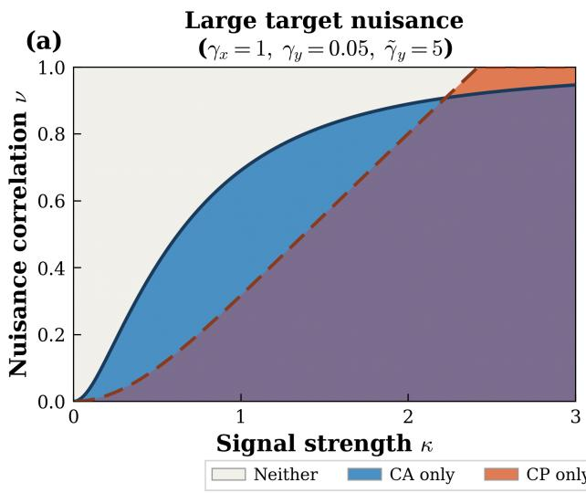

line chart

| Signal strength κ | Neither | CA only | CP only |
| ----------------- | ------- | ------- | ------- |
| 0                 | 0.0     | 0.0     | 0.0     |
| 1                 | 0.6     | 0.7     | 0.3     |
| 2                 | 0.8     | 0.9     | 0.7     |
| 3                 | 0.9     | 0.95    | 0.9     |

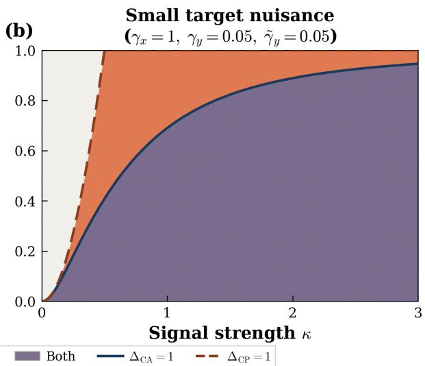

line chart

| Signal strength κ | Both | ΔCA = 1 | ΔCP = 1 |
| ----------------- | ---- | ------- | ------- |
| 0                 | 0.0  | 0.0     | 0.0     |
| 1                 | 0.6  | 0.7     | 0.8     |
| 2                 | 0.85 | 0.9     | 0.95    |
| 3                 | 0.95 | 0.95    | 0.98    |

Figure 2: Phase diagram for signal recovery in $( \kappa , \nu )$ space under the homogeneous model (all signal and noise components are equal). Solid and dashed lines respectively show the $\Delta _ { \mathrm { C A } } = 1$ and $\Delta _ { \mathrm { C P } } = 1$ boundaries from Proposition 3.1. (a) Large target nuisance $\left( \tilde { \gamma } ^ { y } \gg \gamma ^ { y } \right)$ . (b) Small target noise $( \tilde { \gamma } ^ { y } \sim \gamma ^ { y } )$ . Phase diagrams for the non-homogeneous case with partial recoveries are shown in Figure 7.

## 4 Experiments

To test the validity of our theory in real-world problems, we conducted experiments across varying levels of complexity and controllability. The first is a linear experiment that directly implements the spiked model, followed by non-linear experiments with synthetic vision datasets, simulating multi-modality by projecting the scene onto two virtual cameras. Next, we use COCO-MS, a real image-caption multi-modality dataset. Finally, we verify our predictions on a real-world scientific problem - an astrophysics multimodal experiment. In all non-linear experiments, we use the VICReg approach (Bardes et al., 2021) as an approximation for the CA objective, and MSE reconstruction as CP. While VICReg does not use exactly the same orthogonality constraint, the covariance and variance regularization terms impose a similar behavior, and it was shown to be a formulation of DeepCCA (Andrew et al., 2013), the non-linear version of CCA (see e.g., Chapman et al. (2023)). We verify this similarity by comparing VICReg and DeepCCA in our two synthetic experiments (see C). We provide implementation details of all experiments in Section B.

## 4.1 Spiked Synthetic Data

We first verify the theoretical predictions of Section 3 using closed-form solvers on finite-sample, synthetic data drawn from the spiked covariance model. This confirmed that cross-modal noise correlation breaks CP well before CA (Figure 3). The empirical subspace distance shows that CP fails to recover the signal (dist → 1) at $\nu \approx 0 . 1 5$ , while CA maintains near-perfect recovery until ν ≈ 0.75 (Figure 3, left). Based on the theoretical separation ratios (Figure 3, right)∆CP crosses the recovery threshold $\Delta = 1$ at a noise correlation roughly 5× lower than $\Delta _ { \mathrm { C A } }$ . The wide gap between the two thresholds validates the complementary failure modes identified in Section 3. We provide additional linear experiments in Section C.

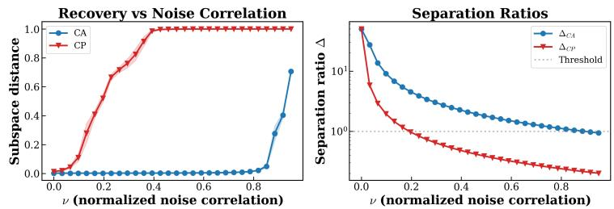

line chart

| ν (normalized noise correlation) | Subspace distance (CA) | Subspace distance (CP) | Separation ratio Δ (ΔCA) | Separation ratio Δ (ΔCP) |
|---|---|---|---|---|
| 0.0 | 0.0 | 0.0 | 10^1 | 10^1 |
| 0.2 | 0.0 | 0.6 | 10^0.5 | 10^0.5 |
| 0.4 | 0.0 | 1.0 | 10^0.3 | 10^0.3 |
| 0.6 | 0.0 | 1.0 | 10^0.2 | 10^0.2 |
| 0.8 | 0.0 | 1.0 | 10^0.1 | 10^0.1 |
| 1.0 | 0.7 | 1.0 | 10^0 | 10^0 |

Figure 3: Recovery as a function of normalized noise correlation ν. $( L e f t )$ Subspace distance between the estimated and true signal subspace (lower is better; shading shows ±1 std over 20 trials). CP fails at $\nu \approx 0 . 1 5$ while CA remains robust until $\nu \approx 0 . 7 5$ . (Right) Theoretical separation ratios $\Delta _ { \mathrm { C A } }$ and $\Delta _ { \mathrm { C P } }$ (log scale). The dashed line marks $\Delta = 1 ;$ recovery succeeds above this threshold.

## 4.2 Stereo vision experiments

Stereo-dSprites We next tested whether the complementary failure modes persist in a nonlinear setting using Stereo-dSprites, a synthetic stereo-vision benchmark, based on the dSprites dataset (Matthey et al. (2017)), with controlled nuisance alignment that simulates a multimodal visual setting. Two virtual cameras observe a shared 2D object on a 64 × 64 image. Here, shape is the signal (low pixel variance but perfectly correlated across views) whereas world position is the nuisance (high pixel variance and highly, but imperfectly, correlated, with the correlation controlled by a camera jitter parameter $\sigma _ { \mathrm { j i t t e r } } )$ . We define nuisance alignment as $\nu _ { \mathrm { m a x } } = 1 - \sigma _ { \mathrm { j i t t e r } }$ , and evaluate downstream shape classification via linear probe (details in Section B).

Stereo-3DShapes We replicate the Stereo-dSprites protocol on Stereo-3DShapes (based on Burgess and Kim (2018)): RGB 64 × 64 stereo pairs of 3D-rendered objects (Cube, Cylinder, Sphere, Capsule) with controlled position jitter (details in Section B).

Both experiments shows the expected trade-off between objectives - CA fails with perfectly correlated noise and improves as the alignment decreases, while CP shows the opposite behavior (Figure 4). At full nuisance alignment (ν = 1), the cross-modal mapping is deterministic and CP’s overcapacity bottleneck encodes both signal and nuisance without compression pressure, circumventing the theory’s failure prediction. As soon as jitter breaks determinism $( \nu < 1 )$ , CP is forced to compress, and the separation ratio governs recovery. These overall conclusions are also observed when we examine examples of latent features with different alignment values for CA and CP in the stereo-dSprites experiment with dimensionality reduction using UMAP (McInnes et al., 2018) ((Figure 5), colors: signal (shape); opacity: nuisance features (position)). The observed patterns align perfectly with the overall results, such that the opacity structure (Figure 5) shows that in CA and CP each succeed where the other fails, and when a method fails, the model primarily captures the nuisance features (position).

## 4.3 Image–Caption Experiments

We extended the analysis to a real image–caption dataset: MS-COCO (Lin et al., 2014), where captions are written to describe natural image content. As this is a true multimodal dataset, we used the natural caption–image pairing without artificial nuisance manipulation. We trained encoders from scratch (ResNet-18 for images, two-layer Transformer for captions) and varied modality-specific noise by applying visual style transforms of increasing strength to the image modality while keeping captions clean. As expected, we observed asymmetric performance for CP (Figure 6); $\mathrm { C P } _ { I  T }$ strongly dominates at low noise $( \sim 1 0 \mathrm { p p }$ over CA), and degrades monotonically as image noise increases. The asymmetry matches the linear theory: $\Delta _ { \mathrm { C P } }$ depends only on source-side quantities, so image-side perturbations affect $\mathrm { C P } _ { I  T }$ but leave $\mathrm { C P } _ { T  I }$ (text source, unchanged) flat. The slight rise of $\mathrm { C P } _ { T  I }$ is consistent with noisy reconstruction targets acting as a regularizer, a finite-capacity effect outside the linear theory. CA is insensitive throughout, consistent with $\Sigma _ { y y }$ normalization absorbing modality-specific variance.

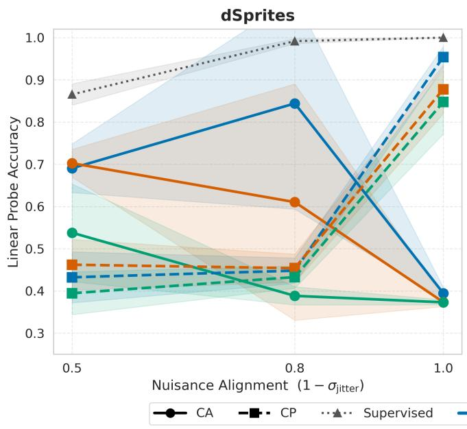

line chart

| Nuisance Alignment (1 - σ_jitter) | CA    | CP    | Supervised |
| --------------------------------- | ----- | ----- | ---------- |
| 0.5                               | 0.54  | 0.70  | 0.87       |
| 0.8                               | 0.61  | 0.45  | 0.99       |
| 1.0                               | 0.38  | 0.95  | 1.00       |

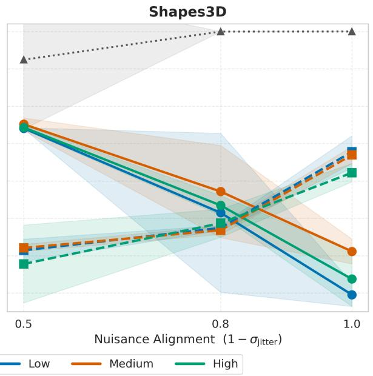

line chart

| Nuisance Alignment (1 - σ_jitter) | Low  | Medium | High |
| --------------------------------- | ---- | ------ | ---- |
| 0.5                               | 0.8  | 0.8    | 0.8  |
| 0.8                               | 0.6  | 0.7    | 0.6  |
| 1.0                               | 0.4  | 0.5    | 0.4  |

Figure 4: Linear probe accuracy vs. nuisance alignment $\nu _ { \mathrm { m a x } } = 1 - \sigma _ { \mathrm { j i t t e r } } .$ . (Left) Stereo-dSprites (3-class, grayscale, 100k samples). (Right) Stereo-3DShapes (4-class, RGB, 100k samples). In both settings, color represents weak noise levels. In both panels, the trade-off between the methods is clearly seen. CA (solid, circles) peaks at moderate-to-low alignment and collapses at full alignment; CP (dashed, squares) shows the opposite pattern. The crossover at $\nu _ { \mathrm { m a x } } \approx 0 . 8$ is consistent across datasets. Lower absolute ceilings in 3DShapes reflect the harder discrimination task.

## 4.4 Predicting Recovery Regimes

We propose a lightweight supervised diagnostic that locates a paired dataset in the phase diagram before committing to cross-modal training. The diagnostic is supervised by design: a small labeled subsample classifies singular components of Cˆ and Aˆ as signal or nuisance, allowing direct estimation of $\hat { \Delta _ { \mathrm { C A } } }$ and $\hat { \Delta _ { \mathrm { C P } } }$ without recovering the latent parameters $( \kappa , \gamma , \tilde { \gamma } , \eta )$ . The labeled budget is small relative to the scale of cross-modal training. the diagnostic is meant to inform, and the labels need not match the downstream target — in Section 4.5, regime prediction from log g correctly orders methods on binarity and age.

The estimation procedure is well-posed when the representation fed to the estimator approximately satisfies the linear spiked decomposition of Section 3.2: signal and nuisance directions must be meaningfully separable in the joint covariance structure of the paired data. This condition holds most directly in two-stage multimodal pipelines, where each modality is first encoded independently by a unimodal model, and the crossmodal objective operates on these frozen representations. The unimodal features are both the actual inputs to the cross-modal model and a representation in which signal and nuisance can be meaningfully separated; Two-stage pipelines are the dominant paradigm in scientific multimodal learning and in large foundationmodel stacks where modality-specific encoders are pretrained independently. In single-stage pipelines, the encoder and cross-modal objective are optimized jointly from raw data, and no unimodal representation satisfying the spiked decomposition exists prior to training. Applying the estimator to compact proxies of the raw inputs (e.g., pixel-PCA) is possible, but the resulting regime predictions are less reliable.

## 4.5 Real Astrophysical Data (LAMOST × Kepler/TESS)

Finally, we validated regime estimation on real astrophysical data, pairing ground-based LAMOST (Zhao et al. (2012)) spectra (2048-dim encoder) with space-based photometry from two instruments: Kepler (Mathur et al. (2017)) and TESS (Ricker et al. (2015)) (1024-dim encoders), using frozen pretrained features Kamai et al. (2025) with lightweight projection/prediction heads (Section B). We estimated recovery regimes from a labeled subsample using surface gravity (log g), following Algorithm 1. Downstream evaluation covered three physically distinct targets: binarity, log g, and age. Binarity and age are encoded through modality-specific mechanisms (spectroscopic radial-velocity variations vs. photometric eclipses for binarity; isochrone vs. gyrochronology for age), so agreement between a log g-based regime prediction and behavior on binarity and age tests whether the separation ratios capture the geometry of the modality pair rather than a task-specific artifact. The results show that the regime predictions hold as regime-level statements across all targets, with a revealing asymmetry in how each regime manifests (Table 1, 5 seeds per cell).

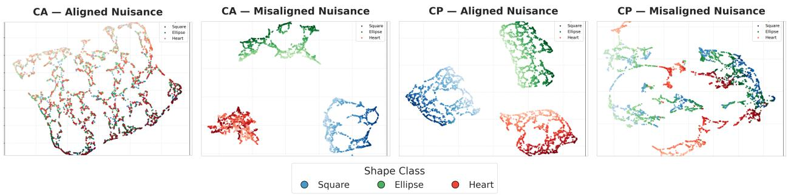

scatterplot

| Region Type       | Shape Class | Shape Description |
| ----------------- | ----------- | ----------------- |
| CA — Aligned Nuisance | Square      | Ellipse           |
| CA — Aligned Nuisance | Square      | Heart             |
| CA — Aligned Nuisance | Square      | Ellipse           |
| CA — Aligned Nuisance | Square      | Heart             |
| CA — Aligned Nuisance | Square      | Ellipse           |
| CA — Aligned Nuisance | Square      | Heart             |
| CA — Misaligned Nuisance | Square      | Ellipse           |
| CA — Misaligned Nuisance | Square      | Heart             |
| CA — Misaligned Nuisance | Square      | Ellipse           |
| CA — Misaligned Nuisance | Square      | Heart             |
| CA — Misaligned Nuisance | Square      | Ellipse           |
| CA — Misaligned Nuisance | Square      | Heart             |
| CP — Aligned Nuisance | Square      | Ellipse           |
| CP — Aligned Nuisance | Square      | Heart             |
| CP — Aligned Nuisance | Square      | Ellipse           |
| CP — Aligned Nuisance | Square      | Heart             |
| CP — Aligned Nuisance | Square      | Ellipse           |
| CP — Aligned Nuisance | Square      | Heart             |
| CP — Misaligned Nuisance | Square      | Ellipse           |
| CP — Misaligned Nuisance | Square      | Heart             |
| CP — Misaligned Nuisance | Square      | Ellipse           |
| CP — Misaligned Nuisance | Square      | Heart             |
| CP — Misaligned Nuisance | Square      | Ellipse           |
| CP — Misaligned Nuisance | Square      | Heart             |

Figure 5: UMAP embeddings of learned representations of the stereo-dSprites experiment (color = shape, intensity = position). From left to right: CA with aligned noise $( \sigma _ { \mathrm { j i t t e r } } = 0 )$ , CA with misaligned noise $( \sigma _ { \mathrm { j i t t e r } } \ : = \ : 0 . 5 )$ , CP with aligned noise, and CP with misaligned noise. All experiments have the same modality-specific noise $( \sigma _ { \mathrm { n o i s e } } = 0 . 5 )$ . Each method succeeds exactly where the other fails, and on failures, the models learn the nuisance.

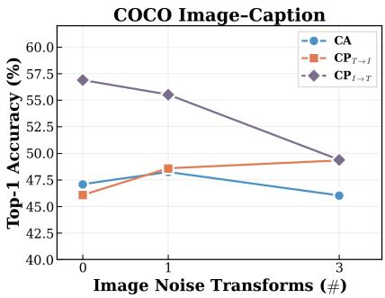

line chart

| Image Noise Transforms (#) | CA    | CP_T→I | CP_I→T |
| -------------------------- | ----- | ------ | ------ |
| 0                          | 47.5  | 46.0   | 57.0   |
| 1                          | 48.0  | 48.5   | 55.5   |
| 3                          | 46.0  | 49.0   | 49.5   |

Figure 6: Top-1 accuracy vs. image style transform strength for MS-COCO experiment. $\mathrm { C P }$ shows an asymmetric nature: prediction of image from text results in similar performance as CA but prediction of text from an image results in much better performance. Both approaches converge to the same accuracy when image noise is high.

Kepler (Both). On every target, at least one of {CA, CP} matches or exceeds the best unimodal baseline, but the winner rotates with task. CP stays at the LAMOST ceiling where LAMOST dominates (log g, binarity); CA captures photometric signal where LAMOST is weak (age: +0.19 $R ^ { 2 }$ over LAMOST). The ’Both’ prediction should be read as some cross-modal objective helps on every task, not as both objectives helping uniformly, consistent with $\hat { \Delta _ { \mathrm { C A } } }$ and $\hat { \Delta _ { \mathrm { C P } } }$ being very different.

TESS (Neither). No cross-modal method exceeds LAMOST alone on any target, and the gap is well beyond seed variance. The prediction holds uniformly, with no task-level exceptions. Figure 12 visualizes the underlying singular-value decompositions of Cˆ and Aˆ for both pairs.

CP direction asymmetry. CP’s recovery condition $\Delta _ { \mathrm { C P } }$ involves only source-side quantities, so swapping source and target produces a structurally different recovery condition: the preferred direction is the one in which the source modality more directly encodes the task signal. For log g and binarity, spectra encode the signal more directly than photometry (through absorption-line broadening rather than granulation/oscillation) so CP forward (spectra → photometry) succeeds while $\mathrm { C P _ { r e v } }$ (photometry → spectra) fails. For age, photometric rotation periods provide a more direct signal via gyrochronology than spectroscopic activity indicators, so the preferred direction reverses: $\mathrm { C P _ { r e v } }$ on age $( R ^ { 2 } = 0 . 4 9 7 )$ outperforms forward CP.

Table 1: Astrophysical cross-modal results, mean ± std over 5 seeds. Best per row in bold (ties within seed std co-bolded). Kepler (Both, $\hat { \Delta _ { \mathrm { C A } } } { = } 1 . 1 3 , \ \hat { \Delta _ { \mathrm { C P } } } { = } 2 . 2 2 )$ : at least one cross-modal method matches or beats the best unimodal baseline on every target; CP preserves LAMOST’s ceiling where LAMOST dominates, CA captures photometric signal where LAMOST is weak. TESS (Neither, $\hat { \Delta _ { \mathrm { C A } } } , \hat { \Delta _ { \mathrm { C P } } } { < } 1 ) .$ : no cross-modal method beats LAMOST-only on any target. $\mathrm { C P _ { r e v } }$ (photometry → spectra) fails on tasks where spectra carry the more direct signal (log g, binarity), but outperforms forward CP on age, where photometric rotation provides a more direct gyrochronological signal — the same source-quality principle in both directions.

<table><tr><td>Task</td><td>CA</td><td>CP</td><td> $CP_{rev}$ </td><td>LAMOST</td><td>Photometry</td></tr><tr><td colspan="6">LAMOST × Kepler — Both regime</td></tr><tr><td>Binarity (bal. acc.)</td><td>0.802±0.009</td><td>0.814±0.006</td><td>0.751±0.004</td><td>0.814</td><td>0.731</td></tr><tr><td>log g ( $R^2$ )</td><td>0.956±0.003</td><td>0.976±0.001</td><td>0.639±0.004</td><td>0.977</td><td>0.542</td></tr><tr><td>Age ( $R^2$ )</td><td>0.620±0.001</td><td>0.434±0.006</td><td>0.497±0.039</td><td>0.431</td><td>0.470</td></tr><tr><td colspan="6">LAMOST × TESS — Neither regime</td></tr><tr><td>Binarity (bal. acc.)</td><td>0.756±0.022</td><td>0.763±0.011</td><td>0.626±0.010</td><td>0.779</td><td>0.604</td></tr><tr><td>log g ( $R^2$ )</td><td>0.929±0.005</td><td>0.939±0.001</td><td>-0.312±0.001</td><td>0.942</td><td>-0.312</td></tr><tr><td>Age ( $R^2$ )</td><td>0.431±0.029</td><td>0.396±0.064</td><td>-0.072±0.004</td><td>0.503</td><td>-0.037</td></tr></table>

Key takeaway. Estimating effective recovery regimes is a practical and feasible analysis for real-world multimodal problems. It can indicate whether cross-modal learning is likely to succeed, identify which modality is the informative bottleneck, and guide the choice of objective.

## 5 Conclusion

We studied cross-modal alignment and cross-modal prediction in a unified linear framework, deriving recovery conditions governed by separation ratios $\Delta _ { \mathrm { C A } }$ and $\Delta _ { \mathrm { C P } }$ that partition multimodal problems into four regimes and determine not only which method succeeds but whether cross-modal training helps at all. A data-driven estimation of these ratios identifies the preferred objective and prediction direction from a small labeled subsample, before any cross-modal training. Experiments span synthetic data, stereo-vision benchmarks, and image–caption pairs, with the sharpest validation on real astrophysical data: same spectroscopic encoder paired with two photometric instruments of differing quality yields two distinct predicted regimes, both confirmed across multiple downstream targets, and the predicted CP direction asymmetry is confirmed on all tasks. The Neither regime is the most important open problem raised by this work, the natural habitat of complementary scientific modalities, where each instrument provides a structurally distinct view yet neither paradigm extracts the shared signal. Escaping it likely requires objectives that go beyond pairwise crosscovariance, e.g., higher-order structure, auxiliary supervision, or modality-specific priors. We hope the phase diagram introduced here provides a principled starting point to solve it.

## References

Jean-Baptiste Alayrac, Jeff Donahue, Pauline Luc, Antoine Miech, Iain Barr, Yana Hasson, Karel Lenc, Arthur Mensch, Katie Millican, Malcolm Reynolds, Roman Ring, Eliza Rutherford, Serkan Cabi, Tengda Han, Zhitao Gong, Sina Samangooei, Marianne Monteiro, Jacob Menick, Sebastian Borgeaud, Andrew Brock, Aida Nematzadeh, Sahand Sharifzadeh, Mikolaj Binkowski, Ricardo Barreira, Oriol Vinyals, Andrew Zisserman, and Karen Simonyan. Flamingo: a Visual Language Model for Few-Shot Learning. arXiv e-prints, art. arXiv:2204.14198, April 2022. doi: 10.48550/arXiv.2204.14198.  
Galen Andrew, Raman Arora, Jeff Bilmes, and Karen Livescu. Deep canonical correlation analysis. In Proceedings of the 30th International Conference on International Conference on Machine Learning - Volume 28, ICML’13, page III–1247–III–1255. JMLR.org, 2013.  
Sanjeev Arora, Hrishikesh Khandeparkar, Mikhail Khodak, Orestis Plevrakis, and Nikunj Saunshi. A theoretical analysis of contrastive unsupervised representation learning. In International Conference on Machine Learning, 2019. URL https://api.semanticscholar.org/CorpusID:67855945.  
Mahmoud Assran, Quentin Duval, Ishan Misra, Piotr Bojanowski, Pascal Vincent, Michael G. Rabbat, Yann LeCun, and Nicolas Ballas. Self-supervised learning from images with a joint-embedding predictive architecture. 2023 IEEE/CVF Conference on Computer Vision and Pattern Recognition (CVPR), pages 15619–15629, 2023. URL https://api.semanticscholar.org/CorpusID:255999752.  
Alexei Baevski, Wei-Ning Hsu, Qiantong Xu, Arun Babu, Jiatao Gu, and Michael Auli. data2vec: A General Framework for Self-supervised Learning in Speech, Vision and Language. arXiv e-prints, art. arXiv:2202.03555, February 2022. doi: 10.48550/arXiv.2202.03555.  
Randall Balestriero and Yann LeCun. Contrastive and non-contrastive self-supervised learning recover global and local spectral embedding methods. ArXiv, abs/2205.11508, 2022. URL https://api. semanticscholar.org/CorpusID:248986152.  
Randall Balestriero and Yann LeCun. LeJEPA: Provable and Scalable Self-Supervised Learning Without the Heuristics. arXiv e-prints, art. arXiv:2511.08544, November 2025. doi: 10.48550/arXiv.2511.08544.  
Adrien Bardes, Jean Ponce, and Yann LeCun. VICReg: Variance-Invariance-Covariance Regularization for Self-Supervised Learning. arXiv e-prints, art. arXiv:2105.04906, May 2021. doi: 10.48550/arXiv.2105. 04906.  
Cristian Bodnar, Wessel P. Bruinsma, Ana Lucic, Megan Stanley, Anna Vaughan, Johannes Brandstetter, Patrick Garvan, Maik Riechert, Jonathan A. Weyn, Haiyu Dong, Jayesh K. Gupta, Kit Thambiratnam, Alexander T. Archibald, Chun-Chieh Wu, Elizabeth Heider, Max Welling, Richard E. Turner, and Paris Perdikaris. A Foundation Model for the Earth System. arXiv e-prints, art. arXiv:2405.13063, May 2024. doi: 10.48550/arXiv.2405.13063.  
Chris Burgess and Hyunjik Kim. 3d shapes dataset. https://github.com/deepmind/3d-shapes, 2018.  
Vivien Cabannes, Bobak Kiani, Randall Balestriero, Yann LeCun, and Alberto Bietti. The ssl interplay: Augmentations, inductive bias, and generalization. In International Conference on Machine Learning, pages 3252–3298, 2023.  
James Chapman, Lennie Wells, and Ana Lawry Aguila. Unconstrained Stochastic CCA: Unifying Multiview and Self-Supervised Learning. arXiv e-prints, art. arXiv:2310.01012, October 2023. doi: 10.48550/arXiv. 2310.01012.  
Xinlei Chen and Kaiming He. Exploring Simple Siamese Representation Learning. arXiv e-prints, art. arXiv:2011.10566, November 2020. doi: 10.48550/arXiv.2011.10566.  
Haotian Cui, Alejandro Tejada-Lapuerta, Maria Brbić, Julio Saez-Rodriguez, Simona Cristea, Hani Goodarzi, Mohammad Lotfollahi, Fabian J. Theis, and Bo Wang. Towards multimodal foundation models in molecular cell biology. Nature, 640(8059):623–633, April 2025. doi: 10.1038/s41586-025-08710-y.  
Claire Donnat and Elena Tuzhilina. Canonical Correlation Analysis as Reduced Rank Regression in High Dimensions. arXiv e-prints, art. arXiv:2405.19539, May 2024. doi: 10.48550/arXiv.2405.19539.  
Carl Eckart and Gale Young. The approximation of one matrix by another of lower rank. Psychometrika, 1(3):211–218, September 1936. ISSN 1860-0980. doi: 10.1007/BF02288367. URL https://doi.org/10. 1007/BF02288367.  
Rohit Girdhar, Alaaeldin El-Nouby, Zhuang Liu, Mannat Singh, Kalyan Vasudev Alwala, Armand Joulin, and Ishan Misra. ImageBind: One Embedding Space To Bind Them All. arXiv e-prints, art. arXiv:2305.05665, May 2023. doi: 10.48550/arXiv.2305.05665.  
Jeff Z. HaoChen, Colin Wei, Adrien Gaidon, and Tengyu Ma. Provable guarantees for self-supervised deep learning with spectral contrastive loss. In Advances in Neural Information Processing Systems, volume 34, 2021.  
Kaiming He, Xinlei Chen, Saining Xie, Yanghao Li, Piotr Dollár, and Ross Girshick. Masked Autoencoders Are Scalable Vision Learners. arXiv e-prints, art. arXiv:2111.06377, November 2021. doi: 10.48550/arXiv. 2111.06377.  
Harold Hotelling. Relations between two sets of variates. Biometrika, 28(3/4):321–377, 1936.  
Yu Huang, Chenzhuang Du, Zihui Xue, Xuanyao Chen, Hang Zhao, and Longbo Huang. What makes multi-modal learning better than single (provably). arXiv e-prints, page arXiv:2106.04538, 2021. URL https://arxiv.org/abs/2106.04538v2.  
Alan Julian Izenman. Reduced-rank regression for the multivariate linear model. Journal of Multivariate Analysis, 5(2):248–264, 1975. ISSN 0047-259X. doi: https://doi.org/10.1016/0047-259X(75)90042-1. URL https://www.sciencedirect.com/science/article/pii/0047259X75900421.  
Ilay Kamai, Alex M. Bronstein, and Hagai B. Perets. Machine learning inference of stellar properties using integrated photometric and spectroscopic data. The Astrophysical Journal, 994, 2025. URL https: //api.semanticscholar.org/CorpusID:280232312.  
Yann LeCun. A path towards autonomous machine intelligence version 0.9.2, 2022-06-27, 2022. URL https://www.semanticscholar.org/paper/775f42ed458b8c5b0f2094ea4ff5b64c557b1a34.  
Weixin Liang, Yuhui Zhang, Yongchan Kwon, Serena Yeung, and James Zou. Mind the Gap: Understanding the Modality Gap in Multi-modal Contrastive Representation Learning. arXiv e-prints, arXiv:2203.02053: arXiv:2203.02053, March 2022. doi: 10.48550/arXiv.2203.02053.  
Tsung-Yi Lin, Michael Maire, Serge Belongie, James Hays, Pietro Perona, Deva Ramanan, Piotr Dollár, and C Lawrence Zitnick. Microsoft coco: Common objects in context. In Computer Vision–ECCV 2014: 13th European Conference, Zurich, Switzerland, September 6-12, 2014, Proceedings, Part V 13, pages 740–755. Springer, 2014.  
Zhou Lu. A theory of multimodal learning. Neural Information Processing Systems, arXiv:2309.12458, 2023. doi: 10.48550/arxiv.2309.12458. URL https://arxiv.org/abs/2309.12458v2.  
Savita Mathur, Daniel Huber, Natalie M. Batalha, David R. Ciardi, Fabienne A. Bastien, Allyson Bieryla, Lars A. Buchhave, William D. Cochran, Michael Endl, Gilbert A. Esquerdo, Elise Furlan, Andrew Howard, Steve B. Howell, Howard Isaacson, David W. Latham, Phillip J. MacQueen, and David R. Silva. Revised stellar properties of kepler targets for the q1-17 (dr25) transit detection run. The Astrophysical Journal Supplement Series, 229(2):30, mar 2017. doi: 10.3847/1538-4365/229/2/30. URL https://dx.doi.org/ 10.3847/1538-4365/229/2/30.  
Loic Matthey, Irina Higgins, Demis Hassabis, and Alexander Lerchner. dsprites: Disentanglement testing sprites dataset. https://github.com/deepmind/dsprites-dataset/, 2017.  
Leland McInnes, John Healy, and James Melville. UMAP: Uniform Manifold Approximation and Projection for Dimension Reduction. arXiv e-prints, arXiv:1802.03426:arXiv:1802.03426, February 2018. doi: 10. 48550/arXiv.1802.03426.  
Pierre Mergny and Lenka Zdeborová. Spectral thresholds in correlated spiked models and fundamental limits of partial least squares. arXiv preprint arXiv:2510.17561, 2025.  
L. Mirsky. Symmetric gauge functions and unitarily invariant norms. The Quarterly Journal of Mathematics, 11(1):50–59, January 1960. doi: 10.1093/qmath/11.1.50.  
Liam Parker, Francois Lanusse, Jeff Shen, Ollie Liu, Tom Hehir, Leopoldo Sarra, Lucas Meyer, Micah Bowles, Sebastian Wagner-Carena, Helen Qu, Siavash Golkar, Alberto Bietti, Hatim Bourfoune, Nathan Casserau, Pierre Cornette, Keiya Hirashima, Geraud Krawezik, Ruben Ohana, Nicholas Lourie, Michael McCabe, Rudy Morel, Payel Mukhopadhyay, Mariel Pettee, Bruno Regaldo-Saint Blancard, Kyunghyun Cho, Miles Cranmer, and Shirley Ho. AION-1: Omnimodal Foundation Model for Astronomical Sciences. arXiv e-prints, art. arXiv:2510.17960, October 2025. doi: 10.48550/arXiv.2510.17960.  
Alec Radford, Jong Wook Kim, Chris Hallacy, Aditya Ramesh, Gabriel Goh, Sandhini Agarwal, Girish Sastry, Amanda Askell, Pamela Mishkin, Jack Clark, Gretchen Krueger, and Ilya Sutskever. Learning Transferable Visual Models From Natural Language Supervision. arXiv e-prints, art. arXiv:2103.00020, February 2021. doi: 10.48550/arXiv.2103.00020.  
George R. Ricker, Joshua N. Winn, Roland Vanderspek, David W. Latham, Gáspár Á. Bakos, Jacob L. Bean, Zachory K. Berta-Thompson, Timothy M. Brown, Lars Buchhave, Nathaniel R. Butler, R. Paul Butler, William J. Chaplin, David Charbonneau, Jørgen Christensen-Dalsgaard, Mark Clampin, Drake Deming, John Doty, Nathan De Lee, Courtney Dressing, Edward W. Dunham, Michael Endl, Francois Fressin, Jian Ge, Thomas Henning, Matthew J. Holman, Andrew W. Howard, Shigeru Ida, Jon M. Jenkins, Garrett Jernigan, John Asher Johnson, Lisa Kaltenegger, Nobuyuki Kawai, Hans Kjeldsen, Gregory Laughlin, Alan M. Levine, Douglas Lin, Jack J. Lissauer, Phillip MacQueen, Geoffrey Marcy, Peter R. McCullough, Timothy D. Morton, Norio Narita, Martin Paegert, Enric Palle, Francesco Pepe, Joshua Pepper, Andreas Quirrenbach, Stephen A. Rinehart, Dimitar Sasselov, Bun’ei Sato, Sara Seager, Alessandro Sozzetti, Keivan G. Stassun, Peter Sullivan, Andrew Szentgyorgyi, Guillermo Torres, Stephane Udry, and Joel Villasenor. Transiting Exoplanet Survey Satellite (TESS). Journal of Astronomical Telescopes, Instruments, and Systems, 1:014003, January 2015. doi: 10.1117/1.JATIS.1.1.014003.  
Arabind Swain, Sean Alexander Ridout, and Ilya Nemenman. Better Together: Cross and Joint Covariances Enhance Signal Detectability in Undersampled Data. arXiv e-prints, art. arXiv:2507.22207, July 2025. doi: 10.48550/arXiv.2507.22207.  
Hugo Tabanelli, Pierre Mergny, Lenka Zdeborova, and Florent Krzakala. Computational Thresholds in Multi-Modal Learning via the Spiked Matrix-Tensor Model. arXiv e-prints, art. arXiv:2506.02664, June 2025. doi: 10.48550/arXiv.2506.02664.  
Yonglong Tian, Xinlei Chen, and Surya Ganguli. Understanding self-supervised learning dynamics without contrastive pairs. In International Conference on Machine Learning, 2021.  
Hugues Van Assel, Mark Ibrahim, Tommaso Biancalani, Aviv Regev, and Randall Balestriero. Joint Embedding vs Reconstruction: Provable Benefits of Latent Space Prediction for Self Supervised Learning. arXiv e-prints, art. arXiv:2505.12477, May 2025. doi: 10.48550/arXiv.2505.12477.  
Meir Yossef Levi and Guy Gilboa. The Double-Ellipsoid Geometry of CLIP. arXiv e-prints, art. arXiv:2411.14517, November 2024. doi: 10.48550/arXiv.2411.14517.  
Gang Zhao, Yong-Heng Zhao, Yao-Quan Chu, Yi-Peng Jing, and Li-Cai Deng. LAMOST spectral survey An overview. Research in Astronomy and Astrophysics, 12(7):723–734, July 2012. doi: 10.1088/1674-4527/ 12/7/002.

## A Closed-form solutions and spiked model derivations

## A.1 Full statement of closed-form solutions

Theorem A.1 (Closed-form solutions for CA). Assume $\mathbf { S } _ { x x }$ and $\mathbf { S } _ { y y }$ are positive definite. Let $\mathbf { C } = \mathbf { P } \boldsymbol { \Phi } \mathbf { Q } ^ { \top }$ $\mathbf { C } : = \mathbf { S } _ { x x } ^ { - 1 / 2 } \mathbf { S } _ { x y } \mathbf { S } _ { y y } ^ { - 1 / 2 }$ with rank $\mathbf { \boldsymbol { \mathbf { \rho } } } _ { : ( \mathbf { C } ) } = \boldsymbol { \mathbf { \mathit { r } } } \geq k$ and $\phi _ { 1 } \geq \cdot \cdot \cdot \geq \phi _ { r } > 0$ . The minimizers of equation 1 with linear encoders are

$$
\mathbf {W} ^ {\star} = \mathbf {U} \boldsymbol {\Phi} _ {k} ^ {- 1 / 2} \mathbf {P} _ {k} ^ {\top} \mathbf {S} _ {x x} ^ {- 1 / 2}, \quad \mathbf {V} ^ {\star} = \mathbf {U} \boldsymbol {\Phi} _ {k} ^ {- 1 / 2} \mathbf {Q} _ {k} ^ {\top} \mathbf {S} _ {y y} ^ {- 1 / 2}, \tag {9}
$$

where $\mathbf { P } _ { k } , \mathbf { Q } _ { k }$ contain the leading k columns and $\mathbf { U } \in \mathbb { R } ^ { k \times k }$ is an arbitrary orthogonal matrix.

Theorem A.2 (Closed-form solutions for CP). Let $\mathbf { A } = \mathbf { U } _ { A } \pmb { \Sigma } \mathbf { V } _ { A } ^ { \top }$ be the SVD of $\mathbf { A } : = \mathbf { S } _ { y x } \mathbf { S } _ { x x } ^ { - 1 / 2 }$ with $\sigma _ { 1 } \geq \cdot \cdot \cdot \geq \sigma _ { r } > 0$ . The composed map B := DE at a minimizer of equation 2 with linear encoder and decoder is

$$
\mathbf {B} ^ {\star} = \mathbf {U} _ {A, k} \boldsymbol {\Sigma} _ {k} \mathbf {V} _ {A, k} ^ {\top} \mathbf {S} _ {x x} ^ {- 1 / 2}. \tag {10}
$$

The factorization $\mathbf { B } ^ { \star } = \mathbf { D } ^ { \star } \mathbf { E } ^ { \star }$ is non-unique: for any invertible $\mathbf { M } \in \mathbb { R } ^ { k \times k } , ( \mathbf { D } ^ { \star } \mathbf { M } , \mathbf { M } ^ { - 1 } \mathbf { E } ^ { \star } )$ yields the same composed map.

## A.2 Proof of Theorem A.1

Using the constraint $\mathbf { W } \mathbf { S } _ { x y } \mathbf { V } ^ { \top } = \mathbf { I } _ { k } ,$ the objective reduces to

$$
\min _ {\mathbf {W}, \mathbf {V}} \quad \operatorname{Tr} \left(\mathbf {W} \mathbf {S} _ {x x} \mathbf {W} ^ {\top}\right) + \operatorname{Tr} \left(\mathbf {V} \mathbf {S} _ {y y} \mathbf {V} ^ {\top}\right) \quad \text {s.t.} \quad \mathbf {W} \mathbf {S} _ {x y} \mathbf {V} ^ {\top} = \mathbf {I} _ {k}. \tag {11}
$$

$\mathbf { W } ^ { \prime } = \mathbf { W } \mathbf { S } _ { x x } ^ { 1 / 2 }$ $\mathbf { V } ^ { \prime } = \mathbf { V } \mathbf { S } _ { y y } ^ { 1 / 2 }$ $\mathbf { C } : = \mathbf { S } _ { x x } ^ { - 1 / 2 } \mathbf { S } _ { x y } \mathbf { S } _ { y y } ^ { - 1 / 2 }$

$$
\min _ {\mathbf {W} ^ {\prime}, \mathbf {V} ^ {\prime}} \| \mathbf {W} ^ {\prime} \| _ {F} ^ {2} + \| \mathbf {V} ^ {\prime} \| _ {F} ^ {2} \quad \text {s.t.} \quad \mathbf {W} ^ {\prime} \mathbf {C V} ^ {\top} = \mathbf {I} _ {k}. \tag {12}
$$

Let the SVD be $\mathbf { C } = \mathbf { P } \boldsymbol { \Phi } \mathbf { Q } ^ { \top }$ . By unitary invariance, it suffices to take $\mathbf { W } ^ { \prime } = \mathbf { U } \mathbf { A } \mathbf { P } ^ { \top }$ and $\mathbf { V } ^ { \prime } = \mathbf { U B Q } ^ { \top }$ with $\mathbf { U } \in \mathbb { R } ^ { k \times k }$ orthogonal, so the constraint reads $\mathbf { A } \Phi \mathbf { B } ^ { \top } = \mathbf { I } _ { k }$ and the objective is $\| \mathbf { A } \| _ { F } ^ { 2 } + \| \mathbf { B } \| _ { F } ^ { 2 }$ . This decouples across singular directions, yielding the minimizer $\mathbf { A } = \mathbf { B } = \boldsymbol { \Phi } _ { k } ^ { - 1 / 2 }$ and the choice of the k largest singular values. Hence

$$
\mathbf {W} ^ {\prime} = \mathbf {U} \boldsymbol {\Phi} _ {k} ^ {- 1 / 2} \mathbf {P} _ {k} ^ {\top}, \quad \mathbf {V} ^ {\prime} = \mathbf {U} \boldsymbol {\Phi} _ {k} ^ {- 1 / 2} \mathbf {Q} _ {k} ^ {\top}, \tag {13}
$$

and the constraint holds iff U is orthogonal. Transforming back gives

$$
\mathbf {W} ^ {\star} = \mathbf {U} \boldsymbol {\Phi} _ {k} ^ {- 1 / 2} \mathbf {P} _ {k} ^ {\top} \mathbf {S} _ {x x} ^ {- 1 / 2}, \quad \mathbf {V} ^ {\star} = \mathbf {U} \boldsymbol {\Phi} _ {k} ^ {- 1 / 2} \mathbf {Q} _ {k} ^ {\top} \mathbf {S} _ {y y} ^ {- 1 / 2}. \tag {14}
$$

## A.3 Proof of Theorem A.2

Since $\mathbf { E } \in \mathbb { R } ^ { k \times d _ { x } }$ and $\mathbf { D } \in \mathbb { R } ^ { d _ { y } \times k }$ , the composed map B = DE satisfies rank $\mathbf { \eta } _ { : } ( \mathbf { B } ) \leq k$ . Conversely, any rank-k matrix B admits such a factorization, so minimizing over (D, E) is equivalent to minimizing over rank-k matrices B. Writing the CP objective in terms of B and expanding:

$$
\frac {1}{n} \sum_ {i} \| \mathbf {y} _ {i} - \mathbf {B x} _ {i} \| ^ {2} = \operatorname{Tr} \left(\mathbf {S} _ {y y}\right) - 2 \operatorname{Tr} \left(\mathbf {S} _ {y x} \mathbf {B} ^ {\top}\right) + \operatorname{Tr} \left(\mathbf {B S} _ {x x} \mathbf {B} ^ {\top}\right). \tag {15}
$$

$\mathrm { S u b s t i t u t i n g ~ \mathbf { B } ^ { \prime } : = \mathbf { B } \mathbf { S } _ { x x } ^ { \frac { 1 } { 2 } } \mathrm { ~ a n d ~ \mathbf { A } : = \mathbf { S } _ { y x } \mathbf { S } _ { x x } ^ { - \frac { 1 } { 2 } } \left( \mathrm { s o ~ t h a t ~ \mathbf { S } _ { y x } \mathbf { B } ^ { \top } = \mathbf { A } ( \mathbf { B } ^ { \prime } ) ^ { \top } ~ a n d ~ \mathbf { B } \mathbf { S } _ { x x } \mathbf { B } ^ { \top } = \mathbf { B } ^ { \prime } ( \mathbf { B } ^ { \prime } ) ^ { \top }  } } } \en\right)d{array}$

$$
= \operatorname{Tr} \left(\mathbf {S} _ {y y}\right) - 2 \operatorname{Tr} \left(\mathbf {A} \left(\mathbf {B} ^ {\prime}\right) ^ {\top}\right) + \operatorname{Tr} \left(\mathbf {B} ^ {\prime} \left(\mathbf {B} ^ {\prime}\right) ^ {\top}\right) \tag {16}
$$

$$
= \operatorname{Tr} (\mathbf {S} _ {y y}) - \operatorname{Tr} (\mathbf {A A} ^ {\top}) + \| \mathbf {B} ^ {\prime} - \mathbf {A} \| _ {F} ^ {2}. \tag {17}
$$

Since $\mathrm { T r } ( \mathbf { S } _ { y y } ) - \mathrm { T r } ( \mathbf { A } \mathbf { A } ^ { \top } )$ does not depend on B, and since S 2xx is invertible, minimizing over ran $\mathbf { S } _ { x x } ^ { \frac { 1 } { 2 } }$ $\mathrm { k } { - } \le \ k$ matrices B is equivalent to minimizing $\| \mathbf { B } ^ { \prime } - \mathbf { A } \| _ { F } ^ { 2 }$ over rank-≤ k matrices B′. By the Eckart–Young–Mirsky theorem (Eckart and Young, 1936; Mirsky, 1960), the best rank-k approximation of A in Frobenius norm is $( \mathbf { B } ^ { \prime } ) ^ { \star } = \mathbf { U } _ { k } \pmb { \Sigma } _ { k } \mathbf { V } _ { k } ^ { \top }$ . Transforming back via $\mathbf { B } ^ { \star } = ( \mathbf { B } ^ { \prime } ) ^ { \star } \mathbf { S } _ { x x } ^ { - \frac { 1 } { 2 } }$ gives the stated solution.

Non-uniqueness of the factorization. The product $\mathbf { B } ^ { \star }$ is uniquely determined (assuming distinct singular values), but the factorization $\mathbf { B } ^ { \star } = \mathbf { D } ^ { \star } \mathbf { E } ^ { \star }$ is not: for any invertible $\mathbf { M } \in \mathbb { R } ^ { k \times k }$ , the pair $( { \bf D } ^ { \star } { \bf M } , { \bf M } ^ { - 1 } { \bf E } ^ { \star } )$ yields the same composed map. Hence $\mathbf { E } ^ { \star }$ is determined only up to left-multiplication by an invertible matrix.

## A.4 Full parameterization

For simplicity, assume $d _ { x } = d _ { y } = d$ and that there exist orthogonal matrices $\mathbf { Q } _ { x } , \mathbf { Q } _ { y }$ such that

$$
\mathbf {S} _ {x x} = \mathbf {Q} _ {x} \Lambda_ {x} \mathbf {Q} _ {x} ^ {\top}, \quad \Lambda_ {x} = \operatorname{diag} \left(\mathbf {K} ^ {2} + \boldsymbol {\Gamma} _ {x} ^ {(s)}, \boldsymbol {\Gamma} _ {x} ^ {(n)}\right), \tag {18}
$$

$$
\mathbf {S} _ {y y} = \mathbf {Q} _ {y} \Lambda_ {y} \mathbf {Q} _ {y} ^ {\top}, \quad \Lambda_ {y} = \operatorname{diag} \left(\mathbf {K} ^ {2} + \boldsymbol {\Gamma} _ {y} ^ {(s)}, \boldsymbol {\Gamma} _ {y} ^ {(n)}\right), \tag {19}
$$

$$
\mathbf {S} _ {x y} = \mathbf {Q} _ {x} \Lambda_ {x y} \mathbf {Q} _ {y} ^ {\top}, \quad \Lambda_ {x y} = \operatorname{diag} \left(\mathbf {K} ^ {2}, \boldsymbol {\Gamma} _ {x y}\right), \tag {20}
$$

where $\mathbf { K } = \mathrm { d i a g } ( \kappa _ { 1 } , . . . , \kappa _ { k } )$ with $\kappa _ { 1 } \geq \cdots \geq \kappa _ { k } > 0 , \ : \mathbf { r } _ { x } ^ { ( s ) } = \mathrm { d i a g } ( \gamma _ { 1 } ^ { x } , \ldots , \gamma _ { k } ^ { x } ) , \ : \mathbf { r } _ { y } ^ { ( s ) } = \mathrm { d i a g } ( \gamma _ { 1 } ^ { y } , \ldots , \gamma _ { k } ^ { y } )$ , $\mathbf { { \Gamma } } _ { x } ^ { ( n ) } = \operatorname { d i a g } ( \widetilde { \gamma } _ { 1 } ^ { x } , \ldots , \widetilde { \gamma } _ { d - k } ^ { x } ) , \mathbf { { \Gamma } } _ { y } ^ { ( n ) } = \operatorname { d i a g } ( \widetilde { \gamma } _ { 1 } ^ { y } , \ldots , \widetilde { \gamma } _ { d - k } ^ { y } )$ , and $\Gamma _ { x y } = \operatorname { d i a g } ( \eta _ { 1 } , \dots , \eta _ { d - k } )$ with $0 \leq \eta _ { j } \leq \sqrt { \tilde { \gamma } _ { j } ^ { x } \tilde { \gamma } _ { j } ^ { y } }$ .

## A.5 Singular-value decompositions

Lemma A.3 (Singular values of C and A). Under the spiked model, C and A are block diagonal in the bases defined by $\mathbf { Q } _ { x } , \mathbf { Q } _ { y }$ . Their singular values are the union of the signal values $\rho _ { i } , \tau _ { i }$ and nuisance values $\nu _ { j } , \xi _ { j }$ given in equation 5.

$\mathbf { Q } _ { x } , \mathbf { Q } _ { y }$ $\mathbf { C } = \mathbf { S } _ { x x } ^ { - 1 / 2 } \mathbf { S } _ { x y } \mathbf { S } _ { y y } ^ { - 1 / 2 }$ and $\mathbf { A } = \mathbf { S } _ { y x } \mathbf { S } _ { x x } ^ { - 1 / 2 }$ are block diagonal with signal and nuisance blocks. Direct computation on each block yields the stated expressions.

Corollary A.4 (Recovery conditions). If min $_ { i } \rho _ { i } > \operatorname* { m a x } _ { j } \nu _ { j }$ , the top-k singular vectors of C align with the shared signal block, so the CA solution from Theorem A.1 recovers the shared signal subspace (up to rotation) and discards modality-specific noise. The analogous statement holds for A and CP with $\tau _ { i } , \xi _ { j }$ .

## A.6 Proof of Proposition 3.1

The singular-value expressions follow from Lemma A.3. For the ratio identity, we consider the homogeneous case $\left( \kappa _ { i } \equiv \kappa , \gamma _ { i } ^ { x } \equiv \gamma ^ { x } , \gamma _ { i } ^ { y } \equiv \gamma ^ { y } , \tilde { \gamma } _ { i } ^ { x } \equiv \tilde { \gamma } ^ { x } , \tilde { \gamma } _ { i } ^ { y } \equiv \tilde { \gamma } ^ { y } , \eta _ { j } \equiv \eta \right)$ , in which all $\rho _ { i }$ collapse to a single value $\rho ,$ and likewise $\tau _ { i } \equiv \tau , \nu _ { j } \equiv \nu , \xi _ { j } \equiv \xi$ . Substituting equation 5 into $\Delta _ { \mathrm { C A } } / \Delta _ { \mathrm { C P } } = ( \rho / \nu ) / ( \tau / \xi )$ yields

$$
\frac {\Delta_ {\mathrm{CA}}}{\Delta_ {\mathrm{CP}}} = \sqrt {\frac {\tilde {\gamma} ^ {y}}{\kappa^ {2} + \gamma^ {y}}}. \tag {21}
$$

In the heterogeneous case, the same substitution yields the upper bound

$$
\frac {\Delta_ {\mathrm{CA}}}{\Delta_ {\mathrm{CP}}} \leq \sqrt {\frac {\max _ {j} \tilde {\gamma} _ {j} ^ {y}}{\min _ {i} (\kappa_ {i} ^ {2} + \gamma_ {i} ^ {y})}}, \tag {22}
$$

since the indices achieving mini $\rho _ { i }$ and mi $\mathbf { \rho } _ { \mathrm { i } } \tau _ { \mathrm { i } }$ (and similarly the nuisance maxima) need not coincide. Monotonicity of $\Delta _ { \mathrm { C A } } / \Delta _ { \mathrm { C P } }$ in each $\tilde { \gamma } _ { j } ^ { y }$ follows from $\Delta _ { \mathrm { C P } }$ being invariant in $\tilde { \gamma } _ { j } ^ { y }$ (since $\xi _ { j } = \eta _ { j } / \sqrt { \tilde { \gamma } _ { j } ^ { x } }$ does not depend on target nuisance variance) and $\Delta _ { \mathrm { C A } }$ being non-increasing in $\nu _ { j }$ , with $\nu _ { j }$ non-increasing in $\tilde { \gamma } _ { j } ^ { y }$ .

## A.7 Proof of Proposition 3.2

We prove the CA case; the CP case is identical with $\rho _ { i } , \nu _ { j }$ replaced by $\tau _ { i } , \xi _ { j }$ and C replaced by A.

By Lemma A.3, the singular values of C are the union $\{ \rho _ { i } \} _ { i \in [ [ k ] } \cup \{ \nu _ { j } \} _ { j \in [ [ d - k ] ] }$ , with each $\rho _ { i }$ corresponding to a singular vector in the signal block and each $\nu _ { j }$ J K J Kto a singular vector in the nuisance block.

Let i be any signal index with $\rho _ { i } > \operatorname* { m a x } _ { j } \nu _ { j }$ . Then $\rho _ { i }$ exceeds every nuisance singular value, so at most $k - 1$ values of C (the other signal values) can exceed $\rho _ { i } ,$ placing $\rho _ { i }$ among the top k singular values. Since this holds for each of the $r _ { \mathrm { C A } }$ signal indices with $\rho _ { i } > \operatorname* { m a x } _ { j } \nu _ { j }$ , the top-k singular vectors contain at least $r _ { \mathrm { C A } }$ vectors from the signal block.

## B Implementation Details

Linear experiments. All linear experiments use closed-form solvers on population covariances drawn from the spiked model of Section 3. We set $d = 2 0 , k = 3$ shared dimensions with signal strengths $\kappa = ( 3 . 0 , 2 . 0 , 1 . 5 )$ , $( \gamma _ { y } ^ { ( s ) } = 0 . 0 5 )$ $( \gamma _ { y } ^ { ( n ) } = 5 0 . 0 )$ $\gamma _ { x } ^ { ( s ) } = 0 . 5 , \gamma _ { x } ^ { ( n ) } = 1 . 0$ ν = η/q $\nu = \eta / \sqrt { \gamma _ { x } ^ { ( n ) } \gamma _ { y } ^ { ( n ) } } \in [ 0 , 0 . 9 5 ]$ and report subspace distance (averaged over 20 random rotations) and theoretical separation ratios. Subspace distances are computed as $\| \mathbf { P } _ { \hat { U } } - \mathbf { P } _ { U } \| _ { F } / \sqrt { 2 k }$ where P denotes the orthogonal projector, and averaged over 20 random rotations of the signal/noise bases. No optimization is involved; the solvers compute exact CA (CCA) and CP (truncated reduced-rank regression) solutions from the covariance matrices on a single CPU.

Stereo-dSprites. Two virtual cameras observe a shared 2D object (Square, Ellipse, or Heart) on a $6 4 \times 6 4$ grayscale canvas. World position $P _ { \mathrm { w o r l d } } \in [ - 0 . 5 , 0 . 5 ] ^ { 2 }$ serves as the aligned nuisance; camera jitter $\sigma _ { \mathrm { j i t t e r } } \in$ $\{ 0 . 0 , 0 . 0 5 , 0 . 2 , 0 . 5 \}$ controls de-alignment via per-view translation and rotation. View X receives Gaussian pixel noise $\sigma _ { \mathrm { s t r o n g } } = 0 . 1 ;$ View Y receives $\sigma _ { \mathrm { w e a k } } \in \{ 0 . 2 , 0 . 5 , 0 . 9 \}$ . Each modality is encoded by a separate 4-layer CNN $( 1 \times 6 4 \times 6 4  1 2 8 – \mathrm { d i m } )$ with ReLU activations. CA uses VICReg (25× invariance +25× variance +1× covariance) on 32-dimensional projections. CP uses MSE reconstruction via a transposedconvolutional decoder. All models are trained with Adam $\left( \mathrm { l r } { = } 1 0 ^ { - 3 } \right)$ , batch size 64, for up to 100 epochs with early stopping (patience 5). Downstream evaluation uses a linear probe on frozen encoder features for 3-class shape classification, swept over 9 probe sizes (100 to ∼6,000 samples) and averaged over 5 seeds. We sweep $n _ { \mathrm { s a m p l e s } } \in \{ 1 0 \mathrm { k } , 5 0 \mathrm { k } , 1 0 0 \mathrm { k } \}$ (see Figure 11 for 10k, 50k results). The entire sweep took approximately 24 hours on one L40S GPU.

Stereo-3DShapes. Built from Google’s 3DShapes dataset (480K RGB images). Canonical images, one per shape at fixed hue, scale, and orientation, are rendered into stereo pairs via affine warping with the same jitter and noise protocol as dSprites. The signal is 4-class shape (Cube, Cylinder, Sphere, Capsule); additional nuisance factors include floor hue (10 values), wall hue (10), object hue (10), scale (8), and orientation (15), all fixed per canonical image and shared across views. Encoders are 4-layer CNNs (3 × 64 × 64 → 128-dim; channels $3  3 2  3 2  6 4  6 4$ , stride 2) with FC layers $1 0 2 4 \to 2 5 6 \to 1 2 8$ . Training and evaluation follow the dSprites protocol with $n _ { \mathrm { s a m p l e s } } = 1 0 0 \mathrm { k \Omega }$ , 10 probe sizes (100 to 10,000), and 3–4 seeds. The entire sweep took approximately 24 hours on one L40S GPU.

MS-COCO image-caption. We pair each COCO 2017 image with its associated caption, using the dominant-object category (largest bounding box, 80 classes) as the downstream label. Images are 3×224×224 RGB, encoded by a ResNet-18 trained from scratch; captions are word-tokenized to length 64 and encoded by a 2-layer Transformer (4 heads, $d _ { \mathrm { e m b e d } } = 2 5 6 )$ followed by mean pooling and a linear projection to 128 dimensions. Neither encoder uses pretrained weights. Nuisance is injected into the image modality: each image is passed through k independent distortion groups (color cast, exposure, contrast, texture, saturation, spatial) drawn uniformly from six groups, with k controlled by a noise level $\ell \in \{ 0 . 0 , 0 . 2 , 0 . 5 \}$ (expected k ≈ 6ℓ groups active). Within each active group, a random transform is applied at continuous intensity $t \sim \mathrm { U n i f o r m } ( 0 . 3 , 1 . 0 )$ , so every sample receives a unique pixel-level distortion. Training uses AdamW (lr = $1 0 ^ { - 3 }$ , $\mathrm { w e i g h t \mathrm { - } d e c a y } = 1 0 ^ { - 4 } )$ with 5-epoch linear warmup into cosine annealing, batch size 1024 per GPU across 4–6 GPUs via DDP, for 50 epochs. CA uses VICReg on projected embeddings from both encoders (invariance 25×, variance 25×, covariance 1×); $\mathrm { C P } _ { I  T }$ is the image encoder feeding a caption decoder under cross-entropy loss; $\mathrm { C P } _ { T  I }$ is the text encoder feeding a pixel decoder under MSE. Evaluation: each method is evaluated on its source /bottleneck encoder. For CA, the image encoder is probed (a symmetric choice both encoders are equally optimized under VICReg). For $\mathrm { C P } _ { I  T }$ , the image encoder (source). For $\mathrm { C P } _ { T  I } .$ , the text encoder (source). Each frozen representation is fed to a linear probe trained for 30 epochs on the 80-class label; we report top-1 accuracy. The experiment took approximately 24 hours on 4 RTX6000 GPUs.

Astrophysical cross-modal. We pair LAMOST optical spectra (DR8, resolution R ∼ 1800, range 3690– 9100 Å) with light curves from two photometric surveys — Kepler (DR25, 30-min cadence, ∼4 year baseline;

94,876 cross-matched observations) and TESS (QLP lightcurves; 821,878 cross-matched stars). Each modality uses its own pretrained unimodal encoder, frozen during cross-modal training. LAMOST spectra are encoded by a ’1d ViT’ that produces a 2048-dim CLS token; light curves are encoded by a multichannel network with parallel flux and frequency (ACF and FFT/Lomb–Scargle) branches combined through a mixer, producing a 1024-dim mean-pooled embedding. Both encoders were pretrained independently on their respective modalities before any cross-modal training. On these frozen features we train lightweight heads for each method: CA uses two projection MLPs (2048 → 512 and 1024 → 512) with a VICReg objective (invariance $2 5 \times .$ , variance $2 5 \times .$ , covariance 1×); CP uses a cross-predictor MLP with a 512-dim bottleneck and MSE loss. Optimization: AdamW $( \mathrm { l r } = 1 0 ^ { - 3 }$ , weight $\mathrm { d e c a y } = 1 0 ^ { - 4 } )$ with cosine annealing, batch size 256, early stopping on validation loss. Evaluation uses a linear probe on the cross-modal representation (concatenated projections for CA, bottleneck activations for CP) against held-out stellar labels — log g, age (regression), and binarity (classification). The cross-modal experiment took approximately 4 hours on one RTX6000 GPU.

Algorithm 1 Recovery Regime Prediction  
Require: Paired embeddings $Z_{x} \in R^{n \times d_{x}}$ , $Z_{y} \in R^{n \times d_{y}}$ ; labels $Y \in R^{n \times L}$ Ensure: $\hat{\Delta}_{CA}$ , $\hat{\Delta}_{CP}$ , predicted regime

1: {CA: read separation ratio from CCA spectrum}

2: Compute SVD of $\hat{\mathbf{C}} = (\hat{\boldsymbol{\Sigma}}_{xx} + \varepsilon\mathbf{I})^{-1/2}\hat{\boldsymbol{\Sigma}}_{xy}(\hat{\boldsymbol{\Sigma}}_{yy} + \varepsilon\mathbf{I})^{-1/2}$ ; obtain $\phi^{CCA}$ 3: Classify CCA components as signal/nuisance by elbow detection on per-component $R^{2}$ 4: $\hat{\Delta}_{CA} \leftarrow \min(\phi^{\mathrm{CCA}}[\mathrm{signal}]) / \max(\phi^{\mathrm{CCA}}[\mathrm{nuisance}])$ 5: {CP: read separation ratio from A-SVD spectrum}

6: Compute SVD of $\hat{\mathbf{A}} = \hat{\boldsymbol{\Sigma}}_{yx}(\hat{\boldsymbol{\Sigma}}_{xx} + \varepsilon\mathbf{I})^{-1/2}$ ; obtain $\sigma^{A}$ 7: Classify A-SVD components as signal/nuisance by elbow detection on per-component $R^{2}$ 8: $\hat{\Delta}_{CP} \leftarrow \min(\sigma^{A}[\mathrm{signal}]) / \max(\sigma^{A}[\mathrm{nuisance}])$ 9: return ( $\hat{\Delta}_{CA}, \hat{\Delta}_{CP}$ ) and regime per $\gtrless 1$

Recovery regime prediction. The pipeline takes paired embeddings $\mathbf { Z } _ { x } \in \mathbb { R } ^ { n \times d _ { x } }$ , $\mathbf { Z } _ { y } \in \mathbb { R } ^ { n \times d _ { y } }$ and labels $\mathbf { Y } \in \mathbb { R } ^ { n \times L }$ for a labeled subsample. Under the spiked model, $\hat { \Delta } _ { \mathrm { C A } }$ and $\hat { \Delta } _ { \mathrm { C P } }$ are singular-value ratios of C and A respectively: signal and nuisance singular values appear together in each spectrum, distinguished only by which block of the spiked decomposition they belong to. We estimate each $\Delta$ directly from the corresponding spectrum, classifying each component as signal or nuisance by its predictive power for the labels. For each decomposition, 5-fold Ridge regression of the component scores against the labels yields a per-component $R ^ { 2 }$ value (summed across label columns for the classification statistic), and piecewise-linear elbow detection on the sorted $R ^ { 2 }$ curve identifies the breakpoint between the signal block and the nuisance floor. The labeled subsample need not cover the full training set: in our experiments, $n < 1 , 0 0 0$ samples suffice.

## C Additional Figures

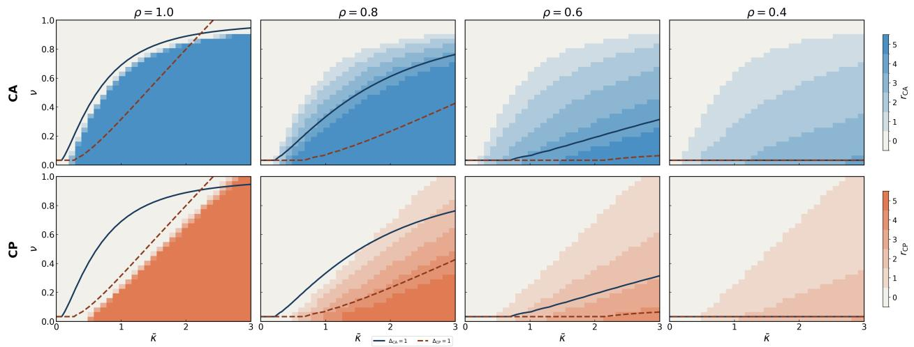  
Figure 7: Partial recovery under heterogeneous signal spectra. Empirical recovery count r (number of signal directions with squared projection $\geq 0 . 8$ onto the top-k recovered subspace) across the $( \bar { \kappa } , \nu )$ plane, for signal spread $\rho \in \{ 1 . 0 , 0 . 8 , 0 . 6 , 0 . 4 \}$ (columns, homogeneous → heterogeneous). (Top): CA. (Bottom): CP. Signal strengths follow a geometric decay $\kappa _ { i } = \bar { \kappa } \rho ^ { i - 1 }$ with $k = 5 , d = 2 0 ;$ noise parameters $\gamma _ { x } = 1$ , $\gamma _ { y } = 0 . 0 5 , \tilde { \gamma } _ { y } = 5$ . Overlaid curves: $\Delta _ { \mathrm { C A } } = 1$ (solid) and $\Delta _ { \mathrm { C P } } = 1$ (dashed) from the homogeneous theory of figure 2. At $\rho = 1$ the transition is sharp $( r \in \{ 0 , k \} )$ and the $\Delta = 1$ contours align with the empirical boundary, reproducing figure 2. As $\rho$ decreases, intermediate counts $r \in \{ 1 , \ldots , k - 1 \}$ fill a widening band in which stronger signal directions are recovered first; the four-region phase diagram smears into a graded continuum. Averaged over 10 seeds with $n = 5 { , } 0 0 0$ .

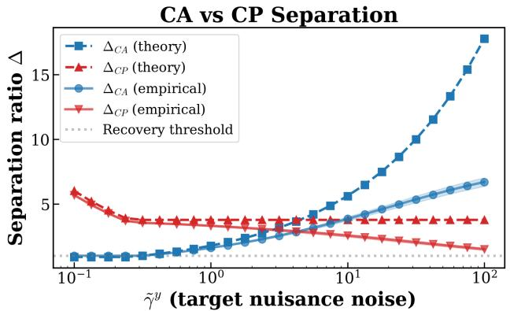

line chart

| γ̃^y (target nuisance noise) | Δ_CA (theory) | Δ_CP (theory) | Δ_CA (empirical) | Δ_CP (empirical) |
| ---------------------------- | ------------- | ------------- | ---------------- | ---------------- |
| 0.1                          | ~1.5          | ~6.0          | ~1.5             | ~1.5             |
| 1.0                          | ~2.0          | ~4.0          | ~2.0             | ~2.0             |
| 10.0                         | ~5.0          | ~4.0          | ~4.0             | ~3.0             |
| 100.0                        | ~18.0         | ~4.0          | ~7.0             | ~2.0             |

Figure 8: Separation ratios $\Delta _ { \mathrm { C A } }$ and $\Delta _ { \mathrm { C P } }$ as a function of target nuisance variance $\tilde { \gamma } ^ { y } ,$ , validating Proposition 3.1. Theory curves (dashed) are computed from the closed-form expressions in Theorems A.1 and A.2; empirical curves (solid) are estimated from finite-sample covariances averaged over 20 random rotations. As $\tilde { \gamma } ^ { y }$ grows, $\Delta _ { \mathrm { C A } }$ increases unboundedly — CA’s symmetric whitening suppresses high-variance nuisance on both sides — while $\Delta _ { \mathrm { C P } }$ remains approximately constant, since $\xi _ { j } = \eta _ { j } / \sqrt { \tilde { \gamma } _ { j } ^ { x } }$ does not depend on target nuisance variance: source-side whitening operates only on the source modality. Theory and empirical curves are in close agreement throughout, confirming the accuracy of the closed-form predictions at finite sample sizes.

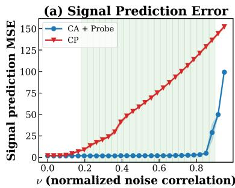

line chart

| ν (normalized noise correlation) | CA + Probe | CP   |
| --------------------------------- | ---------- | ---- |
| 0.0                               | 0          | 0    |
| 0.2                               | 0          | 10   |
| 0.4                               | 0          | 40   |
| 0.6                               | 0          | 80   |
| 0.8                               | 0          | 120  |
| 0.9                               | 100        | 150  |

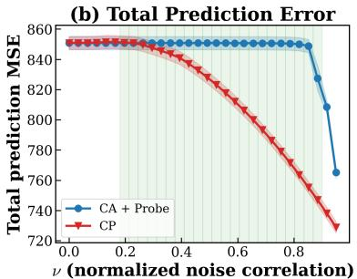

line chart

| ν (normalized noise correlation) | CA + Probe | CP    |
| --------------------------------- | ---------- | ----- |
| 0.0                               | 850        | 850   |
| 0.2                               | 850        | 845   |
| 0.4                               | 850        | 830   |
| 0.6                               | 850        | 810   |
| 0.8                               | 850        | 790   |
| 1.0                               | 765        | 730   |

Figure 9: The variance trap: signal recovery vs. reconstruction quality for CA+Probe and direct CP, using the same parameter regime as Figure 3 $( \kappa = ( 3 . 0 , 2 . 0 , 1 . 5 )$ , $\tilde { \gamma } ^ { y } = 5 0 . 0 , \tilde { \gamma } ^ { x } = 1 . 0 )$ . Green shading marks the regime where $\Delta _ { \mathrm { C A } } > 1 > \Delta _ { \mathrm { C P } }$ . (a) Signal prediction MSE: in the green region, CA+Probe achieves near-zero signal MSE while CP’s signal error climbs steeply, confirming that CP encodes the wrong subspace. (b) Total prediction MSE: CP achieves lower total MSE than CA+Probe across the same region, because it successfully reconstructs the high-variance nuisance components — a task at which CA+Probe, having discarded nuisance directions, cannot compete. Together, the two panels illustrate the core danger of using reconstruction error as a proxy for signal recovery: CP can achieve lower loss than CA while failing to recover the signal, precisely because the MSE objective does not distinguish signal from nuisance.

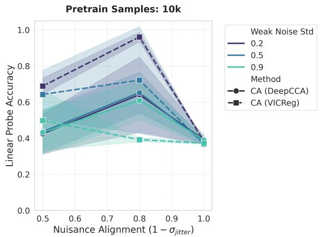

line chart

| Nuisance Alignment (1 - σ_jitter) | CA (DeepCCA) | CA (VICReg) |
| --------------------------------- | ------------ | ----------- |
| 0.5                               | 0.43         | 0.70        |
| 0.8                               | 0.65         | 0.98        |
| 1.0                               | 0.38         | 0.38        |

(a) dSprites

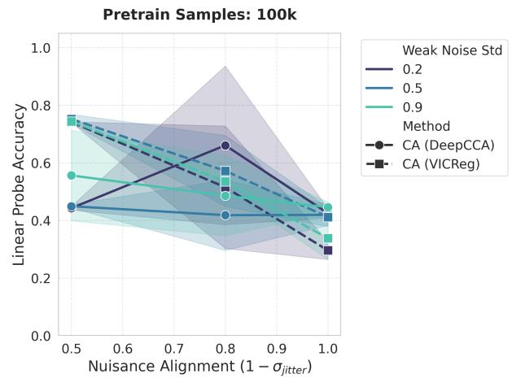

line chart

| Nuisance Alignment (1 - σ_jitter) | CA (DeepCCA) | CA (VICReg) |
| --------------------------------- | ------------ | ----------- |
| 0.5                               | 0.45         | 0.75        |
| 0.8                               | 0.65         | 0.50        |
| 1.0                               | 0.45         | 0.30        |

(b) Shape3D  
Figure 10: Comparison between VICReg and DeepCCA for dSprites and Shape3D experiments

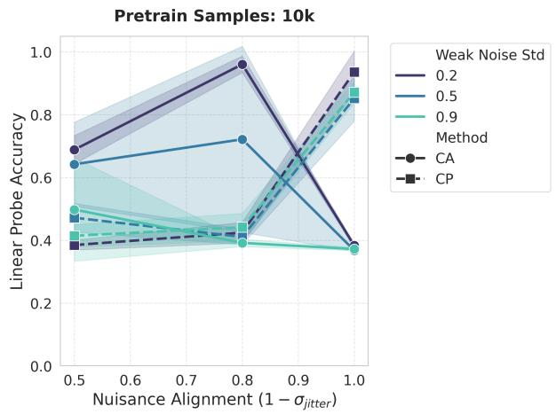

line chart

| Nuisance Alignment (1 - σ_jitter) | CA (Weak Noise Std) | CA (CP) | CA (Weak Noise Std) | CA (CP) | CA (Weak Noise Std) | CA (CP) | CA (Weak Noise Std) |
| --------------------------------- | ------------------- | ------- | ------------------- | ------- | ------------------- | ------- | ------------------- |
| 0.5                               | 0.68                | 0.48    | 0.64                | 0.48    | 0.48                | 0.40    | 0.40                |
| 0.8                               | 0.96                | 0.42    | 0.72                | 0.42    | 0.42                | 0.42    | 0.42                |
| 1.0                               | 0.38                | 0.38    | 0.38                | 0.38    | 0.38                | 0.38    | 0.38                |

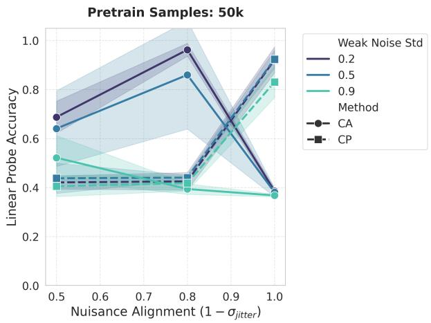

line chart

| Nuisance Alignment (1 - σ_jitter) | CA (Weak Noise Std 0.2) | CA (Weak Noise Std 0.5) | CA (Weak Noise Std 0.9) | CP (Weak Noise Std 0.2) | CP (Weak Noise Std 0.5) | CP (Weak Noise Std 0.9) |
| --------------------------------- | ------------------------ | ------------------------ | ------------------------ | ------------------------ | ------------------------ | ------------------------ |
| 0.5                               | 0.68                     | 0.64                     | 0.52                     | 0.44                     | 0.44                     | 0.42                     |
| 0.8                               | 0.96                     | 0.87                     | 0.40                     | 0.44                     | 0.44                     | 0.42                     |
| 1.0                               | 0.38                     | 0.92                     | 0.38                     | 0.38                     | 0.84                     | 0.84                     |

Figure 11: Stereo-dSprites accuracy vs. nuisance alignment at 10k (Left) and 50k (Right) pretraining samples. The CA–CP crossover from Figure 4 persists across dataset scales.

Signal vs nuisance spectra underlying the regime predictions  
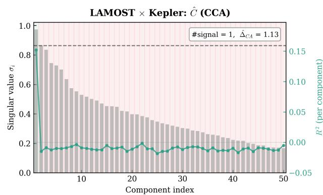

bar-line hybrid chart

| Component index | Singular value σi | R² (per component) |
| --------------- | ----------------- | ------------------ |
| 0               | 1.0               | 0.8                |
| 5               | 0.85              | 0.1                |
| 10              | 0.65              | 0.05               |
| 15              | 0.55              | 0.0                |
| 20              | 0.45              | -0.05              |
| 25              | 0.4               | -0.05              |
| 30              | 0.35              | -0.05              |
| 35              | 0.3               | -0.05              |
| 40              | 0.25              | -0.05              |
| 45              | 0.2               | -0.05              |
| 50              | 0.15              | -0.05              |

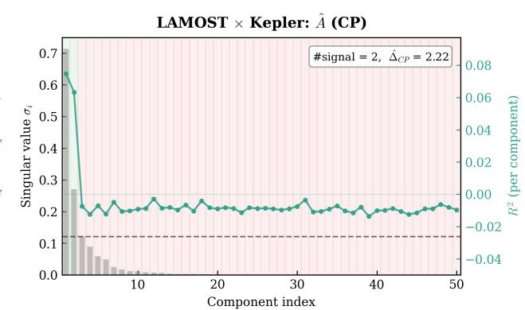

line chart

| Component index | Singular value σ₁ | R² (per component) |
| --------------- | ----------------- | ------------------ |
| 1               | 0.7               | 0.08               |
| 2               | 0.6               | 0.06               |
| 3               | 0.2               | -0.02              |
| 4               | 0.2               | -0.02              |
| 5               | 0.2               | -0.02              |
| 6               | 0.2               | -0.02              |
| 7               | 0.2               | -0.02              |
| 8               | 0.2               | -0.02              |
| 9               | 0.2               | -0.02              |
| 10              | 0.2               | -0.02              |
| 11              | 0.2               | -0.02              |
| 12              | 0.2               | -0.02              |
| 13              | 0.2               | -0.02              |
| 14              | 0.2               | -0.02              |
| 15              | 0.2               | -0.02              |
| 16              | 0.2               | -0.02              |
| 17              | 0.2               | -0.02              |
| 18              | 0.2               | -0.02              |
| 19              | 0.2               | -0.02              |
| 20              | 0.2               | -0.02              |
| 21              | 0.2               | -0.02              |
| 22              | 0.2               | -0.02              |
| 23              | 0.2               | -0.02              |
| 24              | 0.2               | -0.02              |
| 25              | 0.2               | -0.02              |
| 26              | 0.2               | -0.02              |
| 27              | 0.2               | -0.02              |
| 28              | 0.2               | -0.02              |
| 29              | 0.2               | -0.02              |
| 30              | 0.2               | -0.02              |
| 31              | 0.2               | -0.02              |
| 32              | 0.2               | -0.02              |
| 33              | 0.2               | -0.02              |
| 34              | 0.2               | -0.02              |
| 35              | 0.2               | -0.02              |
| 36              | 0.2               | -0.02              |
| 37              | 0.2               | -0.02              |
| 38              | 0.2               | -0.02              |
| 39              | 0.2               | -0.02              |
| 40              | 0.2               | -0.02              |
| 41              | 0.2               | -0.02              |
| 42              | 0.2               | -0.02              |
| 43              | 0.2               | -0.02              |
| 44              | 0.2               | -0.02              |
| 45              | 0.2               | -0.02              |
| 46              | 0.2               | -0.02              |
| 47              | 0.2               | -0.02              |
| 48              | 0.2               | -0.02              |
| 49              | 0.2               | -0.02              |
| 50              | 0.2               | -0.02              |

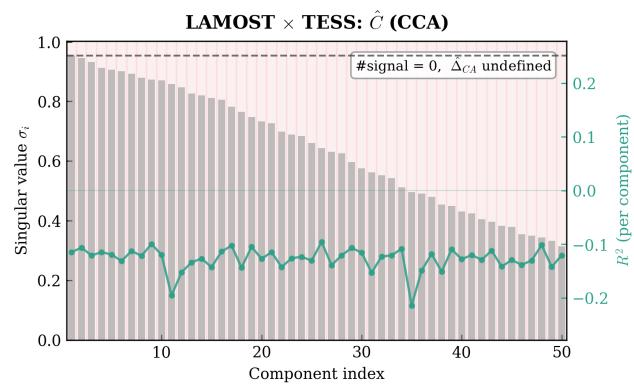

bar-line hybrid chart

LAMOST × TESS: Ĉ (CCA)
| Component index | Singular value σi | R² (per component) |
| :--- | :--- | :--- |
| 1 | 0.95 | 0.2 |
| 2 | 0.94 | 0.18 |
| 3 | 0.93 | 0.17 |
| 4 | 0.92 | 0.16 |
| 5 | 0.91 | 0.15 |
| 6 | 0.90 | 0.14 |
| 7 | 0.89 | 0.13 |
| 8 | 0.88 | 0.12 |
| 9 | 0.87 | 0.11 |
| 10 | 0.86 | 0.10 |
| 11 | 0.85 | 0.09 |
| 12 | 0.84 | 0.08 |
| 13 | 0.83 | 0.07 |
| 14 | 0.82 | 0.06 |
| 15 | 0.81 | 0.05 |
| 16 | 0.80 | 0.04 |
| 17 | 0.79 | 0.03 |
| 18 | 0.78 | 0.02 |
| 19 | 0.77 | 0.01 |
| 20 | 0.76 | 0.00 |
| 21 | 0.75 | -0.01 |
| 22 | 0.74 | -0.02 |
| 23 | 0.73 | -0.03 |
| 24 | 0.72 | -0.04 |
| 25 | 0.71 | -0.05 |
| 26 | 0.70 | -0.06 |
| 27 | 0.69 | -0.07 |
| 28 | 0.68 | -0.08 |
| 29 | 0.67 | -0.09 |
| 30 | 0.66 | -0.1 |
| 31 | 0.65 | -0.11 |
| 32 | 0.64 | -0.12 |
| 33 | 0.63 | -0.13 |
| 34 | 0.62 | -0.14 |
| 35 | 0.61 | -0.15 |
| 36 | 0.60 | -0.16 |
| 37 | 0.59 | -0.17 |
| 38 | 0.58 | -0.18 |
| 39 | 0.57 | -0.19 |
| 40 | 0.56 | -0.2 |
| 41 | 0.55 | -0.21 |
| 42 | 0.54 | -0.22 |
| 43 | 0.53 | -0.23 |
| 44 | 0.52 | -0.24 |
| 45 | 0.51 | -0.25 |
| 46 | 0.50 | -0.26 |
| 47 | 0.49 | -0.27 |
| 48 | 0.48 | -0.28 |
| 49 | 0.47 | -0.29 |
| 50 | 0.46 | -0.3 |
#signal = 0, ΔCA undefined

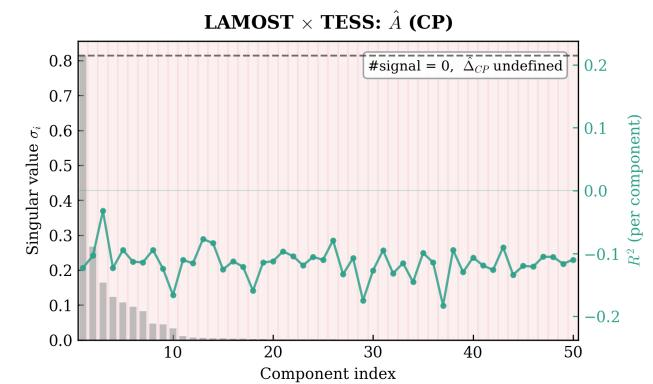

line chart

| Component index | Singular value σi | R² (per component) |
| --------------- | ----------------- | ------------------ |
| 1               | 0.2               | -0.1               |
| 2               | 0.25              | -0.05              |
| 3               | 0.3               | 0.0                |
| 4               | 0.2               | -0.05              |
| 5               | 0.15              | -0.1               |
| 6               | 0.1               | -0.15              |
| 7               | 0.05              | -0.2               |
| 8               | 0.0               | -0.15              |
| 9               | 0.05              | -0.1               |
| 10              | 0.1               | -0.05              |
| 11              | 0.2               | 0.0                |
| 12              | 0.25              | 0.05               |
| 13              | 0.3               | 0.1                |
| 14              | 0.2               | -0.05              |
| 15              | 0.15              | -0.1               |
| 16              | 0.2               | -0.05              |
| 17              | 0.25              | 0.0                |
| 18              | 0.3               | 0.05               |
| 19              | 0.2               | -0.1               |
| 20              | 0.15              | -0.15              |
| 21              | 0.2               | -0.1               |
| 22              | 0.25              | -0.05              |
| 23              | 0.3               | 0.0                |
| 24              | 0.2               | -0.05              |
| 25              | 0.15              | -0.1               |
| 26              | 0.2               | -0.05              |
| 27              | 0.25              | 0.0                |
| 28              | 0.3               | 0.05               |
| 29              | 0.2               | -0.1               |
| 30              | 0.15              | -0.15              |
| 31              | 0.2               | -0.1               |
| 32              | 0.25              | -0.05              |
| 33              | 0.3               | 0.0                |
| 34              | 0.2               | -0.05              |
| 35              | 0.15              | -0.1               |
| 36              | 0.2               | -0.15              |
| 37              | 0.25              | -0.1               |
| 38              | 0.3               | -0.05              |
| 39              | 0.2               | -0.1               |
| 40              | 0.15              | -0.15              |
| 41              | 0.2               | -0.1               |
| 42              | 0.25              | -0.05              |
| 43              | 0.3               | 0.0                |
| 44              | 0.2               | -0.1               |
| 45              | 0.15              | -0.15              |
| 46              | 0.2               | -0.1               |
| 47              | 0.25              | -0.05              |
| 48              | 0.3               | 0.0                |
| 49              | 0.2               | -0.1               |
| 50              | 0.15              | -0.15              |

Signal Nuisance Per-component R²---: Nuisance floor

Figure 12: Signal–nuisance decomposition underlying the regime predictions of Table 1. Each panel shows the sorted singular values (gray bars, left axis) and per-component $R ^ { 2 }$ against log g (teal line, right axis) used by Algorithm 1 to classify components as signal (green shading) or nuisance (red shading). Dashed horizontal line: nuisance floor $\operatorname* { m a x } _ { j } \hat { \nu } _ { j }$ (CCA panels) or $\operatorname* { m a x } _ { j } \hat { \xi } _ { j } \ ( \mathbf { A } { \cdot } \mathrm { S V D }$ panels); $\hat { \Delta } > 1$ iff every classified signal singular value exceeds the nuisance floor. (Top): LAMOST × Kepler — both decompositions have signal components above the nuisance floor $( \hat { \Delta _ { \mathrm { C A } } } = 1 . 1 3 , \ \hat { \Delta _ { \mathrm { C P } } } = 2 . 2 2 ;$ Both regime). (Bottom): $\mathrm { L A M O S T } \times \mathrm { T E S S } - \mathrm { n o }$ CCA component predicts log g above noise $( R ^ { 2 } \approx 0$ across all components, zero signal detected); the A-SVD has one candidate signal component but below the nuisance floor. Both ratios fall below one (Neither regime). The contrast between the two rows — same LAMOST encoder, same protocol, different photometric instrument — shows that instrument quality determines the signal–nuisance separation and hence the regime placement.