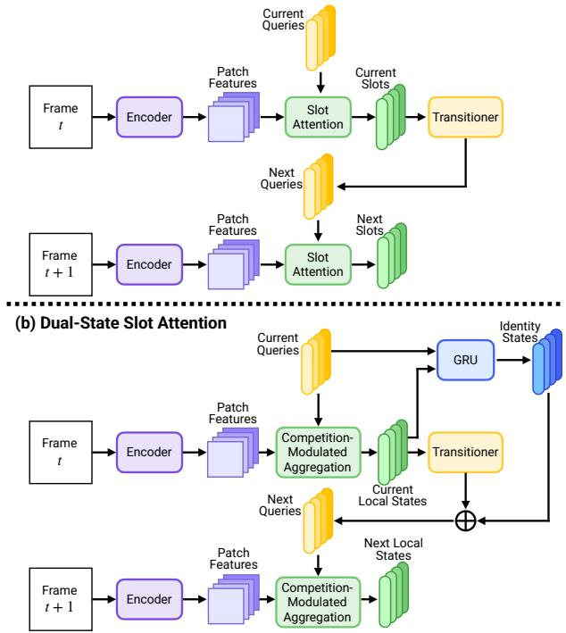
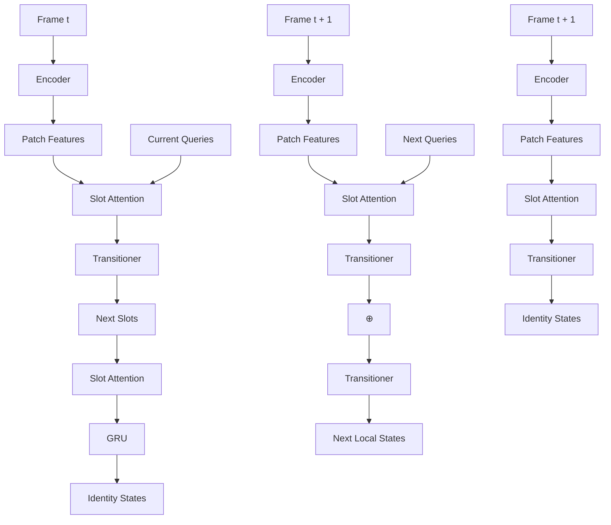
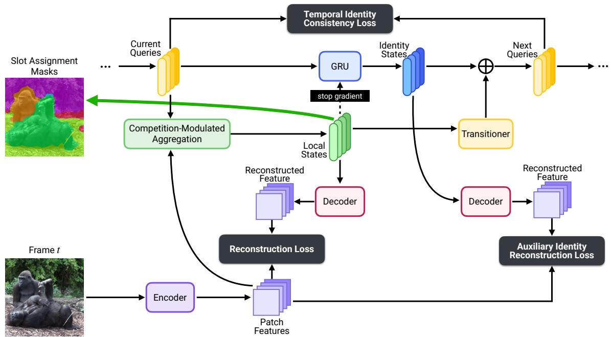
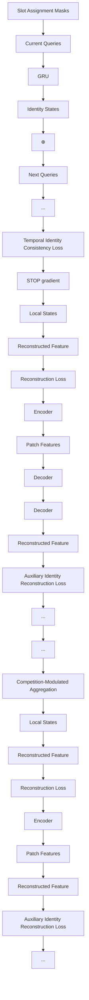
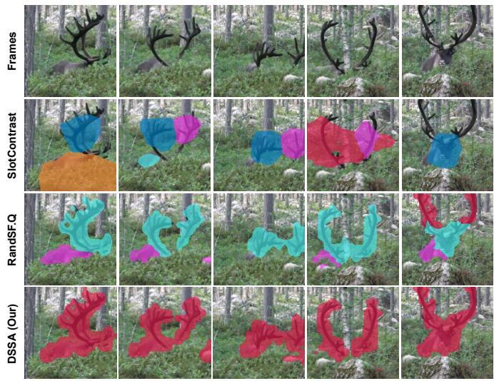
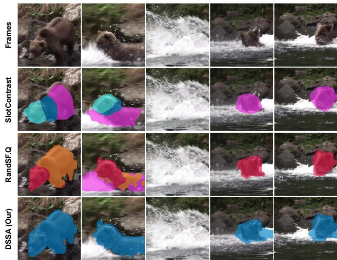
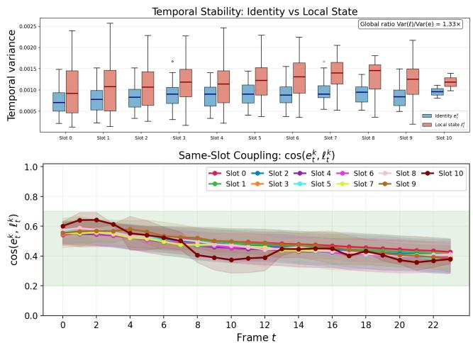
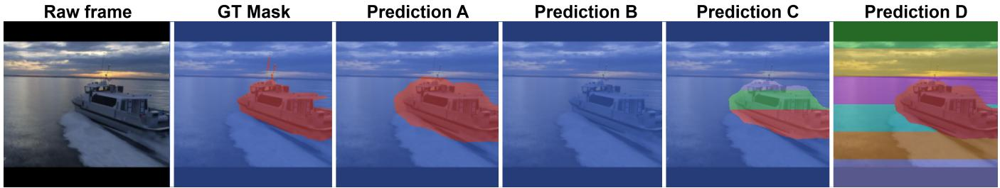
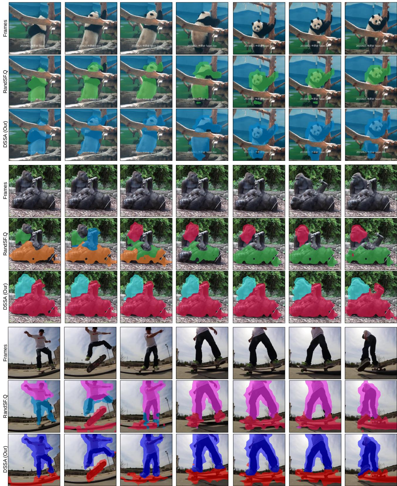
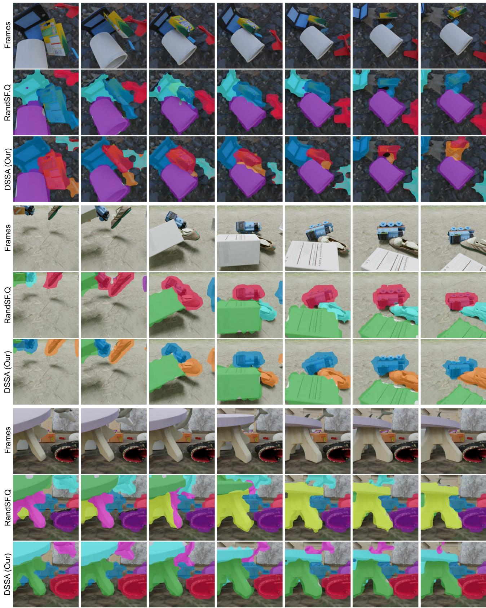

# Dual-State Slot Attention: Decoupling Appearance and Identity for Video Object-Centric Learning

Sieu Tran\*, Duc Nguyen\*, Hao Vo, Khoa Vo, Ngan Le

University of Arkansas

Fayetteville, AR, USA

{stran5,dnguyen3,haov,khoavoho,thile}@uark.edu

## Abstract

Unsupervised video object-centric learning aims to decompose dynamic scenes into persistent, object-level representations without supervision. However, existing slot-based methods struggle to maintain stable object identity in challenging settings such as rapid motion and partial occlusion. First, they typically encode both the per-frame appearance of an object and its identity across frames in a single slot vector, creating an objective conflict that leads to slot swapping: reconstruction requires sensitivity to transient visual changes, whereas temporal consistency requires invariance to them. Second, the token renormalization used in Slot Attention can amplify weakly attending slots, allowing them to absorb tokens from other objects and destabilize slot-to-object correspondence. We propose Dual-State Slot Attention (DSSA), a fully self-supervised framework that addresses these limitations by separating appearance from identity and by reducing spurious updates from weakly matching slots. DSSA decomposes each slot into a local state for per-frame appearance and an identity state for temporally stable object information, thereby aligning reconstruction and temporal consistency with separate representations. The identity state is updated through a learned recurrent transition that acts as a temporal filter on the local state, while competition-modulated aggregation (CMA) down-weights updates from weakly matching slots and prevents them from absorbing tokens from other objects. Experiments on MOVi-C, MOVi-D, and YouTube-VIS demonstrate that DSSA consistently improves segmentation quality and temporal consistency over prior methods, while also yielding stronger downstream object recognition and video dynamics prediction. Code and models will be released.

## CCS Concepts

• Computing methodologies → Computer vision representations.

## Keywords

Dual-State Slot Attention, Object-Centric Learning, Self-Supervised Learning, Temporal Consistency

## 1 Introduction

Humans perceive the visual world as a structured collection of discrete objects, each with its own properties and persistent identity. Object-centric learning (OCL) [1, 4, 6, 12, 21] aims to endow neural networks with a similar capacity: decomposing a visual scene into modular, object-level representations without object-level supervision. This objective is motivated by a long-standing view in cognitive science and artificial intelligence: structured, compositional representations of discrete entities, rather than holistic feature maps, are fundamental to robust reasoning, scene understanding, and generalization to novel environments [2, 6, 7, 13, 18, 20, 22, 27, 32]. Slot-based models [21, 25] operationalize this idea by encoding a scene into a small set of latent vectors called slots, where each slot competes with others to attend to different spatial regions and jointly reconstruct the scene. On static image benchmarks, slot attention [3, 16, 25, 30, 35] has demonstrated convincing unsupervised object discovery and has emerged as a dominant approach to OCL.

(a) Previous Video Slot Attention  

flowchart

Figure 1: Comparison of video object-centric learning (OCL) approaches. (a) Prior video-based Slot Attention methods encode both appearance and identity within a single slot vector, causing reconstruction and temporal consistency to compete over a shared representation. (b) Our proposed DSSA assigns each slot a dedicated local state for per-frame reconstruction and an identity state for temporally stable object tracking, resolving this conflict by design.

Extending slot-based OCL from images to video is a natural next step, as temporal signals provide rich cues for reinforcing persistent object identities across frames[1, 8, 14, 15, 17]. However, video introduces a challenge absent in the static image setting: a slot must capture not just what an object looks like in the current frame, but also which object it corresponds to over time.

While object appearance may vary substantially due to motion, deformation, viewpoint, or illumination, object identity must remain stable despite such changes. Prior video OCL methods have addressed this challenge through temporal propagation mechanisms – such as recurrence, cross-frame attention, or learned slot transitions [8, 17, 23, 26, 29, 33] – and have demonstrated meaningful progress in tracking objects across frames. Building on these advances, we examine two structural aspects of existing slot-based video OCL that may contribute to remaining difficulties in maintaining stable object identity over time.

The first aspect is the presentational conflict arising from a shared representational choice: appearance and identity are encoded within a single latent vector per slot, as illustrated in Figure 1(a). This creates an inherent tension: reconstruction encourages sensitivity to transient per-frame appearance cues, while temporal consistency encourages insensitivity to them. Optimizing both objectives within a single representation leads to a conflicting optimization landscape; in practice, slots have been observed to track volatile appearance changes rather than maintain stable object identity, a phenomenon commonly referred to as slot swapping [8, 33], which becomes more pronounced under rapid motion or partial occlusion. The second aspect is the renormalization artifact inherent in the slot attention mechanism itself. After computing competitive attention, the standard mechanism renormalizes weights across tokens. While effective for static images, this can have unintended effects in dynamic videos: when an object becomes occluded or moves abruptly, its corresponding slot attends weakly, yet renormalization inadvertently amplifies these weak signals, forcing the slot to capture tokens belonging to other entities and disrupting slot-to-object correspondence.

Motivated by these observations, we propose Dual-State Slot Attention (DSSA), a framework that addresses these structural limitations at both the representational and mechanistic levels, as illustrated in Figure 1(b). First, to resolve the objective conflict, DSSA equips each slot with two dedicated representations: a local state which interacts directly with frame tokens and captures frame-specific appearance for reconstruction, and an identity state which is updated through a learned recurrent transition to accumulate temporally stable object information. This recurrent update acts as a temporal filter that distills persistent object characteristics while suppressing frame-specific appearance variation. An auxiliary identity reconstruction loss further reinforces identity stability. This explicit factorization aligns reconstruction and temporal consistency with dedicated representations, eliminating the structural compromise inherent in single-vector models. Second, to mitigate the renormalization artifact, DSSA introduces competition-modulated aggregation (CMA). Instead of treating all renormalized slot-token assignments equally, this mechanism scales each slot’s aggregated representation by its competitive attention strength. As a result, slots with low competitive confidence effectively remain “silent” when no matching object is present, rather than being artificially amplified through token renormalization. At the same time, slots with strong competitive support retain the benefits of balanced aggregation while preserving balanced activation for strongly competing slots.

We evaluate DSSA on standard video OCL benchmarks spanning both synthetic and real-world datasets. DSSA achieves state-ofthe-art performance relative to prior methods, including SlotContrast [23] and RandSF.Q [34], with significant gains in segmentation quality (e.g., +3.7 points FG-ARI on MOVi-D and +9.7 points on YouTube-VIS) and tracking stability across MOVi-C, MOVi-D, and YouTube-VIS. DSSA also demonstrates superior performance on downstream object recognition and video dynamics prediction. Ablation studies suggest that each component contributes independently to the observed gains, pointing to the efficacy of separating appearance and identity at the architectural root.

## 2 Related Work

## 2.1 Image Object-Centric Learning (OCL)

The foundations of slot-based OCL were established by generative models such as MONet [4], IODINE [12], and GENESIS [9], that decompose scenes into per-object representations via iterative inference. Slot Attention [21] significantly simplified and unified this paradigm with a single differentiable module: ?? slot vectors compete to attend to image tokens via a softmax normalized over slots, and the resulting attended values are then renormalized over tokens before updating each slot. This double-normalization is deliberate—the first softmax induces competition between slots, while the second normalization over tokens encourages each slot to receive a balanced share of the input, preventing any single slot from monopolizing all tokens. Together, these two operations form the core inductive bias for unsupervised object discovery and have become the standard design in the field. Early slot-based methods trained with pixel reconstruction objectives were largely limited to synthetic datasets. Later, [25] overcame this by replacing pixel targets with features from a frozen self-supervised ViT, demonstrating that slot-based discovery can scale to real-world images like COCO [19]. Recently, SPOT [16] further refined this with a student-teacher scheme. These advances establish the feature reconstruction objective that has since become the dominant training signal in video OCL, and they characterize the standard slot attention mechanism whose behavior in dynamic settings we revisit in this paper. When slots are propagated across video frames, new demands arise: a slot must not only explain the current frame, but also maintain a consistent identity over time. DSSA revisits the standard slot formulation under this temporal setting and finds that both the single-vector slot representation and the token-level renormalization of Slot Attention introduce structural instabilities in video – motivating a dual-state slot representation and a modified aggregation mechanism, described in Section 3.

## 2.2 Video Object-Centric Learning

Extending slot-based OCL to video introduces a requirement absent from the image setting: each slot must maintain a consistent object identity across frames despite appearance changes. The dominant approach has been to propagate slot representations recurrently. SAVi [17] used optical flow as a self-supervised target, while SAVi++ [8] scaled this to real-world driving scenes. STEVE [26] and SlotFormer [29] leveraged transformer-based dynamics to predict future slot states, demonstrating that structured representations support complex downstream tasks. More recent work has improved temporal consistency through stronger training signals and better transition modules. VideoSAUR [33] introduced a temporal similarity loss that encodes both semantic and motion information by training the model to predict patch-level feature similarities to a future frame, scaling slot-based discovery to diverse, unconstrained real-world videos. SlotContrast [23] introduced an object-level contrastive loss between slots of successive frames to explicitly enforce temporal consistency, yielding substantial improvements across synthetic and real-world benchmarks. RandSF.Q [34] further addressed limitations in the transition module by incorporating next-frame features into query prediction and training the transitioner on randomly sampled slot-feature pairs to better learn transition dynamics, achieving state-of-the-art performance on real-world video benchmarks.

flowchart

Figure 2: Overview of Dual-State Slot Attention (DSSA). At each frame, a frozen encoder extracts patch features, from which competition-modulated aggregation (CMA) produces local states, while slot assignment masks are derived from the slot-token attention assignments. The local states encode frame-specific appearance information, whereas identity states retain temporally stable object information distilled from the local states through a stop-gradient GRU. Combined with the transitioner output, these identity states form the next-frame queries. By separating local appearance from persistent identity, DSSA assigns frame-specific appearance and temporally stable object information to different latent states. Training uses reconstruction, auxiliary identity reconstruction, and temporal identity consistency losses.

Despite these advances, all of these methods retain the singlevector slot design, in which one representation must simultaneously support per-frame appearance reconstruction and temporally consistent object identity—two objectives that impose conflicting pressures on the same vector. The principle that stable identity and transient appearance should be represented separately is well-established in the broader literature: slow feature analysis [28] formalizes that identity-level features vary more slowly than appearance-level features, a concept exploited by slow-fast architectures [10] in video understanding. In object tracking, separating an appearance descriptor from a persistent identity embedding is standard practice. Yet this separation has not been applied to unsupervised slot-based OCL, where a single vector per slot is universally used.

A further structural issue lies in the token-level renormalization of Slot Attention [21], which we show introduces instabilities when slots are propagated across frames. We analyze this mechanism in detail in Section 3.2 and refer to its failure mode as the renormalization artifact. DSSA addresses both issues at the architectural level by decomposing each propagated slot into a local state for frame-specific appearance and an identity state for temporally persistent object information, and introducing CMA to resolve the renormalization artifact, as described in Section 3.

## 3 Methodology

## 3.1 Overview

DSSA processes a video clip frame-by-frame by maintaining two dedicated representations for each of the ?? slots: a local state $\ell _ { t } ^ { k } \in \mathbb { R } ^ { d }$ , which encodes per-frame appearance, and an identity state $e _ { t } ^ { k } \in \mathbb { R } ^ { d }$ , which accumulates a temporally stable object description, where $k \in \{ 1 , \ldots , K \}$ indexes the slot and ?? indexes the timestep. Rather than encoding both objectives within a single vector, DSSA assigns each a dedicated gradient path: the local state is optimized exclusively by a reconstruction objective $\scriptstyle ( { \mathcal { L } } _ { \mathrm { r e c o n } } )$ , while the identity state is optimized by a contrastive consistency objective $( \mathcal { L } _ { \mathrm { i d } } )$ and an auxiliary reconstruction signal $( \mathcal { L } _ { \mathrm { a u x } } )$ .

At each timestep ??, the model operates in three stages. First, a frozen DINO encoder extracts patch tokens $X _ { t }$ from frame $I _ { t }$ . Second, the spatial transitioner $\mathcal { T }$ adapts the previous local state to the current frame; the result is combined with the previous identity state to form the slot query, and CMA produces the updated local state $\ell _ { t } ^ { k }$ . Third, the identity state $e _ { t } ^ { k }$ is updated from the recently updated local state $\ell _ { t } ^ { k }$ via a GRU, with a stop-gradient on $\ell _ { t } ^ { k }$ ensuring that no gradient from the identity objectives flows back into the local state. The full pipeline is illustrated in Figure 2.

## 3.2 Slot Attention: Revisit and Motivation

Slot Attention [21] maps a set of input token features $X = [ x _ { 1 } , \ldots , x _ { N } ] ^ { \top } ~ .$ ∈ $\mathbb { R } ^ { N \times d }$ to ?? object-centric latent vectors, called slots, through iterative cross-attention. Here, $x _ { n } \in \mathbb { R } ^ { d }$ denotes the feature of the ??-th token. $\{ s ^ { k } \} _ { k = 1 } ^ { K } ,$ $s ^ { k } \in \mathbb { R } ^ { d }$ iteration, Slot Attention computes a query vector $q ^ { k } = W _ { q } s ^ { k } \in \mathbb { R } ^ { d }$ for slot ??, and key and value vectors $k _ { n } = W _ { k } x _ { n } \in \mathbb { R } ^ { d }$ and $\ v _ { n } \ =$ $W _ { v } x _ { n } \in \mathbb { R } ^ { d }$ for token ??, where $W _ { q } , W _ { k }$ , and $W _ { v }$ are learned linear projections. The first normalization step enforces competition across slots for each token:

$$
a _ {0} ^ {k} [ n ] = \frac {\exp \left(\frac {1}{\sqrt {d}} \left(q ^ {k}\right) ^ {\top} k _ {n}\right)}{\sum_ {k ^ {\prime}} \exp \left(\frac {1}{\sqrt {d}} \left(q ^ {k ^ {\prime}}\right) ^ {\top} k _ {n}\right)}, \quad \sum_ {k} a _ {0} ^ {k} [ n ] = 1 \forall n, \tag {1}
$$

where $a _ { 0 } ^ { k } [ n ]$ is the raw competitive attention assigned by slot ?? to token $n ,$ and $k ^ { \prime }$ is a dummy index over slots. Thus, for each token, Eq. (1) produces a distribution over slots that reflects how strongly each slot claims that token. Slot Attention then performs a second normalization over tokens for each slot:

$$
a ^ {k} [ n ] = \frac {a _ {0} ^ {k} [ n ]}{\sum_ {n ^ {\prime}} a _ {0} ^ {k} [ n ^ {\prime} ] + \epsilon}, \tag {2}
$$

where $n ^ { \prime }$ is a dummy index over tokens and $\epsilon > 0$ is a small constant for numerical stability. Using these renormalized weights, the aggregated input to slot ?? is computed as $\begin{array} { r } { u ^ { k } = \sum _ { n = 1 } ^ { N } a ^ { k } [ n ] v _ { n } \ \in \ \mathbb { R } ^ { d } } \end{array}$ , where $u ^ { k }$ is the token-aggregated update for slot ??.

(a) Slot Competitive Attention Map a k 0[n] (Eq.1)

<table><tr><td></td><td>token1</td><td>token2</td><td>token3</td><td>token4</td><td>token5</td></tr><tr><td>Slot 1</td><td>0.950</td><td>0.930</td><td>0.900</td><td>0.920</td><td>0.910</td></tr><tr><td>Slot 2</td><td>0.050</td><td>0.070</td><td>0.100</td><td>0.080</td><td>0.090</td></tr><tr><td colspan="6">strong competition: tokens assigned to dominant slot</td></tr></table>

(b) Renormalized a k [n] (Eq.2)

<table><tr><td></td><td>token1</td><td>token2</td><td>token3</td><td>token4</td><td>token5</td></tr><tr><td>Slot 1</td><td>0.206</td><td>0.202</td><td>0.195</td><td>0.200</td><td>0.197</td></tr><tr><td>Slot 2</td><td>0.128</td><td>0.179</td><td>0.256</td><td>0.205</td><td>0.231</td></tr><tr><td colspan="6">artifact: renormalization removes competition across slots</td></tr></table>

(c) Our competition-modulated aggregation (Eq.6)

<table><tr><td></td><td>token1</td><td>token2</td><td>token3</td><td>token4</td><td>token5</td></tr><tr><td>Slot 1</td><td>0.196</td><td>0.188</td><td>0.176</td><td>0.184</td><td>0.180</td></tr><tr><td>Slot 2</td><td>0.006</td><td>0.013</td><td>0.026</td><td>0.016</td><td>0.021</td></tr><tr><td colspan="6">restores competition and suppresses inactive slots</td></tr></table>

Figure 3: Analysis of Slot Attention Aggregation Weights. (a) Raw competitive attention $a _ { 0 } ^ { k } [ n ]$ : Slot 1 is dominant. (b) Renormalized weights $a ^ { k } [ n ]$ : Slot 2 is amplified to match Slot 1, erasing cross-slot competition. (c) Our CMA preserves the original dominance structure.

This double normalization is designed to ensure balanced token coverage in static images. However, as illustrated in Figure $^ { 3 , }$ it introduces a significant artifact in dynamic scenarios. In Figure 3 (a), Slot 1 correctly dominates the attention for all tokens, while Slot 2 (representing an inactive or occluded object) receives very low raw scores (e.g., 0.050). However, the renormalization in Eq. (2) effectively removes this slot competitive information. As shown in Figure 3 (b), because the sum of weights for Slot 2 is small, the division operation amplifies these weak signals, making Slot 2 appear as active as Slot $1 \ ( 0 . 1 2 8 \approx 0 . 1 9 4 )$ . In video sequences, when an object becomes temporarily occluded, its corresponding slot will receive uniformly weak competitive scores. Standard Slot Attention will then “rescale” these weak signals, causing the slot to absorb tokens that actually belong to other objects or the background. This effect accumulates over time, leading to a loss of slot-to-object consistency. We address this by introducing a CMA described in Section 3.4, which successfully suppresses inactive slots and preserves identity, as shown in Figure 3 (c).

## 3.3 Feature Extraction

At timestep ?? , a frozen Vision Transformer (ViT) pretrained with DINO [5] maps frame $I _ { t }$ to ?? patch tokens:

$$
X _ {t} = \operatorname{Enc} (I _ {t}) W _ {p} \in \mathbb {R} ^ {N \times d}, \tag {3}
$$

where $W _ { p }$ is a learned linear projection. The encoder is kept frozen throughout training. Following prior work [23, 25], we avoid optimizing the encoder jointly with a reconstruction objective. Doing so would shift the representations toward low-level pixel statistics, thereby disrupting the semantic grouping structure that slot attention relies on for object discovery. Instead, $W _ { p }$ is used to adapt the frozen, semantics-rich features for object-centric grouping.

## 3.4 Dual-State Slot Attention

Initialization. In DSSA, the slot state $s ^ { k }$ of standard Slot Attention is replaced by two dedicated states for each slot $k \in \{ 1 , \ldots , K \}$ : a local state $\ell _ { t } ^ { k } \ \bar { \in } \ \mathbb { R } ^ { d }$ and an identity state $e _ { t } ^ { k } \in \mathbb { R } ^ { d }$ . At the first timestep, the identity states are initialized by sampling from a learned Gaussian distribution, following the standard Slot Attention initialization [21]: $e _ { 0 } ^ { k } \sim { \mathcal N } ( \mu ,$ diag ??2 , where $\mu \in \mathbb { R } ^ { d }$ and $\sigma \in \mathbb { R } ^ { d }$ are learned parameters shared across slots. The initial local state is set to zero: $\ell _ { 0 } ^ { k } = 0$ .

Query construction. At timestep ??, the slot query $q _ { t } ^ { k }$ combines two complementary signals. Unlike the standard query $W _ { q } s ^ { k }$ in Eq. (1), $q _ { t } ^ { k }$ incorporates temporal information by fusing the previous identity $e _ { t - 1 } ^ { k } ,$ is tracking, with a spatially adapted estimate of where the object currently appears, produced by the spatial transitioner $\mathcal { T } \backslash$

$$
q _ {t} ^ {k} = e _ {t - 1} ^ {k} + \mathcal {T} (\ell_ {t - 1} ^ {k}, X _ {t}) \in \mathbb {R} ^ {d}, \tag {4}
$$

where $\mathcal { T } ( \cdot , \cdot )$ denotes the spatial transitioner module, instantiated as a Transformer decoder following RandSF.Q [34]: $\ell _ { t - 1 } ^ { k }$ serves as the query and $X _ { t }$ serves as the key-value pairs. This design ensures that the slot query is both temporally grounded by the identity state and spatially informed by the most recent local appearance, without requiring the identity state to attend directly to frame tokens at any point.

Competition-modulated aggregation (CMA).. Given query $q _ { t } ^ { k }$ and token features $X _ { t }$ , Slot Attention computes raw competitive weights $a _ { 0 , t } ^ { k } [ n ] \ \left( \mathrm { E q . } \left( 1 \right) \right)$ and renormalized weights $a _ { t } ^ { k } [ n ]$ (Eq. (2)). To mitigate the renormalization artifact described in Section 3.2, we modulate the renormalized weight $a _ { t } ^ { k } [ n ]$ using the raw competitive weight

$a _ { 0 , t } ^ { k } [ n ] \colon$

$$
\widetilde {a} _ {t} ^ {k} [ n ] = a _ {t} ^ {k} [ n ] \left(a _ {0, t} ^ {k} [ n ]\right) ^ {\alpha}, \tag {5}
$$

where $\alpha \geq 0$ controls the degree of competition modulation and interpolates between two limiting behaviors. When $\alpha = 0 .$ , Eq. (5) reduces to standard Slot Attention, preserving the renormalization artifact described in Section 3.2. When $\alpha = 1 \cdot$ , each slot’s aggregation weight is scaled directly by its raw competitive score, which overpenalizes slots with moderate confidence and destabilizes updates. We set $\alpha = 0 . 5 ,$ , corresponding to a balanced interpolation between these two extremes: inactive slots are suppressed without imposing excessive penalties on moderately attending ones. This choice is further validated in Section 4.4, where $\alpha = 0 . 5$ achieves the best trade-off across all four metrics. Note that $\widetilde { a } _ { t } ^ { k } [ n ]$ is not renormalized again after modulation. Instead, this formulation allows slots with low competitive confidence – such as one whose object is partially occluded – to produce weak updates and remain effectively silent when no reliable matching object is present. The updated local state:

$$
\ell_ {t} ^ {k} = \sum_ {n = 1} ^ {N} \widetilde {a} _ {t} ^ {k} [ n ] W _ {v} x _ {t, n} \in \mathbb {R} ^ {d}, \tag {6}
$$

where $x _ { t , n } \in \mathbb { R } ^ { d }$ is the ??-th token of $X _ { t } ,$ , and $W _ { v }$ is the value projection defined in Section 3.2. Consequently, the magnitude of $\ell _ { t } ^ { k }$ naturally shrinks when the slot lacks confidence. This design ensures that the local state extracts frame-specific appearance information only from highly probable matches, effectively preventing unconfident slots from absorbing spurious evidence from other entities. The decoder implicitly learns to handle these dynamic variations in magnitude.

## 3.5 Identity Update as Temporal Filtering

The local state $\ell _ { t } ^ { k }$ is optimized to capture frame-specific visual evidence for reconstruction. While the local state may vary substantially across time, the identity state $e _ { t } ^ { k }$ is intended to encode only the temporally persistent properties of the underlying object. To distill such stable information from the local state, we update $e _ { t } ^ { k }$ via a gated recurrent unit (GRU) cell:

$$
e _ {t} ^ {k} = \text { GRUCell } \left(\text { sg } (\ell_ {t} ^ {k}), q _ {t} ^ {k}\right), \tag {7}
$$

where sg(·) denotes stop-gradient, the detached local state $\mathrm { s g } ( \ell _ { t } ^ { k } )$ serves as the GRU input, and the slot query $q _ { t } ^ { k }$ serves as the recurrent hidden state input to the GRU cell. The GRU is applied for a single step per frame; $q _ { t } ^ { k }$ thus plays the role of the hidden state carried from the previous step, warm-starting the update with both temporal context (via $e _ { t - 1 } ^ { k } )$ and spatial information (via $\mathcal { T } ( \ell _ { t - 1 } ^ { k } , X _ { t } ) )$ , as shown in Eq. (4). The GRU then acts as a temporal filter: it selectively retains slowly-varying identity features from the new local state while discarding rapid appearance fluctuations. In this design, the identity state accumulates a temporally stable representation of which object the slot corresponds to, whereas the local state remains specialized for what the object looks like in the current frame.

The stop-gradient on $\ell _ { t } ^ { k }$ is the key mechanism that enforces this separation. Specifically, the reconstruction loss $\scriptstyle { \mathcal { L } } _ { \mathrm { r e c o n } }$ optimizes $\ell _ { t } ^ { k }$ through the slot-attention pathway, shaping the local state to reconstruct the current frame accurately. By contrast, the identityrelated losses, including $\mathcal { L } _ { \mathrm { i d } }$ and $\mathcal { L } _ { \mathrm { a u x } } ,$ propagate through $e _ { t } ^ { k }$ and the GRU parameters but are blocked at $\mathrm { s g } ( \ell _ { t } ^ { k } )$ . Thus, these losses shape how persistent information is accumulated in the identity state without interfering with the local state representation.

## 3.6 Training Objectives

The model is trained end-to-end without segmentation masks, object tracks, or temporal correspondence labels, using three complementary objectives that act on different components of the architecture.

$\{ \ell _ { t } ^ { k } \} _ { k = 1 } ^ { K }$ are decoded by a shared autoregressive Transformer decoder $[ \overbrace { 3 4 } , 3 5 ]$ to reconstruct the current feature map $X _ { t } \colon$

$$
\mathcal {L} _ {\text { recon }} = \frac {1}{N T} \sum_ {t = 1} ^ {T} \sum_ {n = 1} ^ {N} \left\| x _ {t, n} - \hat {x} _ {t, n} ^ {\ell} \right\| _ {2} ^ {2}, \tag {8}
$$

where $\hat { x } _ { t , n } ^ { \ell } \in \mathbb { R } ^ { d }$ denotes the reconstructed feature of token ?? at timestep ?? decoded from the local states. This reconstruction objective acts exclusively on the local state branch and shapes $\ell _ { t } ^ { k }$ to capture per-frame appearance details.

Auxiliary identity reconstruction loss. The same decoder indepen-$\hat { x } _ { t , n } ^ { e }$ $\{ e _ { t } ^ { k } \} _ { k = 1 } ^ { K }$

$$
\mathcal {L} _ {\text { aux }} = \frac {1}{N T} \sum_ {t = 1} ^ {T} \sum_ {n = 1} ^ {N} \left\| x _ {t, n} - \hat {x} _ {t, n} ^ {e} \right\| _ {2} ^ {2}. \tag {9}
$$

This auxiliary signal ensures that the identity state remains grounded in the object’s visual properties, preventing it from collapsing to a degenerate solution under the contrastive loss alone.

Temporal identity consistency loss. We apply the slot-level contrastive loss [23] exclusively to the identity states. Given identity states at consecutive timesteps, we form a cosine similarity matrix across all slots and all samples in the batch, and supervise its softmaxnormalized form toward the identity matrix via cross-entropy:

$$
\mathcal {L} _ {\mathrm{id}} = \mathcal {L} _ {\mathrm{CE}} \left(\text { softmax } \left(\left\{\frac {(e _ {t} ^ {k}) ^ {\top} e _ {t + 1} ^ {k ^ {\prime}}}{\tau \| e _ {t} ^ {k} \| \| e _ {t + 1} ^ {k ^ {\prime}} \|} \right\} _ {k, k ^ {\prime}}\right), \mathbf {I}\right), \tag {10}
$$

where ?? and $k ^ { \prime }$ each range over the $K$ slots across all ?? samples in the batch (forming a $K B \times K B$ similarity matrix), ?? is a temperature hyperparameter, I is the identity matrix, and softmax is applied rowwise so that each slot at timestep ?? is matched to its corresponding slot at timestep $t { + } 1$ . Unlike SlotContrast, where this loss acts on the full slot vector and therefore conflicts with the reconstruction objective, here it acts exclusively on $e _ { t } ^ { k }$ , which is decoupled from the local state by the stop-gradient in Eq. (7). This eliminates the conflict by construction: $\mathcal { L } _ { \mathrm { i d } }$ can push the identity state toward pure temporal persistence without compromising the per-frame reconstruction accuracy of the local state.

Full objective. The total loss combines all three objectives:

$$
\mathcal {L} = \mathcal {L} _ {\text { recon }} + \frac {\mathcal {L} _ {\text { id }} + \mathcal {L} _ {\text { aux }}}{2}, \tag {11}
$$

where the identity-related losses are averaged equally. Each objective acts on a distinct component of the architecture $\tau \mathcal { L } _ { \mathrm { r e c o n } }$ on the local state, $\mathcal { L } _ { \mathrm { i d } }$ and $\mathcal { L } _ { \mathrm { a u x } }$ on the identity state – with the stop-gradient in Eq. (7) ensuring that these gradient paths remain structurally decoupled throughout training.

Table 1: Performance comparison with state-of-the-art video object-centric learning methods. All methods use a frozen DINOv2 ViT-S/14 encoder and 256×256 input resolution. Results are mean ± std over 3 seeds. Bold: best. Underlined: second best.

<table><tr><td rowspan="2">Method</td><td colspan="4">MOVi-C (#slot=11, conditional)</td><td colspan="4">MOVi-D (#slot=21, conditional)</td><td colspan="4">YTVIS (#slot=7)</td></tr><tr><td>ARI</td><td>ARIfg</td><td>mBO</td><td>mIoU</td><td>ARI</td><td>ARIfg</td><td>mBO</td><td>mIoU</td><td>ARI</td><td>ARIfg</td><td>mBO</td><td>mIoU</td></tr><tr><td>VideoSAUR [33]</td><td> $41.9_{\pm 1.1}$ </td><td> $53.3_{\pm 2.1}$ </td><td> $16.1_{\pm 0.4}$ </td><td> $14.8_{\pm 0.4}$ </td><td> $22.5_{\pm 5.0}$ </td><td> $40.0_{\pm 20.1}$ </td><td> $11.6_{\pm 6.6}$ </td><td> $10.8_{\pm 6.1}$ </td><td> $33.8_{\pm 0.7}$ </td><td> $49.2_{\pm 0.5}$ </td><td> $29.9_{\pm 0.4}$ </td><td> $29.7_{\pm 0.4}$ </td></tr><tr><td>SlotContrast [23]</td><td> $64.6_{\pm 9.4}$ </td><td> $59.9_{\pm 5.3}$ </td><td> $27.7_{\pm 3.0}$ </td><td> $25.8_{\pm 2.9}$ </td><td> $\underline{45.3_{\pm 4.1}}$ </td><td> $63.9_{\pm 0.2}$ </td><td> $26.7_{\pm 1.0}$ </td><td> $25.1_{\pm 1.0}$ </td><td> $37.2_{\pm 0.6}$ </td><td> $49.4_{\pm 1.1}$ </td><td> $33.0_{\pm 0.2}$ </td><td> $32.8_{\pm 0.1}$ </td></tr><tr><td>DIASvideo [35]</td><td>-</td><td>-</td><td>-</td><td>-</td><td> $37.2_{\pm 3.5}$ </td><td> $64.7_{\pm 3.7}$ </td><td> $25.9_{\pm 2.4}$ </td><td> $22.7_{\pm 2.6}$ </td><td> $38.7_{\pm 1.0}$ </td><td> $52.1_{\pm 0.4}$ </td><td> $33.3_{\pm 0.7}$ </td><td> $34.6_{\pm 0.6}$ </td></tr><tr><td>RandSF.Qtsim [34]</td><td> $64.0_{\pm 2.9}$ </td><td> $66.3_{\pm 1.7}$ </td><td> $28.4_{\pm 1.3}$ </td><td> $26.1_{\pm 1.1}$ </td><td> $41.2_{\pm 2.2}$ </td><td> $72.0_{\pm 1.1}$ </td><td> $27.1_{\pm 0.9}$ </td><td> $25.4_{\pm 0.9}$ </td><td> $\underline{46.0_{\pm 0.7}}$ </td><td> $60.4_{\pm 2.3}$ </td><td> $39.4_{\pm 0.3}$ </td><td> $\underline{38.5_{\pm 0.2}}$ </td></tr><tr><td>RandSF.Qssc [34]</td><td> $\underline{65.4_{\pm 10.7}}$ </td><td> $\underline{67.4_{\pm 2.1}}$ </td><td> $\underline{29.2_{\pm 3.8}}$ </td><td> $\underline{26.8_{\pm 3.7}}$ </td><td> $41.6_{\pm 3.7}$ </td><td> $\underline{77.5_{\pm 1.0}}$ </td><td> $\underline{27.4_{\pm 1.0}}$ </td><td> $\underline{25.6_{\pm 1.0}}$ </td><td> $40.1_{\pm 0.4}$ </td><td> $58.0_{\pm 1.0}$ </td><td> $37.6_{\pm 0.4}$ </td><td> $37.2_{\pm 0.4}$ </td></tr><tr><td>DSSA (ours)</td><td> $67.6_{\pm 9.1}$ </td><td> $67.6_{\pm 2.7}$ </td><td> $29.9_{\pm 3.7}$ </td><td> $27.5_{\pm 3.3}$ </td><td> $48.7_{\pm 4.5}$ </td><td> $81.2_{\pm 1.8}$ </td><td> $29.3_{\pm 1.4}$ </td><td> $27.8_{\pm 1.2}$ </td><td> $55.0_{\pm 2.8}$ </td><td> $70.1_{\pm 1.5}$ </td><td> $45.8_{\pm 1.2}$ </td><td> $44.7_{\pm 1.1}$ </td></tr></table>

## 4 Experiment

## 4.1 Experimental Setup

Datasets. Following the experimental setup of RandSF.Q [34], we evaluate our method on both synthetic and real-world video datasets. For synthetic datasets, we use MOVi-C and MOVi-D [11], which feature everyday objects with complex textures on complex backgrounds, with MOVi-D being more challenging due to its larger number of objects per scene. For real-world evaluation, we use YouTube-VIS (YTVIS) [31], which contains diverse and complex videos.

Baselines. We compare against VideoSAUR [33], SlotContrast [23], $D I A S _ { \mathrm { v i d e o } }$ [35], and RandSF.Q [34]. Following RandSF.Q, we exclude SAVi [17] and SAVi++ [8], which require external supervision.

Metrics. We report four video-level metrics computed over full video sequences, which jointly reflect object discovery quality and temporal consistency. ARI (Adjusted Rand Index) and ARIfg (foreground ARI) [12] measure how consistently objects are segmented across the full video; computing them at the video level penalizes slot swaps and identity drift between frames. mBO (mean Best Overlap) [25] measures mask sharpness via best-matched overlap between predicted and ground-truth segments. mIoU (mean Intersection over Union [25]) provides a stricter spatial accuracy measure.

Implementation details. For fair comparison with prior work, we follow the experimental protocol of RandSF.Q [34] where appropriate. We use a frozen DINOv2 ViT-S/14 [24] encoder with a learned projection $W _ { p } ,$ , a single Transformer decoder block as spatial transitioner T , and an autoregressive Transformer decoder for reconstruction. All models use 256×256 input and slots $K \in \{ 1 1 , 2 1 , 7 \}$ for MOVi-C, MOVi-D, and YTVIS. We set ??=0.5 for CMA (validated in Section 4.4).

## 4.2 Main Results

Table 1 compares DSSA with prior video object-centric learning methods across synthetic and real-world benchmarks. DSSA achieves the best performance on all reported metrics across MOVi-C, MOVi-D, and YTVIS. On MOVi-C, DSSA improves over the strongest prior results (RandSF. $. Q _ { \mathrm { s s c } } )$ by +2.2 ARI, +0.2 ARIfg, +0.7 mBO, and +0.7 mIoU. The gains become more pronounced on the more challenging MOVi-D benchmark (+3.4 ARI, +3.7 ARIfg, +1.9 mBO, +2.2 mIoU over the best baseline), where scenes contain more objects and stronger visual ambiguity – a setting where consistent slot-to-object correspondence across frames becomes increasingly important for accurate segmentation. The improvements are largest on the realworld YTVIS benchmark (+9.0 ARI, +9.7 ARIfg, +6.4 mBO, +6.2 mIoU over the best baseline), suggesting that the dual-state design and CMA are particularly beneficial under severe appearance variation, background clutter, and occlusion. Notably, the consistent gains in ARIfg – which evaluates foreground assignment quality – across all three benchmarks reflect the advantage of separating local appearance from persistent slot identity, as slots can maintain stable object associations even when visual features change significantly between frames. Overall, the performance improvements become more pronounced as scene complexity increases, indicating that DSSA benefits both spatial grouping quality and the stability of slot assignments over time.

Table 2: Object recognition on YTVIS. Two-layer MLP trained on frozen representations. Best in bold.

<table><tr><td>Method</td><td>Top-1↑</td><td>Top-3↑</td><td>bbox IoU↑</td><td>match↑</td></tr><tr><td>SlotContrast [23]</td><td> $19.9 \pm 2.0$ </td><td> $49.1 \pm 3.1$ </td><td> $53.5 \pm 0.2$ </td><td> $9259 \pm 26$ </td></tr><tr><td>RandSF.Qtsim [34]</td><td> $26.1 \pm 1.3$ </td><td> $60.9 \pm 3.2$ </td><td> $\mathbf{54.5} \pm \mathbf{0.6}$ </td><td> $7579 \pm 201$ </td></tr><tr><td>DSSA (identity  $e_{t}^{k}$ )</td><td> $24.2 \pm 0.9$ </td><td> $63.2 \pm 0.8$ </td><td> $50.7 \pm 0.3$ </td><td> $\mathbf{9292} \pm \mathbf{26}$ </td></tr><tr><td>DSSA (local  $\ell_{t}^{k}$ )</td><td> $\mathbf{28.4} \pm \mathbf{2.9}$ </td><td> $\mathbf{66.6} \pm \mathbf{2.0}$ </td><td> $52.1 \pm 1.1$ </td><td> $9269 \pm 14$ </td></tr></table>

## 4.3 Downstream Tasks

We further evaluate the quality of the learned representations on two downstream tasks on YTVIS, assessing the local state $\ell _ { t } ^ { k }$ and identity state $e _ { t } ^ { k }$ separately to verify that each has specialized as intended.

Object recognition. Following RandSF.Q [34], we freeze the OCL model and train a two-layer MLP to predict object class and bounding box from each slot representation using YTVIS annotations. We compare against SlotContrast and RandSF.Q. Since object classification and localization depend on fine-grained per-frame spatial detail, this task primarily evaluates the quality of the local visual information, which is explicitly optimized by $\mathcal { L } _ { \mathrm { r e c o n } } .$ . As shown in Table 2, the local state $\ell _ { t } ^ { k }$ achieves the best object recognition performance, reaching 28.4 Top-1 and 66.6 Top-3 accuracy, outperforming both RandSF.Q and SlotContrast. This result is consistent with the design of DSSA: the local state is directly optimized by $\scriptstyle { \mathcal { L } } _ { \mathrm { r e c o n } }$ to preserve frame-specific appearance cues that are most relevant for recognition. Bbox IoU remains comparable to RandSF.Q (52.1 vs. 54.5), while the number of matched samples is substantially higher (9269 vs. 7579), indicating broader object coverage across frames.

Object dynamics prediction. Following SlotContrast [23], we train SlotFormer [29] on top of frozen slot representations for object dynamics prediction. SlotFormer predicts slots autoregressively for ?? rollout steps based on slots inferred from ?? burn-in frames preceding the prediction horizon. Both the OCL model and SlotFormer operate in feature space; we use only the slot reconstruction loss when training SlotFormer. We compare against SlotContrast and RandSF.Q. Since accurate dynamics modeling requires representations that are stable and consistent across frames, this task primarily evaluates the quality of the identity state, which is trained by $\mathcal { L } _ { \mathrm { i d } }$ .

Table 3: Object dynamics prediction on YTVIS. SlotFormer [29] trained on frozen representations. Best in bold.

<table><tr><td>Method</td><td>ARI↑</td><td>ARIfg↑</td><td>mBO↑</td><td>mIoU↑</td></tr><tr><td>SlotContrast [23]</td><td> $37.9 \pm 0.1$ </td><td> $29.5 \pm 0.2$ </td><td> $33.2 \pm 0.1$ </td><td> $33.1 \pm 0.1$ </td></tr><tr><td>RandSF.Qtsim [34]</td><td> $46.6 \pm 0.1$ </td><td> $38.2 \pm 0.5$ </td><td> $43.7 \pm 0.1$ </td><td> $43.1 \pm 0.2$ </td></tr><tr><td>DSSA (local  $e_{t}^{k}$ )</td><td> $66.5 \pm 0.1$ </td><td> $51.5 \pm 0.2$ </td><td> $52.6 \pm 0.0$ </td><td> $51.2 \pm 0.1$ </td></tr><tr><td>DSSA (identity  $e_{t}^{k}$ )</td><td> $66.6 \pm 0.1$ </td><td> $52.3 \pm 0.2$ </td><td> $52.7 \pm 0.1$ </td><td> $51.4 \pm 0.1$ </td></tr></table>

Table 4: Component ablation on MOVi-C. “Dual” = dual-state local/identity decomposition; “CMA” = competition-modulated aggregation $( \alpha = 0 . 5 ) .$ . Single-seed results.

<table><tr><td>Exp.</td><td>Dual</td><td>CMA</td><td>ARI</td><td>ARIfg</td><td>mBO</td><td>mIoU</td><td>Params (M)</td><td>FPS</td></tr><tr><td>#1</td><td>✗</td><td>✗</td><td>53.3</td><td>65.5</td><td>24.7</td><td>22.5</td><td>34.1</td><td>400</td></tr><tr><td>#2</td><td>✗</td><td>√</td><td>71.2</td><td>57.6</td><td>26.7</td><td>23.7</td><td>34.1</td><td>400</td></tr><tr><td>#3</td><td>√</td><td>✗</td><td>57.7</td><td>70.2</td><td>26.1</td><td>24.1</td><td>34.5</td><td>380</td></tr><tr><td>#4</td><td>√</td><td>√</td><td>68.6</td><td>67.6</td><td>28.9</td><td>26.5</td><td>34.5</td><td>380</td></tr></table>

Table 3 shows that the identity state $e _ { t } ^ { k }$ achieves the best performance across all metrics, obtaining 66.6 ARI, 52.3 ARIfg, 52.7 mBO, and 51.4 mIoU. These gains confirm that the identity state provides a more temporally stable representation for forecasting future object states, which aligns with its training objective $\mathcal { L } _ { \mathrm { i d } }$ .

## 4.4 Ablation Studies

Component contribution. Table 4 evaluates the effect of the two main design components: the dual-state decomposition and CMA $( \alpha = 0 . 5 )$ . Both components contribute positively and are complementary. CMA alone (Exp.#1 v.s. #2) substantially improves ARI (53.3 → 71.2) but causes ARIfg to drop $( 6 5 . 5  5 7 . 6 )$ , indicating that without a dedicated identity representation, slots achieve cleaner spatial grouping but struggle to maintain consistent object assignments. The dual-state design alone (Exp.#1 vs #3) improves ARIfg (65.5 → 70.2) with moderate gains elsewhere, confirming that separating appearance from identity provides a stronger inductive bias for stable slot-to-object correspondence. Their combination (Exp.#4) resolves the ARIfg degradation seen with CMA alone and achieves the most balanced profile, with minimal computational overhead: CMA adds no parameters, and the dual-state decomposition adds only 0.4M parameters $( 3 4 . 1 \to 3 4 . 5 \mathrm { { M } ) }$ with a modest throughput reduction ( 400 380 FPS).

Effect of ?? in CMA. Table 5 reports ARI, ARIfg, mBO, and mIoU across $\alpha \in \{ 0 , 0 . 3 , 0 . 5 , 0 . 7 , 1 . 0 \}$ on MOVi-D. At $\alpha = 0 ,$ , CMA reduces to standard Slot Attention, where the renormalization artifact causes slots to absorb spurious evidence from unmatched tokens, reflected in lower ARI (37.7) despite competitive ARIfg and mBO scores. $\mathrm { A t } ~ \alpha = 1 . 0$ , the modulation becomes too aggressive: aggregation weights are scaled directly by the raw competitive weights, amplifying inter-slot differences and destabilizing slot updates, which leads to a notable drop across all metrics. $\alpha = 0 . 5$ strikes the best balance, achieving the highest ARI (48.7) and ARIfg (82.9) while retaining strong mBO (30.1) and mIoU (28.5). This is consistent with the balanced interpolation interpretation in Section 3.4: values below 0.5 under-suppress inactive slots, while values above 0.5 over-penalize moderately attending ones.

Table 5: Effect of ?? in CMA on MOVi-D. Single-seed results.

<table><tr><td>α</td><td>ARI↑</td><td>ARIfg↑</td><td>mBO↑</td><td>mIoU↑</td></tr><tr><td>0.0</td><td>37.7</td><td>76.2</td><td>25.8</td><td>24.3</td></tr><tr><td>0.3</td><td>35.8</td><td>75.7</td><td>25.0</td><td>23.6</td></tr><tr><td>0.5</td><td>48.7</td><td>82.9</td><td>30.1</td><td>28.5</td></tr><tr><td>0.7</td><td>47.6</td><td>82.8</td><td>29.7</td><td>27.8</td></tr><tr><td>1.0</td><td>44.5</td><td>76.4</td><td>27.8</td><td>25.9</td></tr></table>

## 4.5 Qualitative Results

Figure 4 compares slot assignment masks across five consecutive frames on YouTube-VIS for two challenging sequences. Colors denote slot identity; consistent colors across frames indicate stable slot-to-object correspondence. SlotContrast exhibits substantial slot instability across both sequences: the assigned colors change noticeably over time and the masks split the object into inconsistent parts, indicating weak slot-to-object correspondence under motion and partial occlusion. RandSF.Q improves temporal coherence, with several object parts tracked more consistently across frames, but still produces fragmented assignments and occasional ownership shifts–between the antlers, head, and body in the deer sequence (left), and between the head, body, and surrounding water regions in the bear sequence (right). In contrast, DSSA maintains a largely consistent slot identity throughout both sequences, assigning the same slot to the deer and bear across frames while preserving a more coherent object mask. These qualitative results suggest that DSSA better stabilizes slot ownership under appearance change and occlusion, which is consistent with its quantitative results in Table 1.

## 4.6 Analysis: Two-Level Slot Representation

We verify empirically that the dual-state decomposition produces the intended functional separation between the identity state $e _ { t } ^ { k }$ and local state $\ell _ { t } ^ { k }$ , measured over 250 evaluation sequences on MOVi-C.

Identity state is more temporally stable than local state. The top panel of Figure 5 shows the temporal variance of each representation, computed per-dimension and averaged over $d ,$ for every active slot. The local state vectors $\ell _ { t } ^ { k }$ exhibit consistently higher variance than the identity state vectors $e _ { t } ^ { k }$ across all 11 active slots, with a global ratio ${ \overline { { \operatorname { V a r } _ { t } ( \ell ^ { k } ) } } } / { \overline { { \operatorname { V a r } _ { t } ( e ^ { k } ) } } } = 1 . 3 3$ . The inter-quartile ranges do not overlap in any slot, confirming the effect is systematic rather than driven by outliers. This result matches the intended roles of the two representations: $\ell _ { t } ^ { k }$ is expected to respond to frame-specific changes such as appearance, pose, deformation, and occlusion, whereas $e _ { t } ^ { k }$ should preserve the slowly varying information required to maintain object identity over time.

The two representations remain distinct without collapsing. The bottom panel shows the cosine similarity $\cos ( e _ { t } ^ { k } , \ell _ { t } ^ { k } )$ over frames for each active slot. A per-slot mean of 0.473 confirms that the two vectors do not overlap and carry complementary information. The temporal flatness of these curves–declining by at most 0.2 over the full sequence with narrow variance bands, indicating that the separation is maintained consistently throughout the video rather than diminishing over time. Together, the two panels confirm a clear factorization: identity state and local state share sufficient structure to describe the same object while remaining complementary across time.

text_image

Frames
SlotContrast
RandSF.Q
DSSA (Our)

text_image

Frames
SlotContrast
RandSF.Q
DSSA (Our)

Figure 4: Qualitative comparison on YTVIS. Colors denote slot identity; consistent colors across frames indicate stable slot-to-object correspondence. Two challenging sequences are shown: a deer moving through a forest under partial occlusion (left), and a bear becoming fully occluded behind a waterfall before re-emerging (right). DSSA maintains consistent slot identity throughout both sequences, whereas SlotContrast [23] and RandSF.Q [34] exhibit slot instability and fragmented object assignments.  

bar-line hybrid chart

| Frame t | Identity e_i^t | Local state f_t^* | cos(e_t^k, f_t^k) |
| ------- | -------------- | ----------------- | ----------------- |
| 0       | 0.0008         | 0.0015            | 0.6               |
| 2       | 0.0009         | 0.0014            | 0.65              |
| 4       | 0.0009         | 0.0013            | 0.6               |
| 6       | 0.0010         | 0.0014            | 0.55              |
| 8       | 0.0011         | 0.0015            | 0.4               |
| 10      | 0.0012         | 0.0014            | 0.45              |
| 12      | 0.0013         | 0.0015            | 0.45              |
| 14      | 0.0014         | 0.0016            | 0.45              |
| 16      | 0.0015         | 0.0017            | 0.45              |
| 18      | 0.0016         | 0.0016            | 0.4               |
| 20      | 0.0017         | 0.0015            | 0.35              |
| 22      | 0.0018         | 0.0014            | 0.35              |

Figure 5: Two-level slot representation analysis on MOVi-C. Top: temporal variance of $e _ { t } ^ { k }$ ( ) and $\ell _ { t } ^ { k } \left( \bigcup \right)$ per active slot; local state $\ell _ { t } ^ { k }$ exhibits higher variance for every slot (1.33×). Bottom: cosine similarity cos $( e _ { t } ^ { k } , \ell _ { t } ^ { k } )$ over frames $t = 0 , \ldots , 2 3 ;$ per-slot mean of 0.473 confirms complementary information content.

## 5 Conclusion

We presented Dual-State Slot Attention (DSSA), a self-supervised framework for video OCL that addresses two structural limitations of slot-based video OCL: (i) the representational conflict between reconstruction and temporal consistency, resolved by separating each slot into a local state for frame-specific appearance and an identity state for temporally persistent object information, and (ii) the renormalization artifact of standard Slot Attention, resolved by competition-modulated aggregation (CMA). Experiments on MOVi-C, MOVi-D, and YouTube-VIS show consistent improvements over prior methods, with gains up to +9.7 ARIfg on YouTube-VIS, while downstream evaluations confirm that the two states specialize in complementary ways for recognition and dynamics prediction. These findings highlight the importance of explicitly disentangling appearance and identity for stable video OCL.

Limitations and future work. DSSA inherits several limitations from the slot-based OCL paradigm. The number of slots ?? must be set in advance, and DSSA relies on a frozen DINOv2 encoder, which may lack sufficient discriminability forvisually similar or heavily occluded objects in unconstrained settings. Although DSSA improves temporal slot stability, challenging cases such as severe long-term occlusion and highly complex real-world dynamics remain open problems. In future work, we aim to extend DSSA beyond the fixed ?? and short-term temporal modeling by exploring adaptive slot allocation and longer-range memory, while evaluating on more diverse real-world benchmarks. The scope of downstream evaluation can be further broadened to tasks such as reasoning and embodied perception, along with extensions to 3D or multi-view settings.

## References

[1] Görkay Aydemir, Weidi Xie, and Fatma Guney. 2023. Self-supervised objectcentric learning for videos. Advances in Neural Information Processing Systems 36 (2023), 32879–32899.  
[2] Yoshua Bengio, Aaron Courville, and Pascal Vincent. 2013. Representation learning: A review and new perspectives. IEEE transactions on pattern analysis and machine intelligence 35, 8 (2013), 1798–1828.  
[3] Ondrej Biza, Sjoerd Van Steenkiste, Mehdi SM Sajjadi, Gamaleldin F Elsayed, Aravindh Mahendran, and Thomas Kipf. 2023. Invariant slot attention: Object discovery with slot-centric reference frames. arXiv preprint arXiv:2302.04973  
(2023).  
[4] Christopher P Burgess, Loic Matthey, Nicholas Watters, Rishabh Kabra, Irina Higgins, Matt Botvinick, and Alexander Lerchner. 2019. Monet: Unsupervised scene decomposition and representation. arXiv preprint arXiv:1901.11390 (2019).  
[5] Mathilde Caron, Hugo Touvron, Ishan Misra, Hervé Jégou, Julien Mairal, Piotr Bojanowski, and Armand Joulin. 2021. Emerging properties in self-supervised vision transformers. In Proceedings of the IEEE/CVF international conference on computer vision. 9650–9660.  
[6] Aniket Didolkar, Andrii Zadaianchuk, Rabiul Awal, Maximilian Seitzer, Efstratios Gavves, and Aishwarya Agrawal. 2025. Ctrl-o: language-controllable objectcentric visual representation learning. In Proceedings of the Computer Vision and Pattern Recognition Conference. 29523–29533.  
[7] Aniket Didolkar, Andrii Zadaianchuk, Anirudh Goyal, Mike Mozer, Yoshua Bengio, Georg Martius, and Maximilian Seitzer. 2024. Zero-shot object-centric representation learning. arXiv preprint arXiv:2408.09162 (2024).  
[8] Gamaleldin Elsayed, Aravindh Mahendran, Sjoerd Van Steenkiste, Klaus Greff, Michael C Mozer, and Thomas Kipf. 2022. Savi++: Towards end-to-end object-centric learning from real-world videos. Advances in Neural Information Processing Systems 35 (2022), 28940–28954.  
[9] Martin Engelcke, Adam R Kosiorek, Oiwi Parker Jones, and Ingmar Posner. 2020. GENESIS: Generative Scene Inference and Sampling with Object-Centric Latent Representations. In International Conference on Learning Representations (ICLR).  
[10] Christoph Feichtenhofer, Haoqi Fan, Jitendra Malik, and Kaiming He. 2019. Slowfast networks for video recognition. In Proceedings of the IEEE/CVF international conference on computer vision. 6202–6211.  
[11] Klaus Greff, Francois Belletti, Lucas Beyer, Carl Doersch, Yilun Du, Daniel Duckworth, David J Fleet, Dan Gnanapragasam, Florian Golemo, Charles Herrmann, et al. 2022. Kubric: A scalable dataset generator. In Proceedings of the IEEE/CVF conference on computer vision and pattern recognition. 3749–3761.  
[12] Klaus Greff, Raphaël Lopez Kaufman, Rishabh Kabra, Nick Watters, Christopher Burgess, Daniel Zoran, Loic Matthey, Matthew Botvinick, and Alexander Lerchner. 2019. Multi-object representation learning with iterative variational inference. In International conference on machine learning. PMLR, 2424–2433.  
[13] Klaus Greff, Sjoerd Van Steenkiste, and Jürgen Schmidhuber. 2020. On the binding problem in artificial neural networks. arXiv preprint arXiv:2012.05208 (2020).  
[14] Jindong Jiang, Sepehr Janghorbani, Gerard De Melo, and Sungjin Ahn. 2019. Scalor: Generative world models with scalable object representations. arXiv preprint arXiv:1910.02384 (2019).  
[15] Rishabh Kabra, Daniel Zoran, Goker Erdogan, Loic Matthey, Antonia Creswell, Matt Botvinick, Alexander Lerchner, and Chris Burgess. 2021. Simone: Viewinvariant, temporally-abstracted object representations via unsupervised video decomposition. Advances in Neural Information Processing Systems 34 (2021), 20146–20159.  
[16] Ioannis Kakogeorgiou, Spyros Gidaris, Konstantinos Karantzalos, and Nikos Komodakis. 2024. Spot: Self-training with patch-order permutation for objectcentric learning with autoregressive transformers. In Proceedings of the IEEE/CVF Conference on Computer Vision and Pattern Recognition. 22776–22786.  
[17] Thomas Kipf, Gamaleldin F Elsayed, Aravindh Mahendran, Austin Stone, Sara Sabour, Georg Heigold, Rico Jonschkowski, Alexey Dosovitskiy, and Klaus Greff. 2021. Conditional object-centric learning from video. arXiv preprint arXiv:2111.12594 (2021).  
[18] Brenden M Lake, Tomer D Ullman, Joshua B Tenenbaum, and Samuel J Gershman. 2017. Building machines that learn and think like people. Behavioral and brain sciences 40 (2017), e253.  
[19] Tsung-Yi Lin, Michael Maire, Serge Belongie, James Hays, Pietro Perona, Deva Ramanan, Piotr Dollár, and C Lawrence Zitnick. 2014. Microsoft coco: Common objects in context. In European conference on computer vision. Springer, 740– 755.  
[20] Zhixuan Lin, Yi-Fu Wu, Skand Vishwanath Peri, Weihao Sun, Gautam Singh, Fei Deng, Jindong Jiang, and Sungjin Ahn. 2020. Space: Unsupervised objectoriented scene representation via spatial attention and decomposition. arXiv preprint arXiv:2001.02407 (2020).  
[21] Francesco Locatello, Dirk Weissenborn, Thomas Unterthiner, Aravindh Mahendran, Georg Heigold, Jakob Uszkoreit, Alexey Dosovitskiy, and Thomas Kipf. 2020. Object-centric learning with slot attention. Advances in neural information processing systems 33 (2020), 11525–11538.  
[22] Amir Mohammad Karimi Mamaghan, Samuele Papa, Karl Henrik Johansson, Stefan Bauer, and Andrea Dittadi. 2024. Exploring the effectiveness of objectcentric representations in visual question answering: Comparative insights with foundation models. arXiv preprint arXiv:2407.15589 (2024).  
[23] Anna Manasyan, Maximilian Seitzer, Filip Radovic, Georg Martius, and Andrii Zadaianchuk. 2025. Temporally consistent object-centric learning by contrasting slots. In Proceedings of the Computer Vision and Pattern Recognition Conference. 5401–5411.  
[24] Maxime Oquab, Timothée Darcet, Théo Moutakanni, Huy Vo, Marc Szafraniec, Vasil Khalidov, Pierre Fernandez, Daniel Haziza, Francisco Massa, Alaaeldin El-Nouby, et al. 2023. Dinov2: Learning robust visual features without supervision. arXiv preprint arXiv:2304.07193 (2023).  
[25] Maximilian Seitzer, Max Horn, Andrii Zadaianchuk, Dominik Zietlow, Tianjun Xiao, Carl-Johann Simon-Gabriel, Tong He, Zheng Zhang, Bernhard Schölkopf, Thomas Brox, et al. 2022. Bridging the gap to real-world object-centric learning. arXiv preprint arXiv:2209.14860 (2022).  
[26] Gautam Singh, Yi-Fu Wu, and Sungjin Ahn. 2022. Simple unsupervised objectcentric learning for complex and naturalistic videos. Advances in neural information processing systems 35 (2022), 18181–18196.  
[27] Guan Wang, Jin Li, Yuhao Sun, Xing Chen, Changling Liu, Yue Wu, Meng Lu, Sen Song, and Yasin Abbasi Yadkori. 2025. Hierarchical reasoning model. arXiv preprint arXiv:2506.21734 (2025).  
[28] Laurenz Wiskott and Terrence J Sejnowski. 2002. Slow feature analysis: Unsupervised learning of invariances. Neural computation 14, 4 (2002), 715–770.  
[29] Ziyi Wu, Nikita Dvornik, Klaus Greff, Thomas Kipf, and Animesh Garg. 2022. Slotformer: Unsupervised visual dynamics simulation with object-centric models. arXiv preprint arXiv:2210.05861 (2022).  
[30] Ziyi Wu, Jingyu Hu, Wuyue Lu, Igor Gilitschenski, and Animesh Garg. 2023. Slotdiffusion: Object-centric generative modeling with diffusion models. Advances in Neural Information Processing Systems 36 (2023), 50932–50958.  
[31] Linjie Yang, Yuchen Fan, and Ning Xu. 2019. Video instance segmentation. In ICCV.  
[32] Kexin Yi, Chuang Gan, Yunzhu Li, Pushmeet Kohli, Jiajun Wu, Antonio Torralba, and Joshua B Tenenbaum. 2019. Clevrer: Collision events for video representation and reasoning. arXiv preprint arXiv:1910.01442 (2019).  
[33] Andrii Zadaianchuk, Maximilian Seitzer, and Georg Martius. 2023. Objectcentric learning for real-world videos by predicting temporal feature similarities. Advances in neural information processing systems 36 (2023), 61514–61545.  
[34] Rongzhen Zhao, Jian Li, Juho Kannala, and Joni Pajarinen. 2026. Predicting Video Slot Attention Queries from Random Slot-Feature Pairs. AAAI (2026).  
[35] Rongzhen Zhao, Yi Zhao, Juho Kannala, and Joni Pajarinen. 2025. Slot Attention with Re-Initialization and Self-Distillation. ACM MM (2025).

# Supplementary Material Dual-State Slot Attention: Decoupling Appearance and Identity for Video Object-Centric Learning

## 1 Experiment Details

Main results. For the main results reported in Table 1 of the main paper, we train DSSA using the Adam optimizer for 50k steps with a batch size of 8. The learning rate is set to $5 \times 1 0 ^ { - 5 }$ for all datasets. We employ a learning rate schedule with a linear warmup over the first 2.5k steps, followed by cosine decay, and apply gradient clipping with a maximum norm of 0.05. During training, we sample short video clips of consecutive frames, with a segment length of 6 for MOVi-C and MOVi-D, and 5 for YTVIS. All experiments use a frozen DINOv2 ViT-S/14 encoder with input resolution 256 × 256, producing 256 image tokens of dimension 384. We apply random horizontal flipping as data augmentation. The number of slots is set to 11, 21, and 7 for MOVi-C, MOVi-D, and YTVIS, respectively. Slot Attention uses 3 iterations for the first frame and 1 iteration for subsequent frames. The slot dimensionality is 256 for MOVi-C/MOVi-D and 64 for YTVIS. The CMA coefficient ?? is fixed to 0.5. The transition module $\mathcal { T }$ is implemented as a Transformer decoder layer with 4 attention heads, and FFN dimensions of 1024, 1024, and 256 for MOVi-C, MOVi-D, and YTVIS, respectively. The slot decoder reconstructs image features from slot representations while predicting per-slot masks, and is implemented as a 4-layer Transformer decoder with 4 attention heads and an FFN dimension of 1,536. Complete hyperparameter configurations are provided in Table S-I.

Downstream Tasks. We further evaluate the learned representations via two downstream tasks on YTVIS, assessing the local state $\ell _ { t } ^ { k }$ and identity state $e _ { t } ^ { k }$ separately to verify that each has specialized as intended. These tasks probe complementary aspects of the learned representations: object recognition tests whether slots encode discriminative per-frame appearance information, while object dynamics prediction tests whether slots capture temporally stable identity information suitable for forecasting future object states.

Object recognition. Following RandSF.Q [9], we train a two-layer MLP on top of frozen DSSA representations, keeping the entire DSSA backbone frozen throughout this stage. We train for 5,000 steps with a batch size of 8. The MLP has an input dimension of $D _ { \mathrm { s l o t } }$ and an output dimension of 45 (41 classes and 4 bounding box coordinates), with pre-layer normalization and a dropout rate of 0.1. We use a learning rate of $\cdot \times 1 0 ^ { - 3 }$ .

Object dynamics prediction. Following SlotContrast [4], we train SlotFormer [7] on top of frozen DSSA representations (Section 4.3, main paper), keeping the entire DSSA backbone frozen throughout this stage. We train for 100,000 steps with a batch size of 16. The temporal configuration uses $T = 1 0$ burn-in frames and $K = 5$ rollout frames. Each slot is encoded with a latent size of 128, and the Transformer backbone consists of 4 layers with a dropout rate of 0.1. We use a peak learning rate of $5 \times 1 0 ^ { - 5 }$ .

Table S-I: Full hyperparameters of DSSA for all three benchmarks. All models use a frozen DINOv2 ViT-S/14 encoder and 256 × 256 input resolution.

<table><tr><td rowspan="2">Hyperparameter</td><td colspan="3">Benchmarks</td></tr><tr><td>MOVi-C</td><td>MOVi-D</td><td>YTVIS</td></tr><tr><td>Optimization</td><td></td><td></td><td></td></tr><tr><td>Optimizer</td><td></td><td>Adam</td><td></td></tr><tr><td>Training steps</td><td></td><td>50,000</td><td></td></tr><tr><td>Batch size</td><td></td><td>8</td><td></td></tr><tr><td>Training segment length</td><td>6</td><td>6</td><td>5</td></tr><tr><td>Initial learning rate</td><td></td><td>5e-5</td><td></td></tr><tr><td>LR warmup steps</td><td></td><td>2,500</td><td></td></tr><tr><td>Gradient norm clipping</td><td></td><td>0.05</td><td></td></tr><tr><td>Image specification</td><td></td><td></td><td></td></tr><tr><td>ViT architecture</td><td colspan="3">DINOv2 ViT-S/14</td></tr><tr><td>Feature dim</td><td colspan="3">384</td></tr><tr><td>Image tokens N</td><td colspan="3">256</td></tr><tr><td>Augmentations</td><td colspan="3">Random horizontal flip</td></tr><tr><td>Slot Attention / CMA</td><td></td><td></td><td></td></tr><tr><td>Number of slots K</td><td>11</td><td>21</td><td>7</td></tr><tr><td>SA iterations (1st/ subsequent frames)</td><td></td><td>3 / 1</td><td></td></tr><tr><td>Slot dimension d</td><td>256</td><td>256</td><td>64</td></tr><tr><td>CMA modulation α (Eq.5)</td><td></td><td>0.5</td><td></td></tr><tr><td>Transitioner T</td><td></td><td></td><td></td></tr><tr><td>Type</td><td colspan="3">Transformer decoder layer</td></tr><tr><td>Attention heads / FFN dim</td><td>4 / 1024</td><td>4 / 1024</td><td>4 / 256</td></tr><tr><td>Decoder</td><td></td><td></td><td></td></tr><tr><td>Type</td><td colspan="3">Transformer decoder</td></tr><tr><td>Layers / Heads / FFN dim</td><td colspan="3">4 / 4 / 1,536</td></tr></table>

Hardware. All experiments are run on NVIDIA A6000 GPUs.

## 2 Metrics Details

We evaluate all methods using four video-level metrics computed over full video sequences. Computing metrics at the video level – rather than per frame – is essential for capturing temporal consistency: a method that produces accurate per-frame masks but swaps slot identities across frames will be appropriately penalized.

ARI and $A R I _ { f g }$ . The Adjusted Rand Index (ARI) measures clustering agreement between predicted and ground-truth masks across all pixels and frames of a video, penalizing both incorrect spatial assignments and temporal inconsistencies such as slot swaps and identity drift. $\mathrm { A R I _ { f g } }$ is a variant computed by excluding background pixels, focusing on foreground object segmentation quality.

mBO. Mean Best Overlap measures, for each ground-truth mask, the highest IoU against all predicted masks, averaged across all objects and frames. It assesses mask sharpness and spatial coverage without requiring consistent slot assignment across frames.

mIoU. Mean Intersection-over-Union requires consistent slotto-object assignment rather than just the best local match, making it a stricter spatial accuracy measure than mBO.

On the limitations of standalone metrics and the importance of balanced evaluation. While each metric captures a meaningful aspect of segmentation quality, relying on any single metric in isolation can be misleading. Several prior works have raised concerns specifically about $\mathrm { A R I _ { f g } }$ as a standalone metric $[ 1 - 3 , 5 , 6 , 8 ] $ its exclusion of background pixels limits its ability to fully capture segmentation quality, and it has been shown to favor over- or under-segmentation in certain settings. More broadly, we observe that each metric has its own blind spot that can be exploited by degenerate predictions.

To illustrate this, Figure S-I presents three simulated failure cases (Predictions B–D) alongside our model output (Prediction A), with quantitative results reported in Table S-II.

Prediction $B - A l l$ slots collapsed. The entire image is represented by a single slot, producing no meaningful scene decomposition. Despite this complete failure, $\mathbf { A R I _ { f g } } = \mathbf { 1 . 0 \textrm { - } a n }$ artifact of the metric definition: when all pixels belong to one cluster, all foreground pixels trivially share the same assignment. ARI is similarly inflated by the dominant background area. Only mBO and mIoU correctly reflect the failure, both at 0.147.

Prediction C – Foreground over-segmentation. The foreground object is fragmented into an excessive number of segments while the background is handled reasonably. $\mathbf { A R I } = \mathbf { 0 . 9 3 9 } ,$ the highest among all cases, is artificially boosted by the well-segmented background and masks the foreground failure. $\mathrm { A R I _ { f g } }$ drops to 0.455, partially capturing the fragmentation, but mBO and mIoU more directly penalize the over-segmentation at 0.381.

Prediction D – Background over-segmentation. The foreground is well-captured while the background is split into many spurious segments. $\mathbf { A R I _ { f g } } = \mathbf { 0 . 9 5 8 }$ appears near-perfect, yet ARI = 0.310 drops sharply due to the fragmented background. Notably, mBO remains relatively high at 0.770, since per-segment overlap can still be large even when the number of background segments is excessive – illustrating that mBO alone is also insufficient in this regime.

These cases demonstrate that each metric can be individually deceived by a specific failure mode. In contrast, our model output (Pred. A) achieves a consistently strong and balanced profile across all four metrics, without being artificially inflated on any single one. We argue that this balanced performance is a more reliable indicator of genuine segmentation quality than peak scores on individual metrics, which — as shown above — can be achieved trivially by degenerate predictions. Consistent with this observation and with prior concerns about $\mathrm { A R I _ { f g } } \left[ 1 , 2 \right]$ , we report all four metrics throughout this work and, when methods differ across them, place greater weight on mBO and mIoU as more reliable indicators, treating ARI and $\mathrm { A R I _ { f g } }$ as complementary signals rather than primary criteria.

Table S-II: Quantitative results for three simulated failure cases and our model output (Prediction $\mathbf { A } ) .$ . †Simulated cases constructed to isolate specific failure modes.

<table><tr><td></td><td>ARI↑</td><td>ARI $_{fg}$ ↑</td><td>mBO↑</td><td>mIoU↑</td></tr><tr><td>Prediction B: Slot collapse $^{\dagger}$ </td><td>0.857</td><td>1.000</td><td>0.147</td><td>0.147</td></tr><tr><td>Prediction C: FG over-seg $^{\dagger}$ </td><td>0.939</td><td>0.455</td><td>0.381</td><td>0.381</td></tr><tr><td>Prediction D: BG over-seg $^{\dagger}$ </td><td>0.311</td><td>0.958</td><td>0.770</td><td>0.770</td></tr><tr><td>Prediction A (ours)</td><td>0.916</td><td>0.718</td><td>0.591</td><td>0.591</td></tr></table>

## 3 Additional Ablation Studies

## 3.1 Loss Component Ablation

Table S-III isolates the contribution of each of the three training objectives that act on distinct components of the dual-state architecture: the reconstruction loss $\scriptstyle { \mathcal { L } } _ { \mathrm { r e c o n } }$ (Eq. 8) on the local states $\{ \ell _ { t } ^ { k } \}$ }, the auxiliary reconstruction loss $\mathcal { L } _ { \mathrm { a u x } } \left( \mathrm { E q . ~ } 9 \right)$ which grounds the identity states in the object’s visual properties, and the temporal identity consistency loss $\mathcal { L } _ { \mathrm { i d } } \ ( \mathrm { E q }$ . 10) on the identity states $\{ e _ { t } ^ { k } \}$ . All rows use the full dual-state architecture; only the supervision signals differ.

The results reveal two complementary failure modes. First, Exp. #2 removes $\mathcal { L } _ { \mathrm { a u x } }$ while retaining $\mathcal { L } _ { \mathrm { i d } } ,$ yielding the highest ARI (74.4) but causing a sharp degradation in spatial quality $\left( \mathrm { A R I _ { f g } } ~ 4 3 . 9 , \right.$ mBO 19.2, mIoU 16.7). Without a reconstruction anchor, $\mathcal { L } _ { \mathrm { i d } }$ can push the identity states toward temporal consistency without being constrained to remain visually meaningful, resulting in poorly localized slot masks. Second, Exp. #3 removes $\mathcal { L } _ { \mathrm { i d } }$ while retaining $\mathcal { L } _ { \mathrm { a u x } } ,$ which preserves spatial quality $( \mathrm { A R I _ { f g } } 6 5 . 9 ,$ mBO 26.3) but leads to a notable drop in ARI (56.8), as slot swapping is no longer explicitly suppressed. The full model (Exp. #4) resolves both failure modes simultaneously: $\mathcal { L } _ { \mathrm { i d } }$ provides temporal direction while $\mathcal { L } _ { \mathrm { a u x } }$ ensures the identity state remains grounded in object appearance, together achieving the best balance across all four metrics.

Table S-III: Loss component ablation on MOVi-C.

<table><tr><td>Exp.</td><td> $\mathcal{L}_{\text{recon}}$ </td><td> $\mathcal{L}_{\text{id}}$ </td><td> $\mathcal{L}_{\text{aux}}$ </td><td>ARI↑</td><td>ARI $_{\text{fg}}$ ↑</td><td>mBO↑</td><td>mIoU↑</td></tr><tr><td>#1</td><td>√</td><td></td><td></td><td>49.2</td><td>62.3</td><td>22.1</td><td>20.3</td></tr><tr><td>#2</td><td>√</td><td>√</td><td></td><td>74.4</td><td>43.9</td><td>19.2</td><td>16.7</td></tr><tr><td>#3</td><td>√</td><td></td><td>√</td><td>56.8</td><td>65.9</td><td>26.3</td><td>24.1</td></tr><tr><td>#4</td><td>√</td><td>√</td><td>√</td><td>68.6</td><td>67.6</td><td>28.9</td><td>26.5</td></tr></table>

## 3.2 Stop-Gradient Ablation

The stop-gradient $\mathrm { s g } ( \ell _ { t } ^ { k } )$ in Eq. (7) is the key mechanism that structurally decouples the gradient paths of the two states. Without it, $\mathcal { L } _ { \mathrm { i d } }$ and $\mathcal { L } _ { \mathrm { a u x } }$ back-propagate into the local state, allowing identityrelated objectives to interfere with per-frame appearance learning. Table S-IV shows that removing the stop-gradient leads to a consistent drop across all four metrics (ARI: $6 8 . 6 \longrightarrow 5 6 . 9 , \mathrm { A R I } _ { \mathrm { f g } } : 6 7 . 6$ $ 6 0 . 2 ,$ mBO: $2 8 . 9  2 6 . 5$ , mIoU: $2 6 . 5  2 4 . 9 )$ , confirming that gradient decoupling is necessary for both temporal consistency and spatial segmentation quality.

text_image

Raw frame
GT Mask
Prediction A
Prediction B
Prediction C
Prediction D

Figure S-I: Visualization of three simulated failure cases together with our model output. From left to right: (a) input image, (b) ground-truth mask, (c) Prediction A (our model output), (d) Prediction B: all slot collapse, (e) Prediction C: foreground over-segmentation, and (f) Prediction D: background over-segmentation. The simulated failure cases each achieve a deceptively high score on at least one metric while failing on others, motivating joint evaluation across multiple metrics.

Table S-IV: Effect of stop-gradient on $\ell _ { t } ^ { k } \left( \mathbf { E q } . 7 , \right.$ main paper) on MOVi-C.

<table><tr><td>Variant</td><td>ARI↑</td><td>ARI $_{fg}$ ↑</td><td>mBO↑</td><td>mIoU↑</td></tr><tr><td>DSSA w/o stop-gradient</td><td>56.9</td><td>60.2</td><td>26.5</td><td>24.9</td></tr><tr><td>DSSA w/ stop-gradient (ours)</td><td>68.6</td><td>67.6</td><td>28.9</td><td>26.5</td></tr></table>

## 4 Occluded-Object Experiment

A key motivation of DSSA is robustness to occlusion (Section 1, main paper). To directly evaluate this, we construct a targeted MOVi-C subset containing only sequences in which at least one object (i) appears with visibility ≥ $n _ { \mathrm { m i n } }$ pixels, (ii) becomes $f u l l y$ occluded (visibility = 0), and (iii) re-emerges with visibility $\geq n _ { \mathrm { m i n } }$ pixels. We set $n _ { \mathrm { m i n } } = 4 0 0$ to exclude very small objects, yielding 53 sequences.

Table S-V reports results on this subset. DSSA substantially outperforms baselines, particularly in video-level ARI, which directly penalises failed re-identifications after occlusion. The identity state $e _ { t } ^ { k }$ , maintained through the stop-gradient GRU, serves as a latent memory that anchors the slot to its object during the occluded interval.

Table S-V: Performance on the MOVi-C fully-occluded subset.

<table><tr><td>Method</td><td>ARI↑</td><td>ARI $_{fg}$ ↑</td><td>mBO↑</td><td>mIoU↑</td></tr><tr><td>SlotContrast [4]</td><td>47.4</td><td>64.4</td><td>21.6</td><td>19.9</td></tr><tr><td>RandSF.Q [9]</td><td>69.1</td><td>65.0</td><td>28.6</td><td>26.4</td></tr><tr><td>DSSA (ours)</td><td>71.3</td><td>70.1</td><td>30.1</td><td>28.2</td></tr></table>

## 5 Additional Qualitative Results

Figure S-II: Qualitative comparison between DSSA and RandSF.Q on YTVIS.  
• Figure S-III: Qualitative comparison between DSSA and RandSF.Q on MOVi-C and MOVi-D.

## References

[1] Martin Engelcke, Adam R Kosiorek, Oiwi Parker Jones, and Ingmar Posner. 2020. GENESIS: Generative Scene Inference and Sampling with Object-Centric Latent Representations. In International Conference on Learning Representations (ICLR).  
[2] Ioannis Kakogeorgiou, Spyros Gidaris, Konstantinos Karantzalos, and Nikos Komodakis. 2024. Spot: Self-training with patch-order permutation for object-centric learning with autoregressive transformers. In Proceedings of the IEEE/CVF Conference on Computer Vision and Pattern Recognition. 22776–22786.  
[3] Laurynas Karazija, Iro Laina, and Christian Rupprecht. 2021. Clevrtex: A texturerich benchmark for unsupervised multi-object segmentation. arXiv preprint arXiv:2111.10265 (2021).  
[4] Anna Manasyan, Maximilian Seitzer, Filip Radovic, Georg Martius, and Andrii Zadaianchuk. 2025. Temporally consistent object-centric learning by contrasting slots. In Proceedings of the Computer Vision and Pattern Recognition Conference. 5401–5411.  
[5] Tom Monnier, Elliot Vincent, Jean Ponce, and Mathieu Aubry. 2021. Unsupervised layered image decomposition into object prototypes. In Proceedings of the IEEE/CVF international conference on computer vision. 8640–8650.  
[6] Maximilian Seitzer, Max Horn, Andrii Zadaianchuk, Dominik Zietlow, Tianjun Xiao, Carl-Johann Simon-Gabriel, Tong He, Zheng Zhang, Bernhard Schölkopf, Thomas Brox, et al. 2022. Bridging the gap to real-world object-centric learning. arXiv preprint arXiv:2209.14860 (2022).  
[7] Ziyi Wu, Nikita Dvornik, Klaus Greff, Thomas Kipf, and Animesh Garg. 2022. Slotformer: Unsupervised visual dynamics simulation with object-centric models. arXiv preprint arXiv:2210.05861 (2022).  
[8] Ziyi Wu, Jingyu Hu, Wuyue Lu, Igor Gilitschenski, and Animesh Garg. 2023. Slotdiffusion: Object-centric generative modeling with diffusion models. Advances in Neural Information Processing Systems 36 (2023), 50932–50958.  
[9] Rongzhen Zhao, Jian Li, Juho Kannala, and Joni Pajarinen. 2026. Predicting Video Slot Attention Queries from Random Slot-Feature Pairs. AAAI (2026).

  
Figure S-II: Additional qualitative comparison on YTVIS.

  
Figure S-III: Additional qualitative comparison on MOVi-C and MOVi-D.