# HYDRA-X: Native Unified Multimodal Models with Holistic Visual Tokenizers

Guozhen Zhang1,†,∗, Xuerui Qiu2,4,†,∗, Yutao Cui3,†, Tianhui Song3, Changlin Li3, Junzhe Li3, Tao Huang3, Xiao Zhang3, Yang Li3, Jianbing Wu3, Miles Yang3, Zhao Zhong3, Liefeng Bo3, Limin Wang1,5,‡ 1Nanjing University 2CASIA 3Tencent Hunyuan 4Zhongguancun Academy 5Shanghai AI Lab zgzaacm@gmail.com lmwang@nju.edu.cn

## Abstract

Holistic visual tokenizers are fundamental to unified multimodal models (UMMs) as they map diverse visual inputs into a unified representation space. In this paper, we present HYDRA-X, the first UMM that unifies image and video tokenization within a single Vision Transformer (ViT). Our design is driven by two core challenges: efficiently injecting spatiotemporal reconstruction capability into a native ViT, and embedding image- and video-level semantic awareness into the latent space. To address the first, comprehensive ablations reveal two key findings: (1) framelevel causal temporal attention suffices for visual reconstruction, whereas full spatiotemporal attention degrades it; and (2) hierarchical temporal compression substantially outperforms singlestep alternatives. To tackle the second, we propose a lightweight decompressor that upsamples temporally compressed features under joint image-video teacher supervision, thereby enforcing complementary semantic structures within the compact latent space. Building on this holistic tokenizer, we further propose a principled improvement of the editing pipeline: source-target interaction should occur at the latent level inside the tokenizer rather than at the semantic level inside the LLM, substantially improving editing consistency and accelerating convergence. Instantiated at the 7B dense model, HYDRA-X achieves strong performance across image and video understanding and generation tasks, paving the way for future unified-tokenizer UMMs.

## 1 Introduction

Unified multimodal models (UMMs) (Xie et al., 2025a; Liu et al., 2025b; Deng et al., 2025; Qiu et al., 2026; Zhou et al., 2024) have recently emerged as a powerful paradigm that jointly trains a single autoregressive backbone for both visual understanding and generation. A central design choice is how visual inputs are encoded: existing systems either deploy decoupled visual encoders that pair a ViT encoder with a separate VAE encoder for the two tasks (Deng et al., 2025; Ma et al., 2025c; Zhou et al., 2024), or adopt a unified visual tokenizer that maps diverse visual inputs into a single representation space shared by both tasks (Xie et al., 2025a; Liu et al., 2025b; Tong et al., 2026a; Qiu et al., 2026; Wu et al., 2025d; Ma et al., 2025a). The latter approach offers distinct architectural advantages: it eliminates the representational mismatch between heterogeneous encoders that the LLM must otherwise reconcile, and opens a pathway for the mutual reinforcement between understanding and generation.

While unified tokenization has been extensively explored for static images, a holistic tokenizer that binds images and videos into a single representation space has received much less attention. Existing video-capable UMMs typically adopt one of two ad-hoc strategies. The first paradigm relies on frame-wise tokenizers that apply an image semantic encoder independently to each frame (Tong et al., 2026a). Without any temporal interaction inside the tokenizer, the resulting representation cannot capture cross-frame dynamics such as motion or short-horizon causality, leaving the downstream LLM with disjoint per-frame features that carry no inherent video structure. The second paradigm employs cascaded designs that stack a 3D causal VAE before a semantic encoder (Xie et al., 2025a; Liu et al., 2025b). Although this packs the temporal axis, the VAE is trained in isolation without any semantic constraint, and may inadvertently discard information critical for understanding.

In this paper, we present HYDRA-X, the first UMM framework built upon HYDRA-XTOK, a unified visual tokenizer that handles both image and video encoding within a single Vision Transformer (ViT). Our overall design follows the image-only UMM framework HYDRA (Qiu et al., 2026), which compresses intermediate-layer ViT features into a compact latent and then reconstructs semantic feature from it. Extending this paradigm to jointly support images and videos, however, raises two core challenges: (a) efficiently injecting spatiotemporal reconstruction capability into a native ViT, and (b) embedding both image- and video-level semantic awareness into the shared latent space.

Our investigation of the first challenge yields two findings that run counter to conventional intuition. (1) Although full spatiotemporal attention is the most natural extension to video, it actively degrades reconstruction by disrupting the locality and structure encoded during image pretraining. Surprisingly, frame-level causal temporal attention with a minimal temporal receptive field, attending only to the immediately preceding frame, comprehensively outperforms its global counterpart. (2) A single-step patchify substantially underperforms a hierarchical patchify that distributes temporal compression across multiple stages, indicating that the temporal axis benefits from progressive, multi-scale folding. Together, these two design choices enable HYDRA-XTOK to surpass the reconstruction fidelity of dedicated 3D-conv video VAEs such as Wan2.2-VAE (Wan et al., 2025).

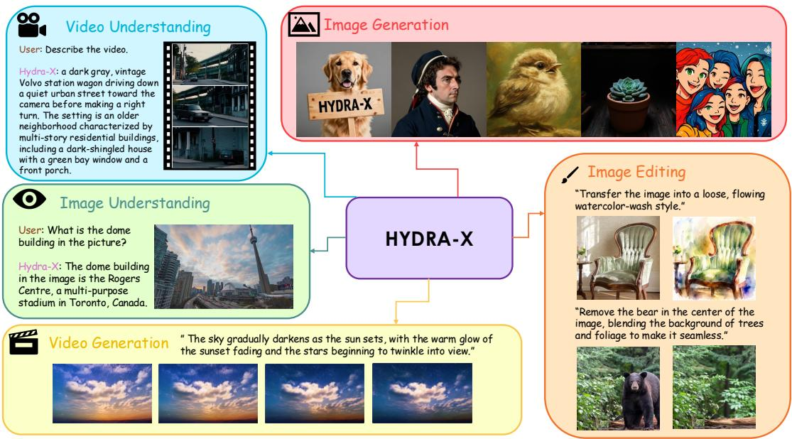

<details>
<summary>flowchart</summary>

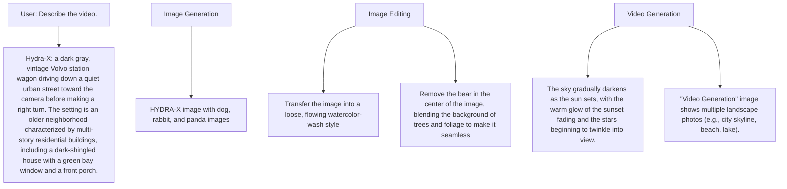
</details>

Figure 1: HYDRA-X is a native UMM that unifies image/video understanding, image/video generation, and instruction-guided image editing through one holistic tokenizer HYDRA-XTOK.

To address the second challenge, we extend the established paradigm of semantic distillation (Qiu et al., 2026; Wu et al., 2025d; Ma et al., 2025a) from images to video, and uncover a fundamental asymmetry: while image latents can readily reuse existing semantic teachers, no available video encoder operates at the compressed temporal resolution of our latent, leaving the video stream without a natural source of semantic supervision. We resolve this asymmetry through a remarkably simple addition: a lightweight Decompressor that lifts the compressed latent back to its native temporal length, enabling direct distillation from pretrained image and video teachers (Tschannen et al., 2025; Wang et al., 2022) at full frame rate. Under this dual spatiotemporal supervision, the compact latent simultaneously preserves pixel-level fidelity and rich spatiotemporal semantic structure, substantially advancing both understanding and generation in UMMs.

Building on this holistic tokenizer, HYDRA-X unifies five UMM tasks within a single shared encoder, as shown in Figure 1: image/video generation, image/video understanding, and image editing. Yet editing in particular exposes a fundamental flaw in both HYDRA and cascaded designs: by feeding the LLM only post-encoder semantic features, they confine source-target interaction to the semantic level and forfeit the fine-grained structural information that resides at the latent. To resolve this, we propose a principled inversion of the design: HYDRA-XTOK jointly tokenizes source and target with cross-frame interaction, fusing structural details directly into the target before reaching the LLM. This early latent-level interaction substantially improves editing consistency and accelerates convergence.

Instantiated at the 7B scale on top of Qwen2.5-7B-Instruct (Yang et al., 2024a), HYDRA-X achieves strong performance across image and video understanding and generation tasks. More importantly, it elevates the visual tokenizer from a specialized image-processing component to a holistic image-and-video interface, laying a solid foundation for future unified-tokenizer UMM exploration.

## 2 Related Work

## 2.1 Visual Tokenizers for Unified Multimodal Models

A growing body of work unifies reconstruction and semantics within a single visual tokenizer. For images, RAE (Zheng et al., 2025; Tong et al., 2026b) freezes a semantic encoder and learns a pixel decoder, while several unified-tokenizer designs (Yue et al., 2025; Yao et al., 2025a; Ma et al., 2025a; Qu et al., 2025; Song et al., 2025; Lin et al., 2025b; Tang et al., 2025) co-train reconstruction and understanding within a single ViT. HYDRA (Qiu et al.,

2026) introduces a progressive ViT with a Generation–Semantic Bottleneck for compress-then-restore semantic distillation, which HYDRA-XTOK inherits. Aligning generative latents with semantic features has further been shown to mutually benefit both tasks (Wang et al., 2024a; Yu et al., 2024; Yao et al., 2025b; Ma et al., 2025b; Wang et al., 2025b; 2023). Joint image-and-video tokenization, however, remains largely under-explored: for video, 3D-convolutional VAEs (Yu et al., 2023; Wan et al., 2025) dominate but lack any semantic structure. A recent work, AToken (Lu et al., 2025), unifies images and videos within a single tokenizer for reconstruction and understanding, but emits task-specific output features for the two objectives and therefore does not yield a unified representation. To our knowledge, HYDRA-X is the first UMM framework to unify image and video within a single ViT-based tokenizer, augmenting HYDRA’s philosophy with explicit temporal causality, hierarchical patchify, and a Decompressor for spatiotemporal semantic awareness.

## 2.2 Native Unified Multimodal Models

UMMs aim to handle visual understanding and generation within a single backbone, and existing systems can be broadly grouped into three families that differ in how tightly the two objectives share parameters and representations. Composite UMMs (Tong et al., 2025; Chen et al., 2025a; Lin et al., 2025a; Pan et al., 2025; Tang et al., 2025) bridge pretrained understanding and generation models via lightweight adapters or projection layers; this preserves the strengths of each specialised model but leaves the synergy between the two tasks shallow, as gradients rarely flow across the modality boundary and the two backbones never see a shared latent. Native UMMs instead train both objectives jointly from the start, and further bifurcate by their choice of visual representation. Quantised-token approaches (Team, 2024; Xie et al., 2024; Wang et al., 2024c; Zhou et al., 2024) cast visual generation as nexttoken prediction over a VQ codebook, which unifies the LLM interface but inherits the reconstruction loss and codebook-collapse pathologies of VQ tokenizers, capping the achievable visual fidelity. Decoupled designs (Ma et al., 2025c; Wu et al., 2025b; Chen et al., 2025b; Deng et al., 2025; Liao et al., 2025; Li et al., 2025; Fan et al., 2025) side-step this ceiling by routing understanding through a semantic encoder and generation through a separately trained VAE; the price is a duplicated visual pathway whose two streams compete for LLM attention and whose representations must be re-aligned downstream. The most recent line we build on are unified-encoder UMMs such as TransNext (Tong et al., 2026a), Show-o2 (Xie et al., 2025a), and TUNA (Liu et al., 2025b), which share a single visual tokenizer across both tasks and recover the architectural cleanliness of composite systems while retaining joint optimisation. We extend this line in two directions: from images to a unified image-and-video tokenizer, and from independent per-input encoding to a tokenizer-stage source–target interaction tailored for editing.

## 2.3 Image Editing in Unified Multimodal Models

Image editing is the canonical task in which a UMM must condition the target image on a structurally similar source image, and existing pipelines differ mainly in where this conditioning is injected. The first family relies on dedicated condition adapters: ControlNet-style branches (Zhang et al., 2023) attach a parallel encoder that injects spatially aligned source features into the generator, while reference-token streams as used in BAGEL (Deng et al., 2025) prepend the source as an extra context that the LLM attends to. Both families add either parameters or context length, and the source representation is shaped specifically for the generation head rather than shared with the understanding side. Closer to our setting, the unified-encoder UMMs Show-o2 (Xie et al., 2025a) and TUNA (Liu et al., 2025b) reuse a single tokenizer for both the source and the target, but still encode the two images independently; only their post-encoder semantic features are concatenated at the LLM input, so any cross-image alignment must be reconstructed by the LLM from two already-compressed semantic streams, with the fine-grained pre-bottleneck structure inaccessible. We instead place the source and target in the same temporal window of HYDRA-XTOK and process them in a single forward pass, allowing source–target interaction to begin at the latent level inside the tokenizer’s causal Sem-ViT and propagate before reaching the LLM. This reuses the temporal pathway already trained for video, removes any extra cross-image attention module, and exposes the LLM to a target representation that has already absorbed source structure.

## 3 Preliminaries: Representation-Harmonized Tokenization

Our overall design follows the image-only UMM framework HYDRA (Qiu et al., 2026). At its core is a single ViT split into a Gen-ViT and a Sem-ViT, connected by a Generation–Semantic Bottleneck that supports generation and $\pmb { x } \in \mathbb { R } ^ { H \times W \times 3 }$ h rich in structural primitives, which the Bottleneck projects into a compact latent $\mathbf { z } \in \mathbb { R } ^ { N \times C }$ suitable for generation. The Sem-ViT then un-projects z back into a high-dimensional semantic feature s, which is aligned with a pretrained semantic teacher T via distillation:

$$
\mathbf {x} \xrightarrow {\text { Gen - ViT }} \mathbf {h} \xrightarrow {\text { Bottleneck }} \mathbf {z} \xrightarrow {\text { Sem - ViT }} \mathbf {s} \xleftarrow {\text { align }} \mathcal {T} (\mathbf {x}). \tag {1}
$$

The downstream LLM operates exclusively on the Sem-ViT output s for both understanding and generation, whereas the pixel decoder that reconstructs images from z is invoked only during tokenizer training. We retain this overall design and extend it from images to videos through explicit temporal causality, hierarchical patchify, and a Decompressor introduced in Section 4.

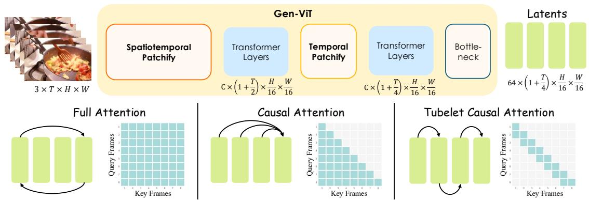

<details>
<summary>flowchart</summary>

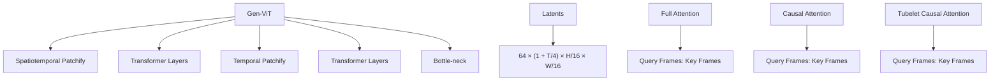
</details>

Figure 2: Spatiotemporal reconstruction design. (Top) The Gen-ViT folds a clip into a compact latent. (Bottom) Three ablated attention masks: Full attends across all space-time tokens, Causal masks future frames, and Tubelet restricts attention to a 2-frame window.

Table 1: Reconstruction ablation on ImageNet (256×256) and DAVIS $( 1 7 \times 2 5 6 \times 2 5 6 )$ . All three attention-mask baselines use the single-step 4× temporal patchify; only the ‘Ours’ row uses the hierarchical 2×2 schedule. Latency is measured per forward pass on a $1 \dot { 7 } \times 5 1 \dot { 2 } \times 5 1 \dot { 2 }$ video clip. Further reconstruction comparisons and visualizations are provided in Appendix H.1 and H.3

<table><tr><td rowspan="2">Method</td><td rowspan="2">Latency (s) (↓)</td><td colspan="3">ImageNet</td><td colspan="3">DAVIS</td></tr><tr><td>PSNR (↑)</td><td>SSIM (↑)</td><td>rFID (↓)</td><td>PSNR (↑)</td><td>SSIM (↑)</td><td>rFVD (↓)</td></tr><tr><td>Full attention</td><td>0.49</td><td>31.10</td><td>0.8890</td><td>0.367</td><td>27.40</td><td>0.8277</td><td>16.20</td></tr><tr><td>Causal attention</td><td>0.45</td><td>31.38</td><td>0.8901</td><td>0.352</td><td>27.62</td><td>0.8283</td><td>14.05</td></tr><tr><td>Tubelet attention</td><td>0.17</td><td>31.42</td><td>0.8907</td><td>0.347</td><td>27.69</td><td>0.8287</td><td>13.69</td></tr><tr><td>Ours</td><td>0.25</td><td>31.73</td><td>0.8936</td><td>0.329</td><td>27.97</td><td>0.8307</td><td>11.19</td></tr></table>

## 4 HYDRA-XTOK: Holistic Visual Tokenization in a Single ViT

HYDRA-XTOK is designed as the visual interface of HYDRA-X: before any token reaches the LLM, it must be compact enough for generation, faithful enough for reconstruction, and semantic enough for understanding. We initialize Gen-ViT and Sem-ViT from SigLIP 2 (Tschannen et al., 2025); all UMM-side ablations use Qwen2.5- 1.5B (Yang et al., 2024a). The tokenizer is trained with a reconstruction term and two semantic distillation terms:

$$
\mathcal {L} _ {\mathrm{HYDRA-XTOK}} = \mathcal {L} _ {\text { rec }} + \lambda \mathcal {L} _ {\text { dist }}, \tag {2}
$$

where $\mathcal { L } _ { \mathrm { r e c } }$ keeps the compact latent pixel-faithful, ${ \mathcal { L } } _ { \mathrm { d i s t } }$ aligns Sem-ViT features with semantic features. Detailed recipes are in Appendix A.1.

## 4.1 Spatiotemporal Reconstruction in a ViT

Existing ViT-based tokenizers that jointly handle images and videos reconstruction, such as AToken (Lu et al., 2025) and OmniTokenizer (Wang et al., 2024b), share two design choices: full spatiotemporal attention across all frames, and a single-step temporal patchify applied at the input that aggressively compresses the temporal axis. Both choices come at a cost. Full spatiotemporal attention scales quadratically with the clip length and tends to disrupt the per-frame structural prior inherited from image pretraining; the aggressive single-step patchify collapses fine-grained temporal details before any cross-frame reasoning. This naturally raises a critical question: are these design choices really necessary?

We answer this through a controlled ablation along the same two axes: (i) the temporal attention region, and (ii) the temporal patchify schedule. Following the common design in video VAEs, a clip $\mathbf { x } \in \mathbb { R } ^ { 3 \times ( 1 + T ) \times \mathbf { \breve { H } } \times W }$ is encoded into an anchor image latent together with the remaining T frames compressed by a factor of 4, producing a compact $\mathbf { z } \in \mathbb { R } ^ { C \times ( 1 + \frac { T } { 4 } ) \times \frac { H } { 1 6 } \times \frac { W } { 1 6 } }$ . The two axes are then ablated independently. For (i) we compare three attention masks (Fig. 2, bottom): Full attention, the standard choice in AToken and OmniTokenizer; Causal attention, with a causal mask across all preceding frames; and Tubelet attention, where causal attention is restricted to a 2-frame tubelet so each token attends only to its own frame and the immediately preceding one. For (ii) we compare the single-step 4× temporal patchify used by AToken and OmniTokenizer against a hierarchical schedule that applies two consecutive 2× patchify stages (top of Fig. 2). During each temporal patchify stage, the anchor frame is zero-padded so that it goes through the same operation as the remaining frames.

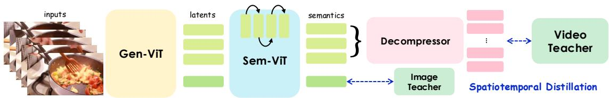

<details>
<summary>flowchart</summary>

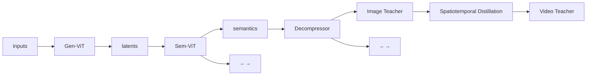
</details>

Figure 3: Spatiotemporal distillation. The uncompressed image latent is directly distilled by an image teacher; the 4× temporally-compressed video latent is first lifted to origin length T by a lightweight Decompressor before distillation by a video teacher.

Table 2: Semantic-distillation ablation.

<table><tr><td colspan="4">Design choices</td><td colspan="2">Vid. Und.</td><td colspan="2">Img. Und.</td><td>Img. Gen.</td><td>Edit</td></tr><tr><td>img distill</td><td>Decomp w/ img</td><td>Decomp w/ video</td><td>Sem-ViT bi-dir</td><td>MVBench (↑)</td><td>VideoMME (↑)</td><td>AI2D (↑)</td><td>MME (↑)</td><td>GenEval (↑)</td><td>ImgEdit (↑)</td></tr><tr><td></td><td></td><td></td><td></td><td>29.8</td><td>27.4</td><td>45.1</td><td>989</td><td>67.5</td><td>2.35</td></tr><tr><td>√</td><td></td><td></td><td></td><td>42.1</td><td>42.5</td><td>61.2</td><td>1339</td><td>70.6</td><td>2.72</td></tr><tr><td>√</td><td>√</td><td></td><td></td><td>44.7</td><td>44.3</td><td>62.7</td><td>1522</td><td>70.7</td><td>3.07</td></tr><tr><td>√</td><td></td><td>√</td><td></td><td>45.4</td><td>45.0</td><td>62.5</td><td>1501</td><td>72.0</td><td>3.20</td></tr><tr><td>√</td><td></td><td>√</td><td>√</td><td>43.1</td><td>43.7</td><td>62.0</td><td>1434</td><td>70.1</td><td>2.70</td></tr></table>

Table 1 reveals two principles that contradict the common choices. First, expanding the temporal receptive field beyond a 2-frame tubelet only degrades reconstruction: both full bidirectional and all-past causal attention perform worse than Tubelet attention. Second, distributing temporal compression across two patchify stages consistently outperforms a single-step counterpart at the same compression ratio. These results answer our opening question: aggressive spatiotemporal attention and single-step patchify are not only unnecessary but actively suboptimal.

• Less attention is more. Restricting causal attention to a 2-frame tubelet yields the best reconstruction; wider receptive fields disturb local detail more than they help.  
• Hierarchical patchify outperforms single-step. Distributing temporal compression across two 2× patchify stages consistently improves reconstruction over a single 4× patchify, indicating that the temporal axis benefits from progressive, multi-scale folding.

## 4.2 Spatiotemporal Semantic Distillation via the Decompressor

Following HYDRA, we inject semantic structure into the latent by distilling the Sem-ViT output against pretrained teachers. Extending this recipe to video, however, reveals a fundamental asymmetry. For images, the Sem-ViT output has the same spatial resolution as a frame and can be aligned token-by-token with an off-the-shelf image teacher. For video, the Sem-ViT output is temporally compressed to 1 + T/4 tokens, while existing video encoders operate at the original frame rate. The video stream therefore receives no video-level semantic supervision under the standard distillation recipe.

We resolve this asymmetry by introducing a lightweight Decompressor, a small ViT module D that lifts the temporally compressed Sem-ViT output back to its native temporal length, producing dense per-frame semantic features that can be aligned with both image and video teachers (Fig. 3). The Decompressor is only used at tokenizer-training time and is discarded afterwards; the LLM still operates on the same compact Sem-ViT output s. Letting $d _ { \mathrm { c o s } } ( \mathbf { a } , \mathbf { b } ) { = } 1 - \mathrm { c o s } ( \mathbf { a } , \mathbf { b } )$ denote the cosine distance, the full distillation loss combines an image-teacher term at s and a video-teacher term at the Decompressor output:

$$
\mathcal {L} _ {\text { dist }} = d _ {\cos} \left(\mathbf {s} _ {0}, \mathcal {T} _ {\text { img }} (\mathbf {x})\right) + d _ {\cos} \left(\mathbf {D} \left(\mathbf {s} _ {1:}\right), \mathcal {T} _ {\text { vid }} (\mathbf {x})\right), \tag {3}
$$

where $\mathbf { s } _ { 0 }$ is the leading uncompressed image token and $\mathbf { s } _ { 1 : }$ : are the compressed video latents. For pure image batches, the video term in Eq. 3 is masked out. We ablate four design choices in Table 2: (i) whether to apply image distillation at the Sem-ViT output (img distill); (ii) whether to additionally distill the Decompressor output against an image teacher (Decomp w/ img); (iii) or against a video teacher (Decomp w/ video); and, as a cross-check of F1, (iv) whether the Sem-ViT uses bidirectional rather than tubelet attention (Sem-ViT bi-dir).

Table 2 surfaces three principles. First, semantic distillation is indispensable: removing it collapses both image and video understanding. Second, the Decompressor is what unlocks video-level supervision: distilling it against a video teacher yields the strongest video understanding while preserving image-side performance, and the same configuration also delivers the best image generation and editing scores, consistent with the hypothesis that semantically richer latents accelerate the LLM’s convergence on generation and editing. Third, switching the

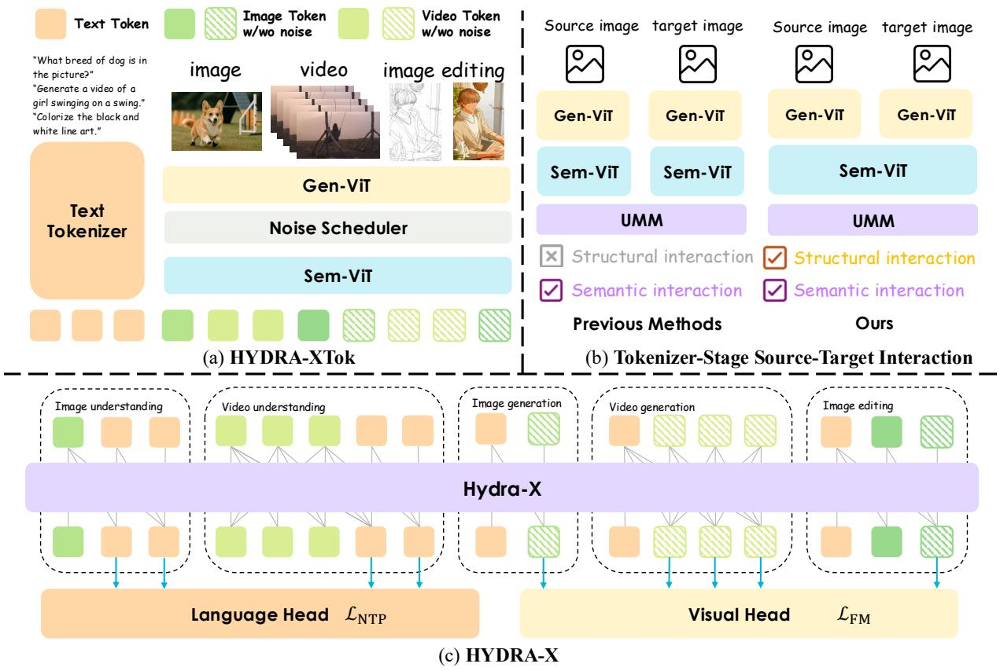

<details>
<summary>flowchart</summary>

```mermaid
graph TD
    subgraph a_HYDRA_XTok["(a) HYDRA-XTok"]
  A["Text Tokenizer"] --> B["Image"]
  A --> C["video"]
  A --> D["image editing"]
  A --> E["Gen-ViT"]
  A --> F["Noise Scheduler"]
  A --> G["Sem-ViT"]
    end

    subgraph b_Tokenizer_Stage_Source_Target_Interaction["(b) Tokenizer-Stage Source-Target Interaction"]
  H["Source Image"] --> I["Target Image"]
  J["Source Image"] --> K["Target Image"]
  L["Previous Methods"] --> M["Structural Interaction"]
  L --> N["Semantic Interaction"]
  O["Ours"] --> P["Structural interaction"]
  O --> Q["Semantic interaction"]
    end

    subgraph c_HYDRA_X["(c) HYDRA-X"]
  R["Language Head"] --> S["L_NTP"]
  T["Visual Head"] --> U["L_FM"]
    end

    style (a) HYDRA-XTok fill:#f9f9f9,stroke-dasharray: 5 5
    style (b) Tokenizer-Stage Source-Target Interaction fill:#e6f3ff,stroke-dasharray: 5 5
    style (c) HYDRA-X fill:#e6f3ff,stroke-dasharray: 5 5
```
</details>

Figure 4: HYDRA-X unifies five visual tasks through the holistic tokenizer HYDRA-XTOK. (a) HYDRA-XTOK encodes any image or video into a compact Gen-ViT latent and then into semantic features with Sem-ViT. (b) Previous editing pipelines (left) encode source and target with two independent branches; HYDRA-X (right) keeps Gen-ViT independent for faithful reconstruction but shares the Sem-ViT with tubelet causal attention, injecting structural interaction inside the tokenizer. (c) A shared backbone with two separate heads drives all five tasks.

Sem-ViT to bidirectional attention uniformly degrades every metric, mirroring F1: less attention is more even on the understanding side.

• A semantic latent lifts both understanding and generation. Dual image- and video-teacher distillation, enabled by the Decompressor, equips the compact latent with explicit spatiotemporal semantic structure, jointly improving understanding and generation.

## 5 HYDRA-X: Advancing Unified Multimodal Models with Holistic Tokenizers

## 5.1 Overall Architecture

HYDRA-X follows the standard native UMM template (Xie et al., 2025a; Liu et al., 2025b; Qiu et al., 2026): text tokens and visual tokens produced by HYDRA-XTOK are interleaved into a single sequence and processed by a shared LLM backbone with two specialised heads, an autoregressive language head trained with next-token prediction and a vision head trained with flow matching (Lipman et al., 2022; Esser et al., 2024). Within this template, HYDRA-X unifies five tasks under one shared tokenizer HYDRA-XTOK (Fig. 4(a)): image generation (text → image), image understanding (image → text), video generation (text → video), video understanding (video → text), and image editing (source image with text instruction → target image).

As illustrated in Fig. 4(c), the same Gen-ViT serves all five tasks; the only task-dependent component is which head decode the LLM output. The model is trained end-to-end with the composite loss

$$
\mathcal {L} _ {\mathrm{HYDRA-X}} = \lambda_ {1} \mathcal {L} _ {\mathrm{NTP}} + \lambda_ {2} \mathcal {L} _ {\mathrm{FM}}, \tag {4}
$$

where $\mathcal { L } _ { \mathrm { N T P } }$ is the next-token prediction loss for text, $\mathcal { L } _ { \mathrm { F M } }$ is the rectified flow matching loss for visual latents, and both loss weights $\lambda _ { 1 }$ and $\lambda _ { 2 }$ are set to 1 by default.

Table 3: Source-target interaction (STI) ablation. HYDRA-X-STI tokenises the editing pair as a length-2 clip with Sem-ViT tubelet causal attention; HYDRA-X-Indep encodes the source and target independently. Recon-PSNR: PSNR of source reconstruction on ImgEdit.

<table><tr><td rowspan="2">Layout</td><td colspan="2">Editing</td><td>Img. Gen.</td><td colspan="2">Vid. Und.</td><td colspan="2">Img. Und.</td></tr><tr><td>ImgEdit (↑)</td><td>Recon-PSNR (↑)</td><td>GenEval (↑)</td><td>MVBench (↑)</td><td>VideoMME (↑)</td><td>AI2D (↑)</td><td>MME (↑)</td></tr><tr><td>HYDRA-X-Indep</td><td>2.80</td><td>20.74</td><td>70.51</td><td>45.3</td><td>45.0</td><td>62.2</td><td>1478.5</td></tr><tr><td>HYDRA-X-STI</td><td>3.20</td><td>27.65</td><td>71.97</td><td>45.4</td><td>45.0</td><td>62.5</td><td>1501.0</td></tr></table>

## 5.2 Independent Encoding Bypasses the Latent

Among the five tasks, image editing is the only one whose input contains both a conditioning image and a target image. Conventional pipelines, including HYDRA (Qiu et al., 2026) and cascaded designs such as Show-o2 (Xie et al., 2025a) and TUNA (Liu et al., 2025b), tokenise the source $\mathbf { x } _ { c }$ and the target $\mathbf { x } _ { t }$ independently with the same tokenizer (Fig. 4(b), left):

$$
\left[ \mathbf {s} _ {c}, \mathbf {s} _ {t} \right] = \left[ \mathrm{HYDRA-XTOK} \left(\mathbf {x} _ {c}\right), \mathrm{HYDRA-XTOK} \left(\mathbf {x} _ {t}\right) \right], \quad \mathbf {s} _ {c} \perp \mathbf {s} _ {t} \quad \text { inside   the   tokenizer. } \tag {5}
$$

As a result, the source and target latents zc, zt never interact inside the tokenizer, and the LLM has to discover their cross-image alignment from scratch on top of two independent semantic streams. This is sufficient for high-level semantic edits but consistently fails on detail-faithful edits.

## 5.3 Tokenizer-Stage Source-Target Interaction

A natural fix falls out of HYDRA-XTOK’s holistic design: since the Sem-ViT already applies tubelet causal attention for video modeling, we reuse the exact same mechanism for editing pairs by routing $\left( \mathbf { x } _ { c } , \mathbf { x } _ { t } \right)$ through HYDRA-XTOK as a length-2 clip (Fig. 4(b), right). The Gen-ViT continues to encode the two images independently and the post-Bottleneck latents $\mathbf { z } _ { c } , \mathbf { z } _ { t }$ remain reconstruction-faithful. The cross-image interaction is then injected exclusively at the Sem-ViT, which processes $\left[ { \pmb z } _ { c } ; { \pmb z } _ { t } \right]$ ] with the same tubelet causal mask used for video:

$$
\left[ \mathbf {s} _ {c}, \mathbf {s} _ {t} \right] = \text { Sem - ViT } \left(\left[ \mathbf {z} _ {c}; \mathbf {z} _ {t} \right]\right), \quad \text { causal:   } \mathbf {s} _ {c} \text {   attends   only   to   } \mathbf {z} _ {c}, \quad \mathbf {s} _ {t} \text {   attends   to   } \left[ \mathbf {z} _ {c}; \mathbf {z} _ {t} \right]. \tag {6}
$$

Note that for editing pairs we disable Gen-ViT’s cross-frame tubelet attention since the source and target are not temporally adjacent video frames; only Sem-ViT (the semantic stage) reuses the video tubelet causal mask. This asymmetric reuse is a deliberate choice: structural reconstruction benefits from independent encoding, while semantic alignment benefits from cross-image interaction.

Table 3 compares HYDRA-X-Indep against HYDRA-X-STI, identical except for whether the editing pair is encoded independently or as a length-2 clip with Sem-ViT tubelet causal attention. STI raises Recon-PSNR, the PSNR of source reconstruction on ImgEdit (Ye et al., 2025) that directly probes editing consistency, by nearly 7 dB and lifts ImgEdit by 0.4. STI further yields consistent gains on most non-editing benchmark, with GenEval (+1.46) the most prominent, suggesting that the new latent-level coupling also enriches the Sem-ViT for generation. The Recon-PSNR jump directly validates our hypothesis from Section 5.2: editing’s consistency failure stems from latent-level isolation inside the tokenizer, not from LLM capacity or supervision.

• Latent-level interaction matters for editing. Reusing the Sem-ViT’s tubelet causal attention to fuse source and target inside the tokenizer, adds no parameters and no separate cross-image module yet substantially improves editing consistency.

## 6 Main Results

Implementation. HYDRA-X is instantiated at two scales. The reported model uses Qwen2.5 -7B-Instruct (Yang et al., 2024a) as the LLM backbone; a matched 1.5B variant is used for the methodological ablations in Sections 4–5. Following AToken (Lu et al., 2025), HYDRA-XTOK includes a symmetric ViT encoder/decoder pair augmented with 3D rotary position embeddings (3D RoPE) (Su et al., 2024) for joint spatiotemporal modelling. The Decompressor D in Eq. 3 is a lightweight 4× temporal upsampler that stacks two consecutive (temporal upsample → transformer block) stages; each temporal upsample is a 1×1 convolution doubling the channel dimension $( C \to 2 C )$ followed by a channel-to-time reshape, inverting the encoder’s hierarchical $2 \times 2$ temporal patchify. The bottleneck dimension is $C = 6 4$ . For distillation teachers, we use SigLIP-SO400M-patch16-naflex (Tschannen et al., 2025) as the image teacher ${ \mathcal { T } } _ { \mathrm { i m g } }$ and InternVideo-Next-L (Wang et al., 2025a) as the video teacher $\mathcal { T } _ { \mathrm { v i d } }$ .

Table 4: Evaluation on image understanding benchmarks. # Params. denotes the model size. Rows in gray indicate models with ≥ 14B parameters and are excluded from the ranking. Within each subgroup of the table, bold marks the best result and underline marks the second-best.

<table><tr><td rowspan="2">Models</td><td rowspan="2"># Params</td><td>AI2D</td><td>MME</td><td>MMMU</td><td>OCRBench</td><td>MMB</td><td>RWQA</td><td>ChartQA</td><td>DocVQA</td><td>InfoVQA</td></tr><tr><td>test</td><td>summary</td><td>val</td><td>test</td><td>dev_en</td><td>test</td><td>test</td><td>val</td><td>val</td></tr><tr><td colspan="11">Understanding-only Models</td></tr><tr><td>Qwen2.5-VL (Bai et al., 2025)</td><td>7B</td><td>84.3</td><td>2312.0</td><td>58.0</td><td>88.8</td><td>82.8</td><td>68.4</td><td>84.1</td><td>93.0</td><td>78.6</td></tr><tr><td>LLaVA-1.5 (Liu et al., 2023b)</td><td>7B</td><td>55.5</td><td>1510.7</td><td>35.7</td><td>31.8</td><td>62.3</td><td>54.8</td><td>17.9</td><td>-</td><td>-</td></tr><tr><td>LLaVA-OV (Li et al., 2024a)</td><td>7B</td><td>81.4</td><td>1998.1</td><td>48.8</td><td>62.2</td><td>80.8</td><td>66.3</td><td>80.0</td><td>87.5</td><td>68.8</td></tr><tr><td colspan="11">Unified Multimodal Models</td></tr><tr><td>BLIP3-o (Chen et al., 2025a)</td><td>8B</td><td>-</td><td>2329.7</td><td>50.6</td><td>83.1</td><td>83.5</td><td>69.0</td><td>78.0</td><td>-</td><td>-</td></tr><tr><td>TokenFlow-XL (Qu et al., 2025)</td><td>14B</td><td>-</td><td>1922.1</td><td>43.2</td><td>-</td><td>68.9</td><td>56.6</td><td>-</td><td>-</td><td>-</td></tr><tr><td>Ming-UniVision (Huang et al., 2025)</td><td>16B</td><td>82.8</td><td>2023.0</td><td>40.3</td><td>72.4</td><td>78.5</td><td>-</td><td>-</td><td>-</td><td>-</td></tr><tr><td>BAGEL (Deng et al., 2025)</td><td>14B</td><td>89.2</td><td>2388.0</td><td>55.3</td><td>73.3</td><td>85.0</td><td>72.8</td><td>78.5</td><td>-</td><td>-</td></tr><tr><td>Janus-Pro (Chen et al., 2025b)</td><td>7B</td><td>71.3</td><td>1567.1</td><td>41.0</td><td>59.0</td><td>79.2</td><td>58.0</td><td>25.8</td><td>-</td><td>-</td></tr><tr><td>VILA-U (Wu et al., 2024b)</td><td>7B</td><td>-</td><td>1401.8</td><td>-</td><td>-</td><td>66.6</td><td>-</td><td>-</td><td>-</td><td>-</td></tr><tr><td>Show-o2 (Xie et al., 2025a)</td><td>7B</td><td>78.6</td><td>1620.5</td><td>48.9</td><td>32.4</td><td>79.3</td><td>64.7</td><td>52.3</td><td>77.3</td><td>45.8</td></tr><tr><td>HYDRA (Qiu et al., 2026)</td><td>7B</td><td>85.1</td><td>2068.6</td><td>49.4</td><td>57.7</td><td>82.4</td><td>64.7</td><td>-</td><td>-</td><td>-</td></tr><tr><td>HYDRA-X</td><td>7B</td><td>86.5</td><td>2350.0</td><td>51.5</td><td>84.5</td><td>84.0</td><td>68.7</td><td>86.5</td><td>81.7</td><td>59.1</td></tr></table>

Table 5: Evaluation on video understanding benchmarks. # Params. denotes the model size. Video-MME reports the w/o-subtitle score.

<table><tr><td rowspan="2">Models</td><td rowspan="2"># Params</td><td>MVBench</td><td>Video-MME</td><td>LongVideoBench</td><td>LVBench</td></tr><tr><td>test</td><td>w/o sub</td><td>val</td><td>test</td></tr><tr><td colspan="6">Proprietary Und.-only Models</td></tr><tr><td>GPT-4V (OpenAI, 2023)</td><td>-</td><td> $\underline{43.5}$ </td><td>59.9</td><td>61.3</td><td>-</td></tr><tr><td>GPT-4o (OpenAI, 2024)</td><td>-</td><td>-</td><td> $\underline{71.9}$ </td><td> $\underline{66.7}$ </td><td> $\underline{48.9}$ </td></tr><tr><td>Gemini-1.5-Flash (Team et al., 2024)</td><td>-</td><td>-</td><td> $\underline{70.3}$ </td><td>61.6</td><td>-</td></tr><tr><td>Gemini-1.5-Pro (Team et al., 2024)</td><td>-</td><td> $\underline{54.2}$ </td><td> $\underline{75.0}$ </td><td> $\underline{64.0}$ </td><td> $\underline{33.1}$ </td></tr><tr><td colspan="6">Open-source Und.-only Models</td></tr><tr><td>VILA (Lin et al., 2024)</td><td>40B</td><td>-</td><td> $\underline{60.1}$ </td><td>-</td><td>-</td></tr><tr><td>PLLaVA (Xu et al., 2024)</td><td>34B</td><td> $\underline{58.1}$ </td><td>-</td><td> $\underline{53.2}$ </td><td>-</td></tr><tr><td>LongVA (Zhang et al., 2024b)</td><td>7B</td><td>49.2</td><td>52.6</td><td>51.8</td><td>-</td></tr><tr><td>VideoLLaMA2 (Cheng et al., 2024)</td><td>7B</td><td>54.6</td><td>47.9</td><td>-</td><td>-</td></tr><tr><td>LLaVA-OV (Li et al., 2024a)</td><td>7B</td><td>56.7</td><td> $\underline{58.2}$ </td><td> $\underline{56.5}$ </td><td> $\underline{26.9}$ </td></tr><tr><td>IXC-2.5 (Zhang et al., 2024a)</td><td>7B</td><td> $\underline{69.1}$ </td><td>55.8</td><td>-</td><td>-</td></tr><tr><td colspan="6">Unified Multimodal Models</td></tr><tr><td>Show-o2 (Xie et al., 2025a)</td><td>1.5B</td><td>49.8</td><td>48.0</td><td>49.2</td><td>-</td></tr><tr><td>TUNA (Liu et al., 2025b)</td><td>1.5B</td><td>54.4</td><td>49.1</td><td>49.7</td><td> $\underline{27.4}$ </td></tr><tr><td>Show-o2 (Xie et al., 2025a)</td><td>7B</td><td> $\underline{55.8}$ </td><td> $\underline{57.4}$ </td><td> $\underline{55.5}$ </td><td>-</td></tr><tr><td>HYDRA-X</td><td>7B</td><td> $\underline{59.1}$ </td><td> $\underline{60.0}$ </td><td> $\underline{59.5}$ </td><td> $\underline{30.0}$ </td></tr></table>

## 6.1 Multimodal Understanding

Image understanding. We benchmark on AI2D (Kembhavi et al., 2016), MME (Fu et al., 2023), MMMU (Yue et al., 2024), OCRBench (Liu et al., 2024b), MMBench (Liu et al., 2024a), RealWorldQA, ChartQA (Masry et al., 2022), DocVQA (Mathew et al., 2021), and InfoVQA (Mathew et al., 2022). Table 4 compares HYDRA-X against open-source UMMs at a similar scale. Overall, HYDRA-X matches or exceeds 7B native UMM baselines on most reported metrics, including OCR- and chart-heavy tasks where strong semantic retention is important.

Video understanding. We evaluate on MVBench (Li et al., 2024c), Video-MME (Fu et al., 2025), LVBench (Wang et al., 2025c), and LongVideoBench (Wu et al., 2024a)(Table 5). HYDRA-X improves over the reported 1.5B and 7B unified baselines on the benchmarks where comparable numbers are available. It remains below the strongest dedicated or proprietary video LMMs on several metrics, but narrows the gap while using a single ViT tokenizer shared across understanding, generation, and editing. These results are consistent with the role of dual-teacher distillation in HYDRA-XTOK, which provides the compressed latent with both image- and video-level semantics.

## 6.2 Visual Generation

Table 6 jointly reports image generation on GenEval (Ghosh et al., 2023) and WISE (Niu et al., 2025), and video generation on VBench (Huang et al., 2024) for 17-frame outputs at $6 4 0 \times 3 8 4$ , summarised by Quality Score (QS), Semantic Score (SS), and the aggregate Total score. Among 7B-scale unified baselines, HYDRA-X is the strongest entry on every reported GenEval and WISE column; compared against ≥ 14B unified models, it remains competitive on the Overall scores while using a 7B backbone. On VBench, HYDRA-X leads all unified entries on QS, SS, and Total, improving over the closest unified competitor (Show-o2-1.5B) by +1.87 QS, +3.26 SS, and +2.15 Total. Per-dimension VBench scores are provided in Appendix Table 13, where HYDRA-X additionally leads in semantic-heavy dimensions including Object Class, Human Action, and Scene. Together these results suggest that dual-teacher distillation transfers semantic structure into the latent while preserving its role in visual synthesis.

Table 6: Comprehensive visual generation results. Image generation on GenEval (Ghosh et al., 2023) and WISE (Niu et al., 2025); video generation on VBench (Huang et al., 2024) reporting Quality Score (QS), Semantic Score (SS), and the aggregate Total score. † refers to using LLM rewriters. Rows in gray indicate models with ≥ 14B parameters and are excluded from the ranking. Qualitative results are in Appendix H.4.

<table><tr><td rowspan="2">Models</td><td rowspan="2"># Params</td><td colspan="3">GenEval</td><td colspan="3">WISE</td><td colspan="3">VBench</td></tr><tr><td>Two Obj.</td><td>Pos.</td><td>Over.</td><td>Cult.</td><td>Space</td><td>Over.</td><td>QS</td><td>SS</td><td>Total</td></tr><tr><td colspan="11">Generation-only Models</td></tr><tr><td>SD3-Med (Esser et al., 2024)</td><td>2B</td><td>0.94</td><td>0.33</td><td>0.74</td><td>-</td><td>-</td><td>-</td><td>-</td><td>-</td><td>-</td></tr><tr><td>FLUX.1 [Dev] $^{\dagger}$ (Labs et al., 2025)</td><td>12B</td><td>0.93</td><td>0.68</td><td>0.82</td><td>0.48</td><td>0.62</td><td>0.50</td><td>-</td><td>-</td><td>-</td></tr><tr><td>CogVideoX (Yang et al., 2024b)</td><td>5B</td><td>-</td><td>-</td><td>-</td><td>-</td><td>-</td><td>-</td><td>82.75</td><td>77.04</td><td>81.61</td></tr><tr><td>Hunyuan Video (Kong et al., 2024)</td><td>13B</td><td>-</td><td>-</td><td>-</td><td>-</td><td>-</td><td>-</td><td>85.07</td><td>76.88</td><td>83.43</td></tr><tr><td colspan="11">Unified Multimodal Models</td></tr><tr><td>TokenFlow-XL (Qu et al., 2025)</td><td>14B</td><td>0.60</td><td>0.16</td><td>0.55</td><td>-</td><td>-</td><td>-</td><td>-</td><td>-</td><td>-</td></tr><tr><td>SEED-X (Ge et al., 2024)</td><td>17B</td><td>0.58</td><td>0.19</td><td>0.49</td><td>-</td><td>-</td><td>-</td><td>-</td><td>-</td><td>-</td></tr><tr><td>Ming-UniVision (Huang et al., 2025)</td><td>16B</td><td>0.93</td><td>0.92</td><td>0.85</td><td>-</td><td>-</td><td>-</td><td>-</td><td>-</td><td>-</td></tr><tr><td>BAGEL $^{\dagger}$ (Deng et al., 2025)</td><td>14B</td><td>0.95</td><td>0.78</td><td>0.88</td><td>0.44</td><td>0.68</td><td>0.52</td><td>-</td><td>-</td><td>-</td></tr><tr><td>Show-o2 (Xie et al., 2025a)</td><td>1.5B</td><td>0.86</td><td>0.46</td><td>0.73</td><td>0.33</td><td>0.53</td><td>0.39</td><td>82.10</td><td>78.31</td><td>81.34</td></tr><tr><td>Harmon (Wu et al., 2025d)</td><td>1.5B</td><td>0.86</td><td>0.74</td><td>0.76</td><td>0.38</td><td>0.52</td><td>0.41</td><td>-</td><td>-</td><td>-</td></tr><tr><td>Blip3-o $^{\dagger}$ (Chen et al., 2025a)</td><td>8B</td><td>-</td><td>-</td><td>0.84</td><td>-</td><td>-</td><td>0.50</td><td>-</td><td>-</td><td>-</td></tr><tr><td>MUSE-VL (Xie et al., 2025b)</td><td>7B</td><td>0.64</td><td>0.25</td><td>0.57</td><td>-</td><td>-</td><td>-</td><td>-</td><td>-</td><td>-</td></tr><tr><td>Janus-Pro (Chen et al., 2025b)</td><td>7B</td><td>0.89</td><td>0.79</td><td>0.80</td><td>0.30</td><td>0.49</td><td>0.35</td><td>-</td><td>-</td><td>-</td></tr><tr><td>VILA-U (Wu et al., 2024b)</td><td>7B</td><td>-</td><td>-</td><td>-</td><td>0.26</td><td>0.37</td><td>0.31</td><td>76.26</td><td>65.04</td><td>74.01</td></tr><tr><td>HaploOmni (Xiao et al., 2025b)</td><td>7B</td><td>-</td><td>-</td><td>-</td><td>-</td><td>-</td><td>-</td><td>-</td><td>-</td><td>78.10</td></tr><tr><td>Emu3 (Wang et al., 2024c)</td><td>8B</td><td>-</td><td>-</td><td>0.66</td><td>-</td><td>-</td><td>-</td><td>-</td><td>-</td><td>80.96</td></tr><tr><td>Show-o2 $^{\dagger}$ (Xie et al., 2025a)</td><td>7B</td><td>0.87</td><td>0.52</td><td>0.76</td><td>0.40</td><td>0.58</td><td>0.44</td><td>-</td><td>-</td><td>-</td></tr><tr><td>HYDRA-X</td><td>7B</td><td>0.95</td><td>0.84</td><td>0.88</td><td>0.53</td><td>0.72</td><td>0.56</td><td>83.97</td><td>81.57</td><td>83.49</td></tr></table>

Table 7: Image editing. ImgEdit-Bench: Ext.=Extract, Rm.=Remove, Over.=overall (mean of 9 categories). GEdit-Bench: G-SC=G-Semantic Consistency, G-PQ=G-Perceptual Quality, G-Over.=overall. Per-dimension breakdown is provided in Appendix 12.

<table><tr><td rowspan="2">Models</td><td colspan="3">ImgEdit-Bench</td><td colspan="3">GEdit-Bench</td></tr><tr><td>Ext.</td><td>Rm.</td><td>Over.</td><td>G-SC</td><td>G-PQ</td><td>G-Over.</td></tr><tr><td colspan="7">Generation-only Models</td></tr><tr><td>FLUX.1 Kontext [Pro] (Labs et al., 2025)</td><td> $\underline{2.35}$ </td><td> $\underline{3.57}$ </td><td> $\underline{4.00}$ </td><td> $\underline{7.02}$ </td><td> $\underline{7.60}$ </td><td> $\underline{6.56}$ </td></tr><tr><td>Qwen-Image (Wu et al., 2025a)</td><td> $\underline{3.43}$ </td><td> $\underline{4.14}$ </td><td> $\underline{4.27}$ </td><td> $\underline{8.00}$ </td><td> $\underline{7.86}$ </td><td> $\underline{7.56}$ </td></tr><tr><td colspan="7">Unified Multimodal Models</td></tr><tr><td>OmniGen (Xiao et al., 2025a)</td><td> $\underline{1.71}$ </td><td> $\underline{2.43}$ </td><td> $\underline{2.96}$ </td><td> $\underline{5.96}$ </td><td> $\underline{5.89}$ </td><td> $\underline{5.06}$ </td></tr><tr><td>UniWorld-V1 (Lin et al., 2025a)</td><td> $\underline{2.27}$ </td><td> $\underline{3.24}$ </td><td> $\underline{3.26}$ </td><td> $\underline{4.93}$ </td><td> $\underline{7.43}$ </td><td> $\underline{4.85}$ </td></tr><tr><td>BAGEL (Deng et al., 2025)</td><td> $\underline{1.70}$ </td><td> $\underline{2.62}$ </td><td> $\underline{3.20}$ </td><td> $\underline{7.36}$ </td><td> $\underline{6.83}$ </td><td> $\underline{6.52}$ </td></tr><tr><td>OmniGen2 (Wu et al., 2025c)</td><td> $\underline{1.77}$ </td><td> $\underline{3.20}$ </td><td> $\underline{3.44}$ </td><td> $\underline{7.16}$ </td><td> $\underline{6.77}$ </td><td> $\underline{6.41}$ </td></tr><tr><td>HYDRA-X</td><td> $\underline{4.04}$ </td><td> $\underline{4.38}$ </td><td> $\underline{4.34}$ </td><td> $\underline{7.80}$ </td><td> $\underline{7.24}$ </td><td> $\underline{7.17}$ </td></tr></table>

## 6.3 Image Editing

Table 7 reports editing on GEdit-Bench (Liu et al., 2025a) and ImgEdit-Bench (Ye et al., 2025). Among 7B-scale unified models, HYDRA-X leads on Ext. (4.04, +1.77), Rm. (4.38, +1.14), ImgEdit Over. (4.34, +0.90), and GEdit G-SC/G-Over. (7.80/7.17), also beating BAGEL-14B on every column. The largest gains land on Ext. and Rm.—both needing identity-faithful source preservation—validating the tokenizer-stage source–target interaction in Section 5.3. With a 7B backbone, HYDRA-X trails Qwen-Image-20B by only 0.20/0.39 on G-SC/G-Over.; per-dimension scores in Appendix Table 12.

## 7 Conclusion

We presented HYDRA-X, the first native UMM framework that unifies image and video tokenization within a single ViT. Three counter-intuitive design choices in HYDRA-XTOK, frame-level causal tubelet attention, hierarchical temporal patchify, and a Decompressor for dual image-video teacher supervision, efficiently transform an image tokenizer into a video-and-image tokenizer. Rather than treating image editing as a purely LLM-side problem, we elegantly repurpose our video temporal-causal mechanism to process source and target images as length-2 clips. This restores the fine-grained latent-level coupling that is fundamentally lost in prior independent-encoding pipelines. Through this unified design, the visual tokenizer transcends its traditional role as a static image encoder, emerging as a holistic image-and-video interface that unifies five tasks under one shared backbone.

## References

Shuai Bai, Keqin Chen, Xuejing Liu, Jialin Wang, Wenbin Ge, Sibo Song, Kai Dang, Peng Wang, Shijie Wang, Jun Tang, et al. Qwen2. 5-vl technical report. arXiv preprint arXiv:2502.13923, 2025.  
James Betker, Gabriel Goh, Li Jing, Tim Brooks, Jianfeng Wang, Linjie Li, Long Ouyang, Juntang Zhuang, Joyce Lee, Yufei Guo, Wesam Manassra, Prafulla Dhariwal, Casey Chu, Yunxin Jiao, and Aditya Ramesh. Improving image generation with better captions. OpenAI technical report, 2023. URL https://cdn.openai.com/ papers/dall-e-3.pdf.  
Jiuhai Chen, Zhiyang Xu, Xichen Pan, Yushi Hu, Can Qin, Tom Goldstein, Lifu Huang, Tianyi Zhou, Saining Xie, Silvio Savarese, et al. Blip3-o: A family of fully open unified multimodal models-architecture, training and dataset. arXiv preprint arXiv:2505.09568, 2025a.  
Xiaokang Chen, Zhiyu Wu, Xingchao Liu, Zizheng Pan, Wen Liu, Zhenda Xie, Xingkai Yu, and Chong Ruan. Janus-pro: Unified multimodal understanding and generation with data and model scaling. arXiv preprint arXiv:2501.17811, 2025b.  
Zesen Cheng, Sicong Leng, Hang Zhang, Yifei Xin, Xin Li, Guanzheng Chen, Yongxin Zhu, Wenqi Zhang, Ziyang Luo, Deli Zhao, et al. Videollama 2: Advancing spatial-temporal modeling and audio understanding in video-llms. arXiv preprint arXiv:2406.07476, 2024.  
Matt Deitke, Christopher Clark, Sangho Lee, Rohun Tripathi, Yue Yang, Jae Sung Park, Mohammadreza Salehi, Niklas Muennighoff, Kyle Lo, Luca Soldaini, Jiasen Lu, Taira Anderson, Erin Bransom, Kiana Ehsani, Huong Ngo, YenSung Chen, Ajay Patel, Mark Yatskar, Chris Callison-Burch, Andrew Head, Rose Hendrix, Favyen Bastani, Eli VanderBilt, Nathan Lambert, Yvonne Chou, Arnavi Chheda, Jenna Sparks, Sam Skjonsberg, Michael Schmitz, Aaron Sarnat, Byron Bischoff, Pete Walsh, Chris Newell, Piper Wolters, Tanmay Gupta, Kuo-Hao Zeng, Jon Borchardt, Dirk Groeneveld, Crystal Nam, Sophie Lebrecht, Caitlin Wittlif, Carissa Schoenick, Oscar Michel, Ranjay Krishna, Luca Weihs, Noah A. Smith, Hannaneh Hajishirzi, Ross Girshick, Ali Farhadi, and Aniruddha Kembhavi. Molmo and pixmo: Open weights and open data for state-of-the-art vision-language models. In Proceedings of the IEEE/CVF Conference on Computer Vision and Pattern Recognition (CVPR), pp. 91–104, June 2025.  
Chaorui Deng, Deyao Zhu, Kunchang Li, Chenhui Gou, Feng Li, Zeyu Wang, Shu Zhong, Weihao Yu, Xiaonan Nie, Ziang Song, et al. Emerging properties in unified multimodal pretraining. arXiv preprint arXiv:2505.14683, 2025.  
Patrick Esser, Sumith Kulal, Andreas Blattmann, Rahim Entezari, Jonas Muller, Harry Saini, Yam Levi, Dominik¨ Lorenz, Axel Sauer, Frederic Boesel, et al. Scaling rectified flow transformers for high-resolution image synthesis. In Forty-first international conference on machine learning, 2024.  
Lijie Fan, Luming Tang, Siyang Qin, Tianhong Li, Xuan Yang, Siyuan Qiao, Andreas Steiner, Chen Sun, Yuanzhen Li, Tao Zhu, et al. Unified autoregressive visual generation and understanding with continuous tokens. arXiv preprint arXiv:2503.13436, 2025.  
Chaoyou Fu, Peixian Chen, Yunhang Shen, Yulei Qin, Mengdan Zhang, Xu Lin, Jinrui Yang, Xiawu Zheng, Ke Li, Xing Sun, et al. Mme: A comprehensive evaluation benchmark for multimodal large language models. arXiv preprint arXiv:2306.13394, 2023.  
Chaoyou Fu, Yuhan Dai, Yongdong Luo, Lei Li, Shuhuai Ren, Renrui Zhang, Zihan Wang, Chenyu Zhou, Yunhang Shen, Mengdan Zhang, et al. Video-mme: The first-ever comprehensive evaluation benchmark of multi-modal llms in video analysis. In Proceedings of the Computer Vision and Pattern Recognition Conference, pp. 24108– 24118, 2025.  
Yuying Ge, Sijie Zhao, Jinguo Zhu, Yixiao Ge, Kun Yi, Lin Song, Chen Li, Xiaohan Ding, and Ying Shan. Seed-x: Multimodal models with unified multi-granularity comprehension and generation. arXiv preprint arXiv:2404.14396, 2024.  
Dhruba Ghosh, Hannaneh Hajishirzi, and Ludwig Schmidt. Geneval: An object-focused framework for evaluating text-to-image alignment. Advances in Neural Information Processing Systems, 36:52132–52152, 2023.  
Ziqi Huang, Yinan He, Jiashuo Yu, Fan Zhang, Chenyang Si, Yuming Jiang, Yuanhan Zhang, Tianxing Wu, Qingyang Jin, Nattapol Chanpaisit, et al. Vbench: Comprehensive benchmark suite for video generative models. In Proceedings of the IEEE/CVF Conference on Computer Vision and Pattern Recognition, pp. 21807–21818, 2024.  
Ziyuan Huang, DanDan Zheng, Cheng Zou, Rui Liu, Xiaolong Wang, Kaixiang Ji, Weilong Chai, Jianxin Sun, Libin Wang, Yongjie Lv, et al. Ming-univision: Joint image understanding and generation with a unified continuous tokenizer. arXiv preprint arXiv:2510.06590, 2025.  
Aniruddha Kembhavi, Mike Salvato, Eric Kolve, Minjoon Seo, Hannaneh Hajishirzi, and Ali Farhadi. A diagram is worth a dozen images. In European conference on computer vision, pp. 235–251. Springer, 2016.  
Weijie Kong, Qi Tian, Zijian Zhang, Rox Min, Zuozhuo Dai, Jin Zhou, Jiangfeng Xiong, Xin Li, Bo Wu, Jianwei Zhang, et al. Hunyuanvideo: A systematic framework for large video generative models. arXiv preprint arXiv:2412.03603, 2024.  
Black Forest Labs, Stephen Batifol, Andreas Blattmann, Frederic Boesel, Saksham Consul, Cyril Diagne, Tim Dockhorn, Jack English, Zion English, Patrick Esser, et al. Flux. 1 kontext: Flow matching for in-context image generation and editing in latent space. arXiv preprint arXiv:2506.15742, 2025.  
Bo Li, Yuanhan Zhang, Dong Guo, Renrui Zhang, Feng Li, Hao Zhang, Kaichen Zhang, Peiyuan Zhang, Yanwei Li, Ziwei Liu, et al. Llava-onevision: Easy visual task transfer. arXiv preprint arXiv:2408.03326, 2024a.  
Dongxu Li, Yudong Liu, Haoning Wu, Yue Wang, Zhiqi Shen, Bowen Qu, Xinyao Niu, Guoyin Wang, Bei Chen, and Junnan Li. Aria: An open multimodal native mixture-of-experts model. arXiv preprint arXiv:2410.05993, 2024b.  
Han Li, Xinyu Peng, Yaoming Wang, Zelin Peng, Xin Chen, Rongxiang Weng, Jingang Wang, Xunliang Cai, Wenrui Dai, and Hongkai Xiong. Onecat: Decoder-only auto-regressive model for unified understanding and generation. arXiv preprint arXiv:2509.03498, 2025.  
Kunchang Li, Yali Wang, Yinan He, Yizhuo Li, Yi Wang, Yi Liu, Zun Wang, Jilan Xu, Guo Chen, Ping Luo, et al. Mvbench: A comprehensive multi-modal video understanding benchmark. In Proceedings of the IEEE/CVF Conference on Computer Vision and Pattern Recognition, pp. 22195–22206, 2024c.  
Weixin Liang, Lili Yu, Liang Luo, Srinivasan Iyer, Ning Dong, Chunting Zhou, Gargi Ghosh, Mike Lewis, Wen-tau Yih, Luke Zettlemoyer, and Xi Victoria Lin. Mixture-of-transformers: A sparse and scalable architecture for multi-modal foundation models. arXiv preprint arXiv:2411.04996, 2024.  
Chao Liao, Liyang Liu, Xun Wang, Zhengxiong Luo, Xinyu Zhang, Wenliang Zhao, Jie Wu, Liang Li, Zhi Tian, and Weilin Huang. Mogao: An omni foundation model for interleaved multi-modal generation. arXiv preprint arXiv:2505.05472, 2025.  
Bin Lin, Zongjian Li, Xinhua Cheng, Yuwei Niu, Yang Ye, Xianyi He, Shenghai Yuan, Wangbo Yu, Shaodong Wang, Yunyang Ge, et al. Uniworld: High-resolution semantic encoders for unified visual understanding and generation. arXiv preprint arXiv:2506.03147, 2025a.  
Haokun Lin, Teng Wang, Yixiao Ge, Yuying Ge, Zhichao Lu, Ying Wei, Qingfu Zhang, Zhenan Sun, and Ying Shan. Toklip: Marry visual tokens to clip for multimodal comprehension and generation. arXiv preprint arXiv:2505.05422, 2025b.  
Ji Lin, Hongxu Yin, Wei Ping, Pavlo Molchanov, Mohammad Shoeybi, and Song Han. Vila: On pre-training for visual language models. In Proceedings of the IEEE/CVF conference on computer vision and pattern recognition, pp. 26689–26699, 2024.  
Yaron Lipman, Ricky TQ Chen, Heli Ben-Hamu, Maximilian Nickel, and Matt Le. Flow matching for generative modeling. arXiv preprint arXiv:2210.02747, 2022.  
Haotian Liu, Chunyuan Li, Yuheng Li, and Yong Jae Lee. Improved baselines with visual instruction tuning, 2023a.  
Haotian Liu, Chunyuan Li, Qingyang Wu, and Yong Jae Lee. Visual instruction tuning. Advances in neural information processing systems, 36:34892–34916, 2023b.  
Shiyu Liu, Yucheng Han, Peng Xing, Fukun Yin, Rui Wang, Wei Cheng, Jiaqi Liao, Yingming Wang, Honghao Fu, Chunrui Han, et al. Step1x-edit: A practical framework for general image editing. arXiv preprint arXiv:2504.17761, 2025a.  
Yuan Liu, Haodong Duan, Yuanhan Zhang, Bo Li, Songyang Zhang, Wangbo Zhao, Yike Yuan, Jiaqi Wang, Conghui He, Ziwei Liu, et al. Mmbench: Is your multi-modal model an all-around player? In European conference on computer vision, pp. 216–233. Springer, 2024a.  
Yuliang Liu, Zhang Li, Mingxin Huang, Biao Yang, Wenwen Yu, Chunyuan Li, Xu-Cheng Yin, Cheng-Lin Liu, Lianwen Jin, and Xiang Bai. Ocrbench: on the hidden mystery of ocr in large multimodal models. Science China Information Sciences, 67(12):220102, 2024b.  
Zhiheng Liu, Weiming Ren, Haozhe Liu, Zijian Zhou, Shoufa Chen, Haonan Qiu, Xiaoke Huang, Zhaochong An, Fanny Yang, Aditya Patel, et al. Tuna: Taming unified visual representations for native unified multimodal models. arXiv preprint arXiv:2512.02014, 2025b.  
Jiasen Lu, Liangchen Song, Mingze Xu, Byeongjoo Ahn, Yanjun Wang, Chen Chen, Afshin Dehghan, and Yinfei Yang. Atoken: A unified tokenizer for vision. arXiv preprint arXiv:2509.14476, 2025.  
Chuofan Ma, Yi Jiang, Junfeng Wu, Jihan Yang, Xin Yu, Zehuan Yuan, Bingyue Peng, and Xiaojuan Qi. Unitok: A unified tokenizer for visual generation and understanding. arXiv preprint arXiv:2502.20321, 2025a.  
Shijie Ma, Yuying Ge, Teng Wang, Yuxin Guo, Yixiao Ge, and Ying Shan. Genhancer: Imperfect generative models are secretly strong vision-centric enhancers. arXiv preprint arXiv:2503.19480, 2025b.  
Yiyang Ma, Xingchao Liu, Xiaokang Chen, Wen Liu, Chengyue Wu, Zhiyu Wu, Zizheng Pan, Zhenda Xie, Haowei Zhang, Xingkai Yu, et al. Janusflow: Harmonizing autoregression and rectified flow for unified multimodal understanding and generation. In Proceedings of the Computer Vision and Pattern Recognition Conference, pp. 7739–7751, 2025c.  
Ahmed Masry, Xuan Long Do, Jia Qing Tan, Shafiq Joty, and Enamul Hoque. Chartqa: A benchmark for question answering about charts with visual and logical reasoning. In Findings of the association for computational linguistics: ACL 2022, pp. 2263–2279, 2022.  
Minesh Mathew, Dimosthenis Karatzas, and C. V. Jawahar. Docvqa: A dataset for vqa on document images. In Proceedings of the IEEE/CVF Winter Conference on Applications of Computer Vision (WACV), pp. 2200–2209, 2021.  
Minesh Mathew, Viraj Bagal, Ruben P Tito, Dimosthenis Karatzas, Ernest Valveny, and C. V. Jawahar. Infograph-\` icVQA. In Proceedings of the IEEE/CVF Winter Conference on Applications of Computer Vision (WACV), pp. 1697–1706, 2022.  
Yuwei Niu, Munan Ning, Mengren Zheng, Weiyang Jin, Bin Lin, Peng Jin, Jiaqi Liao, Chaoran Feng, Kunpeng Ning, Bin Zhu, et al. Wise: A world knowledge-informed semantic evaluation for text-to-image generation. arXiv preprint arXiv:2503.07265, 2025.  
OpenAI. Gpt-4v(ision) system card, 2023. URL https://cdn.openai.com/papers/GPTV\_System\_ Card.pdf.  
OpenAI. Gpt-4o. https://openai.com/index/hello-gpt-4o/, 2024.  
Xichen Pan, Satya Narayan Shukla, Aashu Singh, Zhuokai Zhao, Shlok Kumar Mishra, Jialiang Wang, Zhiyang Xu, Jiuhai Chen, Kunpeng Li, Felix Juefei-Xu, et al. Transfer between modalities with metaqueries. arXiv preprint arXiv:2504.06256, 2025.  
Xuerui Qiu, Yutao Cui, Guozhen Zhang, Junzhe Li, JiaKui Hu, Xiao Zhang, Yang Li, Songtao Liu, Miles Yang, Yu Shi, et al. Hydra: Unifying multi-modal generation and understanding via representation-harmonized tokenization. arXiv preprint arXiv:2603.15228, 2026.  
Liao Qu, Huichao Zhang, Yiheng Liu, Xu Wang, Yi Jiang, Yiming Gao, Hu Ye, Daniel K Du, Zehuan Yuan, and Xinglong Wu. Tokenflow: Unified image tokenizer for multimodal understanding and generation. In Proceedings of the Computer Vision and Pattern Recognition Conference, pp. 2545–2555, 2025.  
Robin Rombach, Andreas Blattmann, Dominik Lorenz, Patrick Esser, and Bjorn Ommer. High-resolution image ¨ synthesis with latent diffusion models. In Proceedings of the IEEE/CVF conference on computer vision and pattern recognition, pp. 10684–10695, 2022.  
Olga Russakovsky, Jia Deng, Hao Su, Jonathan Krause, Sanjeev Satheesh, Sean Ma, Zhiheng Huang, Andrej Karpathy, Aditya Khosla, Michael S. Bernstein, Alexander C. Berg, and Li Fei-Fei. Imagenet large scale visual recognition challenge. International Journal of Computer Vision, 115:211 – 252, 2014.  
Wei Song, Yuran Wang, Zijia Song, Yadong Li, Haoze Sun, Weipeng Chen, Zenan Zhou, Jianhua Xu, Jiaqi Wang, and Kaicheng Yu. Dualtoken: Towards unifying visual understanding and generation with dual visual vocabularies. arXiv preprint arXiv:2503.14324, 2025.  
Jianlin Su, Murtadha Ahmed, Yu Lu, Shengfeng Pan, Wen Bo, and Yunfeng Liu. Roformer: Enhanced transformer with rotary position embedding. Neurocomputing, 568:127063, 2024.  
Hao Tang, Chenwei Xie, Xiaoyi Bao, Tingyu Weng, Pandeng Li, Yun Zheng, and Liwei Wang. Unilip: Adapting clip for unified multimodal understanding, generation and editing. arXiv preprint arXiv:2507.23278, 2025.  
Chameleon Team. Chameleon: Mixed-modal early-fusion foundation models. arXiv preprint arXiv:2405.09818, 2024.  
Gemini Team, Petko Georgiev, Ving Ian Lei, Ryan Burnell, Libin Bai, Anmol Gulati, Garrett Tanzer, Damien Vincent, Zhufeng Pan, Shibo Wang, et al. Gemini 1.5: Unlocking multimodal understanding across millions of tokens of context. arXiv preprint arXiv:2403.05530, 2024.  
Shengbang Tong, David Fan, Jiachen Zhu, Yunyang Xiong, Xinlei Chen, Koustuv Sinha, Michael Rabbat, Yann LeCun, Saining Xie, and Zhuang Liu. Metamorph: Multimodal understanding and generation via instruction tuning. In Proceedings of the IEEE/CVF International Conference on Computer Vision, 2025.  
Shengbang Tong, David Fan, John Nguyen, Ellis Brown, Gaoyue Zhou, Shengyi Qian, Boyang Zheng, Theophane ´ Vallaeys, Junlin Han, Rob Fergus, et al. Beyond language modeling: An exploration of multimodal pretraining. arXiv preprint arXiv:2603.03276, 2026a.  
Shengbang Tong, Boyang Zheng, Ziteng Wang, Bingda Tang, Nanye Ma, Ellis Brown, Jihan Yang, Rob Fergus, Yann LeCun, and Saining Xie. Scaling text-to-image diffusion transformers with representation autoencoders. arXiv preprint arXiv:2601.16208, 2026b.  
Michael Tschannen, Alexey Gritsenko, Xiao Wang, Muhammad Ferjad Naeem, Ibrahim Alabdulmohsin, Nikhil Parthasarathy, Talfan Evans, Lucas Beyer, Ye Xia, Basil Mustafa, et al. Siglip 2: Multilingual vision-language encoders with improved semantic understanding, localization, and dense features. arXiv preprint arXiv:2502.14786, 2025.  
Team Wan, Ang Wang, Baole Ai, Bin Wen, Chaojie Mao, Chen-Wei Xie, Di Chen, Feiwu Yu, Haiming Zhao, Jianxiao Yang, Jianyuan Zeng, Jiayu Wang, Jingfeng Zhang, Jingren Zhou, Jinkai Wang, Jixuan Chen, Kai Zhu, Kang Zhao, Keyu Yan, Lianghua Huang, Mengyang Feng, Ningyi Zhang, Pandeng Li, Pingyu Wu, Ruihang Chu, Ruili Feng, Shiwei Zhang, Siyang Sun, Tao Fang, Tianxing Wang, Tianyi Gui, Tingyu Weng, Tong Shen, Wei Lin, Wei Wang, Wei Wang, Wenmeng Zhou, Wente Wang, Wenting Shen, Wenyuan Yu, Xianzhong Shi, Xiaoming Huang, Xin Xu, Yan Kou, Yangyu Lv, Yifei Li, Yijing Liu, Yiming Wang, Yingya Zhang, Yitong Huang, Yong Li, You Wu, Yu Liu, Yulin Pan, Yun Zheng, Yuntao Hong, Yupeng Shi, Yutong Feng, Zeyinzi Jiang, Zhen Han, Zhi-Fan Wu, and Ziyu Liu. Wan: Open and advanced large-scale video generative models. arXiv preprint arXiv:2503.20314, 2025.  
Chenting Wang, Yuhan Zhu, Yicheng Xu, Jiange Yang, Lang Lin, Ziang Yan, Yali Wang, Yi Wang, and Limin Wang. Internvideo-next: Towards general video foundation models without video-text supervision. arXiv preprint arXiv:2512.01342, 2025a.  
Dianyi Wang, Wei Song, Yikun Wang, Siyuan Wang, Kaicheng Yu, Zhongyu Wei, and Jiaqi Wang. Autoregressive semantic visual reconstruction helps vlms understand better. arXiv preprint arXiv:2506.09040, 2025b.  
Haochen Wang, Anlin Zheng, Yucheng Zhao, Tiancai Wang, Zheng Ge, Xiangyu Zhang, and Zhaoxiang Zhang. Reconstructive visual instruction tuning. arXiv preprint arXiv:2410.09575, 2024a.  
Junke Wang, Yi Jiang, Zehuan Yuan, Bingyue Peng, Zuxuan Wu, and Yu-Gang Jiang. Omnitokenizer: A joint imagevideo tokenizer for visual generation. Advances in Neural Information Processing Systems, 37:28281–28295, 2024b.  
Limin Wang, Bingkun Huang, Zhiyu Zhao, Zhan Tong, Yinan He, Yi Wang, Yali Wang, and Yu Qiao. Videomae v2: Scaling video masked autoencoders with dual masking. In Proceedings of the IEEE/CVF Conference on Computer Vision and Pattern Recognition (CVPR), pp. 14549–14560, June 2023.  
Weihan Wang, Zehai He, Wenyi Hong, Yean Cheng, Xiaohan Zhang, Ji Qi, Ming Ding, Xiaotao Gu, Shiyu Huang, Bin Xu, et al. Lvbench: An extreme long video understanding benchmark. In Proceedings of the IEEE/CVF International Conference on Computer Vision, pp. 22958–22967, 2025c.  
Xinlong Wang, Xiaosong Zhang, Zhengxiong Luo, Quan Sun, Yufeng Cui, Jinsheng Wang, Fan Zhang, Yueze Wang, Zhen Li, Qiying Yu, et al. Emu3: Next-token prediction is all you need. arXiv preprint arXiv:2409.18869, 2024c.  
Yi Wang, Kunchang Li, Yizhuo Li, Yinan He, Bingkun Huang, Zhiyu Zhao, Hongjie Zhang, Jilan Xu, Yi Liu, Zun Wang, et al. Internvideo: General video foundation models via generative and discriminative learning. arXiv preprint arXiv:2212.03191, 2022.  
Chenfei Wu, Jiahao Li, Jingren Zhou, Junyang Lin, Kaiyuan Gao, Kun Yan, Sheng-ming Yin, Shuai Bai, Xiao Xu, Yilei Chen, et al. Qwen-image technical report. arXiv preprint arXiv:2508.02324, 2025a.  
Chengyue Wu, Xiaokang Chen, Zhiyu Wu, Yiyang Ma, Xingchao Liu, Zizheng Pan, Wen Liu, Zhenda Xie, Xingkai Yu, Chong Ruan, et al. Janus: Decoupling visual encoding for unified multimodal understanding and generation. In Proceedings of the Computer Vision and Pattern Recognition Conference, pp. 12966–12977, 2025b.  
Chenyuan Wu, Pengfei Zheng, Ruiran Yan, Shitao Xiao, Xin Luo, Yueze Wang, Wanli Li, Xiyan Jiang, Yexin Liu, Junjie Zhou, et al. Omnigen2: Exploration to advanced multimodal generation. arXiv preprint arXiv:2506.18871, 2025c.  
Haoning Wu, Dongxu Li, Bei Chen, and Junnan Li. Longvideobench: A benchmark for long-context interleaved video-language understanding. Advances in Neural Information Processing Systems, 37:28828–28857, 2024a.  
Size Wu, Wenwei Zhang, Lumin Xu, Sheng Jin, Zhonghua Wu, Qingyi Tao, Wentao Liu, Wei Li, and Chen Change Loy. Harmonizing visual representations for unified multimodal understanding and generation. arXiv preprint arXiv:2503.21979, 2025d.  
Yecheng Wu, Zhuoyang Zhang, Junyu Chen, Haotian Tang, Dacheng Li, Yunhao Fang, Ligeng Zhu, Enze Xie, Hongxu Yin, Li Yi, et al. Vila-u: a unified foundation model integrating visual understanding and generation. arXiv preprint arXiv:2409.04429, 2024b.  
Shitao Xiao, Yueze Wang, Junjie Zhou, Huaying Yuan, Xingrun Xing, Ruiran Yan, Chaofan Li, Shuting Wang, Tiejun Huang, and Zheng Liu. Omnigen: Unified image generation. In Proceedings of the Computer Vision and Pattern Recognition Conference, pp. 13294–13304, 2025a.  
Yicheng Xiao, Lin Song, Rui Yang, Cheng Cheng, Zunnan Xu, Zhaoyang Zhang, Yixiao Ge, Xiu Li, and Ying Shan. Haploomni: Unified single transformer for multimodal video understanding and generation. arXiv preprint arXiv:2506.02975, 2025b.  
Jinheng Xie, Weijia Mao, Zechen Bai, David Junhao Zhang, Weihao Wang, Kevin Qinghong Lin, Yuchao Gu, Zhijie Chen, Zhenheng Yang, and Mike Zheng Shou. Show-o: One single transformer to unify multimodal understanding and generation. arXiv preprint arXiv:2408.12528, 2024.  
Jinheng Xie, Zhenheng Yang, and Mike Zheng Shou. Show-o2: Improved native unified multimodal models. arXiv preprint arXiv:2506.15564, 2025a.  
Rongchang Xie, Chen Du, Ping Song, and Chang Liu. Muse-vl: Modeling unified vlm through semantic discrete encoding. In Proceedings of the IEEE/CVF International Conference on Computer Vision, pp. 24135–24146, 2025b.  
Lin Xu, Yilin Zhao, Daquan Zhou, Zhijie Lin, See Kiong Ng, and Jiashi Feng. Pllava: Parameter-free llava extension from images to videos for video dense captioning. arXiv preprint arXiv:2404.16994, 2024.  
An Yang, Baosong Yang, Beichen Zhang, Binyuan Hui, Bo Zheng, Bowen Yu, Chengyuan Li, Dayiheng Liu, Fei Huang, Haoran Wei, Huan Lin, Jian Yang, Jianhong Tu, Jianwei Zhang, Jianxin Yang, Jiaxi Yang, Jingren Zhou, Junyang Lin, Kai Dang, Keming Lu, Keqin Bao, Kexin Yang, Le Yu, Mei Li, Mingfeng Xue, Pei Zhang, Qin Zhu, Rui Men, Runji Lin, Tianhao Li, Tingyu Xia, Xingzhang Ren, Xuancheng Ren, Yang Fan, Yang Su, Yichang Zhang, Yu Wan, Yuqiong Liu, Zeyu Cui, Zhenru Zhang, and Zihan Qiu. Qwen2.5 technical report. arXiv preprint arXiv:2412.15115, 2024a.  
Zhuoyi Yang, Jiayan Teng, Wendi Zheng, Ming Ding, Shiyu Huang, Jiazheng Xu, Yuanming Yang, Wenyi Hong, Xiaohan Zhang, Guanyu Feng, et al. Cogvideox: Text-to-video diffusion models with an expert transformer. arXiv preprint arXiv:2408.06072, 2024b.  
Jingfeng Yao, Yuda Song, Yucong Zhou, and Xinggang Wang. Towards scalable pre-training of visual tokenizers for generation. arXiv preprint arXiv:2512.13687, 2025a.  
Jingfeng Yao, Bin Yang, and Xinggang Wang. Reconstruction vs. generation: Taming optimization dilemma in latent diffusion models. In Proceedings of the Computer Vision and Pattern Recognition Conference, pp. 15703–15712, 2025b.  
Yang Ye, Xianyi He, Zongjian Li, Bin Lin, Shenghai Yuan, Zhiyuan Yan, Bohan Hou, and Li Yuan. Imgedit: A unified image editing dataset and benchmark. arXiv preprint arXiv:2505.20275, 2025.  
Lijun Yu, Jose Lezama, Nitesh B Gundavarapu, Luca Versari, Kihyuk Sohn, David Minnen, Yong Cheng, Vighnesh´ Birodkar, Agrim Gupta, Xiuye Gu, et al. Language model beats diffusion–tokenizer is key to visual generation. arXiv preprint arXiv:2310.05737, 2023.  
Sihyun Yu, Sangkyung Kwak, Huiwon Jang, Jongheon Jeong, Jonathan Huang, Jinwoo Shin, and Saining Xie. Representation alignment for generation: Training diffusion transformers is easier than you think. arXiv preprint arXiv:2410.06940, 2024.  
Xiang Yue, Yuansheng Ni, Kai Zhang, Tianyu Zheng, Ruoqi Liu, Ge Zhang, Samuel Stevens, Dongfu Jiang, Weiming Ren, Yuxuan Sun, et al. Mmmu: A massive multi-discipline multimodal understanding and reasoning benchmark for expert agi. In Proceedings of the IEEE/CVF Conference on Computer Vision and Pattern Recognition, pp. 9556–9567, 2024.  
Zhengrong Yue, Haiyu Zhang, Xiangyu Zeng, Boyu Chen, Chenting Wang, Shaobin Zhuang, Lu Dong, KunPeng Du, Yi Wang, Limin Wang, et al. Uniflow: A unified pixel flow tokenizer for visual understanding and generation. arXiv preprint arXiv:2510.10575, 2025.  
Lvmin Zhang, Anyi Rao, and Maneesh Agrawala. Adding conditional control to text-to-image diffusion models. In ICCV, 2023.  
Pan Zhang, Xiaoyi Dong, Yuhang Zang, Yuhang Cao, Rui Qian, Lin Chen, Qipeng Guo, Haodong Duan, Bin Wang, Linke Ouyang, et al. Internlm-xcomposer-2.5: A versatile large vision language model supporting long-contextual input and output. arXiv preprint arXiv:2407.03320, 2024a.  
Peiyuan Zhang, Kaichen Zhang, Bo Li, Guangtao Zeng, Jingkang Yang, Yuanhan Zhang, Ziyue Wang, Haoran Tan, Chunyuan Li, and Ziwei Liu. Long context transfer from language to vision. arXiv preprint arXiv:2406.16852, 2024b.  
Yuanhan Zhang, Jinming Wu, Wei Li, Bo Li, Zejun MA, Ziwei Liu, and Chunyuan Li. LLaVA-video: Video instruction tuning with synthetic data. Transactions on Machine Learning Research, 2025. ISSN 2835-8856. URL https://openreview.net/forum?id=EElFGvt39K.  
Boyang Zheng, Nanye Ma, Shengbang Tong, and Saining Xie. Diffusion transformers with representation autoencoders. arXiv preprint arXiv:2510.11690, 2025.  
Chunting Zhou, Lili Yu, Arun Babu, Kushal Tirumala, Michihiro Yasunaga, Leonid Shamis, Jacob Kahn, Xuezhe Ma, Luke Zettlemoyer, and Omer Levy. Transfusion: Predict the next token and diffuse images with one multi-modal model. arXiv preprint arXiv:2408.11039, 2024.

## A Training Details

## A.1 Tokenizer Training Loss

HYDRA-XTOK is designed as the visual interface of HYDRA-X: before any token reaches the LLM, it must be compact enough for generation, faithful enough for reconstruction, and semantic enough for understanding. We initialize Gen-ViT and Sem-ViT from SigLIP 2 (Tschannen et al., 2025). The tokenizer is trained with a reconstruction term and a semantic distillation term:

$$
\mathcal {L} _ {\mathrm{HYDRA-XTOK}} = \mathcal {L} _ {\text { rec }} + \lambda_ {\text { dist }} \mathcal {L} _ {\text { dist }},
$$

where $\mathcal { L } _ { \mathrm { r e c } }$ is the reconstruction term detailed below and ${ \mathcal { L } } _ { \mathrm { d i s t } }$ aligns Sem-ViT features with the image and video teachers (Eq. 3).

To keep the compact latent both pixel-faithful and structurally stable, the reconstruction term $\mathcal { L } _ { \mathrm { r e c } }$ encapsulates pixel-level recovery, perceptual fidelity, and latent space regularization. Specifically, it combines an L1 loss for direct pixel-space reconstruction, an LPIPS perceptual loss $\mathcal { L } _ { \mathrm { l p i p s } }$ , an adversarial GAN loss ${ \mathcal { L } } _ { \mathrm { g a n } }$ to refine texture realism, and a Kullback–Leibler (KL) divergence penalty that aligns the posterior with a standard normal prior. The comprehensive reconstruction objective is formulated as:

$$
\mathcal {L} _ {\text { rec }} = \lambda_ {1} \| \mathbf {x} - \hat {\mathbf {x}} \| _ {1} + \lambda_ {\text { perc }} \mathcal {L} _ {\text { lpips }} + \lambda_ {\text { gan }} \mathcal {L} _ {\text { gan }} - \lambda_ {\text { KL }} \sum_ {j = 1} ^ {C} \left(1 + \boldsymbol {\rho} _ {j} - \boldsymbol {\mu} _ {j} ^ {2} - \exp (\boldsymbol {\rho} _ {j})\right), \tag {7}
$$

where x and xˆ are the original and reconstructed images, while $\mu _ { j }$ and $\rho _ { j }$ are the mean and log-variance of the compressed latent.

## A.2 Tokenizer Pre-training

HYDRA-XTOK is trained in three progressive stages to balance foundational representation learning with highfidelity generative quality:

Stage 1: Foundation Training. Initialized with SigLIP-2, HYDRA-XTOK first undergoes training on ImageNet-1.2M at $2 5 6 \times 2 5 6$ resolution. We then transition to mixed-resolution training, combining $2 5 6 \times 2 5 6$ videos with images ranging from 256 to 2048 pixels. This strategy empowers the tokenizer to generalize effectively to highresolution video. We optimize the model for 300k iterations using AdamW with a peak learning rate of $2 \times 1 0 ^ { - 4 }$ , employing a hybrid SigLIP-2 / InternVideo teacher for distillation.

Stage 2: Decoder Refinement. To enhance texture realism and perceptual fidelity, we freeze the encoder and exclusively fine-tune the 27-layer ViT decoder. Adversarial training (GAN loss) is incorporated in this stage to significantly improve visual reconstruction.

Stage 3: Representation Harmonization. In the final stage, we first compute the channel-wise mean and standard deviation of the Gen-ViT latent features. We then freeze Gen-ViT and the decoder while unfreezing Sem-ViT. The Gen-ViT features are normalized before being fed into Sem-ViT and the decoder; during this process, only Sem-ViT is updated. This normalization eliminates feature heterogeneity between the two heads and establishes a unified, semantic-aware latent space capable of faithful reconstruction, which is crucial for downstream UMM tasks.

## A.3 Native Unified Multimodal Models Pre-training

To cultivate the harmonized nature of HYDRA-X, we implement a three-stage progressive training strategy for the unified multimodal model. Detailed configurations and computational cost are summarised in Table 8.

Stage 1: Unified Representation Alignment. To resolve the representation divergence at the input level, we freeze the LLM (Qwen2.5-7B-Instruct) and exclusively tune the vision components (projector, time-step embedding, and flow head). Utilizing 100M image–text pairs, this phase aligns the visual latent space with the linguistic domain, ensuring a coherent unified input representation.

Stage 2: Comprehensive Multimodal Pre-training. We unlock all parameters to facilitate harmonized copromotion within a single unified stream. The model is jointly optimized on a balanced mix of 30M understanding samples and 30M generative samples (strategically filtered from Stage 1). We further incorporate approximately 2M image editing samples and 10M video samples into the joint training process. This full-parameter update ensures the compatibility of the learning process and allows the diverse tasks to mutually reinforce each other.

Table 8: Training details and computational cost of our HYDRA-X. The HYDRA-XTOK pre-training takes an additional 24h on 256h GPUs. †Data Ratio denotes Text: Image Caption : Image Generation : Video Caption: Video SFT: Image SFT: Edit.

<table><tr><td>Setting</td><td>Stage 1</td><td>Stage 2</td><td>Stage 3</td></tr><tr><td>LR.</td><td>Vision Head:  $10^{-4}$ Sem-ViT:  $5 \times 10^{-5}$ </td><td>Vision Head:  $5 \times 10^{-5}$ LLM &amp; Sem-ViT:  $2 \times 10^{-5}$ </td><td>Vision Head:  $5 \times 10^{-5}$ LLM &amp; Sem-ViT:  $2 \times 10^{-5}$ </td></tr><tr><td>Base Resolution</td><td>256</td><td>512</td><td>1024</td></tr><tr><td>Batch Size</td><td>1024</td><td>1024</td><td>1024</td></tr><tr><td>Tasks</td><td>Image (Und. &amp; Gen.)</td><td>+ Video &amp; Edit</td><td>+ Text Und.</td></tr><tr><td>Data Ratio $^{\dagger}$ </td><td>0:1:3:0:0:0:0</td><td>0:2:6:1:1:0:0</td><td>1:0:3:3:0:1:3</td></tr><tr><td>Hardware</td><td>256 GPUs</td><td>512 GPUs</td><td>512 GPUs</td></tr><tr><td>Training Step</td><td>50K</td><td>200K</td><td>20K</td></tr><tr><td>Time Cost</td><td>~10h</td><td>~96h</td><td>~24h</td></tr></table>

Table 9: Reconstruction comparison on ImageNet, DAVIS, and UCF. All methods are evaluated with a unified protocol using their official implementations: inputs are resized and center-cropped to 256×256 and metrics are computed with identical scripts. Compression ratios are reported separately along the spatial $( f _ { s } )$ and temporal ( ft) axes; image-only tokenizers have $f _ { t } { = } \bar { 1 }$ . Within each subgroup, bold marks the best result and underline marks the second-best. † indicates models trained strictly on the ImageNet-1.2M dataset.

<table><tr><td rowspan="2">Method</td><td colspan="2">Compression</td><td colspan="3">ImageNet</td><td colspan="3">DAVIS</td><td colspan="3">UCF</td></tr><tr><td>Spatial</td><td>Temporal</td><td>PSNR (↑)</td><td>SSIM (↑)</td><td>rFID (↓)</td><td>PSNR (↑)</td><td>SSIM (↑)</td><td>rFVD (↓)</td><td>PSNR (↑)</td><td>SSIM (↑)</td><td>rFVD (↓)</td></tr><tr><td colspan="12">Generation-only Tokenizers</td></tr><tr><td>SD-VAE (Rombach et al., 2022)</td><td>8×</td><td>1×</td><td>26.26</td><td>0.745</td><td>0.606</td><td>-</td><td>-</td><td>-</td><td>-</td><td>-</td><td>-</td></tr><tr><td>RAE $^{\dagger}$  (Zheng et al., 2025)</td><td>16×</td><td>1×</td><td>18.05</td><td>0.500</td><td>2.040</td><td>-</td><td>-</td><td>-</td><td>-</td><td>-</td><td>-</td></tr><tr><td>FLUX.1 [dev] (Labs et al., 2025)</td><td>8×</td><td>1×</td><td>32.86</td><td>0.917</td><td>0.176</td><td>-</td><td>-</td><td>-</td><td>-</td><td>-</td><td>-</td></tr><tr><td>Qwen-Image (Wu et al., 2025a)</td><td>8×</td><td>1×</td><td>32.18</td><td>0.899</td><td>1.459</td><td>-</td><td>-</td><td>-</td><td>-</td><td>-</td><td>-</td></tr><tr><td>VAVAE $^{\dagger}$  (Yao et al., 2025b)</td><td>16×</td><td>1×</td><td>27.70</td><td>0.798</td><td>0.279</td><td>-</td><td>-</td><td>-</td><td>-</td><td>-</td><td>-</td></tr><tr><td>Wan2.2 (Wan et al., 2025)</td><td>16×</td><td>4×</td><td>31.25</td><td>0.878</td><td>0.749</td><td>27.64</td><td>0.820</td><td>14.78</td><td>36.11</td><td>0.961</td><td>4.15</td></tr><tr><td colspan="12">Unified Tokenizers</td></tr><tr><td>OmniTokenizer (Wang et al., 2024b)</td><td>8×</td><td>4×</td><td>26.74</td><td>0.824</td><td>1.023</td><td>24.30</td><td>0.737</td><td>113.56</td><td>29.20</td><td>0.931</td><td>38.15</td></tr><tr><td>Vila-U (Wu et al., 2024b)</td><td>16×</td><td>1×</td><td>22.24</td><td>0.612</td><td>4.231</td><td>-</td><td>-</td><td>-</td><td>-</td><td>-</td><td>-</td></tr><tr><td>UniTok (Ma et al., 2025a)</td><td>16×</td><td>1×</td><td>25.34</td><td>0.742</td><td>0.362</td><td>-</td><td>-</td><td>-</td><td>-</td><td>-</td><td>-</td></tr><tr><td>AToken-So/C (Stage 3) (Lu et al., 2025)</td><td>16×</td><td>4×</td><td>29.72</td><td>0.848</td><td>0.209</td><td>26.60</td><td>0.784</td><td>29.19</td><td>34.66</td><td>0.953</td><td>7.77</td></tr><tr><td>HYDRA-XTOK  $^{\dagger}$ </td><td>16×</td><td>1×</td><td>32.96</td><td>0.905</td><td>0.154</td><td>-</td><td>-</td><td>-</td><td>-</td><td>-</td><td>-</td></tr><tr><td>HYDRA-XTOK (Stage 3)</td><td>16×</td><td>4×</td><td>32.04</td><td>0.898</td><td>0.465</td><td>28.19</td><td>0.835</td><td>11.61</td><td>36.88</td><td>0.967</td><td>3.11</td></tr></table>

Stage 3: High-Quality Instruction Fine-tuning. The final stage focuses on high-fidelity refinement using curated datasets. For multimodal understanding (MMU), we employ 6M instruction-tuning samples sourced from LLaVA-OneVision (Li et al., 2024a) and Pixmo (Deitke et al., 2025), alongside 1.2M video instruction-tuning samples from LLaVA-Video (Zhang et al., 2025). For generation, we utilize 10M aesthetic-filtered images (derived from Stage 2) and 6M high-fidelity synthetic images. Additionally, we continue to train on high-quality image editing data to further enhance the model’s precise control capabilities.

## A.4 Ablation Study Training Details

In our ablation studies, the evaluation covers three core capabilities with specific setups: (i) Multimodal Understanding: We train HYDRA-X using the LLaVA-1.5 multimodal understanding dataset (Liu et al., 2023a) combined with the LLaVA-Video SFT dataset (Zhang et al., 2025). (ii) Image Generation: We use Qwen2.5-1.5B (Yang et al., 2024a) as the base model, first training on 20M image-caption pairs, then further fine-tuning with the ImgEdit dataset for image editing capabilities. (iii) Image Reconstruction: We train on the ImageNet-1k (1.2M) dataset (Russakovsky et al., 2014) for 150k iterations and assess quality using rFID.

## B Visual Reconstruction

We benchmark HYDRA-XTOK under a unified protocol against three families of tokenizers: image-only generative VAEs, video VAEs, and joint image–video tokenizers. All inputs are resized and centre-cropped to 256×256 and metrics are computed with identical scripts. Table 9 reports PSNR, SSIM, and rFID/rFVD on ImageNet, DAVIS, and UCF.

To isolate the effect of architecture from that of training data, we additionally report HYDR ${ \mathbf { A } } { - } { \mathbf { X } } { \mathrm { T O K } } ^ { { \mathrm { ~ } } { \dagger } }$ , a controlled variant trained strictly on ImageNet-1.2M to match the data budget of $\mathrm { R A E } ^ { \dagger }$ and ${ \mathrm { V A V A E } } ^ { \dagger }$ . Under this matched-data setting, HYDRA-XTOK † outperforms $\mathrm { R A E } ^ { \dagger }$ and ${ \mathrm { V A V A E } } ^ { \dagger }$ by a large margin on every ImageNet metric (e.g., +5.26 dB PSNR over VAVAE†). More strikingly, despite operating at twice the compression ratio of dedicated 8× image VAEs and using strictly less training data, HYDRA-XTOK † still exceeds the 8× image VAE, FLUX.1, on ImageNet PSNR (32.96 vs. 32.86) and rFID (0.154 vs. 0.176), indicating that the holistic ViT design rather than the data scale drives the gain. The fully trained HYDRA-XTOK is the strongest unified tokenizer on every video metric: it improves over the previous best AToken-So/C by +1.59 dB DAVIS PSNR and +2.22 dB UCF PSNR, while more than halving rFVD on both datasets (11.61 vs. 29.19 on DAVIS; 3.11 vs. 7.77 on UCF). On video benchmarks, HYDRA-XTOK also outperforms the dedicated 16× video VAE Wan 2.2 (+0.55 dB DAVIS PSNR, +0.77 dB UCF PSNR; rFVD reduced by 21% and 25% respectively), suggesting that a single holistic ViT with hierarchical patchify is a competitive alternative to cascaded image+video designs.

## C Evaluation Details of Multi-modal Understanding Benchmarks

To comprehensively evaluate the perception and reasoning capabilities of HYDRA-X, we employ nine diverse benchmarks covering general understanding, expert knowledge, document/chart comprehension, and fine-grained visual perception. We benchmark on AI2D (Kembhavi et al., 2016) (test split), MME (Fu et al., 2023) (test split), MMMU (Yue et al., 2024) (val split), OCRBench (Liu et al., 2024b) (test split), MMBench (Liu et al., 2024a) (dev en split), RealWorldQA (test split), ChartQA (Masry et al., 2022) (test split), DocVQA (Mathew et al., 2021) (val split), and InfoVQA (Mathew et al., 2022) (val split). Table 4 compares HYDRA-X against open-source UMMs at a similar scale. Overall, HYDRA-X matches or exceeds 7B native UMM baselines on most reported metrics, including OCR- and chart-heavy tasks that simultaneously require fine-grained visual details (e.g., character strokes, table cells) and rich semantic structure (e.g., layout and relational reasoning), both of which HYDRA-XTOK’s compact latent is designed to preserve.

## D Tokenizer-Stage Source–Target Interaction: Visual Evidence

Section 5.3 argues that tokenizer-stage source–target interaction (STI)—routing the source xc and target xt jointly through a shared Sem-ViT with tubelet causal attention rather than encoding them independently—is the missing ingredient for identity-faithful image editing. Quantitatively, this single change recovers nearly 7 dB of sourcereconstruction PSNR while leaving the rest of the architecture and parameter count untouched (Table 3). Figure 5 provides the qualitative counterpart.

We compare two variants of HYDRA-X that differ only in this routing step: HYDRA-X-Indep encodes the source and target through two independent Sem-ViT branches—the conventional pipeline shared by BAGEL, OmniGen2, and similar systems—while HYDRA-X-STI routes the pair through a single shared Sem-ViT with tubelet causal attention, treating (xc, xt) as a length-2 clip. Both variants share the same Gen-ViT, the same LLM, and the same flow-matching head, with identical parameter count and training schedule.

The contrast is striking. In the still-life example (top row), HYDRA-X-Indep collapses into a fragmented mosaic where fruit positions, textures, and lighting are all hallucinated locally, whereas HYDRA-X-STI returns a near-pixelperfect reproduction. The car example (bottom row) makes the failure mode of independent encoding explicit: the Indep variant “re-imagines” the car as a different vehicle, removing the driver and passenger and erasing the on-screen text; the STI variant preserves the entire scene including the people inside and the visible plate. These observations confirm the mechanism analysed in Section 5.3: in the conventional pipeline, the latent already loses identity-sensitive information before the LLM ever reads it, so even a perfectly reasoning LLM cannot recover the source faithfully. STI fixes this bottleneck inside the tokenizer at zero parameter cost, which is precisely what enables the consistent margin on identity-sensitive editing dimensions reported in Tables 7 and 12.

## E Limitations

First, the current scale of training data and model parameters remains a bottleneck, potentially limiting the model’s ability to capture the full complexity of high-dimensional video distributions. Second, resource constraints prevented us from exploring long video generation and video editing, both of which are natural extensions of our holistic encoder. Finally, for a fair comparison, we instantiate HYDRA-X only on a 7B dense LLM; pairing our tokenizer with more advanced backbones, such as MoE (Li et al., 2024b) or MoT (Liang et al., 2024), represents a clear path to further amplify cross-task performance gains.

## F Broader Impacts

As HYDRA-X introduces strong text-to-image generation capabilities within a unified framework, we acknowledge potential downstream risks. These include the generation of misleading or fabricated visual content (e.g., deepfakes), which could be exploited for disinformation or impersonation. To mitigate such risks, we advocate for the incorporation of content watermarking and provenance tracking mechanisms upon deployment, as well as adherence to responsible release practices such as gated model access and usage guidelines. We believe that advancing the scientific understanding of unified multimodal architectures carries substantial positive societal value, while the associated risks can be effectively managed through community-driven safety standards.

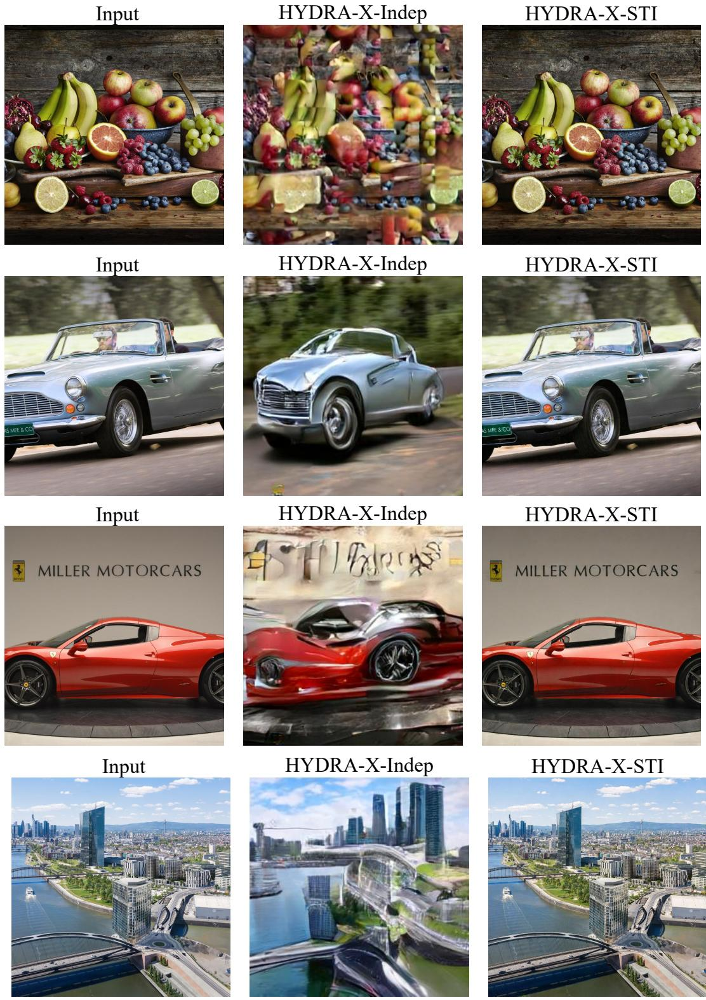  
Figure 5: Qualitative effect of tokenizer-stage source–target interaction. Source-image reconstruction produced by HYDRA-X-Indep (independent Sem-ViT encoding of source and target, the conventional pipeline) versus HYDRA-X-STI (joint encoding through tubelet causal attention, our proposal). The two variants share every other architectural component. HYDRA-X-STI preserves identity-sensitive details (object layout, characters, on-screen text) that HYDRA-X-Indep loses, despite both pipelines using the same LLM and the same number of parameters.

## G Additional Main Results

This section provides the full per-category breakdown of the benchmarks summarised in Section 6, complementing the condensed tables in the main paper.

GenEval. Table 10 reports the per-category breakdown on GenEval (Ghosh et al., 2023), covering single-object, two-object, counting, color, position, and color-attribute prompts. The breakdown helps locate the compositional dimensions where each model is strongest.

Table 10: Detailed image generation results on the GenEval benchmark (Ghosh et al., 2023). Rows in gray indicate models with ≥ 14B parameters and are excluded from the ranking. † refers to methods using LLM rewriters.

<table><tr><td>Models</td><td>Size</td><td>Single Object</td><td>Two Objects</td><td>Count</td><td>Colors</td><td>Position</td><td>Color Attribute</td><td>Overall</td></tr><tr><td colspan="9">Generation-only Models</td></tr><tr><td>SD3-Med (Esser et al., 2024)</td><td>2B</td><td>0.99</td><td>0.94</td><td>0.72</td><td>0.89</td><td>0.33</td><td>0.60</td><td>0.74</td></tr><tr><td>FLUX.1 [Dev] (Labs et al., 2025)</td><td>12B</td><td>0.98</td><td>0.93</td><td>0.75</td><td>0.93</td><td>0.68</td><td>0.65</td><td>0.82</td></tr><tr><td>DALL-E 3 (Betker et al., 2023)</td><td>-</td><td>0.96</td><td>0.87</td><td>0.47</td><td>0.83</td><td>0.43</td><td>0.45</td><td>0.67</td></tr><tr><td colspan="9">Unified Multimodal Models</td></tr><tr><td>TokenFlow-XL (Qu et al., 2025)</td><td>14B</td><td>0.95</td><td>0.60</td><td>0.41</td><td>0.81</td><td>0.16</td><td>0.24</td><td>0.55</td></tr><tr><td>SEED-X (Ge et al., 2024)</td><td>17B</td><td>0.97</td><td>0.58</td><td>0.26</td><td>0.80</td><td>0.19</td><td>0.14</td><td>0.49</td></tr><tr><td>Ming-UniVision (Huang et al., 2025)</td><td>16B</td><td>1.00</td><td>0.93</td><td>0.59</td><td>0.93</td><td>0.92</td><td>0.70</td><td>0.85</td></tr><tr><td> $BAGEL^†$ (Deng et al., 2025)</td><td>14B</td><td>0.98</td><td>0.95</td><td>0.84</td><td>0.95</td><td>0.78</td><td>0.77</td><td>0.88</td></tr><tr><td>MetaQuery-XL (Pan et al., 2025)</td><td>7B</td><td>-</td><td>-</td><td>-</td><td>-</td><td>-</td><td>-</td><td>0.80</td></tr><tr><td>Blip3-o $^†$ (Chen et al., 2025a)</td><td>8B</td><td>-</td><td>-</td><td>-</td><td>-</td><td>-</td><td>-</td><td>0.84</td></tr><tr><td>MUSE-VL (Xie et al., 2025b)</td><td>7B</td><td>0.98</td><td>0.64</td><td>0.54</td><td>0.72</td><td>0.25</td><td>0.31</td><td>0.57</td></tr><tr><td>Janus-Pro (Chen et al., 2025b)</td><td>7B</td><td>0.99</td><td>0.89</td><td>0.59</td><td>0.90</td><td>0.79</td><td>0.66</td><td>0.80</td></tr><tr><td>Show-o2 $^†$ (Xie et al., 2025a)</td><td>7B</td><td>1.00</td><td>0.87</td><td>0.58</td><td>0.92</td><td>0.52</td><td>0.62</td><td>0.76</td></tr><tr><td> $HYDRA^†$ (Qiu et al., 2026)</td><td>7B</td><td>1.00</td><td>0.97</td><td>0.68</td><td>0.91</td><td>0.81</td><td>0.80</td><td>0.86</td></tr><tr><td> $HYDRA-X$ </td><td>7B</td><td>0.99</td><td>0.95</td><td>0.83</td><td>0.90</td><td>0.84</td><td>0.75</td><td>0.88</td></tr></table>

WISE. Table 11 reports the per-category breakdown on WISE (Niu et al., 2025), which probes world knowledge across culture, time, space, biology, physics, and chemistry, and is therefore complementary to the geometric and compositional probes of GenEval.

Table 11: Detailed image generation results on the WISE benchmark (Niu et al., 2025). Rows in gray indicate models with ≥ 14B parameters and are excluded from the ranking.

<table><tr><td>Models</td><td>Size</td><td>Culture</td><td>Time</td><td>Space</td><td>Biology</td><td>Physics</td><td>Chemistry</td><td>Overall</td></tr><tr><td colspan="9">Generation-only Models</td></tr><tr><td>FLUX.1 [Dev] (Labs et al., 2025)</td><td>12B</td><td>0.48</td><td>0.58</td><td>0.62</td><td>0.42</td><td>0.51</td><td>0.35</td><td>0.50</td></tr><tr><td>SD3.5-Large (Esser et al., 2024)</td><td>8B</td><td>0.44</td><td>0.50</td><td>0.58</td><td>0.44</td><td>0.52</td><td>0.31</td><td>0.46</td></tr><tr><td colspan="9">Unified Multimodal Models</td></tr><tr><td>BAGEL (Deng et al., 2025)</td><td>14B</td><td>0.44</td><td>0.55</td><td>0.68</td><td>0.44</td><td>0.60</td><td>0.39</td><td>0.52</td></tr><tr><td>VILA-U-7B (Wu et al., 2024b)</td><td>7B</td><td>0.26</td><td>0.33</td><td>0.37</td><td>0.35</td><td>0.39</td><td>0.23</td><td>0.31</td></tr><tr><td>Janus-Pro-7B (Chen et al., 2025b)</td><td>7B</td><td>0.30</td><td>0.37</td><td>0.49</td><td>0.36</td><td>0.42</td><td>0.26</td><td>0.35</td></tr><tr><td>Emu3-Gen-8B (Wang et al., 2024c)</td><td>8B</td><td>0.34</td><td>0.45</td><td>0.48</td><td>0.41</td><td>0.45</td><td>0.27</td><td>0.39</td></tr><tr><td>Show-o2 (Xie et al., 2025a)</td><td>7B</td><td>0.40</td><td>0.45</td><td>0.58</td><td>0.39</td><td>0.53</td><td>0.34</td><td>0.44</td></tr><tr><td>HYDRA (Qiu et al., 2026)</td><td>7B</td><td>0.52</td><td>0.53</td><td>0.68</td><td>0.47</td><td>0.58</td><td>0.38</td><td>0.53</td></tr><tr><td>HYDRA-X</td><td>7B</td><td>0.53</td><td>0.57</td><td>0.72</td><td>0.53</td><td>0.64</td><td>0.40</td><td>0.56</td></tr></table>

ImgEdit-Bench. Table 12 provides the full per-dimension breakdown on ImgEdit-Bench (Ye et al., 2025), spanning nine instruction-guided editing operations from object addition and removal to background replacement, style transfer, and compositional edits.

VBench. Table 13 expands the QS/SS/Total summary in the main paper to all fourteen VBench (Huang et al., 2024) dimensions, separately probing visual quality, motion smoothness, dynamic degree, semantic correctness, and compositional reasoning.

Table 12: Detailed image editing results on the ImgEdit-Bench (Ye et al., 2025). Editing dimensions: Add, Adj. (Alter), Ext. (Extract), Rep. (Replace), Rm. (Remove), Bg. (Background), Sty. (Style), Hyb. (Compose), Act. (Action). Rows in gray indicate models with ≥ 14B parameters and are excluded from the ranking.

<table><tr><td>Models</td><td>Size</td><td>Add</td><td>Adj.</td><td>Ext.</td><td>Rep.</td><td>Rm.</td><td>Bg.</td><td>Sty.</td><td>Hyb.</td><td>Act.</td><td>Overall</td></tr><tr><td colspan="12">Generation-only Models</td></tr><tr><td>FLUX.1 Kontext [Pro] (Labs et al., 2025)</td><td>12B</td><td>4.25</td><td>4.15</td><td>2.35</td><td>4.56</td><td>3.57</td><td>4.26</td><td>4.57</td><td>3.68</td><td>4.63</td><td>4.00</td></tr><tr><td>Qwen-Image (Wu et al., 2025a)</td><td>20B</td><td>4.38</td><td>4.16</td><td>3.43</td><td>4.66</td><td>4.14</td><td>4.38</td><td>4.81</td><td>3.82</td><td>4.69</td><td>4.27</td></tr><tr><td colspan="12">Unified Multimodal Models</td></tr><tr><td>BAGEL (Deng et al., 2025)</td><td>14B</td><td>3.56</td><td>3.31</td><td>1.70</td><td>3.30</td><td>2.62</td><td>3.24</td><td>4.49</td><td>2.38</td><td>4.17</td><td>3.20</td></tr><tr><td>OmniGen (Xiao et al., 2025a)</td><td>3.8B</td><td>3.47</td><td>3.04</td><td>1.71</td><td>2.94</td><td>2.43</td><td>3.21</td><td>4.19</td><td>2.24</td><td>3.38</td><td>2.96</td></tr><tr><td>UniWorld-V1 (Lin et al., 2025a)</td><td>12B</td><td>3.82</td><td>3.64</td><td>2.27</td><td>3.47</td><td>3.24</td><td>2.99</td><td>4.21</td><td>2.96</td><td>2.74</td><td>3.26</td></tr><tr><td>OmniGen2 (Wu et al., 2025c)</td><td>4B</td><td>3.57</td><td>3.06</td><td>1.77</td><td>3.74</td><td>3.20</td><td>3.57</td><td>4.81</td><td>2.52</td><td>4.68</td><td>3.44</td></tr><tr><td>HYDRA-X</td><td>7B</td><td>4.49</td><td>4.27</td><td>4.04</td><td>4.41</td><td>4.38</td><td>4.30</td><td>4.77</td><td>3.43</td><td>4.32</td><td>4.34</td></tr></table>

Table 13: Detailed video generation results on VBench (Huang et al., 2024). Column abbreviations: QS: Quality Score, SS: Semantic Score, SC: Subject Consistency, BC: Background Consistency, MS: Motion Smoothness, DD: Dynamic Degree, AQ: Aesthetic Quality, IQ: Imaging Quality, OC: Object Class, MO: Multiple Objects, HA: Human Action, C: Color, SR: Spatial Relationship, S: Scene.

<table><tr><td>Models</td><td>Size</td><td>QS</td><td>SS</td><td>SC</td><td>BC</td><td>MS</td><td>DD</td><td>AQ</td><td>IQ</td><td>OC</td><td>MO</td><td>HA</td><td>C</td><td>SR</td><td>S</td><td>Total</td></tr><tr><td colspan="17">Generation-only Models</td></tr><tr><td>CogVideoX (Yang et al., 2024b)</td><td>5B</td><td>82.75</td><td>77.04</td><td>96.23</td><td>96.52</td><td>96.92</td><td>70.97</td><td>61.98</td><td>62.90</td><td>85.23</td><td>62.11</td><td>99.40</td><td>82.81</td><td>66.35</td><td>53.20</td><td>81.61</td></tr><tr><td>Hunyuan Video (Kong et al., 2024)</td><td>13B</td><td>85.07</td><td>76.88</td><td>97.22</td><td>97.60</td><td>99.05</td><td>71.94</td><td>60.28</td><td>67.24</td><td>83.48</td><td>66.71</td><td>94.40</td><td>89.79</td><td>72.13</td><td>54.46</td><td>83.43</td></tr><tr><td colspan="17">Unified Multimodal Models</td></tr><tr><td>VILA-U (Wu et al., 2024b)</td><td>7B</td><td>76.26</td><td>65.04</td><td>-</td><td>-</td><td>-</td><td>-</td><td>-</td><td>-</td><td>-</td><td>-</td><td>-</td><td>-</td><td>-</td><td>-</td><td>74.01</td></tr><tr><td>HaploOmni (Xiao et al., 2025b)</td><td>7B</td><td>-</td><td>-</td><td>96.40</td><td>97.60</td><td>96.80</td><td>65.30</td><td>-</td><td>-</td><td>-</td><td>-</td><td>-</td><td>-</td><td>-</td><td>-</td><td>78.10</td></tr><tr><td>Emu3 (Wang et al., 2024c)</td><td>8B</td><td>-</td><td>-</td><td>95.32</td><td>97.69</td><td>98.93</td><td>79.27</td><td>59.64</td><td>-</td><td>86.17</td><td>44.64</td><td>77.71</td><td>-</td><td>68.73</td><td>37.11</td><td>80.96</td></tr><tr><td>Show-o2 (Xie et al., 2025a)</td><td>1.5B</td><td>82.10</td><td>78.31</td><td>97.28</td><td>96.78</td><td>98.25</td><td>40.83</td><td>65.15</td><td>67.06</td><td>94.81</td><td>76.01</td><td>95.20</td><td>80.89</td><td>62.61</td><td>57.67</td><td>81.34</td></tr><tr><td>HYDRA-X</td><td>7B</td><td>83.97</td><td>81.57</td><td>95.70</td><td>95.88</td><td>92.69</td><td>35.42</td><td>63.73</td><td>65.23</td><td>96.52</td><td>76.68</td><td>99.00</td><td>87.37</td><td>73.88</td><td>69.74</td><td>83.49</td></tr></table>

## H Qualitative Comparisons

This section presents qualitative results across the five tasks supported by HYDRA-X. We compare against representative baselines drawn from both unified multimodal models and task-specialised systems, and organise the comparisons by task and resolution.

## H.1 Image Reconstruction at 512×512

We first inspect reconstruction fidelity at the standard 512×512 resolution. The comparison spans three families of baselines: dedicated image VAEs (FLUX), unified tokenizers built into UMMs (MingTok, AToken), and the recently proposed RAE. The visual difference makes texture, fine-edge, and small-text fidelity directly comparable.

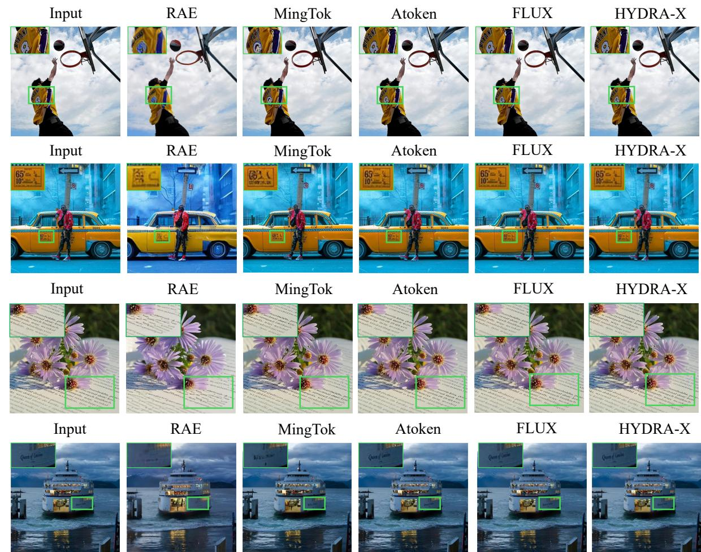  
6: Qualitative reconstruction comparison at 512×512. We compare HYDRA-X against RAE (Zheng 025), MingTok (Huang et al., 2025), AToken (Lu et al., 2025), and FLUX (Labs et al., 2025).

## H.2 Image Reconstruction at 1280×768

To stress-test generalisation beyond the training resolution, we additionally compare reconstructions at a high resolution of 1280×768 and include the dedicated video VAE Wan 2.2 alongside the image-only baselines. This setting exposes how each tokenizer handles dense fine details such as text, foliage, and small structural elements when the spatial token budget is stretched.

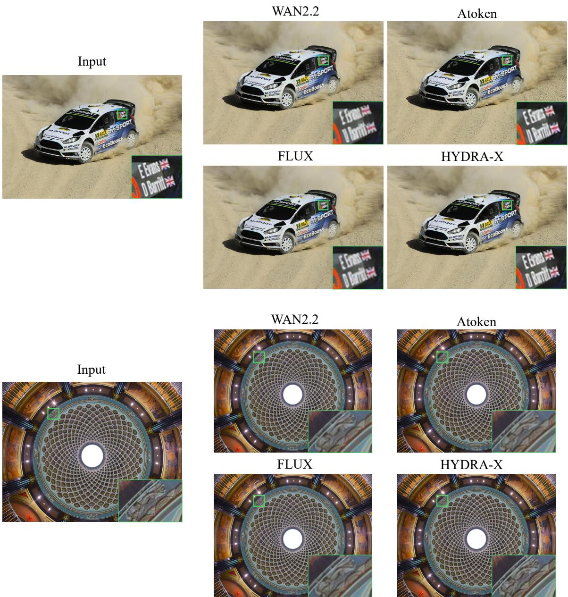  
Figure 7: Qualitative reconstruction comparison at 1280×768. We compare HYDRA-X against Wan 2.2 (Wan et al., 2025), AToken (Lu et al., 2025), and FLUX (Labs et al., 2025).

## H.3 Video Reconstruction at 512×512

Beyond static images, we visualise temporally consecutive frames reconstructed by HYDRA-X against the dedicated video VAE Wan 2.2 and the joint image–video tokenizer AToken. This helps assess whether HYDRA-XTOK’s holistic ViT preserves motion-sensitive cues such as object boundaries and inter-frame consistency.

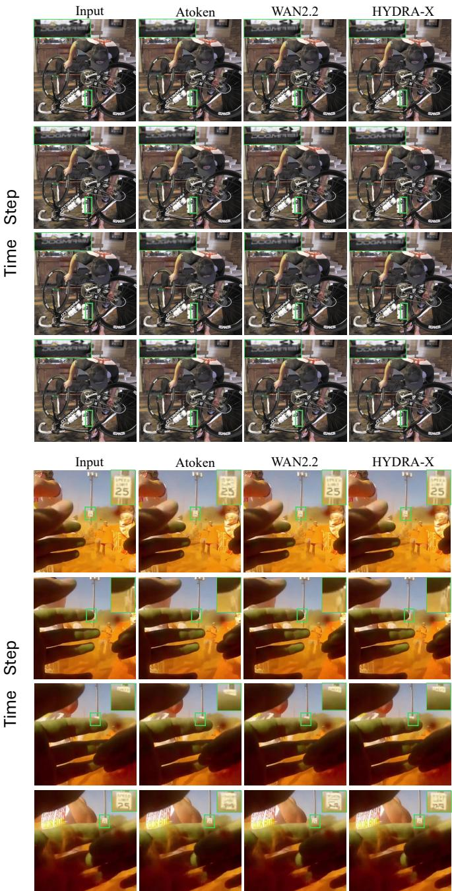

<details>
<summary>text_image</summary>

Input
Atoken
WAN2.2
HYDRA-X
Time Step
Input
Atoken
WAN2.2
HYDRA-X
Time Step
Input
Atoken
WAN2.2
HYDRA-X
</details>

Figure 8: Qualitative video reconstruction comparison. We compare HYDRA-X against Wan 2.2 (Wan et al., 2025) and AToken (Lu et al., 2025).

## H.4 Image Generation

We provide qualitative text-to-image samples produced by HYDRA-X spanning a diverse range of prompts—from realistic photography and stylised illustration to compositional and knowledge-driven scenes—to characterise the model’s coverage and aesthetic quality.

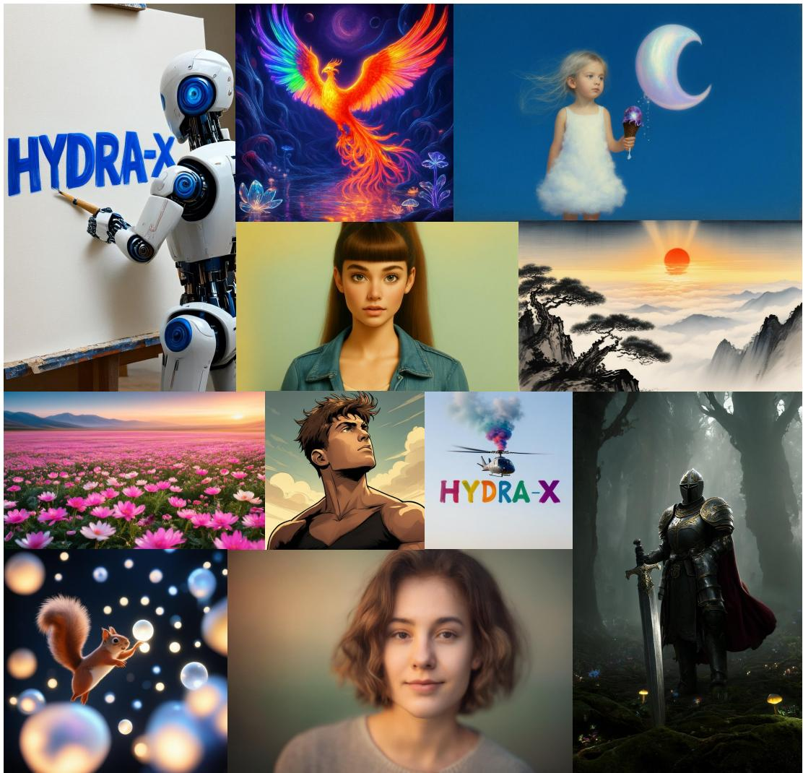

<details>
<summary>natural_image</summary>

Collage of colorful images including a robot, a girl, a moon, a landscape, flowers, a helicopter, a sword, and a alien (no text or symbols)
</details>

Figure 9: Qualitative image generation results from HYDRA-X.

## H.5 Video Generation

We similarly present qualitative text-to-video samples covering varied subjects, scenes, and motion patterns, illustrating how the holistic latent supports temporally coherent synthesis under the same UMM backbone.


<details>
<summary>text_image</summary>

HYDRA-X
HYDRA-X
HYDRA-X
HYDRA-X
HYDRA-X
</details>

A majestic, photorealistic wide shot of snow-capped mountains under a bright, clear blue sky. Fluffy white clouds elegantly form the word 'HYDRA-X' in the center of the sky. The text clouds blend naturally with scattered, regular clouds around them. Cinematic lighting, highly detailed, with gentle, realistic cloud movement and a slow, sweeping camera pan.


<details>
<summary>natural_image</summary>

Five-panel sequence of a dramatic sunset sky with scattered white clouds against a dark blue sky (no text or symbols)
</details>

A grand, expansive vista of a dramatic sunset blending into a starry night sky. The top is a clear blue with the Milky Way and stars visible, while the bottom horizon glows with rich orange or red hues. Fluffy clouds are scattered across the scene. Timelapse-style camera showing the gradual shift of the sky and stars. Gentle camera pan.


<details>
<summary>natural_image</summary>

Panoramic view of vast desert dunes under a starry sky, showing subtle sand dunes and silhouetted trees (no text or symbols)
</details>

A wide-angle, cinematic shot of a vast golden desert with detailed, wind-swept sand dunes in the foreground. Above, a breathtakingly clear, deep blue night sky filled with bright stars and a vividly glowing Milky Way galaxy. In the distant horizon, a mysterious, massive dark silhouette resembling a giant hand or abstract rock formation rises towards the stars. Surreal atmosphere, highly detailed, with a smooth, slow camera pan across the silent landscape.


<details>
<summary>natural_image</summary>

Five-panel sequence showing a wolf holding an arrow in a forest setting (no text or symbols)
</details>

A close-up view of a brawny humanoid werewolf-like creature with grey fur, standing in a blurry forest setting. The creature looks directly into the lens with an intense, weary expression. It holds its hands firmly around an ornate, branch-decorated arrow with a red feather that is shot into its bloodied chest. Cinematic, dramatic lighting. Subtle chest movement as it breathes.

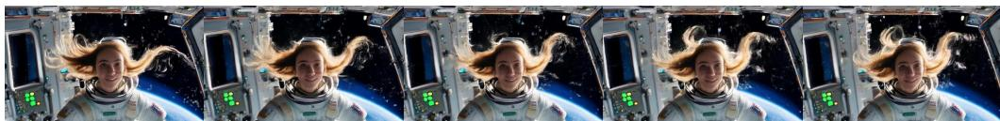

<details>
<summary>natural_image</summary>

Sequence of six images showing a woman in space suits looking out of Earth from spacecraft, with no visible text or symbols.
</details>

A smiling female astronaut floating in zero gravity inside a space station, her blonde hair drifting freely in the air, with a view of Earth and space through the window behind her.


<details>
<summary>natural_image</summary>

Series of five-panel fantasy still life with ocean waves, clouds, and a figure in a hat (no text or symbols)
</details>

A surreal dreamscape of a peaceful beach with glowing, translucent jellyfish floating in a pastel aurora sky, surrounded by giant colorful flowers and gentle ocean waves.

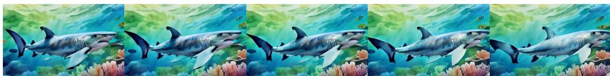

<details>
<summary>natural_image</summary>

Illustration of a cartoon shark swimming in the ocean with coral and seaweed (no text or symbols)
</details>

A beautiful watercolor-style animation of a great white shark swimming gracefully underwater above a vibrant coral reef.

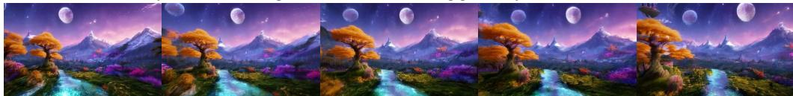

<details>
<summary>natural_image</summary>

Five-panel fantasy landscape painting showing a river, autumn trees, distant mountains, and a moon (no text or symbols)
</details>

A magical fantasy landscape featuring a glowing cyan river, vibrant colorful flora, a majestic golden tree, and glowing mountains under a purple starry sky with two moons.

Figure 10: Qualitative video generation results from HYDRA-X.

## H.6 Image Editing

Finally, we compare HYDRA-X against representative editing systems on a set of instruction-guided edits. The baselines include both unified multimodal models (BAGEL, OmniGen2) and editing-specialised generators (Qwen-Image-Edit, Step1X-Edit), allowing readers to gauge identity preservation, instruction adherence, and visual quality side-by-side.

Src  
HYDRA-X  
Bagel  
Qwen-Edit  
Step1-X  
Omnigen2  
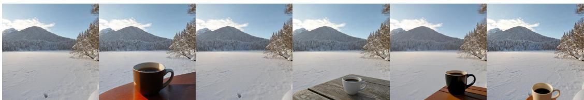

<details>
<summary>natural_image</summary>

Sequence of six photos showing a snowy landscape with mountains, trees, and a table of coffee cups (no text or symbols)
</details>

Add a coffee cup on the table in the foreground.  
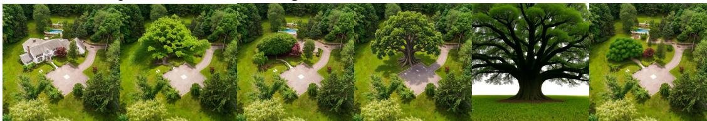

<details>
<summary>natural_image</summary>

Panoramic aerial view of a landscaped park with a large tree and surrounding greenery, no visible text or symbols.
</details>

Replace the architecture in the image with a large tree.  


<details>
<summary>natural_image</summary>

Six-panel photo collage showing various food items: grilled steak, umbrella, bowl with green sauce, and blue umbrella (no text or symbols)
</details>

Replace the sliced steak in the image with a folded umbrella.  


<details>
<summary>natural_image</summary>

Six-panel collage of a beach campsite at sunset, featuring white tents and beachlines with no visible text or symbols.
</details>

Change the tent in the picture from the forest to the beach.  
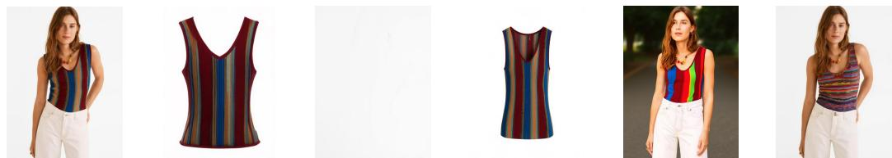

<details>
<summary>natural_image</summary>

Five fashion models of women wearing different colorful and white outfits, displayed against a plain background (no text or symbols visible)
</details>

Extract the colorful striped top worn by the person in the image.

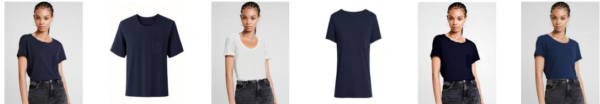

<details>
<summary>natural_image</summary>

Six fashion models wearing casual outfits and jeans, displaying different sleeveless T-shirts (no text or symbols visible)
</details>

Extract the navy blue T-shirt worn by the person in the image.  
Figure 11: Qualitative editing comparison. We compare HYDRA-X against BAGEL (Deng et al., 2025), Qwen-Image-Edit (Wu et al., 2025a), Step1X-Edit (Liu et al., 2025a), and OmniGen2 (Wu et al., 2025c).