# TSA: Temporal Slot Activation for Persistent Object-Centric Video Representation

Duc Nguyen1∗, Sieu Tran1∗, Hao Vo1, Khoa Vo1, Duy Minh Ho Nguyen2, Nghi D. Q. Bui3, Anh Nguyen4, Long Mai5, Ngan Le1

1University of Arkansas, USA 2Max Planck Research School for Intelligent Systems

3Google Research, Google 4University of Liverpool, UK 5Adobe Research

## Abstract

Unsupervised video object-centric learning aims to decompose dynamic scenes into temporally persistent entity representations. Existing recurrent video slotattention methods propagate a fixed set of slots across frames, but typically assume unconditional slot propagation: every slot is updated and decoded at every frame, regardless of whether its corresponding object is visible. We show that this design violates a basic lifecycle requirement for persistent slots: when an object is absent or fully occluded, its slot should preserve its previous state and avoid explaining unrelated visible content. Instead, unconditional propagation creates two failure pathways: update-induced state drift, where current-frame evidence overwrites the absent object’s representation, and decoder-induced reconstruction interference, where the inactive slot remains coupled to reconstruction through decoder attention. We propose Temporal Slot Activation (TSA), a lightweight mechanism that learns a per-slot, per-frame activation score $\alpha _ { k , t } \in ( 0 , 1 )$ without visibility supervision. TSA uses this activation as a shared latent control variable for slot lifecycle modeling. When a slot is inactive, TSA anchors its state to the previous slot through activation-gated updating and suppresses its decoder participation through an activation-dependent additive bias on attention logits before softmax normalization. This jointly reduces state drift and reconstruction-driven interference. To improve decisions under partial occlusion and gradual reappearance, TSA further conditions activation prediction on a per-slot temporal memory produced by a Temporal Context Encoder. We evaluate TSA on MOVi-C, MOVi-E, YouTube-VIS, and the occlusion-heavy OVIS benchmarks, using both standard metrics (FG-ARI, mBO) and tracking-based metrics (IDF1, HOTA). TSA consistently improves object decomposition and temporal identity preservation, with large gains on long, heavily occluded videos. The source code will be made publicly.

## 1 Introduction

Humans perceive visual scenes as collections of persistent objects that remain identifiable through motion, occlusion, and reappearance [1, 2, 3]. Object-centric learning (OCL) aims to recover such structure without supervision by decomposing visual inputs into entity-level representations [4, 5, 6, 7, 8]. Slot Attention (SA) [9] has become a standard formulation for OCL and a foundation for compositional reasoning and prediction tasks [10, 11, 12, 13, 14]. Extending SA from images to videos introduces a central requirement: temporal consistency–a slot should preserve the same object identity across time, including under partial or full occlusion. To this end, Video Slot Attention (VSA) methods propagate slot states forward and update them using the current frame [15, 16, 17, 18, 19].

Despite their effectiveness, these methods share a common structural assumption that we call unconditional slot propagation: every slot is updated and decoded at every frame, regardless of whether the corresponding object is currently visible. This assumption conflates object persistence with visual presence, leading to state drift under occlusion. Figure 1 illustrates this failure: when a kayaker becomes fully occluded by a capsized kayak, the competitive nature of Slot Attention forces every slot to align with some visible content, so the kayaker’s slot is reassigned to the occluding kayak hull. This overwrites the previously stored object representation with unrelated features, and the slot gradually loses the identity of the object it was tracking. When the object reappears, the corrupted slot state can no longer function as a meaningful query for reacquisition, and the object is instead captured by another slot, resulting in an identity switch. In this sense, representation drift is the underlying mechanism, while identity switch is its observable consequence. This drift is jointly driven by two coupled mechanisms – unconditional state update and unconditional decoder participation (Sec. 3).

We address this problem by introducing Temporal Slot Activation (TSA), a lightweight mechanism that assigns each slot k at frame t a learned activation score $\alpha _ { k , t } \in ( 0 , 1 )$ , trained without visibility supervision. The activation score serves as a shared latent control variable governing the slot lifecycle. For slot-state evolution, TSA performs an activation-gated state update: active slots $( \alpha _ { k , t }  1 )$ focus on the current SA candidate, whereas inactive slots $( \alpha _ { k , t }  0 )$ remain anchored to their previous states, preventing occlusion-induced overwriting. For decoding, TSA performs activation-gated decoder participation by applying an additive log-bias on cross-attention logits before softmax, suppressing inactive slots during decoder competition. Through this dual gating, TSA enforces consistent inactive-but-persistent behavior: an inactive slot is simultaneously protected from current-frame updates and prevented from explaining unrelated visible content.

We first evaluate TSA on standard video OCL benchmarks including MOVi-C, MOVi-E [20], and YouTube-VIS [21], and report conventional object-centric grouping metrics such as FG-ARI and mBO. Since these benchmarks and metrics may not fully reveal identity failures caused by crowded scenes, long object trajectories, severe occlusions, and objects disappearing and reappearing, we further adopt OVIS [22] as an occlusion-centric evaluation benchmark and report identity-sensitive tracking metrics, including HOTA [23] and IDF1 [24].

Our contributions are: (i) We identify unconditional slot propagation as a fundamental limitation of recurrent VSA methods. Therein we provide a formal analysis showing how it causes representation drift and identity switch through two coupled mechanisms: update-induced state drift and decoder-induced gradient interference (Sec. 3). (ii) We propose Temporal Slot Activation (TSA), a lightweight mechanism that equips each slot with a learned per-frame activation score $\alpha _ { k , t }$ , which jointly controls slot-state evolution and decoder participation, enabling inactive-but-persistent slot behavior (Sec. 4). (iii) We extend the standard evaluation protocol beyond MOVi-C, MOVi-E, and YouTube-VIS by adopting OVIS as an occlusion-centric benchmark for assessing long-term slot persistence. We complement standard grouping metrics with tracking-based metrics, including HOTA and IDF1 to more directly assess temporal consistency and identity preservation (Sec. 5).

## 2 Related Work

Object-Centric Learning (OCL) and Slot Attention (SA). OCL aims to represent a visual scene as a set of object-level entities without requiring supervision. Early approaches achieved this through sequential attention mechanisms that iteratively extract objects from an image [5, 6, 4]. SA [9] later introduced a scalable alternative based on competitive cross-attention, where a fixed set of slots compete to explain the scene, and has since become the dominant paradigm. Subsequent work has primarily focused on improving per-frame decomposition quality. These improvements come from stronger pretrained visual features [25, 26], more expressive generative decoders [12, 27], and more flexible slot parameterizations [28, 29]. These advances are developed for the single-image setting and form the basis for subsequent extensions to video.

Video Slot Attention (VSA). Extending beyond per-frame decomposition, the video setting requires each slot to consistently represent the same object across frames. SAVi [15] addressed this by propagating slot states over time using a learned transition function, followed by refinement with SA at each frame. Subsequent work improves robustness by incorporating additional cues such as depth [16], discrete tokens [30], and stronger pretrained features [17]. Beyond architectural design, another line of work focuses on improving temporal consistency through training objectives. For example, VideoSAUR [17] introduces temporal feature-similarity losses, while SlotContrast [18] enforces slot identity consistency via contrastive learning. RandSF.Q [19] further improves temporal prediction by conditioning transitions on sampled slot-feature pairs.

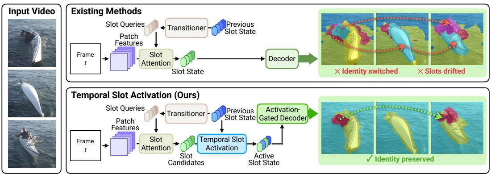

flowchart

```mermaid
graph TD
  A["Input Video"] --> B["Frame t"]
  B --> C["Slot Queries"]
  C --> D["Slot Attention"]
  D --> E["Decoder"]
  E --> F["Identity switched"]
  E --> G["× Slots drifted"]
    
  H["Existing Methods"] --> I["Slot Features"]
  I --> J["Slot Attention"]
  J --> K["Slot State"]
  K --> L["Decoder"]
    
  M["Temporal Slot Activation (Ours)"] --> N["Slot Features"]
  N --> O["Slot Attention"]
  O --> P["Slot Candidates"]
  P --> Q["Temporal Slot Activation"]
  Q --> R["Active Slot State"]
  R --> S["Activation-Gated Decoder"]
    
  T["Input Video"] --> U["Input Video"]
  U --> V["Input Video"]
  V --> W["Input Video"]
  W --> X["Input Video"]
  X --> Y["Input Video"]
    
  Z["Input Video"] --> AA["Input Video"]
  AA --> AB["Input Video"]
  AB --> AC["Input Video"]
  AC --> AD["Input Video"]
    
  AE["Input Video"] --> AF["Input Video"]
  AF --> AG["Input Video"]
  AG --> AH["Input Video"]
    
  AI["Input Video"] --> AJ["Input Video"]
  AJ --> AK["Input Video"]
  AK --> AL["Input Video"]
  AL --> AM["Input Video"]
    
  AN["Input Video"] --> AO["Input Video"]
  AO --> AP["Input Video"]
  AP --> AQ["Input Video"]
    
  AR["Input Video"] --> AS["Input Video"]
  AS --> AT["Input Video"]
  AT --> AU["Input Video"]
    
  AV["Input Video"] --> AW["Input Video"]
  AW --> AX["Input Video"]
  AX --> AY["Input Video"]
    
  AZ["Input Video"] --> BA["Input Video"]
  BA --> BB["Input Video"]
  BB --> BC["Input Video"]
    
  BD["Input Video"] --> BE["Input Video"]
  BE --> BF["Input Video"]
  BF --> BG["Input Video"]
    
  BH["Input Video"] --> BI["Input Video"]
  BI --> BJ["Input Video"]
  BJ --> BK["Input Video"]
    
  BL["Input Video"] --> BM["Input Video"]
  BM --> BN["Input Video"]
  BN --> BO["Input Video"]
    
  BP["Input Video"] --> BQ["Input Video"]
  BQ --> BR["Input Video"]
  BR --> BS["Input Video"]
    
  BT["Input Video"] --> BU["Input Video"]
  BU --> BV["Input Video"]
  BV --> BW["Input Video"]
    
  BX["Input Video"] --> BY["Input Video"]
  BY --> BZ["Input Video"]
  BZ --> CA["Input Video"]
    
  CB["Input Video"] --> CC["Input Video"]
  CC --> CD["Input Video"]
  CD --> CE["Input Video"]
    
  CF["Input Video"] --> CG["Input Video"]
  CG --> DH["Input Video"]
  DH --> DI["Input Video"]
    
  DJ["Input Video"] --> DK["Input Video"]
  DK --> DL["Input Video"]
  DL --> DJ
    
  DJ --> DJ
```

Figure 1: Unconditional slot propagation vs. TSA under occlusion. $T o p \mathrm { : }$ Without activation gating, the kayaker’s slot drifts toward the occluding hull and triggers an identity switch. Bottom: TSA deactivates the absent slot via $\alpha _ { k , t }$ , preserving its state for consistent reacquisition.

Despite these advances, all prior VSA methods operate within the same regime of unconditional propagation: every slot is updated and decoded at every frame. Existing mitigations of temporal inconsistency act on how slots are propagated, through transition dynamics [15, 11, 19] or temporal objectives [17, 18], but not on whether a given slot should be updated or decoded. As a result, slot-level object correspondence remains implicit, without a controlled mechanism for preserving object identity in challenging temporal scenarios such as occlusion. In contrast, TSA introduces a learned activation score that explicitly determines whether a slot is updated and decoded at each frame – an axis of control orthogonal to prior transition modeling and temporal objectives.

## 3 Limitations of Unconditional Slot Propagation

Recurrent VSA Pipeline. Let $\mathbf { S } _ { k , t } \in \mathbb { R } ^ { d }$ denote the state of slot $k \in \{ 1 , \ldots , K \}$ at frame $t \in$ $\{ 1 , \ldots , T \}$ , and let $\mathbf { f } _ { t } \in \mathbb { R } ^ { N \times d }$ denote the features extracted by a frozen visual encoder at time t. Given the previous slot states $\mathbf { S } _ { t - 1 } = \{ \mathbf { S } _ { k , t - 1 } \} _ { k = 1 } ^ { K }$ , a Temporal Query Transitioner $( T _ { \phi } )$ predicts a query $\mathbf { q } _ { k , t } = T _ { \phi } ( \mathbf { S } _ { t - 1 } , \mathbf { f } _ { t } )$ for each slot. Existing VSA methods [15, 16, 30, 17, 31, 18, 19] typically adopt SA [9] (Uθ) to align each query with current-frame evidence via competitive cross-attention:

$$
\mathbf {S} _ {k, t} = \mathrm{SA} (\mathbf {f} _ {t}, \mathbf {q} _ {k, t}) = U _ {\theta} (\mathbf {f} _ {t}, T _ {\phi} (\mathbf {S} _ {t - 1}, \mathbf {f} _ {t})). \tag {1}
$$

All slots are then passed to the decoder. Let $\mathbf { q } _ { n } ^ { d }$ be the decoder query at position n, and let $\mathbf { k } ^ { d } ( \mathbf { S } _ { k , t } )$ $\mathbf { v } ^ { d } ( \mathbf { S } _ { k , t } )$ ) be the key and value projected from slot k. The decoder attention logits and weights are:

$$
z _ {k, n, t} = (\sqrt {d}) ^ {- 1} \left(\mathbf {q} _ {n} ^ {d} \mathbf {k} ^ {d} \left(\mathbf {S} _ {k, t}\right)\right), \quad A _ {k, n, t} ^ {d} = \exp \left(z _ {k, n, t}\right) \left(\sum_ {j = 1} ^ {K} \exp \left(z _ {j, n, t}\right)\right) ^ {- 1}. \tag {2}
$$

We refer to Eq. 1 as unconditional state update and Eq. 2 as unconditional decoder participation $A _ { k , n , t } ^ { d } > 0$ $k , n , t ,$ competition of the decoder at every frame, jointly forming the unconditional slot propagation regime. To assess this regime, we adopt the lens of object persistence: each slot is expected to represent the identity of one object over time. Let $v _ { k , t } \in \{ 0 , 1 \}$ denote the visibility of the object represented by slot k at frame $t ,$ with $v _ { k , t } = 1$ when the object is visible and $v _ { k , t } = 0$ when it is absent or fully occluded. We say slot k is active at frame t if $v _ { k , t } = 1$ and inactive if $v _ { k , t } = 0$ . An active slot should update using the current-frame evidence, whereas an inactive slot should remain persistent, preserving identity for future reappearance. Unconditional slot propagation violates this expectation, giving rise to two structurally distinct failure pathways analyzed below.

Failure Pathway I: Update-Induced State Drift. Consider an interval ${ \mathcal { T } } _ { [ a , b ] } = \{ a , \ldots , b \}$ during which the object associated with slot k is absent. Under the object persistence constraint $\mathbf { S } _ { k , t } = \mathbf { S } _ { k , t - 1 }$ during $\mathcal { T } _ { [ a , b ] }$ as $\mathbf { f } _ { t }$ may contain information about other visible objects and background, but no evidence for object k. However, under unconditional state updating $\mathbf { S } _ { k , t } = U _ { \theta } ( \mathbf { f } _ { t } , T _ { \phi } ( \mathbf { S } _ { t - 1 } , \mathbf { f } _ { t } ) )$ , state drift can accumulate over an absence interval:

$$
\left\| \mathbf {S} _ {k, b} - \mathbf {S} _ {k, a - 1} \right\| \leq \sum_ {t = a} ^ {b} \left\| \mathbf {S} _ {k, t} - \mathbf {S} _ {k, t - 1} \right\| = \sum_ {t = a} ^ {b} \left\| U _ {\theta} (\mathbf {f} _ {t}, T _ {\phi} (\mathbf {S} _ {t - 1}, \mathbf {f} _ {t})) - \mathbf {S} _ {k, t - 1} \right\|. \tag {3}
$$

Even small frame-to-frame changes can therefore lead to substantial deviation from the pre-occlusion identity as the absence duration increases.

Failure Pathway II: Decoder-Induced Reconstruction Interference. One might attempt to address $A _ { k , n , t } ^ { d } >$ $0 , \forall k , n , t$ , thus, every slot contributes to the decoded output, even if the corresponding object is absent. This creates a training-time reconstruction pathway from the loss to the inactive slots. For a $\mathcal { L } _ { \mathrm { r e c o n } } ( \hat { \mathbf { y } } _ { t } , \mathbf { y } _ { t } )$ $\hat { \mathbf { y } } _ { t } = \{ \hat { \mathbf { y } } _ { n , t } \} _ { n = 1 } ^ { N }$ $\mathbf { y } _ { t } = \{ \mathbf { y } _ { n , t } \} _ { n = 1 } ^ { N }$ and target features at frame t, the derivative with respect to slot ${ \bf S } _ { k , t }$ contains terms of the form

$$
\frac {\partial \mathcal {L} _ {\text { recon }}}{\partial \mathbf {S} _ {k , t}} = \sum_ {n} \frac {\partial \mathcal {L} _ {\text { recon }}}{\partial \hat {\mathbf {y}} _ {n , t}} \frac {\partial \hat {\mathbf {y}} _ {n , t}}{\partial \mathbf {S} _ {k , t}}, \text { where } \quad \frac {\partial \hat {\mathbf {y}} _ {n , t}}{\partial \mathbf {S} _ {k , t}} = A _ {k, n, t} ^ {d} \frac {\partial \mathbf {v} ^ {d} (\mathbf {S} _ {k , t})}{\partial \mathbf {S} _ {k , t}} + \sum_ {j = 1} ^ {K} \mathbf {v} ^ {d} (\mathbf {S} _ {j, t}) \frac {\partial A _ {j , n , t} ^ {d}}{\partial \mathbf {S} _ {k , t}}. \tag {4}
$$

$A _ { k , n , t } ^ { d }$ the decoder can use information from an inactive slot to reduce reconstruction error for unrelated visible content. This means that the training objective provides gradients through the inactive slots, optimize the model parameters in a way that may undermine inactive-but-persistent behavior.

Design Requirement. The above analysis shows that the two failure pathways are structurally distinct. A valid solution must jointly regulate two conditions: (i) Should slot k update from the current frame? and (ii) Should slot k participate in reconstructing the current frame? For an inactive slot, the desired behavior is

$$
(\mathbf {A}) \colon v _ {k, t} = 0 \Rightarrow \mathbf {S} _ {k, t} \approx \mathbf {S} _ {k, t - 1} (\text { Pathway   I }) \quad (\mathbf {B}) \colon v _ {k, t} = 0 \Rightarrow A _ {k, n, t} ^ {d} \approx 0 \quad \forall n (\text { Pathway   II }). \tag {5}
$$

The first condition prevents update-induced state drift, while the second removes the inactive slot from decoder competition and suppresses reconstruction-driven interference. This motivates proposing a shared activation variable $\alpha _ { k , t } \in ( 0 , 1 )$ ) that jointly controls both pathways via activation-gated state update and activation-gated decoder participation: $\alpha _ { k , t }  0 \Rightarrow \{ \mathbf { S } _ { k , t } \approx \mathbf { S } _ { k , t - 1 }$ , and $A _ { k , n , t } ^ { d } \to 0 \}$ . Using a single activation variable $\alpha _ { k , t }$ t is important for inactive-but-persistent slot behavior because if state updating and decoder participation were controlled independently, one pathway could remain active while the other is suppressed.

## 4 Temporal Slot Activation

We instantiate the design constraint in Sec. 3 with Temporal Slot Activation (TSA). Each slot k at frame t is equipped with a learned scalar activation score $\alpha _ { k , t } ~ \in ~ ( 0 , 1 )$ , trained without visibility supervision. When the slot is active $( \alpha _ { k , t }  1 )$ , it updates its slot state and contributes to reconstruction normally. When inactive $( \alpha _ { k , t }  0 ) , \alpha _ { k , }$ t simultaneously freezes the slot state (satisfying Eq. 5(A)) and silences the slot in the decoder (satisfying Eq. 5(B)). Figure 2 illustrates the complete forward pass.

## 4.1 Slot Activation Estimator

Given the slot query ${ \bf q } _ { k , t }$ from the transition module $T _ { \phi } , { \mathrm { S A } } \left( U _ { \theta } \right)$ refines it using current-frame features $\mathbf { f } _ { t }$ to produce a candidate state: $\tilde { \mathbf { S } } _ { k , t } = U _ { \theta } ( \mathbf { f } _ { t } ; \mathbf { q } _ { k , t } )$ TSA predicts the activation score α with

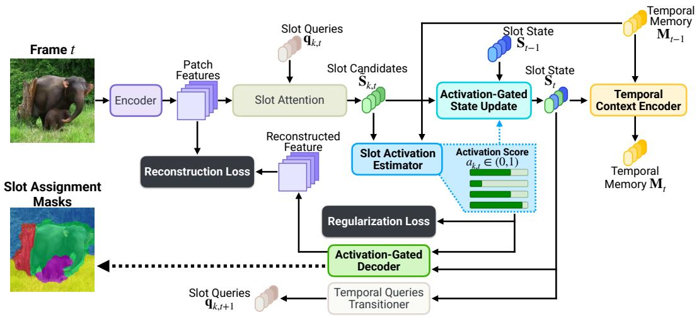

flowchart

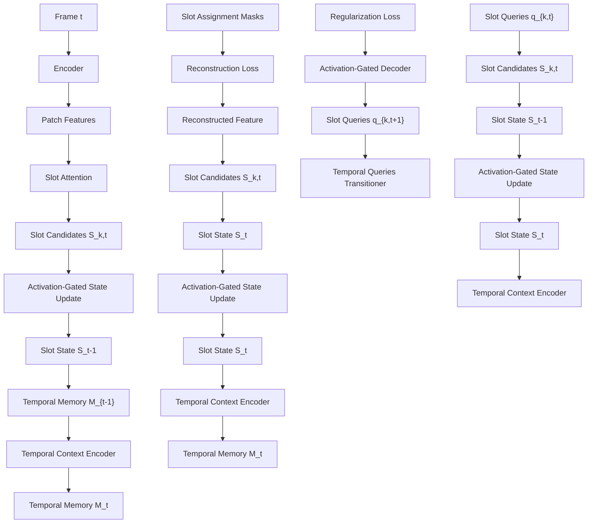

Figure 2: Overview of Temporal Slot Activation (TSA). At each frame t, Slot Attention refines slot queries ${ \bf q } _ { k , t }$ into slot candidates $\tilde { \mathbf { S } } _ { k , t }$ , from which the Slot Activation Estimator predicts a learned activation score $\alpha _ { k , t }$ . The score jointly controls state updates $( \mathrm { E q . 7 } )$ and decoder attention (Eq. 8), freezing and silencing inactive slots while allowing active ones to track normally.

a shared Slot Activation Estimator $\Phi _ { \textup { c h } } \cdot$

$$
\alpha_ {k, t} = \sigma \left(\Phi_ {\text {act}} \left(\tilde {\mathbf {S}} _ {k, t}, \mathbf {M} _ {k, t - 1}\right)\right), \tag {6}
$$

where $\mathbf { M } _ { k , t - 1 } \in \mathbb { R } ^ { d _ { h } }$ denotes the temporal memory of slot $k - \mathbf { a }$ recurrent summary of its history trajectory $[ \mathbf { S } _ { k , 0 } , \ldots , \mathbf { S } _ { k , t - 1 } ]$ produced by a Temporal Context Encoder $\Psi _ { \mathrm { t c e } } \ ( \mathrm { S e c . } \ 4 . 4 )$ , capturing the slot’s accumulated behavior over time. The $\Phi _ { \mathrm { a c t } }$ is conditioned on the slot candidate $\tilde { \mathbf { S } } _ { k , t }$ rather than the query ${ \bf q } _ { k , t }$ because the candidate is directly grounded in current-frame evidence. The query is inherited from $\mathbf { S } _ { k , t - 1 }$ and remains object-like even when the object is absent–making it a weak deactivation signal. In contrast, $\tilde { \mathbf { S } } _ { k , t }$ reflects current-frame evidence directly: when the object is absent, SA fails to align the slot to any coherent region, producing a weakly-aligned candidate that serves as a reliable signal for deactivation. The temporal memory vector $\mathbf { M } _ { k , t - 1 }$ supplements this with trajectory context, enabling more robust decisions in ambiguous regimes – such as partial occlusion or gradual reappearance–where $\tilde { \mathbf { S } } _ { k , t }$ alone may be misleading.

## 4.2 Activation-Gated State Update

To prevent update-induced state drift, TSA replaces direct state adoption with an activation-gated update:

$$
\mathbf {S} _ {k, t} = \alpha_ {k, t} \tilde {\mathbf {S}} _ {k, t} + (1 - \alpha_ {k, t}) \mathbf {S} _ {k, t - 1}. \tag {7}
$$

When the slot is active, $\alpha _ { k , t }  1$ , the model incorporates the current slot candidate. When the slot is inactive, $\alpha _ { k , t }  0 ;$ , the update reduces $\mathbf { S } _ { k , t } \to \mathbf { S } _ { k , t - 1 }$ , satisfying constraint in $\operatorname { E q . } 5 ( \mathbf { A } )$ . Thus, the candidate is still computed for activation prediction as it provides the primary deactivation signal to the estimator $\Phi _ { a c t } .$ , but its ability to overwrite the stored slot state is controlled by $\alpha _ { k , t }$ .

## 4.3 Activation-Gated Decoder Participation

As Activation-Gated State Update (Sec.4.2) alone does not remove an inactive slot from the reconstruction pathway. An inactive slot may still enter the decoder softmax and receive reconstruction-driven gradients. TSA therefore uses the same activation score to modulate decoder attention. Let $z _ { k , n , t }$ denote the decoder attention logit between slot k and spatial position n. TSA injects the activation score as a pre-softmax additive bias:

$$
A _ {k, n, t} ^ {d} = \operatorname{softmax} _ {k} (z _ {k, n, t} + \log (\alpha_ {k, t})) = \frac {\alpha_ {k , t} \exp (z _ {k , n , t})}{\sum_ {j = 1} ^ {K} \alpha_ {j , t} \exp (z _ {j , n , t})}. \tag {8}
$$

Placing the log-bias inside the softmax embeds activation directly into slot competition: as $\alpha _ { k , t }$ decreases, the contribution of slot k is multiplicatively downweighted before normalization. In the inactive limit $( \alpha _ { k , t }  0 )$ , the biased logit $z _ { k , n , t } + \log ( \alpha _ { k , t } )  - \infty$ , yielding $A _ { k , n , t } ^ { d } \to 0$ for all positions. Thus, the same scalar that gates state updates also suppresses decoder participation, aligning decoding with the desired inactive behavior.

This mechanism acts as a learned, continuous analog of attention masking. Unlike fixed binary masks, TSA uses a dynamic slot-wise gate: intermediate $\alpha _ { k , t }$ t softly attenuates uncertain slots, while $\alpha _ { k , t }  0$ enforces hard exclusion. Because gating occurs before softmax, it removes both pathways through which inactive slots affect reconstruction; their direct contribution vanishes, and their influence on normalization disappears. Consequently, decoder gating not only preserves inactive slots in the state space but also prevents them from explaining unrelated visible content.

## 4.4 Temporal Context Encoder

Single-frame evidence is often unreliable for activation, especially under occlusion where residual features can produce convincing but incorrect slot candidates. To mitigate this, each slot maintains a temporal memory vector $\mathbf { M } _ { k , t } \in \mathbb { R } ^ { d _ { h } }$ that summarizes its recent trajectory, providing $\Phi _ { \mathrm { a c t } }$ with historical context to complement the current-frame signal $\tilde { \mathbf { S } } _ { k , t }$ . For this memory to be useful upon reappearance, it must remain stable during absence; otherwise, drift would corrupt the trajectory context needed for correct reactivation–the memory-level analogue of the state-level drift analyzed in Sec. 3. We compute $\mathbf { M } _ { k , \astrosun }$ t via a Temporal Context Encoder $\Psi _ { \mathrm { t c e } }$ conditioned on the post-gate slot state $\mathbf { S } _ { k , t } \colon$

$$
\mathbf {M} _ {k, t} = \Psi_ {\mathrm{tce}} (\mathbf {M} _ {k, t - 1}, \mathbf {S} _ {k, t}), \quad \mathbf {M} _ {k, 0} = \mathbf {0}. \tag {9}
$$

The key design choice is conditioning on ${ \mathbf { S } } _ { k , t }$ rather than $\tilde { \mathbf { S } } _ { k , t }$ . When the slot is inactive, Eq. 7 ensures $\mathbf { S } _ { k , t } \approx \mathbf { S } _ { k , t - 1 }$ , so $\mathbf { M } _ { k , t } \approx \mathbf { M } _ { k , t - 1 } \mathbf { : }$ the activation gate that protects the slot state simultaneously protects the memory, without any additional mechanism. Conditioning on $\tilde { \mathbf { S } } _ { k , t }$ t instead would expose memory to current-frame evidence during inactivity, reintroducing through the memory pathway the same overwrite problem that Eq. 7 closes at the state level. To prevent unintended interference, $\mathbf { M } _ { k , t }$ is routed exclusively to $\Phi _ { \mathrm { a c t } }$ , with no direct connection to the decoder or transition module $T _ { \phi }$ .

## 4.5 Training Objectives

TSA is trained with a reconstruction loss ${ \mathcal { L } } _ { \mathrm { r e c o n } }$ [17] and a slot-consistency contrastive loss $\mathcal { L } _ { \mathrm { s s c } } \left[ 1 8 \right]$ augmented with an activation regularizer $\mathcal { L } _ { \mathrm { r e g } }$ composed of two complementary terms. Without regularization, $\mathcal { L } _ { \mathrm { r e c o n } }$ alone admits two degenerate solutions: full-activation collapse $( \alpha _ { k , t } \equiv 1 )$ ), where TSA reduces to the unconditional propagation, and ambiguous gating $( \alpha _ { k , t } \approx 0 . 5 )$ , where neither pathway is decisively controlled. We address both failure modes with a single regularizer

$$
\mathcal {L} _ {\text { reg }} = \mathcal {L} _ {\text { usage }} + \beta \mathcal {L} _ {\text { sparse }}, \text { where } \mathcal {L} _ {\text { usage }} = \frac {1}{K T} \sum_ {k, t} \alpha_ {k, t}, \mathcal {L} _ {\text { sparse }} = \frac {1}{K T} \sum_ {k, t} \alpha_ {k, t} (1 - \alpha_ {k, t}) \tag {10}
$$

where $\mathcal { L } _ { \mathrm { u s a g e } }$ penalizes mean activation, creating pressure to deactivate slots that do not improve reconstruction and thereby preventing full-activation collapse, $\mathcal { L } _ { \mathrm { s p a r s e } }$ penalizes intermediate activation values, sharpening decisions toward near-binary behavior and preventing ambiguous gating, and $\beta$ controls the relative weight between them. Full-activation collapse $( \alpha _ { k , t } \equiv 1 )$ satisfies $\mathcal { L } _ { \mathrm { s p a r s e } } = 0$ but maximizes $\mathcal { L } _ { \mathrm { u s a g e } } .$ , while ambiguous gating $( \alpha _ { k , t } \approx 0 . 5 )$ maximizes $\mathcal { L } _ { \mathrm { s p a r s e } }$ but keeps $\mathcal { L } _ { \mathrm { u s a g e } }$ at a moderate level. Neither degenerate mode can minimize both simultaneously, so the combined $\mathcal { L } _ { \mathrm { r e g } }$ drives activations toward sparse, near-binary behavior.

The full training objective is

$$
\mathcal {L} = \mathcal {L} _ {\text { recon }} + \lambda_ {\text { ssc }} \mathcal {L} _ {\text { ssc }} + \lambda_ {\text { reg }} \mathcal {L} _ {\text { reg }}. \tag {11}
$$

Table 1: Results on synthetic benchmarks. Mean ± std over 3 seeds. The best is bold and the second best is underline.

<table><tr><td rowspan="2">Method</td><td colspan="4"> $\mathbf{MOVi-C} (K=11) (Simple, Short 24 Frames)$ </td><td colspan="4"> $\mathbf{MOVi-E} (K=24) (Complex, Short 24 Frames)$ </td><td rowspan="2">Params (M)</td></tr><tr><td> $ARI_{fg}\uparrow$ </td><td> $mBO\uparrow$ </td><td> $HOTA\uparrow$ </td><td> $IDF1\uparrow$ </td><td> $ARI_{fg}\uparrow$ </td><td> $mBO\uparrow$ </td><td> $HOTA\uparrow$ </td><td> $IDF1\uparrow$ </td></tr><tr><td>VideoSAUR</td><td> $53.3_{\pm 2.1}$ </td><td> $16.1_{\pm 0.4}$ </td><td> $17.8_{\pm 0.6}$ </td><td> $8.1_{\pm 1.6}$ </td><td> $34.6_{\pm 20.7}$ </td><td> $8.3_{\pm 4.9}$ </td><td> $9.8_{\pm 3.9}$ </td><td> $3.2_{\pm 1.5}$ </td><td>25.1</td></tr><tr><td>SlotContrast</td><td> $59.9_{\pm 5.3}$ </td><td> $27.7_{\pm 3.0}$ </td><td> $32.1_{\pm 3.2}$ </td><td> $29.7_{\pm 6.9}$ </td><td> $70.6_{\pm 3.8}$ </td><td> $20.7_{\pm 1.4}$ </td><td> $22.8_{\pm 1.3}$ </td><td> $10.7_{\pm 3.5}$ </td><td>31.4</td></tr><tr><td>RandSF. $Q_{tsim}$ </td><td> $66.3_{\pm 1.7}$ </td><td> $28.4_{\pm 1.3}$ </td><td> $32.8_{\pm 1.7}$ </td><td> $32.4_{\pm 3.2}$ </td><td> $74.0_{\pm 1.3}$ </td><td> $22.9_{\pm 0.9}$ </td><td> $\underline{25.9_{\pm 1.9}}$ </td><td> $\mathbf{16.3}_{\pm 4.5}$ </td><td>34.1</td></tr><tr><td>RandSF. $Q_{ssc}$ </td><td> $67.4_{\pm 2.1}$ </td><td> $\underline{29.2_{\pm 3.8}}$ </td><td> $33.9_{\pm 3.9}$ </td><td> $\mathbf{33.1_{\pm 6.5}}$ </td><td> $82.1_{\pm 3.1}$ </td><td> $\underline{23.0_{\pm 1.2}}$ </td><td> $\underline{25.9_{\pm 1.2}}$ </td><td> $14.9_{\pm 1.5}$ </td><td>34.1</td></tr><tr><td>TSA (ours)</td><td> $\mathbf{75.1_{\pm 0.2}}$ </td><td> $\mathbf{30.2_{\pm 0.3}}$ </td><td> $\mathbf{35.1_{\pm 0.4}}$ </td><td> $\mathbf{32.9_{\pm 0.7}}$ </td><td> $\mathbf{84.4_{\pm 0.6}}$ </td><td> $\mathbf{24.9_{\pm 0.2}}$ </td><td> $\mathbf{27.4_{\pm 0.1}}$ </td><td> $\mathbf{15.9_{\pm 0.5}}$ </td><td>34.2</td></tr></table>

Table 2: Results on real-world benchmarks. Mean ± std over 3 seeds. The best is bold and the second best is underline.

<table><tr><td rowspan="2">Method</td><td colspan="4">YouTube-VIS HQ (K=7) (Simple, Up to 36 Frames)</td><td colspan="4">OVIS (K=22) (Complex, Up to 500 Frames)</td></tr><tr><td> $\text{ARI}_{\text{fg}} \uparrow$ </td><td>mBO↑</td><td>HOTA↑</td><td>IDF1↑</td><td> $\text{ARI}_{\text{fg}} \uparrow$ </td><td>mBO↑</td><td>HOTA↑</td><td>IDF1↑</td></tr><tr><td>VideoSAUR</td><td>49.2±0.5</td><td>29.9±0.4</td><td>16.9±0.3</td><td>6.3±0.1</td><td>23.4±0.4</td><td>14.1±0.2</td><td>5.8±0.1</td><td>1.4±0.1</td></tr><tr><td>SlotContrast</td><td>49.4±1.1</td><td>33.0±0.2</td><td>18.8±0.2</td><td>8.7±0.5</td><td>24.3±0.6</td><td>16.1±0.6</td><td>6.5±0.4</td><td>1.5±0.1</td></tr><tr><td>RandSF.Qtsim</td><td>60.4±2.3</td><td>39.4±0.3</td><td>23.8±0.4</td><td>19.3±1.3</td><td>22.5±6.2</td><td>16.2±3.4</td><td>8.1±1.0</td><td>4.3±0.2</td></tr><tr><td>RandSF.Qssc</td><td>58.0±1.0</td><td>37.6±0.4</td><td>21.6±0.2</td><td>15.1±0.6</td><td>30.4±0.9</td><td>18.6±0.7</td><td>7.6±0.3</td><td>3.0±0.2</td></tr><tr><td>TSA (ours)</td><td>76.6±1.8</td><td>53.3±1.3</td><td>43.0±1.7</td><td>44.6±2.3</td><td>56.3±0.7</td><td>30.7±0.3</td><td>21.6±0.6</td><td>19.0±1.3</td></tr></table>

## 5 Experiments

## 5.1 Experimental Setup

Datasets & Metrics. Following standard protocols [17, 18, 19], we evaluate on MOVi-C, MOVi-E [20], and YouTube-VIS HQ [21]. We additionally include OVIS [22] to stress-test persistence under severe occlusion and crowded scenes. We report ARIfg ↑ and mBO ↑ as standard object-centric metrics, and further include HOTA ↑ [23] and IDF1 ↑ [24] to directly assess temporal association quality. Dataset details are provided in Appendix A and full metric definitions in Appendix B.

Implementation Details. All experiments use a frozen DINOv2 ViT-S/14 [25] encoder at 256 × 256 resolution, with slot budgets $K \in \{ 1 1 , 2 4 , 7 , 2 2 \}$ for MOVi-C, MOVi-E, YouTube-VIS HQ, and OVIS respectively. $\Phi _ { \mathrm { a c t } }$ is a two-layer MLP and $\Psi _ { \mathrm { t c e } }$ a single-layer GRU. Full details are in Appendix C.

## 5.2 Main Results

Synthetic benchmarks. As shown in Table1 on MOVi-C and MOVi-E, TSA consistently improves both object grouping and temporal association. On MOVi-C, TSA improves $\mathrm { A R I _ { f g } }$ from 67.4 to 75.1, mBO from 29.2 to 30.2, and HOTA from 33.9 to 35.1 over the strongest baseline. The improvement is particularly pronounced in $\mathrm { A R I _ { f g } } ,$ indicating that activation-aware slot updating improves foreground object decomposition. On the more crowded MOVi-E benchmark, TSA further improves $\mathrm { \ A R I _ { f g } }$ from 82.1 to 84.4, mBO from 23.0 to 24.9, and HOTA from 25.9 to 27.4. These results show that TSA strengthens temporal grouping under synthetic multi-object dynamics.

Real-world benchmarks. The benefits of TSA become even more pronounced on real-world videos, where occlusion, clutter, and long-term dynamics are prevalent. On YouTube-VIS HQ, TSA delivers large gains across both grouping and tracking metrics (e.g., +25.3 IDF1), while maintaining few identity switches, indicating improvements not only in per-frame segmentation but also in temporal consistency. This advantage further amplifies on OVIS, a benchmark characterized by heavy occlusion and long trajectories, where TSA substantially outperforms prior methods (e.g., HOTA improves from 8.1 to 21.6). These results reinforce a key insight: unconditional slot propagation breaks down in realistic settings, whereas TSA’s ability to deactivate and preserve slots enables more reliable object discovery and identity tracking under complex, occlusion-heavy dynamics.

Table 3: Temporal persistence under varied invisible intervals $( \mathcal { T } _ { \Delta } )$ on OVIS.

<table><tr><td rowspan="2"> $\mathcal{T}_{\Delta}$ Method</td><td colspan="2">0 (no occlusion)</td><td colspan="2">1-10</td><td colspan="2">11-20</td><td colspan="2">&gt;20</td></tr><tr><td>HOTA ↑</td><td>IDF1 ↑</td><td>HOTA ↑</td><td>IDF1 ↑</td><td>HOTA ↑</td><td>IDF1 ↑</td><td>HOTA ↑</td><td>IDF1 ↑</td></tr><tr><td>VideoSAUR</td><td>4.6</td><td>0.8</td><td>3.4</td><td>0.5</td><td>2.4</td><td>0.3</td><td>2.9</td><td>0.5</td></tr><tr><td>Slot Contrast</td><td>5.1</td><td>0.7</td><td>3.8</td><td>0.7</td><td>2.9</td><td>0.4</td><td>2.8</td><td>0.3</td></tr><tr><td>RandSF.Q $_{ssc}$ </td><td>6.2</td><td>1.8</td><td>4.3</td><td>1.0</td><td>3.6</td><td>0.7</td><td>2.9</td><td>0.5</td></tr><tr><td>TSA (ours)</td><td>21.0</td><td>16.7</td><td>14.8</td><td>8.5</td><td>12.6</td><td>7.2</td><td>11.2</td><td>5.7</td></tr></table>

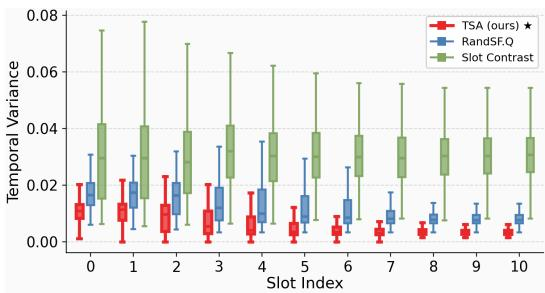

bar chart

| Slot Index | TSA (ours) | RandSFQ | Slot Contrast |
| ---------- | ---------- | ------- | ------------- |
| 0          | 0.015      | 0.020   | 0.040         |
| 1          | 0.015      | 0.020   | 0.040         |
| 2          | 0.015      | 0.020   | 0.040         |
| 3          | 0.015      | 0.020   | 0.040         |
| 4          | 0.015      | 0.020   | 0.040         |
| 5          | 0.015      | 0.020   | 0.040         |
| 6          | 0.015      | 0.020   | 0.040         |
| 7          | 0.015      | 0.020   | 0.040         |
| 8          | 0.015      | 0.020   | 0.040         |
| 9          | 0.015      | 0.020   | 0.040         |
| 10         | 0.015      | 0.020   | 0.040         |

Figure 3: Temporal variation per slot.

## 5.3 Analysis

Occlusion Duration. Table 3 evaluates persistence under varying lengths of disappearance. The key trend is that performance degrades for all methods as occlusion becomes longer, reflecting the inherent difficulty of maintaining identity over extended gaps. However, TSA consistently retains a clear advantage across all regimes, including the most challenging long-duration occlusions $( \mathcal { T } _ { \Delta } > 2 0 )$ , where it delivers substantial gains over the strongest baseline. This behavior highlights the central benefit of TSA: by allowing slots to become inactive while preserving their internal state, it maintains identity through absence rather than forcing erroneous updates. As a result, TSA achieves more robust object persistence and re-identification, especially when objects undergo prolonged occlusion or delayed reappearance.

Representation stability. Figure 3 reports the per-slot temporal variation $\| \mathbf { S } _ { k , t } - \mathbf { S } _ { k , t - 1 } \| _ { 2 } ^ { 2 }$ across all slots in MOVi-C. TSA yields consistently lower medians and tighter variances than both RandSF.Q and SlotContrast, indicating that its slot states evolve more smoothly over time. This confirms that activation-gated state update reduces update-induced slot drift by anchoring inactive slots to their previous states, while lower temporal variation reflects more stable identity-preserving.

## 5.4 Ablation Studies

We conduct ablation studies on the YouTube-VIS HQ benchmark [21]. Additional analysis and various downstream task evaluation is in Appendix D.

A. Effect of Activation-Gated State Update and Decoder Participation. Table 4(Left) studies the two pathways gated controlled by $\alpha _ { k , t }$ . The baseline (Exp. #1) corresponds to unconditional slot propagation obtains 57.1 $\mathrm { A R I _ { f g } } ,$ , 38.0 mBO, and 21.8 HOTA. Activation-gated decoder alone (Exp. #2) slightly increases $\mathbf { A R I } _ { \mathrm { f g } }$ to 60.8 with HOTA nearly unchanged. This indicates that suppressing inactive slots in the decoder is insufficient when their states are overwritten by current-frame evidence. Activation-gated state update alone (Exp. #3) improves $\mathbf { A R I } _ { \mathrm { f g } }$ to 76.1, mBO to 52.4, and HOTA to 40.0, confirming gating the state update is essential to prevent occlusion-induced slot drift. The full model (Exp. #4) achieves the best performance, supporting our design that state evolution and reconstruction should be jointly controlled by a shared activation score.

B. Effect of Regularization. Table 4(Middle) shows that reconstruction alone cannot learn meaningful slot lifecycles, as the model collapses toward unconditional propagation. The $\mathcal { L } _ { \mathrm { u s a g e } }$ provides the main gain by discouraging unnecessary slot activation and enabling inactive-but-persistent slots. The $\mathcal { L } _ { \mathrm { s p a r s e } }$ alone has a smaller effect, sharpening activation decisions without preventing redundant active slots. Combining both terms yields the best performance, suggesting complementary roles: $\mathcal { L } _ { \mathrm { u s a g e } }$ determines when slots should be active, while $\mathcal { L } _ { \mathrm { s p a r s e } }$ makes these decisions more decisive.

Effect of Temporal Memory. Table 4(Right) evaluates temporal context. Removing temporal context (Exp.#1) reduces HOTA to 20.1, showing that current-frame evidence alone is unreliable. Conditioning on the previous slot state $\mathbf { S } _ { k , t - 1 } \left( \mathrm { E x p } . \# 2 \right)$ recovers much of the loss, reaching 72.8 $\mathrm { A R I _ { f g } } ,$ , 53.8 mBO, and 39.8 HOTA. Using the accumulated memory $\mathbf { M } _ { k , t - 1 } \left( \mathrm { E x p } . \# 3 \right)$ performs best, improving HOTA to 44.6. This indicates that activation decisions benefit from longer trajectory context, especially during gradual reappearance and prolonged partial occlusion.

Table 4: Ablation on: (Left): activation-gated pathways; (Middle): $\mathcal { L } _ { \mathrm { r e g } } ;$ (Right): Temporal memory.

<table><tr><td rowspan="2">Exp.</td><td rowspan="2">StateUpdate</td><td rowspan="2">DecoderParticipation</td><td colspan="3">Metrics</td><td rowspan="2">Exp.</td><td colspan="2">Loss</td><td colspan="3">Metrics</td><td rowspan="2">Exp.</td><td rowspan="2">TemporalMemory</td><td colspan="3">Metrics</td></tr><tr><td> $\text{ARI}_{\text{fg}} \uparrow$ </td><td>mBO↑</td><td>HOTA↑</td><td> $\mathcal{L}_{\text{sparse}}$ </td><td> $\mathcal{L}_{\text{usage}}$ </td><td> $\text{ARI}_{\text{fg}} \uparrow$ </td><td>mBO↑</td><td>HOTA↑</td><td> $\text{ARI}_{\text{fg}} \uparrow$ </td><td>mBO↑</td><td>HOTA↑</td></tr><tr><td>#1</td><td>✗</td><td>✗</td><td>57.1</td><td>38.0</td><td>21.8</td><td>#1</td><td>✗</td><td>✗</td><td>57.1</td><td>38.0</td><td>21.8</td><td>#1</td><td>✗</td><td>61.7</td><td>39.8</td><td>20.1</td></tr><tr><td>#2</td><td>✗</td><td>√</td><td>60.8</td><td>37.7</td><td>21.7</td><td>#2</td><td>√</td><td>✗</td><td>63.5</td><td>39.6</td><td>23.2</td><td>#2</td><td> $\mathbf{S}_{k,t-1}$ </td><td>72.8</td><td>53.8</td><td>39.8</td></tr><tr><td>#3</td><td>√</td><td>✗</td><td>76.1</td><td>52.4</td><td>40.0</td><td>#3</td><td>✗</td><td>√</td><td>76.1</td><td>53.7</td><td>41.9</td><td>#3</td><td> $\mathbf{M}_{k,t-1}$ </td><td>77.6</td><td>54.3</td><td>44.6</td></tr><tr><td>#4</td><td>√</td><td>√</td><td>77.6</td><td>54.3</td><td>44.6</td><td>#4</td><td>√</td><td>√</td><td>77.6</td><td>54.3</td><td>44.6</td><td></td><td></td><td></td><td></td><td></td></tr></table>

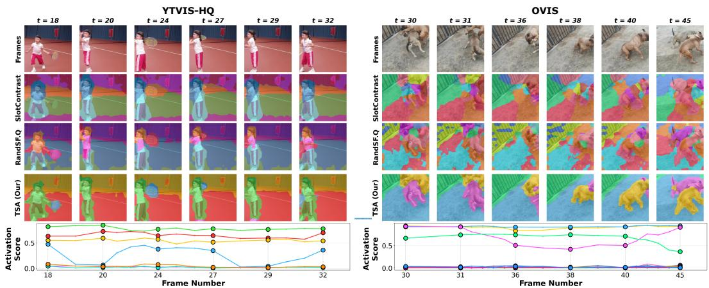

line chart

| Model   | Frame Number | t    | Activation Score |
|---------|--------------|------|------------------|
| YTVIS-HQ | 18           | 18   | 0.5              |
| YTVIS-HQ | 20           | 20   | 0.6              |
| YTVIS-HQ | 24           | 24   | 0.5              |
| YTVIS-HQ | 27           | 27   | 0.6              |
| YTVIS-HQ | 29           | 29   | 0.5              |
| YTVIS-HQ | 32           | 32   | 0.6              |
| OVIS    | 30           | 30   | 0.5              |
| OVIS    | 31           | 31   | 0.6              |
| OVIS    | 36           | 36   | 0.5              |
| OVIS    | 38           | 38   | 0.6              |
| OVIS    | 40           | 40   | 0.5              |
| OVIS    | 45           | 45   | 0.6              |

Figure 4: Qualitative comparison on YouTube-VIS HQ and OVIS. Colors denote slot identity.

## 5.5 Qualitative Results

Figure 4 presents representative sequences from YouTube-VIS HQ and OVIS. SlotContrast [18] and RandSF.Q [19], both employing unconditional slot propagation, exhibit state drift and identity switches consistent with our analysis in Section3. In contrast, our TSA maintains consistent slot identity throughout each sequence. The per-slot activation score curves plotted below confirm this behavior: when an object disappears from view, its corresponding slot’s activation score drops to near zero, then rises again upon the object’s reappearance consistent with the object lifecycle defined in Sec. 4. Additional qualitative analysis and comparison are in Appendix E.

## 6 Conclusion

We present Temporal Slot Activation (TSA), shifting unsupervised video object-centric learning from continuous propagation to selective persistence. By identifying unconditional slot propagation as the main cause of state drift and identity switching in recurrent VSA, TSA introduces a simple principle: a slot should update only when its object is present. A single learned activation score $\alpha _ { k , t }$ jointly gates slot state updates and decoder participation, while a Temporal Context Encoder conditions activation decisions on accumulated trajectory memory–enabling slots to act as stable temporal anchors that preserve object identity through long occlusions and gradual reappearance, without any visibility supervision. TSA delivers consistent gains across MOVi-C, MOVi-E, YouTube-VIS HQ, and OVIS, with the largest improvements on heavily occluded sequences, offering a principled approach to modeling object permanence in unsupervised video learning.

Limitations and future work. Like all existing slot-based video methods, TSA uses a fixed slot budget K; scene-adaptive slot allocation remains an open direction across the field. For a fair comparison, TSA also builds on a frozen DINOv2 backbone, whose rich features underpin strong performance, though incorporating modalities such as optical flow or depth could further sharpen slot boundaries in cluttered scenes. Finally, while temporal memory effectively preserves slot identity through occlusion, gradual appearance changes from deformation or scale variation over long sequences remain an orthogonal open challenge for future work.

## References

[1] Elizabeth S Spelke and Katherine D Kinzler. Core knowledge. Developmental Science, 10(1):89–96, 2007.  
[2] Daniel Kahneman, Anne Treisman, and Brian J Gibbs. Reviewing the evidence on “object files”: The objects of attention. Cognitive Psychology, 24(2):175–219, 1992.  
[3] David Marr. Vision: A computational investigation into the human representation and processing of visual information. MIT Press, 1982.  
[4] Klaus Greff, Raphaël Lopez Kaufman, Rishabh Kabra, Nick Watters, Christopher Burgess, Daniel Zoran, Loic Matthey, Matthew Botvinick, and Alexander Lerchner. Multi-object representation learning with iterative variational inference. In International Conference on Machine Learning, pages 2424–2433. PMLR, 2019.  
[5] SM Eslami, Nicolas Heess, Theophane Weber, Yuval Tassa, David Szepesvari, Geoffrey E Hinton, et al. Attend, infer, repeat: Fast scene understanding with generative models. Advances in Neural Information Processing Systems, 29, 2016.  
[6] Christopher P Burgess, Loic Matthey, Nicholas Watters, Rishabh Kabra, Irina Higgins, Matt Botvinick, and Alexander Lerchner. Monet: Unsupervised scene decomposition and representation. arXiv preprint arXiv:1901.11390, 2019.  
[7] Martin Engelcke, Adam R Kosiorek, Oiwi Parker Jones, and Ingmar Posner. GENESIS: Generative scene inference and sampling with object-centric latent representations. In International Conference on Learning Representations, 2020.  
[8] Zhixuan Lin, Yi-Fu Wu, Skand Vishwanath Peri, Weihao Sun, Gautam Singh, Fei Deng, Jindong Jiang, and Sungjin Ahn. SPACE: Unsupervised object-oriented scene representation via spatial attention and decomposition. In International Conference on Learning Representations, 2020.  
[9] Francesco Locatello, Dirk Weissenborn, Thomas Unterthiner, Aravindh Mahendran, Georg Heigold, Jakob Uszkoreit, Alexey Dosovitskiy, and Thomas Kipf. Object-centric learning with slot attention. Advances in Neural Information Processing Systems, 33:11525–11538, 2020.  
[10] Peter W Battaglia, Jessica B Hamrick, Victor Bapst, Alvaro Sanchez-Gonzalez, Vinicius Zambaldi, Mateusz Malinowski, Andrea Tacchetti, David Raposo, Adam Santoro, Ryan Faulkner, et al. Relational inductive biases, deep learning, and graph networks. arXiv preprint arXiv:1806.01261, 2018.  
[11] Ziyi Wu, Nikita Dvornik, Klaus Greff, Thomas Kipf, and Animesh Garg. SlotFormer: Unsupervised visual dynamics simulation with object-centric models. In International Conference on Learning Representations, 2023.  
[12] Ziyi Wu, Jingyu Hu, Wuyue Lu, Igor Gilitschenski, and Animesh Garg. SlotDiffusion: Object-centric generative modeling with diffusion models. In Advances in Neural Information Processing Systems, 2023.  
[13] Ioannis Kakogeorgiou, Spyros Gidaris, Konstantinos Karantzalos, and Nikos Komodakis. SPOT: Selftraining with patch-order permutation for object-centric learning with autoregressive transformers. In Proceedings of the IEEE/CVF Conference on Computer Vision and Pattern Recognition, pages 22776– 22786, 2024.  
[14] Maximilian Seitzer, Max Horn, Andrii Zadaianchuk, Dominik Zietlow, Tianjun Xiao, Carl-Johann Simon-Gabriel, Tong He, Zheng Zhang, Bernhard Schölkopf, Thomas Brox, and Francesco Locatello. Bridging the gap to real-world object-centric learning. In International Conference on Learning Representations, 2023.  
[15] Thomas Kipf, Gamaleldin F Elsayed, Aravindh Mahendran, Austin Stone, Sara Sabour, Georg Heigold, Rico Jonschkowski, Alexey Dosovitskiy, and Klaus Greff. Conditional object-centric learning from video. In International Conference on Learning Representations, 2022.  
[16] Gamaleldin F Elsayed, Aravindh Mahendran, Sjoerd van Steenkiste, Klaus Greff, Michael C Mozer, and Thomas Kipf. SAVi++: Towards end-to-end object-centric learning from real-world videos. In Advances in Neural Information Processing Systems, 2022.  
[17] Andrii Zadaianchuk, Maximilian Seitzer, and Georg Martius. Object-centric learning for real-world videos by predicting temporal feature similarities. In Advances in Neural Information Processing Systems, 2023.  
[18] Aram Manasyan, Maximilian Seitzer, Filip Radovic, Georg Martius, and Andrii Zadaianchuk. Temporally consistent object-centric learning by contrasting slots. In Proceedings of the IEEE/CVF Conference on Computer Vision and Pattern Recognition, 2025.  
[19] Zixu Zhao et al. RandSF.Q: Randomized future-conditioned slot forecasting for video object-centric learning. In Proceedings of the AAAI Conference on Artificial Intelligence, 2025.  
[20] Klaus Greff, Francois Belletti, Lucas Beyer, Carl Doersch, Yilun Du, Daniel Duckworth, David J Fleet, Dan Gnanapragasam, Florian Golemo, Charles Herrmann, et al. Kubric: A scalable dataset generator. In Proceedings of the IEEE/CVF Conference on Computer Vision and Pattern Recognition, pages 3749–3763, 2022.  
[21] Linjie Yang, Yuchen Fan, and Ning Xu. Video instance segmentation. In Proceedings of the IEEE/CVF International Conference on Computer Vision, pages 5188–5197, 2019.  
[22] Jiyang Qi, Yan Gao, Yao Hu, Xinggang Wang, Xiaoyu Liu, Xiang Bai, Serge Belongie, Alan Yuille, Philip Torr, and Song Bai. Occluded video instance segmentation: A benchmark. International Journal of Computer Vision, 130(8):2022–2039, 2022.  
[23] Jonathon Luiten, Aljosa Osep, Patrick Dendorfer, Philip Torr, Andreas Geiger, Laura Leal-Taixé, and ˇ Bastian Leibe. HOTA: A higher order metric for evaluating multi-object tracking. International Journal of Computer Vision, 129(2):548–578, 2021.  
[24] Ergys Ristani, Francesco Solera, Roger Zou, Rita Cucchiara, and Carlo Tomasi. Performance measures and a data set for multi-target, multi-camera tracking. In European Conference on Computer Vision Workshops, pages 17–35. Springer, 2016.  
[25] Maxime Oquab, Timée Darcet, Théo Mélas-Kyriazi, Mathilde Caron, Mathieu Aubry, Ishan Misra, Armand Joulin, Julien Mairal, Matthieu Cord, and Patrick Bourdoukan. DINOv2: Learning robust visual features without supervision. Transactions on Machine Learning Research, 2023.  
[26] Maximilian Seitzer, Max Horn, Andrii Zadaianchuk, Dominik Zietlow, Tianjun Xiao, Carl-Johann Simon-Gabriel, Tong He, Zheng Zhang, Bernhard Schölkopf, Thomas Brox, et al. Bridging the gap to real-world object-centric learning. arXiv preprint arXiv:2209.14860, 2022.  
[27] Jindong Jiang, Fei Deng, Gautam Singh, and Sungjin Ahn. Object-centric slot diffusion. In Advances in Neural Information Processing Systems, volume 36, pages 8563–8601, 2023.  
[28] Ke Fan, Zechen Bai, Tianjun Xiao, Tong He, Max Horn, Yanwei Fu, Francesco Locatello, and Zheng Zhang. Adaptive slot attention: Object discovery with dynamic slot number. In Proceedings of the IEEE/CVF Conference on Computer Vision and Pattern Recognition, pages 23062–23071, 2024.  
[29] Yanbo Liu et al. MetaSlot: Break through the fixed number of slots in object-centric learning. arXiv preprint arXiv:2505.20772, 2025.  
[30] Gautam Singh, Yi-Fu Wu, and Sungjin Ahn. Simple unsupervised object-centric learning for complex and naturalistic videos. In Advances in Neural Information Processing Systems, 2022.  
[31] Görkay Aydemir, Weidi Xie, and Fatma Guney. Self-supervised object-centric learning for videos. In Advances in Neural Information Processing Systems, 2023.  
[32] Diederik P Kingma and Jimmy Ba. Adam: A method for stochastic optimization. In International Conference on Learning Representations, 2015.

## Appendix

## Table of Contents

A Dataset Details 1 3  
B Evaluation Metrics 1 3  
C Implementation Details 1 4  
D Additional Analysis and Downstream Task Evaluation 1 4

D.1 Representation Drift Across Occlusion Intervals . . 14  
D.2 Downstream Task Evaluation . . 16

E Additional Qualitative Results 1 7

E.1 Additional Comparisons with Prior Methods . . 17  
E.2 Ablation Visualizations 19

## A Dataset Details

We evaluate our approach on four complementary video benchmarks that span synthetic and realworld domains, ranging from controlled multi-object scenes to crowded videos with severe occlusion. Table 5 summarizes the key characteristics of each benchmark, while Figure 5 shows qualitative examples illustrating the visual diversity and difficulty of each dataset.

MOVi-C and MOVi-E [20] are synthetic multi-object video benchmarks generated with the Kubric simulator. They serve as controlled settings for evaluating object-centric video grouping under known object dynamics. Both datasets consist of rigid objects with stable appearance, but differ substantially in scene complexity: MOVi-C features moderately cluttered scenes on textured backgrounds, whereas MOVi-E exhibits denser object layouts, stronger camera motion, and more frequent inter-object occlusions.

YouTube-VIS HQ [21] is a real-world video instance segmentation benchmark with high-quality, manually refined object mask annotations. It contains natural videos featuring non-rigid objects with substantial appearance variation, diverse motion patterns, and cluttered backgrounds, making it well-suited for evaluating grouping performance in unconstrained settings.

OVIS [22] is a real-world video instance segmentation benchmark explicitly designed around heavy occlusion. It contains crowded scenes with non-rigid objects, long object trajectories, and frequent partial or full visibility changes, providing a rigorous stress-test for temporal persistence and object re-identification under severe occlusions.

Table 5: Comparison of the four video benchmarks used in our evaluation.

<table><tr><td>Dataset</td><td>Domain</td><td>Object Type</td><td>Main Challenge</td></tr><tr><td>MOVi-C</td><td>Synthetic</td><td>Rigid</td><td>Moderate clutter</td></tr><tr><td>MOVi-E</td><td>Synthetic</td><td>Rigid</td><td>Dense scenes, camera motion</td></tr><tr><td>YouTube-VIS HQ</td><td>Real</td><td>Non-rigid</td><td>Natural appearance variation</td></tr><tr><td>OVIS</td><td>Real</td><td>Non-rigid</td><td>Severe occlusion, long trajectories</td></tr></table>

## B Evaluation Metrics

Foreground Adjusted Rand Index $\bf ( A R I _ { f g } )$ . ARI measures the agreement between two clustering assignments over a set of elements, corrected for chance agreement. Following the standard objectcentric protocol [9, 15], we restrict the computation to foreground pixels by excluding the background slot, which isolates the metric’s signal to how well distinct objects are separated from one another rather than from the scene background. We compute $\mathrm { A R I _ { f g } }$ at the video level by treating all pixels across frames of a sequence as a single clustering problem, so that the metric reflects not only segmentation quality within frames but also identity consistency of slot assignments over time.

mean Best Overlap (mBO). mBO quantifies per-object mask coverage by, for each groundtruth instance, selecting the predicted slot mask with the highest intersection-over-union (IoU) and averaging these best-match IoUs across all instances and sequences. Unlike $\mathbf { A R I } _ { \mathrm { f g } } ,$ , mBO retains background pixels in the IoU computation, which makes it more sensitive to mask boundary precision and to spurious slot activations on non-object regions.

Higher Order Tracking Accuracy (HOTA). HOTA [23] jointly measures detection accuracy and association quality through a geometric mean of DetA and AssA, avoiding the bias toward either detection or tracking that arises in single-metric evaluations. We compute HOTA using sequence-level slot assignment via the Hungarian algorithm on cumulative mask IoU, without access to identity labels at training or evaluation time.

IDF1. IDF1 [24] measures the ratio of correctly identified detections over the mean of ground-truth and computed detections, using identity-consistent matching. Each predicted slot is matched to a ground-truth instance by majority overlap at its first visible frame, and this assignment is held fixed for the remainder of the sequence.

Seeding and averaging. All results are reported as mean ± std over 3 independent random seeds controlling model initialization and data ordering. Ablation conditions use identical seeds across conditions to ensure that observed differences reflect design choices rather than initialization variance.

## C Implementation Details

Model. We use a frozen DINOv2 ViT-S/14 [25] as the visual encoder. Each frame is resized from 256×256 to 224×224, producing N = 256 patch tokens with feature dimension $d _ { f } = 3 8 4$ . The patch features are projected by a 2-layer MLP before being used as keys and values in Slot Attention. Slot Attention uses K slots (dataset-specific, see Table 6) with slot dimension $d = 2 5 6$ , and runs for 3 iterations on the first frame of each clip and 1 iteration on subsequent frames. The temporal query transitioner $T _ { \phi }$ follows the RandSF.Q transition module [19], instantiated as a single Transformer decoder layer with 4 attention heads. The Slot Activation Estimator $\Phi _ { \mathrm { a c t } }$ is a 2-layer MLP with GELU activations that maps the concatenation of the current slot candidate $( d = 2 5 6 )$ and the previous temporal memory vector $\mathbf { M } _ { k , t - 1 } \left( d _ { h } = 6 4 \right)$ to a scalar activation logit. The Temporal Context Encoder $\Psi _ { \mathrm { t c e } }$ is a single-layer GRU shared across slots, with hidden dimension $d _ { h } = 6 4$ , that produces ${ \bf { M } } _ { k , t }$ from the activated slot state at each step and is reset at the start of each video. The temporal memory vector $\mathbf { M } _ { k , t }$ is consumed only by $\Phi _ { \mathrm { a c t } }$ and does not feed back into the slot representation directly. The decoder is an autoregressive Transformer with model dimension $d _ { f } = 3 8 4$ that reconstructs DINOv2 features rather than RGB pixels [17, 18]. The activation log-bias from Eq. 8 is added to the decoder cross-attention logits at each layer.

Training. We train the model with Adam [32] for 50,000 steps using a batch size of 8 video clips. Each training sample is a contiguous segment of length T frames (dataset-specific; see Table 6). The learning rate is initialized to $5 \times 1 0 ^ { - 5 }$ , linearly warmed up over the first 2,500 steps, and gradient norm is clipped at 0.05. The total loss is $\mathcal { L } = \mathcal { L } _ { \mathrm { r e c } } + \lambda _ { \mathrm { s s c } } \mathcal { L } _ { \mathrm { s s c } } + \lambda _ { \mathrm { r e g } } ( t ) \mathcal { L } _ { \mathrm { r e g } } ,$ , where $\lambda _ { \mathrm { s s c } } = 0 . 5$ throughout and the regularization weight $\lambda _ { \mathrm { r e g } } ( t )$ follows a two-stage schedule: it is held at zero for the first $T _ { \mathrm { w a r m u p } }$ steps, then linearly increased to its target value $\lambda _ { \mathrm { r e g } }$ over the next $T _ { \mathrm { r a m p } }$ steps. Because OVIS exhibits longer occlusion dynamics, both $T _ { \mathrm { w a r m u p } }$ and $T _ { \mathrm { r a m p } }$ are doubled relative to the other benchmarks.

Inference. At test time, slot activations $\alpha _ { k , t } \in [ 0 , 1 ]$ remain continuous and are not thresholded; the same activation-gated state update and activation log-bias used during training are applied unchanged. Full videos are processed sequentially, with slot states and per-slot temporal memories $\mathbf { m } _ { k , t }$ propagated across frames without resetting.

Hardware. All experiments are run on a single NVIDIA RTX A6000 GPU.

Table 6 summarizes the dataset-specific implementation details, including the number of slots K, training segment length T , loss coefficients, and regularization schedules.

## D Additional Analysis and Downstream Task Evaluation

## D.1 Representation Drift Across Occlusion Intervals

To directly verify that the activation-gated state update mitigates update-induced state drift discussed in Sec. 3, we measure the representation drift of a slot across each occlusion interval using the squared $\ell _ { 2 }$ distance:

$$
d _ {\text { drift }} (k) = \left\| \mathbf {S} _ {k, t _ {\text { post }}} - \mathbf {S} _ {k, t _ {\text { pre }}} \right\| _ {2} ^ {2}, \tag {12}
$$

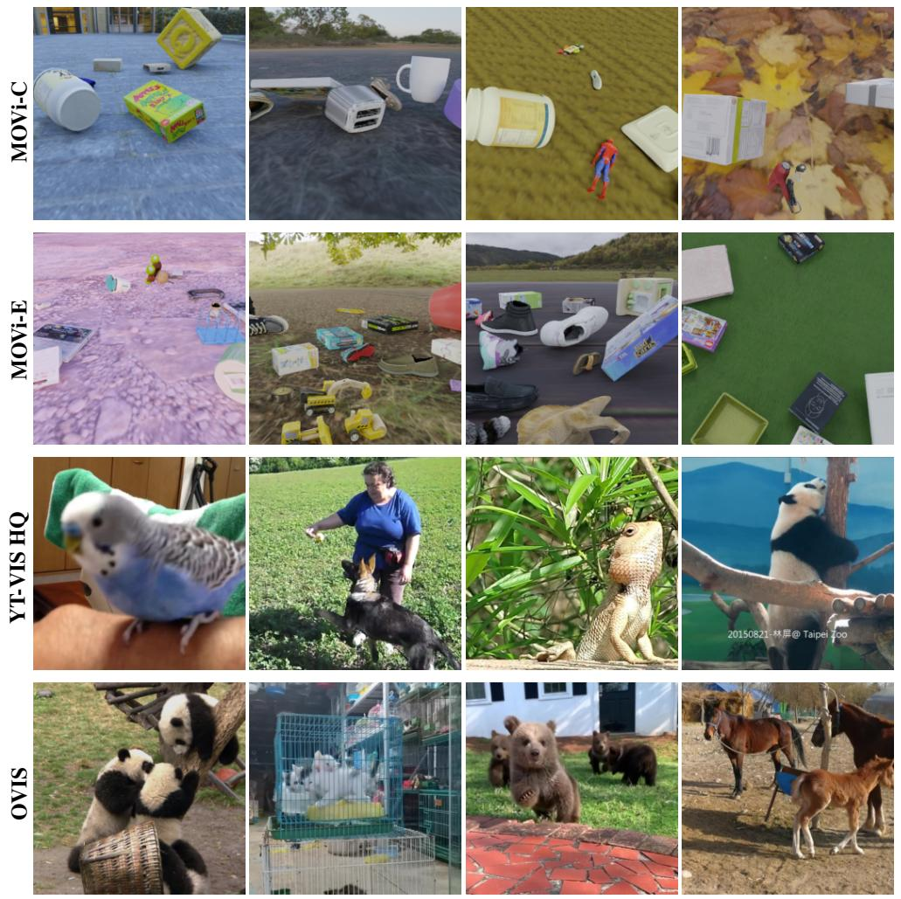  
Figure 5: Qualitative samples from the four benchmarks. Each row shows four representative videos from a single dataset, illustrating the visual diversity within each benchmark. MOVi-C and MOVi-E provide controlled synthetic scenes with known dynamics; YouTube-VIS HQ contributes natural appearance variation and object motion; OVIS contains crowded scenes with severe occlusion and long object trajectories.

where $t _ { \mathrm { p r e } }$ denotes the last visible frame before an object becomes fully occluded, and $t _ { \mathrm { p o s t } }$ denotes the first visible frame after the object reappears. For each ground-truth object that becomes fully occluded and later reappears, we identify the predicted slot tracking it by selecting the slot with the highest mask IoU at $t _ { \mathrm { p r e } }$ . We then compute $d _ { \mathrm { d r i f t } }$ between that slot’s pre-occlusion and postreappearance states. Occlusion intervals are derived from ground-truth visibility annotations.

We compare RandSF.Q, an unconditional propagation baseline that updates every slot at every step, against TSA. Figure 6 shows the distribution of $d _ { \mathrm { d r i f t } }$ stratified by occlusion duration on MOVi-C, MOVi-E, YT-VIS, and OVIS.

Two observations stand out. First, representation drift generally increases with occlusion duration, indicating that longer absences make it more difficult to preserve the pre-occlusion slot identity. Second, TSA consistently produces lower drift than RandSF.Q across all datasets and duration bins, and its drift distribution remains tight even at long durations where RandSF.Q’s spread grows sharply. These results provide direct evidence that TSA’s activation-gated state update in Eq. 7 preserves slot identity more effectively across occlusions by anchoring inactive slots to their previous states, consistent with the cumulative-drift analysis in Eq. 3.

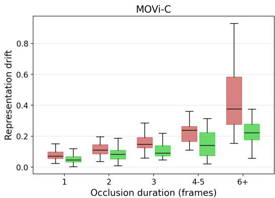

box plot

| Occlusion duration (frames) | Representation drift (Red) | Representation drift (Green) |
| --------------------------- | --------------------------- | ----------------------------- |
| 1                           | 0.08                        | 0.05                          |
| 2                           | 0.12                        | 0.08                          |
| 3                           | 0.18                        | 0.12                          |
| 4-5                         | 0.25                        | 0.15                          |
| 6+                          | 0.58                        | 0.25                          |

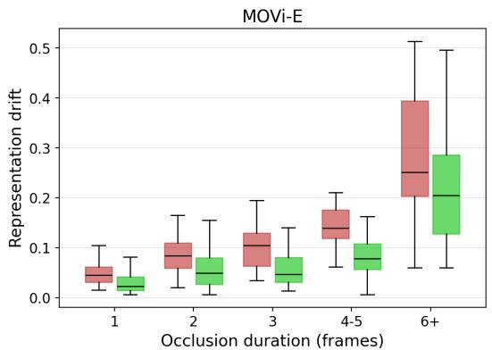

box plot

| Occlusion duration (frames) | Representation drift (Red) | Representation drift (Green) |
| --------------------------- | --------------------------- | ----------------------------- |
| 1                           | 0.05                        | 0.03                          |
| 2                           | 0.10                        | 0.07                          |
| 3                           | 0.12                        | 0.08                          |
| 4-5                         | 0.15                        | 0.10                          |
| 6+                          | 0.40                        | 0.28                          |

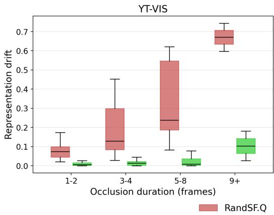

box plot

| Occlusion duration (frames) | RandSF.Q | RandSF.Q (lower) | RandSF.Q (upper) |
| --------------------------- | -------- | ---------------- | ---------------- |
| 1-2                         | 0.08     | 0.03             | 0.17             |
| 3-4                         | 0.30     | 0.04             | 0.45             |
| 5-8                         | 0.55     | 0.18             | 0.62             |
| 9+                          | 0.68     | 0.10             | 0.72             |

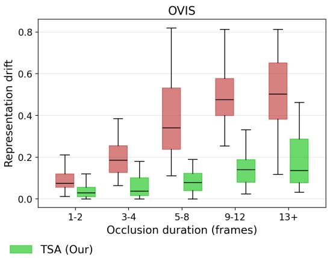

box plot

| Occlusion duration (frames) | TSA (Our) Representation drift |
| --------------------------- | -------------------------------- |
| 1-2                         | 0.05                             |
| 3-4                         | 0.1                              |
| 5-8                         | 0.1                              |
| 9-12                        | 0.15                             |
| 13+                         | 0.3                              |

Figure 6: Representation drift across occlusion intervals. Box plots show the distribution of squared $\ell _ { 2 }$ representation drift $d _ { \mathrm { d r i f t } }$ across occlusion-duration bins on MOVi-C, MOVi-E, YT-VIS, and OVIS.

## D.2 Downstream Task Evaluation

To further assess the quality of the slot representations learned by TSA, we evaluate them on two downstream tasks on YouTube-VIS HQ. Both tasks operate on frozen slot representations, isolating the contribution of the representation itself from any task-specific finetuning. We compare TSA against SlotContrast [18] and RandSF.Q [19] under identical training and evaluation protocols. The two tasks probe complementary properties of the representation: object recognition is a per-frame appearance test, whereas dynamics prediction is a cross-frame temporal-stability test.

Object recognition. Following RandSF.Q [19], we freeze the object-centric model and train a two-layer MLP to predict the object class and bounding box corresponding to each slot, supervised by the object class labels and bounding box annotations in the dataset. Each predicted slot is matched to a ground-truth instance using a first-visible-frame majority-overlap rule. This task probes whether slot representations preserve discriminative per-frame object information, including semantic category and spatial localization. We report Top-1 and Top-3 classification accuracy, bounding-box IoU, and the number of matched samples.

Object dynamics prediction. Following SlotContrast [18], we train SlotFormer [11] on top of the frozen slot representations to predict object dynamics. SlotFormer receives 10 burn-in frames of inferred slots and autoregressively predicts slots for 5 rollout steps. Both the object-centric model and SlotFormer operate entirely in feature space, and SlotFormer is trained using only the slot reconstruction loss. Unlike object recognition, which is evaluated on matched per-frame slots, dynamics prediction depends strongly on whether slot identities and trajectories remain stable over time. We therefore use this task to assess the temporal consistency and predictability of the learned slot representations. We report $\mathbf { A R I } _ { \mathrm { f g } }$ and mBO on the predicted slot rollouts.

Discussion. Tables 7 and 8 show that TSA preserves discriminative object information while substantially improving temporal predictability. For object recognition (Table 7), TSA achieves the best classification performance, improving Top-1 accuracy to 91.4, compared with 90.5 for RandSF.Q and 85.8 for SlotContrast. It also obtains the highest Top-3 accuracy (98.0), slightly above RandSF.Q (97.9) and clearly above SlotContrast (95.8). These results indicate that activation-gated slot propagation strengthens the per-frame semantic content of the slot representations: the slots that remain active are highly discriminative for object category prediction. The bounding-box IoU of TSA remains comparable to the baselines, while the number of matched samples is lower by design–this directly reflects the activation mechanism’s role in suppressing redundant or weakly grounded slots, so that only well-grounded slots participate in matching. This selectivity is consistent with the goal of TSA: producing a compact set of high-quality, semantically meaningful slots rather than a larger pool with noisier correspondences. The advantage of TSA is more pronounced in object dynamics prediction (Table 8). TSA achieves 49.2 $\mathrm { A R I _ { f g } }$ and 46.6 mBO, outperforming RandSF.Q by $+ 1 1 . 0 \mathrm { A R I _ { f g } }$ and +2.9 mBO, and SlotContrast by +19.7 $\mathbf { A R I } _ { \mathrm { f g } }$ and +13.4 mBO. Since SlotFormer is trained on top of frozen slot representations, these gains reflect the quality of the learned slot trajectories rather than changes in the downstream predictor. The large improvement in rollout $\mathrm { \ A R I _ { f g } }$ indicates that TSA produces slots with more stable object correspondence across time, making future slot states easier to predict. Together, the recognition and dynamics results show that TSA retains strong per-frame object information while providing substantially more temporally consistent representations for prediction. Overall, these downstream evaluations show that TSA produces slot representations that transfer effectively to tasks beyond the primary object-centric segmentation setting.

## E Additional Qualitative Results

## E.1 Additional Comparisons with Prior Methods

This section provides additional qualitative comparisons that complement the quantitative findings in Sec. 5.2 and Sec. 5.3. We compare TSA against RandSF.Q [19] and SlotContrast [18], two recent slot-based methods that adopt unconditional propagation, on YouTube-VIS HQ (Fig. 7), OVIS (Fig. 8), and MOVi-C/E (Fig. 9).

Identity preservation through absence and reappearance. In the surfer sequence of Fig. 7 (top), the surfer leaves the field of view between t=24 and t=28 and reappears at t=32. TSA reactivates the same slot upon reappearance, while the background remains explained by a stable partition throughout the absence interval. A similar pattern is observed in Fig. 9 (top, MOVi-C, t=13–17): after the main object exits the scene, TSA preserves a coherent background partition, whereas RandSF.Q and SlotContrast (red arrows) exhibit drifting slot assignments in which previously active slots spread to explain unrelated content. This is a direct visualization of update-induced state drift (Failure Mode 1, Sec. 3), which the activation-gated state update is designed to suppress.

Joint gating yields cleaner decomposition. Figure 9 supports the ablation conclusion that state evolution and reconstruction must be jointly controlled by the activation score (Table 4 (Left)). The arrows compare slot assignments at corresponding regions across methods: baselines (red) exhibit unstable slot assignments that fluctuate across frames, while TSA (green) maintains stable per-object slot correspondences. This is the qualitative reflection of the metric gap reported in Table 4 (Left) when both pathways are gated.

Consistent gains across benchmarks, most pronounced under heavy occlusion. Figure 8 shows the two-cow sequences on OVIS (t=5–55), where the animals undergo mutual occlusion, partial occlusion by foliage, and complex motion. TSA assigns two distinct slots to the two cows and maintains this assignment across the entire sequence, including the heavy-occlusion frames at t=37 and t=40. RandSF.Q and SlotContrast fragments each cow into several inconsistent slots that change across frames. The same qualitative advantage of TSA is also visible on the deer sequence in Fig. 7 (bottom), where TSA produces a consistent slot assignment throughout the sequence while baselines fragment the object into multiple slots that vary over time. This pattern is consistent with the quantitative results in Tables 2 and 3: TSA improves over baselines across all settings, with the largest absolute gains arising on OVIS, where the two failure modes accumulate over long, heavily occluded trajectories.

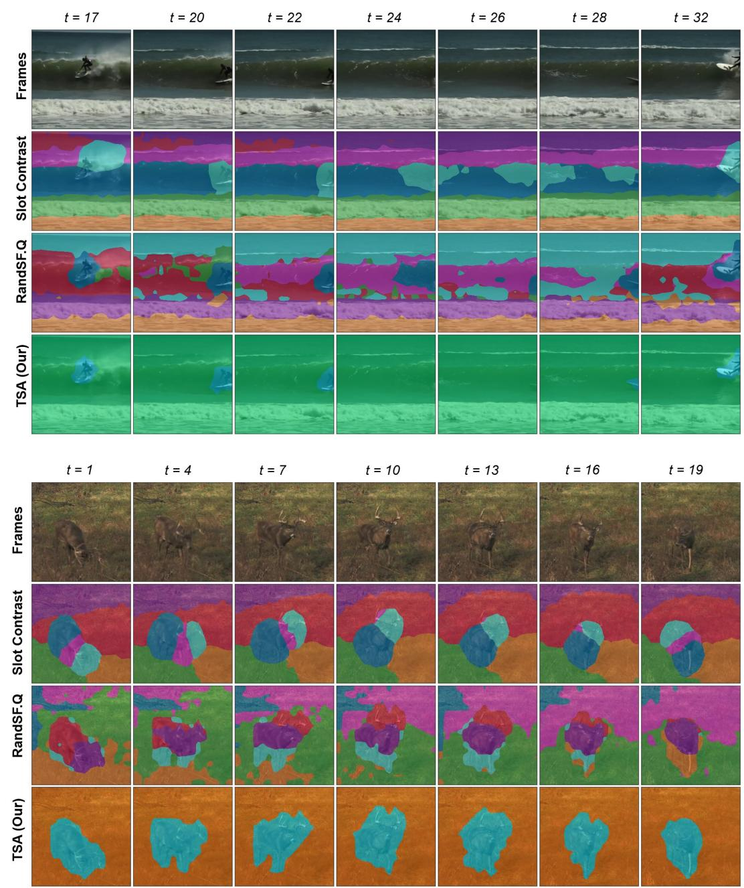  
Figure 7: Additional qualitative results on YouTube-VIS HQ.

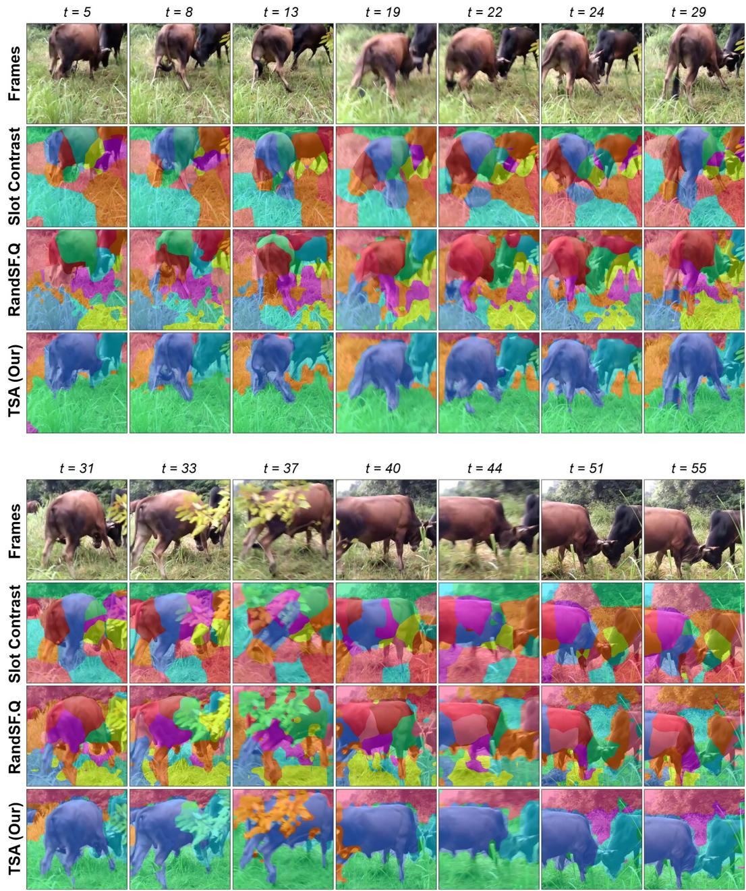  
Figure 8: Qualitative results on OVIS.

## E.2 Ablation Visualizations

Figures 10–12 provide qualitative evidence for the design choices studied quantitatively in Sec. 5.4. These examples illustrate how the activation score $\alpha _ { k , t }$ affects slot persistence, decoder participation, and activation prediction.

Effect of activation-gated state update and decoder participation. Figure 10 visualizes the three gated configurations in Table 4 (Left). Activation-gated decoder participation alone (Exp. #2) is insufficient to prevent state drift, since slot states remain overwritten by current-frame evidence when objects are occluded. Activation-gated state update alone (Exp. #3) already yields substantially more stable slot identity by anchoring inactive slots to their previous states. The full model (Exp. #4), which jointly gates both pathways, produces the cleanest and most temporally consistent decompositions, supporting the design that state evolution and reconstruction should be jointly controlled by a shared activation score.

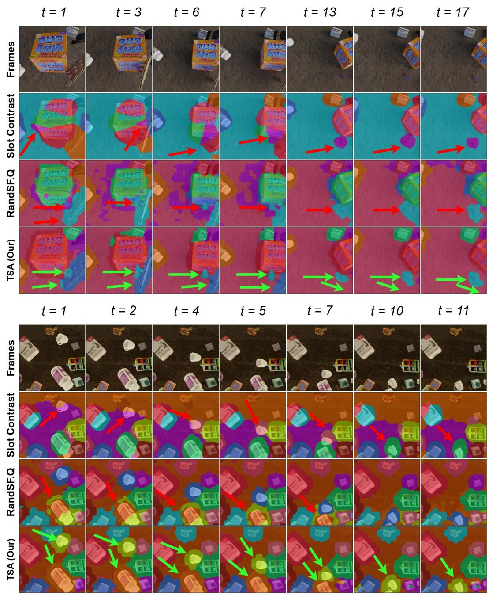  
Figure 9: Qualitative results on MOVi-C and MOVi-E.

Effect of regularization terms. Figure 11 illustrates the complementary roles of $\mathcal { L } _ { \mathrm { u s a g e } }$ and $\mathcal { L } _ { \mathrm { s p a r s e } }$ . With $\mathcal { L } _ { \mathrm { u s a g e } }$ alone, slot assignments become temporally consistent across frames; however, the pressure to reduce active slot count can lead to over-compression, where a single slot absorbs multiple objects. With $\mathcal { L } _ { \mathrm { s p a r s e } }$ alone, activations are sharpened toward binary decisions but redundant slots remain active, so the model behaves similarly to unconditional propagation. Combining both losses balances these effects: $\mathcal { L } _ { \mathrm { u s a g e } }$ enforces compact slot usage with stable temporal correspondence, while $\mathcal { L } _ { \mathrm { s p a r s e } }$ ensures decisive activation transitions without collapsing distinct objects into the same slot.

Effect of temporal memory. Figure 12 compares different inputs to the Slot Activation Estimator $\Phi _ { \mathrm { a c t } }$ on a sequence with persistent partial occlusion. Without temporal memory, activation predictions rely solely on the current Slot Attention candidate $\tilde { \mathbf { S } } _ { k , t }$ , leading to unstable slot-to-object correspondence under partial occlusion or gradual reappearance. Conditioning on the previous slot state $\mathbf { S } _ { k , t - 1 }$ provides a short-term temporal prior and stabilizes the overall scene partition, but slot-to-object correspondence still fluctuates across frames-particularly for the partially occluded foreground subject. The full model uses the temporal memory vector $\mathbf { M } _ { k , t - 1 }$ from the Temporal Context Encoder $\Psi _ { \mathrm { t c e } } ,$ which summarizes the recent slot trajectory and yields the most consistent slot-to-object correspondence: the foreground subject is tracked by a stable slot throughout the sequence despite continuous partial occlusion.

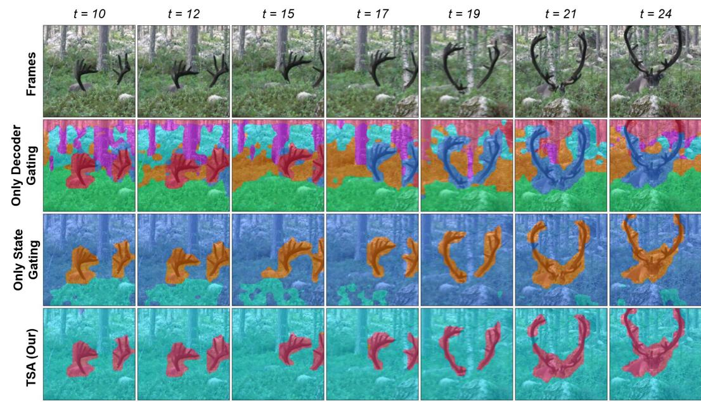

text_image

t = 10
t = 12
t = 15
t = 17
t = 19
t = 21
t = 24
Frames
Only Decoder
Gating
Only State
Gating
TSA (Our)

Figure 10: Activation pathway ablations. Comparison of TSA with activation-gated decoder participation only, activation-gated state update only, and both pathways jointly gated.

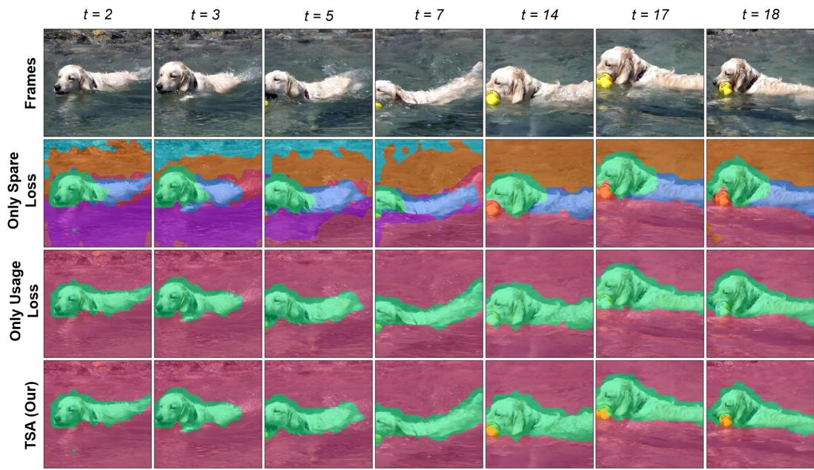

text_image

t = 2
t = 3
t = 5
t = 7
t = 14
t = 17
t = 18
Frames
Only Spare
Loss
Only Usage
Loss
TSA (Our)

Figure 11: Activation regularization ablations. Comparison of TSA trained with $\mathcal { L } _ { \mathrm { s p a r s e } }$ only, $\mathcal { L } _ { \mathrm { u s a g e } }$ only, and both losses combined.

Table 6: Implementation details across the four benchmarks. Shared hyperparameters are listed once across all columns; dataset-specific values are given per benchmark.

<table><tr><td rowspan="2">Hyperparameter</td><td colspan="4">Benchmarks</td></tr><tr><td>MOVi-C</td><td>MOVi-E</td><td>YouTube-VIS HQ</td><td>OVIS</td></tr><tr><td>Optimization</td><td></td><td></td><td></td><td></td></tr><tr><td>Optimizer</td><td></td><td></td><td>Adam</td><td></td></tr><tr><td>Training steps</td><td></td><td></td><td>50,000</td><td></td></tr><tr><td>Batch size (clips)</td><td></td><td></td><td>8</td><td></td></tr><tr><td>Training segment length T</td><td>6</td><td>6</td><td></td><td>10</td></tr><tr><td>Initial learning rate</td><td></td><td></td><td> $5 \times 10^{-5}$ </td><td></td></tr><tr><td>LR warm-up steps</td><td></td><td></td><td>2,500</td><td></td></tr><tr><td>Gradient norm clip</td><td></td><td></td><td>0.05</td><td></td></tr><tr><td>Visual encoder (frozen)</td><td></td><td></td><td></td><td></td></tr><tr><td>Backbone</td><td></td><td></td><td>DINOv2 ViT-S/14</td><td></td></tr><tr><td>Input resolution</td><td></td><td></td><td>256→224</td><td></td></tr><tr><td># image tokens N</td><td></td><td></td><td>256</td><td></td></tr><tr><td>Feature dimension  $d_f$ </td><td></td><td></td><td>384</td><td></td></tr><tr><td>Slot Attention</td><td></td><td></td><td></td><td></td></tr><tr><td># slots K</td><td>11</td><td>24</td><td></td><td>7</td></tr><tr><td>Slot dimension d</td><td></td><td></td><td>256</td><td></td></tr><tr><td>Key / value dimension</td><td></td><td></td><td>384</td><td></td></tr><tr><td>FFN dimension</td><td></td><td></td><td>1,024</td><td></td></tr><tr><td>Iterations (first / subsequent frame)</td><td></td><td></td><td>3 / 1</td><td></td></tr><tr><td>Temporal Query Transitioner  $T_\phi$ </td><td></td><td></td><td></td><td></td></tr><tr><td>Type</td><td></td><td></td><td>Transformer decoder layer</td><td></td></tr><tr><td>Heads / FFN dimension</td><td></td><td></td><td>4 / 1,024</td><td></td></tr><tr><td>Dropout</td><td></td><td></td><td>0.5</td><td></td></tr><tr><td>Slot Activation Estimator  $\Phi_{act}$ </td><td></td><td></td><td></td><td></td></tr><tr><td>Type</td><td></td><td></td><td>2-layer MLP (GELU)</td><td></td></tr><tr><td>Input dim ( $d + d_h$ ) / hidden dim</td><td></td><td></td><td>320 / 128</td><td></td></tr><tr><td>Temporal Context Encoder  $\Psi_{tce}$ </td><td></td><td></td><td></td><td></td></tr><tr><td>Type</td><td></td><td></td><td>Single-layer GRU</td><td></td></tr><tr><td>Input dim d / hidden dim  $d_h$ </td><td></td><td></td><td>256 / 64</td><td></td></tr><tr><td>Decoder</td><td></td><td></td><td></td><td></td></tr><tr><td>Type</td><td></td><td></td><td>Autoregressive Transformer decoder</td><td></td></tr><tr><td>Layers / heads / FFN dim</td><td></td><td></td><td>4 / 4 / 1,536</td><td></td></tr><tr><td>Model dimension  $d_f$ </td><td></td><td></td><td>384</td><td></td></tr><tr><td>Reconstruction target</td><td></td><td></td><td>DINOv2 patch features</td><td></td></tr><tr><td>Loss coefficients and schedule</td><td></td><td></td><td></td><td></td></tr><tr><td> $\lambda_{ssc}$ </td><td></td><td></td><td>0.5</td><td></td></tr><tr><td> $\lambda_{reg}$ </td><td>0.09</td><td>0.03</td><td></td><td>0.24</td></tr><tr><td> $\beta$ </td><td>0.10</td><td>0.30</td><td></td><td>0.042</td></tr><tr><td> $T_{warmup}$  (steps)</td><td>1,000</td><td>1,000</td><td></td><td>1,000</td></tr><tr><td> $T_{ramp}$  (steps)</td><td>7,000</td><td>7,000</td><td></td><td>7,000</td></tr></table>

Table 7: Object recognition on YTVIS HQ. Two-layer MLP trained on frozen slot representations.

<table><tr><td>Method</td><td>Top-1↑</td><td>Top-3↑</td><td>bbox IoU↑</td><td>match↑</td></tr><tr><td>SlotContrast+MLP</td><td> $85.8_{\pm 0.3}$ </td><td> $95.8_{\pm 0.4}$ </td><td> $51.5_{\pm 0.3}$ </td><td> $9249_{\pm 41}$ </td></tr><tr><td>RandSF.Q+MLP</td><td> $90.5_{\pm 0.3}$ </td><td> $97.9_{\pm 0.3}$ </td><td> $50.6_{\pm 0.4}$ </td><td> $8979_{\pm 123}$ </td></tr><tr><td>TSA (ours)</td><td> $91.4_{\pm 0.7}$ </td><td> $98.0_{\pm 0.1}$ </td><td> $50.0_{\pm 0.1}$ </td><td> $7843_{\pm 45}$ </td></tr></table>

Table 8: Object dynamics prediction on YTVIS HQ.

<table><tr><td>Method</td><td> $\text{ARI}_{\text{fg}} \uparrow$ </td><td> $\text{mBO} \uparrow$ </td></tr><tr><td>SlotContrast</td><td> $29.5_{\pm 0.2}$ </td><td> $33.2_{\pm 0.1}$ </td></tr><tr><td>RandSF.Q</td><td> $38.2_{\pm 0.5}$ </td><td> $43.7_{\pm 0.6}$ </td></tr><tr><td>TSA (ours)</td><td> $49.2_{\pm 1.0}$ </td><td> $46.6_{\pm 0.5}$ </td></tr></table>

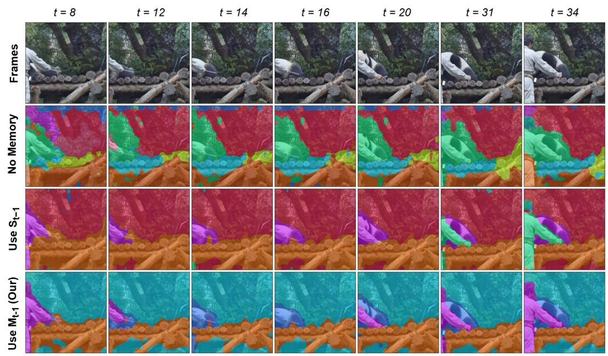

text_image

t = 8
t = 12
t = 14
t = 16
t = 20
t = 31
t = 34
Frames
No Memory
Use S_t-1
Use M_t-1 (Our)

Figure 12: Temporal memory ablation. Comparison of different inputs to the Slot Activation Estimator $\Phi _ { \mathrm { a c t } } \colon$ no memory, the previous slot state $\mathbf { S } _ { k , t - 1 }$ , and the temporal memory vector $\mathbf { M } _ { k , t - 1 }$ from the Temporal Context Encoder $\Psi _ { \mathrm { t c e } } .$ .