# S2COPE: Self-Supervised Concept Discovery via Preference Learning

Shilong Xiang Zirui Zhang Chengzhi Mao

Rutgers University

{shilong.xiang,zirui.zhang,chengzhi.mao}@rutgers.edu

## Abstract

Current representation learning paradigms force a fundamental compromise: selfsupervised methods scale to massive datasets but yield opaque features, whereas interpretable models remain bottlenecked by the need for dense human annotation. We introduce Self-Supervised Concept discOvery via Preference lEarning (S2COPE), a label-free framework that resolves this dilemma. Instead of treating Vision-Large-Language Models (VLLMs) as static feature extractors, S2COPE leverages them as active participants in a self-supervised preference optimization loop. By autonomously hypothesizing, validating, and reinforcing candidate visual attributes directly from raw imagery, our framework discovers novel, structured concepts without a single label. Extensive experiments across natural, medical, and physics domains demonstrate that S2COPE successfully extracts domain-specific concepts where standard VLLMs often fail to generate. By amortizing concept discovery directly into the VLLM backbone through our self-supervised preference objective—rather than relying on static generation and disjoint filtering—we achieve up to a 24-point absolute improvement in downstream top-1 classification accuracy on unseen data. Our work suggest that interpretability can emerge through a model’s autonomous interaction with incidental visual structures, without any human supervision.

## 1 Introduction

The grand challenge of visual representation learning has evolved beyond merely achieving high discriminative performance; we must now discover meaningful, interpretable concepts from raw data. In specialized scientific frontiers—from cellular pathology to astrophysics—data is often unannotated not simply due to cost, but because the underlying visual taxonomy remains undiscovered [55, 23]. In these domains, discriminative power alone is insufficient [27, 26]. To transform an opaque prediction into transparent decisions, particularly in high-stakes fields like medical imaging, models are desireable to be able to articulate visual markers in natural language [43, 50]. Consequently, a critical open question emerges: how can AI systems autonomously discover visual concepts from raw, unlabeled imagery?

Current paradigms for interpretable modeling remain trapped in a dichotomy. On one hand, selfsupervised learning exploits the incidental structure of visual data to extract robust representations [10, 21, 8, 22, 64, 52]. Yet, these models yield opaque, high-dimensional vectors; they are superior in discriminative tasks but cannot articulate why. Conversely, concept-based models leverage Vision-Language Models (VLMs) [40] or Vision-Large-Language Models (VLLMs) [58, 3] to offer explicit linguistic transparency [34, 27, 12]. However, these approaches are bottlenecked by supervised learning [12], rigid human-defined vocabularies [27], or the use of Large Language Models (LLMs) as static, decoupled concept proposers [34, 37, 60]. Furthermore, even methods claiming to be label-free still require human-annotated class labels to generate concepts [37].

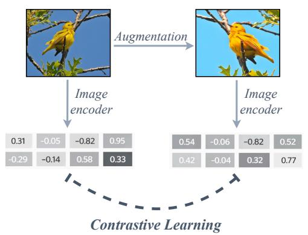

flowchart

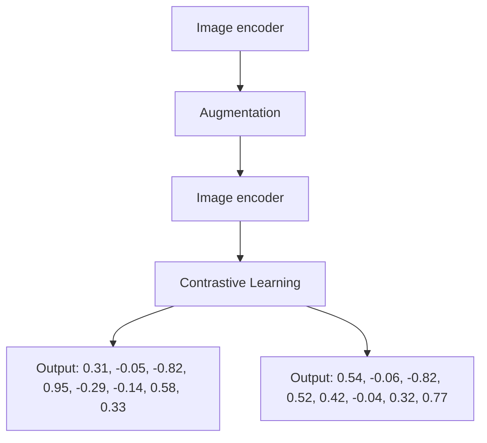

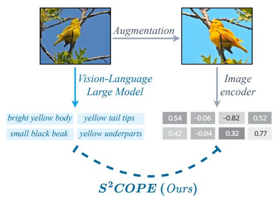

flowchart

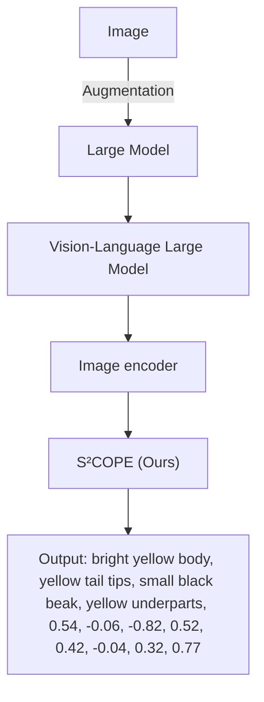

Figure 1: Self-Supervised Visual Concept Discovery. (Left) Standard contrastive learning yields discriminative but opaque, high-dimensional feature vectors that act as uninterpretable "black boxes." (Right) In contrast, $\mathbf { \bar { S } } ^ { 2 } \mathbf { \bar { C } } \mathbf { O P E }$ discovers explicitly interpretable concepts $( \mathrm { e . g . }$ , "bright yellow body") directly from unannotated images. By utilizing Vision-Large-Language Models as a broad semantic prior, our self-supervised preference optimization loop grounds raw visual features into discrete, human-readable attributes, yielding transparent representations that improve classification accuracy on unseen data.

In this paper, we introduce $S ^ { 2 } { \mathrm { C O P E } } ,$ an end-to-end framework that resolves this dichotomy by learning interpretability through autonomous interaction with data. Just as a human learner discovers new concepts by observing the world without a formal teacher, $\mathbf { S } ^ { 2 } \mathbf { C } \mathbf { O } \mathbf { P } \mathbf { E }$ discovers explicit semantic vocabularies by actively engaging with an unlabeled training corpus. Figure 1 illustrates how our approach transforms opaque visual representations into explicit conceptual vocabularies directly from raw imagery.

Our key insight is that natural images possess inherent, incidental structures that can supervise interpretable vision concept discovery. We leverage natural images’ invariance principle: a valid visual concept must remain invariant to visual transformations of a single image, yet remain highly discriminative across distinct instances. $\mathbf { S } ^ { 2 } \mathbf { C } \mathbf { O } \mathbf { P } \mathbf { E }$ capitalizes on this by placing a pre-trained VLLM into a self-supervised Direct Preference Optimization [41] loop. Rather than relying on curated ground truth, the VLLM acts as an active hypothesis generator based on its broad pre-training prior. By interacting directly with the unlabeled data, these candidate attributes are evaluated against our self-supervised invariance objective. This creates an autonomous feedback mechanism where the model iteratively refines its own concept representations to capture the intrinsic taxonomy of unlabeled vision data.

A primary advantage of $\mathbf { S } ^ { 2 } \mathbf { C O P E }$ is that this concept discovery is dynamic and learned end-to-end. Unlike two-stage pipelines where static text features are proposed by frozen models for downstream classification [34, 37, 60], our framework establishes a continuous, interactive feedback loop that directly updates the VLLM concept generator. The self-supervised objective backpropagates from the raw images to explicitly supervise the language proposal mechanism. By constantly hypothesizing, validating, and expanding its visual vocabulary against the data, $\mathrm { { \bf S } ^ { 2 } C O P E }$ promote the discovered concepts to be grounded. Since our method does not require label, it is highly scalable, and completely free from the human annotation bottleneck.

Extensive experiments and human evaluations confirm that $\mathrm { S ^ { 2 } C O P E }$ successfully mines interpretable, domain-specific features entirely without human supervision. We evaluate via frozen transfer across diverse datasets spanning natural images (iNaturalist [53], CUB [54]), medical imaging (HAM10000 [51], MedMNIST [59]), and specialized scientific domains (Galaxy 10 [28], Gravity Spy [63]). By moving beyond static priors and actively interacting with the training data, our method significantly improves upon the VLLM base model. When evaluating these newly discovered concepts on strictly unseen test data, we observe downstream top-1 classification accuracy improvements of up to 24 absolute points. Furthermore, human evaluations confirm that the autonomously discovered concepts align with human reasoning. Our work suggests that unsupervised interpretable concept discovery can emerge through the interaction between foundation models’ priors and the intrinsic structure of visual data. Our code will be released at the project page: https://shilongxiang.github.io/S2COPE/.

## 2 Related Work

Self-Supervised Learning. Self-supervised learning exploits the incidental structures of natural images to extract highly discriminative visual features [10, 21, 8, 22, 19, 7, 4, 65, 38, 6]. However, these representations remain fundamentally opaque. Recent attempts to apply self-supervised objectives directly to VLLM visual encoders—such as reconstructive pre-training [56], jigsaw reasoning [57], representation alignment [61], and auxiliary visual tasks [5]—still yield continuous, uninterpretable feature blobs. Our work repurpose view invariance as a self-supervisory reward signal. This signal drives a preference optimization loop, forcing the model to explicitly articulate invariant visual structures as discrete, interpretable text concepts entirely from unannotated data.

Concept Bottleneck Models and the Limits of Existing “Label-Free” Methods. Concept Bottleneck Models (CBMs) [27] achieve transparency via explicit concept prediction, but rely on expensive, rigid human annotations. Recent methods attempt to reduce this cost by prompting LLMs to propose concepts [60, 62, 37], applying visual grounding [47], or performing dictionary learning on frozen features [39, 2, 45, 36]. However, models like LaBo [60], PCBM [62], and even "Label-Free" CBMs (LF-CBM) [37], while being label free in generating the concept candidates using a static VLLM, depend on ground-truth class labels to filter their concepts at concept purification step. In contrast, our method does not need class labels at concept purification step. Furthermore, methods that avoid labels entirely, such as U-F2-CBM [44], merely decompose frozen features, artificially constraining discovery to what the backbone already encodes. Critically, all these approaches treat the VLM or LLM as a static, one-shot oracle. Our framework introduces the missing feedback loop: by updating the VLM’s parameters end-to-end via self-supervised preference optimization, we allow the model to dynamically expand and refine its vocabulary through active interaction with the data.

Aligning VLLM via Preference Optimization. While VLMs encode vast visual knowledge, standard instruction-tuning biases their outputs toward conversational fluency [24, 1, 30, 13, 33]. This results in verbose filler and hallucinations rather than the precise, discriminative visual attributes required for scientific discovery [31, 42, 20, 46]. Multimodal Direct Preference Optimization (DPO) methods attempt to correct this, but typically rely on human annotations or GPT-4 judgments to align the model to human preferences [15, 17, 9, 48, 25]. Recent works like SeVa [66] and SMPRO [49] remove the need for external annotators by deriving preferences from augmentation consistency; however, they remain focused on general-purpose visual understanding and classification. In contrast, S2COPE shows that direct preference optimization can be harnessed to distill a foundation models’ broad prior into a rigorous, visually grounded, and explicitly interpretable conceptual vocabulary.

## 3 Methodology

In standard representation learning, a model f maps an unlabeled image x to a dense, continuous vector $r = f ( \bar { x } ) \in \mathbb R ^ { d }$ . While highly discriminative, this vector is fundamentally opaque. Our goal is to learn a representation that is both discriminative and inherently interpretable. We formulate r not as a continuous vector, but as a discrete set of natural language concepts: $\boldsymbol { r } = \{ c _ { 1 } , c _ { 2 } , . . . , c _ { N } \}$ , where each $c _ { i }$ articulates a specific semantic attribute of x. To achieve this without human supervision, we introduce a framework that proposes candidate concepts and validates them against the incidental structures of the visual data (Figure 2).

## 3.1 Concept Proposal via Vision-Language Models

To propose the initial concepts, we leverage the pre-trained semantic priors of VLLMs. Given an unlabeled image x, we prompt a VLLM policy π to generate a set of candidate natural language descriptions $\mathcal { C } ( x ) = \{ c _ { 1 } , . . . , c _ { N } \}$ .

Without learning, off-the-shelf VLLMs typically default to generic captions that describe superficial nuisances rather than discriminative structural features. To drive concept discovery, we employ stochastic sampling to force the model beyond these generic bounds, compelling it to explore the long tail of its vocabulary as an active hypothesizer. However, this unconstrained exploration naturally yields a noisy mixture of valid attributes and irrelevant captions. The critical challenge is to filter these hypotheses, capitalizing on the VLLM’s expressive power to converge on a precise, visually grounded vocabulary. While the VLLM is supervisedly pretrained, we further adapt it here using novel unlabeled data for concept discovery.

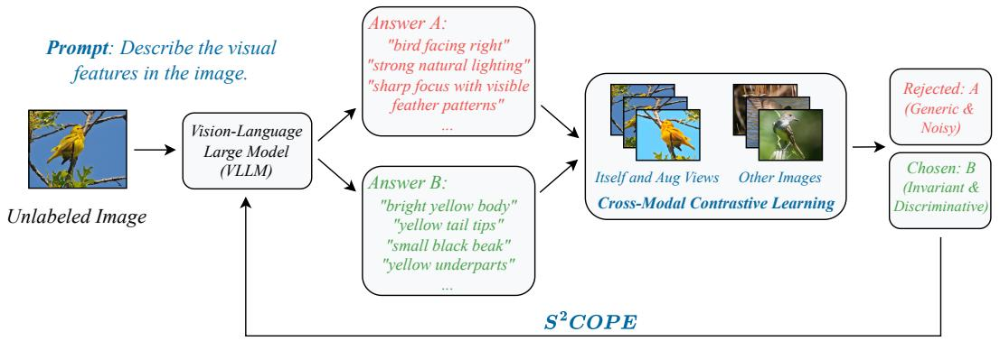

flowchart

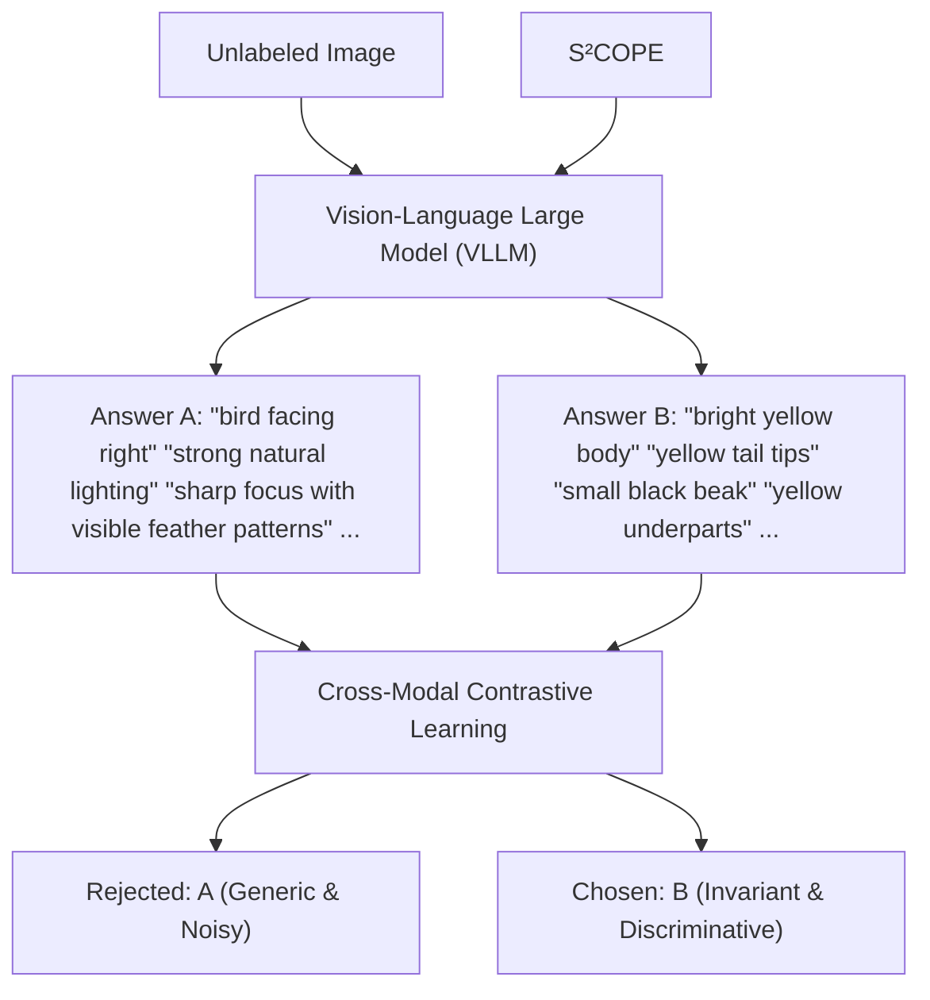

Figure 2: Overview of the $\mathbf { S ^ { 2 } C O P E }$ Discovery Loop. Our framework operates as an end-toend, self-supervised discovery process. In iteration k, the VLLM policy $\pi _ { k }$ uses high-temperature sampling to hypothesize diverse candidate concepts $C ( x )$ for an unlabeled image x. To evaluate these proposals without human labels, we compute a self-supervised, cross-modal contrastive reward $R ( c , x )$ based on visual invariance. A candidate concept receives a high reward only if it is stable across augmented views (the positive set) while maintaining specificity against unrelated batch images. This automatically filters out generic, noisy descriptions (Answer $\mathbf { A } )$ in favor of discriminative, structured attributes (Answer B). An Easy-Negative pairing strategy (selecting pairs with the largest reward gap) converts these rewards into preference pairs $( c _ { w } , c _ { l } )$ to form dataset $\mathcal { D } _ { k }$ . Finally, Direct Preference Optimization (DPO) internalizes this invariance by updating the VLLM concept generator’s weights, yielding a refined policy $\pi _ { k + 1 }$ that iteratively transforms the VLLM into a self-supervised concept miner.

## 3.2 Visual Invariance as a Self-Supervisory Signal

To verify the proposed hypotheses, we leverage the intrinsic structure of the visual data. In novel domains lacking expert annotations, we rely on self-supervised signals. While our framework is agnostic to the specific self-supervised objective [35, 16], we focus here on invariance: the principle that the core semantic identity of an object remains stable across transformations [10].

Standard contrastive learning enforces this invariance by maximizing the similarity between dense visual vectors of positive data pairs, and minimizing it for negative data pairs. Because our framework operates on discrete text concepts, quantifying similarity across visual augmentations presents a unique challenge. Lexical overlap metrics, such as ROUGE [32] and Levenshtein distance [29], are prohibitively expensive for large-scale pairwise computation and fundamentally fail to capture semantic equivalence. Conversely, while dense language representations like BERT [14] resolve the semantic bottleneck, they operate purely in text space and remain ungrounded in the underlying visual signal. Instead, we propose a cross-modal contrastive objective. For a given image, we generate text concepts from one view, and compare those text concepts directly against the visual features of other augmented views using a frozen cross-modal encoder (e.g., CLIP [40]).

Formally, to verify the proposed concepts $\mathcal C ( x )$ , we measure their cross-modal alignment. Given a training batch of images, we apply stochastic visual augmentations to generate multiple views, yielding a universal set of visual embeddings V extracted via a frozen CLIP vision tower (where $v \in \mathcal V$ denotes the visual feature corresponding to an augmented view of image x). For a given anchor image x, let $\nu _ { p o s } \subset \nu$ denote the subset containing itself and its augmented views, and let $\mathcal { V } _ { n e g }$ represent the remaining negative embeddings within the batch. For each candidate concept $c \in \mathcal { C } ( x )$ , let $t _ { c }$ denote its text embedding extracted via a frozen CLIP text tower. We define a cross-modal contrastive reward $R ( c , x )$ to quantify both invariance and specificity:

$$
R (c, x) = \log \sum_ {v \in \mathcal {V} _ {\text { pos }}} \exp \left(\frac {t _ {c} ^ {\top} v}{\tau}\right) - \log \sum_ {v \in \mathcal {V}} \exp \left(\frac {t _ {c} ^ {\top} v}{\tau}\right) \tag {1}
$$

where $\tau$ is a temperature hyperparameter. The first term enforces invariance by maximizing the alignment between the textual concept and the visual variants of the anchor instance. The second term enforces specificity by penalizing generic attributes that spuriously align with unrelated batch

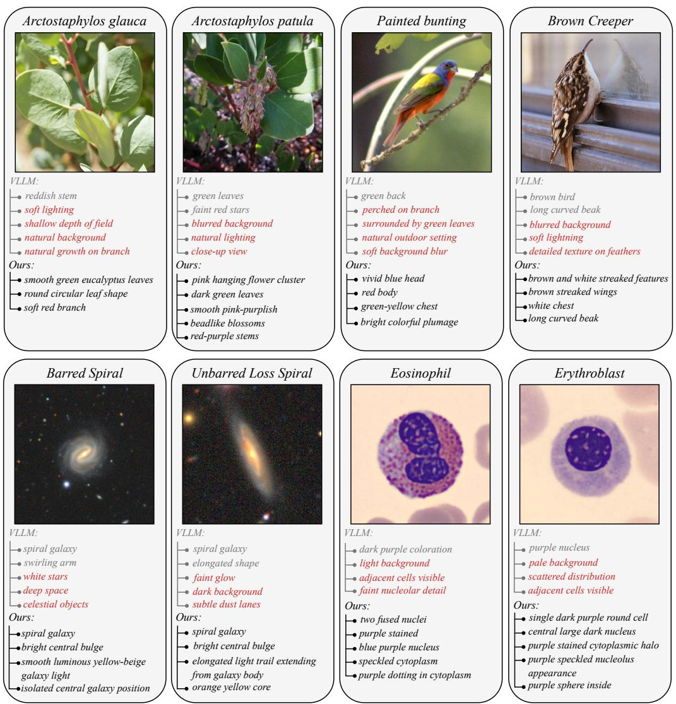  
reddish stem  
soft lighting  
shallow depth of field  
natural background  
natural growth on branch  
Ours:  
smooth green eucalyptus leaves  
round circular leaf shape  
soft red branch  
green leaves  
faint red stars  
blurred background  
natural lighting  
close-up view  
Ours:  
pink hanging flower cluster  
dark green leaves  
smooth pink-purplish  
beadlike blossoms  
red-purple stems  
green back  
perched on branch  
surrounded by green leaves  
natural outdoor setting  
soft background blur  
Ours:  
vivid blue head  
red body  
green-yellow chest  
bright colorful plumage  
brown bird  
long curved beak  
blurred background  
soft lightning  
detailed texture on feathers  
Ours:  
brown and white streaked features  
brown streaked wings  
white chest  
long curved beak  
VLLM:  
spiral galaxy  
swirling arm  
white stars  
deep space  
celestial objects  
spiral galaxy  
bright central bulge  
smooth luminous yellow-beige  
galaxy light  
isolated central galaxy position  
VLLM:  
spiral galaxy  
elongated shape  
dark background  
subtle dust lanes  
spiral galaxy  
bright central bulge  
elongated light trail extending  
from galaxy body  
orange yellow core  
VLLM:  
dark purple coloration  
light background  
adjacent cells visible  
faint nucleolar detail  
two fused nuclei  
purple stained  
blue purple nucleus  
speckled cytoplasm  
purple dotting in cytoplasm  
VLLM:  
purple nucleus  
pale background  
scattered distribution  
adjacent cells visible  
Ours:  
single dark purple round cell  
central large dark nucleus  
purple stained cytoplasmic halo  
purple speckled nucleolus  
appearance  
purple sphere inside

Figure 3: Visualizing Self-Supervised Concept Discovery. For each sample, we contrast the top concepts generated by the VLLM baseline (top list) with our S2COPE-optimized model (bottom list). Red text indicates incorrect concepts for recognizing the image’s category. S2COPE optimized model suppresses these nuisance concepts, extracting precise, physically grounded attributes.

images. Consequently, this reward formulation isolates concepts that are invariant, highly specific, and robustly grounded in the visual input.

We note that the CLIP towers remain frozen; they serve solely as a semantic similarity metric to compute the contrastive reward. Ultimately, this reward signal is employed to optimize the VLLM concept generator via reinforcement learning algorithms such as direct preference optimization [41]. While CLIP model is supervisedly pretrained, here we adapt it to further serving our self-supervised concept discovery on novel data.

## 3.3 Self-Supervised Preference Optimization

Prior methods use post hoc filtering [37] to post process those generated concepts for interpretability, while making the LLM or VLLM concept generator staic. In contrast, we will learn the VLLM backbone so that we can further improve the capability of VLLM in proposing better concepts.

While the contrastive reward $R ( c , x )$ provides a self-supervisory signal, it is a scalar and acts as an external evaluator; it is not differentiable (due to the discrete nature of our discovered text concepts), and it does not correct the VLM’s generative prior. To transform the VLM from a static generator—as used by prior methods [37]—into an active concept miner, we use these rewards as feedback to reinforce the VLM’s generations on the concepts.

We achieve this through Direct Preference Optimization (DPO) [41]. For every image x, we evaluate all hypothesized concepts $c \in \mathcal { C } ( x )$ using our physical reward R. We construct a preference dataset by selecting pairs of concepts with a maximum margin in reward: the invariant concept becomes the winning response $c _ { w } ,$ and the lower-scoring, unstable concept becomes the losing response $c _ { l } .$ yielding a preference dataset $\mathcal { D } = \{ ( x , c _ { w } , c _ { l } ) \}$ .

We update the VLM parameters, which is equivalent to update the concept generation policy $\pi _ { \theta }$ initialized from a reference model $\pi _ { \mathrm { r e f } } .$ , by minimizing the DPO objective:

$$
\mathcal {L} _ {\mathrm{DPO}} \left(\pi_ {\theta}; \pi_ {\text { ref }}\right) = - \mathbb {E} _ {\left(x, c _ {w}, c _ {l}\right) \sim \mathcal {D}} \left[ \log \sigma \left(\beta \log \frac {\pi_ {\theta} \left(c _ {w} \mid x\right)}{\pi_ {\text { ref }} \left(c _ {w} \mid x\right)} - \beta \log \frac {\pi_ {\theta} \left(c _ {l} \mid x\right)}{\pi_ {\text { ref }} \left(c _ {l} \mid x\right)}\right) \right] \tag {2}
$$

where $\beta$ controls the deviation from the reference policy, and we optimize the model parameters θ.

Specifically, our self-supervised DPO algorithm learns from these contrastive pairs, reinforcing the VLLMs’ generation of concepts that respect structural invariance while penalizing those that produce high variance across augmentations of the same instance or low variance across different instances. This enables a fully self-supervised reinforcement learning loop, resulting in a model that autonomously discovers highly precise, visually grounded vocabularies (see Figure 3).

Linear Probing Evaluation. Once our VLLM concept generator is trained, we follow established methods to evaluate the quality of the discovered concepts using linear probing over concept activations. Using the trained VLLM, we first generate candidate concepts for all training images. These are then aggregated and deduplicated via CLIP text similarity to construct a compact, fixed concept bank. Each training image is then represented as a concept activation vector—computed via its CLIP similarity scores against the entire bank—which is used to train a logistic regression classifier. During inference, unseen test images are projected onto this exact same concept bank, and we report top-1 classification accuracy.

## 4 Experiments

## 4.1 Experimental Setup

Datasets. We train our model exclusively on 1300 unlabeled iNaturalist mini [53] training subset, following the dataset split of [12], then transfer evaluate on eight datasets spanning three scientific domains where visual taxonomies are often unknown even to experts and the data is naturally unlabeled. Critically, seven of the eight evaluation datasets are entirely unseen during training, to test cross-domain transferability. Nature: iNaturalist [53, 12] and CUB [54] (fine-grained biological traits). Medical: HAM10000 [51] (skin lesions), BloodMNIST [59] (blood cells), OrganCMNIST and OrganMNIST3D [59] (CT scans). Physics: Galaxy10 [28] (galaxy morphologies) and Gravity Spy [63] (gravitational-wave spectrograms). Ranging from fine-grained natural imagery to highly abstract scientific modalities, these datasets provide a comprehensive testbed for self-supervised concept discovery.

Baselines. We compare against four supervised concept-based methods that also produce interpretable concepts. TextSpan [18] decomposes CLIP image representations into text-interpretable components via a spanning set of natural-language descriptions. DCLIP [34] performs zero-shot classification using LLM-generated per-class descriptions matched via CLIP. LF-CBM [37] prompts an LLM with class names to build a concept bank, then trains a linear classifier on CLIP concept activations. LaBo [60] further applies submodular selection to retain a maximally discriminative concept subset. Note that existing baselines on concept discovery only feed in the category name as text to the LLM to first propose a bank of possible concepts, then post-process them with images. In contrast, our method directly feeds each individual image for concept generation.

Models. For fair comparison, all methods, both baselines and ours, employ the same Qwen3-VL-8B-Instruct [58, 3] for concept generation and OpenCLIP ViT-H/14 [11] for concept-image similarity scoring, isolating each method’s concept discovery strategy and the contribution of $\mathsf { S } ^ { \mathrm { 2 } } \mathrm { C O P E }$ from differences in model capacity.

Implementation Details. We use a batchsize of 2048 for the contrastive reward calculation. We optimize with batch size of 512. We use learning rate of 5e-6 for the Qwen3-VL vision tower and

Table 1: Top-1 concept-based classification accuracy (%) across eight datasets. We compare our label-free framework with three concept-based methods that require class labels (above the dashed line). $\mathrm { ^ { * * } V L L M + S ^ { 2 } C O P E } ^ { \mathrm { , } }$ ( gray ) applies $\mathbf { S } ^ { 2 } \mathbf { C } \mathbf { O P } \mathbf { E }$ optimization on 1,300 unlabeled iNaturalistmini images and evaluates via frozen transfer. The unoptimized VLLM already matches supervised baselines, and $\mathrm { S ^ { 2 } C O P E }$ further boosts accuracy by up to 24.5 points without any labels.

<table><tr><td rowspan="2">Method</td><td rowspan="2">Labels</td><td colspan="2">Nature</td><td colspan="2">Physics</td></tr><tr><td>iNaturalist</td><td>CUB</td><td>Galaxy10</td><td>Gravity Spy</td></tr><tr><td>TextSpan</td><td>✓</td><td>20.00</td><td>81.08</td><td>24.07</td><td>4.25</td></tr><tr><td>DCLIP</td><td>✓</td><td>23.46</td><td>82.14</td><td>11.75</td><td>2.17</td></tr><tr><td>LF-CBM</td><td>✓</td><td>73.85</td><td>64.55</td><td>53.44</td><td>83.08</td></tr><tr><td>LaBo</td><td>✓</td><td>42.69</td><td>77.63</td><td>53.55</td><td>39.50</td></tr><tr><td>VLLM (Unoptimized)</td><td>✘</td><td>71.15</td><td>74.77</td><td>54.09</td><td>60.83</td></tr><tr><td> $VLLM + S^2COPE$ (Ours)</td><td>✘</td><td>85.00 (+13.9)</td><td>84.50 (+9.7)</td><td>64.83 (+10.7)</td><td>81.00 (+20.2)</td></tr></table>

<table><tr><td rowspan="2">Method</td><td rowspan="2">Labels</td><td colspan="4">Medical</td></tr><tr><td>HAM10000</td><td>BloodMNIST</td><td>OrganCMNIST</td><td>OrganMNIST3D</td></tr><tr><td>TextSpan</td><td>✓</td><td>17.10</td><td>11.04</td><td>7.40</td><td>12.42</td></tr><tr><td>DCLIP</td><td>✓</td><td>33.16</td><td>23.71</td><td>10.41</td><td>14.29</td></tr><tr><td>LF-CBM</td><td>✓</td><td>70.98</td><td>87.32</td><td>78.85</td><td>65.22</td></tr><tr><td>LaBo</td><td>✓</td><td>63.73</td><td>62.50</td><td>54.10</td><td>22.36</td></tr><tr><td>VLLM (Unoptimized)</td><td>✘</td><td>65.28</td><td>55.26</td><td>68.06</td><td>58.39</td></tr><tr><td> $VLLM + S^2COPE$ (Ours)</td><td>✘</td><td>79.27 (+14.0)</td><td>79.73 (+24.5)</td><td>89.17 (+21.1)</td><td>72.05 (+13.7)</td></tr></table>

(a) Reward Components  
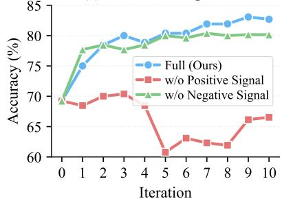

line chart

| Iteration | Full (Ours) | w/o Positive Signal | w/o Negative Signal |
| --------- | ----------- | ------------------- | ------------------- |
| 0         | 70          | 70                  | 70                  |
| 1         | 75          | 69                  | 78                  |
| 2         | 80          | 70                  | 79                  |
| 3         | 81          | 70                  | 79                  |
| 4         | 80          | 68                  | 79                  |
| 5         | 81          | 61                  | 79                  |
| 6         | 81          | 63                  | 79                  |
| 7         | 82          | 62                  | 79                  |
| 8         | 82          | 62                  | 79                  |
| 9         | 83          | 66                  | 80                  |
| 10        | 83          | 67                  | 80                  |

(b) Reward Modality  
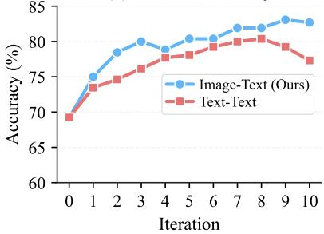

line chart

| Iteration | Image-Text (Ours) | Text-Text |
| --------- | ----------------- | --------- |
| 0         | 70.0              | 70.0      |
| 1         | 75.0              | 74.0      |
| 2         | 78.0              | 75.0      |
| 3         | 80.0              | 76.0      |
| 4         | 79.0              | 78.0      |
| 5         | 80.0              | 79.0      |
| 6         | 81.0              | 80.0      |
| 7         | 82.0              | 81.0      |
| 8         | 83.0              | 82.0      |
| 9         | 84.0              | 81.0      |
| 10        | 83.0              | 78.0      |

Figure 4: Ablation Studies on Reward Formulation. (a) Reward Components: Impact of isolating the positive and negative signals of the contrastive reward. Eliminating the positive signal causes a performance collapse, while removing the negative signal yields a suboptimal accuracy plateau. (b) Reward Modality: Comparison of cross-modal image-text grounding versus unimodal text-text consensus. Cross-modal grounding against physical image features achieves better performance than relying on unimodal textual consensus.

1e-6 for the rest of Qwen3-VL parameters. Our training runs on one node with 8 RTX 6000 Blackwell Pro GPUs.

## 4.2 Main Results

Table 1 reports the concept-based linear probing accuracy across all eight datasets. We train the VLLM concept generator via self-supervision exclusively on unlabeled iNaturalist-mini training subset; the model is subsequently frozen and applied to all target datasets without further adaptation.

Notably, the unoptimized VLLM is already competitive with supervised baselines, outperforming TextSpan, DCLIP and LaBo on most datasets. All of these baselines degrade sharply on specialized modalities where rigid language priors fail (e.g., DCLIP and TextSpan achieve only 2.17% and 4.25% on Gravity Spy, respectively, and LaBo drops to 22.36% on OrganMNIST3D). To ensure a fair comparison, both our method and the baselines utilize the same Qwen3-VL-8B architecture. Existing baselines generate concept candidates by conditioning strictly on class names rather than visual inputs, resulting in concept pools that lack diversity and are often visually misaligned. In contrast, simply by conditioning the VLLM directly on the raw images, our unoptimized model achieves comparable or superior accuracy. Crucially, this image-driven approach eliminates the need for predefined global category annotations, establishing our framework as the first capable of proposing concepts in a completely label-free manner.

<table><tr><td rowspan="2">Base Model</td><td colspan="2">Top-1 Accuracy (%)</td></tr><tr><td>Unoptimized</td><td>w/ S2COPE</td></tr><tr><td>Qwen3-VL-2B-Instruct</td><td>67.31</td><td>80.77</td></tr><tr><td>Qwen3-VL-4B-Instruct</td><td>69.62</td><td>82.31</td></tr><tr><td>Qwen3-VL-8B-Instruct</td><td>69.23</td><td>83.08</td></tr></table>

Table 2: Impact of Base Model Capacity. Ablation over VLM scale (2B, 4B, 8B). S2COPE yields consistent gains (over 13 points) across all scales, with accuracy scaling monotonically with model size.

Table 3: Importance of Simple Negatives. Comparison of preference pair construction strategies, defined by the reward gap between chosen and rejected concepts: Hard Neg. (smallest gap), Random, and Easy Neg. (largest gap). Each strategy selects 16 preference pairs per image. Easy negatives yield the best accuracy, as the largest reward margin provides the least noisy optimization signal.

<table><tr><td rowspan="2">Strategy</td><td rowspan="2">Unoptimized VLLM</td><td colspan="3">VLLM w/  $S^2$ COPE</td></tr><tr><td>Hard Neg.</td><td>Random</td><td>Easy Neg.</td></tr><tr><td>Top-1 Accuracy (%)</td><td>69.23</td><td>76.92</td><td>81.92</td><td>83.08</td></tr></table>

While the unoptimized VLLM effectively extracts relevant concepts, these initial concepts can lack robustness. Our self-supervised objective addresses this by explicitly reinforcing concepts that remain stable under visual transformations. Following S2COPE optimization, performance improves by an average of ∼16 points, enabling our purely label-free framework to surpass all supervised baselines on 6 out of the 8 datasets. Strikingly, the most substantial improvements occur on target domains furthest from the iNaturalist training source: +24.5% on BloodMNIST, +21.1% on OrganCMNIST, and +20.2% on Gravity Spy. These significant cross-domain gains demonstrate that our optimization loop cultivates a generalized concept discovery mechanism, rather than merely memorizing the source dataset’s taxonomy.

## 4.3 Ablation Studies and Analysis

Contrastive Reward Components. To validate the necessity of each reward component, we ablate the positive and negative signals of the contrastive reward (Figure 4a). Removing the negative signal reduces the objective to measuring physical stability alone, yielding generic concepts that lack discriminative specificity. Eliminating the positive signal causes a catastrophic collapse, as the optimization rewards distinctiveness indiscriminately and internalizes background noise as valid attributes. Both signals are strictly necessary—the positive anchors concepts to physical reality, while the negative enforces discriminative specificity.

Invariance Score Modality. To determine the optimal grounding space for the invariance reward, we compare two modalities: Text-Text (distance between textual concepts of different images) and Image-Text (alignment between proposed concepts and raw visual embeddings). As shown in Figure 4(b), Image-Text achieves significantly higher accuracy, as anchoring candidates directly against physical image features produces a cleaner preference signal than relying on intermediate linguistic representations.

Base Model Capacity. To assess generalization across model scales, we evaluate the 2B, 4B, and 8B variants of Qwen3-VL-Instruct (Table 2). Despite similar zero-shot baselines (67%–69%), S2COPE yields consistent gains exceeding 13 points across all scales. Accuracy scales monotonically with model size (83.08% for 8B), demonstrating that our method scales as VLLM gets better.

Importance of Simple Negatives. To study the effect of preference pair construction, we compare three strategies defined by the reward gap between chosen and rejected concepts: Hard Neg. (smallest gap), Random, and Easy Neg. (largest gap), each selecting 16 pairs per image (Table 3). Easy negatives achieve the best accuracy (83.08%), while hard negatives degrade to 76.92%. The selfsupervised reward inherently contains noise from the continuous embedding space; forcing the model to distinguish near-identical scores amplifies this noise. Easy negatives sidestep this by isolating the widest reward discrepancies, providing an unambiguous corrective signal.

Cross-Modal Encoder Capacity. To evaluate sensitivity to the cross-modal encoder, we ablate the frozen CLIP architecture used for the contrastive reward (Table 4). Both encoders yield strong gains over the baseline, with ViT-H/14 achieving a modest edge (83.08% vs. 82.31%) due to its finer-grained representations producing a more precise reward signal.

Table 4: Impact of Cross-Modal Encoder Capacity. Ablation over the frozen CLIP encoder used for the contrastive reward. ViT-H/14 achieves higher accuracy due to its finer-grained visual representations producing a more precise reward signal.

<table><tr><td rowspan="2">Encoder</td><td rowspan="2">Unoptimized VLLM</td><td colspan="2">VLLM w/  $S^{2}COPE$ </td></tr><tr><td>ViT-B/16</td><td>ViT-H/14</td></tr><tr><td>Top-1 Accuracy (%)</td><td>69.23</td><td>82.31</td><td>83.08</td></tr></table>

Table 5: Impact of Unlabeled Dataset Size. Scaling the number of unlabeled training images from 100 to 1,300. Accuracy improves continuously with no saturation, indicating that greater visual diversity strengthens the optimization signal.

<table><tr><td rowspan="2">Dataset Size</td><td rowspan="2">Unoptimized VLLM</td><td colspan="5">VLLM w/  $S^2$ COPE</td></tr><tr><td>100</td><td>400</td><td>700</td><td>1000</td><td>1300</td></tr><tr><td>Top-1 Accuracy (%)</td><td>69.23</td><td>76.54</td><td>80.38</td><td>81.15</td><td>81.15</td><td>83.08</td></tr></table>

Scaling Unlabeled Data. To investigate the impact of dataset scale, we vary the number of unlabeled source-domain images from 100 to 1,300 (Table 5). Accuracy improves continuously (76.54% to 83.08%) with no saturation, indicating that greater visual diversity strengthens the self-supervised optimization signal.

## 4.4 Qualitative Analysis

Figure 3 compares concepts before and after $\mathbf { S } ^ { 2 } \mathbf { C } \mathbf { O } \mathbf { P } \mathbf { E }$ optimization (see Appendix A.6 for extended visualizations). The base VLLM defaults to generic captions and photographic filler (highlighted in red). After $\mathrm { S ^ { 2 } C O P E }$ optimization, the model suppresses these artifacts and outputs attributes that align with human understanding across all evaluated domains.

## 4.5 Human Evaluation

User Study Design. To assess the interpretability and descriptive quality of the discovered lexicons, we conduct a user study with 10 volunteers. The evaluation comprises 39 images sampled across the nature, medical, and physics domains. For each image, participants review two anonymized concept lists: one generated by the unoptimized base VLLM and one by our $\mathsf { S } ^ { \mathrm { 2 } } \mathrm { C O P E }$ optimized model. Participants are asked to select the list that provides a more informative physical description of the object in the image (See Appendix A.7 for user study samples).

User Study Results. The evaluation demonstrates a preference for the optimized concepts (Figure 5). Volunteers select the S2COPE generated lists with a mean preference rate of 96.41% and a standard deviation of 4.87%. This consensus confirms that the concepts discovered by $\mathbf { S } ^ { \mathrm { 2 } } \mathbf { C } \mathbf { O P E }$ from unlabeled data are not only discriminative but also semantically meaningful and interpretable to human observers.

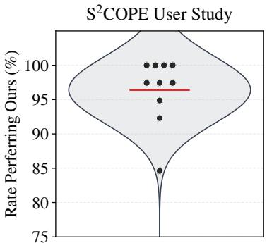

violin chart

| Rate Performing Out (%) | Count |
| ---------------------- | ----- |
| 85                     | 100   |
| 90                     | 95    |
| 95                     | 98    |
| 100                    | 100   |

Figure 5: User Study Preferences. Distribution of human preference for the concepts generated by our $\mathrm { S ^ { 2 } C O P E }$ optimized model against the unoptimized baseline.

## 5 Conclusion

We introduce the first self-supervised framework for visual concept discovery from unlabeled image data. By moving beyond static vision-language priors and reinforcing concept generation using incidental visual structure as a direct reward, we show that we can discover better visual concepts for interpretable classification. Our work suggests that trustworthy visual intelligence should not be learned by just mapping opaque representations to predefined dictionaries, but also by actively exploiting the structures that inherent to the visual world.

## Acknowledgement

We thank Amazon Research Award that supports this research. This work used Purdue Anvil GPU through allocation 250774 from the Advanced Cyberinfrastructure Coordination Ecosystem: Services & Support (ACCESS) program, which is supported by U.S. National Science Foundation grants #2138259, #2138286, #2138307, #2137603, and #2138296.

## References

[1] Jean-Baptiste Alayrac, Jeff Donahue, Pauline Luc, Antoine Miech, Iain Barr, Yana Hasson, Karel Lenc, Arthur Mensch, Katherine Millican, Malcolm Reynolds, et al. Flamingo: a visual language model for few-shot learning. Advances in neural information processing systems, 35: 23716–23736, 2022.  
[2] Antonio Almudévar, José Miguel Hernández-Lobato, and Alfonso Ortega. There was never a bottleneck in concept bottleneck models. arXiv preprint arXiv:2506.04877, 2025.  
[3] Shuai Bai, Yuxuan Cai, Ruizhe Chen, Keqin Chen, Xionghui Chen, Zesen Cheng, Lianghao Deng, Wei Ding, Chang Gao, Chunjiang Ge, et al. Qwen3-vl technical report. arXiv preprint arXiv:2511.21631, 2025.  
[4] Adrien Bardes, Jean Ponce, and Yann LeCun. Vicreg: Variance-invariance-covariance regularization for self-supervised learning. In International Conference on Learning Representations, 2022.  
[5] Davide Caffagni, Sara Sarto, Marcella Cornia, Lorenzo Baraldi, Pier Luigi Dovesi, Shaghayegh Roohi, Mark Granroth-Wilding, and Rita Cucchiara. Seeing beyond words: Self-supervised visual learning for multimodal large language models. arXiv preprint arXiv:2512.15885, 2025.  
[6] Mathilde Caron, Piotr Bojanowski, Armand Joulin, and Matthijs Douze. Deep clustering for unsupervised learning of visual features. In Proceedings of the European conference on computer vision (ECCV), pages 132–149, 2018.  
[7] Mathilde Caron, Ishan Misra, Julien Mairal, Priya Goyal, Piotr Bojanowski, and Armand Joulin. Unsupervised learning of visual features by contrasting cluster assignments. Advances in neural information processing systems, 33:9912–9924, 2020.  
[8] Mathilde Caron, Hugo Touvron, Ishan Misra, Hervé Jégou, Julien Mairal, Piotr Bojanowski, and Armand Joulin. Emerging properties in self-supervised vision transformers. In Proceedings of the IEEE/CVF international conference on computer vision, pages 9650–9660, 2021.  
[9] Ruijun Chen, Jiajian Guo, Hongzhan Chen, Fanqi Wan, Qifan Wang, and Xiaojun Quan. Realign: Structured revision for small language model alignment. In Findings of the Association for Computational Linguistics: EMNLP 2025, pages 12005–12020, 2025.  
[10] Ting Chen, Simon Kornblith, Mohammad Norouzi, and Geoffrey Hinton. A simple framework for contrastive learning of visual representations. In International conference on machine learning, pages 1597–1607. PmLR, 2020.  
[11] Mehdi Cherti, Romain Beaumont, Ross Wightman, Mitchell Wortsman, Gabriel Ilharco, Cade Gordon, Christoph Schuhmann, Ludwig Schmidt, and Jenia Jitsev. Reproducible scaling laws for contrastive language-image learning. In Proceedings of the IEEE/CVF conference on computer vision and pattern recognition, pages 2818–2829, 2023.  
[12] Mia Chiquier, Utkarsh Mall, and Carl Vondrick. Evolving interpretable visual classifiers with large language models. In European Conference on Computer Vision, pages 183–201. Springer, 2024.  
[13] Wenliang Dai, Junnan Li, Dongxu Li, Anthony Tiong, Junqi Zhao, Weisheng Wang, Boyang Li, Pascale N Fung, and Steven Hoi. Instructblip: Towards general-purpose vision-language models with instruction tuning. Advances in neural information processing systems, 36:49250–49267, 2023.  
[14] Jacob Devlin, Ming-Wei Chang, Kenton Lee, and Kristina Toutanova. Bert: Pre-training of deep bidirectional transformers for language understanding. In Proceedings of the 2019 Conference of the North American Chapter of the Association for Computational Linguistics: Human Language Technologies, Volume 1 (Long and Short Papers), pages 4171–4186, 2019.  
[15] Xinpeng Ding, Kui Zhang, Jianhua Han, Lanqing Hong, Hang Xu, and Xiaomeng Li. Pamivdpo: Mitigating video hallucinations by prompt-aware multi-instance video preference learning. arXiv preprint arXiv:2504.05810, 2025.  
[16] Zeyu Feng, Chang Xu, and Dacheng Tao. Self-supervised representation learning by rotation feature decoupling. In Proceedings of the IEEE/CVF Conference on Computer Vision and Pattern Recognition, pages 10364–10374, 2019.  
[17] Jinlan Fu, Hao Fei, Xiaoyu Shen, Bryan Hooi, Xipeng Qiu, See-Kiong Ng, et al. Chip: Crossmodal hierarchical direct preference optimization for multimodal llms. In The Thirteenth International Conference on Learning Representations, 2025.  
[18] Yossi Gandelsman, Alexei A Efros, and Jacob Steinhardt. Interpreting clip’s image representation via text-based decomposition. In The Twelfth International Conference on Learning Representations, 2024.  
[19] Jean-Bastien Grill, Florian Strub, Florent Altché, Corentin Tallec, Pierre Richemond, Elena Buchatskaya, Carl Doersch, Bernardo Avila Pires, Zhaohan Guo, Mohammad Gheshlaghi Azar, et al. Bootstrap your own latent-a new approach to self-supervised learning. Advances in neural information processing systems, 33:21271–21284, 2020.  
[20] Tianrui Guan, Fuxiao Liu, Xiyang Wu, Ruiqi Xian, Zongxia Li, Xiaoyu Liu, Xijun Wang, Lichang Chen, Furong Huang, Yaser Yacoob, et al. Hallusionbench: an advanced diagnostic suite for entangled language hallucination and visual illusion in large vision-language models. In Proceedings of the IEEE/CVF conference on computer vision and pattern recognition, pages 14375–14385, 2024.  
[21] Kaiming He, Haoqi Fan, Yuxin Wu, Saining Xie, and Ross Girshick. Momentum contrast for unsupervised visual representation learning. In Proceedings of the IEEE/CVF conference on computer vision and pattern recognition, pages 9729–9738, 2020.  
[22] Kaiming He, Xinlei Chen, Saining Xie, Yanghao Li, Piotr Dollár, and Ross Girshick. Masked autoencoders are scalable vision learners. In Proceedings of the IEEE/CVF conference on computer vision and pattern recognition, pages 16000–16009, 2022.  
[23] Raban Iten, Tony Metger, Henrik Wilming, Lídia Del Rio, and Renato Renner. Discovering physical concepts with neural networks. Physical review letters, 124(1):010508, 2020.  
[24] Chao Jia, Yinfei Yang, Ye Xia, Yi-Ting Chen, Zarana Parekh, Hieu Pham, Quoc Le, Yun-Hsuan Sung, Zhen Li, and Tom Duerig. Scaling up visual and vision-language representation learning with noisy text supervision. In International conference on machine learning, pages 4904–4916. PMLR, 2021.  
[25] Hongrui Jia, Chaoya Jiang, Haiyang Xu, Wei Ye, Mengfan Dong, Ming Yan, Ji Zhang, Fei Huang, and Shikun Zhang. Symdpo: Boosting in-context learning of large multimodal models with symbol demonstration direct preference optimization. In Proceedings of the Computer Vision and Pattern Recognition Conference, pages 9361–9371, 2025.  
[26] Been Kim, Martin Wattenberg, Justin Gilmer, Carrie Cai, James Wexler, Fernanda Viegas, et al. Interpretability beyond feature attribution: Quantitative testing with concept activation vectors (tcav). In International conference on machine learning, pages 2668–2677. PMLR, 2018.  
[27] Pang Wei Koh, Thao Nguyen, Yew Siang Tang, Stephen Mussmann, Emma Pierson, Been Kim, and Percy Liang. Concept bottleneck models. In International conference on machine learning, pages 5338–5348. PMLR, 2020.  
[28] Henry W Leung and Jo Bovy. Deep learning of multi-element abundances from high-resolution spectroscopic data. Monthly Notices of the Royal Astronomical Society, 483(3):3255–3277, 2019.  
[29] Vladimir I Levenshtein et al. Binary codes capable of correcting deletions, insertions, and reversals. In Soviet physics doklady, volume 10, pages 707–710. Soviet Union, 1966.  
[30] Junnan Li, Dongxu Li, Silvio Savarese, and Steven Hoi. Blip-2: Bootstrapping language-image pre-training with frozen image encoders and large language models. In International conference on machine learning, pages 19730–19742. PMLR, 2023.  
[31] Yifan Li, Yifan Du, Kun Zhou, Jinpeng Wang, Xin Zhao, and Ji-Rong Wen. Evaluating object hallucination in large vision-language models. In Proceedings of the 2023 conference on empirical methods in natural language processing, pages 292–305, 2023.  
[32] Chin-Yew Lin. Rouge: A package for automatic evaluation of summaries. In Text summarization branches out, pages 74–81, 2004.  
[33] Haotian Liu, Chunyuan Li, Qingyang Wu, and Yong Jae Lee. Visual instruction tuning. Advances in neural information processing systems, 36:34892–34916, 2023.  
[34] Sachit Menon and Carl Vondrick. Visual classification via description from large language models. In The Eleventh International Conference on Learning Representations, 2023.  
[35] Ishan Misra and Laurens van der Maaten. Self-supervised learning of pretext-invariant representations. In Proceedings of the IEEE/CVF conference on computer vision and pattern recognition, pages 6707–6717, 2020.  
[36] Tuomas Oikarinen and Tsui-Wei Weng. Clip-dissect: Automatic description of neuron representations in deep vision networks. In The Eleventh International Conference on Learning Representations, 2023.  
[37] Tuomas Oikarinen, Subhro Das, Lam M Nguyen, and Tsui-Wei Weng. Label-free concept bottleneck models. In The Eleventh International Conference on Learning Representations, 2023.  
[38] Maxime Oquab, Timothée Darcet, Théo Moutakanni, Huy Vo, Marc Szafraniec, Vasil Khalidov, Pierre Fernandez, Daniel Haziza, Francisco Massa, Alaaeldin El-Nouby, et al. Dinov2: Learning robust visual features without supervision. Transactions on Machine Learning Research Journal, 2024.  
[39] Mateusz Pach, Shyamgopal Karthik, Quentin Bouniot, Serge Belongie, and Zeynep Akata. Sparse autoencoders learn monosemantic features in vision-language models. arXiv preprint arXiv:2504.02821, 2025.  
[40] Alec Radford, Jong Wook Kim, Chris Hallacy, Aditya Ramesh, Gabriel Goh, Sandhini Agarwal, Girish Sastry, Amanda Askell, Pamela Mishkin, Jack Clark, et al. Learning transferable visual models from natural language supervision. In International conference on machine learning, pages 8748–8763. PmLR, 2021.  
[41] Rafael Rafailov, Archit Sharma, Eric Mitchell, Christopher D Manning, Stefano Ermon, and Chelsea Finn. Direct preference optimization: Your language model is secretly a reward model. Advances in neural information processing systems, 36:53728–53741, 2023.  
[42] Anna Rohrbach, Lisa Anne Hendricks, Kaylee Burns, Trevor Darrell, and Kate Saenko. Object hallucination in image captioning. In Proceedings of the 2018 Conference on Empirical Methods in Natural Language Processing, pages 4035–4045, 2018.  
[43] Cynthia Rudin. Stop explaining black box machine learning models for high stakes decisions and use interpretable models instead. Nature machine intelligence, 1(5):206–215, 2019.  
[44] Fawaz Sammani, Jonas Fischer, and Nikos Deligiannis. Clip-free, label-free, zero-shot concept bottleneck models. arXiv preprint arXiv:2503.10981, 2025.  
[45] Simon Schrodi, Julian Schur, Max Argus, and Thomas Brox. Selective concept bottleneck models without predefined concepts. Transactions on Machine Learning Research, 2025.  
[46] Vésteinn Snæbjarnarson, Kevin Du, Niklas Stoehr, Serge Belongie, Ryan Cotterell, Nico Lang, and Stella Frank. Taxonomy-aware evaluation of vision-language models. In Proceedings of the Computer Vision and Pattern Recognition Conference, pages 9109–9120, 2025.  
[47] Divyansh Srivastava, Ge Yan, and Tsui-Wei Weng. Vlg-cbm: Training concept bottleneck models with vision-language guidance. Advances in Neural Information Processing Systems, 37:79057–79094, 2024.  
[48] Guohao Sun, Can Qin, Yihao Feng, Zeyuan Chen, Ran Xu, Sohail Dianat, Majid Rabbani, Raghuveer Rao, and Zhiqiang Tao. Structured policy optimization: Enhance large visionlanguage model via self-referenced dialogue. In Proceedings of the IEEE/CVF International Conference on Computer Vision, pages 741–751, 2025.  
[49] Sirnam Swetha, Rui Meng, Shwetha Ram, Tal Neiman, Son Tran, and Mubarak Shah. Smpro: Self-supervised visual preference alignment via differentiable multi-preference multi-group ranking. In Proceedings of the AAAI Conference on Artificial Intelligence, volume 40, pages 37951–37960, 2026.  
[50] Eric J Topol. High-performance medicine: the convergence of human and artificial intelligence. Nature medicine, 25(1):44–56, 2019.  
[51] Philipp Tschandl, Cliff Rosendahl, and Harald Kittler. The ham10000 dataset, a large collection of multi-source dermatoscopic images of common pigmented skin lesions. Scientific data, 5(1): 180161, 2018.  
[52] Michael Tschannen, Alexey Gritsenko, Xiao Wang, Muhammad Ferjad Naeem, Ibrahim Alabdulmohsin, Nikhil Parthasarathy, Talfan Evans, Lucas Beyer, Ye Xia, Basil Mustafa, et al. Siglip 2: Multilingual vision-language encoders with improved semantic understanding, localization, and dense features. arXiv preprint arXiv:2502.14786, 2025.  
[53] Grant Van Horn, Elijah Cole, Sara Beery, Kimberly Wilber, Serge Belongie, and Oisin Mac Aodha. Benchmarking representation learning for natural world image collections. In Proceedings of the IEEE/CVF conference on computer vision and pattern recognition, pages 12884–12893, 2021.  
[54] C. Wah, S. Branson, P. Welinder, P. Perona, and S. Belongie. The caltech-ucsd birds-200-2011 dataset. Technical Report CNS-TR-2011-001, California Institute of Technology, 2011.  
[55] Hanchen Wang, Tianfan Fu, Yuanqi Du, Wenhao Gao, Kexin Huang, Ziming Liu, Payal Chandak, Shengchao Liu, Peter Van Katwyk, Andreea Deac, et al. Scientific discovery in the age of artificial intelligence. Nature, 620(7972):47–60, 2023.  
[56] Haochen Wang, Anlin Zheng, Yucheng Zhao, Tiancai Wang, Zheng Ge, Xiangyu Zhang, and Zhaoxiang Zhang. Reconstructive visual instruction tuning. In The Thirteenth International Conference on Learning Representations, 2025.  
[57] Penghao Wu, Yushan Zhang, Haiwen Diao, Bo Li, Lewei Lu, and Ziwei Liu. Visual jigsaw post-training improves mllms. arXiv preprint arXiv:2509.25190, 2025.  
[58] An Yang, Anfeng Li, Baosong Yang, Beichen Zhang, Binyuan Hui, Bo Zheng, Bowen Yu, Chang Gao, Chengen Huang, Chenxu Lv, et al. Qwen3 technical report. arXiv preprint arXiv:2505.09388, 2025.  
[59] Jiancheng Yang, Rui Shi, Donglai Wei, Zequan Liu, Lin Zhao, Bilian Ke, Hanspeter Pfister, and Bingbing Ni. Medmnist v2-a large-scale lightweight benchmark for 2d and 3d biomedical image classification. Scientific data, 10(1):41, 2023.  
[60] Yue Yang, Artemis Panagopoulou, Shenghao Zhou, Daniel Jin, Chris Callison-Burch, and Mark Yatskar. Language in a bottle: Language model guided concept bottlenecks for interpretable image classification. In Proceedings of the IEEE/CVF conference on computer vision and pattern recognition, pages 19187–19197, 2023.  
[61] Heeji Yoon, Jaewoo Jung, Junwan Kim, Hyungyu Choi, Heeseong Shin, Sangbeom Lim, Honggyu An, Chaehyun Kim, Jisang Han, Donghyun Kim, et al. Visual representation alignment for multimodal large language models. arXiv preprint arXiv:2509.07979, 2025.  
[62] Mert Yuksekgonul, Maggie Wang, and James Zou. Post-hoc concept bottleneck models. In The Eleventh International Conference on Learning Representations, 2023.  
[63] Michael Zevin, Scott Coughlin, Sara Bahaadini, Emre Besler, Neda Rohani, Sarah Allen, Miriam Cabero, Kevin Crowston, Aggelos K Katsaggelos, Shane L Larson, et al. Gravity spy: integrating advanced ligo detector characterization, machine learning, and citizen science. Classical and quantum gravity, 34(6):064003, 2017.  
[64] Xiaohua Zhai, Basil Mustafa, Alexander Kolesnikov, and Lucas Beyer. Sigmoid loss for language image pre-training. In Proceedings of the IEEE/CVF international conference on computer vision, pages 11975–11986, 2023.  
[65] Jinghao Zhou, Chen Wei, Huiyu Wang, Wei Shen, Cihang Xie, Alan Yuille, and Tao Kong. Image bert pre-training with online tokenizer. In International Conference on Learning Representations, 2022.  
[66] Ke Zhu, Liang Zhao, Zheng Ge, and Xiangyu Zhang. Self-supervised visual preference alignment. In Proceedings of the 32nd ACM International Conference on Multimedia, pages 291–300, 2024.

## A Technical appendices and supplementary material

## A.1 Implementation Details

See Table 6 for all implementation details.

## A.2 Algorithm

The complete optimization procedure described in Section 3 is detailed in Algorithm 1.

## A.3 Comparison with Latent Self-Supervised Learning

To benchmark our interpretable visual lexicons against standard latent self-supervised learning, we compare our framework with SimCLR [10]. We first evaluate a pretrained SimCLR ResNet-50 backbone by removing its projection head and training a linear probe directly on the frozen representations. We then fine-tune this backbone on our unlabeled dataset by initializing a new projection head before applying the identical linear probing protocol. Both SimCLR baselines strictly follow the data augmentation pipeline detailed in the original implementation.

Table 7 demonstrates that our method significantly outperforms both latent baselines. While finetuning the continuous SimCLR representations improves accuracy from 55.00% to 63.08%, our approach achieves 83.08%. Traditional self-supervised methods rely entirely on continuous, highdimensional black-box representations, historically forcing a strict trade-off between discriminative power and transparency. Our 20-point absolute margin challenges this dichotomy. It demonstrates that explicitly bottlenecking representations through human-readable language does not inherently degrade performance. By anchoring discovery in physical invariances, our framework extracts interpretable concepts that are substantially more discriminative than standard opaque embeddings.

## A.4 Quantitative Evolution of Concept Diversity

To demonstrate that our Self-Supervised Direct Preference Optimization (S2COPE) loop successfully suppresses repetitive conversational priors, we track the diversity of the generated concept pool across iterations. Figure 6 illustrates the absolute counts and ratios of unique and CLIP-deduplicated concepts. The unoptimized base model (Iteration 0) suffers from generic mode collapse, yielding a highly redundant lexicon with a low uniqueness ratio. As optimization progresses, both the absolute volume and the proportion of distinct concepts increase dramatically and stabilize. This confirms that the physical invariance reward forces the VLLM to actively explore the long tail of its vocabulary, autonomously expanding its capacity to articulate granular visual details.

Table 6: Implementation details.

<table><tr><td>Hyperparameter</td><td>Value</td></tr><tr><td colspan="2">Concept Proposal</td></tr><tr><td>Base VLLM</td><td>Qwen3-VL-8B-Instruct</td></tr><tr><td>Sampling temperature</td><td>2.0</td></tr><tr><td>Top-p / Top-k</td><td>1.0 / 100</td></tr><tr><td>Repetition penalty</td><td>1.1</td></tr><tr><td>Candidates per image</td><td>16</td></tr><tr><td colspan="2">Augmentation</td></tr><tr><td>Views per anchor</td><td>3 (1 original + 2 augmented)</td></tr><tr><td>Random resized crop scale</td><td>[0.4, 1.0]</td></tr><tr><td>Random resized crop ratio</td><td>[0.9, 1.1]</td></tr><tr><td>Horizontal flip p</td><td>0.5</td></tr><tr><td>Color jitter (b, c, s, h)</td><td>(0.4, 0.4, 0.4, 0.1), p=0.5</td></tr><tr><td>Gaussian blur σ</td><td>[0.1, 1.0], p=0.2</td></tr><tr><td colspan="2">Contrastive Reward</td></tr><tr><td>Cross-modal encoder</td><td>OpenCLIP ViT-H/14 (LAION-2B)</td></tr><tr><td>Reward batch size</td><td>2048</td></tr><tr><td>Reward temperature τ</td><td>0.07</td></tr><tr><td colspan="2">Preference Pairing</td></tr><tr><td>Pairing strategy</td><td>Easy Neg.</td></tr><tr><td>Candidate pairs per image</td><td> $\binom{16}{2} = 120$ </td></tr><tr><td>Selected pairs per image</td><td>16</td></tr><tr><td colspan="2">DPO Training</td></tr><tr><td>DPO β</td><td>0.05</td></tr><tr><td>DPO loss</td><td>Sigmoid</td></tr><tr><td>Epochs per iteration</td><td>3</td></tr><tr><td>Global batch size</td><td>512</td></tr><tr><td>LLM / Merger learning rate</td><td> $1 \times 10^{-6}$ </td></tr><tr><td>Vision tower learning rate</td><td> $5 \times 10^{-6}$ </td></tr><tr><td>LR schedule</td><td>Constant with 1% warmup</td></tr><tr><td>Weight decay</td><td>0.01</td></tr><tr><td>Precision</td><td>bf16</td></tr><tr><td colspan="2">Pipeline</td></tr><tr><td>Total iterations</td><td>10</td></tr><tr><td>Training images</td><td>1,300 (training subset of iNaturalist-mini)</td></tr><tr><td>GPUs</td><td>8× RTX 6000 Blackwell Pro</td></tr><tr><td>Total training time</td><td>22 hours (176 GPU hours)</td></tr><tr><td colspan="2">Evaluation</td></tr><tr><td>Sampling temperature</td><td>0.0</td></tr><tr><td>Repetition penalty</td><td>1.0</td></tr><tr><td>Deduplication threshold</td><td>0.65</td></tr><tr><td>Classifier</td><td>Logistic Regression (LBFGS)</td></tr><tr><td>Max iterations</td><td>5,000</td></tr><tr><td>L2 regularization λ</td><td> $1 \times 10^{-3}$ </td></tr></table>

## A.5 Qualitative Trajectory of Concept Refinement

Figure 7 qualitatively tracks how hypothesized concepts for individual images evolve throughout the S2COPE loop. Initially, the unoptimized base model defaults to broad, non-discriminative linguistic priors. Through successive iterations, the optimization systematically discards these generic labels, refining the lexicon into increasingly precise, physically grounded morphological structures. This trajectory clearly visualizes the model’s autonomous transition from a passive describer into an active scientific discoverer.

Algorithm 1: S2COPE: Self-Supervised Concept Discovery via Preference Learning  
Input: Unlabeled dataset X, Initial VLLM policy $\pi_{0}$ , Frozen cross-modal encoder E (e.g., CLIP), Iterations K, Batch size B, Candidates per image N

Output: Optimized active discoverer policy $\pi_{K}$ // Iterative self-supervised discovery loop

1 for $k = 0, \ldots, K - 1$ do

2 $D_{k} \leftarrow \emptyset$ // Initialize preference dataset for iteration k

3 Sample a batch of unlabeled images $B = \{x_{1}, \ldots, x_{B}\} \sim X$ // Generate data augmentations to form the universal visual set V

4 $V \leftarrow \{\mathcal{E}(v) \mid v \in \text{Original and augmented views of } x \in \mathcal{B}\}$ 5 for each anchor image $x \in B$ do

    // 1. Concept Generation: Hypothesize attributes via linguistic prior
    Sample $C(x) = \{c_{1}, \ldots, c_{N}\} \sim \pi_{k}(\cdot \mid x)$ using high-temperature decoding $V_{pos} \leftarrow \text{subset of } V \text{ containing only the views of } x$ // 2. Physical Invariance Verification

    for each concept $c \in C(x)$ do $t_{c} \leftarrow \mathcal{E}(c)$ // Extract normalized text embedding
    // Compute contrastive reward: Physical Stability vs. Specificity $R(c, x) \leftarrow \log \sum_{v \in V_{pos}} \exp\left(\frac{t_{c}^{\top} v}{\tau}\right) - \log \sum_{v \in V} \exp\left(\frac{t_{c}^{\top} v}{\tau}\right)$ // 3. Easy Negative Preference Selection

    Select pair $(c_{i}, c_{j}) \in C(x) \times C(x)$ that maximizes the absolute reward gap $|R(c_{i}, x) - R(c_{j}, x)|$ $c_{w} \leftarrow \arg\max_{c \in \{c_{i}, c_{j}\}} R(c, x)$ // Physically validated concept $c_{l} \leftarrow \arg\min_{c \in \{c_{i}, c_{j}\}} R(c, x)$ // Ungrounded concept $D_{k} \leftarrow D_{k} \cup \{(x, c_{w}, c_{l})\}$ // 4. Preference Optimization for Autonomous Discovery

    Update $\pi_{k+1}$ by minimizing the DPO loss $L_{DPO}(\pi_{\theta}; \pi_{k})$ on dataset $D_{k}$ 16 return $\pi_{K}$

Table 7: Comparison with Latent Self-Supervised Learning. Linear probing accuracy comparing the continuous, black-box representations of SimCLR against our discrete, interpretable concepts. Our approach yields a 20-point absolute improvement over the fine-tuned latent baseline.

<table><tr><td>Method</td><td>Top-1 Accuracy (%)</td></tr><tr><td>SimCLR (Pretrained ResNet-50)</td><td>55.00</td></tr><tr><td>SimCLR (Fine-tuned ResNet-50)</td><td>63.08</td></tr><tr><td> $S^{2}COPE$  (Ours)</td><td>83.08</td></tr></table>

## A.6 Extended Visualizations Across Domains

Figure 8 provides extended qualitative comparisons between the concepts extracted by the unoptimized baseline and our S2COPE optimized policy. Consistent with the main text, the baseline heavily generates ungrounded photographic filler, holistic category names, and irrelevant environmental context (highlighted in red). By enforcing physical specificity and stability, our framework completely suppresses these artifacts. Across highly abstract domains—ranging from specialized medical histology and CT scans (top) to nature and astronomy (bottom)—our model reliably extracts structured, scientifically coherent visual lexicons entirely from raw, unlabeled data.

## A.7 Human Study Samples

See Figure 9 for two samples from the human evaluation described in Section 4.5.

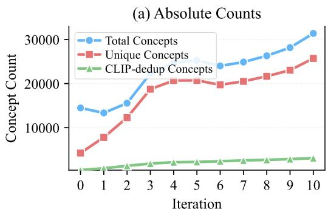

line chart

| Iteration | Total Concepts | Unique Concepts | CLIP-dedup Concepts |
| --------- | -------------- | --------------- | ------------------- |
| 0         | 15000          | 5000            | 1000                |
| 1         | 14000          | 8000            | 1500                |
| 2         | 16000          | 12000           | 2000                |
| 3         | 19000          | 19000           | 2500                |
| 4         | 21000          | 21000           | 3000                |
| 5         | 25000          | 21000           | 3500                |
| 6         | 24000          | 20000           | 4000                |
| 7         | 25000          | 21000           | 4500                |
| 8         | 26000          | 22000           | 5000                |
| 9         | 28000          | 23000           | 5500                |
| 10        | 31000          | 26000           | 6000                |

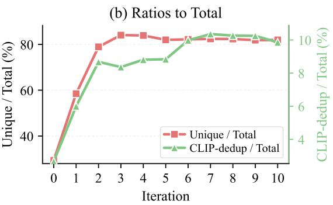

line chart

| Iteration | Unique / Total (%) | CLIP-dedup / Total (%) |
| --------- | ------------------ | ---------------------- |
| 0         | 30                 | 30                     |
| 1         | 60                 | 55                     |
| 2         | 80                 | 70                     |
| 3         | 85                 | 75                     |
| 4         | 85                 | 78                     |
| 5         | 83                 | 80                     |
| 6         | 82                 | 82                     |
| 7         | 82                 | 85                     |
| 8         | 82                 | 85                     |
| 9         | 82                 | 85                     |
| 10        | 82                 | 85                     |

Figure 6: Evolution of Concept Diversity. We track the absolute counts (a) and ratios (b) of unique and CLIP-deduplicated concepts generated across optimization iterations. Our DPO-optimized model progressively escapes generic mode collapse, autonomously expanding its vocabulary to produce a richer, highly distinct, and less redundant visual lexicon.

<table><tr><td></td><td>Atrovirens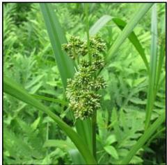</td><td>Groove Billed Ani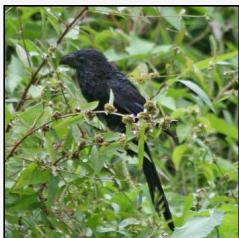</td><td>Barred Spiral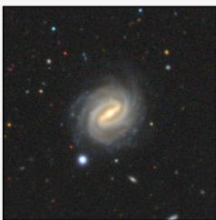</td></tr><tr><td>Base (Iter 0)</td><td>green plantdense foliage backgroundnatural outdoor settingfine textured stemswild vegetation</td><td>black birdperched birdgreen foliagedense vegetationleafy branches</td><td>spiral galaxydark backgroundscattered starsfaint starlightcosmic dust</td></tr><tr><td>Iter 3</td><td>green planttall green leafgreen flower clusterbunch of small green budsgreen wetland vegetation</td><td>black birdlong taildark glossy featherssmall fruit budslush vegetation</td><td>spiral galaxybright central bulgeglowing diskfaint halo around galaxydark background space</td></tr><tr><td>Iter 6</td><td>green cyperus planttall green stemgreen flower head clusterlush green wetland backgroundverdant ferns surrounding the plant</td><td>black birdlong tailshiny feathersdark coatlengthy tail feathers</td><td>spiral galaxybright central bulgeglowing diskbarred spiral structuresmooth halo around galaxy</td></tr><tr><td>Iter 10</td><td>green cyperusball-shaped small green flowerstall stem centergreen sugar cane look stemvertical reed-like plant</td><td>black birdlong black tailshiny black feathersdark black coatsmooth dark beak</td><td>barred spiral galaxy in centerbright yellow/orange diskwhite glowing spiral armssymmetric spiral structurefaint glow around galactic core</td></tr></table>

Figure 7: Trajectory of Concept Refinement. For each sample, we trace the evolution of generated concepts from the unoptimized base model (Iter 0) through successive S2COPE iterations. Red text indicates incorrect concepts for recognize the image’s category. Our optimized model suppresses these nuisance concepts, extracting precise, physically grounded attributes.

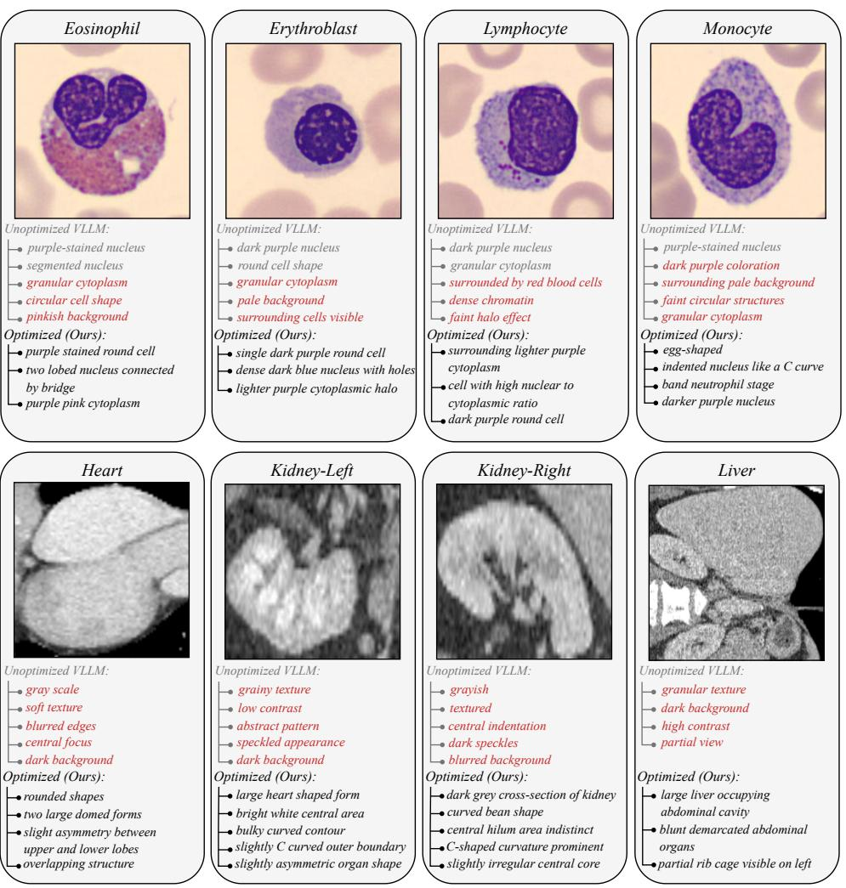  
purple-stained nucleus  
segmented nucleus  
granular cytoplasm  
circular cell shape  
pinkish background  
purple stained round cell  
two lobed nucleus connected  
by bridge  
purple pink cytoplasm  
dark purple nucleus  
round cell shape  
granular cytoplasm  
pale background  
surrounding cells visible  
single dark purple round cell  
dense dark blue nucleus with holes  
lighter purple cytoplasmic halo  
dark purple nucleus  
granular cytoplasm  
surrounded by red blood cells  
dense chromatin  
surrounding lighter purple cytoplasm  
cell with high nuclear to  
cytoplasmic ratio  
dark purple round cell  
purple-stained nucleus  
dark purple coloration  
surrounding pale background  
faint circular structures  
granular cytoplasm  
egg-shaped  
indented nucleus like a C curve  
band neutrophil stage  
darker purple nucleus  
gray scale  
soft texture  
blurred edges  
central focus  
dark background  
rounded shapes  
two large domed forms  
slight asymmetry between  
upper and lower lobes  
overlapping structure  
grainy texture  
low contrast  
abstract pattern  
speckled appearance  
dark background  
large heart shaped form  
bright white central area  
bulky curved contour  
slightly C curved outer boundary  
slightly asymmetric organ shape  
grayish  
textured  
central indentation  
dark speckles  
blurred background  
dark grey cross-section of kidney  
curved bean shape  
central hilum area indistinct  
C-shaped curvature prominent  
slightly irregular central core  
granular texture  
dark background  
high contrast  
partial view  
large liver occupying  
abdominal cavity  
blunt demarcated abdominal organs  
partial rib cage visible on left

Figure 8: Visualizing Self-Supervised Concept Discovery. For each sample, we contrast the top concepts generated by the unoptimized base model (top list) with our DPO-optimized model (bottom list). Red text indicates incorrect concepts for recognize the image’s category. Our optimized model suppresses these nuisance concepts, extracting precise, physically grounded attributes.

## A.8 Limitations

Our concept discovery quality depends on the capacity of the frozen CLIP encoder and the VLLM’s pre-trained vocabulary, both of which can be improved by adopting stronger foundation models as they become available. We train on a single source domain (iNaturalist) and observe strong cross-domain transfer; exploring diverse source domains is a natural next step. As shown in Table 5, accuracy scales consistently with the number of unlabeled training images and has not yet saturated at 1,300 images, suggesting that further gains are achievable with larger-scale unlabeled data.

## A.9 Broader Impacts

Our work advances interpretable AI by enabling concept discovery without human annotation, which has positive implications for high-stakes domains such as medical imaging and scientific discovery, where transparent reasoning is essential. By removing the reliance on labeled data, our framework also lowers the barrier to deploying interpretable models in data-rich but annotation-scarce settings. On the other hand, the discovered concepts inherit the biases present in the VLLM’s pre-training data; practitioners should be aware of this when applying the framework to sensitive domains.

Scirpus Atrovirens  
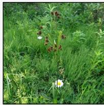

natural_image

Close-up of a green grassy field with scattered white flowers and small brown spots (no text or symbols visible)

Unoptimized VLLM:  
tall green grass  
vertical plant stalk  
natural outdoor setting  
scattered wildflowers  
tall green grass  
several brown flower clusters  
one white daisy below the tall stem  
another white daisy on ground

Optimized (Ours):  
Arctostaphylos Pungens  
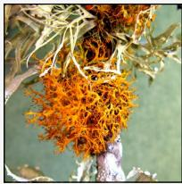

natural_image

Close-up of a vibrant orange mossy plant with attached feathery branches (no text or symbols visible)

Unoptimized VLLM:  
intricate branching patterns  
pale greenish-gray background  
textured surface  
delicate filaments  
natural growth on branch  
Optimized (Ours):  
vivid orange stringy moss  
hanging from branch  
intertwined white grey  
lichens surrounding  
fine hairy threads

Teloschistes Flavicans  
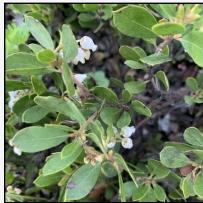

natural_image

Close-up of a plant branch with white flowers and green leaves (no text or symbols visible)

Unoptimized VLLM:  
small white flowers  
rounded leaf shape  
dense foliage  
natural setting  
earthy background  
Optimized (Ours):  
green shrub with white flowers  
and white berries  
white bell shaped arctic  
blueberry flowers  
low growing arctic tundra plant

Arctostaphylos nevadensis  
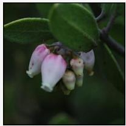

natural_image

Close-up of pink and white flowers with green leaves (no text or symbols visible)

Unoptimized VLLM:  
green leaves  
dark background  
soft focus  
natural lighting  
plant stems  
Optimized (Ours):  
pink white bell-shaped blueberry  
few buds hanging from branch  
delicate pink hue on blossoms

Lazuli Bunting  
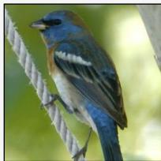

natural_image

Close-up of a bird perched on a rope, showing its beak and beak with visible stripes (no text or symbols)

Unoptimized VLLM:  
blue head  
gray beak  
perched on rope  
green background  
tree trunk visible  
Optimized (Ours):  
blue head  
white underbelly  
black wing bars  
brown flanks  
blue tail

Yellow breasted Chat  
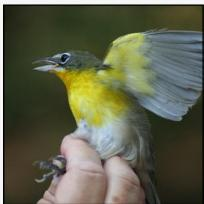

natural_image

Close-up of a hand gently holding a small bird, with yellow and blue wings spread out (no text or symbols visible)

Unoptimized VLLM:  
small bird  
yellow chest  
human hand  
blurred background  
claws visible  
Optimized (Ours):  
grey head  
yellow chest  
white underbelly  
grey wing feathers  
wing yellow patch

Acadian Flycatcher  
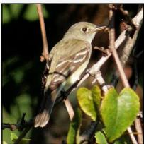

natural_image

A small brown bird perched on a branch with green leaves, no visible text or symbols.

Unoptimized VLLM:  
small bird  
dark eye  
perched on branch  
holding insect  
blurred background  
Optimized (Ours):  
small grey-green bird  
white underparts  
white-barred wings  
olive back  
dark tail

Western Gull  
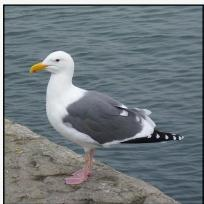

natural_image

Seagull standing on a rocky shore with calm water in the background (no text or symbols visible)

Unoptimized VLLM:  
white head  
pink legs  
standing on rock  
water background  
Optimized (Ours):  
white head and neck  
yellow beak  
grey wings  
black tipped tail

Barred Spiral  
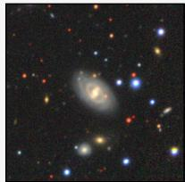

natural_image

Astronomical image of a spiral galaxy with surrounding stars and dust lanes (no text or symbols visible)

Unoptimized VLLM:  
spiral galaxy  
surrounding stars  
dark background  
scattered points of lighht  
cosmic dust  
Optimized (Ours):  
luminous ring-like structure  
visible around central body  
faint diffuse glow surrounding  
central galaxy body  
central spiral galaxy

Distributed  
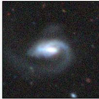

natural_image

Astronomical image of a spiral galaxy with bright central core and surrounding stars (no text or symbols visible)

Unoptimized VLLM:  
bright central core  
diffuse spiral arms  
dark background  
faint stars  
cosmic noise  
Optimized (Ours):  
bright central galaxy core  
glowing elliptical light brightness  
faint diffuse halo surrounding  
center  
spiral-like outer emission ring

Edge-on with Bulge  
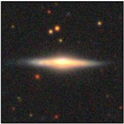

natural_image

Astronomical image showing a bright central object with surrounding faint stars against a dark background (no text or symbols)

Unoptimized VLLM:  
bright central core  
faint outer glow  
dark background  
scattered distant stars  
Optimized (Ours):  
bright edge-on spiral galaxy  
glowing central disk  
long narrow light plane viewed  
edge-on  
golden yellow core

Edge-on without Bulge  
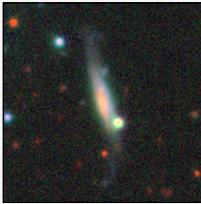

natural_image

Astronomical image showing a bright celestial object with surrounding stars and faint emission lines (no text or symbols)

Unoptimized VLLM:  
spiral galaxy  
bright central region  
dark background  
scattered red and blue points  
Optimized (Ours):  
spiral galaxy  
bright central core  
elongated galactic body  
glowing white-orange band  
faint spiral arm hint

Figure 8: Visualizing Self-Supervised Concept Discovery. (Continued).

## User Study

## Instruction:

Any information about the BACKGROUND is considered low quality.

Focus only on the OBJECT’s features when making your choice.

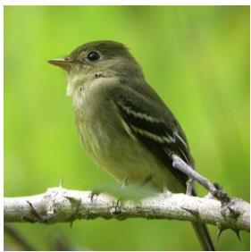

natural_image

A young bird perched on a branch against a blurred green background (no text or symbols visible)

## Question:

Please choose the description that is more detailed and accurate about the OBJECT in the image.

## Option A:

small bird, green background, perched on thorny branch, olive green body, white underbelly, black eye, dark wing bars, greyish olive wings, short beak, fluffy head

## Option B:

small bird, dark beak, black and white wing bars, perched on thorny branch, blurred green background, natural lighting, side profile view

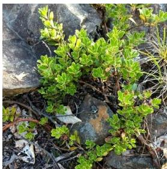

natural_image

Close-up of green shrub growing on rocky ground with scattered leaves (no text or symbols visible)

## Question:

Please choose the description that is more detailed and accurate about the OBJECT in the image.

## Option A:

rocky terrain, small rounded leaves, scattered dry debris, natural outdoor setting, sunlit foliage, textured stones

## Option B:

small bush with small green leaves growing between dark rocks, compact shrub, bright green foliage against stone

  
Figure 9: User Study Samples. Two sample questions from our user study. Participants follow the instruction and select among two anonymized concept lists.