# RepFusion: Leveraging Multimodal Priors for Denoising in Representation Space

Xichen Pan1,2, Aashu Singh1, Satya Narayan Shukla1,∗, Xiangjun Fan1, Shlok Kumar Mishra1,†,

1Meta AI, 2New York University ∗Work done at Meta, †Equal advisi

Large language models (LLMs) are widely used in text-to-image (T2I) systems, but they are typically limited to text encoding, while denoising is handled by newly trained generative backbones. The emergence of representation autoencoders (RAEs) shifts the generation target toward semantically structured visual representations, creating a latent space that is more compatible with pretrained LLM priors. Inspired by multimodal LLMs (MLLMs), where an MLP projector is sufficient to align clean visual representations with a pretrained LLM, we repurpose the MLLM itself as a noisy representation encoder, extending this mechanism from clean to noisy inputs. We present RepFusion, which uses the resulting MLLM outputs as the conditioning signal for a diffusion transformer. In controlled comparisons at similar inference budgets, RepFusion outperforms baselines that devote comparable capacity to newly initialized denoisers. These results demonstrate that MLLMs provide strong priors for denoising visual representations and that, by conditioning on evolving noisy representations, test-time compute can be productively spent on repeated MLLM conditioning in modern T2I systems.

Date: June 15, 2026

Correspondence: Xichen Pan at xichenpan@meta.com

Project Page: https://xichenpan.com/repfusion

& Meta

## 1 Introduction

Text-to-image (T2I) generation is commonly formulated as conditional image generation, where image generators are conditioned on the outputs of text encoders. Alongside the evolution of image generators from GANs (Goodfellow et al., 2014) to diffusion models (Ho et al., 2020), text encoders have also progressed from LSTMs (Hochreiter and Schmidhuber, 1997) to CLIP (Radford et al., 2021) and T5 (Raffel et al., 2020). Recently, many systems have replaced these encoders with large language models (LLMs) (Brown et al., 2020; Touvron et al., 2023; Grattafiori et al., 2024) due to their stronger representational capacity, richer world knowledge, in-context learning ability, and compatibility with unified multimodal models (Pan et al., 2025). However, in recent pipelines (Chen et al., 2024; Zhuo et al., 2024; Xie et al., 2025; Wu et al., 2025; Labs, 2025; Cai et al., 2025), LLMs still primarily act as static text encoders that produce text embeddings, while diffusion transformers (DiTs) (Peebles and Xie, 2023) carry out the denoising trajectory and image synthesis.

This division of labor made sense in the VAE (Kingma, 2014) era. Diffusion models typically denoise VAE latents, and these latents were never designed to be “read” by pretrained language priors. They are lowdimensional, local, and optimized for reconstruction rather than semantics. As a result, even if one aims to bring an LLM closer to the denoising loop, it is unclear what the LLM should consume or why doing so would be beneficial.

Representation autoencoders (RAEs) (Zheng et al., 2026) change this picture. By moving generation from VAE latents to semantically structured visual representations, such as CLIP (Radford et al., 2021) or DINO (Caron et al., 2021) features, RAEs provide a denoising space that is both easier to optimize and more semantically meaningful. Furthermore, these developments bridge T2I and the feature spaces currently utilized by Multimodal LLMs (MLLMs).

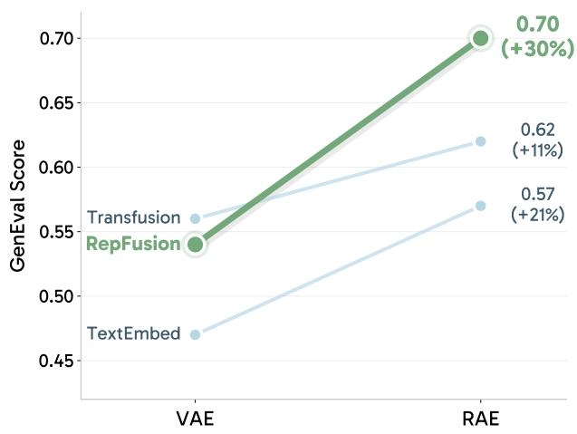

line chart

| Method      | VAE   | RAE   |
| ----------- | ----- | ----- |
| Transfusion | 0.56  | 0.62  |
| RepFusion   | 0.54  | 0.70  |
| TextEmbed   | 0.47  | 0.57  |

Figure 1. GenEval comparison when switching from VAEs to RAEs for three conditioning strategies: TextEmbed (conditioning a DiT with an LLM’s last-layer text token embeddings following recent T2I practice (Xie et al., 2025; Wu et al., 2025; Labs, 2025; Cai et al., 2025)), Transfusion (Zhou et al., 2025), and RepFusion. All three variants in this comparison use a 7B LLM, TextEmbed and RepFusion also use a 1.3B DiT. RepFusion feeds noisy visual representations into a pretrained MLLM and uses the resulting outputs to condition a DiT. It benefits most significantly from the transition, achieving a 30% relative gain (+0.16 absolute improvement), compared to 21% (+0.10) for TextEmbed and 11% (+0.06) for Transfusion.

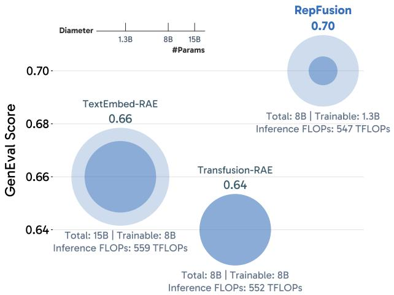

bubble chart

| Model           | GenEval Score | #Params | Total | Trainable | Inference FLOPs |
|-----------------|---------------|---------|-------|-----------|----------------|
| TextEmbed-RAE   | 0.66          | 1.3B    | 15B   | 8B        | 559 TFLOPs      |
| Transfusion-RAE | 0.64          | 8B      | 8B    | 8B        | 552 TFLOPs      |
| RepFusion       | 0.70          |         |       | 1.3B      |                |

Figure 2. GenEval comparison across different conditioning strategies under similar inference FLOPs. Circle size denotes total parameters, and the inner disk denotes trainable parameters. Each method allocates roughly 8B parameters to modules that either process noisy visual latents or denoise them. RepFusion fine-tunes only a 1.3B DiT and an MLP projector, yet outperforms TextEmbed and Transfusion, both of which train 8B parameters (a larger DiT and an LLM, respectively). This cross-method comparison suggests that MLLMs provide strong priors for denoising visual representations, and that repurposing them to encode noisy representations can be a more effective use of parameters than scaling newly initialized denoisers.

In the multimodal understanding community, pretrained LLMs have demonstrated a simple yet powerful property: with an MLP projector, they can ingest clean visual representations and immediately become strong sequence models over multimodal tokens (Liu et al., 2024). This observation is usually discussed in the context of understanding and reasoning. Here, we take it as a design principle for generation: if an LLM can perceive clean visual representations, can it also process noisy counterparts during denoising?

Our answer is yes. As shown in Figure 1, the resulting system is highly effective and best suited to the RAE latent space. We present RepFusion, a T2I model that treats a pretrained MLLM as a noisy representation encoder. In addition to text inputs, we feed noisy RAE latents into an off-the-shelf MLLM by reusing its MLP projector. We keep the pretrained LLM backbone frozen and fine-tune only its projector. We then use the MLLM’s output to condition a DiT that denoises in the same latent space. Conceptually, this design allows the pretrained MLLM to focus on what it does best: modeling structured visual representations.

This design first changes the capacity allocation picture beyond the standard “make the denoiser bigger” recipe. As shown in Figure 2, under similar inference FLOPs, all compared systems allocate roughly 8B parameters to modules that either process noisy visual latents or denoise them: TextEmbed uses a 7B frozen MLLM text encoder and an 8B DiT, Transfusion uses an 8B joint denoising transformer, and RepFusion uses the same 7B frozen MLLM together with a 1.3B DiT. We provide details on training the TextEmbed and Transfusion baselines in Appendix A. Despite fine-tuning only the DiT and an MLP projector, RepFusion outperforms these baselines, showing that, across model families, allocating substantial model capacity to a frozen pretrained conditional encoder can outperform spending nearly the entire parameter budget on newly initialized denoising modules. This suggests that pretrained MLLMs carry priors that transfer beyond multimodal understanding: once the representation space is compatible, those priors can directly help denoise noisy visual representations.

RepFusion also introduces a distinct axis for scaling at test time. In TextEmbed pipelines, the conditional encoder is run once to produce static text embeddings that are reused across all denoising steps. In contrast,

RepFusion feeds evolving noisy RAE latents into the MLLM, making the conditioning signal change along the denoising trajectory and making per-step MLLM recomputation useful.

We also compare against unified architectures such as Transfusion (Zhou et al., 2025), which can be viewed as another way of exposing noisy visual information to language models. As shown in Figure 1, even when we upgrade such baselines to operate in the RAE latent space, the gains are smaller than those obtained by explicitly repurposing a frozen MLLM as a noisy encoder. In other words, moving from VAE to RAE helps, but by itself it does not unlock the full benefit of pretrained language priors.

In summary, this paper argues for a simple shift in perspective: many modern T2I systems already allocate substantial capacity to huge LLM text encoders, and RAEs provide a representation space where these encoders can do more than encode text. By letting frozen MLLMs take noisy visual representations as input, we obtain a strong and efficient prior for denoising in representation space. The main contributions are:

• We show that frozen pretrained MLLMs can encode noisy RAE latents and provide useful denoising priors beyond static text conditioning.  
• We demonstrate that allocating parameters to a frozen pretrained conditional encoder can outperform static text embedding baselines that spend comparable capacity on newly initialized denoisers.  
• We show that noisy representation inputs unlock a way to scale test-time compute by making MLLM conditioning evolve across denoising steps.  
• We show that the pretrained MLLM prior is strong: freezing it outperforms further jointly optimizing it for generation.

## 2 Related Work

Text encoders in T2I Early conditional GANs use small text encoders such as LSTMs (Hochreiter and Schmidhuber, 1997), producing either global sentence embeddings (Reed et al., 2016; Zhang et al., 2017) or token-level embeddings (Xu et al., 2018). Diffusion models later standardized text conditioning with frozen pretrained encoders that provide token embeddings for cross-attention. Stable Diffusion 1.5 (Rombach et al., 2021) popularized a CLIP (Radford et al., 2021) text encoder. Recent systems increasingly scale the text encoder: Imagen (Saharia et al., 2022) moves beyond CLIP to LLMs such as T5-XXL (Raffel et al., 2020), and PixArt-α (Chen et al., 2024), Stable Diffusion 3 (Esser et al., 2024), and FLUX.1 (Labs, 2024) follow to ship with large T5-family encoders. Recent open-source models such as Lumina-Next (Zhuo et al., 2024) and Sana (Xie et al., 2025) adopt LLM encoders, and FLUX.2 (Labs, 2025) further scales the LLM to a 24B-parameter Mistral Small 3 (Team, 2025). Overall, modern T2I pipelines often devote billions of parameters to text encoders, motivating methods that better utilize their capacity.

From VAEs to RAEs Latent diffusion (Rombach et al., 2021) popularized a key design choice in modern T2I models: instead of diffusing in pixel space, models denoise in the latent space of an autoencoder, making high-resolution generation tractable. Most systems adopt VAEs (Kingma, 2014) for this purpose, but VAE latents are heavily compressed and optimized for reconstruction, which limits their semantic expressiveness. RAEs (Zheng et al., 2026) avoid this bottleneck by pairing a decoder with a frozen pretrained encoder (e.g., CLIP (Radford et al., 2021) or DINO (Caron et al., 2021)), working with semantically rich latents that are easier to denoise. This shift removes the VAE bottleneck and brings T2I into representation spaces that pretrained MLLMs already handle well, creating a natural opportunity to leverage their priors beyond static text conditioning.

Integration of Language Models and Denoisers A growing line of work seeks tighter integration between conditional encoders and denoisers. Unified architectures such as Transfusion (Zhou et al., 2025) train a large transformer to jointly model language outputs and denoise VAE latents, aiming for a single modeling stack across modalities. Another direction builds compact interfaces between MLLMs and diffusion backbones, for example via learnable queries (Pan et al., 2025; Chen et al., 2025a; Tong et al., 2026) or joint attention (Shi et al., 2025; Deng et al., 2025). In contrast, our focus is not on the conditioning mechanism, but on changing the content of the condition itself. We push MLLMs beyond text encoding, repurposing them to encode noisy representations and condition DiTs (Peebles and Xie, 2023).

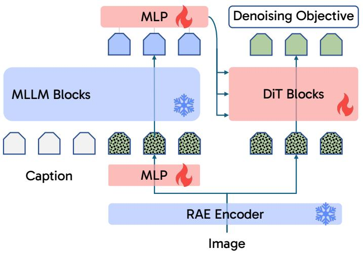

flowchart

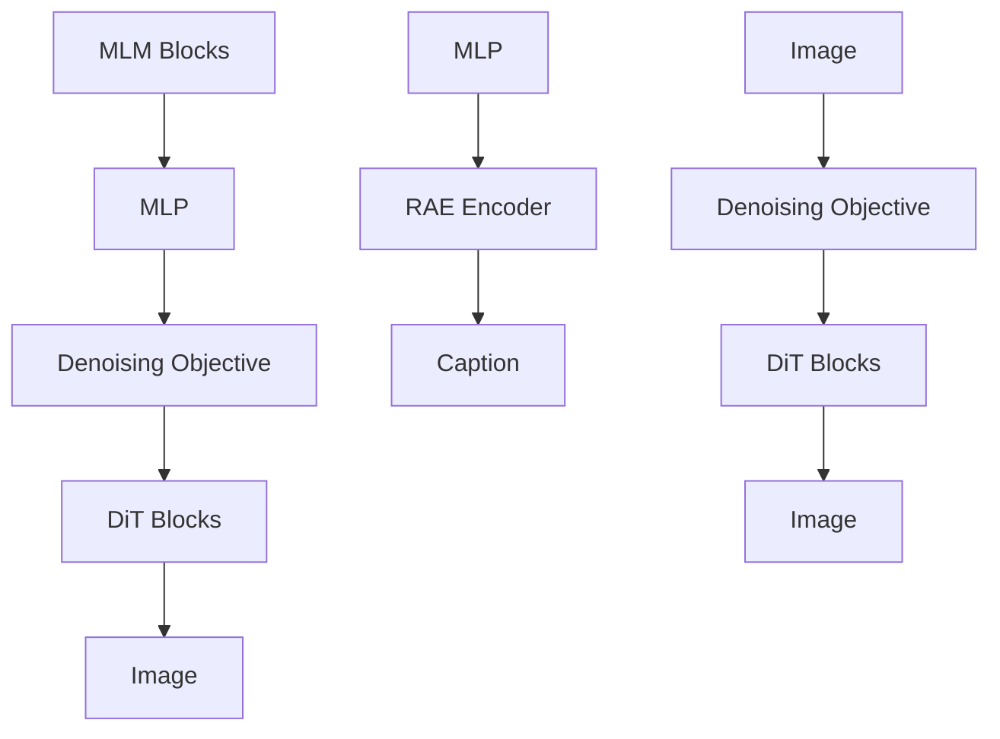

Figure 3 Overview of RepFusion. Blue modules are frozen, while red modules are trainable. We reuse a pretrained MLLM to process the text prompt and noisy RAE latents. The noisy RAE latents are projected into the MLLM input space through an MLP projector, and the resulting outputs condition every DiT block via AdaLN modulation.

## 3 RepFusion

This section first formalizes diffusion in visual representation space (Section 3.1) and describes how RepFusion uses an MLLM to encode noisy representations for DiT conditioning (Section 3.2). We then use controlled ablations to isolate the role of noisy representation inputs (Section 3.3) and multimodal perception pretraining (Section 3.4). Finally, we break down how these ingredients improve over TextEmbed and Transfusion baselines (Section 3.5). Unless otherwise specified, the variants discussed in this section use a 7B LLM backbone paired with a 1.3B DiT denoiser.

## 3.1 Preliminary

A flow matching T2I model is a conditional generative model. Given a text prompt y, we first obtain a text embedding $\pmb { c } = E _ { \phi } ( y )$ with a typically frozen text encoder. The generative network is then conditioned on $^ { c , }$ either through cross attention (Rombach et al., 2021) or adaptive normalization (Peebles and Xie, 2023). In our setting, diffusion operates in a visual representation space: let x denote a clean visual representation, let t be the timestep, and let ϵ be the Gaussian noise. We adopt the v-prediction parameterization (Lipman et al., 2023; Liu et al., 2023; Albergo and Vanden-Eijnden, 2023):

$$
\boldsymbol {z} _ {t} = t \boldsymbol {x} + (1 - t) \boldsymbol {\epsilon}, \quad \boldsymbol {x} \sim p _ {\text { data }} (\boldsymbol {x}). \tag {1}
$$

We follow the timestep shifting strategy of Zheng et al. (2026); Esser et al. (2024). For a base dimension $t _ { n } \sim \mathcal { U } ( 0 , 1 )$ $\begin{array} { r } { t = \frac { \alpha t _ { n } } { 1 + ( \alpha - 1 ) t _ { n } } } \end{array}$ $\alpha = \sqrt { m / n }$ . Following Zheng et al. (2026); Esser et al. (2024), we use n = 4,096 and set m to the effective dimensionality of the visual representation; in our RAE setup, this gives α = 12.

The flow velocity is given by the time derivative of $z _ { t } \mathrm { : }$

$$
\pmb {v} = \pmb {z} _ {t} ^ {\prime} = \pmb {x} - \epsilon .
$$

We learn a conditional velocity field ${ \pmb v } _ { \theta } ( z _ { t } , t , { \pmb c } )$ by minimizing the standard flow matching objective (Lipman et al., 2023; Albergo and Vanden-Eijnden, 2023):

$$
\mathcal {L} := \mathbb {E} _ {t, \pmb {x}, \epsilon} \big \| \pmb {v} _ {\theta} (\pmb {z} _ {t}, t, \pmb {c}) - \pmb {v} \big \| ^ {2},
$$

where ${ \pmb v } _ { \theta }$ is predicted by the diffusion model.

## 3.2 Methods

In standard approaches, the conditioning c relies solely on the text $y .$ In RepFusion, as shown in Figure $^ { 3 , }$ we augment the conditioning to also include the noisy visual representations, ${ \boldsymbol { z } } _ { t }$ . This design allows the LLM to perceive the denoising trajectory.

Specifically, the LLM input consists of a sequence of text tokens followed by projected noisy visual tokens. Let $E _ { \mathrm { L L M } }$ denote the LLM, $P _ { \psi }$ an MLP projector, and $e _ { t }$ the timestep embedding; we use the same notation for its projected forms in the visual representation space and the LLM hidden space. The conditioning $\scriptstyle { c _ { t } }$ is defined as

$$
\boldsymbol {c} _ {t} = \operatorname{Last} _ {N} (E _ {\mathrm{LLM}} ([ y, P _ {\psi} (\boldsymbol {z} _ {t} + \boldsymbol {e} _ {t}) ])) \tag {2}
$$

where $[ \cdot , \cdot ]$ denotes sequence concatenation, and LastN selects the final N hidden states corresponding to the noisy visual tokens. We inject timestep information before the MLLM by adding the embedding $e _ { t }$ to ${ \boldsymbol { z } } _ { t }$ before applying the projection $P _ { \psi }$ , following Zhou et al. (2025). During sampling, ${ \boldsymbol { z } } _ { t }$ evolves at each denoising step, so $c _ { t }$ is recomputed accordingly. The LLM remains causal.

Following Decoupled Diffusion Transformer (DDT) (Wang et al., 2026), we condition the DiT using adaptive layernorm (Peebles and Xie, 2023) without introducing additional cross-attention modules. Concretely, we adopt the AdaLN-Single variant from PixArt-α (Chen et al., 2024): a shared projection produces token-wise modulation parameters reused across blocks, and each transformer block adds a lightweight learned offset table $\pmb { T } ^ { ( \ell ) } \in \mathbf { \bar { \mathbb { R } } } ^ { 6 \times D }$ before splitting the resulting parameters into $( \beta , \gamma , \alpha )$ for the MSA and MLP branches.

Let $h _ { t } ^ { ( \ell ) } \in \mathbb { R } ^ { N \times D }$ denote the intermediate states at DiT block ℓ and timestep t, and let $\pmb { c } _ { t } \in \mathbb { R } ^ { N \times D _ { c } }$ denote the selected LLM hidden states for the noisy visual tokens. In our setting, the token counts are aligned $( N = 5 7 6 )$ . Following DiT (Peebles and Xie, 2023), we inject the noise level by adding the timestep embedding and applying a SiLU nonlinearity:

$$
\tilde {\pmb {c}} _ {t} = \mathrm{SiLU} (\pmb {c} _ {t} + \pmb {e} _ {t}), \qquad \tilde {\pmb {c}} _ {t} \in \mathbb {R} ^ {N \times D _ {c}}.
$$

A shared linear layer predicts modulation parameters:

$$
\pmb {m} _ {t} = \mathrm{Linear} (\tilde {\pmb {c}} _ {t}) \in \mathbb {R} ^ {N \times 6 D}.
$$

For each block $\ell ,$ we interpret $\mathbf { \nabla } m _ { t }$ as six token-wise D-dimensional modulation matrices and add a lightweight block-specific table $\pmb { T } ^ { ( \ell ) } \in \mathbb { R } ^ { 6 \times D }$ (broadcast over tokens) to obtain the final modulation parameters for the block. Splitting along the last channel dimension yields

$$
(\boldsymbol {\beta} _ {t, \mathrm{msa}} ^ {(\ell)}, \boldsymbol {\gamma} _ {t, \mathrm{msa}} ^ {(\ell)}, \boldsymbol {\alpha} _ {t, \mathrm{msa}} ^ {(\ell)}, \boldsymbol {\beta} _ {t, \mathrm{mlp}} ^ {(\ell)}, \boldsymbol {\gamma} _ {t, \mathrm{mlp}} ^ {(\ell)}, \boldsymbol {\alpha} _ {t, \mathrm{mlp}} ^ {(\ell)}),
$$

where each element lies in $\mathbb { R } ^ { N \times D }$ . Here, $\beta$ and $\gamma$ denote the shift and scale terms, respectively, and α denotes the residual gate.

The modulation operator can be defined as Mod $( { \pmb u } ; { \pmb \gamma } , { \pmb \beta } ) = { \pmb u } \odot ( 1 + { \pmb \gamma } ) + { \pmb \beta }$ . Each block then computes:

$$
\tilde {\boldsymbol {h}} = \mathrm{Mod} \Big (\mathrm{RMSNorm} (\boldsymbol {h} _ {t} ^ {(\ell)}); \boldsymbol {\gamma} _ {t, \mathrm{msa}} ^ {(\ell)}, \boldsymbol {\beta} _ {t, \mathrm{msa}} ^ {(\ell)} \Big),
$$

$$
\pmb {h} _ {t} ^ {\prime (\ell)} = \pmb {h} _ {t} ^ {(\ell)} + \pmb {\alpha} _ {t, \mathrm{msa}} ^ {(\ell)} \odot \mathrm{MSA} (\tilde {\pmb {h}}),
$$

$$
\tilde {\boldsymbol {h}} ^ {\prime} = \mathrm{Mod} \Big (\mathrm{RMSNorm} (\boldsymbol {h} _ {t} ^ {\prime (\ell)}); \gamma_ {t, \mathrm{mlp}} ^ {(\ell)}, \beta_ {t, \mathrm{mlp}} ^ {(\ell)} \Big),
$$

$$
\boldsymbol {h} _ {t} ^ {(\ell + 1)} = \boldsymbol {h} _ {t} ^ {\prime (\ell)} + \boldsymbol {\alpha} _ {t, \mathrm{mlp}} ^ {(\ell)} \odot \operatorname{MLP} \left(\tilde {\boldsymbol {h}} ^ {\prime}\right).
$$

Crucially, $\tilde { c } _ { t }$ is token-aligned with $h _ { t } ^ { ( \ell ) }$ . As a result, the scale, shift, and residual gates are applied independently to each token rather than being broadcast over the sequence dimension.

## 3.3 Noisy Representation Input

To assess the importance of conditioning the MLLM on noisy representations, as illustrated in Figure 4, we construct a learnable query baseline by replacing the projected noisy RAE latents $P _ { \psi } ( z _ { t } + e _ { t } )$ in Equation 2 with N learnable queries $Q _ { \eta } \in \mathbb { R } ^ { N \times D _ { c } }$ , following MetaQuery (Pan et al., 2025), while keeping the rest of the architecture unchanged. This baseline closely resembles BLIP-3o (Chen et al., 2025a) and Scale-RAE (Tong et al., 2026). With a frozen 7B MLLM and a 1.3B DiT, it reaches 0.55 on GenEval, whereas RepFusion reaches 0.70.

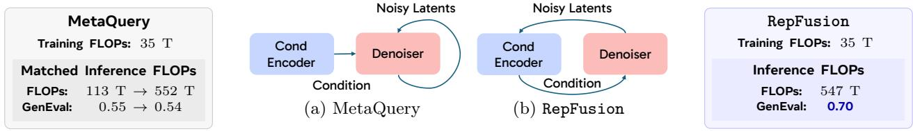  
FLOPs: 113 T → 552 T  
GenEval: $0 . 5 5  0 . 5 4$  
FLOPs: 547 T  
GenEval: 0.70

Figure 4 High-level comparison between MetaQuery-style (Pan et al., 2025) architectures (e.g., BLIP-3o (Chen et al., 2025a) and Scale-RAE (Tong et al., 2026)) and RepFusion. During training, both methods backpropagate gradients through the conditional encoder and denoiser, resulting in similar training FLOPs. At inference time, we rerun the MetaQuery conditional encoder with different timestep embeddings to match RepFusion’s inference budget. This increases compute from 113 to 552 TFLOPs, but GenEval does not improve (0.55 to 0.54), because the MLLM still does not observe the evolving noisy representation. In contrast, noisy representation inputs make RepFusion’s condition depend on the denoising state, enabling useful test-time compute scaling through repeated MLLM conditioning and improving GenEval to 0.70.  
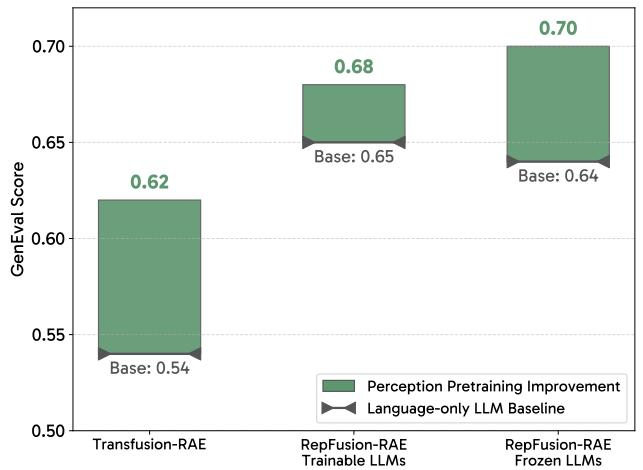

bar chart

| Model | Perception Pretraining Improvement | Language-only LLM Baseline |
| :--- | :--- | :--- |
| Transfusion-RAE | 0.62 | 0.54 |
| RepFusion-RAE Trainable LLMs | 0.68 | 0.65 |
| RepFusion-RAE Frozen LLMs | 0.70 | 0.64 |

(a) Effect of multimodal perception pretraining in the LLM backbone. Replacing an LLM with a perception-pretrained MLLM improves both Transfusion-RAE and RepFusion under settings with frozen and trainable LLMs.

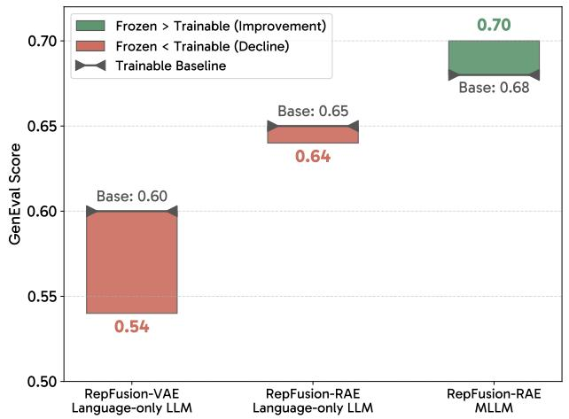

bar chart

| Model | Trainable Baseline | Frozen < Trainable (Decline) | Frozen > Trainable (Improvement) |
| :--- | :--- | :--- | :--- |
| RepFusion-VAE Language-only LLM | 0.60 | 0.54 | 0.70 |
| RepFusion-RAE Language-only LLM | 0.65 | 0.64 | 0.70 |
| RepFusion-RAE MLLM | 0.68 | 0.68 | 0.70 |

(b) Effect of fine-tuning the LLM backbone. Fine-tuning helps when starting from a language-only LLM, but can hurt when starting from a perception-pretrained MLLM backbone in RepFusion-RAE.  
Figure 5 Ablations on multimodal perception pretraining and LLM fine-tuning. Perception-pretrained backbones consistently improve RAE diffusion, while fine-tuning benefits text-only backbones but may degrade performance when the backbone is already multimodally pretrained. This indicates that perception pretraining is a strong prior that can outperform joint optimization for generation.

Crucially, this gap is not due to additional training compute. RepFusion and the learnable query baseline have similar training FLOPs: for each sampled timestep, both run the same forward pass through the frozen LLM and the denoiser, and both backpropagate through these computations while updating only the conditioning inputs or projector and the denoiser. The difference is that noisy representation inputs make the condition depend on the current denoising state. Since ${ \boldsymbol { z } } _ { t }$ evolves during sampling, RepFusion spends additional test-time compute on a changing, input-dependent conditioning signal. In contrast, learnable queries do not expose the LLM to $z _ { t } ,$ so repeated inference has no evolving visual signal to re-encode. To isolate recomputation from noisy representation input, we also make the learnable queries timestep-dependent, closely matching RepFusion in inference FLOPs. This variant reaches only 0.54 on GenEval, below the original learnable query baseline, indicating that the gain comes from recomputing an input-dependent condition over evolving noisy representations, not from recomputation alone.

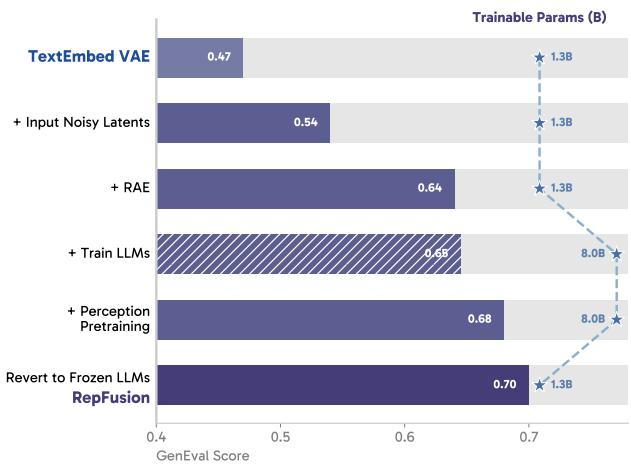

bar chart

| Method | GenEval Score | Trainable Params (B) |
| --- | --- | --- |
| TextEmbed VAE | 0.47 | 1.3B |
| + Input Noisy Latents | 0.54 | 1.3B |
| + RAE | 0.64 | 1.3B |
| + Train LLMs | 0.65 | 8.0B |
| + Perception Pretraining | 0.68 | 8.0B |
| Revert to Frozen LLMs RepFusion | 0.70 | 1.3B |

(a) Path from TextEmbed to RepFusion.

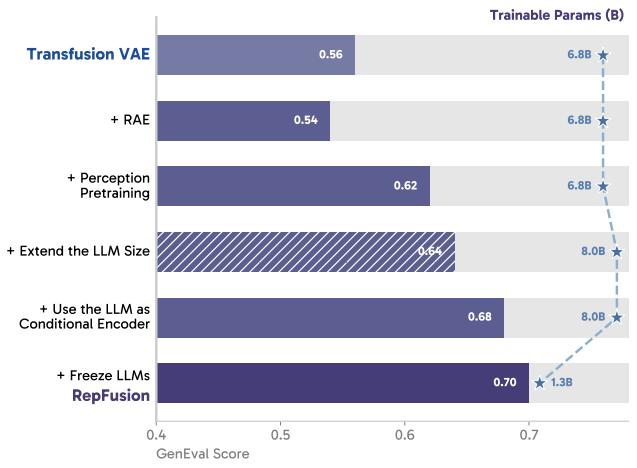

bar chart

| Model | GenEval Score | Trainable Params (B) |
| --- | --- | --- |
| Transfusion VAE | 0.56 | 6.8B |
| + RAE | 0.54 | 6.8B |
| + Perception Pretraining | 0.62 | 6.8B |
| + Extend the LLM Size | 0.64 | 8.0B |
| + Use the LLM as Conditional Encoder | 0.68 | 8.0B |
| + Freeze LLMs RepFusion | 0.70 | 1.3B |

(b) Path from Transfusion to RepFusion.  
Figure 6 Step-by-step ablations from (a) TextEmbed and (b) Transfusion toward RepFusion. Bars show GenEval scores, and hatched bars denote modifications that are evaluated but not adopted.

## 3.4 Multimodal Perception Pretraining

The gains above depend on the conditional encoder being able to interpret structured visual representations along a denoising trajectory. We therefore examine what makes an LLM better at interpreting noisy RAE latents.

In particular, our conditional encoder is an MLLM whose backbone has been pretrained to perceive visual representations. We therefore study the role of multimodal perception pretraining. To isolate the effect of this capability, we compare a language-only LLM backbone with a perception-pretrained MLLM backbone, while keeping the denoiser and token budget the same. As shown in Figure 5a, replacing the language-only LLM with a perception-pretrained MLLM improves both Transfusion-RAE and RepFusion under settings with frozen and trainable LLMs. This indicates that perception pretraining provides a transferable prior for diffusion in RAE space: an MLLM that can interpret clean visual representations also better supports encoding their noisy counterparts.

We further compare preserving a perception-pretrained LLM with jointly optimizing the LLM for generation. Following Transfusion (Zhou et al., 2025), when fine-tuning the LLM, we add an auxiliary language modeling (LM) loss on the caption tokens and allow the injected noisy visual tokens to use bidirectional attention, while keeping the caption stream causal. Figure 5b shows a consistent pattern: fine-tuning helps when starting from a language-only LLM backbone (in both VAE and RAE setups), but it degrades performance when starting from a perception-pretrained MLLM backbone in RepFusion-RAE. This suggests that multimodal perception pretraining is a strong prior that is best preserved rather than further re-optimized for generation.

## 3.5 Breaking down the improvement

We use these observations to break down the improvements of RepFusion over TextEmbed and Transfusion.

As shown in Figure 6a, starting from a standard text embedding baseline with a GenEval score of 0.47, feeding noisy VAE latents into the LLM improves the score to 0.54. Replacing VAE latents with RAE latents, which are easier to denoise and more compatible with LLMs, further improves the score to 0.64. Jointly training the LLM with an LM loss and bidirectional attention gives a minor gain to 0.65. Finally, adding multimodal perception pretraining improves denoising in RAE space, but the best performance is achieved when the LLM backbone remains frozen, preserving the pretrained prior.

We also trace the path from the Transfusion baseline. Transfusion can be viewed as another way of exposing noisy visual latents to language models, but this unified baseline can be improved by using the LLM explicitly as a conditional encoder rather than as the denoiser itself. As shown in Figure 6b, starting from the

Transfusion baseline at 0.56, replacing VAE latents with RAE latents and adopting a perception-pretrained LLM improves performance to 0.62. We then replicate the last 6 layers of the LLM to construct a stronger 8.0B Transfusion-RAE baseline. Reallocating the same 1.3B trainable parameters to a separate DiT, while using the LLM as the conditional encoder, improves performance from 0.64 to 0.68; freezing the LLM further increases it to 0.70.

## 4 Experiments

## 4.1 Experimental Setup

Model Unless otherwise specified, we follow the MLLM setup of Liu et al. (2024): a causal LLM backbone is paired with a CLIP-L/14 vision tower (Radford et al., 2021) through an MLP projector, which provides a clean interface for our RAE setup. We follow this simple architecture because many recent MLLMs introduce fine-tuned vision towers, any-resolution support, token compression (Team et al., 2025), and deep stacks (Bai et al., 2025), which are tailored for multimodal understanding and are non-trivial to adopt for denoising purposes. We set the input resolution to 336, producing N=576 visual tokens. For VAE-based experiments, we use DC-AE (Chen et al., 2025c) with a spatial downsampling factor of 32. We set the input resolution to 512, which yields N =256 latent tokens. This setup keeps output resolutions comparable across different latent spaces; we include a token-matched DC-AE comparison in Appendix C. For both RAE and VAE settings, we set the DiT patch size to 1.

Data We pretrain all models on the BLIP-3o 31M dataset (Chen et al., 2025a), which is recaptioned with MLLMs and contains 27M long- and 4M short-caption pairs. For supervised fine-tuning (SFT), we combine BLIP-3o 60k (Chen et al., 2025a), ShareGPT4o-Image (Chen et al., 2025b), and Echo-4o (Ye et al., 2025) into a 200k synthetic dataset. SFT images are sourced from GPT-4o Image (OpenAI, 2025).

Training For all pretraining experiments, we train the models on 128 H200 GPUs with a global batch size of 2,048. Models are trained for 10 epochs (160k steps) with a learning rate of $3 \times 1 0 ^ { - 4 }$ . They are optimized using the AdamW (Loshchilov and Hutter, 2019) optimizer with $\beta _ { 1 } = 0 . 9 , \beta _ { 2 } = 0 . 9 5$ , and a weight decay of 0.1. The learning rate follows a cosine decay schedule with a 10k-step warmup period. For SFT experiments, we use a learning rate of $1 \times 1 0 ^ { - 4 }$ and train the model for 64 epochs.

Representation Decoders To decode the visual representations back into pixels, we employ two different strategies: an RAE decoder (Zheng et al., 2026) and a diffusion decoder (Sun et al., 2024). Unless otherwise specified, all parameter counts reported exclude decoder parameters, and the decoder is the RAE decoder by default. For the RAE decoder, we follow standard RAE practice by using a ViT-XL (He et al., 2022) decoder and a DINO (Caron et al., 2021) GAN discriminator. The decoder patch size is set to 24 to produce images at a resolution of 576. We train the RAE decoder on ImageNet-22k (Deng et al., 2009) for 16 epochs. For the diffusion decoder, we follow Emu (Sun et al., 2024), starting from the SANA 1.6B checkpoint and replacing the text conditioning with CLIP features. The output resolution is 512. We train the diffusion decoder on ImageNet-22k for 10 epochs.

## 4.2 Prompt Alignment

With only around 30M image-caption pairs, RepFusion achieves strong T2I prompt alignment, with qualitative samples shown in Figure 7. We evaluate our largest configuration, which uses a 7B MLLM and a 3.2B DiT, on four representative benchmarks: GenEval (Ghosh et al., 2023), GenEval++ (Ye et al., 2025), GenEval2 (Kamath et al., 2025), and DPG-Bench (Hu et al., 2024). As shown in Table 1, RepFusion achieves competitive performance across all of them, and RepFusion-SFT further improves the performance to state-of-the-art levels. Notably, benchmarks such as GenEval and DPG-Bench are increasingly subject to benchmark-specific optimization in the current synthetic data era (Xie et al., 2026): many pipelines perform SFT on synthetic images sourced from GPT-4o (OpenAI, 2025) and Nano Banana (Google, 2025), or directly apply RL with GenEval as a verifiable reward. To address this benchmark drift issue, GenEval2 was recently proposed with a more robust evaluation protocol, Soft-TIFA. Consistent with this motivation, we find that RepFusion-SFT yields only limited improvements on GenEval2, while the pretrained RepFusion remains strong. RepFusion also compares favorably with BAGEL (Deng et al., 2025) with Self-CoT, which is pretrained on over 1 billion web-scale examples.

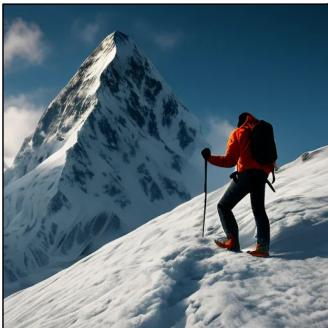

natural_image

Hiker in red jacket standing on a snowy mountain peak under clear blue sky (no text or symbols visible)

A snowy mountain peak with a lone climber reaching the summit.

natural_image

Green, stylized monster character walking in a hallway with windows and seating (no text or symbols visible)

A green monster made of plants walks through an airport.

natural_image

Person in chef uniform pouring fresh lettuce into a white bowl with cherry tomatoes (no text or symbols visible)

A chef skillfully tossing a salad in a bowl with hands.

natural_image

Hummingbird feeding a dragonfly among a pink flower (no text or symbols visible)

A dragonfly flying on top of a flower beside a hummingbird.

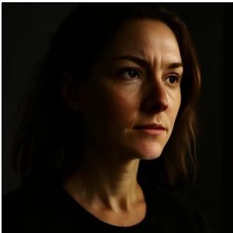

natural_image

Portrait of a woman with shoulder-length brown hair, wearing a black top (no text or symbols visible)

A close up portrait of a woman lit by the side, the camera pulls back.

natural_image

A tabby cat peeking through a knitted blanket tunnel (no text or symbols visible)

A curious cat peering out from a cozy hiding spot.

natural_image

Interior of a grand hall with a large ornate chandelier and colorful spotlights, no visible text or symbols.

A chandelier made of crystal prisms casting rainbow light across a room.

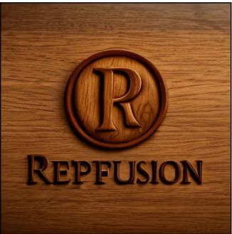

text_image

R
REPFUSION

A wooden logo of "RepFusion"

natural_image

Snow-covered urban street with a person walking away, tall spire visible in the background (no text or signage)

Pov walkthrough of frozen streets of Manhattan New York City. We see frozen trees, and a frozen empire state building.

natural_image

Miniature gnome sitting on a stone surface in a glass sphere, surrounded by greenery and rocks (no text or symbols)

A close up view of a glass sphere that has a zen garden within it. There is a small dwarf in the sphere who is raking the zen garden and creating patterns in the sand.

natural_image

Close-up of an ant standing on sandy soil with blurred village background (no text or symbols visible)

An extreme close-up shot of an ant emerging from its nest. The camera pulls back revealing a neighborhood beyond the hill.

natural_image

Racing car on a dirt road in a forested area, painted with orange and white stripes (no visible text or symbols)

A rally car accelerating through a muddy forest track.  
Figure 7 Qualitative T2I samples generated by RepFusion. Some prompts are adapted from Polyak et al. (2024).

## 4.3 Reasoning-based Generation

We find that, similar to learnable query methods such as MetaQuery (Pan et al., 2025) and BLIP-3o (Chen et al., 2025a), RepFusion can also effectively leverage the capabilities of a frozen LLM. This enables the model to better understand and follow complex prompts, including those requiring world knowledge and reasoning. To quantitatively evaluate RepFusion’s world-knowledge reasoning capability, we employ the WISE (Niu et al., 2026) benchmark. As shown in Table 2, RepFusion matches state-of-the-art performance.

<table><tr><td>Methods</td><td>GenEval↑</td><td>GenEval++↑</td><td>GenEval2↑</td><td>DPG-Bench↑</td></tr><tr><td>Transfusion (Zhou et al., 2025)</td><td>0.63</td><td>-</td><td>-</td><td>-</td></tr><tr><td>MetaQuery-XL (Pan et al., 2025)</td><td> $0.80^†$ </td><td>-</td><td>-</td><td>82.05</td></tr><tr><td>BLIP-3o 8B (Chen et al., 2025a)</td><td>0.84</td><td>0.307</td><td>-</td><td>81.60</td></tr><tr><td>OmniGen2 (Wu et al., 2026)</td><td>0.80</td><td>0.325</td><td>-</td><td>83.57</td></tr><tr><td>BAGEL (Deng et al., 2025)</td><td>0.82</td><td>0.371</td><td> $23.1^†$ </td><td>84.03</td></tr><tr><td>Scale-RAE (Tong et al., 2026)</td><td>0.83</td><td>-</td><td>-</td><td>79.70</td></tr><tr><td>RepFusion w/ RAE Decoder</td><td>0.73</td><td>0.432</td><td>30.2</td><td>82.75</td></tr><tr><td>RepFusion w/ Diffusion Decoder</td><td>0.78</td><td>0.443</td><td>29.9</td><td>84.41</td></tr><tr><td>RepFusion-SFT w/ RAE Decoder</td><td>0.85</td><td>0.707</td><td>35.1</td><td>84.17</td></tr><tr><td>RepFusion-SFT w/ Diffusion Decoder</td><td>0.87</td><td>0.669</td><td>34.9</td><td>85.11</td></tr></table>

Table 1 T2I generation results on GenEval (Ghosh et al., 2023), GenEval++ (Ye et al., 2025), GenEval2 (Kamath et al., 2025), and DPG-Bench (Hu et al., 2024). † denotes rewritten prompts. For GenEval2, we report the prompt-level metric Soft-TIFAGM.

<table><tr><td>Model</td><td>Cultural</td><td>Time</td><td>Space</td><td>Biology</td><td>Physics</td><td>Chemistry</td><td>Overall</td></tr><tr><td>MetaQuery-XL (Pan et al., 2025)</td><td>0.56</td><td>0.55</td><td>0.62</td><td>0.49</td><td>0.63</td><td>0.41</td><td>0.55</td></tr><tr><td>BLIP-3o 8B (Chen et al., 2025a)</td><td>-</td><td>-</td><td>-</td><td>-</td><td>-</td><td>-</td><td>0.62</td></tr><tr><td>BAGEL (Deng et al., 2025)</td><td>0.44</td><td>0.55</td><td>0.68</td><td>0.44</td><td>0.60</td><td>0.39</td><td>0.52</td></tr><tr><td>RepFusion-SFT w/ RAE Decoder</td><td>0.55</td><td>0.53</td><td>0.70</td><td>0.51</td><td>0.57</td><td>0.41</td><td>0.55</td></tr><tr><td>RepFusion-SFT w/ Diffusion Decoder</td><td>0.65</td><td>0.63</td><td>0.79</td><td>0.63</td><td>0.67</td><td>0.44</td><td>0.64</td></tr></table>

Table 2 Reasoning-based generation on WISE (Niu et al., 2026).

## 4.4 Conditioning Interface

We ablate how the MLLM hidden states are injected into the DiT. Cross attention provides a general conditioning mechanism, but it adds extra attention projections and treats the conditioning stream as a separate context. In our RAE setting, the N MLLM outputs are naturally aligned with the N DiT tokens, so a token-wise adaptive normalization interface can use this correspondence directly. As shown in Table 3, AdaLN-Single (Chen et al., 2024) achieves a slightly higher GenEval score with fewer parameters, and we therefore use it as the default conditioning interface.

<table><tr><td>Method</td><td># Params</td><td>GenEval↑</td></tr><tr><td>Cross Attention</td><td>1.6B</td><td>0.69</td></tr><tr><td>AdaLN-Single (Chen et al., 2024)</td><td>1.3B</td><td>0.70</td></tr></table>

Table 3 Ablation on the interface used to inject MLLM hidden states into the DiT. Parameter counts include the DiT and the conditioning interface.

## 4.5 Scaling Behavior

RepFusion has two scaling axes at inference time: the frozen MLLM that repeatedly reads evolving noisy representations, and the DiT denoiser that predicts the velocity. We therefore study how performance changes when scaling either component in the billion-parameter regime. Figure 8 shows that increasing either the MLLM or DiT size can improve performance, with the clearest scaling trends appearing on GenEval and GenEval++.

We further study how to allocate inference compute across these two components under iso-FLOPs settings in Table 4. At around 280T FLOPs, allocating more compute to the DiT outperforms the configuration that allocates more compute to the MLLM across all metrics. The same trend holds at around 540T FLOPs: configurations with larger DiTs achieve stronger GenEval++ and GenEval2 scores. These within-family comparisons answer a different question from Figure 2: among RepFusion variants, scaling the DiT is generally more effective under a fixed inference budget, but compared with TextEmbed, RepFusion remains stronger even when the baseline spends nearly all sampling compute on the DiT. Thus, RepFusion benefits from allocating part of the test-time compute budget to repeated MLLM conditioning relative to static text embedding pipelines, while still following the broader trend that denoiser capacity is highly valuable.

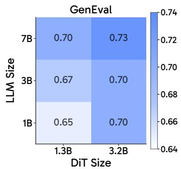

heatmap

GenEval
| LLM Size | 1.3B | 3.2B |
|---|---|---|
| 7B | 0.70 | 0.73 |
| 3B | 0.67 | 0.70 |
| 1B | 0.65 | 0.70 |

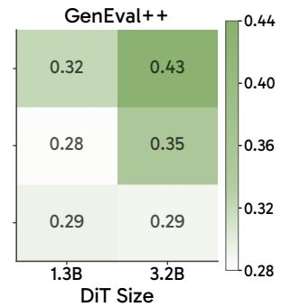

heatmap

GenEval++
| DiT Size | 1.3B | 3.2B |
|---|---|---|
| 0.32 | 0.32 | 0.43 |
| 0.28 | 0.28 | 0.35 |
| 0.29 | 0.29 | 0.29 |
The correlation matrix values are not explicitly labeled in the image but correspond to the absolute correlation coefficients of the two DiT sizes. The color intensity corresponds to the value scale on the right, ranging from 0.28 to 0.44.

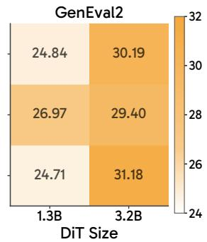

heatmap

GenEval2
| DiT Size | 1.3B | 3.2B |
| :--- | :--- | :--- |
| 1.3B | 24.84 | 30.19 |
| 3.2B | 26.97 | 29.40 |
| 1.3B | 24.71 | 31.18 |

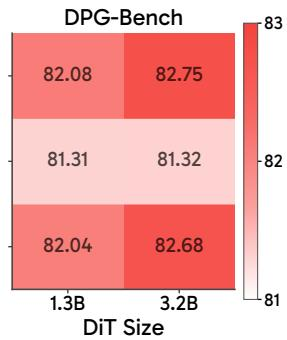

heatmap

DPG-Bench
| DiT Size | 1.3B | 3.2B |
| :--- | :--- | :--- |
| 82.08 | 82.75 | 82.68 |
| 81.31 | 81.32 | 81.32 |
| 82.04 | 82.68 | 82.68 |

Figure 8 MLLM and DiT co-scaling results. Increasing either component can improve performance, with clearer trends on GenEval and GenEval++.

<table><tr><td>LLM Size</td><td>DiT Size</td><td colspan="3">FLOPs Split (LLM | DiT)</td><td>GenEval ↑</td><td>GenEval++ ↑</td><td>GenEval2 ↑</td><td>DPG-Bench ↑</td></tr><tr><td colspan="9">~280T inference FLOPs</td></tr><tr><td>1B</td><td>3.2B</td><td>26%</td><td></td><td>74%</td><td>0.70</td><td>0.289</td><td>31.18</td><td>82.68</td></tr><tr><td>3B</td><td>1.3B</td><td>71%</td><td></td><td>28%</td><td>0.67</td><td>0.282</td><td>26.97</td><td>81.31</td></tr><tr><td colspan="9">~540T inference FLOPs</td></tr><tr><td>7B (TextEmbed baseline)</td><td>8.0B</td><td>3%</td><td></td><td>97%</td><td>0.64</td><td>0.321</td><td>26.60</td><td>81.34</td></tr><tr><td>1B</td><td>7.3B</td><td>13%</td><td></td><td>87%</td><td>0.70</td><td>0.443</td><td>30.84</td><td>82.58</td></tr><tr><td>3B</td><td>5.5B</td><td>37%</td><td></td><td>63%</td><td>0.69</td><td>0.382</td><td>30.67</td><td>82.20</td></tr><tr><td>7B</td><td>1.3B</td><td>85%</td><td></td><td>15%</td><td>0.70</td><td>0.321</td><td>24.84</td><td>82.08</td></tr></table>

Table 4 Iso-FLOPs comparison. Given a fixed inference budget, we compare different allocations between MLLMs and DiTs within RepFusion, and include TextEmbed as a reference baseline. Scaling the DiT is generally more favorable than scaling the MLLM within RepFusion, but RepFusion remains substantially stronger than TextEmbed, whose static text embedding design leaves nearly all sampling compute in the DiT.

## 5 Conclusion

We study a simple but underused degree of freedom in modern T2I systems: the conditional encoder. By allowing a frozen MLLM to read noisy visual representations, the encoder becomes an active component of the denoising loop rather than a static text encoder. The resulting gains suggest a practical recipe for future models: expose pretrained MLLM priors to evolving noisy representations, spend test-time compute on repeated conditioning only when it carries input-dependent information, and preserve those priors. We hope this perspective helps shift how the community thinks about the role of MLLMs in T2I generation.

## References

Michael S Albergo and Eric Vanden-Eijnden. Building normalizing flows with stochastic interpolants. In ICLR, 2023.  
Shuai Bai, Yuxuan Cai, Ruizhe Chen, Keqin Chen, Xionghui Chen, Zesen Cheng, Lianghao Deng, Wei Ding, Chang Gao, Chunjiang Ge, Wenbin Ge, Zhifang Guo, Qidong Huang, Jie Huang, Fei Huang, Binyuan Hui, Shutong Jiang, Zhaohai Li, Mingsheng Li, Mei Li, Kaixin Li, Zicheng Lin, Junyang Lin, Xuejing Liu, Jiawei Liu, Chenglong Liu, Yang Liu, Dayiheng Liu, Shixuan Liu, Dunjie Lu, Ruilin Luo, Chenxu Lv, Rui Men, Lingchen Meng, Xuancheng Ren, Xingzhang Ren, Sibo Song, Yuchong Sun, Jun Tang, Jianhong Tu, Jianqiang Wan, Peng Wang, Pengfei Wang, Qiuyue Wang, Yuxuan Wang, Tianbao Xie, Yiheng Xu, Haiyang Xu, Jin Xu, Zhibo Yang, Mingkun Yang, Jianxin Yang, An Yang, Bowen Yu, Fei Zhang, Hang Zhang, Xi Zhang, Bo Zheng, Humen Zhong, Jingren Zhou, Fan Zhou, Jing Zhou, Yuanzhi Zhu, and Ke Zhu. Qwen3-vl technical report. arXiv preprint arXiv:2511.21631, 2025.  
Tom Brown, Benjamin Mann, Nick Ryder, Melanie Subbiah, Jared D Kaplan, Prafulla Dhariwal, Arvind Neelakantan, Pranav Shyam, Girish Sastry, Amanda Askell, et al. Language models are few-shot learners. In NeurIPS, 2020.  
Huanqia Cai, Sihan Cao, Ruoyi Du, Peng Gao, Steven Hoi, Zhaohui Hou, Shijie Huang, Dengyang Jiang, Xin Jin, Liangchen Li, et al. Z-image: An efficient image generation foundation model with single-stream diffusion transformer. arXiv preprint arXiv:2511.22699, 2025.  
Mathilde Caron, Hugo Touvron, Ishan Misra, Hervé Jégou, Julien Mairal, Piotr Bojanowski, and Armand Joulin. Emerging properties in self-supervised vision transformers. In ICCV, 2021.  
Jiuhai Chen, Zhiyang Xu, Xichen Pan, Yushi Hu, Can Qin, Tom Goldstein, Lifu Huang, Tianyi Zhou, Saining Xie, Silvio Savarese, et al. Blip3-o: A family of fully open unified multimodal models-architecture, training and dataset. arXiv preprint arXiv:2505.09568, 2025a.  
Junsong Chen, Jincheng Yu, Chongjian Ge, Lewei Yao, Enze Xie, Yue Wu, Zhongdao Wang, James Kwok, Ping Luo, Huchuan Lu, et al. Pixart-alpha: Fast training of diffusion transformer for photorealistic text-to-image synthesis. In ICLR, 2024.  
Junying Chen, Zhenyang Cai, Pengcheng Chen, Shunian Chen, Ke Ji, Xidong Wang, Yunjin Yang, and Benyou Wang. Sharegpt-4o-image: Aligning multimodal models with gpt-4o-level image generation. arXiv preprint arXiv:2506.18095, 2025b.  
Junyu Chen, Han Cai, Junsong Chen, Enze Xie, Shang Yang, Haotian Tang, Muyang Li, Yao Lu, and Song Han. Deep compression autoencoder for efficient high-resolution diffusion models. In ICLR, 2025c.  
Chaorui Deng, Deyao Zhu, Kunchang Li, Chenhui Gou, Feng Li, Zeyu Wang, Shu Zhong, Weihao Yu, Xiaonan Nie, Ziang Song, et al. Emerging properties in unified multimodal pretraining. arXiv preprint arXiv:2505.14683, 2025.  
Jia Deng, Wei Dong, Richard Socher, Li-Jia Li, Kai Li, and Li Fei-Fei. Imagenet: A large-scale hierarchical image database. In CVPR, 2009.  
Patrick Esser, Sumith Kulal, Andreas Blattmann, Rahim Entezari, Jonas Müller, Harry Saini, Yam Levi, Dominik Lorenz, Axel Sauer, Frederic Boesel, et al. Scaling rectified flow transformers for high-resolution image synthesis. In ICML, 2024.  
Dhruba Ghosh, Hannaneh Hajishirzi, and Ludwig Schmidt. Geneval: An object-focused framework for evaluating text-to-image alignment. In NeurIPS, 2023.  
Ian J Goodfellow, Jean Pouget-Abadie, Mehdi Mirza, Bing Xu, David Warde-Farley, Sherjil Ozair, Aaron Courville, and Yoshua Bengio. Generative adversarial nets. In NeurIPS, 2014.  
Google. Introducing gemini 2.5 flash image, our state-of-the-art image model, 2025. https://developers.googleblog. com/introducing-gemini-2-5-flash-image/.  
Aaron Grattafiori, Abhimanyu Dubey, Abhinav Jauhri, Abhinav Pandey, Abhishek Kadian, Ahmad Al-Dahle, Aiesha Letman, Akhil Mathur, Alan Schelten, Alex Vaughan, et al. The llama 3 herd of models. arXiv preprint arXiv:2407.21783, 2024.  
Kaiming He, Xinlei Chen, Saining Xie, Yanghao Li, Piotr Dollár, and Ross Girshick. Masked autoencoders are scalable vision learners. In CVPR, 2022.  
Jonathan Ho, Ajay Jain, and Pieter Abbeel. Denoising diffusion probabilistic models. In NeurIPS, 2020.  
Sepp Hochreiter and Jürgen Schmidhuber. Long short-term memory. In Neural computation, 1997.  
Xiwei Hu, Rui Wang, Yixiao Fang, Bin Fu, Pei Cheng, and Gang Yu. Ella: Equip diffusion models with llm for enhanced semantic alignment. arXiv preprint arXiv:2403.05135, 2024.  
Amita Kamath, Kai-Wei Chang, Ranjay Krishna, Luke Zettlemoyer, Yushi Hu, and Marjan Ghazvininejad. Geneval 2: Addressing benchmark drift in text-to-image evaluation. arXiv preprint arXiv:2512.16853, 2025.  
Diederik P Kingma. Auto-encoding variational bayes. In ICLR, 2014.  
Black Forest Labs. Flux.1. https://bfl.ai/blog/24-08-01-bfl, 2024.  
Black Forest Labs. FLUX.2: Frontier Visual Intelligence. https://bfl.ai/blog/flux-2, 2025.  
Yaron Lipman, Ricky TQ Chen, Heli Ben-Hamu, Maximilian Nickel, and Matt Le. Flow matching for generative modeling. In ICLR, 2023.  
Haotian Liu, Chunyuan Li, Qingyang Wu, and Yong Jae Lee. Visual instruction tuning. In NeurIPS, 2024.  
Xingchao Liu, Chengyue Gong, and Qiang Liu. Flow straight and fast: Learning to generate and transfer data with rectified flow. In ICLR, 2023.  
Ilya Loshchilov and Frank Hutter. Decoupled weight decay regularization. In ICLR, 2019.  
Yuwei Niu, Munan Ning, Mengren Zheng, Bin Lin, Peng Jin, Jiaqi Liao, Kunpeng Ning, Bin Zhu, and Li Yuan. Wise: A world knowledge-informed semantic evaluation for text-to-image generation. In ICML, 2026.  
OpenAI. Introducing 4o image generation, 2025. https://openai.com/index/introducing-4o-image-generation/.  
Xichen Pan, Satya Narayan Shukla, Aashu Singh, Zhuokai Zhao, Shlok Kumar Mishra, Jialiang Wang, Zhiyang Xu, Jiuhai Chen, Kunpeng Li, Felix Juefei-Xu, et al. Transfer between modalities with metaqueries. arXiv preprint arXiv:2504.06256, 2025.  
William Peebles and Saining Xie. Scalable diffusion models with transformers. In ICCV, 2023.  
Adam Polyak, Amit Zohar, Andrew Brown, Andros Tjandra, Animesh Sinha, Ann Lee, Apoorv Vyas, Bowen Shi, Chih-Yao Ma, Ching-Yao Chuang, et al. Movie gen: A cast of media foundation models. arXiv preprint arXiv:2410.13720, 2024.  
Alec Radford, Jong Wook Kim, Chris Hallacy, Aditya Ramesh, Gabriel Goh, Sandhini Agarwal, Girish Sastry, Amanda Askell, Pamela Mishkin, Jack Clark, et al. Learning transferable visual models from natural language supervision. In ICML, 2021.  
Colin Raffel, Noam Shazeer, Adam Roberts, Katherine Lee, Sharan Narang, Michael Matena, Yanqi Zhou, Wei Li, and Peter J Liu. Exploring the limits of transfer learning with a unified text-to-text transformer. JMLR, 2020.  
Scott Reed, Zeynep Akata, Xinchen Yan, Lajanugen Logeswaran, Bernt Schiele, and Honglak Lee. Generative adversarial text to image synthesis. In ICML, 2016.  
Robin Rombach, Andreas Blattmann, Dominik Lorenz, Patrick Esser, and Björn Ommer. High-resolution image synthesis with latent diffusion models. In CVPR, 2021.  
Chitwan Saharia, William Chan, Saurabh Saxena, Lala Li, Jay Whang, Emily Denton, Seyed Kamyar Seyed Ghasemipour, Burcu Karagol Ayan, S Sara Mahdavi, Rapha Gontijo Lopes, et al. Photorealistic text-to-image diffusion models with deep language understanding. In NeurIPS, 2022.  
Weijia Shi, Xiaochuang Han, Chunting Zhou, Weixin Liang, Xi Victoria Lin, Luke Zettlemoyer, and Lili Yu. Lmfusion: Adapting pretrained language models for multimodal generation. In NeurIPS, 2025.  
Quan Sun, Qiying Yu, Yufeng Cui, Fan Zhang, Xiaosong Zhang, Yueze Wang, Hongcheng Gao, Jingjing Liu, Tiejun Huang, and Xinlong Wang. Generative pretraining in multimodality. In ICLR, 2024.  
Gemma Team, Aishwarya Kamath, Johan Ferret, Shreya Pathak, Nino Vieillard, Ramona Merhej, Sarah Perrin, Tatiana Matejovicova, Alexandre Ramé, Morgane Rivière, et al. Gemma 3 technical report. arXiv preprint arXiv:2503.19786, 2025.  
Mistral AI Team. Mistral small 3, 2025. https://mistral.ai/news/mistral-small-3.  
Shengbang Tong, Boyang Zheng, Ziteng Wang, Bingda Tang, Nanye Ma, Ellis Brown, Jihan Yang, Rob Fergus, Yann LeCun, and Saining Xie. Scaling text-to-image diffusion transformers with representation autoencoders. In CVPR, 2026.  
Hugo Touvron, Thibaut Lavril, Gautier Izacard, Xavier Martinet, Marie-Anne Lachaux, Timothée Lacroix, Baptiste Rozière, Naman Goyal, Eric Hambro, Faisal Azhar, et al. Llama: Open and efficient foundation language models. arXiv preprint arXiv:2302.13971, 2023.  
Shuai Wang, Zhi Tian, Weilin Huang, and Limin Wang. Ddt: Decoupled diffusion transformer. In CVPR, 2026.  
Chenfei Wu, Jiahao Li, Jingren Zhou, Junyang Lin, Kaiyuan Gao, Kun Yan, Sheng-ming Yin, Shuai Bai, Xiao Xu, Yilei Chen, et al. Qwen-image technical report. arXiv preprint arXiv:2508.02324, 2025.  
Chenyuan Wu, Pengfei Zheng, Ruiran Yan, Shitao Xiao, Xin Luo, Yueze Wang, Wanli Li, Xiyan Jiang, Yexin Liu, Junjie Zhou, et al. Omnigen2: Exploration to advanced multimodal generation. In CVPR, 2026.  
Enze Xie, Junsong Chen, Junyu Chen, Han Cai, Haotian Tang, Yujun Lin, Zhekai Zhang, Muyang Li, Ligeng Zhu, Yao Lu, et al. Sana: Efficient high-resolution image synthesis with linear diffusion transformers. In ICLR, 2025.  
Ji Xie, Trevor Darrell, Luke Zettlemoyer, and XuDong Wang. Reconstruction alignment improves unified multimodal models. In ICLR, 2026.  
Tao Xu, Pengchuan Zhang, Qiuyuan Huang, Han Zhang, Zhe Gan, Xiaolei Huang, and Xiaodong He. Attngan: Fine-grained text to image generation with attentional generative adversarial networks. In CVPR, 2018.  
Junyan Ye, Dongzhi Jiang, Zihao Wang, Leqi Zhu, Zhenghao Hu, Zilong Huang, Jun He, Zhiyuan Yan, Jinghua Yu, Hongsheng Li, et al. Echo-4o: Harnessing the power of gpt-4o synthetic images for improved image generation. arXiv preprint arXiv:2508.09987, 2025.  
Han Zhang, Tao Xu, Hongsheng Li, Shaoting Zhang, Xiaogang Wang, Xiaolei Huang, and Dimitris N Metaxas. Stackgan: Text to photo-realistic image synthesis with stacked generative adversarial networks. In ICCV, 2017.  
Boyang Zheng, Nanye Ma, Shengbang Tong, and Saining Xie. Diffusion transformers with representation autoencoders. In ICLR, 2026.  
Chunting Zhou, Lili Yu, Arun Babu, Kushal Tirumala, Michihiro Yasunaga, Leonid Shamis, Jacob Kahn, Xuezhe Ma, Luke Zettlemoyer, and Omer Levy. Transfusion: Predict the next token and diffuse images with one multi-modal model. In ICLR, 2025.  
Le Zhuo, Ruoyi Du, Han Xiao, Yangguang Li, Dongyang Liu, Rongjie Huang, Wenze Liu, Lirui Zhao, Fu-Yun Wang, Zhanyu Ma, et al. Lumina-next: Making lumina-t2x stronger and faster with next-dit. In NeurIPS, 2024.

## Appendix

## A Details on Training TextEmbed and Transfusion Baselines

We train the TextEmbed and Transfusion baselines with the same training setup as RepFusion. The controlled comparisons use the same text encoder family and newly initialized denoising components at the corresponding model scale. For TextEmbed, we follow the recent T2I practice used in Sana (Xie et al., 2025): the LLM is used as a static text encoder, and its last-layer text-token embeddings condition a newly initialized DiT denoiser. Following Sana, we also apply RMSNorm after the decoder-only text encoder to normalize the variance of the text embeddings to 1.0. For Transfusion (Zhou et al., 2025), in addition to the diffusion training described above, we perform interleaved image-captioning training for the same number of training steps, using the same image-caption data.

## B Impact of Decoders

We report RepFusion results with both the RAE decoder and the diffusion decoder in Table 1. We observe a performance gap between these two decoders. However, when we use RepFusion to generate a CLIP feature and then apply these two decoders to the same feature, the resulting images appear very similar. The overall layout and colors are largely determined by the CLIP feature, while only fine-grained textures differ slightly (Figure 9). This suggests that the choice of decoder does not affect the prompt-following ability of RepFusion. Instead, part of the performance gap on GenEval and DPG-Bench appears to arise because images decoded by the RAE decoder are blurrier in texture and therefore harder for detectors or vision-language models (VLMs) to evaluate reliably.

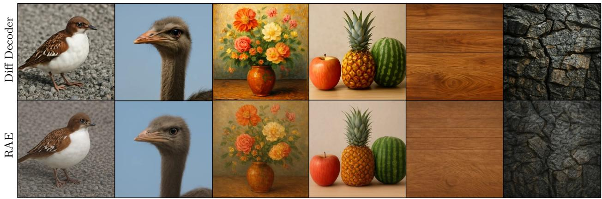

natural_image

Collage of nine images showing bird and fruit scenes, including a bird with an ostrich, peaches, apples, and fruits, alongside a cracked earth texture (no text or symbols)

Figure 9 Same CLIP representation decoded by the diffusion decoder and the RAE decoder. Since both decoders are optimized for reconstruction, the mapping from CLIP features to pixels is largely deterministic: object layout and colors are determined upstream when the model denoises the CLIP representation. The choice of decoder mainly affects fine-grained appearance (e.g., textures), and thus has little impact on object-level prompt-following.

<table><tr><td>Method</td><td>Latent Space</td><td>Resolution</td><td>Sequence Length</td><td>GenEval ↑</td></tr><tr><td>TextEmbed</td><td>DC-AE</td><td>768</td><td>576</td><td>0.45</td></tr><tr><td>TextEmbed</td><td>DC-AE</td><td>512</td><td>256</td><td>0.47</td></tr><tr><td>TextEmbed</td><td>RAE</td><td>576</td><td>576</td><td>0.57</td></tr></table>

Table 5 Token-matched latent-space comparison for TextEmbed. Increasing the DC-AE sequence length to match the RAE setting does not close the gap to RAE latents.

## C Additional Latent Space Comparison

In the main experiments, we keep the output resolutions comparable across latent spaces, which gives N =256 tokens for DC-AE and N =576 tokens for RAE. To isolate the effect of token count, we also evaluate a DC-AE setting with N=576 tokens by increasing its output resolution. As shown in Table 5, matching the DC-AE token count does not improve the TextEmbed baseline.