# Spatial Priors via Space Filling Curves for Small and Limited Data Vision Transformers

Leyla Naz Candogan \* 1 Arshia Afzal \* 1 Pol Puigdemont 1 Volkan Cevher 1

## Abstract

Though Vision Transformers (ViTs) have become the dominant backbone in many computer vision tasks, due to permutation equivariance, their attention mechanism lacks explicit spatial inductive biases. This become particularly important in two settings: when model capacity is small or training data is limited. Inspired by the attention masking strategies in Linear Transformers and the scanning patterns of Vision SSMs, we introduce VIOLIN , a lightweight masked attention mechanism that encodes spatial structure within attention via Space Filling Curves (SFCs) with less than 0.0015% extra parameters and negligible computational overhead. VIOLIN scans the image using multiple SFCs to construct curvespecific decay masks, which are then combined and multiplied with the attention matrix. Across a wide range of evaluations, VIOLIN consistently improves performance. In limited data regimes such as fine-tuning on VTAB-1K, it boosts accuracy across all task groups and by up to 8.7% on the tasks where spatial information is essential. It can be combined with parameter-efficient finetuning methods such as LoRA to further increase the performance. Beyond fine-tuning, VIOLIN improves various small scale ViT architectures (e.g., DeiT, DINO) during pretraining on ImageNet-1K. Additionally, on pixel-level CIFAR-100 training, a task that is highly dependent on location information, VIOLIN increases accuracy by up to 7.2%. Overall, VIOLIN provides a computationally efficient yet effective way to inject spatial inductive bias into ViTs, especially benefiting small models and limited data settings.

## VI O L I N Code

1LIONS, Ecole Polytechnique F ´ ed´ erale de Lausanne (EPFL), ´ Lausanne, Switzerland. Correspondence to: Leyla Naz Candogan <leyla.candogan@epfl.ch>.

Proceedings of the $\it 4 3 ^ { r d }$ International Conference on Machine Learning, Seoul, South Korea. PMLR 306, 2026. Copyright 2026 by the author(s).

## 1. Introduction

Vision Transformers (ViTs) (Dosovitskiy et al., 2021) have rapidly become a dominant architecture in computer vision, achieving strong performance across tasks by capturing global dependencies through self-attention. However, unlike Convolutional Neural Networks (CNNs) (LeCun et al., 1998), ViTs lack inherent spatial priors such as locality (Fan et al., 2024). This limitation partially comes from the permutation equivariance of attention, which treats image patches as an unordered set of tokens. As a result, ViTs become data-hungry and dependent on larger model sizes.1 While large models and datasets allow ViTs to learn these biases directly (Lu et al., 2022; Sun et al., 2017), many downstream tasks require adapting a pretrained backbone with limited data. In such cases, even large ViTs struggle to specialize, making stronger inductive biases essential across scales. Prior works tried to address this limitation with convolutions (Guo et al., 2022), novel positional encodings (Wu et al., 2021), or masking strategies (Fan et al., 2024).

Concurrently, in natural language processing, State Space Models (SSMs) and Linear Transformers have emerged as efficient alternatives to standard transformers (Gu & Dao, 2024; Dao & Gu, 2024; Sun et al., 2023b), and their vision adaptations have achieved strong results (Alkin et al., 2024; Liu et al., 2024b; Zhu et al., 2024). Through recurrence and a decay factor on attention scores, these models can capture the relative spatial order of image patches. However, this information depends entirely on the chosen scanning order, and to capture both vertical and horizontal relations, they typically require multiple directional scans (Li et al., 2024).

Scanning an image converts its 2D patch layout into a 1D sequence, with the order of patches determined by a traversal path. This process can be viewed as a Space Filling Curve (SFC): a continuous path that passes through every point in a multidimensional grid while systematically covering the entire image (Sagan, 1994). Many vision backbones, including vanilla ViT (Dosovitskiy et al., 2021), Vision x-LSTM (Alkin et al., 2024), and Vim (Zhu et al., 2024), use the simple Z-curve, or row-by-row scan, for this linearization (see Figure 1 (a2)). Given that other SFCs, such as Snake, Zig-zag, Peano, and Hilbert curves, preserve locality in different ways, we ask the following question:

a1)  


<details>
<summary>natural_image</summary>

Close-up of a black-and-white cat with large eyes looking upward against a blue sky and ocean background (no text or symbols)
</details>

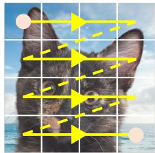

<details>
<summary>natural_image</summary>

Close-up of a cat's head with yellow arrows pointing to the eye area, set against a blue sky background (no text or symbols)
</details>

Z-Curve

b1)  
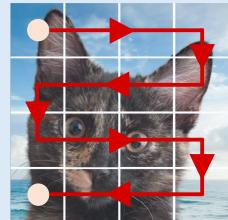

<details>
<summary>natural_image</summary>

Close-up of a cat's face with red arrows pointing to the eyes and mouth, set against a blue sky background (no text or symbols)
</details>

b2)  
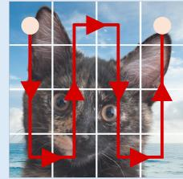

<details>
<summary>natural_image</summary>

Close-up of a gray tabby cat with red arrows pointing to its eyes, set against a blue sky background (no text or symbols)
</details>

Snake Curves

c1)  
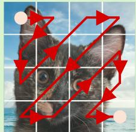

<details>
<summary>natural_image</summary>

Close-up of a gray tabby cat with red arrows pointing to its face, set against a blue sky background (no text or symbols)
</details>

c2)  
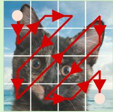

<details>
<summary>natural_image</summary>

Close-up of a gray cat's face with red arrows pointing to blue sky background (no text or symbols)
</details>

Zig-Zag Curves

d1)  
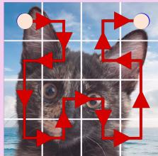

<details>
<summary>flowchart</summary>


</details>

d2)  
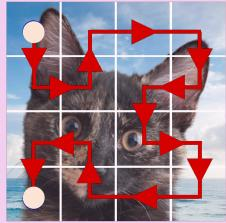

<details>
<summary>flowchart</summary>

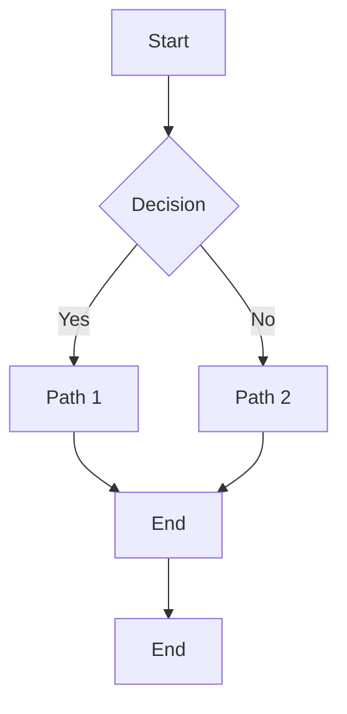
</details>

Hilbert Curves

e1)  
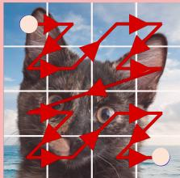

<details>
<summary>text_image</summary>

Image with red arrows pointing to a cat's face, overlaid on a grid background with white dots and numbers.
</details>

e2)  


<details>
<summary>natural_image</summary>

Close-up of a cat's face with red arrows pointing to the cat's eyes, set against a blue sky background (no text or symbols)
</details>

Peano Curves  
Figure 1. Space Filling Curve paths: Examples of traversal paths used in VIOLIN on a 4 × 4 patched image. (a1) Original image. (a2) Z-curve (b1) Snake curve, (b2) Transposed Snake curve, (c1) Zig-zag curve, (c2) Transposed Zig-zag curve, (d1) Hilbert curve, (d2) Transposed Hilbert curve, (e1) Peano curve, (e2) Transposed Peano curve.

Can SFC-inspired structure in attention enhance the spatial understanding of ViTs and improve their performance in small models and data scarce settings?

In this work, we answer this question affirmatively by introducing VIOLIN 2, a lightweight attention mechanism for global attention models that injects spatial priors via SFCguided decay masks. VIOLIN integrates multiple SFC-based scans into a single mask, $\mathbf { M } _ { \mathrm { V I O L I N } }$ , capturing relative patch locations without modifying the rest of the architecture. This yields an efficient, plug-and-play way to introduce locality into ViTs, particularly benefiting small models and data scarce regimes. Figure 1 (b - e) shows the SFCs used in VIOLIN , with their linearized sequences in Figure 10.

We evaluate VIOLIN across a broad set of settings:

• Fine-tuning DeiT, DeiT-III, and DINO (Touvron et al., 2021; 2022; Caron et al., 2021) on VTAB (Zhai et al., 2019), across scales from Tiny (5M) to Huge (632M), where VIOLIN consistently improves baselines by up to 8.7% on individual tasks and 4.7% on average. VIO-LIN also combines seamlessly with parameter-efficient fine-tuning methods, further boosting adaptability.

• Pretraining small-scale models on ImageNet-1K (Russakovsky et al., 2015) increases the performance by up to 0.9%, and on pixel-level CIFAR-100 (Krizhevsky, 2009), achieves a notable 7.2% improvement.  
• Additional analyses, including the complementary roles of different curves, performance on the Structured group, and extensions to dense prediction tasks such as object detection on COCO (Lin et al., 2014b) and semantic segmentation on ADE20K (Zhou et al., 2017), further highlight the versatility of VIOLIN and the importance of explicit spatial priors.

## 2. Background

Notations and preliminaries We denote a patched image as $\mathcal { I } \in \mathbb { R } ^ { H \times \mathbf { \bar { W } } \times d }$ , where H and W are the number of patches along height and width, and d is the embedding dimension. Its flattened form is $\mathbf { X } \in \mathbb { R } ^ { N \times d }$ with $N = H \times W$ as the sequence length. For single head attention, the query, key, and value matrices $\mathbf { Q } , \mathbf { K } , \mathbf { V } \in \mathbb { R } ^ { N \times d }$ are computed using learnable weights ${ \bf W } _ { Q } , { \bf W } _ { K } , { \bf W } _ { V } \in \mathbb { R } ^ { d \times d }$ , and the standard ViT attention is computed as

$$
\mathbf {Q} = \mathbf {X W} _ {Q}, \mathbf {K} = \mathbf {X W} _ {K}, \mathbf {V} = \mathbf {X W} _ {V},
$$

$$
\mathbf {Y} = \text { Softmax } \left(\frac {\mathbf {Q} \mathbf {K} ^ {\top}}{\sqrt {d}}\right) \mathbf {V}. \tag {1}
$$

where $\mathbf { Y } \in \mathbb { R } ^ { N \times d }$ is the attention output. We use h and L for the number of attention heads and transformer layers respectively. Elements of matrices and vectors are accessed by [·], and ⊙ denotes the Hadamard product. A full list of notations is provided in Appendix A.

Vision Transformers and spatial priors After dividing an image into patches (tokens), ViTs process them as a 1D sequence, typically flattened with a Z-curve (Dosovitskiy et al., 2021), which discards information about neighboring patches. To reintroduce spatial information, most ViTs add positional embeddings before transformer blocks. Recent works have further improved performance through selfsupervised learning (e.g., DINO (Caron et al., 2021)) and optimized training strategies (e.g., DeiT and DeiT-III (Touvron et al., 2021; 2022)). In this study, we show how VIOLIN improves upon these models and training recipes.

By processing patches independently, ViTs lack the strong spatial inductive bias of architectures like CNNs, which inherently encode locality (Yuan et al., 2021). Although ViTs capture global interactions, they struggle with fine-grained local structures, making training data-hungry (d’Ascoli et al., 2021). Sufficiently large models and datasets can mitigate this by learning locality from data, but when model size or data is limited, ViTs struggle to achieve strong performance (Lu et al., 2022), see Appendix B.1 for details.

Linear Transformers Linear attention was introduced as an alternative to softmax attention, reducing quadratic complexity to linear time via a recurrent formulation equation (2) (Katharopoulos et al., 2020). Instead of relying on positional embeddings to capture the order within a sequence, most modern Linear Transformers (Sun et al., 2023b) incorporate a decay factor (γ),

$$
\mathbf {S} _ {i} = \gamma \mathbf {S} _ {i - 1} + \mathbf {k} _ {i} ^ {\top} \mathbf {v} _ {i}, \quad \mathbf {y} _ {i} = \mathbf {q} _ {i} ^ {\top} \mathbf {S} _ {i} \tag {2}
$$

$$
\mathbf {Y} = \left(\mathbf {Q} \mathbf {K} ^ {\top} \odot \mathbf {M} _ {\text { causal }}\right) \mathbf {V}, \quad \mathbf {M} _ {\text { causal }} [ i, j ] = \left\{ \begin{array}{l l} \gamma^ {i - j} & i \geq j, \\ 0 & i <   j. \end{array} \right. \tag {3}
$$

where $\mathbf { S } _ { i } ~ \in ~ \mathbb { R } ^ { d \times d }$ is the hidden state. This recurrent form can be parallelized using matrix multiplication with a Toeplitz decay mask M (Qin et al., 2023; Sun et al., 2023b) as in equation (3). Though linear masked attention was initially proposed for causal NLP tasks, it is later adapted to non-causal tasks using full Toeplitz masks (Afzal et al., 2025). The decay mask naturally extends context length, supports variable sequence lengths, and provides locality information that inspired VIOLIN .

Scans in Linear Vision Transformers and SSMs Linear Transformers and SSMs have been applied to vision tasks (Alkin et al., 2024; Liu et al., 2024b; Zhu et al., 2024; Ren et al., 2025; Hu et al., 2024; Zhang et al., 2024). To enhance spatial representation, these models often traverse image patches using a Z-curve, typically scanning in both vertical and horizontal directions. Each scan acts as a separate recurrence, capturing distinct spatial patterns through their own decay factors.

## Space Filling Curves

Definition 2.1. A Space Filling Curve (SFC) is a continuous mapping from a closed unit interval $S = [ 0 , 1 ]$ to a closed unit hypercube $Q = [ 0 , 1 ] ^ { N }$ , passing through every point in Q exactly once (Peano, 1890). In this work, we focus on the 2D Euclidean case $Q = [ 0 , 1 ] ^ { 2 }$ , corresponding to images.

Based on Definition 2.1, many SFCs can been defined, including the Snake, Peano (also known as the Morton curve) (Peano, 1890), Hilbert (Hilbert, 1891), Z (or Sweep), and Zig-zag (Wallace, 1992) curves as illustrated in Figure 1. Additionally, other curves include the Sierpinski (Sierpinski ´ , 1915), and Lebesgue curves (Lebesgue, 1904).

Flattening or scanning can be viewed as applying an SFC c to a 2D patched image I with N total patches, mapping it to a 1D sequence $\bar { \mathbf { X } } _ { c } \in \mathbb { R } ^ { N }$ via a flattening function $F _ { c } ( \mathcal { T } ) : \mathbb { R } ^ { H \times \hat { W } } \mapsto \mathbb { R } ^ { N }$ such that

$$
F _ {c} (i, j): (i, j) \mapsto n, i \in \mathbb {Z} _ {[ 0, H)}, j \in \mathbb {Z} _ {[ 0, W)}, n \in \mathbb {Z} _ {[ 0, N)}. \tag {4}
$$

$$
\mathbf {X} _ {c} = F _ {c} (\mathcal {I}), \quad \mathbf {X} _ {c} [ n ] = \mathcal {I} [ i, j ] \text {   where   } n = F _ {c} (i, j). \tag {5}
$$

This flattening can be applied independently across each dimension d for $\mathcal { I } \in \mathbb { R } ^ { H \times W \times d }$ . While SFCs have diverse applications in other domains, their role in image classification remains underexplored (Zhao et al., 2024; Kutscher et al., 2025). Additional details are provided in Appendix B.3.

## 3. Methodology

In this section, we introduce decay-masked attention (Section 3.1), extend it to diverse scanning patterns (Sections 3.2 and 3.3), and finally present VIOLIN attention (Section 3.4).

## 3.1. Attention with Decay Mask

As shown in Appendix C.1, attention (equation (1)) is permutation equivariant: changing the order of tokens in the sequence results in the same reordering in the output. Therefore, standard attention does not encode relative spatial priors within an image. To introduce locality, we take inspiration from Linear Transformers and multiply a decay mask to the attention to break this equivariance:

$$
\mathbf {Y} = \operatorname{Softmax} \left(\frac {\mathbf {Q K} ^ {\top}}{\sqrt {d}} \odot \mathbf {M}\right) \mathbf {V}, \tag {6}
$$

$$
\mathbf {M} [ i, j ] = \gamma^ {| i - j |}, \quad 0 <   \gamma \leq 1.
$$

This decay mask M, also known as the KacMurdockSzeg matrix (Kac et al., 1953), extends the causal decay mask to full attention (Afzal et al., 2025). It dampens the attention score between tokens i and $j ~ \mathrm { b y } ~ \gamma ^ { | i - j | }$ , enforcing locality in the flattened sequence X. However, both the token order in X and the notion of distance in M depend entirely on how the original image I is flattened. This raises a natural question: What are alternative ways to flatten an image?

## 3.2. SFCs as Principled Way of Image Flattening

Following equation (5), scanning an image along a path c yields the sequence $\mathbf { X } _ { c } = F _ { c } ( \mathcal { T } )$ . Many ViTs use the Z-curve as the default scanning method.

Z-Curve The Z-curve, also called sweep, row-major order, or raster scan, traverses the image row by row, top to bottom, and left to right within each row and defined by $F _ { z } ( i , j ) =$ $i W + j$ . See Appendix B.3 for other curves used in VIOLIN

Although flattening with different curves usually requires reprocessing the image, we propose a simpler and significantly more efficient alternative: applying a permutation to the flattened sequence.

Permutation of a flattened image Given a sequence $\mathbf { X } _ { c _ { 1 } }$ flattened via SFC $c _ { 1 }$ , and noting that flattening is one-toone, we define a permutation $\pi _ { c _ { 1 } \mapsto c _ { 2 } } : \mathbb { Z } _ { [ 0 , N ) } \mapsto \mathbb { Z } _ { [ 0 , N ) }$ that maps it to $\mathbf { X } _ { c _ { 2 } }$ from curve $c _ { 2 }$

$$
\mathbf {X} _ {c _ {2}} = \pi_ {c _ {1} \mapsto c _ {2}} (\mathbf {X} _ {c _ {1}}). \tag {7}
$$

Note that since each index in ${ \bf X } _ { c _ { 1 } }$ uniquely corresponds to one in $\mathbf { X } _ { c _ { 2 } } , \pi _ { c _ { 1 }  c _ { 2 } }$ is invertible. Alternatively, we can represent it as a permutation matrix $\mathbf { P } _ { c _ { 1 } \mapsto c _ { 2 } } \in \{ \stackrel { \cdot } { 0 } , 1 \} ^ { N \times N }$

$$
\mathbf {P} _ {c _ {1} \mapsto c _ {2}} [ n, m ] = \left\{ \begin{array}{l l} 1 & \text { if } m = \pi_ {c _ {1} \mapsto c _ {2}} (n), \\ 0 & \text { otherwise }, \end{array} \right.
$$

$$
\mathbf {X} _ {c _ {2}} = \mathbf {P} _ {c _ {1} \mapsto c _ {2}} \mathbf {X} _ {c _ {1}}. \tag {8}
$$

Since $\mathbf { P } _ { c _ { 1 } \mapsto c _ { 2 } }$ is a permutation matrix,

$$
\mathbf {P} _ {c _ {2} \mapsto c _ {1}} = \mathbf {P} _ {c _ {1} \mapsto c _ {2}} ^ {- 1} = \mathbf {P} _ {c _ {1} \mapsto c _ {2}} ^ {\top}. \tag {9}
$$

Thus, by flattening the image once using the Z-curve, it is possible to obtain $\mathbf { X } _ { c }$ for other curves by applying $\pi _ { z \mapsto c } ( \cdot )$ .

## 3.3. SFCs Meet Attention

With the naive approach, using $\mathbf { X } _ { c }$ for each curve individually and following equation (6), the output of masked attention ${ \bf Y } _ { c }$ can be calculated such that

$$
\mathbf {Y} _ {c} = \text { Softmax } \left(\frac {\mathbf {Q} _ {c} \mathbf {K} _ {c} ^ {\top}}{\sqrt {d}} \odot \mathbf {M} _ {c}\right) \mathbf {V} _ {c}, \mathbf {M} _ {c} [ i, j ] = \gamma_ {c} ^ {| i - j |}, \tag {10}
$$

where $\mathbf { Q } _ { c } , \mathbf { K } _ { c } , \mathbf { V } _ { c }$ are calculated with $\mathbf { X } _ { c } .$ As the token order of ${ \bf Y } _ { c }$ depends on the curve c, when multiple curves are used, the outputs $( \mathrm { e } . \mathrm { g } \mathrm { \mathbf { Y } } _ { c _ { 1 } }$ and $\mathbf { Y } _ { c _ { 2 } } )$ will have mismatched positions. To overcome this issue we define a basis curve.

Basis Curve After computing the attention output ${ \bf Y } _ { c }$ for each curve c, we permute them into a common basis to align all outputs. This preserves the spatial locality of each curve while ensuring they share a consistent reference order. Following standard ViT flattening, we use the $Z \cdot$ curve as the basis and perform all permutations relative to it, simplifying notation as $\pi _ { z \mapsto c } = \pi _ { c } , \pi _ { c \mapsto z } = \pi _ { c } ^ { - 1 }$ and $\mathbf { P } _ { z \mapsto c } = \mathbf { P } _ { c }$ , $\mathbf { P } _ { c \mapsto z } = \mathbf { P } _ { c } ^ { - 1 }$ . The output aligned to the basis is

$$
\widetilde {\mathbf {Y}} _ {c} = \pi_ {c} ^ {- 1} (\mathbf {Y} _ {c}) = \mathbf {P} _ {c} ^ {\top} \mathbf {Y} _ {c}. \tag {11}
$$

Permutation of Decay Mask The aligned output $\widetilde { \mathbf { Y } _ { c } }$ of the masked attention in equation (10) is

$$
\widetilde {\mathbf {Y}} _ {c} = \mathbf {P} _ {c} ^ {\top} \mathbf {Y} _ {c} = \mathbf {P} _ {c} ^ {\top} \text { Softmax } \left(\frac {\mathbf {Q} _ {c} \mathbf {K} _ {c} ^ {\top}}{\sqrt {d}} \odot \mathbf {M} _ {c}\right) \mathbf {V} _ {c}. \tag {12}
$$

Equivalently, we can permute the decay mask $\mathbf { M } _ { c }$ to the basis order as $\widetilde { \mathbf { M } _ { c } } = \pi _ { c } ^ { - 1 } ( \mathbf { M } _ { c } ) = \mathbf { P } _ { c } ^ { \top } \mathbf { M } _ { c } \mathbf { P } _ { c }$ , allowing attention to be computed directly in the basis, see Section C.3 for proof. The attention output then becomes

$$
\widetilde {\mathbf {Y}} _ {c} = \text { Softmax } \left(\frac {\mathbf {Q} \mathbf {K} ^ {\top}}{\sqrt {d}} \odot \widetilde {\mathbf {M} _ {c}}\right) \mathbf {V}, \tag {13}
$$

$$
\widetilde {\mathbf {M} _ {c}} = \pi_ {c} ^ {- 1} (\mathbf {M} _ {c}), \quad \mathbf {M} _ {c} [ i, j ] = \gamma_ {c} ^ {| i - j |}.
$$

This approach is more efficient than the naive one, as Q, K, V are computed only once with the basis curve, and, crucially, a single $\mathbf { Q } \mathbf { K } ^ { \top } \in \mathbf { \mathbb { R } } ^ { N \times N }$ is shared across all.

## 3.4. VIOLIN Attention

For a single head, we define VIOLIN attention as a decaymasked attention guided by multiple SFCs.

$$
\mathbf {Y} = \text { Softmax } \left(\alpha \frac {\mathbf {Q K} ^ {\top}}{\sqrt {d}} \odot \mathbf {M} _ {\text { VIOLIN }}\right) \mathbf {V},
$$

$$
\mathbf {M} _ {\text {VIOLIN}} = \frac {1}{| \mathcal {C} |} \sum_ {c \in \mathcal {C}} \widetilde {\mathbf {M} _ {c}}. \tag {14}
$$

Here, $\mathbf { M } _ { \mathrm { V I O L I N } }$ is the average of decay masks from all curves $c \in { \mathcal { C } } .$ , each first aligned to the basis (Z-curve) order. The matrices Q, K, V are computed from the input X flattened with respect to the basis. The learnable scalar $\alpha \in \mathbb { R }$ controls how strongly the mask influences attention.

For VIOLIN , we use Snake, Zig-zag, Peano, and Hilbert curves together with their transposed variants (Figure 1 (b2- e2)) to capture diverse scanning patterns in both row and column major order. This gives the curve set

$$
\mathcal {C} = \{\text { Snake }, \text { Zig - Zag }, \text { Peano }, \text { Hilbert },
$$

$$
\left. \text { Snake } ^ {\top}, \text { Zig - Zag } ^ {\top}, \text { Peano } ^ {\top}, \text { Hilbert } ^ {\top} \right\}. \tag {15}
$$

Each curve c has a decay factor $\gamma _ { c } \in [ 0 , 1 ]$ for its mask $\mathbf { M } _ { c }$ , parameterized as $\gamma _ { c } = \mathrm { s i g m o i d } ( \beta _ { c } )$ with learnable $\beta _ { c } \in$ R for stability (Orvieto et al., 2023). In multi-head attention, each head k has its own $\beta _ { c } ^ { k }$ and $\alpha ^ { k }$ , yielding head specific $\mathbf { M } _ { c } ^ { k }$ $\mathbf { M } _ { \mathrm { V I O L I N } } ^ { k }$

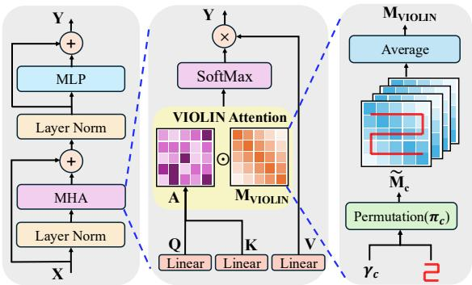

<details>
<summary>flowchart</summary>

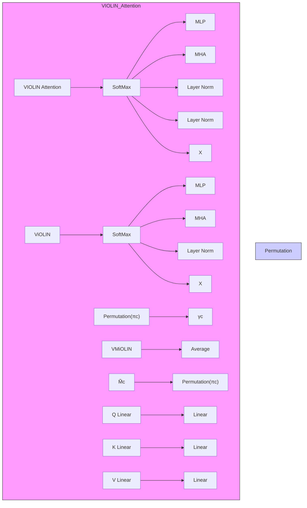
</details>

Figure 2. VIOLIN : (Left) ViT block with VIOLIN multi-head attention. (Middle) Single-head VIOLIN attention. (Right) Decay mask $\mathbf { M } _ { \mathrm { V I O L I N } }$ formed by averaging masks from curves in C.

In practice, permutations can be applied efficiently via indexing, see code in Appendix G.3. The full VIOLIN block is shown in Figure 2, with theoretical motivation for averaging in Appendix C.4, further design choices and ablations in Appendix D and Appendix E.

Parameter and computational overhead A key advantage of VIOLIN is its minimal parameter and computational overhead. As shown in Table 1, VIOLIN adds only 0.0015% parameters and 0.64% FLOPs compared to the baseline DeiT-B model which is effectively negligible in practice.

We further evaluate GPU memory and inference runtime using a DeiT-S backbone with a batch size of 256 at resolutions of 224 × 224 (classification) and 512 × 512 (dense prediction). As shown in Table 2, VIOLIN closely matches vanilla DeiT model in both runtime and memory usage, confirming the minimal overhead predicted by our analysis.

## 4. Experiments

We evaluate VIOLIN across diverse settings to assess its impact on ViTs spatial awareness. Experiments include finetuning on small datasets (Section 4.1), pretraining smallscale models on ImageNet-1K and pixel-level CIFAR-100 (Section 4.2), and ablations on curve configurations and decay factors (Section 4.3). Beyond classification, we analyze gains on the Structured VTAB group and extend evaluation to dense prediction tasks such as detection and segmentation. Overall, VIOLIN consistently improves performance, particularly for small models and data-scarce regimes.

Table 1. Parameter and computational overhead of VIOLIN : calculated relative to DeiT-B (86M parameters, 55.4G FLOPs).

<table><tr><td>Metric</td><td>Theoretical Computation</td><td>% Change (over DeiT-B)</td></tr><tr><td># Param.</td><td> $Lh(|C| + 1)$ </td><td>0.0015%</td></tr><tr><td>FLOPs</td><td> $\mathcal{O}(LhdN^{2})$ </td><td>0.64%</td></tr></table>

Table 2. GPU memory and inference time comparison: for DeiT-S and VIOLIN -S at different input resolutions. Measurements done on the same hardware with batch size 256.

<table><tr><td>Model</td><td>GPU Memory (GB)</td><td>Runtime (ms/batch)</td></tr><tr><td>DeiT (224 × 224)</td><td>0.80</td><td>206.1</td></tr><tr><td>VIOLIN (224 × 224)</td><td>0.81</td><td>233.1</td></tr><tr><td>DeiT (512 × 512)</td><td>13.88</td><td>1739.3</td></tr><tr><td>VIOLIN (512 × 512)</td><td>13.90</td><td>1789.7</td></tr></table>

## 4.1. VTAB-1K Fine-tuning

The Visual Task Adaptation Benchmark (VTAB) (Zhai et al., 2019) evaluates the adaptability of learned representations to diverse unseen tasks with limited data. It consists of three groups, Natural, Specialized, and Structured, covering 19 datasets from varied domains and semantic categories. In our experiments we use VTAB-1K, a subset with 1,000 examples per task, specifically designed to test model adaptation in data-scarce settings.

On small datasets, we test VIOLIN under two configurations: full and parameter-efficient fine-tuning (PEFT). In both cases, we compare fine-tuning results of the original pretrained models ( Baseline ), and Baseline $\odot \mathbf { M } _ { \mathrm { V I O L I N } }$ where pretrained models are combined with freshly initialized mask before fine-tuning and then optimized jointly with the backbone during fine-tuning. For all models, baselines and VIOLIN , we use the fine-tuning implementation from (Alkin, 2024) as described in Appendix G.2 with the complete set of training hyperparameters in Table 29, and per-dataset results in Appendix F.5.

Full fine-tuning In the first setting, we test the plug-in capability of VIOLIN by fully fine-tuning pretrained DeiT, DeiT-III, and DINO models across scales ranging from 5M to 630M parameters. Prior to fine-tuning, we freshly initialize the $\mathbf { M } _ { \mathrm { V I O L I N } }$ mask and scaling factor α as defined in equation (14). Next, we jointly fine-tune the model and the mask with accuracies reported in Table 3. Freshly initialized mask enables fast adaptation by learning task-specific structural biases, which is critical in data-scarce setting. We also fine-tune the VIOLIN pretrained models from Section 4.2 and observe that masks learned only during downstream fine-tuning consistently outperform pretrained ones, full results and discussions are provided in Appendix F.2.

This highlights a key advantage, VIOLIN can improve any pretrained global attention model when applied only at finetuning, allowing models to specialize on the downstream task better and avoiding costly pretraining from scratch. The gains are substantial, up to 4.7% on average and 8.7% on individual groups, showing that the spatial bias introduced by VIOLIN enables more effective learning in data-scarce regimes. Moreover, VIOLIN introduces negligible overhead and generalizes across datasets, training setups, and model scales, including models larger than 600M parameters.

Table 3. Full fine-tuning results on VTAB-1K: Comparison of the top-1 accuracies of baseline models and their Baseline ⊙ MVIOLIN counterparts across the VTAB-1K benchmark. The three task groups are abbreviated as NAT. = Natural, SPE. = Specialized, and STR. = Structured. The values in parentheses (·) indicate the accuracy difference compared to the baseline. The best performance within each model pair is highlighted in bold. Green highlights the improvement.

<table><tr><td rowspan="3">Model</td><td rowspan="3">Param.</td><td colspan="8">Top-1 Accuracy (%)</td></tr><tr><td colspan="4">Baseline</td><td colspan="4">Baseline ⊙  $M_{\text{VIOLIN}}$ </td></tr><tr><td>NAT.</td><td>SPE.</td><td>STR.</td><td>Avg.</td><td>NAT.</td><td>SPE.</td><td>STR.</td><td>Avg.</td></tr><tr><td>DeiT-T</td><td>5M</td><td>69.56</td><td>82.34</td><td>53.57</td><td>65.52</td><td>71.90 (+2.34)</td><td>83.75 (+1.41)</td><td>57.50 (+3.93)</td><td>68.33 (+2.81)</td></tr><tr><td>DeiT-S</td><td>22M</td><td>73.64</td><td>84.30</td><td>53.44</td><td>67.38</td><td>76.06 (+2.42)</td><td>85.05 (+0.75)</td><td>58.26 (+4.82)</td><td>70.46 (+3.08)</td></tr><tr><td>DeiT-B</td><td>86M</td><td>76.93</td><td>85.52</td><td>57.00</td><td>70.35</td><td>77.96 (+1.03)</td><td>86.29 (+0.77)</td><td>61.89 (+4.89)</td><td>72.95 (+2.60)</td></tr><tr><td>DeiT-III-S</td><td>22M</td><td>75.13</td><td>83.63</td><td>52.92</td><td>67.57</td><td>77.03 (+1.90)</td><td>85.46 (+1.83)</td><td>61.61 (+8.69)</td><td>72.31 (+4.74)</td></tr><tr><td>DeiT-III-B</td><td>86M</td><td>78.19</td><td>85.26</td><td>56.71</td><td>70.63</td><td>79.24 (+1.05)</td><td>86.47 (+1.21)</td><td>63.03 (+6.32)</td><td>73.94 (+3.31)</td></tr><tr><td>DeiT-III-L</td><td>304M</td><td>88.68</td><td>84.38</td><td>51.40</td><td>67.41</td><td>90.39 (+1.71)</td><td>84.68 (+0.30)</td><td>54.95 (+3.55)</td><td>69.51 (+2.10)</td></tr><tr><td>DeiT-III-H</td><td>632M</td><td>88.15</td><td>84.18</td><td>50.70</td><td>66.91</td><td>89.10(+0.95)</td><td>84.43 (+0.25)</td><td>53.65 (+2.95)</td><td>68.50 (+1.41)</td></tr><tr><td>DINO-S</td><td>22M</td><td>75.35</td><td>85.09</td><td>60.65</td><td>71.21</td><td>76.26 (+0.91)</td><td>85.32 (+0.23)</td><td>61.24 (+0.59)</td><td>71.84 (+0.63)</td></tr><tr><td>DINO-B</td><td>86M</td><td>77.50</td><td>85.77</td><td>58.47</td><td>71.23</td><td>78.65 (+1.15)</td><td>86.44 (+0.67)</td><td>60.84 (+2.37)</td><td>72.79 (+1.56)</td></tr></table>

Table 4. PEFT results on VTAB-1K with DeiT-B: # Param. denotes the number of learnable parameters per method. The baseline uses PEFT alone, while VIOLIN combines PEFT with mask fine-tuning.

<table><tr><td rowspan="2">Method</td><td rowspan="2"># Param.</td><td colspan="2">Avg. Accuracy (%)</td></tr><tr><td>Baseline</td><td>Baseline ⊙ M $_{VIOLIN}$ </td></tr><tr><td>Full-FT</td><td>86 M</td><td>70.35</td><td>72.95 (+2.60)</td></tr><tr><td>LoRA</td><td>~0.3M</td><td>71.04</td><td>72.55 (+1.51)</td></tr><tr><td>DoRA</td><td>~0.6M</td><td>70.75</td><td>71.90 (+1.15)</td></tr></table>

PEFT with VIOLIN Secondly, we use the PEFT methods LoRA (Hu et al., 2022) and DoRa (Liu et al., 2024a) to finetune DeiT-B, with results in Table 4. The VIOLIN mask is freshly initialized and updated alongside the PEFT weights. The extra cost introduced by VIOLIN remains insignificant, only 0.0015% additional parameters compared to 0.35% introduced by LoRA. These results show that VIOLIN can integrate seamlessly with different PEFT methods, further highlighting its applicability and generalizability.

## 4.2. Pretraining

ImageNet-1K pretraining We pretrain VIOLIN on smallscale models 3 under both supervised and self-supervised paradigms, as shown in Table 5. For supervised training, we follow the DeiT training recipe for tiny and small models, a strong baseline for data-efficient supervised learning. In all DeiT based pretraining experiments, we adopt only the training recipe and do not use distillation. VIOLIN consistently improves performance without additional tuning, with gains of 0.8% and 0.9% on DeiT-T and DeiT-S models, demonstrating strong compatibility. For these models, we replace the class token with Global Average Pooling (GAP) (Lin et al., 2014a; Lu et al., 2022), which is more compatible with VIOLIN , see Appendix E.5 for details.

For self-supervised training, we adopt DINO, a state-of-theart teacher-student framework for label free representation learning, known for its stable training dynamics and strong downstream performance. In our experiments, both teacher and student networks are equipped with VIOLIN attention. Across model scales and training durations, VIOLIN consistently improves performance, yielding gains in both KNN and linear evaluations on ImageNet. For all models, we strictly follow the original training recipes without modifying any hyperparameters for VIOLIN . Baseline accuracies are taken directly from the reported values.

Ablation studies In Appendix E, we provide comprehensive ablations on VIOLIN , using the same pretraining setup. Appendices E.1 and E.5 examine the effects of global average pooling and positional embeddings, while Appendix E.2 explores curve configurations, including using a single curve, all combinations in C, Z-curve only, Manhattan distancebased masking (similar to RMT (Fan et al., 2024)), random curve orderings and variants without transposed curves. Appendix E.3 compares alternative masking strategies, and Appendix E.4 analyzes key design choices such as initialization, the scaling factor α, and fixed versus learnable decay parameters. Together, these ablations clarify the contribution of each component. Additionally, in Appendix F.3, we evaluate the context extrapolation capability of VIOLIN using multi-resolution classification and video generation with a pretrained VIOLIN DINO model, leveraging the extrapolation property of the KMS decay mask MVIOLIN .

Table 5. Pretraining results on ImageNet-1K: Comparison of the top-1 accuracies of baseline models with their VIOLIN counterparts. The values in parentheses (·) indicate the accuracy difference compared to the baseline. The best performance between each pair of models is highlighted in bold. For DINO models, both KNN and linear evaluations are reported and (100), (300) indicate the number of training epochs of the models. (Left) Supervised training with similar sized CNN baselines, (Right) Self-supervised training.

<table><tr><td rowspan="2">Model</td><td rowspan="2"># Param.</td><td colspan="2">Top-1 Accuracy (%)</td></tr><tr><td>Baseline</td><td>VIOLIN</td></tr><tr><td>DeiT-T</td><td>5M</td><td>72.2</td><td>73.0 (+0.8)</td></tr><tr><td>DeiT-S</td><td>22M</td><td>79.8</td><td>80.7 (+0.9)</td></tr><tr><td>ResNet-18</td><td>12M</td><td>69.8</td><td></td></tr><tr><td>ResNet-50</td><td>25M</td><td>76.2</td><td></td></tr></table>

<table><tr><td rowspan="2">Model</td><td></td><td># Param.</td><td colspan="2">Top-1 Accuracy (%)</td></tr><tr><td></td><td></td><td>Baseline</td><td>VIOLIN</td></tr><tr><td rowspan="2">DINO-S (100)</td><td>KNN</td><td rowspan="2">22M</td><td>69.3</td><td>70.0 (+0.7)</td></tr><tr><td>Linear</td><td>74.0</td><td>74.6 (+0.6)</td></tr><tr><td rowspan="2">DINO-S (300)</td><td>KNN</td><td rowspan="2">22M</td><td>72.8</td><td>73.4 (+0.6)</td></tr><tr><td>Linear</td><td>76.1</td><td>76.4 (+0.3)</td></tr></table>

Table 6. Pixel level CIFAR-100 pretraining: Comparison of the top-1 accuracies of baseline and VIOLIN models.

<table><tr><td rowspan="2">Model</td><td rowspan="2"># Param.</td><td colspan="2">Avg. Accuracy (%)</td></tr><tr><td>Baseline</td><td>VIOLIN</td></tr><tr><td>DeiT-T</td><td>5 M</td><td>60.8</td><td>68.0 (+7.2)</td></tr></table>

Pixel-level CIFAR-100 pretraining Recent work has explored pixel-level tokenization for ViTs (Nguyen et al., 2025; Wang et al., 2025), which provides detailed image representations and avoids hand-crafted choices around patching. However, since eliminating patching also removes a key source of locality bias and it makes models even more data-hungry and harder to optimize on smaller datasets such as CIFAR-100 (Krizhevsky, 2009). This setting aligns perfectly with VIOLIN , which introduces locality into the model independently of the patching process.

On CIFAR-100, when ViT-T is trained using the DeiT ImageNet training recipe, VIOLIN achieves a striking improvement of over 7% compared to the vanilla pixel-level baseline, as shown in Table 6. This demonstrates that our locality mechanism provides a powerful inductive bias, enabling effective learning in small-data, small-model regimes where standard ViTs fail. These results highlight both the effectiveness of VIOLIN and the importance of locality awareness for pixel-level ViTs, particularly in resource-constrained scenarios where large-scale pretraining or very long training schedules are impractical.

## 4.3. Understanding Spatial Awareness in VIOLIN

Performance gain on the Structured group The Structured category of VTAB includes tasks that require understanding the spatial structure of the images such as object counting and 3D depth prediction, many of which are derived from simulated environments. These scenes often consist of rendered geometric objects that are simple to humans but differ significantly from images in datasets like ImageNet. As a result, success in these tasks often depends on recognizing positional, orientational, or shape-based information, making local spatial layout especially important.

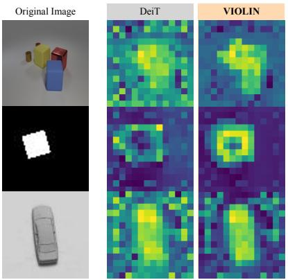

<details>
<summary>text_image</summary>

Original Image
DeiT
VIOLIN
</details>

Figure 3. Attention heatmaps on Structured tasks: Examples are drawn from three datasets in the Structured group: CLEVR-Count, dSprites-Location, and SmallNORB-Azimuth. They are taken from layer 12, using the same attention head for each image.

As shown in Table 3, the VIOLIN mask provides the largest improvements in this category, with gains of up to 8.69%, a 16% relative increase over the baseline. These results highlight the VIOLIN ’s ability to enhance spatial capabilities, and generalize effectively to tasks that depend heavily on spatial structure. In Figure 3, we illustrate images from three datasets in the Structured group with attention heatmaps of DeiT-B models fine-tuned with and without $\mathbf { M } _ { \mathrm { V I O L I N } }$ . The comparisons show that models fine-tuned with VIOLIN attend to objects more accurately, suppress noise on irrelevant patches, and produce more uniform responses in background regions, further demonstrating its benefit for spatial understanding. Appendix F.4 provides additional visualizations of per-head attention heatmaps across different layers.

Curve configurations We examine the individual contribution of each curve by pretraining DeiT-S with all $2 ^ { 4 } = 1 6$ combinations of four curves (including their transposed variants), with accuracies reported in Table 12. While some combinations yield larger gains, every curve contributes meaningfully, motivating the use of all four in VIOLIN to leverage their complementary spatial information. To illustrate this, Figure 4 visualizes the decay masks for three reference patches (top-left, center, bottom-right) across all curves and their transposes. Lighter regions indicate stronger attention, and the distinct patterns show how different curves bias the model toward diverse spatial regions.

Table 7. Results on dense prediction tasks: (Left) mIoU scores on semantic segmentation on ADE20K with DeiT-B model. (Right) box AP and mask AP scores on object detection and instance segmentation on COCO with Swin-T.

<table><tr><td rowspan="2">Backbone</td><td colspan="2">mIoU</td></tr><tr><td>Baseline</td><td>Baseline ⊙ M $_{VIOLIN}$ </td></tr><tr><td>DeiT-B</td><td>45.24</td><td>45.80 (+0.56)</td></tr></table>

<table><tr><td rowspan="2">Backbone</td><td colspan="2">Baseline</td><td colspan="2">Baseline ⊙  $M_{VIOLIN}$ </td></tr><tr><td>box AP</td><td>mask AP</td><td>box AP</td><td>mask AP</td></tr><tr><td>Swin-T</td><td>42.7</td><td>39.3</td><td>42.8 (+0.1)</td><td>39.7 (+0.4)</td></tr></table>

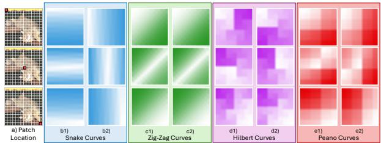

<details>
<summary>text_image</summary>

a) Patch
Location
b1)
Snake Curves
b2)
c1)
Zig-Zag Curves
c2)
d1)
Hilbert Curves
d2)
e1)
Peano Curves
e2)
</details>

Figure 4. Mask patterns for different patches: Visualization of decay mask patterns for three reference patches, top-left, center, and bottom-right, (1st, 2nd and 3rd rows) across all curves. Lighter values indicate stronger spatial relevance, showing more attended regions. a1) Reference patch locations, b1) Snake, b2) Snake⊤, c1) Zig-zag, c2) Zig-zag⊤, d1) Hilbert, d2) Hilbert⊤, e1) Peano, e2) Peano⊤ curves.

We further analyze the learned decay parameters $\gamma _ { c }$ for DeiT-B in Figure 5, observing that most remain close to one. This is consistent with findings in Linear Transformers where $\gamma \approx 1$ is associated with preserving long-range reasoning (Orvieto et al., 2023). With resolution 224 (sequence length 196), even a moderate decay changes the effective receptive field significantly $( { \bf e . g . , 0 . 9 ^ { 1 9 6 } < 1 0 ^ { - 9 } } )$ , making values near one necessary to keep both local and global spatial information. Smaller $\gamma _ { c }$ values, on the other hand, act as implicit curve selection, as their corresponding masks contribute minimally to the weighted average, with certain layers and heads emphasizing particular curves. Figure 11 visualizes how different $\gamma$ values change the effective receptive field, with additional attention heatmaps and curve-flattening visualizations provided in Appendix F.4.

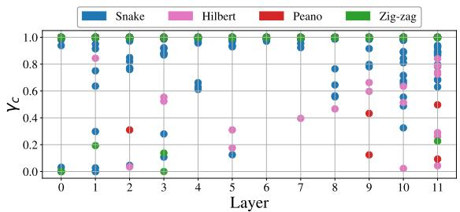

<details>
<summary>scatterplot</summary>

| Layer | Snake | Hilbert | Peano | Zig-zag |
|-------|-------|---------|-------|---------|
| 0     | 0.9   | 0.0     | 0.0   | 1.0     |
| 1     | 0.8   | 0.8     | 0.0   | 1.0     |
| 2     | 0.8   | 0.0     | 0.3   | 1.0     |
| 3     | 0.9   | 0.5     | 0.0   | 1.0     |
| 4     | 0.6   | 0.0     | 0.0   | 1.0     |
| 5     | 0.9   | 0.3     | 0.0   | 1.0     |
| 6     | 1.0   | 0.0     | 0.0   | 1.0     |
| 7     | 1.0   | 0.4     | 0.0   | 1.0     |
| 8     | 0.8   | 0.5     | 0.0   | 1.0     |
| 9     | 0.9   | 0.6     | 0.4   | 1.0     |
| 10    | 0.9   | 0.6     | 0.5   | 1.0     |
| 11    | 1.0   | 0.3     | 0.5   | 1.0     |
</details>

Figure $5 . \gamma _ { c }$ values: $\gamma _ { c }$ values of VIOLIN DeiT-B model are presented across layers, heads and curves. Most remain close to one, indicating active use of long-range spatial information.

Dense prediction tasks To assess the capabilities of VIOLIN beyond classification, we evaluate it on semantic segmentation and object detection. For both tasks, baseline and VIOLIN enhanced models are trained under identical setups to ensure fair comparison, with results reported in Table 7. These experiments also highlight the flexibility of MVIOLIN , which naturally generalizes to arbitrary input shapes, enabling resolution expansion and non-square images.

For semantic segmentation, we use ADE20K (Zhou et al., 2017; 2019), a challenging scene parsing dataset, implemented in the mmsegmentation framework (Contributors, 2020). The backbone is an ImageNet pretrained DeiT-B model combined with UPerNet (Xiao et al., 2018). The $\mathbf { M } _ { \mathrm { V I O L I N } }$ mask is freshly initialized at fine-tuning, and trained for 80k iterations with batch size 16.

For object detection, we evaluate on COCO (Lin et al., 2014b) using the mmdetection framework (Chen et al., 2019) with an ImageNet pretrained Swin-T (Liu et al., 2021) backbone and Mask R-CNN (He et al., 2017) as the detector. $\mathbf { M } _ { \mathrm { V I O L I N } }$ is freshly initialized at fine-tuning, and models are trained with a 1× schedule and batch size 16. VIOLIN yields improvements of +0.56 mIoU on semantic segmentation and a +0.4 mAP over the baseline (see Table 7), showing how spatial priors can improve dense prediction tasks.

Comparison against other inductive bias methods In Table 8, we present an extended comparison of localityenforcing methods on the Structured group with fine-tuning. All methods use the same pretrained DeiT-B backbone with their locality mechanisms initialized on top, ensuring that all models start identically. All methods are then fine-tuned under the same protocol, described in Appendix G.2.

Table 8. Comparison of locality methods: The pretrained DeiT-B model fine-tuned with different locality methods on the VTAB Structured group. Best result is highlighted on bold.

<table><tr><td>Method</td><td># Extra Param.</td><td>Structured Avg. (%)</td></tr><tr><td>Baseline (DeiT-B)</td><td>-</td><td>57.00</td></tr><tr><td>VIOLIN</td><td>~1.3K</td><td>61.89</td></tr><tr><td>Single SFC ( $M_{Peano}$ )</td><td>~0.4K</td><td>61.63</td></tr><tr><td>Additive  $M_{VIOLIN}$ </td><td>~1.3K</td><td>61.34</td></tr><tr><td>Swin RPB</td><td>~105K</td><td>61.58</td></tr><tr><td>i-RPE QKV</td><td>~115K</td><td>61.45</td></tr><tr><td>LocalViT</td><td>~6.2M</td><td>61.50</td></tr><tr><td>Manhattan Mask</td><td>~0.4K</td><td>58.37</td></tr></table>

These results show that while most locality priors offer some improvement, VIOLIN achieves the strongest gains with minimal overhead. This indicates that the gains come specifically from the usage of multiple SFC curves, rather than from the presence of any local bias. Moreover, they highlight VIOLIN ’s effectiveness as a plug-and-play spatial prior in small-data finetuning regimes. Full implementation details, initialization choices, further details on chosen baselines and per-dataset results are provided in Appendix F.6.

## 5. Conclusion and Future Directions

In this work, we introduced VIOLIN , a novel masked attention mechanism inspired by the decay masks of Linear Transformers and the perspective of flattening via space filling curves. By integrating diverse spatial patterns into a unified mask, VIOLIN enhances the understanding of relative spatial relationships without altering the training recipe, or introducing a significant computational cost.

Experiments show that VIOLIN is especially effective in small models and data-scarce settings, where spatial inductive bias is most critical. It serves as a plug-and-play module applicable only during fine-tuning, combining seamlessly with PEFT methods. More broadly, VIOLIN emphasizes the overlooked role of patch ordering and spatial priors in ViT design, offering a lightweight and practical approach to strengthen locality in global attention ViTs.

Future directions Since VIOLIN operates directly on attention scores, it can be used in any setting that uses global attention and benefits from spatial priors. This opens up many exciting future directions. For instance, in dense tasks such as depth estimation, super-resolution and object tracking, explicit spatial priors are critical. In data-scarce applications like medical imaging or satellite analysis where learning spatial structure from scratch is costly, VIOLIN ’s plug-and-play nature can allow us to inject strong locality priors at fine-tuning. Similarly, video understanding or multimodal learning presents promising opportunities to further explore the impact of VIOLIN in various vision backbones.

## Acknowledgements

We thank the reviewers for their valuable feedback. This work was partially sponsored by the Army Research Office and was accomplished under Grant Number W911NF-24-1- 0048, and partially funded by the Swiss National Science Foundation (SNSF) under grant number 200021-205011. Additionally, this work was supported under project ID #37 as part of the Swiss AI Initiative, through a grant from the ETH Domain and computational resources provided by the Swiss National Supercomputing Centre (CSCS) under the Alps infrastructure and by the Swiss AI Initiative 2025 Fellowship Program.

## Impact Statement

This work aims to advance machine learning by improving the spatial inductive biases of vision transformers, particularly in small-model and data-scarce settings. By enabling more data-efficient and lightweight vision models, our approach may reduce dependence on large-scale pretraining and computational resources and improve resource constrained domains such as medical imaging, remote sensing, and scientific analysis. We do not foresee any negative ethical implications beyond those commonly associated with vision models.

## References

Afzal, A., Rocamora, E. A., Candogan, L. N., Puigdemont, P., Tonin, F., Wu, Y., Shoaran, M., and Cevher, V. Linear attention for efficient bidirectional sequence modeling. In The Thirty-ninth Annual Conference on Neural Information Processing Systems, 2025.  
Alkin, B. vtab1k-pytorch. https://github.com/ BenediktAlkin/vtab1k-pytorch, 2024.  
Alkin, B., Beck, M., Poppel, K., Hochreiter, S., and Brand- ¨ stetter, J. Vision-LSTM: xLSTM as generic vision backbone. arXiv preprint arXiv:2406.04303, 2024.  
Bohm, C. Space-filling curves for high-performance data ¨ mining, 2020. URL https://arxiv.org/abs/ 2008.01684.  
Butz, A. R. Convergence with hilbert’s space filling curve. Journal of Computer and System Sciences, 3(2):128–146, 1969. ISSN 0022-0000. doi: https://doi.org/10.1016/ S0022-0000(69)80010-3.  
Caron, M., Touvron, H., Misra, I., Jegou, H., Mairal, J., ´ Bojanowski, P., and Joulin, A. Emerging properties in self-supervised vision transformers. In Proceedings of the IEEE/CVF international conference on computer vision, pp. 9650–9660, 2021.  
Cerveny, J. Gilbert: Generalized hilbert space-filling curve for rectangular domains. https://github.com/ jakubcerveny/gilbert, 2024.  
Chen, K., Wang, J., Pang, J., Cao, Y., Xiong, Y., Li, X., Sun, S., Feng, W., Liu, Z., Xu, J., Zhang, Z., Cheng, D., Zhu, C., Cheng, T., Zhao, Q., Li, B., Lu, X., Zhu, R., Wu, Y., Dai, J., Wang, J., Shi, J., Ouyang, W., Loy, C. C., and Lin, D. MMDetection: Open mmlab detection toolbox and benchmark. arXiv preprint arXiv:1906.07155, 2019.  
Chen, W., Yao, X., Zhang, X., and Yu, B. Efficient deep space filling curve. In Proceedings of the IEEE/CVF International Conference on Computer Vision (ICCV), pp. 17525–17534, October 2023.  
Choromanski, K. M., Likhosherstov, V., Dohan, D., Song, X., Gane, A., Sarlos, T., Hawkins, P., Davis, J. Q., Mohiuddin, A., Kaiser, L., Belanger, D. B., Colwell, L. J., and Weller, A. Rethinking attention with performers. In International Conference on Learning Representations, 2021.  
Chu, X., Tian, Z., Zhang, B., Wang, X., and Shen, C. Conditional positional encodings for vision transformers. In The Eleventh International Conference on Learning Representations, 2023.  
Contributors, M. MMSegmentation: Openmmlab semantic segmentation toolbox and benchmark. https:// github.com/open-mmlab/mmsegmentation, 2020.  
Dafner, R., Cohen-Or, D., and Matias, Y. Context-based space filling curves. Computer Graphics Forum, 19(3): 209–218, 2000. doi: 10.1111/1467-8659.00413.  
Dai, Z., Yang, Z., Yang, Y., Carbonell, J., Le, Q. V., and Salakhutdinov, R. Transformer-xl: Attentive language models beyond a fixed-length context, 2019. URL https://arxiv.org/abs/1901.02860.  
Dao, T. and Gu, A. Transformers are ssms: Generalized models and efficient algorithms through structured state space duality. In Forty-first International Conference on Machine Learning, 2024.  
d’Ascoli, S., Touvron, H., Leavitt, M., Morcos, A., Biroli, G., and Sagun, L. Convit: Improving vision transformers with soft convolutional inductive biases. In Proceedings of the 38th International Conference on Machine Learning (ICML), volume 139, pp. 2286–2296. PMLR, 2021.  
Dosovitskiy, A., Beyer, L., Kolesnikov, A., Weissenborn, D., Zhai, X., Unterthiner, T., Dehghani, M., Minderer, M., Heigold, G., Gelly, S., Uszkoreit, J., and Houlsby, N. An image is worth 16x16 words: Transformers for image recognition at scale. In International Conference on Learning Representations, 2021.  
Fan, Q., Huang, H., Chen, M., Liu, H., and He, R. Rmt: Retentive networks meet vision transformers. In Proceedings of the IEEE/CVF conference on computer vision and pattern recognition, pp. 5641–5651, 2024.  
Fernau, H., Paramasivan, M., Schmid, M. L., and Thomas, D. G. Scanning pictures the boustrophedon way. In Barneva, R. P., Bhattacharya, B. B., and Brimkov, V. E. (eds.), Combinatorial Image Analysis, pp. 202–216, Cham, 2015. Springer International Publishing. ISBN 978-3-319-26145-4.  
Gu, A. and Dao, T. Mamba: Linear-time sequence modeling with selective state spaces. In Conference on Learning and Modeling (COLM 2024), 2024.  
Guo, J., Han, K., Wu, H., Tang, Y., Chen, X., Wang, Y., and Xu, C. Cmt: Convolutional neural networks meet vision transformers. In Proceedings of the IEEE/CVF conference on computer vision and pattern recognition, pp. 12165–12175, 2022.  
He, K., Gkioxari, G., Dollar, P., and Girshick, R. Mask r- ´ cnn. In 2017 IEEE International Conference on Computer Vision (ICCV), pp. 2980–2988, 2017. doi: 10.1109/ICCV. 2017.322.  
He, K., Chen, X., Xie, S., Li, Y., Dollar, P., and Girshick, R. ´ Masked autoencoders are scalable vision learners. In Proceedings of the IEEE/CVF Conference on Computer Vision and Pattern Recognition (CVPR), pp. 16000–16009, June 2022.  
Heo, B., Park, S., Han, D., and Yun, S. Rotary position embedding for vision transformer. In European Conference on Computer Vision (ECCV), 2024.  
Hilbert, D. R. Ueber die stetige abbildung einer line auf ein flachenst ¨ uck. ¨ Mathematische Annalen, 38:459–460, 1891.  
Hu, E. J., Shen, Y., Wallis, P., Allen-Zhu, Z., Li, Y., Wang, S., Wang, L., and Chen, W. LoRA: Low-rank adaptation of large language models. In International Conference on Learning Representations, 2022.  
Hu, V. T., Baumann, S. A., Gui, M., Grebenkova, O., Ma, P., Fischer, J., and Ommer, B. Zigma: A dit-style zigzag mamba diffusion model. In Arxiv, 2024.  
Huang, Z., Ben, Y., Luo, G., Cheng, P., Yu, G., and Fu, B. Shuffle transformer: Rethinking spatial shuffle for vision transformer, 2021. URL https://arxiv.org/ abs/2106.03650.  
Hwang, S., Lahoti, A., Puduppully, R., Dao, T., and Gu, A. Hydra: Bidirectional state space models through generalized matrix mixers. In The Thirty-eighth Annual Conference on Neural Information Processing Systems, 2024.  
Kac, M., Murdock, W., and Szego, G. On the eigen-values of ¨ certain hermitian forms. Journal of Rational Mechanics and Analysis, 2:767–800, 1953.  
Katharopoulos, A., Vyas, A., Pappas, N., and Fleuret, F. Transformers are rnns: Fast autoregressive transformers with linear attention. In International conference on machine learning, pp. 5156–5165. PMLR, 2020.  
Krizhevsky, A. Learning multiple layers of features from tiny images. In Tech Report, 2009.  
Kutscher, D., Chan, D. M., Bai, Y., Darrell, T., and Gupta, R. REOrdering patches improves vision models, 2025.  
Lebesgue, H. Lec¸ons sur l’integration et la recherche des ´ fonctions primitives. Gauthier-Villars, Paris, 1904.  
LeCun, Y., Bottou, L., Bengio, Y., and Haffner, P. Gradientbased learning applied to document recognition. Proceedings of the IEEE, 86(11):2278–2324, 1998.  
Li, K., Li, X., Wang, Y., He, Y., Wang, Y., Wang, L., and Qiao, Y. Videomamba: State space model for efficient video understanding. In European Conference on Computer Vision, pp. 237–255. Springer, 2024.  
Li, Y., Zhang, K., Cao, J., Timofte, R., Magno, M., Benini, L., and Gool, L. V. Localvit: Analyzing locality in vision transformers, 2025. URL https://arxiv. org/abs/2104.05707.  
Lin, M., Chen, Q., and Yan, S. Network in network. In International Conference on Learning Representations, 2014a. doi: 10.48550/arXiv.1312.4400.  
Lin, T.-Y., Maire, M., Belongie, S., Hays, J., Perona, P., Ramanan, D., Dollar, P., and Zitnick, C. L. Microsoft ´ coco: Common objects in context, 2014b.  
Lin, Z., Nikishin, E., He, X. O., and Courville, A. Forgetting transformer: Softmax attention with a forget gate. In The Thirteenth International Conference on Learning Representations, 2025.  
Liu, S.-Y., Wang, C.-Y., Yin, H., Molchanov, P., Wang, Y.-C. F., Cheng, K.-T., and Chen, M.-H. Dora: Weight-decomposed low-rank adaptation. arXiv preprint arXiv:2402.09353, 2024a.  
Liu, Y., Tian, Y., Zhao, Y., Yu, H., Xie, L., Wang, Y., Ye, Q., Jiao, J., and Liu, Y. VMamba: Visual state space model. In The Thirty-eighth Annual Conference on Neural Information Processing Systems, 2024b.  
Liu, Z., Lin, Y., Cao, Y., Hu, H., Wei, Y., Zhang, Z., Lin, S., and Guo, B. Swin transformer: Hierarchical vision transformer using shifted windows. In Proceedings of the IEEE/CVF international conference on computer vision, pp. 10012–10022, 2021.  
Liu, Z., Hu, H., Lin, Y., Yao, Z., Xie, Z., Wei, Y., Ning, J., Cao, Y., Zhang, Z., Dong, L., Wei, F., and Guo, B. Swin transformer v2: Scaling up capacity and resolution. In Proceedings of the IEEE/CVF Conference on Computer Vision and Pattern Recognition (CVPR), pp. 12009–12019, 2022.  
Lu, Z., Xie, H., Liu, C., and Zhang, Y. Bridging the gap between vision transformers and convolutional neural networks on small datasets. In Advances in Neural Information Processing Systems, 2022.  
Moore, E. H. On certain crinkly curves. Transactions of the American Mathematical Society, 1(1):72–90, 1900. ISSN 00029947, 10886850. URL http://www.jstor. org/stable/1986405.  
Nguyen, D. K., Assran, M., Jain, U., Oswald, M. R., Snoek, C. G. M., and Chen, X. An image is worth more than 16x16 patches: Exploring transformers on individual pixels. In The Thirteenth International Conference on Learning Representations, 2025.  
Orvieto, A., Smith, S. L., Gu, A., Fernando, A., Gulcehre, C., Pascanu, R., and De, S. Resurrecting recurrent neural networks for long sequences. In International Conference on Machine Learning, pp. 26670–26698. PMLR, 2023.  
O’Shea, K. and Nash, R. An introduction to convolutional neural networks, 2015. URL https://arxiv.org/ abs/1511.08458.  
Peano, G. Sur une courbe, qui remplit toute une aire plane. Mathematische Annalen, 36(1):157–160, 1890. doi: 10. 1007/BF01199438.  
Peng, H., Pappas, N., Yogatama, D., Schwartz, R., Smith, N., and Kong, L. Random feature attention. In International Conference on Learning Representations, 2021.  
Prater, T. pymorton: A lightweight and efficient python morton encoder with support for geo-hashing. https: //github.com/trevorprater/pymorton.  
Qin, Z., Han, X., Sun, W., He, B., Li, D., Li, D., Dai, Y., Kong, L., and Zhong, Y. Toeplitz neural network for sequence modeling. In The Eleventh International Conference on Learning Representations, 2023.  
Ren, S., Li, X., Tu, H., Wang, F., Shu, F., Zhang, L., Mei, J., Yang, L., Wang, P., Wang, H., Yuille, A., and Xie, C. Autoregressive pretraining with mamba in vision. In The Thirteenth International Conference on Learning Representations, 2025.  
Ridnik, T., Ben-Baruch, E., Noy, A., and Zelnik-Manor, L. Imagenet-21k pretraining for the masses, 2021.  
Russakovsky, O., Deng, J., Su, H., Krause, J., Satheesh, S., Ma, S., Huang, Z., Karpathy, A., Khosla, A., Bernstein, M., et al. Imagenet large scale visual recognition challenge. IJCV, 115(3):211–252, 2015.  
Sagan, H. Space-Filling Curves. Universitext. Springer, New York, 1994. ISBN 978-0-387-94265-0. doi: 10. 1007/978-1-4612-0871-6.  
Sasidharan, A., Dennis, J. M., and Snir, M. A general space-filling curve algorithm for partitioning 2d meshes. In 2015 IEEE 17th International Conference on High  
Performance Computing and Communications, pp. 875– 879, 2015. doi: 10.1109/HPCC-CSS-ICESS.2015.192.  
Schlag, I., Irie, K., and Schmidhuber, J. Linear transformers are secretly fast weight programmers. In International Conference on Machine Learning, pp. 9355–9366. PMLR, 2021.  
Schubotz, R. zCurve: Multi-dimensional indexing using Morton space filling curves., May 2021. URL https: //github.com/rmrschub/zCurve.  
Sierpinski, W. Sur une courbe dont tout point est un point ´ de ramification. Comptes Rendus Hebdomadaires des Seances de l’Acad ´ emie des Sciences ´ , 160:302–305, 1915.  
Sun, C., Shrivastava, A., Singh, S., and Gupta, A. Revisiting unreasonable effectiveness of data in deep learning era, 2017.  
Sun, W., Qin, Z., Deng, H., Wang, J., Zhang, Y., Zhang, K., Barnes, N., Birchfield, S., Kong, L., and Zhong, Y. Vicinity vision transformer. IEEE Transactions on Pattern Analysis and Machine Intelligence, 45(10):12635–12649, 2023a. doi: 10.1109/TPAMI.2023.3285569.  
Sun, Y., Dong, L., Huang, S., Ma, S., Xia, Y., Xue, J., Wang, J., and Wei, F. Retentive network: A successor to transformer for large language models. arXiv preprint arXiv:2307.08621, 2023b.  
Touvron, H., Cord, M., Douze, M., Massa, F., Sablayrolges, A., and Jegou, H. Training data-efficient image transform- ´ ers & distillation through attention. In International conference on machine learning, pp. 10347–10357. PMLR, 2021.  
Touvron, H., Cord, M., and Jegou, H. Deit iii: Revenge of ´ the vit. In European conference on computer vision, pp. 516–533. Springer, 2022.  
Walker, D. and Skjellum, A. The impact of space-filling curves on data movement in parallel systems, 2023. URL https://arxiv.org/abs/2307.07828.  
Wallace, G. The jpeg still picture compression standard. IEEE Transactions on Consumer Electronics, 38(1):xviii– xxxiv, 1992. doi: 10.1109/30.125072.  
Wang, F., Yu, Y., Shao, W., Zhou, Y., Yuille, A., and Xie, C. Scaling laws in patchification: An image is worth 50,176 tokens and more. In Forty-second International Conference on Machine Learning, 2025.  
Wang, H., Gupta, K., Davis, L., and Shrivastava, A. Neural space-filling curves. In European Conference on Computer Vision, pp. 418–434. Springer, 2022a.  
Wang, L., Huang, B., Zhao, Z., Tong, Z., He, Y., Wang, Y., Wang, Y., and Qiao, Y. Videomae v2: Scaling video masked autoencoders with dual masking. In Proceedings of the IEEE/CVF Conference on Computer Vision and Pattern Recognition (CVPR), pp. 14549–14560, June 2023.  
Wang, W., Xie, E., Li, X., Fan, D.-P., Song, K., Liang, D., Lu, T., Luo, P., and Shao, L. Pyramid vision transformer: A versatile backbone for dense prediction without convolutions. In Proceedings of the IEEE/CVF international conference on computer vision, pp. 568–578, 2021.  
Wang, W., Xie, E., Li, X., Fan, D.-P., Song, K., Liang, D., Lu, T., Luo, P., and Shao, L. Pvt v2: Improved baselines with pyramid vision transformer. Computational Visual Media, 8(3):415–424, 2022b.  
Wu, K., Peng, H., Chen, M., Fu, J., and Chao, H. Rethinking and improving relative position encoding for vision transformer. In Proceedings of the IEEE/CVF international conference on computer vision, pp. 10033–10041, 2021.  
Xiao, T., Liu, Y., Zhou, B., Jiang, Y., and Sun, J. Unified perceptual parsing for scene understanding. In European Conference on Computer Vision. Springer, 2018.  
Yang, S., Wang, B., Shen, Y., Panda, R., and Kim, Y. Gated linear attention transformers with hardware-efficient training. In Proceedings of the 41st International Conference on Machine Learning, 2024a.  
Yang, S., Wang, B., Zhang, Y., Shen, Y., and Kim, Y. Parallelizing linear transformers with the delta rule over sequence length. arXiv preprint arXiv:2406.06484, 2024b.  
Yuan, L., Chen, Y., Wang, T., Yu, W., Shi, Y., Jiang, Z., Tay, F. E. H., Feng, J., and Yan, S. Tokens-to-Token ViT: Training Vision Transformers from Scratch on ImageNet. In IEEE/CVF International Conference on Computer Vision (ICCV), pp. 538–547, 2021.  
Zhai, X., Puigcerver, J., Kolesnikov, A., Ruyssen, P., Riquelme, C., Lucic, M., Djolonga, J., Pinto, A. S., Neumann, M., Dosovitskiy, A., Beyer, L., Bachem, O., Tschannen, M., Michalski, M., Bousquet, O., Gelly, S., and Houlsby, N. A large-scale study of representation learning with the visual task adaptation benchmark. arXiv preprint arXiv:1910.04867, 2019. URL https://arxiv.org/abs/1910.04867.  
Zhang, H., Zhu, Y., Wang, D., Zhang, L., Chen, T., and Ye, Z. A survey on visual mamba, 2024. URL https: //arxiv.org/abs/2404.15956.  
Zhao, Q., Wang, Y., Zhou, Z., Miao, D., Wang, L., Qiao, Y., and Zhao, C. Rethinking the zigzag flattening for image reading, 2024. URL https://arxiv.org/ abs/2202.10240.  
Zhou, B., Zhao, H., Puig, X., Fidler, S., Barriuso, A., and Torralba, A. Scene parsing through ade20k dataset. In Proceedings of the IEEE Conference on Computer Vision and Pattern Recognition, 2017.  
Zhou, B., Zhao, H., Puig, X., Xiao, T., Fidler, S., Barriuso, A., and Torralba, A. Semantic understanding of scenes through the ade20k dataset. International Journal of Computer Vision, 127(3):302–321, 2019.  
Zhu, L., Liao, B., Zhang, Q., Wang, X., Liu, W., and Wang, X. Vision mamba: Efficient visual representation learning with bidirectional state space model. In Forty-first International Conference on Machine Learning, 2024.

## Appendix

• A Notations  
• B Extended Background

– B.1 ViTs and spatial priors  
– B.2 Linear Transformers  
– B.3 Space Filling Curves  
– B.4 Locality via decay mask  
– B.5 Efficiency of Toeplitz decay mask  
– B.6 Connections of VIOLIN to other models

• C Proofs

– C.1 Attention is permutation equivariant  
– C.2 SFCs in decay mask are a distance metric  
– C.3 VIOLIN SFC flattening only reflects in decay mask  
– C.4 Averaging multiple SFC decay masks

• D Further design details

– D.1 Initialization  
– D.2 Adaptation of VIOLIN to various architectures

• E Ablation studies

– E.1 Positional embeddings  
– E.2 Alternative curve configurations  
– E.3 Alternative masking strategies  
– E.4 Other design elements  
– E.5 Global Average Pooling (GAP)

• F Additional results

– F.1 Pretraining of larger models  
– F.2 Fine-tuning of VIOLIN pretrained models  
– F.3 Multi-resolution classification  
– F.4 Additional visualizations  
– F.5 Details and individual results on VTAB-1K dataset  
– F.6 Comparison against other locality methods  
– F.7 Learned curve order  
– F.8 Comparison with relative positional encodings

• G Codes and implementation details

– G.1 Compute resources  
– G.2 VTAB-1K hyperparameters  
– G.3 Codes for curves  
– G.4 Code of efficient decay mask

## A. Notations

In Table 9, we summarize the notations used in the paper.

Table 9. Notations: Summary of notations used throughout the paper.

<table><tr><td>Definition</td><td>Notation</td></tr><tr><td>Image</td><td> $\mathcal{I} \in \mathbb{R}^{H \times W \times d}$ </td></tr><tr><td>Curves set</td><td> $\mathcal{C}$ </td></tr><tr><td>Curve ID</td><td> $c \in \mathcal{C}$ </td></tr><tr><td>Flattening operator with curve  $c$ </td><td> $F_c(\mathcal{I}) : \mathbb{R}^{H \times W} \to \mathbb{R}^N$ </td></tr><tr><td>Flattened image with curve  $c$ </td><td> $\mathbf{X}_c \in \mathbb{R}^{N \times d}$ </td></tr><tr><td>Permutation from curve  $c_1$  to  $c_2$ </td><td> $\pi_{c_1 \to c_2}(i)$ </td></tr><tr><td>Permutation matrix from curve  $c_1$  to  $c_2$ </td><td> $\mathbf{P}_{c_1 \to c_2} \in \mathbb{R}^{N \times N}$ </td></tr><tr><td>Decay mask for basis curve (Z-curve)</td><td> $\mathbf{M} \in \mathbb{R}^{N \times N}$ </td></tr><tr><td>Decay mask for curve  $c$ </td><td> $\mathbf{M}_c \in \mathbb{R}^{N \times N}$ </td></tr><tr><td>Permuted decay mask for curve  $c$ </td><td> $\widetilde{\mathbf{M}_c} \in \mathbb{R}^{N \times N}$ </td></tr><tr><td>Average of all decay masks for all curves</td><td> $\mathbf{M}_{\text{VIOLIN}} \in \mathbb{R}^{N \times N}$ </td></tr><tr><td>Average mask scaling parameter</td><td> $\alpha \in \mathbb{R}$ </td></tr><tr><td>Decay parameter for mask  $\mathbf{M}_c$ </td><td> $\gamma_c \in \mathbb{R}$ </td></tr><tr><td>Queries, keys, values</td><td> $\mathbf{Q}, \mathbf{K}, \mathbf{V} \in \mathbb{R}^{N \times d}$ </td></tr><tr><td>Integer index set</td><td> $\mathbb{Z}_{[0,N)} = \{ i \in \mathbb{Z} \mid 0 \leq i < N \}$ </td></tr></table>

## B. Extended Background

## B.1. ViTs and spatial priors

ViTs are powerful alternatives to Convolutional Neural Networks (CNNs) (O’Shea & Nash, 2015), but their design comes with a fundamental limitation: a lack of inherent spatial inductive bias. Unlike CNNs, where convolutions naturally encode locality and translation equivariance, ViTs treat images as sequences of independent patches. Spatial relations must therefore be inferred entirely from data, with positional embeddings and patching serving as the primary source of spatial information (Dosovitskiy et al., 2021; Yuan et al., 2021). This design provides ViTs with flexibility in modeling global dependencies, however it also removes the strong inductive priors that are especially critical in data-scarce settings (d’Ascoli et al., 2021; Wu et al., 2021).

The absence of spatial inductive bias makes ViTs particularly fragile and data hungry when model capacity or training data is limited. Small ViTs trained on large datasets often underperform compared to CNNs, since they cannot rely on built-in locality to efficiently capture low-level spatial features (Touvron et al., 2021; Yuan et al., 2021). In contrast, when both models and datasets are sufficiently large, and training is long enough, ViTs can learn these biases directly from data. For instance, large-scale training on ImageNet-21k (Ridnik et al., 2021) or JFT (Sun et al., 2017) demonstrates that ViTs can eventually match or surpass CNNs, but this comes at considerable computational and data cost (Dosovitskiy et al., 2021; Touvron et al., 2021). Therefore, spatial inductive bias is highly beneficial in practice, especially for downstream tasks, resource-constrained scenarios and small scale models.

Motivated by this tradeoff, various approaches have emerged to reintroduce spatial priors into transformer architectures. Hierarchical models such as Swin Transformer (Liu et al., 2021; 2022) and Pyramid Vision Transformer (PVT) (Wang et al., 2021; 2022b) adopt CNN-like multi-scale processing, enabling more efficient capture of local and global dependencies. Similarly, T2T-ViT (Yuan et al., 2021) progressively aggregates tokens to embed local structure. These designs restore the inductive biases of locality and scale, improving performance in regimes where pure ViTs struggle.

Another line of work incorporates convolutions directly into the transformer pipeline. Convolutional hybrids such as CvT (Wu et al., 2021), ConViT (d’Ascoli et al., 2021), and CMT (Guo et al., 2022) explicitly embed local connectivity into the attention mechanism or token embedding process, bridging the gap between CNNs and ViTs. Other methods explore novel locality-aware mechanisms, including vicinity attention (Sun et al., 2023a), shuffle-based spatial mixing (Huang et al., 2021), and localized attention modules (Li et al., 2025; Chu et al., 2023). Even more recent innovations, such as RMT (Fan et al., 2024), propose decay masks inspired by RetNet (Sun et al., 2023b) to enforce local inductive constraints.

Despite their effectiveness, most of these approaches achieve improved spatial priors by directly modifying the ViT architecture such as embedding convolutions into tokenization, or restructuring the model into hierarchical stages. While such changes enhance locality, they also increase design complexity, reduce modularity, and often require pretraining from scratch on large datasets to fully realize their benefits. This makes them less practical in settings where one wishes to reuse widely available pretrained vanilla ViTs. In contrast, methods that can inject spatial inductive bias without altering the base architecture, for instance, during fine-tuning, offer a more lightweight and flexible alternative, enabling broader applicability to downstream tasks and smaller models without sacrificing compatibility with existing pretrained checkpoints.

What remains missing is a simple mechanism to bridge this gap: an approach that can utilize already trained ViTs while still strengthening their spatial priors, which can be achieved via VIOLIN with close to zero additional cost.

## B.2. Linear Transformers

Linear attention is mathematically equivalent to an RNN (Katharopoulos et al., 2020)

$$
\mathbf {S} _ {i} = \mathbf {S} _ {i - 1} + \mathbf {k} _ {i} ^ {\top} \mathbf {v} _ {i}, \quad \mathbf {y} _ {i} = \mathbf {q} _ {i} ^ {\top} \mathbf {S} _ {i} \quad \Leftrightarrow \quad \mathbf {Y} = (\mathbf {Q K} ^ {\top} \odot \mathbf {L} _ {\text { Causal }}) \mathbf {V}, \tag {16}
$$

where $\mathbf { S } _ { i } \in \mathbb { R } ^ { d \times d }$ represents the hidden state of the Linear Transformer in its equivalent RNN form and $\mathbf { L } _ { \mathrm { C a u s a l } } \in \mathbb { R } ^ { N \times N }$ is lower triangular matrix of ones.

Building on that, Linear Transformers with a scalar decay factor commonly take the following recurrent form:

$$
\mathbf {S} _ {i} = \boldsymbol {\Lambda} _ {i} \mathbf {S} _ {i - 1} + \mathbf {k} _ {i} ^ {\top} \mathbf {v} _ {i}, \quad \mathbf {u} _ {i} = \mathbf {q} _ {i} ^ {\top} \mathbf {S} _ {i} \tag {17}
$$

with hidden state $\mathbf { S } _ { i }$ and output $\mathbf { y } _ { i } .$ . Here, the behavior of the model is determined by the choice of the decay parameter $\mathbf { \Lambda } \Lambda _ { i } .$ It is also standard practice to apply a non-linearity to the queries and keys, such that $\mathbf { Q } , \mathbf { K } = \phi ( \mathbf { W } _ { Q } \mathbf { X } ) , \phi ( \mathbf { W } _ { K } \mathbf { X } )$ , and to scale attention in relation to past tokens, as discussed in (Katharopoulos et al., 2020).

No decay In vanilla Linear Transformers (equation (2)), there is no decay term, or equivalently $\pmb { \Lambda } _ { i } = \mathbf { I }$ where I is the identity matrix. As a result, these models do not encode relative positional information. Performer (Choromanski et al., 2021) is a representative example, using Random Fourier Features (RFF) (Peng et al., 2021) as the non-linear function ϕ(·), without any form of decay mechanism.

Non input-dependent decay A key example in this category is RetNet (Sun et al., 2023b), which employs a fixed scalar decay parameter $\Lambda _ { i } = \gamma$ . This introduces a locality bias in the attention computation, but the decay remains constant and independent of the input sequence.

Input-dependent decay Several recent linear transformers in the NLP domain fall into this category, where the decay parameter $\mathbf { \Delta } \Lambda _ { i } = g ( \mathbf { x } _ { i } )$ is a function of the input and thus varies across tokens. For example, DeltaNet (Yang et al., 2024b) defines the decay using the Delta Rule (Schlag et al., 2021) as $\mathbf { \Lambda } \mathbf { N } _ { i } = \mathbf { I } - \mathbf { k } _ { i } \mathbf { k } _ { i } ^ { \top }$ , while Gated RFA (Peng et al., 2021) uses an input-dependent scalar decay of the form $\boldsymbol { \Lambda } _ { i } = \sigma ( \mathbf { W } \mathbf { x } _ { i } )$ , where $\sigma ( \cdot )$ is the sigmoid function and $\mathbf { W } \in \mathbb { R } ^ { d }$ , resulting in a scalar decay value per token.

Selective SMMs This category of models is closely related to linear transformers with input-dependent decay. A prominent example is Mamba (Gu & Dao, 2024), which can be interpreted as a linear transformer with an input-dependent diagonal matrix as the decay parameter Λi (Yang et al., 2024a). Mamba-2 (Dao & Gu, 2024), a simplified variant, further refines this by using an exponential formulation for the decay factor: $\mathbf { \Lambda } \Lambda _ { i } = \exp ( - \exp ( \mathbf { W } \mathbf { x } _ { i } ) )$ ), enabling a more stable and expressive modeling of token-wise recurrence.

## B.3. Space Filling Curves

SFCs have diverse applications across various domains, including image compression and generation (Wang et al., 2022a; Dafner et al., 2000), point cloud processing (Chen et al., 2023), data mining (Bohm¨ , 2020), and data movement (Walker & Skjellum, 2023). In this section, we define the curves used in this study as flattening operation $F _ { c }$ for each curve. The definitions are adapted from (Sagan, 1994; Peano, 1890; Hilbert, 1891; Zhao et al., 2024).

Z-curve The Z-curve, also known as sweep, row-major order, or raster scan, is the simplest and most widely used method for flattening a 2D image into a 1D sequence. It scans the image row by row, from top to bottom and left to right within each row. More concretely, for an image with width W , the flattening function can be defined as

$$
F _ {z} (i, j) = i W + j. \tag {18}
$$

This flattening order is the default scanning method in many vision models, including ViTs. As a result, we use it as our basis in the paper.

Snake Curve The snake curve, also known as boustrophedon order (Fernau et al., 2015), is a variation of the Z-curve that alternates the scanning direction across rows. Even-indexed rows are traversed left to right, while odd-indexed rows are traversed right to left, creating a continuous snake path through the image. The flattening function is given by:

$$
F _ {\text { snake }} (i, j) = \left\{ \begin{array}{l l} i \cdot W + j & \text { if   } i \bmod 2 = 0 \\ i \cdot W + (W - 1 - j) & \text { if   } i \bmod 2 = 1 \end{array} \right. \tag {19}
$$

This curve has a simplicity similar to the Z-curve while reducing long jumps between the end of one row and the beginning of the next. It is utilized in various applications, including image processing and path planning, due to its efficiency in covering areas without unnecessary repositioning.

Zig-zag Curve The Zig-zag curve (Wallace, 1992) is a diagonal scanning pattern that visits patches of an image along consecutive diagonals, alternating direction at each level. More concretely, with an image of size $H \times W$ , for each diagonal $g \in \{ 0 , \ldots , H + W - 2 \}$ , it scans the elements where $i + j = g ,$ , from top-right to bottom-left on odd-numbered diagonals and from bottom-left to top-right on even-numbered ones. In other words, for each diagonal g, let the set of valid coordinates on that diagonal be $D _ { g } = \{ ( i , j ) \mid i + j = g , 0 \leq i < H , 0 \leq j < W \}$ . Then the ordering of $F _ { \mathrm { z i g z a g } } ( i , j )$ can be defined by

$$
F _ {\text { zigzag }} (i, j) = \left(\sum_ {k = 0} ^ {g - 1} | D _ {k} |\right) + \text { offset } _ {g} (i, j), \tag {20}
$$

where $| D _ { k } |$ is the length of the diagonal and offse $_ { j } ( i , j )$ is

$$
\operatorname{offset} _ {g} (i, j) = \left\{ \begin{array}{l l} \# \{(i ^ {\prime}, j ^ {\prime}) \in D _ {g} \mid j ^ {\prime} <   j \} & \text { if } g \bmod 2 = 0, \\ \# \{(i ^ {\prime}, j ^ {\prime}) \in D _ {g} \mid j ^ {\prime} > j \} & \text { if } g \bmod 2 = 1. \end{array} \right.
$$

The zig-zag curve is most commonly used in applications where frequency components are spatially grouped such as the JPEG compression standard to serialize the block of discrete cosine transform (DCT) coefficients, to ensure that low-frequency components that carry the most information appear early in the sequence.

Hilbert Curve The Hilbert curve (Hilbert, 1891) recursively divides the space into quadrants and connects them in a continuous path that fills the entire 2D grid. Similar to Peano curve, the Hilbert curve is most naturally defined on square images of size $2 ^ { p } \times 2 ^ { p }$ where the recursive quadrant-based construction aligns with the binary structure of the coordinates. The flattening function $F _ { \mathrm { h i l b e r t } } ( i , j )$ does not have a simple closed-form expression, but can be computed via recursive or bitwise algorithms, for example, Butz or Moore methods (Butz, 1969; Moore, 1900).

For an image of size $H \times W$ with $H = W = 2 ^ { p }$ , we can define the Hilbert curve flattening function as

$$
F _ {\text { hilbert }} (i, j) = \sum_ {k = 1} ^ {n} q _ {k} \cdot 4 ^ {n - k} \tag {21}
$$

where $q _ { 1 } q _ { 2 } \cdots q _ { n }$ is the base-4 Hilbert index corresponding to the normalized pixel center:

$$
\left(\frac {i}{2 ^ {n}} + \frac {1}{2 ^ {n + 1}}, \quad \frac {j}{2 ^ {n}} + \frac {1}{2 ^ {n + 1}}\right) \in [ 0, 1) ^ {2} \tag {22}
$$

Each digit $q _ { k } \in \{ 0 , 1 , 2 , 3 \}$ represents the quadrant at level k in the recursive Hilbert construction.

Points that are close in 2D space tend to remain close in 1D, which makes it especially valuable in image processing, spatial indexing, and contexts where locality is significant.

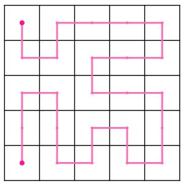

<details>
<summary>flowchart</summary>

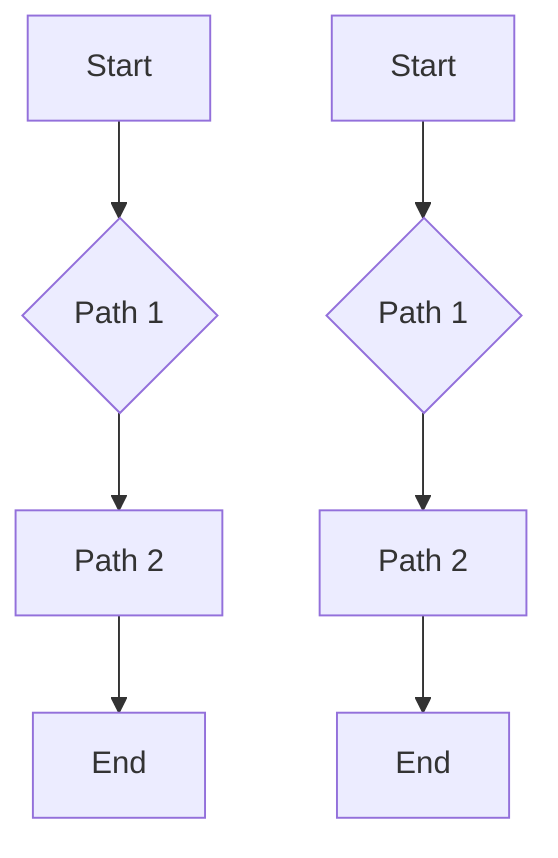
</details>

(a) Hilbert on $5 \times 5$ grid.

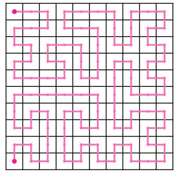

<details>
<summary>natural_image</summary>

Abstract geometric pattern with pink zigzag lines on a grid (no text or symbols)
</details>

(b) Hilbert on 10 × 10 grid.

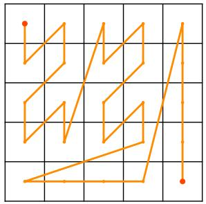

<details>
<summary>natural_image</summary>

Abstract geometric line drawing on grid background with no text or symbols
</details>

(c) Peano on $5 \times 5$ grid.

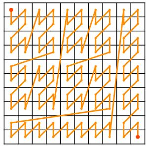

<details>
<summary>natural_image</summary>

Abstract geometric pattern with orange lines and dots on a grid (no text or symbols)
</details>

(d) Peano on 10 × 10 grid.  
Figure 6. Extension of Hilbert and Peano curves: Visualization of how Hilbert and Peano curves extend to non-power-of-2 grids.

Peano Curve The Peano curve, also called Z-order curve or Morton curve, (Peano, 1890) is a recursive scanning approach that preserves spatial locality by interleaving the binary representations of the row and column indices. It is particularly wellsuited to square grids of size $2 ^ { p } \times 2 ^ { p }$ as the bit structure of the coordinates aligns naturally with the recursive subdivisions of the curve.

For $H = W = 2 ^ { p }$ , let $( i , j ) \in \{ 0 , \ldots , 2 ^ { p } - 1 \} ^ { 2 }$ be the pixel coordinates, and we can write their binary expansions:

$$
i = \sum_ {k = 0} ^ {n - 1} i _ {k} \cdot 2 ^ {k}, \quad j = \sum_ {k = 0} ^ {n - 1} j _ {k} \cdot 2 ^ {k} \quad \text { with } i _ {k}, j _ {k} \in \{0, 1 \} \tag {23}
$$

$$
F _ {\text { p   e   a   n   o }} (i, j) = \text { interleave\_bits } (i, j) = \sum_ {k = 0} ^ {p - 1} \left(j _ {k} \cdot 2 ^ {2 k + 1} + i _ {k} \cdot 2 ^ {2 k}\right) \tag {24}
$$

As it can be constructed bitwise, it is computationally efficient and commonly used in applications like image tiling, spatial databases, and quadtree indexing.

Remark: While the Peano and Hilbert curves are most naturally defined on square grids with power-of-two dimensions, they can be easily extended to arbitrary image sizes by truncating higher-order bits, using padding, clipping, or floating-point mapping techniques (Cerveny, 2024; Sasidharan et al., 2015). In Figure 6, we visually show how to extend these curves to non-power-of-2 cases with codes provided in Appendix G.3.

Flattening with transposed curves Standard SFCs are typically defined over fixed scans using row-major or column-major orderings. To increase the diversity of locality preserving patterns without incurring additional cost, we introduce transposed variants of standard SFCssuch as column-major Snake or vertical $\mathrm { Z i g - Z a g }$ . These variants simply swap coordinates during traversal. We define the flattened image under a transposed curve as:

$$
\mathbf {X} _ {c ^ {\top}} [ n ] = \mathcal {I} [ i, j ] \quad \text { where } \quad n = F _ {c ^ {\top}} (i, j) = F _ {c} (j, i). \tag {25}
$$

Accordingly, we expand our curve set to include these rotated versions, resulting in the final VIOLIN curve set:

$$
\mathcal {C} = \{\text { Snake }, \text { Zig - Zag }, \text { Peano }, \text { Hilbert }, \text { Snake } ^ {\top}, \text { Zig - Zag } ^ {\top}, \text { Peano } ^ {\top}, \text { Hilbert } ^ {\top} \} \tag {26}
$$

## B.4. Locality via decay mask

Decay mask structure An example of a 4 × 4 causal decay mask with non-input-dependent decay factor, as used in RetNet (Sun et al., 2023b), is

$$
\mathbf {M} _ {\text {Causal}} = \left[ \begin{array}{c c c c} 1 & & & \\ \gamma & 1 & & \\ \gamma^ {2} & \gamma & 1 & \\ \gamma^ {3} & \gamma^ {2} & \gamma & 1 \end{array} \right], \quad \mathbf {M} _ {\text {Causal}} [ i, j ] = \left\{ \begin{array}{l l} \gamma^ {i - j} & i \geq j \\ 0 & i <   j \end{array} \right. \tag {27}
$$

As seen in the causal decay mask above, the decay masking the attention $\mathbf { M } _ { \mathrm { C a u s a l } } [ i , j ]$ depends only on the difference between i and $j ,$ specifically $\mathbf { M } _ { \mathrm { C a u s a l } } [ i , j ] = \gamma ^ { | i - j | }$ . which reflects the locality information in the causal decay mask.

As an extension for bidirectional tasks, such as image classification, the causal mask can be extended to a full Toeplitz decay mask, as shown in (Afzal et al., 2025):

$$
\mathbf {M} = \left[ \begin{array}{c c c c} 1 & \gamma & \gamma^ {2} & \gamma^ {3} \\ \gamma & 1 & \gamma & \gamma^ {2} \\ \gamma^ {2} & \gamma & 1 & \gamma \\ \gamma^ {3} & \gamma^ {2} & \gamma & 1 \end{array} \right], \quad \mathbf {M} [ i, j ] = \gamma^ {| i - j |} \tag {28}
$$

in this case, the attention between each pair of tokens i and $j$ is masked based on their distance $| i - j | .$ Additionally, the decay factor $0 < \gamma < 1$ is bounded between to ensure that $\mathbf { M } [ i , j ]$ does not overflow and remains stable (Orvieto et al., 2023).

Extrapolation capabilities of decay mask The decay mask M can easily be extrapolated beyond the context length (Dao & Gu, 2024; Sun et al., 2023b) because $\mathbf { M } [ i , j ] = \gamma ^ { | i - j | }$ is independent of the sequence length. This is especially useful since we can change the resolution of images during inference without needing to interpolate or extrapolate the position embeddings (Dosovitskiy et al., 2021; Caron et al., 2021). This capability is particularly valuable when generating videos for object tracking in VIOLIN DINO.

## B.5. Efficiency of Toeplitz decay mask

As mentioned in the background Appendix B.2, the decay parameter $\gamma$ can be input dependent as well, which means that it is extracted for each token as:

$$
\gamma_ {i} = g (\mathbf {W} _ {\gamma} \mathbf {x} _ {i}), \quad \mathbf {M} [ i, j ] = \gamma_ {j} \gamma_ {j + 1}... \gamma_ {i} = \prod_ {k = j} ^ {i} \gamma_ {k} \tag {29}
$$

with $g ( . )$ being a bounded function such that $0 < g ( x ) < 1$ (i.e. sigmoid). This results in each element of the decay mask $\mathbf { M } [ i , j ]$ representing the cumulative product of decay contributions from all tokens between positions i and $j$ leading to input-dependent decay masks. While these type of masks can offer finer-grained control, they are slower to train, requiring $\mathcal { O } ( \log ( N ) )$ time points to compute (Gu & Dao, 2024; Dao & Gu, 2024), consume more memory, and must be dynamically constructed during inference. In contrast, input-independent decay masks such as the one used in VIOLIN are much more efficient. We adopt the decay mask in VIOLIN as it is faster to train, memory-efficient (requiring only a single learned scalar γ per curve), and eliminates the need for recomputation during inference. This simple scalar-based design still performs effectively and achieves strong results in practice (Afzal et al., 2025).

## B.6. Connections of VIOLIN to other models

As VIOLIN is inspired by the forget gate (also known as the decay mask) in Linear Transformers, it shares strong connections with these models and their adaptations for vision tasks. Below, we highlight some of the most relevant connections:

RMT RMT (Fan et al., 2024) also introduces a decay mask (via Manhattan distance) to enhance the spatial awareness of ViTs, addressing a similar challenge. However, it differs from VIOLIN in key ways. RMT uses only a single flattening strategy and applies a fixed distance metric (Manhattan), while VIOLIN generates multiple masks based on different SFCs and defines a KacMurdockSzeg (KMS) matrix for the decay. Architecturally, VIOLIN is a modular attention mechanism that can be plugged into various ViT backbones, whereas RMT is a standalone model. We also conducted an ablation using the Manhattan distance decay as in RMT, and found it underperforms compared to VIOLIN . Detailed results are provided in Table 13.

FoX FoX, or Forgetting Transformer (Lin et al., 2025), is designed for causal sequence modeling, specifically to capture long-range dependencies in the NLP domain. It uses an input-dependent causal decay mask, as shown in equation (29), which differs significantly from VIOLIN in both application domain and mask design. Moreover, the perspective central to VIOLIN , based on flattening and scanning via space-filling curves, does not appear in FoX, as it operates in the NLP setting rather than vision tasks.

Vision Linear Transformer This class includes models such as Vision LSTM (Alkin et al., 2024), Vision Mamba (Zhu et al., 2024), and VMamba (Liu et al., 2024b), which are related to VIOLIN due to their use of different scanning strategies primarily based on the Z-curve in both standard and transposed (horizontal and vertical) directions. However, these models significantly differ from VIOLIN in architecture, as they are based on SSMs like Mamba (Gu & Dao, 2024) or other linear attention mechanisms, rather than softmax-based Transformers. In contrast, VIOLIN is a softmax-based masked attention module that can be easily integrated into various ViT backbones. In this study, we apply VIOLIN to DeiT, DeiT-III, and DINO as representative examples.

MAE Masked Auto Encoders (MAE) (He et al., 2022) apply random input masking as a pretraining objective, dropping patches and training the model to reconstruct them. This masking affects only the input and does not influence attention computation. In contrast, VIOLIN applies structured masking within the attention mechanism, using decay masks based on space-filling curves to rescale attention scores, without dropping tokens or reconstructing inputs. It serves as a spatial inductive bias, guiding the model to attend more to nearby regions without altering the input or training objective.

## C. Proofs

## C.1. Attention is permutation equivariant

Claim C.1. Attention without positional embeddings is permutation-equivariant. That is,

$$
A (\pi (\mathbf {X})) = \pi (A (\mathbf {X})) \tag {30}
$$

where $A ( \cdot )$ is the output of the attention mechanism, and $\pi ( \cdot )$ denotes a permutation of the sequence.

Proof. Let $\mathbf { X } \in \mathbb { R } ^ { N \times d }$ be the input sequence with N tokens and model dimension d. The attention is defined as

$$
\mathbf {Q} = \mathbf {X} \mathbf {W} _ {Q}, \quad \mathbf {K} = \mathbf {X} \mathbf {W} _ {K}, \quad \mathbf {V} = \mathbf {X} \mathbf {W} _ {V}, \quad A (\mathbf {X}) = \text { Softmax } \left(\frac {\mathbf {Q} \mathbf {K} ^ {\top}}{\sqrt {d}}\right) \mathbf {V}. \tag {31}
$$

Let π be a permutation of the input sequence, represented by a permutation matrix $\mathbf { P } \in \mathbb { R } ^ { N \times N }$ such that $\pi ( \mathbf { X } ) = \mathbf { P } \mathbf { X }$ and $\mathbf { P } \mathbf { P } ^ { \top } = \mathbf { I }$ . Then

$$
\pi (\mathbf {Q}) = \mathbf {P} \mathbf {X} \mathbf {W} _ {Q} = \mathbf {P} \mathbf {Q}, \quad \pi (\mathbf {K}) = \mathbf {P} \mathbf {K}, \quad \pi (\mathbf {V}) = \mathbf {P} \mathbf {V}. \tag {32}
$$

Now compute the attention on the permuted input

$$
A (\pi (\mathbf {X})) = \text { Softmax } \left(\frac {(\mathbf {P Q}) (\mathbf {P K}) ^ {\top}}{\sqrt {d}}\right) (\mathbf {P V}) = \text { Softmax } \left(\frac {\mathbf {P Q K} ^ {\top} \mathbf {P} ^ {\top}}{\sqrt {d}}\right) \mathbf {P V} \tag {33}
$$

Since softmax is applied row-wise and permutation matrices preserve row-wise operations, we can factor P out

$$
A (\pi (\mathbf {X})) = \mathbf {P} \operatorname{Softmax} \left(\frac {\mathbf {Q K} ^ {\top}}{\sqrt {d}}\right) \mathbf {P} _ {\mathbf {I}} ^ {\top} \mathbf {P V} = \mathbf {P} \operatorname{Softmax} \left(\frac {\mathbf {Q K} ^ {\top}}{\sqrt {d}}\right) \mathbf {V} = \mathbf {P} A (\mathbf {X}) = \pi (A (\mathbf {X})) \tag {34}
$$

Thus, attention is permutation-equivariant in the absence of positional embeddings.

## C.2. SFCs in decay mask are a distance metric

Claim C.2. Let $\mathbf { X } _ { c _ { 1 } } ~ \in ~ \mathbb { R } ^ { N \times d }$ be the flattened image using a space-filling curve $c _ { 1 }$ , with the sequence indexed by $i , j , k \in \{ 0 , \ldots , N - 1 \}$ . Any permutation $\pi _ { c _ { 2 } }$ , corresponding to a new flattening order defined by a different curve $c _ { 2 } .$ when applied to ${ \bf X } _ { c _ { 1 } }$ , induces a new sequence order. In this new order, the term $| \pi ( i ) - \pi ( j ) |$ | satisfies the non-negativity, identity of indiscernibles, symmetry and triangle inequality properties of a distance metric between tokens i and $j .$

Proof. To show that $| \pi ( i ) - \pi ( j ) |$ | is a valid distance metric, we verify that it satisfies the standard properties of a metric:

Non-negativity: For all $i , j$ , we have

$$
\left| \pi (i) - \pi (j) \right| \geq 0 \tag {35}
$$

since absolute values are always non-negative.

Identity of indiscernibles:

$$
\left| \pi (i) - \pi (j) \right| = 0 \iff \pi (i) = \pi (j) \iff i = j \tag {36}
$$

because π is a permutation (i.e., a bijective function), so $\pi ( i ) = \pi ( j )$ implies $i = j$

Symmetry:

$$
\left| \pi (i) - \pi (j) \right| = \left| \pi (j) - \pi (i) \right| \tag {37}
$$

by the symmetry of absolute value.

Triangle inequality: For any $i , j , k \in \{ 0 , \ldots , N - 1 \}$ ,

$$
\left| \pi (i) - \pi (j) \right| \leq \left| \pi (i) - \pi (k) \right| + \left| \pi (k) - \pi (j) \right| \tag {38}
$$

holds due to the triangle inequality property of absolute values.

Therefore, $| \pi ( i ) - \pi ( j ) |$ satisfies all the conditions of a distance metric. This property is particularly interesting because the term $| \pi ( i ) - \pi ( j )$ | appears as the exponent in the decay mask, leading to $\begin{array} { r } { \dot { \bf M _ { { c } _ { 2 } } } \dot { [ i , j ] } = \dot { \gamma } ^ { | \pi ( i ) - \pi ( j ) | } } \end{array}$ . As a result, taking the logarithm of the decay mask yields a distance matrix, log $( \mathbf { M } _ { c _ { 2 } } [ i , j ] ) = | \pi ( i ) - \pi ( j ) | \cdot \log ( \gamma )$ thus, $\mathrm { l o g } ( \mathbf { M } _ { c _ { 2 } } )$ is a scaled distance matrix, encoding relative positional distances under the permutation induced by curve $c _ { 2 }$ . □

## C.3. VIOLIN SFC flattening only reflects in decay mask

Claim C.3. Let the input sequence flattened using a base space-filling curve $( \mathrm { e . g . , Z – c u r v e } )$ be denoted by $\mathbf { X } \in \mathbb { R } ^ { N \times d }$ , and let the output of VIOLIN attention be $\mathbf { Y } \in \mathbb { R } ^ { N \times d }$ , computed as:

$$
\mathbf {Y} = \text { Softmax } \left(\alpha \frac {\mathbf {Q} \mathbf {K} ^ {\top}}{\sqrt {d}} \odot \mathbf {M}\right) \mathbf {V} \tag {39}
$$

where $\mathbf { M } \in \mathbb { R } ^ { N \times N }$ is the base decay mask with entries $\mathbf { M } [ i , j ] = \gamma ^ { | i - j | }$ .

Now, let ${ \mathbf X } _ { c } = \pi _ { c } ( { \mathbf X } )$ be the input sequence reordered using a space-filling curve c, with permutation $\pi _ { c }$ . Then, the output of the VIOLIN attention for the permuted input $\mathbf { X } _ { c } ,$ re-ordered back to the original (basis) input order, is given by:

$$
\widetilde {\mathbf {Y}} = \text { Softmax } \left(\alpha \frac {\mathbf {Q} \mathbf {K} ^ {\top}}{\sqrt {d}} \odot \pi_ {c} (\mathbf {M})\right) \mathbf {V} \tag {40}
$$

where $\pi _ { c } ( \mathbf { M } ) = \mathbf { M } [ \pi _ { c } ( i ) , \pi _ { c } ( j ) ]$ denotes the decay mask permuted along both rows and columns according to the curve c.

Proof. It is easy to see that flattening the input I into a sequence ${ \bf X } _ { c _ { 1 } }$ using any space-filling curve $c _ { 1 }$ defines a one-to-one mapping from the 2D grid to a 1D sequence. Therefore, there exists a permutation $\pi _ { c _ { 1 } \to c _ { 2 } }$ and an associated permutation matrix $\mathbf { P } _ { c _ { 1 }  c _ { 2 } }$ such that the sequence obtained by flattening with another curve $c _ { 2 }$ is given by:

$$
\mathbf {X} _ {c _ {2}} = \mathbf {P} _ {c _ {1} \rightarrow c _ {2}} \mathbf {X} _ {c _ {1}} \tag {41}
$$

Now, considering $c _ { 1 }$ as the z-Curve (our basis flattening), and renaming $c _ { 2 }$ simply as $c ,$ we simplify the notation as follows:

$$
\pi_ {c _ {1} \rightarrow c _ {2}} = \pi_ {c}, \quad \mathbf {P} _ {c _ {1} \rightarrow c _ {2}} = \mathbf {P} _ {c}, \quad \mathbf {X} _ {c} = \pi_ {c} (\mathbf {X}) = \mathbf {P} _ {c} \mathbf {X} \tag {42}
$$

From equation (32) we know that permuting the input X will result in permutation of query, key and value matrices so for the input $\mathbf { X } _ { c }$ the attention presented at equation (39) is re-written as:

$$
\begin{array}{l} \mathbf {Y} _ {c} = \operatorname{Softmax} \left(\alpha \frac {\pi_ {\mathbf {c}} (\mathbf {Q}) \pi_ {\mathbf {c}} (\mathbf {K}) ^ {\top}}{\sqrt {d}} \odot \mathbf {M}\right) \pi_ {\mathbf {c}} (\mathbf {V}) \\ = \operatorname{Softmax} \left(\alpha \frac {\mathbf {P} _ {\mathbf {c}} \mathbf {Q} (\mathbf {P} _ {\mathbf {c}} \mathbf {K}) ^ {\top}}{\sqrt {d}} \odot \mathbf {M}\right) \mathbf {P} _ {\mathbf {c}} \mathbf {V} \\ = \text { Softmax } \left(\alpha \frac {\mathbf {P} _ {\mathbf {c}} (\mathbf {Q} \mathbf {K} ^ {\top}) \mathbf {P} _ {\mathbf {c}} ^ {\top}}{\sqrt {d}} \odot \mathbf {M}\right) \mathbf {P} _ {\mathbf {c}} \mathbf {V} \tag {43} \\ \end{array}
$$

a)  
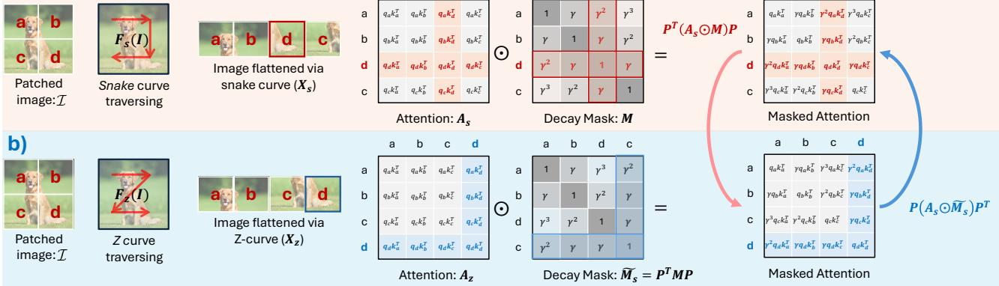

<details>
<summary>flowchart</summary>

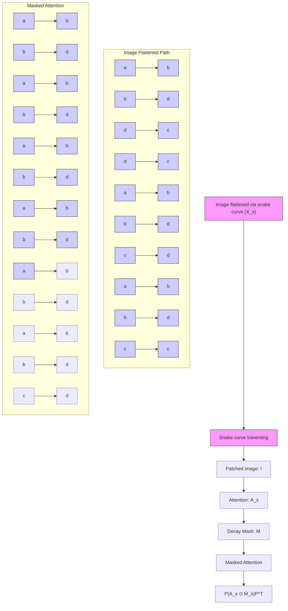
</details>

Figure 7. Effect of SFCs on flattened Image: Visually showing the equivalence between a) Permuting the input sequence according to c (e.g., the snake curve) to get $\mathbf { X } _ { S }$ , multiplying the attention ${ \bf A } _ { S }$ with the original decay mask defined in the basis curve M (e.g., Z-curve in our study), and then reordering the output back to the original and b) Calculating attention $\mathbf { A } _ { z }$ with basis curve ordered $\bar { \mathbf { X } } _ { z } .$ , using a permuted decay mask $\widetilde { \mathbf { M } _ { c } }$ .

by multiplying $\mathbf { P } _ { c } \mathbf { P } _ { c } ^ { \top }$ to both sides of M we have:

$$
\mathbf {Y} _ {c} = \text { Softmax } \left(\alpha \frac {\mathbf {P} _ {c} (\mathbf {Q K} ^ {\top}) \mathbf {P} _ {c} ^ {\top}}{\sqrt {d}} \odot \mathbf {P} _ {c} \mathbf {P} _ {c} ^ {\top} \mathbf {M P} _ {c} \mathbf {P} _ {c} ^ {\top}\right) \mathbf {P} _ {c} (\mathbf {V}) \tag {44}
$$

$$
= \text { Softmax } \left(\alpha \frac {\mathbf {P} _ {\mathbf {c}} (\mathbf {Q} \mathbf {K} ^ {\top}) \mathbf {P} _ {\mathbf {c}} ^ {\top}}{\sqrt {d}} \odot \mathbf {P} _ {c} (\mathbf {P} _ {c} ^ {\top} \mathbf {M} \mathbf {P} _ {c}) \mathbf {P} _ {c} ^ {\top}\right) \mathbf {P} _ {\mathbf {c}} (\mathbf {V}) \tag {45}
$$

Since the multiplication with the decay mask and the softmax operation are element-wise $( \mathrm { i . e . , }$ , applied row-wise for each query), the permutation matrices $\mathbf { P } _ { c }$ and $\mathbf { P } _ { c } ^ { \top }$ can be factored out of the attention computation. This results in the following expression:

$$
\mathbf {Y} _ {c} = \mathbf {P} _ {c} \text { Softmax } \left(\alpha \frac {\mathbf {Q K} ^ {\top}}{\sqrt {d}} \odot \mathbf {P} _ {c} ^ {\top} \mathbf {M P} _ {c}\right) \underset {\mathbf {I}} {\mathbf {P} _ {c} ^ {\top} \mathbf {P} _ {c}} \mathbf {V} = \mathbf {P} _ {c} \text { Softmax } \left(\alpha \frac {\mathbf {Q K} ^ {\top}}{\sqrt {d}} \odot \underbrace {\mathbf {P} _ {c} ^ {\top} \mathbf {M P} _ {c}} _ {\pi_ {c} ^ {- 1} (\mathbf {M})}\right) \mathbf {V} \tag {46}
$$

Since the order of ${ \bf Y } _ { c }$ corresponds to the permuted input $\mathbf { X } _ { c } ,$ , we can recover the output in the original (basis) order by applying the inverse permutation, i.e., multiplying by $\bar { \mathbf { P } _ { c } ^ { \top } }$ . Therefore, the final output $\widetilde { \mathbf { Y } } _ { \mathbf { c } }$ aligned with the original input X is:

$$
\widetilde {\mathbf {Y}} _ {\mathbf {c}} = \mathbf {P} _ {c} ^ {\top} \mathbf {Y} _ {c} = \text { Softmax } \left(\alpha \frac {\mathbf {Q} \mathbf {K} ^ {\top}}{\sqrt {d}} \odot \mathbf {P} _ {c} ^ {\top} \mathbf {M} \mathbf {P} _ {c}\right) \mathbf {V} \tag {47}
$$

This confirms that applying attention to a permuted input using the base decay mask is equivalent to applying attention to the original input with a permuted (reordered) decay mask $\pi _ { c } ^ { - 1 } ( \mathbf { M } ) = \mathbf { P } _ { c } ^ { \top } \mathbf { M } \mathbf { \bar { P } } _ { }$ c .


This proof is also visualized in Figure 7, illustrating that applying attention using a permuted decay mask based on curve c (e.g., the snake curve in the figure) is equivalent to permuting the input sequence according to c, computing attention with the original decay mask defined in the basis curve (e.g., Z-curve in our study), and then reordering the output back to the original sequence order.

Disclaimer In practice, it is unnecessary to explicitly define a permutation function π or construct a matrix P. The reordering can be efficiently achieved by simply storing the corresponding indices. P and π are used for mathematical clarity and formalism only.

## C.4. Averaging multiple SFC decay masks

Claim C.4. Let $C = \{ c _ { 1 } , \ldots , c _ { m } \}$ be a fixed set of space-filling curves, each inducing a permutation $\pi _ { c }$ over $N$ tokens and a decay mask

$$
\mathbf {M} _ {c} [ i, j ] = \gamma^ {| \pi_ {c} (i) - \pi_ {c} (j) |}, \quad \gamma \in (0, 1). \tag {48}
$$

Define the averaged decay mask

$$
\overline {{{\mathbf {M}}}} [ i, j ] = \frac {1}{m} \sum_ {c \in C} \mathbf {M} _ {c} [ i, j ]. \tag {49}
$$

Then, for any token pair $( i , j )$ , averaging over C yields:

1. (Reduced sensitivity to individual curves) The influence of any single curve on $\overline { { \mathbf { M } } } [ i , j ]$ is bounded by $1 / m$  
2. (Robust preservation of local interactions) If at least a fraction $p \in ( 0 , 1 ]$ ] of curves satisfy

$$
\left| \pi_ {c} (i) - \pi_ {c} (j) \right| \leq r, \tag {50}
$$

then the averaged mask obeys the lower bound

$$
\overline {{{\mathbf {M}}}} [ i, j ] \geq p \gamma^ {r}. \tag {51}
$$

Consequently, M provides a more stable and expressive affinity prior than any single-curve mask.

Proof. We prove the two statements.

(1) Reduced sensitivity to individual curves: Fix $( i , j )$ and define $x _ { c } : = \mathbf { M } _ { c } [ i , j ] \in ( 0 , 1 ]$ . By definition,

$$
\overline {{{\mathbf {M}}}} [ i, j ] = \frac {1}{m} \sum_ {c \in C} x _ {c}. \tag {52}
$$

If the value of one curve $c ^ { \star }$ is perturbed from $x _ { c ^ { \star } } \mathrm { \ t o \ } x _ { c ^ { \star } } ^ { \prime }$ , while all others remain fixed, then

$$
\left| \overline {{\mathbf {M}}} ^ {\prime} [ i, j ] - \overline {{\mathbf {M}}} [ i, j ] \right| = \frac {1}{m} \left| x _ {c ^ {*}} ^ {\prime} - x _ {c ^ {*}} \right| \leq \frac {1}{m}, \tag {53}
$$

since $x _ { c } \in ( 0 , 1 ]$ for all c. Thus, no single curve can dominate the averaged mask, and the effect of any outlier curve is suppressed by a factor $1 / m$ .

(2) Robust preservation of local interactions: Assume that for at least pm curves in C we have $| \pi _ { c } ( i ) - \pi _ { c } ( j ) | \leq r .$ For each such curve,

$$
\mathbf {M} _ {c} [ i, j ] = \gamma^ {| \pi_ {c} (i) - \pi_ {c} (j) |} \geq \gamma^ {r}, \tag {54}
$$

since $\gamma \in ( 0 , 1 )$ and $\gamma ^ { t }$ is monotonically decreasing for $t \geq 0$

Summing over all curves yields

$$
\sum_ {c \in C} \mathbf {M} _ {c} [ i, j ] \geq p m \cdot \gamma^ {r}. \tag {55}
$$

Dividing by m gives

$$
\overline {{{\mathbf {M}}}} [ i, j ] \geq p \gamma^ {r}, \tag {56}
$$

which establishes the claimed lower bound.

Finally, observe that each single-curve mask $\mathbf { M } _ { c }$ depends on one induced one-dimensional distance $| \pi _ { c } ( i ) - \pi _ { c } ( j ) |$ , whereas the averaged mask M aggregates multiple such distances. Hence, M encodes interactions that are consistently local across several curves while attenuating interactions that appear local only under a single permutation. This yields a more stable and expressive affinity structure. □

Remark Although the above result is stated for a fixed set of curves C, it also has a natural probabilistic interpretation. If the curves in C are viewed as samples from an underlying distribution over space-filling curve orderings, then the averaged mask $\overline { { \mathbf { M } } } [ i , j ]$ ] corresponds to the empirical mean of the random variable $\bar { \mathbf { M } _ { c } } [ i , j ] = \bar { \gamma } | \pi _ { c } ( i ) - \pi _ { c } ( j ) |$ . In this case, standard results imply that the variance of the empirical mean decreases proportionally to $1 / | C |$ . This interpretation provides additional intuition: averaging multiple curves reduces the variability induced by any single ordering and yields a more stable estimate of spatial affinity.

## D. Futher design details

In this section, we outline key design choices made in the implementation of VIOLIN models.

## D.1. Initialization

Since $\gamma _ { c } = \mathrm { s i g m o i d } ( \beta _ { c } )$ is exponentiated over the sequence length in the VIOLIN decay mask, it is important to initialize it close to 1, which is also highlighted in the Linear Transformer literature (Orvieto et al., 2023; Sun et al., 2023b). For pretraining VIOLIN models, we initialize $\beta _ { c }$ uniformly in the range [5, 9], which corresponds to $\gamma _ { c } \in ( 0 . 9 8 2 0 , 0 . 9 9 9 8 )$ . This ensures that the initial mask values $\mathbf { M } _ { c } [ i , j ] \in ( 0 . 0 3 , 0 . 9 6 2 )$ for $N = 1 9 6$ , maintaining a stable and controlled decay. For numerical results on the effect of initialization, see Appendix E.4.

During full fine-tuning, we initialize the model using the pretrained baseline. In this setting, since the query/key/value weights $\mathbf { W _ { Q } } , \mathbf { W _ { K } } , \mathbf { W _ { V } }$ are already trained during pretraining and VIOLIN attention is introduced and used only at finetuning, we initialize the scaling factor α using a Gaussian distribution centered at 1 to allow for smooth adaptation. For $\beta _ { c } ,$ we use a uniform initialization in the range [15, 20]. This setup avoids a steep drop in attention scores while allowing the model to gradually adapt to the newly introduced decay mask $\mathbf { M } _ { \mathrm { V I O L I N } }$ . All other initialization settings in VIOLIN exactly follow those of the original baselines without any modification.

All other configurations, such as data augmentation, optimizer, initialization, model parameters, and training setups are kept exactly the same as in the original baselines, with no modifications.

## D.2. Adaptation of VIOLIN to various architectures

VIOLIN attention supports both the use of a classification token and Global Average Pooling (GPA) (Lin et al., 2014a; Lu et al., 2022). For pretraining of DeiT models, we remove the classification token and instead apply Global Average Pooling (GAP). The attention module is replaced with VIOLIN attention, while the rest of the model, including positional embeddings, layer normalization, and other components, remains unchanged, see Appendix E.5 for details. For fine-tuning the classification token remains intact.

In the DINO setting, both teacher and student models are initialized with VIOLIN attention, with all other weights handled as usual. Due to the multi-crop training, the attention module encounters varying sequence lengths. However, since the construction of $\mathbf { M } _ { \mathrm { V I O L I N } }$ naturally adapts to any sequence length, this poses no issue.

To accommodate the classification token, we modify the corresponding rows and columns of $\mathbf { M } _ { \mathrm { V I O L I N } }$ by setting $\gamma _ { \mathrm { c l s } } = 1$ . We also experimented with a learnable $\gamma _ { \mathrm { c l s } } \in [ 0 , 1 ]$ but observed no significant performance gains. The rest of the model structure follows the original DINO architecture.

VIOLIN with hierarchical and convolutional architectures Hierarchical transformer architectures such as Swin (Liu et al., 2021) and convolutional-transformer hybrids like PVT (Wang et al., 2021) differ fundamentally from vanilla ViTs in how attention is computed. Instead of applying full attention across the entire sequence, they restrict the receptive field by using windowed or spatially localized attention, often combined with hierarchical feature maps. This design introduces locality explicitly into the architecture, reducing the need for additional spatial priors such as those provided by SFCs.

In such settings, applying SFC-guided decay masks becomes problematic for two main reasons. First, SFCs are meaningful when attention spans the entire sequence of image patches, since the curve defines a global traversal order. In hierarchical models, however, attention is restricted to local windows or pyramid levels, where the notion of a global SFC ordering no longer applies. Second, many of these architectures already incorporate inductive biases (through localized windows, shifting strategies, or convolutional layers), so introducing additional SFC-based priors could interfere with rather than complement their design.

Thus, VIOLIN is best suited for standard ViTs and related architectures where attention is fully global, the sequence is flattened in a fixed order (commonly the Z-curve), and inductive biases are otherwise minimal. In contrast, hierarchical or convolutional variants already bake spatial priors directly into their architecture, making SFC-based masking redundant or ill defined.

Consistent with our analysis, when we integrated VIOLIN into Swin at tiny and small scales during pretraining, we achieved minimal accuracy improvements of 0.2% and 0.1%, respectively, as shown in Table 10. The VIOLIN mask is applied at every stage and layer, with each mask being independently learned and unique to its respective layer. The remaining architecture follows the original Swin model structure.

Table 10. Pretraining of Swin models: The performance of baseline model is compared against VIOLIN for ImageNet pretraining. Changes with respect to the baseline are shown inside (·) next to the accuracies.

<table><tr><td rowspan="2">Model</td><td colspan="2">Top-1 Accuracy (%)</td></tr><tr><td>Baseline</td><td>VIOLIN</td></tr><tr><td>Swin-T</td><td>81.3</td><td>81.5 (+0.2)</td></tr><tr><td>Swin-S</td><td>83.0</td><td>83.1 (+0.1)</td></tr></table>

VIOLIN with video transformers Video transformers operate on spatiotemporal tokens, and VIOLIN can be incorporated into these models in a straightforward way because it only rescales the attention scores between tokens. There are two natural ways to extend VIOLIN :

1. Spatial-only SFCs (2D per frame) The same 2D SFCs used for images can be applied independently to the (H, W ) grid of each frame, while keeping the temporal dimension unchanged. This provides a per-frame spatial prior and mirrors the image setting.  
2. Full spatiotemporal SFCs (3D) Following Definition 2.1, SFCs naturally generalize to arbitrary dimensions. Thus, we can define 3D SFCs over the full (T, H, W ) grid (e.g., 3D Hilbert or 3D Morton curves) and compute distances based on each token’s original spatiotemporal position. The resulting decay masks encourage locality across both space and time. Masks can be computed once over the full grid and then indexed to the visible token subset, similar to how positional embeddings are handled in VideoMAE (Wang et al., 2023).

Both approaches are fully compatible with video MAE-style training: they require no changes to masking or reconstruction objectives, they can be applied to both encoder and decoder, and they provide a meaningful structural prior, especially under high masking ratios where positional structure becomes crucial. Overall, extending VIOLIN to video models is a promising direction for future work, as spatiotemporal SFCs may offer strong inductive bias with minimal additional cost.

## E. Ablation studies

In this section, we provide comprehensive ablation studies on various elements of VIOLIN . For all ablations, we utilize different scales of DeiT models and we keep the training recipe the same. We use a patch size of 16 and a resolution 224 × 224 for each one of the models.

## E.1. Positional embeddings

To evaluate the impact of positional embeddings, we pretrain the VIOLIN DeiT-B model both with and without them, see Table 11. The results indicate that positional embeddings provide a performance boost, leading us to retain the original positional embedding configurations of the base models.

Table 11. Ablation on positional embeddings (PE): The performance of the baseline model with PE is compared against VIOLIN with (w) and without (wo) PE. Changes with respect to the baseline are shown inside (·) next to the accuracies.

<table><tr><td rowspan="2">Model</td><td colspan="3">Top-1 Accuracy (%)</td></tr><tr><td>Baseline</td><td>VIOLIN w PE</td><td>VIOLIN wo PE</td></tr><tr><td>DeiT-B</td><td>81.8</td><td>81.9 (+0.1)</td><td>81.5 (-0.3)</td></tr></table>

## E.2. Alternative curve configurations

We examine the individual contribution of each curve to the overall performance. To do so, we pretrain DeiT-S using all possible combinations of the four curves, resulting in $2 ^ { 4 } = 1 6$ variations. The accuracies of each configuration are presented in Table 12. Note that whenever a curve has is used, the transposed version is also included. In other words, if the snake curve is included, its transposed variant Snake⊤ is also utilized.

Table 12. Ablation on the effect of each curve: The performance of the baseline model is compared against VIOLIN with different curve combinations. ✔ indicates the curse is in the set, whereas ✗ means it is not. Changes with respect to the baseline are shown inside (·) next to the accuracies.

<table><tr><td>Model</td><td>Snake Curve</td><td>Zig-Zag Curve</td><td>Hilbert Curve</td><td>Peano Curve</td><td>Top-1 Acc (%)</td></tr><tr><td rowspan="15">DeiT-S (Baseline)</td><td>X</td><td>X</td><td>X</td><td>X</td><td>79.9</td></tr><tr><td>√</td><td>X</td><td>X</td><td>X</td><td>80.0 (+0.1)</td></tr><tr><td>X</td><td>√</td><td>X</td><td>X</td><td>80.2 (+0.3)</td></tr><tr><td>X</td><td>X</td><td>√</td><td>X</td><td>79.9 —</td></tr><tr><td>X</td><td>X</td><td>X</td><td>√</td><td>80.4 (+0.5)</td></tr><tr><td>√</td><td>√</td><td>X</td><td>X</td><td>80.3 (+0.4)</td></tr><tr><td>√</td><td>X</td><td>√</td><td>X</td><td>80.4 (+0.5)</td></tr><tr><td>√</td><td>X</td><td>X</td><td>√</td><td>80.3 (+0.4)</td></tr><tr><td>X</td><td>√</td><td>√</td><td>X</td><td>80.3 (+0.4)</td></tr><tr><td>X</td><td>√</td><td>X</td><td>√</td><td>80.5 (+0.6)</td></tr><tr><td>X</td><td>X</td><td>√</td><td>√</td><td>80.2 (+0.3)</td></tr><tr><td>√</td><td>√</td><td>√</td><td>X</td><td>80.4 (+0.5)</td></tr><tr><td>√</td><td>√</td><td>X</td><td>√</td><td>80.4 (+0.5)</td></tr><tr><td>√</td><td>X</td><td>√</td><td>√</td><td>80.5 (+0.6)</td></tr><tr><td>X</td><td>√</td><td>√</td><td>√</td><td>80.5 (+0.6)</td></tr><tr><td>VIOLIN DeiT-S (Ours)</td><td>√</td><td>√</td><td>√</td><td>√</td><td>80.7 (+0.8)</td></tr></table>

Table 13. Ablation on different curve configurations: The performance of the baseline model is compared against VIOLIN with different curve configurations: only original curves $( { \mathcal { C } } _ { \mathrm { n o r m a l } } ) .$ , only transposed curves $( \mathcal { C } _ { \mathrm { t r a n s p o s e d } } )$ , only Z-curve, Manhattan distance-based mask and random curves. Changes with respect to the baseline are shown inside (·) next to the accuracies.

<table><tr><td rowspan="2">Model</td><td colspan="7">Top-1 Accuracy (%)</td></tr><tr><td>Baseline</td><td>VIOLIN</td><td> $C_{normal}$ </td><td> $C_{transposed}$ </td><td>Z-curve</td><td>Manhattan</td><td>Random</td></tr><tr><td>DeiT-S</td><td>79.8</td><td>80.7 (+0.9)</td><td>80.3 (+0.5)</td><td>80.4 (+0.6)</td><td>80.5 (+0.7)</td><td>80.4 (+0.6)</td><td>×</td></tr></table>

The results reveal that while certain curve combinations yield more substantial improvements than others, each curve contributes meaningfully to the overall performance. Thus, we retain all four curves in the VIOLIN configuration, leveraging their complementary spatial information.

Additionally, we explore several alternative configurations, as detailed in Table 13. For instance, we evaluate the use of only the four original curves referred as $\mathcal { C } _ { \mathrm { n o r m a l } }$ (snake, zig-zag, Hilbert, and Peano) and only their rotated counterparts Ctransposed (snake⊤, zig-zag⊤, Hilbert⊤, and Peano⊤). We also test using only the default Z-curve ordering, which results in a 0.7% accuracy gain.

Moreover, we define relative distances using a Manhattan mask, inspired by RMT (Fan et al., 2024). Lastly, we experiment with a set of randomized SFCs, where the flattened image is shuffled with a random fixed order across all layers and heads. This model fails to converge to a meaningful accuracy. This further emphasizes the importance of a structured SFC as the unstructured curves do not allow model to capture meaningful information from the data.

## E.3. Alternative masking strategies

Another critical design choice is the masking strategy. We compare VIOLIN , which follows the structure $S ( \mathbf { A } ^ { \prime } \odot \mathbf { M } )$ , where S denotes the row-wise softmax operation, $\mathbf { A } ^ { \prime } = \alpha \frac { \mathbf { Q } \mathbf { K } ^ { \top } } { \sqrt { d } }$ $\mathbf { M } = \mathbf { M } _ { \mathrm { V I O L I N } }$ indicate that the $S ( \mathbf { A } ^ { \prime } \odot \mathbf { M } )$ configuration outperforms all other masking alternatives.

Table 14. Ablation on masking strategies: The performance of the baseline model is compared against VIOLIN with different masking methods: $S ( \mathbf { M } + \mathbf { A } ^ { \prime } ) , S ( \mathbf { A } ^ { \prime } ) + \mathbf { M } , \mathbf { \Xi } \breve { S } ( \mathbf { A } ^ { \prime } ) \odot \mathbf { \hat { M } }$ , and $S ( \mathbf { A } ^ { \prime } \odot ( \mathbf { I } + \mathbf { M } ) )$ . Changes with respect to the baseline are shown inside (·) next to the accuracies.

<table><tr><td rowspan="2">Model</td><td colspan="6">Top-1 Accuracy (%)</td></tr><tr><td>Baseline</td><td>VIOLIN</td><td> $S(M + A')$ </td><td> $S(A') + M$ </td><td> $S(A') \odot M$ </td><td> $S(A' \odot (I + M))$ </td></tr><tr><td>DeiT-S</td><td>79.8</td><td>80.7 (+0.9)</td><td>80.1 (+0.3)</td><td>80.5 (+0.7)</td><td>80.5 (+0.7)</td><td>79.1 (-0.7)</td></tr></table>

## E.4. Other design elements

Furthermore, in Table 15, we illustrate the impact of additional design choices described in Appendix D, such as initialization and the scaling parameter α. Additionally, we assess the effect of fixing $\gamma _ { c }$ at a constant value of 0.9996 instead of learning it. The results indicate that proper initialization and a learnable $\gamma _ { c }$ are essential for achieving accuracy gains, while the scaling parameter α primarily contributes to training stability, particularly in larger models. We have also tried using learned per-curve weights instead of averaging, which did not improve the performance. We believe that since the $\gamma _ { c }$ values act as a selection mechanism (see previous discussions), the added learnable weight makes the optimization harder without additional benefits.

Table 15. Ablation on other elements of VIOLIN : The performance of the baseline model is compared against VIOLIN with and without certain design elements: initialization, scaling factor α and learned $\gamma _ { c } . \nu$ indicates it is included in the model, whereas $x$ means it is not. Changes with respect to the baseline are shown inside (·) next to the accuracies.

<table><tr><td>Model</td><td>Initialization</td><td>Scaling</td><td>Learned  $\gamma_c$ </td><td>Top-1 Acc (%)</td></tr><tr><td rowspan="4">DeiT-S (Baseline)</td><td>X</td><td>X</td><td>X</td><td>79.9</td></tr><tr><td>X</td><td>√</td><td>√</td><td>80.0 (+0.1)</td></tr><tr><td>√</td><td>X</td><td>√</td><td>80.7 (+0.8)</td></tr><tr><td>√</td><td>√</td><td>X</td><td>80.3 (+0.4)</td></tr><tr><td>VIOLIN DeiT-S (Ours)</td><td>√</td><td>√</td><td>√</td><td>80.7 (+0.8)</td></tr></table>

## E.5. Global Average Pooling (GAP)

Considering the output of the attention mechanism for each token in the last layer, we can write

$$
\mathbf {y} _ {i} = \sum_ {j = 1} ^ {N} \frac {\exp \left(\mathbf {q} _ {i} ^ {\top} \mathbf {k} _ {j}\right)}{\sum_ {j ^ {\prime} = 1} ^ {N} \exp \left(\mathbf {q} _ {i} ^ {\top} \mathbf {k} _ {j ^ {\prime}}\right)} \mathbf {v} _ {j}. \tag {57}
$$

When the classification (CLS) token is used, the sequrnce length becomes $N + 1$ where the first token is the CLS. When comparing the use of a global average pooling (GAP) (Lin et al., 2014a; Lu et al., 2022) head versus a CLS head with a decay mask, the attention outputs are extracted as follows

$$
\mathbf {y} _ {\mathrm{CLS}} = \sum_ {j = 1} ^ {N + 1} \frac {\exp \left(\left(\mathbf {q} _ {C L S} ^ {\top} \mathbf {k} _ {j}\right) \mathbf {M} [ C L S , j ]\right)}{\sum_ {j ^ {\prime} = 1} ^ {N + 1} \exp \left(\left(\mathbf {q} _ {C L S} ^ {\top} \mathbf {k} _ {j ^ {\prime}}\right) \mathbf {M} [ C L S , j ^ {\prime} ]\right)} \mathbf {v} _ {j}, \tag {58}
$$

$$
\mathbf {y} _ {\text { GAP }} = \frac {1}{N} \sum_ {i = 1} ^ {N} \sum_ {j = 1} ^ {N} \frac {\exp \left((\mathbf {q} _ {i} ^ {\top} \mathbf {k} _ {j}) \mathbf {M} [ i , j ]\right)}{\sum_ {j ^ {\prime} = 1} ^ {N} \exp \left((\mathbf {q} _ {i} ^ {\top} \mathbf {k} _ {j ^ {\prime}}) \mathbf {M} [ i , j ^ {\prime} ]\right)} \mathbf {v} _ {j}. \tag {59}
$$

As shown, in the case of the CLS token, the model only requires the attention distribution and relative distances with respect to the CLS token. In our setup, this reduces to $\mathbf { M } [ C L S , j ] = 1$ , (or a a learned parameter $\beta _ { C L S }$ . By contrast, the GAP formulation is more expressive, as it aggregates attention information across all tokens. Importantly, the inclusion of the relative distance decay mask $\mathbf { M } [ i , j ]$ for all tokens makes GAP more effective in constructing the final representation. Therefore, similar to Vision SSMs such as Vision LSTM and Hydra (Alkin et al., 2024; Hwang et al., 2024), pooling-based outputs align naturally with spatially informed attention. Note that this calculation holds for the last layer only, the remaining layers utilize the mask fully.

VIOLIN attention supports both the use of a classification token and GPA. To assess the role of the classification token versus GAP with the VIOLIN mask, we pretrain all three scales of DeiT and report results in Table 16. While GAP often yields slightly better compatibility with VIOLIN , the improvements cannot be attributed to pooling alone, the gains are additive.

Most importantly, VIOLIN is not dependent on GAP. In DINO pretraining and VTAB-1K fine-tuning, where the cls token is retained, VIOLIN still improves performance. This confirms that the benefits arise from the spatial priors introduced by VIOLIN , not from the choice of pooling strategy.

Table 16. Ablation on GAP: The performance of baseline model and VIOLIN is compared when they both have CLS or uses GAP. Baseline† indicates results taken from (Chu et al., 2023). Changes with respect to the baseline, original model with CLS, are shown inside (·) next to the accuracies.

<table><tr><td rowspan="3">Model</td><td colspan="4">Top-1 Accuracy (%)</td></tr><tr><td colspan="2">CLS</td><td colspan="2">GAP</td></tr><tr><td>Baseline</td><td>VIOLIN</td><td> $Baseline^†$ </td><td>VIOLIN</td></tr><tr><td>DeiT-T</td><td>72.2</td><td>72.3 (+0.2)</td><td>72.6</td><td>73.0 (+0.8)</td></tr><tr><td>DeiT-S</td><td>79.8</td><td>80.1 (+0.3)</td><td>80.2</td><td>80.7 (+0.9)</td></tr></table>

## F. Additional results

## F.1. Pretraining of larger models

As discussed in Appendix B.1, when both model capacity and training data are sufficiently large, ViTs can implicitly learn spatial biases directly from data. In such scenarios, the relative contribution of VIOLIN is naturally smaller, as seen in the DeiT and DINO base scale pretraining results in Table 17, which show only marginal gains. This is expected and lies beyond the primary scope of our work, which focuses on small models and data-scarce settings where inductive biases are most impactful.

It is important to note that smaller gains at scale do not diminish the relevance of VIOLIN for larger models. In fact, our fine-tuning experiments (Section 4.1, Table 18) demonstrate that when data is limited, spatial priors provided by VIOLIN substantially improve performance, even for models with hundreds of millions of parameters. This highlights that VIOLIN remains valuable in practice, not by competing with scale, but by enhancing efficiency and adaptability in data-constrained regimes.

Table 17. Pretraining results of larger models on ImageNet-1K: Comparison of the top-1 accuracies of baseline models with their VIOLIN counterparts. The values in parentheses (·) indicate the accuracy difference compared to the baseline. The best performance between each pair of models is highlighted in bold. For DINO models, both KNN and linear probe evaluations are reported and (300) indicate the number of training epochs. (Left) Supervised, (Right) Self-supervised training.

<table><tr><td rowspan="2">Model</td><td rowspan="2"># Param.</td><td colspan="2">Top-1 Accuracy (%)</td></tr><tr><td>Baseline</td><td>VIOLIN</td></tr><tr><td>DeiT-B</td><td>86M</td><td>81.8</td><td>81.9 (+0.1)</td></tr></table>

<table><tr><td rowspan="2">Model</td><td rowspan="2"></td><td rowspan="2"># Param.</td><td colspan="2">Top-1 Accuracy (%)</td></tr><tr><td>Baseline</td><td>VIOLIN</td></tr><tr><td rowspan="2">DINO-B (300)</td><td>KNN</td><td rowspan="2">86M</td><td>76.1</td><td>76.1 (—)</td></tr><tr><td>Linear</td><td>78.2</td><td>78.4 (+0.2)</td></tr></table>

## F.2. Fine-tuning of VIOLIN pretrained models

We fine-tune the VIOLIN DeiT, and DINO pretrained models from Section 4.2 and Appendix F.1 on the VTAB-1K dataset. The accuracies for each category and the overall average are presented in Table 18, alongside the baseline accuracies of the baseline fine-tuned models. We observe that VIOLIN increases the performance across all models and scales compared to original baselines. DeiT,and DINO models achieve impressive improvements of up to 1.92% with up to 2.87% improvement in individual categories. We note that similar to Table 3 in this setting, Structured group shows the highest accuracy gain. This further shows the broad applicability of VIOLIN , enhancing diverse architectures with close to zero computational overhead.

Notably, we compare Table 3 and Table 18, fine-tuning with an mask learned only during fine-tuning for all models yields better performance in different tasks compared to pretraining with it. We hypothesize that this is because the model starts with generic pretrained representations and gains additional flexibility by learning spatial structure tailored specifically to the downstream task. This is particularly advantageous when the target task differs substantially from the pretraining domain.

Table 18. Fine-tuning results of pretrained VIOLIN models on VTAB-1K: Comparison of the top-1 accuracies of baseline models and their pretrained VIOLIN counterparts across the VTAB-1K benchmark. The three task groups are abreviated as NAT. = Natural, SPE. = Specialized, and STR. = Structured. The values in parentheses (·) indicate the accuracy difference compared to the baseline. The best performance within each model pair is highlighted in bold.

<table><tr><td rowspan="3">Model</td><td rowspan="3">Param.</td><td colspan="8">Top-1 Accuracy (%)</td></tr><tr><td colspan="4">Baseline</td><td colspan="4">VIOLIN</td></tr><tr><td>NAT.</td><td>SPE.</td><td>STR.</td><td>Avg.</td><td>NAT.</td><td>SPE.</td><td>STR.</td><td>Avg.</td></tr><tr><td>DeiT-T</td><td>5M</td><td>69.56</td><td>82.34</td><td>53.57</td><td>65.52</td><td>70.71 (+1.15)</td><td>82.64 (+0.30)</td><td>54.52 (+0.95)</td><td>66.41 (+0.89)</td></tr><tr><td>DeiT-S</td><td>22M</td><td>73.64</td><td>84.30</td><td>53.44</td><td>67.38</td><td>75.24 (+1.60)</td><td>84.87 (+0.57)</td><td>56.31 (+2.87)</td><td>69.30 (+1.92)</td></tr><tr><td>DeiT-B</td><td>86M</td><td>76.93</td><td>85.52</td><td>57.00</td><td>70.35</td><td>76.54 (-0.39)</td><td>85.44 (-0.08)</td><td>58.90 (+1.90)</td><td>70.99 (+0.64)</td></tr><tr><td>DINO-S</td><td>22M</td><td>75.35</td><td>85.09</td><td>60.65</td><td>71.21</td><td>76.29 (+0.94)</td><td>85.75 (+0.66)</td><td>60.61 (-0.04)</td><td>71.68 (+0.47)</td></tr><tr><td>DINO-B</td><td>86M</td><td>77.50</td><td>85.77</td><td>58.47</td><td>71.23</td><td>77.82 (+0.32)</td><td>85.83 (+0.06)</td><td>58.77 (+0.30)</td><td>71.49 (+0.26)</td></tr></table>

## F.3. Multi-resolution classification

Following Heo et al. (2024), we test the resolution scalability of VIOLIN models. We present the top-1 accuracies for DeiT-S, and DeiT-B models across input resolutions ranging from 144 to 512 in Figure 8. We use bicubic interpolation for all positional embeddings (Heo et al., 2024). In the top plot, we observe that although VIOLIN without positional embeddings performs slightly worse than the baseline at the training resolution (224), it begins to outperform the baseline at higher resolutions. In the second and third plots, where VIOLIN is combined with positional embeddings, for most resolutions, VIOLIN preserves or expands the performance gap compared to baselines. These results suggest that the decay mask used in VIOLIN generalizes effectively to higher resolutions, making it a resolution-robust enhancement for ViTs.

Another interesting application of context extrapolation is video understanding. Following Caron et al. (2021), we generate a segmentation video using VIOLIN DINO-B model. While the training resolution is 224, for video, VIOLIN extends to 768 × 432 resolution. Some frames are provided in Figure 9 and the full video can be found in our GitHub repository.

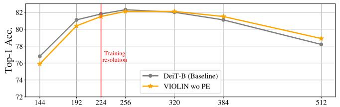

<details>
<summary>line chart</summary>

| Training resolution | DeiT-B (Baseline) | VIOLIN wo PE |
| ------------------- | ----------------- | ------------ |
| 144                 | 76.8              | 76.0         |
| 192                 | 81.0              | 80.5         |
| 224                 | 81.8              | 81.5         |
| 256                 | 82.0              | 82.0         |
| 320                 | 81.8              | 81.8         |
| 384                 | 81.0              | 81.0         |
| 512                 | 78.0              | 79.0         |
</details>

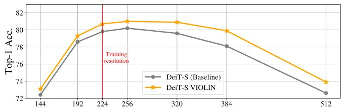

<details>
<summary>line chart</summary>

| Training resolution | DeiT-S (Baseline) | DeiT-S VIOLIN |
| ------------------- | ----------------- | ------------- |
| 144                 | 72.5              | 73.0          |
| 192                 | 78.5              | 79.5          |
| 224                 | 80.0              | 80.5          |
| 256                 | 80.5              | 81.0          |
| 320                 | 79.5              | 80.5          |
| 384                 | 78.0              | 79.5          |
| 512                 | 72.5              | 74.0          |
</details>

82 Figure 8. Resolution expansion: Top-1 accuracies of DeiT-B (top), DeiT-S (middle) and DeiT-III-S (bottom) models and their VIOLIN 80 c. counterparts at different resolutions on ImageNet. Training resolution of 224 is highlighted in red.

## F.4. Additional visualizations

144 192 224 256 320 384 512 72 In Figure 10, we present the 1D flattened sequences of the patched image (a), corresponding to the curves illustrated in Resolution Figure 1. In Figure 11 we visualize the mask pattern for a middle pixel under the snake curve for different values of γ. As expected, when $\gamma \approx 1$ , the head attends broadly across the entire image, whereas smaller $\gamma$ values produce a much more localized receptive field, emphasizing spatial neighbors. Figure 12 compares attention heatmaps of DeiT and VIOLIN models, fine-tuned on Structured group datasets. Figure 13 visualizes the attention heatmaps of the VIOLIN DeiT-B model using various images. We adopt the average diagonal visualization strategy as proposed in (Liu et al., 2024b).

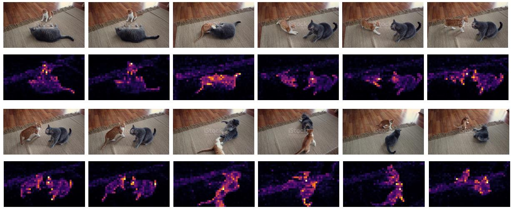  
Figure 9. Video undertanding: Frame by frame video understanding of VIOLIN -DINO in base scale. The full video and generation codes are also included in the github repository of VIOLIN .

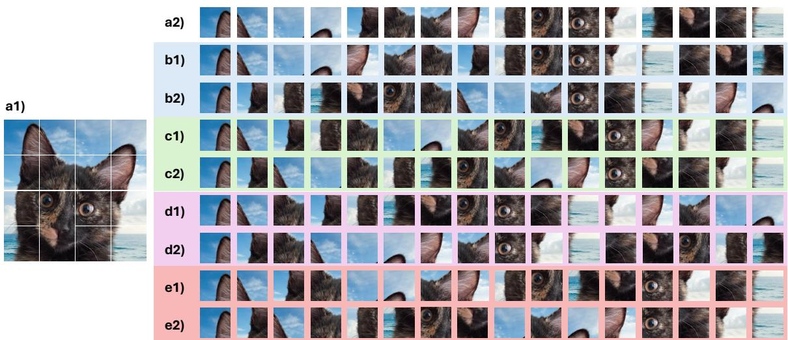  
Figure 10. Flattened Space Filling Curve paths: Examples of flattened images with different traversal paths followed in VIOLIN . (a1) Original patchedimage. (a2) Z-curve (b1) Snake curve, (b2) Transposed Snake curve, (c1) Zig-zag curve, (c2) Transposed Zig-zag curve, (d1) Hilbert curve, (d2) Transposed Hilbert curve, (e1) Peano curve, (e2) Transposed Peano curve.

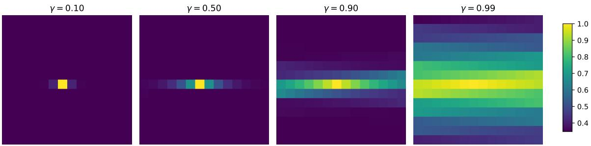  
Figure 11. Effect of γ on the decay mask: Visualization of the decay mask for a central pixel under the Snake curve for different values of γ. Larger γ values yield more global attention, while smaller γ restrict the effective receptive field to local regions.

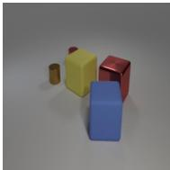

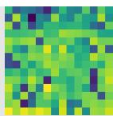

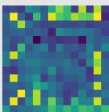

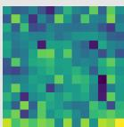

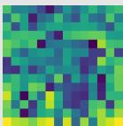

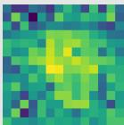

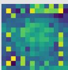

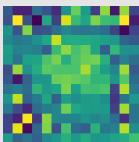

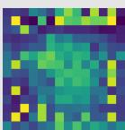

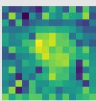

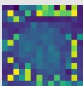

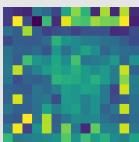

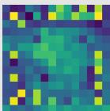

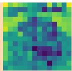

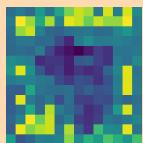

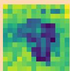

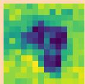

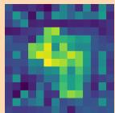

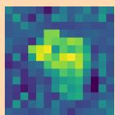

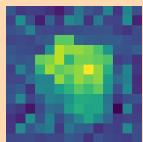

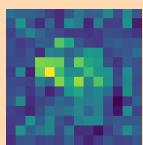

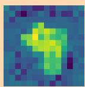

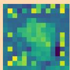

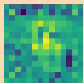


  
Figure 13. Attention heatmap visualization of VIOLIN DeiT-B: The average diagonal of the masked attention is visualized followed by (Liu et al., 2024b).

## F.5. Details and individual results on VTAB-1K dataset

VTAB (Zhai et al., 2019) contains 19 tasks which cover a broad spectrum of domains and semantics that are grouped into three sets: NATURAL, SPECIALIZED, and STRUCTURED.

The NATURAL group represents natural images and classical vision problems. The group includes Caltech101, CIFAR-100, DTD, Flowers102, Pets, Sun397, and SVHN datasets.

The SPECIALIZED group also contains images of the world, but they are captured through specialist equipment. These images have different invariances to those in the NATURAL tasks. It includes Resisc45 and EuroSAT, Patch Camelyon, and Diabetic Retinopathy datasets.

The STRUCTURED group assesses comprehension of the structure of a scene, for example, object counting, or 3D depth prediction. Most of the tasks are generated from simulated environments, whose structure is easy for a human, but their domain differs greatly to datasets like ImageNet. It includes Clevr count and distance, dSprites location and orientation, SmallNORB, DMLab, and KITTI. In Tables 19 to 21, we present the accuracy scores of each model on all VTAB-1K datasets.

Table 19. VTAB Results-Natural Subset: Individual scores for each dataset.

<table><tr><td></td><td>Model</td><td>CIFAR</td><td>Caltech101</td><td>DTD</td><td>Flowers102</td><td>Pets</td><td>SVHN</td><td>Sun397</td></tr><tr><td rowspan="27">Natural</td><td>DeiT-T</td><td>48.36</td><td>86.9</td><td>63.97</td><td>86.43</td><td>87.14</td><td>78.28</td><td>35.87</td></tr><tr><td>VIOLIN DeiT-T</td><td>51.21</td><td>86.48</td><td>64.75</td><td>87.24</td><td>86.77</td><td>83.16</td><td>35.38</td></tr><tr><td>DeiT-T  $\odot M_{VIOLIN}$ </td><td>51.17</td><td>87.8</td><td>65.43</td><td>89.17</td><td>86.75</td><td>85.78</td><td>37.17</td></tr><tr><td>DeiT-S</td><td>57.38</td><td>89.06</td><td>68.83</td><td>91.09</td><td>91.13</td><td>75.82</td><td>42.19</td></tr><tr><td>VIOLIN DeiT-S</td><td>60.71</td><td>88.06</td><td>68.33</td><td>91.12</td><td>91.19</td><td>85.38</td><td>41.93</td></tr><tr><td>DeiT-S  $\odot M_{VIOLIN}$ </td><td>59.6</td><td>89.78</td><td>69.08</td><td>92.5</td><td>91.89</td><td>86.15</td><td>43.45</td></tr><tr><td>DeiT-B</td><td>61.38</td><td>90.33</td><td>69.06</td><td>93.73</td><td>92.43</td><td>85.95</td><td>45.59</td></tr><tr><td>VIOLIN DeiT-B</td><td>63.32</td><td>89.55</td><td>68.37</td><td>92.1</td><td>92.04</td><td>86.22</td><td>44.15</td></tr><tr><td>DeiT-B  $\odot M_{VIOLIN}$ </td><td>61.99</td><td>91.07</td><td>70.14</td><td>93.97</td><td>92.75</td><td>90.22</td><td>45.56</td></tr><tr><td>DeiT-B LoRA</td><td>62.37</td><td>90.07</td><td>69.27</td><td>93.26</td><td>92.3</td><td>90.58</td><td>44.35</td></tr><tr><td>DeiT-B  $\odot M_{VIOLIN}$  LoRA</td><td>65.36</td><td>90.92</td><td>70.62</td><td>93.57</td><td>92.37</td><td>91.86</td><td>45.19</td></tr><tr><td>DeiT-B DoRA</td><td>63.81</td><td>90.78</td><td>69.29</td><td>91.79</td><td>89.95</td><td>88.75</td><td>44.12</td></tr><tr><td>DeiT-B  $\odot M_{VIOLIN}$  DoRA</td><td>66.38</td><td>90.97</td><td>69.82</td><td>92.77</td><td>91.71</td><td>90.26</td><td>44.64</td></tr><tr><td>DeiT-III-S</td><td>59.08</td><td>88.53</td><td>67.09</td><td>91.13</td><td>91.85</td><td>84.65</td><td>43.57</td></tr><tr><td>DeiT-III-S  $\odot M_{VIOLIN}$ </td><td>62.18</td><td>88.78</td><td>69.4</td><td>93.92</td><td>91.35</td><td>89.98</td><td>43.6</td></tr><tr><td>DeiT-III-B</td><td>64.39</td><td>89.56</td><td>70.8</td><td>94.63</td><td>93.38</td><td>87.28</td><td>47.28</td></tr><tr><td>DeiT-III-B  $\odot M_{VIOLIN}$ </td><td>66.77</td><td>89.97</td><td>71.38</td><td>95.53</td><td>93.61</td><td>91.24</td><td>46.19</td></tr><tr><td>DeiT-III-L</td><td>65.16</td><td>87.89</td><td>71.58</td><td>94.39</td><td>93.23</td><td>71.17</td><td>48.65</td></tr><tr><td>DeiT-III-L  $\odot M_{VIOLIN}$ </td><td>66.74</td><td>87.67</td><td>72.34</td><td>95.01</td><td>93.28</td><td>78.7</td><td>48.58</td></tr><tr><td>DeiT-III-H</td><td>64.34</td><td>88.2</td><td>71.22</td><td>94.95</td><td>92.96</td><td>68.76</td><td>48.46</td></tr><tr><td>DeiT-III-H  $\odot M_{VIOLIN}$ </td><td>65.16</td><td>88.18</td><td>71.35</td><td>95.18</td><td>93.33</td><td>72.72</td><td>48.7</td></tr><tr><td>DINO-S</td><td>54.32</td><td>93.95</td><td>68.12</td><td>91.28</td><td>88.62</td><td>90.24</td><td>40.93</td></tr><tr><td>VIOLIN DINO-S</td><td>56.05</td><td>91.95</td><td>69.33</td><td>95.26</td><td>89.62</td><td>91.65</td><td>40.2</td></tr><tr><td>DINO-S  $\odot M_{VIOLIN}$ </td><td>57.38</td><td>90.92</td><td>68.88</td><td>95.18</td><td>89.44</td><td>90.61</td><td>41.45</td></tr><tr><td>DINO-B</td><td>58.57</td><td>93.7</td><td>70.64</td><td>95.84</td><td>90.21</td><td>89.69</td><td>43.86</td></tr><tr><td>VIOLIN DINO-B</td><td>59.96</td><td>92.13</td><td>71.84</td><td>95.69</td><td>90.49</td><td>90.78</td><td>43.83</td></tr><tr><td>DINO-B  $\odot M_{VIOLIN}$ </td><td>62.21</td><td>93.32</td><td>71.58</td><td>96.1</td><td>90.74</td><td>91.74</td><td>44.87</td></tr></table>

Table 20. VTAB Results-Structured Subset: Individual scores for each dataset. SN refers to SmallNorm, and dS represents dSprites.

<table><tr><td></td><td>Model</td><td>CLEVR Count</td><td>CLEVR Dist</td><td>DMLab</td><td>KITTI</td><td>dS Loc</td><td>dS Ori</td><td>SN Azi</td><td>SN Ere</td></tr><tr><td rowspan="27">Structured</td><td>DeiT-T</td><td>71.37</td><td>60.37</td><td>44.26</td><td>78.81</td><td>69.04</td><td>41.86</td><td>30.28</td><td>32.57</td></tr><tr><td>VIOLIN DeiT-T</td><td>72.73</td><td>61.7</td><td>47.98</td><td>79.7</td><td>68.7</td><td>46.11</td><td>25.31</td><td>33.96</td></tr><tr><td>DeiT-T  $\odot M_{VIOLIN}$ </td><td>74.41</td><td>59.84</td><td>46.37</td><td>80.78</td><td>78.32</td><td>50.91</td><td>31.33</td><td>38.05</td></tr><tr><td>DeiT-S</td><td>75.08</td><td>58.15</td><td>45.74</td><td>78.43</td><td>63.3</td><td>48.13</td><td>26.24</td><td>32.48</td></tr><tr><td>VIOLIN DeiT-S</td><td>78.26</td><td>59.25</td><td>49.91</td><td>81.29</td><td>64.63</td><td>53.16</td><td>27.37</td><td>36.59</td></tr><tr><td>DeiT-S  $\odot M_{VIOLIN}$ </td><td>78.87</td><td>59.2</td><td>50.59</td><td>80.4</td><td>73.52</td><td>53.44</td><td>32.48</td><td>37.62</td></tr><tr><td>DeiT-B</td><td>79.01</td><td>60.1</td><td>47.03</td><td>82.61</td><td>66.7</td><td>53.38</td><td>30.87</td><td>36.32</td></tr><tr><td>VIOLIN DeiT-B</td><td>82.6</td><td>61.72</td><td>52.84</td><td>80.97</td><td>68.44</td><td>55.47</td><td>31.72</td><td>37.45</td></tr><tr><td>DeiT-B  $\odot M_{VIOLIN}$ </td><td>81.33</td><td>61.31</td><td>53.93</td><td>83.22</td><td>81.72</td><td>57.28</td><td>35.37</td><td>40.98</td></tr><tr><td>DeiT-B LoRA</td><td>79.1</td><td>60.15</td><td>51.93</td><td>81.25</td><td>78.53</td><td>53.71</td><td>28.28</td><td>32.12</td></tr><tr><td>DeiT-B  $\odot M_{VIOLIN}$  LoRA</td><td>82.36</td><td>63.46</td><td>52.86</td><td>82.18</td><td>78.52</td><td>55.25</td><td>32.21</td><td>39.79</td></tr><tr><td>DeiT-B DoRA</td><td>76.97</td><td>60.62</td><td>50.37</td><td>81.34</td><td>73.34</td><td>54.11</td><td>28.69</td><td>39.43</td></tr><tr><td>DeiT-B  $\odot M_{VIOLIN}$  DoRA</td><td>81.64</td><td>63.29</td><td>51.06</td><td>82.42</td><td>78.65</td><td>56.14</td><td>27.62</td><td>38.89</td></tr><tr><td>DeiT-III-S</td><td>76.53</td><td>57.29</td><td>46.23</td><td>81.81</td><td>58.12</td><td>50.48</td><td>26.33</td><td>26.57</td></tr><tr><td>DeiT-III-S  $\odot M_{VIOLIN}$ </td><td>77.78</td><td>61.9</td><td>54.84</td><td>83.17</td><td>85.91</td><td>59.78</td><td>33.45</td><td>36.07</td></tr><tr><td>DeiT-III-B</td><td>80.54</td><td>61.82</td><td>50.95</td><td>82.7</td><td>60.75</td><td>55.35</td><td>30.36</td><td>31.18</td></tr><tr><td>DeiT-III-B  $\odot M_{VIOLIN}$ </td><td>84.51</td><td>61.92</td><td>55.64</td><td>82.79</td><td>84.06</td><td>60.34</td><td>36.59</td><td>38.4</td></tr><tr><td>DeiT-III-L</td><td>72.99</td><td>53.23</td><td>47.59</td><td>80.78</td><td>50.19</td><td>50.72</td><td>25.21</td><td>30.51</td></tr><tr><td>DeiT-III-L  $\odot M_{VIOLIN}$ </td><td>76.66</td><td>55.64</td><td>50.03</td><td>81.86</td><td>55.42</td><td>57.35</td><td>28.69</td><td>33.91</td></tr><tr><td>DeiT-III-H</td><td>75.17</td><td>55.24</td><td>48.66</td><td>81.11</td><td>41.57</td><td>46.99</td><td>25.15</td><td>31.74</td></tr><tr><td>DeiT-III-H  $\odot M_{VIOLIN}$ </td><td>77.89</td><td>55.96</td><td>50.96</td><td>81.9</td><td>47.85</td><td>55.07</td><td>26.57</td><td>33</td></tr><tr><td>DINO-S</td><td>83.29</td><td>65.03</td><td>53.44</td><td>80.03</td><td>78.72</td><td>48.61</td><td>34.23</td><td>41.87</td></tr><tr><td>VIOLIN DINO-S</td><td>84.19</td><td>63.35</td><td>55.72</td><td>81.43</td><td>75.82</td><td>49.37</td><td>32.92</td><td>42.06</td></tr><tr><td>DINO-S  $\odot M_{VIOLIN}$ </td><td>83.69</td><td>64.23</td><td>55.35</td><td>79.98</td><td>79.42</td><td>49.18</td><td>36.43</td><td>41.61</td></tr><tr><td>DINO-B</td><td>80.93</td><td>62.76</td><td>52.17</td><td>79.23</td><td>69.22</td><td>48.39</td><td>33.73</td><td>41.34</td></tr><tr><td>VIOLIN DINO-B</td><td>81.96</td><td>63.04</td><td>53.45</td><td>79</td><td>72.12</td><td>49.59</td><td>30.29</td><td>40.76</td></tr><tr><td>DINO-B  $\odot M_{VIOLIN}$ </td><td>83.87</td><td>63.65</td><td>55.66</td><td>81.2</td><td>74.14</td><td>54.18</td><td>34.79</td><td>39.27</td></tr></table>

Table 21. VTAB Results-Specialized Subset: Individual scores for each dataset.

<table><tr><td></td><td>Model</td><td>Patch Camelyon</td><td>EuroSAT</td><td>Resisc45</td><td>Diabetic Retinopathy</td></tr><tr><td rowspan="27">Specialized</td><td>DeiT-T</td><td>82.79</td><td>93.53</td><td>80.98</td><td>72.05</td></tr><tr><td>VIOLIN DeiT-T</td><td>82.47</td><td>93.35</td><td>81.3</td><td>73.43</td></tr><tr><td>DeiT-T  $\odot M_{VIOLIN}$ </td><td>84.04</td><td>93.88</td><td>83.23</td><td>73.87</td></tr><tr><td>DeiT-S</td><td>84.08</td><td>94.4</td><td>84.01</td><td>74.72</td></tr><tr><td>VIOLIN DeiT-S</td><td>85.36</td><td>95.41</td><td>83.86</td><td>74.85</td></tr><tr><td>DeiT-S  $\odot M_{VIOLIN}$ </td><td>85.19</td><td>95.02</td><td>85.68</td><td>74.32</td></tr><tr><td>DeiT-B</td><td>85.74</td><td>95.38</td><td>86.37</td><td>74.6</td></tr><tr><td>VIOLIN DeiT-B</td><td>85.62</td><td>95.44</td><td>85.68</td><td>75.02</td></tr><tr><td>DeiT-B  $\odot M_{VIOLIN}$ </td><td>86.74</td><td>95.91</td><td>87.31</td><td>75.2</td></tr><tr><td>DeiT-B LoRA</td><td>86.2</td><td>95.46</td><td>85.72</td><td>75.09</td></tr><tr><td>DeiT-B  $\odot M_{VIOLIN}$  LoRA</td><td>85.9</td><td>95.66</td><td>86.71</td><td>73.73</td></tr><tr><td>DeiT-B DoRA</td><td>85.53</td><td>95.39</td><td>85.21</td><td>74.8</td></tr><tr><td>DeiT-B  $\odot M_{VIOLIN}$  DoRA</td><td>85.92</td><td>95.56</td><td>84.98</td><td>73.35</td></tr><tr><td>DeiT-III-S</td><td>84.57</td><td>93.33</td><td>82.68</td><td>73.94</td></tr><tr><td>DeiT-III-S  $\odot M_{VIOLIN}$ </td><td>85.76</td><td>94.98</td><td>86.43</td><td>74.67</td></tr><tr><td>DeiT-III-B</td><td>86.4</td><td>94.47</td><td>85.83</td><td>74.33</td></tr><tr><td>DeiT-III-B  $\odot M_{VIOLIN}$ </td><td>87.77</td><td>95.8</td><td>87.57</td><td>74.73</td></tr><tr><td>DeiT-III-L</td><td>84.5</td><td>93.28</td><td>84.47</td><td>75.28</td></tr><tr><td>DeiT-III-L  $\odot M_{VIOLIN}$ </td><td>84.54</td><td>94.11</td><td>85.24</td><td>74.83</td></tr><tr><td>DeiT-III-H</td><td>84.64</td><td>92.64</td><td>84.99</td><td>74.46</td></tr><tr><td>DeiT-III-H  $\odot M_{VIOLIN}$ </td><td>84.81</td><td>93.3</td><td>84.66</td><td>74.93</td></tr><tr><td>DINO-S</td><td>86.82</td><td>94.29</td><td>86.13</td><td>73.14</td></tr><tr><td>VIOLIN DINO-S</td><td>87.7</td><td>94.76</td><td>86.59</td><td>73.96</td></tr><tr><td>DINO-S  $\odot M_{VIOLIN}$ </td><td>85.94</td><td>94.9</td><td>86.17</td><td>74.26</td></tr><tr><td>DINO-B</td><td>87.02</td><td>94.45</td><td>87.05</td><td>74.55</td></tr><tr><td>VIOLIN DINO-B</td><td>87.57</td><td>94.46</td><td>87.25</td><td>74.03</td></tr><tr><td>DINO-B  $\odot M_{VIOLIN}$ </td><td>87.81</td><td>95.44</td><td>87.96</td><td>74.54</td></tr></table>

## F.6. Comparison against other locality methods.

There are many methods for enhancing locality in plain ViTs. To compare these approaches with VIOLIN , we start from the same pretrained DeiT-B model, add each locality mechanism on top of it, and fine-tune all models under the exact same protocol. This ensures that every method begins from an identical initialization. The results show that while all methods offer some improvement, VIOLIN achieves the strongest gains. Below, we detail how each method is incorporated and initialized to preserve the pretrained model at the start of fine-tuning, and we report results in Tables 22 to 24.

Swin RPB Swin transformers (Liu et al., 2021) introduces locality two ways, by partitioning the feature map into shifted windows, and with relative position biases (RPB) that encode spatial offsets inside each window. These biases give the attention mechanism information about relative spatial relationships within a window, improving performance on vision tasks where nearby pixels are correlated. To incorporate RPB into a pretrained global-attention ViT, we add a learnable bias term $\mathbf { B } \in \mathbb { R } ^ { N \times N }$ as in equation (60) where $\mathbf { B } [ i , j ]$ depends on the relative position of the tokens i and j.

$$
\mathbf {Y} = \text { Softmax } \left(\frac {\mathbf {Q} \mathbf {K} ^ {\top}}{\sqrt {d}} + \mathbf {B}\right) \mathbf {V}. \tag {60}
$$

By initializing B with zeros, the modified attention reduces exactly to the original attention. This guarantees that adding the Swin-RPB does not alter the models capabilities and new positional biases can be learned during fine-tuning.

2D Relative Position Encoding (iRPE) iRPE (Wu et al., 2021) add locality into attention, by adding learnable bias terms based on the 2-D relative position of tokens. For any pair of tokens $( i , j )$ , the offset $\Delta p _ { i j }$ is mapped through a bucketing function to an index $b _ { i j }$ , which selects a bias embedding from a table $\dot { R } \in \mathbb { R } ^ { B \times H }$ . Depending on the chosen attachment mode, this embedding is added to queries, keys or values (e.g., $\hat { k } _ { j } = k _ { j } + R _ { b _ { \cdot _ { j } } } )$ and the attention scores are calculated using this new parameters. To integrate iRPE into a pretrained ViT without disturbing its learned representations, we initialize all bucket embeddings to zero,

$$
R _ {b} = 0 \forall b
$$

so that the queries/keys/values are not changed at the start of finetuning. This ensures that the model initially behaves exactly like the pretrained backbone, while the RPE parameters gradually learn non-zero spatial biases during training.

LocalVit LocalVit (Li et al., 2025) enhances locality inside the feed-forward network (FFN) rather than attention. It replaces the MLP with a depthwise-convolutional residual branch. This allows each token to mix information with its spatial neighbors, giving the transformer an inductive bias similar to CNNs while preserving the global interactions of self-attention. For LocalViT, we gate the convolutional branch with a learnable scalar initialized to zero, and initialize the depthwise conv as an identity kernel (center=1, others=0). This allows the modified architecture to behave exactly the same as the pretrained model at the first step, enabling smooth fine-tuning and gradual learning of locality information.

VIOLIN variations Additionally, we evaluate several ablations discussed in previous sections, including an additive version of MVIOLIN , Manhattan-distance masking, a single-curve variant (MPeano), and random-curve masking $( \mathbf { M } _ { \mathrm { R a n d o m } } )$ , under the same finetuning protocol for completeness. These results further highlight the contributions of using multiple SFCs rather than relying on any single locality pattern.

Table 22. VTAB Results-Natural Subset: Individual scores for each dataset for different locality-enforcing methods.

<table><tr><td>Model</td><td>CIFAR</td><td>Caltech101</td><td>DTD</td><td>Flowers102</td><td>Pets</td><td>SVHN</td><td>Sun397</td></tr><tr><td>Additive  $M_{VIOLIN}$ </td><td>63.64</td><td>91.11</td><td>69.27</td><td>93.6</td><td>92.6</td><td>90.46</td><td>44.28</td></tr><tr><td>Swin RPB</td><td>63.72</td><td>90.75</td><td>70.16</td><td>94.15</td><td>92.66</td><td>90.21</td><td>45.82</td></tr><tr><td>i-RPE-QKV</td><td>65.03</td><td>90.94</td><td>70.12</td><td>93.97</td><td>92.63</td><td>90.32</td><td>45.66</td></tr><tr><td>LocalVit</td><td>65.17</td><td>91.13</td><td>69.57</td><td>93.85</td><td>92.56</td><td>90.26</td><td>45.63</td></tr><tr><td>Manhattan</td><td>59.62</td><td>90.78</td><td>68.03</td><td>92.07</td><td>91.47</td><td>89.81</td><td>42.13</td></tr><tr><td> $M_{Peano}$ </td><td>65.04</td><td>90.78</td><td>69.18</td><td>94.11</td><td>92.61</td><td>90.14</td><td>45.89</td></tr><tr><td> $M_{Random}$ </td><td>65.02</td><td>90.78</td><td>69.02</td><td>94.09</td><td>92.6</td><td>89.74</td><td>45.91</td></tr></table>

Table 23. VTAB Results-Structured Subset: Individual scores for each dataset for different locality-enforcing methods. SN refers to SmallNorm, and dS represents dSprites.

<table><tr><td>Model</td><td>CLEVR Count</td><td>CLEVR Dist</td><td>DMLab</td><td>KITTI</td><td>dS Loc</td><td>dS Ori</td><td>SN Azi</td><td>SN Ere</td></tr><tr><td>Additive  $M_{VIOLIN}$ </td><td>81.08</td><td>62.12</td><td>51.95</td><td>83.26</td><td>80.95</td><td>57.25</td><td>34.76</td><td>39.38</td></tr><tr><td>Swin RPB</td><td>81.42</td><td>61.67</td><td>53.83</td><td>83.17</td><td>81.39</td><td>56.81</td><td>35.42</td><td>38.9</td></tr><tr><td>i-RPE-QKV</td><td>81.25</td><td>61.58</td><td>53.42</td><td>83.12</td><td>81.49</td><td>57.28</td><td>35.13</td><td>38.34</td></tr><tr><td>LocalVit</td><td>81.28</td><td>61.53</td><td>53.43</td><td>82.56</td><td>81.38</td><td>57.6</td><td>35.5</td><td>38.71</td></tr><tr><td>Manhattan</td><td>76.74</td><td>60.73</td><td>50.16</td><td>82.51</td><td>74.69</td><td>55.03</td><td>32.49</td><td>34.57</td></tr><tr><td> $M_{Peano}$ </td><td>81.45</td><td>61.4</td><td>53.59</td><td>83.17</td><td>81.09</td><td>56.98</td><td>34.53</td><td>40.84</td></tr><tr><td> $M_{Random}$ </td><td>81.45</td><td>61.33</td><td>53.36</td><td>82.84</td><td>80.21</td><td>56.98</td><td>34.5</td><td>40.76</td></tr></table>

Table 24. VTAB Results-Specialized Subset: Individual scores for each dataset for different locality-enforcing methods.

<table><tr><td>Model</td><td>Patch Camelyon</td><td>EuroSAT</td><td>Resisc45</td><td>Diabetic Retinopathy</td></tr><tr><td>Additive  $M_{VIOLIN}$ </td><td>86.84</td><td>96.07</td><td>87.62</td><td>74.93</td></tr><tr><td>Swin RPB</td><td>86.17</td><td>95.66</td><td>87.47</td><td>75.37</td></tr><tr><td>i-RPE-QKV</td><td>86.76</td><td>95.72</td><td>87.51</td><td>74.91</td></tr><tr><td>LocalVit</td><td>86.55</td><td>95.85</td><td>87.58</td><td>75.4</td></tr><tr><td>Manhattan</td><td>86.44</td><td>94.93</td><td>86.29</td><td>74.21</td></tr><tr><td> $M_{Peano}$ </td><td>87.13</td><td>95.93</td><td>87.71</td><td>75.56</td></tr><tr><td> $M_{Random}$ </td><td>86.8</td><td>95.57</td><td>87.63</td><td>75.26</td></tr></table>

## F.7. Learned curve order

Motivated by recent work on learned patch orderings (Kutscher et al., 2025), we implemented a learned ordering variant within our framework and trained a DeiT-Tiny model using this learned sequence. The results are shown in Table 25. Although the learned variant underperforms the original VIOLIN mask in this initial experiment, it highlights several promising research directions, such as jointly learning multiple traversal curves, exploring task-adaptive orderings, and studying how different datasets induce specialized spatial structuresall of which may further improve performance and interpretability.

Table 25. Comparison of DeiT-Tiny, VIOLIN, and a learned patch-ordering variant: learned patch orderings (Kutscher et al., 2025) is adapted to VIOLIN framework.

<table><tr><td>Model</td><td>Accuracy (%)</td></tr><tr><td>DeiT-T</td><td>72.2</td></tr><tr><td>VIOLIN</td><td>73.0</td></tr><tr><td>VIOLIN w learned order</td><td>70.1</td></tr></table>

## F.8. Comparison with relative positional encodings in pretraining

VIOLIN and relative positional encodings (RPEs) introduce spatial inductive bias through different mechanisms. As described in Appendix B.4, VIOLIN applies a lightweight multiplicative decay mask, whereas modern RPEs add learned pairwise positional terms to the attention logits and often require additional parameters or architecture-specific modifications. To assess their relationship, in addition to the fine-tuning experiments in Appendix F.6, we include comparisons with several RPE-based locality baselines in both the pretraining settings.

On ImageNet-1K supervised pretraining, VIOLIN achieves competitive performance to several RPE variants while adding significantly fewer FLOPs. For example, on DeiT-S, VIOLIN introduces 5× fewer FLOPs than Transformer-XL and 1.3× fewer FLOPs than iRPE-QK, while obtaining comparable accuracy.

VIOLIN can also be combined with RPEs. On DeiT-T, adding VIOLIN to iRPE-K yields an additional accuracy gain, indicating that the methods introduce complementary inductive information.

Table 26. Comparison of VIOLIN and RPE variants: on DeiT-S pretraining in ImageNet-1K. Results are taken from respective papers of i-RPE (Wu et al., 2021) and Transformer-XL (Dai et al., 2019).

<table><tr><td>Model</td><td>Additional FLOPs (%)</td><td>Top-1 Acc. (%)</td></tr><tr><td>DeiT-S</td><td>-</td><td>79.9</td></tr><tr><td>VIOLIN</td><td>0.7</td><td>80.7</td></tr><tr><td>Transformer-XL</td><td>4.3</td><td>80.8</td></tr><tr><td>iRPE-K</td><td>0.9</td><td>80.9</td></tr><tr><td>iRPE-QK</td><td>2.2</td><td>81.1</td></tr><tr><td>iRPE-QKV</td><td>5.9</td><td>81.4</td></tr></table>

Table 27. Combination of VIOLIN with RPEs: pretraining results on DeiT-T model as baseline, with PRE and with RPE+VIOLIN .

<table><tr><td>Model</td><td>Additional FLOPs (%)</td><td>Top-1 Acc. (%)</td></tr><tr><td>DeiT-T</td><td>-</td><td>72.2</td></tr><tr><td>iRPE-K</td><td>1.7</td><td>73.7</td></tr><tr><td>iRPE-K + VIOLIN</td><td>2.3</td><td>73.9</td></tr></table>

## G. Codes and implementation details

## G.1. Compute resources

Table 28. Compute resources for pertaining: The number of GPUS and approximate training time for each model and scale are provided.

<table><tr><td>Model</td><td># GPUs</td><td>Training time</td></tr><tr><td>DeiT-T</td><td>4</td><td>≈ 17 Hour</td></tr><tr><td>DeiT-S</td><td>4</td><td>≈ 23 Hour</td></tr><tr><td>DeiT-B</td><td>16</td><td>≈ 1.7 Day</td></tr><tr><td>DINO-S</td><td>16</td><td>≈ 3.2 Days</td></tr><tr><td>DINO-B</td><td>16</td><td>≈ 7 Days</td></tr></table>

In Table 28, we report the compute resources required for each of the evaluated models. These numbers also apply to the models used for ablation experiments.

For fine-tuning, we performed 30 runs per dataset for each model (25 for validation and 5 for final evaluation). Each run took between 2 to 10 minutes, and the complete fine-tuning evaluation was completed in approximately 10 days.

All experiments were conducted using a mix of NVIDIA A100 SXM4 80GB, NVIDIA GH200 96GB, and NVIDIA H100 SXM5 80GB GPUs, used interchangeably depending on availability.

## G.2. VTAB-1K hyperparameters

To determine optimal learning rates, we use the VTAB-1K-pytorch repository (Alkin, 2024) and conduct a grid search. Following the original implementation, every dataset is first split into a 800/200 train/validation partition to select the optimal learning rate per dataset using 5 seeds. We then train on the full dataset using 5 random seeds. For each model, we average the top 3 runs to report the final accuracy. The complete list of hyperparameters is provided in Table 29. For parameter-efficient fine-tuning, we again use the same set of hyperparameters and grid search over ranks [2,4,8,16].

## G.3. Codes for curves

In this section, we provide the codes used to create the permutation orders of each SFC in basis of Z-curve. In other words, we define efficiency the indexing needed for the permutation $\pi _ { c } ( . )$ for each curve c used in our study.

## Snake curve

Table 29. Hyperparameters for fine-tuning on VTAB-1K: The same hyperparameters are used for all models, following (Alkin, 2024).

<table><tr><td>Parameter</td><td>Value</td></tr><tr><td>Epochs</td><td>50</td></tr><tr><td>Batch size</td><td>64</td></tr><tr><td>Seeds</td><td>5</td></tr><tr><td>Optimizer</td><td>AdamW</td></tr><tr><td>Learning rate</td><td>[1e-3, 7.5e-4, 5.0e-4, 2.5e-4, 1.0e-4]</td></tr><tr><td>Layer-wise lr deca</td><td>0.65*</td></tr><tr><td>Weight decay</td><td>0.05</td></tr><tr><td>Momentum</td><td> $\beta_1 = 0.9, \beta_2 = 0.999$ </td></tr><tr><td>Learning rate schedule</td><td>linear warmup → cosine decay</td></tr><tr><td>Warmup epochs</td><td>5</td></tr><tr><td>Precision</td><td>mixed bfloat16</td></tr><tr><td>Backend</td><td>torch.autocast</td></tr><tr><td>Data Augmentation</td><td></td></tr><tr><td>Resize</td><td></td></tr><tr><td>interpolation</td><td>bicubic</td></tr><tr><td>size</td><td>224x224</td></tr><tr><td>Normalize</td><td>ImageNet-1K statistics</td></tr></table>

```python
def snake_curve(grid):
    """Returns the elements of the grid in snake order."""
    n_rows, n_cols = grid.shape
    order = []
    for y in range(n_rows):
    if y %
    # Left-to-right for even rows
    order.extend((x, y) for x in range(n_cols))
    else:
    # Right-to-left for odd rows
    order.extend((x, y) for x in reversed(range(n_cols)))
    return order
```

Zig-zag curve  
```python
def zigzag_curve(grid):
    """Returns the elements of the grid in diagonal zig-zag order."""
    n_rows, n_cols = grid.shape
    order = []
    for d in range(n_rows + n_cols - 1):
    if d % 
    r = min(d, n_rows - 1)
    c = d - r
    while r >= 0 and c < n_cols:
    order.append((r, c))
    r -= 1
    c += 1
    else:
    c = min(d, n_cols - 1)
    r = d - c
    while c >= 0 and r < n_rows:
    order.append((r, c))
    c -= 1
    r += 1
    return order
```

Hilbert curve Adapted from (Cerveny, 2024).  
```python
def hilbert_curve(grid):
    rows = len(grid)
    cols = len(grid[0]) if rows > 0 else 0
    return [(x, y) for x, y in gilbert2d(rows, cols)]

def gilbert2d(width, height):
    """
    Generalized Hilbert ('gilbert') space-filling curve for arbitrary-sized 2D rectangular grids. Generates discrete 2D coordinates to fill a rectangle of size (width x height).
    """
    if width >= height:
    yield from generate2d(0, 0, width, 0, 0, height)
    else:
    yield from generate2d(0, 0, 0, height, width, 0)

def sgn(x):
    return -1 if x < 0 else (1 if x > 0 else 0)

def generate2d(x, y, ax, ay, bx, by):
    w = abs(ax + ay)
    h = abs(bx + by)
    (dax, day) = (sgn(ax), sgn(ay)) # unit major direction
    (dbx, dby) = (sgn(bx), sgn(by)) # unit orthogonal direction
    if h == 1:
    # trivial row fill
    for i in range(0, w):
    yield(x, y)
    (x, y) = (x + dax, y + day)
    return
    if w == 1:
    # trivial column fill
    for i in range(0, h):
    yield(x, y)
    (x, y) = (x + dbx, y + dby)
    return
    (ax2, ay2) = (ax//2, ay//2)
    (bx2, by2) = (bx//2, by//2)
    w2 = abs(ax2 + ay2)
    h2 = abs(bx2 + by2)
    if 2*w > 3*h:
    if (w2 % 
    # prefer even steps
    (ax2, ay2) = (ax2 + dax, ay2 + day)
    # long case: split in two parts only
    yield from generate2d(x, y, ax2, ay2, bx, by)
    yield from generate2d(x+ax2, y+ay2, ax-ax2, ay-ay2, bx, by)
else:
    if (h2 % 
    # prefer even steps
    (bx2, by2) = (bx2 + dbx, by2 + dby)
    # standard case: one step up, one long horizontal, one step down
    yield from generate2d(x, y, bx2, by2, ax2, ay2)
    yield from generate2d(x+bx2, y+by2, ax, ay, bx-bx2, by-by2)
    yield from generate2d(x+(ax-dax)+(bx2-dbx), y+(ay-day)+(by2-dby),
    -bx2, -by2, -(ax-ax2), -(ay-ay2))
```

Peano curve Adapted from (Schubotz, 2021; Prater).  
```python
def interleave_bits(x, y):
    """
    Interleave the bits of two integers (x, y) to compute Morton order.
    """
    def split_bits(value):
    result = 0
    for i in range(32): # Support up to 32-bit integers
    result |= ((value >> i) & 1) << (2 * i)
    return result

    return split_bits(x) | (split_bits(y) << 1)

def peano_curve(grid):
    """Returns the elements of the grid in diagonal morton/peano order."""
    n_rows, n_cols = grid.shape
    order = []

    for y in range(n_rows):
    for x in range(n_cols):
    morton_key = interleave_bits(x, y)
    order.append((morton_key, x, y))

    # Sort by Morton key to achieve the Morton curve order
    order.sort(key=lambda pair: pair[0])
    return [(x, y) for _, x, y in order]
```

G.4. Code of efficient decay mask  
```python
def Casual_Decay_Mask(b_i, N):
    idx = torch.arange(N, device=b_i.device)
    I, J = torch.meshgrid(idx, idx, indexing='ij')
    E = (torch.abs((I-J)).float().view(1, 1, N, N))
    M = torch.sigmoid(b_i).view(1, -1, 1, 1) **E
    return M
```