# MVEB: Massive Video Embedding Benchmark

Adnan El Assadi1, Roman Solomatin2,3, Isaac Chung4, Chenghao Xiao5, Deep Shah6, Manan Dey7, Shriya Sudhakar8, Zacharie Bugaud9, Wissam Siblini10, Ayush Sunil Munot11, Yashwanth Devavarapu12, Rakshitha Ireddi12, Michelle Yang10, Márton Kardos13, Niklas Muennighoff14, Kenneth Enevoldsen13,

1Harvard University, 2SaluteDevices, 3MIRAI, 4Zendesk, 5Shanghai University of Finance and Economics, 6Google LLC, 7Salesforce, 8Cornell University, 9Astera Institute, 10Independent Contributor, 11Indian Institute of Technology, Kharagpur, 12Barclays, 13Aarhus University, 14Stanford University

Correspondence: adnanassadi56@gmail.com

## Abstract

We introduce the Massive Video Embedding Benchmark (MVEB), a 23-task benchmark for video embeddings spanning classification, zeroshot classification, clustering, pair classification, retrieval, and video-centric question answering. We evaluate 33 models and find that no single model dominates: MLLM-based embeddings lead on classification, clustering, pair classification, and QA; multimodal binding leads on retrieval and zero-shot classification; generative MLLMs without contrastive adaptation collapse on cross-modal tasks. Paired video-only vs. audio+video evaluations show that audio’s contribution depends on dataset annotation provenance: audio helps when labels were produced from both modalities and hurts when they were produced from visuals alone, a six-point gap consistent across model families. MVEB is derived from MVEB+, a 184-task pool, and is designed to maintain task diversity while reducing evaluation cost. It integrates into the MTEB ecosystem for unified evaluation across text, image, audio, and video. We release MVEB and all 184 tasks along with code and a leaderboard at https://github. com/embeddings-benchmark/mteb.

## 1 Introduction

Video representations support a wide range of downstream tasks such as action recognition, textvideo retrieval, and question answering. Most existing video benchmarks evaluate models on only one such capability, making it difficult to tell whether a high score reflects general-purpose video representation quality or a model that overfits to one task. The result is a fragmented landscape in which models with strong action-recognition scores routinely under-perform on retrieval, and vice versa, with no standard protocol for measuring this gap.

We introduce the Massive Video Embedding Benchmark (MVEB), the video sibling in the MTEB (Muennighoff et al., 2023) family of embedding benchmarks alongside its multilingual extension MMTEB (Enevoldsen et al., 2025), MIEB (Xiao et al., 2025b) for image, and MAEB (Assadi et al., 2026) for audio. Like its predecessors, MVEB measures general-purpose embedding quality zero-shot, with no per-task fine-tuning. MVEB systematically pairs every audio-bearing dataset with both video-only and video+audio variants, enabling direct measurement of when audio improves video understanding, a setting prior video benchmarks (see §2) do not support.

MVEB itself is a curated 23-task subset of MVEB+ (a 184-task pool) selected by correlationbased redundancy pruning. MVEB groups tasks into six families: classification, zero-shot classification, clustering, pair classification, retrieval (over eight modality directions), and video-centric question answering. Models that cannot accept the full audio+video+text input surface are evaluated on modality-restricted leaderboards drawn from the same pool: MVEB(text, video) (19 tasks) for text-video encoders without an audio encoder, and MVEB(video) (9 tasks) for video-only encoders.

Evaluating 33 models across six embedding paradigms, we find that no single model dominates: MLLM-based embedding leads on classification, clustering, pair classification, and QA; multimodal binding leads on retrieval and zeroshot classification; and generative MLLMs used as embedders without contrastive adaptation collapse on cross-modal tasks. Two findings stand out: (i) The audio track of a video is a distinct signal whose contribution depends on the dataset’s annotation provenance. Audio helps on AV-grounded datasets (labels produced from both modalities) and hurts on V-grounded ones (labels produced from visuals alone), a six-point gap consistent across task types and model families (§5.1); (ii) The modalityrestricted MVEB(text, video) leaderboard reorders the top of the field: a text-video embedder without an audio path (Qwen3-VL-Embedding-8B) takes rank 1 ahead of every audio+video+text model in our roster, so the two leaderboards reward distinct model families.

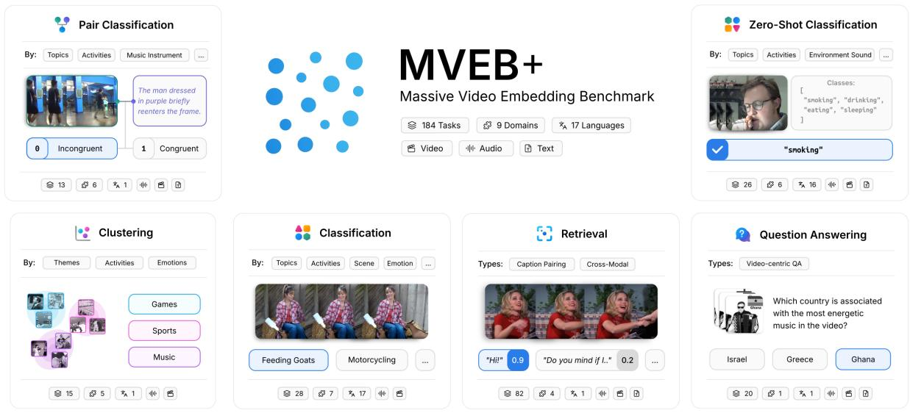

text_image

Pair Classification
By: Topics Activities Music Instrument ...
The man dressed in purple briefly reenters the frame.
0 Incongruent 1 Congruent
MVEB+
Massive Video Embedding Benchmark
184 Tasks 9 Domains 17 Languages
Video Audio Text
Zero-Shot Classification
By: Topics Activities Environment Sound ...
Classes:
"snoking", "drinking",
"eating", "sleeping"
"snoking"
Clustering
By: Themes Activities Emotions
Games
Sports
Music
Classification
By: Topics Activities Scene Emotion ...
Feeding Goats Motorcycling ...
Retrieval
Types: Caption Pairing Cross-Modal
"Hil" 0.9 "Do you mind if i..." 0.2 ...
82 4 1
Question Answering
Types: Video-centric QA
Which country is associated with the most energetic music in the video?
Israel Greece Ghana
20 1 1

Figure 1: Overview of task types and example subtypes in MVEB+.

To summarize, MVEB makes the following key contributions:

1. A 23-task benchmark (MVEB) for video embedding models, curated from a 184-task pool (MVEB+) that combines video with text and audio modalities, with evaluations of 33 models across six embedding paradigms. We also expose MVEB(text, video) for models without an audio encoder and MVEB(video) for video-only encoders, drawn from the same pool.  
2. Actionable findings for general-purpose video embedder development: a contrastive embedding stage is a near-prerequisite for crossmodal performance, and training-data alignment matters more than backbone scale for cross-modal tasks.  
3. Integration into the MTEB ecosystem with task and model versioning, enabling community-driven contribution and long-term maintenance.

## 2 Related Work

Embedding Benchmarks MTEB (Muennighoff et al., 2023) and its multilingual, image, and audio extensions MMTEB (Enevoldsen et al., 2025), MIEB (Xiao et al., 2025b), and MAEB (Assadi et al., 2026) have driven progress in representation learning by providing broad, regularly-maintained leaderboards with consistent protocols; MVEB completes the family for video.

Video Representation Benchmarks Prior video benchmarks each cover only a slice of the surface MVEB exercises: VideoEval (Li et al., 2024) (20 models, 12 tasks) is visual-only; UVRB (Guo et al., 2025) (16 datasets) is retrieval-only; LoVR (Cai et al., 2026) (467 videos) is a single long-video retrieval task; VidVec (Tzachor et al., 2026) is a method paper that evaluates on 5 retrieval benchmarks. Most closely related, MMEB-V2 (Meng et al., 2025) extends MMEB (Jiang et al., 2024) to video across four categories (Video Retrieval, Moment Retrieval, Video Classification, and Video QA), and MMEB-V3 (Huang et al., 2026) adds audio as a separate modality with 11 audio tasks across three categories (classification, retrieval, temporal grounding) and cross-modal retrieval directions between audio and each of text, image, and video. MVEB differs in three concrete ways: (i) scale on video: 184 tasks in MVEB+, roughly an order of magnitude more than the video task counts in the closest prior efforts; (ii) audiovisual coupling: MVEB systematically pairs every audio-bearing dataset with both video-only and video+audio variants on the same task and feeds both streams jointly to the model, whereas MMEB-V3 treats audio strictly as a separate modality with cross-modal retrieval directions and never as joint audio+video input; (iii) maintenance: MVEB inherits MTEB’s community-driven contribution and continuous-update model rather than shipping as a static leaderboard, avoiding the stagnation that has affected most prior video benchmarks.

## 3 Benchmark Construction

MVEB is built on the MTEB ecosystem (Muennighoff et al., 2023), extending its evaluation framework to video alongside the multilingual (Enevoldsen et al., 2025), image (Xiao et al., 2025b), and audio (Assadi et al., 2026) extensions. We inherit MTEB’s standardized metrics, minimal task/model interface, versioned artifacts, and communitydriven maintenance (Chung et al., 2025). MVEB evaluates embedding quality, not transcription or generation.

Dataset Selection: We curate datasets according to four guiding principles: (1) domain diversity across action recognition, social media understanding, emotion recognition, music, scene understanding, and instructional content; (2) task diversity across the six families described in §3.4; (3) modality coverage across video-only, video+text, and video+audio task variants; and (4) provenance and accessibility, prioritizing datasets with established usage, clear licensing, and public availability.

Task Selection: Evaluating models across the full 184-task pool (MVEB+) is prohibitively expensive for most groups. Following MMTEB, MIEB, and MAEB, which demonstrated that principled filtering maintains high rank correlation with exhaustive evaluation, we construct the curated MVEB leaderboard using five selection criteria applied to MVEB+: (1) Validity: for directional tasks we prioritize the more semantically valid direction (e.g., text-to-video over video-to-text for retrieval); (2) Unique coverage: tasks providing exclusive coverage of a domain or capability are retained regardless of other factors (e.g., the only emotionclustering task or the only video+audio retrieval direction); (3) Linguistic breadth: among comparable tasks, we retain those covering more languages; (4) Redundancy removal: we compute pairwise correlation matrices across model rankings and remove tasks with Spearman $\rho > 0 . 8 5$ to a retained task, keeping the task with broader coverage or lower runtime; (5) Runtime efficiency: among otherwise equivalent tasks, we select those with lower computational cost on video, where frame decoding and per-frame encoding dominate runtime.

Applying these filters produces the 23-task MVEB benchmark. Across representative models

MVEB runs roughly 7–10× faster than MVEB+ (Table 1) while maintaining strong correlation in model scores (Pearson r=0.996) and ranking (Spearman $\rho { = } 0 . 9 4 4 )$ , so curation preserves relative model performance at a fraction of the runtime.

<table><tr><td>Model</td><td>Params</td><td>MVEB+</td><td>MVEB</td><td>Speedup</td></tr><tr><td>LCO-Embedding-Omni-7B</td><td>7B</td><td>302.7</td><td>31.9</td><td> $9.5 \times$ </td></tr><tr><td>Qwen2.5-Omni-7B</td><td>7B</td><td>267.3</td><td>29.4</td><td> $9.1 \times$ </td></tr><tr><td>pe-av-small</td><td>847M</td><td>159.7</td><td>16.7</td><td> $9.6 \times$ </td></tr><tr><td>ebind-audio-vision</td><td>764M</td><td>122.7</td><td>16.8</td><td> $7.3 \times$ </td></tr></table>

Table 1: GPU runtime (hours) on MVEB vs. MVEB+, measured on a single NVIDIA H100.

Alongside MVEB we expose two leaderboards drawn from the same task pool so that modality-restricted models can also be evaluated: MVEB(text, video) (19 tasks) for text-video models without an audio encoder, and MVEB(video) (9 tasks) for video-only encoders. Table 2 summarises the four artifacts. The full dataset list is in Appendix A.

<table><tr><td>Artifact</td><td>Tasks</td><td>Modalities</td><td>Where</td></tr><tr><td>MVEB+</td><td>184</td><td>a, t, v</td><td>appdx, Tab. 13</td></tr><tr><td>MVEB</td><td>23</td><td>a, t, v</td><td>body, Tab. 3</td></tr><tr><td>MVEB(text, video)</td><td>19</td><td>t, v</td><td>appdx, Tab. 11</td></tr><tr><td>MVEB(video)</td><td>9</td><td>v</td><td>appdx, Tab. 12</td></tr></table>

Table 2: MVEB+ is the 184-task collection. MVEB is the 23-task curated benchmark we release. MVEB(text, video) and MVEB(video) are leaderboards drawn from the same pool that let modality-restricted models also be evaluated. Modalities: a=audio, t=text, v=video.

Data Contamination: We cross-reference each model’s declared training data against MVEB tasks; per-model overlap is in Appendix E.

Benchmark Ranking: Following MMTEB (Enevoldsen et al., 2025), we compute model ranks using a Borda count (Colombo et al., 2022) by treating each task as a preference voter over models. Since Borda is not a continuous measure, we report both the Borda rank and the mean in the leaderboard.

Reproducibility and Benchmark Accessibility: Building on prior reproducibility efforts (Enevoldsen et al., 2025, 2024; Chung et al., 2025), we extend MTEB with per-subset versioning, named experiment scoping, and richer model metadata; see Appendix G.

## 3.1 Models

We evaluate 33 publicly-available checkpoints spanning the major paradigms for video embeddings, ranging from ∼200M to 10.7B parameters and covering the modality combinations MVEB exercises. The paradigms below correspond to the Type column in the leaderboard; full per-model details are in Appendix C.

Self-supervised Video Encoders learn from video alone, without paired text or audio. We evaluate the V-JEPA-2 family (Assran et al., 2025); these models contribute only to MVEB(video).

Video-Text Contrastive Encoders learn a joint video-text space through contrastive pretraining over web-scale video-caption pairs. We evaluate the X-CLIP family (Ni et al., 2022).

Audio-Visual Contrastive Encoders jointly align video, audio, and text in a shared embedding space, enabling cross-modal retrieval that involves the audio track of the video. We evaluate the Perception Encoder audio-visual family (Vyas et al., 2025).

Multimodal Binding Models learn a single embedding space across modalities by aligning each to a shared anchor, in the style of ImageBind. We evaluate the eBind family (Broadbent et al., 2025).

MLLM-Based Embedding Models take a multimodal large language model backbone and adapt it into an embedding model through a dedicated contrastive or retrieval-objective training stage. This is the largest family in our roster and reflects the recent shift toward MLLM-backed embeddings observed in MIEB and MMEB-V2 (Xiao et al., 2025b). We evaluate LCO-Embedding-Omni (Xiao et al., 2025a), e5-omni (Chen et al., 2026), Tevatron OmniEmbed (Ma et al., 2025), BidirLM-Omni-Embedding (Boizard et al., 2026), UME-R1 (Lan et al., 2025), OmniEmbed-Nemotron (Xu et al., 2025c), Qwen3-VL-Embedding (Li et al., 2026), VLM2Vec-V2.0 (Meng et al., 2025), and Jina-Embeddings-v5-omni (Akram et al., 2026).

Generative MLLMs used as embedders are multimodal large language models trained for generation rather than embedding; we obtain a representation by pooling the final-layer hidden states using the model’s default pooling strategy. Including them lets us measure how far a generation-only training objective gets on embedding tasks, without any embedding-specific adaptation. We evaluate Qwen2.5-Omni (Xu et al., 2025a).

## 3.2 Evaluation Protocol

Video sampling. Video encoders split into two groups. Variable-length models (the omni MLLMembedding family, the Qwen3-VL embedders, and the variable-length Perception Encoder checkpoints) sample at fps=2 with a hard cap of max\_frames=64 to bound peak GPU memory on long clips. Fixed-length models (X-CLIP, eBind, V-JEPA-2) sample the exact frame count their training pipeline expects; full per-model values are in Table 34. We honor each model’s declared configuration on every task rather than forcing a benchmarkwide setting because the latter would push half the roster out of distribution. The effect of deliberately varying the budget at test time is studied separately in subsection 5.2.

Audio sampling. Each model also declares its required target\_sampling\_rate, monoconversion, and an optional duration cap (per-model values in Table 34). We apply a per-model cap rather than a benchmark-wide one because feature extractors differ: caps range from 30 s (PE-AV, the regime it was trained under) to no explicit cap (LCO-Embedding-Omni, which delegates truncation to its own processor). The shared audio collator resamples, mono-converts, and truncates accordingly.

Other protocol details. All models are evaluated zero-shot: we use each model’s default embedding output, without fine-tuning or any layer-specific or pooling-specific tuning. The shared MTEB task evaluator consumes these embeddings and applies the per-task metric defined in subsection 3.4. Some models are instruction-tuned and expect a naturallanguage instruction prepended to each input (e.g., “Represent this video for retrieval:”); others take raw inputs directly. We pass task-specific instructions only to models trained to use them, so each model sees the input format it was trained under.

## 3.3 Modalities

For every dataset in MVEB whose source video contains an audio track, we extract that audio and run the task twice: once with video only, and once with both video and audio fed to the model. This gives us paired evaluations on the same underlying clips and lets us measure the contribution of the audio track to video understanding (per-task video vs. audio + video columns in the appendix tables; see Appendix D). We expose both variants rather than scoring models only on va because, as §5.1 shows, on V-grounded datasets the audio channel is a confound rather than a fair test of embedding quality. Datasets whose source has no usable audio (e.g., HMDB51, SSv2, Diving48, Breakfast)

cannot be paired and enter the benchmark in their video-only form only; they are still included in MVEB and MVEB+ where applicable, just without an audio + video counterpart. This dualvariant scheme applies to classification, zero-shot classification, clustering, pair classification, and QA; retrieval is handled separately via the eight directions listed in §3.4, since each direction’s query and target already carry their own modality.

Each model runs only on the task variants compatible with its declared modalities; audio-bearing variants and audio retrieval directions are skipped for text-video-only models.

## 3.4 Tasks and Evaluation

We follow the task structure of MTEB, MIEB, and MAEB, adapting each task family to video inputs and adding cross-modal directions specific to the video setting.

Classification A logistic regression is trained on frozen video embeddings to predict labels (Alain and Bengio, 2018; Radford et al., 2021). We use few-shot linear probing (Muennighoff et al., 2023; Cherti et al., 2023) with 8 examples per class, balancing evaluation quality with computational efficiency. Accuracy is the main metric.

Zero-shot Classification Video embeddings are matched against text embeddings of class-label prompts (e.g., “a video of {label}”) without training a classifier. Prompt templates are hand-crafted per dataset. We measure accuracy following Radford et al. (2021). This task is restricted to models that declare a joint video-text embedding space.

Clustering We use MiniBatchKMeans (with k set to the number of true labels) over video embeddings and report V-measure (Rosenberg and Hirschberg, 2007) as the main metric, evaluating whether embeddings group meaningfully according to semantic categories without any supervised signal.

Retrieval Retrieval evaluates ranking a corpus by relevance to a query under cosine similarity. We support eight retrieval directions across the modality combinations a video benchmark needs. Writing T for text, A for audio, V for video (combined codes like AT denote joint inputs), the directions are: T→V, A→V, AT→V, V→T, VA→T, V→A, VT→A, and T→VA. Multimodal queries or targets are handled by each model’s own pathway: omni models use their native multimodal encoder; others fall back to late fusion of unimodal embeddings (mean or concatenation, as the model declares).

nDCG@10 is the main metric.

Pair Classification Given two video inputs, predict whether they satisfy a binary criterion (e.g., same activity, same speaker). Similarity is computed between embeddings and the maximum average-precision over cosine similarity serves as the main metric.

Video-Centric Question Answering (VCQA) Given a video input (optionally with its audio track) and a textual question, select the most relevant answer from a small set of text options. This is implemented as retrieval over a query-specific candidate pool; accuracy is the main metric.

## 4 Results

Table 3 reports the MVEB leaderboard for the 16 models that can run all 23 tasks; per-task scores, per-direction retrieval breakdowns, the MVEB+ aggregate over all 184 tasks, and the modalityrestricted leaderboards are in Appendix D.

No single model dominates, but general-purpose contenders are emerging. LCO-Embedding-Omni-7B ranks first by Borda count with a mean of 57.6 and is the strongest model on QA and clustering, while losing classification to the newer BidirLM-Omni-2.5B-Embedding (61.2), retrieval and zero-shot classification to eBind, and pair classification to LCO-Embedding-Omni-3B. The category leaders span two paradigms (MLLM-based embedding and multimodal binding). We read LCO-Embedding-Omni as the closest current candidate for a general-purpose video embedder: it leads or ties on two categories and stays within a few points of the leader on the rest. The percategory spread is visualized in Figure 2.

Text-video specialists lead MVEB(text, video). The modality-restricted MVEB(text, video) leaderboard (Table 11) evaluates 25 models on the 19 textvideo tasks of MVEB. Qwen3-VL-Embedding-8B and -2B (Li et al., 2026), vision-language embedders without an audio path, take ranks 1 and 2 at 60.9 and 58.1 mean, ahead of every omni audio+video+text model in our roster (LCO-Embedding-Omni-7B at 56.8); the Qwen3-VL family wins 5 of 6 task categories, with only QA staying with LCO-Embedding-Omni-3B (32.8). The reordering relative to the headline MVEB leaderboard shows that the text-video scope rewards a different family of models from the full audio+video+text scope, making MVEB(text, video)

<table><tr><td rowspan="2">Model</td><td rowspan="2">Type</td><td rowspan="2">Params</td><td>Rank (↓)</td><td>ZS %</td><td colspan="3">Average</td><td colspan="6">Average per Category</td></tr><tr><td>MVEB</td><td></td><td>Mean</td><td>TV</td><td>V</td><td>Retr</td><td>QA</td><td>Cls</td><td>Clust</td><td>Pair</td><td>ZS</td></tr><tr><td>Number of tasks</td><td></td><td></td><td>(23)</td><td></td><td></td><td>(19)</td><td>(9)</td><td>(10)</td><td>(1)</td><td>(6)</td><td>(2)</td><td>(2)</td><td>(2)</td></tr><tr><td>LCO-Embedding-Omni-7B</td><td>MLLM-based embedding</td><td>8.9B</td><td>1</td><td>100%</td><td>57.6</td><td>56.8</td><td>61.7</td><td>58.7</td><td>57.0</td><td>59.2</td><td>27.3</td><td>79.6</td><td>55.5</td></tr><tr><td>e5-omni-7B</td><td>MLLM-based embedding</td><td>8.9B</td><td>2</td><td>100%</td><td>55.0</td><td>54.1</td><td>55.7</td><td>59.4</td><td>43.8</td><td>54.7</td><td>21.5</td><td>77.3</td><td>50.2</td></tr><tr><td>ebind-full</td><td>Multimodal binding</td><td>1.8B</td><td>3=</td><td>83%</td><td>55.5</td><td>53.8</td><td>55.8</td><td>62.3</td><td>31.4</td><td>51.3</td><td>20.1</td><td>75.4</td><td>61.1</td></tr><tr><td>ebind-audio-vision</td><td>Multimodal binding</td><td>764M</td><td>3=</td><td>83%</td><td>55.5</td><td>53.8</td><td>55.8</td><td>62.3</td><td>31.4</td><td>51.3</td><td>20.1</td><td>75.4</td><td>61.1</td></tr><tr><td>LCO-Embedding-Omni-3B</td><td>MLLM-based embedding</td><td>4.7B</td><td>5</td><td>100%</td><td>54.6</td><td>54.8</td><td>61.6</td><td>54.1</td><td>56.4</td><td>56.1</td><td>27.0</td><td>80.7</td><td>52.7</td></tr><tr><td>OmniEmbed-v0.1</td><td>MLLM-based embedding</td><td>8.9B</td><td>6=</td><td>100%</td><td>52.9</td><td>51.3</td><td>57.9</td><td>52.9</td><td>50.2</td><td>58.5</td><td>20.6</td><td>74.7</td><td>48.5</td></tr><tr><td>pe-av-large</td><td>Audio-visual contrastive</td><td>2.2B</td><td>6=</td><td>65%</td><td>54.3</td><td>52.4</td><td>55.2</td><td>62.0</td><td>29.2</td><td>54.8</td><td>21.7</td><td>75.2</td><td>37.9</td></tr><tr><td>pe-av-base</td><td>Audio-visual contrastive</td><td>1.0B</td><td>8</td><td>65%</td><td>53.1</td><td>49.7</td><td>53.8</td><td>59.6</td><td>30.6</td><td>54.8</td><td>22.6</td><td>75.7</td><td>34.6</td></tr><tr><td>BidirLM-Omni-2.5B-Embedding</td><td>MLLM-based embedding</td><td>2.4B</td><td>9</td><td>100%</td><td>51.2</td><td>52.0</td><td>58.0</td><td>45.5</td><td>55.8</td><td>61.2</td><td>17.1</td><td>78.7</td><td>53.9</td></tr><tr><td>pe-av-small</td><td>Audio-visual contrastive</td><td>847M</td><td>10</td><td>65%</td><td>52.2</td><td>50.2</td><td>53.3</td><td>57.6</td><td>27.8</td><td>54.8</td><td>22.9</td><td>75.3</td><td>35.4</td></tr><tr><td>e5-omni-3B</td><td>MLLM-based embedding</td><td>4.7B</td><td>11</td><td>100%</td><td>48.5</td><td>48.4</td><td>55.7</td><td>52.2</td><td>45.4</td><td>48.3</td><td>21.4</td><td>77.0</td><td>30.8</td></tr><tr><td>omni-embed-nemotron-3b</td><td>MLLM-based embedding</td><td>4.7B</td><td>12</td><td>100%</td><td>42.8</td><td>35.8</td><td>54.7</td><td>32.9</td><td>46.6</td><td>54.6</td><td>20.5</td><td>77.7</td><td>42.5</td></tr><tr><td>jina-embeddings-v5-omni-nano</td><td>MLLM-based embedding</td><td>986M</td><td>13</td><td>NA</td><td>20.8</td><td>7.7</td><td>24.9</td><td>10.3</td><td>24.4</td><td>28.0</td><td>12.6</td><td>59.1</td><td>20.0</td></tr><tr><td>jina-embeddings-v5-omni-small</td><td>MLLM-based embedding</td><td>1.6B</td><td>14</td><td>NA</td><td>19.4</td><td>8.2</td><td>24.7</td><td>6.2</td><td>21.2</td><td>28.5</td><td>13.7</td><td>58.6</td><td>23.8</td></tr><tr><td>Qwen2.5-Omni-7B</td><td>Generative MLLM</td><td>10.7B</td><td>15</td><td>NA</td><td>12.8</td><td>10.4</td><td>30.7</td><td>0.5</td><td>13.2</td><td>20.2</td><td>7.5</td><td>53.2</td><td>16.5</td></tr><tr><td>Qwen2.5-Omni-3B</td><td>Generative MLLM</td><td>5.5B</td><td>16</td><td>NA</td><td>11.4</td><td>7.8</td><td>30.1</td><td>0.6</td><td>14.4</td><td>19.3</td><td>5.9</td><td>53.7</td><td>3.8</td></tr></table>

Table 3: Top 16 Models on MVEB ranked by Borda count over 23 tasks. Rank marked with = shares a Borda count with the row above. ZS %: disclosed-zero-shot percentage from Table 32 (NA for models that do not disclose training data). Mean is the arithmetic mean over the model’s 23 evaluated tasks; TV and V are the same model’s mean on the MVEB(text, video) (19 tasks) and MVEB(video) (9 tasks) subsets respectively, lifted from Table 11 and Table 12. Task categories: Retr (retrieval; per-direction breakdown in appendix), QA, Cls (classification), Clust (clustering), Pair (pair classification), ZS (zero-shot classification). Model types are defined in §3.1. Bold = best per column within the 16 rows shown; the global MVEB(text, video) and MVEB(video) leaders are Qwen3-VL-Embedding (see Appendix D.1).

a useful evaluation surface in its own right rather than a fallback. Full ranking, per-category breakdown, and an extended discussion are in Appendix K.

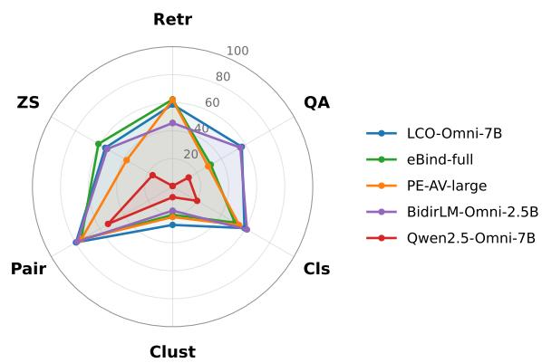

radar chart

| Category | LCO-Omni-7B | eBind-full | PE-AV-large | BidirLM-Omni-2.5B | Qwen2.5-Omni-7B |
| -------- | ----------- | ---------- | ----------- | ----------------- | --------------- |
| Retr     | 60          | 60         | 60          | 40                | 10              |
| QA       | 50          | 30         | 40          | 50                | 10              |
| Cls      | 40          | 40         | 40          | 50                | 10              |
| Clust    | 20          | 20         | 20          | 20                | 10              |
| Pair     | 80          | 80         | 80          | 80                | 60              |
| ZS       | 60          | 60         | 40          | 40                | 10              |

Figure 2: Per-category mean scores for five representative models spanning the four paradigms. LCO-Embedding-Omni-7B, eBind-full, PE-AV-large, and BidirLM-Omni-2.5B trace broadly similar but distinct shapes; Qwen2.5-Omni-7B (generative MLLM used as embedder) collapses inward across every category. No single model dominates all six.

Adapted MLLMs beat repurposed generative MLLMs by a wide margin. The MLLM-based embedding family fills five of the top ten ranks on MVEB and dominates the top of the textvideo scope (Table 11). Generative MLLMs used as embedders via hidden-state pooling collapse:

Qwen2.5-Omni-7B and 3B score 12.8 and 11.4 mean on MVEB, an order of magnitude below their MLLM-embed counterparts at the same scale. Within a single backbone family the gap is even sharper: e5-omni-7B (an MLLM-embed adaptation of Qwen2.5-Omni-7B) scores 55.0 vs. 12.8 for the unadapted generative baseline. A contrastive embedding stage is therefore a near-prerequisite, not a refinement.

Smaller specialized contrastive models punch above their weight. eBind (1.8B / 764M) ties for third place by Borda and wins both retrieval (62.3) and zero-shot classification (61.1) outright, despite being four to ten times smaller than the MLLM-embed leaders (Figure 3). Perception Encoder audio-visual variants (847M–2.2B) similarly outscore the comparable-size MLLM-embed model OmniEmbed-Nemotron-3B (4.7B) on retrieval and clustering. We read this as evidence that training-data alignment matters more than backbone scale for cross-modal video tasks.

Clustering and zero-shot classification show the lowest absolute scores. The strongest model reaches only 27.3 on clustering1 (LCO-Embedding-

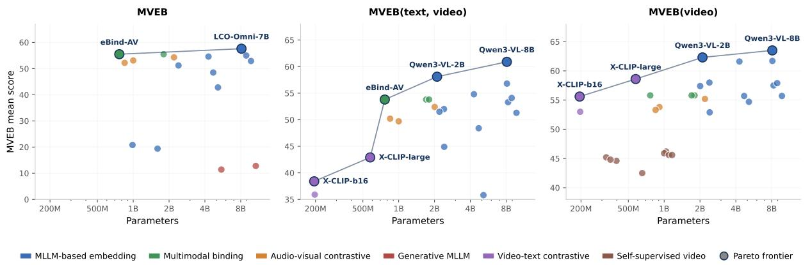

scatterplot

| Method | Parameters | MVEB Mean Score | Model Name |
| --- | --- | --- | --- |
| MLELM-based embedding | 8B | 58 | LCO-Omni-7B |
| Multimodal binding | 1B | 55 | eBind-AV |
| Audio-visual contrastive | 2B | 54 | eBind-AV |
| Generative MLLM | 8B | 12 | eBind-AV |
| Video-text contrastive | 200M | 35 | X-CLIP-b16 |
| Self-supervised video | 4B | 42 | X-CLIP-large |
| Pareto frontier | 8B | 62 | Qwen3-VL-8B |
| MLELM-based embedding | 2B | 52 | Qwen3-VL-2B |
| Multimodal binding | 2B | 53 | Qwen3-VL-8B |
| Audio-visual contrastive | 1B | 50 | eBind-AV |
| Generative MLLM | 2B | 45 | eBind-AV |
| Video-text contrastive | 200M | 53 | X-CLIP-large |
| Self-supervised video | 1B | 46 | X-CLIP-large |
| Pareto frontier | 8B | 62 | Qwen3-VL-8B |
| MLELM-based embedding | 4B | 50 | eBind-AV |
| Multimodal binding | 4B | 55 | eBind-AV |
| Audio-visual contrastive | 1B | 52 | eBind-AV |
| Generative MLLM | 2B | 48 | eBind-AV |
| Video-text contrastive | 200M | 52 | eBind-AV |
| Self-supervised video | 1B | 47 | eBind-AV |
| Pareto frontier | 8B | 62 | Qwen3-VL-8B |
| MLELM-based embedding | 8B | 58 | Qwen3-VL-2B |
| Multimodal binding | 8B | 62 | Qwen3-VL-8B |
| Audio-visual contrastive | 1B | 53 | eBind-AV |
| Generative MLLM | 2B | 49 | eBind-AV |
| Video-text contrastive | 200M | 53 | eBind-AV |
| Self-supervised video | 1B | 46 | eBind-AV |
| Pareto frontier | 8B | 62 | Qwen3-VL-8B |
| MLELM-based embedding | 8B | 58 | Qwen3-VL-2B |
| Multimodal binding | 8B | 62 | Qwen3-VL-8B |
| Audio-visual contrastive | 1B | 53 | eBind-AV |
| Generative M.LLM | 2B | 49 | eBind-AV |
| Video-text contrastive | 200M | 53 | eBind-AV |
| Self-supervised video | 1B | 46 | eBind-AV |
| Pareto frontier | 8B | 62 | Qwen3-VL-8B |

Figure 3: Mean score vs. parameter count for each of the three leaderboards: MVEB (16 models), MVEB(text, video) (25 models), and MVEB(video) (33 models). Pareto-frontier models are highlighted and labeled per panel; off-frontier dots are colored by paradigm but unlabeled. On MVEB the frontier runs from eBind-AV (764M, 55.5) to LCO-Omni-7B (8.9B, 57.6) (a 12× parameter gap for 2.1 points of score). Removing audio (MVEB(text, video) and MVEB(video)) replaces the frontier with Qwen3-VL-Embedding 2B/8B, consistent with the audio-coverage finding in §5.1.

<table><tr><td>Dataset type</td><td> $\bar{\Delta}$ </td><td> $\sigma$ </td><td>N</td></tr><tr><td>AV-grounded</td><td>+0.016</td><td>0.064</td><td>475</td></tr><tr><td>V-grounded</td><td>-0.046</td><td>0.059</td><td>195</td></tr></table>

Table 4: Mean audio delta $( \Delta = \mathrm { s c o r e _ { v a } - s c o r e _ { v } } )$ across 48 paired task groups and 14 models, split by annotation provenance (Table 9). N counts model–dataset pairs.

Omni-7B) and no model exceeds 61.1 on zero-shot classification, against 74–81 on pair classification for top models. The pattern is consistent across model families.

## 5 Analyses

## 5.1 Contribution of the Audio Track to Video Understanding

We compare video-only (v) and video+audio (va) task variants across 48 paired task groups spanning five task types and the 14 audio-capable models in our roster, measuring the audio delta $\Delta = \mathrm { s c o r e } _ { \mathrm { v a } } - \mathrm { s c o r e } _ { \mathrm { v } } . ^ { 2 }$

Annotation provenance predicts audio’s contribution. Table 4 reports mean $\Delta$ split by the annotation provenance defined in Table 9: AVgrounded datasets had labels produced from both audio and visual content, V-grounded datasets had labels produced from visuals alone (even though the clips often carry audio). Audio helps AVgrounded datasets by +0.016 on average and hurts V-grounded ones by −0.046: a six-point gap consistent across task types and model families. The V-grounded penalty is about three times the AVgrounded benefit, so the result reads more as “audio hurts when labels don’t reward it” than as “audio is a strong positive signal when they do.”

The effect varies more within paradigms than across them. Per-paradigm averages sit near zero $( \bar { \Delta } ~ \in ~ [ - 0 . 0 2 3 , + 0 . 0 1 0 ]$ across the four paradigms), with the within-paradigm range often exceeding the between-paradigm spread; only multimodal binding (eBind-full and eBind-audiovision) consistently loses from audio (−0.023 each). MLLM-based embedders span almost the full range of observed deltas (−0.039 at e5- omni-3B to +0.023 at BidirLM-Omni-2.5B), so audio handling is implementation-specific rather than paradigm-determined (per-model deltas in Table 37, Appendix I).

Per-dataset and per-model breakdowns, including cross-modal retrieval alignment for datasets with paired v2a/a2v variants, are in Appendix I.

## 5.2 Test-Time Scaling of Temporal Context

We sweep the number of uniformly sampled video frames $N \in \{ 1 , 8 , 1 6 , 3 2 , 6 4 \}$ at test time, holding audio sampling and all other inputs at each model’s default. The analysis uses a subset of MVEB tasks with average clip duration above 15 s (selection

criteria in Appendix F).

Mean performance scales logarithmically with N (Figure 4). Moving from a single-frame spatial baseline to N = 8 yields a 43.7% relative improvement; doubling from 32 to 64 frames adds only 2.2% absolute. For general-purpose evaluation, 32 frames is a reasonable ceiling.

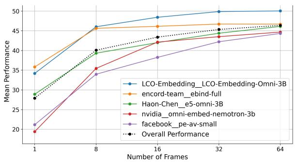

line chart

| Number of Frames | LCO-Embedding_LCO-Embedding-Omni-3B | encord-team_ebind-full | Haon-Chen_e5-omni-3B | nvidia_omni-embed-nemotron-3b | facebook_pe-av-small | Overall Performance |
| ---------------- | ----------------------------------- | ----------------------- | -------------------- | ---------------------------- | --------------------- | ------------------- |
| 1                | 34                                  | 36                      | 29                   | 19                           | 21                    | 28                  |
| 8                | 46                                  | 46                      | 40                   | 35                           | 34                    | 40                  |
| 16               | 48                                  | 47                      | 42                   | 42                           | 38                    | 43                  |
| 32               | 50                                  | 47                      | 45                   | 44                           | 42                    | 45                  |
| 64               | 50                                  | 47                      | 46                   | 45                           | 44                    | 46                  |

Figure 4: Per-model performance as a function of sampled frame count. The black dotted line is the mean over all models. Most of the gain comes from the first jump to multi-frame sampling; returns plateau beyond 32 frames.

The aggregate trend hides large per-task variance: some tasks (e.g., Breakfast classification, VATEX retrieval) scale steeply with N ; others (e.g., OmniVideoBench QA, WorldSense-1min QA) barely move. Per-task and per-model curves are in Appendix F.

## 5.3 Cross-Modal Retrieval Direction Structure

Pairwise Spearman correlation across the eight retrieval directions (Figure 5) shows the directions cluster into three capability groups rather than measuring eight independent things: text-target (V → T, V A → T at $\rho = 0 . 9 6 )$ , video-target with audio in the query (A → V , AT → V , V → A; $\rho \ge 0 . 8 7$ among them), and text-as-query (T → V , $T  V A , V T  A ; \rho \geq 0 . 7 7 )$ . The most decoupled pair is T → V A vs. A → V at ρ = 0.38, isolating audio-as-target as a distinct axis only because MVEB pairs audio+video as joint retrieval modalities. Full pairwise correlations and discussion are in Appendix J.

## 6 Conclusion

MVEB provides a unified 23-task benchmark for video embedding models, drawn from a 184-task pool (MVEB+) and accompanied by modalityrestricted leaderboards for text-video and videoonly encoders. Across 33 models from the major video-embedding paradigms no single approach dominates. Our paired video-only vs. audio+video analysis shows that audio’s contribution depends on dataset annotation provenance (AV-grounded vs. Vgrounded), and the MVEB(text, video) leaderboard reorders the top of the field relative to MVEB. We release MVEB inside the MTEB ecosystem with task and model versioning, and a community contribution pipeline, so the benchmark can co-evolve with the field rather than freeze as a snapshot.

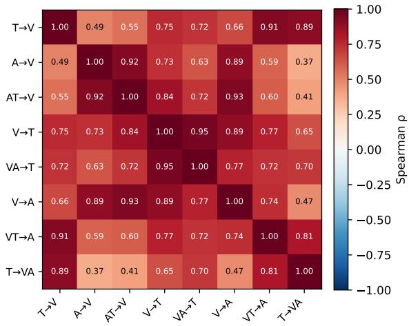

heatmap

| | T→V | A→V | AT→V | V→T | VA→T | V→A | VT→A | T→VA |
|---|---|---|---|---|---|---|---|---|
| T→V | 1.00 | 0.49 | 0.55 | 0.75 | 0.72 | 0.66 | 0.91 | 0.89 |
| A→V | 0.49 | 1.00 | 0.92 | 0.73 | 0.63 | 0.89 | 0.59 | 0.37 |
| AT→V | 0.55 | 0.92 | 1.00 | 0.84 | 0.72 | 0.93 | 0.60 | 0.41 |
| V→T | 0.75 | 0.73 | 0.84 | 1.00 | 0.95 | 0.89 | 0.77 | 0.65 |
| VA→T | 0.72 | 0.63 | 0.72 | 0.95 | 1.00 | 0.77 | 0.72 | 0.70 |
| V→A | 0.66 | 0.89 | 0.93 | 0.89 | 0.77 | 1.00 | 0.74 | 0.47 |
| VT→A | 0.91 | 0.59 | 0.60 | 0.77 | 0.72 | 0.74 | 1.00 | 0.81 |
| T→VA | 0.89 | 0.37 | 0.41 | 0.65 | 0.70 | 0.47 | 0.81 | 1.00 |

Figure 5: Pairwise Spearman correlation across the eight retrieval directions over 16 models. The most distinct pair is $T \to V A$ vs. A → V at ρ = 0.38.

## Limitations

Model Coverage. Our roster covers 33 publiclyavailable checkpoints across the major paradigms; the field moves quickly so the list is a snapshot, but new models are added on a rolling basis through the MTEB registry. Notable models we plan to add include ImageBind (Girdhar et al., 2023), LanguageBind (Zhu et al., 2024), InternVideo (Wang et al., 2022), VideoMAE (Tong et al., 2022), and VJEPA-2.1 (Mur-Labadia et al., 2026); these have open weights but no clean inference API or versioned checkpoints yet.

Frame and Audio Budgets. Each model uses its declared sampling configuration (§3.2), so absolute scores can partly reflect the frame and audio budgets each model was trained under; the frame-scaling analysis (subsection 5.2) explores how scores move when this budget is varied at test time.

Dataset Coverage. While MVEB+ covers 184 tasks across multiple domains, some areas remain thin: low-resource languages are underrepresented, long-form video content (lectures, documentaries) is largely absent due to runtime cost, and several fine-grained domains (sports beyond a few actionrecognition datasets, scientific or medical video, sign language) have limited or no coverage. New datasets are added on a rolling basis through community contributions.

Training Data Disclosure and Leakage. Many MVEB tasks draw from web-curated sources (Kinetics, UCF101, MSR-VTT, VATEX, Panda-70M) that are common in large-scale video-caption pretraining, so train-test contamination is a real risk. Appendix E cross-references each model’s declared training data against MVEB task names and reports the resulting disclosed-zero-shot percentage per model. The audit is necessarily incomplete for the subset of our roster that does not disclose training data at dataset granularity; rather than assigning these models an optimistic 100% zero-shot, we report their contamination columns as NA in Table 32 and surface the same convention in the headline leaderboard. Their MVEB scores therefore cannot be certified as zero-shot, and per-dataset comparisons involving them should be interpreted with that disclosure gap in mind.

Annotation Quality. A subset of MVEB source datasets inherits label conventions from their original releases that surface as task-level ambiguities, particularly in emotion-recognition tasks. Recurring issues include single-label assignment on utterances that carry multiple sentiments, labels that capture the surface emotion even when the utterance is sarcastic or non-literal, and a fraction of clips that appear plainly mislabeled. We do not silently include these splits: Appendix L flags every affected dataset with concrete failure-mode examples so readers can gate per-dataset interpretation rather than treating scores uniformly across the benchmark. The right long-term fix is to replace affected splits with cleaner sources as the field releases them, and we plan to deprecate flagged splits in subsequent MVEB releases as replacements appear; the MVEB+ contribution pipeline accepts replacement datasets, re-annotation passes against existing splits, and human-model agreement audits in the style of HUME (Assadi et al., 2025), originally developed for MTEB text tasks. We retain the as-released labels in the current release so MVEB scores remain comparable with prior published results.

## Ethical Considerations

MVEB aggregates publicly-released video datasets under each source’s release license. For datasets where we host evaluation artifacts on HuggingFace (under the mteb/ namespace), we redistribute decoded frame samples and 16 kHz mono audio extracted from the source clips, paired with the task wrapper (loader, evaluation code, and metric implementation); we do not re-encode or re-host the original full-resolution video files. For datasets where the upstream owner already provides a public mirror, MVEB ships only the task wrapper and links back to that release. The frame/audio packaging is a working-around-bandwidth choice rather than a content choice: the underlying clips, labels, and consent regime are the upstream releases unchanged. Several included datasets (e.g., Kinetics, UCF101, AVMeme, AVE-Dataset, MELD, RAVDESS, VGGSound) contain identifiable individuals; we evaluate models only as embedders on the labels and tasks those datasets already release, and do not introduce new identifying labels or biometric tasks.

The 33 models we evaluate include multimodal large language models capable of free-form generation; we use them only to produce frozen embeddings, never to generate text, audio, or video. We therefore do not amplify generative risks beyond what each model’s release already permits.

The benchmark inherits the biases of the underlying datasets, including domain skew (most clips are English-language and from web-curated or UScentric sources) and demographic skew in datasets that depict people. We flag these explicitly in the Dataset Coverage limitation and encourage community contributions that broaden coverage to underrepresented languages, regions, and domains.

## Acknowledgement

We are extremely thankful to Laude Institute for supporting and enabling this work. Márton Kardos and Kenneth Enevoldsen are funded by the Danish Foundation Models project (4378-00001B) and the European Union, Horizon Europe (101178170). Kenneth Enevoldsen is additionally funded by the Danish National Research Foundation (DNRF193), the Aage and Johanne Louis-Hansens Foundation (25-1-17733), and the Augustinus Foundation (2025-0299). We thank Nguyen Tai and Guangyu Song for contributing dataset metadata for several MVEB+ tasks.

## References

Mohammad Kalim Akram, Saba Sturua, Nastia Havriushenko, Quentin Herreros, Michael Günther, Maximilian Werk, and Han Xiao. 2026. jinaembeddings-v5-text: Task-targeted embedding distillation. Preprint, arXiv:2602.15547.  
Guillaume Alain and Yoshua Bengio. 2018. Understanding intermediate layers using linear classifier probes. Preprint, arXiv:1610.01644.  
Adnan El Assadi, Isaac Chung, Roman Solomatin, Niklas Muennighoff, and Kenneth Enevoldsen. 2025. Hume: Measuring the human-model performance gap in text embedding tasks. Preprint, arXiv:2510.10062.  
Adnan El Assadi, Isaac Chung, Chenghao Xiao, Roman Solomatin, Animesh Jha, Rahul Chand, Silky Singh, Kaitlyn Wang, Ali Sartaz Khan, Marc Moussa Nasser, Sufen Fong, Pengfei He, Alan Xiao, Ayush Sunil Munot, Aditya Shrivastava, Artem Gazizov, Niklas Muennighoff, and Kenneth Enevoldsen. 2026. Maeb: Massive audio embedding benchmark. Preprint, arXiv:2602.16008.  
Mido Assran, Adrien Bardes, David Fan, Quentin Garrido, Russell Howes, Mojtaba Komeili, Matthew Muckley, Ammar Rizvi, Claire Roberts, Koustuv Sinha, Artem Zholus, Sergio Arnaud, Abha Gejji, Ada Martin, Francois Robert Hogan, Daniel Dugas, Piotr Bojanowski, Vasil Khalidov, Patrick Labatut, and 10 others. 2025. V-jepa 2: Self-supervised video models enable understanding, prediction and planning. Preprint, arXiv:2506.09985.  
Hritik Bansal, Yonatan Bitton, Idan Szpektor, Kai-Wei Chang, and Aditya Grover. 2023. Videocon: Robust video-language alignment via contrast captions. arXiv preprint arXiv:2311.10111.  
Nicolas Boizard, Théo Deschamps-Berger, Hippolyte Gisserot-Boukhlef, Céline Hudelot, and Pierre Colombo. 2026. Bidirlm: From text to omnimodal bidirectional encoders by adapting and composing causal llms. Preprint, arXiv:2604.02045.  
Jim Broadbent, Felix Cohen, Frederik Hvilshøj, Eric Landau, and Eren Sasoglu. 2025. EBind: a practical approach to space binding. Preprint, arXiv:2511.14229.  
Qifeng Cai, Hao Liang, Zhaoyang Han, Hejun Dong, Meiyi Qiang, Ruichuan An, Quanqing Xu, Bin Cui, and Wentao Zhang. 2026. Lovr: A benchmark for long video retrieval in multimodal contexts. Preprint, arXiv:2505.13928.  
Joao Carreira, Eric Noland, Andras Banki-Horvath, Chloe Hillier, and Andrew Zisserman. 2018. A short note about kinetics-600. arXiv preprint arXiv:1808.01340.  
David Chen and William Dolan. 2011. Collecting highly parallel data for paraphrase evaluation. In

Proceedings of the 49th Annual Meeting of the Association for Computational Linguistics (ACL), pages 190–200.

Haonan Chen, Sicheng Gao, Timofte Radu, Sakai Tetsuya, and Zhicheng Dou. 2026. e5-omni: Explicit cross-modal alignment for omni-modal embeddings. arXiv preprint arXiv:2601.03666.

Honglie Chen, Weidi Xie, Andrea Vedaldi, and Andrew Zisserman. 2020. Vggsound: A large-scale audio-visual dataset. In ICASSP 2020 - 2020 IEEE International Conference on Acoustics, Speech and Signal Processing (ICASSP), pages 721–725. IEEE.

Sihan Chen, Xingjian He, Longteng Guo, Xinxin Zhu, Weining Wang, Jinhui Tang, and Jing Liu. 2023. Valor: Vision-audio-language omni-perception pretraining model and dataset. arXiv preprint arXiv:2304.08345.

Tsai-Shien Chen, Aliaksandr Siarohin, Willi Menapace, Ekaterina Deyneka, Hsiang-wei Chao, Byung Eun Jeon, Yuwei Fang, Hsin-Ying Lee, Jian Ren, Ming-Hsuan Yang, and Sergey Tulyakov. 2024. Panda-70m: Captioning 70m videos with multiple crossmodality teachers. In Proceedings of the IEEE/CVF Conference on Computer Vision and Pattern Recognition (CVPR).

Mehdi Cherti, Romain Beaumont, Ross Wightman, Mitchell Wortsman, Gabriel Ilharco, Cade Gordon, Christoph Schuhmann, Ludwig Schmidt, and Jenia Jitsev. 2023. Reproducible scaling laws for contrastive language-image learning. In Proceedings of the IEEE/CVF Conference on Computer Vision and Pattern Recognition, pages 2818–2829.

Isaac Chung, Imene Kerboua, Marton Kardos, Roman Solomatin, and Kenneth Enevoldsen. 2025. Maintaining mteb: Towards long term usability and reproducibility of embedding benchmarks. Preprint, arXiv:2506.21182.

Pierre Colombo, Nathan Noiry, Ekhine Irurozki, and Stephan Clémençon. 2022. What are the best systems? new perspectives on nlp benchmarking. In Advances in Neural Information Processing Systems, volume 35, pages 26915–26932. Curran Associates, Inc.

Hao Dong, Ismail Nejjar, Han Sun, Eleni Chatzi, and Olga Fink. 2023. SimMMDG: A simple and effective framework for multi-modal domain generalization. In Advances in Neural Information Processing Systems.

Kenneth Enevoldsen, Isaac Chung, Imene Kerboua, Márton Kardos, Ashwin Mathur, David Stap, Jay Gala, Wissam Siblini, Dominik Krzeminski,´ Genta Indra Winata, Saba Sturua, Saiteja Utpala, Mathieu Ciancone, Marion Schaeffer, Gabriel Sequeira, Diganta Misra, Shreeya Dhakal, Jonathan Rystrøm, Roman Solomatin, and 67 others. 2025. Mmteb: Massive multilingual text embedding benchmark. Preprint, arXiv:2502.13595.

Kenneth Enevoldsen, Márton Kardos, Niklas Muennighoff, and Kristoffer Laigaard Nielbo. 2024. The scandinavian embedding benchmarks: Comprehensive assessment of multilingual and monolingual text embedding. Preprint, arXiv:2406.02396.  
Chaoyou Fu, Yuhan Dai, Yondong Luo, Lei Li, Shuhuai Ren, Renrui Zhang, Zihan Wang, Chenyu Zhou, Yunhang Shen, Mengdan Zhang, and 1 others. 2024. Video-mme: The first-ever comprehensive evaluation benchmark of multi-modal llms in video analysis. arXiv preprint arXiv:2405.21075.  
Rohit Girdhar, Alaaeldin El-Nouby, Zhuang Liu, Mannat Singh, Kalyan Vasudev Alwala, Armand Joulin, and Ishan Misra. 2023. Imagebind: One embedding space to bind them all. Preprint, arXiv:2305.05665.  
Raghav Goyal, Samira Ebrahimi Kahou, Vincent Michalski, Joanna Materzynska, Susanne Westphal, Heuna Kim, Valentin Haenel, Ingo Fruend, Peter Yianilos, Moritz Mueller-Freitag, Florian Hoppe, Christian Thurau, Ingo Bax, and Roland Memisevic. 2017. The “something something” video database for learning and evaluating visual common sense. pages 5843–5851.  
Zhuoning Guo, Mingxin Li, Yanzhao Zhang, Dingkun Long, Pengjun Xie, and Xiaowen Chu. 2025. Towards universal video retrieval: Generalizing video embedding via synthesized multimodal pyramid curriculum. Preprint, arXiv:2510.27571.  
Mingfei Han, Linjie Yang, Xiaojun Chang, Lina Yao, and Heng Wang. 2023. Shot2story: A new benchmark for comprehensive understanding of multi-shot videos. arXiv preprint arXiv:2312.10300.  
Lisa Anne Hendricks, Oliver Wang, Eli Shechtman, Josef Sivic, Trevor Darrell, and Bryan Russell. 2017. Localizing moments in video with natural language. In Proceedings of the IEEE International Conference on Computer Vision (ICCV).  
Jack Hong, Shilin Yan, Jiayin Cai, Xiaolong Jiang, Yao Hu, and Weidi Xie. 2025. Worldsense: Evaluating real-world omnimodal understanding for multimodal llms.  
Haohang Huang, Xuan Lu, Mingyi Su, Xuan Zhang, Ziyan Jiang, Ping Nie, Kai Zou, Tomas Pfister, Wenhu Chen, Wei Zhang, Xiaoyu Shen, and Rui Meng. 2026. Mmeb-v3: Measuring the performance gaps of omni-modality embedding models. Preprint, arXiv:2604.23321.  
Xilin Jiang, Qiaolin Wang, Junkai Wu, Xiaomin He, Zhongweiyang Xu, Yinghao Ma, Minshuo Piao, Kaiyi Yang, Xiuwen Zheng, Riki Shimizu, Yicong Chen, Arsalan Firoozi, Gavin Mischler, Sukru Samet Dindar, Richard Antonello, Linyang He, Tsun-An Hsieh, Xulin Fan, Yulun Wu, and 14 others. 2026. Avmeme exam: A multimodal multilingual multicultural benchmark for llms’ contextual and cultural knowledge and thinking.  
Ziyan Jiang, Rui Meng, Xinyi Yang, Semih Yavuz, Yingbo Zhou, and Wenhu Chen. 2024. Vlm2vec: Training vision-language models for massive multimodal embedding tasks. arXiv preprint arXiv:2410.05160.  
Will Kay, Joao Carreira, Karen Simonyan, Brian Zhang, Chloe Hillier, Sudheendra Vijayanarasimhan, Fabio Viola, Tim Green, Trevor Back, Paul Natsev, Mustafa Suleyman, and Andrew Zisserman. 2017. The kinetics human action video dataset. Preprint, arXiv:1705.06950.  
Chris Dongjoo Kim, Byeongchang Kim, Hyunmin Lee, and Gunhee Kim. 2019. Audiocaps: Generating captions for audios in the wild. In Proceedings of the 2019 Conference of the North American Chapter of the Association for Computational Linguistics: Human Language Technologies, Volume 1 (Long and Short Papers), pages 119–132.  
Fanheng Kong, Jingyuan Zhang, Hongzhi Zhang, Shi Feng, Daling Wang, Linhao Yu, Xingguang Ji, Yu Tian, Victoria W., and Fuzheng Zhang. 2025. Tuna: Comprehensive fine-grained temporal understanding evaluation on dense dynamic videos. In Proceedings of the 63rd Annual Meeting of the Association for Computational Linguistics (ACL). ArXiv:2505.20124.  
Ranjay Krishna, Kenji Hata, Frederic Ren, Li Fei-Fei, and Juan Carlos Niebles. 2017. Dense-captioning events in videos. In Proceedings of the IEEE International Conference on Computer Vision (ICCV).  
H. Kuehne, H. Jhuang, E. Garrote, T. Poggio, and T. Serre. 2011a. Hmdb: A large video database for human motion recognition. In 2011 International Conference on Computer Vision, pages 2556–2563.  
Hilde Kuehne, Ali Arslan, and Thomas Serre. 2014. The language of actions: Recovering the syntax and semantics of goal-directed human activities. In 2014 IEEE Conference on Computer Vision and Pattern Recognition, pages 3325–3332.  
Hildegard Kuehne, Hueihan Jhuang, Estíbaliz Garrote, Tomaso Poggio, and Thomas Serre. 2011b. Hmdb: a large video database for human motion recognition. In 2011 International Conference on Computer Vision, pages 2556–2563. IEEE.  
Zhibin Lan, Liqiang Niu, Fandong Meng, Jie Zhou, and Jinsong Su. 2025. Ume-r1: Exploring reasoningdriven generative multimodal embeddings. arXiv preprint arXiv:2511.00405.  
Caorui Li, Yu Chen, Yiyan Ji, Jin Xu, Zhenyu Cui, Shihao Li, Yuanxing Zhang, Wentao Wang, Zhenghao Song, Dingling Zhang, and 1 others. 2025. Omnivideobench: Towards audio-visual understanding evaluation for omni mllms. arXiv preprint arXiv:2510.10689.  
Guangyao Li, Yake Wei, Yapeng Tian, Chenliang Xu, Ji-Rong Wen, and Di Hu. 2022. Learning to answer  
questions in dynamic audio-visual scenarios. In Proceedings of the IEEE/CVF conference on computer vision and pattern recognition, pages 19108–19118.  
Mingxin Li, Yanzhao Zhang, Dingkun Long, Keqin Chen, Sibo Song, Shuai Bai, Zhibo Yang, Pengjun Xie, An Yang, Dayiheng Liu, Jingren Zhou, and Junyang Lin. 2026. Qwen3-vl-embedding and qwen3- vl-reranker: A unified framework for state-of-the-art multimodal retrieval and ranking. arXiv preprint arXiv:2601.04720.  
Xinhao Li, Zhenpeng Huang, Jing Wang, Kunchang Li, and Limin Wang. 2024. Videoeval: Comprehensive benchmark suite for low-cost evaluation of video foundation model. Preprint, arXiv:2407.06491.  
Yingwei Li, Yi Li, and Nuno Vasconcelos. 2018. Resound: Towards action recognition without representation bias. In Proceedings of the European Conference on Computer Vision (ECCV).  
Steven R. Livingstone and Frank A. Russo. 2018. The ryerson audio-visual database of emotional speech and song (ravdess): A dynamic, multimodal set of facial and vocal expressions in north american english. PLOS ONE, 13(5):1–35.  
Xueguang Ma, Luyu Gao, Shengyao Zhuang, Jiaqi Samantha Zhan, Jamie Callan, and Jimmy Lin. 2025. Tevatron 2.0: Unified document retrieval toolkit across scale, language, and modality. arXiv preprint arXiv:2505.02466.  
Karttikeya Mangalam, Raiymbek Akshulakov, and Jitendra Malik. 2023. Egoschema: A diagnostic benchmark for very long-form video language understanding. Advances in Neural Information Processing Systems.  
Rui Meng, Ziyan Jiang, Ye Liu, Mingyi Su, Xinyi Yang, Yuepeng Fu, Can Qin, Zeyuan Chen, Ran Xu, Caiming Xiong, Yingbo Zhou, Wenhu Chen, and Semih Yavuz. 2025. Vlm2vec-v2: Advancing multimodal embedding for videos, images, and visual documents. arXiv preprint arXiv:2507.04590.  
Niklas Muennighoff, Nouamane Tazi, Loïc Magne, and Nils Reimers. 2023. Mteb: Massive text embedding benchmark. Preprint, arXiv:2210.07316.  
Lorenzo Mur-Labadia, Matthew Muckley, Amir Bar, Mido Assran, Koustuv Sinha, Mike Rabbat, Yann LeCun, Nicolas Ballas, and Adrien Bardes. 2026. V-jepa 2.1: Unlocking dense features in video selfsupervised learning. Preprint, arXiv:2603.14482.  
Le Thien Phuc Nguyen, Zhuoran Yu, Samuel Low Yu Hang, Subin An, Jeongik Lee, Yohan Ban, SeungEun Chung, Thanh-Huy Nguyen, JuWan Maeng, Soochahn Lee, and Yong Jae Lee. 2024. See, hear, and understand: Benchmarking audiovisual human speech understanding in multimodal large language models. arXiv preprint arXiv:2512.02231.  
Bolin Ni, Houwen Peng, Minghao Chen, Songyang Zhang, Gaofeng Meng, Jianlong Fu, Shiming Xiang, and Haibin Ling. 2022. Expanding languageimage pretrained models for general video recognition. arXiv preprint arXiv:2208.02816.  
Viorica Patraucean, Lucas Smaira, Ankush Gupta, Adria Recasens, Larisa Markeeva, Dylan Banarse, Skanda Koppula, Mateusz Malinowski, Yi Yang, Carl Doersch, and 1 others. 2023. Perception test: A diagnostic benchmark for multimodal video models. In Advances in Neural Information Processing Systems (Datasets and Benchmarks Track).  
Soujanya Poria, Devamanyu Hazarika, Navonil Majumder, Gautam Naik, Erik Cambria, and Rada Mihalcea. 2019. Meld: A multimodal multi-party dataset for emotion recognition in conversations. In Proceedings of the 57th annual meeting of the association for computational linguistics, pages 527–536.  
Alec Radford, Jong Wook Kim, Chris Hallacy, Aditya Ramesh, Gabriel Goh, Sandhini Agarwal, Girish Sastry, Amanda Askell, Pamela Mishkin, Jack Clark, Gretchen Krueger, and Ilya Sutskever. 2021. Learning transferable visual models from natural language supervision. Preprint, arXiv:2103.00020.  
Andrew Rosenberg and Julia Hirschberg. 2007. Vmeasure: A conditional entropy-based external cluster evaluation measure. In Proceedings of the 2007 Joint Conference on Empirical Methods in Natural Language Processing and Computational Natural Language Learning (EMNLP-CoNLL), pages 410– 420, Prague, Czech Republic. Association for Computational Linguistics.  
Lucas Smaira, Joao Carreira, Eric Noland, Ellen Clancy, Amy Wu, and Andrew Zisserman. 2020. A short note on the kinetics-700-2020 human action dataset. arXiv preprint arXiv:2010.10864.  
Khurram Soomro, Amir Roshan Zamir, and Mubarak Shah. 2012. Ucf101: A dataset of 101 human actions classes from videos in the wild. Preprint, arXiv:1212.0402.  
Yapeng Tian, Jing Shi, Bochen Li, Zhiyao Duan, and Chenliang Xu. 2018a. Audio-visual event localization in unconstrained videos. In Proceedings of the European conference on computer vision (ECCV), pages 247–263.  
Yapeng Tian, Jing Shi, Bochen Li, Zhiyao Duan, and Chenliang Xu. 2018b. Audio-visual event localization in unconstrained videos. In The European Conference on Computer Vision (ECCV).  
Zhan Tong, Yibing Song, Jue Wang, and Limin Wang. 2022. Videomae: Masked autoencoders are data-efficient learners for self-supervised video pretraining. Preprint, arXiv:2203.12602. NeurIPS 2022.  
Issar Tzachor, Dvir Samuel, and Rami Ben-Ari. 2026. Vidvec: Unlocking video mllm embeddings for video-text retrieval. Preprint, arXiv:2602.08099.  
Apoorv Vyas, Heng-Jui Chang, Cheng-Fu Yang, Po-Yao Huang, Luya Gao, Julius Richter, Sanyuan Chen, Matt Le, Piotr Dollár, Christoph Feichtenhofer, Ann Lee, and Wei-Ning Hsu. 2025. Pushing the frontier of audiovisual perception with largescale multimodal correspondence learning. Preprint, arXiv:2512.19687.  
Xin Wang, Jiawei Wu, Junkun Chen, Lei Li, Yuan-Fang Wang, and William Yang Wang. 2019. Vatex: A large-scale, high-quality multilingual dataset for video-and-language research. In Proceedings of the IEEE/CVF International Conference on Computer Vision (ICCV).  
Yi Wang, Kunchang Li, Yizhuo Li, Yinan He, Bingkun Huang, Zhiyu Zhao, Hongjie Zhang, Jilan Xu, Yi Liu, Zun Wang, Sen Xing, Guo Chen, Junting Pan, Jiashuo Yu, Yali Wang, Limin Wang, and Yu Qiao. 2022. Internvideo: General video foundation models via generative and discriminative learning. Preprint, arXiv:2212.03191.  
Chenghao Xiao, Hou Pong Chan, Hao Zhang, Weiwen Xu, Mahani Aljunied, and Yu Rong. 2025a. Scaling language-centric omnimodal representation learning. In The Thirty-ninth Annual Conference on Neural Information Processing Systems.  
Chenghao Xiao, Isaac Chung, Imene Kerboua, Jamie Stirling, Xin Zhang, Márton Kardos, Roman Solomatin, Noura Al Moubayed, Kenneth Enevoldsen, and Niklas Muennighoff. 2025b. Mieb: Massive image embedding benchmark. In Proceedings of the IEEE/CVF International Conference on Computer Vision, pages 22187–22198.  
Junbin Xiao, Xindi Shang, Angela Yao, and Tat-Seng Chua. 2021. Next-qa: Next phase of questionanswering to explaining temporal actions. In Proceedings of the IEEE/CVF Conference on Computer Vision and Pattern Recognition, pages 9777–9786.  
Jin Xu, Zhifang Guo, Jinzheng He, Hangrui Hu, Ting He, Shuai Bai, Keqin Chen, Jialin Wang, Yang Fan, Kai Dang, Bin Zhang, Xiong Wang, Yunfei Chu, and Junyang Lin. 2025a. Qwen2.5-omni technical report. Preprint, arXiv:2503.20215.  
Jin Xu, Zhifang Guo, Hangrui Hu, Yunfei Chu, Xiong Wang, Jinzheng He, Yuxuan Wang, Xian Shi, Ting He, Xinfa Zhu, Yuanjun Lv, Yongqi Wang, Dake Guo, He Wang, Linhan Ma, Pei Zhang, Xinyu Zhang, Hongkun Hao, Zishan Guo, and 19 others. 2025b. Qwen3-omni technical report. Preprint, arXiv:2509.17765.  
Jun Xu, Tao Mei, Ting Yao, and Yong Rui. 2016. Msrvtt: A large video description dataset for bridging video and language. In Proceedings of the IEEE/CVF Conference on Computer Vision and Pattern Recognition (CVPR).  
Mengyao Xu, Wenfei Zhou, Yauhen Babakhin, Gabriel Moreira, Ronay Ak, Radek Osmulski, Bo Liu, Even  
Oldridge, and Benedikt Schifferer. 2025c. Omniembed-nemotron: A unified multimodal retrieval model for text, image, audio, and video. arXiv preprint arXiv:2510.03458.  
Pinci Yang, Xin Wang, Xuguang Duan, Hong Chen, Runze Hou, Cong Jin, and Wenwu Zhu. 2022. Avqa: A dataset for audio-visual question answering on videos. In Proceedings of the 30th ACM International Conference on Multimedia.  
Hanrong Ye, Chao-Han Huck Yang, Arushi Goel, Wei Huang, Ligeng Zhu, Yuanhang Su, Sean Lin, An-Chieh Cheng, Zhen Wan, Jinchuan Tian, and 1 others. 2025. Omnivinci: Enhancing architecture and data for omni-modal understanding llm. arXiv preprint arXiv:2510.15870.  
Jianrui Zhang, Mu Cai, and Yong Jae Lee. 2024a. Vinoground: Scrutinizing lmms over dense temporal reasoning with short videos. arXiv preprint arXiv:2410.02763.  
Yuanhan Zhang, Kaichen Zhang, Bo Li, Fanyi Pu, Christopher Arif Setiadharma, Jingkang Yang, and Ziwei Liu. 2024b. Worldqa: Multimodal world knowledge in videos through long-chain reasoning. arXiv preprint arXiv:2405.03272.  
Luowei Zhou, Chenliang Xu, and Jason J. Corso. 2018. Towards automatic learning of procedures from web instructional videos. In Proceedings of the AAAI Conference on Artificial Intelligence.  
Ziwei Zhou, Rui Wang, Zuxuan Wu, and Yu-Gang Jiang. 2025. Daily-omni: Towards audio-visual reasoning with temporal alignment across modalities. arXiv preprint arXiv:2505.17862.  
Bin Zhu, Bin Lin, Munan Ning, Yang Yan, Jiaxi Cui, HongFa Wang, Yatian Pang, Wenhao Jiang, Junwu Zhang, Zongwei Li, Wancai Zhang, Zhifeng Li, Wei Liu, and Li Yuan. 2024. Languagebind: Extending video-language pretraining to n-modality by language-based semantic alignment. Preprint, arXiv:2310.01852. ICLR 2024.

## A Tasks overview

This appendix provides detailed information on all tasks within MVEB, including size, language, metrics, and other relevant details in Table 5, Table 6, Table 7, and Table 8.

Locating each benchmark scope in the tables. Three nested benchmarks live in the same task pool: MVEB (23 tasks), MVEB(text, video) (19 tasks), and MVEB(video) (9 tasks). Membership is indicated by checkmark columns:

• MVEB tasks are checkmarked in the MVEB column of all four sub-tables (Table 5, Table 6, Table 7, Table 8).

<table><tr><td>Dataset</td><td>Citation</td><td>MVEB</td><td>TV</td><td>V</td><td>N.samples</td><td>Total Duration(s)</td><td>N.Langs</td><td>Domains</td><td>Main metric</td></tr><tr><td colspan="10">Video Classification</td></tr><tr><td>AVEDatasetVideoClassification</td><td>(Tian et al., 2018a)</td><td></td><td></td><td></td><td>402</td><td>1h (4,026s)</td><td>1</td><td>Web, AudioScene</td><td>accuracy</td></tr><tr><td>AVMemeVideoClassification</td><td>(Jiang et al., 2026)</td><td></td><td>√</td><td>√</td><td>900</td><td>3h (11,010s)</td><td>16</td><td>Web, Entertainment, Music</td><td>accuracy</td></tr><tr><td>BreakfastClassification</td><td>(Kuehne et al., 2014)</td><td>√</td><td>√</td><td>√</td><td>433</td><td>17h (62,710s)</td><td>1</td><td>Scene</td><td>accuracy</td></tr><tr><td>Diving48Classification.V2</td><td>(Li et al., 2018)</td><td></td><td></td><td></td><td>1,970</td><td>2h (8,621s)</td><td>1</td><td>Sport</td><td>accuracy</td></tr><tr><td>HMDB51Classification</td><td>(Kuehne et al., 2011a)</td><td></td><td></td><td>√</td><td>1,530</td><td>1h (4,833s)</td><td>1</td><td>Scene</td><td>accuracy</td></tr><tr><td>HumanAnimalCartoonV</td><td>(Dong et al., 2023)</td><td></td><td></td><td></td><td>644</td><td>1h (5,118s)</td><td>1</td><td>Web, Scene</td><td>accuracy</td></tr><tr><td>Kinetics400V</td><td>(Kay et al., 2017)</td><td></td><td></td><td></td><td>3,995</td><td>10h (38,195s)</td><td>1</td><td>Web, Scene</td><td>accuracy</td></tr><tr><td>Kinetics600V</td><td>(Carreira et al., 2018)</td><td></td><td></td><td>√</td><td>9,576</td><td>1d (92,401s)</td><td>1</td><td>Web, Scene</td><td>accuracy</td></tr><tr><td>Kinetics700V</td><td>(Smaira et al., 2020)</td><td></td><td>√</td><td></td><td>11,190</td><td>1d (108,857s)</td><td>1</td><td>Web, Scene</td><td>accuracy</td></tr><tr><td>MELDVideoClassification</td><td>(Poria et al., 2019)</td><td></td><td></td><td>√</td><td>2,048</td><td>1h (7,134s)</td><td>1</td><td>Entertainment</td><td>accuracy</td></tr><tr><td>MusicAVQACLSVideoClassification</td><td>(Li et al., 2022)</td><td></td><td></td><td></td><td>1,706</td><td>1d (101,285s)</td><td>1</td><td>Music</td><td>accuracy</td></tr><tr><td>RAVDESSVClassification</td><td>(Livingstone and Russo, 2018)</td><td></td><td></td><td></td><td>1,440</td><td>1h (5,312s)</td><td>1</td><td>Spoken</td><td>accuracy</td></tr><tr><td>SomethingSomethingV2Classification</td><td>(Goyal et al., 2017)</td><td></td><td></td><td></td><td>5,444</td><td>6h (22,173s)</td><td>1</td><td>Scene</td><td>accuracy</td></tr><tr><td>UCF101VideoClassification</td><td>(Soomro et al., 2012)</td><td></td><td></td><td></td><td>1,944</td><td>3h (13,304s)</td><td>1</td><td>Web, Scene</td><td>accuracy</td></tr><tr><td>VGGSoundV</td><td>(Chen et al., 2020)</td><td></td><td>√</td><td></td><td>9,888</td><td>1d (98,459s)</td><td>1</td><td>Web</td><td>accuracy</td></tr><tr><td>WorldSenseVideoClassification</td><td>(Hong et al., 2025)</td><td></td><td></td><td>√</td><td>1,047</td><td>13h (50,231s)</td><td>1</td><td>Scene, AudioScene, Music, Entertainment</td><td>accuracy</td></tr><tr><td colspan="10">Video Clustering</td></tr><tr><td>AVEDatasetVideoClustering</td><td>(Tian et al., 2018b)</td><td></td><td></td><td></td><td>402</td><td>1h (4,026s)</td><td>1</td><td>Spoken, Scene, Music</td><td>v_measure</td></tr><tr><td>HMDB51Clustering</td><td>(Kuehne et al., 2011b)</td><td></td><td></td><td></td><td>1,530</td><td>1h (4,833s)</td><td>1</td><td>Scene</td><td>v_measure</td></tr><tr><td>MELDEmotionVideoClustering</td><td>(Poria et al., 2019)</td><td></td><td></td><td></td><td>1,354</td><td>1h (4,980s)</td><td>1</td><td>Entertainment</td><td>v_measure</td></tr><tr><td>MELDSpeakerVideoClustering</td><td>(Poria et al., 2019)</td><td></td><td></td><td></td><td>2,610</td><td>2h (8,844s)</td><td>1</td><td>Entertainment</td><td>v_measure</td></tr><tr><td>MusicAVQACLSVideoClustering</td><td>(Li et al., 2022)</td><td></td><td></td><td></td><td>1,706</td><td>1d (101,285s)</td><td>1</td><td>Music</td><td>v_measure</td></tr><tr><td>RAVDESSVideoClustering</td><td>(Livingstone and Russo, 2018)</td><td></td><td>√</td><td></td><td>1,440</td><td>1h (5,312s)</td><td>1</td><td>Spoken</td><td>v_measure</td></tr><tr><td>UCF101VideoClustering</td><td>(Soomro et al., 2012)</td><td></td><td></td><td></td><td>1,944</td><td>3h (13,304s)</td><td>1</td><td>Web, Scene</td><td>v_measure</td></tr><tr><td>WorldSense1MinDomainVideoClustering</td><td>(Hong et al., 2025)</td><td></td><td></td><td></td><td>568</td><td>7h (27,808s)</td><td>1</td><td>Scene, Web, Entertainment</td><td>v_measure</td></tr><tr><td colspan="10">Video Pair Classification</td></tr><tr><td>AVEDatasetVPairClassification</td><td>(Tian et al., 2018a)</td><td></td><td></td><td></td><td>804</td><td>4h (16,104s)</td><td>1</td><td>Web, AudioScene</td><td>max_ap</td></tr><tr><td>AVSpeakerBenchPairClassification</td><td>(Nguyen et al., 2024)</td><td></td><td></td><td></td><td>2,048</td><td>15h (56,521s)</td><td>1</td><td>Spoken</td><td>max_ap</td></tr><tr><td>HumanAnimalCartoonVPairClassification</td><td>(Dong et al., 2023)</td><td></td><td>√</td><td>√</td><td>1,288</td><td>5h (20,445s)</td><td>1</td><td>Web, Scene</td><td>max_ap</td></tr><tr><td>MELDVPairClassification</td><td>(Poria et al., 2019)</td><td></td><td></td><td></td><td>2,048</td><td>3h (14,093s)</td><td>1</td><td>Entertainment</td><td>max_ap</td></tr><tr><td>MusicAVQAVPairClassification</td><td>(Li et al., 2022)</td><td></td><td></td><td>√</td><td>2,048</td><td>2d (243,133s)</td><td>1</td><td>Music</td><td>max_ap</td></tr><tr><td>RAVDESSAVVPairClassification</td><td>(Livingstone and Russo, 2018)</td><td></td><td></td><td>√</td><td>2,048</td><td>4h (15,096s)</td><td>1</td><td>Spoken</td><td>max_ap</td></tr><tr><td>VinogroundPairClassification</td><td>(Zhang et al., 2024a)</td><td></td><td></td><td></td><td>2,000</td><td>9h (33,330s)</td><td>1</td><td>Scene</td><td>max_ap</td></tr></table>

Table 5: Video-only tasks in MVEB. All tasks use video modality exclusively.

• MVEB(text, video) tasks are checkmarked in the TV column of Table 5 (video-only tasks) and Table 6 (video-text tasks). The two audiobearing sub-tables (Table 7, Table 8) have no TV column because audio-bearing tasks are excluded from MVEB(text, video) by construction.  
• MVEB(video) tasks are checkmarked in the V column of Table 5 only; the other three subtables involve text or audio and are excluded from MVEB(video) by construction.

## A.1 Audio–video annotation provenance

When a source video carries an audio track, MVEB pairs it into both a video-only (v) and a video+audio (va) task variant; §5.1 measures the per-task audio delta $\Delta \ = \ \mathrm { s c o r e _ { v a } \ - \ s c o r e _ { v } }$ from those paired evaluations. To interpret that ∆, we classify each source dataset by what modalities its annotators worked from. AV-grounded datasets had labels produced from both audio and visual content (audio-visual event labels, dialogueemotion labels, music QA, multimodal exam-style questions, audio-visual captions). V-grounded datasets had labels produced from visuals alone, even though the source clips may carry audio (action-recognition splits, frame-conditioned captioning). In both cases the source clips still have audio that we feed to the model in the va variant; the provenance distinction is about the labels, not the clips. Table 9 lists the families in each group, and §5.1 reports that the provenance predicts whether audio helps a model on a dataset: it helps on AV-grounded and hurts on V-grounded.

## B Dataset Construction

This appendix provides a brief description of each dataset contributed to MVEB by this work, including the source data, the sampling and filtering applied for our benchmark, and the upstream release used to obtain the raw clips. Datasets are grouped by primary task type; a single dataset may be used in multiple task formats (e.g. classification, zeroshot classification, and clustering all draw on the same underlying clips). The processed datasets described here are publicly released to support reproducible evaluation.

## B.1 Video Classification

AVE-Dataset (Tian et al., 2018a) is an audio-visual event localization dataset of approximately 4K YouTube clips spanning 28 audio-visual event categories, with each clip approximately 10 seconds long. Used the official train and test splits across 28 audio-visual event classes (∼3,312 train / ∼402 test). We extracted 16 kHz mono audio via ffmpeg from each clip, dropping clips where extraction failed. The raw video data are retrieved from the AVE official release.

AVMeme Exam (Jiang et al., 2026) is a multilingual, multicultural multi-modal benchmark of internet memes whose questions probe cultural and contextual reasoning. Used the full/test split (∼900 examples). We extracted 16 kHz mono audio via ffmpeg from each clip, dropping clips where extraction failed. The raw video data are retrieved from the upstream HF mirror.

<table><tr><td>Dataset</td><td>Citation</td><td>MVEB</td><td>TV</td><td>N.samples</td><td>Total Duration(s)</td><td>N.Langs</td><td>Domains</td><td>Main metric</td></tr><tr><td colspan="9">Video Zero-shot Classification</td></tr><tr><td>AVEDatasetVideoZeroShot</td><td>(Tian et al., 2018a)</td><td></td><td></td><td>402</td><td>1h (4,026s)</td><td>1</td><td>Web, AudioScene</td><td>accuracy</td></tr><tr><td>AVMemeVideoZeroShot</td><td>(Jiang et al., 2026)</td><td></td><td></td><td>900</td><td>3h (11,010s)</td><td>16</td><td>Web, Entertainment, Music</td><td>accuracy</td></tr><tr><td>BreakfastZeroShot</td><td>(Kuehne et al., 2014)</td><td></td><td></td><td>433</td><td>17h (62,710s)</td><td>1</td><td>Scene</td><td>accuracy</td></tr><tr><td>HMDB51ZeroShot</td><td>(Kuehne et al., 2011a)</td><td>√</td><td></td><td>1,530</td><td>1h (4,833s)</td><td>1</td><td>Scene</td><td>accuracy</td></tr><tr><td>HumanAnimalCartoonZeroShot</td><td>(Dong et al., 2023)</td><td></td><td></td><td>644</td><td>1h (5,118s)</td><td>1</td><td>Web, Scene</td><td>accuracy</td></tr><tr><td>Kinetics400ZeroShot</td><td>(Kay et al., 2017)</td><td></td><td>√</td><td>3,995</td><td>10h (38,195s)</td><td>1</td><td>Web, Scene</td><td>accuracy</td></tr><tr><td>Kinetics600VZeroShot</td><td>(Carreira et al., 2018)</td><td></td><td></td><td>9,576</td><td>1d (92,401s)</td><td>1</td><td>Web, Scene</td><td>accuracy</td></tr><tr><td>Kinetics700VZeroShot</td><td>(Smaira et al., 2020)</td><td></td><td></td><td>11,190</td><td>1d (108,857s)</td><td>1</td><td>Web, Scene</td><td>accuracy</td></tr><tr><td>MELDVideoZeroShot</td><td>(Poria et al., 2019)</td><td></td><td>√</td><td>2,048</td><td>1h (7,134s)</td><td>1</td><td>Entertainment</td><td>accuracy</td></tr><tr><td>MusicAVQACLSVideoZeroShot</td><td>(Li et al., 2022)</td><td></td><td></td><td>1,706</td><td>1d (101,285s)</td><td>1</td><td>Music</td><td>accuracy</td></tr><tr><td>RAVDESSVZeroShot</td><td>(Livingstone and Russo, 2018)</td><td></td><td></td><td>1,440</td><td>1h (5,312s)</td><td>1</td><td>Spoken</td><td>accuracy</td></tr><tr><td>UCF101VideoZeroShotClassification</td><td>(Soomro et al., 2012)</td><td></td><td>√</td><td>1,944</td><td>3h (13,304s)</td><td>1</td><td>Web, Scene</td><td>accuracy</td></tr><tr><td>VGGSoundVideoZeroShot</td><td>(Chen et al., 2020)</td><td></td><td></td><td>9,888</td><td>1d (98,459s)</td><td>1</td><td>Web</td><td>accuracy</td></tr><tr><td>WorldSenseVideoZeroShot</td><td>(Hong et al., 2025)</td><td></td><td>√</td><td>1,047</td><td>13h (50,231s)</td><td>1</td><td>Scene, AudioScene, Music, Entertainment</td><td>accuracy</td></tr><tr><td colspan="9">Video Pair Classification</td></tr><tr><td>VideoConPairClassification</td><td>(Bansal et al., 2023)</td><td></td><td></td><td>1,138</td><td>11h (42,348s)</td><td>1</td><td>Scene</td><td>max_ap</td></tr><tr><td colspan="9">Video-Centric QA</td></tr><tr><td>AVMemeExamVideoCentricQA</td><td>(Jiang et al., 2026)</td><td></td><td></td><td>4,612</td><td>3h (11,010s)</td><td>1</td><td>Web</td><td>accuracy</td></tr><tr><td>AVQAVideoCentricQA</td><td>(Yang et al., 2022)</td><td></td><td></td><td>4,605</td><td>2h (9,184s)</td><td>1</td><td>Web</td><td>accuracy</td></tr><tr><td>AVSpeakerBenchVideoCentricQA</td><td>(Nguyen et al., 2024)</td><td></td><td></td><td>16,060</td><td>12h (46,068s)</td><td>1</td><td>Web</td><td>accuracy</td></tr><tr><td>DailyOmniVideoCentricQA</td><td>(Zhou et al., 2025)</td><td></td><td></td><td>5,980</td><td>14h (51,726s)</td><td>1</td><td>Web</td><td>accuracy</td></tr><tr><td>EgoSchemaVideoCentricQA</td><td>(Mangalam et al., 2023)</td><td>√</td><td></td><td>3,000</td><td>1d (90,000s)</td><td>1</td><td>Web</td><td>accuracy</td></tr><tr><td>NExTQAVideoCentricQA</td><td>(Xiao et al., 2021)</td><td></td><td></td><td>5,958</td><td>10h (39,190s)</td><td>1</td><td>Web</td><td>accuracy</td></tr><tr><td>OmniVideoBenchVideoCentricQA</td><td>(Li et al., 2025)</td><td></td><td>√</td><td>2,545</td><td>18h (66,152s)</td><td>1</td><td>Web</td><td>accuracy</td></tr><tr><td>PerceptionTestVideoCentricQA</td><td>(Patraucean et al., 2023)</td><td></td><td></td><td>3,752</td><td>5h (19,843s)</td><td>1</td><td>Web</td><td>accuracy</td></tr><tr><td>VideoMMEShortVideoCentricQA</td><td>(Fu et al., 2024)</td><td></td><td></td><td>4,500</td><td>20h (72,599s)</td><td>1</td><td>Web</td><td>accuracy</td></tr><tr><td>WorldQAVideoCentricQA</td><td>(Zhang et al., 2024b)</td><td></td><td></td><td>16,372</td><td>3d (313,887s)</td><td>1</td><td>Web</td><td>accuracy</td></tr><tr><td>WorldSense1MinVideoCentricQA</td><td>(Hong et al., 2025)</td><td></td><td></td><td>5,165</td><td>13h (50,231s)</td><td>1</td><td>Web</td><td>accuracy</td></tr><tr><td colspan="9">Video Retrieval</td></tr><tr><td>AVMemeExamT2VRetrieval</td><td>(Jiang et al., 2026)</td><td></td><td>√</td><td>1,800</td><td>3h (11,010s)</td><td>1</td><td>Web, Social</td><td>ndcg_at_10</td></tr><tr><td>AVMemeExamV2TRetrieval</td><td>(Jiang et al., 2026)</td><td></td><td></td><td>1,800</td><td>3h (11,010s)</td><td>1</td><td>Web, Social</td><td>ndcg_at_10</td></tr><tr><td>ActivityNetCaptionsT2VRetrieval</td><td>(Krishna et al., 2017)</td><td>√</td><td>√</td><td>9,768</td><td>6d (579,288s)</td><td>1</td><td>Web, Spoken</td><td>ndcg_at_10</td></tr><tr><td>ActivityNetCaptionsV2TRetrieval</td><td>(Krishna et al., 2017)</td><td></td><td></td><td>9,768</td><td>6d (579,288s)</td><td>1</td><td>Web, Spoken</td><td>ndcg_at_10</td></tr><tr><td>AudioCapsAVT2VRetrieval</td><td>(Kim et al., 2019)</td><td></td><td>√</td><td>1,330</td><td>1h (6,541s)</td><td>1</td><td>Encyclopaedic, Web</td><td>ndcg_at_10</td></tr><tr><td>AudioCapsAVV2TRetrieval</td><td>(Kim et al., 2019)</td><td></td><td></td><td>1,330</td><td>1h (6,541s)</td><td>1</td><td>Encyclopaedic, Web</td><td>ndcg_at_10</td></tr><tr><td>DiDeMoT2VRetrieval</td><td>(Hendricks et al., 2017)</td><td></td><td></td><td>1,998</td><td>13h (50,032s)</td><td>1</td><td>Web, Spoken</td><td>ndcg_at_10</td></tr><tr><td>DiDeMoV2TRetrieval</td><td>(Hendricks et al., 2017)</td><td></td><td>√</td><td>1,998</td><td>13h (50,032s)</td><td>1</td><td>Web, Spoken</td><td>ndcg_at_10</td></tr><tr><td>MSRVTTT2V</td><td>(Xu et al., 2016)</td><td></td><td></td><td>1,758</td><td>3h (13,369s)</td><td>1</td><td>Unknown</td><td>ndcg_at_10</td></tr><tr><td>MSRVTTV2T</td><td>(Xu et al., 2016)</td><td></td><td></td><td>1,758</td><td>3h (13,369s)</td><td>1</td><td>Unknown</td><td>ndcg_at_10</td></tr><tr><td>MSVDT2VRetrieval</td><td>(Chen and Dolan, 2011)</td><td>√</td><td></td><td>1,320</td><td>1h (6,642s)</td><td>1</td><td>Web, Spoken</td><td>ndcg_at_10</td></tr><tr><td>MSVDV2TRetrieval</td><td>(Chen and Dolan, 2011)</td><td></td><td>√</td><td>1,320</td><td>1h (6,642s)</td><td>1</td><td>Web, Spoken</td><td>ndcg_at_10</td></tr><tr><td>Panda70MT2VRetrieval</td><td>(Chen et al., 2024)</td><td></td><td>√</td><td>6,790</td><td>10h (37,488s)</td><td>1</td><td>Web, Spoken</td><td>ndcg_at_10</td></tr><tr><td>Panda70MV2TRetrieval</td><td>(Chen et al., 2024)</td><td></td><td></td><td>6,790</td><td>10h (37,488s)</td><td>1</td><td>Web, Spoken</td><td>ndcg_at_10</td></tr><tr><td>Shot2Story20KT2VRetrieval</td><td>(Han et al., 2023)</td><td></td><td></td><td>8,046</td><td>18h (67,101s)</td><td>1</td><td>Web, Spoken</td><td>ndcg_at_10</td></tr><tr><td>Shot2Story20KV2TRetrieval</td><td>(Han et al., 2023)</td><td></td><td></td><td>8,046</td><td>18h (67,101s)</td><td>1</td><td>Web, Spoken</td><td>ndcg_at_10</td></tr><tr><td>TUNABenchT2VRetrieval</td><td>(Kong et al., 2025)</td><td></td><td></td><td>2,000</td><td>3h (14,248s)</td><td>1</td><td>Web, Spoken</td><td>ndcg_at_10</td></tr><tr><td>TUNABenchV2TRetrieval</td><td>(Kong et al., 2025)</td><td></td><td></td><td>2,000</td><td>3h (14,248s)</td><td>1</td><td>Web, Spoken</td><td>ndcg_at_10</td></tr><tr><td>VALOR32KT2VRetrieval</td><td>(Chen et al., 2023)</td><td></td><td>√</td><td>6,982</td><td>9h (34,636s)</td><td>1</td><td>Web, Spoken</td><td>ndcg_at_10</td></tr><tr><td>VALOR32KV2TRetrieval</td><td>(Chen et al., 2023)</td><td></td><td></td><td>6,982</td><td>9h (34,636s)</td><td>1</td><td>Web, Spoken</td><td>ndcg_at_10</td></tr><tr><td>VATEXT2VRetrieval</td><td>(Wang et al., 2019)</td><td></td><td>√</td><td>2,000</td><td>1d (157,615s)</td><td>1</td><td>Web, Spoken</td><td>ndcg_at_10</td></tr><tr><td>VATEXV2TRetrieval</td><td>(Wang et al., 2019)</td><td></td><td></td><td>2,000</td><td>1d (157,615s)</td><td>1</td><td>Web, Spoken</td><td>ndcg_at_10</td></tr><tr><td>VGGSoundAVT2VRetrieval</td><td>(Chen et al., 2020)</td><td></td><td></td><td>1,392</td><td>1h (6,952s)</td><td>1</td><td>Web, Spoken</td><td>ndcg_at_10</td></tr><tr><td>VGGSoundAVV2TRetrieval</td><td>(Chen et al., 2020)</td><td></td><td></td><td>1,392</td><td>1h (6,952s)</td><td>1</td><td>Web, Spoken</td><td>ndcg_at_10</td></tr><tr><td>YouCook2T2VRetrieval</td><td>(Zhou et al., 2018)</td><td></td><td></td><td>6,208</td><td>17h (61,878s)</td><td>1</td><td>Web, Spoken</td><td>ndcg_at_10</td></tr><tr><td>YouCook2V2TRetrieval</td><td>(Zhou et al., 2018)</td><td></td><td></td><td>6,208</td><td>17h (61,878s)</td><td>1</td><td>Web, Spoken</td><td>ndcg_at_10</td></tr></table>

Table 6: Video-text multimodal tasks in MVEB. Tasks use both video and text modalities.

Breakfast (Kuehne et al., 2014) is a cooking activity dataset of approximately 1.9K crowdsourced videos covering 10 breakfast preparation activities, filmed from multiple camera viewpoints. Used only camera-01 clips, capped at 50 per class across 10 meal classes (∼433 test). The raw video data are retrieved from the Breakfast Actions official release.

Human-Animal-Cartoon (HAC) (Dong et al., 2023) is a domain-generalization dataset spanning human, animal, and cartoon clips of 7 shared action categories. Concatenated the three HAC test-only domain CSVs, capped at 32 per class across 7 action classes (∼644 examples). We extracted 16 kHz mono audio via ffmpeg from each clip, dropping clips where extraction failed. The raw video data are retrieved from the HAC official release.

HMDB51 (Kuehne et al., 2011a) is a video dataset for human motion recognition containing approximately 6K clips from movies and online sources, organized into 51 action categories such as catch, drink, kick, and walk. We used the official train/test split 1 across all 51 action classes, yielding ∼3,570 train and ∼1,530 test clips. The raw video data are retrieved from the Brown serre-lab official release.

Kinetics-400 (Kay et al., 2017) is a large-scale action recognition dataset of approximately 300K YouTube clips spanning 400 human action classes such as cooking, sports, and dance. Each clip is approximately 10 seconds long. We sampled 25 random shard files from each of the official train and test path lists and capped at 10 examples per class per split, yielding ∼3,970 train and ∼4,000 test clips. We extracted 16 kHz mono audio via ffmpeg from each clip, dropping clips where extraction failed. The raw video data are retrieved from the CVD Foundation Kinetics downloader.

<table><tr><td>Dataset</td><td>Citation</td><td>MVEB</td><td>N.samples</td><td>Total Duration(s)</td><td>N.Langs</td><td>Domains</td><td>Main metric</td></tr><tr><td colspan="8">Video Classification</td></tr><tr><td>AVEDatasetClassification</td><td>(Tian et al., 2018a)</td><td>√</td><td>402</td><td>1h (4,026s)</td><td>1</td><td>Web, AudioScene</td><td>accuracy</td></tr><tr><td>AVMemeAudioVideoClassification</td><td>(Jiang et al., 2026)</td><td>√</td><td>900</td><td>3h (11,010s)</td><td>16</td><td>Web, Entertainment, Music</td><td>accuracy</td></tr><tr><td>HumanAnimalCartoonVA</td><td>(Dong et al., 2023)</td><td></td><td>644</td><td>1h (5,118s)</td><td>1</td><td>Web, Scene</td><td>accuracy</td></tr><tr><td>Kinetics400VA</td><td>(Kay et al., 2017)</td><td></td><td>3,995</td><td>10h (38,195s)</td><td>1</td><td>Web, Scene</td><td>accuracy</td></tr><tr><td>Kinetics600VA</td><td>(Carreira et al., 2018)</td><td></td><td>9,576</td><td>1d (92,401s)</td><td>1</td><td>Web, Scene</td><td>accuracy</td></tr><tr><td>Kinetics700VA</td><td>(Smaira et al., 2020)</td><td>√</td><td>11,190</td><td>1d (108,857s)</td><td>1</td><td>Web, Scene</td><td>accuracy</td></tr><tr><td>MELDAudioVideoClassification</td><td>(Poria et al., 2019)</td><td></td><td>2,048</td><td>1h (7,134s)</td><td>1</td><td>Entertainment</td><td>accuracy</td></tr><tr><td>MusicAVQACLSAudioVideoClassification</td><td>(Li et al., 2022)</td><td></td><td>1,706</td><td>1d (101,285s)</td><td>1</td><td>Music</td><td>accuracy</td></tr><tr><td>RAVDESSAVClassification</td><td>(Livingstone and Russo, 2018)</td><td>√</td><td>1,440</td><td>1h (5,312s)</td><td>1</td><td>Spoken</td><td>accuracy</td></tr><tr><td>UCF101VideoAudioClassification</td><td>(Soomro et al., 2012)</td><td>√</td><td>1,944</td><td>3h (13,304s)</td><td>1</td><td>Web, Scene</td><td>accuracy</td></tr><tr><td>VGGSoundVA</td><td>(Chen et al., 2020)</td><td></td><td>9,888</td><td>1d (98,459s)</td><td>1</td><td>Web</td><td>accuracy</td></tr><tr><td>WorldSenseAudioVideoClassification</td><td>(Hong et al., 2025)</td><td></td><td>1,047</td><td>13h (50,231s)</td><td>1</td><td>Scene, AudioScene, Music, Entertainment</td><td>accuracy</td></tr><tr><td colspan="8">Video Clustering</td></tr><tr><td>AVEDatasetAudioVideoClustering</td><td>(Tian et al., 2018b)</td><td></td><td>402</td><td>1h (4,026s)</td><td>1</td><td>Spoken, Scene, Music</td><td>v_measure</td></tr><tr><td>MELDEmotionAudioVideoClustering</td><td>(Poria et al., 2019)</td><td>√</td><td>1,354</td><td>1h (4,980s)</td><td>1</td><td>Entertainment</td><td>v_measure</td></tr><tr><td>MELDSpeakerAudioVideoClustering</td><td>(Poria et al., 2019)</td><td></td><td>2,610</td><td>2h (8,844s)</td><td>1</td><td>Entertainment</td><td>v_measure</td></tr><tr><td>MusicAVQACLSAudioVideoClustering</td><td>(Li et al., 2022)</td><td>√</td><td>1,706</td><td>1d (101,285s)</td><td>1</td><td>Music</td><td>v_measure</td></tr><tr><td>RAVDESSAVClustering</td><td>(Livingstone and Russo, 2018)</td><td></td><td>1,440</td><td>1h (5,312s)</td><td>1</td><td>Spoken</td><td>v_measure</td></tr><tr><td>UCF101AudioVideoClustering</td><td>(Soomro et al., 2012)</td><td></td><td>1,944</td><td>3h (13,304s)</td><td>1</td><td>Web, Scene</td><td>v_measure</td></tr><tr><td>WorldSense1MinDomainAudioVideoClustering</td><td>(Hong et al., 2025)</td><td></td><td>568</td><td>7h (27,808s)</td><td>1</td><td>Scene, Web, Entertainment</td><td>v_measure</td></tr><tr><td colspan="8">Video Zero-shot Classification</td></tr><tr><td>AVEDatasetZeroShot</td><td>(Tian et al., 2018a)</td><td></td><td>402</td><td>1h (4,026s)</td><td>1</td><td>Web, AudioScene</td><td>accuracy</td></tr><tr><td>AVMemeAudioVideoZeroShot</td><td>(Jiang et al., 2026)</td><td></td><td>900</td><td>3h (11,010s)</td><td>16</td><td>Web, Entertainment, Music</td><td>accuracy</td></tr><tr><td>HumanAnimalCartoonVAZeroShot</td><td>(Dong et al., 2023)</td><td></td><td>644</td><td>1h (5,118s)</td><td>1</td><td>Web, Scene</td><td>accuracy</td></tr><tr><td>Kinetics400VAZeroShot</td><td>(Kay et al., 2017)</td><td></td><td>3,995</td><td>10h (38,195s)</td><td>1</td><td>Web, Scene</td><td>accuracy</td></tr><tr><td>Kinetics600VAZeroShot</td><td>(Carreira et al., 2018)</td><td></td><td>9,576</td><td>1d (92,401s)</td><td>1</td><td>Web, Scene</td><td>accuracy</td></tr><tr><td>Kinetics700VAZeroShot</td><td>(Smaira et al., 2020)</td><td></td><td>11,190</td><td>1d (108,857s)</td><td>1</td><td>Web, Scene</td><td>accuracy</td></tr><tr><td>MELDAudioVideoZeroShot</td><td>(Poria et al., 2019)</td><td></td><td>2,048</td><td>1h (7,134s)</td><td>1</td><td>Entertainment</td><td>accuracy</td></tr><tr><td>MusicAVQACLSAudioVideoZeroShot</td><td>(Li et al., 2022)</td><td></td><td>1,706</td><td>1d (101,285s)</td><td>1</td><td>Music</td><td>accuracy</td></tr><tr><td>RAVDESSAVZeroShot</td><td>(Livingstone and Russo, 2018)</td><td></td><td>1,440</td><td>1h (5,312s)</td><td>1</td><td>Spoken</td><td>accuracy</td></tr><tr><td>UCF101VideoAudioZeroShotClassification</td><td>(Soomro et al., 2012)</td><td></td><td>1,944</td><td>3h (13,304s)</td><td>1</td><td>Web, Scene</td><td>accuracy</td></tr><tr><td>VGGSoundVideoAudioZeroshot</td><td>(Chen et al., 2020)</td><td></td><td>9,888</td><td>1d (98,459s)</td><td>1</td><td>Web</td><td>accuracy</td></tr><tr><td>WorldSenseAudioVideoZeroShot</td><td>(Hong et al., 2025)</td><td>√</td><td>1,047</td><td>13h (50,231s)</td><td>1</td><td>Scene, AudioScene, Music, Entertainment</td><td>accuracy</td></tr><tr><td colspan="8">Video Pair Classification</td></tr><tr><td>AVEDatasetVAPairClassification</td><td>(Tian et al., 2018a)</td><td></td><td>804</td><td>4h (16,104s)</td><td>1</td><td>Web, AudioScene</td><td>max_ap</td></tr><tr><td>HumanAnimalCartoonVAPairClassification</td><td>(Dong et al., 2023)</td><td>√</td><td>1,288</td><td>5h (20,445s)</td><td>1</td><td>Web, Scene</td><td>max_ap</td></tr><tr><td>MELDVAPairClassification</td><td>(Poria et al., 2019)</td><td></td><td>2,048</td><td>3h (14,093s)</td><td>1</td><td>Entertainment</td><td>max_ap</td></tr><tr><td>MusicAVQAVAPairClassification</td><td>(Li et al., 2022)</td><td>√</td><td>2,048</td><td>2d (243,133s)</td><td>1</td><td>Music</td><td>max_ap</td></tr><tr><td>RAVDESSAVVAPairClassification</td><td>(Livingstone and Russo, 2018)</td><td></td><td>2,048</td><td>4h (15,096s)</td><td>1</td><td>Spoken</td><td>max_ap</td></tr><tr><td colspan="8">Video-Centric QA</td></tr><tr><td>AVMemeExamVideoAudioCentricQA</td><td>(Jiang et al., 2026)</td><td></td><td>4,612</td><td>3h (11,010s)</td><td>1</td><td>Web</td><td>accuracy</td></tr><tr><td>AVQAVideoAudioCentricQA</td><td>(Yang et al., 2022)</td><td></td><td>4,605</td><td>2h (9,184s)</td><td>1</td><td>Web</td><td>accuracy</td></tr><tr><td>AVSpeakerBenchVideoAudioCentricQA</td><td>(Nguyen et al., 2024)</td><td></td><td>16,060</td><td>12h (46,068s)</td><td>1</td><td>Web</td><td>accuracy</td></tr><tr><td>DailyOmniVideoAudioCentricQA</td><td>(Zhou et al., 2025)</td><td></td><td>5,980</td><td>14h (51,726s)</td><td>1</td><td>Web</td><td>accuracy</td></tr><tr><td>OmniVideoBenchVideoAudioCentricQA</td><td>(Li et al., 2025)</td><td></td><td>2,545</td><td>18h (66,152s)</td><td>1</td><td>Web</td><td>accuracy</td></tr><tr><td>PerceptionTestVideoAudioCentricQA</td><td>(Patraucean et al., 2023)</td><td></td><td>3,752</td><td>5h (19,843s)</td><td>1</td><td>Web</td><td>accuracy</td></tr><tr><td>VideoMMEShortVideoAudioCentricQA</td><td>(Fu et al., 2024)</td><td></td><td>4,500</td><td>20h (72,599s)</td><td>1</td><td>Web</td><td>accuracy</td></tr><tr><td>WorldQAVideoAudioCentricQA</td><td>(Zhang et al., 2024b)</td><td></td><td>16,372</td><td>3d (313,887s)</td><td>1</td><td>Web</td><td>accuracy</td></tr><tr><td>WorldSense1MinVideoAudioCentricQA</td><td>(Hong et al., 2025)</td><td></td><td>5,165</td><td>13h (50,231s)</td><td>1</td><td>Web</td><td>accuracy</td></tr></table>

Table 7: Video-audio(-text) multimodal tasks in MVEB (non-retrieval). Tasks use video with audio and optionally text.

Kinetics-600 (Carreira et al., 2018) extends Kinetics-400 to 600 action classes with an expanded YouTube video pool. We sampled the official test split capped at approximately 16 examples per class, yielding ∼9,576 clips. We extracted 16 kHz mono audio via ffmpeg from each clip, dropping clips where extraction failed. The raw video data are retrieved from the CVD Foundation Kinetics downloader.

Kinetics-700-2020 (Smaira et al., 2020) is the 2020 release of Kinetics-700 with 700 action classes and refreshed annotations. We sampled the official test split capped at approximately 16 examples per class, yielding ∼11,190 clips. We extracted 16 kHz mono audio via ffmpeg from each clip, dropping clips where extraction failed. The raw video data are retrieved from the CVD Foundation Kinetics downloader.

MELD (Poria et al., 2019) is a multi-party conversation dataset drawn from the TV show Friends, with utterances annotated with emotion and sentiment labels. Sampled the test split (∼2,610 examples). We extracted 16 kHz mono audio via ffmpeg from each clip, dropping clips where extraction failed. The raw video data are retrieved from the MELD official release.

MUSIC-AVQA (Li et al., 2022) is an audiovisual question-answering dataset over musical instrument performances. Filtered the test split to rows whose answer is one of the 22 instrumentvocabulary labels (∼1,706 examples). We extracted 16 kHz mono audio via ffmpeg from each clip, dropping clips where extraction failed. The raw video data are retrieved from the MUSIC-AVQA official release.

RAVDESS (Livingstone and Russo, 2018) is a dataset of emotional acted speech and song recordings by 24 professional actors; we use the 1,440- clip speech audio-visual subset covering 8 emotion categories. Used the metadata train split (the only split RAVDESS exposes) remapped to its audiovisual “01-” filenames (∼1,440 examples). We extracted 16 kHz mono audio via ffmpeg from each clip, dropping clips where extraction failed. The raw video data are retrieved from the RAVDESS Zenodo release.

Something-Something v2 (Goyal et al., 2017) is a dataset of approximately 220K crowdsourced clips showing fine-grained physical interactions between humans and objects, with 174 action classes. Used the official validation as test, capped at 32 per class across 174 classes (∼5,444 examples). The raw video data are retrieved from the Qualcomm SSv2 release.

UCF101-51VA (Soomro et al., 2012) is an action recognition dataset of approximately 13K YouTube videos across 101 action categories. We restricted to a 51-class audio-bearing subset (the “51VA” partition) and used the official train/test split 1, yielding ∼4,890 train and ∼1,944 test clips. We extracted 16 kHz mono audio via ffmpeg from each clip, dropping clips where extraction failed. The raw video data are retrieved from the CRCV UCF official release.

VGGSound (Chen et al., 2020) is a largescale audio-visual dataset of approximately 200K YouTube clips with sound-event class labels. Filtered the test split, capped at 32 per class across 309 classes (∼9,888 examples). We extracted 16 kHz mono audio via ffmpeg from each clip, dropping clips where extraction failed. The raw video data are retrieved from the VGGSound official release.

WorldSense (Hong et al., 2025) is a multi-modal video understanding benchmark spanning multiple domains and durations, with a short-clip subset used here. Filtered the test split to short (<1 min) clips (∼1,047 examples). We extracted 16 kHz mono audio via ffmpeg from each clip, dropping clips where extraction failed. The raw video data are retrieved from the WorldSense official release.

## B.2 Video-Centric QA

AVMeme Exam (Jiang et al., 2026) is a multilingual, multicultural multi-modal benchmark of internet memes whose questions probe cultural and contextual reasoning. Same data as the classification variant (∼900 examples), evaluated as multiple-choice retrieval over the candidate set. We extracted 16 kHz mono audio via ffmpeg from each clip, dropping clips where extraction failed. The raw video data are retrieved from the upstream HF mirror.

AVQA (Yang et al., 2022) is an audiovisual multiple-choice question answering benchmark. Used the test QA split keyed by (video, question) since one clip can carry multiple questions (∼921 examples). We extracted 16 kHz mono audio via ffmpeg from each clip, dropping clips where extraction failed. The raw video data are retrieved from the upstream AVQA HF mirror.

Daily-Omni (Zhou et al., 2025) is a multi-modal QA benchmark over everyday-life videos. Used the upstream evaluation split keyed by (video, question) (∼1,200 examples). We extracted 16 kHz mono audio via ffmpeg from each clip, dropping clips where extraction failed. The raw video data are retrieved from the Daily-Omni HF mirror.

EgoSchema (Mangalam et al., 2023) is an egocentric (first-person) long-form video questionanswering benchmark. Used the Subset config test split (500 examples). The raw video data are retrieved from the EgoSchema official release.

NExT-QA (Xiao et al., 2021) is a video question answering benchmark focused on causal and temporal reasoning over untrimmed daily-activity videos, supporting both multiple-choice and openended QA. We use the multiple-choice portion: we sampled the test split, yielding ∼993 examples. We extracted 16 kHz mono audio via ffmpeg from each clip, dropping clips where extraction failed. The raw video data are retrieved from the upstream HF mirror.

OmniVideoBench (Li et al., 2025) is a video QA benchmark spanning a range of clip durations and content types. Filtered the test split to clips under 5 minutes (∼509 examples). We extracted 16 kHz mono audio via ffmpeg from each clip, dropping clips where extraction failed. The raw video data are retrieved from the OmniVideoBench HF mirror.

Perception Test (Patraucean et al., 2023) is a multi-modal benchmark probing perception and reasoning over diverse video clips. Used the mc\_question\_val validation split (∼938 examples). We extracted 16 kHz mono audio via ffmpeg from each clip, dropping clips where extraction failed. The raw video data are retrieved from the Perception Test HF mirror.

Video-MME (short) (Fu et al., 2024) is a comprehensive video-MLLM benchmark with multidomain clips at three duration buckets. Filtered the test split to duration == "short" clips, deterministically shuffled (seed=42), capped at 2,000 (∼900 examples). We extracted 16 kHz mono audio via ffmpeg from each clip, dropping clips where extraction failed. The raw video data are retrieved from the Video-MME HF mirror.

WorldQA (Zhang et al., 2024b) is a longhorizon video QA benchmark drawn from realworld activities. Used the MC config test split keyed by (video, question\_idx) (∼3,284 examples). We extracted 16 kHz mono audio via ffmpeg from each clip, dropping clips where extraction failed. The raw video data are retrieved from the WorldQA HF mirror.

WorldSense (VCQA) (Hong et al., 2025) is a multi-modal video understanding benchmark spanning multiple domains and durations. Same data as the WorldSense classification variant, evaluated as multiple-choice retrieval (∼1,047 examples). We extracted 16 kHz mono audio via ffmpeg from each clip, dropping clips where extraction failed. The raw video data are retrieved from the WorldSense official release.

## B.3 Video Retrieval

ActivityNet Captions (Krishna et al., 2017) is a dense video captioning dataset of approximately 20K untrimmed videos with temporally-localized natural-language captions. Used the upstream val2 split as the test split (∼4,884 examples). The raw video data are retrieved from the ActivityNet Captions official release.

AudioCaps-AV (Kim et al., 2019) is a dataset of approximately 46K 10-second YouTube clips with human-written audio captions, derived from AudioSet. Sampled the test split (∼665 examples). We extracted 16 kHz mono audio via ffmpeg from each clip, dropping clips where extraction failed. The raw video data are retrieved from the upstream HF AudioCaps mirror joined with a Kaggle video archive.

DiDeMo (Hendricks et al., 2017) is a video moment localization dataset with natural-language descriptions of short temporally-grounded events. Used the test split (∼999 examples). We extracted 16 kHz mono audio via ffmpeg from each clip, dropping clips where extraction failed. The raw video data are retrieved from the DiDeMo official release.

MSR-VTT (Xu et al., 2016) is a video description dataset containing 10K video clips and 200K human-written captions covering 20 categories. We used the standard 1,000-clip retrieval test split (msrvtt\_ret\_test1k), yielding 879 final clips after filtering. We extracted 16 kHz mono audio via ffmpeg from each clip, dropping clips where extraction failed. The raw video data are retrieved from a Kaggle mirror of the official MSR-VTT test partition.

MSVD (Chen and Dolan, 2011) is a dataset of approximately 2K short YouTube clips with multiple paraphrased English captions per clip. Used the test split with the first caption per clip (∼660 examples). The raw video data are retrieved from the UT Austin YouTubeClips release.

PANDA-70M (Chen et al., 2024) is a large-scale collection of YouTube clips paired with dense automatic captions. Sampled the test split (∼3,395 examples). We extracted 16 kHz mono audio via ffmpeg from each clip, dropping clips where extraction failed. The raw video data are retrieved from the PANDA-70M official release.

Shot2Story-20K (Han et al., 2023) is a dataset of approximately 20K multi-shot videos paired with shot-level captions, narration captions, and multi-shot video summaries. Used the test split (∼4,023 examples). We extracted 16 kHz mono audio via ffmpeg from each clip, dropping clips where extraction failed. The raw video data are retrieved from the Shot2Story-20K official release.

TUNA-Bench (Kong et al., 2025) is a dense fine-grained temporal video captioning benchmark. Used the TUNA-1K config test split (∼1,000 examples). The raw video data are retrieved from the TUNA-Bench HF mirror.

VALOR-32K (Chen et al., 2023) is a dataset of 32K paired audio-visual-language samples for cross-modal alignment. Used the official desc\_test.json test split (∼3,491 examples). We extracted 16 kHz mono audio via ffmpeg from each clip, dropping clips where extraction failed. The raw video data are retrieved from the VALOR-32K official release.

VATEX (Wang et al., 2019) is a multilingual video captioning dataset of approximately 41K video clips drawn from Kinetics, paired with 10 captions each in English and Chinese. Used the vatex\_test config with the first English caption per clip, capped at 1,000 (∼1,000 examples). We extracted 16 kHz mono audio via ffmpeg from each clip, dropping clips where extraction failed. The raw video data are retrieved from the VATEX official release.

VGGSound-AV Retrieval (Chen et al., 2020) is a text-annotated extension of VGGSound that pairs each clip with separate visual and audio captions, repurposed here for audio-visual retrieval evaluation. Used the VGGSound-T2AV test split (∼696 examples). We extracted 16 kHz mono audio via ffmpeg from each clip, dropping clips where extraction failed. The raw video data are retrieved from the VGGSound official release.

YouCook2 (Zhou et al., 2018) is a dataset of approximately 2K untrimmed instructional cooking videos with temporally-localized step-level annotations. Used the official validation annotations cut into recipe-step segments (3,104 examples). We extracted 16 kHz mono audio via ffmpeg from each clip, dropping clips where extraction failed. The raw video data are retrieved from the YouCook2 official release.

## C Overview of Models

All models used in the evaluations are listed in Table 10.

## D Per-Task Results

This appendix reports raw per-task scores for every model on every MVEB task. Each cell is the main\_score as defined by the upstream mteb task (nDCG@10 for retrieval, accuracy for classification and zero-shot, v-measure for clustering, max-AP for pair classification, accuracy for question answering), scaled to 0–100. Bold = best per column within a table. A – cell means the task variant is incompatible with the model’s input modalities (for example, an audio + video variant on a model without an audio encoder such as X-CLIP or V-JEPA-2, or any retrieval direction with audio in the query/target for a text-video model). Models with no scores at all on a given task family are hidden from that family’s table; the full roster is in Table 10. Tables are auto-generated from results/results/<model>/<rev>/\*.json; do not edit by hand.

## D.1 Modality-restricted leaderboards

Two modality-restricted leaderboards accompany MVEB for models that cannot accept the full input surface: MVEB(text, video) for models without an audio encoder and MVEB(video) for video-only encoders. Each table lists only the models compatible with that input surface, ranked among themselves; these are not parallel benchmarks to MVEB but accommodations for restricted modality coverage.

## D.2 MVEB+ aggregate

Table 13 reports the aggregate over the full MVEB+ pool (all 184 tasks). MVEB is a correlationpreserving subset of MVEB+ (Pearson r=0.996, Spearman ρ=0.944 between the two; section 3). This aggregate is included as a transparency artifact, showing that the 23-task MVEB does not distort relative model performance versus running every task in the pool; it is not framed as a separate leaderboard.

## D.3 Retrieval

One table per query/target direction (Table 14, Table 15, Table 16, Table 17, Table 18, Table 19, Table 20, Table 21). Two patterns are consistent across the eight directions. (1) On purely text↔video directions (T→V, V→T), Qwen3-VL-Embedding-8B leads at 75.8 and 72.6 nDCG@10 respectively, ahead of eBind, the Perception Encoder audio-visual family, and the omni MLLM-embed models; the smaller Qwen3-VL-Embedding-2B comes in second on T→V. (2) On audio-conditioned directions (A→V, AT→V, V→A, VT→A, VA→T, T→VA), Qwen3- VL is unable to participate (no audio path) and the audio-capable families share the lead: LCO-Embedding-Omni-7B wins V→A (44.5), VT→A (53.8), VA→T (64.5), and T→VA (64.7); peav-large wins A→V (52.8); eBind wins AT→V (74.8). Generative MLLMs (Qwen2.5-Omni) score near zero on every retrieval direction, including text→video; embedding-specific training is essential for retrieval.

## D.4 Classification

Per-task scores are in Table 22 and Table 23. LCO-Embedding-Omni-7B leads on the classification family average (57.4), with BidirLM-Omni-2.5B (56.9) and Qwen3-VL-Embedding-8B (56.8) close behind; BidirLM wins many individual audio+video columns despite ranking ninth on the headline MVEB leaderboard, and Qwen3-VL-Embedding-8B is the strongest text-video classifier (top on HumAnimCartoon-video, Breakfast, HMDB51). X-CLIP-large-patch14 remains the strongest video-only-input model on the Kinetics family and UCF101 (e.g. 83.3 on Kinetics-400, 76.6 on Kinetics-600, 96.1 on UCF101), reflecting Kinetics-supervised pretraining transferring cleanly to evaluation on the same dataset family (which we audit as in-distribution in Appendix E). For audio+video variants the MLLM-embed family is uniformly stronger because the X-CLIP, V-JEPA-2, and Qwen3-VL models cannot consume the audio channel; the audio+video columns are blank for those families. Audio rarely degrades performance for omni models: on Kinetics-700, MELD, and RAVDESS the audio+video score is within a few points of the video-only score for most models.

## D.5 Zero-Shot Classification

Per-task scores are in Table 24 and Table 25. On the MVEB-curated zero-shot tasks (Table 3) eBind leads at 61.1, but on the full 26-task appendix average Qwen3-VL-Embedding-8B (59.8) edges ahead of LCO-Embedding-Omni-7B (58.3) and eBind (58.1) on the strength of Breakfast, HMDB51, HumAnimCartoon-video, MusicAVQAvideo, and UCF101-video, where it tops every audio-capable model; per-column leadership on Kinetics, RAVDESS, VGGSound, and WorldSense still goes to audio-capable models (eBind, pe-avlarge, BidirLM-Omni-2.5B), so Qwen3-VL-8B’s lead is an across-column average rather than a clean sweep. The Qwen2.5-Omni generative-MLLM-asembedder rows again collapse (3.8–16.5), confirming that hidden-state pooling without a text↔video contrastive stage cannot align video to label-text prompts.

## D.6 Clustering

Per-task scores are in Table 26 and Table 27. Clustering remains universally hard on the curated MVEB pair. The strongest MVEB-curated clustering average is 27.3 (v-measure) by LCO-Embedding-Omni-7B, with runners-up in the 20– 27 range; the bottleneck is the emotion-clustering task (MELDEmotion AV) where no model exceeds 8.8, while music-clustering (MusicAVQA AV) is comparatively easier (top scores in the 38–47 range). Across the wider 15-task appendix pool the picture changes: Qwen3-VL-Embedding-8B leads at 51.3 driven by strong UCF101 and HMDB51 splits where models reach 75–95. Adding the audio channel changes clustering scores very little on the curated pair, suggesting the headline-clustering bottleneck is the embedding geometry on fine-grained emotion labels rather than a missing modality.

## D.7 Pair Classification

Per-task scores are in Table 28 and Table 29. Pair classification is the easiest category for top models, with the leader (LCO-Embedding-Omni-3B at 80.7 max-AP) just above LCO-Embedding-Omni-7B (79.6) and Perception Encoder large (75.2). The MLLM-embed and audio-visual contrastive families cluster within four points of each other. On the 12-task appendix average, Qwen3-VL-Embedding-2B/8B lead at 75.0/74.5 because they consistently score high on the video-only pairclassification splits where audio is unavailable. Smaller multimodal-binding (eBind) and audiovisual contrastive checkpoints (PE-AV-small/base) are noticeably behind the MLLM-embed leaders on this category.

## D.8 Question Answering

Per-task scores are in Table 30 and Table 31. LCO-Embedding-Omni-7B leads QA at 57.0, with the smaller LCO-Embedding-Omni-3B close behind at 56.4 and e5-omni-3B at 45.4. Qwen3- VL-Embedding-8B and BidirLM-Omni-2.5B are next strongest among the newer MLLM-embed entrants. The Perception Encoder audio-visual family scores 27.8–30.6 here, well behind the MLLMembed leaders. This is a paradigm gap rather than a scale gap, since PE-AV-large (2.2B) loses to LCO-Embedding-Omni-3B (4.7B) by more than 25 points. Video-centric QA benefits more from large language-model context than from larger videoonly feature extractors.

## E Data Contamination Analysis

We follow Chung et al. (2025) and report disclosed train-evaluation overlap per model in Table 32. Each model’s declared training datasets (in its MTEB ModelMeta) are cross-referenced against MVEB task names. Of the 33 evaluated models, 11 report no overlap with MVEB tasks, 7 do not disclose at dataset granularity, and 15 have disclosed overlap on at least one task; the worst case is 65%. Qwen2.5-Omni, Qwen3-VL-Embedding, Jina-Embeddings-v5-omni, and VLM2Vec-V2.0 do not disclose their training data at dataset granularity, so we cannot certify their MVEB results as zero-shot; their rows in Table 32 carry NA in the Zero-shot % and # Overlap columns rather than the optimistic 100% / 0 that would otherwise appear by default.

## F Extended Analyses on Temporal Context Scaling (# Frames)

subsection 5.2 discusses the aggregate effects of test-time frame scaling. This appendix details the experimental setup (task and model subsets, what varies, what is held fixed) and provides the taskand model-level breakdowns that the main-text plot aggregates over.

## F.1 Experimental Setup

What varies. We sweep the number of uniformly sampled video frames $N \in \{ 1 , 8 , 1 6 , 3 2 , 6 4 \}$ at test time, for each (task, model) pair in the subsets below.

What is held fixed. Every other input the model sees is unchanged from its default MVEB run: the audio track (when the model accepts audio) is passed at the model’s declared sampling rate and duration cap, instructions are passed only for models that declare use\_instructions=True, embeddings are taken from each model’s default output layer, and the per-task metric is the same one used in the main leaderboard (nDCG@10 for retrieval, accuracy for classification and QA, v-measure for clustering). No fine-tuning or pooling-strategy changes are introduced.

Task subset. We restrict the analysis to MVEB tasks whose average source clip is longer than 15 seconds, where multi-frame sampling has room to matter. Table 33 lists the seven tasks (top block) and the five models (bottom block) used.

Model subset. The five models span the major embedding paradigms in our roster and bracket the parameter range (847M to 7B), covering both architectures that integrate frames via temporal attention and those that pool frame embeddings posthoc. Models with fixed clip-length training (X-CLIP, the 16-frame PE-AV variants) are excluded because their positional embeddings are tied to a single budget.

<table><tr><td>Entry</td><td>Identifier</td><td>Category / family</td></tr><tr><td>Task</td><td>Breakfast</td><td>Classification</td></tr><tr><td>Task</td><td>MusicAVQACLS</td><td>Clustering</td></tr><tr><td>Task</td><td>OmniVideoBench</td><td>QA</td></tr><tr><td>Task</td><td>WorldSense1Min</td><td>QA</td></tr><tr><td>Task</td><td>MSRVTT T2V</td><td>Retrieval</td></tr><tr><td>Task</td><td>VATEX T2VA</td><td>Retrieval</td></tr><tr><td>Task</td><td>VATEX V2A</td><td>Retrieval</td></tr><tr><td>Model</td><td>LCO-Embedding-Omni-3B</td><td>MLLM Embed</td></tr><tr><td>Model</td><td>e5-omni-3B</td><td>MLLM Embed</td></tr><tr><td>Model</td><td>omni-embed-nemotron-3b</td><td>MLLM Embed</td></tr><tr><td>Model</td><td>ebind-full</td><td>Multi-Bind</td></tr><tr><td>Model</td><td>pe-av-small</td><td>Aud-Vis Contr</td></tr></table>

Table 33: Frame-scaling experimental subsets. The seven tasks are MVEB entries with average sourceclip duration > 15 s; the five models span the MLLMbased, multimodal-binding, and audio-visual contrastive paradigms.

## F.2 Task-Level Performance Scaling

The benefit of frame scaling depends sharply on the task. Tasks with temporally rich content show steep gains: Breakfast improves from 15.88 (N =1) to 45.35 (N=64), and VATEX T2VA scales from 38.24 to 76.03. Other tasks barely move: OmniVideoBench QA shifts from 25.85 (N=1) to 26.68 (N=64), and WorldSense1Min QA from 28.42 to 30.60. The flat tasks share two properties: they either carry complementary audio/text context that already saturates the model, or they admit a strong single-frame solution (e.g., scene-level QA that can be answered from a representative still). Per-task curves are in Figure 6.

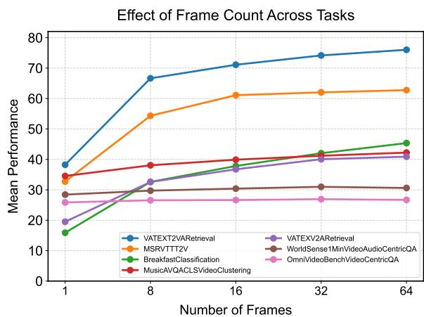

line chart

| Number of Frames | VATEXT2VARetrieval | MSRVTTT2V | BreakfastClassification | MusicAVQACLSVideoClustering | VATEXV2ARetrieval | WorldSense1MinVideoAudioCentricQA | OmniVideoBenchVideoCentricQA |
| ---------------- | ------------------ | --------- | ---------------------- | ---------------------------- | ----------------- | ---------------------------------- | ---------------------------- |
| 1                | 38                 | 33        | 16                     | 34                           | 20                | 28                                 | 26                           |
| 8                | 67                 | 55        | 38                     | 38                           | 32                | 30                                 | 26                           |
| 16               | 71                 | 61        | 40                     | 40                           | 36                | 30                                 | 26                           |
| 32               | 74                 | 62        | 42                     | 42                           | 40                | 30                                 | 26                           |
| 64               | 76                 | 63        | 45                     | 42                           | 41                | 30                                 | 26                           |

Figure 6: Per-task mean performance as a function of sampled frame count.

## F.3 Model-Level Performance Scaling

Scaling trajectories differ across architectures (Figure 4, main text). ebind-full plateaus early:

it reaches 45.62 at N=8 and only 46.68 at N =64, suggesting its frame-pooling integrator extracts most of its signal from a small budget. The MLLM-based and audio-visual contrastive models scale more smoothly through N=64; omni-embed-nemotron-3b reaches 44.67 and pe-av-small reaches 44.32 at the top of the sweep.

## G Accessibility and Reproducibility

While previous works (Enevoldsen et al., 2025, 2024; Chung et al., 2025) drastically improve transparency, reproducibility and submission protocols for MTEB, we here describe further improvements to MTEB that support reproducibility and long-term usability of the benchmark:

Experiment tracking: MTEB now records the full set of evaluation run settings (model configuration and task parameters) alongside each result file. Package version is tracked at the granularity of individual dataset subsets rather than per result file, enabling reliable merging of results obtained across different MTEB versions. Thus reducing the need to rerun the full results when expanding existing evaluations to include new splits or languages, while maintain a full reproducible traceback. Results can be submitted to the community repository directly from the local cache via a standardised API. Submissions can additionally be scoped to a named experiment, keeping ablations and non-standard runs separate from canonical model results, thus allow for experiments on embedding compression, reduced vector size and similar.

Runtime tracking and evaluation efficiency: Results are now written incrementally per dataset subset rather than once per completed task, so that only the interrupted subset must be re-run following a crash or preemption. Runtime is also recorded per evaluation phase, supporting transparency into wall-clock costs alongside quality metrics.

Model metadata extensions: MODELMETA has been extended with an active\_parameters field, recording the number of parameters engaged during inference rather than the total parameter count, which is more relevant for efficiency comparisons especially for smaller models where the vocabulary can drastically influence the parameters count in the embeddings whithout influencing the runtime cost. A required\_dependencies field allows model authors to declare additional package requirements at registration time, reducing friction and ensuring reproducibility when running third-party models.

Leaderboard transparency: A performanceover-time visualization traces the progression of state-of-the-art scores across benchmarks over the history of model submissions, enabling researchers to contextualize new results against the trajectory of the field.

## G.1 Per-model sampling configuration

Table 34 lists each model’s declared video and audio sampling configuration. We honor these declared settings on every task rather than forcing a benchmark-wide budget; the rationale is in §3.2.

## H Task correlation

This appendix groups three diagnostic plots over the MVEB task pool: how tasks correlate with one another across models (Figure 7), how model parameter count relates to MVEB performance broken out by task (Figure 8), and how the pertask mean score is distributed across the roster (Figure 9). Together they support the redundancypruning and dataset-coverage decisions described in §3.

## I Audio Contribution: Per-Dataset and Per-Model Breakdowns

This appendix expands the audio-contribution analysis from §5.1. Table 35 reports the per-dataset audio delta sorted within each annotation group; Table 36 reports cross-modal retrieval alignment for the datasets that have both v2a and a2v task variants; Table 37 reports the per-model mean audio delta across all 48 paired task groups.

## J Cross-Modal Retrieval Direction Structure: Extended Analysis

This appendix expands the cross-modal retrieval correlation analysis in §5.3. Table 38 reports every pairwise Spearman correlation across the eight retrieval directions, computed over the 16 audiocapable models in our roster.

Three latent capability axes. The 28 pairwise correlations resolve into three latent capability groups:

Text-as-query $T  V , T  V A , V T  A$ . Internal $\rho \in [ 0 . 7 7 , 0 . 9 2 ]$ . These directions all start from a textual query and retrieve into some non-text modality; the strongest pair is $T \to V$ vs. $T  V A \ ( \rho = 0 . 9 2 )$ , which differ only in whether the target includes audio.

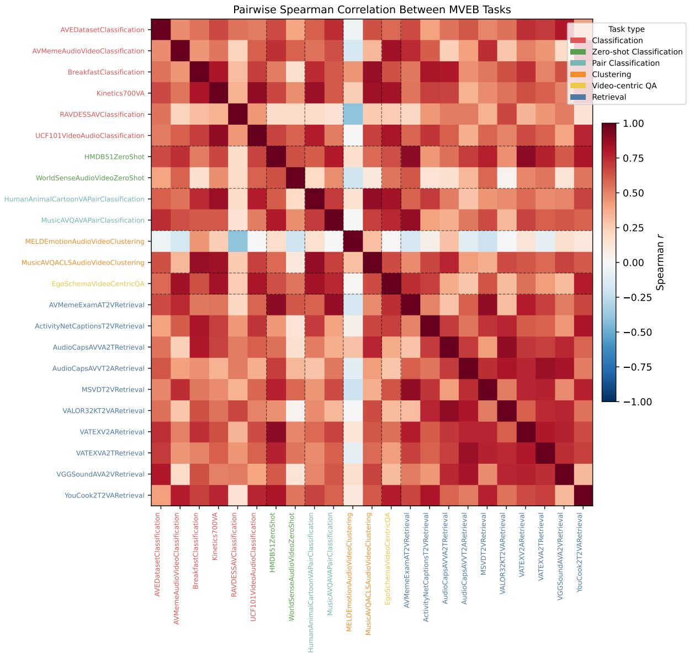

heatmap

| Task | AVEDatasetClassification | AVMemeAudioVideoClassification | BreakfastClassification | Kinetics700VA | RAVDESSAVClassification | UCF101VideoAudioClassification | HMDB51ZeroShot | WorldSenseAudioVideoZeroShot | HumanAnimalCartoonVAPairClassification | MusicAVQAVAPairClassification | MELDEmotionAudioVideoClustering | MusicAVQACLSAudioVideoClustering | EgoSchemaVideoCentricQA | AVMemeExamAT2VRetrieval | ActivityNetCaptionsT2VRetrieval | AudioCapsAVVA2TRetrieval | AudioCapsAVVT2ARetrieval | MSVDT2VRetrieval | VALOR32KT2VAREtrieval | VATEXV2ARetrieval | VATEXVA2TRetrieval | VGGSoundAVA2VRetrieval | YouCook2T2VAREtrieval |
| --- | --- | --- | --- | --- | --- | --- | --- | --- | --- | --- | --- | --- | --- | --- | --- | --- | --- | --- | --- | --- | --- | --- | --- |
| AVEDatasetClassification | 0.15 | 0.05 | 0.08 | 0.03 | 0.06 | 0.04 | 0.07 | 0.02 | 0.09 | 0.01 | 0.08 | 0.03 | 0.06 | 0.04 | 0.07 | 0.02 | 0.09 | 0.04 | 0.07 | 0.02 | 0.08 | 0.03 | 0.06 |
| AVMemeAudioVideoClassification | 0.18 | 0.06 | 0.09 | 0.04 | 0.07 | 0.05 | 0.08 | 0.03 | 0.10 | 0.02 | 0.11 | 0.05 | 0.12 | 0.06 | 0.11 | 0.03 | 0.12 | 0.05 | 0.11 | 0.03 | 0.13 | 0.07 | 0.14 |
| BreakfastClassification | 0.16 | 0.07 | 0.10 | 0.05 | 0.11 | 0.06 | 0.13 | 0.04 | 0.12 | 0.03 | 0.13 | 0.06 | 0.14 | 0.11 | 0.13 | 0.12 | 0.14 | 0.11 | 0.13 | 0.14 | 0.15 | 0.16 | 0.17 |
| Kinetics700VA | 0.19 | 0.12 | 0.15 | 0.11 | 0.14 | 0.12 | 0.16 | 0.13 | 0.15 | 0.14 | 0.16 | 0.13 | 0.17 | 0.15 | 0.17 | 0.16 | 0.18 | 0.14 | 0.17 | 0.18 | 0.22 | 0.23 | 0.24 |
| RAVDESSAVClassification | 0.22 | 0.15 | 0.18 | 0.25 | 0.28 | 0.26 | 0.29 | 0.27 | 0.28 | 0.26 | 0.29 | 0.27 | 0.31 | 0.28 | 0.31 | 0.29 | 0.32 | 0.27 | 0.31 | 0.33 | 0.34 | 0.35 | 0.36 |
| UCF101VideoAudioClassification | 0.25 | 0.22 | 0.24 | 0.35 | 0.38 | 0.36 | 0.39 | 0.37 | 0.39 | 0.37 | 0.41 | 0.39 | 0.43 | 0.41 | 0.43 | 0.42 | 0.44 | 0.39 | 0.42 | 0.44 | 0.46 | 0.47 | 0.48 |

Figure 7: Pairwise rank correlation across MVEB+ tasks computed over the model roster. Block structure along the diagonal indicates clusters of tasks that rank models similarly (e.g., the eight retrieval directions cluster together; classification splits within a dataset family cluster together). This is the matrix from which the redundancy-removal step in §3 drops a task when $\rho > 0 . 8 5$ to a retained one.

Audio-as-conditioning-into-video $\begin{array} { r l r } { A } & { { } \to } & { V . } \end{array}$ , $A T  V , V  A .$ . Internal $\rho \in [ 0 . 8 7 , 0 . 9 4 ]$ . The directions that involve audio paired with video as either query or target; $V  A$ correlates as tightly with $A T  V \ ( \rho = 0 . 9 4 )$ as it does with $A \to V ~ ( \rho = 0 . 8 7 )$ , suggesting these three measure essentially the same capability of an audio-video joint encoder.

Text-as-target $V  T , V A  T$ . A tight pair at $\rho = 0 . 9 6 ;$ whether the query includes audio or not, the model’s text-target ranking is nearly invariant.

What this means for benchmarking. The directions that cross group boundaries are the most decoupled: $T  V A { \mathrm { ~ v s . ~ } } A  V ( \rho = 0 . 3 8 )$ and $T  V A { \mathrm { ~ v s . ~ } } A T  V ( \rho = 0 . 3 9 )$ are the lowest pairs in the table. Both contrasts involve audio: in one case $T \to V A$ has audio as part of the target (joined with video), while $A  V / A T  V$ have audio as part of the query. Models that handle one of these well are not guaranteed to handle the other; this is consistent with the audio-track analysis in §5.1 that audio contributes a genuinely distinct signal whose encoding is implementation-specific.

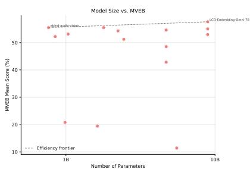

scatter plot

| Number of Parameters | MVEB Mean Score (%) |
| --------------------- | ------------------- |
| 1B                    | 55                  |
| 1B                    | 52                  |
| 1B                    | 50                  |
| 1B                    | 48                  |
| 1B                    | 45                  |
| 1B                    | 42                  |
| 1B                    | 38                  |
| 1B                    | 35                  |
| 1B                    | 32                  |
| 1B                    | 30                  |
| 1B                    | 28                  |
| 1B                    | 25                  |
| 1B                    | 22                  |
| 1B                    | 20                  |
| 1B                    | 18                  |
| 1B                    | 15                  |
| 1B                    | 12                  |
| 1B                    | 10                  |
| 10B                   | 58                  |
| 10B                   | 56                  |
| 10B                   | 54                  |
| 10B                   | 52                  |
| 10B                   | 50                  |
| 10B                   | 48                  |
| 10B                   | 45                  |
| 10B                   | 42                  |
| 10B                   | 40                  |
| 10B                   | 38                  |
| 10B                   | 35                  |
| 10B                   | 32                  |
| 10B                   | 30                  |
| 10B                   | 28                  |
| 10B                   | 25                  |
| 10B                   | 22                  |
| 10B                   | 20                  |
| 10B                   | 18                  |
| 10B                   | 15                  |
| 10B                   | 12                  |
| 10B                   | 10                  |

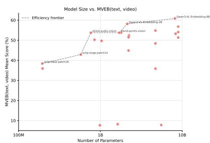

scatter plot

| Number of Parameters | MVEB(text, video) Mean Score (%) |
| --------------------- | --------------------------------- |
| 100M                  | 38                                |
| 100M                  | 36                                |
| 100M                  | 42                                |
| 100M                  | 52                                |
| 100M                  | 54                                |
| 100M                  | 56                                |
| 100M                  | 58                                |
| 100M                  | 60                                |
| 1B                    | 8                                 |
| 1B                    | 9                                 |
| 1B                    | 10                                |
| 1B                    | 11                                |
| 1B                    | 12                                |
| 1B                    | 13                                |
| 1B                    | 14                                |
| 1B                    | 15                                |
| 1B                    | 16                                |
| 1B                    | 17                                |
| 1B                    | 18                                |
| 1B                    | 19                                |
| 1B                    | 20                                |
| 1B                    | 21                                |
| 1B                    | 22                                |
| 1B                    | 23                                |
| 1B                    | 24                                |
| 1B                    | 25                                |
| 1B                    | 26                                |
| 1B                    | 27                                |
| 1B                    | 28                                |
| 1B                    | 29                                |
| 1B                    | 30                                |
| 1B                    | 31                                |
| 1B                    | 32                                |
| 1B                    | 33                                |
| 1B                    | 34                                |
| 1B                    | 35                                |
| 1B                    | 36                                |
| 1B                    | 37                                |
| 1B                    | 38                                |
| 1B                    | 39                                |
| 1B                    | 40                                |
| 1B                    | 41                                |
| 1B                    | 42                                |
| 1B                    | 43                                |
| 1B                    | 44                                |
| 1B                    | 45                                |
| 1B                    | 46                                |
| 1B                    | 47                                |
| 1B                    | 48                                |
| 1B                    | 49                                |
| 1B                    | 50                                |
| 1B                    | 51                                |
| 1B                    | 52                                |
| 1B                    | 53                                |
| 1B                    | 54                                |
| 1B                    | 55                                |
| 1B                    | 56                                |
| 1B                    | 57                                |
| 1B                    | 58                                |
| 1B                    | 59                                |
| 1B                    | 60                                |
| 10B                   | 8                                 |
| 10B                   | 9                                 |
| 10B                   | 10                                |
| 10B                   | 11                                |
| 10B                   | 12                                |
| 10B                   | 13                                |
| 10B                   | 14                                |
| 10B                   | 15                                |
| 10B                   | 16                                |
| 10B                   | 17                                |
| 10B                   | 18                                |
| 10B                   | 19                                |
| 10B                   | 20                                |
| 10B                   | 21                                |
| 10B                   | 22                                |
| 10B                   | 23                                |
| 10B                   | 24                                |
| 10B                   | 25                                |
| 10B                   | 26                                |
| 10B                   | 27                                |
| 10B                   | 28                                |
| 10B                   | 29                                |
| 10B                   | 30                                |
| 10B                   | 31                                |
| 10B                   | 32                                |
| 10B                   | 33                                |
| 10B                   | 34                                |
| 10B                   | 35                                |
| 10B                   | 36                                |
| 10B                   | 37                                |
| 10B                   | 38                                |
| 10B                   | 39                                |
| 10B                   | 40                                |
| 10B                   | 41                                |
| 10B                   | 42                                |
| 10B                   | 43                                |
| 10B                   | 44                                |
| 10B                   | 45                                |
| 10B                   | 46                                |
| 10B                   | 47                                |
| 10B                   | 48                                |
| 10B                   | 49                                |
| 10B                   | 50                                |
| 10B                   | 51                                |
| 10B                   | 52                                |
| 10B                   | 53                                |
| 10B                   | 54                                |
| 10B                   | 55                                |
| 10B                   | 56                                |
| 10B                   | 57                                |
| 10B                   | 58                                |
| 10B                   | 59                                |
| 10B                   | 60                                |

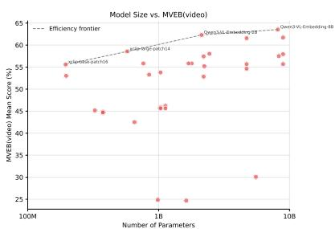

scatter plot

| Number of Parameters | MVEB(video) Mean Score (%) |
| --- | --- |
| 100M | 55 |
| 100M | 53 |
| 100M | 45 |
| 100M | 43 |
| 100M | 25 |
| 100M | 25 |
| 100M | 30 |
| 100M | 35 |
| 100M | 40 |
| 100M | 45 |
| 100M | 50 |
| 100M | 55 |
| 100M | 60 |
| 100M | 65 |
| 1B | 55 |
| 1B | 53 |
| 1B | 45 |
| 1B | 30 |
| 1B | 25 |
| 1B | 35 |
| 1B | 40 |
| 1B | 45 |
| 1B | 50 |
| 1B | 55 |
| 1B | 60 |
| 1B | 65 |
| 10B | 55 |
| 10B | 53 |
| 10B | 45 |
| 10B | 30 |
| 10B | 25 |
| 10B | 35 |
| 10B | 40 |
| 10B | 45 |
| 10B | 50 |
| 10B | 55 |
| 10B | 60 |
| 10B | 65 |

Figure 8: Parameter count vs. MVEB performance, broken out by task family. Complements the headline scaling view in Figure 3 (which uses overall MVEB mean): per-family curves show where extra parameters convert into score (e.g., retrieval and QA) versus where they plateau (clustering, pair classification).

This decoupling is the contrast that MMEB-V3 (Huang et al., 2026) cannot expose: by treating audio strictly as a separate retrieval modality with only $A \  \ V$ and $V \  \ A$ directions and never paired audio+video inputs, it does not include $T \to V A$ at all, and so the third capability group (audio as part of a joint retrieval target) is invisible.

Implication for the headline leaderboard. The within-group correlations above 0.85 mean a reader could collapse the eight directions into three targetgrouped scores (text-target, video-target, audiotarget) without losing rank information. We keep all eight in the per-direction appendix tables (subsection D.3) for transparency, but the MVEB Retr column already mean-pools them into a single score that aligns with the dominant capability axis.

## K MVEB(text, video): Extended Analysis

This appendix expands the discussion of MVEB(text, video) from §4. The full 25-model leaderboard is in Table 11 (Appendix D.1); we report three observations here.

Breadth of the Qwen3-VL family’s lead. Qwen3-VL-Embedding-8B and -2B (Li et al., 2026) take ranks 1 and 2 on MVEB(text, video) (60.9 and 58.1 mean). On the per-category breakdown, Qwen3-VL-Embedding-8B leads retrieval (69.2), classification (57.5), and zero-shot classification (59.2); Qwen3-VL-Embedding-2B leads clustering (24.9) and pair classification (88.3). LCO-Embedding-Omni-3B retains QA (32.8). Qwen3-VL-Embedding-2B at 58.1 mean already exceeds LCO-Embedding-Omni-7B (56.8) at roughly one-quarter the parameter count. We report these numbers; we do not attempt to attribute the gap to a specific cause, since the Qwen3-VL checkpoints differ from the omni embedders in training recipe, training-data composition, and declared input modalities simultaneously.

What MVEB(text, video) is not. MVEB(text, video) excludes the audio-conditioned retrieval directions $( A \to V , V \to A , A T \to V , V T \to A$ , T → V A, $V A  T )$ and the audio+video task variants by construction; a high rank here is not evidence that a model would generalize to audiobearing tasks, and the headline MVEB leaderboard remains the appropriate surface for audio-capable models. We expose MVEB(text, video) so that models that do not accept the full audio+video+text input surface can still be evaluated on a principled subset of the same task pool.

Relation to MMEB-V2. MMEB-V2 (Meng et al., 2025) is the closest existing text-video evaluation surface: 18 video tasks across retrieval, classification, VQA, grounding, and instance retrieval, evaluating text-video models in isolation. The structural difference with MVEB(text, video) is that the latter is the text-video projection of the same task pool we use for the headline MVEB and the audio-only-encoder variant, so the same model can be compared on the same tasks with and without an audio path. We do not claim a head-to-head comparison of model rankings between MMEB-V2 and MVEB(text, video) here, since the two benchmarks draw their tasks from different pools.

## L Annotation Quality Notes

We expand on the annotation-quality limitation introduced in the Limitations section. The most affected MVEB source datasets are the emotionrecognition splits; similar issues likely apply elsewhere but emotion datasets surface them most visibly.

MELD. MELD assigns a single discrete emotion to short utterance clips drawn from a sitcom. Two

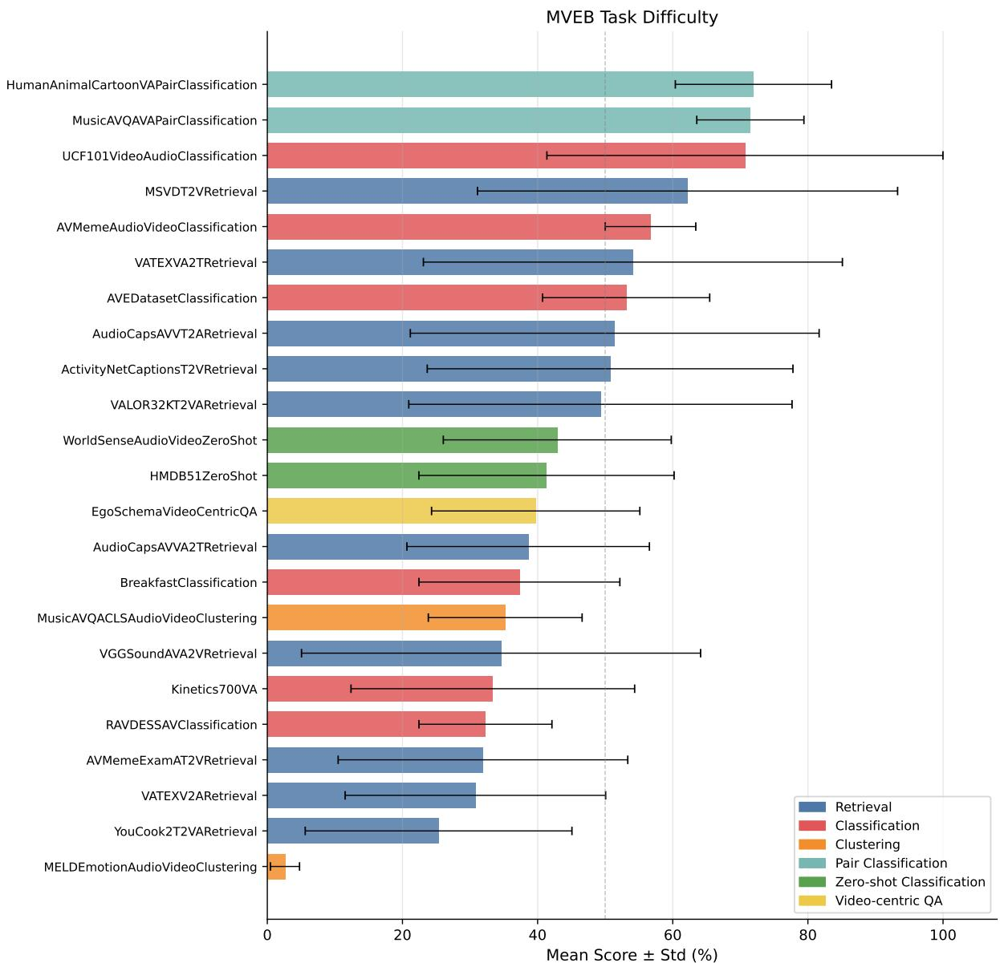

bar chart

| Task | Category | Mean Score ± Std (%) |
| --- | --- | --- |
| HumanAnimalCartoonVAPairClassification | Pair Classification | 72 |
| MusicAVQAVAPairClassification | Pair Classification | 71 |
| UCF101VideoAudioClassification | Classification | 70 |
| MSVDT2VRetrieval | Retrieval | 62 |
| AVMemeAudioVideoClassification | Classification | 56 |
| VATEXVA2TRetrieval | Retrieval | 54 |
| AVEDatasetClassification | Classification | 52 |
| AudioCapsAVVT2ARetrieval | Retrieval | 51 |
| ActivityNetCaptionsT2VRetrieval | Retrieval | 50 |
| VALOR32KT2VARetrieval | Retrieval | 49 |
| WorldSenseAudioVideoZeroShot | Zero-shot Classification | 42 |
| HMDB51ZeroShot | Zero-shot Classification | 40 |
| EgoSchemaVideoCentricQA | Video-centric QA | 38 |
| AudioCapsAVVA2TRetrieval | Retrieval | 38 |
| BreakfastClassification | Classification | 36 |
| MusicAVQACLSAudioVideoClustering | Classification | 34 |
| VGGSoundAVA2VRetrieval | Retrieval | 34 |
| Kinetics700VA | Classification | 32 |
| RAVDESSAVClassification | Classification | 30 |
| AVMemeExamAT2VRetrieval | Retrieval | 30 |
| VATEXV2ARetrieval | Retrieval | 28 |
| YouCook2T2VARetrieval | Retrieval | 24 |
| MELDEmotionAudioVideoClustering | Clustering | 1.5 |

Figure 9: Per-task mean score across the model roster, sorted ascending. Low scores reflect a mix of intrinsic task difficulty and dataset label-quality issues; the emotion-recognition splits (MELD, RAVDESS) sit low primarily because of known label noise rather than embedding-quality limits (see Appendix L).

annotation patterns recur: (i) multi-sentiment utterances are squashed to one label, since a single clip can carry a surprise reaction, a brief rebuke, and a laugh track all in a few seconds, yet only one emotion tag is assigned; (ii) sitcom-specific context cues (laugh tracks, sarcastic delivery, the listener’s reaction shot) can pull the gold label away from the literal text content. As an illustrative example of the first pattern, an utterance that contains an initial exclamation followed by a mild verbal complaint may carry an anger label even though a reasonable reader would split the same clip into several distinct affect segments. The single-label formulation is a property of the dataset, not the MVEB task wrapper, and we have not re-annotated for this paper.

RAVDESS. RAVDESS uses scripted emotionacting performed by 24 professional actors at two intensity levels. Compound or transition states (e.g., a clip whose first half is neutral and second half is angry) are not captured by the singleemotion label, and intensity is a separate axis rather than a per-clip secondary label.

AVE-Dataset. AVE-Dataset annotates audiovisual events with class labels and bounding times. Some events co-occur within a clip but only the dominant event is annotated, which introduces unavoidable noise in clip-level classification tasks that operate on the whole clip rather than on the bounded event spans.

Why we keep the as-released labels. (a) These datasets are widely used and re-annotating them would break score comparability with the substantial body of prior published results. (b) MVEB’s goal is to measure embedding quality on the field’s standard evaluation surfaces, including their imperfections; an embedding model that perfectly fits a noisy single-label gold standard may be over-fitting to the annotation noise itself.

Mitigation paths for the community. Three directions are tractable: (i) soft-label or multi-label re-releases that publish per-clip distributions over labels rather than a single argmax, with evaluation tasks that consume the distribution; (ii) humanmodel agreement audits in the style of HUME (Assadi et al., 2025) that sample clips where current models disagree with the as-released label and check which side a fresh human annotator takes; (iii) targeted re-annotation on the most affected splits, with the as-released labels retained under a versioned task so prior results remain reproducible.

<table><tr><td>Dataset</td><td>Citation</td><td>MVEB</td><td>N.samples</td><td>Total Duration(s)</td><td>N.Langs</td><td>Domains</td><td>Main metric</td></tr><tr><td colspan="8">Video Retrieval</td></tr><tr><td>AVMemeExamA2VRetrieval</td><td>(Jiang et al., 2026)</td><td></td><td>1,800</td><td>3h (11,010s)</td><td>1</td><td>Web, Social</td><td>ndcg_at_10</td></tr><tr><td>AVMemeExamAT2VRetrieval</td><td>(Jiang et al., 2026)</td><td>√</td><td>1,800</td><td>3h (11,010s)</td><td>1</td><td>Web, Social</td><td>ndcg_at_10</td></tr><tr><td>AVMemeExamT2VARetrieval</td><td>(Jiang et al., 2026)</td><td></td><td>1,800</td><td>3h (11,010s)</td><td>1</td><td>Web, Social</td><td>ndcg_at_10</td></tr><tr><td>AVMemeExamV2ARetrieval</td><td>(Jiang et al., 2026)</td><td></td><td>1,800</td><td>3h (11,010s)</td><td>1</td><td>Web, Social</td><td>ndcg_at_10</td></tr><tr><td>AVMemeExamVA2TRetrieval</td><td>(Jiang et al., 2026)</td><td></td><td>1,800</td><td>3h (11,010s)</td><td>1</td><td>Web, Social</td><td>ndcg_at_10</td></tr><tr><td>AVMemeExamVT2ARetrieval</td><td>(Jiang et al., 2026)</td><td></td><td>1,800</td><td>3h (11,010s)</td><td>1</td><td>Web, Social</td><td>ndcg_at_10</td></tr><tr><td>AudioCapsAVA2VRetrieval</td><td>(Kim et al., 2019)</td><td></td><td>1,330</td><td>1h (6,541s)</td><td>1</td><td>Encyclopaedic, Web</td><td>ndcg_at_10</td></tr><tr><td>AudioCapsAVAT2VRetrieval</td><td>(Kim et al., 2019)</td><td></td><td>1,330</td><td>1h (6,541s)</td><td>1</td><td>Encyclopaedic, Web</td><td>ndcg_at_10</td></tr><tr><td>AudioCapsAVT2VARetrieval</td><td>(Kim et al., 2019)</td><td></td><td>1,330</td><td>1h (6,541s)</td><td>1</td><td>Encyclopaedic, Web</td><td>ndcg_at_10</td></tr><tr><td>AudioCapsAVV2ARetrieval</td><td>(Kim et al., 2019)</td><td></td><td>1,330</td><td>1h (6,541s)</td><td>1</td><td>Encyclopaedic, Web</td><td>ndcg_at_10</td></tr><tr><td>AudioCapsAVVA2TRetrieval</td><td>(Kim et al., 2019)</td><td>√</td><td>1,330</td><td>1h (6,541s)</td><td>1</td><td>Encyclopaedic, Web</td><td>ndcg_at_10</td></tr><tr><td>AudioCapsAVVT2ARetrieval</td><td>(Kim et al., 2019)</td><td>√</td><td>1,330</td><td>1h (6,541s)</td><td>1</td><td>Encyclopaedic, Web</td><td>ndcg_at_10</td></tr><tr><td>DiDeMoA2VRetrieval</td><td>(Hendricks et al., 2017)</td><td></td><td>1,998</td><td>13h (50,032s)</td><td>1</td><td>Web, Spoken</td><td>ndcg_at_10</td></tr><tr><td>DiDeMoAT2VRetrieval</td><td>(Hendricks et al., 2017)</td><td></td><td>1,998</td><td>13h (50,032s)</td><td>1</td><td>Web, Spoken</td><td>ndcg_at_10</td></tr><tr><td>DiDeMoT2VARetrieval</td><td>(Hendricks et al., 2017)</td><td></td><td>1,998</td><td>13h (50,032s)</td><td>1</td><td>Web, Spoken</td><td>ndcg_at_10</td></tr><tr><td>DiDeMoV2ARetrieval</td><td>(Hendricks et al., 2017)</td><td></td><td>1,998</td><td>13h (50,032s)</td><td>1</td><td>Web, Spoken</td><td>ndcg_at_10</td></tr><tr><td>DiDeMoVA2TRetrieval</td><td>(Hendricks et al., 2017)</td><td></td><td>1,998</td><td>13h (50,032s)</td><td>1</td><td>Web, Spoken</td><td>ndcg_at_10</td></tr><tr><td>DiDeMoVT2ARetrieval</td><td>(Hendricks et al., 2017)</td><td></td><td>1,998</td><td>13h (50,032s)</td><td>1</td><td>Web, Spoken</td><td>ndcg_at_10</td></tr><tr><td>MSRVTTA2V</td><td>(Xu et al., 2016)</td><td></td><td>1,758</td><td>3h (13,369s)</td><td>1</td><td>Unknown</td><td>ndcg_at_10</td></tr><tr><td>MSRVTTAT2V</td><td>(Xu et al., 2016)</td><td></td><td>1,758</td><td>3h (13,369s)</td><td>1</td><td>Unknown</td><td>ndcg_at_10</td></tr><tr><td>MSRVTTT2VA</td><td>(Xu et al., 2016)</td><td></td><td>1,758</td><td>3h (13,369s)</td><td>1</td><td>Unknown</td><td>ndcg_at_10</td></tr><tr><td>MSRVTTV2A</td><td>(Xu et al., 2016)</td><td></td><td>1,758</td><td>3h (13,369s)</td><td>1</td><td>Unknown</td><td>ndcg_at_10</td></tr><tr><td>MSRVTTVA2T</td><td>(Xu et al., 2016)</td><td></td><td>1,758</td><td>3h (13,369s)</td><td>1</td><td>Unknown</td><td>ndcg_at_10</td></tr><tr><td>MSRVTTVT2A</td><td>(Xu et al., 2016)</td><td></td><td>1,758</td><td>3h (13,369s)</td><td>1</td><td>Unknown</td><td>ndcg_at_10</td></tr><tr><td>Panda70MT2VARetrieval</td><td>(Chen et al., 2024)</td><td></td><td>6,790</td><td>10h (37,488s)</td><td>1</td><td>Web, Spoken</td><td>ndcg_at_10</td></tr><tr><td>Panda70MVA2TRetrieval</td><td>(Chen et al., 2024)</td><td></td><td>6,790</td><td>10h (37,488s)</td><td>1</td><td>Web, Spoken</td><td>ndcg_at_10</td></tr><tr><td>Shot2Story20KA2VRetrieval</td><td>(Han et al., 2023)</td><td></td><td>8,046</td><td>18h (67,101s)</td><td>1</td><td>Web, Spoken</td><td>ndcg_at_10</td></tr><tr><td>Shot2Story20KAT2VRetrieval</td><td>(Han et al., 2023)</td><td></td><td>8,046</td><td>18h (67,101s)</td><td>1</td><td>Web, Spoken</td><td>ndcg_at_10</td></tr><tr><td>Shot2Story20KT2VARetrieval</td><td>(Han et al., 2023)</td><td></td><td>8,046</td><td>18h (67,101s)</td><td>1</td><td>Web, Spoken</td><td>ndcg_at_10</td></tr><tr><td>Shot2Story20KV2ARetrieval</td><td>(Han et al., 2023)</td><td></td><td>8,046</td><td>18h (67,101s)</td><td>1</td><td>Web, Spoken</td><td>ndcg_at_10</td></tr><tr><td>Shot2Story20KVA2TRetrieval</td><td>(Han et al., 2023)</td><td></td><td>8,046</td><td>18h (67,101s)</td><td>1</td><td>Web, Spoken</td><td>ndcg_at_10</td></tr><tr><td>Shot2Story20KVT2ARetrieval</td><td>(Han et al., 2023)</td><td></td><td>8,046</td><td>18h (67,101s)</td><td>1</td><td>Web, Spoken</td><td>ndcg_at_10</td></tr><tr><td>VALOR32KA2VRetrieval</td><td>(Chen et al., 2023)</td><td></td><td>6,982</td><td>9h (34,636s)</td><td>1</td><td>Web, Spoken</td><td>ndcg_at_10</td></tr><tr><td>VALOR32KAT2VRetrieval</td><td>(Chen et al., 2023)</td><td></td><td>6,982</td><td>9h (34,636s)</td><td>1</td><td>Web, Spoken</td><td>ndcg_at_10</td></tr><tr><td>VALOR32KT2VARetrieval</td><td>(Chen et al., 2023)</td><td>√</td><td>6,982</td><td>9h (34,636s)</td><td>1</td><td>Web, Spoken</td><td>ndcg_at_10</td></tr><tr><td>VALOR32KV2ARetrieval</td><td>(Chen et al., 2023)</td><td></td><td>6,982</td><td>9h (34,636s)</td><td>1</td><td>Web, Spoken</td><td>ndcg_at_10</td></tr><tr><td>VALOR32KVA2TRetrieval</td><td>(Chen et al., 2023)</td><td></td><td>6,982</td><td>9h (34,636s)</td><td>1</td><td>Web, Spoken</td><td>ndcg_at_10</td></tr><tr><td>VALOR32KVT2ARetrieval</td><td>(Chen et al., 2023)</td><td></td><td>6,982</td><td>9h (34,636s)</td><td>1</td><td>Web, Spoken</td><td>ndcg_at_10</td></tr><tr><td>VATEXA2VRetrieval</td><td>(Wang et al., 2019)</td><td></td><td>2,000</td><td>1d (157,615s)</td><td>1</td><td>Web, Spoken</td><td>ndcg_at_10</td></tr><tr><td>VATEXAT2VRetrieval</td><td>(Wang et al., 2019)</td><td></td><td>2,000</td><td>1d (157,615s)</td><td>1</td><td>Web, Spoken</td><td>ndcg_at_10</td></tr><tr><td>VATEXT2VARetrieval</td><td>(Wang et al., 2019)</td><td></td><td>2,000</td><td>1d (157,615s)</td><td>1</td><td>Web, Spoken</td><td>ndcg_at_10</td></tr><tr><td>VATEXV2ARetrieval</td><td>(Wang et al., 2019)</td><td>√</td><td>2,000</td><td>1d (157,615s)</td><td>1</td><td>Web, Spoken</td><td>ndcg_at_10</td></tr><tr><td>VATEXVA2TRetrieval</td><td>(Wang et al., 2019)</td><td>√</td><td>2,000</td><td>1d (157,615s)</td><td>1</td><td>Web, Spoken</td><td>ndcg_at_10</td></tr><tr><td>VATEXVT2ARetrieval</td><td>(Wang et al., 2019)</td><td></td><td>2,000</td><td>1d (157,615s)</td><td>1</td><td>Web, Spoken</td><td>ndcg_at_10</td></tr><tr><td>VGGSoundAVA2VRetrieval</td><td>(Chen et al., 2020)</td><td>√</td><td>1,392</td><td>1h (6,952s)</td><td>1</td><td>Web, Spoken</td><td>ndcg_at_10</td></tr><tr><td>VGGSoundAVAT2VRetrieval</td><td>(Chen et al., 2020)</td><td></td><td>1,392</td><td>1h (6,952s)</td><td>1</td><td>Web, Spoken</td><td>ndcg_at_10</td></tr><tr><td>VGGSoundAVT2VARetrieval</td><td>(Chen et al., 2020)</td><td></td><td>1,392</td><td>1h (6,952s)</td><td>1</td><td>Web, Spoken</td><td>ndcg_at_10</td></tr><tr><td>VGGSoundAVV2ARetrieval</td><td>(Chen et al., 2020)</td><td></td><td>1,392</td><td>1h (6,952s)</td><td>1</td><td>Web, Spoken</td><td>ndcg_at_10</td></tr><tr><td>VGGSoundAVVA2TRetrieval</td><td>(Chen et al., 2020)</td><td></td><td>1,392</td><td>1h (6,952s)</td><td>1</td><td>Web, Spoken</td><td>ndcg_at_10</td></tr><tr><td>VGGSoundAVVT2ARetrieval</td><td>(Chen et al., 2020)</td><td></td><td>1,392</td><td>1h (6,952s)</td><td>1</td><td>Web, Spoken</td><td>ndcg_at_10</td></tr><tr><td>YouCook2A2VRetrieval</td><td>(Zhou et al., 2018)</td><td></td><td>6,208</td><td>17h (61,878s)</td><td>1</td><td>Web, Spoken</td><td>ndcg_at_10</td></tr><tr><td>YouCook2AT2VRetrieval</td><td>(Zhou et al., 2018)</td><td></td><td>6,208</td><td>17h (61,878s)</td><td>1</td><td>Web, Spoken</td><td>ndcg_at_10</td></tr><tr><td>YouCook2T2VARetrieval</td><td>(Zhou et al., 2018)</td><td>√</td><td>6,208</td><td>17h (61,878s)</td><td>1</td><td>Web, Spoken</td><td>ndcg_at_10</td></tr><tr><td>YouCook2V2ARetrieval</td><td>(Zhou et al., 2018)</td><td></td><td>6,208</td><td>17h (61,878s)</td><td>1</td><td>Web, Spoken</td><td>ndcg_at_10</td></tr><tr><td>YouCook2VA2TRetrieval</td><td>(Zhou et al., 2018)</td><td></td><td>6,208</td><td>17h (61,878s)</td><td>1</td><td>Web, Spoken</td><td>ndcg_at_10</td></tr><tr><td>YouCook2VT2ARetrieval</td><td>(Zhou et al., 2018)</td><td></td><td>6,208</td><td>17h (61,878s)</td><td>1</td><td>Web, Spoken</td><td>ndcg_at_10</td></tr></table>

Table 8: Video-audio(-text) retrieval tasks in MVEB. Tasks use video with audio and optionally text for retrieval.

<table><tr><td>Provenance</td><td>Dataset families</td></tr><tr><td>AV-grounded</td><td>AudioCaps_AV, AVEDataset, AVMeme, AVMemeExam, AVQA, AVSpeakerBench, Daily-Omni, MELD, MusicAVQA, MusicAVQACLS, OmniVideoBench, PerceptionTest, RAVDESS, Shot2Story20K, VALOR-32K, VGGSoundAV, VideoMMEShort, WorldQA, WorldSense, WorldSense1Min, YouCook2</td></tr><tr><td>V-grounded</td><td>ActivityNetCaptions, Breakfast, DiDeMo, Diving48, EgoSchema, HMDB51, HumanAnimalCartoon, Kinetics-400, Kinetics-600, Kinetics-700, MSR-VTT, MSVD, NExT-QA, Panda70M, Something-SomethingV2, TUNA-Bench, UCF101, VATEX, VideoCon, Vinoground</td></tr></table>

Table 9: Annotation provenance of MVEB source datasets. AV-grounded families had labels produced from both audio and visual content; V-grounded families had labels produced from visuals alone, even though the source clips often carry audio. Both groups are paired into video-only and video+audio task variants in MVEB; the distinction matters for interpreting the per-task audio delta in §5.1.

<table><tr><td>Model</td><td>Parameters (M)</td><td>Modalities</td></tr><tr><td>BidirLM/BidirLM-Omni-2.5B-Embedding</td><td>2445.0</td><td>a, i, t, v</td></tr><tr><td>Haon-Chen/e5-omni-3B (Chen et al., 2026)</td><td>4703.5</td><td>a, i, t, v</td></tr><tr><td>Haon-Chen/e5-omni-7B (Chen et al., 2026)</td><td>8931.8</td><td>a, i, t, v</td></tr><tr><td>LCO-Embedding/LCO-Embedding-Omni-3B (Xiao et al., 2025a)</td><td>4703.5</td><td>a, i, t, v</td></tr><tr><td>LCO-Embedding/LCO-Embedding-Omni-7B (Xiao et al., 2025a)</td><td>8931.8</td><td>a, i, t, v</td></tr><tr><td>Qwen/Qwen2.5-Omni-3B (Xu et al., 2025a)</td><td>5537.1</td><td>a, i, t, v</td></tr><tr><td>Qwen/Qwen2.5-Omni-7B (Xu et al., 2025a)</td><td>10732.2</td><td>a, i, t, v</td></tr><tr><td>Qwen/Qwen3-VL-Embedding-2B</td><td>2127.5</td><td>i, t, v</td></tr><tr><td>Qwen/Qwen3-VL-Embedding-8B</td><td>8144.8</td><td>i, t, v</td></tr><tr><td>Qwen/Qwen3-Omni-30B-A3B-Captioner $^{\dagger}$  (Xu et al., 2025b)</td><td>31719.2</td><td>a, i, t, v</td></tr><tr><td>Qwen/Qwen3-Omni-30B-A3B-Instruct $^{\dagger}$  (Xu et al., 2025b)</td><td>35259.8</td><td>a, i, t, v</td></tr><tr><td>Qwen/Qwen3-Omni-30B-A3B-Thinking $^{\dagger}$  (Xu et al., 2025b)</td><td>31719.2</td><td>a, i, t, v</td></tr><tr><td>Tevatron/OmniEmbed-v0.1 (Ma et al., 2025)</td><td>8931.8</td><td>a, i, t, v</td></tr><tr><td>encord-team/ebind-audio-vision (Broadbent et al., 2025)</td><td>764.2</td><td>a, i, t, v</td></tr><tr><td>encord-team/ebind-full (Broadbent et al., 2025)</td><td>1790.0</td><td>a, i, t, v</td></tr><tr><td>encord-team/ebind-points-vision (Broadbent et al., 2025)</td><td>1694.2</td><td>i, t, v</td></tr><tr><td>facebook/pe-av-base (Vyas et al., 2025)</td><td>1033.7</td><td>a, t, v</td></tr><tr><td>facebook/pe-av-base-16-frame $^{\dagger}$  (Vyas et al., 2025)</td><td>1033.7</td><td>a, t, v</td></tr><tr><td>facebook/pe-av-large (Vyas et al., 2025)</td><td>2234.7</td><td>a, t, v</td></tr><tr><td>facebook/pe-av-large-16-frame $^{\dagger}$  (Vyas et al., 2025)</td><td>2234.7</td><td>a, t, v</td></tr><tr><td>facebook/pe-av-small (Vyas et al., 2025)</td><td>847.0</td><td>a, t, v</td></tr><tr><td>facebook/pe-av-small-16-frame $^{\dagger}$  (Vyas et al., 2025)</td><td>847.0</td><td>a, t, v</td></tr><tr><td>facebook/vjepa2-vitg-fpc32-384-diving48</td><td>1127.9</td><td>v</td></tr><tr><td>facebook/vjepa2-vitg-fpc64-256</td><td>1034.6</td><td>v</td></tr><tr><td>facebook/vjepa2-vitg-fpc64-384</td><td>1034.6</td><td>v</td></tr><tr><td>facebook/vjepa2-vitg-fpc64-384-ssv2</td><td>1128.0</td><td>v</td></tr><tr><td>facebook/vjepa2-vith-fpc64-256</td><td>653.9</td><td>v</td></tr><tr><td>facebook/vjepa2-vitl-fpc16-256-ssv2</td><td>375.5</td><td>v</td></tr><tr><td>facebook/vjepa2-vitl-fpc32-256-diving48</td><td>375.4</td><td>v</td></tr><tr><td>facebook/vjepa2-vitl-fpc64-256</td><td>326.0</td><td>v</td></tr><tr><td>jinaai/jina-embeddings-v5-omni-nano</td><td>986.0</td><td>a, i, t, v</td></tr><tr><td>jinaai/jina-embeddings-v5-omni-small</td><td>1626.3</td><td>a, i, t, v</td></tr><tr><td>microsoft/xclip-base-patch16 (Ni et al., 2022)</td><td>194.9</td><td>t, v</td></tr><tr><td>microsoft/xclip-base-patch32 (Ni et al., 2022)</td><td>196.6</td><td>t, v</td></tr><tr><td>microsoft/xclip-large-patch14 (Ni et al., 2022)</td><td>575.7</td><td>t, v</td></tr><tr><td>VLM2Vec/VLM2Vec-V2.0 (Meng et al., 2025)</td><td>2209.0</td><td>i, t, v</td></tr><tr><td>nvidia/omni-embed-nemotron-3b (Xu et al., 2025c)</td><td>4703.5</td><td>a, i, t, v</td></tr><tr><td>nvidia/omnivinci $^{\dagger}$  (Ye et al., 2025)</td><td>8742.9</td><td>a, i, t, v</td></tr><tr><td>zhibinlan/UME-R1-2B (Lan et al., 2025)</td><td>2209.0</td><td>i, t, v</td></tr><tr><td>zhibinlan/UME-R1-7B (Lan et al., 2025)</td><td>8291.4</td><td>i, t, v</td></tr></table>

Table 10: Models registered in MVEB. Model sizes are in millions of parameters. †Registered in the MTEB model registry but not yet evaluated on MVEB.

<table><tr><td rowspan="2">Model</td><td rowspan="2">Type</td><td rowspan="2">Params</td><td colspan="2">Rank (↓)</td><td colspan="2">Average</td><td colspan="6">Average per Category</td></tr><tr><td colspan="2">MVEB(text, video)</td><td>Mean</td><td>Macro</td><td>Retr</td><td>QA</td><td>Cls</td><td>Clust</td><td>Pair</td><td>ZS</td></tr><tr><td>Number of tasks</td><td></td><td></td><td></td><td></td><td></td><td></td><td>(8)</td><td>(1)</td><td>(4)</td><td>(1)</td><td>(1)</td><td>(4)</td></tr><tr><td>Qwen3-VL-Embedding-8B</td><td>MLLM-based embedding</td><td>8.1B</td><td colspan="2">1</td><td>60.9</td><td>53.7</td><td>69.2</td><td>27.3</td><td>57.5</td><td>22.2</td><td>86.7</td><td>59.2</td></tr><tr><td>Qwen3-VL-Embedding-2B</td><td>MLLM-based embedding</td><td>2.1B</td><td colspan="2">2</td><td>58.1</td><td>52.6</td><td>65.7</td><td>26.7</td><td>54.8</td><td>24.9</td><td>88.3</td><td>55.0</td></tr><tr><td>LCO-Embedding-Omni-7B</td><td>MLLM-based embedding</td><td>8.9B</td><td colspan="2">3</td><td>56.8</td><td>51.8</td><td>62.3</td><td>30.8</td><td>54.3</td><td>20.8</td><td>85.9</td><td>56.4</td></tr><tr><td>LCO-Embedding-Omni-3B</td><td>MLLM-based embedding</td><td>4.7B</td><td colspan="2">4</td><td>54.8</td><td>50.8</td><td>59.1</td><td>32.8</td><td>54.0</td><td>17.6</td><td>87.7</td><td>53.7</td></tr><tr><td>ebind-points-vision</td><td>Multimodal binding</td><td>1.7B</td><td colspan="2">5</td><td>53.8</td><td>44.8</td><td>62.9</td><td>22.2</td><td>46.2</td><td>1.4</td><td>78.2</td><td>57.9</td></tr><tr><td>UME-R1-7B</td><td>MLLM-based embedding</td><td>8.3B</td><td colspan="2">6</td><td>53.3</td><td>46.7</td><td>62.5</td><td>26.7</td><td>48.1</td><td>8.8</td><td>84.0</td><td>50.0</td></tr><tr><td>ebind-audio-vision</td><td>Multimodal binding</td><td>764M</td><td colspan="2">7</td><td>53.8</td><td>44.8</td><td>62.9</td><td>22.2</td><td>46.2</td><td>1.4</td><td>78.2</td><td>57.9</td></tr><tr><td>ebind-full</td><td>Multimodal binding</td><td>1.8B</td><td colspan="2">7</td><td>53.8</td><td>44.8</td><td>62.9</td><td>22.2</td><td>46.2</td><td>1.4</td><td>78.2</td><td>57.9</td></tr><tr><td>e5-omni-7B</td><td>MLLM-based embedding</td><td>8.9B</td><td colspan="2">9</td><td>54.1</td><td>46.5</td><td>63.6</td><td>26.5</td><td>45.3</td><td>3.5</td><td>84.3</td><td>55.8</td></tr><tr><td>pe-av-large</td><td>Audio-visual contrastive</td><td>2.2B</td><td colspan="2">10</td><td>52.4</td><td>46.1</td><td>60.3</td><td>26.3</td><td>45.3</td><td>11.5</td><td>79.2</td><td>53.6</td></tr><tr><td>BidirLM-Omni-2.5B-Embedding</td><td>MLLM-based embedding</td><td>2.4B</td><td colspan="2">11</td><td>52.0</td><td>48.7</td><td>56.3</td><td>26.9</td><td>48.5</td><td>21.6</td><td>85.7</td><td>53.4</td></tr><tr><td>UME-R1-2B</td><td>MLLM-based embedding</td><td>2.2B</td><td colspan="2">12</td><td>51.5</td><td>46.4</td><td>57.6</td><td>25.1</td><td>48.0</td><td>14.9</td><td>82.1</td><td>50.9</td></tr><tr><td>OmniEmbed-v0.1</td><td>MLLM-based embedding</td><td>8.9B</td><td colspan="2">13</td><td>51.3</td><td>45.8</td><td>57.6</td><td>25.9</td><td>49.0</td><td>10.6</td><td>81.8</td><td>50.1</td></tr><tr><td>pe-av-base</td><td>Audio-visual contrastive</td><td>1.0B</td><td colspan="2">14</td><td>49.7</td><td>43.7</td><td>57.0</td><td>25.1</td><td>45.4</td><td>10.7</td><td>75.2</td><td>49.0</td></tr><tr><td>pe-av-small</td><td>Audio-visual contrastive</td><td>847M</td><td colspan="2">15</td><td>50.2</td><td>44.1</td><td>56.1</td><td>23.6</td><td>45.0</td><td>9.0</td><td>76.5</td><td>54.2</td></tr><tr><td>e5-omni-3B</td><td>MLLM-based embedding</td><td>4.7B</td><td colspan="2">16</td><td>48.4</td><td>43.5</td><td>57.9</td><td>28.3</td><td>45.1</td><td>8.0</td><td>82.1</td><td>39.5</td></tr><tr><td>xclip-large-patch14</td><td>Video-text contrastive</td><td>576M</td><td colspan="2">17</td><td>42.9</td><td>41.5</td><td>37.0</td><td>24.2</td><td>48.2</td><td>8.2</td><td>77.3</td><td>54.1</td></tr><tr><td>VLM2Vec-V2.0</td><td>MLLM-based embedding</td><td>2.2B</td><td colspan="2">18</td><td>44.9</td><td>41.0</td><td>50.0</td><td>29.1</td><td>40.6</td><td>0.2</td><td>81.3</td><td>45.0</td></tr><tr><td>omni-embed-nemotron-3b</td><td>MLLM-based embedding</td><td>4.7B</td><td colspan="2">19</td><td>35.8</td><td>38.4</td><td>29.3</td><td>25.1</td><td>43.7</td><td>10.9</td><td>82.9</td><td>38.3</td></tr><tr><td>xclip-base-patch16</td><td>Video-text contrastive</td><td>195M</td><td colspan="2">20</td><td>38.4</td><td>38.8</td><td>30.6</td><td>22.4</td><td>41.9</td><td>10.6</td><td>74.9</td><td>52.3</td></tr><tr><td>xclip-base-patch32</td><td>Video-text contrastive</td><td>197M</td><td colspan="2">21</td><td>35.9</td><td>38.0</td><td>26.9</td><td>26.5</td><td>37.2</td><td>11.1</td><td>74.7</td><td>51.6</td></tr><tr><td>Qwen2.5-Omni-7B</td><td>Generative MLLM</td><td>10.7B</td><td colspan="2">22</td><td>10.4</td><td>18.9</td><td>0.4</td><td>25.1</td><td>11.8</td><td>7.4</td><td>53.1</td><td>15.5</td></tr><tr><td>jina-embeddings-v5-omni-nano</td><td>MLLM-based embedding</td><td>986M</td><td colspan="2">23</td><td>7.7</td><td>15.8</td><td>0.4</td><td>26.3</td><td>8.9</td><td>1.0</td><td>51.5</td><td>6.9</td></tr><tr><td>Qwen2.5-Omni-3B</td><td>Generative MLLM</td><td>5.5B</td><td colspan="2">24</td><td>7.8</td><td>17.0</td><td>0.4</td><td>24.4</td><td>10.6</td><td>7.9</td><td>54.5</td><td>4.1</td></tr><tr><td>jina-embeddings-v5-omni-small</td><td>MLLM-based embedding</td><td>1.6B</td><td colspan="2">25</td><td>8.2</td><td>16.2</td><td>0.4</td><td>24.4</td><td>8.4</td><td>1.2</td><td>52.4</td><td>10.2</td></tr></table>

Table 11: Models on MVEB(text, video) ranked by Borda count over 19 tasks. Mean is the arithmetic mean over the model’s evaluated tasks; Macro is the macro-average across task categories (each category weighted equally regardless of task count). Task categories: Retr (retrieval; per-direction breakdown in appendix), QA, Cls (classification), Clust (clustering), Pair (pair classification), ZS (zero-shot classification). Model types are defined in §3.1. Bold = best per column.

<table><tr><td rowspan="2">Model</td><td rowspan="2">Type</td><td rowspan="2">Params</td><td>Rank (↓)</td><td colspan="2">Average</td><td colspan="2">Average per Category</td></tr><tr><td>MVEB(video)</td><td>Mean</td><td>Macro</td><td>Cls</td><td>Pair</td></tr><tr><td>Number of tasks</td><td></td><td></td><td></td><td></td><td></td><td>(6)</td><td>(3)</td></tr><tr><td>LCO-Embedding-Omni-3B</td><td>MLLM-based embedding</td><td>4.7B</td><td>1</td><td>61.6</td><td>65.1</td><td>54.4</td><td>75.9</td></tr><tr><td>LCO-Embedding-Omni-7B</td><td>MLLM-based embedding</td><td>8.9B</td><td>2</td><td>61.7</td><td>65.0</td><td>55.1</td><td>74.9</td></tr><tr><td>Qwen3-VL-Embedding-2B</td><td>MLLM-based embedding</td><td>2.1B</td><td>2</td><td>62.3</td><td>65.6</td><td>55.6</td><td>75.7</td></tr><tr><td>Qwen3-VL-Embedding-8B</td><td>MLLM-based embedding</td><td>8.1B</td><td>4</td><td>63.5</td><td>66.3</td><td>58.0</td><td>74.6</td></tr><tr><td>xclip-large-patch14</td><td>Video-text contrastive</td><td>576M</td><td>5</td><td>58.6</td><td>62.3</td><td>51.0</td><td>73.7</td></tr><tr><td>UME-R1-2B</td><td>MLLM-based embedding</td><td>2.2B</td><td>6</td><td>57.4</td><td>61.2</td><td>49.9</td><td>72.4</td></tr><tr><td>UME-R1-7B</td><td>MLLM-based embedding</td><td>8.3B</td><td>7</td><td>57.5</td><td>61.2</td><td>50.0</td><td>72.4</td></tr><tr><td>BidirLM-Omni-2.5B-Embedding</td><td>MLLM-based embedding</td><td>2.4B</td><td>7</td><td>58.0</td><td>62.0</td><td>50.1</td><td>73.8</td></tr><tr><td>ebind-full</td><td>Multimodal binding</td><td>1.8B</td><td>9</td><td>55.8</td><td>59.4</td><td>48.6</td><td>70.3</td></tr><tr><td>ebind-audio-vision</td><td>Multimodal binding</td><td>764M</td><td>9</td><td>55.8</td><td>59.4</td><td>48.6</td><td>70.3</td></tr><tr><td>ebind-points-vision</td><td>Multimodal binding</td><td>1.7B</td><td>11</td><td>55.8</td><td>59.4</td><td>48.6</td><td>70.3</td></tr><tr><td>OmniEmbed-v0.1</td><td>MLLM-based embedding</td><td>8.9B</td><td>12</td><td>57.9</td><td>61.3</td><td>51.2</td><td>71.4</td></tr><tr><td>xclip-base-patch16</td><td>Video-text contrastive</td><td>195M</td><td>13</td><td>55.6</td><td>59.8</td><td>47.3</td><td>72.2</td></tr><tr><td>e5-omni-3B</td><td>MLLM-based embedding</td><td>4.7B</td><td>14</td><td>55.7</td><td>59.3</td><td>48.3</td><td>70.4</td></tr><tr><td>e5-omni-7B</td><td>MLLM-based embedding</td><td>8.9B</td><td>15</td><td>55.7</td><td>59.4</td><td>48.2</td><td>70.7</td></tr><tr><td>pe-av-large</td><td>Audio-visual contrastive</td><td>2.2B</td><td>16</td><td>55.2</td><td>59.2</td><td>47.2</td><td>71.2</td></tr><tr><td>omni-embed-nemotron-3b</td><td>MLLM-based embedding</td><td>4.7B</td><td>16</td><td>54.7</td><td>58.8</td><td>46.3</td><td>71.3</td></tr><tr><td>VLM2Vec-V2.0</td><td>MLLM-based embedding</td><td>2.2B</td><td>18</td><td>52.9</td><td>56.8</td><td>45.0</td><td>68.5</td></tr><tr><td>pe-av-base</td><td>Audio-visual contrastive</td><td>1.0B</td><td>19</td><td>53.8</td><td>58.2</td><td>45.0</td><td>71.3</td></tr><tr><td>xclip-base-patch32</td><td>Video-text contrastive</td><td>197M</td><td>20</td><td>53.0</td><td>57.6</td><td>43.8</td><td>71.5</td></tr><tr><td>pe-av-small</td><td>Audio-visual contrastive</td><td>847M</td><td>21</td><td>53.3</td><td>57.6</td><td>44.8</td><td>70.4</td></tr><tr><td>vjepa2-vitg-fpc32-384-diving48</td><td>Self-supervised video</td><td>1.1B</td><td>22</td><td>46.2</td><td>50.3</td><td>38.0</td><td>62.5</td></tr><tr><td>vjepa2-vitl-fpc16-256-ssv2</td><td>Self-supervised video</td><td>375M</td><td>23</td><td>44.6</td><td>49.1</td><td>35.7</td><td>62.5</td></tr><tr><td>vjepa2-vitl-fpc64-256</td><td>Self-supervised video</td><td>326M</td><td>24</td><td>45.2</td><td>49.8</td><td>36.0</td><td>63.5</td></tr><tr><td>vjepa2-vitg-fpc64-256</td><td>Self-supervised video</td><td>1.0B</td><td>25</td><td>45.9</td><td>49.8</td><td>38.0</td><td>61.7</td></tr><tr><td>vjepa2-vitg-fpc64-384</td><td>Self-supervised video</td><td>1.0B</td><td>26</td><td>45.6</td><td>49.5</td><td>37.9</td><td>61.0</td></tr><tr><td>vjepa2-vitg-fpc64-384-ssv2</td><td>Self-supervised video</td><td>1.1B</td><td>26</td><td>45.6</td><td>49.5</td><td>37.9</td><td>61.0</td></tr><tr><td>vjepa2-vitl-fpc32-256-diving48</td><td>Self-supervised video</td><td>375M</td><td>28</td><td>44.8</td><td>49.4</td><td>35.5</td><td>63.2</td></tr><tr><td>vjepa2-vith-fpc64-256</td><td>Self-supervised video</td><td>654M</td><td>29</td><td>42.5</td><td>46.8</td><td>34.0</td><td>59.5</td></tr><tr><td>Qwen2.5-Omni-3B</td><td>Generative MLLM</td><td>5.5B</td><td>30</td><td>30.1</td><td>36.4</td><td>17.5</td><td>55.3</td></tr><tr><td>Qwen2.5-Omni-7B</td><td>Generative MLLM</td><td>10.7B</td><td>31</td><td>30.7</td><td>36.6</td><td>18.9</td><td>54.3</td></tr><tr><td>jina-embeddings-v5-omni-nano</td><td>MLLM-based embedding</td><td>986M</td><td>32</td><td>24.9</td><td>31.3</td><td>12.0</td><td>50.6</td></tr><tr><td>jina-embeddings-v5-omni-small</td><td>MLLM-based embedding</td><td>1.6B</td><td>33</td><td>24.7</td><td>31.2</td><td>11.6</td><td>50.8</td></tr></table>

Table 12: Models on MVEB(video) ranked by Borda count over 9 tasks. Mean is the arithmetic mean over the model’s evaluated tasks; Macro is the macro-average across task categories (each category weighted equally regardless of task count). Task categories: Cls (classification), Pair (pair classification). Model types are defined in §3.1. Bold = best per column.

<table><tr><td rowspan="2">Model</td><td rowspan="2">Type</td><td rowspan="2">Params</td><td colspan="2">Rank (↓)</td><td colspan="2">Average</td><td colspan="6">Average per Category</td></tr><tr><td colspan="2">MVEB+</td><td>Mean</td><td>Macro</td><td>Retr</td><td>QA</td><td>Cls</td><td>Clust</td><td>Pair</td><td>ZS</td></tr><tr><td>Number of tasks</td><td></td><td></td><td></td><td></td><td></td><td></td><td>(82)</td><td>(20)</td><td>(28)</td><td>(15)</td><td>(13)</td><td>(26)</td></tr><tr><td>LCO-Embedding-Omni-7B</td><td>MLLM-based embedding</td><td>8.9B</td><td colspan="2">1</td><td>58.7</td><td>58.1</td><td>61.0</td><td>51.8</td><td>57.4</td><td>46.5</td><td>73.9</td><td>58.3</td></tr><tr><td>LCO-Embedding-Omni-3B</td><td>MLLM-based embedding</td><td>4.7B</td><td colspan="2">2</td><td>56.3</td><td>56.6</td><td>57.3</td><td>49.8</td><td>55.9</td><td>46.7</td><td>74.3</td><td>55.6</td></tr><tr><td>e5-omni-7B</td><td>MLLM-based embedding</td><td>8.9B</td><td colspan="2">3</td><td>56.2</td><td>54.7</td><td>60.8</td><td>46.2</td><td>52.2</td><td>43.2</td><td>72.4</td><td>53.4</td></tr><tr><td>ebind-audio-vision</td><td>Multimodal binding</td><td>764M</td><td colspan="2">4</td><td>54.1</td><td>53.3</td><td>57.3</td><td>36.4</td><td>50.8</td><td>45.3</td><td>71.9</td><td>58.1</td></tr><tr><td>ebind-full</td><td>Multimodal binding</td><td>1.8B</td><td colspan="2">5</td><td>54.1</td><td>53.3</td><td>57.2</td><td>36.4</td><td>50.8</td><td>45.3</td><td>71.9</td><td>58.1</td></tr><tr><td>BidirLM-Omni-2.5B-Embedding</td><td>MLLM-based embedding</td><td>2.4B</td><td colspan="2">6</td><td>51.6</td><td>53.3</td><td>49.4</td><td>40.4</td><td>56.9</td><td>45.2</td><td>73.9</td><td>54.1</td></tr><tr><td>pe-av-large</td><td>Audio-visual contrastive</td><td>2.2B</td><td colspan="2">7</td><td>52.7</td><td>51.1</td><td>57.7</td><td>30.7</td><td>50.7</td><td>42.8</td><td>72.0</td><td>52.6</td></tr><tr><td>pe-av-base</td><td>Audio-visual contrastive</td><td>1.0B</td><td colspan="2">8</td><td>51.3</td><td>50.4</td><td>55.0</td><td>30.5</td><td>50.1</td><td>41.9</td><td>72.1</td><td>52.7</td></tr><tr><td>OmniEmbed-v0.1</td><td>MLLM-based embedding</td><td>8.9B</td><td colspan="2">9</td><td>49.7</td><td>50.4</td><td>50.6</td><td>37.5</td><td>53.3</td><td>43.9</td><td>72.3</td><td>44.8</td></tr><tr><td>pe-av-small</td><td>Audio-visual contrastive</td><td>847M</td><td colspan="2">10</td><td>50.8</td><td>50.2</td><td>53.7</td><td>30.0</td><td>50.2</td><td>41.5</td><td>72.0</td><td>53.5</td></tr><tr><td>e5-omni-3B</td><td>MLLM-based embedding</td><td>4.7B</td><td colspan="2">11</td><td>49.2</td><td>50.1</td><td>50.6</td><td>42.7</td><td>48.6</td><td>43.6</td><td>72.0</td><td>43.2</td></tr><tr><td>omni-embed-nemotron-3b</td><td>MLLM-based embedding</td><td>4.7B</td><td colspan="2">12</td><td>43.7</td><td>47.4</td><td>39.7</td><td>38.2</td><td>51.8</td><td>43.9</td><td>72.5</td><td>38.5</td></tr><tr><td>jina-embeddings-v5-omni-nano</td><td>MLLM-based embedding</td><td>986M</td><td colspan="2">13</td><td>16.6</td><td>24.4</td><td>7.2</td><td>29.7</td><td>16.9</td><td>20.7</td><td>57.3</td><td>14.7</td></tr><tr><td>jina-embeddings-v5-omni-small</td><td>MLLM-based embedding</td><td>1.6B</td><td colspan="2">14</td><td>15.8</td><td>24.4</td><td>5.0</td><td>28.3</td><td>17.2</td><td>22.3</td><td>57.9</td><td>15.5</td></tr><tr><td>Qwen2.5-Omni-7B</td><td>Generative MLLM</td><td>10.7B</td><td colspan="2">15</td><td>11.6</td><td>20.7</td><td>0.4</td><td>23.9</td><td>14.2</td><td>20.9</td><td>56.5</td><td>8.4</td></tr><tr><td>Qwen2.5-Omni-3B</td><td>Generative MLLM</td><td>5.5B</td><td colspan="2">16</td><td>11.3</td><td>20.5</td><td>0.5</td><td>25.2</td><td>14.2</td><td>20.6</td><td>58.0</td><td>4.8</td></tr></table>

Table 13: Models on MVEB+ ranked by Borda count over 184 tasks. Mean is the arithmetic mean over the model’s evaluated tasks; Macro is the macro-average across task categories (each category weighted equally regardless of task count). Task categories: Retr (retrieval; per-direction breakdown in appendix), QA, Cls (classification), Clust (clustering), Pair (pair classification), ZS (zero-shot classification). Model types are defined in §3.1. Bold = best per column.

<table><tr><td>Model</td><td>AVMemeExam T→V</td><td>ActivityNet T→V</td><td>AudioCapsAV T→V</td><td>DiDeMo T→V</td><td>MSRVTT T→V</td><td>MSVD T→V</td><td>Panda70M T→V</td><td>Shot2Story20K T→V</td><td>TUNABench T→V</td><td>VALOR32K T→V</td><td>VATEX T→V</td><td>VGGSoundAV T→V</td><td>YouCook2 T→V</td><td>Avg.</td></tr><tr><td>BidirLM/BidirLM-Omni-2.5B-Embedding</td><td>33.70</td><td>65.02</td><td>28.39</td><td>56.73</td><td>59.22</td><td>82.43</td><td>-</td><td>95.44</td><td>96.39</td><td>56.24</td><td>75.86</td><td>97.72</td><td>26.13</td><td>64.44</td></tr><tr><td>Haon-Chen/e5-omni-3B</td><td>39.20</td><td>71.48</td><td>24.56</td><td>63.24</td><td>66.66</td><td>81.74</td><td>78.12</td><td>97.88</td><td>95.20</td><td>60.77</td><td>79.47</td><td>97.65</td><td>32.10</td><td>68.31</td></tr><tr><td>Haon-Chen/e5-omni-7B</td><td>42.32</td><td>74.17</td><td>21.13</td><td>65.55</td><td>68.05</td><td>82.62</td><td>83.33</td><td>99.07</td><td>98.58</td><td>64.88</td><td>81.06</td><td>98.75</td><td>37.95</td><td>70.57</td></tr><tr><td>LCO-Embedding/LCO-Embedding-Omni-3B</td><td>44.16</td><td>63.28</td><td>26.93</td><td>61.61</td><td>62.06</td><td>79.00</td><td>70.15</td><td>95.51</td><td>95.55</td><td>55.23</td><td>76.45</td><td>94.74</td><td>34.37</td><td>66.08</td></tr><tr><td>LCO-Embedding/LCO-Embedding-Omni-7B</td><td>48.26</td><td>70.65</td><td>27.77</td><td>65.87</td><td>64.35</td><td>79.82</td><td>70.58</td><td>96.64</td><td>97.02</td><td>59.40</td><td>80.16</td><td>96.48</td><td>41.31</td><td>69.10</td></tr><tr><td>Qwen/Qwen2.5-Omni-3B</td><td>0.45</td><td>0.08</td><td>0.65</td><td>0.41</td><td>0.49</td><td>1.00</td><td>0.18</td><td>0.13</td><td>0.64</td><td>0.12</td><td>0.40</td><td>0.60</td><td>0.18</td><td>0.41</td></tr><tr><td>Qwen/Qwen2.5-Omni-7B</td><td>0.50</td><td>0.10</td><td>0.77</td><td>0.33</td><td>0.63</td><td>1.11</td><td>0.21</td><td>0.11</td><td>0.55</td><td>0.15</td><td>0.36</td><td>0.74</td><td>0.17</td><td>0.44</td></tr><tr><td>Qwen/Qwen3-VL-Embedding-2B</td><td>43.83</td><td>73.85</td><td>25.79</td><td>69.92</td><td>70.94</td><td>86.87</td><td>81.66</td><td>98.84</td><td>99.06</td><td>67.47</td><td>82.53</td><td>99.12</td><td>46.98</td><td>72.84</td></tr><tr><td>Qwen/Qwen3-VL-Embedding-8B</td><td>50.00</td><td>78.82</td><td>27.60</td><td>74.81</td><td>74.01</td><td>87.56</td><td>83.38</td><td>99.45</td><td>99.45</td><td>71.20</td><td>85.30</td><td>99.40</td><td>53.87</td><td>75.76</td></tr><tr><td>Tevatron/OmniEmbed-v0.1</td><td>40.59</td><td>71.46</td><td>18.03</td><td>61.53</td><td>68.47</td><td>80.75</td><td>75.85</td><td>98.61</td><td>96.57</td><td>58.21</td><td>77.81</td><td>96.00</td><td>40.16</td><td>68.00</td></tr><tr><td>encord-team/ebind-audio-vision</td><td>42.28</td><td>61.18</td><td>25.84</td><td>58.31</td><td>66.60</td><td>85.46</td><td>84.18</td><td>59.49</td><td>67.50</td><td>61.91</td><td>83.05</td><td>94.56</td><td>39.15</td><td>63.81</td></tr><tr><td>encord-team/ebind-full</td><td>42.28</td><td>61.18</td><td>25.84</td><td>58.31</td><td>66.60</td><td>85.46</td><td>84.18</td><td>59.49</td><td>67.50</td><td>61.91</td><td>83.05</td><td>94.56</td><td>39.15</td><td>63.81</td></tr><tr><td>encord-team/ebind-points-vision</td><td>42.28</td><td>61.19</td><td>25.84</td><td>58.35</td><td>66.55</td><td>85.46</td><td>84.18</td><td>59.50</td><td>67.50</td><td>61.92</td><td>83.12</td><td>94.56</td><td>39.15</td><td>63.81</td></tr><tr><td>facebook/pe-av-base</td><td>21.95</td><td>69.41</td><td>30.86</td><td>52.14</td><td>56.90</td><td>75.63</td><td>61.18</td><td>94.78</td><td>95.99</td><td>68.99</td><td>80.54</td><td>97.42</td><td>16.47</td><td>63.25</td></tr><tr><td>facebook/pe-av-large</td><td>26.32</td><td>69.48</td><td>35.63</td><td>55.05</td><td>59.79</td><td>78.56</td><td>64.12</td><td>95.98</td><td>96.94</td><td>72.00</td><td>81.69</td><td>98.33</td><td>18.96</td><td>65.60</td></tr><tr><td>facebook/pe-av-small</td><td>20.39</td><td>68.60</td><td>27.25</td><td>51.76</td><td>55.81</td><td>74.60</td><td>62.64</td><td>94.88</td><td>96.71</td><td>68.23</td><td>79.04</td><td>97.91</td><td>15.17</td><td>62.54</td></tr><tr><td>jinaai/jina-embeddings-v5-omni-nano</td><td>0.40</td><td>0.09</td><td>0.86</td><td>0.61</td><td>0.52</td><td>0.55</td><td>0.21</td><td>0.18</td><td>0.52</td><td>0.19</td><td>0.45</td><td>0.70</td><td>0.09</td><td>0.41</td></tr><tr><td>jinaai/jina-embeddings-v5-omni-small</td><td>1.03</td><td>0.05</td><td>0.53</td><td>0.47</td><td>0.33</td><td>0.55</td><td>0.15</td><td>0.05</td><td>0.52</td><td>0.23</td><td>0.53</td><td>0.73</td><td>0.11</td><td>0.41</td></tr><tr><td>microsoft/xclip-base-patch16</td><td>17.72</td><td>24.02</td><td>12.56</td><td>24.48</td><td>26.91</td><td>47.93</td><td>34.30</td><td>26.80</td><td>37.18</td><td>17.17</td><td>45.21</td><td>65.07</td><td>8.01</td><td>29.80</td></tr><tr><td>microsoft/xclip-base-patch32</td><td>11.69</td><td>21.22</td><td>11.02</td><td>19.60</td><td>19.33</td><td>39.93</td><td>27.96</td><td>25.81</td><td>33.21</td><td>13.42</td><td>39.51</td><td>64.14</td><td>6.63</td><td>25.65</td></tr><tr><td>microsoft/xclip-large-patch14</td><td>26.58</td><td>30.47</td><td>17.15</td><td>32.49</td><td>40.39</td><td>59.19</td><td>44.41</td><td>40.52</td><td>46.57</td><td>22.36</td><td>56.88</td><td>72.60</td><td>11.23</td><td>38.53</td></tr><tr><td>VLM2Vec/VLM2Vec-V2.0</td><td>33.40</td><td>52.66</td><td>19.94</td><td>51.46</td><td>50.23</td><td>69.76</td><td>67.92</td><td>95.02</td><td>96.17</td><td>42.19</td><td>69.19</td><td>95.37</td><td>22.37</td><td>58.90</td></tr><tr><td>nvidia/omni-embed-nemotron-3b</td><td>14.63</td><td>48.61</td><td>12.41</td><td>39.71</td><td>31.99</td><td>29.09</td><td>27.30</td><td>89.64</td><td>89.40</td><td>33.28</td><td>27.27</td><td>95.09</td><td>1.15</td><td>41.51</td></tr><tr><td>zhibinlan/UME-R1-2B</td><td>38.37</td><td>61.63</td><td>25.10</td><td>58.63</td><td>59.83</td><td>78.01</td><td>70.42</td><td>94.51</td><td>94.42</td><td>52.48</td><td>74.05</td><td>95.94</td><td>34.60</td><td>64.46</td></tr><tr><td>zhibinlan/UME-R1-7B</td><td>45.20</td><td>69.53</td><td>26.30</td><td>62.34</td><td>63.10</td><td>81.69</td><td>75.45</td><td>97.88</td><td>97.47</td><td>58.01</td><td>79.18</td><td>98.58</td><td>39.16</td><td>68.76</td></tr></table>

Table 14: Retrieval: Text → Video (13 tasks, nDCG@10).

<table><tr><td>Model</td><td>AVMemeExam A→V</td><td>AudioCapsAV A→V</td><td>DiDeMo A→V</td><td>MSRVTT A→V</td><td>Shot2Story20K A→V</td><td>VALOR32K A→V</td><td>VATEX A→V</td><td>VGGSoundAV A→V</td><td>YouCook2 A→V</td><td>Avg.</td></tr><tr><td>BidirLM/BidirLM-Omni-2.5B-Embedding</td><td>25.31</td><td>13.96</td><td>10.23</td><td>34.86</td><td>60.39</td><td>8.73</td><td>22.88</td><td>14.17</td><td>17.34</td><td>23.10</td></tr><tr><td>Haon-Chen/e5-omni-3B</td><td>29.87</td><td>22.94</td><td>16.09</td><td>36.19</td><td>69.70</td><td>12.45</td><td>35.55</td><td>24.91</td><td>16.79</td><td>29.39</td></tr><tr><td>Haon-Chen/e5-omni-7B</td><td>31.95</td><td>19.53</td><td>20.16</td><td>45.52</td><td>86.12</td><td>12.71</td><td>43.02</td><td>27.16</td><td>31.65</td><td>35.31</td></tr><tr><td>LCO-Embedding/LCO-Embedding-Omni-3B</td><td>40.60</td><td>31.30</td><td>27.86</td><td>45.89</td><td>82.83</td><td>20.87</td><td>46.71</td><td>34.82</td><td>31.81</td><td>40.30</td></tr><tr><td>LCO-Embedding/LCO-Embedding-Omni-7B</td><td>43.60</td><td>35.86</td><td>29.36</td><td>49.47</td><td>89.08</td><td>23.21</td><td>49.05</td><td>40.25</td><td>41.94</td><td>44.65</td></tr><tr><td>Qwen/Qwen2.5-Omni-3B</td><td>1.10</td><td>0.91</td><td>0.61</td><td>0.57</td><td>0.14</td><td>0.13</td><td>0.70</td><td>0.92</td><td>0.15</td><td>0.58</td></tr><tr><td>Qwen/Qwen2.5-Omni-7B</td><td>0.69</td><td>0.71</td><td>0.41</td><td>0.30</td><td>0.26</td><td>0.14</td><td>0.53</td><td>0.43</td><td>0.12</td><td>0.40</td></tr><tr><td>Tevatron/OmniEmbed-v0.1</td><td>21.09</td><td>13.68</td><td>13.53</td><td>25.26</td><td>68.54</td><td>6.40</td><td>35.13</td><td>15.69</td><td>14.97</td><td>23.81</td></tr><tr><td>encord-team/ebind-audio-vision</td><td>36.51</td><td>78.13</td><td>39.74</td><td>41.19</td><td>17.48</td><td>47.71</td><td>45.32</td><td>67.98</td><td>7.89</td><td>42.44</td></tr><tr><td>encord-team/ebind-full</td><td>36.51</td><td>78.13</td><td>39.74</td><td>41.19</td><td>17.48</td><td>47.71</td><td>45.32</td><td>67.98</td><td>7.89</td><td>42.44</td></tr><tr><td>facebook/pe-av-base</td><td>23.86</td><td>69.35</td><td>59.99</td><td>43.36</td><td>21.85</td><td>48.24</td><td>62.20</td><td>74.58</td><td>10.55</td><td>46.00</td></tr><tr><td>facebook/pe-av-large</td><td>24.52</td><td>79.01</td><td>65.81</td><td>49.92</td><td>27.80</td><td>58.44</td><td>68.77</td><td>84.27</td><td>16.28</td><td>52.76</td></tr><tr><td>facebook/pe-av-small</td><td>16.84</td><td>65.60</td><td>55.74</td><td>39.83</td><td>20.52</td><td>42.09</td><td>61.33</td><td>69.13</td><td>9.29</td><td>42.26</td></tr><tr><td>jinaai/jina-embeddings-v5-omni-nano</td><td>0.50</td><td>1.21</td><td>0.53</td><td>0.63</td><td>0.05</td><td>0.17</td><td>0.47</td><td>0.64</td><td>0.21</td><td>0.49</td></tr><tr><td>jinaai/jina-embeddings-v5-omni-small</td><td>0.60</td><td>1.02</td><td>0.53</td><td>0.25</td><td>0.11</td><td>0.11</td><td>0.40</td><td>0.53</td><td>0.04</td><td>0.40</td></tr><tr><td>nvidia/omni-embed-nemotron-3b</td><td>29.77</td><td>24.88</td><td>20.38</td><td>37.10</td><td>66.64</td><td>16.09</td><td>35.24</td><td>30.03</td><td>20.39</td><td>31.17</td></tr></table>

Table 15: Retrieval: Audio → Video (9 tasks, nDCG@10).

<table><tr><td>Model</td><td>AVMemeExam AT→V</td><td>AudioCapsAV AT→V</td><td>DiDeMo AT→V</td><td>MSRVTT AT→V</td><td>Shot2Story20K AT→V</td><td>VALOR32K AT→V</td><td>VATEX AT→V</td><td>VGGSoundAV AT→V</td><td>YouCook2 AT→V</td><td>Avg.</td></tr><tr><td>BidirLM/BidirLM-Omni-2.5B-Embedding</td><td>39.93</td><td>30.50</td><td>45.65</td><td>58.57</td><td>90.50</td><td>48.28</td><td>72.95</td><td>95.04</td><td>29.38</td><td>56.76</td></tr><tr><td>Haon-Chen/e5-omni-3B</td><td>47.70</td><td>29.51</td><td>55.31</td><td>65.26</td><td>98.44</td><td>50.20</td><td>75.73</td><td>95.68</td><td>32.33</td><td>61.13</td></tr><tr><td>Haon-Chen/e5-omni-7B</td><td>42.52</td><td>24.46</td><td>59.54</td><td>73.12</td><td>99.39</td><td>48.97</td><td>77.71</td><td>95.98</td><td>43.58</td><td>62.81</td></tr><tr><td>LCO-Embedding/LCO-Embedding-Omni-3B</td><td>53.32</td><td>35.24</td><td>68.96</td><td>77.39</td><td>97.81</td><td>61.89</td><td>83.36</td><td>94.04</td><td>41.46</td><td>68.16</td></tr><tr><td>LCO-Embedding/LCO-Embedding-Omni-7B</td><td>55.95</td><td>38.31</td><td>72.52</td><td>79.19</td><td>98.68</td><td>65.97</td><td>88.22</td><td>94.45</td><td>52.93</td><td>71.80</td></tr><tr><td>Qwen/Qwen2.5-Omni-3B</td><td>0.55</td><td>0.82</td><td>0.42</td><td>0.50</td><td>0.15</td><td>0.12</td><td>0.60</td><td>0.67</td><td>0.16</td><td>0.45</td></tr><tr><td>Qwen/Qwen2.5-Omni-7B</td><td>0.77</td><td>0.65</td><td>0.59</td><td>0.31</td><td>0.18</td><td>0.15</td><td>0.42</td><td>1.04</td><td>0.23</td><td>0.48</td></tr><tr><td>Tevatron/OmniEmbed-v0.1</td><td>31.23</td><td>16.08</td><td>34.36</td><td>47.97</td><td>98.79</td><td>21.70</td><td>58.48</td><td>76.04</td><td>22.10</td><td>45.19</td></tr><tr><td>encord-team/ebind-audio-vision</td><td>58.98</td><td>69.89</td><td>74.88</td><td>76.81</td><td>68.44</td><td>79.00</td><td>92.20</td><td>96.56</td><td>56.83</td><td>74.84</td></tr><tr><td>encord-team/ebind-full</td><td>58.98</td><td>69.89</td><td>74.88</td><td>76.78</td><td>68.44</td><td>79.00</td><td>92.20</td><td>96.56</td><td>56.83</td><td>74.84</td></tr><tr><td>facebook/pe-av-base</td><td>28.77</td><td>57.58</td><td>72.58</td><td>69.01</td><td>94.22</td><td>79.62</td><td>90.36</td><td>98.29</td><td>26.18</td><td>68.51</td></tr><tr><td>facebook/pe-av-large</td><td>31.50</td><td>68.54</td><td>76.07</td><td>73.43</td><td>95.71</td><td>84.69</td><td>93.08</td><td>98.74</td><td>29.68</td><td>72.38</td></tr><tr><td>facebook/pe-av-small</td><td>25.85</td><td>50.60</td><td>71.46</td><td>67.08</td><td>94.32</td><td>77.39</td><td>89.51</td><td>98.10</td><td>23.02</td><td>66.37</td></tr><tr><td>jinaai/jina-embeddings-v5-omni-nano</td><td>0.48</td><td>1.21</td><td>0.54</td><td>0.83</td><td>0.09</td><td>0.18</td><td>0.47</td><td>0.59</td><td>0.18</td><td>0.51</td></tr><tr><td>jinaai/jina-embeddings-v5-omni-small</td><td>0.75</td><td>1.06</td><td>0.56</td><td>0.25</td><td>0.09</td><td>0.14</td><td>0.47</td><td>0.59</td><td>0.03</td><td>0.44</td></tr><tr><td>nvidia/omni-embed-nemotron-3b</td><td>33.34</td><td>24.53</td><td>21.35</td><td>38.31</td><td>85.84</td><td>17.56</td><td>36.00</td><td>63.41</td><td>20.86</td><td>37.91</td></tr></table>

Table 16: Retrieval: Audio+Text → Video (9 tasks, nDCG@10).

<table><tr><td>Model</td><td>AVMemeExam V→T</td><td>ActivityNet V→T</td><td>AudioCapsAV V→T</td><td>DiDeMo V→T</td><td>MSRVTT V→T</td><td>MSVD V→T</td><td>Panda70M V→T</td><td>Shot2Story20K V→T</td><td>TUNABench V→T</td><td>VALOR32K V→T</td><td>VATEX V→T</td><td>VGGSoundAV V→T</td><td>YouCook2 V→T</td><td>Avg.</td></tr><tr><td>BidirLM/BidirLM-Omni-2.5B-Embedding</td><td>28.36</td><td>60.26</td><td>30.32</td><td>54.14</td><td>56.35</td><td>81.05</td><td>-</td><td>93.15</td><td>94.42</td><td>57.63</td><td>74.72</td><td>97.14</td><td>20.20</td><td>62.31</td></tr><tr><td>Haon-Chen/e5-omni-3B</td><td>23.94</td><td>48.05</td><td>20.28</td><td>36.12</td><td>49.28</td><td>73.29</td><td>68.87</td><td>79.29</td><td>80.78</td><td>48.56</td><td>66.85</td><td>88.88</td><td>18.86</td><td>54.08</td></tr><tr><td>Haon-Chen/e5-omni-7B</td><td>37.60</td><td>67.86</td><td>27.88</td><td>64.77</td><td>63.06</td><td>77.03</td><td>79.10</td><td>98.55</td><td>98.27</td><td>59.71</td><td>79.37</td><td>98.87</td><td>31.11</td><td>67.94</td></tr><tr><td>LCO-Embedding/LCO-Embedding-Omni-3B</td><td>37.77</td><td>58.95</td><td>29.85</td><td>57.14</td><td>58.07</td><td>79.46</td><td>69.62</td><td>93.22</td><td>95.12</td><td>53.12</td><td>76.71</td><td>94.46</td><td>35.51</td><td>64.54</td></tr><tr><td>LCO-Embedding/LCO-Embedding-Omni-7B</td><td>40.43</td><td>65.67</td><td>31.10</td><td>60.62</td><td>61.15</td><td>81.32</td><td>71.75</td><td>95.52</td><td>96.33</td><td>58.08</td><td>80.07</td><td>96.86</td><td>39.20</td><td>67.55</td></tr><tr><td>Qwen/Qwen2.5-Omni-3B</td><td>0.53</td><td>0.12</td><td>0.74</td><td>0.44</td><td>0.53</td><td>0.54</td><td>0.16</td><td>0.14</td><td>0.37</td><td>0.16</td><td>0.31</td><td>0.79</td><td>0.12</td><td>0.38</td></tr><tr><td>Qwen/Qwen2.5-Omni-7B</td><td>0.57</td><td>0.11</td><td>0.62</td><td>0.46</td><td>0.50</td><td>0.60</td><td>0.11</td><td>0.16</td><td>0.54</td><td>0.13</td><td>0.42</td><td>0.64</td><td>0.13</td><td>0.38</td></tr><tr><td>Qwen/Qwen3-VL-Embedding-2B</td><td>40.46</td><td>57.32</td><td>29.16</td><td>68.72</td><td>58.01</td><td>81.95</td><td>78.74</td><td>96.89</td><td>98.36</td><td>63.76</td><td>80.51</td><td>98.11</td><td>43.94</td><td>68.92</td></tr><tr><td>Qwen/Qwen3-VL-Embedding-8B</td><td>45.29</td><td>69.84</td><td>29.29</td><td>72.87</td><td>62.80</td><td>84.16</td><td>80.70</td><td>98.75</td><td>98.70</td><td>66.42</td><td>83.43</td><td>98.80</td><td>52.45</td><td>72.58</td></tr><tr><td>Tevatron/OmniEmbed-v0.1</td><td>18.32</td><td>56.52</td><td>26.82</td><td>48.50</td><td>54.06</td><td>70.23</td><td>58.70</td><td>96.75</td><td>93.91</td><td>43.32</td><td>64.05</td><td>94.62</td><td>18.44</td><td>57.25</td></tr><tr><td>encord-team/ebind-audio-vision</td><td>44.85</td><td>59.33</td><td>32.03</td><td>58.92</td><td>67.41</td><td>86.07</td><td>85.63</td><td>60.06</td><td>67.09</td><td>65.10</td><td>82.92</td><td>93.61</td><td>41.60</td><td>64.97</td></tr><tr><td>encord-team/ebind-full</td><td>44.85</td><td>59.33</td><td>32.03</td><td>58.92</td><td>67.41</td><td>86.07</td><td>85.63</td><td>60.06</td><td>67.09</td><td>65.12</td><td>82.92</td><td>93.61</td><td>41.60</td><td>64.97</td></tr><tr><td>encord-team/ebind-points-vision</td><td>44.85</td><td>59.31</td><td>32.03</td><td>58.92</td><td>67.47</td><td>86.07</td><td>85.63</td><td>60.06</td><td>67.09</td><td>65.10</td><td>82.92</td><td>93.61</td><td>41.61</td><td>64.97</td></tr><tr><td>facebook/pe-av-base</td><td>21.83</td><td>54.84</td><td>31.19</td><td>50.32</td><td>56.36</td><td>72.38</td><td>57.19</td><td>93.35</td><td>93.97</td><td>56.89</td><td>78.27</td><td>94.84</td><td>18.70</td><td>60.01</td></tr><tr><td>facebook/pe-av-large</td><td>26.22</td><td>56.31</td><td>34.96</td><td>54.17</td><td>60.03</td><td>79.34</td><td>65.65</td><td>95.47</td><td>96.23</td><td>64.99</td><td>80.08</td><td>96.25</td><td>22.54</td><td>64.02</td></tr><tr><td>facebook/pe-av-small</td><td>22.91</td><td>53.86</td><td>29.77</td><td>49.14</td><td>56.44</td><td>73.33</td><td>62.02</td><td>92.89</td><td>94.91</td><td>57.25</td><td>77.91</td><td>95.12</td><td>17.80</td><td>60.26</td></tr><tr><td>jinaai/jina-embeddings-v5-omni-nano</td><td>0.50</td><td>0.10</td><td>0.57</td><td>0.61</td><td>0.50</td><td>0.72</td><td>0.15</td><td>0.14</td><td>0.44</td><td>0.14</td><td>0.48</td><td>0.53</td><td>0.15</td><td>0.39</td></tr><tr><td>jinaai/jina-embeddings-v5-omni-small</td><td>0.55</td><td>0.07</td><td>0.74</td><td>0.40</td><td>0.50</td><td>0.56</td><td>0.12</td><td>0.12</td><td>0.40</td><td>0.17</td><td>0.62</td><td>0.65</td><td>0.17</td><td>0.39</td></tr><tr><td>microsoft/xclip-base-patch16</td><td>23.48</td><td>28.85</td><td>18.02</td><td>33.69</td><td>39.72</td><td>60.27</td><td>42.60</td><td>39.35</td><td>48.92</td><td>25.86</td><td>56.92</td><td>70.64</td><td>6.52</td><td>38.06</td></tr><tr><td>microsoft/xclip-base-patch32</td><td>22.23</td><td>28.98</td><td>19.27</td><td>34.89</td><td>38.83</td><td>55.59</td><td>41.12</td><td>38.96</td><td>45.76</td><td>25.09</td><td>55.56</td><td>70.58</td><td>6.94</td><td>37.21</td></tr><tr><td>microsoft/xclip-large-patch14</td><td>27.74</td><td>29.22</td><td>18.27</td><td>34.57</td><td>42.24</td><td>63.53</td><td>46.62</td><td>46.06</td><td>52.66</td><td>24.59</td><td>59.22</td><td>74.57</td><td>9.89</td><td>40.71</td></tr><tr><td>VLM2Vec/VLM2Vec-V2.0</td><td>31.92</td><td>57.77</td><td>21.56</td><td>44.49</td><td>48.52</td><td>69.86</td><td>72.58</td><td>95.62</td><td>96.36</td><td>50.44</td><td>65.55</td><td>96.59</td><td>24.91</td><td>59.71</td></tr><tr><td>nvidia/omni-embed-nemotron-3b</td><td>25.72</td><td>39.81</td><td>18.47</td><td>36.44</td><td>28.29</td><td>34.45</td><td>49.87</td><td>90.13</td><td>93.13</td><td>31.85</td><td>46.80</td><td>94.20</td><td>10.91</td><td>46.16</td></tr><tr><td>zhibinlan/UME-R1-2B</td><td>34.51</td><td>59.88</td><td>29.95</td><td>59.35</td><td>57.25</td><td>79.51</td><td>71.39</td><td>92.62</td><td>93.15</td><td>56.19</td><td>74.47</td><td>96.20</td><td>37.04</td><td>64.73</td></tr><tr><td>zhibinlan/UME-R1-7B</td><td>44.68</td><td>69.13</td><td>31.67</td><td>63.81</td><td>62.39</td><td>82.34</td><td>77.51</td><td>97.17</td><td>96.89</td><td>62.39</td><td>80.23</td><td>98.57</td><td>42.66</td><td>69.96</td></tr></table>

Table 17: Retrieval: Video → Text (13 tasks, nDCG@10).

<table><tr><td>Model</td><td>AVMemeExam VA→T</td><td>AudioCapsAV VA→T</td><td>DiDeMo VA→T</td><td>MSRVTT VA→T</td><td>Panda70M VA→T</td><td>Shot2Story20K VA→T</td><td>VALOR32K VA→T</td><td>VATEX VA→T</td><td>VGGSoundAV VA→T</td><td>YouCook2 VA→T</td><td>Avg.</td></tr><tr><td>BidirLM/BidirLM-Omni-2.5B-Embedding</td><td>47.49</td><td>35.38</td><td>53.01</td><td>61.97</td><td>-</td><td>96.82</td><td>59.75</td><td>76.61</td><td>96.92</td><td>31.20</td><td>62.13</td></tr><tr><td>Haon-Chen/e5-omni-3B</td><td>30.29</td><td>39.80</td><td>19.26</td><td>32.49</td><td>46.20</td><td>78.98</td><td>30.97</td><td>50.96</td><td>55.79</td><td>24.89</td><td>40.96</td></tr><tr><td>Haon-Chen/e5-omni-7B</td><td>51.23</td><td>47.48</td><td>58.85</td><td>63.32</td><td>77.32</td><td>98.95</td><td>60.87</td><td>79.15</td><td>98.73</td><td>50.74</td><td>68.66</td></tr><tr><td>LCO-Embedding/LCO-Embedding-Omni-3B</td><td>59.26</td><td>46.52</td><td>48.17</td><td>51.84</td><td>48.58</td><td>93.78</td><td>53.69</td><td>72.21</td><td>92.14</td><td>59.21</td><td>62.54</td></tr><tr><td>LCO-Embedding/LCO-Embedding-Omni-7B</td><td>58.13</td><td>49.29</td><td>47.32</td><td>54.74</td><td>50.77</td><td>96.01</td><td>55.81</td><td>75.49</td><td>94.66</td><td>63.00</td><td>64.52</td></tr><tr><td>Qwen/Qwen2.5-Omni-3B</td><td>0.78</td><td>0.59</td><td>0.49</td><td>0.61</td><td>0.15</td><td>0.15</td><td>0.16</td><td>0.41</td><td>0.48</td><td>0.12</td><td>0.39</td></tr><tr><td>Qwen/Qwen2.5-Omni-7B</td><td>0.63</td><td>0.60</td><td>0.44</td><td>0.38</td><td>0.12</td><td>0.18</td><td>0.11</td><td>0.46</td><td>0.77</td><td>0.15</td><td>0.39</td></tr><tr><td>Tevatron/OmniEmbed-v0.1</td><td>21.86</td><td>52.79</td><td>37.58</td><td>48.13</td><td>42.66</td><td>98.60</td><td>29.40</td><td>59.52</td><td>89.99</td><td>22.92</td><td>50.35</td></tr><tr><td>encord-team/ebind-audio-vision</td><td>42.51</td><td>45.59</td><td>51.59</td><td>62.30</td><td>79.45</td><td>52.46</td><td>64.62</td><td>78.48</td><td>90.96</td><td>35.35</td><td>60.33</td></tr><tr><td>encord-team/ebind-full</td><td>42.51</td><td>45.59</td><td>51.59</td><td>62.30</td><td>79.45</td><td>52.46</td><td>64.62</td><td>78.48</td><td>90.96</td><td>35.35</td><td>60.33</td></tr><tr><td>facebook/pe-av-base</td><td>22.00</td><td>55.23</td><td>44.52</td><td>55.16</td><td>50.35</td><td>90.79</td><td>66.51</td><td>76.41</td><td>95.99</td><td>16.43</td><td>57.34</td></tr><tr><td>facebook/pe-av-large</td><td>22.27</td><td>59.58</td><td>43.12</td><td>53.13</td><td>44.47</td><td>87.53</td><td>65.87</td><td>74.89</td><td>93.90</td><td>17.25</td><td>56.20</td></tr><tr><td>facebook/pe-av-small</td><td>23.24</td><td>55.30</td><td>42.43</td><td>56.61</td><td>54.48</td><td>91.00</td><td>63.82</td><td>76.94</td><td>95.44</td><td>16.34</td><td>57.56</td></tr><tr><td>jinaai/jina-embeddings-v5-omni-nano</td><td>22.99</td><td>32.19</td><td>5.71</td><td>16.00</td><td>5.64</td><td>46.51</td><td>8.00</td><td>9.20</td><td>29.00</td><td>9.86</td><td>18.51</td></tr><tr><td>jinaai/jina-embeddings-v5-omni-small</td><td>21.61</td><td>28.30</td><td>2.92</td><td>13.87</td><td>5.78</td><td>45.60</td><td>5.57</td><td>9.46</td><td>25.32</td><td>4.90</td><td>16.33</td></tr><tr><td>nvidia/omni-embed-nemotron-3b</td><td>39.41</td><td>23.41</td><td>30.52</td><td>33.32</td><td>47.90</td><td>94.54</td><td>34.88</td><td>46.98</td><td>94.30</td><td>21.71</td><td>46.70</td></tr></table>

Table 18: Retrieval: Video+Audio → Text (10 tasks, nDCG@10).

<table><tr><td>Model</td><td>AVMemeExam V→A</td><td>AudioCapsAV V→A</td><td>DiDeMo V→A</td><td>MSRVTT V→A</td><td>Shot2Story20K V→A</td><td>VALOR32K V→A</td><td>VATEX V→A</td><td>VGGSoundAV V→A</td><td>YouCook2 V→A</td><td>Avg.</td></tr><tr><td>BidirLM/BidirLM-Omni-2.5B-Embedding</td><td>23.81</td><td>17.10</td><td>12.72</td><td>30.76</td><td>53.04</td><td>10.31</td><td>23.11</td><td>15.57</td><td>15.25</td><td>22.41</td></tr><tr><td>Haon-Chen/e5-omni-3B</td><td>28.58</td><td>26.08</td><td>22.06</td><td>28.64</td><td>56.15</td><td>14.64</td><td>34.72</td><td>29.69</td><td>13.40</td><td>28.22</td></tr><tr><td>Haon-Chen/e5-omni-7B</td><td>39.77</td><td>35.63</td><td>30.79</td><td>50.78</td><td>83.98</td><td>24.31</td><td>46.54</td><td>38.95</td><td>30.56</td><td>42.37</td></tr><tr><td>LCO-Embedding/LCO-Embedding-Omni-3B</td><td>40.58</td><td>35.05</td><td>28.08</td><td>41.72</td><td>75.14</td><td>23.29</td><td>43.80</td><td>38.02</td><td>29.31</td><td>39.44</td></tr><tr><td>LCO-Embedding/LCO-Embedding-Omni-7B</td><td>45.32</td><td>39.20</td><td>30.17</td><td>48.41</td><td>83.13</td><td>27.33</td><td>47.98</td><td>43.42</td><td>35.59</td><td>44.51</td></tr><tr><td>Qwen/Qwen2.5-Omni-3B</td><td>0.51</td><td>0.74</td><td>0.63</td><td>0.63</td><td>0.15</td><td>0.17</td><td>0.50</td><td>0.63</td><td>0.21</td><td>0.46</td></tr><tr><td>Qwen/Qwen2.5-Omni-7B</td><td>0.65</td><td>0.81</td><td>0.46</td><td>0.76</td><td>0.11</td><td>0.12</td><td>0.53</td><td>0.66</td><td>0.21</td><td>0.48</td></tr><tr><td>Tevatron/OmniEmbed-v0.1</td><td>29.58</td><td>32.90</td><td>26.98</td><td>40.81</td><td>57.37</td><td>20.27</td><td>38.47</td><td>35.12</td><td>12.06</td><td>32.62</td></tr><tr><td>encord-team/ebind-audio-vision</td><td>34.05</td><td>81.40</td><td>40.92</td><td>43.34</td><td>20.41</td><td>50.98</td><td>46.67</td><td>70.13</td><td>7.80</td><td>43.97</td></tr><tr><td>encord-team/ebind-full</td><td>34.05</td><td>81.40</td><td>40.92</td><td>43.34</td><td>20.41</td><td>50.98</td><td>46.67</td><td>70.13</td><td>7.80</td><td>43.97</td></tr><tr><td>facebook/pe-av-base</td><td>10.94</td><td>65.58</td><td>57.69</td><td>32.61</td><td>19.56</td><td>38.02</td><td>43.13</td><td>65.90</td><td>4.91</td><td>37.59</td></tr><tr><td>facebook/pe-av-large</td><td>12.17</td><td>71.60</td><td>61.90</td><td>37.98</td><td>24.64</td><td>41.94</td><td>49.97</td><td>77.07</td><td>7.02</td><td>42.70</td></tr><tr><td>facebook/pe-av-small</td><td>11.73</td><td>59.61</td><td>51.32</td><td>34.14</td><td>19.33</td><td>31.95</td><td>35.70</td><td>61.23</td><td>4.59</td><td>34.40</td></tr><tr><td>jinaai/jina-embeddings-v5-omni-nano</td><td>0.57</td><td>0.78</td><td>0.33</td><td>0.50</td><td>0.14</td><td>0.16</td><td>0.44</td><td>0.90</td><td>0.12</td><td>0.44</td></tr><tr><td>jinaai/jina-embeddings-v5-omni-small</td><td>0.51</td><td>0.68</td><td>0.53</td><td>0.40</td><td>0.15</td><td>0.17</td><td>0.56</td><td>0.74</td><td>0.13</td><td>0.43</td></tr><tr><td>nvidia/omni-embed-nemotron-3b</td><td>36.67</td><td>26.24</td><td>20.46</td><td>31.29</td><td>52.15</td><td>16.10</td><td>33.93</td><td>32.21</td><td>17.50</td><td>29.62</td></tr><tr><td>Model</td><td>AVMemeExam VT→A</td><td>AudioCapsAV VT→A</td><td>DiDeMo VT→A</td><td>MSRVTT VT→A</td><td>Shot2Story20K VT→A</td><td>VALOR32K VT→A</td><td>VATEX VT→A</td><td>VGGSoundAV VT→A</td><td>YouCook2 VT→A</td><td>Avg.</td></tr><tr><td>BidirLM/BidirLM-Omni-2.5B-Embedding</td><td>44.79</td><td>21.77</td><td>12.64</td><td>36.19</td><td>78.07</td><td>11.70</td><td>25.44</td><td>21.59</td><td>25.31</td><td>30.83</td></tr><tr><td>Haon-Chen/e5-omni-3B</td><td>46.78</td><td>63.82</td><td>20.81</td><td>36.10</td><td>80.20</td><td>25.13</td><td>40.76</td><td>55.24</td><td>25.87</td><td>43.86</td></tr><tr><td>Haon-Chen/e5-omni-7B</td><td>59.34</td><td>66.39</td><td>30.33</td><td>52.99</td><td>93.33</td><td>33.40</td><td>49.83</td><td>63.13</td><td>44.64</td><td>54.82</td></tr><tr><td>LCO-Embedding/LCO-Embedding-Omni-3B</td><td>62.08</td><td>48.87</td><td>21.33</td><td>41.72</td><td>90.58</td><td>24.68</td><td>42.93</td><td>56.41</td><td>42.61</td><td>47.91</td></tr><tr><td>LCO-Embedding/LCO-Embedding-Omni-7B</td><td>67.05</td><td>55.86</td><td>25.89</td><td>48.54</td><td>93.11</td><td>30.79</td><td>48.88</td><td>61.81</td><td>51.81</td><td>53.75</td></tr><tr><td>Qwen/Qwen2.5-Omni-3B</td><td>1.11</td><td>1.13</td><td>0.77</td><td>0.59</td><td>0.21</td><td>0.13</td><td>1.19</td><td>0.34</td><td>0.51</td><td>0.66</td></tr><tr><td>Qwen/Qwen2.5-Omni-7B</td><td>1.40</td><td>0.71</td><td>0.58</td><td>0.50</td><td>0.18</td><td>0.17</td><td>0.76</td><td>1.04</td><td>0.33</td><td>0.63</td></tr><tr><td>Tevatron/OmniEmbed-v0.1</td><td>44.61</td><td>61.49</td><td>26.53</td><td>42.95</td><td>77.89</td><td>27.32</td><td>42.33</td><td>62.65</td><td>16.36</td><td>44.68</td></tr><tr><td>encord-team/ebind-audio-vision</td><td>34.87</td><td>86.51</td><td>35.78</td><td>41.65</td><td>17.78</td><td>50.34</td><td>40.15</td><td>63.30</td><td>5.29</td><td>41.74</td></tr><tr><td>encord-team/ebind-full</td><td>34.87</td><td>86.51</td><td>35.78</td><td>41.66</td><td>17.78</td><td>50.34</td><td>40.15</td><td>63.30</td><td>5.29</td><td>41.74</td></tr><tr><td>facebook/pe-av-base</td><td>16.53</td><td>80.49</td><td>39.34</td><td>25.89</td><td>22.85</td><td>48.12</td><td>36.93</td><td>81.94</td><td>2.08</td><td>39.35</td></tr><tr><td>facebook/pe-av-large</td><td>18.54</td><td>83.12</td><td>49.84</td><td>27.96</td><td>26.35</td><td>52.42</td><td>41.92</td><td>87.55</td><td>2.75</td><td>43.38</td></tr><tr><td>facebook/pe-av-small</td><td>16.87</td><td>78.72</td><td>37.94</td><td>24.49</td><td>21.67</td><td>44.04</td><td>29.11</td><td>81.58</td><td>1.76</td><td>37.35</td></tr><tr><td>jinaai/jina-embeddings-v5-omni-nano</td><td>26.04</td><td>41.42</td><td>5.66</td><td>16.85</td><td>48.32</td><td>9.57</td><td>11.90</td><td>34.62</td><td>8.93</td><td>22.59</td></tr><tr><td>jinaai/jina-embeddings-v5-omni-small</td><td>3.75</td><td>7.79</td><td>1.17</td><td>3.39</td><td>7.34</td><td>1.59</td><td>3.72</td><td>6.73</td><td>0.59</td><td>4.01</td></tr><tr><td>nvidia/omni-embed-nemotron-3b</td><td>53.19</td><td>38.01</td><td>20.57</td><td>35.97</td><td>81.36</td><td>20.12</td><td>37.68</td><td>45.35</td><td>35.98</td><td>40.91</td></tr></table>

Table 19: Retrieval: Video → Audio (9 tasks, nDCG@10).

Table 20: Retrieval: Video+Text → Audio (9 tasks, nDCG@10).

<table><tr><td>Model</td><td>AVMemeExam T→VA</td><td>AudioCapsAV T→VA</td><td>DiDeMo T→VA</td><td>MSRVTT T→VA</td><td>Panda70M T→VA</td><td>Shot2Story20K T→VA</td><td>VALOR32K T→VA</td><td>VATEX T→VA</td><td>VGGSoundAV T→VA</td><td>YouCook2 T→VA</td><td>Avg.</td></tr><tr><td>BidirLM/BidirLM-Omni-2.5B-Embedding</td><td>53.22</td><td>30.86</td><td>57.43</td><td>64.16</td><td>-</td><td>98.16</td><td>59.48</td><td>77.93</td><td>96.87</td><td>36.89</td><td>63.89</td></tr><tr><td>Haon-Chen/e5-omni-3B</td><td>56.74</td><td>59.25</td><td>54.28</td><td>62.53</td><td>72.40</td><td>98.69</td><td>64.32</td><td>77.20</td><td>95.93</td><td>42.52</td><td>68.39</td></tr><tr><td>Haon-Chen/e5-omni-7B</td><td>64.51</td><td>52.92</td><td>63.30</td><td>71.76</td><td>79.49</td><td>99.47</td><td>72.08</td><td>83.61</td><td>99.06</td><td>56.31</td><td>74.25</td></tr><tr><td>LCO-Embedding/LCO-Embedding-Omni-3B</td><td>64.13</td><td>39.85</td><td>50.16</td><td>58.32</td><td>46.59</td><td>94.70</td><td>55.34</td><td>69.47</td><td>92.66</td><td>43.65</td><td>61.49</td></tr><tr><td>LCO-Embedding/LCO-Embedding-Omni-7B</td><td>66.97</td><td>43.67</td><td>51.19</td><td>61.55</td><td>48.62</td><td>95.38</td><td>59.09</td><td>73.85</td><td>94.21</td><td>52.71</td><td>64.72</td></tr><tr><td>Qwen/Qwen2.5-Omni-3B</td><td>1.21</td><td>0.54</td><td>0.46</td><td>0.66</td><td>0.12</td><td>0.18</td><td>0.19</td><td>0.47</td><td>0.62</td><td>0.15</td><td>0.46</td></tr><tr><td>Qwen/Qwen2.5-Omni-7B</td><td>0.54</td><td>0.54</td><td>0.46</td><td>0.33</td><td>0.16</td><td>0.15</td><td>0.17</td><td>0.31</td><td>0.78</td><td>0.14</td><td>0.36</td></tr><tr><td>Tevatron/OmniEmbed-v0.1</td><td>60.41</td><td>57.33</td><td>56.05</td><td>66.82</td><td>72.41</td><td>99.39</td><td>65.96</td><td>75.20</td><td>97.23</td><td>51.41</td><td>70.22</td></tr><tr><td>encord-team/ebind-audio-vision</td><td>44.34</td><td>44.12</td><td>50.97</td><td>62.76</td><td>76.03</td><td>53.00</td><td>63.25</td><td>76.08</td><td>90.76</td><td>28.94</td><td>59.03</td></tr><tr><td>encord-team/ebind-full</td><td>44.34</td><td>44.12</td><td>50.97</td><td>62.66</td><td>76.03</td><td>53.00</td><td>63.25</td><td>76.08</td><td>90.76</td><td>28.94</td><td>59.02</td></tr><tr><td>facebook/pe-av-base</td><td>25.52</td><td>60.92</td><td>45.50</td><td>58.41</td><td>58.01</td><td>93.36</td><td>76.72</td><td>78.35</td><td>97.17</td><td>15.40</td><td>60.94</td></tr><tr><td>facebook/pe-av-large</td><td>22.50</td><td>61.62</td><td>42.25</td><td>54.16</td><td>51.13</td><td>92.02</td><td>75.55</td><td>74.80</td><td>96.12</td><td>13.04</td><td>58.32</td></tr><tr><td>facebook/pe-av-small</td><td>26.04</td><td>59.89</td><td>45.55</td><td>55.35</td><td>62.04</td><td>93.52</td><td>76.39</td><td>78.08</td><td>96.68</td><td>15.18</td><td>60.87</td></tr><tr><td>jinaai/jina-embeddings-v5-omni-nano</td><td>23.26</td><td>32.76</td><td>5.36</td><td>15.76</td><td>6.34</td><td>42.46</td><td>8.87</td><td>10.34</td><td>25.67</td><td>8.70</td><td>17.95</td></tr><tr><td>jinaai/jina-embeddings-v5-omni-small</td><td>22.89</td><td>31.31</td><td>5.29</td><td>17.10</td><td>7.81</td><td>51.28</td><td>8.14</td><td>12.01</td><td>28.90</td><td>6.12</td><td>19.08</td></tr><tr><td>nvidia/omni-embed-nemotron-3b</td><td>29.05</td><td>23.25</td><td>31.13</td><td>31.81</td><td>24.38</td><td>94.80</td><td>39.95</td><td>17.04</td><td>94.47</td><td>5.47</td><td>39.13</td></tr></table>

Table 21: Retrieval: Text → Video+Audio (10 tasks, nDCG@10).

<table><tr><td>Model</td><td>AVEDataset audio + video</td><td>AVEDataset video</td><td>AVMeme audio + video</td><td>AVMeme video</td><td>Breakfast video</td><td>Diving48 video</td><td>HMDB51 video</td><td>HumAnimCartoon video</td><td>HumAnimCartoon audio + video</td><td>Kinetics400 video</td><td>Kinetics400 audio + video</td><td>Kinetics600 video</td><td>Kinetics600 audio + video</td><td>Kinetics700 video</td><td>Avg.</td></tr><tr><td>BidirLM/BidirLM-Omni-2.5B-Embedding</td><td>61.09</td><td>60.05</td><td>54.33</td><td>46.33</td><td>43.14</td><td>5.91</td><td>63.22</td><td>93.33</td><td>92.24</td><td>66.57</td><td>67.56</td><td>68.23</td><td>69.60</td><td>57.02</td><td>56.89</td></tr><tr><td>Haon-Chen/c5-omni-3B</td><td>56.84</td><td>56.29</td><td>62.22</td><td>52.56</td><td>42.71</td><td>3.35</td><td>56.41</td><td>86.81</td><td>79.66</td><td>56.12</td><td>46.54</td><td>56.37</td><td>48.62</td><td>45.30</td><td>48.60</td></tr><tr><td>Haon-Chen/c5-omni-7B</td><td>58.66</td><td>57.11</td><td>59.67</td><td>48.67</td><td>40.63</td><td>3.72</td><td>59.03</td><td>87.43</td><td>86.19</td><td>59.90</td><td>58.43</td><td>60.35</td><td>59.66</td><td>49.33</td><td>52.23</td></tr><tr><td>LCO-Embedding/LCO-Embedding-Omni-3B</td><td>58.43</td><td>58.76</td><td>59.00</td><td>49.56</td><td>58.65</td><td>3.97</td><td>64.73</td><td>92.40</td><td>90.53</td><td>68.73</td><td>63.25</td><td>69.14</td><td>63.83</td><td>59.30</td><td>55.90</td></tr><tr><td>LCO-Embedding/LCO-Embedding-Omni-7B</td><td>60.00</td><td>59.38</td><td>62.44</td><td>49.22</td><td>59.33</td><td>4.56</td><td>66.26</td><td>93.33</td><td>89.91</td><td>70.01</td><td>65.03</td><td>70.75</td><td>67.26</td><td>60.36</td><td>57.43</td></tr><tr><td>Qwen/Qwen2.5-Omni-3B</td><td>22.39</td><td>14.05</td><td>43.89</td><td>28.78</td><td>12.69</td><td>2.43</td><td>13.02</td><td>26.25</td><td>19.10</td><td>0.25</td><td>0.25</td><td>0.93</td><td>0.65</td><td>0.44</td><td>14.19</td></tr><tr><td>Qwen/Qwen2.5-Omni-7B</td><td>23.61</td><td>9.85</td><td>37.78</td><td>31.56</td><td>15.01</td><td>2.15</td><td>10.49</td><td>22.22</td><td>24.54</td><td>0.25</td><td>0.25</td><td>0.38</td><td>0.81</td><td>0.20</td><td>14.17</td></tr><tr><td>Qwen/Qwen3-VL-Embedding-2B</td><td>-</td><td>58.83</td><td>-</td><td>49.22</td><td>62.78</td><td>4.61</td><td>67.09</td><td>93.32</td><td>-</td><td>69.38</td><td>-</td><td>70.04</td><td>-</td><td>60.14</td><td>54.98</td></tr><tr><td>Qwen/Qwen3-VL-Embedding-8B</td><td>-</td><td>58.71</td><td>-</td><td>49.89</td><td>70.90</td><td>4.02</td><td>70.75</td><td>94.41</td><td>-</td><td>71.40</td><td>-</td><td>71.63</td><td>-</td><td>60.87</td><td>56.81</td></tr><tr><td>Tevatron/OmniEmbed-v0.1</td><td>56.84</td><td>56.22</td><td>61.89</td><td>51.33</td><td>50.34</td><td>4.06</td><td>62.85</td><td>88.36</td><td>82.61</td><td>61.74</td><td>56.15</td><td>62.73</td><td>58.46</td><td>51.41</td><td>53.33</td></tr><tr><td>encord-team/ebind-audio-vision</td><td>59.20</td><td>58.53</td><td>60.67</td><td>44.78</td><td>38.09</td><td>5.07</td><td>61.92</td><td>88.36</td><td>79.97</td><td>64.27</td><td>43.59</td><td>63.83</td><td>43.20</td><td>54.44</td><td>50.83</td></tr><tr><td>encord-team/ebind-full</td><td>59.20</td><td>58.53</td><td>60.67</td><td>44.78</td><td>38.09</td><td>5.07</td><td>61.92</td><td>88.36</td><td>79.97</td><td>64.27</td><td>43.59</td><td>63.83</td><td>43.20</td><td>54.44</td><td>50.83</td></tr><tr><td>encord-team/ebind-points-vision</td><td>-</td><td>58.53</td><td>-</td><td>44.78</td><td>38.09</td><td>5.07</td><td>61.92</td><td>88.36</td><td>-</td><td>64.27</td><td>-</td><td>63.83</td><td>-</td><td>54.44</td><td>50.05</td></tr><tr><td>facebook/pe-av-base</td><td>59.75</td><td>57.59</td><td>57.56</td><td>36.44</td><td>49.43</td><td>2.95</td><td>43.19</td><td>76.39</td><td>80.60</td><td>59.60</td><td>53.70</td><td>61.03</td><td>55.15</td><td>51.02</td><td>50.13</td></tr><tr><td>facebook/pe-av-large</td><td>59.15</td><td>57.59</td><td>57.11</td><td>42.22</td><td>50.56</td><td>4.36</td><td>52.39</td><td>83.85</td><td>83.69</td><td>62.72</td><td>53.20</td><td>63.47</td><td>53.91</td><td>42.85</td><td>50.73</td></tr><tr><td>facebook/pe-av-small</td><td>58.78</td><td>57.11</td><td>56.00</td><td>39.44</td><td>46.19</td><td>4.12</td><td>42.93</td><td>80.44</td><td>84.01</td><td>60.02</td><td>53.08</td><td>60.21</td><td>54.17</td><td>50.70</td><td>50.21</td></tr><tr><td>facebook/vjepa2-vitg-fpc32-384-diving48</td><td>-</td><td>42.96</td><td>-</td><td>41.78</td><td>30.47</td><td>5.86</td><td>51.98</td><td>69.10</td><td>-</td><td>33.32</td><td>-</td><td>32.93</td><td>-</td><td>22.98</td><td>38.13</td></tr><tr><td>facebook/vjepa2-vitg-fpc64-256</td><td>-</td><td>42.14</td><td>-</td><td>39.11</td><td>38.08</td><td>6.74</td><td>49.70</td><td>67.08</td><td>-</td><td>32.11</td><td>-</td><td>31.95</td><td>-</td><td>21.92</td><td>37.70</td></tr><tr><td>facebook/vjepa2-vitg-fpc64-384</td><td>-</td><td>42.29</td><td>-</td><td>41.33</td><td>35.99</td><td>5.86</td><td>49.65</td><td>66.92</td><td>-</td><td>31.87</td><td>-</td><td>31.50</td><td>-</td><td>22.03</td><td>37.46</td></tr><tr><td>facebook/vjepa2-vitg-fpc64-384-ssv2</td><td>-</td><td>42.29</td><td>-</td><td>41.33</td><td>35.99</td><td>5.86</td><td>49.65</td><td>66.92</td><td>-</td><td>31.87</td><td>-</td><td>31.50</td><td>-</td><td>22.03</td><td>37.46</td></tr><tr><td>facebook/vjepa2-vith-fpc64-256</td><td>-</td><td>39.35</td><td>-</td><td>40.56</td><td>28.17</td><td>6.49</td><td>42.16</td><td>68.02</td><td>-</td><td>25.55</td><td>-</td><td>26.25</td><td>-</td><td>17.86</td><td>33.29</td></tr><tr><td>facebook/vjepa2-vitl-fpc16-256-ssv2</td><td>-</td><td>45.32</td><td>-</td><td>40.33</td><td>24.00</td><td>6.48</td><td>47.26</td><td>69.89</td><td>-</td><td>32.46</td><td>-</td><td>33.38</td><td>-</td><td>22.93</td><td>36.12</td></tr><tr><td>facebook/vjepa2-vitl-fpc32-256-diving48</td><td>-</td><td>44.68</td><td>-</td><td>39.89</td><td>25.63</td><td>6.82</td><td>47.37</td><td>68.65</td><td>-</td><td>32.32</td><td>-</td><td>32.63</td><td>-</td><td>22.52</td><td>35.98</td></tr><tr><td>facebook/vjepa2-vitl-fpc64-256</td><td>-</td><td>44.38</td><td>-</td><td>39.44</td><td>30.95</td><td>6.50</td><td>45.61</td><td>70.04</td><td>-</td><td>31.74</td><td>-</td><td>32.06</td><td>-</td><td>22.36</td><td>35.89</td></tr><tr><td>jinaai/jina-embeddings-v5-omni-nano</td><td>47.46</td><td>5.10</td><td>57.67</td><td>25.89</td><td>8.78</td><td>1.96</td><td>5.65</td><td>19.88</td><td>38.52</td><td>0.54</td><td>7.87</td><td>0.22</td><td>6.98</td><td>0.20</td><td>16.95</td></tr><tr><td>jinaai/jina-embeddings-v5-omni-small</td><td>48.66</td><td>5.17</td><td>57.00</td><td>24.67</td><td>8.54</td><td>1.75</td><td>5.15</td><td>22.20</td><td>37.11</td><td>0.25</td><td>7.92</td><td>0.30</td><td>6.89</td><td>0.21</td><td>17.20</td></tr><tr><td>microsoft/xclip-base-patch16</td><td>-</td><td>55.65</td><td>-</td><td>41.00</td><td>30.02</td><td>6.88</td><td>66.76</td><td>85.56</td><td>-</td><td>76.44</td><td>-</td><td>69.80</td><td>-</td><td>55.22</td><td>50.61</td></tr><tr><td>microsoft/xclip-base-patch32</td><td>-</td><td>54.38</td><td>-</td><td>39.00</td><td>22.15</td><td>6.88</td><td>62.70</td><td>82.62</td><td>-</td><td>70.89</td><td>-</td><td>63.80</td><td>-</td><td>48.81</td><td>47.44</td></tr><tr><td>microsoft/xclip-large-patch14</td><td>-</td><td>58.53</td><td>-</td><td>42.56</td><td>40.64</td><td>7.37</td><td>67.82</td><td>85.87</td><td>-</td><td>83.31</td><td>-</td><td>76.59</td><td>-</td><td>63.62</td><td>53.97</td></tr><tr><td>VLM2Vec/VLM2Vec-V2.0</td><td>-</td><td>53.91</td><td>-</td><td>46.22</td><td>30.48</td><td>3.27</td><td>57.49</td><td>88.52</td><td>-</td><td>56.28</td><td>-</td><td>55.47</td><td>-</td><td>44.40</td><td>45.98</td></tr><tr><td>nvidia/omni-embed-nemotron-3b</td><td>59.60</td><td>56.89</td><td>59.44</td><td>50.67</td><td>34.64</td><td>3.09</td><td>57.21</td><td>88.67</td><td>85.57</td><td>57.71</td><td>56.49</td><td>58.11</td><td>57.82</td><td>46.45</td><td>51.81</td></tr><tr><td>zhibinlan/UME-R1-2B</td><td>-</td><td>56.87</td><td>-</td><td>48.78</td><td>46.65</td><td>3.62</td><td>58.35</td><td>88.36</td><td>-</td><td>61.87</td><td>-</td><td>62.07</td><td>-</td><td>51.69</td><td>50.26</td></tr><tr><td>zhibinlan/UME-R1-7B</td><td>-</td><td>57.61</td><td>-</td><td>50.22</td><td>43.41</td><td>3.73</td><td>59.29</td><td>92.55</td><td>-</td><td>63.00</td><td>-</td><td>63.75</td><td>-</td><td>52.89</td><td>50.74</td></tr><tr><td>Model</td><td>Kinetics700 audio + video</td><td>MELD audio + video</td><td>MELD video</td><td>MusicAVQA audio + video</td><td>MusicAVQA video</td><td>RAVDESS audio + video</td><td>RAVDESS video</td><td>SSv2 video</td><td>UCF101 audio + video</td><td>UCF101 video</td><td>VGGSound video</td><td>VGGSound audio + video</td><td>WorldSense audio + video</td><td>WorldSense video</td><td>Avg.</td></tr><tr><td>BidirLM/BidirLM-Omni-2.5B-Embedding</td><td>58.10</td><td>18.21</td><td>15.09</td><td>56.97</td><td>56.09</td><td>56.88</td><td>51.53</td><td>13.37</td><td>93.89</td><td>94.19</td><td>47.36</td><td>49.85</td><td>67.92</td><td>64.76</td><td>56.89</td></tr><tr><td>Haon-Chen/e5-omni-3B</td><td>15.10</td><td>16.89</td><td>15.13</td><td>51.35</td><td>49.47</td><td>29.44</td><td>31.60</td><td>10.32</td><td>83.34</td><td>88.62</td><td>39.94</td><td>47.07</td><td>66.09</td><td>66.76</td><td>48.60</td></tr><tr><td>Haon-Chen/e5-omni-7B</td><td>48.67</td><td>17.58</td><td>15.33</td><td>53.40</td><td>51.81</td><td>29.65</td><td>32.92</td><td>13.06</td><td>91.13</td><td>91.91</td><td>42.58</td><td>52.84</td><td>67.62</td><td>65.04</td><td>52.23</td></tr><tr><td>LCO-Embedding/LCO-Embedding-Omni-3B</td><td>53.13</td><td>23.29</td><td>16.41</td><td>59.61</td><td>61.61</td><td>19.17</td><td>38.33</td><td>13.02</td><td>88.38</td><td>92.99</td><td>48.39</td><td>54.64</td><td>67.72</td><td>68.10</td><td>55.90</td></tr><tr><td>LCO-Embedding/LCO-Embedding-Omni-7B</td><td>56.07</td><td>25.10</td><td>15.77</td><td>59.15</td><td>58.73</td><td>28.75</td><td>43.19</td><td>17.23</td><td>88.80</td><td>94.27</td><td>48.14</td><td>56.80</td><td>68.96</td><td>69.34</td><td>57.43</td></tr><tr><td>Qwen/Qwen2.5-Omni-3B</td><td>0.52</td><td>19.68</td><td>14.25</td><td>12.90</td><td>7.56</td><td>21.81</td><td>23.33</td><td>0.59</td><td>14.31</td><td>14.26</td><td>0.32</td><td>4.75</td><td>42.70</td><td>35.24</td><td>14.19</td></tr><tr><td>Qwen/Qwen2.5-Omni-7B</td><td>0.58</td><td>14.50</td><td>12.40</td><td>15.06</td><td>8.91</td><td>28.61</td><td>24.38</td><td>0.59</td><td>15.74</td><td>15.87</td><td>0.32</td><td>0.32</td><td>37.25</td><td>43.27</td><td>14.17</td></tr><tr><td>Qwen/Qwen3-VL-Embedding-2B</td><td>-</td><td>-</td><td>15.33</td><td>-</td><td>60.61</td><td>-</td><td>45.28</td><td>13.46</td><td>-</td><td>93.45</td><td>47.00</td><td>-</td><td>-</td><td>69.15</td><td>54.98</td></tr><tr><td>Qwen/Qwen3-VL-Embedding-8B</td><td>-</td><td>-</td><td>14.40</td><td>-</td><td>62.37</td><td>-</td><td>48.96</td><td>17.49</td><td>-</td><td>94.46</td><td>48.30</td><td>-</td><td>-</td><td>70.49</td><td>56.81</td></tr><tr><td>Tevatron/OmniEmbed-v0.1</td><td>46.80</td><td>19.68</td><td>14.50</td><td>50.41</td><td>52.05</td><td>44.72</td><td>36.46</td><td>14.68</td><td>90.11</td><td>92.17</td><td>42.88</td><td>50.74</td><td>67.43</td><td>65.52</td><td>53.33</td></tr><tr><td>encord-team/ebind-audio-vision</td><td>33.69</td><td>16.21</td><td>15.48</td><td>54.45</td><td>57.62</td><td>32.29</td><td>28.47</td><td>11.37</td><td>84.10</td><td>93.53</td><td>47.38</td><td>50.33</td><td>64.65</td><td>67.62</td><td>50.83</td></tr><tr><td>encord-team/ebind-full</td><td>33.69</td><td>16.21</td><td>15.48</td><td>54.45</td><td>57.62</td><td>32.29</td><td>28.47</td><td>11.37</td><td>84.10</td><td>93.52</td><td>47.38</td><td>50.33</td><td>64.65</td><td>67.62</td><td>50.83</td></tr><tr><td>encord-team/ebind-points-vision</td><td>-</td><td>-</td><td>15.48</td><td>-</td><td>57.62</td><td>-</td><td>28.47</td><td>11.37</td><td>-</td><td>93.52</td><td>47.38</td><td>-</td><td>-</td><td>67.62</td><td>50.05</td></tr><tr><td>facebook/pe-av-base</td><td>45.25</td><td>15.23</td><td>13.77</td><td>55.04</td><td>55.92</td><td>35.90</td><td>36.53</td><td>6.91</td><td>81.13</td><td>84.54</td><td>44.69</td><td>53.53</td><td>64.46</td><td>66.38</td><td>50.13</td></tr><tr><td>facebook/pe-av-large</td><td>44.02</td><td>16.16</td><td>10.79</td><td>53.28</td><td>54.28</td><td>33.06</td><td>32.85</td><td>8.49</td><td>85.04</td><td>90.73</td><td>45.47</td><td>52.68</td><td>62.55</td><td>63.99</td><td>50.73</td></tr><tr><td>facebook/pe-av-small</td><td>44.41</td><td>15.04</td><td>13.87</td><td>53.46</td><td>54.75</td><td>38.47</td><td>32.99</td><td>6.69</td><td>84.81</td><td>88.17</td><td>43.85</td><td>52.21</td><td>64.18</td><td>65.90</td><td>50.21</td></tr><tr><td>facebook/vjepa2-vitg-fpc32-384-diving48</td><td>-</td><td>-</td><td>15.72</td><td>-</td><td>41.85</td><td>-</td><td>39.31</td><td>14.86</td><td>-</td><td>84.57</td><td>27.08</td><td>-</td><td>-</td><td>55.30</td><td>38.13</td></tr><tr><td>facebook/vjepa2-vitg-fpc64-256</td><td>-</td><td>-</td><td>15.48</td><td>-</td><td>41.97</td><td>-</td><td>38.26</td><td>15.65</td><td>-</td><td>83.29</td><td>26.31</td><td>-</td><td>-</td><td>53.39</td><td>37.70</td></tr><tr><td>facebook/vjepa2-vitg-fpc64-384</td><td>-</td><td>-</td><td>15.33</td><td>-</td><td>41.74</td><td>-</td><td>36.11</td><td>15.63</td><td>-</td><td>83.35</td><td>26.08</td><td>-</td><td>-</td><td>53.68</td><td>37.46</td></tr><tr><td>facebook/vjepa2-vitg-fpc64-384-ssv2</td><td>-</td><td>-</td><td>15.33</td><td>-</td><td>41.74</td><td>-</td><td>36.11</td><td>15.63</td><td>-</td><td>83.35</td><td>26.08</td><td>-</td><td>-</td><td>53.68</td><td>37.46</td></tr><tr><td>facebook/vjepa2-vith-fpc64-256</td><td>-</td><td>-</td><td>14.85</td><td>-</td><td>21.92</td><td>-</td><td>34.72</td><td>13.98</td><td>-</td><td>78.03</td><td>22.52</td><td>-</td><td>-</td><td>52.14</td><td>33.29</td></tr><tr><td>facebook/vjepa2-vitl-fpc16-256-ssv2</td><td>-</td><td>-</td><td>16.16</td><td>-</td><td>31.54</td><td>-</td><td>33.89</td><td>14.29</td><td>-</td><td>80.68</td><td>26.14</td><td>-</td><td>-</td><td>53.10</td><td>36.12</td></tr><tr><td>facebook/vjepa2-vitl-fpc32-256-diving48</td><td>-</td><td>-</td><td>15.24</td><td>-</td><td>32.59</td><td>-</td><td>33.75</td><td>14.00</td><td>-</td><td>81.28</td><td>25.76</td><td>-</td><td>-</td><td>52.52</td><td>35.98</td></tr><tr><td>facebook/vjepa2-vitl-fpc64-256</td><td>-</td><td>-</td><td>16.02</td><td>-</td><td>32.47</td><td>-</td><td>29.72</td><td>13.76</td><td>-</td><td>81.38</td><td>25.90</td><td>-</td><td>-</td><td>51.96</td><td>35.89</td></tr><tr><td>jinaai/jina-embeddings-v5-omni-nano</td><td>5.62</td><td>16.99</td><td>13.04</td><td>38.28</td><td>4.45</td><td>21.04</td><td>14.79</td><td>1.29</td><td>27.54</td><td>3.38</td><td>0.82</td><td>27.00</td><td>55.01</td><td>18.53</td><td>16.95</td></tr><tr><td>jinaai/jina-embeddings-v5-omni-small</td><td>3.29</td><td>17.58</td><td>10.79</td><td>38.98</td><td>5.04</td><td>22.43</td><td>15.49</td><td>0.72</td><td>31.38</td><td>3.07</td><td>0.32</td><td>26.95</td><td>59.40</td><td>20.43</td><td>17.20</td></tr><tr><td>microsoft/xclip-base-patch16</td><td>-</td><td>-</td><td>15.19</td><td>-</td><td>56.27</td><td>-</td><td>45.49</td><td>8.60</td><td>-</td><td>94.50</td><td>41.45</td><td>-</td><td>-</td><td>60.93</td><td>50.61</td></tr><tr><td>microsoft/xclip-base-patch32</td><td>-</td><td>-</td><td>13.96</td><td>-</td><td>49.35</td><td>-</td><td>45.56</td><td>7.26</td><td>-</td><td>91.97</td><td>38.64</td><td>-</td><td>-</td><td>61.13</td><td>47.44</td></tr><tr><td>microsoft/xclip-large-patch14</td><td>-</td><td>-</td><td>16.89</td><td>-</td><td>59.32</td><td>-</td><td>47.78</td><td>9.53</td><td>-</td><td>96.11</td><td>45.95</td><td>-</td><td>-</td><td>61.61</td><td>53.97</td></tr><tr><td>VLM2Vec/VLM2Vec-V2.0</td><td>-</td><td>-</td><td>16.50</td><td>-</td><td>49.53</td><td>-</td><td>26.04</td><td>13.59</td><td>-</td><td>88.65</td><td>41.17</td><td>-</td><td>-</td><td>64.08</td><td>45.98</td></tr><tr><td>nvidia/omni-embed-nemotron-3b</td><td>45.05</td><td>18.50</td><td>13.91</td><td>53.34</td><td>56.97</td><td>42.01</td><td>36.81</td><td>10.03</td><td>87.11</td><td>88.81</td><td>42.90</td><td>51.62</td><td>67.81</td><td>63.51</td><td>51.81</td></tr><tr><td>zhibinlan/UME-R1-2B</td><td>-</td><td>-</td><td>16.41</td><td>-</td><td>51.06</td><td>-</td><td>43.96</td><td>11.33</td><td>-</td><td>91.08</td><td>44.71</td><td>-</td><td>-</td><td>67.43</td><td>50.26</td></tr><tr><td>zhibinlan/UME-R1-7B</td><td>-</td><td>-</td><td>14.99</td><td>-</td><td>50.18</td><td>-</td><td>40.83</td><td>13.67</td><td>-</td><td>91.27</td><td>45.95</td><td>-</td><td>-</td><td>68.58</td><td>50.74</td></tr></table>

Table 22: Classification (28 tasks, accuracy), part 1 of 2.

Table 23: Classification (28 tasks, accuracy), part 2 of 2.

<table><tr><td>Model</td><td>AVEDataset video</td><td>AVEDataset audio + video</td><td>AVMeme audio + video</td><td>AVMeme video</td><td>Breakfast video</td><td>HMDB51 video</td><td>HumAnimCartoon audio + video</td><td>HumAnimCartoon video</td><td>Kinetics400 audio + video</td><td>Kinetics400 video</td><td>Kinetics600 audio + video</td><td>Kinetics600 video</td><td>Kinetics700 audio + video</td><td>Avg.</td></tr><tr><td>BidirLM/BidirLM-Omni-2.5B-Embedding</td><td>84.33</td><td>85.57</td><td>27.78</td><td>21.56</td><td>27.71</td><td>48.30</td><td>92.39</td><td>91.93</td><td>59.17</td><td>58.02</td><td>58.81</td><td>57.06</td><td>50.23</td><td>54.09</td></tr><tr><td>Haon-Chen/e5-omni-3B</td><td>76.87</td><td>64.93</td><td>19.78</td><td>12.78</td><td>31.64</td><td>40.78</td><td>85.40</td><td>89.75</td><td>46.31</td><td>55.84</td><td>43.16</td><td>54.30</td><td>33.43</td><td>43.18</td></tr><tr><td>Haon-Chen/e5-omni-7B</td><td>84.33</td><td>78.36</td><td>19.78</td><td>16.00</td><td>26.79</td><td>47.25</td><td>88.04</td><td>88.20</td><td>61.33</td><td>61.33</td><td>59.63</td><td>60.47</td><td>51.62</td><td>53.36</td></tr><tr><td>LCO-Embedding/LCO-Embedding-Omni-3B</td><td>88.81</td><td>91.29</td><td>27.78</td><td>21.89</td><td>43.19</td><td>52.94</td><td>90.99</td><td>91.61</td><td>65.43</td><td>69.31</td><td>63.90</td><td>67.65</td><td>55.70</td><td>55.56</td></tr><tr><td>LCO-Embedding/LCO-Embedding-Omni-7B</td><td>88.81</td><td>90.80</td><td>28.78</td><td>21.78</td><td>45.03</td><td>57.71</td><td>92.70</td><td>93.32</td><td>67.86</td><td>71.19</td><td>68.47</td><td>71.41</td><td>60.17</td><td>58.26</td></tr><tr><td>Qwen/Qwen2.5-Omni-3B</td><td>1.49</td><td>3.48</td><td>8.44</td><td>5.00</td><td>11.32</td><td>1.96</td><td>12.89</td><td>13.04</td><td>0.35</td><td>0.25</td><td>0.17</td><td>0.16</td><td>0.13</td><td>4.82</td></tr><tr><td>Qwen/Qwen2.5-Omni-7B</td><td>1.49</td><td>0.50</td><td>14.89</td><td>14.89</td><td>10.39</td><td>1.96</td><td>13.82</td><td>13.82</td><td>0.25</td><td>0.25</td><td>0.18</td><td>0.20</td><td>0.16</td><td>8.39</td></tr><tr><td>Qwen/Qwen3-VL-Embedding-2B</td><td>91.04</td><td>-</td><td>-</td><td>20.78</td><td>50.81</td><td>60.26</td><td>-</td><td>94.41</td><td>-</td><td>66.96</td><td>-</td><td>66.53</td><td>-</td><td>56.91</td></tr><tr><td>Qwen/Qwen3-VL-Embedding-8B</td><td>89.55</td><td>-</td><td>-</td><td>17.44</td><td>52.42</td><td>64.31</td><td>-</td><td>95.19</td><td>-</td><td>71.09</td><td>-</td><td>70.92</td><td>-</td><td>59.82</td></tr><tr><td>Tevatron/OmniEmbed-v0.1</td><td>75.62</td><td>57.71</td><td>15.22</td><td>15.33</td><td>26.56</td><td>43.20</td><td>86.96</td><td>85.09</td><td>50.24</td><td>57.75</td><td>47.92</td><td>56.91</td><td>39.40</td><td>44.85</td></tr><tr><td>encord-team/ebind-audio-vision</td><td>92.54</td><td>94.03</td><td>26.00</td><td>21.67</td><td>34.41</td><td>56.60</td><td>90.37</td><td>93.79</td><td>66.83</td><td>72.59</td><td>65.52</td><td>72.43</td><td>58.11</td><td>58.11</td></tr><tr><td>encord-team/ebind-full</td><td>92.54</td><td>94.03</td><td>26.00</td><td>21.67</td><td>34.41</td><td>56.60</td><td>90.37</td><td>93.79</td><td>66.83</td><td>72.59</td><td>65.52</td><td>72.43</td><td>58.11</td><td>58.11</td></tr><tr><td>encord-team/ebind-points-vision</td><td>92.54</td><td>-</td><td>-</td><td>21.67</td><td>34.41</td><td>56.60</td><td>-</td><td>93.79</td><td>-</td><td>72.59</td><td>-</td><td>72.43</td><td>-</td><td>57.95</td></tr><tr><td>facebook/pe-av-base</td><td>90.80</td><td>91.54</td><td>25.33</td><td>19.89</td><td>27.48</td><td>39.22</td><td>89.75</td><td>90.53</td><td>69.89</td><td>71.76</td><td>69.89</td><td>72.48</td><td>59.31</td><td>52.73</td></tr><tr><td>facebook/pe-av-large</td><td>88.81</td><td>87.06</td><td>19.33</td><td>18.67</td><td>30.25</td><td>45.03</td><td>88.51</td><td>93.63</td><td>64.96</td><td>75.72</td><td>65.17</td><td>75.86</td><td>53.86</td><td>52.56</td></tr><tr><td>facebook/pe-av-small</td><td>85.57</td><td>90.55</td><td>20.11</td><td>15.22</td><td>32.10</td><td>38.95</td><td>87.58</td><td>89.60</td><td>70.51</td><td>72.49</td><td>70.86</td><td>72.78</td><td>58.91</td><td>53.51</td></tr><tr><td>jinaai/jina-embeddings-v5-omni-nano</td><td>3.98</td><td>60.95</td><td>22.56</td><td>13.89</td><td>10.16</td><td>2.48</td><td>39.60</td><td>16.30</td><td>6.48</td><td>0.33</td><td>5.30</td><td>0.16</td><td>4.33</td><td>14.73</td></tr><tr><td>jinaai/jina-embeddings-v5-omni-small</td><td>3.73</td><td>62.19</td><td>23.78</td><td>14.89</td><td>11.55</td><td>1.83</td><td>37.42</td><td>14.60</td><td>5.98</td><td>0.25</td><td>4.74</td><td>0.18</td><td>3.58</td><td>15.54</td></tr><tr><td>microsoft/xclip-base-patch16</td><td>69.65</td><td>-</td><td>-</td><td>20.78</td><td>26.56</td><td>46.54</td><td>-</td><td>84.63</td><td>-</td><td>78.62</td><td>-</td><td>60.56</td><td>-</td><td>48.88</td></tr><tr><td>microsoft/xclip-base-patch32</td><td>71.64</td><td>-</td><td>-</td><td>15.22</td><td>22.86</td><td>44.05</td><td>-</td><td>85.09</td><td>-</td><td>73.74</td><td>-</td><td>58.03</td><td>-</td><td>46.92</td></tr><tr><td>microsoft/xclip-large-patch14</td><td>73.38</td><td>-</td><td>-</td><td>17.78</td><td>32.33</td><td>47.39</td><td>-</td><td>86.34</td><td>-</td><td>83.20</td><td>-</td><td>65.51</td><td>-</td><td>51.17</td></tr><tr><td>VLM2Vec/VLM2Vec-V2.0</td><td>76.87</td><td>-</td><td>-</td><td>20.33</td><td>32.79</td><td>42.42</td><td>-</td><td>84.94</td><td>-</td><td>52.79</td><td>-</td><td>50.39</td><td>-</td><td>44.88</td></tr><tr><td>nvidia/omni-embed-nemotron-3b</td><td>59.45</td><td>62.44</td><td>17.78</td><td>14.78</td><td>31.41</td><td>35.03</td><td>87.58</td><td>83.85</td><td>36.80</td><td>35.89</td><td>33.89</td><td>31.12</td><td>28.40</td><td>38.52</td></tr><tr><td>zhibinlan/UME-R1-2B</td><td>83.08</td><td>-</td><td>-</td><td>18.78</td><td>36.95</td><td>51.11</td><td>-</td><td>92.70</td><td>-</td><td>62.75</td><td>-</td><td>60.62</td><td>-</td><td>52.21</td></tr><tr><td>zhibinlan/UME-R1-7B</td><td>85.82</td><td>-</td><td>-</td><td>22.00</td><td>39.26</td><td>50.39</td><td>-</td><td>94.72</td><td>-</td><td>65.96</td><td>-</td><td>65.63</td><td>-</td><td>53.99</td></tr></table>

Table 24: Zero-shot classification (26 tasks, accuracy), part 1 of 2.

<table><tr><td>Model</td><td>Kinetics700 video</td><td>MELD audio + video</td><td>MELD video</td><td>MusicAVQA audio + video</td><td>MusicAVQA video</td><td>RAVDESS audio + video</td><td>RAVDESS video</td><td>UCF101 audio + video</td><td>UCF101 video</td><td>VGGSound audio + video</td><td>VGGSound video</td><td>WorldSense audio + video</td><td>WorldSense video</td><td>Avg.</td></tr><tr><td>BidirLM/BidirLM-Omni-2.5B-Embedding</td><td>48.91</td><td>25.59</td><td>19.68</td><td>55.63</td><td>57.09</td><td>42.29</td><td>40.49</td><td>78.40</td><td>78.09</td><td>40.72</td><td>39.21</td><td>59.60</td><td>57.78</td><td>54.09</td></tr><tr><td>Haon-Chen/e5-omni-3B</td><td>45.31</td><td>11.77</td><td>7.86</td><td>52.99</td><td>57.21</td><td>28.68</td><td>22.01</td><td>66.98</td><td>70.37</td><td>28.28</td><td>31.48</td><td>20.82</td><td>24.07</td><td>43.18</td></tr><tr><td>Haon-Chen/e5-omni-7B</td><td>52.05</td><td>30.27</td><td>31.40</td><td>59.09</td><td>60.26</td><td>30.56</td><td>25.97</td><td>83.80</td><td>83.49</td><td>45.18</td><td>41.91</td><td>53.10</td><td>47.09</td><td>53.36</td></tr><tr><td>LCO-Embedding/LCO-Embedding-Omni-3B</td><td>59.79</td><td>21.29</td><td>15.28</td><td>60.49</td><td>62.66</td><td>21.53</td><td>20.83</td><td>78.19</td><td>81.12</td><td>46.50</td><td>44.84</td><td>52.53</td><td>49.00</td><td>55.56</td></tr><tr><td>LCO-Embedding/LCO-Embedding-Omni-7B</td><td>63.07</td><td>16.94</td><td>11.23</td><td>63.66</td><td>64.89</td><td>32.78</td><td>28.12</td><td>83.95</td><td>84.26</td><td>50.02</td><td>45.53</td><td>53.20</td><td>59.03</td><td>58.26</td></tr><tr><td>Qwen/Qwen2.5-Omni-3B</td><td>0.13</td><td>10.06</td><td>1.90</td><td>3.17</td><td>1.76</td><td>13.33</td><td>13.33</td><td>2.47</td><td>2.21</td><td>0.28</td><td>0.32</td><td>5.64</td><td>12.13</td><td>4.82</td></tr><tr><td>Qwen/Qwen2.5-Omni-7B</td><td>0.16</td><td>12.65</td><td>46.04</td><td>5.16</td><td>5.16</td><td>13.33</td><td>13.33</td><td>2.16</td><td>3.03</td><td>0.22</td><td>0.37</td><td>31.04</td><td>12.80</td><td>8.39</td></tr><tr><td>Qwen/Qwen3-VL-Embedding-2B</td><td>58.44</td><td>-</td><td>38.62</td><td>-</td><td>63.48</td><td>-</td><td>26.46</td><td>-</td><td>85.24</td><td>-</td><td>44.60</td><td>-</td><td>29.13</td><td>56.91</td></tr><tr><td>Qwen/Qwen3-VL-Embedding-8B</td><td>62.04</td><td>-</td><td>24.80</td><td>-</td><td>66.24</td><td>-</td><td>35.35</td><td>-</td><td>91.51</td><td>-</td><td>47.39</td><td>-</td><td>49.28</td><td>59.82</td></tr><tr><td>Tevatron/OmniEmbed-v0.1</td><td>47.44</td><td>14.31</td><td>11.67</td><td>52.64</td><td>57.97</td><td>15.21</td><td>20.07</td><td>60.19</td><td>70.52</td><td>13.97</td><td>30.06</td><td>53.77</td><td>60.36</td><td>44.85</td></tr><tr><td>encord-team/ebind-audio-vision</td><td>65.52</td><td>12.35</td><td>17.53</td><td>63.31</td><td>65.47</td><td>29.79</td><td>27.64</td><td>75.41</td><td>79.37</td><td>52.29</td><td>49.58</td><td>65.52</td><td>62.18</td><td>58.11</td></tr><tr><td>encord-team/ebind-full</td><td>65.52</td><td>12.35</td><td>17.53</td><td>63.31</td><td>65.47</td><td>29.79</td><td>27.64</td><td>75.41</td><td>79.37</td><td>52.29</td><td>49.58</td><td>65.52</td><td>62.18</td><td>58.11</td></tr><tr><td>encord-team/ebind-points-vision</td><td>65.52</td><td>-</td><td>17.53</td><td>-</td><td>65.47</td><td>-</td><td>27.64</td><td>-</td><td>79.37</td><td>-</td><td>49.58</td><td>-</td><td>62.18</td><td>57.95</td></tr><tr><td>facebook/pe-av-base</td><td>61.46</td><td>18.90</td><td>17.48</td><td>56.68</td><td>57.27</td><td>25.35</td><td>29.17</td><td>70.83</td><td>77.21</td><td>41.72</td><td>37.61</td><td>29.89</td><td>29.61</td><td>52.73</td></tr><tr><td>facebook/pe-av-large</td><td>64.83</td><td>13.18</td><td>12.65</td><td>58.44</td><td>59.09</td><td>16.18</td><td>18.33</td><td>77.21</td><td>86.27</td><td>40.64</td><td>42.35</td><td>30.75</td><td>39.83</td><td>52.56</td></tr><tr><td>facebook/pe-av-small</td><td>61.60</td><td>19.09</td><td>26.22</td><td>59.14</td><td>58.79</td><td>36.18</td><td>19.24</td><td>80.25</td><td>79.89</td><td>39.17</td><td>36.48</td><td>31.90</td><td>38.20</td><td>53.51</td></tr><tr><td>jinaai/jina-embeddings-v5-omni-nano</td><td>0.20</td><td>28.76</td><td>17.53</td><td>39.10</td><td>8.03</td><td>18.06</td><td>6.67</td><td>15.48</td><td>1.59</td><td>15.15</td><td>0.25</td><td>37.44</td><td>8.31</td><td>14.73</td></tr><tr><td>jinaai/jina-embeddings-v5-omni-small</td><td>0.16</td><td>22.80</td><td>10.89</td><td>39.39</td><td>8.79</td><td>25.07</td><td>6.60</td><td>14.97</td><td>1.75</td><td>14.93</td><td>0.30</td><td>45.85</td><td>27.79</td><td>15.54</td></tr><tr><td>microsoft/xclip-base-patch16</td><td>48.07</td><td>-</td><td>16.16</td><td>-</td><td>53.93</td><td>-</td><td>34.38</td><td>-</td><td>75.15</td><td>-</td><td>29.95</td><td>-</td><td>39.35</td><td>48.88</td></tr><tr><td>microsoft/xclip-base-patch32</td><td>44.91</td><td>-</td><td>10.74</td><td>-</td><td>52.64</td><td>-</td><td>28.06</td><td>-</td><td>74.28</td><td>-</td><td>27.95</td><td>-</td><td>47.66</td><td>46.92</td></tr><tr><td>microsoft/xclip-large-patch14</td><td>54.19</td><td>-</td><td>21.00</td><td>-</td><td>55.98</td><td>-</td><td>34.03</td><td>-</td><td>80.61</td><td>-</td><td>33.09</td><td>-</td><td>31.52</td><td>51.17</td></tr><tr><td>VLM2Vec/VLM2Vec-V2.0</td><td>42.88</td><td>-</td><td>7.96</td><td>-</td><td>58.21</td><td>-</td><td>7.22</td><td>-</td><td>66.72</td><td>-</td><td>32.29</td><td>-</td><td>52.53</td><td>44.88</td></tr><tr><td>nvidia/omni-embed-nemotron-3b</td><td>26.58</td><td>10.60</td><td>9.91</td><td>31.13</td><td>26.44</td><td>46.04</td><td>32.92</td><td>59.88</td><td>56.64</td><td>22.86</td><td>19.27</td><td>50.05</td><td>50.72</td><td>38.52</td></tr><tr><td>zhibinlan/UME-R1-2B</td><td>52.44</td><td>-</td><td>25.34</td><td>-</td><td>61.31</td><td>-</td><td>28.75</td><td>-</td><td>76.23</td><td>-</td><td>41.56</td><td>-</td><td>39.26</td><td>52.21</td></tr><tr><td>zhibinlan/UME-R1-7B</td><td>56.99</td><td>-</td><td>16.65</td><td>-</td><td>62.43</td><td>-</td><td>34.17</td><td>-</td><td>83.02</td><td>-</td><td>44.44</td><td>-</td><td>34.38</td><td>53.99</td></tr></table>

Table 25: Zero-shot classification (26 tasks, accuracy), part 2 of 2.

<table><tr><td>Model</td><td>AVEDataset audio + video</td><td>AVEDataset video</td><td>HMDB51 video</td><td>MELDEmotion audio + video</td><td>MELDEmotion video</td><td>MELDSpeaker audio + video</td><td>MELDSpeaker video</td><td>MusicAVQA audio + video</td><td>Avg.</td></tr><tr><td>BidirLM/BidirLM-Omni-2.5B-Embedding</td><td>80.77</td><td>79.54</td><td>69.89</td><td>0.84</td><td>0.81</td><td>31.51</td><td>31.58</td><td>33.39</td><td>45.17</td></tr><tr><td>Haon-Chen/e5-omni-3B</td><td>82.66</td><td>79.43</td><td>69.56</td><td>1.66</td><td>1.01</td><td>27.04</td><td>30.05</td><td>41.17</td><td>43.63</td></tr><tr><td>Haon-Chen/e5-omni-7B</td><td>80.59</td><td>75.96</td><td>68.70</td><td>1.85</td><td>0.80</td><td>30.91</td><td>32.58</td><td>41.22</td><td>43.25</td></tr><tr><td>LCO-Embedding/LCO-Embedding-Omni-3B</td><td>87.38</td><td>85.49</td><td>72.83</td><td>7.30</td><td>0.96</td><td>20.03</td><td>31.06</td><td>46.73</td><td>46.65</td></tr><tr><td>LCO-Embedding/LCO-Embedding-Omni-7B</td><td>87.31</td><td>83.77</td><td>73.82</td><td>8.75</td><td>1.21</td><td>21.60</td><td>32.67</td><td>45.95</td><td>46.49</td></tr><tr><td>Qwen/Qwen2.5-Omni-3B</td><td>44.07</td><td>37.29</td><td>39.89</td><td>2.26</td><td>1.96</td><td>16.17</td><td>17.67</td><td>9.62</td><td>20.58</td></tr><tr><td>Qwen/Qwen2.5-Omni-7B</td><td>41.08</td><td>37.65</td><td>38.06</td><td>2.06</td><td>1.87</td><td>15.95</td><td>17.12</td><td>12.86</td><td>20.91</td></tr><tr><td>Qwen/Qwen3-VL-Embedding-2B</td><td>-</td><td>83.18</td><td>72.58</td><td>-</td><td>1.01</td><td>-</td><td>28.78</td><td>-</td><td>50.07</td></tr><tr><td>Qwen/Qwen3-VL-Embedding-8B</td><td>-</td><td>84.02</td><td>75.47</td><td>-</td><td>1.46</td><td>-</td><td>31.33</td><td>-</td><td>51.30</td></tr><tr><td>Tevatron/OmniEmbed-v0.1</td><td>81.23</td><td>75.80</td><td>71.14</td><td>1.96</td><td>1.26</td><td>27.89</td><td>29.55</td><td>39.31</td><td>43.94</td></tr><tr><td>encord-team/ebind-audio-vision</td><td>83.68</td><td>83.73</td><td>72.04</td><td>1.78</td><td>1.15</td><td>36.72</td><td>41.51</td><td>38.42</td><td>45.34</td></tr><tr><td>encord-team/ebind-full</td><td>83.68</td><td>83.73</td><td>72.04</td><td>1.78</td><td>1.15</td><td>36.72</td><td>41.51</td><td>38.42</td><td>45.34</td></tr><tr><td>encord-team/ebind-points-vision</td><td>-</td><td>83.73</td><td>72.04</td><td>-</td><td>1.15</td><td>-</td><td>41.51</td><td>-</td><td>47.82</td></tr><tr><td>facebook/pe-av-base</td><td>82.48</td><td>80.79</td><td>58.41</td><td>2.11</td><td>1.85</td><td>28.27</td><td>22.48</td><td>43.04</td><td>41.91</td></tr><tr><td>facebook/pe-av-large</td><td>80.51</td><td>81.04</td><td>64.07</td><td>2.11</td><td>1.81</td><td>29.31</td><td>24.18</td><td>41.30</td><td>42.83</td></tr><tr><td>facebook/pe-av-small</td><td>81.18</td><td>77.13</td><td>57.09</td><td>2.07</td><td>1.76</td><td>28.49</td><td>22.71</td><td>43.74</td><td>41.52</td></tr><tr><td>facebook/vjepa2-vitg-fpc32-384-diving48</td><td>-</td><td>51.68</td><td>55.68</td><td>-</td><td>1.34</td><td>-</td><td>22.39</td><td>-</td><td>32.66</td></tr><tr><td>facebook/vjepa2-vitg-fpc64-256</td><td>-</td><td>51.38</td><td>55.02</td><td>-</td><td>1.39</td><td>-</td><td>23.01</td><td>-</td><td>32.54</td></tr><tr><td>facebook/vjepa2-vitg-fpc64-384</td><td>-</td><td>49.88</td><td>54.76</td><td>-</td><td>1.07</td><td>-</td><td>22.68</td><td>-</td><td>31.80</td></tr><tr><td>facebook/vjepa2-vitg-fpc64-384-ssv2</td><td>-</td><td>49.88</td><td>54.76</td><td>-</td><td>1.07</td><td>-</td><td>22.68</td><td>-</td><td>31.80</td></tr><tr><td>facebook/vjepa2-vith-fpc64-256</td><td>-</td><td>46.63</td><td>51.88</td><td>-</td><td>1.07</td><td>-</td><td>22.69</td><td>-</td><td>29.12</td></tr><tr><td>facebook/vjepa2-vitl-fpc16-256-ssv2</td><td>-</td><td>57.77</td><td>58.07</td><td>-</td><td>1.13</td><td>-</td><td>23.61</td><td>-</td><td>34.52</td></tr><tr><td>facebook/vjepa2-vitl-fpc32-256-diving48</td><td>-</td><td>57.90</td><td>56.53</td><td>-</td><td>1.17</td><td>-</td><td>23.73</td><td>-</td><td>34.35</td></tr><tr><td>facebook/vjepa2-vitl-fpc64-256</td><td>-</td><td>57.01</td><td>55.76</td><td>-</td><td>1.22</td><td>-</td><td>24.00</td><td>-</td><td>34.28</td></tr><tr><td>jinaai/jina-embeddings-v5-omni-nano</td><td>56.22</td><td>27.41</td><td>34.21</td><td>2.17</td><td>1.84</td><td>16.59</td><td>17.11</td><td>22.95</td><td>20.66</td></tr><tr><td>jinaai/jina-embeddings-v5-omni-small</td><td>60.81</td><td>28.58</td><td>33.63</td><td>1.63</td><td>1.48</td><td>16.53</td><td>17.14</td><td>25.81</td><td>22.28</td></tr><tr><td>microsoft/xclip-base-patch16</td><td>-</td><td>75.87</td><td>72.76</td><td>-</td><td>1.07</td><td>-</td><td>29.35</td><td>-</td><td>45.62</td></tr><tr><td>microsoft/xclip-base-patch32</td><td>-</td><td>73.71</td><td>70.88</td><td>-</td><td>1.09</td><td>-</td><td>26.34</td><td>-</td><td>43.89</td></tr><tr><td>microsoft/xclip-large-patch14</td><td>-</td><td>79.20</td><td>73.29</td><td>-</td><td>1.25</td><td>-</td><td>31.85</td><td>-</td><td>46.20</td></tr><tr><td>VLM2Vec/VLM2Vec-V2.0</td><td>-</td><td>73.02</td><td>67.71</td><td>-</td><td>0.95</td><td>-</td><td>32.05</td><td>-</td><td>42.19</td></tr><tr><td>nvidia/omni-embed-nemotron-3b</td><td>85.14</td><td>79.40</td><td>68.54</td><td>1.52</td><td>1.02</td><td>27.27</td><td>30.21</td><td>39.40</td><td>43.89</td></tr><tr><td>zhibinlan/UME-R1-2B</td><td>-</td><td>78.02</td><td>69.47</td><td>-</td><td>0.96</td><td>-</td><td>32.40</td><td>-</td><td>44.74</td></tr><tr><td>zhibinlan/UME-R1-7B</td><td>-</td><td>78.19</td><td>68.90</td><td>-</td><td>1.21</td><td>-</td><td>33.61</td><td>-</td><td>44.71</td></tr></table>

Table 26: Clustering (15 tasks, v-measure), part 1 of 2.

<table><tr><td>Model</td><td>MusicAVQA video</td><td>RAVDESS audio + video</td><td>RAVDESS video</td><td>UCF101 audio + video</td><td>UCF101 video</td><td>WS-1m-Domain audio + video</td><td>WS-1m-Domain video</td><td>Avg.</td></tr><tr><td>BidirLM/BidirLM-Omni-2.5B-Embedding</td><td>32.75</td><td>18.95</td><td>21.57</td><td>93.09</td><td>94.05</td><td>46.67</td><td>42.09</td><td>45.17</td></tr><tr><td>Haon-Chen/e5-omni-3B</td><td>34.66</td><td>7.27</td><td>7.96</td><td>87.53</td><td>91.33</td><td>44.45</td><td>48.70</td><td>43.63</td></tr><tr><td>Haon-Chen/e5-omni-7B</td><td>36.86</td><td>3.71</td><td>3.45</td><td>90.55</td><td>91.58</td><td>45.26</td><td>44.69</td><td>43.25</td></tr><tr><td>LCO-Embedding/LCO-Embedding-Omni-3B</td><td>48.44</td><td>7.41</td><td>17.60</td><td>88.44</td><td>93.75</td><td>46.02</td><td>46.32</td><td>46.65</td></tr><tr><td>LCO-Embedding/LCO-Embedding-Omni-7B</td><td>39.93</td><td>7.90</td><td>20.80</td><td>88.37</td><td>94.14</td><td>44.96</td><td>46.19</td><td>46.49</td></tr><tr><td>Qwen/Qwen2.5-Omni-3B</td><td>8.63</td><td>6.62</td><td>7.92</td><td>38.92</td><td>38.54</td><td>27.56</td><td>11.60</td><td>20.58</td></tr><tr><td>Qwen/Qwen2.5-Omni-7B</td><td>9.72</td><td>9.18</td><td>7.35</td><td>37.81</td><td>36.58</td><td>27.26</td><td>19.06</td><td>20.91</td></tr><tr><td>Qwen/Qwen3-VL-Embedding-2B</td><td>44.15</td><td>-</td><td>24.89</td><td>-</td><td>93.81</td><td>-</td><td>52.14</td><td>50.07</td></tr><tr><td>Qwen/Qwen3-VL-Embedding-8B</td><td>48.95</td><td>-</td><td>22.16</td><td>-</td><td>95.14</td><td>-</td><td>51.90</td><td>51.30</td></tr><tr><td>Tevatron/OmniEmbed-v0.1</td><td>35.88</td><td>10.97</td><td>10.65</td><td>90.23</td><td>92.39</td><td>45.45</td><td>45.34</td><td>43.94</td></tr><tr><td>encord-team/ebind-audio-vision</td><td>44.33</td><td>11.20</td><td>1.37</td><td>82.86</td><td>93.06</td><td>42.89</td><td>45.39</td><td>45.34</td></tr><tr><td>encord-team/ebind-full</td><td>44.33</td><td>11.20</td><td>1.37</td><td>82.86</td><td>93.06</td><td>42.89</td><td>45.39</td><td>45.34</td></tr><tr><td>encord-team/ebind-points-vision</td><td>44.33</td><td>-</td><td>1.37</td><td>-</td><td>93.06</td><td>-</td><td>45.39</td><td>47.82</td></tr><tr><td>facebook/pe-av-base</td><td>43.58</td><td>7.09</td><td>10.67</td><td>79.72</td><td>80.74</td><td>42.75</td><td>44.66</td><td>41.91</td></tr><tr><td>facebook/pe-av-large</td><td>42.52</td><td>6.03</td><td>11.53</td><td>85.88</td><td>87.70</td><td>41.13</td><td>43.33</td><td>42.83</td></tr><tr><td>facebook/pe-av-small</td><td>41.32</td><td>6.81</td><td>8.99</td><td>82.00</td><td>84.64</td><td>41.76</td><td>43.07</td><td>41.52</td></tr><tr><td>facebook/vjepa2-vitg-fpc32-384-diving48</td><td>21.44</td><td>-</td><td>5.42</td><td>-</td><td>76.47</td><td>-</td><td>26.87</td><td>32.66</td></tr><tr><td>facebook/vjepa2-vitg-fpc64-256</td><td>21.93</td><td>-</td><td>6.24</td><td>-</td><td>75.72</td><td>-</td><td>25.66</td><td>32.54</td></tr><tr><td>facebook/vjepa2-vitg-fpc64-384</td><td>20.83</td><td>-</td><td>5.04</td><td>-</td><td>74.60</td><td>-</td><td>25.53</td><td>31.80</td></tr><tr><td>facebook/vjepa2-vitg-fpc64-384-ssv2</td><td>20.83</td><td>-</td><td>5.04</td><td>-</td><td>74.60</td><td>-</td><td>25.53</td><td>31.80</td></tr><tr><td>facebook/vjepa2-vith-fpc64-256</td><td>9.84</td><td>-</td><td>5.95</td><td>-</td><td>71.42</td><td>-</td><td>23.48</td><td>29.12</td></tr><tr><td>facebook/vjepa2-vitl-fpc16-256-ssv2</td><td>25.43</td><td>-</td><td>6.86</td><td>-</td><td>78.72</td><td>-</td><td>24.57</td><td>34.52</td></tr><tr><td>facebook/vjepa2-vitl-fpc32-256-diving48</td><td>25.69</td><td>-</td><td>7.25</td><td>-</td><td>78.54</td><td>-</td><td>23.98</td><td>34.35</td></tr><tr><td>facebook/vjepa2-vitl-fpc64-256</td><td>25.70</td><td>-</td><td>6.95</td><td>-</td><td>78.01</td><td>-</td><td>25.58</td><td>34.28</td></tr><tr><td>jinaai/jina-embeddings-v5-omni-nano</td><td>5.74</td><td>15.59</td><td>0.96</td><td>46.53</td><td>29.80</td><td>27.14</td><td>5.61</td><td>20.66</td></tr><tr><td>jinaai/jina-embeddings-v5-omni-small</td><td>5.37</td><td>22.32</td><td>1.16</td><td>52.60</td><td>31.22</td><td>30.10</td><td>5.82</td><td>22.28</td></tr><tr><td>microsoft/xclip-base-patch16</td><td>44.89</td><td>-</td><td>10.62</td><td>-</td><td>93.84</td><td>-</td><td>36.57</td><td>45.62</td></tr><tr><td>microsoft/xclip-base-patch32</td><td>40.62</td><td>-</td><td>11.14</td><td>-</td><td>92.38</td><td>-</td><td>34.96</td><td>43.89</td></tr><tr><td>microsoft/xclip-large-patch14</td><td>48.60</td><td>-</td><td>8.17</td><td>-</td><td>94.64</td><td>-</td><td>32.63</td><td>46.20</td></tr><tr><td>VLM2Vec/VLM2Vec-V2.0</td><td>32.41</td><td>-</td><td>0.17</td><td>-</td><td>88.91</td><td>-</td><td>42.31</td><td>42.19</td></tr><tr><td>nvidia/omni-embed-nemotron-3b</td><td>40.96</td><td>8.19</td><td>10.92</td><td>88.66</td><td>90.87</td><td>45.53</td><td>40.70</td><td>43.89</td></tr><tr><td>zhibinlan/UME-R1-2B</td><td>29.62</td><td>-</td><td>14.93</td><td>-</td><td>90.27</td><td>-</td><td>42.26</td><td>44.74</td></tr><tr><td>zhibinlan/UME-R1-7B</td><td>30.15</td><td>-</td><td>8.79</td><td>-</td><td>91.27</td><td>-</td><td>45.54</td><td>44.71</td></tr></table>

Table 27: Clustering (15 tasks, v-measure), part 2 of 2.

<table><tr><td>Model</td><td>AVEDataset audio + video</td><td>AVEDataset video</td><td>AVSpeakerBench video</td><td>HumAnimCartoon audio + video</td><td>HumAnimCartoon video</td><td>MELD audio + video</td><td>Avg.</td></tr><tr><td>BidirLM/BidirLM-Omni-2.5B-Embedding</td><td>96.11</td><td>95.80</td><td>95.89</td><td>84.93</td><td>85.70</td><td>53.44</td><td>73.85</td></tr><tr><td>Haon-Chen/e5-omni-3B</td><td>96.14</td><td>94.52</td><td>97.09</td><td>77.29</td><td>82.14</td><td>51.19</td><td>72.03</td></tr><tr><td>Haon-Chen/e5-omni-7B</td><td>94.70</td><td>93.90</td><td>98.01</td><td>80.71</td><td>84.29</td><td>54.34</td><td>72.38</td></tr><tr><td>LCO-Embedding/LCO-Embedding-Omni-3B</td><td>95.60</td><td>97.03</td><td>97.46</td><td>82.75</td><td>87.74</td><td>53.40</td><td>74.31</td></tr><tr><td>LCO-Embedding/LCO-Embedding-Omni-7B</td><td>95.21</td><td>96.11</td><td>97.43</td><td>81.39</td><td>85.91</td><td>53.69</td><td>73.91</td></tr><tr><td>Qwen/Qwen2.5-Omni-3B</td><td>68.69</td><td>61.45</td><td>78.62</td><td>52.44</td><td>54.49</td><td>53.69</td><td>57.99</td></tr><tr><td>Qwen/Qwen2.5-Omni-7B</td><td>61.64</td><td>57.79</td><td>75.73</td><td>51.50</td><td>53.11</td><td>51.57</td><td>56.47</td></tr><tr><td>Qwen/Qwen3-VL-Embedding-2B</td><td>-</td><td>96.16</td><td>96.65</td><td>-</td><td>88.35</td><td>-</td><td>75.02</td></tr><tr><td>Qwen/Qwen3-VL-Embedding-8B</td><td>-</td><td>95.32</td><td>97.07</td><td>-</td><td>86.75</td><td>-</td><td>74.45</td></tr><tr><td>Tevatron/OmniEmbed-v0.1</td><td>94.45</td><td>93.39</td><td>98.04</td><td>75.94</td><td>81.81</td><td>52.82</td><td>72.32</td></tr><tr><td>encord-team/ebind-audio-vision</td><td>96.25</td><td>95.67</td><td>99.15</td><td>73.35</td><td>78.18</td><td>49.27</td><td>71.93</td></tr><tr><td>encord-team/ebind-full</td><td>96.25</td><td>95.67</td><td>99.15</td><td>73.35</td><td>78.18</td><td>49.27</td><td>71.93</td></tr><tr><td>encord-team/ebind-points-vision</td><td>-</td><td>95.67</td><td>99.15</td><td>-</td><td>78.18</td><td>-</td><td>72.51</td></tr><tr><td>facebook/pe-av-base</td><td>90.83</td><td>92.82</td><td>98.01</td><td>76.32</td><td>75.24</td><td>52.59</td><td>72.12</td></tr><tr><td>facebook/pe-av-large</td><td>90.69</td><td>92.67</td><td>98.23</td><td>76.45</td><td>79.24</td><td>54.24</td><td>72.01</td></tr><tr><td>facebook/pe-av-small</td><td>91.56</td><td>93.24</td><td>98.23</td><td>76.02</td><td>76.54</td><td>53.10</td><td>71.99</td></tr><tr><td>facebook/vjepa2-vitg-fpc32-384-diving48</td><td>-</td><td>78.76</td><td>94.08</td><td>-</td><td>68.60</td><td>-</td><td>66.27</td></tr><tr><td>facebook/vjepa2-vitg-fpc64-256</td><td>-</td><td>77.60</td><td>93.38</td><td>-</td><td>68.08</td><td>-</td><td>66.16</td></tr><tr><td>facebook/vjepa2-vitg-fpc64-384</td><td>-</td><td>75.42</td><td>92.84</td><td>-</td><td>67.56</td><td>-</td><td>65.28</td></tr><tr><td>facebook/vjepa2-vitg-fpc64-384-ssv2</td><td>-</td><td>75.42</td><td>92.84</td><td>-</td><td>67.56</td><td>-</td><td>65.28</td></tr><tr><td>facebook/vjepa2-vith-fpc64-256</td><td>-</td><td>73.52</td><td>94.14</td><td>-</td><td>68.76</td><td>-</td><td>64.52</td></tr><tr><td>facebook/vjepa2-vitl-fpc16-256-ssv2</td><td>-</td><td>81.53</td><td>93.36</td><td>-</td><td>70.05</td><td>-</td><td>66.25</td></tr><tr><td>facebook/vjepa2-vitl-fpc32-256-diving48</td><td>-</td><td>81.82</td><td>93.49</td><td>-</td><td>71.38</td><td>-</td><td>66.61</td></tr><tr><td>facebook/vjepa2-vitl-fpc64-256</td><td>-</td><td>82.84</td><td>93.80</td><td>-</td><td>72.85</td><td>-</td><td>67.19</td></tr><tr><td>jinaai/jina-embeddings-v5-omni-nano</td><td>80.88</td><td>53.25</td><td>71.96</td><td>55.29</td><td>51.47</td><td>49.88</td><td>57.35</td></tr><tr><td>jinaai/jina-embeddings-v5-omni-small</td><td>76.29</td><td>54.96</td><td>80.49</td><td>54.09</td><td>52.38</td><td>50.43</td><td>57.87</td></tr><tr><td>microsoft/xclip-base-patch16</td><td>-</td><td>91.61</td><td>96.94</td><td>-</td><td>74.86</td><td>-</td><td>72.80</td></tr><tr><td>microsoft/xclip-base-patch32</td><td>-</td><td>90.92</td><td>96.36</td><td>-</td><td>74.74</td><td>-</td><td>72.27</td></tr><tr><td>microsoft/xclip-large-patch14</td><td>-</td><td>90.64</td><td>97.31</td><td>-</td><td>77.33</td><td>-</td><td>73.07</td></tr><tr><td>VLM2Vec/VLM2Vec-V2.0</td><td>-</td><td>91.96</td><td>97.06</td><td>-</td><td>81.30</td><td>-</td><td>71.48</td></tr><tr><td>nvidia/omni-embed-nemotron-3b</td><td>94.54</td><td>92.91</td><td>97.56</td><td>79.28</td><td>82.86</td><td>53.16</td><td>72.49</td></tr><tr><td>zhibinlan/UME-R1-2B</td><td>-</td><td>95.16</td><td>97.37</td><td>-</td><td>82.12</td><td>-</td><td>73.51</td></tr><tr><td>zhibinlan/UME-R1-7B</td><td>-</td><td>96.04</td><td>98.29</td><td>-</td><td>84.05</td><td>-</td><td>73.75</td></tr><tr><td>Model</td><td>MELD video</td><td>MusicAVQA audio + video</td><td>MusicAVQ video</td><td>RAVDESSAV audio + video</td><td>RAVDESSAV video</td><td>Vinoground video</td><td>Avg.</td></tr><tr><td>BidirLM/BidirLM-Omni-2.5B-Embedding</td><td>51.74</td><td>72.57</td><td>72.23</td><td>62.39</td><td>63.59</td><td>51.83</td><td>73.85</td></tr><tr><td>Haon-Chen/e5-omni-3B</td><td>51.13</td><td>76.73</td><td>72.14</td><td>56.78</td><td>56.83</td><td>52.36</td><td>72.03</td></tr><tr><td>Haon-Chen/e5-omni-7B</td><td>52.82</td><td>73.92</td><td>71.15</td><td>55.11</td><td>56.67</td><td>52.92</td><td>72.38</td></tr><tr><td>LCO-Embedding/LCO-Embedding-Omni-3B</td><td>50.61</td><td>78.64</td><td>79.98</td><td>55.55</td><td>59.83</td><td>53.10</td><td>74.31</td></tr><tr><td>LCO-Embedding/LCO-Embedding-Omni-7B</td><td>50.69</td><td>77.87</td><td>76.18</td><td>56.30</td><td>62.57</td><td>53.52</td><td>73.91</td></tr><tr><td>Qwen/Qwen2.5-Omni-3B</td><td>52.66</td><td>54.91</td><td>55.05</td><td>56.50</td><td>56.30</td><td>51.06</td><td>57.99</td></tr><tr><td>Qwen/Qwen2.5-Omni-7B</td><td>53.03</td><td>54.98</td><td>55.09</td><td>57.71</td><td>54.70</td><td>50.77</td><td>56.47</td></tr><tr><td>Qwen/Qwen3-VL-Embedding-2B</td><td>52.19</td><td>-</td><td>78.55</td><td>-</td><td>60.18</td><td>53.02</td><td>75.02</td></tr><tr><td>Qwen/Qwen3-VL-Embedding-8B</td><td>52.79</td><td>-</td><td>77.18</td><td>-</td><td>59.77</td><td>52.27</td><td>74.45</td></tr><tr><td>Tevatron/OmniEmbed-v0.1</td><td>51.00</td><td>73.41</td><td>72.84</td><td>61.38</td><td>59.57</td><td>53.14</td><td>72.32</td></tr><tr><td>encord-team/ebind-audio-vision</td><td>50.54</td><td>77.43</td><td>77.20</td><td>59.34</td><td>55.45</td><td>51.36</td><td>71.93</td></tr><tr><td>encord-team/ebind-full</td><td>50.54</td><td>77.43</td><td>77.20</td><td>59.34</td><td>55.45</td><td>51.36</td><td>71.93</td></tr><tr><td>encord-team/ebind-points-vision</td><td>50.54</td><td>-</td><td>77.20</td><td>-</td><td>55.45</td><td>51.36</td><td>72.51</td></tr><tr><td>facebook/pe-av-base</td><td>54.62</td><td>75.17</td><td>76.26</td><td>58.11</td><td>62.45</td><td>52.99</td><td>72.12</td></tr><tr><td>facebook/pe-av-large</td><td>54.20</td><td>74.04</td><td>76.77</td><td>57.56</td><td>57.52</td><td>52.55</td><td>72.01</td></tr><tr><td>facebook/pe-av-small</td><td>52.72</td><td>74.61</td><td>75.62</td><td>59.52</td><td>58.89</td><td>53.87</td><td>71.99</td></tr><tr><td>facebook/vjepa2-vitg-fpc32-384-diving48</td><td>52.75</td><td>-</td><td>62.81</td><td>-</td><td>56.22</td><td>50.68</td><td>66.27</td></tr><tr><td>facebook/vjepa2-vitg-fpc64-256</td><td>51.91</td><td>-</td><td>62.88</td><td>-</td><td>54.15</td><td>55.09</td><td>66.16</td></tr><tr><td>facebook/vjepa2-vitg-fpc64-384</td><td>51.76</td><td>-</td><td>61.80</td><td>-</td><td>53.78</td><td>53.82</td><td>65.28</td></tr><tr><td>facebook/vjepa2-vitg-fpc64-384-ssv2</td><td>51.76</td><td>-</td><td>61.80</td><td>-</td><td>53.78</td><td>53.82</td><td>65.28</td></tr><tr><td>facebook/vjepa2-vith-fpc64-256</td><td>52.35</td><td>-</td><td>55.33</td><td>-</td><td>54.35</td><td>53.21</td><td>64.52</td></tr><tr><td>facebook/vjepa2-vitl-fpc16-256-ssv2</td><td>51.73</td><td>-</td><td>62.83</td><td>-</td><td>54.52</td><td>49.72</td><td>66.25</td></tr><tr><td>facebook/vjepa2-vitl-fpc32-256-diving48</td><td>51.70</td><td>-</td><td>63.26</td><td>-</td><td>54.91</td><td>49.72</td><td>66.61</td></tr><tr><td>facebook/vjepa2-vitl-fpc64-256</td><td>51.51</td><td>-</td><td>63.52</td><td>-</td><td>54.20</td><td>51.60</td><td>67.19</td></tr><tr><td>jinaai/jina-embeddings-v5-omni-nano</td><td>51.23</td><td>62.85</td><td>49.63</td><td>60.66</td><td>50.67</td><td>50.38</td><td>57.35</td></tr><tr><td>jinaai/jina-embeddings-v5-omni-small</td><td>51.05</td><td>63.17</td><td>49.51</td><td>60.02</td><td>50.52</td><td>51.49</td><td>57.87</td></tr><tr><td>microsoft/xclip-base-patch16</td><td>49.98</td><td>-</td><td>78.18</td><td>-</td><td>63.66</td><td>54.37</td><td>72.80</td></tr><tr><td>microsoft/xclip-base-patch32</td><td>50.35</td><td>-</td><td>76.46</td><td>-</td><td>63.29</td><td>53.80</td><td>72.27</td></tr><tr><td>microsoft/xclip-large-patch14</td><td>49.42</td><td>-</td><td>81.33</td><td>-</td><td>62.31</td><td>53.11</td><td>73.07</td></tr><tr><td>VLM2Vec/VLM2Vec-V2.0</td><td>51.49</td><td>-</td><td>69.64</td><td>-</td><td>54.46</td><td>54.48</td><td>71.48</td></tr><tr><td>nvidia/omni-embed-nemotron-3b</td><td>52.21</td><td>76.04</td><td>73.26</td><td>58.96</td><td>57.69</td><td>51.38</td><td>72.49</td></tr><tr><td>zhibinlan/UME-R1-2B</td><td>51.41</td><td>-</td><td>72.60</td><td>-</td><td>62.56</td><td>53.37</td><td>73.51</td></tr><tr><td>zhibinlan/UME-R1-7B</td><td>51.30</td><td>-</td><td>72.33</td><td>-</td><td>60.85</td><td>53.39</td><td>73.75</td></tr></table>

Table 28: Pair classification (12 of 13 MVEB+ tasks, max-AP; VideoConPairClassification is in the MVEB+ pool but has no evaluations in this release), part 1 of 2.

Table 29: Pair classification (12 of 13 MVEB+ tasks, max-AP; VideoConPairClassification is in the MVEB+ pool but has no evaluations in this release), part 2 of 2.

<table><tr><td>Model</td><td>AVMemeExam audio + video</td><td>AVMemeExam video</td><td>AVQA audio + video</td><td>AVQA video</td><td>AVSpeakerBench audio + video</td><td>AVSpeakerBench video</td><td>DailyOmni audio + video</td><td>DailyOmni video</td><td>EgoSchema video</td><td>NExTQA video</td><td>Avg.</td></tr><tr><td>BidirLM/BidirLM-Omni-2.5B-Embedding</td><td>36.44</td><td>31.89</td><td>79.15</td><td>77.96</td><td>29.17</td><td>28.58</td><td>27.84</td><td>27.43</td><td>55.80</td><td>46.32</td><td>40.36</td></tr><tr><td>Haon-Chen/e5-omni-3B</td><td>37.44</td><td>35.67</td><td>72.64</td><td>75.46</td><td>29.61</td><td>29.67</td><td>32.86</td><td>31.86</td><td>45.40</td><td>51.76</td><td>42.65</td></tr><tr><td>Haon-Chen/e5-omni-7B</td><td>41.67</td><td>38.00</td><td>79.59</td><td>77.96</td><td>32.16</td><td>31.35</td><td>34.87</td><td>32.94</td><td>43.80</td><td>58.31</td><td>46.22</td></tr><tr><td>LCO-Embedding/LCO-Embedding-Omni-3B</td><td>40.00</td><td>38.56</td><td>83.50</td><td>82.30</td><td>34.00</td><td>33.41</td><td>42.89</td><td>36.96</td><td>56.40</td><td>66.47</td><td>49.77</td></tr><tr><td>LCO-Embedding/LCO-Embedding-Omni-7B</td><td>42.22</td><td>40.11</td><td>85.67</td><td>83.17</td><td>33.84</td><td>34.34</td><td>43.90</td><td>36.71</td><td>57.00</td><td>70.80</td><td>51.81</td></tr><tr><td>Qwen/Qwen2.5-Omni-3B</td><td>26.67</td><td>27.33</td><td>24.86</td><td>24.32</td><td>26.99</td><td>25.96</td><td>24.08</td><td>23.33</td><td>14.40</td><td>21.15</td><td>25.19</td></tr><tr><td>Qwen/Qwen2.5-Omni-7B</td><td>23.78</td><td>23.00</td><td>24.00</td><td>26.06</td><td>24.66</td><td>25.28</td><td>23.49</td><td>23.58</td><td>13.20</td><td>19.13</td><td>23.91</td></tr><tr><td>Qwen/Qwen3-VL-Embedding-2B</td><td>-</td><td>38.11</td><td>-</td><td>81.98</td><td>-</td><td>32.04</td><td>-</td><td>29.43</td><td>63.40</td><td>55.29</td><td>44.76</td></tr><tr><td>Qwen/Qwen3-VL-Embedding-8B</td><td>-</td><td>37.44</td><td>-</td><td>83.50</td><td>-</td><td>32.56</td><td>-</td><td>31.02</td><td>56.80</td><td>58.61</td><td>46.09</td></tr><tr><td>Tevatron/OmniEmbed-v0.1</td><td>32.56</td><td>33.44</td><td>67.32</td><td>68.73</td><td>28.71</td><td>29.14</td><td>28.85</td><td>27.59</td><td>50.20</td><td>41.99</td><td>37.53</td></tr><tr><td>encord-team/ebind-audio-vision</td><td>32.44</td><td>30.67</td><td>80.02</td><td>73.18</td><td>29.08</td><td>29.76</td><td>26.92</td><td>26.67</td><td>31.40</td><td>43.30</td><td>36.37</td></tr><tr><td>encord-team/ebind-full</td><td>32.44</td><td>30.67</td><td>80.02</td><td>73.18</td><td>29.08</td><td>29.76</td><td>26.92</td><td>26.67</td><td>31.40</td><td>43.30</td><td>36.37</td></tr><tr><td>encord-team/ebind-points-vision</td><td>-</td><td>30.67</td><td>-</td><td>73.18</td><td>-</td><td>29.76</td><td>-</td><td>26.67</td><td>31.40</td><td>43.30</td><td>35.91</td></tr><tr><td>facebook/pe-av-base</td><td>27.22</td><td>27.67</td><td>49.29</td><td>49.19</td><td>26.21</td><td>26.68</td><td>28.76</td><td>28.34</td><td>30.60</td><td>34.04</td><td>30.48</td></tr><tr><td>facebook/pe-av-large</td><td>29.78</td><td>28.89</td><td>41.04</td><td>42.56</td><td>26.25</td><td>26.40</td><td>28.18</td><td>27.01</td><td>29.20</td><td>33.84</td><td>30.74</td></tr><tr><td>facebook/pe-av-small</td><td>27.78</td><td>27.44</td><td>45.71</td><td>46.80</td><td>26.56</td><td>26.87</td><td>27.34</td><td>26.92</td><td>27.80</td><td>35.45</td><td>30.01</td></tr><tr><td>jinaai/jina-embeddings-v5-omni-nano</td><td>32.78</td><td>28.78</td><td>50.38</td><td>26.28</td><td>26.81</td><td>24.44</td><td>25.50</td><td>27.51</td><td>24.40</td><td>32.63</td><td>29.72</td></tr><tr><td>jinaai/jina-embeddings-v5-omni-small</td><td>38.11</td><td>22.67</td><td>47.77</td><td>28.77</td><td>26.43</td><td>21.51</td><td>25.92</td><td>25.17</td><td>21.20</td><td>25.18</td><td>28.30</td></tr><tr><td>microsoft/xclip-base-patch16</td><td>-</td><td>31.22</td><td>-</td><td>65.91</td><td>-</td><td>27.40</td><td>-</td><td>26.42</td><td>28.40</td><td>42.60</td><td>33.85</td></tr><tr><td>microsoft/xclip-base-patch32</td><td>-</td><td>29.67</td><td>-</td><td>64.71</td><td>-</td><td>25.47</td><td>-</td><td>26.76</td><td>30.80</td><td>41.49</td><td>34.69</td></tr><tr><td>microsoft/xclip-large-patch14</td><td>-</td><td>31.44</td><td>-</td><td>70.79</td><td>-</td><td>25.16</td><td>-</td><td>25.75</td><td>29.20</td><td>43.20</td><td>34.83</td></tr><tr><td>VLM2Vec/VLM2Vec-V2.0</td><td>-</td><td>33.89</td><td>-</td><td>72.31</td><td>-</td><td>31.10</td><td>-</td><td>27.26</td><td>55.80</td><td>44.91</td><td>41.72</td></tr><tr><td>nvidia/omni-embed-nemotron-3b</td><td>32.89</td><td>29.89</td><td>62.54</td><td>65.91</td><td>29.61</td><td>29.05</td><td>30.60</td><td>29.10</td><td>46.60</td><td>37.36</td><td>38.25</td></tr><tr><td>zhibinlan/UME-R1-2B</td><td>-</td><td>36.89</td><td>-</td><td>81.65</td><td>-</td><td>29.05</td><td>-</td><td>27.76</td><td>57.60</td><td>54.48</td><td>43.47</td></tr><tr><td>zhibinlan/UME-R1-7B</td><td>-</td><td>37.56</td><td>-</td><td>80.35</td><td>-</td><td>30.70</td><td>-</td><td>30.69</td><td>60.80</td><td>58.71</td><td>46.97</td></tr><tr><td>Model</td><td>OmniVideoBench audio + video</td><td>OmniVideoBench video</td><td>PerceptionTest audio + video</td><td>PerceptionTest video</td><td>VideoMME-Short audio + video</td><td>VideoMME-Short video</td><td>WorldQA audio + video</td><td>WorldQA video</td><td>WS-1m audio + video</td><td>WS-1m video</td><td>Avg.</td></tr><tr><td>BidirLM/BidirLM-Omni-2.5B-Embedding</td><td>26.92</td><td>26.92</td><td>44.46</td><td>44.67</td><td>40.89</td><td>41.11</td><td>-</td><td>38.37</td><td>32.00</td><td>30.95</td><td>40.36</td></tr><tr><td>Haon-Chen/e5-omni-3B</td><td>27.31</td><td>28.29</td><td>42.54</td><td>47.76</td><td>48.89</td><td>53.78</td><td>48.30</td><td>50.21</td><td>32.86</td><td>30.75</td><td>42.65</td></tr><tr><td>Haon-Chen/e5-omni-7B</td><td>27.11</td><td>26.52</td><td>54.48</td><td>53.30</td><td>54.22</td><td>55.44</td><td>53.87</td><td>54.17</td><td>38.01</td><td>36.68</td><td>46.22</td></tr><tr><td>LCO-Embedding/LCO-Embedding-Omni-3B</td><td>32.81</td><td>32.81</td><td>54.80</td><td>55.76</td><td>61.33</td><td>59.22</td><td>56.33</td><td>55.66</td><td>36.68</td><td>35.44</td><td>49.77</td></tr><tr><td>LCO-Embedding/LCO-Embedding-Omni-7B</td><td>31.63</td><td>30.84</td><td>59.91</td><td>61.51</td><td>64.67</td><td>62.22</td><td>59.93</td><td>57.77</td><td>41.07</td><td>38.97</td><td>51.81</td></tr><tr><td>Qwen/Qwen2.5-Omni-3B</td><td>23.58</td><td>24.36</td><td>34.54</td><td>35.50</td><td>22.78</td><td>23.33</td><td>25.67</td><td>27.89</td><td>23.21</td><td>23.88</td><td>25.19</td></tr><tr><td>Qwen/Qwen2.5-Omni-7B</td><td>25.74</td><td>25.15</td><td>36.57</td><td>33.58</td><td>22.11</td><td>21.11</td><td>18.12</td><td>18.36</td><td>26.27</td><td>24.93</td><td>23.91</td></tr><tr><td>Qwen/Qwen3-VL-Embedding-2B</td><td>-</td><td>26.72</td><td>-</td><td>46.05</td><td>-</td><td>46.56</td><td>-</td><td>43.12</td><td>-</td><td>29.70</td><td>44.76</td></tr><tr><td>Qwen/Qwen3-VL-Embedding-8B</td><td>-</td><td>27.31</td><td>-</td><td>51.60</td><td>-</td><td>52.22</td><td>-</td><td>44.37</td><td>-</td><td>31.52</td><td>46.09</td></tr><tr><td>Tevatron/OmniEmbed-v0.1</td><td>26.52</td><td>25.93</td><td>42.00</td><td>40.41</td><td>40.22</td><td>40.11</td><td>34.23</td><td>37.85</td><td>27.98</td><td>26.74</td><td>37.53</td></tr><tr><td>encord-team/ebind-audio-vision</td><td>23.77</td><td>22.20</td><td>45.42</td><td>43.82</td><td>34.11</td><td>34.00</td><td>35.11</td><td>34.04</td><td>25.41</td><td>25.98</td><td>36.37</td></tr><tr><td>encord-team/ebind-full</td><td>23.77</td><td>22.20</td><td>45.42</td><td>43.82</td><td>34.11</td><td>34.00</td><td>35.11</td><td>34.04</td><td>25.41</td><td>25.98</td><td>36.37</td></tr><tr><td>encord-team/ebind-points-vision</td><td>-</td><td>22.20</td><td>-</td><td>43.82</td><td>-</td><td>34.00</td><td>-</td><td>34.04</td><td>-</td><td>25.98</td><td>35.91</td></tr><tr><td>facebook/pe-av-base</td><td>24.95</td><td>25.15</td><td>36.67</td><td>36.35</td><td>28.44</td><td>28.00</td><td>25.94</td><td>28.17</td><td>24.07</td><td>23.78</td><td>30.48</td></tr><tr><td>facebook/pe-av-large</td><td>24.56</td><td>26.33</td><td>42.32</td><td>43.50</td><td>28.78</td><td>29.00</td><td>26.40</td><td>27.44</td><td>25.79</td><td>27.51</td><td>30.74</td></tr><tr><td>facebook/pe-av-small</td><td>23.77</td><td>23.58</td><td>33.79</td><td>33.69</td><td>29.11</td><td>30.11</td><td>27.38</td><td>28.81</td><td>25.41</td><td>25.98</td><td>30.01</td></tr><tr><td>jinaai/jina-embeddings-v5-omni-nano</td><td>23.97</td><td>26.33</td><td>41.58</td><td>41.05</td><td>27.89</td><td>26.56</td><td>27.47</td><td>30.79</td><td>26.46</td><td>22.92</td><td>29.72</td></tr><tr><td>jinaai/jina-embeddings-v5-omni-small</td><td>25.34</td><td>24.36</td><td>41.90</td><td>36.89</td><td>27.67</td><td>22.56</td><td>29.66</td><td>24.76</td><td>27.89</td><td>22.16</td><td>28.30</td></tr><tr><td>microsoft/xclip-base-patch16</td><td>-</td><td>22.40</td><td>-</td><td>39.87</td><td>-</td><td>30.33</td><td>-</td><td>31.03</td><td>-</td><td>26.74</td><td>33.85</td></tr><tr><td>microsoft/xclip-base-patch32</td><td>-</td><td>26.52</td><td>-</td><td>42.11</td><td>-</td><td>29.89</td><td>-</td><td>34.65</td><td>-</td><td>29.51</td><td>34.69</td></tr><tr><td>microsoft/xclip-large-patch14</td><td>-</td><td>24.16</td><td>-</td><td>42.43</td><td>-</td><td>31.33</td><td>-</td><td>34.90</td><td>-</td><td>24.74</td><td>34.83</td></tr><tr><td>VLM2Vec/VLM2Vec-V2.0</td><td>-</td><td>29.08</td><td>-</td><td>42.75</td><td>-</td><td>47.78</td><td>-</td><td>40.07</td><td>-</td><td>34.00</td><td>41.72</td></tr><tr><td>nvidia/omni-embed-nemotron-3b</td><td>26.13</td><td>25.15</td><td>40.73</td><td>41.26</td><td>40.33</td><td>40.22</td><td>48.20</td><td>48.33</td><td>29.51</td><td>31.52</td><td>38.25</td></tr><tr><td>zhibinlan/UME-R1-2B</td><td>-</td><td>25.15</td><td>-</td><td>43.60</td><td>-</td><td>45.11</td><td>-</td><td>44.40</td><td>-</td><td>32.47</td><td>43.47</td></tr><tr><td>zhibinlan/UME-R1-7B</td><td>-</td><td>26.72</td><td>-</td><td>54.16</td><td>-</td><td>56.22</td><td>-</td><td>47.20</td><td>-</td><td>33.62</td><td>46.97</td></tr></table>

Table 30: Question answering (20 tasks, accuracy), part 1 of 2.

Table 31: Question answering (20 tasks, accuracy), part 2 of 2.

<table><tr><td>Model</td><td>Zero-shot %</td><td># Overlap</td><td>Overlapping tasks</td></tr><tr><td>BidirLM-Omni-2.5B-Embedding</td><td>100%</td><td>0</td><td>—</td></tr><tr><td>e5-omni-3B</td><td>100%</td><td>0</td><td>—</td></tr><tr><td>e5-omni-7B</td><td>100%</td><td>0</td><td>—</td></tr><tr><td>LCO-Embedding-Omni-3B</td><td>100%</td><td>0</td><td>—</td></tr><tr><td>LCO-Embedding-Omni-7B</td><td>100%</td><td>0</td><td>—</td></tr><tr><td>Qwen2.5-Omni-3B $^{\dagger}$ </td><td>NA</td><td>NA</td><td>—</td></tr><tr><td>Qwen2.5-Omni-7B $^{\dagger}$ </td><td>NA</td><td>NA</td><td>—</td></tr><tr><td>Qwen3-VL-Embedding-2B $^{\dagger}$ </td><td>NA</td><td>NA</td><td>—</td></tr><tr><td>Qwen3-VL-Embedding-8B $^{\dagger}$ </td><td>NA</td><td>NA</td><td>—</td></tr><tr><td>Tevatron OmniEmbed-v0.1</td><td>100%</td><td>0</td><td>—</td></tr><tr><td>VLM2Vec-V2.0 $^{\dagger}$ </td><td>NA</td><td>NA</td><td>—</td></tr><tr><td>ebind-audio-vision</td><td>83%</td><td>4</td><td>AudioCapsAVVA2T, AudioCapsAVVT2A, VALOR32KT2VA, VGGSoundAVA2V</td></tr><tr><td>ebind-full</td><td>83%</td><td>4</td><td>AudioCapsAVVA2T, AudioCapsAVVT2A, VALOR32KT2VA, VGGSoundAVA2V</td></tr><tr><td>ebind-points-vision</td><td>100%</td><td>0</td><td>—</td></tr><tr><td>pe-av-base</td><td>65%</td><td>8</td><td>ActivityNetCaptionsT2V, AudioCapsAVVA2T, AudioCapsAVVT2A, HMDB51ZeroShot, Kinetics700VA, MSVDT2V, VALOR32KT2VA, VGGSoundAVA2V</td></tr><tr><td>pe-av-large</td><td>65%</td><td>8</td><td>ActivityNetCaptionsT2V, AudioCapsAVVA2T, AudioCapsAVVT2A, HMDB51ZeroShot, Kinetics700VA, MSVDT2V, VALOR32KT2VA, VGGSoundAVA2V</td></tr><tr><td>pe-av-small</td><td>65%</td><td>8</td><td>ActivityNetCaptionsT2V, AudioCapsAVVA2T, AudioCapsAVVT2A, HMDB51ZeroShot, Kinetics700VA, MSVDT2V, VALOR32KT2VA, VGGSoundAVA2V</td></tr><tr><td>vjepa2-vitg-fpc32-384-diving48</td><td>96%</td><td>1</td><td>Kinetics700VA</td></tr><tr><td>vjepa2-vitg-fpc64-256</td><td>96%</td><td>1</td><td>Kinetics700VA</td></tr><tr><td>vjepa2-vitg-fpc64-384</td><td>96%</td><td>1</td><td>Kinetics700VA</td></tr><tr><td>vjepa2-vitg-fpc64-384-ssv2</td><td>96%</td><td>1</td><td>Kinetics700VA</td></tr><tr><td>vjepa2-vith-fpc64-256</td><td>96%</td><td>1</td><td>Kinetics700VA</td></tr><tr><td>vjepa2-vitl-fpc16-256-ssv2</td><td>96%</td><td>1</td><td>Kinetics700VA</td></tr><tr><td>vjepa2-vitl-fpc32-256-diving48</td><td>96%</td><td>1</td><td>Kinetics700VA</td></tr><tr><td>vjepa2-vitl-fpc64-256</td><td>96%</td><td>1</td><td>Kinetics700VA</td></tr><tr><td>jina-embeddings-v5-omni-nano $^{\dagger}$ </td><td>NA</td><td>NA</td><td>—</td></tr><tr><td>jina-embeddings-v5-omni-small $^{\dagger}$ </td><td>NA</td><td>NA</td><td>—</td></tr><tr><td>xclip-base-patch16</td><td>100%</td><td>0</td><td>—</td></tr><tr><td>xclip-base-patch32</td><td>100%</td><td>0</td><td>—</td></tr><tr><td>xclip-large-patch14</td><td>100%</td><td>0</td><td>—</td></tr><tr><td>omni-embed-nemotron-3b</td><td>100%</td><td>0</td><td>—</td></tr><tr><td>UME-R1-2B</td><td>65%</td><td>8</td><td>BreakfastClassification, HMDB51ZeroShot, Kinetics700VA, MSVDT2V, UCF101VideoAudioClassification, VATEXV2A, VATEXVA2T, YouCook2T2VA</td></tr><tr><td>UME-R1-7B</td><td>65%</td><td>8</td><td>BreakfastClassification, HMDB51ZeroShot, Kinetics700VA, MSVDT2V, UCF101VideoAudioClassification, VATEXV2A, VATEXVA2T, YouCook2T2VA</td></tr></table>

Table 32: Disclosed train-evaluation overlap on MVEB. †Training data not disclosed at dataset granularity; we cannot certify zero-shot status for these models, so the Zero-shot % and # Overlap columns are reported as NA rather than 100% / 0.

<table><tr><td>Model family</td><td>Video</td><td>Audio cap</td></tr><tr><td colspan="3">Variable-length: fps=2, max_frames=64</td></tr><tr><td rowspan="2">LCO-Embedding-Omni 3B/7Be5-omni 3B/7B</td><td>fps=2, max=64</td><td> $uncapped^†$ </td></tr><tr><td>fps=2, max=64</td><td> $uncapped^†$ </td></tr><tr><td>BidirLM-Omni-2.5B</td><td>fps=2, max=64</td><td>30 s</td></tr><tr><td>OmniEmbed-v0.1 (Tevatron)</td><td>fps=2, max=64</td><td> $uncapped^†$ </td></tr><tr><td>OmniEmbed-Nemotron-3B</td><td>fps=2, max=64</td><td>~128 s</td></tr><tr><td>Qwen2.5-Omni 3B/7B</td><td>fps=2, max=64</td><td>300 s</td></tr><tr><td>Jina-Embeddings-v5-omni nano/small</td><td>fps=2, max=64</td><td>30 s</td></tr><tr><td>UME-R1 2B/7B</td><td>fps=2, max=64</td><td>— (no audio)</td></tr><tr><td>VLM2Vec-V2.0</td><td>fps=2, max=64</td><td>— (no audio)</td></tr><tr><td>Qwen3-VL-Embedding 2B/8B</td><td>fps=2, max=64</td><td>— (no audio)</td></tr><tr><td>PE-AV (variable-length)</td><td>fps=2, max=64</td><td>30 s</td></tr><tr><td colspan="3">Fixed-length: uniform sampling</td></tr><tr><td rowspan="2">X-CLIP base-patch16/32, large-patch14eBind (full / audio-vision / points)</td><td>8 frames</td><td>— (no audio)</td></tr><tr><td>8 frames</td><td> $uncapped^†$ </td></tr><tr><td>PE-AV (16-frame) $^‡$ </td><td>16 frames</td><td>30 s</td></tr><tr><td>V-JEPA-2 (fpc16/32/64 variants)</td><td>16/32/64 frames</td><td>— (no audio)</td></tr></table>

Table 34: Per-model video and audio sampling configuration. “Variable-length” models sample at fps=2 with a hard cap of max\_frames=64 to bound peak GPU memory; “fixed-length” models sample the exact number of frames their training pipeline expects. †Uncapped models delegate audio truncation to the model’s own processor. ‡The fixed-length 16-frame PE-AV variants are registered in the MTEB model registry but not among the 33 models evaluated on MVEB (Table 10); only the variable-length PE-AV checkpoints are evaluated. We list them here so the registry’s model coverage is visible.

Table 35: Per-dataset audio delta $( \Delta = \mathrm { s c o r e } _ { \mathrm { v a } } - \mathrm { s c o r e } _ { \mathrm { v } } )$ , sorted by mean delta within each annotation group. AV-grounded datasets had labels produced from both audio and visual content; V-grounded datasets had labels produced from visuals alone, even though the source clips often carry audio (see Table 9). N counts model–dataset pairs with results for both task variants.

<table><tr><td>Dataset</td><td>Task type</td><td> $\bar{\Delta }$ </td><td> $\sigma$ </td><td>N</td></tr><tr><td colspan="5">AV-grounded datasets</td></tr><tr><td>AudioCaps-AV</td><td>Retrieval</td><td>+0.151</td><td>0.093</td><td>14</td></tr><tr><td>AVMeme-Exam</td><td>Classification</td><td>+0.126</td><td>0.041</td><td>14</td></tr><tr><td>AVMeme-Exam</td><td>Retrieval</td><td>+0.063</td><td>0.090</td><td>14</td></tr><tr><td>VGGSound</td><td>Classification</td><td>+0.062</td><td>0.031</td><td>14</td></tr><tr><td>YouCook2</td><td>Retrieval</td><td>+0.056</td><td>0.107</td><td>14</td></tr><tr><td>AVMeme-Exam</td><td>ZS Classification</td><td>+0.040</td><td>0.024</td><td>14</td></tr><tr><td>MELD</td><td>Classification</td><td>+0.036</td><td>0.026</td><td>14</td></tr><tr><td>RAVDESS-AV</td><td>ZS Classification</td><td>+0.030</td><td>0.061</td><td>14</td></tr><tr><td>AVE-Dataset</td><td>Clustering</td><td>+0.029</td><td>0.023</td><td>14</td></tr><tr><td>AVE-Dataset</td><td>Classification</td><td>+0.025</td><td>0.038</td><td>14</td></tr><tr><td>Daily-Omni</td><td>QA</td><td>+0.016</td><td>0.022</td><td>14</td></tr><tr><td>AVMeme-Exam</td><td>QA</td><td>+0.014</td><td>0.016</td><td>14</td></tr><tr><td>WorldSense</td><td>Clustering</td><td>+0.013</td><td>0.054</td><td>14</td></tr><tr><td>MUSIC-AVQA</td><td>Clustering</td><td>+0.008</td><td>0.039</td><td>14</td></tr><tr><td>AVQA</td><td>QA</td><td>+0.006</td><td>0.032</td><td>14</td></tr><tr><td>VGGSound</td><td>ZS Classification</td><td>+0.004</td><td>0.052</td><td>14</td></tr><tr><td>WorldSense</td><td>QA</td><td>+0.003</td><td>0.013</td><td>14</td></tr><tr><td>OmniVideoBench</td><td>QA</td><td>+0.002</td><td>0.009</td><td>14</td></tr><tr><td>WorldSense</td><td>Classification</td><td>+0.001</td><td>0.035</td><td>14</td></tr><tr><td>AV-SpeakerBench</td><td>QA</td><td>-0.000</td><td>0.006</td><td>14</td></tr><tr><td>MUSIC-AVQA</td><td>Classification</td><td>-0.000</td><td>0.030</td><td>14</td></tr><tr><td>PerceptionTest</td><td>QA</td><td>-0.001</td><td>0.020</td><td>14</td></tr><tr><td>WorldSense</td><td>ZS Classification</td><td>-0.001</td><td>0.071</td><td>14</td></tr><tr><td>Video-MME</td><td>QA</td><td>-0.001</td><td>0.017</td><td>14</td></tr><tr><td>RAVDESS-AV</td><td>Classification</td><td>-0.003</td><td>0.078</td><td>14</td></tr><tr><td>WorldQA</td><td>QA</td><td>-0.006</td><td>0.016</td><td>13</td></tr><tr><td>VALOR-32K</td><td>Retrieval</td><td>-0.008</td><td>0.071</td><td>14</td></tr><tr><td>MUSIC-AVQA</td><td>ZS Classification</td><td>-0.011</td><td>0.024</td><td>14</td></tr><tr><td>Shot2Story20K</td><td>Retrieval</td><td>-0.012</td><td>0.040</td><td>14</td></tr><tr><td>MELD</td><td>ZS Classification</td><td>-0.012</td><td>0.104</td><td>14</td></tr><tr><td>AVE-Dataset</td><td>ZS Classification</td><td>-0.014</td><td>0.064</td><td>14</td></tr><tr><td>RAVDESS-AV</td><td>Clustering</td><td>-0.014</td><td>0.062</td><td>14</td></tr><tr><td>MELD</td><td>Clustering</td><td>-0.019</td><td>0.053</td><td>14</td></tr><tr><td>VGGSound-AV-Ret.</td><td>Retrieval</td><td>-0.035</td><td>0.087</td><td>14</td></tr><tr><td colspan="5">V-grounded datasets</td></tr><tr><td>Human-Animal-Cartoon</td><td>ZS Classification</td><td>-0.010</td><td>0.024</td><td>14</td></tr><tr><td>Human-Animal-Cartoon</td><td>Classification</td><td>-0.027</td><td>0.043</td><td>14</td></tr><tr><td>MSR-VTT</td><td>Retrieval</td><td>-0.030</td><td>0.057</td><td>14</td></tr><tr><td>VATEX</td><td>Retrieval</td><td>-0.032</td><td>0.044</td><td>14</td></tr><tr><td>UCF101-51VA</td><td>Clustering</td><td>-0.033</td><td>0.035</td><td>14</td></tr><tr><td>Kinetics-400</td><td>ZS Classification</td><td>-0.034</td><td>0.039</td><td>14</td></tr><tr><td>UCF101-51VA</td><td>Classification</td><td>-0.037</td><td>0.032</td><td>14</td></tr><tr><td>Kinetics-600</td><td>ZS Classification</td><td>-0.037</td><td>0.045</td><td>14</td></tr><tr><td>Kinetics-700-2020</td><td>ZS Classification</td><td>-0.039</td><td>0.045</td><td>14</td></tr><tr><td>Kinetics-600</td><td>Classification</td><td>-0.059</td><td>0.070</td><td>14</td></tr><tr><td>Kinetics-400</td><td>Classification</td><td>-0.065</td><td>0.069</td><td>14</td></tr><tr><td>Kinetics-700-2020</td><td>Classification</td><td>-0.070</td><td>0.098</td><td>14</td></tr><tr><td>DiDeMo</td><td>Retrieval</td><td>-0.072</td><td>0.049</td><td>14</td></tr><tr><td>Panda-70M</td><td>Retrieval</td><td>-0.102</td><td>0.089</td><td>13</td></tr></table>

Table 36: Cross-modal retrieval scores (s¯) averaged across 14 models, for datasets that have v2a (videoto-audio) and a2v (audio-to-video) retrieval task variants. High scores indicate that video and audio embeddings are well-aligned, making explicit audio information more likely redundant. YouCook2 has the lowest cross-modal alignment and gains $\Delta = + 0 . 0 5 6$ in the paired v/va comparison, consistent with spoken narration providing information not recoverable from visual frames alone. By contrast, VGGSound-AV-Ret. has high alignment yet yields $\Delta = - 0 . 0 3 5$ , indicating the video embedding already captures the acoustic structure of these clips.

<table><tr><td>Dataset</td><td>Dir.</td><td> $\bar{s}$ </td><td> $\sigma$ </td><td>N</td></tr><tr><td>AVMeme-Exam</td><td>a2v</td><td>0.259</td><td>0.130</td><td>14</td></tr><tr><td>AVMeme-Exam</td><td>v2a</td><td>0.249</td><td>0.150</td><td>14</td></tr><tr><td>AudioCaps-AV</td><td>a2v</td><td>0.381</td><td>0.296</td><td>14</td></tr><tr><td>AudioCaps-AV</td><td>v2a</td><td>0.410</td><td>0.271</td><td>14</td></tr><tr><td>DiDeMo</td><td>a2v</td><td>0.285</td><td>0.211</td><td>14</td></tr><tr><td>DiDeMo</td><td>v2a</td><td>0.304</td><td>0.190</td><td>14</td></tr><tr><td>MSR-VTT</td><td>a2v</td><td>0.350</td><td>0.160</td><td>14</td></tr><tr><td>MSR-VTT</td><td>v2a</td><td>0.332</td><td>0.153</td><td>14</td></tr><tr><td>Shot2Story20K</td><td>a2v</td><td>0.449</td><td>0.327</td><td>14</td></tr><tr><td>Shot2Story20K</td><td>v2a</td><td>0.404</td><td>0.290</td><td>14</td></tr><tr><td>VALOR-32K</td><td>a2v</td><td>0.246</td><td>0.201</td><td>14</td></tr><tr><td>VALOR-32K</td><td>v2a</td><td>0.250</td><td>0.165</td><td>14</td></tr><tr><td>VATEX</td><td>a2v</td><td>0.394</td><td>0.204</td><td>14</td></tr><tr><td>VATEX</td><td>v2a</td><td>0.351</td><td>0.164</td><td>14</td></tr><tr><td>VGGSound-AV-Ret.</td><td>a2v</td><td>0.395</td><td>0.283</td><td>14</td></tr><tr><td>VGGSound-AV-Ret.</td><td>v2a</td><td>0.413</td><td>0.251</td><td>14</td></tr><tr><td>YouCook2</td><td>a2v</td><td>0.162</td><td>0.121</td><td>14</td></tr><tr><td>YouCook2</td><td>v2a</td><td>0.133</td><td>0.113</td><td>14</td></tr></table>

Table 37: Per-model mean audio delta $( \bar { \Delta } )$ across 48 paired task groups for the 14 audio-capable models in our roster. A positive $\bar { \Delta }$ indicates the model benefits on average from the audio track; a negative value indicates the audio channel hurts performance. $N$ counts dataset– task pairs evaluated.

<table><tr><td>Model</td><td> $\bar{\Delta}$ </td><td> $\sigma$ </td><td>N</td></tr><tr><td>BidirLM-Omni-2.5B-Embedding</td><td>+0.023</td><td>0.036</td><td>46</td></tr><tr><td>omni-embed-nemotron-3b</td><td>+0.020</td><td>0.042</td><td>48</td></tr><tr><td>e5-omni-7B</td><td>+0.019</td><td>0.052</td><td>48</td></tr><tr><td>Qwen2.5-Omni-3B</td><td>+0.013</td><td>0.042</td><td>48</td></tr><tr><td>pe-av-small</td><td>+0.008</td><td>0.062</td><td>48</td></tr><tr><td>Qwen2.5-Omni-7B</td><td>+0.007</td><td>0.063</td><td>48</td></tr><tr><td>pe-av-base</td><td>+0.006</td><td>0.058</td><td>48</td></tr><tr><td>LCO-Embedding-Omni-7B</td><td>+0.002</td><td>0.082</td><td>48</td></tr><tr><td>LCO-Embedding-Omni-3B</td><td>-0.002</td><td>0.080</td><td>48</td></tr><tr><td>OmniEmbed-v0.1</td><td>-0.016</td><td>0.074</td><td>48</td></tr><tr><td>pe-av-large</td><td>-0.021</td><td>0.069</td><td>48</td></tr><tr><td>ebind-audio-vision</td><td>-0.023</td><td>0.072</td><td>48</td></tr><tr><td>ebind-full</td><td>-0.023</td><td>0.072</td><td>48</td></tr><tr><td>e5-omni-3B</td><td>-0.039</td><td>0.099</td><td>48</td></tr></table>

Table 38: Pairwise Spearman correlation $\rho$ across the eight retrieval directions, computed across the audio-capable models in our roster. Each cell reports $\rho$ over the models that have results in both directions. Higher $\rho$ means models that rank well on one direction also rank well on the other (the two directions measure overlapping capabilities). Bold cells: $| \rho | > 0 . 8 5$ .

<table><tr><td></td><td>T→V</td><td>V→T</td><td>A→V</td><td>V→A</td><td>AT→V</td><td>VA→T</td><td>VT→A</td><td>T→VA</td></tr><tr><td>T→V</td><td>1.00</td><td>0.74</td><td>0.50</td><td>0.59</td><td>0.53</td><td>0.70</td><td>0.88</td><td>0.92</td></tr><tr><td>V→T</td><td></td><td>1.00</td><td>0.71</td><td>0.86</td><td>0.81</td><td>0.96</td><td>0.82</td><td>0.66</td></tr><tr><td>A→V</td><td></td><td></td><td>1.00</td><td>0.87</td><td>0.90</td><td>0.63</td><td>0.65</td><td>0.38</td></tr><tr><td>V→A</td><td></td><td></td><td></td><td>1.00</td><td>0.94</td><td>0.75</td><td>0.74</td><td>0.43</td></tr><tr><td>AT→V</td><td></td><td></td><td></td><td></td><td>1.00</td><td>0.72</td><td>0.64</td><td>0.39</td></tr><tr><td>VA→T</td><td></td><td></td><td></td><td></td><td></td><td>1.00</td><td>0.73</td><td>0.68</td></tr><tr><td>VT→A</td><td></td><td></td><td></td><td></td><td></td><td></td><td>1.00</td><td>0.77</td></tr><tr><td>T→VA</td><td></td><td></td><td></td><td></td><td></td><td></td><td></td><td>1.00</td></tr></table>