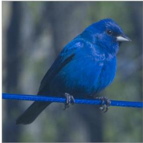
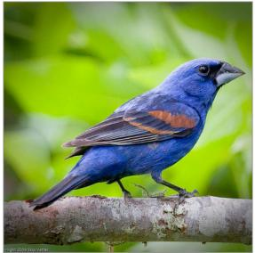
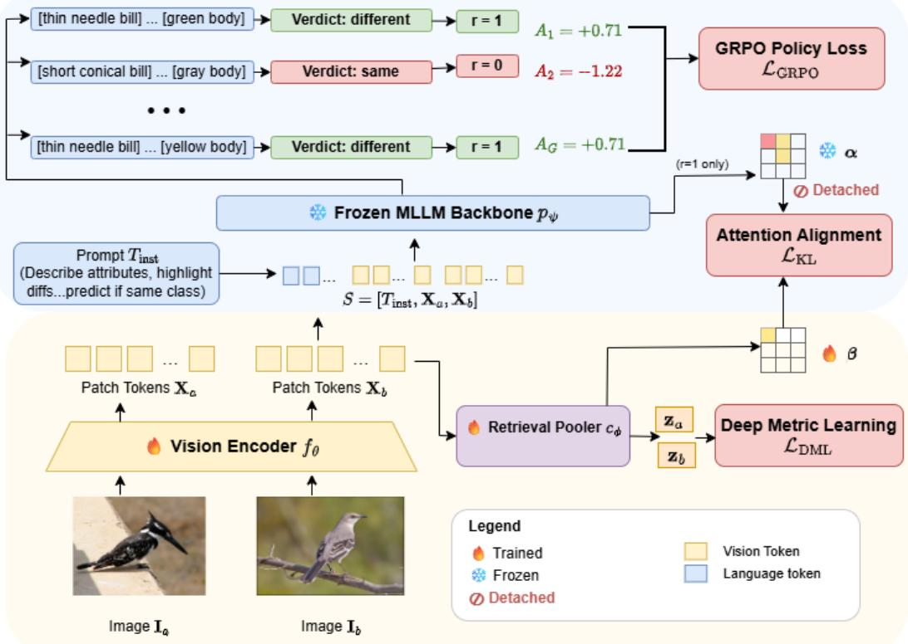
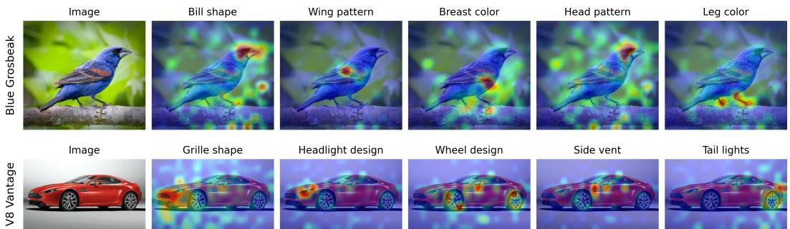
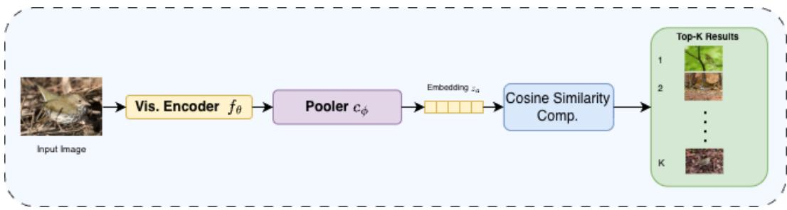
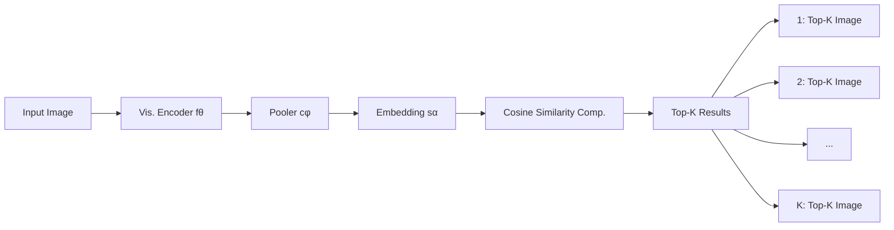
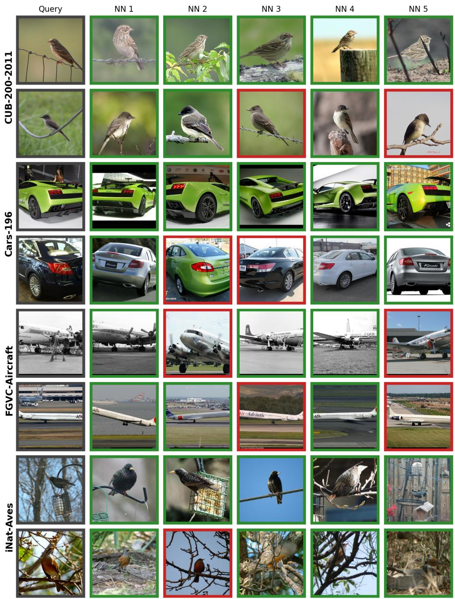

# Beyond Scalar Distances: Semantic Attribute Gradients from Frozen MLLMs for Visual Embeddings

Shubhang Bhatnagar∗ Dheeraj Baiju∗ Narendra Ahuja

University of Illinois Urbana-Champaign

sb56@illinois.edu dheerajbaiju501@gmail.com n-ahuja@illinois.edu

## Abstract

Vision encoders for retrieval are typically trained with class-label supervision: each training pair reduces to a scalar that uniformly pushes the embedding apart or pulls it together, as if every visual attribute either differed or matched. A multimodal large language model (MLLM), shown the same pair, can articulate those attributes and use them to predict whether the images share a class. We propose SAGA, a framework that turns this language-grounded, attribute-aware perception into a training signal for the encoder itself. Specifically, we use Group Relative Policy Optimization (GRPO) to reward the MLLM for correct predictions on the vision encoder’s tokens. Since correct predictions require those tokens to expose the specific attributes that differ or match between the pair, the gradient pushes the encoder to encode them, replacing the uniform pair-level scalar with attributeresolved supervision. An auxiliary attention-distillation loss anchors the encoder’s embedding to tokens the MLLM attended to, and a standard metric-learning loss shapes the embedding geometry for nearest-neighbour retrieval. The MLLM is frozen throughout and discarded at inference, matching the deployment cost of a metric-learning baseline. SAGA improves Recall@1 by 3 to 6 points over stateof-the-art baselines on CUB-200-2011, Cars-196, FGVC-Aircraft, and iNaturalist Aves on zero-shot image retrieval.

## 1 Introduction

A visual encoder must embed images along the dimensions that distinguish them: the shape of a bill, the pattern of a wing, the silhouette of a garment, the geometry of a tail. The dominant paradigm (metric learning) trains them with class labels alone [Chopra et al., 2005, Wang et al., 2019, Movshovitz-Attias et al., 2017, Bhatnagar and Ahuja, 2025], a binary signal that acts on every attribute in unison, pulling all of them together when classes match and pushing all of them apart when classes differ, even when two images share most attributes and are distinguished by only a few. This is the wrong inductive bias for zero-shot image retrieval [Song et al., 2016, Kim et al., 2020], where test classes come from a disjoint label set and are separated by attribute combinations the training signal never required the encoder to represent. Figure 1 makes this concrete: an Indigo Bunting and a Blue Grosbeak (from the CUB200 Wah et al. [2011] dataset) share a deep-blue plumage and gray legs, differing only in their wing bars. A class-label scalar reduces this pair to a uniform “different,” carrying no information that those few attributes are the ones that matter while the rest agree.

Multimodal large language models (MLLMs) trained on image-text data [Liu et al., 2023, Bai et al., 2025, Chen et al., 2024, Grattafiori et al., 2024] acquire exactly this perception of visual structure.

Image 1: Indigo Bunting  


<details>
<summary>natural_image</summary>

Blue bird perched on a blue branch against a blurred natural background (no text or symbols visible)
</details>

Class-label supervision: different

<table><tr><td colspan="3">MLLM supervision:</td></tr><tr><td>Attr. name</td><td>Image 1</td><td>Image 2</td></tr><tr><td>Primary Color</td><td>Blue</td><td>Blue</td></tr><tr><td>Leg color</td><td>Gray</td><td>Gray</td></tr><tr><td>Wing pattern</td><td>solid blue</td><td>Blue with orange patch</td></tr><tr><td>Belly color</td><td>Blue</td><td>Blue</td></tr><tr><td colspan="3">MLLM Verdict: Different Species</td></tr></table>

Image 2: Blue Grosbeak  


<details>
<summary>natural_image</summary>

Blue bird with brown and orange plumage perched on a tree branch, surrounded by green foliage (no text or symbols visible)
</details>

Figure 1: Using only class labels for images reduces supervision to a scalar, whereas an MLLM resolves it into attributes. A class-label loss collapses the difference between two very similarlooking bird species into a single ‘different’ scalar, pushing every embedding dimension apart, even those potentially encoding shared attributes like blue plumage and leg color. A frozen MLLM, by contrast, can identify which attributes match and include them in reaching the same-/different-species verdict. Our method, SAGA, harnesses this by rewarding correct verdicts and reinforcing precisely those feature components (directions) that the MLLM’s discrimination relies on, while leaving shared-attribute directions untouched.

Asked about an image, an MLLM articulates fine-grained attributes (shapes, patterns, textures, structural proportions) and localizes them on the image while it reasons. For the pair in Figure 1, we can see that the MLLM identifies wing pattern: two orange wing bars for Bird 2 against wing pattern: solid blue for Bird 1, and concludes ’different species’. We ask whether the MLLM’s sensitivity to detail can serve as a training-time supervisor for a visual encoder, turning its high emphasis on certain attributes into learning gradients that reshape the encoder’s embedding space.

In this work, we answer this affirmatively and propose SAGA (Semantic Attribute Gradients from Adjudication), a framework that turns a frozen MLLM into a training-time supervisor for the visual encoder of a retrieval system. Our visual encoder is the vision tower of a multimodal LLM, which emits a sequence of patch tokens fed to an MLLM which is asked to compare image pairs by describing their attributes [Wei et al., 2022]. Correct same/different class verdicts are rewarded via Group Relative Policy Optimization (GRPO) [Shao et al., 2024]; the resulting gradient flows back through the frozen language backbone into the encoder, pushing it to represent the discriminative attributes the MLLM had to perceive correctly to reach those verdicts. In Figure 1, the correct ‘different species’ verdict of the MLLM relies on it identifying Bird 2’s orange wing bars, so the policy gradient reinforces the encoder to identify and discriminate this attribute, while directions encoding the shared blue plumage and gray legs receive no such reinforcement.

Encoded discriminative attributes still have to be aggregated into a single retrieval vector, so we attach a small pooler that collapses the patch tokens into the embedding used for nearest-neighbor search at inference. The same forward pass also reveals which image regions/tokens the MLLM attended to while reasoning about each image’s attributes. We distill [Hinton et al., 2015, Zagoruyko and Komodakis, 2017] this attention into the pooler, a lightweight module that aggregates the encoder’s output tokens for an image into a single embedding vector used for nearest-neighbor retrieval at inference. Without this signal the pooler would be left to discover attribute-relevant tokens from class labels alone, the same statistical-discovery problem identified above for the encoder.

The MLLM is frozen throughout training and is used only at training time to produce GRPO rewards and attention targets. Once training is complete only the vision encoder and pooler are retained for deployment. Retrieval is performed by only these two components, matching the deployment cost of any standard metric learning pipeline. The supervisory signal requires only the pairwise class labels already used by the metric learning objective; no attribute annotations are needed.

Our main contributions are:

• We present SAGA, a framework that uses a frozen multimodal LLM as a training-time supervisor to learn a visual encoder using attribute-aware supervision gradients that go beyond the scalar pairwise similarity between class labels.  
• We train the encoder with a reinforcement learning objective that rewards the encoder when the MLLM correctly judges image pairs as being from the same class or different classes,

and distill the MLLM’s attention into the pooler. This (1) teaches the encoder to incorporate in its representation the attributes the MLLM uses to judge, and (2) teaches the pooler to weight the image regions the MLLM attends to when forming its verdict.

• We evaluate SAGA on four zero-shot image retrieval benchmarks (CUB-200-2011, Cars-196, FGVC-Aircraft, iNaturalist Aves), where it improves Recall@1 by 3–6% over state-of-the-art baselines on the same vision backbone.

## 2 Related Work

Deep metric learning. Deep metric learning (DML) is the dominant framework for training a vision encoder whose output space is itself a semantic geometry: standard distance metrics over embeddings recover class-level similarity, and the resulting features are intended to generalize to disjoint test classes for downstream tasks such as zero-shot image retrieval [Song et al., 2016, Kim et al., 2020] and face verification [Schroff et al., 2015]. Methods in this family supervise the encoder with a scalar pairwise objective derived from class labels, instantiated either through tuple-based losses operating directly on samples (contrastive [Chopra et al., 2005, Hadsell et al., 2006], triplet [Schroff et al., 2015], multi-similarity [Wang et al., 2019]) or through proxy-based losses that replace tuple mining with learnable class representatives (Proxy-NCA [Movshovitz-Attias et al., 2017], Proxy-Anchor [Kim et al., 2020], HIERKim et al. [2023], DDML Park et al. [2025] Potential Field [Bhatnagar and Ahuja, 2025]). Across both families, supervision per pair reduces to a single scalar that acts on every attribute dimension in unison, telling the encoder that two images should move closer or farther but not which visual attributes carry the class signal.

Multimodal large language models. MLLMs trained on image-text data, e.g., LLaVA [Liu et al., 2023], Qwen-VL [Bai et al., 2025], and InternVL [Chen et al., 2024], articulate fine-grained visual attributes through language and localize them on the image while reasoning. Group Relative Policy Optimization (GRPO) [Shao et al., 2024] has become the standard recipe for aligning these models with non-differentiable rewards, including grounded visual reasoning [Fan et al., 2025, Wang et al., 2026] and reconstructive encoder objectives [Yan et al., 2026]. These works fine-tune the MLLM for VQA or grounded reasoning as a whole. SAGA uses GRPO in the opposite role, treating the frozen MLLM as a loss function whose policy gradient supervises a retrieval encoder. A complementary line observes that an MLLM’s internal attention often localizes salient regions even when its textual output is flawed [Hou et al., 2025], and exploits this at inference time by reallocating resolution or tokens toward attended regions [Dalal et al., 2026, Zhang et al., 2025]; SAGA distills that same attention at training time into a retrieval pooler.

Language-guided visual representation learning. A complementary thread uses textual descriptions as supervision for visual representations. CLIP [Radford et al., 2021] and SigLIP [Zhai et al., 2023] align image and text embeddings via contrastive pretraining, and subsequent work adapts these models with LLM-generated class descriptions for zero-shot recognition [Menon and Vondrick, 2022, Saha et al., 2024]; CAP-FGVC [Schmidt et al., 2025] extends the idea to fine-grained retrieval with caption-supervised contrastive losses. Similar to DML methods, these consume language as fixed targets that align embeddings to text while also requiring caption level labels for such fine-grained images. SAGA does not need such caption level supervision, and only using the class label supervision and GRPO can make encoder learn features about discriminative attributes

## 3 Method

## 3.1 Setup and Notation

Deep metric learning (DML) learns a semantic distance over images from a labelled dataset $\mathcal { D } =$ $\{ ( \mathbf { I } _ { i } , y _ { i } ) \} _ { i = 1 } ^ { | \mathcal { D } | }$ with $y _ { i } \in \{ 1 , \ldots , N \}$ , parameterizing an image-to-embedding map $g _ { \theta , \phi } : \mathbf { I } \mapsto \mathbf { z } \in \mathbb { R } ^ { D _ { \epsilon } }$ and taking $d ( \mathbf { I } _ { 1 } , \mathbf { I } _ { 2 } ) = \| \mathbf { z } _ { 1 } - \mathbf { z } _ { 2 } \| _ { 2 } ;$ d should be small for same-class pairs and large otherwise.

Vision encoder and retrieval pooler. We factor $g _ { \theta , \phi } = c _ { \phi } \circ f _ { \theta }$ into a vision encoder (vision tower of Qwen3-VL [Bai et al., 2025]) and a retrieval pooler $c _ { \phi } .$ , producing a sequence of patch tokens $\mathbf { X } = f _ { \theta } ( \mathbf { I } ) \in \mathbb { R } ^ { N _ { p } \times D }$ for an image I. The pooler $c _ { \phi }$ aggregates these into a compact embedding $\mathbf { z } = c _ { \phi } ( \mathbf { X } ) \in \mathbb { R } ^ { D _ { e } }$ , instantiated as mean, max, or attention-pooling; ... we write $\beta \in \Delta ^ { N _ { p } }$ (the probability simplex over the $N _ { p }$ patches) for the pooler’s spatial weights when attention-pooling. Both θ and ϕ are trainable.



<details>
<summary>flowchart</summary>

```mermaid
graph TD
  A["Input Image I_a"] --> B["Vision Encoder f_θ"]
  C["Input Image I_b"] --> B
  B --> D["Retrieval Pooler c_φ"]
  D --> E["Deep Metric Learning L_DML"]
  F["Prompt T_inst (Describe attributes, highlight diff...predict if same class)"] --> G["S = [T_inst, X_a, X_b"]]
  H["GRPO Policy Loss L_GRPO"] --> I["A1 = +0.71, A2 = -1.22"]
  I --> G
  G --> J["(r=1 only)"]
  J --> K["Attention Alignment L_KL"]
  K --> L["Detached α"]
  K --> M["Detached β"]
  N["Image I_a"] --> O["Patch Tokens X_a"]
  P["Image I_b"] --> Q["Patch Tokens X_b"]
  O --> B
  Q --> B
    style A fill:#f9f,stroke:#333
    style C fill:#f9f,stroke:#333
    style N fill:#ccf,stroke:#333
    style P fill:#ccf,stroke:#333
    style B fill:#cfc,stroke:#333
    style D fill:#fcc,stroke:#333
    style E fill:#fcc,stroke:#333
    style K fill:#fcc,stroke:#333
    style L fill:#fcc,stroke:#333
    style M fill:#fcc,stroke:#333
```
</details>

Figure 2: Overview. SAGA uses a frozen MLLM as an attribute-aware supervisor for deep metric learning. For an image pair $\left( \mathbf { I } _ { a } , \mathbf { I } _ { b } \right)$ , the trainable vision encoder $f _ { \theta }$ produces patch tokens $\mathbf { X } _ { a } , \mathbf { X } _ { b } .$ which feed three losses with complementary roles. (1) The tokens and a comparison prompt $T _ { \mathrm { i n s t } }$ t are fed to the frozen MLLM $p _ { \psi } ,$ which samples G responses ending in a same/different-class verdict; the GRPO loss $\mathcal { L } _ { \mathrm { G R P O } }$ rewards correct verdicts and back-propagates through $p _ { \psi }$ into $f _ { \theta } ,$ pushing it to encode the discriminative attributes the MLLM relied on when making correct predictions. (2) The MLLM’s attention α from the same forward pass reveals which patch tokens the MLLM attended to while describing each image’s attributes; on correct rollouts, the per-image mean attribute-attention α¯ is distilled into the pooler’s attention $\beta$ via ${ \mathcal { L } } _ { \mathrm { K I } }$ , encouraging $c _ { \phi }$ to pool over those regions when forming embeddings $z _ { a } , z _ { b } .$ . (3) The pooler $c _ { \phi }$ aggregates the tokens into embeddings $\mathbf { z } _ { a } , \mathbf { z } _ { b } ,$ , which a deep metric learning loss $\mathcal { L } _ { \mathrm { D M L } }$ shapes for nearest-neighbor search. The MLLM is frozen throughout and discarded at inference.

Frozen MLLM-guided supervision To enrich $f _ { \theta }$ with semantic reasoning, we use it as the visual front-end for the language backbone $p _ { \psi }$ of the MLLM. Given X and a text prompt, $p _ { \psi }$ autoregressively generates output tokens; we use ${ \pmb { \alpha } } ^ { ( t ) } \in \Delta ^ { N _ { p } }$ for its attention distribution at an intermediate decoder layer (justified empirically in Sec. 3.4) from a generated token t over the patch positions of X. The parameters ψ are frozen, but gradients flow through $p _ { \psi }$ into θ. The MLLM is used only at training time and discarded at inference, so the embedding model has the same cost as a standard DML pipeline. For proxy-based DML losses, we additionally maintain M trainable proxies per class, $\mathsf { \bar { p } } _ { j , k } \in \mathbb { R } ^ { D _ { e } } \mathrm { f o r } j \in \{ 1 , \dots , N \} , k \in \{ 1 , \dots , M \}$ .

## 3.2 GRPO Attribute Reasoning Loss

The core contribution is using a frozen MLLM as a differentiable, attribute-aware loss function via Group Relative Policy Optimization (GRPO) Shao et al. [2024]. Rather than supervised fine-tuning with fixed targets, the MLLM generates freely, and we reward only the final same/different-class verdict. This reward is computed against the ground-truth class labels y used by the DML loss, adding no extra annotation burden. Intermediate attribute descriptions serve as an implicit chain-of-thought, making the resulting gradient attributionally rich despite the binary reward.

Input construction. Given two images $\mathbf { I } _ { a } , \mathbf { I } _ { b }$ from D with labels $y _ { a } , y _ { b } ,$ , we construct an input sequence by concatenating their patch tokens with a structured text prompt $T _ { \mathrm { i n s t } } { \mathrm { : } }$

$$
S = \left[ \begin{array}{l l l} \mathbf {X} _ {a}, & \mathbf {X} _ {b}, & T _ {\text { inst }} \end{array} \right]. \tag {1}
$$

$T _ { \mathrm { i n s t } }$ instructs the MLLM to: (1) describe visual attributes in JSON, (2) highlight key differences, and (3) predict if the images share a class.

Rollout and reward. For each pair, we sample G completions without gradients:

$$
\hat {Y} ^ {(g)} = (y _ {1} ^ {(g)}, \dots , y _ {T _ {g}} ^ {(g)}) \sim p _ {\psi} (\cdot \mid S), \quad g = 1, \dots , G, \tag {2}
$$

where $T _ { g }$ is the length of the g-th completion. We parse each completion for the verdict field and assign a binary reward:

$$
r ^ {(g)} = \left\{ \begin{array}{l l} 1 & \text { if   the   parsed   verdict   matches } \mathbb {1} [ y _ {a} = y _ {b} ], \\ 0 & \text { otherwise   (including   unparseable   outputs) }. \end{array} \right. \tag {3}
$$

Policy gradient update. We compute group-normalized advantages $A ^ { ( g ) } = ( r ^ { ( g ) } - \bar { r } ) / ( \sigma _ { r } + \epsilon )$ for each completion. Pairs with $\sigma _ { r } = 0$ contribute no policy-gradient signal and are skipped, with additional pairs drawn from subsequent micro-batches to maintain a target contributing-pair count per optimizer step (DAPO Dynamic Sampling [Yu et al., 2026]). Because each rollout is generated and consumed within a single gradient update, the GRPO importance ratio $\rho _ { t } = \pi _ { \theta } ( y _ { t } ) / \pi _ { \theta _ { \mathrm { o l d } } } ( y _ { t } ) \equiv 1$ at update time, the surrogate’s clip is vacuous, and we use no reference policy $( \beta = 0 )$ , so the GRPO loss reduces to its first-order, advantage-weighted negative log-likelihood form:

$$
\log \pi_ {\theta} (y _ {t} ^ {(g)} \mid y _ {<   t} ^ {(g)}, S) \quad \text { for   each   generated   token } t. \tag {4}
$$

The GRPO loss is the advantage-weighted negative log-likelihood over all generated tokens:

$$
\mathcal {L} _ {\mathrm{GRPO}} = - \frac {1}{| \mathcal {T} |} \sum_ {g} \sum_ {t = 1} ^ {T _ {g}} A ^ {(g)} \log \pi_ {\theta} (y _ {t} ^ {(g)} \mid y _ {<   t} ^ {(g)}, S), \tag {5}
$$

where $\begin{array} { r } { | \mathcal { T } | = \sum _ { q } T _ { g } } \end{array}$ is the total number of generated tokens across contributing completions. Tokenlevel normalization [Yu et al., 2026] prevents short completions from dominating the gradient.

Why GRPO provides attribute-aware gradients. The policy gradient at each token $\pi ( y _ { t } )$ sends signals back to θ through $\partial \log \pi ( y _ { t } ) / \bar { \partial \mathbf { X } } \cdot \partial \mathbf { X } / \partial \theta ,$ , exciting only the dimensions of X used to predict $y _ { t }$ . Shared-attribute tokens are produced with similar probabilities across correct and incorrect rollouts: the visual signal for these attributes is identical in ${ \bar { \mathbf { I } } } _ { a }$ and $\mathbf { I } _ { b }$ by definition, so the MLLM’s belief about them is fixed by perception and does not track the verdict outcome. $\log \pi ( y _ { t } )$ is therefore roughly constant in $^ { g , }$ and the advantage-weighted sum vanishes by the mean-zero property of group-normalised advantages. Discriminating-attribute tokens, in contrast, force the MLLM to commit to one description per rollout $( \mathrm { e . g . }$ , “orange wing bars” vs. “solid blue”) on the basis of whatever signal X exposes; if the encoder has not yet cleanly encoded that signal, sampled tokens vary across rollouts and align with the verdict outcome, with rollouts that picked the correct attribute receiving $r ^ { ( g ) } = 1$ and the others $r ^ { ( g ) } = 0$ . The advantage-weighted sum is therefore non-zero on exactly these tokens, flowing into the X-directions that resolve them. As those directions sharpen, the MLLM grows confident, rollout disagreement shrinks, and the gradient decays, producing an automatic curriculum onto attributes the encoder has not yet learned. This mirrors the outcome-only credit-assignment mechanism by which DeepSeek-R1 [Guo et al., 2025] elicits emergent reasoning from binary correctness rewards.

## 3.3 Deep Metric Learning Loss

LGRPO shapes which visual signal $f _ { \theta }$ encodes, but does not arrange the resulting embeddings ${ \bf z } =$ $c _ { \phi } ( f _ { \theta } ( \mathbf { I } ) ) \triangleq \mathbb { R } ^ { D _ { \epsilon } }$ for nearest-neighbor search. We therefore retain a standard deep metric learning loss $\mathcal { L } _ { \mathrm { D M I } }$ L computed over the pooled embeddings of the full training batch, which back-propagates into both θ and $\phi$ to provide geometric supervision every step.

The two losses are deliberately complementary. $\mathcal { L } _ { \mathrm { D M L } }$ decides where points sit in ${ \mathcal { Z } } ,$ , while $\mathcal { L } _ { \mathrm { G R P O } }$ decides which visual signal the encoder uses to place them there. Removing $\mathcal { L } _ { \mathrm { D M I } }$ would leave the GRPO gradient un-anchored to any explicit metric structure; removing $\mathcal { L } _ { \mathrm { G R P O } }$ would leave the geometric supervision attribute-blind, recovering the coarse pairwise signal that motivated this work. Our framework is agnostic to the specific DML objective, and we evaluate three representative variants (InfoNCE [Oord et al., 2018], Proxy-Anchor [Kim et al., 2020], and Potential Field [Bhatnagar and Ahuja, 2025]) to demonstrate that the GRPO supervision composes with both proxy-free and proxybased metric learning.

## 3.4 Attention Alignment Loss

LGRPO updates $f _ { \theta }$ via the frozen LLM, but the pooler $c _ { \phi }$ only perceives these gradients indirectly. To prevent $c _ { \phi }$ from weighting non-discriminative regions and erasing attribute information made encodable in $f _ { \theta } { } _ { ; }$ , we introduce an attention-alignment loss. This supervises the pooler’s spatial focus by distilling, on correct rollouts only, the MLLM’s internal attention during attribute generation.

While a final-layer teacher is intuitive, Qwen3-VL-8B’s last-layer attention is dominated by "attentionsink" and register-token artifacts, yielding maps poorly aligned with visual attributes. Using the AttWarp Dalal et al. [2026] framework, we find layer $\ell = 2 6$ provides the best trade-off, consistently highlighting attribute-relevant regions

Concretely, let $\mathcal { A } _ { a } , \mathcal { A } _ { b }$ denote the attribute-description tokens describing ${ \mathbf I } _ { a }$ and $\mathbf { I } _ { b } ,$ , and ${ \pmb { \alpha } } _ { a } ^ { ( t ) } , { \pmb { \alpha } } _ { b } ^ { ( t ) } \in$ $\Delta ^ { N _ { p } }$ denote the head-averaged attention at layer $\ell = 2 6$ from token $t ,$ renormalized over patches. We aggregate these into a mean attribute-attention map per image:

$$
\bar {\alpha} _ {a} = \frac {1}{| \mathcal {A} _ {a} |} \sum_ {t \in \mathcal {A} _ {a}} \alpha_ {a} ^ {(t)}, \quad \bar {\alpha} _ {b} = \frac {1}{| \mathcal {A} _ {b} |} \sum_ {t \in \mathcal {A} _ {b}} \alpha_ {b} ^ {(t)}, \tag {6}
$$

which represents the union of patch regions the LLM attended to while describing attributes. For each pair with reward $r ^ { ( g ) } = 1$ , we align these with the pooler’s attentions ${ \beta } _ { a } , { \beta } _ { b }$ via:

$$
\mathcal {L} _ {\mathrm{KL}} = D _ {\mathrm{KL}} \left(\bar {\boldsymbol {\alpha}} _ {a} \| \boldsymbol {\beta} _ {a}\right) + D _ {\mathrm{KL}} \left(\bar {\boldsymbol {\alpha}} _ {b} \| \boldsymbol {\beta} _ {b}\right). \tag {7}
$$

Eq. 7 is gradient-equivalent (in $\beta )$ to the per-token average $\begin{array} { r } { \frac { 1 } { \vert \mathcal { A } _ { a } \vert } \sum _ { t \in \mathcal { A } _ { a } } D _ { \mathrm { K L } } ( \pmb { \alpha } _ { a } ^ { ( t ) } \Vert \pmb { \beta } _ { a } ) \ + } \end{array}$ $\begin{array} { r } { \frac { 1 } { \left| \mathcal { A } _ { b } \right| } \sum _ { t \in \mathcal { A } _ { b } } D _ { \mathrm { K L } } ( \pmb { \alpha } _ { b } ^ { ( t ) } \| \pmb { \beta } _ { b } ) } \end{array}$ $_ { \beta }$ is cheaper to compute and targets the parts of the rollout that localize on specific visual regions. Gradients flow only into ϕ; tokens X and teacher maps α are detached. This teaches $c _ { \phi }$ where to look, complementing $\mathcal { L } _ { \mathrm { G R P O } } \mathrm { ^ { * } s }$ role in determining what to encode.

## 3.5 Total Objective and Training

The overall loss is:

$$
\mathcal {L} _ {\text { Total }} = \lambda_ {\mathrm{dml}} \mathcal {L} _ {\mathrm{DML}} + \lambda_ {\mathrm{lm}} \mathcal {L} _ {\mathrm{GRPO}} + \lambda_ {\mathrm{kl}} \mathcal {L} _ {\mathrm{KL}}, \tag {8}
$$

where $\lambda _ { \mathrm { d m l } } , \lambda _ { \mathrm { l m } }$ , and $\lambda _ { \mathrm { k l } }$ are scalar loss weights. The three losses play complementary roles: $\mathcal { L } _ { \mathrm { D M I } }$ optimizes the embedding geometry via $\theta , \phi ,$ and the proxies $\mathbf { p } _ { j , k }$ (when present); LGRPO provides attribute-aware gradients to θ via the frozen LLM; and ${ \mathcal { L } } _ { \mathrm { K I } }$ teaches $\phi$ where to attend.

Per-step training flow. Each training step proceeds in three phases: (A) compute embeddings for the full batch and apply $\mathcal { L } _ { \mathrm { D M L } } ; ( \mathbf { B } )$ sample image pairs from the batch, run $G$ rollouts per pair through the frozen MLLM, and score binary rewards; (C) for pairs with non-zero advantage variance, run the differentiable forward pass and apply $\mathcal { L } _ { \mathrm { G R P O } }$ , additionally applying ${ \mathcal { L } } _ { \mathrm { K L } }$ for the rollouts within those pairs that received reward 1. We use gradient accumulation across pairs within a step, followed by gradient clipping and a single optimizer update. Algorithm 1 (Appendix B) provides full pseudocode.

## 3.6 Inference

At inference, the frozen MLLM $p _ { \psi }$ is discarded entirely. For a query image $\mathbf { I } _ { q }$ and gallery $\mathcal { G } = \{ \mathbf { I } _ { g } \}$ , retrieval is standard nearest-neighbor search in the embedding space:

$$
\mathbf {z} _ {q} = c _ {\phi} (f _ {\theta} (\mathbf {I} _ {q})), \quad \mathbf {z} _ {g} = c _ {\phi} (f _ {\theta} (\mathbf {I} _ {g})), \quad \text { rank   by } \| \mathbf {z} _ {q} - \mathbf {z} _ {g} \| _ {2}. \tag {9}
$$

Table 1: Main results on zero-shot image retrieval. Recall@1, Recall@4 (%) and Normalized Mutual Information (NMI, ∈ [0, 1]) on four fine-grained benchmarks (CUB-200-2011, Cars-196, FGVC-Aircraft, and our iNat-Aves subset of iNaturalist-2021). All methods share the same Qwen3- VL-8B vision tower; baselines use mean pooling. Baselines: PA = Proxy Anchor [Kim et al., 2020], PF = Potential Field [Bhatnagar and Ahuja, 2025]. Best per column in bold, second-best underlined. ± values for SAGA are standard deviation over 3 random seeds

<table><tr><td rowspan="2">Method</td><td colspan="3">CUB-200</td><td colspan="3">Cars-196</td><td colspan="3">Aircraft</td><td colspan="3">iNat-Aves</td></tr><tr><td>R@1</td><td>R@4</td><td>NMI</td><td>R@1</td><td>R@4</td><td>NMI</td><td>R@1</td><td>R@4</td><td>NMI</td><td>R@1</td><td>R@4</td><td>NMI</td></tr><tr><td>Pre-trained backbone</td><td>75.6</td><td>91.8</td><td>0.77</td><td>70.7</td><td>88.5</td><td>0.49</td><td>53.1</td><td>76.1</td><td>0.43</td><td>42.2</td><td>64.8</td><td>0.65</td></tr><tr><td>PA</td><td>79.5</td><td>92.0</td><td>0.79</td><td>93.4</td><td>97.3</td><td>0.84</td><td>73.1</td><td>92.8</td><td>0.68</td><td>54.1</td><td>73.1</td><td>0.72</td></tr><tr><td>PF</td><td>81.6</td><td>92.9</td><td>0.81</td><td>93.7</td><td>97.8</td><td>0.86</td><td>77.4</td><td>93.2</td><td>0.72</td><td>55.6</td><td>75.0</td><td>0.73</td></tr><tr><td>SAGA (ours)</td><td> $87.9_{±0.3}$ </td><td> $96.3_{±0.2}$ </td><td>0.83</td><td> $97.0_{±0.3}$ </td><td> $98.6_{±0.1}$ </td><td>0.89</td><td> $83.5_{±0.4}$ </td><td> $93.9_{±0.3}$ </td><td>0.77</td><td> $60.1 ± 0.4$ </td><td> $77.1 ± 0.3$ </td><td>0.80</td></tr></table>

The deployed system consists only of the trained vision encoder and pooler, so its inference cost is identical to any standard DML pipeline; the MLLM serves solely as a training-time supervisor.

## 4 Experiments

## 4.1 Setup

Datasets: We empirically compare our method (SAGA) against state-of-the-art DML baselines on four zero-shot image retrieval benchmarks: (1) the CUB-200-2011 dataset [Wah et al., 2011] consisting of 11,788 images from 200 bird species, (2) the Cars-196 dataset [Krause et al., 2013] containing 16k images from 196 car model categories, (3) the FGVC-Aircraft dataset [Maji et al., 2013] with 10,000 images from 100 aircraft variants, and (4) the iNat-Aves benchmark we curate from the iNaturalist-2021 dataset [Van Horn et al., 2021]: starting from the train\_mini split (50 img/ species) we retain only the taxonomic class Aves, yielding ∼1,486 species and ∼74k images.

Classes in all four benchmarks are distinguished by visual attributes that an MLLM can reason about. We exclude the product-retrieval benchmarks SOP [Song et al., 2016] and In-Shop [Liu et al., 2016], since their classes separate on object identity rather than fine-grained attributes. Per-dataset prompt templates, preprocessing details, and full dataset statistics are reported in Appendix A.

Evaluation Settings: Following the standard zero-shot retrieval protocol of prior DML work [Song et al., 2016, Kim et al., 2020, Wang et al., 2019, Bhatnagar and Ahuja, 2025], classes are partitioned into disjoint train and test halves and the model is evaluated on unseen classes at 224 × 224 resolution. CUB-200-2011 and Cars-196 use the canonical splits; for FGVC-Aircraft and iNat-Aves we apply the same class-disjoint half-split convention (first half train, second half test; full details in Appendix A). We report Recall@K (fraction of queries with a same-class neighbour among the K nearest) and Normalized Mutual Information (NMI), computed between k-means cluster assignments on the test embeddings (with k equal to the number of test classes) and the ground-truth labels, capturing both nearest-neighbour and global embedding-space structure.

Backbone: We use Qwen3-VL-8B [Bai et al., 2025] as our MLLM for our main results, with its vision tower instantiating the encoder $f _ { \theta }$ and its language backbone serving as the frozen supervisor $p _ { \psi }$ . All DML baselines use the same Qwen3-VL-8B vision tower for fair comparison; baselines use mean pooling over patch tokens, while our full method uses our learned attention pooler. The pooler outputs $\ell _ { 2 } \cdot$ -normalized embeddings of dimension $D _ { e } = 4 0 9 6$ .

Training parameters: The encoder and pooler are trained with AdamW with cosine-annealed learning rates, GRPO group size $G = 8$ , and $P = 8$ balanced same/different-class pairs per step. All experiments use a single NVIDIA H200 (141 GB) GPU with bfloat16 mixed precision. Full hyperparameter values, sweeps, and ablations of these choices are reported in Appendix B.

## 4.2 Image Retrieval Performance

As seen in Table 1, our method significantly outperforms standard DML baselines on all four finegrained datasets. It outperforms the best-performing baseline, PotentialField [Bhatnagar and Ahuja, 2025], in terms of Recall@1 (R@1) by 6.3% on CUB-200-2011, 3.3% on Cars-196, 6.1% on

Table 2: Loss component ablation on CUB-200- Table 3: DML loss-agnostic ablation on CUB-2011 and FGVC-Aircraft (R@1, %). All config- 200-2011 and FGVC-Aircraft (R@1, %). bare: urations include the DML term (LDML), instanti- DML loss alone; SAGA: same DML loss combined ated as PF; ticks indicate which losses are added. with our GRPO + KL alignment. SAGA w/ PF The indented italic row swaps the per-dataset at- is the headline configuration of the main paper. tribute list for a generic prompt (App. E.3) to test Baselines: PA = Proxy Anchor [Kim et al., 2020], prompt sensitivity. Baselines: PF = Potential MS = Multi-Similarity [Wang et al., 2019], PF = Field [Bhatnagar and Ahuja, 2025]. Potential Field [Bhatnagar and Ahuja, 2025].

<table><tr><td> $\mathcal{L}_{\text{GRPO}}$ </td><td> $\mathcal{L}_{\text{KL}}$ </td><td></td><td>CUB</td><td>FGVC-A</td></tr><tr><td>×</td><td>×</td><td>PF only</td><td>81.6</td><td>77.4</td></tr><tr><td rowspan="2">√</td><td rowspan="2">×</td><td rowspan="2">+ GRPO(generic prompt)</td><td>87.0</td><td>82.3</td></tr><tr><td>84.1</td><td>79.6</td></tr><tr><td>×</td><td>√</td><td>+ KL</td><td>82.1</td><td>78.1</td></tr><tr><td>√</td><td>√</td><td>SAGA</td><td>87.9</td><td>83.5</td></tr></table>

<table><tr><td rowspan="2">Method</td><td colspan="2">CUB-200 R@1</td><td colspan="2">Aircraft R@1</td></tr><tr><td>bare</td><td>SAGA</td><td>bare</td><td>SAGA</td></tr><tr><td>MS</td><td>77.8</td><td>86.1</td><td>72.5</td><td>82.3</td></tr><tr><td>PA</td><td>79.5</td><td>87.3</td><td>73.1</td><td>82.7</td></tr><tr><td>PF</td><td>81.6</td><td>87.9</td><td>77.4</td><td>83.5</td></tr></table>

FGVC-Aircraft, and 4.5% on iNat-Aves, and shows similar margins over ProxyAnchor [Kim et al., 2020]. The performance gains are largest on the most attribute-driven benchmarks (birds and aircraft variants), consistent with our hypothesis: these classes are distinguished by subtle attributes (bill shape, wing-bars, eye rings for birds; tail and wing geometry for aircraft) that the MLLM explicitly reasons about during GRPO training, rather than by coarse object identity. The substantial gain on iNat-Aves further demonstrates that this attribute-aware supervision scales to a much larger label space (∼743 training species). The improvement persists at R@4 and in NMI, indicating that the benefit extends to the overall structure of the embedding space. Qualitative comparisons are in Sec. 4.4.

## 4.3 Ablation Studies

Unless otherwise stated, all ablations follow the experimental setting of Sec. 4.1: we use the Qwen3- VL-8B vision tower with our learned attention pooler, train and evaluate on CUB-200-2011 (the most attribute-driven of our four benchmarks) and FGVC-Aircraft (where our main results show the largest absolute R@1 gain), and use the hyperparameters reported in Sec. 4.1 (full values in Appendix B). We report Recall@1 on the held-out test classes of both datasets.

Loss component analysis: Table 2 isolates the contribution of each auxiliary loss on top of the PF baseline (PF = Potential Field [Bhatnagar and Ahuja, 2025]). Adding the GRPO term improves R@1 by 5.4% on CUB-200-2011 and 4.9% on FGVC-Aircraft, while the KL alignment term alone yields a much smaller 0.5% / 0.7% gain on the same datasets, confirming that the GRPO signal contributes the bulk of the attribute-aware supervision and KL plays a complementary, narrower role of supervising the pooler attention. Combining all three losses (SAGA) gives the strongest configuration, exceeding the PF baseline by 6.3% on CUB-200-2011 and 6.1% on FGVC-Aircraft.

DML loss-agnostic ablation: Table 3 replaces the PF term inside SAGA with two alternative DML losses, PA (Proxy Anchor [Kim et al., 2020]) and MS (Multi-Similarity [Wang et al., 2019]). All three SAGA variants substantially exceed their bare-DML baselines: on CUB-200-2011 the SAGA gains over the bare DML loss are 8.3%, 7.8%, and 6.3% for MS, PA, and PF respectively, with comparable or larger gains of 9.8%, 9.6%, and 6.1% on FGVC-Aircraft. The consistency of the gains across DML losses confirms that SAGA is DML loss-agnostic.

Prompt sensitivity: To separate the contribution of the attribute vocabulary from generic MLLMoracle access, we re-run +GRPO with the per-dataset attribute list removed (generic variant in Appendix E.3); the KL term is omitted because its distillation target (attention pooled over namedattribute spans) is undefined without an attribute vocabulary. The italicised (generic prompt) row in Table 2 shows the GRPO lift over PF drops from +5.4/ + 4.9 to +2.5/ + 2.2 R@1 on CUB-200-2011 / FGVC-Aircraft, a recovery of roughly 45%. A generic MLLM oracle therefore accounts for about half of the GRPO gain, and the attribute vocabulary contributes the remaining, confirming that attribute-aware reasoning is a meaningful and quantifiable component beyond a generic LLM-as-oracle baseline.

Additional ablations over embedding dimension and MLLM used are reported in Appendix C.



<details>
<summary>text_image</summary>

Blue Grosbeak
Image
Bill shape
Wing pattern
Breast color
Head pattern
Leg color
V8 Vantage
Image
Grille shape
Headlight design
Wheel design
Side vent
Tail lights
</details>

Figure 3: MLLM supervisor attention over named attributes (KL target). For a held-out CUB-200-2011 query (top, Blue Grosbeak) and a Cars-196 query (bottom, V8 Vantage), we overlay the MLLM’s attention pooled over the reasoning tokens that name each attribute. For the bird, attention localizes on the bill, wing, breast, head, and legs as each attribute is named; for the car, on the grille, headlights, wheels, side vent, and tail lights. These per-attribute spatial maps are exactly the targets that the KL alignment term distills into the vision pooler.

## 4.4 Attention Analysis

Figure 3 visualizes the MLLM supervisor attention that the KL alignment term distills, on two held-out queries: a CUB-200-2011 Blue Grosbeak and a Cars-196 V8 Vantage. For each attribute the MLLM names in its discriminative-reasoning trace, we pool the supervisor’s attention over the tokens corresponding to that attribute and overlay the result on the input image. In every column the mass concentrates on the named attribute region rather than on the bird or car as a whole. This is direct visual evidence that the supervisor signal is attribute-resolved, not a coarse object-vs-background prior, and motivates the per-attribute KL loss in Sec. 3: by aligning the pooler’s attention with these maps, the vision encoder inherits the attribute-level spatial discrimination that drives the retrieval gains in Table 1. Retrieval-level qualitative comparisons (top-k images per query, with correct/incorrect class borders, including failure cases) are deferred to Appendix D.

## 5 Limitations

Training under our framework is slower than standard DML, as each contributing pair requires G rollouts through the frozen MLLM and a differentiable replay through the language backbone. The added cost is paid only at training time; inference uses the vision encoder and pooler alone and is identical in cost to a vanilla DML pipeline. The framework also presumes a supervisor capable of following the structured comparison prompt and resolving a non-trivial fraction of pairs correctly, since GRPO produces gradient signal only when rollouts disagree on the verdict. Open-weight MLLMs that we use meet this requirement on standard fine-grained benchmarks.

## 6 Conclusion

We introduced SAGA, a framework that turns a frozen MLLM into a training-time supervisor for the vision encoder of a retrieval system. Where class-label DML reduces a pair to a scalar that acts on every embedding direction in unison, GRPO over the MLLM’s verdict yields a gradient whose groupnormalized advantages cancel on tokens the rollouts agree on and concentrate on the discriminating ones, routing signal into precisely the directions that resolve the attributes the supervisor used to judge. A KL term distills the supervisor’s attention over its discriminative-reasoning tokens into the pooler, and a standard metric loss shapes the geometry. The MLLM is frozen throughout and discarded at inference, so deployment cost matches a vanilla DML pipeline; on CUB-200-2011, Cars-196, FGVC-Aircraft, and iNaturalist Aves, this lifts Recall@1 by 3 to 6 points over the strongest baselines on the same backbone. We view the binary verdict as the simplest instance of a broader principle, that coarse rewards adjudicated by a reasoning supervisor can carry far more structure into the gradient than they appear to, and see this as a promising lever for representation learning whenever fine-grained annotation is unavailable.

## References

Shuai Bai, Yuxuan Cai, Ruizhe Chen, Keqin Chen, Xionghui Chen, Zesen Cheng, Lianghao Deng, Wei Ding, Chang Gao, Chunjiang Ge, Wenbin Ge, Zhifang Guo, Qidong Huang, Jie Huang, Fei Huang, Binyuan Hui, Shutong Jiang, Zhaohai Li, Mingsheng Li, Mei Li, Kaixin Li, Zicheng Lin, Junyang Lin, Xuejing Liu, Jiawei Liu, Chenglong Liu, Yang Liu, Dayiheng Liu, Shixuan Liu, Dunjie Lu, Ruilin Luo, Chenxu Lv, Rui Men, Lingchen Meng, Xuancheng Ren, Xingzhang Ren, Sibo Song, Yuchong Sun, Jun Tang, Jianhong Tu, Jianqiang Wan, Peng Wang, Pengfei Wang, Qiuyue Wang, Yuxuan Wang, Tianbao Xie, Yiheng Xu, Haiyang Xu, Jin Xu, Zhibo Yang, Mingkun Yang, Jianxin Yang, An Yang, Bowen Yu, Fei Zhang, Hang Zhang, Xi Zhang, Bo Zheng, Humen Zhong, Jingren Zhou, Fan Zhou, Jing Zhou, Yuanzhi Zhu, and Ke Zhu. Qwen3-vl technical report, 2025. URL https://arxiv.org/abs/2511.21631.  
Shubhang Bhatnagar and Narendra Ahuja. Potential field based deep metric learning. In Proceedings of the IEEE/CVF Conference on Computer Vision and Pattern Recognition (CVPR), pages 25549– 25559, June 2025.  
Zhe Chen, Jiannan Wu, Wenhai Wang, Weijie Su, Guo Chen, Sen Xing, Muyan Zhong, Qinglong Zhang, Xizhou Zhu, Lewei Lu, et al. Internvl: Scaling up vision foundation models and aligning for generic visual-linguistic tasks. In Proceedings of the IEEE/CVF conference on computer vision and pattern recognition, pages 24185–24198, 2024.  
Sumit Chopra, Raia Hadsell, and Yann LeCun. Learning a similarity metric discriminatively, with application to face verification. In 2005 IEEE Computer Society Conference on Computer Vision and Pattern Recognition (CVPR’05), volume 1, pages 539–546. IEEE, 2005.  
Dwip Dalal, Gautam Vashishtha, Utkarsh Mishra, Jeonghwan Kim, Madhav Kanda, Hyeonjeong Ha, Svetlana Lazebnik, Heng Ji, and Unnat Jain. Constructive distortion: Improving MLLMs with attention-guided image warping. In The Fourteenth International Conference on Learning Representations, 2026. URL https://openreview.net/forum?id=SRl0xy0UOj.  
Yue Fan, Xuehai He, Diji Yang, Kaizhi Zheng, Ching-Chen Kuo, Yuting Zheng, Sravana Jyothi Narayanaraju, Xinze Guan, and Xin Eric Wang. Grit: Teaching mllms to think with images, 2025. URL https://arxiv.org/abs/2505.15879.  
Aaron Grattafiori et al. The llama 3 herd of models, 2024. URL https://arxiv.org/abs/2407. 21783.  
Daya Guo, Dejian Yang, Haowei Zhang, Junxiao Song, Peiyi Wang, Qihao Zhu, Runxin Xu, Ruoyu Zhang, Shirong Ma, Xiao Bi, et al. Deepseek-r1: Incentivizing reasoning capability in llms via reinforcement learning. arXiv preprint arXiv:2501.12948, 2025.  
Raia Hadsell, Sumit Chopra, and Yann LeCun. Dimensionality reduction by learning an invariant mapping. In 2006 IEEE Computer Society Conference on Computer Vision and Pattern Recognition (CVPR’06), pages 1735–1742. IEEE Computer Society, 2006. doi: 10.1109/CVPR.2006.100.  
Geoffrey Hinton, Oriol Vinyals, and Jeff Dean. Distilling the knowledge in a neural network. arXiv preprint arXiv:1503.02531, 2015.  
Yifan Hou, Buse Giledereli, Yilei Tu, and Mrinmaya Sachan. Do vision-language models really understand visual language?, 2025. URL https://arxiv.org/abs/2410.00193.  
Sungyeon Kim, Dongwon Kim, Minsu Cho, and Suha Kwak. Proxy anchor loss for deep metric learning. In Proceedings of the IEEE/CVF Conference on Computer Vision and Pattern Recognition (CVPR), June 2020.  
Sungyeon Kim, Boseung Jeong, and Suha Kwak. Hier: Metric learning beyond class labels via hierarchical regularization. In Proceedings of the IEEE/CVF Conference on Computer Vision and Pattern Recognition, pages 19903–19912, 2023.  
Jonathan Krause, Michael Stark, Jia Deng, and Li Fei-Fei. 3D object representations for fine-grained categorization. In 4th International IEEE Workshop on 3D Representation and Recognition (3dRR-13), Sydney, Australia, 2013.  
Haotian Liu, Chunyuan Li, Qingyang Wu, and Yong Jae Lee. Visual instruction tuning. In A. Oh, T. Naumann, A. Globerson, K. Saenko, M. Hardt, and S. Levine, editors, Advances in Neural Information Processing Systems, volume 36, pages 34892–34916. Curran Associates, Inc., 2023. URL https://proceedings.neurips.cc/paper\_files/paper/2023/file/ 6dcf277ea32ce3288914faf369fe6de0-Paper-Conference.pdf.  
Ziwei Liu, Ping Luo, Shi Qiu, Xiaogang Wang, and Xiaoou Tang. Deepfashion: Powering robust clothes recognition and retrieval with rich annotations. In 2016 IEEE Conference on Computer Vision and Pattern Recognition (CVPR), pages 1096–1104, 2016. doi: 10.1109/CVPR.2016.124.  
Subhransu Maji, Esa Rahtu, Juho Kannala, Matthew Blaschko, and Andrea Vedaldi. Fine-grained visual classification of aircraft. arXiv preprint arXiv:1306.5151, 2013.  
Sachit Menon and Carl Vondrick. Visual classification via description from large language models, 2022. URL https://arxiv.org/abs/2210.07183.  
Yair Movshovitz-Attias, Alexander Toshev, Thomas K Leung, Sergey Ioffe, and Saurabh Singh. No fuss distance metric learning using proxies. In Proceedings of the IEEE international conference on computer vision, pages 360–368, 2017.  
Aaron van den Oord, Yazhe Li, and Oriol Vinyals. Representation learning with contrastive predictive coding. arXiv preprint arXiv:1807.03748, 2018.  
Jinhee Park, Jisoo Park, Dagyeong Na, and Junseok Kwon. Deep disentangled metric learning. In Proceedings of the AAAI Conference on Artificial Intelligence, volume 39, pages 19830–19838, 2025.  
Alec Radford, Jong Wook Kim, Chris Hallacy, Aditya Ramesh, Gabriel Goh, Sandhini Agarwal, Girish Sastry, Amanda Askell, Pamela Mishkin, Jack Clark, Gretchen Krueger, and Ilya Sutskever. Learning transferable visual models from natural language supervision. In Marina Meila and Tong Zhang, editors, Proceedings of the 38th International Conference on Machine Learning, volume 139 of Proceedings of Machine Learning Research, pages 8748–8763. PMLR, 18–24 Jul 2021. URL https://proceedings.mlr.press/v139/radford21a.html.  
Oindrila Saha, Grant Van Horn, and Subhransu Maji. Improved zero-shot classification by adapting vlms with text descriptions. In Proceedings of the IEEE/CVF Conference on Computer Vision and Pattern Recognition, pages 17542–17552, 2024.  
Johann Schmidt, Sebastian Stober, Joachim Denzler, and Paul Bodesheim. Saccadic vision for fine-grained visual classification, 2025. URL https://arxiv.org/abs/2509.15688.  
Florian Schroff, Dmitry Kalenichenko, and James Philbin. Facenet: A unified embedding for face recognition and clustering. In Proceedings of the IEEE conference on computer vision and pattern recognition, pages 815–823, 2015.  
Zhihong Shao, Peiyi Wang, Qihao Zhu, Runxin Xu, Junxiao Song, Mingchuan Zhang, Y.K. Li, Y. Wu, and Daya Guo. Deepseekmath: Pushing the limits of mathematical reasoning in open language models, 2024. URL https://arxiv.org/abs/2402.03300.  
Hyun Oh Song, Yu Xiang, Stefanie Jegelka, and Silvio Savarese. Deep metric learning via lifted structured feature embedding. In IEEE Conference on Computer Vision and Pattern Recognition (CVPR), 2016.  
Grant Van Horn, Elijah Cole, Sara Beery, Kimberly Wilber, Serge Belongie, and Oisin MacAodha. Benchmarking Representation Learning for Natural World Image Collections . In 2021 IEEE/CVF Conference on Computer Vision and Pattern Recognition (CVPR), pages 12879–12888, Los Alamitos, CA, USA, June 2021. IEEE Computer Society. doi: 10.1109/CVPR46437.2021.01269. URL https://doi.ieeecomputersociety.org/10.1109/CVPR46437.2021.01269.  
Catherine Wah, Steve Branson, Peter Welinder, Pietro Perona, and Serge Belongie. The caltech-ucsd birds-200-2011 dataset. Technical report, 2011.  
Haochen Wang, Xiangtai Li, Zilong Huang, Anran Wang, Jiacong Wang, Tao Zhang, Jiani Zheng, Sule Bai, Zijian Kang, Jiashi Feng, Zhuochen Wang, and Zhaoxiang Zhang. Traceable evidence enhanced visual grounded reasoning: Evaluation and methodology, 2026. URL https://arxiv. org/abs/2507.07999.  
Xun Wang, Xintong Han, Weilin Huang, Dengke Dong, and Matthew R. Scott. Multi-similarity loss with general pair weighting for deep metric learning. In Proceedings of the IEEE/CVF Conference on Computer Vision and Pattern Recognition (CVPR), June 2019.  
Jason Wei, Xuezhi Wang, Dale Schuurmans, Maarten Bosma, brian ichter, Fei Xia, Ed Chi, Quoc V Le, and Denny Zhou. Chain-of-thought prompting elicits reasoning in large language models. In S. Koyejo, S. Mohamed, A. Agarwal, D. Belgrave, K. Cho, and A. Oh, editors, Advances in Neural Information Processing Systems, volume 35, pages 24824–24837. Curran Associates, Inc., 2022. URL https://proceedings.neurips.cc/paper\_files/paper/2022/file/ 9d5609613524ecf4f15af0f7b31abca4-Paper-Conference.pdf.  
Zhiyuan Yan, Kaiqing Lin, Zongjian Li, Junyan Ye, Hui Han, Haochen Wang, Zhendong Wang, Bin Lin, Hao Li, Xinyan Xiao, Jingdong Wang, Haifeng Wang, and Li Yuan. Unified multimodal models as auto-encoders, 2026. URL https://arxiv.org/abs/2509.09666.  
Qiying Yu, Zheng Zhang, Ruofei Zhu, Yufeng Yuan, Xiaochen Zuo, YuYue, Weinan Dai, Tiantian Fan, Gaohong Liu, Juncai Liu, LingJun Liu, Xin Liu, Haibin Lin, Zhiqi Lin, Bole Ma, Guangming Sheng, Yuxuan Tong, Chi Zhang, Mofan Zhang, Ru Zhang, Wang Zhang, Hang Zhu, Jinhua Zhu, Jiaze Chen, Jiangjie Chen, Chengyi Wang, Hongli Yu, Yuxuan Song, Xiangpeng Wei, Hao Zhou, Jingjing Liu, Wei-Ying Ma, Ya-Qin Zhang, Lin Yan, Yonghui Wu, and Mingxuan Wang. DAPO: An open-source LLM reinforcement learning system at scale. In The Thirty-ninth Annual Conference on Neural Information Processing Systems, 2026. URL https://openreview.net/ forum?id=2a36EMSSTp.  
Sergey Zagoruyko and Nikos Komodakis. Paying more attention to attention: Improving the performance of convolutional neural networks via attention transfer. In International Conference on Learning Representations, 2017. URL https://openreview.net/forum?id=Sks9\_ajex.  
Xiaohua Zhai, Basil Mustafa, Alexander Kolesnikov, and Lucas Beyer. Sigmoid loss for language image pre-training. In Proceedings of the IEEE/CVF International Conference on Computer Vision (ICCV), pages 11975–11986, October 2023.  
Jiarui Zhang, Mahyar Khayatkhoei, Prateek Chhikara, and Filip Ilievski. MLLMs know where to look: Training-free perception of small visual details with multimodal LLMs. In The Thirteenth International Conference on Learning Representations, 2025. URL https://arxiv.org/abs/ 2502.17422.

# Supplementary Material for Beyond Scalar Distances: Semantic Attribute Gradients from Frozen MLLMs for Visual Embeddings

In this supplementary material, we provide additional information that did not fit in the main paper. We do so in five sections: Sec. A gives full statistics and licenses for the four image-retrieval benchmarks; Sec. B reports implementation and optimization details (training algorithm, optimizer, loss weights, batching, hardware); Sec. C reports additional ablations omitted from Sec. 4.3 for space, including ablations over embedding dimension and vision backbone; Sec. D shows top-5 nearest-neighbor rankings on held-out queries with class-correctness color coding; finally, Sec. E reproduces the structured pair-comparison prompt $T _ { \mathrm { i n s t } }$ template used by the supervisor MLLM, with per-dataset substitutions and the attribute vocabularies that instantiate the template for the four datasets in our main experiments.

## A Dataset Details

We provide additional details for each of the four fine-grained image retrieval benchmarks used in our main experiments. All datasets are publicly available under their original licenses; we use them solely for non-commercial academic research. Across all benchmarks we follow the standard zero-shot retrieval protocol of Song et al. [2016]: classes are partitioned into disjoint training and evaluation halves, and models are evaluated on classes never seen during training. The structured comparison prompt $T _ { \mathrm { i n s t } }$ used by the supervisor MLLM and the per-dataset attribute vocabularies that instantiate it for each dataset above are reported at the end of this supplement in Appendix E.

CUB-200-2011 [Wah et al., 2011]. The Caltech-UCSD Birds 200-2011 dataset contains 11,788 images of 200 bird species (≈ 59 images per class). Each image is annotated with 312 binary attributes spanning 28 attribute groups (bill shape, plumage color, wing pattern, etc.), 15 part-location keypoints, and a single bounding box. We use the first 100 species for training and the remaining 100 for evaluation. Birds are distinguished by subtle attribute combinations such as bill shape, plumage patterning, wing-bar presence, and eye-ring color, making CUB the canonical benchmark for attribute-aware retrieval.

Cars-196 [Krause et al., 2013]. The Stanford Cars dataset contains 16,185 images of 196 car classes defined at the make-model-year level (e.g., 2012 Tesla Model S Sedan). Following the zero-shot DML convention of Song et al. [2016], the first 98 classes are used for training and the remaining 98 for evaluation. Classes are distinguished by external visual cues such as body style, grille and headlight design, side profile, badge placement, and apparent era.

FGVC-Aircraft [Maji et al., 2013]. The Fine-Grained Visual Classification of Aircraft dataset [Maji et al., 2013] ships approximately 10,000 images organized hierarchically (manufacturer, family, variant). We retrieve at the variant level using the standard 100-variant release. Following the same disjoint-class convention as CUB and Cars, we sort variants alphabetically and split the 100 classes into the first 50 for training and the remaining 50 for evaluation, pooling FGVC’s own trainval and test image partitions before the class-level split (since our train/eval classes are already disjoint, the original image-level split is irrelevant). Discriminative cues include wing configuration (low / mid / high / T-tail), engine count and mounting position, fuselage profile, and vertical-stabilizer geometry.

iNaturalist 2021 Aves [Van Horn et al., 2021]. We use the Aves (birds) supercategory from the train\_mini split of the iNaturalist 2021 competition, comprising 1,486 species at 50 images per species (≈ 74,300 images total). Following the same disjoint-class protocol, we sort species directories lexicographically (zero-padded iNat category-id prefix) and use the first 743 species for training and the remaining 743 for evaluation. Compared to CUB, iNat-Aves covers a substantially broader taxonomic range and contains images captured by the iNaturalist citizen-science community under highly varied conditions (lighting, pose, partial occlusion, cluttered natural backgrounds), making it an open-set fine-grained benchmark much closer to real-world species identification.

Image preprocessing. All images are resized to $2 2 4 \times 2 2 4$ before being passed to the Qwen3-VL-8B vision encoder, matching the pre-training resolution of the base model. We do not crop using bounding-box annotations, so the encoder sees the full image including background context.

## B Additional Implementation Details

Algorithm 1 SAGA: One Training Step  
Require: Batch stream $\mathcal{B}$ , target contributing pairs $K$ , group size $G$ , loss weights $\lambda_{\mathrm{dml}}, \lambda_{\mathrm{lm}}, \lambda_{\mathrm{kl}}$ 1: Phase A: Embedding & DML (per micro-batch)  
2: $\{z_i\}_{i=1}^B \leftarrow c_\phi(f_\theta(I_i));$ backward $\lambda_{\mathrm{dml}} \cdot \mathcal{L}_{\mathrm{DML}}(\{z_i\}, \{y_i\})$ 3: Phase B: GRPO Rollouts (no grad, DAPO Dynamic Sampling)  
4: Buffer $\mathcal{C} \leftarrow \emptyset$ 5: while $|\mathcal{C}| < K$ do  
6: Sample image pair $(I_a, I_b)$ from $\mathcal{B}$ (refill micro-batches as needed)  
7: Sample $G$ completions $\{\hat{Y}^{(g)}\}_{g=1}^G$ from $p_\psi$ ; parse rewards $\{r^{(g)}\}$ , advantages $\{A^{(g)}\}$ 8: if $\sigma_r > 0$ then  
9: $\mathcal{C} \leftarrow \mathcal{C} \cup \{(\{\hat{Y}^{(g)}\}, \{A^{(g)}\}, \{r^{(g)}\})\}$ 10: end if  
11: end while  
12: Phase C: Policy Update (with grad)  
13: Recompute log-probs through $f_\theta \to p_\psi$ for all rollouts in $\mathcal{C}$ ( $c_\phi$ bypassed)  
14: Compute $\mathcal{L}_{\mathrm{GRPO}}$ via Eq. (5) over $\mathcal{C}$ (token-level normalization across the buffer); backward $\lambda_{\mathrm{lm}} \cdot \mathcal{L}_{\mathrm{GRPO}}$ 15: For each rollout in $\mathcal{C}$ with $r^{(g)} = 1$ : compute $\mathcal{L}_{\mathrm{KL}}$ via Eq. (7) ( $\ell = 26$ teacher attention); backward $\lambda_{\mathrm{kl}} \cdot \mathcal{L}_{\mathrm{KL}}$ 16: Gradient clip; optimizer step

Inference. At test time the GRPO rollouts, KL alignment, and the frozen MLLM supervisor are discarded; only the vision encoder $f _ { \theta }$ and attention pooler $c _ { \phi }$ remain, producing a single $\ell _ { 2 } \cdot$ -normalized embedding per image used directly for nearest neighbor retrieval (Fig. 4).



<details>
<summary>flowchart</summary>


</details>

Figure 4: Inference-time pipeline. Only $f _ { \theta }$ and $c _ { \phi }$ remain; the frozen MLLM, GRPO rollouts, and KL alignment are dropped. Each image yields a single ℓ2normalized embedding used directly for retrieval.

Attention pooler architecture. The attention pooler $c _ { \phi }$ is a single-query cross-attention head over the patch tokens $\mathbf { X } \in \mathbb { R } ^ { N _ { p } \times D }$ . A learnable query vector $\mathbf { q } \in \mathbb { R } ^ { D }$ and a linear key projection $W _ { k } \in \mathbb { R } ^ { D \times D }$ produce the patch-attention distribution $\beta =$ softmax $\left( ( { \bf q } W _ { k } { \bf X } ^ { \top } ) / \sqrt { D } \right) \in \Delta ^ { N _ { p } }$ , the pooled vector $_ { \beta \mathbf { X } }$ is mapped to the embedding dimension $D _ { e }$ by a linear projection, and the resulting embedding is $\ell _ { 2 }$ normalized before being passed to either $\mathcal { L } _ { \mathrm { D M I } }$ the retrieval or the distance. The attention weights $\beta$ supervised by $\mathcal { L } _ { \mathrm { K L } } \left( \mathrm { E q . ~ } 7 \right)$ are exactly the softmax output of this single cross-attention layer; no additional importance-scoring head is used. The DML baselines in Table 1 use mean pooling over patch tokens; we verified on CUB-200-2011 and FGVC-Aircraft that swapping mean for max pooling moves PA and PF R@1 by less than ∼0.5% with no consistent winner, so mean was selected for its conventionality in the DML literature.

Optimisation. The vision encoder $f _ { \theta }$ and the attention pooler $c _ { \phi }$ are trained with AdamW at learning rates $2 \times 1 0 ^ { - 5 }$ and $1 \times 1 0 ^ { - 4 }$ respectively, with cosine annealing over 3 epochs and a linear warm-up over the first 5% of steps. Gradients are clipped at global norm 1.0. The frozen language backbone $p _ { \psi }$ receives no gradient updates throughout training.

Loss weights. We use $\lambda _ { \mathrm { d m l } } = \lambda _ { \mathrm { l m } } = \lambda _ { \mathrm { k l } } = 1$ . Each loss term is internally normalized before the weight is applied: $\mathcal { L } _ { \mathrm { D M L } }$ is averaged over the batch, $\mathcal { L } _ { \mathrm { G R P O } }$ over generated tokens (Eq. 5), and ${ \mathcal { L } } _ { \mathrm { K I } }$ over attribute-token positions per image $( \mathrm { E q . ~ } 7 )$ ; these per-loss normalizations bring the gradient magnitudes of the three terms to within roughly an order of magnitude of each other at initialization, so a unit weight on each performs well without further tuning. We did not perform a formal sweep over the weights; preliminary CUB-200 runs at $\lambda _ { \mathrm { l m } } , \lambda _ { \mathrm { k l } } \in \{ 0 . 5 , 1 , 2 \}$ produced indistinguishable R@1.

Attention extraction for $\mathcal { L } _ { \mathbf { K L } }$ . The teacher attention α in Eq. 7 is taken from layer $\ell = 2 6$ of the Qwen3-VL-8B language backbone, head-averaged, and renormalized over the patches of the corresponding image. As discussed in Sec. 3.4, the last layer is dominated by attention-sink artefacts; layer $\ell = 2 6$ is the middle-late layer at which sweep visualisations (using the AttWarp [Dalal et al., 2026] framework) gave the most spatially grounded attribute-aligned maps.

Batching and GRPO sampling. At each micro-batch we draw a class-balanced batch of size 64 and sample candidate same-/different-class pairs from it; for each pair we roll out $G = 8$ MLLM completions with temperature 0.7, top-p 0.95, and at most 1024 generated tokens. Following DAPO Dynamic Sampling [Yu et al., 2026], we accumulate contributing pairs $( \sigma _ { r } > 0 )$ across successive micro-batches until $K =$ 8 have buffered, then take a single optimizer step over the buffered rollouts. Pairs with $\sigma _ { r } = 0$ contribute neither to $\mathcal { L } _ { \mathrm { G R P O } }$ nor ${ \mathcal { L } } _ { \mathrm { K L } }$ but still receive the DML gradient. ${ \mathcal { L } } _ { \mathrm { K I } }$ is computed only on the rollouts within a buffered pair that received reward $r ^ { ( g ) } = 1$ . The Qwen3-VL-8B supervisor produces well-formed JSON essentially always, so a fallback parser was unnecessary.

Hardware. All experiments use a single NVIDIA H200 (141 GB) GPU with bfloat16 mixed precision.

## C Additional Ablations

This section reports extended ablations and per-dataset breakdowns for the analyses presented in Sec. 4.3 of the main paper. Unless otherwise stated, all experiments follow the setting of Sec. 4.1 of the main paper: the Qwen3-VL-8B vision tower with our learned attention pooler, AdamW with the schedule and hyperparameters reported in Appendix B, GRPO group size $G = 8$ and DAPO target $K = 8$ contributing pairs per step, and the zero-shot retrieval evaluation protocol with Recall@K and NMI on held-out classes. Each subsection below extends a specific ablation from Sec. 4.3 of the main paper to additional datasets, hyperparameter ranges, or design choices that did not fit in the main text.

## C.1 Lower-Dimensional Embeddings

Context: The main paper uses embeddings of dimension $d \ : = \ : 4 0 9 6$ . In storage- or computeconstrained retrieval settings (e.g. on-device species recognition, large-scale gallery indexing) lowerdimensional embeddings are preferable. We verify that SAGA’s gain over the baselines is preserved when the embedding is compressed to $d \in \{ 5 1 2 , 1 2 8 \}$ , with $d = 5 1 2$ matching the standard DML choice in prior work and $d = 1 2 8$ being a more aggressive compression target.

Experiment: We re-train SAGA and the PotentialField [Bhatnagar and Ahuja, 2025] baseline, and evaluate the zero-shot encoder, at $d \in \{ 5 1 2 , 1 2 8 \}$ , otherwise following the standard setting of Sec. 4.1. Results are reported on CUB-200-2011 and FGVC-Aircraft.

Results: Table 4 reports R@1 and R@4 at $d \in \{ 5 1 2 , 1 2 8 \}$ on CUB-200-2011 and FGVC-Aircraft. The method ordering mirrors Table 1 (which uses the main paper’s $d = 4 0 9 6 ) \colon \mathrm { S A G A }$ retains its R@1 margin over PF at both compressed dimensions, indicating that the attribute-aware GRPO signal continues to deliver gains in the small-embedding regime relevant to deployment.

Table 4: Lower-dimensional embeddings. R@1 and R@4 (%) at $d = 5 1 2$ and d = 128 on CUB-200-2011 and FGVC-Aircraft (the main paper uses d = 4096; see Sec. 4.1). The method ordering is preserved at both compressed dimensions. PF = Potential Field [Bhatnagar and Ahuja, 2025].

<table><tr><td rowspan="3">Method</td><td colspan="4">d=512</td><td colspan="4">d=128</td></tr><tr><td colspan="2">CUB-200-2011</td><td colspan="2">FGVC-Aircraft</td><td colspan="2">CUB-200-2011</td><td colspan="2">FGVC-Aircraft</td></tr><tr><td>R@1</td><td>R@4</td><td>R@1</td><td>R@4</td><td>R@1</td><td>R@4</td><td>R@1</td><td>R@4</td></tr><tr><td>Pre-trained backbone</td><td>75.0</td><td>91.6</td><td>50.5</td><td>74.1</td><td>71.7</td><td>90.2</td><td>45.8</td><td>70.2</td></tr><tr><td>PF</td><td>79.4</td><td>91.8</td><td>76.3</td><td>92.2</td><td>78.3</td><td>91.5</td><td>75.5</td><td>91.5</td></tr><tr><td>SAGA</td><td>86.5</td><td>93.1</td><td>80.1</td><td>93.3</td><td>83.8</td><td>92.7</td><td>79.5</td><td>91.7</td></tr></table>

## C.2 Vision Backbone Transfer

Context: The main paper uses the Qwen3-VL-8B [Bai et al., 2025] vision tower throughout. To test whether SAGA’s gain transfers beyond a single MLLM family, we re-train the pipeline with the vision tower swapped to InternVL3.5-8B [Chen et al., 2024], keeping the attention pooler, GRPO, and KL alignment unchanged.

Experiment: We train SAGA and the PotentialField [Bhatnagar and Ahuja, 2025] baseline on CUB-200-2011 using the InternVL3.5-8B vision tower as the encoder $f _ { \theta } .$ . Note that this means that supervisor LM $p _ { \psi }$ is also the InternVL3.5-8B language backbone in these runs. We additionally report the zero-shot retrieval recall of the InternVL3.5-8B encoder (no fine-tuning) as a no-training reference. Due to compute constraints, this transfer study is limited to CUB-200-2011.

Table 5: Vision backbone transfer. R@1, R@2, R@4, and R@8 (%) on CUB-200-2011 when the vision tower of $f _ { \theta }$ is swapped from Qwen3-VL-8B (main paper) to InternVL3.5-8B [Chen et al., 2024]. For the trained runs, the supervisor LM $p _ { \psi }$ is the InternVL3.5-8B language backbone. PF = Potential Field [Bhatnagar and Ahuja, 2025].

<table><tr><td>Method (encoder = InternVL3.5-8B)</td><td>R@1</td><td>R@2</td><td>R@4</td><td>R@8</td></tr><tr><td>Zero-shot</td><td>50.8</td><td>64.8</td><td>76.4</td><td>85.8</td></tr><tr><td>PF only</td><td>78.0</td><td>86.2</td><td>91.8</td><td>95.1</td></tr><tr><td>SAGA</td><td>80.1</td><td>87.6</td><td>92.3</td><td>95.6</td></tr></table>

Results: Table 5 reports R@1 through R@8 on CUB-200-2011 for the zero-shot encoder, the PF baseline, and SAGA under the alternate encoder/MLLM combination. The SAGA gain over PF persists with the swapped backbone, indicating that the attribute-aware GRPO signal is not tied to a single MLLM family.

## D Qualitative Retrieval Gallery

Context: We complement the attention-overlay analysis of Sec. 4.4 with retrieval-level qualitative results: top-5 nearest-neighbor rankings produced by the SAGA embedding on held-out test images.

Experiment: For each of the four benchmarks we report two held-out query images, both drawn from the standard zero-shot retrieval split (classes disjoint from training). To avoid both trivial wins (queries surrounded by easy same-class neighbors) and degenerate cases (queries whose image content is dominated by background), we stratify the candidate pool by the SAGA top-5 hit count: the first row per dataset is drawn from queries whose SAGA top-5 contains four or five sameclass neighbors (clean), and the second from queries whose top-5 contains one to three same-class neighbors (informative). For each query we display the original image (leftmost column, neutral border) followed by its five nearest neighbors in descending cosine similarity, with green borders for same-class retrievals and red borders for cross-class errors. All embeddings are $\ell _ { 2 } \cdot$ -normalized, and the query is excluded from its own retrieval set.

  
Figure 5: Qualitative retrieval gallery on held-out test classes. Two queries per dataset (rows), top-5 nearest neighbors under the SAGA embedding in descending cosine similarity (columns 2 to 6). The leftmost column is the query (neutral border). Green borders mark same-class retrievals; red borders mark cross-class errors.

Results: On the clean rows (Fig. 5) SAGA returns same-class neighbors that are also visually consistent with the query. On the informative rows the wrong-class neighbors are visually plausible (similar pose, color, or silhouette), so the residual errors sit at the boundary between visually adjacent classes rather than across coarse categories.

## E Prompts and Attributes

## E.1 Prompt Template

The supervisor MLLM is queried with a structured pair-comparison prompt Tinst that asks it to (i) describe each of the two input images along a fixed list of visual attribute groups, (ii) summarize the key visual differences between the two images, and (iii) emit a same/different verdict in JSON. The verdict field of the JSON is parsed by the GRPO reward function (Sec. 3) to produce the binary reward $r \in \{ 0 , 1 \}$ used in the group-relative advantage estimate.

We use the same prompt structure across all four datasets, parameterized by (i) the expert role assumed by the model, (ii) the item word for the photographed object, (iii) the verdict question, and (iv) the dataset-specific attribute list reported in Sec. E.2 below. The generic template is reproduced verbatim below, exactly as it appears in our codebase; per-dataset substitutions are given in Table 6.

You are assisting an {EXPERT\_NOUN} in identifying {WHAT\_TO\_IDENTIFY} from photographs.

{EXPERT\_PREFIX} specialists use the following visual attributes to distinguish between {TARGET\_PLURAL}: {attr\_list}

You are given two {item} photographs ({ITEM} 1 and {ITEM} 2).

Please do the following:

```txt
1. **Describe {ITEM} 1**: For each of the attributes listed above, describe what you observe in {ITEM} 1. Use natural, concise language (e.g. "{{EXAMPLE_DESCRIPTION}}).

2. **Describe {ITEM} 2**: Do the same for {ITEM} 2.

3. **Key Differences**: Summarize the most important visual differences between the two {item_plural}. Focus on the attributes that would help a specialist tell them apart.

4. **{VERDICT_LABEL} Prediction**: Based on your observations, are these two {item_plural} the {VERDICT_QUESTION?}

Respond in JSON with the following structure:
{
    "{item}_1": {
    "<attr_1>": "...",
    "<attr_2>": "...",
    ... (one entry per attribute)
    },
    "{item}_2": { ... same attribute keys ... },
    "differences": "key visual differences between the two {item_plural}",
    "confidence": "high", "medium", or "low",
    "reasoning": "one-sentence justification based on the attributes",
    "{VERDICT_KEY}": "yes" or "no"
}
```

## E.2 Per-Dataset Attribute Vocabularies

The supervisor MLLM is asked to describe each input image along a fixed list of visual attribute groups before producing its same/different verdict. The list of attribute groups is dataset-specific and was chosen to capture the visual cues that domain specialists actually use to discriminate at the relevant taxonomic level: species for the two bird benchmarks, make and model for Cars-196, and variant (e.g. Boeing 737-700 vs. 737-800) for FGVC-Aircraft. The full per-dataset vocabularies are listed below; together with the prompt template above they fully specify the input passed to the supervisor.

Table 6: Per-dataset parameterisation of the comparison prompt template. Substituting each column’s values into the placeholders of the template above yields the exact prompt used for that dataset. CUB-200-2011 and iNaturalist Aves share a single prompt (both are bird benchmarks). The verdict key is the JSON Boolean field whose value is parsed into the binary GRPO reward.

<table><tr><td>Placeholder</td><td>CUB-200-2011 / iNat-Aves</td><td>Cars-196</td><td>FGVC-Aircraft</td></tr><tr><td>{EXPERT_NOUN}</td><td>ornithologist</td><td>automotive expert</td><td>aviation expert</td></tr><tr><td>{WHAT_TO_IDENTIFIER}</td><td>bird species</td><td>vehicle make, model, and year</td><td>aircraft make, model, and variant</td></tr><tr><td>{EXPERT_PREFIX}</td><td>Bird</td><td>Automotive</td><td>Aviation</td></tr><tr><td>{TARGET_PLURAL}</td><td>species</td><td>vehicle models</td><td>aircraft variants</td></tr><tr><td>{ITEM} / {item}</td><td>Bird / bird</td><td>Car / car</td><td>Aircraft / aircraft</td></tr><tr><td>{item_plural}</td><td>birds</td><td>cars</td><td>aircraft</td></tr><tr><td>{EXAMPLE_DESCRIPTION}</td><td>short, cone-shaped, dark grey</td><td>four-door sedan, mid-size, chrome horizontal-slat grille</td><td>twin turbofan, under-wing, swept low wing, t-tail</td></tr><tr><td>{VERDICT_LABEL}</td><td>Same Species</td><td>Same Model</td><td>Same Variant</td></tr><tr><td>{VERDICT_QUESTION}</td><td>same species</td><td>same make and model</td><td>same make, model, and variant</td></tr><tr><td>{VERDICT_KEY}</td><td>same_species</td><td>same_model</td><td>same_variant</td></tr><tr><td># attributes</td><td>28</td><td>17</td><td>17</td></tr></table>

CUB-200-2011 [Wah et al., 2011] and iNaturalist Aves [Van Horn et al., 2021]. For both bird benchmarks we use the same 28-attribute vocabulary, derived by collapsing CUB’s 312 binary attributes into 28 groups: bill shape, bill length, bill color, head pattern, crown color, forehead color, eye color, nape color, throat color, breast color, breast pattern, belly color, belly pattern, back color, back pattern, upperparts color, wing color, wing pattern, wing shape, tail shape, tail pattern, upper tail color, under tail color, underparts color, shape, size, primary color, leg color.

Cars-196 [Krause et al., 2013]. 17 attribute groups, chosen to discriminate at the make-and-model level: body style, number of doors, front grille, headlights, front bumper, side profile, roofline, greenhouse, wheels, fenders and wheel arches, rear lights, rear bumper, exhaust, badging, overall proportions, apparent era, paint finish.

FGVC-Aircraft [Maji et al., 2013]. 17 attribute groups, chosen to disambiguate variants (e.g. Boeing 737-700 vs. 737-800), not just manufacturers or families: number of engines, engine type (turbofan / turboprop / piston / jet), engine mount position (under-wing / rear-fuselage / tail / in-wing), engine nacelle shape and size, wing configuration (high / mid / low mounted), wing planform (swept / straight / delta / variable), winglets or wingtip shape, tail configuration (conventional / t-tail / cruciform / v-tail), vertical stabilizer shape, fuselage length and proportions, nose shape, cockpit window layout, cabin window count and spacing, landing gear layout, overall size class (light / regional / narrow-body / wide-body), apparent era, livery and markings.

## E.3 Generic Comparison Prompt

The prompt-sensitivity ablation in Sec. 4.3 replaces the structured prompt above with the generic variant below: the expert role and the attribute list are dropped, and the model is asked only for a free-form difference description and the same/different verdict. The verdict key is preserved, so the GRPO reward parser operates without modification. We use the same placeholder convention as the structured template above; per-dataset substitutions are read from Table 6.

```python
You are given two {item} photographs ({ITEM} 1 and {ITEM} 2).

Describe the most important visual differences between the two {item_plural}, then decide whether they are the {VERDICT_QUESTION}{

Respond in JSON with the following structure:
{
    "differences": "key visual differences between the two {item_plural}",
    "reasoning": "one-sentence justification",
    "{VERDICT_KEY":"yes" or "no"
}
```