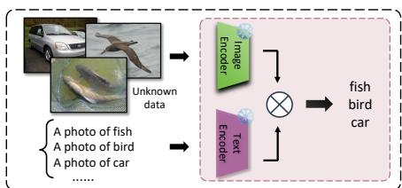
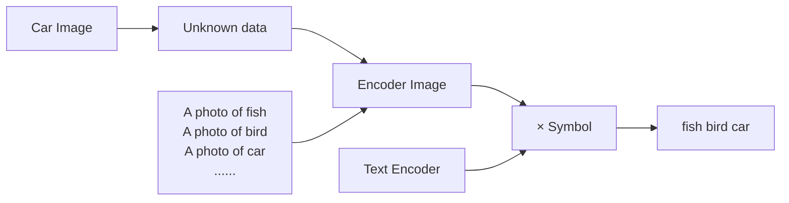
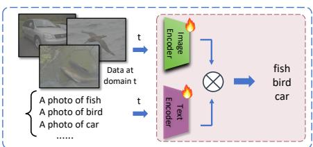
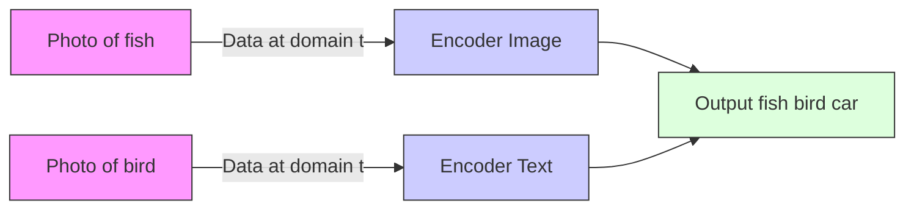
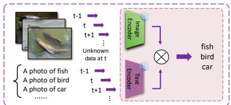
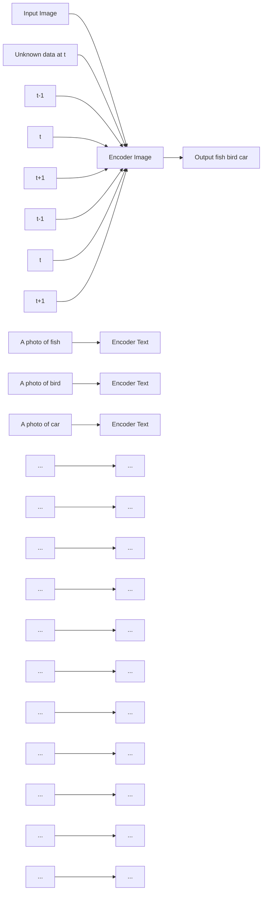
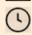
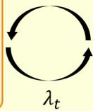
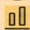
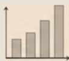

# Label Shift Aware Adaptation for Online Zero-shot Learning with Contrastive Language-Image Pre-Training (CLIP)⋆

Pengxiao Hana,1, Changkun Yeb,1, Yanshuo Wangc, Jinguang Tonga,d, Miaohua Zhangc, Xuesong Lid,a,∗, Jie Honge,∗ and Lars Peterssond

aAustralian National University, Canberra, ACT, Australia

bChina North Vehicle Research Institute, Beijing, China

cThe Hong Kong Polytechnic University, Hong Kong SAR, China

cGriffith University, Brisbane, QLD, Australia

dCSIRO, Canberra, ACT, Australia

eThe University of Hong Kong, Hong Kong SAR, China

## A R T I C L E I N F O

Keywords:

zero-shot learning

continual learning

online zero-shot learning with CLIP

label shift

## A B S T R A C T

Vision-language models like Contrastive Language-Image Pre-Training (CLIP) have been extensively studied in data-scarce scenarios. A particularly challenging and realistic task in this area is online zeroshot learning with CLIP, where unknown test samples are predicted sequentially in random order by CLIP while keeping the feature extraction and model parameters fixed during the sequential inference phase. Most existing approaches in this setting address the problem by adapting representations online using incoming test samples, while neglecting the distribution of the data on which CLIP was initially trained. This mismatch can lead to degraded performance when the label distribution in the test data differs from that of the training domain. To address this gap, we propose Label Shift Aware (LSA), which formulates the online zero-shot classification task as a domain adaptation problem. Specifically, LSA adapts the predictions computed by CLIP, which was trained on an unknown source distribution, to a target distribution using only unlabeled test data, and applies label shift correction to mitigate the mismatch between the source and target domains. The extensive experiments across multiple datasets demonstrate that the proposed LSA consistently outperforms state-of-the-art online zero-shot learning methods based on CLIP.

## 1. Introduction

The rise of foundation models, including large language models (LLMs) (OpenAI, 2024a), large vision models (LVMs) (Kirillov, Mintun, Ravi, Mao, Rolland, Gustafson, Xiao, Whitehead, Berg, Lo et al., 2023; Caron, Touvron, Misra, Jégou, Mairal, Bojanowski and Joulin, 2021), and Vision-language models (VLMs) (OpenAI, 2024b; Rombach, Blattmann, Lorenz, Esser and Ommer, 2022), has significantly advanced performance across a wide range of computer vision and machine learning tasks (Poole, Jain, Barron and Mildenhall, 2023; Gal, Alaluf, Atzmon, Patashnik, Bermano, Chechik and Cohen-Or, 2023; Brooks, Holynski and Efros, 2023; Hu, Chang, Shan and Chen, 2025). Among these, CLIP (Contrastive Language–Image Pretraining) has attracted particular attention for its strong generalization across unseen visual concepts. This openvocabulary recognition capability enables CLIP to perform well without further fine-tuning in two challenging settings: Zero-Shot Learning (ZSL) and Test-Time Adaptation (TTA), which are increasingly studied as complementary approaches for addressing different types of generalization challenges, particularly those arising from distribution or domain shift.

In ZSL with CLIP, as shown in Figure 1 (a), CLIP classifies images from previously unseen categories without accessing any labeled examples of these unseen classes. This is typically achieved by converting class names into textual prompts (e.g., "a photo of a dog") and computing the similarity between the image and text embeddings. Owing to its large-scale pretraining on massive image-text pairs, CLIP generalizes efficiently to novel categories. While CLIP demonstrates impressive zero-shot performance, its predictions can be sensitive to the phrasing of textual prompts and the quality of image representations. Therefore, many approaches aim to improve prompt quality, either by tuning textual prompts during inference (Shu, Nie, Huang, Yu, Goldstein, Anandkumar and Xiao, 2022), enriching descriptions with external knowledge (Saha, Van Horn and Maji, 2024), or aligning the token-level distribution between modalities (Abdul Samadh, Gani, Hussein, Khattak, Naseer, Shahbaz Khan and Khan, 2023). Complementary to this, other methods focus on enhancing visual representations, for example, by clustering image features to construct better visual proxies (Qian, Xu and Hu, 2023), or by introducing lightweight parameter adaptation modules to guide prediction confidence (Imam, Gani, Huzaifa and Nandakumar, 2025a). Unlike ZSL, which improves CLIP’s robustness by enhancing prompt quality or visual representation under aligned distribution, TTA with CLIP aims to extend this robustness when the test distribution differs from the distribution seen during pretraining (see Figure 1 (b)). TTA leverages unlabeled test data during inference to refine representations or fine-tune models, enabling adaptation without access to training labels. Representative works include test-time prompt optimization (Liu, Sun, Peng and Zhou, 2024; MA, ZHANG, Guo and Xu, 2023), augmentationdriven feature refinement (Zanella and Ben Ayed, 2024), lightweight adaptation modules (Imam, Gani, Huzaifa and Nandakumar, 2025b), and filtering or denoising test samples (Cao, Zhong, Liu, Liu, Zhang, Han et al., 2025).

flowchart

(a) Zero-shot Learning with CLIP

flowchart

(b) Test-time Adaptation with CLIP

flowchart

(c) Online Zero-shot Learning with CLIP  
Figure 1: Comparison of three CLIP-based inference settings. (a) ZSL with CLIP: The model makes predictions on unseen data using pre-trained text and image encoders, without any adaptation. (b) TTA with CLIP: The model adapts using access to multiple test samples from the target domain. (c) Online ZSL with CLIP: Images arrive sequentially in a streaming manner, and each image is predicted immediately without storage.

Building on the progress of ZSL and TTA, a more challenging and realistic setting has recently emerged: online ZSL with CLIP Qian and Hu (2024), which is illustrated in Figure 1 (c). This setting not only addresses the classification of previously unseen classes but also operates under a streaming scenario where data arrives sequentially. Specifically, online learning in this context refers to a sequential, single-pass setup: each instance in the data stream is predicted and then used to update the model, without storing past data. This constraint reflects real-world limitations such as data privacy, memory constraints, and computational efficiency, making it especially relevant for deployment on edge devices, robotics, or mobile platforms. The key characteristics of this online setting are that each instance is seen only once in a single pass, no data can be stored for future use, the model must make real-time predictions, and it must do so without consuming excessive computational resources. Prior works, such as OnZeta (Qian and Hu, 2024) and TPT (Shu et al., 2022), have primarily focused on improving multi-modal alignment at test time and refining prompt-based semantic representations.

Despite the effectiveness of prior approaches, they often overlook the label distribution shift between the training data used to pretrain CLIP and the target data encountered in real-world online streams. This mismatch can lead to biased predictions and degraded performance in online zeroshot settings. To address this challenge, we propose Label Shift Aware, a novel approach that integrates dynamic label distribution estimation into the online zero-shot pipeline. Specifically, LSA continuously estimates the evolving label distribution from the incoming test stream using model predictions and adjusts the classifier’s decision scores via label prior reweighting. This approach allows LSA to correct bias induced by the mismatched label between the source and target domains. By adapting to the test-time label distribution without storing past data or retraining CLIP, LSA offers a lightweight, memory-efficient solution that is wellsuited for streaming scenarios. We validate the effectiveness of our method across 14 datasets, demonstrating consistent performance improvement. The contributions of this work can be summarized as follows:

• We formulate online ZSL with CLIP as a label shift problem, highlighting that the evolving label distribution in the test stream is a major cause of performance degradation in online settings. This formulation offers a new perspective on the task and underscores the need for dynamic adaptation.  
• We propose a non-parametric, memory-efficient estimator that dynamically tracks the test-time label distribution using model predictions, without storing past data or requiring ground-truth labels.  
• We introduce a posterior adjustment mechanism that reweights CLIP’s predicted class probabilities based on the estimated label priors, enabling adaptation without modifying the backbone model.  
• The proposed method is lightweight, modular, and model-agnostic, allowing easy integration with any CLIP-based zero-shot classifier for real-time deployment in streaming environments.

## 2. Related Works

## 2.1. Zero-shot Learning with CLIP

Recently, several works have leveraged vision-language models such as CLIP Radford, Kim, Hallacy, Ramesh, Goh, Agarwal, Sastry, Askell, Mishkin, Clark et al. (2021) to tackle ZSL (Saha et al., 2024; Qian et al., 2023; Abdul Samadh et al., 2023; Shu et al., 2022; Imam et al., 2025a). Test-Time Prompt Tuning (TPT) (Shu et al., 2022) improves zero-shot generalization of CLIP by tuning the text prompts during inference, without modifying the model backbone or using labeled training data. PromptAlign (Abdul Samadh et al., 2023) addresses the task by introducing a loss function that combines entropy minimization with a token-level distribution alignment loss, which encourages images and text prompt tokens to follow a similar distribution. Both TPT and PromptAlign augment the test sample to ensure stability and semantic consistency. AdaptCLIP (Saha et al., 2024)

enriches class representations by retrieving natural language descriptions from external sources (e.g., Wikipedia), which are then used as input prompts. Based on the class names, each test image is then randomly paired with a textual description generated by an LLM. InMap (Qian et al., 2023) improves zero-shot classification by improving alignment within the visual modality of CLIP. It learns visual proxies for each class by clustering image features from unlabelled test data, which provides a better representation of class semantics in the visual feature space. TTL (Imam et al., 2025a) injects trainable low-rank matrices (LoRA-style) into the text encoder and adapts them only at test time, guided by a confidence maximization objective. The method encourages the model to make more confident predictions on unlabeled test data without modifying the pre-trained model weights.

## 2.2. Test-time Adaptation with CLIP

CLIP has shown remarkable improvements in ZSL. At the same time, recent works have explored its performance under test-time adaptation (TTA) settings (Liu et al., 2024; Zanella and Ben Ayed, 2024; Wang, Zhou, Lin, Chen, Zhang, Zhu, Hong and Li, 2025; Wang, Li, Tong, Hong, Lan, Wang, Zhu and Chen, 2024b; Wang, Cheraghian, Hayder, Hong, Ramasinghe, Rahman, Ahmedt-Aristizabal, Li, Petersson and Harandi, 2024a; Han, Ye, Zhou, Zhang, Hong and Li, 2024). TTA predicts test data on multiple new target domains. Prior to testing, the model has been pretrained on source-domain data. During testing, the model predicts data in the target domain and adjusts its parameters using data from the next domain. DART (Liu et al., 2024) introduces a dual-modal prompting mechanism where learnable prompts are optimized online using unlabeled test data. This reduces predictive uncertainty and enhances alignment between image and text modalities. Maxime et al. (Zanella and Ben Ayed, 2024) propose MeanShift Test-Time Augmentation (MTA) that applies mode seeking directly in the visual embedding space. By leveraging multiple augmented views of the same image, MTA achieves strong performance without requiring access to gradients, training, or hyperparameter tuning. RLCF (Zhao, Wang, Zhu and Yang, 2024) criticizes the overconfidence issue introduced by entropy-based methods like TPT, treating CLIP as a reward model, and applying reinforcement learning at test time to guide the VLM toward a better predictive distribution. Traditional TTA methods assume that test samples belong to in-distribution classes. However, in open-world settings, test data often includes noisy or unknown samples. To address this, Cao et al. Cao et al. (2025) design a lightweight linear detector on top of frozen CLIP image features to distinguish noisy samples, and inject pure Gaussian noise to improve robustness. SwapPrompt (MA et al., 2023) employs a dual-prompt strategy, where an online prompt is updated at each step, and an exponential moving average (EMA) prompt retains historical knowledge. The method uses Prompt Swapped Prediction to introduce a cross-prompt loss, thereby effectively enhancing zero-shot generalization across unseen domains.

## 2.3. Online Zero-shot Learning with CLIP

Online ZSL with CLIP provides a practical setting for real-world scenarios, such as mobile devices and robotics, where models are deployed in resource-constrained environments. In this setting, test samples arrive sequentially as a data stream, cannot be stored, and must be classified immediately without any offline refinement. This makes the classification task more challenging than conventional ZSL with CLIP and TTA with CLIP. To address this, OnZeta (Qian and Hu, 2024) proposes a tailored approach: it first fixes both the vision and text proxies and estimates the label distribution of the target stream. Then, the method aligns the CLIP text proxy to the visual proxy, thereby reducing the modality gap. Experimental results show that OnZeta is highly effective for online ZSL with CLIP, achieving strong performance under this challenging setting. In this work, we focus on addressing online ZSL with CLIP by modeling the evolving label distribution in the test stream and correcting the mismatch between the training and deployment domains through dynamic label-shift adaptation.

## 3. Methodology

In this section, we propose the Label Shift Aware framework to address the challenge of online ZSL with CLIP under distributional shift. LSA dynamically adapts the classifier by modeling the evolving test-time label distribution, without requiring labeled data or retraining the backbone. The overall framework consists of three key components: LSA Weight Generation, Active Prior Adaptation, and LSA Classifier Correction. These modules work together to estimate the test-time label prior and adjust predictions accordingly, enabling robust and efficient online zero-shot classification.

## 3.1. Preliminaries

Problem Definition. In this work, we consider the problem of online zero-shot classification with CLIP. Given a CLIPbased image classifier ?? (??), we aim to adapt the classifier $f ( x )$ to the test data distribution based on unlabeled test samples coming in a stream.

Notations. We denote $\mathcal { X } ~ \in ~ \mathbb { R } ^ { d }$ as the data space, $\mathcal { V } \in$ $\{ 1 , 2 , . . . , K \}$ as the label space of ?? classes, $f : \mathcal { X } \to \Delta ^ { K - 1 }$ as the CLIP-based classifier that output SoftMax predictions and $\begin{array} { r } { D ^ { t a r g e t } = \{ x _ { t } \} _ { t = 1 } ^ { N } } \end{array}$ as the unlabeled test dataset where each sample $x _ { t }$ appearing at order or time ??.

## 3.2. Motivation Overview

In this work, as shown in Figure 2, we view the online zero-shot classification with CLIP problem as a special type of domain adaptation task. In this sense, the task can be interpreted as adapting the classifier ?? trained on an unknown source domain or train distribution $p _ { s o u r c e } ( x , y =$ ⋅) to the target domain or test distribution $p _ { t a r g e t } ( x , y ~ =$ ⋅), given on-the-fly target unlabeled data from $\begin{array} { r l } { \mathrm { ~ ` ~ ' ~ } p ^ { t a r g e t } ~ = ~ } & { { } } \end{array}$

Online Test Data Stream: x1 → x2 → ... → XN

“A photo of {bird,fish, car, corn}"

## Frozen CLIP Zero-shot Classifier (Baseline)

Image Encoder

Text Encoder (Class Prompts)

Similarity Evaluation

##

Active Prior Adaptation

$$
\lambda_ {t} = \frac {t}{N} \times \lambda_ {0}
$$

Early stage: rely on prior

Later stage: rely on test distribution

9t,j

LSA Weight Generation (EM-based)

Prediction buffer: Db = {f(x1)..f(xt)}

E-step:compute soft assignmentgtj

M-step:estimatetargetlabelprior

## LSA Classifier Correction

$$
\tilde {f} (x _ {t}) _ {j} = \frac {f (x _ {t}) / \pi_ {j}}{\sum_ {l = 1} ^ {K} f (x _ {t}) / \pi_ {l}}
$$

  
Figure 2: The framework of the proposed LSA. Test samples arrive sequentially in a streaming manner. A frozen CLIP zeroshot classifier produces prediction scores without any parameter updates. LSA estimates the evolving target label distribution using an EM-based label shift estimator with an adaptive prior, and corrects the classifier output via posterior reweighting. The entire framework is training-free, memory-efficient, and suitable for online deployment.

Corrected Prediction

$\{ x _ { t } \} _ { t = 1 } ^ { N }$ with $\begin{array} { r l } { x _ { t } } & { { } \sim _ { i . i . d . } \quad p _ { t a r g e t } ( x ) } \end{array}$ . In domain adaptation tasks, covariate shift and label shift are two main types of distribution shift Azizzadenesheli, Liu, Yang and Anandkumar (2018); Alexandari, Kundaje and Shrikumar (2020); $\mathrm { Y e , }$ Tsuchida, Petersson and Barnes (2025). When deploying a model trained on the source domain to a target domain, covariate shift occurs when the data distribution $p ( x )$ shifts while $p ( y | x )$ remains invariant. Label shift happens when the label distribution $p ( y )$ is shifted while $p ( x | y )$ is invariant. Both the covariate and label shifts between the two domains can lead to sub-optimal model performance in the target domain Garg, Wu, Balakrishnan and Lipton (2020).

Tackling covariate and label shift together can be challenging. In this work, we focus on tackling label shift in online ZSL using CLIP. Since large models $( e . g . , \mathrm { C L I P } )$ are usually trained with samples from a variety of data sources, the source data distribution $p _ { s o u r c e } ( x )$ could effectively cover the target data distribution $p _ { t a r g e t } ( x )$ , thereby mitigating the problem of covariate shift. In this sense, label shift could be the main factor that impacts the performance of the CLIPbased classifier in our active-ZSL task.

## 3.3. Label Shift Aware Weight Generation

We use $p _ { \mathrm { s o u r c e } } ( x , y = \cdot )$ and $p _ { \mathrm { t a r g e t } } ( x , y = \cdot )$ to denote the train and test data distributions, respectively. Without loss of generality, the train and test labels follow categorical distributions:

$$
Y _ {\text { source }} \sim \operatorname{Cat} (K, \mathbf {c}), \quad Y _ {\text { target }} \sim \operatorname{Cat} (K, \boldsymbol {\pi}), \tag {1}
$$

and

$$
p _ {\text { source }} (y = \cdot) = \mathbf {c} \in \Delta^ {K - 1}, \tag {2}
$$

$$
p _ {\text { target }} (y = \cdot) = \pi \in \Delta^ {K - 1}, \tag {3}
$$

where $\Delta ^ { K - 1 }$ denotes the ??-dimensional probability simplex. In the online zero-shot classification tasks, we are given

## Algorithm 1 LSA Weight Generation

## Input:

• Test prediction buffer $D ^ { b } \ = \ \{ f ( x _ { t } ) \} _ { t = 1 } ^ { N }$ at time $t = 1 , 2 , . . . , N ;$  
• CLIP-based classifier $f ( x ) ;$  
• Prior information $\pmb { \alpha } \in \mathbb { R } _ { > 1 } ^ { K } .$ .

Initialize: $\pi ^ { ( 0 ) } \in \Delta _ { > 0 } ^ { K - 1 }$

for $m = 0$ to ?? do

E-step Evaluate $g _ { t , j } ^ { ( m ) }$ ????,??

$$
g _ {t, j} ^ {(m)} = \frac {\pi_ {j} ^ {(m)} \cdot f (x _ {t}) _ {j}}{\sum_ {l = 1} ^ {K} \pi_ {l} ^ {(m)} \cdot f (x _ {t}) _ {l}}, \tag {4}
$$

M-step Obtain $\pmb { \pi } ^ { ( m + 1 ) }$ with:

$$
\pi_ {j} ^ {(m + 1)} = \lambda_ {t} \cdot \frac {\sum_ {i = 1} ^ {t} g _ {i , j} ^ {(m)}}{N} + (1 - \lambda_ {t}) \cdot \frac {\alpha_ {j} - 1}{\sum_ {l = 1} ^ {K} (\alpha_ {l} - 1)}, \tag {5}
$$

end for

Output: ?? = ??(??+1) $\pmb { \pi } = \pmb { \pi } ^ { ( M + 1 ) }$

with a source domain classifier $f ~ : ~ \mathcal { X } ~  ~ \Delta ^ { K - 1 }$ and a $\textit { D } ^ { t a r g e t } = \{ x _ { t } \} _ { t = 1 } ^ { N }$ with each sample $x _ { t } \sim _ { i . i . d . } p _ { t a r g e t } ( x )$ coming in stream.

We propose using a label-shift estimation method to address the online zero-shot classification task. The label shift assumption can be written as:

Assumption 1. (Label Shift Assumption Lipton, Wang and Smola (2018))

$$
p _ {s o u r c e} (x | y = j) = p _ {t a r g e t} (x | y = j) \quad f o r a l l \quad j \in \mathcal {Y}.
$$

If we can estimate ?? and ??, Given the streaming test dataset $\boldsymbol { D } ^ { t a r g e t }$ and the classifier ?? , we have: Under Assumption 1, the negative log likelihood of ?? and ?? can be written as follows:

$$
- \log L (\boldsymbol {\pi}, \mathbf {c}; \mathcal {D} ^ {\text { target }}) = - \sum_ {t = 1} ^ {N} \log \sum_ {j = 1} ^ {K} \frac {\pi_ {j}}{c _ {j}} f (x _ {t}) _ {j} - C, \tag {6}
$$

where ?? does not depend on ?? or ??. Moreover, with Bayesian inference methods, we can employ a Dirichlet prior $p ( \pmb { \pi } \mid \pmb { \alpha } ) \sim \mathrm { D i r } ( K , \pmb { \alpha } )$ over the target label distribution ??, we can construct the posterior of ?? given prior and dataset $\scriptstyle { \mathcal { D } } ^ { t a r g e t }$ based on the negative log likelihood Ye, Tsuchida, Petersson and Barnes (2024). The posterior can thus be written as:

$$
p (\boldsymbol {\pi} \mid \mathcal {D} ^ {\text { target }}, \boldsymbol {\alpha}) = \frac {1}{C} \cdot \prod_ {l = 1} ^ {K} \pi_ {l} ^ {\alpha_ {l} - 1} \cdot \prod_ {t = 1} ^ {N} \sum_ {j = 1} ^ {K} \frac {\pi_ {j}}{c _ {j}} f (x _ {t}) _ {j}, \tag {7}
$$

where $\alpha _ { l } \ > \ 1$ for $l = 1 , 2 , . . , K$ is the element of the $K \cdot$ - dimensional parameter ?? of the Dirichlet prior and ?? is a parameter irrelevant to ?? or ??.

Under the label shift problem setup, the MAPLS algorithm proposed in Ye et al. (2024) estimates the target label distribution $p _ { t a r g e t } ( y ~ = ~ \cdot ) ~ = ~ \pi$ through optimizing the negative log likelihood Equation (6) with respect to the parameter ??. However, this model cannot be directly applied in our task due to the unknown parameter ?? and the on-the-fly test samples under the active ZSL setup.

In this work, we utilize the MAPLS algorithm to propose the EM algorithm in Algorithm 1 to estimate the target label distribution ??. As shown in Algorithm 1, we postulate a uniform source label distribution ${ \textbf { c } } : = 1 / K$ , expecting that the large model is roughly the same for different classes.

In Algorithm 1, the E-step and the M-step are evaluated alternately to obtain the final estimate. In the M-step, the $\pmb { \pi } ^ { ( m + 1 ) }$ is calculated by a linear combination of the data term with $g _ { i j }$ and the Dirichlet prior term with ??. The hyperparameter $\lambda _ { 0 }$ balances the trade-off between the contribution of the two information to the final estimation, which is defined as:

$$
\lambda_ {0} = \frac {N}{N + \sum_ {l = 1} ^ {K} (\alpha_ {l} - 1)}, \tag {8}
$$

where $\lambda _ { 0 } , \in \mathsf { \Gamma } ( 0 , 1 ]$ , is decided by the prior information ??. A higher value of $\lambda _ { 0 }$ gives greater weight to the test-time label distribution during LSA weight generation, making the model more adaptive to the test stream. Conversely, a lower $\lambda _ { 0 }$ retains more influence from the pre-defined training prior. The ablation study of $\lambda _ { 0 }$ is conducted in the experimental part of the supplementary material.

## Algorithm 2 Overall LSA Model

## Input:

• Test data stream $x _ { t }$ at time $t = 1 , 2 , . . . , N ;$  
• CLIP-based classifier $f ( x ) ;$  
• Prior hyper-parameter $\lambda _ { 0 } .$

Initialize: Prediction buffer $D ^ { b } = \{ \}$ .

for $t = 1$ to ?? do

Append prediction $f ( x _ { t } )$ in buffer $\boldsymbol { D ^ { b } } = \{ f ( \boldsymbol { x _ { t } } ) \} _ { t = 1 } ^ { N }$

Update $\lambda _ { t }$ with Equation (9);

Obtain ?? through Algorithm 1;

Correct the updated prediction through Equation (10);

end for

Output: Overall classification accuracy comparing $D ^ { b }$ and the ground truth.

## 3.4. Active Prior Adaptation

In the active learning setting, the target-domain samples arrive in a stream. Therefore, our estimation of the weight could suffer from high estimation error. To mitigate this problem, we propose an adaptive scheme to adjust the prior weight ?? in the LSA weight estimation algorithm (Algorithm 1), with the equation as follows:

$$
\lambda_ {t} = \frac {t}{N} \cdot \lambda_ {0}, \tag {9}
$$

where $\lambda _ { 0 }$ is the initial value of ?? in Equation 8 and ?? is current time. Early in the stream (small ??), we rely more on prior knowledge since we have limited samples. As ?? approaches ??, we trust the empirical distribution more, hence ?? increases linearly. In this way, the contribution of data to the final estimate of ?? will gradually increase, thus enabling prior information to provide more regularization at the early stage.

## 3.5. Label Shift Aware Classifier Correction

Getting the estimated weight ?? from Algorithm 1, we propose to adjust the prediction of the model at time ?? with the following equation:

$$
\tilde {f} (x _ {t}) _ {j} = \frac {f (x _ {t}) / \pi_ {j}}{\sum_ {l = 1} ^ {K} f (x _ {t}) / \pi_ {l}}, \tag {10}
$$

where the estimated ?? corrects the prediction output Xu, Chai and Yuan (2021). Intuitively, the estimated ?? attempts to compensate for the discrepancies between the distributions of training data of CLIP and the online test data.

## 3.6. Overall Framework

After correcting the CLIP-based classifier $f ,$ the overall framework of the LSA model for the online ZSL with CLIP can be summarized in Algorithm 2. The core of the algorithm is to generate the weight vector ?? using label shift to adjust the classifier’s predictions over time. During test time, ??, which balances the influence of the test data and the

<table><tr><td>Dataset</td><td>Aircraft</td><td>Caltech</td><td>Cars</td><td>Cifar10</td><td>Cifar100</td><td>CUB</td><td>DTD</td><td>EuroSAT</td><td>Flowers</td><td>Food</td><td>Pets</td><td>SUN</td><td>UCF101</td><td>Avg.</td></tr><tr><td colspan="15">ResNet-50</td></tr><tr><td>CLIP baseline</td><td>16.92</td><td>79.14</td><td>54.27</td><td>71.58</td><td>41.91</td><td>42.29</td><td>42.39</td><td>31.60</td><td>65.69</td><td>80.59</td><td>84.23</td><td>52.59</td><td>59.81</td><td>55.62</td></tr><tr><td>TPT</td><td>17.58</td><td>87.02</td><td>58.46</td><td>-</td><td>-</td><td>-</td><td>42.33</td><td>28.83</td><td>63.12</td><td>74.89</td><td>81.34</td><td>61.46</td><td>56.60</td><td>-</td></tr><tr><td>OnZeta</td><td>17.26</td><td>79.39</td><td>54.55</td><td>71.57</td><td>46.36</td><td>42.46</td><td>41.73</td><td>29.94</td><td>64.90</td><td>80.85</td><td>83.96</td><td>53.27</td><td>60.81</td><td>55.93</td></tr><tr><td>LSA (ours)</td><td>18.12</td><td>78.82</td><td>56.56</td><td>77.54</td><td>46.53</td><td>46.01</td><td>44.41</td><td>40.30</td><td>66.86</td><td>81.58</td><td>85.70</td><td>52.88</td><td>60.60</td><td>58.15</td></tr><tr><td>Improvements</td><td> $\uparrow 1.20$ </td><td> $\downarrow 0.32$ </td><td> $\uparrow 2.29$ </td><td> $\uparrow 5.96$ </td><td> $\uparrow 4.62$ </td><td> $\uparrow 3.72$ </td><td> $\uparrow 2.02$ </td><td> $\uparrow 8.70$ </td><td> $\uparrow 1.17$ </td><td> $\uparrow 0.99$ </td><td> $\uparrow 1.47$ </td><td> $\uparrow 0.29$ </td><td> $\uparrow 0.79$ </td><td> $\uparrow 2.53$ </td></tr><tr><td>LSA+OnZeta (ours)</td><td>18.88</td><td>79.63</td><td>58.89</td><td>77.64</td><td>48.36</td><td>46.63</td><td>44.81</td><td>41.10</td><td>66.22</td><td>82.01</td><td>84.84</td><td>53.62</td><td>61.54</td><td>58.78</td></tr><tr><td>Improvements</td><td> $\uparrow 1.96$ </td><td> $\uparrow 0.49$ </td><td> $\uparrow 4.62$ </td><td> $\uparrow 6.06$ </td><td> $\uparrow 6.45$ </td><td> $\uparrow 4.34$ </td><td> $\uparrow 2.42$ </td><td> $\uparrow 9.50$ </td><td> $\uparrow 0.53$ </td><td> $\uparrow 1.42$ </td><td> $\uparrow 0.61$ </td><td> $\uparrow 1.03$ </td><td> $\uparrow 1.73$ </td><td> $\uparrow 3.16$ </td></tr><tr><td colspan="15">ViT-B/16</td></tr><tr><td>CLIP baseline</td><td>24.36</td><td>83.91</td><td>64.66</td><td>90.77</td><td>68.27</td><td>52.66</td><td>45.27</td><td>41.38</td><td>71.08</td><td>88.86</td><td>87.84</td><td>62.97</td><td>72.43</td><td>65.96</td></tr><tr><td>TPT</td><td>24.78</td><td>94.96</td><td>68.46</td><td>-</td><td>-</td><td>-</td><td>46.35</td><td>33.60</td><td>69.26</td><td>86.97</td><td>89.00</td><td>67.21</td><td>58.91</td><td>-</td></tr><tr><td>OnZeta</td><td>24.81</td><td>83.86</td><td>64.97</td><td>90.97</td><td>70.78</td><td>52.97</td><td>45.02</td><td>40.32</td><td>70.49</td><td>89.07</td><td>87.97</td><td>63.65</td><td>73.31</td><td>66.21</td></tr><tr><td>LSA (ours)</td><td>26.28</td><td>84.46</td><td>66.43</td><td>91.54</td><td>70.63</td><td>56.33</td><td>45.85</td><td>45.64</td><td>73.82</td><td>89.51</td><td>88.02</td><td>63.12</td><td>72.97</td><td>67.28</td></tr><tr><td>Improvements</td><td> $\uparrow 1.92$ </td><td> $\uparrow 0.55$ </td><td> $\uparrow 1.77$ </td><td> $\uparrow 0.77$ </td><td> $\uparrow 2.36$ </td><td> $\uparrow 3.67$ </td><td> $\uparrow 0.58$ </td><td> $\uparrow 4.26$ </td><td> $\uparrow 2.74$ </td><td> $\uparrow 0.65$ </td><td> $\uparrow 0.18$ </td><td> $\uparrow 0.15$ </td><td> $\uparrow 0.54$ </td><td> $\uparrow 1.32$ </td></tr><tr><td>LSA+OnZeta (ours)</td><td>26.67</td><td>84.72</td><td>68.26</td><td>91.85</td><td>71.70</td><td>57.11</td><td>46.88</td><td>46.18</td><td>73.31</td><td>89.85</td><td>88.20</td><td>63.93</td><td>74.02</td><td>67.90</td></tr><tr><td>Improvements</td><td> $\uparrow 2.31$ </td><td> $\uparrow 0.81$ </td><td> $\uparrow 3.60$ </td><td> $\uparrow 1.08$ </td><td> $\uparrow 3.43$ </td><td> $\uparrow 4.45$ </td><td> $\uparrow 1.61$ </td><td> $\uparrow 4.80$ </td><td> $\uparrow 2.23$ </td><td> $\uparrow 0.99$ </td><td> $\uparrow 0.36$ </td><td> $\uparrow 0.96$ </td><td> $\uparrow 1.59$ </td><td> $\uparrow 1.94$ </td></tr></table>

Table 1

Performance comparison among the CLIP baseline, TPT Shu et al. (2022), OnZeta Qian and Hu (2024), and our proposed LSA method across different datasets. Classification accuracy (in %) is reported for two backbones: ResNet-50 and ViT-B/16. The best-performing results are highlighted in bold.

<table><tr><td>Backbone</td><td>CLIP baseline</td><td>OnZeta</td><td>LSA (ours)</td></tr><tr><td>ResNet-50</td><td>60.30</td><td>62.29</td><td>62.86 (↑ 2.56)</td></tr><tr><td>ViT-B/32</td><td>63.80</td><td>65.67</td><td>66.18 (↑ 2.38)</td></tr><tr><td>ViT-B/16</td><td>68.81</td><td>70.81</td><td>71.30 (↑ 2.49)</td></tr><tr><td>ViT-L/14</td><td>75.93</td><td>77.72</td><td>78.11 (↑ 2.18)</td></tr><tr><td> $ViT-L/14_{336}$ </td><td>77.00</td><td>78.73</td><td>79.12 (↑ 2.12)</td></tr></table>

Table 2

Performance comparison of CLIP baseline, onZeta Qian and Hu (2024), and LSA using different backbones on ImageNet (Russakovsky, Deng, Su, Krause, Satheesh, Ma, Huang, Karpathy, Khosla, Bernstein et al., 2015).

training prior, is made adaptive. The LSA model does not update its weights. In addition to its training-free property, it can be compatible with any baselines. In the experimental section, we apply LSA using the CLIP and OnZeta as the baselines.

## 4. Experiments

In this section, we evaluate the effectiveness of the proposed LSA in the online ZSL setting with CLIP. Experiments are conducted on 14 diverse datasets covering general classification, fine-grained recognition, and domainshifted scenarios, enabling a comprehensive assessment of LSA’s generalization capabilities. We compare our method against state-of-the-art baselines. To better understand the contributions of our framework, we conduct ablation studies in two parts: the first evaluates the individual contributions of each core component; the second examines the sensitivity of LSA to the hyperparameter that controls the influence of label shift correction during inference. All results are reported using top-1 accuracy and follow the evaluation protocol introduced in Qian and Hu (2024) to ensure fair comparison. More experimental settings are provided in the supplementary material.

## 4.1. Main Results

To evaluate the generalization capability of our method, we conduct experiments on standard zero-shot classification benchmarks like CLIP baseline and OnZeta. Table 2 presents the top-1 accuracy of our proposed LSA method on the ImageNet (Russakovsky et al., 2015) dataset using five CLIP backbones of varying complexity mentioned in the implementation section (Radford et al., 2021; He, Zhang, Ren and Sun, 2016). We categorize the results into three groups based on model scale and architecture: (1) convolution-based models (ResNet-50), (2) lightweight vision transformers (ViT-B/32 and ViT-B/16), and (3) large-scale transformers (ViT-L/14 and ViT-L/14@336px). To reduce variance caused by the stochastic arrival order of streaming data, each experiment across all datasets is repeated 5 times with different random permutations of the input stream. The final accuracy is reported as the average over the five runs.

For ResNet-50, LSA achieves a notable gain over the CLIP baseline, showing that our posterior adjustment significantly improves robustness even for weaker visual encoders. Among the mid-sized transformer models, ViT-B/16 achieves the highest absolute accuracy of 71.30% and a relative gain of 2.49%, outperforming the CLIP baseline by 2.49% and OnZeta by 0.49%, demonstrating strong alignment between LSA and models with moderate capacity. This also suggests that ViT-B/16 offers a favorable tradeoff between performance and efficiency under online zeroshot settings. For larger architectures like ViT-L/14 and ViT-L/14@336px, the improvement margin narrows. These models already benefit from stronger generalization due to extensive pretraining and larger capacity, leaving less room for adaptation. Nevertheless, LSA still yields consistent gains, indicating its effectiveness even when the base model already exhibits strong generalization. These results demonstrate the robustness and architecture-agnostic compatibility of LSA. Moreover, unlike methods that require fine-tuning, LSA’s lightweight posterior adjustment easily incorporates into various backbones, enhancing performance without increasing computational burden.

To further evaluate the generalization capability of LSA, we present results on the remaining 13 datasets in Table 1, spanning diverse tasks such as fine-grained recognition, scene understanding, texture classification, and satellite imagery. Experiments are conducted using both ResNet-50 and ViT-B/16 backbones. On average, our method surpasses OnZeta by 2.91% with ResNet-50 and 2.02% with ViT-B/16, demonstrating consistent improvements across architectures and domains.

The ablation studies are provided in the supplementary material, including the influence of each component and the effect of varying the hyperparameter $\lambda _ { 0 }$ .

## 5. Conclusion

In this work, we addressed the challenging task of online ZSL with CLIP. This setting combines the semantic difficulty of ZSL with the practical constraints of online learning, where data arrive sequentially in a single pass and are not stored. Although prior methods focused on multimodal alignment and prompt engineering, they largely neglected the distribution mismatch between training and test data inherent to foundation models. To bridge this gap, we propose LSA, a novel framework that models online prediction as a domain adaptation problem under label shift. By dynamically estimating the evolving label distribution at test time, our method adjusts predictions without modifying CLIP’s pre-trained weights or requiring access to labeled data. We evaluate the effectiveness of our method on multiple benchmark datasets. LSA achieves overall performance improvements across various settings and outperforms both OnZeta and CLIP baselines. The method achieves a new state of the art in online zero-shot classification with CLIP.

## References

Abdul Samadh, J., Gani, M.H., Hussein, N., Khattak, M.U., Naseer, M.M., Shahbaz Khan, F., Khan, S.H., 2023. Align your prompts: Testtime prompting with distribution alignment for zero-shot generalization. Advances in Neural Information Processing Systems 36, 80396–80413.  
Alexandari, A., Kundaje, A., Shrikumar, A., 2020. Maximum likelihood with bias-corrected calibration is hard-to-beat at label shift adaptation, in: International Conference on Machine Learning, PMLR. pp. 222–232.  
Azizzadenesheli, K., Liu, A., Yang, F., Anandkumar, A., 2018. Regularized learning for domain adaptation under label shifts, in: International Conference on Learning Representations.  
Brooks, T., Holynski, A., Efros, A.A., 2023. Instructpix2pix: Learning to follow image editing instructions, in: Proceedings of the IEEE/CVF conference on computer vision and pattern recognition, pp. 18392– 18402.  
Cao, C., Zhong, Z., Liu, T., Liu, Y., Zhang, K., Han, B., et al., 2025. Noisy test-time adaptation in vision-language models, in: International Conference on Learning Representations, pp. 59008–59039.  
Caron, M., Touvron, H., Misra, I., Jégou, H., Mairal, J., Bojanowski, P., Joulin, A., 2021. Emerging properties in self-supervised vision transformers, in: Proceedings of the IEEE/CVF international conference on computer vision, pp. 9650–9660.  
Gal, R., Alaluf, Y., Atzmon, Y., Patashnik, O., Bermano, A.H., Chechik, G., Cohen-Or, D., 2023. An image is worth one word: Personalizing text-toimage generation using textual inversion, in: The Eleventh International Conference on Learning Representations.  
Garg, S., Wu, Y., Balakrishnan, S., Lipton, Z., 2020. A unified view of label shift estimation. Advances in Neural Information Processing Systems 33, 3290–3300.  
Han, P., Ye, C., Zhou, J., Zhang, J., Hong, J., Li, X., 2024. Latentbased diffusion model for long-tailed recognition, in: Proceedings of the IEEE/CVF conference on computer vision and pattern recognition, pp. 2639–2648.  
He, K., Zhang, X., Ren, S., Sun, J., 2016. Deep residual learning for image recognition, in: Proceedings of the IEEE conference on computer vision and pattern recognition, pp. 770–778.  
Hu, M., Chang, H., Shan, S., Chen, X., 2025. Inference calibration of visionlanguage foundation models for zero-shot and few-shot learning. Pattern Recognition Letters 192, 15–21.  
Imam, R., Gani, H., Huzaifa, M., Nandakumar, K., 2025a. Test-time low rank adaptation via confidence maximization for zero-shot generalization of vision-language models, in: 2025 IEEE/CVF Winter Conference on Applications of Computer Vision (WACV), IEEE. pp. 5449–5459.  
Imam, R., Gani, H., Huzaifa, M., Nandakumar, K., 2025b. Test-time low rank adaptation via confidence maximization for zero-shot generalization of vision-language models, in: 2025 IEEE/CVF Winter Conference on Applications of Computer Vision (WACV), IEEE. pp. 5449–5459.  
Kirillov, A., Mintun, E., Ravi, N., Mao, H., Rolland, C., Gustafson, L., Xiao, T., Whitehead, S., Berg, A.C., Lo, W.Y., et al., 2023. Segment anything, in: Proceedings of the IEEE/CVF international conference on computer vision, pp. 4015–4026.  
Lipton, Z., Wang, Y.X., Smola, A., 2018. Detecting and correcting for label shift with black box predictors, in: International conference on machine learning, PMLR. pp. 3122–3130.  
Liu, Z., Sun, H., Peng, Y., Zhou, J., 2024. Dart: Dual-modal adaptive online prompting and knowledge retention for test-time adaptation, in: Proceedings of the AAAI Conference on Artificial Intelligence, pp. 14106–14114.  
MA, X., ZHANG, J., Guo, S., Xu, W., 2023. Swapprompt: Test-time prompt adaptation for vision-language models, in: Oh, A., Naumann, T., Globerson, A., Saenko, K., Hardt, M., Levine, S. (Eds.), Advances in Neural Information Processing Systems, Curran Associates, Inc.. pp. 65252–65264.  
OpenAI, 2024a. ChatGPT (GPT-4). https://openai.com/ chatgpt. Accessed: 2025-07-21.  
OpenAI, 2024b. Sora: A text-to-video model. https://openai.com/ sora. Accessed: 2025-07-21.  
Poole, B., Jain, A., Barron, J.T., Mildenhall, B., 2023. Dreamfusion: Textto-3d using 2d diffusion, in: The Eleventh International Conference on Learning Representations.  
Qian, Q., Hu, J., 2024. Online zero-shot classification with clip, in: European Conference on Computer Vision, Springer. pp. 462–477.  
Qian, Q., Xu, Y., Hu, J., 2023. Intra-modal proxy learning for zeroshot visual categorization with clip. Advances in Neural Information Processing Systems 36, 25461–25474.  
Radford, A., Kim, J.W., Hallacy, C., Ramesh, A., Goh, G., Agarwal, S., Sastry, G., Askell, A., Mishkin, P., Clark, J., et al., 2021. Learning transferable visual models from natural language supervision, in: International conference on machine learning, PmLR. pp. 8748–8763.  
Rombach, R., Blattmann, A., Lorenz, D., Esser, P., Ommer, B., 2022. Highresolution image synthesis with latent diffusion models, in: Proceedings of the IEEE/CVF conference on computer vision and pattern recognition, pp. 10684–10695.  
Russakovsky, O., Deng, J., Su, H., Krause, J., Satheesh, S., Ma, S., Huang, Z., Karpathy, A., Khosla, A., Bernstein, M., et al., 2015. Imagenet large scale visual recognition challenge. International journal of computer vision 115, 211–252.  
Saha, O., Van Horn, G., Maji, S., 2024. Improved zero-shot classification by adapting vlms with text descriptions, in: Proceedings of the IEEE/CVF  
conference on computer vision and pattern recognition, pp. 17542– 17552.  
Shu, M., Nie, W., Huang, D.A., Yu, Z., Goldstein, T., Anandkumar, A., Xiao, C., 2022. Test-time prompt tuning for zero-shot generalization in vision-language models. Advances in Neural Information Processing Systems 35, 14274–14289.  
Wang, Y., Cheraghian, A., Hayder, Z., Hong, J., Ramasinghe, S., Rahman, S., Ahmedt-Aristizabal, D., Li, X., Petersson, L., Harandi, M., 2024a. Backpropagation-free network for 3d test-time adaptation, in: Proceedings of the IEEE/CVF Conference on Computer Vision and Pattern Recognition, pp. 23231–23241.  
Wang, Y., Li, X., Tong, J., Hong, J., Lan, J., Wang, W., Zhu, H., Chen, H., 2024b. Maintain plasticity in long-timescale continual test-time adaptation. arXiv preprint arXiv:2412.20034 .  
Wang, Y., Zhou, Y., Lin, Y., Chen, H., Zhang, J., Zhu, W., Hong, J., Li, X., 2025. Dynamic model-bank test-time adaptation for automatic speech recognition, in: Proceedings of the 2025 Conference on Empirical Methods in Natural Language Processing, pp. 21842–21852.  
Xu, Z., Chai, Z., Yuan, C., 2021. Towards calibrated model for longtailed visual recognition from prior perspective. Advances in Neural Information Processing Systems 34.  
Ye, C., Tsuchida, R., Petersson, L., Barnes, N., 2024. Label shift estimation for class-imbalance problem: A bayesian approach, in: Proceedings of the IEEE/CVF winter conference on applications of computer vision, pp. 1073–1082.  
Ye, C., Tsuchida, R., Petersson, L., Barnes, N., 2025. Open set label shift with test time out-of-distribution reference, in: Proceedings of the Computer Vision and Pattern Recognition Conference, pp. 30619– 30629.  
Zanella, M., Ben Ayed, I., 2024. On the test-time zero-shot generalization of vision-language models: Do we really need prompt learning?, in: Proceedings of the IEEE/CVF Conference on Computer Vision and Pattern Recognition, pp. 23783–23793.  
Zhao, S., Wang, X., Zhu, L., Yang, Y., 2024. Test-time adaptation with clip reward for zero-shot generalization in vision-language models, in: International Conference on Learning Representations, pp. 3597–3613.