# Distilling Drifting Transformers with Representation Autoencoders

Jiawei Zhang1,2 Mengfei Xia2∗ Gen Li3 Yuantao Gu1∗

1Tsinghua University 2Ant Group 3CUHK

## Abstract

Representation Autoencoders (RAEs) have improved diffusion and flow models by semantically richer latent space owing to the strongly label-wise clustered DINO features in the pretrained encoders. Yet in the distillation stage, the severe anisotropy and large curvatures caused by the rich semantic representations would hinder the convergence and performance, making the trajectory-based distillation unstable. In this work, we argue that the RAE latent space is compatible with distillation via the newly proposed Drifting Models. We first quantitatively study the curvatures and isotropy statistics across different autoencoders, and theoretically reveal that Drifting Model itself is highly likely to fail on extremely scattered spaces like reconstruction-based VAEs. These motivate us to apply the drifting paradigm directly to representation autoencoders. Our proposed method, Drift-RAE, distills pretrained flow models in RAE latent spaces using Drifting, together with insightful modifications that improve training stability by thereotically aligning drifting fields with other frameworks. Regarding the experimental evidences, we achieve 1.77 FID on ImageNet 256 dataset using only 10k distillation steps, surpassing stateof-the-art RAE distillation methods and appearing comparative with the original Drifting Model without requiring an auxiliary MAE feature extractor. The code will be made publicly available.

## 1 Introduction

Diffusion and flow-based models (Sohl-Dickstein et al., 2015; Ho et al., 2020; Song et al., 2021a; Rombach et al., 2022; Lipman et al., 2023; Liu et al., 2023; Peebles and Xie, 2023) have become the most dominant paradigm in generative modeling, achieving remarkable success in image (Esser et al., 2024; Labs et al., 2025), video (Blattmann et al., 2023), and audio (Kong et al., 2021) synthesis. Their strong generation quality, however, often relies on a large number of sampling steps due to the discretization of the underlying probability-flow ODE. This iterative sampling process remains a major obstacle to practical deployment. Recently, a growing body of work has been exploring distillation-based methods that compress pretrained diffusion or flow models into one-step or few-step generators (Salimans and Ho, 2022; Song et al., 2023; Wang et al., 2024; Sauer et al., 2024b,a; Lin et al., 2024; Yin et al., 2024c,a; Zhou et al., 2024; Yin et al., 2024b).

Among recent advances, flow models trained in the feature spaces of Representation Autoencoders (RAEs) (Zheng et al., 2025; Tong et al., 2026; Yue et al., 2026; Singh et al., 2026) have shown promising performance. RAEs replace the conventional Variational Autoencoder (VAE) latent space (Kingma and Welling, 2014) with feature representations extracted by pretrained selfsupervised visual encoders, and train a decoder to translate these representations back to the image space. The resulting feature spaces contain richer semantic information and provide more effective representations for generative modeling. Consequently, flow models trained in RAE spaces exhibit faster convergence and better generation quality than those trained directly in pixel space or in the widely used latent spaces of VAEs.

Although RAE-based flow models have shown strong generation performance, their efficient distillation into one-step or few-step generators remains challenging. Existing attempt (Hu et al., 2025) suggests that distillation in RAE spaces might be unstable and require more tailored strategies. To better understand this difficulty, we analyze in Table 1 the token-wise sample distribution of RAE latents and find that RAE spaces are substantially more anisotropic than VAE latent spaces. This induces a stronger mismatch between the initial isotropic noises and the anisotropy target features, leading to extremely more curved ODE trajectories. Such an increased curvature makes many existing trajectory-based distillation methods less effective or stable, as they often implicitly rely on smooth or nearly straight teacher trajectories. These observations suggest the need for a distillation method well suited to the geometry of RAE latent spaces.

In this work, we propose to distill flow models in RAE latent spaces using the new Drifting Models (Deng et al., 2026). Instead of matching teacher ODE trajectories, Drifting Model directly computes a field estimating discrepancy between the generated and real distributions, and uses it to guide generated samples towards the target distribution. This distribution-level formulation avoids directly matching highly curved teacher trajectories, making it better aligned with the geometric properties of RAE latent spaces. The original Drifting Model, however, heavily relies on an additionally trained MAE as a feature extractor, which introduces extra computational overhead. We theoretically analyze the dynamic of Drifting and show that, in high-dimensional regimes, overly dispersed positive samples together with poor initialization can lead to a degenerated Drifting field. This explains the role of the auxiliary MAE in the original formulation. Moreover, our empirical analysis shows that RAE latents are significantly more semantically concentrated than VAE latents, enabling Drifting directly in the RAE latent space with no additional modules. Furthermore, motivated by a theoretical connection between Drifting Models and the Diffusion-GAN (Wang et al., 2023) framework, we introduce several practical modifications that improve the stability and effectiveness of Drifting-based distillation.

We evaluate the proposed Drifting-based distillation method on ImageNet 256 × 256. With substantially fewer training epochs, our method achieves the best one-step generation performance among distillation methods in RAE spaces, while remaining competitive with one-step and few-step generators trained in other latent spaces. Meanwhile, compared with the original Drifting Model, our method achieves comparable FID and improved FDDINOv2 without requiring an auxiliary MAE feature extractor. These results demonstrate that Drifting provides an effective and promising distillation framework for representation-space generative models.

## 2 Related Work

## 2.1 Flow-Based Models and Distillation

Flow-based Models, including Diffusion Models (Sohl-Dickstein et al., 2015; Song et al., 2021b; Ho et al., 2020) and Flow Matching (Liu et al., 2023; Lipman et al., 2023), are designed to formulate the relation between data and noise distributions through differential equations. Detailedly, the training stage introduces a forward process by corrupting initial data signals with independent noises, while the inference stage involves an iterative denoiser with scores following either SDE or ODE trajectory. However, approximating the scores of the whole process in a huge pixel space is extremely time-consuming. To this end, LDM (Rombach et al., 2022) and RAE (Zheng et al., 2025) separately introduce to train flow-based models in a compressed latent space instead of the original pixel space. Despite the unprecedented capability, the iterative reverse process hinders the sampling efficiency of flow-based models. To address this issue, many attempts have been made to distill the knowledge from pre-trained models and reduce the denoising steps (Salimans and Ho, 2022; Song et al., 2023; Luo et al., 2023; Yin et al., 2024c; Zhou et al., 2024).

## 2.2 One-Step Generation Trained From Scratch

Generative Adversarial Network (GAN) is the most representative paradigm to train a one-step generator from scratch (Goodfellow et al., 2014), which simultaneously train a generator and a discriminator via adversarial training. Recently, however, GAN seems to fall from the grace on synthesis performance due to mode collapse (Arjovsky and Bottou, 2017). Another family of methods directly realizes the one-step generation by incorporating the prior SDE or ODE dynamic and overfitting the corresponding trajectories (Song et al., 2023; Song and Dhariwal, 2024; Geng et al., 2026a). Drifting Model (Deng et al., 2026) is a novel framework, which proposes to progressively evolve the generated distribution towards the real one with a specially designed drifting field. Concretely, the drifting field is computed to evaluate the discrepancy between two distributions via instance-wise distances and contrastive learning.

## 3 Method

In this section, we analyze the geometry of RAE latent spaces and the dynamics of Drifting Models, and then introduce our proposed distillation method. We first present preliminaries on flow matching and Drifting Models in Section 3.1. Then in Section 3.2, we provide statistical evidence revealing the anisotropy and semantic concentration of RAE latent spaces, and theoretically show that the drifting field might collapse in overly dispersed feature spaces. Motivated by these observations, Section 3.3 introduces our drifting-based distillation method for RAE space, namely Drift-RAE, together with several subsequent insightful modifications further improving the performance.

## 3.1 Prerequisites

Denote by $\mathbf { y } \sim q ( \mathbf { y } )$ the real data distribution. Flow matching (Liu et al., 2023), one of the most representative flow-based models, defines a forward dynamic by linear interpolation, $i . e .$ ,

$$
\mathbf {y} _ {t} = (1 - t) \mathbf {y} + t \boldsymbol {\epsilon}, \tag {1}
$$

in which $t \in [ 0 , 1 ]$ and $\epsilon \sim \mathcal { N } ( 0 , \mathbf { I } )$ . Then the flow matching starts the generation process at $t = 1$ from pure Gaussian noises with an underlying velocity term $\mathbf { v } ( \mathbf { y } _ { t } , t )$ :

$$
\mathrm{d} \mathbf {y} _ {t} = \mathbf {v} (\mathbf {y} _ {t}, t) \mathrm{d} t, \tag {2}
$$

in which the velocity term $\mathbf { v } ( \mathbf { y } _ { t } , t )$ has closed-form expression as below:

$$
\mathbf {v} (\mathbf {y} _ {t}, t) = \mathbb {E} [ \dot {\mathbf {y}} _ {t} | \mathbf {y} _ {t} ] = \mathbb {E} [ \boldsymbol {\epsilon} - \mathbf {y} | \mathbf {y} _ {t} ]. \tag {3}
$$

Therefore, flow matching employs a model $\mathbf { v } _ { \theta } ( \mathbf { y } _ { t } , t )$ to approximate $\mathbf { v } ( \mathbf { y } _ { t } , t )$ by optimizing the objective below:

$$
\mathcal {L} (\theta) = \int_ {0} ^ {1} \mathbb {E} _ {\mathbf {y}, \epsilon} \| \mathbf {v} _ {\theta} (\mathbf {y} _ {t}, t) - (\epsilon - \mathbf {y}) \| ^ {2} \mathrm{d} t. \tag {4}
$$

Drifting Model (Deng et al., 2026) trains a one-step generator from scratch by computing the drifting field between real data samples $\left\{ \mathbf { y } _ { i } \right\}$ and synthesized samples $\{ \mathbf { x } _ { j } \}$ . Notably, the drifting field enforces each $\mathbf { x } _ { j }$ to move away from other $\{ \mathbf { x } _ { k } \} _ { k \neq j }$ (negative samples) and towards $\left\{ \mathbf { y } _ { i } \right\}$ (positive samples). Formally, the drifting field $\mathbf { V } _ { j }$ for each $\mathbf { x } _ { j }$ could be formulated as below:

$$
\mathbf {V} _ {j} = \sum_ {i} \frac {e ^ {- \frac {1}{\tau} \| \mathbf {y} _ {i} - \mathbf {x} _ {j} \|}}{\sum_ {l} e ^ {- \frac {1}{\tau} \| \mathbf {y} _ {l} - \mathbf {x} _ {j} \|}} (\mathbf {y} _ {i} - \mathbf {x} _ {j}) - \sum_ {k \neq j} \frac {e ^ {- \frac {1}{\tau} \| \mathbf {x} _ {k} - \mathbf {x} _ {j} \|}}{\sum_ {m \neq j} e ^ {- \frac {1}{\tau} \| \mathbf {x} _ {m} - \mathbf {x} _ {j} \|}} (\mathbf {x} _ {k} - \mathbf {x} _ {j}). \tag {5}
$$

Deng et al. (2026) claim that, when all drifting fields are annihilated, the synthesized distribution would coincide with real distribution.

## 3.2 Rethinking the Dynamics of RAE and Drifting Model

Trajectory-based distillation methods typically rely on the implicit assumption that, the underlying latent space is approximately isotropic, such that the induced flow ODE trajectories remain sufficiently smooth and have moderate curvature (Fan et al., 2026). Motivated by this, we compare in Figure 1 the curvatures of 32 flow ODE trajectories in RAE and traditional SD-VAE latent spaces, following the analysis protocol of Chen et al. (2024). The results show that trajectories in the RAE latent space have curvature values approximately two orders of magnitude larger than those of SD-VAE. In addition, Table 1 reports the average participation ratio (PR) and spectral entropy (SE) per token, further revealing that the RAE latent space is substantially more anisotropic. These observations suggest that conventional trajectory-based distillation methods can become unstable or inefficient when directly applied to RAEs, motivating the need for alternative approaches that explicitly account for the geometry of the RAE latent space.

Curvatures of ODE trajectories v.s. t  
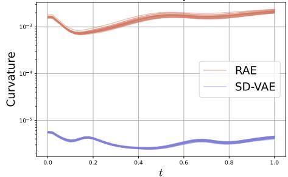

line chart

| t    | RAE       | SD-VAE    |
| ---- | --------- | --------- |
| 0.0  | 0.001     | 0.00001   |
| 0.2  | 0.0008    | 0.000008  |
| 0.4  | 0.001     | 0.000007  |
| 0.6  | 0.0012    | 0.000009  |
| 0.8  | 0.0013    | 0.00001   |
| 1.0  | 0.0014    | 0.000012  |

Figure 1: Curvatures of ODE trajectories in RAE and SD-VAE latent spaces.

Table 1: Isotropy statistics of latent features.

<table><tr><td>Latent space</td><td>PR (↑)</td><td>SE (↑)</td></tr><tr><td>SD-VAE</td><td>0.2068</td><td>0.3781</td></tr><tr><td>RAE</td><td>0.0630</td><td>0.2110</td></tr></table>

Table 2: Dispersion statistics of latent features.

<table><tr><td>Latent space</td><td>NN-d (↓)</td><td>S-MMD (↑)</td></tr><tr><td>SD-VAE</td><td>4.3083</td><td>0.00576</td></tr><tr><td>RAE</td><td>1.0664</td><td>0.07913</td></tr></table>

To address this issue, we claim that the recently proposed Drifting Models (Deng et al., 2026) are well suited for flow distillation in RAE latent spaces. Drifting Models are designed to narrow the gap between distributions by directly computing the drifting field with two batches of samples instead of matching ODE trajectories. Therofore, unlike conventional distillation methods, the negative effects by highly curved trajectories in RAE latent spaces are mostly alleviated.

Despite the straightforward methodology, we further argue that RAE latent spaces could conversely complement the training dynamic of Drifting Models. Recall that in original Drifting Model, empirically it is necessary to involve a supernumerary MAE as the feature extractor. We below give a theoretical analysis to confirm the necessity of MAE under some ill-posed assumptions. Corresponding proof is deferred to Appendix A.1.

Theorem 1. Let $\{ \mathbf { y } _ { i } \} _ { i = 1 } ^ { d }$ be the positive samples uniformly sampled from d-dimensional unit sphere $\mathbb { S } ^ { d - 1 }$ , and $\{ \mathbf { x } _ { j } \} _ { j = 1 } ^ { d }$ be the negative samples uniformly sampled from $[ - r , r ] ^ { d }$ with fixed $r > 0$ Consider the simplified drifting term in Eq. (5), i.e.,

$$
\mathbf {V} _ {j} = \mathbf {V} _ {j} ^ {+} - \mathbf {V} _ {j} ^ {-}, \tag {6}
$$

$$
\mathbf {V} _ {j} ^ {+} = \sum_ {i = 1} ^ {d} \frac {e ^ {- \frac {1}{\tau} \| \mathbf {y} _ {i} - \mathbf {x} _ {j} \|}}{\sum_ {l = 1} ^ {d} e ^ {- \frac {1}{\tau} \| \mathbf {y} _ {l} - \mathbf {x} _ {j} \|}} \mathbf {y} _ {i}, \quad \mathbf {V} _ {j} ^ {-} = \sum_ {k \neq j} \frac {e ^ {- \frac {1}{\tau} \| \mathbf {x} _ {k} - \mathbf {x} _ {j} \|}}{\sum_ {m \neq j} e ^ {- \frac {1}{\tau} \| \mathbf {x} _ {m} - \mathbf {x} _ {j} \|}} \mathbf {x} _ {k}, \tag {7}
$$

in which $\mathbf { V } _ { j } ^ { + }$ and $\mathbf { V } _ { i } ^ { - }$ are the positive and negative components, respectively. When $d \to + \infty$ we claim that (1) $\begin{array} { r } { \| \mathbf { V } _ { j } ^ { + } \| ^ { 2 } \approx \frac { 1 } { d } } \end{array}$ , and (2) $\mathbf { V } _ { j } \to \mathbf { 0 } .$ .

Theorem 1 shows that when positive samples are overly dispersed, their induced attraction for each generated sample tends to be almost annihilated in high-dimensional spaces, which can drive the generator towards a sub-optimal solution. Further empirical evidence is reported in Table 2, in which NN-d reports the average nearest-neighbor distance and S-MMD evaluates the maximum mean discrepancy between the sample distribution and a spherical distribution. It is noteworthy that SD-VAE suggests severely dispersed latent space. That is to say, to guarantee the stability of Drifting Models, a well-trained MAE, especially the one fine-tuned with classification loss, is involved to yield more concentrated semantic features.

In contrast, RAE enjoys substantially more concentrated latent spaces, suggesting that RAE could serve as a more favorable underlying latent space for Drifting Models and relieve the redundant module. Furthermore, we note that Theorem 1 also indicates that poor initialization can be detrimental to Drifting Models. Yet in distillation stage, the pretrained model itself is already a sufficiently good initialization for the generator. Therefore in the sequel, we focus only on the distillation in RAE latent spaces via drifting dynamic. More discussions on training Drifting Models from scratch in RAE latent space is addressed at Appendix C.

## 3.3 Distillation via Drifting in RAE Latent Spaces

We now introduce our method for distilling flow models in RAE latent spaces using Drifting Models. Let $\mathbf { v } _ { \theta } ( \mathbf { y } , t )$ denote a pretrained flow model, we form a one-step generator to distill as:

$$
\mathbf {G} _ {\theta} (\mathbf {z}) = \mathbf {z} - \mathbf {v} _ {\theta} (\mathbf {z}, 1), \quad \mathbf {z} \sim \mathcal {N} (\mathbf {0}, \mathbf {I}), \tag {8}
$$

$\{ \mathbf { y } _ { i } \} _ { i = 1 } ^ { N _ { \mathrm { p o s } } }$ sampled from the real distribution, we write

$$
\mathbf {y} _ {i} = (\mathbf {y} _ {i} ^ {1}, \dots , \mathbf {y} _ {i} ^ {c}, \dots , \mathbf {y} _ {i} ^ {C}), \tag {9}
$$

where each $\mathbf { y } _ { i } ^ { c } \in \mathbb { R } ^ { D }$ denotes the c-th patch token, C is the number of patch tokens, and $D$ is the hidden size. The token-wise output of the generator is defined analogously as $\mathbf { G } _ { \theta } ^ { c } ( \mathbf { z } )$ .

As suggested in Section 3.2, RAE latent spaces already provide semantically meaningful and sufficiently concentrated features for drifting-based training, requiring no auxiliary feature extractor. Therefore, it is feasible to directly define drifting objective on each token representation of the RAE latent as below:

$$
L (\theta) = \sum_ {j = 1} ^ {N _ {\mathrm{neg}}} \sum_ {c = 1} ^ {C} \left\| \mathbf {G} _ {\theta} ^ {c} (\mathbf {z} _ {j}) - \operatorname{sg} \left[ \mathbf {G} _ {\theta} ^ {c} (\mathbf {z} _ {j}) + \tilde {\mathbf {V}} _ {j} ^ {c} \right] \right\| ^ {2}, \quad \mathbf {z} _ {j} \sim \mathcal {N} (\mathbf {0}, \mathbf {I}), \tag {10}
$$

where $N _ { \mathrm { n e g } }$ is the number of generated samples, sg[·] denotes the stop-gradient operation, and V˜ cj = j∥V c ∥ $\begin{array} { r } { \tilde { \bf V } _ { j } ^ { c } = \frac { { \bf V } _ { j } ^ { c } } { \| { \bf V } _ { j } ^ { c } \| } } \end{array}$ is the normalized drifting field with $\mathbf { V } _ { j } ^ { c }$ computed by:

$$
\mathbf {V} _ {j} ^ {c} = \sum_ {i = 1} ^ {N _ {\text {pos}}} \frac {e ^ {- \frac {1}{\tau} \| \mathbf {y} _ {i} ^ {c} - \mathbf {G} _ {\theta} ^ {c} (\mathbf {z} _ {j}) \|} \left(\mathbf {y} _ {i} ^ {c} - \mathbf {G} _ {\theta} ^ {c} (\mathbf {z} _ {j})\right)}{\sum_ {l = 1} ^ {N _ {\text {pos}}} e ^ {- \frac {1}{\tau} \| \mathbf {y} _ {l} ^ {c} - \mathbf {G} _ {\theta} ^ {c} (\mathbf {z} _ {j}) \|}} - \sum_ {k \neq j} \frac {e ^ {- \frac {1}{\tau} \| \mathbf {G} _ {\theta} ^ {c} (\mathbf {z} _ {k}) - \mathbf {G} _ {\theta} ^ {c} (\mathbf {z} _ {j}) \|} \left(\mathbf {G} _ {\theta} ^ {c} (\mathbf {z} _ {k}) - \mathbf {G} _ {\theta} ^ {c} (\mathbf {z} _ {j})\right)}{\sum_ {l \neq j} e ^ {- \frac {1}{\tau} \| \mathbf {G} _ {\theta} ^ {c} (\mathbf {z} _ {l}) - \mathbf {G} _ {\theta} ^ {c} (\mathbf {z} _ {j}) \|}}. \tag {11}
$$

Beyond the objective in Eq. (10), we subsequently raise three pillars of modification to further improve the drifting dynamic. Notably, the insights build upon theoretical perspectives of bridging Drifting Models with Diffusion-GAN (Wang et al., 2023). Concretely, the drifting field can be recognized as the supervision of the optimal discriminator in GAN literature. Detailed descriptions are located in Appendix A.2.

Softmax dimension. Recall that original Drifting Model proposed a bi-directional softmax trick which is claimed to improve training stability. Yet it fails to exactly follow the gradient direction induced by the corresponding potential any longer. To this end, we retain only one single softmax over sample indices during the computation of drifting field. This naturally arises from differentiating a log-sum-exp potential, thus is more consistent with the theoretical formulation.

Perturbing inputs with noises. Original Drifting Models compute drifting field using the raw version of generated samples. However, previous works suggest that this is highly likely to lead to instable training and gradient vanishing due to non-intersection or transversal intersection between real data and generated manifolds (Arjovsky and Bottou, 2017; Arjovsky et al., 2017). We therefore replace $\mathbf { G } _ { \theta } ^ { c } ( \mathbf { z } _ { j } )$ with a slightly perturbed version:

$$
\bar {\mathbf {G}} _ {\theta} ^ {c} \left(\mathbf {z} _ {j}\right) = \mathbf {G} _ {\theta} ^ {c} \left(\mathbf {z} _ {j}\right) + \tau \mathbf {n} _ {j} ^ {c}, \tag {12}
$$

where $\mathbf { n } _ { i } ^ { c } \in \mathbb { R } ^ { D }$ is a random-direction noise vector whose norm is sampled from a standard Laplace distribution, and τ is the same temperature hyperparameter used in the drifting field. Note that this operation resembles the strategy of Diffusion-GAN (Wang et al., 2023), thus does not affect the training convergence. Moreover, this facilitates gradient vanishing and improves the training robustness.

Partially detaching negative samples. Recall that Deng et al. (2026) concludes that enlarging $N _ { \mathrm { p o s } }$ and $N _ { \mathrm { n e g } }$ is benefitial. However, even when each GPU processes only one class, the per-GPU memory budget limits the number of gradient-carrying negative samples to at most $N _ { \mathrm { n e g } } = 6 4$ . To further increase the number of samples with no additional GPU consumption, we propose to partially detach the generated samples. These auxiliary samples aim to more accurately approximate the generated distribution, which improves the stability of distillation. To summarize, by fixing $N _ { \mathrm { p o s } } = 2 \bar { 5 } 6$ and 64 negative samples to backpropogate, we employ $N _ { \mathrm { e x t r a \_ n e g } } = 1 9 2$ negative samples to detach and equivalently achieve $N _ { \mathrm { t o t a l \_ n e g } } = 2 5 6$ .

## 4 Experiments

We evaluate the proposed method on class-conditional image generation with representation autoencoders. Section 4.1 describes the experimental setup, with detailed hyperparameter settings provided in Appendix B.2. Section 4.2 presents the main results, and Section 4.3 provides ablation studies on the modifications introduced in Section 3.3.

## 4.1 Experimental Setup

Dataset and pretrained checkpoints. We evaluate our method on ImageNet 256 × 256 (Deng et al., 2009) using DiTDH-XL and DiTDH-L from the official RAE codebase2 (Zheng et al., 2025). Specifically, we directly use the released DiTDH-XL checkpoint, and train DiTDH-L ourselves strictly following the official implementation.

Evaluation metrics. We report FID (Heusel et al., 2017) and FDDINOv2 (Stein et al., 2023) to evaluate generation quality. In addition, we use Precision and Recall (Kynkäänniemi et al., 2019) to measure sample fidelity and diversity, respectively. All metrics are computed using 50,000 generated samples. We adopt class-balanced sampling Zheng et al. (2025), i.e., generating 50 images for each of the 1,000 ImageNet classes.

Configuration for Drifting. We follow the original Drifting Model (Deng et al., 2026) as our baseline implementation. Specifically, the baseline uses the additional y-softmax and sets $N _ { \mathrm { p o s } } = N _ { \mathrm { n e g } } = 6 4$ The Drifting field is computed at three temperature values, {0.02, 0.05, 0.2}, and the final objective is obtained by averaging the corresponding losses. We fix $\mathrm { \tilde { \it { N } } _ { c l a s s } } = 3 2$ and train for 10,000 steps, corresponding to roughly 16 epochs. We use AdamW with $\beta _ { 1 } = 0 . 9 , \beta _ { 2 } = 0 . 9 5$ , and weight decay set to 0. For stable distillation in RAE latent spaces, we linearly decay the learning rate from $\mathrm { 3 \times 1 0 ^ { - 5 } }$ to $3 \times 1 0 ^ { - 7 }$ over training. The exponential moving average (EMA) of the model parameters is maintained with a ratio of 0.9995, with EMA warmup applied during the first 1,000 steps.

## 4.2 Main results

Table 3 reports the practical effects of the modifications introduced in Section 3.3 with $\mathrm { D i T } ^ { \mathrm { D H } } \mathrm { - X I }$ . Perturbing inputs with noises and removing the additional y-softmax make the implementation more consistent with theoretical analysis, while also improving empirical performance. Further increasing the numbers of positive and negative samples yields the best overall result.

Table 3: Effect of modifications proposed in Section 3.3.

<table><tr><td>Config</td><td>Modifications</td><td>FID (↓)</td></tr><tr><td>A</td><td>Baseline</td><td>2.01</td></tr><tr><td>B</td><td>+ Input perturbation, - y softmax</td><td>1.94</td></tr><tr><td>C</td><td>+ 192 pos. , + 192 detached neg.</td><td>1.77</td></tr></table>

We report the final generation results on ImageNet 256 × 256 in Table 4. Our proposed Drift-RAE achieves an FID of 2.12 with $\mathrm { D i T } ^ { \mathrm { D H } } \mathrm { - I }$ and 1.77 with DiTDH-XL using a single generation step, outperforming the previous distillation method in RAE latent spaces. Moreover, Drift-RAE reaches an FID of 1.77 within only 10k training iterations, demonstrating favorable training efficiency. These results suggest that Drifting provides a competitive framework for distilling flow models trained in representation spaces.

Compared with the original Drifting Model, Drift-RAE achieves comparable FID and improved FDDINOv2, while eliminating the need for an additional MAE feature extractor. This is consistent with our analysis in Theorem 1: the auxiliary MAE in the original Drifting Model helps mitigate the effect of overly dispersed latent features, while the more compact RAE latent space provides a more favorable geometry for Drifting-based distillation.

## 4.3 Ablation studies

Here we provide detailed ablations on the modifications proposed in Section 3.3.

Perturbing inputs with noises and softmax dimension. As shown in Table 5, removing the y-softmax alone leads to unstable training and eventual collapse, suggesting that the additional y-softmax serves as an important stabilization mechanism in the original Drifting setup. When noise is added to fake samples, training remains stable even without the additional softmax. This indicates that input perturbation can smooth the estimated Drifting field and provide an alternative form of regularization. In contrast, perturbing inputs with noises on top of the application of y-softmax does not bring further improvement. We conjecture that this is because input perturbation is better aligned with the optimal-discriminator, or score-difference, interpretation discussed in Appendix A.2. The additional y-softmax, however, alters the resulting Drifting direction and may move it away from this theoretically motivated formulation.

Table 4: Main results on ImageNet 256 × 256. † indicates distillation methods. Within each latent space, bold indicates the best result, and underlining indicates the second-best result. We highlight the one-step results in color gray.

<table><tr><td>Method</td><td>NFE</td><td>Epochs</td><td>FID (↓)</td><td> $FD_{DINOv2}$ (↓)</td><td>Prec. (↑)</td><td>Rec. (↑)</td></tr><tr><td colspan="7">Pixel Space</td></tr><tr><td>ADM-G (Dhariwal and Nichol, 2021)</td><td>250</td><td>400</td><td>4.59</td><td>-</td><td>0.82</td><td>0.52</td></tr><tr><td>BigGAN (Brock et al., 2019)</td><td>1</td><td>-</td><td>6.95</td><td>-</td><td>0.89</td><td>0.38</td></tr><tr><td>GigaGAN (Kang et al., 2023)</td><td>1</td><td>364</td><td>3.45</td><td>-</td><td>0.84</td><td>0.61</td></tr><tr><td>StyleGAN-XL (Sauer et al., 2022)</td><td>1</td><td>-</td><td>2.30</td><td>-</td><td>0.78</td><td>0.53</td></tr><tr><td>Drifting Model-L/16 (Deng et al., 2026)</td><td>1</td><td>640</td><td>1.61</td><td>89.84</td><td>0.81</td><td>0.60</td></tr><tr><td>Pixel MeanFlow-H/16 (Lu et al., 2026)</td><td>1</td><td>320</td><td>2.29</td><td>76.96</td><td>0.80</td><td>0.59</td></tr><tr><td> $PaGoDa^†$  (Kim et al., 2024)</td><td>1</td><td>-</td><td>1.56</td><td>-</td><td>-</td><td>0.59</td></tr><tr><td colspan="7">SD-VAE</td></tr><tr><td>DiT-XL/2 (Peebles and Xie, 2023)</td><td>250</td><td>1400</td><td>2.27</td><td>-</td><td>0.83</td><td>0.57</td></tr><tr><td>SiT-XL/2 (Ma et al., 2024)</td><td>250</td><td>1400</td><td>2.06</td><td>111.86</td><td>0.82</td><td>0.59</td></tr><tr><td>IMM-XL/2 ( $ω = 1.5$ ) (Zhou et al., 2025)</td><td>8</td><td>3837</td><td>1.99</td><td>-</td><td>-</td><td>-</td></tr><tr><td> $STEI^†$  (Liu and Yue, 2026)</td><td>8</td><td>20</td><td>1.96</td><td>-</td><td>-</td><td>-</td></tr><tr><td>MeanFlow-XL/2+ (Geng et al., 2026a)</td><td>2</td><td>1000</td><td>2.20</td><td>-</td><td>-</td><td>-</td></tr><tr><td>Improved MeanFlow-XL/2 (Geng et al., 2026b)</td><td>2</td><td>800</td><td>1.61</td><td>89.51</td><td>0.79</td><td>0.63</td></tr><tr><td> $π-Flow^†$  (Chen et al., 2025)</td><td>2</td><td>76</td><td>1.97</td><td>-</td><td>-</td><td>-</td></tr><tr><td>IMM-XL/2 ( $ω = 1.5$ ) (Zhou et al., 2025)</td><td>1</td><td>3837</td><td>8.05</td><td>-</td><td>-</td><td>-</td></tr><tr><td>MeanFlow-XL/2 (Geng et al., 2026a)</td><td>1</td><td>240</td><td>3.43</td><td>-</td><td>-</td><td>-</td></tr><tr><td>Improved MeanFlow-XL/2 (Geng et al., 2026b)</td><td>1</td><td>800</td><td>1.82</td><td>103.55</td><td>0.78</td><td>0.63</td></tr><tr><td>Drifting Model-L/2 (Deng et al., 2026)</td><td>1</td><td>1280</td><td>1.54</td><td>146.88</td><td>0.79</td><td>0.63</td></tr><tr><td> $π-Flow^†$  (Chen et al., 2025)</td><td>1</td><td>448</td><td>2.85</td><td>-</td><td>-</td><td>-</td></tr><tr><td>FreeFlow-XL/2 $^\dagger$  (Tong et al., 2025)</td><td>1</td><td>300</td><td>1.45</td><td>-</td><td>-</td><td>-</td></tr><tr><td colspan="7">VA-VAE</td></tr><tr><td>LightningDiT-XL (Yao and Wang, 2025)</td><td>250</td><td>800</td><td>1.35</td><td>53.38</td><td>0.79</td><td>0.65</td></tr><tr><td> $DMD2^†$  (Yin et al., 2024b)</td><td>2</td><td>2</td><td>4.18</td><td>-</td><td>0.50</td><td>0.60</td></tr><tr><td> $FSF-DMD^†$  (Kim et al., 2026)</td><td>2</td><td>0.4</td><td>3.85</td><td>-</td><td>0.53</td><td>0.59</td></tr><tr><td> $FACM^†$  (Peng et al., 2026)</td><td>2</td><td>60</td><td>1.32</td><td>-</td><td>-</td><td>-</td></tr><tr><td colspan="7">RAE</td></tr><tr><td> $DiT^{DH}-XL$  (Zheng et al., 2025)</td><td>50</td><td>800</td><td>1.13</td><td>29.92</td><td>0.78</td><td>0.67</td></tr><tr><td> $MF-RAE^†$  (Hu et al., 2025)</td><td>2</td><td>41</td><td>1.89</td><td>-</td><td>-</td><td>-</td></tr><tr><td> $MF-RAE^†$  (Hu et al., 2025)</td><td>1</td><td>41</td><td>2.03</td><td>-</td><td>-</td><td>-</td></tr><tr><td> $Drift-RAE (DiT^{DH}-L)^†$ </td><td>1</td><td>16</td><td>2.12</td><td>57.65</td><td>0.78</td><td>0.63</td></tr><tr><td> $Drift-RAE (DiT^{DH}-XL)^†$ </td><td>1</td><td>16</td><td>1.77</td><td>46.11</td><td>0.78</td><td>0.63</td></tr></table>

Increasing the number of samples. Table 7 studies the effect of the number of positive and negative samples used to estimate the Drifting field. For negative samples, we fix the number of gradientcarrying samples to 64 and vary only the number of detached auxiliary samples. Increasing only one side, either positive or negative samples, leads to substantial performance degradation. In contrast, the best performance is achieved when the positive and negative samples used in the Drifting computation are balanced, with both set to 256. This suggests that an imbalance between the attractive and repulsive estimates can bias the resulting Drifting direction. We conjecture that increasing the number of samples makes it more likely to include samples that are close to the current generated point, especially when the generator has already reached a reasonable quality. As a result, using substantially different numbers of positive and negative samples may lead to unbalanced estimation errors in the attractive and repulsive components of the Drifting field. We also note that the original Drifting

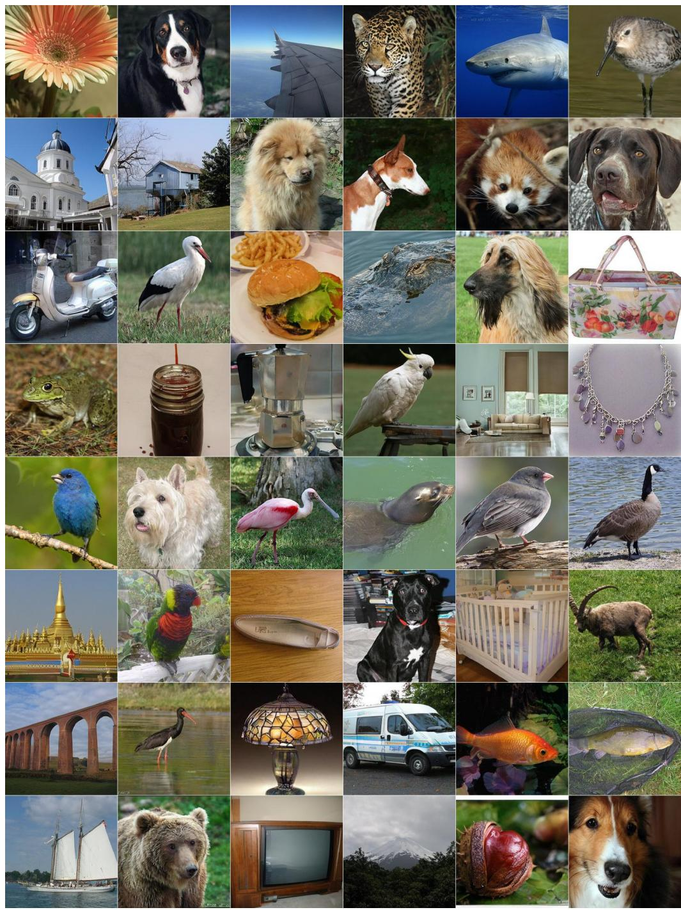  
Figure 2: Visualizations of generated samples from distilled DiTDH-XL (FID = 1.77).

Table 5: Ablation on input pertubation and removing y softmax. † denotes the best FID before collapse.

<table><tr><td>Input Perturbation</td><td>Remove y Softmax</td><td>FID (↓)</td></tr><tr><td>✗</td><td>✗</td><td>2.01</td></tr><tr><td>✗</td><td>√</td><td> $2.44^{\dagger}$ </td></tr><tr><td>√</td><td>✗</td><td>2.14</td></tr><tr><td>√</td><td>√</td><td>1.94</td></tr></table>

Table 6: Ablation on $N _ { \mathrm { e x t r a \_ n e g } }$

<table><tr><td> $N_{\text{pos}}$ </td><td> $N_{\text{total\_neg}}$ </td><td> $N_{\text{extra\_neg}}$ </td><td>FID (↓)</td></tr><tr><td rowspan="4">256</td><td rowspan="4">256</td><td>192</td><td>1.77</td></tr><tr><td>128</td><td>1.79</td></tr><tr><td>64</td><td>1.80</td></tr><tr><td>0</td><td>1.79</td></tr></table>

Table 7: Ablation on $N _ { \mathrm { p o s } } , \ N _ { \mathrm { t o t a l \_ n e g } } .$ , and $N _ { \mathrm { { e x t r a \_ n e g } } }$ . We highlight the balanced configurations in color gray.

<table><tr><td> $N_{\text{pos}}$ </td><td> $N_{\text{total\_neg}}$ </td><td> $N_{\text{extra\_neg}}$ </td><td>FID (↓)</td></tr><tr><td rowspan="3">64</td><td>64</td><td>0</td><td>1.94</td></tr><tr><td>128</td><td>64</td><td>2.88</td></tr><tr><td>256</td><td>192</td><td>4.95</td></tr><tr><td rowspan="2">128</td><td>64</td><td>0</td><td>2.50</td></tr><tr><td>128</td><td>64</td><td>1.87</td></tr><tr><td rowspan="2">256</td><td>64</td><td>0</td><td>4.66</td></tr><tr><td>256</td><td>192</td><td>1.77</td></tr></table>

Model uses more positive than negative samples. This difference may be related to the additional y-softmax in the original formulation, which provides extra smoothing across generated samples and can reduce the influence of individual nearest data points.

Increasing the number of gradient-carrying negative samples. We further examine whether allowing more negative samples to participate in gradient backpropagation improves performance. To this end, we fix the total number of negative samples at $N _ { \mathrm { t o t a l \_ n e g } } = 2 5 6$ and vary the number of gradient-carrying negatives as $N _ { \mathrm { n e g } } \in \mathsf { \overline { { \{ 6 4 , 1 2 8 , 1 9 2 , 2 5 6 \} } } }$ . The results are reported in Table 6. Increasing $N _ { \mathrm { n e g } }$ does not bring consistent performance gains. This indicates that the main benefit of using more negative samples comes from improving the empirical approximation of the generated distribution, rather than from applying gradients to more generated samples. A more accurate empirical approximation further leads to a better estimate of the Drifting field, or equivalently, the discriminator-gradient direction. This observation is also favorable from an implementation perspective. Sampling additional detached negative samples only requires an extra forward pass, without storing gradient information for these samples, and thus avoids more complicated memorysaving techniques such as gradient checkpointing while keeping the memory overhead low.

## 4.4 Limitations and future work

Although this work eliminates the need for an additional MAE for Drifting-based distillation in RAE spaces, several limitations remain. First, our theoretical analysis is based on a simplified high-dimensional model, which inevitably leaves a gap from the actual distribution of RAE latents. Bridging this gap and developing a more precise theory for Drifting in realistic representation spaces are important directions for future work. Second, training Drifting Models from scratch without an auxiliary MAE remains an open problem. Developing native Drifting training methods that do not rely on auxiliary modules is therefore another important direction. Moreover, the need for many same-class positive samples at each Drifting update may hinder scalability, especially in text-to-image generation settings. Reducing this dependence on abundant positive samples is also a promising direction for future research.

## 5 Conclusion

In this paper, we propose Drifting-based distillation for flow models in RAE latent spaces. We quantitatively analyze the geometry of RAE latent spaces and theoretically study the dynamics of Drifting, showing that the highly curved ODE trajectories in RAE spaces make trajectory-based distillation challenging, while their compact and semantically concentrated representations allow Drifting to operate without an additional MAE feature extractor. Motivated by a connection between Drifting Models and the Diffusion-GAN framework, we introduce several practical modifications that improve training stability and distillation performance. Experiments on ImageNet $2 5 6 \times 2 5 6$ demonstrate that our method outperforms previous distillation-based methods in RAE latent spaces and achieves performance comparable to the original Drifting Model while eliminating the need for an auxiliary MAE.

## References

Martín Arjovsky and Léon Bottou. Towards Principled Methods for Training Generative Adversarial Networks. In International Conference on Learning Representations, 2017. 3, 5  
Martín Arjovsky, Soumith Chintala, and Léon Bottou. Wasserstein Generative Adversarial Networks. In International Conference on Machine Learning, 2017. 5  
Andreas Blattmann, Tim Dockhorn, Sumith Kulal, Daniel Mendelevitch, Maciej Kilian, Dominik Lorenz, Yam Levi, Zion English, Vikram Voleti, Adam Letts, Varun Jampani, and Robin Rombach. Stable Video Diffusion: Scaling Latent Video Diffusion Models to Large Datasets. arXiv preprint arXiv:2311.15127, 2023. 1  
Andrew Brock, Jeff Donahue, and Karen Simonyan. Large Scale GAN Training for High Fidelity Natural Image Synthesis. In International Conference on Learning Representations, 2019. 7  
Defang Chen, Zhenyu Zhou, Can Wang, Chunhua Shen, and Siwei Lyu. On the Trajectory Regularity of ODE-based Diffusion Sampling. In International Conference on Machine Learning, 2024. 3, 16  
Hansheng Chen, Kai Zhang, Hao Tan, Leonidas Guibas, Gordon Wetzstein, and Sai Bi. pi-Flow: Policy-Based Few-Step Generation via Imitation Distillation. arXiv preprint arXiv:2510.14974, 2025. 7  
Jia Deng, Wei Dong, Richard Socher, Li-Jia Li, Kai Li, and Li Fei-Fei. ImageNet: A Large-Scale Hierarchical Image Database. In IEEE/CVF Conference on Computer Vision Pattern Recognition, 2009. 6  
Mingyang Deng, He Li, Tianhong Li, Yilun Du, and Kaiming He. Generative Modeling via Drifting. arXiv preprint arXiv:2602.04770, 2026. 2, 3, 4, 5, 6, 7  
Prafulla Dhariwal and Alexander Quinn Nichol. Diffusion Models Beat GANs on Image Synthesis. In Advances in Neural Information Processing System, 2021. 7  
Patrick Esser, Sumith Kulal, Andreas Blattmann, Rahim Entezari, Jonas Müller, Harry Saini, Yam Levi, Dominik Lorenz, Axel Sauer, Frederic Boesel, Dustin Podell, Tim Dockhorn, Zion English, and Robin Rombach. Scaling Rectified Flow Transformers for High-Resolution Image Synthesis. In International Conference on Machine Learning, 2024. 1  
Xuhui Fan, Hongyu Wu, Longbing Cao, et al. SCoT: Unifying Consistency Models and Rectified Flows via Straight-Consistent Trajectories. Advances in Neural Information Processing System, 2026. 3  
Zhengyang Geng, Mingyang Deng, Xingjian Bai, Zico Kolter, and Kaiming He. Mean flows for one-step generative modeling. Advances in Neural Information Processing System, 2026a. 3, 7  
Zhengyang Geng, Yiyang Lu, Zongze Wu, Eli Shechtman, J Zico Kolter, and Kaiming He. Improved mean flows: On the challenges of fastforward generative models. IEEE/CVF Conference on Computer Vision Pattern Recognition, 2026b. 7  
Ian Goodfellow, Jean Pouget-Abadie, Mehdi Mirza, Bing Xu, David Warde-Farley, Sherjil Ozair, Aaron Courville, and Yoshua Bengio. Generative Adversarial Nets. In Advances in Neural Information Processing System, 2014. 2  
Martin Heusel, Hubert Ramsauer, Thomas Unterthiner, Bernhard Nessler, and Sepp Hochreiter. GANs Trained by a Two Time-Scale Update Rule Converge to a Local Nash Equilibrium. In Advances in Neural Information Processing System, 2017. 6  
Jonathan Ho, Ajay Jain, and Pieter Abbeel. Denoising Diffusion Probabilistic Models. In Advances in Neural Information Processing System, 2020. 1, 2  
Zheyuan Hu, Chieh-Hsin Lai, Ge Wu, Yuki Mitsufuji, and Stefano Ermon. Meanflow transformers with representation autoencoders. arXiv preprint arXiv:2511.13019, 2025. 2, 7  
Minguk Kang, Jun-Yan Zhu, Richard Zhang, Jaesik Park, Eli Shechtman, Sylvain Paris, and Taesung Park. Scaling up GANs for Text-to-Image Synthesis. In IEEE/CVF Conference on Computer Vision Pattern Recognition, 2023. 7  
Dongjun Kim, Chieh-Hsin Lai, Wei-Hsiang Liao, Yuhta Takida, Naoki Murata, Toshimitsu Uesaka, Yuki Mitsufuji, and Stefano Ermon. PaGoDA: Progressive Growing of a One-Step Generator from a Low-Resolution Diffusion Teacher. In Advances in Neural Information Processing System, 2024. 7  
Youngjoong Kim, Deokyeong Lee, and Jaesik Park. Distribution Matching Distillation without Fake Score Network. arXiv preprint arXiv:2605.19256, 2026. 7  
Diederik P. Kingma and Max Welling. Auto-Encoding Variational Bayes. In International Conference on Learning Representations, 2014. 1  
Zhifeng Kong, Wei Ping, Jiaji Huang, Kexin Zhao, and Bryan Catanzaro. Diffwave: A Versatile Diffusion Model for Audio Synthesis. In International Conference on Learning Representations, 2021. 1  
Tuomas Kynkäänniemi, Tero Karras, Samuli Laine, Jaakko Lehtinen, and Timo Aila. Improved Precision and Recall Metric for Assessing Generative Models. In Advances in Neural Information Processing System, 2019. 6  
Black Forest Labs, Stephen Batifol, Andreas Blattmann, Frederic Boesel, Saksham Consul, Cyril Diagne, Tim Dockhorn, Jack English, Zion English, Patrick Esser, Sumith Kulal, Kyle Lacey, Yam Levi, Cheng Li, Dominik Lorenz, Jonas Müller, Dustin Podell, Robin Rombach, Harry Saini, Axel Sauer, and Luke Smith. FLUX.1 Kontext: Flow Matching for In-Context Image Generation and Editing in Latent Space. arXiv preprint arXiv:2506.15742, 2025. 1  
Chieh-Hsin Lai, Bac Nguyen, Naoki Murata, Yuhta Takida, Toshimitsu Uesaka, Yuki Mitsufuji, Stefano Ermon, and Molei Tao. A unified view of drifting and score-based models. arXiv preprint arXiv:2603.07514, 2026. 15  
Shanchuan Lin, Anran Wang, and Xiao Yang. SDXL-Lightning: Progressive Adversarial Diffusion Distillation. arXiv preprint arXiv:2402.13929, 2024. 1  
Yaron Lipman, Ricky T. Q. Chen, Heli Ben-Hamu, Maximilian Nickel, and Matthew Le. Flow Matching for Generative Modeling. In International Conference on Learning Representations, 2023. 1, 2  
Wenze Liu and Xiangyu Yue. Learning to Integrate Diffusion ODEs by Averaging the Derivatives. In Advances in Neural Information Processing System, 2026. 7  
Xingchao Liu, Chengyue Gong, and Qiang Liu. Flow Straight and Fast: Learning to Generate and Transfer Data with Rectified Flow. In International Conference on Learning Representations, 2023. 1, 2, 3  
Yiyang Lu, Susie Lu, Qiao Sun, Hanhong Zhao, Zhicheng Jiang, Xianbang Wang, Tianhong Li, Zhengyang Geng, and Kaiming He. One-step Latent-free Image Generation with Pixel Mean Flows. arXiv preprint arXiv:2601.22158, 2026. 7  
Simian Luo, Yiqin Tan, Longbo Huang, Jian Li, and Hang Zhao. Latent Consistency Models: Synthesizing High-Resolution Images with Few-Step Inference. arXiv preprint arXiv:2310.04378, 2023. 2  
Nanye Ma, Mark Goldstein, Michael S Albergo, Nicholas M Boffi, Eric Vanden-Eijnden, and Saining Xie. Sit: Exploring flow and diffusion-based generative models with scalable interpolant transformers. In European Conference on Computer Vision, 2024. 7  
William Peebles and Saining Xie. Scalable Diffusion Models with Transformers. In International Conference on Computer Vision, 2023. 1, 7, 16  
Yansong Peng, Kai Zhu, Yu Liu, Pingyu Wu, Hebei Li, Xiaoyan Sun, and Feng Wu. FACM: Flow-Anchored Consistency Models. In International Conference on Learning Representations, 2026. 7  
Robin Rombach, Andreas Blattmann, Dominik Lorenz, Patrick Esser, and Björn Ommer. High-Resolution Image Synthesis with Latent Diffusion Models. In IEEE/CVF Conference on Computer Vision Pattern Recognition, 2022. 1, 2  
Tim Salimans and Jonathan Ho. Progressive Distillation for Fast Sampling of Diffusion Models. In International Conference on Learning Representations, 2022. 1, 2  
Axel Sauer, Katja Schwarz, and Andreas Geiger. StyleGAN-XL: Scaling StyleGAN to Large Diverse Datasets. In SIGGRAPH, 2022. 7  
Axel Sauer, Frederic Boesel, Tim Dockhorn, Andreas Blattmann, Patrick Esser, and Robin Rombach. Fast High-Resolution Image Synthesis with Latent Adversarial Diffusion Distillation. In SIGGRAPH Asia, 2024a.  
Axel Sauer, Dominik Lorenz, Andreas Blattmann, and Robin Rombach. Adversarial Diffusion Distillation. In European Conference on Computer Vision, 2024b. 1  
Jaskirat Singh, Boyang Zheng, Zongze Wu, Richard Zhang, Eli Shechtman, and Saining Xie. Improved Baselines with Representation Autoencoders. arXiv preprint arXiv:2605.18324, 2026. 1  
Jascha Sohl-Dickstein, Eric A. Weiss, Niru Maheswaranathan, and Surya Ganguli. Deep Unsupervised Learning using Nonequilibrium Thermodynamics. In International Conference on Machine Learning, 2015. 1, 2  
Jiaming Song, Chenlin Meng, and Stefano Ermon. Denoising Diffusion Implicit Models. In International Conference on Learning Representations, 2021a. 1  
Yang Song and Prafulla Dhariwal. Improved Techniques for Training Consistency Models. In International Conference on Learning Representations, 2024. 3  
Yang Song, Jascha Sohl-Dickstein, Diederik P. Kingma, Abhishek Kumar, Stefano Ermon, and Ben Poole. Score-Based Generative Modeling through Stochastic Differential Equations. In International Conference on Learning Representations, 2021b. 2  
Yang Song, Prafulla Dhariwal, Mark Chen, and Ilya Sutskever. Consistency Models. In International Conference on Machine Learning, 2023. 1, 2, 3  
George Stein, Jesse C. Cresswell, Rasa Hosseinzadeh, Yi Sui, Brendan Leigh Ross, Valentin Villecroze, Zhaoyan Liu, Anthony L. Caterini, J. Eric T. Taylor, and Gabriel Loaiza-Ganem. Exposing Flaws of Generative Model Evaluation Metrics and Their Unfair Treatment of Diffusion Models. In Advances in Neural Information Processing System, 2023. 6  
Shangyuan Tong, Nanye Ma, Saining Xie, and Tommi Jaakkola. Flow Map Distillation Without Data. arXiv preprint arXiv:2511.19428, 2025. 7  
Shengbang Tong, Boyang Zheng, Ziteng Wang, Bingda Tang, Nanye Ma, Ellis Brown, Jihan Yang, Rob Fergus, Yann LeCun, and Saining Xie. Scaling Text-to-Image Diffusion Transformers with Representation Autoencoders. arXiv preprint arXiv:2601.16208, 2026. 1  
Fu-Yun Wang, Zhaoyang Huang, Alexander W Bergman, Dazhong Shen, Peng Gao, Michael Lingelbach, Keqiang Sun, Weikang Bian, Guanglu Song, Yu Liu, et al. Phased consistency models. Advances in Neural Information Processing System, 2024. 1  
Zhendong Wang, Huangjie Zheng, Pengcheng He, Weizhu Chen, and Mingyuan Zhou. Diffusion-GAN: Training GANs with Diffusion. In International Conference on Learning Representations, 2023. 2, 5, 15, 16  
Jingfeng Yao and Xinggang Wang. Reconstruction vs. Generation: Taming Optimization Dilemma in Latent Diffusion Models. IEEE/CVF Conference on Computer Vision Pattern Recognition, 2025. 7  
Tianwei Yin, Michaël Gharbi, Taesung Park, Richard Zhang, Eli Shechtman, Fredo Durand, and William T Freeman. Improved Distribution Matching Distillation for Fast Image Synthesis. In Advances in Neural Information Processing System, 2024a. 1  
Tianwei Yin, Michaël Gharbi, Taesung Park, Richard Zhang, Eli Shechtman, Fredo Durand, and William T Freeman. Improved Distribution Matching Distillation for Fast Image Synthesis. In Advances in Neural Information Processing System, 2024b. 1, 7  
Tianwei Yin, Michaël Gharbi, Richard Zhang, Eli Shechtman, Frédo Durand, William T. Freeman, and Taesung Park. One-Step Diffusion with Distribution Matching Distillation. In IEEE/CVF Conference on Computer Vision Pattern Recognition, 2024c. 1, 2  
Zhengrong Yue, Taihang Hu, Mengting Chen, Haiyu Zhang, Zihao Pan, Tao Liu, Zikang Wang, Jinsong Lan, Xiaoyong Zhu, Bo Zheng, and Yali Wang. What Matters for Diffusion-Friendly Latent Manifold? Prior-Aligned Autoencoders for Latent Diffusion. arXiv preprint arXiv:2605.07915, 2026. 1  
Le Zhang, Ning Mang, and Aishwarya Agrawal. RiT: Vanilla Diffusion Transformers Suffice in Representation Space. arXiv preprint arXiv:2605.21981, 2026. 17  
Boyang Zheng, Nanye Ma, Shengbang Tong, and Saining Xie. Diffusion transformers with representation autoencoders. arXiv preprint arXiv:2510.11690, 2025. 1, 2, 6, 7, 16  
Linqi Zhou, Stefano Ermon, and Jiaming Song. Inductive Moment Matching. In International Conference on Machine Learning, 2025. 7  
Mingyuan Zhou, Huangjie Zheng, Zhendong Wang, Mingzhang Yin, and Hai Huang. Score identity Distillation: Exponentially Fast Distillation of Pretrained Diffusion Models for One-Step Generation. In International Conference on Machine Learning, 2024. 1, 2

## Appendix

In this appendix, we provide additional technical details and discussions omitted from the main text. Appendix $\mathrm { A }$ presents the detailed proof of Theorem 1 in Section 3.2, and establishes the connection between Drifting Models and Diffusion-GAN. Appendix B provides further implementation details, including the statistical analysis procedure used in Section 3.2 and the complete hyperparameter configurations for our experiments. Appendix C presents additional attempts and discussions on training Drifting Models from scratch. Appendix D presents additional qualitative generation results.

## A Proofs and Derivatives

## A.1 Proof of Theorem 1

Proof. Note that the drifting term $\mathbf { V } _ { j }$ can be reformulated as below:

$$
\mathbf {V} _ {j} = \mathbf {V} _ {j} ^ {+} - \mathbf {V} _ {j} ^ {-}, \tag {13}
$$

$$
\mathbf {V} _ {j} ^ {+} = \sum_ {i = 1} ^ {d} \frac {e ^ {- \frac {1}{\tau} \| \mathbf {y} _ {i} - \mathbf {x} _ {j} \|}}{\sum_ {l = 1} ^ {d} e ^ {- \frac {1}{\tau} \| \mathbf {y} _ {l} - \mathbf {x} _ {j} \|}} \mathbf {y} _ {i}, \quad \mathbf {V} _ {j} ^ {-} = \sum_ {k \neq j} \frac {e ^ {- \frac {1}{\tau} \| \mathbf {x} _ {k} - \mathbf {x} _ {j} \|}}{\sum_ {m \neq j} e ^ {- \frac {1}{\tau} \| \mathbf {x} _ {m} - \mathbf {x} _ {j} \|}} \mathbf {x} _ {k}. \tag {14}
$$

We first compute the effect of the negative part $\mathbf { V } _ { j } ^ { - }$ . To simplify the derivation, we could reformulate the case, $i . e . ,$ , for uniformly sampled $\mathbf { z } _ { 1 } , \mathbf { z } _ { 2 } , \cdot \cdot \cdot , \mathbf { z } _ { m } , \mathbf { x } \overset { \mathrm { i . i . d . } } { \sim } \mathcal { U } _ { [ - r , r ] ^ { d } }$ , we compute the behavior of the following z:

$$
\mathbf {z} = \sum_ {i = 1} ^ {m} \frac {e ^ {- \frac {1}{\tau} \| \mathbf {z} _ {i} - \mathbf {x} \|}}{\sum_ {l = 1} ^ {m} e ^ {- \frac {1}{\tau} \| \mathbf {z} _ {l} - \mathbf {x} \|}} \mathbf {z} _ {i}. \tag {15}
$$

Note that $\| \mathbf { z } _ { i } - \mathbf { x } \| = { \sqrt { \| \mathbf { x } \| ^ { 2 } + \| \mathbf { z } _ { i } \| ^ { 2 } - 2 \langle \mathbf { x } , \mathbf { z } _ { i } \rangle } }$ ⟩. Let $R _ { i } = \sqrt { \| \mathbf { x } \| ^ { 2 } + \| \mathbf { z } _ { i } \| ^ { 2 } }$ and $u _ { i } = \langle \mathbf { x } , \mathbf { z } _ { i } \rangle$ , then by Taylor’s series we have

$$
\left\| \mathbf {z} _ {i} - \mathbf {x} \right\| = R _ {i} \sum_ {k = 0} ^ {\infty} \binom {1 / 2} {k} \left(\frac {- 2 u _ {i}}{R _ {i} ^ {2}}\right) ^ {k} = R _ {i} + R _ {i} \sum_ {k = 1} ^ {\infty} \binom {1 / 2} {k} \left(\frac {- 2 u _ {i}}{R _ {i} ^ {2}}\right) ^ {k}, \tag {16}
$$

where the convergence radius is $\left| \frac { 2 u _ { i } } { R _ { i } ^ { 2 } } \right| < 1$ . Note that

$$
\left| \frac {2 u _ {i}}{R _ {i} ^ {2}} \right| = \left| \frac {2 \langle \mathbf {x} , \mathbf {z} _ {i} \rangle}{\| \mathbf {x} \| ^ {2} + \| \mathbf {z} _ {i} \| ^ {2}} \right| \leqslant \frac {2 \| \mathbf {x} \| \| \mathbf {z} _ {i} \|}{\| \mathbf {x} \| ^ {2} + \| \mathbf {z} _ {i} \| ^ {2}} \leqslant 1, \tag {17}
$$

and the equality holds if and only if ${ \bf x } = \pm { \bf z } _ { i }$ . That is to say, Eq. (16) holds almost everywhere. Then we have

$$
e ^ {- \frac {1}{\tau} \| \mathbf {z} _ {i} - \mathbf {x} \|} = e ^ {- \frac {R _ {i}}{\tau}} e ^ {- \frac {R _ {i}}{\tau} \sum_ {k = 1} ^ {\infty} \binom {1 / 2} {k} \left(\frac {- 2 u _ {i}}{R _ {i} ^ {2}}\right) ^ {k}} \tag {18}
$$

$$
= e ^ {- \frac {R _ {i}}{\tau}} (1 + O (\frac {u _ {i}}{R _ {i}})). \tag {19}
$$

Note that for uniformly sampled $\mathbf { z } _ { i }$ , we have $\begin{array} { r } { \mathbb { E } \| \mathbf { z } _ { i } \| ^ { 2 } = \frac { d } { 3 } r ^ { 2 } } \end{array}$ with standard deviation 2r2 ${ \frac { 2 r ^ { 2 } } { 3 } } { \sqrt { \frac { d } { 5 } } } .$ $\mathbb { E } [ u _ { i } ] = \left. \mathbf { x } , \mathbb { E } [ \mathbf { z } _ { i } ] \right. = 0$ with standard deviation ${ \frac { \| \mathbf { x } \| } { \sqrt { 3 } } } r .$ . Since the second standard deviation is $d ,$ $\begin{array} { r } { \frac { \mathbf { \phi } _ { u _ { i } } } { R _ { i } } \approx \big ( \frac { 1 } { \| \mathbf { x } \| ^ { 2 } + \frac { d r } { 3 } } \big ) ^ { \frac { 1 } { 2 } } u _ { i }  0 } \end{array}$ as d goes to infinity.

Therefore we have

$$
\mathbf {z} = \sum_ {i = 1} ^ {m} \frac {e ^ {- \frac {1}{\tau} \| \mathbf {z} _ {i} - \mathbf {x} \|}}{\sum_ {l = 1} ^ {m} e ^ {- \frac {1}{\tau} \| \mathbf {z} _ {l} - \mathbf {x} \|}} \mathbf {z} _ {i} \approx \sum_ {i = 1} ^ {m} \frac {e ^ {- \frac {R _ {i}}{\tau}}}{\sum_ {l = 1} ^ {m} e ^ {- \frac {R _ {l}}{\tau}}} \mathbf {z} _ {i} \tag {20}
$$

$$
\rightarrow \sum_ {i = 1} ^ {m} \frac {e ^ {- \frac {1}{\tau} \sqrt {\frac {d}{3} r ^ {2} + \| \mathbf {x} \| ^ {2}}}}{\sum_ {l = 1} ^ {m} e ^ {- \frac {1}{\tau} \sqrt {\frac {d}{3} r ^ {2} + \| \mathbf {x} \| ^ {2}}} \mathbf {z} _ {i}} \tag {21}
$$

$$
= \frac {1}{m} \sum_ {i = 1} ^ {m} \mathbf {z} _ {i}. \tag {22}
$$

Then the mean and standard deviation of $\| \mathbf { z } \|$ can be deduced as below by Central Limit Theorem:

$$
\mathbb {E} \| \mathbf {z} \| \rightarrow \sqrt {\frac {d}{3 m}} r, \text {   std } (\| \mathbf {z} \|) \rightarrow \frac {r}{\sqrt {6 m}} \quad \text { as   } d \rightarrow + \infty . \tag {23}
$$

Therefore, when $m = d - 1$ , the standard deviation will tend to zero, and we have

$$
\left\| \mathbf {V} _ {j} ^ {-} \right\|\rightarrow \sqrt {\frac {1}{3}} r \quad \text { as } d \rightarrow + \infty . \tag {24}
$$

That is to say, $\left\| \mathbf { V } _ { j } ^ { - } \right\|$ converges to ${ \sqrt { \frac { 1 } { 3 } } } r$ which is independent with the dimension d.

As for the positive part $\mathbf { V } _ { j } ^ { + }$ , note that for any $\mathbf { x } \in \mathbb { R } ^ { d }$ , we have $\| \mathbf { y } _ { i } - \mathbf { x } \| = { \sqrt { 1 + \| \mathbf { x } \| ^ { 2 } - 2 \langle \mathbf { y } _ { i } , \mathbf { x } _ { i } \rangle } }$ . Let $R = \sqrt { 1 + \| \mathbf { x } \| ^ { 2 } }$ and $u _ { i } = \langle \mathbf { y } _ { i } , \mathbf { x } \rangle$ , then we have similar equality which holds for any ${ \bf x } \neq \pm { \bf y } _ { i } \colon$ :

$$
e ^ {- \frac {1}{\tau} \| \mathbf {y} _ {i} - \mathbf {x} \|} = e ^ {- \frac {R}{\tau}} (1 + O (\frac {u _ {i}}{R})). \tag {25}
$$

Denote by

$$
\mathbf {y} = \sum_ {i = 1} ^ {d} \frac {e ^ {- \frac {1}{\tau} \| \mathbf {y} _ {i} - \mathbf {x} \|}}{\sum_ {l = 1} ^ {d} e ^ {- \frac {1}{\tau} \| \mathbf {y} _ {l} - \mathbf {x} \|}} \mathbf {y} _ {i}. \tag {26}
$$

Recall that $\mathbf { y } _ { i }$ is uniformly sampled from $\mathbb { S } ^ { d - 1 }$ , then $\left\| \mathbf { y } _ { i } \right\| = 1$ and $\mathbb { E } [ u _ { i } ] = \left. \mathbf { x } , \mathbb { E } [ \mathbf { y } _ { i } ] \right. = 0$ with standard deviation $\frac { \| \mathbf { x } \| } { \sqrt { d } }$ . Since $\frac { \| \mathbf { x } \| } { \sqrt { d } }$ tends to zero as $d \to \infty$ , we can still deduce that $\begin{array} { r } { \frac { u _ { i } } { R }  0 } \end{array}$ . Then we have

$$
\mathbf {y} = \sum_ {i = 1} ^ {d} \frac {e ^ {- \frac {1}{\tau} \| \mathbf {y} _ {i} - \mathbf {x} \|}}{\sum_ {l = 1} ^ {d} e ^ {- \frac {1}{\tau} \| \mathbf {y} _ {l} - \mathbf {x} \|}} \mathbf {y} _ {i} \approx \sum_ {i = 1} ^ {d} \frac {e ^ {- \frac {R}{\tau}}}{\sum_ {l = 1} ^ {d} e ^ {- \frac {R}{\tau}}} \mathbf {y} _ {i} \tag {27}
$$

$$
= \frac {1}{d} \sum_ {i = 1} ^ {d} \mathbf {y} _ {i}. \tag {28}
$$

Note that

$$
\mathbb {E} \| \mathbf {y} \| ^ {2} = \frac {1}{d}, \quad \operatorname{var} (\| \mathbf {y} \| ^ {2}) = \frac {2 (d - 1)}{d ^ {4}}. \tag {29}
$$

Therefore $\mathbf y \to \mathbf 0$ for almost any $\mathbf { x } \in \mathbb { R } ^ { d }$ as the dimension d goes to infinity. That is to say, the positive part directly vanishes.

Recall that $\left. \mathbf { V } _ { j } ^ { - } \right. \to \sqrt { \frac { 1 } { 3 } } r$ as d goes to infinity, we can deduce that

$$
\| \mathbf {V} _ {j} \| \rightarrow \sqrt {\frac {1}{3}} r \quad \text { as } d \rightarrow + \infty . \tag {30}
$$

$[ - r , r ] ^ { d }$ $r { \sqrt { d } } ,$ $\textstyle { \frac { \frac { 1 } { 3 } } { d } } \to 0$ we can deduce that the optimizing target of the drifting field collapses to the origin with sufficiently large dimension d. □

## A.2 Drifting as Empirical Diffusion-GAN

In this section, we connect Drifting Models to adversarial training, especially the viewpoint of Diffusion-GAN (Wang et al., 2023). The key observation is that, after smoothing the real and generated empirical distributions with a kernel, the Drifting field can be interpreted as the gradient of the logit of the optimal discriminator. This provides a theoretical motivation for the proposed modifications in Section 3.3.

Let $q$ denote the target distribution and ${ \boldsymbol { p } } = \mathbf { G } _ { \theta \# } p _ { \mathbf { z } }$ denote the generated distribution where $p _ { \mathbf { z } }$ is the noise distribution. For a fixed generator, the optimal discriminator for the standard GAN objective is

$$
D _ {q, p} ^ {*} (\mathbf {x}) = \frac {q (\mathbf {x})}{q (\mathbf {x}) + p (\mathbf {x})}, \tag {31}
$$

whose logit is

$$
\operatorname{logit} D _ {q, p} ^ {*} (\mathbf {x}) = \log \frac {D _ {q , p} ^ {*} (\mathbf {x})}{1 - D _ {q , p} ^ {*} (\mathbf {x})} = \log q (\mathbf {x}) - \log p (\mathbf {x}). \tag {32}
$$

Therefore, the gradient of the optimal discriminator logit gives the score difference

$$
\nabla_ {\mathbf {x}} \operatorname{logit} D _ {q, p} ^ {*} (\mathbf {x}) = \nabla_ {\mathbf {x}} \log q (\mathbf {x}) - \nabla_ {\mathbf {x}} \log p (\mathbf {x}). \tag {33}
$$

The gradient of the non-saturating generator loss − log $D _ { q , p } ^ { * } ( \mathbf { x } )$ is the negative score difference up to a positive scalar factor, since

$$
\nabla_ {\mathbf {x}} \left[ - \log D _ {q, p} ^ {*} (\mathbf {x}) \right] = \frac {p (\mathbf {x})}{q (\mathbf {x}) + p (\mathbf {x})} \left(\nabla_ {\mathbf {x}} \log p (\mathbf {x}) - \nabla_ {\mathbf {x}} \log q (\mathbf {x})\right). \tag {34}
$$

We now consider empirical distributions smoothed by a kernel. Given real samples $\{ \mathbf { y } _ { i } \} _ { i = 1 } ^ { N } \sim q$ and generated samples $\{ \mathbf { x } _ { j } \} _ { j = 1 } ^ { M } \sim p ,$ define empirical measures

$$
\hat {q} = \frac {1}{N} \sum_ {i = 1} ^ {N} \delta_ {\mathbf {y} _ {i}}, \quad \hat {p} = \frac {1}{M} \sum_ {j = 1} ^ {M} \delta_ {\mathbf {x} _ {j}}. \tag {35}
$$

For $l > 0 ,$ , consider the exponential kernel

$$
k _ {l} (\mathbf {x}; \tau) = \exp \left(- \frac {\| \mathbf {x} \| _ {2} ^ {l}}{\tau}\right), \tag {36}
$$

and the smoothed empirical densities

$$
\hat {q} _ {l} (\mathbf {x}) = (k _ {l} * \hat {q}) (\mathbf {x}) = \frac {1}{N} \sum_ {i = 1} ^ {N} k _ {l} (\mathbf {x} - \mathbf {y} _ {i}; \tau), \quad \hat {p} _ {l} (\mathbf {x}) = (k _ {l} * \hat {p}) (\mathbf {x}) = \frac {1}{M} \sum_ {j = 1} ^ {M} k _ {l} (\mathbf {x} - \mathbf {x} _ {j}; \tau). \tag {37}
$$

Then the following proposition establishes the connection of the drifting field and the gradient of the logit of the optimal discriminator, which is also closely related to the results in Lai et al. (2026).

Proposition 1. Let

$$
\mathbf {V} _ {l} (\mathbf {x}) = \sum_ {i = 1} ^ {N} \alpha_ {i} ^ {+} (\mathbf {x}) \| \mathbf {y} _ {i} - \mathbf {x} \| _ {2} ^ {l - 2} \left(\mathbf {y} _ {i} - \mathbf {x}\right) - \sum_ {j = 1} ^ {M} \alpha_ {j} ^ {-} (\mathbf {x}) \| \mathbf {x} _ {j} - \mathbf {x} \| _ {2} ^ {l - 2} \left(\mathbf {x} _ {j} - \mathbf {x}\right), \tag {38}
$$

where

$$
\alpha_ {i} ^ {+} (\mathbf {x}) = \frac {k _ {l} (\mathbf {x} - \mathbf {y} _ {i} ; \tau)}{\sum_ {n = 1} ^ {N} k _ {l} (\mathbf {x} - \mathbf {y} _ {n} ; \tau)}, \quad \alpha_ {j} ^ {-} (\mathbf {x}) = \frac {k _ {l} (\mathbf {x} - \mathbf {x} _ {j} ; \tau)}{\sum_ {m = 1} ^ {M} k _ {l} (\mathbf {x} - \mathbf {x} _ {m} ; \tau)}. \tag {39}
$$

Then

$$
\nabla_ {\mathbf {x}} \operatorname{logit} D _ {\hat {q} _ {l}, \hat {p} _ {l}} ^ {*} (\mathbf {x}) = \frac {l}{\tau} \mathbf {V} _ {l} (\mathbf {x}). \tag {40}
$$

Proof. We first compute the score of $\hat { q } _ { l }$ . Since

$$
\nabla_ {\mathbf {x}} k _ {l} (\mathbf {x} - \mathbf {y} _ {i}; \tau) = - \frac {l}{\tau} \| \mathbf {x} - \mathbf {y} _ {i} \| _ {2} ^ {l - 2} (\mathbf {x} - \mathbf {y} _ {i}) k _ {l} (\mathbf {x} - \mathbf {y} _ {i}; \tau), \tag {41}
$$

we have

$$
\nabla_ {\mathbf {x}} \log \hat {q} _ {l} (\mathbf {x}) = \frac {\sum_ {i = 1} ^ {N} \nabla_ {\mathbf {x}} k _ {l} (\mathbf {x} - \mathbf {y} _ {i} ; \tau)}{\sum_ {n = 1} ^ {N} k _ {l} (\mathbf {x} - \mathbf {y} _ {n} ; \tau)} \tag {42}
$$

$$
= \frac {l}{\tau} \sum_ {i = 1} ^ {N} \frac {k _ {l} (\mathbf {x} - \mathbf {y} _ {i} ; \tau)}{\sum_ {n = 1} ^ {N} k _ {l} (\mathbf {x} - \mathbf {y} _ {n} ; \tau)} \| \mathbf {y} _ {i} - \mathbf {x} \| _ {2} ^ {l - 2} (\mathbf {y} _ {i} - \mathbf {x}) \tag {43}
$$

$$
= \frac {l}{\tau} \sum_ {i = 1} ^ {N} \alpha_ {i} ^ {+} (\mathbf {x}) \| \mathbf {y} _ {i} - \mathbf {x} \| _ {2} ^ {l - 2} (\mathbf {y} _ {i} - \mathbf {x}). \tag {44}
$$

Analogously,

$$
\nabla_ {\mathbf {x}} \log \hat {p} _ {l} (\mathbf {x}) = \frac {l}{\tau} \sum_ {j = 1} ^ {M} \alpha_ {j} ^ {-} (\mathbf {x}) \| \mathbf {x} _ {j} - \mathbf {x} \| _ {2} ^ {l - 2} (\mathbf {x} _ {j} - \mathbf {x}). \tag {45}
$$

Subtracting Equation (42) and Equation (45) to Equation (33) gives the desired result.

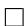

Proposition 1 shows that Drifting estimates the optimal discriminator logit gradient by Monte Carlo samples. In particular, when l = 2, the norm factor disappears and $\mathbf { V } _ { l }$ becomes the standard attraction-repulsion field induced by a Gaussian/RBF kernel, up to the constant factor $2 / \tau$ . When l = 1 as used in practice, the same derivation yields a normalized displacement direction, because each displacement is divided by its distance. This is also consistent with the practical implementation of Drifting Models, where feature vectors are often normalized and only the direction of the drifting field is used. In high-dimensional spaces, the distance between two normalized feature vectors becomes nearly constant. We note that Drifting can be interpreted as an estimate of the gradient of the optimal discriminator logit between two perturbed distributions, making it closely related to the Diffusion-GAN (Wang et al., 2023) framework. This connection provides the motivation for the modifications introduced in Section 3.3.

First, the softmax weights in Drifting arise from differentiating the log-density of an exponentialkernel mixture. Therefore, the additional y-softmax used in the original implementation is not directly induced by this derivation and may alter the gradient direction of the optimal discriminator logit.

Second, Drifting can be interpreted as estimating the gradient of the optimal discriminator logit between two perturbed distributions. From this perspective, the input x in the training loss should be sampled from the perturbed generated distribution ${ \hat { p } } _ { l } ( \mathbf { x } )$ , which can be approximated by injecting noise into negative samples. However, using the theoretically matched perturbation scale can be inefficient in high-dimensional spaces, as perturbed samples may rarely stay near the clean generated samples and thus provide less direct supervision to the generator. In practice, we therefore use random-direction noise whose norm follows a Laplace distribution, which provides a practical trade-off between sampling from the perturbed distribution and maintaining sample efficiency.

Finally, Drifting relies on Monte Carlo estimation of the underlying distributions and their induced vector field. Using more samples improves the empirical approximation of both real and generated distributions, leading to a more accurate estimate of the Drifting direction.

## B Additional Implementation Details

## B.1 Details of Statistical Analysis in Section 3.2

Here we provide additional details for the statistical analyses used in Section 3.2, including trajectory curvature, isotropy, and dispersion statistics.

Trajectory curvature. For the SD-VAE latent space, we use a DiT-XL model from Peebles and Xie (2023); for the RAE latent space, we use the DiTDH-XL model from Zheng et al. (2025). The curvature is computed using the open-source implementation of Chen et al. (2024).

Isotropy statistics. We quantify the isotropy of latents using the participation ratio (PR) and spectral entropy (SE). For each class and each spatial token, we collect the corresponding latents across samples and compute their covariance matrix. Let $\{ \mu _ { i } \} _ { i = 1 } ^ { r }$ be the non-negative eigenvalues of this covariance matrix, where r is the number of eigenvalues. We define the normalized spectrum as

$$
p _ {i} = \frac {\mu_ {i}}{\sum_ {j = 1} ^ {r} \mu_ {j}}. \tag {46}
$$

The normalized participation ratio is computed as

$$
\mathrm{PR} = \frac {\left(\sum_ {i = 1} ^ {r} \mu_ {i}\right) ^ {2}}{r \sum_ {i = 1} ^ {r} \mu_ {i} ^ {2}} = \frac {1}{r \sum_ {i = 1} ^ {r} p _ {i} ^ {2}}, \tag {47}
$$

and the normalized spectral entropy is computed as

$$
\mathrm{SE} = \frac {1}{r} \exp \left(- \sum_ {i = 1} ^ {r} p _ {i} \log p _ {i}\right). \tag {48}
$$

Both metrics are normalized to lie in $[ 1 / r , 1 ]$ , with larger values indicating a more isotropic spectrum. We compute PR and SE separately for each class and each token, and then average over all classes and all tokens. Since our RAE latents contain $1 6 \times 1 6 = 2 5 6$ spatial tokens, this protocol evaluates isotropy at the token level rather than after flattening all tokens together.

We note that a recent concurrent work (Zhang et al., 2026) also studies representation-space geometry and reports conclusions that appear different from ours. We suspect that the discrepancy mainly comes from the aggregation protocol. Zhang et al. (2026) measures global statistics after mixing samples from all classes and aggregating token positions, while our analysis is performed per class and per token. For our purpose, the latter protocol is more preferred since DiT-type models condition on class embeddings and process latents as token sequences. Therefore, the relevant geometry is the local within-class, within-token geometry rather than the global geometry obtained by aggregating all classes and tokens.

Dispersion statistics. We measure how dispersed samples are in SD-VAE and RAE latent spaces using nearest-neighbor distance (NN-d) and spherical maximum mean discrepancy (S-MMD). Since SD-VAE and RAE latents have different dimensionalities, we normalize all Euclidean distances by√ ${ \sqrt { d } } ,$ where d denotes the corresponding feature dimension, which removes the scaling of Euclidean distance with dimensionality and makes the statistics more comparable across latent spaces.

NN-d is the average distance from each sample to its nearest neighbor within the same class:

$$
\mathrm{NN-d} = \frac {1}{\sum_ {c = 1} ^ {C} n _ {c}} \sum_ {c = 1} ^ {C} \sum_ {i = 1} ^ {n _ {c}} \min _ {j \neq i} \frac {1}{\sqrt {d}} \| \mathbf {x} _ {c, i} - \mathbf {x} _ {c, j} \| _ {2}, \tag {49}
$$

where $C$ is the total number of classes and $n _ { c }$ is the number of samples within class $c .$ A smaller NN-d indicates closer neighbors and thus more concentrated samples.

S-MMD compares the empirical sample distribution with a reference spherical distribution. For a set $\{ \tilde { \mathbf { x } } _ { c , i } \} _ { i = 1 } ^ { n _ { c } }$

$$
\rho = \frac {1}{n _ {c}} \sum_ {i = 1} ^ {n _ {c}} \| \tilde {\mathbf {x}} _ {c, i} \| _ {2}. \tag {50}
$$

Instead of sampling infinitely many points from the sphere, we use a simple deterministic approximation consisting of all poles of the sphere:

$$
\mathcal {S} _ {\rho} = \{\pm \rho \mathbf {e} _ {1}, \dots , \pm \rho \mathbf {e} _ {d} \}, \tag {51}
$$

where $\{ { \bf e } _ { i } \} _ { i = \mathrm { ~ \ i ~ } } ^ { d }$ 1 denotes the standard basis. We then compute the standard squared MMD between the centered samples and $ { \boldsymbol { S } } _ { \rho }$ :

$$
\mathrm{MMD} ^ {2} (\mathcal {X}, \mathcal {Y}) = \frac {1}{| \mathcal {X} | ^ {2}} \sum_ {\mathbf {x}, \mathbf {x} ^ {\prime} \in \mathcal {X}} k (\mathbf {x}, \mathbf {x} ^ {\prime}) + \frac {1}{| \mathcal {Y} | ^ {2}} \sum_ {\mathbf {y}, \mathbf {y} ^ {\prime} \in \mathcal {Y}} k (\mathbf {y}, \mathbf {y} ^ {\prime}) - \frac {2}{| \mathcal {X} | | \mathcal {Y} |} \sum_ {\mathbf {x} \in \mathcal {X}} \sum_ {\mathbf {y} \in \mathcal {Y}} k (\mathbf {x}, \mathbf {y}), \tag {52}
$$

where k is a selected kernel, and $| \mathcal { X } |$ denotes the number of samples in a finite set $\mathcal { X } .$ . In practice, we choose

$$
k (\mathbf {x}, \mathbf {y}) = e ^ {- \frac {1}{\tau \sqrt {d}} \| \mathbf {x} - \mathbf {y} \| _ {2}}, \tag {53}
$$

with τ = 1.0. A larger S-MMD indicates that the sample distribution is less sphere-like.

Table 8: Hyperparameter settings for Drift-RAE.

<table><tr><td>Hyperparameter</td><td>Value</td></tr><tr><td> $N_c$ </td><td>32</td></tr><tr><td> $N_{\text{pos}}$ </td><td>256</td></tr><tr><td> $N_{\text{neg}}$ </td><td>64</td></tr><tr><td> $N_{\text{extra\_neg}}$ </td><td>192</td></tr><tr><td>Temperatures  $\tau$ </td><td> $\{0.02, 0.05, 0.2\}$ </td></tr><tr><td>Training steps  $T$ </td><td>10,000</td></tr><tr><td>Base learning rate</td><td> $3 \times 10^{-5}$ </td></tr><tr><td>Learning rate schedule</td><td> $\max \left\{ 3 \times 10^{-7}, 3 \times 10^{-5} - \frac{(3 \times 10^{-5} - 3 \times 10^{-7})}{10000} \cdot t \right\}$ </td></tr><tr><td>EMA</td><td>0.9995</td></tr><tr><td>EMA warmup</td><td> $\min \left\{ 0.9995, 0.5 \cdot (0.9995/0.5)^{t/1000} \right\}$ </td></tr><tr><td>Gradient clipping</td><td>1.0</td></tr><tr><td>Optimizer</td><td>AdamW ( $\beta_1 = 0.9, \beta_2 = 0.95$ )</td></tr><tr><td>Weight decay</td><td>0.0</td></tr></table>

Table 9: Attempts to train drifting models from scratch without auxiliary MAEs.

<table><tr><td>Latent space</td><td>Model</td><td>Strategy</td><td>FID (↓)</td></tr><tr><td>SD-VAE</td><td>DiT-XL</td><td>-</td><td>220.55</td></tr><tr><td>RAE</td><td> $DiT^{DH}$ -XL</td><td>-</td><td>100.31</td></tr><tr><td>RAE</td><td> $DiT^{DH}$ -XL</td><td>+ decode-encode</td><td>7.04</td></tr></table>

## B.2 Hyperparameter Settings

We summarize the main hyperparameters used for Drift-RAE in Table 8.

## C Attempts to Train Drifting Models from Scratch with RAEs

We also explore whether Drifting Models can be trained from scratch without auxiliary MAEs. As shown in Table 9, directly training Drifting Models in either SD-VAE or RAE spaces without an additional MAE fails to produce effective results. Theorem 1 suggests that this failure is caused by the poor initialization encountered in from-scratch Drifting training.

To alleviate this issue, we further try a simple decode-encode strategy. Specifically, we first decode the generated latents using the RAE decoder, and then re-encode the decoded samples with the RAE encoder to compute the Drifting direction and apply gradient backpropagation. We denote this variant as “+ decode-encode”. As shown in Table 9, this strategy enables training from scratch in RAE spaces and achieves an FID of 7.04. We hypothesize that the decode-encode process can effectively project off-manifold generated samples back toward the data manifold, playing a role similar to the auxiliary MAE used in the original Drifting Model.

Despite this improvement, training Drifting Models from scratch in RAE spaces still lags behind state-of-the-art methods. We leave further improving MAE-free from-scratch Drifting training in RAE spaces as an important direction for future work.

## D More Visualizations

Additional class-wise qualitative results are shown in Figures 3 to 6.

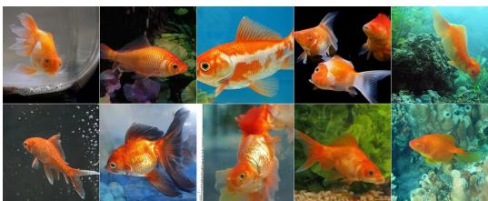

natural_image

Collage of various goldfish and aquatic plants in natural and marine environments (no text or symbols visible)

Class 1: goldfish

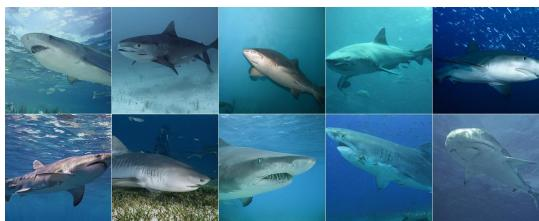

natural_image

Grid of underwater photos showing various shark species in various poses (no text or symbols visible)

Class 3: tiger shark

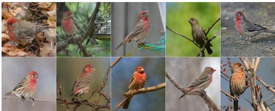

natural_image

Grid of nine photos of red-crowned birds perched on branches, showing natural features and foliage (no text or symbols)

Class 12: house finch

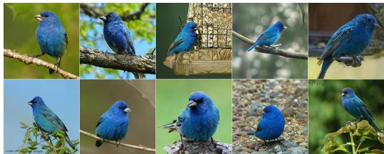

natural_image

Grid of nine photos of blue birds perched on branches, including one with a bird perched on a net (no text or symbols visible)

Class 14: indigo bunting

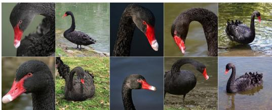

natural_image

Collage of black swans and waterfowl in various angles, showing dorsal and lateral views (no text or symbols)

Class 100: black swan

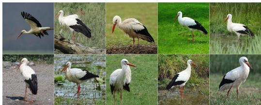

natural_image

Grid of ten photos showing storks and birds in various habitat and water environments (no text or symbols visible)

Class 127: white stork

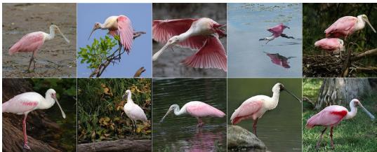

natural_image

Collage of pink and white swan fts in various habitat and water environments (no text or symbols visible)

Class 129: spoonbill

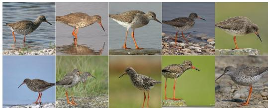

natural_image

Grid of nine photos showing various bird species including a wetland, grassy shoreline, and seabed (no text or symbols visible)

Class 141: redshank

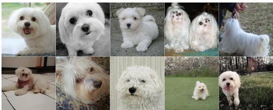

natural_image

Collage of white dog photos including head, front, side, and close-up views (no text or symbols visible)

Class 153: Maltese dog

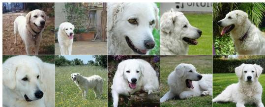

natural_image

Grid of ten white dog photos showing various expressions and poses, including standing, smiling, and relaxing (no text or symbols visible)

Class 222: kuvasz  
Figure 3: Additional visualizations of generated samples from distilled $\mathrm { D i T ^ { D H } { - } X L } \ ( \mathrm { F I D = } 1 . 7 7 )$

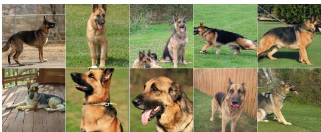

natural_image

Grid of nine photos showing German Shepherd dogs in various poses and expressions, including standing, relaxing, and sleeping (no text or symbols visible)

Class 235: German shepherd

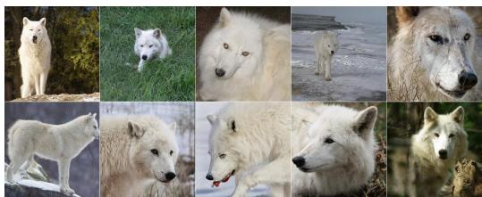

natural_image

Grid of ten animal portraits including a white wolf, green grass, and snowy landscape (no text or symbols)

Class 270: white wolf

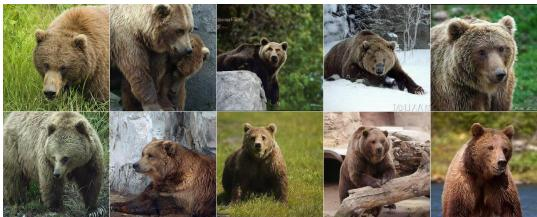

natural_image

Grid of twelve photos of bears in various poses and outdoor settings, including natural scenery and forest (no text or symbols visible)

Class 294: brown bear

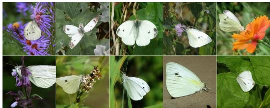

natural_image

Grid of nine photos showing white butterflies perched on purple and orange flowers, no text or symbols present.

Class 324: cabbage butterfly

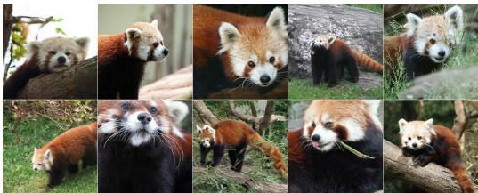

natural_image

Collage of red panda animals in various poses and ecosystems, including walking, grazing, and climbing (no text or symbols visible)

Class 387: red panda

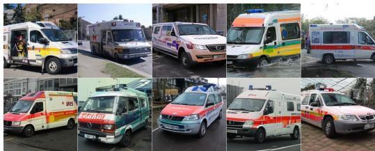

natural_image

Grid of ten different ambulance and emergency vehicles parked outdoors, including medical staff, ambulances, and a police car (no visible text or symbols)

Class 407: ambulance

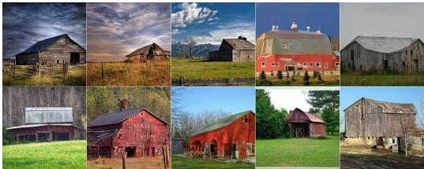

natural_image

Collage of eight rural and old barns with different architectural styles and colors, including old and modern structures under a cloudy sky (no text or symbols visible)

Class 425: barn

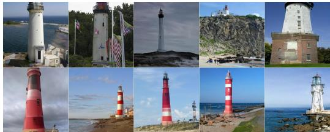

natural_image

Collage of ten different lighthouse and lighthouse images, including a coastal town, a lighthouse, and red-and-white variants (no text or symbols visible)

Class 437: beacon

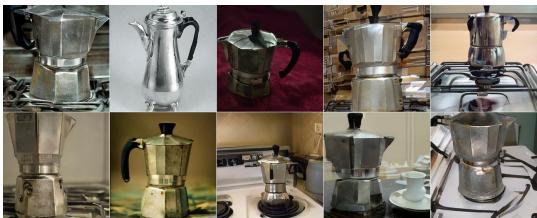

natural_image

Grid of various kitchen portable steamer variants including kettle, blender, and coffee maker (no visible text or labels)

Class 505: coffee pot

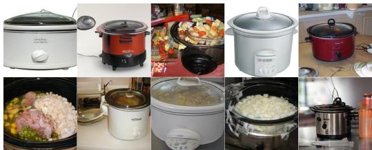

natural_image

Collage of various kitchen cooking appliances including rice, pot, and dish (no visible text or labels)

Class 521: Crock Pot  
Figure 4: Additional visualizations of generated samples from distilled $\mathrm { D i T ^ { D H } { - } X L } \ ( \mathrm { F I D = } 1 . 7 7 )$

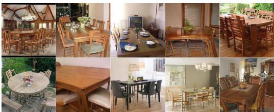

natural_image

Collage of outdoor dining and dining furniture including round tables, wooden tables, and chairs (no visible text or symbols)

Class 532: dining table

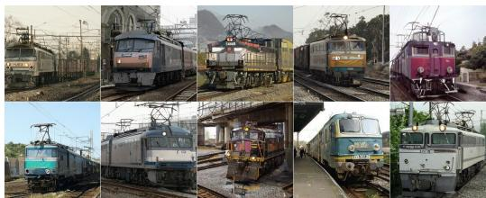

natural_image

Grid of nine railway tracks with various locomotives and power lines, no visible text or symbols

Class 547: electric locomotive

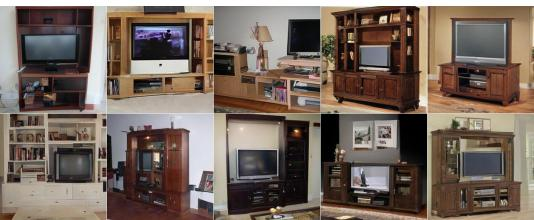

natural_image

Collage of various home appliances including TV, audio, and home furnishes (no visible text or labels)

Class 548: entertainment center

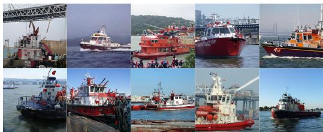

natural_image

Collage of nine different vessels and support boats in a harbor, including ships, cranes, and tugboats (no visible text or symbols)

Class 554: fireboat

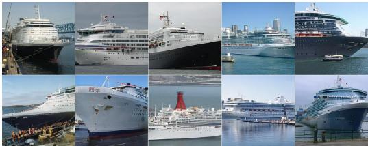

natural_image

Collage of multiple cruise ships including the Grand Canal and Collier, docked at a port with city skyline in background (no visible text or symbols)

Class 628: liner, ocean liner

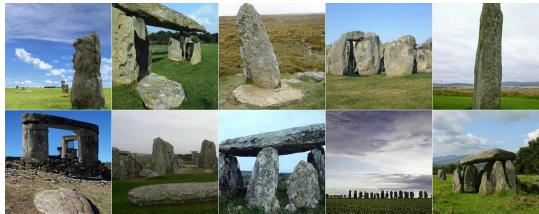

natural_image

Collage of stone monuments including Stonehenge, Shundell, and Stonebello, set in natural landscape with no visible text or symbols.

Class 649: megalith

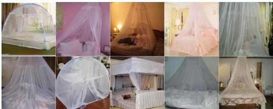

natural_image

Grid of nine photos showing various types of hanging umbrellas in different settings (no text or symbols visible)

Class 669: mosquito net

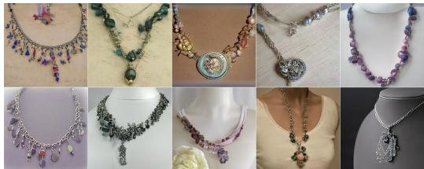

natural_image

Collage of various jewelry necklaces and necklaces displayed on a mannequin (no text or symbols visible)

Class 679: necklace

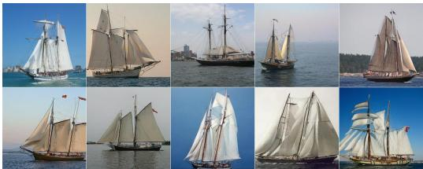

natural_image

Grid of nine images showing multiple traditional sailing ships on the sea, each with different masts and sails, under clear skies (no text or symbols visible)

Class 780: schooner

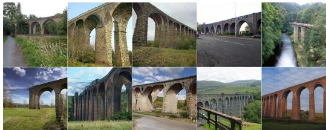

natural_image

Collage of ten photos showing ancient stone arches and bridges, including water, green fields, and wooden bridge (no visible text or symbols)

Class 888: viaduct  
Figure 5: Additional visualizations of generated samples from distilled $\mathrm { D i T } ^ { \mathrm { D H } }$ -XL (FID=1.77).

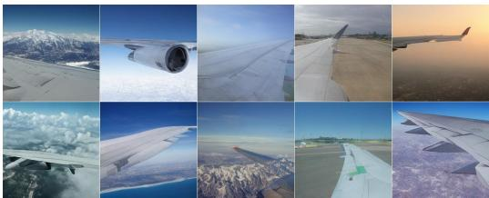

natural_image

Collage of aircraft wings and landscape photos showing flight, ground, and landscape views (no text or symbols)

Class 908: wing

natural_image

Collage of nine food and drink items including ice cream, chocolate sauce, ice cream, and various desserts (no visible text or labels)

Class 928: ice cream

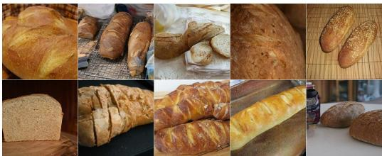

natural_image

Collage of various baked bread products including baked bread rolls, baked bread slices, and baked bread rolls with golden-brown crust (no text or symbols visible)

Class 930: French loaf

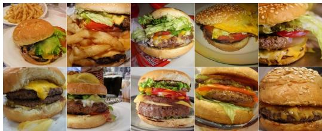

natural_image

Grid of nine photos showing various hamburger and fried McDonald's menu dishes (no visible text or labels)

Class 933: cheeseburger

natural_image

Collage of nine food dishes featuring noodles, vegetables, and toppings (no visible text or labels)

Class 959: carbonara

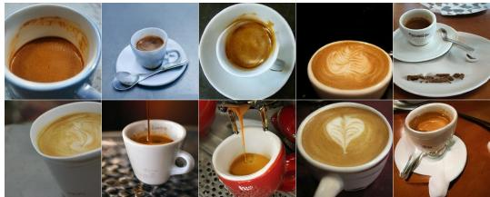

natural_image

Collage of nine coffee cups and teacups in various settings, including pastel, rose, and instant noodles (no text or symbols visible)

Class 967: espresso

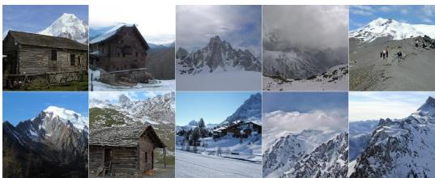

natural_image

Collage of scenic mountain landscapes including a wooden cabin, snow-capped peaks, and forested slopes (no text or symbols visible)

Class 970: alp

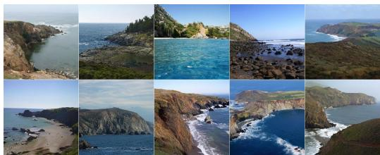

natural_image

Grid of ten coastal and rocky landscapes with natural peaks, beaches, and ocean waves (no text or symbols visible)

Class 976: promontory, headland

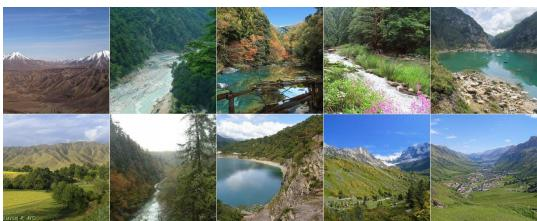

natural_image

Collage of ten scenic mountain landscapes including river, lake, forested slopes, and villages (no text or symbols visible)

Class 979: valley

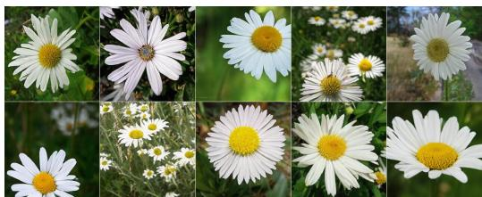

natural_image

Grid of nine close-up photos of daisies with yellow centers, showing natural scenery and no text or symbols.

Class 985: daisy  
Figure 6: Additional visualizations of generated samples from distilled $\mathrm { D i T ^ { D H } { - } X L } \ ( \mathrm { F I D = } 1 . 7 7 )$ .