# DifFRACT: Diffusion Feature Reconstruction and Attribution for Circuit Tracing

Artyom Mazur HSE University

Nina Konovalova HSE University FusionBrain Lab AXXX

Aibek Alanov HSE University FusionBrain Lab AXXX

## Abstract

Mechanistic interpretability seeks to explain neural network behavior by decomposing model computations into interpretable features and circuits. While transcoderbased circuit tracing has recently enabled detailed causal analyses of large language models, multimodal diffusion transformers for image generation remain comparatively opaque. We still lack tools for understanding how semantic information propagates across denoising steps and how text and image representations interact within double-stream MM-DiT architectures. Existing methods provide only partial insight: attention maps expose a limited view of token interactions, while sparse autoencoders can discover interpretable features but do not directly reveal how these features are transformed and composed through nonlinear MLP layers. In this work, we extend transcoder-based circuit tracing to multimodal diffusion transformers. We train timestep-conditioned transcoders that faithfully approximate the input–output behavior of MLP sublayers in FLUX.1[schnell]. By replacing MLPs with transcoders and linearizing the remaining computation, we obtain exact feature-to-feature attribution and recover compact, interpretable circuits. Empirically, our transcoders match or slightly outperform sparse autoencoders on the sparsity–faithfulness tradeoff. The resulting circuits reveal mechanisms underlying attribute binding and cross-stream semantic propagation, and provide causal explanations for systematic generation errors. Moreover, circuit-guided interventions are substantially more precise and effective than standard SAE-based steering. Our results demonstrate that transcoder-based circuit analysis is feasible for state-of-the-art diffusion transformers and provides a powerful framework for understanding and controlling multimodal generative models. The code is available at https://github.com/Artalmaz31/DifFRACT

## 1 Introduction

Diffusion models Ho et al. [2020], Dhariwal and Nichol [2021] have emerged as the state-of-theart paradigm for high-fidelity and good quality text-to-image generation Rombach et al. [2022], Esser et al. [2024]. However, despite this empirical success the internal mechanisms that transform noise into semantically rich images remain largely opaque. Understanding how diffusion models perform this step-by-step transformation is therefore a critical open challenge for improving reliability, controllability, and safety.

Sparse autoencoders (SAEs) have become a widely adopted tool for mechanistic interpretability in LLMs Cunningham et al. [2023], Yun et al. [2021] and have recently been extended to diffusion models, where they identify semantically meaningful visual features and support steering of generated outputs Cywinski and Deja [2025], Huang et al. [2026]. However, SAE features are typically dense ´ linear combinations of neurons Nanda [2023], making it difficult to trace how a feature in one layer influences a later feature through the intervening MLP sublayers.

To overcome these limitations, circuit tracing methods, developed for large language models, construct attribution graphs over interpretable features, recovering the sequence of intermediate computations that a model uses to produce a given output. A key technical enabler of scalable circuit tracing is the introduction of transcoders Dunefsky et al. – auxiliary models that approximate the full input–output behavior of MLP sublayers with a wide, sparsely activating MLP. Unlike sparse autoencoders, which only reconstruct activations at a single point, transcoders directly model the nonlinear transformation performed by the MLP. This results in highly faithful approximations and enables the construction of attribution graphs.

Diffusion models pose additional challenges for circuit-level analysis: they operate over multiple denoising timesteps and, in modern architectures such as MM-DiT, maintain separate image and text streams with joint cross-attention. Motivated by the success of transcoder-based circuit tracing in LLMs, we extend this paradigm to diffusion transformers.

Our main contributions are as follows:

• We propose the first application of transcoders to MM-DiT architectures, specifically targeting the MLP sublayers of double-stream blocks of FLUX. By conditioning transcoders on the denoising timestep, we obtain sparse and highly faithful approximations of the model’s nonlinear computations.  
• We demonstrate that transcoders achieve a comparable or modestly better tradeoff than sparse autoencoders (SAEs) in sparsity–faithfulness, while providing a more accurate basis for mechanistic analysis of diffusion models.  
• We develop and adapt circuit tracing algorithms to the diffusion setting, enabling the discovery of diffusion circuits — causal pathways of interpretable features that uncover key aspects of image generation such as object placement, style consistency, semantic composition, and cross-stream interactions. Through extensive experiments, we show that our approach successfully recovers meaningful circuits and yields novel insights into the generation process across denoising timesteps.

## 2 Method

## 2.1 Preliminaries

Early text-to-image diffusion models were based primarily on U-Net architectures Rombach et al. [2022], Podell et al. [2023]. The field has since shifted toward transformer-based designs Esser et al. [2024], Peebles and Xie [2023], which offer better scalability and multimodal integration.

We focus on FLUX.1, a multimodal diffusion transformer consisting of 19 double-stream blocks followed by 38 single-stream blocks. Double-stream blocks process image and text tokens with separate weights, allowing interaction only through a joint attention mechanism; single-stream blocks concatenate both streams and process them jointly. We restrict our analysis to double-stream blocks (see Appendix A for discussion).

Each double-stream block applies a joint attention sublayer followed by two stream-specific MLP sublayers, both modulated by AdaLN-Zero conditioning derived from the denoising timestep and pooled CLIP embedding. The attention sublayer computes and concatenates queries, keys, and values across streams, splits the output back per stream, and adds it to the residual, yielding $x _ { \mathrm { m i d } } ^ { ( \bar { \ell } , s ) }$ . The MLP sublayer then operates independently on each stream:

$$
x _ {\text { post }} ^ {(\ell , s)} = x _ {\text { mid }} ^ {(\ell , s)} + \text { gate } _ {\text { mlp }} ^ {\ell , s} \odot \text { MLP } ^ {(\ell , s)} \left(\text { AdaLN } _ {\text { mlp }} \left(x _ {\text { mid }} ^ {(\ell , s)}\right)\right), \tag {1}
$$

where $\mathrm { A d a L N _ { \mathrm { m l p } } }$ stands for the LayerNorm-then-affine-modulate operation parameterized by $( \mathrm { s c a l e } _ { \mathrm { m l p } } ^ { \ell , s } , \mathrm { s h i f t } _ { \mathrm { m l p } } ^ { \ell , s } )$ $x _ { \mathrm { p r e } } ^ { ( \ell + 1 , s ) } = x _ { \mathrm { p o s t } } ^ { ( \ell , s ) }$ The double-block scheme is illustrated in Figures 8 and 9 in Appendix C.

The MLP sublayers are the only components fully internal to a single stream. Since all updates are additive, the hidden state decomposes as a sum of preceding contributions. Our transcoders (§2.2) are trained to approximate these MLP updates, allowing us to decompose each MLP’s contribution into a sparse sum of interpretable feature vectors.

## 2.2 Architecture and training

Temporal-Aware Transcoder  
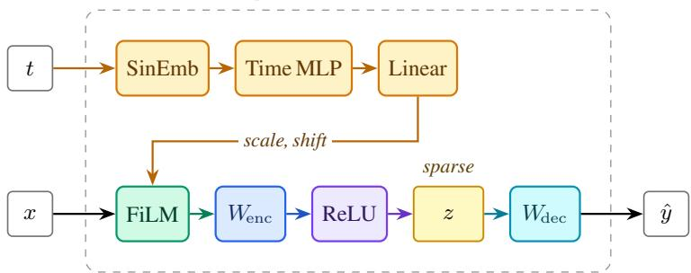

flowchart

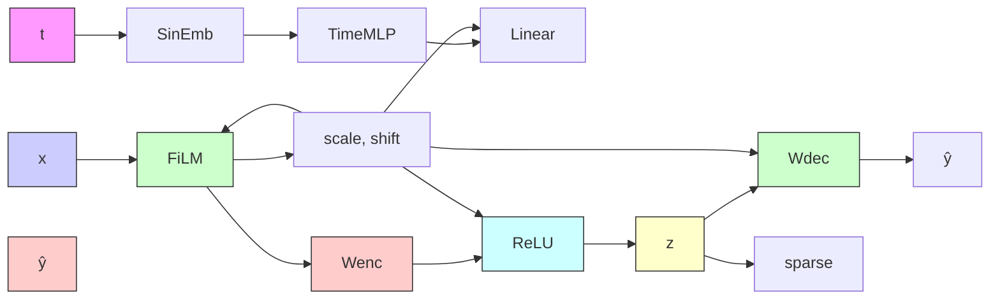
```mermaid
graph LR
  t --> SinEmb --> TimeMLP --> Linear
  x --> FiLM --> Wenc --> ReLU --> z --> Wdec --> node["ŷ"]
  FiLM --> w1["scale, shift"]
  w1 --> Linear
  z --> sparse
  w1 --> FiLM
  w1 --> ReLU
  w1 --> Wdec
    style t fill:#f9f,stroke:#333
    style x fill:#ccf,stroke:#333
    style FiLM fill:#cfc,stroke:#333
    style Wenc fill:#fcc,stroke:#333
    style ReLU fill:#cff,stroke:#333
    style z fill:#ffc,stroke:#333
    style Wdec fill:#cfc,stroke:#333
    style ŷ fill:#fcc,stroke:#333
```

Figure 1: Architecture of the Temporal-Aware Transcoder for one (layer, stream) pair. The diffusion timestep t produces per-channel scale and shift parameters that modulate the encoder input via FiLM; the modulated input is then encoded into a wide, sparse code z and decoded into the reconstruction $\hat { y }$ of the target MLP output.

Transcoders were originally proposed for LLMs as sparse approximations of MLP sublayers. We adapt this technique for modern MM-DiT, specifically FLUX.1[schnell] double-stream blocks. We train one transcoder per stream (text and image) and block, denoted $T C _ { \ell } ^ { s }$ for $s \in \{ \mathrm { i m g , t x t } \}$ . As diffusion models require multi-step generation, we additionally condition each transcoder on the denoising timestep t, using FiLM Perez et al. [2018] method for modulation of encoder input:

$$
x _ {\mathrm{mod}} = x \odot (1 + \operatorname{scale} (e _ {t})) + \operatorname{shift} (e _ {t}) \tag {2}
$$

$x \in \mathbb { R } ^ { d _ { \mathrm { m o d e l } } }$ is the input to the MLP sublayer, $e _ { t } \in \mathbb { R } ^ { d _ { t } }$ is an embedding of the timestep. The modulated input is then passed through a sparse encoder to produce feature activations $z ( x , t )$ , which are linearly decoded to approximate the MLP output:

$$
z (x, t) = \operatorname{ReLU} \left(W _ {\text {enc}} x _ {\text {mod}} + b _ {\text {enc}}\right), \tag {3}
$$

$$
T C _ {\ell} ^ {s} (x, t) = W _ {\mathrm{dec}} z (x, t) + b _ {\mathrm{dec}}, \tag {4}
$$

where the trainable parameters are $W _ { \mathrm { e n c } } \in \mathbb { R } ^ { d _ { \mathrm { f e a t } } \times d _ { \mathrm { m o d e l } } }$ , $W _ { \mathrm { d e c } } \in \mathbb { R } ^ { d _ { \mathrm { m o d e l } } \times d _ { \mathrm { f e a t } } } , b _ { \mathrm { e n c } } \in \mathbb { R } ^ { d _ { \mathrm { f e a t } } }$ , and $b _ { \mathrm { d e c } } \in \mathbb { R } ^ { d _ { \mathrm { m o d e l } } }$ , with feature dimension $d _ { \mathrm { f e a t } } \gg d _ { \mathrm { m o d e l } } \left( \mathrm { A p p e n d i x \ : E . 1 } \right)$ . Each feature i is associated with an encoder vector f (ℓ,s,i)enc - the i-th row of Wenc, and a decoder vector f (ℓ,s,dec $f _ { \mathrm { e n c } } ^ { ( \ell , s , i ) }$ $W _ { \mathrm { e n c } } ,$ $f _ { \mathrm { d e c } } ^ { ( \ell , s , i ) }$ i) - the i-th column of $W _ { \mathrm { d e c } }$ . The encoder vector determines how strongly feature i activates on the current input $x ,$ producing activation $z _ { i } ( x , t )$ . The transcoder output is then a weighted sum of the decoder vectors, with the weights given by the corresponding activations $z _ { i } ( x , t )$ . By design, only a sparse subset of features activates on any given input, making the representation both efficient and interpretable.

Each transcoder is trained using the following loss, where the hyperparameter $\lambda ^ { s }$ balances the tradeoff between sparsity and faithfulness:

$$
\mathcal {L} _ {\ell} ^ {s} = \underbrace {\frac {\mathbb {E} _ {x , t} \left\| \mathrm{MLP} _ {\ell} ^ {s} (x) - T C _ {\ell} ^ {s} (x , t) \right\| _ {2} ^ {2}}{\sum_ {j = 1} ^ {d _ {\text { model }}} \operatorname{Var} _ {x , t} \left(\mathrm{MLP} _ {\ell} ^ {s} (x) _ {j}\right) + \varepsilon}} _ {\text { faithfulness   loss }} + \underbrace {\lambda^ {s} \mathbb {E} _ {x , t} \left\| z (x , t) \right\| _ {1}} _ {\text { sparsity   penalty }} \tag {5}
$$

The faithfulness term is variance-normalized to absorb the order-of-magnitude spread in MLP activation magnitudes across blocks and timesteps, and decoder columns are renormalized to unit norm after every optimizer step (Appendix E.3).

## 2.3 Circuit tracing

We introduce a method for feature-level circuit analysis using transcoders. Following circuit tracing techniques developed for LLMs Dunefsky et al., Ameisen et al. [2025], we construct a local replacement model (LRM) in which feature interactions are linearized. This allows us to decompose the preactivation of a target feature into an attribution graph over earlier features and input embeddings, which we then iteratively expand and prune into a compact, interpretable circuit.

Local replacement model. To construct the Local Replacement Model (LRM), we fix a prompt, a denoising timestep t, and a target feature $f ^ { * }$ specified by its layer $\ell ^ { * }$ , stream $s ^ { * } \in \{ \mathrm { i m g } , \mathrm { t x t } \}$ , position $p ^ { * } .$ , and transcoder feature index $i ^ { * }$ . We run a single forward pass of the frozen base model, intercepting it with hooks to cache all quantities needed for linearization: input embeddings $r _ { 0 } ^ { s } .$ AdaLN modulation parameters (constant for fixed t), LayerNorm denominators, joint attention $P ^ { \ell }$ $z ^ { \ell , s }$ $\varepsilon _ { \mathrm { m l p } } ^ { \ell , s }$

Using these cached values, we replace each LayerNorm with a frozen-denominator version (the mean is recomputed at runtime, but the variance-based denominator is held fixed), each joint attention block with a linear function of the cached attention probability tensor $P ^ { \ell }$ applied to the V-projections plus a cached residual correction $\varepsilon _ { \mathrm { a t t } 1 } ^ { \ell , s }$ that ensures the frozen joint-attention operator exactly reproduces the original attention output on the cached prompt, and each MLP sublayer with its corresponding transcoder $T C _ { \ell } ^ { s } ( x , t )$ plus the cached reconstruction residual. After these substitutions, treating the $\{ ( \ell , s , i , p ) : z _ { i } ^ { ( \ell , s ) } ( p ) > 0 \}$ as fixed makes the LRM an affine function of the input embeddings and active source feature activations; the target’s preactivation $h ^ { * }$ thus admits an exact additive decomposition into per-source contributions plus a constant. In our implementation, $\bar { z } _ { i } ^ { ( \ell , s ) } ( p )$ propagate only through the linear decoder paths; the input-dependent activation magnitudes are reintroduced multiplicatively when computing each edge’s attribution.

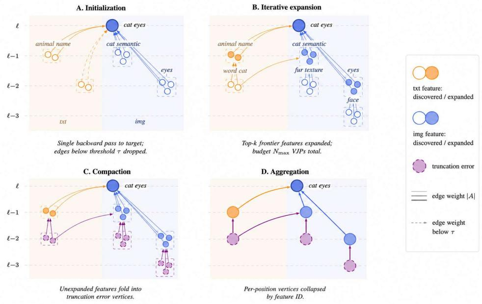  
Figure 2: Iterative graph construction and position aggregation. Stages of the pipeline illustrated on a target image-stream feature cat eyes at layer ℓ. Source clusters consist of small circles representing per-position activations of a single feature; outlined circles denote discovered sources (whose incoming edges have not yet been computed), filled circles denote expanded sources (incoming edges already extracted via a backward pass). MLP-error and input vertices, which are present at every layer in the actual attribution graph, are omitted for visual clarity.

Attribution graph. Given the LRM, we decompose the preactivation of the target feature $h ^ { * }$ (full derivation in Appendix G) rather than its activation $z ^ { * } \overset { \sim } { = } \operatorname { R e L U } ( h ^ { * } )$ , since $\overl { h ^ { * } }$ is additive in its sources by linearity of the LRM making the decomposition exact and remains informative even when the feature is inactive $( h ^ { * } < 0 , z ^ { * } = \bar { 0 } )$ . All input-independent contributions — encoder/decoder biases, AdaLN/FiLM shifts, and the cached attention reconstruction terms — are collected into a target-specific scalar $b _ { \mathrm { e f f } } ^ { * }$ and excluded from the decomposition (Appendix G.2).

The attribution graph contains a designated target vertex (the decomposed feature $f ^ { * } )$ and three types of source vertices: a feature vertex for each active earlier-layer feature $( \ell , s , p , i ) \ ( \ell < \ell ^ { * }$ , $z ^ { ( \ell , s , i ) } ( p ) > 0 )$ $\varepsilon _ { \mathrm { m l p } } ^ { \ell , s } ( p )$ vertex carrying the model’s input embeddings $r _ { 0 } ^ { s } ( p )$ : noisy latent patch embeddings for $s =$ img and prompt token embeddings for $s = \mathrm { t x t }$ .

To compute the contribution of all vertices to the target, we run a single backward pass of $h ^ { * }$ through the LRM, denoting by $g ^ { \ell , s } ( p )$ the gradient at the input to block ℓ. The contribution of each source type is then:

$$
A _ {(\ell , s, p, i) \rightarrow f ^ {*}} = \underbrace {z ^ {(\ell , s , i)} (p)} _ {\text { input - dependent }} \cdot \underbrace {\left(g ^ {\ell + 1 , s} (p) \odot \operatorname{gate} _ {\mathrm{mlp}} ^ {\ell , s}\right) ^ {\top} f _ {\mathrm{dec}} ^ {(\ell , s , i)}} _ {\text { virtual   weight }}. \tag {6}
$$

where gateℓ,smlp $\mathrm { g a t e } _ { \mathrm { m l p } } ^ { \ell , s } \in \mathbb { R } ^ { d _ { \mathrm { m o d e l } } }$ is the AdaLN-Zero MLP gate of equation (1), constant across positions since AdaLN-Zero modulation depends only on the timestep and pooled embedding.

The MLP reconstruction error $\varepsilon _ { \mathrm { m l p } } ^ { \ell , s } ( p )$ ℓ,s enters the residual through the same gating, contributing:

$$
A _ {(\ell , s, p) _ {\mathrm{err}} \rightarrow f ^ {*}} = \left(\varepsilon_ {\mathrm{mlp}} ^ {\ell , s} (p) \odot \operatorname{gate} _ {\mathrm{mlp}} ^ {\ell , s}\right) ^ {\top} g ^ {\ell + 1, s} (p) \tag {7}
$$

And for each input position, the embedding $r _ { 0 } ^ { s } ( p )$ propagates without gating:

$$
A _ {(s, p) _ {\mathrm{in}} \rightarrow f ^ {*}} = r _ {0} ^ {s} (p) ^ {\top} g ^ {0, s} (p) \tag {8}
$$

(detailed in Appendix G.3)

By construction, attributions sum exactly to $\begin{array} { r } { h ^ { * } - b _ { \mathrm { e f f } } ^ { * } = \sum _ { \mathrm { s r c } } A _ { \mathrm { s r c } \to f ^ { * } } } \end{array}$ , serving as a diagnostic for graph completeness (Appendix G.4). Finally, because frozen joint attention concatenates both streams before applying $P ^ { \ell }$ , the gradient $g ^ { \ell + 1 , s } ( p )$ flows naturally across streams, producing txt → img and img → txt edges in the attribution graph (Appendix G.5).

Iterative graph construction. Computing a backward pass per feature vertex is infeasible since the number of passes grows exponentially with the number of layers. We therefore use a budgeted greedy procedure in Figure 2 (more details in Appendix I):

1. Initialize. Compute all incoming edges to the target $f ^ { * }$ in a single backward pass; add every source with $| { \cal { A } } | \geq \tau$ to the discovered set D.  
2. Score. For each discovered but unexpanded feature, estimate its eventual influence on the target via an indirect-influence score σ(v) (Appendix I.1) computed over already-expanded vertices.  
3. Expand. Pick the top k unexpanded features by σ, compute their incoming edges via a backward pass, and update the scores. Repeat until the budget $N _ { \mathrm { m a x } }$ is exhausted or no feature scores above τ .  
4. Compaction. Fold edges from unexpanded features into truncation-error vertices $( \mathsf { A p } \cdot \mathsf { \Gamma }$ pendix I.3), distinct from the MLP reconstruction errors above. This preserves the exact attribution-sum invariant.

Position Aggregation. The attribution graph is inherently per-position: a single feature firing at many positions appears as hundreds of vertices, producing graphs with $\mathcal { O } ( 1 0 ^ { 4 } )$ vertices. Since the question of interest is typically which features participate rather than where, we aggregate all position-specific vertices for the same feature $( \ell , s , i )$ into a single vertex by summing their attributions:

$$
\bar {A} _ {(\ell , s, i) \rightarrow f ^ {*}} = \sum_ {p} A _ {(\ell , s, p, i) \rightarrow f ^ {*}} \tag {9}
$$

Error vertices are aggregated per $( \ell , s )$ pair, input vertices per stream. Per-position activation patterns are preserved as sparse maps for visualization. Although aggregation can hide cancellations, it exactly preserves the total attribution sum, reducing graph size by roughly an order of magnitude without significant loss of qualitative information (Appendix H).

Pruning. The iteratively constructed graph typically contains thousands of vertices and $\mathcal { O } ( 1 0 ^ { 5 } )$ edges. We apply a two-step pruning procedure to retain only the most influential components. First, we prune feature vertices (Appendix J.2) by their indirect influence on the target $( \operatorname* { i n f } ( v ) = B _ { v , f ^ { * } } )$ , keeping the smallest set that accounts for 80% of the total influence (pruning image and text streams separately). Error and input vertices are kept unpruned. Second, we prune edges (Appendix J.3) by their normalized contribution score, retaining those that cover 98% of the remaining influence. With our default parameters this reduces the number of vertices by approximately 2.4× and the number of edges by approximately 12×, while increasing the mean conservation-invariant relative error by approximately 30% (Appendix K).

## 3 Experiments

All experiments use FLUX.1[schnell] with four denoising steps and 32 transcoders trained for layers $\ell \in \{ 0 , \ldots , 1 5 \}$ for both streams (Appendix E). By an intervention, we mean scaling the activation of a specific feature $z _ { i } ^ { ( \ell , s ) } ( p )$ $\alpha < 1$ suppresses the feature and $\alpha > 1$ amplifies it.

All case studies follow the same protocol: (i) identify a candidate feature for the phenomenon of interest, either by browsing the transcoder dictionary or via contrastive prompting; (ii) compute its attribution graph on a representative prompt; (iii) group active source features into supernodes and form a hypothesis about the underlying mechanism; (iv) validate the hypothesis with a series of interventions on the original model.

## 3.1 Comparison with sparse autoencoders

Transcoders provide a capability that SAEs do not: feature-to-feature attribution through MLP sublayers, which underlies the circuit-tracing methodology of §2. Importantly, this capability does not come at the cost of the sparsity–faithfulness tradeoff. We verify this directly on FLUX.1[schnell], proving that transcoders are comparable to or modestly better than SAEs across the different configurations.

Setup. We compare transcoders against sparse autoencoders (SAEs) on three representative doublestream blocks of FLUX.1[schnell] at layers $\ell \in \{ 6 , 1 2 , 1 8 \}$ , corresponding to the early, middle, and late stages of the double-stream processing. These layers were chosen because they capture qualitatively different types of computation: early layers tend to process low-level visual features and initial text integration, while later layers handle semantic features (Appendix L). For each (layer, stream) pair, we train three transcoders and three SAEs using identical architectures and training setup. The only difference is the training objective: SAEs reconstruct the MLP output from its output (autoencoding), while transcoders predict the MLP output from its input. This ensures both methods produce reconstructions in the same output space, making their errors directly comparable.

We evaluate sparsity using the mean $L _ { 0 }$ norm of the activation vector $z ( x , t )$ , and faithfulness using the variance-normalized mean squared error (nMSE) defined in Equation (10).

$$
\mathrm{nMSE} _ {\ell} ^ {s} = \frac {\mathbb {E} _ {x , t} \left\| \mathrm{MLP} _ {\ell} ^ {s} (x) - \widehat {\mathrm{MLP}} _ {\ell} ^ {s} (x , t) \right\| _ {2} ^ {2}}{\sum_ {j = 1} ^ {d _ {\text {model}}} \operatorname{Var} _ {x , t} \left(\mathrm{MLP} _ {\ell} ^ {s} (x) _ {j}\right) + \varepsilon} \tag {10}
$$

where $\widehat { \mathrm { M L P } } _ { \ell } ^ { s } ( x , t )$ stands for either $T C _ { \ell } ^ { s } ( x , t )$ or the $S A E _ { \ell } ^ { s } ( \mathrm { M L P } _ { \ell } ^ { s } ( x ) , t )$ .

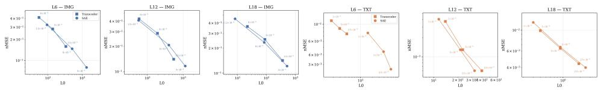  
Figure 3: Sparsity–faithfulness Pareto frontier of transcoders vs SAEs across 6 configurations of FLUX.1[schnell]. Subplots: stream $\in \{ \operatorname* { i m g } , \operatorname { t x t } \} \times \ell \in \{ 6 , 1 2 , 1 8 \}$ . Each curve traces 3 trained models obtained by varying λ, ordered by increasing λ along the curve. Lower-left is better.

Results. Figure 3 shows the sparsity–faithfulness Pareto frontiers for all six configurations. Across early $( \ell = 6 )$ , middle $( \ell = 1 2 )$ , and late $( \ell = 1 8 )$ layers in both streams, transcoders consistently achieve a comparable or modestly better tradeoff than SAEs at matched $L _ { 0 }$ sparsity levels. Combined with their support for circuit tracing – a capability beyond the reach of SAEs – this makes transcoders a strict upgrade over SAEs for the analyses we perform in the remainder of this section.

## 3.2 Temporal evolution of attribution graphs

Unlike language models, diffusion transformers apply the same network across multiple denoising steps, during which activation statistics qualitatively change. This raises a question: does the structure of circuits change along the denoising trajectory and at which step interventions should be applied for controlled generation?

To investigate, we compute attribution graphs for 20 (prompt, target image-stream feature) pairs at each of the four denoising steps of FLUX.1[schnell], yielding 80 graphs in total. For each graph we quantify (i) the relative contribution of image-stream vs text-stream features to the target and (ii) the fraction of cross-modal edges (edges connecting features from different streams). These aggregates reveal a sharp structural shift along the trajectory.

The contribution of text-stream features decreases monotonically from 89.9% at step 0 to 5.4% at step 3, while the image-stream share rises from 10.1% to 94.6%. Additionally, the fraction of cross-modal edges drops from 14.9% to 2.0% (Figure 4). This pattern holds consistently across prompts, suggesting it reflects a general property of the model rather than an artifact of specific inputs.

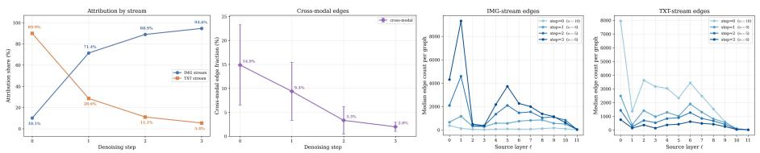  
Figure 4: Left: Evolution of attribution graph structure along the denoising trajectory. (1): share of attribution mass from image-stream and text-stream feature nodes. (2): share of cross-modal edges among all edges in the graph; error bars show one standard deviation across graphs. Right: Pruned-graph edges by source layer at $\ell ^ { * } = 1 2$ in the image stream, broken down by denoising step. (3): image-stream edges by source layer. (4): text-stream edges by source layer.

Per-layer refinement. The shift in stream share is not uniform across the model’s depth. Using attribution graphs with target features fixed at $\ell ^ { * } = 1 2$ , we find that image-stream growth is concentrated at specific source layers: by $t = 3$ , the dominant contributors are ℓ = 1 and mid-depth layers $\ell \in \{ 4 , \ldots , 7 \}$ , while $\ell \in \{ 2 , 3 \}$ remain nearly inactive at every step. Text-stream contraction mirrors this pattern in reverse – shallow layers contract sharply while deeper layers contract more slowly (Figure 4).

These observations support viewing the denoising trajectory as a two-phase process. Early steps are dominated by text-driven semantic reasoning with strong cross-modal interactions, while later steps focus on perceptual refinement largely within the image stream. We confirm this interpretation causally in Appendix D.1, where suppressing semantic text-stream supernodes affects the generation only when applied at early steps. The practical implications are direct: attribution graphs computed at different timesteps capture different mechanisms, and interventions targeting semantic content are most effective when applied early.

## 3.3 Circuit-guided steering

While single-feature steering is the standard baseline for SAE-based control, it cannot navigate complex dependencies. We demonstrate that attribution graphs enable more sophisticated interventions by isolating context from core concepts and identifying active suppression mechanisms that single-feature methods fail to address.

Concept vs. context steering Attribution graphs expose two qualitatively different classes of features available for intervention (Appendix D.2). Concept features fire directly on the tokens of the concept itself; context features fire on semantically related but syntactically distinct tokens. For a $f _ { \mathrm { b a s e b a l l } \mathrm { b a t } } ^ { \mathrm { ( t x t , 1 1 ) } }$ the context features are text-stream features that fire on baseball, batter, hand, and glove. Context features are selected among the most influential source nodes in the attribution graph of the concept feature; we keep those that do not activate on the concept tokens themselves. This yields two semantically distinct but methodologically reproducible sets.

Suppressing each class produces qualitatively distinct effects (Figure 5). Concept steering replaces the concept with a semantically nearby substitute: the bat becomes a ball; the flying animal becomes a bird. Context steering preserves the morphology but dismantles associations: the bat becomes a featureless wooden stick, the flying animal loses its wings. The combined intervention removes both simultaneously – nothing reminiscent of a bat or baseball remains. SAE-based methods can only access concept features; the context channel requires the attribution graph.

natural_image

Grid of 20-panel collage showing various wooden and metal ball arrangements, including rolling rods, erasers, and rolled scrolls (no text or symbols)

natural_image

Collage of underwater life photos showing bats, birds, and fish in various poses (no text or symbols)

Figure 5: Rows: baseline; concept; context; concept + context. Columns: seeds. Left: steering $\alpha = - 1 5$ . Right: steering $\alpha = - 3 0$ .

Suppressor features Attribution graphs capture not only positive but also negative connections. In $f _ { \mathrm { c a t } } ^ { \mathrm { ( i m g , 1 2 ) } }$ $f _ { \mathrm { d o g - s u p p r e s s o r } } ^ { ( \mathrm { t x t } , 7 ) } .$ edges whose top activations occur on the token dog. We hypothesize it actively suppresses cat features on dog prompts, keeping irrelevant cat semantics out of the generation.

We verify this with four interventions (Figure 6): (i) suppressing cat features on a cat prompt removes the cat, confirming the graph is valid; (ii) inverting f (txt,7)dog-suppressor $f _ { \mathrm { d o g - s u p p r e s s o r } } ^ { ( \mathrm { t x t } , 7 ) }$ alone on a dog prompt does not produce a cat, dog semantics is held in place by other features; (iii) suppressing dog features removes the dog but does not produce a cat — switching concepts requires more than removing one pole; (iv) the combined intervention – suppressing dog features and turns the dog into a cat on all tested seeds.

This shows that attribution graphs capture active suppression, distinct from passive absence of activation, and that reliable concept switching requires joint intervention on both what is present and what suppresses the alternative — a capability beyond single-feature steering.

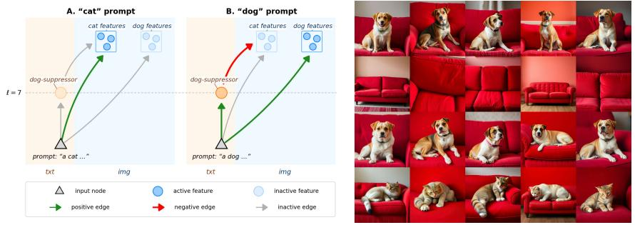  
Figure 6: Left: Schematic of the $f _ { \mathrm { d o g - s u p p r e s s o r } } ^ { ( \mathrm { t x t } , 7 ) }$ outgoing negative edges suppress cat features. On cat prompts the feature is inactive. Right: Inter-$\alpha = - 5 0 ; f _ { \mathrm { d o g - s u p p r e s s o r } } ^ { \mathrm { ( t x t , 7 ) } }$ suppression, $\alpha = - 5 0 ;$ $f _ { \mathrm { d o g - s u p p r e s s o r } } ^ { ( \mathrm { t x t } , 7 ) }$ $\alpha = - 2 5$

## 3.4 Color circuits

Color concepts are semantically foundational and easy for humans to verify visually, yet modern diffusion models exhibit systematic failures around them — color leakage and prior bias. The image stream of FLUX contains per-color features $( \mathrm { e . g . , } f _ { \mathrm { r e d } } ^ { ( \mathrm { i m g , 1 0 } ) }$ , activating on red regions independent of the depicted object) whose attribution graphs draw on three classes of text-stream sources: direct lexical color features, linguistically proximal colors, and associative features for objects with strong color priors. We characterize this circuit structure in detail in Appendix D.3; here we show how the same graph diagnoses, and lets us correct, a systematic failure mode.

Mitigating semantic priors via circuit intervention. Diffusion models often suffer from strong color biases coming from training data, leading to failures when prompts specify atypical attributes (e.g., a white stop sign, a black ladybug, a blue pomegranate). In these cases, the model defaults to the standard red color (Figure 14). The attribution graph for $f _ { \mathrm { r e d } } ^ { ( \mathrm { i m g , 1 0 } ) }$ clarifies this mechanism. Two competing text-stream signals are active: (i) strong associative red features triggered by the object tokens themselves (e.g., "stop sign"), and (ii) features responding to the explicit target color (e.g., white). Often, the associative prior dominates, creating a positive pre-activation for the red feature that overrides the provided prompt’s color.

To address this, we compared three intervention modes across 30 seeds: baseline – standard FLUX.1[schnell] generations; feature – suppressing $f _ { \mathrm { r e d } } ^ { ( \mathrm { i m g , 1 0 } ) }$ only (accessible to SAE-based meth-$f _ { \mathrm { r e d } } ^ { ( \mathrm { i m g , 1 0 } ) }$ together with its most influential associative nodes from the graph. The circuit-wide approach substantially outperformed the others (Figure 7), demonstrating that circuit-guided concept removal provides superior control in regimes where standard single-feature steering fails.

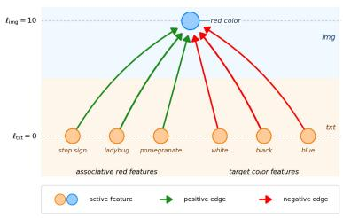

flowchart

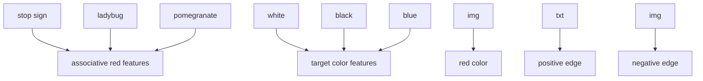
```mermaid
graph TD
  A["stop sign"] --> B["associative red features"]
  C["ladybug"] --> B
  D["pomegranate"] --> B
  E["white"] --> F["target color features"]
  G["black"] --> F
  H["blue"] --> F
  I["img"] --> J["red color"]
  K["txt"] --> L["positive edge"]
  M["img"] --> N["negative edge"]
```

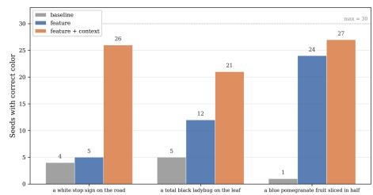

bar chart

| Category | baseline | feature | feature + context |
|---|---|---|---|
| a white stop sign on the road | 4 | 5 | 26 |
| a total black leafbog on the leaf | 5 | 12 | 21 |
| a blue pomegranate fruit sliced in half | 0 | 1 | 27 |
max = 30

Figure 7: Left: Schematic of the prior-bias failure mode: associative red features that activate on object tokens have positive attribution, features for the target color activating on the prompt’s color token have negative attribution. Right: Overcoming prior bias on atypical colors. Bar height: number of seeds out of 30 on which the object is generated in the correct color.

## 3.5 Additional analyses.

The appendix presents further case studies using our method, including the decomposition of artistic style into perceptual-linguistic primitives (Appendix D.5), more localized steering targets identified via circuit tracing (Appendix D.6), control over spatial composition (Appendix D.7), and diagnostic analyses of common failure modes such as color leakage (Appendix D.8), counting errors (Appendix D.9), and negation (Appendix D.10).

## 4 Conclusion

We introduced transcoders for diffusion models, extending circuit-level interpretability from LLMs to the diffusion transformers. Applied to FLUX.1, transcoders decompose MLP sublayers into sparse, interpretable features without sacrificing the sparsity-faithfulness tradeoff of SAEs, while additionally enabling feature-to-feature attribution through attribution graphs. We demonstrated that these graphs are very descriptive: they reveal the computational structure underlying color representation, polysemy, style, and active suppression, and they prescribe targeted interventions that are quantitatively superior to single-feature steering. The main limitations are discussed in Appendix A.

## References

Emmanuel Ameisen, Jack Lindsey, Adam Pearce, Wes Gurnee, Nicholas L Turner, Brian Chen, Craig Citro, David Abrahams, Shan Carter, Basil Hosmer, et al. Circuit tracing: Revealing computational graphs in language models. Transformer Circuits Thread, 6:16318–16352, 2025.  
Hoagy Cunningham, Aidan Ewart, Logan Riggs, Robert Huben, and Lee Sharkey. Sparse autoencoders find highly interpretable features in language models. arXiv preprint arXiv:2309.08600, 2023.  
Bartosz Cywinski and Kamil Deja. Saeuron: Interpretable concept unlearning in diffusion models ´ with sparse autoencoders. arXiv preprint arXiv:2501.18052, 2025.  
Prafulla Dhariwal and Alexander Nichol. Diffusion models beat gans on image synthesis. Advances in neural information processing systems, 34:8780–8794, 2021.  
Jacob Dunefsky, Philippe Chlenski, and Neel Nanda. Transcoders find interpretable llm feature circuits, 2024. URL https://arxiv. org/abs/2406.11944, 2406.  
Patrick Esser, Sumith Kulal, Andreas Blattmann, Rahim Entezari, Jonas Müller, Harry Saini, Yam Levi, Dominik Lorenz, Axel Sauer, Frederic Boesel, et al. Scaling rectified flow transformers for high-resolution image synthesis. In Forty-first international conference on machine learning, 2024.  
Or Greenberg. Demystifying flux architecture, 2025. URL https://arxiv.org/abs/2507. 09595.  
Jonathan Ho, Ajay Jain, and Pieter Abbeel. Denoising diffusion probabilistic models. Advances in neural information processing systems, 33:6840–6851, 2020.  
Victor Shea-Jay Huang, Le Zhuo, Yi Xin, Zhaokai Wang, Fu-Yun Wang, Yuchi Wang, Renrui Zhang, Peng Gao, and Hongsheng Li. Tide: Temporal-aware sparse autoencoders for interpretable diffusion transformers in image generation. In Proceedings of the AAAI Conference on Artificial Intelligence, volume 40, pages 435–443, 2026.  
Ayodeji Ijishakin, Ming Liang Ang, Levente Baljer, Daniel Chee Hian Tan, Hugo Laurence Fry, Ahmed Abdulaal, Aengus Lynch, and James H Cole. H-space sparse autoencoders. In Neurips Safe Generative AI Workshop 2024, 2024.  
Mingi Kwon, Jaeseok Jeong, and Youngjung Uh. Diffusion models already have a semantic latent space. arXiv preprint arXiv:2210.10960, 2022.  
Black Forest Labs, Stephen Batifol, Andreas Blattmann, Frederic Boesel, Saksham Consul, Cyril Diagne, Tim Dockhorn, Jack English, Zion English, Patrick Esser, et al. Flux. 1 kontext: Flow matching for in-context image generation and editing in latent space. arXiv preprint arXiv:2506.15742, 2025.  
Antonio Mari, Viacheslav Surkov, Robert West, and Chris Wendler. Steering diffusion transformers with sparse autoencoders.  
Neel Nanda. Open source replication & commentary on anthropic’s dictionary learning paper. In Alignment Forum, 2023.  
Matan Ben Noach and Yoav Goldberg. Compressing pre-trained language models by matrix decomposition. In Proceedings of the 1st Conference of the Asia-Pacific Chapter of the Association for Computational Linguistics and the 10th International Joint Conference on Natural Language Processing, pages 884–889, 2020.  
Yong-Hyun Park, Mingi Kwon, Jaewoong Choi, Junghyo Jo, and Youngjung Uh. Understanding the latent space of diffusion models through the lens of riemannian geometry. Advances in Neural Information Processing Systems, 36:24129–24142, 2023.  
William Peebles and Saining Xie. Scalable diffusion models with transformers. In Proceedings of the IEEE/CVF international conference on computer vision, pages 4195–4205, 2023.  
Ethan Perez, Florian Strub, Harm De Vries, Vincent Dumoulin, and Aaron Courville. Film: Visual reasoning with a general conditioning layer. In Proceedings of the AAAI conference on artificial intelligence, volume 32, 2018.  
Dustin Podell, Zion English, Kyle Lacey, Andreas Blattmann, Tim Dockhorn, Jonas Müller, Joe Penna, and Robin Rombach. Sdxl: Improving latent diffusion models for high-resolution image synthesis. arXiv preprint arXiv:2307.01952, 2023.  
Robin Rombach, Andreas Blattmann, Dominik Lorenz, Patrick Esser, and Björn Ommer. Highresolution image synthesis with latent diffusion models. In Proceedings of the IEEE/CVF conference on computer vision and pattern recognition, pages 10684–10695, 2022.  
Stepan Shabalin, Ayush Panda, Dmitrii Kharlapenko, Abdur Raheem Ali, Yixiong Hao, and Arthur Conmy. Interpreting large text-to-image diffusion models with dictionary learning. arXiv preprint arXiv:2505.24360, 2025.  
Viacheslav Surkov, Chris Wendler, Antonio Mari, Mikhail Terekhov, Justin Deschenaux, Robert West, Caglar Gulcehre, and David Bau. One-step is enough: Sparse autoencoders for text-to-image diffusion models. arXiv preprint arXiv:2410.22366, 2024.  
Raphael Tang, Linqing Liu, Akshat Pandey, Zhiying Jiang, Gefei Yang, Karun Kumar, Pontus Stenetorp, Jimmy Lin, and Ferhan Türe. What the daam: Interpreting stable diffusion using cross attention. In Proceedings of the 61st Annual Meeting of the Association for Computational Linguistics (Volume 1: Long Papers), pages 5644–5659, 2023.  
Zeyu Yun, Yubei Chen, Bruno Olshausen, and Yann LeCun. Transformer visualization via dictionary learning: contextualized embedding as a linear superposition of transformer factors. In Proceedings of Deep Learning Inside Out (DeeLIO): The 2nd Workshop on Knowledge Extraction and Integration for Deep Learning Architectures, pages 1–10, 2021.

## A Limitations.

Our analysis is currently restricted to the double-stream blocks of FLUX.1[schnell], leaving singlestream blocks and other architectures for future work. We discuss additional limitations and failure cases in Appendix D.10.

## B Related works

## B.1 Diffusion interpretability and Sparse Autoencoders

Despite substantial advances in generation quality and efficiency through the shift from UNets Podell et al. [2023], Rombach et al. [2022] to Diffusion Transformers (DiT) Labs et al. [2025], Esser et al. [2024], the interpretability of diffusion models still requires extensive research. Early efforts focused on bottleneck layers Kwon et al. [2022], Park et al. [2023] and cross-attention Tang et al. [2023], enabling manipulation of attributes.

Sparse autoencoders (SAEs) have emerged as a popular tool for mechanistic interpretability, decomposing dense model activations into sparse, human-interpretable features. Originally developed for large language models Noach and Goldberg [2020], Yun et al. [2021], Cunningham et al. [2023], SAE have more recently been applied to diffusion models. Early work focused on UNet-based architectures Surkov et al. [2024], Ijishakin et al. [2024], Cywinski and Deja [2025], where they ´ successfully identified interpretable concepts and enabled causal steering. More recent efforts extend SAE to Diffusion Transformers (DiTs) Shabalin et al. [2025], Huang et al. [2026], introducing temporal-aware variants to account for shifting activation statistics across denoising timesteps and demonstrating feature steering Mari et al. in models such as FLUX. However, because SAEs operate on activations rather than modeling the full input–output behavior of MLP sublayers, the resulting feature attributions are inherently input-dependent. A connection observed between two features on one prompt may not hold on another, and simple averaging across inputs obscures per-input importance. As a result, SAE-based methods struggle to support fine-grained, input-invariant circuit tracing through the nonlinear computations inside MLP sublayers.

## B.2 Transcoders for Language Models

Transcoders were introduced as a more powerful alternative to SAE for interpreting MLP sublayers in LLMs Dunefsky et al.. Rather than reconstructing activations at a single point, a transcoder approximates the entire input-output mapping of a target MLP, enabling input-invariant feature-tofeature attributions through local linearization. This opens up the possibility of tracing computational circuits at the feature level: identifying which features in earlier layers cause later features to activate, understanding how information flows across layers and components, and ultimately recovering compact, interpretable subgraphs responsible for specific model behaviors Ameisen et al. [2025]. Despite this progress in LLM, circuit-level analysis of diffusion transformers remains unexplored. We bridge this gap by introducing timestep-conditioned transcoders and a circuit tracing pipeline tailored to the MM-DiT architecture of FLUX.1[schnell].

## C FLUX.1 double-stream block architecture

For visual reference accompanying the textual description in §2.1, Figure 8 shows the overall structure of a FLUX.1[schnell] double-stream block, and Figure 9 details its joint attention sublayer. Both diagrams are adapted from Greenberg [2025].

## D Additional experiments

## D.1 Additional evidence for the two-phase interpretation

Qualitative graph evolution. Figure 10 visualizes the structural shift documented quantitatively in §3.2 on a single (prompt, target feature) pair. The four panels show the attribution graph for the same target at each of the four denoising steps. At t = 0, the text-stream half of the graph is densely populated and connected to the target through numerous cross-modal edges; the image-stream half is sparse. As the trajectory proceeds the text-stream side contracts and cross-modal connectivity drops, while the image-stream side grows progressively richer. The same pattern holds visually across the prompts and target features we inspected, mirroring the aggregate trend of Figure 4.

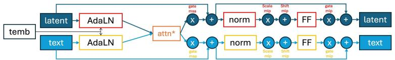

flowchart

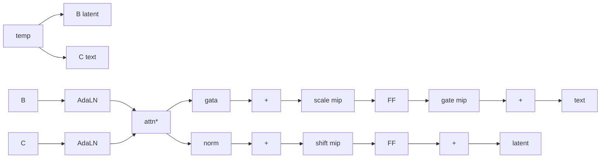
```mermaid
graph LR
  A["temp"] --> BLatent["B latent"]
  A --> CText["C text"]
  B --> D["AdaLN"]
  C --> E["AdaLN"]
  D --> F["attn*"]
  E --> F
  F --> G["gata"]
  F --> H["norm"]
  G --> I["+"]
  H --> J["+"]
  I --> K["scale mip"]
  J --> L["shift mip"]
  K --> M["FF"]
  L --> N["FF"]
  M --> O["gate mip"]
  N --> P["+"]
  O --> Q["+"]
  P --> R["latent"]
  Q --> S["text"]
```

Figure 8: Schematic of a FLUX.1 double-stream block at layer ℓ. The image and text streams are processed by stream-specific weights and interact only through the joint attention sublayer; both sublayers are wrapped by AdaLN-Zero modulation whose scale, shift, and gate parameters are produced from the denoising timestep and the pooled CLIP embedding.

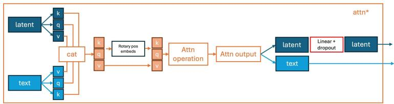

flowchart

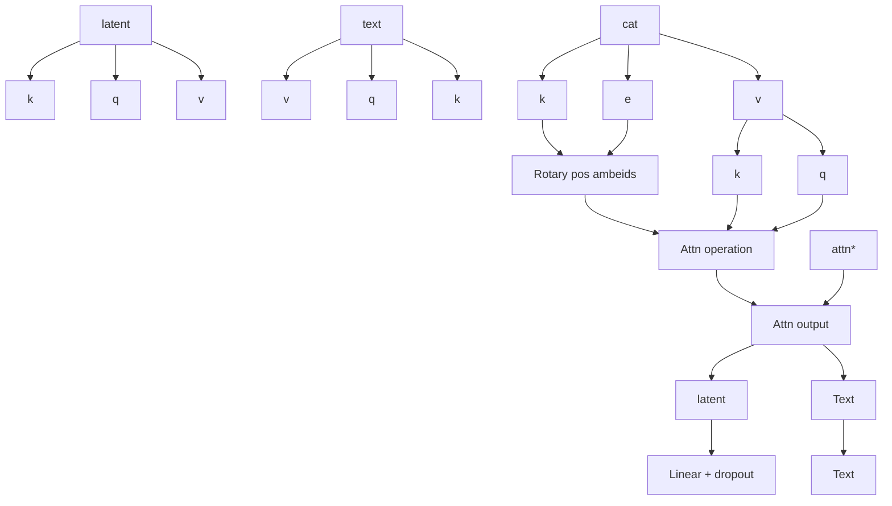
```mermaid
graph TD
  A["latent"] --> B["k"]
  A --> C["q"]
  A --> D["v"]
  E["text"] --> F["v"]
  E --> G["q"]
  E --> H["k"]
  I["cat"] --> J["k"]
  I --> K["e"]
  I --> L["v"]
  J --> M["Rotary pos ambeids"]
  K --> M
  L --> N["k"]
  L --> O["q"]
  M --> P["Attn operation"]
  N --> P
  O --> P
  P --> Q["Attn output"]
  Q --> R["latent"]
  Q --> S["Text"]
  R --> T["Linear + dropout"]
  S --> U["Text"]
  V["attn*"] --> Q
```

Figure 9: Joint attention sublayer of a FLUX.1 double-stream block. Queries, keys, and values are projected per stream from the AdaLN-modulated inputs, concatenated along the token axis, passed through a single scaled dot-product attention, and split back into per-stream outputs that are added to their respective residual streams via the AdaLN-Zero gate.

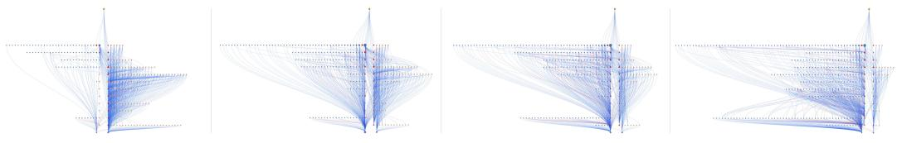

flowchart

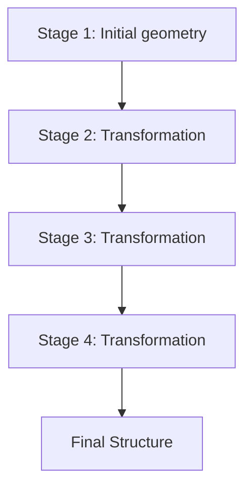
```mermaid
graph TD
  A["Stage 1: Initial geometry"] --> B["Stage 2: Transformation"]
  B --> C["Stage 3: Transformation"]
  C --> D["Stage 4: Transformation"]
  D --> E["Final Structure"]
```

Figure 10: Attribution graphs for a single (prompt, target feature) pair at each of the four denoising steps of FLUX.1[schnell]. Panels left to right: t = 0, 1, 2, 3. Feature nodes are colored by stream (image: blue, text: orange) and edges by attribution sign (positive: blue, negative: red); error nodes appear as red diamonds and input nodes as purple circles.

Causal validation. The structural shift documented in §3.2 predicts that interventions on textstream features should be effective only at early denoising steps. To test this, we performed targeted suppression experiments on two qualitatively different text-stream supernodes (Figure 11). For a prompt A cat sitting on a red couch, we identified the text-stream supernode encoding cat and suppressed it at $t \in \mathsf { \bar { \{ 0 , 1 \} } o r } t \in \{ 2 , 3 \}$ , leaving the other steps unmodified. Suppression at early steps successfully removed the cat from the generated image, while suppression at late steps produced no visible change. We replicated the experiment with a different prompt where the text-stream supernode for watercolor encoded a stylistic property. Suppressing the corresponding text-stream supernode at early steps eliminated the watercolor style, whereas late-step suppression left the image visually identical to the baseline.

## D.2 Polysemy and contextual disambiguation

Transcoder features should ideally capture a single concept. We tested sense separation using the polysemous token bat. Attribution graphs for $f _ { \mathrm { b a s e b a l l } \ b a t } ^ { \mathrm { ( t x t , 1 1 ) } }$ confirm that the model recruits qualitatively different source features depending on context. The animal-context graph is dominated by wings, Batman, and darkness features, while the baseball-context graph activates sport and equipment features. In ambiguous cases (e.g., “a bat”), the graph reveals simultaneous activation of animal, baseball, and “party” senses, yet the model produces a flying bat in 5 out of 5 seeds.

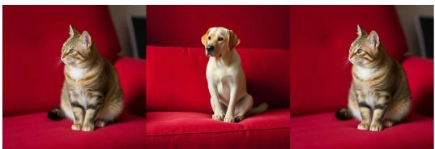

natural_image

Three-panel photo sequence showing a tabby dog sitting on a red sofa, no text or symbols present

natural_image

Three-panel image showing a tabby cat with orange and white stripes, against a blue background (no text or symbols)

Figure 11: Causal evidence for the two-phase interpretation: suppressing semantic text-stream supernodes is effective only at early denoising steps. Each row shows the same prompt under three conditions: original generation (no suppression), suppression of the indicated text-stream supernode at $t \in \{ 0 , 1 \}$ , and suppression at $t \in \{ 2 , 3 \}$ . Left: prompt A cat sitting on a red couch; the cat supernode is suppressed. Right: prompt A cat, watercolor painting; the watercolor supernode is suppressed.

This discrepancy reveals a key insight: even when the visual output is biased toward one sense, the attribution graph for the ambiguous case contains baseball-related features with positive attribution. By selectively amplifying contextual text-stream nodes (e.g., batter, glove) rather than suppressing the dominant sense, we can steer the output without explicit suppression. The effect depends on steering strength (Fig. 12): at intermediate α, a baseball bat appears alongside the animal; at larger α, the baseball player supersedes the animal entirely.

natural_image

Collage of fantasy bat and bat characters in various poses, including a Seliant advertisement (no text or symbols on main subjects)

Figure 12: Prompt a bat. Steering of contextual baseball text-stream features. Rows: baseline; intermediate $\alpha = 3 0$ , maximum $\alpha = 1 0 0$ .

## D.3 Structure of a color circuit

Color-related features in the image stream form a predictable and interpretable circuit. We identify a specific red-sensitive feature, $f _ { \mathrm { r e d } } ^ { ( \mathrm { i m g , 1 0 } ) }$ , which activates in response to red regions regardless of the generated object. The attribution graph for this feature remains stable across various prompts: the majority of the attribution flows from the text stream through three distinct channels: (i) direct lexical color features $( \mathrm { e } . \mathrm { g } . , r e d )$ , (ii) linguistically proximal color features (e.g., orange, purple), and (iii) associative features linked to red objects (e.g., tomatoes, Canadian flag).

While the image-stream representation is largely prompt-invariant, text-stream contributions adapt to context (e.g., the prompt a red dress additionally activates a feature for pink, while a red sunset activates one for orange). Intervention experiments on the prompt a red apple on a wooden table (Fig. 13) reveal a clear functional asymmetry: suppressing the red color features shifts the apple to the model’s natural green prior, while amplifying competing blue color features in isolation has no visible effect. Only joint suppression of red and amplification of blue reliably produces a blue apple, succeeding on 60% of seeds. This suggests that explicit color tokens in a prompt create a robust activation that must be actively suppressed to overcome the model’s internal state.

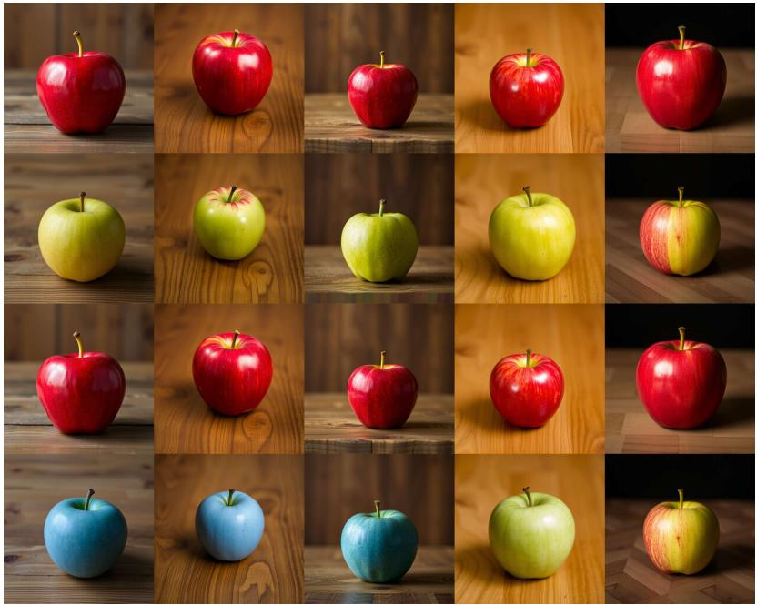

natural_image

Grid of 16 apple images showing different colors and textures on wooden surfaces (no text or symbols)

Figure 13: Prompt a red apple on a wooden table. Rows: baseline; red features suppressed; blue features amplified; both interventions applied jointly. Steering strength |α| = 15 throughout. Columns: seeds.

## D.4 Prior bias mitigation: qualitative examples

The bar chart of Fig. 7 reports aggregate success rates but conceals what the failures and successes look like. Figure 14 shows representative generations for the three prompts of §3.4 under all three intervention modes. The baseline mode overrides the explicit color token and renders the object red on all three prompts. The feature mode succeeds on a minority of seeds: suppressing $f _ { \mathrm { r e d } } ^ { ( \mathrm { i m g , 1 0 } ) }$ alone partially weakens the red feature, but the associative prior carried by the object-token features keeps pushing it back up, so most generations remain incorrect. The feature + context mode – which additionally suppresses the associative red sources from the graph – reliably produces the requested color across seeds.

text_image

Grid of road stop symbols with red circles and 'STOP' labels, likely from a traffic safety or navigation system interface

natural_image

Grid of black ladybugs on green leaves, showing various positions and droplets (no text or symbols)

natural_image

Grid of 12 pairs of pomegranate fruits, showing whole and sliced pieces with no text or symbols

Figure 14: Qualitative results for prior bias mitigation. Left: a white stop sign on the road. Mid: a total black ladybug on the leaf. Right: a blue pomegranate fruit sliced in half. Rows: three intervention modes (baseline, feature, feature + context). Columns: seeds.

## D.5 Style decomposition: watercolor

Style concepts are useful for interpretability because they should be content-invariant: a feature representing style X should activate on images in style X regardless of subject matter. Whether such a feature exists as an atomic representation or as a composition of simpler primitives can be found out by examining its attribution graph.

Using contrastive prompts we identify a watercolor-style feature $f _ { \mathrm { w a t e r c o l o r } } ^ { \mathrm { ( i m g , 1 1 ) } }$ . Its graph contains no nodes related to the depicted object – confirming the feature’s content-invariance. Instead, the graph decomposes into four stylistic components across the two streams: $f _ { \mathrm { s t e a m } } ^ { \mathrm { ( i m g , 1 0 ) } }$ for clouds and steam; $f _ { \mathrm { m u l t i c o l o r } } ^ { ( \mathrm { i m g , 1 { \bar { 0 } } ) } }$ for bright multicolored imagery (flags, colored pencils); $f _ { \mathrm { l i g h t - h a z e } } ^ { \mathrm { ( t x t , 7 ) } }$ for tokens such as light haze and smoke; and $f _ { \mathrm { p a s t e l } } ^ { ( \mathrm { t x t } , 9 ) }$ for constructions of the form pastel-colored or lavender-colored.

  
Figure 15: Top-activating examples for the four component features of $f _ { \mathrm { w a t e r c o l o r } } ^ { \mathrm { ( i m g , 1 1 ) } }$ . The two image-$f _ { \mathrm { m u l t i c o l o r } } ^ { \mathrm { ( i m g , 1 0 ) } }$ $f _ { \mathrm { h a z e } } ^ { \mathrm { ( i m g , 1 0 ) } }$ $2 \times 2$ of top-activating images with top-activating patches highlighted. The two text-stream features are $f _ { \mathrm { p a s t e l } } ^ { \mathrm { ( t x t , 9 ) } }$ ) (top) and f (txt, 7)light-haze $f _ { \mathrm { l i g h t - h a z e } } ^ { \mathrm { ( t x t , 7 ) } }$ (bottom); each panel lists the top-activating prompts with token-level activations highlighted.

These four components substantively cover what natural language descriptions of watercolor typically include: a pastel palette, soft hazy edges, and diverse color choices. Consequently, the model represents style not as a monolithic atomic feature, but as a structured composition of fundamental perceptual-linguistic primitives. Interventions on these four components monotonically strengthen or weaken the resulting style (Fig. 16). Their joint shift produces a clean control of style without affecting the semantic content of the scene.

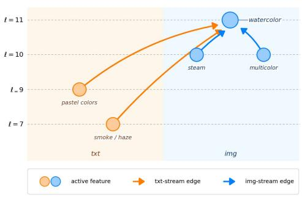

flowchart

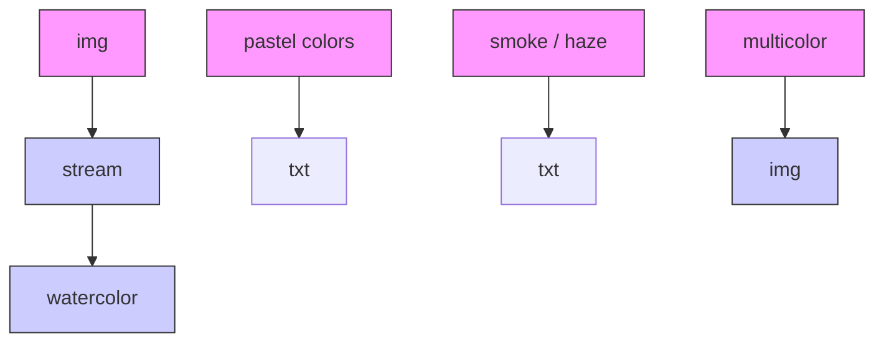
```mermaid
graph TD
  A["img"] --> B["stream"]
  B --> C["watercolor"]
  D["pastel colors"] --> E["txt"]
  F["smoke / haze"] --> G["txt"]
  H["multicolor"] --> I["img"]
    style A fill:#f9f,stroke:#333
    style D fill:#f9f,stroke:#333
    style F fill:#f9f,stroke:#333
    style H fill:#f9f,stroke:#333
    style B fill:#ccf,stroke:#333
    style C fill:#ccf,stroke:#333
    style I fill:#ccf,stroke:#333
```

natural_image

Grid of identical illustrations of a tabby cat with green eyes and orange stripes, captured in various angles (no text or symbols)

Figure 16: Steering of watercolor component features. Rows: baseline; $\alpha = - 1 5$ (style weakened); $\alpha = + 1 5$ (style strengthened). Columns: seeds.

## D.6 Circuit-guided feature discovery: reflections

In the dictionary of the image-stream transcoder at $\ell = 1 2 .$ , we identify a feature $f _ { \mathrm { r e f l } } ^ { \mathrm { ( i m g , 1 2 ) } }$ that activates on reflections of objects in water, mirrors, and other reflective surfaces, but not on the objects themselves. The feature is robust and an attractive candidate for steering; the question is whether it captures the model’s representation of the concept of reflection as such, or whether it is merely one of several components into which the model decomposes that concept.

The attribution graph for $f _ { \mathrm { r e f l } } ^ { \mathrm { ( i m g , 1 2 ) } }$ , computed across several reflection prompts, consistently contains the same source feature $f _ { \mathrm { r e f l } } ^ { \mathrm { ( i m g , 1 1 ) } }$ with attribution an order of magnitude larger than any other source. The activation map of $f _ { \mathrm { r e f l } } ^ { \mathrm { ( i m g , 1 1 ) } }$ $f _ { \mathrm { r e f l } } ^ { \mathrm { ( i m g , 1 2 ) } }$ frefl layer plus dominant role in the graph of the later target – these facts suggest the hypothesis that $f _ { \mathrm { r e f l } } ^ { \mathrm { ( i m g , i 1 ) } }$ $\bar { f } _ { \mathrm { r e f l } } ^ { \mathrm { ( i m g , 1 2 ) } }$ is a downstream derivative localized to a later layer.

natural_image

Collage of 16 scenic photos of the Palace of England and surrounding landscapes, including a lake, mountains, and a stone castle (no visible text or symbols)

Figure 17: Steering grid for the two reflection features. Rows: baseline; $f _ { \mathrm { r e f l } } ^ { \mathrm { ( i m g , 1 1 ) } } \to \alpha = - 3 0 ;$ f (img,12)refl → α = −30. Columns: seeds. $f _ { \mathrm { r e f l } } ^ { \mathrm { ( i m g , 1 2 ) } }  \alpha = - 3 0$

If the hypothesis is correct, the later feature should be entangled not only with the reflection itself but also with the surrounding perceptual context, whereas the earlier feature should be tied to a narrower concept. The intervention comparison (Fig. 17) confirms this idea. Suppressing $f _ { \mathrm { r e f l } } ^ { \mathrm { ( i m g , 1 2 ) } }$ removes the reflection but deforms the reflective surface, introducing visual artifacts. Suppressing f (imgrefl $f _ { \mathrm { r e f l } } ^ { \mathrm { ( i m g , 1 1 ) } }$ leaves the surface intact, while the reflection of the object turns into a blurred patch. Circuit tracing thus enables the selection of a feature for steering that satisfies a stricter locality criterion than candidates accessible via feature interpretation alone.

## D.7 Spatial composition

Spatial composition of the scene is a known weakness of text-to-image models. We investigate how spatial understanding is encoded within the model and demonstrate how this internal logic can be leveraged to achieve control over object positioning

In the text stream around $\ell = 7$ we identify location features $f _ { \mathrm { l e f t } } ^ { ( \mathrm { t x t } , 7 ) }$ and $f _ { \mathrm { r i g h t } } ^ { ( \mathrm { t x t , 7 } ) }$ that fire on their respective tokens regardless of which object the location is bound to. On the prompts a red house on the left, a blue car on the right and a blue car on the left, a red house on the right, the attribution graph for $f _ { \mathrm { r e d } } ^ { ( \mathrm { i m g , 9 ) } }$ contains, respectively, f (txt,left $f _ { \mathrm { l e f t } } ^ { ( \mathrm { t x t } , 7 ) }$ an d f (txt,7)right – that is, which spatial token enters the $f _ { \mathrm { r i g h t } } ^ { \mathrm { ( t x i , 7 ) } } -$ graph is determined by which object it is assigned to in the prompt. At the same time, we did not find clearly interpretable spatial features in the image stream.

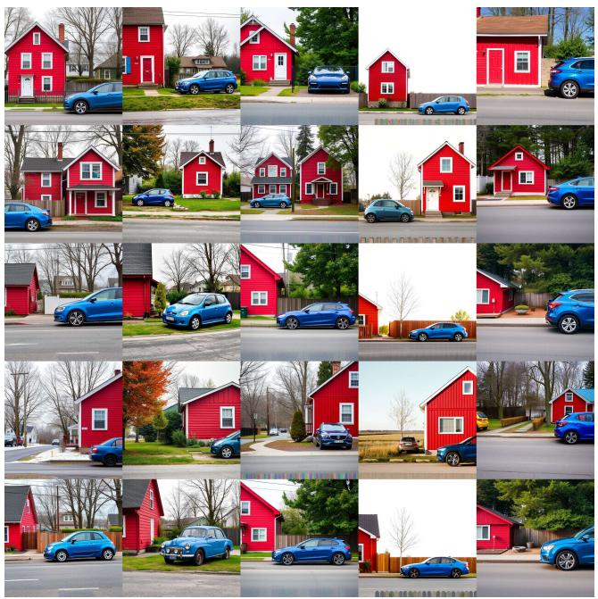

natural_image

Grid of 20 photos showing red and blue houses with cars parked, no visible text or symbols

Figure 18: Prompt a red house on the left, a blue car on the right. Steering grid, rows: baseline; $f _ { \mathrm { l e f t } } ^ { ( \mathrm { \bar { t x t } , 7 } ) }  - 3 0$ $f _ { \mathrm { l e f t } } ^ { ( \mathrm { t x t } , 7 ) }  + 3 0$ (the house slides off the left edge of the image); f (txt,7right $f _ { \mathrm { r i g h t } } ^ { ( \mathrm { t x t , 7 } ) }  + 1 0 , f _ { \mathrm { l e f t } } ^ { ( \mathrm { t x t , 7 } ) }  - 1 0$ → +10, f (txt,left ) → −10 (both objects on the right); f (txt,7)right $f _ { \mathrm { r i g h t } } ^ { ( \mathrm { t x t , 7 } ) }  - 1 0 , f _ { \mathrm { l e f t } } ^ { ( \mathrm { t x t , 7 } ) }  + 1 0$ → −10, f (txt,left (no composition changes). Columns: seeds.

$f _ { \mathrm { r i g h t } } ^ { \mathrm { ( t x t , 7 ) } }  + \alpha .$ $f _ { \mathrm { l e f t } } ^ { ( \mathrm { t x t , 7 } ) }  - \alpha$ moves the house into the right half of the image at a substantially smaller |α| than $f _ { \mathrm { r i g h t } } ^ { \mathrm { ( t x t , 7 ) } }  - \alpha$ , $f _ { \mathrm { l e f t } } ^ { ( \mathrm { t x t , 7 } ) }  + \alpha$ image.

## D.8 Color leakage

Color leakage – the failure of text-to-image models to bind colors correctly to objects on prompts with multiple colored objects – is a standard pathology of generative diffusion models. If the structure of the color circuit established in §D.3 is correct, leakage should appear as spurious attributions of the wrong color in the target’s graph.

$f _ { \mathrm { b l u e } } ^ { \mathrm { ( i m g , 1 0 ) } }$ on the prompt a red apple and a blue cup, in addition to the $f _ { \mathrm { r e d } } ^ { ( \mathrm { t x t , 3 } ) }$ orders of magnitude weaker than the dominant ones. If this spurious attribution is causal, positive steering of these red features in the blue graph should switch the cup to red.

The experiment confirms the hypothesis (Fig. 19). On 3 out of 5 seeds (including the seed on which the spurious features were originally identified) the cup becomes red. On the remaining 2 seeds, everything except the cup turns red while the cup stays blue — on those seeds the spurious red features do not enter the graph in the first place, and the steering targets the wrong locations. The seed-to-seed distribution is consistent with the nature of attribution graphs: the cause of leakage is localizable to specific features in the graph, but the graph itself differs across seeds.

## D.9 Numerical concepts

Generating an exact number of objects is a known weakness of current text-to-image models. The model’s internal representation of numerals separates into two conceptually distinct questions:

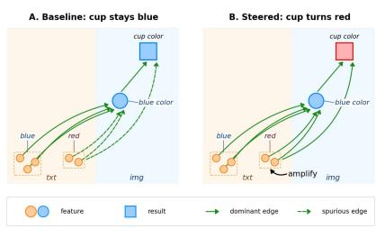

flowchart

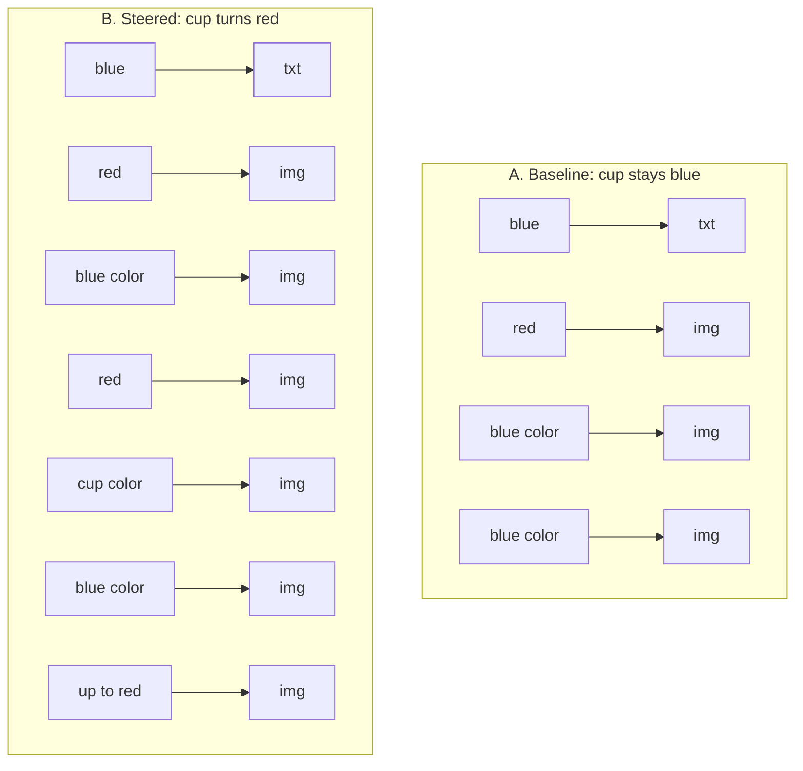
```mermaid
graph TD
    subgraph A_Baseline_cup_stays_blue["A. Baseline: cup stays blue"]
  A1["blue"] --> A2["txt"]
  A3["red"] --> A4["img"]
  A5["blue color"] --> A6["img"]
  A7["blue color"] --> A8["img"]
    end

    subgraph B_Steered_cup_turns_red["B. Steered: cup turns red"]
  B1["blue"] --> B2["txt"]
  B3["red"] --> B4["img"]
  B5["blue color"] --> B6["img"]
  B7["red"] --> B8["img"]
  B9["cup color"] --> B10["img"]
  B11["blue color"] --> B12["img"]
  B13["up to red"] --> B14["img"]
    end
```

natural_image

Grid of eight photos showing red apple and blue cups in various settings (no text or symbols)

Figure 19: Prompt a red apple and a blue cup. Rows: baseline; amplify red features from the blue graph, $\alpha = + 1 0 0$ . Columns: five seeds. On three seeds the cup turns red; on two seeds the spurious red features are absent from the graph, and steering instead colors the background while leaving the cup blue.

whether the model has a visual representation of count, and whether the text stream carries a correct representation of specific numerals. Our analysis suggests that the difficulty is not where one might expect.

Using contrastive prompts we identify $f _ { \mathrm { m u l t i } } ^ { ( \mathrm { i m g , 1 4 ) } }$ , an image-stream feature whose activation grows with the number of objects. Its activation on five apples is roughly equal to its activation on three apples, and five times larger than activation on one apple. Already this suggests that the feature does not encode an exact count, but rather a notion of multiplicity.

$f _ { \mathrm { m u l t i } } ^ { \mathrm { ( i m g , 1 4 ) } }$ on the prompts one/three/five red apples has nearly identical imagestream parts; the differences are localized in the text stream. On one apple, text-stream features for single and one are active; on three apples, primarily three is active, with side activations on two and several; on five apples, a diffuse mixture is active, including features for two, three, four, five, six, seven, eight, and several. The presence of features for adjacent numerals in the five apples graph indicates that the text-stream representation of five is not sharp: instead of a clean activation of five features, the model activates a diffuse cluster of neighboring numerals. This diffuseness is a plausible candidate for the source of counting errors, and can be tested directly via steering.

Amplifying three shifts the mean to 4.45; amplifying seven shifts it to 8.15 (Fig. 20). Yet amplifying five yields 6.30, and amplifying four yields 5.00, with the baseline giving 5.20 at a target of 5. The pattern does not match the simple model in which amplifying the feature for numeral N produces N objects: amplifying five shifts the mean upward, away from five; amplifying four leaves it at five. On the other hand, monotonicity is preserved – a larger numeral always yields more apples than a smaller one. The model thus carries a robust representation of ordering (greater / lesser), but lacks a sharp representation of specific values; the diffuseness observed in the graph is, in this sense, causally responsible for the failure of exact counting.

## D.10 Failure modes from cross-stream disconnect

We close with two examples of systematic generation failures that our method diagnoses as failures of information transfer between streams. Both cases exhibit the same pattern: the text stream carries the information required by the prompt correctly, but that information does not drive the corresponding change in image-stream behavior. They simultaneously illustrate the diagnostic capabilities of the method and characterize its current limitations.

Negation: a room without a cat. On this prompt, the model generates a room containing a cat on 5 seeds out of 5. Contrasting a room with a cat against a room without a cat, we identify a text-stream feature $f _ { \mathrm { e m p t y } } ^ { \mathrm { ( t x t , 1 0 ) } }$ ) that activates on the token empty and also on without in the target prompt; its own graph contains other text-stream features for emptiness semantics (firing on tokens such as empty, abandoned, no, and similar). The text stream therefore carries a correct representation of an empty room – the model understands the negation at the linguistic level. Positive steering of all these features does not, however, remove the cat from the image. The cat is removed only by suppressing an independently identified text-stream feature for the cat itself. Moreover, in the joint mode (suppress the cat feature and amplify $f _ { \mathrm { e m p t y } } ^ { \mathrm { ( t x t , 1 0 ) } } )$ ), the same magnitude of |α| is required as in suppression alone; in other words, activating emptiness semantics in the text stream does not lower the suppression strength needed for cat. Information about emptiness, correctly formed in the text stream, simply does not propagate into the image stream.

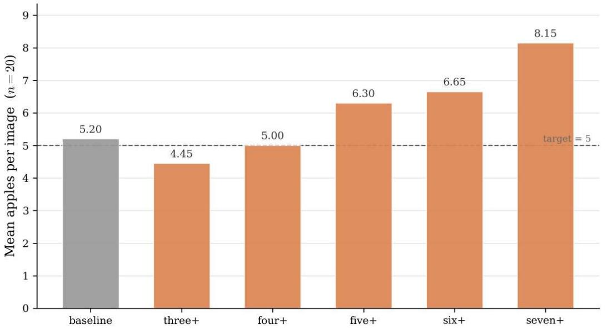

bar chart

| Category | Mean apples per image (n = 20) |
| :--- | :--- |
| baseline | 5.20 |
| three+ | 4.45 |
| four+ | 5.00 |
| five+ | 6.30 |
| six+ | 6.65 |
| seven+ | 8.15 |
target = 5

Figure 20: Controlling object count via positive steering of numeral text-stream features. Prompt: five red apples. Bar chart: x-axis shows the intervention mode (baseline / X+ – amplification of the number-X supernode); y-axis shows the mean number of apples in the generated image $( n = 2 0$ seeds per mode). Horizontal line: target = 5.

Hard prior: bicycle with square wheels. The model consistently draws round wheels despite the explicit qualifier in the prompt. A contrastively identified feature $\bar { f } _ { \mathrm { r o u n d } } ^ { ( \mathrm { t x t , 1 0 } ) }$ is active on a bicycle with round wheels; on a bicycle with square wheels, its preactivation magnitude drops below one – that is, the roundness semantics in the text stream is substantially weakened in response to the qualifier square wheels, but this does not produce square wheels in the generated image. Direct negative steering of f (txt,1round $f _ { \mathrm { r o u n d } } ^ { ( \mathrm { t x t , 1 0 } ) }$ has no effect. We then identify, again via contrastive prompts, angularity features in both streams; positive steering of the text-stream variant produces no visible change, while positive steering of its image-stream counterpart yields square wheels on 1 of 5 seeds – a weak but nonzero effect on the visual side.

natural_image

Interior view of a cozy living room with warm lighting, featuring a sofa, coffee table, and large windows (no visible text or symbols)

natural_image

Three identical line-drawn bicycles on a solid yellow background, no text or symbols present.

Figure 21: Failure modes from cross-stream disconnect. Left: a room without a cat; baseline; $f _ { \mathrm { e m p t y } } ^ { \mathrm { ( t x t , 1 0 ) } } \left( \alpha = + 3 0 \right)$ ; suppression of the text-stream cat feature $( \alpha = - 3 0 )$ ). Right: $f _ { \mathrm { r o u n d } } ^ { ( \mathrm { t x t , 1 0 } ) } ~ ( \alpha = - 8 0 )$ ; amplification of the image-stream angularity feature $( \alpha = + 8 0 )$ ).

In both cases we observe the same disconnect: the text stream represents the prompt requirement correctly, but this representation does not propagate to the image stream, and replacing it on the image-stream side succeeds only partially at best. The picture is consistent with the quantitative shift documented in §3.2: the text-stream influence decays rapidly toward later denoising steps, and for strong image-side priors, the diminishing text-stream channel may be insufficient to overwrite the pretrained visual behavior, even when the text-stream semantics is set up correctly. The absence of a bridge between a correct semantic representation and its realization in visual behavior is potentially a primary source of systematic failures of FLUX on prompts with explicitly non-standard requirements.

## E Transcoders

## E.1 Architecture details

For each (layer, stream) pair $( \ell , s )$ with $\ell \in \{ 0 , \ldots , 1 5 \}$ and $s \in \{ \mathrm { i m g , t x t } \}$ we train an independent temporal-aware transcoder $T C _ { \ell } ^ { s }$ . The architecture is the one summarized in §2.2 and shown in Figure 1. Here we give the full set of components together with the design choices that we found necessary in practice.

Timestep embedding. The diffusion timestep $t \in \mathbb { R }$ is first mapped into a $d _ { t }$ -dimensional vector by a sinusoidal positional code $\mathrm { S i n E m b } ( t ) \in \dot { \mathbb { R } } ^ { d _ { t } }$ with $d _ { t } = 2 5 6$ , identical to the one used by the base diffusion transformer. The result is processed by a small MLP with two linear layers and SiLU activations, which adds capacity for the modulation parameters to depend nonlinearly on t across the four denoising steps:

$$
e _ {t} = \operatorname{SiLU} \left(W _ {2} \operatorname{SiLU} \left(W _ {1} \operatorname{SinEmb} (t) + b _ {1}\right) + b _ {2}\right), \quad W _ {1}, W _ {2} \in \mathbb {R} ^ {d _ {t} \times d _ {t}}, \tag {11}
$$

This time-conditioning subnetwork has its own weights for every transcoder. Sharing it across $( \ell , s )$ pairs would tie features across blocks in a way we explicitly want to avoid.

FiLM modulation of the encoder input. A linear projection $W _ { \mathrm { m o d } } \in \mathbb { R } ^ { 2 d _ { \mathrm { m o d e l } } \times d _ { t } }$ maps $e _ { t }$ to a pair of scale and shift vectors,

$$
\left[ \operatorname{scale} ^ {\mathrm{tc}} (t); \operatorname{shift} ^ {\mathrm{tc}} (t) \right] = W _ {\mathrm{mod}} e _ {t} + b _ {\mathrm{mod}}, \tag {12}
$$

which modulate the MLP input $x \in \mathbb { R } ^ { d _ { \mathrm { m o d e l } } }$ elementwise:

$$
x _ {\mathrm{mod}} = x \odot \left(1 + \operatorname{scale} ^ {\mathrm{tc}} (t)\right) + \operatorname{shift} ^ {\mathrm{tc}} (t). \tag {13}
$$

Both $W _ { \mathrm { m o d } }$ and $b _ { \mathrm { m o d } }$ are initialized to zero so that scal ${ \mathfrak { z } } ^ { \mathrm { t c } } ( t ) = { \mathrm { s h i f t } } ^ { \mathrm { t c } } ( t ) = 0$ at the start of training and $x _ { \mathrm { m o d } } = x$ . Without this zero initialization the modulation introduces a strong perturbation to the encoder input from step 0 and disrupts early training.

Sparse encoder and linear decoder. The modulated input is mapped to feature activations and back to $\mathbb { R } ^ { d _ { \mathrm { m o d e l } } }$ :

$$
z (x, t) = \operatorname{ReLU} \left(W _ {\text { enc }} x _ {\text { mod }} + b _ {\text { enc }}\right) \tag {14}
$$

$$
T C _ {\ell} ^ {s} (x, t) = W _ {\mathrm{dec}} z (x, t) + b _ {\mathrm{dec}} \tag {15}
$$

with $W _ { \mathrm { e n c } } \in \mathbb { R } ^ { d _ { \mathrm { f e a t } } \times d _ { \mathrm { m o d e l } } } , W _ { \mathrm { d e c } } \in \mathbb { R } ^ { d _ { \mathrm { m o d e l } } \times d _ { \mathrm { f e a t } } }$ , and biases of matching shape. We use $d _ { \mathrm { m o d e l } } =$ 3072 and $d _ { \mathrm { f e a t } } = 1 6 d _ { \mathrm { m o d e l } } = 4 9$ 152 throughout, giving each transcoder approximately 304M trainable parameters.

Initialization. The decoder weight $W _ { \mathrm { d e c } }$ is initialized with Kaiming uniform; the encoder weight $\mathrm { i t } , W _ { \mathrm { e n c } }  W _ { \mathrm { d e c } } ^ { \top } .$ $W _ { \mathrm { d e c } }$ Both biases are initialized to zero, as are $W _ { \mathrm { m o d } } , b _ { \mathrm { m o d } }$ . The two-layer time MLP uses Kaiming normal initialization.

Decoder column normalization. After every optimizer step the columns of $W _ { \mathrm { d e c } }$ are projected back onto the unit sphere,

$$
W _ {\mathrm{dec}} [:, i ] \leftarrow \frac {W _ {\mathrm{dec}} [ : , i ]}{\| W _ {\mathrm{dec}} [ : , i ] \| _ {2}}, \quad i = 1, \dots , d _ {\text { feat }}. \tag {16}
$$

This is the standard SAE/transcoder practice and has a concrete purpose: without it, the optimizer can trivially evade the $L _ { 1 }$ penalty on z by inflating the columns of $W _ { \mathrm { d e c } }$ and shrinking z proportionally, leaving $T C _ { \ell } ^ { s }$ unchanged but reducing the sparsity term arbitrarily. Unit norm decoders fix the scale and make $\left\| \tilde { z } \right\| _ { 1 }$ a meaningful proxy for the number of active features.

## E.2 Training data

Prompt corpus. The activation buffers are populated by running the frozen FLUX.1[schnell] pipeline on prompts streamed from yvdao/midjourney-v6, a corpus of approximately 310 000 user prompts collected from Midjourney v6. Prompts shorter than 16 characters are skipped, longer prompts are truncated at 512 characters.

Inference configuration. All forward passes are run at $5 1 2 \times 5 1 2$ resolution with 4 denoising steps and guidance scale 0, which is the configuration FLUX.1[schnell] was distilled for. Each call to the FLUX.1[schnell] pipeline triggers 4 transformer forward passes (one per denoising step), each of which fills the activation buffers with the corresponding records.

Activation harvesting. For every target block ℓ and stream s we register a forward hook on the corresponding feed-forward sublayer that captures the input $\boldsymbol { x } \in \mathbb { R } ^ { \breve { B } \times S \times d _ { \mathrm { m o d e l } } }$ and the output $y = \mathrm { M L P } _ { \ell } ^ { s } ( x )$ . A separate forward pre-hook on the transformer caches the current timestep t, which is broadcast to per-token records:

$$
\left\{\left(x _ {b} ^ {s, p}, y _ {b} ^ {s, p}, t _ {b}\right) \right\} _ {b, p}, \quad x _ {b} ^ {s, p}, y _ {b} ^ {s, p} \in \mathbb {R} ^ {d _ {\text { model }}}, t _ {b} \in \mathbb {R}. \tag {17}
$$

These records are appended to a per-(layer, stream) buffer of size $1 0 ^ { 6 }$ pairs; each transcoder has its own buffer.

Buffer asymmetry. Within a single forward pass, the image stream produces $S _ { \mathrm { i m g } } = 1 0 2 4$ records per prompt, while the text stream produces many fewer records, depending on prompt length after T5 tokenization. The data-collection loop terminates when $a n y$ buffer reaches capacity, which is always an image-stream buffer; at that point text-stream buffers are usually several times as small. We deliberately do not equalize the streams by collecting more forward passes or oversampling text records: we found that simply sampling text batches with replacement from the partially-filled buffer during the optimization phase, with the same number of optimizer steps as for image transcoders, gives stable convergence. Image transcoders therefore see each example approximately once per cycle, while text transcoders see the same examples multiple times.

## E.3 Loss and optimization

Loss. For each transcoder we minimize

$$
\mathcal {L} _ {\ell} ^ {s} = \underbrace {\frac {\mathbb {E} _ {x , t} \| \mathrm{MLP} _ {\ell} ^ {s} (x) - T C _ {\ell} ^ {s} (x , t) \| _ {2} ^ {2}}{\sum_ {j = 1} ^ {d _ {\text { model }}} \operatorname{Var} _ {x , t} \left(\mathrm{MLP} _ {\ell} ^ {s} (x) _ {j}\right) + \varepsilon}} _ {\text { normalized   faithfulness   loss }} + \underbrace {\lambda^ {s} \mathbb {E} _ {x , t} \| z (x , t) \| _ {1}} _ {\text { sparsity   penalty }}, \tag {18}
$$

with $\varepsilon = 1 0 ^ { - 6 }$ . Both expectations are estimated by Monte Carlo over the current minibatch of 4096 records drawn uniformly with replacement from the (layer, stream) buffer. The variance in the denominator is computed over the same minibatch, with Var unbiased=False.

Why variance normalization matters. Activation magnitudes of FF block outputs in MM-DiT vary substantially across the 32 transcoder targets. On 512 held-out prompts, all 4 denoising steps, and all 16 analyzed double-stream blocks (128 (layer, stream, step) buckets in total), per-bucket RMS $\sqrt { \mathbb { E } [ z ^ { 2 } ] }$ spans 0.43 to 5.61 (∼ 13×), and tail magnitudes max |z| span ∼ 19 to ∼ 1500 – close to two orders of magnitude (Figure 22). Under a plain squared-error loss, per-bucket expected loss scales as $\mathrm { R M S } ^ { 2 }$ and would differ by a factor of $\mathord { \sim } 1 7 0$ across buckets at equal reconstruction quality; rare outlier tokens with $| z | \sim 1 0 ^ { 3 }$ then contribute single-element errors several further orders of magnitude above the typical. The variance-normalized form of the faithfulness term in (18) absorbs per-bucket scale into the denominator, giving λ a bucket-independent meaning. This is what allowed us to reach a uniform sparsity-faithfulness operating point across all 32 transcoders with two stream-level λ values.

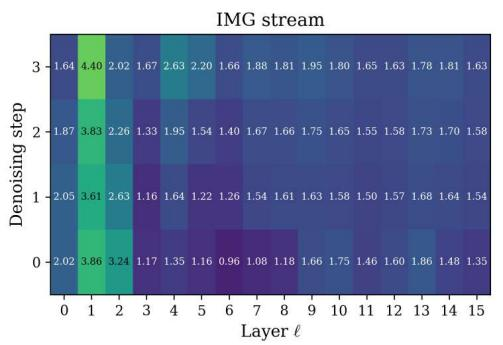

heatmap

| Layer ℓ | 0    | 1    | 2    | 3    | 4    | 5    | 6    | 7    | 8    | 9    | 10   | 11   | 12   | 13   | 14   | 15   |
|---------|------|------|------|------|------|------|------|------|------|------|------|------|------|------|------|------|
| 0       | 2.02 | 3.86 | 3.24 | 1.17 | 1.35 | 1.16 | 0.96 | 1.08 | 1.18 | 1.66 | 1.75 | 1.46 | 1.60 | 1.86 | 1.48 | 1.35 |
| 1       | 2.05 | 3.61 | 2.63 | 1.16 | 1.64 | 1.22 | 1.26 | 1.54 | 1.61 | 1.63 | 1.58 | 1.50 | 1.57 | 1.68 | 1.64 | 1.54 |
| 2       | 1.87 | 3.83 | 2.26 | 1.33 | 1.95 | 1.54 | 1.40 | 1.67 | 1.66 | 1.75 | 1.65 | 1.55 | 1.58 | 1.73 | 1.70 | 1.58 |
| 3       | 1.64 | 4.40 | 2.02 | 1.67 | 2.63 | 2.20 | 1.66 | 1.88 | 1.81 | 1.95 | 1.80 | 1.65 | 1.63 | 1.78 | 1.81 | 1.63 |

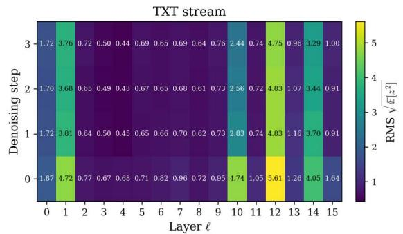

heatmap

TXT stream
| Denoising step | Layer ℓ | RMS √(ε^2) |
|---|---|---|
| 0 | 0 | 1.87 |
| 0 | 1 | 4.72 |
| 0 | 2 | 0.77 |
| 0 | 3 | 0.67 |
| 0 | 4 | 0.68 |
| 0 | 5 | 0.71 |
| 0 | 6 | 0.82 |
| 0 | 7 | 0.96 |
| 0 | 8 | 0.72 |
| 0 | 9 | 0.95 |
| 0 | 10 | 4.74 |
| 0 | 11 | 1.05 |
| 0 | 12 | 5.61 |
| 0 | 13 | 1.26 |
| 0 | 14 | 4.05 |
| 0 | 15 | 1.64 |
| 1 | 0 | 1.72 |
| 1 | 1 | 3.76 |
| 1 | 2 | 0.72 |
| 1 | 3 | 0.50 |
| 1 | 4 | 0.44 |
| 1 | 5 | 0.69 |
| 1 | 6 | 0.65 |
| 1 | 7 | 0.69 |
| 1 | 8 | 0.64 |
| 1 | 9 | 0.76 |
| 1 | 10 | 2.44 |
| 1 | 11 | 0.74 |
| 1 | 12 | 4.75 |
| 1 | 13 | 0.96 |
| 1 | 14 | 3.29 |
| 1 | 15 | 1.00 |
The chart displays RMS √(ε^2) values for each denoising step and layer (Layer ℓ). The color scale ranges from dark purple (low RMS) to bright yellow (high RMS). Values are estimated based on the grid layout of the cells.

Figure 22: FF-output activation magnitude (RMS $\sqrt { \mathbb { E } [ z ^ { 2 } ] } )$ per (layer, stream, step) bucket, measured on 512 held-out prompts; linear colour scale shared between the two panels. $\mathbf { A } \sim 1 3 \times$ spread in RMS motivates the variance-normalized form of the faithfulness term.

Per-stream sparsity coefficients. The image and text streams differ qualitatively in the distribution of MLP activations. Empirically the same λ for both streams either drives image transcoders to dense activations (if low) or collapses text transcoders to high reconstruction error (if high). We therefore use $\lambda ^ { \mathrm { i m g } } = 3 \times 1 0 ^ { - 4 }$ and $\dot { \lambda } ^ { \mathrm { t x t } } = 5 \times 1 0 ^ { - 5 }$ .

Optimizer and schedule. Each transcoder is optimized independently with AdamW (zero weight decay, default β). The learning rate is $2 \times 1 0 ^ { - 4 }$ for both streams, decayed by a cosine annealing schedule over 256 training cycles. We define one cycle as: clear all buffers, run inference until any buffer fills to $1 0 ^ { 6 }$ records, then perform one optimizer epoch over each buffer (1 000 000/4 096 ≈ 244 steps with replacement-sampled batches). The total training budget is therefore approximately $2 5 { \dot { 6 } } \times 1 0 ^ { 6 } \approx \mathbf { \dot { 2 } 5 6 0 }$ activation records per transcoder.

Multi-run training. Holding 32 transcoders in GPU memory simultaneously together with the FLUX.1[schnell] base model exceeds the memory budget of a single H100. We therefore train transcoders in disjoint groups of 6 at a time (three layers × two streams), with the same fixed random seed for the data sampler and the same training schedule. The base model and the data corpus are identical across runs; only the active set of transcoders differs.

## E.4 Quantitative evaluation

We evaluate the trained transcoders along two axes: their direct fit to the per-block MLPs they replace (sparsity and faithfulness curves over training), and their effect on the model’s outputs when all 32 transcoders are simultaneously substituted for the corresponding MLPs and a full image is generated (end-to-end faithfulness).

Per-transcoder training metrics. Figure 23 reports two metrics per transcoder, recorded every 8 training cycles: the normalized MSE between $\mathrm { M L P } _ { \ell } ^ { s } ( x )$ and $T C _ { \ell } ^ { s } ( x , t )$ on the current training buffer, and the mean $L _ { 0 } \operatorname { o f } z ( x , t )$ on the same batch (defined as the mean number of strictly positive feature activations per token). The four panels split metrics by stream and by axis (nMSE vs $L _ { 0 } ) ;$ within each panel one curve is drawn per transcoder, colored by layer. By the end of training nMSE plateaus at $0 . 0 4 \mathrm { - } 0 . 3 0 $ for image transcoders and 0.001–0.011 for text transcoders, while $L _ { 0 }$ reaches 82–605 active features per token (image) and 23–394 (text), corresponding to $0 . 0 5 \% { - 1 . 2 \% }$ of $d _ { \mathrm { f e a t } } = 4 9 1 5 2$ active per token. Text-stream nMSE and $L _ { 0 }$ values are systematically lower than image-stream values: text-stream MLPs in double-stream blocks perform less drastic transformations than image-stream MLPs, since the text branch primarily carries T5 prompt features through, while the image branch performs the bulk of cross-modal integration; both the reconstruction is easier and fewer features are needed to express it.

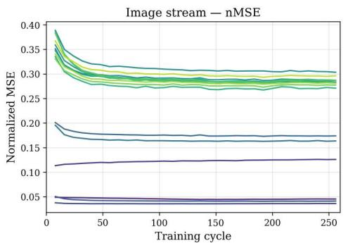

line chart

| Training cycle | Normalized MSE (Line 1) | Normalized MSE (Line 2) | Normalized MSE (Line 3) | Normalized MSE (Line 4) | Normalized MSE (Line 5) |
| -------------- | ------------------------ | ------------------------ | ------------------------ | ------------------------ | ------------------------ |
| 0              | 0.40                     | 0.35                     | 0.20                     | 0.12                     | 0.05                     |
| 50             | 0.30                     | 0.28                     | 0.17                     | 0.11                     | 0.04                     |
| 100            | 0.30                     | 0.28                     | 0.17                     | 0.11                     | 0.04                     |
| 150            | 0.30                     | 0.28                     | 0.17                     | 0.11                     | 0.04                     |
| 200            | 0.30                     | 0.28                     | 0.17                     | 0.11                     | 0.04                     |
| 250            | 0.30                     | 0.28                     | 0.17                     | 0.11                     | 0.04                     |

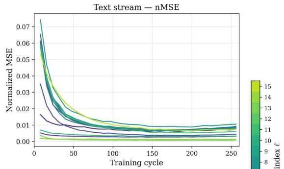

line chart

| Training cycle | Normalized MSE (index ℓ=8) | Normalized MSE (index ℓ=9) | Normalized MSE (index ℓ=10) | Normalized MSE (index ℓ=11) | Normalized MSE (index ℓ=12) | Normalized MSE (index ℓ=13) | Normalized MSE (index ℓ=14) | Normalized MSE (index ℓ=15) |
| -------------- | -------------------------- | -------------------------- | --------------------------- | --------------------------- | --------------------------- | --------------------------- | --------------------------- | --------------------------- |
| 0              | 0.07                       | 0.06                       | 0.05                        | 0.04                        | 0.03                        | 0.02                        | 0.01                        | 0.005                       |
| 50             | 0.02                       | 0.015                      | 0.01                        | 0.008                       | 0.006                       | 0.005                       | 0.004                       | 0.003                       |
| 100            | 0.01                       | 0.008                      | 0.006                       | 0.005                       | 0.004                       | 0.003                       | 0.002                       | 0.002                       |
| 150            | 0.008                      | 0.006                      | 0.005                       | 0.004                       | 0.003                       | 0.002                       | 0.002                       | 0.002                       |
| 200            | 0.007                      | 0.005                      | 0.004                       | 0.003                       | 0.002                       | 0.002                       | 0.002                       | 0.002                       |
| 250            | 0.006                      | 0.004                      | 0.003                       | 0.002                       | 0.002                       | 0.002                       | 0.002                       | 0.002                       |

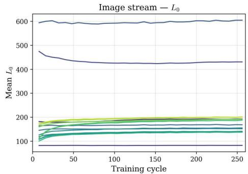

line chart

| Training cycle | Mean L₀ (Line 1) | Mean L₀ (Line 2) | Mean L₀ (Line 3) | Mean L₀ (Line 4) | Mean L₀ (Line 5) | Mean L₀ (Line 6) | Mean L₀ (Line 7) | Mean L₀ (Line 8) | Mean L₀ (Line 9) | Mean L₀ (Line 10) |
| -------------- | ---------------- | ---------------- | ---------------- | ---------------- | ---------------- | ---------------- | ---------------- | ---------------- | ---------------- | ----------------- |
| 0              | 600              | 480              | 180              | 170              | 160              | 150              | 140              | 130              | 120              | 110               |
| 50             | 600              | 440              | 190              | 180              | 170              | 160              | 150              | 140              | 130              | 120               |
| 100            | 600              | 430              | 195              | 185              | 175              | 165              | 155              | 145              | 135              | 125               |
| 150            | 600              | 430              | 200              | 190              | 180              | 170              | 160              | 150              | 140              | 130               |
| 200            | 600              | 430              | 205              | 195              | 185              | 175              | 165              | 155              | 145              | 135               |
| 250            | 600              | 430              | 210              | 200              | 190              | 180              | 170              | 160              | 150              | 140               |

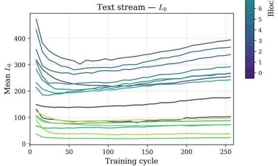

line chart

| Training cycle | Mean L0 (Bloc 0) | Mean L0 (Bloc 1) | Mean L0 (Bloc 2) | Mean L0 (Bloc 3) | Mean L0 (Bloc 4) | Mean L0 (Bloc 5) | Mean L0 (Bloc 6) |
| -------------- | ---------------- | ---------------- | ---------------- | ---------------- | ---------------- | ---------------- | ---------------- |
| 0              | ~150             | ~100             | ~120             | ~140             | ~160             | ~180             | ~200             |
| 50             | ~140             | ~90              | ~110             | ~130             | ~150             | ~170             | ~190             |
| 100            | ~130             | ~80              | ~100             | ~120             | ~140             | ~160             | ~180             |
| 150            | ~120             | ~70              | ~90              | ~110             | ~130             | ~150             | ~170             |
| 200            | ~110             | ~60              | ~80              | ~100             | ~120             | ~140             | ~160             |
| 250            | ~100             | ~50              | ~70              | ~90              | ~110             | ~130             | ~150             |

Figure 23: Training curves for all 32 transcoders, recorded every 8 cycles over 256 cycles. Top row: normalized MSE. Bottom row: mean $L _ { 0 }$ activation. One curve per transcoder, colored by block index ℓ.

End-to-end faithfulness. A small per-block reconstruction error can compound over 16 layers and 4 denoising steps into a substantial drift in the generated image, so per-block metrics alone do not establish that the transcoders are useful as drop-in replacements. We therefore measure the end-to-end faithfulness of the full replacement model (all 32 MLPs replaced by their transcoders, attention and normalization untouched, no error correction terms) against the original FLUX.1[schnell] on a held-out set of 512 prompts disjoint from the training corpus. We compare in latent space, before VAE decoding, by computing two metrics per prompt: cosine similarity $\cos ( l _ { \mathrm { o r i g } } , l _ { \mathrm { t c } } )$ and squared $L _ { 2 }$ distance $| | \bar { l } _ { \mathrm { o r i g } } - l _ { \mathrm { t c } } | | _ { 2 } ^ { 2 }$ between the final flat latents. Aggregate values are reported in Table 1.

Table 1: End-to-end faithfulness of the full replacement model (all 32 MLPs replaced) against FLUX.1[schnell], on 512 held-out prompts at $5 1 \bar { 2 } \times 5 1 2$ resolution and 4 denoising steps.

<table><tr><td rowspan="2"></td><td colspan="2">Latent Cosine Similarity ↑</td><td colspan="2">Latent MSE ↓</td></tr><tr><td>Mean</td><td>Median</td><td>Mean</td><td>Median</td></tr><tr><td>Replacement vs. original</td><td>0.7839</td><td>0.7960</td><td>0.4786</td><td>0.4313</td></tr></table>

Visual comparison. Figure 24 shows generated images for 10 prompts from the held-out set, with the original model in the left column and the full replacement model on the right. The replacement model recovers the global composition, object placements, broad shape outlines, and stylistic register of the original; deviations are concentrated in fine details (textures, small objects, sharp edges).

natural_image

Collage of 16 diverse outdoor scenes including children, dogs, family photos, and skateboarding (no visible text or symbols)

Figure 24: Generated images for 10 prompts at $5 1 2 \times 5 1 2$ and 4 denoising steps. Top row: original FLUX.1[schnell]. Bottom row: full replacement model with all 32 MLPs substituted by their transcoders.

These results establish that the dictionaries learned by our transcoders are sufficiently faithful for circuit analysis: the transcoder-replaced model is not bit-exact with the original, but it generates qualitatively the same images on the same inputs.

## F Local replacement model

The local replacement model (LRM) takes the trained transcoders of §E and embeds them inside the base model in such a way that, on the cached prompt and timestep, the modified model’s outputs exactly reproduce the originals up to floating-point error, while every interaction between transcoder features becomes linear under the assumption of a fixed active set.

## F.1 Cached quantities

The construction begins with a single forward pass of FLUX.1[schnell] on the chosen prompt at the chosen denoising step t. Forward hooks intercept and cache the following quantities, all per block $\ell \in \{ 0 , \ldots , 1 5 \}$ and stream $s \in \{ \mathrm { i m g , t x t } \}$ :

• Boundary residual streams. $r _ { 0 } ^ { s } = x _ { \mathrm { p r e } } ^ { ( 0 , s ) }$ , the residual stream entering block 0 from each stream. For s = img this is the patch embedding of the noisy latent; for $s = \mathrm { t x t }$ it is the projected T5 prompt embedding. These serve as the input layer of the LRM.  
$\mathrm { g a t e } _ { \mathrm { m s a } } ^ { \ell , s } , \mathrm { g a t e } _ { \mathrm { m l p } } ^ { \ell , s } \in \mathbb { R } ^ { d _ { \mathrm { m o d e l } } }$ ℓ,s ∈ Rdmodel $\mathrm { s c a l e } _ { \mathrm { m l p } } ^ { \ell , s } , \mathrm { s h i f t } _ { \mathrm { m l p } } ^ { \ell , s } \in \mathbb { R } ^ { d _ { \mathrm { m o d e l } } }$ , shiftℓ,smlp produced by the AdaLayerNormZero modules in the block. These depend only on t and the pooled CLIP embedding, so they are constants of the LRM.  
• LayerNorm denominators. For both the inner LayerNorm of norm1/norm1\_context (the parameter-free LayerNorm wrapped by AdaLayerNormZero, applied to the residual before joint attention) and norm2/norm2\_context (the parameter-free LayerNorm applied to the residual before the MLP), the cached inverse denominator $1 / \sqrt { \mathrm { V a r } ( x ) + \varepsilon }$ at each token position. The mean is recomputed at runtime (a linear operation in x); only the denominator is frozen.  
• Joint attention probabilities and reconstruction error. The attention probability tensor $P ^ { \ell } \in$ R $\vert B \times H \times ( S _ { \mathrm { t x t } } + S _ { \mathrm { i m g } } ^ { \bullet } ) \times ( S _ { \mathrm { t x t } } + S _ { \mathrm { i m g } } )$ , computed from the modulated Q and K projections of both streams concatenated along the token axis with text first, image second, and a per-stream attention reconstruction error

$$
\varepsilon_ {\text { attn }} ^ {\ell , s} = \operatorname{attn} _ {\text { orig }, s} ^ {\ell} - W _ {O} ^ {(\ell , s)} \left(\left(P ^ {\ell} V ^ {\ell}\right) _ {s}\right), \tag {19}
$$

where $V ^ { \ell }$ is the cached concatenation of the two streams’ V -projections, $( P ^ { \ell } V ^ { \ell } )$ s is the per-stream $W _ { O } ^ { ( \ell , s ) }$ projection. The error $\varepsilon _ { \mathrm { a t t } 1 } ^ { \ell , s }$ accounts for the small numerical discrepancy between the original attention output and the same quantity recomputed from cached probabilities and V -projections.

• Per-block transcoder caches. For each (layer, stream) pair, the input $x ^ { \ell , s }$ to the feed-forward $z ^ { \ell , s } = z ( \dot { x } ^ { \ell , s } , t )$ $h _ { \mathrm { p r e } } ^ { \ell , s }$ reconstruction residual

$$
\varepsilon_ {\mathrm{mlp}} ^ {\ell , s} = \mathrm{MLP} _ {\ell} ^ {s} (x ^ {\ell , s}) - T C _ {\ell} ^ {s} (x ^ {\ell , s}, t), \tag {20}
$$

$T C _ { \ell } ^ { s } ( x , t ) = W _ { \mathrm { d e c } } ^ { ( \ell , s ) } z ^ { \ell , s } + b _ { \mathrm { d e c } } ^ { ( \ell , s ) }$ dec role of the decoder bias is discussed in §G.2.

## F.2 Component substitutions

The base model is then re-run with the following per-block substitutions, applied to all $\ell \in \{ 0 , \ldots , 1 5 \}$ and both streams. Outside this range the original blocks are kept intact, and the LRM is therefore identical to the original model on blocks 16–18 (double-stream) and on the 38 single-stream blocks that follow.

LayerNorm. In each analyzed block we replace four LayerNorm modules: the inner LayerNorm of norm1 and norm1\_context, and norm2/norm2\_context. Each is replaced by

$$
\text { FrozenNorm } _ {\ell , s} (x) = (x - \bar {x}) \odot \nu_ {\text { cached }} ^ {\ell , s}, \tag {21}
$$

where x¯ = $\begin{array} { r } { { \bar { x } } = { \frac { 1 } { d _ { \mathrm { m o d e l } } } } \sum _ { j } x _ { j } } \end{array}$ dmodel is recomputed at runtime and $\nu _ { \mathrm { c a c h e d } } ^ { \ell , s } = 1 / \sqrt { \mathrm { V a r } ( x _ { \mathrm { c a c h e d } } ) + \varepsilon }$ is the inverse denominator from §F.1. Mean subtraction is linear in x, so the only nonlinear component of LayerNorm has been removed from the LRM. The AdaLayerNormZero wrapper around norm1 continues to apply its scale-and-shift modulation around the frozen inner LayerNorm; only the LayerNorm denominator is frozen, not the modulation itself.

Joint attention. The full joint attention block, including its $Q$ and K projections, scaled dot product, softmax, and stream concatenation, is replaced by a per-stream linear function of the cached probabilities and the recomputed V -projections:

$$
\operatorname{FrozenAttn} _ {\ell} \left(x _ {\mathrm{img}}, x _ {\mathrm{txt}}\right) _ {s} = W _ {O} ^ {(\ell , s)} \left(\left(P ^ {\ell} V _ {\mathrm{cat}} ^ {\ell} \left(x _ {\mathrm{img}}, x _ {\mathrm{txt}}\right)\right) _ {s}\right) + \varepsilon_ {\text {attn}} ^ {\ell , s}, \quad s \in \{\mathrm{img}, \mathrm{txt} \}. \tag {22}
$$

Here $V _ { \mathrm { c a t } } ^ { \ell } ( x _ { \mathrm { i m g } } , x _ { \mathrm { t x t } } )$ concatenates the two streams’ $V \cdot$ -projections along the token axis $( V _ { \mathrm { t x t } }$ first, then $V _ { \mathrm { i m g } } .$ , matching the original implementation), $P ^ { \ell }$ is the cached probability tensor, $( \cdot ) _ { s }$ extracts the per-stream slice along the token axis, and W (ℓ,s)O i $W _ { O } ^ { ( \ell , s ) }$ s the per-stream output projection that follows. The split between streams happens before the output projection, exactly as in the original implementation, and each stream uses its own $W _ { O }$ . Crucially, the $\bar { V }$ -projection still depends on the input residual streams (it is a linear operation on x); only the $Q { - } K$ pathway through the softmax has been frozen. $\varepsilon _ { \mathrm { a t t } 1 } ^ { \ell , s }$ $\mathrm { A t t n } _ { \ell } ( x _ { \mathrm { i m g } } ^ { \mathrm { c a c h e d } } , x _ { \mathrm { t x t } } ^ { \mathrm { c a c h e d } } )$ s matches the original attention output to floating-point precision.

MLP. Each feed-forward sublayer is replaced by its transcoder plus the cached MLP reconstruction residual,

$$
\mathrm{MLP} _ {\ell , s} ^ {\mathrm{LRM}} (x) = T C _ {\ell} ^ {s} (x, t) + \varepsilon_ {\mathrm{mlp}} ^ {\ell , s}. \tag {23}
$$

$x = x ^ { \ell , s }$ $\varepsilon _ { \mathrm { m l p } } ^ { \ell , s }$

## F.3 Linearization shortcut

The LRM is used in two regimes. In validation mode (§F.4) we want the LRM’s output as a function of its input, so the transcoders are run forward in the standard way. In tracing mode (used to compute attribution edges, §G) we run the LRM only on the cached prompt and only need it as an affine function of the source feature activations on that prompt; we therefore apply two simplifications.

First, in tracing mode the MLP substitution becomes

$$
\mathrm{MLP} _ {\ell , s} ^ {\mathrm{LRM}} (x) = y _ {\text { cached }} ^ {\ell , s}, \tag {24}
$$

that is, we return the cached original MLP output directly without running the transcoder. On the $\varepsilon _ { \mathrm { m l p } } ^ { \ell , s }$ $T C _ { \ell } ^ { s } ( x _ { \mathrm { c a c h e d } } ^ { \ell , s } , t ) \bar { + } \varepsilon _ { \mathrm { m l p } } ^ { \ell , s } = y _ { \mathrm { c a c h e d } } ^ { \ell , s }$ The shortcut avoids a full transcoder forward pass per block and lets the transcoder weights be moved off-GPU during tracing; the per-target backward pass uses only the cached activations $z ^ { \ell , s }$ and decoder weights W (ℓ,s). $W _ { \mathrm { d e c } } ^ { ( \ell , s ) }$

Second, when computing the target preactivation $h ^ { * }$ as a function of source activations, the cached MLP outputs are returned as gradient-free constants. Gradients in the backward pass therefore flow only through residual connections and the linear V -projections of frozen attention, which is precisely the linearization we want: each source feature contributes through its decoder vector being added to the residual stream and read out by the target’s encoder vector.

## F.4 Validation of the LRM

The LRM is by construction exact on the cached prompt and timestep up to floating-point error. We validate that this is the case in practice and quantify the magnitude of the residual numerical drift.

Frozen attention numerical accuracy. The attention reconstruction error εℓ,sattn i $\varepsilon _ { \mathrm { a t t } 1 } ^ { \ell , s }$ s defined as the difference between the original attention output and the same quantity recomputed from cached $P ^ { \ell }$ and V -projections. Although the recomputation is mathematically identical to the original, the two differ at the level of float32 round-off because the original attention runs through a fused CUDA kernel with a different reduction order than our explicit $W _ { O } ( P V )$ recomputation. These residuals are absorbed into the LRM as additive corrections (§F.2), and into $b _ { \mathrm { e f f } } ^ { * }$ in the attribution graph (§G.2).

End-to-end LRM exactness. On a held-out set of 512 prompts, for each of the 4 denoising steps separately, we generate the final flat latent under the original model and under the LRM with all 16 analyzed blocks substituted. Table 2 reports the latent cosine similarity and the latent MSE between the two for each step. Mean cosine similarity is around 0.99 across all four steps, ranging from 0.9854 at $t = 0$ to effectively 1.0 at $t = 3 .$ . The trend across rows reflects how floating-point drift propagates through subsequent denoising steps: an LRM substitution at an earlier step is followed by additional original-model steps, each of which can amplify the residual numerical error, while a substitution at the final step (t = 3) is not propagated further and produces near-bit-exact agreement with the original model.

Table 2: End-to-end LRM exactness against the original FLUX.1[schnell] on 512 held-out prompts. Each row corresponds to building the LRM at a single denoising step t and replacing only that step’s transformer call.

<table><tr><td rowspan="2">Denoising step</td><td colspan="2">Latent Cosine Similarity ↑</td><td colspan="2">Latent MSE ↓</td></tr><tr><td>Mean</td><td>Median</td><td>Mean</td><td>Median</td></tr><tr><td>t = 0</td><td>0.9854</td><td>0.9889</td><td> $2.5 \times 10^{-2}$ </td><td> $2.0 \times 10^{-2}$ </td></tr><tr><td>t = 1</td><td>0.9982</td><td>0.9986</td><td> $3.1 \times 10^{-3}$ </td><td> $2.6 \times 10^{-3}$ </td></tr><tr><td>t = 2</td><td>0.9997</td><td>0.9997</td><td> $5.4 \times 10^{-4}$ </td><td> $4.9 \times 10^{-4}$ </td></tr><tr><td>t = 3</td><td>1.0000</td><td>1.0000</td><td> $7.9 \times 10^{-5}$ </td><td> $7.4 \times 10^{-5}$ </td></tr></table>

Compounding floating-point drift across blocks. Although the LRM is exact at each individual block on the cached input, when the LRM is run forward the input to block $\ell + 1$ in the LRM is no longer exactly equal to the cached input to block ℓ + 1 in the original model: it differs by the per-block floating-point error of all preceding blocks. This drift is small in absolute terms but grows monotonically with depth. Figure 25 plots the mean absolute error between the original block output and the LRM block output at each $\ell \doteq \{ 0 , \ldots , 1 5 \}$ , separately for the two streams. Both curves are monotone in $\ell ,$ but the maximum mean absolute error at the deepest analyzed block is $5 . 8 6 \times 1 0 ^ { - 3 }$ for the image stream and $1 . 7 8 \times 1 0 ^ { - 2 }$ for the text stream. This confirms that drift remains bounded throughout depth and does not affect downstream behavior at the latent level (Table 2).

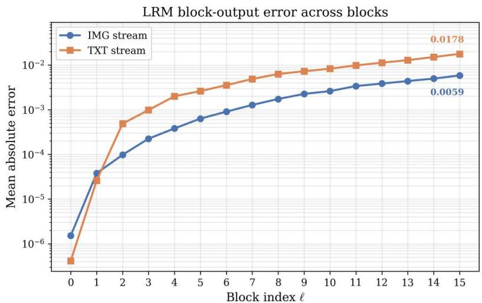

line chart

| Block index ℓ | IMG stream | TXT stream |
| ------------- | ---------- | ---------- |
| 0             | 1e-6       | 1e-6       |
| 1             | 1e-4       | 1e-4       |
| 2             | 1e-3       | 1e-3       |
| 3             | 1e-3       | 1e-3       |
| 4             | 1e-3       | 1e-3       |
| 5             | 1e-3       | 1e-3       |
| 6             | 1e-3       | 1e-3       |
| 7             | 1e-3       | 1e-3       |
| 8             | 1e-3       | 1e-3       |
| 9             | 1e-3       | 1e-3       |
| 10            | 1e-3       | 1e-3       |
| 11            | 1e-3       | 1e-3       |
| 12            | 1e-3       | 1e-3       |
| 13            | 1e-3       | 1e-3       |
| 14            | 1e-3       | 1e-3       |
| 15            | 0.0059     | 0.0178     |

Figure 25: Mean absolute error between the original model’s block output and the LRM’s block output at each of the analyzed blocks, for the image and text streams. Error grows monotonically with depth as floating-point discrepancies accumulate, but stays within numerical-precision range across all 16 LRM blocks.

Visual comparison. Figure 26 shows the qualitative effect of substituting the LRM at each of the four denoising steps separately; the generated images remain effectively indistinguishable from the originals.

natural_image

Collage of outdoor scenes including family photos, beach views, and street scenes with cars and trees (no visible text or symbols)

Figure 26: Generated images for 10 prompts. Row 1: original FLUX.1[schnell]. Rows 2–5: LRM applied only at step t = 0, 1, 2, 3 respectively, with the other steps run by the original model.

## G Attribution graph

This section gives the complete derivation of the attribution graph from the LRM of §F. We begin by writing the target preactivation and a collection of constants ( $h ^ { * }$ as a fully expanded affine function of the cached residual str1), separate the input-independent part into the effective bias $b _ { \mathrm { e f f } } ^ { * }$ (§G.2), and then derive the per-edge attribution formulas for feature, error, and input source vertices (§G.3). The conservation invariant $\begin{array} { r } { h ^ { * } - b _ { \mathrm { e f f } } ^ { * } = \sum _ { \mathrm { s r c } } A _ { \mathrm { s r c } \to f ^ { * } } } \end{array}$ ∗ follows by construction (§G.4), and we close with a discussion of cross-stream edges and of what the graph does not model (§§G.5–G.6).

## G.1 Target preactivation as an affine function

Fix a prompt, a denoising step $t ,$ and a target feature $f ^ { * }$ characterized by $( \ell ^ { * } , s ^ { * } , p ^ { * } , i ^ { * } )$ . Write $r _ { p } ^ { \ell , s } \in \mathrm { \bar { \mathbb { R } } } ^ { d _ { \mathrm { m o d e l } } }$ $p$ $r _ { p } ^ { 0 , s } = r _ { 0 } ^ { s } ( p )$

$$
h ^ {*} = \left(f _ {\mathrm{enc}} ^ {(\ell^ {*}, s ^ {*}, i ^ {*})}\right) ^ {\top} x _ {\mathrm{mod}} ^ {\ell^ {*}, s ^ {*}} (p ^ {*}) + \left(b _ {\mathrm{enc}} ^ {(\ell^ {*}, s ^ {*})}\right) _ {i ^ {*}}, \tag {25}
$$

where xℓ ,s mod $x _ { \mathrm { m o d } } ^ { \ell ^ { * } , s ^ { * } } ( p ^ { * } )$ is the FiLM-modulated FF input to the target transcoder. We expand this quantity in two stages.

From mid-block residual to FF input. The MLP sublayer of block $\ell ^ { * }$ reads the residual stream after the attention update of that same block, which we denote $x _ { \mathrm { m i d } } ^ { \ell ^ { * } , s ^ { * } } ( p ^ { * } )$ . Concretely,

$$
x _ {\text { mid }} ^ {\ell^ {*}, s ^ {*}} \left(p ^ {*}\right) = r _ {p ^ {*}} ^ {\ell^ {*}, s ^ {*}} + \operatorname{gate} _ {\mathrm{msa}} ^ {\ell^ {*}, s ^ {*}} \odot \text { FrozenAttn } _ {\ell^ {*}} (\dots) _ {s ^ {*}} \left(p ^ {*}\right), \tag {26}
$$

which is itself affine in $r ^ { \ell ^ { * } , s ^ { * } }$ (and, via the cross-stream attention, in $r ^ { \ell ^ { * } , s ^ { \prime } }$ for $s ^ { \prime } \neq s ^ { * } )$ . The FF input is then obtained from $x _ { \mathrm { m i d } } ^ { \ell ^ { * } , s ^ { * } } ( p ^ { * } )$ by frozen LayerNorm followed by AdaLN-Zero modulation:

$$
x _ {\mathrm{ff}} ^ {\ell^ {*}, s ^ {*}} \left(p ^ {*}\right) = \text { FrozenNorm } _ {\ell^ {*}, s ^ {*}} \left(x _ {\mathrm{mid}} ^ {\ell^ {*}, s ^ {*}} \left(p ^ {*}\right)\right) \odot \left(1 + \operatorname{scale} _ {\mathrm{mlp}} ^ {\ell^ {*}, s ^ {*}}\right) + \operatorname{shift} _ {\mathrm{mlp}} ^ {\ell^ {*}, s ^ {*}}. \tag {27}
$$

Both scaleℓ ,smlp $\mathrm { s c a l e } _ { \mathrm { m l p } } ^ { \ell ^ { * } , s ^ { * } }$ and $\mathrm { s h i f t } _ { \mathrm { m l p } } ^ { \ell ^ { \ast } , s ^ { \ast } }$ are constants of the LRM. The same affineness extends to the residual streams entering all blocks $\hat { \ell } < \ell ^ { * }$ , since every component of the LRM up to that point is either linear or treats its nonlinearities as fixed (frozen norm denominators, frozen attention probabilities, fixed transcoder active sets).

From FF input to encoder input. Inside the target transcoder, $x _ { \mathrm { f f } } ^ { \ell ^ { * } , s ^ { * } } ( p ^ { * } )$ xℓ∗ ,s∗ is further modulated by FiLM:

$$
x _ {\mathrm{mod}} ^ {\ell^ {*}, s ^ {*}} (p ^ {*}) = x _ {\mathrm{ff}} ^ {\ell^ {*}, s ^ {*}} (p ^ {*}) \odot \left(1 + \operatorname{scale} _ {\ell^ {*}, s ^ {*}} ^ {\mathrm{tc}} (t)\right) + \operatorname{shift} _ {\ell^ {*}, s ^ {*}} ^ {\mathrm{tc}} (t), \tag {28}
$$

where scal ${ \stackrel { \mathrm { t c } } { } } _ { \ell ^ { * } , s ^ { * } } ( t )$ and shif $\operatorname { \mathrm { ^ { t c } } } _ { \ell ^ { \ast } , s ^ { \ast } } ( t )$ are constants once t is fixed.

Therefore,

$$
x _ {\mathrm{mod}} ^ {\ell^ {*}, s ^ {*}} (p ^ {*}) = \text { FrozenNorm } \left(x _ {\mathrm{mid}} ^ {\ell^ {*}, s ^ {*}} (p ^ {*})\right) \odot c _ {1} + c _ {2}, \tag {29}
$$

with

$$
c _ {1} = \left(1 + \text { scale } _ {\mathrm{mlp}} ^ {\ell^ {*}, s ^ {*}}\right) \odot \left(1 + \text { scale } _ {\ell^ {*}, s ^ {*}} ^ {\mathrm{tc}} (t)\right), \tag {30}
$$

$$
c _ {2} = \text { shift } _ {\text { mlp }} ^ {\ell^ {*}, s ^ {*}} \odot \left(1 + \text { scale } _ {\ell^ {*}, s ^ {*}} ^ {\text { tc }} (t)\right) + \text { shift } _ {\ell^ {*}, s ^ {*}} ^ {\text { tc }} (t), \tag {31}
$$

both $c _ { 1 }$ and $c _ { 2 }$ constants of the LRM.

Plugging into (25),

$$
h ^ {*} = \left(f _ {\text {enc}} ^ {(\ell^ {*}, s ^ {*}, i ^ {*})}\right) ^ {\top} \left(\text {FrozenNorm} (x _ {\text {mid}} ^ {\ell^ {*}, s ^ {*}} (p ^ {*})) \odot c _ {1}\right) + \underbrace {\left(f _ {\text {enc}} ^ {(\ell^ {*} , s ^ {*} , i ^ {*})}\right) ^ {\top} c _ {2} + \left(b _ {\text {enc}} ^ {(\ell^ {*} , s ^ {*})}\right) _ {i ^ {*}}} _ {\text {input - independent}}. \tag {32}
$$

The first term is affine in $x _ { \mathrm { m i d } } ^ { \ell ^ { * } , s ^ { * } }$ , which is itself affine in all upstream sources. The second term is constant.

## G.2 Effective encoder bias

The constant part of $h ^ { * }$ has two further contributions that we have not yet made explicit. The residual stream $r _ { p ^ { * } } ^ { \ell ^ { * } , s ^ { * } }$ on entry to block $\ell ^ { * }$ is itself the sum, over all $\ell < \ell ^ { * }$ and both streams, of the contributions of each preceding sublayer, plus the input embedding. Among these contributions are several that are constant in the LRM:

$\mathrm { g a t e } _ { \mathrm { m s a } } ^ { \ell , s } \odot$ Frozen $\mathrm { A t t n } _ { \ell } ( \cdot \cdot \cdot ) _ { s }$ to the residual at every $W _ { O } ^ { ( \ell , s ) } \big ( ( P ^ { \ell } V ^ { \ell } ) _ { s } \big ) + \varepsilon _ { \mathrm { a t t n } } ^ { \ell , s }$ $V ^ { \ell } = V _ { \mathrm { t x t } } ^ { \ell } ( x _ { \mathrm { t x t } } ) \parallel V _ { \mathrm { i m g } } ^ { \ell } ( x _ { \mathrm { i m g } } )$ second term, $\varepsilon _ { \mathrm { a t t n } } ^ { \ell , s } .$ , is the cached attention reconstruction error and is constant.

$\mathrm { g a t e } _ { \mathrm { m l p } } ^ { \ell , s } \odot ( T C _ { \ell } ^ { s } ( x , t ) + \varepsilon _ { \mathrm { m l p } } ^ { \ell , s } )$ further decomposes as Pi z(ℓ,i $\begin{array} { r } { \sum _ { i } z _ { i } ^ { ( \ell , s ) } f _ { \mathrm { d e c } } ^ { ( \ell , s , i ) } + b _ { \mathrm { d e c } } ^ { ( \ell , s ) } } \end{array}$ . The first sum is affine in feature activations; the $b _ { \mathrm { d e c } } ^ { ( \ell , s ) }$ $\varepsilon _ { \mathrm { m l p } } ^ { \ell , s }$ ℓ,s are constants.

The contributions of the constant terms $( \varepsilon _ { \mathrm { a t t } 1 } ^ { \ell , s }$ a $b _ { \mathrm { d e c } } ^ { ( \ell , s ) } )$ $h ^ { * }$ are gated by the corresponding AdaLN gates, and accumulate into the constant part of (32). Reading these contributions off the backward pass of $h ^ { * }$ through the LRM (§G.3) gives the closed forms

$$
\beta_ {\mathrm{attn}} = \sum_ {\ell <   \ell^ {*}} \sum_ {s \in \{\mathrm{img}, \mathrm{txt} \}} \sum_ {p} \left\langle \text { gate } _ {\mathrm{msa}} ^ {\ell , s} \odot \varepsilon_ {\mathrm{attn}} ^ {\ell , s} (p), g ^ {\ell + 1, s} (p) \right\rangle , \tag {33}
$$

$$
\beta_ {\mathrm{dec}} = \sum_ {\ell <   \ell^ {*}} \sum_ {s \in \{\text { img }, \text { txt } \}} \sum_ {p} \left\langle \text { gate } _ {\mathrm{mlp}} ^ {\ell , s} \odot b _ {\mathrm{dec}} ^ {(\ell , s)}, g ^ {\ell + 1, s} (p) \right\rangle , \tag {34}
$$

where $g ^ { \ell + 1 , s } ( p ) \in \mathbb { R } ^ { d _ { \mathrm { m o d e l } } }$ is the gradient of $h ^ { * }$ with respect to the residual stream of stream s at position p on entry to block $\ell + 1$ , computed by the linearized backward pass described in §G.3. Both $\beta _ { \mathrm { a t t n } }$ and $\beta _ { \mathrm { d e c } }$ are constants of the LRM, since neither $\varepsilon _ { \mathrm { a t t n } } ^ { \ell , s } , b _ { \mathrm { d e c } } ^ { ( \ell , s ) } , \mathrm { g a t e } _ { \mathrm { m s a } } ^ { \ell , s } , \mathrm { g a t e } _ { \mathrm { m l p } } ^ { \ell , s }$ nor the gradients $g ^ { \ell + 1 , s }$ depend on any source feature activation under the fixed-active-set assumption.

The complete effective bias is then

$$
\begin{array}{l} b _ {\mathrm{eff}} ^ {*} = \left(b _ {\mathrm{enc}} ^ {(\ell^ {*}, s ^ {*})}\right) _ {i ^ {*}} \\ + \left(f _ {\text {enc}} ^ {(\ell^ {*}, s ^ {*}, i ^ {*})}\right) ^ {\top} \operatorname{shift} _ {\ell^ {*}, s ^ {*}} ^ {\mathrm{tc}} (t) \tag {35} \\ + \left(f _ {\mathrm{enc}} ^ {(\ell^ {*}, s ^ {*}, i ^ {*})}\right) ^ {\top} \left(\mathrm{shift} _ {\mathrm{mlp}} ^ {\ell^ {*}, s ^ {*}} \odot (1 + \mathrm{scale} _ {\ell^ {*}, s ^ {*}} ^ {\mathrm{tc}} (t))\right) \\ + \beta_ {\mathrm{attn}} + \beta_ {\mathrm{dec}}. \\ \end{array}
$$

The first three terms come from (32): the encoder bias of the target feature, the FiLM shift propagated through the encoder, and the AdaLN MLP shift propagated first through FiLM and then through the encoder. The remaining two terms are $\beta _ { \mathrm { a t t n } }$ and $\bar { \boldsymbol { \beta } } _ { \mathrm { d e c } }$ . By construction, $h ^ { \ast } - b _ { \mathrm { e f f } } ^ { \ast }$ is exactly the input-dependent part of (32) plus the input-dependent contributions of all upstream sources.

$b _ { \mathrm { e f f } } ^ { * }$ $b _ { \mathrm { d e c } } ^ { ( \ell , s ) }$ as part of the MLP reconstruction residual by defining ε˜ℓ,smlp $\tilde { \varepsilon } _ { \mathrm { m l p } } ^ { \ell , s } = \mathrm { M L P } _ { \ell } ^ { s } ( x ) - W _ { \mathrm { d e c } } ^ { ( \ell , s ) } z ^ { \ell , s }$ $\varepsilon .$ $b _ { \mathrm { d e c } } ^ { ( \ell , s ) }$ ) from βdec into the error $\beta _ { \mathrm { d e c } }$ edges. We prefer the present arrangement because εℓ,smlp $\varepsilon _ { \mathrm { m l p } } ^ { \ell , s }$ then represents only the genuinely residual variance that the transcoder failed to capture, which is the quantity one wants to monitor as a measure of transcoder quality.

## G.3 Edge attributions

To compute the contribution of each source vertex we run a single backward pass of $h ^ { * }$ through the LRM in tracing mode (§F.3), in which all transcoder outputs are detached and gradients flow only through residual connections and the linear V -projections of frozen attention. Denote by

$$
g ^ {\ell , s} (p) = \frac {\partial h ^ {*}}{\partial r _ {p} ^ {\ell , s}} \in \mathbb {R} ^ {d _ {\text { model }}} \tag {36}
$$

the gradient of $h ^ { * }$ with respect to the residual stream of stream s at position p on entry to block $\ell ,$ computed in the linearized LRM. Since gradients do not flow through MLP outputs, $\check { g } ^ { \ell , s }$ depends only on cached attention probabilities, frozen LayerNorm denominators, AdaLN-Zero modulation parameters, the target transcoder’s FiLM scale scal $\mathfrak { } _ { \ell ^ { * } , s ^ { * } } ^ { \mathrm { t c } } ( t )$ , and the target’s encoder vector $f _ { \mathrm { e n c } } ^ { ( \ell ^ { * } , s ^ { * } , i ^ { * } ) }$ ; it is fully determined by the cached forward pass and is therefore a constant of the LRM under the fixed-active-set assumption.

Feature edges. A source feature at $( \ell , s , p , i )$ with activation $z ^ { ( \ell , s , i ) } ( p )$ writes the vector $z ^ { ( \ell , s , i ) } ( p ) f _ { \mathrm { d e c } } ^ { ( \ell , s , i ) } \in \mathbb { R } ^ { d _ { \mathrm { m o d e l } } }$ $p .$ $\mathrm { g a t e } _ { \mathrm { m l p } } ^ { \ell , s }$

chain rule and the linearity of the LRM along this path, its contribution to $h ^ { * }$ is

$$
A _ {(\ell , s, p, i) \rightarrow f ^ {*}} = \underbrace {z ^ {(\ell , s , i)} (p)} _ {\text { input - dependent }} \cdot \underbrace {\left(g ^ {\ell + 1 , s} (p) \odot \operatorname{gate} _ {\mathrm{mlp}} ^ {\ell , s}\right) ^ {\top} f _ {\mathrm{dec}} ^ {(\ell , s , i)}} _ {\text { virtual   weight }}. \tag {37}
$$

The input-dependent factor is the activation; the virtual weight depends on the cached forward pass through $g ^ { \ell + 1 , s } ( p )$ and on the input-invariant decoder vector. The factor $\mathrm { g a t e } _ { \mathrm { m l p } } ^ { \ell , s } \in \mathbb { R } ^ { d _ { \mathrm { m o d e l } } }$ reflects FLUX’s AdaLN-Zero gating of the MLP output before the residual add and is constant across positions for fixed (ℓ, s).

$\varepsilon _ { \mathrm { m l p } } ^ { \ell , s } ( p )$ gating as the transcoder output, so its contribution to $h ^ { * }$ is

$$
A _ {(\ell , s, p) _ {\mathrm{err}} \rightarrow f ^ {*}} = \left(\varepsilon_ {\mathrm{mlp}} ^ {\ell , s} (p) \odot \operatorname{gate} _ {\mathrm{mlp}} ^ {\ell , s}\right) ^ {\top} g ^ {\ell + 1, s} (p). \tag {38}
$$

Unlike feature edges, error edges have no input-dependent factor: $\varepsilon _ { \mathrm { m l p } } ^ { \ell , s } ( p )$ is a cached constant. Each error vertex thus carries a single scalar attribution.

Input edges. For each input position $( s , p )$ , the embedding $r _ { 0 } ^ { s } ( p ) \in \mathbb { R } ^ { d _ { \mathrm { m o d e l } } }$ enters block 0 directly, with no further gating. Its contribution is

$$
A _ {(s, p) _ {\mathrm{in}} \rightarrow f ^ {*}} = r _ {0} ^ {s} (p) ^ {\top} g ^ {0, s} (p). \tag {39}
$$

Implementation as a single backward pass. In practice we compute all three edge types from a single VJP. The pipeline is summarized in Algorithm 1.

Algorithm 1 Per-target edge extraction in the LRM.  
Require: Cached forward state of the LRM; target $f^{*} = (\ell^{*}, s^{*}, p^{*}, i^{*})$ ; threshold $\tau$ .

Ensure: Edge set E with attributions for all sources whose $|A| \geq \tau$ .

1: Compute target encoder activation $h^{*} = (f_{\mathrm{enc}}^{(\ell^{*}, s^{*}, i^{*})})^{\top} x_{\mathrm{mod}}^{\ell^{*}, s^{*}}(p^{*}) + (b_{\mathrm{enc}}^{(\ell^{*}, s^{*})})_{i^{*}}$ and effective bias $b_{eff}^{*}$ via Eq. (35).

2: Run a backward pass of $h^{*}$ through the LRM in tracing mode (transcoder outputs detached). Cache the gradients $\{g^{\ell, s}(p)\}$ for $\ell \in \{0, \ldots, \ell^{*}\}$ , $s \in \{img, txt\}$ , all p, including the boundary gradient $g^{0, s}(p) = \partial h^{*} / \partial r_{0}^{s}(p)$ used for input edges.

3: Initialize $E \leftarrow \emptyset$ .

4: for each $(\ell, s)$ with $\ell < \ell^{*}$ do

5: Read cached activations $z^{\ell, s} \in R^{S_{s} \times d_{feat}}$ and decoder $W_{\mathrm{dec}}^{(\ell, s)} \in \mathbb{R}^{d_{model} \times d_{feat}}$ .

6: Form $V^{\ell, s} \in R^{S_{s} \times d_{model}}$ by elementwise multiplying $g^{\ell+1, s}$ by gate $_{mlp}^{\ell, s}$ across positions.

7: Compute feature attributions $A_{\mathrm{feat}}^{\ell, s} \leftarrow z^{\ell, s} \odot (V^{\ell, s} W_{\mathrm{dec}}^{(\ell, s)})$ for all i, p.

8: Insert into E all $(\ell, s, p, i)$ with $|A_{\mathrm{feat}}^{\ell, s}(p, i)| \geq \tau$ .

9: Compute error attributions $A_{\mathrm{err}}^{\ell, s}(p) \leftarrow (\varepsilon_{\mathrm{mlp}}^{\ell, s}(p) \odot \mathrm{gate}_{\mathrm{mlp}}^{\ell, s})^{\top} g^{\ell+1, s}(p)$ for all p.

10: Insert into E all $(\ell, s, p)_{\mathrm{err}}$ with $|A_{\mathrm{err}}^{\ell, s}(p)| \geq \tau$ .

11: end for

12: for each $s \in \{img, txt\}$ do

13: Compute input attributions $A_{\mathrm{in}}^{s}(p) \leftarrow r_{0}^{s}(p)^{\top} g^{0, s}(p)$ for all p.

14: Insert into E all $(s, p)_{\mathrm{in}}$ with $|A_{\mathrm{in}}^{s}(p)| \geq \tau$ .

15: end for

16: return E.

A single VJP from $h ^ { * }$ thus suffices to extract all incoming edges to the target. The total cost is dominated by the matrix multiplications in the loop, which scale linearly in the number of layers and in $d _ { \mathrm { f e a t } }$ .

## G.4 Conservation invariant

$r _ { p ^ { * } } ^ { \ell ^ { * } , s ^ { * } }$ $\beta _ { \mathrm { a t t n } } , \beta _ { \mathrm { d e c } }$ the input-dependent part of $h ^ { * }$ is exactly the sum of all source contributions:

$$
h ^ {*} - b _ {\text { eff }} ^ {*} = \sum_ {\text { src }} A _ {\text { src } \rightarrow f ^ {*}}, \tag {40}
$$

where the sum runs over all feature, error, and input source vertices. This identity holds before any aggregation, expansion, or pruning, and is preserved exactly by position aggregation (§H) and by compaction during iterative construction (§I). Pruning, by contrast, deliberately drops low-influence sources and therefore does not preserve (40); the magnitude of the resulting violation is itself a useful quality metric (§K).

We compute (40) at the raw stage (directly after edge extraction) and at the pruned stage (after aggregation, expansion, and pruning) as a numerical sanity check; the aggregated stage is omitted because aggregation and compaction preserve the invariant up to floating-point rounding. The raw measurement itself is not exactly zero: edge extraction applies a magnitude threshold τ (Algorithm 1) that drops a long tail of small per-position contributions. Empirical values are reported in §K.2.

## G.5 Cross-stream edges

The frozen joint attention couples the streams. In FrozenAttn, V is the concatenation $V _ { \mathrm { t x t } } \parallel V _ { \mathrm { i m g } }$ along the token axis (§F.1), and the cached probability tensor $P ^ { \ell }$ mixes these into per-stream outputs:

$$
\operatorname{FrozenAttn} _ {\ell} \left(x _ {\mathrm{img}}, x _ {\mathrm{txt}}\right) _ {s} = W _ {O} ^ {(\ell , s)} \left(\left(P ^ {\ell} \left[ V _ {\mathrm{txt}} \left(x _ {\mathrm{txt}}\right) \| V _ {\mathrm{img}} \left(x _ {\mathrm{img}}\right) \right]\right) _ {s}\right) + \varepsilon_ {\mathrm{attn}} ^ {\ell , s}. \tag {41}
$$

Since $V _ { \mathrm { t x t } }$ is a linear function of $x _ { \mathrm { t x t } }$ and $V _ { \mathrm { i m g } }$ a linear function of $x _ { \mathrm { i m g } }$ , the gradient of $h ^ { * }$ with respect to the residual stream of stream s at position $p$ has nonzero components both in the samestream residual (via $V _ { s } )$ and, after a frozen-attention step, in the other-stream residual at every position. Concretely, when the backward pass of $h ^ { * }$ traverses an attention block at layer ℓ, the gradient on the post-attention residual flows back through $W _ { O } ^ { ( \ell , s ) } P ^ { \ell }$ into both $V _ { \mathrm { t x t } }$ and $V _ { \mathrm { i m g } } .$ , and from there into the pre-attention residuals of both streams.

The practical consequence is that the attribution graph naturally contains txt → img and img → txt feature edges. A text-stream feature at $( \ell , \mathrm { t x t } , p , i )$ writes its decoder vector into the txt residual at position $p ;$ the gradient $g ^ { \ell + 1 , \mathrm { t x t } } ( p )$ used in (37) carries contributions that originated, after one or more frozen-attention steps, in the image-stream residual feeding the target encoder. The corresponding edge weight is the inner product of that gradient with the source’s decoder vector, and is computed by exactly the same formula as a same-stream edge: no special case is required.

This cross-stream propagation is the single most important property the LRM inherits from MM-DiT: it is what allows the attribution graph to expose, edge by edge, how textual features get instantiated into spatial regions of the image and conversely how visual features influence text-side computation. We exploit this property extensively in §3.

## G.6 What the graph does not model

Several pieces of the original FLUX.1[schnell] computation are not represented in the attribution graph:

• Attention Q-K pathway. Attention probabilities $P ^ { \ell }$ are cached and treated as constants. The graph thus explains where information flows through attention (via the OV pathway), but not why the model attends where it does. Decomposing $\breve { P ^ { \ell } }$ itself into feature-level causes is a separate, harder problem and is left to future work.  
• Input embedding computation. The input vertices carry the full residual stream entering block 0 for each stream, but the production of these vectors – prompt encoding by CLIP and T5 for $s = \mathrm { t x t }$ , VAE encoding of the noisy latent and patch projection for $s = \mathrm { i m g - i s }$ upstream of the LRM and is not decomposed.  
• Single-stream blocks. Blocks 19–56 of FLUX.1[schnell], in which the streams are processed jointly with shared weights, lie downstream of every analyzed block and are not part of the LRM. An MLP

feature whose effects manifest only after passing through the single-stream stack will not have its downstream consequences represented in the graph.

These restrictions match those of prior circuit-tracing work in LLMs and are accepted for the same tractability reasons.

## H Position aggregation

The attribution graph constructed in §G is per-position: each active source feature appears once for every token at which it fires. For an image-stream target this typically means $\mathcal { O } ( 1 0 ^ { 4 } )$ feature vertices in the raw graph, since a single feature of an image stream transcoder can be active at hundreds of patch positions simultaneously. Such graphs are unwieldy for interpretation, and the typical question of interest is which feature participates in a circuit, not at which position.

Aggregation rule. We collapse all per-position vertices that share the same $( \ell , s , i )$ into a single aggregated feature vertex, with edge weight equal to the algebraic sum of per-position attributions:

$$
\bar {A} _ {(\ell , s, i) \rightarrow f ^ {*}} = \sum_ {p} A _ {(\ell , s, p, i) \rightarrow f ^ {*}}. \tag {42}
$$

Error vertices are aggregated analogously, separately for MLP reconstruction errors and truncation errors (§I.3): each is collapsed to one vertex per (ℓ, s) pair, with edge weight $\begin{array} { r } { \sum _ { p } A _ { ( \ell , s , p ) _ { \mathrm { e r r } } \to f ^ { * } } } \end{array}$ . Input vertices are aggregated per stream: $\begin{array} { r } { \bar { A } _ { s _ { \mathrm { i n } }  f ^ { * } } = \sum _ { p } A _ { ( s , p ) _ { \mathrm { i n } }  f ^ { * } } } \end{array}$ . Note that the target itself remains a single vertex; only sources are aggregated.

Activation maps. We retain the per-position activation pattern of each aggregated feature as a sparse map

$$
m _ {(\ell , s, i)}: p \mapsto z ^ {(\ell , s, i)} (p), \tag {43}
$$

stored alongside the aggregated graph. These maps are the natural visualization of where in the image (or in the prompt) a feature fires; they are not used during pruning or analysis but are essential for human inspection.

Properties. Aggregation strictly preserves the conservation invariant (40): it just regroups terms in the right-hand side. Aggregation can in principle hide structure when per-position attributions cancel, but on the targets analyzed in §3 this does not appear to be the limiting factor. Qualitative inspection of the activation maps that are stored alongside aggregated vertices allows for easy interpretation of aggregated feature nodes. Aggregation reduces vertex count by approximately 12× on image targets and 6× on text targets in our experiments (§K.1).

Aggregation is post-hoc. Iterative graph construction (§I) operates on the per-position graph, so the budgeted expansion explores the full per-position structure before aggregation collapses it. Aggregating before expansion would change which sources are picked up, since a source whose per-position attributions happen to cancel would never enter the discovered set in the first place; doing it after expansion preserves coverage. The same applies to compaction: truncation-error vertices are introduced at full per-position resolution and only then aggregated.

## I Iterative graph construction

A naive construction would compute one VJP per feature vertex of interest, which is infeasible at our graph sizes: each source feature has its own incoming edges, those sources have their own incoming edges, and the total grows superlinearly with depth. The full graph for a typical layer-15 target on a 1024-token image stream would require on the order of 104 VJPs even before recursive expansion of those features’ own sources.

We therefore use a budgeted greedy expansion algorithm: starting from the target, we iteratively expand the most influential frontier features and stop when a fixed number of VJPs has been spent. Unexpanded but discovered features are folded into truncation-error vertices to preserve the conservation invariant.

## I.1 Indirect-influence scoring

Let D be the discovered set (vertices that appear as the source of at least one extracted edge) and $\mathcal { E } \subseteq \mathcal { D }$ the expanded set (vertices whose incoming edges have been computed via a VJP). At any point during expansion, we have a partial directed graph on D in which only the in-edges of E are filled in. We need a way to score the unexpanded discovered features by how much their eventual influence on the target is likely to be.

Reach over the expanded subgraph. Define the column-normalized adjacency over expanded vertices:

$$
A _ {i j} ^ {\text { norm }} = \frac {| A _ {i \rightarrow j} |}{\sum_ {i ^ {\prime}} | A _ {i ^ {\prime} \rightarrow j} | + \varepsilon}, \quad i, j \in \mathcal {E}, \tag {44}
$$

which gives a stochastic matrix over $\mathcal { E }$ in which each column sums $\mathrm { t o } \leq 1$ . The indirect-influence matrix is

$$
B = (I - A ^ {\text { norm }}) ^ {- 1} - I, \tag {45}
$$

whose entry $B _ { u , f ^ { * } }$ sums the strengths of all paths from u to $f ^ { * }$ through $\mathcal { E } ,$ where path strength is the product of per-edge column-normalized weights. We define the reach of u from the target as

$$
\operatorname{reach} (u, f ^ {*}) = \mathbf {1} [ u = f ^ {*} ] + B _ {u, f ^ {*}}. \tag {46}
$$

Score for unexpanded features. For a discovered but unexpanded feature $v \in { \mathcal { D } } \backslash { \mathcal { E } } ,$ , its score is the sum of its outgoing edges into expanded vertices, weighted by the reach of those vertices to the target:

$$
\sigma (v) = \sum_ {u \in \mathcal {E}, v \rightarrow u} | A _ {v \rightarrow u} | \cdot \operatorname{reach} (u, f ^ {*}). \tag {47}
$$

The scoring is cheap: $A ^ { \mathrm { n o r m } }$ has size $| \mathcal { E } | ^ { 2 }$ , the matrix inverse is computed once per scoring round, and the per-vertex update is a sparse dot product.

## I.2 Algorithm

Algorithm 2 Budgeted iterative graph construction.  
Require: Cached LRM forward state; target $f^{*}$ ; threshold $\tau$ ; batch size k; budget $N_{max}$ .

Ensure: A directed graph G rooted at $f^{*}$ with $|E| \leq N_{max}$ expanded vertices.

1: Initialize $E \leftarrow \{f^{*}\}, D \leftarrow \{f^{*}\}, G \leftarrow \emptyset$ .

2: Run Algorithm 1 from $f^{*}$ with threshold $\tau$ to extract its incoming edges $E_{0}$ .

3: $G \leftarrow G \cup E_{0}; D \leftarrow D \cup \{\text{src}(e) : e \in E_{0}\}$ .

4: while $|E| < N_{max}$ do

5: Compute $A^{norm}, B$ over E and reach $(u, f^{*})$ for all $u \in E$ .

6: Compute $\sigma(v)$ for all $v \in (\mathcal{D} \setminus E)$ that are feature vertices with $\ell(v) < \ell^{*}$ .

7: Let $V_{batch}$ be the top k such vertices by $\sigma$ , restricted to $\sigma \geq \tau$ .

8: if $V_{batch} = \emptyset$ then

9: break (no further frontier worth expanding)

10: end if

11: for each $v \in V_{batch}$ do

12: Run Algorithm 1 from v to extract its incoming edges $E_{v}$ .

13: $G \leftarrow G \cup E_{v}; D \leftarrow D \cup \{\text{src}(e) : e \in E_{v}\}; E \leftarrow E \cup \{v\}$ .

14: end for

15: end while

16: Apply compaction: for each unexpanded feature vertex $v \in D \setminus E$ , redistribute its outgoing edges into expanded vertices into truncation-error vertices (Algorithm 3).

17: return G on vertices $E \cup \{truncation-error and input vertices\}$ .

In the implementation, error and input vertices are never expanded (they have no incoming edges by construction) but are passed through to compaction and pruning; only feature vertices with $\breve { \ell } < \ell ^ { * }$ are eligible for expansion. We use $\tau = 1 0 ^ { \bar { - } 3 }$ for the minimum-attribution threshold, $k = 5 0$ for the per-iteration expansion batch size, and $N _ { \mathrm { m a x } } = 1 0 0 0$ for the total VJP budget. The choice of

$N _ { \mathrm { m a x } }$ trades graph size for quality: enlarging the budget retains more sources at the expense of larger graphs, but the marginal returns saturate quickly. To check this, we constructed graphs at $\bar { N _ { \mathrm { m a x } } } \in \{ 5 0 0 , 1 5 0 0 \}$ on a fixed set of 30 targets (feature, prompt, denoising step) and measured the conservation-invariant relative error $( \ S \ K . 2 )$ , the Spearman correlation against pairwise ablation in the original model (§K.3), and the resulting graph size (Table 3). Tripling the budget improves raw δ from 9.3% to 6.7% and Spearman from 0.658 to 0.691, while doubling the number of pruned graph vertices from 317 to 652. The quality gain is modest relative to the size cost; we therefore set $N _ { \mathrm { m a x } } = 1 0 0 0$ as a balanced operating point that captures most of the high-budget quality at half the cost.

Table 3: Effect of the VJP budget $N _ { \mathrm { m a x } }$ on graph quality and size, averaged over 30 targets. All other hyperparameters fixed at their defaults.

<table><tr><td> $N_{\text{max}}$ </td><td>Raw  $\delta (\%) \downarrow$ </td><td>Spearman  $\rho \uparrow$ </td><td>Pruned vertices</td></tr><tr><td>500</td><td>9.3</td><td>0.658</td><td>317</td></tr><tr><td>1500</td><td>6.7</td><td>0.691</td><td>652</td></tr></table>

## I.3 Compaction

When expansion terminates, $\mathcal { D } \backslash \mathcal { E }$ contains discovered but unexpanded feature vertices: their outgoing edges into expanded vertices have been computed and recorded in ${ \mathcal { G } } ,$ but their own incoming edges are unknown. If we left these vertices in the graph as-is, the conservation invariant would still hold – the vertices have no incoming edges but their outgoing contributions are already accounted for – but every interpretation tool downstream would need to handle feature vertices whose contribution we know but whose computation we don’t. We instead replace them with truncation-error vertices that aggregate per source position, turning the truncation into an explicit, auditable component of the graph.

Algorithm 3 Compaction of unexpanded features.  
Require: Graph G; expanded set E.
Ensure: Compacted graph $G'$ with conservation invariant intact.
1: Initialize $G' \leftarrow \emptyset$ .
2: Bucket $T \leftarrow \emptyset$ (truncation-error attributions, keyed by source position)
3: for each edge $(u \rightarrow v) \in \mathcal{G}$ do
4: if $u \in E$ and $v \in E$ then
5: Add $(u \rightarrow v)$ to $G'$ .
6: else if u is an error or input vertex and $v \in E$ then
7: Add $(u \rightarrow v)$ to $G'$ .
8: else if u is an unexpanded feature and $v \in E$ then
9: Bucket: $\mathcal{T}[(\ell(u), s(u), p(u), v)] += A_{u \rightarrow v}$ .
10: end if
11: end for
12: for each $((\ell, s, p, v), a) \in \mathcal{T}$ with $|a| \geq \tau$ do
13: Add a truncation-error vertex $trunc_{\ell,s,p}$ if not present.
14: Add edge $(trunc_{\ell,s,p} \rightarrow v)$ to $G'$ with attribution a.
15: end for
16: return $G'$ .

Truncation-error vertices are distinct from MLP reconstruction error vertices (§G) in their semantics: an MLP error vertex carries the residual variance the transcoder failed to capture on that block, while a truncation-error vertex carries the contribution of source features that were too low-priority to expand. Both behave the same way during pruning (exempt) and validation (counted toward $\sum A )$ , and downstream tooling treats them under the unified "error" type, but reporting them separately during analysis is informative: a target whose attribution is dominated by truncation errors is one for which the budget was too tight, whereas a target dominated by MLP errors signals that the transcoders themselves are leaving variance on the table at that block.

The conservation invariant is preserved exactly by compaction: each edge in $\tau$ is folded one-to-one into a truncation-error edge with the same attribution.

## J Pruning

The graph produced by Algorithms 2 and 3 after position aggregation typically contains a thousand vertices and on the order of $1 0 ^ { 5 }$ edges, of which only a small fraction carry significant influence on the target. Pruning reduces the graph to an interpretable size by removing the long tail, in two passes over the position-aggregated graph: first vertices, then edges.

## J.1 Indirect-influence preliminaries

Let V be the vertex set of the aggregated graph and $\nu _ { \mathrm { f e a t } } \subset \nu$ its feature vertices. Define the column-normalized absolute adjacency on $\bar { \nu }$ exactly as in §I.1,

$$
A _ {i j} ^ {\text { norm }} = \frac {| A _ {i \rightarrow j} |}{\sum_ {i ^ {\prime}} | A _ {i ^ {\prime} \rightarrow j} | + \varepsilon}, \tag {48}
$$

and the indirect-influence matrix

$$
B = (I - A ^ {\text { norm }}) ^ {- 1} - I. \tag {49}
$$

The influence of a vertex v on the target is

$$
\operatorname{infl} (v) = B _ {v, f ^ {*}}, \tag {50}
$$

which sums all path strengths from v to $f ^ { * }$ in the aggregated graph.

## J.2 Vertex pruning

We rank feature vertices by $\operatorname { i n f l } ( v )$ and retain the smallest cumulative-influence prefix that covers 80% of total feature-vertex influence:

$$
\mathcal {V} _ {\mathrm{feat}} ^ {\mathrm{kept}} = \operatorname{top-} K \big (\{(v, \mathrm{infl} (v)) \} _ {v \in \mathcal {V} _ {\mathrm{feat}}} \big)
$$

$\begin{array} { r } { \mathrm { w i t h ~ } K \mathrm { ~ c h o s e n ~ s o ~ t h a t ~ } \frac { \sum _ { v \in \mathcal { V } _ { \mathrm { f e a t } } ^ { \mathrm { k e p t ~ i n f l } } } ( \mathrm { \omega } ) } { \sum _ { v \in \mathcal { V } _ { \mathrm { f e a t } } } \mathrm { i n f l } ( v ) } \geq 0 . 8 . } \end{array}$ ≥ 0.8. (51) Pv∈Vfeat

Per-stream pruning. We apply this rule independently to image-stream and text-stream feature vertices, with separate 80% thresholds. While the two streams contribute comparable aggregate attribution mass (image-stream sources contribute roughly 2× as many aggregated vertices but with similar per-edge magnitudes), the layer-wise distribution of vertices is highly asymmetric: in our experiments, image-stream features dominate at deep blocks while text-stream features are concentrated in early blocks. A single 80% threshold applied to the union of both streams ranks all vertices by global influence and cuts the long tail without regard to which stream they belong to, which can drop entire stream–layer regions that genuinely participate in the circuit but happen to fall below the global threshold. Per-stream pruning preserves a balanced view of both modalities at every depth.

Exempt vertices. Error vertices (both MLP reconstruction and truncation), and input vertices are exempt from pruning. They account for the variance not explained by the kept features, and silently dropping them would make the conservation invariant violation indistinguishable from genuine missing structure. Exempt vertices are always retained regardless of their influence score.

## J.3 Edge pruning

After vertex pruning we re-form the adjacency on the surviving vertices and assign each edge a contribution score

$$
\operatorname{score} (u \rightarrow v) = A _ {u \rightarrow v} ^ {\text { norm }} \cdot \operatorname{infl} (v), \tag {52}
$$

which combines how much u contributes to $v { \mathrm { s } }$ preactivation with how much v contributes to the target. Edges are ranked by score and the smallest cumulative-score prefix covering 98% of total edge score is retained. As with vertex pruning, the threshold is applied separately to edges sourced from image-stream and text-stream vertices, for the same reason. Edges incident to error or input vertices participate in this ranking like any other.

## J.4 Algorithm

Algorithm 4 Two-step pruning.  
Require: Aggregated graph G; vertex thresholds $\theta_{v}^{img}, \theta_{v}^{txt}$ ; edge thresholds $\theta_{e}^{img}, \theta_{e}^{txt}$ .

Ensure: Pruned graph $G_{pruned}$ .

1: Compute $A^{norm}, B$ on $\mathcal{V}(\mathcal{G})$ ; let $\text{infl}(v) = B_{v,f*}$ .

2: Split feature vertices by stream: $V_{feat}^{img}, V_{feat}^{txt}$ .

3: For each stream s, retain the smallest top-influence prefix of $V_{feat}^{s}$ covering $\theta_{v}^{s}$ of stream s feature influence.

4: Retain all error, residual, and input vertices.

5: Form vertex-pruned graph $G_{v}$ .

6: Recompute $A^{norm}, B$ , infl on $G_{v}$ .

7: Score each edge by $A_{u\to v}^{norm} \cdot \text{infl}(v)$ .

8: Split edges by source stream; for each stream s, retain the smallest top-score prefix covering $\theta_{e}^{s}$ of stream s edge score.

9: Prune all other edges.

10: return $G_{pruned}$ .

We use $\theta _ { v } ^ { \mathrm { i m g } } = \theta _ { v } ^ { \mathrm { t x t } } = 0 . 8$ and $\theta _ { e } ^ { \mathrm { i m g } } = \theta _ { e } ^ { \mathrm { t x t } } = 0 . 9 8$ throughout. With these defaults, pruning reduces the number of vertices in the aggregated graph by approximately 2.4× and the number of edges by approximately 12×, while increasing the mean conservation-invariant absolute error by approximately 30%.

Loss of conservation. Unlike position aggregation and compaction, pruning does not preserve the conservation invariant: the dropped vertices and edges had nonzero attributions, and their removal lowers $\textstyle \sum A$ . We track this loss explicitly as the pruned attribution relative error in §K.2.

## K Empirical validation of attribution graphs

We validate the full pipeline of §§F–J on the set of attribution graphs used in the experiments of $\ S 3 { \mathrm { : } }$ 86 targets in total, of which 51 have an image-stream target feature and 35 have a text-stream target feature, drawn from a variety of prompts and denoising steps. For each target we run iterative graph construction with the parameters of $\bar { \ S } \mathrm { I } . 2 ( \tau = 1 0 ^ { - 3 } , \bar { k } = \bar { 5 } 0 , N _ { \operatorname* { m a x } } = 1 \bar { 0 } 0 0 )$ , aggregate positions (§H), apply two-step pruning with the defaults of §J.4 (80% vertices, 98% edges, per stream), and record three families of metrics: graph statistics (size after each step), conservation invariant residuals (raw, aggregated, pruned), and pairwise mechanistic faithfulness against the original FLUX.1[schnell].

## K.1 Graph statistics

Table 4 reports the mean, median, minimum, and maximum number of vertices and edges at each stage of the pipeline, separately for image-stream and text-stream targets.

Table 4: Graph size statistics across all evaluated targets, broken down by target stream and pipeline stage. Statistics are taken over targets within each group (n = 51 for image targets, $n = 3 5$ for text targets).

<table><tr><td rowspan="2">Stage</td><td colspan="4">Image targets (n = 51)</td><td colspan="4">Text targets (n = 35)</td></tr><tr><td>Mean</td><td>Median</td><td>Min</td><td>Max</td><td>Mean</td><td>Median</td><td>Min</td><td>Max</td></tr><tr><td>Vertices, raw</td><td>10,640</td><td>10,356</td><td>7,142</td><td>14,601</td><td>5,744</td><td>4,092</td><td>2,897</td><td>14,599</td></tr><tr><td>Vertices, aggregated</td><td>888</td><td>900</td><td>704</td><td>1,021</td><td>1,007</td><td>1,010</td><td>916</td><td>1,032</td></tr><tr><td>Vertices, pruned</td><td>337</td><td>310</td><td>233</td><td>522</td><td>473</td><td>493</td><td>304</td><td>580</td></tr><tr><td>Edges, raw</td><td>1,814,092</td><td>1,442,714</td><td>1,290,505</td><td>4,311,539</td><td>1,466,397</td><td>1,302,581</td><td>975,376</td><td>2,896,847</td></tr><tr><td>Edges, aggregated</td><td>274,041</td><td>272,805</td><td>160,231</td><td>396,517</td><td>414,681</td><td>421,750</td><td>271,601</td><td>447,408</td></tr><tr><td>Edges, pruned</td><td>20,713</td><td>16,297</td><td>8,436</td><td>65,259</td><td>55,381</td><td>61,240</td><td>15,875</td><td>89,635</td></tr></table>

The reduction from raw to aggregated graphs is dominated by the position collapse: each feature that fires at multiple positions becomes one vertex with one edge to its consumer. The raw-to-aggregated reduction factor in vertex count is approximately 12× for image targets and 4× for text targets, reflecting both the larger image sequence length (1024 patch tokens vs up to 512 T5 tokens) and the spatial extent of typical features within each stream. Edge counts reduce correspondingly by 5× and 3×.

Pruning further reduces aggregated graphs to a small interpretable size, retaining a median of 310 pruned vertices for image targets and 493 for text targets. Notably, text-stream targets have larger pruned graphs than image-stream targets despite starting from smaller raw graphs. This reflects how the per-stream 80% vertex threshold interacts with each stream’s influence distribution: image-stream feature influence is more concentrated in a small subset of heavy hitters, so the 80% cumulativeinfluence threshold is reached after retaining a smaller fraction of feature vertices, while text-stream feature influence is distributed more evenly, so reaching 80% requires retaining a larger fraction.

## K.2 Conservation invariant

For each target we compute the relative error of the conservation invariant (40) at two stages of the pipeline. The raw relative error is computed on the per-position graph immediately after edge extraction (Algorithm 1) and before any aggregation or pruning; the pruned relative error is computed on the final graph after pruning. Position aggregation and compaction precisely preserve the invariant, so an aggregated-stage measurement coincides with the raw measurement and is omitted.

We define the relative error as

$$
\delta = \frac {\left| \sum_ {\mathrm{src}} A _ {\mathrm{src} \rightarrow f ^ {*}} - (h ^ {*} - b _ {\mathrm{eff}} ^ {*}) \right|}{\left| h ^ {*} - b _ {\mathrm{eff}} ^ {*} \right|}. \tag {53}
$$

Aggregate values are reported in Table 5 for image and text targets separately.

Table 5: Conservation invariant relative error δ (in percent), at the raw and pruned stages, broken down by target stream. Statistics are taken over 86 targets in total (51 image, 35 text).

<table><tr><td rowspan="2">Stage</td><td colspan="4">Image targets (n = 51)</td><td colspan="4">Text targets (n = 35)</td></tr><tr><td>Mean ↓</td><td>Median ↓</td><td>Min</td><td>Max</td><td>Mean ↓</td><td>Median ↓</td><td>Min</td><td>Max</td></tr><tr><td>Raw δ (%)</td><td>12.98</td><td>12.16</td><td>2.12</td><td>52.54</td><td>6.95</td><td>5.95</td><td>0.48</td><td>25.05</td></tr><tr><td>Pruned δ (%)</td><td>17.42</td><td>17.20</td><td>1.56</td><td>51.56</td><td>10.08</td><td>7.81</td><td>2.27</td><td>36.60</td></tr></table>

Sources of raw error. Under exact arithmetic and unrestricted edge extraction, the raw δ would be zero by the derivation of §G. The nonzero values in Table 5 occur because of threshold truncation made during edge extraction. Algorithm 1 retains only edges with $\vert A \vert \ge \tau = 1 0 ^ { - 3 }$ , dropping a long tail of low-magnitude per-position contributions. The wide range across targets (e.g., raw δ from 2.1% to 52.5% on image targets) reflects target-dependent variation in the denominator: targets with smaller $| h ^ { * } - b _ { \mathrm { e f f } } ^ { * } |$ | produce larger relative errors for the same absolute mass dropped.

Stream comparison. Image targets show a higher raw δ (12.16% median) than text targets (5.95% median). The gap is driven mainly by the truncation residual itself: image targets drop $\mathbf { a } \sim 2 . 7 \times$ larger absolute attribution mass than text targets $( | h ^ { * } - b _ { \mathrm { e f f } } ^ { * } | - \sum$ A medians of 5.09 vs 1.92), partially offset by image targets’ ∼ 1.4× larger denominator $( \bar { 5 } \bar { 5 } . 1 \ \mathrm { v s } \ 4 0 . 2 )$ . The larger truncation mass in image graphs is consistent with each aggregated image edge unfolding into roughly 5 per-position contributions versus 3 for text targets, so under a fixed threshold $\tau = 1 \bar { 0 } ^ { - 3 }$ image graphs accumulate truncation across more per-position contributions per aggregated edge.

Pruning loss. The pruned δ is generally larger than the raw δ, since pruning drops edges that contributed to the source-side sum. On the targets we evaluated, mean δ increases by approximately 4 percentage points for image targets $( 1 2 . 9 8 \%  1 7 . 4 2 \% )$ and 3 percentage points for text targets $( 6 . 9 5 \%  \mathrm { \bar { 1 0 . 0 8 \% } } )$ . Pruning typically increases δ but on some targets decreases it; both directions are explained by the relative-error metric being the absolute difference $| \sum A - ( h ^ { \ast } - b _ { \mathrm { e f f } } ^ { \ast } ) |$ . Pruning typically widens this gap by removing edges that contributed to $\textstyle \sum { \bar { A } } .$ , but it can also narrow the gap when the pruned edges happen to share sign with the residual already present from threshold truncation. Such reductions in δ are an artifact of the metric’s symmetry around zero and not a sign of better explanatory coverage. Overall the pruning penalty is small relative to the order-of-magnitude graph-size reduction it provides (Table 4).

## K.3 Mechanistic faithfulness via perturbation

The conservation invariant verifies that the attribution graph is internally consistent on the LRM, but a graph that is internally consistent might still mis-predict what happens in the original model. To check this we perform a pairwise faithfulness evaluation.

$\mathcal { V } _ { \mathrm { f e a t } } ^ { \mathrm { k e p t } }$ total outgoing absolute attribution and take the top $K \ = \ 3 0$ as the source set S. For each source vertex $\textit { v } \in \textit { s }$ at $( \ell ( v ) , s ( v ) , i ( v ) )$ , we ablate the corresponding feature in the original FLUX.1[schnell], not in the LRM, by zeroing its contribution at the source’s most-active position $\begin{array} { r } { \hat { p } ( v ) = \arg \operatorname* { m a x } _ { p } z ^ { ( \ell ( v ) , s ( v ) , i ( v ) ) } ( p ) } \end{array}$ . The ablation is implemented as a forward hook on the $\begin{array} { r } { z ^ { ( \ell ( v ) , s ( v ) , i ( v ) ) } ( \hat { p } ( v ) ) \cdot f _ { \mathrm { d e c } } ^ { ( \ell ( v ) , s ( v ) , i ( v ) ) } ( } \end{array}$ position $\hat { p } ( v )$ , leaving all other positions untouched. We then measure the resulting change in $h _ { t }$ for $t \in \mathcal { V } _ { \mathrm { f e a t } } ^ { \mathrm { k e p t } }$ $f ^ { * }$ with this hook applied and re-extracting $h _ { t }$ on the same prompt.

This gives, for each $( v , t )$ pair, an actual ablation effect $| \Delta h _ { t } | _ { \mathrm { a c t u a l } } = | h _ { t } ^ { \mathrm { a b l a t e d } } - h _ { t } ^ { \mathrm { b a s e l i n e } } |$ . We compare it to the predicted effect from the graph: the absolute indirect-influence matrix entry $| B _ { v , t } | .$ which sums all paths from v to t in the column-normalized graph and is a dimensionless structural measure of how much v should influence t; the actual effect $| \Delta h _ { t } |$ is in the units of preactivations. We therefore evaluate the predicted-actual relationship through rank and linear correlations rather than absolute agreement. Stacking over all (v, t) pairs and excluding self-pairs $v = t$ , we report the Spearman and Pearson correlations between predicted and actual effects.

Why ablate in the original model and not in the LRM. A perturbation experiment in the LRM is by definition consistent with the graph (the LRM is what the graph was extracted from); the question is whether the graph faithfully describes the original model’s mechanisms, not whether it is internally consistent. Running the ablation in the original model probes the gap.

Results. Table 6 reports the Spearman and Pearson correlations across the validation set, broken down by target stream.

Table 6: Pairwise mechanistic faithfulness via single-source ablation in the original FLUX.1[schnell], broken down by target stream. Top $K = 3 0$ sources per target. Statistics are taken over 86 targets (51 image, 35 text).

<table><tr><td rowspan="2">Metric</td><td colspan="4">Image targets (n = 51)</td><td colspan="4">Text targets (n = 35)</td></tr><tr><td>Mean ↑</td><td>Median ↑</td><td>Min</td><td>Max</td><td>Mean ↑</td><td>Median ↑</td><td>Min</td><td>Max</td></tr><tr><td>Spearman ρ</td><td>0.676</td><td>0.693</td><td>0.346</td><td>0.895</td><td>0.545</td><td>0.563</td><td>0.323</td><td>0.730</td></tr><tr><td>Pearson r</td><td>0.769</td><td>0.778</td><td>0.610</td><td>0.910</td><td>0.744</td><td>0.764</td><td>0.368</td><td>0.931</td></tr></table>

The image-stream Spearman median (0.69) is comparable to the ∼ 0.72 Spearman reported by Ameisen et al. [2025] for cross-layer transcoders on an 18-layer language model, indicating that per-layer transcoders on double-stream MM-DiT blocks capture the underlying mechanism with comparable fidelity to that prior work.

Pearson-Spearman gap. Pearson medians (0.78/0.76 image/text) systematically exceed Spearman medians (0.69/0.56). This gap reflects the structure of the predicted-actual scatter, illustrated in Figure 27: in log-log coordinates, $| \Delta h _ { t } | _ { \mathrm { a c t u a l } }$ traces $| B _ { v , t } | _ { \mathrm { p r e d i c t e d } }$ as a diagonal cloud over roughly two decades of predicted influence and three or more decades of actual effect, with substantial vertical scatter at fixed $\lvert B _ { v , t } \rvert$ . Pearson, computed in linear space, is dominated by the small number of high-influence pairs whose contribution to the variance is large; the linear relationship there is well captured. Spearman ranks all pairs and is sensitive to the vertical scatter at low and intermediate predicted values, where pairs with similar $\lvert B _ { v , t } \rvert$ can have actual effects differing by an order of magnitude or more.

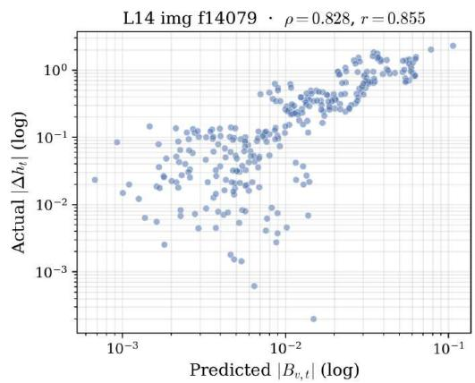

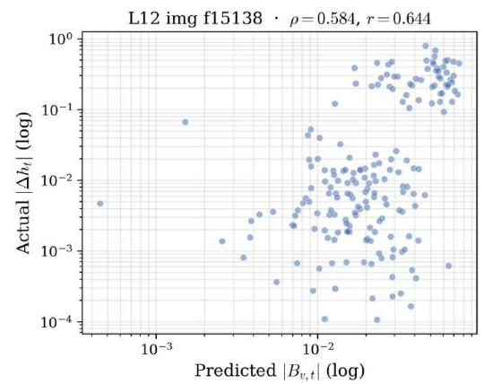

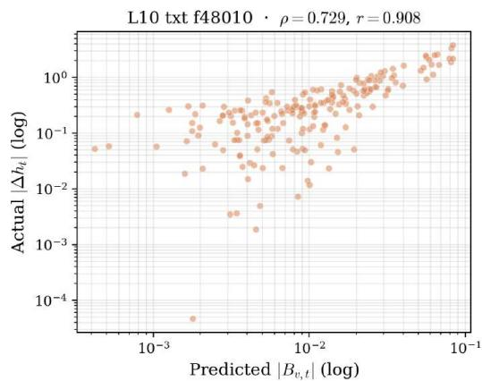

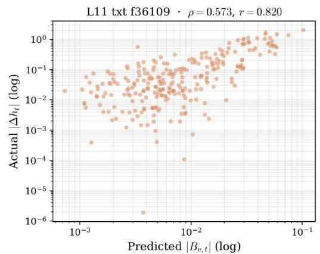  
Figure 27: Pairwise perturbation faithfulness scatter for four representative targets, in log-log coordinates: predicted indirect influence $\lvert B _ { v , t } \rvert$ from the attribution graph (x-axis) versus actual ablation effect $| \Delta h _ { t } | _ { \mathrm { a c t u a l } }$ in the original FLUX.1[schnell] (y-axis). Each point is a (v, t) pair with $v \in S$ $t \in \mathcal { V } _ { \mathrm { f e a t } } ^ { \mathrm { k e p t } } \setminus \{ v \}$ Per-graph Spearman $\rho$ and Pearson r shown in titles. Note the diagonal-cloud geometry shared across all panels and the wider vertical spread among low/mid-influence pairs in text-target panels, which drives the larger Pearson-Spearman gap in the text stream.

Why text-stream Spearman is lower. The text-stream Spearman is somewhat lower (median 0.56 vs 0.69), even though Pearson is comparable across streams (0.76 vs 0.78). The Pearson-Spearman gap is therefore noticeably larger for text (0.20) than for image (0.09). Per-graph examples in Figure 27 (bottom row) show the mechanism directly: text-target scatters have a tightly aligned high-influence cluster (which Pearson captures cleanly) coexisting with a wider vertical spread among low- and mid-influence pairs (where actual $| \Delta h _ { t } |$ | varies over an order of magnitude at fixed predicted $| \boldsymbol { B _ { v , t } } | )$ . This vertical spread at fixed predicted value is what drives Spearman down without affecting Pearson, since rank order among pairs with similar $\lvert B _ { v , t } \rvert$ is determined by noise. We additionally note that the per-edge attribution distribution among kept text-stream features is heavier-tailed than for image (Gini 0.52 vs 0.49, 10th-percentile $| A | = 0 . { \overset { \cdot } { 0 } } 2 2$ vs 0.039), although whether this distributional asymmetry causally drives the wider vertical spread or both reflect a common upstream cause is something we cannot disentangle from these data.

## K.4 Hyperparameters

Table 7 consolidates all numerical parameters used throughout the pipeline.  
Table 7: Pipeline hyperparameters.

<table><tr><td>Section</td><td>Parameter</td><td>Value</td></tr><tr><td rowspan="3">Base model</td><td>FLUX.1[schnell], denoising steps</td><td>4</td></tr><tr><td>Resolution</td><td>512 × 512</td></tr><tr><td>Guidance scale</td><td>0.0</td></tr><tr><td rowspan="7">Transcoders</td><td> $d_{model}$ </td><td>3072</td></tr><tr><td>Expansion factor</td><td>16</td></tr><tr><td> $d_{feat}$ </td><td>49 152</td></tr><tr><td>Time embedding  $d_t$ </td><td>256</td></tr><tr><td>Time MLP layers</td><td>2 (SiLU)</td></tr><tr><td>Activation</td><td>ReLU</td></tr><tr><td>Decoder column normalization</td><td>after every step</td></tr><tr><td rowspan="12">Training</td><td>Optimizer</td><td>AdamW</td></tr><tr><td>Weight decay</td><td>0</td></tr><tr><td>Learning rate</td><td> $2 \times 10^{-4}$ </td></tr><tr><td>LR schedule</td><td>cosine annealing over 256 cycles</td></tr><tr><td>Batch size</td><td>4096</td></tr><tr><td>Buffer size</td><td> $10^6$  pairs</td></tr><tr><td>Cycles</td><td>256</td></tr><tr><td> $\lambda^{img}$ </td><td> $3 \times 10^{-4}$ </td></tr><tr><td> $\lambda^{txt}$ </td><td> $5 \times 10^{-5}$ </td></tr><tr><td>Variance normalization ε</td><td> $10^{-6}$ </td></tr><tr><td>Prompt corpus</td><td>yvdao/midjourney-v6 (~310k prompts)</td></tr><tr><td>Prompt length filter</td><td>≥ 16 chars, truncate at 512</td></tr><tr><td rowspan="3">LRM</td><td>Analyzed blocks</td><td> $l \in \{0, \dots, 15\}$ </td></tr><tr><td>Streams</td><td>img, txt</td></tr><tr><td>Floating-point precision</td><td>float32 (TF32 disabled)</td></tr><tr><td rowspan="3">Iterative construction</td><td>Min-attribution threshold τ</td><td> $10^{-3}$ </td></tr><tr><td>Per-iteration batch size k</td><td>50</td></tr><tr><td>VJP budget  $N_{max}$ </td><td>1000</td></tr><tr><td rowspan="2">Pruning</td><td>Vertex threshold  $\theta_v^s$  (img, txt)</td><td>0.80, 0.80</td></tr><tr><td>Edge threshold  $\theta_e^s$  (img, txt)</td><td>0.98, 0.98</td></tr><tr><td rowspan="2">Perturbation evaluation</td><td>Sources per graph</td><td>K = 30</td></tr><tr><td>Source position</td><td>arg maxp z(p)</td></tr></table>

## L Feature interpretation

The attribution graph treats transcoder features as the basic units of analysis, so its usefulness depends on these features corresponding to meaningful visual or textual concepts rather than arbitrary directions in activation space. In this section we describe a two-pass procedure for finding interpretable features in the transcoder dictionary by their top-activating examples and show qualitative results on representative blocks. For this analysis we examine three blocks: $\ell = 6$ (early), ℓ = 12 (middle), and $\ell = 1 8 \ : ( \mathrm { l a t e } )$ . The evolution from $\ell = 6$ through $\ell = 1 2$ to $\ell = 1 8$ spans the full double-stream segment and is informative for tracking how concepts develop with depth.

## L.1 Methodology

Activation statistics. A corpus of 100 000 prompts from yvdao/midjourney-v6 is run through the frozen FLUX.1-schnell pipeline. For every prompt, every denoising step $t \in \{ 0 , 1 , 2 , 3 \}$ , and every transcoder feature f we record the maximum activation per-prompt.

$$
v _ {t} (f \mid \text { prompt }) = \max _ {p} \left(z ^ {(\ell , s, f)} (p)\right) \tag {54}
$$

where the maximum is taken over the prompt’s image-stream patches (s = img) or text-stream tokens $( s = \mathrm { t x t } )$ . For each feature, we maintain three running quantities across the corpus: the top-K $( K = 5 )$ prompts by $v _ { t } ( f \mid \cdot )$ , sufficient statistics for the mean $\bar { a } _ { t } ( f )$ and standard deviation $\sigma _ { t } ( f )$ of activations, and the number of prompts on which f ranks among the top-M $( M = 1 2 8 )$ most active features.

Feature selection. Out of $d _ { \mathrm { f e a t } } = 4 9 1 5 2$ features per transcoder we select 256 for visualization. For each feature $f$ and denoising step t, let $v _ { t } ^ { \operatorname* { m a x } } ( f )$ denote the highest per-prompt maximum activation recorded at step t. We define the normalized activation strength and activation frequency as

$$
Z _ {t} (f) = \frac {v _ {t} ^ {\max} (f) - \bar {a} _ {t} (f)}{\sigma_ {t} (f) + \varepsilon}, \quad q _ {t} (f) = \frac {| \{i : f \in \operatorname{TopM} _ {i} ^ {t} \} |}{N}, \tag {55}
$$

where N is the size of the prompt corpus, $\bar { a } _ { t } ( f )$ and $\sigma _ { t } ( f )$ are the mean and standard deviation of maximum activations at step t, and $\mathrm { T o p M } _ { i } ^ { t }$ is the set of the $\mathrm { t o p } { - } M$ most active features for prompt i at timestep t. The final selection score for a feature is computed as

$$
\operatorname{score} (f) = \max _ {t} Z _ {t} (f) \cdot \sqrt {q _ {t} (f)}. \tag {56}
$$

The first factor $Z _ { t } ( f )$ rewards features that produce sharp, high-confidence peak activations on certain prompts. The second factor $q _ { t } ( f )$ penalizes features that activate strongly but too rarely — i.e., those likely to be narrow artifacts triggered by only a few specific prompts. We compute the final score as the average over denoising steps of the product $Z _ { t } ( f ) { \dot { \cdot } } q _ { t } ( f )$ , and select the top 256 features with the highest score for visualization.

Activation maps. For each selected feature, we re-run the union of its top-5 activating prompts through the model while recording the full per-position activation map $\{ z ^ { ( \ell , s , f ) } ( p ) \} _ { p }$ . These maps form the basis of all visualizations below. In the image stream, the activation map (of length $S _ { \mathrm { i m g } } = 1 0 2 4 )$ is reshaped into a $3 2 \times 3 2$ patch grid corresponding to the $5 1 2 \times 5 1 2$ latent and overlaid on the generated image. For text-stream features, the map assigns one activation value per prompt token and is visualized as a color overlay on the prompt text. Activations below 20% of the per-example maximum are suppressed for clarity. Additionally, we compute the mean activation of each feature across its top-5 prompts, broken down by denoising timestep, to reveal temporal specialization patterns.

## L.2 Early layer (ℓ = 6) results

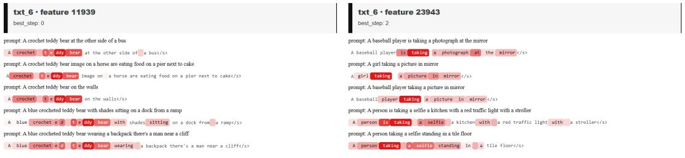

text_image

txt_6 • feature 11939
best_step: 0

prompt: A crochet teddy bear at the other side of a bus

A crochet #e day bear at the other side of a bus</s>

prompt: A crochet teddy bear image on a horse are eating food on a pier next to cake

A crochet #e day bear image on a horse are eating food on a pier next to cake</s>

prompt: A crochet teddy bear on the walls

A crochet #e day bear on the walls</s>

prompt: A blue crocheted teddy bear with shades sitting on a dock from a ramp

A blue crochet #e #e day bear with shades sitting on a dock from a ramp</s>

prompt: A blue crocheted teddy bear wearing a backpack there's a man near a cliff

A blue crochet #e #e day bear wearing a backpack there's a man near a cliff</s>

txt_6 • feature 23943
best_step: 2

prompt: A baseball player is taking a photograph at the mirror
A baseball player is taking a photograph at the mirror</s>

prompt: A girl taking a picture in mirror
A girl taking a picture in mirror</s>

prompt: A baseball player taking a picture in mirror
A baseball player taking a picture in mirror</s>

prompt: A person is taking a selfie a kitchen with a red traffic light with a stroller
A person is taking a selfie a kitchen with a red traffic light with a stroller</s>

prompt: A person taking a selfie standing in a tile floor
A person taking a selfie standing in a tile floor</s>

Figure 28: Representative text-stream features at $\ell = 6$ . Left: txt-6-11939 (teddy bear). Right: txt-6-23943 (taking a photo). Each row shows the top activating prompts for the feature, with per-token activation rendered as color intensity.

Text stream. Text features at $\ell \ = \ 6$ are tightly bound to surface lexical content. Feature txt-6-11939 fires on the phrase “crochet teddy bear”, highlighting all three tokens whenever they appear together; txt-6-36869 groups attributes of a franchise (“Mickey Mouse”, “Disney

World”). Other prominent features in this group include action verbs (txt-6-23943: “taking a photograph”/“selfie”; txt-6-26919: “typing on keyboard”), spatial-relation phrases (txt-6-15466: “stacked on each other”; txt-6-23336: “on both sides”), object-state descriptors (txt-6-28486: “empty store shelf”), and what appears to be implicit color compositions: txt-6-47738 fires on “Irish flags”, “Mexico”, and “Santa” prompts, the common factor being a green/red/white palette. The interpretability rate at this depth is high: nearly every visualized feature corresponds to an identifiable lexical or semantic category.

Image stream. Image features at ℓ = 6 encode graphical primitives. A geometry-oriented group includes img-6-5297 (vertical edges of monitors, bottles, doorframes), img-6-31656 (diagonal lines on smartphone bezels, power lines, ski poles), img-6-17202 (thin suspended cables and wires), and img-6-48604 (regular grid and lattice patterns). A color-oriented group includes img-6-15493 (red objects: life vests, jackets, plastic buckets) and img-6-36726 (regions of pure white). Particularly notable is img-6-2366, which fires on the boundary between blue/green and red regions independently of the underlying objects: active patches lie strictly along the seam of these two color regimes.

text_image

img_6 • feature 5297
best_step: 3
img_6 • feature 15493
best_step: 0
original
overlay
heatmap
original
overlay
heatmap
original
overlay
heatmap
original
overlay
heatmap
original
overlay
heatmap
original
overlay
heatmap
original
overlay
heatmap
original
overlay
heatmap
original
overlay
heatmap
original
overlay
heatmap

Figure 29: Representative image-stream features at ℓ = 6. Left: img-6-5297 (vertical edges). Right: img-6-15493 (red regions). For each feature we show the original generated image, the activation overlay, and the activation map alone.

A temporal split is already visible at this depth. The geometry-oriented features (5297, 31656, 2366, 48604) peak at denoising steps 2–3, while the color-oriented features (15493, 36726) peak at steps 0–1. This is consistent with the iterative coarse-to-fine progression of diffusion sampling: bulk colors are placed first, fine geometric structure is sharpened later.

## L.3 Middle layer (ℓ = 12) results

Text stream. Text features at ℓ = 12 assemble compositional concepts beyond the per-word level. txt-12-40834 fires on personal names independently of context (“Matt Wieters”, “Rachel $R a y ^ { , , } , ~ ^ { . . } J e f f B r i d g e s ^ { , . . } )$ . Quantifier features appear: txt-12-5888 on layout phrases (“Four photos”, “Four square images”) and txt-12-33890 on plurality (“Several different kites”, “Many white and yellow double decker bus”). At the same time, some features have already lost their lexical anchor: txt-12-43210 fires exclusively on the end-of-sequence token.

Image stream. The middle layer shows the highest density of features with identifiable semantic referents. Object-level features include img-12-8630 (bicycles), img-12-22268 (wine-bottle necks, with activation strictly above the label), img-12-244 (hanging vertical structures: chains, ropes, water streams), img-12-25382 (hands gripping objects, with the active region tracking finger configuration around a phone, remote, or bottle), img-12-44550 (cat eyes), img-12-4113 (mustaches and beards), and img-12-45841 (the nose region of human faces).

text_image

img_12 · feature 25382
best_step 3
img_12 · feature 44550
best_step 3
original
overlay
heatmap
original
overlay
heatmap
original
overlay
heatmap
original
overlay
heatmap
original
overlay
heatmap
original
overlay
heatmap
original
overlay
heatmap

Figure 30: Representative semantic features at ℓ = 12. Left: img-12-25382 localizes hands gripping objects across diverse instances. Right: img-12-44550 fires on cat eyes.

The most striking finding at ℓ = 12 is a small group of features encoding scene physics rather than object identity. img-12-1023 fires on mirror-like reflections of objects in water, glass, and reflective surfaces, regardless of the object being reflected. img-12-10694 activates on light-shadow boundaries (the edge of a tennis player’s shadow on the court, the line where a window frame’s shadow falls on a wall). img-12-21708 highlights cast-shadow regions in their entirety (the shadow of a person’s head on a wall, the shadow of a monitor on a desk). The presence of dedicated features for reflections and shadows – properties of the rendering of a 3D scene rather than of any particular object – suggests that the middle of the double-stream segment is where the model represents the scene geometrically and not just lexically.

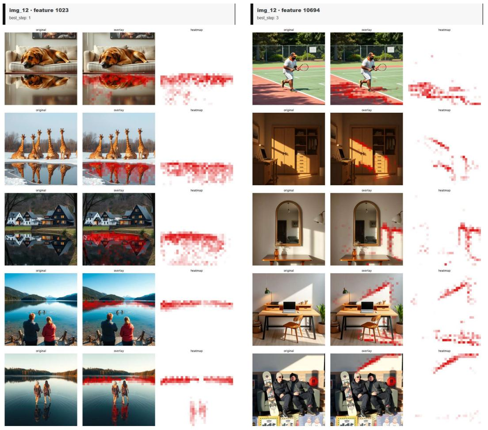

text_image

img_12 · feature 1023
best_step: 1
img_12 · feature 10694
best_step: 3
original
overlay
heatmap
original
overlay
heatmap
original
overlay
heatmap
original
overlay
heatmap
original
overlay
heatmap
original
overlay
heatmap
original
overlay
heatmap
original
overlay
heatmap

Figure 31: Scene-physics features at ℓ = 12. Left: img-12-1023 on mirror reflections. Right: img-12-10694 on light-shadow boundaries.

## L.4 Late layer $( \ell = 1 8 )$

Text stream. The late text transcoder’s visualized features overwhelmingly fail to carry lexical content. The dominant category fires on control tokens, primarily the end-of-sequence token $< / { \mathsf { s } } { \mathsf { > } }$ (e.g. txt-18-29365 and many siblings). txt-18-8395 fires preferentially on the first prompt token, typically the article “A”, occasionally on other position-marking symbols (a leading period or whitespace). A plausible interpretation is that the late text stream, having largely handed its lexical content over to the image stream through preceding rounds of joint attention, repurposes its capacity for global aggregation through control-token positions. Substantive content features still exist but are rare; for instance, txt-18-17681 responds to food contexts (“barbecue sandwich”, “bunch of food”).

Image stream. Image features at ℓ = 18 operate on composition and semantic context rather than primitives or individual objects. img-18-47900 fires on the lower supporting plane of the scene (tables, floors), with peak activation at denoising step 0 – consistent with an interpretation as a scene-layout feature establishing the horizontal surface on which objects are subsequently placed. img-18-18830 localizes the right outer boundary of central objects: active patches do not lie on the object itself but trace its right contour, a compositional feature about object placement rather than object identity. Several features encode high-level semantic context: img-18-10948 on tiled walls and bathroom interiors and img-18-46496 on urban landscapes.

<table><tr><td>txt_18 · feature 8395
best_step: 1</td><td>txt_18 · feature 29365
best_step: 3</td></tr><tr><td>prompt: A tree filled habitat with a window
A tree filled habitat with a window/s&gt;
prompt: A guy leading a cow that is pulled out from a tree
A guy leading a cow that is pulled out from a tree/s&gt;
prompt: A large bear hanging on a tree. a ground while on a field of flowers
A large bear hanging on a tree/s; a ground while on a field of flowers/s&gt;
prompt: A woman is washing a dog running in tall bushes
A woman is washing a dog running in tall bushes/s&gt;
prompt: A sales table is set against a tree
A sales table is set against a tree/s</td><td>prompt: Only the blurred legs of someone riding the waves
Only the blurred legs of someone riding the wave/s&gt;
prompt: A clock is below the clouds
A clock is below the cloud/s
prompt: An individual skateboarding in the dark
An individual skateboarding in the dark/s
prompt: A dark sheep is all sunny
A dark sheep is all sunny/s
prompt: In an odd shaped shadow
In an odd shaped shadow/s</td></tr></table>

Figure 32: Representative text-stream features at ℓ = 18. Left: txt-18-8395 (article, whitespace or dot). Right: txt-18-29365 (end-of-sequence token).

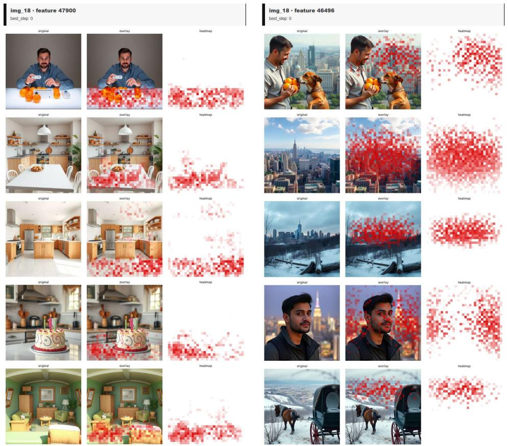

text_image

img_18 · feature 47900
best_step: 0
img_18 · feature 46496
best_step: 0
original
overlay
heatmap
original
overlay
heatmap
original
overlay
heatmap
original
overlay
heatmap
original
overlay
heatmap
original
overlay
heatmap

Figure 33: Representative image-stream features at ℓ = 18. Left: img-18-47900 (lower supporting plane of the scene). Right: img-18-46496 (urban landscape context).

## L.5 Discussion

Hierarchy of abstractions. The level of abstraction grows monotonically with depth in both streams. Text-stream features evolve from individual phrases (ℓ = 6) through compositional name and quantity concepts (ℓ = 12) toward control-token aggregators $( \ell = 1 8 )$ . Image-stream features evolve from edges and color regions (ℓ = 6) through object parts and scene physics (ℓ = 12) toward compositional structure $( \ell = 1 8 )$ . The trajectory parallels what has been reported for autoregressive language models with sparse dictionaries and supports the view that diffusion transformers form analogous hierarchies of representation.

Cross-modal information transfer. The two streams show inverse interpretability profiles. The fraction of text features tied to substantive lexical content decreases monotonically with depth, while image features remain interpretable through the second half of the analyzed segment, with the highest density of semantic-object features at $\ell = 1 2$ and a shift toward compositional features by $\ell = 1 8$ . Read together, the two trajectories suggest a one-directional transfer of content from text to image: by the late blocks, the text stream has shed most of its lexical specificity – its content has already been read by the image stream through preceding rounds of joint attention – while the image stream maintains a working representation of the scene.

Temporal specialization. Image features show a consistent dependence on the denoising step that aligns with the diffusion coarse-to-fine progression. $\mathbf { A } \mathbf { t } \ { \boldsymbol { \ell } } = \mathbf { \bar { 6 } } .$ , color-oriented features peak at the early steps (0–1) while geometry-oriented features peak at the late steps (2–3). $\mathbf { A t } \ { \boldsymbol { \ell } } = 1 8 .$ the scene-layout feature img-18-47900 peaks at step 0, consistent with its role of establishing the supporting plane before object placement begins. The picture is consistent with prior reports of step-dependent specialization in diffusion models and shows that the temporal-conditioning pathway in our transcoders (§E.1) successfully captures it.