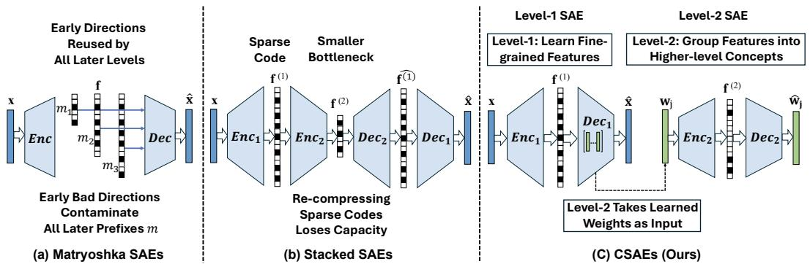
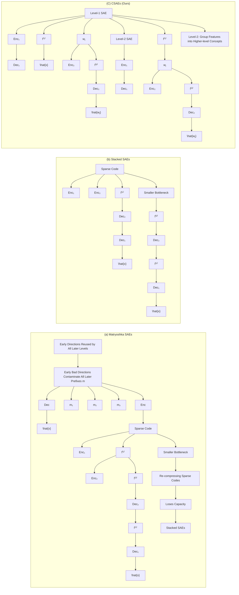
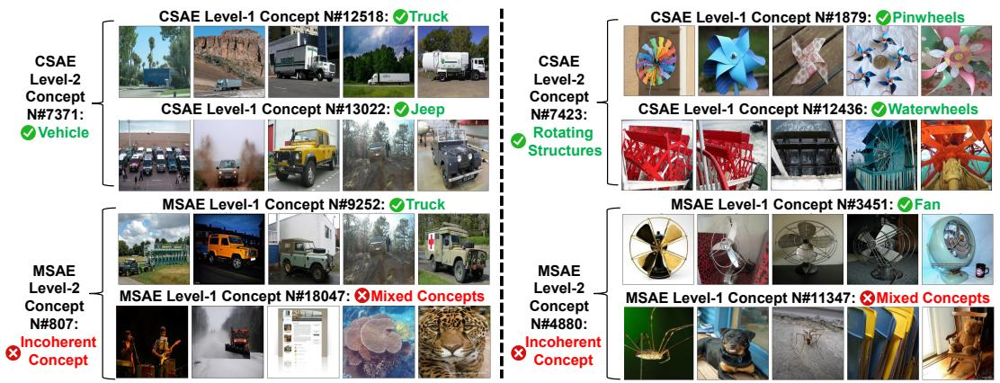
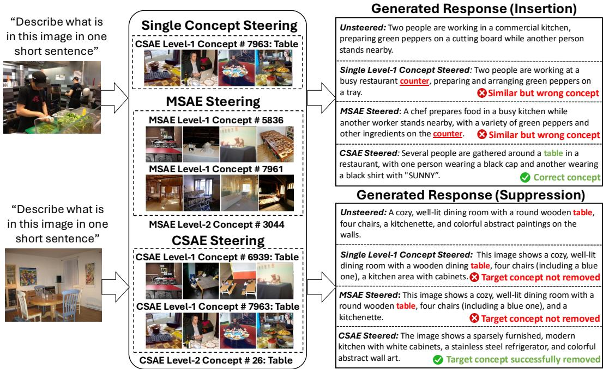
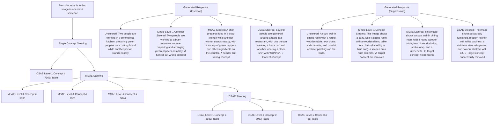
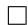
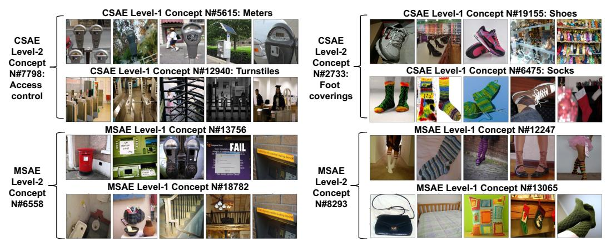
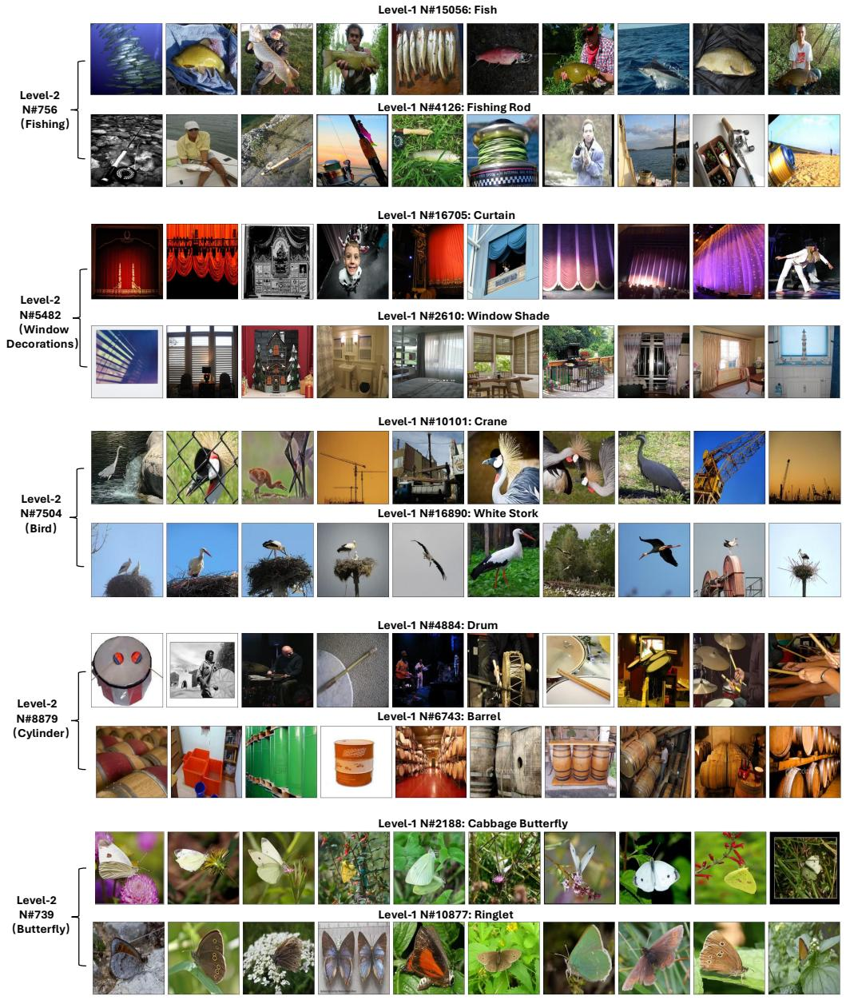

# Cascaded Sparse Autoencoders Learn Multi-Level Visual Concepts in Multimodal LLMs

Yusong Zhao†1 Hengyi Wang1 Tanuja Ganu2 Akshay Nambi2 Hao Wang1

## Abstract

Multimodal Large Language Models (MLLMs) have demonstrated strong performance on vision-language tasks, yet their internal visual representations remain difficult to interpret. Sparse Autoencoders (SAEs) provide a scalable way to decompose dense model activations into sparse, interpretable features. However, existing SAE architectures primarily recover flat feature dictionaries and are less suited for explicit multi-level concept organization. In this paper, we introduce cascaded sparse autoencoders (CSAEs) for learning hierarchical visual concepts in MLLMs. Rather than nesting or stacking SAE sparse activation codes, CSAEs train a second-level SAE directly on the decoder weights of the first-level SAE, treating learned low-level feature directions as inputs for higher-level abstraction. This design enables CSAEs to learn “concepts of concepts” while avoiding drawbacks from the shared-prefix coupling of nesting, Matryoshka-style hierarchies and the bottlenecks of naively stacked SAEs. Experiments across Qwen3-VL, Gemma-3, and LLaVA on multiple visual datasets show that CSAEs improve interpretability in terms of hierarchical concept coherence over state-of-the-art SAE baselines. Results on concept steering further demonstrate that the learned concept groups support effective group-level interventions in MLLM outputs.

## 1 Introduction

Multimodal Large Language Models (MLLMs) such as LLaVA [1], Qwen-VL [2], and Gemma [3] have demonstrated exceptional capabilities in processing visual inputs beyond the purely textual scope of traditional LLMs. They bridge the gap between advanced visual perception and the reasoning abilities of Large Language Models, achieving state-of-the-art performance in complex tasks ranging from visual question answering and embodied agency to general-purpose personal assistance [4, 5]. Despite their rapid deployment in commercial and everyday applications, most of these models remain “black boxes”, often exhibiting unpredictable and hazardous behaviors. These include severe hallucinations, such as confidently describing non-existent objects [6, 7], and vulnerability to visual jailbreak attacks that bypass safety alignment [8, 9]. These risks highlight the need to interpret the concepts encoded inside MLLMs.

However, the mechanistic interpretation of MLLMs presents challenges that exceed those of traditional deep learning models. A primary obstacle is the intrinsic polysemy of deep neural networks, where a single neuron may activate for disparate concepts [10, 11]. Moreover, the high-dimensional nature of internal MLLM layers further exacerbates this issue. Given the open-ended behavior of MLLMs, disentangling these features through manual annotation is infeasible.

To address these challenges, Sparse Autoencoders (SAEs) [12] have emerged as a scalable, unsupervised methodology. By projecting dense model activations into an overcomplete, sparse latent space, SAEs explicitly attempt to decompose superimposed features into distinct, monosemantic directions. SAEs have been successfully used to discover diverse features in both large language models [13] and vision-language models [14, 15, 16, 17, 18]. Recent multimodal SAE studies further show that sparse features can help analyze vision-language alignment, shared embedding spaces, and data quality in MLLMs. Despite these advances, learning explicit multi-level visual concept hierarchies from MLLMs remains challenging.

flowchart

Figure 1: Overview of hierarchical design choices for SAEs. (a) Matryoshka SAEs construct the concept hierarchy through a single nested prefix chain, with early latent directions globally reused across later levels. (b) Stacked SAEs learn the concept hierarchy by re-compressing sparse sample codes through a smaller bottleneck, which introduces an additional capacity constraint. (c) Our CSAEs take a different route: the Level-1 SAE learns low-level features, and the Level-2 SAE is trained directly on the learned Level-1 decoder weights, enabling higher-level abstraction over concepts rather than overly shared prefixes or re-compressed sample codes.

Recent work attempts to address this issue using Matryoshka SAEs inspired by Matryoshka representation learning [19, 20, 15], discovering hierarchical features in models such as CLIP [21] and Gemma-2-2b. However, these methods implement hierarchy through nested prefixes of a single dictionary, so early directions are reused by downstream prefixes, creating a shared-prefix coupling that can limit explicit multi-level concept organization; error in high-level concepts can propagate to low-level concepts (theoretical analysis in Sec. 4.2). Another natural approach is to stack multiple SAE layers. However, stacked SAEs compress sparse activation codes through a smaller high-level bottleneck, which can lose information needed for reconstruction and and thus hinder the learning of lower-level concepts (theoretical analysis in Sec. 4.1).

Fig. 1 shows an overview comparing different designs. To address this challenge, this paper makes a systematic attempt to explore an alternative beyond the nested architecture in Matryoshka SAEs and the stacked SAE architecture. We propose a new SAE variant, dubbed cascaded sparse autoencoders (CSAEs). Rather than feeding the activations of one SAE layer into another, we jointly train two SAEs: a high-level SAE and a low-level SAE. The low-level (Level-1) SAE learns the low-level concepts directly from MLLM activations. The high-level (Level-2) SAE is trained by treating each column of the low-level SAE’s decoding weight matrix as a data point. Since each column of the decoding weights represents one low-level concept, the high-level SAE effectively learns higher-order abstractions, i.e., “concepts of concepts”, from the low-level SAE. Our contributions are:

• We propose a new SAE variant, dubbed cascaded sparse autoencoders (CSAEs), that enable the learning of hierarchical concepts from MLLMs.  
• Theoretical analysis shows that naively stacking SAE layers can suffer from a sparse bottleneck failure mode, while Matryoshka-style nested prefixes can amplify local semantic errors through shared-prefix reuse.  
• Empirical results across Qwen3-VL, Gemma-3, and LLaVA on multiple visual datasets demonstrate improved hierarchical concept interpretability. Results on activation steering show that the learned concept groups enable effective interventions in MLLM outputs.

## 2 Related Work

Multimodal LLMs. Compared to traditional text-only LLMs, Multimodal LLMs (MLLMs) perceive and reason across modalities such as images, video, audio, and text. Seminal works such as CLIP [21] aligned visual and textual representations for zero-shot classification, Flamingo [22] introduced interleaved visual-textual modeling, and BLIP-2 [23] adapted frozen LLMs to visual tasks using lightweight adapters. Modern multimodal systems include closed-source models such as the GPT series [24], Gemini series [25, 26, 27], and Claude [28], as well as open-source models such as LLaVA [1], Qwen-VL [29, 30, 31], DeepSeek-VL [32], Pixtral [33], Gemma [3, 34], and Llama 3.2 Vision [35]. While these models show strong performance, it remains unclear how they represent and organize visual concepts internally; this is the focus of our paper.

Sparse Autoencoders. Recently, Sparse Autoencoders (SAEs) have emerged as a powerful tool to enhance the mechanistic interpretability of large models. Generally, SAEs [12, 13] employ an overcomplete set of basis vectors and a sparsity penalty (typically $\ell _ { 1 } )$ to decompose the dense, polysemantic activations of a neural network into linear combinations of interpretable, monosemantic feature directions. Existing variants include foundational $\ell _ { 1 }$ -based SAEs [12, 36], Top-K sparsity [37], Gated SAEs [38], and JumpReLU SAEs [39]. These architectures improve sparse feature learning through mechanisms such as hard sparsity, learnable gating, and discontinuous activations, but they are primarily designed for flat feature dictionaries. Although SAEs facilitate the interpretability of large models, adapting the aforementioned structures to discover hierarchical (i.e. multi-level) concepts within multimodal LLMs presents unique challenges.

Matryoshka SAEs [20, 15] learn hierarchical concepts by training multiple nested dictionaries of increasing size, with smaller dictionaries encouraged to reconstruct inputs independently, so earlier prefixes learn more general concepts and later prefixes refine them with more specific features. However, because these hierarchies are implemented through shared nested prefixes, early directions are reused by downstream prefixes, creating a shared-prefix coupling. Consequently, error in highlevel concepts can propagate to low-level concepts (see theoretical analysis in Sec. 4.2). In contrast, our proposed CSAE learns high-level concepts by training a second SAE directly on the decoder weight columns of the low-level SAE, enabling explicit abstraction over learned visual concepts.

Interpreting Multimodal Models with SAEs. SAEs have been extensively used to interpret large models. Early work studied text-only LLMs, showing that SAEs can decompose polysemantic activations into more interpretable features [12, 13]. Later work scaled SAEs to larger language models such as GPT-2/GPT-4 [37], Claude 3 Sonnet [40], and Gemma 2 [41]. More recently, SAEs have been applied to vision and multimodal models. Prior work trains SAEs on CLIP representations to isolate visual concepts [15, 42]. Other studies analyze multimodal alignment and shared embedding spaces: SAE-V interprets MLLM cross-modal features and uses them for data filtering and alignment improvement [16]; VL-SAE maps visual and textual representations into a unified concept set for interpreting and enhancing vision-language alignment [17]; and SAEs trained on VLM embedding spaces reveal sparse linear structures shaped by modality and cross-modal semantic bridges [18]. These works demonstrate the utility of SAEs for multimodal interpretability and alignment. In contrast, our work studies explicit multi-level visual concept hierarchies in modern MLLMs, where high-level concepts organize coherent groups of low-level concepts.

## 3 Methodology

## 3.1 Preliminary: Sparse Autoencoders (SAEs)

Sparse Autoencoders (SAEs) implement a form of sparse dictionary learning designed to decompose the dense, polysemantic activations of large models into interpretable components. Given an input embedding vector $\mathbf { x } \in \mathbb { R } ^ { d }$ from a specific layer of a (multimodal) LLM, the goal is to learn an overcomplete dictionary of features parameterized by an encoder $\mathbf { W } _ { \mathrm { e n c } } \in \mathbb { R } ^ { \breve { n } \times d }$ and a decoder $\mathbf { W } _ { \mathrm { d e c } } \in \bar { \mathbb { R } } ^ { d \times n }$ (where n $\gg d )$ . Crucially, the architecture typically employs a shared geometric bias b $\in \mathbb { R } ^ { d }$ , which is subtracted from the input to center the signal during encoding and added back to the output during decoding.

The encoding process $g : \mathbb { R } ^ { d }  \mathbb { R } ^ { n }$ projects the centered input into a sparse latent space, while the decoding process $h : \bar { \mathbb { R } ^ { n } } \to \mathbb { R } ^ { d }$ maps the activations back to the input data manifold:

$$
\mathbf {f} = g (\mathbf {x}) = \sigma \left(\mathbf {W} _ {\text {enc}} (\mathbf {x} - \mathbf {b})\right), \tag {1}
$$

$$
\widehat {\mathbf {x}} = h (\mathbf {f}) = \mathbf {W} _ {\mathrm{dec}} \mathbf {f} + \mathbf {b}, \tag {2}
$$

where $\sigma ( \cdot )$ is a non-linear activation function (e.g., ReLU). The model parameters are learned by minimizing a joint objective $\mathcal { L }$ composed of a reconstruction term R and a sparsity penalty S :

$$
\mathcal {L} (\mathbf {x}) = \underbrace {\left| \left| \mathbf {x} - \widehat {\mathbf {x}} \right| \right| _ {2} ^ {2}} _ {\text { reconstruction } \mathcal {R} (\mathbf {x})} + \underbrace {\lambda \mathcal {S} (g (\mathbf {x}))} _ {\text { sparsity   penalty }} \quad , \tag {3}
$$

where $\boldsymbol { \mathcal { S } } ( \cdot )$ is usually an $\ell _ { 1 }$ loss, $\mathrm { i . e . , \left\| \cdot \right\| . }$ 1, to encourage sparsity. While the standard instantiation relies on ReLU activation and an $\ell _ { 1 }$ sparsity penalty, this framework readily accommodates alternative architectures. For instance, TopK SAEs [37] substitute the soft $\ell _ { 1 }$ penalty with a hard sparsity constraint by modifying $\sigma ( \cdot )$ to select only the top-k activations.

Similarly, Matryoshka SAEs [20] organize the latent space into nested index subsets $\begin{array} { r l } { { \mathcal { T } } _ { i } } & { { } = } \end{array}$ $\{ 1 , \ldots , m _ { i } \}$ $m _ { 1 } < \cdots < m _ { L }$ $\begin{array} { r } { \sum _ { i = 1 } ^ { L } \| \mathbf { x } - ( \mathbf { W } _ { \operatorname* { d e c } } ^ { ( : , \mathcal { T } _ { i } ) } \mathbf { f } _ { \mathcal { T } _ { i } } + \mathbf { b } ) \| _ { 2 } ^ { 2 } } \end{array}$ so that smaller prefixes are encouraged to reconstruct the input independently.

## 3.2 From SAE to CSAE

Existing SAEs usually treat dictionary atoms as independent vectors, failing to capture the hierarchical correlations inherent in multimodal data (e.g., lower-level concepts “barrel” and “drum” together form the higher-level concept of “cylinder”).

To address this, we propose a new SAE architecture, CSAE, which is a two-level sparse dictionary learning system trained end-to-end. This framework implements hierarchical feature abstraction, systematically organizing atomic concepts (features) from the low-level SAE into high-level semantic structures. Below we introduce CSAE in detail. Note that while we describe CSAE as a two-level model, our formulation can be naturally generalized to more than two levels, as shown in Appendix C.

Let $\mathbf { x } \in \mathbb { R } ^ { d }$ denote an activation vector from a fixed layer of a multimodal LLM. Our CSAE consists of two hierarchical levels trained jointly to capture both fine-grained atomic features and their high-level semantic structures. Fig. 1(c) shows an overview of CSAE.

Level-1 (Low-Level) SAE. We employ a standard SAE to decompose the input activations x. This Level-1 SAE has an encoder $g _ { 1 }$ and a decoder $h _ { 1 }$ , which produce a sparse code $\mathbf { f } ^ { ( 1 ) } \in \mathbb { R } ^ { n _ { 1 } }$ and a reconstruction x:

$$
\mathbf {f} ^ {(1)} = g _ {1} (\mathbf {x}) = \sigma (\mathbf {W} _ {\mathrm{enc}} ^ {(1)} (\mathbf {x} - \mathbf {b} ^ {(1)})), \tag {4}
$$

$$
\widehat {\mathbf {x}} = h _ {1} \left(\mathbf {f} ^ {(1)}\right) = \mathbf {W} _ {\mathrm{dec}} ^ {(1)} \mathbf {f} ^ {(1)} + \mathbf {b} ^ {(1)}. \tag {5}
$$

Importantly, here the decoder weight matrix $\mathbf { W } _ { \mathrm { d e c } } ^ { ( 1 ) }$ contains the atomic concept (feature) directions learned by the model. We denote the columns of this decoder by:

$$
\mathbf {W} _ {\mathrm{dec}} ^ {(1)} = [ \mathbf {w} _ {1}, \dots , \mathbf {w} _ {n _ {1}} ], \quad \mathbf {w} _ {j} \in \mathbb {R} ^ {d}, \tag {6}
$$

where each ${ \bf w } _ { j }$ represents a specific concept direction in the original activation space. For each input LLM activation embedding x, we can define the Level-1 loss as follow:

$$
\mathcal {L} _ {1} (\mathbf {x}, \boldsymbol {\theta} _ {1}) = | | \mathbf {x} - \widehat {\mathbf {x}} | | _ {2} ^ {2} + \lambda_ {1} \mathcal {S} \big (g _ {1} (\mathbf {x}) \big),
$$

where $\boldsymbol { \mathcal { S } } ( \cdot )$ is usually an $\ell _ { 1 }$ loss, $\mathrm { i . e . , \parallel \cdot \parallel _ { 1 } }$ 1, to encourage sparsity. $\pmb { \theta } _ { 1 } = \{ \mathbf { W } _ { e n c } ^ { ( 1 ) } , \mathbf { W } _ { d e c } ^ { ( 1 ) } , \mathbf { b } ^ { ( 1 ) } \}$ denotes parameters in the Level-1 SAE.

Level-2 (High-Level) SAE. The core innovation of our CSAE lies in the structural “clustering” performed by the Level-2 (high-level) SAE. Rather than processing features x or $\mathbf { f } ^ { ( 1 ) }$ , our Level-2 SAE operates directly on the atomic concept directions, i.e., the weight columns $\{ \mathbf { w } _ { j } \} _ { j = 1 } ^ { n _ { 1 } }$ of the Level-1 decoder $\mathbf { W } _ { \mathrm { d e c } } ^ { ( 1 ) } \left( \mathrm { E q n . ~ } ( 6 ) \right)$ . It uses an encoder-decoder pair to map each Level-1 atom ${ \bf w } _ { j }$ from the original feature space $\mathbb { R } ^ { d }$ to a higher-level latent space $\mathbb { R } ^ { n _ { 2 } }$ and reconstruct it back to $\mathbb { R } ^ { d } \colon$

$$
\mathbf {f} _ {j} ^ {(2)} = g _ {2} (\mathbf {w} _ {j}) = \sigma (\mathbf {W} _ {\mathrm{enc}} ^ {(2)} (\mathbf {w} _ {j} - \mathbf {b} ^ {(2)})), \tag {7}
$$

$$
\widehat {\mathbf {w}} _ {j} = h _ {2} \left(\mathbf {f} _ {j} ^ {(2)}\right) = \mathbf {W} _ {\mathrm{dec}} ^ {(2)} \mathbf {f} _ {j} ^ {(2)} + \mathbf {b} ^ {(2)}. \tag {8}
$$

This Level-2 (high-level) SAE is learned with the objective:

$$
\mathcal {L} _ {2} (\mathbf {W} _ {\mathrm{dec}} ^ {(1)}, \boldsymbol {\theta} _ {2}) = \frac {1}{n _ {1}} \sum_ {j = 1} ^ {n _ {1}} \Big (\| \mathbf {w} _ {j} - h _ {2} (g _ {2} (\mathbf {w} _ {j})) \| _ {2} ^ {2} + \lambda_ {2} \mathcal {S} (g _ {2} (\mathbf {w} _ {j})) \Big), \tag {9}
$$

where param $\boldsymbol { \mathcal { S } } ( \cdot )$ is usually an  in the Level- $\ell _ { 1 }$ loss, SAE. $\mathrm { i . e . , \parallel \cdot \parallel _ { 1 } }$ , to encourage sparsity. $\pmb { \theta } _ { 2 } = \{ \mathbf { W } _ { e n c } ^ { ( 2 ) } , \mathbf { W } _ { d e c } ^ { ( 2 ) } , \mathbf { b } ^ { ( 2 ) } \}$ denotes

Joint Optimization. The final objective combines the losses of the Level-1 SAE $( \mathcal { L } _ { 1 } )$ and the Level-2 SAE (L2):

$$
\mathcal {L} _ {\text { final }} (\boldsymbol {\theta} _ {1}, \boldsymbol {\theta} _ {2}) = \mathbb {E} _ {\mathbf {x}} [ \mathcal {L} _ {1} (\mathbf {x}, \boldsymbol {\theta} _ {1}) ] + \alpha \mathcal {L} _ {2} (\mathbf {W} _ {\mathrm{dec}} ^ {(1)}, \boldsymbol {\theta} _ {2}). \tag {10}
$$

Here, α is a hyperparameter that balances low-level concept learning and the high-level concept abstraction. Note that $\mathbf { W } _ { \mathrm { d e c } } ^ { ( 1 ) }$ is part of the Level-1 SAE’s parameters $\pmb { \theta } _ { 1 }$ .

Dynamic Masking of Dead Latents. For computational efficiency, we apply the Level-2 SAE only to active Level-1 decoder atoms (weight columns) $\mathbf { w } _ { j }$ in the current mini-batch. At training step t, given mini-batch B, we define $\begin{array} { r } { \pmb { \mathcal { A } } _ { t } = \{ \bar { \bf w _ { \it j } } \ \vert \ \sum _ { \mathbf { x } \in \mathcal { B } } \mathbf { 1 } ( \vert [ \bar { g } _ { 1 } ( \mathbf { x } ) ] _ { j } \vert > \epsilon _ { 0 } ) \geq 1 \} } \end{array}$ , where ${ \bf w } _ { j }$ is the j-th Level-1 decoder atom, $[ g _ { 1 } ( \mathbf { x } ) ] _ { \mathcal { I } }$ is its Level-1 activation on input $\mathbf { x } ,$ and $\epsilon _ { 0 } > 0$ is a small threshold. We compute the Level-2 loss only over $\boldsymbol { A } _ { t }$ . this masking affects only which Level-1 atoms are included in the Level-2 objective, not the architecture or final objective (more details in Appendix E.2).

## 4 Theoretical Analysis

In this section, we provide theoretical analysis on why two natural hierarchical SAE designs, Stacked SAEs and Matryoshka SAEs, may fall short in learning multi-level concepts. Specifically, we show that these two designs may fail for different reasons: stacked SAEs face a sparse-code bottleneck mismatch, while Matryoshka SAEs can reuse early semantic errors across downstream prefixes. The purpose of this section is not to prove that these baselines are always ineffective, but to isolate structural failure modes that our CSAEs avoid by construction. All proofs are in Appendix B.

## 4.1 Why Stacked SAEs Fail

Failure of Stacked SAEs. Consider a stacked SAE with the architecture (similar to Fig. 1(b))

$$
d \rightarrow n \rightarrow m \rightarrow n \rightarrow d, \tag {11}
$$

where the first SAE (the encoder-decoder pair $d \to n$ and $n \to d )$ maps an activation to a sparse code

$$
\mathbf {z} \in \mathcal {S} _ {n, k _ {1}} (B) := \left\{\mathbf {z} \in \mathbb {R} ^ {n}: \| \mathbf {z} \| _ {0} \leq k _ {1}, \| \mathbf {z} \| _ {2} \leq B \right\}.
$$

The second SAE uses $g : \mathbb { R } ^ { n }  \mathbb { R } ^ { m }$ and $h : \mathbb { R } ^ { m }  \mathbb { R } ^ { n }$ to reconstruct z. If its bottleneck is sparser,

$$
g (\mathbf {z}) \in \mathcal {S} _ {m, k _ {2}} (R) := \left\{\mathbf {u} \in \mathbb {R} ^ {m}: \| \mathbf {u} \| _ {0} \leq k _ {2}, \| \mathbf {u} \| _ {2} \leq R \right\}, \quad k _ {2} <   k _ {1},
$$

then the second SAE must preserve a $k _ { 1 }$ -sparse code space using a k2-sparse bottleneck. This is exactly the setting one might hope would learn higher-level abstractions: a lower-dimensional and sparser code should represent more compressed concepts. The theorem below shows that this intuition conflicts with uniform reconstruction.

Theorem 4.1 (Failure of Stacked SAEs with a Sparser Bottleneck). Assume uniform reconstruction

$$
\sup _ {\mathbf {z} \in \mathcal {S} _ {n, k _ {1}} (B)} \| h (g (\mathbf {z})) - \mathbf {z} \| _ {2} \leq \varepsilon ,
$$

where h is $L _ { h }$ -Lipschitz, and assume $g ( \mathbf { z } ) \in S _ { m , k _ { 2 } } ( R )$ with $k _ { 2 } < k _ { 1 } . \ I f \varepsilon \leq B / 8$ and the bottleneck width m is insufficient to compensate for the sparsity drop, then no such SAE encoder-decoder pairs $( g , h )$ can uniformly reconstruct $S _ { n , k _ { 1 } } ( B )$ . In particular, for $m < n$ and fixed $k _ { 2 } < k _ { 1 }$ , uniform reconstruction is impossible for sufficiently large $n / k _ { 1 }$ .

Theorem 4.1 shows why naive stacking is not an effective architecture: it compresses the combinatorial space of sparse sample codes through a smaller sparse bottleneck. The issue is not caused by a particular optimizer or activation function; it follows from the geometry of sparse code spaces.

CSAEs Avoid Similar Failure. In contrast, CSAEs avoid this issue because its Level-2 SAE is trained on Level-1 decoder atoms ${ \bf w } _ { j }$ ,

$$
\mathcal {L} _ {2} = \frac {1}{n _ {1}} \sum_ {j = 1} ^ {n _ {1}} \left(\| \mathbf {w} _ {j} - h _ {2} (g _ {2} (\mathbf {w} _ {j})) \| _ {2} ^ {2} + \lambda_ {2} \mathcal {S} (g _ {2} (\mathbf {w} _ {j}))\right),
$$

where $\mathbf { w } _ { j } \in \mathbb { R } ^ { d }$ is a Level-1 decoder weight column. Thus, the second level abstracts over concept directions rather than sparse sample codes (more details and theoretical analysis in Appendix B).

## 4.2 Shared-Prefix Error Amplification in Matryoshka SAEs

Shared-Prefix Reuse of Matryoshka SAEs. Matryoshka SAEs build hierarchy by ordering decoder columns $\mathbf { d } _ { 1 } , \mathbf { d } _ { 2 } , \dots ,$ each a feature direction in activation space (like $\mathbf { w } _ { 1 } , \mathbf { w } _ { 2 } , \ldots .$ . in CSAE). The t-th prefix uses the first $m _ { t }$ directions, and all later prefixes reuse them. Hence, early directions are shared across levels. If such a direction captures reconstruction-relevant but semantically irrelevant variation, its error propagates across multiple levels. We refer to such directions as nuisance directions.

Formalizing Prefix Reuse. Matryoshka SAEs optimize nested index sets $\mathcal { T } _ { t } = \{ 1 , \dots , m _ { t } \} , ~ m _ { 1 } <$ $\cdots < m _ { L }$ , with the objective function $\begin{array} { r } { \sum _ { t = 1 } ^ { L } \left\| \mathbf { x } - \left( \mathbf { W } _ { \operatorname* { d e c } } ^ { ( : , \mathcal { T } _ { t } ) } \mathbf { f } _ { \mathcal { T } _ { t } } + \mathbf { b } \right) \right\| _ { 2 } ^ { 2 } } \end{array}$ , where $\mathbf { W } _ { \mathrm { d e c } } ^ { ( : , \mathcal { T } _ { t } ) }$ and $\mathbf { f } _ { \mathcal { T } _ { t } }$ are subsets of $\mathbf { W } _ { \mathrm { d e c } }$ and f indexed by $\mathcal { T } _ { t }$ . Because prefix t can only use the first $m _ { t }$ columns, any column at position $p$ is reused in all prefixes with $m _ { t } \geq p$ . We define the reuse count $C _ { \mathrm { M S A E } } ( p ) : = | \{ t$ : $m _ { t } \geq p \} |$ , which quantifies how often a direction is reused; earlier columns have larger reuse.

From Prefix Reuse to Semantic Mismatch. We analyze semantics via an orthonormal linear surrogate. Let $D = [ \mathbf { d } _ { 1 } , \dots , \mathbf { d } _ { m _ { L } } ] , U _ { t } ( D ) = \mathrm { s p a n } \{ \mathbf { d } _ { 1 } , \dots , \mathbf { d } _ { m _ { t } } \}$ . With projector $P _ { U }$ , prefix t reconstructs by projection, giving the idealized reconstruction loss $\begin{array} { r } { \mathbb { E } _ { \mathbf { x } } \| \mathbf { x } - \dot { P } _ { U _ { t } ( D ) } \mathbf { x } \| _ { 2 } ^ { 2 } } \end{array}$ . This linear assumption is used only for the shared-prefix analysis; details are in Appendix B.2.

To measure semantic correctness, we compare $U _ { t } ( D )$ with an ideal semantic subspace $\mathcal { M } _ { t }$ (see Appendix B.2 for the derivation of the projector-distance form):

$$
\mathcal {E} _ {t} ^ {\mathrm{MSAE}} (D) = \| P _ {U _ {t} (D)} - P _ {\mathcal {M} _ {t}} \| _ {F} ^ {2}, \quad \mathcal {E} _ {\mathrm{MSAE}} ^ {\mathrm{tot}} (D) = \sum_ {t = 1} ^ {L} \mathcal {E} _ {t} ^ {\mathrm{MSAE}} (D).
$$

Thus, mismatch reflects deviation from intended semantic structure.

Normalized Semantic Mismatch. Because early directions appear in many prefixes, their errors are $\mathcal { E } _ { \mathrm { M S A E } } ^ { \mathrm { t o t } }$ To isolate local effects, we define a normalized error counting each nuisance direction once.

Let nuisance directions be $\mathbf { d } _ { p _ { i } } = \mathbf { n } _ { i } , i = 1 , \ldots , q .$ , each orthogonal to all $\mathcal { M } _ { t }$ . For prefix t with $m _ { t } \geq p _ { i }$ , define a repaired subspace $\widetilde { U } _ { t } ^ { ( - i ) } ( D )$ replacing $\mathbf { n } _ { i } .$ . The local error reduction is

$$
e _ {i, t} ^ {\mathrm{MSAE}} = \mathcal {E} _ {t} ^ {\mathrm{MSAE}} (D) - \| P _ {\widetilde {U} _ {t} ^ {(- i)} (D)} - P _ {\mathcal {M} _ {t}} \| _ {F} ^ {2}.
$$

Averaging over reused prefixes yields

$$
\overline {{\mathcal {E}}} _ {\mathrm{MSAE}} = \sum_ {i = 1} ^ {q} \frac {1}{C _ {\mathrm{MSAE}} (p _ {i})} \sum_ {t: m _ {t} \geq p _ {i}} e _ {i, t} ^ {\mathrm{MSAE}}.
$$

This removes duplication effects and enables fair comparison between Matryoshka SAEs and CSAEs.

Semantic Mismatch for CSAEs. In contrast, CSAEs do not reuse directions across levels. Each Level-1 atom ${ \bf w } _ { j }$ has a single parent assignment. Let $c ( j )$ be its ideal parent, with subspace $\mathcal { P } _ { c ( j ) }$ , and $\widehat { \mathcal { P } } _ { j }$ the assigned one. The local error is

$$
e _ {j} ^ {\mathrm{CSAE}} = \left\| P _ {\widehat {\mathcal {P}} _ {j}} - P _ {\mathcal {P} _ {c (j)}} \right\| _ {F} ^ {2},
$$

and for a set $B ,$

$$
\overline {{\mathcal {E}}} _ {\mathrm{CSAE}} (\mathcal {B}) = \sum_ {j \in \mathcal {B}} e _ {j} ^ {\mathrm{CSAE}}.
$$

Since each error is counted once in CSAE, no reuse normalization is needed.

Theorem 4.2 (Prefix Reuse Amplifies Matryoshka Semantic Error). Assume q mutually orthonormal nuisance directions $\mathbf { n } _ { 1 } , \ldots , \mathbf { n } _ { q }$ are orthogonal to every target semantic subspace $\mathcal { M } _ { t } ,$ and occupy positions $p _ { 1 } , \ldots , p _ { q }$ in D. Then $\begin{array} { r } { \mathcal { E } _ { \mathrm { M S A E } } ^ { \mathrm { t o t } } ( D ) \geq 2 \sum _ { i = 1 } ^ { \check { q } } \check { C } _ { \mathrm { M S A E } } ( p _ { i } ) } \end{array}$ . Moreover, for any $\boldsymbol { B }$ with $\left. B \right. \leq q ,$ , we have

$$
\overline {{{\mathcal {E}}}} _ {\mathrm{CSAE}} (\mathcal {B}) \leq 2 q \leq \overline {{{\mathcal {E}}}} _ {\mathrm{MSAE}}. \tag {12}
$$

CSAEs Keep Semantic Errors Local. Theorem 4.2 shows that the same number of local semantic errors can lead to a larger error in Matryoshka SAEs than in CSAEs. In Matryoshka ${ \mathrm { S A E s } } ,$ an erroneous early decoder direction is reused by multiple prefixes, so its error is propagated to lowerlevel (children) concepts. In CSAEs, each erroneous atom assignment is counted once and does not propagate to lower-level concepts. Thus, CSAEs avoid shared-prefix amplification and yield smaller or identical semantic error compared to Matryoshka SAEs under the same local error budget.

Table 1: $\mathbf { H M S } _ { \mathrm { m e a n } }$ for different methods. More HMS results are in Appendix F. We mark the best results in bold and the second best with underline.

<table><tr><td>MLLM</td><td>Data</td><td>BTK</td><td>TopK</td><td>ReLU</td><td>P-Ann.</td><td>GSAE</td><td>JReLU</td><td>MSAE</td><td>Stack.</td><td>CSAE</td></tr><tr><td rowspan="4">Qwen3</td><td>Color</td><td>0.421</td><td>0.122</td><td>0.214</td><td>0.545</td><td>0.655</td><td>0.147</td><td>0.978</td><td>0.601</td><td>0.983</td></tr><tr><td>ImageNet</td><td>0.256</td><td>0.155</td><td>0.562</td><td>0.639</td><td>0.561</td><td>0.076</td><td>0.584</td><td>0.332</td><td>0.778</td></tr><tr><td>COCO</td><td>0.127</td><td>0.151</td><td>0.328</td><td>0.126</td><td>0.281</td><td>0.121</td><td>0.461</td><td>0.144</td><td>0.980</td></tr><tr><td>iNat.</td><td>0.318</td><td>0.325</td><td>0.193</td><td>0.416</td><td>0.261</td><td>0.102</td><td>0.588</td><td>0.231</td><td>0.741</td></tr><tr><td rowspan="4">Gemma-3</td><td>Color</td><td>0.667</td><td>0.445</td><td>0.222</td><td>0.660</td><td>0.566</td><td>0.160</td><td>0.985</td><td>0.710</td><td>0.993</td></tr><tr><td>ImageNet</td><td>0.161</td><td>0.134</td><td>0.080</td><td>0.150</td><td>0.256</td><td>0.157</td><td>0.687</td><td>0.488</td><td>0.775</td></tr><tr><td>COCO</td><td>0.280</td><td>0.053</td><td>0.466</td><td>0.160</td><td>0.666</td><td>0.167</td><td>0.702</td><td>0.412</td><td>0.891</td></tr><tr><td>iNat.</td><td>0.503</td><td>0.230</td><td>0.089</td><td>0.148</td><td>0.225</td><td>0.415</td><td>0.869</td><td>0.460</td><td>0.913</td></tr><tr><td rowspan="4">LLaVA</td><td>Color</td><td>0.331</td><td>0.242</td><td>0.317</td><td>0.336</td><td>0.432</td><td>0.434</td><td>0.962</td><td>0.577</td><td>0.971</td></tr><tr><td>ImageNet</td><td>0.191</td><td>0.246</td><td>0.110</td><td>0.493</td><td>0.195</td><td>0.410</td><td>0.747</td><td>0.230</td><td>0.896</td></tr><tr><td>COCO</td><td>0.397</td><td>0.396</td><td>0.321</td><td>0.334</td><td>0.090</td><td>0.237</td><td>0.811</td><td>0.284</td><td>0.941</td></tr><tr><td>iNat.</td><td>0.333</td><td>0.316</td><td>0.364</td><td>0.266</td><td>0.363</td><td>0.258</td><td>0.759</td><td>0.260</td><td>0.780</td></tr></table>

Table 2: $\mathbf { H M S } _ { \mathrm { m e d } }$ for different methods. More HMS results are in Appendix F. We mark the best results in bold and the second best with underline.

<table><tr><td>MLLM</td><td>Data</td><td>BTK</td><td>TopK</td><td>ReLU</td><td>P-Ann.</td><td>GSAE</td><td>JReLU</td><td>MSAE</td><td>Stack.</td><td>CSAE</td></tr><tr><td rowspan="4">Qwen3</td><td>Color</td><td>0.420</td><td>0.108</td><td>0.213</td><td>0.545</td><td>0.520</td><td>0.127</td><td>0.999</td><td>0.628</td><td>0.999</td></tr><tr><td>ImageNet</td><td>0.141</td><td>0.139</td><td>0.604</td><td>0.798</td><td>0.561</td><td>0.068</td><td>0.615</td><td>0.337</td><td>1.000</td></tr><tr><td>COCO</td><td>0.122</td><td>0.144</td><td>0.126</td><td>0.126</td><td>0.192</td><td>0.117</td><td>0.460</td><td>0.147</td><td>1.000</td></tr><tr><td>iNaturalist</td><td>0.244</td><td>0.265</td><td>0.200</td><td>0.140</td><td>0.193</td><td>0.100</td><td>0.598</td><td>0.225</td><td>0.974</td></tr><tr><td rowspan="4">Gemma-3</td><td>Color</td><td>0.641</td><td>0.389</td><td>0.224</td><td>0.658</td><td>0.612</td><td>0.130</td><td>0.985</td><td>0.661</td><td>0.994</td></tr><tr><td>ImageNet</td><td>0.159</td><td>0.135</td><td>0.080</td><td>0.090</td><td>0.088</td><td>0.087</td><td>0.753</td><td>0.499</td><td>0.838</td></tr><tr><td>COCO</td><td>0.280</td><td>0.053</td><td>0.466</td><td>0.160</td><td>0.828</td><td>0.174</td><td>0.725</td><td>0.508</td><td>1.000</td></tr><tr><td>iNaturalist</td><td>0.503</td><td>0.230</td><td>0.089</td><td>0.148</td><td>0.096</td><td>0.144</td><td>0.886</td><td>0.456</td><td>0.961</td></tr><tr><td rowspan="4">LLaVA</td><td>Color</td><td>0.322</td><td>0.240</td><td>0.248</td><td>0.325</td><td>0.353</td><td>0.309</td><td>0.938</td><td>0.679</td><td>0.948</td></tr><tr><td>ImageNet</td><td>0.175</td><td>0.218</td><td>0.081</td><td>0.498</td><td>0.198</td><td>0.276</td><td>0.779</td><td>0.199</td><td>0.965</td></tr><tr><td>COCO</td><td>0.330</td><td>0.338</td><td>0.254</td><td>0.271</td><td>0.090</td><td>0.207</td><td>0.865</td><td>0.203</td><td>0.997</td></tr><tr><td>iNaturalist</td><td>0.298</td><td>0.287</td><td>0.312</td><td>0.242</td><td>0.293</td><td>0.212</td><td>0.786</td><td>0.229</td><td>0.987</td></tr></table>

## 5 Experiments

We evaluate CSAE against multiple SAE baselines on three MLLM models and four visual datasets.

## 5.1 Experimental Setup

MLLMs and Datasets. We evaluate our method using Qwen3-VL-4B-Instruct, Gemma-3-4B-IT, and LLaVA-1.5-13B. Activations are extracted from Qwen3-VL visual block 23, Gemma-3 vision tower layer 26, and LLaVA language backbone layer 39, respectively, using the prompt “Describe the image content accurately.” We use Color [43], ImageNet [44], iNaturalist [45], and COCO [46]. Dataset sampling and implementation details are provided in Appendix E.1.

Baselines. We compare with BatchTopK (BTK) [47], TopK SAE [37], ReLU SAE [12], P-Annealing (P-Ann.) [36], Gated SAE (GSAE) [38], JumpReLU (JReLU) [39], Matryoshka SAE (MSAE) [20, 15], and Stacked SAE (Stack.). More baseline details are in Appendix E.4.

Metrics. We evaluate multi-level semantic coherence with Hierarchical Mono-Semanticity (HMS), adapted from the mono-semanticity score [42]. For each Level-1 concept $j ,$ we first compute a semantic vector ${ \bf R } _ { j }$ as the average embedding of the top N images that activate the concept most according to the evaluated SAE (e.g., MSAE and CSAE). (See Appendix E.5 for details.) Let $\pi ( j )$ denote the Level-2 parent of Level-1 concept j, and let $\mathcal { C } _ { k } = \{ \bar { j } : \pi ( j ) = k \}$ be the children of Level-2 concept k. Similar to [42], we define

$$
\operatorname{HMS}(k) = \frac{2}{m(m - 1)}\sum_{\substack{u,v\in \mathcal{C}_{k}\\ u <   v}}\frac{\mathbf{R}_{u}^{\top}\mathbf{R}_{v}}{\|\mathbf{R}_{u}\|_{2}\|\mathbf{R}_{v}\|_{2}},\qquad m = |\mathcal{C}_{k}|.
$$

HMS measures whether Level-1 concepts under the same Level-2 parent are semantically coherent. In the main paper, we report $\begin{array} { r } { \mathrm { H M S } _ { \mathrm { m e a n } } = \frac { 1 } { n _ { 2 } } \sum _ { k = 1 } ^ { n _ { 2 } } } \end{array}$ HMS(k) and $\mathrm { H M S } _ { \mathrm { m e d } } = \mathrm { m e d i a n } _ { k } \mathrm { H M S } ( k )$ n2 over all Level-2 concepts, Results for more metrics, $\mathrm { H M S } _ { \mathrm { m i n } }$ and $\mathrm { H M S } _ { \mathrm { m a x } } ,$ , are in Appendix E.5 and F. For concept steering, we use Gemini-2.5-Flash as an independent multimodal LLM judge to evaluate whether the target concept appears after insertion or is removed after suppression.

text_image

CSAE Level-1 Concept N#12518: ✓ Truck
CSAE Level-2 Concept N#7371: ✓ Vehicle
CSAE Level-1 Concept N#13022: ✓ Jeep
CSAE Level-2 Concept N#7423: ✓ Rotating Structures
CSAE Level-1 Concept N#1879: ✓ Pinwheels
CSAE Level-1 Concept N#12436: ✓ Waterwheels
MSAE Level-1 Concept N#9252: ✓ Truck
MSAE Level-2 Concept N#807: ✕ Incoherent Concept
MSAE Level-1 Concept N#18047: ✕ Mixed Concepts
MSAE Level-2 Concept N#4880: ✕ Incoherent Concept
MSAE Level-1 Concept N#3451: ✓ Fan

Figure 2: Qualitative examples of multi-level (Level-1 and Level-2) concepts discovered by CSAE and Matryoshka SAEs (MSAEs). Left: CSAE groups visually coherent Level-1 concepts, Truck and Jeep, into the same Level-2 concept, Vehicle. In contrast, the matched MSAE concepts are less semantically consistent and often mix weaker or unrelated visual patterns. Right: CSAE groups visually coherent Level-1 concepts, Pinwheels and Waterwheels, into the same Level-2 concept, Rotating Structures, while the two Level-1 concepts under the same MSAE Level-2 concept are less semantically consistent. Additional qualitative results are provided in Appendix G.

## 5.2 Results

Quantitative Results. Table 1 and Table 2 show $\mathrm { H M S } _ { \mathrm { m e a n } }$ and $\mathrm { H M S } _ { \mathrm { m e d } }$ across three MLLMs and four datasets. CSAE achieves the best $\mathrm { H M S } _ { \mathrm { m e a n } }$ and $\mathrm { H M S } _ { \mathrm { m e d } }$ in all settings, with especially large gains on COCO and ImageNet, where learning high-level concepts is more challenging. Matryoshka SAE is usually the strongest baseline, but it consistently trails CSAE, suggesting that explicit concept abstraction yields more coherent high-level concepts than shared-prefix hierarchies. Complete HMS results, including $\mathrm { H M S } _ { \mathrm { m i n } } , \mathrm { H M S } _ { \mathrm { m e d } } , \mathrm { H M S } _ { \mathrm { m a x } }$ , and $\mathrm { H M S } _ { \mathrm { m e a n } }$ , are provided in Appendix F.

Qualitative Results. Fig. 2 visualizes representative multi-level concepts discovered by CSAE and Matryoshka SAE. CSAE groups fine-grained but related Level-1 concepts under coherent Level-2 abstractions, such as Truck/Jeep under a Vehicle concept and Pinwheels/Waterwheels under a Rotating Structure concept. Matched Matryoshka concepts are related but often mix less coherent visual patterns. These examples support the HMS results: CSAE preserves visually specific Level-1 concepts while organizing them into coherent high-level groups. Additional examples are provided in Appendix G.

Concept Steering. Beyond concept discovery, we evaluate whether CSAE supports group-level interventions. On COCO test images, we randomly select 10 Level-2 concepts and 100 images per concept, yielding 1,000 evaluations. We steer all SAE Level-1 concepts under the same Level-2 concept and feed the reconstructed activations back into the MLLM residual stream. The steering scale $\mathbf { u } _ { s }$ is computed from the mean activation of the top-10 training images for each

cluster; we use +3us for concept insertion and ${ \bf - 3 u } _ { s }$ for concept suppression. We compare against no steering (NS) random concepts of matched cluster size (Rand.), matched Matryoshka SAE clusters (MSAE), and best individual CSAE Level-1 concept (Single). We Gemini-2.5-Flash as an independent LLM judge. As shown in Table 3, CSAE’s steering achieves the strongest insertion rate (67.8%) and suppression rate (40.5%), outperforming other methods.

Fig. 3 shows a case study on the “Table” concept. We compare unsteered generation, matched Matryoshka SAE steering, the best individual CSAE Level-1 neuron, and full CSAE Level-2 clustered steering. In both insertion and suppression, CSAE’s steering most effectively controls the generated response in terms of the “Table” concept. More details are provided in Appendix E.6.

Table 3: Concept steering success rates on Qwen3-VL-4B-Instruct. We report LLMjudged success rates on 1,000 COCO evaluations from 10 Level-2 concepts. Higher is better.

<table><tr><td>Metric</td><td>NS</td><td>Rand.</td><td>MSAE</td><td>Single</td><td>CSAE</td></tr><tr><td>Appeared (%)</td><td>10.6</td><td>10.8</td><td>40.7</td><td>58.4</td><td>67.8</td></tr><tr><td>Removed (%)</td><td>0.0</td><td>12.4</td><td>25.2</td><td>35.6</td><td>40.5</td></tr></table>

flowchart

Figure 3: Concept steering on Qwen3-VL-4B-Instruct. We compare unsteered generation, matched Matryoshka SAE steering, the best individual CSAE Level-1 neuron, and full CSAE Level-2 clustered steering. In both insertion and suppression, CSAE’s steering most effectively controls the generated response in terms of the “Table” concept.

Table 4: Ablation studies on ImageNet with Qwen3-VL-4B-Instruct. Results on more HMS metrics are available in Appendix F.

<table><tr><td>Metric</td><td>Partial SG</td><td>Bilateral SG</td><td>Stacked</td><td>HAC</td><td>SC</td><td>CSAE (Full)</td></tr><tr><td> $HMS_{med}$ </td><td>0.8280</td><td>0.7012</td><td>0.3367</td><td>0.8587</td><td>0.6906</td><td>0.9999</td></tr><tr><td> $HMS_{mean}$ </td><td>0.7099</td><td>0.6333</td><td>0.3322</td><td>0.7025</td><td>0.6490</td><td>0.7776</td></tr></table>

Ablation Studies. Table 4 evaluates which components are responsible for the gains of CSAEs: (1) Restricting gradient flow between the two SAE levels hurts performance: both partial and bilateral stop-gradient variants (Partial SG and Bilateral SG, details in Appendix E.3) lead to lower HMS scores compared with full joint training (CSAE (Full)), indicating that the Level-2 objective should shape the Level-1 atoms rather than merely cluster a fixed dictionary. (2) The Stacked SAE (Stacked) performs substantially worse, supporting our theoretical argument that naively re-compressing sparse activation codes is poorly suited for multi-level concept learning. (3) Replacing the Level-2 SAE with post-hoc clustering on Level-1 decoder weight columns wj, including Hierarchical Agglomerative Clustering (HAC) and Spectral Clustering (SC), also underperforms our full CSAE. This suggests that the learned Level-2 sparse abstraction is more effective than post-hoc clustering.

## 6 Conclusion

We introduced CSAE, a cascaded SAE framework for hierarchical concept discovery in MLLMs. By training a Level-2 SAE on Level-1 decoder atoms, CSAE learns abstractions over concept directions while avoiding the bottleneck and shared-prefix limitations of stacked and Matryoshka-style designs. Experiments across three MLLM families and four datasets show that CSAE improves hierarchical coherence and enables effective concept-level steering. Future work includes extending the framework to deeper hierarchies, additional modalities, and language-side representations. See Appendix A for detailed limitations such as reliance on Level-1 SAE quality.

## References

[1] Haotian Liu, Chunyuan Li, Qingyang Wu, and Yong Jae Lee. Visual instruction tuning. Advances in neural information processing systems, 36:34892–34916, 2023.  
[2] Jinze Bai, Shuai Bai, Shusheng Yang, Shijie Wang, Sinan Tan, Peng Wang, Junyang Lin, Chang Zhou, and Jingren Zhou. Qwen-vl: A frontier large vision-language model with versatile abilities. CoRR, abs/2308.12966, 2023.  
[3] Gemma Team. Gemma: Open models based on gemini research and technology. CoRR, abs/2403.08295, 2024.  
[4] Danny Driess, Fei Xia, Mehdi S. M. Sajjadi, Corey Lynch, Aakanksha Chowdhery, Brian Ichter, Ayzaan Wahid, Jonathan Tompson, Quan Vuong, Tianhe Yu, Wenlong Huang, Yevgen Chebotar, Pierre Sermanet, Daniel Duckworth, Sergey Levine, Vincent Vanhoucke, Karol Hausman, Marc Toussaint, Klaus Greff, Andy Zeng, Igor Mordatch, and Pete Florence. Palm-e: An embodied multimodal language model. In Andreas Krause, Emma Brunskill, Kyunghyun Cho, Barbara Engelhardt, Sivan Sabato, and Jonathan Scarlett, editors, International Conference on Machine Learning, ICML 2023, 23-29 July 2023, Honolulu, Hawaii, USA, Proceedings of Machine Learning Research, pages 8469–8488. PMLR, 2023.  
[5] Michael Moor, Oishi Banerjee, Zahra Shakeri Hossein Abad, Harlan M. Krumholz, Jure Leskovec, Eric J. Topol, and Pranav Rajpurkar. Foundation models for generalist medical artificial intelligence. Nature, 616(7956):259–265, 2023.  
[6] Zechen Bai, Pichao Wang, Tianjun Xiao, Tong He, Zongbo Han, Zheng Zhang, and Mike Zheng Shou. Hallucination of multimodal large language models: A survey. CoRR, abs/2404.18930, 2024.  
[7] Yifan Li, Yifan Du, Kun Zhou, Jinpeng Wang, Xin Zhao, and Ji-Rong Wen. Evaluating object hallucination in large vision-language models. In Proceedings of the 2023 conference on empirical methods in natural language processing, pages 292–305, 2023.  
[8] Xiangyu Qi, Kaixuan Huang, Ashwinee Panda, Peter Henderson, Mengdi Wang, and Prateek Mittal. Visual adversarial examples jailbreak aligned large language models. In Proceedings of the AAAI conference on artificial intelligence, volume 38, pages 21527–21536, 2024.  
[9] Siyuan Ma, Weidi Luo, Yu Wang, and Xiaogeng Liu. Visual-roleplay: Universal jailbreak attack on multimodal large language models via role-playing image character. arXiv preprint arXiv:2405.20773, 2024.  
[10] Nelson Elhage, Tristan Hume, Catherine Olsson, Nicholas Schiefer, Tom Henighan, Shauna Kravec, Zac Hatfield-Dodds, Robert Lasenby, Dawn Drain, Carol Chen, Roger Grosse, Sam McCandlish, Jared Kaplan, Dario Amodei, Martin Wattenberg, and Christopher Olah. Toy models of superposition. Transformer Circuits Thread, 2022.  
[11] Yossi Gandelsman, Alexei Efros, and Jacob Steinhardt. Interpreting clip’s image representation via text-based decomposition. In International Conference on Learning Representations, volume 2024, pages 18395–18416, 2024.  
[12] Trenton Bricken, Adly Templeton, Joshua Batson, Brian Chen, Adam Jermyn, Tom Conerly, Nick Turner, Cem Anil, Carson Denison, Amanda Askell, Robert Lasenby, Yifan Wu, Shauna Kravec, Nicholas Schiefer, Tim Maxwell, Nicholas Joseph, Zac Hatfield-Dodds, Alex Tamkin, Karina Nguyen, Brayden McLean, Josiah E Burke, Tristan Hume, Shan Carter, Tom Henighan, and Christopher Olah. Towards monosemanticity: Decomposing language models with dictionary learning. Transformer Circuits Thread, 2023. https://transformercircuits.pub/2023/monosemantic-features/index.html.  
[13] Robert Huben, Hoagy Cunningham, Logan Riggs Smith, Aidan Ewart, and Lee Sharkey. Sparse autoencoders find highly interpretable features in language models. In The Twelfth International Conference on Learning Representations, ICLR 2024, Vienna, Austria, May 7-11, 2024. OpenReview.net, 2024.  
[14] Hyesu Lim, Jinho Choi, Jaegul Choo, and Steffen Schneider. Sparse autoencoders reveal selective remapping of visual concepts during adaptation. In International Conference on Learning Representations, volume 2025, pages 24444–24469, 2025.  
[15] Vladimir Zaigrajew, Hubert Baniecki, and Przemyslaw Biecek. Interpreting CLIP with hierarchical sparse autoencoders. In Aarti Singh, Maryam Fazel, Daniel Hsu, Simon Lacoste-Julien, Felix Berkenkamp, Tegan Maharaj, Kiri Wagstaff, and Jerry Zhu, editors, Forty-second International Conference on Machine Learning, ICML 2025, Vancouver, BC, Canada, July 13-19, 2025, Proceedings of Machine Learning Research. PMLR / OpenReview.net, 2025.  
[16] Hantao Lou, Changye Li, Jiaming Ji, and Yaodong Yang. SAE-V: interpreting multimodal models for enhanced alignment. In Aarti Singh, Maryam Fazel, Daniel Hsu, Simon Lacoste-Julien, Felix Berkenkamp, Tegan Maharaj, Kiri Wagstaff, and Jerry Zhu, editors, Forty-second International Conference on Machine Learning, ICML 2025, Vancouver, BC, Canada, July 13-19, 2025, Proceedings of Machine Learning Research. PMLR / OpenReview.net, 2025.  
[17] Shufan Shen, Junshu Sun, Qingming Huang, and Shuhui Wang. Vl-sae: Interpreting and enhancing vision-language alignment with a unified concept set. Advances in Neural Information Processing Systems, 38:45235–45265, 2026.  
[18] Isabel Papadimitriou, Huangyuan Su, Thomas Fel, Naomi Saphra, Sham M. Kakade, and Stephanie Gil. Interpreting the linear structure of vision-language model embedding spaces. CoRR, abs/2504.11695, 2025.  
[19] Aditya Kusupati, Gantavya Bhatt, Aniket Rege, Matthew Wallingford, Aditya Sinha, Vivek Ramanujan, William Howard-Snyder, Kaifeng Chen, Sham Kakade, Prateek Jain, et al. Matryoshka representation learning. Advances in Neural Information Processing Systems, 35:30233–30249, 2022.  
[20] Bart Bussmann, Noa Nabeshima, Adam Karvonen, and Neel Nanda. Learning multi-level features with matryoshka sparse autoencoders. In Aarti Singh, Maryam Fazel, Daniel Hsu, Simon Lacoste-Julien, Felix Berkenkamp, Tegan Maharaj, Kiri Wagstaff, and Jerry Zhu, editors, Fortysecond International Conference on Machine Learning, ICML 2025, Vancouver, BC, Canada, July 13-19, 2025, Proceedings of Machine Learning Research. PMLR / OpenReview.net, 2025.  
[21] Alec Radford, Jong Wook Kim, Chris Hallacy, Aditya Ramesh, Gabriel Goh, Sandhini Agarwal, Girish Sastry, Amanda Askell, Pamela Mishkin, Jack Clark, et al. Learning transferable visual models from natural language supervision. In International conference on machine learning, pages 8748–8763. PmLR, 2021.  
[22] Jean-Baptiste Alayrac, Jeff Donahue, Pauline Luc, Antoine Miech, Iain Barr, Yana Hasson, Karel Lenc, Arthur Mensch, Katherine Millican, Malcolm Reynolds, et al. Flamingo: a visual language model for few-shot learning. Advances in neural information processing systems, 35:23716–23736, 2022.  
[23] Junnan Li, Dongxu Li, Silvio Savarese, and Steven Hoi. Blip-2: Bootstrapping language-image pre-training with frozen image encoders and large language models. In International conference on machine learning, pages 19730–19742. PMLR, 2023.  
[24] OpenAI. GPT-4 technical report. CoRR, abs/2303.08774, 2023.  
[25] Gemini Team. Gemini: A family of highly capable multimodal models. CoRR, abs/2312.11805, 2023.  
[26] Gemini Team. Gemini 2.5: Pushing the frontier with advanced reasoning, multimodality, long context, and next generation agentic capabilities. CoRR, abs/2507.06261, 2025.  
[27] Machel Reid, Nikolay Savinov, Denis Teplyashin, Dmitry Lepikhin, Timothy P. Lillicrap, Jean-Baptiste Alayrac, Radu Soricut, Angeliki Lazaridou, Orhan Firat, Julian Schrittwieser, Ioannis Antonoglou, Rohan Anil, Sebastian Borgeaud, Andrew M. Dai, Katie Millican, Ethan Dyer, Mia Glaese, Thibault Sottiaux, Benjamin Lee, Fabio Viola, Malcolm Reynolds, Yuanzhong Xu, James Molloy, Jilin Chen, Michael Isard, Paul Barham, Tom Hennigan, Ross McIlroy, Melvin Johnson, Johan Schalkwyk, Eli Collins, Eliza Rutherford, Erica Moreira, Kareem Ayoub, Megha  
Goel, Clemens Meyer, Gregory Thornton, Zhen Yang, Henryk Michalewski, Zaheer Abbas, Nathan Schucher, Ankesh Anand, Richard Ives, James Keeling, Karel Lenc, Salem Haykal, Siamak Shakeri, Pranav Shyam, Aakanksha Chowdhery, Roman Ring, Stephen Spencer, Eren Sezener, and et al. Gemini 1.5: Unlocking multimodal understanding across millions of tokens of context. CoRR, abs/2403.05530, 2024.  
[28] Anthropic. The claude 3 model family: Opus, sonnet, haiku, 2024.  
[29] Peng Wang, Shuai Bai, Sinan Tan, Shijie Wang, Zhihao Fan, Jinze Bai, Keqin Chen, Xuejing Liu, Jialin Wang, Wenbin Ge, Yang Fan, Kai Dang, Mengfei Du, Xuancheng Ren, Rui Men, Dayiheng Liu, Chang Zhou, Jingren Zhou, and Junyang Lin. Qwen2-vl: Enhancing visionlanguage model’s perception of the world at any resolution. CoRR, abs/2409.12191, 2024.  
[30] Shuai Bai, Keqin Chen, Xuejing Liu, Jialin Wang, Wenbin Ge, Sibo Song, Kai Dang, Peng Wang, Shijie Wang, Jun Tang, Humen Zhong, Yuanzhi Zhu, Ming-Hsuan Yang, Zhaohai Li, Jianqiang Wan, Pengfei Wang, Wei Ding, Zheren Fu, Yiheng Xu, Jiabo Ye, Xi Zhang, Tianbao Xie, Zesen Cheng, Hang Zhang, Zhibo Yang, Haiyang Xu, and Junyang Lin. Qwen2.5-vl technical report. CoRR, abs/2502.13923, 2025.  
[31] Qwen Team. Qwen3-vl technical report. CoRR, abs/2511.21631, 2025.  
[32] Haoyu Lu, Wen Liu, Bo Zhang, Bingxuan Wang, Kai Dong, Bo Liu, Jingxiang Sun, Tongzheng Ren, Zhuoshu Li, Hao Yang, Yaofeng Sun, Chengqi Deng, Hanwei Xu, Zhenda Xie, and Chong Ruan. Deepseek-vl: Towards real-world vision-language understanding. CoRR, abs/2403.05525, 2024.  
[33] Pravesh Agrawal, Szymon Antoniak, Emma Bou Hanna, Baptiste Bout, Devendra Singh Chaplot, Jessica Chudnovsky, Diogo Costa, Baudouin De Monicault, Saurabh Garg, Théophile Gervet, Soham Ghosh, Amélie Héliou, Paul Jacob, Albert Q. Jiang, Kartik Khandelwal, Timothée Lacroix, Guillaume Lample, Diego de Las Casas, Thibaut Lavril, Teven Le Scao, Andy Lo, William Marshall, Louis Martin, Arthur Mensch, Pavankumar Muddireddy, Valera Nemychnikova, Marie Pellat, Patrick von Platen, Nikhil Raghuraman, Baptiste Rozière, Alexandre Sablayrolles, Lucile Saulnier, Romain Sauvestre, Wendy Shang, Roman Soletskyi, Lawrence Stewart, Pierre Stock, Joachim Studnia, Sandeep Subramanian, Sagar Vaze, Thomas Wang, and Sophia Yang. Pixtral 12b. CoRR, abs/2410.07073, 2024.  
[34] Gemma Team. Gemma 3 technical report. CoRR, abs/2503.19786, 2025.  
[35] Meta AI. Llama 3.2: Revolutionizing edge ai and vision with open, customizable models, 2024.  
[36] Adam Karvonen, Benjamin Wright, Can Rager, Rico Angell, Jannik Brinkmann, Logan Smith, Claudio Mayrink Verdun, David Bau, and Samuel Marks. Measuring progress in dictionary learning for language model interpretability with board game models. Advances in Neural Information Processing Systems, 37:83091–83118, 2024.  
[37] Leo Gao, Tom Dupre la Tour, Henk Tillman, Gabriel Goh, Rajan Troll, Alec Radford, Ilya Sutskever, Jan Leike, and Jeffrey Wu. Scaling and evaluating sparse autoencoders. In International Conference on Learning Representations, volume 2025, pages 26721–26754, 2025.  
[38] Senthooran Rajamanoharan, Arthur Conmy, Lewis Smith, Tom Lieberum, Vikrant Varma, János Kramár, Rohin Shah, and Neel Nanda. Improving sparse decomposition of language model activations with gated sparse autoencoders. In Amir Globersons, Lester Mackey, Danielle Belgrave, Angela Fan, Ulrich Paquet, Jakub M. Tomczak, and Cheng Zhang, editors, Advances in Neural Information Processing Systems 37: Annual Conference on Neural Information Processing Systems 2024, NeurIPS 2024, Vancouver, BC, Canada, December 10 - 15, 2024, 2024.  
[39] Senthooran Rajamanoharan, Tom Lieberum, Nicolas Sonnerat, Arthur Conmy, Vikrant Varma, János Kramár, and Neel Nanda. Jumping ahead: Improving reconstruction fidelity with jumprelu sparse autoencoders. CoRR, abs/2407.14435, 2024.  
[40] Adly Templeton, Tom Conerly, Jonathan Marcus, Jack Lindsey, Trenton Bricken, Brian Chen, Adam Pearce, Craig Citro, Emmanuel Ameisen, Andy Jones, Hoagy Cunningham, Nicholas L Turner, Callum McDougall, Monte MacDiarmid, C. Daniel Freeman, Theodore R. Sumers, Edward Rees, Joshua Batson, Adam Jermyn, Shan Carter, Chris Olah, and Tom Henighan. Scaling monosemanticity: Extracting interpretable features from claude 3 sonnet. Transformer Circuits Thread, 2024.  
[41] Tom Lieberum, Senthooran Rajamanoharan, Arthur Conmy, Lewis Smith, Nicolas Sonnerat, Vikrant Varma, János Kramár, Anca Dragan, Rohin Shah, and Neel Nanda. Gemma scope: Open sparse autoencoders everywhere all at once on gemma 2. In Proceedings of the 7th BlackboxNLP Workshop: Analyzing and Interpreting Neural Networks for NLP, pages 278–300, 2024.  
[42] Mateusz Pach, Shyamgopal Karthik, Quentin Bouniot, Serge Belongie, and Zeynep Akata. Sparse autoencoders learn monosemantic features in vision-language models. Advances in Neural Information Processing Systems, 38:95706–95742, 2026.  
[43] Hengyi Wang, Shiwei Tan, and Hao Wang. Probabilistic conceptual explainers: Trustworthy conceptual explanations for vision foundation models. In Ruslan Salakhutdinov, Zico Kolter, Katherine A. Heller, Adrian Weller, Nuria Oliver, Jonathan Scarlett, and Felix Berkenkamp, editors, Forty-first International Conference on Machine Learning, ICML 2024, Vienna, Austria, July 21-27, 2024, Proceedings of Machine Learning Research, pages 51502–51522. PMLR / OpenReview.net, 2024.  
[44] Jia Deng, Wei Dong, Richard Socher, Li-Jia Li, Kai Li, and Li Fei-Fei. Imagenet: A largescale hierarchical image database. In 2009 IEEE Conference on Computer Vision and Pattern Recognition, pages 248–255, 2009.  
[45] Grant Van Horn, Elijah Cole, Sara Beery, Kimberly Wilber, Serge Belongie, and Oisin Mac Aodha. Benchmarking representation learning for natural world image collections. In Proceedings of the IEEE/CVF conference on computer vision and pattern recognition, pages 12884–12893, 2021.  
[46] Tsung-Yi Lin, Michael Maire, Serge Belongie, James Hays, Pietro Perona, Deva Ramanan, Piotr Dollár, and C Lawrence Zitnick. Microsoft coco: Common objects in context. In European conference on computer vision, pages 740–755. Springer, 2014.  
[47] Bart Bussmann, Patrick Leask, and Neel Nanda. Batchtopk sparse autoencoders. CoRR, abs/2412.06410, 2024.  
[48] David Ha, Andrew M. Dai, and Quoc V. Le. Hypernetworks. CoRR, abs/1609.09106, 2016.

## A Limitations

Scope of evaluation. Our experiments focus on hierarchical visual concept discovery in MLLMs. We evaluate CSAE on three model families and four visual datasets, but the current study does not fully cover other modalities, such as audio, video, or language-side reasoning representations. Moreover, our main quantitative evaluation uses HMS to measure whether Level-1 concepts under the same Level-2 parent are semantically coherent. Although HMS captures an important aspect of hierarchical interpretability, it does not exhaust all possible notions of a useful concept hierarchy. For example, different downstream tasks may require hierarchies organized by function, causality, compositionality, or task relevance rather than visual similarity alone. Extending CSAE to additional modalities, tasks, and hierarchy metrics is an important direction for future work.

Dependence on Level-1 SAE quality and decoder-atom abstraction. CSAE assumes that the Level-1 SAE learns meaningful low-level concept directions, and then trains the Level-2 SAE on the corresponding Level-1 decoder atoms. This design is effective when Level-1 decoder directions are interpretable and semantically organized, but the quality of the learned hierarchy can degrade if the Level-1 SAE contains noisy, dead, highly polysemantic, or poorly reconstructed features. The method also relies on the interpretation that decoder atoms can serve as inputs for higher-level abstraction. While our empirical results support this design, we do not exhaustively study how CSAE performance changes with different Level-1 SAE architectures, sparsity levels, expansion ratios, target layers, or SAE training datasets. A more systematic analysis of these design choices would help establish robust defaults for applying CSAE to new models.

Computation, steering, and evaluation limitations. CSAE introduces additional training-time computation compared with a single flat SAE because it jointly trains a Level-2 SAE over Level-1 decoder atoms. This overhead is manageable in our experiments, but may become more significant for larger activation dimensions, larger SAE dictionaries, or deeper hierarchies with more than two levels. For concept steering, we evaluate a limited set of Level-2 concepts and use an external multimodal LLM judge to estimate whether the target concept appears or is removed. This provides useful evidence that CSAE concepts can support group-level interventions, but it is not a complete measure of causal control or safety. Future work should evaluate steering over more concepts, more prompts, human or task-specific judgments, and possible side effects of interventions on unrelated visual concepts.

## B Theoretical Analysis

This appendix provides the complete assumptions and proofs for the theoretical claims in Sec. 4. We first prove the sparse-bottleneck failure of naive stacked SAEs, and then prove the shared-prefix error amplification result for Matryoshka SAEs.

## B.1 Impossibility of Naive Stacked SAE Bottlenecks

We analyze a stacked SAE in which a first SAE produces a sparse code in Rn, and a second SAE compresses this code through a smaller and sparser bottleneck in $\mathbb { R } ^ { m }$ . Let

$$
\mathcal {S} _ {n, k _ {1}} (B) := \left\{\mathbf {z} \in \mathbb {R} ^ {n}: \| \mathbf {z} \| _ {0} \leq k _ {1}, \| \mathbf {z} \| _ {2} \leq B \right\}
$$

denote the set of possible Level-1 sparse codes. A stacked SAE introduces an encoder-decoder pair

$$
g: \mathbb {R} ^ {n} \to \mathbb {R} ^ {m}, \qquad h: \mathbb {R} ^ {m} \to \mathbb {R} ^ {n},
$$

with the goal of reconstructing $\mathbf { z } \in \mathcal { S } _ { n , k _ { 1 } } ( B )$ from $g ( \mathbf { z } )$ .

We assume:

1. Uniform reconstruction:

$$
\sup _ {\mathbf {z} \in \mathcal {S} _ {n, k _ {1}} (B)} \| h (g (\mathbf {z})) - \mathbf {z} \| _ {2} \leq \varepsilon .
$$

2. Sparse bottleneck:

$$
g (\mathbf {z}) \in \mathcal {S} _ {m, k _ {2}} (R) \quad \text { for   all } \mathbf {z} \in \mathcal {S} _ {n, k _ {1}} (B), \qquad k _ {2} <   k _ {1}.
$$

3. Decoder regularity: h is $L _ { h ^ { - } } \mathrm { L }$ ipschitz:

$$
\left\| h (\mathbf {u}) - h (\mathbf {v}) \right\| _ {2} \leq L _ {h} \left\| \mathbf {u} - \mathbf {v} \right\| _ {2}.
$$

## B.1.1 Auxiliary Lemmas

Definition B.1 (ρ-separated set). Let $( { \mathcal { X } } , \| \cdot \| _ { 2 } )$ be a metric space. A set $\mathcal { P } \subset \mathcal { X }$ is ρ-separated if

$$
\left\| \mathbf {x} - \mathbf {y} \right\| _ {2} \geq \rho \quad \text {   for   all   distinct   } \mathbf {x}, \mathbf {y} \in \mathcal {P}.
$$

Lemma B.1 (Uniform reconstruction implies bottleneck separation). If

$$
\sup _ {\mathbf {z} \in \mathcal {S} _ {n, k _ {1}} (B)} \| h (g (\mathbf {z})) - \mathbf {z} \| _ {2} \leq \varepsilon ,
$$

then for all $\mathbf { z } _ { 1 } , \mathbf { z } _ { 2 } \in S _ { n , k _ { 1 } } ( B )$ ,

$$
\| g (\mathbf {z} _ {1}) - g (\mathbf {z} _ {2}) \| _ {2} \geq \frac {\| \mathbf {z} _ {1} - \mathbf {z} _ {2} \| _ {2} - 2 \varepsilon}{L _ {h}}.
$$

Proof. By the triangle inequality,

$$
\begin{array}{l} \left\| \mathbf {z} _ {1} - \mathbf {z} _ {2} \right\| _ {2} \leq \left\| \mathbf {z} _ {1} - h (g (\mathbf {z} _ {1})) \right\| _ {2} + \left\| h (g (\mathbf {z} _ {1})) - h (g (\mathbf {z} _ {2})) \right\| _ {2} \\ + \left\| h (g (\mathbf {z} _ {2})) - \mathbf {z} _ {2} \right\| _ {2}. \tag {13} \\ \end{array}
$$

The first and third terms are at most $\varepsilon ,$ and the middle term is at most $L _ { h } \| g ( \mathbf { z } _ { 1 } ) - g ( \mathbf { z } _ { 2 } ) \| _ { 2 }$ . Rearranging proves the result. □

Lemma B.2 (Packing lower bound for sparse codes). For any $\rho \in ( 0 , B ]$ , there exists a ρ-separated set $\mathcal { P } \subset S _ { n , k _ { 1 } } ( B )$ such that

$$
| \mathcal {P} | \geq \binom{n}{k _ {1}} \left(\frac {c B}{\rho}\right) ^ {k _ {1}}
$$

for a universal constant $c > 0 .$ .

Proof. Fix a support $S \subset [ n ]$ with $| S | = k _ { 1 }$ . Restricted to this support, $S _ { n , k _ { 1 } } ( B )$ contains a $k _ { 1 } \cdot$ dimensional Euclidean ball of radius $B ,$ which admits a ρ-packing of size at least $( c B / \rho ) ^ { k _ { 1 } }$ for a universal constant $c > 0$ . Taking the union over all $\textstyle { \binom { n } { k _ { 1 } } }$ supports yields the stated lower bound.

Lemma B.3 (Packing upper bound for sparse bottleneck codes). Let

$$
\mathcal {S} _ {m, k _ {2}} (R) = \left\{\mathbf {u} \in \mathbb {R} ^ {m}: \| \mathbf {u} \| _ {0} \leq k _ {2}, \| \mathbf {u} \| _ {2} \leq R \right\}.
$$

Any δ-separated subset $\mathcal { Q } \subset S _ { m , k _ { 2 } } ( R )$ satisfies

$$
| \mathcal {Q} | \leq \binom{m}{k _ {2}} \left(1 + \frac {2 R}{\delta}\right) ^ {k _ {2}}.
$$

Proof. Decompose $S _ { m , k _ { 2 } } ( R )$ by supports. For each $T \subset [ m ]$ ] with $| T | = k _ { 2 }$ , define

$$
\mathcal {S} _ {T} (R) := \{\mathbf {u} \in \mathbb {R} ^ {m}: \operatorname{supp} (\mathbf {u}) \subseteq T, \| \mathbf {u} \| _ {2} \leq R \}.
$$

Then

$$
\mathcal {S} _ {m, k _ {2}} (R) \subseteq \bigcup_ {T \subset [ m ], | T | = k _ {2}} \mathcal {S} _ {T} (R).
$$

For a δ-separated set Q, let ${ \mathcal { Q } } _ { T } = { \mathcal { Q } } \cap { S _ { T } ( R ) }$ . Then

$$
| \mathcal {Q} | \leq \sum_ {T: | T | = k _ {2}} | \mathcal {Q} _ {T} |.
$$

For fixed $T , S _ { T } ( R )$ is isometric to a $k _ { 2 }$ -dimensional Euclidean ball of radius R. If $Q ^ { \prime } \subset B _ { k _ { 2 } } ( R )$ is δ- separated, then balls of radius $\delta / 2$ centered at points in $Q ^ { \prime }$ are disjoint and contained in $B _ { k _ { 2 } } ( R + { \delta } / { 2 } )$ . $\mathbf { A }$ volume comparison gives

$$
\left| Q ^ {\prime} \right| \operatorname{Vol} (B _ {k _ {2}} (\delta / 2)) \leq \operatorname{Vol} (B _ {k _ {2}} (R + \delta / 2)),
$$

and hence

$$
\left| Q ^ {\prime} \right| \leq \left(\frac {R + \delta / 2}{\delta / 2}\right) ^ {k _ {2}} = \left(1 + \frac {2 R}{\delta}\right) ^ {k _ {2}}.
$$

Summing over the $\binom { m } { k _ { 2 } }$ supports proves the claim.

## B.1.2 Main Impossibility Result

Theorem B.1 (Failure of stacked SAEs with a sparser bottleneck). Assume uniform reconstruction, a k2-sparse bottleneck with $k _ { 2 } < k _ { 1 }$ , and an Lh-Lipschitz decoder. Let $\varepsilon \leq B / 8 .$ . If the bottleneck capacity condition

$$
\log \binom {m} {k _ {2}} + k _ {2} \log \left(1 + \frac {8 R L _ {h}}{B}\right) <   \log \binom {n} {k _ {1}} + k _ {1} \log (2 c) \tag {14}
$$

holds, where $c > 0$ is the constant from Lemma B.2, then no such encoder-decoder pair $( g , h )$ can uniformly reconstruct $S _ { n , k _ { 1 } } ( B )$ . In particular, this condition holds whenever the bottleneck is not large enough to compensate for the sparsity drop from $k _ { 1 }$ to $k _ { 2 } ,$ , including the common $f i x e d – k _ { 2 } < k _ { 1 }$ , m < n regime for sufficiently large $n / k _ { 1 }$ .

Proof. Set $\rho = B / 2$ . By Lemma B.2, there exists a ρ-separated set $\mathcal { P } \subset S _ { n , k _ { 1 } } ( B )$ such that

$$
\log | \mathcal {P} | \geq \log \binom {n} {k _ {1}} + k _ {1} \log (2 c). \tag {15}
$$

By Lemma B.1, g(P) is δ-separated with

$$
\delta = \frac {\rho - 2 \varepsilon}{L _ {h}} \geq \frac {B}{4 L _ {h}},
$$

because $\varepsilon \le B / 8$ . Since $g ( \mathcal { P } ) \subset S _ { m , k _ { 2 } } ( R )$ , Lemma B.3 gives

$$
\log | g (\mathcal {P}) | \leq \log \binom {m} {k _ {2}} + k _ {2} \log \left(1 + \frac {8 R L _ {h}}{B}\right). \tag {16}
$$

Because $\delta > 0$ , g is injective on P , so

$$
| g (\mathcal {P}) | = | \mathcal {P} |.
$$

Combining Eq. (15) and Eq. (16) yields the necessary condition

$$
\log \binom{m}{k _ {2}} + k _ {2} \log \left(1 + \frac {8 R L _ {h}}{B}\right) \geq \log \binom{n}{k _ {1}} + k _ {1} \log (2 c).
$$

This contradicts Eq. (14). Therefore no such $( g , h )$ can exist.

Remark B.1 (Relation to the common $m \ < \ n , \ k _ { 2 } \ < \ k _ { 1 }$ regime). The capacity condition in Theorem B.1 is the precise form of the bottleneck mismatch. Using standard binomial bounds,

$$
\log \binom{N}{k} = \Theta \Bigg (k \log \frac {N}{k} \Bigg) \quad f o r 1 \leq k \leq N / 2,
$$

the input packing grows with exponent $k _ { 1 }$ , while the bottleneck packing grows with exponent $k _ { 2 }$ . Thus, when $k _ { 2 } < k _ { 1 }$ , the bottleneck must be sufficiently wide to compensate for the lost sparsity dimension. $I f m < n$ and k1, k2 are fixed with $k _ { 2 } < k _ { 1 }$ , the input side eventually dominates as $n / k _ { 1 }$ grows, so the capacity condition fails and uniform reconstruction is impossible.

## B.2 Full Proofs for Shared-Prefix Error Amplification

We now prove the shared-prefix amplification result used in Sec. 4.2. The analysis is idealized: it uses an orthonormal linear surrogate to isolate the structural effect of nested-prefix reuse, rather than characterizing nonlinear SAE training dynamics.

## B.2.1 Preliminaries

For any linear subspace $U \subseteq \mathbb { R } ^ { d }$ , let $P _ { U }$ denote the orthogonal projector onto $U _ { : }$ , and let $\| \cdot \| _ { F }$ denote the Frobenius norm.

Lemma B.4 (Projector-distance identity). Let $A , B \subseteq \mathbb { R } ^ { d }$ be finite-dimensional subspaces. Then

$$
\left\| P _ {A} - P _ {B} \right\| _ {F} ^ {2} = \dim (A) + \dim (B) - 2 \operatorname{Tr} \left(P _ {A} P _ {B}\right).
$$

In particular, $i f \dim ( A ) = \dim ( B ) = m ,$ , then

$$
\left\| P _ {A} - P _ {B} \right\| _ {F} ^ {2} = 2 m - 2 \operatorname{Tr} (P _ {A} P _ {B}).
$$

Proof. Since orthogonal projectors are symmetric and idempotent,

$$
\left\| P _ {A} - P _ {B} \right\| _ {F} ^ {2} = \operatorname{Tr} \left(\left(P _ {A} - P _ {B}\right) ^ {2}\right) \tag {17}
$$

$$
= \operatorname{Tr} (P _ {A} ^ {2}) + \operatorname{Tr} (P _ {B} ^ {2}) - 2 \operatorname{Tr} (P _ {A} P _ {B}) \tag {18}
$$

$$
= \operatorname{Tr} \left(P _ {A}\right) + \operatorname{Tr} \left(P _ {B}\right) - 2 \operatorname{Tr} \left(P _ {A} P _ {B}\right) \tag {19}
$$

$$
= \dim (A) + \dim (B) - 2 \operatorname{Tr} (P _ {A} P _ {B}). \tag {20}
$$

The equal-dimensional case follows immediately.

Lemma B.5 (One-dimensional projector distance). Let A and B be one-dimensional subspaces of Rd . Then

$$
\| P _ {A} - P _ {B} \| _ {F} ^ {2} \leq 2.
$$

Proof. Let $A = \operatorname { s p a n } \{ a \}$ and $B = \mathrm { s p a n } \{ b \}$ , where $a , b$ are unit vectors. Then $P _ { A } ~ = ~ a a ^ { \top }$ , $P _ { B } = b b ^ { \top }$ , and

$$
\mathrm{Tr} (P _ {A} P _ {B}) = (a ^ {\top} b) ^ {2}.
$$

By Lemma B.4,

$$
\left\| P _ {A} - P _ {B} \right\| _ {F} ^ {2} = 2 - 2 (a ^ {\top} b) ^ {2} \leq 2.
$$

Lemma B.6 (Shared-prefix reuse count). For nested prefix sizes $1 \leq m _ { 1 } < \cdots < m _ { L }$ , the decoder direction at position p is contained in exactly

$$
C _ {\mathrm{MSAE}} (p) := | \{t: m _ {t} \geq p \} |
$$

prefixes. If $n _ { \ell - 1 } < p \leq m _ { \ell } ,$ , with $m _ { 0 } : = 0 ,$ , then

$$
C _ {\mathrm{MSAE}} (p) = L - \ell + 1.
$$

In particular, $p \leq m _ { L - 1 }$ implies $C _ { \mathrm { M S A E } } ( p ) \geq 2$ .

Proof. The t-th prefix contains exactly the first $m _ { t }$ decoder directions. Therefore, the direction at position p is included in prefix t if and only $\mathrm { i f } \ p \leq m _ { t }$ . Hence the number of prefixes containing that direction is

$$
C _ {\mathrm{MSAE}} (p) = | \{t: m _ {t} \geq p \} |.
$$

If $m _ { \ell - 1 } < p \leq m _ { \ell } ,$ , the direction first appears in prefix ℓ and is reused by prefixes $\ell , \ell + 1 , \ldots , L .$ so

$$
C _ {\mathrm{MSAE}} (p) = L - \ell + 1.
$$

If $p \leq m _ { L - 1 }$ , then $\ell \leq L - 1$ , hence $C _ { \mathrm { M S A E } } ( p ) \geq 2 $ .

## B.2.2 From Matryoshka Prefix Reconstruction to Semantic Mismatch

Recall that Matryoshka SAEs implement hierarchy by training nested index subsets

$$
\mathcal {I} _ {t} = \{1, \dots , m _ {t} \}, \qquad m _ {1} <   \dots <   m _ {L},
$$

under the prefix reconstruction objective

$$
\sum_ {t = 1} ^ {L} \left\| \mathbf {x} - \left(\mathbf {W} _ {\mathrm{dec}} ^ {(:, \mathcal {I} _ {t})} \mathbf {f} _ {\mathcal {I} _ {t}} + \mathbf {b}\right) \right\| _ {2} ^ {2}.
$$

Thus, the t-th prefix is encouraged to reconstruct the input using only the first $m _ { t }$ decoder columns.

To isolate the effect of prefix reuse, we consider an orthonormal linear surrogate of the Matryoshka decoder. Let

$$
D = \left[ \mathbf {d} _ {1}, \dots , \mathbf {d} _ {m _ {L}} \right] \in \mathbb {R} ^ {d \times m _ {L}}
$$

be the ordered decoder directions of the largest prefix, where $\mathbf { d } _ { p }$ corresponds to the $p \mathrm { - }$ th decoder column. The t-th prefix spans the subspace

$$
U _ {t} (D) = \operatorname{span} \left\{\mathbf {d} _ {1}, \dots , \mathbf {d} _ {m _ {t}} \right\}, \quad 1 \leq m _ {1} <   \dots <   m _ {L}.
$$

Under the orthonormal linear surrogate, the nonlinear decoder restricted to prefix t is replaced by the orthogonal projection onto $U _ { t } ( D )$ . Thus, prefix t reconstructs x as $P _ { U _ { t } ( D ) } \mathbf { x } .$ , and the Matryoshka prefix reconstruction objective is idealized as

$$
\sum_ {t = 1} ^ {L} \mathbb {E} _ {\mathbf {x}} \left[ \| \mathbf {x} - P _ {U _ {t} (D)} \mathbf {x} \| _ {2} ^ {2} \right].
$$

This is the linear surrogate corresponding to the prefix reconstruction loss in the main text; it is used only to isolate shared-prefix reuse, not to model the full nonlinear SAE training dynamics.

We then evaluate semantic alignment by comparing the prefix subspace $U _ { t } ( D )$ with an ideal semantic target. Let $\mathcal { M } _ { t } \subseteq \mathbb { R } ^ { d }$ denote the target semantic subspace for level $t , \mathrm { i . e . }$ , the span of the semantic directions that the t-th prefix is intended to capture. We set dim $( \mathcal { M } _ { t } ) = m _ { t }$ , matching the dimension of $U _ { t } ( D )$ . The prefix semantic mismatch is

$$
\mathcal {E} _ {t} ^ {\mathrm{MSAE}} (D) := \left\| P _ {U _ {t} (D)} - P _ {\mathcal {M} _ {t}} \right\| _ {F} ^ {2},
$$

and the total prefix semantic mismatch is

$$
\mathcal {E} _ {\mathrm{MSAE}} ^ {\mathrm{tot}} (D) := \sum_ {t = 1} ^ {L} \mathcal {E} _ {t} ^ {\mathrm{MSAE}} (D).
$$

This projector mismatch is not the original reconstruction objective. It is a semantic diagnostic defined on top of the linear surrogate: it measures whether the subspace used by prefix t aligns with the semantic subspace that level t is intended to represent.

## B.2.3 Normalized Local Semantic Error

We now define the local semantic errors used in the theorem. Suppose there are q nuisance decoder directions in the Matryoshka ordering. Formally, write

$$
\mathbf {d} _ {p _ {i}} = \mathbf {n} _ {i}, \quad i = 1, \dots , q,
$$

where the $\mathbf { n } _ { i } \mathbf { \ ' } _ { \mathbf { S } }$ are mutually orthonormal and each $\mathbf { n } _ { i }$ is orthogonal to every target semantic subspace $\mathcal { M } _ { t }$ . For every affected prefix t with $m _ { t } \geq p _ { i }$ , define

$$
U _ {t} ^ {(- i)} (D) := U _ {t} (D) \cap \operatorname{span} \left\{\mathbf {n} _ {i} \right\} ^ {\perp}.
$$

This removes the one-dimensional nuisance direction $\mathbf { n } _ { i }$ from the prefix subspace.

Semantic repair direction assumption. For every nuisance direction ${ \bf n } _ { i }$ and affected prefix t with $m _ { t } \geq p _ { i }$ , assume there exists a unit vector

$$
\mathbf {s} _ {i, t} \in \mathcal {M} _ {t} \cap \left(U _ {t} ^ {(- i)} (D)\right) ^ {\perp}.
$$

Define the repaired prefix subspace

$$
\widetilde {U} _ {t} ^ {(- i)} (D) := U _ {t} ^ {(- i)} (D) \oplus \operatorname{span} \left\{\mathbf {s} _ {i, t} \right\}.
$$

This repair is an analysis device: after removing a non-semantic direction, it fills the freed onedimensional slot with a valid semantic direction while preserving the prefix dimension.

The local Matryoshka semantic error caused by ${ \bf n } _ { i }$ in prefix t is

$$
e _ {i, t} ^ {\mathrm{MSAE}} := \mathcal {E} _ {t} ^ {\mathrm{MSAE}} (D) - \| P _ {\widetilde {U} _ {t} ^ {(- i)} (D)} - P _ {\mathcal {M} _ {t}} \| _ {F} ^ {2}.
$$

Since the same decoder direction may appear in several prefixes, we normalize by its reuse count:

$$
\overline {{\mathcal {E}}} _ {\mathrm{MSAE}} := \sum_ {i = 1} ^ {q} \frac {1}{C _ {\mathrm{MSAE}} (p _ {i})} \sum_ {t: m _ {t} \geq p _ {i}} e _ {i, t} ^ {\mathrm{MSAE}}.
$$

For CSAE, each Level-1 atom ${ \bf w } _ { j }$ has an ideal semantic parent, denoted by $c ( j )$ . Let $\mathcal { P } _ { c ( j ) }$ be the one-dimensional subspace corresponding to this ideal parent, and let $\widehat { \mathcal { P } } _ { j }$ be the parent subspace assigned by the Level-2 code of ${ \bf w } _ { j }$ . For a locally erroneous atom assignment $j ,$ , define

$$
e _ {j} ^ {\mathrm{CSAE}} := \left\| P _ {\widehat {\mathcal {P}} _ {j}} - P _ {\mathcal {P} _ {c (j)}} \right\| _ {F} ^ {2}.
$$

For a set B of locally erroneous atom assignments, define

$$
\overline {{\mathcal {E}}} _ {\mathrm{CSAE}} (\mathcal {B}) := \sum_ {j \in \mathcal {B}} e _ {j} ^ {\mathrm{CSAE}}.
$$

No prefix-reuse normalization is needed for CSAE, because each atom-level error appears in only one atom-wise Level-2 term.

Theorem B.2 (Prefix reuse amplifies Matryoshka semantic error). Under the setup above, the total prefix semantic mismatch satisfies

$$
\mathcal {E} _ {\mathrm{MSAE}} ^ {\mathrm{tot}} (D) \geq 2 \sum_ {i = 1} ^ {q} C _ {\mathrm{MSAE}} (p _ {i}).
$$

Moreover, under the normalized local comparison,

$$
\overline {{\mathcal {E}}} _ {\mathrm{MSAE}} \geq 2 q.
$$

For CSAE, $i f | B | \leq q ,$ , then

$$
\overline {{\mathcal {E}}} _ {\mathrm{CSAE}} (\mathcal {B}) \leq 2 q \leq \overline {{\mathcal {E}}} _ {\mathrm{MSAE}}.
$$

Proof. We first prove the total prefix semantic mismatch bound. Fix a prefix $t ,$ and let

$$
I _ {t} := \{i: m _ {t} \geq p _ {i} \}, \quad q _ {t} := | I _ {t} |.
$$

The set $I _ { t }$ indexes the nuisance directions contained in $U _ { t } ( D )$ . Because these nuisance directions are mutually orthonormal and orthogonal to $\mathcal { M } _ { t }$ , they occupy $q _ { t }$ orthogonal dimensions of $U _ { t } ( D )$ with zero overlap with $\mathcal { M } _ { t }$ . Therefore the trace overlap between $U _ { t } ( D )$ and $\mathcal { M } _ { t }$ is at most $m _ { t } - q _ { t }$ :

$$
\operatorname{Tr} (P _ {U _ {t} (D)} P _ {\mathcal {M} _ {t}}) \leq m _ {t} - q _ {t}.
$$

Using Lemma B.4,

$$
\| P _ {U _ {t} (D)} - P _ {\mathcal {M} _ {t}} \| _ {F} ^ {2} = 2 m _ {t} - 2 \mathrm{Tr} (P _ {U _ {t} (D)} P _ {\mathcal {M} _ {t}}) \geq 2 q _ {t}.
$$

Summing over all prefixes gives

$$
\mathcal {E} _ {\mathrm{MSAE}} ^ {\mathrm{tot}} (D) = \sum_ {t = 1} ^ {L} \| P _ {U _ {t} (D)} - P _ {\mathcal {M} _ {t}} \| _ {F} ^ {2} \geq \sum_ {t = 1} ^ {L} 2 q _ {t}.
$$

Since

$$
\sum_ {t = 1} ^ {L} q _ {t} = \sum_ {t = 1} ^ {L} | \{i: m _ {t} \geq p _ {i} \} | = \sum_ {i = 1} ^ {q} | \{t: m _ {t} \geq p _ {i} \} | = \sum_ {i = 1} ^ {q} C _ {\mathrm{MSAE}} (p _ {i}),
$$

we obtain

$$
\mathcal {E} _ {\mathrm{MSAE}} ^ {\mathrm{tot}} (D) \geq 2 \sum_ {i = 1} ^ {q} C _ {\mathrm{MSAE}} (p _ {i}).
$$

Next, we prove the normalized Matryoshka local-error bound. Fix a nuisance direction $\mathbf { n } _ { i }$ and an affected prefix t with $m _ { t } \geq p _ { i }$ . Let

$$
U := U _ {t} (D), \qquad \widetilde {U} := \widetilde {U} _ {t} ^ {(- i)} (D), \qquad M := \mathcal {M} _ {t}.
$$

Both $U$ and $\widetilde { U }$ have dimension $m _ { t }$ , and M also has dimension $m _ { t }$ . By Lemma ${ \mathbf { B } } . 4 .$ ,

$$
e _ {i, t} ^ {\mathrm{MSAE}} = 2 \operatorname{Tr} (P _ {\widetilde {U}} P _ {M}) - 2 \operatorname{Tr} (P _ {U} P _ {M}).
$$

The subspaces $U$ and $\widetilde { U }$ differ only by replacing ${ \bf n } _ { i }$ with $\mathbf { s } _ { i , t } .$ . The shared component $U _ { t } ^ { ( - i ) } ( D )$ contributes equally to both trace terms and cancels. Because $\mathbf { n } _ { i } ~ \perp ~ M$ , the removed direction contributes zero trace overlap with $M$ . Because $\mathbf { s } _ { i , t } \in M$ is a unit vector, the repair direction contributes one unit of trace overlap with M. Therefore

$$
\mathrm{Tr} (P _ {\widetilde {U}} P _ {M}) - \mathrm{Tr} (P _ {U} P _ {M}) = 1,
$$

and hence

$$
e _ {i, t} ^ {\mathrm{MSAE}} = 2.
$$

Averaging over the $C _ { \mathrm { M S A E } } ( p _ { i } )$ affected prefixes gives

$$
\frac {1}{C _ {\mathrm{MSAE}} (p _ {i})} \sum_ {t: m _ {t} \geq p _ {i}} e _ {i, t} ^ {\mathrm{MSAE}} = 2.
$$

Summing over $i = 1 , \ldots , q$ yields

$$
\overline {{\mathcal {E}}} _ {\mathrm{MSAE}} = 2 q,
$$

and in particular $\overline { { \mathcal { E } } } _ { \mathrm { M S A E } } \geq 2 q$ .

Finally, for CSAE, each $e _ { j } ^ { \mathrm { C S A E } }$ is the Frobenius distance between two one-dimensional projectors. By Lemma B.5,

$$
e _ {j} ^ {\mathrm{CSAE}} \leq 2.
$$

Thus, if $| B | \leq q ,$

$$
\overline {{{{\mathcal {E}}}}} _ {\mathrm{CSAE}} (\mathcal {B}) = \sum_ {j \in \mathcal {B}} e _ {j} ^ {\mathrm{CSAE}} \leq 2 | \mathcal {B} | \leq 2 q.
$$

Combining the inequalities gives

$$
\overline {{\mathcal {E}}} _ {\mathrm{CSAE}} (\mathcal {B}) \leq 2 q \leq \overline {{\mathcal {E}}} _ {\mathrm{MSAE}}.
$$

Remark B.2 (Scope of the idealization). The result above is not a universal claim about nonlinear Matryoshka SAE optimization. It isolates one structural effect of nested prefixes under an orthonormal linear surrogate: a semantic error in an early decoder direction is reused by every downstream prefix containing that direction. The normalized comparison removes this repeated counting, while the total prefix semantic mismatch keeps it.

## B.3 Cluster-consistent Coding Compatibility

The main text focuses on avoiding stacked bottlenecks and shared-prefix amplification. For completeness, we also record a simple representational compatibility property of the CSAE second stage.

Proposition B.1 (Cluster-consistent coding compatibility). Assume the clustered semantic atom model

$$
\mathbf {w} _ {j} = \boldsymbol {\mu} _ {c (j)} + \boldsymbol {\xi} _ {j}, \quad \| \boldsymbol {\xi} _ {j} \| _ {2} \leq \sigma .
$$

Then there exists a Level-2 sparse encoder $g _ { 2 }$ such that atoms with the same semantic parent have identical Level-2 support. Consequently, for every nonempty subset $S \subseteq \{ 1 , \dots , n _ { 1 } \}$ with at least one same-parent pair,

$$
\mathcal {E} _ {\mathrm{CSAE}} ^ {\mathrm{supp}} (S) = 0.
$$

Proof. For each semantic prototype index $c \in \{ 1 , \ldots , K \}$ , choose one Level-2 latent unit and denote its one-hot code by $\mathbf { e } _ { c }$ . Define

$$
g _ {2} (\mathbf {w} _ {j}) := \mathbf {e} _ {c (j)}.
$$

If $c ( i ) = c ( j )$ , then

$$
g _ {2} (\mathbf {w} _ {i}) = \mathbf {e} _ {c (i)} = \mathbf {e} _ {c (j)} = g _ {2} (\mathbf {w} _ {j}),
$$

so

$$
\operatorname{supp} \left(g _ {2} \left(\mathbf {w} _ {i}\right)\right) = \operatorname{supp} \left(g _ {2} \left(\mathbf {w} _ {j}\right)\right).
$$

Thus every same-parent pair contributes zero to the support-inconsistency indicator, and hence

$$
\mathcal {E} _ {\mathrm{CSAE}} ^ {\mathrm{supp}} (S) = 0.
$$

This is an achievability statement about representational compatibility, not an optimization guarantee.

## C Generalization to an L-Level CSAE

## C.1 General L-Level CSAE

While the description in Sec. 3.2 focuses on a two-level hierarchy for clarity, the proposed CSAE framework naturally extends to an arbitrary number of hierarchical levels. In this section, we describe the general formulation of an L-level cascaded sparse autoencoder, which enables progressively higher-order semantic abstraction.

Architecture Overview. Let Level-0 denote the original LLM activation space, with input activations $\mathbf { x } \in \mathbb { R } ^ { d }$ . The model consists of $L \operatorname { S A }$ Es arranged in a cascade. Each Level-ℓ SAE $( \ell = 1 , \ldots , L )$ operates on the decoder weights learned at ${ \mathrm { L e v e l } } - ( \ell - 1 )$ , thereby inducing a hierarchy of concepts from low-level concepts to high-level semantic structures.

We denote by $n _ { \ell }$ the number of latent units at Level ℓ, and by

$$
\mathbf {W} _ {\mathrm{dec}} ^ {(\ell)} = \left[ \mathbf {w} _ {1} ^ {(\ell)}, \dots , \mathbf {w} _ {n _ {\ell}} ^ {(\ell)} \right] \tag {21}
$$

the decoder matrix of the Level-ℓ SAE, where each column $\mathbf { w } _ { j } ^ { ( \ell ) } \in \mathbb { R } ^ { d }$ represents a concept direction in the original activation space.

Level-ℓ SAE. For $\ell \geq 1$ , the Level-ℓ SAE consists of an encoder-decoder pair $\left( g _ { \ell } , h _ { \ell } \right)$ . Its input is $\{ \mathbf { w } _ { j } ^ { ( \ell - 1 ) } \} _ { j = 1 } ^ { n _ { \ell - 1 } }$ column, the forward pass is defined as

$$
\mathbf {f} ^ {(\ell)} = g _ {\ell} (\mathbf {w} _ {j} ^ {(\ell - 1)}) = \sigma \left(\mathbf {W} _ {\mathrm{enc}} ^ {(\ell)} (\mathbf {w} _ {j} ^ {(\ell - 1)} - \mathbf {b} ^ {(\ell)})\right), \tag {22}
$$

$$
\widehat {\mathbf {w}} _ {j} ^ {(\ell - 1)} = h _ {\ell} (\mathbf {f} ^ {(\ell)}) = \mathbf {W} _ {\mathrm{dec}} ^ {(\ell)} \mathbf {f} ^ {(\ell)} + \mathbf {b} ^ {(\ell)}. \tag {23}
$$

Here, $\mathbf { W } _ { \mathrm { d e c } } ^ { ( \ell ) }$ encodes the concept directions at Level ℓ, while the sparse code $\mathbf { f } ^ { ( \ell ) } \in \mathbb { R } ^ { n _ { \ell } }$ represents the assignment of a lower-level concept to higher-level abstractions.

Level-ℓ Objective. The training objective for the Level-ℓ SAE is defined as

$$
\mathcal {L} _ {\ell} \left(\mathbf {W} _ {\mathrm{dec}} ^ {(\ell - 1)}, \boldsymbol {\theta} _ {\ell}\right) = \frac {1}{n _ {\ell - 1}} \sum_ {j = 1} ^ {n _ {\ell - 1}} \left(\left\| \mathbf {w} _ {j} ^ {(\ell - 1)} - h _ {\ell} (g _ {\ell} (\mathbf {w} _ {j} ^ {(\ell - 1)})) \right\| _ {2} ^ {2} + \lambda_ {\ell} \mathcal {S} (g _ {\ell} (\mathbf {w} _ {j} ^ {(\ell - 1)}))\right), \tag {24}
$$

where $\boldsymbol { \mathcal { S } } ( \cdot )$ is typically an $\ell _ { 1 }$ sparsity penalty, and $\mathbf { \theta } \mathbf { \theta } \theta _ { \ell } = \{ \mathbf { W } _ { \mathrm { e n c } } ^ { ( \ell ) } , \mathbf { W } _ { \mathrm { d e c } } ^ { ( \ell ) } , \mathbf { b } ^ { ( \ell ) } \}$

Joint End-to-End Optimization. The full L-level CSAE is trained end-to-end with a weighted sum of reconstruction and sparsity objectives across all levels:

$$
\mathcal {L} _ {\text { final }} = \mathbb {E} _ {\mathbf {x}} [ \mathcal {L} _ {1} (\mathbf {x}, \theta_ {1}) ] + \sum_ {\ell = 2} ^ {L} \alpha_ {\ell} \mathcal {L} _ {\ell} \left(\mathbf {W} _ {\mathrm{dec}} ^ {(\ell - 1)}, \theta_ {\ell}\right), \tag {25}
$$

where $\alpha _ { \ell }$ controls the relative importance of semantic abstraction at Level ℓ.

Dynamic Masking of Dead Latents (General L-Level Case). To mitigate computational inefficiency arising from inactive (“dead”) latents in deep hierarchies, we generalize the dynamic masking strategy to all higher levels of CSAE. At each training step t with mini-batch B, the Level-ℓ SAE $\bar { ( \ell \geq 2 ) }$ is optimized exclusively over the subset of Level-(ℓ − 1) decoder atoms that are active under the current forward pass of the immediately preceding level, while dead latents are ignored.

For Level $\ell = 2 .$ , the active set is defined using the original LLM activations x:

$$
\mathcal {M} _ {t} ^ {(2)} = \left\{\mathbf {w} _ {j} ^ {(1)} \middle | \sum_ {\mathbf {x} \in \mathcal {B}} [ g _ {1} (\mathbf {x}) ] _ {j} > 0 \right\}. \tag {26}
$$

For higher levels $\ell > 2$ , the activity of Level-(ℓ−1) latents is instead determined by the encoder of the Level-(ℓ−1) SAE applied to Level-(ℓ−2) decoder weight columns $\mathbf { W } _ { \mathrm { d e c } } ^ { ( \ell - 2 ) } = [ \mathbf { w } _ { 1 } ^ { \mathsf { \bar { ( } } \ell - 2 ) } , \dots , \mathbf { w } _ { n _ { \ell - 2 } } ^ { ( \ell - 2 ) } ]$ , wnℓ−2 ]:

$$
\mathcal {M} _ {t} ^ {(\ell)} = \left\{\mathbf {w} _ {j} ^ {(\ell - 1)} \left| \sum_ {\mathbf {w} ^ {(\ell - 2)} \in \mathbf {W} _ {\mathrm{dec}} ^ {(\ell - 2)}} \left[ g _ {\ell - 1} (\mathbf {w} ^ {(\ell - 2)}) \right] _ {j} > 0 \right. \right\}. \tag {27}
$$

Here, $[ g _ { \ell - 1 } ( \cdot ) ] _ { j }$ denotes the j-th entry of the Level- $( \ell - 1 )$ encoder output. By restricting each Level-ℓ objective to $\mathcal { M } _ { t } ^ { ( \ell ) }$ , we ensure that higher-level concepts are learned strictly from valid, active semantic directions at the preceding level, improving both computational efficiency and hierarchical semantic grounding in deep cascades.

Hierarchical Interpretation. Under this formulation, each Level-ℓ SAE induces a parent assignment mapping from Level- $( \ell - 1 )$ concepts to Level-ℓ concepts via the encoder activations $g _ { \ell } ( \cdot )$ . Stacking multiple levels therefore yields a deep hierarchy of increasingly abstract, sparse, and semantically organized concepts, with Level-1 capturing atomic features and higher levels encoding progressively coarser semantic groupings.

This general formulation subsumes the two-level CSAE as a special case with $L = 2 ,$ while providing a principled and scalable framework for learning deep hierarchical concept structures from multimodal LLM activations.

## C.2 Hierarchical Mono-Semanticity (HMS) Score: General L-Level Formulation

To evaluate the semantic coherence of hierarchical concepts discovered by CSAE at multiple abstraction depths, we generalize the Hierarchical Mono-Semanticity (HMS) score from the two-level setting to an L-level hierarchy. This extension enables quantitative assessment of semantic alignment between concepts at adjacent levels throughout the hierarchy.

Level-1 Concept Representations. As in the two-level case, we begin by constructing semantic representations for Level-1 (lowest-level) SAE neurons. For each Level-1 hidden neuron j (i.e., each entry of $\mathbf { f } ^ { ( 1 ) } )$ , we define a semantic representation $\mathbf { R } _ { j } ^ { ( 1 ) } \in \mathbb { R } ^ { d _ { e } }$ using a set of N input images.

Let $\{ \mathbf { E } _ { i } \} _ { i = 1 } ^ { N }$ denote image embeddings extracted from a fixed vision backbone, where $\mathbf { E } _ { i } \in \mathbb { R } ^ { d _ { e } }$ corresponds to image i. Let $v _ { i , j }$ be the activation of Level-1 neuron $j$ for the MLLM activation associated with image i. We normalize activations using min–max normalization:

$$
a _ {i, j} = \frac {v _ {i , j} - \min (\mathbf {v} _ {j})}{\max (\mathbf {v} _ {j}) - \min (\mathbf {v} _ {j})}, \tag {28}
$$

where $\mathbf { v } _ { j } = \{ v _ { i , j } \} _ { i = 1 } ^ { N }$ . The Level-1 concept representation is then defined as

$$
\mathbf {R} _ {j} ^ {(1)} = \frac {\sum_ {i = 1} ^ {N} a _ {i , j} \mathbf {E} _ {i}}{\sum_ {i = 1} ^ {N} a _ {i , j}}. \tag {29}
$$

General L-Level HMS Definition. Assume an L-level hierarchical structure with Level-ℓ neurons indexed by $j _ { \ell } \in \{ 1 , \ldots , n _ { \ell } \}$ for $\ell = 1 , \ldots , L$ . For each level $\ell \geq 2 .$ , let $\pi _ { \ell } ( j _ { \ell - 1 } ) \in \{ 1 , \ldots , n _ { \ell } \}$ denote the parent assignment function that maps a Level- $( \ell - 1 )$ neuron to a Level-ℓ neuron. Each neuron at every level corresponds to a learned semantic concept.

For a given Level-ℓ neuron k, define its set of children at Level-(ℓ − 1) as

$$
\mathcal {C} _ {k} ^ {(\ell)} = \{j \mid \pi_ {\ell} (j) = k \}, \tag {30}
$$

and let $m = | \mathcal { C } _ { k } ^ { ( \ell ) } |$

The HMS score for a Level-ℓ neuron k is defined as the mean pairwise cosine similarity among the semantic representations of its Level-(ℓ − 1) children:

$$
\mathrm{HMS}^{(\ell)}(k) = \frac{2}{m(m - 1)}\sum_{\substack{u,v\in \mathcal{C}_{k}^{(\ell)}\\ u <   v}}\frac{\left(\mathbf{R}_{u}^{(\ell - 1)}\right)^{\top}\mathbf{R}_{v}^{(\ell - 1)}}{\|\mathbf{R}_{u}^{(\ell - 1)}\|_{2}\|\mathbf{R}_{v}^{(\ell - 1)}\|_{2}}. \tag{31}
$$

An HMS score close to 1.0 indicates that the Level-ℓ neuron groups semantically coherent and monosemantic Level-(ℓ − 1) concepts.

Semantic Representations at Higher Levels. For $\ell \geq 2$ , the semantic representation of a Level-ℓ neuron k is defined recursively as the mean of its children’s representations:

$$
\mathbf {R} _ {k} ^ {(\ell)} = \frac {1}{| \mathcal {C} _ {k} ^ {(\ell)} |} \sum_ {j \in \mathcal {C} _ {k} ^ {(\ell)}} \mathbf {R} _ {j} ^ {(\ell - 1)}, \tag {32}
$$

enabling HMS evaluation to propagate consistently across all levels of the hierarchy.

Instantiation for CSAE. In CSAE, the parent assignment functions $\{ \pi _ { \ell } \} _ { \ell = 2 } ^ { L }$ are induced intrinsically by the cascaded SAEs. Specifically, for $\ell \geq 2$ , each Level- $( \ell - 1 )$ neuron j is associated with its decoder weight column $\mathbf { w } _ { j } ^ { ( \ell - 1 ) }$ w(ℓ−1)j , which is passed through the Level-ℓ encoder gℓ. The parent index is $g _ { \ell }$ defined as

$$
\pi_ {\ell} (j) = \underset {r \in \{1, \dots , n _ {\ell} \}} {\operatorname{argmax}} \left[ g _ {\ell} \left(\mathbf {w} _ {j} ^ {(\ell - 1)}\right) \right] _ {r}. \tag {33}
$$

Under this definition, the Level-ℓ HMS scores, $\mathrm { H M S } ^ { ( \ell ) }$ , directly quantify the semantic coherence of the hierarchical clustering learned end-to-end at each level of abstraction.

Instantiation for Baseline Architectures. For baseline models that do not explicitly define multilevel hierarchies, parent assignments $\pi _ { \ell } ( \cdot )$ are constructed post hoc using co-activation statistics between adjacent levels. The HMS score is then computed using the same general formulation above, enabling a unified and fair comparison across different SAE variants.

## C.3 Key Differences between CSAE and Hyper-Networks

Although CSAE introduces a hierarchical structure over learned features, it is fundamentally different from hyper-network-based approaches [48]. Hyper-networks explicitly generate or modulate the parameters of a target network through a separate conditioning network, tightly coupling representation learning with parameter synthesis within a single forward pass.

In contrast, CSAE treats the learned decoder atoms (i.e., weight columns) of the lower-level SAE as first-class data and applies sparse dictionary learning recursively to model semantic structure among features themselves. Importantly, the higher-level SAE does not act as a parameter generator or controller. Even though gradients are allowed to flow through $\mathcal { L } _ { 2 }$ to the lower-level decoder in our final formulation, this interaction arises solely from a reconstruction-based objective over fixed semantic directions, rather than from conditional parameterization.

As a result, CSAE learns stable, reusable abstractions over low-level concept directions via sparsity and reconstruction constraints, yielding an explicit and interpretable concept hierarchy with welldefined parent-child relationships – distinct from the implicit, task-driven parameter conditioning characteristic of hyper-networks – and enabling principled evaluation through hierarchical monosemanticity metrics.

## D More Details on Experiments

## D.1 Stop-Gradient Ablations for the Level-2 Objective

In our full CSAE formulation, the Level-2 objective in Eqn. (9) is optimized without any stop-gradient operation, allowing gradients from $\mathcal { L } _ { 2 }$ to flow through the Level-1 decoder atoms $\{ \mathbf { w } _ { j } \} _ { j = 1 } ^ { n _ { 1 } }$ . To better understand the role of this gradient coupling, we conduct an ablation study with two stop-gradient variants.

Partial Stop-Gradient. In this variant, we apply a stop-gradient operator to ${ \bf w } _ { j }$ only in the reconstruction target of the first term in Eqn. (9). Concretely, the Level-2 loss is modified as

$$
\mathcal {L} _ {2} ^ {\text { partial }} = \frac {1}{n _ {1}} \sum_ {j = 1} ^ {n _ {1}} \left(\| \mathrm{sg} [ \mathbf {w} _ {j} ] - h _ {2} (g _ {2} (\mathbf {w} _ {j})) \| _ {2} ^ {2} + \lambda_ {2} \mathcal {S} (g _ {2} (\mathbf {w} _ {j}))\right), \tag {34}
$$

where $\mathrm { s g } [ \cdot ]$ denotes the stop-gradient operator. This setting prevents the reconstruction error from directly updating the Level-1 decoder atoms, while still allowing gradients from the sparsity term to propagate through ${ \bf w } _ { j }$ .

Bilateral Stop-Gradient. In this variant, we apply the stop-gradient operator to ${ \bf w } _ { j }$ for both terms in the Level-2 objective:

$$
\mathcal {L} _ {2} ^ {\text { full }} = \frac {1}{n _ {1}} \sum_ {j = 1} ^ {n _ {1}} \left(\| \mathrm{sg} [ \mathbf {w} _ {j} ] - h _ {2} (g _ {2} (\mathrm{sg} [ \mathbf {w} _ {j} ])) \| _ {2} ^ {2} + \lambda_ {2} \mathcal {S} (g _ {2} (\mathrm{sg} [ \mathbf {w} _ {j} ]))\right). \tag {35}
$$

Under this formulation, the Level-2 SAE is trained entirely on a fixed set of Level-1 decoder atoms and does not influence the lower-level SAE during optimization.

No Stop-Gradient (Full CSAE). By contrast, our full method does not employ any stop-gradient operation in Eqn. (9). This allows the Level-2 reconstruction and sparsity objectives to jointly shape the Level-1 decoder atoms, encouraging them to organize into structures that admit compact, semantically coherent higher-level abstractions. Empirically, this formulation yields the strongest performance, as reported in our ablation results.

## E Implementation Details

## E.1 MLLMs, Datasets, and Implementation Details

MLLM activation extraction. We evaluate Qwen3-VL-4B-Instruct, Gemma-3-4B-IT, and LLaVA-1.5-13B.

For Qwen3-VL-4B-Instruct, we collect activations from visual transformer block 23.

For Gemma-3-4B-IT, we use vision tower encoder layer 26.

For LLaVA-1.5-13B, we extract hidden states from language backbone layer 39.

All activations are collected with the prompt “Describe the image content accurately.”

Datasets. We use Color [43], ImageNet [44], iNaturalist [45], and COCO [46].

For the Color dataset, we use its mono-semantic subset, which contains 1,000 images, and adopt an 8:2 train/test split.

For ImageNet, we randomly sample 50 images from each of the 1,000 classes in the training set, obtaining 50,000 training images, and evaluate on all 50,000 images from the ImageNet validation set.

For iNaturalist, we randomly sample 5 images from each of 10,000 species for both training and testing, forming a 1:1 train/test split.

For COCO, we randomly sample 250 images from each of the 80 predefined categories for both training and testing.

Training and implementation. For all methods, we fix the number of Level-1 and Level-2 neurons to n1 = 20,000, n2 = 10,000, respectively, to ensure a fair comparison.

All models are optimized using Adam, and all experiments are conducted on 4 NVIDIA RTX PRO 6000 GPUs.

For baseline methods that do not natively support learning multi-level concepts, such as BatchTopK, TopK, ReLU, P-Annealing, Gated, and JumpReLU SAEs, we train two separate SAEs: one with n = n1 and one with n = n2.

The resulting Level-1 and Level-2 units are connected post hoc using the parent-assignment rule in Appendix E.5.

For Matryoshka SAE, we use its native nested dictionary structure as the hierarchical representation.

For the stacked SAE baseline, we use the naive stacked formulation discussed in Sec. 4; its empirical performance is reported in Sec. 5.2.

## E.2 Dynamic Masking of Dead Latents

To reduce unnecessary computation in the Level-2 SAE, we use a dynamic masking strategy for inactive Level-1 atoms.

At each training step t, let B denote the current mini-batch.

We define the active atom set

$$
\mathcal {A} _ {t} = \left\{\mathbf {w} _ {j} \left| \sum_ {\mathbf {x} \in \mathcal {B}} \mathbf {1} (| [ g _ {1} (\mathbf {x}) ] _ {j} | > \epsilon_ {0}) \geq 1 \right. \right\}, \tag {36}
$$

where $\epsilon _ { 0 } > 0$ is a small threshold and $[ g _ { 1 } ( \mathbf { x } ) ] _ { \mathcal { A } }$ j denotes the j-th entry of the Level-1 sparse code.

Instead of applying the Level-2 reconstruction loss to all $n _ { 1 }$ decoder atoms at every step, we apply it only to active atoms in $A _ { t } \mathrm { : }$

$$
\mathcal {L} _ {2, t} = \frac {1}{| \mathcal {A} _ {t} |} \sum_ {\mathbf {w} _ {j} \in \mathcal {A} _ {t}} \left(\| \mathbf {w} _ {j} - h _ {2} (g _ {2} (\mathbf {w} _ {j})) \| _ {2} ^ {2} + \lambda_ {2} \mathcal {S} (g _ {2} (\mathbf {w} _ {j}))\right). \tag {37}
$$

If $\begin{array} { r } { \boldsymbol A _ { t } = \boldsymbol \emptyset . } \end{array}$ , we skip the Level-2 update for that mini-batch. This masking is an implementation strategy rather than a change to the model architecture. It reduces computation by avoiding repeated Level-2 updates on atoms that are inactive for the current batch. Across training, atoms are included in the Level-2 objective whenever they become active in sampled mini-batches.

## E.3 Stop-Gradient Ablations for the Level-2 Objective

In our full CSAE formulation, the Level-2 objective in Eqn. (9) is optimized without any stop-gradient $\mathcal { L } _ { 2 }$ $\{ \mathbf { w } _ { j } \} _ { j = 1 } ^ { n _ { 1 } }$ understand the role of this gradient coupling, we conduct an ablation study with two stop-gradient variants.

Partial Stop-Gradient. In this variant, we apply a stop-gradient operator to ${ \bf w } _ { j }$ only in the reconstruction target of the first term in Eqn. (9). Concretely, the Level-2 loss is modified as

$$
\mathcal {L} _ {2} ^ {\text { partial }} = \frac {1}{n _ {1}} \sum_ {j = 1} ^ {n _ {1}} \left(\| \mathrm{sg} [ \mathbf {w} _ {j} ] - h _ {2} (g _ {2} (\mathbf {w} _ {j})) \| _ {2} ^ {2} + \lambda_ {2} \mathcal {S} (g _ {2} (\mathbf {w} _ {j}))\right), \tag {38}
$$

where $\mathrm { s g } [ \cdot ]$ denotes the stop-gradient operator. This setting prevents the reconstruction error from directly updating the Level-1 decoder atoms, while still allowing gradients from the sparsity term to propagate through ${ \bf w } _ { j }$ .

Bilateral Stop-Gradient. In this variant, we apply the stop-gradient operator to ${ \bf w } _ { j }$ for both terms in the Level-2 objective:

$$
\mathcal {L} _ {2} ^ {\text { full }} = \frac {1}{n _ {1}} \sum_ {j = 1} ^ {n _ {1}} \left(\| \mathrm{sg} [ \mathbf {w} _ {j} ] - h _ {2} (g _ {2} (\mathrm{sg} [ \mathbf {w} _ {j} ])) \| _ {2} ^ {2} + \lambda_ {2} \mathcal {S} (g _ {2} (\mathrm{sg} [ \mathbf {w} _ {j} ]))\right). \tag {39}
$$

Under this formulation, the Level-2 SAE is trained entirely on a fixed set of Level-1 decoder atoms and does not influence the lower-level SAE during optimization.

No Stop-Gradient (Full CSAE). By contrast, our full method does not employ any stop-gradient operation in Eqn. (9). This allows the Level-2 reconstruction and sparsity objectives to jointly shape the Level-1 decoder atoms, encouraging them to organize into structures that admit compact, semantically coherent higher-level abstractions. Empirically, this formulation yields the strongest performance, as reported in our ablation results.

## E.4 Baselines

We compare CSAE with a diverse set of SAE baselines that represent common dictionary-learning and mechanistic-interpretability architectures:

• TopK SAE [37] enforces sparsity by retaining only the top-K activations per input.  
• BatchTopK [47] applies Top-K sparsity at the batch level, encouraging more balanced feature usage across mini-batches.  
• ReLU SAE [12] uses a standard ReLU nonlinearity with an $\ell _ { 1 }$ -style sparsity objective.  
• P-Annealing [36] gradually increases sparsity during training for improved optimization stability.

• Gated SAE [38] introduces learnable gates to decouple feature selection from feature magnitude estimation.  
• JumpReLU [39] uses a discontinuous activation function for sharper feature selection.  
• Matryoshka SAE [20, 15] uses nested dictionaries to encourage multi-scale feature separation.  
• Stacked SAE stacks a second SAE on the sparse code of the first SAE, corresponding to the naive architecture analyzed in Sec. 4.

These baselines cover hard sparsity, soft sparsity, adaptive sparsity schedules, gated feature selection, discontinuous activations, nested-prefix hierarchies, and naive stacked hierarchies.

For flat SAE baselines, parent-child structure is constructed post hoc using the rule in Appendix E.5, so that all methods can be evaluated with the same HMS metric.

## E.5 Evaluation Metrics

Hierarchical Mono-Semanticity (HMS). Existing monosemanticity evaluations mainly ask whether an individual SAE feature corresponds to a coherent semantic concept [42]. In contrast, our goal is to evaluate hierarchical concept discovery: given a high-level Level-2 concept, do its assigned Level-1 children represent semantically related low-level concepts? We therefore define Hierarchical Mono-Semanticity (HMS), which measures the semantic coherence among the Level-1 concepts grouped under the same Level-2 parent.

Level-1 semantic representations. For each Level-1 SAE neuron $j ,$ we construct a semantic representation ${ \bf R } _ { j } \in \bar { \mathbb { R } } ^ { d _ { e } }$ from a fixed vision-backbone embedding space. Let $\{ \mathbf { E } _ { i } \} _ { i = 1 } ^ { N }$ denote image embeddings extracted from a fixed vision backbone, where $\mathbf { E } _ { i } \in \mathbb { R } ^ { d _ { e } }$ is the embedding of image i. Let $v _ { i , j }$ be the activation value of Level-1 neuron $j$ on image i. We first min-max normalize the activations of neuron j across the dataset:

$$
a _ {i, j} = \frac {v _ {i , j} - \min (\mathbf {v} _ {j})}{\max (\mathbf {v} _ {j}) - \min (\mathbf {v} _ {j}) + \epsilon}, \quad \mathbf {v} _ {j} = \left\{v _ {i, j} \right\} _ {i = 1} ^ {N}, \tag {40}
$$

where $\epsilon > 0$ is a small constant for numerical stability. The semantic representation of neuron j is then the activation-weighted average of image embeddings:

$$
\mathbf {R} _ {j} = \frac {\sum_ {i = 1} ^ {N} a _ {i , j} \mathbf {E} _ {i}}{\sum_ {i = 1} ^ {N} a _ {i , j} + \epsilon}. \tag {41}
$$

Intuitively, ${ \bf R } _ { j }$ summarizes the visual semantics of the images on which neuron $j$ is most active. Thus, two Level-1 neurons with similar top-activating image semantics should have nearby $\mathbf { R } _ { j } { ' } \mathfrak { s }$ i n the vision-backbone embedding space.

Parent assignment. Le $\mathfrak { t } \pi ( j ) \in \{ 1 , \dots , n _ { 2 } \}$ denote the parent assignment that maps each Level-1 neuron $j$ to a Level-2 concept. For CSAE, this assignment is induced by the Level-2 SAE. Each Level-1 neuron j corresponds to a decoder atom

$$
\mathbf {w} _ {j} = \mathbf {W} _ {\mathrm{dec}, j} ^ {(1)} \in \mathbb {R} ^ {d},
$$

which is encoded by the Level-2 encoder $g _ { 2 }$ . We assign j to the most active Level-2 latent:

$$
\pi (j) = \underset {\ell \in \{1, \dots , n _ {2} \}} {\operatorname{argmax}} \left[ g _ {2} (\mathbf {w} _ {j}) \right] _ {\ell}. \tag {42}
$$

For baseline SAE variants that do not natively define a parent–child hierarchy, we construct $\pi ( \cdot )$ post hoc. We train or obtain Level-1 and Level-2 units according to the corresponding baseline design, and assign each Level-1 unit to the Level-2 unit with which it has the highest co-activation frequency over the evaluation dataset. This yields a unified parent assignment for all methods, allowing HMS to be computed with the same formula.

HMS definition. For each Level-2 concept k, define its Level-1 children as

$$
\mathcal {C} _ {k} = \{j: \pi (j) = k \}, \tag {43}
$$

and let $m = | \mathcal { C } _ { k } |$ . When $m < 2 .$ , we exclude k from aggregate HMS statistics because pairwise coherence is undefined for singleton or empty child sets. For $m \geq 2 .$ , the HMS score of concept k is the mean pairwise cosine similarity among the semantic representations of its Level-1 children:

$$
\operatorname{HMS} (k) = \frac {2}{m (m - 1)} \sum_ {\substack {u, v \in \mathcal {C} _ {k} \\ u <   v}} \frac {\mathbf {R} _ {u} ^ {\top} \mathbf {R} _ {v}}{\| \mathbf {R} _ {u} \| _ {2} \| \mathbf {R} _ {v} \| _ {2}}. \tag{44}
$$

The normalization $2 / ( m ( m - 1 ) )$ averages over all unordered child pairs. A high HMS score means that the children assigned to the same Level-2 parent are mutually close in semantic embedding space, indicating a coherent high-level grouping. A low HMS score indicates that the parent mixes semantically unrelated or weakly related Level-1 concepts.

Aggregate statistics. Let $\mathcal { K } _ { \mathrm { a c t i v e } }$ be the set of active Level-2 concepts with at least two children. Our main paper reports ${ \mathrm { H M S } } _ { \mathrm { m e a n } }$ , which summarizes the overall semantic coherence of all active Level-2 concepts:

$$
\mathrm{HMS} _ {\text { mean }} = \frac {1}{| \mathcal {K} _ {\text { active }} |} \sum_ {k \in \mathcal {K} _ {\text { active }}} \mathrm{HMS} (k). \tag {45}
$$

For completeness, the full quantitative tables in Appendix F also report:

$$
\mathrm{HMS} _ {\min} = \min _ {k \in \mathcal {K} _ {\text { active }}} \mathrm{HMS} (k), \tag {46}
$$

$$
\mathrm{HMS} _ {\text { med }} = \operatorname{median} _ {k \in \mathcal {K} _ {\text { active }}} \mathrm{HMS} (k), \tag {47}
$$

$$
\mathrm{HMS} _ {\max} = \max _ {k \in \mathcal {K} _ {\text { active }}} \mathrm{HMS} (k). \tag {48}
$$

The mean is used as the primary summary metric because it reflects overall hierarchy quality across all active Level-2 concepts. The median provides a robustness check for the typical parent concept, while the minimum and maximum characterize worst-case and best-case parent concepts.

## E.6 Steering Details

Setup. The MLLM we use is Qwen3-VL-4B-Instruct, with both SAEs operating on the residual stream of visual.blocks.23. CSAE is the two-level cascade with the number of Level-1 and Level-2 neurons to $n _ { 1 } = 2 0 { , } 0 0 0$ and $n _ { 2 } = 1 0 { , } 0 0 0$ , respectively. MSAE is a global-batch-top-k Matryoshka SAE with $d { = } 3 0 \mathrm { k } .$ , group sizes $[ 2 0 \mathrm { k } , 1 0 \mathrm { k } ] , k = 2 0$ . Both SAEs are trained on the same 20,000 COCO val2014 images.

Concept clusters and MSAE matching. We use random 10 L2 CSAE clusters. The L1 neurons with a concept word list were obtained by prompting the MLLM on the top-10 training images. MSAE has no native cluster structure, so for each CSAE cluster we discover a matched MSAE set AMSAE by selecting the |A| MSAE atoms with lowest average activation rank on the same training images.

Steering hook. A forward hook on visual.blocks.23 encodes the residual activation through the SAE, overrides each neuron in $\mathcal { A }$ to a clamp value $c ,$ and writes back the SAE reconstruction. The clamp magnitude is $c = \pm 3 \mathbf { u } _ { s } ,$ , where $\mathbf { u } _ { s }$ is the mean post-ReLU activation of the cluster’s atoms on the cluster’s top-10 training images, computed independently for each SAE. The hook is identical for the two SAEs.

Methods. For every (cluster, image) pair we generate four captions: baseline (no clamp), rand1 (one alive atom clamped, deterministic seed), best\_child (the highest-scoring atom in $\boldsymbol { \mathcal { A } } )$ , and cluster (every atom in A clamped jointly). Insertion uses ${ \bf + 3 u } _ { s } .$ suppression ${ \bf - 3 u } _ { s }$ .

Image sets. Insertion uses 100 random held-out images per cluster, identical between the two SAEs (1,000 rows each). Suppression filters to images where the unsteered baseline already mentions the concept $\left( \mathrm { a - 3 } \sigma \right.$ clamp can only remove concepts that are present); we collect 1000 qualifying CSAE rows and evaluate MSAE on the exact same 1000 pairs.

Table 5: Ablation studies on ImageNet with Qwen3-VL-4B-Instruct.

<table><tr><td>Metric</td><td>Partial SG</td><td>Bilateral SG</td><td>Stacked</td><td>HAC</td><td>Spectral</td><td>CSAE (Full)</td></tr><tr><td> $HMS_{min}$ </td><td>0.0263</td><td>0.0101</td><td>0.2765</td><td>0.0000</td><td>0.0000</td><td>0.0380</td></tr><tr><td> $HMS_{med}$ </td><td>0.8280</td><td>0.7012</td><td>0.3367</td><td>0.8587</td><td>0.6906</td><td>0.9999</td></tr><tr><td> $HMS_{max}$ </td><td>0.9999</td><td>0.9999</td><td>0.3670</td><td>0.9893</td><td>0.9907</td><td>0.9999</td></tr><tr><td> $HMS_{mean}$ </td><td>0.7099</td><td>0.6333</td><td>0.3322</td><td>0.7025</td><td>0.6490</td><td>0.7776</td></tr></table>

Caption generation. For every (cluster, image, arm) we run one greedy generation prompted with “Describe what is in this image in one short sentence.” (do\_sample=False, max\_new\_tokens=30, no system prompt). The same prompt is used in every condition; only the activation hook changes.

LLM judge. For each row, the four arm captions are anonymized to labels A/B/C/D under a row-wise random permutation. Gemini 2.5 Flash is shown the test image and the four labelled captions and answers, for each label, the binary question “does the caption semantically express the concept?” with a one-sentence reason.

## F Full Quantitative Results

Full Results on HMS Scores. Table 6∼8 show the full results for all HMS scores across different MLLMs and different datasets.

Ablation Studies. Table 5 evaluates which components are responsible for the gains of CSAEs: (1) Restricting gradient flow between the two SAE levels hurts performance: both partial and bilateral stop-gradient variants (Partial SG and Bilateral SG, details in Appendix E.3) lead to lower HMS scores compared with full joint training (CSAE (Full)), indicating that the Level-2 objective should shape the Level-1 atoms rather than merely cluster a fixed dictionary. (2) The Stacked SAE (Stacked) performs substantially worse, supporting our theoretical argument that naively re-compressing sparse activation codes is poorly suited for multi-level concept learning. (3) Replacing the Level-2 SAE with post-hoc clustering on Level-1 decoder weight columns wj , including Hierarchical Agglomerative Clustering (HAC) and Spectral Clustering (SC), also underperforms our full CSAE. This suggests that the learned Level-2 sparse abstraction is more effective than post-hoc clustering.

Table 6: HMS scores for on Qwen3-VL-4B-Instruct. We mark the best results in bold and the second best with underline.

<table><tr><td>Dataset</td><td>Metric</td><td>BatchTopK</td><td>TopK</td><td>ReLU</td><td>P-Annealing</td><td>Gated</td><td>JumpReLU</td><td>Matryoshka</td><td>Stacked</td><td>CSAE (Ours)</td></tr><tr><td rowspan="4">Color</td><td> $\mathbf{HMS}_{\text{min}}$ </td><td>0.1893</td><td>0.1015</td><td>0.2048</td><td>0.3830</td><td>0.2947</td><td>0.1030</td><td>0.9710</td><td>0.4585</td><td>0.5797</td></tr><tr><td> $\mathbf{HMS}_{\text{med}}$ </td><td>0.4202</td><td>0.1076</td><td>0.2125</td><td>0.5451</td><td>0.5200</td><td>0.1267</td><td>0.9990</td><td>0.6279</td><td>0.9999</td></tr><tr><td> $\mathbf{HMS}_{\text{max}}$ </td><td>0.8704</td><td>0.1581</td><td>0.2250</td><td>0.7073</td><td>0.9900</td><td>0.3344</td><td>0.9995</td><td>0.9964</td><td>0.9999</td></tr><tr><td> $\mathbf{HMS}_{\text{mean}}$ </td><td>0.4207</td><td>0.1224</td><td>0.2141</td><td>0.5450</td><td>0.6547</td><td>0.1465</td><td>0.9775</td><td>0.6012</td><td>0.9825</td></tr><tr><td rowspan="4">ImageNet</td><td> $\mathbf{HMS}_{\text{min}}$ </td><td>0.1341</td><td>0.1318</td><td>0.0572</td><td>0.0693</td><td>0.0311</td><td>0.0597</td><td>0.1104</td><td>0.2765</td><td>0.0380</td></tr><tr><td> $\mathbf{HMS}_{\text{med}}$ </td><td>0.1413</td><td>0.1387</td><td>0.6041</td><td>0.7984</td><td>0.5612</td><td>0.0680</td><td>0.6146</td><td>0.3367</td><td>0.9999</td></tr><tr><td> $\mathbf{HMS}_{\text{max}}$ </td><td>0.6092</td><td>0.2124</td><td>0.9772</td><td>0.9334</td><td>0.9289</td><td>0.0990</td><td>0.9979</td><td>0.3670</td><td>0.9999</td></tr><tr><td> $\mathbf{HMS}_{\text{mean}}$ </td><td>0.2564</td><td>0.1554</td><td>0.5624</td><td>0.6393</td><td>0.5613</td><td>0.0756</td><td>0.5843</td><td>0.3322</td><td>0.7776</td></tr><tr><td rowspan="4">COCO</td><td> $\mathbf{HMS}_{\text{min}}$ </td><td>0.1116</td><td>0.1158</td><td>0.1118</td><td>0.1204</td><td>0.0867</td><td>0.0894</td><td>0.0334</td><td>0.1156</td><td>0.1900</td></tr><tr><td> $\mathbf{HMS}_{\text{med}}$ </td><td>0.1220</td><td>0.1436</td><td>0.1255</td><td>0.1257</td><td>0.1923</td><td>0.1171</td><td>0.4598</td><td>0.1468</td><td>0.9999</td></tr><tr><td> $\mathbf{HMS}_{\text{max}}$ </td><td>0.1650</td><td>0.1864</td><td>0.9471</td><td>0.1310</td><td>0.8634</td><td>0.1554</td><td>0.9978</td><td>0.1731</td><td>0.9999</td></tr><tr><td> $\mathbf{HMS}_{\text{mean}}$ </td><td>0.1270</td><td>0.1514</td><td>0.3275</td><td>0.1257</td><td>0.2809</td><td>0.1206</td><td>0.4614</td><td>0.1443</td><td>0.9795</td></tr><tr><td rowspan="4">iNaturalist</td><td> $\mathbf{HMS}_{\text{min}}$ </td><td>0.0851</td><td>0.0838</td><td>0.1225</td><td>0.1071</td><td>0.1041</td><td>0.0867</td><td>0.0892</td><td>0.1099</td><td>0.0323</td></tr><tr><td> $\mathbf{HMS}_{\text{med}}$ </td><td>0.2436</td><td>0.2648</td><td>0.2001</td><td>0.1400</td><td>0.1928</td><td>0.1003</td><td>0.5983</td><td>0.2254</td><td>0.9738</td></tr><tr><td> $\mathbf{HMS}_{\text{max}}$ </td><td>0.8308</td><td>0.9257</td><td>0.2573</td><td>0.9999</td><td>0.8418</td><td>0.1139</td><td>0.9931</td><td>0.2850</td><td>0.9999</td></tr><tr><td> $\mathbf{HMS}_{\text{mean}}$ </td><td>0.3182</td><td>0.3254</td><td>0.1934</td><td>0.4157</td><td>0.2611</td><td>0.1016</td><td>0.5879</td><td>0.2307</td><td>0.7412</td></tr></table>

Table 7: HMS scores for on Gemma-3-4B-IT. We mark the best results in bold and the second best with underline.

<table><tr><td>Dataset</td><td>Metric</td><td>BatchTopK</td><td>TopK</td><td>ReLU</td><td>P-Annealing</td><td>Gated</td><td>JumpReLU</td><td>Matryoshka</td><td>Stacked</td><td>CSAE (Ours)</td></tr><tr><td rowspan="4">Color</td><td> $\mathbf{HMS}_{\text{min}}$ </td><td>0.4740</td><td>0.1876</td><td>0.2001</td><td>0.5925</td><td>0.1106</td><td>0.1264</td><td>0.9750</td><td>0.5901</td><td>0.9814</td></tr><tr><td> $\mathbf{HMS}_{\text{med}}$ </td><td>0.6412</td><td>0.3885</td><td>0.2237</td><td>0.6584</td><td>0.6123</td><td>0.1301</td><td>0.9845</td><td>0.6612</td><td>0.9936</td></tr><tr><td> $\mathbf{HMS}_{\text{max}}$ </td><td>0.8850</td><td>0.9991</td><td>0.2425</td><td>0.7243</td><td>0.8146</td><td>0.2523</td><td>0.9995</td><td>0.9911</td><td>0.9997</td></tr><tr><td> $\mathbf{HMS}_{\text{mean}}$ </td><td>0.6667</td><td>0.4452</td><td>0.2221</td><td>0.6602</td><td>0.5662</td><td>0.1597</td><td>0.9849</td><td>0.7097</td><td>0.9929</td></tr><tr><td rowspan="4">ImageNet</td><td> $\mathbf{HMS}_{\text{min}}$ </td><td>0.1448</td><td>0.1294</td><td>0.0792</td><td>0.0125</td><td>-0.0025</td><td>0.0238</td><td>0.2010</td><td>0.2975</td><td>0.4155</td></tr><tr><td> $\mathbf{HMS}_{\text{med}}$ </td><td>0.1589</td><td>0.1351</td><td>0.0798</td><td>0.0899</td><td>0.0883</td><td>0.0867</td><td>0.7532</td><td>0.4991</td><td>0.8375</td></tr><tr><td> $\mathbf{HMS}_{\text{max}}$ </td><td>0.1729</td><td>0.1407</td><td>0.0805</td><td>0.2312</td><td>0.7234</td><td>0.9608</td><td>0.9926</td><td>0.7007</td><td>0.9998</td></tr><tr><td> $\mathbf{HMS}_{\text{mean}}$ </td><td>0.1605</td><td>0.1338</td><td>0.0797</td><td>0.1501</td><td>0.2564</td><td>0.1571</td><td>0.6874</td><td>0.4879</td><td>0.7750</td></tr><tr><td rowspan="4">COCO</td><td> $\mathbf{HMS}_{\text{min}}$ </td><td>0.1930</td><td>0.0527</td><td>0.4659</td><td>0.1384</td><td>0.1956</td><td>0.1312</td><td>0.2187</td><td>0.2205</td><td>0.0293</td></tr><tr><td> $\mathbf{HMS}_{\text{med}}$ </td><td>0.2802</td><td>0.0530</td><td>0.4659</td><td>0.1596</td><td>0.8284</td><td>0.1736</td><td>0.7250</td><td>0.5083</td><td>0.9999</td></tr><tr><td> $\mathbf{HMS}_{\text{max}}$ </td><td>0.3675</td><td>0.0533</td><td>0.4659</td><td>0.1809</td><td>0.9736</td><td>0.1952</td><td>0.9999</td><td>0.6769</td><td>0.9999</td></tr><tr><td> $\mathbf{HMS}_{\text{mean}}$ </td><td>0.2802</td><td>0.0530</td><td>0.4659</td><td>0.1596</td><td>0.6659</td><td>0.1667</td><td>0.7020</td><td>0.4124</td><td>0.8907</td></tr><tr><td rowspan="4">iNaturalist</td><td> $\mathbf{HMS}_{\text{min}}$ </td><td>0.2109</td><td>0.1572</td><td>0.0713</td><td>0.1333</td><td>-0.0020</td><td>0.1010</td><td>0.7186</td><td>0.2472</td><td>0.4012</td></tr><tr><td> $\mathbf{HMS}_{\text{med}}$ </td><td>0.5028</td><td>0.2299</td><td>0.0892</td><td>0.1481</td><td>0.0959</td><td>0.1435</td><td>0.8863</td><td>0.4557</td><td>0.9607</td></tr><tr><td> $\mathbf{HMS}_{\text{max}}$ </td><td>0.7947</td><td>0.3027</td><td>0.1072</td><td>0.1629</td><td>0.9999</td><td>0.9999</td><td>0.9879</td><td>0.6642</td><td>0.9763</td></tr><tr><td> $\mathbf{HMS}_{\text{mean}}$ </td><td>0.5028</td><td>0.2299</td><td>0.0892</td><td>0.1481</td><td>0.2254</td><td>0.4149</td><td>0.8687</td><td>0.4601</td><td>0.9128</td></tr></table>

Table 8: HMS scores for on LLaVA-1.5-13B. We mark the best results in bold and the second best with underline.

<table><tr><td>Dataset</td><td>Metric</td><td>BatchTopK</td><td>TopK</td><td>ReLU</td><td>P-Annealing</td><td>Gated</td><td>JumpReLU</td><td>Matryoshka</td><td>Stacked</td><td>CSAE (Ours)</td></tr><tr><td rowspan="4">Color</td><td> $\text{HMS}_{\text{min}}$ </td><td>0.2481</td><td>0.1104</td><td>0.0587</td><td>0.1968</td><td>0.0979</td><td>0.2013</td><td>0.9273</td><td>0.2536</td><td>0.5672</td></tr><tr><td> $\text{HMS}_{\text{med}}$ </td><td>0.3220</td><td>0.2396</td><td>0.2475</td><td>0.3250</td><td>0.3525</td><td>0.3088</td><td>0.9377</td><td>0.6788</td><td>0.9481</td></tr><tr><td> $\text{HMS}_{\text{max}}$ </td><td>0.4461</td><td>0.4154</td><td>0.9999</td><td>0.5128</td><td>0.9999</td><td>0.9999</td><td>0.9999</td><td>0.9953</td><td>0.9999</td></tr><tr><td> $\text{HMS}_{\text{mean}}$ </td><td>0.3307</td><td>0.2421</td><td>0.3170</td><td>0.3357</td><td>0.4324</td><td>0.4337</td><td>0.9618</td><td>0.5767</td><td>0.9705</td></tr><tr><td rowspan="4">ImageNet</td><td> $\text{HMS}_{\text{min}}$ </td><td>0.1043</td><td>0.0796</td><td>0.0168</td><td>0.0113</td><td>0.1414</td><td>0.0289</td><td>0.2260</td><td>0.1631</td><td>0.0942</td></tr><tr><td> $\text{HMS}_{\text{med}}$ </td><td>0.1751</td><td>0.2176</td><td>0.0814</td><td>0.4980</td><td>0.1976</td><td>0.2757</td><td>0.7792</td><td>0.1990</td><td>0.9650</td></tr><tr><td> $\text{HMS}_{\text{max}}$ </td><td>0.6983</td><td>0.9541</td><td>0.5679</td><td>0.8122</td><td>0.2811</td><td>0.9870</td><td>0.9949</td><td>0.6534</td><td>0.9999</td></tr><tr><td> $\text{HMS}_{\text{mean}}$ </td><td>0.1913</td><td>0.2458</td><td>0.1100</td><td>0.4934</td><td>0.1945</td><td>0.4099</td><td>0.7471</td><td>0.2304</td><td>0.8958</td></tr><tr><td rowspan="4">COCO</td><td> $\text{HMS}_{\text{min}}$ </td><td>0.0459</td><td>0.0855</td><td>0.0766</td><td>0.0991</td><td>0.0895</td><td>0.1173</td><td>0.0482</td><td>0.1166</td><td>0.0624</td></tr><tr><td> $\text{HMS}_{\text{med}}$ </td><td>0.3296</td><td>0.3382</td><td>0.2535</td><td>0.2706</td><td>0.0895</td><td>0.2068</td><td>0.8646</td><td>0.2031</td><td>0.9970</td></tr><tr><td> $\text{HMS}_{\text{max}}$ </td><td>0.9918</td><td>0.9954</td><td>0.9969</td><td>0.9758</td><td>0.0895</td><td>0.5017</td><td>0.9998</td><td>0.7896</td><td>1.0000</td></tr><tr><td> $\text{HMS}_{\text{mean}}$ </td><td>0.3966</td><td>0.3963</td><td>0.3206</td><td>0.3339</td><td>0.0895</td><td>0.2368</td><td>0.8107</td><td>0.2843</td><td>0.9405</td></tr><tr><td rowspan="4">iNaturalist</td><td> $\text{HMS}_{\text{min}}$ </td><td>0.0902</td><td>0.1322</td><td>0.0688</td><td>0.1126</td><td>0.0880</td><td>0.0059</td><td>0.1117</td><td>0.2093</td><td>0.3531</td></tr><tr><td> $\text{HMS}_{\text{med}}$ </td><td>0.2984</td><td>0.2865</td><td>0.3124</td><td>0.2419</td><td>0.2929</td><td>0.2122</td><td>0.7855</td><td>0.2286</td><td>0.9871</td></tr><tr><td> $\text{HMS}_{\text{max}}$ </td><td>0.9420</td><td>0.8361</td><td>0.9883</td><td>0.6619</td><td>0.9958</td><td>0.9956</td><td>0.9969</td><td>0.3690</td><td>0.9992</td></tr><tr><td> $\text{HMS}_{\text{mean}}$ </td><td>0.3330</td><td>0.3156</td><td>0.3644</td><td>0.2655</td><td>0.3633</td><td>0.2575</td><td>0.7586</td><td>0.2598</td><td>0.7798</td></tr></table>

## G More Qualitative Results

In Fig. 5, we provide more qualitative results on our CSAE’s learned Level-2 and Level-1 concepts from MLLMs, compared with Matryoshka SAEs.

chart content

| Category | CSAE Level-1 Concept N# | CSAE Level-2 Concept N# | MSAE Level-1 Concept N# | MSAE Level-2 Concept N# |
|---|---|---|---|---|
| Access control | 5615 | 7798 | 12940 | 2733 |
| Turnstiles | 2733 | 6475 | 13756 | 18782 |
| Shoes | 19155 | 6475 | 12247 | 13065 |
| Socks | 6475 | 6475 | 8293 | 8293 |
N6558

Figure 4: More qualitative results on our CSAE’s learned Level-1 and Level-2 concepts from MLLMs, compared with Matryoshka SAEs.

text_image

Level-1 N#15056: Fish
Level-1 N#4126: Fishing Rod
Level-1 N#16705: Curtain
Level-1 N#2610: Window Shade
Level-1 N#10101: Crane
Level-1 N#16890: White Stork
Level-1 N#4884: Drum
Level-1 N#6743: Barrel
Level-1 N#2188: Cabbage Butterfly
Level-1 N#10877: Ringlet
Level-2 N#756 (Fishing)
Level-2 N#5482 (Window Decorations)
Level-2 N#7504 (Bird)

Figure 5: More qualitative results on our CSAE’s learned Level-1 and Level-2 concepts from MLLMs.