# LOCUS: Local Visual Cue Search for Enhancing Fine-Grained Perception in Multimodal Large Language Models

Zhou Tao1,2\*, Fang Zhang1,2\*, Zewen Ding1,2, Shida Wang1,2, Xiaokun Sun1,2, YongXiang Hua1,2, Haoyu Cao1,2, Linli Xu1,2†

1University of Science and Technology of China

2State Key Laboratory of Cognitive Intelligence

## Abstract

Multimodal Large Language Models (MLLMs) remain unreliable on fine-grained visual perception, even when high-resolution inputs preserve the necessary local details. We identify this limitation as visual context rot: decisive evidence may exist in the full image, yet fail to be reliably selected and used amid redundant visual context. We propose LOCUS (LOcal visual CUe Search), a training framework that teaches MLLMs to internalize local evidence search through a verifiable proxy task. During training, LOCUS provides a local crop as a visual cue and optimizes the model to recover its spatial support in the full image using an IoU-based reward. The visual cue is used only during training, leaving the standard image-question inference interface unchanged. Experiments across fine-grained perception, hallucination, general understanding, and reasoning benchmarks show that LOCUS improves localization-sensitive visual understanding while preserving broad capabilities. Attention analyses further indicate stronger focus on task-relevant evidence regions, suggesting that training-time visual cue search provides an effective route to internalized finegrained evidence selection.

## 1 Introduction

Multimodal Large Language Models (MLLMs) have achieved remarkable progress in visual understanding, demonstrating strong capabilities on a wide range of image-language tasks (Bai et al., 2025a,b; Wang et al., 2025b; Team et al., 2025; Comanici et al., 2025; Team et al., 2026). Despite these advances, their performance remains fragile when correct reasoning depends on fine-grained visual evidence, such as small objects, subtle attributes, or spatially adjacent instances (Wu and

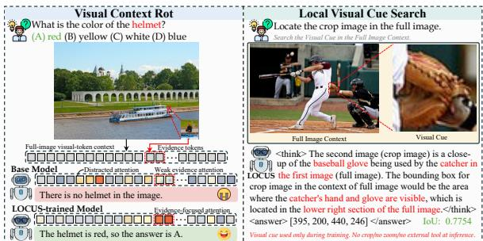

text_image

Visual Context Rot
What is the color of the helmet?
(A) red (B) yellow (C) white (D) blue
Full-image visual-token context
Base Model
There is no helmet in the image.
LOCUS-trained Model
The helmet is red, so the answer is A.
Evidence tokens
Distracted attention
Weak evidence attention
Evidence-forward attention
Local Visual Cue Search
Locate the crop image in the full image.
Search the Visual Cue in the Full Image Context.
Full Image Context
The second image (crop image) is a close-up of the baseball glove being used by the catcher in LOCUS the first image (full image). The bounding box for crop image in the context of full image would be the area where the catcher's hand and glove are visible, which is located in the lower right section of the full image. <think>
<answer> [395, 200, 440, 246] <answer>
Visual cue used only during training. No cropino soon/no external tool at inference.
IoU: 0.7754

Figure 1: Motivation of LOCUS. Left: fine-grained evidence occupies only a few visual tokens and is weakly attended by the base model, causing visual context rot. Right: LOCUS uses training-time local visual cue search to improve evidence selection while keeping inference unchanged.

Xie, 2024; Wang et al., 2025c; Tong et al., 2024). A natural remedy is to increase the input resolution, which preserves visual details that may otherwise be lost during downsampling. However, higher resolution also expands the visual context in which the model must search for the decisive evidence. The relevant cue often occupies only a small fraction of a long visual-token sequence, and can be diluted by surrounding objects, background semantics, and redundant observations (Liu et al., 2025a; Zhang et al., 2023). This reveals a fundamental gap between preserved and accessible visual evidence: the information required to answer a question may exist in the input, yet may not be reliably selected, retained, or exploited during standard full-image inference. We refer to this phenomenon as visual context rot, as illustrated in Fig. 1.

This accessibility gap is not merely a conceptual concern. Our preliminary analyses in Section 3.1 show that fine-grained accuracy improves when irrelevant visual context is suppressed while preserving the original target scale, indicating that decisive evidence is often present but obscured by surrounding context. We further observe that correctly answered samples exhibit substantially better localization of task-relevant regions than incorrectly answered ones, and that VQA accuracy increases with grounding quality. These findings suggest that fine-grained perceptual failures are closely associated with unreliable selection and use of local evidence, rather than only with the absence of visual detail. They motivate a training objective that uses localization as a verifiable proxy for strengthening the model’s ability to select and exploit decisive local cues within complete images.

Existing approaches only partially address this need. Standard instruction tuning (Liu et al., 2023; Zhang et al., 2026) and answer-level supervision can improve the final response, but provide little direct feedback on where decisive visual evidence lies or how it should be separated from redundant context. Text-based grounding (Yu et al., 2026; Liu et al., 2025b) introduces explicit localization supervision, yet it specifies the target through a compressed linguistic description, which may be underspecified for small or visually similar objects. Recent think-with-images and tool-augmented methods (Zhang et al., 2025b; Zheng et al., 2026; Wang et al., 2025a; Hou et al., 2026; Hong et al., 2026) train or guide models to inspect localized visual content through cropping, zooming, image augmentation, or other explicit visual manipulations. While effective, these methods typically entangle local evidence discovery with auxiliary visual operations that remain part of the inference procedure. These approaches highlight the importance of local evidence, but leave open a key question: can MLLMs be trained to internalize local evidence search, so that they can better select and use finegrained cues during ordinary full-image inference?

To this end, we propose LOCUS (LOcal visual CUe Search), a training framework that turns local visual cue search into a verifiable proxy task for full-image evidence use. During training, we crop a target region from a complete image and use it as a local visual cue, which serves as an explicit instance-level handle for the underlying evidence. Given the full image, the visual cue, and an instruction to locate the cue, the model predicts the cue’s spatial support in the original image. Since the ground-truth region is known, each prediction can be directly evaluated with an IoU-based reward, allowing us to optimize the model for spatially accurate cue localization. Importantly, the visual cue is used only as training-time supervision. At inference time, LOCUS operates on standard imagequestion inputs without additional crops, zooming operations, external tools, or multi-round search.

We evaluate LOCUS on a broad suite of benchmarks spanning fine-grained perception, hallucination robustness, general multimodal understanding, and mathematical and logical reasoning. The results show that LOCUS consistently improves localization-sensitive fine-grained perception, with particularly strong gains on V\*Bench (Wu and Xie, 2024) and high-resolution benchmarks, while preserving competitive performance on broadcoverage evaluations. Beyond aggregate accuracy, attention-based analyses reveal that the trained model allocates more attention to ground-truth evidence regions under standard full-image inference. Together, these results indicate that LOCUS improves fine-grained perception by strengthening the model’s ability to attend to and exploit decisive local evidence within full-image contexts.

Our main contributions are summarized as follows:

• We characterize visual context rot as a bottleneck in fine-grained multimodal perception, where decisive local evidence may be preserved in high-resolution inputs but not reliably selected, preserved, or exploited within redundant full-image contexts. Preliminary analyses connect this phenomenon to context interference and localization quality.

• We propose LOCUS (LOcal visual CUe Search), a training framework that uses local visual cues to construct a verifiable proxy task for full-image evidence use. By optimizing cue localization with an IoU-based reward, LOCUS strengthens local evidence search without requiring crops, zooming operations, external tools, or multi-round search at inference time.

• We validate LOCUS across fine-grained perception, hallucination robustness, general multimodal understanding, and reasoning benchmarks. Results show consistent improvements on localization-sensitive tasks, while attention analyses indicate stronger focus on groundtruth evidence regions under standard fullimage inference.

## 2 Related Work

Fine-Grained Perception and Visual Search in MLLMs. Despite rapid progress in multimodal large language models, fine-grained visual understanding remains challenging when answers depend on small objects, subtle attributes, spatially adjacent instances, or other localized evidence that occupies only a small portion of the image (Wu and Xie, 2024; Tong et al., 2024; Wang et al., 2025c; Zhang et al., 2025c). This challenge has motivated Thinking-with-Images methods that explicitly crop, zoom, search, or revisit image regions during inference (Zhang et al., 2025b; Zheng et al., 2026; Wang et al., 2025a; Hou et al., 2026; Hong et al., 2026). While effective, such methods typically rely on additional visual operations, repeated image encoding, or tool-mediated interaction at test time. Text-based grounding (Yu et al., 2026) provides localization supervision, but linguistic queries can be under-specified for small or visually similar instances. Recent single-pass methods such as ZwZ (Wei et al., 2026) distill zoombased inspection into ordinary inference, but rely on teacher-generated region-level QA targets. In contrast, LOCUS uses the image region itself as a visual query and optimizes an automatically verifiable IoU reward for recovering its location in the original image.

Reinforcement Learning and Proxy Supervision for MLLMs. Reinforcement learning with verifiable feedback has become a prominent approach for post-training large language and multimodal models, particularly when task outcomes can be assessed automatically rather than through costly human preference annotation (Huang et al., 2025; Zhang et al., 2025a; Meng et al., 2025). In the multimodal setting, recent studies have explored such supervision for perception- and reasoning-oriented objectives, including visual grounding (Meng et al., 2025), spatial reasoning (Wu et al., 2025) and table understanding (Liu et al., 2026). More broadly, these efforts reflect a proxy-supervision paradigm: instead of directly optimizing every downstream behavior, models are trained on intermediate tasks that are controllable, automatically verifiable, and expected to induce transferable capabilities (Zeng et al., 2026; Wang et al., 2025d). LOCUS adopts this view but uses local visual cue search as the proxy objective. By rewarding the recovery of a crop’s location in the full image, the training signal targets spatial evidence selection rather than final-answer correctness, encouraging the model to internalize local visual search for standard fullimage inference.

## 3 Method

We present LOCUS, which formulates finegrained visual evidence discovery as a proxy training task of local visual cue search. During training, a local crop is used as a visual cue, and the model is required to localize its corresponding spatial support in the complete image. This formulation provides a verifiable training signal, since the predicted region can be directly evaluated by its IoU with the ground-truth box. By optimizing this task with an IoU-based reward, LOCUS encourages MLLMs to match local visual cues against cluttered fullimage contexts without requiring external visual operations at inference time.

<table><tr><td>Input View</td><td>Overall</td><td>Direct Attr.</td><td>Rel. Pos.</td></tr><tr><td>Full Image</td><td>79.58</td><td>80.00</td><td>78.95</td></tr><tr><td>Context-Suppressed</td><td> $85.86^{\uparrow 6.28}$ </td><td> $84.35^{\uparrow 4.35}$ </td><td> $88.16^{\uparrow 9.21}$ </td></tr></table>

Table 1: Context-suppression analysis on V\*Bench using Qwen2.5-VL-7B-Instruct. Non-target regions are replaced with black pixels while preserving the original target scale and image canvas.

## 3.1 Preliminary Analysis

Before introducing LOCUS, we diagnose whether fine-grained failures stem from unreliable access to task-relevant local evidence under full-image context. We ask two questions: (i) does suppressing irrelevant context make decisive evidence easier to use, and (ii) are correct answers associated with better localization of the queried region?

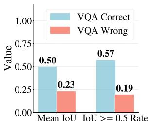

bar chart

| Metric | VQA Correct | VQA Wrong |
| --- | --- | --- |
| Mean IoU | 0.50 | 0.23 |
| IoU >= 0.5 Rate | 0.57 | 0.19 |

(a). Grounding vs. VQA Correctness

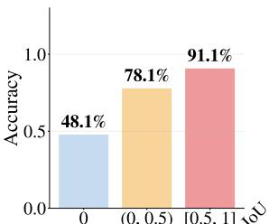

bar chart

| IoU | Accuracy (%) |
|---|---|
| 0 | 48.1 |
| (0, 0.5) | 78.1 |
| [0.5, 1] | 91.1 |

(b) VQA Accuracy by IoU Level  
Figure 2: Grounding quality vs. VQA correctness on V\*Bench direct\_attributes with Qwen2.5-VL-7B-Instruct. (a) Mean IoU and success rate (IoU ≥ 0.5) for correct vs. wrong answers. (b) VQA accuracy by grounding IoU.

Suppressing irrelevant context improves finegrained perception. We first test whether finegrained failures stem from missing visual detail or from difficulty selecting relevant evidence within the full-image context. For each V\*Bench sample, we preserve the ground-truth target region and replace non-target regions with black pixels, keeping the original canvas and target scale unchanged. As shown in Table 1, this context-suppressed view improves the base model from 79.58 to 85.86 overall, with gains of 4.35 on direct attributes and 9.21 on relative position. Since the target is not magnified, the improvement suggests that irrelevant context interferes with selecting and using decisive local evidence under full-image inference.

Grounding quality correlates with finegrained perception. We investigate this question on the direct-attribute subset of V\*Bench. For each sample, we ask the model to ground the object span queried by the question, and compare localization quality between VQA-correct and VQA-wrong samples. As shown in Fig. 2(Qwen3-VL results in Appendix D.1), correctly answered samples exhibit higher mean IoU and grounding success rate (IoU $\geq 0 . 5 )$ than incorrectly answered ones. Moreover, VQA accuracy increases with grounding IoU. Samples with IoU = 0, where the model fails to localize the queried object, achieve the lowest VQA accuracy.

Together, these analyses indicate that finegrained perception depends on reliably accessing task-relevant local evidence within full-image context. While localization does not explain all failures, it offers a practical and verifiable proxy for strengthening evidence selection. We therefore use the local region itself as a visual query, rather than an under-specified text description, and train the model to recover its spatial support in the complete image.

## 3.2 Local Visual Cue Search

The overall training pipeline of LOCUS is summarized in Fig. 3. Given a complete image and a local visual cue cropped from it, the policy model predicts the cue’s corresponding location in the complete image. Each rollout is evaluated by a rule-based reward that combines format validity and IoU-based localization quality, and the resulting rewards are used to compute group-relative advantages for policy optimization.

We formalize the local visual cue search task as follows. Given a complete image I and a target region $b ^ { * } = ( x _ { 1 } , y _ { 1 } , x _ { 2 } , y _ { 2 } )$ , we construct a local visual cue by cropping the corresponding region:

$$
c = \operatorname{Crop} (I, b ^ {*}). \tag {1}
$$

The resulting crop preserves the target’s local appearance while removing most surrounding context. The model is then required to recover the spatial support of this cue in the complete image, which encourages visual matching between the local cue and the full-image context rather than reliance on coarse global semantics.

Formally, the model is provided with the complete image I, the visual cue c, and an instruction q that asks it to locate the cue in the complete image. It generates a textual response

$$
\hat {y} \sim \pi_ {\theta} (\cdot \mid I, c, q), \tag {2}
$$

from which we parse the predicted bounding box

$$
\hat {b} = \operatorname{Parse} (\hat {y}). \tag {3}
$$

This task differs from conventional text-based grounding in the form of the query. Instead of describing the target with a linguistic expression, the query itself is a local visual cue extracted from the image. The model must therefore compare the appearance of c with the full-image context and recover its spatial support in I. This formulation turns grounding into a local visual search problem, where success requires identifying the region in the full image that corresponds to the given cue.

Importantly, the visual cue is used only during training. At inference time, LOCUS operates on standard complete-image inputs without external cropping, zooming, or multi-round visual search.

## 3.3 Reward-Guided Policy Optimization

For the predicted box ˆb parsed from the model response, we assign a rule-based reward to measure cue localization quality. Since token-level likelihood does not directly reflect the spatial quality of the predicted region, this reward provides direct supervision on whether the response recovers the cue’s spatial support in the complete image. The reward consists of two components. The format reward $r _ { \mathrm { f o r m a t } }$ encourages the model to produce a valid coordinate format, while the localization reward $r _ { \mathrm { l o c } }$ measures the spatial overlap between the predicted box and the ground-truth box:

$$
r _ {\text { loc }} = \left\{ \begin{array}{l l} \mathrm{IoU} (\hat {b}, b ^ {*}), & \text { if   } \hat {b} \text {   is   valid }, \\ 0, & \text { otherwise }. \end{array} \right. \tag {4}
$$

The final reward is defined as:

$$
r (\hat {y}, b ^ {*}) = (1 - \alpha) r _ {\mathrm{loc}} + \alpha r _ {\mathrm{format}}. \tag {5}
$$

where α controls the trade-off between localization quality and format validity.

The policy optimization objective is:

$$
\max _ {\theta} \mathbb {E} _ {(I, c, q, b ^ {*}) \sim \mathcal {D},   \hat {y} \sim \pi_ {\theta} (\cdot | I, c, q)} \left[ r (\hat {y}, b ^ {*}) \right], \tag {6}
$$

where D denotes the constructed visual-evidence search dataset. In practice, we optimize this objective with group-relative policy optimization(GRPO) (Shao et al., 2024), using multiple rollouts for each input to compute relative advantages and regularizing the policy against a reference model. By assigning reward according to spatial overlap, the training signal directly encourages the model to localize visual evidence within completeimage contexts.

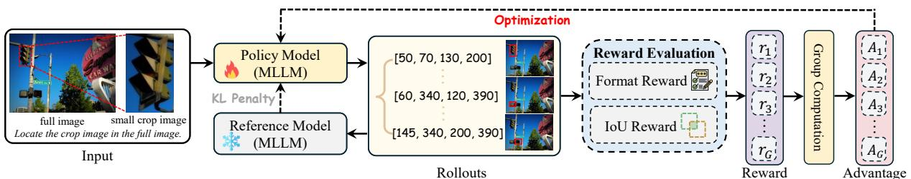

flowchart

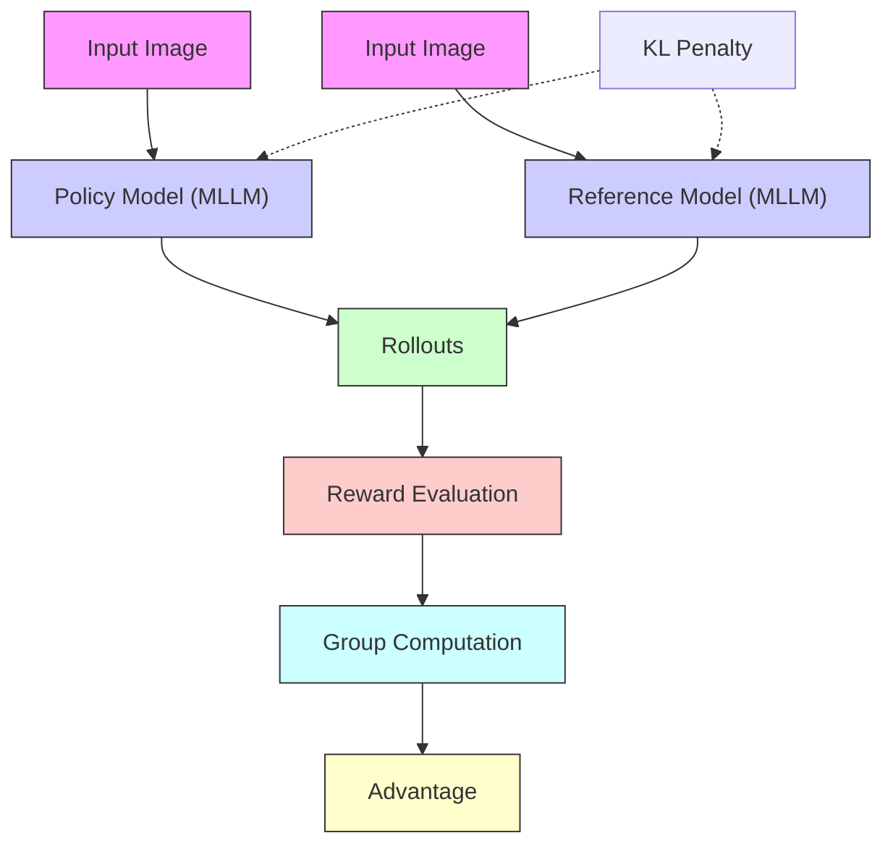

Figure 3: Overview of LOCUS. Given a full image and a localized visual exemplar cropped from it, the policy model predicts the exemplar’s location in the full image. Candidate rollouts are scored by a format reward and an IoU-based localization reward, and group-relative advantages are used to optimize the policy while regularizing it against a reference model.

## 4 Experiments

## 4.1 Implementation Details

Training Settings. We construct the visual-cue search data from COCO train2014 object regions (Lin et al., 2014). Each training example consists of a complete image, a local crop used as the visual cue, and the corresponding groundtruth bounding box in the original image. The training corpus contains approximately 100K examples, with tiny and small target regions sampled at a 70%:30% ratio by default. We adopt Qwen2.5- VL-7B-Instruct (Bai et al., 2025b) as the primary backbone, and further evaluate LOCUS on Qwen3- VL-4B-Thinking (Bai et al., 2025a) and MiMo-VL-RL-7B (Team et al., 2025) to assess its generality across model families. We perform reinforcement post-training using the EasyR1 (Zheng et al., 2025) framework with the GRPO objective and KLregularized policy optimization. The reward combines format validity with IoU-based localization quality, as described in §3.3. All implementation details and hyperparameters are provided in the Appendix B.1.

Evaluation Setup. We evaluate LOCUS on a comprehensive suite of benchmarks covering finegrained perception, hallucination, general perception, and reasoning. Fine-grained perception is evaluated on HR-Bench-4K/8K (Wang et al., 2025c), V\*Bench (Wu and Xie, 2024), CV-Bench (Tong et al., 2024), and MME-RealWorld-EN (Zhang et al., 2025c). We additionally report visual grounding results on RefCOCO, RefCOCO+ (Yu et al., 2016; Kazemzadeh et al., 2014), and RefCOCOg (Mao et al., 2016) using ACC@0.5. Hallucination robustness is assessed on POPE (Li et al., 2023) and Hallusion-Bench (Guan et al., 2024). Broader multimodal understanding is evaluated on MMStar (Chen et al., 2024), RealWorldQA (AI, 2024), AI2D (Kembhavi et al., 2016), OCRBench (Liu et al., 2024) and BabyVision (Chen et al., 2026), while mathematical and logical reasoning are assessed on MathVision (Wang et al., 2024), MathVerse (Zhang et al., 2024), WeMath (Qiao et al., 2025), and LogicVista (Xiao et al., 2024). All evaluations follow the standard protocols of each benchmark, with detailed settings provided in the Appendix B.3.

## 4.2 Main Results

Results on perception and hallucination benchmarks. Table 2 reports the main results across fine-grained perception, hallucination, and general perception benchmarks. Across all three backbones, LOCUS consistently improves localizationsensitive fine-grained perception. On Qwen2.5- VL-7B, LOCUS brings substantial gains on V\*Bench (+7.8), HR-Bench-8K (+4.6), and MME-RealWorld (+3.9), indicating stronger fine-grained evidence selection under high-resolution full-image inputs. Similar improvements are observed on Qwen3-VL-4B and MiMo-VL-7B, showing that the benefit of local visual cue search transfers across model families. Beyond fine-grained perception, LOCUS also improves most hallucination and general perception results, including POPE, HallusionBench, MMStar, RealWorldQA, OCR-Bench, AI2D, and BabyVision. These results suggest that training with local visual cues improves localization-sensitive perception without degrading broad multimodal understanding.

<table><tr><td rowspan="2">Model</td><td rowspan="2">Size</td><td colspan="5">Fine-Grained Perception</td><td colspan="2">Hallucination</td><td colspan="5">General Perception</td></tr><tr><td>V*</td><td>HR-4K</td><td>HR-8K</td><td>CV-B</td><td>MME-RW</td><td>POPE</td><td>HalBench</td><td>MMStar</td><td>RWQA</td><td>OCRBench</td><td>AI2D</td><td>BabyVision</td></tr><tr><td colspan="14">Closed-Source Models</td></tr><tr><td>GPT-5.1</td><td>-</td><td>70.2</td><td>67.0</td><td>65.3</td><td>84.2</td><td>64.0</td><td>-</td><td>-</td><td>71.6</td><td>-</td><td>-</td><td>-</td><td>13.9</td></tr><tr><td>Gemini-3-Flash</td><td>-</td><td>86.4</td><td>87.9</td><td>85.0</td><td>89.6</td><td>74.9</td><td>-</td><td>-</td><td>83.6</td><td>-</td><td>-</td><td>-</td><td>34.5</td></tr><tr><td>Qwen2.5-VL</td><td>7B</td><td>79.6</td><td>69.9</td><td>63.8</td><td>75.6</td><td>58.8</td><td>84.9</td><td>68.0</td><td>61.5</td><td>61.6</td><td>82.0</td><td>79.6</td><td>11.9</td></tr><tr><td>+ LOCUS</td><td>7B</td><td> $87.4^{\uparrow 7.8}$ </td><td> $71.6^{\uparrow 1.7}$ </td><td> $68.4^{\uparrow 4.6}$ </td><td> $76.5^{\uparrow 0.9}$ </td><td> $62.7^{\uparrow 3.9}$ </td><td> $87.6^{\uparrow 2.7}$ </td><td> $70.3^{\uparrow 2.3}$ </td><td> $63.1^{\uparrow 1.6}$ </td><td> $66.4^{\uparrow 4.8}$ </td><td> $85.4^{\uparrow 3.4}$ </td><td> $80.5^{\uparrow 0.9}$ </td><td> $12.4^{\uparrow 0.5}$ </td></tr><tr><td>Qwen3-VL</td><td>4B</td><td>79.6</td><td>75.4</td><td>70.6</td><td>83.4</td><td>60.0</td><td>88.1</td><td>75.4</td><td>66.5</td><td>69.5</td><td>78.4</td><td>81.3</td><td>9.5</td></tr><tr><td>+ LOCUS</td><td>4B</td><td> $82.7^{\uparrow 3.1}$ </td><td> $77.0^{\uparrow 1.6}$ </td><td> $71.9^{\uparrow 1.3}$ </td><td> $84.9^{\uparrow 1.5}$ </td><td> $62.0^{\uparrow 2.0}$ </td><td> $88.2^{\uparrow 0.1}$ </td><td> $75.6^{\uparrow 0.2}$ </td><td> $69.7^{\uparrow 3.2}$ </td><td> $71.0^{\uparrow 1.5}$ </td><td> $77.7^{\uparrow 0.7}$ </td><td> $81.4^{\uparrow 0.1}$ </td><td> $12.1^{\uparrow 2.6}$ </td></tr><tr><td>MiMo-VL</td><td>7B</td><td>77.0</td><td>69.5</td><td>66.4</td><td>80.4</td><td>54.4</td><td>86.1</td><td>67.7</td><td>66.3</td><td>66.7</td><td>81.3</td><td>81.0</td><td>9.3</td></tr><tr><td>+ LOCUS</td><td>7B</td><td> $79.1^{\uparrow 2.1}$ </td><td> $72.0^{\uparrow 2.5}$ </td><td> $69.0^{\uparrow 2.6}$ </td><td> $80.4^{\pm 0.0}$ </td><td> $57.1^{\uparrow 2.7}$ </td><td> $86.2^{\uparrow 0.1}$ </td><td> $72.0^{\uparrow 4.3}$ </td><td> $68.9^{\uparrow 2.6}$ </td><td> $67.3^{\uparrow 0.6}$ </td><td> $82.7^{\uparrow 1.4}$ </td><td> $82.5^{\uparrow 1.5}$ </td><td> $10.1^{\uparrow 0.8}$ </td></tr></table>

Table 2: Main results on fine-grained perception, hallucination, and general perception benchmarks. The top section (gray) lists closed-source reference models for reference, while the bottom section reports backbone-wise comparisons before and after applying LOCUS ( green rows ). V\*: V\*Bench; HR-4K/8K: HR-Bench 4K/8K; CV-B: CV-Bench; MME-RW: MME-RealWorld-EN; HalBench: HallusionBench; RWQA: RealWorldQA. Arrows denote absolute changes relative to the corresponding backbone.

<table><tr><td>Model</td><td>Size</td><td>MathVision</td><td>MathVerse</td><td>WeMath</td><td>LogicVista</td></tr><tr><td>Qwen2.5-VL</td><td>7B</td><td>23.4</td><td>46.1</td><td>64.4</td><td>43.1</td></tr><tr><td>+ LOCUS</td><td>7B</td><td> $24.7^{\uparrow 1.3}$ </td><td> $46.6^{\uparrow 0.5}$ </td><td> $65.1^{\uparrow 0.7}$ </td><td> $47.1^{\uparrow 4.0}$ </td></tr><tr><td>Qwen3-VL</td><td>4B</td><td>43.4</td><td>61.4</td><td>76.3</td><td>52.5</td></tr><tr><td>+ LOCUS</td><td>4B</td><td> $44.7^{\uparrow 1.3}$ </td><td> $61.2^{\downarrow 0.2}$ </td><td> $78.8^{\uparrow 2.5}$ </td><td> $56.7^{\uparrow 4.2}$ </td></tr><tr><td>MiMo-VL</td><td>7B</td><td>52.3</td><td>54.2</td><td>77.2</td><td>52.5</td></tr><tr><td>+ LOCUS</td><td>7B</td><td> $54.6^{\uparrow 2.3}$ </td><td> $57.0^{\uparrow 2.8}$ </td><td> $78.3^{\uparrow 1.1}$ </td><td> $55.8^{\uparrow 2.3}$ </td></tr></table>

Table 3: Results on reasoning benchmarks. LOCUS preserves mathematical and logical reasoning capabilities across all backbones.

Results on reasoning benchmarks. Table 3 further evaluates whether LOCUS affects mathematical and logical reasoning capabilities. Across MathVision, MathVerse, WeMath, and LogicVista, LOCUS largely preserves or improves reasoning performance for all three backbones. For example, LOCUS improves LogicVista by 4.0 points on Qwen2.5-VL-7B, 4.2 points on Qwen3-VL-4B, and 2.3 points on MiMo-VL-7B. These results indicate that optimizing local visual cue search does not compromise higher-level reasoning ability; instead, better access to local visual evidence can complement downstream reasoning when visual details are relevant (Tian et al., 2025; Sun et al., 2026; Yang et al., 2026).

## 4.3 Ablations

Effect of training method. We study whether the gains of LOCUS arise from the visual-cue search data alone or from the optimization objective. Using the same 100K training examples, we compare RL with an SFT baseline using teachergenerated rationales and ground-truth coordinate answers; annotation details are provided in Appendix C.2. As shown in Table 4, SFT yields only marginal gains over the base model, suggesting that supervised imitation mainly teaches the response format but provides weak pressure for spatial accuracy. In contrast, RL substantially improves all three fine-grained perception benchmarks, increasing V\* from 79.58 to 87.43 and HR-8K from 63.38 to 68.50. This indicates that directly optimizing spatial accuracy with an IoU-based reward is crucial for transferring the proxy localization task to downstream fine-grained perception.

<table><tr><td>Training Method</td><td>V*</td><td>HR-4K</td><td>HR-8K</td></tr><tr><td>Base</td><td>79.6</td><td>70.1</td><td>63.4</td></tr><tr><td>SFT</td><td>80.1</td><td>70.4</td><td>65.8</td></tr><tr><td>RL (Ours)</td><td>87.4</td><td>71.9</td><td>68.5</td></tr></table>

Table 4: Ablation on the training method using Qwen2.5-VL-7B and the same 100K visual-cue search data. RL with an IoU-based reward outperforms SFT on fine-grained perception benchmarks.

<table><tr><td>Cue Modality</td><td>V*</td><td>HR-8K</td><td>POPE</td><td>HalBench</td></tr><tr><td>Base</td><td>79.6</td><td>63.4</td><td>84.3</td><td>68.0</td></tr><tr><td>Text Cue</td><td>83.8</td><td>67.0</td><td>85.0</td><td>69.4</td></tr><tr><td>Visual Cue (Ours)</td><td>87.4</td><td>68.5</td><td>86.0</td><td>70.3</td></tr></table>

Table 5: Ablation on cue modality using Qwen2.5-VL-7B under identical target regions. Text cues use generated referring expressions, while visual cues directly use local crops.

Effect of cue modality. We study whether the modality of the cue matters beyond using the same localization-oriented training signal. To ensure a controlled comparison, both variants are trained on identical COCO object regions.For the text-cue baseline, we use Qwen3-VL-235B to generate a referring expression for each target crop, with details provided in Appendix C.3, and train the model to localize the described object in the full image; LO-CUS instead directly uses the crop as a visual cue. As shown in Table 5, the text-cue variant improves over the base model, indicating that groundingstyle supervision on small target regions is beneficial for fine-grained perception. However, visual cues yield consistently larger gains across all benchmarks, improving V\* from 79.6 to 87.4 and HR-8K from 63.4 to 68.5, while also improving POPE and HalBench. This suggests that LOCUS benefits not only from localization-oriented supervision, but also from the visual cue itself, which preserves instance-level appearance information that may be difficult to fully capture with generated referring expressions.

<table><tr><td>Training Data</td><td>Tiny:Small</td><td>V*</td><td>HR-8K</td><td>RefCOCO</td></tr><tr><td>Base (no training)</td><td>-</td><td>79.6</td><td>63.4</td><td>84.4</td></tr><tr><td>Large cues (&gt;10%)</td><td>-</td><td>81.2</td><td>66.4</td><td>87.2</td></tr><tr><td>Mixed cues</td><td>60%:40%</td><td>85.9</td><td>66.8</td><td>86.2</td></tr><tr><td>Mixed cues (Ours)</td><td>70%:30%</td><td>87.4</td><td>68.5</td><td>86.5</td></tr><tr><td>Mixed cues</td><td>80%:20%</td><td>86.9</td><td>68.1</td><td>86.3</td></tr><tr><td>Mixed cues</td><td>90%:10%</td><td>87.4</td><td>67.4</td><td>86.1</td></tr><tr><td>Tiny-only cues</td><td>100%:0%</td><td>86.9</td><td>67.0</td><td>74.4</td></tr></table>

Table 6: Ablation on search difficulty using Qwen2.5- VL-7B. Tiny and small cues denote cue regions with area ratios below 1% and 1–5%, respectively; the Tiny:Small column reports their sampling ratio. RefCOCO reports ACC@0.5 averaged across splits. The 70%:30% mixture offers the best overall balance.

Effect of cue size and search difficulty. We study how visual-cue search difficulty affects downstream transfer by varying the size distribution of training cues. Tiny and small cues are defined as regions occupying less than 1% and 1–5% of the image area, respectively. As shown in Table 6, large cues improve RefCOCO grounding but yield limited gains on fine-grained perception, suggesting that localizing visually salient regions alone is insufficient for high-resolution evidence retrieval. In contrast, tiny/small cue mixtures substantially improve V\* and HR-8K, indicating that harder local search better matches the fine-grained perception challenge. The 70%:30% mixture achieves the best HR-8K result and ties for the best V\* score while maintaining competitive RefCOCO accuracy. Although the tiny-only variant still performs well on V\* and HR-8K, its sharp drop on RefCOCO suggests a scale bias toward small boxes. We therefore use the 70%:30% mixture as the default configuration for its best overall trade-off.

Effect of cue source. We examine whether the gains of LOCUS come from local visual matching alone or from semantically meaningful cues by comparing object-aware cues with random-crop cues sampled from arbitrary image regions rather than object boxes. As shown in Table 7, random crops improve over the base model, indicating that matching local patches to the full image is beneficial. However, they remain substantially weaker than object-aware cues, likely because random crops often contain repeated background textures such as sky, walls, or road surfaces, yielding ambiguous localization signals. In contrast, object-aware cues correspond to coherent visual entities and provide more reliable supervision for fine-grained perception.

<table><tr><td>Cue Source</td><td>V*</td><td>HR-4K</td><td>HR-8K</td></tr><tr><td>Base</td><td>79.6</td><td>70.1</td><td>63.4</td></tr><tr><td>Random Crop</td><td>81.2</td><td>70.8</td><td>65.9</td></tr><tr><td>Object Crop (Ours)</td><td>87.4</td><td>71.9</td><td>68.5</td></tr></table>

Table 7: Ablation on cue source using Qwen2.5-VL-7B. Random-crop cues sampled from arbitrary image regions provide weaker supervision than object-aware cues, highlighting the importance of semantically meaningful local visual cues.

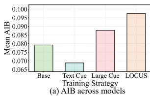

bar chart

| Training Strategy | Mean AIB |
| ----------------- | -------- |
| Base              | 0.079    |
| Text Cue          | 0.068    |
| Large Cue         | 0.089    |
| LOCUS             | 0.100    |

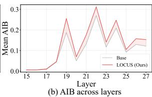

line chart

| Layer | Base  | LOCUS (Ours) |
|-------|-------|--------------|
| 15    | 0.000 | 0.000        |
| 16    | 0.000 | 0.000        |
| 17    | 0.000 | 0.000        |
| 18    | 0.000 | 0.000        |
| 19    | 0.250 | 0.250        |
| 20    | 0.150 | 0.150        |
| 21    | 0.300 | 0.300        |
| 22    | 0.250 | 0.250        |
| 23    | 0.150 | 0.150        |
| 24    | 0.150 | 0.150        |
| 25    | 0.150 | 0.150        |
| 26    | 0.150 | 0.150        |
| 27    | 0.150 | 0.150        |

Figure 4: Attention-in-Box (AIB) analysis on V\*Bench using Qwen2.5-VL-7B variants. (a) compares mean AIB across training variants; (b) shows per-layer AIB for Base and LOCUS.

## 4.4 Analysis

Attention-in-Box analysis. We further analyze whether LOCUS changes where the model attends during full-image inference. We compute Attention-in-Box (AIB), defined as the ratio between attention mass within the ground-truth evidence box and total attention mass over all image patches on V\*Bench, with implementation details provided in Appendix C.4. As shown in Fig. 4(a), LOCUS achieves the highest mean AIB among all training strategies, outperforming both the base model and the Large Cue variant. Large Cue also improves AIB, but its smaller gain indicates that challenging tiny/small cues provide a stronger signal for learning fine-grained evidence localization. Interestingly, the Text Cue variant improves downstream accuracy but yields lower AIB than the base model, suggesting that textbased cue supervision may help through semantic or language-conditioned alignment rather than attention to the exact evidence region. In contrast, visual-cue search directly trains the model to match a local visual cue against the full-image context, leading to stronger spatial anchoring on the annotated evidence. The layer-wise results in Fig. 4(b) show comparable AIB in early layers, with a widening gap from around layer 19 onward, where LOCUS attends more to the ground-truth box (complete curves in Appendix D.4). This suggests stronger later-stage integration of fine-grained evidence for answer generation, consistent with recent analyses of cross-modal information flow in MLLMs (Zhang et al., 2025d; Wu et al., 2026), and supports our claim that LOCUS improves evidence selection under standard full-image inference.

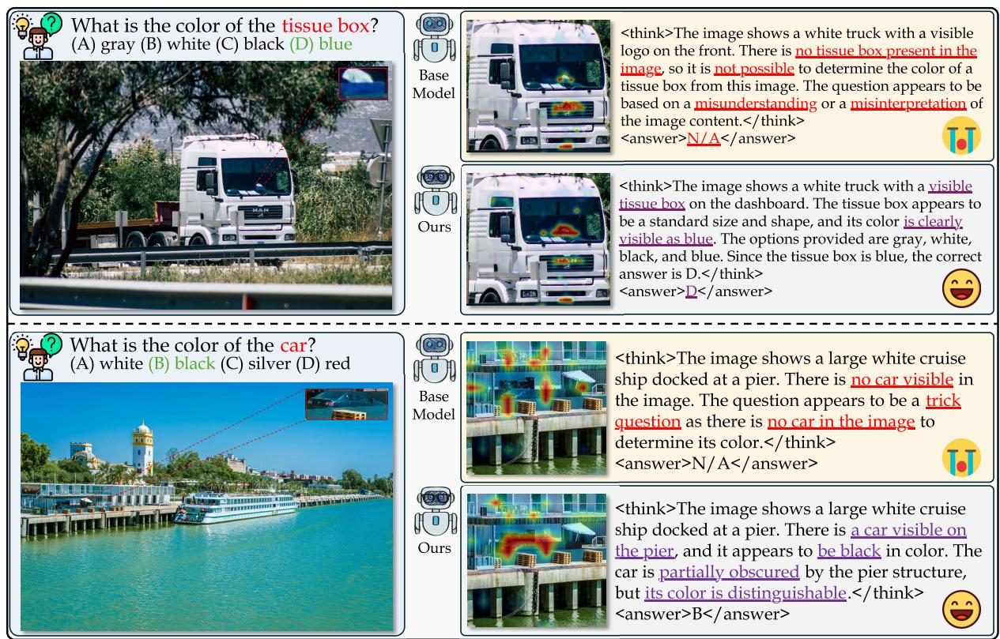  
Figure 5: Qualitative examples with attention visualizations on V\*Bench using Qwen2.5-VL-7B. The base model often fails to select small target evidence and predicts that the queried object is absent, whereas LOCUS focuses on the relevant regions and produces the correct answer under standard full-image inference.

Qualitative analysis. Fig. 5 presents qualitative examples on V\*Bench with attention visualizations (details in Appendix C.4). In both cases, the queried object is small and easily overlooked within the full-image context. The base model fails to select the relevant evidence and incorrectly concludes that the target object is absent, producing an invalid answer. In contrast, LOCUS places stronger attention on the corresponding local region and correctly identifies the queried object and its color under the same full-image input. These examples illustrate that local visual cue search helps the model recover small but decisive evidence from cluttered scenes without relying on inference-time cropping or zooming.

## 5 Conclusion

We presented LOCUS, a training framework that improves fine-grained perception by teaching MLLMs to internalize local visual cue search. Motivated by visual context rot, LOCUS uses a verifiable proxy task in which the model localizes a cropped visual cue within the original image, optimized with an IoU-based reward. This trainingtime objective strengthens local evidence selection while preserving the standard image-question inference interface. Experiments across perception, hallucination, general understanding, and reasoning benchmarks show consistent gains on localizationsensitive tasks without degrading broad capabilities. Attention analyses further indicate stronger focus on ground-truth evidence regions, suggesting that cue localization training translates into more reliable evidence use at inference time. These results highlight internal local evidence search as a promising direction for building MLLMs that are more robust to dense, high-resolution visual contexts.

## Limitations

Although LOCUS improves fine-grained perception by strengthening local evidence retrieval, it does not eliminate all visual understanding failures. Some errors may persist even when the model attends to the relevant region, especially when the evidence is extremely small, visually ambiguous, or requires subtle attribute interpretation. Thus, local cue search improves access to decisive evidence, but stronger visual recognition and semantic understanding remain necessary.

Our training data is constructed from COCO object regions, which provide diverse natural-image supervision but may not cover all domains, visual styles, or localized evidence types encountered in real-world applications. Future work may extend local visual cue search to broader data sources, specialized domains, and richer forms of localized visual evidence.

## Ethical Considerations

This work is conducted entirely on publicly available image datasets and does not involve humansubject experiments, animal studies, private user data, or personally identifiable information. The proposed method uses region-level annotations to construct a visual cue localization task and does not require collecting new sensitive data. We do not anticipate direct privacy, security, or legal risks from the methodology itself. As with other multimodal model training methods, the resulting models may still reflect biases present in the pretrained backbones or source datasets, and should be evaluated carefully before use in real-world applications.

## References

X AI. 2024. Grok-1.5 vision preview.  
Shuai Bai, Yuxuan Cai, Ruizhe Chen, Keqin Chen, Xionghui Chen, Zesen Cheng, Lianghao Deng, Wei Ding, Chang Gao, Chunjiang Ge, Wenbin Ge, Zhifang Guo, Qidong Huang, Jie Huang, Fei Huang, Binyuan Hui, Shutong Jiang, Zhaohai Li, Mingsheng Li, and 45 others. 2025a. Qwen3-vl technical report. Preprint, arXiv:2511.21631.  
Shuai Bai, Keqin Chen, Xuejing Liu, Jialin Wang, Wenbin Ge, Sibo Song, Kai Dang, Peng Wang, Shijie Wang, Jun Tang, Humen Zhong, Yuanzhi Zhu,  
Mingkun Yang, Zhaohai Li, Jianqiang Wan, Pengfei Wang, Wei Ding, Zheren Fu, Yiheng Xu, and 8 others. 2025b. Qwen2.5-vl technical report. Preprint, arXiv:2502.13923.  
Liang Chen, Weichu Xie, Yiyan Liang, Hongfeng He, Hans Zhao, Zhibo Yang, Zhiqi Huang, Haoning Wu, Haoyu Lu, Yiping Bao, and 1 others. 2026. Babyvision: Visual reasoning beyond language. arXiv preprint arXiv:2601.06521.  
Lin Chen, Jinsong Li, Xiaoyi Dong, Pan Zhang, Yuhang Zang, Zehui Chen, Haodong Duan, Jiaqi Wang, Yu Qiao, Dahua Lin, and 1 others. 2024. Are we on the right way for evaluating large vision-language models? Advances in Neural Information Processing Systems, 37:27056–27087.  
Gheorghe Comanici, Eric Bieber, Mike Schaekermann, Ice Pasupat, Noveen Sachdeva, Inderjit Dhillon, Marcel Blistein, Ori Ram, Dan Zhang, Evan Rosen, and 1 others. 2025. Gemini 2.5: Pushing the frontier with advanced reasoning, multimodality, long context, and next generation agentic capabilities. arXiv preprint arXiv:2507.06261.  
Tianrui Guan, Fuxiao Liu, Xiyang Wu, Ruiqi Xian, Zongxia Li, Xiaoyu Liu, Xijun Wang, Lichang Chen, Furong Huang, Yaser Yacoob, and 1 others. 2024. Hallusionbench: an advanced diagnostic suite for entangled language hallucination and visual illusion in large vision-language models. In Proceedings of the IEEE/CVF conference on computer vision and pattern recognition, pages 14375–14385.  
Jack Hong, Chenxiao Zhao, ChengLin Zhu, Weiheng Lu, Guohai Xu, and Xing Yu. 2026. Deepeyesv2: Toward agentic multimodal model. Preprint, arXiv:2511.05271.  
Xinhai Hou, Shaoyuan Xu, Manan Biyani, Moyan Li, Jia Liu, Todd C. Hollon, and Bryan Wang. 2026. Codev: Code with images for faithful visual reasoning via tool-aware policy optimization. Preprint, arXiv:2511.19661.  
Wenxuan Huang, Bohan Jia, Zijie Zhai, Shaosheng Cao, Zheyu Ye, Fei Zhao, Zhe Xu, Xu Tang, Yao Hu, and Shaohui Lin. 2025. Vision-r1: Incentivizing reasoning capability in multimodal large language models. arXiv preprint arXiv:2503.06749.  
Sahar Kazemzadeh, Vicente Ordonez, Mark Matten, and Tamara Berg. 2014. ReferItGame: Referring to objects in photographs of natural scenes. In Proceedings of the 2014 Conference on Empirical Methods in Natural Language Processing (EMNLP), pages 787– 798, Doha, Qatar. Association for Computational Linguistics.  
Aniruddha Kembhavi, Mike Salvato, Eric Kolve, Minjoon Seo, Hannaneh Hajishirzi, and Ali Farhadi. 2016. A diagram is worth a dozen images. In European conference on computer vision, pages 235–251. Springer.  
Yifan Li, Yifan Du, Kun Zhou, Jinpeng Wang, Xin Zhao, and Ji-Rong Wen. 2023. Evaluating object hallucination in large vision-language models. In Proceedings of the 2023 conference on empirical methods in natural language processing, pages 292– 305.  
Tsung-Yi Lin, Michael Maire, Serge Belongie, James Hays, Pietro Perona, Deva Ramanan, Piotr Dollár, and C Lawrence Zitnick. 2014. Microsoft coco: Common objects in context. In European conference on computer vision, pages 740–755. Springer.  
Chaohu Liu, Haoyu Cao, YongXiang Hua, and Linli Xu. 2026. Multimodal table understanding with difficulty-aware reinforcement learning. In Proceedings of the AAAI Conference on Artificial Intelligence, volume 40, pages 755–763.  
Haotian Liu, Chunyuan Li, Qingyang Wu, and Yong Jae Lee. 2023. Visual instruction tuning. Advances in neural information processing systems, 36:34892– 34916.  
Xianjie Liu, Yiman Hu, Yixiong Zou, Liang Wu, Jian Xu, and Bo Zheng. 2025a. Hide: Rethinking the zoom-in method in high resolution mllms via hierarchical decoupling. arXiv preprint arXiv:2510.00054.  
Yuliang Liu, Zhang Li, Mingxin Huang, Biao Yang, Wenwen Yu, Chunyuan Li, Xu-Cheng Yin, Cheng-Lin Liu, Lianwen Jin, and Xiang Bai. 2024. Ocrbench: on the hidden mystery of ocr in large multimodal models. Science China Information Sciences, 67(12):220102.  
Ziyu Liu, Zeyi Sun, Yuhang Zang, Xiaoyi Dong, Yuhang Cao, Haodong Duan, Dahua Lin, and Jiaqi Wang. 2025b. Visual-rft: Visual reinforcement fine-tuning. In Proceedings of the IEEE/CVF International Conference on Computer Vision, pages 2034–2044.  
Junhua Mao, Jonathan Huang, Alexander Toshev, Oana Camburu, Alan L Yuille, and Kevin Murphy. 2016. Generation and comprehension of unambiguous object descriptions. In Proceedings of the IEEE conference on computer vision and pattern recognition, pages 11–20.  
Fanqing Meng, Lingxiao Du, Zongkai Liu, Zhixiang Zhou, Quanfeng Lu, Daocheng Fu, Tiancheng Han, Botian Shi, Wenhai Wang, Junjun He, and 1 others. 2025. Mm-eureka: Exploring the frontiers of multimodal reasoning with rule-based reinforcement learning. arXiv preprint arXiv:2503.07365.  
Runqi Qiao, Qiuna Tan, Guanting Dong, MinhuiWu MinhuiWu, Chong Sun, Xiaoshuai Song, Jiapeng Wang, Zhuoma Gongque, Shanglin Lei, Yifan Zhang, and 1 others. 2025. We-math: Does your large multimodal model achieve human-like mathematical reasoning? In Proceedings of the 63rd Annual Meeting of the Association for Computational Linguistics (Volume 1: Long Papers), pages 20023–20070.  
Zhihong Shao, Peiyi Wang, Qihao Zhu, Runxin Xu, Junxiao Song, Xiao Bi, Haowei Zhang, Mingchuan Zhang, Y. K. Li, Y. Wu, and Daya Guo. 2024. Deepseekmath: Pushing the limits of mathematical reasoning in open language models. Preprint, arXiv:2402.03300.  
Guangming Sheng, Chi Zhang, Zilingfeng Ye, Xibin Wu, Wang Zhang, Ru Zhang, Yanghua Peng, Haibin Lin, and Chuan Wu. 2025. Hybridflow: A flexible and efficient rlhf framework. In Proceedings of the Twentieth European Conference on Computer Systems, pages 1279–1297.  
Xiaokun Sun, Yubo Wang, Haoyu Cao, and Linli Xu. 2026. When thinking hurts: Mitigating visual forgetting in video reasoning via frame repetition. arXiv preprint arXiv:2603.16256.  
Core Team, Zihao Yue, Zhenru Lin, Yifan Song, Weikun Wang, Shuhuai Ren, Shuhao Gu, Shicheng Li, Peidian Li, Liang Zhao, Lei Li, Kainan Bao, Hao Tian, Hailin Zhang, Gang Wang, Dawei Zhu, Cici, Chenhong He, Bowen Ye, and 55 others. 2025. Mimo-vl technical report. Preprint, arXiv:2506.03569.  
Kimi Team, Tongtong Bai, Yifan Bai, Yiping Bao, SH Cai, Yuan Cao, Y Charles, HS Che, Cheng Chen, Guanduo Chen, and 1 others. 2026. Kimi k2. 5: Visual agentic intelligence. arXiv preprint arXiv:2602.02276.  
Xinyu Tian, Shu Zou, Zhaoyuan Yang, Mengqi He, Fabian Waschkowski, Lukas Wesemann, Peter Tu, and Jing Zhang. 2025. More thought, less accuracy? on the dual nature of reasoning in vision-language models. arXiv preprint arXiv:2509.25848.  
Shengbang Tong, Ellis Brown, Penghao Wu, Sanghyun Woo, Manoj Middepogu, Sai C Akula, Jihan Yang, Shusheng Yang, Adithya Iyer, Xichen Pan, and 1 others. 2024. Cambrian-1: A fully open, visioncentric exploration of multimodal llms. Advances in Neural Information Processing Systems, 37:87310– 87356.  
Haozhe Wang, Alex Su, Weiming Ren, Fangzhen Lin, and Wenhu Chen. 2025a. Pixel reasoner: Incentivizing pixel-space reasoning with curiosity-driven reinforcement learning. Preprint, arXiv:2505.15966.  
Ke Wang, Junting Pan, Weikang Shi, Zimu Lu, Houxing Ren, Aojun Zhou, Mingjie Zhan, and Hongsheng Li. 2024. Measuring multimodal mathematical reasoning with math-vision dataset. Advances in Neural Information Processing Systems, 37:95095–95169.  
Weiyun Wang, Zhangwei Gao, Lixin Gu, Hengjun Pu, Long Cui, Xingguang Wei, Zhaoyang Liu, Linglin Jing, Shenglong Ye, Jie Shao, Zhaokai Wang, Zhe Chen, Hongjie Zhang, Ganlin Yang, Haomin Wang, Qi Wei, Jinhui Yin, Wenhao Li, Erfei Cui, and 56 others. 2025b. Internvl3.5: Advancing open-source multimodal models in versatility, reasoning, and efficiency. Preprint, arXiv:2508.18265.  
Wenbin Wang, Liang Ding, Minyan Zeng, Xiabin Zhou, Li Shen, Yong Luo, Wei Yu, and Dacheng Tao. 2025c. Divide, conquer and combine: A training-free framework for high-resolution image perception in multimodal large language models. In Proceedings of the AAAI Conference on Artificial Intelligence, volume 39, pages 7907–7915.  
Xiyao Wang, Zhengyuan Yang, Chao Feng, Yongyuan Liang, Yuhang Zhou, Xiaoyu Liu, Ziyi Zang, Ming Li, Chung-Ching Lin, Kevin Lin, Linjie Li, Furong Huang, and Lijuan Wang. 2025d. Vicrit: A verifiable reinforcement learning proxy task for visual perception in vlms. Preprint, arXiv:2506.10128.  
Lai Wei, Liangbo He, Jun Lan, Lingzhong Dong, Yutong Cai, Siyuan Li, Huijia Zhu, Weiqiang Wang, Linghe Kong, Yue Wang, and 1 others. 2026. Zooming without zooming: Region-to-image distillation for fine-grained multimodal perception. arXiv preprint arXiv:2602.11858.  
Hongxuan Wu, Yukun Zhang, and Xueqing Zhou. 2026. How vision becomes language: A layer-wise information-theoretic analysis of multimodal reasoning. arXiv preprint arXiv:2602.15580.  
Penghao Wu and Saining Xie. 2024. V?: Guided visual search as a core mechanism in multimodal llms. In Proceedings of the IEEE/CVF Conference on Computer Vision and Pattern Recognition, pages 13084– 13094.  
Penghao Wu, Yushan Zhang, Haiwen Diao, Bo Li, Lewei Lu, and Ziwei Liu. 2025. Visual jigsaw post-training improves mllms. Preprint, arXiv:2509.25190.  
Yijia Xiao, Edward Sun, Tianyu Liu, and Wei Wang. 2024. Logicvista: Multimodal llm logical reasoning benchmark in visual contexts. arXiv preprint arXiv:2407.04973.  
Shuo Yang, Yuwei Niu, Yuyang Liu, Yang Ye, Bin Lin, and Li Yuan. 2026. Look-back: Implicit visual re-focusing in mllm reasoning. In Proceedings of the AAAI Conference on Artificial Intelligence, volume 40, pages 11694–11702.  
En Yu, Kangheng Lin, Liang Zhao, Yana Wei, Yuang Peng, Haoran Wei, Jianjian Sun, Chunrui Han, Zheng Ge, Xiangyu Zhang, and 1 others. 2026. Perceptionr1: Pioneering perception policy with reinforcement learning. Advances in Neural Information Processing Systems, 38:94827–94853.  
Licheng Yu, Patrick Poirson, Shan Yang, Alexander C Berg, and Tamara L Berg. 2016. Modeling context in referring expressions. In European conference on computer vision, pages 69–85. Springer.  
Yu Zeng, Wenxuan Huang, Shiting Huang, Xikun Bao, Yukun Qi, Yiming Zhao, Qiuchen Wang, Lin Chen, Zehui Chen, Huaian Chen, Wanli Ouyang, and Feng Zhao. 2026. Agentic jigsaw interaction learning for enhancing visual perception and reasoning in visionlanguage models. Preprint, arXiv:2510.01304.  
Jiarui Zhang, Mahyar Khayatkhoei, Prateek Chhikara, and Filip Ilievski. 2023. Towards perceiving small visual details in zero-shot visual question answering with multimodal llms. arXiv preprint arXiv:2310.16033.  
Jingyi Zhang, Jiaxing Huang, Huanjin Yao, Shunyu Liu, Xikun Zhang, Shijian Lu, and Dacheng Tao. 2025a. R1-vl: Learning to reason with multimodal large language models via step-wise group relative policy optimization. Preprint, arXiv:2503.12937.  
Renrui Zhang, Dongzhi Jiang, Yichi Zhang, Haokun Lin, Ziyu Guo, Pengshuo Qiu, Aojun Zhou, Pan Lu, Kai-Wei Chang, Yu Qiao, and 1 others. 2024. Mathverse: Does your multi-modal llm truly see the diagrams in visual math problems? In European Conference on Computer Vision, pages 169–186. Springer.  
Shengyu Zhang, Linfeng Dong, Xiaoya Li, Sen Zhang, Xiaofei Sun, Shuhe Wang, Jiwei Li, Runyi Hu, Tianwei Zhang, Guoyin Wang, and 1 others. 2026. Instruction tuning for large language models: A survey. ACM Computing Surveys, 58(7):1–36.  
Yi-Fan Zhang, Xingyu Lu, Shukang Yin, Chaoyou Fu, Wei Chen, Xiao Hu, Bin Wen, Kaiyu Jiang, Changyi Liu, Tianke Zhang, Haonan Fan, Kaibing Chen, Jiankang Chen, Haojie Ding, Kaiyu Tang, Zhang Zhang, Liang Wang, Fan Yang, Tingting Gao, and Guorui Zhou. 2025b. Thyme: Think beyond images. Preprint, arXiv:2508.11630.  
YiFan Zhang, Huanyu Zhang, Haochen Tian, Chaoyou Fu, Shuangqing Zhang, Junfei Wu, Feng Li, Kun Wang, Qingsong Wen, Zhang Zhang, and 1 others. 2025c. Mme-realworld: Could your multimodal llm challenge high-resolution real-world scenarios that are difficult for humans? In International Conference on Learning Representations, volume 2025, pages 89655–89701.  
Zhi Zhang, Srishti Yadav, Fengze Han, and Ekaterina Shutova. 2025d. Cross-modal information flow in multimodal large language models. In Proceedings of the Computer Vision and Pattern Recognition Conference, pages 19781–19791.  
Yaowei Zheng, Junting Lu, Shenzhi Wang, Dongdong Kuang Zhangchi Feng, Yuwen Xiong, and Richong Zhang. 2025. Easyr1: An efficient, scalable, multi-modality rl training framework. https: //github.com/hiyouga/EasyR1.  
Ziwei Zheng, Michael Yang, Jack Hong, Chenxiao Zhao, Guohai Xu, Le Yang, Chao Shen, and Xing Yu. 2026. Deepeyes: Incentivizing "thinking with images" via reinforcement learning. Preprint, arXiv:2505.14362.

## A Use of Large Language Models

We used large language models only as writing assistants during manuscript preparation. Specifically, they were used for language polishing, grammar correction, and improving the clarity and readability of the text. They were not used to generate research ideas, design the method or experiments, conduct analyses, or draw scientific conclusions. The authors carefully reviewed all model-assisted edits and retained full responsibility for the final content of the paper.

<table><tr><td>Component</td><td>Parameter</td><td>Value</td></tr><tr><td rowspan="4">Algorithm</td><td>RL algorithm</td><td>GRPO</td></tr><tr><td>KL coefficient</td><td> $1.0 \times 10^{-2}$ </td></tr><tr><td>Reward</td><td>IoU + format reward</td></tr><tr><td>Format weight</td><td>0.1</td></tr><tr><td rowspan="6">Optimization</td><td>Learning rate</td><td> $1.0 \times 10^{-6}$ </td></tr><tr><td>Weight decay</td><td> $1.0 \times 10^{-2}$ </td></tr><tr><td>Optimizer</td><td>AdamW</td></tr><tr><td>Gradient clipping</td><td>1.0</td></tr><tr><td>Warmup ratio</td><td>0.05</td></tr><tr><td>Global batch size</td><td>128</td></tr><tr><td rowspan="4">Rollout</td><td>Rollouts per prompt</td><td>8</td></tr><tr><td>Temperature</td><td>1.0</td></tr><tr><td>Top-p</td><td>1.0</td></tr><tr><td>Validation override</td><td> $T=0.6, p=0.95, n=1$ </td></tr></table>

Table 8: Reinforcement post-training configuration for the primary Qwen2.5-VL-7B LOCUS experiment.

## B Implementation Details

## B.1 Training Configuration

Unless otherwise specified, the implementation details below describe our primary Qwen2.5-VL-7B (Bai et al., 2025b) experiments, which use the full 100K local visual cue search corpus. Additional backbone experiments follow the same data construction and training objective, but may use model-specific training lengths.

We construct the local visual cue search corpus from COCO train2014 object annotations (Lin et al., 2014). Each example contains a complete image, a localized visual cue cropped from the same image, and the corresponding ground-truth bounding box in the original image. The default training split contains 99,500 training examples and 500 validation examples. We sample tiny and small cue regions at a 70%:30% ratio, where tiny regions occupy less than 1% of the image area and small regions occupy 1–5%. For Qwen2.5-VL-7B (Bai et al., 2025b), all target boxes are represented using absolute pixel coordinates. The resulting corpus statistics are summarized in Table 9.

We perform reinforcement post-training with GRPO using the EasyR1 framework (Zheng et al., 2025; Sheng et al., 2025). The reward is computed from the model response by parsing the box inside the <answer> tag. The localization reward is the IoU between the predicted box and the ground-truth box, and the final reward combines this IoU reward with a format reward that checks whether the response follows the required <think> and <answer> structure. The format reward weight is 0.1. The main training hyperparameters are listed in Table 8.

<table><tr><td>Statistic</td><td>Value</td></tr><tr><td>Training samples</td><td>99,500</td></tr><tr><td>Validation samples</td><td>500</td></tr><tr><td>Source</td><td>COCO train2014</td></tr><tr><td>Tiny cue ratio (area &lt; 1%)</td><td>70%</td></tr><tr><td>Small cue ratio (1–5%)</td><td>30%</td></tr><tr><td>Min crop size</td><td>16 px</td></tr><tr><td>Padding range (tiny cues)</td><td>0–10%</td></tr><tr><td>Scale range (tiny cues)</td><td>0.8–2.0 $\times$ </td></tr></table>

Table 9: Statistics of the default local visual cue search training corpus.

## B.2 Prompt Template

The training prompt provides the full image and the localized visual cue as two image inputs, and asks the model to recover the cue location in the full image. The prompt template used for the primary Qwen2.5-VL-7B training is shown below.

## Prompt for Local Visual Cue Search

<image>
<image>
Image 1 is a full scene image. Image 2 is a cropped region from Image 1. Please find where Image 2 is located in Image 1, and output the bounding box as $[x_{1}, y_{1}, x_{2}, y_{2}]$ in pixel coordinates.
A conversation between User and Assistant. The user asks a question, and the Assistant solves it. The assistant first thinks about the reasoning process in the mind and then provides the user with the answer. The reasoning process and answer are enclosed within <think> </think> and <answer> </answer> tags, respectively, i.e., <think> reasoning process here </think><answer> answer here </answer>.

## B.3 Evaluation Configuration

We evaluate all models with the same benchmark adapters and vLLM-based inference pipeline. Unless otherwise specified, decoding uses greedy generation with temperature 0 and a maximum generation length of 8192 tokens. For checkpoints trained with the reasoning format, we append the same <think>/<answer> instruction to evaluation prompts; for models with native or model-specific thinking formats, we use their corresponding inference templates.

Our evaluation covers fine-grained perception benchmarks, including V\*Bench (Wu and Xie, 2024), HR-Bench-4K/8K (Wang et al., 2025c), CV-Bench (Tong et al., 2024), and MME-RealWorld-EN (Zhang et al., 2025c); visual grounding benchmarks, including RefCOCO, RefCOCO+ (Yu et al., 2016; Kazemzadeh et al., 2014), and Ref-COCOg (Mao et al., 2016); hallucination benchmarks, including POPE (Li et al., 2023) and HallusionBench (Guan et al., 2024); general perception benchmarks, including MMStar (Chen et al., 2024), RealWorldQA (AI, 2024), OCRBench (Liu et al., 2024), AI2D (Kembhavi et al., 2016), and BabyVision (Chen et al., 2026); and reasoning benchmarks, including MathVision (Wang et al., 2024), MathVerse (Zhang et al., 2024), WeMath (Qiao et al., 2025), and LogicVista (Xiao et al., 2024). For multiple-choice benchmarks, each adapter extracts the final option letter from the generated response. For open-ended perception benchmarks, we apply the benchmark-specific normalization and matching rules implemented in the corresponding adapter; RealWorldQA is handled according to its multiple-choice or open-ended format. For grounding benchmarks, we parse the generated bounding box and report ACC@0.5. Raw model outputs are saved without truncation before answer parsing, which is important for long reasoning outputs.

## C Additional Experimental Details

## C.1 Training Data Examples

Fig. 6 shows representative examples from our local visual cue search training data. Each sample consists of a full image, a localized visual cue cropped from the same image, and the ground-truth target box of the cue in the full image. The examples cover both tiny and small cue regions, illustrating that the model must recover visually subtle local evidence from cluttered full-image context. The visual cue is used only during training to construct a verifiable localization objective; inference uses the standard image-question input without any crop.

## C.2 SFT Baseline Construction

For the SFT baseline in Table 4, we use the same 100K local visual cue search examples as LOCUS. To construct reasoning-format supervision, we use Qwen2.5-VL-72B-Instruct (Bai et al., 2025b) as a teacher model. During annotation, the teacher is given the full image, the crop image, and the ground-truth bounding box, and is asked to generate a brief rationale explaining how the crop can be localized in the full image. We then extract the generated rationale and pair it with the groundtruth bounding box as the final answer, yielding responses in the same <think> and <answer> format as the RL training output.

Prompt for SFT Rationale Annotation  
<image>
    <image>
    Image 1 is a full scene image. Image 2 is a cropped region from Image 1.
    The cropped region is located at {bbox} in Image 1 (pixel coordinates [x1, y1, x2, y2]).
    Please write a brief reasoning process (2–3 sentences) explaining how you would identify where Image 2 is located in Image 1 based on the visual cues in the crop. Then provide the bounding box.
Output format:
<think>your reasoning</think>
<answer>{bbox}</answer>

Importantly, the ground-truth box is used only for teacher-side rationale annotation. During SFT training, the student receives the same input as in RL training, namely the full image, the crop image, and the instruction to locate the crop in the full image; the ground-truth box is not included in the prompt. This baseline tests whether supervised imitation of teacher-generated rationales and ground-truth coordinate answers is sufficient, compared with directly optimizing localization quality through the IoU-based RL reward.

## C.3 Text Cue Baseline Construction

The text-cue baseline in Table 5 is designed to isolate the effect of cue modality while keeping the target regions and optimization setup unchanged. We start from the same 100K hard/medium training examples used by LOCUS, each containing a full image, a crop corresponding to the target region, and the ground-truth bounding box in pixel coordinates. For each example, we use Qwen3-VL-235B-A22B-Instruct (Bai et al., 2025a) to generate a short referring expression conditioned on both the full image and the target crop. The annotation prompt asks the model to produce a single concise expression under 25 words that uniquely identifies the cropped object in the full image, focusing on category, appearance, size, and spatial relations to nearby objects.

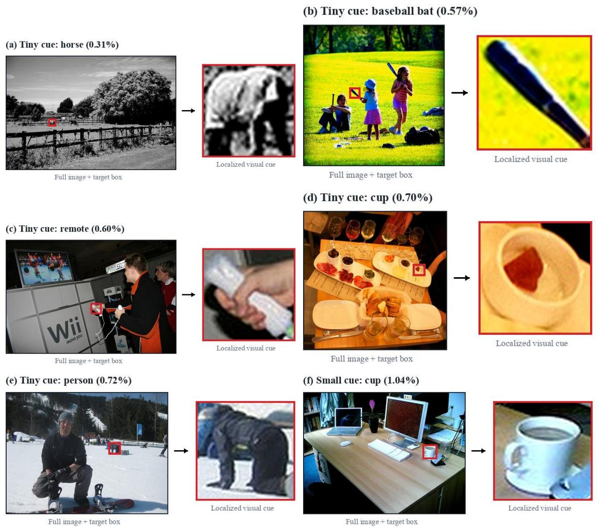  
Figure 6: Examples of local visual cue search training data. Each sample contains a full image with the target box and a localized visual cue cropped from the same image. The task asks the model to recover the cue’s spatial support in the full image.

## Prompt for Text Cue Annotation

You are given a full image and a cropped region from it. The cropped region highlights a specific object in the scene.

Write a short, precise referring expression (1 sentence, under 25 words) that uniquely identifies this object in the full image. Focus on its category, appearance, size, and spatial position relative to other objects.

Output only the referring expression, nothing else.

After generation, each sample is converted into a text-grounding training instance by replacing the visual crop with the generated referring expression. The model receives only the full image and a text query of the form: “Please find the object described by the following text in the image,” followed by the referring expression, and is trained to output the same ground-truth box as [x1, y1, x2, y2] in pixel coordinates. The response format follows the same reasoning template as LOCUS, with intermediate reasoning enclosed by <think> and the final box enclosed by <answer>.

This construction ensures a controlled comparison between text and visual cues: both variants use identical images, target boxes, data split, backbone, GRPO training configuration, and IoU-based localization reward. The only difference is the query modality. The text-cue baseline uses a generated linguistic description as the localization query, whereas LOCUS uses the local visual crop itself.

## C.4 Attention-in-Box Analysis

We use Attention-in-Box (AIB) to quantify whether a model allocates more attention to the groundtruth evidence region during ordinary full-image inference. The analysis is conducted on V\*Bench samples with manually annotated object bounding boxes. For each model and each sample, we run the same image-question prompt as in evaluation and extract the attention from the position that predicts the first answer token to all imagepatch tokens. We use HuggingFace inference with output\_attentions=True; the language-model attention uses the eager implementation to expose attention weights, while the vision encoder uses memory-efficient attention. Image preprocessing follows the evaluation pipeline, including the same chat template, qwen\_vl\_utils image processing, and processor pixel limits.

For each layer, we average attention weights over heads and keep only the entries corresponding to image-patch tokens. These values are reshaped to the spatial image-token grid derived from image\_grid\_thw after the model’s spatial merge. Let $A _ { l } \in \mathbb { R } ^ { H \times W }$ denote the resulting attention map at layer l. We project the ground-truth bounding box onto the same grid and construct a binary mask $M \in \{ 0 , 1 \} ^ { H \times W }$ , where a grid cell is included if it intersects any annotated box. The layer-wise AIB is defined as

$$
\mathrm{AIB} _ {l} = \frac {\sum_ {i , j} A _ {l} (i , j) M (i , j)}{\sum_ {i , j} A _ {l} (i , j)}. \tag {7}
$$

The mean AIB reported in Fig. 4(a) is computed from the layer-averaged attention map, while Fig. 4(b) reports $\mathrm { A I B } _ { l }$ across layers. We also compute Peak-in-Box, which checks whether the maximum-attention image token lies inside the ground-truth box, but use AIB as the primary metric because it measures total attention mass assigned to the evidence region.

For qualitative visualization, we upsample the layer-averaged attention map to the original image resolution with bilinear interpolation and overlay it on the image as a heatmap. To reduce visual clutter, low-attention pixels below a percentile threshold are rendered transparent, and the remaining values are shown with a bounded opacity. For side-by-side comparisons, Base and LOCUS heatmaps are normalized with shared peak-ratio scaling so that color intensity remains comparable across the two models. Ground-truth boxes are drawn on the original image to indicate the annotated evidence region.

## D Additional Results

## D.1 Grounding–VQA Correlation on Qwen3-VL

To examine whether the correlation between localization quality and fine-grained VQA correctness also holds beyond Qwen2.5-VL, we repeat the analysis in Fig. 2 using Qwen3-VL-4B-Thinking on the V\*Bench direct-attribute subset. As shown in Fig. 7, correctly answered samples exhibit higher grounding IoU and grounding success rate than incorrectly answered samples, and VQA accuracy generally increases with grounding IoU. This provides additional evidence that reliable localization of task-relevant regions is closely associated with fine-grained perception.

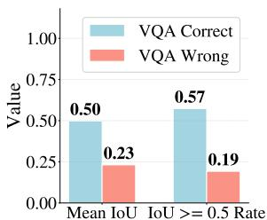

bar chart

| Metric | VQA Correct | VQA Wrong |
| --- | --- | --- |
| Mean IoU | 0.50 | 0.23 |
| IoU >= 0.5 Rate | 0.57 | 0.19 |

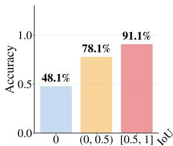

bar chart

| IoU Range | Accuracy (%) |
| :--- | :--- |
| 0 | 48.1 |
| (0, 0.5) | 78.1 |
| [0.5, 1] | 91.1 |

Figure 7: Additional grounding–VQA correlation analysis for Qwen3-VL-4B-Thinking on the V\*Bench directattribute subset. (a) Mean IoU and grounding success rate (IoU ≥ 0.5) for VQA-correct vs. VQA-wrong samples. (b) VQA accuracy across grounding IoU levels.

<table><tr><td>Model</td><td>Size</td><td>Mean IoU</td><td>ACC@0.5</td><td>ACC@0.75</td></tr><tr><td>Qwen2.5-VL</td><td>7B</td><td>16.4</td><td>16.4</td><td>9.4</td></tr><tr><td>+ LOCUS</td><td>7B</td><td> $43.0^{\uparrow 26.6}$ </td><td> $48.8^{\uparrow 32.4}$ </td><td> $25.0^{\uparrow 15.6}$ </td></tr><tr><td>Qwen3-VL</td><td>4B</td><td>21.7</td><td>19.6</td><td>11.2</td></tr><tr><td>+ LOCUS</td><td>4B</td><td> $43.2^{\uparrow 21.5}$ </td><td> $48.4^{\uparrow 28.8}$ </td><td> $31.0^{\uparrow 19.8}$ </td></tr></table>

Table 10: Local visual cue search performance on the held-out validation set (500 samples, 70% tiny / 30% small cues). LOCUS substantially improves localization accuracy across both backbones, confirming that the model learns precise visual matching through RL training.

## D.2 Validation Performance on Local Visual Cue Search

We further evaluate whether LOCUS directly improves the proxy task it is trained on, namely local visual cue search. Table 10 reports localization performance on the held-out validation split of our cue-search data, consisting of 500 samples with the same 70% tiny and 30% small cue distribution as the main training setting. The base models show limited zero-shot ability to match a localized visual cue back to its spatial support in the full image, achieving only 16.4 and 21.7 mean IoU for Qwen2.5-VL-7B and Qwen3-VL-4B, respectively. This indicates that local visual cue search is a non-trivial capability even when the target crop is explicitly provided.

After LOCUS training, both backbones obtain large gains across all localization metrics. Qwen2.5-VL improves from 16.4 to 43.0 in mean IoU and from 16.4 to 48.8 in ACC@0.5, while Qwen3-VL improves from 21.7 to 43.2 in mean IoU and from 19.6 to 48.4 in ACC@0.5. These results confirm that the RL objective effectively teaches the model to perform precise local visual matching, providing direct evidence that the downstream gains are grounded in improved cue localization ability.

<table><tr><td>Model</td><td>RefCOCO</td><td>RefCOCO+</td><td>RefCOCOg</td><td>Avg.</td></tr><tr><td>Qwen2.5-VL</td><td>84.4</td><td>78.4</td><td>81.1</td><td>81.4</td></tr><tr><td>+ LOCUS</td><td> $86.5^{\uparrow 2.1}$ </td><td> $78.8^{\uparrow 0.4}$ </td><td> $83.0^{\uparrow 1.9}$ </td><td> $82.7^{\uparrow 1.3}$ </td></tr></table>

Table 11: Additional visual grounding results for Qwen2.5-VL-7B on RefCOCO, RefCOCO+, and Ref-COCOg. We report ACC@0.5 averaged across splits.

## D.3 Additional Visual Grounding Results

We additionally report visual grounding results on RefCOCO, RefCOCO+ (Yu et al., 2016; Kazemzadeh et al., 2014), and RefCOCOg (Mao et al., 2016) in Table 11. These results are provided as a supplementary evaluation of localization ability under standard text-based referring expressions. On Qwen2.5-VL-7B, LOCUS improves the average ACC@0.5 from 81.4 to 82.7, indicating that local visual cue search does not harm general grounding ability while improving fine-grained perception.

## D.4 Complete Layer-wise AIB Curves

Fig. 8 provides the complete layer-wise Attentionin-Box (AIB) curves on V\*Bench. The two models exhibit similar AIB values in early layers, while the gap becomes substantially larger from around layer 19 onward. This pattern suggests that the integration of fine-grained visual evidence for answer generation is more pronounced in later layers, where LOCUS assigns more attention mass to the ground-truth evidence region than the base model.

## D.5 Training Dynamics

We show the training dynamics of the primary Qwen2.5-VL-7B LOCUS experiment in Fig. 9. The IoU-based localization reward steadily improves during GRPO training, while the format reward quickly converges, indicating stable optimization of the local visual cue search objective.

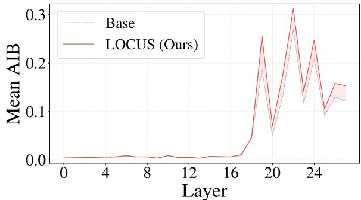

line chart

| Layer | Base  | LOCUS (Ours) |
|-------|-------|--------------|
| 0     | 0.0   | 0.0          |
| 4     | 0.0   | 0.0          |
| 8     | 0.0   | 0.0          |
| 12    | 0.0   | 0.0          |
| 16    | 0.0   | 0.0          |
| 20    | 0.2   | 0.3          |
| 24    | 0.1   | 0.2          |
| 28    | 0.1   | 0.15         |

Figure 8: Complete layer-wise Attention-in-Box (AIB) curves on V\*Bench using Qwen2.5-VL-7B. The AIB gap between Base and LOCUS becomes more pronounced in later layers.  
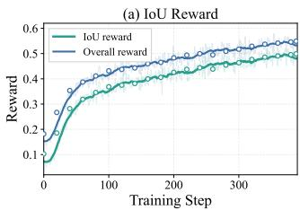

line chart

| Training Step | IoU reward | Overall reward |
| ------------- | ---------- | -------------- |
| 0             | 0.1        | 0.1            |
| 100           | 0.4        | 0.45           |
| 200           | 0.45       | 0.5            |
| 300           | 0.5        | 0.55           |
| 400           | 0.55       | 0.6            |

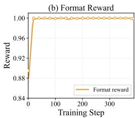

line chart

| Training Step | Format reward |
| ------------- | ------------- |
| 0             | 0.88          |
| 50            | 1.00          |
| 100           | 1.00          |
| 150           | 1.00          |
| 200           | 1.00          |
| 250           | 1.00          |
| 300           | 1.00          |
| 350           | 1.00          |

Figure 9: Training dynamics of the primary Qwen2.5- VL-7B LOCUS experiment. Faint lines show raw training rewards, solid lines show moving averages, and hollow markers denote validation rewards.

## D.6 Additional Qualitative Examples

Fig. 10 provides additional qualitative examples on V\*Bench. Across these cases, the queried evidence is small and easily overlooked within the full-image context. The base model often fails to locate the target object and either predicts an incorrect attribute or concludes that the object is absent. In contrast, LOCUS attends more strongly to the relevant local region and recovers the correct answer under the same full-image input. These examples further illustrate that local visual cue search improves fine-grained perception by strengthening evidence retrieval without requiring inference-time cropping or zooming.

## D.7 Failure Cases

Although LOCUS improves the model’s ability to retrieve local evidence, fine-grained perception also requires correctly interpreting the retrieved visual content. Fig. 11 shows representative failure cases where both the base model and LOCUS produce incorrect answers. In these examples, the models often attend to or describe the relevant region, but still fail to infer the correct fine-grained attribute. For instance, in the Apple-logo example, both models focus on the logo area but interpret its color as a single dominant color rather than recognizing it as polychromatic. Similarly, in the tablecloth example, LOCUS attends to the local region around the tablecloth, yet misidentifies its color under cluttered background and low-resolution visual evidence.

What is the color of the clock? (A) black (B) yellow (C) green (D) red  

text_image

LIBROS
LIBROS

  
Base Model

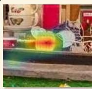  
<think>The image shows a storefront with various items anddecorations.There isa bicycle parked in front of the store,andon the bicycle,there isa basket.Inside the basket, there are books,and on the basket,there appears to be a small object that resembles a clock The object has a red frame and a white face which is typical for a clock. Therefore, thecolor of the clock is red.</think> <answer>D</answer>

  
Ours

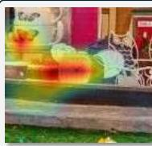

<think>The image shows a storefront with various itemsand decorations. There is a clock visible on the window of the store, and it appears to be green in color. The options provided are black, yellow, green, and red. Based on the visible color of the clock, the correct answer is the one that matches the color observed.</think> <answer>C</answer>  

What is the color of the helmet? (A) red (B) yellow (C) white (D) blue  
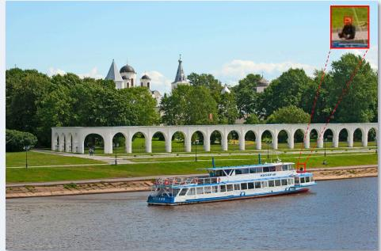

natural_image

Scenic view of a riverside park with an arched colonnade, a decorated boat, and a historic building in the background under a clear sky.

  
Base Model

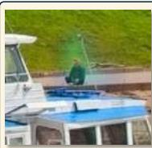

<think>The image shows a river with a boat on it, a long white archway,and a building with domes in the background. There is no helmet visible in the image, so it is not possible to determine the color of a helmet from this image.</think> <answer>N/A</answer>  

  
Ours

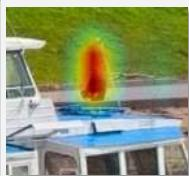

<think>The image shows a river with a boat and a historical building in the background.The boat has a blue and white color scheme, and there is a person visible on the boat. The person appears to be wearing a red helmet, which is a common safety color for helmets, especially in water activities.</think> <answer>A</answer>  

Is the red chair on the left or right side of the road? (A) left (B) right  
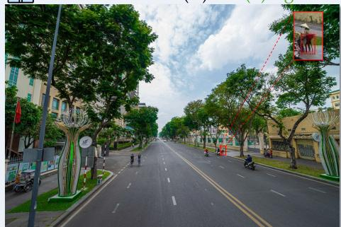

natural_image

Street view with trees lining a straight road, featuring decorative sculptures and a small inset image of a person on a red object (no visible text or symbols)

  
Base Model

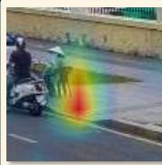

<think>The image shows a road with trees lining both sides.There are no red chairs visible in the image. The question seems to be a trick question as there is no red chair present in the image. Therefore, it's not possible to determine the side of the road where the red chair is located.</think> <answer></answer>  

  
Ours

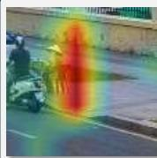

<think> The image shows a road with trees on both sides. There is a red chair visible on the right side of the road, closer to the center of the image. The chair is positioned between the road and the sidewalk, and it is clearly visible in the foreground.</think> <answer>B</answer>  
  
Figure 10: Additional qualitative examples on V\*Bench using Qwen2.5-VL-7B. The base model often overlooks small target evidence or incorrectly concludes that the queried object is absent, whereas LOCUS focuses on the relevant local region and produces the correct answer under the same full-image input.

These cases suggest that local visual cue search mainly addresses the evidence retrieval bottleneck, but does not fully solve all fine-grained perception failures. Accurate answers may still depend on attribute-level recognition, semantic disambiguation, and robust interpretation of small or visually ambiguous regions. We therefore view LOCUS as a complementary mechanism that improves access to decisive evidence, while stronger visual understanding remains necessary for resolving cases where the evidence itself is difficult to interpret.

What is the color of the Apple logo? (A) polychromatic (B) red (C) white (D) silver  
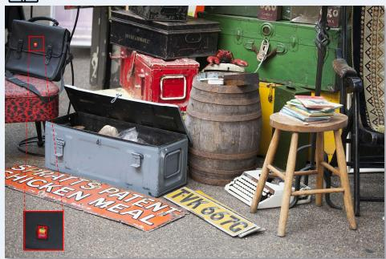

text_image

SHELLS PATENT
CHICKEN MEAL
TWO OTTOI

  
Base Model

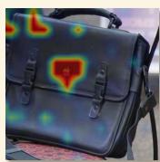  
<think> The image shows a black Apple laptop bag with a logo on it. The logo is a stylized apple with a bite taken outof it,whichisawell-knownsymbol ofApple Inc.The logo is typically white or silver in color not red or polychromatic.  
</think> <answer>C</answer>

  
Ours

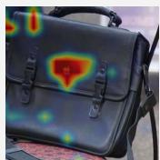  
<think>The image shows a black Apple laptop with a logo on the back. The logo is a stylized apple with a bite taken outof it,which isa well-knownsymbol of Apple Inc. The logo is typically silver in color, as it is the standard color for the Apple logo on their products.</think>  
<answer>D</answer>

What is the color of the tablecloth? (A) green (B) red (C) white (D) blue  
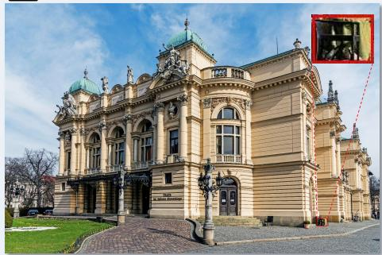

natural_image

Exterior view of a grand neoclassical building with ornate architecture and domes, featuring a close-up inset showing a close-up of a camera lens (no visible text or symbols)

  
Base Model

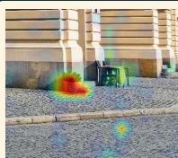  
<think>The image shows a large, ornate building withagreen dome and intricate architectural details. There is a table visible in the foreground,but the tablecloth is not clearly visible or identifiable in the image. Therefore, it is not possible to determine the color of the tablecloth based on the provided image.</think>  
<answer></answer>

  
Ours

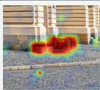  
<think>The image shows a large, ornate building with a green dome and a well-maintained lawn in front of it.There is a table visible in the foreground, and the tablecloth appears to be white. The options provided are green,red,white,and blue. Based onthe visible color of the tablecloth,the correct answer is the one that matches the observed color.</think>  
<answer>C</answer>

  
Figure 11: Representative failure cases on V\*Bench using Qwen2.5-VL-7B. Although LOCUS can attend to the relevant local region, it may still fail when the retrieved evidence requires subtle attribute interpretation or semantic disambiguation. These examples indicate that fine-grained perception involves both local evidence retrieval and accurate visual understanding.