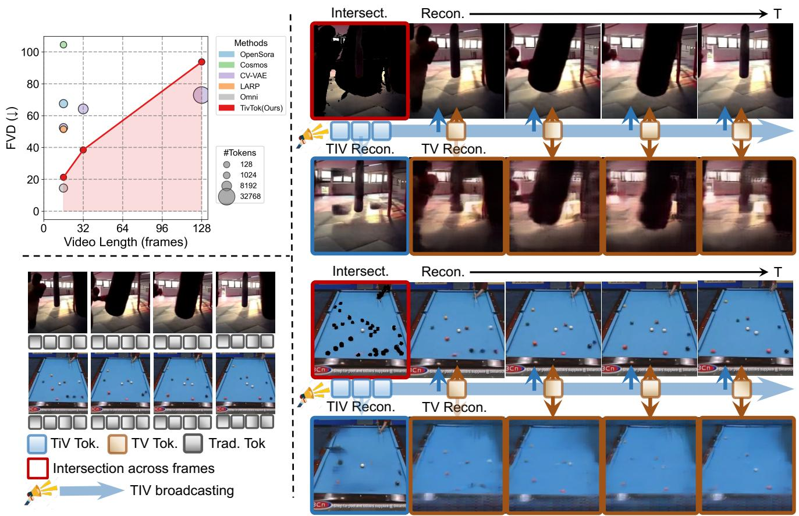
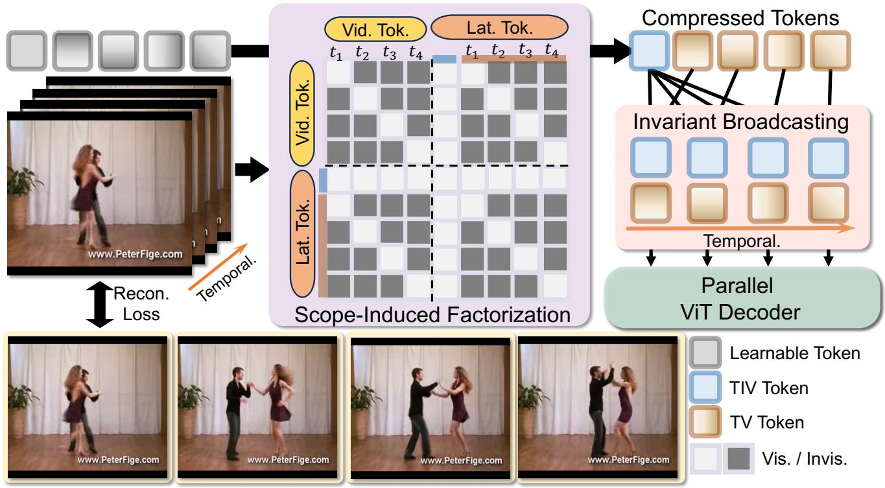
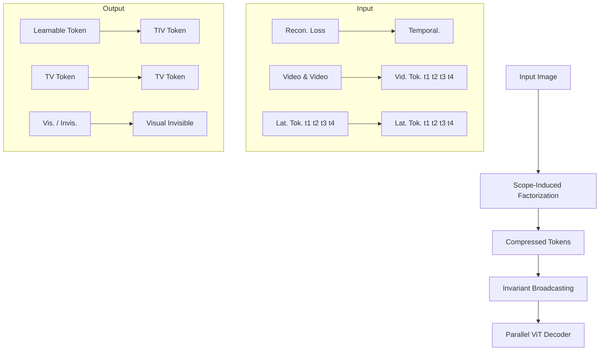
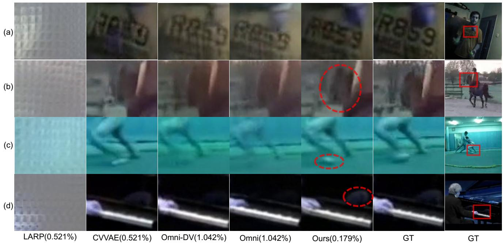
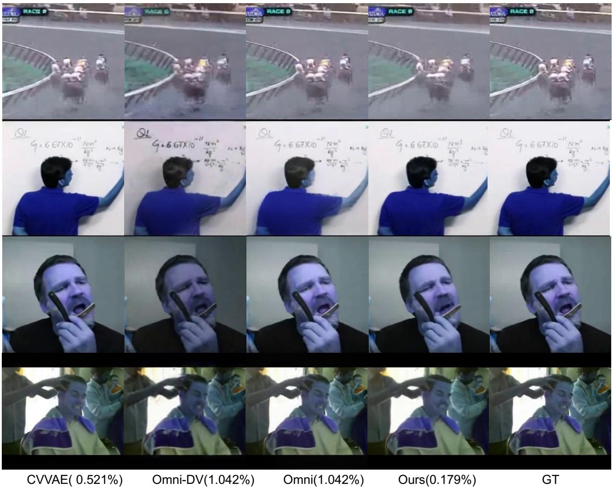
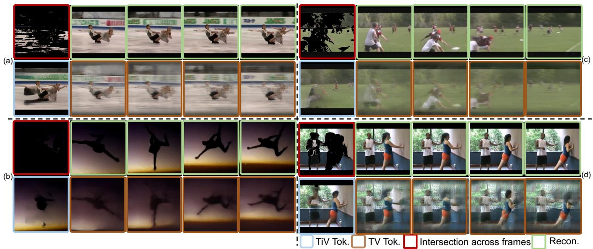
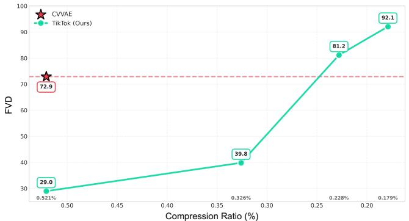
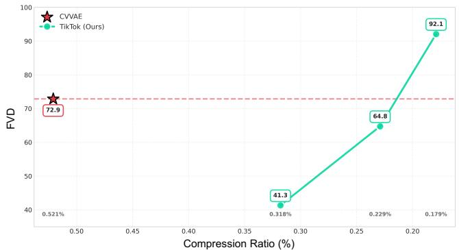

# TivTok: Broadcasting Time-Invariant Tokens for Scalable Video Tokenization

Weiliang Chen · Yuanhui Huang · Xuebo Wang · Yueqi Duan

Abstract Video tokenization is fundamental to scalable video generation, as the number of tokens directly determines the computational cost and the length of videos that can be modeled. Existing tokenizers mainly improve scalability by compressing videos into fewer tokens, but they often continue to represent persistent content, such as static backgrounds and consistent object appearances, repeatedly across frames and chunks. In this paper, we propose TivTok (Time-Invariant Tokenizer ), a reuse-aware video tokenizer that makes persistent information reusable across time. TivTok represents a clip with Time-Invariant (TIV) tokens that encode information shared across frames and Time-Variant (TV) tokens that encode frame-specific residuals. To obtain this factorization, we introduce Scope-Induced Factorization (SIF), which assigns different attention scopes to the two token groups: TIV tokens attend to the full clip, whereas each TV token only accesses its corresponding frame together with the TIV tokens. In the decoder, Invariant Broadcasting (IB) reuses the same TIV tokens across frames and chunks for parallel reconstruction and long-video tokenization. Experiments show that TivTok achieves an rFVD of 12.65 on the standard 16×256×256 benchmark and improves compression ef-

Weiliang Chen1

E-mail: cwl24@mails.tsinghua.edu.cn

Yuanhui Huang2

E-mail: huangyh22@mails.tsinghua.edu.cn

Xuebo Wang3

E-mail: wangxuebo@kuaishou.com

Yueqi Duan1,B

E-mail: duanyueqi@tsinghua.edu.cn

1 Department of Electronic Engineering, Tsinghua University, Beijing, 100084, China

2 Department of Automation, Tsinghua University, Beijing, 100084, China

3 Kuaishou Technology, Beijing, China ficiency by 2.91× for 128-frame videos compared with the evaluated baselines, while using only 1.1% of the tokens required by downsample-based tokenizers in our evaluation.

Keywords Video tokenization · Temporal redundancy · Video compression · Video generation · Long video modeling

## 1 Introduction

Generative models have achieved remarkable success across diverse downstream applications, including visual content generation (Blattmann et al., 2023a,b; Huang et al., 2025b; Liu et al., 2024; Rombach et al., 2022; Shu et al., 2026; Zhang et al., 2025), cinematic production (Chen et al., 2024b; Huang et al., 2025a, 2024), and industrial simulation (Agarwal et al., 2025; Chen et al., 2025b; Ren et al., 2024a,b; Zheng et al., 2024a). A key factor behind this progress is compact visual tokenization: pixel-space visuals are highly redundant, and projecting them into lower-dimensional latent spaces significantly reduces computation and shifts focus to semantic structure, enabling sharper and higher-quality generations (Blattmann et al., 2023a; Rombach et al., 2022; Yang et al., 2021). However, video tokenization remains challenging, since videos introduce an additional temporal dimension, causing the amount of visual data and the number of tokens to grow with sequence length. At the same time, this temporal structure creates an opportunity for reuse: consecutive frames often share substantial content, suggesting that persistent information can be represented once and reused rather than re-encoded (Xu et al., 2023).

Consider what changes and what remains stable across consecutive frames. In many videos, scene layout, background appearance, and object identity remain largely consistent over time, while frame-specific factors such as object position, pose, and local motion vary from frame to frame. The billiards example in Fig. 1 illustrates this structure: the table and ball appearances are shared across the sequence, whereas the ball positions and interactions change over time. Reusing the shared component becomes increasingly beneficial as video length grows, because information encoded once can be reused by an increasing number of frames. An effective tokenizer should therefore treat shared and changing content differently, encoding persistent information once while reserving per-frame capacity for temporal residuals.

line chart and embedded dot plots

| Video Length (frames) | FVD (L) | Method       | #Tokens |
| --------------------- | ------- | ------------ | -------- |
| 0                     | 20      | TiV Tok.     | 128      |
| 32                    | 40      | TiV Tok.     | 1024     |
| 128                   | 95      | TiV Tok.     | 32768    |

Fig. 1 Overview of TivTok and its reuse-aware video tokenization. Top-left: reconstruction FVD is compared across video lengths, with marker size indicating the number of tokens; TivTok keeps a compact token budget while maintaining competitive reconstruction quality in long-video settings. Bottom-left: conventional tokenization treats persistent content and frame-specific variation uniformly when allocating representation capacity. Right: in contrast, the boxing and billiards examples illustrate how TivTok separates reusable Time-Invariant (TIV) tokens from frame-specific Time-Variant (TV) tokens. TIV tokens capture content shared over time, such as scene layout and object appearance, while TV tokens represent frame-specific changes such as object position and local motion. Broadcasting TIV tokens across frames and chunks allows persistent information to be reused rather than re-encoded at every frame.

Existing video tokenizers are largely compressionfocused. Downsample-based methods extend image tokenizers with temporal modules or 3D convolutions (Agarwal et al., 2025; Blattmann et al., 2023b; HaCohen et al., 2024; Li et al., 2024; Zhao et al., 2024), while holistic tokenizers use transformers to compress video patches into compact latent tokens (Li et al., 2025; Wang et al., 2024a; Yan et al., 2024; Yu et al., 2024a). These designs reduce token counts, but they usually allocate representation capacity over the clip without explicitly separating reusable content from frame-specific variation. Another line introduces prescribed decompositions, such as reference frames with motion residuals (Tan et al., 2024; Tian et al., 2024b; Wang et al., 2025; Yu et al., 2024b) or frequency-based separation (Liu et al., 2025). Such decompositions simplify the representation, but they are still primarily used for compression within a clip rather than for reusing persistent information across frames and chunks. This leaves room for a reuse-aware tokenizer that can discover persistent information and broadcast it over time.

Driven by this observation, we propose TivTok (Time-Invariant Tokenizer), a reuse-aware video tokenizer that makes persistent information reusable across time. TivTok represents a clip with two types of tokens: Time-Invariant (TIV) tokens encode information shared across frames, while Time-Variant (TV) tokens encode frame-specific residuals, as illustrated in Fig. 1. Tiv-Tok realizes this factorization with two complementary mechanisms. In the encoder, Scope-Induced Factorization (SIF) assigns different attention scopes to the two token groups: TIV tokens attend to the full clip to aggregate shared information, whereas each TV token only accesses its corresponding frame together with the TIV tokens. This structural constraint encourages the model to place reusable information in TIV tokens and frame-specific residuals in TV tokens. In the decoder, Invariant Broadcasting (IB) reuses the same TIV tokens for every frame and combines them with the corresponding TV tokens for parallel reconstruction, reducing decoding complexity from $\mathcal { O } ( T ^ { 2 } )$ to $\mathcal { O } ( T )$ i n video length. For long videos, TivTok reuses TIV tokens across chunks, allowing the shared representation to support a longer temporal range. With this design, TivTok achieves an rFVD of 12.65 in the standard 16×256×256 setting and improves compression efficiency by 2.91× for 128×256×256 videos compared with baselines. Our main contributions are as follows:

– We formulate video tokenization from a reuse perspective, showing that persistent structure can be represented once and reused across frames and chunks. Based on this view, we propose TivTok, a reuse-aware tokenizer with Time-Invariant (TIV) and Time-Variant (TV) tokens.  
– We introduce Scope-Induced Factorization (SIF) and Invariant Broadcasting (IB). SIF uses asymmetric attention scopes to separate shared information from frame-specific residuals, while IB broadcasts TIV tokens for parallel frame reconstruction, reducing decoding complexity from $\mathcal { O } ( T ^ { 2 } )$ to $\mathcal { O } ( T )$ .  
– We validate TivTok on video reconstruction and generation benchmarks, including long-video settings. TivTok achieves an rFVD of 12.65 on 16×256×256 videos and improves compression efficiency by 2.91× on 128×256×256 videos, while using only 1.1% of the tokens required by baselines.

## 2 Related Work

## 2.1 From Image Tokenizer to Video Tokenizer

Following the progress of the encode-generate paradigm in image generation (Rombach et al., 2022), researchers have developed video tokenizers by extending image tokenization methods to the temporal dimension. These approaches can be categorized into two main lines of work. Downsample-based video tokenizers. Early work (Blattmann et al., 2023b) adapts image tokenizers for video by encoding videos frame-by-frame. Subsequent methods (Agarwal et al., 2025; Chen et al., 2024a; Tang et al., 2024; Zhao et al., 2024) extend 2D convolutions to 3D for temporal downsampling, achieving higher compression ratios through various optimization techniques. CV-VAE (Zhao et al., 2024) leverages image-pretrained 2D convolutions to regularize video tokenizers, improving training efficiency. VidTok (Tang et al., 2024) incorporates FSQ to improve codebook utilization and compression efficiency. Cosmos (Agarwal et al., 2025) employs 3D Haar wavelets to enhance model performance.

Holistic video tokenizers. TiTok (Yu et al., 2024a) pioneered transformer-based tokenization by compressing images into compact 1D learnable tokens via global receptive fields, inspiring subsequent works for images (Huang et al., 2025b; Tian et al., 2024a) and videos (Li et al., 2025; Wang et al., 2024a; Yan et al., 2024). Directly applying such methods to videos remains challenging because the number of video patches grows with temporal length, increasing attention cost and limiting scalability in long-video settings. Both downsample-based and holistic tokenizers reduce token counts, but they typically allocate representation capacity over the clip without explicitly separating reusable content from frame-specific variation. TivTok follows a reuse-aware design by representing shared content with TIV tokens and frame-specific residuals with TV tokens.

## 2.2 Decomposition-based Video Tokenizers

Traditional video compression standards exploit temporal redundancy through decomposed encoding, as in H.264 and AV1 (De Rivaz and Haughton, 2019; Richardson, 2004). P-frames encode residuals relative to previously decoded frames, reusing shared content across consecutive frames. Recent learned methods also build on temporal redundancy and decomposed representations (Jin et al., 2024; Wang et al., 2026; Wu et al., 2024; Yu et al., 2024b). CMD (Yu et al., 2024b) encodes videos into a 2D content frame and low-dimensional motion latents. Reducio (Tian et al., 2024b) uses an imageconditioned decoder with a reference image. Sweet-Tok (Tan et al., 2024) encodes the first frame and subsequent residual frames, while HiVAE (Liu et al., 2025) separates high- and low-frequency components.

Despite their similarity to P-frame coding, these methods primarily target compression within a single video. They simplify what each component represents, but do not explicitly reuse persistent structure across clips and chunks. In contrast, TivTok brings the reuse philosophy of H.264 into learned tokenization: Scope-Induced Factorization (SIF) discovers video-adaptive invariants that can be reused across frames and chunks.

## 3 Method

## 3.1 Preliminary: Transformer-based Holistic Visual Tokenizer

Pioneered by TiTok (Yu et al., 2024a), transformerbased holistic tokenizers have become a popular choice for visual tokenization. Their key idea is to distill a compact set of 1D global latents from all input patches by leveraging the transformer’s global receptive field.

Given a video $V \in \mathbb { R } ^ { 3 \times T \times W \times H }$ , the tokenizer first patchifies V with downsampling ratio $\left( f _ { T } , f _ { W } , f _ { H } \right)$ . This produces a grid of patch features X with temporalspatial size $( T / f _ { T } ) \times ( W / f _ { W } ) \times ( H / f _ { H } )$ and channel dimension d. The flattened patches are then concatenated with learnable tokens $\boldsymbol { Z } \in \mathbb { R } ^ { d \times N _ { z } }$ to form $\tilde { Z } =$ [Flatten(X); Z].

This combined sequence is then passed through a transformer encoder $E ( \cdot )$ . Through self-attention, the latent tokens absorb global information from all patches across the video. After encoding, the latent tokens are quantized with $Q ( \cdot )$ to form a compact representation $\hat { Z }$ that captures the essential content of the video in a discrete code space.

During decoding, learnable patch queries $Q _ { p }$ and the latent codes $\hat { Z }$ are processed by a symmetric transformer decoder $D ( \cdot )$ to recover patch features $\hat { X } = D ( [ Q _ { p } ; \hat { Z } ] )$ , which are then upsampled to the original resolution. This entire process can be summarized as

$$
\begin{array}{l} \hat {Z} = \operatorname{Quant} (E (\tilde {Z})), \\ \hat {\text {   }} = \text {   } \end{array} \tag {1}
$$

$$
\hat {V} = \text { Unpatchify } \big (D ([ Q _ {p}; \hat {Z} ]) \big).
$$

However, because the number of patches increases linearly with video length, the computational cost of selfattention grows quadratically; both encoding and decoding scale as $O ( T ^ { 2 } )$ ).

## 3.2 Decoupling Time-Invariant and Time-Variant Tokens

We view the temporal invariant of a video clip as the reusable component C that is informative for multiple frames. This component is not limited to pixel-level static content; it can include semantically stable structure such as scene geometry, object identity, and consistent visual patterns that persist throughout the sequence. Encoding such information once and reusing it across frames can reduce repeated representation of scene-level content, leaving frame-specific residuals to be represented per frame.

This reuse can be motivated from an informationtheoretic perspective. Suppose a video is represented by a shared component $C$ and per-frame residuals conditioned on C. Compared with encoding each frame separately, the amount of repeatedly encoded information can be written as

$$
\begin{array}{l} H _ {\text { indep }} - H _ {\text { shared }} = \sum_ {t = 1} ^ {T} I (X _ {t}; C) - H (C) \tag {2} \\ \approx (T - 1) H (C) > 0. \\ \end{array}
$$

where $H _ { \mathrm { i n d e p } }$ denotes the sum of per-frame entropies, and $\begin{array} { r } { H _ { \mathrm { s h a r e d } } = H ( C ) + \sum _ { t = 1 } ^ { T } H ( X _ { t } \mid C ) } \end{array}$ corresponds to encoding the shared component once together with frame-wise residuals. The approximation holds when C is recoverable from most frames. Under this condition, the potential saving grows with video length $T ,$ , motivating a tokenizer that represents reusable content separately from frame-specific variation.

Building on this analysis, we factorize a video V into two complementary token groups:

– Time-Invariant (TIV) tokens, $Z _ { \mathrm { T I V } } \in \mathbb { R } ^ { N _ { \mathrm { T I V } } \times D _ { \mathrm { : } } }$ : encode the shared semantic structure across all frames, and can be reused to extend representations to longer videos.

– Time-Variant (TV) tokens, $Z _ { \mathrm { T V } } \in \mathbb R ^ { T \times N _ { \mathrm { T V } } \times D }$ : preserve frame-specific residual details unique to each time step.

A clip is represented as $[ Z _ { \mathrm { T I V } } , Z _ { \mathrm { T V } } ^ { ( 1 ) } , \dots , Z _ { \mathrm { T V } } ^ { ( T ) } ]$ , while $[ Z _ { \mathrm { T I V } } , Z _ { \mathrm { T V } } ^ { ( t ) } ]$ this factorization with SIF (Sec. 3.3) and exploit it with IB (Sec. 3.4).

## 3.3 Scope-Induced Factorization

Our encoder is guided by a single design principle: the information flow of a token should match its representational role. A token intended to capture temporal invariants must see the entire sequence; a token intended to capture frame-specific residuals must be prevented from absorbing cross-frame information. We realize this through Scope-Induced Factorization (SIF), which enforces the TIV/TV decoupling through asymmetric attention scoping in the encoder.

Specifically, TIV tokens are granted global visibility: for a video $V = \{ X _ { 1 } , \ldots , X _ { T } \}$ , each TIV token attends to all frame patches $\{ X _ { t } \}$ as well as all TV tokens. In contrast, each TV token at time step t has only local visibility, restricted to its own frame patches Xt, the TIV tokens, and itself. We define two key-value scopes:

flowchart

Fig. 2 TivTok architecture overview. Given an input video, the encoder applies Scope-Induced Factorization (SIF) by assigning different attention scopes to the two token groups: TIV tokens attend to the full clip to aggregate shared information, while each TV token attends to its corresponding frame together with the TIV tokens to model frame-local variation. The compressed representation contains a shared set of TIV tokens and per-frame TV tokens. In the decoder, Invariant Broadcasting (IB) reuses the same TIV tokens at every time step and combines them with the corresponding TV tokens for parallel reconstruction.

$$
\mathcal {G} = \left[ Z _ {\mathrm{TIV}}, Z _ {\mathrm{TV}} ^ {(1)}, \dots , Z _ {\mathrm{TV}} ^ {(T)}, X _ {1}, \dots , X _ {T} \right], \tag {3}
$$

$$
\mathcal {L} _ {t} = [ Z _ {\mathrm{TIV}}, Z _ {\mathrm{TV}} ^ {(t)}, X _ {t} ]
$$

where $\mathcal { G }$ is the global scope visible to TIV queries and $\mathcal { L } _ { t }$ is the frame-local scope visible to TV queries at time step t. We use Attn(A, B) to denote an attention update in which tokens in A provide the queries and only tokens in B are used as keys and values. The encoder updates are then written compactly as

$$
Z _ {\mathrm{TIV}} ^ {\prime} = \operatorname{Attn} (Z _ {\mathrm{TIV}}, \mathcal {G}),
$$

$$
Z _ {\mathrm{TV}} ^ {(t) \prime} = \operatorname{Attn} (Z _ {\mathrm{TV}} ^ {(t)}, \mathcal {L} _ {t}).
$$

This asymmetric scoping encourages TIV tokens to aggregate shared information across frames while keeping TV tokens focused on frame-local residuals, so the TIV/TV factorization is induced by the architecture rather than imposed through explicit supervision. Using causal masking for TV tokens may appear suitable for autoregressive generation, but it would allow TV tokens to absorb cross-frame information that overlaps with the TIV tokens and would raise encoding cost to quadratic in T . Restricting TV tokens to singleframe visibility keeps the token roles separated and reduces encoding complexity from $\mathcal { O } ( T ^ { 2 } \cdot ( N _ { \mathrm { T I V } } + N _ { \mathrm { T V } } ) )$ to $\mathcal { O } \left( T ^ { 2 } \cdot N _ { \mathrm { T I V } } + T \cdot N _ { \mathrm { T V } } \right)$ .

## 3.4 Invariant Broadcasting

Having extracted TIV tokens that capture shared semantics across all frames, we design the decoder to exploit this structure directly through Invariant Broadcasting (IB). Rather than decoding frames sequentially, the same TIV tokens are broadcast to every time step and combined with the corresponding TV tokens, so that each frame is decoded as

$$
\hat {X} _ {t} = D \big ([ Z _ {\mathrm{TIV}}, Z _ {\mathrm{TV}} ^ {(t)} ] \big), \quad t = 1, \dots , T. \tag {5}
$$

where D(·) denotes the transformer decoder. Since each frame’s decoding depends only on the shared TIV tokens and its own TV tokens, all frames can be reconstructed in parallel. This design reduces decoding complexity from $\mathcal { O } ( T ^ { 2 } )$ to O(T ) in video length and supports longvideo tokenization through cross-chunk TIV reuse, as described in the following section.

## 3.5 Cross-Chunk TIV Reuse for Long Video Tokenization

The reuse motivation in Eq. 2 also applies to long videos. For a K-chunk video, some persistent content can remain shared across chunks, so representing it independently in each chunk can introduce repeated tokens. TivTok reduces this repetition by reusing a single set of TIV tokens across all chunks. Specifically, for a long video $\left\{ X _ { 1 : T K } \right\}$ composed of K chunks of length $T ,$ we first encode all $K$ chunks in parallel and merge their TIV tokens by averaging:

$$
\bar {Z} _ {\mathrm{TIV}} = \frac {1}{K} \sum_ {i = 1} ^ {K} Z _ {\mathrm{TIV}} ^ {(i)}. \tag {6}
$$

The merged TIV tokens $\bar { Z } _ { \mathrm { T I V } }$ capture the global shared semantics of the entire video, and the full representation is reorganized as:

$$
\mathcal {Z} = \left[ \bar {Z} _ {\mathrm{TIV}}, \left\{Z _ {\mathrm{TV}} ^ {(i, t)} \right\} _ {i = 1, \dots , K; t = 1, \dots , T} \right]. \tag {7}
$$

$Z _ { \mathrm { T V } } ^ { ( i , t ) }$ denotes the TV tokens of the t-th frame in chunk i. During decoding, $\bar { Z } _ { \mathrm { T I V } }$ is broadcast to every frame following the IB mechanism (Sec. 3.4), enabling parallel reconstruction across all chunks. The full training procedure is detailed in Algorithm 1. This design yields three concrete benefits: it reduces total token count by eliminating redundant TIV tokens across chunks; it cuts computational complexity from $\mathcal { O } ( K ^ { 2 } )$ to $\mathcal O ( K )$ in the number of chunks; and it eases optimization by shortening the effective token sequence length during training.

## 4 Experiments

## 4.1 Implementation Details

Our tokenizer is built upon a ViT-based SoftVQ-VAE (Chen et al., 2025a). Unless otherwise specified, the encoder and decoder use 12 layers with hidden dimension 768, patch size $4 \times 8 \times 8$ , and 3D RoPE positional embeddings. All tokenizers are trained on a mixture of UCF-101 (Soomro et al., 2012) and K600 (Carreira et al., 2018) for 100K iterations at $2 5 6 \times 2 5 6$ resolution. For long-video tokenization, we conduct an additional 50K iterations for cross-chunk TIV reuse. We use AdamW with weight decay $1 0 ^ { - 4 }$ , momentum $( \beta _ { 1 } , \beta _ { 2 } ) = ( 0 . 9 , 0 . 9 5 )$ ), global batch size 64, base learning rate $1 0 ^ { - 4 }$ , 5K warmup steps, and cosine learning-rate decay. Standard horizontal flipping and center cropping are used for data augmentation.

Algorithm 1: Cross-Chunk TIV Reuse Training for Long Video Tokenization  
Input: Long video $\{X_{1:TK}\}$ with $K$ chunks of length $T$ ;

Output: Reconstructed video $\hat{X}_{1:TK}$ ;  
1. Parallel Encoding:

for $i = 1,\dots ,K$ do $\bigsqcup$ Encode chunk $X_{1:T}^{(i)}\to Z_{\mathrm{TIV}}^{(i)},\{Z_{\mathrm{TV}}^{(i,t)}\}_{t = 1}^T$

2. TIV Token Merging:  
$\bar{Z}_{\mathrm{TIV}} = \frac{1}{K}\sum_{i = 1}^{K}Z_{\mathrm{TIV}}^{(i)}$

3. Token Reorganization:  
$\mathcal{Z} = [\bar{Z}_{\mathrm{TIV}},\{Z_{\mathrm{TV}}^{(i,\bar{t})}\}_{i,t}]$

4. Invariant Broadcasting (IB):  
for each frame $(i,t)$ in parallel do $\left\lfloor\hat{X}^{(i,t)}=D\big([ \bar{Z}_{\mathrm{TIV}}, Z_{\mathrm{TV}}^{(i,t)}] \big)\right.$  
5. Update:

Compute $\mathcal{L}(X,\hat{X})$ , update parameters;

Complexity: $\mathcal{O}(K^2)\to \mathcal{O}(K);$

Our model $\phi$ is optimized using a composite loss function that combines reconstruction quality with perceptual and adversarial objectives:

$$
L = L _ {\mathrm{recon}} + \lambda_ {1} L _ {\mathrm{percept}} + \lambda_ {2} \lambda_ {\nabla} L _ {\mathrm{adv}},
$$

$$
\lambda_ {\nabla} = \frac {\nabla_ {\phi} (L _ {\mathrm{recon}} + \lambda_ {1} L _ {\mathrm{percept}})}{\nabla_ {\phi} L _ {\mathrm{adv}}}. \tag {8}
$$

This objective incorporates L1 reconstruction loss $L _ { \mathrm { r e c o n } } .$ , perceptual loss $L _ { \mathrm { p e r c e p t } }$ (Johnson et al., 2016; Larsen et al., 2016), and adversarial loss $L _ { \mathrm { a d v } }$ (Goodfellow et al., 2020). We set $\lambda _ { 1 } = 1$ and $\lambda _ { 2 } = 0 . 2$ , use a DINOv2- S discriminator starting from 30K iterations, and set LeCAM regularization to 0.001.

For video generation, we adapt the LightningDiT architecture (Yao et al., 2025) for class-conditional generation on UCF-101. The generation model uses hidden dimension 1152, 28 layers, 16 attention heads, patch size 1, and absolute positional embeddings. It is trained for 100K iterations with AdamW, global batch size 512, learning rate $1 0 ^ { - 4 }$ , constant learning-rate schedule, and center cropping. During inference, we use the Euler sampler with 50 diffusion steps, CFG interval start 0.1, and timestamp shift 2. For reconstruction, we report PSNR, SSIM (Wang et al., 2004), LPIPS (Zhang et al., 2018), and reconstruction FVD (rFVD) (Unterthiner et al., 2018). For generation, we report generation FVD $\mathrm { ( g F V D ) }$ .

Table 1 Comparison of Video Reconstruction on UCF-101. We compare different categories of video tokenizers with similar compression ratios. We additionally report the token-to-pixel ratio (T/P (%)) for intuitive comparison, which is crucial for generation model efficiency. Bold values indicate best performance; underlined values show second-best results.

<table><tr><td>Method</td><td>#Tokens</td><td>#Dim.</td><td>T/P (%)↓</td><td>PSNR↑</td><td>SSIM↑</td><td>LPIPS↓</td><td>rFVD↓</td></tr><tr><td colspan="8">Downsample-based video tokenizer</td></tr><tr><td>SDXL-VAE (Podell et al., 2023)</td><td>16384</td><td>4</td><td>1.563</td><td>-</td><td>-</td><td>-</td><td>23.68</td></tr><tr><td>OpenSora (Zheng et al., 2024b)</td><td>4096</td><td>16</td><td>0.391</td><td>-</td><td>-</td><td>-</td><td>67.52</td></tr><tr><td>Cosmos-M (Agarwal et al., 2025)</td><td>2048</td><td>16</td><td>0.195</td><td>31.70</td><td>0.9177</td><td>0.0575</td><td>13.67</td></tr><tr><td>Cosmos-S (Agarwal et al., 2025)</td><td>512</td><td>16</td><td>0.049</td><td>28.26</td><td>0.8577</td><td>0.1046</td><td>104.51</td></tr><tr><td>CV-VAE (Zhao et al., 2024)</td><td>4096</td><td>4</td><td>0.391</td><td>29.47</td><td>0.8849</td><td>0.0685</td><td>52.43</td></tr><tr><td colspan="8">Holistic video tokenizer(*:Video resolution 16×128×128)</td></tr><tr><td>LARP (Wang et al., 2024a)*</td><td>1024</td><td>16</td><td>0.391</td><td>28.65</td><td>0.9003</td><td>0.0425</td><td>23.93</td></tr><tr><td>LARP (Wang et al., 2024a)</td><td>1024</td><td>16</td><td>0.098</td><td>25.53</td><td>0.8262</td><td>0.0973</td><td>51.45</td></tr><tr><td>ElasticTok (Yan et al., 2024)</td><td>1024</td><td>16</td><td>0.391</td><td>-</td><td>-</td><td>-</td><td>390</td></tr><tr><td>AdapTok (Li et al., 2025)</td><td>2048</td><td>16</td><td>0.781</td><td>26.38</td><td>0.8539</td><td>0.0599</td><td>27.97</td></tr><tr><td colspan="8">Decomposition-based video tokenizer</td></tr><tr><td>Omni (Wang et al., 2024b)</td><td>4096</td><td>8</td><td>0.391</td><td>29.34</td><td>0.9250</td><td>0.0487</td><td>14.53</td></tr><tr><td>Omni-DV (Wang et al., 2024b)</td><td>4096</td><td>8</td><td>0.391</td><td>28.06</td><td>0.9095</td><td>0.0637</td><td>27.12</td></tr><tr><td>VidTwin (Wang et al., 2025)</td><td>1008</td><td>4/8</td><td>0.126</td><td>28.14</td><td>0.8044</td><td>0.2414</td><td>388.86</td></tr><tr><td>TivTok-T128</td><td>128</td><td>128</td><td>0.012</td><td>30.13</td><td>0.9010</td><td>0.0614</td><td>21.29</td></tr><tr><td>TivTok-T512</td><td>512</td><td>32</td><td>0.049</td><td>30.26</td><td>0.8982</td><td>0.0533</td><td>12.65</td></tr><tr><td>TivTok-T1024</td><td>1024</td><td>16</td><td>0.098</td><td>29.54</td><td>0.8897</td><td>0.0607</td><td>17.97</td></tr></table>

## 4.2 Video Reconstruction Comparison

We evaluate video reconstruction quality on UCF-101 (Soomro et al., 2012) at 256×256 resolution with 16-frame sequences, comparing against representative baselines from three categories: downsample-based, holistic, and decomposition-based tokenizers, all configured at similar compression ratios for meaningful comparison.

As shown in Table 1, TivTok achieves competitive reconstruction quality with a much smaller token budget, and TivTok-T512 obtains the lowest rFVD among the evaluated 256×256 settings. Notably, TivTok-T512 achieves the best reconstruction quality among our model variants, suggesting a favorable balance between token count and dimensionality: too few tokens limit spatial resolution while overly low-dimensional tokens restrict representational capacity. The small differences across TivTok-T128/T512/T1024 indicate that the framework is stable across this trade-off, offering flexible operating points for different efficiency requirements.

Compared with decomposition-based methods, Tiv-Tok achieves stronger compression on both UCF-101 (Table 1) and WebVid (Table 7). We attribute this to the emergent nature of our TIV/TV factorization:

rather than restricting the invariant component to a prescribed definition such as “motion” or “high-frequency”, Scope-Induced Factorization discovers video-adaptive invariants that generalize across diverse content, leading to more efficient and accurate redundancy elimination.

## 4.3 Long Video Tokenization

To evaluate temporal invariant reuse in longer sequences, we explore long video tokenization. The experimental results in Table 2 reveal distinct behavioral patterns as temporal length T increases. Downsample-based video tokenizers such as CV-VAE (Zhao et al., 2024) maintain relatively stable reconstruction quality, but their token counts grow with video length. Holistic video tokenizers such as LARP (Wang et al., 2024a) use fewer tokens than downsample-based tokenizers, but show degraded reconstruction quality and higher latency at longer lengths. In contrast, TivTok reuses TIV tokens across chunks and achieves 2.91× higher compression efficiency for 128-frame videos compared with the evaluated baselines. In our evaluation, TivTok uses 1.1% of the tokens required by downsample-based methods, indicating its potential for improving generation efficiency under long-video settings.

Table 2 Comparison of long video tokenization. We retrain baseline methods under their evaluated tokenization settings and compare against CoordTok (Jang et al., 2025). We report reconstruction metrics together with inference latency for computational efficiency assessment.

<table><tr><td>Method</td><td>#Tokens</td><td>#Dim.</td><td>Latency (s)↓</td><td>PSNR↑</td><td>SSIM↑</td><td>LPIPS↓</td><td>rFVD↓</td></tr><tr><td colspan="8">Video resolution 32×256×256</td></tr><tr><td>CV-VAE (Zhao et al., 2024)</td><td>8192</td><td>4</td><td>1.78</td><td>29.12</td><td>0.8809</td><td>0.0692</td><td>64.21</td></tr><tr><td>LARP (Wang et al., 2024a)</td><td>2048</td><td>16</td><td>1.75</td><td>23.15</td><td>0.7479</td><td>0.1757</td><td>226.79</td></tr><tr><td>TivTok-T128</td><td>160</td><td>128</td><td>0.20</td><td>29.05</td><td>0.8831</td><td>0.0719</td><td>38.49</td></tr><tr><td>TivTok-T512</td><td>640</td><td>32</td><td>-</td><td>30.25</td><td>0.8948</td><td>0.0591</td><td>23.26</td></tr><tr><td>TivTok-T1024</td><td>1280</td><td>16</td><td>-</td><td>29.13</td><td>0.8857</td><td>0.0711</td><td>61.46</td></tr><tr><td colspan="8">Video resolution 128×256×256 (*:Video resolution 128×128×128)</td></tr><tr><td>CV-VAE (Zhao et al., 2024)</td><td>32768</td><td>4</td><td>7.12</td><td>29.00</td><td>0.8831</td><td>0.0729</td><td>72.91</td></tr><tr><td>LARP (Wang et al., 2024a)</td><td>8192</td><td>16</td><td>22.78</td><td>14.85</td><td>0.2924</td><td>0.6251</td><td>3223.55</td></tr><tr><td>CoordTok (Jang et al., 2025)*</td><td>1280</td><td>8</td><td>-</td><td>27.25</td><td>0.7503</td><td>0.2346</td><td>1108.76</td></tr><tr><td>TivTok-T128</td><td>352</td><td>128</td><td>0.71</td><td>26.23</td><td>0.8210</td><td>0.1057</td><td>92.09</td></tr></table>

  
Fig. 3 Long Video Reconstruction Comparison on UCF-101. Compression ratios are shown in parentheses (lower is better). Our method operates at a significantly lower compression ratio than baselines, yet demonstrates superior detail preservation, as highlighted by the red circles in the magnified regions.

We further provide qualitative comparisons at a resolution of 128 × 256 × 256 from two complementary views. Figure 4 shows full-frame reconstructions, where TivTok preserves coherent global appearance despite using a substantially lower compression rate than the baselines. Figure 3 then zooms into local details, showing the retained numerical text and ball in (a), the horse head in (b), the fine details around the foot in (c), and the subtle hand reflection on the piano surface in (d). Together, the full-frame and magnified visualizations show that TivTok preserves global coherence and selected local details under a smaller token budget, supporting the benefit of reusing temporal invariants in long-video reconstruction.

## 4.4 Video Generation Comparison

Table 3 reports the generation performance for classconditional video synthesis on UCF-101 (Soomro et al., 2012) under different video lengths. Unless otherwise specified, all videos are generated at a resolution of $2 5 6 \times 2 5 6$ . Under the conventional 16-frame setting,

  
Fig. 4 Full-frame reconstruction comparison on UCF-101. Compression ratios are shown in parentheses (lower is better). This figure complements the magnified details in Fig. 3 by showing complete reconstructed frames. TivTok preserves coherent global appearance while using substantially fewer tokens than the baselines.

TivTok-T1024/T512 achieve lower FVD than the evaluated baselines while maintaining competitive computational cost. By further reducing the number of tokens, TivTok-T128 improves generation efficiency yet still retains competitive FVD performance, demonstrating a favorable trade-off between efficiency and visual quality. These efficiency advantages become more pronounced as the video length increases. While existing methods require rapidly growing token counts, computational cost, and memory consumption when scaling to longer sequences, TivTok maintains a compact token representation and stable resource usage. As a result, it reduces time, memory, and TFLOPs in the evaluated long-video settings while keeping FVD competitive.

## 4.5 Analysis of Time-Invariant Tokens

A key property of TIV tokens is that they capture semantic invariants rather than pixel-level persistence. To illustrate this, we compare TIV token reconstructions against a simple pixel-intersection baseline, retaining only regions with minimal pixel variation across frames (red boxes in Figure 5). If TIV tokens merely encoded static pixels, their reconstructions would align closely with these intersections. Our results show otherwise.

In Figure 5(a), the background advertising boards change position across frames while the two skaters remain consistent, yet TIV tokens faithfully capture the skaters’ detailed appearance and clothing textures rather than the pixel-stable background. In the pooltable example in Figure 1, stationary balls are captured as invariant while moving balls are delegated to TV tokens. These examples show that Scope-Induced Factorization discovers what is semantically stable rather than pixel-static.

Table 3 Comprehensive Comparison of Video Generation. The comparison includes inference speed, GPU memory usage, computational cost (TFLOPs), and generation quality (FVD). Results of MeBT (Yoo et al., 2023), PVDM (Yu et al., 2023), HVDM (Kim et al., 2024), CoordTok (Jang et al., 2025)+SiT-L/2 (Ma et al., 2024) are taken from MALT (Yu et al., 2025). (∗: Video resolution 128×128×128).

<table><tr><td>Method</td><td>Len.</td><td>#Tokens</td><td>Time/Step (s)↓</td><td>Mem. (GB)↓</td><td>TFLOPs↓</td><td>FVD↓</td></tr><tr><td>Cosmos-S</td><td>16</td><td>512</td><td>0.047</td><td>2.62</td><td>0.49</td><td>191</td></tr><tr><td>Omni</td><td>16</td><td>4096</td><td>0.437</td><td>4.69</td><td>5.82</td><td>191</td></tr><tr><td>LARP</td><td>16</td><td>1024</td><td>0.083</td><td>2.73</td><td>1.05</td><td>107</td></tr><tr><td>CV-VAE</td><td>16</td><td>4096</td><td>0.437</td><td>4.69</td><td>5.82</td><td>262</td></tr><tr><td>TivTok-T1024</td><td>16</td><td>1024</td><td>0.083</td><td>2.73</td><td>1.05</td><td>99</td></tr><tr><td>TivTok-T512</td><td>16</td><td>512</td><td>0.047</td><td>2.62</td><td>0.49</td><td>101</td></tr><tr><td>TivTok-T128</td><td>16</td><td>128</td><td>0.021</td><td>2.58</td><td>0.12</td><td>149</td></tr><tr><td>CV-VAE</td><td>32</td><td>8192</td><td>1.261</td><td>10.82</td><td>15.97</td><td>370</td></tr><tr><td>TivTok-T128</td><td>32</td><td>160</td><td>0.021</td><td>2.58</td><td>0.15</td><td>300</td></tr><tr><td>MeBT*</td><td>128</td><td>8192</td><td>6.53</td><td>13.3</td><td>-</td><td>968</td></tr><tr><td>PVDM*</td><td>128</td><td>16384</td><td>0.26</td><td>4.33</td><td>-</td><td>505</td></tr><tr><td>HVDM*</td><td>128</td><td>32768</td><td>1.514</td><td>12.1</td><td>-</td><td>550</td></tr><tr><td>CoordTok+SiT-L/2*</td><td>128</td><td>1280</td><td>-</td><td>-</td><td>-</td><td>369</td></tr><tr><td>MALT*</td><td>128</td><td>4096</td><td>-</td><td>-</td><td>-</td><td>220</td></tr><tr><td>TivTok-T128*</td><td>128</td><td>352</td><td>0.031</td><td>2.60</td><td>0.33</td><td>208</td></tr><tr><td>TivTok-T128</td><td>128</td><td>352</td><td>0.031</td><td>2.60</td><td>0.33</td><td>316</td></tr></table>

  
Fig. 5 TIV Token and TV Token Visualization and Analysis. The intersection images (red boxes) display pixel-level persistence across frames, where we retain regions with minimal pixel variation. Results demonstrate that our TIV tokens capture temporal invariants including semantic information and scene geometry rather than merely pixel-level persistence.

Importantly, this behavior is not a foregroundbackground or motion-static split. A moving object can still be assigned to the invariant branch when its identity and appearance remain stable, while TV tokens only need to describe pose, location, and other transient changes. This flexibility distinguishes SIF from hand-crafted decompositions based on reference frames, motion masks, or frequency bands, and makes the learned invariant more suitable for reuse.

This emergent factorization has a direct practical consequence: TIV tokens provide reusable reconstruction priors, while TV tokens focus on temporal residuals. Such decoupling explains why TIV tokens can be broadcast across chunks and why the compression gain becomes more pronounced in long videos.

line chart

| Compression Ratio (%) | FVD   |
| --------------------- | ----- |
| 0.521                 | 29.0  |
| 0.326                 | 39.8  |
| 0.228                 | 81.2  |
| 0.179                 | 92.1  |

Fig. 6 Trend induced by TIV-token capacity. The visualization complements Table 4 by showing the quality–efficiency trade-off as the number of TIV tokens changes.

line chart

| Compression Ratio (%) | FVD   |
| --------------------- | ----- |
| 0.521                 | 72.9  |
| 0.318                 | 41.3  |
| 0.229                 | 64.8  |
| 0.179                 | 92.1  |

Fig. 7 Trend induced by TIV/TV allocation. The visualization complements Table 5 by showing how token allocation changes the balance between reconstruction quality and compression efficiency.

## 4.6 Invariance Capacity and Token Allocation

We next study how much capacity should be assigned to the invariant branch. Tables 4 and 5 report the exact reconstruction and compression metrics, while Figures 6 and 7 visualize the corresponding trade-offs. This separation avoids relying on a single scalar score: the tables provide precise operating points, and the figures make the quality–efficiency trend easier to inspect.

The first study varies the number of TIV tokens. As shown in Table 4 and Figure 6, increasing TIV capacity improves reconstruction quality because the model can store richer reusable structure, but it also increases the token budget and weakens compression efficiency. The second study varies the TIV/TV allocation. Table 5 and Figure 7 show that assigning more capacity to TV tokens improves frame-specific detail modeling, whereas assigning more capacity to TIV tokens favors compact long-video representation. These results suggest that TivTok should allocate enough invariant capacity to capture reusable semantics, while leaving sufficient TV capacity for fast-changing residuals.

## 4.7 Ablation Study

Table 6 presents ablation studies on the 32×256×256 setting. Removing TIV/TV factorization leads to significant performance degradation, confirming that holistic tokenization struggles to exploit the persistent structure inherent to videos. Removing Scope-Induced Factorization (SIF) or Invariant Broadcasting (IB) causes severe reconstruction collapse, highlighting that these two components are mutually dependent: SIF structures the encoder to produce factorized representations, while IB relies on this structure for parallel decoding. Ablating Cross-Chunk TIV Reuse results in noticeable but recoverable performance drops, suggesting that temporal invariants are indeed shared across chunks and that explicit cross-chunk reuse further enhances their extraction and utilization. Together, these results validate that each proposed component addresses a distinct and necessary aspect of scalable video tokenization.

## 4.8 Scalability of TivTok

Table 7 evaluates the scalability of our method with respect to model size, dataset scale, and resolution. Performance improves consistently as model size increases, indicating that larger models more effectively capture complex spatiotemporal dynamics. Expanding the training data—e.g., with WebVid-10M (Bain et al., 2021) and VidProM (Wang and Yang, 2024)—further enhances performance by providing greater diversity and coverage. Compared with other decomposition-based video tokenizers such as CMD (Yu et al., 2024b) and HiVAE (Liu et al., 2025), our method avoids manually imposing fixed decomposition patterns. Instead, it explicitly extracts and reuses time-invariant information, leading to superior performance on WebVid-10M (Bain et al., 2021) and demonstrating stronger scalability. Regarding resolution, experiments on VidProM show that our approach remains effective for higher-resolution video data, highlighting its robustness and potential for large-scale, high-resolution scenarios. Overall, these results confirm that our method scales effectively across model size, dataset scale, and resolution, enabled by the general principle of reusing time-invariant information and a clean, streamlined design.

Table 4 Quantitative effect of the number of TIV tokens. Experiments are conducted at $1 2 8 \times 2 5 6 \times 2 5 6$ resolution; the table reports exact reconstruction and compression metrics.

<table><tr><td>Method</td><td>Num TIV</td><td>Tokens</td><td>Dim</td><td>Comp. Rate (%)↓</td><td>PSNR ↑</td><td>SSIM ↑</td><td>LPIPS ↓</td><td>rFVD ↓</td></tr><tr><td>CV-VAE</td><td>-</td><td>32768</td><td>4</td><td>0.521</td><td>29.00</td><td>0.8831</td><td>0.0729</td><td>72.91</td></tr><tr><td>TivTok</td><td>8</td><td>1024</td><td>128</td><td>0.521</td><td>30.07</td><td>0.9003</td><td>0.0618</td><td>28.96</td></tr><tr><td>TivTok</td><td>4</td><td>640</td><td>128</td><td>0.326</td><td>28.97</td><td>0.8825</td><td>0.0739</td><td>39.84</td></tr><tr><td>TivTok</td><td>2</td><td>448</td><td>128</td><td>0.228</td><td>27.20</td><td>0.8453</td><td>0.0951</td><td>81.18</td></tr><tr><td>TivTok</td><td>1</td><td>352</td><td>128</td><td>0.179</td><td>26.23</td><td>0.8210</td><td>0.1057</td><td>92.09</td></tr></table>

Table 5 Quantitative effect of TIV/TV token allocation. Experiments are conducted at 128 × 256 × 256 resolution; the table reports exact reconstruction and compression metrics.

<table><tr><td>Method</td><td>TIV:TV Ratio</td><td>Comp. Rate (%)↓</td><td>PSNR ↑</td><td>SSIM ↑</td><td>LPIPS ↓</td><td>rFVD ↓</td></tr><tr><td>CV-VAE</td><td>-</td><td>0.521</td><td>29.00</td><td>0.8831</td><td>0.0729</td><td>72.91</td></tr><tr><td>TivTok</td><td>1:3</td><td>0.318</td><td>28.24</td><td>0.8663</td><td>0.0761</td><td>41.33</td></tr><tr><td>TivTok</td><td>1:1</td><td>0.229</td><td>27.52</td><td>0.8503</td><td>0.0887</td><td>64.76</td></tr><tr><td>TivTok</td><td>3:1</td><td>0.179</td><td>26.23</td><td>0.8210</td><td>0.1057</td><td>92.09</td></tr></table>

Table 6 Ablation studies on the proposed components of TivTok.

<table><tr><td>Methods</td><td>PSNR↑</td><td>SSIM↑</td><td>LPIPS↓</td><td>rFVD↓</td></tr><tr><td>w/o TIV/TV factorization</td><td>27.24</td><td>0.8530</td><td>0.0748</td><td>91.99</td></tr><tr><td>w/o Scope-Induced Factorization (SIF)</td><td>19.67</td><td>0.5691</td><td>0.5691</td><td>1359.38</td></tr><tr><td>w/o Invariant Broadcasting (IB)</td><td>17.69</td><td>0.4665</td><td>0.6083</td><td>3694.34</td></tr><tr><td>w/o Cross-Chunk TIV Reuse</td><td>25.81</td><td>0.8219</td><td>0.1069</td><td>93.49</td></tr><tr><td>TivTok</td><td>29.05</td><td>0.8831</td><td>0.0719</td><td>38.49</td></tr></table>

## 5 Discussion

TivTok is most beneficial when videos contain reusable structure over many frames. SIF encourages TIV tokens to aggregate shared semantics, while IB reuses these tokens across frames and chunks. As video length increases, this reuse avoids repeatedly encoding the same persistent content, explaining the larger efficiency gain observed in the long-video setting. The token visualizations further show that the reusable component is not limited to pixel-static background, but can include semantic structure that remains stable under motion.

The main limitation is that the assumption of reusable temporal invariants may be weaker for videos with abrupt scene cuts, highly non-stationary camera motion, rapidly changing objects, or little persistent content. In such cases, fewer tokens can be safely shared across time and the benefit of broadcasting may decrease. Jointly optimizing TivTok with larger downstream video generation models is also left for future work.

## 6 Conclusion

We present TivTok (Time-Invariant Tokenizer), a reuse-aware video tokenizer that represents persistent information with Time-Invariant (TIV) tokens and frame-specific residuals with Time-Variant (TV) tokens. TivTok realizes this representation through two complementary mechanisms. Scope-Induced Factorization (SIF) assigns different attention scopes to the two token groups, encouraging TIV tokens to aggregate information shared across frames while keeping TV tokens focused on frame-local variation. Invariant Broadcasting (IB) reuses the same TIV tokens during reconstruction and across chunks, enabling parallel decoding and long-video tokenization with a smaller token budget. Our analysis and visualizations show that TIV tokens capture reusable semantic structure beyond pixel-level persistence, supporting their reuse across frames and chunks. Experiments show that TivTok achieves an rFVD of 12.65 on the standard 16×256×256 benchmark and improves compression efficiency by 2.91× for 128- frame videos compared with the evaluated baselines. These results suggest that separating reusable and frame-specific content provides a practical direction for scalable video tokenization.

Table 7 Scalability of TivTok. TivTok consistently improves with larger models and datasets, and maintains strong performance across different video resolutions.

<table><tr><td>Method</td><td>Comp. Rate (%)↓</td><td>PSNR↑</td><td>SSIM↑</td><td>LPIPS↓</td><td>rFVD↓</td></tr><tr><td colspan="6">Scalability of Model Size. Tested on UCF-101</td></tr><tr><td>TivTok-Small</td><td>0.52</td><td>27.73</td><td>0.861</td><td>0.081</td><td>47.31</td></tr><tr><td>TivTok-Base</td><td>0.52</td><td>30.13</td><td>0.901</td><td>0.061</td><td>21.29</td></tr><tr><td>TivTok-Large</td><td>0.52</td><td>30.94</td><td>0.912</td><td>0.049</td><td>13.11</td></tr><tr><td colspan="6">Scalability of Dataset Size and Resolution</td></tr><tr><td>CMD-WebVid-256 (Yu et al., 2024b)</td><td>6.85</td><td>26.55</td><td>0.795</td><td>0.110</td><td>98.62</td></tr><tr><td>HiVAE-WebVid-256 (Liu et al., 2025)</td><td>0.27</td><td>29.35</td><td>0.834</td><td>0.096</td><td>61.94</td></tr><tr><td>TivTok-WebVid-256</td><td>0.26</td><td>28.61</td><td>0.829</td><td>0.073</td><td>22.96</td></tr><tr><td>TivTok-WebVid-256</td><td>0.52</td><td>31.69</td><td>0.896</td><td>0.048</td><td>7.15</td></tr><tr><td>TivTok-VidProM-256</td><td>0.52</td><td>33.17</td><td>0.938</td><td>0.028</td><td>5.63</td></tr><tr><td>TivTok-VidProM-512</td><td>0.52</td><td>33.56</td><td>0.937</td><td>0.043</td><td>9.08</td></tr></table>

## References

Agarwal N, Ali A, Bala M, Balaji Y, Barker E, Cai T, Chattopadhyay P, Chen Y, Cui Y, Ding Y, et al. (2025) Cosmos world foundation model platform for physical ai. arXiv preprint arXiv:250103575  
Bain M, Nagrani A, Varol G, Zisserman A (2021) Frozen in time: A joint video and image encoder for end-to-end retrieval. In: Proceedings of the IEEE/CVF international conference on computer vision, pp 1728–1738  
Blattmann A, Dockhorn T, Kulal S, Mendelevitch D, Kilian M, Lorenz D, Levi Y, English Z, Voleti V, Letts A, et al. (2023a) Stable video diffusion: Scaling latent video diffusion models to large datasets. arXiv preprint arXiv:231115127  
Blattmann A, Rombach R, Ling H, Dockhorn T, Kim SW, Fidler S, Kreis K (2023b) Align your latents: High-resolution video synthesis with latent diffusion models. In: Proceedings of the IEEE/CVF conference on computer vision and pattern recognition, pp 22563–22575  
Carreira J, Noland E, Banki-Horvath A, Hillier C, Zisserman A (2018) A short note about kinetics-600. arXiv preprint arXiv:180801340  
Chen H, Wang Z, Li X, Sun X, Chen F, Liu J, Wang J, Raj B, Liu Z, Barsoum E (2025a) Softvq-vae: Efficient 1- dimensional continuous tokenizer. In: Proceedings of the Computer Vision and Pattern Recognition Conference, pp 28358–28370  
Chen L, Li Z, Lin B, Zhu B, Wang Q, Yuan S, Zhou X, Cheng X, Yuan L (2024a) Od-vae: An omni-dimensional video compressor for improving latent video diffusion model. arXiv preprint arXiv:240901199  
Chen W, Liu F, Wu D, Sun H, Lu J, Duan Y (2024b) Dreamcinema: Cinematic transfer with free camera and 3d character. arXiv preprint arXiv:240812601  
Chen W, Bi J, Huang Y, Zheng W, Duan Y (2025b) Scenecompleter: Dense 3d scene completion for generative novel view synthesis. arXiv preprint arXiv:250610981  
De Rivaz P, Haughton J (2019) Av1 bitstream & decoding process specification. The Alliance for Open Media 1:2  
Goodfellow I, Pouget-Abadie J, Mirza M, Xu B, Warde-Farley D, Ozair S, Courville A, Bengio Y (2020) Generative adversarial networks. Communications of the ACM 63(11):139– 144  
HaCohen Y, Chiprut N, Brazowski B, Shalem D, Moshe D, Richardson E, Levin E, Shiran G, Zabari N, Gordon O, et al. (2024) Ltx-video: Realtime video latent diffusion. arXiv preprint arXiv:250100103  
Huang K, Huang Y, Wang X, Lin Z, Ning X, Wan P, Zhang D, Wang Y, Liu X (2025a) Filmaster: Bridging cinematic principles and generative ai for automated film generation. arXiv preprint arXiv:250618899  
Huang Y, Zheng W, Gao Y, Tao X, Wan P, Zhang D, Zhou J, Lu J (2024) Owl-1: Omni world model for consistent long video generation. arXiv preprint arXiv:241209600  
Huang Y, Chen W, Zheng W, Duan Y, Zhou J, Lu J (2025b) Spectralar: Spectral autoregressive visual generation. arXiv preprint arXiv:250610962  
Jang H, Yu S, Shin J, Abbeel P, Seo Y (2025) Efficient long video tokenization via coordinate-based patch reconstruction. In: Proceedings of the Computer Vision and Pattern Recognition Conference, pp 22853–22863  
Jin Y, Sun Z, Xu K, Chen L, Jiang H, Huang Q, Song C, Liu Y, Zhang D, Song Y, et al. (2024) Video-lavit: Unified video-language pre-training with decoupled visual-motional tokenization. arXiv preprint arXiv:240203161  
Johnson J, Alahi A, Fei-Fei L (2016) Perceptual losses for real-time style transfer and super-resolution. In: European conference on computer vision, Springer, pp 694–711  
Kim K, Lee H, Park J, Kim S, Lee K, Kim S, Yoo J (2024) Hybrid video diffusion models with 2d triplane and 3d wavelet representation. In: European Conference on Computer Vision, Springer, pp 148–165  
Larsen ABL, Sønderby SK, Larochelle H, Winther O (2016) Autoencoding beyond pixels using a learned similarity metric. In: International conference on machine learning, PMLR, pp 1558–1566  
Li Y, Tian C, Xia R, Liao N, Guo W, Yan J, Li H, Dai J, Li H, Yang X (2025) Learning adaptive and temporally causal video tokenization in a 1d latent space. arXiv preprint arXiv:250517011  
Li Z, Zhang J, Lin Q, Xiong J, Long Y, Deng X, Zhang Y, Liu X, Huang M, Xiao Z, et al. (2024) Hunyuan-dit: A powerful multi-resolution diffusion transformer with fine-grained  
chinese understanding. arXiv preprint arXiv:240508748  
Liu F, Wang H, Chen W, Sun H, Duan Y (2024) Make-your-3d: Fast and consistent subject-driven 3d content generation. In: European Conference on Computer Vision, Springer, pp 389–406  
Liu H, Sun W, Zhang Q, Di D, Gong B, Li H, Wei C, Zou C (2025) Hi-vae: Efficient video autoencoding with global and detailed motion. arXiv preprint arXiv:250607136  
Ma N, Goldstein M, Albergo MS, Boffi NM, Vanden-Eijnden E, Xie S (2024) Sit: Exploring flow and diffusion-based generative models with scalable interpolant transformers. In: European Conference on Computer Vision, Springer, pp 23–40  
Podell D, English Z, Lacey K, Blattmann A, Dockhorn T, M¨uller J, Penna J, Rombach R (2023) Sdxl: Improving latent diffusion models for high-resolution image synthesis. arXiv preprint arXiv:230701952  
Ren X, Huang J, Zeng X, Museth K, Fidler S, Williams F (2024a) Xcube: Large-scale 3d generative modeling using sparse voxel hierarchies. In: Proceedings of the IEEE/CVF conference on computer vision and pattern recognition, pp 4209–4219  
Ren X, Lu Y, Liang H, Wu Z, Ling H, Chen M, Fidler S, Williams F, Huang J (2024b) Scube: Instant large-scale scene reconstruction using voxsplats. Advances in Neural Information Processing Systems 37:97670–97698  
Richardson IE (2004) H. 264 and MPEG-4 video compression: video coding for next-generation multimedia. John Wiley & Sons  
Rombach R, Blattmann A, Lorenz D, Esser P, Ommer B (2022) High-resolution image synthesis with latent diffusion models. In: Proceedings of the IEEE/CVF conference on computer vision and pattern recognition, pp 10684–10695  
Shu Y, Qiu Z, Yao T, Mei T (2026) Guidedvdm: Controllable video generation with long-term consistency. International Journal of Computer Vision 134(6), DOI 10.1007/s11263-026-02901-4  
Soomro K, Zamir AR, Shah M (2012) Ucf101: A dataset of 101 human actions classes from videos in the wild. arXiv preprint arXiv:12120402  
Tan Z, Xue B, Jia J, Wang J, Ye W, Shi S, Sun M, Wu W, Chen Q, Jiang P (2024) Sweettok: Semantic-aware spatialtemporal tokenizer for compact video discretization. arXiv preprint arXiv:241210443  
Tang A, He T, Guo J, Cheng X, Song L, Bian J (2024) Vidtok: A versatile and open-source video tokenizer. arXiv preprint arXiv:241213061  
Tian K, Jiang Y, Yuan Z, Peng B, Wang L (2024a) Visual autoregressive modeling: Scalable image generation via nextscale prediction. Advances in neural information processing systems 37:84839–84865  
Tian R, Dai Q, Bao J, Qiu K, Yang Y, Luo C, Wu Z, Jiang YG (2024b) Reducio! generating 1k video within 16 seconds using extremely compressed motion latents. arXiv preprint arXiv:241113552  
Unterthiner T, Van Steenkiste S, Kurach K, Marinier R, Michalski M, Gelly S (2018) Towards accurate generative models of video: A new metric & challenges. arXiv preprint arXiv:181201717  
Wang H, Suri S, Ren Y, Chen H, Shrivastava A (2024a) Larp: Tokenizing videos with a learned autoregressive generative prior. arXiv preprint arXiv:241021264  
Wang J, Jiang Y, Yuan Z, Peng B, Wu Z, Jiang YG (2024b) Omnitokenizer: A joint image-video tokenizer for visual generation. Advances in Neural Information Processing Systems 37:28281–28295  
Wang S, Shen L, Xiao J, Tian Z, Wang F, Hu X, Zhu Y, Feng G (2026) Breaking redundancy via 3d sparse geometry: 3d-aware neural compression for multi-view videos. International Journal of Computer Vision 134(1), DOI 10.1007/s11263-025-02604-2  
Wang W, Yang Y (2024) Vidprom: A million-scale real promptgallery dataset for text-to-video diffusion models. Advances in Neural Information Processing Systems 37:65618–65642  
Wang Y, Guo J, Xie X, He T, Sun X, Bian J (2025) Vidtwin: Video vae with decoupled structure and dynamics. In: Proceedings of the Computer Vision and Pattern Recognition Conference, pp 22922–22932  
Wang Z, Bovik AC, Sheikh HR, Simoncelli EP (2004) Image quality assessment: from error visibility to structural similarity. IEEE transactions on image processing 13(4):600–612  
Wu J, Yin S, Feng N, He X, Li D, Hao J, Long M (2024) ivideogpt: Interactive videogpts are scalable world models. Advances in Neural Information Processing Systems 37:68082–68119  
Xu X, Wang Y, Wang L, Yu B, Jia J (2023) Conditional temporal variational autoencoder for action video prediction. International Journal of Computer Vision 131(10):2699– 2722, DOI 10.1007/s11263-023-01832-8  
Yan W, Mnih V, Faust A, Zaharia M, Abbeel P, Liu H (2024) Elastictok: Adaptive tokenization for image and video. arXiv preprint arXiv:241008368  
Yang C, Shen Y, Zhou B (2021) Semantic hierarchy emerges in deep generative representations for scene synthesis. International Journal of Computer Vision 129(5):1451–1466, DOI 10.1007/s11263-020-01429-5  
Yao J, Yang B, Wang X (2025) Reconstruction vs. generation: Taming optimization dilemma in latent diffusion models. In: Proceedings of the Computer Vision and Pattern Recognition Conference, pp 15703–15712  
Yoo J, Kim S, Lee D, Kim C, Hong S (2023) Towards endto-end generative modeling of long videos with memoryefficient bidirectional transformers. In: Proceedings of the IEEE/CVF Conference on Computer Vision and Pattern Recognition, pp 22888–22897  
Yu Q, Weber M, Deng X, Shen X, Cremers D, Chen LC (2024a) An image is worth 32 tokens for reconstruction and generation. Advances in Neural Information Processing Systems 37:128940–128966  
Yu S, Sohn K, Kim S, Shin J (2023) Video probabilistic diffusion models in projected latent space. In: Proceedings of the IEEE/CVF conference on computer vision and pattern recognition, pp 18456–18466  
Yu S, Nie W, Huang DA, Li B, Shin J, Anandkumar A (2024b) Efficient video diffusion models via content-frame motionlatent decomposition. arXiv preprint arXiv:240314148  
Yu S, Hahn M, Kondratyuk D, Shin J, Gupta A, Lezama J, Essa I, Ross D, Huang J (2025) Malt diffusion: Memoryaugmented latent transformers for any-length video generation. arXiv preprint arXiv:250212632  
Zhang R, Isola P, Efros AA, Shechtman E, Wang O (2018) The unreasonable effectiveness of deep features as a perceptual metric. In: Proceedings of the IEEE conference on computer vision and pattern recognition, pp 586–595  
Zhang Y, Wang X, Chen H, Qin C, Hao Y, Mei H, Zhu W (2025) Scenariodiff: Text-to-video generation with dynamic transformations of scene conditions. International Journal of Computer Vision 133(7):4909–4922, DOI 10.1007/ s11263-025-02413-7  
Zhao S, Zhang Y, Cun X, Yang S, Niu M, Li X, Hu W, Shan Y (2024) Cv-vae: A compatible video vae for latent generative video models. Advances in Neural Information Processing  
Systems 37:12847–12871  
Zheng W, Chen W, Huang Y, Zhang B, Duan Y, Lu J (2024a) Occworld: Learning a 3d occupancy world model for autonomous driving. In: European conference on computer vision, Springer, pp 55–72  
Zheng Z, Peng X, Yang T, Shen C, Li S, Liu H, Zhou Y, Li T, You Y (2024b) Open-sora: Democratizing efficient video production for all. arXiv preprint arXiv:241220404