# Data-Forcing Distillation: Restoring Diversity and Fidelity in Few-Step Video Generation

Siyi Chen1, Shaowei Liu2,3, Yixuan Jia1, Zian Wang2, Huan Ling2, Qing Qu1, Jun Gao1,2

1University of Michigan · 2NVIDIA · 3University of Illinois Urbana-Champaign

## Abstract

Recent progress has shown promise in distilling multi-step video diffusion models into efficient few-step students. Among them, Distribution Matching Distillation (DMD) and its successor DMD2 achieved strong generation quality and fast convergence. However, due to the nature of the reverse Kullback– Leibler (KL) objective, these methods exhibit two persistent failure modes: a substantial drop in sample diversity, and visibly over-saturated outputs that deviate from real-video appearance. In this work, we propose Data-Forcing Distillation (DFD), a simple post-training framework that restores diversity and fidelity in DMD with only a single-line of code change. At its core is the teacher score discrepancy to guide the student toward the real-data distribution, pulling it to missing modes (mitigating mode collapse) and away from problematic modes absent in real data (avoiding over-saturation). We provide an in-depth theoretical analysis of our framework and validate our approach on text-to-video, imageto-video, and autoregressive video generation. With only 100–300 steps of finetuning, DFD effectively restores diversity and fidelity on both Wan2.1-1.3B and Cosmos-Predict2.5-2B model, resolving the oversaturation artifacts with significantly better video dynamics and appearance, and even outperforms the teacher model.

Keywords: Video generation, Diffusion distillation, Distribution matching, Mode collapse

Date: June 18, 2026

Correspondence: siyiche@umich.edu

Resources: Project Page

## 1 Introduction

Recent progress in large-scale diffusion and flow-based models has substantially advanced video generation [1–8]. Modern video generators can synthesize photorealistic, high-fidelity, and diverse videos from a text prompt or a single image. Yet, this capability comes at a heavy computational cost: high-quality generation typically requires multiple denoising steps, resulting in high inference latency and limited deployment in interactive, real-time, or large-scale production settings. Accelerating diffusion sampling while preserving the quality and diversity of the original multi-step model has thus become a central research challenge.

Two families of distillation methods have emerged to address this challenge. Trajectory-based methods train the few-step student to regress the sampling trajectory of a multi-step teacher [9–15]. While effective at reducing sampling steps, these methods require the student to approximate a complex multi-step trajectory with only a few function evaluations, which becomes challenging for high-dimensional video generation and can result in noticeable quality degradation. Distributionbased methods [16–19] relax this trajectory constraint and train the student so that its output distribution matches the teacher’s distribution. DMD [16] and its successor DMD2 [17] are representative examples, achieving strong few-step quality and fast convergence; we therefore build on this family in our work. However, when applied to large-scale video generation, distribution-based methods still exhibit two critical failure modes: a substantial drop in sample diversity compared to the teacher model, and visibly over-saturated outputs that deviate from real-video appearance.

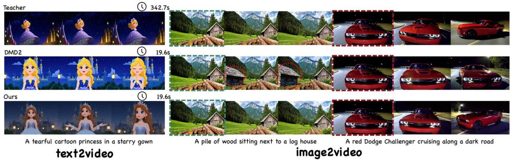  
Figure 1: Qualitative results on text-to-video and image-to-video generation. The colored outline indicates the input image for the image-to-video tasks. Compared to DMD, our method significantly improves visual quality, resolves the over-saturation artifacts with better video dynamics and appearance, and even outperforms the teacher model. The time is measured on a single NVIDIA RTX PRO 6000 GPU.

The root cause of both failure modes is the reverse Kullback-Leibler (KL) objective used in DMD, which is well known to be mode-seeking [20, 21]: the student seeks the highest-density modes of real, as the reverse KL takes its expectation over student-generated samples (Sec. 3) and primarily ??optimizes only the modes that the student covers and cannot penalize missing modes in the real distribution. To fix the problem, our intuition is simple: directly incorporating real video samples into the training objective during distillation, so that the student can be explicitly pulled toward the diverse, high-quality real data distribution rather than supervising itself using its own generated data.

Building on this motivation, we propose Data-Forcing Distillation (DFD), a video distillation framework that restores both diversity and fidelity with a single line of code change on top of DMD. The core of DFD is the teacher score discrepancy that computes the score difference between a real video and the student’s generated video, and we directly incorporate it in the distillation objective. Intuitively, this score discrepancy points the student to the real-data distribution, pulling it toward missing modes (mitigating mode collapse) and away from problematic modes absent in real data (avoiding over-saturation). In practice, DFD is implemented with a single-line code change: feeding a real video sample to the teacher in place of the student’s own generation when computing the distribution matching objective. While the idea of leveraging real data was already explored in DMD2 [17], it was implemented through an auxiliary GAN [22], which destabilizes training and only implicitly transfers real-data information to the generator through a discriminator. In contrast, DFD explicitly provides real-data guidance to the distribution matching objective, preserving the efficiency and simplicity of DMD while mitigating both failure modes.

We conduct extensive experiments on two different video generation tasks with different pretrained video models to demonstrate the effectiveness of DFD. On text-to-video generation, we distill the pretrained Wan2.1-1.3B [4] model into a 4-step student model. On image-to-video generation, we apply the same recipe and distill the pretrained Cosmos-Predict2.5-2B [5] model. With only 50-100 steps of post-training on top of DMD2, our DFD consistently and significantly improves visual quality, restores diversity across scene composition and camera motion quality of DMD2, and substantially alleviates over-saturation artifacts. We will release our code and model checkpoints to support future research on efficient, high-fidelity, and diverse video generation.

## 2 Related Work

## 2.1 Trajectory-Based Methods

Trajectory-based distillation methods aim to accelerate the sampling process by training a few-step student model to match the denoising trajectory of a multi-step teacher model [10, 11, 23, 24]. Among these, Consistency Models (CMs) [11, 12, 14, 15, 25, 26] learns a consistency function $f _ { \theta } ( x _ { t } , t )  x _ { 0 }$ that directly maps any point ?? on the teacher’s probability flow ODE trajectory to ?? ?? , ??the initial data point $x _ { 0 }$ ??. Initially, discrete-time CMs were trained by minimizing the discrepancy between outputs at adjacent anchor points  and $t - \Delta t$ along the teacher trajectory. Recently, ?? ?? ??continuous-time CMs [13, 26] offer a clean upgrade by taking the limit as $\Delta t \to 0 ,$ simplifying the ??objective to enforce instantaneous self-consistency. Building upon these foundations, a notable work is the rCM [27], which is the first work to scale up continuous-time consistency models to large image and video diffusion models. Despite their significant empirical success and clean mathematical formulations, trajectory-based distillation methods still face open challenges, often exhibiting noticeable performance degradation when scaled up to large pretrained image synthesis or video generation models [28].

## 2.2 Distribution-Matching Methods

Distribution-matching distillation compresses a multi-step teacher into a few-step student by aligning the student’s output distribution with the teacher’s. DMD [16] minimizes a reverse KL between the two and achieves stable training and strong sample quality; DMD2 [17] augments it with an auxiliary GAN discriminator to mitigate the mode-seeking behavior of reverse KL, but inherits the well-known instability of adversarial training and only injects the real-data signal implicitly through the discriminator. These issues are amplified for video diffusion, where the high spatiotemporal dimensionality makes mode collapse and over-saturation considerably more severe.

A parallel line of work generalizes the divergence itself.  -distill [29] casts DMD as a special ??case of integral  -divergence and reports gains from alternatives such as the Jeffreys divergence, while Uni-Instruct [19] unifies Score Implicit Matching [30] and Score Identity Distillation [31] under a single objective. Diversity-Preserving DMD [32] instead couples DMD with trajectorybased distillation to recover modal diversity, though scaling such hybrids to video remains open. Most recently, Transition Matching Distillation (TMD) [33] extends the paradigm temporally by matching conditional transition probabilities across sub-intervals of the denoising trajectory, enabling distillation of large-scale video models – yet it still rests on the same reverse-KL backbone and inherits its diversity limitations.

## 3 Background: Distribution Matching Distillation

We first review Distribution Matching Distillation (DMD), the reverse-KL objective it optimizes, and the mode-collapse issue that motivates our approach.

Distribution Matching Distillation (DMD) [16, 17]. To distill a pretrained multi-step teacher into a few-step student $G _ { \theta , }$ , DMD matches the student’s output distribution $p _ { \mathrm { f a k e } }$ to the teacher’s data distribution $p _ { \mathrm { r e a l } }$ ?? ??via a KL objective. Since neither density is tractable, DMD reformulates the gradient in terms of score functions, which can be approximated by diffusion denoisers. Concretely, for a noise-perturbed sample $x _ { t } = \alpha _ { t } G _ { \theta } ( z , c ) + \sigma _ { t } \epsilon \mathrm { w i t h } \epsilon \sim N ( \mathbf { 0 } , I )$ , the student gradient takes the form

$$
\nabla_ {\theta} \mathcal {L} _ {\mathrm{DMD}} = \mathbb {E} _ {t, z, \epsilon} \left[ w (t) \left(\nabla_ {x} \log p _ {\text {fake}} (\boldsymbol {x} _ {t}) - \nabla_ {x} \log p _ {\text {real}} (\boldsymbol {x} _ {t})\right) \nabla_ {\theta} G _ {\theta} (\boldsymbol {z}, c) \right], \tag {1}
$$

where $\nabla _ { x }$ log $p _ { \mathrm { r e a l } }$ is learned by the frozen teacher denoiser, $\nabla _ { x }$ log $p _ { \mathrm { f a k e } }$ is learned by an auxiliary ?? ?? ?? ??denoiser trained online on student samples via denoising score matching, and ( ) is a noise-level ?? ??weighting. Training alternates between updating ?? with Eq. (1) and updating the auxiliary denoiser to track the moving fake.

Reverse Kullback-Leibler (KL) Loss. DMD instantiates Eq. (1) as the gradient of the reverse ${ \mathrm { K L } } ,$ ,

$$
D _ {\mathrm{KL}} \left(p _ {\text {fake}} \| p _ {\text {real}}\right) = \underset {z \sim \mathcal {N} (\boldsymbol {0}, I)} {\mathbb {E}} \left[ \log \frac {p _ {\text {fake}} (\boldsymbol {x})}{p _ {\text {real}} (\boldsymbol {x})} \right], \tag {2}
$$

along the diffusion path whose differentiation yields

$$
\nabla_ {\theta} D _ {\mathrm{KL}} \left(p _ {\text {fake}} \| p _ {\text {real}}\right) = \mathbb {E} _ {z} \left[ \left(\nabla_ {x} \log p _ {\text {fake}} (\boldsymbol {x}) - \nabla_ {x} \log p _ {\text {real}} (\boldsymbol {x})\right) \nabla_ {\theta} G _ {\theta} (\boldsymbol {z}, c) \right], \quad \boldsymbol {x} = G _ {\theta} (\boldsymbol {z}, c). \tag {3}
$$

This formulation gives strong few-step quality and fast convergence, but the reverse KL is well known to be mode-seeking: the student collapses onto the highest-density modes of $p _ { \mathrm { r e a l . } }$ , producing ??low-diversity, often over-saturated samples [34, 35]. The core reason for this mode-seeking behavior is that reverse KL divergence is evaluated as an expectation over the student’s generated distribution. Consequently, if the student drops a mode, the loss function incurs no penalty in that region, yielding zero gradient signal to recover the missing mode. The core reason for mode-seeking is that reverse KL samples from the data generated by the student, and when there is a missing mode in the student, the KL divergence can not pull it back.

Regularization with Real Data To overcome the stated mode collapse, over-saturated problem introduced by reverse KL loss, DMD2 [17] partially compensates with an auxiliary GAN [22] discriminator, but adversarial training is unstable and only implicitly injects the real-data signal through the discriminator rather than through the distribution-matching gradient itself.

## 4 Data-Forcing Distillation

Our core intuition is to incorporate real data directly into the reverse KL gradient through a differentiable regularizer, where the student’s distribution can be explicitly pulled toward the diverse, high-quality real data distribution rather than supervising itself in the teacher. In this section, we first formally formulate our proposed data-forcing distillation, then give a practical implementation.

## 4.1 The Data-Forcing Distillation (DFD) Framework

Our DFD injects a real-data regularization term into the original DMD gradient.

$$
\begin{array}{l} g _ {\mathrm{DFD}} (\theta) = \underbrace {\mathbb {E} _ {\boldsymbol {z} \sim \mathcal {N} (\boldsymbol {0} , I)} \Big [ \big (\nabla_ {x} \log p _ {\mathrm{fake}} (G _ {\theta} (\boldsymbol {z} , c)) - \nabla_ {x} \log p _ {\mathrm{real}} (G _ {\theta} (\boldsymbol {z} , c)) \big) \nabla_ {\theta} G _ {\theta} (\boldsymbol {z} , c) \Big ]} _ {\text {native DMD gradient g_{DMD} (\theta)}} \\ - \underbrace {\mathbb {E} _ {\boldsymbol {x} \sim p _ {\text {real}} (\cdot | c) ,   \boldsymbol {z} \sim \mathcal {N} (\boldsymbol {0} , I)} \left[ \Delta_ {p _ {\text {real}} ,   \boldsymbol {x} ,   G _ {\theta} (\boldsymbol {z})}   \nabla_ {\theta} G _ {\theta} (\boldsymbol {z} , c) \right]} _ {\text {real - data regularizer}}. \\ \end{array}
$$

$$
\Delta_ {p _ {\text {real}}, x, G _ {\theta} (z)} = \nabla_ {x} \log p _ {\text {real}} (\boldsymbol {x}) - \nabla_ {x} \log p _ {\text {real}} (G _ {\theta} (\boldsymbol {z}, c)), \quad \boldsymbol {x} \sim p _ {\text {real}} (\cdot | c). \tag {5}
$$

We refer to $\Delta _ { p _ { \mathrm { r e a l } } , x , G _ { \theta } ( z ) }$ as the teacher score discrepancy: it measures the gap, in the teacher’s score ?? , ,??field, between a real sample and the student’s generation. When the student matches the real distribution $( p _ { \mathrm { f a k e } } = p _ { \mathrm { r e a l } } )$ , this discrepancy is minimized to zero in expectation, $\mathbb { E } _ { x , z } [ \Delta _ { p _ { \mathrm { r e a l } } , x , G _ { \theta } ( z ) } ] =$ ?? ?? , ?? , ,??0 (proof in the Appendix A). Empirically, drawing ?? from diverse, high-quality real-world data and minimizing $\Delta _ { p _ { \mathrm { r e a l } } , x , G _ { \theta } ( z ) }$ pulls the student toward modes it has missed in the real data (mitigating ?? , ,??mode collapse) and away from problematic modes such as over-saturated outputs that are not in the real data. More importantly, properties of real data, such as temporal coherence, physical plausibility, photorealism, can be explicitly distilled into the student through this term.

Discussion: No Need for a GAN. DMD2 [17] provides implicit real-data supervision through an auxiliary GAN loss; in contrast, DFD provides explicit real-data supervision through the scorediscrepancy term (Eq. 5). As a result, we drop the GAN loss completely from our distillation pipeline and it will not affect our performance. We validate this in the ablation study in section 5.2.

## 4.2 The Underlying Assumption of DFD

The teacher score discrepancy $\Delta _ { p _ { \mathrm { r e a l } } , x , G _ { \theta } ( z ) }$ is well-behaved in expectation. However, what governs ?? , ,??whether this regularizer helps or hurts training is not its expectation but its variance—a zero-mean signal can still produce a high-noisy gradient that destabilizes optimization. We therefore need $\mathbb { E } _ { x , z } \left[ \| \Delta _ { p _ { \mathrm { r e a l } } , x , G _ { \theta } ( z ) } \| ^ { 2 } \right]$ to stay small. To see what controls this variance, a first-order expansion of , ?? , ,??the teacher’s score around $G _ { \theta } ( z , c )$ shows that, to leading order, the per-sample discrepancy is approximately proportional to the gap between paired real and generated samples,

$$
\left\| \Delta_ {p _ {\text {real}}, x, G _ {\theta} (z)} \right\| = \left\| \nabla_ {x} \log p _ {\text {real}} (\boldsymbol {x}) - \nabla_ {x} \log p _ {\text {real}} (G _ {\theta} (\boldsymbol {z}, c)) \right\| \approx \alpha_ {t} L (c, t) \| \boldsymbol {x} - G _ {\theta} (\boldsymbol {z}, c) \| \tag {6}
$$

where $\textstyle x \sim p _ { \mathrm { r e a l } } ( \cdot \mid c ) , \alpha _ { t }$ is the diffusion schedule coefficient, and $L ( c , t )$ is the Lipschitz constant of ?? ?? ?? ?? ??, ??the teacher’s score network in practice. Consequently the variance of the regularizer is approximately proportional to the squared gap $\mathbb { E } _ { x , z } [ | | x - G _ { \theta } ( \bar { z } , c ) | | ^ { \bar { 2 } } ]$ , and controlling $\mathbb { E } _ { x , z } [ \| \Delta _ { p _ { r e a l } , x , G _ { \theta } ( z ) } | | ^ { 2 } ]$ reduces , ?? , ?? , ????to controlling this gap. We formalize this requirement as the validity condition:

$$
\mathbb {E} _ {x, z} \left[ \| x - G _ {\theta} (z, c) \| ^ {2} \mid c \right] \leq \delta (c) ^ {2}, \tag {7}
$$

where $\delta ( c )$ is a conditioning-dependent bound. Combining the approximation above with Eq. 6 ??yields the corresponding (approximate) control on the regularizer’s variance: $\mathbb { E } _ { x , z } \big [ \big \| \Delta _ { p _ { \mathrm { r e a l } } , x , G _ { \theta } ( z ) } \big \| _ { 2 } ^ { 2 } \big | c \big ] \ \lesssim$ $\alpha _ { t } ^ { 2 } L ( c , t ) ^ { 2 } \delta ( c ) ^ { 2 }$ . The complete derivation is in Appendix. A. Since we evaluate the score along the ?? ?? ??, ?? ??full diffusion path rather than only at its endpoint with pure noise, neither $\alpha _ { t }$ nor $L ( c , t )$ will explode.

## 4.3 Practical Implementation

Eq. (4) admits a clean simplification. Because the regularizer $\Delta _ { p _ { \mathrm { r e a l } } , x , G _ { \theta } ( z ) }$ is evaluated at the same ?? , , ??noise level and condition  as the DMD gradient, it exactly cancels the score $\nabla _ { x } \log p _ { \mathrm { r e a l } } ( G _ { \theta } ( z , c ) )$ . ??The DFD gradient therefore reduces to

$$
g_{\mathrm{DFD}}(\theta) = \mathbb{E}_{\substack{\boldsymbol {x}\sim p_{\text{real}}(\cdot |c)\\ \boldsymbol {z}\sim \mathcal{N}(\boldsymbol {0},I)}}\left[ \left(\nabla_{x}\log p_{\text{fake}}(G_{\theta}(\boldsymbol {z},c)) - \nabla_{x}\log p_{\text{real}}(\boldsymbol {x})\right)\nabla_{\theta}G_{\theta}(\boldsymbol {z},c)\right]. \tag{8}
$$

The only difference compared to the DMD gradient (Eq. 3) is the second score: instead of evaluating $\nabla _ { x }$ log $p _ { \mathrm { r e a l } }$ at the student’s own out-??put $G _ { \theta } ( z , c )$ , we evaluate it at a real data sample ?? drawn under the same condition. Fig. 2 illustrates this difference.

In practice, we do not enforce Eq. (7) as a hard constraint. Instead, we satisfy it implicitly by applying DFD as a post-training stage on top of a DMD2-pretrained model, whose generations are already close to the real video and naturally keep $\mathbb { E } _ { x , z } [ | | x - G _ { \theta } ( z , c ) | | ^ { 2 } ]$ small. The abla-

, ?? , ??tion in section 5.2 confirms the importance of this regime: violating the validity condition—e.g., applying DFD from scratch when the student still produces noisy videos—prevents the model from converging. Concretely, we form the practical update as a combination of the DMD gradient and the DFD gradient,

$$
g (\theta) = (1 - w) g _ {\mathrm{DMD}} (\theta) + w g _ {\mathrm{DFD}} (\theta), \tag {9}
$$

where $w \in [ 0 , 1 ]$ controls how much of the DMD signal is retained. We use $\begin{array} { r } { w = { \frac { 1 } { 2 } } } \end{array}$ as our default, ?? , ??which preserves the fast convergence of the DMD while leveraging real-data guidance. In practice, we implement Eq. 9 via per-step stochastic sampling, which matches in expectation when $p = w \colon$

$$
\nabla_ {\theta} \mathcal {L} = \left\{ \begin{array}{l l} g _ {\mathrm{DFD}} (\theta) & \text { with   probability } p, \\ g _ {\mathrm{DMD}} (\theta) & \text { with   probability } 1 - p. \end{array} \right. \tag {10}
$$

Additionally, following standard practice in the DMD line of work, we replace the exact score in Eq. 9 with the scores estimated by the diffusion models on perturbed samples, and take the expectation over the diffusion timesteps.

Pseudo-Code We provide the pseudo-code of our DFD below, and highlight the simplicity of our method, which only adds one line of code change compared with the original DMD2 method:

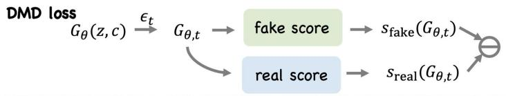

<details>
<summary>flowchart</summary>

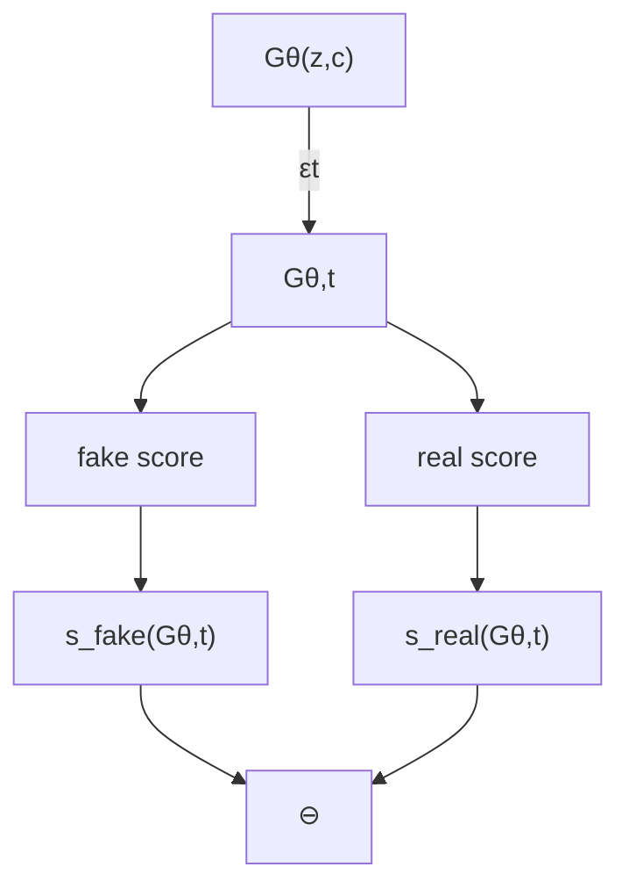
</details>

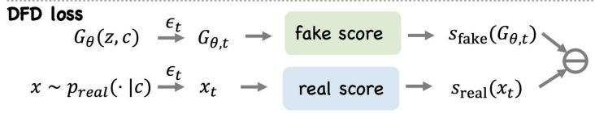

<details>
<summary>flowchart</summary>

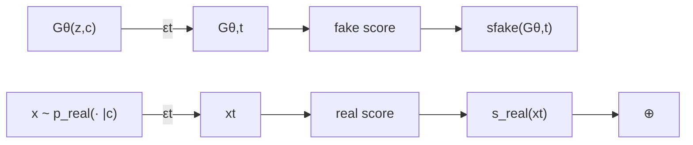
</details>

Figure 2: The comparison between our DFD and the original DMD. Our DFD computes the real score directly using the videos sampled from the real data distribution, while the original DMD computes the real score using the generated videos from the student.

Algorithm 1 Pseudocode of Student Update Step in a PyTorch-like Style.  
```python
# student_network / teacher_network / fake_score_network: networks
# input_student, t_student: noisy input and timestep fed to student
# t, eps: diffusion timestep and noise for forward diffusion
# data: real data batch; condition: video gen conditioning
# p: probability of using DFD vs DMD
def student_update_step(input_student, t_student, t, eps, data, condition=None):
    # Generate samples using student network.
    gen_data = student_network(input_student, t_student, condition=condition)

    # teacher_data = gen_data.detach()  # Original DMD update
    teacher_data = data.detach() if (torch.rand() < p) else gen_data.detach()

    # Inject noise into the data via forward diffusion
    perturbed_data = forward_diffusion(gen_data, eps, t)
    perturbed_teacher_data = forward_diffusion(teacher_data, eps, t)
    # Estimate scores
    fake_score = fake_score_network(perturbed_data, t, condition=condition)
    teacher_score = teacher_network(perturbed_teacher_data, t, condition=condition)
    # Compute gradient and student loss
    vsd_grad = fake_score - teacher_score
    pseudo_target = gen_data - vsd_grad
    gen_loss = 0.5 * F.mse_loss(gen_data, pseudo_target.detach())
    return gen_loss
```

The violet block is the only difference between the DFD and DMD frameworks.

## 4.4 Data Selection for DFD

Once real data enters the distillation gradient, its quality and diversity become the new bottleneck on what the student can learn. We therefore curate the training videos with high quality and diversity. Specifically, we start from the public ViPE-Wild-1M dataset [36], generated by the Wan 2.1 [4] 14B model, and cluster its 1M videos into 1,000 clusters. We then manually retain the clusters whose videos exhibit clear semantics, temporal coherence, varied styles, and diverse dynamics. From the retained pool, we construct two training sets: a 20,000-video animation and cartoon set and a complete 30,000-video mixed-style set. We detail the exact selection process in Appendix B

## 5 Experiments and Results

We evaluate DFD on three representative large-scale video-generation settings: Wan2.1-1.3B for textto-video generation and Cosmos-Predict2.5-2B for image-to-video generation, We further conduct a comprehensive ablation study to demonstrate the effectiveness of our design choices.

## 5.1 Main Experiments

## 5.1.1 Text-to-Video Generation

Experimental Settings. For the text-to-video generation, we distill the Wan2.1-1.3B model on both the animation set and the mix-style set. We compare against two baselines: DMD2 [17] and DP-DMD [32]. For DMD2, we use the implementation and default configurations from the FastGen codebase. For DP-DMD, we follow the original paper and use a diversity anchor step of  = 5 with ??weight 0 05 [32]. For all the methods, we distill the pretrained Wan model into a four-step student model. We evaluate results along three aspects. Video quality: we adopt the metrics from VBench [37]. Video diversity: we adopt the diversity metric from DP-DMD [32]. Camera-pose diversity: we use the ViPE [36] to estimate the camera poses of each generated video, and compute diversity statistics from the estimated cameras. The evaluation set comprises 70 animation prompts and 70 mix-style prompts, respectively. We generate 8 videos for each prompt with random seeds 1–8, yielding 1120 videos in total for evaluation. Further details are provided in the Appendix B.

DMD2  
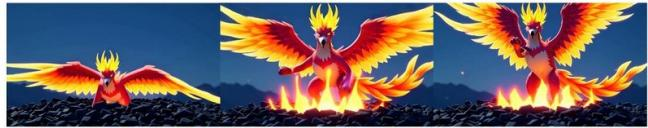

<details>
<summary>natural_image</summary>

Three-panel illustration of a phoenix-like creature performing with wings spread across flames, set against a dark sky with distant mountains (no text or symbols)
</details>

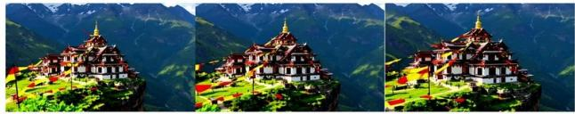

<details>
<summary>natural_image</summary>

Three-panel image showing a Tibetan-style monastery on a mountain peak, surrounded by greenery and snow-capped peaks (no text or symbols visible)
</details>

DP-DMD  
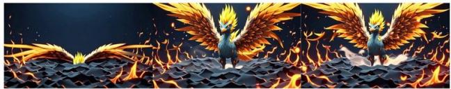

<details>
<summary>natural_image</summary>

Illustration of two golden phoenixes flying over a dark, flame-filled landscape (no text or symbols)
</details>


<details>
<summary>natural_image</summary>

Three-panel photo collage of a Tibetan monastery complex with colorful architecture and flags, set against mountainous backdrop (no visible text or symbols)
</details>

Ours  
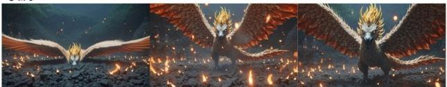

<details>
<summary>natural_image</summary>

Four-panel illustration of a mythical dragon with wings spread across a dark, glowing forest (no text or symbols)
</details>

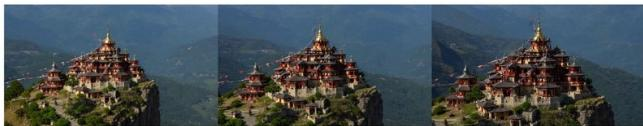

<details>
<summary>natural_image</summary>

Three-panel photo collage showing a temple on a mountain peak with forested slopes in the background (no visible text or symbols)
</details>

Anime-stylephoenixrisingdramatically fromabedof glowingashes.  
Wide shot ofa Tibetanmonastery  
Figure 3: Qualitative results on text-to-video generation. The left columns show models distilled on animation set, and the right column on the mix-style set. Our method produces videos that are not over-saturated, and recovers finer details such as the wing texture of the phoenix.

Table 1: Quantitative results on the text-to-video experiments using Wan2.1-1.3B. For all metrics, higher is better. The best result among the distilled methods in each column is bolded.

<table><tr><td rowspan="2">Method</td><td colspan="6">Video Quality</td><td colspan="4">Video Diversity</td><td colspan="2">Camera Pose Diversity</td></tr><tr><td>Subject Consistency</td><td>Background Consistency</td><td>Temporal Flickering</td><td>Motion Smoothness</td><td>Aesthetic Quality</td><td>Average VBench</td><td>CLIP (Mean)</td><td>CLIP (Per-frame)</td><td>DINO (Mean)</td><td>DINO (Per-frame)</td><td>Endpoint Distance</td><td>Trajectory Distance</td></tr><tr><td>Teacher</td><td>0.956</td><td>0.959</td><td>0.976</td><td>0.985</td><td>0.622</td><td>0.899</td><td>0.178</td><td>0.222</td><td>0.301</td><td>0.350</td><td>30.571</td><td>26.651</td></tr><tr><td>DMD2</td><td>0.956</td><td>0.957</td><td>0.973</td><td>0.985</td><td>0.634</td><td>0.901</td><td>0.120</td><td>0.165</td><td>0.190</td><td>0.239</td><td>9.148</td><td>4.284</td></tr><tr><td>DP-DMD</td><td>0.960</td><td>0.957</td><td>0.977</td><td>0.987</td><td>0.633</td><td>0.903</td><td>0.126</td><td>0.165</td><td>0.197</td><td>0.239</td><td>7.208</td><td>3.466</td></tr><tr><td>Ours</td><td>0.956</td><td>0.955</td><td>0.976</td><td>0.988</td><td>0.655</td><td>0.906</td><td>0.128</td><td>0.170</td><td>0.205</td><td>0.252</td><td>18.513</td><td>19.256</td></tr></table>

Experimental Results We provide qualitative results in Fig. 3 with quantitative results averaged on the models distilled on the animation test set and the mix-style testset in Table 1. Qualitatively, our method produces higher-quality videos: it mitigates the over-saturation artifacts with significantly better appearance and dynamics, and recovers fine-grained details. Quantitatively, DFD obtains the best overall VBench score among all the distilled models, mainly driven by improved aesthetic quality and motion smoothness. It also improves all four visual-diversity metrics and substantially increases camera-pose diversity compared with DMD2 and DP-DMD. Additional qualitative results are provided in Appendix C.1.

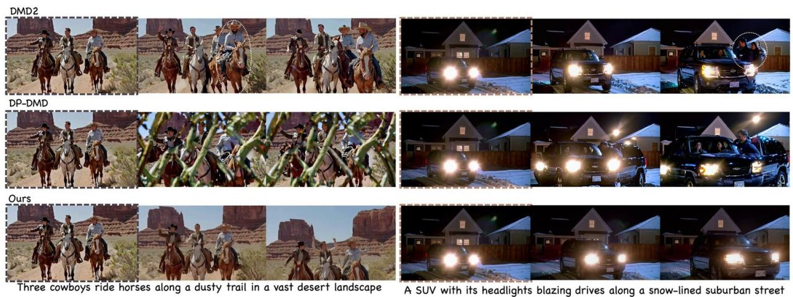  
Figure 4: I2V results on the ViPE test set. The colored outline indicates the input image. Our method produces videos that closely follow the first frame and remain coherent across the full sequence, whereas DMD2 and DP-DMD introduce structural anomalies such as an extra cowboy appearing from nowhere (highlighted by white circles).

## 5.1.2 Image-to-Video Generation

Experimental Settings. For image-to-video generation, we distill the Cosmos-Predict2.5-2B model on our curated mix-style dataset. Same as text-to-video generation, all the methods are implemented in the FastGen codebase. For evaluation, we use two image-to-video test sets: one from VBench, containing 348 images, and one curated from the ViPE-Wild-1M dataset, containing 78 images that are held out from training. We adopt the image-to-video metrics from VBench [37] for evaluation. Further details are provided in the Appendix B.

Experimental Results. We provide quantitative results in Table 2 and Table 5 (in the appendix), with qualitative results in Fig 4 and Fig 5. Quantitatively, our method outperforms the baselines on the majority of metrics, and is particularly strong at preserving first-frame conditioning and maintaining temporal coherence. Qualitatively, DP-DMD frequently violates the first-frame constraint, occasionally producing abrupt artifacts that disrupt the whole frame DMD2 yields visible quality improvements over DP-DMD but still struggles to maintain temporal coherence in later frames and often hallucinates structural anomalies such as distorted human figures appearing outside vehicles. In contrast, our model adheres closely to the input frame and remains stable and consistent across all generated frames. Our model also achieves better physical plausibility. In the traffic scene example shown in Fig. 5, DMD2 produces visibly implausible interactions, such as vehicles intersecting. DFD reduces such artifacts in this example and yields more coherent motion. These results support the core intuition of our approach: by incorporating real data into the distillation process, the generator can not only mitigate mode-seeking behavior and over-saturation artifacts, but also capture key properties of real videos, such as first-frame coherence, temporal consistency, and physical realism.

Table 2: Quantitative comparison on image-to-video generation, we evaluate on the VBench test image suite using the metrics from VBench. For all metrics, higher is better. The best result in each column is bolded. Our method consistently outperforms the baselines on all the metrics, and is even better than the teacher model.

<table><tr><td>Method</td><td>Subject Consistency</td><td>Background Consistency</td><td>Aesthetic Quality</td><td>Temporal Flickering</td><td>Motion Smoothness</td><td>Image-to-Video Subject</td><td>Image-to-Video Background</td><td>Average</td></tr><tr><td>Teacher</td><td>0.9616</td><td>0.9648</td><td>0.6320</td><td>0.9717</td><td>0.9905</td><td>0.9867</td><td>0.9925</td><td>0.9285</td></tr><tr><td>DMD2</td><td>0.9421</td><td>0.9621</td><td>0.6301</td><td>0.9734</td><td>0.9886</td><td>0.9850</td><td>0.9900</td><td>0.9245</td></tr><tr><td>DP-DMD</td><td>0.8457</td><td>0.9068</td><td>0.5850</td><td>0.9603</td><td>0.9832</td><td>0.9570</td><td>0.9520</td><td>0.8843</td></tr><tr><td>Ours</td><td>0.9613</td><td>0.9692</td><td>0.6371</td><td>0.9759</td><td>0.9900</td><td>0.9859</td><td>0.9930</td><td>0.9303</td></tr></table>

DMD2  
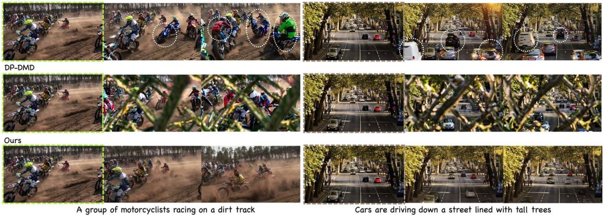  
Figure 5: I2V results on the VBench test set. The colored outline indicates the input image. Our method shows much better visual quality with smooth and physically plausible dynamics under complex scenarios, whereas DP-DMD and DMD2 fail to produce valid videos.

## 5.1.3 Autoregressive Video Generation

Experimental Settings. For autoregressive video generation, we distill the Wan2.1-1.3B model on our curated mixed-style dataset following the Self Forcing framework [38]. All methods are implemented within the Self Forcing codebase. Additional implementation details are provided in Appendix B.

Experimental Results. Qualitative results are presented in Fig. 6. Similar to our image-to-video experiments, Self Forcing with DMD2 struggles to preserve temporal coherence over long horizons and frequently introduces structural artifacts and hallucinations. For example, crab-like figures gradually emerge from the stone scene. In contrast, our method maintains stable content and coherent object structures throughout the generated sequence. Our method also produces videos with stronger physical plausibility. In the train example shown in Fig. 6, DMD2 generates physically inconsistent interactions including disconnected train carriages. DFD substantially reduces such artifacts and yields a more coherent and realistic scene. These observations echo our I2V findings and further support the core intuition behind our approach: by incorporating real data into the distillation process, the generator not only alleviates mode-seeking behavior and over-saturation artifacts, but also encourages the model to capture key characteristics of real videos, such as interframe coherence, temporal consistency, and physical realism.

Self Forcing (DMD)  
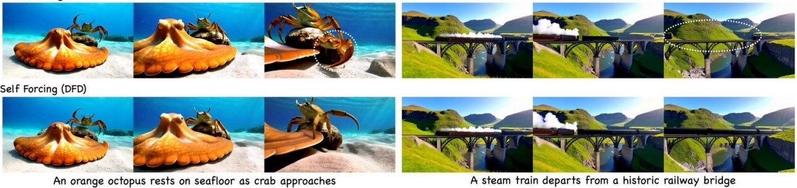

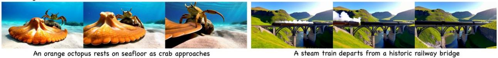  
Figure 6: Autoregressive video generation results. Results from the generator trained with the Self Forcing pipeline using DFD loss outperform those trained with DMD loss, especially in frame consistency and physical plausibility.

## 5.2 Ablation Study

Table 3: Comparison between models distilled with batch size 16 and 128, evaluated on the VBench test set.

<table><tr><td>Batch size</td><td>Subject Consistency</td><td>Background Consistency</td><td>Aesthetic Quality</td><td>Temporal Flickering</td><td>Motion Smoothness</td><td>Image-to-Video Subject</td><td>Image-to-Video Background</td><td>Average</td></tr><tr><td>16</td><td>0.9613</td><td>0.9692</td><td>0.6371</td><td>0.9759</td><td>0.9900</td><td>0.9859</td><td>0.9930</td><td>0.9303</td></tr><tr><td>128</td><td>0.9638</td><td>0.9685</td><td>0.6383</td><td>0.9783</td><td>0.9914</td><td>0.9878</td><td>0.9929</td><td>0.9316</td></tr></table>

Effects of the GAN Loss. We ablate the requirement of GAN loss, and compare our DFD pipeline with and without an additional GAN loss. We experiment on the text-to-video generation on animation set. The VBench quality scores are reported in Table 6 (in the appendix), and qualitative results in Fig 7 (a). This ablation suggests that, in our post-training setting, adding the GAN loss does not provide a consistent benefit. Removing it simplifies the pipeline and improves dynamic degree and imaging quality, while maintaining comparable scores on the remaining metrics.

Effects on Weights in Eq. 9. We ablate the weights in the Eq. 9. We experiment on the text-to-video generation on animation set. We compare two weighting schemes, $\begin{array} { r } { w = \frac { 1 } { 2 } } \end{array}$ (our default setting) and ?? = 1 (pure DFD without DMD), on the text-to-video generation. Quantitative results are reported ??in Table 7 (in the appendix), and qualitative results in Fig 7 (b). The differences between the two settings are small, indicating that our method is stable and insensitive to the choice of . We adopt $\begin{array} { r } { w = { \frac { 1 } { 2 } } } \end{array}$ for theoretical reasons as it better satisfies the condition in Eq. 7.

Effects of DMD2 Pretraining. Our DFD needs to satisfy the validity condition in Eq. 7 for stabilized training. To verify this, we ablate by initializing the student with the teacher model (without DMD2 distillation) and comparing the DMD2 initialization. We experiment on both the text-to-video with animation set and image-to-video tasks with mix-style set. Qualitative results are provided in

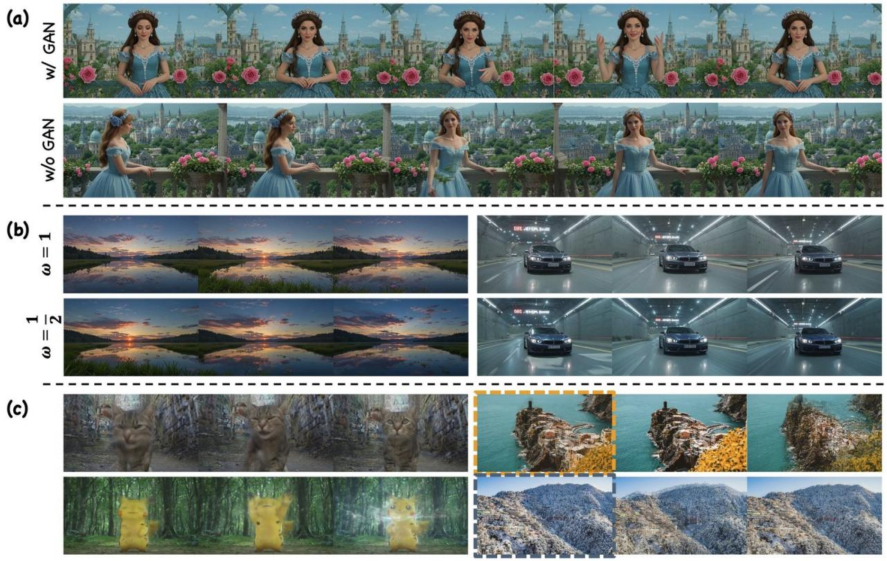  
Figure 7: (a): Ablation on the effect of the GAN loss. Adding the GAN loss yields no clear quality improvement, and video dynamics even degrade, which is consistent with our quantitative results. (b): Ablation on the weight in Eq. 9: $w = 1$ (upper) vs. $\begin{array} { r } { w = { \frac { 1 } { 2 } } } \end{array}$ (lower). Each row shows three ?? ??evenly sampled frames from one generated video. There is no clear visual difference between the two settings. (c): Qualitative results without DMD2 pretraining. Initializing purely from the teacher model without DMD2 pretraining fails to produce reasonable results, even after a sufficient number of training steps for both the text-to-video and image-to-video tasks.  
Fig 7 (c). Even after a long training run (e.g., 1400 iterations), the model fails to converge, which underscores the necessity of the validity condition.

## 5.3 Scaling Up with Large Batch Size

We further scale up the image-to-video generation on the Cosmos-Predict2.5-2B model by increasing the batch size from 16 to 128. As shown quantitatively in Table 3 and visually in Fig 8, the model distilled with a large batch size consistently outperforms the model with a small batch size. The larger batch size yields remarkably better temporal stability during large motions (e.g., the rider’s spear) and improved physical plausibility, such as preserving object permanence (e.g., consistent egg counts).

## 6 Conclusion

We introduce a data forcing distillation framework that advances the state-of-the-art for few-step video diffusion models, and restores diversity and fidelity. Our DFD requires only a single line of code change to the DMD2 baseline. At its core is the explicit integration of real data into the distribution matching objective, which successfully overcomes the diversity degradation and over-saturation typically induced by reverse-KL formulations. We provide a theoretical analysis to understand our DFD. Through comprehensive, large-scale evaluations on text-to-video and image-to-video generation benchmarks, we demonstrate that our approach successfully resolves persistent failure modes in DMD, yielding substantial improvements in visual fidelity, temporal coherence, and physical plausibility in few-step video generation. We also apply our method to the autoregressive video generation settings under the Self Forcing frameworks [38], prelimary results show our method still show the same improvements over the DMD method

16  
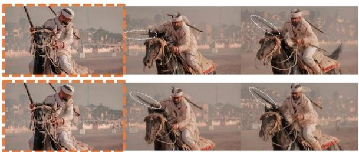

<details>
<summary>natural_image</summary>

Six-panel sequence showing a person riding a horse with a spear, holding a circular object, against a blurred urban background (no text or symbols)
</details>

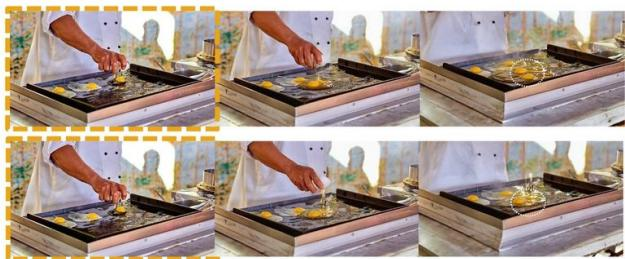

<details>
<summary>natural_image</summary>

Six-panel photo sequence showing a person cooking on a griddle board with egg yolks, no text or symbols visible
</details>

Figure 8: Effect of scaling up the distillation batch size. The colored outline indicates the input image. Increasing the batch size from 16 to 128 yields videos with superior visual quality and physical consistency. For instance, the spear in the rider’s hand exhibits much greater temporal clarity. Additionally, the scaled model preserves exact object counts across frames (the eggs), whereas the smaller batch size struggles with physical plausibility by generating phantom objects out of nowhere (highlighted by the white circle).

## 7 Limitation

While DFD substantially improves few-step video generation, its performance remains limited under extremely constrained generation budget. As shown in fig. 9, when the generation is restricted to two steps or fewer, the two-step distilled Cosmos-Predict2.5-2B model still struggles to produce high-quality videos: fast-moving objects, such as the man’s hands, appear blurry; fine details, such as the woman’s facial features, lose fidelity; and the model sometimes collapses to nearly static videos with little motion. These results suggest that, despite the improvements brought by DFD, generating high-quality and temporally dynamic videos remains challenging in the highly aggressive two-step-or-fewer regime.

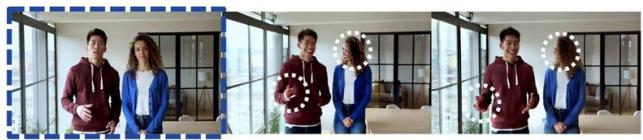

<details>
<summary>natural_image</summary>

Three-panel photo collage showing young people in front of large windows, with no visible text or symbols.
</details>

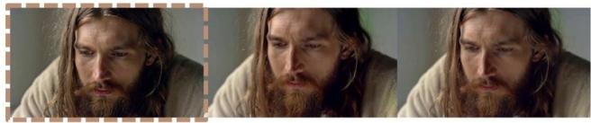

<details>
<summary>natural_image</summary>

Three-panel close-up photo of a man with long hair and beard, showing facial expression (no text or symbols visible)
</details>

Figure 9: Limitation of DFD under a two-step generation budget. With two-step distillation of the Cosmos-Predict2.5-2B model, DFD still produces blurry results for fast-moving content (e.g., the man’s hands), loses fine detail (e.g., the woman’s face), or collapses to highly static videos.

## References

[1] Yang Song, Jascha Sohl-Dickstein, Diederik P Kingma, Abhishek Kumar, Stefano Ermon, and Ben Poole. Score-based generative modeling through stochastic differential equations. arXiv preprint arXiv:2011.13456, 2020.  
[2] Yaron Lipman, Ricky TQ Chen, Heli Ben-Hamu, Maximilian Nickel, and Matt Le. Flow matching for generative modeling. arXiv preprint arXiv:2210.02747, 2022.  
[3] Robin Rombach, Andreas Blattmann, Dominik Lorenz, Patrick Esser, and Björn Ommer. Highresolution image synthesis with latent diffusion models. In Proceedings of the IEEE/CVF conference on computer vision and pattern recognition, pages 10684–10695, 2022.  
[4] Team Wan, Ang Wang, Baole Ai, Bin Wen, Chaojie Mao, Chen-Wei Xie, Di Chen, Feiwu Yu, Haiming Zhao, Jianxiao Yang, et al. Wan: Open and advanced large-scale video generative models. arXiv preprint arXiv:2503.20314, 2025.  
[5] Arslan Ali, Junjie Bai, Maciej Bala, Yogesh Balaji, Aaron Blakeman, Tiffany Cai, Jiaxin Cao, Tianshi Cao, Elizabeth Cha, Yu-Wei Chao, and other. World simulation with video foundation models for physical AI. arXiv preprint arXiv:2511.00062, 2025.  
[6] Weijie Kong, Qi Tian, Zijian Zhang, Rox Min, Zuozhuo Dai, Jin Zhou, Jiangfeng Xiong, Xin Li, Bo Wu, Jianwei Zhang, et al. Hunyuanvideo: A systematic framework for large video generative models. arXiv preprint arXiv:2412.03603, 2024.  
[7] Zhuoyi Yang, Jiayan Teng, Wendi Zheng, Ming Ding, Shiyu Huang, Jiazheng Xu, Yuanming Yang, Wenyi Hong, Xiaohan Zhang, Guanyu Feng, et al. Cogvideox: Text-to-video diffusion models with an expert transformer. arXiv preprint arXiv:2408.06072, 2024.  
[8] Tim Brooks, Bill Peebles, Connor Holmes, Will DePue, Yufei Guo, Leo Jing, David Schnurr, Joe Taylor, Troy Luhman, Eric Luhman, et al. Video generation models as world simulators. OpenAI Blog, 1(8):1, 2024.  
[9] Tim Salimans and Jonathan Ho. Progressive distillation for fast sampling of diffusion models. arXiv preprint arXiv:2202.00512, 2022.  
[10] Chenlin Meng, Robin Rombach, Ruiqi Gao, Diederik Kingma, Stefano Ermon, Jonathan Ho, and Tim Salimans. On distillation of guided diffusion models. In Proceedings of the IEEE/CVF conference on computer vision and pattern recognition, pages 14297–14306, 2023.  
[11] Yang Song, Prafulla Dhariwal, Mark Chen, and Ilya Sutskever. Consistency models. 2023.  
[12] Yang Song and Prafulla Dhariwal. Improved techniques for training consistency models. arXiv preprint arXiv:2310.14189, 2023.  
[13] Cheng Lu and Yang Song. Simplifying, stabilizing and scaling continuous-time consistency models. arXiv preprint arXiv:2410.11081, 2024.  
[14] Zhengyang Geng, Mingyang Deng, Xingjian Bai, J Zico Kolter, and Kaiming He. Mean flows for one-step generative modeling. arXiv preprint arXiv:2505.13447, 2025.  
[15] Amirmojtaba Sabour, Sanja Fidler, and Karsten Kreis. Align your flow: Scaling continuous-time flow map distillation. arXiv preprint arXiv:2506.14603, 2025.  
[16] Tianwei Yin, Michaël Gharbi, Richard Zhang, Eli Shechtman, Fredo Durand, William T Freeman, and Taesung Park. One-step diffusion with distribution matching distillation. In Proceedings of the IEEE/CVF conference on computer vision and pattern recognition, pages 6613–6623, 2024.  
[17] Tianwei Yin, Michaël Gharbi, Taesung Park, Richard Zhang, Eli Shechtman, Fredo Durand, and William T Freeman. Improved distribution matching distillation for fast image synthesis. Advances in neural information processing systems, 37:47455–47487, 2024.  
[18] Weijian Luo, Tianyang Hu, Shifeng Zhang, Jiacheng Sun, Zhenguo Li, and Zhihua Zhang. Diff-instruct: A universal approach for transferring knowledge from pre-trained diffusion models. Advances in Neural Information Processing Systems, 36:76525–76546, 2023.  
[19] Yifei Wang, Weimin Bai, Colin Zhang, Debing Zhang, Weijian Luo, and He Sun. Uni-instruct: One-step diffusion model through unified diffusion divergence instruction. arXiv preprint arXiv:2505.20755, 2025.  
[20] Ben Poole, Ajay Jain, Jonathan T Barron, and Ben Mildenhall. Dreamfusion: Text-to-3d using 2d diffusion. arXiv preprint arXiv:2209.14988, 2022.  
[21] Zhengyi Wang, Cheng Lu, Yikai Wang, Fan Bao, Chongxuan Li, Hang Su, and Jun Zhu. Prolificdreamer: High-fidelity and diverse text-to-3d generation with variational score distillation. Advances in neural information processing systems, 36:8406–8441, 2023.  
[22] Ian J Goodfellow, Jean Pouget-Abadie, Mehdi Mirza, Bing Xu, David Warde-Farley, Sherjil Ozair, Aaron Courville, and Yoshua Bengio. Generative adversarial nets. Advances in neural information processing systems, 27, 2014.  
[23] Simian Luo, Yiqin Tan, Longbo Huang, Jian Li, and Hang Zhao. Latent consistency models: Synthesizing high-resolution images with few-step inference. arXiv preprint arXiv:2310.04378, 2023.  
[24] Jiachen Li, Weixi Feng, Tsu-Jui Fu, Xinyi Wang, Sugato Basu, Wenhu Chen, and William Y Wang. T2v-turbo: Breaking the quality bottleneck of video consistency model with mixed reward feedback. Advances in neural information processing systems, 37:75692–75726, 2024.  
[25] Zhengyang Geng, Ashwini Pokle, Weijian Luo, Justin Lin, and J Zico Kolter. Consistency models made easy. In The Thirteenth International Conference on Learning Representations, 2024.  
[26] Dongjun Kim, Chieh-Hsin Lai, Wei-Hsiang Liao, Naoki Murata, Yuhta Takida, Toshimitsu Uesaka, Yutong He, Yuki Mitsufuji, and Stefano Ermon. Consistency trajectory models: Learning probability flow ode trajectory of diffusion. arXiv preprint arXiv:2310.02279, 2023.  
[27] Kaiwen Zheng, Yuji Wang, Qianli Ma, Huayu Chen, Jintao Zhang, Yogesh Balaji, Jianfei Chen, Ming-Yu Liu, Jun Zhu, and Qinsheng Zhang. Large scale diffusion distillation via score-regularized continuous-time consistency. arXiv preprint arXiv:2510.08431, 2025.  
[28] Fu-Yun Wang, Zhaoyang Huang, Alexander W Bergman, Dazhong Shen, Peng Gao, Michael Lingelbach, Keqiang Sun, Weikang Bian, Guanglu Song, Yu Liu, et al. Phased consistency models. Advances in neural information processing systems, 37:83951–84009, 2024.  
[29] Yilun Xu, Weili Nie, and Arash Vahdat. One-step diffusion models with  -divergence distribution matching. arXiv preprint arXiv:2502.15681, 2025.  
[30] Weijian Luo, Zemin Huang, Zhengyang Geng, J Zico Kolter, and Guo-jun Qi. One-step diffusion distillation through score implicit matching. Advances in Neural Information Processing Systems, 37:115377–115408, 2024.  
[31] Mingyuan Zhou, Huangjie Zheng, Zhendong Wang, Mingzhang Yin, and Hai Huang. Score identity distillation: Exponentially fast distillation of pretrained diffusion models for one-step generation. In Forty-first International Conference on Machine Learning, 2024.  
[32] Tianhe Wu, Ruibin Li, Lei Zhang, and Kede Ma. Diversity-preserved distribution matching distillation for fast visual synthesis. arXiv preprint arXiv:2602.03139, 2026.  
[33] Weili Nie, Julius Berner, Nanye Ma, Chao Liu, Saining Xie, and Arash Vahdat. Transition matching distillation for fast video generation. ArXiv, abs/2601.09881, 2026.  
[34] Jiajun He, Wenlin Chen, Mingtian Zhang, David Barber, and José Miguel Hernández-Lobato. Training neural samplers with reverse diffusive kl divergence. arXiv preprint arXiv:2410.12456, 2024.  
[35] Yanzuo Lu, Yuxi Ren, Xin Xia, Shanchuan Lin, Xing Wang, Xuefeng Xiao, Andy J Ma, Xiaohua Xie, and Jian-Huang Lai. Adversarial distribution matching for diffusion distillation towards efficient image and video synthesis. In Proceedings of the IEEE/CVF International Conference on Computer Vision, pages 16818–16829, 2025.  
[36] Jiahui Huang, Qunjie Zhou, Hesam Rabeti, Aleksandr Korovko, Huan Ling, Xuanchi Ren, Tianchang Shen, Jun Gao, Dmitry Slepichev, Chen-Hsuan Lin, Jiawei Ren, Kevin Xie, Joydeep Biswas, Laura Leal-Taixe, and Sanja Fidler. Vipe: Video pose engine for 3d geometric perception. In NVIDIA Research Whitepapers arXiv:2508.10934, 2025.  
[37] Ziqi Huang, Yinan He, Jiashuo Yu, Fan Zhang, Chenyang Si, Yuming Jiang, Yuanhan Zhang, Tianxing Wu, Qingyang Jin, Nattapol Chanpaisit, et al. Vbench: Comprehensive benchmark suite for video generative models. In Proceedings of the IEEE/CVF Conference on Computer Vision and Pattern Recognition, pages 21807–21818, 2024.  
[38] Xun Huang, Zhengqi Li, Guande He, Mingyuan Zhou, and Eli Shechtman. Self forcing: Bridging the train-test gap in autoregressive video diffusion. arXiv preprint arXiv:2506.08009, 2025.  
[39] Oriane Siméoni, Huy V Vo, Maximilian Seitzer, Federico Baldassarre, Maxime Oquab, Cijo Jose, Vasil Khalidov, Marc Szafraniec, Seungeun Yi, Michaël Ramamonjisoa, et al. Dinov3. arXiv preprint arXiv:2508.10104, 2025.  
[40] Alec Radford, Jong Wook Kim, Chris Hallacy, Aditya Ramesh, Gabriel Goh, Sandhini Agarwal, Girish Sastry, Amanda Askell, Pamela Mishkin, Jack Clark, et al. Learning transferable visual models from natural language supervision. In International conference on machine learning, pages 8748–8763. PmLR, 2021.

## A Additional Theory

## A.1 teacher score discrepancy

A good regularizer must not bias the solution: if the student is already perfect, the regularizer should contribute zero gradient. We show this holds for $\Delta _ { p _ { \mathrm { r e a l } } , x , G _ { \theta } ( z ) }$ in expectation.

??real, ,??Proposition. If the student matches the data distribution exactly $( p _ { \mathrm { f a k e } } = p _ { \mathrm { r e a l } } )$ , then $\mathbb { E } _ { x , z } [ \Delta _ { p _ { \mathrm { r e a l } } , x , G _ { \theta } ( z ) } ] =$ 0.

Proof. When the student is perfect, $x = G _ { \theta } ( z )$ is a sample from $p _ { \mathrm { r e a l . } }$ , and $\hat { x }$ is also a sample from $p _ { \mathrm { r e a l } }$ ??. They are i.i.d. and therefore exchangeable. With shared $\epsilon ,$

$$
\pmb {x} _ {t} ^ {\mathrm{fake}} = \alpha_ {t} \pmb {x} + \sigma_ {t} \epsilon \quad \stackrel {{d}} {{=}} \quad \alpha_ {t} \hat {\pmb {x}} + \sigma_ {t} \epsilon = \pmb {x} _ {t} ^ {\mathrm{real}}. (1 1)
$$

Both have the same distribution $p _ { \mathrm { r e a l } , t } , \mathbf { s o }$

$$
\mathbb {E} _ {\boldsymbol {x}, \boldsymbol {z}} [ \Delta_ {p _ {\mathrm{real}}, \boldsymbol {x}, G _ {\theta} (\boldsymbol {z})} ] = \mathbb {E} _ {\boldsymbol {x}, \boldsymbol {z}} [ \nabla_ {\boldsymbol {x}} \log p _ {\mathrm{real}} (\boldsymbol {x} _ {t} ^ {\mathrm{real}}) ] - \mathbb {E} _ {\boldsymbol {x}, \boldsymbol {z}} [ \nabla_ {\boldsymbol {x}} \log p _ {\mathrm{real}} (\boldsymbol {x} _ {t} ^ {\mathrm{fake}})) ] = 0. (1 2)
$$

$\Delta _ { p _ { \mathrm { r e a l } } , x , G _ { \theta } ( z ) }$ is a zero-mean stochastic perturbation at the optimum. DFD does not bias con-?? , ,??vergence: it adds a regularizer that vanishes in expectation precisely when the student is correct. □

## A.2 Bounded MSE between $g _ { \mathrm { D F D } } ( \theta )$ and $\nabla _ { \theta } D _ { \mathrm { K L } } ( p _ { \mathrm { f a k e } } | | p _ { \mathrm { r e a l } } )$

## Setup

In score-distillation methods, the teacher score is never evaluated on clean inputs. Following standard practice, samples are perturbed by the diffusion forward process to a noise level $t \in ( 0 , T ]$ before being passed to the teacher. Let

$$
\boldsymbol {x} _ {t} := \alpha_ {t} \boldsymbol {x} + \sigma_ {t} \epsilon , \boldsymbol {x} \sim p _ {\text {real}}, \quad \tilde {\boldsymbol {x}} _ {t} := \alpha_ {t} G _ {\theta} (\boldsymbol {z}, c) + \sigma_ {t} \epsilon , \quad \epsilon \sim \mathcal {N} (\boldsymbol {0}, I), \tag {13}
$$

where $\left( \alpha _ { t } , \sigma _ { t } \right)$ are the diffusion schedule coefficients. The relevant scores are those of the noised marginals,

$$
s _ {\text { real }} (\boldsymbol {x} _ {t} \mid c, t) := \nabla_ {x _ {t}} \log p _ {\text { real }, t} (\boldsymbol {x} _ {t} \mid c), \quad s _ {\text { fake }} (\tilde {x} _ {t} \mid c, t) := \nabla_ {\tilde {x} _ {t}} \log p _ {\text { fake }, t} (\tilde {x} _ {t} \mid c), \tag {14}
$$

and the teacher is a neural network $s _ { \phi } ( \cdot , c , t )$ approximating $s _ { \mathrm { r e a l } } ( \cdot \vert c , t )$ .

?? , ??, ??The DFD and KL gradient at noise level  are:

$$
g _ {\mathrm{DFD}} (\theta) = \mathbb {E} _ {\boldsymbol {x}, \boldsymbol {z}, \epsilon} \left[ \left(s _ {\text {fake}} (\tilde {\boldsymbol {x}} _ {t} \mid c, t) - s _ {\text {real}} (\boldsymbol {x} _ {t} \mid c, t)\right) \nabla_ {\theta} G _ {\theta} (\boldsymbol {z}, c) \right], \tag {15}
$$

$$
\nabla_ {\theta} D _ {\mathrm{KL}} = \mathbb {E} _ {\boldsymbol {z}, \epsilon} \left[ \left(s _ {\text {fake}} (\tilde {\boldsymbol {x}} _ {t} \mid c, t) - s _ {\text {real}} (\tilde {\boldsymbol {x}} _ {t} \mid c, t)\right) \nabla_ {\theta} G _ {\theta} (\boldsymbol {z}, c) \right]. \tag {16}
$$

(For brevity we have absorbed any $\alpha _ { t }$ chain-rule factors into $\nabla _ { \boldsymbol { \theta } } G _ { \boldsymbol { \theta } }$ without changing the structure of the argument.)

## Condition

Condition 1 (Bounded conditional matching error). There exists $\delta ( c ) \geq 0$ such that

$$
\mathbb {E} \left[ \| \boldsymbol {x} - G _ {\theta} (\boldsymbol {z}, c) \| ^ {2} \mid c \right] \leq \delta (c) ^ {2}. \tag {17}
$$

Condition 2 (Lipschitz teacher score on the noised diffusion path). At each noise level $t > 0$ , the teacher score network $s _ { \mathrm { r e a l } } ( \cdot \vert c , t )$ is $L ( c , t ) { \mathrm { - } } \mathrm { L }$ ipschitz:

$$
\left\| s _ {\text { real }} (\boldsymbol {u} \mid c, t) - s _ {\text { real }} (\boldsymbol {v} \mid c, t) \right\| \leq L (c, t) \| \boldsymbol {u} - \boldsymbol {v} \|, \quad \forall \boldsymbol {u}, \boldsymbol {v} \in \mathbb {R} ^ {d}. \tag {18}
$$

This is justified for two complementary reasons: (i) the noised marginal $p _ { \mathrm { r e a l } , t }$ is the convolution of $p _ { \mathrm { r e a l } }$ with a Gaussian of variance $\sigma _ { t } ^ { 2 } ,$ ?? ,?? whose score has Hessian operator norm bounded by $O ( 1 / \sigma _ { t } ^ { 2 } )$ ; ?? ?? ??(ii) the score is parameterized by a neural network with Lipschitz architectural primitives, so it inherits a finite Lipschitz constant on any bounded domain.

Condition 3 (Bounded generator Jacobian). $\| \nabla _ { \theta } G _ { \theta } ( z , c ) \| _ { \mathrm { o p } } \leq B$ almost surely.

## Main result

Proposition 1. Under Condition 1–3, for every noise level $t > 0 ,$

$$
\left\| g _ {\mathrm{DFD}} (\theta) - \nabla_ {\theta} D _ {\mathrm{KL}} (p _ {\mathrm{fake}} \| p _ {\mathrm{real}}) \right\| _ {2} ^ {2} \leq B ^ {2} \alpha_ {t} ^ {2} L (c, t) ^ {2} \delta (c) ^ {2}. \tag {19}
$$

Proof. Step 1: Cancellation of the fake score. The fake-score term in (15) depends only on $( z , \epsilon , c )$ , not on $x ,$ so $\mathbb { E } _ { x , z , \epsilon \mid c } [ \cdot ] = \mathbb { E } _ { z , \epsilon \mid c } [ \cdot ]$ , , ??  for that term. It cancels with the corresponding term in (16), $\mathrm { g i v i n g }$

$$
g _ {\mathrm{DFD}} (\theta) - \nabla_ {\theta} D _ {\mathrm{KL}} = \mathbb {E} _ {\boldsymbol {x}, \boldsymbol {z}, \epsilon | c} \left[ \left(s _ {\text {real}} \left(\tilde {\boldsymbol {x}} _ {t} \mid c, t\right) - s _ {\text {real}} \left(\boldsymbol {x} _ {t} \mid c, t\right)\right) \nabla_ {\theta} G _ {\theta} (\boldsymbol {z}, c) \right]. \tag {20}
$$

Step 2: Jensen’s inequality. Since $\left\| \cdot \right\| _ { 2 } ^ { 2 }$ is convex,

$$
\left\| g _ {\mathrm{DFD}} (\theta) - \nabla_ {\theta} D _ {\mathrm{KL}} \right\| _ {2} ^ {2} \leq \mathbb {E} _ {\boldsymbol {x}, \boldsymbol {z}, \epsilon | c} \left[ \left\| \left(s _ {\text {real}} \left(\tilde {\boldsymbol {x}} _ {t} \mid c, t\right) - s _ {\text {real}} \left(\boldsymbol {x} _ {t} \mid c, t\right)\right) \nabla_ {\theta} G _ {\theta} (\boldsymbol {z}, c) \right\| _ {2} ^ {2} \right]. \tag {21}
$$

Step 3: Bounding the integrand. Using sub-multiplicativity, Condition $^ { 2 , }$ and Condition $^ { 3 , }$

$$
\left\| \left(s _ {\text {real}} (\tilde {x} _ {t} \mid c, t) - s _ {\text {real}} (x _ {t} \mid c, t)\right) \nabla_ {\theta} G _ {\theta} (z, c) \right\| _ {2} ^ {2} \leq B ^ {2} \| s _ {\text {real}} (\tilde {x} _ {t} \mid c, t) - s _ {\text {real}} (x _ {t} \mid c, t) \| ^ {2} \tag {22}
$$

$$
\leq B ^ {2} L (c, t) ^ {2} \left\| \tilde {\pmb {x}} _ {t} - \pmb {x} _ {t} \right\| ^ {2}.
$$

Since $\tilde { { \boldsymbol { x } } } _ { t } - { \boldsymbol { { \boldsymbol { x } } } _ { t } } = \alpha _ { t } \bigl ( G _ { \theta } ( z , c ) - { \boldsymbol { x } } \bigr )$ (the noise term $\sigma _ { t } \epsilon$ is shared and cancels),

$$
\left\| \tilde {\boldsymbol {x}} _ {t} - \boldsymbol {x} _ {t} \right\| ^ {2} = \alpha_ {t} ^ {2} \left\| G _ {\theta} (\boldsymbol {z}, c) - \boldsymbol {x} \right\| ^ {2}. (2 3)
$$

Step 4: Apply the matching bound. Combining the previous steps,

$$
\left\| g _ {\mathrm{DFD}} (\theta) - \nabla_ {\theta} D _ {\mathrm{KL}} \right\| _ {2} ^ {2} \leq B ^ {2} \alpha_ {t} ^ {2} L (c, t) ^ {2} \mathbb {E} \left[ \| \boldsymbol {x} - G _ {\theta} (\boldsymbol {z}, c) \| ^ {2} \mid c \right] \tag {24}
$$

$$
\leq B ^ {2} \alpha_ {t} ^ {2} L (c, t) ^ {2} \delta (c) ^ {2}. \quad \square
$$

which is equavalent to:

$$
\mathbb {E} \left[ \left\| \Delta_ {p _ {\text {real}}, x, G _ {\theta} (z)} \right\| _ {2} ^ {2} \mid c \right] \lesssim \alpha_ {t} ^ {2} L (c, t) ^ {2} \delta (c) ^ {2} \tag {25}
$$

## B Experiment Details

## B.1 Data Curation

We mainly curated two datasets for our experiments:

• animation dataset: video clips with an animation or cartoon visual style.  
• mix-style dataset: video clips spanning all visual styles.

Both are derived from the ViPE dataset [36], starting from ∼966k captioned source clips. Our pipeline has five stages: (1) tri-level captioning, (2) CLIP visual feature extraction, (3) -means ??clustering, (4) per-cluster grid visualization with human-in-the-loop selection, and (5) WebDataset packaging at three caption granularities. The full pipeline code is released alongside the paper.

## B.1.1 Tri-Level Captioning.

For each source video we generate three captions of different lengths in a single VLM forward pass, using Qwen3-VL-4B-Instruct served via vLLM with continuous batching and PagedAttention. A single system prompt instructs the model to emit

• [LONG]: a 250–300 word caption covering subject appearance, actions, expressions, environment, camera work, and visual style;  
• [MEDIUM]: a 150–180 word caption that retains the key subject, actions, setting, and style;  
• [SHORT]: a single sentence capturing the essence of the clip.

Captions are decoded with sampling parameters  = 0 7, top- = 0 8, and max\_new\_tokens= 512. ?? . ?? .Producing all three lengths in one forward pass (rather than three independent passes) reduces VLM cost roughly 3× since the visual tokens are encoded only once. The three captions are parsed from the tagged output via regular expressions; if any tag is missing we fall back deterministically (truncate the long caption for medium, take the first sentence for short). Each caption is also encoded with the UMT5-XXL text encoder (Wan2.1-T2V-1.3B checkpoint) and the resulting prompt embeddings are stored alongside the raw text.

## B.1.2 Visual Feature Extraction.

For diversity sampling we want a feature space that reflects visual content rather than caption phrasing. We therefore extract CLIP ViT-B/32 image feature. For each video we decode 3 uniformly-spaced keyframes with PyAV, apply the standard CLIP preprocessing (Resize(224), CenterCrop(224), ToTensor, CLIP normalization), encode each keyframe with encode\_image, mean-pool the three frame embeddings, and 2-normalize, yielding one 512-d vector per video.

## B.1.3 Clustering.

We cluster the ∼966k feature vectors with FAISS -means ( =1000, 50 iterations). Because all vectors are 2-normalized, squared Euclidean distance to the centroid is monotonically related to ℓcosine similarity, so we use it directly for ranking inside each cluster. The output is a per-video integer cluster label and a ( 512) centroid matrix.

## B.1.4 Per-Cluster Visualization and Human-in-the-Loop Selection.

For each of the =1000 clusters we (i) sort all members by Euclidean distance from the centroid, ??(ii) pick 40 candidates at evenly-spaced percentiles of that distance (so row 0 is the centroid-nearest video and row 39 is the farthest), and (iii) decode 5 evenly-spaced frames per candidate. A human reviewer then opens each cluster grid and writes the row indices of 20 visually-representativebut-distinct videos into the picks column, $\mathrm { e . g . } \ ^ { \mathfrak { w } } 0 , 2 , 5 , 7 , 9 , 1 2 , . . . , 3 8 , 3 9 ^ { \mathfrak { w } }$ . The even-percentile sampling ensures the 40 candidates already span the full intra-cluster spread, so the reviewer is choosing among visually distinct options rather than near-duplicates. Clusters whose grid contains no useful content (e.g., uniformly black frames, decode-failed clusters) can be left empty and are dropped from the final dataset; this trades a small number of slots for higher quality. After review we obtain 30 000 selected videos in cluster-id order.

,The animation dataset is constructed by the same filtering pipeline, restricted to clusters whose grid visualizations are dominated by animation/cartoon style during the human review step.

## B.2 Baseline Details

We show the implementation details of our baselines in Table 4. For the text-to-video tasks, all the

Table 4: Training configurations.

<table><tr><td rowspan="2">Models</td><td colspan="3">Cosmos Predict2 I2V</td><td colspan="3">Wan2.1 T2V</td></tr><tr><td>DMD2</td><td>DP-DMD</td><td>DFD</td><td>DMD2</td><td>DP-DMD</td><td>DFD</td></tr><tr><td>Num. of Frame</td><td>81</td><td>81</td><td>81</td><td>81</td><td>81</td><td>81</td></tr><tr><td>Batch Size</td><td>16</td><td>16</td><td>16</td><td>16</td><td>16</td><td>16</td></tr><tr><td>Resolution</td><td>480p</td><td>480p</td><td>480p</td><td>480p</td><td>480p</td><td>480p</td></tr><tr><td>Learning Rate(discriminator)</td><td>1e-05</td><td>1e-05</td><td>N/A</td><td>1e-05</td><td>1e-05</td><td>N/A</td></tr><tr><td>Learning Rate (student)</td><td>1e-05</td><td>1e-05</td><td>1e-05</td><td>1e-05</td><td>1e-05</td><td>1e-05</td></tr><tr><td>Learning Rate (fake score)</td><td>1e-05</td><td>1e-05</td><td>1e-05</td><td>1e-05</td><td>1e-05</td><td>1e-05</td></tr><tr><td>CFG Scale</td><td>3.0</td><td>3.0</td><td>3.0</td><td>5.0</td><td>5.0</td><td>5.0</td></tr><tr><td>Student Update Frequency</td><td>5</td><td>5</td><td>5</td><td>5</td><td>5</td><td>5</td></tr><tr><td>Diversity anchor step</td><td>N/A</td><td>1</td><td>N/A</td><td>N/A</td><td>5</td><td>N/A</td></tr><tr><td>Diversity weights</td><td>N/A</td><td>0.05</td><td>N/A</td><td>N/A</td><td>0.05</td><td>N/A</td></tr><tr><td>Total Iterations</td><td>30k</td><td>30k</td><td>300</td><td>30k</td><td>30k</td><td>100</td></tr><tr><td>Pretrained Model Iterations</td><td>0</td><td>0</td><td>25k(from DMD2)</td><td>0</td><td>0</td><td>25k(from DMD2)</td></tr></table>

baseline and our method are trained on 8 A100 GPUs. For the image-to-video tasks, all the baseline and our method are trained on 16 A100 GPUs.

## B.3 Text-to-Video

Metric Details We show the metric details here. For each text prompt we sample  = 8 videos from distinct initial noise seeds, and report three families of metrics: a visual diversity metric adapted from DP-DMD, a set of VBench [37] quality dimensions, and camera-pose statistics extracted with ViPE [36].

## B.3.1 Visual Diversity Metric.

We adopt the diversity metric from DP-DMD [32]. We assess sample diversity using DINOv2-ViT-Large (DINO) [39] and CLIP-ViT-Large (CLIP) [40] by computing the cosine similarity between extracted image feature representations in a pairwise manner:

$$
\text { Diversity } = 1 - \frac {2}{L (L - 1)} \sum_ {i, j} \cos \left(x _ {\theta} ^ {(i)}, x _ {\theta} ^ {(j)}\right), \tag {26}
$$

where  denotes the number of distinct initial noise samples per text prompt1, and we set  = 8 in our experiments. To adapt this image-level metric to videos, we sample 16 evenly-spaced frames from each generated clip, extract per-frame CLIP and DINO embeddings, and mean-pool them into a single feature vector $\boldsymbol { x } _ { \theta } ^ { ( i ) }$ per video before applying Eq. 26. The reported diversity is the average over all text prompts.

## B.3.2 VBench Quality Metrics.

For t2v tasks, We evaluate generation quality with VBench [37] which scores videos directly without requiring access to the original training prompts. We report the seven prompt-free dimensions:

• subject consistency: measures whether the main subject’s appearance (identity, shape, texture) remains stable across frames, computed via DINO feature similarity between frames.  
• background consistency: measures temporal stability of the background scene across frames using CLIP feature similarity, capturing flicker or drift in the surrounding environment.  
• temporal flickering: penalizes high-frequency, low-level fluctuations between adjacent frames in static or near-static regions, reflecting visible flicker artifacts.  
• motion smoothness: assesses whether motion follows the priors of a video frame interpolation model, with smoother (more physically plausible) motion scoring higher.  
• dynamic degree: estimates the amount of motion in the video using optical flow magnitude, rewarding generations that are not nearly-static.  
• aesthetic quality: predicts the human-perceived aesthetic score of sampled frames using the LAION aesthetic predictor.  
• imaging quality: predicts low-level image quality (sharpness, noise, distortion) using the MUSIQ image-quality predictor.

For i2v tasks, we evaluate the following metrics provided in VBench i2v part:

• subject consistency: Measures the model’s ability to preserve the identity, appearance, and structural integrity of the primary subject across all frames of the generated video.  
• Background Consistency: Evaluates the temporal stability and visual coherence of the background environment, penalizing unnatural shifts or morphing over time.  
• Aesthetic Quality: Assesses the overall visual appeal, lighting, composition, and artistic fidelity of the individual generated frames.  
• Temporal Flickering: Quantifies the presence of high-frequency visual artifacts or unnatural, rapid changes in texture and lighting between adjacent frames.

• Motion Smoothness: Evaluates the naturalness, fluidity, and physical plausibility of the movements occurring within the video sequence.  
• Image-to-Video Subject: Specifically for Image-to-Video (I2V) generation tasks, this metric calculates how accurately the subject in the generated video aligns with the reference subject provided in the conditioning input image.  
• Image-to-Video Background: Evaluates how well the generated video maintains and reflects the background elements present in the initial conditioning image.

## B.3.3 Camera-Pose Diversity.

To quantify how the camera moves across generated videos, we run ViPE [36] on every clip to recover $\{ T _ { t } \} _ { t = 0 } ^ { 8 0 } ,$ $p _ { t } = T _ { t } [ : 3 , 3 ]$ and rotation $R _ { t } = T _ { t } [ : 3 , : 3 ]$ ???? ??. We then derive two groups of metrics from these poses. ?? ???? , ???? ???? ,Per-video motion magnitude (computed independently for each video):

• translation path length: $\begin{array} { r } { \sum _ { t = 0 } ^ { N - 2 } \lVert p _ { t + 1 } - p _ { t } \rVert } \end{array}$ , the total distance the camera travels.  
• max translation: max $\| p _ { t } - p _ { 0 } \| .$ , the farthest the camera reaches from its starting position.  
• rotation total (degrees): $\begin{array} { r } { \sum _ { t = 0 } ^ { N - 2 } \angle \big ( R _ { t + 1 } R _ { t } ^ { \top } \big ) } \end{array}$ , the accumulated frame-to-frame rotation magnitude.  
• max rotation (degrees): max $\angle \big ( R _ { t } R _ { 0 } ^ { \top } \big )$ , the largest deviation from the initial orientation.

Cross-seed trajectory diversity (computed per prompt across the $L = 8$ seeds, then averaged over prompts). Let $e ^ { ( i ) } = p _ { N - 1 } ^ { ( i ) }$ be the endpoint of the -th seed and $\{ p _ { t } ^ { ( i ) } \}$ its full trajectory:

• endpoint spread: $\begin{array} { r l } { \big \| \mathsf { s t d } _ { i } e ^ { ( i ) } \big \| _ { 2 } , } & { { } } \end{array}$ , the $\ell _ { 2 }$ norm of the per-axis standard deviation of the endpoints.  
• mean pairwise endpoint distance: $\begin{array} { r } { \frac { 2 } { L ( L - 1 ) } \sum _ { i < j } \lVert e ^ { ( i ) } - e ^ { ( j ) } \rVert } \end{array}$ , averaged over all ${ \binom { L } { 2 } } = 2 8$ seed pairs.  
$\begin{array} { r } { \frac { 2 } { L ( L - 1 ) } \sum _ { i < j } \frac { 1 } { N } \sum _ { t } \lVert p _ { t } ^ { ( i ) } - p _ { t } ^ { ( j ) } \rVert , } \end{array}$ ?? ?? ?? ?? ?? ?? ?? ??between trajectories, capturing path-level (not just endpoint) differences.

## C Additional Results

## C.1 Additional Results for Text-to-Video Generation

We show more visualization results for the text-to-video generation. And We refer the readers to the supplementary material for full video comparisons

## C.1.1 Diversity Visualization Results

We further illustrate the diversity advantage of our method by generating videos with 8 different random seeds under the same text prompt. Fig. 10 shows the middle frame of each generated video for DMD2, DP-DMD, and ours. Each row corresponds to a different pair of seeds (rows 1–4 cover seeds 1–8). Within each method, the two columns show two different seeds; within each row, the same two seeds are shown across the three methods. Compared to DMD2 and DP-DMD, our method produces clearly more diverse outputs across seeds, with larger variation in subject pose, layout, and scene composition.

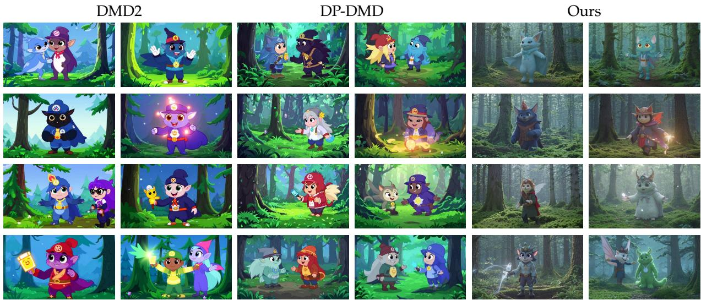  
Figure 10: Diversity visualization across 8 random seeds for the same prompt. Columns 1–2: DMD2; columns 3–4: DP-DMD; columns 5–6: Ours. Each row shows the middle frame of two videos generated with different seeds. Our method produces visibly more diverse outputs across seeds.

## C.2 Main Results for Auto

## C.3 Additional Results for Image-to-Video Generation

Table 5: Quantitative comparison on image-to-video generation. We evaluate the metrics from VBench on our curated ViPE test set. For all metrics, higher is better. The best result in each column is bolded. Our method consistently outperforms DMD2 and DP-DMD, and is even better than the teacher model.

<table><tr><td>Method</td><td>Subject Consistency</td><td>Background Consistency</td><td>Aesthetic Quality</td><td>Temporal Flickering</td><td>Motion Smoothness</td><td>Image-to-Video Subject</td><td>Image-to-Video Background</td><td>Average</td></tr><tr><td>Teacher</td><td>0.9340</td><td>0.9468</td><td>0.6026</td><td>0.9694</td><td>0.9886</td><td>0.9781</td><td>0.9860</td><td>0.9151</td></tr><tr><td>DMD2</td><td>0.9340</td><td>0.9473</td><td>0.6095</td><td>0.9722</td><td>0.9892</td><td>0.9805</td><td>0.9868</td><td>0.9171</td></tr><tr><td>DP-DMD</td><td>0.8372</td><td>0.8942</td><td>0.5621</td><td>0.9562</td><td>0.9823</td><td>0.9545</td><td>0.9655</td><td>0.8789</td></tr><tr><td>Ours</td><td>0.9417</td><td>0.9538</td><td>0.6047</td><td>0.9814</td><td>0.9918</td><td>0.9825</td><td>0.9893</td><td>0.9207</td></tr></table>

We refer the readers to the supplementary material for full video comparisons

## C.4 Additional Results for ablation study

Table 6: Ablation on the effects of GAN loss in our DFD. Bold indicates the better value. Removing the GAN loss yields results comparable to the model distilled with the GAN loss.

<table><tr><td>Model (DFD)</td><td>Subject Consistency</td><td>Background Consistency</td><td>Temporal Flickering</td><td>Motion Smoothness</td><td>Dynamic Degree</td><td>Aesthetic Quality</td><td>Imaging Quality</td></tr><tr><td>w/o GAN</td><td>0.9690</td><td>0.9620</td><td>0.9785</td><td>0.9899</td><td>0.5000</td><td>0.7194</td><td>0.7452</td></tr><tr><td>w GAN</td><td>0.9666</td><td>0.9625</td><td>0.9831</td><td>0.9912</td><td>0.3750</td><td>0.7213</td><td>0.7210</td></tr></table>

Table 7: Ablation on the weights in Eq. 9. The results show no clear difference between the two choices of .

<table><tr><td>Model</td><td>Subject Consistency</td><td>Background Consistency</td><td>Temporal Flickering</td><td>Motion Smoothness</td><td>Dynamic Degree</td><td>Aesthetic Quality</td><td>Imaging Quality</td></tr><tr><td> $w = \frac{1}{2}$ </td><td>0.9691</td><td>0.9661</td><td>0.9830</td><td>0.9907</td><td>0.5625</td><td>0.7135</td><td>0.7457</td></tr><tr><td> $w = 1$ </td><td>0.9666</td><td>0.9625</td><td>0.9831</td><td>0.9912</td><td>0.3750</td><td>0.7213</td><td>0.7210</td></tr></table>

## C.4.1 Text Prompts

We show part of the text prompts here:

## Example Prompts

• Pikachu and Eevee dancing joyfully together on a dirt path in a bright, sunlit forest.  
• Cheerful yellow cartoon dragon with green spikes and colorful wings, standing on a bright grassy hill.  
• SpongeBob SquarePants dancing energetically inside his pineapple house, surrounded by floating bubbles.  
• Cartoon-style family of polar bears playing on a floating ice floe.  
• Animated squirrel gathering acorns in a colorful autumn forest.  
• Anime-style mischievous cat batting at a ball of yarn in a cozy living room.  
• Animation of a graceful fox running through a snowy landscape.  
• Cartoon-style happy dog playing fetch on a bright sandy beach.  
• Animated traditional Japanese village at sunset with glowing paper lanterns and falling cherry blossoms.  
• Animated misty village with green-roofed wooden houses, a cobblestone path, and vibrant orange flowers.  
• An animated princess and men in tuxedos interacting cheerfully by a grand clock tower at night.  
• Cartoon-style elaborate underwater palace made of shells and coral.  
• Animated complex European castle perched on a rugged, mist-shrouded mountain peak.  
• Anime-style bustling Asian street market with colorful awnings, glowing signs, and dense pedestrian traffic.  
• Cartoon-style quirky, multi-level treehouse with suspension bridges and tire swings in a forest.  
• Animation of a historic lighthouse on a rocky coast battling powerful stormy waves.  
• Anime-style Sailor Moon walking down a neon city street, looking back over her shoulder with a smile.  
• Cheerful snowman standing on a snowy roof, looking down at a lit Christmas tree in a town square.  
• Anime close-up of an angry girl with pink twin-tails, golden horns, and a dark purple outfit.

• Anime scene of a grinning Naruto holding ramen, standing next to a smiling girl with lavender hair.  
• Cartoon blonde mermaid with a white tiara, swimming happily through a vibrant coral reef.  
• Three animated women excitedly examining a map at a table in an ornate room.  
• A cartoon woman smiling and sipping coffee from a red cup at a sunny, cozy café.  
• A romantic animated couple gazing at each other under a Van Gogh-style swirling starry night sky.  
• Two animated princesses having a magical outdoor tea party among lush flowers and glowing sparkles.  
• Two animated princesses dancing joyfully on a palace terrace in the rain under a vibrant rainbow.  
• An animated princess pointing enthusiastically toward a seated queen at a magical royal banquet.  
• An animated princess pointing enthusiastically toward a seated queen at a magical royal banquet.  
• Animation of a street artist creating a detailed vibrant mural on a brick wall.  
• An animated woman in a blue gown gazing from a rose-adorned balcony overlooking a fairy-tale city.  
• A cheerful cartoon princess gesturing joyfully in a vibrant, sunny garden with a distant palace.  
• A tearful cartoon princess in a starry gown looking up at the night sky, with a majestic castle behind her.  
• Cartoon-style towering waterfall plunging into a clear turquoise pool surrounded by jungle foliage.  
• Animation of a vast desert with towering sand dunes stretching to the horizon under a blazing sun.  
• Anime-style dense, ancient forest where beams of sunlight filter dramatically through the high canopy.  
• Cartoon-style bustling cityscape viewed from a high rooftop, with lights blinking on as twilight descends.  
• Animation of a tranquil lake perfectly reflecting the purple and orange colors of a vibrant dawn.  
• Cartoon pig chef wearing a tall white hat, proudly holding a strawberry cake in a modern kitchen.

• Cartoon-style towering stack of pancakes dripping with maple syrup and melting butter in a cozy diner.  
• Animation of a detailed chef’s market stall with rows of colorful fresh fruits and vegetables.  
• Anime-style detailed close-up of a steaming hot bento box full of intricate, colorful food.  
•  
• Cartoon-style conveyor belt with tiny, perfectly formed sushi plates moving past happy diners.  
• Animated bakery window display filled with intricate pastries, artisanal bread, and glowing warmth.  
• Cartoon-style colorful ice cream truck with children lining up on a hot summer day.  
• Anime-style traditional tea ceremony performed in a peaceful garden with gentle steam rising from the cups.  
• Cartoon-style bright red vintage steam train chugging across rolling green hills under a bright sky.  
• Animated futuristic spaceship smoothly landing on a alien planet with purple vegetation.  
• Whimsical stop-motion style yellow submarine exploring deep, glowing underwater ruins.  
• Anime depiction of a sleek sports car speeding through a tunnel illuminated by passing neon lights.  
• Cartoon-style biplane flying dynamic loop-the-loops amidst fluffy, stylized white clouds.  
• Animated pirate ship with detailed sails navigating a vast, sun-drenched ocean at sunset.  
• Cartoon delivery scooter expertly navigating a bustling, rainy city street.  
• Anime-style flying motorcycle soaring high above a dense, green forest canopy.  
• Cartoon-style dusty antique clock shop with dozens of clocks ticking and chiming simultaneously.  
• Animated messy artist’s desk covered in used paintbrushes, tubes of paint, and open sketchbooks.  
• Whimsical stop-motion style pair of worn leather boots resting by a crackling fireplace.  
•  
• Anime-style close-up of a well-traveled backpack adorned with colorful keychains and buttons.  
• Cartoon-style bookshelf packed with a vast, eclectic collection of books in a library corner.  
• Animation of a grand grandfather clock with its large pendulum slowly swinging back and forth.

• Cartoon-style gardening tools—a trowel, gloves, and seed packets—resting on a rustic wooden bench.  
• Anime-style glowing crystal globe positioned on a wooden desk within a wizard’s library.  
• Animated messy child’s playroom filled with various toys and building blocks scattered on the floor.  
• Anime-style depiction of a massive magical library where books fly autonomously between high shelves.  
• Animation of a whimsical city made of clouds floating in the sky, connected by glowing bridges of light.  
• Cartoon-style encounter with a friendly forest spirit in a glowing, ancient grove of mossy trees.  
• Anime-style powerful wizard casting a complex spell that generates swirling vortexes of magical energy.  
• Animation of a mischievous imp hiding behind colorful, glowing mushrooms within a deep cave.  
• Cartoon-style friendly dragon and a knight playing chess peacefully under the shade of a large tree.  
• Anime-style phoenix rising dramatically from a bed of glowing ashes with brilliant, fiery feathers.  
• Animation of an intricate city built entirely from colorful crystals that hum and pulse with light and energy.  
• Whimsical cartoon depiction of a celestial garden where stars grow like flowers on glowing vines.  
• Whimsical cartoon depiction of a celestial garden where stars grow like flowers on glowing vines.  
• A young woman with curly red hair laughs while spinning a yellow umbrella in slow motion as rain falls around her on a cobblestone street.  
• Close-up of an elderly man’s weathered hands carefully tying a fly fishing lure beside a misty mountain stream at dawn.  
• Cinematic shot of a lone figure in a long coat walking across an endless salt flat under a vast purple twilight sky.  
• A barista pulls a perfect espresso shot, dark crema swirling into a white ceramic cup in soft morning light.  
• Drone footage soaring above a turquoise coastline where waves crash against jagged white cliffs.

• A chef in a black apron flips a sizzling steak in a cast iron pan, flames leaping briefly upward.  
• Close-up of a honeybee landing on a sunflower, pollen visibly clinging to its legs as it crawls across the petals.  
• A vintage motorcycle rolls slowly down an empty desert highway at sunset, heat shimmering off the asphalt.  
• Cinematic tracking shot of a ballerina in a white tutu rehearsing alone in a sunlit wooden studio.  
• Time-lapse of storm clouds rolling rapidly across a wheat field as the wind bends the golden stalks.  
• A black cat slinks silently across a wet rooftop at night, eyes glowing under a streetlamp.  
• Macro shot of a single dewdrop sliding down a green blade of grass at sunrise.  
• A woman in a flowing red dress runs barefoot along a deserted beach, footprints quickly washed away by the surf.  
• First-person view from inside a glass elevator rising rapidly up a futuristic skyscraper at night.  
• A young boy lights sparklers in his backyard as twilight settles, his face illuminated in flickering gold.  
• Aerial shot of a small wooden boat carving a wake across a glassy lake surrounded by dense pine forest.  
• A potter’s hands shape wet clay on a spinning wheel, water and clay slipping between their fingers.  
• Cinematic close-up of an astronaut’s helmet visor reflecting the curve of Earth from low orbit.  
• A street musician plays a worn acoustic guitar on a busy sidewalk as commuters hurry past in motion blur.  
• Slow-motion shot of a basketball swishing through a chain net on an outdoor court at golden hour.  
• A fox steps cautiously into a snowy clearing at dusk, ears twitching as snowflakes drift down around it.  
• Wide shot of a Tibetan monastery perched on a cliff edge, prayer flags whipping in the high mountain wind.  
• A barista pours latte art into a cappuccino, viewed from directly above as a delicate rosetta forms.

• A child runs through a sprinkler in a suburban backyard on a hot summer afternoon, laughing.  
• Macro footage of ink spreading and blooming through clear water, forming twisting black tendrils.  
• Cinematic shot of a saxophonist playing on a foggy New Orleans street corner, neon signs glowing behind him.  
• An elderly couple slow dances in their kitchen as warm afternoon light streams through gauzy curtains.  
• Drone shot pulling back from a single red farmhouse to reveal endless rolling vineyards stretching to the horizon.  
• A blacksmith hammers a glowing orange blade on an anvil, sparks flying with each strike.  
• Underwater shot of a sea turtle gliding gracefully through shafts of sunlight piercing a coral reef.  
• A businesswoman in a tailored suit strides confidently across a rain-soaked Tokyo crosswalk at night, neon reflecting in puddles.  
• Close-up of a vinyl record dropping onto a turntable, the needle settling as it begins to spin.  
• Time-lapse of a city skyline transitioning from sunset to night, windows lighting up across the buildings.  
• A surfer paddles into a massive wave at dawn, silhouetted against a pink and orange sky.  
• Cinematic shot of a horse galloping across a misty Scottish moor, hooves throwing up clumps of damp earth.  
• A jazz pianist’s hands move expressively across the keys in a dimly lit speakeasy filled with soft amber light.  
• A baker dusts flour across a freshly braided loaf of bread on a wooden countertop in a sunlit kitchen.  
• Slow-motion shot of a tennis ball striking a racket, the strings flexing dramatically on impact.  
• A father teaches his young daughter to ride a bicycle along a tree-lined neighborhood street in autumn.  
• Aerial view of a fishing village at dawn, colorful boats returning to harbor across calm waters.  
• Macro shot of a butterfly slowly opening and closing its wings on a lavender stem in a summer breeze.

• A man reads a leather-bound book in a worn armchair beside a crackling fireplace as snow falls past the window.  
• Cinematic shot of a train emerging from a tunnel into a sunlit mountain valley filled with wildflowers.  
• A surgeon in scrubs washes their hands at a hospital sink, water cascading over their fingers in clinical white light.  
• Close-up of raindrops striking a car windshield, the wipers sweeping rhythmically across the glass.  
• A florist arranges a bouquet of peonies and eucalyptus on a marble counter in a bright minimalist shop.  
• A lone hiker reaches a mountain summit at sunrise and stands silhouetted against the rising sun, arms outstretched.  
• Slow-motion shot of a glass shattering as it strikes a tile floor, shards spreading outward.  
• Drone footage following a red kayak winding through a narrow emerald-green river canyon.  
• A young man in a leather jacket leans against a vintage car at a 1950s-style diner, neon signs buzzing overhead.  
• Cinematic shot of two dancers performing a tango in an empty warehouse lit by a single overhead bulb.  
• A child’s hand reaches up to touch the glass of an aquarium as a stingray glides past on the other side.  
• Wide shot of a hot air balloon festival at dawn, dozens of colorful balloons inflating across a misty field.  
• A glassblower shapes molten glass at the end of a long iron rod, the orange glow lighting their focused face.  
• Close-up of espresso dripping into a clear glass mug, steam curling upward in soft window light.  
• A street artist spray-paints a vibrant mural on a brick wall in an alley, bystanders watching in the background.  
• Slow-motion shot of a diver leaping from a high cliff into a deep blue ocean below.  
• A woman pours steaming tea from a cast iron kettle into a delicate porcelain cup at a wooden table.  
• Aerial shot of an autumn forest in full color, a winding road cutting through a fiery red and orange canopy.

• A construction worker welds a steel beam high above a city skyline, sparks raining down against the sunset.  
• Cinematic shot of a vintage typewriter on a desk by a rainy window, paper slowly being pulled from the carriage.  
• A skateboarder grinds along a metal handrail in an urban plaza, captured in slow motion at golden hour.  
• A grandmother teaches her granddaughter to roll dumplings at a flour-dusted kitchen counter, both smiling.  
• Underwater shot of a school of silver fish parting around a diver swimming through a sunlit kelp forest.  
• Time-lapse of a flower blooming from a tight bud to a full open blossom over the course of a day.  
• A scientist examines a glowing blue liquid in a test tube inside a softly lit laboratory.  
• Cinematic wide shot of a desert caravan crossing massive sand dunes at sunset, long shadows trailing behind.  
• A coffee shop window steams up from the inside as rain streaks down the outside, a person reading at the counter.  
• Slow-motion shot of a flock of birds taking off from a marsh at dawn, wings beating against pink mist.  
• A young woman pins a Polaroid photo onto a string of lights in her bedroom, the photo gently swinging.  
• Drone footage gliding low over a frozen lake at dusk, a single ice skater carving graceful arcs across its surface.

## C.5 Societal Impacts

Our work on distilling video diffusion models presents both positive and negative potential societal impacts. On the positive side, our method significantly reduces the computational cost and inference time required for high-fidelity video generation. This democratizes access to creative tools, allowing users with limited compute resources to generate videos, while also reducing the carbon footprint and energy consumption associated with deploying large-scale generative models. On the negative side, accelerating video generation inherently scales the risks associated with the base models. Faster generation can facilitate the rapid creation of deepfakes, misinformation, and malicious content. While our theoretical framework improves algorithmic efficiency, it does not inherently prevent these misuses. Safe deployment of these distilled models in real-world applications will require coupling them with robust safety filters, provenance tracking, and watermarking techniques.