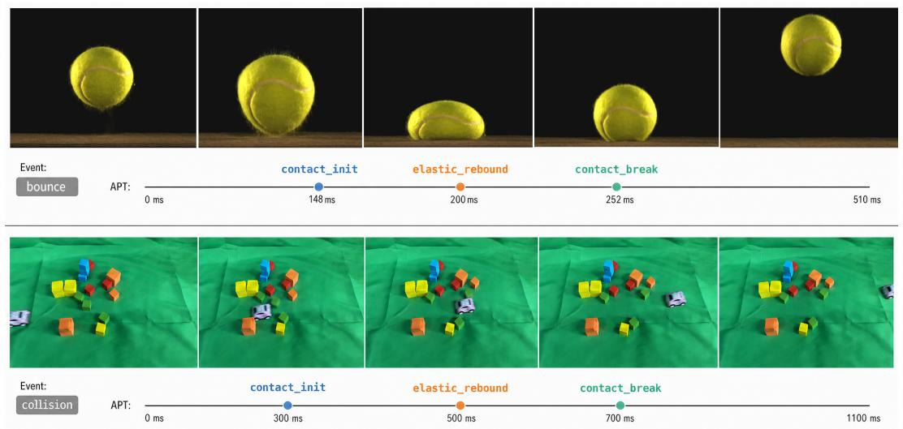
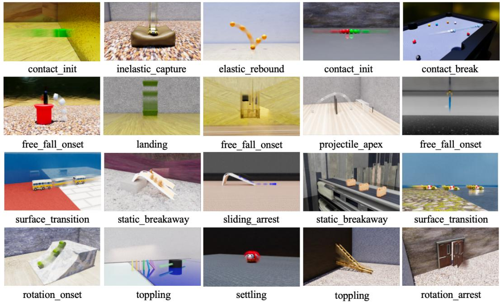
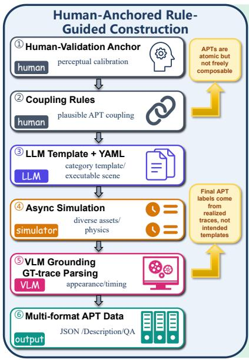
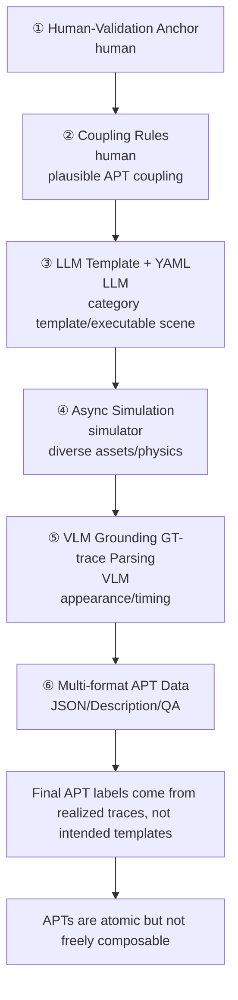
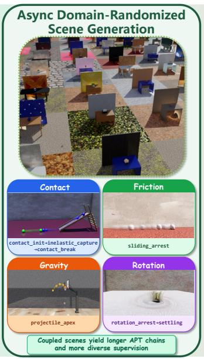
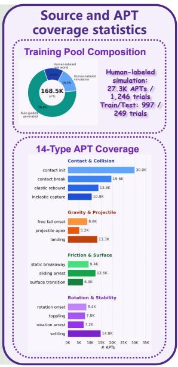
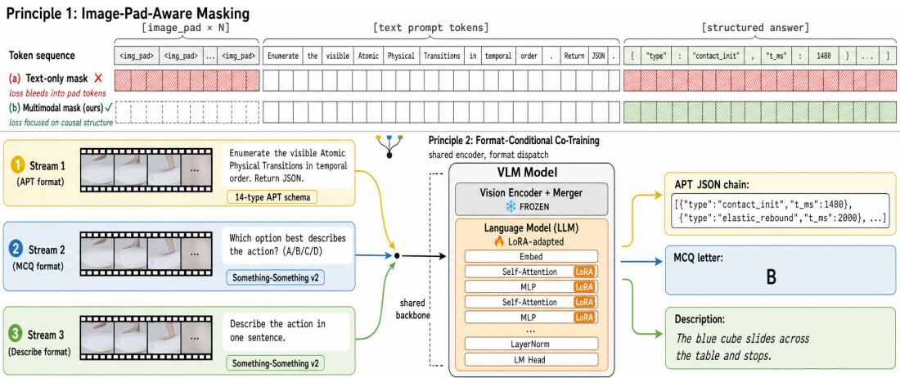
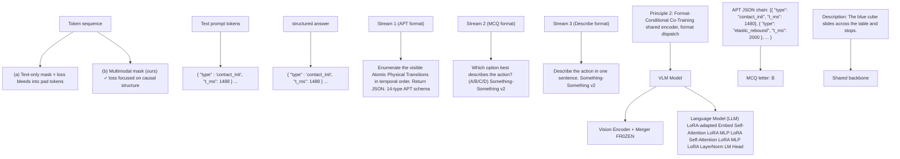
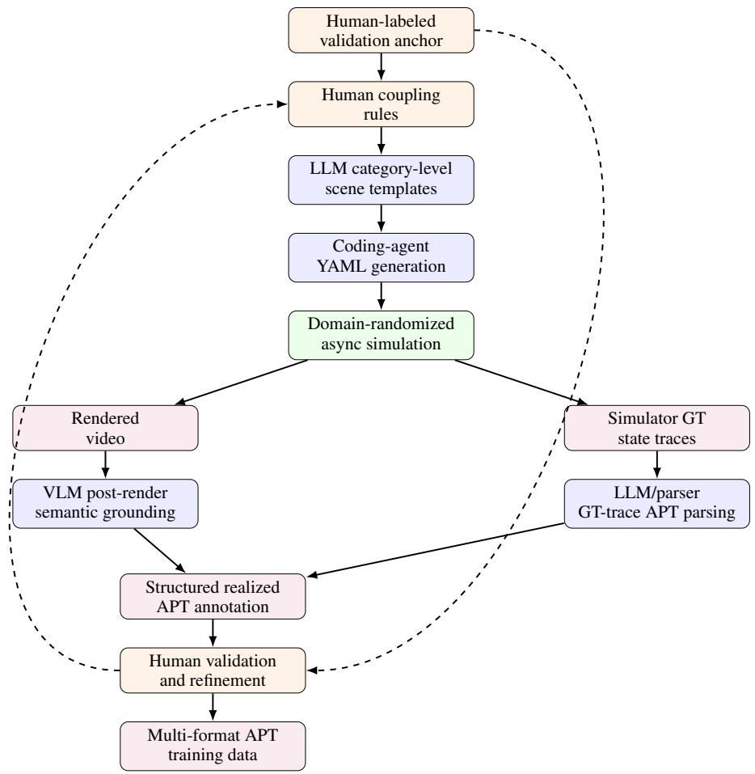
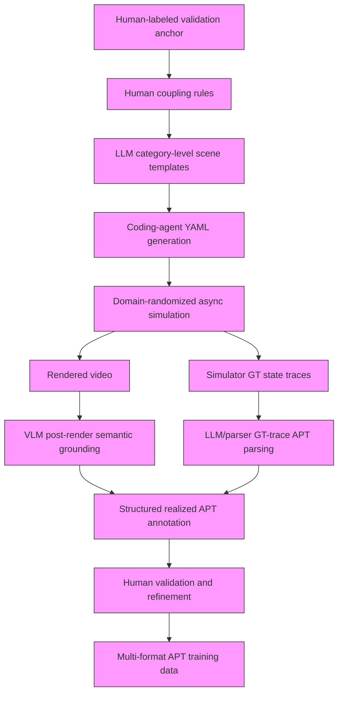

# APT: Atomic Physical Transitions for Causal Video-Language Understanding

Shang Wu1∗ Haoran Lu1∗

Songling Liu1 Chenwei Xu1 Lie Lu2 Pranav Maneriker2 Fan Du2

Manling Li1 Zhaoran Wang1 Han Liu1

1Northwestern University 2Dolby Laboratories

## Abstract

Physical events are not understood by their names alone, but by the causal state changes that compose them. A clip-level label such as “bounce” can be correct while hiding the process that makes the event physically valid, from support loss and contact onset to rebound and settling. To make this hidden process explicit, we introduce Atomic Physical Transitions (APTs): minimal, temporally localized state changes that bind a visible cue to an active physical mechanism and before/after dynamical regimes. An APT chain represents a video as an ordered causal transition sequence rather than a single aggregate event label: event labels tell what happened; APT chains explain why it happened. To make APTs learnable by VLMs, we construct mixed-source APT data from human annotations and simulator ground truth, covering 14 transition types across contact, gravity, friction, and rotation/stability, with 27,303 timed instances over 1,246 trials. Using this data, we find that current VLMs largely miss transition-level physics, with zero-shot recall at most 14% and errors dominated by missed transitions. Direct fine-tuning on APT chains improves transition detection but causes event-level forgetting, indicating that the model learns a specialized answer format rather than a reusable physical representation. We therefore propose APT-Tune, a parameter-efficient recipe that teaches VLMs to use causal transitions without forgetting how to answer ordinary video questions. It combines image-pad-aware supervision, format-conditional co-training, and mechanism-conditioned domain-to-type decoding to make APT learning format-robust and physically grounded. With only 11 M LoRA parameters on Qwen3-VL-2B, APT-Tune substantially improves APT recall while also improving event-level video transfer. These results show that APTs are not a new answer format, but a human-aligned causal supervision signal for physical video understanding. Project page: https://polite-bombolone-d4250c.netlify.app/

## 1 Introduction

Recall a simple lesson from introductory mechanics: a ball bouncing on a table is not understood by the word “bounce” alone. We understand the event by unpacking its causes: gravity accelerates the ball downward, contact with the table begins, collision forces reverse its motion. This is how mechanics is typically organized in instruction: not as a list of event names, but as reusable principles such as force, contact, friction, collision, rotation, equilibrium, and gravitation [20, 35]. Cognitive studies of physics expertise similarly show that experts represent problems by underlying physical principles rather than surface features [7, 16], while event cognition suggests that humans segment continuous activity at meaningful state boundaries [36]. These observations point to a causal view of physical video understanding: to understand an event, a model should recover when the active physical mechanism changes, why that transition occurs, and how it enables the next state.

Existing physics-oriented video benchmarks evaluate object interactions, prediction, counterfactual reasoning, and law-aware VQA or generation [34, 3, 32, 8, 28, 37, 33, 25]. However, most supervision remains tied to clip-level targets, such as answers, events, plausibility, or physical consistency. These targets reveal what happened but often leave the causal process underdetermined. We argue that physical video understanding should instead expose an ordered chain of temporally localized transitions, each linking a visible state change to its active mechanism. Such chains form a missing intermediate representation between event recognition and full physical simulation.

  
Figure 1: Event labels say what happened; APT chains explain why. A coarse event label such as bounce or collision summarizes a clip with a single outcome-level description, but hides the causal process that makes the event physically valid. Atomic Physical Transitions (APTs) decompose each clip into an ordered chain of timestamped, mechanism-typed state changes, such as contact\_init, elastic\_rebound, and contact\_break. Across visually different contact-driven scenes, APT chains expose the shared causal structure behind related event labels, providing a domain-agnostic supervision unit for transition-level physical understanding.

To operationalize this view, we introduce Atomic Physical Transitions (APTs): minimal, visually grounded state changes in which a physical system moves between dynamical regimes. APTs are not merely finer event labels, but causal reasoning units that bind a visible cue to an active mechanism and a before/after state. A video is therefore represented as an ordered APT chain, i.e., typed timestamps that recover the causal process hidden inside a clip-level event label. Because APTs are defined by physical mechanism rather than scene appearance, the same schema can support annotation, evaluation, simulation specification, and training supervision.

APT-level supervision is hard to obtain by passive annotation alone, since clips may contain multiple brief transitions whose boundaries require physical judgment. We therefore build a mixed-source, human-calibrated pipeline. Human annotators label real-world recordings including CLEVRER [34] to anchor the 14-label semantics, while simulator ground truth from Physion++ and Phys4D-style Isaac Sim scenes scales the data [32, 10, 24, 29, 22, 23]. For simulated clips, poses, velocities, contacts, and support states provide structured evidence for candidate APTs; LLM/VLM prompting only maps this evidence into the shared schema and training formats, rather than inferring labels from pixels. Human validation checks this conversion, and source/render diversity reduces visual shortcuts.

Using this mixed-source APT data, we first test whether current VLMs can recover causal transition chains. They cannot: with the same 16-frame input and APT-schema prompt, eight zero-shot VLMs achieve only 10–14% recall in the full 14-type setting, mainly due to missed transitions rather than timestamp jitter. This shows that clip-level event competence does not imply transition-level physical understanding. APT-only SFT improves recall but creates an APT-format specialist: because APT targets are structured chains while ordinary video tasks use QA, multiple choice, or short descriptions, the model overfits to the schema and loses prompt-conditioned event-level competence. The key challenge is therefore to make transition-level causality reusable across answer formats.

We address this with APT-Tune, a parameter-efficient SFT recipe that treats APT enumeration as an atomic causal-representation pretext task. APT-Tune uses format-conditional co-training over APT, multiple-choice, and description formats, so the same video representation supports both local transition prediction and ordinary event-level answering. Non-APT formats provide event-level rehearsal, while image-pad-aware masking focuses supervised loss on the structured answer rather than multimodal padding artifacts. To encourage physical causality rather than label memorization, mechanism-conditioned APT prompts guide domain-to-type decoding, e.g., support loss under gravity to free\_fall\_onset, gap closure to contact\_init, post-contact velocity reversal to elastic\_rebound, and dissipated sliding to sliding\_arrest. With only 11 M LoRA parameters on Qwen3-VL-2B, APT-Tune raises APT recall from 10.0% to 38.1% (a 28.1 pp gain), transfers to PhysBench without training on it, and improves Something-Something v2 multiple-choice accuracy by 15 pp over the base model. These results show that APTs expose missing transition-level physics and provide format-robust causal supervision for broader video understanding.

Contributions. Our contributions are threefold:

• We propose APTs as a human-inspired causal transition representation. Atomic Physical Transitions represent videos as ordered chains of visually grounded physical state changes, exposing both when a regime changes and why it changes.  
• We construct mixed-source APT data for diagnosis and supervision. Our data combines human annotations, simulator ground truth, and diverse renderers, revealing that current VLMs miss most transition-level physics even when clip-level events are recognizable.  
• We introduce APT-Tune for format-robust causal fine-tuning. APT-Tune learns APTs as causal representations rather than a JSON output style, addressing format mismatch, event-level forgetting, and label memorization.

## 2 Related Work

Physics-oriented benchmarks evaluate causal video QA, physical prediction, VLM reasoning, and law- or motion-aware understanding [34, 3, 32, 8, 28, 37], but their targets are mostly clip-level answers, outcomes, plausibility judgments, QA labels, or trajectories. APT is complementary: it makes localized, mechanism-typed state changes—support loss, contact initiation, rebound, sliding arrest, and settling—explicit targets for annotation, evaluation, and supervision. This connects to event segmentation, physics expertise, and temporal video understanding: humans segment activity at meaningful boundaries, experts organize physics by underlying principles, and video methods model temporal structure through actions, interactions, or procedural steps [36, 7, 16, 12, 4, 9, 17, 1]. APT instead treats boundaries as physical regime transitions, motivating APT-Tune: transition-level causal supervision with format-conditional co-training and parameter-efficient adaptation [21, 19, 13] to transfer across QA and description formats. A full discussion at Appendix A

Table 1: Comparison of evaluation units across physics and temporal video benchmarks. APT differs from prior benchmarks by making timestamped, mechanism-typed physical transitions the supervision and scoring unit, enabling ordered chain-level evaluation.

<table><tr><td rowspan="2">Data / Eval.</td><td colspan="2">Evaluation unit</td><td colspan="3">Physical / temporal structure</td><td colspan="2">Provenance</td></tr><tr><td>Target</td><td>Granularity</td><td>Temporal Location</td><td>Physics Taxonomy</td><td>Ordered Chain</td><td>Label / Source</td><td>Scale (native)</td></tr><tr><td>CLEVRER [34]</td><td>Causal video QA</td><td>Event QA</td><td>✗</td><td>Collision events</td><td>Partial</td><td>Sim GT</td><td>20K vids / &gt;300K QA</td></tr><tr><td>CLEVRER-Humans [26]</td><td>Causal event QA</td><td>Event / edge QA</td><td>✗</td><td>Free-form events</td><td>Graph</td><td>Human on sim</td><td>1,108 vids / 1,076 QA</td></tr><tr><td>Physion [3]</td><td>Physical prediction</td><td>Future outcome</td><td>Endpoint</td><td>Object dynamics</td><td>✗</td><td>Sim GT + human</td><td>1.2K examples / 8 scen.</td></tr><tr><td>Physion++ [32]</td><td>Physical prediction</td><td>Future outcome</td><td>Endpoint</td><td>Latent properties</td><td>✗</td><td>Sim GT + human</td><td>8K train / 768 test $^{\ddagger}$ </td></tr><tr><td>PhysBench [8]</td><td>Physical VLM QA</td><td>Entry QA</td><td>✗</td><td>Broad domains</td><td>✗</td><td>Unspecified $^{\dagger}$ </td><td>10,002 entries</td></tr><tr><td>Physics-IQ [28]</td><td>Video continuation</td><td>Future continuation</td><td>Partial</td><td>Physical laws</td><td>✗</td><td>Real video GT</td><td>396 vids / 66 scen.</td></tr><tr><td>MASS-Bench [33]</td><td>Physics video QA</td><td>Entity motion</td><td>Partial</td><td>Physics categories</td><td>Partial</td><td>Human+AIGC</td><td>4,350 vids / 8,361 QA</td></tr><tr><td>TemporalBench [5]</td><td>Temporal QA / caption</td><td>Sub-event QA</td><td>Partial</td><td>Temporal only</td><td>Partial</td><td>Human + LLM</td><td>10K QA / 2K ann.</td></tr><tr><td>APT (ours)</td><td>APT chain recovery</td><td>Transition chain</td><td>Timestamp</td><td>14 APTs / 4 domains</td><td>√</td><td>Human + Sim GT</td><td>27.3K APTs / 1,246 trials</td></tr></table>

## 3 Atomic Physical Transitions: From Event Labels to Causal Chains

## 3.1 Events as Outcomes, APTs as Causes

A clip-level event label names what happened, but collapses the causal process that makes it happen: a “bounce” may include contact initiation, collision response, contact break, and settling. This matches how mechanics is learned: reusable physical processes such as gravity, contact, collision, friction, rotation, and stability are learned separately, while real events compose them over time. We therefore define Atomic Physical Transitions (APTs) by physical process, not by object or material category; rigid objects, soft bodies, granular materials, and fluid-like regions can instantiate the same APT when the active mechanism and visible before/after state change are the same. Event labels tell what happened; APT chains explain why it happened. Detailed motivation is at Appendix B.1

## 3.2 Definition

Definition. Given a video V of a physical scene, an Atomic Physical Transition is a visually localizable moment at which a physical entity, material region, or interacting pair changes between two coarse physical states under a specific active mechanism. We represent an APT as

$$
a _ {i} = \left(\tau_ {i}, d _ {i}, \ell_ {i}, s _ {i} ^ {-} \rightarrow s _ {i} ^ {+}, e _ {i}\right), \tag {1}
$$

where $\tau _ { i }$ is the canonical transition time, $d _ { i }$ is the physical domain, $\ell _ { i } \in \mathcal { L } _ { d _ { i } }$ is the transition type, $s _ { i } ^ { - } \to s _ { i } ^ { + }$ is the before/after physical state change, and $e _ { i }$ is the local visual evidence supporting the transition. The domain $d _ { i }$ groups transitions by active physical process rather than by object class or material type; the type $\ell _ { i }$ names the specific state change within that process family; and the evidence $e _ { i }$ anchors the label to local visual cues. Thus material affects how an APT appears, but not what the APT means: an APT records not only when a state changes, but also why it changes.

Atomicity is defined relative to our vocabulary and video timescale. An APT is atomic if, for the same entity or interacting pair, the local neighborhood of $\tau _ { i }$ contains no other named APT that further explains the same transition $s _ { i } ^ { - } \to s _ { i } ^ { + }$ . In this sense, APTs are not physically indivisible events, but the smallest causal units we ask models to localize, classify, and reuse across answer formats.

  
Figure 2: Event-level comparison between standard event-level evaluation and APT.

## 3.3 Problem Formulation: APT Chain Enumeration

Let $V = ( I _ { 1 } , \ldots , I _ { T } )$ be a video with duration T . Transition-level physical understanding requires recovering an ordered chain of APTs:

$$
\mathbf {A} (V) = \left(a _ {1}, \dots , a _ {K}\right), \quad 0 \leq \tau_ {1} \leq \dots \leq \tau_ {K} \leq T, \quad a _ {i} ^ {\text { eval }} = \left(\tau_ {i}, \ell_ {i}\right), \tag {2}
$$

where K is unknown and varies by video, and each evaluation item is serialized as a typed timestamp. The task is therefore to recover how many transitions occur, when they occur, and which physical type each transition has. An APT chain is a causal representation, not a fixed output style: the same chain can be serialized as JSON, verbalized as a description, or queried through QA prompts. This distinction matters because treating APT supervision as a JSON template can produce an APT-format specialist, whereas learning it as a shared causal representation supports both transition enumeration and ordinary event understanding. We therefore formulate APT prediction as mechanism-conditioned decoding: first identify the active physical domain, then decode the transition type.

## 3.4 APT Taxonomy

Our scope is macroscopic, visually grounded physical dynamics across rigid, deformable, granular, and fluid scenes. APTs are process-centered: labels are determined by the active mechanism and visible before/after state change, not by object or material category. They cover localizable transitions such as contact onset/loss, support loss, collision response, friction- or medium-mediated motion change, rotation onset/arrest, stability loss, and settling, while excluding invisible changes, continuous parameter estimation, or full physical-state reconstruction. Labels are assigned to the entity, region, or interacting pair undergoing the transition; multiple APTs may share a timestamp when they describe independent changes. Ambiguous cases use the label that best explains the active mechanism, preferring specific transitions over generic ones; detailed boundary rules are in Appendix B.5.

Table 2: APT taxonomy. APTs are organized by physical process domain and defined by coarse before/after state changes.

<table><tr><td colspan="3">Domain I: Contact &amp; Collision</td><td colspan="3">Domain IV: Rotation &amp; Stability</td></tr><tr><td>Label</td><td>Before</td><td>After</td><td>Label</td><td>Before</td><td>After</td></tr><tr><td>contact_init</td><td>separated</td><td>interacting</td><td>rotation_onset</td><td>non-rotating</td><td>rotating</td></tr><tr><td>contact_break</td><td>interacting</td><td>separated</td><td>toppling</td><td>stable</td><td>unstable</td></tr><tr><td>elastic_rebound</td><td>approach</td><td>retreat</td><td>rotation_arrest</td><td>rotating</td><td>stationary</td></tr><tr><td>inelastic_capture</td><td>moving</td><td>captured/rest</td><td>settling</td><td>disturbed</td><td>equilibrium</td></tr><tr><td colspan="3">Domain II: Gravity &amp; Projectile</td><td colspan="3">Domain III: Friction, Surface &amp; Medium</td></tr><tr><td>Label</td><td>Before</td><td>After</td><td>Label</td><td>Before</td><td>After</td></tr><tr><td>free_fall_onset</td><td>supported</td><td>falling</td><td>static_breakaway</td><td>stationary</td><td>moving</td></tr><tr><td>projectile_apex</td><td>ascending</td><td>descending</td><td>sliding_arrest</td><td>moving</td><td>stationary</td></tr><tr><td>landing</td><td>falling</td><td>supported</td><td>surface_transition</td><td>surface A</td><td>surface B</td></tr></table>

Our taxonomy contains 14 recurring transitions grouped by active physical process. The same APT can be instantiated by rigid objects, soft bodies, granular materials, or fluid-like regions when the causal mechanism and before/after state change match. Contact & collision captures interactionboundary changes and outcomes; gravity & projectile captures support loss, apex reversal, and landing; friction, surface & medium captures rest-to-motion, motion-to-rest, and surface/medium changes; and rotation & stability captures angular-motion changes, toppling, and final equilibrium.

## 4 Rule-Guided Compositional APT Data Construction

APT supervision is hard to collect because a dynamic chain must localize fine-grained causal transitions within a physically plausible composition; we therefore use a rule-guided coarse-to-fine pipeline.



<details>
<summary>flowchart</summary>


</details>



<details>
<summary>text_image</summary>

Async Domain-Randomized
Scene Generation
Contact
friction
contact_init-inelastic_capture
-contact_break
sliding_arrest
Gravity
rotation
projectile_apex
rotation_arrest-settling
Coupled scenes yield longer APT chains
and more diverse supervision
</details>



<details>
<summary>pie chart and bar chart</summary>

| Category             | Value     |
|----------------------|-----------|
| contact init         | 30.0K     |
| contact break        | 19.6K     |
| elastic rebound       | 13.8K     |
| inelastic capture    | 10.8K     |
| landing              | 13.3K     |
| free fall onset      | 8.8K      |
| projectile apex      | 5.2K      |
| landing              | 13.3K     |
| static breakaway     | 9.4K      |
| sliding arrest       | 12.5K     |
| surface transition   | 6.9K      |
| rotation onset       | 8.4K      |
| topping              | 7.8K      |
| rotation arrest       | 7.2K      |
| settling             | 14.8K     |
</details>

Figure 3: APT data construction pipeline. Human validation anchors APT semantics and coupling rules; LLM/YAML templates drive asynchronous domain-randomized simulation; VLM grounding identifies rendered objects; and simulator GT traces provide realized APT labels and timestamps. The accepted clips are exported as multi-format supervision with full 14-type coverage.

## 4.1 Human-Labeled Validation Anchor

We use human annotation as the perceptual anchor for APT construction, since APT boundaries must align with visible physical transitions rather than simulator states alone. Annotators label controlled videos from CLEVRER [34] and Physion++ [32] by marking visible state changes, assigning one of 14 APT types, and recording timestamps. This yields 1,246 human-labeled trials with 27,303 APTs: 500 CLEVRER trials with 6,316 APTs covering 7 types, and 746 Physion++ trials with 20,987 APTs covering the full taxonomy. These labels serve as calibration anchors, not the scaling mechanism, aligning templates, prompts, and GT-trace parsing with human-visible transitions.

## 4.2 Rule-Guided Coarse-to-Fine Simulation

We scale APT data with a rule-guided coarse-to-fine simulation pipeline[24] that assigns each component its natural role: humans provide physical commonsense, LLMs expand structured templates, coding agents make them executable, simulators provide GT traces, and VLMs ground rendered appearance. The pipeline starts from human-defined coupling rules, since APTs are atomic but not freely composable: gravity naturally couples with falling, landing, contact, rebound, and settling; friction with sliding and arrest; and stability loss with rotation, toppling, and settling. Given a coupling rule, an LLM proposes category-level scene templates under simulator asset constraints; a coding agent converts each template into executable YAML with object slots, assets, initial states, physical parameters, cameras, and success checks. We then run asynchronous domain-randomized simulation, instantiating diverse objects, colors, materials, dynamics, and initial conditions while preserving the intended causal coupling.

Rendered videos and simulator traces are refined into instance-specific APT data. Because concrete assets are sampled only at simulation time, a VLM grounds the abstract template into visible objects, colors, materials, and relations. Precise APT stages are not inferred from pixels: an LLM-assisted parser reads GT traces—pose, velocity, contact pairs, support relations, and object identity—and converts state changes into realized APT instances. The intended template is only a prior; final APT chains are determined by realized traces, enabling filtering, relabeling, and retention of additional transitions caused by randomized dynamics. We validate these automatic labels against the human anchor, using disagreements to refine coupling rules, YAML checks, grounding prompts, parsing rules, and motion/contact thresholds.



<details>
<summary>flowchart</summary>


</details>

Figure 4: APT-Tune: two design principles. (1) Image-pad-aware masking. The processor expands the image placeholder into hundreds of <image\_pad> tokens. A text-only mask (a) leaves them in the objective, while our multimodal-aware mask (b) excludes them and focuses loss on the structured answer. (2) Format-conditional co-training. APT JSON, MCQ letter, and one-sentence description share a single Qwen3-VL backbone with a frozen vision encoder and merger and LoRA on the LLM, dispatched per record to prevent APT-JSON specialist collapse.

Each accepted clip is exported as aligned APT JSON, grounded description, causal transition description, and event-level QA/MCQ, preventing JSON-only collapse in mixed-format APT-Tune. Evaluation uses 16 uniformly sampled frames, one shared APT-schema prompt, tolerant JSON parsing, and one-to-one type matching within ±200 ms; we report per-type recall and use a stratified split of 997 train trials (∼21.8K APTs) and 249 test trials (∼5.5K APTs).

## 5 APT-Tune: Learning from APT Chains

APT-Tune is a parameter-efficient SFT recipe that treats APT enumeration as a pretext task and rests on two principles.

Principle 1: Image-pad-aware masking. The APT chain is a structured target where every token has a clear role (transition type, timestamp, or scaffold), so loss should flow only over the chain. In multimodal SFT, the processor expands each <image> placeholder into a grid of <|image\_pad|> tokens, and a text-only prefix length leaves around 500 pad tokens unmasked, turning part of the objective into pad-token reconstruction. We replace $L _ { \mathrm { t e x t } } { = } \mathrm { l e n }$ (tokenizer(prompt)) with Lmm=len(processor(prompt, images).input\_ids), so the loss is computed only over the answer.

Principle 2: Format-conditional co-training. A specialist trained only on APT-JSON collapses p(format | prompt) onto APT-JSON and loses competence on other tasks (specialist collapse). APT-Tune therefore co-trains three formats on a single encoder under a shared chat template, dispatched by a record-level format\_type. The mix is small and balanced: 997 APT records (APT-BENCH train + Isaac Lab generated) plus 1,000 MCQ and 1,000 one-sentence-description records drawn from SSv2 [12], an action corpus with no overlap with our zero-shot splits. The non-APT records are not label augmentation, but maintain the format-conditional posterior while the APT objective trains atomic video structure.

## 6 Experiments

We answer four questions. (Q1) Do current VLMs recover transition-level physics zero-shot? (Q2) Does APT-Tune improve APT detection across families and scales? (Q3) Does APT supervision transfer to event-level video (MVBench) and OOD physics (PhysBench)? (Q4) Are both design principles necessary? All APT-BENCH numbers use a frozen protocol with 16 frames, the 14-type

Table 4: APT-Tune on six open-source backbones, evaluated on APT-BENCH. Recall and type accuracy (%) are matched at ±200 ms; ∆T in ms; ∆Rec is the recall gain over zero-shot. Best per column in bold.

<table><tr><td rowspan="2">Backbone</td><td colspan="3">Zero-shot</td><td colspan="3">+APT-Tune</td><td rowspan="2">ΔRec.</td></tr><tr><td>Rec.</td><td>Type</td><td>ΔT</td><td>Rec.</td><td>Type</td><td>ΔT</td></tr><tr><td>Qwen3-VL-2B</td><td>10.0</td><td>12.0</td><td>100</td><td>38.1</td><td>52.1</td><td>38</td><td>28.1</td></tr><tr><td>Qwen3-VL-4B</td><td>11.0</td><td>13.0</td><td>95</td><td>42.5</td><td>57.8</td><td>33</td><td>31.5</td></tr><tr><td>Qwen3-VL-8B</td><td>12.0</td><td>14.0</td><td>90</td><td>48.6</td><td>66.2</td><td>27</td><td>36.6</td></tr><tr><td>InternVL3.5-2B</td><td>14.0</td><td>16.0</td><td>67</td><td>46.8</td><td>61.5</td><td>25</td><td>32.8</td></tr><tr><td>InternVL3.5-4B</td><td>13.0</td><td>15.0</td><td>75</td><td>48.0</td><td>63.5</td><td>23</td><td>35.0</td></tr><tr><td>InternVL3.5-8B</td><td>13.0</td><td>15.0</td><td>80</td><td>53.4</td><td>71.2</td><td>19</td><td>40.4</td></tr></table>

APT-schema prompt, tolerant JSON parsing, and one-to-one matching by type within ±200 ms on the 249-trial test split (∼5,500 APTs).

## 6.1 Zero-Shot Diagnostic

Metrics. We report one metric per sub-problem of APT chain enumeration. Recall (primary) is the fraction of ground-truth APTs detected and typed within ±200 ms. Type accuracy on matched events isolates type confusion from missed detection. Median timing error ∆T over matched events measures localization precision (median for robustness to JSON-parse outliers). F1 is omitted because precision is dominated by JSON formatting variance across closed and open APIs.

Findings. We evaluate two commercial frontier models (GPT-4.1 [30], Gemini 2.5 Flash [11]) and two open-source families at three scales (Qwen3- VL-{2,4,8} B [31], InternVL3.5-{2,4,8} B [6]). Re-

Table 3: Zero-shot APT-BENCH (%).

<table><tr><td>Model</td><td>Rec.</td><td>Type</td><td> $\Delta T$ </td></tr><tr><td>GPT-4.1</td><td>13.0</td><td>15.0</td><td>95</td></tr><tr><td>Gemini 2.5 Flash</td><td>12.0</td><td>14.0</td><td>110</td></tr><tr><td>Qwen3-VL-2B</td><td>10.0</td><td>12.0</td><td>100</td></tr><tr><td>Qwen3-VL-4B</td><td>11.0</td><td>13.0</td><td>95</td></tr><tr><td>Qwen3-VL-8B</td><td>12.0</td><td>14.0</td><td>90</td></tr><tr><td>InternVL3.5-2B</td><td>14.0</td><td>16.0</td><td>67</td></tr><tr><td>InternVL3.5-4B</td><td>13.0</td><td>15.0</td><td>75</td></tr><tr><td>InternVL3.5-8B</td><td>13.0</td><td>15.0</td><td>80</td></tr></table>

call stays between 10 and 14% across both regimes (Table 3), with the best system reaching only 14.0%. Among matched events, ∆T falls between 67 and 110 ms, well within the ±200 ms tolerance, so the gap reflects missed transitions rather than timing jitter. Type accuracy stays between 12 and 16%, only marginally above recall, indicating that detected transitions are also frequently mis-typed. Scaling open-source backbones from 2 B to 8 B yields no improvement, so the bottleneck is representation rather than capacity.

## 6.2 APT-Tune Across Six Open-Source Backbones

Recipe. We instantiate APT-Tune on all six open-source models from Section 6.1. For each backbone we freeze the vision encoder and merger and apply LoRA [13] (r=16, α=32) to the LLM attention and MLP projections, training ∼11 M parameters (0.5% of the model) for under a day on a single A100 with bf16 AdamW at lr $1 \times 1 0 ^ { - 4 }$ , cosine schedule, 30 warm-up steps. APT-format records come from the APT-BENCH train split and the Isaac Lab [27] APT-style pool. MCQ and describe records come from SSv2 [12]. The same hyperparameters and data mix are used on every backbone with no per-model tuning.

Results. APT-Tune closes most of the zero-shot gap on every backbone with the same recipe (Table 4). Qwen3-VL gains 28.1, 31.5, and 36.6 pp recall at 2, 4, and 8 B, and InternVL3.5 gains 32.8, 35.0, and 40.4 pp at the same scales. The best post-tune model (InternVL3.5-8B) reaches 53.4% recall, roughly 4× its 13.0% zero-shot baseline, and even the smallest fine-tuned model (Qwen3-VL-2B at 38.1%) exceeds every zero-shot system by more than 24 pp. Type accuracy rises four- to five-fold, going from between 12 and 16% pre-tune to between 52 and 71% post-tune, and ∆T roughly halves, going from between 67 and 100 ms pre-tune to between 19 and 38 ms post-tune.

Table 6: PhysBench transfer (%). Real-world physical-property benchmark, never used in training. Numbers follow the official PhysBench evaluation, with Avg over the four sub-tasks. Bold marks per-column gains within each backbone.

<table><tr><td>Backbone</td><td>Variant</td><td>Avg</td><td>Property</td><td>Relationships</td><td>Scene</td><td>Dynamics</td></tr><tr><td rowspan="2">Qwen3-VL-2B</td><td>Zero-shot</td><td>38.5</td><td>46.9</td><td>38.5</td><td>29.8</td><td>38.2</td></tr><tr><td>+APT-Tune</td><td>50.8</td><td>60.5</td><td>49.5</td><td>36.5</td><td>56.7</td></tr><tr><td rowspan="2">Qwen3-VL-4B</td><td>Zero-shot</td><td>41.9</td><td>50.2</td><td>44.1</td><td>31.4</td><td>40.1</td></tr><tr><td>+APT-Tune</td><td>53.2</td><td>63.0</td><td>54.5</td><td>38.0</td><td>57.3</td></tr><tr><td rowspan="2">Qwen3-VL-8B</td><td>Zero-shot</td><td>45.0</td><td>55.5</td><td>50.1</td><td>31.8</td><td>42.1</td></tr><tr><td>+APT-Tune</td><td>60.6</td><td>70.5</td><td>64.0</td><td>43.5</td><td>64.5</td></tr><tr><td rowspan="2">InternVL3.5-2B</td><td>Zero-shot</td><td>40.2</td><td>50.5</td><td>40.2</td><td>30.1</td><td>39.1</td></tr><tr><td>+APT-Tune</td><td>51.3</td><td>62.5</td><td>50.5</td><td>36.5</td><td>55.7</td></tr><tr><td rowspan="2">InternVL3.5-4B</td><td>Zero-shot</td><td>43.7</td><td>52.5</td><td>46.2</td><td>32.1</td><td>42.3</td></tr><tr><td>+APT-Tune</td><td>55.5</td><td>65.5</td><td>56.8</td><td>39.0</td><td>60.7</td></tr><tr><td rowspan="2">InternVL3.5-8B</td><td>Zero-shot</td><td>45.2</td><td>57.1</td><td>50.3</td><td>30.5</td><td>42.4</td></tr><tr><td>+APT-Tune</td><td>63.4</td><td>73.5</td><td>67.0</td><td>46.5</td><td>66.5</td></tr></table>

Scaling reverses with APT supervision. Zero-shot recall was flat in scale, with 8 B no better than 2 B in either family. After APT-Tune the relationship reverses, with larger backbones gaining more, by 8.5 pp from 2 B to 8 B in Qwen3-VL and 7.6 pp in InternVL3.5. This confirms that the zero-shot bottleneck was representation, not capacity.

## 6.3 Transfer to Event-Level Video and OOD Physics

We test transfer on MVBench [18] (held-out 20-task event-level video) and PhysBench [8] (realworld physical understanding, never used in training). MVBench follows its official 20-task pipeline. PhysBench reports the official Avg over four sub-tasks (Property, Relationships, Scene, Dynamics).

MVBench (event-level). APT-Tune adds between 0.5 and 2.2 pp on every backbone (Table 5), with no regressions across families or scales, and the largest gain on the weakest zero-shot model (Qwen3-VL-2B at 2.2 pp). Since MVBench is held out and dominated by event-level rather than transition-level tasks, the small but uniformly positive gains show that APT-Tune preserves event-level competence rather than inducing specialist collapse.

Table 5: MVBench transfer (avg accuracy, %).

<table><tr><td>Backbone</td><td>Zero-shot</td><td>+APT-Tune</td></tr><tr><td>Qwen3-VL-2B</td><td>51.4</td><td>53.6</td></tr><tr><td>Qwen3-VL-4B</td><td>54.7</td><td>55.2</td></tr><tr><td>Qwen3-VL-8B</td><td>56.8</td><td>57.6</td></tr><tr><td>InternVL3.5-2B</td><td>54.5</td><td>55.7</td></tr><tr><td>InternVL3.5-4B</td><td>55.8</td><td>56.7</td></tr><tr><td>InternVL3.5-8B</td><td>57.1</td><td>58.3</td></tr></table>

PhysBench (OOD physics). APT-Tune lifts every backbone on every sub-task without ex-

ception (Table 6), with Avg gains between 11.1 and 18.2 pp. Gains are largest on Dynamics (between 16.6 and 24.1 pp), the sub-task closest to APT semantics, since APTs are timed transitions between dynamical regimes. Property (12 to 16 pp) and Relationships (10 to 17 pp) also improve substantially, while Scene improves least (6 to 16 pp), consistent with APTs encoding local mechanism rather than global appearance. The 8 B variants gain more on Avg than the 2 B variants (18.2 vs. 11.1 on InternVL3.5, 15.6 vs. 12.3 on Qwen3-VL), so larger backbones extract more transferable physics from APT.

## 6.4 Ablation of the Two Principles

We toggle each principle independently on Qwen3-VL-2B with the rest of the recipe held fixed, yielding the 2×2 design in Table 7.

Effect of P1 (image-pad-aware masking). At fixed format, replacing the text-only mask with the mm-aware mask lifts every metric. APT recall gains 10.1 pp (Naive SFT vs. P1 only) and 10.7 pp (P2 only vs. Full APT-Tune). SSv2 gains 18.5 and 24.3 pp, and PhysBench gains 8.5 and 10.0 pp.

Table 7: Ablation on Qwen3-VL-2B. Each row varies the loss Mask (P1) or the training Format mix (P2) while holding the rest fixed. APT recall on APT-BENCH, SSv2 4-way MCQ accuracy, PhysBench OOD physics accuracy (all %). The full recipe dominates every single-principle ablation.

<table><tr><td>Variant</td><td>Mask / Format mix</td><td>APT recall</td><td>SSv2</td><td>PhysBench</td></tr><tr><td>Base (no SFT)</td><td>none</td><td>10.0</td><td>72.5</td><td>38.5</td></tr><tr><td>Naive SFT</td><td>text-only / APT-only</td><td>23.7</td><td>50.0</td><td>36.2</td></tr><tr><td>P1 only</td><td>mm-aware / APT-only</td><td>33.8</td><td>68.5</td><td>44.7</td></tr><tr><td>P2 only</td><td>text-only / multi</td><td>27.4</td><td>63.2</td><td>40.8</td></tr><tr><td>Full APT-Tune</td><td>mm-aware / multi</td><td>38.1</td><td>87.5</td><td>50.8</td></tr></table>

The text-only mask plateaus at a final cross-entropy of 1.92, matching the loss of reconstructing <|image\_pad|> tokens on the unmasked region. The wrong mask therefore diverts capacity from the APT chain to pad-token reconstruction.

Effect of P2 (format-conditional co-training). At fixed mask, replacing APT-only with the multiformat mix lifts every metric. APT recall gains 3.7 pp (Naive SFT vs. P2 only) and 4.3 pp (P1 only vs. Full APT-Tune). SSv2 gains 13.2 and 19.0 pp, and PhysBench gains 4.6 and 6.1 pp. Multi-format does more than guard against specialist collapse, since it also raises APT recall and removes the apparent tradeoff between APT detection and format generality.

Both are needed. The full recipe strictly dominates every single-principle ablation on every metric. P1 contributes more to APT recall (about 10 pp gain vs. about 4 pp from P2), while P2 is what restores event-level competence. Every single-principle variant (Naive SFT, P1 only, P2 only) regresses below the 72.5% un-fine-tuned base on SSv2, and only the full recipe lifts SSv2 above the base, to 87.5%.

## 7 Conclusion

We introduced Atomic Physical Transitions (APTs), an ordered-chain representation of mechanismtyped state changes that exposes why an event unfolds, not just what happened. Eight current VLMs achieve at most 14% zero-shot recall, dominated by missed transitions rather than timing jitter, showing that clip-level event competence does not imply transition-level physical understanding. With only 11 M LoRA parameters, APT-Tune lifts recall to 53.4% while preserving MVBench and improving PhysBench by up to 18.2 pp, establishing APTs as a human-aligned causal supervision signal and a reusable bridge from clip-level recognition toward physically grounded video reasoning.

## Impact Statement

This work introduces a transition-level supervision unit for physical video understanding, with applications in robotics, embodied agents, scientific video analysis, and safety-oriented evaluation of multimodal models, where APT chains can expose brittle physical reasoning that clip-level QA hides. The benchmark uses short physical transitions in synthetic and controlled real videos rather than personal, medical, or otherwise sensitive data, so direct misuse risk is low. Indirectly, improved physical video understanding could feed into automation or surveillance systems; we mitigate this by releasing only the dataset, evaluation protocols, and training recipes, with no high-risk generative model and no scraped personal data.

## LLM Usage Disclosure

We used large language models (LLMs) as supportive tools for manuscript preparation and implementation. Specifically, LLMs assisted with language polishing, including improving clarity, grammar, and conciseness; literature discovery to help identify potentially missing related work; and partial experimental implementation, including code writing, debugging, organization, and execution support through Claude Code. All LLM-assisted code was reviewed, modified, tested, and validated by the authors before use. All substantive scientific ideas, methods, experiments, analyses, results, and conclusions are original contributions of the authors. The authors reviewed and verified all LLM-assisted content and take full responsibility for the manuscript. The overview figure was inspired by GPT Image 2, and some subfigures were generated with its assistance.

## References

[1] Yazan Abu Farha and Juergen Gall. MS-TCN: Multi-stage temporal convolutional network for action segmentation. In Proceedings of the IEEE/CVF Conference on Computer Vision and Pattern Recognition, pages 3575–3584, 2019. URL https://openaccess.thecvf. com/content\_CVPR\_2019/html/Abu\_Farha\_MS-TCN\_Multi-Stage\_Temporal\_ Convolutional\_Network\_for\_Action\_Segmentation\_CVPR\_2019\_paper.html.  
[2] Peter Battaglia, Razvan Pascanu, Matthew Lai, Danilo Jimenez Rezende, and Koray Kavukcuoglu. Interaction networks for learning about objects, relations and physics. In Advances in Neural Information Processing Systems, volume 29, 2016. URL https://proceedings.neurips.cc/paper/2016/hash/ 3147da8ab4a0437c15ef51a5cc7f2dc4-Abstract.html.  
[3] Daniel M. Bear, Elias Wang, Damian Mrowca, Felix J. Binder, Hsiao-Yu Fish Tung, R. T. Pramod, Cameron Holdaway, Sirui Tao, Kevin A. Smith, Fan-Yun Sun, Fei-Fei Li, Nancy Kanwisher, Joshua B. Tenenbaum, Daniel L. K. Yamins, and Judith E. Fan. Physion: Evaluating physical prediction from vision in humans and machines. In Proceedings of the Neural Information Processing Systems Track on Datasets and Benchmarks, volume 1, 2021. URL https://datasets-benchmarks-proceedings.neurips.cc/paper/2021/hash/ d09bf41544a3365a46c9077ebb5e35c3-Abstract-round1.html.  
[4] Fabian Caba Heilbron, Victor Escorcia, Bernard Ghanem, and Juan Carlos Niebles. ActivityNet: A large-scale video benchmark for human activity understanding. In Proceedings of the IEEE Conference on Computer Vision and Pattern Recognition, pages 961–970, June 2015. doi: 10.1109/CVPR.2015.7298698. URL https://openaccess.thecvf.com/content\_cvpr\_ 2015/html/Heilbron\_ActivityNet\_A\_Large-Scale\_2015\_CVPR\_paper.html.  
[5] Mu Cai, Reuben Tan, Jianrui Zhang, Bocheng Zou, Kai Zhang, Feng Yao, Fangrui Zhu, Jing Gu, Yiwu Zhong, Yuzhang Shang, et al. Temporalbench: Benchmarking fine-grained temporal understanding for multimodal video models. arXiv preprint arXiv:2410.10818, 2024.  
[6] Zhe Chen et al. InternVL3.5: Advancing open-source multimodal understanding. arXiv preprint, 2025.  
[7] Michelene T. H. Chi, Paul J. Feltovich, and Robert Glaser. Categorization and representation of physics problems by experts and novices. Cognitive Science, 5(2):121–152, 1981. doi: 10.1207/s15516709cog0502\_2. URL https://doi.org/10.1207/s15516709cog0502\_2.  
[8] Wei Chow, Jiageng Mao, Boyi Li, Daniel Seita, Vitor Campagnolo Guizilini, and Yue Wang. PhysBench: Benchmarking and enhancing vision-language models for physical world understanding. In International Conference on Learning Representations, 2025. URL https://proceedings.iclr.cc/paper\_files/paper/2025/hash/ f38cb4cf9a5eaa92b3cfa481832719c6-Abstract-Conference.html.  
[9] Dima Damen, Hazel Doughty, Giovanni Maria Farinella, Sanja Fidler, Antonino Furnari, Evangelos Kazakos, Davide Moltisanti, Jonathan Munro, Toby Perrett, Will Price, and Michael Wray. Scaling egocentric vision: The EPIC-KITCHENS dataset. In Proceedings of the European Conference on Computer Vision, pages 720–736, September 2018. URL https://openaccess.thecvf.com/content\_ECCV\_2018/html/Dima\_ Damen\_Scaling\_Egocentric\_Vision\_ECCV\_2018\_paper.html.  
[10] Chuang Gan, Jeremy Schwartz, Seth Alter, Damian Mrowca, Martin Schrimpf, James Traer, Julian De Freitas, Jonas Kubilius, Abhishek Bhandwaldar, Nick Haber, Megumi Sano, Kuno Kim, Elias Wang, Michael Lingelbach, Aidan Curtis, Kevin Feigelis, Daniel M. Bear, Dan Gutfreund, David Cox, Antonio Torralba, James J. DiCarlo, Joshua B. Tenenbaum, Josh H. McDermott, and Daniel L. K. Yamins. ThreeDWorld: A platform for interactive multi-modal physical simulation. In Advances in Neural Information Processing Systems Datasets and Benchmarks Track, 2021.  
[11] Google. Gemini 2.5 technical report. Technical Report, 2025.  
[12] Raghav Goyal, Samira Ebrahimi Kahou, Vincent Michalski, Joanna Materzynska, Susanne Westphal, Heuna Kim, Valentin Haenel, Ingo Fruend, Peter Yianilos, Moritz Mueller-Freitag, Florian Hoppe, Christian Thurau, Ingo Bax, and Roland Memisevic. The “Something Something” video database for learning and evaluating visual common sense. In Proceedings of the IEEE International Conference on Computer Vision, pages 5842–5850, October 2017. doi: 10.1109/ICCV.2017.622. URL https://openaccess.thecvf.com/content\_iccv\_2017/ html/Goyal\_The\_Something\_Something\_ICCV\_2017\_paper.html.  
[13] Edward J. Hu, Yelong Shen, Phillip Wallis, Zeyuan Allen-Zhu, Yuanzhi Li, Shean Wang, Lu Wang, and Weizhu Chen. LoRA: Low-rank adaptation of large language models. In International Conference on Learning Representations, 2022. URL https://openreview. net/forum?id=nZeVKeeFYf9.  
[14] Justin Johnson, Bharath Hariharan, Laurens van der Maaten, Fei-Fei Li, C. Lawrence Zitnick, and Ross Girshick. CLEVR: A diagnostic dataset for compositional language and elementary visual reasoning. In Proceedings of the IEEE Conference on Computer Vision and Pattern Recognition, pages 2901–2910, July 2017. URL https://openaccess.thecvf.com/content\_ cvpr\_2017/html/Johnson\_CLEVR\_A\_Diagnostic\_CVPR\_2017\_paper.html.  
[15] Thomas Kipf, Ethan Fetaya, Kuan-Chieh Wang, Max Welling, and Richard Zemel. Neural relational inference for interacting systems. In Proceedings of the 35th International Conference on Machine Learning, volume 80 of Proceedings of Machine Learning Research, pages 2688– 2697. PMLR, 2018. URL https://proceedings.mlr.press/v80/kipf18a.html.  
[16] Jill H. Larkin, John McDermott, Dorothea P. Simon, and Herbert A. Simon. Expert and novice performance in solving physics problems. Science, 208(4450):1335–1342, 1980. doi: 10.1126/ science.208.4450.1335. URL https://doi.org/10.1126/science.208.4450.1335.  
[17] Colin Lea, Michael D. Flynn, René Vidal, Austin Reiter, and Gregory D. Hager. Temporal convolutional networks for action segmentation and detection. In Proceedings of the IEEE Conference on Computer Vision and Pattern Recognition, pages 156– 165, 2017. URL https://openaccess.thecvf.com/content\_cvpr\_2017/html/Lea\_ Temporal\_Convolutional\_Networks\_CVPR\_2017\_paper.html.  
[18] Kunchang Li et al. MVBench: A comprehensive multi-modal video understanding benchmark. In CVPR, 2024.  
[19] Bin Lin, Yang Ye, Bin Zhu, Jiaxi Cui, Munan Ning, Peng Jin, and Li Yuan. Video-LLaVA: Learning united visual representation by alignment before projection. In Proceedings of the  
2024 Conference on Empirical Methods in Natural Language Processing, pages 5971–5984, Miami, Florida, USA, 2024. Association for Computational Linguistics. doi: 10.18653/v1/2024. emnlp-main.342. URL https://aclanthology.org/2024.emnlp-main.342/.  
[20] Samuel J. Ling, Jeff Sanny, and William Moebs. University Physics Volume 1. OpenStax, Rice University, 2016. URL https://openstax.org/details/books/ university-physics-volume-1.  
[21] Haotian Liu, Chunyuan Li, Qingyang Wu, and Yong Jae Lee. Visual instruction tuning. In Advances in Neural Information Processing Systems, volume 36, 2023. URL https://papers.neurips.cc/paper\_files/paper/2023/hash/ 6dcf277ea32ce3288914faf369fe6de0-Abstract-Conference.html.  
[22] Haoran Lu, Yitong Li, Ruihai Wu, Chuanruo Ning, Yan Shen, and Hao Dong. UniGarment: A unified simulation and benchmark for garment manipulation. In ICRA Workshop on Representing and Manipulating Deformable Objects, 2024. URL https://garmentlab.github.io/. Extended Abstract; Oral.  
[23] Haoran Lu, Ruihai Wu, Yitong Li, Sijie Li, Ziyu Zhu, Chuanruo Ning, Yan Shen, Longzan Luo, Yuanpei Chen, and Hao Dong. GarmentLab: A unified simulation and benchmark for garment manipulation. In Advances in Neural Information Processing Systems, volume 37, pages 11866–11903, 2024. doi: 10.52202/079017-0379. URL https://openreview.net/ forum?id=bIRcf8i1kp.  
[24] Haoran Lu, Shang Wu, Jianshu Zhang, Maojiang Su, Guo Ye, Chenwei Xu, Lie Lu, Pranav Maneriker, Fan Du, Manling Li, Zhaoran Wang, and Han Liu. Phys4D: Fine-grained physicsconsistent 4d modeling from video diffusion. arXiv preprint arXiv:2603.03485, 2026.  
[25] Chak-Wing Mak, Guanyu Zhu, Boyi Zhang, Hongji Li, Xiaowei Chi, Kevin Zhang, Yichen Wu, Yangfan He, Chun-Kai Fan, Wentao Lu, Kuangzhi Ge, Xinyu Fang, Hongyang He, Kuan Lu, Tianxiang Xu, Li Zhang, Yongxin Ni, Youhua Li, and Shanghang Zhang. PhysicsMind: Sim and real mechanics benchmarking for physical reasoning and prediction in foundational vlms and world models. arXiv preprint arXiv:2601.16007, 2026. doi: 10.48550/arXiv.2601.16007. URL https://arxiv.org/abs/2601.16007.  
[26] Jiayuan Mao, Xuelin Yang, Xikun Zhang, Noah D. Goodman, and Jiajun Wu. CLEVRERhumans: Describing physical and causal events the human way. arXiv preprint arXiv:2310.03635, 2023. URL https://arxiv.org/abs/2310.03635.  
[27] Mayank Mittal et al. Isaac Lab: A GPU-accelerated simulation framework for multi-modal robot learning. arXiv preprint arXiv:2511.04831, 2025.  
[28] Saman Motamed, Laura Culp, Kevin Swersky, Priyank Jaini, and Robert Geirhos. Do generative video models understand physical principles? In Proceedings of the IEEE/CVF Winter Conference on Applications of Computer Vision, pages 948–958, March 2026. URL https: //openaccess.thecvf.com/content/WACV2026/html/Motamed\_Do\_Generative\_ Video\_Models\_Understand\_Physical\_Principles\_WACV\_2026\_paper.html.  
[29] NVIDIA. Isaac sim, 2025. URL https://github.com/isaac-sim/IsaacSim.  
[30] OpenAI. GPT-4.1 technical report. Technical Report, 2025.  
[31] Qwen Team. Qwen3-VL: Multimodal understanding at scale. Technical Report, 2025.  
[32] Hsiao-Yu Tung, Mingyu Ding, Zhenfang Chen, Daniel Bear, Chuang Gan, Joshua B. Tenenbaum, Daniel L. K. Yamins, Judith E. Fan, and Kevin A. Smith. Physion++: Evaluating physical scene understanding that requires online inference of different physical properties. In Advances in Neural Information Processing Systems, volume 36, 2023. URL https://proceedings.neurips.cc/paper\_files/paper/2023/hash/ d3e8011c912e651ab2a76e7935a1e464-Abstract-Datasets\_and\_Benchmarks.html.  
[33] Xiyang Wu, Zongxia Li, Jihui Jin, Guangyao Shi, Gouthaman KV, Vishnu Raj, Nilotpal Sinha, Jingxi Chen, Fan Du, and Dinesh Manocha. MASS: Motion-aware spatial-temporal grounding for physics reasoning and comprehension in vision-language models. arXiv preprint arXiv:2511.18373, 2025. doi: 10.48550/arXiv.2511.18373. URL https://arxiv.org/abs/ 2511.18373.  
[34] Kexin Yi, Chuang Gan, Yunzhu Li, Pushmeet Kohli, Jiajun Wu, Antonio Torralba, and Joshua B. Tenenbaum. CLEVRER: CoLlision events for video representation and reasoning. In International Conference on Learning Representations, 2020. URL https: //openreview.net/forum?id=HkxYzANYDB.  
[35] Hugh D. Young and Roger A. Freedman. University Physics with Modern Physics. Pearson, 15 edition, 2020.  
[36] Jeffrey M. Zacks and Khena M. Swallow. Event segmentation. Current Directions in Psychological Science, 16(2):80–84, 2007. doi: 10.1111/j.1467-8721.2007.00480.x. URL https://doi.org/10.1111/j.1467-8721.2007.00480.x.  
[37] Chenyu Zhang, Daniil Cherniavskii, Antonios Tragoudaras, Antonios Vozikis, Thijmen Nijdam, Derck W. E. Prinzhorn, Mark Bodracska, Nicu Sebe, Andrii Zadaianchuk, and Efstratios Gavves. Morpheus: Benchmarking physical reasoning of video generative models with real physical experiments. arXiv preprint arXiv:2504.02918, 2025. doi: 10.48550/arXiv.2504.02918. URL https://arxiv.org/abs/2504.02918.

<table><tr><td>Work</td><td>Primary unit</td><td>Setting</td><td>Temporal loc.</td><td>Mech. typed</td><td>Ordered chain</td><td>Training role</td></tr><tr><td>CLEVRER [34]</td><td>causal/counterfactual VQA</td><td>synthetic video</td><td>limited</td><td>×</td><td>×</td><td>benchmark + baselines</td></tr><tr><td>Physion [3]</td><td>physical outcome prediction</td><td>synthetic video</td><td>endpoint</td><td>×</td><td>×</td><td>benchmark</td></tr><tr><td>Physion++ [32]</td><td>latent-property prediction</td><td>synthetic video</td><td>endpoint</td><td>×</td><td>×</td><td>benchmark</td></tr><tr><td>PhysBench [8]</td><td>VLM physical reasoning</td><td>image/video/text</td><td>limited</td><td>×</td><td>×</td><td>paired with PhysAgent</td></tr><tr><td>Physics-IQ [28]</td><td>law-aware video-gen eval</td><td>real video</td><td>trajectory</td><td>×</td><td>×</td><td>evaluation benchmark</td></tr><tr><td>Morpheus [37]</td><td>physical-law gen-video eval</td><td>real experiments</td><td>trajectory</td><td>×</td><td>×</td><td>evaluation benchmark</td></tr><tr><td>MASS-Bench [33]</td><td>physics QA + motion grounding</td><td>real + AIGC</td><td>√</td><td>partial</td><td>×</td><td>paired with MASS</td></tr><tr><td>PhysicsMind [25]</td><td>VQA + physics-aware gen</td><td>real + sim</td><td>limited</td><td>×</td><td>×</td><td>evaluation benchmark</td></tr><tr><td>Something-Something [12]</td><td>human-object action labels</td><td>real video</td><td>clip-level</td><td>×</td><td>×</td><td>action recognition</td></tr><tr><td>ActivityNet [4]</td><td>activity class + segment</td><td>real video</td><td>√</td><td>×</td><td>×</td><td>activity understanding</td></tr><tr><td>EPIC-KITCHENS [9]</td><td>egocentric action segment</td><td>real video</td><td>√</td><td>×</td><td>×</td><td>egocentric understanding</td></tr><tr><td>APT (ours)</td><td>mech.-typed APT chain</td><td>real + sim</td><td>√</td><td>√</td><td>√</td><td>APTBench + APT-Tune</td></tr></table>

Table 8: Representative comparison along the axis most relevant to our framework. The table is not intended as a broad ranking of physical reasoning benchmarks; it isolates whether the evaluated or supervised unit is an ordered chain of temporally localized, mechanism-typed physical transitions.

## A Extended Related Work

## A.1 Physics-Oriented Video and Multimodal Benchmarks

A large body of recent work evaluates physical reasoning from visual input. CLEVRER studies descriptive, explanatory, predictive, and counterfactual reasoning over collision-centric synthetic videos [34]. Physion evaluates whether humans and models can predict the physical outcome of simulated dynamic scenes, while Physion++ further stresses online inference of latent physical properties such as mass, friction, elasticity, and deformability [3, 32]. PhysBench broadens the evaluation scope to VLMs and interleaved video-image-text physical reasoning [8]. More recent work evaluates whether generated or mixed-modality videos obey physical principles, including Physics-IQ, Morpheus, MASS/MASS-Bench, and PhysicsMind [28, 37, 33, 25]. These benchmarks are highly relevant, but they primarily score answers, endpoint predictions, plausibility decisions, generated trajectories, or grounded QA targets. Our APT framework is organized around a different unit: the ordered sequence of temporally localized, mechanism-typed transitions inside an event. APTBench is the diagnostic instantiation of this framework, while APT-Tune uses the same transition representation as training supervision.

## A.2 Event Cognition and Physics Expertise

APTs are motivated by two classic observations from cognitive science. First, event segmentation research argues that observers parse continuous activity into meaningful temporal units, and that these boundaries support memory, prediction, and learning [36]. Second, studies of physics expertise show that experts tend to organize problems by underlying physical principles rather than surface-level objects or scene appearance [7, 16]. APTs combine these intuitions in a video setting: they are boundary-based, but the boundary is defined by a change in active physical mechanism. Thus, an

APT is not merely a shorter event label; it specifies a before/after physical state, a visible cue, and the mechanism that makes the transition occur.

## A.3 Temporal Video Understanding and Action Segmentation

Large-scale video datasets and temporal segmentation methods have established that temporal structure is central to video understanding. Something-Something emphasizes fine-grained object interactions and visual commonsense, ActivityNet supports activity classification and temporal localization, and EPIC-KITCHENS provides dense egocentric action and object annotations [12, 4, 9]. Temporal action segmentation further assigns frame- or segment-level semantic action labels over long videos [17, 1]. Our framework is adjacent to this literature, but changes the unit of segmentation. Instead of semantic actions such as pushing, pouring, or picking up, APTs mark physical regime changes such as support loss, contact initiation, rebound, sliding arrest, and settling. These transitions may occur within a single action label, or a single transition type may recur across many visually different actions.

## A.4 Object-Centric Dynamics and Simulation

Object-centric dynamics models represent physical scenes through entities, relations, and interactions. Interaction Networks and Neural Relational Inference are representative examples: they use structured relational representations to learn or infer physical dynamics [2, 15]. Synthetic physical reasoning benchmarks such as CLEVRER, Physion, and Physion++ similarly benefit from simulator access and controlled physical state information [34, 3, 32]. APTs are complementary to these approaches. Rather than replacing full state rollout, object-centric prediction, or simulation, APTs provide a compact causal abstraction that can be read by humans, evaluated as a transition chain, and used as supervision for VLMs. This makes APTs a bridge between low-level simulator traces and high-level event-level QA.

## A.5 Causality, Counterfactuals, and Explanation

Our work is also related to diagnostic visual reasoning and causal explanation. CLEVR introduced a controlled benchmark for compositional visual reasoning, and CLEVRER extended this diagnostic style to temporal and causal video reasoning [14, 34]. Physics-oriented benchmarks further test whether models can reason about counterfactual outcomes, physical plausibility, and law-consistent prediction or generation [8, 28, 37, 25]. The distinction is that answer-level causal evaluation can still leave the intermediate process latent. A model may correctly identify the responsible object or final outcome without enumerating the mechanism changes that connect the initial and final states. APT chains make these intermediate transitions first-class labels and metrics.

## A.6 VLM Instruction Tuning and Structured-Output Fine-Tuning

Recent multimodal instruction-tuning pipelines show that visual and video models can be improved by supervised fine-tuning on mixed conversational, QA, and caption-style data [21, 19]. Parameterefficient methods such as LoRA make such adaptation practical for large models [13]. However, transition supervision introduces a different risk: if the model is trained only to emit structured APT strings, it may learn a schema rather than a transferable representation. APT-Tune is designed to avoid this failure mode. It uses APT enumeration as a transition-level causal pretext task, while format-conditional co-training preserves ordinary event-level answering across multiple-choice, QA, and short-description prompts.

## A.7 Dataset Construction and Annotation

Our data construction is related to both human annotation for temporally structured video and simulator-derived supervision. ActivityNet and EPIC-KITCHENS illustrate how human annotations can support temporal localization and fine-grained video understanding [4, 9]. CLEVRER, Physion, and Physion++ illustrate the value of controlled simulation and privileged physical state information for systematic physical reasoning evaluation [34, 3, 32]. The APT framework combines these strengths. Human labels anchor the semantics of transition types, while simulator ground truth provides contacts, poses, velocities, and support states that can be translated into the same APT schema. The resulting labels are not merely event names or endpoint outcomes; they are typed physical transitions that support both evaluation through APTBench and representation learning through APT-Tune.

## B Supplementary Details for Atomic Physical Transitions

This appendix provides additional details for the Atomic Physical Transition (APT) formulation introduced in Sec. 3. The main paper gives a compact definition and taxonomy. Here we expand the motivation, annotation scope, boundary rules, and label-level cues used to make APTs a causal representation rather than merely a fine-grained event vocabulary.

## B.1 Extended Motivation: From Event Names to Causal Processes

A clip-level event label is an outcome description. It tells the reader what the whole video can be called, but not which physical transitions make that outcome valid. For example, the event label “bounce” may refer to a clip in which an object approaches a surface, initiates contact, undergoes collision response, reverses direction, breaks contact, and later lands or settles. The label compresses these steps into one name. An APT chain recovers the hidden causal process by marking the short-lived physical state changes that compose the event.

This distinction mirrors how physical events are usually explained. Introductory mechanics teaches reusable mechanisms such as gravity, contact, collision, friction, rotation, and stability as separate topics. Real scenes then compose these mechanisms over time. A falling-and-bouncing object is not understood by the word “bounce” alone, but by the sequence of support loss, gravity-driven motion, contact initiation, collision response, separation, and eventual damping or settling. Thus APTs are not intended to be finer event names. They are causal transition units: each APT binds a local visual cue to an active physical mechanism and a before/after state change.

This also separates three objects that are often conflated. The physical event is the full clip-level outcome, such as falling, bouncing, colliding, or toppling. The APT chain is the causal process representation that explains the outcome. The output format is only a serialization of that representation, such as JSON, multiple-choice answering, QA, or free-form description. This distinction is central to our learning setup: if a model treats APT supervision only as a JSON format, it can become an APT-format specialist; if it learns APTs as a shared causal representation, the same structure can support both local transition enumeration and ordinary event-level understanding.

## B.2 Expanded Formal Interpretation

In the main text, an APT is represented as

$$
a _ {i} = (\tau_ {i}, d _ {i}, \ell_ {i}, s _ {i} ^ {-} \rightarrow s _ {i} ^ {+}, e _ {i}), \tag {3}
$$

$\tau _ { i }$ $d _ { i }$ $\ell _ { i }$ $s _ { i } ^ { - } \to s _ { i } ^ { + }$ is the before/after physical state change, and $e _ { i }$ is the local visual evidence. This representation should be interpreted as follows.

Canonical time. The timestamp $\tau _ { i }$ denotes the canonical visual moment of transition. For contact onset, this is the first frame in which a visible gap closes. For contact loss, it is the first frame with visible separation. For velocity reversal, it is the local moment where approach changes to retreat. For rest-to-motion or motion-to-rest transitions, it is the first visually stable frame at which the new regime becomes evident. When a transition unfolds over several frames, annotators choose the most characteristic point of the change rather than an arbitrary midpoint.

Physical domain. The domain $d _ { i }$ identifies the mechanism family. It is not merely a coarse label group. It expresses which physical mechanism explains the transition: contact constraints and collision response, gravity and projectile motion, friction and surface interaction, or rotation and stability. This domain-level structure supports mechanism-conditioned decoding in APT-Tune: the model first identifies the active mechanism family and then decodes the transition type within that family.

Transition type. The type $\ell _ { i }$ identifies the named APT within the domain. For example, contact\_init and contact\_break describe the existence of a contact boundary, while elastic\_rebound and inelastic\_capture describe the physical outcome of the contact. Similarly, free\_fall\_onset, projectile\_apex, and landing describe different phases of gravitydriven motion rather than a single coarse “falling” event.

Before/after state. The state transition $s _ { i } ^ { - } \to s _ { i } ^ { + }$ is intentionally coarse. We do not require complete physical state reconstruction, such as full 3D pose, mass, force magnitude, coefficient of friction, or coefficient of restitution. Instead, the before/after state captures the physical distinction that is visually meaningful and causally relevant: free versus contact, supported versus falling, sliding versus stationary, stable versus unstable, rotating versus non-rotating.

Visual evidence. The evidence ei anchors the label to the video. An APT should not be assigned solely because a hidden physical variable could have changed. The transition must have visible support, such as gap closure, visible separation, downward motion after support loss, direction reversal after impact, deceleration into rest, onset of spin, loss of balance, or disappearance of residual motion.

Atomicity. Atomicity is relative to our vocabulary and the visible timescale of the video. An APT is atomic if the same local state change does not contain another named APT that better explains it for the same object or object pair. This does not mean that the underlying physics is mathematically indivisible. For example, a collision involves continuous contact forces, deformation, and energy transfer, but the APT elastic\_rebound marks the observable causal transition from approach to retreat. APTs are therefore the smallest causal units that we ask models to localize, classify, and reuse across answer formats.

## B.3 APT Chains and Output Serializations

Given a video $V = ( I _ { 1 } , \ldots , I _ { T } )$ , an APT chain is an ordered sequence

$$
\mathbf {A} (V) = \left(a _ {1}, \dots , a _ {K}\right), \quad 0 \leq \tau_ {1} \leq \dots \leq \tau_ {K} \leq T, \tag {4}
$$

where K varies by video. In evaluation, we serialize each APT as a typed timestamp:

$$
a _ {i} ^ {\text { eval }} = (\tau_ {i}, \ell_ {i}). \tag {5}
$$

This serialization is convenient for matching predictions to ground truth, but it is not the representation itself.

For example, the same physical process can be represented in multiple answer formats:

```txt
APT enumeration:
[
    {"time": 0.84, "type": "contact_init"},
    {"time": 0.96, "type": "elastic_rebound"},
    {"time": 1.04, "type": "contact_break"},
    {"time": 1.72, "type": "landing"},
    {"time": 2.10, "type": "settling"}
]

Description:
"The ball hits the table, bounces away, lands again, and settles."

QA:
Q: What happens after the ball contacts the table?
A: It rebounds and then separates from the table.

Multiple choice:
The ball (A) passes through the table, (B) rebounds after contact,
(C) remains floating, or (D) disappears. Answer: B.
```

All four outputs can be grounded in the same APT chain. This motivates format-conditional cotraining in the main method. APT supervision should improve the shared video representation, not collapse the model into one response style.

## B.4 Scope

Our scope is macroscopic, visually grounded rigid-body mechanics. We include physical state changes that satisfy three criteria.

Physical meaningfulness. The transition corresponds to a meaningful change in physical regime, such as contact onset, support loss, collision response, friction-mediated arrest, surface-dependent motion change, rotation onset, toppling, or final settling.

Visual locality. The transition has a visible cue in the video and can be localized to a frame or short temporal neighborhood. We do not label transitions that require hidden variables without visible evidence.

Vocabulary-level atomicity. The transition is not better explained by another named APT in the same local neighborhood for the same object or object pair.

We do not attempt to estimate continuous physical parameters such as mass, force magnitude, friction coefficient, restitution coefficient, full 3D pose, or exact contact forces. We also exclude non-rigid phenomena outside the scope of our data, such as fluids, fracture, thermal change, melting, tearing, or material deformation that is not visually represented as a rigid-body interaction. In this sense, APTs form an intermediate representation between clip-level event recognition and full physical simulation. They expose causal process structure without requiring complete state reconstruction.

## B.5 Boundary and Disambiguation Rules

APT labels are assigned to the object or object pair undergoing the transition. Multiple APTs may share the same timestamp if they refer to different objects or independent physical changes. For the same object or object pair, labels should not duplicate the same explanatory transition. When multiple labels could plausibly apply, annotators choose the label that best explains the active mechanism, preferring more specific transitions over generic ones.

Generic versus specific transitions. Some labels describe generic boundary changes, while others describe mechanism-specific outcomes. For example, contact\_init marks the onset of contact, while elastic\_rebound marks the collision response that reverses motion after contact. Both may occur in the same bounce sequence, but they mark different causal steps.

Landing versus generic contact. landing is used when an airborne or falling object becomes supported by a surface. contact\_init is used for generic contact onset when support formation is not the primary transition, such as a rolling object touching a wall or two objects colliding laterally. If a falling object touches a surface and immediately rebounds, annotators may mark contact\_init for the first contact and elastic\_rebound for the reversal; if the object becomes supported, landing captures the falling-to-supported transition.

Free fall onset versus generic contact break. free\_fall\_onset is used when an object loses support and gravity becomes the dominant cause of subsequent motion. For example, a block sliding past the edge of a platform should be marked as free\_fall\_onset. contact\_break is used for generic separation when the main consequence is loss of contact rather than the onset of gravity-driven falling, such as two horizontally interacting blocks separating.

Elastic rebound versus contact break. elastic\_rebound marks the visible reversal from approach to retreat after collision. contact\_break marks the later loss of contact, when the objects or the object and surface visibly separate. In a bounce, these may be close in time but they are not the same transition: rebound is the change in motion direction caused by collision response, while contact break is the change in contact state.

Table 9: Common APT disambiguation rules. When two labels seem applicable to the same local change, annotators choose the label that best explains the active mechanism.

<table><tr><td colspan="2">Confusable labels</td><td>Decision cue</td><td>Guideline</td></tr><tr><td>landing</td><td>vs.</td><td>support formation vs. generic contact</td><td>Use landing when a falling object becomes supported; use contact_init for lateral or generic contact onset.</td></tr><tr><td>contact_init</td><td></td><td></td><td></td></tr><tr><td>free_fall_onset</td><td>vs.</td><td>gravity-driven fall vs. generic separation</td><td>Use free_fall_onset when support loss causes falling; use contact_break when separation is the main transition.</td></tr><tr><td>contact_break</td><td></td><td></td><td></td></tr><tr><td>elastic_rebound</td><td>vs.</td><td>velocity reversal vs. contact loss</td><td>Use elastic_rebound for approach-to-retreat reversal; use contact_break for visible separation.</td></tr><tr><td>contact_break</td><td></td><td></td><td></td></tr><tr><td>inelastic_capture</td><td></td><td>collision capture vs. frictional stop</td><td>Use inelastic_capture when impact dissipates motion into rest; use sliding_arrest when sliding motion decays to rest.</td></tr><tr><td>vs. sliding_arrest</td><td></td><td></td><td></td></tr><tr><td>sliding_arrest</td><td>vs.</td><td>end of sliding vs. final equilibrium</td><td>Use sliding_arrest for translational sliding-to-rest; use settling for final stabilization after residual motion.</td></tr><tr><td>settling</td><td></td><td></td><td></td></tr><tr><td>rotation_arrest</td><td>vs.</td><td>angular stop vs. full stabilization</td><td>Use rotation_arrest when visible angular motion stops; use settling when all residual motion ends.</td></tr><tr><td>settling</td><td></td><td></td><td></td></tr><tr><td>toppling</td><td>vs.</td><td>loss of stability vs. generic angular onset</td><td>Use toppling when an object loses stability and falls over; use rotation_onset for generic start of spin or angular motion.</td></tr><tr><td>rotation_onset</td><td></td><td></td><td></td></tr><tr><td>surface_transition</td><td></td><td>surface change vs. falling-to-supported</td><td>Use surface_transition when a supported object crosses surfaces; use landing when a falling object becomes supported.</td></tr><tr><td>vs. landing</td><td></td><td></td><td></td></tr></table>

Inelastic capture versus sliding arrest. inelastic\_capture is used when a moving object strikes another object or surface and is captured by that interaction, dissipating motion into rest at or against the contact. sliding\_arrest is used when an object is already sliding along a surface and gradually comes to rest due to friction. The key distinction is whether the rest state is caused by a collision/capture outcome or by friction-mediated deceleration during sliding.

Sliding arrest versus settling. sliding\_arrest marks the end of translational sliding. settling marks the final stabilization after residual bouncing, wobbling, rotation, or corrective motion has disappeared. A block that skids across a floor and stops receives sliding\_arrest; an object that bounces or wobbles before becoming stable receives settling when the residual motion ends.

Rotation arrest versus settling. rotation\_arrest is used when visible angular motion stops. settling is used when the whole object or system reaches stable equilibrium after all residual motion. A rolling or spinning cylinder can first receive rotation\_arrest; if it continues to wobble or shift slightly before becoming stable, settling may occur later.

Toppling versus rotation onset. rotation\_onset marks the beginning of angular motion. toppling is more specific: it marks loss of stability that causes an object to fall over. A block that begins spinning after being clipped may receive rotation\_onset; a domino that passes its balance point and begins falling receives toppling.

Surface transition versus landing. surface\_transition marks a change from one supporting surface or surface condition to another, such as smooth-to-rough or ramp-to-floor, when the object is already supported and continues moving. landing marks falling-to-supported motion. The key distinction is whether the object was airborne/falling before the transition.

## B.6 Taxonomy by Example

Table 10 expands the compact taxonomy in the main text with example annotation cues. The examples are written as visual-causal cues: what changes in the video, and why that change is a distinct physical transition.

Table 10: APT taxonomy by example. Each APT is a visually grounded physical state change. Examples are written as annotation cues: what changes in the video, and why that change is a distinct physical transition.

<table><tr><td>#</td><td>Label</td><td>Before and after</td><td>Example annotation cue</td></tr><tr><td colspan="4">Domain I: Contact &amp; Collision Mechanics (regime changes at contact boundaries)</td></tr><tr><td>1</td><td>contact_init</td><td>Free then contact</td><td>A rolling ball first touches a wall; the frame where the visible gap closes is the transition.</td></tr><tr><td>2</td><td>contact_break</td><td>Contact then free</td><td>Two blocks separate after being pressed together; the first frame with visible separation marks contact loss.</td></tr><tr><td>3</td><td>elastic_rebound</td><td>Approach then retreat</td><td>A ball hits a rigid barrier and reverses direction while retaining most of its speed.</td></tr><tr><td>4</td><td>inelastic_capture</td><td>Moving then at rest</td><td>A puck strikes a soft object and stops against it instead of bouncing away.</td></tr><tr><td colspan="4">Domain II: Gravitational &amp; Projectile Dynamics (regime changes under gravity)</td></tr><tr><td>5</td><td>free_fall_onset</td><td>Supported then falling</td><td>A cube slides past the edge of a platform; the last supported frame is followed by downward motion.</td></tr><tr><td>6</td><td>projectile_apex</td><td>Ascending then descending</td><td>A launched ball rises, pauses near its highest point, and then begins to fall.</td></tr><tr><td>7</td><td>landing</td><td>Falling then supported</td><td>A falling object first touches the floor or platform and begins responding to the surface.</td></tr><tr><td colspan="4">Domain III: Friction &amp; Surface Dynamics (friction-mediated regime changes)</td></tr><tr><td>8</td><td>static_breakaway</td><td>Stationary then sliding</td><td>A stationary block begins to slide after another object pushes it hard enough to overcome static friction.</td></tr><tr><td>9</td><td>sliding_arrest</td><td>Sliding then stationary</td><td>A box skids across a surface and visibly comes to rest.</td></tr><tr><td>10</td><td>surface_transition</td><td>Surface A then surface B</td><td>A sliding object crosses from a smooth ramp onto a rough floor and its motion changes.</td></tr><tr><td colspan="4">Domain IV: Rotational &amp; Stability Dynamics (rotational and stability regime changes)</td></tr><tr><td>11</td><td>rotation_onset</td><td>Non-rotating then rotating</td><td>A block clipped at one corner begins to spin rather than translate straight forward.</td></tr><tr><td>12</td><td>toppling</td><td>Stable then unstable</td><td>A domino tilts past its balance point and begins falling under gravity.</td></tr><tr><td>13</td><td>rotation_arrest</td><td>Rotating then stationary</td><td>A spinning cylinder loses angular motion and becomes visually still.</td></tr><tr><td>14</td><td>settling</td><td>Oscillating then equilibrium</td><td>After bouncing or wobbling, an object stops making visible corrective motion and remains stable.</td></tr></table>

## B.7 Domain-Level Explanation

Domain I: Contact & collision mechanics. This domain separates contact boundary changes from the outcomes of contact. contact\_init and contact\_break describe whether two objects or an object and a surface are in contact. elastic\_rebound and inelastic\_capture describe what the contact does to motion. For example, when a ball hits a wall and bounces back, annotators mark contact\_init at first touch, elastic\_rebound at the visible reversal from approach to retreat, and contact\_break when visible separation appears. When a moving object strikes another object and remains pressed against it, the relevant outcome is inelastic\_capture: motion is dissipated into rest rather than converted into rebound.

Domain II: Gravitational & projectile dynamics. This domain decomposes falling and projectile events into support loss, apex reversal, and regained support. free\_fall\_onset marks the moment when an object becomes unsupported and gravity begins to dominate its motion. projectile\_apex marks the transition from upward to downward vertical motion. landing marks the falling-tosupported transition. An event-level label such as “falls” merges these phases, while the APT chain records the causal structure of the trajectory.

Domain III: Friction & surface dynamics. This domain captures friction-mediated and surfacemediated changes in motion. static\_breakaway and sliding\_arrest are opposite transitions: rest becomes sliding after static friction is overcome, and sliding becomes rest after motion is dissipated. surface\_transition captures a change in supporting surface or surface condition, such as a block crossing from a smooth ramp to a rough floor. The cue is not merely that the object continues moving, but that its motion changes because the surface interaction changes.

Domain IV: Rotational & stability dynamics. This domain separates angular motion, loss of stability, and final equilibrium. rotation\_onset marks the beginning of visible angular motion, while rotation\_arrest marks the end of angular motion. toppling is more specific: it indicates that an object loses stability and begins to fall over. settling marks the final damping transition after bouncing, wobbling, rotation, or other residual motion disappears.

## B.8 Label-Level Annotation Notes

contact\_init. Mark the first frame where two previously separated objects, or an object and a surface, visibly make contact. The key cue is closure of the visible gap. Do not use this label for support loss or generic proximity without contact.

contact\_break. Mark the first frame where two previously contacting objects, or an object and a surface, visibly separate. The key cue is appearance of a visible gap. If the separation causes gravity-driven falling, free\_fall\_onset may be the more explanatory label for the same object.

elastic\_rebound. Mark the visible reversal from approach to retreat after contact. The transition is not merely that contact exists, but that collision response redirects motion. This label is appropriate when the object retains substantial motion after impact rather than being captured.

inelastic\_capture. Mark the moment when a moving object collides and is effectively captured or stopped by the contact. The key cue is that motion is dissipated into rest at or against another object rather than transformed into rebound. This label is contact-outcome specific, not a general sliding-to-rest label.

free\_fall\_onset. Mark the moment when an object loses support and begins gravity-driven falling. Examples include a block sliding off a platform or an object released from a support. The cue is not just downward motion, but downward motion after support is removed.

projectile\_apex. Mark the highest point of a launched or bouncing trajectory, where vertical motion changes from ascending to descending. The object may appear momentarily slow or stationary in the vertical direction. This label is used for projectile-like motion, not for arbitrary pauses.

landing. Mark the transition from falling or airborne motion to being supported by a surface. The cue is first surface response after downward motion, such as stopping, bouncing, sliding, or becoming supported. If the object is not airborne before the transition, use another contact or surface label.

static\_breakaway. Mark the moment a previously stationary object begins to slide because applied force overcomes static friction. The key cue is rest-to-sliding under interaction. Do not use this label for an object that is already moving.

sliding\_arrest. Mark the moment a sliding object visibly comes to rest. The key cue is slidingto-stationary motion, usually due to friction. If the object continues to wobble after translational motion stops, settling may occur later.

surface\_transition. Mark the moment an object crosses from one supporting surface or surface condition to another. Examples include ramp-to-floor, smooth-to-rough, or low-friction-to-highfriction regions. The transition should be accompanied by a visible or expected change in motion caused by the new surface condition.

rotation\_onset. Mark the moment an object begins visible angular motion. This may occur when an off-center impact produces torque or when an object begins rolling or spinning. If the angular motion is caused by loss of stability and falling over, toppling may be more specific.

Table 11: Example event labels and possible APT chains. Event labels describe clip-level outcomes, while APT chains expose the causal transitions that make those outcomes unfold.

<table><tr><td>Coarse event label</td><td colspan="3">Possible APT chain</td><td>Causal interpretation</td></tr><tr><td>Ball bounces on a table</td><td colspan="3">contact_init → elastic_rebound contact_break → landing → settling</td><td>Contact activates collision response; rebound reverses motion; later support and damping stabilize the object.</td></tr><tr><td>Block falls off a platform</td><td colspan="3">free_fall_onset → landing sliding_arrest</td><td>Support loss makes gravity dominate; surface contact restores support; friction dissipates sliding.</td></tr><tr><td>Puck hits a soft obstacle</td><td colspan="3">contact_init → inelastic_capture settling</td><td>Contact begins, impact energy is dissipated rather than rebounded, and the system stabilizes.</td></tr><tr><td>Domino falls</td><td colspan="3">toppling → rotation_onset → settling</td><td>Loss of stability induces angular motion; damping and contact eventually bring the object to equilibrium.</td></tr><tr><td>Box starts sliding and stops</td><td colspan="3">static_breakaway → sliding_arrest</td><td>Applied force overcomes static friction; kinetic friction dissipates motion into rest.</td></tr><tr><td>Object crosses surfaces</td><td colspan="3">surface_transition → sliding_arrest</td><td>The support condition changes, altering motion; friction on the new surface eventually stops the object.</td></tr></table>

toppling. Mark the moment a previously stable object loses stability and begins to fall over. The key cue is crossing from stable upright posture into an unstable falling regime. This label is common in domino-like sequences or tall-object imbalance.

rotation\_arrest. Mark the moment visible angular motion stops. The object may still translate slightly or wobble afterward; in that case, settling may occur later. This label specifically refers to angular motion ending.

settling. Mark the final stabilization after residual motion disappears. Residual motion may include bouncing, wobbling, rocking, small corrective translation, or remaining rotation. This label is used when the object or system becomes stably at rest.

## B.9 APT Chains by Example

Table 11 illustrates how coarse event labels are expanded into APT chains. The purpose is not to prescribe a unique chain for every possible video, but to show how event names become causal transition sequences.

## B.10 APT Labels as Simulation Targets

The APT definition serves two roles. First, it tells annotators what transition to mark in an existing video. Second, it provides a label-first specification for simulation. Once an APT label or chain is fixed, a simulator can be configured to instantiate that transition by controlling geometry, mass, initial velocity, applied force, friction, restitution, support, and layout. For example, an elastic\_rebound scene can be produced by setting a rigid barrier and sufficient restitution; a sliding\_arrest scene can be produced by setting an initial sliding velocity and frictional surface; a toppling scene can be produced by applying an off-center push to a tall object near its stability boundary.

This label-first route is important because APTs need not be discovered passively. Rare transitions can be generated by specifying the desired causal pattern before rendering the scene. Thus the same label space functions as an annotation unit, an evaluation target, a simulation specification, and a training supervision signal.

## B.11 Mechanism-Conditioned Decoding

APT prediction can be formulated as mechanism-conditioned decoding. Instead of mapping video evidence directly to one of all transition labels, the model first identifies the active physical domain and then decodes the transition type within that domain:

$$
p (\ell_ {i} \mid V, \tau_ {i}) = \sum_ {d _ {i}} p (\ell_ {i} \mid d _ {i}, V, \tau_ {i})   p (d _ {i} \mid V, \tau_ {i}). \tag {6}
$$

This factorization reflects the causal organization of the taxonomy. Support loss and downward motion point to the gravity domain before free\_fall\_onset; gap closure points to the contact domain before contact\_init; approach-to-retreat reversal after impact points to collision response before elastic\_rebound; sliding-to-rest motion points to friction before sliding\_arrest; loss of balance points to stability before toppling.

This structure is useful for learning because it discourages pure label memorization. The model must associate a visible cue with a physical mechanism and then map that mechanism to a transition type. In the main method, this idea is implemented through mechanism-conditioned APT prompts and format-conditional co-training. The causal scaffold encourages the model to learn APTs as reusable physical representations rather than as a narrow JSON output schema.

## B.12 Summary of the Supplementary Definition

APTs are defined to capture the causal transitions that event-level labels collapse. They are visually grounded, vocabulary-level atomic, and tied to physical mechanisms. A video is represented as an ordered APT chain, but the chain can be expressed in multiple formats, including JSON, QA, multiplechoice, and natural-language description. The taxonomy is deliberately scoped to macroscopic rigid-body mechanics, where transitions are both physically meaningful and visually localizable. This makes APTs suitable not only for diagnosis, but also for simulation construction and format-robust causal fine-tuning.

## C Supplementary Details: Rule-Guided Coarse-to-Fine APT Construction

This section provides implementation details for our rule-guided coarse-to-fine APT construction pipeline. We use human annotations as the perceptual validation anchor, qwen/Qwq-32B as the text-only LLM for category-level scene proposal and GT-trace parsing, and Qwen3.5-VL as the VLM for post-render semantic grounding. The central design principle is to use each component for the part of the pipeline where it is most reliable: humans provide physical common sense, LLMs expand and parse structured templates, coding agents make templates executable, simulators execute physics and record ground-truth state traces, and VLMs identify concrete visual objects after rendering. Thus, LLMs and VLMs are not treated as the source of physical truth. Final APT labels are determined from realized simulator traces and calibrated against human-visible transitions.

## C.1 Human-Labeled Validation Anchor

We use human annotation as the perceptual anchor for APT construction. Although simulation provides scalable state traces, APTs are visually grounded physical transitions, so their boundaries must match what humans can reliably perceive in rendered video. We annotate controlled physical videos from CLEVRER [34] and Physion++ [3, 32]: annotators watch each clip, mark visible physical state changes, assign one of the 14 APT types, and record transition timestamps. The human-labeled anchor contains 500 CLEVRER validation trials with 6,316 APTs, covering 7 of 14 types, and 746 Physion++ trials with 20,987 APTs from six rigid-body scenario families, yielding 1,246 trials, 27,303 APTs, and full 14-type coverage in total. We use this anchor to calibrate coupling rules, prompts, YAML success checks, simulator-trace parsing rules, and motion/contact thresholds.

## C.2 Rule-Guided Coarse-to-Fine Pipeline

APT types are atomic, but they are not freely composable. Randomly combining transition labels often produces physically incoherent or visually unnatural scenes. For example, gravity-driven falling naturally couples with landing, contact initiation, rebound, contact break, and settling; friction naturally couples with sliding and arrest; and stability loss naturally couples with rotation, toppling, landing, and settling. We therefore use a rule-guided construction process rather than random APT sampling. Humans first define admissible causal couplings; an LLM expands them into categorylevel scene templates under simulator constraints; a coding agent converts templates into executable



<details>
<summary>flowchart</summary>


</details>

Figure 5: Rule-guided coarse-to-fine APT construction. Humans provide a perceptual anchor and admissible causal couplings. An LLM proposes category-level templates, a coding agent converts them to executable YAML, and asynchronous simulation executes them under domain randomization. After rendering, a VLM grounds the concrete visible objects, while an LLM-assisted parser reads simulator GT traces to recover precise APT stages. Human validation refines prompts, templates, thresholds, and success checks, yielding multi-format supervision.

YAML; asynchronous domain-randomized simulation produces rendered videos and state traces; a VLM grounds the rendered appearance; and an LLM-assisted parser converts simulator traces into realized APT chains.

## C.3 Step 1: Human Coupling Rules

Humans first specify coarse physical couplings rather than complete videos or frame-level labels. Each rule describes which APT domains can naturally co-occur and in what approximate temporal order. This prevents the generator from sampling arbitrary APT sequences that have no plausible physical realization.

Listing 1: Demo human-defined coupling rule.  
```python
Allowed domains:
    friction, contact, gravity, settling
Allowed APT types:
    static_breakaway
    surface_transition
    sliding_arrest
    free_fall_onset
    contact_init
    landing
```

```txt
inelastic_capture
settling

Physical sense:
A dynamic rigid object can slide on a support surface, cross into a rougher region, and stop due to friction.
A garment can become unsupported, fall under gravity, contact the rigid object or support surface, and settle without rebound.
These transitions are physically compatible and can form a longer APT chain than a simple single-event clip.

Simulator asset classes allowed:
dynamic_rigid, static_rigid, articulated, garment, fluid, sand
```

## C.4 Step 2: LLM Category-Level Scene Template Proposal

Given a human coupling rule, qwen/Qwq-32B proposes category-level scene templates. The LLM is not asked to choose final assets or annotate timestamps. Instead, it proposes a causal scene skeleton under simulator constraints: which object classes participate, which interactions should occur, and which APT domains are expected.

Listing 2: Prompt for LLM category-level scene-template proposal.  
```txt
You are helping construct simulation scenes for Atomic Physical Transitions (APTs). The goal is to create physically plausible scenes that contain multiple coupled APTs.   
Supported simulator asset classes: dynamic_rigid static_rigid articulated garment fluid sand   
Human-defined coupling rule: Friction, contact, gravity, and settling may co-occur. A dynamic rigid object may slide on a support surface and stop due to friction. A garment may fall onto the rigid object or support surface and then settle.   
Target APT domains: friction, contact, gravity, settling   
Instructions: Propose 3 category-level scene templates. For each template, output: (1) scene name, (2) object slots and their simulator asset classes, (3) natural-language causal scene skeleton, (4) expected APT types, (5) success checks, (6) likely failure cases.   
Do not choose final object identity, color, or material. Do not output timestamps.
```

Listing 3: Demo LLM answer: category-level templates.  
```txt
Template 1: rigid-slide-garment-cover

Object slots:
support: static_rigid, e.g., table or platform
mover: dynamic_rigid, e.g., cube, sphere, cylinder, mug, or apple
cover: garment, e.g., pants, shorts, or cloth

Causal scene skeleton:
A dynamic rigid object starts on a support surface, receives an initial horizontal velocity, slides across the surface, crosses into a higher-friction region, and stops.
A garment is released above the rigid object, falls under gravity, contacts the rigid object or the support surface, and settles.

Expected APTs:
static_breakaway
surface_transition
sliding_arrest
free_fall_onset
contact_init
```

```txt
landing
inelastic_capture
settling

Success checks:
The rigid object should move tangentially for at least 0.3 s and later remain below a velocity threshold.

The garment should have a clear downward motion phase, create a new contact pair, and remain approximately at rest.

Failure cases:
The rigid object never moves.
The garment misses the support area.
The garment penetrates the table.
The garment remains airborne at the end.
The rigid object rebounds instead of stopping.

Template 2: rigid-bump-then-cloth-damping

Object slots:
support: static_rigid
mover: dynamic_rigid
obstacle: static_rigid or dynamic_rigid
cover: garment

Causal scene skeleton:
A dynamic rigid object slides into a low obstacle, changes direction or starts rotating,
slows on a rough surface, and is later covered by a falling garment that damps residual motion.

Expected APTs:
static_breakaway
contact_init
rotation_onset
sliding_arrest
free_fall_onset
landing
settling

Template 3: falling-rigid-with-garment-capture

Object slots:
support: static_rigid
falling_object: dynamic_rigid
cover: garment

Causal scene skeleton:
A small dynamic rigid object falls from above a support surface, lands with low restitution,
slides briefly, and is later covered by a falling garment.

Expected APTs:
free_fall_onset
landing
contact_init
inelastic_capture
sliding_arrest
settling
```

## C.5 Step 3: Coding-Agent YAML Generation

A coding agent converts the selected category-level scene template into an executable YAML scene. This step makes the template simulatable and introduces diversity in initial conditions. The YAML specifies object slots, candidate assets, randomized positions, initial velocities, material ranges, friction and restitution ranges, camera and lighting settings, success checks, and trace logging. All asset paths below are anonymized.

Listing 4: Prompt for coding-agent YAML generation.  
```txt
Convert the following category-level APT template into an executable YAML scene.  
Template name: rigid-slide-garment-cover  
Scene skeleton: A dynamic rigid object slides on a table, crosses into a rougher region, slows due to friction, and stops. A garment is released above the rigid object, falls onto it or the table, and settles.
```

Available anonymized asset roots:  
```txt
Tables:
~/Desk/...
Dynamic rigid objects:
~/Object/Mug
~/Object/apple
~/Object/Sugar_Box
Garments:
~/Object/Garment/Pants
Materials:
~/Material/...
Backgrounds:
~/Background/...
```

Requirements:  
```txt
Use domain randomization over asset identity, color, material, initial pose, initial velocity, friction, restitution, lighting, and camera.
Record per-frame pose, linear velocity, angular velocity, contact pairs, support relation, object identity, material parameters, and surface region ID. Add success checks for sliding motion, surface transition, arrest, garment falling, garment contact, and final settling.
Return YAML only.
```

Listing 5: Demo coding-agent YAML: friction-contact-garment scene.  
```yaml
scene_name: rigid_slide_garment_cover
description: >
A dynamic rigid object slides on a table, enters a higher-friction region, stops, and is later covered by a falling garment.
```

background:  
```yaml
intensity: [1000, 2000]
texture:
- "/Background/champagne_castle_1_4k.hdr"
- "/Background/evening_road_01_4k.hdr"
- "/Background/kloofendal_48d_partly_cloudy_4k.hdr"
- "/Background/kloppenheim_02_4k.hdr"
- "/Background/mealie_road_4k.hdr"
- "/Background/moonlit_golf_4k.hdr"
- "/Background/noon_grass_4k.hdr"
- "/Background/qwantani_4k.hdr"
```

light:  
```python
light_1:
    types: ["Rect", "Sphere", "Cylinder"]
    common:
    initial_pos_range: [-0.2, -0.2, 0.0, 0.2, 0.5, 0.0]
    initial_ori_range: [-30, -30, -30, 30, 30, 30]
    color_temperature_range: [3000, 9000]
    color_range: [[0.8, 0.8, 0.8], [1.2, 1.2, 1.2]]
    Rect:
    intensity_range: [2000, 5000]
    width_range: [1.0, 3.0]
    height_range: [1.0, 3.0]
    Sphere:
    intensity_range: [5000, 10000]
    radius_range: [0.1, 0.5]
    Cylinder:
    intensity_range: [4000, 8000]
    radius_range: [0.1, 0.3]
    length_range: [1.0, 2.0]
```

camera:  
```yaml
random: true
look_at: [0.0, 0.2, 0.75]
pos_range: [-1.8, -2.2, 1.2, 1.8, -1.2, 2.2]
focal_length_range: [24, 45]
```

objects:  
```yaml
support_table:
    usd:
    - "/Desk/Collected_appleseed_coffeetable/appleseed_coffeetable_inst_base.usd"
    - "/Desk/Collected_cline/cline_inst_base.usd"
    - "/Desk/Collected_oaktablesmall/oaktablesmall_inst_base.usd"
    - "/Desk/Collected_willowbench/willowbench_inst_base.usd"
    random: true
default_material: true
num_per_env: 1
semantic_label: "static_support_surface"
```

```yaml
support_table_1:
    pos: [0.0, 0.0, 0.0]
    ori: [0.0, 0.0, 90.0]
    visual:
    scale: [2.0, 2.0, 1.0]
    color:
    - [0.8, 0.7, 0.6]
    - [0.6, 0.5, 0.4]
    - [0.4, 0.3, 0.2]
    - [0.2, 0.1, 0.0]
    visual_material:
    mdl_folder: "/Material/Base/Textiles"
    physics:
    type: "geometry"
    collision: true
    surface_regions:
    low_friction_region:
    x_range: [-0.70, -0.05]
    static_friction_range: [0.05, 0.20]
    dynamic_friction_range: [0.05, 0.20]
    high_friction_region:
    x_range: [-0.05, 0.70]
    static_friction_range: [0.80, 1.30]
    dynamic_friction_range: [0.70, 1.20]

mover:
common:
primitive_scale: [0.30, 0.30, 0.30]
initial_pos_range: [-0.60, -0.05, 0.75, -0.45, 0.20, 0.82]
initial_ori_range: [-10, -10, -20, 10, 10, 20]

usd:
- "/Object/Mug"
- "/Object/apple"
- "/Object/Sugar_Box"
random: true
num_per_env: 1
semantic_label: "dynamic_rigid_mover"
mover_1:
visual:
scale: [1.0, 1.0, 1.0]
visible: true
color:
- [1.0, 0.0, 0.0]
- [0.0, 0.0, 1.0]
- [1.0, 1.0, 0.0]
- [0.0, 1.0, 1.0]
visual_material:
mdl_folder: "/Material/Base/Textiles"
physics:
type: "dynamic"
collision: true
mass_range: [0.2, 0.8]
ratio: 1.1
physics_material:
static_friction_range: [0.10, 0.35]
dynamic_friction_range: [0.10, 0.35]
restitution_range: [0.0, 0.10]
linear_velocity_range:
- [0.9, -0.05, 0.0]
- [1.4, 0.05, 0.0]
angular_velocity_range:
- [0.0, 0.0, -0.5]
- [0.0, 0.0, 0.5]
track_contact_forces: true
prepare_contact_sensor: true

garment_cover:
common:
primitive_scale: [0.50, 0.50, 0.50]
initial_pos_range: [0.05, -0.10, 1.35, 0.35, 0.25, 1.70]
initial_ori_range: [-15, -15, 60, 15, 15, 120]
usd:
- "/Object/Garment/Pants"
random: true
num_per_env: 1
semantic_label: "falling_garment"
garment_cover_1:
visual:
scale: [1.0, 1.0, 1.0]
visible: true
color:
```

```yaml
- [1.0, 0.0, 0.0]
- [0.0, 1.0, 0.0]
- [0.0, 0.0, 1.0]
- [1.0, 1.0, 0.0]
- [1.0, 0.0, 1.0]
- [0.0, 1.0, 1.0]

visual_material:
    mdl_folder: "/Material/Base/Textiles"
physics:
    type: "garment"
    collision: true
    ratio: 1.1
    release_time_range: [0.55, 0.90]
    particle_system:
    particle_system_enabled: true
    enable_ccd: true
    solver_position_iteration_count: 16
    max_depenetration_velocity: null
    global_self_collision_enabled: true
    non_particle_collision_enabled: true
    contact_offset: 0.010
    rest_offset: 0.006
    particle_contact_offset: 0.010
    fluid_rest_offset: 0.006
    solid_rest_offset: 0.006
    particle_material:
    adhesion: 10
    adhesion_offset_scale: 0.0
    cohesion: 0.1
    particle_adhesion_scale: 3.0
    particle_friction_scale: 3.0
    drag: 0.0
    lift: 0.0
    friction: 10.0
    damping: 5.0
    gravity_scale: 1.0
    garment_config:
    particle_mass: 5e-10
    self_collision: true
    self_collision_filter: true
    stretch_stiffness: 1e12
    bend_stiffness: 1e3
    shear_stiffness: 1e3
    spring_damping: 5.0
```  
trace\_logging:

fps: 60  
fields:  
```yaml
- pose
- linear_velocity
- angular_velocity
- contact_pairs
- contact_forces
- support_relation
- object_identity
- material_parameters
- surface_region_id
```

success\_checks:  
```yaml
intended_domains:
- friction
- contact
- gravity
- settling
```  
required\_conditions:

```yaml
mover_slides:
object: "mover"
min_horizontal_displacement: 0.25
min_duration_sec: 0.25

surface_transition:
object: "mover"
from_region: "low_friction_region"
to_region: "high_friction_region"

sliding_arrest:
object: "mover"
speed_below: 0.03
hold_duration_sec: 0.20

garment_falls:
object: "garment_cover"
min_downward_displacement: 0.30

garment_contacts:
```

```yaml
object: "garment_cover"
target_any_of: ["mover", "support_table"]
final_settling:
objects: ["mover", "garment_cover"]
linear_speed_below: 0.03
angular_speed_below: 0.10
hold_duration_sec: 0.30
failure_filters:
- "garment misses table and falls out of view"
- "mover never enters high-friction region"
- "mover leaves support surface"
- "simulation contains severe interpenetration"
```

## C.6 Step 4: Domain-Randomized Asynchronous Simulation

We execute each YAML scene in Isaac Lab [27] with asynchronous parallel simulation and domain randomization. The same category-level template can produce many concrete videos because asset identity, color, material, physical parameters, initial pose, initial velocity, camera, and lighting are sampled at simulation time. For example, the abstract slot dynamic\_rigid\_mover may render as a blue cube, a red mug, a yellow cylinder, or a green apple; the falling\_garment slot may render as red pants, blue pants, or a cloth-like garment. This design increases both visual diversity and APT-coupling diversity while preserving the intended causal structure.

The simulator records two synchronized outputs: (1) rendered video frames and (2) frame-level ground-truth state traces, including object identity, pose, linear velocity, angular velocity, contact pairs, contact forces, support relations, material parameters, and surface-region identifiers. The intended coupling rule is only a causal prior. The final labels are assigned from the realized trace, so failed executions can be filtered, unintended outcomes can be relabeled, and extra realized transitions can be retained when supported by the trace.

## C.7 Step 5: VLM Post-Render Semantic Grounding

Because domain randomization chooses concrete assets during simulation, the abstract template does not know the final visible objects. We therefore use Qwen3.5-VL after rendering to ground object slots into concrete visual descriptions. The VLM identifies object category, color, material appearance, location, and visible relations. It is not asked to infer APT types or timestamps.

Listing 6: Prompt for VLM post-render semantic grounding.  
```txt
You are given frames from a rendered physics simulation and the abstract scene template below.   
Abstract slots: support: a static support surface mover: a dynamic rigid object sliding on the support cover: a garment released above the mover   
Task: Identify the concrete visible object corresponding to each slot. Return only JSON with: slot object_category color material_appearance location visible_relation   
Important: Do not infer APT labels. Do not infer timestamps. Do not describe invisible simulator states. Only ground the abstract template into visible objects and relations.
```

Listing 7: Demo VLM answer: semantic grounding.  
```json
{
    "support": {
    "object_category": "coffee table",
    "color": "brown",
    "material_appearance": "wood-like",
    "location": "center of the scene"
    }
}
```

```python
"visible_relation": "supports the moving object and later the garment"
},
"mover": {
    "object_category": "cube",
    "color": "blue",
    "material_appearance": "matte rigid object",
    "location": "on top of the table",
    "visible_relation": "slides from left to right across the table"
},
"cover": {
    "object_category": "pair of pants",
    "color": "red",
    "material_appearance": "soft textile garment",
    "location": "above the table, then on or near the cube",
    "visible_relation": "falls downward and contacts or covers the cube"
}
```

## C.8 Step 6: LLM/Parser GT-Trace-Based APT Stage Parsing

Precise APT timing is obtained from simulator traces, not from visual guessing. We use qwen/Qwq-32B as an LLM-assisted structured parser. The parser receives the APT taxonomy, the human-defined coupling rule, the VLM-grounded object names, and a compact trace summary. It converts numeric state changes into realized APT instances. The intended template is treated as a prior, not a label guarantee.

Listing 8: Prompt for LLM GT-trace-to-APT parsing.  
```txt
You are converting simulator ground-truth traces into Atomic Physical Transition annotations.

Important rules:
Use simulator traces as the source of timing and physical state.
Use VLM grounding only for object names and visual descriptions.
The intended template is a prior, not a label guarantee.
If the realized dynamics differ from the intended template, relabel according to the trace.
Output concise evidence, not chain-of-thought.

APT definitions:
contact_init: free then contact; a new object-object or object-surface contact begins.
contact_break: contact then free; an existing contact pair separates.
elastic_rebound: approach then retreat; post-contact relative velocity reverses with rebound.
inelastic_capture: moving then captured/resting; object remains in contact without rebound.
free_fall_onset: supported then falling; object becomes unsupported and moves downward.
projectile_apex: ascending then descending; vertical velocity crosses from positive to negative.
landing: falling then supported; falling object first becomes supported by a surface/object.
static_breakaway: stationary then sliding; object begins sliding after force overcomes static friction.
sliding_arrest: sliding then stationary; sliding object comes to rest and remains below threshold.
surface_transition: moving object crosses from one surface/material region to another.
rotation_onset: non-rotating then rotating; angular velocity becomes visible/significant.
toppling: stable then unstable; object loses stability and begins falling over.
rotation_arrest: rotating then stationary; angular velocity damps below threshold.
settling: object motion damps to stable rest after wobble, bounce, sliding, or deformation.

Grounded slots:
mover = blue cube
support = brown wooden table
cover = red pants

Trace summary:
fps = 60

t=0.00s:
blue_cube supported_by table = true
blue_cube speed = 0.00 m/s

t=0.15s:
blue_cube horizontal impulse applied
blue_cube speed increases from 0.00 to 1.08 m/s

t=0.44s:
blue_cube x crosses surface_region low_friction -> high_friction
speed begins decreasing more rapidly

t=0.81s:
blue_cube speed < 0.03 m/s for 0.20s
blue_cube remains supported_by table = true
```

```txt
t=0.88s:
    red_pants release flag changes fixed -> dynamic
    red_pants supported = false
    red_pants vertical velocity becomes negative

t=1.18s:
    contact_pair(red_pants, blue_cube) changes false -> true
    contact_force normal > threshold
    red_pants vertical velocity magnitude decreases sharply

t=1.25s:
    red_pants remains in contact with blue_cube/table
    no rebound; relative normal velocity does not become positive

t=1.70s:
    red_pants particle velocities < threshold for 0.30s
    blue_cube speed remains < threshold

Output format:
A JSON array.
Each record must contain:
type
t_ms
objects
evidence
```

Listing 9: Demo LLM answer: realized APT chain.  
```json
[
    {
    "type": "static_breakaway",
    "t_ms": 150,
    "objects": ["blue cube"],
    "evidence": "blue cube changes from rest to horizontal sliding after impulse"
    },
    {
    "type": "surface_transition",
    "t_ms": 440,
    "objects": ["blue cube", "brown wooden table"],
    "evidence": "blue cube crosses from low-friction to high-friction surface region"
    },
    {
    "type": "sliding_arrest",
    "t_ms": 810,
    "objects": ["blue cube", "brown wooden table"],
    "evidence": "blue cube speed stays below threshold while supported by table"
    },
    {
    "type": "free_fall_onset",
    "t_ms": 880,
    "objects": ["red pants"],
    "evidence": "red pants become unsupported and acquire downward velocity"
    },
    {
    "type": "contact_init",
    "t_ms": 1180,
    "objects": ["red pants", "blue cube"],
    "evidence": "new contact pair between red pants and blue cube appears"
    },
    {
    "type": "landing",
    "t_ms": 1180,
    "objects": ["red pants", "blue cube"],
    "evidence": "falling red pants first become supported through contact"
    },
    {
    "type": "inelastic_capture",
    "t_ms": 1250,
    "objects": ["red pants", "blue cube"],
    "evidence": "red pants remain in contact without rebound after impact"
    },
    {
    "type": "settling",
    "t_ms": 1700,
    "objects": ["red pants", "blue cube"],
    "evidence": "garment and cube remain below motion thresholds for the hold window"
    }
]
```

This example illustrates why rule-guided simulation produces more compositionally dense APT data than existing event-centered clips. A conventional falling or bouncing clip may contain only two or three obvious transitions. In contrast, the coupled friction-contact-garment scene produces a longer chain involving sliding, surface transition, arrest, falling, contact, landing, capture, and settling.

## C.9 Additional Demo: Gravity-Contact Rigid-Body Scene

We also construct simpler rigid-body templates to cover gravity, contact, landing, inelastic capture, and settling. The example below follows the same rule-guided pipeline but uses only static rigid supports and dynamic rigid objects.

Listing 10: Prompt for LLM scene-template proposal: gravity-contact rigid bodies.  
```txt
Human coupling rule:
Gravity, contact, landing, inelastic capture, and settling can co-occur.
Use only static rigid supports and dynamic rigid objects.
Construct a category-level scene where multiple small rigid objects fall onto a table and may contact one another after landing.

Output:
object slots
scene skeleton
expected APTs
success checks
likely failure cases
```

Listing 11: Demo LLM answer: gravity-contact template.  
```json
{
    "template_name": "multi_rigid_drop_on_table",
    "object_slots": {
    "support": "static_rigid table",
    "falling_object_A": "dynamic_rigid object",
    "falling_object_B": "dynamic_rigid object"
    },
    "scene_skeleton": [
    "Two dynamic rigid objects are initialized above a table.",
    "They fall under gravity.",
    "Each object lands on the table.",
    "One object may roll or slide into the other.",
    "Both objects settle on the table."
    ],
    "expected_apts": [
    "free_fall_onset",
    "landing",
    "contact_init",
    "inelastic_capture",
    "sliding_arrest",
    "settling"
    ],
    "success_checks": [
    "each dynamic object has downward velocity before first table contact",
    "each object creates a new contact pair with the table",
    "at least one post-landing object-object contact occurs or the scene is relabeled",
    "all dynamic objects satisfy final rest thresholds"
    ],
    "likely_failure_cases": [
    "one object misses the table",
    "objects bounce too strongly and leave the view",
    "objects never contact each other",
    "final settling is not reached within the clip"
    ]
}
```

Listing 12: Demo coding-agent YAML: gravity-contact rigid-body scene.  
```yaml
scene_name: multi_rigid_drop_on_table
description: >
    Two dynamic rigid objects fall onto a table, land, may collide with each other, and finally settle.

background:
    intensity: [1000, 2000]
    texture:
    - "/Background/champagne_castle_1_4k.hdr"
```

```yaml
- "/Background/evening_road_01_4k.hdr"
- "/Background/noon_grass_4k.hdr"
- "/Background/qwantani_4k.hdr"

light:
    light_1:
    types: ["Rect", "Sphere", "Cylinder"]
    common:
    initial_pos_range: [-0.2, -0.2, 0.0, 0.2, 0.5, 0.0]
    initial_ori_range: [-30, -30, -30, 30, 30, 30]
    color_temperature_range: [3000, 9000]
    color_range: [[0.8, 0.8, 0.8], [1.2, 1.2, 1.2]]
    Rect:
    intensity_range: [2000, 5000]
    width_range: [1.0, 3.0]
    height_range: [1.0, 3.0]
    Sphere:
    intensity_range: [5000, 10000]
    radius_range: [0.1, 0.5]
    Cylinder:
    intensity_range: [4000, 8000]
    radius_range: [0.1, 0.3]
    length_range: [1.0, 2.0]

camera:
    random: true
    look_at: [0.2, 0.4, 0.75]
    pos_range: [-1.5, -2.0, 1.2, 1.5, -1.0, 2.2]
    focal_length_range: [24, 45]

objects:
    simple_desk:
    usd:
    - "/Desk/Collected_appleseed_coffeetable/appleseed_coffeetable_inst_base.usd"
    - "/Desk/Collected_cline/cline_inst_base.usd"
    - "/Desk/Collected_oaktablesmall/oaktablesmall_inst_base.usd"
    - "/Desk/Collected_willowbench/willowbench_inst_base.usd"
    random: true
    default_material: true
    num_per_env: 1
    semantic_label: "static_support_surface"
    simple_desk_1:
    pos: [0.0, 0.0, 0.0]
    ori: [0.0, 0.0, 90.0]
    visual:
    scale: [1.3, 1.3, 1.0]
    color:
    - [0.8, 0.7, 0.6]
    - [0.6, 0.5, 0.4]
    - [0.4, 0.3, 0.2]
    - [0.2, 0.1, 0.0]
    visual_material:
    material_usd_folder: "/Material/Garment"
    physics:
    type: "geometry"
    collision: true
    physics_material:
    static_friction_range: [0.5, 1.0]
    dynamic_friction_range: [0.4, 0.9]
    restitution_range: [0.0, 0.15]

falling_rigid_A:
    common:
    primitive_scale: [0.30, 0.30, 0.30]
    initial_pos_range: [-0.35, -0.20, 1.30, -0.05, 0.20, 1.80]
    initial_ori_range: [-30, -30, -30, 30, 30, 30]
    usd:
    - "/Object/Mug"
    - "/Object/apple"
    - "/Object/Sugar_Box"
    random: true
    num_per_env: 1
    semantic_label: "falling_rigid_A"
    falling_rigid_A_1:
    visual:
    scale: [1.0, 1.0, 1.0]
    visible: true
    color:
    - [1.0, 0.0, 0.0]
    - [0.0, 0.0, 1.0]
    - [1.0, 1.0, 0.0]
```

```yaml
- [0.0, 1.0, 1.0]
visual_material:
    material_usd_folder: "~/Material/Garment"
physics:
    type: "dynamic"
    collision: true
    mass_range: [0.2, 0.7]
    ratio: 1.1
    physics_material:
    static_friction_range: [0.2, 0.6]
    dynamic_friction_range: [0.2, 0.6]
    restitution_range: [0.0, 0.20]
    linear_velocity_range:
    - [0.05, 0.00, 0.00]
    - [0.25, 0.10, 0.00]
    angular_velocity_range:
    - [-0.2, -0.2, -0.2]
    - [0.2, 0.2, 0.2]
    track_contact_forces: true
    prepare_contact_sensor: true

falling_rigid_B:
common:
    primitive_scale: [0.30, 0.30, 0.30]
    initial_pos_range: [0.05, 0.00, 1.25, 0.35, 0.30, 1.75]
    initial_ori_range: [-30, -30, -30, 30, 30, 30]
usd:
    - "~/Object/Mug"
    - "~/Object/apple"
    - "~/Object/Sugar_Box"
random: true
num_per_env: 1
semantic_label: "falling_rigid_B"
falling_rigid_B_1:
visual:
    scale: [1.0, 1.0, 1.0]
    visible: true
    color:
    - [0.0, 1.0, 0.0]
    - [1.0, 0.0, 1.0]
    - [0.0, 1.0, 1.0]
    - [1.0, 0.5, 0.0]
    visual_material:
    material_usd_folder: "~/Material/Garment"
physics:
type: "dynamic"
collision: true
mass_range: [0.2, 0.7]
ratio: 1.1
physics_material:
    static_friction_range: [0.2, 0.6]
    dynamic_friction_range: [0.2, 0.6]
    restitution_range: [0.0, 0.20]
linear_velocity_range:
- [-0.25, -0.10, 0.00]
- [-0.05, 0.00, 0.00]
angular_velocity_range:
- [-0.2, -0.2, -0.2]
- [0.2, 0.2, 0.2]
track_contact_forces: true
prepare_contact_sensor: true

trace_logging:
fps: 60
fields:
- pose
- linear_velocity
- angular_velocity
- contact_pairs
- contact_forces
- support_relation
- object_identity
- material_parameters

success_checks:
intended_domains:
- gravity
- contact
- friction
- settling
required_conditions:
```

```yaml
object_A_falls:
    object: "falling_rigid_A"
    min_downward_velocity: 0.2
object_B_falls:
    object: "falling_rigid_B"
    min_downward_velocity: 0.2
table_landing_A:
    contact_pair: ["falling_rigid_A", "simple_desk"]
table_landing_B:
    contact_pair: ["falling_rigid_B", "simple_desk"]
final_settling:
    objects: ["falling_rigid_A", "falling_rigid_B"]
    linear_speed_below: 0.03
    angular_speed_below: 0.10
    hold_duration_sec: 0.30
optional_conditions:
secondary_contact:
    contact_pair_any:
    - ["falling_rigid_A", "falling_rigid_B"]
failure_filters:
    - "one rigid object misses the support surface"
    - "object bounces out of camera view"
    - "final settling not reached within clip"
    - "severe interpenetration"
```

## C.10 Step 7: Human Validation and Prompt/Template Refinement

The automatic construction pipeline is validated against the human-labeled anchor. For a subset of simulated clips, humans annotate the visible APT chain directly from the rendered video. We compare human annotations with automatically produced chains using type equality and timestamp tolerance. Disagreements are used to refine four components: (1) coupling rules, when a proposed scene is physically unnatural; (2) YAML success checks, when the intended transition does not reliably occur; (3) VLM grounding prompts, when object identity or relation is ambiguous; and (4) GT-trace parsing thresholds, when simulator state changes occur earlier or later than human-visible transitions. After calibration, the automatic pipeline produces APT chains that closely match human annotations while scaling beyond manual labeling.

Listing 13: Prompt for validation disagreement analysis.  
```txt
You are given:
(1) a human-labeled APT chain,
(2) an automatically produced APT chain,
(3) the simulator trace summary,
(4) the rendered-video grounding.

Compare the human and automatic chains.
For each mismatch, classify the likely cause as one of:
    template_issue
    success_check_issue
    grounding_issue
    trace_threshold_issue
    human_ambiguity
    extra_realized_transition

Suggest one concrete fix.
Do not change labels unless the simulator trace supports the change.
```

Listing 14: Demo validation answer.  
```json
[
    {
    "mismatch": "automatic contact_init at 1140 ms; human contact_init at 1180 ms",
    "cause": "trace_threshold_issue",
    "analysis": "contact force is nonzero before contact is visually clear",
    "fix": "increase contact-force threshold or require 2 consecutive frames above threshold"
    },
    {
    "mismatch": "automatic omitted landing for red pants",
    "cause": "success_check_issue",
    "analysis": "parser produced contact_init but did not add landing for an object that was falling immediately before first support contact",
    "fix": "if an object has negative vertical velocity before first support contact, add landing at the first support contact"
    },
]
```

```json
{
    "mismatch": "automatic detected extra surface_transition",
    "cause": "extra_realized_transition",
    "analysis": "simulator trace shows mover crossed from low-friction to high-friction region and the speed decay changed visibly",
    "fix": "keep the label when the motion change is visible; otherwise store it as metadata-only"
}
```

## C.11 Step 8: Multi-Format APT Training Data

Each accepted clip is exported into multiple aligned formats. This is important because single-format APT JSON training can make the model an APT-format specialist and degrade ordinary event-level video answering. The same physical scene is therefore represented as: (1) APT JSON, (2) grounded object description, (3) causal transition description, (4) event-level QA, and (5) multiple-choice QA. These aligned formats allow APT-Tune to learn APTs as reusable causal physical representations rather than a single output style.

Listing 15: Demo multi-format export for the rigid-slide-garment-cover scene.  
```txt
APT JSON:
[{"type": "static_breakaway", "t_ms": 150, "objects": ["blue cube"]},{"type": "surface_transition", "t_ms": 440, "objects": ["blue cube"]},{"type": "sliding_arrest", "t_ms": 810, "objects": ["blue cube"]},{"type": "free_fall_onset", "t_ms": 880, "objects": ["red pants"]},{"type": "contact_init", "t_ms": 1180, "objects": ["red pants", "blue cube"]},{"type": "landing", "t_ms": 1180, "objects": ["red pants", "blue cube"]},{"type": "inelastic_capture", "t_ms": 1250, "objects": ["red pants", "blue cube"]},{"type": "settling", "t_ms": 1700, "objects": ["red pants", "blue cube"]}]

Grounded object description:
A blue cube slides across a brown wooden table, slows down on a rougher region, and stops. A red pair of pants falls from above, lands on the cube, remains in contact, and settles.

Causal transition description:
The rigid object first breaks away from rest and slides. Its motion changes when it enters a higher-friction surface region, and friction arrests the sliding.
The garment then becomes unsupported, falls under gravity, initiates contact with the cube, is captured without rebound, and settles.

Event-level QA:
Q: What happens in the video?
A: A blue cube slides on a table and stops, then a red garment falls onto it and settles.

Multiple-choice QA:
Q: Which description best matches the video?
A. The cube bounces elastically off a wall.
B. The cube slides to a stop, and a garment falls onto it and settles.
C. The garment flies upward after hitting the cube.
D. The table topples over.

Correct answer: B.
```

## C.12 Dataset Split and Evaluation Protocol

For the human-labeled data, the train/test split is stratified by source and scenario family using seed 7. The training split contains 997 trials, approximately 21.8K APT instances, consisting of 400 CLEVRER trials and 597 Physion++ trials. The test split contains 249 trials, approximately 5.5K APT instances, consisting of 100 CLEVRER trials and 149 Physion++ trials. All 14 APT types are represented, but the distribution is naturally imbalanced: contact\_init and contact\_break occur frequently in collision-heavy scenes, while projectile\_apex and free\_fall\_onset require specific geometry. We therefore report recall and provide per-type breakdowns.

To enable fair zero-shot and fine-tuned comparison across VLMs, we use a frozen evaluation protocol.

1. Input normalization. Each model receives the same 16 uniformly sampled frames per video at source resolution. Models with separate frame-rate conventions receive matched 16-frame samples.

2. Structured output. A single shared APT-schema prompt asks the model to enumerate timed APTs as a JSON array of records: {"type": <label>, "t\_ms": <int>}. The 14 type names are listed verbatim with one-line definitions. No chain-of-thought is requested.  
3. Robust parsing. Predictions are parsed with a tolerant JSON parser that recovers from common formatting errors, including trailing commas, unterminated arrays, and missing closing braces.  
4. Matching. A predicted APT matches a ground-truth APT if the type matches and the timestamp lies within ∆t = ±200 ms. Matching is one-to-one and greedy by confidence when confidence is available, or by parsing order otherwise. Each ground-truth APT can be matched at most once.  
5. Controlled comparison. The same prompt and frame list are used for zero-shot baselines and fine-tuned models. The only difference across rows in the result table is the model weights.

Listing 16: Evaluation-time APT-schema prompt.  
```txt
You are given 16 frames sampled uniformly from a physics video.

Task:
    Enumerate all visible Atomic Physical Transitions (APTs) in temporal order.
    Return a JSON array.
    Each item must contain:
    type: one of the 14 APT labels
    t_ms: approximate transition time in milliseconds

Allowed APT labels:
    contact_init: free then contact
    contact_break: contact then free
    elastic_rebound: approach then retreat after collision
    inelastic_capture: moving object contacts and remains captured/resting
    free_fall_onset: supported then falling
    projectile_apex: ascending then descending
    landing: falling then supported
    static_breakaway: stationary then sliding
    sliding_arrest: sliding then stationary
    surface_transition: object moves from one surface/material region to another
    rotation_onset: non-rotating then rotating
    toppling: stable then unstable/falling over
    rotation_arrest: rotating then stationary
    settling: motion damps to stable rest

Output rules:
    Return JSON only.
    Do not explain.
    Do not include labels that are not visible.
    Use milliseconds for t_ms.

Example output:
[{"type": "free_fall_onset", "t_ms": 420},
{"type": "contact_init", "t_ms": 830},
{"type": "elastic_rebound", "t_ms": 910}]
```

## D Limitations, Broader Impact, Failure Cases, and Reproducibility Details

## D.1 Limitations

What APT-Bench is. APT-BENCH is a transition-level benchmark and data construction framework. The human-labeled component measures whether a model can enumerate APT chains in existing CLEVRER and Physion++ videos. The Isaac Lab component uses the same APT labels as scene construction targets, allowing us to efficiently generate APT-style clips whose physical parameters can be customized. This combination is important because existing videos provide realistic multi-step chains, while simulation lets us target rare or controlled transitions without waiting for them to appear naturally.

Limitation: current physics coverage. The current APT taxonomy mainly covers rigid-body and force-mediated transitions: contact, collision, gravity, friction, and rotation. This scope is deliberate, because these transitions are visually grounded, frame-localized, and easy to instantiate in controlled simulation. However, it does not cover all forms of physical change. Fluid motion, deformable-body dynamics, thermal processes, material fracture, granular media, electromagnetism, and long-horizon causal interactions are outside the present data. Future work will expand the taxonomy and generation pipeline to cover these broader APT families.

Limitation: annotation and simulation gap. Human labels provide semantic validity for real rendered videos, while Isaac Lab provides efficient controllability. The two sources are complementary but not identical. Some simulated clips may simplify visual texture, occlusion, or camera motion, while some human-labeled clips contain ambiguous boundaries that are hard to reproduce exactly in simulation. Future releases should report the two sources separately and study how much generated APT-style data improves transfer to real videos.

Future directions. APT labels can serve as both evaluation units and generation specifications. This suggests a scalable loop: define new APT labels, generate targeted clips in simulation, human-check boundary validity, and use the resulting examples to improve VLM training. We view this label-first data construction process as the most direct path toward broader physics coverage.

## D.2 Broader Impact

Our work has potentially positive impacts in settings that require physically grounded video understanding, including robotics, embodied agents, scientific video analysis, education, and safety-oriented evaluation of multimodal models. By exposing transition-level physical failures that clip-level QA can miss, APT-BENCH can help diagnose brittle reasoning behavior and encourage models that are more faithful to visible causal structure rather than surface correlations.

Potential negative impacts are comparatively limited, because the benchmark focuses on short physical transitions in synthetic and controlled videos rather than personal, medical, or high-stakes human data. Still, improved physical video understanding could indirectly strengthen systems used for automation or surveillance, so we emphasize transparent reporting, controlled benchmarking, and release of evaluation protocols together with limitations. We do not release any high-risk generative model or scraped personal dataset as part of this work.

## D.3 Release, Statistical Reliability, and Compute Details

Released assets and documentation. We release the new APT dataset assets together with annotation guidelines, the multi-format SFT mixture, evaluation scripts, and LoRA training recipes. We also credit the original sources used in our pipeline, including CLEVRER, Physion++, Something-Something v2, PhysBench, VideoPhy2, Qwen3-VL, and InternVL3.5, and follow the respective public licenses and terms of use of those assets.

Training and evaluation details. The main fine-tuning settings, prompts, frame sampling scheme, matching tolerance, and data splits are given in Section 5, Section 6, and Appendix C.12. For the principal fine-tuning comparisons, we report averages over 3 independent runs with different random seeds; when variation is shown, it reflects across-run variability. In addition, we report paired bootstrap significance tests on the 249 test trials with n=1,000 resamples.

Data collection compute. For simulator-based data construction, each generated video is approximately 20 s long and simulation proceeds at roughly real-time speed. Using 128 parallel Isaac Lab environments on a single RTX 4090, the idealized wall-clock simulator time is therefore about 20N/128 seconds for N videos. For the released 1,246-trial split, this corresponds to approximately 195 s of pure simulated time, excluding environment reset, rendering, trace export, and disk I/O overhead; in practice, total collection time is of the same order but somewhat larger.

Training compute. All LoRA fine-tuning runs use a single NVIDIA A100 GPU. Representative end-to-end training times are approximately 12 hours for the 2B backbone, 15 hours for the 4B backbone, and 20 hours for the 8B backbone. These numbers cover the reported LoRA training jobs and do not include unsuccessful exploratory runs.

## NeurIPS Paper Checklist

## 1. Claims

Question: Do the main claims made in the abstract and introduction accurately reflect the paper’s contributions and scope?

Answer: [Yes]

Justification: The abstract and introduction state the paper’s main contributions—the APT formulation, the mixed-source dataset/benchmark, and APT-Tune—and these claims are supported by the experimental results in Section 6.

Guidelines:

• The answer [N/A] means that the abstract and introduction do not include the claims made in the paper.  
• The abstract and/or introduction should clearly state the claims made, including the contributions made in the paper and important assumptions and limitations. A [No] or [N/A] answer to this question will not be perceived well by the reviewers.  
• The claims made should match theoretical and experimental results, and reflect how much the results can be expected to generalize to other settings.  
• It is fine to include aspirational goals as motivation as long as it is clear that these goals are not attained by the paper.

## 2. Limitations

Question: Does the paper discuss the limitations of the work performed by the authors?

Answer: [Yes]

Justification: Appendix D.1 discusses the current restriction to rigid-body and force-mediated transitions, the gap between human annotation and simulation, and the remaining scope limits of the benchmark.

Guidelines:

• The answer [N/A] means that the paper has no limitation while the answer [No] means that the paper has limitations, but those are not discussed in the paper.  
• The authors are encouraged to create a separate “Limitations” section in their paper.  
• The paper should point out any strong assumptions and how robust the results are to violations of these assumptions (e.g., independence assumptions, noiseless settings, model well-specification, asymptotic approximations only holding locally). The authors should reflect on how these assumptions might be violated in practice and what the implications would be.  
• The authors should reflect on the scope of the claims made, e.g., if the approach was only tested on a few datasets or with a few runs. In general, empirical results often depend on implicit assumptions, which should be articulated.  
• The authors should reflect on the factors that influence the performance of the approach. For example, a facial recognition algorithm may perform poorly when image resolution is low or images are taken in low lighting. Or a speech-to-text system might not be used reliably to provide closed captions for online lectures because it fails to handle technical jargon.  
• The authors should discuss the computational efficiency of the proposed algorithms and how they scale with dataset size.  
• If applicable, the authors should discuss possible limitations of their approach to address problems of privacy and fairness.  
• While the authors might fear that complete honesty about limitations might be used by reviewers as grounds for rejection, a worse outcome might be that reviewers discover limitations that aren’t acknowledged in the paper. The authors should use their best judgment and recognize that individual actions in favor of transparency play an important role in developing norms that preserve the integrity of the community. Reviewers will be specifically instructed to not penalize honesty concerning limitations.

## 3. Theory assumptions and proofs

Question: For each theoretical result, does the paper provide the full set of assumptions and a complete (and correct) proof?

Answer: [N/A]

Justification: The paper is primarily a benchmark, dataset, and empirical training-method paper; it does not present theorem-proof style theoretical results requiring formal proofs.

Guidelines:

• The answer [N/A] means that the paper does not include theoretical results.  
• All the theorems, formulas, and proofs in the paper should be numbered and crossreferenced.  
• All assumptions should be clearly stated or referenced in the statement of any theorems.  
• The proofs can either appear in the main paper or the supplemental material, but if they appear in the supplemental material, the authors are encouraged to provide a short proof sketch to provide intuition.  
• Inversely, any informal proof provided in the core of the paper should be complemented by formal proofs provided in appendix or supplemental material.  
• Theorems and Lemmas that the proof relies upon should be properly referenced.

## 4. Experimental result reproducibility

Question: Does the paper fully disclose all the information needed to reproduce the main experimental results of the paper to the extent that it affects the main claims and/or conclusions of the paper (regardless of whether the code and data are provided or not)?

Answer: [Yes]

Justification: The paper specifies the model variants, prompting setup, frame sampling, APT matching rule, evaluation protocol, and LoRA fine-tuning recipe in Section 5, Section 6, and Appendix C.12.

Guidelines:

• The answer [N/A] means that the paper does not include experiments.  
• If the paper includes experiments, a [No] answer to this question will not be perceived well by the reviewers: Making the paper reproducible is important, regardless of whether the code and data are provided or not.  
• If the contribution is a dataset and/or model, the authors should describe the steps taken to make their results reproducible or verifiable.  
• Depending on the contribution, reproducibility can be accomplished in various ways. For example, if the contribution is a novel architecture, describing the architecture fully might suffice, or if the contribution is a specific model and empirical evaluation, it may be necessary to either make it possible for others to replicate the model with the same dataset, or provide access to the model. In general. releasing code and data is often one good way to accomplish this, but reproducibility can also be provided via detailed instructions for how to replicate the results, access to a hosted model (e.g., in the case of a large language model), releasing of a model checkpoint, or other means that are appropriate to the research performed.

• While NeurIPS does not require releasing code, the conference does require all submissions to provide some reasonable avenue for reproducibility, which may depend on the nature of the contribution. For example

(a) If the contribution is primarily a new algorithm, the paper should make it clear how to reproduce that algorithm.

(b) If the contribution is primarily a new model architecture, the paper should describe the architecture clearly and fully.

(c) If the contribution is a new model (e.g., a large language model), then there should either be a way to access this model for reproducing the results or a way to reproduce the model (e.g., with an open-source dataset or instructions for how to construct the dataset).

(d) We recognize that reproducibility may be tricky in some cases, in which case authors are welcome to describe the particular way they provide for reproducibility. In the case of closed-source models, it may be that access to the model is limited in some way (e.g., to registered users), but it should be possible for other researchers to have some path to reproducing or verifying the results.

## 5. Open access to data and code

Question: Does the paper provide open access to the data and code, with sufficient instructions to faithfully reproduce the main experimental results, as described in supplemental material?

Answer: [Yes]

Justification: Appendix D.3 states that the released assets include the new APT data, annotation guidelines, multi-format SFT mixture, evaluation scripts, and LoRA training recipes for reproducing the main reported results.

Guidelines:

• The answer [N/A] means that paper does not include experiments requiring code.  
• Please see the NeurIPS code and data submission guidelines (https://neurips.cc/ public/guides/CodeSubmissionPolicy) for more details.  
• While we encourage the release of code and data, we understand that this might not be possible, so [No] is an acceptable answer. Papers cannot be rejected simply for not including code, unless this is central to the contribution (e.g., for a new open-source benchmark).  
• The instructions should contain the exact command and environment needed to run to reproduce the results. See the NeurIPS code and data submission guidelines (https: //neurips.cc/public/guides/CodeSubmissionPolicy) for more details.  
• The authors should provide instructions on data access and preparation, including how to access the raw data, preprocessed data, intermediate data, and generated data, etc.  
• The authors should provide scripts to reproduce all experimental results for the new proposed method and baselines. If only a subset of experiments are reproducible, they should state which ones are omitted from reproducibility.  
• The full details can be provided either with the code, in appendix, or as supplemental material.

## 6. Experimental setting/details

Question: Does the paper specify all the training and test details (e.g., data splits, hyperparameters, how they were chosen, type of optimizer) necessary to understand the results?

Answer: [Yes]

Justification: Section 5, Section 6, and Appendix C.12 describe the splits, prompts, frame counts, LoRA setup, and evaluation protocol used for the reported experiments.

Guidelines:

• The answer [N/A] means that the paper does not include experiments.  
• The paper should specify all the training and test details, including data splits, hyperparameters, how they were chosen, type of optimizer, regularization, and number of training epochs or convergence criteria.  
• The authors should provide the total number of training examples, validation examples, and test examples.  
• The authors should state how many runs were used to compute the reported numbers.  
• The full details can be provided either with the code, in appendix, or as supplemental material.

## 7. Experiment statistical significance

Question: Does the paper report error bars suitably and correctly defined or other appropriate information about the statistical significance of the experiments?

Answer: [Yes]

Justification: Appendix D.3 states that the principal fine-tuning comparisons are averaged over 3 independent runs and that paired bootstrap tests with 1,000 resamples are reported on the 249-trial test set.

Guidelines:

• The answer [N/A] means that the paper does not include experiments.  
• The authors should answer [Yes] if the results are accompanied by error bars, confidence intervals, or statistical significance tests, at least for the experiments that support the main claims of the paper.  
• The factors of variability that the error bars are capturing should be clearly stated (for example, train/test split, initialization, random drawing of some parameter, or overall run with given experimental conditions).  
• The method for calculating the error bars should be explained (closed form formula, call to a library function, bootstrap, etc.)  
• The assumptions made should be given (e.g., Normality, IID observations) or the choice of non-parametric method should be motivated.  
• It should be clear whether the error bar is the standard deviation or the standard error of the mean.  
• It is OK to report 1-sigma error bars, but one should state it. The authors should preferably report a 2-sigma error bar than state that they have a 96% CI, if the hypothesis of Normality of errors is not verified.  
• For asymmetric distributions, the authors should be careful not to show in tables or figures symmetric error bars that would yield results that are out of range (e.g., negative error rates).  
• If error bars are reported in tables or plots, the authors should explain in the text how they were calculated and reference the corresponding figures or tables in the text.

## 8. Experiments compute resources

Question: For each experiment, does the paper provide sufficient information on the computer resources (type of compute workers, memory, time of execution) needed to reproduce the experiments?

Answer: [Yes]

Justification: Appendix D.3 separates simulator data-collection compute from training compute, including 128-way parallel collection on a single RTX 4090 and single-A100 LoRA training times of about 12/15/20 hours for 2B/4B/8B backbones.

## Guidelines:

• The answer [N/A] means that the paper does not include experiments.  
• The paper should indicate the type of compute workers CPU or GPU, internal cluster, or cloud provider, including relevant memory and storage.  
• The paper should provide the amount of compute required for each of the individual experimental runs as well as estimate the total compute.  
• The paper should disclose whether the full research project required more compute than the experiments reported in the paper (e.g., preliminary or failed experiments that didn’t make it into the paper).

## 9. Code of ethics

Question: Does the research conducted in the paper conform, in every respect, with the NeurIPS Code of Ethics https://neurips.cc/public/EthicsGuidelines?

Answer: [Yes]

Justification: The work uses public or simulated physical videos, does not collect personal data, and discusses limitations, broader impact, release details, and source attribution in Appendix D.

## Guidelines:

• The answer [N/A] means that the authors have not reviewed the NeurIPS Code of Ethics.  
• The authors should answer [Yes] if they have reviewed the NeurIPS Code of Ethics and believe that their work conforms to it.  
• The authors should answer [No] if they have reviewed the NeurIPS Code of Ethics and know of a specific way in which their work does not conform to it.

## 10. Broader impacts

Question: Does the paper discuss both potential positive societal impacts and negative societal impacts of the work performed?

Answer: [Yes]

Justification: Appendix D.2 discusses positive impacts for robotics and scientific video understanding, as well as indirect risks related to downstream automation or surveillance use.

Guidelines:

• The answer [N/A] means that there is no societal impact of the work performed.  
• If the paper is about a theoretical understanding of machine learning or a low-level algorithmic advance, the paper does not necessarily need to discuss broader impacts.  
• The broader impact discussion should be substantive, not a generic disclaimer.  
• It should discuss both positive and negative impacts.  
• It is legitimate to discuss only the impacts that are specific to the work rather than all possible long-range consequences of machine learning in general.

## 11. Safeguards

Question: Does the paper describe safeguards that have been put in place for responsible release of data or models that have a high risk for misuse (e.g., pre-trained language models, image generators, or scraped datasets)?

Answer: [N/A]

Justification: The work does not release a high-risk generative model, scraped personal dataset, or similarly misuse-sensitive asset; the released benchmark data and recipes target physical transition understanding in controlled videos.

Guidelines:

• The answer [N/A] means that the paper poses no such risks.  
• Released models that have a high risk for misuse or dual-use should be released with necessary safeguards to allow for controlled use of the model, for example by requiring that users adhere to usage guidelines or restrictions to access the model or implementing safety filters.  
• Datasets that have been scraped from the Internet could pose safety risks. The authors should describe how they avoided releasing unsafe images.  
• We recognize that providing effective safeguards is challenging, and many papers do not require this, but we encourage authors to take this into account and make a best faith effort.

## 12. Licenses for existing assets

Question: Are the creators or original owners of assets (e.g., code, data, models), used in the paper, properly credited and are the license and terms of use explicitly mentioned and properly respected?

Answer: [Yes]

Justification: Appendix D.3 credits CLEVRER, Physion++, Something-Something v2, PhysBench, VideoPhy2, Qwen3-VL, and InternVL3.5 and states that their respective public licenses and terms of use are followed.

Guidelines:

• The answer [N/A] means that the paper does not use existing assets.  
• The authors should cite the original paper that produced the code package or dataset.  
• The authors should state which version of the asset is used and, if possible, include a URL.  
• The name of the license (e.g., CC-BY 4.0) should be included for each asset.  
• For scraped data from a particular source (e.g., website), the copyright and terms of service of that source should be provided.

• If assets are released, the license, copyright information, and terms of use in the package should be provided. For popular datasets, paperswithcode.com/datasets has curated licenses for some datasets. Their licensing guide can help determine the license of a dataset.  
• For existing datasets that are re-packaged, both the original license and the license of the derived asset (if it has changed) should be provided.  
• If this information is not available online, the authors are encouraged to reach out to the asset’s creators.

## 13. New assets

Question: Are new assets introduced in the paper well documented and is the documentation provided alongside the assets?

Answer: [Yes]

Justification: The paper introduces the new APT dataset assets, and Appendix D.3 specifies that the release includes annotation guidelines, the multi-format training mixture, evaluation scripts, and training recipes.

Guidelines:

• The answer [N/A] means that the paper does not release new assets.  
• Researchers should communicate the details of the dataset/code/model as part of their submissions via structured templates. This includes details about training, license, limitations, etc.  
• The paper should discuss whether and how consent was obtained from people whose asset is used.  
• At submission time, remember to anonymize your assets (if applicable). You can either create an anonymized URL or include an anonymized zip file.

## 14. Crowdsourcing and research with human subjects

Question: For crowdsourcing experiments and research with human subjects, does the paper include the full text of instructions given to participants and screenshots, if applicable, as well as details about compensation (if any)?

Answer: [N/A]

Justification: The paper does not present crowdsourcing experiments or human-subject studies; any human involvement is limited to annotation of public or simulated physical videos rather than a study of human participants.

Guidelines:

• The answer [N/A] means that the paper does not involve crowdsourcing nor research with human subjects.  
• Including this information in the supplemental material is fine, but if the main contribution of the paper involves human subjects, then as much detail as possible should be included in the main paper.  
• According to the NeurIPS Code of Ethics, workers involved in data collection, curation, or other labor should be paid at least the minimum wage in the country of the data collector.

## 15. Institutional review board (IRB) approvals or equivalent for research with human subjects

Question: Does the paper describe potential risks incurred by study participants, whether such risks were disclosed to the subjects, and whether Institutional Review Board (IRB) approvals (or an equivalent approval/review based on the requirements of your country or institution) were obtained?

Answer: [N/A]

Justification: The paper does not involve a human-subject experiment or intervention study; it focuses on physical-video annotation and model training/evaluation.

Guidelines:

• The answer [N/A] means that the paper does not involve crowdsourcing nor research with human subjects.  
• Depending on the country in which research is conducted, IRB approval (or equivalent) may be required for any human subjects research. If you obtained IRB approval, you should clearly state this in the paper.  
• We recognize that the procedures for this may vary significantly between institutions and locations, and we expect authors to adhere to the NeurIPS Code of Ethics and the guidelines for their institution.  
• For initial submissions, do not include any information that would break anonymity (if applicable), such as the institution conducting the review.

## 16. Declaration of LLM usage

Question: Does the paper describe the usage of LLMs if it is an important, original, or non-standard component of the core methods in this research? Note that if the LLM is used only for writing, editing, or formatting purposes and does not impact the core methodology, scientific rigor, or originality of the research, declaration is not required.

Answer: [Yes]

Justification: The paper explicitly describes LLM/VLM use in the data-construction pipeline, where LLMs expand rule-guided templates and parse simulator traces into shared APT annotations (Section C.2 and related appendix subsections).

Guidelines:

• The answer [N/A] means that the core method development in this research does not involve LLMs as any important, original, or non-standard components.  
• Please refer to our LLM policy in the NeurIPS handbook for what should or should not be described.