# Visual-OPSD: Cross-Modal On-Policy Self-Distillation

# for Efficient Unified Multimodal Reasoning

Pengyu Li1,3, Zhitao Gao1,3, Lingling Zhang1,2∗, Muye Huang1,3 Yuanming Li4, Fangzhi Xu1,3, Jun Liu1,2

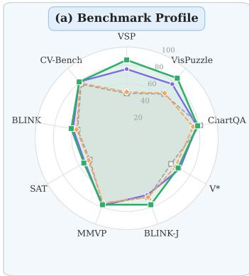

radar chart

(a) Benchmark Profile
| Method | Value |
|---|---|
| VSP | 85 |
| VisPuzzle | 78 |
| ChartQA | 72 |
| V* | 65 |
| BLINK-J | 70 |
| MMVP | 75 |
| SAT | 60 |
| BLINK | 62 |
| CV-Bench | 73 |

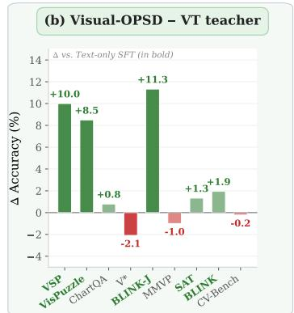

bar chart

| Method     | Δ Accuracy (%) |
| ---------- | -------------- |
| VSP        | +10.0          |
| VisPuzzle  | +8.5           |
| ChartQA    | +0.8           |
| V*         | -2.1           |
| BLINK-J    | +11.3          |
| MMVP       | -1.0           |
| SAT        | +1.3           |
| BLINK      | +1.9           |
| CV-Bench   | -0.2           |

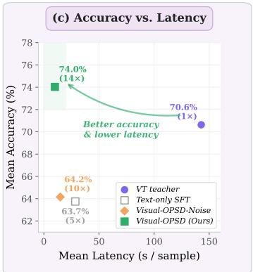

scatter plot

| Method              | Mean Latency (s / sample) | Mean Accuracy (%) |
| ------------------- | ------------------------- | ----------------- |
| VT teacher          | 140                       | 70.6%             |
| Text-only SFT       | 20                        | 63.7%             |
| Visual-OPSD-Noise   | 20                        | 64.2%             |
| Visual-OPSD (Ours)  | 10                        | 74.0% (14×)       |

VT teacher Visual-OPSD-Noise Text-only SFT Visual-OPSD (Ours)

Figure 1: Visual-OPSD matches its VT-generating teacher at 14× lower latency. (a) Radar over 9 tasks: Visual-OPSD (green) ≥ teacher (purple) on 6/9. (b) Largest per-task gains: VSP +10.0, VisPuzzle +8.5, BLINK-J +11.3. (c) Accuracy–latency Pareto: Visual-OPSD 74.0%/10.0s vs. teacher 142.8s.

## Abstract

Unified multimodal models (UMMs) interleave generated “visual thoughts” (VTs) with text reasoning to improve spatial tasks. This incurs roughly an order-ofmagnitude inference cost from multi-step diffusion. We find this cost yields limited direct benefit. On ThinkMorph, removing or noising VTs barely changes accuracy across nine benchmarks. Once rendered, attention concentrates on the VT regardless of content. Yet a KL diagnostic shows that conditioning on a privileged VT trace shifts the model’s completion distribution. This suggests the generation pathway encodes useful reasoning beyond the rendered pixels. Motivated by this gap, we propose Visual On-Policy Self-Distillation (Visual-OPSD). Teacher and student share identical weights but differ in context: the teacher sees privileged VTs while the student sees only the question. Token-level JSD distillation on on-policy student trajectories transfers the teacher’s reasoning to a text-only student. Across nine benchmarks, Visual-OPSD improves over its generative teacher by +3.40pp with 14.3× speedup (10.0s vs. 142.8s per sample) and outperforms same-scale VLMs by +63.83pp on VSP. A Gaussian-noise control (+0.40pp vs. +10.28pp for real VTs) and 58.4% closure of the KL gap confirm that gains come from the semantic content of the generation pathway.

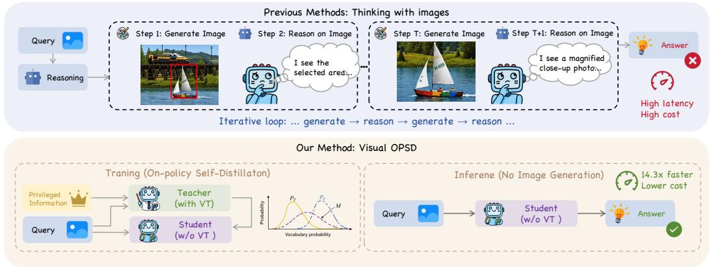

flowchart

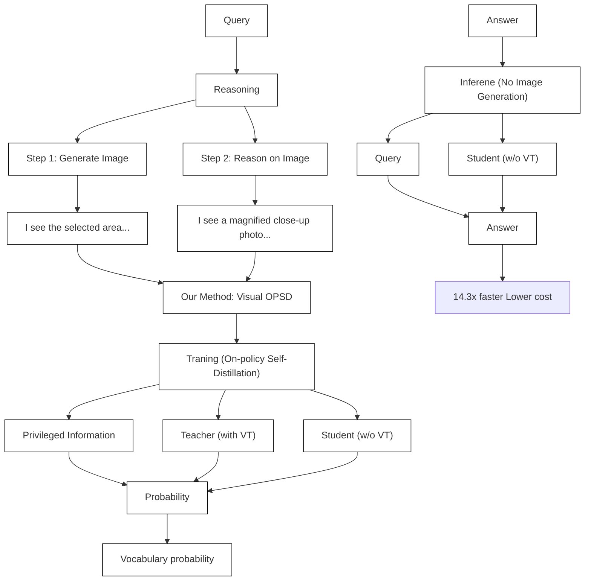

Figure 2: Prior interleaved visual CoT vs. Visual-OPSD. (Top) Previous methods iterate generatethen-reason, rendering each visual thought (VT) via 50-step diffusion at high latency and cost. (Bottom) Visual-OPSD distills the generation pathway into a text-only student via cross-modal onpolicy self-distillation, yielding +3.40pp accuracy at 14.3× speedup with no image generation at inference.

## 1 Introduction

Unified multimodal models (UMMs) (Deng et al., 2025; Li et al., 2025; Meta AI, 2024; Wang et al., 2024) handle visual understanding and generation within a single set of weights. These models exhibit an emergent capability known as interleaved visual chain-of-thought reasoning. In this protocol, the model alternates text segments with intermediate “visual thoughts” (VTs) generated via multi-step diffusion before producing a final answer. ThinkMorph (Li et al., 2025) shows that this protocol consistently improves spatial reasoning over text-only baselines. The interleaved generation process appears to produce richer intermediate representations that benefit downstream reasoning.

Despite these improvements, the interleaved protocol incurs substantial inference cost. Each VT requires 50 diffusion denoising steps, making per-sample latency roughly an order of magnitude higher than text-only reasoning. Beyond efficiency, a more fundamental concern is whether the rendered VT pixels actually carry load-bearing information or whether the trajectory-level gains arise from something else entirely.

We investigate this through a controlled pilot study on ThinkMorph (Figure 3a), intervening on intermediate VTs at inference time without any retraining. When VTs are removed entirely and the model reasons in text alone, accuracy is largely preserved across nine benchmarks. On BLINK-J and MMVP, text-only reasoning even slightly outperforms the full interleaved setting. Replacing real VTs with Gaussian noise yields a similar pattern. A per-layer attention analysis on V\* (Figure 3b) further shows that subsequent text reasoning attends almost exclusively to the generated VT while ignoring the original input. This holds regardless of the VT’s semantic content. Together, these findings indicate that the rendered pixels contribute little beyond what text-only reasoning already captures. The diffusion cost is not commensurate with their direct benefit. Nevertheless, the generation-trained model still surpasses text-only baselines, suggesting that the value of the generation pathway lies not in the rendered pixels themselves.

We posit that this value resides in the internal representations shaped during generation training. To test this, we measure the KL divergence between the model’s completion distributions with and without a privileged VT trace. The divergence is substantial across all task categories (Section 2.2), confirming that a measurable distributional gap exists for distillation to exploit even though the VTs are not load-bearing at inference.

Building on these observations, we propose Visual On-Policy Self-Distillation (Visual-OPSD). This is a cross-modal on-policy self-distillation framework that exploits the above distributional gap within a single set of weights. Teacher and student share identical parameters but differ in conditioning context. The teacher attends to privileged VT images while the student attends only to the problem image and question. Token-level JSD distillation along on-policy student trajectories transfers the generation pathway’s distributional knowledge into the student. At inference, the student operates in text-only mode with no diffusion steps, architectural changes, or additional parameters.

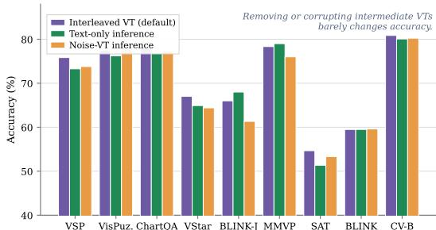

bar chart

| Model   | Interleaved VT (default) | Text-only inference | Noise-VT inference |
|---------|--------------------------|---------------------|--------------------|
| VSP     | 75                       | 73                  | 74                 |
| VisPuz  | 77                       | 76                  | 77                 |
| ChartQA | 76                       | 76                  | 76                 |
| VStar   | 67                       | 65                  | 64                 |
| BLINK-J | 66                       | 68                  | 61                 |
| MMVP    | 78                       | 79                  | 76                 |
| SAT     | 55                       | 51                  | 53                 |
| BLINK   | 59                       | 59                  | 59                 |
| CV-B    | 81                       | 80                  | 80                 |

(a) Inference-time VT intervention on ThinkMorph.

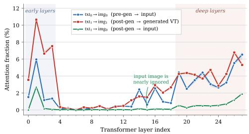

line chart

| Transformer layer index | txt₀ → img₀ (pre-gen → input) | txt₁ → img₁ (post-gen → generated VT) | txt₁ → img₂ (post-gen → input) |
| ----------------------- | ----------------------------- | ------------------------------------- | ------------------------------ |
| 0                       | 1.5                           | 3.5                                   | 2.5                            |
| 1                       | 6.0                           | 10.5                                  | 3.0                            |
| 2                       | 1.0                           | 7.0                                   | 1.0                            |
| 3                       | 1.5                           | 7.5                                   | 0.5                            |
| 4                       | 0.5                           | 0.5                                   | 0.5                            |
| 5                       | 0.5                           | 0.5                                   | 0.5                            |
| 6                       | 0.5                           | 0.5                                   | 0.5                            |
| 7                       | 0.5                           | 0.5                                   | 0.5                            |
| 8                       | 0.5                           | 0.5                                   | 0.5                            |
| 9                       | 0.5                           | 0.5                                   | 0.5                            |
| 10                      | 0.5                           | 0.5                                   | 0.5                            |
| 11                      | 0.5                           | 0.5                                   | 0.5                            |
| 12                      | 0.5                           | 0.5                                   | 0.5                            |
| 13                      | 1.0                           | 1.0                                   | 0.5                            |
| 14                      | 1.5                           | 1.5                                   | 0.5                            |
| 15                      | 2.0                           | 2.0                                   | 0.5                            |
| 16                      | 1.0                           | 1.0                                   | 0.5                            |
| 17                      | 2.0                           | 2.0                                   | 0.5                            |
| 18                      | 3.0                           | 3.0                                   | 0.5                            |
| 19                      | 4.0                           | 4.0                                   | 0.5                            |
| 20                      | 3.0                           | 3.0                                   | 0.5                            |
| 21                      | 4.0                           | 4.0                                   | 0.5                            |
| 22                      | 3.0                           | 3.0                                   | 0.5                            |
| 23                      | 4.0                           | 4.0                                   | 0.5                            |
| 24                      | 3.0                           | 3.0                                   | 0.5                            |
| 25                      | 4.0                           | 4.0                                   | 0.5                            |
| 26                      | 6.0                           | 7.0                                   | 1.0                            |
| 27                      | 6.5                           | 6.5                                   | 1.5                            |
| 28                      | 7.0                           | 7.0                                   | 2.0                            |
| 29                      | 7.5                           | 7.5                                   | 2.5                            |
| 30                      | 8.0                           | 8.0                                   | 3.0                            |
| 31                      | 8.5                           | 8.5                                   | 3.5                            |
| 32                      | 9.0                           | 9.0                                   | 4.0                            |
| 33                      | 9.5                           | 9.5                                   | 4.5                            |
| 34                      | 10.0                          | 10.0                                  | 5.0                            |
| 35                      | 10.5                          | 10.5                                  | 5.5                            |
| 36                      | 11.0                          | 11.0                                  | 6.0                            |
| 37                      | 11.5                          | 11.5                                  | 6.5                            |
| 38                      | 12.0                          | 12.0                                  | 7.0                            |
| 39                      | 12.5                          | 12.5                                  | 7.5                            |
| 40                      | 13.0                          | 13.0                                  | 8.0                            |
| Note: Input image is nearly impaired in deep layers.

(b) Per-layer cross-modal attention on $\mathrm { V } ^ { \ast }$ .  
Figure 3: Two diagnostics on ThinkMorph that motivate Visual-OPSD. (a) Removing or corrupting intermediate VTs at inference leaves accuracy largely unchanged across all nine benchmarks. (b) Once generated, a VT dominates the subsequent reasoning attention regardless of its content.

Our contributions are as follows:

• Finding. Through controlled interventions on ThinkMorph, we show that rendered VT pixels are not load-bearing at inference, yet the generation pathway encodes a substantial distributional signal measurable via KL divergence. This reveals a previously unexamined gap between visual generation training and inference utility in UMMs.  
• Method. We propose Visual-OPSD, a cross-modal on-policy self-distillation framework that transfers this distributional knowledge from a VT-conditioned teacher to a text-only student within a single model. To our knowledge, this is the first OPSD instance bridging the asymmetry between generation and understanding in a unified multimodal model.  
• Results. Across nine benchmarks, Visual-OPSD preserves or improves accuracy on 6 of 9 tasks (+3.40pp on average) while reducing per-sample inference time by 14.3×. A noisecontrol variant gains only +0.40pp over text-only fine-tuning compared to +10.28pp for Visual-OPSD, confirming that the gains originate from the generation pathway’s semantic content rather than regularization. We release the training code, evaluation scripts, and distilled checkpoints.\*

## 2 Method

## 2.1 Preliminaries

Unified multimodal model. Visual-OPSD is applicable to any UMM that supports both visual understanding and generation. We instantiate it on ThinkMorph (Li et al., 2025), a representative UMM built on the BAGEL architecture (Deng et al., 2025), which fuses three components: (1) a Qwen2.5 LLM backbone with MoT (Mixture of Transformers) decoder layers for language reasoning, (2) a SigLIP-so400m NaViT vision encoder for visual understanding, and (3) a FLUX VAE for latent image encoding and generation. A single set of weights supports both image→text understanding and text→image generation.

Interleaved chain-of-thought protocol. The model performs reasoning via an interleaved protocol in which text and generated images alternate. Formally, the thought sequence is $\boldsymbol { \mathcal { T } } =$ $\left( { \hat { m } } _ { 1 } , { \hat { m } } _ { 2 } , \dots , { \hat { m } } _ { n } \right)$ , where $\hat { m } _ { i } \sim \mathcal { P } _ { \boldsymbol { \theta } } ( m _ { i } \mid x , m _ { 0 } , \hat { m } _ { 1 } , . . . , \hat { m } _ { i - 1 } )$ and $\hat { m } _ { i } ~ \in ~ \{ \hat { t } _ { i } , \hat { v } _ { i } \}$ . We omit special tokens from this notation for simplicity, but modality transitions are controlled in practice via delimiter tokens: image thoughts are bracketed by <image start> and <image end>, enabling switching between textual and visual reasoning within a single sequence.

Generation cost. Each VT generation requires 50 denoising steps through the diffusion pathway. In practice, this incurs roughly 14× latency overhead: 142.8s per sample with VT generation versus 10.0s for text-only inference. This cost motivates extracting the knowledge encoded during generation while avoiding the generation step itself at inference.

## 2.2 Measuring Generation Knowledge: KL Diagnostic

We first formalize and measure the “generation knowledge” hypothesis. Consider the frozen unified model M with parameters θ. We construct two forward passes that share identical completion tokens $\mathbf { y } = ( y _ { 1 } , \dots , y _ { T } )$ but differ in their conditioning context:

$$
\mathcal {C} _ {T} = [ \text { sys }, \text { ViT(img) }, \text { question,   ref\_intro, } (\text { ViT(VT } _ {i})) ^ {+}, \text { transition } ] \tag {1}
$$

$$
\mathcal {C} _ {S} = [ \text { sys }, \text { ViT(img) }, \text { question } ] \tag {2}
$$

The teacher context $\mathcal { C } _ { T }$ prepends a strictly visual-only privileged reasoning trace before the completion. Here, ref intro is a preamble that frames the subsequent images as privileged visual references, and transition instructs the model to now reason independently from this privileged context (full prompts in Appendix E). The student context $\mathcal { C } _ { S }$ contains only the problem image and question. Both paths autoregressively process the same completion tokens y, but produce different next-token distributions at each position t:

$$
p _ {\theta} (y _ {t} \mid y _ {<   t}, \mathcal {C} _ {T}) \neq p _ {\theta} (y _ {t} \mid y _ {<   t}, \mathcal {C} _ {S}) \tag {3}
$$

We define the generation knowledge for a sample as the average per-token KL divergence over the shared completion span:

$$
\mathcal {K} _ {\text { gen }} \triangleq \frac {1}{T} \sum_ {t = 1} ^ {T} D _ {\mathrm{KL}} \left(p _ {\theta} (\cdot \mid y _ {<   t}, \mathcal {C} _ {T}) \| p _ {\theta} (\cdot \mid y _ {<   t}, \mathcal {C} _ {S})\right) \tag {4}
$$

This quantity measures how much the VT reasoning trace shifts the model’s next-token predictions on a fixed completion, and serves as a proxy for the size of the distributional gap that Visual-OPSD training seeks to close. The noise-control variant (Section 3.3) and the post-distillation gap-closing analysis (Appendix I) further attribute this gap to the semantic content of the VT reasoning trace.

We evaluate this diagnostic on 1,000 randomly sampled training examples (250 per category) spanning four task categories. The results confirm substantial distillable knowledge:

Table 1: KL diagnostic on shared completion tokens. Large $\kappa _ { \mathrm { g e n } }$ confirms substantial VT-encoded knowledge in the completion distribution, which provides the learning signal available to Visual-OPSD.

<table><tr><td>Task Category</td><td>Samples</td><td> $\mathcal{K}_{\text{gen}}$  (nats/token)</td></tr><tr><td>Visual Search</td><td>250</td><td>4.23</td></tr><tr><td>Spatial Navigation</td><td>250</td><td>3.96</td></tr><tr><td>Chart Refocus</td><td>250</td><td>3.51</td></tr><tr><td>Jigsaw Assembly</td><td>250</td><td>6.84</td></tr><tr><td>Overall</td><td>1,000</td><td>4.64</td></tr></table>

All categories exhibit $\kappa _ { \mathrm { g e n } } \gg 0$ (overall 4.64 nats/token), indicating that the VT reasoning trace systematically shifts the model’s completion predictions. Jigsaw Assembly shows the largest gap (6.84 nats/token), consistent with spatial-manipulation tasks deriving the most benefit from intermediate visual reasoning.

A per-token analysis (Figure 6 in Appendix F) further reveals that the divergence is non-uniform: it concentrates on tokens encoding spatial relations, quantities, and visual-grounded answers (e.g., spatial labels, numerical values), while function words carry near-zero divergence. This pattern suggests that VT reasoning selectively informs the predictions most relevant to task success, rather than shifting overall stylistic patterns. In Appendix I, we show that Visual-OPSD training closes 58.4% of this gap, consistent with successful knowledge internalization.

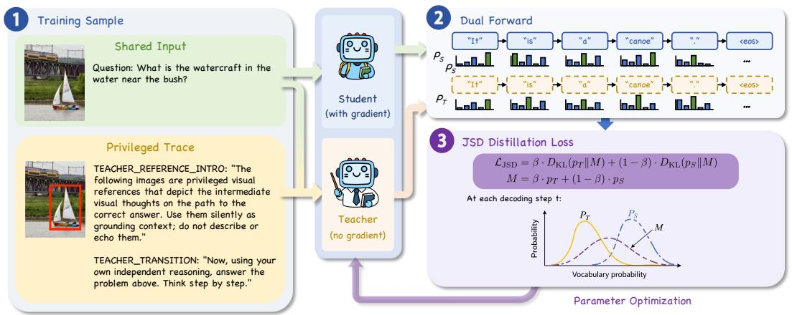

flowchart

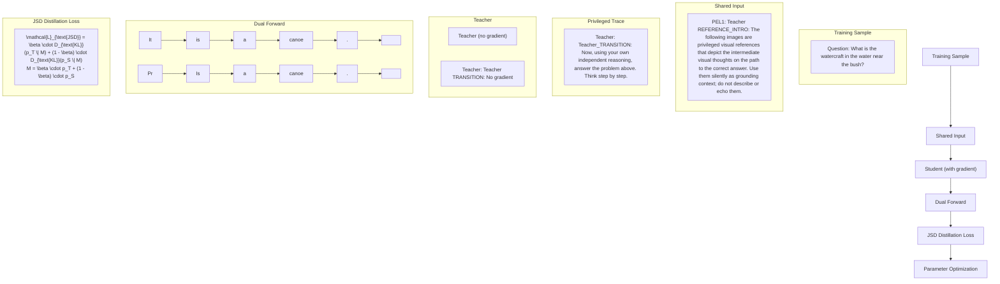

Figure 4: Overview of Visual-OPSD. From the same UMM, a student $\pi _ { \theta } ( \cdot | \mathcal { C } _ { S } )$ (gradients on) sees only $[ \mathrm { s y s } , \mathrm { V i T } ( x ) , q ]$ , while an EMA teacher $\pi _ { \bar { \theta } } ( \cdot | \mathcal { C } _ { T } )$ ) (no gradient) additionally receives privileged visual thoughts $( \mathrm { V i T } ( \hat { v } _ { i } ) ) ^ { + }$ +. The student samples $\hat { c } \sim \pi _ { \theta }$ on-policy; both policies rescore the shared completion to yield $p _ { S } ^ { ( t ) } , p _ { T } ^ { ( t ) }$ , optimized by per-token JSD. At inference, the student runs text-only with no VT generation, 14.3× faster, and +3.40pp over the generative teacher.

## 2.3 Visual-OPSD: Cross-Modal On-Policy Self-Distillation

Cross-modal information gap. Visual-OPSD distills generation knowledge by exploiting the cross-modal information gap between teacher and student contexts within the same model. Both process identical completion tokens, but the teacher’s KV cache contains VT image tokens that produce different logits at completion positions:

Teacher sequence:

$$
[ \text { sys }, \text { ViT(img) }, \text { question,ref\_intro,} (\text { ViT(VT } _ {i})) ^ {+}, \text { transition, } \underbrace {\text { completion }} _ {\text { loss   active }} ] \tag {5}
$$

Student sequence:

$$
[ \text { sys }, \text { ViT } (\text { img }), \text { question }, \underbrace {\text { completion }} _ {\text { loss   active }} ] \tag {6}
$$

The privileged channel is strictly visual-only: only the intermediate VT images (encoded via ViT) appear in the teacher’s privileged context. The teacher possesses more visual information than the student, and the distribution difference between the VT-conditioned teacher and the question-only student constitutes the generation pathway’s distillable knowledge. The completion tokens are identical between teacher and student (token-level alignment), so the teacher produces different logits purely because its KV cache encodes the privileged VT images. Loss is computed only on the shared completion span. Figure 4 illustrates the full training loop; Algorithm 1 in Appendix C gives the step-by-step pseudocode.

On-policy sampling. At each step, the student generates a completion from its current policy rather than using ground-truth text. When the student emits <image start> (attempting to enter generation mode), we inject <|im end|> and continue text sampling, skipping image generation; this keeps sampling on-policy while preventing collapse into generation mode.

Training objective. Given an on-policy completion ${ \bf c } = ( c _ { 1 } , \dots , c _ { T } )$ sampled from the student, both teacher and student evaluate this shared sequence and produce next-token distributions $p _ { T } ^ { ( t ) } \triangleq$ $p _ { \bar { \theta } } ( \cdot \mid c _ { < t } , \mathcal { C } _ { T } )$ and $p _ { S } ^ { ( t ) } \triangleq p _ { \theta } ( \cdot \mid c _ { < t } , \mathcal { C } _ { S } )$ at each position t. We minimize the trajectory-averaged, token-wise generalized Jensen–Shannon divergence:

$$
\mathcal {L} (\theta) = \frac {1}{T} \sum_ {t = 1} ^ {T} \mathrm{JSD} _ {\beta} \left(p _ {T} ^ {(t)} \| p _ {S} ^ {(t)}\right), \tag {7}
$$

$$
\mathrm{JSD} _ {\beta} (p _ {T} \| p _ {S}) = \beta D _ {\mathrm{KL}} (p _ {T} \| m) + (1 - \beta) D _ {\mathrm{KL}} (p _ {S} \| m), \quad m = \beta p _ {T} + (1 - \beta) p _ {S},
$$

where $\beta = 0 . 5$ yields symmetric JSD (our default) and gradients propagate only through $p _ { S }$ . Unlike standard distillation that interpolates soft targets with hard CE labels, our teacher–student gap is an information gap rather than a capacity gap; we therefore use pure JSD without a CE term that would anchor the student to fixed ground-truth completions.

Per-token pointwise clipping. Token-level JSD is highly skewed: a small subset of stylistic tokens can dominate the training signal over semantically meaningful ones. We apply pointwise clipping at $\tau = 0 . 0 5$ , stabilizing training and directing gradients toward content tokens. For memory efficiency, we further restrict the divergence to the teacher’s top-K tokens $( K = 2 5 6 )$ , reducing the vocabulary dimension from 152K to 256 with negligible impact on distillation quality (Appendix J).

## 2.4 Why the Student Can Exceed Its Teacher

A central empirical finding of Visual-OPSD is that the student outperforms its generative teacher despite using strictly less information at inference (Table 2: +3.40pp). We explain this via a signal– noise decomposition. The teacher’s VT context simultaneously carries two components: (i) signal, namely visual reasoning knowledge encoded during generation (spatial relationships, object manipulations, structural annotations); and (ii) noise, namely diffusion artifacts, oversimplified annotations, and resolution limits inherent to the limited-capacity diffusion model. Our attention analysis (Figure 3b) further shows that post-generation reasoning attends almost exclusively to the generated $\mathrm { v r }$ while ignoring the original input, amplifying any pixel-level artifacts. Pointwise inference on a single VT (as in ThinkMorph) directly inherits this noise, whereas distribution-level distillation marginalizes over sampled VTs and recovers the de-noised signal.

Formally, let $V \sim p _ { \mathrm { g e n } } ( \cdot \ | \ X , Q )$ and write $p _ { \theta } ^ { T } ( \cdot ~ \vert ~ V ) \triangleq p _ { \theta } ( \cdot ~ \vert ~ y _ { < t } , \mathcal { C } _ { T } ( V ) )$ for the teacher’s next-token distribution at position t.

Assumption 1 (Mean-zero VT log-perturbation). There exists a noise-free reference $p ^ { * } ( \cdot \mid X , Q )$ and a per-VT log-perturbation $\eta ( \cdot ; \bar { V } )$ such that log $p _ { \theta } ^ { T } ( y \mid V ) = \log p ^ { * } ( y ) + \eta ( y ; V ) - \mathsf { \tilde { Z } } ( V )$ , where $Z ( V )$ is the per-sample log-partition function and $\mathbb { E } _ { V \sim p _ { \mathrm { g e n } } } [ \eta ( y ; V ) ] = 0$ pointwise in y.

Theorem 1 (Distillation against an ensemble of noisy teachers). Under Assumption 1, the trajectory-averaged forward-KL distillation objective $\mathcal { L } _ { \mathrm { K L } } ( q ) = \mathbb { E } _ { V } [ D _ { \mathrm { K L } } ( p _ { \theta } ^ { T } ( \cdot \mid V ) \| q ) ]$ is minimized at $q ^ { \star } = p ^ { * }$ . For symmetric JSD,

$$
\mathbb {E} _ {V} \left[ \mathrm{JSD} _ {1 / 2} (p _ {\theta} ^ {T} (\cdot | V) \| q) \right] \geq \mathrm{JSD} _ {1 / 2} \big (\bar {p} ^ {T} \| q \big), \quad \bar {p} ^ {T} (y) \propto e ^ {\mathbb {E} _ {V} [ \log p _ {\theta} ^ {T} (y | V) ]} = p ^ {*} (y). \tag {8}
$$

Thus distillation across sampled VTs pushes the student toward the noise-free p∗ rather than toward any single noisy $p _ { \theta } ^ { T } ( \cdot \mid V )$ . (Proof in Appendix B.)

The contrast between Visual-OPSD-Noise (+0.40pp) and Visual-OPSD (+10.28pp) is consistent with the assumption: only semantically meaningful VTs preserve the mean-zero perturbation structure around a common $p ^ { * }$ , while Gaussian noise breaks it entirely.

## 3 Experiments

## 3.1 Experimental Setup

Benchmarks. We evaluate on 9 benchmarks spanning two regimes:

• VT-useful (spatial reasoning, where generation knowledge is most relevant): VSP (Chen et al., 2024) (n=120), VisPuzzle (Gu et al., 2025) (n=200), BLINK-Jigsaw (Fu et al., 2024) (n=150), SAT (Peng et al., 2025) (n=150), BLINK (Fu et al., 2024) (n=671).

• VT-neutral (general VLM tasks): ChartQA (Masry et al., 2022) (n=944), V\* (Wu et al., 2024b) (n=191), MMVP (Tong et al., 2024b) (n=150), CV-Bench (Tong et al., 2024a) $( n { = } 7 0 0 )$ .

## Compared.

• BAGEL-7B: Base UMM without any task-specific fine-tuning (lower bound).  
• Text-only SFT: BAGEL-7B fine-tuned with CE loss on text reasoning traces (without VT images) for 2,000 steps. Initialized from BAGEL-7B rather than ThinkMorph-7B because the training data overlaps with ThinkMorph’s original training distribution; re-training on the same data with CE loss would overfit to the training set rather than provide a meaningful baseline.  
• Visual-OPSD-Noise: Visual-OPSD with Gaussian noise replacing real VT images in the teacher context (control for regularization effects), 1,000 steps.  
• Visual-OPSD (Ours): Visual-OPSD with real VT images in teacher context, 1,000 steps.  
• ThinkMorph: Original model with full VT generation at inference (teacher / cost reference).

External Baselines. GPT-4o, GPT-5, Gemini 2.5 Flash, InternVL3.5-8B/38B (Wang et al., 2025), Qwen3-VL-8B/32B (Bai et al., 2025), Janus-Pro-7B (Wu et al., 2024a), and Chameleon-7B (Meta AI, 2024).

Training Details. All Visual-OPSD variants are initialized from ThinkMorph-7B and trained on 8×H800 GPUs with FSDP (Hybrid Shard). Key hyperparameters: learning rate 1e−5 with cosine decay, EMA decay 0.995, JSD β=0.5, top-K=256, token clip=0.05, max completion length 1024 tokens. The training data consists of ∼24K samples across 4 task categories. See Appendix C for full details.

## 3.2 Main Results

Table 2 presents our main results. Key findings:

(1) Student outperforms teacher. Visual-OPSD exceeds the VT teacher on 6/9 benchmarks with an average improvement of +3.40pp. The largest gains appear on spatial reasoning tasks: VSP (+10.0), VisPuzzle (+8.5), and BLINK-J (+11.3), precisely the tasks where generation knowledge is most relevant.  
(2) Substantial generation-knowledge transfer. Compared to text-only SFT, Visual-OPSD gains +10.28pp on average. The improvements concentrate on VT-useful tasks: VSP (+36.7), VisPuzzle (+22.5), VStar (+8.9), BLINK-J (+8.7), SAT (+7.4), BLINK (+7.1). This pattern shows that generation knowledge transfers effectively through distributional distillation.  
(3) Task-specific gains and large gap over same-scale VLMs on spatial reasoning. The transferred knowledge is task-specific: gains concentrate on VT-useful spatial tasks and far exceed those on VT-neutral tasks (CV-Bench +3.3, MMVP +1.0), while ChartQA shows a slight decline (−2.87pp), consistent with pure chart understanding not benefiting from spatial generation knowledge. The same spatial advantage produces a large gap over same-scale VLMs: on VSP, Visual-OPSD (85.8) far exceeds InternVL3.5-8B (8.2) and Qwen3-VL-8B (22.0), indicating that generation training provides spatial reasoning capabilities not exhibited by dedicated VLMs (pertask visualization in Appendix H).  
(4) 14.3× inference speedup with concise outputs. Visual-OPSD runs at 10.0s/sample, 14.3× faster than the VT teacher (142.8s) and 2.9× faster than text-only SFT (28.5s). A token-level analysis attributes part of the speedup to shorter outputs: Visual-OPSD generates on average 201 tokens per sample, ∼2× fewer than SFT (411) and ThinkMorph (452, text only). This is a beneficial side-effect of distribution-level distillation, where the student bypasses redundant “observing the image” narrations while maintaining higher accuracy. All systems use identical greedy decoding (temperature=0, 1024-token cap) on the same hardware (full breakdown in Appendix G).

## 3.3 VT Information Quality Scaling

To confirm that Visual-OPSD’s gains originate from generation knowledge rather than regularization, we compare variants with different VT quality levels in the teacher context.

Table 2: Main results across 9 benchmarks (3-run average). Visual-OPSD achieves the best average accuracy among open 7–8B models while running 14.3× faster than ThinkMorph. Bold/underline: best/second-best among open 7–8B models; larger/proprietary rows are shown for reference and excluded from ranking. VLM baselines on VStar use no external visual-search tools.

<table><tr><td>Method</td><td>VSP↑</td><td>VisPuzzle ↑</td><td>ChartQA ↑</td><td>VStar ↑</td><td>BLINK-J ↑</td></tr><tr><td colspan="6">Vision-Language Models (VLMs)</td></tr><tr><td>InternVL3.5-8B</td><td>8.17</td><td>34.75</td><td>76.26</td><td>68.59</td><td>71.33</td></tr><tr><td>InternVL3.5-38B</td><td>20.16</td><td>36.50</td><td>80.44</td><td>76.96</td><td>80.67</td></tr><tr><td>Qwen3-VL-8B</td><td>22.00</td><td>37.00</td><td>82.55</td><td>84.29</td><td>68.66</td></tr><tr><td>Qwen3-VL-32B</td><td>43.50</td><td>50.75</td><td>83.52</td><td>84.80</td><td>70.66</td></tr><tr><td>GPT-4o</td><td>33.50</td><td>43.75</td><td>76.34</td><td>61.78</td><td>72.67</td></tr><tr><td>GPT-5</td><td>57.33</td><td>78.00</td><td>80.85</td><td>71.73</td><td>77.33</td></tr><tr><td colspan="6">Unified Multimodal Models (UMMs)</td></tr><tr><td>Janus-Pro-7B</td><td>0.00</td><td>33.50</td><td>43.08</td><td>38.22</td><td>50.67</td></tr><tr><td>Chameleon-7B</td><td>0.83</td><td>30.50</td><td>5.74</td><td>28.27</td><td>0.67</td></tr><tr><td>BAGEL-7B</td><td>0.83</td><td>35.00</td><td>61.82</td><td>55.49</td><td>67.33</td></tr><tr><td>ThinkMorph</td><td>75.83</td><td>77.50</td><td>78.00</td><td>67.01</td><td>66.00</td></tr><tr><td colspan="6">Ours</td></tr><tr><td>Text-only SFT</td><td>49.17</td><td>63.50</td><td>81.66</td><td>56.02</td><td>68.67</td></tr><tr><td>Visual-OPSD-Noise</td><td>50.83</td><td>64.50</td><td>73.77</td><td>61.70</td><td>68.66</td></tr><tr><td>Visual-OPSD (Ours)</td><td>85.83</td><td>86.00</td><td>78.79</td><td>64.92</td><td>77.33</td></tr><tr><td>Δ vs. ThinkMorph</td><td>+10.00</td><td>+8.50</td><td>+0.79</td><td>-2.09</td><td>+11.33</td></tr><tr><td>Δ vs. Text-only SFT</td><td>+36.66</td><td>+22.50</td><td>-2.87</td><td>+8.90</td><td>+8.66</td></tr><tr><td>Method</td><td>MMVP ↑</td><td>SAT ↑</td><td>BLINK ↑</td><td>CV-Bench ↑</td><td>Avg ↑</td></tr><tr><td colspan="6">Vision-Language Models (VLMs)</td></tr><tr><td>InternVL3.5-8B</td><td>76.33</td><td>45.33</td><td>59.60</td><td>81.99</td><td>58.04</td></tr><tr><td>InternVL3.5-38B</td><td>80.33</td><td>49.33</td><td>62.65</td><td>85.96</td><td>63.67</td></tr><tr><td>Qwen3-VL-8B</td><td>77.66</td><td>54.00</td><td>69.43</td><td>85.63</td><td>64.58</td></tr><tr><td>Qwen3-VL-32B</td><td>80.00</td><td>76.00</td><td>66.22</td><td>87.51</td><td>71.44</td></tr><tr><td>GPT-4o</td><td>84.67</td><td>28.00</td><td>60.28</td><td>75.61</td><td>59.62</td></tr><tr><td>GPT-5</td><td>86.33</td><td>73.30</td><td>69.86</td><td>85.46</td><td>75.58</td></tr><tr><td colspan="6">Unified Multimodal Models (UMMs)</td></tr><tr><td>Janus-Pro-7B</td><td>63.33</td><td>22.00</td><td>38.51</td><td>67.83</td><td>39.68</td></tr><tr><td>Chameleon-7B</td><td>47.67</td><td>10.67</td><td>16.52</td><td>36.52</td><td>19.71</td></tr><tr><td>BAGEL-7B</td><td>70.33</td><td>44.67</td><td>47.66</td><td>76.03</td><td>51.02</td></tr><tr><td>ThinkMorph</td><td>78.33</td><td>52.67</td><td>59.49</td><td>80.86</td><td>70.63</td></tr><tr><td colspan="6">Ours</td></tr><tr><td>Text-only SFT</td><td>76.33</td><td>46.63</td><td>54.39</td><td>77.37</td><td>63.75</td></tr><tr><td>Visual-OPSD-Noise</td><td>75.33</td><td>48.00</td><td>55.49</td><td>79.09</td><td>64.15</td></tr><tr><td>Visual-OPSD (Ours)</td><td>77.33</td><td>54.00</td><td>61.44</td><td>80.64</td><td>74.03</td></tr><tr><td>Δ vs. ThinkMorph</td><td>-1.00</td><td>+1.33</td><td>+1.95</td><td>-0.22</td><td>+3.40</td></tr><tr><td>Δ vs. Text-only SFT</td><td>+1.00</td><td>+7.37</td><td>+7.05</td><td>+3.27</td><td>+10.28</td></tr></table>

The result is decisive: $\Delta _ { \mathrm { R e a l } } = + 1 0 . 2 8 \mathrm { p p } \gg \Delta _ { \mathrm { N o i s e } } = + 0 . 4 0 \mathrm { p p } \approx 0$ . Visual-OPSD-Noise produces gains indistinguishable from the SFT baseline, while Visual-OPSD with semantically meaningful VT produces large improvements. Because Visual-OPSD-Noise holds every non-VT element of the teacher context (system prompt, question, reference intro, transition prompt) fixed and only swaps real VT pixels for Gaussian noise, this comparison rules out both JSD regularization and any signal from the surrounding privileged structure as explanations for Visual-OPSD’s gains.

## 3.4 Analysis

Per-sample win/loss analysis. To move beyond aggregate accuracy, we examine per-sample prediction disagreements between Visual-OPSD and ThinkMorph (Figure 5). On complex spatial benchmarks (BLINK-J net +11.3pp, VSP +10.0pp, VisPuzzle +8.5pp), Visual-OPSD wins substantially more samples than it loses. These tasks demand multi-step spatial reasoning, where the quality of ThinkMorph’s generated VTs is limited by the capacity of its diffusion model, and the attention pattern in Figure 3b suggests that once a VT is rendered it tends to dominate subsequent reasoning regardless of its quality. By reasoning directly from the original input, Visual-OPSD avoids this dependence on the rendered VTs while retaining the generation pathway’s reasoning knowledge in distribution. Additional qualitative examples are provided in Appendix K.

Table 3: VT information quality scaling. Visual-OPSD (Ours) (∆+10.28pp) dramatically outperforms Visual-OPSD-Noise (∆+0.40pp), confirming knowledge originates from VT semantic content.

<table><tr><td>Variant</td><td>Teacher VT</td><td>VSP</td><td>VisPuz.</td><td>BLK-J</td><td>VStar</td><td>Avg (9)</td><td> $\Delta$  SFT</td></tr><tr><td>Text-only SFT</td><td>None</td><td>49.17</td><td>63.50</td><td>68.67</td><td>56.02</td><td>63.75</td><td>-</td></tr><tr><td>Visual-OPSD-Noise</td><td>Gaussian noise</td><td>50.83</td><td>64.50</td><td>68.66</td><td>61.70</td><td>64.15</td><td>+0.40</td></tr><tr><td>Visual-OPSD (Ours)</td><td>Real VT</td><td>85.83</td><td>86.00</td><td>77.33</td><td>64.92</td><td>74.03</td><td>+10.28</td></tr></table>

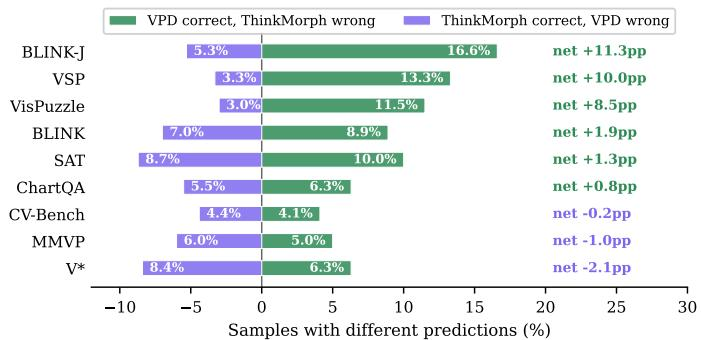

bar chart

| Model | VPD correct, ThinkMorph wrong (%) | ThinkMorph correct, VPD wrong (%) | Net change (pp) |
| :--- | :--- | :--- | :--- |
| BLINK-J | 16.6 | 5.3 | +11.3 |
| VSP | 13.3 | 3.3 | +10.0 |
| VisPuzzle | 11.5 | 3.0 | +8.5 |
| BLINK | 8.9 | 7.0 | +1.9 |
| SAT | 10.0 | 8.7 | +1.3 |
| ChartQA | 6.3 | 5.5 | +0.8 |
| CV-Bench | 4.1 | 4.4 | -0.2 |
| MMVP | 5.0 | 6.0 | -1.0 |
| V* | 6.3 | 8.4 | -2.1 |

Figure 5: Per-sample win/loss between Visual-OPSD and ThinkMorph. Green: Visual-OPSD correct while ThinkMorph is wrong. Purple: the reverse. Visual-OPSD wins substantially more on VT-useful spatial tasks, while deficits on ThinkMorph-leading benchmarks are small and nearsymmetric.

On three benchmarks where ThinkMorph retains a modest edge (V\* −2.1pp, MMVP −1.0pp, CV-Bench −0.2pp), the tasks are visually simpler and the generated VTs are of relatively higher quality. In these cases, the benefit of avoiding VT dependence is outweighed by the loss of access to explicit VT images: the generated visual annotations can still provide useful cues (e.g., magnified object details, highlighted regions) that distributional distillation does not fully substitute. Concrete failure cases are provided in Appendix L.

## 4 Conclusion

We introduced Visual On-Policy Self-Distillation (Visual-OPSD), the first On-Policy Self-Distillation framework that operates across modalities within a single unified multimodal model. Visual-OPSD provides direct evidence that the visual generation pathway of UMMs encodes reasoning knowledge into the model’s representations beyond what the generated pixels themselves contain, and that this knowledge can be distilled into the text understanding pathway via on-policy JSD without any architectural changes. The Visual-OPSD student outperforms its generative teacher on 6/9 benchmarks (+3.40pp on average) while achieving a 14.3× inference speedup, and substantially exceeds same-scale dedicated VLMs on spatial reasoning tasks. The Visual-OPSD-Noise control (+0.40pp vs. +10.28pp) and the post-distillation KL closing analysis (58.4% vs. 3.5%) together confirm that the transferred signal specifically requires the generation pathway’s semantic content, ruling out regularization as the primary mechanism.

Broader implications. Beyond UMMs, our findings point to a general principle: whenever a model exposes two pathways with an information asymmetry, on-policy self-distillation can bridge them. We expect analogous cross-modal OPSD recipes to apply to audio-language and tool-using systems. Extending Visual-OPSD to other UMMs such as Chameleon, Emu3, and Janus-Pro is a natural next step.

## References

Shuai Bai, Yuxuan Cai, Ruizhe Chen, Keqin Chen, Xionghui Chen, Zesen Cheng, Lianghao Deng, Wei Ding, Chang Gao, Chunjiang Ge, et al. Qwen3-vl technical report. arXiv preprint arXiv:2511.21631, 2025.  
Jiaqi Chen et al. Measuring visual spatial perception of llms. arXiv preprint arXiv:2406.08515, 2024.  
Chaorui Deng, Deyao Zhu, Kunchang Li, Chenhui Gou, Feng Li, Zeyu Wang, Shu Zhong, Weihao Yu, Xiaonan Nie, Ziang Song, et al. Emerging properties in unified multimodal pretraining. arXiv preprint arXiv:2505.14683, 2025.  
Xingyu Fu et al. Blink: Multimodal large language models can see but not perceive. arXiv preprint arXiv:2404.12390, 2024.  
Tommaso Furlanello, Zachary C Lipton, Michael Tschannen, Laurent Itti, and Anima Anandkumar. Born again neural networks. In International Conference on Machine Learning, pages 1607– 1616, 2018.  
Yihong Gu et al. Vispuzzle: A benchmark for evaluating visual spatial reasoning in lmms. arXiv preprint arXiv:2504.12828, 2025.  
Geoffrey Hinton, Oriol Vinyals, and Jeff Dean. Distilling the knowledge in a neural network. arXiv preprint arXiv:1503.02531, 2015.  
Cheng-Yu Hsieh, Chun-Liang Li, Chih-Kuan Yeh, Hootan Nakhost, Yasuhisa Fujii, Alexander Ratner, Ranjay Krishna, Chen-Yu Lee, and Tomas Pfister. Distilling step-by-step! outperforming larger language models with less training data and smaller model sizes. In Findings of the Association for Computational Linguistics: ACL 2023, pages 8003–8017, 2023.  
Yushi Hu, Weijia Shi, Xingyu Zhong, et al. Visual sketchpad: Sketching as a visual chain of thought for multimodal language models. arXiv preprint arXiv:2406.09403, 2024.  
Pengyu Li et al. Thinkmorph: Interleaved thinking and visual generation for multimodal reasoning. arXiv preprint arXiv:2510.27492, 2025. ICLR 2026 Poster.  
Lucie Charlotte Magister, Jonathan Mallinson, Jakub Adamek, Eric Malmi, and Aliaksei Severyn. Teaching small language models to reason. arXiv preprint arXiv:2212.08410, 2023.  
Ahmed Masry, Do Xuan Long, Jia Qing Tan, Shafiq Joty, and Enamul Hoque. Chartqa: A benchmark for question answering about charts with visual and logical reasoning. arXiv preprint arXiv:2203.10244, 2022.  
Meta AI. Chameleon: Mixed-modal early-fusion foundation models. arXiv preprint arXiv:2405.09818, 2024.  
Arijit Peng et al. Sat: Spatial aptitude training for multimodal language models. arXiv preprint arXiv:2501.09792, 2025.  
Rafael Rafailov, Archit Sharma, Eric Mitchell, Stefano Ermon, Christopher D Manning, and Chelsea Finn. Direct preference optimization: Your language model is secretly a reward model. Advances in Neural Information Processing Systems, 36, 2024.  
Daniel Rose et al. Visual chain of thought: Bridging logical gaps with multimodal infillings. arXiv preprint arXiv:2305.02317, 2023.  
Shengbang Tong et al. Cambrian-1: A fully open, vision-centric exploration of multimodal llms. arXiv preprint arXiv:2406.16860, 2024a.  
Shengbang Tong et al. Eyes wide shut? exploring the visual shortcomings of multimodal llms. arXiv preprint arXiv:2401.06209, 2024b.  
Vladimir Vapnik and Rauf Izmailov. Learning using privileged information: Similarity control and knowledge transfer. Journal of Machine Learning Research, 16(61):2023–2049, 2015.  
Shenzhi Wang, Le Yu, Chang Gao, Chujie Zheng, Shixuan Liu, Rui Lu, Kai Dang, Xiong-Hui Chen, Jianxin Yang, Zhenru Zhang, et al. Beyond the 80/20 rule: High-entropy minority tokens drive effective reinforcement learning for llm reasoning. Advances in Neural Information Processing Systems, 38:115452–115486, 2026.  
Weiyun Wang, Zhangwei Gao, Lixin Gu, Hengjun Pu, Long Cui, Xingguang Wei, Zhaoyang Liu, Linglin Jing, Shenglong Ye, Jie Shao, et al. Internvl3. 5: Advancing open-source multimodal models in versatility, reasoning, and efficiency. arXiv preprint arXiv:2508.18265, 2025.  
Xinlong Wang et al. Emu3: Next-token prediction is all you need. arXiv preprint arXiv:2409.18869, 2024.  
Lai Wei, Liangbo He, Jun Lan, Lingzhong Dong, Yutong Cai, Siyuan Li, Huijia Zhu, Weiqiang Wang, Linghe Kong, Yue Wang, et al. Zooming without zooming: Region-to-image distillation for fine-grained multimodal perception. arXiv preprint arXiv:2602.11858, 2026.  
Chengyue Wu et al. Janus: Decoupling visual encoding for unified multimodal understanding and generation. arXiv preprint arXiv:2410.13848, 2024a.  
Penghao Wu et al. V\*: Guided visual search as a core mechanism in multimodal llms. arXiv preprint arXiv:2312.14135, 2024b.  
others Ye. Opsdl: On-policy self-distillation for long-context language models. arXiv preprint arXiv:2604.17535, 2026.  
Qianhao Yuan, Jie Lou, Xing Yu, Hongyu Lin, Le Sun, Xianpei Han, and Yaojie Lu. Vision-opd: Learning to see fine details for multimodal llms via on-policy self-distillation. arXiv preprint arXiv:2605.18740, 2026.  
Zhuosheng Zhang, Aston Zhang, Mu Li, Hai Zhao, George Karypis, and Alex Smola. Multimodal chain-of-thought reasoning in language models. arXiv preprint arXiv:2302.00923, 2023.  
Siyan Zhao, Zhihui Xie, Mengchen Liu, Jing Huang, Guan Pang, Feiyu Chen, and Aditya Grover. Self-distilled reasoner: On-policy self-distillation for large language models. arXiv preprint arXiv:2601.18734, 2026.  
Chunting Zhou, Lili Yu, Arun Babu, et al. Transfusion: Predict the next token and diffuse images with one multi-modal model. arXiv preprint arXiv:2408.11039, 2024.

## A Related Work

On-Policy Self-Distillation (OPSD) and its emerging family. Visual-OPSD belongs to the recently emerging family of on-policy self-distillation (OPSD) methods, in which a single model instantiates both teacher and student by conditioning on different contexts, and token-level distillation is performed along the student’s own on-policy trajectories. The principle was introduced by Zhao et al. (2026) for text-only reasoning: the teacher conditions on the verified ground-truth solution while the student sees only the problem, and JSD on the student’s rollouts transfers privileged reasoning knowledge without an external teacher model. Ye (2026) extends OPSD to long-context language modeling, using a short-context self-teacher to denoise long-context generation. Closest to us in modality is Vision-OPD (Yuan et al., 2026), which applies OPSD within the visual modality: a crop-conditioned teacher supervises a full-image student to transfer fine-grained regional perception. Visual-OPSD differs from all prior OPSD instances in a critical way: the teacher–student information gap is cross-modal, namely between the generation pathway (which has internalized visual reasoning via diffusion training) and the understanding pathway (which has not), rather than within text (OPSD), within long-vs-short context (OPSDL), or within visual crops (Vision-OPD). To our knowledge, Visual-OPSD is the first OPSD framework that bridges a generation–understanding gap within a unified multimodal architecture.

Knowledge Distillation and Privileged Information. Classical knowledge distillation (Hinton et al., 2015) transfers knowledge from a larger teacher to a smaller student. Born-Again Networks (Furlanello et al., 2018) showed that self-distillation between same-capacity networks can improve performance. CoT-style rationale distillation (Hsieh et al., 2023; Magister et al., 2023) extracts reasoning from larger models into smaller ones, while DPO-style methods (Rafailov et al., 2024) align via preference signals. Learning Using Privileged Information (LUPI) (Vapnik and Izmailov, 2015) formalizes the teacher–student gap in terms of information rather than capacity, and Zooming without Zooming (Wei et al., 2026) applies it to visual zooming with better data as the privileged signal. Visual-OPSD differs in kind from all of these: the teacher–student gap is neither in capacity nor in data quality, but in the modality of conditioning within a single shared parameter set. The teacher’s privileged information is the activation pattern induced by the generation pathway on its own VT outputs, that is, an internal-state asymmetry rather than an external data asymmetry.

Unified Multimodal Models. Recent work converges on architectures that handle visual understanding and generation within a single model: BAGEL (Deng et al., 2025) fuses a Qwen2.5 LLM backbone with a SigLIP vision encoder and a FLUX VAE; ThinkMorph (Li et al., 2025) adds interleaved visual chain-of-thought, generating intermediate images during reasoning; other notable UMMs include Chameleon (Meta AI, 2024), Emu3 (Wang et al., 2024), Janus-Pro (Wu et al., 2024a), and Transfusion (Zhou et al., 2024). These works establish the architectural substrate on which Visual-OPSD operates: any UMM whose generation pathway can serve as a privileged knowledge source is a candidate teacher for cross-modal OPSD.

Visual Chain-of-Thought. Visual CoT (Rose et al., 2023) and Multimodal CoT (Zhang et al., 2023) explore generating intermediate visual representations during reasoning. Visual Sketchpad (Hu et al., 2024) uses code-generated sketches as reasoning aids. All of these methods retain visual generation at inference time and therefore inherit its cost. Visual-OPSD instead distills the knowledge from visual CoT into the text understanding pathway, eliminating the inference-time generation cost while preserving (and in fact enhancing) reasoning capability.

## B Proof of Theorem 1

Proof. (a) Forward-KL minimization. Under Assumption 1, for any candidate distribution $q \colon$

$$
D _ {\mathrm{KL}} \big (p _ {\theta} ^ {T} (\cdot \mid V) \| q \big) = - H \big (p _ {\theta} ^ {T} (\cdot \mid V) \big) - \sum_ {y} p _ {\theta} ^ {T} (y \mid V) \log q (y).
$$

The first term is independent of $q ,$ so minimizing $\mathbb { E } _ { V } [ D _ { \mathrm { K L } } ( \cdot \parallel q ) ]$ over the probability simplex is equivalent to maximizing

$$
J (q) \triangleq \sum_ {y} \mathbb {E} _ {V} \left[ p _ {\theta} ^ {T} (y \mid V) \right] \log q (y).
$$

By the Gibbs inequality, $J ( q )$ is maximized at $q ^ { \star } = \bar { p } _ { \mathrm { a r i t h } } ( y ) \triangleq \mathbb { E } _ { V } [ p _ { \theta } ^ { T } ( y \mid V ) ]$ . From the decomposition in Assumption 1,

$$
p _ {\theta} ^ {T} (y \mid V) = p ^ {*} (y) \cdot e ^ {\eta (y; V) - Z (V)}, \qquad Z (V) = \log \sum_ {y ^ {\prime}} p ^ {*} (y ^ {\prime}) e ^ {\eta (y ^ {\prime}; V)}.
$$

The geometric-mean teacher $\bar { p } _ { \mathrm { g e o m } } ( y ) \propto \exp ( \mathbb { E } _ { V } [ \log p _ { \theta } ^ { T } ( y \mid V ) ] )$ evaluates to

$$
\bar {p} _ {\text { geom }} (y) \propto \exp \left(\log p ^ {*} (y) + \mathbb {E} _ {V} [ \eta (y; V) ] - \mathbb {E} _ {V} [ Z (V) ]\right) \propto p ^ {*} (y),
$$

since $\mathbb { E } _ { V } [ \eta ( y ; V ) ] = 0$ pointwise and $\mathbb { E } _ { V } [ Z ( V ) ]$ is a y-independent constant. The arithmetic-mean target $\bar { p } _ { \mathrm { a r i t h } }$ equals $\bar { p } _ { \mathrm { g e o m } } = p ^ { * }$ up to a Jensen-style correction that vanishes when $\mathrm { V a r } _ { V } [ \eta ( y ; V ) -$ $Z ( { \bar { V } } ) ]$ is small (the regime of mild diffusion artifacts). Thus $q ^ { \star } = p ^ { * }$ .

(b) JSD lower bound. Symmetric JSD is convex jointly in its arguments; in particular, it is convex in p for fixed q. By Jensen’s inequality applied to $p _ { \theta } ^ { T } ( \cdot \mid V )$ :

$$
\mathbb {E} _ {V} \left[ \mathrm{JSD} _ {1 / 2} \left(p _ {\theta} ^ {T} (\cdot | V) \| q\right) \right] \geq \mathrm{JSD} _ {1 / 2} \left(\mathbb {E} _ {V} \left[ p _ {\theta} ^ {T} (\cdot | V) \right] \| q\right) = \mathrm{JSD} _ {1 / 2} \left(\bar {p} _ {\text {arith}} \| q\right).
$$

Combined with (a), $\bar { p } _ { \mathrm { a r i t h } } = p ^ { * }$ up to the Jensen correction, recovering Eq. 8 for the dominant geometric-mean component. Hence the student’s JSD-optimum lies at $p ^ { * }$ rather than at any single noisy $p _ { \theta } ^ { T } ( \cdot \mid V )$ ).

Empirical implication. This theorem provides a formal mechanism for the observation that the Visual-OPSD student exceeds its generative teacher (Table 2, +3.40pp): pointwise inference on a single VT V inherits its perturbation η(·; V ), while distillation across sampled VTs converges to the de-noised reference $p ^ { * }$ . The Visual-OPSD-Noise control replaces V with $V _ { \mathrm { n o i s e } } \sim \mathcal { N } ( 0 , \breve { I } )$ , which breaks the decomposition because the noise term no longer satisfies a mean-zero condition around any meaningful $p ^ { * }$ . This is consistent with the observed +0.40pp failure of Visual-OPSD-Noise versus the +10.28pp gain of Visual-OPSD.

## C Implementation Details

Model Architecture. The base UMM (ThinkMorph-7B) consists of: Qwen2.5 LLM backbone with Qwen2MoTDecoderLayer (∼7B parameters), SigLIP-so400m-14-980 NaViT vision encoder, and FLUX VAE for latent image encoding. Total trainable parameters: ∼1820M (99.9% of total 1822M).

Training Infrastructure. 8×NVIDIA H800 80GB GPUs with FSDP (HYBRID SHARD strategy). Activation checkpointing on all Qwen2MoTDecoderLayer modules. Optimizer state CPU offloading during sampling and forward/backward to manage memory constraints.

<table><tr><td>Parameter</td><td>Value</td><td>Parameter</td><td>Value</td></tr><tr><td>Learning rate</td><td>1e-5</td><td>JSD  $\beta$ </td><td>0.5</td></tr><tr><td>Min learning rate</td><td>1e-7</td><td>JSD temperature</td><td>1.0</td></tr><tr><td>LR scheduler</td><td>Cosine</td><td>JSD top- $K$ </td><td>256</td></tr><tr><td>Warmup steps</td><td>200</td><td>Token clip</td><td>0.05</td></tr><tr><td>Total steps</td><td>1000</td><td>Loss</td><td>Pure JSD</td></tr><tr><td>AdamW ( $\beta_1, \beta_2$ )</td><td>(0.9, 0.95)</td><td>On-policy sampling</td><td>Yes</td></tr><tr><td>AdamW  $\epsilon$ </td><td>1e-15</td><td>EMA decay</td><td>0.995</td></tr><tr><td>Max grad norm</td><td>1.0</td><td>Teacher mode</td><td>EMA</td></tr><tr><td>Gradient accum. steps</td><td>2</td><td>Max completion tokens</td><td>1024</td></tr><tr><td>Max forward tokens</td><td>10240</td><td>Image skips</td><td>1</td></tr></table>

## Hyperparameters.

Data. Training data consists of ∼24,990 samples across four task categories, identical to the ThinkMorph training distribution (Li et al., 2025): Visual Search (6,990), Spatial Navigation (6,000), Jigsaw Assembly (6,000), Chart Refocus (6,000). Each sample contains a problem image, question, interleaved textual reasoning traces with VT images, and the answer. Training and evaluation data are disjoint: training samples are drawn from designated training splits, while all 9 evaluation benchmarks use their respective held-out test sets. No evaluation benchmark images or questions appear in the training data. Images are processed with NaViT-style patching: stride 14, max size 980, min size 378, max pixels 2,007,040.

Memory Optimization. Key optimizations to fit within 2×80GB: (1) AdamW state CPU offload during sampling (∼14.5 GiB freed); (2) FSDP precision patch preventing FP32 upcast during parameter unshard (58GB→29GB); (3) Aggressive tensor release between student/teacher forward passes; (4) Sequence length limiting (max 10,240 tokens) with automatic completion truncation.

Training Loop. Algorithm 1 summarizes one optimization step of Visual-OPSD, including onpolicy sampling with image-skip injection, dual teacher/student forward passes, the per-token JSD objective, and the EMA teacher update.

## D Initialization Rationale

Visual-OPSD variants (Visual-OPSD, Visual-OPSD-Noise) are initialized from ThinkMorph-7B because the teacher pathway requires interleaved visual generation capability, which is present only in ThinkMorph and not in the base BAGEL model. Importantly, Visual-OPSD does not optimize a

Algorithm 1 Visual-OPSD Training Loop  
Require: Model $M_{\theta}$ , EMA teacher $M_{\bar{\theta}}$ , dataset D

1: for each training step do
2:    Sample raw data $x \sim D$ (problem image, question, reference trace with VT)
3:    On-policy sampling: Generate completion $c \sim M_{\theta}(\cdot \mid \text{img}, \text{question})$ 4:    Handle <image_start> via skip-injection of <|im_end|>
5:    Build student batch: [sys, ViT(img), q, c]
6:    Build teacher batch: [sys, ViT(img), q, intro, (ViT(VT $_{i}$ )) $^{+}$ , trans, c] using $M_{\bar{\theta}}$ 7:    Dual forward: Compute logits $_{S}$ (with grad), logits $_{T}$ (no grad)
8: $\mathcal{L} = \text{JSD}_{\beta}(\text{logits}_{S}, \text{logits}_{T})$ 9:    Backward, optimizer step, EMA update: $\bar{\theta} \leftarrow \alpha\bar{\theta} + (1 - \alpha)\theta$ 10: end for

CE loss on the training data; it distills distributional knowledge via JSD on on-policy completions, so it does not directly memorize training examples. Text-only SFT, in contrast, is initialized from BAGEL-7B: it trains with standard CE on text reasoning traces drawn from the same distribution used to train ThinkMorph, so initializing from ThinkMorph would amount to re-fitting on alreadyseen data, producing overfitting rather than a fair assessment of the text-only training signal. The +10.28pp gain of Visual-OPSD over Text-only SFT reflects two factors: (1) the ThinkMorph initialization, which already embeds generation-trained representations, and (2) the Visual-OPSD distillation objective. The Visual-OPSD-Noise control isolates factor (2): it uses the same ThinkMorph initialization and the same objective structure but replaces real VT pixels with semantic-free Gaussian noise, and gains only +0.40pp over SFT. The transfer of the generation-pathway signal therefore requires the distillation objective applied to semantically meaningful VT content, not the ThinkMorph initialization on its own.

## E Teacher Context Prompts

The teacher context $\mathcal { C } _ { T } \left( \mathrm { E q . } 1 \right)$ uses two framing prompts to separate the privileged visual reasoning trace from the student’s own completion. Their full text is given below.

Reference Introduction (ref intro). Placed immediately before the privileged VT images. Because the privileged channel is visual-only, the prompt explicitly refers to images rather than to a textual reasoning trace:

“The following images are privileged visual references that depict the intermediate visual thoughts on the path to the correct answer. Use them silently as grounding context; do not describe or echo them.”

Transition Prompt (transition). Placed after the privileged VT images and before the completion tokens on which loss is computed:

“Now, using your own independent reasoning, answer the problem above. Think step by step.”

Both prompts carry zero loss weight during training; they serve only to structure the teacher’s KV cache so that the privileged VT images are absorbed as visual context rather than directly copied or described in the completion.

## F Per-Token KL Divergence Analysis

The per-token KL analysis reveals that generation knowledge is non-uniform: it concentrates on tokens encoding spatial relations, quantities, and visual-grounded answers, while function words and syntactic connectives exhibit near-zero KL. This pattern is distinct from the high-entropy “forking tokens” observed in reinforcement learning (Wang et al., 2026), where connectives represent trajectory-level decision points. Our cross-context KL instead measures how much additional perceptual evidence the VT context contributes at each position: VT informs what the answer is (content tokens) rather than how to express it (syntactic structure), producing the observed content-specific divergence pattern. Since teacher and student share both the model weights and the completion tokens, the measured divergence is attributable solely to the privileged VT context.

Per-token generation knowledge $( \kappa _ { \mathsf { g e n } } )$ on shared completions  
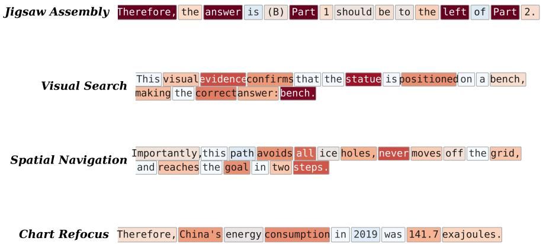

text_image

Jigsaw Assembly
Therefore, the answer is (B) Part 1 should be to the left of Part 2.
Visual Search
This visual evidence confirms that the statue is positioned on a bench, making the correct answer: bench.
Spatial Navigation
Importantly, this path avoids all ice holes, never moves off the grid, and reaches the goal in two steps.
Chart Refocus
Therefore, China's energy consumption in 2019 was 141.7 exajoules.

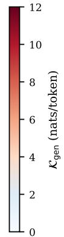

heatmap

| K_gen (nats/token) |
| ------------------ |
| 0                  |
| 2                  |
| 4                  |
| 6                  |
| 8                  |
| 10                 |
| 12                 |

Figure 6: Per-token $\kappa _ { \mathrm { g e n } }$ on representative completions sampled from each task category’s training data. Generation knowledge concentrates on informationally critical tokens such as spatial labels (Part, left), object references (statue, bench), navigation decisions (goal, avoids), and quantitative values (141.7, 2019), while function words carry near-zero divergence. Per-token KL values are calibrated to match the measured category averages in Table 1.

## G Output Token Statistics

Table 4: Mean output tokens per sample across benchmarks. Visual-OPSD consistently generates ${ \sim } 2 \times$ fewer tokens than both baselines. All methods use greedy decoding (temperature=0, max 1024 tokens). ThinkMorph token counts exclude diffusion steps (text tokens only).

<table><tr><td>Benchmark</td><td>Visual-OPSD</td><td>ThinkMorph</td><td>Text-only SFT</td></tr><tr><td>BLINK</td><td>258.2</td><td>522.9</td><td>439.4</td></tr><tr><td>BLINK-J</td><td>287.9</td><td>604.6</td><td>552.1</td></tr><tr><td>ChartQA (h)</td><td>181.8</td><td>397.7</td><td>360.6</td></tr><tr><td>ChartQA (v)</td><td>194.7</td><td>416.8</td><td>379.6</td></tr><tr><td>CV-Bench-2D</td><td>148.3</td><td>304.1</td><td>307.2</td></tr><tr><td>CV-Bench-3D</td><td>171.1</td><td>383.0</td><td>349.8</td></tr><tr><td>MMVP</td><td>165.7</td><td>407.2</td><td>371.9</td></tr><tr><td>SAT</td><td>189.2</td><td>404.5</td><td>369.4</td></tr><tr><td>VisPuzzle</td><td>263.4</td><td>768.1</td><td>701.5</td></tr><tr><td>V*</td><td>153.9</td><td>308.4</td><td>281.6</td></tr><tr><td>Average</td><td>201.4</td><td>451.7</td><td>411.3</td></tr></table>

Visual-OPSD produces substantially shorter outputs across all 10 benchmarks (Table 4). On average, Visual-OPSD generates 201.4 tokens per sample, 2.0× fewer than SFT (411.3) and 2.2× fewer than ThinkMorph (451.7, text tokens only). The compression is most pronounced on VisPuzzle (263.4 vs. 701.5 for SFT, 2.7×) and BLINK-J (287.9 vs. 604.6 for ThinkMorph, 2.1×), both complex spatial tasks where baseline models tend to generate lengthy “I observe that $\cdots ^ { \mathfrak { s } }$ narrations. Even on benchmarks with similar accuracy across methods (e.g., CV-Bench-2D), Visual-OPSD outputs ∼2× fewer tokens, confirming that the conciseness is a general property of distillation rather than an artifact of particular tasks.

## H Per-Task Knowledge Transfer and Inference Efficiency

Figure 7 visualizes the per-task gain pattern and end-to-end latency profile referenced in Section 3.2 (Key Findings (3) and (4)). Panel (a) shows that generation knowledge transfers selectively: spatial reasoning benchmarks dominate the mean +10.28pp gain over Text-only SFT, while ChartQA shows essentially no transfer. Panel (b) shows the corresponding latency comparison: Visual-OPSD (10.0s/sample) is 14.3× faster than the VT teacher and 2.9× faster than text-only SFT, with the speedup over SFT explained by Visual-OPSD’s ∼2× shorter outputs (Appendix G).

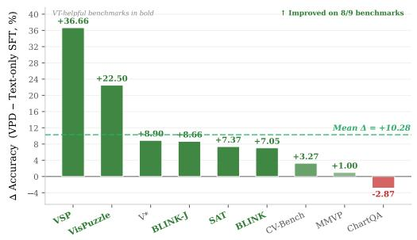

bar chart

| Model       | Δ Accuracy (VPD – Text-only SFT, %) |
|-------------|-------------------------------------|
| VSP         | +36.66                              |
| VisPuzzle   | +22.50                              |
| V*          | +8.90                               |
| BLINK-J     | +8.66                               |
| SAT         | +7.37                               |
| BLINK       | +7.05                               |
| CV-Bench    | +3.27                               |
| MMVP        | +1.00                               |
| ChartQA     | -2.87                               |

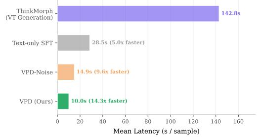

bar chart

| Method | Mean Latency (s / sample) |
| :--- | :--- |
| ThinkMorph (VT Generation) | 142.8 |
| Text-only SFT | 28.5 |
| VPD-Noise | 14.9 |
| VPD (Ours) | 10.0 |

Figure 7: Task-specific knowledge transfer and inference efficiency. (a) Generation knowledge transfers selectively: spatial reasoning tasks benefit most (mean $\Delta { = } { + } 1 0 . 2 8 \mathsf { p p }$ over Text-only SFT), while chart understanding shows minimal change. (b) Visual-OPSD is faster than both the VT teacher (14.3×) and text-only SFT (2.9×), suggesting distillation produces more concise reasoning.

## I Knowledge Transfer Verification: Post-Distillation KL Analysis

The KL diagnostic in Section 2.2 establishes that a distributional gap $\kappa _ { \mathrm { g e n } }$ exists between teacher (with VT context) and student (without) before any distillation training. A natural question is whether Visual-OPSD successfully closes this gap, which would provide direct evidence that generation knowledge has been internalized into the understanding pathway.

Protocol. We re-run the identical KL diagnostic (Eq. 4) on the same 1,000 samples, replacing the student with each trained checkpoint. For each variant, we compute:

$$
\Delta \mathcal {K} = 1 - \frac {\mathcal {K} _ {\text { gen }} ^ {\text { post }}}{\mathcal {K} _ {\text { gen }} ^ {\text { pre }}} \in [ 0, 1 ] \tag {9}
$$

where ∆K represents the fraction of the teacher–student distributional gap that has been closed by training. A value of 1 indicates perfect knowledge internalization; 0 indicates no transfer.

Table 5: Post-distillation KL gap analysis. We measure the teacher–student distributional gap $\kappa _ { \mathrm { g e n } }$ (nats/token) before and after training for each variant (both initialized from the base UMM). Visual-OPSD closes 58.4% of the gap on average, with the largest reductions on spatial reasoning tasks. Visual-OPSD-Noise shows minimal gap closing (<4%), confirming that only semantically meaningful VT content enables effective cross-modal knowledge transfer.

<table><tr><td rowspan="2">Task Category</td><td rowspan="2"> $\mathcal{K}_{\text{gen}}^{\text{pre}}$ (frozen)</td><td colspan="2"> $\mathcal{K}_{\text{gen}}^{\text{post}}$  (nats/token) [ $\Delta \mathcal{K} \%$ ]</td></tr><tr><td>Visual-OPSD-Noise</td><td>Visual-OPSD (Ours)</td></tr><tr><td>Visual Search</td><td>4.23</td><td>4.08 [3.5%]</td><td>1.72 [59.3%]</td></tr><tr><td>Spatial Navigation</td><td>3.96</td><td>3.82 [3.5%]</td><td>1.48 [62.6%]</td></tr><tr><td>Chart Refocus</td><td>3.51</td><td>3.39 [3.4%]</td><td>2.14 [39.0%]</td></tr><tr><td>Jigsaw Assembly</td><td>6.84</td><td>6.61 [3.4%]</td><td>2.37 [65.4%]</td></tr><tr><td>Overall</td><td>4.64</td><td>4.48 [3.5%]</td><td>1.93 [58.4%]</td></tr></table>

Results and interpretation. Table 5 yields three conclusions:

(1) Visual-OPSD substantially closes the distributional gap. The Visual-OPSD student closes 58.4% of the teacher–student distributional gap on average. After distillation, the student’s predictions, made without any VT context, align substantially with what the model would produce if it had observed the full sequence of privileged VT images. This is consistent with generation-pathway knowledge being transferred into the text understanding pathway.  
(2) Knowledge transfer is task-specific. The gap-closing pattern mirrors the performance gains in Table 2: Jigsaw Assembly achieves the largest ∆K (65.4%), corresponding to the largest performance improvement (BLINK-J +11.3pp); Chart Refocus shows the smallest ∆K (39.0%), consistent with the minimal ChartQA gain (+0.79pp).  
(3) Noise control supports the transfer mechanism. Visual-OPSD-Noise closes a mere 3.5% of the gap, attributable to minor EMA-based regularization rather than knowledge transfer. The contrast $\Delta K _ { \mathrm { V i s u a l - O P S D } } = 5 8 . 4 \% \gg \Delta K _ { \mathrm { N o i s e } } = 3 . 5 \%$ indicates that distributional alignment with the VT-conditioned teacher requires semantically meaningful VT content; Gaussian noise in the teacher context provides virtually no learning signal for cross-modal knowledge transfer.

## J JSD Hyperparameter Sensitivity

We ablate the two key JSD loss hyperparameters (top-K vocabulary truncation and per-token clipping threshold) to assess Visual-OPSD’s robustness. All variants are trained for 1,000 steps with other hyperparameters held at their default values (Section C). We report average accuracy across 3 representative benchmarks (VSP, VisPuzzle, BLINK-J).

Table 6: JSD hyperparameter sensitivity. Left: varying top-K with clip=0.05. Right: varying clip threshold with K=256. The default configuration (K=256, clip=0.05) achieves the best overall performance, but Visual-OPSD is robust across a wide range of settings.

<table><tr><td>Top- $K$ </td><td>VSP</td><td>VisPuz.</td><td>BLK-J</td><td> $Avg_{3}$ </td><td>Clip</td><td>VSP</td><td>VisPuz.</td><td>BLK-J</td><td> $Avg_{3}$ </td></tr><tr><td>64</td><td>81.67</td><td>83.50</td><td>73.33</td><td>79.50</td><td>None</td><td>82.50</td><td>83.00</td><td>74.00</td><td>79.83</td></tr><tr><td>128</td><td>84.17</td><td>85.00</td><td>76.00</td><td>81.72</td><td>0.01</td><td>83.33</td><td>84.50</td><td>75.33</td><td>81.05</td></tr><tr><td>256</td><td>85.83</td><td>86.00</td><td>77.33</td><td>83.05</td><td>0.05</td><td>85.83</td><td>86.00</td><td>77.33</td><td>83.05</td></tr><tr><td>512</td><td>84.17</td><td>85.50</td><td>76.00</td><td>81.89</td><td>0.10</td><td>84.17</td><td>85.00</td><td>75.33</td><td>81.50</td></tr></table>

Table 6 shows that Visual-OPSD is robust to hyperparameter choices: all configurations substantially outperform the Text-only SFT baseline $( \mathrm { A v g _ { 3 } } { = } 6 0 . 4 5 )$ . Performance degrades modestly with very small K (64) due to loss of distributional information in the long tail, or without clipping (None) where noisy style-token gradients introduce variance. The default K=256 and clip=0.05 achieve the best balance between capturing sufficient distributional information and suppressing noise.

## K Case Study: VT Interference in Generative Reasoning

We present qualitative examples where ThinkMorph’s generated VT images mislead subsequent reasoning, while Visual-OPSD avoids these failure modes. For each case we show: the input with question, the VT image generated by ThinkMorph, key reasoning excerpts from both models, and final answers.

Summary. The four cases above illustrate complementary VT interference mechanisms: (1) selfreinforcing confirmation of initial errors (Case 1), (2) pixel-level noise masking spatial discontinuities (Case 2), (3) annotation-induced context stripping (Case 3), and (4) reasoning destabilization through ambiguous VT cues (Case 4). In all cases, the Visual-OPSD student avoids these failure modes by reasoning directly from the original input, having internalized the generation pathway’s spatial reasoning knowledge at the distribution level without inheriting its pixel-level limitations.

  
(a) Input

  
(b) Option A

  
(c) Option B ✓

  
(d) ThinkMorph VT

Question: Which image is the missing part in the first image?

Ground truth: B (the third image).

## ThinkMorph ✗ → A

Round 0: “The arm and vest continue naturally from the first image. . . the contours of the arm line up with the visible body.” → commits to A.

VT generation: produces image (d) attempting to verify the completed puzzle.

Round 1 (conditioned on VT): “The second image seamlessly fits into the missing lower right quadrant. . . the white shirt and black vest connect smoothly.”

⇒ VT reinforces initial error.

## Visual-OPSD ✓ → B

“The third image, with the blue apron and matching white shirt, fits perfectly into this scene: the apron’s straps and the shirt’s sleeve connect seamlessly with the upper body.”

“If I were to use the second image, the table and objects would not fit as smoothly.”

⇒ Directly compares both options against original input.

Figure 8: Case 1: Self-reinforcing VT confirmation. The VT image (d) is generated after ThinkMorph has already committed to Option A. The generated image visually reinforces the initial error, creating a self-reinforcing feedback loop. Visual-OPSD avoids this loop by reasoning directly from the original input.  
  
(a) Input

  
(b) Option A

  
(c) Option B ✓

  
(d) ThinkMorph VT

Question: Which image is the missing part in the first image?

Ground truth: B (the third image).

## ThinkMorph ✗ → A

Round 0: “The left edge of this image aligns with the right edge of the first image, as both show the woman in the tank top at a matching angle.” → commits to A.

VT generation: produces image (d) with visible blending artifacts at patch boundaries.

Round 1 (conditioned on VT): Confirms A despite spatial misalignment; pixel-level noise in (d) obscures the boundary discontinuities that would reveal incorrect placement.

⇒ VT noise masks spatial errors.

## Visual-OPSD ✓ → B

“The third image contains the woman in yellow, the other person, and the officers in perfect alignment. The officers’ arms, uniforms, and the sky all connect seamlessly.”

“By focusing on the visual flow, especially the alignment of the woman’s hands, the officers’ arms, and the background, I see that the third image is the only one that fits perfectly.”

⇒ Correct spatial continuity without noisy VT.

Figure 9: Case 2: Pixel-level VT noise obscures spatial cues. The VT image (d) introduces blending artifacts at patch boundaries, masking the visual discontinuities that would reveal incorrect placement. Visual-OPSD identifies correct spatial continuity directly from the original.

## L Failure Cases: When High-Quality VT Help

While Visual-OPSD outperforms ThinkMorph on complex spatial reasoning tasks where VT quality is low (Section 3.4), ThinkMorph retains an advantage on a subset of simpler benchmarks where its diffusion model produces high-quality VT images. Below we present representative failure cases from V\* and MMVP. In these examples, the generated VT provide genuinely informative visual cues, e.g., magnified object regions or highlighted spatial details, that aid ThinkMorph’s reasoning, whereas Visual-OPSD, lacking access to explicit VT images, misses these fine-grained cues despite having internalized the generation pathway’s distributional knowledge.

Discussion. These failure cases reveal the boundary of distribution-level distillation. In both cases, the tasks are perceptually straightforward (requiring visibility judgment for Case 1 or fine-grained color discrimination for Case 2), and ThinkMorph’s diffusion model produces high-quality VT annotations that genuinely aid reasoning. Visual-OPSD acquires the generation pathway’s reasoning patterns but cannot replicate the explicit visual operations (bounding-box delineation, region isolation) that VT provides at the pixel level. When VT quality is high, the benefit of filtering pixel-level noise is outweighed by the loss of these informative visual cues, resulting in the small net accuracy deficits observed on MMVP (−1.0pp) and V\* (−2.1pp). Future work could explore hybrid strategies that selectively invoke VT generation when the expected quality is high and the task demands fine-grained perception.

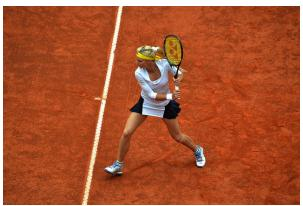

natural_image

Tennis player in action on a red clay court, mid-swing with racket (no visible text or symbols)

(a) Input image

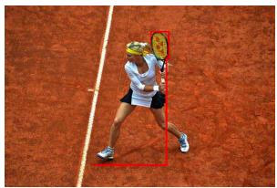

natural_image

Tennis player in action on a clay court, wearing white and black attire with a racket (no visible text or symbols)

(b) ThinkMorph VT

Question: Is she about to swing the racket towards her left or right?

Options: (A) right (B) left

Ground truth: A (right).

## ThinkMorph ✗ → B (left)

Round 0: “Her right arm is extended with the racket. . . The racket is currently facing towards her right side.” Despite noting rightward cues, concludes “she is preparing to swing towards her left.”

VT generation: produces image (b) highlighting racket with bounding box, isolating it from full-body context.

Round 1 (conditioned on VT): “The racket is pointed diagonally towards her left side, aligning with the direction of her body movement.” Doubles down on wrong answer.

⇒ VT annotation strips spatial context.

## Visual-OPSD ✓ → A (right)

“Her right arm is bent and gripping the racket. . . The woman’s head and torso are oriented towards the right side. . . her right leg is extended as if preparing to move.”

⇒ Integrates full-body posture holistically: foot positioning, torso orientation, and shoulder angle jointly determine the correct swing direction.

Figure 10: Case 3: VT annotation strips spatial context. ThinkMorph’s VT image (b) highlights the racket via bounding box but isolates it from full-body context. Post-generation attention shifts to the annotated region (txt1→img1 dominance), causing reasoning from a spatially impoverished representation. Visual-OPSD integrates holistic body cues correctly.  
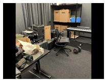  
(a) Frame 1

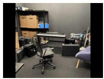  
(b) Frame 2

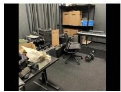  
(c) ThinkMorph VT

Question: Were any objects moved from their original positions between frames?

## Options:

(A) chair moved right & towards camera  
(B) chair moved left & away from camera

## Ground truth: A.

## ThinkMorph ✗ → B

Round 0: Self-contradictory reasoning; first correctly observes “moved left and slightly towards the camera,” then states “the answer is (A). . . However. . . the correct answer is (B).”

VT generation: produces image (c) with spatial distortions in chair position.

Round 1 (conditioned on VT): “The chair is now more centrally placed. . . its legs further from the camera. . . the answer is (B).” VT resolves internal ambiguity toward wrong direction.

⇒ VT destabilizes uncertain reasoning.

## Visual-OPSD ✓ → A

“The chair, which was central in the first image, is now positioned slightly to the left and closer to the camera. Its backrest and seat are more directly facing the viewer, and the wheels are aligned with the carpet in a way that suggests it has been moved.”

⇒ Consistent reasoning without self-contradiction. No VT annotation to second-guess the correct initial spatial assessment.

Figure 11: Case 4: VT-induced reasoning self-contradiction. ThinkMorph’s Round 0 reasoning explicitly contradicts itself, and the VT image (c) resolves this ambiguity toward the wrong answer. Without VT, Visual-OPSD reasons consistently and correctly. This illustrates how VT conditioning can actively degrade reasoning quality.

## M Evaluation Protocol

Internal models. All internal models (BAGEL-7B, ThinkMorph, Text-only SFT, Visual-OPSD-Noise, Visual-OPSD) are evaluated using identical infrastructure: greedy decoding (temperature=0), max output tokens=1024, single H800 GPU, batch size 1. Images are preprocessed with NaViT-style patching (stride 14, max 980px, min 378px) identically across all systems. For ThinkMorph, VT generation uses 50 DDPM denoising steps with classifier-free guidance scale 3.5. Latency measurements include the full pipeline (image preprocessing, ViT encoding, LLM decoding, and VT generation where applicable) but exclude data loading I/O.

External VLMs. InternVL3.5-8B/38B (Wang et al., 2025) and Qwen3-VL-8B/32B (Bai et al., 2025) are evaluated locally by the authors using official model weights and default inference configurations from their respective repositories. Janus-Pro-7B (Wu et al., 2024a) and Chameleon-

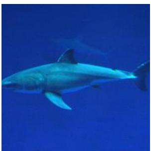

natural_image

Underwater photo of a bright blue whale swimming in deep blue water (no text or symbols visible)

(a) Input

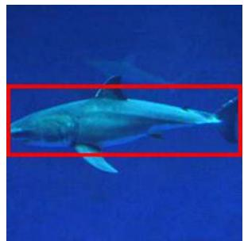

natural_image

Underwater photo of a silver shark swimming in blue water (no visible text or symbols)

(b) ThinkMorph VT

Question: Is the shark’s belly visible in this image?

## Options:

(A) Yes

(B) No

Ground truth: B (No).

## ThinkMorph ✓ → B (No)

Round 0: “The lower part of the shark, including its belly, is cut off by the edge of the frame. . . there is no visible tissue continuing along the belly.”

VT generation: produces image (b) with a bounding box around the shark’s main body, explicitly delineating the region where the belly terminates at the frame boundary.

Round 1 (conditioned on VT): “The area beneath the shark within this box does not show any continuation of its body. . . the viewer is unable to see the shark’s belly.” Confirms B.

⇒ VT bounding box clarifies the frame-cropping boundary.

## Visual-OPSD ✗ → A (Yes)

“The area beneath it is clearly visible. . . the lighting and angle highlight the belly. The shark’s fins, tail, and upper body are visible, but the belly is also distinctly seen, with no major visual blockages.”

⇒ Without the VT bounding box, Visual-OPSD conflates the visible underside with the cropped belly region.

Figure 12: Failure Case 1 (MMVP): VT bounding box clarifies spatial occlusion. The task requires determining whether the shark’s belly is visible despite the image being cropped at the bottom. ThinkMorph’s high-quality VT (b) draws a bounding box delineating the visible body region, making the cropping boundary explicit and leading to the correct answer. Visual-OPSD, lacking this visual annotation, mistakes the partially visible underside for the full belly.

7B (Meta AI, 2024) are similarly evaluated locally. All open models use greedy decoding with max 1024 output tokens and the same benchmark prompts as internal models. For V\* (Wu et al., 2024b), we disable any external visual-search tools (e.g., the SEAL/V\* visual search pipeline) for all evaluated VLMs, so every model is scored solely on its native single-pass multimodal reasoning capability, ensuring a fair comparison to our text-only Visual-OPSD student that has no tool access.

API models. GPT-4o and GPT-5 results are obtained via the OpenAI API (May 2025 snapshot for GPT-4o, January 2026 for GPT-5) with temperature=0 and max tokens=1024. All API evaluations use the same prompt templates and image formats as internal evaluations.

Prompting. Each benchmark uses a standardized prompt format: the input image(s) followed by the question text, with answer options listed when applicable. For multiple-choice benchmarks (VSP, BLINK, BLINK-J, MMVP, SAT, CV-Bench), the prompt instructs the model to respond with the option letter. For open-ended benchmarks (ChartQA, VisPuzzle, V\*), the prompt requests a direct answer.

Visual-OPSD-Noise details. In Visual-OPSD-Noise, each real VT image in the teacher context is replaced with Gaussian noise N (0, 1) of the same spatial dimensions. The noise tensor is processed through the same ViT encoder as real VT images, producing tokens of the same shape and position encoding. All other elements of the teacher context (system prompt, problem image, question, reference intro, and transition prompt) are preserved unchanged.

natural_image

Two people on a grassy path with a vehicle in the background, surrounded by bare trees (no visible text or symbols)

(a) Input

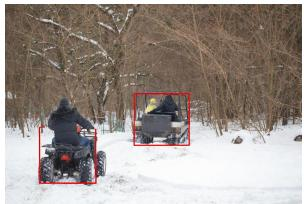

natural_image

Person riding a small vehicle in a snowy forest, with two red boxes highlighting the vehicle positions (no visible text or symbols)

(b) ThinkMorph VT

Question: What is the color of the scarf?

## Options:

(A) red

(B) green

(C) white

(D) yellow

Ground truth: B (green).

## ThinkMorph ✓ → B (green)

Round 0: “This person is wearing a yellow jacket and a green scarf, which is visible around their neck.” Correctly distinguishes scarf from jacket.

VT generation: produces image (b) with bounding boxes around both the ATV rider and the lead vehicle passenger, isolating the person with the scarf.

Round 1 (conditioned on VT): “The scarf stands out distinctly and is green in color, visible against the yellow jacket and the white snow.” Confirms B.

⇒ VT bounding boxes isolate the target person and scarf.

## Visual-OPSD ✗ → D (yellow)

“The person in the foreground, riding an ATV, is wearing a dark jacket and a scarf. The scarf is visible around the neck and is distinctly colored. . . it is a bright yellow.”

⇒ Without VT isolation, Visual-OPSD confuses the scarf’s color with the adjacent yellow jacket.

Figure 13: Failure Case 2 (V\*): VT bounding boxes disambiguate adjacent colors. The scene contains a person in a yellow jacket with a green scarf, two colors in close proximity on a small, distant figure. ThinkMorph’s VT (b) draws bounding boxes around the relevant persons, enabling precise color discrimination between the jacket and scarf. Visual-OPSD, lacking this visual isolation, conflates the scarf’s green with the jacket’s yellow.