# Benchmarking Large Vision-Language Models on Fine-Grained Image Tasks: From Evaluation to Diagnosis

Hong-Tao Yu, Chen-Wei Xie, Yuxin Peng, Fellow, IEEE, Serge Belongie, and Xiu-Shen Wei, Senior Member, IEEE

Abstract—Recent advancements in Large Vision-Language Models (LVLMs) have demonstrated remarkable multimodal perception and reasoning capabilities. While numerous benchmarks have evaluated LVLMs from holistic or task-specific perspectives, their capabilities on fine-grained image tasks—fundamental to computer vision—remain insufficiently understood. To address this gap, we introduce FG-BMK, a comprehensive fine-grained evaluation benchmark containing 1.01 million questions and 0.28 million images, covering diverse scenarios from common objectcentric domains to specialized domains. FG-BMK jointly evaluates dialogue-level fine-grained semantic recognition and feature-level visual discriminability through human-oriented and machineoriented paradigms, enabling diagnostic analysis of whether LVLM failures arise from insufficient visual representations, weak visual-to-semantic grounding, or limited fine-grained knowledge. Through extensive experiments on a diverse set of representative LVLMs/VLMs, we find that current LVLMs remain inadequate fine-grained recognizers, with failures arising from intertwined bottlenecks in visual representations, semantic grounding, modality alignment, and category-level knowledge. We further analyze training design factors for improving fine-grained capabilities and examine how visual and linguistic perturbations affect LVLM predictions. These findings provide diagnostic insights into the limitations of current LVLMs and offer guidance for future data construction and model design in developing more reliable LVLMs for fine-grained visual tasks. Our code is open-source and available at https://fg-bmk.github.io/.

Index Terms—Fine-grained image analysis, large visionlanguage models, benchmark, evaluation, visual representation learning.

## I. INTRODUCTION

ARGE language models (LLMs) have made substantial exhibiting strong language understanding, reasoning, and generation abilities across a broad range of tasks. These advances have further stimulated the development of Large Vision-Language Models (LVLMs), which extend language-centric intelligence toward multimodal perception and interaction.

Hong-Tao Yu is with the School of Computer Science and Engineering, Southeast University, China. E-mail: yuht seu@seu.edu.cn.

Chen-Wei Xie is with Alibaba Group. E-mail: xiecw.mail@gmail.com.

Xiu-Shen Wei is with the School of Computer Science and Engineering, School of Intelligence Science and Engineering, and Key Laboratory of New Generation Artificial Intelligence Technology and Its Interdisciplinary Applications, Southeast University, China. E-mail: weixs@seu.edu.cn.

Yuxin Peng is with the Wangxuan Institute of Computer Technology, National Key Laboratory for Multimedia Information Processing, Peking University, China. E-mail: pengyuxin@pku.edu.cn.

Serge Belongie is with the University of Copenhagen, Denmark. E-mail: s.belongie@di.ku.dk.

Xiu-Shen Wei is the corresponding author.

Representative models, including GPT-5.4 [1], Qwen [2], InternVL [3], and LLaVA-1.5 [4], have achieved impressive performance in multimodal perception and reasoning. More recently, unified multimodal models have further expanded this paradigm by integrating visual understanding and generation within a single framework to make these capabilities mutually reinforcing.

These rapid advances have also driven increasingly systematic evaluations of LVLM capabilities. Existing holistic and specialized benchmarks have been proposed to examine LVLMs from different perspectives. For instance, LVLM-eHub [5] and MMBench [6] offer broad evaluations of multimodal perception and reasoning, whereas specialized evaluations such as DocVQA [7] and GQA [8] target specific tasks, including document visual perception and visual reasoning. More recently, several studies [9]–[11] have begun to examine LVLMs on finegrained image tasks, which require analyzing visual objects at the subordinate-category level and are fundamental to computer vision [12]. However, these evaluations remain limited in scope, mainly focusing on classification-style tasks with limited domain diversity, task coverage, and diagnostic depth. As a result, the capability boundaries of LVLMs in fine-grained tasks remain poorly understood.

To address this gap, we introduce FG-BMK, a comprehensive benchmark for evaluating LVLMs on fine-grained image tasks. The benchmark contains 1.01 million questions and 0.28 million images, covering diverse fine-grained scenarios from common object-centric domains to specialized domains. Rather than treating fine-grained evaluation as a single classification problem, FG-BMK is organized around two complementary paradigms: human-oriented and machine-oriented evaluation. The human-oriented evaluation uses dialogue-like questions to assess fine-grained semantic recognition, including attribute perception, category-level knowledge bias, and hierarchical granularity understanding. The machine-oriented evaluation directly probes visual representations through two core finegrained vision tasks—image retrieval and image recognition— measuring whether LVLM visual features preserve fine-grained similarity and category separability. By jointly examining dialogue-level semantic recognition and feature-level visual discriminability, FG-BMK enables a more diagnostic evaluation of whether LVLM failures arise from insufficient visual representations, weak visual-to-semantic grounding, or insufficient domain-specific or fine-grained category knowledge.

Building on the diagnostic design of FG-BMK, we organize our evaluation as a progressive analysis of fine-grained LVLM capabilities, rather than merely reporting aggregate benchmark scores. We begin by asking whether current LVLMs can serve as reliable fine-grained recognizers. To this end, we evaluate their performance across different taxonomy granularities, compare them with fine-grained tailored models, and further examine their ability to recognize discriminative visual attributes.

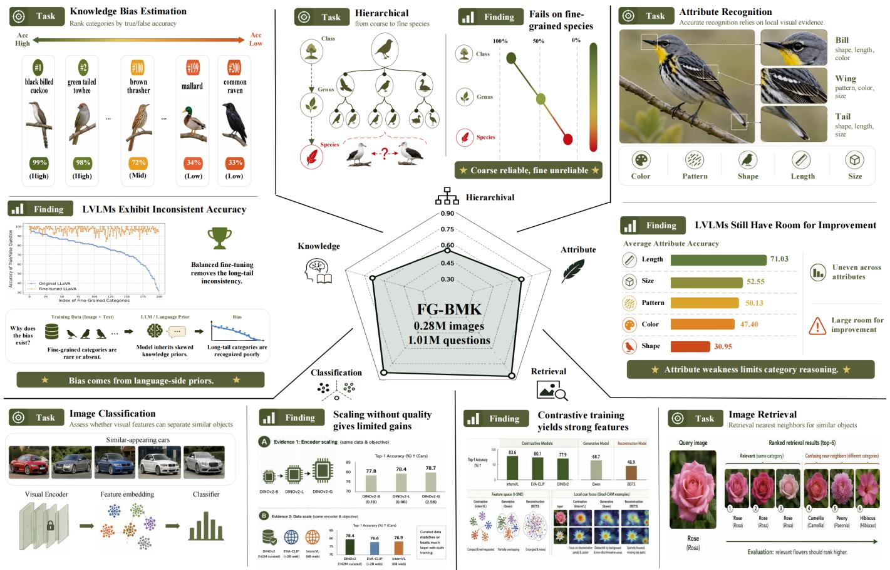

radar chart

| Task | Rank Category | Accuracy (%) | Classification |
| --- | --- | --- | --- |
| Knowledge Bias Estimation | Black billed cuckoo | 99 | Original LLaVA |
| Knowledge Bias Estimation | Green tailed towhee | 98 | Fine-tuned LLaVA |
| Knowledge Bias Estimation | Brown thrasher | 72 | Index of Fine-Grained Categories |
| Knowledge Bias Estimation | Mallard | 34 | Index of Fine-Grained Categories |
| Knowledge Bias Estimation | Common raven | 33 | Index of Fine-Grained Categories |
| Hierarchy from coarse to fine species | Class | 100 | FG-BMK 0.28M images 1.01M questions |
| Hierarchy from coarse to fine species | Genus | 50 | FG-BMK 0.28M images 1.01M questions |
| Hierarchy from coarse to fine species | Species | 0% | FG-BMK 0.28M images 1.01M questions |
| Fails on fine-grained species | Class | 100% | FG-BMK 0.28M images 1.01M questions |
| Fails on fine-grained species | Genus | 50% | FG-BMK 0.28M images 1.01M questions |
| Fails on fine-grained species | Species | 0% | FG-BMK 0.28M images 1.01M questions |
| Attribute Recognition | Bill shape, length, color | 50% | FG-BMK 0.28M images 1.01M questions |
| Attribute Recognition | Wing pattern, color, size | 47.40% | FG-BMK 0.28M images 1.01M questions |
| Attribute Recognition | Tail shape, length, size | 47.40% | FG-BMK 0.28M images 1.01M questions |
| Attribute Recognition | Color | 52.55% | FG-BMK 0.28M images 1.01M questions |
| Attribute Recognition | Pattern | 50.13% | FG-BMK 0.28M images 1.01M questions |
| Attribute Recognition | Color | 47.40% | FG-BMK 0.28M images 1.01M questions |
| Attribute Recognition | Shape | 30.95% | FG-BMK 0.28M images 1.01M questions |
| Image Retrieval (Rank categories) | Similar-appearing cars | - | Visual Encoder, Feature embedding, Classifier |

Fig. 1. Overview of FG-BMK. FG-BMK evaluates LVLMs on fine-grained visual tasks from five diagnostic dimensions: hierarchical recognition, knowledge bias estimation, attribute recognition, image classification, and image retrieval. The teaser illustrates both the task formats and representative findings, showing that current LVLMs still suffer from degraded fine-level recognition, biased category knowledge, uneven attribute understanding, and insufficient fine-grained visual discriminability.

We then move from measuring this gap to diagnosing its underlying causes. By jointly considering dialogue-level semantic recognition and feature-level visual discriminability, we distinguish whether LVLM failures arise from insufficient visual representations, weak visual-to-semantic grounding, or limited fine-grained knowledge. We further investigate this issue through unified understanding-generation models, visual-totextual alignment analysis, and category-level long-tail behavior, revealing how visual representations, semantic grounding, alignment strategies, and training-data coverage jointly shape fine-grained recognition performance.

Beyond failure diagnosis, we examine which training design factors can improve fine-grained LVLM capabilities. Specifically, we analyze how training objectives, visual feature quality, vision-encoder scale, training-data scale, and supervised finetuning data composition affect fine-grained visual discriminability and downstream recognition. Finally, we evaluate the robustness of fine-grained LVLM recognition under visual and linguistic perturbations, testing whether these capabilities remain stable when visual evidence is degraded or misleading language priors are introduced. Overall, this evaluation protocol moves from performance assessment to failure diagnosis, improvement analysis, and robustness verification, leading to the following key findings:

• The contrastive training paradigm in LVLMs proves more effective in enhancing the fine-grained discriminability of visual features, whereas generative and reconstruction-based training paradigms tend to yield weaker discriminability.  
• Aligning visual features with textual features in LVLMs can impair their fine-grained discriminability when image-text granularity is mismatched; however, content-level alignment improves general visual understanding, whereas categorylevel alignment strengthens fine-grained semantic grounding.  
• LVLMs and LVMs are more vulnerable to feature perturbations in fine-grained tasks than in generic vision tasks, while language-side perturbations can override visual evidence more effectively than visual-side perturbations.  
• LVLMs demonstrate relatively stronger capabilities in perceiving visual appearances but face challenges in fine-grained category reasoning (which depends on the recognition of visual attributes).  
• Unified understanding-generation models can exhibit finegrained visual discriminability without truly grounding finegrained category concepts, as their category-conditioned

generations often miss defining visual characteristics.  
• In specialized domains such as remote sensing, semantic understanding rather than visual discrimination becomes the major bottleneck of LVLMs.  
• Despite their advancements, LVLMs still lag behind finegrained tailored models in handling fine-grained visual tasks.  
Note that a preliminary version of this work was published as a conference paper [13] in the International Conference on Learning Representations (ICLR) 2026. In this journal version, we make substantial extensions in both evaluation coverage and diagnostic depth. Rather than simply extending the benchmark results, we reorganize the evaluation into a progressive diagnostic framework that moves from capability assessment to failure diagnosis, training-factor analysis, and robustness verification. More specifically, we expand the evaluation scope to more diverse and recent model architectures, including unified understanding-generation models, as well as specialized fine-grained domains, revealing new limitations in fine-grained concept grounding and domain-specific semantic understanding. Second, we design complementary qualitative analyses from both global and local perspectives, providing intuitive evidence of how different training paradigms shape fine-grained category separability and discriminative visual cues. Third, we extend the alignment analysis from a simple feature comparison to a controlled study of alignment-data granularity, revealing how textual supervision at different granularities shapes visual feature quality and downstream capabilities. Fourth, we further analyze how instruction-tuning data composition affects fine-grained capability, showing that a balanced mixture of general and fine-grained instruction data enables LVLMs to acquire fine-grained recognition ability while preserving general multimodal capabilities. Finally, we expand the robustness study across feature, image, and language levels, revealing how different perturbations affect fine-grained LVLM predictions and showing that languageside priors can more easily override visual evidence. Together, these extensions advance FG-BMK from a benchmark-centered evaluation toward a more comprehensive diagnostic study of LVLMs on fine-grained visual tasks.

## II. RELATED WORK

We provide a concise review of the relevant literature in three main areas: large vision-language model development, benchmark evaluation for LVLMs, and fine-grained image tasks, which respectively contextualize the evaluated models, existing evaluation protocols, and the visual challenges targeted by our benchmark.

## A. Large Vision-Language Models

Large Language Models (LLMs), exemplified by GPT-5.4 [1], have shown substantial progress in text comprehension, reasoning, and generation. Extending this progress beyond language, Large Vision-Language Models (LVLMs) have developed strong multimodal perception and reasoning abilities across a wide range of tasks. Existing LVLMs and visionlanguage foundation models enhance multimodal capabilities through different technical routes. BLIP [14] leverages noisy web data with bootstrapped captions for vision-language pretraining, while BLIP-2 [15] bridges frozen image encoders and large language models through a lightweight querying module. LLaVA [4] introduces visual instruction tuning with GPT-generated multimodal instruction data to enable effective visual-language interaction. The Qwen-VL series [2] extends Qwen language models with visual receptors and multi-stage multimodal training, where early image-text pretraining optimizes visual components via a generative languagemodeling objective. Later variants improve dynamic-resolution perception, spatial-temporal modeling, and long-context interleaved understanding. The InternVL series [3], [16] scales multimodal learning with large vision encoders and integrated multimodal pre-training, with recent versions further improving reasoning and efficiency through advanced post-training and inference recipes. In parallel, BEiT3 [17] treats images as a foreign language and performs masked data modeling over images, texts, and image-text pairs with a shared multimodal backbone. More recently, unified multimodal models, such as BLIP3-o [18], UniWorld-V1 [19], and BAGEL [20], further integrate visual understanding and generation within a single framework. Despite these advances, most existing evaluations still emphasize general multimodal perception, reasoning, or generation, leaving their capabilities on fine-grained visual tasks less comprehensively understood.

## B. Large Vision-Language Model Benchmarks

Alongside the rapid progress of LVLMs, numerous benchmarks have been introduced to characterize their multimodal capabilities from different perspectives. General and holistic benchmarks, such as LVLM-eHub [5] and MMBench [6], aim to provide broad assessments of multimodal perception, reasoning, and instruction-following abilities. In addition, task-specific benchmarks focus on particular capabilities or application scenarios. For example, ChartQA [21] evaluates chart understanding, DocVQA [7] focuses on document visual question answering, GQA [8] assesses compositional visual reasoning, CAPability [22] evaluates image captioning quality, and OCRBench [23] measures optical character recognition ability. Other benchmarks, such as MathVista [24] and MMMU [25], further introduce expert-level multimodal reasoning problems across multiple disciplines, while robustness-oriented evaluations [26] investigate model behavior under adversarial or corrupted inputs.

Nevertheless, existing LVLM benchmarks are still not sufficient for fine-grained tasks, since they rarely probe subordinatecategory recognition or attribute-level discrimination. Recent fine-grained-related evaluations have begun to examine LVLMs on fine-grained classification tasks [9]–[11], but they are limited in task coverage, question diversity, or diagnostic depth. In contrast, our FG-BMK jointly evaluates dialogue-level semantic recognition and feature-level visual discriminability across diverse fine-grained domains, providing a more comprehensive test bed for analyzing the capability boundaries of LVLMs on fine-grained image tasks.

## Human-oriented Evaluation

## Attribute Recgnition

Q: What is the eye color of the bird in this image?

Choose one answer from the following list:

[blue, black, …, red, rufous]

Q: Is the eye color of the bird in this image black?

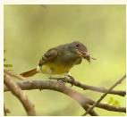

Type :  

  
A口B □C□D

## Knowledge Bias Estimation

? : From your observation, is the species of the dog shown a Chihuahua? Yes

? : Does this dog belong to the species known as japanese spaniel? No

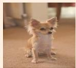

Type :  

## Hierarchical Granularity Recognition:

Class: Is the class of the object aves?

Genus: What is the genus of the object? [auklet, cormorant, bunting, towhee]

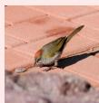

Species: What is the species of the object?

Type:  

## Machine-oriented Evaluation

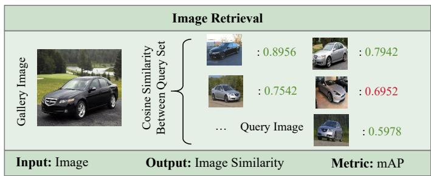

table

Image Retrieval
| Image Type | Gallery Image | Cosine Similarity Between Query Set | Image Similarity | Cosine Similarity Between Query Set | Metric: mAP |
| :--- | :--- | :--- | :--- | :--- | :--- |
| Image | 0 | 0.8956 | 0.7942 | 0.7542 | 0.6952 |
| Image Similarity | 0 | 0.8956 | 0.7942 | 0.7542 | 0.6952 |
| Image mAP | ... | ... | ... | ... | 0.5978 |

<table><tr><td colspan="3">Image Classification</td><td></td></tr><tr><td>GT: Gulfstream IV</td><td>Predicted Class Probability</td><td>Gulfstream IV: 0.75
Gulfstream V: 0.20
...
Falcon 2000: 0.01
(Within Meta-class)</td><td>Gulfstream IV: 0.73
Gulfstream V: 0.14
Laysan Albatross : 0.003
...
(Across Meta-class)</td></tr><tr><td>Input: Image</td><td>Output: Class Probability</td><td>Metric: Top-1 Acc</td><td></td></tr></table>

Fig. 2. Our proposed benchmark: The human-oriented evaluation tests the model’s ability to handle fine-grained visual queries (true/false, multiple-choice, short-answer), while the machine-oriented evaluation directly assesses visual feature representation through image retrieval and classification tasks. =true/false question, =multiple-choice question, =short-answer question.

## C. Fine-Grained Image Tasks

Fine-grained visual tasks [12], [27]–[33] aim to distinguish subordinate categories that often share similar global appearances but differ in subtle local attributes or discriminative parts. Such tasks are pivotal in applications including biodiversity monitoring [34], object retrieval [35], product recommendation [36], and specialized domains such as remote sensing and medical image analysis, where category distinctions often require domain-specific knowledge. Despite the strong general-purpose performance of LVLMs such as GPT-5.4, InternVL, and Qwen, their fine-grained capabilities remain insufficiently understood. Motivated by this issue, we develop a comprehensive benchmark and perform extensive experiments to assess LVLMs on fine-grained tasks. Our analysis reveals their key limitations and provides practical implications for improving future model design and training.

## III. THE EVALUATION BENCHMARK

In this section, we first provide an overview of the benchmark, including its data scale, domain coverage, and two complementary evaluation paradigms. We then describe the evaluation paradigms, tasks and metrics under the humanoriented and machine-oriented settings. Finally, we detail the data collection, question construction, and quality verification procedures used to ensure reliable fine-grained evaluation.

## A. FG-BMK Overview

To systematically evaluate LVLMs on fine-grained image tasks, we construct a comprehensive benchmark termed FG-BMK, containing 1.01 million questions and 0.28 million images collected from 13 fine-grained datasets, covering diverse scenarios from common object-centric domains to specialized domains. Unlike existing benchmarks that mainly focus on classification-style tasks, FG-BMK consists of two complementary evaluation paradigms: human-oriented evaluation measures fine-grained semantic understanding through visual question answering, while machine-oriented evaluation probes visual feature discriminability through image retrieval and classification tasks. As illustrated in Figure 2, each evaluation paradigm contains multiple fine-grained tasks with different question formats and evaluation perspectives, enabling FG-BMK to support diagnostic analysis of LVLM limitations across different tasks, granularities, and domains.

## B. Evaluation Paradigms, Tasks, and Metrics

a) Evaluation Paradigms: Rather than treating finegrained capability as a single classification problem, FG-BMK evaluates it through two complementary paradigms: humanoriented evaluation for dialogue-level semantic grounding and machine-oriented evaluation for feature-level visual discriminability. The former reflects the practical interaction form of LVLMs, where answers are jointly influenced by visual perception, language priors, domain knowledge, and prompts; the latter removes the language-generation interface and directly examines whether visual representations can distinguish finegrained categories. Comparing these two paradigms allows us to diagnose whether LVLM failures mainly arise from weak visual discriminability, insufficient visual-to-semantic grounding, or limited fine-grained knowledge.  
b) Evaluation Tasks: Within each paradigm, we further design tasks to probe different aspects of fine-grained capability.

For example, in the human-oriented evaluation, we go beyond category recognition by introducing attribute recognition for subtle local cues critical to subordinate-category discrimination. In the machine-oriented evaluation, we adopt two fundamental vision tasks—image retrieval and classification—and further evaluate classification under both within- and across-metacategory settings to test whether visual representations remain discriminative across single-domain and mixed-domain scenarios.

c) Evaluation Metrics: For human-oriented tasks, we use three question formats with different answer-space constraints: true/false, multiple-choice, and short-answer. True/false questions are framed as semantic verification, where the model must judge whether a given fine-grained statement is correct. Multiple-choice questions provide a constrained candidate set, allowing us to test whether the model can discriminate among plausible fine-grained options through relative comparison. Short-answer questions remove explicit answer candidates, thereby evaluating fine-grained recognition in a more openended setting. For all questions, the response is considered correct if it matches the expected option or contains the ground-truth answer. For machine-oriented tasks, following DINOv2 [37], we use mean Average Precision (mAP) for image retrieval and Top-1 accuracy for image classification. The detailed tasks are summarized below:

## Human-oriented Evaluation:

• Attribute Recognition: This task consists of true/false and multiple-choice questions that assess whether the model can recognize fine-grained visual attributes, such as size, color, length, shape, and pattern. These attributes often serve as key discriminative cues for distinguishing subordinate categories.  
• Knowledge Bias Estimation: This section uses category-level true/false questions to examine whether LVLMs exhibit uneven recognition ability across different fine-grained categories. By measuring category-wise accuracy, it reveals whether models recognize certain fine-grained concepts more reliably than others.  
• Hierarchical Granularity Recognition: This section consists of true/false, multiple-choice, and short-answer questions that assess whether LVLMs can leverage domain-specific knowledge to recognize object categories at different levels of hierarchical taxonomies. It examines whether models remain reliable as the category granularity increases from coarse to fine levels.

## Machine-oriented Evaluation:

• Image Retrieval: This task retrieves images from multiple subordinate categories within the same meta-category according to visual feature similarity. It evaluates whether the learned visual representations preserve fine-grained similarity structures.  
• Image Classification: This task recognizes images into finegrained categories, either within a single meta-category (e.g., species of animals, models of cars) or across multiple meta-categories. It assesses whether visual features are sufficiently discriminative under both category-specific and mixed-domain classification settings.

More details about the evaluation tasks are presented in Appendix A.1.

## C. Data Curation

a) Data Collection.: To ensure both data quality and domain coverage, we source images for FG-BMK from 13 well-established fine-grained datasets. These datasets cover common object-centric domains, such as birds, dogs, cars, and aircraft, as well as specialized domains that require domainspecific visual knowledge, including remote sensing images from MTARSI, enabling us to compare LVLM performance across both common and less frequently studied fine-grained domains. Compared with web-crawled images [38], curated fine-grained datasets provide more reliable category boundaries, hierarchical taxonomies, and annotation quality, which are critical for constructing controlled fine-grained evaluation tasks. The statistics and meta-class information of these datasets are summarized in Table XI.  
b) Question Construction.: For the human-oriented evaluation, we construct questions from the original annotations using task-specific rule-based templates. Depending on the task, the source annotations include attribute labels, category labels, and hierarchical taxonomy information. The construction follows two principles. First, the questions should explicitly target fine-grained visual understanding rather than coarse object recognition. Second, negative labels and distractor options should be visually or semantically close to the ground truth whenever possible, so that the questions require finegrained discrimination rather than trivial rejection. Specifically, we select negative samples from the same attribute space, taxonomy level, or parent/meta-category according to the task type. For multiple-choice questions, the correct answer and distractor options are randomly ordered to reduce positional bias. To facilitate automatic evaluation, we further append taskspecific answer-format instructions to the questions, such as “Answer with yes or no.” for true/false questions.

• Attribute Recognition: We design true/false and multiplechoice questions based on fine-grained attribute annotations. For multiple-choice questions, the options include all possible attribute candidates; for true/false questions, we construct balanced positive and negative pairs by matching images with correct or incorrect attribute labels.

• Knowledge Bias Estimation: We construct category-level true/false questions for each fine-grained category. Positive samples are generated by pairing each image with its groundtruth fine-grained label, while negative samples are generated by pairing the image with a label sampled from other subcategories within the same super-category, ensuring that negative labels remain semantically close to the ground truth. Each image is paired with a positive and a negtive question.

• Hierarchical Granularity Recognition: We construct true/- false, multiple-choice, and short-answer questions across different granularity levels using the hierarchical taxonomy labels associated with each image. For true/false questions, we generate negative samples by matching an image with an incorrect label from the same hierarchical level (e.g., pairing an image of Aves (birds) with Insecta (insects)). For multiple-choice questions, options are drawn from different categories within the same parent category of the hierarchical taxonomy (e.g., species-level options such as Black-footed

TABLE I Training Strategies of the Open-Source Evaluated Models. “DINOv2” Is a Purely Visual Model. “Con” Denotes Contrastive Loss, “Gen” Generative Loss, “Mat” Image-Text Matching Loss, “Rec” Reconstruction Loss Used in BEiT3, and “Dis” Distillation Loss Used in DINOv2.

<table><tr><td rowspan="2">Model</td><td rowspan="2">Vision Size</td><td colspan="5">Loss Function</td><td colspan="3">Training Data</td></tr><tr><td>Con</td><td>Gen</td><td>Mat</td><td>Rec</td><td>Dis</td><td>&lt; 0.1B</td><td>0.1B ~ 1B</td><td>&gt; 1B</td></tr><tr><td>InternVL3-7B [16]</td><td>ViT-L</td><td>√</td><td>√</td><td>√</td><td></td><td>√</td><td></td><td></td><td>√</td></tr><tr><td>InternVL-Chat [3]</td><td>ViT-6B</td><td>√</td><td>√</td><td>√</td><td></td><td></td><td></td><td></td><td>√</td></tr><tr><td>LLaVA-1.5-7B [4]</td><td>ViT-L</td><td></td><td>√</td><td></td><td></td><td></td><td>√</td><td></td><td></td></tr><tr><td>Qwen2.5-VL-7B [39]</td><td>ViT-600M</td><td>√</td><td>√</td><td>√</td><td></td><td>√</td><td></td><td></td><td>√</td></tr><tr><td>Qwen-VL-Chat [2]</td><td>ViT-G</td><td></td><td>√</td><td></td><td></td><td></td><td></td><td></td><td>√</td></tr><tr><td>BLIP-2-XL [15]</td><td>ViT-G</td><td>√</td><td>√</td><td>√</td><td></td><td></td><td></td><td>√</td><td></td></tr><tr><td>EVA-CLIP [40]</td><td>ViT-L</td><td>√</td><td></td><td></td><td></td><td></td><td></td><td></td><td>√</td></tr><tr><td>BEiT3 [17]</td><td>ViT-L</td><td></td><td></td><td></td><td>√</td><td></td><td>√</td><td></td><td></td></tr><tr><td>CoCa [41]</td><td>ViT-L</td><td>√</td><td>√</td><td></td><td></td><td></td><td></td><td></td><td>√</td></tr><tr><td>DINOv2 [37]</td><td>ViT-L</td><td>√</td><td></td><td></td><td></td><td>√</td><td></td><td>√</td><td></td></tr><tr><td>BAGEL [20]</td><td>ViT-L</td><td>√</td><td>√</td><td></td><td>√</td><td></td><td></td><td></td><td>√</td></tr><tr><td>BLIP3o [18]</td><td>ViT-L</td><td>√</td><td>√</td><td></td><td>√</td><td></td><td></td><td></td><td>√</td></tr><tr><td>UniWorld-V1 [19]</td><td>ViT-L</td><td>√</td><td>√</td><td></td><td>√</td><td></td><td></td><td></td><td>√</td></tr></table>

Albatross and Laysan Albatross within the genus Albatross). For short-answer questions, the model is asked to directly produce the category label.

• Image Retrieval and Classification: For the machine-oriented evaluation, we directly use the original fine-grained category labels from each dataset. In image retrieval, images from the same subordinate category are treated as relevant matches. In image classification, we evaluate both within-meta-category and across-meta-category settings. For the across-metacategory setting, we combine fine-grained categories from different datasets into a unified training/testing set, and then evaluating the trained classifier on each individual dataset.

c) Question Quality Verification.: Since automatically generated questions may be sensitive to template wording, we further examine whether the linguistic diversity of question templates affects the evaluation results. Specifically, we expand the original template set to 10 diverse human-written prompts and reconstruct the corresponding questions in the humanoriented benchmark. We then evaluate InternVL3 on the CUB-200-2011 dataset under both the original and extended template settings. As shown in Table XII and Table XIII, the extended templates lead to only minor accuracy changes across attribute recognition and hierarchical granularity recognition, while the overall model behavior and observed trends remain consistent. This suggests that the evaluation results are not dominated by template-specific artifacts, as long as the questions clearly specify the intended visual concept and answer format.

## IV. OBSERVATIONS AND DISCUSSIONS

This section presents the main observations and discussions based on FG-BMK. We first introduce the evaluated models, and then analyze fine-grained LVLM behavior along a progressive diagnostic path: assessing their fine-grained recognition gaps, diagnosing the bottlenecks behind these failures, examining training design factors for improving fine-grained capabilities, and evaluating robustness under visual and linguistic perturbations.

## A. Models under Evaluation

Given the diverse landscape of existing LVLMs and visionlanguage foundation models, we select a representative set of models covering different model families, access types, architecture designs, training objectives, visual encoder scales, and training data scales, as summarized in Table I. Our evaluation includes widely used open-source LVLMs, closedsource models such as GPT-5.4 [1] and Gemini-3.5-flash [42], unified understanding-generation models, and a purely visual foundation model. This selection allows us to analyze both dialogue-level fine-grained semantic recognition and featurelevel visual discriminability.

For human-oriented evaluation, we evaluate instructiontuned LVLMs and closed-source models through dialoguestyle questions. For machine-oriented evaluation, we focus on models with accessible visual features, since image retrieval and classification require extracting visual representations. The purely visual model provides a feature-level reference, while unified multimodal models are included to cover the emerging paradigm that integrates visual understanding and generation. To better isolate the effects of model architecture and training strategy, we use representative versions from each model family in machine-oriented evaluation, where their visual encoders and training objectives are more transparent. Further details about the evaluated models can be found in Appendix B.

## B. LVLMs Remain Inadequate Fine-Grained Recognizers

After introducing the evaluated models, we first ask a direct question: to what extent can current LVLMs recognize finegrained visual categories? A single aggregate accuracy is insufficient to characterize this ability, since fine-grained recognition involves multiple levels of difficulty. We first examine how model performance changes as category labels move from coarse to increasingly fine levels, revealing whether LVLMs can preserve recognition ability under finer semantic distinctions. We then compare LVLMs with fine-grained tailored models, using specialized recognizers as a reference to assess the gap between general-purpose LVLMs and models explicitly designed for fine-grained recognition. Finally, since fine-grained category decisions often depend on subtle combinations of visual attributes, we further evaluate attribute-level recognition as intermediate evidence for category-level understanding. These analyses are supported by the granularity results in Figure 3 and Figure 4, the tailored-model comparison in

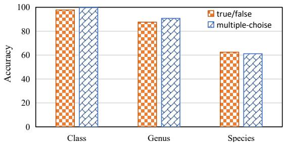

bar chart

| Category | true/false | multiple-choise |
| :--- | :--- | :--- |
| Class | 98 | 100 |
| Genus | 88 | 92 |
| Species | 63 | 62 |

Fig. 3. Results of InternVL3 [16] on true/false and multiplechoice questions across different levels of granularity on the CUB-200-2011 [43] dataset. The x-axis denotes the granularity of the recognition questions.

Table II, and the attribute-recognition results in Table III. Together, they reveal a consistent recognition gap: current LVLMs remain inadequate fine-grained recognizers.

Finding 1: LVLMs struggle to distinguish excessively fine-grained categories.

To examine how recognition performance changes with category granularity, we evaluate questions at multiple taxonomy levels, ranging from coarse taxonomic levels such as kingdom or class to fine-grained species. As shown in Figure 3 and Figure 4, we take InternVL3 [16] as a representative example and observe a consistent decline in its true/false and multiplechoice accuracy as the category granularity becomes finer. At the class level (e.g., “Is the class of the object in this image an Insecta/Aves?”), the model achieves 99.76% accuracy on multiple-choice questions and 99.77% on true/false questions.1 However, when the granularity narrows to the genus level, where competing labels are selected from different genera within the same class (e.g., “Is the object in this image an albatross or a gull?”), its multiple-choice accuracy decreases to 90.75%, corresponding to a 9.01% drop. When moving further to the species level, where negative labels are drawn from different species within the same genus (e.g., “Is the object in this image a black-footed albatross/Laysan albatross?”), the accuracy further decreases to 62.48% on true/false questions and 61.18% on multiple-choice questions. This indicates that LVLMs can handle coarse semantic distinctions reasonably well, but become much less reliable when distinguishing closely related subordinate categories. Similar degradation is observed across other LVLMs. Additional examples of multiple-choice and true/false questions can be found in Appendix C.1.

Finding 2: LVLMs do not outperform fine-grained tailored models in fine-grained tasks.

To further contextualize the fine-grained recognition ability of LVLMs, we compare them with models specifically designed for fine-grained recognition. As shown in Table II, although LVLMs achieve competitive results on several datasets, their performance remains below that of fine-grained tailored models under both short-answer evaluation and linear probing. For

1When questions are relatively simple, LVLMs achieve very high accuracy. The slight difference between multiple-choice and true/false accuracy may be caused by answer-space differences and randomness.

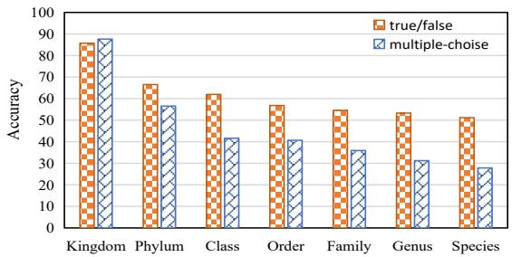

bar chart

| Category | true/false | multiple-choise |
| :--- | :--- | :--- |
| Kingdom | 86 | 87 |
| Phylum | 67 | 57 |
| Class | 62 | 42 |
| Order | 57 | 41 |
| Family | 55 | 37 |
| Genus | 54 | 32 |
| Species | 51 | 28 |

Fig. 4. Results of LLaVA [4] on true/false and multiplechoice questions across different levels of granularity on the iNat2021 [43] dataset. The x-axis denotes the granularity of the recognition questions.

TABLE II Comparison of LVLMs and Fine-Grained Tailored Models on Classification Tasks. “SA” Denotes LVLMs Fine-Tuned on Fine-Grained Datasets for Short-Answer Questions, “LC” Represents Linear Classifiers Using LVLM Visual Features, and “FG-Tailored” Refers to State-of-the-Art Fine-Grained Tailored Models.

<table><tr><td>Datasets</td><td>SA</td><td>LC</td><td>FG-Tailored</td></tr><tr><td>CUB-200-2011</td><td>85.60</td><td>91.65</td><td>93.10 [44]</td></tr><tr><td>Stanford Dogs</td><td>86.49</td><td>90.50</td><td>97.30 [45]</td></tr><tr><td>Stanford Cars</td><td>90.55</td><td>94.30</td><td>97.10 [46]</td></tr><tr><td>Food-101</td><td>95.25</td><td>95.67</td><td>98.60 [47]</td></tr><tr><td>FGVC Aircraft</td><td>66.19</td><td>78.88</td><td>95.40 [48]</td></tr></table>

example, on FGVC Aircraft, LVLMs achieve 66.19% accuracy with short-answer questions and 78.88% with linear probing, whereas the fine-grained tailored model reaches 95.40%. Similar gaps can also be observed on Stanford Dogs and Stanford Cars.

This gap may be partly attributed to the different optimization goals of the two types of models. Fine-grained tailored models are usually designed for specific recognition domains and often introduce mechanisms to capture local, part-level, or hierarchical visual details. For example, CAP [47] employs context-aware attentional pooling to aggregate hierarchical contextual information from pixels to regions and images, which benefits fine-grained classification. In contrast, LVLMs are primarily optimized for general multimodal understanding and instruction following, and their standard architecture (e.g., ViT + MLP + LLM) does not explicitly emphasize such fine-grained discriminative cues. Although these specialized components cannot be directly transferred to LVLMs, their core idea of strengthening local and hierarchical visual evidence remains relevant for improving fine-grained recognition while preserving general-purpose multimodal capabilities.

Finding 3: LVLMs exhibit significant room for improvement in recognizing fine-grained attributes.

Since fine-grained category recognition often relies on local visual evidence, we further examine whether LVLMs can recognize the attributes that distinguish similar categories. As shown in Table III and Table XXI, LVLMs exhibit uneven performance across different attribute types. InternVL3 [16] and Qwen2.5-VL [39] achieve 50.13% and 45.12% average accuracy for pattern recognition, respectively, but only 30.95% and 29.30% for shape recognition. Although a few attributes achieve relatively high accuracy, most attributes remain far from being reliably recognized, and some part-level attributes can be as low as around 10%. These results indicate that LVLMs still have substantial room for improvement in fine-grained attribute recognition.

TABLE III Attribute Recognition Accuracy of InternVL3 [16] on the CUB-200-2011 [43] Dataset (Values in Parentheses Represent the Average Accuracy for Each Attribute).

<table><tr><td colspan="8">Color Attribute (47.40)</td></tr><tr><td>belly color</td><td>58.49</td><td>back color</td><td>34.98</td><td>bill color</td><td>51.31</td><td>breast color</td><td>54.25</td></tr><tr><td>crown color</td><td>55.30</td><td>eye color</td><td>84.59</td><td>forehead color</td><td>53.32</td><td>leg color</td><td>44.01</td></tr><tr><td>nape color</td><td>39.24</td><td>throat color</td><td>52.77</td><td>under tail color</td><td>34.69</td><td>underparts color</td><td>56.20</td></tr><tr><td>upper tail color</td><td>37.30</td><td>upperparts color</td><td>28.75</td><td>wing color</td><td>30.16</td><td>primary color</td><td>43.05</td></tr><tr><td colspan="8">Pattern Attribute (50.13)</td></tr><tr><td>back pattern</td><td>40.94</td><td>belly pattern</td><td>68.13</td><td>breast pattern</td><td>65.12</td><td>head pattern</td><td>35.92</td></tr><tr><td>tail pattern</td><td>41.64</td><td>wing pattern</td><td>49.04</td><td></td><td></td><td></td><td></td></tr><tr><td colspan="8">Shape Attribute (30.95)</td></tr><tr><td>bill shape</td><td>37.61</td><td>shape</td><td>52.37</td><td>tail shape</td><td>10.42</td><td>wing shape</td><td>23.39</td></tr><tr><td colspan="4">Length Attribute (71.03)</td><td colspan="4">Size Attribute (52.55)</td></tr><tr><td colspan="2">bill length</td><td colspan="2">71.03</td><td colspan="2">size</td><td colspan="2">52.55</td></tr></table>

Such attribute-level weaknesses can directly limit finegrained category reasoning, where the correct category often depends on subtle combinations of color, shape, pattern, and part-level cues. We also observe that attribute-wise performance varies across models: for example, InternVL3 struggles more with pattern recognition than with size, whereas Gemini-3.5-flash [42] shows the opposite trend. Additionally, our comparison across model versions suggests that recent LVLMs have made more substantial progress in recognizing pattern and length, but their gains in color and shape recognition are comparatively limited. Detailed results of the attribute recognition task are provided in Appendix C.3.

Overall, the above observations show that current LVLMs remain inadequate fine-grained recognizers: their performance degrades under increasingly fine category granularity, they still lag behind fine-grained tailored models, and they exhibit limited and uneven attribute-level recognition. However, these performance gaps alone do not reveal where the failures originate. We therefore next move from measuring the recognition gap to diagnosing its underlying bottlenecks.

## C. Bottlenecks Behind LVLM Failures in Fine-Grained Tasks.

Having established that current LVLMs remain inadequate fine-grained recognizers, we next diagnose where these failures originate. Fine-grained recognition depends not only on whether visual features are discriminative, but also on whether such visual evidence can be aligned with language semantics and grounded into correct fine-grained categories. Therefore, we analyze LVLM failures from the perspectives of visual representation, semantic grounding, visual-to-textual alignment, and category-level long-tail behavior.

We first compare feature-level discriminability with dialoguebased recognition accuracy to determine whether failures arise from insufficient visual representations or from the inability to use these representations in semantic recognition. We then leverage unified models to further examine the relation between visual discriminability and semantic grounding, using their generation capability to inspect whether fine-grained category names are grounded into corresponding visual concepts. Next, to understand how visual features are connected with language semantics, we focus on the visual-to-textual alignment stage and examine how alignment affects both visual feature separability and fine-grained semantic grounding. Finally, we examine whether recognition failures are concentrated on long-tail fine-grained categories, and further trace these category-level disparities through balanced fine-tuning and training-data coverage analysis.

These analyses are supported by the feature-level linear probing and dialogue-based recognition comparison in Table IV, the unified-model probing and generation analysis in Table V and Figure 5, the alignment-stage analysis in Table VII, Table VI, and Figure 6, and the category-level long-tail analysis in Figure 7. Together, they show that LVLM failures in finegrained recognition are not caused by a single bottleneck, but by the combined effects of visual discriminability limits, weak fine-grained semantic grounding, alignment-induced feature changes, and uneven category-level knowledge coverage.

Finding 4: Semantic understanding, rather than visual discrimination, becomes the bottleneck of LVLMs in specialized domains.

To localize the source of fine-grained recognition failures, we compare feature-level linear probing with dialogue-based recognition across common and specialized domains. This comparison allows us to examine whether failures come from insufficient visual feature discriminability or from the inability to map visual evidence to correct semantic concepts. As shown in Table IV, LVLMs exhibit different bottlenecks across common and specialized fine-grained domains.

On common datasets such as FGVC Aircraft and Stanford Dogs, visual feature discriminability remains an important limiting factor, consistent with prior findings [10]. For example, although Qwen2.5-VL achieves 94.84% multiple-choice accuracy on FGVC Aircraft, its linear-probe accuracy is only 62.07%, indicating that its visual representations are not sufficiently discriminative for fine-grained classification.

TABLE IV Comparison of LVLM Performance on Fine-Grained Datasets from Common and Specialized Domains. Results Are Reported in the Order of “Multiple-Choice / True-False / Linear Probe”.

<table><tr><td rowspan="2">Models</td><td colspan="2">Common domains</td><td colspan="2">Specialized domains</td></tr><tr><td>FGVC Aircraft</td><td>Stanford Dogs</td><td>SkinCon</td><td>MTARSI</td></tr><tr><td>LLaVA</td><td>58.75 / 77.62 / 62.46</td><td>68.81 / 77.45 / 80.73</td><td>41.81 / 59.62 / 81.29</td><td>60.32 / 71.60 / 94.79</td></tr><tr><td>Qwen2.5-VL</td><td>94.84 / 89.56 / 62.07</td><td>96.74 / 94.50 / 79.07</td><td>60.81 / 60.10 / 70.89</td><td>70.11 / 65.08 / 93.20</td></tr><tr><td>Qwen3.0-VL</td><td>92.29 / 81.43 / 55.65</td><td>96.28 / 92.48 / 77.29</td><td>66.51 / 67.70 / 72.48</td><td>71.34 / 62.87 / 96.03</td></tr><tr><td>InternVL3.0</td><td>85.48 / 86.92 / 45.42</td><td>92.02 / 92.48 / 73.90</td><td>60.81 / 66.75 / 69.72</td><td>64.11 / 73.99 / 88.71</td></tr></table>

TABLE V Classification Accuracy of Unified Models on Real and Self-Generated Fine-Grained Images. “Original” Denotes Results on Original Images, while “Generated” Denotes Results on Images Synthesized by the Models Conditioned on Fine-Grained Category Names.

<table><tr><td rowspan="2">Models</td><td colspan="2">CUB-200-2011</td><td colspan="2">FGVC Aircraft</td><td colspan="2">Flowers102</td></tr><tr><td>Original</td><td>Generated</td><td>Original</td><td>Generated</td><td>Original</td><td>Generated</td></tr><tr><td>UniWorld-V1</td><td>86.02</td><td>64.89</td><td>62.79</td><td>27.00</td><td>99.33</td><td>81.07</td></tr><tr><td>Bagel</td><td>82.43</td><td>36.59</td><td>53.70</td><td>13.33</td><td>98.95</td><td>65.82</td></tr><tr><td>BLIP3-o</td><td>85.79</td><td>65.29</td><td>79.53</td><td>36.39</td><td>99.62</td><td>85.49</td></tr></table>

  
Generated

  
black footed albatross

  
Generated

  
707-320

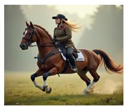  
Generated

  
canterbury bells  
Fig. 5. Qualitative comparison between real images and fine-grained category-conditioned generated images.

In contrast, we observe a different pattern in specialized domains such as remote sensing (MTARSI) and medical dermatology (SkinCon). Although LVLM visual features remain highly discriminative under linear classification, their dialoguestyle recognition accuracy drops markedly. For instance, on MTARSI, LLaVA achieves 94.79% linear-probe accuracy, but only 60.32% and 71.60% accuracy on multiple-choice and true/false questions, respectively. Similarly, Qwen3.0-VL reaches 96.03% linear-probe accuracy on MTARSI, while its multiple-choice and true/false accuracies are only 71.34% and 62.87%.

This suggests that, in specialized domains, the limitation of LVLMs no longer primarily lies in visual discrimination; instead, the model struggles to map already discriminative visual cues to the correct semantic concepts under dialoguebased recognition. We attribute this gap to the scarcity of such domain-specific concepts in pre-training corpora, which prevents the model from forming sufficiently strong semantic priors for these categories. This interpretation is further supported by our appendix experiments, where fine-tuning on specialized-domain data substantially improves performance on multiple-choice and true/false questions.

Finding 5: Fine-grained visual representations do not imply finegrained semantic grounding.

The results in specialized domains reveal a clear mismatch between feature-level discriminability and dialoguebased recognition: fine-grained visual representations can be separable, yet the corresponding category semantics may still not be properly grounded. Building on this observation, we further examine the relation between visual representations and semantic grounding. Unified models provide a suitable testbed for this analysis, because their generation capability allows us to inspect whether a fine-grained category name can be translated into the corresponding visual concept. We therefore use linear probing on original fine-grained images to evaluate visual feature discriminability, and apply linear probing to categoryconditioned generated images to test whether these models can ground fine-grained category names into corresponding visual concepts.

As shown in Table V, unified models exhibit strong discriminability on original fine-grained images. However, when the images are replaced with the models’ self-generated images conditioned on fine-grained category names, the linear-probe accuracy drops substantially. For example, BLIP3-o decreases from 89.92% to 73.65% on CUB-200-2011 and from 79.05% to 55.87% on FGVC Aircraft.

This gap is also evident from the generated images. As shown in Figure 5, images synthesized from fine-grained category names often fail to reflect the defining characteristics of the target categories, and sometimes even contain incorrect visual content. These results indicate that unified models can distinguish fine-grained categories in original images, but may still fail to ground fine-grained category names into the corresponding visual semantics.

Finding 6: The alignment strategy in LVLMs might impair the fine-grained discriminability of visual features.

After examining visual discriminability and semantic grounding, we next focus on visual-to-textual alignment, the stage where LVLMs connect visual features with language semantics. To investigate the effect of this alignment stage on fine-grained visual representations, we compare the linear-probe accuracy of LLaVA’s [4] original visual features with that of features after visual-to-textual alignment on fine-grained classification tasks. As shown in the first two columns of Table VII, the original features demonstrate superior classification performance, outperforming the aligned ones by an average of 3.39%. This suggests that the standard alignment process may weaken the fine-grained discriminability of visual features.

TABLE VI Performance of Different LLaVA Variants after Alignment Retraining and SFT on General and Fine-Grained Tasks. Improvements Are Reported Relative to the Original LLaVA.

<table><tr><td rowspan="2">Models</td><td colspan="3">POPE</td><td rowspan="2">TextVQA</td><td rowspan="2">GQA</td><td rowspan="2">CUB</td><td rowspan="2">Stanford Cars</td><td rowspan="2">Stanford Dogs</td></tr><tr><td>Rand</td><td>Pop</td><td>Adv</td></tr><tr><td>Original</td><td>87.30</td><td>86.10</td><td>84.20</td><td>58.20</td><td>62.00</td><td>85.60</td><td>90.55</td><td>86.49</td></tr><tr><td>Aligned-ReCap</td><td>88.86</td><td>87.46</td><td>86.26</td><td>58.70</td><td>62.20</td><td>85.80</td><td>90.83</td><td>86.60</td></tr><tr><td>Δ vs. Original</td><td>+1.56</td><td>+1.36</td><td>+2.06</td><td>+0.50</td><td>+0.20</td><td>+0.20</td><td>+0.28</td><td>+0.11</td></tr><tr><td>Aligned-FG</td><td>87.40</td><td>86.30</td><td>84.70</td><td>58.30</td><td>62.10</td><td>86.32</td><td>91.73</td><td>87.58</td></tr><tr><td>Δ vs. Original</td><td>+0.10</td><td>+0.20</td><td>+0.50</td><td>+0.10</td><td>+0.10</td><td>+0.72</td><td>+1.18</td><td>+1.09</td></tr></table>

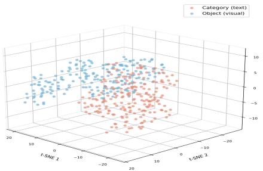

scatterplot

| t-SNE 1 | t-SNE 2 | Category (text) | Object (visual) |
| ------- | ------- | --------------- | --------------- |
| -20     | -20     | Category (text) | Category (visual) |
| -10     | -10     | Category (text) | Category (visual) |
| 0       | 0       | Category (text) | Category (visual) |
| 10      | 10      | Category (text) | Category (visual) |
| 20      | 20      | Category (text) | Category (visual) |
| -20     | -20     | Object (visual) | Object (visual) |
| -10     | -10     | Object (visual) | Object (visual) |
| 0       | 0       | Object (visual) | Object (visual) |
| 10      | 10      | Object (visual) | Object (visual) |
| 20      | 20      | Object (visual) | Object (visual) |

(a) Original

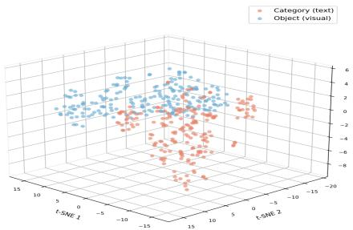

scatterplot

| Category (text) | t-SME1 | t-SME2 | t-SME3 |
| --------------- | ------ | ------ | ------ |
| Object (visual) | -10    | -15    | -8     |
| Object (visual) | -5     | -10    | -6     |
| Object (visual) | 0      | -5     | -4     |
| Object (visual) | 5      | 0      | -2     |
| Object (visual) | 10     | 5      | 0      |
| Object (visual) | 15     | 10     | 2      |
| Object (visual) | 20     | 15     | 4      |
| Object (visual) | 25     | 20     | 6      |

(b) Aligned-Recap

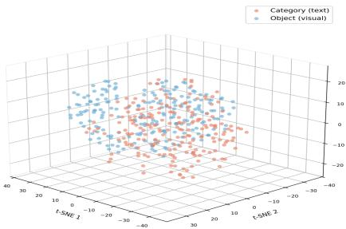

scatterplot

| t-SME 1 | t-SME 2 | Category (text) | Object (visual) |
| ------- | ------- | --------------- | --------------- |
| -30     | -30     | Red             | Blue            |
| -25     | -25     | Red             | Blue            |
| -20     | -20     | Red             | Blue            |
| -15     | -15     | Red             | Blue            |
| -10     | -10     | Red             | Blue            |
| -5      | -5      | Red             | Blue            |
| 0       | 0       | Red             | Blue            |
| 5       | 5       | Red             | Blue            |
| 10      | 10      | Red             | Blue            |
| 15      | 15      | Red             | Blue            |
| 20      | 20      | Red             | Blue            |
| 25      | 25      | Red             | Blue            |
| 30      | 30      | Red             | Blue            |
| -30     | -30     | Blue            | Blue            |
| -25     | -25     | Blue            | Blue            |
| -20     | -20     | Blue            | Blue            |
| -15     | -15     | Blue            | Blue            |
| -10     | -10     | Blue            | Blue            |
| -5      | -5      | Blue            | Blue            |
| 0       | 0       | Blue            | Blue            |
| 5       | 5       | Blue            | Blue            |
| 10      | 10      | Blue            | Blue            |
| 15      | 15      | Blue            | Blue            |
| 20      | 20      | Blue            | Blue            |
| 25      | 25      | Blue            | Blue            |
| 30      | 30      | Blue            | Blue            |
| -30     | -30     | Red             | Blue            |
| -25     | -25     | Red             | Blue            |
| -20     | -20     | Red             | Blue            |
| -15     | -15     | Red             | Blue            |
| -10     | -10     | Red             | Blue            |
| -5      | -5      | Red             | Blue                    |
| 0       | 0       | Red             | Blue                    |
| 5       | 5       | Red             | Blue                    |
| 10      | 10      | Red             | Blue                    |
| 15      | 15      | Red             | Blue                    |
| 20      | 20      | Red             | Blue                    |
| 25      | 25      | Red             | Blue                    |
| 30      | 30      | Red             | Blue                    |
| -30     | -30     | Blue            | Blue            |
| -25     | -25     | Blue            | Blue            |
| -20     | -20     | Blue            | Blue            |
| -15     | -15     | Blue            | Blue            |
| -10     | -10     | Blue            | Blue            |
| -5      | -5      | Blue            | Blue                    |
| 0       | 0       | Blue            | Blue                    |
| 5       | 5       | Blue            | Blue                    |
| 10      | 10      | Blue            | Blue                    |
| 15      | 15      | Blue            | Blue                    |
| 20      | 20      | Blue            | Blue                    |
| 25      | 25      | Blue            | Blue                    |
| 30      | 30      | Blue            | Blue                    |
| -30     | -30     | Red             | Blue            |
| -25     | -25     | Red             | Blue            |
| -20     | -20     | Red             | Blue            |
| -15     | -15     | Red             | Blue            |
| -10     | -10     | Red             | Blue            |
| -5      | -5      | Red             | Blue (Red)      |
| 0       | 0       | Red             | Blue (Blue)     |
| 5       | 5       | Red             | Blue (Blue)     |
| 10      | 10      | Red             | Blue (Blue)     |
| 15      | 15      | Red             | Blue (Blue)     |
| 20      | 20      | Red             | Blue (Blue)     |
| 25      | 25      | Red             | Blue (Blue)     |
| 30      | 30      | Red             | Blue (Blue)     |
| -30     | -30     | Orange          | Blue            |
| -25     | -25     | Orange          | Blue            |
| -20     | -20     | Orange          | Blue            |
| -15     | -15     | Orange          | Blue            |
| -10     | -10     | Orange          | Blue            |
| -5      | -5      | Orange          | Blue (Red)      |
| 0       | 0       | Orange          | Blue (Blue)     |
| 5       | 5       | Orange          | Blue (Blue)     |
| 10      | 10      | Orange          | Blue (Blue)     |
| 15      | 15      | Orange          | Blue (Blue)     |
| 20      | 20      | Orange          | Blue (Blue)     |
| 25      | 25      | Orange          | Blue (Blue)     |
| 30      | 30      | Orange          | Blue (Blue)     |
| -30     | -30     | Yellow          | Blue            |
| -25     | -25     | Yellow          | Blue            |
| -20     | -20     | Yellow          | Blue            |
| -15     | -15     | Yellow          | Blue            |
| -10     | -10     | Yellow          | Blue            |
| -5      | -5      | Yellow          | Blue (Red)      |
| 0       | 0       | Yellow          | Blue (Blue)     |
| 5       | 5       | Yellow          | Blue (Blue)     |
| 10      | 10      | Yellow          | Blue (Blue)     |
| 15      | 15      | Yellow          | Blue (Blue)     |
| 20      | 20      | Yellow          | Blue (Blue)     |
| 25      | 25      | Yellow          | Blue (Blue)     |
| 30      | 30      | Yellow          | Blue (Blue)     |
| -30     | -30     | Purple          | Blue            |
| -25     | -25     | Purple          | Blue            |
| -20     | -20     | Purple          | Blue            |
| -15     | -15     | Purple          | Blue            |
| -10     | -10     | Purple          | Blue            |
| -5      | -5      | Purple          | Blue (Red)      |
| 0       | 0       | Purple          | Blue (Blue)     |
| 5       | 5       | Purple          | Blue (Blue)     |
| 10      | 10      | Purple          | Blue (Blue)     |
| 15      | 15      | Purple          | Blue (Blue)     |
| 20      | 20      | Purple          | Blue (Blue)     |
| 25      | 25      | Purple          | Blue (Blue)     |
| 30      | 30      | Purple          | Blue (Blue)     |
| -30     }<fcel>-30    \n-30   \n-30   \n-30   \n-30   \n-30   \n-30   \n-30   \n-30   \n-30   \n-30   \n-3<nl>

(c) Aligned-FG  
Fig. 6. Visualization of visual-text alignment on CUB under different settings.

This decline can be attributed to two key factors. First, aligning visual and textual features may introduce distortions due to inconsistencies between their respective feature spaces. Second, granularity inconsistencies in LVLMs’ alignment data—where fine-grained objects in images are paired with coarse-grained textual descriptions, as demonstrated in our qualitative analysis in Appendix D.2—may negatively affect the discriminability of the aligned visual features.

To examine the impact of alignment-data granularity, we retrain the alignment module in LLaVA on two new alignment datasets: one with fine-grained category-level text matching the granularity of the objects in the images, and the other with recapped long captions that provide richer image descriptions. As shown in Table VII, both fine-grained category-level supervision and richer caption supervision improve the quality of aligned visual features: fine-grained category-level text significantly boosts classification accuracy, with gains of 2.55% on Stanford Dogs and 1.73% on Stanford Cars, while recapped long captions also bring marginal improvements.

We then compare the performance of different LLaVA variants after SFT on general and fine-grained tasks. As shown in Table VI, LLaVA aligned with long captions consistently outperforms the original LLaVA, especially on general tasks(+1.66 on POPE), whereas LLaVA aligned with fine-grained content shows clearer gains on fine-grained tasks (+0.72 on CUB, +1.18 on Stanford Cars). This suggests that effective alignment data should be task-aware: detailed captions help improve general multimodal understanding, while fine-grained category-level supervision strengthens fine-grained capabilities.

TABLE VII Accuracy of LLaVA Visual Features Before and After Alignment. “Origin” Denotes Original Features from the Vision Encoder. “Aligned” Denotes Features Aligned to Text with Inconsistent Granularity, “ReCap” Denotes Features Aligned with Long Captions, while “FG” Denotes Those Aligned to Fine-Grained Text.

<table><tr><td>Datasets</td><td>Origin</td><td>Aligned</td><td>ReCap</td><td>FG</td></tr><tr><td>CUB-200-2011</td><td>79.77</td><td>73.17</td><td>73.89</td><td>75.06</td></tr><tr><td>Stanford Dogs</td><td>81.24</td><td>78.14</td><td>78.34</td><td>80.69</td></tr><tr><td>Stanford Cars</td><td>87.57</td><td>83.90</td><td>84.33</td><td>85.63</td></tr><tr><td>Food-101</td><td>94.27</td><td>93.35</td><td>93.65</td><td>94.32</td></tr><tr><td>DeepFashion</td><td>69.94</td><td>67.30</td><td>67.35</td><td>67.75</td></tr></table>

To further understand how alignment benefits LVLM performance, we visualize the aligned fine-grained visual features and category text embeddings in the same representation space. As shown in Figure 6, fine-grained category-level alignment brings visual features closer to their corresponding category embeddings, making it easier for the LVLM to associate visual evidence with the correct category semantics during fine-grained recognition. Further analysis is detailed in Appendix D.3.

Finding 7: The inconsistent recognition accuracy of LVLMs across fine-grained categories can be attributed to the characteristics of their training data and the underlying LLM base.

After analyzing representation- and alignment-level bottlenecks, we further examine whether LVLMs exhibit knowledge bias in recognizing different fine-grained categories. To this end, we rank fine-grained categories according to the model’s accuracy on true/false questions. As shown in Figure 7, using

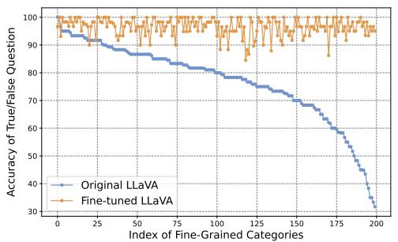

line chart

| Index of Fine-Grained Categories | Original LLaVA | Fine-tuned LLaVA |
| -------------------------------- | -------------- | ---------------- |
| 0                                | 98             | 98               |
| 25                               | 95             | 97               |
| 50                               | 90             | 96               |
| 75                               | 85             | 95               |
| 100                              | 80             | 94               |
| 125                              | 75             | 93               |
| 150                              | 70             | 92               |
| 175                              | 60             | 91               |
| 200                              | 30             | 90               |

Fig. 7. Comparison of the original (blue dots) and fine-tuned (yellow dots) LLaVA models on occurrence-balanced finegrained bird categories. True/false accuracy per category is ranked.

LLaVA [4] as an example, the model shows highly inconsistent recognition ability across categories, achieving nearly 90% accuracy for some categories while dropping to approximately 30% for others. This indicates a clear category-level long-tail pattern in fine-grained recognition.

We consider two possible explanations for this inconsistency: the training data may contain imbalanced fine-grained knowledge, or some fine-grained categories may be intrinsically more difficult for LVLMs to learn. To distinguish between these possibilities, we fine-tune LVLMs using data in which fine-grained categories appear in a balanced manner, and then re-evaluate their recognition performance. As indicated by the yellow dots in Figure 7, the fine-tuned LLaVA achieves consistently strong recognition across all fine-grained categories. This result suggests that the observed knowledge bias mainly stems from the uneven representation of fine-grained knowledge in training data, rather than from the inherent difficulty of learning particular categories.

To further trace the source of this imbalance, we examined the occurrence frequency of fine-grained categories in the LVLM training data. Interestingly, we found that these categories are almost absent from the training data. This suggests that the observed category-level inconsistency is not solely caused by the visual model or by category-specific learning difficulty, but is largely inherited from the languageside knowledge priors of the underlying LLM. Additional results for other LVLMs exhibit similar trends and can be found in Appendix C.2.

## D. Training Designs for Better Fine-Grained LVLM Capabilities.

After diagnosing the bottlenecks behind fine-grained LVLM failures, we further examine which training design factors can improve fine-grained capabilities. This analysis considers both the visual representation side, where feature separability provides the basis for fine-grained recognition, and the instruction-tuning side, where the model must acquire finegrained knowledge without forgetting general multimodal capabilities. We therefore analyze LVLMs from the perspectives of training objective, feature quality, encoder and data scale, and SFT data composition.

We first examine how different training paradigms affect fine-grained visual discriminability by evaluating visual features on fine-grained classification and retrieval tasks. To understand where the performance differences come from, we further analyze their global feature distributions and local patch-level correspondences. We then investigate whether raw scale, including vision-encoder size and training-data scale, is sufficient to improve fine-grained visual representations. Finally, we examine whether fine-grained supervision can be incorporated during SFT without sacrificing general capabilities, by comparing direct fine-grained tuning with joint SFT on general and fine-grained data.

These analyses are supported by the fine-grained retrieval and classification results in Figure 8 and Figure 9, the statistical comparisons in Figure 10 and Figure 11, the multi-metacategory classification results in Figure 15, the global and local feature visualizations in Figure 12 and Figure 13, the encodersize analysis in Figure 14, and the SFT data-composition results in Table VIII. Together, they show that improving fine-grained LVLM capabilities requires more than raw scale: effective training objectives, high-quality data, and balanced SFT data composition are all important for strengthening fine-grained recognition while preserving general multimodal abilities.

## Finding 8: The contrastive training paradigm in LVLMs effectively enhances the fine-grained discriminability of visual features.

As shown in Figures 8 and 9, visual encoders trained with contrastive objectives (e.g., EVA-CLIP, InternVL, and DINOv2) outperform those trained mainly with reconstruction-based objectives (BEiT3) or generative objectives (Qwen) on finegrained retrieval and classification tasks. The Nemenyi test results in Figures 10 and 11 further show that InternVL, EVA-CLIP, and DINOv2 perform significantly better than Qwen and BEiT3. In multi meta-category classification (cf. Figure 15), EVA-CLIP maintains strong performance, with an average drop of only 1.96% compared to the single-category setting, whereas Qwen and BEiT3 exhibit larger drops of 4.16% and 7.41%, respectively.

These quantitative results are further supported by qualitative visualizations. As shown in Figure 12, contrastive features form more compact and better-separated clusters on fine-grained datasets, indicating stronger global category separability. At the local level, Figure 13 shows that contrastive features produce more semantically consistent patch correspondences across images, while reconstruction- and generation-based features are more easily distracted by background textures or irrelevant regions. These observations suggest that contrastive training benefits fine-grained recognition not only by improving global feature separability, but also by preserving more reliable local discriminative cues.

We further examine whether this advantage simply comes from larger vision encoders. As shown in Figure 14, DINOv2- B, despite using a smaller vision encoder, achieves higher classification accuracy than the larger BEiT3-L, outperforming it by 8.08% on CUB-200-2011 and 9.49% on Stanford Dogs. This suggests that training paradigm can be more critical than encoder scale for fine-grained feature learning. A possible reason is that reconstruction- and generation-based objectives do not explicitly enforce inter-category separation and intra-category compactness among visually similar categories, thereby limiting their effectiveness on fine-grained tasks. More results are detailed in Appendix D.1.

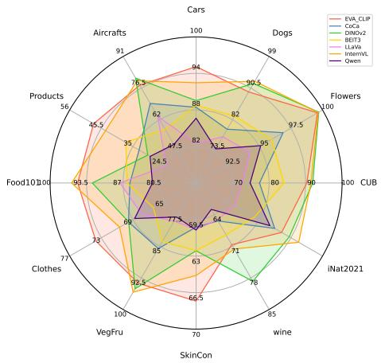

radar chart

| Category | EVA_CUP | CiCa | DiMv2 | BEIT3 | LiAH | IntemVL | Owen |
| --- | --- | --- | --- | --- | --- | --- | --- |
| Cars | 94 | 88 | 82 | 73 | 70 | 64 | 82 |
| Dogs | 90 | 82 | 80 | 73 | 70 | 64 | 82 |
| Flowers | 100 | 97.5 | 95 | 92 | 80 | 70 | 73 |
| CUB | 97.5 | 80 | 70 | 70 | 70 | 64 | 73 |
| iNat2021 | 95 | 79 | 71 | 71 | 70 | 64 | 73 |
| wine | 85 | 79 | 69 | 69 | 69 | 64 | 69 |
| SkinCon | 85 | 66.5 | 63 | 63 | 63 | 64 | 69 |
| VegFru | 92.5 | 85 | 77.5 | 77.5 | 77.5 | 65 | 77.5 |
| Clothes | 79 | 85 | 85 | 85 | 85 | 65 | 85 |
| Food10/100 | 99.5 | 87 | 87 | 87 | 87 | 80 | 87 |
| Products | 45.5 | 35 | 35 | 35 | 35 | 35 | 35 |
| Aircrafts | 91 | 62 | 47.5 | 47.5 | 47.5 | 47.5 | 47.5 |
|  |  |  |  |  |  |  |  |
|  |  |  |  |  |  |  |  |
|  |  |  |  |  |  |  |  |
|  |  |  |  |  |  |  |  |
|  |  |  |  |  |  |  |  |
|  |  |  |  |  |  |  |  |
|  |  |  |  |  |  |  |  |
|  |  |  |  |  |  |  |  |
|  |  |  |  |  |  |  |  |
|  |  |  |  |  |  |  |  |
|  |  |  |  |  |  |  |  |
|  |  |  |  |  |  |  |  |
|  |  |  |  |  |  | ***(**)** | ***(**)** |
|  |  |  |  |  |  | ***(**)** | ***(**)** |
|  |  |  |  |  |  | ***(**)** | ***(**)** |
|  |  |  |  |  |  | ***(**)** | ***(**)** |
|  |  |  |  |  |  | ***(**)** | ***(**)** |
|  |  |  | **(**)** | ***(**)** | ***(**)** | ***(**)** | ***(**)** |
|  |  |  | **(**)** | ***(**)** | ***(**)** | ***(**)** | ***(**)** |
|  |  |  | **(**)** | ***(**)** | ***(**)** | ***(**)** | ***(**)** |
|  |  |  | **(**)** | ***(**)** | ***(**)** | ***(**)* | ***(**)* |
|  |  |  | **(**)** | ***(**)** | ***(**)** | ***(**)* | ***(**)* |
|  |  |  | **(**)** | ***(**)** | ***(**)** | ***(**)* | ***(**)* |
|  |  |  | **(**)** | ***(**)** | ***(**)** | ***(**)* | ***(**)* |

Fig. 8. Retrieval results of LVLM visual features on twelve fine-grained datasets. Different colors represent different models.  
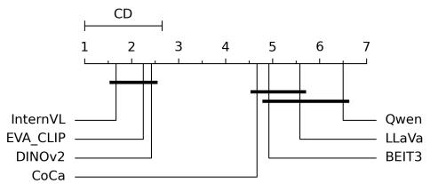

line chart

| Category | Value |
|---|---|
| CD | 1 |
| InternVL | 2 |
| EVA_CLAMP | 3 |
| DINOv2 | 4 |
| CoCa | 5 |
| Qwen | 6 |
| LLaVa | 7 |
| BEIT3 | 6 |

Fig. 10. Nemenyi statistical test results for fine-grained retrieval. Black horizontal lines indicate the critical distance (CD), grouping models with no significant performance differences.

Finding 9: Scaling vision encoders or web data alone brings limited gains in fine-grained visual discriminability.

After observing the strong effect of training paradigm, we further examine whether raw scale can compensate for limited fine-grained visual discriminability. Regarding vision encoder size, as shown in Figure 14, scaling DINOv2’s vision encoder from DINOv2-B to DINOv2-L improves the average classification accuracy by only 0.6%, and further scaling it from DINOv2-L to DINOv2-G brings another marginal gain of only 0.3%. Moreover, the classification accuracy obtained from InternVL-6B visual features is not higher than that of DINOv2-L, suggesting that merely enlarging the vision encoder is insufficient to substantially improve fine-grained discriminability.

Regarding training-data scale, as shown in Figure 11, EVA-CLIP, whose vision encoder is trained on over 2 billion samples, does not outperform DINOv2, which is trained on 142 million samples, in fine-grained classification and retrieval tasks. We attribute this difference to training-data quality: DINOv2’s dataset is carefully curated from a large pool of data, whereas EVA-CLIP relies on crawled web data. A similar trend is observed when comparing DINOv2 with InternVL, whose vision encoder is trained on 6B samples. These results suggest that simply increasing the scale of the vision encoder or training data, without considering objective design and data quality, offers limited gains in fine-grained visual feature discriminability.

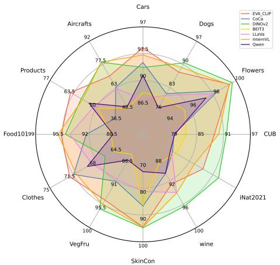  
Fig. 9. Classification results of LVLM visual features on twelve fine-grained datasets. Different colors represent different models.

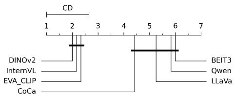

line chart

| Category | Value |
|---|---|
| CD | 1 |
| DINOv2 | 2 |
| InternVL | 0 |
| EVA_CLAMP | 0 |
| CoCa | 0 |
| 4 | 5 |
| 5 | 6 |
| 6 | 7 |
BEIT3
Qwen
LLaVa

Fig. 11. Nemenyi statistical test results for fine-grained recognition. Black horizontal lines indicate the critical distance (CD), grouping models with no significant performance differences.

Finding 10: Mixing general and fine-grained data during SFT improves fine-grained recognition while preserving general capabilities.

After examining visual representation factors, we further ask whether fine-grained LVLM capabilities can be improved through supervised fine-tuning. A straightforward strategy is to continue fine-tuning an already SFT-trained LVLM on finegrained data. As shown in Table VIII, this strategy improves fine-grained recognition performance, but substantially degrades general multimodal capabilities. For example, compared with the model trained on general SFT data only (#1), the model further tuned on fine-grained data (#2) drops from 65.31 to 48.67 on AI2D, from 27.36 to 13.45 on ChartQA, and from 42.43 to 20.36 on DocVQA. This indicates that post-hoc fine-grained tuning can introduce severe forgetting of general capabilities.

To mitigate this trade-off, we mix general SFT data and fine-grained data during the SFT stage with a 1:1 sampling ratio. As shown by setting #3 in Table VIII, joint SFT with general and fine-grained data largely preserves general performance compared with the general-only SFT baseline (#1), while still achieving strong fine-grained recognition accuracy. For example, its general performance remains close to the baseline on AI2D (65.02 vs. 65.31), ChartQA (26.79 vs.

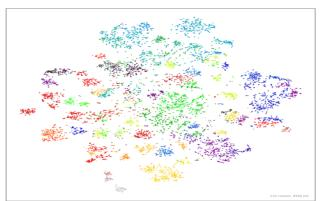

scatterplot

| Category | Value |
|---|---|
| Category 1 | 0.25 |
| Category 2 | 0.35 |
| Category 3 | 0.45 |
| Category 4 | 0.55 |
| Category 5 | 0.65 |
| Category 6 | 0.75 |
| Category 7 | 0.85 |
| Category 8 | 0.95 |
| Category 9 | 1.05 |
| Category 10 | 1.15 |
| Category 11 | 1.25 |
| Category 12 | 1.35 |
| Category 13 | 1.45 |
| Category 14 | 1.55 |
| Category 15 | 1.65 |
| Category 16 | 1.75 |
| Category 17 | 1.85 |
| Category 18 | 1.95 |
| Category 19 | 2.05 |
| Category 20 | 2.15 |
| Category 21 | 2.25 |
| Category 22 | 2.35 |
| Category 23 | 2.45 |
| Category 24 | 2.55 |
| Category 25 | 2.65 |
| Category 26 | 2.75 |
| Category 27 | 2.85 |
| Category 28 | 2.95 |
| Category 29 | 3.05 |
| Category 30 | 3.15 |
| Category 31 | 3.25 |
| Category 32 | 3.35 |
| Category 33 | 3.45 |
| Category 34 | 3.55 |
| Category 35 | 3.65 |
| Category 36 | 3.75 |
| Category 37 | 3.85 |
| Category 38 | 3.95 |
| Category 39 | 4.05 |
| Category 40 | 4.15 |
| Category 41 | 4.25 |
| Category 42 | 4.35 |
| Category 43 | 4.45 |
| Category 44 | 4.55 |
| Category 45 | 4.65 |
| Category 46 | 4.75 |
| Category 47 | 4.85 |
| Category 48 | 4.95 |
| Category 49 | 5.05 |
| Category 50 | 5.15 |
| Category 51 | 5.25 |
| Category 52 | 5.35 |
| Category 53 | 5.45 |
| Category 54 | 5.55 |
| Category 55 | 5.65 |
| Category 56 | 5.75 |
| Category 57 | 5.85 |
| Category 58 | 5.95 |
| Category 59 | 6.05 |
| Category 60 | 6.15 |
| Category 61 | 6.25 |
| Category 62 | 6.35 |
| Category 63 | 6.45 |
| Category 64 | 6.55 |
| Category 65 | 6.65 |
| Category 66 | 6.75 |
| Category 67 | 6.85 |
| Category 68 | 6.95 |
| Category 69 | 7.05 |
| Category 70 | 7.15 |
| Category 71 | 7.25 |
| Category 72 | 7.35 |
| Category 73 | 7.45 |
| Category 74 | 7.55 |
| Category 75 | 7.65 |
| Category 76 | 7.75 |
| Category 77 | 7.85 |
| Category 78 | 7.95 |
| Category 79 | 8.05 |
| Category 80 | 8.15 |
| Category 81 | 8.25 |
| Category 82 | 8.35 |
| Category 83 | 8.45 |
| Category 84 | 8.55 |
| Category 85 | 8.65 |
| Category 86 | 8.75 |
| Category 87 | 8.85 |
| Category 88 | 8.95 |
| Category 89 | 9.05 |
| Category 90 | 9.15 |
| Category 91 | 9.25 |
| Category 92 | 9.35 |
| Category 93 | 9.45 |
| Category 94 | 9.55 |
| Category 95 | 9.65 |
| Category 96 | 9.75 |
| Category 97 | 9.85 |
| Category 98 | 9.95 |
| Category 99 |

(a) EVA-CLIP

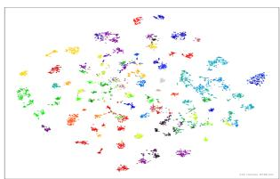

scatterplot

| x | y | color |
|---|---|---|
| 0.1 | 0.95 | red |
| 0.2 | 0.85 | green |
| 0.3 | 0.75 | blue |
| 0.4 | 0.65 | purple |
| 0.5 | 0.55 | orange |
| 0.6 | 0.45 | pink |
| 0.7 | 0.35 | yellow |
| 0.8 | 0.25 | cyan |
| 0.9 | 0.15 | magenta |
| 1.0 | 0.05 | brown |

(b) DinoV2

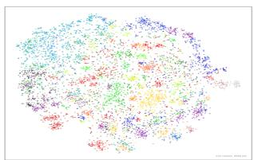

scatterplot

| Category | Value |
| -------- | ----- |
| A        | 100   |
| B        | 85    |
| C        | 70    |
| D        | 65    |
| E        | 50    |
| F        | 45    |
| G        | 35    |
| H        | 25    |
| I        | 15    |
| J        | 10    |

(c) BEiT3

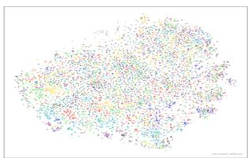

scatterplot

| Category | Value |
| --- | --- |
| Category 1 | 100 |
| Category 2 | 95 |
| Category 3 | 90 |
| Category 4 | 85 |
| Category 5 | 80 |
| Category 6 | 75 |
| Category 7 | 70 |
| Category 8 | 65 |
| Category 9 | 60 |
| Category 10 | 55 |
| Category 11 | 50 |
| Category 12 | 45 |
| Category 13 | 40 |
| Category 14 | 35 |
| Category 15 | 30 |
| Category 16 | 25 |
| Category 17 | 20 |
| Category 18 | 15 |
| Category 19 | 10 |
| Category 20 | 5 |
| Category 21 | 0 |
| Category 22 | 0 |
| Category 23 | 0 |
| Category 24 | 0 |
| Category 25 | 0 |
| Category 26 | 0 |
| Category 27 | 0 |
| Category 28 | 0 |
| Category 29 | 0 |
| Category 30 | 0 |
| Category 31 | 0 |
| Category 32 | 0 |
| Category 33 | 0 |
| Category 34 | 0 |
| Category 35 | 0 |
| Category 36 | 0 |
| Category 37 | 0 |
| Category 38 | 0 |
| Category 39 | 0 |
| Category 40 | 0 |
| Category 41 | 0 |
| Category 42 | 0 |
| Category 43 | 0 |
| Category 44 | 0 |
| Category 45 | 0 |
| Category 46 | 0 |
| Category 47 | 0 |
| Category 48 | 0 |
| Category 49 | 0 |
| Category 50 | 0 |
| Category 51 | 0 |
| Category 52 | 0 |
| Category 53 | 0 |
| Category 54 | 0 |
| Category 55 | 0 |
| Category 56 | 0 |
| Category 57 | 0 |
| Category 58 | 0 |
| Category 59 | 0 |
| Category 60 | 0 |
| Category 61 | 0 |
| Category 62 | 0 |
| Category 63 | 0 |
| Category 64 | 0 |
| Category 65 | 0 |
| Category 66 | 0 |
| Category 67 | 0 |
| Category 68 | 0 |
| Category 69 | 0 |
| Category 70 | 0 |
| Category 71 | 0 |
| Category 72 | 0 |
| Category 73 | 0 |
| Category 74 | 0 |
| Category 75 | 0 |
| Category 76 | 0 |
| Category 77 | 0 |
| Category 78 | 0 |
| Category 79 | 0 |
| Category 80 | 0 |
| Category 81 | 0 |
| Category 82 | 0 |
| Category 83 | 0 |
| Category 84 | 0 |
| Category 85 | 0 |
| Category 86 | 0 |
| Category 87 | 0 |
| Category 88 | 0 |
| Category 89 | 0 |
| Category 90 | 0 |
| Category 91 | 0 |
| Category 92 | 0 |
| Category 93 | 0 |
| Category 94 | 0 |
| Category 95 | 0 |
| Category 96 | 0 |
| Category 97 | 0 |
| Category 98 | 0 |
| Category 99 | 0 |

(d) Qwen-VL  
Fig. 12. t-SNE visualization of visual features on Stanford Dogs.

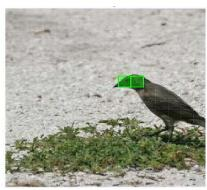

natural_image

A bird with a green hat standing on grassy ground near a sandy shoreline (no text or symbols visible)

(a) Query

natural_image

Black bird standing on grassy ground, no visible text or symbols

(b) Support

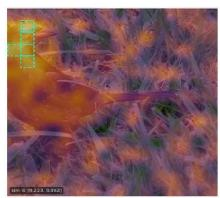

natural_image

Microscopic view of fibrous material with orange-brown core and purple/green fibers (no text or symbols)

(c)EVA-CLIP

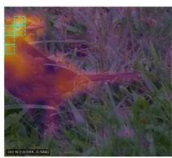

natural_image

Close-up of a small red object resting on grassy ground, no visible text or symbols

(d) DINOv2

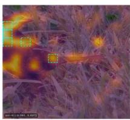

natural_image

Thermal image showing heat distribution over grass with highlighted areas (no text or symbols)

(e) BEiT-3

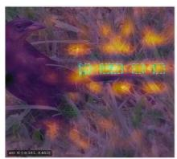

natural_image

Close-up of a grassy field with glowing yellow-orange light spots (no text or symbols visible)

(f) Qwen-VL

Fig. 13. Patch-level correspondence visualization on CUB datasets. Green boxes in the query images indicate the selected patches, and green boxes in the support images denote the most similar patches retrieved by different models.  
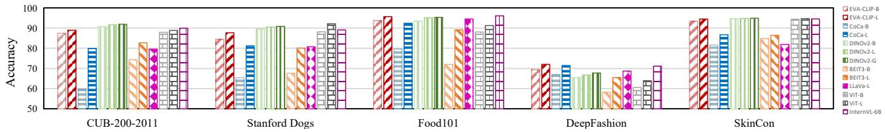

bar chart

| Dataset | EVA-CLIP-B | EVA-CLIP-L | CoCa-B | CoCa-L | DINOv2-B | DINOv2-L | DINOv2-G | BEIT3-B | BEIT3-L | LLaVa-L | VIT-B | VIT-L | InternVL-6B |
|---|---|---|---|---|---|---|---|---|---|---|---|---|---|
| CUB-200-2011 | 88 | 90 | 58 | 80 | 92 | 93 | 94 | 74 | 83 | 80 | 88 | 90 | 91 |
| Stanford Dogs | 84 | 88 | 65 | 82 | 90 | 91 | 92 | 68 | 80 | 81 | 88 | 91 | 90 |
| Food101 | 94 | 96 | 78 | 93 | 95 | 96 | 97 | 72 | 89 | 95 | 91 | 93 | 97 |
| DeepFashion | 69 | 73 | 67 | 72 | 67 | 68 | 69 | 58 | 65 | 55 | 63 | 64 | 70 |
| SkinCon | 94 | 95 | 82 | 87 | 95 | 96 | 97 | 85 | 87 | 81 | 94 | 95 | 96 |

Fig. 14. Classification results with different vision encoder sizes. Bars filled with different patterns represent different models, with darker patterns indicating larger vision encoder sizes.

27.36), MathVista (23.2 vs. 22.6), and POPE (87.6 vs. 87.6). Meanwhile, its short-answer fine-grained results are comparable to the model further tuned on fine-grained data (#2), and even slightly higher on CUB, Food-101, and Stanford Dogs.

These results suggest that fine-grained supervision is beneficial, but its placement and composition during SFT are critical. Directly tuning an already instruction-tuned LVLM on fine-grained data improves task-specific recognition at the cost of general ability, whereas mixing general and fine-grained data during SFT provides a better balance. This indicates that fine-grained LVLM improvement should not rely on isolated task-specific tuning alone; instead, fine-grained data should be incorporated together with general instruction data so that the model can acquire fine-grained knowledge while maintaining broad multimodal competence.

## E. Robustness of Fine-Grained LVLM Recognition under Visual and Linguistic Perturbations

After analyzing the performance gaps, underlying bottlenecks, and representation-learning factors of LVLMs, we finally examine whether their fine-grained recognition ability is robust under perturbations. This question is particularly important for fine-grained tasks, where predictions often depend on subtle visual cues and precise grounding between visual evidence and category semantics. Small disturbances may therefore weaken the discriminative visual evidence or bias the model toward incorrect semantic decisions.

We evaluate robustness from both the visual and linguistic sides. On the visual side, we first perturb visual inputs using projected gradient descent [26] to examine whether fine-grained representations are more fragile than generic representations, and further apply image-level corruptions to test how degraded visual evidence affects both feature discriminability and dialogue-based recognition. On the linguistic side, we introduce misleading textual cues into the prompt to examine whether language priors can override visual evidence during fine-grained recognition. We also compare different question formats to understand when such linguistic perturbations become more effective.

These analyses are supported by the image perturbation results in Table IX, the visual corruption results in Table X and Table XXIII, and the language-side perturbation analysis in Table X. Together, they show that fine-grained LVLM recognition is vulnerable not only to weakened visual evidence, but also, and more severely, to misleading linguistic cues that directly bias the final semantic decision.

## Finding 11: Visual features in LVLMs are more susceptible to perturbations in fine-grained tasks.

We first examine the robustness of visual representations under white-box image perturbations. Specifically, we use gradients computed from visual features to update the input pixels, and compare the resulting accuracy drop on fine-grained and generic classification tasks. As shown in Table IX, applying such perturbations to images encoded by EVA-CLIP sharply reduces the classification accuracy on the fine-grained dataset CUB-200-2011, from 88.95% to 24.94%. By comparison, the accuracy drop on the generic dataset CIFAR-100 [49] is less severe, decreasing from 93.05% to 50.76%. Similar trends are observed for CoCa and DINOv2, indicating that fine-grained visual representations are more fragile under adversarial image perturbations than generic representations.

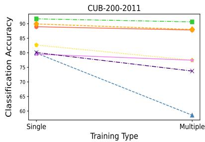

line chart

| Training Type | Classification Accuracy |
| ------------- | ------------------------ |
| Single        | 90                       |
| Single        | 83                       |
| Single        | 80                       |
| Single        | 78                       |
| Single        | 75                       |
| Single        | 70                       |
| Single        | 65                       |
| Single        | 60                       |
| Multiple      | 90                       |
| Multiple      | 88                       |
| Multiple      | 85                       |
| Multiple      | 80                       |
| Multiple      | 75                       |
| Multiple      | 70                       |
| Multiple      | 65                       |
| Multiple      | 60                       |

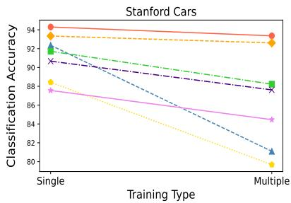

line chart

| Training Type | Series 1 | Series 2 | Series 3 | Series 4 | Series 5 |
| ------------- | -------- | -------- | -------- | -------- | -------- |
| Single        | 94       | 92       | 90       | 88       | 87       |
| Multiple      | 93       | 92       | 88       | 80       | 85       |

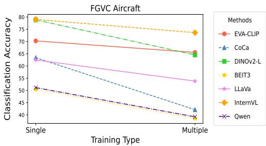

line chart

| Training Type | EVA-CLIP | CoCa | DINOV2-L | BEIT3 | LLaVa | InternVL | Qwen |
| ------------- | -------- | ---- | -------- | ----- | ----- | -------- | ---- |
| Single        | 70       | 63   | 78       | 78    | 63    | 78       | 51   |
| Multiple      | 65       | 43   | 65       | 54    | 43    | 75       | 40   |

Fig. 15. Classification results of LVLM visual features on fine-grained datasets. “Single” denotes accuracy from training on a single meta-category, while “Multiple” reflects accuracy from training on a unified dataset combining multiple meta-categories.

TABLE VIII Results of InternVL Trained under Different Settings on Fine-Grained and General Tasks. The “558k” Represents the Alignment Data, “665k” Represents the Generic Fine-Tuning Data, while “fg” Represents the Fine-Grained Data Used in Training. “Short Answer” Represents the Results on Questions About the Object Fine-Grained Category.

<table><tr><td rowspan="2">Setting</td><td colspan="3">Training Process</td><td colspan="6">General Capabilities</td></tr><tr><td>Alignment</td><td>FT</td><td>FT</td><td>AI2D</td><td>ChartQA</td><td>DocVQA</td><td>InfographicsVQA</td><td>MathVista</td><td>POPE</td></tr><tr><td>#1</td><td>558k</td><td>665k</td><td>-</td><td>65.31</td><td>27.36</td><td>42.43</td><td>30.27</td><td>22.6</td><td>87.6</td></tr><tr><td>#2</td><td>558k</td><td>665k</td><td>fg</td><td>48.67</td><td>13.45</td><td>20.36</td><td>18.89</td><td>16.7</td><td>83.39</td></tr><tr><td>#3</td><td>558k</td><td>665k+fg</td><td>-</td><td>65.02</td><td>26.79</td><td>41.11</td><td>28.34</td><td>23.2</td><td>87.6</td></tr><tr><td>#4</td><td>558k</td><td>fg</td><td>-</td><td>-</td><td>-</td><td>-</td><td>-</td><td>-</td><td>-</td></tr><tr><td rowspan="2">Setting</td><td colspan="3">Training Process</td><td colspan="6">Fine-grained Recognition Capabilities – Short Answer</td></tr><tr><td>Alignment</td><td>FT</td><td>FT</td><td>Aircraft</td><td>CUB</td><td>Flowers102</td><td>Food-101</td><td>Dog</td><td>VegFru</td></tr><tr><td>#1</td><td>558k</td><td>665k</td><td>-</td><td>-</td><td>-</td><td>-</td><td>-</td><td>-</td><td>-</td></tr><tr><td>#2</td><td>558k</td><td>665k</td><td>fg</td><td>68.4</td><td>83.32</td><td>92.66</td><td>94.03</td><td>84.51</td><td>91.65</td></tr><tr><td>#3</td><td>558k</td><td>665k+fg</td><td>-</td><td>66.03</td><td>83.84</td><td>92.19</td><td>94.46</td><td>85.33</td><td>90.77</td></tr><tr><td>#4</td><td>558k</td><td>fg</td><td>-</td><td>69.45</td><td>83.43</td><td>93.54</td><td>94.25</td><td>84.41</td><td>91.79</td></tr></table>

This vulnerability may be related to the limited fine-grained discriminability of visual features learned from coarse-grained or noisy training data. Since fine-grained categories often differ only in subtle visual cues, perturbations that slightly shift the visual representation can make closely related categories much harder to distinguish. In contrast, the Vision Transformer [50] trained on the curated ImageNet [51] dataset with cross-entropy loss demonstrates stronger robustness, showing only minor declines in classification accuracy on both fine-grained and generic datasets. This suggests that adopting alternative training paradigms or incorporating high-quality, fine-grained data (as seen in ImageNet) during training could help improve the robustness of visual features in LVLMs.

Finding 12: Language-side perturbations can override visual evidence more effectively than feature-side perturbations.

Having shown that fine-grained visual representations are vulnerable to visual perturbations, we next compare how perturbations from the visual and linguistic sides affect LVLM predictions. We first apply a range of visual corruptions to the input images, including salt-and-pepper noise, Gaussian blur, background removal, and object-level color shift. As shown in Table X and Table XXIII, these perturbations consistently degrade LVLM performance at both the feature and response levels: the discriminability of visual features declines, and the accuracy on fine-grained recognition questions also drops.

However, we find that perturbations on the language side are substantially more effective. When misleading linguistic cues are appended to the prompt (e.g., “the bird in the image seems to be a black-footed albatross”), Qwen2.5-VL drops from 74.04%/71.49% to 63.01%/28.69% on CUB, corresponding to a 42.80% drop on true/false questions. A similar trend is observed for InternVL3, whose true/false accuracy decreases by 20.94%. We attribute this asymmetry to the fact that the final output space of LVLMs is fundamentally linguistic. Visual perturbations mainly weaken the strength of perceptual evidence, which still needs to be interpreted by the language model before producing the final answer. In contrast, languageside perturbations inject an explicit prior directly into the inference process, biasing the model’s decision rule rather than merely degrading its evidence. From a causal perspective, linguistic perturbations are closer to the final prediction, and are therefore more likely to override the effect of visual evidence.

We further observe that the effect of linguistic perturbations depends strongly on the question format. On coarse-grained tasks, misleading prompts have little impact on multiplechoice questions, but still remain highly effective for true/false questions. We attribute this difference to the structure of the answer space. In multiple-choice settings, the correct answer is guaranteed to appear among the options, allowing the model to rely on relative comparison among candidates and partially compensate for the bias introduced by the prompt. In contrast, true/false questions are closer to semantic verification: the model must determine whether a given statement is correct, without the benefit of a constrained candidate set. As a result, when the model’s semantic understanding is weak, misleading linguistic cues can more easily distort its final judgment, which explains the observed trend. More results are detailed in Appendix C.4

TABLE IX Classification Results of LVLMs’ Original and Perturbed Visual Features on the Fine-Grained Dataset CUB-200-2011 and the Generic Dataset CIFAR-100. “Origin” Refers to Results with Original Features, while “Perturbed” Indicates Results with Perturbed Features.

<table><tr><td rowspan="2">Datasets</td><td colspan="2">EVA-CLIP</td><td colspan="2">CoCa</td><td colspan="2">DINOv2</td><td colspan="2">ViT</td></tr><tr><td>Origin</td><td>Perturbed</td><td>Origin</td><td>Perturbed</td><td>Origin</td><td>Perturbed</td><td>Origin</td><td>Perturbed</td></tr><tr><td>CIFAR-100</td><td>93.05</td><td>50.76</td><td>86.94</td><td>52.23</td><td>93.38</td><td>42.39</td><td>89.81</td><td>72.15</td></tr><tr><td>CUB-200-2011</td><td>88.95</td><td>24.94</td><td>79.89</td><td>23.40</td><td>91.64</td><td>25.94</td><td>88.83</td><td>73.85</td></tr></table>

TABLE X Robustness of LVLMs under Different Perturbations on Fine-Grained Datasets. Each Entry Reports “Multiple-Choice and True/False” Accuracy. GB and SP Denote Gaussian Blur and Salt-and-Pepper Noise; BG-Gray, Color, and Mislead Denote Background, Object-Color, and Textual Perturbations, Respectively. The ∆ Rows Report Performance Drops from Original Inputs.

<table><tr><td rowspan="2">Models</td><td colspan="3">Aircraft</td><td colspan="3">Stanford Dogs</td><td colspan="2">CUB</td></tr><tr><td>Original</td><td>GB</td><td>SP</td><td>Original</td><td>BG-gray</td><td>Color</td><td>Original</td><td>Mislead</td></tr><tr><td>Qwen2.5-VL</td><td>94.84 / 89.56</td><td>87.67 / 71.02</td><td>87.46 / 80.35</td><td>96.74 / 94.50</td><td>95.55 / 92.80</td><td>90.12 / 86.19</td><td>74.04 / 71.49</td><td>63.01 / 28.69</td></tr><tr><td>Δ vs. Original</td><td></td><td>7.17 / 18.54</td><td>7.38 / 9.21</td><td></td><td>1.19 / 1.70</td><td>6.62 / 8.31</td><td></td><td>11.03 / 42.80</td></tr><tr><td>InternVL3</td><td>85.48 / 86.92</td><td>80.17 / 84.01</td><td>79.45 / 83.68</td><td>93.11 / 92.02</td><td>91.50 / 90.99</td><td>83.90 / 85.07</td><td>61.18 / 62.48</td><td>51.71 / 41.54</td></tr><tr><td>Δ vs. Original</td><td></td><td>5.31 / 2.91</td><td>5.03 / 3.24</td><td></td><td>1.61 / 1.03</td><td>9.21 / 6.95</td><td></td><td>9.47 / 20.94</td></tr></table>

## V. CONCLUDING REMARKS

In this work, we introduced FG-BMK, a comprehensive benchmark and diagnostic framework for evaluating LVLMs on fine-grained image tasks. Rather than treating fine-grained evaluation as a conventional classification problem, our study examines how LVLMs perceive subtle visual evidence, preserve fine-grained discriminability in their representations, align such evidence with language semantics, and finally produce categorylevel decisions through dialogue. By jointly considering humanoriented semantic recognition and machine-oriented visual discriminability, FG-BMK provides a structured lens for understanding not only whether LVLMs fail on fine-grained tasks, but also where such failures originate.

The broader implication of our study is that fine-grained visual understanding exposes a fundamental capability boundary of current LVLMs. Existing LVLMs have made substantial progress in open-ended multimodal interaction, but fine-grained tasks require a different level of visual-semantic precision: models must attend to local attributes, compare subtle partlevel differences, associate them with subordinate concepts, and resist misleading linguistic priors when visual evidence is weak or ambiguous. Our results suggest that strong generalpurpose multimodal ability does not automatically translate into reliable fine-grained understanding. In particular, a model may learn visually separable representations without grounding fine-grained category concepts, or may possess relevant visual evidence but fail to express it correctly through the language interface. This distinction is important for future LVLM research, because many real-world applications—such as biodiversity monitoring, industrial inspection, medical image analysis, remote sensing, and product recognition—depend precisely on this ability to connect subtle visual patterns with specialized semantic knowledge.

Our findings further indicate that improving fine-grained LVLMs requires more than simply scaling model size or training data. Future LVLMs should incorporate granularityaware vision-language alignment, stronger local and part-level visual modeling, and fine-grained instruction data that can enrich category-level knowledge without compromising general multimodal capabilities. For specialized domains, models also need mechanisms for acquiring and updating domain-specific visual semantics, so that discriminative representations can be effectively translated into meaningful decisions. Moreover, robustness to linguistic priors should become an important evaluation criterion, since LVLM outputs are produced through a language-centric interface that can override visual evidence in fine-grained reasoning.

Looking forward, FG-BMK can serve as a foundation for studying fine-grained multimodal intelligence beyond static recognition. Promising directions include building fine-grained LVLMs with explicit attribute- and part-aware reasoning, developing alignment strategies that preserve visual discriminability while strengthening semantic grounding, extending fine-grained evaluation to more open-world and dynamic scenarios, and exploring how unified understanding-generation models can learn category concepts that are both visually faithful and semantically precise. We hope this work encourages the community to view fine-grained visual understanding not as a narrow downstream task, but as a critical testbed for whether LVLMs can achieve reliable, grounded, and domain-aware multimodal intelligence.

## REFERENCES

[1] . OpenAI, “GPT-4 technical report,” 2023, arXiv:2303.08774.  
[2] J. Bai, S. Bai, S. Yang, S. Wang, S. Tan, P. Wang, J. Lin, C. Zhou, and J. Zhou, “Qwen-VL: A versatile vision-language model for understanding, localization, text reading, and beyond,” 2023, arXiv:2308.12966.  
[3] Z. Chen, J. Wu, W. Wang, W. Su, G. Chen, S. Xing, M. Zhong, Q. Zhang, X. Zhu, L. Lu, B. li, P. Luo, T. Lu, Y. Qiao, and J. Dai, “InternVL: Scaling up vision foundation models and aligning for generic visuallinguistic tasks,” in Proc. IEEE Conf. Comp. Vis. Patt. Recogn., 2024, pp. 24 185–24 198.  
[4] H. Liu, C. Li, Y. Li, and Y. J. Lee, “Improved baselines with visual instruction tuning,” in Proc. IEEE Conf. Comp. Vis. Patt. Recogn., 2024, pp. 26 296–26 306.  
[5] P. Xu, W. Shao, K. Zhang, P. Gao, S. Liu, M. Lei, F. Meng, S. Huang, Y. Qiao, and P. Luo, “LVLM-eHub: A comprehensive evaluation benchmark for large vision-language models,” IEEE Trans. Pattern Anal. Mach. Intell., vol. 47, no. 3, pp. 1877–1893, 2025.  
[6] L. Yuan, H. Duan, Y. Zhang, B. Li, S. Zhang, W. Zhao, Y. Yuan, J. Wang, C. He, Z. Liu, K. Chen, and D. Lin, “MMBench: Is your multi-modal model an all-around player?” in Proc. Eur. Conf. Comp. Vis., 2024, pp. 216–233.  
[7] M. Mathew, D. Karatzas, and C. Jawahar, “DocVQA: A dataset for vqa on document images,” in Proc. Winter Conf. Applications of Comp. Vis., 2021, pp. 2200–2209.  
[8] D. A. Hudson and C. D. Manning, “GQA: A new dataset for real-world visual reasoning and compositional question answering,” in Proc. IEEE Conf. Comp. Vis. Patt. Recogn., 2019, pp. 6700–6709.  
[9] G. Geigle, R. Timofte, and G. Glavas, “African or european swallow? ˇ benchmarking large vision-language models for fine-grained object classification,” in Proc. Conf. Empirical Methods in Natural Language Processing, 2024, pp. 2653–2669.  
[10] Y. Zhang, A. Unell, X. Wang, D. Ghosh, Y. Su, L. Schmidt, and S. Yeung-Levy, “Why are visually-grounded language models bad at image classification?” in Advances in Neural Inf. Process. Syst., 2024, pp. 51 727–51 753.  
[11] Y. Tan, Y. Qing, and B. Gong, “Vision llms are bad at hierarchical visual understanding, and llms are the bottleneck,” 2025, arXiv:2505.24840.  
[12] X.-S. Wei, Y.-Z. Song, O. M. Aodha, J. Wu, Y. Peng, J. Tang, J. Yang, and S. Belongie, “Fine-grained image analysis with deep learning: A survey,” IEEE Trans. Pattern Anal. Mach. Intell., vol. 44, no. 12, pp. 8927–8948, 2022.  
[13] H.-T. Yu, Y. Peng, S. Belongie, and X.-S. Wei, “Benchmarking large vision-language models on fine-grained image tasks: A comprehensive evaluation,” in Proc. Int. Conf. Learn. Representations, 2026.  
[14] J. Li, D. Li, C. Xiong, and S. Hoi, “BLIP: Bootstrapping language-image pre-training for unified vision-language understanding and generation,” in Proc. Int. Conf. Mach. Learn., 2022, pp. 12 888–12 900.  
[15] J. Li, D. Li, S. Savarese, and S. Hoi, “BLIP-2: Bootstrapping languageimage pre-training with frozen image encoders and large language models,” in Proc. Int. Conf. Mach. Learn., 2023, pp. 19 730–19 742.  
[16] J. Zhu, W. Wang, Z. Chen, Z. Liu, S. Ye, L. Gu, Y. Duan, H. Tian, W. Su, J. Shao, Z. Gao, E. Cui, X. Wang, Y. Cao, Y. Liu, X. Wei, H. Zhang, H. Wang, W. Xu, H. Li, J. Wang, N. Deng, S. Li, Y. He, T. Jiang, J. Luo, Y. Wang, C. He, B. Shi, X. Zhang, W. Shao, J. He, Y. Xiong, W. Qu, P. Sun, P. Jiao, H. Lv, L. Wu, K. Zhang, H. Deng, J. Ge, K. Chen, L. Wang, M. Dou, L. Lu, X. Zhu, T. Lu, D. Lin, Y. Qiao, J. Dai, and W. Wang, “InternVL3: Exploring advanced training and test-time recipes for open-source multimodal models,” 2025, arXiv:2504.10479.  
[17] W. Wang, H. Bao, L. Dong, J. Bjorck, Z. Peng, Q. Liu, K. Aggarwal, O. K. Mohammed, S. Singhal, S. Som, and F. Wei, “Image as a foreign language: BEiT pretraining for vision and vision-language tasks,” in Proc. IEEE Conf. Comp. Vis. Patt. Recogn., 2023, pp. 19 175–19 186.  
[18] J. Chen, Z. Xu, X. Pan, Y. Hu, C. Qin, T. Goldstein, L. Huang, T. Zhou, S. Xie, S. Savarese, L. Xue, C. Xiong, and R. Xu, “BLIP3-o: A family of fully open unified multimodal models-architecture, training and dataset,” 2025, arXiv:2505.09568.  
[19] B. Lin, Z. Li, X. Cheng, Y. Niu, Y. Ye, X. He, S. Yuan, W. Yu, S. Wang, Y. Ge et al., “UniWorld-V1: High-resolution semantic encoders for unified visual understanding and generation,” 2025, arXiv:2506.03147.  
[20] C. Deng, D. Zhu, K. Li, C. Gou, F. Li, Z. Wang, S. Zhong, W. Yu, X. Nie, Z. Song, G. Shi, and H. Fan, “Emerging properties in unified multimodal pretraining,” 2025, arXiv:2505.14683.  
[21] A. Masry, D. X. Long, J. Q. Tan, S. Joty, and E. Hoque, “ChartQA: A benchmark for question answering about charts with visual and logical reasoning,” in Proc. Conf. Association for Computational Linguistics, 2022, pp. 2263–2279.  
[22] Z. Liu, C.-W. Xie, B. Wen, F. Yu, P. Li, B. Zhang, N. Yang, Z. Gao, Y. Zheng, and H. Xie, “Capability: A comprehensive visual caption benchmark for evaluating both correctness and thoroughness,” pp. 0–11, 2026.  
[23] Y. Liu, Z. Li, M. Huang, B. Yang, W. Yu, C. Li, X.-C. Yin, C.-L. Liu, L. Jin, and X. Bai, “OCRBench: On the hidden mystery of ocr in large multimodal models,” Science China Information Sciences, vol. 67, no. 12, 2024.  
[24] P. Lu, H. Bansal, T. Xia, J. Liu, C. Li, H. Hajishirzi, H. Cheng, K.-W. Chang, M. Galley, and J. Gao, “MathVista: Evaluating mathematical reasoning of foundation models in visual contexts,” in Proc. Int. Conf. Learn. Representations, 2024.  
[25] X. Yue, Y. Ni, T. Zheng, K. Zhang, R. Liu, G. Zhang, S. Stevens, D. Jiang, W. Ren, Y. Sun, C. Wei, B. Yu, R. Yuan, R. Sun, M. Yin, B. Zheng,  
Z. Yang, Y. Liu, W. Huang, H. Sun, Y. Su, and W. Chen, “MMMU: A massive multi-discipline multimodal understanding and reasoning benchmark for expert agi,” in Proc. IEEE Conf. Comp. Vis. Patt. Recogn., 2024, pp. 9556–9567.  
[26] A. Madry, A. Makelov, L. Schmidt, D. Tsipras, and A. Vladu, “Towards deep learning models resistant to adversarial attacks,” in Proc. Int. Conf. Learn. Representations, 2018.  
[27] S.-L. Xu, F. Zhang, X.-S. Wei, and J. Wang, “Dual attention networks for few-shot fine-grained recognition,” in Proc. Conf. AAAI, 2022, pp. 2911–2919.  
[28] X.-S. Wei, H.-T. Yu, A. Xu, F. Zhang, and Y. Peng, “MECOM: A meta-completion network for fine-grained recognition with incomplete multi-modalities,” IEEE Trans. Image Process., vol. 33, pp. 3456–3469, 2024.  
[29] R. Zhang, H. E, and M. Song, “FSCIL-EACA: Few-Shot Class-Incremental learning network based on embedding augmentation and classifier adaptation for image classification,” Chinese J. Electron., vol. 33, no. 1, pp. 139–152, 2024.  
[30] D. Jing, X. He, Y. Luo, N. Fei, G. Yang, W. Wei, H. Zhao, and Z. Lu, “FineCLIP: Self-distilled region-based clip for better fine-grained understanding,” in Advances in Neural Inf. Process. Syst., 2024, pp. 27 896–27 918.  
[31] S. Wang, H. Shuai, L. Zhu, and Q. Liu, “Expression complementary disentanglement network for facial expression recognition,” Chinese J. Electron., vol. 33, no. 3, pp. 742–752, 2024.  
[32] L. Liu, M. Chu, R. Gong, L. Liu, and Y. Yang, “Weighted linear loss large margin distribution machine for pattern classification,” Chinese J. Electron., vol. 33, no. 3, pp. 753–765, 2024.  
[33] R. Zhang, H. E, L. Yuan, Y. Wang, L. Wang, and M. Song, “FGM-SPCL: Open-set recognition network for medical images based on fine-grained data mixture and spatial position constraint loss,” Chinese J. Electron., vol. 33, no. 4, pp. 1023–1033, 2024.  
[34] Y. Jing, R. Zhang, K. Liang, Y. Li, Z. He, Z. Ma, and J. Guo, “Animal-Bench: Benchmarking multimodal video models for animal-centric video understanding,” in Advances in Neural Inf. Process. Syst., 2024, pp. 23 457–23 469.  
[35] Y. Shen, X. Sun, X.-S. Wei, Q.-Y. Jiang, and J. Yang, “SEMICON: A learning-to-hash solution for large-scale fine-grained image retrieval,” in Proc. Eur. Conf. Comp. Vis., 2022, pp. 531–548.  
[36] X.-S. Wei, Q. Cui, L. Yang, P. Wang, L. Liu, and J. Yang, “RPC: A large-scale and fine-grained retail product checkout dataset,” Science China. Information Sciences, vol. 65, no. 9, p. 197101, 2022.  
[37] M. Oquab, T. Darcet, T. Moutakanni, H. V. Vo, M. Szafraniec, V. Khalidov, P. Fernandez, D. Haziza, F. Massa, A. El-Nouby, R. Howes, P.-Y. Huang, H. Xu, V. Sharma, S.-W. Li, W. Galuba, M. Rabbat, M. Assran, N. Ballas, G. Synnaeve, I. Misra, H. Jegou, J. Mairal, P. Labatut, A. Joulin, and P. Bojanowski, “DINOv2: Learning robust visual features without supervision,” 2023, arXiv:2304.07193.  
[38] A. Radford, J. W. Kim, C. Hallacy, A. Ramesh, G. Goh, S. Agarwal, G. Sastry, A. Askell, P. Mishkin, J. Clark, G. Krueger, and I. Sutskeverothers, “Learning transferable visual models from natural language supervision,” in Proc. Int. Conf. Mach. Learn., 2021, pp. 8748– 8763.  
[39] S. Bai, K. Chen, X. Liu, J. Wang, W. Ge, S. Song, K. Dang, P. Wang, S. Wang, J. Tang, H. Zhong, Y. Zhu, M. Yang, Z. Li, J. Wan, P. Wang, W. Ding, Z. Fu, Y. Xu, J. Ye, X. Zhang, T. Xie, Z. Cheng, H. Zhang, Z. Yang, H. Xu, and J. Lin, “Qwen2.5-vl technical report,” 2025, arXiv:2502.13923.  
[40] Q. Sun, Y. Fang, L. Wu, X. Wang, and Y. Cao, “EVA-CLIP: Improved training techniques for clip at scale,” 2023, arXiv:2303.15389.  
[41] J. Yu, Z. Wang, V. Vasudevan, L. Yeung, M. Seyedhosseini, and Y. Wu, “CoCa: Contrastive captioners are image-text foundation models,” Transactions on Machine Learning Research, 2022.  
[42] G. Gemini Team, “Gemini 1.5: Unlocking multimodal understanding across millions of tokens of context,” 2024, arXiv:2403.05530.  
[43] C. Wah, S. Branson, P. Welinder, P. Perona, and S. Belongie, “The Caltech-UCSD birds-200-2011 dataset,” Technical report, California Institute of Technology, 2011.  
[44] Q. Diao, Y. Jiang, B. Wen, J. Sun, and Z. Yuan, “MetaFormer: A unified meta framework for fine-grained recognition,” 2022, arXiv:2203.02751.  
[45] A. Bera, Z. Wharton, Y. Liu, N. Bessis, and A. Behera, “SR-GNN: Spatial relation-aware graph neural network for fine-grained image categorization,” IEEE Trans. Image Process., vol. 31, pp. 6017–6031, 2022.  
[46] D. Liu, “Progressive multi-task anti-noise learning and distilling frameworks for fine-grained vehicle recognition,” IEEE Trans. Intell. Transp. Syst., vol. 25, no. 9, pp. 10 667–10 678, 2024.  
[47] A. Behera, Z. Wharton, P. R. Hewage, and A. Bera, “Context-aware attentional pooling (cap) for fine-grained visual classification,” in Proc. Conf. AAAI, 2021, pp. 929–937.  
[48] A. Sikdar, Y. Liu, S. Kedarisetty, Y. Zhao, A. Ahmed, and A. Behera, “Interweaving insights: High-order feature interaction for fine-grained visual recognition,” in Proc. IEEE Int. Conf. Comp. Vis., 2024, pp. 1755– 1779.  
[49] A. Krizhevsky and G. Hinton, “Learning multiple layers of features from tiny images,” Citeseer, Tech. Rep., 2009.  
[50] A. Dosovitskiy, L. Beyer, A. Kolesnikov, D. Weissenborn, X. Zhai, T. Unterthiner, M. Dehghani, M. Minderer, G. Heigold, S. Gelly et al., “An image is worth 16x16 words: Transformers for image recognition at scale,” 2020, arXiv:2010.11929.  
[51] J. Deng, W. Dong, R. Socher, L.-J. Li, K. Li, and L. Fei-Fei, “ImageNet: A large-scale hierarchical image database,” in Proc. IEEE Conf. Comp. Vis. Patt. Recogn., 2009, pp. 248–255.  
[52] Tianchi, “Bottled wine defect detection data set,” 2021. [Online]. Available: https://tianchi.aliyun.com/dataset/dataDetail?dataId=110147  
[53] Z.-Z. Wu, S.-H. Wan, X.-F. Wang, M. Tan, L. Zou, X.-L. Li, and Y. Chen, “A benchmark data set for aircraft type recognition from remote sensing images,” Applied Soft Computing, vol. 89, pp. 106 132–106 142, 2020.  
[54] Z. Liu, P. Luo, S. Qiu, X. Wang, and X. Tang, “DeepFashion: Powering robust clothes recognition and retrieval with rich annotations,” in Proc. IEEE Conf. Comp. Vis. Patt. Recogn., 2016, pp. 1096–1104.  
[55] R. Daneshjou, M. Yuksekgonul, Z. R. Cai, R. Novoa, and J. Y. Zou, “SkinCon: A skin disease dataset densely annotated by domain experts for fine-grained debugging and analysis,” in Advances in Neural Inf. Process. Syst., 2022, pp. 18 157–18 167.  
[56] M.-E. Nilsback and A. Zisserman, “Automated flower classification over a large number of classes,” in Proc. IEEE Int. Conf. Comp. Vis., 2008, pp. 722–729.  
[57] L. Bossard, M. Guillaumin, and L. Van Gool, “Food-101–mining discriminative components with random forests,” in Proc. Eur. Conf. Comp. Vis., 2014, pp. 446–461.  
[58] S. Maji, E. Rahtu, J. Kannala, M. Blaschko, and A. Vedaldi, “Fine-grained visual classification of aircraft,” 2013, arXiv:1306.5151.  
[59] A. Khosla, N. Jayadevaprakash, B. Yao, and L. Fei-Fei, “Novel dataset for fine-grained image categorization,” in CVPR Workshop on Fine-Grained Visual Categorization, 2011, pp. 806–813.  
[60] J. Krause, M. Stark, J. Deng, and L. Fei-Fei, “3D object representations for fine-grained categorization,” in Proc. IEEE Int. Conf. Comp. Vis., 2013, pp. 554–561.  
[61] S. Hou, Y. Feng, and Z. Wang, “VegFru: A domain-specific dataset for fine-grained visual categorization,” in Proc. IEEE Int. Conf. Comp. Vis., 2017, pp. 541–549.  
[62] Y. Bai, Y. Chen, W. Yu, L. Wang, and W. Zhang, “Products-10K: A large-scale product recognition dataset,” 2020, arXiv:2008.10545.  
[63] G. Van Horn, E. Cole, S. Beery, K. Wilber, S. Belongie, and O. Mac Aodha, “Benchmarking representation learning for natural world image collections,” in Proc. IEEE Conf. Comp. Vis. Patt. Recogn., 2021, pp. 12 884–12 893.

# Supplementary Material of Benchmarking Large Vision-Language Models on Fine-Grained Image Tasks: From Evaluation to Diagnosis

## APPENDIX A THE EVALUATION BENCHMARK

## A.1 Evaluation Task Details

In Section III-B, we have described each evaluation task. Here, we provide further details. In the Knowledge Bias Estimation task, to uncover potential knowledge biases across different fine-grained categories, we pair each image with its corresponding fine-grained label to generate positive samples for true/false questions. For constructing negative samples, each image is paired with a single fine-grained label randomly selected from other subcategories within the same supercategory. For each fine-grained category, we calculate the LVLM’s accuracy on all coresponding true/false questions as a measure of its understanding of that category’s knowledge.

In the cross meta-class classification task, we follow the DINOv2 [37] method to train the model on a unified training set where fine-grained categories from different datasets are combined. The model is then tested on each individual dataset to evaluate its performance.

## A.2 Data Curation

a) Dataset: We source images for the FG-BMK benchmark from 13 fine-grained datasets. These datasets cover a wide range of meta-classes, with different categories and sample, providing a comprehensive assessment of LVLMs capabilities on fine-grained tasks across different domains. Table XI indicates their meta-classes, the amount of samples, the number of categories. For all datasets, we construct humanoriented evaluation questions based on their test sets. We use the original labels directly from the datasets for the machineoriented evaluation.  
b) Human-oriented Question Templates: When constructing true/false, multiple-choice, short answer questions for each task in human-oriented evaluation, we manually design several question templates to ensure both diversity and comprehensive coverage. Figure 16 illustrates the question templates we use for generating the tasks.

We also expanded the original template set to 10 diverse human-written prompts and reconstructed the multiple-choice questions in the human-oriented benchmark to examine the potential impact of linguistic diversity. As shown in Table XII and Table XIII, increasing the number of templates leads to only minor changes in accuracy, and the overall LVLM behavior and observed trends remain consistent. Therefore, as long as the template clearly states the question, the effect of the template quantity on the results is negligible.

TABLE XI Details of 13 Fine-Grained Datasets Sorted by Their Numbers of Categories. “Meta-Class” Refers to a High-Level Categorization of the Dataset. “Categories” Refers to the Number of Fine-Grained Categories. “Samples” Refers to the Total Number of Samples in Each Dataset.

<table><tr><td>Datasets</td><td>Meta-class</td><td>Categories</td><td>Samples</td></tr><tr><td>Wine [52]</td><td>Industrial</td><td>11</td><td>4,516</td></tr><tr><td>MTARSI-Fixed [53]</td><td>Aircraft</td><td>27</td><td>9,114</td></tr><tr><td>DeepFashion [54]</td><td>Clothes</td><td>46</td><td>18,000</td></tr><tr><td>SkinCon [55]</td><td>Dermatology</td><td>48</td><td>3,866</td></tr><tr><td>Flowers102 [56]</td><td>Flower</td><td>102</td><td>7,169</td></tr><tr><td>Food101 [57]</td><td>Food</td><td>101</td><td>101,000</td></tr><tr><td>FGVC Aircraft [58]</td><td>Aircraft</td><td>100</td><td>6,667</td></tr><tr><td>Stanford Dogs [59]</td><td>Dog</td><td>120</td><td>20,580</td></tr><tr><td>Stanford Cars [60]</td><td>Car</td><td>196</td><td>16,185</td></tr><tr><td>CUB-200-2011 [43]</td><td>Bird</td><td>200</td><td>11,788</td></tr><tr><td>VegFru [61]</td><td>Vegetable</td><td>292</td><td>146,131</td></tr><tr><td>Products-10K [62]</td><td>Retail</td><td>9,691</td><td>197,307</td></tr><tr><td>iNat2021 [63]</td><td>Plants</td><td>10,000</td><td>2,786,843</td></tr></table>

## APPENDIX B EVALUATED MODELS

As shown in Table XIV, we select nine widely-used opensource LVLMs, two closed-source models (GPT-5.4 [1] and Gemini-3.5-flash [42]) and one purely visual model, each of which employs a distinctive training recipes, including variations in vision encoder, language model, training losses and data.

• EVA-CLIP [40] aligns visual and textual features using contrastive loss, leveraging over 2 billion web image-text pairs and advanced optimization techniques.  
• InternVL3 [16] adopts a unified pre-training approach over both multimodal and pure-text data, enhanced by variable visual position encoding (V2PE) and advanced post-training strategies for improved scalability and effectiveness.  
• InternVL [3] leverages contrastive, matching, and generative losses in a multi-stage training process, with a large-scale vision encoder and over 6 billion image-text pairs to align visual and textual representation.  
• BLIP-2 [15] bridges the modality gap between frozen image encoders and LLMs using a lightweight Q-Former, leveraging contrastive, matching, and generative loss in a two-stage pretraining process over 129 million data with fewer trainable parameters.  
• Qwen2.5-VL [39] combines dynamic-resolution Vision Transformer with Window Attention to reduce computational cost while preserving native image resolution.

## TABLE XII

Attribute recognition accuracy of InternVL3 [16] using original and extended prompts on the CUB-200-2011 [43] dataset (values in parentheses represent the average accuracy for each attribute). Accuracy are shown in the format “original / extended”, with the left representing accuracy using the original prompt and the right using the extended prompt.

<table><tr><td colspan="6">Color Attribute (47.40 / 47.45)</td></tr><tr><td>belly color</td><td>58.49 / 60.04</td><td>back color</td><td>34.98 / 36.33</td><td>bill color</td><td>51.31 / 49.64</td></tr><tr><td>breast color</td><td>54.25 / 55.91</td><td>crown color</td><td>55.30 / 54.01</td><td>eye color</td><td>84.59 / 82.96</td></tr><tr><td>forehead color</td><td>53.32 / 51.90</td><td>leg color</td><td>44.01 / 45.67</td><td>nape color</td><td>39.24 / 38.02</td></tr><tr><td>throat color</td><td>52.77 / 54.53</td><td>under tail color</td><td>34.69 / 35.80</td><td>underparts color</td><td>56.20 / 55.08</td></tr><tr><td>upper tail color</td><td>37.30 / 38.77</td><td>upperparts color</td><td>28.75 / 27.50</td><td>wing color</td><td>30.16 / 31.88</td></tr><tr><td>primary color</td><td>43.05 / 41.29</td><td></td><td></td><td></td><td></td></tr><tr><td colspan="6">Pattern Attribute (50.13 / 50.28)</td></tr><tr><td>back pattern</td><td>40.94 / 39.38</td><td>belly pattern</td><td>68.13 / 67.00</td><td>breast pattern</td><td>65.12 / 66.87</td></tr><tr><td>head pattern</td><td>35.92 / 34.66</td><td>tail pattern</td><td>41.64 / 42.93</td><td>wing pattern</td><td>49.04 / 50.84</td></tr><tr><td colspan="6">Shape Attribute (30.95 / 31.01)</td></tr><tr><td>bill shape</td><td>37.61 / 36.41</td><td>shape</td><td>52.37 / 50.60</td><td>tail shape</td><td>10.42 / 12.04</td></tr><tr><td>wing shape</td><td>23.39 / 24.98</td><td></td><td></td><td></td><td></td></tr><tr><td colspan="3">Length Attribute (71.03 / 69.71)</td><td colspan="3">Size Attribute (52.55 / 54.21)</td></tr><tr><td colspan="2">bill length</td><td>71.03 / 69.71</td><td colspan="2">size</td><td>52.55 / 54.21</td></tr></table>

TABLE XIII Results of InternVL3 using original and extended prompts on true/false (TF) and multiple-choice (MC) questions across different levels of granularity on the CUB-200-2011 dataset. Results are shown in the format “original / extended”.

<table><tr><td colspan="6">TF</td></tr><tr><td>Class</td><td>98.79 / 98.03</td><td>Genus</td><td>85.69 / 86.19</td><td>Species</td><td>61.88 / 62.34</td></tr><tr><td colspan="6">MC</td></tr><tr><td>Class</td><td>99.42 / 99.58</td><td>Genus</td><td>88.13 / 87.62</td><td>Species</td><td>60.15 / 59.23</td></tr></table>

## TABLE XIV

Configurations of the evaluated models. “DINOv2-L” is a purely visual model. “Con” stands for the contrastive loss, “Gen” for the generative loss, “Mat” for the image-text matching loss, “Rec” for the reconstruction loss as used in BEiT3 [17], and “Dis” for the distillation loss as applied in DINOv2 [37].

<table><tr><td rowspan="2">Model</td><td colspan="2">Component</td><td colspan="5">Loss Function</td></tr><tr><td>Vision Model</td><td>Language Model</td><td>Con</td><td>Gen</td><td>Mat</td><td>Rec</td><td>Dis</td></tr><tr><td>InternV3-7B</td><td>InternViT-L</td><td>Qwen2.5-7B</td><td>√</td><td>√</td><td>√</td><td></td><td>√</td></tr><tr><td>InternVL-Chat-V1.1</td><td>InternViT-6B</td><td>LLaMA2-13B</td><td>√</td><td>√</td><td>√</td><td></td><td></td></tr><tr><td>LLaVA-1.5-7B</td><td>CLIP-L</td><td>Vicuna-7B</td><td></td><td>√</td><td></td><td></td><td></td></tr><tr><td>Qwen2.5-VL</td><td>CLIP-600M</td><td>Qwen2.5-7B</td><td>√</td><td>√</td><td>√</td><td></td><td>√</td></tr><tr><td>Qwen-VL</td><td>Openclip-G</td><td>Qwen-7B</td><td></td><td>√</td><td></td><td></td><td></td></tr><tr><td>BLIP-2-FLAN-T5-XL</td><td>EVA-CLIP-G</td><td>FlanT5-XL</td><td>√</td><td>√</td><td>√</td><td></td><td></td></tr><tr><td>EVA02-CLIP-L</td><td>EVA02-L</td><td>CLIP-L</td><td>√</td><td></td><td></td><td></td><td></td></tr><tr><td>BEiT3-L-ITC</td><td>CLIP-L</td><td>CLIP-L</td><td></td><td></td><td></td><td>√</td><td></td></tr><tr><td>CoCa-L</td><td>CLIP-L</td><td>CLIP-L</td><td>√</td><td>√</td><td></td><td></td><td></td></tr><tr><td>DINOv2-L</td><td>CLIP-L</td><td>/</td><td>√</td><td></td><td></td><td></td><td>√</td></tr></table>

• Qwen-VL [2] employs a three-stage training process with generative loss, using a VL adapter to align visual and textual features while reducing computational cost over 1.4 billion image-text pairs.  
• CoCa [41] adopts task-specific attentional pooling to tailor visual representations for different training objectives, applying contrastive loss to train the first half of the decoder and generative loss to train the full decoder in an end-to-end manner over 5 billion image-text pairs.  
• BEIT3 [17] treats images as a foreign language, leveraging a mask-then-predict objective over 36 million image-text pairs to unify vision and language pretraining, and introduces a multiway transformer architecture for general-purpose modeling.  
• LLaVA [4] aligns visual and textual features using a simple

MLP with generative loss, leveraging 1.2 million GPT-4 [1] generated multimodal instruction-following data for training.  
• DINOv2 [37] uses a self-supervised learning approach, leveraging knowledge distillation and a mask-then-predict strategy over 142 million images to train the vision encoder.  
For all our evaluated model, we follow their official configurations to run the inference. We set the temperature of all open-source models to 0, while keeping the default for closed-source APIs.

## APPENDIX C HUMAN-ORIENTED EVALUATIONS

## C.1 Results of Hierarchical Granularity Recognition

Figure 3 shows InternVL3’s [16] accuracy in answering true/false and multiple-choice questions within hierarchical granularity recognition task on CUB-200-2011 dataset. In Figure 17, we present additional results for GPT-5.4 [1], GPT-4o [1], Gemini-3.5-flash [42], Gemini-2.0-flash [42], Qwen2.5- VL [39], LLaVA [4] and InternVL [3] on CUB-200-2011 [43] and iNat2021 [63] datasets. As shown in the experiments, the accuracy of all models decreases as the granularity becomes finer. When the granularity level reaches the finest level, the models struggle to distinguish between closely related species.

TABLE XV Linear prob classification results of LLaVA visual features and fine-tuned results of two variants of LLaVA on fine-grained short asnwer questions.

<table><tr><td rowspan="2">Datasets</td><td colspan="3">Linear</td><td colspan="2">Fine-tuned</td></tr><tr><td>Origin</td><td>Aligned</td><td>Aligned-FG</td><td>Vanilla LLaVA</td><td>Retrained LLaVA</td></tr><tr><td>CUB-200-2011</td><td>79.77</td><td>73.17</td><td>75.06</td><td>85.60</td><td>86.32</td></tr><tr><td>Stanford Dogs</td><td>81.24</td><td>78.14</td><td>80.69</td><td>86.49</td><td>87.58</td></tr><tr><td>Stanford Cars</td><td>87.57</td><td>83.90</td><td>85.63</td><td>90.55</td><td>91.73</td></tr><tr><td>Food-101</td><td>94.27</td><td>93.35</td><td>94.32</td><td>95.25</td><td>95.74</td></tr></table>

## C.2 Results of Knowledge Bias Estimation

In Figure 7, we observe that LLaVA exhibit highly inconsistent recognition abilities across categories. We also conduct experiments with Qwen2.5-VL, GPT-5.4, GPT-4o, Gemini-3.5-flash and Gemini-2.0-flash on fine-grained datasets such as Aircraft [58], Flowers102 [56] and Stanford Dogs [59]. As shown in Figure 19 and Figure 20, all LVLMs display similar trends, indicating inconsistent recognition abilities across fine-grained categories. However, after fine-tuned on datasets with balanced occurrences of fine-grained categories, LVLMs demonstrate remarkable recognition abilities across all fine-grained categories.

To construct datasets with balanced occurrences of finegrained categories, we select an equal number of images from each category. Then we generate the same number of true/false questions for each fine-grained category, thereby fine-tuning the LVLMs in a way that each category receives balanced representation.

## C.3 Results of Attribute Recognition

Table III and Table XXI shows the attribute recognition accuracy of InternVL3 and Qwen2.5-VL on the CUB-200-2011 dataset. The results of LLaVA, BLIP2, InternVL, Gemini-3.5- flash and Gemini-2.0-flash are shown in Table XVI, Table XVII, Table XVIII, Table XIX, and Table XX.

## C.4 Results of visual-side and language-side perturbations.

Table X summarizes LVLM robustness under a representative subset of perturbations; additional Gaussian blur/noise sweeps, background/color corruptions on more datasets, and misleadingprompt evaluations are reported in Appendix Tables XXII, XXIII, and XXIV.

## APPENDIX D MACHINE-ORIENTED EVALUATIONS

## D.1 Qualitative Analysis of Features from Contrastive Training Paradigms and others

Figure 12 and Figure 13 illustrate how alternative training paradigms reshape learned visual representations, while Figure 24 and Figure 25 provide complementary visualization examples under the same setting.

## D.2 Qualitative Analysis of Granularity Inconsistency in LVLM Alignment Data

In the LVLM’s alignment data, we observe a phenomenon of granularity inconsistency, where fine-grained objects in images are paired with coarse-grained textual descriptions. Figure 21 shows some examples of granularity inconsistency, as well as a constructed sample of properly aligned granularity.

In practice, ensuring fully consistent fine-grained granularity across all image-text pairs is often infeasible, especially when relying on web-scale or weakly labeled data. In our retraining experiment in Table VII, we made efforts to construct more consistent alignment data, but some residual mismatch may still exist.

## D.3 Improving the fine-grained discriminability of visual features during the alignment stage can enhance LVLM performance on fine-grained tasks.

In Table VII, we can find that the alignment strategy might impair the fine-grained discriminability of visual features. We then conduct further analysis and find that improving the finegrained discriminability of visual features during the alignment stage can enhance LVLM performance on fine-grained tasks.

Specifically, we compare the two variants of LLaVA from Table VII on fine-grained short-answer questions: (1) Vanilla LLaVA, where the vision-language alignment is trained on image-text pairs with granularity inconsistencies, (2) Retrained LLaVA, where the alignment module is trained on data with matched granularity.

The results in Table XV show that Retrained LLaVA consistently outperforms Vanilla LLaVA over all datasets, indicating that improving the fine-grained discriminability of visual features during the alignment stage can enhance LVLM performance on fine-grained tasks.

Building on this finding, we believe that incorporating contrastive learning objectives (e.g., patch- or region-level contrastive loss) during the alignment stage may further help preserve discriminative visual information.

TABLE XVI Attribute Recognition Accuracy of LLaVA [4] on the CUB-200-2011 [43] Dataset (Values in Parentheses Represent the Average Accuracy for Each Attribute).

<table><tr><td colspan="8">Color Attribute (44.34)</td></tr><tr><td>belly color</td><td>54.79</td><td>back color</td><td>41.90</td><td>bill color</td><td>41.44</td><td>breast color</td><td>49.56</td></tr><tr><td>crown color</td><td>48.71</td><td>eye color</td><td>69.27</td><td>forehead color</td><td>47.03</td><td>leg color</td><td>35.37</td></tr><tr><td>nape color</td><td>40.51</td><td>throat color</td><td>35.40</td><td>under tail color</td><td>38.88</td><td>underparts color</td><td>54.81</td></tr><tr><td>upper tail color</td><td>41.41</td><td>upperparts color</td><td>34.00</td><td>wing color</td><td>34.60</td><td>primary color</td><td>41.77</td></tr><tr><td colspan="8">Pattern Attribute (23.69)</td></tr><tr><td>back pattern</td><td>27.27</td><td>belly pattern</td><td>26.41</td><td>breast pattern</td><td>24.24</td><td>head pattern</td><td>11.35</td></tr><tr><td>tail pattern</td><td>23.19</td><td>wing pattern</td><td>29.67</td><td></td><td></td><td></td><td></td></tr><tr><td colspan="8">Shape Attribute (14.05)</td></tr><tr><td>bill shape</td><td>1.39</td><td>shape</td><td>18.59</td><td>tail shape</td><td>9.89</td><td>wing shape</td><td>26.34</td></tr><tr><td colspan="4">Length Attribute (15.71)</td><td colspan="4">Size Attribute (49.47)</td></tr><tr><td colspan="2">bill length</td><td colspan="2">15.71</td><td colspan="2">size</td><td colspan="2">49.47</td></tr></table>

TABLE XVII Attribute recognition accuracy of BLIP2 [15] on the CUB-200-2011 [43] dataset (values in parentheses represent the average accuracy for each attribute).

<table><tr><td colspan="8">Color Attribute (37.94)</td></tr><tr><td>belly color</td><td>51.15</td><td>back color</td><td>39.64</td><td>bill color</td><td>23.42</td><td>breast color</td><td>50.17</td></tr><tr><td>crown color</td><td>42.59</td><td>eye color</td><td>23.59</td><td>forehead color</td><td>43.18</td><td>leg color</td><td>18.77</td></tr><tr><td>nape color</td><td>41.55</td><td>throat color</td><td>53.81</td><td>under tail color</td><td>37.98</td><td>underparts color</td><td>41.60</td></tr><tr><td>upper tail color</td><td>37.52</td><td>upperparts color</td><td>33.01</td><td>wing color</td><td>31.25</td><td>primary color</td><td>33.48</td></tr><tr><td colspan="8">Pattern Attribute (11.34)</td></tr><tr><td>back pattern</td><td>14.66</td><td>belly pattern</td><td>7.82</td><td>breast pattern</td><td>9.48</td><td>head pattern</td><td>2.14</td></tr><tr><td>tail pattern</td><td>14.21</td><td>wing pattern</td><td>19.73</td><td></td><td></td><td></td><td></td></tr><tr><td colspan="8">Shape Attribute (25.05)</td></tr><tr><td>bill shape</td><td>8.84</td><td>shape</td><td>34.69</td><td>tail shape</td><td>13.51</td><td>wing shape</td><td>43.19</td></tr><tr><td colspan="4">Length Attribute (30.11)</td><td colspan="4">Size Attribute (27.62)</td></tr><tr><td colspan="2">bill length</td><td colspan="2">30.11</td><td colspan="2">size</td><td colspan="2">27.62</td></tr></table>

TABLE XVIII Attribute recognition accuracy of InternVL [3] on the CUB-200-2011 [43] dataset (values in parentheses represent the average accuracy for each attribute).

<table><tr><td colspan="8">Color Attribute (35.78)</td></tr><tr><td>belly color</td><td>52.09</td><td>back color</td><td>33.89</td><td>bill color</td><td>26.59</td><td>breast color</td><td>46.58</td></tr><tr><td>crown color</td><td>39.91</td><td>eye color</td><td>23.68</td><td>forehead color</td><td>40.83</td><td>leg color</td><td>32.75</td></tr><tr><td>nape color</td><td>29.66</td><td>throat color</td><td>30.21</td><td>under tail color</td><td>32.31</td><td>underparts color</td><td>50.57</td></tr><tr><td>upper tail color</td><td>33.42</td><td>upperparts color</td><td>29.64</td><td>wing color</td><td>27.17</td><td>primary color</td><td>40.15</td></tr><tr><td colspan="8">Pattern Attribute (34.71)</td></tr><tr><td>back pattern</td><td>35.57</td><td>belly pattern</td><td>44.14</td><td>breast pattern</td><td>42.22</td><td>head pattern</td><td>11.81</td></tr><tr><td>tail pattern</td><td>35.86</td><td>wing pattern</td><td>37.31</td><td></td><td></td><td></td><td></td></tr><tr><td colspan="8">Shape Attribute (23.03)</td></tr><tr><td>bill shape</td><td>12.16</td><td>shape</td><td>38.08</td><td>tail shape</td><td>15.49</td><td>wing shape</td><td>26.43</td></tr><tr><td colspan="4">Length Attribute (29.31)</td><td colspan="4">Size Attribute (47.70)</td></tr><tr><td colspan="2">bill length</td><td colspan="2">29.31</td><td colspan="2">size</td><td colspan="2">47.70</td></tr></table>

## D.4 Results of Classification Across Multi-categories

In Figure 15, we have shown the classification accuracy both within a single super-category and across multiple metacategories in three datasets. Here, in Figure 22, we include more results on nine fine-grained datasets. As shown in the results, EVA-CLIP, trained with contrastive paradigm, maintains a higher score in classification across multiple metacategories compared to Qwen and BEiT3, which are trained with generative and reconstruction paradigms.

## TABLE XIX

Attribute recognition accuracy of Gemini-3.5-flash [42] on the CUB-200-2011 [43] dataset (values in parentheses represent the average accuracy for each attribute).

<table><tr><td colspan="8">Color Attribute (61.18)</td></tr><tr><td>belly color</td><td>73.40</td><td>back color</td><td>60.46</td><td>bill color</td><td>58.99</td><td>breast color</td><td>68.64</td></tr><tr><td>crown color</td><td>67.71</td><td>eye color</td><td>50.06</td><td>forehead color</td><td>67.20</td><td>leg color</td><td>55.23</td></tr><tr><td>nape color</td><td>61.55</td><td>throat color</td><td>70.71</td><td>under tail color</td><td>52.69</td><td>underparts color</td><td>71.04</td></tr><tr><td>upper tail color</td><td>59.49</td><td>upperparts color</td><td>51.57</td><td>wing color</td><td>50.72</td><td>primary color</td><td>59.40</td></tr><tr><td colspan="8">Pattern Attribute (64.96)</td></tr><tr><td>back pattern</td><td>64.27</td><td>belly pattern</td><td>77.81</td><td>breast pattern</td><td>76.41</td><td>head pattern</td><td>47.44</td></tr><tr><td>tail pattern</td><td>66.59</td><td>wing pattern</td><td>57.24</td><td></td><td></td><td></td><td></td></tr><tr><td colspan="8">Shape Attribute (47.15)</td></tr><tr><td>bill shape</td><td>65.66</td><td>shape</td><td>60.56</td><td>tail shape</td><td>23.48</td><td>wing shape</td><td>38.91</td></tr><tr><td colspan="4">Length Attribute (86.00)</td><td colspan="4">Size Attribute (55.93)</td></tr><tr><td colspan="2">bill length</td><td colspan="2">86.00</td><td colspan="2">size</td><td colspan="2">55.93</td></tr></table>

## TABLE XX

Attribute recognition accuracy of Gemini-2.0-flash [42] on the CUB-200-2011 [43] dataset (values in parentheses represent the average accuracy for each attribute).

<table><tr><td colspan="8">Color Attribute (47.22)</td></tr><tr><td>belly color</td><td>62.09</td><td>back color</td><td>36.51</td><td>bill color</td><td>52.31</td><td>breast color</td><td>56.01</td></tr><tr><td>crown color</td><td>56.44</td><td>eye color</td><td>59.57</td><td>forehead color</td><td>53.55</td><td>leg color</td><td>40.66</td></tr><tr><td>nape color</td><td>40.40</td><td>throat color</td><td>60.23</td><td>under tail color</td><td>40.60</td><td>underparts color</td><td>59.65</td></tr><tr><td>upper tail color</td><td>39.99</td><td>upperparts color</td><td>29.66</td><td>wing color</td><td>29.21</td><td>primary color</td><td>38.69</td></tr><tr><td colspan="8">Pattern Attribute (56.14)</td></tr><tr><td>back pattern</td><td>56.26</td><td>belly pattern</td><td>70.51</td><td>breast pattern</td><td>66.89</td><td>head pattern</td><td>39.56</td></tr><tr><td>tail pattern</td><td>52.33</td><td>wing pattern</td><td>51.26</td><td></td><td></td><td></td><td></td></tr><tr><td colspan="8">Shape Attribute (48.75)</td></tr><tr><td>bill shape</td><td>61.62</td><td>shape</td><td>68.20</td><td>tail shape</td><td>32.13</td><td>wing shape</td><td>33.04</td></tr><tr><td colspan="4">Length Attribute (71.82)</td><td colspan="4">Size Attribute (52.72)</td></tr><tr><td colspan="2">bill length</td><td colspan="2">71.82</td><td colspan="2">size</td><td colspan="2">52.72</td></tr></table>

## TABLE XXI

Attribute recognition accuracy of Qwen2.5-VL [39] on the CUB-200-2011 [43] dataset (values in parentheses represent the average accuracy for each attribute).

<table><tr><td colspan="8">Color Attribute (40.39)</td></tr><tr><td>belly color</td><td>51.11</td><td>back color</td><td>32.89</td><td>bill color</td><td>46.50</td><td>breast color</td><td>44.84</td></tr><tr><td>crown color</td><td>46.54</td><td>eye color</td><td>54.85</td><td>forehead color</td><td>44.57</td><td>leg color</td><td>37.79</td></tr><tr><td>nape color</td><td>36.49</td><td>throat color</td><td>40.74</td><td>under tail color</td><td>34.60</td><td>underparts color</td><td>50.20</td></tr><tr><td>upper tail color</td><td>34.92</td><td>upperparts color</td><td>27.20</td><td>wing color</td><td>26.03</td><td>primary color</td><td>36.96</td></tr><tr><td colspan="8">Pattern Attribute (45.12)</td></tr><tr><td>back pattern</td><td>42.66</td><td>belly pattern</td><td>64.58</td><td>breast pattern</td><td>59.79</td><td>head pattern</td><td>14.57</td></tr><tr><td>tail pattern</td><td>45.04</td><td>wing pattern</td><td>44.11</td><td></td><td></td><td></td><td></td></tr><tr><td colspan="8">Shape Attribute (29.30)</td></tr><tr><td>bill shape</td><td>15.30</td><td>shape</td><td>58.17</td><td>tail shape</td><td>5.63</td><td>wing shape</td><td>38.10</td></tr><tr><td colspan="4">Length Attribute (63.20)</td><td colspan="4">Size Attribute (52.56)</td></tr><tr><td colspan="2">bill length</td><td colspan="2">63.20</td><td colspan="2">size</td><td colspan="2">52.56</td></tr></table>

## TABLE XXII

Extended robustness of LVLMs to background grayscale (BG-gray) and object-centric color jitter (Color) on Flowers-102 and Stanford Dogs. Each cell reports accuracy as “multiple-choice / true/false” (%). BG-gray grayscale the background region while preserving the segmented foreground; Color perturbs hues/saturation on the foreground object.

<table><tr><td rowspan="2">Models</td><td colspan="3">Flowers-102</td><td colspan="3">Stanford Dogs</td></tr><tr><td>Original</td><td>BG-gray</td><td>Color</td><td>Original</td><td>BG-gray</td><td>Color</td></tr><tr><td>Qwen2.5-VL</td><td>95.69/93.32</td><td>94.00/92.01</td><td>83.09/83.62</td><td>96.74/94.50</td><td>95.55/92.80</td><td>90.12/86.19</td></tr><tr><td>InternVL3</td><td>88.24/88.75</td><td>82.42/84.71</td><td>74.06/81.05</td><td>93.11/92.02</td><td>91.50/90.99</td><td>83.90/85.07</td></tr><tr><td>LLaVA-1.5</td><td>66.81/76.53</td><td>62.55/74.11</td><td>55.37/67.10</td><td>68.81/77.45</td><td>66.60/77.09</td><td>60.75/73.58</td></tr></table>

## Question Template for Attribute Recognition Task

## True/False Question:

Is the wing color of the bird {color}?

Is the breast pattern of the bird {pattern}?

## Multiple-choice Question:

What is the wing color of the bird? Choose one from the following list: {options}.

## Question Template for Knowledge Bias Estimation Task

## True/False Question:

Is the species of the {meta\_class} {fine\_grained\_category}? Answer with yes or no.

Does this {meta\_class} belong to the species known as {fine\_grained\_category}? Answer with yes or no.

Is the {meta\_class} species in this photo a {fine\_grained\_category}? Answer with yes or no.

From your observation, is the species of the {meta\_class} shown a {fine\_grained\_category}? Answer with yes or no

## Question Template for Hierarchical Granularity Recognition Task

## True/False Question:

Is the species of the {meta\_class} {fine\_grained\_category}? Answer with yes or no.

Does this {meta\_class} belong to the species known as {fine\_grained\_category}? Answer with yes or no.

Is the {meta\_class} species in this photo a {fine\_grained\_category}? Answer with yes or no.

From your observation, is the species of the {meta\_class} shown a {fine\_grained\_category}? Answer with yes or no

## Multiple-choice Question:

What is the species of the {meta\_class} in this image? Choose one answer from the following list: {options}.

Answer the question using a single word or phrase.

Can you identify the species of this {meta\_class}? Choose one answer from the following list: {options}.

Answer the question using a single word or phrase.

Which species does this {meta\_class} in the photo belong to? Choose one answer from the following list: {options}. Answer the question using a single word or phrase.

Observing the {meta\_class} in the image, which of the following species is it? Choose one answer from the following list: {options}. Answer the question using a single word or phrase.

## Short Answer question:

What species of the {meta\_class} is shown in the image? Directly answer with species names.

Can you identify the species of this {meta\_class} from the image? Directly answer with species names.

Which species does the {meta\_class} in this photo belong to? Directly answer with species names.

Based on your observation, what species of the {meta\_class} is depicted? Directly answer with species names.

Fig. 16. Question templates for each task in huamn-oriented evaluation.

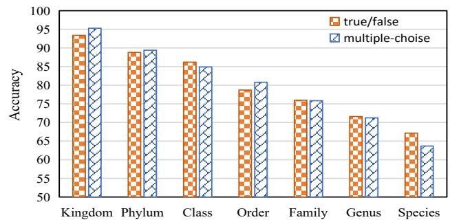

bar chart

| Category | true/false | multiple-choose |
| :--- | :--- | :--- |
| Kingdom | 93 | 95 |
| Phylum | 89 | 89 |
| Class | 86 | 84 |
| Order | 79 | 81 |
| Family | 76 | 76 |
| Genus | 72 | 72 |
| Species | 67 | 64 |

(a) GPT-5.4 on iNat2021

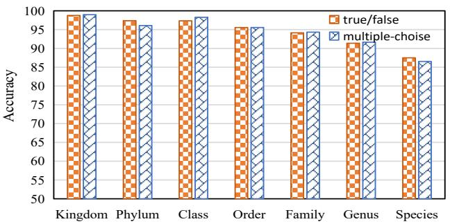

bar chart

| Category | true/false | multiple-choose |
| :--- | :--- | :--- |
| Kingdom | 98.5 | 98.7 |
| Phylum | 97.2 | 96.1 |
| Class | 97.3 | 98.0 |
| Order | 95.4 | 95.6 |
| Family | 94.2 | 94.5 |
| Genus | 91.0 | 91.3 |
| Species | 87.8 | 86.7 |

(b) Genimi-3.5-flash on iNat2021

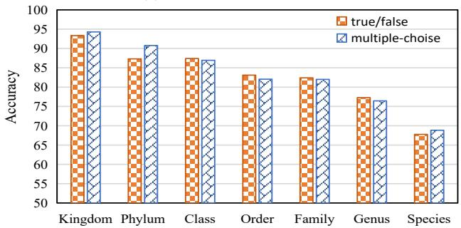

bar chart

| Category | true/false | multiple-choise |
| :--- | :--- | :--- |
| Kingdom | 93.5 | 94.5 |
| Phylum | 87.5 | 90.5 |
| Class | 87.5 | 87.0 |
| Order | 83.0 | 82.0 |
| Family | 82.5 | 82.0 |
| Genus | 77.5 | 76.5 |
| Species | 67.5 | 69.0 |

(c) GPT-4o on iNat2021

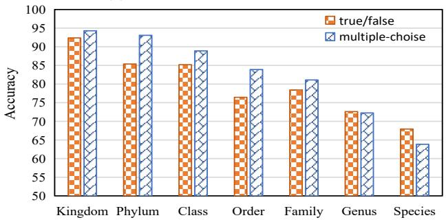

bar chart

| Category | true/false | multiple-choise |
| :--- | :--- | :--- |
| Kingdom | 92 | 94 |
| Phylum | 85 | 93 |
| Class | 85 | 89 |
| Order | 76 | 84 |
| Family | 78 | 81 |
| Genus | 72 | 72 |
| Species | 68 | 64 |

(d) Genimi-2.0-flash on iNat2021

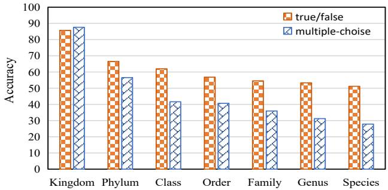

bar chart

| Category | true/false | multiple-choise |
| :--- | :--- | :--- |
| Kingdom | 86 | 88 |
| Phylum | 67 | 57 |
| Class | 63 | 42 |
| Order | 58 | 41 |
| Family | 55 | 36 |
| Genus | 54 | 32 |
| Species | 51 | 28 |

(e) LLaVA on iNat2021

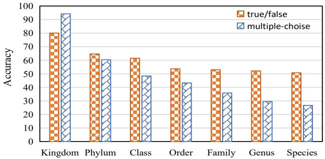

bar chart

| Category | true/false | multiple-choise |
| :--- | :--- | :--- |
| Kingdom | 80 | 95 |
| Phylum | 65 | 61 |
| Class | 62 | 49 |
| Order | 55 | 44 |
| Family | 54 | 36 |
| Genus | 53 | 30 |
| Species | 51 | 27 |

(f) InternVL on iNat2021

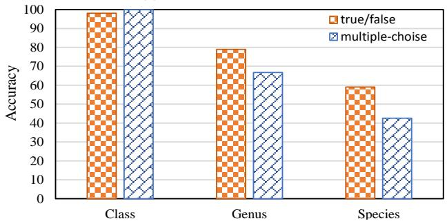

bar chart

| Category | true/false | multiple-choise |
| :--- | :--- | :--- |
| Class | 98 | 100 |
| Genus | 79 | 67 |
| Species | 59 | 43 |

(g) LLaVA on CUB-200-2011

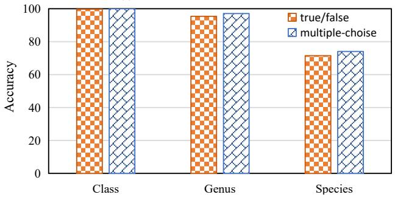

bar chart

|        | true/false | multiple-choose |
| ------ | ---------- | --------------- |
| Class  | 100        | 100             |
| Genus  | 95         | 98              |
| Species| 72         | 74              |

(h) Qwen2.5-VL on CUB-200-2011

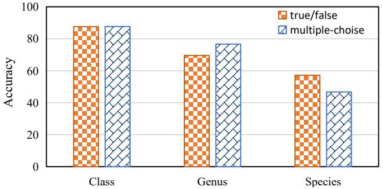

bar chart

| Category | true/false | multiple-choise |
| :--- | :--- | :--- |
| Class | 88 | 88 |
| Genus | 70 | 77 |
| Species | 58 | 48 |

(i) InternVL on CUB-200-2011  
Fig. 17. Results of GPT-5.4 [1], GPT-4o [1], Gemini-3.5-flash [42], Gemini-2.0-flash [42], Qwen2.5-VL [39], LLaVA [4] and InternVL [3] on true/false and multiple-choice questions across different levels of granularity on CUB-200-2011 [43] and iNat2021 [63] dataset. The x-axis denotes the granularity of the recognition questions.

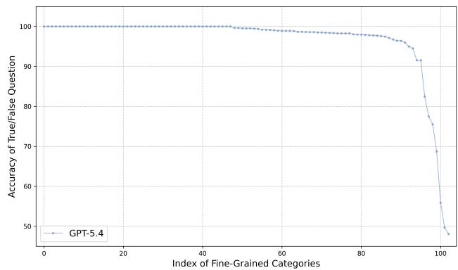

line chart

| Index of Fine-Grained Categories | Accuracy of True/False Question |
| -------------------------------- | --------------------------------- |
| 0                                | 100.0                             |
| 20                               | 100.0                             |
| 40                               | 100.0                             |
| 60                               | 99.5                              |
| 80                               | 98.0                              |
| 90                               | 92.0                              |
| 95                               | 75.0                              |
| 98                               | 68.0                              |
| 100                              | 48.0                              |

(a) GPT-5.4 on Flowers102

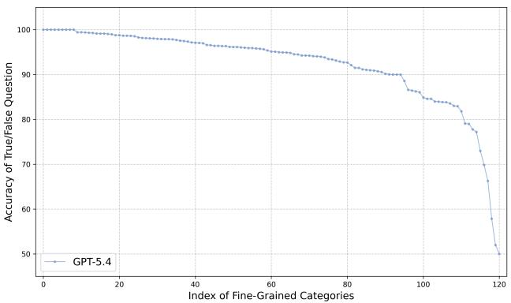

line chart

| Index of Fine-Grained Categories | Accuracy of True/False Question |
| -------------------------------- | --------------------------------- |
| 0                                | 100.0                             |
| 10                               | 99.8                              |
| 20                               | 99.5                              |
| 30                               | 98.8                              |
| 40                               | 97.5                              |
| 50                               | 96.0                              |
| 60                               | 95.0                              |
| 70                               | 94.0                              |
| 80                               | 92.0                              |
| 90                               | 90.0                              |
| 100                              | 85.0                              |
| 110                              | 82.0                              |
| 120                              | 50.0                              |

(b) Gemini-3.5-flash on Stanford Dog

Fig. 18. Knowledge bias estimation results of two closed-source models. True/false question accuracy for each category is ranked, with blue dots representing the original model.  
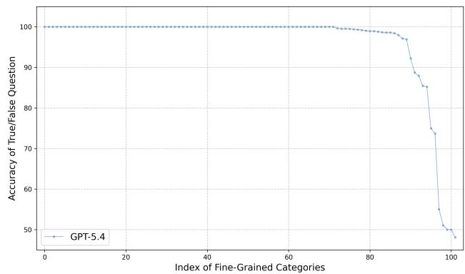

line chart

| Index of Fine-Grained Categories | Accuracy of True/False Question |
| -------------------------------- | --------------------------------- |
| 0                                | 100.0                             |
| 20                               | 100.0                             |
| 40                               | 100.0                             |
| 60                               | 100.0                             |
| 80                               | 99.0                              |
| 90                               | 97.0                              |
| 95                               | 85.0                              |
| 98                               | 74.0                              |
| 100                              | 48.0                              |

(a) GPT-4o on Flowers102

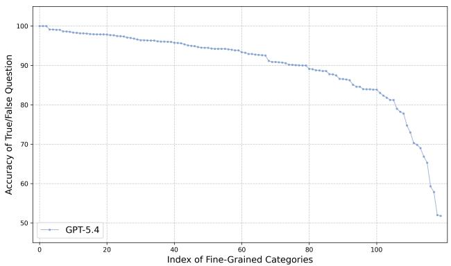

line chart

| Index of Fine-Grained Categories | Accuracy of True/False Question |
| -------------------------------- | --------------------------------- |
| 0                                | 100.0                             |
| 10                               | 99.5                              |
| 20                               | 98.5                              |
| 30                               | 97.5                              |
| 40                               | 96.5                              |
| 50                               | 95.5                              |
| 60                               | 94.5                              |
| 70                               | 93.5                              |
| 80                               | 92.5                              |
| 90                               | 91.5                              |
| 100                              | 90.5                              |
| 110                              | 89.5                              |
| 120                              | 88.5                              |
| 130                              | 87.5                              |
| 140                              | 86.5                              |
| 150                              | 85.5                              |
| 160                              | 84.5                              |
| 170                              | 83.5                              |
| 180                              | 82.5                              |
| 190                              | 81.5                              |
| 200                              | 80.5                              |
| 210                              | 79.5                              |
| 220                              | 78.5                              |
| 230                              | 77.5                              |
| 240                              | 76.5                              |
| 250                              | 75.5                              |
| 260                              | 74.5                              |
| 270                              | 73.5                              |
| 280                              | 72.5                              |
| 290                              | 71.5                              |
| 300                              | 70.5                              |
| 310                              | 69.5                              |
| 320                              | 68.5                              |
| 330                              | 67.5                              |
| 340                              | 66.5                              |
| 350                              | 65.5                              |
| 360                              | 64.5                              |
| 370                              | 63.5                              |
| 380                              | 62.5                              |
| 390                              | 61.5                              |
| 400                              | 60.5                              |
| 410                              | 59.5                              |
| 420                              | 58.5                              |
| 430                              | 57.5                              |
| 440                              | 56.5                              |
| 450                              | 55.5                              |
| 460                              | 54.5                              |
| 470                              | 53.5                              |
| 480                              | 52.5                              |
| 490                              | 51.5                              |
| 500                              | 50.5                              |

(b) Gemini-2.0-flash on Stanford Dog  
Fig. 19. Knowledge bias estimation results of two closed-source models. True/false question accuracy for each category is ranked, with blue dots representing the original model.  
TABLE XXIII

Robustness of Qwen2.5-VL and InternVL3 under Gaussian blur (GB; GB-k with $k \in \{ 1 , 3 , 5 \}$ denotes increasing blur strength) and salt-and-pepper noise (SP; SP-r with $r \in \{ 5 , 1 0 , 1 5 \}$ denotes noise density in percentage points). Linear rows report Top-1 accuracy and QA rows report accuracy as “multiple-choice / true-false”.

<table><tr><td>CUB</td><td>Ori.</td><td>GB-1</td><td>GB-3</td><td>GB-5</td><td>SP-5</td><td>SP-10</td><td>SP-15</td></tr><tr><td>Qwen2.5-VL (Linear)</td><td>85.62</td><td>85.55</td><td>79.92</td><td>70.45</td><td>80.15</td><td>75.54</td><td>71.78</td></tr><tr><td>Qwen2.5-VL (QA)</td><td>74.04/71.49</td><td>72.89/71.10</td><td>70.50/71.06</td><td>64.29/65.55</td><td>70.78/70.35</td><td>68.16/68.33</td><td>65.64/67.48</td></tr><tr><td>InternVL3 (Linear)</td><td>69.41</td><td>68.89</td><td>54.43</td><td>40.00</td><td>67.31</td><td>61.68</td><td>56.28</td></tr><tr><td>InternVL3 (QA)</td><td>61.18/62.48</td><td>60.41/62.01</td><td>59.96/61.93</td><td>55.45/61.85</td><td>61.01/62.43</td><td>60.80/62.30</td><td>59.51/62.10</td></tr></table>

<table><tr><td>FGVC Aircraft</td><td>Ori.</td><td>GB-1</td><td>GB-3</td><td>GB-5</td><td>SP-5</td><td>SP-10</td><td>SP-15</td></tr><tr><td>Qwen2.5-VL (Linear)</td><td>62.07</td><td>62.07</td><td>59.49</td><td>55.11</td><td>60.87</td><td>59.28</td><td>56.76</td></tr><tr><td>Qwen2.5-VL (QA)</td><td>94.84/89.56</td><td>93.79/87.52</td><td>87.67/71.02</td><td>80.83/61.69</td><td>90.16/83.53</td><td>87.46/80.35</td><td>84.07/77.71</td></tr><tr><td>InternVL3 (Linear)</td><td>45.42</td><td>45.18</td><td>42.81</td><td>34.98</td><td>43.17</td><td>40.05</td><td>38.16</td></tr><tr><td>InternVL3 (QA)</td><td>85.48/86.92</td><td>84.58/86.35</td><td>80.17/84.01</td><td>75.46/82.84</td><td>81.76/84.94</td><td>79.45/83.68</td><td>78.25/83.17</td></tr></table>

<table><tr><td>Stanford Dogs</td><td>Ori.</td><td>GB-1</td><td>GB-3</td><td>GB-5</td><td>SP-5</td><td>SP-10</td><td>SP-15</td></tr><tr><td>Qwen2.5-VL (Linear)</td><td>79.07</td><td>77.82</td><td>67.07</td><td>55.48</td><td>69.11</td><td>62.89</td><td>57.16</td></tr><tr><td>Qwen2.5-VL (QA)</td><td>96.74/94.50</td><td>96.60/94.20</td><td>91.13/87.37</td><td>82.88/78.38</td><td>91.43/89.92</td><td>86.84/86.15</td><td>81.66/82.77</td></tr><tr><td>InternVL3 (Linear)</td><td>73.90</td><td>72.20</td><td>57.43</td><td>43.00</td><td>64.90</td><td>56.67</td><td>49.33</td></tr><tr><td>InternVL3 (QA)</td><td>93.13/92.02</td><td>92.93/91.57</td><td>87.23/88.61</td><td>78.62/83.24</td><td>90.71/90.05</td><td>87.88/88.11</td><td>84.50/86.06</td></tr></table>

TABLE XXIV

Effect of misleading prompts on multiple-choice/true-false accuracy. Cells are formatted as “multiple-choice / true-false”.

<table><tr><td rowspan="2">Model</td><td colspan="2">CUB</td><td colspan="2">FGVC Aircraft</td><td colspan="2">Stanford Dogs</td><td colspan="2">Caltech-101</td><td colspan="2">CIFAR-100</td></tr><tr><td>Original</td><td>Misleading</td><td>Original</td><td>Misleading</td><td>Original</td><td>Misleading</td><td>Original</td><td>Misleading</td><td>Original</td><td>Misleading</td></tr><tr><td>Qwen2.5-VL</td><td>74.04/71.49</td><td>63.01/28.69</td><td>94.84/89.56</td><td>82.12/51.37</td><td>96.74/94.50</td><td>92.45/53.10</td><td>99.66/97.80</td><td>98.35/50.76</td><td>91.24/81.87</td><td>64.64/58.15</td></tr><tr><td>InternVL3</td><td>61.18/62.48</td><td>51.71/41.54</td><td>85.48/86.92</td><td>77.77/60.73</td><td>93.13/92.02</td><td>88.45/74.90</td><td>99.62/98.31</td><td>98.71/80.14</td><td>93.81/90.06</td><td>89.60/54.41</td></tr><tr><td>LLaVA-1.5</td><td>44.55/58.84</td><td>3.59/18.57</td><td>58.75/77.62</td><td>4.35/32.13</td><td>68.81/77.45</td><td>6.12/28.87</td><td>92.67/86.49</td><td>68.58/45.60</td><td>92.67/86.49</td><td>68.58/45.60</td></tr></table>

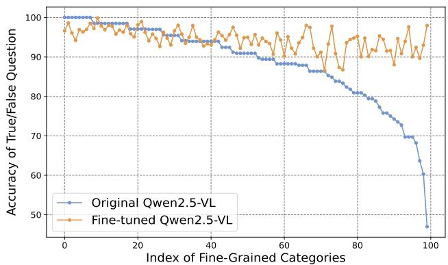

line chart

| Index of Fine-Grained Categories | Original Qwen2.5-VL | Fine-tuned Qwen2.5-VL |
| -------------------------------- | ------------------- | --------------------- |
| 0                                | 100                 | 98                    |
| 10                               | 99                  | 97                    |
| 20                               | 98                  | 96                    |
| 30                               | 97                  | 95                    |
| 40                               | 95                  | 94                    |
| 50                               | 93                  | 93                    |
| 60                               | 90                  | 92                    |
| 70                               | 87                  | 91                    |
| 80                               | 82                  | 90                    |
| 90                               | 75                  | 89                    |
| 100                              | 48                  | 98                    |

Fig. 20. Comparison of the original and fine-tuned Qwen2.5- VL [39] models on occurrence-balanced fine-grained aircraft categories. True/false question accuracy for each category is ranked, with blue dots representing the original model and yellow dots the fine-tuned model.

## Qualitative Analysis of Granularity Inconsistencies in LVLMs’ Alignment Data

## Sample1:

Question: Render a clear and concise summary of the photo. Answer: a cat looking back sitting on a rock at the ocean vacation.

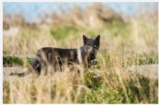

## Sample2：

Question: Summarize the visual content of the image. Answer: dog lying on the floor with text happy dog training can be cured by behavior experts.

## Sample3：

Question: Describe the image concisely. Answer: a small brown bird drinking water from a puddle.

natural_image

Small bird standing on gravel ground, no visible text or symbols

## Constructed Granularity Aligned Sample：

Question: What is the object speices? Answer: The object species is great crested flycatcher.

  
Fig. 21. Qualitative analysis of granularity inconsistencies in LVLMs’ alignment data and a constructed sample of properly aligned granularity.

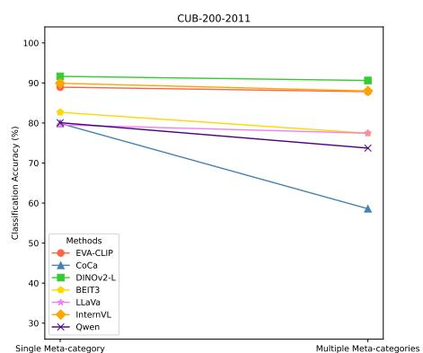

line chart

| Method       | Single Meta-category | Multiple Meta-categories |
| ------------ | -------------------- | ------------------------ |
| EVA-CLIP     | 90                   | 88                       |
| CoCa         | 80                   | 58                       |
| DINOv2-L     | 92                   | 91                       |
| BEIT3        | 83                   | 78                       |
| LLaVa        | 82                   | 77                       |
| InternVL     | 80                   | 88                       |
| Qwen         | 80                   | 74                       |

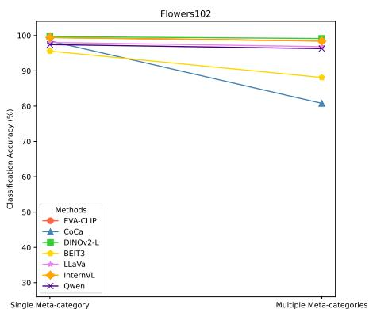

line chart

| Method       | Single Meta-category | Multiple Meta-categories |
| ------------ | -------------------- | ------------------------ |
| EVA-CLIP     | 98                   | 97                       |
| CoCa         | 96                   | 81                       |
| DINOv2-L     | 100                  | 99                       |
| BEIT3        | 95                   | 88                       |
| LLaVa        | 98                   | 97                       |
| InternVL     | 98                   | 97                       |
| Qwen         | 98                   | 97                       |

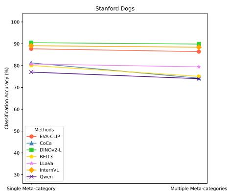

line chart

| Method       | Single Meta-category | Multiple Meta-categories |
| ------------ | -------------------- | ------------------------ |
| EVA-CLIP     | 88.0                 | 86.0                     |
| CoCa         | 81.0                 | 74.0                     |
| DINOv2-L     | 90.0                 | 90.0                     |
| BEIT3        | 80.0                 | 75.0                     |
| LLaVa        | 80.0                 | 79.0                     |
| InternVL     | 79.0                 | 74.0                     |
| Qwen         | 76.0                 | 73.0                     |

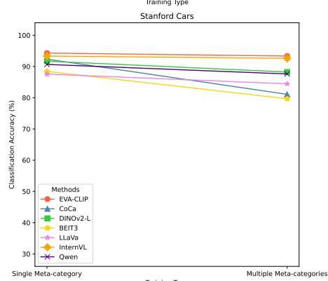

line chart

| Training Type | EVA-CLIP | CoCa | DINOv2-L | BEIT3 | LLaVa | InternVL | Qwen |
| ------------- | -------- | ---- | -------- | ----- | ----- | -------- | ---- |
| Single Meta-category | 94 | 91 | 91 | 88 | 88 | 94 | 91 |
| Multiple Meta-categories | 94 | 81 | 89 | 79 | 84 | 94 | 89 |

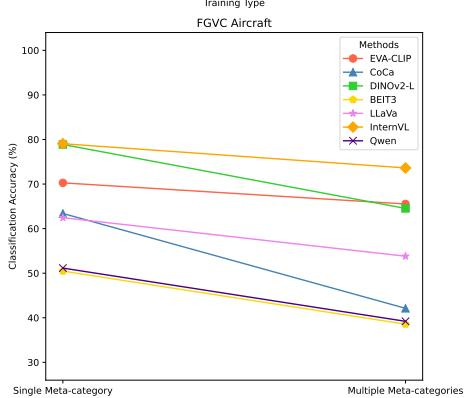

line chart

| Method       | Single Meta-category | Multiple Meta-categories |
| ------------ | -------------------- | ------------------------ |
| EVA-CLIP     | 70                   | 65                       |
| CoCa         | 65                   | 40                       |
| DIMov2-L     | 80                   | 65                       |
| BEIT3        | 80                   | 55                       |
| LLaVe        | 80                   | 50                       |
| IntermVL     | 80                   | 75                       |
| Qwen         | 50                   | 40                       |

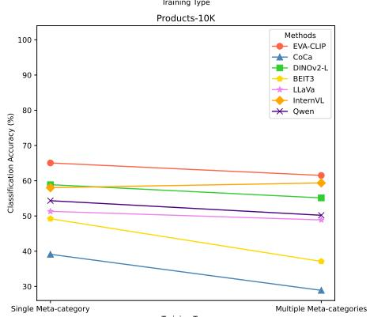

line chart

| Method       | Single Meta-category | Multiple Meta-categories |
| ------------ | ------------------- | ----------------------- |
| EVA-CLIP     | 65                  | 61                      |
| CoCa         | 40                  | 30                      |
| DINOv2-L     | 58                  | 57                      |
| BEIT3        | 59                  | 55                      |
| LLaVo        | 51                  | 50                      |
| InternVL     | 50                  | 38                      |
| Qwen         | 56                  | 51                      |

line chart

| Training Type | EVA-CLIP | CoCa | DINOv2-L | BEIT3 | LLaVa | InternVL | Qwen |
| -------------- | -------- | ---- | -------- | ----- | ----- | -------- | ---- |
| Single Meta-category | 95 | 92 | 94 | 90 | 96 | 97 | 89 |
| Multiple Meta-categories | 95 | 91 | 94 | 82 | 96 | 97 | 88 |

line chart

| Training Type | EVA-CLIP | CoCa | DINOV2-L | BEIT3 | LLaVa | IntemVL | Qwen |
| ------------- | -------- | ---- | -------- | ----- | ----- | ------- | ---- |
| Single Meta-category | 71 | 70 | 66 | 66 | 70 | 71 | 70 |
| Multiple Meta-categories | 71 | 70 | 66 | 60 | 71 | 71 | 70 |

line chart

| Training Type | EVA-CLIP | CoCa | DINOv2-L | BEIT3 | LLaVa | InternVL | Qwen |
| ------------- | -------- | ---- | -------- | ----- | ----- | -------- | ---- |
| Single Meta-category | 95 | 90 | 96 | 86 | 91 | 94 | 87 |
| Multiple Meta-categories | 93 | 84 | 95 | 77 | 90 | 93 | 84 |

Fig. 22. Classification results of LVLM visual features on fine-grained datasets. “Single” denotes accuracy from training on a single meta-category, while “Multiple” reflects accuracy from training on a unified dataset combining multiple meta-categories.

scatterplot

| Category (text) | Object (visual) |
| --------------- | --------------- |
| (data points not extractable as discrete values; visual points not extractable as discrete values) | (data points not extractable as discrete values; visual points not extractable as discrete values) |

(a) CUB: Original

scatterplot

| Category          | t-SNE-1 | t-SNE-2 |
| ----------------- | ------- | ------- |
| Category (text)   | -10 to 15 | -15 to 10 |
| Object (visual)   | -8 to 6  | -10 to 4  |

(b) CUB: Aligned-Recap

scatterplot

| Category (text) | t-SNE 1 | t-SNE 2 | t-SNE 3 |
| --- | --- | --- | --- |
| Object (visual) | -20 | -10 | 0 |
| Object (visual) | -10 | 0 | 10 |
| Object (visual) | 0 | 10 | 20 |
| Object (visual) | 10 | -10 | 0 |
| Object (visual) | -20 | -30 | -10 |
| Object (visual) | -10 | -20 | -30 |
| Object (visual) | 0 | -10 | -20 |
| Object (visual) | 10 | 0 | -10 |
| Object (visual) | 20 | -10 | 0 |
| Object (visual) | -30 | -40 | -20 |
| Object (visual) | -20 | -30 | -10 |
| Object (visual) | -10 | -20 | 0 |
| Object (visual) | 0 | -10 | 10 |
| Object (visual) | 10 | 0 | 20 |
| Object (visual) | 20 | -10 | 10 |
| Object (visual) | -30 | -40 | -20 |
| Object (visual) | -20 | -30 | -10 |
| Object (visual) | -10 | -20 | 0 |
| Object (visual) | 0 | -10 | 10 |
| Object (visual) | 10 | -20 | 20 |
| Object (visual) | 20 | -30 | 10 |
| Object (visual) | -30 | -40 | -20 |
| Object (visual) | -20 | -30 | -10 |
| Object (visual) | -10 | -20 | 0 |
| Object (visual) | 0 | -10 | 10 |
| Object (visual) | -20 | -30 | -20 |
| Object (visual) | -10 | -20 | -10 |
| Object (visual) | 0 | -10 | 0 |
| Object (visual) | 10 | -20 | 10 |
| Object (visual) | 20 | -30 | 20 |
| Object (visual) | -30 | -40 | -20 |
| Object (visual) | -20 | -30 | -10 |
| Object (visual) | -10 | -20 | 0 |
| Object (visual) | 0 | -10 | 10 |
| Object (visual) | 10 | -20 | 20 |
| Object (visual) | 20 | -30 | 10 |
| Object (visual) | -30 | -40 | -20 |
| Object (visual) | -20 | -30 | -10 |
| Object (visual) | -10 | -20 | 0 |
| Object (visual) | 0 | -10 | 10 |
| Object (visual) | 1075 | -45 | -45 |
| Object (visual) | -3575 | -45 | -45 |
| Object (visual) | -255 | -35 | -35 |
| Object (visual) | -155 | -25 | -25 |
| Object (visual) | -55 | -15 | -15 |
| Object (visual) | -357.5 | -45.5 | -45.5 |
| Object (visual) | -255 | -35.5 | -35.5 |
| Object (visual) | -155 | -25.5 | -25.5 |
| Object (visual) | -5.5 | -15.5 | -15.5 |
| Object (visual) | -3.5 | -5.5 | -5.5 |
| Object (visual) | -1.5 | 5.5 | 5.5 |
| Object (visual) | 3.5 | 15.5 | 15.5 |
| Object (visual) | 6.5 | 25.5 | 25.5 |
| Object (visual) | 9.5 | 35.5 | 35.5 |
| Object (visual) | 12.5 | 45.5 | 45.5 |
| Object (visual) | 15.5 | 35.5 | 35.5 |
| Object (visual) | 18.5 | 25.5 | 25.5 |
| Object (visual) | 21.5 | 15.5 | 15.5 |
| Object (visual) | 24.5 | 5.5 | 5.5 |
| Object (visual) | 27.5 | -3.5 | -3.5 |
| Object (visual) | 31.5 | -4.5 | -4.5 |
| Object (visual) | 36.5 | -6.5 | -6.5 |
| Object (visual) | 41.5 | -8.5 | -8.5 |
| Object (visual) | 46.5 | -10.5 | -10.5 |

(c) CUB: Aligned-FG

scatterplot

| t-SNE 1 | t-SNE 2 | Category (text) | Object (visual) |
| ------- | ------- | --------------- | --------------- |
| 100     | 100     | (varies)        | (varies)        |
| 50      | 50      | (varies)        | (varies)        |
| 0       | 0       | (varies)        | (varies)        |
| -50     | -50     | (varies)        | (varies)        |
| -100    | -100    | (varies)        | (varies)        |

(d) Flowers102: Original

  
(e) Flowers102: Aligned-Recap

scatterplot

| Category (text) | t-SNE 1 | t-SNE 2 | t-SNE 3 |
| --- | --- | --- | --- |
| Object (visual) | -50 | -75 | -100 |
| Object (visual) | -75 | -100 | -75 |
| Object (visual) | -100 | -75 | -100 |
| Object (visual) | -75 | -100 | -75 |
| Object (visual) | -50 | -75 | -100 |
| Object (visual) | -75 | -100 | -75 |
| Object (visual) | -100 | -75 | -100 |
| Object (visual) | -75 | -100 | -75 |
| Object (visual) | -50 | -75 | -100 |
| Object (visual) | -75 | -100 | -75 |
| Object (visual) | -100 | -75 | -100 |
| Object (visual) | -75 | -100 | -75 |
| Object (visual) | -50 | -75 | -100 |
| Object (visual) | -75 | -100 | -75 |
| Object (visual) | -100 | -75 | -100 |
| Category (text) | 0 | 0 | 0 |
| Object (visual) | 0 | 0 | 0 |

(f) Flowers102: Aligned-FG

scatterplot

| Category          | t-SNE-1 | t-SNE-2 | t-SNE-3 |
| ----------------- | ------- | ------- | ------- |
| Category (text)   | 100     | 0       | 100     |
| Object (visual)   | 100     | 0       | 100     |

(g) Stanford Dogs: Original

  
(h) Stanford Dogs: Aligned-Recap

scatterplot

| Category (text) | t-SNE 1 | t-SNE 2 | Value |
| ---------------- | ------- | ------- | ----- |
| Object (visual)  | 100     | 0       | 100   |
| Object (visual)  | 50      | 25      | 50    |
| Object (visual)  | 0       | 50      | 0     |
| Object (visual)  | -50     | 75      | -50   |
| Object (visual)  | -100    | 100     | -100  |

(i) Stanford Dogs: Aligned-FG  
Fig. 23. Visualization of aligned visual features and category text embeddings under different alignment settings. Fine-grained category-level alignment brings visual features closer to their corresponding category embeddings, improving semantic association in fine-grained recognition.

scatterplot

| Model | Dataset | Class Count | Classes |
|-------|---------|-------------|---------|
| EVA-CLIP | CUB-200 | 200 | 5794 |
| DINOv2 | CUB-200 | 200 | 5794 |
| BEIT-3 | CUB-200 | 200 | 5794 |
| Qwen-VL | CUB-200 | 200 | 5794 |
| EVA-CLIP | Stanford Dogs | 120 | 8580 |
| DINOv2 | Stanford Dogs | 120 | 8580 |
| BEIT-3 | Stanford Dogs | 120 | 8580 |
| Qwen-VL | Stanford Dogs | 120 | 8580 |

Fig. 24. t-SNE visualization of visual features on CUB-200-2011 and Stanford Dogs. Features learned with contrastive paradigms (e.g., EVA-CLIP and DINOv2) form more compact and better-separated class clusters than those learned with reconstruction- or generation-based paradigms (e.g., BEiT-3 and Qwen-VL), indicating stronger fine-grained discriminability in the embedding space.

natural_image

A black bird with a green hat standing on sandy ground next to green plants (no text or symbols visible)

(a) Query

natural_image

Black bird standing on green grass, no visible text or symbols

(b) Support

natural_image

Microscopic view of plant tissue with visible cellular structures and a highlighted region (no text or symbols)

(c) EVA-CLIP

natural_image

Close-up of a reddish-brown insect in a grassy field, no visible text or symbols

(d) DINOv2

natural_image

Thermal image showing heat distribution over a field of grass, with no visible text or symbols

(e)BEiT-3

natural_image

Field of grass with glowing yellow-orange light sources, no visible text or symbols

(f) Qwen-VL

natural_image

Black bird with green mesh pattern on a forest background, no visible text or symbols

natural_image

A gray bird with red markings perched on a sandy surface, labeled 'Support (original)' above it.

natural_image

Close-up of a bird's head with contrastive visual overlay, no readable text or symbols

natural_image

Photo of a bird with a highlighted eye area, labeled 'bronzed cowbird (DINOv2 Self-DisIII)' (no other text or symbols visible)

natural_image

Thermal image of a beet with highlighted regions, showing surface texture and color variations (no text or symbols)

natural_image

Photograph of a bird standing on a surface with warm lighting (no text or symbols visible)

Fig. 25. Patch-level correspondence analysis on fine-grained bird images. Given selected query patches, contrastive features (e.g., EVA-CLIP) retrieve semantically more consistent corresponding regions in support images, while reconstruction- and generation-based features (e.g., BEiT-3 and Qwen-VL) are more easily distracted by background patterns or semantically irrelevant regions. This suggests that contrastive learning yields more stable part-level semantic representations for fine-grained recognition.