# NEST: Narrative Event Structures in Time for Long Video Understanding

Ali Asgarov Kaushik Narasimhan Najibul Haque Sarker Hani Alomari

Chia-Wei Tang Anushka Sivakumar Zaber Ibn Abdul Hakim

Shaurya Mallampati Chris Thomas

Department of Computer Science, Virginia Tech

Correspondence: aliasgarov@vt.edu

## Abstract

Recent progress in vision-language models has enabled processing of increasingly long video sequences, but the ability to handle extended token streams does not translate to understanding of narrative structure in long videos. Existing long video benchmarks focus on needle-in-ahaystack retrieval rather than evaluating how low-level actions form events, how events interact across time, and how narratives progress, for example whether a model can connect an early setback such as a job loss to a later relationship breakup, despite long gaps, intervening scenes, or flashbacks that reframe what occurred. We introduce NEST (Narrative Event Structures in Time for Long Video Understanding), a dataset of 1005 full-length movies (avg. ∼98 minutes), each annotated with ∼102 multimodal narrative events grounded in visual content, dialogue, and audio. NEST captures multimodal narrative events with structured annotations grounded in visual content, dialogue, and audio, and links them through relations that reflect narrative structure, including temporal ordering, hierarchical composition, and longrange dependencies. We introduce baselines for event trigger detection (ETD), event localization (EL), event argument extraction (EAE), and event relation extraction (ERE). The benchmark is highly challenging for grounded event discovery, with ETD below 8%, EL under 6%, and EAE below 11%. In contrast, ERE is more tractable once events are given, reaching 35.45% F1 zero-shot and 44.42% F1 after fine-tuning.

## 1 Introduction

Video has become the dominant medium for information and storytelling. Its blend of language, vision, and sound makes it deeply engaging, but understanding video narratives requires more than processing individual frames. Recent vision-language models (VLMs) have demonstrated strong performance across tasks involving images and videos (Deitke et al., 2024; Chen et al., 2024c; Bai et al., 2025; Zhang et al., 2025a; Xu et al., 2025a; Zhang et al., 2024; Li et al., 2025; Liu et al., 2024), but most struggle with the deeper narrative structure of long-form video. These systems treat video as a flat stream of tokens and lack scaffolding to reason over meaningful abstractions separated by long temporal distances. As models scale, long-form video understanding with narrative-level reasoning becomes essential for education, storytelling, and video analysis.

Current benchmarks remain limited in their ability to assess narrative-level understanding over long videos. Video event understanding benchmarks (Sadhu et al., 2021; Khan et al., 2022) focus on atomic actions in short clips, which cannot capture narrative significance. Events have complex hierarchical structures (Radvansky and Zacks, 2017). For example, ‘person leaving home’ decomposes into ‘grabbing keys’, ‘opening door’, and ‘walking out’, yet these atomic actions alone miss the narrative meaning of why someone is leaving. While some work addresses narrative-level events (Liang et al., 2025), they operate on short video clips and fail to assess how understanding one event requires knowledge of another from much earlier in the narrative. Existing long-video benchmarks (Rawal et al., 2024; Wu et al., 2024; Hu et al., 2025; Chandrasegaran et al., 2024; Ataallah et al., 2024) emphasize other aspects over narrative event extraction, often falling short in duration, scale, or annotation quality, and many rely on multiplechoice formats (Fu et al., 2024; Wang et al., 2024b; Hu et al., 2025) with selection biases (Li and Gao, 2024; Singh et al., 2025b) or target retrieval (Wang et al., 2024a; Zhao et al., 2025) rather than narrative understanding.

We introduce NEST, a dataset and benchmark for narrative understanding of full-length movies. Models must process and reason over hours-long video content.

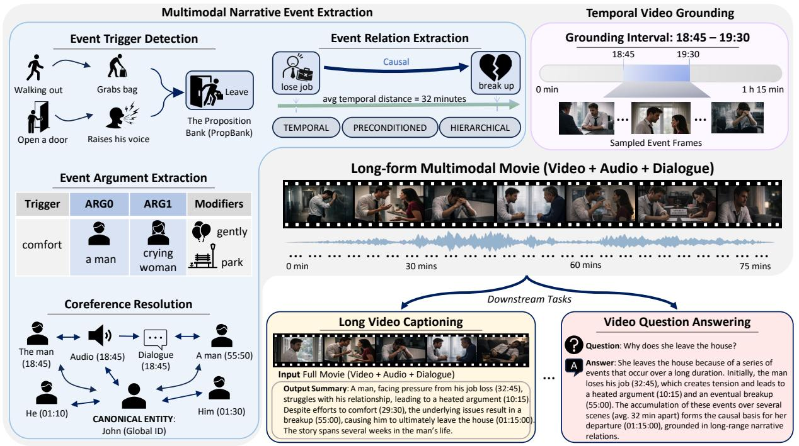

<details>
<summary>flowchart</summary>

```mermaid
graph TD
  A["Event Trigger Detection"] --> B["Walking out"]
  A --> C["Open a door"]
  A --> D["Grabs bag"]
  A --> E["Raises his voice"]
  A --> F["Leave"]
  G["Event Relation Extraction"] --> H["lose job"]
  G --> I["break up"]
  G --> J["TEMORAL"]
  G --> K["PRECONDITIONED"]
  G --> L["HIERARCHICAL"]
  M["Temporal Video Grounding"] --> N["Grounding Interval: 18:45 – 19:30"]
  N --> O["0 min"]
  N --> P["1 h 15 min"]
  N --> Q["Sampled Event Frames"]
    
  R["Event Argument Extraction"] --> S["Trigger: ARG0, ARG1, Modifiers: comfort, a man, crying woman, gently park"]
    
  T["Coreference Resolution"] --> U["The man (18:45), He (01:10), Audio (18:45), Dialogue (18:45), A man (55:50), CANONICAL ENTITY: John (Global ID)"]
    
  V["Long-form Multimodal Movie (Video + Audio + Dialogue)"] --> W["0 min"]
  V --> X["30 mins"]
  V --> Y["60 mins"]
  V --> Z["75 mins"]
    
  AA["Video Question Answering"] --> AB["Question: Why does she leave the house?"]
  AB --> AC["Output Summary: A man, facing pressure from his job loss (32:45), struggles with his relationship, leading to a heated argument (10:15). Despite efforts to comfort (29:30), the underlying issues result in a breakup (55:00), causing him to ultimately leave the house (01:15:00). The story spans several weeks in the man's life."]
    
  AC --> AD["..."]
  AD --> AE["Downstream Tasks"]
    
  AF["Event Trigger Detection"] --> AG["Leaves: The Proposition Bank (PropBank)"]
    
  AH["Event Argument Extraction"] --> AI["Text: csaal"]
  AH --> AJ["Text: csaal"]
  AH --> AK["Text: csaal"]
    
  AL["Long-form Multimodal Movie"] --> AM["Input Full Movie (Video + Audio + Dialogue)"]
    
  AI --> AN["Output Summary: A man, facing pressure from his job loss (32:45), struggles with his relationship, leading to a heated argument (10:15). Despite efforts to comfort (29:30), the underlying issues result in a breakup (55:00), causing him to ultimately leave the house (01:15:00). The story spans several weeks in the man's life."]
    
  AO["Video Question Answering"] --> AP["Question: Why does she leave the house?"]
```
</details>

Figure 1: NEST evaluates four narrative event tasks on full-length movies: Event Trigger Detection (ETD), Event Localization (EL), Event Argument Extraction (EAE), and Event Relation Extraction (ERE). Annotations are grounded in visual content, dialogue, and audio, and linked through relations that reflect narrative structure.

<table><tr><td>Dataset</td><td># Hrs</td><td>Avg.</td><td>Ann.</td><td>Eval.</td><td>Source Availability</td><td>Event</td><td>ERE</td><td>Multi-R</td><td>Audio</td></tr><tr><td>CinePile (Rawal et al., 2024)</td><td>418</td><td>2.67</td><td>Auto/Man.</td><td>MC</td><td>YT links</td><td>√</td><td>√</td><td>✗</td><td>√</td></tr><tr><td>EgoSchema (Mangalam et al., 2023)</td><td>253.2</td><td>3.00</td><td>Auto/Man.</td><td>MC</td><td>Videos</td><td>√</td><td>✗</td><td>✗</td><td>✗</td></tr><tr><td>EgoPlan-Bench2 (Qiu et al., 2024)</td><td>92.8</td><td>≤5</td><td>Auto/Man.</td><td>MC</td><td>Videos</td><td>✗</td><td>√</td><td>✗</td><td>✗</td></tr><tr><td>LongVideoBench (Wu et al., 2024)</td><td>494.9</td><td>7.89</td><td>Manual</td><td>MC</td><td>Videos</td><td>√</td><td>√</td><td>√</td><td>✗</td></tr><tr><td>Video-MMMU (Hu et al., 2025)</td><td>42.2</td><td>8.44</td><td>Manual</td><td>MC</td><td>Videos</td><td>✗</td><td>✗</td><td>✗</td><td>√</td></tr><tr><td>MovieChat-1K (Song et al., 2023)</td><td>156.7</td><td>9.40</td><td>Manual</td><td>MC+OE</td><td>Videos</td><td>√</td><td>✗</td><td>√</td><td>✗</td></tr><tr><td>MLVU (Zhou et al., 2024)</td><td>346</td><td>12.00</td><td>Auto/Man.</td><td>MC+OE</td><td>Videos</td><td>√</td><td>√</td><td>√</td><td>✗</td></tr><tr><td>Neptune (Nagrani et al., 2025b)</td><td>601.3</td><td>≤15</td><td>Auto/Man.</td><td>MC+OE</td><td>Videos</td><td>√</td><td>√</td><td>√</td><td>√</td></tr><tr><td>Video-MME (Long) (Fu et al., 2024)</td><td>596.4</td><td>39.76</td><td>Manual</td><td>MC</td><td>YT links</td><td>√</td><td>√</td><td>√</td><td>√</td></tr><tr><td>HourVideo (Chandrasegaran et al., 2024)</td><td>382.5</td><td>45.70</td><td>Auto/Man.</td><td>MC</td><td>Videos</td><td>√</td><td>√</td><td>√</td><td>✗</td></tr><tr><td>InfiniBench (Ataallah et al., 2024)</td><td>1066.3</td><td>52.59</td><td>Auto/Man.</td><td>MC+OE</td><td>Key frames</td><td>√</td><td>√</td><td>√</td><td>√</td></tr><tr><td>LVBench (Wang et al., 2024b)</td><td>117.3</td><td>68.35</td><td>Manual</td><td>MC</td><td>YT links</td><td>√</td><td>√</td><td>√</td><td>✗</td></tr><tr><td> $MF^2$ (Zaranis et al., 2025)</td><td>78.0</td><td>88.33</td><td>Manual</td><td>Claim pairs</td><td>Videos</td><td>√</td><td>√</td><td>√</td><td>√</td></tr><tr><td>NEST</td><td>1639.3</td><td>97.87</td><td>Auto/Man.</td><td>MC+OE</td><td>Videos | Video &amp; Image &amp; Audio Features</td><td>√</td><td>√</td><td>√</td><td>√</td></tr></table>

Table 1: Comparison of long-video understanding benchmarks. Columns show total video duration (Hrs), average clip length (Avg., min), annotation type (Ann.), evaluation format (Eval.; MC = multiple-choice, OE = open-ended), video source availability, support for event understanding (Event), event relation extraction (ERE), multi-scene reasoning (Multi-R), and audio usage (Audio).

Our contributions are:

• We introduce NEST, a dataset and benchmark for narrative event understanding in fulllength movies, with 1005 videos (avg. 98 min) including subtitles and annotations.  
• We introduce a multi-task framework covering event understanding, argument extraction, temporal localization, and causal relation extraction beyond multiple-choice formats.  
• We evaluate state-of-the-art models, revealing current long-video models struggle with narrative comprehension in full-length content.  
• We release video and audio features, code, and fine-tuned model checkpoints trained on NEST.

## 2 Related Work

Long-context vision models and benchmarks. Long-context models can now handle millions of tokens (Chen et al., 2023; Peng et al., 2023a; Grattafiori et al., 2024; Bai et al., 2024; Abdin et al., 2024), enabling visual reasoning over extended sequences (Alayrac et al., 2022; Liu et al., 2023; Bai et al., 2023; Wang et al., 2022; Song et al., 2023; Wang et al., 2024c; Chen et al., 2024b). While these systems excel at retrieval (Hsieh et al., 2024; Bai et al., 2024), they fail at reasoning over complex event relationships (Fang et al., 2024; Zhang, 2024). Benchmarks have driven progress in temporal reasoning over short clips (Xiao et al., 2021; Wu et al., 2021) and domain-specific settings (Mangalam et al., 2023; Qiu et al., 2024), but most focus on content under three minutes. Longer benchmarks (Wu et al., 2024; Chandrasegaran et al., 2024; Ataallah et al., 2024) fall short in duration or quality, and most use biased multiple-choice formats (Fu et al., 2024; Wang et al., 2024b). Neptune (Nagrani et al., 2025b) uses free-form answers but stays limited to 15 minutes. These benchmarks emphasize retrieval over reasoning about event structures and causal dependencies.

Event understanding datasets. Event Extraction (EE) identifies event types, triggers, and arguments through end-to-end (Luan et al., 2019; Lin et al., 2020; Huang and Peng, 2021) or pipeline methods (Liu et al., 2020; Du and Cardie, 2021). Multimodal EE extracts from images and videos (Chen et al., 2021a; Sanders et al., 2024; Li et al., 2020; Chen et al., 2021b). M2E2 (Li et al., 2020) jointly extracts events and arguments from text and images, and Video M2E2 (Chen et al., 2021b) extends this to short news videos with multimodal event coreference. MovieGraphs (Vicol et al., 2018) annotates human-centric situations in movie clips with interaction graphs but operates on short scenes rather than full-length narrative arcs. ImSitu (Yatskar et al., 2016) extracts structured representations from images, while VidSitu (Sadhu et al., 2021) and Grounded VidSitu (Khan et al., 2022) extract from short clips. These works build on PropBank (Palmer et al., 2005), a semantic role labeling resource that links verbs to predicate senses and structured argument roles (e.g., ARG0 for agent, ARG1 for patient, ARGM-LOC for location), which we also adopt to constrain our event ontology. These approaches focus on atomic events from 2-second clips and lack understanding of hierarchical structures across extended sequences. VidEvent (Liang et al., 2025) extends from seconds to minutes addressing narrative-level events, but operates on short clips. Moreover, none of these methods account for how individual events compose into broader narrative arcs or how causality propagates across distant scenes. NEST addresses this gap by requiring models to extract and relate high-level events across full-length movies, assessing understanding of semantic hierarchies and causal relationships spanning hours.

## 3 NEST

NEST builds upon existing movie datasets (Huang et al., 2020; Tapaswi et al., 2016) and harvests additional open-domain videos at least one hour long from the Library of Congress (Library of Congress, 2024), archive.org, PublicDomain-Movies (Public Domain Movie, 2025), YouTube, and other databases under fair use for research (U.S. Congress, 1976), resources not previously used for long-form video understanding. NEST consists of an automatically labeled training set and densely human-annotated evaluation set.

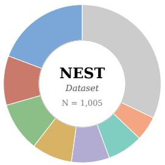

<details>
<summary>pie chart</summary>

NEST
Dataset N = 1,005
</details>

<table><tr><td>Drama</td><td>19.3%</td></tr><tr><td>Action</td><td>10.1%</td></tr><tr><td>Thriller</td><td>10.1%</td></tr><tr><td>Romance</td><td>8.3%</td></tr><tr><td>Comedy</td><td>7.8%</td></tr><tr><td>Sci-Fi</td><td>7.3%</td></tr><tr><td>Crime</td><td>5.0%</td></tr><tr><td>Others</td><td>32.1%</td></tr></table>

Figure 2: Genre distribution across the 1,005 movies in the NEST dataset.

<table><tr><td>Statistic</td><td>Value</td></tr><tr><td>Avg. Movie Duration</td><td>97.87 min</td></tr><tr><td>Avg. Plot Length</td><td>554.09 words</td></tr><tr><td>Avg. # Scenes per Movie</td><td>160.61</td></tr><tr><td>Avg. Words per Scene Audio Description</td><td>85.52</td></tr></table>

Table 2: Scene-level, duration, and text-length statistics for movies in the NEST dataset.

## 3.1 Data Collection and Processing.

We collected metadata including plot summaries, synopses, and scripts from IMDb, Wikipedia, OpenSubtitles, and existing datasets. Audio Description (AD) tracks from AudioVault (Audio-Vault contributors, 2025) provided professional narration of visual content. We transcribed these using Whisper (Radford et al., 2022) and employed LLMs to fix errors and improve alignment. For coreference resolution, we assigned unique identifiers to each entity to maintain consistency throughout videos, using Maverick (Martinelli et al., 2024) and LLM-based methods (Gan et al., 2024). Videos were segmented using PySceneDetect (Castellano and contributors, 2025) at natural scene transitions.

Audio Description as Event Source. We used transcribed movie audio descriptions to detect events, following prior work (Rohrbach et al., 2015; Park et al., 2025; Han et al., 2023b,a, 2024) that highlights the importance of audio descriptions as high-quality, human-created visual narratives. Movie audio descriptions are explicitly written to describe on-screen visual content for visually impaired audiences, making them reliable gold captions that closely align with visual events and actions (Rohrbach et al., 2015). Recent studies further emphasize the narrative richness and temporal coherence of audio descriptions for modeling complex event structures in movies, both in automatic generation settings and downstream understanding tasks (Park et al., 2025; Han et al., 2023b,a, 2024). Leveraging these human-authored descriptions allows us to ground event extraction in semantically precise and visually faithful textual representations, improving the quality of extracted triggers, arguments, and event relations.

<table><tr><td>Dataset</td><td># Videos</td><td>Avg. Video Len. (s)</td><td>Total Hours</td><td>Events / Video</td><td>Args / Event</td><td>Relations / Video</td><td>Avg. Temp. Dist. between Events</td></tr><tr><td>VidSitu (Sadhu et al., 2021) &amp; GVSR (Khan et al., 2022)</td><td>29,200</td><td>10.0</td><td>81.1</td><td>6.58</td><td>3.83</td><td>3.62</td><td>3.2 sec</td></tr><tr><td>VidEvent (Liang et al., 2025)</td><td>1,110</td><td>82.0</td><td>25.3</td><td>21.61</td><td>3.37</td><td>15.79</td><td>6.2 sec</td></tr><tr><td>NEST (Ours)</td><td>1,005</td><td>5,872.2</td><td>1,639.3</td><td>102.00</td><td>2.95</td><td>5100.00</td><td>1920 sec</td></tr></table>

Table 3: Comparison of dataset statistics for video event extraction benchmarks. Columns report the number of videos, average video length (in seconds), total duration (in hours), average number of events per video, average number of arguments per event, average number of event relation pairs per video, and the average temporal distance between events.Khan et al. (2022) shares the same underlying dataset as VidSitu (Sadhu et al., 2021).

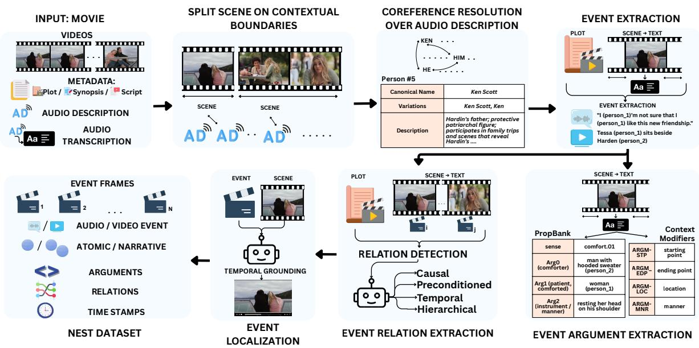

<details>
<summary>flowchart</summary>

```mermaid
graph TD
  A["INPUT: MOVIE"] --> B["SPLIT SCENE ON CONTEXTUAL BOUNDARIES"]
  B --> C["COREFERENCE RESOLUTION OVER AUDIO DESCRIPTION"]
  C --> D["EVENT EXTRACTION"]
  D --> E["EVENT ARGUMENT EXTRACTION"]

    subgraph NEST_Dataset
        F["DATA: NET"]
        G["DATA: NET"]
        H["DATA: NET"]
        I["DATA: NET"]
        J["DATA: NET"]
        K["DATA: NET"]
        L["DATA: NET"]
        M["DATA: NET"]
        N["DATA: NET"]
        O["DATA: NET"]
        P["DATA: NET"]
        Q["DATA: NET"]
        R["DATA: NET"]
        S["DATA: NET"]
        T["DATA: NET"]
    end

    subgraph EVENT_LOCALIZATION
        U["EVENT FLAMES"]
        V["EVENT FLAMES"]
        W["EVENT FLAMES"]
        X["EVENT FLAMES"]
        Y["EVENT FLAMES"]
        Z["EVENT FLAMES"]
        AA["EVENT FLAMES"]
        AB["EVENT FLAMES"]
        AC["EVENT FLAMES"]
        AD["EVENT FLAMES"]
        AE["EVENT FLAMES"]
        AF["EVENT FLAMES"]
    end

    subgraph EVENT_RELATION_EXTRACTION
        AG["RELATION DETECTION"]
        AH["RELATION DETECTION"]
        AI["RELATION DETECTION"]
        AJ["RELATION DETECTION"]
        AK["RELATION DETECTION"]
        AL["RELATION DETECTION"]
        AM["RELATION DETECTION"]
        AN["RELATION DETECTION"]
        AO["RELATION DETECTION"]
        AP["RELATION DETECTION"]
        AQ["RELATION DETECTION"]
        AR["RELATION DETECTION"]
        AS["RELATION DETECTION"]
        AT["RELATION DETECTION"]
        AU["RELATION DETECTION"]
        AV["RELATION DETECTION"]
        AW["RELATION DETECTION"]
        AX["RELATION DETECTION"]
        AY["RELATION DETECTION"]
        AZ["RELATION DETECTION"]
        BA["RELATION DETECTION"]
        BB["RELATION DETECTION"]
        BC["RELATION DETECTION"]
        BD["RELATION DETECTION"]
        BE["RELATION DETECTION"]
        BF["RELATION DETECTION"]
        BG["RELATION DETECTION"]
        BH["RELATION DETECTION"]
        BI["RELATION DETECTION"]
        BJ["RELATION DETECTION"]
        BK["RELATION DETECTION"]
        BL["RELATION DETECTION"]
    end

    subgraph EVENTArgument_EXTRACTION
  BM["PLOT"] --> BN["PLOT"] --> BO["PLOT"] --> BP["PLOT"] --> BQ["PLOT"] --> BR["PLOT"] --> BS["PLOT"] --> BT["PLOT"] --> BU["PLOT"] --> BV["PLOT"] --> BW["PLOT"] --> BX["PLOT"] --> BY["PLOT"] --> BZ["PLOT"] --> CA["PLOT"] --> CB["PLOT"] --> CC["PLOT"] --> DA["PLOT"] --> DB["PLOT"] --> DC["PLOT"] --> DD["PLOT"] --> DE["PLOT"] --> DF["PLOT"] --> DG["PLOT"] --> DH["PLOT"] --> DI["PLOT"] --> DJ["PLOT"] --> DK["PLOT"] --> DL["PLOT"] --> DV["PLOT"] --> DW["PLOT"] --> DX["PLOT"] --> DXP["PLOT"] --> DXP
    end

    subgraph Context_Modifiers
  BO_PLOT --> BP_PLOT --> BJ_PLOT --> BC_PLOT --> BD_PLOT --> BE_PLOT --> BF_PLOT --> BG_PLOT --> BH_PLOT --> BI_PLOT --> BJ_PLOT --> BK_PLOT --> DA_PLOT --> DB_PLOT --> DC_PLOT --> DX_PLOT --> DXP
    end

    subgraph PropBank
  BI_PLOT --> BJ_PLOT --> BK_PLOT --> BZ_PLOT --> DC_PLOT
    end

    subgraph Context_Modifiers
  BI_PLOT --> BJ_PLOT --> BK_PLOT --> BE_PLOT --> BH_PLOT --> BJ_PLOT --> BK_PLOT --> DA_PLOT
    end

    style NEST_Dataset fill:#f9f,stroke:#333
    style EVENT_LOCALIZATION fill:#ccf,stroke:#333
    style EVENT_RELATION_EXTRACTION fill:#cfc,stroke:#333
    style EVENTArgument_EXTRACTION fill:#fcc,stroke:#333
```
</details>

Figure 3: Full-length movies with plots/scripts and audio descriptions (AD) are segmented into scenes at contextual boundaries, and we run coreference on AD to build a unified entity table. For each scene, we extract audio and visual events, recover PropBank arguments and modifiers, and link events with relations. A temporal grounding stage localizes every event to timestamps, giving specific event frames that form the NEST dataset.

## 3.2 Event Annotation Pipeline

Event Trigger Detection. We extracted event triggers, which indicate when events occur and are denoted as $t _ { i }$ for event $e _ { i } ,$ using a combination of supervised models and LLM-based methods. In particular, we employed OmniEvent (Peng et al., 2023b) for open-domain trigger detection and augmented it with LLM-based extraction constrained to a predefined predicate set. Following VidSitu (Sadhu et al., 2021), we adopted PropBankselected verbs as the trigger vocabulary to ensure consistency across events and reduce spurious detections. This setup enabled robust identification of both atomic and narrative-level event triggers across diverse textual inputs.

Event Argument Extraction. We extracted event arguments, which capture the participants and contextual details of events and are denoted as $a _ { i j }$ for argument $j$ of event i, using LLM-based semantic role extraction from captions and scripts. To improve reliability and coverage, we supplemented LLM outputs with predictions from GLEN and OmniEvent. All arguments followed Prop-Bank conventions, including core roles such as ARG0 and ARG1, as well as modifier roles such as ARGM-LOC for location and ARGM-TMP for time, enabling structured and consistent representation of event semantics.

Event Relation Extraction. We extracted event relations, which model how events are connected and are denoted as $\boldsymbol { r } ( \boldsymbol { e } _ { i } , \boldsymbol { e } _ { j } )$ . These relations included temporal relations (before, after, overlap), as well as causal, hierarchical, and coreference relationships. We identified event relations using

LLM-based methods with text-based extraction techniques inspired by prior document-level event extraction work. This approach allowed us to capture coherent event structures and dependencies across multiple events within complex narratives.

Video Event Localization. We localized events to video timestamps $[ t _ { s } , t _ { e } ]$ using state-of-the-art temporal video grounding models (Wang et al., 2025b) and Gemini 2.5-Pro (Comanici et al., 2025). This problem can also be framed as a temporal video grounding task, where the goal is to align a natural-language event description with its corresponding time segment in the video. To assess their capability, we created a test set with short videos from VidEvent (Liang et al., 2025). These methods struggled with videos of only a few minutes (see Appendix A), and we will improve grounding quality as methods advance. As a conservative fallback, we therefore used the scene boundaries containing each event as its time boundaries, which provides a safe, high-recall temporal localization.

Annotation Protocol. We constructed a largescale SILVER event annotation dataset by annotating 1,005 movies using an LLM-assisted (Grok-4.1 Fast) (xAI et al., 2025) pipeline. The annotations covered 68 visually observed events, 31 dialogue-content-based events, and 3 audio events, enabling comprehensive multimodal event coverage. During the creation and verification process, we consumed approximately 100 billion tokens. To ensure annotation quality, we employed a twostep verification strategy in which extracted events were jointly validated against both movie plot summaries and movie audio descriptions. In addition to the SILVER dataset, we curated a high-quality GOLD benchmark by fully annotating 5 movies, each containing approximately 70 events and 50 event relations.

The GOLD annotations were produced by five contracted human annotators, who were trained on our custom annotation platform and compensated at a rate of \$15 per hour. The total cost of human annotation was approximately \$600, allowing us to balance annotation quality, scalability, and cost efficiency. We evaluated annotation consistency using weighted Cohen’s κ and mean semantic similarity, measuring both inter-annotator agreement on the GOLD set and agreement between GOLD and SILVER annotations (Figure 6). Specifically, GOLD-SILVER weighted Cohen’s κ is approximately 0.50, compared to inter-annotator κ of approximately 0.57 on the GOLD set, indicating that the SILVER pipeline tracks human judgments at roughly 86–88% of observed human-human consistency. This narrow gap suggests the scalable annotation process is aligned with independent human annotation at a level close to the variation between human annotators themselves.

Dataset Statistics and Data Release. NEST uses an 80/15/5 train/validation/test split, with videos from the same movie appearing in only one split. We release pre-extracted video-level features, frame-level features computed using models (Tschannen et al., 2025; Radford et al., 2021; Oquab et al., 2024), and audio features using models (Baevski et al., 2020; Elizalde et al., 2022), to facilitate research without requiring access to the full videos under our user agreement. In addition, we will release a subset of full-length movie videos that are in the public domain or available under permissive open licenses, enabling end-to-end research without access restrictions.

The downstream tasks shown in Figure 1, including long-video captioning and video question answering, are supported by NEST narrative information extraction but are not directly evaluated in this work. NEST instead benchmarks structured extraction and reasoning over narrative events.

## 4 Experiments

## 4.1 Training Setup

We fine-tune Qwen3-Omni-30B-A3B-Instruct on full-length movie inputs using 8 NVIDIA H200 GPUs with mixed-precision training. The visual encoder and multimodal alignment layers are frozen, and language model parameters are updated via low-rank adaptation (Hu et al., 2021), preserving pretrained visual representations while enabling stable optimization under memory constraints. Since full-length movies span 2 to 3 hours and contain many visually redundant frames, we sparsely sample video inputs at 0.1 FPS. We use gradient checkpointing to reduce activation memory and Flash Attention (Dao et al., 2022) to support the resulting long-context sequences. Additional training details, token budget calculations, and per-baseline sampling configurations are provided in Appendix A.5.

## 4.2 Benchmark Tasks

We define four complementary tasks over fulllength movies. Event trigger detection (ETD) asks models to identify the narrative event given video

V and scene boundaries $[ t _ { s } , t _ { e } ]$ . Models return a trigger verb and context that captures the storylevel action taking place in the scene, rather than surface-level physical motions. Event localization (EL) is formulated as scene-level narrative grounding: given an event description (verbs and arguments), models predict temporal boundaries $[ \hat { t } _ { s } , \hat { t } _ { e } ]$ for where that event occurs in the movie, evaluated by checking whether predictions fall within the ground-truth scene boundaries. We adopt scenelevel evaluation rather than frame-precise boundaries because narrative event boundaries are inherently subjective, and even state-of-the-art temporal grounding models struggle on short videos (Appendix A.2). With ∼160 scenes per movie, identifying the correct scene still requires aligning events across a 1–3 hour narrative with long gaps, subplots, and flashbacks. Event argument extraction (EAE) provides a trigger and semantic roles within a scene and asks models to fill in the argument values, such as who performed the action, who was affected, and where it took place. Event relation extraction (ERE) gives models a pair of events $( e _ { i } , e _ { j } )$ （20 specified by their definitions and asks them to predict the relation ${ \hat { r } } ( e _ { i } , e _ { j } ) \in$ {temporal, causal, preconditioned, hierarchical, coreference, no relation}, measured by Precision, Recall, and F1 directly against ground-truth labels. Since non-linear temporal structure is common in movies, we also evaluate models on flashback detection as a separate subset of ERE.

Text-Only Narrative Event Extraction. In addition to the video-based tasks above, we evaluate a text-only variant to isolate language-only performance. Here we replace video input with captions produced by Gemini 2.5 Pro (Comanici et al., 2025) for each scene and perform event extraction purely from text. We treat audio descriptions as a privileged modality since they are not consistently available across videos, and instead use automatically generated captions to provide a uniformly applicable text-only baseline. We report Precision, Recall, and F1@k against the same ground-truth events (Table 6).

## 4.3 Baselines

We evaluate NEST using a range of state-of-the-art long video understanding and multimodal models shown in Table 4, including Qwen3-VL (Team, 2025), Qwen3-Omni (Xu et al., 2025b), Qwen2.5- VL (Bai et al., 2025), InternVL 3.5 (Wang et al.,

2025a), Video-LLaMA3 (Zhang et al., 2025a), LLaVA-Video (Zhang et al., 2024), OVIS2.5 (Lu et al., 2025), Flash-VStream-Qwen (Zhang et al., 2025b), and LongVU (Shen et al., 2024). These models are evaluated on multiple complementary tasks: (1) event trigger detection (ETD), (2) event localization (EL), (3) event argument extraction (EAE), (4) event relation extraction (ERE) across relation types, and (5) flashback relation identification, which isolates non-linear temporal reasoning beyond linear event timelines.

## 4.4 Evaluation Metrics

We match the evaluation method to the nature of each task’s output. ERE predictions come from a closed set of six relation types, so we compute F1 directly without any judge, reporting both overall and per-type scores. EL compares predicted timestamps against ground-truth scene boundaries via automatic overlap, and we additionally report flashback-subset F1 for non-linear temporal reasoning. ETD and EAE produce open-ended outputs where exact matching is too brittle. A model predicting “fight” for ground-truth “attack” has identified the correct event, and the same character may appear as “the detective” or “Officer Miller” across different models. For these two tasks, we use an LLM-based judge to assess semantic equivalence. Full details on the judge model, prompts are provided in Appendix A.6.

## 5 Results and Analysis

NEST is designed to test two distinct capabilities that are often conflated in long-video work: (i) grounded narrative event discovery (detecting what happens, where it happens, and who/what is involved), and (ii) reasoning over an event graph once candidate events are specified. Tables 4 - 6 together show that current long-video models struggle primarily with the first capability, and only partially succeed at the second.

Chance baselines establish that low scores reflect task difficulty, not evaluation breakage. EL is a selection problem with ∼160 scene candidates per movie, giving a random chance floor of ∼0.6%. The best zero-shot model achieves 5.89% (Qwen3- VL 30B), approximately 9× random. ETD and EAE are evaluated under a permissive synonymtolerant LLM judge against the PropBank vocabulary, where paraphrases are accepted as correct. Under this forgiving setup, the best scores remain below 8% and 11%. ERE reaches 35.45% F1 zero-shot through the same evaluation pipeline, ruling out a parsing or judge artifact that uniformly collapses scores. Together these reference points show that grounded narrative event discovery is genuinely hard for current models, while relation classification given events is more tractable.

<table><tr><td rowspan="2">Method</td><td rowspan="2">#Params</td><td rowspan="2">#Frames</td><td>ETD</td><td>EL</td><td>EAE</td><td colspan="7">ERE - F1 (%)</td></tr><tr><td>Acc (%)</td><td>Acc (%)</td><td>Acc (%)</td><td>no_rel</td><td>coref</td><td>hier</td><td>precond</td><td>temp</td><td>causal</td><td>overall</td></tr><tr><td colspan="13">Zero-shot 1fps models</td></tr><tr><td>Qwen3-VL (8B) (Team, 2025)</td><td>8B</td><td>1fps</td><td>3.42</td><td>0.87</td><td>3.03</td><td>39.61</td><td>35.68</td><td>0.00</td><td>0.00</td><td>0.38</td><td>31.34</td><td>20.94</td></tr><tr><td>Qwen3-VL (30B) (Team, 2025)</td><td>30B</td><td>1fps</td><td>3.48</td><td>5.89</td><td>4.60</td><td>37.52</td><td>55.46</td><td>42.11</td><td>0.00</td><td>0.00</td><td>14.90</td><td>26.79</td></tr><tr><td>Qwen3-Omni (Xu et al., 2025b)</td><td>30B</td><td>1fps</td><td>3.20</td><td>0.44</td><td>7.40</td><td>8.99</td><td>26.67</td><td>8.22</td><td>11.76</td><td>14.29</td><td>44.87</td><td>17.68</td></tr><tr><td>Qwen2.5-VL (7B) (Bai et al., 2025)</td><td>7B</td><td>1fps</td><td>4.33</td><td>0.66</td><td>3.93</td><td>26.56</td><td>41.38</td><td>0.00</td><td>0.00</td><td>4.22</td><td>8.31</td><td>15.29</td></tr><tr><td>Qwen2.5-VL (32B) (Bai et al., 2025)</td><td>32B</td><td>1fps</td><td>1.67</td><td>0.26</td><td>3.38</td><td>42.79</td><td>61.95</td><td>50.52</td><td>5.61</td><td>10.21</td><td>34.31</td><td>35.45</td></tr><tr><td>LongVU-LLaMA3 (Shen et al., 2024)</td><td>3B</td><td>1fps</td><td>1.38</td><td>0.61</td><td>0.31</td><td>5.39</td><td>0.00</td><td>2.66</td><td>5.05</td><td>0.00</td><td>31.79</td><td>7.18</td></tr><tr><td>LongVU-Qwen2 (Shen et al., 2024)</td><td>7B</td><td>1fps</td><td>0.49</td><td>0.41</td><td>1.55</td><td>16.96</td><td>0.00</td><td>2.50</td><td>0.00</td><td>0.00</td><td>34.28</td><td>10.10</td></tr><tr><td>Video-LLaMA3 (Zhang et al., 2025a)</td><td>7B</td><td>1fps</td><td>2.76</td><td>0.92</td><td>0.00</td><td>37.50</td><td>26.32</td><td>8.33</td><td>6.61</td><td>13.71</td><td>27.50</td><td>22.50</td></tr><tr><td colspan="13">Zero-shot frame-selection models</td></tr><tr><td>OVIS2.5 (Lu et al., 2025)</td><td>9B</td><td>8</td><td>7.27</td><td>0.00</td><td>10.62</td><td>37.35</td><td>28.57</td><td>0.00</td><td>0.00</td><td>5.45</td><td>24.10</td><td>18.97</td></tr><tr><td>InternVL3.5 (Wang et al., 2025a)</td><td>30B</td><td>32</td><td>2.34</td><td>0.53</td><td>2.89</td><td>37.50</td><td>56.07</td><td>22.12</td><td>4.04</td><td>4.79</td><td>18.52</td><td>25.79</td></tr><tr><td>LlaVA-Video (Zhang et al., 2024)</td><td>7B</td><td>64</td><td>7.98</td><td>0.33</td><td>10.25</td><td>4.62</td><td>0.00</td><td>10.60</td><td>0.00</td><td>0.00</td><td>37.71</td><td>8.22</td></tr><tr><td colspan="13">Zero-shot online streaming models</td></tr><tr><td>Flash-VStream-Qwen (Zhang et al., 2025b)</td><td>7B</td><td>1fps (stream)</td><td>3.98</td><td>0.53</td><td>1.25</td><td>35.22</td><td>15.38</td><td>8.57</td><td>0.00</td><td>0.00</td><td>10.67</td><td>15.01</td></tr><tr><td colspan="13">Finetuned</td></tr><tr><td>Finetuned Qwen3-Omni (Ours)</td><td>30B</td><td>1fps</td><td>6.09</td><td>0.45</td><td>10.5</td><td>15.58</td><td>100.00</td><td>76.82</td><td>38.26</td><td>2.44</td><td>62.12</td><td>44.42</td></tr></table>

Table 4: Performance across narrative understanding tasks, including video narrative event trigger detection (ETD), video narrative event localization (EL), video narrative event argument extraction (EAE), and video narrative event relation extraction (ERE).

<table><tr><td>Model</td><td>Precision</td><td>Recall</td><td>F1</td></tr><tr><td>Gemini 2.5 Pro (Comanici et al., 2025)*</td><td>22.58</td><td>34.18</td><td>21.09</td></tr><tr><td>GPT-5 (Singh et al., 2025a)*</td><td>40.95</td><td>44.64</td><td>40.80</td></tr><tr><td>Qwen3-VL (8B) (Team, 2025)</td><td>18.39</td><td>44.74</td><td>20.94</td></tr><tr><td>Qwen3-VL (30B) (Team, 2025)</td><td>31.06</td><td>48.08</td><td>26.79</td></tr><tr><td>Qwen3-Omni (Xu et al., 2025b)</td><td>23.19</td><td>37.90</td><td>17.68</td></tr><tr><td>Qwen2.5-VL (7B) (Bai et al., 2025)</td><td>18.05</td><td>33.96</td><td>15.29</td></tr><tr><td>Qwen2.5-VL (32B) (Bai et al., 2025)</td><td>42.31</td><td>50.54</td><td>35.45</td></tr><tr><td>LongVU-LLaMA3 (Shen et al., 2024)</td><td>9.55</td><td>11.05</td><td>7.18</td></tr><tr><td>LongVU-Qwen2 (Shen et al., 2024)</td><td>10.31</td><td>16.10</td><td>10.10</td></tr><tr><td>Video-LLaMA3 (Zhang et al., 2025a)</td><td>23.82</td><td>32.84</td><td>22.50</td></tr><tr><td>OVIS2.5 (Lu et al., 2025)</td><td>20.07</td><td>42.60</td><td>18.97</td></tr><tr><td>InternVL3.5 (Wang et al., 2025a)</td><td>31.63</td><td>43.80</td><td>25.79</td></tr><tr><td>LlaVA-Video (Zhang et al., 2024)</td><td>15.51</td><td>15.49</td><td>8.22</td></tr><tr><td>Flash-VStream-Qwen (Zhang et al., 2025b)</td><td>15.84</td><td>32.26</td><td>15.01</td></tr></table>

Table 5: Video Narrative Event Relation Extraction (ERE) zero-shot performance. F1 is macro-averaged across the six relation types, while Precision and Recall are reported at the prediction level. \*Gemini 2.5 Pro and GPT-5 are evaluated on 10 videos, incurring approximately \$500 in API cost. See Table 12 for GPT-5 per-task breakdown.

<table><tr><td>Model</td><td>P@5</td><td>R@5</td><td>F1@5</td><td>P@10</td><td>R@10</td><td>F1@10</td></tr><tr><td colspan="7">Vision-Language Models</td></tr><tr><td>Gemini 2.5 Pro (Comanici et al., 2025)</td><td>4.20</td><td>7.87</td><td>5.23</td><td>4.20</td><td>7.87</td><td>5.23</td></tr><tr><td colspan="7">Text Only EE Methods</td></tr><tr><td>GLEN (Li et al., 2023)</td><td>5.6</td><td>15.3</td><td>8.2</td><td>5.9</td><td>17.6</td><td>8.8</td></tr><tr><td>OmniEvent (Peng et al., 2023b)</td><td>6.7</td><td>5.4</td><td>6.0</td><td>6.8</td><td>5.9</td><td>6.3</td></tr></table>

Table 6: Video Narrative Event Extraction performance measured by Precision (P), Recall (R), and F1 score @ [5, 10]. Evaluation done on 337 scenes across 10 videos.

Event argument extraction (EAE) (Table 4) remains below 11% accuracy for all methods. Even when a correct trigger is plausible, models often fail to recover structured information such as participants, roles, and attributes. This gap is particularly important for narrative understanding because downstream relation links depend on consistent entities and roles across distant scenes.

Finding 1: Grounded narrative event discovery remains largely unsolved. ETD stays below 8%, EL below 6%, and EAE below 11% across all models. Increasing frame count does not help, indicating the bottleneck is narrative abstraction and temporal grounding, not visual coverage.

Event relation extraction (ERE) (Table 4) is substantially easier when events are provided, but temporal structure remains weak. Given there are a fixed number of relations to classify between, this task is easier for models. Our results show that models sometimes reason about relations conditional on having event descriptions, but they struggle to discover and ground those events from raw movies in the first place. Zero-shot ERE peaks at 35.45% F1 (Qwen2.5-VL 32B (Bai et al., 2025)), and our fine-tuned model improves overall ERE to 44.42% F1. Nevertheless, performance varies sharply by relation type. Coreference and (to a lesser extent) causal relations are learned more reliably, while temporal, precondition, and hierarchical relations remain challenging for many models. This is consistent with the long-range narrative dependencies in NEST (Figure 7), where related events can be separated by large temporal gaps and intervening scenes.

Fine-tuning helps reasoning more than grounding. Fine-tuning Qwen3-Omni on NEST substantially improves ERE (44.42% F1 overall; Table 4), but does not yield comparable gains in ETD/EL. This divergence provides an informative separation between conditional reasoning and grounded discovery in full-length narratives. ERE is a conditional closed-set task where both events are already specified, so the model mainly learns to classify a relation between provided event descriptions. ETD and EL are fundamentally different: they require the model to search over the full movie, infer storylevel abstractions from low-level multimodal evidence, and ground those abstractions to the correct scene among ∼160 candidates. Our error analysis (Appendix A.7, Tables 14–15) supports this reading: ETD failures are dominated by wrong narrative events (78%) and atomic-verb defaults (22%), EL failures are almost entirely wrong-scene predictions (98.6%), and EAE failures are overwhelmingly entity confusions (90%). These patterns indicate that fine-tuning can improve the decision rule once the event abstraction is provided, but does not by itself give the model robust long-range visual memory, entity tracking, or narrative abstraction.

Event Argument Extraction  
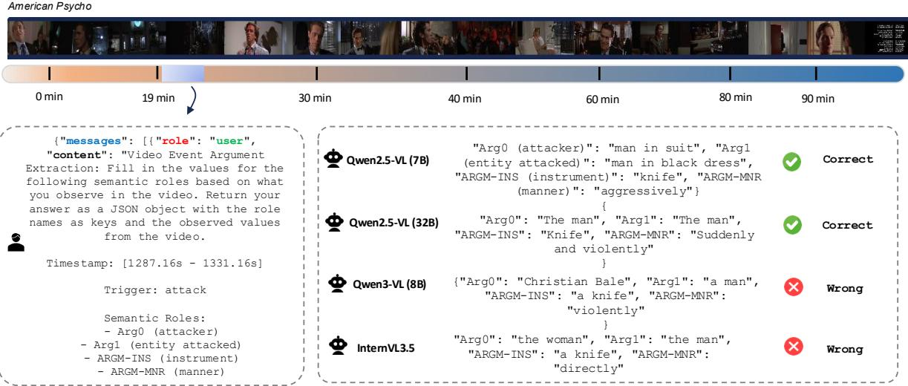

<details>
<summary>text_image</summary>

American Psycho
0 min	19 min	30 min	40 min	60 min	80 min	90 min
{"messages": [{"role": "user",
"content": "Video Event Argument
Extraction: Fill in the values for the
following semantic roles based on what
you observe in the video. Return your
answer as a JSON object with the role
names as keys and the observed values
from the video.
Timestamp: [1287.16s - 1331.16s]
Trigger: attack
Semantic Roles:
- Arg0 (attacker)
- Arg1 (entity attacked)
- ARGM-INS (instrument)
- ARGM-MNR (manner)
Qwen2.5-VL (7B)	"Arg0 (attacker)": "man in suit", "Arg1
(entity attacked)": "man in black dress",
"ARGM-INS (instrument)": "knife", "ARGM-MNR
(manner)": "aggressively"}
{
"Arg0": "The man", "Arg1": "The man",
"ARGM-INS": "Knife", "ARGM-MNR": "Suddenly
and violently"
}
Qwen2.5-VL (32B)	"Arg0": "The man", "Arg1": "The man",
"ARGM-INS": "Knife", "ARGM-MNR": "Suddenly"
}
Qwen3-VL (8B)	{"Arg0": "Christian Bale", "Arg1": "a man",
"ARGM-INS": "a knife", "ARGM-MNR":
"violently"
}
InternVL3.5	"Arg0": "the woman", "Arg1": "the man",
"ARGM-INS": "a knife", "ARGM-MNR":
"directly"
Correct	Correct	Wrong	Wrong
</details>

Figure 4: Event Argument Extraction example from American Psycho (102 min). Given the ”attack” event trigger and four semantic roles (ARG0: attacker, ARG1: entity attacked, ARGM-INS: instrument, ARGM-MNR: manner), models extract argument values. Both Qwen2.5-VL variants (7B and 32B) correctly identify all roles, with the 7B model providing richer visual descriptions. Qwen3-VL (8B) hallucinates a celebrity name (”Christian Bale”) as the attacker, illustrating a failure mode where models inject pre-training knowledge rather than describing what is observed in the video. InternVL3.5 swaps the attacker and victim roles, identifying the correct participants but assigning them to the wrong semantic roles.

Flashback relations. To further probe nonlinear temporal reasoning, we evaluate models on the NEST flashback subset (Table 13), which isolates event relations that violate linear chronological order. Performance drops catastrophically: five of seven models achieve 0.00 F1, with only Qwen2.5-VL (32B) (Bai et al., 2025) demonstrating any capability at 28.57%. Notably, larger models including InternVL3.5 (30B) (Zhu et al., 2025) and both Qwen3-VL (Team, 2025) variants completely fail despite stronger performance on general event relation extraction. These results suggest that non-linear temporal reasoning poses a distinct challenge beyond standard temporal ordering, as current models rely heavily on implicit linear timeline assumptions, limiting their ability to handle narrative constructs such as flashbacks, memory recall, etc., common in real-world videos.

Finding 2: Non-linear temporal reasoning is catastrophically hard. Six of seven models achieve very low performance on flashback relations, revealing that current models rely on implicit linear timeline assumptions that break down under real-world narrative structures.

## 6 Conclusion

We introduce NEST, a benchmark for narrative event understanding in full-length movies with structured annotations, temporal boundaries, and inter-event relations across 1005 films grounded in visual content, dialogue, and audio. State-ofthe-art models struggle across all tasks, revealing that long video processing does not yield narrativelevel comprehension. Results highlight the need for narrative abstraction, temporal reasoning, and hierarchical understanding beyond frame sampling.

## 7 Limitations

Our annotation pipeline uses LLMs for verifying detected narrative events, which may introduce errors or biases inherent to these models. While we use state-of-the-art temporal grounding models for event localization, these methods struggle even on short videos (see Appendix A.2), which is why we evaluate at scene-level rather than frame-precise temporal boundaries. This scene-level evaluation may not capture fine-grained temporal understanding. Additionally, NEST annotates events within individual scenes, which means that events that can only be detected by jointly reasoning across multiple scenes (e.g., a gradual character transformation or a subplot that unfolds over several non-adjacent scenes) are not represented in the current annotation. Capturing such cross-scene composite events is an important direction for future work. Due to copyright restrictions, we can only release preextracted video-level, frame-level, and audio features rather than the raw videos themselves, which may limit certain types of analysis or model development. Finally, our LLM-as-a-judge evaluation for event trigger detection and event argument extraction, while necessary for semantic matching, introduces potential biases from the judge model’s own limitations in narrative comprehension.

## 8 Ethical Considerations

NEST uses publicly available movies from the Library of Congress, archive.org, PublicDomain-Movies, YouTube, and other databases under fair use for academic research. We do not redistribute copyrighted raw videos. For non-public-domain content we release only pre-extracted features under a research-only agreement. Additionally we release a subset of public-domain/permissively licensed movies for fully reproducible experiments. Movies may contain biases, stereotypes, or problematic representations from their time of creation, which models may inadvertently learn. We encourage responsible use of NEST solely for advancing narrative understanding research and discourage applications enabling surveillance, manipulation, or other harmful uses.

AI Assistants were used for some writing and coding assistance. However, all the design and implementation decisions were fully done by the authors.

## References

Marah Abdin, Jyoti Aneja, Hany Awadalla, Ahmed Awadallah, Ammar Ahmad Awan, Nguyen Bach, Amit Bahree, Arash Bakhtiari, Jianmin Bao, Harkirat Behl, Alon Benhaim, Misha Bilenko, Johan Bjorck, Sébastien Bubeck, Martin Cai, Qin Cai, Vishrav Chaudhary, Dong Chen, Dongdong Chen, and 110 others. 2024. Phi-3 technical report: A highly capable language model locally on your phone. Preprint, arXiv:2404.14219.  
Jean-Baptiste Alayrac, Jeff Donahue, Pauline Luc, Antoine Miech, Iain Barr, Yana Hasson, Karel Lenc, Arthur Mensch, Katherine Millican, Malcolm Reynolds, and 1 others. 2022. Flamingo: a visual language model for few-shot learning. Advances in neural information processing systems, 35:23716– 23736.  
Kirolos Ataallah, Chenhui Gou, Eslam Abdelrahman, Khushbu Pahwa, Jian Ding, and Mohamed Elhoseiny. 2024. Infinibench: A comprehensive benchmark for large multimodal models in very long video understanding. Preprint, arXiv:2406.19875.  
AudioVault contributors. 2025. Audiovault. https: //audiovault.net. Accessed: 2025-06-21.  
Alexei Baevski, Yuhao Zhou, Abdelrahman Mohamed, and Michael Auli. 2020. wav2vec 2.0: A framework for self-supervised learning of speech representations. Advances in neural information processing systems, 33:12449–12460.  
Jinze Bai, Shuai Bai, Shusheng Yang, Shijie Wang, Sinan Tan, Peng Wang, Junyang Lin, Chang Zhou, and Jingren Zhou. 2023. Qwen-vl: A versatile visionlanguage model for understanding, localization, text reading, and beyond. Preprint, arXiv:2308.12966.  
Shuai Bai, Keqin Chen, Xuejing Liu, Jialin Wang, Wenbin Ge, Sibo Song, Kai Dang, Peng Wang, Shijie Wang, Jun Tang, Humen Zhong, Yuanzhi Zhu, Mingkun Yang, Zhaohai Li, Jianqiang Wan, Pengfei Wang, Wei Ding, Zheren Fu, Yiheng Xu, and 8 others. 2025. Qwen2.5-vl technical report. arXiv preprint arXiv:2502.13923.  
Yushi Bai, Xin Lv, Jiajie Zhang, Yuze He, Ji Qi, Lei Hou, Jie Tang, Yuxiao Dong, and Juanzi Li. 2024. LongAlign: A recipe for long context alignment of large language models. In Findings of the Association for Computational Linguistics: EMNLP 2024, pages 1376–1395, Miami, Florida, USA. Association for Computational Linguistics.  
Anna Bavaresco, Raffaella Bernardi, Leonardo Bertolazzi, Desmond Elliott, Raquel Fernández, Albert Gatt, Esam Ghaleb, Mario Giulianelli, Michael Hanna, Alexander Koller, André F. T. Martins, Philipp Mondorf, Vera Neplenbroek, Sandro Pezzelle, Barbara Plank, David Schlangen, Alessandro Suglia, Aditya K Surikuchi, Ece Takmaz, and Alberto Testoni. 2025. Llms instead of human judges? a large scale empirical study across 20 nlp evaluation tasks. Preprint, arXiv:2406.18403.  
Brandon Castellano and contributors. 2025. Pyscenedetect: Video scene cut detection and analysis tool. Software. Version 0.6.7; BSD-3-Clause License.  
Keshigeyan Chandrasegaran, Agrim Gupta, Lea M. Hadzic, Taran Kota, Jimming He, Cristobal Eyzaguirre, Zane Durante, Manling Li, Jiajun Wu, and Fei-Fei Li. 2024. Hourvideo: 1-hour video-language understanding. In Advances in Neural Information Processing Systems, volume 37.  
Brian Chen, Xudong Lin, Christopher Thomas, Manling Li, Shoya Yoshida, Lovish Chum, Heng Ji, and Shih-Fu Chang. 2021a. Joint multimedia event extraction from video and article. In Findings of the Association for Computational Linguistics: EMNLP 2021, pages 74–88, Punta Cana, Dominican Republic. Association for Computational Linguistics.  
Brian Chen, Xudong Lin, Christopher Thomas, Manling Li, Shoya Yoshida, Lovish Chum, Heng Ji, and Shih-Fu Chang. 2021b. Joint multimedia event extraction from video and article. ArXiv, abs/2109.12776.  
Jr-Jen Chen, Yu-Chien Liao, Hsi-Che Lin, Yu-Chu Yu, Yen-Chun Chen, and Yu-Chiang Frank Wang. 2024a. Rextime: A benchmark suite for reasoning-acrosstime in videos. Preprint, arXiv:2406.19392.  
Qirui Chen, Shangzhe Di, and Weidi Xie. 2024b. Grounded multi-hop videoqa in long-form egocentric videos. Preprint, arXiv:2408.14469.  
Shouyuan Chen, Sherman Wong, Liangjian Chen, and Yuandong Tian. 2023. Extending context window of large language models via positional interpolation. Preprint, arXiv:2306.15595.  
Zhe Chen, Jiannan Wu, Wenhai Wang, Weijie Su, Guo Chen, Sen Xing, Muyan Zhong, Qinglong Zhang, Xizhou Zhu, Lewei Lu, and 1 others. 2024c. Internvl: Scaling up vision foundation models and aligning for generic visual-linguistic tasks. In Proceedings of the IEEE/CVF Conference on Computer Vision and Pattern Recognition, pages 24185–24198.  
Gheorghe Comanici, Eric Bieber, Mike Schaekermann, Ice Pasupat, Noveen Sachdeva, Inderjit Dhillon, Marcel Blistein, Ori Ram, Dan Zhang, Evan Rosen, Luke Marris, Sam Petulla, Colin Gaffney, Asaf Aharoni, Nathan Lintz, Tiago Cardal Pais, and Others. 2025. Gemini 2.5: Pushing the frontier with advanced reasoning, multimodality, long context, and next generation agentic capabilities. Preprint, arXiv:2507.06261.  
Tri Dao, Daniel Y. Fu, Stefano Ermon, Atri Rudra, and Christopher Ré. 2022. Flashattention: Fast and memory-efficient exact attention with io-awareness. Preprint, arXiv:2205.14135.  
Matt Deitke, Christopher Clark, Sangho Lee, Rohun Tripathi, Yue Yang, Jae Sung Park, Mohammadreza Salehi, Niklas Muennighoff, Kyle Lo, Luca Soldaini, Jiasen Lu, Taira Anderson, Erin Bransom, Kiana Ehsani, Huong Ngo, YenSung Chen, Ajay Patel,  
Mark Yatskar, Chris Callison-Burch, and 32 others. 2024. Molmo and pixmo: Open weights and open data for state-of-the-art multimodal models. arXiv preprint arXiv:2409.17146.  
Xinya Du and Claire Cardie. 2021. Event extraction by answering (almost) natural questions. Preprint, arXiv:2004.13625.  
Benjamin Elizalde, Soham Deshmukh, Mahmoud Al Ismail, and Huaming Wang. 2022. Clap: Learning audio concepts from natural language supervision. Preprint, arXiv:2206.04769.  
Tianqing Fang, Zeming Chen, Yangqiu Song, and Antoine Bosselut. 2024. Complex reasoning over logical queries on commonsense knowledge graphs. In Proceedings of the 62nd Annual Meeting of the Association for Computational Linguistics (Volume 1: Long Papers), pages 11365–11384, Bangkok, Thailand. Association for Computational Linguistics.  
Chaoyou Fu, Yuhan Dai, Yongdong Luo, Lei Li, Shuhuai Ren, Renrui Zhang, Zihan Wang, Chenyu Zhou, Yunhang Shen, Mengdan Zhang, Peixian Chen, Yanwei Li, Shaohui Lin, Sirui Zhao, Ke Li, Tong Xu, Xiawu Zheng, Enhong Chen, Rongrong Ji, and Xing Sun. 2024. Video-mme: The first-ever comprehensive evaluation benchmark of multi-modal llms in video analysis. Preprint, arXiv:2405.21075.  
Yujian Gan, Massimo Poesio, and Juntao Yu. 2024. Assessing the capabilities of large language models in coreference: An evaluation. In Proceedings of the 2024 Joint International Conference on Computational Linguistics, Language Resources and Evaluation (LREC-COLING 2024), pages 1645–1665, Torino, Italia. ELRA and ICCL.  
Aaron Grattafiori, Abhimanyu Dubey, Abhinav Jauhri, Abhinav Pandey, Abhishek Kadian, Ahmad Al-Dahle, Aiesha Letman, Akhil Mathur, Alan Schelten, Alex Vaughan, Amy Yang, Angela Fan, Anirudh Goyal, Anthony Hartshorn, Aobo Yang, Archi Mitra, Archie Sravankumar, Artem Korenev, Arthur Hinsvark, and 542 others. 2024. The llama 3 herd of models. Preprint, arXiv:2407.21783.  
Jiawei Gu, Xuhui Jiang, Zhichao Shi, Hexiang Tan, Xuehao Zhai, Chengjin Xu, Wei Li, Yinghan Shen, Shengjie Ma, Honghao Liu, Saizhuo Wang, Kun Zhang, Yuanzhuo Wang, Wen Gao, Lionel Ni, and Jian Guo. 2025. A survey on llm-as-a-judge. Preprint, arXiv:2411.15594.  
Tengda Han, Max Bain, Arsha Nagrani, Gül Varol, Weidi Xie, and Andrew Zisserman. 2023a. AutoAD II: The Sequel - who, when, and what in movie audio description. In ICCV.  
Tengda Han, Max Bain, Arsha Nagrani, Gül Varol, Weidi Xie, and Andrew Zisserman. 2023b. AutoAD: Movie description in context. In CVPR.  
Tengda Han, Max Bain, Arsha Nagrani, Gül Varol, Weidi Xie, and Andrew Zisserman. 2024. AutoAD III: The Prequel - back to the pixels. In CVPR.  
Cheng-Ping Hsieh, Simeng Sun, Samuel Kriman, Shantanu Acharya, Dima Rekesh, Fei Jia, Yang Zhang, and Boris Ginsburg. 2024. Ruler: What’s the real context size of your long-context language models? arXiv preprint arXiv:2404.06654.  
Edward J. Hu, Yelong Shen, Phillip Wallis, Zeyuan Allen-Zhu, Yuanzhi Li, Shean Wang, Lu Wang, and Weizhu Chen. 2021. Lora: Low-rank adaptation of large language models. Preprint, arXiv:2106.09685.  
Kairui Hu, Penghao Wu, Fanyi Pu, Wang Xiao, Yuanhan Zhang, Xiang Yue, Bo Li, and Ziwei Liu. 2025. Video-mmmu: Evaluating knowledge acquisition from multi-discipline professional videos. arXiv preprint arXiv:2501.13826.  
Kung-Hsiang Huang and Nanyun Peng. 2021. Document-level event extraction with efficient end-to-end learning of cross-event dependencies. Preprint, arXiv:2010.12787.  
Qingqiu Huang, Yu Xiong, Anyi Rao, Jiaze Wang, and Dahua Lin. 2020. Movienet: A holistic dataset for movie understanding. In Computer Vision–ECCV 2020: 16th European Conference, Glasgow, UK, August 23–28, 2020, Proceedings, Part IV 16, pages 709–727. Springer.  
Zeeshan Khan, C. V. Jawahar, and Makarand Tapaswi. 2022. Grounded video situation recognition. Preprint, arXiv:2210.10828.  
Dongxu Li, Yudong Liu, Haoning Wu, Yue Wang, Zhiqi Shen, Bowen Qu, Xinyao Niu, Fan Zhou, Chengen Huang, Yanpeng Li, Chongyan Zhu, Xiaoyi Ren, Chao Li, Yifan Ye, Peng Liu, Lihuan Zhang, Hanshu Yan, Guoyin Wang, Bei Chen, and Junnan Li. 2025. Aria: An open multimodal native mixture-of-experts model. Preprint, arXiv:2410.05993.  
Manling Li, Alireza Zareian, Qi Zeng, Spencer Whitehead, Di Lu, Heng Ji, and Shih-Fu Chang. 2020. Cross-media structured common space for multimedia event extraction. In Proceedings of The 58th Annual Meeting of the Association for Computational Linguistics.  
Ruizhe Li and Yanjun Gao. 2024. Anchored answers: Unravelling positional bias in gpt-2’s multiple-choice questions. arXiv preprint arXiv:2405.03205.  
Sha Li, Qiusi Zhan, Kathryn Conger, Martha Palmer, Heng Ji, and Jiawei Han. 2023. GLEN: Generalpurpose event detection for thousands of types. In Proceedings of the 2023 Conference on Empirical Methods in Natural Language Processing, pages 2823–2838, Singapore. Association for Computational Linguistics.  
Baoyu Liang, Qile Su, Shoutai Zhu, Yuchen Liang, and Chao Tong. 2025. Videvent: A large dataset for understanding dynamic evolution of events in videos. Proceedings of the AAAI Conference on Artificial Intelligence, 39(5):5128–5136.  
Library of Congress. 2024. Collections with films, videos. Accessed: 2024-09-10.  
Ying Lin, Heng Ji, Fei Huang, and Lingfei Wu. 2020. A joint neural model for information extraction with global features. In Proceedings of the 58th Annual Meeting of the Association for Computational Linguistics, pages 7999–8009, Online. Association for Computational Linguistics.  
Haotian Liu, Chunyuan Li, Qingyang Wu, and Yong Jae Lee. 2023. Visual instruction tuning. Preprint, arXiv:2304.08485.  
Jian Liu, Yubo Chen, Kang Liu, Wei Bi, and Xiaojiang Liu. 2020. Event extraction as machine reading comprehension. In Proceedings of the 2020 Conference on Empirical Methods in Natural Language Processing (EMNLP), pages 1641–1651, Online. Association for Computational Linguistics.  
Zhijian Liu, Ligeng Zhu, Baifeng Shi, Zhuoyang Zhang, Yuming Lou, Shang Yang, Haocheng Xi, Shiyi Cao, Yuxian Gu, Dacheng Li, Xiuyu Li, Yunhao Fang, Yukang Chen, Cheng-Yu Hsieh, De-An Huang, An-Chieh Cheng, Vishwesh Nath, Jinyi Hu, Sifei Liu, and 8 others. 2024. Nvila: Efficient frontier visual language models. Preprint, arXiv:2412.04468.  
Shiyin Lu, Yang Li, Yu Xia, Yuwei Hu, Shanshan Zhao, Yanqing Ma, Zhichao Wei, Yinglun Li, Lunhao Duan, Jianshan Zhao, Yuxuan Han, Haijun Li, Wanying Chen, Junke Tang, Chengkun Hou, Zhixing Du, Tianli Zhou, Wenjie Zhang, Huping Ding, and 23 others. 2025. Ovis2.5 technical report. Preprint, arXiv:2508.11737.  
Yi Luan, Dave Wadden, Luheng He, Amy Shah, Mari Ostendorf, and Hannaneh Hajishirzi. 2019. A general framework for information extraction using dynamic span graphs. In Proceedings of the 2019 Conference of the North American Chapter of the Association for Computational Linguistics: Human Language Technologies, Volume 1 (Long and Short Papers), pages 3036–3046, Minneapolis, Minnesota. Association for Computational Linguistics.  
Muhammad Maaz, Hanoona Rasheed, Salman Khan, and Fahad Shahbaz Khan. 2024. Video-chatgpt: Towards detailed video understanding via large vision and language models. In Proceedings of the 62nd Annual Meeting of the Association for Computational Linguistics (ACL 2024).  
Karttikeya Mangalam, Raiymbek Akshkulakov, and Jitendra Malik. 2023. Egoschema: a diagnostic benchmark for very long-form video language understanding. In Proceedings of the 37th International Conference on Neural Information Processing Systems, NIPS ’23, Red Hook, NY, USA. Curran Associates Inc.  
Giuliano Martinelli, Edoardo Barba, and Roberto Navigli. 2024. Maverick: Efficient and accurate coreference resolution defying recent trends. In Proceedings of the 62nd Annual Meeting of the Association for  
Computational Linguistics (Volume 1: Long Papers), pages 13380–13394, Bangkok, Thailand. Association for Computational Linguistics.  
Arsha Nagrani, Sachit Menon, Ahmet Iscen, Shyamal Buch, Ramin Mehran, Nilpa Jha, Anja Hauth, Yukun Zhu, Carl Vondrick, Mikhail Sirotenko, Cordelia Schmid, and Tobias Weyand. 2025a. Minerva: Evaluating complex video reasoning. Preprint, arXiv:2505.00681.  
Arsha Nagrani, Mingda Zhang, Ramin Mehran, Rachel Hornung, Nitesh Bharadwaj Gundavarapu, Nilpa Jha, Austin Myers, Xingyi Zhou, Boqing Gong, Cordelia Schmid, Mikhail Sirotenko, Yukun Zhu, and Tobias Weyand. 2025b. Neptune: The long orbit to benchmarking long video understanding. Preprint, arXiv:2412.09582.  
Maxime Oquab, Timothée Darcet, Théo Moutakanni, Huy Vo, Marc Szafraniec, Vasil Khalidov, Pierre Fernandez, Daniel Haziza, Francisco Massa, Alaaeldin El-Nouby, Mahmoud Assran, Nicolas Ballas, Wojciech Galuba, Russell Howes, Po-Yao Huang, Shang-Wen Li, Ishan Misra, Michael Rabbat, Vasu Sharma, and 7 others. 2024. Dinov2: Learning robust visual features without supervision. Preprint, arXiv:2304.07193.  
Martha Palmer, Daniel Gildea, and Paul Kingsbury. 2005. The proposition bank: An annotated corpus of semantic roles. Computational linguistics, 31(1):71– 106.  
Jaehyeong Park, Juncheol Ye, Seungkook Lee, Hyun W. Ka, and Dongsu Han. 2025. Narrad: Automatic generation of audio descriptions for movies with rich narrative context. In 2025 IEEE/CVF Winter Conference on Applications of Computer Vision (WACV), pages 409–419.  
Bowen Peng, Jeffrey Quesnelle, Honglu Fan, and Enrico Shippole. 2023a. Yarn: Efficient context window extension of large language models. Preprint, arXiv:2309.00071.  
Hao Peng, Xiaozhi Wang, Feng Yao, Kaisheng Zeng, Lei Hou, Juanzi Li, Zhiyuan Liu, and Weixing Shen. 2023b. The devil is in the details: On the pitfalls of event extraction evaluation. In Findings of ACL 2023.  
Public Domain Movie. 2025. Public domain movies. https://publicdomainmovie.net/. Accessed 2025-10-01.  
Lu Qiu, Yi Chen, Yuying Ge, Yixiao Ge, Ying Shan, and Xihui Liu. 2024. Egoplan-bench2: A benchmark for multimodal large language model planning in realworld scenarios. arXiv preprint arXiv:2412.04447.  
Alec Radford, Jong Wook Kim, Chris Hallacy, Aditya Ramesh, Gabriel Goh, Sandhini Agarwal, Girish Sastry, Amanda Askell, Pamela Mishkin, Jack Clark, Gretchen Krueger, and Ilya Sutskever. 2021. Learning transferable visual models from natural language  
supervision. In Proceedings of the 38th International Conference on Machine Learning, volume 139 of Proceedings of Machine Learning Research, pages 8748–8763. PMLR.  
Alec Radford, Jong Wook Kim, Tao Xu, Greg Brockman, Christine McLeavey, and Ilya Sutskever. 2022. Robust speech recognition via large-scale weak supervision. Preprint, arXiv:2212.04356.  
Gabriel A Radvansky and Jeffrey M Zacks. 2017. Event boundaries in memory and cognition. Current opinion in behavioral sciences, 17:133–140.  
Ruchit Rawal, Khalid Saifullah, Ronen Basri, David Jacobs, Gowthami Somepalli, and Tom Goldstein. 2024. Cinepile: A long video question answering dataset and benchmark. Preprint, arXiv:2405.08813.  
Anna Rohrbach, Marcus Rohrbach, Niket Tandon, and Bernt Schiele. 2015. A dataset for movie description. In 2015 IEEE Conference on Computer Vision and Pattern Recognition (CVPR), pages 3202–3212.  
Arka Sadhu, Tanmay Gupta, Mark Yatskar, Ram Nevatia, and Aniruddha Kembhavi. 2021. Visual semantic role labeling for video understanding. In Proceedings of the IEEE/CVF Conference on Computer Vision and Pattern Recognition, pages 5589–5600.  
Kate Sanders, Reno Kriz, David Etter, Hannah Recknor, Alexander Martin, Cameron Carpenter, Jingyang Lin, and Benjamin Van Durme. 2024. Grounding partially-defined events in multimodal data. Preprint, arXiv:2410.05267.  
Shaden Shaar, Bradon Thymes, Sirawut Chaixanien, Claire Cardie, and Bharath Hariharan. 2026. Movierecapsqa: A multimodal open-ended video question-answering benchmark. Preprint, arXiv:2601.02536.  
Xiaoqian Shen, Yunyang Xiong, Changsheng Zhao, Lemeng Wu, Jun Chen, Chenchen Zhu, Zechun Liu, Fanyi Xiao, Balakrishnan Varadarajan, Florian Bordes, Zhuang Liu, Hu Xu, Hyunwoo J. Kim, Bilge Soran, Raghuraman Krishnamoorthi, Mohamed Elhoseiny, and Vikas Chandra. 2024. Longvu: Spatiotemporal adaptive compression for long video-language understanding. Preprint, arXiv:2410.17434.  
Aaditya Singh, Adam Fry, Adam Perelman, Adam Tart, Adi Ganesh, Ahmed El-Kishky, Aidan McLaughlin, Aiden Low, AJ Ostrow, Akhila Ananthram, Akshay Nathan, Alan Luo, Alec Helyar, Aleksander Madry, Aleksandr Efremov, Aleksandra Spyra, Alex Baker-Whitcomb, Alex Beutel, Alex Karpenko, and 465 others. 2025a. Openai gpt-5 system card. Preprint, arXiv:2601.03267.  
Shrutika Singh, Anton Alyakin, Daniel Alexander Alber, Jaden Stryker, Ai Phuong S Tong, Karl Sangwon, Nicolas Goff, Mathew de la Paz, Miguel Hernandez-Rovira, Ki Yun Park, and 1 others. 2025b. It is too many options: Pitfalls of multiple-choice questions in generative ai and medical education. arXiv preprint arXiv:2503.13508.  
Mattia Soldan, Alejandro Pardo, Juan León Alcázar, Fabian Caba, Chen Zhao, Silvio Giancola, and Bernard Ghanem. 2022. Mad: A scalable dataset for language grounding in videos from movie audio descriptions. In Proceedings of the IEEE/CVF Conference on Computer Vision and Pattern Recognition (CVPR), pages 5026–5035.  
Enxin Song, Wenhao Chai, Guanhong Wang, Yucheng Zhang, Haoyang Zhou, Feiyang Wu, Xun Guo, Tianbo Ye, Yang Lu, Jenq-Neng Hwang, and Gaoang Wang. 2023. Moviechat: From dense token to sparse memory for long video understanding. 2024 IEEE/CVF Conference on Computer Vision and Pattern Recognition (CVPR), pages 18221–18232.  
Makarand Tapaswi, Yukun Zhu, Rainer Stiefelhagen, Antonio Torralba, Raquel Urtasun, and Sanja Fidler. 2016. Movieqa: Understanding stories in movies through question-answering. Preprint, arXiv:1512.02902.  
Qwen Team. 2025. Qwen3 technical report. Preprint, arXiv:2505.09388.  
Michael Tschannen, Alexey Gritsenko, Xiao Wang, Muhammad Ferjad Naeem, Ibrahim Alabdulmohsin, Nikhil Parthasarathy, Talfan Evans, Lucas Beyer, Ye Xia, Basil Mustafa, and 1 others. 2025. Siglip 2: Multilingual vision-language encoders with improved semantic understanding, localization, and dense features. arXiv preprint arXiv:2502.14786.  
U.S. Congress. 1976. 17 U.S.C. § 107: Limitations on exclusive rights: Fair use. https://www. law.cornell.edu/uscode/text/17/107. Copyright Act of 1976.  
Paul Vicol, Makarand Tapaswi, Lluis Castrejon, and Sanja Fidler. 2018. Moviegraphs: Towards understanding human-centric situations from videos. Preprint, arXiv:1712.06761.  
Hengyi Wang, Haizhou Shi, Shiwei Tan, Weiyi Qin, Wenyuan Wang, Tunyu Zhang, Akshay Nambi, Tanuja Ganu, and Hao Wang. 2024a. Multimodal needle in a haystack: Benchmarking long-context capability of multimodal large language models. arXiv preprint arXiv:2406.11230.  
Weihan Wang, Zehai He, Wenyi Hong, Yean Cheng, Xiaohan Zhang, Ji Qi, Shiyu Huang, Bin Xu, Yuxiao Dong, Ming Ding, and Jie Tang. 2024b. Lvbench: An extreme long video understanding benchmark. Preprint, arXiv:2406.08035.  
Weiyun Wang, Zhangwei Gao, Lixin Gu, Hengjun Pu, Long Cui, Xingguang Wei, Zhaoyang Liu, Linglin Jing, Shenglong Ye, Jie Shao, and 1 others. 2025a. Internvl3. 5: Advancing open-source multimodal models in versatility, reasoning, and efficiency. arXiv preprint arXiv:2508.18265.  
Ye Wang, Ziheng Wang, Boshen Xu, Yang Du, Kejun Lin, Zihan Xiao, Zihao Yue, Jianzhong Ju, Liang Zhang, Dingyi Yang, Xiangnan Fang, Zewen He,  
Zhenbo Luo, Wenxuan Wang, Junqi Lin, Jian Luan, and Qin Jin. 2025b. Time-r1: Post-training large vision language model for temporal video grounding. Preprint, arXiv:2503.13377.  
Yi Wang, Kunchang Li, Yizhuo Li, Yinan He, Bingkun Huang, Zhiyu Zhao, Hongjie Zhang, Jilan Xu, Yi Liu, Zun Wang, Sen Xing, Guo Chen, Junting Pan, Jiashuo Yu, Yali Wang, Limin Wang, and Yu Qiao. 2022. Internvideo: General video foundation models via generative and discriminative learning. Preprint, arXiv:2212.03191.  
Ziyang Wang, Shoubin Yu, Elias Stengel-Eskin, Jaehong Yoon, Feng Cheng, Gedas Bertasius, and Mohit Bansal. 2024c. Videotree: Adaptive tree-based video representation for llm reasoning on long videos. Preprint, arXiv:2405.19209.  
Bo Wu, Shoubin Yu, Zhenfang Chen, Joshua B. Tenenbaum, and Chuang Gan. 2021. STAR: A benchmark for situated reasoning in real-world videos. In Thirtyfifth Conference on Neural Information Processing Systems Datasets and Benchmarks Track (Round 2).  
Haoning Wu, Dongxu Li, Bei Chen, and Junnan Li. 2024. Longvideobench: A benchmark for longcontext interleaved video-language understanding. In The Thirty-eight Conference on Neural Information Processing Systems Datasets and Benchmarks Track.  
xAI and 1 others. 2025. Grok 4.1 Fast and Agent Tools API. xAI News. Available at: https://x.ai/news/ grok-4-1-fast (accessed 2025-11-19).  
Junbin Xiao, Xindi Shang, Angela Yao, and Tat-Seng Chua. 2021. Next-qa: Next phase of questionanswering to explaining temporal actions. In Proceedings of the IEEE/CVF conference on computer vision and pattern recognition, pages 9777–9786.  
Jin Xu, Zhifang Guo, Jinzheng He, Hangrui Hu, Ting He, Shuai Bai, Keqin Chen, Jialin Wang, Yang Fan, Kai Dang, and 1 others. 2025a. Qwen2. 5-omni technical report. arXiv preprint arXiv:2503.20215.  
Jin Xu, Zhifang Guo, Hangrui Hu, Yunfei Chu, Xiong Wang, Jinzheng He, Yuxuan Wang, Xian Shi, Ting He, Xinfa Zhu, Yuanjun Lv, Yongqi Wang, Dake Guo, He Wang, Linhan Ma, Pei Zhang, Xinyu Zhang, Hongkun Hao, Zishan Guo, and 19 others. 2025b. Qwen3-omni technical report. Preprint, arXiv:2509.17765.  
Antoine Yang, Arsha Nagrani, Ivan Laptev, Josef Sivic, and Cordelia Schmid. 2023. Vidchapters-7m: Video chapters at scale. In NeurIPS 2023-Conference on Neural Information Processing Systems-Track on Datasets and Benchmarks, volume 36.  
Mark Yatskar, Luke Zettlemoyer, and Ali Farhadi. 2016. Situation recognition: Visual semantic role labeling for image understanding. 2016 IEEE Conference on Computer Vision and Pattern Recognition (CVPR), pages 5534–5542.

Abhay Zala, Jaemin Cho, Satwik Kottur, Xilun Chen, Barlas Oguz, Yashar Mehdad, and Mohit Bansal. ˘ 2023. Hierarchical video-moment retrieval and stepcaptioning. In CVPR.

Emmanouil Zaranis, António Farinhas, Saul Santos, Beatriz Canaverde, Miguel Moura Ramos, Aditya K. Surikuchi, André Viveiros, Baohao Liao, Elena Bueno-Benito, Nithin Sivakumaran, Pavlo Vasylenko, Shoubin Yu, Sonal Sannigrahi, Wafaa Mohammed, Ben Peters, Danae Sánchez Villegas, Elias Stengel-Eskin, Giuseppe Attanasio, Jaehong Yoon, and 12 others. 2025. Movie facts and fibs (mf2): A benchmark for long movie understanding. Preprint, arXiv:2506.06275. Under Review.

Boqiang Zhang, Kehan Li, Zesen Cheng, Zhiqiang Hu, Yuqian Yuan, Guanzheng Chen, Sicong Leng, Yuming Jiang, Hang Zhang, Xin Li, Peng Jin, Wenqi Zhang, Fan Wang, Lidong Bing, and Deli Zhao. 2025a. Videollama 3: Frontier multimodal foundation models for image and video understanding. arXiv preprint arXiv:2501.13106.

Haoji Zhang, Yiqin Wang, Yansong Tang, Yong Liu, Jiashi Feng, and Xiaojie Jin. 2025b. Flash-vstream: Efficient real-time understanding for long video streams. Preprint, arXiv:2506.23825.

Li Zhang. 2024. Structured event reasoning with large language models. ArXiv, abs/2408.16098.

Yuanhan Zhang, Jinming Wu, Wei Li, Bo Li, Zejun Ma, Ziwei Liu, and Chunyuan Li. 2024. Video Instruction Tuning With Synthetic Data. arXiv e-prints, arXiv:2410.02713.

Zijia Zhao, Haoyu Lu, Yuqi Huo, Yifan Du, Tongtian Yue, Longteng Guo, Bingning Wang, weipeng chen, and Jing Liu. 2025. Needle in a video haystack: A scalable synthetic evaluator for video MLLMs. In The Thirteenth International Conference on Learning Representations.

Junjie Zhou, Yan Shu, Bo Zhao, Boya Wu, Shitao Xiao, Xi Yang, Yongping Xiong, Bo Zhang, Tiejun Huang, and Zheng Liu. 2024. Mlvu: A comprehensive benchmark for multi-task long video understanding. arXiv preprint arXiv:2406.04264.

Jinguo Zhu, Weiyun Wang, Zhe Chen, Zhaoyang Liu, Shenglong Ye, Lixin Gu, Hao Tian, Yuchen Duan, Weijie Su, Jie Shao, Zhangwei Gao, Erfei Cui, Xuehui Wang, Yue Cao, Yangzhou Liu, Xingguang Wei, Hongjie Zhang, Haomin Wang, Weiye Xu, and 32 others. 2025. InternVL3: Exploring Advanced Training and Test-Time Recipes for Open-Source Multimodal Models. arXiv e-prints, arXiv:2504.10479.

## A Appendix

## A.1 Dataset Distribution

## A.2 Event Localization Rationale

We adopt scene-level localization rather than finegrained temporal boundaries for two reasons. First, the boundaries of narrative events are inherently subjective. An event such as “breakup” may arguably begin as tension escalates, include several decisive moments, and resolve as characters separate. Different annotators can reasonably place start and end times at different moments while fully agreeing on the event and its approximate location in the narrative. Second, even state-of-the-art temporal grounding models struggle to produce reliable boundaries on short videos, as shown in Table 7.

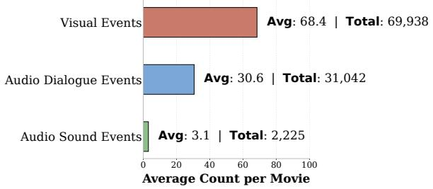

<details>
<summary>bar chart</summary>

| Event Type | Average Count per Movie | Total |
| :--- | :--- | :--- |
| Visual Events | 68.4 | 69,938 |
| Audio Dialogue Events | 30.6 | 31,042 |
| Audio Sound Events | 3.1 | 2,225 |
</details>

Figure 5: Average number of annotated events per movie in the NEST dataset, broken down by visual events, audio dialogue events, and audio sound events. Bars show per-movie averages, with total counts reported for each modality.

<table><tr><td>Model</td><td>R@0.3</td><td>R@0.5</td><td>R@0.7</td><td>mIoU</td></tr><tr><td>Gemini 2.5 Flash (Comanici et al., 2025)</td><td>11.68</td><td>6.04</td><td>2.39</td><td>7.87</td></tr><tr><td>Gemini 2.5 Pro (Comanici et al., 2025)</td><td>11.48</td><td>6.07</td><td>2.33</td><td>7.96</td></tr><tr><td>Time-R1 (Wang et al., 2025b)</td><td>36.78</td><td>18.45</td><td>6.21</td><td>23.23</td></tr></table>

Table 7: Event localization on the evaluation set of VidEvent (Liang et al., 2025) remains challenging. Despite operating under relatively small temporal context windows, state-of-the-art temporal grounding models still struggle to accurately localize event boundaries.

The average movie in NEST contains approximately 160 scenes. Selecting the correct scene (or set of scenes) for a narrative event still requires aligning the event to the correct part of a 1–3 hour multimodal narrative, across long temporal gaps, subplots, and non-linear devices such as flashbacks. We therefore view scene-level localization as a meaningful and less subjective proxy for temporal grounding at movie scale. As fine-grained temporal grounding methods improve, NEST can naturally accommodate finer-grained evaluation.

## A.3 Reproducibility and Release Details

Table 8 summarizes every artifact released alongside this paper.

We note that the inability to redistribute copyrighted raw movies is not unique to NEST. Several widely used video benchmarks follow the same distribution model, providing pre-extracted features, annotations, and evaluation tooling rather than raw video files. MAD (Soldan et al., 2022), the closest precedent to NEST in scale and domain, explicitly states that due to copyright restrictions raw movies will not be released, and instead provides pre-extracted CLIP frame-level features at 5 FPS along with language token embeddings. MovieQA (Tapaswi et al., 2016) similarly does not distribute raw movie videos, instead releasing plot synopses, subtitles, and video clips sourced through external links. Other video understanding datasets adopt comparable strategies. HiREST (Zala et al., 2023) releases pre-extracted EVA-CLIP features and ASR transcripts without raw videos. ReX-Time (Chen et al., 2024a) releases QA pairs and temporal spans without raw videos. VidChapters-7M (Yang et al., 2023) releases ASR transcripts, chapter boundaries, and titles via video IDs, requiring users to download raw videos independently from YouTube. NEST follows this established convention and additionally releases pre-extracted multimodal features covering several recent visionlanguage models to further lower the barrier to entry. We also release a subset of full-length movies that are in the public domain or available under permissive open licenses, enabling end-to-end evaluation without access restrictions.

<table><tr><td>Artifact</td><td>Released</td><td>Format</td></tr><tr><td>Train / Val / Test splits</td><td>√</td><td>JSON</td></tr><tr><td>SILVER event annotations</td><td>√</td><td>JSON</td></tr><tr><td>GOLD event annotations</td><td>√</td><td>JSON</td></tr><tr><td>Pre-extracted video features</td><td>√</td><td>.npy / .pt</td></tr><tr><td>Pre-extracted audio features</td><td>√</td><td>.npy / .pt</td></tr><tr><td>Feature extraction specifications</td><td>√</td><td>YAML</td></tr><tr><td>Evaluation scripts</td><td>√</td><td>Python</td></tr><tr><td>Training configurations</td><td>√</td><td>YAML</td></tr><tr><td>LLM-as-a-judge prompts</td><td>√</td><td>Text</td></tr><tr><td>Public-domain movie subset</td><td>√</td><td>Video</td></tr><tr><td>Fine-tuned model checkpoint</td><td>√</td><td>.pt</td></tr></table>

Table 8: Released artifacts for reproducibility.

## A.4 Annotation Quality and Human Effort

Grounding in Human-Authored Sources. The SILVER annotations are not generated from freeform model captions. The primary textual source is professional audio descriptions written for visually impaired audiences, which are specifically designed to faithfully describe on-screen visual content (Rohrbach et al., 2015). These are supplemented by human-written scripts and plot summaries. The LLM-assisted pipeline extracts structured events from these human-authored sources, constrained to PropBank’s ontology and a closed relation label set, rather than generating events from scratch. This design is intended to prevent the benchmark from collapsing into “hallucination matching,” where labels exist only in text but have no visual correspondence.

Two-Step Verification. To minimize hallucination risk, extracted events undergo a two-step verification against two independent human-authored signals, each designed to filter different types of errors.

Step 1: Audio description verification (local visual grounding). Each extracted event is checked against the movie’s audio description to ensure it corresponds to observable on-screen content. This step filters hallucinated or visually unsupported events. For example, an extracted ”betray” event was rejected when the audio description for the relevant scene described only two characters having a calm conversation with no indication of deception or betrayal. Similarly, a ”chase” event was removed when the audio description mentioned characters walking together rather than pursuing one another.

Step 2: Plot/script verification (global narrative consistency). Events passing Step 1 are crossvalidated against plot summaries and scripts to verify narrative consistency. This step filters wrong PropBank senses, incorrect arguments, and overinferred relations. For example, a ”kill” event extracted from a scene depicting a heated argument was rejected because the plot summary confirmed the character survived. A ”causal” relation between two events was downgraded to ”temporal” because the plot indicated the events occurred independently in parallel subplots.

Events that cannot be supported by either source are filtered out. This verification pipeline used GPT-5, GPT-5-nano, and GPT-5-mini (Singh et al., 2025a) alongside Grok-4.1 Fast (xAI et al., 2025) across both stages. During this creation and verification process, we consumed approximately 100 billion tokens.

Independent Gold Annotation. The GOLD annotations were produced independently of the SIL-VER data. Five contracted annotators watched full-length movies and produced event and relation annotations from scratch, without access to the SILVER labels. Agreement between GOLD and SILVER was then measured to validate the automatic pipeline, rather than using the GOLD set as a correction layer on the SILVER data.

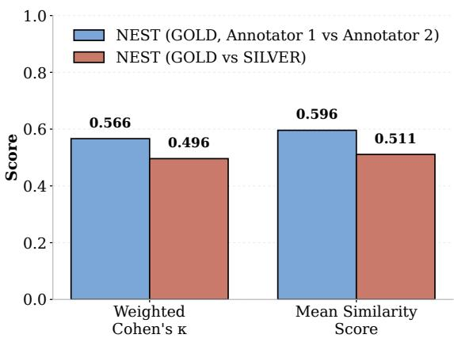

<details>
<summary>bar chart</summary>

| Metric | NEST (GOLD, Annotator 1 vs Annotator 2) | NEST (GOLD vs SILVER) |
| :--- | :--- | :--- |
| Weighted Cohen's κ | 0.566 | 0.496 |
| Mean Similarity Score | 0.596 | 0.511 |
</details>

Figure 6: Annotation agreement on NEST. Weighted Cohen’s κ and mean semantic similarity for GOLD–GOLD (two annotators) and GOLD–SILVER.

Agreement Analysis. Although the GOLD subset consists of five movies, this corresponds to approximately 350 annotated events and 250 annotated relations. We measured weighted Cohen’s $\kappa \approx 0 . 5 0$ for GOLD–SILVER agreement, compared to inter-annotator $\kappa \approx 0 . 5 7$ on the GOLD set alone (Figure 6). The narrow gap between these two figures suggests that the SILVER pipeline tracks human judgments at a level close to the variation between human annotators themselves.

Semantic Similarity Computation. Mean semantic similarity in Figure 6 is computed using the same LLM-as-a-judge framework described in Appendix A.6. For each GOLD event, we pair it with its closest SILVER event (and analogously for GOLD–GOLD pairs) and prompt GPT-5-mini (Singh et al., 2025a) with the two event descriptions (trigger and context) to produce a similarity score between 0 and 1, using temperature 0 for reproducibility. The reported values (0.511 for GOLD–SILVER, 0.596 for GOLD–GOLD) are macro-averaged across the five GOLD movies. We use this LLM-based semantic similarity alongside κ because exact string matching is too brittle for narrative event descriptions where semantically equivalent triggers may differ lexically (e.g., “fight” vs. “attack”).

Human Effort Statistics. Although the GOLD subset consists of 5 movies, this corresponds to approximately 350 annotated events and 250 annotated relations. Annotating narrative-level events in full-length movies is substantially more laborintensive than segment-level annotation in short clips, as annotators must watch the entire film and maintain coherent tracking of characters, subplots, and temporal structure throughout. We note that many existing benchmarks also make use of silverlabeled data, and that the scale of per-movie annotation effort in NEST is significantly higher than in benchmarks operating on short segments. Table 10 summarizes the human annotation effort.

<table><tr><td>Field</td><td>Metric</td><td>Agreement</td></tr><tr><td>Arguments</td><td>PropBank role F1</td><td>70.86</td></tr><tr><td>Localization</td><td>Scene-level match</td><td>57.14</td></tr><tr><td>Relations</td><td>Type agreement</td><td>41.03</td></tr><tr><td>Overall</td><td>Weighted κ</td><td>G-G: 0.57G-S: 0.50</td></tr></table>

Table 9: Per-field agreement analysis. Argument agreement measures PropBank role overlap, localization uses scene-level matching, and relation agreement measures type consistency over matched positive relation pairs. Overall agreement is reported as weighted κ separately for GOLD–GOLD (G–G) and GOLD–SILVER (G–S) annotator pairs.

<table><tr><td>Metric</td><td>Value</td></tr><tr><td>Number of annotators</td><td>5</td></tr><tr><td>Compensation rate</td><td>$15 / hour</td></tr><tr><td>Total cost</td><td>~$600</td></tr><tr><td>Approx. hours per movie</td><td>~8</td></tr><tr><td>Total annotator hours</td><td>~40</td></tr></table>

Table 10: Human annotation effort for the GOLD subset. Annotators were trained via a custom platform tutorial and one practice movie before beginning production annotation.

## A.5 Video Sampling and Context Handling

Training Token Budget. We fine-tune Qwen3- Omni-30B-A3B-Instruct (Xu et al., 2025b), which has a native context length of 32,768 tokens. In Qwen-family models (Team, 2025), each video frame is divided into 14×14 pixel patches, and a 2×2 spatial merger compresses four adjacent patches into a single visual token, so each token effectively covers a 28×28 pixel region. A 3D convolution further groups every 2 consecutive frames temporally, halving the effective frame count. A typical movie in NEST runs approximately 2 hours (7,200 seconds). At 0.1 FPS, we obtain ∼720 frames, which after temporal grouping become ∼360 frame pairs. The per-frame resolution is configured to keep the total visual token count within the 32K context budget alongside text prompts and output tokens. This rate prioritizes full narrative coverage over fine-grained action capture, which we find sufficient for story-level event understanding. During training, the context window is shared between visual tokens, text instructions, and generated outputs, and gradient and optimizer state storage further constrains the effective batch that can fit in GPU memory.

Inference Token Budget. At inference, memory constraints are relaxed because gradient and optimizer states are not stored, allowing substantially longer input sequences. Models evaluated at 1 FPS ingest ∼7,200 frames (3,600 frame pairs after temporal grouping), which at moderate resolution produces far more visual tokens than the native 32K context window. This is feasible because most evaluated models support extended context lengths: Qwen2.5-VL (32B) (Bai et al., 2025) supports up to 64K tokens via MRoPE extension, InternVL3.5 (Wang et al., 2025a) supports 32K tokens with a fixed 32-frame budget, and LLaVA-Video (Zhang et al., 2024) operates under a 64- frame budget that fits within its context window. For models with smaller context windows such as OVIS2.5 (Lu et al., 2025) (8 frames) and LLaVA-Video (Zhang et al., 2024) (64 frames), we use a fixed frame budget with deterministic uniform sampling across the full movie duration rather than attempting to ingest all frames. Table 11 provides the exact sampling configuration for each baseline.

## A.6 LLM-as-a-Judge Evaluation Details

The LLM-as-a-judge paradigm has become a widely used evaluation methodology for openended generation and multimodal understanding tasks. Recent survey and empirical work has systematized this evaluation setting and shown that strong judge models can achieve substantial agreement with human judgments, while also emphasizing the importance of careful judge design and validation (Gu et al., 2025; Bavaresco et al., 2025). In the video understanding domain, LLM-based evaluators have become common for open-ended question answering and reasoning benchmarks where exact string matching is too brittle to capture semantic equivalence (Maaz et al., 2024; Nagrani et al., 2025a; Shaar et al., 2026). We follow this established practice for NEST, where strict string matching is too brittle for open-ended tasks such as event argument extraction, in which semantically equivalent mentions may differ lexically (e.g., “the detective” vs. “Officer Miller”).

Judge Model and Settings. We use GPT-5- mini (Singh et al., 2025a) as the judge. Decoding is performed with temperature 0 (greedy) to maximize reproducibility. The judge receives the ground-truth annotation and the model prediction, and returns a binary verdict (correct/incorrect) along with a confidence score.

Judge Prompts. The full judge prompts for each task are provided below and each prompt follows a general template consisting of: (1) the task definition, (2) evaluation rules specifying what constitutes a correct prediction, (3) output format rules, and (4) the ground-truth and model prediction as inputs. The task-specific definitions and rules are identical to those used during model evaluation, ensuring consistency between how models are prompted and how their outputs are judged.

## A.7 Qualitative Examples and Error Analysis

We present representative examples of NEST annotations alongside model predictions to illustrate common failure modes. Figures 9–13 show concrete examples for each task. To quantify these patterns, we inspected all zero-shot model predictions across four tasks: 1,812 ETD predictions, 1,779 EAE predictions, 1,857 EL predictions, and 1,528 ERE errors.

Event Trigger Detection Errors. The most frequent failure mode in ETD is that models default to surface-level atomic verbs (e.g., “walk,” “look,” “sit”) rather than identifying the intended narrativelevel predicate (e.g., “confront,” “betray,” “reconcile”). This accounts for 22.0% of ETD errors, while the remaining 78.0% correspond to predicting a wrong event entirely. The atomic verb default occurs especially when long-range context is required to understand the narrative significance of a scene. For example, a scene showing two characters meeting in a park may be annotated as “reconcile” (requiring understanding of their earlier conflict), but models predict “meet” or “talk” based on immediate visual cues alone. The dominance of wrong-event errors (78.0%) suggests that models frequently fail to identify the correct narrative event at all, rather than merely selecting the wrong level of abstraction.

<table><tr><td>Model</td><td>Eval Context</td><td>Native Context</td><td>Frames Sampled</td><td>Sampling Strategy</td><td>Effective FPS</td></tr><tr><td>Gemini 2.5 Pro (Comanici et al., 2025)</td><td>1M</td><td>1M</td><td>1fps</td><td>Uniform</td><td>1.0</td></tr><tr><td>Qwen3-VL (8B) (Team, 2025)</td><td>256K</td><td>256K</td><td>1fps</td><td>Uniform</td><td>1.0</td></tr><tr><td>Qwen3-VL (30B) (Team, 2025)</td><td>256K</td><td>256K</td><td>1fps</td><td>Uniform</td><td>1.0</td></tr><tr><td>Qwen3-Omni (30B) (Xu et al., 2025b)</td><td>256K</td><td>256K</td><td>1fps</td><td>Uniform</td><td>1.0</td></tr><tr><td>Qwen2.5-VL (7B) (Bai et al., 2025)</td><td>32K</td><td>128K</td><td>1fps</td><td>Uniform</td><td>1.0</td></tr><tr><td>Qwen2.5-VL (32B) (Bai et al., 2025)</td><td>32K</td><td>128K</td><td>1fps</td><td>Uniform</td><td>1.0</td></tr><tr><td>InternVL3.5 (30B) (Wang et al., 2025a)</td><td>32K</td><td>256K</td><td>32</td><td>Uniform</td><td>-</td></tr><tr><td>LLaVA-Video (7B) (Zhang et al., 2024)</td><td>32K</td><td>128K</td><td>64</td><td>Uniform</td><td>-</td></tr><tr><td>OVIS2.5 (9B) (Lu et al., 2025)</td><td>32K</td><td>128K</td><td>8</td><td>Uniform</td><td>-</td></tr><tr><td>LongVU-LLaMA3 (3B) (Shen et al., 2024)</td><td>8K</td><td>8K</td><td>1fps</td><td>Uniform</td><td>1.0</td></tr><tr><td>LongVU-Qwen2 (7B) (Shen et al., 2024)</td><td>8K</td><td>128K</td><td>1fps</td><td>Uniform</td><td>1.0</td></tr><tr><td>Video-LLaMA3 (7B) (Zhang et al., 2025a)</td><td>32K</td><td> $32K^*$ </td><td>1fps</td><td>Uniform</td><td>1.0</td></tr><tr><td>Flash-VStream-Qwen (7B) (Zhang et al., 2025b)</td><td>32K</td><td>32K</td><td>1fps (stream)</td><td>Streaming</td><td>1.0</td></tr><tr><td>Finetuned Qwen3-Omni (Xu et al., 2025b)</td><td>256K</td><td>256K</td><td>0.1fps</td><td>Uniform</td><td>0.1</td></tr></table>

Table 11: Video sampling configuration for each baseline. Models listed as “1fps” sample one frame per second from the full movie. Frame-selection models use a fixed frame budget with uniform temporal spacing. Eval Context denotes the token limit enforced during this benchmark, while native context reflects the model’s true architectural maximum. \*Video-LLaMA3 extends the base 8K limit of LLaMA 3 to 32K via RoPE scaling.

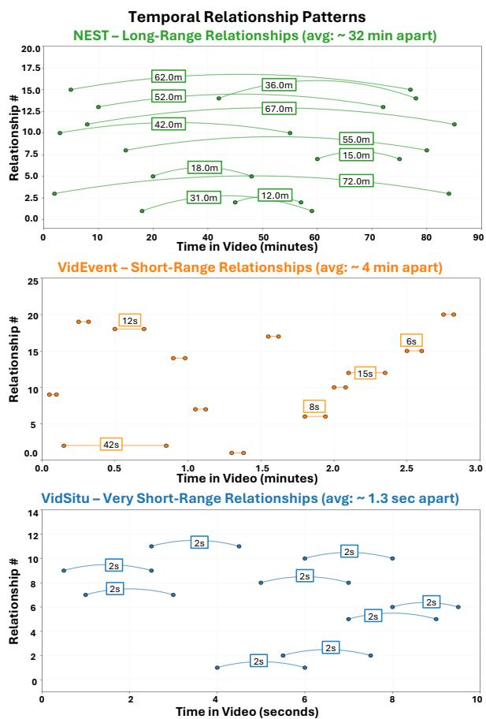  
Figure 7: Temporal distance between related events across datasets. Each arc connects a pair of related events, with arc length indicating their temporal separation. NEST (top) captures long-range narrative dependencies averaging ∼32 minutes apart, while VidEvent (middle) and VidSitu (bottom) operate within much shorter windows (∼4 min and ∼1.3 sec, respectively).

Event Argument Extraction Errors. In EAE, entity confusion dominates at 90.0% of errors, with missing arguments accounting for the remaining 10.0%. Models frequently fail to maintain consistent entity references across distant scenes. A character introduced by name in an early scene may be referred to by description (“the detective”) or pronoun $( ^ { 6 6 } \mathrm { h e } ^ { 7 } )$ in later predictions, and models often assign arguments to the wrong character when multiple characters share similar visual appearances. The overwhelming prevalence of entity confusion over missing arguments indicates that models attempt to fill argument slots but lack the long-range entity tracking needed to do so correctly.

Finding 3: The bottleneck in EAE is not detecting that arguments exist but tracking which character is which. 90% of errors are entity confusions while only 10% are missing arguments, indicating models need long-range identity tracking across full-length movies.

Event Localization Errors. For EL, nearly all errors (98.6%) are wrong-scene predictions, while only 1.4% produce overly broad time spans. Models tend to localize events to the most visually salient scene (which may not be the correct one) rather than hedging with broad spans. Flashback sequences are particularly challenging: models consistently assign flashback events to the narrative present rather than recognizing the temporal displacement. The near-absence of overly broad spans suggests that models are confident but wrong, committing to specific (incorrect) temporal locations rather than expressing uncertainty through wider

<table><tr><td>Task</td><td>Score (%)</td></tr><tr><td>ETD Accuracy</td><td>12.50</td></tr><tr><td>EAE Accuracy</td><td>25.00</td></tr><tr><td>EL Accuracy</td><td>2.50</td></tr><tr><td>ERE Precision</td><td>40.95</td></tr><tr><td>ERE Recall</td><td>44.64</td></tr><tr><td>ERE F1 (macro)</td><td>40.80</td></tr><tr><td>ERE Accuracy</td><td>55.56</td></tr><tr><td>Overall Accuracy</td><td>23.08</td></tr></table>

Table 12: GPT-5 performance across all four NEST tasks, evaluated on the same 10-video subset used for Gemini in Table 5. ETD and EAE use LLM-as-a-judge accuracy, EL uses scene-overlap accuracy, and ERE reports Precision and Recall at the prediction level along with macro F1 across the six relation types.

<table><tr><td>Model</td><td>#Params</td><td>F1 (%)</td></tr><tr><td>Flash-VStream-Qwen</td><td>7B</td><td>0.00</td></tr><tr><td>InternVL</td><td>30B</td><td>0.00</td></tr><tr><td>LLaVA-Video</td><td>7B</td><td>0.00</td></tr><tr><td>Qwen2.5-VL</td><td>32B</td><td>28.57</td></tr><tr><td>Qwen2.5-VL</td><td>7B</td><td>13.04</td></tr><tr><td>Qwen3-VL</td><td>30B</td><td>0.00</td></tr><tr><td>Qwen3-VL</td><td>8B</td><td>0.00</td></tr></table>

Table 13: Performance on the NEST flashback subset. These relations capture non-linear temporal structure and require models to reason beyond linear timelines.  
predictions.

Event Relation Extraction Errors. Among ERE errors, the dominant pattern is over-prediction of the NO\_RELATION label, accounting for roughly four out of every five misclassifications. Models most frequently miss temporal and preconditioned relations, followed closely by causal links, while hierarchical relations are missed less often but still substantially underdetected. This conservative bias suggests that models default to predicting no connection between events rather than reasoning about how they relate narratively.

<table><tr><td>Task</td><td>Error Type</td><td>%</td></tr><tr><td>ETD</td><td>Atomic event</td><td>22.0</td></tr><tr><td>ETD</td><td>Wrong event entirely</td><td>78.0</td></tr><tr><td>EAE</td><td>Entity confusion</td><td>90.0</td></tr><tr><td>EAE</td><td>Missing argument</td><td>10.0</td></tr><tr><td>EL</td><td>Wrong scene</td><td>98.6</td></tr><tr><td>EL</td><td>Overly broad span</td><td>1.4</td></tr></table>

Table 14: Error taxonomy across tasks. ETD is based on 1,812 predictions, EAE on 1,779 predictions, and EL on 1,857 predictions across all zero-shot models.

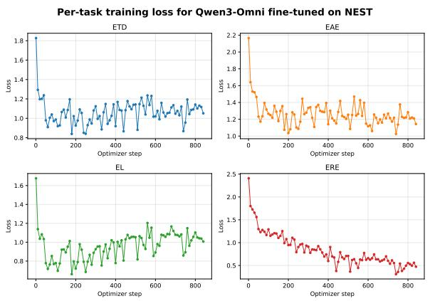  
Figure 8: Task-specific training loss curves for Qwen3- Omni fine-tuned on NEST. ERE loss decreases steadily, consistent with the substantial improvement in ERE F1 after fine-tuning. ETD and EL losses plateau early, indicating that LoRA fine-tuning does not acquire the longrange narrative event induction and temporal grounding capabilities these tasks require.

## A.8 Directions for Future Work

The Problem Is Solvable by Humans. The interannotator agreement on the GOLD set (weighted Cohen’s $\kappa \approx 0 . 5 7 )$ demonstrates that humans can reliably identify narrative events, extract their arguments, and determine their relations when watching full-length movies. The gap between human performance and model performance is therefore not an artifact of task ambiguity but reflects genuine limitations in current vision-language models.

SFT Alone Is Insufficient. Fine-tuning on NEST improves ERE (35.45% → 44.42% F1) but yields only marginal gains on ETD (3.20% → 6.09%) and EL (0.44% → 0.45%), suggesting that the bottleneck is not task-specific data but the representational capacity to discover and ground narrative events from hours-long multimodal inputs.

Research Directions. Closing the gap between human and model performance on NEST likely requires advances in several areas: (1) narrative abstraction mechanisms that lift low-level observations into story-level events via explicit reasoning or chain-of-thought over prior context; (2) long-range entity tracking that combines visual re-identification with dialogue-based coreference across full movies; (3) non-linear temporal reasoning to handle flashbacks and parallel storylines, where current models achieve near-zero F1 (Table 13); (4) retrieval-augmented grounding that selectively attends to relevant past scenes without requiring prohibitively long context windows; and (5) hybrid symbolic-neural event structures that combine neural perception with structured representations such as event graphs or temporal logic.

<table><tr><td rowspan="2">Model</td><td colspan="2">ETD</td><td colspan="2">EAE</td><td colspan="2">EL</td><td rowspan="2">ERE→NO_REL</td></tr><tr><td>Atomic Verb</td><td>Wrong Event</td><td>Entity Conf.</td><td>Missing Arg.</td><td>Wrong Scene</td><td>Broad Span</td></tr><tr><td>InternVL3.5 (Wang et al., 2025a)</td><td>22.0</td><td>78.0</td><td>90.0</td><td>10.0</td><td>98.6</td><td>1.4</td><td>78.3</td></tr><tr><td>Qwen2.5-VL (7B) (Bai et al., 2025)</td><td>42.0</td><td>58.0</td><td>100.0</td><td>-</td><td>99.1</td><td>0.9</td><td>21.2</td></tr><tr><td>Qwen2.5-VL (32B) (Bai et al., 2025)</td><td>6.0</td><td>94.0</td><td>100.0</td><td>-</td><td>97.4</td><td>2.6</td><td>73.3</td></tr><tr><td>Qwen3-VL (8B) (Team, 2025)</td><td>16.0</td><td>82.0</td><td>98.0</td><td>2.0</td><td>99.4</td><td>0.6</td><td>83.7</td></tr><tr><td>Qwen3-VL (30B) (Team, 2025)</td><td>18.0</td><td>70.0</td><td>100.0</td><td>-</td><td>97.6</td><td>2.4</td><td>92.2</td></tr></table>

Table 15: Error taxonomy across models (percentage of errors per task). For ETD, EAE, and EL, values indicate the proportion of incorrect predictions falling into each error type. For ERE, the NO\_REL column indicates how often the model incorrectly predicts NO\_RELATION for a ground-truth related event pair. Across all models, wrong-scene predictions dominate EL errors, entity confusion dominates EAE, and false-negative NO\_RELATION predictions account for the majority of ERE errors, suggesting models are overly conservative in identifying narrative connections.

Finding 4: Models are confidently wrong at localization but overly conservative at relation extraction. 98.6% of EL errors commit to a specific wrong scene, while 78.3% of ERE errors default to NO\_RELATION, missing temporal, preconditioned, and causal connections between narratively linked events.

## A.9 Annotating Platform Interface

We built a custom web-based annotation platform for NEST. The interface allows annotators to: (1) view individual scenes from each movie in an embedded video player, (2) select event triggers from the PropBank verb vocabulary with sense disambiguation, (3) fill argument roles (ARG0, ARG1, ARGM-LOC, ARGM-TMP, etc.) with free-form mentions tagged by modality and grounding scope, and (4) annotate pairwise relations between events with supporting evidence. Annotators were provided with a written tutorial describing the annotation guidelines, event ontology, and relation definitions, followed by a supervised practice session on one complete movie before beginning production annotation. The platform enforces PropBank constraints at input time, preventing annotators from entering free-form triggers or unsupported relation types.

## A.10 Annotator Instructions and Prompt Templates

These are the instructions provided to annotators for each annotation task. The instructions distinguish between visual, audio, and dialogue event triggers, and provide concrete examples of correct and incorrect annotations. Each instruction set emphasizes the distinction between atomic physical actions and narrative-level events.

## A.11 Task Definitions

Below we provide the JSON-formatted prompt templates for each evaluation task. The templates specify task instructions derived from our annotation guidelines and define the expected response format. All evaluated models receive identical prompts to ensure fair comparison. Each template follows a single message schema in which the system content carries the task instruction and the user content supplies the scene, the trigger, or the event pair that the task operates on, so that the only variation across models is the underlying model itself rather than any difference in framing. The instruction text is lifted directly from the guidelines shown to human annotators, which keeps the operationalization of each task consistent between the annotation stage and the evaluation stage and removes a common source of prompt-induced variance. We constrain the expected output to a compact, parseable form for every task, namely a single trigger verb for trigger detection, a bracketed start and end pair for localization, a role-to-value mapping for argument extraction, and one relation label for relation extraction, which lets us score predictions automatically without bespoke parsing per model. Where a task admits more than one acceptable surface form, the instruction makes the tolerance explicit, for example by stating that paraphrases of a trigger and minor naming differences in an argument are acceptable, so that the prompt itself communicates the same permissive matching criterion that the judge later applies. The templates ensure model outputs match the evaluation format, so performance differences reflect narrative reasoning rather than formatting mismatches.

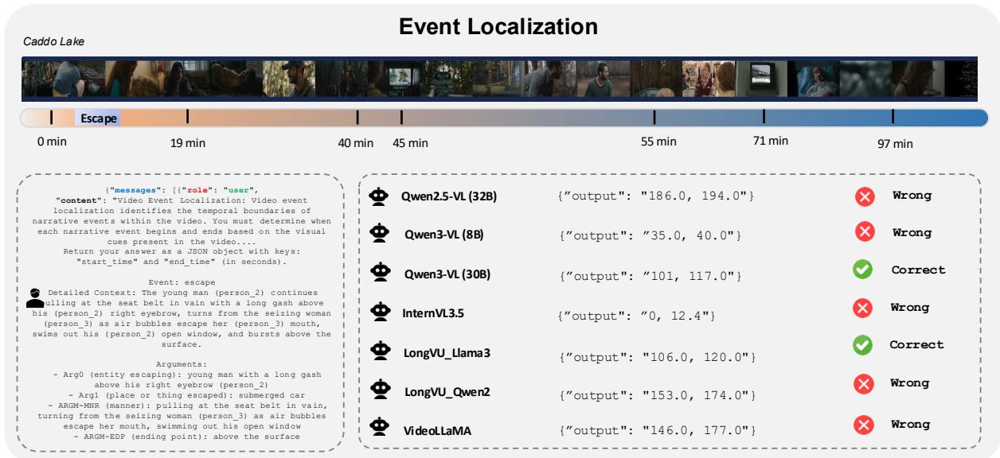

<details>
<summary>timeline diagram</summary>

| Event Type | Value |
| --- | --- |
| Qwen2.5-VL (32B) | { "output": "186.0, 194.0" } |
| Qwen3-VL (8B) | { "output": "35.0, 40.0" } |
| Qwen3-VL (30B) | { "output": "101, 117.0" } |
| InternVL3.5 | { "output": "0, 12.4" } |
| LongVU_Llama3 | { "output": "106.0, 120.0" } |
| LongVU_Qwen2 | { "output": "153.0, 174.0" } |
| VideoLLaMA | { "output": "146.0, 177.0" } |
</details>

Figure 9: Event Localization example from Caddo Lake (97 min). The “escape” event occurs between approximately 19–40 minutes (green span). Given the full movie and the event description with structured arguments (left panel), seven models predict temporal boundaries. Only Qwen3-VL (30B) and LongVU-LLaMA3 correctly localize the event, while others predict timestamps far from the ground truth. Common failure modes include localizing to the wrong half of the movie (Qwen2.5-VL, LongVU-Qwen2, VideoLLaMA) and predicting the very beginning of the video (InternVL3.5), suggesting models default to salient or early scenes rather than reasoning about where the event actually occurs.

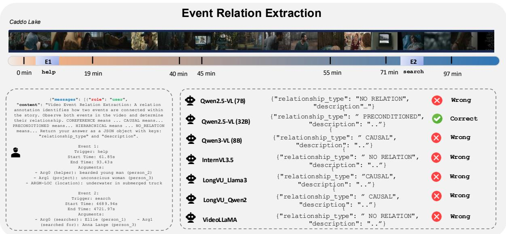

<details>
<summary>event relation extraction chart</summary>

| Event Type | Status | Value |
| :--- | :--- | :--- |
| Qwen2.5-VL (7B) | Wrong | 1 |
| Qwen2.5-VL (32B) | Correct | 1 |
| Qwen3-VL (8B) | Wrong | 1 |
| InternVL3.5 | Wrong | 1 |
| LongVU_Llama3 | Wrong | 1 |
| LongVU_Qwen2 | Wrong | 1 |
| VideoLLaMA | Wrong | 1 |
</details>

Figure 10: Event Relation Extraction example from Caddo Lake (97 min). Two events are separated by approximately 50 minutes: a “help” event (E1, near 19 min) and a “search” event (E2, near 71 min). The ground-truth relation is PRECONDITIONED, as the earlier helping event creates conditions that enable the later search. Only Qwen2.5-VL (32B) correctly identifies this relation. Three models (Qwen3-VL, LongVU-LLaMA3, LongVU-Qwen2) predict CAUSAL, confusing enablement with direct causation. Three others (Qwen2.5-VL 7B, InternVL3.5, VideoLLaMA) predict NO\_RELATION entirely, failing to connect events separated by long temporal gaps. This illustrates the challenge of reasoning over distant event pairs where the narrative link requires understanding how an earlier event sets up conditions for a later one.

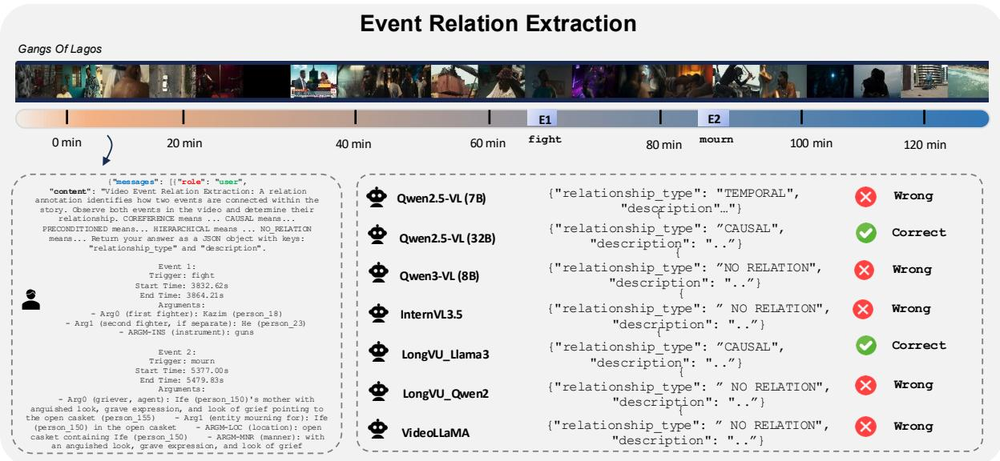

<details>
<summary>bar chart</summary>

| Event | Category | Value |
| :--- | :--- | :--- |
| Qwen2.5-VL (7B) | | "relationship_type": "TEMPORAL", "description"..." |
| Qwen2.5-VL (32B) | | "relationship_type": "CAUSAL", "description": "..}" |
| Qwen3-VL (8B) | | {"relationship_type": "NO RELATION", "description": ".."} |
| InternVL3.5 | | {"relationship_type": "NO RELATION", "description": ".."} |
| LongVU_Llama3 | | {"relationship_type": "CAUSAL", "description": ".."} |
| LongVU_Qwen2 | | {"relationship_type": "NO RELATION", "description": ".."} |
| VideoLLaMA | | {"relationship_type": "NO RELATION", "description": ".."} |
</details>

Figure 11: Event Relation Extraction example from Gangs of Lagos (120 min). A “fight” event (E1, near 60 min) is followed by a “mourn” event (E2, near 80 min), with the ground-truth relation being CAUSAL. Only Qwen2.5- VL (32B) and LongVU-LLaMA3 correctly identify the causal link. Qwen2.5-VL (7B) predicts TEMPORAL, recognizing the sequential ordering but missing the causal dependency. The remaining four models predict NO\_RELATION, failing to connect the two events despite their relative temporal proximity (∼20 minutes apart). This example highlights that even when events are not separated by extreme temporal gaps, most models still struggle to infer narrative causality from video content.

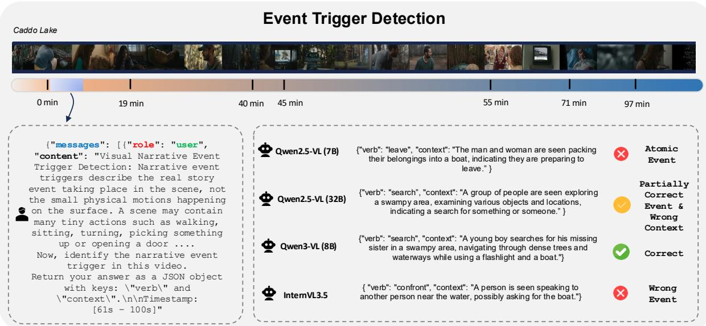

<details>
<summary>bar chart</summary>

Event Trigger Detection
| Event | Timeframe | Description |
| :--- | :--- | :--- |
| Qwen2.5-VL (7B) | 0-19 min | {"verb": "leave", "context": "The man and woman are seen packing their belongings into a boat, indicating they are preparing to leave."} |
| Qwen2.5-VL (32B) | 0-19 min | {"verb": "search", "context": "A group of people are seen exploring a swampy area, examining various objects and locations, indicating a search for something or someone."} |
| Qwen3-VL (8B) | 0-19 min | {"verb": "search", "context": "A young boy searches for his missing sister in a swampy area, navigating through dense trees and waterways while using a flashlight and a boat."} |
| IntemVL3.5 | 0-19 min | {"verb": "confront", "context": "A person is seen speaking to another person near the water, possibly asking for the boat."} |
| Atomic Event | 0-19 min | ✗ Partially Correct Event & Wrong Context ✓ Correct ✗ Wrong Event ✗
</details>

Figure 12: Event Trigger Detection example from Caddo Lake (97 min). Given the scene between 61–100 seconds, models must identify the narrative event trigger. Only Qwen3-VL (8B) correctly predicts “search” with accurate context describing the narrative situation. Qwen2.5-VL (32B) identifies the correct trigger (“search”) but provides a generic context that misses the specific narrative details. Qwen2.5-VL (7B) predicts “leave,” an atomic-level event describing surface-level physical actions (packing belongings into a boat) rather than the underlying narrative event. InternVL3.5 predicts an entirely wrong event (“confront”), misinterpreting the scene content. This example illustrates the spectrum of ETD failure modes: atomic verb defaults that miss narrative meaning, correct triggers with insufficient context, and wholly incorrect event predictions.

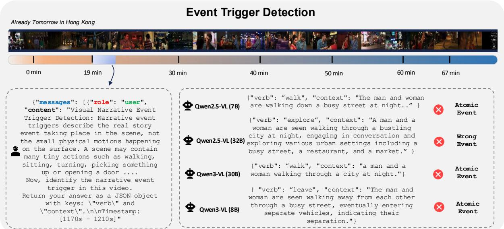

<details>
<summary>timeline diagram</summary>

| Event Type | Duration (min) |
|------------|----------------|
| Qwen2.5-VL (7B) | 0-30 |
| Qwen2.5-VL (32B) | 0-30 |
| Qwen3-VL (30B) | 0-30 |
| Qwen3-VL (8B) | 0-30 |
</details>

Figure 13: Event Trigger Detection example from Already Tomorrow in Hong Kong (67 min). Given the scene between 1170–1210 seconds, all four models fail to identify the correct narrative event. Three out of four models (Qwen2.5-VL 7B, Qwen3-VL 30B, and Qwen3-VL 8B) predict atomic verbs (“walk” or “leave”), describing surface-level physical motions rather than the narrative-level event taking place. Qwen2.5-VL (32B) predicts “explore,” which is closer to a narrative description but still misses the intended event. Despite the prompt explicitly instructing models to identify the real story event rather than small physical motions, all models default to describing what is visually immediate. This example highlights the atomic verb default as the dominant ETD failure mode and suggests that current models lack the narrative reasoning needed to abstract from visual observations to story-level meaning.

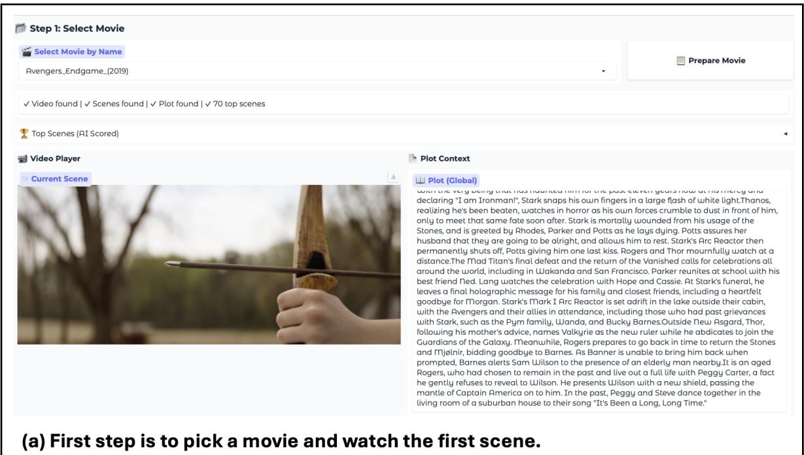

<details>
<summary>text_image</summary>

Step 1: Select Movie
Select Movie by Name
Avengers_Endgame_(2019)
Prepare Movie
✓ Video found | ✓ Scenes found | ✓ Plot found | ✓ 70 top scenes
Top Scenes (AI Scored)
Video Player
Current Scene
Plot Context
Plot (Global)
With the very being that his haunted him for the past eleven years now at his mercy and declaring "I am Ironman!", Stark snaps his own fingers in a large flash of white light.Thanos, realizing he's been beaten, watches in horror as his own forces crumble to dust in front of him, only to meet that same fate soon after. Stark is mortally wounded from his usage of the Stones, and is greeted by Rhodes, Parker and Potts as he lays dying. Potts assures her husband that they are going to be alright, and allows him to rest. Stark's Arc Reactor then permanently shuts off, Potts giving him one last kiss. Rogers and Thor mournfully watch at a distance.The Mad Titan's final defeat and the return of the Vanished calls for celebrations all around the world, including in Ujakanda and San Francisco. Parker reunites at school with his best friend Ned. Lang watches the celebration with Hope and Cassie. At Stark's funeral, he leaves a final holographic message for his family and closest friends, including a heartfelt goodbye for Morgan. Stark's Mark I Arc Reactor is set adrift in the lake outside their cabin, with the Avengers and their allies in attendance, including those who had past grievances with Stark, such as the Pym family, Wanda, and Bucky Barnes.Outside New Asgard, Thor, following his mother's advice, names Valkyrie as the new ruler while he abdicates to join the Guardians of the Galaxy. Meanwhile, Rogers prepares to go back in time to return the Stones and Mjelnir, bidding goodbye to Barnes. As Banner is unable to bring him back when prompted, Barnes alerts Sam Wilson to the presence of an elderly man nearby.It is an aged Rogers, who had chosen to remain in the past and live out a full life with Peggy Carter, a fact he gently refuses to reveal to Wilson. He presents Wilson with a new shield, passing the mantle of Captain America on to him. In the past, Peggy and Steve dance together in the living room of a suburban house to their song "It's Been a Long, Long Time."
(a) First step is to pick a movie and watch the first scene.
</details>

The annotator initially selects and loads a movie. The workspace presents the current scene in a video player, allowing the annotator to ground decisions in both local visual evidence and broader narrative context while stepping through scenes.

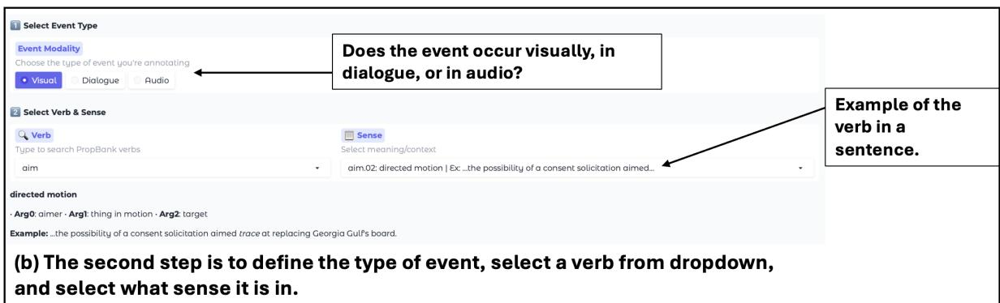

<details>
<summary>text_image</summary>

Select Event Type
Event Modality
Choose the type of event you're annotating
Visual Dialogue Audio
Does the event occur visually, in dialogue, or in audio?
Select Verb & Sense
Verb
Type to search PropBank verbs
aim
Sense
Select meaning/context
aim.02: directed motion | Exc...the possibility of a consent solicitation aimed...
directed motion
Arg0: aimer - Arg1: thing in motion - Arg2: target
Example: ...the possibility of a consent solicitation aimed trace at replacing Georgia Gulf's board.
(b) The second step is to define the type of event, select a verb from dropdown, and select what sense it is in.
</details>

The annotator first selects the evidence channel (visual, dialogue, or audio), then chooses a PropBank predicate and sense; the roleset description and example usage are shown to disambiguate meaning.

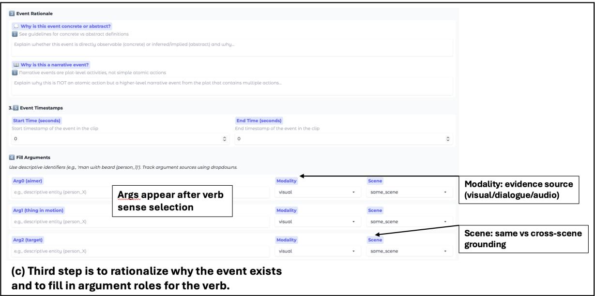

<details>
<summary>text_image</summary>

Event Rationale
Why is this event concrete or abstract?
See guidelines for concrete vs abstract definitions
Explain whether this event is directly observable (concrete) or inferred/implied (abstract) and why...
Why is this a narrative event?
Narrative events are plot-level activities, not simple atomic actions
Explain why this is NOT an atomic action but a higher-level narrative event from the plot that contains multiple actions...
Event Timestamps
Start Time (seconds)
Start timestamp of the event in the clip
0
End Time (seconds)
End timestamp of the event in the clip
Fill Arguments
Use descriptive identifiers (e.g., 'man with beard (person_!')). Track argument sources using dropdowns.
Arg0 (aimer)
e.g., descriptive entity (person_X)
Args appear after verb sense selection
Modality	Scene
visual	same_scene
Arg1 (thing in motion)
e.g., descriptive entity (person_X)
Modality	Scene
visual	same_scene
Arg2 (target)
e.g., descriptive entity (person_X)
Modality	Scene
visual	same_scene
(c) Third step is to rationalize why the event exists and to fill in argument roles for the verb.
Modality: evidence source
(visual/dialogue/audio)
Scene: same vs cross-scene grounding
</details>

(a) The annotator provides brief rationales (e.g., why the event is concrete vs. abstract and why it is narrative-level), marks the event’s temporal span with start/end timestamps, and fills PropBank argument slots (Arg0–ArgN) with free-form mentions while tagging each argument with modality and same-scene vs. cross-scene grounding. After populating arguments, the annotator can add the event to the current scene, and view all created events.

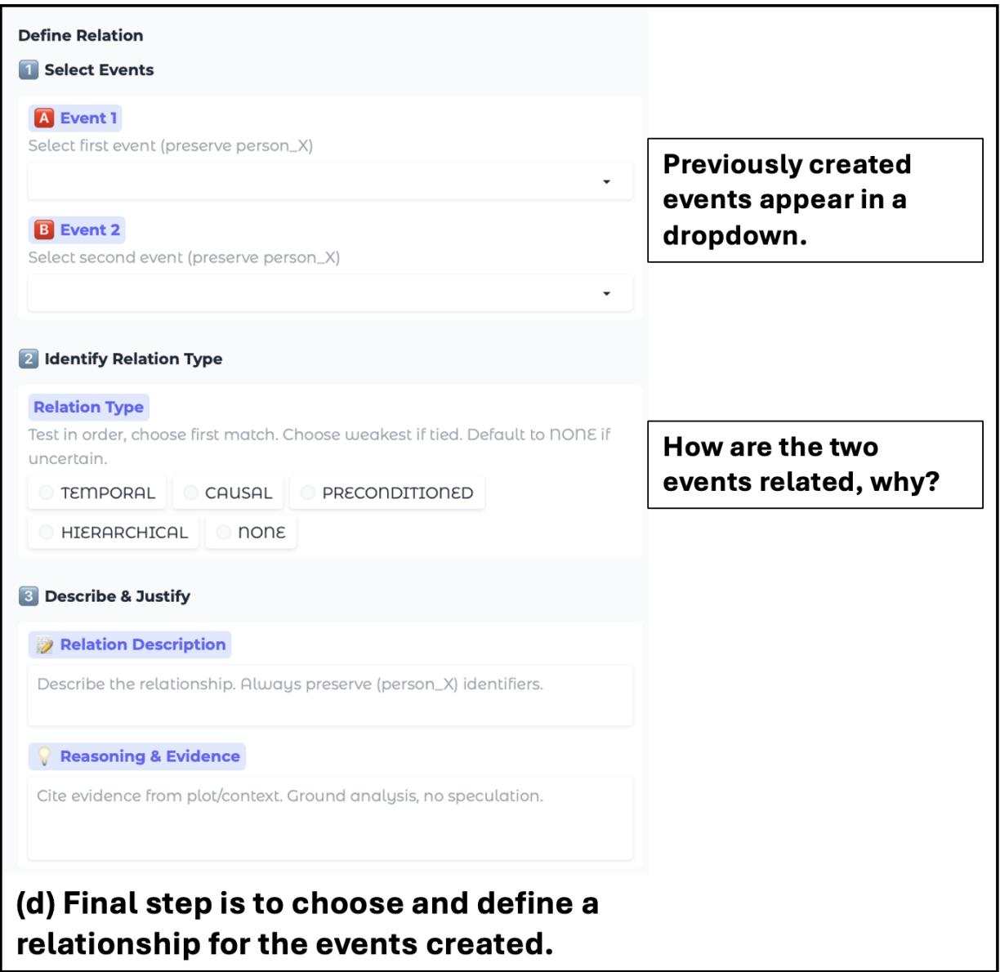

<details>
<summary>text_image</summary>

Define Relation
1 Select Events
A Event 1
Select first event (preserve person_X)
B Event 2
Select second event (preserve person_X)

2 Identify Relation Type
Relation Type
Test in order, choose first match. Choose weakest if tied. Default to NONE if uncertain.
TEMPORAL CAUSAL PRECONDITIONED
HIERARCHICAL NONE

3 Describe & Justify
Relation Description
Describe the relationship. Always preserve (person_X) identifiers.
Reasoning & Evidence
Cite evidence from plot/context. Ground analysis, no speculation.

(d) Final step is to choose and define a relationship for the events created.
</details>

(b) The annotator selects two events from the scene-level event inventory, assigns a relation type (e.g., temporal, causal, preconditioned, hierarchical, or none), and records a short relation description plus evidence grounded in the plot/context and observed clip.

## Visual Narrative-Level Event Trigger Detection

Narrative event triggers describe the real story event taking place in the scene, not the small physical motions happening on the surface. A scene may contain many tiny actions such as walking, sitting, turning, picking something up or opening a door. These movements show how someone moves, but they do not explain what the moment means. A narrative event is the larger action that these motions add up to. Someone standing up, taking a suitcase and walking out is not performing three events and together these actions mean the person leaves. Someone stepping forward, pointing and blocking another person’s path adds up to confront. Someone gathering belongings and closing a door behind them adds up to leave. A single narrative event can contain several visible motions, yet the motions themselves are not the event. Break up may involve looking away, raising a voice and walking out, but the event is the end of the relationship. To find the correct narrative event, first observe the physical actions without interpreting them. Then consider what these motions together accomplish in the story. Their combined meaning may show that someone leaves, helps another person, refuses something or apologizes. Once the story-level action is clear, open the trigger dropdown on the platform and select the PropBank verb that best expresses this meaning. You do not type anything manually. You simply choose the verb that captures what the moment actually represents, and then select the correct sense that appears afterward. The final step is to fill in the rationale fields. You must always choose a concrete visual narrative event rather than an abstract internal state such as think, realize or feel. A concrete event is something that a viewer can see happening directly in the video. When selecting the trigger, the annotator should always pause and ask whether the event is visually observable as an action. Narrative events such as kill, leave, save, confront, break up or comfort are all valid because the viewer can see the actions that form these events. For example, kill is visible when one person physically attacks another and the plot confirms the consequence. Break up is visible when someone raises their voice, withdraws, turns away and walks out, and the plot indicates the end of the relationship. Leave is visible when the character gathers belongings, exits and closes the door. These are all narrative events grounded in what the viewer sees. You will also explain why the chosen verb is a narrative event instead of a small atomic action. This explanation should describe how the visible actions combine into one meaningful story moment and how the plot supports it. You should list the small actions that make up the narrative event you choose. A narrative event that you chose must be mentioned in the plot either directly or indirectly. Your reasoning should point to how the plot supports the event you selected. Example 1: A woman packs clothing into a suitcase, pauses at the doorway, looks back once, then walks out and closes the door behind her. Correct trigger: leave Why: The small actions such as packing, walking and closing the door combine into the narrative meaning that she leaves the place. The situation changes because she is no longer there. Incorrect trigger chosen: walk Why this is wrong: Walk describes only a physical motion. It ignores the combined meaning that she is leaving the space. Example 2: A man kneels beside an injured friend, lifts them up carefully, supports their weight and carries them toward safety. Correct trigger: help Why: The combined actions show one person assisting another in a meaningful way. The situation changes because the injured person receives help. Incorrect trigger chosen: lift Why this is wrong: Lift is one tiny part of the action. It does not capture the meaningful event of helping the injured friend. Example 3: Two siblings sit quietly until one suddenly moves closer, places a hand on the other’s shoulder and gently guides them into an embrace as the second sibling begins to cry. Correct trigger: comfort Why: The combined actions show one person offering emotional support. The important moment is the comforting interaction, not the individual gestures. Incorrect trigger chosen: touch Why this is wrong: Touch describes only one small motion. It does not reflect the meaningful event where one sibling comforts the other.

## Audio Narrative-Level Event Trigger Detection

Audio event triggers label clear and identifiable actions that can be heard. An audio segment may contain many soft or vague noises such as rustling, quiet breathing, fabric movement or a steady background hum. These sounds do not point to a specific action and should not be labeled. A valid audio event is something the listener can confidently recognize as an action, such as knocking, crying, shouting, laughing or something breaking. The trigger must always be selected from the PropBank list shown in the platform. You do not write your own verb. You choose the verb from the dropdown that matches the action you hear. After selecting the trigger, the platform will display the possible senses for that verb and you must choose the correct one. A single audio event may contain several distinct sounds, but these sounds work together to represent one action. A break event may include a sharp crash followed by objects scattering. A knock event may include a sequence of firm hits. A cry event may include whimpers that grow into sobs. To choose the correct event, first listen to the sounds without interpreting anything extra. Then decide what action the combined sounds clearly represent. Once the action is clear, open the trigger dropdown and select the PropBank verb that matches it. For the rationale fields, you must confirm that the event is something that can be heard directly. Internal or mental states cannot be used as audio triggers. Actions like knock, break, cry, shout and laugh work because the sound itself reveals them. You must also explain why the chosen verb fits the audio. Example 1: You hear someone striking a door several times in a clear repeated pattern. Correct trigger: knock Why: The repeated pattern makes it obvious that someone is knocking. Incorrect trigger chosen: hit Why this is wrong: Hit would only describe one strike, not the repeated knocking you hear. Example 2: You hear a loud crash followed by pieces scattering across the floor. Correct trigger: break Why: The crash and the scattered sounds together make it clear that something has broken. Incorrect trigger chosen: thud Why this is wrong: Thud would describe one dull noise, not an object breaking. Example 3: You hear someone beginning to whimper and then crying steadily with sobs between breaths. Correct trigger: cry Why: The sound is clearly someone crying. Incorrect trigger chosen: breathe Why this is wrong: Breathing is only a background sound and not the actual action you hear.

## Dialogue Narrative-Level Event Trigger Detection

A dialogue narrative event trigger is a single verb that names the real-world action or situation the speaker is talking about right now. It is the actual thing that happened (or is happening) in the story, not the act of speaking itself. The trigger should be the key event the line reveals, admits, accuses, or makes real. Test it by replacing the whole line with trigger and if the story still feels the same, it’s correct.

Example 1: A man says, “I know I messed up. I am sorry for hurting you.” Correct trigger: hurt Why: He is owning up to hurting the listener. Incorrect trigger: apologize Why it is wrong: “Apologize” is what he’s doing with words; “hurt” is what he actually did.

Example 2: A woman says, “Please tell me where you went last night.” Correct trigger: go Why: The whole point of her question is the hidden trip last night; “go” is the real event she’s trying to uncover. Incorrect trigger: ask Why it is wrong: “Ask” is the speech action; “go” is the thing she cares about.

Example 3: A teenager says, “You never listen to me and you broke your promise again.” Correct trigger: break Why: The teenager is pointing at the broken promise as the real problem. Incorrect trigger: accuse Why it is wrong: “Accuse” is how it’s being said; “break promise” is what was done.

Example 4: A woman says, “I cannot stay here anymore. I am leaving you.” Correct trigger: leave Why: With those words she is making the leaving happen right now. Incorrect trigger: stay Why it is wrong: “Stay” is the opposite of what she’s doing.

## Narrative-Level Event Argument Extraction - Part 1

After you select the event trigger, the platform shows you a list of PropBank arguments for that verb. These arguments represent the possible participants or elements of the event, such as who performs the action, who is affected, what object is involved or what causes the event. You do not invent new arguments or rewrite anything. You only choose from the arguments already shown in the list. Your task is to select only the arguments that correctly describe what is happening in the video, audio or dialogue. Every argument is optional but strongly encouraged to be filled. You fill the argument with information that is clearly present in at least one modality. If the trigger is kill, you would select the killer and the victim if you can identify them. If the trigger is arrest, you would select the officer and the suspect. If the trigger is warn, you would select the person giving the warning and the person receiving it. The arguments must always match what is actually shown or said. Arguments can come from any source. A visual event can use information from dialogue or audio if those elements help identify who did what or explain what caused the action. This is allowed as long as the information exists in the story. Arguments can also come from another scene. For example, if the kill event happens early in the movie but the killer’s identity is revealed much later, you may fill the killer argument using the later scene as long as you indicate the correct scene ID. When filling an argument from a different scene, you must add the scene ID in respective field. Once you choose the arguments, read the event as a simple sentence using the trigger and the selected roles. If this description accurately matches what happened, the annotation is correct. If something does not fit, the problem usually lies in the trigger choice. In that case you return to the trigger selection, choose a better verb and then fill the arguments again.

## Narrative-Level Event Argument Extraction - Part 2

Example 1 (Visual Event with Visual and Dialogue Support) A man grabs another person from behind and strangles them until they collapse. The chosen verb is kill. The system provides arguments such as killer, victim and cause. Filled arguments: killer: Adam (the man in a dark jacket who performs the strangling) (from the visual scene) victim: John (the person in a grey shirt who collapses) (from the visual scene)

Argument source note: Even if John’s name is spoken in dialogue in another scene, you may still use that information to fill the argument. Cross-scene filling is allowed if the information is explicitly revealed later. Example 2 (Visual Event Supported by Audio and Dialogue) Two officers chase a suspect behind a building. In the visual scene we see the officers catch him. In the audio we hear handcuffs clicking. In dialogue one officer says, “We finally got him.”

The chosen verb is arrest. Filled arguments: officer: Officer Miller and Officer Perez (two uniformed officers who catch the suspect) (from the visual scene) suspect: Daniel (the man in a black hoodie being restrained) (from dialogue and visual scene) place: behind the old brick warehouse (a red brick two story building with metal fire stairs) (from the visual scene) Argument source note: Dialogue confirms the identity of the suspect even though the arrest action is visual. Example 3 (Dialogue Event with Visual and Audio Support) A woman faces her friend. She raises her hand in concern. The audio reveals loud creaks from a nearby bridge. She says, “Stay back. It could collapse.” The chosen verb is warn.

Filled arguments: warner: Lisa (the woman raising her hand and giving the warning) (from the visual scene and dialogue) warnee: Emily (the friend standing in front of her) (from the visual scene) cause: the unstable wooden bridge (wooden planks bending and creaking over the river) (from audio and visual) Argument source note: The event draws information from all three modalities. The spoken line conveys the intention, audio reveals the danger and visuals identify who is warning whom.

Example 4 (Audio Event with Later Visual ID) A loud scream echoes from another room. No one is shown, but later in scene 12 the movie reveals who screamed. The chosen verb is scream. Filled arguments: screamer: Chloe (identified later when she says “I was the one who screamed earlier”) (from scene 12, dialogue) place: the upstairs hallway (from the audio echo description and later visual scene)

Argument source note: Even though the scream is heard in scene 3, the identity is filled using information revealed later in scene 12.

Example 5 (Dialogue Event Identified Through Speech Alone) A man says, “I promise I will fix everything.” The chosen verb is promise. Filled arguments: promiser: Mark (the man speaking) (from the dialogue) promisee: Claire (standing next to him and receiving the promise) (from the visual scene) Argument source note: The event itself comes from the spoken line, but the visual scene identifies the listener.

## Narrative-Level Event Relation Extraction

A relation annotation identifies how two events are connected within the story based only on the provided plot, context and argument information. You do not create new relation types. You select from the relation list that is shown to you. A valid relation must be supported by explicit narrative details. Examples include temporal order, causal impact, preconditioned setup and hierarchical containment. Every relation must reflect a real link between the two events rather than an imagined one. Once the system shows you the two events and the allowed relation labels, review each event in its context. Look at the verbs, the arguments and the narrative descriptions. Select a relation only when the plot clearly shows a connection. If an event directly triggers another, you choose a causal relation. If one event creates conditions that make the other possible without forcing it, you choose a preconditioned relation. If the events overlap and one is part of the other, you choose a hierarchical relation. If they only follow each other in time with no deeper link, you choose a temporal relation. If no link is supported, you select no relation. After selecting a relation, confirm that it fits the way the two events work together in the story. You should be able to point to specific details that justify the relation. If the two events cannot be read as connected through the chosen label, you must revise the decision or select no relation. The correct choice is always the weakest option that fits the evidence. If any uncertainty remains and you cannot support the connection with clear details, the correct answer is no relation.

Example 1: Causal Relation (Visual Event + Dialogue) Event 1: kill killer: Adam victim: John Event 2: report speaker: a witness content: “He killed him” Correct relation: causal Why: The killing is the reason the witness reports it. The dialogue event arises because of the visual event. Incorrect relation chosen: temporal Why incorrect: The report does not merely follow the killing. It exists because of it.

Example 2: Preconditioned Relation (Dialogue + Visual) Event 1: ask speaker: Emily addressee: Frank content: “Please open the door” Event 2: open agent: Frank theme: wooden door Correct relation: preconditioned Why: Emily’s request allows or invites the opening but does not force it. Frank still chooses to act. Incorrect relation chosen: causal Why incorrect: Requests do not automatically cause compliance.

Task 1: Visual Narrative Event Trigger Detection  
```json
{
    "messages": [
    {
    "role": "user",
    "content": "Visual Narrative Event Trigger Detection: Narrative event triggers describe the real story event taking place in the scene, not the small physical motions happening on the surface. A scene may contain many tiny actions such as walking, sitting, turning, picking something up or opening a door. These movements show how someone moves, but they do not explain what the moment means. A narrative event is the larger action that these motions add up to. Someone standing up, taking a suitcase and walking out is not performing three events and together these actions mean the person leaves. Someone stepping forward, pointing and blocking another person's path adds up to confront. Someone gathering belongings and closing a door behind them adds up to leave. A single narrative event can contain several visible motions, yet the motions themselves are not the event. To find the correct narrative event, first observe the physical actions without interpreting them. Then consider what these motions together accomplish in the story. Once the story-level action is clear, select the verb that best expresses this meaning. You must always choose a concrete visual narrative event rather than an abstract internal state such as think, realize or feel. A concrete event is something that a viewer can see happening directly in the video. Now, identify the narrative event trigger in this video."
    },
    {
    "role": "assistant",
    "content": "TRIGGER"
    }
    ],
    "videos": ["output_fps1.mp4"]
}
```

Task 2: Video Event Argument Extraction  
```json
{
    "messages": [
    {
    "role": "user",
    "content": "Video Event Argument Extraction: You will see a list of arguments for the given event trigger. These arguments represent the possible participants or elements of the event, such as who performs the action, who is affected, what object is involved or what causes the event. You do not invent new arguments or rewrite anything. You only choose from the arguments already shown in the list. Your task is to select only the arguments that correctly describe what is happening in the video, audio or dialogue. Every argument is optional but strongly encouraged to be filled. You fill the argument with information that is clearly present in at least one modality. Arguments can come from any source. A visual event can use information from dialogue or audio if those elements help identify who did what or explain what caused the action. Arguments can also come from another scene. When filling an argument from a different scene, you must add the scene ID in respective field. Once you choose the arguments, read the event as a simple sentence using the trigger and the selected roles. If this description accurately matches what happened, the annotation is correct. Now, extract the event arguments for the trigger 'kill' in this video."
    },
    {
    "role": "assistant",
    "content": "ARG_ROLE_1: Visual Description 1 (modality source), ARG_ROLE_2: Visual Description 2 (modality source)"
    }
],
"videos": ["output_fps1.mp4"]
}
```

Task 3: Video Relation Extraction  
```json
{
    "messages": [
    {
    "role": "user",
    "content": "Video Relation Extraction: A relation annotation identifies how two events are connected within the story based on the context and argument information. You do not create new relation types. You select from the relation list that is shown to you. A valid relation must be supported by explicit narrative details. Examples include temporal order, causal impact, preconditioned setup and hierarchical containment. Every relation must reflect a real link between the two events rather than an imagined one. Review each event in its context. Look at the verbs, the arguments and the narrative descriptions. Select a relation only when there is a clear connection. If an event directly triggers another, you choose a causal relation. If one event creates conditions that make the other possible without forcing it, you choose a preconditioned relation. If the events overlap and one is part of the other, you choose a hierarchical relation. If they only follow each other in time with no deeper link, you choose a temporal relation. If no link is supported, you select no relation. After selecting a relation, confirm that it fits the way the two events work together in the story. The correct choice is always the weakest option that fits the evidence. If any uncertainty remains and you cannot support the connection with clear details, the correct answer is no relation. Now, identify the relation between Event 1 and Event 2 in this video."
    },
    {
    "role": "assistant",
    "content": "RELATION_TYPE"
    }
    ],
    "videos": ["output_fps1.mp4"]
}
```

Task 4: Video Event Localization  
```json
{
    "messages": [
    {
    "role": "user",
    "content": "Video Event Localization: Video event localization identifies the temporal boundaries of narrative events within the video. You must determine when each narrative event begins and ends based on the visual, audio and dialogue cues present in the video. Identify the narrative event trigger in the video. Observe the small physical actions that compose the narrative event. Mark the start time when the first action contributing to the narrative event begins. Mark the end time when the last action contributing to the narrative event concludes. Verify that the temporal boundaries capture the complete narrative event. The temporal boundaries must encompass all small actions that combine into the narrative event. Start and end times should be precise and based on observable visual or audio cues. Do not include actions that occur before or after the narrative event. The localization must align with the narrative event identified, not individual motions. Use timestamps in the format [start_time, end_time] in seconds. Now, identify the temporal boundaries of the narrative event in this video."
    },
    {
    "role": "assistant",
    "content": "[START_TIME, END_TIME]"
    }
    ],
    "videos": ["output_fps1.mp4"]
}
```

## Judge Template

```txt
{DEFINITION}
{RULES}
{OUTPUT FORMAT RULE}
# Ground Truth: {GT INPUTS}
# Prediction: {MODEL PREDICTIONS}
```

## ETD Judge template

DEFINITION: Visual Narrative Event Trigger Detection: Narrative event triggers describe the real story event taking place in the scene, not the small physical motions happening on the surface. A scene may contain many tiny actions such as walking, sitting, turning, picking something up or opening a door. These movements show how someone moves, but they do not explain what the moment means. A narrative event is the larger action that these motions add up to. Someone standing up, taking a suitcase and walking out is not performing three events and together these actions mean the person leaves. Someone stepping forward, pointing and blocking another person’s path adds up to confront. Someone gathering belongings and closing a door behind them adds up to leave. A single narrative event can contain several visible motions, yet the motions themselves are not the event. To find the correct narrative event, first observe the physical actions without interpreting them. Then consider what these motions together accomplish in the story. Once the story-level action is clear, select the verb that best expresses this meaning. You must always choose a concrete visual narrative event rather than an abstract internal state such as think, realize or feel. A concrete event is something that a viewer can see happening directly in the video. Now, identify the narrative event trigger in this video. Return your answer as a JSON object with keys: "verb" and "context".

RULES: # Evaluation: Decide if prediction describes the same narrative event as the ground truth. Synonyms and paraphrases are allowed. If the meaning/synonym of the trigger is preserved, it is correct.

OUTPUT FORMAT RULE: # Output format: Follow the output format strictly: return a json object with keys "verdict" and "scores". The "verdict" key will contain one of the two values: 1 if correct, 0 if incorrect. This is your final evaluation verdict. The "scores" key will contain a value between 0 and 1, which is your confidence that the "verdict" is 1.

## EAE Judge template

DEFINITION: Video Event Argument Extraction: Fill in the values for the following semantic roles based on what you observe in the video. Return your answer as a JSON object with the role names as keys and the observed values from the video.

RULES: # Evaluation: Decide if predicted arguments match in meaning as the ground truth. Minor name differences are allowed.

OUTPUT FORMAT RULE: # Output format: Follow the output format strictly: return a json object with keys "verdict" and "scores". The "verdict" key will contain one of the two values: 1 if correct, 0 if incorrect. This is your final evaluation verdict. The "scores" key will contain a value between 0 and 1, which is your confidence that the "verdict" is 1.