# Multimodal Concept Bottleneck Models

## Tongqing Shi

UC San Diego

toshi@ucsd.edu

## Ge Yan

UC San Diego

geyan@ucsd.edu

## Tuomas Oikarinen

UC San Diego

toikarinen@ucsd.edu

## Tsui-Wei Weng

UC San Diego

lweng@ucsd.edu

## Abstract

Concept Bottleneck Models (CBMs) enhance the interpretability of deep learning networks by aligning the features extracted from images with natural concepts. However, existing CBMs are constrained in their ability to generalize beyond a fixed set of predefined classes and the risk of non-concept information leakage, where predictive signals outside the intended concepts are inadvertently exploited. In this paper, we propose Multimodal Concept Bottleneck Model (MM-CBM) to address these issues and extend CBMs into CLIP. MM-CBM utilizes dual Concept Bottleneck Layers (CBLs) to align both the image and text embeddings into interpretable features. This allows us to perform new vision tasks like zeroshot classification or image retrieval in an interpretable way. Compared to existing methods, MM-CBM achieves up to 51.26% accuracy improvement on average across four standard benchmarks. Our method maintains high accuracy, staying within 5% of black-box performance while offering greater interpretability.

## 1 Introduction

The opacity and lack of interpretability of deep learning models hinder their deployment in realworld applications. To mitigate this, numerous post-hoc neuron-level explanation methods have been proposed, aiming to understand the semantics of individual neurons [10, 23, 1, 11, 14, 27, 3]. However, these methods often struggle with polysemanticity, where a single neuron encodes multiple, potentially unrelated concepts, limiting their reliability.

<table><tr><td rowspan="2">Method</td><td colspan="2">Evaluation</td><td colspan="2">Flexibility</td><td colspan="2">Interpretability</td></tr><tr><td>Zero-shot generalization</td><td>Sparse explanation</td><td>Flexible backbone</td><td>Free text input</td><td>Control on information leakage</td><td>Multimodal interpretability</td></tr><tr><td>Baselines:</td><td></td><td></td><td></td><td></td><td></td><td></td></tr><tr><td>LF-CBM[24]</td><td>×</td><td>△</td><td>√</td><td>×</td><td>△</td><td>△</td></tr><tr><td>LaBo[37]</td><td>×</td><td>×</td><td>×</td><td>×</td><td>×</td><td>△</td></tr><tr><td>LM4CV[35]</td><td>×</td><td>×</td><td>×</td><td>×</td><td>√</td><td>△</td></tr><tr><td>VLG-CBM[29]</td><td>×</td><td>√</td><td>√</td><td>×</td><td>√</td><td>△</td></tr><tr><td>This work:</td><td></td><td></td><td></td><td></td><td></td><td></td></tr><tr><td>MM-CBM</td><td>√</td><td>√</td><td>√</td><td>√</td><td>√</td><td>√</td></tr></table>

Table 1: Comparative analysis of methods based on evaluation, flexibility, and interpretability. Here, ✓ denotes the method satisfies the requirement, $\bigtriangleup$ denotes the method partially satisfies the requirement, and × denotes the method does not satisfy the requirement. We compare with SOTA methods including LF-CBM [24], Labo [37], LM4CV [35] and VLG-CBM [29].

A.Prior Concept Bottleneck Models  
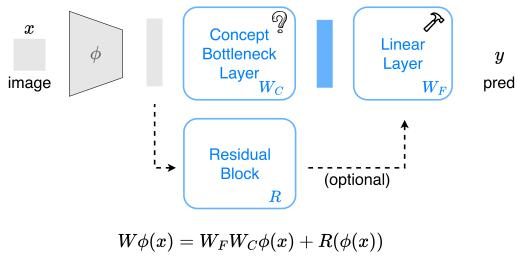

flowchart

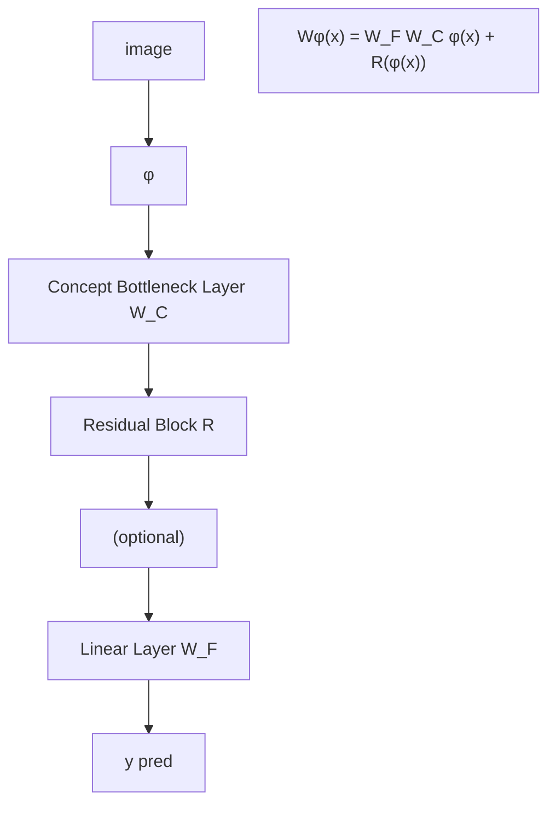

B. Multimodal Concept Bottleneck Model  
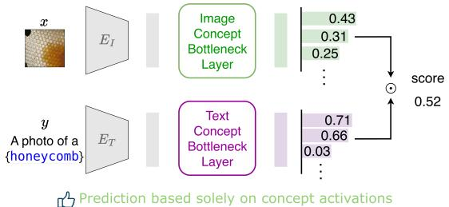

flowchart

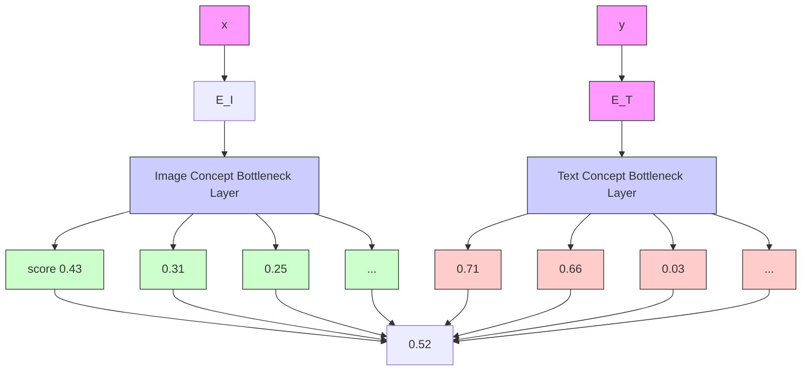

C. Inference Process  
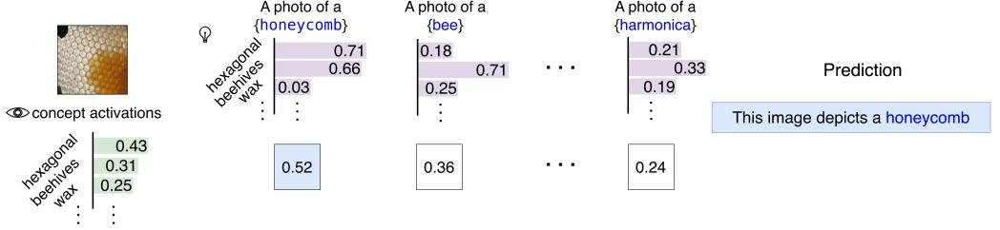

bar chart

| Concept | Hexagonal | Bee | Harmonica |
| --- | --- | --- | --- |
| hexagonal | 0.43 | 0.71 | 0.21 |
| beehives | 0.31 | 0.66 | 0.33 |
| wax | 0.25 | 0.03 | 0.19 |
| ... | ... | ... | ... |
| hexagonal wax | ... | ... | ... |

Figure 1: A. Previous work can compensate for uncertain concept bottlenecks by adjusting the linear layer. B. Our MM-CBM makes predictions based solely on concept responses. C. The inference process of MM-CBM.

As an alternative, researchers have developed intrinsically interpretable models such as Concept Bottleneck Models (CBMs) [16, 24, 35, 29, 37], which introduce a human-interpretable concept bottleneck layer (CBL) before the classifier. This ensures that predictions are grounded in semantically meaningful concepts. Despite their promise, existing CBMs rely on linear classification layers, which introduce two key limitations: (1) Restriction to predefined labels: Due to their inference mechanism, conventional CBMs can only handle a fixed set of output categories and do not support natural language queries. (2) Information redundancy and leakage: Prior work [35, 29] has shown that CBMs may suffer from information leakage, where the classifier can learn to bypass concept activations—making accurate predictions even when the CBL weights are randomly initialized. These issues raise a fundamental question: Can we design a more flexible and expressive architecture that supports arbitrary inputs and labels, while maintaining full interpretability throughout the decision-making process?

To address this, we propose a new framework called Multimodal Concept Bottleneck Model (MM-CBM). Unlike existing CBMs that use a single CBL, MM-CBM introduces dual CBLs—one for the image modality and one for the text modality—ensuring that the same conceptual semantics are aligned across both. The text encoder converts arbitrary textual inputs into concept responses, while the image encoder maps visual inputs into the same concept space as shown in Fig 1B. During inference, predictions are made by computing the similarity between concept responses from both modalities. Additionally, by leveraging the pretrained architectures and knowledge of Vision-Language Models (VLMs), MM-CBMs can achieve performance close to state-of-the-art zero-shot VLMs while providing interpretability.

Our key contributions are summarized as follows:

• We propose the first CBM architecture with dual concept bottleneck layers across modalities, enabling more complex tasks such as zero-shot generalization and image retrieval.  
• We introduce a fully transparent and interpretable decision-making process that inherently avoids information leakage and improves faithfulness.  
• Our framework surpasses previous CBMs under ANEC-5 (accuracy under NEC = 5), and achieves task performance comparable to black-box models in both fine-tuned and zero-shot settings.

## 2 Related work

Global neuron-level explanations. Recent advances in representation-based post-hoc explanation methods have provided new insights into understanding neural network behavior at a global level. Bau et al. [1] aligned neuron activations with human-labeled image regions using manually annotated datasets, thereby assigning semantic concepts to individual neurons. Kalibhat et al. [13], Hernandez et al. [11] identified highly activated image regions through predefined submodules or image captioning models to generate neuron-level explanations. More recently, Oikarinen and Weng [23, 22] introduced a concept activation matrix to quantify the similarity between neuron activations and predefined concepts, either through direct computation or predictive modeling, enabling a more structured and scalable interpretation framework. The inherent polysemanticity of neurons in modern neural networks forms the foundation upon which we build our CBL: by linearly combining neuron activations, we are able to synthesize clear, human-aligned concepts.

Concept bottleneck models (CBMs). CBMs [16] aim to build intrinsically interpretable models by aligning intermediate representations with human-understandable concepts. A typical CBM consists of two components: a concept predictor and a label predictor. Given an input $x \in \mathcal { X }$ and a feature extractor $\phi ,$ the model first maps extracted features ϕ(x) to concept activations $c =$ $W _ { C } \phi ( x ) \in \mathbb { R } ^ { | C | }$ via a projection matrix $W _ { C }$ , where $C$ denotes the set of candidate concepts. Each dimension in c corresponds to a specific interpretable concept. The final prediction is then obtained by applying a linear classifier parameterized by $W _ { F }$ on top of the concept space. In some variants of CBMs [38, 28, 7], a residual fitting is introduced to improve task performance by allowing the model to retain task-relevant information that may not be fully captured by the concept bottleneck alone, albeit at the cost of reduced interpretability. This yields a modified prediction formulation of the form:

$$
\hat {y} = W _ {F} W _ {C} \phi (x) + R (\phi (x)), \tag {1}
$$

where $R ( \cdot )$ denotes a residual function (e.g., a small neural network) that operates on the original features ϕ(x) to capture complementary, potentially non-interpretable information.

This formulation supports modular reasoning, enabling inspection, intervention, and editing of intermediate concept activations to enhance interpretability and controllability. With the rise of visionlanguage models (VLMs), recent works [24, 37, 35] have extended CBMs to support automatic concept labeling across modalities. However, as pointed out in [35, 29], when the dimensionality of the concept layer is sufficiently large, even randomly projected features can suffice for a linear classifier to approximate the original prediction. That is, given any projection $W _ { C } \mathrm { - e v e n }$ a randomly initialized one—it is possible to analytically recover a classifier $W _ { F }$ such that $\hat { y } \approx W \phi ( x )$ , where W is the original classifier, as shown in Fig 1A. This undermines the faithfulness and constraint role of the bottleneck layer. Moreover, existing CBMs often generalize poorly, being restricted to pre-trained classes and struggling under distribution shifts [7]. In contrast, our approach incorporates an additional text CBL, enabling responses to arbitrary textual descriptions and generating corresponding class weights—effectively extending concept coverage beyond fixed pre-training categories. A detailed comparison between our method and prior CBMs is provided in Table 1.

CLIP and its interpretability. CLIP [26] is a large-scale vision-language model trained on extensive image-text pairs using natural language supervision. It achieves strong zero-shot classification performance by encoding both images and text into a shared embedding space and computing similarity scores for prediction. Due to its strong generalization and semantic understanding capabilities, CLIP representations have been widely adopted in tasks such as semantic segmentation, object detection, visual question answering (VQA), and prompt generation for generative models. Numerous variants have been developed to enhance generalization [31, 39] and computational efficiency [18].

Several efforts have also been made to interpret CLIP’s internal representations. Goh et al. [10] revealed the presence of multimodal polysemantic neurons within CLIP, showing that individual neurons can encode multiple abstract visual and textual concepts. Bhalla et al. [2] used dictionary learning to decompose CLIP representations into interpretable semantic components. Menon and Vondrick [20] proposed a training-free approach that leverages large language models (LLMs) to interpret $\mathrm { C L I P ^ { \circ } s }$ predictions, thereby improving both transparency and performance.

A.Construct Concept Activation Dataset D'  
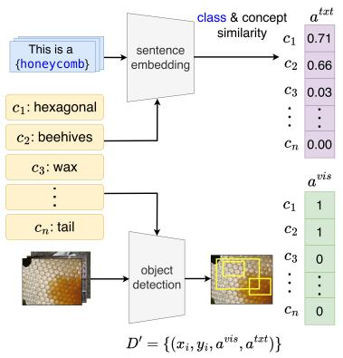

flowchart

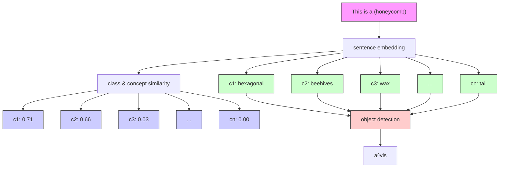

B.Train Dual (text &image) Concept Botleneck Layers gi & gT using D'  
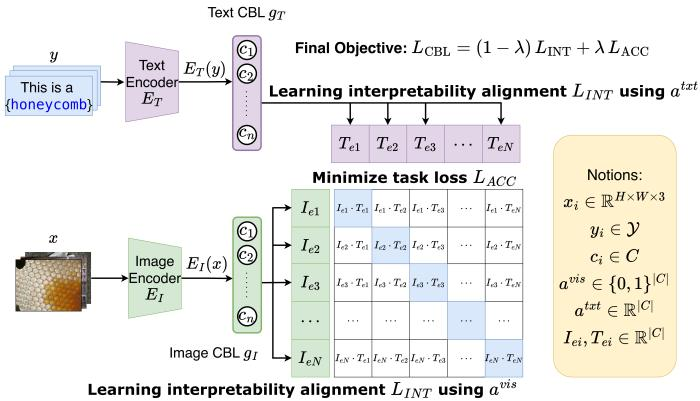

flowchart

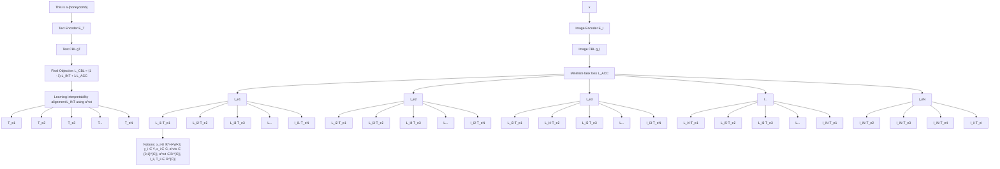

Figure 2: Overview of MM-CBM. A. Extracting high-quality concept annotations for each modality. B. Using an auxiliary dataset to train dual CBLs, jointly optimizing interpretability alignment and task performance.

## 3 Method: MM-CBM

In this section, we introduce Multimodal Concept Bottleneck Models (MM-CBM), a novel framework designed to improve the transparency and interpretability of multimodal reasoning by establishing dual Concept Bottleneck Layers (CBLs). Unlike traditional CBMs that rely on a final linear classification head, MM-CBM operates entirely within the concept space, thereby eliminating the dependence on the linear classifier and enabling fully transparent inference.

By incorporating text-based concept encodings, our approach supports a wider variety of natural language inputs, removing the limitation of fixed N-way classification and enabling open-vocabulary image-text matching and zero-shot generalization. MM-CBM is composed of three main stages: (1) Collecting concept activation data, (2) Training dual concept bottleneck layers, and (3) Performing inference at test time.

## 3.1 Collecting concept activation data

Let $E _ { I } : \mathcal { X }  \mathcal { I }$ denote the image encoder and $E _ { T } : \mathcal { V }  \mathcal { T }$ denote the text encoder of CLIP, which map input images and texts into a unified latent representation space. Here, $\mathcal { X } = \mathbb { R } ^ { H \times W \times 3 }$ represents the image space, and Y denotes the text space. The shared latent space is $\mathcal { T } , \mathcal { T } = \mathbb { R } ^ { d }$ , where $d$ is the dimensionality. We denote the original dataset used for training CBLs as $D = \{ ( x _ { i } , y _ { i } ) \}$ , where $x _ { i } \in \mathcal X$ is the i-th image, $y _ { i } \in \mathcal { V }$ is its corresponding textual label. For a fixed-label classification task, let Y be the set of all possible class labels. The label index of $y _ { i }$ is denoted by $l _ { i } \in \{ 0 , 1 , . . . , | Y | - 1 \}$ , such that $Y _ { l _ { i } } = y _ { i }$ .

Concept set generation. Following recent works [24, 37, 35], we adopt a fully automated pipeline that queries an LLM for each class label $y \in Y$ to generate a candidate concept set $C _ { y }$ , with final concept set $\begin{array} { r } { C = \bigcup _ { y \in Y } C _ { y } } \end{array}$ , reducing annotation cost and avoiding reliance on scarce datasets with human-defined concepts. For zero-shot classification, we leverage the task-agnostic concept set from SpLiCE [2].

Collecting concept labels. With the candidate concept set C in place, we construct a concept activation dataset $\bar { D } ^ { \prime } = \{ ( x _ { i } , y _ { i } , a _ { i } ^ { v i s } , a _ { i } ^ { t x t } ) \}$ } by augmenting each image-text pair with two additional labels as shown in Fig 2A:

• $a _ { i } ^ { v i s } \in \{ 0 , 1 \} ^ { | C | }$ , a binary vector indicating which concepts appear in the image $x _ { i }$  
• $a _ { i } ^ { t x t } \in \mathbb { R } ^ { | C | }$ , quantifies how strongly each concept in $C$ relates to the text label $y _ { i }$

To equip the model with interpretable supervision, we first extract binary concept labels for each image based on OWLv2’s open-source object detection results [21]. The image concept label $[ a _ { i } ^ { v i s } ] _ { \mathcal { I } }$ 1：一

for concept $c _ { j }$ is defined as:

$$
\left[ a _ {i} ^ {\text { vis }} \right] _ {j} = \left\{ \begin{array}{l l} 1, & \text { if   concept } c _ {j} \text { appears   in   image } x _ {i}, \\ 0, & \text { otherwise. } \end{array} \right. \tag {2}
$$

For each training image $x _ { i }$ , we prompt OWLv2 with the class-specific concept set $C _ { y _ { i } }$ . The model predicts a set of bounding boxes $B \overset { \cdot } { = } \{ ( b , f , c ) \}$ }, where b represents the box coordinates, $f$ is the confidence score, and $c \in C _ { y _ { i } }$ is the detected concept. If the confidence $f$ exceeds a predefined threshold $T ,$ , we consider the concept c to be present in image $x _ { i }$ .

To compute $a _ { i } ^ { t x t }$ , the text-concept similarity vector, we define each entry $[ a _ { i } ^ { t x t } ] _ { j }$ as the semantic similarity between the text label $y _ { i }$ and concept $c _ { j }$ :

$$
\left[ a _ {i} ^ {t x t} \right] _ {j} = \operatorname{sim} \left(y _ {i}, c _ {j}\right). \tag {3}
$$

For the similarity function, we follow the Automatic Concept Scoring (ACS) method from CB-LLM [30], where similarity is defined as:

$$
\operatorname{sim} (y _ {i}, c _ {j}) = \mathcal {E} (y _ {i}) \cdot \mathcal {E} (c _ {j}), \tag {4}
$$

with $\mathcal { E } ( \cdot )$ denoting the text embedding generated by a language model. In our implementation, we use the all-mpnet-base-v2 model [34] as the text encoder.

## 3.2 Training dual concept bottleneck layers

Given the concept activation dataset $D ^ { \prime } .$ , we train a pair of Concept Bottleneck Layers (CBLs): one for identifying concept presence in images, and the other for capturing the association between concepts and textual labels. Our training objective consists of two components: an interpretability loss $L _ { \mathrm { I N T } }$ and a classification loss $L _ { \mathrm { A C C } }$ as shown in Fig 2B.

Interpretability loss ${ \cal L } _ { \bf I N T }$ . To explicitly align the outputs of the concept bottleneck layers (CBLs) with human-interpretable concepts, we define an interpretability loss that supervises both the image and text sides using binary and soft labels, respectively. Let $\dot { g } _ { I } : \mathcal { T }  \mathbb { R } ^ { | \bar { C } | }$ and $g _ { T } : \mathcal { T }  \mathbb { R } ^ { | \bar { C } | }$ denote the image and text CBLs, respectively, where |C| is the number of concepts. These CBLs project image and text features into a shared concept space. To enforce consistency between predicted concept activations and ground-truth annotations in $\bar { D } ^ { \prime }$ , we define the interpretability loss as:

$$
L _ {\mathrm{INT}} = \frac {1}{| D ^ {\prime} |} \sum_ {i = 1} ^ {| D ^ {\prime} |} L _ {I} (g _ {I} \circ E _ {I} (x _ {i}), a _ {i} ^ {v i s}) + \tag {5}
$$

$$
L _ {T} (g _ {T} \circ E _ {T} (y _ {i}), a _ {i} ^ {t x t}),
$$

$E _ { I }$ $E _ { T }$ $a _ { i } ^ { v i s } , a _ { i } ^ { t x t } \in \mathbb { R } ^ { | C | }$ are the concept label vectors for image and text respectively. We adopt binary cross-entropy (BCE) for the image-side loss $L _ { I }$ and negative cosine similarity for the text-side loss $L _ { T }$ , reflecting the discrete and continuous nature of the constructed concept labels.

Task loss $L _ { \mathbf { A C C } }$ . To maintain the model’s performance on downstream task, we introduce a taskspecific classification loss based on the representations in the concept space. Let $I _ { e } = g _ { I } \circ E _ { I } ( x )$ and $T _ { e } = g _ { T } \circ E _ { T } ( y )$ denote the image and text representations in the concept space.

To ensure interpretability and promote sparsity—i.e., encouraging the prediction rely on a small subset of semantically meaningful concepts—we draw inspiration from the number of effective concepts (NEC) [29]. Specifically, the similarity between $I _ { e }$ and $T _ { e }$ is computed as the sum of the top-n responding dimensions over element-wise products. To further enhance interpretability and reduce the influence of negatively activated concepts, we set all negative elements in the concept vectors to zero before computing the similarity: $I _ { e } ^ { + } = \mathop { \mathrm { R e L U } } ( I _ { e } )$ and $\bar { T } _ { e } ^ { + } = \mathrm { R e L U } ( T _ { e } )$ . More details are provided in Appendix A.3. In this case, the classification loss is defined as:

$$
L _ {\mathrm{ACC}} = L _ {\mathrm{CE}} \left(\frac {\sum \operatorname{top} - n (I _ {e} ^ {+} \odot T _ {e} ^ {+})}{\| I _ {e} ^ {+} \| _ {2} \| T _ {e} ^ {+} \| _ {2}} \cdot e ^ {\tau}, l\right), \tag {6}
$$

where $L _ { \mathrm { C E } }$ denotes the cross-entropy loss, ⊙ represents element-wise multiplication, τ is a learnable temperature parameter, and l is the index of the ground-truth label.

Final objective To jointly optimize both interpretability and task performance, we integrate the interpretability loss and discriminative loss into a unified objective. Notably, our model can also be trained without ground-truth labels, achieving classification accuracy comparable to CLIP; see Appendix A.4 for details. This combined loss function enables the model to learn concept-aligned representations while maintaining strong classification performance, thereby mitigating the risk of the linear layer overfitting to the task and compensating for a poorly interpretable concept space:

$$
L _ {\mathrm{CBL}} = (1 - \lambda) L _ {\mathrm{INT}} + \lambda L _ {\mathrm{ACC}}, \tag {7}
$$

where $\lambda \in [ 0 , 1 ]$ controls the trade-off between interpretability and task accuracy.

## 3.3 Performing inference at test time

During inference, given any image x and text y, the model outputs two modality-specific concept embeddings: an image concept embedding $I _ { e } = ( c _ { i 1 } , c _ { i 2 } , \cdot \cdot \cdot , c _ { i m } )$ and a text concept embedding $T _ { e } = ( c _ { t 1 } , c _ { t 2 } , \cdot \cdot \cdot , c _ { t m } )$ , where each element $c _ { j }$ reflects the degree to which the j-th concept is present in the image or related to the text, m is the number of candidate concepts, $m = | C |$ .

To assess the semantic consistency between the image and text, we compute the similarity between the two concept embeddings:

$$
z = \left(\frac {\sum \operatorname{top} - n (I _ {e} ^ {+} \odot T _ {e} ^ {+})}{\| I _ {e} ^ {+} \| _ {2} \| T _ {e} ^ {+} \| _ {2}}\right) \times e ^ {\tau},
$$

where z denotes the similarity score (logits), ⊙ represents element-wise multiplication. Since both embeddings are aligned with human-interpretable concepts and the inference depends solely on these vectors, the inference process of MMCBM is fully transparent as shown in Fig 2B.

The resulting similarity score reflects the alignment of the image and text with respect to the shared concept space. Furthermore, in contrast to traditional CBMs that rely on a linear classifier to associate concepts with categorical labels, our text CBL directly produces concept activations from natural language descriptions. This not only simplifies the inference pipeline but also enables flexible support for diverse textual inputs.

## 4 Experiment

In this section, we evaluate our method and perform an ablation study. Section 4.1 outlines the experimental setup. In Section 4.2, we compare MM-CBM with existing CBMs and the black-box CLIP used in our method, demonstrating its effectiveness. Section 4.3 presents ablation studies on the interpretability enhancement techniques described in Appendix A.3. Section 4.4 shows quantitative interpretability results obtained through interactions with VLMs.

## 4.1 Experimental setup

Datasets: We conduct experiments on seven datasets covering diverse task types: (1) General image classification: CIFAR-10, CIFAR-100 [17], and ImageNet [9]; (2) Fine-grained classification: Food-101 (Food) [4], CUB [33], and Oxford-IIIT Pets (OxfordPets) [25]; (3) Texture classification: Describable Textures Dataset (DTD) [8]. Additionally, we trained MM-CBM on multimodal dataset (CC12M [6]) to test the generalization ability. We follow the standard train/test splits, as detailed in Appendix A.5, and use classification accuracy as the evaluation metric.

Baselines: We compare MM-CBM with four interpretable baselines: LF-CBM [24], LaBo [37], LM4CV [35], and VLG-CBM [29], as well as the CLIP-ViT-L/14 backbone using both zero-shot and linear-probe settings.

Implementation: We use gpt-3.5-turbo-instruct to generate candidate concept sets for datasets. Unless otherwise specified, the trade-off parameter between interpretability and task performance is set to $\lambda = 0 . 2 .$ and the NEC is fixed at 5. To ensure fair comparison with prior CBMs, we use CLIP-RN50 as the backbone. All other evaluations are conducted using models trained with CLIP-ViT-L/14. We use the Adam optimizer [15] during training. For each batch, we randomly select one sentence from those generated by VLMs as the text input for each category.

For the fine-tune scenario, where target datasets are used, we compare MM-CBM to CLIP-ViT-L/14 with linear probing. For the zero-shot scenario, we compare with the zero-shot performance of CLIP. To accelerate training and reduce computational overhead under the zero-shot scenario, we omit the NEC constraint and directly use the inner product $I _ { e } ^ { + } \odot T _ { e } ^ { + }$ instead of the top-n summation.

## 4.2 Results

Comparison with existing CBMs: Table 2 shows accuracy under ${ \mathsf { N E C } } = 5 \left( { \mathrm { A N E C } } { - } 5 \right)$ . MM-CBM achieves performance comparable to the strongest baseline, VLG-CBM, and surpasses others by over 10% accuracy on ImageNet. This suggests that MM-CBM benefits from the rich semantic knowledge embedded in the CLIP backbone, particularly on large-scale datasets.

Table 2: Comparison with other CBMs on ANEC-5 using CLIP RN50. Best results for each benchmark are in bold; second-best are underlined.

<table><tr><td>Method</td><td colspan="5">Dataset</td></tr><tr><td>ANEC=5</td><td>CIFAR10</td><td>CIFAR100</td><td>ImageNet</td><td>CUB</td><td>Average</td></tr><tr><td>LF-CBM</td><td>84.05</td><td>56.52</td><td>52.88</td><td>31.35</td><td>56.20</td></tr><tr><td>LM4CV</td><td>53.72</td><td>14.64</td><td>3.77</td><td>3.63</td><td>18.94</td></tr><tr><td>LaBo</td><td>78.69</td><td>44.82</td><td>24.27</td><td>41.97</td><td>47.44</td></tr><tr><td>VLG-CBM</td><td>88.55</td><td>65.73</td><td>59.74</td><td>60.38</td><td>68.60</td></tr><tr><td>MM-CBM(Ours)</td><td>86.80</td><td>64.96</td><td>70.23</td><td>58.79</td><td>70.20</td></tr></table>

Comparison with CLIP backbone: Table 3 compares MM-CBM under both fine-tune and zeroshot scenarios with CLIP’s linear-probe and zero-shot performance. Across six datasets, MM-CBM achieves comparable results. However, on the CUB dataset, performance drops notably in the zeroshot setting. This may be attributed to the poor performance of the original CLIP model on CUB, likely due to insufficient semantic representations of bird-related concepts, which limits its ability to distinguish fine-grained categories. Additionally, the candidate concept set may lack coverage of bird-specific attributes. Nonetheless, the results remain non-trivial and demonstrate that MM-CBM can still generalize reasonably even in challenging scenarios.

Table 3: Test accuracy comparison with black-box CLIP.

<table><tr><td rowspan="2">Method</td><td colspan="7">Dataset</td></tr><tr><td>CIFAR-10</td><td>CIFAR-100</td><td>CUB</td><td>Food</td><td>OxfordPets</td><td>DTD</td><td>ImageNet</td></tr><tr><td colspan="8">Zero-shot</td></tr><tr><td>CLIP ViT-L/14</td><td>96.2</td><td>77.9</td><td>62.3</td><td>92.9</td><td>93.5</td><td>55.3</td><td>75.3</td></tr><tr><td>MM-CBM(Ours)</td><td>94.2</td><td>75.2</td><td>39.2</td><td>85.7</td><td>80.1</td><td>49.6</td><td>67.4</td></tr><tr><td colspan="8">Finetuned</td></tr><tr><td>CLIP linear probe</td><td>98.0</td><td>87.5</td><td>84.5</td><td>95.2</td><td>95.1</td><td>82.1</td><td>83.9</td></tr><tr><td>MM-CBM(Ours)</td><td>97.0</td><td>84.5</td><td>74.1</td><td>93.6</td><td>91.9</td><td>73.4</td><td>82.1</td></tr></table>

## 4.3 Ablation study

We assess the effect of the non-negative concept space introduced in Appendix A.3. Alternatives such as sigmoid, squaring activations, and removing this module are evaluated. The $L _ { 1 }$ norm is used to measure the sparsity of concept responses.

Given a non-negative vector v of length |S| (number of candidate concepts), and $\| v \| _ { 2 } = 1$ , we have $1 \leq \| v \| _ { 1 } \leq \sqrt { | S | }$ . Lower $\| v \| .$ 1 implies higher sparsity, which improves interpretability. We report the average $L _ { 1 }$ norm of visual $( I _ { e } )$ and textual $( \hat { T } _ { e } )$ activations, and average alignment score across validation samples.

Table 4 shows that our approach yields nearly 20× smaller $L _ { 1 }$ norm for visual activations and $2 \times$ smaller for text, compared to other methods. Our alignment score also improves by $5 \times$ , suggesting higher prediction confidence. Importantly, increased sparsity does not degrade accuracy but enhances reliability. Additionally, since visual supervision uses binary targets and text uses real-valued similarity scores, visual concept activations are expected to be sparser. Our method preserves this property, while others reverse it, potentially introducing redundant activations.

Table 4: Ablation study of non-negative setting. Visual and language correspond to the average L1 norm of image and text concept activation; Score means the average highest alignment score, the image and prediction alignment score.

<table><tr><td>Function</td><td>Visual activation</td><td>Language activation</td><td>Alignment score</td><td>Accuracy</td></tr><tr><td>Sigmoid</td><td>59.52</td><td>25.74</td><td>0.06</td><td>77.87</td></tr><tr><td> $x^{2}$ </td><td>44.77</td><td>15.91</td><td>0.10</td><td>81.82</td></tr><tr><td>None</td><td>59.52</td><td>39.67</td><td>0.01</td><td>80.79</td></tr><tr><td>ReLU</td><td>2.39</td><td>7.84</td><td>0.47</td><td>82.07</td></tr></table>

## 4.4 Interpretability result - comparison with VLMs

Vision-Language Models (VLMs) are highly capable of understanding the overall semantics of images and generating natural language explanations. This appears similar to the goal of CBMs, so we directly compared explanations from our MM-CBM (ImageNet) with those from VLMs.

Specifically, we prompted each model with the template: "Why is this image categorized as {cls}?", and collected 5,000 explanation pairs from imagenet dataset. To evaluate which explanation contained more informative visual concepts, we leveraged the VQA capabilities of VLMs themselves by asking: "Which description has more informative visual concepts in this image?" Notably, to reduce modelspecific bias and avoid self-preference in scoring, we separated the roles of evaluator and competitor across models—using different VLMs to act as the "judge" and the "explainer." In our experiments, we used LLaVA-v1.5-7B [19] and Llama-3.2-11B-Vision-Instruct [32], alternating their roles to ensure fairness and robustness. MM-CBM explanations were preferred over LLaVA 1.5 in 4,433 (88.7%) out of 5,000 cases, and over Llama 3.2 in 3,292 (65.8%) cases. These findings suggest that although VLMs are adept at generating high-level semantic interpretations, they tend to overlook fine-grained visual concepts that are central to CBM-style interpretability.

Although it is technically possible to guide VLMs toward generating better explanations by designing elaborate prompt templates, such approaches are prohibitively inefficient. In our measurements, these carefully prompted baselines were up to 1,000× slower than MM-CBM, requiring significant computational resources and longer inference times. In contrast, MM-CBM achieves high-quality, concept-centric explanations in a highly efficient and scalable manner—making it practical for deployment at scale.

## 5 Case study: image retrieval

We replace the fixed linear classifier with a text encoder, enabling flexible and unrestricted text inputs. In this section, we evaluate our model via an image retrieval task: given arbitrary text, the model selects the image with the highest alignment score. This allows us to assess the model’s semantic consistency and generalization ability. To systematically analyze retrieval performance, we define five types of textual queries:

• Type-A: Ground-truth label queries – Direct retrieval using exact class labels (e.g., uniform, popsicle, crane).  
• Type-B: Concept-based queries – Retrieval based on key concepts (e.g., striped fur, spotted fur, uniformed fur), allowing us to test fine-grained concept understanding.  
• Type-C: Hybrid label-concept queries – Queries that combine class labels and specific concepts (e.g., crane with machine, or cat with striped fur to resemble a tiger).  
• Type-D: Out-of-distribution queries – Texts containing unseen labels or novel concepts not present in the training set (e.g., toothpaste, linked to cleanliness or washing; stable, associated with safety or defense).

• Type-E: Polysemous or abstract queries – Phrases involving ambiguity or abstraction (e.g., give me a hand, which could refer to a physical hand or the act of helping; danger, suggested by an open safe filled with gold bars; fun, evoked by entertainment devices).

<table><tr><td rowspan="3">Type-A</td><td colspan="2">Query: Give me a popsicle</td><td>The concepts most related to query:</td><td>The concepts most related to the image</td></tr><tr><td rowspan="2"></td><td>This image is a popsicle because it has:</td><td rowspan="2">a colorful, icy coating (0.49)a freezer (0.27)dessert (0.25)ice (0.21)flavorful filling (0.21)</td><td rowspan="2">a colorful, icy coating (0.87)dessert (0.41)a topping (0.20)a colorful, icy exterior (0.15)flavorful filling (0.11)</td></tr><tr><td>a colorful, icy coating (0.42)dessert (0.10)a colorful, icy exterior (0.02)flavorful filling (0.02)a topping (0.01)</td></tr><tr><td rowspan="3">Type-B</td><td colspan="2">Query: Give me a spotted fur picture</td><td rowspan="3">a spotted coat (0.31)dog (0.28)spotted fur (0.26)often has a soft, padded feel (0.26)</td><td rowspan="3">a spotted coat (0.71)dog (0.42)a thin, stretchy surface (0.30)often has a soft, padded feel (0.25)</td></tr><tr><td rowspan="2">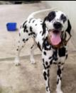</td><td>This image is spotted fur because it has:</td></tr><tr><td>a spotted coat (0.22)dog (0.11)often has a soft, padded feel (0.06)</td></tr><tr><td rowspan="3">Type-C</td><td colspan="2">Query: The image shows crane, the machine</td><td rowspan="3">a lift arm on the side (0.27)rig (0.26)a central axle or shaft (0.25)a construction site (0.24)</td><td rowspan="3">rig (0.65)a construction site (0.52)extends over water (0.35)weights (0.33)a banner (0.21)</td></tr><tr><td rowspan="2"></td><td>This image is a machine crane because it has:</td></tr><tr><td>rig (0.17)a construction site (0.12)extends over water (0.04)weights (0.03)attached to a long shaft (0.02)</td></tr><tr><td rowspan="3">Type-D</td><td colspan="2">Query: This image depicts something easy to break</td><td rowspan="3">a kitchen (0.22)saw (0.17)tool (0.16)a piece of wood (0.15)a bike lock (0.15)</td><td rowspan="3">screws (0.52)tool (0.47)pliers (0.46)kit (0.38)used for pounding nails (0.28)</td></tr><tr><td rowspan="2"></td><td>This image is breaking tool because it has:</td></tr><tr><td>tool (0.08)screws (0.06)pliers (0.05)</td></tr><tr><td rowspan="3">Type-E</td><td colspan="2">Query: Give me a hand</td><td rowspan="3">an operating system (0.23)a soldier (0.20)four handles or handholds (0.19)hands (0.187)</td><td rowspan="3">a paramedic (0.68)four handles or handholds (0.41)a soldier (0.37)a front sight (0.30)a patient (0.26)</td></tr><tr><td rowspan="2">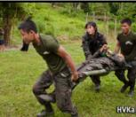</td><td>This image is a helping scene because it has:</td></tr><tr><td>a paramedic (0.08)four handles or handholds (0.08)a soldier (0.07)</td></tr></table>

Figure 3: Image Retrieval on five different types of queries.

This evaluation setup helps us validate the semantic alignment of our model and its ability to generalize beyond predefined labels or fixed concepts. We use the model trained on ImageNet for all experiments. For each query type, representative examples are chosen as described above. Retrieval results (Figure 3) show that our model’s semantic understanding is, to a large extent, consistent with human interpretation. Notably, it is capable of summarizing and refining concepts based on context. However, some inconsistencies remain due to noise introduced during training, which may affect interpretability and reliability in certain edge cases. Full retrieval results and additional examples can be found in Appendix A.10.

## 6 Conclusion

In summary, we propose MM-CBM, a flexible framework that enables interpretable modeling across both image and text modalities using arbitrary inputs. By leveraging the expert knowledge embedded in existing vision-language foundation models, MM-CBM simultaneously learns interpretable concepts from both modalities and introduces simple yet effective strategies to enhance interpretability. Our approach achieves competitive performance compared to existing Concept Bottleneck Models (CBMs) and even black-box baselines, while maintaining transparency in the inference process. We believe MM-CBM presents a new paradigm for building interpretable multimodal models, with the potential to benefit a broad range of applications in multimodal learning, such as image retrieval, captioning, and visual question answering.

## References

[1] David Bau, Bolei Zhou, Aditya Khosla, Aude Oliva, and Antonio Torralba. Network dissection: Quantifying interpretability of deep visual representations. In CVPR, pages 6541–6549, 2017.  
[2] Usha Bhalla, Alex Oesterling, Suraj Srinivas, Flavio Calmon, and Himabindu Lakkaraju. Interpreting clip with sparse linear concept embeddings (splice). In Advances in Neural Information Processing Systems, pages 84298–84328, 2024.  
[3] Steven Bills, Nick Cammarata, Dan Mossing, Henk Tillman, Leo Gao, Gabriel Goh, Ilya Sutskever, Jan Leike, Jeff Wu, and William Saunders. Language models can explain neurons in language models. https://openaipublic.blob.core.windows.net/ neuron-explainer/paper/index.html, 2023.  
[4] Lukas Bossard, Matthieu Guillaumin, and Luc Van Gool. Food-101–mining discriminative components with random forests. In Computer vision–ECCV 2014: 13th European conference, zurich, Switzerland, September 6-12, 2014, proceedings, part VI 13, pages 446–461. Springer, 2014.  
[5] Tom Brown, Benjamin Mann, Nick Ryder, Melanie Subbiah, Jared D Kaplan, Prafulla Dhariwal, Arvind Neelakantan, Pranav Shyam, Girish Sastry, Amanda Askell, et al. Language models are few-shot learners. Advances in neural information processing systems, 33:1877–1901, 2020.  
[6] Soravit Changpinyo, Piyush Sharma, Nan Ding, and Radu Soricut. Conceptual 12m: Pushing web-scale image-text pre-training to recognize long-tail visual concepts. In Proceedings of the IEEE/CVF conference on computer vision and pattern recognition, pages 3558–3568, 2021.  
[7] Jihye Choi, Jayaram Raghuram, Yixuan Li, and Somesh Jha. Adaptive concept bottleneck for foundation models under distribution shifts. arXiv preprint arXiv:2412.14097, 2024.  
[8] Mircea Cimpoi, Subhransu Maji, Iasonas Kokkinos, Sammy Mohamed, and Andrea Vedaldi. Describing textures in the wild. In Proceedings of the IEEE conference on computer vision and pattern recognition, pages 3606–3613, 2014.  
[9] Jia Deng, Wei Dong, Richard Socher, Li-Jia Li, Kai Li, and Li Fei-Fei. Imagenet: A largescale hierarchical image database. In 2009 IEEE conference on computer vision and pattern recognition, pages 248–255. Ieee, 2009.  
[10] Gabriel Goh, Nick Cammarata, Chelsea Voss, Shan Carter, Michael Petrov, Ludwig Schubert, Alec Radford, and Chris Olah. Multimodal neurons in artificial neural networks. Distill, 6(3): e30, 2021.  
[11] Evan Hernandez, Sarah Schwettmann, David Bau, Teona Bagashvili, Antonio Torralba, and Jacob Andreas. Natural language descriptions of deep visual features. In ICLR, 2021.  
[12] Geoffrey Hinton, Oriol Vinyals, and Jeff Dean. Distilling the knowledge in a neural network. arXiv preprint arXiv:1503.02531, 2015.  
[13] Neha Kalibhat, Shweta Bhardwaj, C Bayan Bruss, Hamed Firooz, Maziar Sanjabi, and Soheil Feizi. Identifying interpretable subspaces in image representations. In ICML, pages 15623– 15638. PMLR, 2023.  
[14] Mohammad Ali Khan, Tuomas Oikarinen, and Tsui-Wei Weng. Concept-monitor: Understanding dnn training through individual neurons. arXiv preprint arXiv:2304.13346, 2023.  
[15] Diederik P Kingma and Jimmy Ba. Adam: A method for stochastic optimization. arXiv preprint arXiv:1412.6980, 2014.  
[16] Pang Wei Koh, Thao Nguyen, Yew Siang Tang, Stephen Mussmann, Emma Pierson, Been Kim, and Percy Liang. Concept bottleneck models. In International conference on machine learning, pages 5338–5348. PMLR, 2020.  
[17] Alex Krizhevsky, Geoffrey Hinton, et al. Learning multiple layers of features from tiny images. 2009.  
[18] Yanghao Li, Haoqi Fan, Ronghang Hu, Christoph Feichtenhofer, and Kaiming He. Scaling language-image pre-training via masking. In Proceedings of the IEEE/CVF conference on computer vision and pattern recognition, pages 23390–23400, 2023.  
[19] Haotian Liu, Chunyuan Li, Qingyang Wu, and Yong Jae Lee. Visual instruction tuning. Advances in neural information processing systems, 36:34892–34916, 2023.  
[20] Sachit Menon and Carl Vondrick. Visual classification via description from large language models. In ICLR, 2023.  
[21] Matthias Minderer, Alexey Gritsenko, and Neil Houlsby. Scaling open-vocabulary object detection. In NeurIPS, 2024.  
[22] Tuomas Oikarinen and Tsui-Wei Weng. Clip-dissect: Automatic description of neuron representations in deep vision networks. In The Eleventh International Conference on Learning Representations, 2023.  
[23] Tuomas Oikarinen and Tsui-Wei Weng. Linear explanations for individual neurons. In International Conference on Machine Learning, pages 38639–38662. PMLR, 2024.  
[24] Tuomas Oikarinen, Subhro Das, Lam Nguyen, and Lily Weng. Label-free concept bottleneck models. In ICLR, 2023.  
[25] Omkar M Parkhi, Andrea Vedaldi, Andrew Zisserman, and CV Jawahar. Cats and dogs. In 2012 IEEE conference on computer vision and pattern recognition, pages 3498–3505. IEEE, 2012.  
[26] Alec Radford, Jong Wook Kim, Chris Hallacy, Aditya Ramesh, Gabriel Goh, Sandhini Agarwal, Girish Sastry, Amanda Askell, Pamela Mishkin, Jack Clark, et al. Learning transferable visual models from natural language supervision. In ICML, 2021.  
[27] Tamar Rott Shaham, Sarah Schwettmann, Franklin Wang, Achyuta Rajaram, Evan Hernandez, Jacob Andreas, and Antonio Torralba. A multimodal automated interpretability agent. In Forty-first International Conference on Machine Learning, 2024.  
[28] Chenming Shang, Shiji Zhou, Hengyuan Zhang, Xinzhe Ni, Yujiu Yang, and Yuwang Wang. Incremental residual concept bottleneck models. In Proceedings of the IEEE/CVF Conference on Computer Vision and Pattern Recognition, pages 11030–11040, 2024.  
[29] Divyansh Srivastava, Ge Yan, and Tsui-Wei Weng. Vlg-cbm: Training concept bottleneck models with vision-language guidance. In NeurIPS, 2024.  
[30] Chung-En Sun, Tuomas Oikarinen, Berk Ustun, and Tsui-Wei Weng. Concept bottleneck large language models. ICLR, 2025.  
[31] Quan Sun, Yuxin Fang, Ledell Wu, Xinlong Wang, and Yue Cao. Eva-clip: Improved training techniques for clip at scale. arXiv preprint arXiv:2303.15389, 2023.  
[32] Hugo Touvron, Thibaut Lavril, Gautier Izacard, Xavier Martinet, Marie-Anne Lachaux, Timothée Lacroix, Baptiste Rozière, Naman Goyal, Eric Hambro, Faisal Azhar, et al. Llama: Open and efficient foundation language models. arXiv preprint arXiv:2302.13971, 2023.  
[33] Catherine Wah, Steve Branson, Peter Welinder, Pietro Perona, and Serge Belongie. The caltech-ucsd birds-200-2011 dataset. 2011.  
[34] Thomas Wolf, Lysandre Debut, Victor Sanh, Julien Chaumond, Clement Delangue, Anthony Moi, Pierric Cistac, Tim Rault, Rémi Louf, Morgan Funtowicz, et al. Transformers: State-ofthe-art natural language processing. In EMNLP, 2020.  
[35] An Yan, Yu Wang, Yiwu Zhong, Chengyu Dong, Zexue He, Yujie Lu, William Yang Wang, Jingbo Shang, and Julian McAuley. Learning concise and descriptive attributes for visual recognition. In ICCV, 2023.  
[36] Chuanguang Yang, Zhulin An, Libo Huang, Junyu Bi, Xinqiang Yu, Han Yang, Boyu Diao, and Yongjun Xu. Clip-kd: An empirical study of clip model distillation. In Proceedings of the IEEE/CVF Conference on Computer Vision and Pattern Recognition, pages 15952–15962, 2024.  
[37] Yue Yang, Artemis Panagopoulou, Shenghao Zhou, Daniel Jin, Chris Callison-Burch, and Mark Yatskar. Language in a bottle: Language model guided concept bottlenecks for interpretable image classification. In CVPR, 2023.  
[38] Mert Yuksekgonul, Maggie Wang, and James Zou. Post-hoc concept bottleneck models. In The Eleventh International Conference on Learning Representations, 2023.  
[39] Xiaohua Zhai, Basil Mustafa, Alexander Kolesnikov, and Lucas Beyer. Sigmoid loss for language image pre-training. In Proceedings of the IEEE/CVF international conference on computer vision, pages 11975–11986, 2023.

## A Appendix

## A.1 Overview

The appendix covers: A.2 concept set generation; A.3 interpretability enhancement strategies; A.4 unsupervised adaptation via knowledge distillation; A.5 experimental configurations; A.6–A.7 ablations on effective concepts and non-negative transformations; A.8 human intervention; A.9 alternative backbones; and A.10 image retrieval examples.

## A.2 Concept set generation

Let C denote a fine-grained concept set that semantically explains the images and their corresponding labels in D. Such a set can be manually curated by domain experts or automatically generated using large language models (LLMs) [32, 5]. Following recent studies [24, 37, 35], we adopt a fully automated approach in which, for each class label $y \in { \bar { Y } }$ , an LLM is queried to produce a candidate concept set $C _ { y }$ . Under the label-free CBM setting [24], the LLM is prompted as follows:

• List the most important features for recognizing something as a {class}:  
• List the things most commonly seen around a {class}:  
• Give superclasses for the word {class}:

Here, {class} refers to the class name in the target classification task. The final concept set is obtained as the union of all class-specific sets:

$$
C = \bigcup_ {y \in Y} C _ {y}.
$$

We further refine C using the filtering strategy proposed in label-free CBM, with the following steps:

1. Concept length: Discard concepts exceeding 30 characters to maintain simplicity and interpretability.  
2. Similarity to target classes: Remove concepts overly similar to target class names, as they undermine the explanatory role of the CBM. Similarity is measured via cosine similarity in a joint text embedding space, combining features from the CLIP ViT-B/16 text encoder and the all-mpnet-base-v2 sentence encoder. Concepts with similarity greater than 0.85 to any target class are excluded.  
3. Redundancy removal: Eliminate duplicate or near-synonymous concepts to ensure diversity in the bottleneck layer. Using the same embedding space, any concept with cosine similarity above 0.9 to an already retained concept is removed.

This automated generation and filtering process substantially reduces the reliance on manual annotation while enabling scalable construction of rich concept sets, even for datasets lacking human-defined concept annotations.

## A.3 Strategies to enhance interpretability

In this section, we introduce three strategies designed to enhance the interpretability of our multimodal CBM model.

Generation of rich textual information. In many vision-language datasets, there exists a significant imbalance between the number of images and the granularity of their associated textual labels—where hundreds or even thousands of images may share the same class name. Repeatedly using identical textual inputs during training can introduce undesirable biases and restrict model generalization. To address this issue, we leverage the capabilities of the state-of-the-art multimodal large language model Llama 3.2-Vision to generate diverse, semantically rich label descriptions. Specifically, we prompt the model with the following template: "If I had to describe this image using only one sentence with the words class, it would be: " For each class label, we randomly select images belonging to that class and generate at least 50 unique textual descriptions. During training, one of these alternative descriptions is randomly sampled for each iteration, thereby improving diversity in the language modality and reducing overfitting to fixed textual patterns.

Table A.1: Examples of generated sentence.

<table><tr><td>Generated sentence</td></tr><tr><td>The image shows a hand holding tench.This is a close-up of a goldfish.The image depicts a jay with its wings spread.It would be a smooth newt with a smooth skin.The peafowl is pecking at the ground.The macaw is a vibrant and colorful bird.The image features a Bluetick Coonhound.</td></tr></table>

Number of effective concepts (NEC). NEC, originally proposed by [29], is a metric that helps prevent information leakage by constraining model reliance on a limited set of semantically meaningful features. We adapt this approach to our multimodal CBM when computing the alignment score between an input image $x _ { i }$ and its corresponding label $y _ { i }$ using interpretable encodings. Specifically, we select the top-n dimensions from the element-wise similarity between image and text encodings and use their sum as the final similarity score:

$$
\text { logits } = \left(\frac {\sum \operatorname{top} - n (I _ {e} \odot T _ {e})}{\| I _ {e} \| _ {2} \| T _ {e} \| _ {2}}\right) \times e ^ {\tau} \tag {A.1}
$$

Here, ⊙ denotes element-wise multiplication. Our method dynamically identifies the top-n most relevant concepts for each image-text pair, making the reasoning process more interpretable and supporting better downstream interventions.

Non-negative concept representation space. In our concept representation space, each dimension reflects the similarity between the input (image or text) and a specific concept. To improve interpretability, we enforce a non-negative constraint on these activations by applying a ReLU function to both image and text embeddings: $I _ { e } ^ { + } = \mathbf { R e L U } ( I _ { e } )$ and $T _ { e } ^ { + } = \mathrm { R e L U } ( \bar { T _ { e } } )$ . This design improves interpretability in the following three aspects:

1. Disambiguating negative responses. As discussed in [30], it is often unclear whether a negative activation implies the negation of a concept or its complete absence. By removing negative values, we avoid this ambiguity.  
2. Amplifying relevant concept activations. Since similarity computations involve normalization, weak activations in high-dimensional spaces can lead to dilution of important signals. By zeroing out irrelevant (negative) dimensions, we strengthen the contribution of meaningful concepts. In the worst-case scenario, each dimension has a value of at most ${ \sqrt { \frac { 1 } { | C | } } } ,$ where |C| is the number of candidate concepts; thus, filtering noise is crucial.  
3. Improving inference reliability and efficiency. Without non-negativity, the product of two negative activations (from image and text encodings) may yield a misleadingly high similarity score, falsely indicating semantic alignment. Enforcing non-negativity eliminates this issue and also simplifies the computation and sorting steps during inference.

## A.4 Unsupervised setting via knowledge distillation

When ground-truth class labels are unavailable, we adopt the predictions of the backbone VLM (e.g., CLIP) as soft supervision. This unsupervised learning strategy enhances the flexibility of our framework, enabling the use of large-scale unlabeled images from the target domain together with only the labels of interest, thereby fully exploiting CLIP’s representation capabilities.

Inspired by prior work on knowledge distillation [12, 36], we align the output distributions of our model with those of the VLM in both image-to-text and text-to-image directions. Let $M _ { i j } =$ cos $( ( I _ { e } ) _ { i } , ( T _ { e } ) _ { j } )$ denote the similarity matrix in the concept space, and $\Breve { N _ { i j } } = \cos ( E _ { I } ( x _ { i } ) , E _ { T } ( \Breve { y } _ { j } ) )$ the similarity matrix from CLIP. All embeddings are $L _ { \mathrm { { 2 } } ^ { - } \mathrm { { n o r m a l i z e d } } }$ . The corresponding softmaxnormalized distributions are:

$$
p _ {T} = \operatorname{softmax} (N), p _ {S} = \operatorname{softmax} (N ^ {\top}) \tag {A.2}
$$

$$
p _ {S} = \operatorname{softmax} (M), q _ {S} = \operatorname{softmax} (M ^ {\top}) \tag {A.3}
$$

We then minimize the Kullback–Leibler (KL) divergence between the teacher (CLIP) and student (CBL) distributions:

$$
L _ {\mathrm{KD} _ {1 \rightarrow \mathrm{T}}} = D _ {\mathrm{KL}} (p _ {T} \| p _ {S}) = \sum_ {i} p _ {T} (i) \log \frac {p _ {T} (i)}{p _ {S} (i)}, \tag {A.4}
$$

$$
L _ {\mathrm{KD} _ {\mathrm{T} \rightarrow \mathrm{I}}} = D _ {\mathrm{KL}} (q _ {T} \| q _ {S}) = \sum_ {i} q _ {T} (i) \log \frac {q _ {T} (i)}{q _ {S} (i)}, \tag {A.5}
$$

$$
L _ {\mathrm{KD}} = \frac {1}{2} \left(L _ {\mathrm{KD} _ {\mathrm{I} \rightarrow \mathrm{T}}} + L _ {\mathrm{KD} _ {\mathrm{T} \rightarrow \mathrm{I}}}\right). \tag {A.6}
$$

Additionally, we treat CLIP’s top-1 prediction as a pseudo-label ˆl to supervise the classification head:

$$
L _ {\mathrm{ACC}} ^ {\mathrm{KD}} = L _ {\mathrm{CE}} \left(\frac {I _ {e} \cdot T _ {e}}{\| I _ {e} \| _ {2} \| T _ {e} \| _ {2}} \cdot e ^ {\tau}, \hat {l}\right) + L _ {\mathrm{KD}}. \tag {A.7}
$$

This unsupervised task-performance loss can be directly incorporated into the final objective in Equation 7, replacing the supervised loss, thereby enabling end-to-end training of an interpretable CLIP without requiring labeled data.

As shown in Table A.2, the knowledge-distilled MM-CBM largely preserves task performance across the other six datasets. In contrast, its performance on the DTD dataset is noticeably weaker. A plausible explanation is that the black-box model itself performs poorly on DTD, resulting in soft labels that lack sufficiently informative latent knowledge, which in turn limits the effectiveness of the distilled model. This result demonstrates the strong scalability of our approach: given an image and an associated category of interest, it can achieve performance close to that of the black-box model, thereby greatly broadening the range of potential applications for MM-CBM.

Table A.2: Knowledge distillation accuracy comparison with black-box CLIP.

<table><tr><td rowspan="2">Method</td><td colspan="7">Dataset</td></tr><tr><td>CIFAR-10</td><td>CIFAR-100</td><td>CUB</td><td>Food</td><td>OxfordPets</td><td>DTD</td><td>ImageNet</td></tr><tr><td colspan="8">CLIP ViT-L/14</td></tr><tr><td>Zero-shot</td><td>96.2</td><td>77.9</td><td>62.3</td><td>92.9</td><td>93.5</td><td>55.3</td><td>75.3</td></tr><tr><td>MM-CBM w/ KD</td><td>91.7</td><td>73.3</td><td>61.7</td><td>92.5</td><td>88.9</td><td>34.7</td><td>74.7</td></tr></table>

## A.5 Experimental configurations

Tables A.3 and A.4 summarize the datasets and training configurations used in our experiments. Tables A.3 lists the number of classes and the train/test split for each dataset, where we retain the original splits. Table A.4 presents the dataset-specific hyperparameters, including batch size, training epochs, and the number of concepts in the concept set. For all datasets, the trade-off weight was fixed at $w = 0 . 2$ , the temperature was initialized as $\tau = 0 . 0 7$ , and the NEC parameter was set to 5.

## A.6 Ablation study: number of effective concepts

We evaluate the model under $\mathrm { N E C } = 5$ and when using all concept activations to compute alignment scores. Specifically, we measure the contribution ratio of the top five highest responses to the total score. As noted in [29], CBMs trained with sparse concept activation labels tend to base their decisions on a few key activations, improving robustness to changes in NEC. Our results show a similar pattern (Figure A.1): even when all concept activations are used during training and inference, the top two remain dominant. Setting $\mathrm { N E C } = 5$ concentrates activations further and increases their variance, indicating that the concepts involved in decision-making are more distinct. This property can be exploited to refine the candidate concept set, making the model’s explanations more concise and interpretable.

Table A.3: Dataset Details about number of classes and train/test set split.

<table><tr><td>Dataset</td><td>Classes</td><td>Train size</td><td>Test size</td></tr><tr><td>CIFAR-10</td><td>10</td><td>50,000</td><td>10,000</td></tr><tr><td>CIFAR-100</td><td>100</td><td>50,000</td><td>10,000</td></tr><tr><td>CUB</td><td>200</td><td>5,994</td><td>5,794</td></tr><tr><td>Food</td><td>101</td><td>75,750</td><td>25,250</td></tr><tr><td>OxfordPets</td><td>37</td><td>3,680</td><td>3,669</td></tr><tr><td>DTD</td><td>47</td><td>3,760</td><td>1,880</td></tr><tr><td>ImageNet</td><td>1000</td><td>1,281,167</td><td>50,000</td></tr></table>

Table A.4: Hyperparameter for each dataset used for training the model.

<table><tr><td>Dataset</td><td>Batch size</td><td># of epochs</td><td># of concepts</td></tr><tr><td>CIFAR-10</td><td>128</td><td>50</td><td>141</td></tr><tr><td>CIFAR-100</td><td>64</td><td>50</td><td>795</td></tr><tr><td>CUB</td><td>8</td><td>50</td><td>604</td></tr><tr><td>Food</td><td>128</td><td>50</td><td>755</td></tr><tr><td>OxfordPets</td><td>8</td><td>50</td><td>205</td></tr><tr><td>DTD</td><td>4</td><td>50</td><td>365</td></tr><tr><td>ImageNet</td><td>256</td><td>12</td><td>4553</td></tr></table>

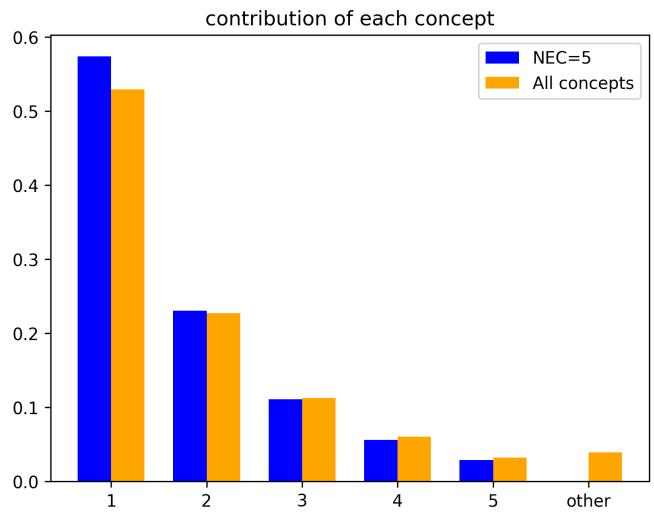

bar chart

| Concept | NEC=5 | All concepts |
| ------- | ----- | ------------ |
| 1       | 0.57  | 0.53         |
| 2       | 0.23  | 0.23         |
| 3       | 0.11  | 0.11         |
| 4       | 0.06  | 0.06         |
| 5       | 0.03  | 0.03         |
| other   | 0.00  | 0.04         |

Figure A.1: Contribution of each concept used as explanation.

## A.7 Ablation study: non-negative concept representation space

We assess the impact of enforcing non-negative responses by introducing alternative transformation methods beyond the ReLU baseline in Section A.3. In particular, we explore a squared activation function to ensure all responses are non-negative. To quantify how these transformations affect activation magnitudes, we examine the cumulative distribution function (CDF) of response values across three categories: visual activations, text activations, and decision concept activations. As shown in Figure $\mathbf { A . } 2 ,$ ReLU yields the highest response values among the compared methods. Text activations, supervised by text similarity, exhibit a more concentrated distribution (lower variance)

during inference, whereas visual activations, trained with one-hot supervision, display a more dispersed distribution (higher variance), enhancing interpretability. Furthermore, the dot product operation effectively suppresses redundant text information, enabling decision concept activations to retain higher variance—facilitating the identification and selection of highly interpretable, taskrelevant concepts.

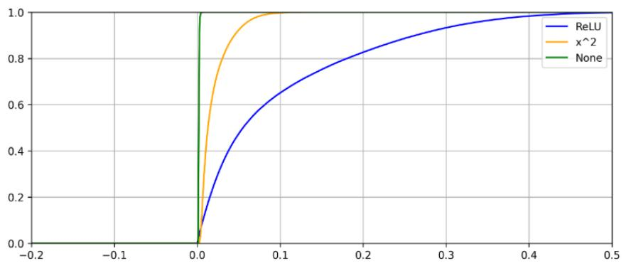

line chart

| x     | ReLU  | x^2   | None  |
|-------|-------|-------|-------|
| -0.2  | 0.0   | 0.0   | 0.0   |
| -0.1  | 0.0   | 0.0   | 0.0   |
| 0.0   | 0.0   | 0.0   | 1.0   |
| 0.1   | 0.6   | 1.0   | 1.0   |
| 0.2   | 0.8   | 1.0   | 1.0   |
| 0.3   | 0.9   | 1.0   | 1.0   |
| 0.4   | 0.95  | 1.0   | 1.0   |
| 0.5   | 1.0   | 1.0   | 1.0   |

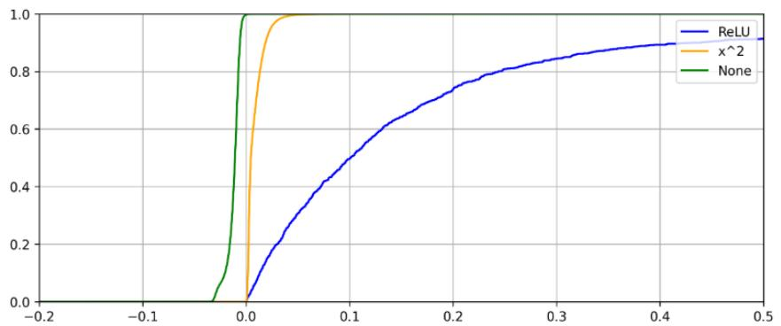

line chart

| x     | ReLU  | x^2   | None  |
|-------|-------|-------|-------|
| -0.2  | 0.0   | 0.0   | 0.0   |
| -0.1  | 0.0   | 0.0   | 0.0   |
| 0.0   | 0.0   | 1.0   | 1.0   |
| 0.1   | 0.4   | 1.0   | 1.0   |
| 0.2   | 0.7   | 1.0   | 1.0   |
| 0.3   | 0.85  | 1.0   | 1.0   |
| 0.4   | 0.9   | 1.0   | 1.0   |
| 0.5   | 0.95  | 1.0   | 1.0   |

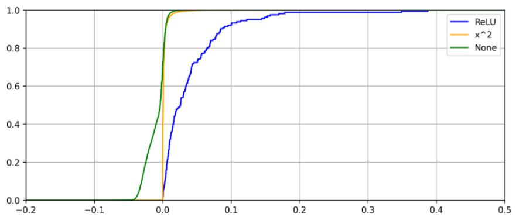

line chart

| x     | ReLU  | x^2   | None  |
|-------|-------|-------|-------|
| -0.2  | 0.0   | 0.0   | 0.0   |
| -0.1  | 0.0   | 0.0   | 0.0   |
| 0.0   | 0.0   | 1.0   | 1.0   |
| 0.1   | 0.9   | 1.0   | 1.0   |
| 0.2   | 1.0   | 1.0   | 1.0   |
| 0.3   | 1.0   | 1.0   | 1.0   |
| 0.4   | 1.0   | 1.0   | 1.0   |
| 0.5   | 1.0   | 1.0   | 1.0   |

Figure A.2: Non-zero concept activation cumulative distribution function of final prediction(top), visual activation(middle) and language activation(bottom).

## A.8 Human Intervention

We further analyze the model’s decision process and demonstrate how manual adjustments based on expert knowledge can improve predictions, inspired by [24]. Figure A.3 shows a misclassification where the model predicts “barbershop” due to a strong activation of the concept “a sign that says barbershop,” which is not visually present. This can be corrected by manually setting $T _ { e [ \mathrm { p r e d } , \mathrm { c o n c e p t } ] } =$ 0.

Another error occurs when “barbershop” is incorrectly favored due to a higher response to $\mathbf { \ddot { a } }$ customer,” despite “barber chair” being the correct label. Equalizing the activation between both classes for that concept $( T _ { e [ \mathrm { g t , c o n c e p t } ] _ { \cdot } } = T _ { e [ \mathrm { p r e d , c o n c e p t } ] } )$ corrects 5 predictions and introduces 2 new errors—shifting predictions from “barbershop” to “barber chair.” This leads to a 3% accuracy improvement in a 100-sample subset. Such errors stem from response bias on shared concepts, which hinders fine-grained classification when dominant but insufficient features overshadow more specific ones.

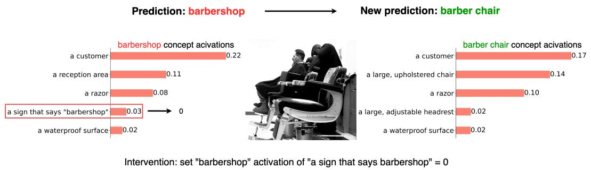

bar chart

| Category                     | Barbershop concept activations | New prediction: barber chair concept activations |
| ---------------------------- | -------------------------------- | -------------------------------------------------- |
| a customer                   | 0.22                             | 0.17                                               |
| a reception area             | 0.11                             | 0.14                                               |
| a razor                      | 0.08                             | 0.10                                               |
| a sign that says "barbershop" | 0.03                             | 0.02                                               |
| a waterproof surface           | 0.02                             | 0.02                                               |

Figure A.3: A sample of correcting model prediction by deleting the wrong concept.

The source of this error is traceable: since $I _ { e }$ is identical, the difference lies in $T _ { e }$ . Using the label generation model all-mpnet-base-v2 [34], we find that the similarity score between “barbershop” and “a customer” is 0.3618, compared to 0.3070 for “barber chair.” This discrepancy reflects a language-model-induced bias during training.

The Figure A.4 result of manually editing the text concept activation $T _ { e [ \mathrm { g t , c o n c e p t } ] } = T _ { e [ \mathrm { p r e d , c o n c e p t } ] }$ for the case in Figure A.3

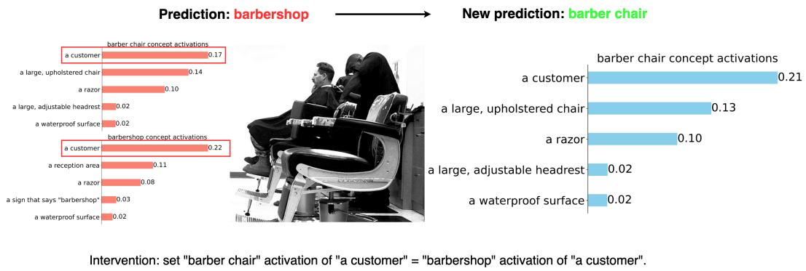

bar chart

| Category | Barbershop concept activations | New prediction: barber chair concept activations |
|---|---|---|
| a customer | 0.17 | 0.21 |
| a large, upholstered chair | 0.14 | 0.13 |
| a razor | 0.10 | 0.10 |
| a large, adjustable headrest | 0.02 | 0.02 |
| a waterproof surface | 0.02 | 0.02 |
| a customer | 0.22 | 0.21 |
| a reception area | 0.11 | 0.13 |
| a razor | 0.08 | 0.10 |
| a sign that says "barbershop" | 0.03 | 0.02 |
| a waterproof surface | 0.02 | 0.02 |

Figure A.4: A sample of correcting model prediction by setting the common concept to the same value

## A.9 Other Backbone

To evaluate the generalization capability of our approach, we conducted experiments not only with multiple variants of CLIP, but also with flexible combinations of diverse and unrelated image–text encoders. The results demonstrate that our method can be seamlessly adapted and extended to other architectures with similar designs, rather than being limited to interpretable versions of CLIP.

<table><tr><td>Image encoder</td><td>SigLIP</td><td>EVA-CLIP</td><td>SigLIP</td><td>SigLIP2</td></tr><tr><td>Text encoder</td><td>SigLIP</td><td>EVA-CLIP</td><td>MiniLM</td><td>SigLIP2</td></tr><tr><td>Original accuracy</td><td>82.1</td><td>79.8</td><td>82.1</td><td>83.1</td></tr><tr><td>Ours</td><td>84.8</td><td>76.9</td><td>84.9</td><td>70.1</td></tr></table>

Table A.5: Performance using different backbones.

## A.10 Image Retrieval

In Section 5, we define 5 different levels of queries and provide corresponding examples. In this section, we provide more cases and offer interpretable predictions in Figure A.5.

<table><tr><td rowspan="2">Type-A</td><td colspan="3">This is a photo of uniform</td><td colspan="2">Give me a popsicle</td><td colspan="2">The image shows crane</td></tr><tr><td></td><td colspan="2">a soldiera graduation ceremonya badge or insigniaa button-down shirta jacket</td><td></td><td>a colorful, icy coatingdesserta colorful, icy exteriorflavorful fillinga topping</td><td>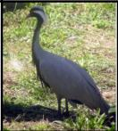</td><td>other birdsa stampa long, pointed bill pointed wings</td></tr><tr><td rowspan="2">Type-B</td><td colspan="3">Give me a striped fur picture</td><td colspan="2">Give me a spotted fur picture</td><td colspan="2">Give me a uniform fur picture</td></tr><tr><td colspan="2"></td><td>striped fura catstriking orange andblack fur</td><td>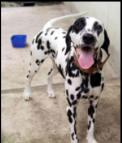</td><td>a spotted coatdogoften has a soft, padded feel</td><td></td><td>a garment made from animal fura soldiera sights</td></tr><tr><td rowspan="2">Type-C</td><td colspan="3">The image shows crane, the machine</td><td colspan="2">Give me a cat with striped fur</td><td colspan="2">The image was taken in a sunny day</td></tr><tr><td colspan="2"></td><td>riga construction siteextends over water</td><td></td><td>striped fura cata zoostriking orange and black furcarnivore</td><td>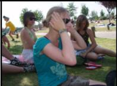</td><td>two dark lensesa shorea lotion or creamconsistency</td></tr><tr><td rowspan="2">Type-D</td><td colspan="3">Give me a toothpaste</td><td colspan="2">This is something stable</td><td colspan="2">This image depicts something easy to break</td></tr><tr><td colspan="2">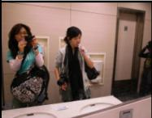</td><td>wipesa lotion or creamconsistencybreath</td><td></td><td>attached to a surfacebarriera farmparallel to each other</td><td></td><td>toolscrewspliers</td></tr><tr><td rowspan="2">Type-E</td><td colspan="3">Give me a hand</td><td colspan="2">Something fun</td><td colspan="2">This image depicts something dangerous</td></tr><tr><td colspan="2">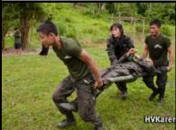</td><td>a paramedicfour handles orhandholdsa soldier</td><td></td><td>entertainmentsurround soundspeakersa stereo</td><td></td><td>a security systema locking mechanisma large, cylindrical boiler</td></tr></table>

Figure A.5: Image Retrieval on five different types of queries. The top of the module shows the query statement we use, and the right side shows the most relevant concepts.