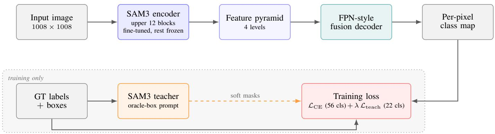
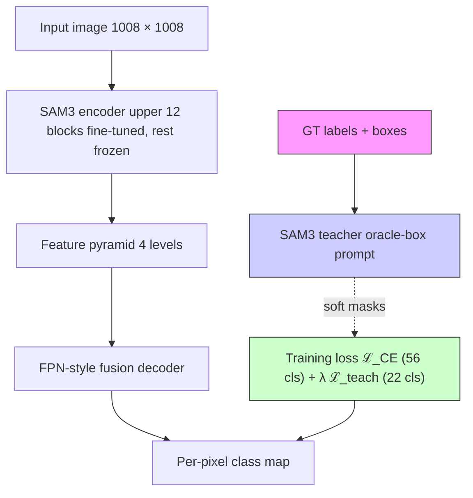
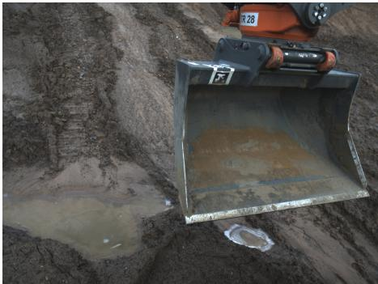
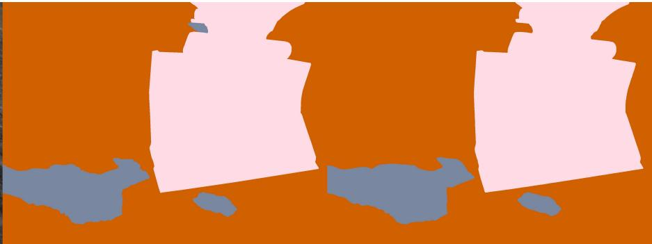
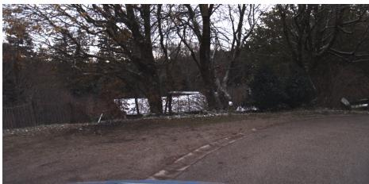
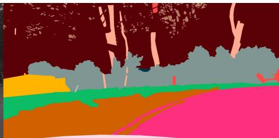
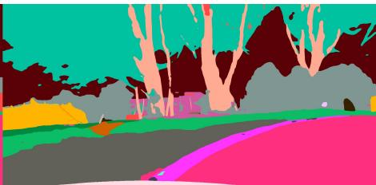

# SAM3 Self-Distillation for Fine-Grained GOOSE 2D Semantic Segmentation

Xuesong Wang1

Abstract— We describe our 4th-place entry to the ICRA 2026 GOOSE 2D Fine-Grained Semantic Segmentation Challenge, which reached a composite mean Intersection-over-Union (mIoU) of 69.73% on the official 1,815-image test set. Our model adapts the image encoder of a recent visual foundation model, Segment Anything Model 3 (SAM3), with a lightweight decoder. Beyond this, we contribute two techniques and one empirical finding: (i) a self-distillation scheme that re-uses SAM3 itself, prompted with ground-truth boxes, as a teacher on the classes where it outperforms our own model; (ii) an image-level multiscale test-time augmentation scheme that restores multi-scale inference for a fixed-input-size model by rescaling the image rather than the model input; and (iii) the finding that an aggressive photometric distortion from a winning 2025 GOOSE 2D entry, transplanted onto our pipeline, is its single largest source of improvement.

## I. INTRODUCTION

Semantic segmentation, i.e., labeling every pixel of an image with the object class it belongs to, is a core perception task for autonomous ground robots operating offroad. The GOOSE [1] and GOOSE-Ex [2] datasets provide such pixel-level annotations for unstructured outdoor scenes captured from four ground-robot camera platforms (MuCAR-3, ALICE, and two Spot configurations), with 64 fine-grained classes (e.g. distinct vegetation, terrain, and vehicle types) that also roll up into 11 coarse super-categories such as Vegetation, Terrain, and Vehicle.

The ICRA 2026 GOOSE 2D Fine-Grained Semantic Segmentation Challenge evaluates models on a held-out 1,815- image test set spanning all four platforms. Accuracy is measured by Intersection-over-Union (IoU): for a given class, the overlap between the predicted and ground-truth pixels divided by their union. The mean IoU (mIoU) averages this over classes. The challenge ranks entries by a composite score: the equal-weight average of the fine mIoU (averaged over the 56 evaluated fine classes) and the coarse mIoU (averaged over the 11 super-categories).

The challenge is hard for three reasons. First, the class distribution is heavily long-tailed: a handful of head classes (e.g., forest and low-grass) occupy more than a quarter of all training pixels, while classes such as kick-scooter and pipe appear in only a few parts per million. Second, many offroad categories form within-category visual near-equivalence classes. For example, the Vegetation supercategory contains twelve fine classes, several of which differ only in canopy density or hardiness, and the vast majority of our baseline model’s Vegetation errors are confusions between Vegetation classes rather than with anything else. Third, the four camera setups differ in resolution, exposure, and viewpoint, so a recipe that overfits to one platform’s geometry tends to lose on the others.

Our model uses the image encoder of Segment Anything Model 3 (SAM3) [3], the latest in the Segment Anything family of visual foundation models. SAM3 is promptable: given an image and a prompt (a point, a box, or a text phrase), it returns a mask for the indicated object. We adapt its image encoder to off-road segmentation by fine-tuning only its upper layers and attaching a small decoder that produces the full per-pixel class map. Beyond this standard recipe we make two methodological contributions:

1) Self-distillation from SAM3 (Section II-B). We re-use SAM3 itself as a teacher for our own model, the same foundation model that provides our encoder. When SAM3 is given a ground-truth bounding box around an object, it produces an unusually clean mask of that object. We transfer these masks into our model as an extra training target, but only for the classes where we have first verified that SAM3’s masks are genuinely better than our model’s own predictions.

2) Image-level multi-scale test-time augmentation (Section II-D). Running a model on several rescaled copies of an image and averaging the results is a standard way to improve segmentation. SAM3’s encoder, however, only accepts one fixed input size, which rules out the usual approach. We show a simple workaround that rescales the image instead of the model input, recovering the benefit of multi-scale inference for any fixed-input model at no additional training cost.

In addition, we adopt the aggressive photometric distortion of a winning 2025 GOOSE 2D entry [4], which perturbs brightness, contrast, saturation, and hue under independent probabilities (Section II-C); we report it as an empirical finding rather than a novel method.

Section II details each component, Section III reports results and a step-by-step breakdown of where the gains come from, and Section IV summarizes the approaches we tried that did not help.

## II. METHOD

## A. Backbone and Decoder

We use SAM3’s pretrained image encoder as our backbone. Rather than retrain it from scratch or freeze it entirely, we partially fine-tune it: only its upper layers are updated during training, while the lower layers keep their pretrained weights. This is a deliberate balance: the lower layers already capture generic visual features that we do not want to disturb on a comparatively small training set, while the upper layers adapt to the off-road domain. Because the encoder is far larger than the decoder, we also train it with a smaller learning rate, so the early training steps do not wash out its pretrained knowledge. How many upper layers to unfreeze was chosen by a short search on the validation set; the value we picked is where unfreezing more layers stopped helping (Section III).

The encoder emits features at several resolutions. On top of it we attach a lightweight decoder in the style of a Feature Pyramid Network (FPN) [5]: the multi-resolution features are brought to a common resolution, combined, and passed through a small convolutional head that outputs the final per-pixel class map (Figure 1). We keep this decoder intentionally simple. We also tried a heavier, more sophisticated decoder (UPerNet [6]) as a comparison (Section IV); it scored about half a point of composite mIoU lower, so we kept the simpler design.

## B. SAM3 Oracle-Box Self-Distillation

a) $W h y$ SAM3 can teach our model: SAM3 was pretrained on a far larger and more varied collection of images than the GOOSE training set, so it has a strong general sense of object shape. The question is how to extract that knowledge for our specific classes. Prompting SAM3 with only a class name (its text mode) does not work on off-road scenes: in a quick check, prompting for “water” returned almost every textured region as water, whether or not it actually was. The fix is to also give SAM3 the ground-truth bounding box of each object as a prompt. The box confines SAM3 to the right region, and within that region its mask is usually sharper and more complete than our model’s. We call this oracle-box prompting, because the box is taken from the ground-truth annotation.

b) Which classes to teach: SAM3 is not better than our model on every class. On large background regions (e.g. walls, rock) and thin connected structures (e.g. fences, guard rails) its mask tends to spill outside the box, making it worse, not better. We therefore run a one-time check before training: for each class we compare SAM3’s oracle-box mask against our model’s own predictions on held-out images, and keep a class only when SAM3 is clearly better and we have enough labelled pixels to trust the comparison. This leaves 22 classes (out of the 56 evaluated), overwhelmingly compact, well-defined objects, exactly the kind of object SAM3’s pretraining has seen in abundance: moss, truck, hedge, leaves, bush, tree-crown, container, misc-sign, trafficcone, water, motorcycle, high-grass, kick-scooter, debris, barrier-tape, traffic-sign, caravan, obstacle, trailer, bicycle, traffic-light, and bus.

c) How the teaching signal is added: During training our model is supervised in the usual way, by a standard per-pixel classification loss (cross-entropy, CE) against the ground-truth labels across all 56 classes. On top of this, for the 22 selected classes only, we add a second loss term that asks our model’s predicted mask to agree with SAM3’s mask. Writing $\mathcal { L } _ { \mathrm { C E } }$ for the standard term and $\mathcal { L } _ { \mathrm { t e a c h } }$ for the SAM3- agreement term, the model minimizes

TABLE I COLOR-PERTURBATION STRENGTHS; EACH IS APPLIED INDEPENDENTLY WITH PROBABILITY 0.5 (SATURATION AND HUE ACT IN HSV SPACE).

<table><tr><td>Perturbation</td><td>Type</td><td>Range</td></tr><tr><td>Brightness</td><td>additive</td><td> $\pm 40/255$ </td></tr><tr><td>Contrast</td><td>multiplicative</td><td> $[0.7, 1.3]$ </td></tr><tr><td>Saturation</td><td>multiplicative</td><td> $[0.7, 1.3]$ </td></tr><tr><td>Hue</td><td>additive</td><td> $\pm 0.1$ </td></tr></table>

$$
\mathcal {L} = \mathcal {L} _ {\mathrm{CE}} + \lambda \cdot \mathcal {L} _ {\text { teach }},
$$

where λ is a small weight that keeps the SAM3 signal a refinement rather than the dominant objective. Because SAM3 is far too slow to query inside the training loop, we compute its masks once for every training image ahead of time and store them. When an image is randomly cropped or flipped during training, we apply the identical geometric transform to the stored SAM3 mask so the two stay aligned; color augmentation is applied to the image only.

## C. Aggressive Color Augmentation

The off-road scenes in GOOSE span seasons (winter snow, summer vegetation), weather (sunny, overcast, rain), and different camera exposure settings. A model that leans on color as a shortcut for recognizing classes is therefore fragile: the moment lighting or season changes, its cue disappears. The standard remedy is color augmentation: during training the image is randomly perturbed in brightness, contrast, saturation, and hue, so the model is pushed to recognize classes by shape and texture rather than color alone.

We adopt the aggressive photometric distortion introduced by Kim et al. [4] for the 2025 GOOSE 2D challenge, where it was a central ingredient of a winning entry. Whereas the conventional recipe [7] applies all four perturbations together under a single random switch, this version gives each of the four its own independent switch, so any subset may be applied to a given training image. This produces a much richer mix of training images: most images receive one or two perturbations rather than either all four or none. Table I lists the perturbation strengths, which follow Kim et al. [4]. Our contribution here is not the augmentation itself but the finding that, transplanted onto our SAM3 distillation pipeline, it is by a wide margin the single largest source of improvement.

## D. Image-Level Multi-Scale Sliding-Window TTA

Multi-scale test-time augmentation (TTA) is a standard inference-time technique: run the model on several rescaled versions of the input image, then average the results. Seeing each object at several sizes makes the prediction more robust and typically gives a free fraction of a point of mIoU. The catch in our setting is that SAM3’s encoder was pretrained at a single fixed input size and rejects images of any other size, so we cannot simply feed it rescaled images the way the standard recipe does.

flowchart

Fig. 1. Model architecture. The deployed model is the top row: a partially fine-tuned SAM3 image encoder produces a four-level feature pyramid that a lightweight FPN-style decoder fuses into a per-pixel class map. The bottom row is used only during training: SAM3 itself, prompted with ground-truth boxes (oracle-box), provides soft masks that supervise the student on 22 selected classes through $\mathcal { L } _ { \mathrm { t e a c h } } .$ , alongside the standard cross-entropy loss on all 56 classes.

a) The image-level workaround.: We move the scaling outside the model. Because the test images are larger than the model’s fixed input, we already process them by tiling (sliding-window inference), and multi-scale augmentation fits naturally around this loop. For each scale factor in a small predefined set (here, {0.75, 1.0, 1.25}):

1) Rescale the whole test image to the chosen scale.  
2) Tile the rescaled image with overlapping native-size (1008 × 1008) windows and score each window independently; the model always sees its fixed input size, only the image being windowed changes.  
3) Fuse the overlapping window scores into one fullresolution score map, weighting each window by a raised-cosine (Hann) profile so tile edges are downweighted and the seams between tiles are smoothed.  
4) Resize that score map back to the original image resolution and accumulate it across scales.

After all scales have been processed, the final prediction is the class with the highest accumulated score at each pixel.

This idea combines cleanly with the other common testtime trick of also running each window on its mirror image and averaging (“horizontal-flip” augmentation); we use both. It is also general: any model that is locked to a single input size can recover the benefit of multi-scale inference this way, without retraining. The cost grows linearly with the number of scales; with three scales, inference takes roughly three times as long as a single pass.

## III. EXPERIMENTS

## A. Setup

a) Data.: We train on the union of the GOOSE 2D and GOOSE-Ex 2D train splits (11,234 standard color, i.e. redgreen-blue (RGB), images; the optional near-infrared channel provided by GOOSE was not used in this entry) and validate on the union of the two val splits (1,369 images). The final test set is the official 1,815-image GOOSE 2D Final Testing split, covering all four robotic platforms (MuCAR-3, ALICE, Spot v1, Spot v2).

b) Implementation details.: SAM3’s encoder takes a fixed 1008 × 1008 RGB image and produces features at four resolutions, which our FPN-style decoder fuses. We fine-tune the last 12 transformer blocks of the encoder together with its feature-fusion module, leaving the earlier blocks frozen; we chose 12 after a short search over {4, 8, 12, 16}, where unfreezing 16 blocks did not improve over 12. Training uses the AdamW optimizer [8] with a base learning rate of $3 \times 1 0 ^ { - 5 }$ , reduced by a factor of four on the encoder, weight decay 0.01, a polynomial learning-rate decay, batch size 2, and mixed-precision arithmetic. The teaching-signal weight (Section II-B) is λ = 0.3. We train for up to 25 epochs over the data, selecting the model with the best validation composite mIoU; the model is initialised from our earlier self-distillation model (the “+ SAM3 self-distillation” configuration of Table II), i.e. the same recipe without the color augmentation, which in turn was fine-tuned from a plain cross-entropy model. A full run takes about 8.5 hours on a single NVIDIA RTX 4090 GPU with 24 GB of memory. At inference we tile each image with overlapping 1008 × 1008 windows at an 840-pixel stride (∼17% overlap), fused with Hann weighting as described in Section II-D. On top of this we apply both horizontal-flip and image-level multiscale augmentation at scales {0.75, 1.0, 1.25}, averaging the model’s raw per-class scores across all the variants before choosing each pixel’s label.

## B. Main Results

Table II traces our submissions to the public test leaderboard and the improvement each contribution adds, all measured on the same 1,815-image test set under directly comparable settings.

The largest single gain comes from color augmentation (+0.86 over the self-distillation model). Flip augmentation is a small but reliable +0.13 to +0.15 on either model, and image-level multi-scale augmentation on top of that adds a further +0.34.

## C. Per-Class Analysis

Table III reports per-class IoU on a representative subset of classes at three stages of our pipeline. Two patterns stand out. First, color augmentation rescues rare classes that the earlier model had largely missed; the single largest classlevel gain we saw in any experiment was on kick-scooter (+21.75 IoU). Second, the test-time augmentation stack (flip and multi-scale) most helps medium-rare, well-defined object classes such as traffic-cone, boom-barrier, traffic-sign, and heavy-machinery, several of which color augmentation alone had left flat or even hurt (traffic-cone, for instance, dropped under color augmentation and was then partly recovered). We suspect the multi-scale component drives much of this, with the smaller 0.75× view supplying whole-object context and the 1.25× view sharpening fine detail, though our experiments isolate multi-scale only at the aggregate level (+0.34 composite, Table II).

natural_image

Exterior view of a concrete mixer with a tool on top, surrounded by soil and debris (no visible text or symbols)

natural_image

Abstract graphic with orange and white shapes and blue irregular regions (no text or symbols)

natural_image

Rural scene with trees and a paved road, no visible text or symbols

natural_image

Abstract color painting with layered brushstrokes and a dark red background (no text or symbols)

natural_image

Colorful abstract landscape with trees, hills, and a curved path (no text or symbols)

Fig. 2. Qualitative results on the validation set. Each row shows the input image (left), the ground-truth labeling colored by class (center), and our model’s prediction (right). The top row is one of the strongest scenes (composite mIoU 96.6%), with a clean separation of sky, vegetation, road, and vehicle. The bottom row is one of the weakest (composite mIoU 32.8%): a cluttered winter scene where the model confuses visually similar vegetation classes such as bush, low-grass, and leaves, which account for most of our remaining errors.

TABLE II  
EFFECT OF EACH COMPONENT ON THE PUBLIC TEST LEADERBOARD (MIOU %): NON-INDENTED ROWS ARE CUMULATIVE TRAINING MILESTONES, AND EACH INDENTED ROW ADDS TEST-TIME AUGMENTATION TO THE MILESTONE ABOVE IT (LAST ROW: OUR FINAL ENTRY).

<table><tr><td>Configuration</td><td>composite</td><td>fine</td><td>coarse</td></tr><tr><td>Encoder + decoder (CE loss)</td><td>67.71</td><td>62.33</td><td>73.10</td></tr><tr><td>+ SAM3 self-distillation</td><td>68.38</td><td>62.15</td><td>74.61</td></tr><tr><td>+ flip augmentation</td><td>68.51</td><td>62.35</td><td>74.67</td></tr><tr><td>+ color augmentation</td><td>69.24</td><td>62.80</td><td>75.68</td></tr><tr><td>+ flip augmentation</td><td>69.39</td><td>63.04</td><td>75.73</td></tr><tr><td>+ flip &amp; multi-scale (final)</td><td>69.73</td><td>63.47</td><td>75.99</td></tr></table>

The clearest persistent failure is moss: the earlier model scored it modestly, and the color-augmented model collapsed it to near zero, which multi-scale augmentation does not recover. Moss is one of the rarest classes in the training set and looks much like low-grass and forest; this kind of within-vegetation confusion is visible in the failure case of Figure 2. An ensemble that used our earlier model for moss and the final model elsewhere would plausibly recover it, but our attempts to combine the two models by simply averaging their scores gave almost nothing, because such averaging follows whichever model is more confident rather than whichever is more accurate. The per-super-category results in Table IV tell the same story at a coarser level: Sky, Vegetation, and Vehicle are very strong, while Water and Animal remain weak (<50 IoU). Both weak categories consist of a single rare class and would likely benefit most from additional pretraining on related off-road or driving datasets.

TABLE III PER-CLASS IOU (%) ON THE PUBLIC TEST SET AT THREE STAGES: BASE (ENCODER, DECODER, AND SAM3 SELF-DISTILLATION), +COLOR (ADDS THE COLOR AUGMENTATION), AND FINAL (ADDS FLIP AND IMAGE-LEVEL MULTI-SCALE TEST-TIME AUGMENTATION).

<table><tr><td>Class</td><td>Base</td><td>+Color</td><td>Final</td></tr><tr><td colspan="4">Improved by color augmentation (Base → +Color)</td></tr><tr><td>kick-scooter</td><td>7.90</td><td>29.65</td><td>30.02</td></tr><tr><td>debris</td><td>14.45</td><td>26.92</td><td>28.63</td></tr><tr><td>bridge</td><td>6.67</td><td>17.04</td><td>15.96</td></tr><tr><td>truck</td><td>55.96</td><td>65.46</td><td>67.89</td></tr><tr><td>water</td><td>44.09</td><td>46.65</td><td>47.27</td></tr><tr><td colspan="4">Improved by test-time augmentation (+Color → Final)</td></tr><tr><td>traffic-cone</td><td>73.76</td><td>62.16</td><td>67.93</td></tr><tr><td>boom-barrier</td><td>63.23</td><td>62.01</td><td>65.74</td></tr><tr><td>traffic-sign</td><td>72.25</td><td>72.71</td><td>75.12</td></tr><tr><td>heavy-machinery</td><td>63.45</td><td>66.13</td><td>67.96</td></tr><tr><td>tree-crown</td><td>55.09</td><td>54.44</td><td>56.26</td></tr><tr><td colspan="4">Persistent failures</td></tr><tr><td>moss</td><td>9.93</td><td>0.01</td><td>0.00</td></tr><tr><td>tree-root</td><td>0.15</td><td>0.00</td><td>0.01</td></tr></table>

TABLE IV PER-SUPER-CATEGORY (COARSE) MIOU (%) FOR OUR FINAL ENTRY ON THE PUBLIC TEST SET.

<table><tr><td>Category</td><td>IoU</td><td>Category</td><td>IoU</td></tr><tr><td>Sky</td><td>97.47</td><td>Construction</td><td>79.79</td></tr><tr><td>Vegetation</td><td>94.01</td><td>Road</td><td>72.21</td></tr><tr><td>Human</td><td>91.58</td><td>Object</td><td>56.59</td></tr><tr><td>Vehicle</td><td>90.94</td><td>Water</td><td>47.27</td></tr><tr><td>Sign</td><td>88.82</td><td>Animal</td><td>28.44</td></tr><tr><td>Terrain</td><td>88.76</td><td></td><td></td></tr></table>

## IV. DISCUSSION: WHAT DID NOT HELP

For completeness, we briefly record the approaches we tried that did not improve our score and were therefore not part of the final entry. We believe these negative results are as useful to future participants as the positive ones.

Alternative backbones. Before settling on SAM3 we evaluated frozen-encoder baselines using DINOv2 [9], I-JEPA [10], InternImage [11], and a Mask2Former [12] head, all on the same data and loss. On our validation split their best composite mIoU ranged from 30.1% (I-JEPA) to 53.3% (Mask2Former), well short of a comparably frozen SAM3 encoder (60.2%), so we did not pursue them. Our strongest pre-SAM3 model was a fully-trained SegFormer [13] (the challenge’s baseline architecture), which reached 50.0% composite mIoU on the public development leaderboard; frozen and then partially fine-tuned SAM3 surpassed it (50.4% and 53.7%), which is why our final system is built on SAM3.

A heavier decoder. We replaced our simple decoder with the more elaborate UPerNet decoder [6]. It scored about half a point lower overall, even though it won on roughly a third of the individual classes: it helped on large background regions (walls, gravel, bridges) but blurred away small or rare objects.

Random rescaling during training. Adding random image rescaling to the color-augmentation recipe did not beat the color-only model on the validation set, though it produced a noticeably different model that we kept as a possible ensemble partner for future work.

A long-tail loss (Balancing Logit Variation). We added a published training technique [14] designed to help rare classes by injecting class-dependent noise into the model’s predictions during training. It scored slightly below our best model on the validation set, so we did not pursue it. Our implementation is available on request.

## V. CONCLUSION

We described our 4th-place entry to the ICRA 2026 GOOSE 2D Challenge (composite mIoU 69.73%). The model adapts SAM3’s pretrained image encoder with a lightweight decoder, and contributes two techniques: (i) using

SAM3 itself as a teacher to refine our model on the classes where the foundation model is verifiably better, and (ii) a multi-scale inference scheme that restores the benefit of multi-scale test-time augmentation for a model locked to a single input size, by rescaling the image rather than the model input. We also adopt the aggressive photometric distortion of a winning 2025 GOOSE 2D entry which proved to be the single biggest improvement in our pipeline; the cheapest improvement came from the multi-scale inference, which adds accuracy without any extra training.

## ACKNOWLEDGEMENTS

We thank the GOOSE Challenge organizers for hosting the ICRA 2026 challenge.

The author used artificial-intelligence (AI) tools, specifically large language models, to help edit this report and to assist with software development during the competition. All experiments, results, and conclusions were produced and verified by the author, who takes full responsibility for the content.

## REFERENCES

[1] P. Mortimer, R. Hagmanns, M. Granero, T. Luettel, J. Petereit, and H.-J. Wuensche, “The goose dataset for perception in unstructured environments,” in Proceedings of the IEEE International Conference on Robotics and Automation (ICRA), 2024. [Online]. Available: https://arxiv.org/abs/2310.16788  
[2] R. Hagmanns, P. Mortimer, M. Granero, T. Luettel, and J. Petereit, “Excavating in the wild: The goose-ex dataset for semantic segmentation,” in Proceedings of the IEEE International Conference on Robotics and Automation (ICRA), 2025. [Online]. Available: https://arxiv.org/abs/2409.18788  
[3] N. Carion, L. Gustafson, Y.-T. Hu, S. Debnath, R. Hu, D. S. Coll-Vinent, C. Ryali, K. V. Alwala, H. Khedr, A. Huang, J. Lei, T. Ma, B. Guo, A. Kalla, M. Marks, J. Greer, M. Wang, P. Sun, R. Radle, T. Afouras, E. Mavroudi, K. Xu, T.-H. ¨ Wu, Y. Zhou, L. Momeni, R. HAZRA, S. Ding, S. Vaze, F. Porcher, F. Li, S. Li, A. Kamath, H. K. Cheng, P. Dollar, N. Ravi, K. Saenko, P. Zhang, and C. Feichtenhofer, “SAM 3: Segment anything with concepts,” in The Fourteenth International Conference on Learning Representations, 2026. [Online]. Available: https://openreview.net/forum?id=r35clVtGzw  
[4] W. Kim, L.-k. Lee, and S.-Y. An, “Technical report for icra 2025 goose 2d semantic segmentation challenge: Boosting off-road segmentation via photometric distortion and exponential moving average,” arXiv preprint arXiv:2505.11769, 2025.  
[5] T.-Y. Lin, P. Dollar, R. Girshick, K. He, B. Hariharan, and S. Belongie, ´ “Feature pyramid networks for object detection,” in Proceedings of the IEEE conference on computer vision and pattern recognition, 2017, pp. 2117–2125.  
[6] T. Xiao, Y. Liu, B. Zhou, Y. Jiang, and J. Sun, “Unified perceptual parsing for scene understanding,” in Proceedings of the European conference on computer vision (ECCV), 2018, pp. 418–434.  
[7] W. Liu, D. Anguelov, D. Erhan, C. Szegedy, S. Reed, C.-Y. Fu, and A. C. Berg, “Ssd: Single shot multibox detector,” in European conference on computer vision. Springer, 2016, pp. 21–37.  
[8] I. Loshchilov and F. Hutter, “Decoupled weight decay regularization,” in International Conference on Learning Representations, 2019. [Online]. Available: https://openreview.net/forum?id=Bkg6RiCqY7  
[9] M. Oquab, T. Darcet, T. Moutakanni, H. V. Vo, M. Szafraniec, V. Khalidov, P. Fernandez, D. HAZIZA, F. Massa, A. El-Nouby, M. Assran, N. Ballas, W. Galuba, R. Howes, P.-Y. Huang, S.-W. Li, I. Misra, M. Rabbat, V. Sharma, G. Synnaeve, H. Xu, H. Jegou, J. Mairal, P. Labatut, A. Joulin, and P. Bojanowski, “DINOv2: Learning robust visual features without supervision,” Transactions on Machine Learning Research, 2024, featured Certification. [Online]. Available: https://openreview.net/forum?id=a68SUt6zFt  
[10] M. Assran, Q. Duval, I. Misra, P. Bojanowski, P. Vincent, M. Rabbat, Y. LeCun, and N. Ballas, “Self-supervised learning from images with a joint-embedding predictive architecture,” in Proceedings of the IEEE/CVF conference on computer vision and pattern recognition, 2023, pp. 15 619–15 629.  
[11] W. Wang, J. Dai, Z. Chen, Z. Huang, Z. Li, X. Zhu, X. Hu, T. Lu, L. Lu, H. Li et al., “Internimage: Exploring large-scale vision foundation models with deformable convolutions,” in Proceedings of the IEEE/CVF conference on computer vision and pattern recognition, 2023, pp. 14 408–14 419.  
[12] B. Cheng, I. Misra, A. G. Schwing, A. Kirillov, and R. Girdhar, “Masked-attention mask transformer for universal image segmentation,” in Proceedings of the IEEE/CVF conference on computer vision and pattern recognition, 2022, pp. 1290–1299.  
[13] E. Xie, W. Wang, Z. Yu, A. Anandkumar, J. M. Alvarez, and P. Luo, “Segformer: Simple and efficient design for semantic segmentation with transformers,” Advances in neural information processing systems, vol. 34, pp. 12 077–12 090, 2021.  
[14] Y. Wang, J. Fei, H. Wang, W. Li, T. Bao, L. Wu, R. Zhao, and Y. Shen, “Balancing logit variation for long-tailed semantic segmentation,” in Proceedings of the IEEE/CVF conference on computer vision and pattern recognition, 2023, pp. 19 561–19 573.