# Through the PRISM: Preference Representation in Intermediate States of Video Diffusion Models

Haoxuan Wu1, Lai Man Po1, Mengyang Liu2, Kun Li1, Hongzheng Yang3, and Wei Liu2

1 City University of Hong Kong haoxuanwu2-c@my.cityu.edu.hk, eelmpo@cityu.edu.hk, kunli25-c@my.cityu.edu.hk 2 Video Rebirth lmyleon2014@gmail.com, wl2223@columbia.edu 3 The Chinese University of Hong Kong hzyang@se.cuhk.edu.hk

Abstract. Evaluating video generation with clean, pixel-based reward models disconnects evaluation from the noisy diffusion process and incurs massive VAE decoding costs. In this paper, we challenge this paradigm by asking a fundamental question: Can a powerful video generator inherently discriminate preferences directly from noisy latents? To answer this, we introduce PRISM (Preference Representation in Intermediate States of Diffusion Models). PRISM employs a lightweight Query-based Aggregation head with a frozen video diffusion backbone to decode preference signals from noisy latents. Surprisingly, PRISM not only achieves SOTA preference accuracy but also unlocks strong noise-robustness, which enables early-stage Best-of-N sampling. This allows for filtering suboptimal candidates at the very beginning of denoising, drastically reducing computation while boosting video quality. We also reveal a strong positive correlation between a backbone’s generative performance and its inherent evaluative power, enabling self-improving video backbones.

Keywords: Reward Model · Diffusion Model · Video Generation

## 1 Introduction

The rapid evolution of Video Diffusion Transformers [2, 17] has fundamentally transformed video generation, enabling the creation of high-fidelity, temporally coherent content. However, ensuring these models align with complex human preferences remains a formidable challenge [7,33,34]. While Video Reward Models (VRMs) [6, 14, 32] have emerged as critical tools for guiding this alignment, current approaches face significant limitations when applied to advanced optimization paradigms such as Reinforcement Learning (RL) [14,31] and Inference-Time Scaling [13, 16, 19].

Existing Video Reward Models (VRMs) [6,7,14,32] operate in the pixel space, functioning as external evaluators built upon Vision-Language Models (VLMs).

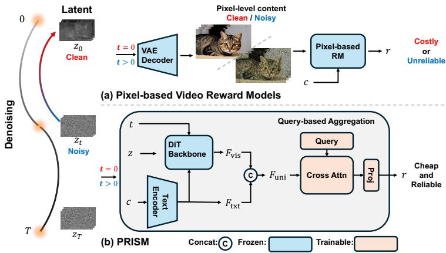

flowchart

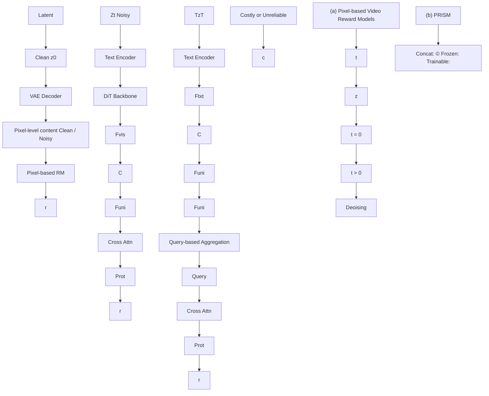

Fig. 1: Comparison of video preference rewarding. The PRISM Framework. By taking the noisy latent $z _ { t } ,$ prompt $c ,$ and timestep t as inputs—perfectly aligning with standard diffusion models—PRISM directly outputs a reward signal within the latent space. Compared to conventional pipelines (upper), it avoids fully denoising to $x _ { 0 }$ and eliminates expensive VAE decoding, thereby preventing the unreliable evaluation of decoded noisy videos and achieving highly efficient, noise-resilient reward modeling.

This conventional paradigm introduces a cascading series of bottlenecks rooted in a fundamental Architectural Mismatch. Because these VRMs are structurally distinct from the video diffusion backbones they evaluate, they are restricted to isolated, offline updates, sacrificing the joint scaling and self-evolution paradigm that has proven highly effective in LLMs [20,25,27]. Furthermore, this architectural separation restricts evaluation exclusively to the clean pixel domain. Consequently, these models cannot interpret the intermediate, noisy latent states crucial for alignment strategies, such as step-level RL or early rejection in Best-of-N sampling. Forcing evaluations into the pixel space by repeatedly decoding these noisy latents not only yields degraded visual signals that confuse the external VRMs, but also imposes a severe, often prohibitive, computational burden [13, 19].

These compounded challenges necessitate a paradigm shift towards Latent Video Reward Modeling. We challenge the necessity of external evaluators by asking a fundamental question: Does a powerful video generator inherently possess the ability to discriminate human preferences, even when the visual content is severely obscured by noise? Recent fundamental insights (e.g., DDO [40]) reveal that likelihood-based generative models secretly possess strong discriminative capabilities. Building on this, we posit that a pre-trained diffusion backbone is not merely a generator, but a rich storehouse of spatio-temporal priors. Its core training objective—reconstructing clean content from varying noise levels—equips it with an intrinsic blueprint of the natural video manifold [37]. By repurposing the generator itself as a natively noise-aware evaluator operating within the latent space, we eliminate VAE decoding overheads. This approach not only provides robust guidance amidst significant noise but also ensures the reward model scales with the backbone, fostering a continuous cycle of selfimprovement.

Motivated by these theoretical insights, we introduce PRISM (Preference Representation in Intermediate States of Diffusion Models), as illustrated in Fig. 1(b). Rather than resorting to expensive full-parameter fine-tuning [18, 38], PRISM freezes the pre-trained video diffusion backbone. This design choice not only ensures training efficiency but preserves the backbone’s intrinsic ability to interpret noisy video latents. Given that the frozen generator already captures video semantics, relying on a structurally redundant external VLM becomes unnecessary. The only remaining challenge is how to decode the implicit preference information from the backbone’s high-dimensional, noise-corrupted intermediate features. To bridge this gap, we introduce a Query-based Aggregation head. Acting as a dedicated information extractor, it captures clear preference signals from the complex spatial-temporal features. By elegantly repurposing the generator’s priors, this highly efficient architecture achieves state-of-the-art alignment accuracy while exhibiting unprecedented noise-robustness (Fig. 2).

Our main contributions are summarized as follows:

– Decoding-free, Noise-aware Reward Framework. We introduce PRISM, a novel latent video reward model that completely freezes the generative backbone. By incorporating a Query-based Aggregation head, PRISM effectively disentangles semantic preference signals from severe noise, avoiding the massive overhead of VAE decoding.  
– Insights into Generative Priors and Evaluative Power. We provide the first systematic study demonstrating a strong positive correlation between a Video diffusion backbone’s generative capabilities and its inherent reward modeling potential. Our findings confirm that these generative priors are robust, transferable, and naturally noise-resilient.  
– SOTA Accuracy on Preference benchmark and Efficient Inference-time Scaling. Extensive evaluations on standard benchmarks show that PRISM achieves state-of-the-art alignment accuracy. Crucially, its ability to maintain precise discriminative power at high noise levels uniquely enables early-stage Bestof-N sampling, cutting redundant denoising costs and significantly boosting inference efficiency.

## 2 Related Work

Video Generation Models. Text-to-video generation has rapidly evolved from early U-Net [24,35] designs to scalable Diffusion Transformers [21]. Recent models [3,10,29,36] have converged on a shared architectural and generative paradigm [4, 39]: combining 3D causal VAEs with large-scale diffusion backbones trained via Flow Matching [12] to handle complex temporal dynamics.

Video Reward Models. VRMs provide essential feedback for human preference alignment. Recent state-of-the-art methods, such as VideoReward [14],

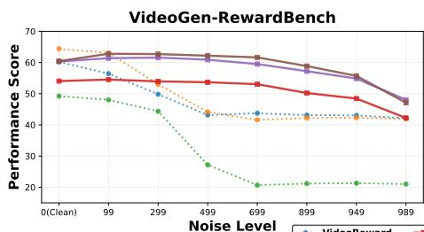

line chart

| Noise Level | VideoReward | VideoReward (Dotted) | VideoReward (Solid) | VideoReward (Dash-Dot) |
|-------------|--------------|------------------------|----------------------|-------------------------|
| 0(Clean)    | 60           | 50                     | 60                   | 65                      |
| 99          | 55           | 48                     | 62                   | 63                      |
| 299         | 52           | 45                     | 61                   | 62                      |
| 499         | 45           | 28                     | 60                   | 60                      |
| 699         | 42           | 20                     | 58                   | 58                      |
| 899         | 42           | 20                     | 55                   | 55                      |
| 949         | 42           | 20                     | 52                   | 52                      |
| 989         | 42           | 20                     | 48                   | 48                      |

VideoReward PRISM (CogVideoX-2B) UnifiedReward PRISM (Wan2.1-1.3B) VideoScore2 PRISM (Wan2.1-14B)

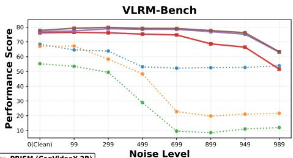

line chart

| Noise Level | BBISM (CogVideoX 3B) | Dotted Line | Solid Line |
|-------------|----------------------|-------------|------------|
| 0 (Clean)   | 75                   | 70          | 80         |
| 99          | 75                   | 65          | 80         |
| 299         | 75                   | 60          | 80         |
| 499         | 75                   | 50          | 80         |
| 699         | 75                   | 25          | 80         |
| 899         | 70                   | 20          | 75         |
| 949         | 65                   | 20          | 75         |
| 989         | 55                   | 20          | 65         |

Fig. 2: Preference alignment performance across various noise levels t. We evaluate the preference accuracy of PRISM against state-of-the-art pixel-level reward models on (left) VideoGen-RewardBench and (right) VLRM-Bench. Conventional models (dotted lines), such as VideoScore2 and UnifiedReward, exhibit a significant performance drop or even complete collapse as the noise level increases (t → 1000). In contrast, our PRISM variants (solid lines) consistently maintain high accuracy throughout the entire denoising trajectory. Notably, even when utilizing a smaller backbone (e.g., Wan2.1-1.3B), PRISM significantly outperforms the strongest pixel-level baselines, demonstrating the superiority of leveraging generative latent priors for noiseaware preference modeling.

UnifiedReward [32], and VideoScore2 [6], predominantly build upon Vision-Language Model (VLM) backbones [1, 9, 11, 30] to assess video quality. However, these VLM-based approaches operate exclusively at the pixel level, lacking the ability to evaluate preferences under varying noise levels. As demonstrated in Fig. 2, the preference accuracy of these models drops significantly as the timestep (i.e., noise level) increases. Our PRISM addresses these bottlenecks by operating directly within the latent space of a pre-trained diffusion backbone.

Inference-Time Scaling. Scaling compute during inference via Best-of-N (BoN) sampling significantly improves generative quality without retraining [16, 26]. However, applying BoN to video generation is highly computationally expensive. Because existing pixel-based Video Reward Models (VRMs) [6, 14] require fully decoded, clean videos, the computational overhead of iterative denoising and VAE decoding scales strictly linearly. PRISM addresses this by enabling accurate preference scoring directly on early-stage noisy latents, fundamentally breaking the linear scaling bottleneck and rendering video BoN highly practical.

## 3 Method

In this section, we introduce PRISM (Preference Representation in Intermediate States of Diffusion Models), a reward model specifically designed to capture human preferences throughout the entire diffusion denoising trajectory.

## 3.1 Preliminaries

Recent video generative models $[ 5 , 1 0 , 4 1 ]$ typically operate in a compressed latent space to alleviate computational burdens. Given a video $x ,$ a pretrained encoder $E$ maps it into a latent representation $z _ { 0 } = E ( x ) \in \mathbb { R } ^ { \mathcal { F } \times H \times W \times C }$ , where ${ \mathcal { F } } , H , W ,$ , and $C$ denote the number of frames, latent height, latent width, and channel dimension, respectively. The generative process defines a forward trajectory that progressively transforms $z _ { 0 }$ into Gaussian noise. Following a unified formulation, a noisy latent $z _ { t }$ at timestep $t \in [ 0 , T ]$ can be sampled directly as:

$$
z _ {t} = \alpha_ {t} z _ {0} + \sigma_ {t} \epsilon , \quad \epsilon \sim \mathcal {N} (\mathbf {0}, \mathbf {I}), \tag {1}
$$

where $\alpha _ { t }$ and $\sigma _ { t }$ are time-dependent coefficients defining the probability path. In this convention, $t = 0$ corresponds to the clean latent (where $\alpha _ { 0 } = 1 , \sigma _ { 0 } = 0 )$ while $t = T$ indicates the maximum noise level. For standard diffusion, $\alpha _ { t } = \sqrt { \bar { \alpha } _ { t } }$ and $\sigma _ { t } = \sqrt { 1 - \bar { \alpha } _ { t } }$ ; for flow matching frameworks, $\alpha _ { t }$ and $\sigma _ { t }$ typically follow a linear interpolation $( \mathrm { e . g . , } \alpha _ { t } = 1 \mathrm { - } t / T )$ ). Video Diffusion Transformers are trained to reverse this process by learning a network $\mu _ { \theta } ( z _ { t } , c , t )$ that predicts the added noise or the velocity field, conditioned on the text prompt c and timestep t.

Specifically, for each timestep $t \in \{ 0 , \ldots , T \}$ in the forward process, we take $( z _ { t } , c , t )$ as input and learn a time-conditioned reward function $r ( z _ { t } , c , t ) \in \mathbb { R }$ from the frozen backbone’s intermediate spatio-temporal representations. The reward is computed per-timestep from $( z _ { t } , c , t )$ alone, enabling preference evaluation at arbitrary noise levels without requiring the full denoising trajectory.

## 3.2 Latent Video Reward Modeling

Noise-aware Feature Extraction. PRISM directly leverages the internal representations of a pre-trained Video Diffusion Transformer to construct a noiseaware evaluator. By repurposing the frozen generative backbone, we harness its inherent ability to capture complex spatio-temporal semantics and structural integrity across varying noise levels.

Formally, given a noisy video latent $z _ { t }$ and a text prompt $c ,$ we perform a single forward pass through the first $N _ { b }$ blocks of the frozen diffusion backbone. This yields a set of intermediate spatio-temporal features $F _ { \mathrm { v i s } } \in \mathbb { R } ^ { L _ { \mathrm { v i s } } \times D _ { \mathrm { v i s } } }$ , computed as $F _ { \mathrm { v i s } } = \varPhi _ { \mathrm { D i T } } ( z _ { t } , c , t )$ . By extracting features at these intermediate layers rather than the final output layer, we capture low-level motion dynamics and high-level semantic alignment before they are entirely mapped to the denoising noise prediction. This strategy ensures a discriminative representation that maintains its robustness even at high noise levels $( t  T )$ .

To maintain domain consistency, we employ the text encoder [4, 22] in conjunction with the backbone’s internal text embedding layer to extract textual features $F _ { \mathrm { t x t } } \in \mathbb { R } ^ { L _ { \mathrm { t x t } } \times D _ { \mathrm { t x t } } }$ . Since the text embedding is independent of the diffusion noise process, no enhancement is required. By deriving $F _ { \mathrm { t x t } }$ from the backbone’s embedding layer, it is aligned with $F _ { \mathrm { v i s } }$ (where $D _ { \mathrm { t x t } } = D _ { \mathrm { v i s } }$ by construction), circumventing the need for additional projection layers at this stage.

Feature Alignment and Aggregation. While the frozen diffusion backbone provides robust, noise-resilient representations, the resulting spatio-temporal features $F _ { \mathrm { v i s } }$ pose a challenge due to their immense scale. Given the high resolution and temporal depth of video data, the sequence length $L _ { \mathrm { v i s } }$ is often too large for direct processing. Without a proper bottleneck mechanism, this highdimensional data leads to severe feature degradation, where preference signals (e.g., local motion artifacts or subtle distortions) are buried under redundant background tokens. A naive approach would be to employ global adaptive pooling [38]. However, such reduction often exacerbates information loss, as it treats all tokens with equal importance, failing to capture fine-grained defects.

To mitigate this, we propose a Query-based Aggregation mechanism designed to adaptively “probe” the feature sequence. We initialize a set of $N _ { q }$ learnable queries $Q \in \bar { \mathbb { R } } ^ { N _ { q } \times D }$ , which serve as information extractors to capture preferencerelevant signals. Since the visual dimension $D _ { \mathrm { v i s } }$ may vary across different backbones, we first concatenate $F _ { \mathrm { v i s } }$ and $F _ { \mathrm { t x t } }$ , denoted as $F _ { \mathrm { u n i } } = [ F _ { \mathrm { v i s } } , F _ { \mathrm { t x t } } ]$ , and then apply a linear projection to map it into the unified dimension D. The queries then interact with the concatenated visual and textual features via a cross-attention mechanism [28]:

$$
F _ {\mathrm{agg}} = \operatorname{CrossAttn} (Q, K, V) \tag {2}
$$

where the keys $K \in \mathbb { R } ^ { ( L _ { \mathrm { v i s } } + L _ { \mathrm { t x t } } ) \times D }$ and values $V \in \mathbb { R } ^ { ( L _ { \mathrm { v i s } } + L _ { \mathrm { t x t } } ) \times D }$ are derived from the projected $F _ { \mathrm { u n i } }$ . This process allows the queries to dynamically attend to salient tokens across the entire video duration and spatial extent. In our implementation, we primarily set $N _ { q } = 1$ to collapse the spatio-temporal tokens into a single concentrated global preference embedding $F _ { \mathrm { a g g } } { \mathrm { . } }$ , which is passed through an $\mathrm { M L P }$ to compute the scalar reward $r ( \boldsymbol { z } _ { t } , \boldsymbol { c } , t )$ . Although average pooling is a standard baseline for feature aggregation, treating all positions in $F _ { \mathrm { v i s } }$ and $F _ { \mathrm { t x t } }$ equally yields sub-optimal performance. We provide a detailed discussion on this in the ablation section.

## 3.3 Training Objectives

PRISM is trained on a pairwise preference dataset D. Each sample $( z ^ { A } , z ^ { B } , y , c ) \in$ D consists of a video latent pair $( z ^ { A } , z ^ { B } )$ generated from the same prompt $c ,$ and a ground-truth human preference label $y \in \{ A = B , A \succ B , B \succ A \}$ .

To ensure the model is noise-aware and capable of providing step-level guidance, we operate directly in the latent space. For each pair $( z ^ { A } , z ^ { B } )$ , we first encode the videos into the latent space using the corresponding VAE of the dif-$ { \boldsymbol { z } } _ { t } ^ { A }$ $z _ { t } ^ { B }$ at a given diffusion timestep t based on Eq. (1). The reward model subsequently computes the scalar rewards $r _ { t } ^ { A } = r ( z _ { t } ^ { A } , c , t )$ and $r _ { t } ^ { B } = r ( z _ { t } ^ { B } , c , t )$ according to the architecture described in Sec. 3.2.

Given the inherent ambiguity in human perception, especially for videos of similar quality, we adopt the Bradley-Terry model with Ties (BTT) [23] to formulate the preference probabilities. We introduce a tie-threshold parameter $\eta \geq 1$ to account for indifferent samples. The probabilities for each preference outcome are formulated as:

$$
P _ {\eta} (y | z _ {t} ^ {A}, z _ {t} ^ {B}, c, t) = \left\{ \begin{array}{c l} \frac {(\eta^ {2} - 1) \exp (r _ {t} ^ {A}) \exp (r _ {t} ^ {B})}{(\exp (r _ {t} ^ {A}) + \eta \exp (r _ {t} ^ {B})) (\eta \exp (r _ {t} ^ {A}) + \exp (r _ {t} ^ {B}))}, & \text {if A = B} \\ \frac {\exp (r _ {t} ^ {A})}{\exp (r _ {t} ^ {B}) + \eta \exp (r _ {t} ^ {A})}, & \text {if A\succeq B} \\ \frac {\exp (r _ {t} ^ {B})}{\eta \exp (r _ {t} ^ {A}) + \exp (r _ {t} ^ {B})}, & \text {if B\succeq A} \end{array} \right. \tag {3}
$$

The final training objective is to minimize the negative log-likelihood of the ground-truth preference labels across various noise levels t:

$$
\mathcal {L} _ {\mathrm{BTT}} = - \mathbb {E} _ {t \sim \mathcal {U} (0, T), (z ^ {A}, z ^ {B}, y, c) \in \mathcal {D}} \left[ \log P (y | z _ {t} ^ {A}, z _ {t} ^ {B}, c, t) \right] \tag {4}
$$

where the timestep t is uniformly sampled from U (0, T ). By optimizing this loss over the denoising trajectory, PRISM learns a robust and consistent preference metric. This noise-aware approach enables the model to bridge the gap between intermediate noisy latents and final clean outputs, providing reliable and finegrained supervision for the alignment of video diffusion models.

## 4 Experiment

## 4.1 Experimental Setup

Dataset Construction and Annotation. We construct a large-scale pairwise preference dataset from diverse state-of-the-art video generators using VBench prompts. Three professional annotators independently evaluated each pair across Visual Quality, Text Alignment, and Motion Quality. To ensure reliable labels, we only retain pairs where one video strictly wins or ties across all three dimensions; pairs with mixed preferences are discarded. Finally, we isolate a test set with entirely unseen prompts to form our primary evaluation benchmark, VLRM-Bench. More details are in the supplementary.

Baselines. We benchmark PRISM against several representative video reward models, including VideoReward [14], UnifiedReward [32], and VideoScore2 [6]. For a fair evaluation, all baseline models are tested using their official checkpoints and hyperparameter configurations.

Implementation Details. In our experiments, we utilize pre-trained text-tovideo models as our default diffusion backbones, specifically CogVideoX-2B [36], Wan2.1-1.3B [29], and Wan2.1-14B [29]. For each diffusion backbone, we extract features from the first 12 blocks. To ensure a fair comparison across different backbone architectures, we project all extracted features to a unified latent dimension of 1536 within the Feature Alignment and Aggregation module. The aggregation employs a single learnable query $( N _ { q } = 1 )$ , and the reward head consists of a 5-layer MLP. During training, the diffusion backbone remains frozen, and we only optimize the projection and aggregation modules. The BTT loss threshold η is empirically set to 5.0. We employ the AdamW optimizer [15] with learning rates of 1e-4.

Table 1: Quantitative results of preference prediction accuracy. We report performance across multiple benchmarks under various noise levels (timesteps t). Results are evaluated both with and without ties (“w/ Ties” and $^ { \mathrm { { * } } } \mathrm { { w } } / \mathrm { { o } }$ Ties”). For each evaluation setting, the best results are bolded, and the second-best results are underlined.

<table><tr><td rowspan="2">Model</td><td colspan="8">Timestep (t)</td></tr><tr><td>989</td><td>949</td><td>899</td><td>699</td><td>499</td><td>299</td><td>99</td><td>0(Clean)</td></tr><tr><td colspan="9">VideoGen-RewardBench</td></tr><tr><td colspan="9">w/ Ties</td></tr><tr><td>VideoReward</td><td>42.13</td><td>43.05</td><td>43.14</td><td>43.73</td><td>43.16</td><td>49.83</td><td>56.43</td><td>60.23</td></tr><tr><td>UnifiedReward</td><td>41.93</td><td>42.30</td><td>42.19</td><td>41.60</td><td>44.17</td><td>53.02</td><td>63.10</td><td>64.39</td></tr><tr><td>VideoScore2</td><td>21.02</td><td>21.31</td><td>21.17</td><td>20.68</td><td>27.19</td><td>44.36</td><td>48.03</td><td>49.23</td></tr><tr><td>PRISM (CogVideoX-2B)</td><td>43.25</td><td>48.54</td><td>50.25</td><td>52.15</td><td>52.36</td><td>52.53</td><td>52.61</td><td>51.44</td></tr><tr><td>PRISM (Wan2.1-1.3B)</td><td>49.60</td><td>56.26</td><td>58.28</td><td>60.50</td><td>61.13</td><td>61.99</td><td>62.07</td><td>60.76</td></tr><tr><td>PRISM (Wan2.1-14B)</td><td>50.25</td><td>58.16</td><td>60.46</td><td>62.30</td><td>63.13</td><td>63.70</td><td>63.98</td><td>61.68</td></tr><tr><td colspan="9">w/o Ties</td></tr><tr><td>VideoReward</td><td>50.64</td><td>51.74</td><td>51.84</td><td>52.55</td><td>51.87</td><td>59.88</td><td>67.81</td><td>72.38</td></tr><tr><td>UnifiedReward</td><td>49.86</td><td>50.30</td><td>50.19</td><td>49.37</td><td>52.99</td><td>63.72</td><td>75.83</td><td>77.38</td></tr><tr><td>VideoScore2</td><td>17.20</td><td>17.82</td><td>17.87</td><td>16.86</td><td>26.49</td><td>52.89</td><td>56.76</td><td>58.27</td></tr><tr><td>PRISM (CogVideoX-2B)</td><td>51.50</td><td>58.24</td><td>60.31</td><td>62.64</td><td>62.89</td><td>63.08</td><td>63.19</td><td>61.80</td></tr><tr><td>PRISM (Wan2.1-1.3B)</td><td>59.56</td><td>67.56</td><td>70.01</td><td>72.68</td><td>73.43</td><td>74.42</td><td>74.51</td><td>72.93</td></tr><tr><td>PRISM (Wan2.1-14B)</td><td>60.36</td><td>69.87</td><td>72.63</td><td>74.79</td><td>75.78</td><td>76.44</td><td>76.81</td><td>74.12</td></tr><tr><td colspan="9">VLRM-Bench</td></tr><tr><td colspan="9">w/ Ties</td></tr><tr><td>VideoReward</td><td>53.89</td><td>52.71</td><td>52.56</td><td>52.22</td><td>53.12</td><td>63.82</td><td>64.58</td><td>68.47</td></tr><tr><td>UnifiedReward</td><td>21.66</td><td>21.11</td><td>19.86</td><td>22.77</td><td>48.33</td><td>58.33</td><td>67.22</td><td>67.01</td></tr><tr><td>VideoScore2</td><td>12.01</td><td>11.04</td><td>8.54</td><td>9.58</td><td>28.89</td><td>49.44</td><td>53.47</td><td>55.21</td></tr><tr><td>PRISM (CogVideoX-2B)</td><td>51.60</td><td>66.46</td><td>68.68</td><td>74.72</td><td>75.28</td><td>76.18</td><td>76.46</td><td>76.18</td></tr><tr><td>PRISM (Wan2.1-1.3B)</td><td>63.06</td><td>75.21</td><td>76.94</td><td>78.54</td><td>78.54</td><td>78.96</td><td>77.43</td><td>76.88</td></tr><tr><td>PRISM (Wan2.1-14B)</td><td>63.33</td><td>76.25</td><td>77.71</td><td>79.10</td><td>79.17</td><td>79.86</td><td>79.24</td><td>77.78</td></tr><tr><td colspan="9">w/o Ties</td></tr><tr><td>VideoReward</td><td>54.53</td><td>53.34</td><td>53.26</td><td>52.91</td><td>53.83</td><td>64.58</td><td>65.35</td><td>69.29</td></tr><tr><td>UnifiedReward</td><td>21.43</td><td>20.81</td><td>19.53</td><td>22.55</td><td>48.91</td><td>59.03</td><td>68.02</td><td>67.81</td></tr><tr><td>VideoScore2</td><td>18.55</td><td>20.03</td><td>19.82</td><td>16.51</td><td>33.38</td><td>51.23</td><td>56.43</td><td>56.78</td></tr><tr><td>PRISM (CogVideoX-2B)</td><td>52.21</td><td>67.25</td><td>69.50</td><td>75.61</td><td>76.18</td><td>77.09</td><td>77.37</td><td>77.09</td></tr><tr><td>PRISM (Wan2.1-1.3B)</td><td>63.81</td><td>76.11</td><td>77.86</td><td>79.48</td><td>79.48</td><td>79.90</td><td>78.36</td><td>77.86</td></tr><tr><td>PRISM (Wan2.1-14B)</td><td>64.09</td><td>77.16</td><td>78.64</td><td>80.04</td><td>80.11</td><td>80.82</td><td>80.25</td><td>78.78</td></tr></table>

## Evaluation & Metrics.

1. Preference Prediction Accuracy: Following established protocols, we evaluate pairwise preference accuracy on the VideoGen-RewardBench [14]. We report both “w/ Ties” and “w/o Ties” accuracies to comprehensively reflect the model’s discriminative capability. Additionally, we utilize our curated test set, VLRM-Bench—which pairs advanced generative models with human-annotated preference labels—to rigorously assess out-ofdistribution (OOD) robustness. To precisely analyze performance under varying noise conditions, we isolate the evaluation process, conducting experiments at discrete, specific noise levels rather than employing randomized noise sampling for each instance. More details can be found in supplementary.

2. Inference-time Scaling Comparison: To demonstrate the practical utility of PRISM in aligning generative outputs, we conduct Best-of-N (BoN)

sampling experiments (setting $N = 5 )$ . Candidate videos are generated using prompts sourced from VBench [8]. For conventional VLM-based baselines, candidate selection is inherently performed on fully denoised and decoded videos. In contrast, PRISM evaluates candidates at various intermediate denoising steps, allowing us to thoroughly investigate the efficiencyperformance trade-off. Improvements are measured across all standard VBench dimensions to ensure a holistic comparison. To validate architectural generalizability, we employ two text-to-video models: CogVideoX-2B and Wan2.1- 1.3B. All inference hyperparameters strictly adhere to the official model recommendations and VBench guidelines.

## 4.2 Experiment Results

Preference Prediction Accuracy. We present the quantitative comparison of preference prediction in Tab. 1. To ensure a fair evaluation across the diffusion trajectory, pixel-level baselines are provided with videos reconstructed from noisy latents $z _ { t }$ via the backbone’s VAE decoder.

A key observation is the performance collapse of pixel-level models in highnoise scenarios. Specifically, VideoScore2 exhibits a tie-collapse phenomenon: because it relies on an absolute scoring phase (mapping individual video to a discrete quality range), it tends to perceive all noisy inputs as complete failures and assigns them the lowest possible score. This results in nearly all pairs being predicted as “equal,” leading to a catastrophic drop in accuracy at higher timesteps. Although UnifiedReward shows competitive results on low-noise samples in VideoGen-RewardBench, its performance drops as t increases. In contrast, our PRISM consistently achieves the best performance across all benchmarks and timesteps. It preserves high accuracy even in high-noise cases where other methods fail, demonstrating the superior robustness of our noise-aware latent-level design. On the more challenging VLRM-Bench, our method further demonstrates its strength by outperforming all baselines on advanced generative results.

Furthermore, Tab. 1 compares PRISM variants using different diffusion backbones: CogVideoX-2B, Wan2.1-1.3B, and Wan2.1-14B. The results yield two critical insights:

Intrinsic Quality vs. Parameter Scale: Wan2.1-1.3B outperforms the CogVideoX-2B variant on V-bench, even though CogVideoX-2B has a larger parameter count and higher feature dimensionality. This suggests that the intrinsic representational capability of the backbone—likely stemming from superior architectural design or pre-training—is a more vital factor for reward modeling than raw model scale.

Scaling Dividends: Within the same model family, scaling provides clear benefits. The Wan2.1-14B version consistently surpasses the 1.3B version, leveraging its larger hidden capacity and richer feature space for more precise preference distillation.

Inference-time Scaling (BoN). We present the quantitative results of the inference-time scaling experiments in Tab. 2. To ensure domain consistency, each inference model is paired with a PRISM utilizing the corresponding diffusion backbone to align the latent spaces.

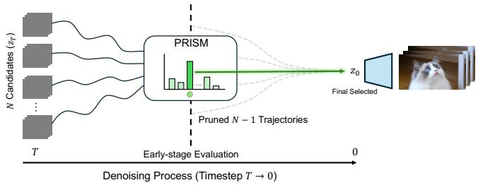

flowchart

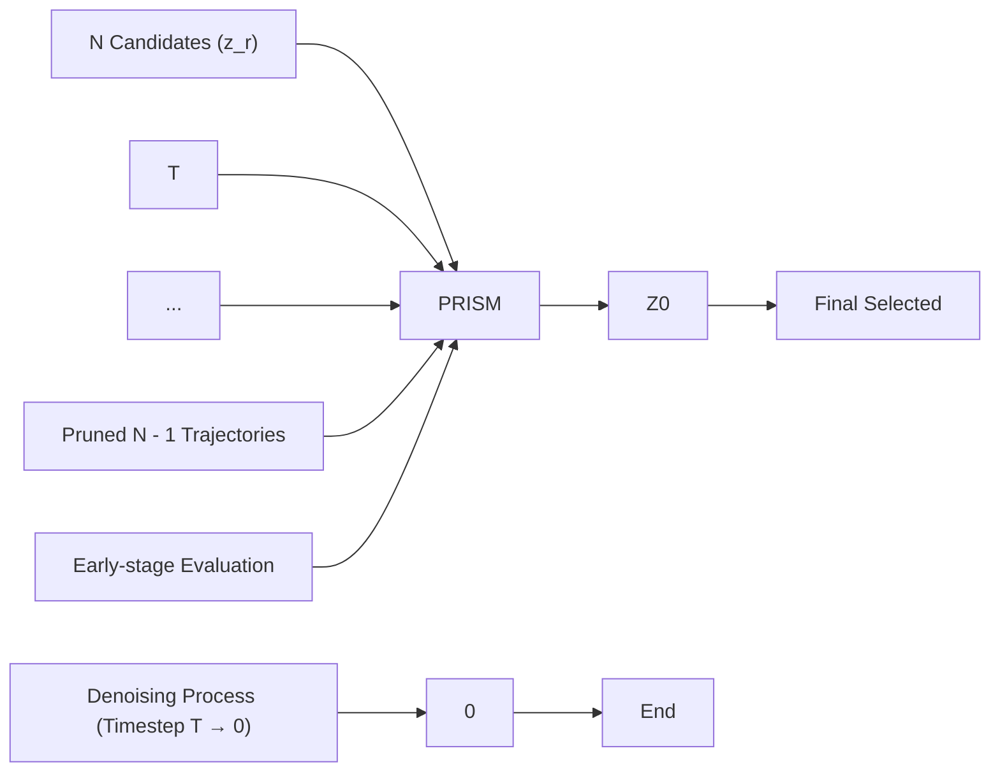

Fig. 3: Best-of-N (BoN) sampling pipeline empowered by PRISM. Unlike conventional evaluation methods that require executing the full denoising process and VAE decoding for all candidates, PRISM performs early-stage evaluation directly in the latent space. At an intermediate timestep, PRISM scores the high-noise latents and identifies the optimal candidate. Consequently, the remaining N − 1 suboptimal trajectories are immediately pruned, and only the single selected latent continues the forward pass to the final pixel space.

As shown in Tab. 2, our proposed PRISM consistently achieves superior alignment performance across diverse base models. While previous VLM-based reward models exhibit competitive results on earlier generators like CogVideoX, their efficacy degrades significantly when applied to more advanced models. To establish a rigorous lower bound for the Best-of-N evaluation, we include a Random baseline that uniformly selects one candidate from the N generated videos without any reward-based guidance. For an intuitive overview of how our efficient selection mechanism operates, we visualize the complete PRISM sampling pipeline in Fig. 3.

Beyond quantitative gains, the visual comparisons in Fig. 4 further highlight PRISM’s discriminative power. While baselines often suffer from subject counting artifacts and physically implausible motion, PRISM consistently selects samples that adhere to semantic and physical constraints. Notably, PRISM exhibits a keen sensitivity to fine-grained dynamics, such as the articulated hand movements of the playing bear (third line in Fig. 4), which are frequently overlooked by pixel-based evaluators in early denoising stages.

Efficiency and Quality Trade-off. Unlike pixel-based baselines bottlenecked by full denoising and VAE decoding for all N candidates, PRISM natively evaluates noisy latents. As shown in Fig. 5, intervening at nascent stages (e.g., Step 1 or 5) circumvents VAE overhead and redundant passes for N − 1 trajectories. This slashes relative time costs to 13% (CogVideoX-2B) and 19% (Wan2.1-1.3B), yielding up to a 7.6× speedup. Crucially, VBench scores indicate this efficiency preserves generative quality. Because modern schedulers (e.g., Flow Matching) solidify semantic structures early, PRISM’s alignment accuracy frequently peaks during early-to-mid stages. By capturing high-quality candidates at this optimal speed-quality intersection, PRISM transforms Best-of-N sampling from a theoretical luxury into a highly practical deployment strategy. More details can be found in supplementary.

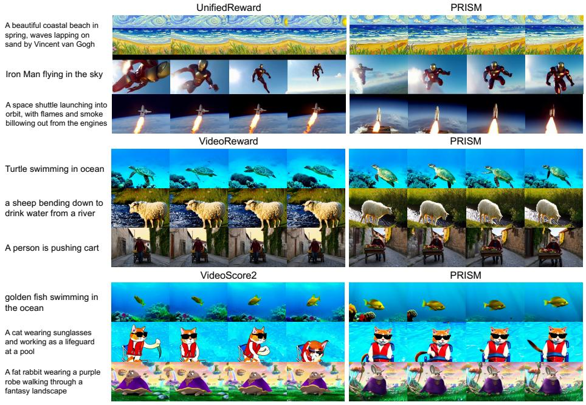

text_image

UnifiedReward
A beautiful coastal beach in spring, waves lapping on sand by Vincent van Gogh
Iron Man flying in the sky
A space shuttle launching into orbit, with flames and smoke billowing out from the engines
VideoReward
Turtle swimming in ocean
a sheep bending down to drink water from a river
A person is pushing cart
VideoScore2
Golden fish swimming in the ocean
A cat wearing sunglasses and working as a lifeguard at a pool
A fat rabbit wearing a purple robe walking through a fantasy landscape

Fig. 4: Qualitative comparison of BoN results. Under identical prompts, PRISM consistently identifies samples with superior semantic fidelity and physical consistency compared to pixel-based baselines (e.g., VideoReward and VideoScore2). PRISM excels in capturing precise subject composition and articulated motion, which are often compromised in baseline-guided selections.

## 4.3 Ablation

Impact of Feature Alignment and Aggregation. To verify the effectiveness of our query-based aggregation mechanism, we conduct a comparative analysis against the baseline design of global adaptive pooling, as discussed in Sec. 3.2.

Global pooling is a common yet rigid approach that collapses spatial and temporal dimensions via simple averaging, which often leads to the dilution of fine-grained preference signals—such as localized motion artifacts or subtle texture inconsistencies.

Tab. 3 shows the ablation results on both CogVideoX-2B and Wan2.1-1.3B backbones. These results consistently demonstrate that our query-based aggregation significantly outperforms the pooling baseline across all noise timesteps t. Specifically, the learnable queries Q interact with the spatio-temporal features via cross-attention, allowing the model to dynamically focus on discriminative regions rather than treating all tokens with equal importance. This advantage is particularly evident on the Wan2.1 backbone, where the Q-Former maintains higher accuracy even as t increases. These findings validate our hypothesis that a query-based information extractors can effectively preserve core preference information while mitigating the information loss inherent in straightforward dimensionality reduction.

Table 2: Quantitative results for Best-of-N (BoN) sampling. The “Settings” column specifies the denoising step at which PRISM performs selection. Performance is evaluated using VBench across various models. For each model, the best and second-best results are highlighted. ∆ denotes the performance gain.

<table><tr><td rowspan="2">Infer Model</td><td rowspan="2">RM</td><td rowspan="2">Settings</td><td colspan="4">VBench</td></tr><tr><td>Quality</td><td>Semantic</td><td>Total</td><td> $\Delta$ </td></tr><tr><td rowspan="10">CogVideoX</td><td>-</td><td>-</td><td>81.0631</td><td>77.0937</td><td>80.2693</td><td>-</td></tr><tr><td>Random</td><td>-</td><td>81.3808</td><td>77.2381</td><td>80.5522</td><td>+0.2829</td></tr><tr><td>VideoReward</td><td>-</td><td>81.6803</td><td>78.7097</td><td>81.0862</td><td>+0.8169</td></tr><tr><td>UnifiedReward</td><td>-</td><td>81.6947</td><td>77.4733</td><td>80.8504</td><td>+0.5811</td></tr><tr><td>VideoScore2</td><td>-</td><td>81.2159</td><td>78.1815</td><td>80.6090</td><td>+0.3397</td></tr><tr><td></td><td>Step 1</td><td>81.3019</td><td>77.4076</td><td>80.5230</td><td>+0.2537</td></tr><tr><td></td><td>Step 5</td><td>81.6351</td><td>77.7337</td><td>80.8549</td><td>+0.5856</td></tr><tr><td>PRISM (CogVideoX-2B)</td><td>Step 10</td><td>82.0087</td><td>77.7561</td><td>81.1582</td><td>+0.8889</td></tr><tr><td></td><td>Step 25</td><td>81.7414</td><td>77.5840</td><td>80.9099</td><td>+0.6406</td></tr><tr><td></td><td>Step 50</td><td>81.5411</td><td>77.7721</td><td>80.7873</td><td>+0.5180</td></tr><tr><td rowspan="15">Wan2.1-1.3B</td><td>-</td><td>-</td><td>85.2300</td><td>75.6500</td><td>83.3100</td><td>-</td></tr><tr><td>Random</td><td>-</td><td>85.5736</td><td>76.0586</td><td>83.6706</td><td>+0.3606</td></tr><tr><td>VideoReward</td><td>-</td><td>85.3138</td><td>76.9041</td><td>83.6318</td><td>+0.3218</td></tr><tr><td>UnifiedReward</td><td>-</td><td>85.2754</td><td>76.3370</td><td>83.4878</td><td>+0.1778</td></tr><tr><td>VideoScore2</td><td>-</td><td>85.9198</td><td>75.7450</td><td>83.8849</td><td>+0.5749</td></tr><tr><td rowspan="5">PRISM (Wan2.1-1.3B)</td><td>Step 1</td><td>85.6257</td><td>76.7701</td><td>83.8546</td><td>+0.5446</td></tr><tr><td>Step 5</td><td>85.9211</td><td>76.5801</td><td>84.0529</td><td>+0.7429</td></tr><tr><td>Step 10</td><td>85.8620</td><td>76.0182</td><td>83.8932</td><td>+0.5832</td></tr><tr><td>Step 25</td><td>86.0783</td><td>76.1780</td><td>84.0983</td><td>+0.7883</td></tr><tr><td>Step 50</td><td>86.0589</td><td>76.5513</td><td>84.1574</td><td>+0.8474</td></tr><tr><td rowspan="5">PRISM (Wan2.1-14B)</td><td>Step 1</td><td>85.9822</td><td>76.4926</td><td>84.0843</td><td>+0.7743</td></tr><tr><td>Step 5</td><td>86.1617</td><td>76.1093</td><td>84.1512</td><td>+0.8412</td></tr><tr><td>Step 10</td><td>86.0889</td><td>75.9489</td><td>84.0609</td><td>+0.7509</td></tr><tr><td>Step 25</td><td>86.3384</td><td>76.6792</td><td>84.4065</td><td>+1.0965</td></tr><tr><td>Step 50</td><td>86.0786</td><td>76.9515</td><td>84.2532</td><td>+0.9432</td></tr></table>

Table 3: Quantitative results for Impact of Feature Alignment and Aggregation. We report performance under various noise levels (timesteps t). Results are evaluated both with and without ties $( ^ { 6 \zeta } \mathrm { w / \ T i e s ^ { 3 \zeta } }$ and “w/o Ties”). For each evaluation setting, the best results are bolded.

<table><tr><td rowspan="2">Method</td><td colspan="8">Timestep (t)</td></tr><tr><td>989</td><td>949</td><td>899</td><td>699</td><td>499</td><td>299</td><td>99</td><td>0(Clean)</td></tr><tr><td colspan="9">CogVideoX-2B</td></tr><tr><td colspan="9">w/ Ties</td></tr><tr><td>Pool Agg + MLP</td><td>38.77</td><td>45.68</td><td>47.50</td><td>50.51</td><td>51.43</td><td>51.47</td><td>51.51</td><td>52.14</td></tr><tr><td>Q-based Agg + MLP</td><td>43.25</td><td>48.54</td><td>50.25</td><td>52.15</td><td>52.36</td><td>52.53</td><td>52.61</td><td>51.44</td></tr><tr><td colspan="9">w/o Ties</td></tr><tr><td>Pool Agg + MLP</td><td>43.79</td><td>53.27</td><td>55.74</td><td>59.26</td><td>60.51</td><td>60.67</td><td>60.89</td><td>62.15</td></tr><tr><td>Q-based Agg + MLP</td><td>51.50</td><td>58.24</td><td>60.31</td><td>62.64</td><td>62.89</td><td>63.08</td><td>63.19</td><td>61.80</td></tr><tr><td colspan="9">Wan2.1-1.3B</td></tr><tr><td colspan="9">w/ Ties</td></tr><tr><td>Pool Agg + MLP</td><td>43.67</td><td>52.62</td><td>54.64</td><td>55.68</td><td>56.09</td><td>56.13</td><td>56.24</td><td>55.60</td></tr><tr><td>Q-based Agg + MLP</td><td>49.60</td><td>56.26</td><td>58.28</td><td>60.50</td><td>61.13</td><td>61.99</td><td>62.07</td><td>60.76</td></tr><tr><td colspan="9">w/o Ties</td></tr><tr><td>Pool Agg + MLP</td><td>50.38</td><td>61.76</td><td>64.25</td><td>64.83</td><td>65.21</td><td>65.22</td><td>65.35</td><td>65.15</td></tr><tr><td>Q-based Agg + MLP</td><td>59.56</td><td>67.56</td><td>70.01</td><td>72.68</td><td>73.43</td><td>74.42</td><td>74.51</td><td>72.93</td></tr></table>

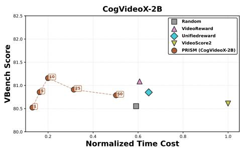

scatter plot

| Method             | Normalized Time Cost | VBench Score |
| ------------------ | -------------------- | ------------ |
| Random             | 0.6                  | 80.5         |
| VideoReward        | 0.6                  | 81.0         |
| Unifiedreward      | 0.6                  | 80.8         |
| VideoScore2        | 1.0                  | 80.6         |
| PRISM (CogVideoX-2B) | 0.2                  | 80.7         |

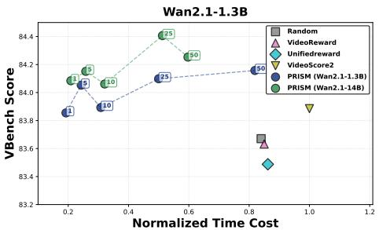

scatter plot

| Method              | Normalized Time Cost | VBench Score |
| ------------------- | -------------------- | ------------ |
| Random              | 0.8                  | 83.7         |
| VideoReward         | 0.9                  | 83.6         |
| UnifiedScore       | 0.9                  | 83.5         |
| VideoScore2         | 1.0                  | 83.8         |
| PRISM (Wan2.1-1.3B) | 0.6                  | 84.1         |
| PRISM (Wan2.1-14B)  | 0.6                  | 84.3         |

Fig. 5: Efficiency-quality trade-off of Best-of-N sampling across intervention steps. The bar charts (left axis) represent the relative inference time cost normalized against the VideoScore2 baseline (set to 1.0). The overlaid line plots (right axis) illustrate the corresponding generative quality measured by VBench scores. While standard pixel-based baselines (horizontal lines) are burdened by full-trajectory denoising and mandatory VAE decoding, PRISM enables early-stage intervention. Notably, PRISM achieves a VBench performance plateau at early stages (e.g., Step 5).

## 4.4 In-depth Analysis and Interpretability

We further investigate the rationale behind PRISM’s performance by visualizing the cross-attention mechanisms within the Query-based Aggregation head. As illustrated in Fig. 6, the attention maps reveal a clear correlation between attention intensity and the structural integrity of semantic concept regions.

Specifically, we observe that the learnable queries function as a qualityconditional filter. Within the targeted object regions (marked by red/white boxes), the attention intensity varies significantly according to generative fidelity. In the suboptimal samples where videos suffer from warped geometry or perceptual artifacts—such as the distorted aircraft fuselage or the malformed teddy bear—the attention scores are relatively low (appearing as cooler, blue regions). In contrast, the corresponding semantic regions in preferred samples elicit much stronger and more focused responses.

This comparative behavior demonstrates that PRISM does not merely aggregate global features; instead, its attention mechanism is discriminatively sensitive to the “health” of the generated content. By assigning higher weights to high-fidelity semantic signals while discounting regions with localized structural distortions, the module addresses the challenge of information dilution, providing a robust and interpretable foundation for latent-space preference alignment.

## 4.5 Limitations and Future Work

The primary constraint of PRISM lies in its architectural coupling with the underlying diffusion backbone. Specifically, the effectiveness of our reward head relies on the specific latent representations learned by a particular VAE. This necessitates that both the evaluator and the generator reside in the same latent domain. When applying PRISM to evaluate outputs from a generative model with a different VAE design, the latent features must be decoded into pixel space and subsequently re-encoded into the evaluator’s latent space. This additional computational overhead limits the “plug-and-play” capability of PRISM across heterogeneous model families.

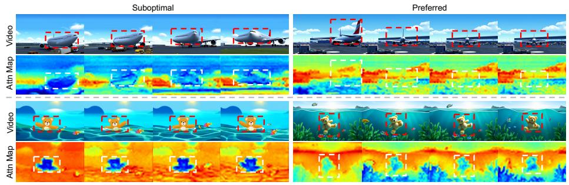

text_image

Suboptimal
Video
Attn Map
Video
Attn Map
Preferred

Fig. 6: Comparative visualization of attention maps in the Query-based Aggregation module. We compare the cross-attention scores for suboptimal (left) and preferred (right) video samples. As highlighted by the red boxes in the videos and white boxes in the attention maps, within the primary semantic regions (e.g., the aircraft or the teddy bear), the model assigns higher attention weights to high-fidelity structures. Conversely, regions containing structural distortions or malformed textures exhibit suppressed responses. This demonstrated sensitivity to generative quality, especially within core semantic areas, provides a highly interpretable basis for the model’s preference assessment.

Despite this limitation, PRISM currently serves as a highly efficient, specialized “expert evaluator” for specific model lineages. Future work will explore the incorporation of latent-space alignment methods or cross-model adapters to achieve broader robustness and backbone-agnostic evaluation.

## 5 Conclusion

We presented PRISM, an efficient latent-space video reward framework that bridges human preferences and high-resolution video generation. By repurposing noise-resilient spatiotemporal priors from frozen Video Diffusion Transformers, PRISM circumvents the massive computational overhead and noise-sensitivity of traditional pixel-based models. Our study demonstrates these generative priors offer a robust foundation for preference learning across diverse architectures (e.g., CogVideoX and Wan2.1). Technically, our Query-based Aggregation distills critical semantic signals from high-dimensional latents, while attention analysis reveals its interpretability in inherently suppressing regional artifacts. Extensive evaluations confirm PRISM achieves state-of-the-art alignment accuracy. Crucially, its decoding-free, noise-aware nature unlocks a new paradigm for efficient inference-time scaling. By enabling reliable early-stage selection, PRISM significantly reduces latency without compromising quality. Ultimately, PRISM provides a practical alignment tool and advances our understanding of the evaluative capabilities of generative models.

## References

1. Bai, S., Chen, K., Liu, X., Wang, J., Ge, W., Song, S., Dang, K., Wang, P., Wang, S., Tang, J., Zhong, H., Zhu, Y., Yang, M., Li, Z., Wan, J., Wang, P., Ding, W., Fu, Z., Xu, Y., Ye, J., Zhang, X., Xie, T., Cheng, Z., Zhang, H., Yang, Z., Xu, H., Lin, J.: Qwen2.5-vl technical report. arXiv preprint arXiv:2502.13923 (2025)  
2. Blattmann, A., Dockhorn, T., Kulal, S., Mendelevitch, D., Kilian, M., Lorenz, D., Levi, Y., English, Z., Voleti, V., Letts, A., et al.: Stable video diffusion: Scaling latent video diffusion models to large datasets. arXiv preprint arXiv:2311.15127 (2023)  
3. Chen, G., Lin, D., Yang, J., Lin, C., Zhu, J., Fan, M., Zhang, H., Chen, S., Chen, Z., Ma, C., Xiong, W., Wang, W., Pang, N., Kang, K., Xu, Z., Jin, Y., Liang, Y., Song, Y., Zhao, P., Xu, B., Qiu, D., Li, D., Fei, Z., Li, Y., Zhou, Y.: Skyreels-v2: Infinite-length film generative model (2025), https://arxiv.org/abs/2504.13074  
4. Chung, H.W., Garcia, X., Roberts, A., Tay, Y., Firat, O., Narang, S., Constant, N.: Unimax: Fairer and more effective language sampling for large-scale multilingual pretraining. In: The Eleventh International Conference on Learning Representations (2023), https://openreview.net/forum?id=kXwdL1cWOAi  
5. Gao, Y., Guo, H., Hoang, T., Huang, W., Jiang, L., Kong, F., Li, H., Li, J., Li, L., Li, X., et al.: Seedance 1.0: Exploring the boundaries of video generation models. arXiv preprint arXiv:2506.09113 (2025)  
6. He, X., Jiang, D., Nie, P., Liu, M., Jiang, Z., Su, M., Ma, W., Lin, J., Ye, C., Lu, Y., Wu, K., Schneider, B., Do, Q.D., Li, Z., Jia, Y., Zhang, Y., Cheng, G., Wang, H., Zhou, W., Lin, Q., Zhang, Y., Zhang, G., Huang, W., Chen, W.: Videoscore2: Think before you score in generative video evaluation (2025), https://arxiv.org/ abs/2509.22799  
7. He, X., Jiang, D., Zhang, G., Ku, M., Soni, A., Siu, S., Chen, H., Chandra, A., Jiang, Z., Arulraj, A., Wang, K., Do, Q.D., Ni, Y., Lyu, B., Narsupalli, Y., Fan, R., Lyu, Z., Lin, Y., Chen, W.: Videoscore: Building automatic metrics to simulate fine-grained human feedback for video generation. ArXiv abs/2406.15252 (2024), https://arxiv.org/abs/2406.15252  
8. Huang, Z., He, Y., Yu, J., Zhang, F., Si, C., Jiang, Y., Zhang, Y., Wu, T., Jin, Q., Chanpaisit, N., Wang, Y., Chen, X., Wang, L., Lin, D., Qiao, Y., Liu, Z.: VBench: Comprehensive benchmark suite for video generative models. In: Proceedings of the IEEE/CVF Conference on Computer Vision and Pattern Recognition (2024)  
9. Jiang, D., He, X., Zeng, H., Wei, C., Ku, M.W., Liu, Q., Chen, W.: Mantis: Interleaved multi-image instruction tuning. Transactions on Machine Learning Research 2024 (2024), https://openreview.net/forum?id=skLtdUVaJa  
10. Kong, W., Tian, Q., Zhang, Z., Min, R., Dai, Z., Zhou, J., Xiong, J., Li, X., Wu, B., Zhang, J., et al.: Hunyuanvideo: A systematic framework for large video generative models. arXiv preprint arXiv:2412.03603 (2024)  
11. Li, B., Zhang, Y., Guo, D., Zhang, R., Li, F., Zhang, H., Zhang, K., Li, Y., Liu, Z., Li, C.: Llava-onevision: Easy visual task transfer. arXiv preprint arXiv:2408.03326 (2024)  
12. Lipman, Y., Chen, R.T.Q., Ben-Hamu, H., Nickel, M., Le, M.: Flow matching for generative modeling. In: The Eleventh International Conference on Learning Representations (2023), https://openreview.net/forum?id=PqvMRDCJT9t  
13. Liu, F., Wang, H., Cai, Y., Zhang, K., Zhan, X., Duan, Y.: Video-t1: Test-time scaling for video generation. arXiv preprint arXiv:2503.18942 (2025)  
14. Liu, J., Liu, G., Liang, J., Yuan, Z., Liu, X., Zheng, M., Wu, X., Wang, Q., Qin, W., Xia, M., et al.: Improving video generation with human feedback. arXiv preprint arXiv:2501.13918 (2025)  
15. Loshchilov, I., Hutter, F.: Decoupled weight decay regularization. arXiv preprint arXiv:1711.05101 (2017)  
16. Ma, N., Tong, S., Jia, H., Hu, H., Su, Y.C., Zhang, M., Yang, X., Li, Y., Jaakkola, T., Jia, X., et al.: Inference-time scaling for diffusion models beyond scaling denoising steps. arXiv preprint arXiv:2501.09732 (2025)  
17. Ma, X., Wang, Y., Chen, X., Jia, G., Liu, Z., Li, Y.F., Chen, C., Qiao, Y.: Latte: Latent diffusion transformer for video generation. Transactions on Machine Learning Research (2025)  
18. Mi, X., Yu, W., Lian, J., Jie, S., Zhong, R., Liu, Z., Zhang, G., Zhou, Z., Xu, Z., Zhou, Y., Lu, Q., Tang, F.: Video generation models are good latent reward models. arXiv preprint (2025)  
19. Oshima, Y., Suzuki, M., Matsuo, Y., Furuta, H.: Inference-time text-to-video alignment with diffusion latent beam search. arXiv preprint arXiv:2501.19252 (2025), https://arxiv.org/abs/2501.19252  
20. Ouyang, L., Wu, J., Jiang, X., Almeida, D., Wainwright, C., Mishkin, P., Zhang, C., Agarwal, S., Slama, K., Ray, A., et al.: Training language models to follow instructions with human feedback. Advances in neural information processing systems 35, 27730–27744 (2022)  
21. Peebles, W., Xie, S.: Scalable diffusion models with transformers. arXiv preprint arXiv:2212.09748 (2022)  
22. Raffel, C., Shazeer, N., Roberts, A., Lee, K., Narang, S., Matena, M., Zhou, Y., Li, W., Liu, P.J.: Exploring the limits of transfer learning with a unified textto-text transformer. Journal of Machine Learning Research 21(140), 1–67 (2020), http://jmlr.org/papers/v21/20-074.html  
23. Rao, P.V., Kupper, L.L.: Ties in paired-comparison experiments: A generalization of the bradley-terry model. Journal of the American Statistical Association 62(317), 194–204 (1967), http://www.jstor.org/stable/2282923  
24. Ronneberger, O., Fischer, P., Brox, T.: U-net: Convolutional networks for biomedical image segmentation. In: International Conference on Medical image computing and computer-assisted intervention. pp. 234–241. Springer (2015)  
25. Schulman, J., Wolski, F., Dhariwal, P., Radford, A., Klimov, O.: Proximal policy optimization algorithms. arXiv preprint arXiv:1707.06347 (2017)  
26. Singhal, R., Horvitz, Z., Teehan, R., Ren, M., Yu, Z., McKeown, K., Ranganath, R.: A general framework for inference-time scaling and steering of diffusion models (2025), https://arxiv.org/abs/2501.06848  
27. Touvron, H., Martin, L., Stone, K., Albert, P., Almahairi, A., Babaei, Y., Bashlykov, N., Batra, S., Bhargava, P., Bhosale, S., et al.: Llama 2: Open foundation and fine-tuned chat models. arXiv preprint arXiv:2307.09288 (2023)  
28. Vaswani, A., Shazeer, N., Parmar, N., Uszkoreit, J., Jones, L., Gomez, A.N., Kaiser, Ł., Polosukhin, I.: Attention is all you need. Advances in neural information processing systems 30 (2017)  
29. Wan, T., Wang, A., Ai, B., Wen, B., Mao, C., Xie, C.W., Chen, D., Yu, F., Zhao, H., Yang, J., Zeng, J., Wang, J., Zhang, J., Zhou, J., Wang, J., Chen, J., Zhu, K., Zhao, K., Yan, K., Huang, L., Feng, M., Zhang, N., Li, P., Wu, P., Chu, R., Feng, R., Zhang, S., Sun, S., Fang, T., Wang, T., Gui, T., Weng, T., Shen, T., Lin, W., Wang, W., Wang, W., Zhou, W., Wang, W., Shen, W., Yu, W., Shi, X., Huang, X., Xu, X., Kou, Y., Lv, Y., Li, Y., Liu, Y., Wang, Y., Zhang, Y., Huang, Y., Li, Y., Wu, Y., Liu, Y., Pan, Y., Zheng, Y., Hong, Y., Shi, Y., Feng, Y., Jiang, Z., Han, Z., Wu, Z.F., Liu, Z.: Wan: Open and advanced large-scale video generative models. arXiv preprint arXiv:2503.20314 (2025)  
30. Wang, P., Bai, S., Tan, S., Wang, S., Fan, Z., Bai, J., Chen, K., Liu, X., Wang, J., Ge, W., Fan, Y., Dang, K., Du, M., Ren, X., Men, R., Liu, D., Zhou, C., Zhou, J., Lin, J.: Qwen2-vl: Enhancing vision-language model’s perception of the world at any resolution. arXiv preprint arXiv:2409.12191 (2024)  
31. Wang, Y., Tan, Z., Wang, J., Yang, X., Jin, C., Li, H.: Lift: Leveraging human feedback for text-to-video model alignment. arXiv preprint arXiv:2412.04814 (2024)  
32. Wang, Y., Zang, Y., Li, H., Jin, C., Wang, J.: Unified reward model for multimodal understanding and generation. arXiv preprint arXiv:2503.05236 (2025)  
33. Wu, X., Hao, Y., Sun, K., Chen, Y., Zhu, F., Zhao, R., Li, H.: Human preference score v2: A solid benchmark for evaluating human preferences of text-to-image synthesis. arXiv preprint arXiv:2306.09341 (2023)  
34. Xu, J., Liu, X., Wu, Y., Tong, Y., Li, Q., Ding, M., Tang, J., Dong, Y.: Imagereward: learning and evaluating human preferences for text-to-image generation. In: Proceedings of the 37th International Conference on Neural Information Processing Systems. pp. 15903–15935 (2023)  
35. Xue, J., Wang, H., Tian, Q., Ma, Y., Wang, A., Zhao, Z., Min, S., Zhao, W., Zhang, K., Shum, H.Y., et al.: Towards multiple character image animation through enhancing implicit decoupling. arXiv preprint arXiv:2406.03035 (2024)  
36. Yang, Z., Teng, J., Zheng, W., Ding, M., Huang, S., Xu, J., Yang, Y., Hong, W., Zhang, X., Feng, G., et al.: Cogvideox: Text-to-video diffusion models with an expert transformer. arXiv preprint arXiv:2408.06072 (2024)  
37. Yu, S., Kwak, S., Jang, H., Jeong, J., Huang, J., Shin, J., Xie, S.: Representation alignment for generation: Training diffusion transformers is easier than you think. In: International Conference on Learning Representations (2025)  
38. Zhang, T., Da, C., Ding, K., Yang, H., Jin, K., Li, Y., Gao, T., Zhang, D., Xiang, S., Pan, C.: Diffusion model as a noise-aware latent reward model for step-level preference optimization. arXiv preprint arXiv:2502.01051 (2025)  
39. Zhao, W., Bai, L., Rao, Y., Zhou, J., Lu, J.: Unipc: A unified predictor-corrector framework for fast sampling of diffusion models. NeurIPS (2023)  
40. Zheng, K., Chen, Y., Chen, H., He, G., Liu, M.Y., Zhu, J., Zhang, Q.: Direct discriminative optimization: Your likelihood-based visual generative model is secretly a gan discriminator. arXiv preprint arXiv:2503.01103 (2025)  
41. Zheng, Z., Peng, X., Yang, T., Shen, C., Li, S., Liu, H., Zhou, Y., Li, T., You, Y.: Open-sora: Democratizing efficient video production for all. arXiv preprint arXiv:2412.20404 (2024)

# Through the PRISM: Preference Representation in Intermediate States of Video Diffusion Models

Supplementary Material

## 1 Dataset Construction

## 1.1 Data Source & Generation

To ensure our evaluator generalizes across various generative capabilities and visual artifacts, we construct a large-scale pairwise preference dataset utilizing a diverse ensemble of foundational and state-of-the-art video generation models: CogVideoX [10], OpenSora [11], HunyuanVideo [6], the Wan2.1/2.2 series [8], and SkyReels-V2 [1].

To isolate the generation capabilities of these models and ensure strict alignment, we apply the publicly released text prompts [5] across all models. All video generation models perform inference using their officially recommended parameter settings, including resolution, frame rate (FPS), total frame count, inference steps, classifier-free guidance scale [4], and timestep shifting [2]. No model-specific prompt engineering or additional enhancement techniques were used during the inference stage, thus preventing confounding variables.

## 1.2 Annotation Process

To construct a high-quality preference dataset for reward model training, each generated video pair was independently assessed by three professional human annotators across three distinct dimensions: Visual Quality, Text Alignment, and Motion Quality. The annotation pipeline was designed to guarantee labeling consistency and accuracy.

Instructional Guidance. We developed a detailed annotation guideline document outlining the task definition and the standard operating procedure. For the three specific dimensions, the guidelines provide definitions, core evaluation criteria, and key aspects to scrutinize. To facilitate a clear understanding, we included visual examples demonstrating common generation defects, side-by-side comparison videos, and examples accompanied by expected preference choices and detailed rationales.

Annotation Procedure. The evaluation process began with a pilot annotation phase involving 1,000 video pairs to calibrate annotators and iteratively refine the formal guidelines. During the main annotation phase, pre-collected “golden pairs” with expected outcomes were integrated into the annotation stream to continuously monitor labeling quality and annotator reliability. Furthermore, we held regular meetings with all annotators to provide ongoing guidance, clarify ambiguous samples, and address any concerns, thereby maintaining strict consensus.

## 1.3 Aggregation Strategy & Dataset Statistics

To derive the final overall preference label from the three annotated dimensions, we employ an aggregation strategy rather than a simple majority vote. This design is for filtering out ambiguous pairs and ensuring the dataset consists solely of high-confidence, Pareto-improved comparisons.

For each video pair, we aggregate the dimension-level results (Left, Right, or Tie) using the following rules:

– Unanimous Tie: If a video pair is rated as a “Tie” across all three dimensions, the final overall label is preserved as a $^ { 6 6 } \mathrm { T i e } ^ { 5 }$ .  
– Consistent Preference: We filter out the “Tie” votes and examine the remaining preferences. If the remaining preferences are strictly consistent (i.e., all pointing to $\mathrm { \Phi _ { \mathrm { } } ^ {  } \mathrm { L e f t } ^ {  } }$ or all pointing to “Right”), the final label adopts this unified direction. This ensures that a model is only favored if it outperforms or ties with its counterpart across all considered aspects.  
– Conflict Discarding: If there are contradictory preferences among the dimensions (e.g., Model A is preferred in Visual Quality, but Model B is preferred in Motion Quality), the pair is deemed ambiguous with trade-offs. To prevent introducing noisy or swing signals into the reward model training, such conflicting pairs are assigned a “Drop” label and excluded from the final set.

Dataset Statistics. Following this filtering mechanism, the finalized dataset comprises 26,391 high-quality pairs for training and 1,440 pairs for testing. To prevent data leakage, we enforce strict prompt-level disjointness between the two splits. Notably, we curate the test set into a standalone benchmark dubbed VLRM-Bench, which serves as the primary evaluation suite in our extensive benchmark analyses.

## 2 Inference-Time Scaling Experiment Details

Base Models and Generation Setup. To validate the architectural generalizability of our approach, we utilize two video diffusion models as our generation backbones: CogVideoX-2B and Wan2.1-1.3B. For the Best-of-N (BoN) sampling experiments, we set the candidate pool size to $N = 5$ .

Prompts and Hyperparameters. The evaluation is driven by the prompt suite provided by VBench [5], which spans multiple standard dimensions of video generation quality. To ensure strict alignment with official model capabilities and to prevent confounding variables introduced by ad-hoc prompt engineering, we utilize the enhanced prompt versions released by the VBench team. Furthermore, all inference hyperparameters strictly adhere to the official recommendations provided by the respective model developers and VBench evaluation guidelines. Specifically, for Wan2.1-1.3B, we generate videos at a spatial resolution of 832 × 480 with 81 frames at 16 FPS. For CogVideoX-2B, the outputs are configured to a resolution of $7 2 0 \times 4 8 0$ , comprising 49 frames at 8 FPS.

## 3 Efficiency and Complexity Analysis

Table 1: Comparison of model parameter scales between existing VLM-based reward models and PRISM variants. PRISM introduces negligible trainable parameters by freezing the DiT backbone.

<table><tr><td>Method</td><td>Param (M)</td></tr><tr><td>VideoReward [7]</td><td>2282.42</td></tr><tr><td>UnifiedReward [9]</td><td>8027.35</td></tr><tr><td>VideoScore2 [3]</td><td>8292.16</td></tr><tr><td>PRISM (CogVideoX-2B)</td><td>709.67</td></tr><tr><td>- Trainable</td><td>21.75</td></tr><tr><td>PRISM (Wan2.1-1.3B)</td><td>604.76</td></tr><tr><td>- Trainable</td><td>21.80</td></tr><tr><td>PRISM (Wan2.1-14B)</td><td>4470.91</td></tr><tr><td>- Trainable</td><td>21.80</td></tr></table>

## 3.1 Model Parameter Efficiency

As discussed in the main text regarding the Architectural Mismatch, existing pixel-based Video Reward Models (VRMs) rely on massive Vision-Language Models (VLMs) to evaluate video quality. As detailed in Tab. 1, state-of-theart VRMs such as UnifiedReward [9] and VideoScore2 [3] possess about 8 billion parameters. Fine-tuning or even conducting Best-of-N inference with models of this scale introduces substantial memory overhead and computational burden.

PRISM resolves this by capitalizing on the pre-trained latent representations of the generative DiT backbone itself. As detailed previously, we extract features exclusively from a subset of the early DiT blocks rather than the entire network. This architectural truncation reduces the model size. For instance, the backbone of PRISM built upon CogVideoX-2B operates with only approximately 709M parameters. Because this truncated DiT backbone remains completely frozen during our reward training phase, PRISM introduces only a lightweight querybased cross-attention head. As shown in Tab. 1, this trainable module contains a mere 21.8M parameters across all backbone variants.

This extreme parameter efficiency (requiring tuning less than 4% of the base model parameters) not only democratizes the training of video reward models but also significantly reduces the memory footprint during inference-time scaling. This structural lightweight complements the temporal acceleration achieved by our early-stage latent evaluation, rendering PRISM a practical evaluator for real-world deployments.

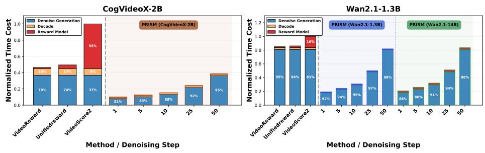  
Fig. 1: Detailed breakdown of inference time cost during Best-of-5 sampling. The total time is decomposed into Denoise Generation (blue), VAE Decode (orange), and Reward Model inference (red). Baseline methods (left of the dashed line) incur heavy costs across all three stages, requiring full denoising, full decoding for all candidates, and expensive VLM evaluations (e.g., VideoScore2’s massive red block). Conversely, PRISM (right of the dashed line) significantly reduces total latency by truncating denoising steps, minimizing VAE decoding to only the selected candidate, and introducing near-zero evaluation overhead. Note that for PRISM, the x-axis denotes the sequential denoising steps during inference (where smaller values correspond to the initial high-noise states).

## 3.2 Detailed Time Cost Analysis

Building upon the parameter efficiency discussed above, we further dissect the empirical latency during the Best-of-N (N = 5) sampling process. As illustrated in Fig. 1, the total inference time is decomposed into three components: Denoise Generation (the DiT forward passes), Decode (the VAE projection from latent to pixel space), and Reward Model (the VRM evaluation overhead). The time costs are normalized for clarity.

The conventional baseline methods reveal severe computational bottlenecks across multiple fronts. First, they require the full Denoise Generation trajectory for all N candidates. Second, all N candidates must undergo the computationally heavy VAE Decode process before evaluation. Finally, the Reward Model inference itself incurs substantial latency. This is particularly evident with VideoScore2, drastically overshadowing the generation process itself.

In contrast, PRISM demonstrates a significant reduction in temporal complexity across all three dimensions. By conducting evaluations directly on earlystage noisy latents (e.g., Step 1 or Step 10), PRISM truncates the Denoise Generation time. Furthermore, because sub-optimal candidates are discarded in the latent space, PRISM bypasses the VAE Decode overhead for the N 1 unselected videos, performing VAE decoding only once for the final output. Crucially, as PRISM simply uses a lightweight cross-attention head, its Reward Model inference time is practically negligible (visually imperceptible in Fig. 1). This timecost breakdown confirms that PRISM transforms Best-of-N video sampling from an impractical theoretical concept into a deployable reality.

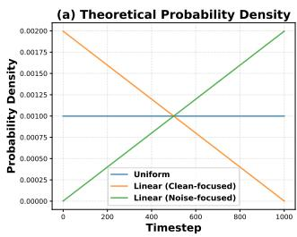

line chart

| Timestep | Uniform     | Linear (Clean-focused) | Linear (Noise-focused) |
| -------- | ----------- | ---------------------- | ---------------------- |
| 0        | 0.00100     | 0.00200                | 0.00000                |
| 200      | 0.00100     | 0.00175                | 0.00050                |
| 400      | 0.00100     | 0.00150                | 0.00125                |
| 600      | 0.00100     | 0.00125                | 0.00175                |
| 800      | 0.00100     | 0.00100                | 0.00250                |
| 1000     | 0.00100     | 0.00075                | 0.00325                |

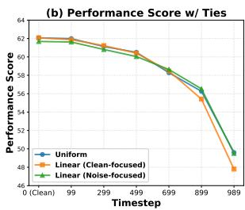

line chart

| Timestep | Uniform | Linear (Clean-focused) | Linear (Noise-focused) |
| -------- | ------- | ---------------------- | ---------------------- |
| 0 (Clean) | 62.0    | 62.0                   | 62.0                   |
| 99       | 61.5    | 61.5                   | 61.5                   |
| 299      | 60.5    | 60.5                   | 60.5                   |
| 499      | 59.5    | 59.5                   | 59.5                   |
| 699      | 58.0    | 58.0                   | 58.0                   |
| 899      | 56.0    | 56.0                   | 56.0                   |
| 989      | 48.0    | 48.0                   | 48.0                   |

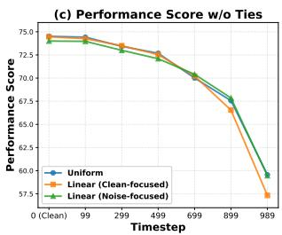

line chart

(c) Performance Score w/o Ties
| Timestep | Uniform | Linear (Clean-focused) | Linear (Noise-focused) |
|---|---|---|---|
| 0 (Clean) | 75.0 | 75.0 | 75.0 |
| 99 | 74.8 | 74.8 | 74.8 |
| 299 | 73.8 | 73.8 | 73.8 |
| 499 | 72.8 | 72.8 | 72.8 |
| 699 | 70.0 | 70.0 | 70.0 |
| 899 | 67.0 | 66.5 | 67.0 |
| 989 | 59.5 | 57.5 | 59.5 |

Fig. 2: Ablation study on timestep sampling distributions during training. (a) Illustrates the theoretical probability densities of three distinct sampling strategies: standard Uniform sampling, a Linear distribution biased towards clean steps (Cleanfocused), and a Linear distribution biased towards noisy steps (Noise-focused). (b) & (c) Present the preference prediction performance (with and without ties, respectively) evaluated across discrete inference timesteps. Despite the extreme variance in training exposure across different noise levels, the performance curves of all three models remain intertwined. This invariance demonstrates that PRISM leverages a holistic, continuous trajectory prior rather than overfitting to isolated, step-specific statistical frequencies.

## 4 Experiment

## 4.1 Robustness to Timestep Sampling Distributions

To further investigate the intrinsic noise-awareness of PRISM, we conduct an ablation study on the timestep sampling strategies utilized during training. In standard diffusion training, timesteps are typically sampled uniformly. We compare this uniform baseline against two heavily skewed distributions: Linear (Clean-focused), which assigns higher sampling probabilities to cleaner steps (lower timestep t), and Linear (Noise-focused), which biases towards noisier steps (higher timestep t). The theoretical probability densities of these distributions are illustrated in Fig. 2(a).

As shown in Fig. 2(b) and (c), despite the extreme shifts in the training data distribution, the evaluation performance (both with and without ties) across discrete noise levels remains remarkably consistent across all three settings. Naturally, the preference score gradually declines as the noise level approaches pure noise, owing to the inherent loss of visual information. However, the performance trajectories of the three disparate sampling strategies are tightly intertwined.

This marginal variance provides compelling empirical evidence for PRISM’s understanding of the denoising trajectory. If our reward model were treating different timesteps as isolated, fragmented evaluation tasks, its performance would heavily overfit to the dense regions of the training distribution (e.g., the Noisefocused strategy would drastically outperform others at $t \approx 9 0 0$ , while failing at $t \approx 0 )$ . Instead, this robustness indicates that PRISM effectively leverages the continuous, unified latent prior of the frozen DiT backbone. It evaluates the generative process as a trajectory rather than memorizing independent noise statistics, confirming that our design is fundamentally noise-aware.

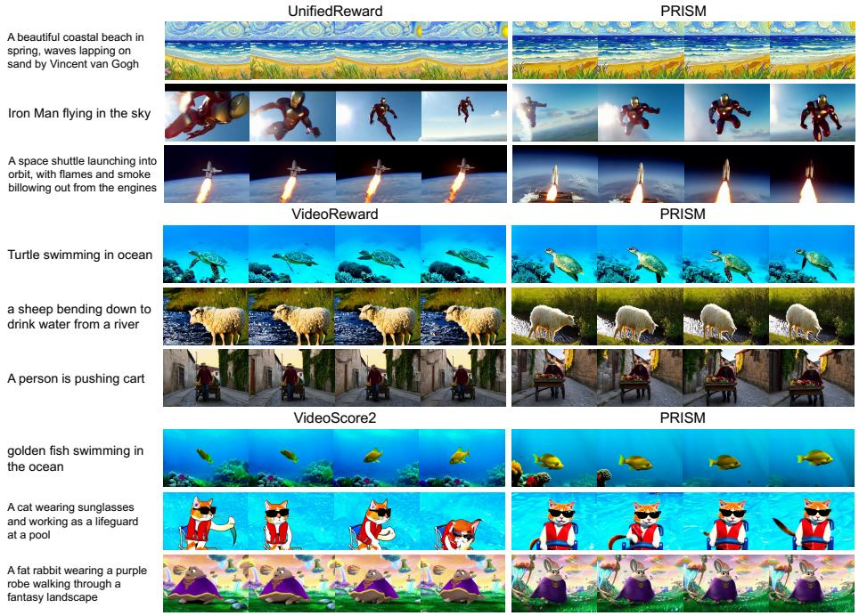

text_image

UnifiedReward
PRISM
A beautiful coastal beach in spring, waves lapping on sand by Vincent van Gogh
Iron Man flying in the sky
A space shuttle launching into orbit, with flames and smoke billowing out from the engines
VideoReward
PRISM
Turtle swimming in ocean
a sheep bending down to drink water from a river
A person is pushing cart
VideoScore2
PRISM
golden fish swimming in the ocean
A cat wearing sunglasses and working as a lifeguard at a pool
A fat rabbit wearing a purple robe walking through a fantasy landscape

Fig. 3: Extra qualitative comparison of BoN results.

## 4.2 Analysis of Full Fine-Tuning vs. Frozen Backbone

To validate the architectural necessity of PRISM’s frozen backbone, we compare it against a full fine-tuning baseline using Wan2.1-1.3B. As shown in Tab. 2, while full fine-tuning marginally improves in-domain accuracy, it suffers from out-of-domain overfitting, causing the VideoGen-RewardBench score to 63.22. Freezing the backbone acts as an essential regularizer that preserves pre-trained structural layouts and multi-modal priors.

Furthermore, this design choice unlocks significant system-level efficiency. Unlike standalone evaluation frameworks that require massive model weight replication and redundant forward passes, PRISM grafts preference decoding directly into the active generation pipeline. Reusing intermediate features eliminates extra extraction and decoding overhead, providing a scalable and efficient path for model self-evolution.

Table 2: Comparison between full fine-tuning and PRISM (Wan2.1-1.3B).

<table><tr><td>Method</td><td>In-Domain(VLRM-Bench)</td><td>Out-of-Domain(VideoGen-RewardBench)</td></tr><tr><td>Full Fine-Tuning</td><td>78.41</td><td>63.22</td></tr><tr><td>PRISM (Ours)</td><td>77.86</td><td>72.93</td></tr></table>

## 4.3 Variance Analysis of Best-of-N

To evaluate the statistical significance and robustness of PRISM, we conduct a variance analysis across three independent trials by randomly sampling 50% of the evaluation prompts. Tab. 3 reports the mean and standard deviation of the VBench Total scores for both PRISM and existing baselines across different Best-of-N settings $( N \in \{ 3 , 5 , 1 0 \} )$ .

Notably, baseline evaluations at $N = 1 0$ are omitted due to the prohibitive computational cost and VAE decoding overhead required by traditional reward models during full-trajectory inference. The empirical results confirm that PRISM achieves consistent, statistically significant, and robust quality improvements over all baselines with notably low variance.

Table 3: Variance Analysis of Best-of-N $( N \in \{ 3 , 5 , 1 0 \} )$ .

<table><tr><td rowspan="2">Method</td><td rowspan="2">Settings</td><td colspan="3">VBench Total (Mean ± Std)</td></tr><tr><td>N = 3</td><td>N = 5</td><td>N = 10</td></tr><tr><td>VideoReward</td><td>-</td><td>82.73±0.21</td><td>83.40±0.39</td><td>-</td></tr><tr><td>UnifiedReward</td><td>-</td><td>82.76±0.18</td><td>83.65±0.41</td><td>-</td></tr><tr><td>VideoScore2</td><td>-</td><td>82.91±0.10</td><td>83.59±0.22</td><td>-</td></tr><tr><td rowspan="5">PRISM(Wan2.1-1.3B)</td><td>Step 1</td><td>82.37±0.33</td><td>83.67±0.09</td><td>84.37±0.25</td></tr><tr><td>Step 5</td><td>82.58±0.23</td><td>83.51±0.12</td><td>84.64±0.15</td></tr><tr><td>Step 10</td><td>82.99±0.13</td><td>83.86±0.10</td><td>84.59±0.30</td></tr><tr><td>Step 25</td><td>82.77±0.24</td><td>83.74±0.27</td><td>84.47±0.19</td></tr><tr><td>Step 50</td><td>82.88±0.04</td><td>83.77±0.24</td><td>84.51±0.15</td></tr></table>

To further analyze the operational characteristics of PRISM across larger sample pools, Fig. 4 illustrates the explicit efficiency-quality trade-off for $N \in$ 3, 5, 10 . As N increases, the overall generation quality improves, while the computational cost scales linearly. Crucially, early-stage interventions (e.g., Step 10) remain highly effective across all N values, offering an optimal balance between superior video quality and low inference time cost.

## 4.4 Ablation Analysis of Key Parameters

We provide an ablation study on the key training hyperparameters of PRISM $( N _ { b } , N _ { q } , \eta )$ and the inference parameter N in Best-of-N (BoN) generation.

As evaluated in Tab. 4, for the backbone feature layer index $N _ { b }$ , increasing it to 15 provides marginal accuracy gains at the expense of higher training costs, while decreasing it to 5 severely degrades performance. For the query token count $N _ { q }$ and the loss scaling factor $\eta ,$ our default configurations achieve the optimal overall accuracy across various timesteps.

PRISM: N=3 vs N=5 vs N=10 (Wan2.1-1.3B)  
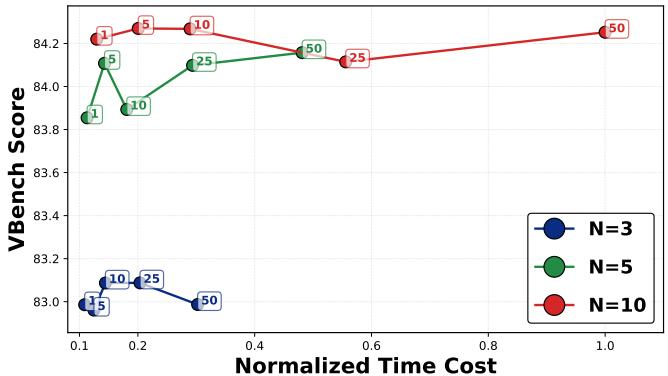

line chart

| Normalized Time Cost | N=3   | N=5   | N=10  |
| -------------------- | ----- | ----- | ----- |
| 0.1                  | 83.0  | 83.9  | 84.2  |
| 0.2                  | 83.1  | 83.9  | 84.2  |
| 0.3                  | 83.0  | 84.1  | 84.2  |
| 0.6                  | -     | 84.2  | 84.1  |
| 1.0                  | -     | -     | 84.2  |

Fig. 4: BoN efficiency-quality trade-off $( N \in \{ 3 , 5 , 1 0 \} )$ .

Table 4: Ablation of key training parameters $( N _ { b } , N _ { q } , \eta )$ .

<table><tr><td rowspan="2">Method</td><td colspan="4">Timestep (t)</td></tr><tr><td>899</td><td>499</td><td>299</td><td>0(Clean)</td></tr><tr><td> $N_b = 5$ </td><td>66.10</td><td>69.27</td><td>69.31</td><td>66.85</td></tr><tr><td> $N_b = 15$ </td><td>70.59</td><td>74.06</td><td>75.09</td><td>73.42</td></tr><tr><td> $N_q = 4$ </td><td>70.28</td><td>73.41</td><td>74.29</td><td>72.82</td></tr><tr><td> $N_q = 8$ </td><td>70.15</td><td>73.35</td><td>73.79</td><td>72.14</td></tr><tr><td> $\eta = 3$ </td><td>69.96</td><td>73.31</td><td>74.18</td><td>72.58</td></tr><tr><td> $\eta = 8$ </td><td>69.70</td><td>73.28</td><td>73.81</td><td>72.55</td></tr><tr><td>Ours</td><td>70.01</td><td>73.43</td><td>74.42</td><td>72.93</td></tr></table>

## References

1. Chen, G., Lin, D., Yang, J., Lin, C., Zhu, J., Fan, M., Zhang, H., Chen, S., Chen, Z., Ma, C., Xiong, W., Wang, W., Pang, N., Kang, K., Xu, Z., Jin, Y., Liang, Y., Song, Y., Zhao, P., Xu, B., Qiu, D., Li, D., Fei, Z., Li, Y., Zhou, Y.: Skyreels-v2: Infinite-length film generative model (2025), https://arxiv.org/abs/2504.13074  
2. Esser, P., Kulal, S., Blattmann, A., Entezari, R., Müller, J., Saini, H., Levi, Y., Lorenz, D., Sauer, A., Boesel, F., et al.: Scaling rectified flow transformers for high-resolution image synthesis. In: Forty-first international conference on machine learning (2024)  
3. He, X., Jiang, D., Nie, P., Liu, M., Jiang, Z., Su, M., Ma, W., Lin, J., Ye, C., Lu, Y., Wu, K., Schneider, B., Do, Q.D., Li, Z., Jia, Y., Zhang, Y., Cheng, G., Wang, H., Zhou, W., Lin, Q., Zhang, Y., Zhang, G., Huang, W., Chen, W.: Videoscore2: Think before you score in generative video evaluation (2025), https://arxiv.org/ abs/2509.22799  
4. Ho, J., Salimans, T.: Classifier-free diffusion guidance. arXiv preprint arXiv:2207.12598 (2022)  
5. Huang, Z., He, Y., Yu, J., Zhang, F., Si, C., Jiang, Y., Zhang, Y., Wu, T., Jin, Q., Chanpaisit, N., Wang, Y., Chen, X., Wang, L., Lin, D., Qiao, Y., Liu, Z.: VBench:  
Comprehensive benchmark suite for video generative models. In: Proceedings of the IEEE/CVF Conference on Computer Vision and Pattern Recognition (2024)  
6. Kong, W., Tian, Q., Zhang, Z., Min, R., Dai, Z., Zhou, J., Xiong, J., Li, X., Wu, B., Zhang, J., et al.: Hunyuanvideo: A systematic framework for large video generative models. arXiv preprint arXiv:2412.03603 (2024)  
7. Liu, J., Liu, G., Liang, J., Yuan, Z., Liu, X., Zheng, M., Wu, X., Wang, Q., Qin, W., Xia, M., et al.: Improving video generation with human feedback. arXiv preprint arXiv:2501.13918 (2025)  
8. Wan, T., Wang, A., Ai, B., Wen, B., Mao, C., Xie, C.W., Chen, D., Yu, F., Zhao, H., Yang, J., Zeng, J., Wang, J., Zhang, J., Zhou, J., Wang, J., Chen, J., Zhu, K., Zhao, K., Yan, K., Huang, L., Feng, M., Zhang, N., Li, P., Wu, P., Chu, R., Feng, R., Zhang, S., Sun, S., Fang, T., Wang, T., Gui, T., Weng, T., Shen, T., Lin, W., Wang, W., Wang, W., Zhou, W., Wang, W., Shen, W., Yu, W., Shi, X., Huang, X., Xu, X., Kou, Y., Lv, Y., Li, Y., Liu, Y., Wang, Y., Zhang, Y., Huang, Y., Li, Y., Wu, Y., Liu, Y., Pan, Y., Zheng, Y., Hong, Y., Shi, Y., Feng, Y., Jiang, Z., Han, Z., Wu, Z.F., Liu, Z.: Wan: Open and advanced large-scale video generative models. arXiv preprint arXiv:2503.20314 (2025)  
9. Wang, Y., Zang, Y., Li, H., Jin, C., Wang, J.: Unified reward model for multimodal understanding and generation. arXiv preprint arXiv:2503.05236 (2025)  
10. Yang, Z., Teng, J., Zheng, W., Ding, M., Huang, S., Xu, J., Yang, Y., Hong, W., Zhang, X., Feng, G., et al.: Cogvideox: Text-to-video diffusion models with an expert transformer. arXiv preprint arXiv:2408.06072 (2024)  
11. Zheng, Z., Peng, X., Yang, T., Shen, C., Li, S., Liu, H., Zhou, Y., Li, T., You, Y.: Open-sora: Democratizing efficient video production for all. arXiv preprint arXiv:2412.20404 (2024)