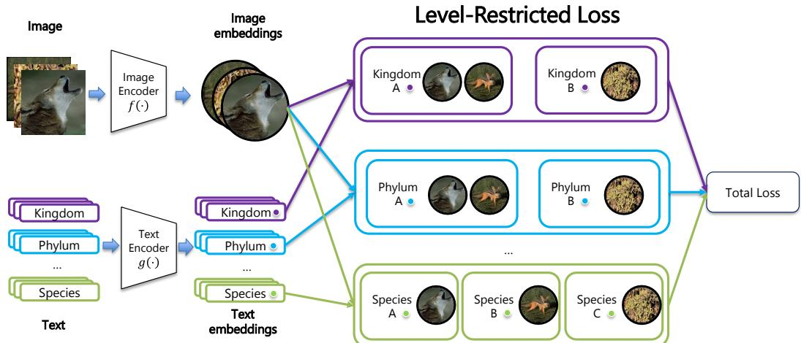
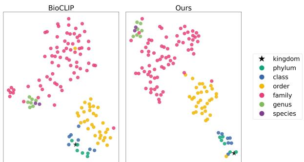

# Beyond Flat Labels: Level-Restricted Contrastive Learning for Hierarchical Fine-Grained Vision Classification

Zhiyuan Tao1† Srikumar Sastry2 Matthew J Thompson1 Elizabeth G Campolongo1 Net Zhang1 Ziheng Zhang1 Hilmar Lapp3 Yu Su1 Tanya Berger-Wolf1 Nathan Jacobs2 Wei-Lun Chao4 Jianyang Gu1†

1 The Ohio State University 2 Washington University in St. Louis 3 Neuromatch 4 Boston University †{tao.623, gu.1220}@osu.edu

## Abstract

Multimodal contrastive learning has enabled zero-shot visual classification by aligning images with textual categories. However, in hierarchically structured label spaces, existing methods often produce predictions that are inconsistent across taxonomic levels. For example, a model may predict a fine-grained category whose parent category contradicts its simultaneously predicted higher-level label. By analysis, the issue originates from false negative labels when contrastive comparison involves multiple taxonomic levels. To this end, we propose to restrict contrastive comparisons to categories within the same taxonomic level. In addition, we adopt a group-balanced design, ensuring each taxonomic level receives adequate optimization. As a result, the proposed framework improves both hierarchical consistency and classification accuracy from coarse to fine granularity. We train our model with TreeOfLife-10M based on BioCLIP and evaluate it across multiple hierarchical classification benchmarks, where the model demonstrates significantly improved hierarchical consistency in both Euclidean and hyperbolic spaces. Notably, on iNaturalist 2021 (iNat21), our method improves average accuracy across levels by 30.47% over the baseline, highlighting its effectiveness for hierarchical zero-shot classification. We have released our Euclidean and hyperbolic models on HuggingFace.

## 1. Introduction

Contrastive learning between images and text has produced strong models capable of zero-shot fine-grained visual classification, such as CLIP [19], ALIGN [10], and CoCa [33]. However, these models often suffer from hierarchical inconsistency when predicting categories across taxonomic levels. That is, the predicted fine-grained label does not belong to the predicted higher-level category. Such inconsistency leads to ambiguity for real-world applications [18].

Common strategies to improve hierarchical consistency include additionally-defined geometry objectives [1, 6, 15, 16, 21] or hierarchy-oriented architectures [5, 18, 30, 35]. In this work, we focus on the contrastive training objective to understand the gap from hierarchical consistency. Standard CLIP-style contrastive learning adopts a flat-label assumption and treats all non-matching text labels as equal negatives [19]. When applied to label spaces with hierarchical relationships, however, such flat comparison might lead to false negatives. While treating ancestor–descendant labels as negatives is clearly incorrect, this issue is not limited to direct parent–child relationships. Consider images of Panthera leo (lion) and Canis lupus (wolf). They are distinct at the species and genus levels, but they share higher-level ancestors such as the order Carnivora, which makes them semantically compatible at coarser levels. As a result, when labels from multiple taxonomic levels are combined within a single contrastive objective, there is no consistent way to define negative pairs, since samples that should be separated at one level may be similar at another. This violates the flatlabel assumption underlying contrastive learning, leading to conflicting supervision signals.

To address this issue, we restrict contrastive comparisons to operate within a single taxonomy level, where labels are mutually exclusive, and the contrastive formulation remains well-defined. For example, a species-level label is compared only with other species-level labels. Such a restriction avoids conflicts or ambiguity when comparing labels from different hierarchical levels. In addition, we introduce group-balanced supervision across levels to ensure that each level receives adequate optimization, so that training will not be biased toward coarse hierarchical levels.

We conduct experiments with biodiversity data, based on the previous foundation models on the tree of life [8, 22, 27, 32]. Specifically, we finetune BioCLIP [25, 27] with TreeOfLife-10M [27, 28], following the proposed contrastive recipe. The derived model is evaluated across three species classification benchmarks (iNat21 [29], Rare Species [26, 27], and CrypticBio [14]), demonstrating more consistent hierarchical predictions. On iNat21 [29], our model improves the average accuracy by more than 30% in both Euclidean and hyperbolic embedding spaces. Qualitatively, we show that our model learns text embeddings that form hierarchical structures.

  
Figure 1. Level-restricted contrastive learning. For each image, we construct taxonomic text labels at all hierarchical levels and encode images and texts using CLIP encoders. Instead of comparing text labels from all levels jointly, we constrain the contrastive comparison to be within the same level. This removes cross-level false negatives and enables balanced supervision across hierarchy levels

## 2. Method

Figure 1 illustrates the proposed training framework. Given an image, we construct text labels for all taxonomic levels (kingdom → species) and encode images and text using corresponding CLIP encoders. Rather than performing contrastive learning over labels from all levels jointly, we reformulate the objective to operate in a level-restricted manner.

## 2.1. Problem Setup

We consider a taxonomy set $\mathcal { T } = ( \mathcal { C } ^ { 1 } , \dots \dots , \mathcal { C } ^ { L } )$ with L hierarchical levels from coarse to fine, where ${ \mathcal C } ^ { \ell } = \{ t ^ { \ell } \}$ contains all the labels belonging to level ℓ. Each image $\mathbf { \Delta } _ { \mathbf { \mathcal { X } } _ { i } }$ is associated with a taxonomic label $t _ { i } = \left( t _ { i } ^ { 1 } , \dots , t _ { i } ^ { L } \right)$ , where $t _ { i } ^ { \ell } \in \mathcal { C } ^ { \ell }$ . We use the CLIP image encoder $f ( \cdot )$ to produce a unique image embedding ${ \mathbf { } } v _ { i }$ for the sample. On the text side, we first construct multi-level taxonomic text labels:

$$
\mathcal {Y} _ {i} = \{y _ {i} ^ {1}, \ldots , y _ {i} ^ {L} \}, \quad y _ {i} ^ {\ell} = (t _ {i} ^ {1}, \ldots , t _ {i} ^ {\ell}).
$$

Each level’s text label contains the taxonomy prefix up to that level. Then we use the text encoder $g ( \cdot )$ to extract text embeddings $z _ { i } ^ { \ell } = g ( y _ { i } ^ { \ell } )$ at level ℓ.

## 2.2. Level-Restricted Contrastive Learning

Standard contrastive learning assumes a flat, mutually exclusive label space, with only an image and its text label forming a positive pair. The other text labels are treated as equal negative targets. In a hierarchical classification problem, however, categories belonging to the same higher-level taxonomy share common features $( e . g \cdot$ ., lion and wolf belong to the same order), yet standard CLIP treats them as negatives equal to categories from other taxonomy paths (e.g., plants). Such properties lead to conflicting supervision signals across taxonomic levels. Inspired by this, we propose to decompose training into independent multi-level comparisons. More specifically, we calculate contrastive loss for each taxonomic level, and each loss will only involve labels of its corresponding level.

However, a mini-batch may inevitably contain samples with the same taxonomic label, especially for coarse levels. For instance, images of two species are from the same kingdom. Only using an image and its corresponding label to form positive pairs leads to conflicting supervision—the same label is treated as both positive and negative targets. Therefore, we propose to aggregate the labels within a minibatch and treat all image–text pairs sharing the same label as positives. To simplify notation, throughout the following level-wise definitions, we omit the dependence on ℓ when no ambiguity arises. We use $z _ { i }$ to represent the text embedding of $\mathbf { \Delta } _ { \mathbf { \mathcal { X } } _ { i } }$ at the specific level ℓ. We define $\mathcal { K } = \{ z _ { k } \} _ { k = 0 } ^ { K \le N }$ to be the text embedding set of the corresponding level, where $N$ is the mini-batch size. Accordingly, the image-to-text loss can be calculated as:

$$
\mathcal {L} ^ {I \rightarrow T} = - \frac {1}{N} \sum_ {i = 1} ^ {N} \log \frac {\exp (\langle \boldsymbol {v} _ {i} , \boldsymbol {z} _ {i} \rangle / \tau)}{\sum_ {\boldsymbol {z} _ {k} \in \mathcal {K}} \exp (\langle \boldsymbol {v} _ {i} , \boldsymbol {z} _ {k} \rangle / \tau)}.\tag{1}
$$

Thereby, similarity is computed between images and the set of unique text labels, avoiding conflicting supervision.

On the other hand, each text label has multiple positive image targets. Therefore, we define a positive image set ${ \mathcal P } _ { k } = \{ { \pmb v } _ { p } \}$ for each text anchor $z _ { k }$ . We calculate the textto-image loss by:

<table><tr><td>Method</td><td>Space</td><td>Kingdom</td><td>Phylum</td><td>Class</td><td>Order</td><td>Family</td><td>Genus</td><td>Species</td><td>Avg.</td></tr><tr><td>OpenCLIP</td><td>Euclidean</td><td>84.76</td><td>35.37</td><td>26.08</td><td>19.25</td><td>7.71</td><td>6.80</td><td>2.09</td><td>26.01</td></tr><tr><td>BioCLIP</td><td>Euclidean</td><td>86.28</td><td>56.14</td><td>41.69</td><td>26.95</td><td>30.37</td><td>47.21</td><td>50.79</td><td>48.49</td></tr><tr><td>RCME</td><td>Euclidean</td><td>86.26</td><td>83.00</td><td>70.79</td><td>46.46</td><td>44.74</td><td>59.28</td><td>50.50</td><td>63.00</td></tr><tr><td rowspan="2">Ours</td><td>Euclidean</td><td>98.85</td><td>98.39</td><td>67.23</td><td>78.22</td><td>78.69</td><td>68.36</td><td>63.00</td><td>78.96</td></tr><tr><td>Hyperbolic</td><td>98.97</td><td>98.48</td><td>71.81</td><td>75.84</td><td>82.25</td><td>73.96</td><td>51.35</td><td>78.95</td></tr></table>

Table 1. Per-level and average top-1 accuracy (%) on iNat21 across all taxonomic levels

<table><tr><td>Method</td><td>Space</td><td>Kingdom</td><td>Phylum</td><td>Class</td><td>Order</td><td>Family</td><td>Genus</td><td>Species</td><td>LCA</td></tr><tr><td>OpenCLIP</td><td>Euclidean</td><td>84.76</td><td>30.44</td><td>10.62</td><td>3.81</td><td>0.78</td><td>0.28</td><td>0.12</td><td>0.19</td></tr><tr><td>BioCLIP</td><td>Euclidean</td><td>75.38</td><td>61.34</td><td>48.22</td><td>16.85</td><td>9.71</td><td>6.73</td><td>4.80</td><td>0.32</td></tr><tr><td>RCME</td><td>Euclidean</td><td>86.27</td><td>78.46</td><td>63.97</td><td>29.59</td><td>18.25</td><td>13.00</td><td>8.92</td><td>0.43</td></tr><tr><td rowspan="2">Ours</td><td>Euclidean</td><td>98.85</td><td>98.41</td><td>74.52</td><td>68.28</td><td>60.31</td><td>47.92</td><td>33.64</td><td>0.69</td></tr><tr><td>Hyperbolic</td><td>98.97</td><td>98.53</td><td>77.15</td><td>69.03</td><td>62.79</td><td>52.64</td><td>36.89</td><td>0.71</td></tr></table>

Table 2. Per-level accuracy (%) and normalized LCA under top-down constrained inference on iNat21. Predictions proceed from coarse to fine with candidate labels restricted to valid descendants, enforcing hierarchical consistency. Normalized LCA measures how deep predictions remain correct along the taxonomy.

$$
\mathcal {L} ^ {T \rightarrow I} = - \frac {1}{| \mathcal {K} |} \sum_ {\boldsymbol {z} _ {k} \in \mathcal {K}} \frac {1}{| \mathcal {P} _ {k} |} \sum_ {\boldsymbol {v} _ {p} \in \mathcal {P} _ {k}} \log \frac {\exp (\langle \boldsymbol {v} _ {p} , \boldsymbol {z} _ {k} \rangle / \tau)}{\sum_ {j = 1} ^ {N} \exp (\langle \boldsymbol {v} _ {j} , \boldsymbol {z} _ {k} \rangle / \tau)}.\tag{2}
$$

This group-balanced strategy also mitigates category bias within each mini-batch (some categories may appear more often than others). While we instantiate the similarity in Euclidean space, it can also be extended to hyperbolic space. We provide more details in the supplementary material.

The objective $\mathcal { L } _ { \ell }$ at level ℓ is the sum of $\mathcal { L } _ { \ell } ^ { I  T }$ and $\mathcal { L } _ { \ell } ^ { I  T }$ The final training objective is obtained by:

$$
\mathcal {L} = \frac {1}{L} \sum_ {\ell = 1} ^ {L} \mathcal {L} _ {\ell}.\tag{3}
$$

Assigning equal weight to each hierarchy level ensures sufficient supervision for fine-grained distinctions, avoiding domination by high-confidence coarse-level signals.

## 3. Experiments

## 3.1. Experimental Setup

We fine-tune BioCLIP [25, 27] on the original training set TreeOfLife-10M [27, 28] and evaluate on three benchmarks: iNat21 [29], which provides broad taxonomic coverage; Rare Species [26, 27], which focuses on rare and long-tailed species absent from TreeOfLife-10M; and CrypticBio [14], which emphasizes visually ambiguous species.

Metrics. We report per-level top-1 accuracy and the average accuracy across all taxonomic levels. To evaluate hierarchical consistency, we adopt a top-down constrained inference protocol [23], where predictions are performed sequentially from coarse to fine levels, and the candidate label set at each level is restricted to the valid descendants of the predicted parent category. Therefore, for certain levels, the derived accuracy might be higher as the candidate set is smaller. Conversely, wrong predictions at the parent levels lead to lower accuracy at lower levels. We additionally report normalized Lowest Common Ancestor (nLCA) depth [12], which measures the depth of agreement between the predicted and ground-truth taxonomic paths, normalized by the total hierarchy depth L.

## 3.2. Main Results

Tables 1, 3, and 4 compare our method with OpenCLIP [9], BioCLIP [25, 27], and RCME [21] on the three benchmarks, respectively. Our method achieves the best average accuracy on all settings. Compared with RCME, which also fine-tunes BioCLIP with TreeOfLife-10M, our best variant improves average accuracy by more than 13% across all benchmarks. These gains are consistent across datasets with broad taxonomic coverage, species absent in training, and visually ambiguous fine-grained categories.

The improvement is achieved across the hierarchy, and is especially prominent at intermediate levels (order–genus), where standard contrastive loss suffers most from crosslevel ambiguity. Although the optimization is not solely focused on the species level, the group-balance design and reduced conflicting supervision signals also improve the species-level performance. This suggests that level-restricted contrastive supervision preserves hierarchical structure while also improving fine-grained discrimination.

<table><tr><td>Method</td><td>Space</td><td>Phylum</td><td>Class</td><td>Order</td><td>Family</td><td>Genus</td><td>Species</td><td>Avg.</td></tr><tr><td>OpenCLIP</td><td>Euclidean</td><td>75.89</td><td>60.87</td><td>33.32</td><td>13.31</td><td>15.27</td><td>10.62</td><td>34.88</td></tr><tr><td>BioCLIP</td><td>Euclidean</td><td>68.35</td><td>65.16</td><td>54.63</td><td>40.01</td><td>47.43</td><td>31.82</td><td>51.23</td></tr><tr><td>RCME</td><td>Euclidean</td><td>82.38</td><td>81.67</td><td>69.01</td><td>44.12</td><td>50.95</td><td>35.58</td><td>60.62</td></tr><tr><td rowspan="2">Ours</td><td>Euclidean</td><td>98.19</td><td>93.02</td><td>83.27</td><td>67.41</td><td>55.08</td><td>40.68</td><td>72.94</td></tr><tr><td>Hyperbolic</td><td>97.99</td><td>92.64</td><td>83.33</td><td>69.06</td><td>57.22</td><td>43.20</td><td>73.91</td></tr></table>

Table 3. Per-level and average top-1 accuracy (%) on RareSpecies across all taxonomic levels

<table><tr><td>Method</td><td>Space</td><td>Order</td><td>Family</td><td>Genus</td><td>Species</td><td>Avg.</td></tr><tr><td>OpenCLIP</td><td>Euclidean</td><td>55.37</td><td>15.92</td><td>6.41</td><td>6.17</td><td>20.97</td></tr><tr><td>BioCLIP</td><td>Euclidean</td><td>81.34</td><td>39.29</td><td>37.71</td><td>36.72</td><td>48.77</td></tr><tr><td>RCME</td><td>Euclidean</td><td>90.11</td><td>49.84</td><td>39.45</td><td>38.97</td><td>54.59</td></tr><tr><td rowspan="2">Ours</td><td>Euclidean</td><td>97.98</td><td>72.65</td><td>46.30</td><td>40.37</td><td>64.33</td></tr><tr><td>Hyperbolic</td><td>96.80</td><td>78.01</td><td>52.18</td><td>49.98</td><td>69.24</td></tr></table>

Table 4. Per-level and average top-1 accuracy (%) on CrypticBio across all taxonomic levels

The advantage of our method becomes even clearer under top-down classification (Table 2), a stricter evaluation protocol in which an error at a higher taxonomic level constrains all subsequent predictions. Despite this compounding effect, our method remains substantially stronger than all baselines across all levels. In particular, the hyperbolic variant achieves the best nLCA score (0.71 vs. 0.43 for RCME), indicating that its predictions remain closer to the correct taxonomic branch even when the exact label is incorrect. The gains are especially large at deeper levels, improving accuracy over RCME by 44.54%, 39.64%, and 27.97% at family, genus, and species levels, respectively. These results show that our method not only improves flat-recognition accuracy but also yields more hierarchically consistent predictions.

The Euclidean and hyperbolic variants show complementary behavior. The Euclidean variant performs better on iNat21 and achieves the highest species accuracy there, while the hyperbolic variant performs better on Rare Species and CrypticBio, particularly at deeper taxonomic levels. In the top-down setting, hyperbolic space demonstrates a consistent advantage over Euclidean space. Overall, these results suggest that the proposed hierarchical contrastive objective improves hierarchical consistency in both spaces, while hyperbolic space yields a stronger capability in representing hierarchical label structures.

## 3.3. Representation Visualization

We follow the same visualization protocol as [21]. Specifically, we select a target species and collect its labels across all taxonomic levels. For each level ℓ, we consider samples whose higher-level taxonomy matches that of the target species, and visualize the corresponding text embeddings for the target label and its sibling categories. Figure 2 shows that our method produces a much clearer hierarchical structure of the text embedding space than BioCLIP. In our model, embeddings from nearby taxonomic levels form more coherent and structured groups, with reduced cross-level mixing and clearer separation among sibling categories. By contrast, BioCLIP exhibits a more scattered arrangement, where relationships across taxonomic levels are less organized. This qualitative pattern is consistent with the improvements in hierarchical evaluation metrics such as nLCA, suggesting that our method better preserves taxonomic structure in the embedding space.

  
Figure 2. t-SNE visualization of text embeddings. Our method shows a clearer hierarchical structure and reduced cross-level mixing compared with BioCLIP.

## 4. Conclusion

This work studies multimodal contrastive learning for hierarchical classification. When standard contrastive learning is applied to hierarchical labels, semantically compatible ancestor–descendant concepts can be treated as false negatives. Such conflicting supervision signals lead to hierarchical inconsistency. We propose a level-restricted contrastive training framework to perform contrastive comparison within each taxonomic level, with group-balanced supervision that balances the focus on each level. Experiments show consistent gains in both classification accuracy and hierarchical consistency. Qualitatively, we show that level-restricted contrastive learning promotes the emergence of hierarchical structures in the embedding space.

Acknowledgment. This work was supported by the U.S. National Science Foundation (OAC-2118240) and resources from the Ohio Supercomputer Center [4].

## References

[1] Morris Alper and Hadar Averbuch-Elor. Emergent visualsemantic hierarchies in image-text representations. In European Conference on Computer Vision, pages 220–238. Springer, 2024. 1

[2] Luca Bertinetto, Romain Mueller, Konstantinos Tertikas, Sina Samangooei, and Nicholas A Lord. Making better mistakes: Leveraging class hierarchies with deep networks. In Proceedings of the IEEE/CVF conference on computer vision and pattern recognition, pages 12506–12515, 2020. 1

[3] Martin R Bridson and Andre Haefliger.´ Metric spaces of non-positive curvature. Springer Science & Business Media, 2013. 1

[4] Ohio Supercomputer Center. Ohio supercomputer center, 1987. 4

[5] Jingzhou Chen, Peng Wang, Jian Liu, and Yuntao Qian. Label relation graphs enhanced hierarchical residual network for hierarchical multi-granularity classification. In Proceedings of the IEEE/CVF conference on computer vision and pattern recognition, pages 4858–4867, 2022. 1

[6] Karan Desai, Maximilian Nickel, Tanmay Rajpurohit, Justin Johnson, and Shanmukha Ramakrishna Vedantam. Hyperbolic image-text representations. In International Conference on Machine Learning, pages 7694–7731. PMLR, 2023. 1

[7] Naghmeh Ghanooni, Barbod Pajoum, Harshit Rawal, Sophie Fellenz, Vo Nguyen Le Duy, and Marius Kloft. Multi-level supervised contrastive learning. arXiv preprint arXiv:2502.02202, 2025. 1

[8] Jianyang Gu, Samuel Stevens, Elizabeth G Campolongo, Matthew J Thompson, Net Zhang, Jiaman Wu, Andrei Kopanev, Zheda Mai, Alexander E. White, James Balhoff, Wasila Dahdul, Daniel Rubenstein, Hilmar Lapp, Tanya Berger-Wolf, Wei-Lun Chao, and Yu Su. BioCLIP 2: Emergent properties from scaling hierarchical contrastive learning. In The Thirty-ninth Annual Conference on Neural Information Processing Systems, 2025. 1

[9] Gabriel Ilharco, Mitchell Wortsman, Ross Wightman, Cade Gordon, Nicholas Carlini, Rohan Taori, Achal Dave, Vaishaal Shankar, Hongseok Namkoong, John Miller, Hannaneh Hajishirzi, Ali Farhadi, and Ludwig Schmidt. Openclip, 2021. 3

[10] Chao Jia, Yinfei Yang, Ye Xia, Yi-Ting Chen, Zarana Parekh, Hieu Pham, Quoc Le, Yun-Hsuan Sung, Zhen Li, and Tom Duerig. Scaling up visual and vision-language representation learning with noisy text supervision. In International conference on machine learning, pages 4904–4916. PMLR, 2021. 1

[11] Juan Jiang, Jingmin Yang, Wenjie Zhang, and Hongbin Zhang. Hierarchical multi-granularity classification based on bidirectional knowledge transfer. Multimedia Systems, 30(4):207, 2024. 1

[12] Aris Kosmopoulos, Ioannis Partalas, Eric Gaussier, Georgios Paliouras, and Ion Androutsopoulos. Evaluation measures for hierarchical classification: a unified view and novel approaches. Data Mining and Knowledge Discovery, 29(3): 820–865, 2015. 3

[13] Ruixue Lian, William Sethares, and Junjie Hu. Learning label hierarchy with supervised contrastive learning. In Findings of the Association for Computational Linguistics: EACL 2024, pages 1569–1581, 2024. 1

[14] Georgiana Manolache, Gerard Schouten, and Joaquin Vanschoren. Crypticbio: A large multimodal dataset for visually confusing species. In The Thirty-ninth Annual Conference on Neural Information Processing Systems Datasets and Benchmarks Track, 2025. 2, 3

[15] Maximillian Nickel and Douwe Kiela. Poincare embeddings´ for learning hierarchical representations. NeurIPS, 30, 2017. 1

[16] Maximillian Nickel and Douwe Kiela. Learning continuous hierarchies in the lorentz model of hyperbolic geometry. In International conference on machine learning, pages 3779– 3788. PMLR, 2018. 1

[17] Avik Pal, Max Van Spengler, Guido Maria D’Amely di Melendugno, Alessandro Flaborea, Fabio Galasso, and Pascal Mettes. Compositional entailment learning for hyperbolic vision-language models. arXiv preprint arXiv:2410.06912, 2024. 1

[18] Seulki Park, Youren Zhang, Stella X. Yu, Sara Beery, and Jonathan Huang. Visually consistent hierarchical image classification. In The Thirteenth International Conference on Learning Representations, 2025. 1

[19] Alec Radford, Jong Wook Kim, Chris Hallacy, Aditya Ramesh, Gabriel Goh, Sandhini Agarwal, Girish Sastry, Amanda Askell, Pamela Mishkin, Jack Clark, et al. Learning transferable visual models from natural language supervision. In International conference on machine learning, pages 8748–8763. PmLR, 2021. 1

[20] Sameera Ramasinghe, Violetta Shevchenko, Gil Avraham, and Ajanthan Thalaiyasingam. Accept the modality gap: An exploration in the hyperbolic space. In CVPT, pages 27263– 27272, 2024. 1

[21] Srikumar Sastry, Aayush Dhakal, Eric Xing, Subash Khanal, and Nathan Jacobs. Global and local entailment learning for natural world imagery. In ICCV. IEEE/CVF, 2025. 1, 3, 4

[22] Srikumar Sastry, Subash Khanal, Aayush Dhakal, Adeel Ahmad, and Nathan Jacobs. Taxabind: A unified embedding space for ecological applications. In 2025 IEEE/CVF Winter Conference on Applications of Computer Vision (WACV), pages 1765–1774. IEEE, 2025. 1

[23] Carlos N Silla Jr and Alex A Freitas. A survey of hierarchical classification across different application domains. Data mining and knowledge discovery, 22(1):31–72, 2011. 3, 1

[24] Aditya Sinha, Siqi Zeng, Makoto Yamada, and Han Zhao. Learning structured representations with hyperbolic embeddings. Advances in Neural Information Processing Systems, 37:91220–91259, 2024. 1

[25] Samuel Stevens, Jiaman Wu, Matthew J. Thompson, Elizabeth G. Campolongo, Chan Hee Song, David Edward Carlyn, Li Dong, Wasila M. Dahdul, Charles Stewart, Tanya Berger-Wolf, Wei-Lun Chao, and Yu Su. Bioclip (revision 7b4abf1), 2023. 1, 3

[26] Samuel Stevens, Jiaman Wu, Matthew J Thompson, Elizabeth G Campolongo, Chan Hee Song, David Edward Carlyn,

Li Dong, Wasila M Dahdul, Charles Stewart, Tanya Berger-Wolf, Wei-Lun Chao, and Yu Su. Rare species, 2023. 2, 3

[27] Samuel Stevens, Jiaman Wu, Matthew J Thompson, Elizabeth G Campolongo, Chan Hee Song, David Edward Carlyn, Li Dong, Wasila M Dahdul, Charles Stewart, Tanya Berger-Wolf, Wei-Lun Chao, and Yu Su. BioCLIP: A vision foundation model for the tree of life. In CVPR, pages 19412–19424, 2024. 1, 2, 3

[28] Samuel Stevens, Jiaman Wu, Matthew J Thompson, Elizabeth G Campolongo, Chan Hee Song, David Edward Carlyn, Li Dong, Wasila M Dahdul, Charles Stewart, Tanya Berger-Wolf, Wei-Lun Chao, and Yu Su. TreeOfLife-10M (Revision ffa2a31), 2026. 1, 3

[29] Grant Van Horn and Oisin Mac Aodha. inat challenge 2021 - fgvc8, 2021. 2, 3

[30] Jonatas Wehrmann, Ricardo Cerri, and Rodrigo Barros. Hierarchical multi-label classification networks. In International conference on machine learning, pages 5075–5084. PMLR, 2018. 1

[31] Peng Xia, Xingtong Yu, Ming Hu, Lie Ju, Zhiyong Wang, Peibo Duan, and Zongyuan Ge. Hgclip: Exploring visionlanguage models with graph representations for hierarchical understanding. In Proceedings of the 31st International Conference on Computational Linguistics, pages 269–280, 2025. 1

[32] Chih-Hsuan Yang, Benjamin Feuer, Talukder Jubery, Zi Deng, Andre Nakkab, Md Zahid Hasan, Shivani Chiranjeevi, Kelly Marshall, Nirmal Baishnab, Asheesh Singh, et al. Biotrove: A large curated image dataset enabling ai for biodiversity. Advances in Neural Information Processing Systems, 37:102101– 102120, 2024. 1

[33] Jiahui Yu, Zirui Wang, Vijay Vasudevan, Legg Yeung, Mojtaba Seyedhosseini, and Yonghui Wu. Coca: Contrastive captioners are image-text foundation models. arXiv preprint arXiv:2205.01917, 2022. 1

[34] Ziheng Zhang, Xinyue Ma, Arpita Chowdhury, Elizabeth G Campolongo, Matthew J Thompson, Net Zhang, Samuel Stevens, Hilmar Lapp, Tanya Berger-Wolf, Yu Su, Wei-Lun Chao, and Jianyang Gu. BioCAP: Exploiting synthetic captions beyond labels in biological foundation models. In The Fourteenth International Conference on Learning Representations, 2026. 1

[35] Xinqi Zhu and Michael Bain. B-cnn: branch convolutional neural network for hierarchical classification. arXiv preprint arXiv:1709.09890, 2017. 1

# Beyond Flat Labels: Level-Restricted Contrastive Learning for Hierarchical Fine-Grained Vision Classification

Supplementary Material

## 5. Related Work

## 5.1. Hierarchical Image Classification

Hierarchical image classification incorporates taxonomy structure into visual recognition [23]. Early approaches introduced hierarchical supervision into convolutional networks to model coarse-to-fine label dependencies [30, 35]. More recent methods integrate hierarchy into deep architectures through feature sharing, taxonomy-aware prediction, or cross-level interaction mechanisms [5, 11, 31].

Another line of work focuses on hierarchy-aware objectives, where prediction errors are weighted according to their distance in the taxonomy tree [2]. Hierarchical supervision has also been explored in contrastive learning, for example, through losses that incorporate label similarity [13] or multi-level contrastive learning strategies [7].

Rather than introducing specialized architectures or explicit hierarchy-aware penalties, this work focuses on how standard contrastive supervision itself becomes mismatched under hierarchical labels and redesigns the objective to better align with the taxonomy structure.

## 5.2. Hierarchical Representation Learning

A common approach to hierarchical representation learning is to impose structure through geometry-aware embedding spaces. Hyperbolic representations are particularly effective for tree-like data because of their exponential volume growth [3]. This idea has been explored in a range of hierarchical embedding methods, including Poincare embed-´ dings [15], Lorentz embeddings [16], and more recent multimodal models such as MERU [6], ATMG [20], and radial hyperbolic learning approaches [1].

Beyond geometry alone, recent work has incorporated explicit hierarchical regularization or compositional structure into representation learning, for example, through hyperbolic hierarchical regularization [24] and compositional vision–language models that encode hierarchical relationships between images, regions, and text [17].

This work focuses on the contrastive objective itself. We revisit hierarchical learning from an objective-design perspective, asking whether hierarchical structures can emerge in the embedding space without explicit guidance.

## 5.3. CLIP for Biodiversity

Contrastive language–image pretraining methods such as CLIP [19], ALIGN [10], and CoCa [33] have established a strong foundation for visual recognition by learning aligned representations from large-scale image–text pairs. Recent efforts have extended this paradigm to biodiversity recognition. For example, BioCLIP [27] trains a vision foundation model on TreeOfLife-10M, while BioTrove [32] and TaxaBind [22] further explore large-scale image–text learning for taxonomic recognition. BioCAP leverages synthetic captions to introduce supplementary information beyond species labels [34].

Despite strong species-level performance, these models are typically trained with contrastive objectives designed for flat label spaces. When applied to hierarchical taxonomies, such objectives can create supervision mismatch across levels, leading to predictions that are inconsistent across ranks. For example, when the model predicts both species and genus labels, the species might not belong to the genus. This hierarchical inconsistency motivates methods that more effectively preserve the hierarchical structure.

## 6. Implementation Details

We initialize from the BioCLIP ViT-B/16 model [25, 27] and fine-tune it for 30 epochs using AdamW with batch size 4096, learning rate $1 0 ^ { - 4 }$ , and weight decay 0.2. A single shared temperature parameter is used across all taxonomy levels. Taxonomic text labels are constructed using cumulative taxonomy prefixes; for example, a species-level prompt includes all ancestor ranks along the taxonomic path. For hyperbolic experiments, we use fixed curvature $c = 1$

Hyperbolic embedding and similarity. We adopt the Lorentz (hyperboloid) model of hyperbolic space [16]. For vectors $\pmb { u } , \pmb { v } \in \mathbb { R } ^ { d + 1 }$ , the Minkowski inner product is defined as

$$
\langle \boldsymbol {u}, \boldsymbol {v} \rangle_ {\mathcal {L}} = - u _ {0} v _ {0} + \sum_ {j = 1} ^ {d} u _ {j} v _ {j}.
$$

The hyperboloid is

$$
\mathbb {H} ^ {d} = \{\boldsymbol {x} \in \mathbb {R} ^ {d + 1} \mid \langle \boldsymbol {x}, \boldsymbol {x} \rangle_ {\mathcal {L}} = - K, x _ {0} > 0 \}.
$$

We map encoder outputs from the tangent space to the manifold using the exponential map at the origin

$$
\boldsymbol {x} = \exp_ {\boldsymbol {o}} (\boldsymbol {u}), \quad \boldsymbol {o} = (\sqrt {K}, 0, \dots , 0).
$$

Given hyperbolic image embedding $\pmb { v } _ { i } \in \mathbb { H } ^ { d }$ and text embedding $z _ { k } ^ { ( \ell ) } \in \mathbb { H } ^ { d }$ , we define similarity using the negative Lorentz distance:

$$
s _ {i k} ^ {(\ell)} = - \frac {d _ {\mathcal {L}} (\pmb {v} _ {i} , \pmb {z} _ {k} ^ {(\ell)})}{\tau},
$$

where

$$
d _ {\mathcal {L}} \left(\boldsymbol {v} _ {i}, \boldsymbol {z} _ {k} ^ {(\ell)}\right) = \sqrt {K} \operatorname{arcosh} \left(- \frac {\left\langle \boldsymbol {v} _ {i} , \boldsymbol {z} _ {k} ^ {(\ell)} \right\rangle_ {\mathcal {L}}}{K}\right).
$$

In our experiments, we use $c = 1$ , corresponding to $K = 1$