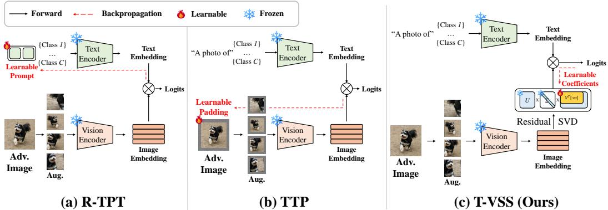
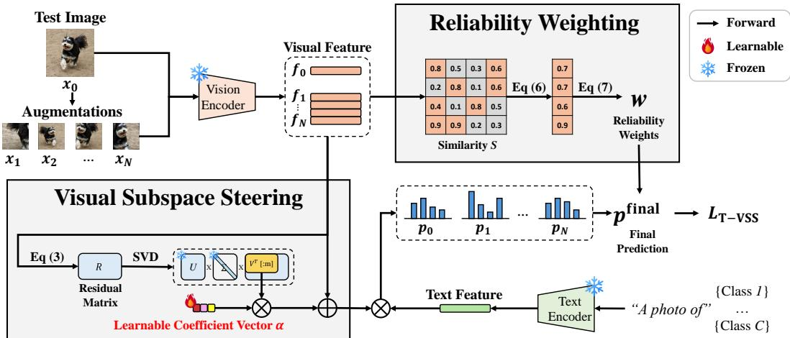
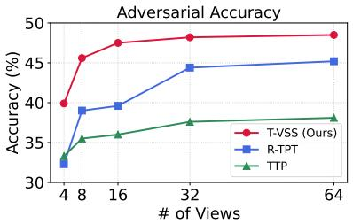
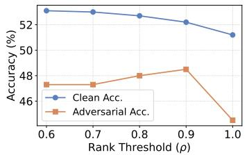
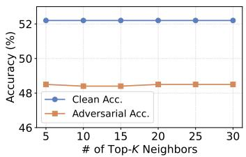
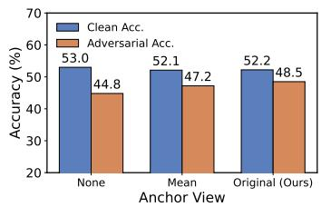
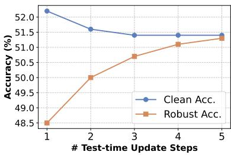

# T-VSS: Test-Time Visual Subspace Steering for Adversarial Robustness of Vision-Language Models

Jaehyuk Jang Minseok Seo Seungju Cho Kangwook Ko Changick Kim

School of Electrical Engineering, KAIST

{jhyuk, minseok.seo, joyga, kw.ko, changick}@kaist.ac.kr

## Abstract

Vision-language models (VLMs) achieve strong zero-shot recognition, but they remain highly vulnerable to adversarial perturbations. Recent test-time adaptations improve robustness without retraining, but they do not directly adapt the corrupted visual representation itself. Prompt-based methods adapt the learnable text prompts, while input-space methods optimize pixels or padding at test time. These approaches can improve predictions, but they do so through an indirect and expensive optimization path. We propose Test-time Visual Subspace Steering (T-VSS), a lightweight defense that performs test-time adaptation directly in the visual feature space. T-VSS first builds a sample-specific low-rank subspace from multi-view feature residuals anchored at the attacked image. It then learns a shared feature correction within this subspace using reliability-weighted entropy minimization. By constraining adaptation to a compact visual geometry, T-VSS steers attacked features toward more stable and discriminative predictions while avoiding noisy full-space updates. Experiments on fine-grained, ImageNet, and ImageNet-OOD benchmarks show that T-VSS improves adversarial robustness while maintaining competitive clean accuracy and better efficiency than prior test-time adaptations.

## 1 Introduction

Vision-language models (VLMs) [35, 4, 53, 43] have become a strong foundation for zero-shot visual recognition. By aligning images and text in a shared embedding space, they can recognize unseen categories and transfer to downstream tasks without task-specific finetuning. This flexibility makes VLMs attractive in realistic settings where labeled data are scarce and rapid deployment is important.

However, their zero-shot predictions are highly sensitive to adversarial perturbations, where even small and nearly imperceptible input changes can lead to incorrect predictions [14, 26, 11, 22, 38]. This vulnerability is particularly concerning in safety-critical applications such as medical AI, autonomous driving, and public-security surveillance, where small perceptual failures can lead to high-stakes downstream consequences [13, 10, 2]. Classical approaches such as adversarial training [26, 50, 7], robust fine-tuning [28, 38, 46, 51], diffusion-based purification [32], and adversarial prompt tuning [21, 52, 56] can improve robustness, but they typically require additional data, label access, expensive retraining, or auxiliary models. To avoid these costs, recent work has increasingly explored test-time adaptation, which seeks to improve robustness using only unlabeled inputs at inference.

In the VLM setting, representative methods adapt each test sample either through the text branch or in the input space at test time as illustrated in Fig. 1: R-TPT [40] improves adversarial robustness by optimizing learnable prompts, whereas TTC [47] and TTP [23] operate in the input space by optimizing a learnable counterattack perturbation and instance-specific image padding, respectively. Despite their promise, these methods improve predictions only through indirect and often computationally expensive optimization.

  
Figure 1: Comparison of test-time adaptation strategies for adversarially robust vision-language models. (a) R-TPT [40] adapts learnable text prompts through backpropagation in the text branch. (b) TTP [23] optimizes learnable input padding in the pixel space via backpropagation through the vision encoder. (c) In contrast, T-VSS adapts the visual feature space by learning a small set of steering coefficients in a low-rank visual subspace. Compared with prior methods, T-VSS provides a more direct and lightweight correction mechanism.

This indirection is problematic because adversarial attacks ultimately impair zero-shot recognition by corrupting the visual feature that is matched against text prototypes. A more direct defense should therefore adapt the attacked visual representation itself. However, unconstrained feature-space adaptation can be unstable. If the update is not guided by the local structure of the test sample, it may move the feature away from its semantic content and reinforce an incorrect prediction. The key challenge is therefore to steer the attacked representation at test time toward a more discriminative region while restricting the update to sample-specific, geometrically plausible directions.

In this paper, we address this challenge with Test-time Visual Subspace Steering (T-VSS), a lightweight defense that adapts each sample within a compact, sample-specific visual subspace. Given a test image and its augmented views, the method extracts frozen visual features once and forms anchor-based residuals by subtracting the original test-image feature from each augmented-view feature. Our key intuition is that, because all augmented views originate from the same attacked image, their attack-induced feature shifts can retain a substantial shared component and concentrate into a compact residual structure. By applying singular value decomposition to these residuals, the method extracts a sample-specific low-rank subspace that captures the local cross-view geometry and constrains how a shared correction can steer all views. Because augmented views can vary in reliability under attack, it estimates view reliability from feature-level agreement across views. The resulting weights are used during both adaptation and final aggregation, reducing the influence of unstable views on the final prediction. By constraining entropy minimization to these dominant residual directions, T-VSS reframes adversarial test-time adaptation as structured feature correction rather than prompt tuning or dense pixel-space search. This change in adaptation space has a direct empirical payoff: the proposed approach consistently improves the robustness–efficiency trade-off over prior test-time defenses.

Across eight fine-grained datasets and multiple CLIP [35] backbones, it achieves the best average adversarial robustness with competitive clean accuracy. The same trend holds on ImageNet and four ImageNet-OOD benchmarks, showing that the benefit extends beyond fine-grained recognition. Since optimization is performed only over a small set of subspace coefficients rather than text prompts or dense input variables, the method also reduces inference overhead. These results position compact feature-space steering as a simple and practical alternative to prompt- and pixel-space adaptation for robust zero-shot VLM inference.

## 2 Related Work

## 2.1 Adversarial Attacks and Defenses

Adversarial examples reveal the vulnerability of deep neural networks by introducing small, often imperceptible perturbations that lead to incorrect predictions [14, 20, 26, 3]. Representative attacks include single-step methods such as FGSM [14], iterative optimization-based methods such as BIM and PGD [20, 26], and stronger transfer-based or black-box attacks that do not require direct gradient access. Universal perturbations further demonstrate that a shared perturbation can fool a model across many inputs [29]. Recent studies show that vision-language models (VLMs), despite their strong zero-shot generalization, are also highly vulnerable to such attacks, which poses a major obstacle to reliable deployment.

To mitigate this issue, prior defenses have mainly focused on training-time robustness improvement. Adversarial training and its variants improve robustness by explicitly optimizing models on adversarially perturbed examples [26, 50, 37, 7], while robust fine-tuning [28, 38, 46, 51], diffusion-based purification [32], and adversarial prompt tuning [21, 52, 56] extend this paradigm to VLMs. Although effective, these methods typically require labeled data, repeated adversarial example generation, and costly retraining or fine-tuning of large pretrained models. Such requirements are especially burdensome for large frozen VLMs, motivating lightweight defense mechanisms that can operate directly at inference time.

## 2.2 Test-Time Adaptation and Defense for VLMs

Test-time adaptation (TTA) [31, 39, 25, 44] aims to improve model generalization on unseen test distributions using only unlabeled test inputs. For VLMs, Test-Time Prompt Tuning (TPT) [41] tunes learnable text prompts [54, 55] using multiple augmented views of each test image, and follow-up methods such as MTA [49] further improve adaptation stability through multi-view or multi-prompt aggregation. STS [8] instead performs spectrum-aware latent steering in the text embedding space, enabling efficient adaptation. However, these methods are primarily designed for natural distribution shifts and generally assume clean test inputs, which limits their effectiveness under adversarial perturbations.

Recent work has extended TTA to adversarially robust inference for VLMs. R-TPT [40] revisits TPT under adversarial attack by optimizing learnable text prompts with pointwise entropy over selected low-entropy views at test time. A different line of work instead adapts the input itself at test time. TTC [47] performs test-time counterattacks by optimizing an additive perturbation in the image space, while TTP [23] optimizes instance-specific padding parameters. Separately, recent training-free defenses bypass optimization-based adaptation, leveraging textual descriptions generated by large language models [57], or applying calibration-dependent thresholded feature reconstruction [24].

In this paper, we focus on optimization-based test-time adaptation. Our T-VSS operates directly on attacked visual representations by learning a shared correction in a sample-specific low-rank visual subspace, providing a geometry-aware alternative to both prompt-space adaptation and padding-based input optimization without auxiliary models or datasets.

## 3 Method

## 3.1 Preliminaries

CLIP for zero-shot classification. We build on CLIP [35], a dual-encoder vision-language model consisting of an image encoder $F ( \cdot )$ and a text encoder $G ( \cdot )$ . Given a C-way classification task with class names $\{ t _ { c } \} _ { c = 1 } ^ { C }$ , CLIP constructs a text prototype for each class as $g _ { c } = G ( \mathrm { p r o m p t } ( t _ { c } ) ) \in \mathbb { R } ^ { d }$ where prompt(tc) denotes a hand-crafted prompt template $( \mathrm { e . g . , \tilde { \ a } }$ photo of $1 [ \mathrm { C L A S S } ] ^ { \cdot \cdot } )$ instantiated with class name $t _ { c } ,$ and $g _ { c }$ is the resulting textual embedding of class c. For an input image $x _ { i }$ , the image encoder produces a visual feature $\mathbf { \bar { \phi } } _ { f _ { i } } = F ( x _ { i } ) \in \mathbb { R } ^ { d }$ . The zero-shot prediction probability of class c is then computed by the cosine similarity between the visual feature and the text prototypes:

$$
p _ {c} (x _ {i}) = \frac {\exp (\cos (f _ {i} , g _ {c}) / \tau)}{\sum_ {j = 1} ^ {C} \exp (\cos (f _ {i} , g _ {j}) / \tau)},\tag{1}
$$

where $\tau$ is the temperature parameter.

Adversarial test-time adaptation. Following prior test-time defenses $[ 4 0 , 2 3 ]$ , we construct $N + 1$ stochastic views from a potentially adversarial test image x: ${ \mathcal { X } } ( x ) = \{ x _ { 0 } , x _ { 1 } , . . . , x _ { N } \}$ , where $x _ { 0 } = x$ and $\{ x _ { i } \} _ { i = 1 } ^ { N }$ are augmented views of $x .$ In adversarial evaluation, all views are generated from the attacked image and therefore share the same perturbation source.

  
Figure 2: Overview of T-VSS. From multi-view CLIP visual features, T-VSS applies Singular Value Decomposition (SVD) to anchor-based residuals to extract a compact visual subspace that captures local cross-view geometry, then learns a shared low-rank correction within that subspace via reliability-weighted entropy minimization. Predictions from the adapted views are finally aggregated using reliability-aware ensembling.

Let $p ( x _ { i } ) \in \mathbb { R } ^ { C }$ denote the class probability vector in Eq. (1). We measure its prediction uncertainty with Shannon entropy:

$$
\mathcal {H} (p (x _ {i})) = - \sum_ {c = 1} ^ {C} p _ {c} (x _ {i}) \log p _ {c} (x _ {i}).\tag{2}
$$

## 3.2 Test-time Visual Subspace Steering

Unlike prior test-time defenses that adapt text prompts or optimize pixel-space variables, T-VSS adapts entirely in the visual feature space after a single frozen encoder pass. Given multi-view CLIP features, it first estimates a compact sample-specific visual subspace from anchor-based residual geometry, then learns a shared low-rank correction inside that subspace, and finally uses reliabilityaware weighting to emphasize stable views during optimization and prediction. The image encoder and text prototypes remain fixed throughout; only a low-dimensional coefficient vector is optimized at test time.

Local visual subspace estimation. We begin by extracting normalized CLIP visual features $\{ f _ { i } = F ( x _ { i } ) \} _ { i = 0 } ^ { N }$ for all views. Instead of optimizing an unconstrained shift in the full d-dimensional embedding space, T-VSS first estimates a compact subspace that captures the local variation of the current sample. We use the original attacked view x as an anchor and build the residual matrix

$$
R = \left[ \begin{array}{c} (f _ {1} - f _ {0}) ^ {\top} \\ (f _ {2} - f _ {0}) ^ {\top} \\ \vdots \\ (f _ {N} - f _ {0}) ^ {\top} \end{array} \right] \in \mathbb {R} ^ {N \times d}.\tag{3}
$$

We then compute the singular value decomposition $R = U \Sigma V ^ { \top }$ , where the right singular vectors in V define orthogonal directions in the visual embedding space. Rather than fixing the rank manually, we choose the smallest active rank m whose cumulative singular-value energy exceeds a threshold $\rho \colon$

$$
m = \min \left\{q \left| \frac {\sum_ {j = 1} ^ {q} \sigma_ {j} ^ {2}}{\sum_ {j = 1} ^ {\operatorname{rank} (R)} \sigma_ {j} ^ {2}} \geq \rho \right. \right\},\tag{4}
$$

where $\{ \sigma _ { j } \}$ are the singular values and $\rho \in ( 0 , 1 ]$ is the explained-variance threshold. This construction is motivated by the observed behavior of multi-view features under attack. Our analysis in Appendix B shows that attacked multi-view feature shifts remain aligned across views and that the corresponding residual variation collapses into a much smaller rank than in the clean case. Because all augmented views are derived from the same attacked base image, their features can therefore retain a substantial common attack-induced component while still exhibiting a low-rank pattern of relative variation around the current sample. Using an anchor-relative residual representation can therefore help suppress view-shared offsets and isolate the local residual geometry that defines the search space for shared correction.

Shared low-rank feature steering. Given the basis $V _ { m } \in \mathbb { R } ^ { d \times m }$ which collects the top-m right singular vectors, T-VSS performs adaptation by learning a shared low-rank correction inside this subspace. We initialize a learnable coefficient vector $\bar { \alpha } \in \mathbb { R } ^ { m }$ at zero, generate a shared shift $\Delta = V _ { m } \alpha$ . The same shift is then applied to every view as:

$$
\tilde {f} _ {i} = \frac {f _ {i} + \Delta}{\| f _ {i} + \Delta \| _ {2}}, i = 0, \ldots , N.\tag{5}
$$

This shared-steering design is important. Rather than allowing each view to move independently, T-VSS enforces a single consensus correction that is consistent across the entire view set. The optimization is thus constrained geometrically by the low-rank basis $V _ { m } .$ while the shared shift encourages agreement across views. Since the only learnable variable is the m-dimensional coefficient vector, the number of sample-wise trainable parameters is exactly the selected rank.

Reliability-aware optimization and aggregation. Not all stochastic views are equally informative under attack. T-VSS therefore assigns each view a reliability score [40] as a practical proxy for how well that view agrees with the local feature neighborhood. Because CLIP already outputs ℓ2-normalized image features, this agreement can be computed directly from pairwise similarities $S _ { i j } = f _ { i } ^ { \top } f _ { j }$ . For each view, we average its top-K nearest-neighbor similarities:

$$
r _ {i} = \frac {1}{K} \sum_ {j \in \mathcal {N} _ {K} (i)} S _ {i j},\tag{6}
$$

where $\mathcal { N } _ { K } ( i )$ denotes the indices of the top-K most similar views excluding itself. We then convert these scores into reliability weights with a temperature-scaled softmax:

$$
w _ {i} = \frac {\exp (r _ {i} / \tau_ {r})}{\sum_ {j = 0} ^ {N} \exp (r _ {j} / \tau_ {r})},\tag{7}
$$

where $\tau _ { r }$ is a reliability temperature. Views that remain in a dense and mutually consistent feature neighborhood receive larger weights, while unstable outliers are suppressed.

Given the adapted features $\{ \tilde { f } _ { i } \}$ , we compute logits with the frozen CLIP text prototypes and denote the resulting class probabilities by $p ( \tilde { f } _ { i } )$ . We then optimize α by minimizing reliability-weighted pointwise entropy:

$$
\mathcal {L} _ {\mathrm{T-VSS}} = \sum_ {i = 0} ^ {N} w _ {i} \mathcal {H} \big (p (\tilde {f} _ {i}) \big),\tag{8}
$$

where $w _ { i }$ is the reliability weights defined in Eq. (7). In contrast to hard view selection, the loss softly uses all views while reducing the influence of unreliable ones.

Final prediction and efficiency. After optimization, the final prediction is obtained by reliabilityweighted averaging of the adapted view probabilities:

$$
p ^ {\mathrm{final}} = \sum_ {i = 0} ^ {N} w _ {i}   p (\tilde {f} _ {i}), \qquad \hat {y} = \arg \max _ {c}   p _ {c} ^ {\mathrm{final}}.\tag{9}
$$

T-VSS encodes the image views only once and performs all subsequent optimization directly on cached visual features. Unlike prompt- or pixel-space methods, it avoids repeated backpropagation through large model components or dense input variables. Overall, T-VSS remains lightweight and easy to interpret as a sample-wise low-rank correction of the attacked visual representation guided by multi-view agreement.

Table 1: Clean (Acc.) and adversarial (Rob.) top-1 accuracy (%) on eight fine-grained datasets across three CLIP backbones. Best clean accuracy and best adversarial accuracy are highlighted in bold and bold, respectively. † indicates reproduced results.

<table><tr><td rowspan="2">Method</td><td colspan="2">Caltech101</td><td colspan="2">Pets</td><td colspan="2">Cars</td><td colspan="2">Flower102</td><td colspan="2">Aircraft</td><td colspan="2">DTD</td><td colspan="2">EuroSAT</td><td colspan="2">UCF101</td><td colspan="2">Avg.</td></tr><tr><td>Acc.</td><td>Rob.</td><td>Acc.</td><td>Rob.</td><td>Acc.</td><td>Rob.</td><td>Acc.</td><td>Rob.</td><td>Acc.</td><td>Rob.</td><td>Acc.</td><td>Rob.</td><td>Acc.</td><td>Rob.</td><td>Acc.</td><td>Rob.</td><td>Acc.</td><td>Rob.</td></tr><tr><td colspan="19">CLIP-ResNet-50 (ε = 1/255)</td></tr><tr><td>CLIP [35]</td><td>85.9</td><td>2.6</td><td>83.5</td><td>0.0</td><td>55.7</td><td>0.0</td><td>61.7</td><td>0.0</td><td>15.7</td><td>0.0</td><td>40.4</td><td>0.8</td><td>23.7</td><td>0.0</td><td>58.9</td><td>0.0</td><td>53.2</td><td>0.4</td></tr><tr><td>Ensemble</td><td>83.5</td><td>74.8</td><td>82.3</td><td>69.9</td><td>57.1</td><td>36.2</td><td>58.0</td><td>46.6</td><td>16.4</td><td>9.8</td><td>37.1</td><td>29.5</td><td>16.7</td><td>13.7</td><td>53.9</td><td>43.0</td><td>50.6</td><td>40.4</td></tr><tr><td>TPT [41]</td><td>87.9</td><td>7.0</td><td>84.7</td><td>0.1</td><td>58.4</td><td>0.0</td><td>62.1</td><td>0.0</td><td>17.3</td><td>0.0</td><td>42.4</td><td>4.3</td><td>28.4</td><td>0.0</td><td>60.6</td><td>0.3</td><td>55.2</td><td>1.5</td></tr><tr><td>C-TPT [48]</td><td>87.7</td><td>3.7</td><td>83.6</td><td>0.0</td><td>56.6</td><td>0.0</td><td>64.8</td><td>0.0</td><td>16.7</td><td>0.0</td><td>41.5</td><td>1.3</td><td>27.0</td><td>0.0</td><td>60.1</td><td>0.1</td><td>54.8</td><td>0.6</td></tr><tr><td>MTA [49]</td><td>87.3</td><td>65.9</td><td>84.8</td><td>59.8</td><td>58.7</td><td>17.8</td><td>61.0</td><td>31.5</td><td>18.1</td><td>3.7</td><td>40.3</td><td>18.8</td><td>22.5</td><td>1.6</td><td>60.6</td><td>31.3</td><td>54.1</td><td>28.8</td></tr><tr><td>R-TPT [40]</td><td>86.7</td><td>79.8</td><td>84.6</td><td>74.2</td><td>58.1</td><td>42.9</td><td>60.6</td><td>51.9</td><td>17.5</td><td>12.6</td><td>41.3</td><td>33.5</td><td>21.2</td><td>15.9</td><td>59.7</td><td>50.9</td><td>53.7</td><td>45.2</td></tr><tr><td>TTP† [23]</td><td>85.9</td><td>73.7</td><td>83.8</td><td>46.9</td><td>55.6</td><td>38.9</td><td>61.0</td><td>35.2</td><td>15.6</td><td>11.6</td><td>40.1</td><td>25.9</td><td>24.0</td><td>23.4</td><td>58.5</td><td>49.0</td><td>53.1</td><td>38.1</td></tr><tr><td>T-VSS (Ours)</td><td>84.4</td><td>78.1</td><td>84.4</td><td>75.5</td><td>55.6</td><td>54.7</td><td>58.8</td><td>54.0</td><td>18.0</td><td>20.3</td><td>38.9</td><td>35.5</td><td>18.5</td><td>17.1</td><td>58.9</td><td>52.5</td><td>52.2</td><td>48.5</td></tr><tr><td colspan="19">CLIP-ViT-B/16 (ε = 4/255)</td></tr><tr><td>CLIP [35]</td><td>94.0</td><td>0.0</td><td>88.3</td><td>0.0</td><td>65.5</td><td>0.0</td><td>67.4</td><td>0.0</td><td>23.9</td><td>0.0</td><td>44.4</td><td>0.0</td><td>42.2</td><td>0.0</td><td>65.2</td><td>0.0</td><td>61.4</td><td>0.0</td></tr><tr><td>TTC [47]</td><td>87.6</td><td>8.4</td><td>82.3</td><td>10.4</td><td>55.0</td><td>2.9</td><td>69.0</td><td>7.4</td><td>23.3</td><td>0.5</td><td>41.0</td><td>4.5</td><td>47.4</td><td>0.4</td><td>65.8</td><td>1.6</td><td>58.9</td><td>4.5</td></tr><tr><td>Ensemble</td><td>91.9</td><td>74.7</td><td>86.2</td><td>51.2</td><td>65.7</td><td>26.0</td><td>65.9</td><td>36.3</td><td>23.4</td><td>8.7</td><td>43.2</td><td>25.1</td><td>28.2</td><td>2.2</td><td>63.0</td><td>30.6</td><td>58.4</td><td>31.8</td></tr><tr><td>MTA [49]</td><td>94.3</td><td>72.1</td><td>88.0</td><td>51.8</td><td>67.7</td><td>18.5</td><td>67.4</td><td>27.9</td><td>25.0</td><td>4.3</td><td>46.5</td><td>16.2</td><td>42.5</td><td>1.2</td><td>67.5</td><td>27.5</td><td>62.3</td><td>27.4</td></tr><tr><td>R-TPT [40]</td><td>93.7</td><td>82.0</td><td>87.2</td><td>60.2</td><td>67.0</td><td>34.7</td><td>68.7</td><td>44.6</td><td>23.9</td><td>13.2</td><td>46.4</td><td>32.8</td><td>34.7</td><td>8.5</td><td>67.2</td><td>43.2</td><td>61.1</td><td>39.9</td></tr><tr><td>TTP [23]</td><td>93.5</td><td>82.3</td><td>88.3</td><td>64.7</td><td>65.4</td><td>37.4</td><td>67.3</td><td>47.2</td><td>23.9</td><td>14.8</td><td>44.1</td><td>36.0</td><td>42.0</td><td>14.5</td><td>65.0</td><td>47.2</td><td>61.2</td><td>42.9</td></tr><tr><td>T-VSS (Ours)</td><td>93.4</td><td>81.5</td><td>87.3</td><td>64.9</td><td>65.8</td><td>54.5</td><td>65.9</td><td>50.6</td><td>24.3</td><td>24.4</td><td>45.9</td><td>37.4</td><td>34.8</td><td>7.5</td><td>66.0</td><td>45.2</td><td>60.4</td><td>45.8</td></tr><tr><td colspan="19">CLIP-ViT-L/14 (ε = 4/255)</td></tr><tr><td>CLIP [35]</td><td>95.2</td><td>0.1</td><td>93.1</td><td>0.0</td><td>76.8</td><td>0.0</td><td>76.2</td><td>0.0</td><td>30.0</td><td>0.0</td><td>52.4</td><td>0.0</td><td>55.1</td><td>0.0</td><td>73.7</td><td>0.0</td><td>69.1</td><td>0.0</td></tr><tr><td>TTC [47]</td><td>88.7</td><td>7.7</td><td>92.2</td><td>7.6</td><td>67.8</td><td>2.2</td><td>76.5</td><td>7.5</td><td>31.7</td><td>0.5</td><td>49.7</td><td>6.2</td><td>64.1</td><td>0.2</td><td>75.0</td><td>2.2</td><td>68.2</td><td>4.3</td></tr><tr><td>Ensemble</td><td>94.9</td><td>83.6</td><td>93.4</td><td>63.5</td><td>76.3</td><td>40.5</td><td>75.0</td><td>48.6</td><td>31.7</td><td>12.7</td><td>51.3</td><td>31.3</td><td>38.7</td><td>11.1</td><td>71.7</td><td>48.3</td><td>66.6</td><td>42.5</td></tr><tr><td>MTA [49]</td><td>95.8</td><td>83.1</td><td>93.7</td><td>64.9</td><td>78.4</td><td>36.6</td><td>76.1</td><td>44.2</td><td>32.7</td><td>8.0</td><td>53.4</td><td>27.2</td><td>47.8</td><td>7.5</td><td>74.7</td><td>47.5</td><td>69.1</td><td>39.9</td></tr><tr><td>R-TPT [40]</td><td>95.7</td><td>88.2</td><td>93.7</td><td>72.9</td><td>77.2</td><td>49.1</td><td>76.2</td><td>55.6</td><td>31.7</td><td>17.2</td><td>54.0</td><td>38.0</td><td>44.3</td><td>20.4</td><td>74.3</td><td>55.6</td><td>68.4</td><td>49.6</td></tr><tr><td>TTP [23]</td><td>95.1</td><td>88.6</td><td>93.1</td><td>76.3</td><td>76.8</td><td>51.1</td><td>76.1</td><td>58.7</td><td>29.2</td><td>17.7</td><td>52.3</td><td>41.3</td><td>55.0</td><td>21.6</td><td>73.6</td><td>57.4</td><td>68.9</td><td>51.6</td></tr><tr><td>T-VSS (Ours)</td><td>94.8</td><td>87.5</td><td>93.7</td><td>73.8</td><td>76.3</td><td>63.2</td><td>75.2</td><td>60.9</td><td>32.7</td><td>26.9</td><td>53.4</td><td>41.7</td><td>45.1</td><td>20.3</td><td>73.5</td><td>55.9</td><td>68.1</td><td>53.8</td></tr></table>

## 4 Experiments

## 4.1 Setup

Datasets and Models. We evaluate T-VSS on both fine-grained recognition benchmarks and large-scale ImageNet-style benchmarks. For fine-grained evaluation, we use eight datasets spanning diverse visual domains: Caltech101 [12], Pets [34], Flower102 [33], Stanford Cars [19], FGVC Aircraft [27], DTD [5], EuroSAT [15], and UCF101 [42]. We further evaluate on ImageNet [9] and four ImageNet out-of-distribution benchmarks: ImageNet-A [18], ImageNet-V2 [36], ImageNet-R [16], and ImageNet-S [45]. As the underlying VLM, we adopt official CLIP checkpoints and consider three widely used backbones: ResNet-50, ViT-B/16, and ViT-L/14.

Evaluation and Baselines. We report both clean top-1 accuracy (Acc.) and adversarial top-1 accuracy (Rob.). Following prior work on adversarial test-time defense for CLIP, adversarial examples are generated against the original CLIP model using PGD, while the defense mechanism remains hidden from the attacker. We compare T-VSS with vanilla CLIP, a simple multi-view Ensemble, standard VLM test-time adaptation baselines, and recent adversarial test-time defenses. Depending on the benchmark and backbone, the comparison set includes TPT [41], C-TPT [48], MTA [49], TTC [47], R-TPT [40], and TTP [23]. For fair comparison, all test-time methods use the same CLIP backbone and the same AugMix-based augmentation pipeline [17], without relying on additional foundation models or external knowledge.

Implementation Details. For adversarial evaluation, we generate PGD [26] examples with backbone-specific settings following standard CLIP robustness benchmarks. For ResNet-50, we use PGD with perturbation budget ϵ = 1/255 and 7 attack steps. For ViT-B/16 and ViT-L/14, we use a stronger setting with ϵ = 4/255 and 100 attack steps. In all cases, the attack step size is set to $\epsilon / 4$ For zero-shot classification, we use the default hand-crafted prompt template “a photo of a [CLASS]” to construct text prototypes. We use a single update step optimized with AdamW, learning rate 0.1. We set the explained-variance threshold ρ to 0.9, construct the visual subspace with anchor-based residuals, and compute reliability weights with temperature 0.05 using a default top-K neighbor count of K = 5. Each test sample is processed with 64 views in total, including the original image and 63 augmented views. All experiments are conducted on a single RTX 4090 GPU.

Table 2: Clean (Acc.) and adversarial (Rob.) top-1 accuracy (%) on ImageNet and four ImageNet-OOD benchmarks with CLIP-ResNet-50. † indicates reproduced results.

<table><tr><td rowspan="2">Method</td><td colspan="2">ImageNet</td><td colspan="2">ImageNet-A</td><td colspan="2">ImageNet-V2</td><td colspan="2">ImageNet-R</td><td colspan="2">ImageNet-S</td><td colspan="2">Avg.</td></tr><tr><td>Acc.</td><td>Rob.</td><td>Acc.</td><td>Rob.</td><td>Acc.</td><td>Rob.</td><td>Acc.</td><td>Rob.</td><td>Acc.</td><td>Rob.</td><td>Acc.</td><td>Rob.</td></tr><tr><td>CLIP [35]</td><td>58.2</td><td>0.1</td><td>21.8</td><td>0.0</td><td>51.5</td><td>0.1</td><td>56.1</td><td>0.8</td><td>33.3</td><td>0.5</td><td>44.2</td><td>0.3</td></tr><tr><td>Ensemble</td><td>58.0</td><td>40.1</td><td>22.6</td><td>10.1</td><td>52.0</td><td>37.2</td><td>51.3</td><td>39.3</td><td>29.5</td><td>20.7</td><td>42.7</td><td>29.5</td></tr><tr><td>TPT [41]</td><td>60.7</td><td>0.3</td><td>26.5</td><td>0.0</td><td>54.8</td><td>0.3</td><td>58.9</td><td>1.8</td><td>35.0</td><td>1.4</td><td>47.2</td><td>0.7</td></tr><tr><td>C-TPT [48]</td><td>60.4</td><td>0.1</td><td>24.1</td><td>0.0</td><td>54.3</td><td>0.1</td><td>57.7</td><td>1.0</td><td>34.7</td><td>0.9</td><td>46.2</td><td>0.4</td></tr><tr><td>MTA [49]</td><td>60.4</td><td>30.0</td><td>27.5</td><td>5.6</td><td>54.2</td><td>24.6</td><td>58.4</td><td>29.8</td><td>35.2</td><td>11.3</td><td>47.1</td><td>20.3</td></tr><tr><td>R-TPT [40]</td><td>60.9</td><td>47.7</td><td>28.4</td><td>14.4</td><td>54.9</td><td>41.6</td><td>57.6</td><td>46.9</td><td>34.0</td><td>26.2</td><td>47.1</td><td>35.4</td></tr><tr><td>TTP† [23]</td><td>58.2</td><td>43.0</td><td>21.9</td><td>12.6</td><td>51.3</td><td>38.1</td><td>56.1</td><td>38.3</td><td>33.4</td><td>17.3</td><td>44.2</td><td>29.9</td></tr><tr><td>T-VSS (Ours)</td><td>59.7</td><td>50.1</td><td>27.8</td><td>16.0</td><td>53.6</td><td>44.6</td><td>57.2</td><td>47.6</td><td>33.6</td><td>29.8</td><td>46.4</td><td>37.6</td></tr></table>

## 4.2 Experimental Results

Results on Fine-grained Datasets. Table 1 reports clean and adversarial accuracy on eight finegrained datasets across three CLIP backbones. T-VSS achieves the best average robust accuracy on all three backbones, reaching 48.5% on ResNet-50, 45.8% on ViT-B/16, and 53.8% on ViT-L/14. These results improve over the strongest prior defense by 3.3, 2.9, and 2.2 points, respectively, while keeping clean accuracy competitive. Overall, the results show that the benefit of T-VSS is not confined to a particular backbone or dataset, but extends consistently across architectures while improving the robustness–accuracy trade-off. Notably, the margin is especially clear on CLIP-ResNet-50, where padding-based TTP is less competitive than on ViT backbones. This pattern suggests that input-space padding may transfer less reliably across backbone families than feature-space correction, since padding operates at the pixel-level while T-VSS adapts visual representations directly.

The per-dataset results further clarify where direct feature correction is most beneficial. T-VSS is especially strong on challenging fine-grained datasets such as Cars, Flower102, Aircraft, and DTD, where it achieves the best robust accuracy on all three backbones. It also remains competitive on UCF101, although TTP is slightly stronger on the two larger ViT backbones. EuroSAT is the clearest exception, where TTP attains the best robust accuracy. This suggests that, the CLIP feature geometry is less stable for remote-sensing images, resulting residual structure is less semantically informative for shared feature steering. Despite this exception, T-VSS remains the strongest method on average in terms of robust accuracy across all three backbones. More experimental results are in Table 8 and 9.

Results on ImageNet and ImageNet-OOD Datasets. Table 2 shows that the gains of T-VSS extend beyond fine-grained recognition to large-scale and out-of-distribution evaluation on CLIP-ResNet-50. T-VSS obtains the best robust accuracy on ImageNet and on every OOD benchmark, improving the average robust accuracy to 37.6% and surpassing the previous best defense, R-TPT, by 2.2 points. The gain is consistent across ImageNet-A, ImageNet-V2, ImageNet-R, and ImageNet-S, which suggests that the proposed feature-space correction is not tied to a specific dataset bias or shift type. T-VSS also preserves competitive clean accuracy. Although some prompt-based methods obtain slightly higher clean scores, their adversarial robustness remains substantially lower. This comparison highlights the central advantage of T-VSS: by adapting the attacked visual representation directly, it improves robustness without paying the large clean-accuracy penalty often associated with aggressive test-time correction. Taken together with the fine-grained results, these experiments support T-VSS as a robust and scalable test-time defense for zero-shot VLM inference.

## 5 Analysis and Ablation

Robustness under Various Attacks. Table 3 evaluates T-VSS under three additional attacks, optimization-based CW [3], decision-boundary-based DeepFool [30], and single-step attack FGSM [14], on Flower102 and DTD datasets. T-VSS achieves the best adversarial accuracy across all attack settings and both datasets, reaching 56.3% average robustness on Flower102 and 39.6% on DTD. The consistent advantage indicates that T-VSS is not narrowly tuned to the PGD attack, but instead steers attacked features toward more stable and discriminative predictions under diverse perturbation mechanisms. Additional robustness results under stronger attacks are in Table 10.

Analysis of Inference Efficiency. Table 4 compares per-image latency and adversarial accuracy on UCF101 with CLIP-ResNet-50. Under the same 64-view budget, T-VSS is both the fastest and the most robust adaptive defense, achieving 52.5% robust accuracy at 0.383 seconds per image. This advantage follows directly from the design of T-VSS: image views are encoded once, and test-time optimization is performed only in a low-dimensional visual subspace rather than through prompt parameters or dense input variables. The latency benefit becomes even clearer with fewer views. With only 16 views, T-VSS still reaches 51.1% robust accuracy, outperforming 64-view R-TPT while reducing latency by nearly 5.8×. Even with 8 views, it matches the robustness of 64-view TTP while being about 8.9× faster. These results show that T-VSS can maintain strong robustness at substantially lower inference cost.

Table 3: Adversarial accuracy (%) under additional at- Table 4: Per-image latency and adversartacks on Flower102 and DTD using CLIP-ViT-B/16. DF ial accuracy (%) on UCF101 with CLIPdenotes DeepFool. ResNet-50 under different view budgets.

<table><tr><td rowspan="2">Method</td><td colspan="4">Flower102</td><td colspan="4">DTD</td></tr><tr><td>CW</td><td>DF</td><td>FGSM</td><td>Avg.</td><td>CW</td><td>DF</td><td>FGSM</td><td>Avg.</td></tr><tr><td>CLIP [35]</td><td>0.8</td><td>0.4</td><td>4.8</td><td>2.0</td><td>2.3</td><td>7.6</td><td>13.4</td><td>7.8</td></tr><tr><td>Ensemble</td><td>50.1</td><td>52.2</td><td>46.6</td><td>49.7</td><td>31.1</td><td>32.9</td><td>29.7</td><td>31.2</td></tr><tr><td>TPT [41]</td><td>13.8</td><td>10.8</td><td>14.2</td><td>12.9</td><td>21.3</td><td>24.4</td><td>22.2</td><td>22.6</td></tr><tr><td>C-TPT [48]</td><td>6.6</td><td>5.5</td><td>6.2</td><td>6.1</td><td>11.9</td><td>15.8</td><td>17.5</td><td>15.1</td></tr><tr><td>MTA [49]</td><td>34.5</td><td>35.4</td><td>36.6</td><td>35.5</td><td>23.6</td><td>23.5</td><td>23.9</td><td>23.7</td></tr><tr><td>R-TPT [40]</td><td>51.6</td><td>54.7</td><td>49.2</td><td>51.8</td><td>34.2</td><td>35.9</td><td>32.5</td><td>34.2</td></tr><tr><td>TTP [23]</td><td>54.1</td><td>56.4</td><td>51.8</td><td>54.1</td><td>38.9</td><td>40.1</td><td>37.1</td><td>38.7</td></tr><tr><td>T-VSS (Ours)</td><td>54.8</td><td>60.5</td><td>53.7</td><td>56.3</td><td>39.1</td><td>42.3</td><td>37.4</td><td>39.6</td></tr></table>

<table><tr><td>Method</td><td>Running time (s/image)</td><td>Rob.</td></tr><tr><td>R-TPT [40] (64 views)</td><td>0.533</td><td>50.9</td></tr><tr><td>TTP [23] (64 views)</td><td>0.408</td><td>49.0</td></tr><tr><td>T-VSS (64 views)</td><td>0.383</td><td>52.5</td></tr><tr><td>T-VSS (32 views)</td><td>0.193</td><td>52.2</td></tr><tr><td>T-VSS (16 views)</td><td>0.092</td><td>51.1</td></tr><tr><td>T-VSS (8 views)</td><td>0.046</td><td>49.0</td></tr></table>

  
Figure 3: Ablation of the number of views.

Table 5: Ablation of adaptive rank selection and reliability weighting.

<table><tr><td rowspan="2">Adaptive Rank</td><td rowspan="2">Reliability Weighting</td><td colspan="2">ResNet-50</td><td colspan="2">ViT-B/16</td></tr><tr><td>Acc.</td><td>Rob.</td><td>Acc.</td><td>Rob.</td></tr><tr><td>X</td><td>X</td><td>50.6</td><td>44.1</td><td>59.2</td><td>38.4</td></tr><tr><td>X</td><td>√</td><td>51.2</td><td>44.5</td><td>59.6</td><td>38.5</td></tr><tr><td>√</td><td>X</td><td>51.5</td><td>48.1</td><td>59.9</td><td>45.7</td></tr><tr><td>√</td><td>√</td><td>52.2</td><td>48.5</td><td>60.4</td><td>45.8</td></tr></table>

Robustness under Different View Budgets. Figure 3 reports average adversarial accuracy under different view budgets on fine-grained benchmarks with CLIP-ResNet-50. T-VSS remains consistently strongest across all view budgets, with the clearest advantage in the low-view regime. Although adversarial accuracy improves for all methods with more views, T-VSS dominates the entire curve and exploits multi-view information more effectively than prior methods. In particular, with only 8 views, T-VSS already rivals the 64-view performance of R-TPT and clearly outperforms 64-view TTP. This behavior is consistent with the shared structure in attacked multi-view features, which allows T-VSS to estimate an effective consensus low-rank correction even from few views. Such view efficiency is valuable when test-time latency or augmentation budget is limited.

Ablation of Core Components. Table 5 isolates the two components of T-VSS: adaptive rank selection and reliability weighting. Adaptive rank selection is the primary source of robustness gain. When it is disabled, T-VSS steers along the full rank of the multi-view residual matrix, allowing updates in directions that may contain noisy or attack-corrupted variation. Enabling adaptive rank substantially improves robust accuracy, from 44.1% to 48.1% on ResNet-50 and from 38.4% to 45.7% on ViT-B/16, which confirming that constraining adaptation to dominant residual directions ensures stable and discriminative feature-space steering. Reliability weighting provides a consistent complementary gain by suppressing unstable views during adaptation and aggregation. Across both backbones, it slightly but uniformly improves clean and robust accuracy, yielding the best overall clean–robustness balance in the full model. Overall, these results suggest that adaptive rank determines where T-VSS should steer, while reliability weighting helps determine which views should be trusted.

Ablation of Hyperparameters and Design Choice. Figure 4 shows that T-VSS is stable across a broad range of hyperparameters. For the rank threshold, ρ = 1.0 corresponds to using the full available rank of the residual matrix. Robustness is highest around $\rho = 0 . 9$ , but even smaller thresholds still outperform the strongest prior average robustness on the same ResNet-50 setting (R-TPT 45.2% in

  
(a) Rank Threshold ρ

  
(b) Top-K Nearest-neighbor

  
(c) Anchor View  
Figure 4: Sensitivity of T-VSS to the rank threshold $\rho ,$ the number of neighbors K, and the choice of anchor view. Results are averaged over the eight fine-grained datasets on CLIP-ResNet-50.

Table 1), indicating that T-VSS does not require delicate tuning as long as adaptation remains in a moderately compact subspace. By contrast, setting $\rho = 1 . 0$ reduces robust accuracy to 44.5%, which suggests that retaining all singular directions introduces noisy or attack-corrupted components that make the feature update less stable and less discriminative. The number of top-K nearest neighbors in Eq. 6 used for reliability estimation has almost no effect on either clean or adversarial accuracy, indicating that the reliability weighting is not sensitive to precise tuning. Finally, we examine the reference construction in Eq. (3). Using the original test image as the anchor gives the best robust accuracy (48.5%), outperforming mean-centering across views (47.2%) and using raw features without reference subtraction (44.8%). This suggests that the original-view anchor best suppresses view-shared offsets while preserving the local relative geometry needed for well-constrained feature steering. Overall, these results show that the default configuration of T-VSS is effective and robust to moderate variation in hyperparameters and design choices.

## 6 Conclusion

This paper addressed adversarial test-time defense for zero-shot vision-language models by proposing Test-time Visual Subspace Steering (T-VSS), a lightweight feature-space adaptation method that adjusts attacked visual representations at test time. The central idea is to estimate a compact sample-specific visual subspace from multi-view anchor residuals and to learn a shared, reliabilityaware correction inside that subspace. By constraining adaptation to this low-rank geometry, T-VSS turns test-time entropy minimization into structured feature-space steering rather than prompt-space adjustment or dense input-space search. Experiments across eight fine-grained datasets, ImageNet, and four ImageNet-OOD benchmarks show that T-VSS consistently improves adversarial robustness while preserving competitive clean accuracy. Additional analysis under diverse attacks, low-view regimes, and component ablations further shows that this constrained feature-space adaptation yields a stronger robustness–efficiency trade-off than prior test-time defenses.

Limitations and Future Work. An important limitation of T-VSS, shared by recent augmentationdriven test-time defenses for vision-language models, is its reliance on stochastic multi-view augmentation at inference time. Although this mechanism is effective in the standard defense-oblivious setting, it also exposes an additional attack surface when the adversary explicitly optimizes through the same expectation over transformations. As shown in Table 14, augmentation-driven methods are vulnerable under defense-aware attack, with robust accuracy collapsing to very low levels. We therefore view this result as a broader limitation of the current test-time adaptation paradigm. An important direction for future work is to develop adaptive-attack-resistant defenses that preserve the benefits of multi-view inference without exposing an easily differentiable augmentation pipeline.

Broader Impact. This work aims to improve the reliability of zero-shot vision-language models under adversarial perturbations. Stronger test-time defense can be beneficial in high-stakes settings such as medical decision support and autonomous perception, where small input corruptions may otherwise cause harmful errors. However, improved robustness is not a guarantee of safety and should not be over-interpreted, especially because defense methods may still fail under stronger adaptive attacks. In addition, robustness research is inherently dual-use, since it may also inform the design of stronger attacks. We therefore view T-VSS as a complementary safety mechanism that should be paired with rigorous evaluation and additional safeguards in real-world deployment.

## References

[1] Anish Athalye, Logan Engstrom, Andrew Ilyas, and Kevin Kwok. Synthesizing robust adversarial examples. In Proc. ICML, pages 284–293, 2018.

[2] Tao Bai, Jinqi Luo, Jun Zhao, Bihan Wen, and Qian Wang. Recent advances in adversarial training for adversarial robustness. In IJCAI, pages 4312–4321, 2021. Survey Track.

[3] Nicholas Carlini and David Wagner. Towards evaluating the robustness of neural networks. In Proc. S&P, 2017.

[4] Fei-Long Chen, Du-Zhen Zhang, Ming-Lun Han, Xiu-Yi Chen, Jing Shi, Shuang Xu, and Bo Xu. Vlp: A survey on vision-language pre-training. Machine Intelligence Research, 20(1):38–56, 2023.

[5] Mircea Cimpoi, Subhransu Maji, Iasonas Kokkinos, Sammy Mohamed, and Andrea Vedaldi. Describing textures in the wild. In Proc. CVPR, pages 3606–3613, 2014.

[6] Francesco Croce and Matthias Hein. Reliable evaluation of adversarial robustness with an ensemble of diverse parameter-free attacks. In Proc. ICML, pages 2206–2216, 2020.

[7] Yubo Cui, Xianchao Guan, Zijun Xiong, and Zheng Zhang. Agft: Alignment-guided fine-tuning for zero-shot adversarial robustness of vision-language models. Proc. CVPR, 2026.

[8] Konstantinos M. Dafnis and Dimitris N. Metaxas. Test-time spectrum-aware latent steering for zero-shot generalization in vision-language models. In Proc. NeurIPS, 2025.

[9] Jia Deng, Wei Dong, Richard Socher, Li-Jia Li, Kai Li, and Li Fei-Fei. Imagenet: A large-scale hierarchical image database. In Proc. CVPR, pages 248–255, 2009.

[10] Kevin Eykholt, Ivan Evtimov, Earlence Fernandes, Bo Li, Amir Rahmati, Chaowei Xiao, Atul Prakash, Tadayoshi Kohno, and Dawn Song. Robust physical-world attacks on deep learning visual classification. In Proc. CVPR, pages 1625–1634, 2018.

[11] Hao Fang, Jiawei Kong, Bin Chen, Tao Dai, Hao Wu, and Shu-Tao Xia. Clip-guided generative networks for transferable targeted adversarial attacks. In Proc. ECCV, pages 1–19, 2024.

[12] Li Fei-Fei, Rob Fergus, and Pietro Perona. Learning generative visual models from few training examples: An incremental bayesian approach tested on 101 object categories. In Proc. CVPR Workshops, pages 178–178, 2004.

[13] Samuel G Finlayson, John D Bowers, Joichi Ito, Jonathan L Zittrain, Andrew L Beam, and Isaac S Kohane. Adversarial attacks on medical machine learning. Science, 363(6433):1287–1289, 2019.

[14] Ian J Goodfellow, Jonathon Shlens, and Christian Szegedy. Explaining and harnessing adversarial examples. In Proc. ICLR, 2015.

[15] Patrick Helber, Benjamin Bischke, Andreas Dengel, and Damian Borth. Eurosat: A novel dataset and deep learning benchmark for land use and land cover classification. IEEE Journal of Selected Topics in Applied Earth Observations and Remote Sensing, 12(7):2217–2226, 2019.

[16] Dan Hendrycks, Steven Basart, Norman Mu, Saurav Kadavath, Frank Wang, Evan Dorundo, Rahul Desai, Tyler Zhu, Samyak Parajuli, Mike Guo, et al. The many faces of robustness: A critical analysis of out-of-distribution generalization. In Proc. ICCV, pages 8340–8349, 2021.

[17] Dan Hendrycks, Norman Mu, Ekin D Cubuk, Barret Zoph, Justin Gilmer, and Balaji Lakshminarayanan. Augmix: A simple data processing method to improve robustness and uncertainty. In Proc. ICLR, 2020.

[18] Dan Hendrycks, Kevin Zhao, Steven Basart, Jacob Steinhardt, and Dawn Song. Natural adversarial examples. In Proc. CVPR, pages 15262–15271, 2021.

[19] Jonathan Krause, Michael Stark, Jia Deng, and Li Fei-Fei. 3d object representations for fine-grained categorization. In Proc. ICCV Workshops, pages 554–561, 2013.

[20] Alexey Kurakin, Ian J Goodfellow, and Samy Bengio. Adversarial examples in the physical world. In Artificial intelligence safety and security, pages 99–112. Chapman and Hall/CRC, 2018.

[21] Lin Li, Haoyan Guan, Jianing Qiu, and Michael Spratling. One prompt word is enough to boost adversarial robustness for pre-trained vision-language models. In Proc. CVPR, 2024.

[22] Xiao Li, Wei Zhang, Yining Liu, Zhanhao Hu, Bo Zhang, and Xiaolin Hu. Language-driven anchors for zero-shot adversarial robustness. In Proc. CVPR, pages 24686–24695, 2024.

[23] Zhiwei Li, Yitian Pang, Weining Wang, Zhenan Sun, and Qi Li. Ttp: Test-time padding for adversarial detection and robust adaptation on vision-language models. Proc. CVPR, 2026.

[24] Liangsheng Liu, Si Chen, Jiamin Wu, Weiwei Feng, Zhixin Cheng, Xiaotian Yin, Wenfei Yang, and Tianzhu Zhang. Adversarial attacks already tell the answer: Directional bias-guided test-time defense for vision-language models. In Proc. ICLR, 2026.

[25] Yuejiang Liu, Parth Kothari, Bastien Germain van Delft, Baptiste Bellot-Gurlet, Taylor Mordan, and Alexandre Alahi. TTT++: When does self-supervised test-time training fail or thrive? In Proc. NeurIPS, 2021.

[26] Aleksander Madry, Aleksandar Makelov, Ludwig Schmidt, Dimitris Tsipras, and Adrian Vladu. Towards deep learning models resistant to adversarial attacks. In Proc. ICLR, 2018.

[27] Subhransu Maji, Esa Rahtu, Juho Kannala, Matthew Blaschko, and Andrea Vedaldi. Fine-grained visual classification of aircraft. arXiv preprint arXiv:1306.5151, 2013.

[28] Chengzhi Mao, Scott Geng, Junfeng Yang, Xin Wang, and Carl Vondrick. Understanding zero-shot adversarial robustness for large-scale models. In Proc. ICLR, 2023.

[29] Seyed-Mohsen Moosavi-Dezfooli, Alhussein Fawzi, Omar Fawzi, and Pascal Frossard. Universal adversarial perturbations. In Proc. CVPR, 2017.

[30] Seyed-Mohsen Moosavi-Dezfooli, Alhussein Fawzi, and Pascal Frossard. Deepfool: a simple and accurate method to fool deep neural networks. In Proc. CVPR, pages 2574–2582, 2016.

[31] Zachary Nado, Shreyas Padhy, D Sculley, Alexander D’Amour, Balaji Lakshminarayanan, and Jasper Snoek. Evaluating prediction-time batch normalization for robustness under covariate shift. arXiv preprint arXiv:2006.10963, 2020.

[32] Weili Nie, Brandon Guo, Yujia Huang, Chaowei Xiao, Arash Vahdat, and Anima Anandkumar. Diffusion models for adversarial purification. In Proc. ICML, 2022.

[33] Maria-Elena Nilsback and Andrew Zisserman. Automated flower classification over a large number of classes. In Proc. ICVGIP, pages 722–729, 2008.

[34] Omkar M Parkhi, Andrea Vedaldi, Andrew Zisserman, and CV Jawahar. Cats and dogs. In Proc. CVPR, pages 3498–3505, 2012.

[35] Alec Radford, Jong Wook Kim, Chris Hallacy, Aditya Ramesh, Gabriel Goh, Sandhini Agarwal, Girish Sastry, Amanda Askell, Pamela Mishkin, Jack Clark, et al. Learning transferable visual models from natural language supervision. In Proc. ICML, 2021.

[36] Benjamin Recht, Rebecca Roelofs, Ludwig Schmidt, and Vaishaal Shankar. Do imagenet classifiers generalize to imagenet? In Proc. ICML, pages 5389–5400, 2019.

[37] Leslie Rice, Eric Wong, and Zico Kolter. Overfitting in adversarially robust deep learning. In Proc. ICML, pages 8093–8104, 2020.

[38] Christian Schlarmann, Naman Deep Singh, Francesco Croce, and Matthias Hein. Robust clip: Unsupervised adversarial fine-tuning of vision embeddings for robust large vision-language models. In Proc. ICML, 2024.

[39] Minseok Seo, Wonjun Lee, Jaehyuk Jang, and Changick Kim. Efficient test-time optimization for depth completion via low-rank decoder adaptation. arXiv preprint arXiv:2603.01765, 2026.

[40] Lijun Sheng, Jian Liang, Zilei Wang, and Ran He. R-tpt: Improving adversarial robustness of visionlanguage models through test-time prompt tuning. In Proc. CVPR, pages 29958–29967, 2025.

[41] Manli Shu, Weili Nie, De-An Huang, Zhiding Yu, Tom Goldstein, Anima Anandkumar, and Chaowei Xiao. Test-time prompt tuning for zero-shot generalization in vision-language models. In Proc. NeurIPS, volume 35, pages 14274–14289, 2022.

[42] Khurram Soomro, Amir Roshan Zamir, and Mubarak Shah. Ucf101: A dataset of 101 human actions classes from videos in the wild. arXiv preprint arXiv:1212.0402, 2012.

[43] Quan Sun, Yuxin Fang, Ledell Wu, Xinlong Wang, and Yue Cao. Eva-clip: Improved training techniques for clip at scale. arXiv preprint arXiv:2303.15389, 2023.

[44] Yu Sun, Xiaolong Wang, Liu Zhuang, John Miller, Moritz Hardt, and Alexei A. Efros. Test-time training with self-supervision for generalization under distribution shifts. In Proc. ICML, 2020.

[45] Haohan Wang, Songwei Ge, Zachary Lipton, and Eric P Xing. Learning robust global representations by penalizing local predictive power. Proc. NeurIPS, 32, 2019.

[46] Sibo Wang, Jie Zhang, Zheng Yuan, and Shiguang Shan. Pre-trained model guided fine-tuning for zero-shot adversarial robustness. In Proc. CVPR, pages 24502–24511, 2024

[47] Songlong Xing, Zhengyu Zhao, and Nicu Sebe. Clip is strong enough to fight back: Test-time counterattacks towards zero-shot adversarial robustness of clip. In Proc. CVPR, pages 15172–15182, 2025.

[48] Hee Suk Yoon, Eunseop Yoon, Joshua Tian Jin Tee, Mark Hasegawa-Johnson, Yingzhen Li, and Chang D Yoo. C-tpt: Calibrated test-time prompt tuning for vision-language models via text feature dispersion. In Proc. ICLR, 2024.

[49] Maxime Zanella and Ismail Ben Ayed. On the test-time zero-shot generalization of vision-language models: Do we really need prompt learning? In Proc. CVPR, pages 23783–23793, 2024.

[50] Hongyang Zhang, Yaodong Yu, Jiantao Jiao, Eric Xing, Laurent El Ghaoui, and Michael Jordan. Theoretically principled trade-off between robustness and accuracy. In Proc. ICML, pages 7472–7482, 2019.

[51] Jiacheng Zhang, Jinhao Li, Hanxun Huang, Sarah Monazam Erfani, Benjamin I. P. Rubinstein, and Feng Liu. Semantic-aware adversarial fine-tuning for CLIP. Transactions on Machine Learning Research, 2026.

[52] Jiaming Zhang, Xingjun Ma, Xin Wang, Lingyu Qiu, Jiaqi Wang, Yu-Gang Jiang, and Jitao Sang. Adversarial prompt tuning for vision-language models. In Proc. ECCV, 2024.

[53] Jingyi Zhang, Jiaxing Huang, Sheng Jin, and Shijian Lu. Vision-language models for vision tasks: A survey. IEEE Transactions on Pattern Analysis and Machine Intelligence, 2024.

[54] Kaiyang Zhou, Jingkang Yang, Chen Change Loy, and Ziwei Liu. Conditional prompt learning for vision-language models. In Proc. CVPR, 2022.

[55] Kaiyang Zhou, Jingkang Yang, Chen Change Loy, and Ziwei Liu. Learning to prompt for vision-language models. International Journal of Computer Vision, 130(9):2337–2348, 2022.

[56] Yiwei Zhou, Xiaobo Xia, Zhiwei Lin, Bo Han, and Tongliang Liu. Few-shot adversarial prompt learning on vision-language models. In Proc. NeurIPS, volume 37, pages 3122–3156, 2024.

[57] Xingyu Zhu, Beier Zhu, Shuo Wang, Kesen Zhao, and Hanwang Zhang. Enhancing CLIP robustness via cross-modality alignment. In Proc. NeurIPS, 2025.

## Appendix

A More Experimental Details 13  
A.1 Datasets . . . . . . . . . . . . . . . . . . . . . . . . . . . . . . . . . . . . . . . . . . . . . . . . . . . . . . . . . . . . . . A.2 Source of Baseline Results . . . . . . . . . . . . . . . . . . . . . . . . . . . . . . . . . . . . . . . B Analysis of Shared Perturbation Structure and Residual Compactness 14   
C Additional Experiments and Analysis 14  
C.1 Results under Robust Pretrained Backbone. 14  
C.2 Additional CLIP Backbone Results. 15  
C.3 Additional Robustness under Stronger Attacks. 15  
C.4 Importance of the Residual-SVD Basis. 16  
C.5 Ablation of Update Step. 16  
C.6 Stability Across Random Seeds. 16  
C.7 Comparison with DBD. 17  
C.8 Vulnerability to Adaptive EOT-PGD Attacks. 17  
C.9 Selected Rank $m$ and Number of Learnable Parameters. 18   
D Licenses of Datasets and Models 18

## A More Experimental Details

## A.1 Datasets

Table 6 summarizes the number of classes and test samples for all datasets used in our experiments.

Table 6: Dataset statistics used in the experiments.

<table><tr><td>Dataset</td><td># Classes</td><td># Test</td></tr><tr><td>Caltech101</td><td>100</td><td>2,465</td></tr><tr><td>Pets</td><td>37</td><td>3,669</td></tr><tr><td>Cars</td><td>196</td><td>8,041</td></tr><tr><td>Flower102</td><td>102</td><td>2,463</td></tr><tr><td>Aircraft</td><td>100</td><td>3,333</td></tr><tr><td>DTD</td><td>47</td><td>1,692</td></tr><tr><td>EuroSAT</td><td>10</td><td>8,100</td></tr><tr><td>UCF101</td><td>101</td><td>3,783</td></tr><tr><td>ImageNet</td><td>1,000</td><td>50,000</td></tr><tr><td>ImageNet-A</td><td>200</td><td>7,500</td></tr><tr><td>ImageNet-V2</td><td>1,000</td><td>10,000</td></tr><tr><td>ImageNet-R</td><td>200</td><td>30,000</td></tr><tr><td>ImageNet-S</td><td>1,000</td><td>50,889</td></tr></table>

## A.2 Source of Baseline Results

Unless otherwise noted, many of the baseline results reported in our tables are taken directly from the original R-TPT [40] and TTP [23] papers when the evaluation setting matches ours in backbone, dataset, and attack protocol. We reformat these numbers only for presentation consistency across tables. When an exact result is not available in the original paper, we reproduce the baseline using the official implementation; such entries are marked with † in the tables.

Table 7: Backbone-wise summary of paired clean/adv multi-view feature statistics on the 50,000 ImageNet test images under the 64-view evaluation protocol. Each row uses the backbone-specific PGD setting from the main paper.

<table><tr><td>Backbone</td><td>Cosine Similarity ↑</td><td>Shared Energy ↑</td><td>Clean Rank</td><td>Adv. Rank</td></tr><tr><td>ResNet-50</td><td>0.314</td><td>0.230</td><td>8.28</td><td>3.37</td></tr><tr><td>ViT-B/16</td><td>0.498</td><td>0.435</td><td>8.58</td><td>1.45</td></tr><tr><td>ViT-B/32</td><td>0.475</td><td>0.435</td><td>10.31</td><td>2.13</td></tr></table>

## B Analysis of Shared Perturbation Structure and Residual Compactness

This analysis asks a simple question: why can T-VSS learn one shared feature correction for many stochastic views of the same attacked image? To answer it, we analyze PGD adversarial examples on the 50,000 ImageNet validation images using the same backbone-specific attack settings as in the main paper, and compare paired clean and adversarial 64-view features under identical stochastic augmentations. For each sample, we measure: (i) the pairwise cosine similarity between the adv-clean feature shifts across views, (ii) the shared-energy ratio of the mean shift, and (iii) the rank required to explain 90% of the residual variance. These statistics directly test whether the perturbation-induced changes are coordinated across views and whether the resulting residual variation is compact enough to justify low-rank correction.

Table 7 reports the resulting backbone-wise summaries. The pattern is consistent across all three backbones. First, the adv-clean feature shifts remain meaningfully aligned across views, with positive pairwise cosine similarities and substantial shared-energy ratios across all three backbones. This indicates that stochastic views of the same adversarial image do not drift independently, but retain a coordinated perturbation-induced component. Second, although clean multi-view features already exhibit nontrivial structure, the attacked residual rank is much smaller than the clean residual rank, collapsing from 8.28 to 3.37 on ResNet-50, from 8.58 to 1.45 on ViT-B/16, and from 10.31 to 2.13 on ViT-B/32. In other words, adversarial multi-view variation becomes markedly more compact than the corresponding clean variation. Together, these observations indicate that attacked residuals do not behave like arbitrary full-rank noise, but concentrate into a compact sample-specific subspace relative to the clean case. This is precisely the regime where a shared low-rank correction is well motivated: the cross-view alignment explains why one consensus correction can be effective across views, while the compact residual structure defines a low-dimensional search space in which that correction can be optimized. This interpretation is also consistent with the anchor-view ablation in Fig. 4c and the random-basis comparison in Table 11, which together show that T-VSS benefits from the structure of the residual basis rather than from low-dimensional restriction alone.

## C Additional Experiments and Analysis

## C.1 Results under Robust Pretrained Backbone

Table 8 evaluates whether T-VSS remains effective when the underlying CLIP-ViT-B/32 encoder is already robust-pretrained with TeCoA [28]. The answer is affirmative: T-VSS achieves the best average robust accuracy at 22.0%, improving over the robust-pretrained baseline itself by 9.7 points and over the strongest test-time baseline, R-TPT, by 0.8 points. The gain is also consistent across individual datasets, where T-VSS attains the best robust accuracy on seven of the eight benchmarks. These results suggest that the proposed feature-space correction is complementary to training-time robustness and can further improve an already strengthened visual encoder without any additional fine-tuning or retraining.

Table 8: Clean (Acc.) and adversarial (Rob.) top-1 accuracy (%) on eight fine-grained datasets with a TeCoA-pretrained CLIP-ViT-B/32 backbone (ϵ = 4/255). Best clean and robust results are highlighted in bold and bold, respectively.

<table><tr><td rowspan="2">Method</td><td colspan="2">Caltech101</td><td colspan="2">Pets</td><td colspan="2">Cars</td><td colspan="2">Flower102</td><td colspan="2">Aircraft</td><td colspan="2">DTD</td><td colspan="2">EuroSAT</td><td colspan="2">UCF101</td><td colspan="2">Avg.</td></tr><tr><td>Acc.</td><td>Rob.</td><td>Acc.</td><td>Rob.</td><td>Acc.</td><td>Rob.</td><td>Acc.</td><td>Rob.</td><td>Acc.</td><td>Rob.</td><td>Acc.</td><td>Rob.</td><td>Acc.</td><td>Rob.</td><td>Acc.</td><td>Rob.</td><td>Acc.</td><td>Rob.</td></tr><tr><td colspan="19">TeCoA-CLIP-ViT-B/32 ( $\epsilon = 4/255$ )</td></tr><tr><td>CLIP-TeCoA [28]</td><td>79.3</td><td>44.3</td><td>66.9</td><td>15.8</td><td>10.2</td><td>1.0</td><td>30.8</td><td>9.0</td><td>6.6</td><td>0.5</td><td>24.5</td><td>10.7</td><td>14.5</td><td>10.8</td><td>34.6</td><td>6.7</td><td>33.4</td><td>12.3</td></tr><tr><td>Ensemble</td><td>72.7</td><td>55.1</td><td>59.9</td><td>38.9</td><td>5.6</td><td>2.7</td><td>26.6</td><td>16.0</td><td>4.2</td><td>2.0</td><td>23.5</td><td>16.2</td><td>12.5</td><td>11.0</td><td>26.4</td><td>14.0</td><td>28.9</td><td>19.5</td></tr><tr><td>TPT [41]</td><td>79.3</td><td>52.7</td><td>65.2</td><td>27.4</td><td>9.6</td><td>2.0</td><td>27.9</td><td>12.3</td><td>6.7</td><td>1.7</td><td>25.5</td><td>14.6</td><td>12.2</td><td>11.2</td><td>34.9</td><td>10.2</td><td>32.7</td><td>16.5</td></tr><tr><td>C-TPT [48]</td><td>79.8</td><td>47.3</td><td>66.1</td><td>19.5</td><td>10.6</td><td>1.3</td><td>29.4</td><td>10.7</td><td>6.4</td><td>0.7</td><td>26.2</td><td>12.4</td><td>13.0</td><td>11.1</td><td>36.4</td><td>8.1</td><td>33.5</td><td>13.9</td></tr><tr><td>MTA [49]</td><td>79.7</td><td>55.7</td><td>66.2</td><td>31.2</td><td>9.0</td><td>2.5</td><td>29.1</td><td>14.0</td><td>6.5</td><td>1.6</td><td>24.4</td><td>13.5</td><td>13.3</td><td>11.2</td><td>34.6</td><td>12.5</td><td>32.9</td><td>17.8</td></tr><tr><td>R-TPT [40]</td><td>76.1</td><td>60.5</td><td>63.2</td><td>40.1</td><td>7.7</td><td>3.5</td><td>26.6</td><td>16.5</td><td>6.1</td><td>2.7</td><td>25.2</td><td>17.7</td><td>11.5</td><td>11.3</td><td>31.1</td><td>17.4</td><td>30.9</td><td>21.2</td></tr><tr><td>T-VSS (Ours)</td><td>77.0</td><td>62.4</td><td>61.0</td><td>41.3</td><td>8.7</td><td>4.1</td><td>25.7</td><td>16.4</td><td>7.3</td><td>2.9</td><td>24.5</td><td>18.1</td><td>11.8</td><td>11.4</td><td>31.5</td><td>19.6</td><td>30.9</td><td>22.0</td></tr></table>

Table 9: Comparison of training-time and test-time defenses on fine-grained classification datasets with pre-trained CLIP-ViT-B/32 (ϵ = 4/255). Best clean (Acc.) and adversarial (Rob.) results are highlighted in bold and bold, respectively.

<table><tr><td rowspan="2">Method</td><td colspan="2">Caltech101</td><td colspan="2">Pets</td><td colspan="2">Cars</td><td colspan="2">Flower102</td><td colspan="2">Aircraft</td><td colspan="2">DTD</td><td colspan="2">EuroSAT</td><td colspan="2">UCF101</td><td colspan="2">Avg.</td></tr><tr><td>Acc.</td><td>Rob.</td><td>Acc.</td><td>Rob.</td><td>Acc.</td><td>Rob.</td><td>Acc.</td><td>Rob.</td><td>Acc.</td><td>Rob.</td><td>Acc.</td><td>Rob.</td><td>Acc.</td><td>Rob.</td><td>Acc.</td><td>Rob.</td><td>Acc.</td><td>Rob.</td></tr><tr><td colspan="19">CLIP-ViT-B/32 (ε = 4/255)</td></tr><tr><td>CLIP [35]</td><td>91.4</td><td>0.2</td><td>85.1</td><td>0.0</td><td>60.1</td><td>0.0</td><td>64.0</td><td>0.0</td><td>18.1</td><td>0.0</td><td>43.0</td><td>0.0</td><td>35.8</td><td>0.0</td><td>61.6</td><td>0.0</td><td>57.4</td><td>0.0</td></tr><tr><td colspan="19">Training-time Defense Methods</td></tr><tr><td>TeCoA [28]</td><td>79.3</td><td>78.0</td><td>66.9</td><td>63.7</td><td>10.2</td><td>9.1</td><td>30.8</td><td>28.9</td><td>6.6</td><td>5.9</td><td>24.5</td><td>24.0</td><td>14.5</td><td>14.3</td><td>34.6</td><td>33.4</td><td>33.4</td><td>32.2</td></tr><tr><td>FARE [38]</td><td>86.3</td><td>85.4</td><td>76.7</td><td>73.8</td><td>39.2</td><td>34.4</td><td>37.0</td><td>34.0</td><td>9.5</td><td>8.5</td><td>28.3</td><td>27.3</td><td>16.6</td><td>16.3</td><td>44.2</td><td>41.9</td><td>42.2</td><td>40.2</td></tr><tr><td>APT [21]</td><td>10.7</td><td>0.4</td><td>10.0</td><td>0.2</td><td>1.5</td><td>0.1</td><td>0.9</td><td>0.2</td><td>2.6</td><td>0.5</td><td>9.0</td><td>0.1</td><td>7.8</td><td>6.7</td><td>3.7</td><td>0.2</td><td>5.8</td><td>1.0</td></tr><tr><td>APT+TeCoA [21]</td><td>81.4</td><td>80.2</td><td>66.7</td><td>63.9</td><td>20.8</td><td>18.9</td><td>42.5</td><td>40.4</td><td>5.2</td><td>5.0</td><td>35.2</td><td>33.7</td><td>29.3</td><td>29.2</td><td>40.2</td><td>39.4</td><td>40.2</td><td>38.8</td></tr><tr><td colspan="19">Test-time Defense Methods</td></tr><tr><td>TTC [47]</td><td>86.5</td><td>22.7</td><td>83.5</td><td>11.8</td><td>48.1</td><td>2.3</td><td>64.3</td><td>3.2</td><td>18.2</td><td>1.0</td><td>37.3</td><td>4.7</td><td>53.0</td><td>3.0</td><td>62.6</td><td>6.1</td><td>56.7</td><td>6.9</td></tr><tr><td>Ensemble</td><td>88.2</td><td>74.9</td><td>75.0</td><td>52.5</td><td>51.7</td><td>25.9</td><td>58.1</td><td>36.1</td><td>16.4</td><td>7.9</td><td>39.8</td><td>28.6</td><td>30.8</td><td>11.9</td><td>54.9</td><td>36.9</td><td>51.9</td><td>34.3</td></tr><tr><td>MTA [49]</td><td>92.0</td><td>76.3</td><td>86.3</td><td>53.6</td><td>63.4</td><td>26.4</td><td>64.4</td><td>36.5</td><td>20.2</td><td>8.2</td><td>43.8</td><td>28.8</td><td>34.6</td><td>11.3</td><td>63.3</td><td>39.1</td><td>58.5</td><td>35.0</td></tr><tr><td>R-TPT [40]</td><td>90.6</td><td>76.4</td><td>84.5</td><td>55.8</td><td>63.1</td><td>28.4</td><td>62.6</td><td>37.6</td><td>19.1</td><td>9.2</td><td>42.1</td><td>29.1</td><td>32.0</td><td>5.1</td><td>62.8</td><td>41.0</td><td>57.1</td><td>35.3</td></tr><tr><td>TTP [23]</td><td>90.9</td><td>81.8</td><td>84.7</td><td>61.0</td><td>59.8</td><td>29.8</td><td>63.6</td><td>42.0</td><td>18.0</td><td>10.3</td><td>42.8</td><td>32.2</td><td>35.6</td><td>14.1</td><td>61.3</td><td>46.6</td><td>57.1</td><td>39.7</td></tr><tr><td>T-VSS (Ours)</td><td>91.7</td><td>76.6</td><td>85.3</td><td>63.2</td><td>61.2</td><td>43.8</td><td>62.4</td><td>45.2</td><td>19.6</td><td>15.8</td><td>43.3</td><td>33.1</td><td>29.8</td><td>6.6</td><td>61.7</td><td>43.8</td><td>56.9</td><td>41.0</td></tr></table>

Table 10: Adversarial accuracy (%) under additional attacks on Flower102 and DTD with CLIP-ViT-B/16. Best results are highlighted in bold.

<table><tr><td rowspan="2">Method</td><td colspan="3">Flower102</td><td colspan="3">DTD</td></tr><tr><td>AutoAttack</td><td>APGD-CE</td><td>APGD-DLR</td><td>AutoAttack</td><td>APGD-CE</td><td>APGD-DLR</td></tr><tr><td>CLIP [35]</td><td>0.0</td><td>0.0</td><td>0.0</td><td>0.0</td><td>0.0</td><td>0.0</td></tr><tr><td>R-TPT [40]</td><td>39.2</td><td>39.5</td><td>46.5</td><td>32.4</td><td>32.4</td><td>34.6</td></tr><tr><td>TTP [23]</td><td>26.7</td><td>38.9</td><td>27.1</td><td>22.3</td><td>26.0</td><td>22.6</td></tr><tr><td>T-VSS (Ours)</td><td>45.1</td><td>45.1</td><td>51.6</td><td>33.3</td><td>45.1</td><td>36.2</td></tr></table>

## C.2 Additional CLIP Backbone Results

Table 9 further evaluates T-VSS on CLIP-ViT-B/32 and broadens the comparison to both trainingtime and test-time defenses. The overall trend remains consistent: T-VSS achieves the best average robust accuracy at 41.0%, outperforming the strongest test-time baseline, TTP, by 1.3 points and the strongest training-time baseline, FARE [38], by 0.8 points. The gains are particularly clear on Cars, Flower102, Aircraft, and the overall average, showing that the proposed feature-space correction transfers effectively to this additional backbone. Although some training-time defenses remain competitive on individual datasets or in clean accuracy, they require robust pretraining or adversarial fine-tuning. By contrast, T-VSS delivers the strongest overall robustness without any additional training, reinforcing the practical advantage of direct test-time feature correction.

## C.3 Additional Robustness under Stronger Attacks

Table 10 extends the evaluation beyond the PGD setting used in the main paper by considering stronger composite and first-order attacks on CLIP-ViT-B/16. Across both Flower102 and DTD, T-VSS remains consistently robust under AutoAttack [6], APGD-CE, and APGD-DLR, achieving the best adversarial accuracy in every reported setting. The gains are especially clear on Flower102, where T-VSS improves over the strongest prior baseline by 5.9 points under AutoAttack, 5.6 points under APGD-CE, and by 5.1 points under APGD-DLR. On DTD, the advantage is smaller but still consistent under AutoAttack and APGD-DLR, while under APGD-CE the margin becomes substantially larger, improving over R-TPT from 32.4% to 45.1%. These results strengthen the main claim of the paper: the benefit of T-VSS does not depend narrowly on a single PGD configuration, but persists under diverse optimization-based attacks, suggesting that the proposed low-rank feature correction provides a more stable adaptation mechanism than prior prompt-space or input-space defenses.

Table 11: Comparison with a random orthonormal basis of the same selected rank m. Results are averaged over the eight fine-grained datasets.

<table><tr><td rowspan="2">Method</td><td colspan="2">ResNet-50</td><td colspan="2">ViT-B/16</td><td colspan="2">ViT-B/32</td><td colspan="2">ViT-L/14</td></tr><tr><td>Acc.</td><td>Rob.</td><td>Acc.</td><td>Rob.</td><td>Acc.</td><td>Rob.</td><td>Acc.</td><td>Rob.</td></tr><tr><td>Random</td><td>51.6</td><td>44.0</td><td>59.3</td><td>38.2</td><td>56.3</td><td>35.3</td><td>67.9</td><td>48.8</td></tr><tr><td>Residual-SVD (Ours)</td><td>52.2</td><td>48.5</td><td>60.4</td><td>45.8</td><td>56.9</td><td>41.0</td><td>68.1</td><td>53.8</td></tr></table>

  
Figure 5: Effect of the number of test-time update steps on average clean (Acc.) and adversarial (Rob.) accuracy (%) over the eight fine-grained datasets with CLIP-ResNet-50.

Table 12: Mean ± standard deviation of clean and adversarial (robust) accuracy (%) averaged over the eight fine-grained datasets across three independent runs with different random seeds. T-VSS shows consistently low variance across all backbones.

<table><tr><td>Backbone</td><td>Acc.</td><td>Rob.</td></tr><tr><td>ResNet-50</td><td> $52.2_{\pm 0.1}$ </td><td> $48.5_{\pm 0.1}$ </td></tr><tr><td>ViT-B/16</td><td> $60.4_{\pm 0.1}$ </td><td> $45.8_{\pm 0.2}$ </td></tr><tr><td>ViT-B/32</td><td> $56.9_{\pm 0.1}$ </td><td> $41.0_{\pm 0.1}$ </td></tr><tr><td>ViT-L/14</td><td> $68.1_{\pm 0.1}$ </td><td> $53.8_{\pm 0.1}$ </td></tr></table>

## C.4 Importance of the Residual-SVD Basis

Table 11 examines whether the gain of T-VSS comes merely from restricting adaptation to an arbitrary low-dimensional subspace, or from using the sample-specific basis estimated from anchor-based residuals. To isolate this question, we replace the residual-SVD basis with a random orthonormal basis of the same selected rank m, while keeping the rest of the adaptation pipeline unchanged. T-VSS consistently outperforms this random-basis variant on all four CLIP backbones. The robust-accuracy gain is especially clear, improving over the random basis by 4.5 points on ResNet-50, 7.6 points on ViT-B/16, 5.7 points on ViT-B/32, and 5.0 points on ViT-L/14, while also slightly improving clean accuracy. These results show that the benefit of T-VSS cannot be explained by low-dimensional constraint alone: the residual-SVD basis provides a more informative local geometry for shared feature correction than an arbitrary orthonormal subspace.

## C.5 Ablation of Update Step

Figure 5 shows the effect of increasing the number of test-time update steps on the average clean and adversarial accuracy over the eight fine-grained datasets with CLIP-ResNet-50. Adversarial accuracy improves steadily as more update steps are used, increasing from 48.5% with one step to 51.3% with five steps. This gain comes with a small clean-accuracy cost: clean accuracy drops from 52.2% to 51.4% and then largely saturates after three steps. The overall trend highlights a clear clean–robustness trade-off, where additional optimization steps can further strengthen low-rank feature-space adaptation under attack, while the default one-step setting remains attractive when inference efficiency and clean performance are both important.

## C.6 Stability Across Random Seeds

Table 12 reports the mean and standard deviation of clean and adversarial accuracy averaged over the eight fine-grained datasets across three independent runs with different random seeds. T-VSS exhibits uniformly low variance across all backbones, with fluctuations of at most 0.2 points in both clean and adversarial accuracy. This stability indicates that the method is not sensitive to seed-specific initialization or stochastic view generation at test time. In other words, the gains reported in the main paper are not driven by a favorable run, but are reproduced consistently across independent trials.

Table 13: Case-study comparison with DBD on Caltech101 under standard and robustly pretrained ViT-B/32 backbones. DBD is strongest on standard CLIP-ViT-B/32, whereas T-VSS attains better clean accuracy and slightly higher adversarial accuracy on TeCoA-CLIP-ViT-B/32. † indicates reproduced results.

<table><tr><td>Method</td><td>Acc.</td><td>Rob.</td></tr><tr><td colspan="3">CLIP-ViT-B/32 (ε = 4/255)</td></tr><tr><td>CLIP [35]</td><td>91.4</td><td>0.2</td></tr><tr><td>R-TPT [40]</td><td>90.6</td><td>76.4</td></tr><tr><td>DBD† [24]</td><td>90.4</td><td>98.8</td></tr><tr><td>T-VSS (Ours)</td><td>91.7</td><td>76.6</td></tr><tr><td colspan="3">TeCoA-CLIP-ViT-B/32 (ε = 4/255)</td></tr><tr><td>CLIP-TeCoA [28]</td><td>79.3</td><td>44.3</td></tr><tr><td>R-TPT [40]</td><td>76.1</td><td>60.5</td></tr><tr><td>DBD† [24]</td><td>70.9</td><td>60.9</td></tr><tr><td>T-VSS (Ours)</td><td>77.0</td><td>62.4</td></tr></table>

## C.7 Comparison with DBD

DBD [24] is a strong concurrent training-free defense that also reconstructs visual features at test time, but it follows a different inference regime from the optimization-based methods in our main benchmark. Specifically, DBD estimates a single defense direction from transformed views and applies a DB-score-based thresholded reconstruction rule with validation-calibrated hyperparameters, whereas T-VSS performs sample-wise test-time optimization in a low-rank visual subspace without thresholded routing. Table 13 shows a case study on Caltech101. On standard CLIP-ViT-B/32, DBD is substantially stronger than all optimization-based baselines, which is consistent with the effectiveness of its calibrated single-direction reconstruction on the standard backbone. For the TeCoA-CLIP-ViT B/32 result, we apply DBD using the DB-score threshold reported in the original paper, without additional recalibration for the robust backbone. Under this setting, DBD still improves adversarial accuracy over the TeCoA backbone, but its advantage becomes much smaller and it achieves lower clean accuracy and slightly lower adversarial accuracy than T-VSS. We do not claim that DBD cannot be improved further with backbone-specific retuning; rather, this case study suggests that its fixed thresholded rule may transfer less directly across backbones when robust pretraining changes the underlying feature geometry. By contrast, T-VSS uses sample-specific low-rank optimization without hard thresholding, which may help it transfer more favorably to the robustly pretrained backbone considered here.

## C.8 Vulnerability to Adaptive EOT-PGD Attacks

We additionally evaluate R-TPT, TTP, and T-VSS under a defense-aware Expectation-Over-Transformation (EOT) PGD attack [1] that explicitly differentiates through the stochastic augmentation pipeline used by these methods. Specifically, for CLIP-ViT-B/16 we use a 100-step EOT-PGD attack with $\epsilon = 4 / 2 5 5$ . At each PGD step, the gradient is estimated from one stochastic defended forward pass constructed from the base image and eight stochastic augmented views. As shown in Table 14, all three methods collapse to very low robust accuracy under this stronger threat model, with all results remaining in the low single digits on both Flower102 and DTD. Although T-VSS remains slightly stronger than R-TPT and TTP, the overall picture is clear: this failure mode is not specific to one method, but reflects a broader weakness of the current augmentation-driven test-time adaptation paradigm. Once the adversary explicitly optimizes through the multi-view inference mechanism, the same stochastic augmentation that improves defenseoblivious robustness becomes an attack surface. Developing test-time defenses that preserve the benefits of multi-view adaptation without exposing such a differentiable augmentation pipeline therefore remains an important direction for future work.

Table 14: Adversarial accuracy (%) under adaptive EOT-PGD attack. All augmentation-driven test-time defenses degrade severely under this defense-aware threat model. † indicates reproduced results.

<table><tr><td>Method</td><td>Flower102</td><td>DTD</td></tr><tr><td>R-TPT [40]</td><td>0.5</td><td>4.4</td></tr><tr><td>TTP† [23]</td><td>0.9</td><td>1.7</td></tr><tr><td>T-VSS (Ours)</td><td>1.3</td><td>4.8</td></tr></table>

Table 15: Average selected rank m across eight fine-grained datasets under the default 64-view protocol (one original image + 63 augmented views). Adversarial rows use the same backbonespecific PGD attacks as in the main paper. Since T-VSS optimizes only the m-dimensional coefficient vector, the selected rank is also the number of sample-wise learnable parameters.

<table><tr><td>Setting</td><td>Model</td><td>Caltech101</td><td>Pets</td><td>Cars</td><td>Flower102</td><td>Aircraft</td><td>DTD</td><td>EuroSAT</td><td>UCF101</td><td>Avg.</td></tr><tr><td rowspan="4">Clean</td><td>ResNet-50</td><td>13.3</td><td>14.9</td><td>14.2</td><td>14.1</td><td>16.6</td><td>12.1</td><td>8.3</td><td>13.7</td><td>13.4</td></tr><tr><td>ViT-B/16</td><td>12.3</td><td>13.8</td><td>13.4</td><td>12.6</td><td>17.0</td><td>12.6</td><td>7.9</td><td>12.6</td><td>12.8</td></tr><tr><td>ViT-B/32</td><td>14.0</td><td>15.5</td><td>14.8</td><td>14.6</td><td>17.7</td><td>13.5</td><td>9.8</td><td>14.4</td><td>14.3</td></tr><tr><td>ViT-L/14</td><td>14.8</td><td>15.5</td><td>14.5</td><td>14.6</td><td>16.5</td><td>15.4</td><td>11.7</td><td>14.2</td><td>14.6</td></tr><tr><td rowspan="4">Adversarial</td><td>ResNet-50</td><td>6.8</td><td>6.0</td><td>5.9</td><td>5.4</td><td>6.3</td><td>5.4</td><td>3.6</td><td>6.5</td><td>5.7</td></tr><tr><td>ViT-B/16</td><td>2.0</td><td>1.5</td><td>1.9</td><td>1.6</td><td>2.2</td><td>1.5</td><td>1.4</td><td>2.2</td><td>1.8</td></tr><tr><td>ViT-B/32</td><td>3.1</td><td>2.6</td><td>3.0</td><td>3.2</td><td>3.3</td><td>2.5</td><td>2.0</td><td>3.6</td><td>2.9</td></tr><tr><td>ViT-L/14</td><td>2.2</td><td>1.9</td><td>2.1</td><td>1.7</td><td>2.9</td><td>2.1</td><td>2.3</td><td>2.4</td><td>2.2</td></tr></table>

## C.9 Selected Rank m and Number of Learnable Parameters

Table 15 reports the average selected rank m across the eight fine-grained datasets under the default 64-view protocol, which consists of one original image and 63 augmented views. For adversarial evaluation, the rank is measured under the same backbone-specific PGD attacks used in the main paper. Since T-VSS optimizes only the m-dimensional coefficient vector α, the selected rank is exactly the number of sample-wise learnable parameters at test time. Even though T-VSS uses 63 augmented views, the average rank on adversarial examples remains very small: 5.7 for ResNet-50, 1.8 for ViT-B/16, 2.9 for ViT-B/32, and 2.2 for ViT-L/14. In other words, T-VSS typically performs sample-wise adaptation with only a handful of learnable coefficients, far fewer than prior optimization based defenses such as R-TPT and TTP, which optimize higher-dimensional prompt or input variables at test time. The clear reduction from the clean-image ranks to the adversarial ranks is also consistent with our main analysis that attacked multi-view residuals become markedly more compact, which makes shared low-rank steering both effective and parameter-efficient.

## D Licenses of Datasets and Models

We summarize the licenses of all datasets, pretrained models, and baseline implementations used in this work in Table 16. All assets are used in accordance with their respective licenses.

Table 16: Licenses of datasets, pretrained models, and baseline implementations used in this work.

<table><tr><td>Type</td><td>Asset</td><td>License</td><td>Source</td></tr><tr><td rowspan="13">Dataset</td><td>Caltech101</td><td>CC BY 4.0</td><td>Caltech Data</td></tr><tr><td>Pets</td><td>CC BY-SA 4.0</td><td>Oxford VGG</td></tr><tr><td>Cars</td><td>CC0</td><td>Kaggle</td></tr><tr><td>Flower102</td><td>CC0</td><td>Oxford VGG</td></tr><tr><td>Aircraft</td><td>Research-only</td><td>Oxford VGG</td></tr><tr><td>DTD</td><td>Research-only</td><td>Oxford VGG</td></tr><tr><td>EuroSAT</td><td>MIT</td><td>GitHub</td></tr><tr><td>UCF101</td><td>CC0</td><td>UCF</td></tr><tr><td>ImageNet</td><td>Research-only</td><td>ImageNet</td></tr><tr><td>ImageNet-A</td><td>MIT</td><td>GitHub</td></tr><tr><td>ImageNet-V2</td><td>MIT</td><td>GitHub</td></tr><tr><td>ImageNet-R</td><td>MIT</td><td>GitHub</td></tr><tr><td>ImageNet-S</td><td>MIT</td><td>GitHub</td></tr><tr><td>Model</td><td>CLIP</td><td>MIT</td><td>GitHub</td></tr><tr><td rowspan="6">Baseline</td><td>TPT</td><td>MIT</td><td>GitHub</td></tr><tr><td>C-TPT</td><td>MIT</td><td>GitHub</td></tr><tr><td>MTA</td><td>MIT</td><td>GitHub</td></tr><tr><td>R-TPT</td><td>Unknown</td><td>GitHub</td></tr><tr><td>TTC</td><td>Unknown</td><td>GitHub</td></tr><tr><td>TTP</td><td>Unknown</td><td>GitHub</td></tr></table>