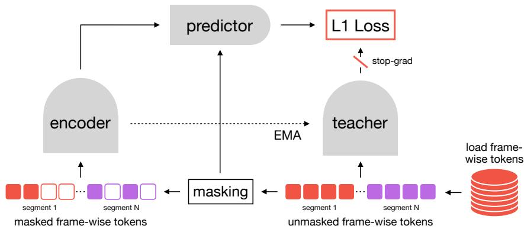
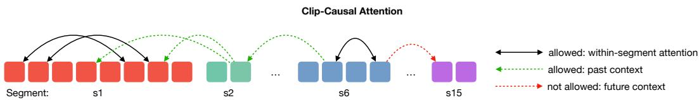
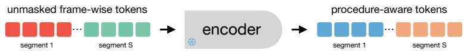
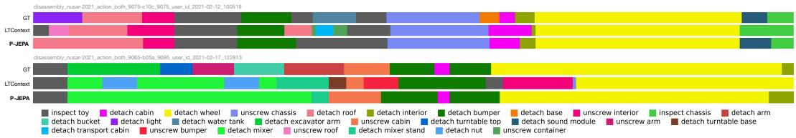
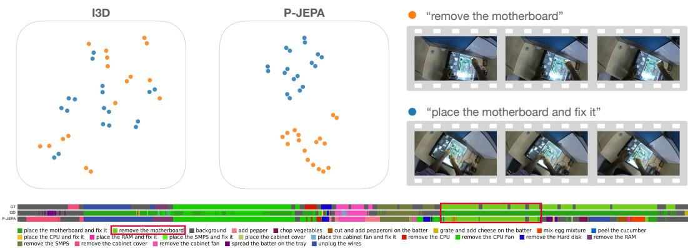
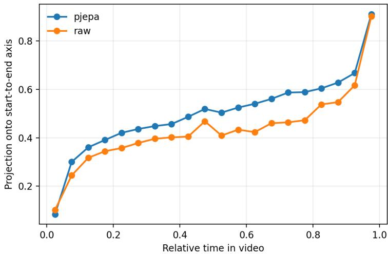
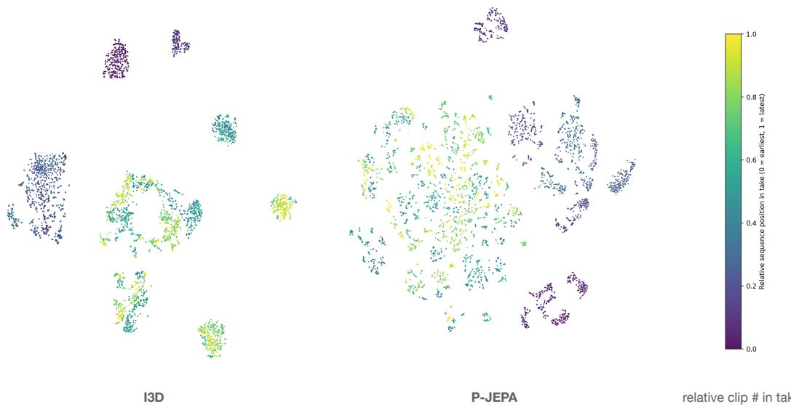
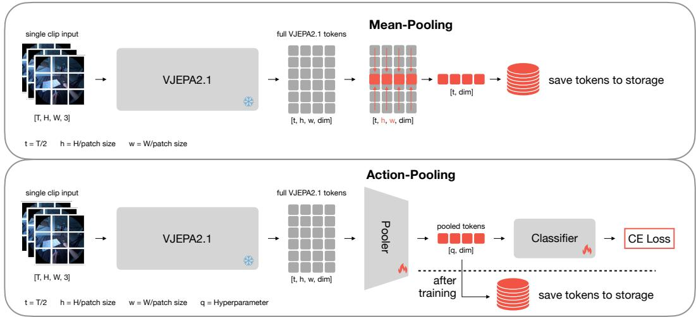

# P-JEPA: Procedural Video Representation Learning via Joint Embedding Predictive Architecture

Felix Tristram Technical University of Munich Munich Center for Machine Learning felix.tristram@tum.de

Benjamin Killeen Technical University of Munich Munich Center for Machine Learning benjamin.killeen@tum.de

Christian Benz Carl Zeiss AG christian.benz@zeiss.com

Stefano Gasperini Technical University of Munich Munich Center for Machine Learning stefano.gasperini@tum.de

Marcel Walch Carl Zeiss AG marcel.walch@zeiss.com

Nassir Navab Technical University of Munich Munich Center for Machine Learning nassir.navab@tum.de

Ghazal Ghazaei Carl Zeiss AG ghazal.ghazaei@zeiss.com

## Abstract

The increasing maturity of embodied AI platforms has driven a growing interest in procedural video representation learning to support intelligent assistance systems for complex, multi-step tasks. Leveraging large-scale latent predictive training, video foundation models capture video dynamics, enabling downstream tasks such as activity understanding, spatiotemporal localization, and predictive control. However, procedural videos include actions with long-range dependencies that these models do not support, due to the quadratic complexity of self-attention. Distinct actions, for example, may be visually similar despite appearing at different points in the procedure, such as turning the stove on versus off. Here, we propose a backbone-agnostic approach that learns long-duration video representations by reducing the problem to a dense, frame-aligned action space and predicting pooled masked latent vectors. This approach allows our Procedural Joint Embedding Predictive Architecture (P-JEPA) to ingest videos over 30 minutes long, enabling effective long-form understanding of procedural steps. We evaluate P-JEPA using features extracted with VJEPA2.1, TSM, and I3D over the EgoExo4D, EgoProceL, and Assembly101 datasets, finding that it consistently improves linear separability, streaming inference, and temporal action segmentation performance, achieving state-of-the-art results on EgoExo4D fine-grained action classification while using an order of magnitude fewer parameters than LLM-based methods and running in real time.

## 1 Introduction

Many real-world activities are procedural: they unfold as ordered sequences of actions whose meaning depends on the surrounding task context. Cooking, repair, assembly, and skilled manipulation all require understanding not only what is visible in a short clip, but also which steps have already occurred, which state changes have been induced, and where the current action lies within the broader procedure [34]. Across procedural videos, visually similar motions can correspond to different steps depending on temporal context, making it hard to distinguish them from visual cues alone: reaching for a tool, placing a component, or manipulating a stove knob may indicate preparation, assembly, adjustment, or completion depending on the preceding actions. Procedural video understanding, therefore, requires representations that combine fine-grained local motion with long-range temporal structure.

Existing spatio-temporal video backbones provide strong local video features and have achieved impressive performance on short-term action understanding [10, 25, 1, 9, 27, 16, 31]. Self-supervised approaches extend this paradigm by training latent predictive models on millions of video hours [7, 3, 30]. However, all of these models are typically trained and evaluated on short clips of a few seconds. Directly applying them to minute-long or take-level videos is computationally expensive, since the number of frames or patch tokens grows rapidly with video length and self-attention scales quadratically with token count. Thus, long procedural video understanding requires a mechanism to model dependencies across much longer action sequences without incurring prohibitive sequence growth.

Recent VideoLLMs address this challenge by connecting visual encoders to large language models and extending the video context through sparse frame sampling, token compression, or external memory [42, 43, 20, 45, 38, 13, 40]. While these systems are effective for open-ended video question answering and retrieval-style tasks, recent diagnostic benchmarks suggest that long context alone does not guarantee genuine temporal reasoning. Single-frame baselines have been shown to be surprisingly competitive on several long-video QA benchmarks [37, 34, 48], indicating that many examples can be solved from static cues or sparse retrieval alone. For questions that require reasoning about event sequences, however, most VideoLLMs remain substantially weaker. Other dedicated temporal evaluations show that even strong image-video multimodal LLMs [14, 47] struggle with precise temporal grounding and temporal reasoning [26, 18, 23]. These findings motivate us to explore video understanding without language models.

Temporal modeling without LLMs is typically done via learning dense frame-wise action labels over untrimmed videos, where a model has to assign a class to each frame. For this temporal action segmentation task, the field has developed strong models: Temporal convolutional networks, multi-stage refinement, and recent transformer-based architectures can model action order and long range temporal context effectively when trained with dense annotations [17, 24, 41, 51, 8, 4, 28]. So far, however, investigation into the input to these models has been limited, with some form of short-term feature extractor providing dense frame-wise features [25, 10]. Additionally, these models are typically supervised predictors for a fixed dataset and label space, which allows them to learn temporal structure for a particular action taxonomy. This limits their use when labels are sparse, when task taxonomies differ across datasets, or when one wants a reusable representation for diverse procedural videos.

One way of learning such re-usable procedural representations is to align the visual evidence from instructional videos with narrations, procedural knowledge graphs, text-derived step structure, or hierarchical descriptions [52, 53, 33]. Some works go further and learn key steps and procedural order through matching of recurring visual patterns across demonstrations alone [15, 6]. Similar to these unsupervised works we propose to learn procedural representations solely from data but do so for dense frame-aligned features.

We achieve this by reducing the data from a noisy RGB distribution to a frame-aligned action space and training a Joint Embedding Predictive Architecture (JEPA) to discover procedural structure in the training data distribution. Leveraging features from pretrained video encoders such as I3D [10], TSM [25], and V-JEPA 2.1 [30] our Procedural-JEPA (P-JEPA) model applies a masked latent prediction objective inspired by JEPA-style video representation learning [7, 3, 30] but applies it to video-takes over 30 minute long. Despite receiving no action labels, narrations, transcripts or procedural graphs, this simple objective induces representations that capture temporal order, procedural progress, and context-dependent action meaning. This is not obvious a priori: masked prediction over pretrained visual features could instead learn only appearance similarity, short-term smoothness, or dataset-specific co-occurrence. Our experiments show that take-level latent prediction reorganizes the feature space around procedural structure, making segments more linearly separable, improving streaming inference, and producing feature trajectories that align more strongly with within-video temporal progress.

Our main contributions can be summarized as follows:

• We introduce P-JEPA, a take-level predictive representation learning framework for long procedural videos.

• We demonstrate that masked latent prediction over dense feature streams induces temporallyaware representations without explicit supervision.

• We evaluate P-JEPA across I3D, TSM, and V-JEPA 2.1 feature streams and show improvements under linear, streaming, and temporal action segmentation evaluations, with state-of-the-art fine-grained action classification on EgoExo4D [19] and strong gains on EgoProceL [5] and Assembly101 [39].

## 2 Related Work

Video encoders and clip-level representation learning. Video understanding has long relied on architectures that extract local spatio-temporal features from short clips. I3D [10] extends 2D convolutional networks to video by inflating filters into 3D, jointly modeling appearance and motion. TSM [25] preserves the efficiency of 2D CNNs by shifting part of the feature channels along the temporal dimension. Transformer-based models, including ViViT [1], TimeSformer [9], Video Swin [27], and MViT [16], further improve short-clip recognition through spatio-temporal attention, hierarchy, or multi-scale token representations.

Self-supervised video encoders learn such features from unlabeled clips through reconstruction, contrastive objectives, or latent prediction. Masked reconstruction methods learn from missing visual content [46], while predictive joint-embedding methods avoid pixel-level generation and instead predict latent representations [7, 3, 30]. These models provide strong local representations, but are typically trained and evaluated over short temporal windows. P-JEPA instead uses such encoders as feature extractors and learns a take-level representation over complete procedures.

Long-video reasoning with vision-language models. Recent VideoLLMs extend multimodal LLMs to longer videos by sparsely sampling frames, compressing visual tokens, or maintaining external memory banks [42, 43, 20, 45, 38, 13, 40]. These systems are effective for video question answering and retrieval-style tasks, but diagnostic studies show that text-only, question-only, or single-frame baselines can perform surprisingly well on many long-video QA benchmarks [37, 34, 48]. Related analyses further indicate that temporal reasoning can be a bottleneck of the language model itself, rather than only a limitation of visual features [23]. VL-JEPA [12] also adopts a predictive jointembedding formulation, but predicts language-target embeddings for vision-language tasks. In contrast, P-JEPA uses visual latent targets and learns dense procedural representations for temporal action understanding, without language-conditioned supervision.

Temporal action segmentation. Temporal action segmentation is the supervised setting most closely related to our evaluation, as it requires dense action predictions over untrimmed videos. Early neural approaches established temporal convolutional networks as an effective way to model dense action sequences from pretrained frame-wise features. Multi-stage TCNs use dilated temporal convolutions, iterative prediction refinement, and smoothing losses to reduce over-segmentation and improve temporal consistency [17, 24]. Later architectures extend this principle with a stronger multi-scale structure, for example, by predicting from coarse to fine temporal resolutions [41], or by combining local temporal modeling with longer-range context. Transformer-based methods further introduce locality, hierarchy, windowed attention, sparse long-range attention, or explicit segment-level representations to make dense long-video prediction practical [51, 8, 4, 28]. P-JEPA is complementary to these supervised sequence predictors: it learns a procedural representation that can be used as input to these models.

Procedure-aware and long-range video representation learning. Several works explicitly study procedural structure in videos, aiming to model not only which action is happening, but also how actions form steps, tasks, and higher-level procedures. One line learns from instructional videos paired with narrations or transcripts, using language to infer step concepts, temporal ordering, or task-level structure [52, 53]. Procedure-aware pretraining methods such as PaPrika [53] further use procedural knowledge graphs or text-derived pseudo-labels to supervise representations for task, step, and next-step understanding. More recent hierarchical approaches, such as HiERO [33], enrich clip representations with higher-level activity context.

Other methods study long-range or procedural structure with weaker supervision. Unsupervised procedure-learning methods discover key steps and their ordering from multiple videos of the same task by aligning recurring visual patterns across demonstrations [15, 6]. Self-supervised hierarchical methods separate local visual encoding from higher-level event modeling, combine short-term consistency with global video structure, predict future representations, or align clips with narrations and whole-video summaries [50, 36, 29, 2]. Related work on state-change counterfactuals further emphasizes that the before/after structure is important for procedural egocentric understanding [21]. P-JEPA shares the goal of learning procedure-aware representations, but does so from individual complete takes, without narrations, transcripts, procedural graphs, repeated demonstrations, or semantic action labels during representation learning.

## 3 Method

## 3.1 Feature Extraction

Directly modeling RGB frames over minute-long videos is challenging for transformer-based architectures: the dense frame-level input quickly becomes computationally prohibitive due to quadratic self-attention scaling, and the noisy low-level image space makes it difficult to capture long-term dependencies. We therefore use frame-wise features extracted with VJEPA2.1 [30], TSM [25] or I3D [10] as input to P-JEPA.

More formally, for any of the aforementioned models we decompose the frame-wise features of a video into an ordered sequence of segments $s = 1 , \ldots , S$ , where a segment is defined by the start/end time of its corresponding annotation. Each Segment s then contributes $m _ { s }$ tokens

$$
\mathbf {X} _ {s} = \left(\mathbf {x} _ {1}, \dots , \mathbf {x} _ {m _ {s}}\right), \qquad \mathbf {x} _ {t} \in \mathbb {R} ^ {d _ {\mathrm{in}}}.
$$

The take is the concatenated stream $\mathbf { X } = \mathbf { X } _ { 1 } \parallel \cdots \parallel \mathbf { X } _ { S }$ with $\begin{array} { r } { T = \sum _ { s = 1 } ^ { S } m _ { s } } \end{array}$ valid tokens. Each token index i in $T$ has both a segment index c(i) and a within-segment index $r ( i )$ representing its frame-index within the segment.

For I3D and TSM we use existing features and do not train the models ourselves. For V-JEPA2.1 we reduce its patch-wise output to a single token per frame to align with the other architectures and allow long-video learning. We do so using two different approaches: for a simple baseline, we apply a non-learned mean pooling (mean-pool) to the output over the spatial dimension, resulting in one token per timestep. The second approach uses a learnable cross-attention pooler, which, given the output features $\mathbf { U } ^ { \star } \in \mathbb { R } ^ { n \times d _ { v } }$ from the frozen VJEPA2.1 encoder of a fixed number of frames $n ,$ applies a small self-attention stack and then pools to $q$ learnable queries:

$$
\mathbf {V} _ {n} = \mathrm{CrossAttn} (\mathbf {Q}, f _ {\mathrm{self}} (\mathbf {U})) \in \mathbb {R} ^ {q \times d _ {v}}.\tag{1}
$$

These $\mathbf { V } _ { n }$ tokens are then classified with a small attentive classifier using a standard cross-entropy loss on the action labels provided by each dataset. After convergence, the classifier is discarded and the pooled tokens $\mathbf { V } _ { n }$ are extracted with non-overlapping sliding windows for each segment. We term these features action-pool and illustrate the pipeline in the supplementary. We set q to match input frames, resulting in one token per frame.

For all feature extractors a learned LayerNorm–linear projection maps input tokens from $d _ { \mathrm { i n } }$ to the P-JEPA model width d if $d \neq d _ { \mathrm { i n } }$

## 3.2 Self-Supervised Procedural Learning

After feature extraction, each video is represented as an ordered stream of tokens rather than raw RGB frames. This lets us move from short-window visual recognition to the central question of procedural understanding: can a model learn not only what a segment looks like, but where it belongs in the broader procedure? In many tasks, the same local visual evidence can correspond to different actions depending on what happened before. For example, reaching toward a stove knob may mean turning the stove on, adjusting the heat, or turning it off. Similarly, filling a pot with water is meaningful partly because it precedes later steps such as boiling or adding ingredients. We therefore want each token to become procedure-aware: informed by the current segment, the preceding sequence of events, and the temporal structure of the take.

  
Figure 1: P-JEPA. A take-level JEPA is trained on continuous streams of feature tokens. The student encoder sees randomly selected context tokens, the predictor fills masked target positions, and an EMA teacher provides latent targets for the complete valid stream.

P-JEPA learns such representations with a self-supervised predictive objective over the full take-level token stream X. Instead of predicting pixels or using action labels, the model learns by hiding parts of the procedural sequence and predicting their latent teacher representations from the visible context. For padded batches, let $\Omega \subseteq \{ \bar { 1 } , \ldots , T \}$ be the set of valid tokens. We sample a target set $\mathcal { M } \subset \Omega$ uniformly at random with masking ratio $p _ { m }$ , and define the context set $\mathcal { C } \overset { = } { = } \Omega \backslash \bar { \mathcal { M } }$ . The student encoder $f _ { \phi }$ receives only context tokens, the predictor $g _ { \psi }$ predicts masked positions in latent space, and the teacher encoder $f _ { \bar { \phi } }$ receives all valid tokens. The teacher parameters are an exponential moving average of the student parameters and receive no gradients.

Concretely, the predictor input is a full-length sequence containing student features at visible positions and a learned mask token at target positions. The loss is only applied to mask tokens M

$$
\mathcal {L} _ {\mathrm{P-JEPA}} = \frac {1}{| \mathcal {M} |} \sum_ {i \in \mathcal {M}} \| \hat {\mathbf {z}} _ {i} - \mathbf {z} _ {i} \| _ {1}, \quad \hat {\mathbf {z}} _ {\mathcal {M}} = \left[ g _ {\psi} (\operatorname{fill} (f _ {\phi} (\mathbf {X} _ {\mathcal {C}}))) \right] _ {\mathcal {M}}, \quad \mathbf {z} _ {\mathcal {M}} = \left[ f _ {\bar {\phi}} (\mathbf {X} _ {\Omega}) \right] _ {\mathcal {M}}.\tag{2}
$$

The prediction problem therefore forces the encoder to organize tokens according to the regularities of the procedure itself: which events tend to occur together, which states precede others, and how the current segment relates to the history of the take. We illustrate the method in Figure 1.

  
Figure 2: Clip-Causal Attention. All tokens within a segment are allowed to attend to each other (black) and to past segments (green). Attention to future segments is blocked (red).

Clip-Causal Attention. A key design choice is how much temporal context each representation is allowed to use. If attention were fully bidirectional, a token could rely on future segments and would no longer represent an online or streaming setting. If it were strictly token-causal, however, tokens inside the same annotated segment could not fully exchange information, even though they describe the same local step. We therefore propose clip-causal attention: tokens may attend freely within their own segment and to all previous segments, but never to future segments.

More specifically, for an encoder query token i and key token j, we allow attention only when the key is visible and belongs to the current or a previous segment:

$$
A _ {i j} ^ {\text { enc }} = \mathbb {I} \{j \in \mathcal {K} \} \mathbb {I} \{c (j) \leq c (i) \}, \quad \mathcal {K} \in \{\mathcal {C}, \Omega \}, \quad \mathbb {I} \{\cdot \} = \text { Indicator   Function }\tag{3}
$$

This clip-causal mask is fully visible within a segment but causal across segments. It lets the representation of segment s use all evidence inside segment s and all past segments, while preventing access to future segments. The predictor remains a standard token-causal transformer over the flattened stream, using $A _ { i j } ^ { \mathrm { p r e d } } = \mathbb { I } [ j \in \Omega ] \mathbb { I } [ j \leq i ]$

2D RoPE. The attention mask defines which tokens can exchange information, but the model still needs to know where each token lies in the procedure. A token has two relevant coordinates: its segment index, which captures progress through the take, and its within-segment index, which captures local frame-wise order. To encode both, we apply separate rotary positional embeddings along the two coordinates $( c ( i ) , r ( i ) )$ ). For a token $\mathbf { x } _ { s , t } ,$ each attention head produces $\mathbf { q } _ { s , t } ^ { ( h ) } , \mathbf { k } _ { s , t } ^ { ( h ) } \in$ $\mathbb { R } ^ { d _ { h } }$ , split as $d _ { h } = d _ { S } + d _ { T } + d _ { 0 }$ . We rotate the first part by segment index and the second part by local token index:

$$
\begin{array}{r l} & {\tilde {\mathbf {q}} _ {s, t} ^ {(h)} = \left[ R _ {S} (s) \mathbf {q} _ {s, t} ^ {(h, S)}, R _ {T} (t) \mathbf {q} _ {s, t} ^ {(h, T)}, \mathbf {q} _ {s, t} ^ {(h, 0)} \right],} \\ & {\tilde {\mathbf {k}} _ {s, t} ^ {(h)} = \left[ R _ {S} (s) \mathbf {k} _ {s, t} ^ {(h, S)}, R _ {T} (t) \mathbf {k} _ {s, t} ^ {(h, T)}, \mathbf {k} _ {s, t} ^ {(h, 0)} \right].} \end{array}
$$

The rotation matrices $R _ { S }$ and $R _ { T }$ use the inverse-frequency bands of RoPE [44]; the remaining d0 channels are unrotated.

  
Figure 3: During inference, only the P-JEPA encoder is used. Input tokens are unmasked and are contextualized by current-segment and past-segment evidence.

Inference. At inference time we discard the predictor and teacher and use only the student encoder as a procedure encoder. It is run without masking on the full valid token stream, producing clipcausal representations that combine current-segment evidence with the history of the take. These contextualized representations are then used for all downstream probes.

## clip 1 clip N3.3 Evaluation of Representations

To quantify the impact of P-JEPA’s learned representations on downstream temporal and procedural understanding tasks, we follow standard representation learning practice and train supervised probes on the output of the frozen P-JEPA encoder. This separates representation quality from downstream model capacity: if a lightweight probe performs well, the task-relevant information is already directly accessible from the learned feature space.

Linear Probing. Linear probing is our primary diagnostic for representation quality. Since the probe is only an affine classifier, $\ell _ { i } = W \mathbf { x } _ { i } + b$ operating on individual frames, it has no capacity to learn temporal structure on its own. Strong performance therefore suggests that P-JEPA organizes the feature space such that procedural distinctions are close to linearly separable, e.g., visually similar segments can be distinguished by their position and context within the take.

Temporal Probing. Since linear probing in an inherently temporal setting can only achieve limited performance we also explore P-JEPAs usefulness on downstream temporal models. We select LTContext [4] and FACT [28] as state of the art temporal action segmentation models on Assembly101 [39] and EgoProceL [5] respectively.

Both LTContext and FACT are non-causal - they can see future context to make predictions about current frames - so we define two more probes to experiment with online streaming inference. The first is a simple self-attention classifier ingesting a limited past context window to make predictions about current frames and the second is a LTContext version modified to be clip-causal (LT-Causal). For further technical details we refer the reader to the respective publications and provide implementation details in the supplementary.

## 4 Experiments and Results

Implementation Details. The total token count is relatively small for each dataset (EgoExo4D: 600k, EgoProceL: 1.3M , Assembly101: 300k), so we use a shallow P-JEPA model with a 4-Layer encoder and 2-Layer predictor for all experiments. The target encoder is an EMA copy of the student with momentum 0.999. We train for 1000 epochs with learning rate 10−4, step decay by 0.1, and random masking of 60/80% of tokens, depending on the dataset. We run probing every 20 epochs and save the P-JEPA checkpoint for the best performing probe. We use a frame rate of 4 fps across all datasets.

Datasets and Metrics. EgoExo4D [19] uses the egocentric fine-grained action classification split with 14,326/4,517 train/validation clips from 648/180 takes and 278 classes; clips average 11.2s and the longest training take spans 34.5 minutes. For EgoProceL [5], we follow FACT [28]: all reported results use their extracted I3D features, label mapping, and 731/183 train/test split. The dataset contains 914 videos, 117.9 hours, and 19,943 segments over 115 foreground steps plus background; EgoProceL has a large class imbalance, with background accounting for 50.2% of segments and 61.2% of duration. Its longest training video is 36.6 minutes. For Assembly101 [39], we use only fixed RGB view C10119 (v4) with the pre-extracted TSM features, based on the original papers observation that overhead views v4 and v1 have the least amount of occlusions. This single-view setting has 393/120 train/validation take streams, 62.5 hours, 6,409 coarse action segments, and a longest training take of 30.8 minutes. As evaluation metrics, for EgoExo4D action classification, we report top-1 accuracy. For temporal action segmentation on EgoProceL and Assembly101, we report frame accuracy Acc, normalized Edit Score over the predicted action sequence, and segmental F1@10/25/50, where the thresholds denote the required temporal IoU between predicted and ground-truth action segments. On EgoProceL, $\mathbf { A c c _ { b g } }$ includes background frames.

## 4.1 Assembly101

Table 1: Assembly101. We compare P-JEPA’s behavior using mean-pool and action-pool V-JEPA2.1 features and TSM features under linear and LTContext probes. P-JEPA can learn procedural structure regardless of input feature source and improves current state of the art LTContext over all metrics.

<table><tr><td rowspan="2">Features</td><td colspan="3">Representation</td><td colspan="3">Metrics</td></tr><tr><td>Probe</td><td>Pooling</td><td>P-JEPA</td><td>Acc.</td><td>Edit</td><td>F1@0.10 / 0.25 / 0.50</td></tr><tr><td rowspan="8">V-JEPA2.1</td><td rowspan="4">Linear</td><td rowspan="2">Mean</td><td rowspan="2">√</td><td>16.1</td><td>3.3</td><td>2.7 / 1.9 / 1.1</td></tr><tr><td>29.4</td><td>18.6</td><td>16.0 / 13.5 / 10.3</td></tr><tr><td rowspan="2">Action</td><td rowspan="2">√</td><td>34.0</td><td>18.5</td><td>17.8 / 15.5 / 10.2</td></tr><tr><td>40.0</td><td>27.8</td><td>26.0 / 23.0 / 16.9</td></tr><tr><td rowspan="4">LTContext</td><td rowspan="2">Mean</td><td rowspan="2">√</td><td>30.6</td><td>26.2</td><td>26.0 / 21.7 / 14.3</td></tr><tr><td>33.8</td><td>27.6</td><td>29.3 / 25.0 / 18.7</td></tr><tr><td rowspan="2">Action</td><td rowspan="2">√</td><td>41.6</td><td>32.7</td><td>34.4 / 30.1 / 21.9</td></tr><tr><td>43.0</td><td>34.2</td><td>35.9 / 31.5 / 22.3</td></tr><tr><td rowspan="4">TSM</td><td rowspan="2">Linear</td><td rowspan="2">-</td><td rowspan="2">√</td><td>23.5</td><td>3.0</td><td>2.4 / 1.1 / 0.4</td></tr><tr><td>40.1</td><td>15.0</td><td>15.2 / 13.1 / 9.8</td></tr><tr><td rowspan="2">LTContext</td><td rowspan="2">-</td><td rowspan="2">√</td><td>40.2</td><td>32.2</td><td>34.3 / 30.5 / 22.4</td></tr><tr><td>42.9</td><td>35.9</td><td>37.3 / 34.0 / 26.4</td></tr></table>

To investigate P-JEPA’s behavior when using different input representations, we experiment with three frame-wise representations on the Assembly101 dataset, mean-pool and action-pool V-JEPA2.1 features, and the original TSM features that were released with the dataset. Similar to our action-pool features, the TSM features were fine-tuned on the dataset to improve domain alignment (see the Supplementary Material of Assembly101 [39]). P-JEPA improves performance over all experiments, bringing the largest linear probing gain for mean-pool and TSM features, where the linear probes frame accuracy even matches the temporal LTContext model. Action-pooling seems to bring large improvements in temporal awareness of the baseline features, even though it only ever sees a limited window of frames, and enhancing them with P-JEPA’s long-range procedural knowledge improves further. The temporal LTContext probe can utilize P-JEPA features in all settings to improve, although mean-pool lags behind, likely due to its feature-agnostic dimensionality reduction and loss of spatial information. LTContext with TSM + P-JEPA features (bottom row) then sets a new state of the art on Assembly101 (in our single view setting), achieving consistent gains over all metrics. This improved performance can also be observed in Figure 4, where P-JEPA features help the model to correctly identify detach cabin within the detach bumper class and generally aligns action boundaries better.

  
Figure 4: Assembly101 Qualitative. LTContext used with TSM and P-JEPA enhanced TSM features. LTContext can correctly segment detach sound module and detach cabin when using P-JEPA.

## 4.1.1 Ablations

We ablate our clip-causal design in Table 2 using Assembly101 with TSM features and linear probing, which directly measures procedural/temporal awareness of the features themselves. Token-causal enforces a strict lower diagonal attention mask, with a single token only being able to attend to past tokens. This configuration achieves only a small gain over raw TSM features. Bidirectional attention performs better, but even with access to future knowledge, it cannot improve over clip-causal attention, which performs the best.

Table 2: Attention Mask Ablation. Effect of the temporal attention mask in P-JEPA on Assembly101 using TSM features and linear probing.

<table><tr><td>Attention</td><td>Acc.</td><td>Edit</td><td>F1@0.10 / 0.25 / 0.50</td></tr><tr><td>Token-causal</td><td>35.6</td><td>7.6</td><td>7.0 / 5.6 / 1.0</td></tr><tr><td>Bidirectional</td><td>37.6</td><td>12.2</td><td>12.2 / 9.8 / 7.2</td></tr><tr><td>Clip-causal</td><td>40.1</td><td>15.0</td><td>15.2 / 13.1 / 9.8</td></tr></table>

## 4.2 EgoProcel

Table 3: Streaming Inference. All experiments use I3D features and streaming inference - only the current segment and its past are visible to the model. LT-Causal is a version of LTContext [4] modified to be clip-causal. P-JEPA is better for all architectures and helps FACT degrade less.

<table><tr><td>Model</td><td>P-JEPA</td><td> $Acc_{bg}$ </td><td>Acc</td><td>Edit</td><td>F1@0.10 / 0.25 / 0.50</td></tr><tr><td rowspan="2">FACT</td><td rowspan="2">√</td><td>69.2</td><td>19.2</td><td>18.1</td><td>14.8 / 13.8 / 10.9</td></tr><tr><td>76.8</td><td>39.1</td><td>28.8</td><td>26.9 / 25.9 / 24.1</td></tr><tr><td rowspan="2">LT-Causal</td><td rowspan="2">√</td><td>78.6</td><td>55.3</td><td>40.2</td><td>35.0 / 32.0 / 25.7</td></tr><tr><td>80.8</td><td>58.8</td><td>48.9</td><td>42.1 / 40.3 / 34.4</td></tr></table>

We perform two experiments on EgoProceL [5] using only the I3D features provided by FACT [28]: online inference (Table 3) and a sparse label regime (Table 4). Online inference is critical for real-time systems, where predictions must be issued as inputs arrive rather than after the full context is observed. To simulate this setting, we perform inference in a streaming fashion, where the model’s visible context is extended one segment at a time: at timestep t, the model sees only the partial sequence $s _ { 1 : t }$ . We evaluate two temporal models on this task, the current state of the art on EgoProceL, FACT (non-causal), and LT-Causal, a version of LTContext we modify to be causal. Both are trained in an offline manner, being able to see entire takes. FACT (I3D), which learns latent-action descriptors from the full video, degrades significantly in this setting. FACT (P-JEPA), on the other hand, does not degrade as much, with almost 20 percentage points better Acc. LT-Causal alone performs better than FACT, but also receives a large boost when using P-JEPA features, going from 40.2 to 48.9 Edit Score, indicating it can model the procedural structure better when using P-JEPA features.

The second experiment on EgoProceL is about label sparsity (Table 4). Here, we want to test the performance of FACT when less than the full dataset is available for supervised training. We therefore subsample the training set to 15%, 33%, 50%, while maintaining full class coverage. The method is then trained on the limited training set and evaluated on the untrimmed validation set. All experiments here use the same hyperparameters. P-JEPA features result in almost an entire step up in performance, where FACT (P-JEPA) trained on only 33% of data achieves results on par with or better than FACT (I3D) trained on 50% of data. Only at 100% of the data does FACT (I3D) regain a small advantage, although FACT (P-JEPA) is still better in the hardest F1 metric by 1.7 points.

place the motherboard and fix it remove the motherboard backgroundadd pepperchop vegetablescut and add pepperoni on the battergrate and add cheese on the battermix egg mixturepeel the cucumber place the CPU and fix itplace the RAM and fix itplace the SMPS and fix itplace the cabinet coverplace the cabinet fan and fix itremove the CPUremove the CPU Fanremove the Hard diskremove the RAM remove the SMPSremove the cabinet coverremove the cabinet fanspread the batter on the trayunplug the wires

Table 4: Data Sparsity. Effect of training-data sparsity on EgoProceL using FACT with I3D and P-JEPA features. FACT + P-JEPA shows large improvements when labeled data is sparse.

<table><tr><td rowspan="2">Data</td><td colspan="4">I3D</td><td colspan="4">P-JEPA (Ours)</td></tr><tr><td> $Acc_{bg}$ </td><td>Acc.</td><td>Edit</td><td>F1@0.10/0.25/0.50</td><td> $Acc_{bg}$ </td><td>Acc.</td><td>Edit</td><td>F1@0.10/0.25/0.50</td></tr><tr><td>15%</td><td>76.1</td><td>50.8</td><td>41.8</td><td>41.5 / 37.8 / 26.3</td><td>78.9</td><td>50.1</td><td>52.1</td><td>48.6 / 45.6 / 36.9</td></tr><tr><td>33%</td><td>80.7</td><td>61.4</td><td>53.9</td><td>52.3 / 49.5 / 38.5</td><td>84.5</td><td>66.1</td><td>65.2</td><td>60.1 / 57.9 / 52.2</td></tr><tr><td>50%</td><td>83.7</td><td>67.5</td><td>64.6</td><td>62.5 / 60.0 / 48.1</td><td>88.0</td><td>74.4</td><td>72.7</td><td>67.3 / 65.3 / 59.8</td></tr><tr><td>100%</td><td>89.5</td><td>81.8</td><td>83.7</td><td>76.5 / 74.5 / 68.1</td><td>90.9</td><td>81.2</td><td>81.6</td><td>75.0 / 73.5 / 69.8</td></tr></table>

  
Figure 5: t-SNE of original I3D and P-JEPA features for two visually similar classes from EgoProceL validation set. P-JEPA features form two separate clusters. Full take linear probing results below confirm improved linear separability, with I3D features failing on the remove the motherboard class.

In Figure 5 we take a closer look at two visually extremely similar classes from the EgoProceL validation set, place the motherboard and fix it and remove the motherboard, where both actions require (un-)screwing the motherboard. An example of both actions is illustrated on the right of the figure and can only really be distinguished from context. Has the motherboard been recently placed in the case, or are we currently in the process of removing it? P-JEPA answers this question in feature space, where its t-SNE exhibits two distinctly separate clusters compared to the raw I3D features. Additionally, we illustrate this case for an entire takes action segmentation performance below using linear probing, where P-JEPA lets the probe distinguish the remove the motherboard class at all.

## 4.3 EgoExo4D - Fine-grained Action Classification

Table 5: EgoExo4D Action Classification. Results on the official benchmark. egoX indicates training with ego+exo data.

<table><tr><td>Model</td><td>Train Data</td><td>LLM</td><td>Ego Acc. (%)</td></tr><tr><td>TimeSformer [9]</td><td>ego</td><td>no</td><td>35.13</td></tr><tr><td>EgoVLPv2 [35]</td><td>egoX</td><td>no</td><td>39.10</td></tr><tr><td>Viewpoint Distillation</td><td>egoX</td><td>no</td><td>38.19</td></tr><tr><td>View-Invariant Enc. [32]</td><td>egoX</td><td>no</td><td>40.34</td></tr><tr><td>VideoLLM-MoD [49]</td><td>ego</td><td>yes</td><td>42.62</td></tr><tr><td>ProVideLLM-8B/11 [11]</td><td>ego</td><td>yes</td><td>44.36</td></tr><tr><td>P-JEPA + Streaming Probe (ours)</td><td>ego</td><td>no</td><td>56.85</td></tr></table>

To provide a comparison with LLM-based video understanding, we also experiment on the EgoExo4D fine-grained action classification benchmark. Here, we use only action-pooled V-JEPA2.1 features and a streaming classifier, which ingests a limited context window to make predictions about the current action. This is in line with prior works like ProVideLLM [11] and the overall benchmark design, which prohibits future information leakage. P-JEPA achieves state-of-the-art results with a large increase over LLM baselines, while having only 1.2B total parameters, almost an order of magnitude less than typical VideoLLMs. Our entire model stack, including V-JEPA2.1 encoder, pooler, P-JEPA encoder, and streaming classifier, also runs at around 20fps (no decoding overhead, inference only) on a consumer grade RTX 3090 without major optimization, making it real-time capable.

## 5 Limitations & Conclusion

Limitations. P-JEPA learns the most immediately useful procedural representations with clip-causal attention, which requires segment boundaries. These are not guaranteed to be present in a real-world setting or when running inference on live video capture. Exploring a simple fixed-window blockcausal attention mechanism could remove the reliance on this mechanism, but we leave this to future work. P-JEPA also requires frame-aligned token representations that encode knowledge about the underlying low-level actions (e.g., interactions, motion, direction). V-JEPA2.1 can provide such features for most datasets, but its mean-pool variant performed the worst in our experiments, while action-pooling requires labeled data to train. Combining this with video token compression [22] is a promising future direction.

Conclusion. We presented P-JEPA, a procedural representation learning model that discovers procedural information from dense frame-aligned features of over 30-minute-long videos. It achieves this through a masked latent prediction objective, without relying on narrations, transcripts, or procedural knowledge graphs. P-JEPA representations enhance temporal understanding tasks, and, combined with strong temporal models, achieve state-of-the-art results while running in real-time and requiring significantly fewer parameters than current VideoLLMs.

## References

[1] Anurag Arnab, Mostafa Dehghani, Georg Heigold, Chen Sun, Mario Luciˇ c, and Cordelia Schmid. Vivit: A´ video vision transformer. In Proceedings of the IEEE/CVF International Conference on Computer Vision (ICCV), pages 6836–6846, October 2021.

[2] Kumar Ashutosh, Rohit Girdhar, Lorenzo Torresani, and Kristen Grauman. Hiervl: Learning hierarchical video-language embeddings. In Proceedings of the IEEE/CVF Conference on Computer Vision and Pattern Recognition, pages 23066–23078, 2023.

[3] Mido Assran, Adrien Bardes, David Fan, Quentin Garrido, Russell Howes, Matthew Muckley, Ammar Rizvi, Claire Roberts, Koustuv Sinha, Artem Zholus, et al. V-jepa 2: Self-supervised video models enable understanding, prediction and planning. arXiv preprint arXiv:2506.09985, 2025.

[4] Emad Bahrami, Gianpiero Francesca, and Juergen Gall. How much temporal long-term context is needed for action segmentation? In Proceedings of the IEEE/CVF International Conference on Computer Vision, pages 10351–10361, 2023.

[5] Siddhant Bansal, Chetan Arora, and CV Jawahar. My view is the best view: Procedure learning from egocentric videos. In European Conference on Computer Vision, pages 657–675. Springer, 2022.

[6] Siddhant Bansal, Chetan Arora, and CV Jawahar. United we stand, divided we fall: Unitygraph for unsupervised procedure learning from videos. In Proceedings of the IEEE/CVF Winter Conference on Applications of Computer Vision, pages 6509–6519, 2024.

[7] Adrien Bardes, Quentin Garrido, Jean Ponce, Xinlei Chen, Michael Rabbat, Yann LeCun, Mahmoud Assran, and Nicolas Ballas. Revisiting feature prediction for learning visual representations from video. arXiv preprint arXiv:2404.08471, 2024.

[8] Nadine Behrmann, S Alireza Golestaneh, Zico Kolter, Juergen Gall, and Mehdi Noroozi. Unified fully and timestamp supervised temporal action segmentation via sequence to sequence translation. In European conference on computer vision, pages 52–68. Springer, 2022.

[9] Gedas Bertasius, Heng Wang, and Lorenzo Torresani. Is space-time attention all you need for video understanding? In Proceedings of the 38th International Conference on Machine Learning, volume 139 of Proceedings of Machine Learning Research, pages 813–824, 2021.

[10] Joao Carreira and Andrew Zisserman. Quo vadis, action recognition? a new model and the kinetics dataset. In proceedings of the IEEE Conference on Computer Vision and Pattern Recognition, pages 6299–6308, 2017.

[11] Dibyadip Chatterjee, Edoardo Remelli, Yale Song, Bugra Tekin, Abhay Mittal, Bharat Bhatnagar, Necati Ci han Camgoz, Shreyas Hampali, Eric Sauser, Shugao Ma, et al. Streaming videollms for real-time procedural video understanding. In Proceedings of the IEEE/CVF International Conference on Computer Vision, pages 22586–22598, 2025.

[12] Delong Chen, Mustafa Shukor, Theo Moutakanni, Willy Chung, Jade Yu, Tejaswi Kasarla, Yejin Bang, Allen Bolourchi, Yann LeCun, and Pascale Fung. Vl-jepa: Joint embedding predictive architecture for vision-language. arXiv preprint arXiv:2512.10942, 2025.

[13] Joya Chen, Zhaoyang Lv, Shiwei Wu, Kevin Qinghong Lin, Chenan Song, Difei Gao, Jia-Wei Liu, Ziteng Gao, Dongxing Mao, and Mike Zheng Shou. Videollm-online: Online video large language model for streaming video. In Proceedings of the IEEE/CVF Conference on Computer Vision and Pattern Recognition, pages 18407–18418, 2024.

[14] Zhe Chen, Jiannan Wu, Wenhai Wang, Weijie Su, Guo Chen, Sen Xing, Muyan Zhong, Qinglong Zhang, Xizhou Zhu, Lewei Lu, et al. Internvl: Scaling up vision foundation models and aligning for generic visual-linguistic tasks. In Proceedings of the IEEE/CVF conference on computer vision and pattern recognition, pages 24185–24198, 2024.

[15] Ehsan Elhamifar and Zwe Naing. Unsupervised procedure learning via joint dynamic summarization. In Proceedings of the IEEE/CVF International Conference on Computer Vision, pages 6341–6350, 2019.

[16] Haoqi Fan, Bo Xiong, Karttikeya Mangalam, Yanghao Li, Zhicheng Yan, Jitendra Malik, and Christoph Feichtenhofer. Multiscale vision transformers. In Proceedings of the IEEE/CVF International Conference on Computer Vision (ICCV), pages 6824–6835, October 2021.

[17] Yazan Abu Farha and Jurgen Gall. Ms-tcn: Multi-stage temporal convolutional network for action segmentation. In Proceedings of the IEEE/CVF conference on computer vision and pattern recognition, pages 3575–3584, 2019.

[18] Chaoyou Fu, Yuhan Dai, Yongdong Luo, Lei Li, Shuhuai Ren, Renrui Zhang, Zihan Wang, Chenyu Zhou, Yunhang Shen, Mengdan Zhang, et al. Video-mme: The first-ever comprehensive evaluation benchmark of multi-modal llms in video analysis. In Proceedings of the Computer Vision and Pattern Recognition Conference, pages 24108–24118, 2025.

[19] Kristen Grauman, Andrew Westbury, Lorenzo Torresani, Kris Kitani, Jitendra Malik, Triantafyllos Afouras, Kumar Ashutosh, Vijay Baiyya, Siddhant Bansal, Bikram Boote, et al. Ego-exo4d: Understanding skilled human activity from first-and third-person perspectives. In Proceedings of the IEEE/CVF Conference on Computer Vision and Pattern Recognition, pages 19383–19400, 2024.

[20] Bo He, Hengduo Li, Young Kyun Jang, Menglin Jia, Xuefei Cao, Ashish Shah, Abhinav Shrivastava, and Ser-Nam Lim. Ma-lmm: Memory-augmented large multimodal model for long-term video understanding. In Proceedings of the IEEE/CVF Conference on Computer Vision and Pattern Recognition, pages 13504– 13514, 2024.

[21] Chi-Hsi Kung, Frangil Ramirez, Juhyung Ha, Yi-Ting Chen, David Crandall, and Yi-Hsuan Tsai. What changed and what could have changed? state-change counterfactuals for procedure-aware video representa tion learning. arXiv preprint arXiv:2503.21055, 2025.

[22] Seon-Ho Lee, Jue Wang, Zhikang Zhang, David Fan, and Xinyu Li. Video token merging for long video understanding. Advances in Neural Information Processing Systems, 37:13851–13871, 2024.

[23] Lei Li, Yuanxin Liu, Linli Yao, Peiyuan Zhang, Chenxin An, Lean Wang, Xu Sun, Lingpeng Kong, and Qi Liu. Temporal reasoning transfer from text to video. arXiv preprint arXiv:2410.06166, 2024.

[24] Shi-Jie Li, Yazan AbuFarha, Yun Liu, Ming-Ming Cheng, and Juergen Gall. Ms-tcn++: Multi-stage temporal convolutional network for action segmentation. IEEE Transactions on Pattern Analysis and Machine Intelligence, pages 1–1, 2020. doi: 10.1109/TPAMI.2020.3021756.

[25] Ji Lin, Chuang Gan, and Song Han. Tsm: Temporal shift module for efficient video understanding. In Proceedings of the IEEE/CVF international conference on computer vision, pages 7083–7093, 2019.

[26] Yuanxin Liu, Shicheng Li, Yi Liu, Yuxiang Wang, Shuhuai Ren, Lei Li, Sishuo Chen, Xu Sun, and Lu Hou. Tempcompass: Do video llms really understand videos? arXiv preprint arXiv:2403.00476, 2024.

[27] Ze Liu, Jia Ning, Yue Cao, Yixuan Wei, Zheng Zhang, Stephen Lin, and Han Hu. Video swin transformer. In Proceedings of the IEEE/CVF Conference on Computer Vision and Pattern Recognition (CVPR), pages 3202–3211, June 2022.

[28] Zijia Lu and Ehsan Elhamifar. Fact: Frame-action cross-attention temporal modeling for efficient action segmentation. In Proceedings of the IEEE/CVF Conference on Computer Vision and Pattern Recognition, pages 18175–18185, 2024.

[29] Ramy Mounir, Sujal Vijayaraghavan, and Sudeep Sarkar. Streamer: Streaming representation learning and event segmentation in a hierarchical manner. Advances in Neural Information Processing Systems, 36: 45694–45715, 2023.

[30] Lorenzo Mur-Labadia, Matthew Muckley, Amir Bar, Mido Assran, Koustuv Sinha, Mike Rabbat, Yann LeCun, Nicolas Ballas, and Adrien Bardes. V-jepa 2.1: Unlocking dense features in video self-supervised learning. arXiv preprint arXiv:2603.14482, 2026.

[31] Daniel Neimark, Omri Bar, Maya Zohar, and Dotan Asselmann. Video transformer network. In Proceedings of the IEEE/CVF International Conference on Computer Vision (ICCV) Workshops, pages 3163–3172, October 2021.

[32] Aaron van den Oord, Yazhe Li, and Oriol Vinyals. Representation learning with contrastive predictive coding. arXiv preprint arXiv:1807.03748, 2018.

[33] Simone Alberto Peirone, Francesca Pistilli, and Giuseppe Averta. Hiero: understanding the hierarchy of human behavior enhances reasoning on egocentric videos. In Proceedings of the IEEE/CVF International Conference on Computer Vision, pages 19862–19871, 2025.

[34] Chiara Plizzari, Alessio Tonioni, Yongqin Xian, Achin Kulshrestha, and Federico Tombari. Omnia de egotempo: Benchmarking temporal understanding of multi-modal llms in egocentric videos. In Proceedings of the Computer Vision and Pattern Recognition Conference, pages 24129–24138, 2025.

[35] Shraman Pramanick, Yale Song, Sayan Nag, Kevin Qinghong Lin, Hardik Shah, Mike Zheng Shou, Rama Chellappa, and Pengchuan Zhang. Egovlpv2: Egocentric video-language pre-training with fusion in the backbone. In Proceedings of the IEEE/CVF International Conference on Computer Vision, pages 5285–5297, 2023.

[36] Zhiwu Qing, Shiwei Zhang, Ziyuan Huang, Yi Xu, Xiang Wang, Mingqian Tang, Changxin Gao, Rong Jin, and Nong Sang. Learning from untrimmed videos: Self-supervised video representation learning with hierarchical consistency. In Proceedings of the IEEE/CVF Conference on Computer Vision and Pattern Recognition, pages 13821–13831, 2022.

[37] Kanchana Ranasinghe, Xiang Li, Kumara Kahatapitiya, and Michael S Ryoo. Understanding long videos with multimodal language models. arXiv preprint arXiv:2403.16998, 2024.

[38] Shuhuai Ren, Linli Yao, Shicheng Li, Xu Sun, and Lu Hou. Timechat: A time-sensitive multimodal large language model for long video understanding. In Proceedings of the IEEE/CVF Conference on Computer Vision and Pattern Recognition, pages 14313–14323, 2024.

[39] Fadime Sener, Dibyadip Chatterjee, Daniel Shelepov, Kun He, Dipika Singhania, Robert Wang, and Angela Yao. Assembly101: A large-scale multi-view video dataset for understanding procedural activities. In Proceedings of the IEEE/CVF Conference on Computer Vision and Pattern Recognition, pages 21096– 21106, 2022.

[40] Yan Shu, Zheng Liu, Peitian Zhang, Minghao Qin, Junjie Zhou, Zhengyang Liang, Tiejun Huang, and Bo Zhao. Video-xl: Extra-long vision language model for hour-scale video understanding. In Proceedings of the Computer Vision and Pattern Recognition Conference, pages 26160–26169, 2025.

[41] Dipika Singhania, Rahul Rahaman, and Angela Yao. C2f-tcn: A framework for semi-and fully-supervised temporal action segmentation. IEEE Transactions on Pattern Analysis and Machine Intelligence, 45(10): 11484–11501, 2023.

[42] Enxin Song, Wenhao Chai, Guanhong Wang, Yucheng Zhang, Haoyang Zhou, Feiyang Wu, Haozhe Chi, Xun Guo, Tian Ye, Yanting Zhang, et al. Moviechat: From dense token to sparse memory for long video understanding. In Proceedings of the IEEE/CVF Conference on Computer Vision and Pattern Recognition, pages 18221–18232, 2024.

[43] Enxin Song, Wenhao Chai, Tian Ye, Jenq-Neng Hwang, Xi Li, and Gaoang Wang. Moviechat+: Question aware sparse memory for long video question answering. IEEE Transactions on Pattern Analysis and Machine Intelligence, 2025.

[44] Jianlin Su, Murtadha Ahmed, Yu Lu, Shengfeng Pan, Wen Bo, and Yunfeng Liu. Roformer: Enhanced transformer with rotary position embedding. Neurocomputing, 568:127063, 2024.

[45] Reuben Tan, Ximeng Sun, Ping Hu, Jui-hsien Wang, Hanieh Deilamsalehy, Bryan A Plummer, Bryan Russell, and Kate Saenko. Koala: Key frame-conditioned long video-llm. In Proceedings of the IEEE/CVF Conference on Computer Vision and Pattern Recognition, pages 13581–13591, 2024.

[46] Zhan Tong, Yibing Song, Jue Wang, and Limin Wang. Videomae: Masked autoencoders are data-efficient learners for self-supervised video pre-training. Advances in neural information processing systems, 35: 10078–10093, 2022.

[47] Peng Wang, Shuai Bai, Sinan Tan, Shijie Wang, Zhihao Fan, Jinze Bai, Keqin Chen, Xuejing Liu, Jialin Wang, Wenbin Ge, et al. Qwen2-vl: Enhancing vision-language model’s perception of the world at any resolution. arXiv preprint arXiv:2409.12191, 2024.

[48] Haoning Wu, Dongxu Li, Bei Chen, and Junnan Li. Longvideobench: A benchmark for long-context interleaved video-language understanding. Advances in Neural Information Processing Systems, 37: 28828–28857, 2024.

[49] Shiwei Wu, Joya Chen, Kevin Qinghong Lin, Qimeng Wang, Yan Gao, Qianli Xu, Tong Xu, Yao Hu, Enhong Chen, and Mike Zheng Shou. Videollm-mod: Efficient video-language streaming with mixtureof-depths vision computation. Advances in Neural Information Processing Systems, 37:109922–109947, 2024.

[50] Fanyi Xiao, Kaustav Kundu, Joseph Tighe, and Davide Modolo. Hierarchical self-supervised representation learning for movie understanding. In Proceedings of the IEEE/CVF conference on computer vision and pattern recognition, pages 9727–9736, 2022.

[51] Fangqiu Yi, Hongyu Wen, and Tingting Jiang. Asformer: Transformer for action segmentation. arXiv preprint arXiv:2110.08568, 2021.

[52] Yiwu Zhong, Licheng Yu, Yang Bai, Shangwen Li, Xueting Yan, and Yin Li. Learning procedure-aware video representation from instructional videos and their narrations. In Proceedings of the IEEE/CVF Conference on Computer Vision and Pattern Recognition, pages 14825–14835, 2023.

[53] Honglu Zhou, Roberto Martín-Martín, Mubbasir Kapadia, Silvio Savarese, and Juan Carlos Niebles. Procedure-aware pretraining for instructional video understanding. In Proceedings of the IEEE/CVF Conference on Computer Vision and Pattern Recognition, pages 10727–10738, 2023.

## A Supplementary Material

In this supplementary material we first discuss the broader societal impact of our work in Section A.1, then detail the compute resources used in Section A.2. In Section A.4 we provide further information on the types of probes used and their hyperparameters. Figure 8 illustrates the V-JEPA2.1 pooling architectures that we used in the main paper and which were discussed in Section 3.1. In the end we provide more insight into the representations that P-JEPA learns, by first measuring similarity metrics along the video path in feature space in Section A.3 and outlining our findings in Table 6 and Figure 6. Then we perform a similar analysis in the reduced dimensionality space of the t-SNE as shown in Figure 7, where the path metrics were computed in this reduced space (Table 7).

## A.1 Broader Impact

Embodied AI and personalized assistants have a large upside, promising to take over menial tasks and increase productivity, making life easier for the majority of people. The transition to fully autonomous human-like systems, however, is not without drawbacks, where in the short-term human employment might decrease. Training models to achieve this vision also consumes large amounts of energy, which has an impact on the global climate.

Our work provides one stepping stone on the path towards this goal, but its training is rather small scale compared to other works and there are still many other hurdles to overcome before autonomous embodied AI systems are in widespread use.

## A.2 Compute Resources

We train P-JEPA models on one Nvidia H200 GPU (141GB), the action-pooling models were trained on one H100 (96GB) and some probing experiments were done locally on a consumer grade RTX 3090 (24GB). Inference speed was measured on the same 3090 as well, using a dummy setup where we stitch together all components that are usually separated for easier dataloading. We use python 3.11/3.12, PyTorch 2.6.0 and CUDA 12.6 for all experiments. Training a P-JEPA model takes between 8-12 hours depending on the dataset, training time of the probes depends on the type used. Epoch counts are outlined in the following hyperparameter tables.

## A.3 Further Feature-Space Analysis

Table 6: Feature-space temporal trajectory diagnostics on EgoProceL validation videos. Values report medians across videos. Metrics are computed on L2-normalized pooled segment features, before PCA or t-SNE.

<table><tr><td>Metric</td><td>Raw</td><td>P-JEPA</td></tr><tr><td>Trajectory straightness ↑</td><td>0.0589</td><td>0.0839</td></tr><tr><td>Time-progress Spearman ↑</td><td>0.6078</td><td>0.9351</td></tr><tr><td>Progress efficiency ↑</td><td>0.3512</td><td>0.7685</td></tr><tr><td>Monotonic progress fraction ↑</td><td>0.5870</td><td>0.7059</td></tr><tr><td>Adjacent temporal NN fraction ↑</td><td>0.4737</td><td>0.8000</td></tr><tr><td>Adjacent cosine distance ↓</td><td>0.0339</td><td>0.3376</td></tr><tr><td>Start-end displacement ↑</td><td>0.2632</td><td>1.1355</td></tr></table>

Feature-space temporal trajectory diagnostics. To analyze whether learned representations evolve coherently over time, we compute trajectory statistics directly in the original feature space, before PCA or t-SNE. For each video, we order its temporal segments by timestamp and represent each segment by its L2-normalized pooled feature vector. This gives a sequence of feature vectors $\big ( z _ { 1 } , \dots , z _ { T } \big )$

We report several diagnostics. Adjacent cosine distance measures local change between consecutive segments, $1 - z _ { t } ^ { \top } z _ { t + 1 }$ ; lower values indicate locally smoother representations. Start–end displacement measures the Euclidean distance between the first and last segment, $\| z _ { T } - z _ { 1 } \| _ { 2 } ,$ capturing how much the representation changes over the full video. Trajectory straightness is the ratio between start–end

displacement and total path length,

$$
\frac {\left\| z _ {T} - z _ {1} \right\| _ {2}}{\sum_ {t = 1} ^ {T - 1} \left\| z _ {t + 1} - z _ {t} \right\| _ {2}},
$$

where higher values indicate that feature changes are more consistently directed from the beginning toward the end of the video.

We also measure whether representation change aligns with temporal progress. For each video, we define a start–end axis $u = z _ { T } - z _ { 1 }$ and project each segment onto this axis. Time-progress Spearman is the Spearman correlation between segment time index and this projected progress; higher values indicate that later segments tend to lie farther along the video-specific start–end direction. Progress efficiency measures how directly the projected trajectory moves from start to end, penalizing backtracking along this axis. Monotonic progress fraction is the fraction of consecutive segment transitions whose projected progress is non-decreasing. Finally, adjacent temporal nearest-neighbor fraction measures how often a segment’s nearest neighbor in feature space is one of its immediate temporal neighbors, indicating whether local feature neighborhoods respect temporal adjacency.

These diagnostics should not be interpreted as downstream task performance. Instead, they provide a feature-space characterization of temporal organization. In particular, raw features are highly locally smooth, but this can reflect limited representation change over time. P-JEPA features move more substantially through feature space while showing stronger alignment between representation change and temporal progress.

  
Figure 6: Average feature-space progress over relative video time. For each video, segment features are projected onto the video’s own start–end feature direction and averaged across relative-time bins. A diagonal increasing curve indicates that representation change is aligned with temporal progress. P-JEPA exhibits a more monotonic progression than raw features, matching the progress metrics in Table 6.

Progress profile visualization. To visualize the temporal progress metrics, we project each video’s segment features onto that video’s own start–end feature direction. For a video with ordered segment features $\big ( z _ { 1 } , \dots , z _ { T } \big )$ , we define the start–end direction as

$$
u = z _ {T} - z _ {1}.
$$

Each segment feature $z _ { t }$ is then projected onto this direction:

$$
p _ {t} = \frac {(z _ {t} - z _ {1}) ^ {\top} u}{\| u \| _ {2} ^ {2}}.
$$

Under this normalization, $p _ { 1 } = 0$ and $p _ { T } = 1$ . Thus, $p _ { t }$ measures how far segment t has progressed from the video’s initial representation toward its final representation. We then bin segments by their relative timestamp in the video and average $p _ { t }$ across videos within each bin.

An idealized representation whose change is perfectly aligned with video time would produce an approximately diagonal curve from (0, 0) to (1, 1): as relative time increases, projected feature progress would increase at the same rate. Flat regions indicate little representational progress, while downward fluctuations indicate backtracking along the video’s start–end feature direction.

This visualization corresponds directly to the progress-based metrics in Table 6. Time-progress Spearman measures, for each video, whether later segments have larger projected progress values pt. Progress efficiency measures how directly the projected trajectory moves from $p _ { 1 } = 0 \mathrm { t o } p _ { T } = 1$ penalizing backtracking. Monotonic progress fraction measures the fraction of consecutive segment pairs for which projected progress does not decrease. The P-JEPA curve is closer to a monotonic diagonal trend than the raw-feature curve, consistent with its higher time-progress Spearman, progress efficiency, and monotonic progress fraction.

Table 7: Trajectory diagnostics measured in the 2D t-SNE embedding of EgoProceL validation videos. Values report medians across videos. These metrics characterize the geometry of the visualization and should not be interpreted as distances in the original feature space.

<table><tr><td>Metric</td><td>Raw</td><td>P-JEPA</td></tr><tr><td>Trajectory straightness ↑</td><td>0.0282</td><td>0.2141</td></tr><tr><td>Median step length ↓</td><td>1.2410</td><td>0.5858</td></tr><tr><td>90th-percentile step length ↓</td><td>5.4648</td><td>3.1594</td></tr><tr><td>Maximum step length ↓</td><td>7.7705</td><td>10.0568</td></tr><tr><td>Total path length ↓</td><td>37.5821</td><td>33.3859</td></tr><tr><td>Start-end displacement ↑</td><td>1.3174</td><td>6.2600</td></tr></table>

  
Figure 7: t-SNE of original and P-JEPA enhanced I3D features from the EgoProceL validation split, colored by relative occurrence during the video. P-JEPA rearranges representations around their occurrence inside a procedure.

t-SNE trajectory diagnostics. In addition to feature-space diagnostics, we compute analogous trajectory statistics on the 2D t-SNE embeddings used for visualization. For each video, temporal segments are ordered by timestamp and connected in the 2D embedding. We then measure the resulting projected path. Median step length, 90th-percentile step length, and maximum step length summarize the distances between consecutive temporal segments in the 2D map. Total path length is the sum of all consecutive step lengths. Start–end displacement is the Euclidean distance between the first and last segment in the embedding. Trajectory straightness is the ratio between start–end displacement and total path length, with larger values indicating a more direct projected path.

These metrics are useful only as diagnostics of the visualization. Since t-SNE preserves local neigh borhoods but does not preserve global distances, path lengths, or angles, these measurements should not be interpreted as feature-space geometry. We therefore use them as a qualitative complement to the original feature-space trajectory metrics rather than as primary evidence.

## A.4 Implementation Details

  
Figure 8: Overview of Pooling frameworks.

## A.4.1 Probe Details

For EgoProceL, all probe results use the official FACT I3D features, label mapping, and split1 train/test split. P-JEPA is trained and evaluated on those same 2048-d feature streams.

Table 8: Linear probe configuration.

<table><tr><td>Setting</td><td>Value</td></tr><tr><td>Input features</td><td>Frozen raw or P-JEPA-contextualized features</td></tr><tr><td>Head</td><td>Affine classifier per token/frame</td></tr><tr><td>Optimizer</td><td>AdamW</td></tr><tr><td>Epochs</td><td>30</td></tr><tr><td>Learning rate</td><td> $10^{-3}$ </td></tr><tr><td>Weight decay</td><td>0</td></tr><tr><td>Schedule</td><td>MultiStep decay at epochs 5 and 15 with  $\gamma = 0.1$ </td></tr></table>

Causal temporal probes. The causal LTContext probe keeps the LTContext multi-stage structure but replaces all temporal operations with prefix-safe counterparts. Dilated convolutions are leftpadded, and both windowed attention and long-term sparse attention use the segment-causal mask

$$
A _ {i j} ^ {\mathrm{LTC}} = \mathbf {1} [ i, j \mathrm{valid} ] \mathbf {1} [ c (j) \leq c (i) ].
$$

Thus a token may use its own segment and previous segments, but never future segments.

Table 9: LTContext probe configuration for Assembly101 TSM experiments.

<table><tr><td>Setting</td><td>Value</td></tr><tr><td>Task / dataset</td><td>Temporal action segmentation on Assembly101</td></tr><tr><td>Feature stream</td><td>TSM, with and without P-JEPA contextualization</td></tr><tr><td>Stages</td><td>4</td></tr><tr><td>Layers per stage</td><td>9</td></tr><tr><td>Model dimension</td><td>128</td></tr><tr><td>Windowed-attention width</td><td>16</td></tr><tr><td>Long-term attention stride</td><td>64</td></tr><tr><td>Convolution dilation factor</td><td>4</td></tr><tr><td>Attention heads</td><td>1</td></tr><tr><td>Dropout</td><td>0.2</td></tr><tr><td>Channel masking</td><td>0.3</td></tr><tr><td>Dimensional reduction</td><td>None between stages</td></tr><tr><td>Loss</td><td>Stage-wise cross-entropy plus LTContext temporal smoothing, weight 0.17 and clipping value 16</td></tr><tr><td>Optimizer</td><td>AdamW, weight decay 0</td></tr><tr><td>Epochs / learning rate</td><td> $30 \text{ epochs}, 2.5 \times 10^{-4}$ </td></tr><tr><td>Schedule</td><td>Learning-rate drops at epochs 10 and 20</td></tr></table>

Table 10: Causal LTContext probe configuration for EgoProceL streaming temporal segmentation.

<table><tr><td>Setting</td><td>Value</td></tr><tr><td>Task / dataset</td><td>EgoProceL temporal action segmentation</td></tr><tr><td>Feature stream</td><td>Official FACT I3D features, with and without P-JEPA contextualization</td></tr><tr><td>Causality</td><td>Current segment and previous segments only; no future-segment access</td></tr><tr><td>Stages</td><td>3</td></tr><tr><td>Layers per stage</td><td>6</td></tr><tr><td>Model dimension</td><td>128</td></tr><tr><td>Windowed-attention width</td><td>16</td></tr><tr><td>Long-term attention stride</td><td>64</td></tr><tr><td>Convolution dilation factor</td><td>2</td></tr><tr><td>Dimensional reduction</td><td>2</td></tr><tr><td>Attention heads</td><td>1</td></tr><tr><td>Dropout / channel masking</td><td>0.2 / 0.3</td></tr><tr><td>Optimizer</td><td>AdamW, weight decay 0</td></tr><tr><td>Epochs / learning rate</td><td> $30 \text{ epochs}, 2.5 \times 10^{-4}$ </td></tr><tr><td>Schedule</td><td>Learning-rate drops at epochs 15 and 25</td></tr></table>

Table 11: FACT probe configuration for EgoProceL temporal action segmentation.

<table><tr><td>Setting</td><td>Value</td></tr><tr><td>Evaluation setup</td><td>Official FACT I3D features, label mapping, and split1 train/test split</td></tr><tr><td>Input features</td><td>2048-d I3D features, with and without P-JEPA contextualization</td></tr><tr><td>Streaming protocol</td><td>For streaming rows, FACT receives complete segments up to the current segment and predictions are kept only for the current segment</td></tr><tr><td>FACT block string</td><td>iUUU</td></tr><tr><td>Action tokens</td><td>200</td></tr><tr><td>Cross-mask ratio</td><td>0.3</td></tr><tr><td>Matching weight</td><td>0.9</td></tr><tr><td>Bi action block</td><td>Action dimension 256, feed-forward dimension 512, 6 action layers, 8 heads</td></tr><tr><td>Bi frame block</td><td>Frame module m2, frame dimension 256, 10 frame layers, hidden dimension 512</td></tr><tr><td>Optimizer</td><td>Adam</td></tr><tr><td>Epochs / learning rate</td><td>150 epochs,  $10^{-4}$ </td></tr><tr><td>Gradient clipping</td><td>10</td></tr><tr><td>Schedule</td><td>Learning-rate drop at epoch 100</td></tr></table>

Table 12: Streaming attentive probe configuration.

<table><tr><td>Setting</td><td>EgoExo4D</td><td>EgoProceL</td></tr><tr><td>Input visibility</td><td>Prefix window only</td><td>Prefix window only</td></tr><tr><td>Prediction stitching</td><td>Keep predictions for current chunk</td><td>Keep predictions for current chunk</td></tr><tr><td>Stream window  $W_{stream}$ </td><td>320 tokens</td><td>400 tokens</td></tr><tr><td>Output chunk</td><td>64 tokens</td><td>128 tokens</td></tr><tr><td>Projection dimension</td><td>1280</td><td>1408</td></tr><tr><td>Transformer depth / heads</td><td>1 layer / 4 heads</td><td>1 layer / 4 heads</td></tr><tr><td>Position embeddings</td><td>Learned absolute positions inside window</td><td>Learned absolute positions inside window</td></tr><tr><td>Dropout</td><td>0.2</td><td>0.2</td></tr><tr><td>Optimizer</td><td>AdamW</td><td>AdamW</td></tr><tr><td>Learning rate</td><td> $10^{-4}$ </td><td> $10^{-4}$ </td></tr><tr><td>Weight decay</td><td>0.005</td><td>0.005</td></tr><tr><td>Epochs</td><td>30</td><td>30</td></tr><tr><td>Schedule</td><td>Drops at epochs 10 and 20</td><td>Drops at epochs 10 and 20</td></tr></table>