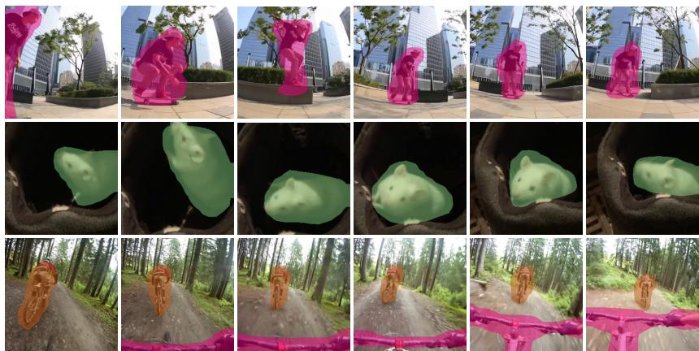
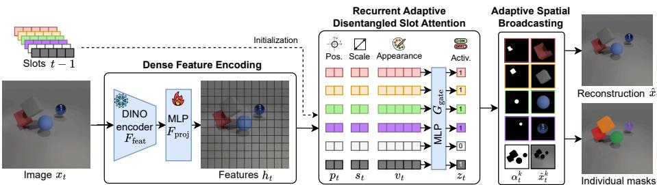
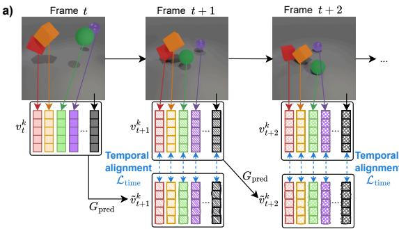
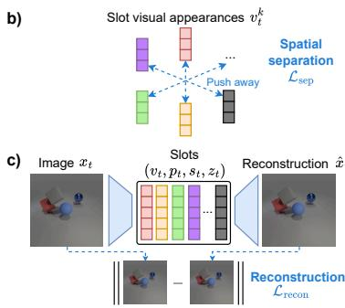
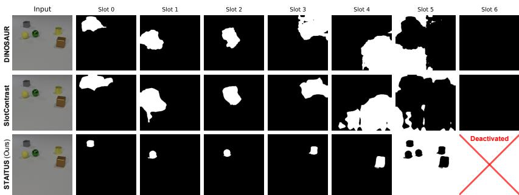
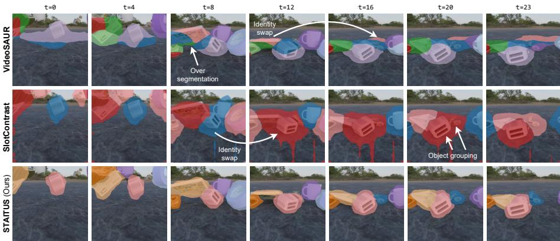
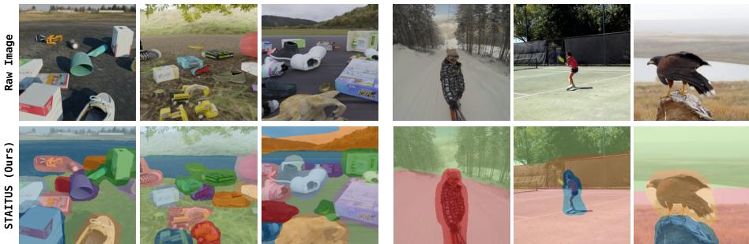

# Rethinking Object-Centric Representations for Video Dynamics Modeling

Amaury Wei , Ismail Nejjar , and Olga Fink

Intelligent Maintenance and Operation Systems (IMOS) École Polytechnique Fédérale de Lausanne CH-1015 Lausanne, Switzerland {first.last}@epfl.ch

  
Fig. 1: STAITUS: Our method disentangles object appearance from spatial pose and enforces temporal alignment, enabling state-of-the-art unsupervised object tracking

Abstract. Unsupervised video object tracking aims to decompose dynamic scenes into persistent, object-centric entities without manual annotations. Many recent approaches rely on slot-based representations, where a fixed set of latent variables (“slots”) represent individual object across frames. To preserve object identity, these models enforce temporal consistency on slot embeddings. However, when appearance and pose are entangled, this consistency objective conflicts with object motion and viewpoint changes. As a result, slots tend to lock onto static regions (e.g., background) to satisfy the consistency objective, while foreground objects become fragmented across multiple slots or frequently swap identities. To address these limitations, we propose STAITUS, a unified framework that explicitly disentangles each slot into appearance and geometric pose (position/scale). Leveraging this disentanglement, STAITUS enforces within-frame spatial separation and applies temporal alignment only in appearance space, yielding sharper masks and more persistent identities under motion, occlusion, and object entry/exit. Furthermore, to mitigate over-segmentation, we introduce an adaptive gating mechanism that dynamically adjusts the number of active slots to match scene complexity. Extensive experiments on synthetic and realworld benchmarks demonstrate that STAITUS substantially outperforms state-of-the-art baselines in segmentation quality and tracking stability.

## 1 Introduction

Video understanding is a fundamental problem in computer vision, with applications ranging from robotics and autonomous driving [14,24,27] to captioning [43] and video question answering [2, 48]. Understanding videos requires identifying objects, tracking them over time, and reasoning about their interactions [48]. Object-centric representations provide a natural solution by decomposing scenes into individual entities. They have enabled progress in object-centric video prediction [32, 42, 45], causal reasoning [7, 38, 46], and planning [41, 50]. Learning these representations without supervision [40] is particularly attractive as it enables models to leverage raw video data without assuming predefined object categories or costly manual annotations.

A common strategy for unsupervised object discovery is to model a scene using a fixed set of latent variables ("slots"), each intended to capture an individual object. Early methods such as MONet [4] and Slot Attention [26] demonstrated that scenes can be decomposed into permutation-invariant latent vectors that serve as object-centric representations. Subsequent extensions improved slot expressiveness [17, 22] and separation [3, 22, 28], enabling accurate object segmentation on synthetic benchmarks [12, 48]. More recently, models such as DINOSAUR [35] leverage self-supervised vision backbones [5] to extend object discovery in real-world images [47]. However, these advances focus primarily on single images, and extending object-centric representations to video introduces additional challenges. Beyond discovering objects, models must maintain consistent identities over time as objects move, become occluded, or interact with other objects.

Several recent methods have attempted to bridge this gap by introducing temporal mechanisms into slot-based architectures. SAVi [9,21] propagates slots via recurrent updates conditioned on prior frames, while VideoSAUR [49] aligns slots by predicting DINO feature trajectories. More recently, SlotContrast [29] introduced a contrastive loss to align slot embeddings across time. While these approaches improve slot continuity, they assume that forcing stable embeddings is suficient for object-level tracking.

In practice, temporal consistency objectives are misaligned with the dynamic nature of object tracking because standard slot representations entangle object appearance with pose. As objects move, change scale, or become occluded, their pose must evolve and the embeddings should adapt, yet the training objective encourages them to remain constant. As a result, slots tend to attach to static background regions, while dynamic foreground objects drift between slots over time. This leads to background-foreground mixing, difuse object masks, and identity switching. Moreover, using a fixed number of slots can fragment a single object across multiple slots, exacerbating over-segmentation. These efects produce poorly localized and temporally unstable object representations, limiting their usefulness for downstream tasks such as video prediction, dynamics modeling, and visual reasoning.

To address these challenges, we propose STAITUS (Sparse and Temporally Aligned InvarianT Unsupervised Slots), a unified slot-based video framework for unsupervised object tracking, designed to produce sharp object masks and stable object identities. STAITUS explicitly disentangles each object’s geometric pose (position and scale) from its visual appearance, enabling cleaner object separation and unambiguous segmentation. This disentanglement further allows the introduction of two video-specific regularization mechanisms: a spatial separation loss that prevents multiple objects from collapsing into the same slot, and a temporal alignment loss that enforces consistency of each slot’s visual appearance across frames. In addition, STAITUS incorporates adaptive slot usage, deactivating redundant slots as scenes evolve and thereby preventing over-segmentation

Through extensive experiments on synthetic and real-world video benchmarks, we demonstrate that STAITUS consistently outperforms recent slotbased baselines, producing sharper object masks and significantly more stable object identities (Fig. 1). Beyond overall performance improvements, targeted ablation studies demonstrate how geometric disentanglement, adaptive slot selection, and spatio-temporal regularization jointly contribute to robust objectcentric representations. Our main contributions are summarized as follows:

1. We analyze a key failure mode of existing slot-based video models and show that enforcing temporal consistency on pose-entangled representations inherently conflicts with object motion, leading to unstable tracking.

2. We propose STAITUS, a unified slot-based video model for unsupervised object tracking that disentangles object appearance from geometric pose, enabling temporally aligned appearance modeling, spatial separation between objects, and adaptive slot usage.

3. Through extensive experiments and ablations on synthetic and real-world benchmarks, we demonstrate that STAITUS yields substantially sharper object masks and more stable identities than prior slot-based approaches.

## 2 Related Work

Unsupervised Object-centric Learning. Early work on unsupervised objectcentric learning decomposed images into candidate objects using autoencoding architectures with iterative inference. MONet [4] introduced attention-based decomposition, extracting objects sequentially and demonstrating that meaningful object representations can emerge without supervision. Subsequent approaches [10,13] improved stability and scalability. Although efective on simple scenes, these approaches often struggle to scale to visually complex images.

Slot-based Object Discovery. Building on these foundations, Slot Attention (SA) [26] introduced an attention-based mechanism that groups image features into latent "slots", establishing a central paradigm for object-centric representation learning. Later work explored mixture-based decoders [22], compositional rendering approaches [17,37], and disentangled slot representations [3,28]. Other research focused on improved training objectives, including contrastive foreground-background separation [39], and slot-mixing strategies for novel scene synthesis [18]. SPOT [19] further improved robustness through a self-training objective with patch-order permutation. Recent advances leverage vision foundation models like DINO [5], enabling methods such as DINOSAUR [35] to scale to complex, real-world images. Additional directions incorporate difusion models [1] or extend slot-based representations to multi-view 3D scenes [25]. However, these approaches are primarily designed for processing single images and do not explicitly address temporal consistency or object tracking.

Unsupervised Object Tracking in Videos. Extending object-centric learning to videos is particularly challenging, as models must both discover objects and maintain consistent associations over time in dynamic scenes. Most slotbased models approaches address this by encouraging temporal consistency of slot representations. SAVi [21] and SAVi++ [9] propagate slots recurrently across frames, conditioning them on previous embeddings. VideoSAUR [49] instead aligns slots over time by predicting the temporal evolution of DINO patch embeddings. Other methods incorporate additional modalities, such as optical flow [23], to improve tracking performance. More recently, SlotContrast [29] introduced a contrastive objective that encourages slot embeddings within batches to remain distinct while promoting temporal consistency. Although these approaches improve temporal continuity compared to frame-by-frame inference, they often fai to preserve one-to-one correspondences between slots and objects. This limitation becomes particularly pronounced in dynamic scenes, where object motion, occlusions, and interactions conflict with consistency-based training objectives.

Image Reconstruction and Slot Decoders. Most slot-based models are trained using reconstruction objectives, either in pixel space or feature space. The image decoder, which maps slot representations back to the visual signal, plays a critical yet often overlooked role in object-centric learning, as it determines how reconstruction errors are attributed to individual slots and therefore how scenes are decomposed into objects. Early approaches such as Slot Attention [26] relied on spatial broadcast decoders [44], which decode slots independently and combine them using transparency masks. Later work introduced more expressive decoders that enable interactions between slots, including autoregressive decoders [6] in SLATE [37], SlotMixer decoders [34], and Scene Representation Transformers [33]. Although these designs improve image reconstruction quality, they also allow multiple slots to jointly explain the same pixels. This directly conflicts with the objective of assigning each pixel to a single object, thereby weakening unsupervised object discovery.

## 3 Method

We propose STAITUS, a unified framework for unsupervised object tracking that decouples object identity from motion. As illustrated in Fig. 2, STAITUS integrates dense feature extraction, recurrent disentangled slot grouping, adaptive decoding, and temporal–spatial regularization to yield spatially precise and temporally consistent object-centric representations from unlabeled videos.

  
Fig. 2: Overview of STAITUS. Given a frame $x _ { t }$ , an encoder extracts dense features $h _ { t }$ , which are grouped by a recurrent module into disentangled slot representations consisting of position $\left( { p _ { t } } \right)$ , scale $\left( { { s } _ { t } } \right)$ , and visual appearance $\left( v _ { t } \right)$ components. A learned gating mechanism $G _ { \mathrm { g a t e } }$ determines slot activation $z _ { t }$ dynamically adapting the number of active slots over time. Each active slot is decoded into an image $\bar { \boldsymbol { x } } _ { t } ^ { k }$ and an alpha mask $\alpha _ { t } ^ { k }$ . The final reconstruction $\hat { x } _ { t }$ is obtained by compositing all decoded slots.

## 3.1 Problem Formulation

Given a video sequence $\mathcal { V } = \{ x _ { 1 } , \ldots , x _ { T } \}$ of $T$ frames, we denote the RGB frame at time $t \in \{ 1 , \ldots , T \}$ by $\bar { { x _ { t } } } \in \mathbb { R } ^ { H \times W \bar { \times } 3 }$ . Our objective is to decompose each frame into a set of K object-centric slot representations $S _ { t } ~ = ~ \{ S _ { t } ^ { 1 } , . . . , S _ { t } ^ { K } \}$ where each slot corresponds to an object and one slot models the background.

Existing slot-based video models [29,49] typically entangle object appearance and pose within a single slot representation. Although temporal consistency is required to preserve identities [29], enforcing it on pose-entangled slots conflicts with motion and viewpoint changes in dynamic scenes. As a result, slots often attach to static regions $( e . g .$ , background) to satisfy the temporal consistency objective, while foreground objects become fragmented or swap identities. To address this issue, we disentangle each slot $S _ { t } ^ { k }$ into appearance and geometry:

$$
S _ {t} ^ {k} = (v _ {t} ^ {k}, p _ {t} ^ {k}, s _ {t} ^ {k}), \qquad v _ {t} ^ {k} \in \mathbb {R} ^ {D}, p _ {t} ^ {k}, s _ {t} ^ {k} \in \mathbb {R} ^ {2},\tag{1}
$$

where $v _ { t } ^ { k }$ is an object-specific appearance embedding and $( p _ { t } ^ { k } , s _ { t } ^ { k } )$ denote the 2D position and scale of the slot. This disentanglement allows STAITUS to enforce temporal alignment in appearance space while allowing geometric attributes to evolve freely under motion, occlusion, and object entry or exit.

## 3.2 Dense Feature Encoder

Given a video frame $x _ { t }$ , we first extract N dense patch features $g _ { t }$ of dimension $D _ { \mathrm { f e a t } }$ using a pretrained and frozen self-supervised DINO [5] encoder $F _ { \mathrm { f e a t } }$

$$
g _ {t} = F _ {\mathrm{feat}} (x _ {t}), \quad g _ {t} \in \mathbb {R} ^ {N \times D _ {\mathrm{feat}}}.\tag{2}
$$

While DINO features capture rich semantic information from static images, they are not optimized for object-centric tasks such as localization or tracking. We, therefore, project each feature vector $g _ { t }$ into a task-specific embedding space using a lightweight two-layer MultiLayer Perceptron (MLP) $F _ { \mathrm { p r o j } }$

$$
h _ {t} = F _ {\mathrm{proj}} (g _ {t}), \quad h _ {t} \in \mathbb {R} ^ {N \times D _ {\mathrm{feat}}}.\tag{3}
$$

## 3.3 Recurrent Adaptive Disentangled Slot Attention Module

To discover and track objects consistently over time, we adopt a recurrent slot refinement mechanism similar to [21, 49]. Slots at time t are initialized from the previous state at $t - 1$ and iteratively refined using the dense features $h _ { t }$ Our grouping module produces K slot representations $\{ S _ { t } ^ { k } \} _ { k = 1 } ^ { K }$ , corresponding to individual objects and the background. It is designed to maintain temporally consistent appearance representations while dynamically adapting the number of active slots according to the scene content.

Disentangled Slot Grouping. To extract disentangled slot components $( v _ { t } ^ { k } , p _ { k } ^ { t } , s _ { k } ^ { t } )$ , we build upon Invariant Slot Attention (ISA) [3]. In contrast to vanilla SA, ISA replaces fixed global positional encodings with slot-specific reference frames derived from the slot geometry. Each slot uses its estimated posi tion and scale to center on an object and attends to pose-normalized appearance features. This produces an appearance embedding $v _ { t } ^ { k }$ that is invariant to object motion, while $( p _ { t } ^ { k } , s _ { t } ^ { k } )$ capture the object’s evolving pose for decoding (Sec. 3.4). Formally, we apply an iterative attention-based grouping module $G _ { \mathrm { s l o t } }$ for $T _ { \mathrm { s l o t } }$ refinement steps. To incorporate temporal context, slots at time t are initialized from the previous frame using a predictor $G _ { \mathrm { p r e d } }$ , yielding predicted slot states $\tilde { S } _ { t } ^ { k } = ( \tilde { v } _ { t } ^ { k } , \tilde { p } _ { t } ^ { k } , \tilde { s } _ { t } ^ { k } )$ (detailed next). The grouping step then refines them as:

$$
\{(v _ {t} ^ {k}, p _ {t} ^ {k}, s _ {t} ^ {k}) \} _ {k = 1} ^ {K} = G _ {\mathrm{slot}} (h _ {t}, \tilde {S} _ {t})\tag{4}
$$

During training, we additionally enforce temporal alignment on appearance embeddings and apply a spatial separation loss to prevent slot redundancy (Sec. 3.5). Details and a pseudocode for $G _ { \mathrm { s l o t } }$ are provided in Supplementary.

Recurrent Slot Attention Formulation. To connect consecutive frames, we initialize slots at time t from the refined slot states at time t−1. We compute predicted states $\tilde { S } _ { t } ^ { k } = ( \tilde { v } _ { t } ^ { k } , \tilde { p } _ { t } ^ { k } , \tilde { s } _ { t } ^ { k } )$ , which serve as the initialization for the grouping step in Eq. (4). We treat appearance and pose diferently. The appearance embedding is predicted to accommodate gradual appearance changes and the emergence of new objects [45], while pose is propagated forward under a smooth-motion assumption. Specifically, a residual MLP $G _ { \mathrm { p r e d } }$ predicts a Gaussian distribution over the next-step appearance:

$$
(\mu_ {t} ^ {k}, \log \sigma_ {t} ^ {k}) = G _ {\mathrm{pred}} (v _ {t - 1} ^ {k}), \qquad \tilde {v} _ {t} ^ {k} \sim \mathcal {N} (\mu_ {t} ^ {k}, \sigma_ {t} ^ {k}),\tag{5}
$$

$$
(\tilde {p} _ {t} ^ {k}, \tilde {s} _ {t} ^ {k}) = (p _ {t - 1} ^ {k}, s _ {t - 1} ^ {k}).\tag{6}
$$

Gradients are propagated using the reparameterization trick [20]. For $t { = } 1$ , all slot components are initialized from learned embeddings.

Adaptive Slot Activation. Scenes contain a varying number of objects, yet most slot-based models enforce a fixed number of slots K for every frame, often leading to over-segmentation. Inspired by AdaSlot [11], STAITUS dynamically determines which slots are active at each timestep, adapting slot usage to the scene content.

Specifically, for each slot appearance embedding $v _ { t } ^ { k }$ , a lightweight MLP $G _ { \mathrm { g a t e } }$ predicts a binary activation variable:

$$
z _ {t} ^ {k} = G _ {\mathrm{gate}} (v _ {t} ^ {k}), \quad z _ {t} ^ {k} \in \{0, 1 \}.\tag{7}
$$

The gating decision depends solely on appearance, allowing the model to suppress visually redundant slots while remaining invariant to object motion and position. Only slots with $z _ { t } ^ { k } = 1$ participate in image reconstruction (Sec. 3.4), while inactive slots are ignored. To enable end-to-end learning, we use the Gumbel–Softmax relaxation [16] during training.

## 3.4 Adaptive Spatial Broadcast Decoding

After slot decomposition, the model reconstructs the input RGB frame, which serves as the primary unsupervised learning signal. To obtain meaningful objectcentric representations, reconstruction should preserve sharp object boundaries and assign each pixel predominantly to a single slot. We therefore decode slots independently and avoid inter-slot feature mixing, which often leads to blurry masks. For this purpose, we adopt a spatial broadcast decoding strategy [44].

A shared decoder $D _ { \mathrm { s p a t i a l } }$ maps each slot representation to a full-frame RGB reconstruction $\hat { x } _ { t } ^ { k } \in \mathbb { R } ^ { H \times W \times 3 }$ and an alpha mask $\alpha _ { t } ^ { k } \in \mathbb { R } ^ { H \times W }$ . Internally, the decoder uses the disentangled geometric parameters $( p _ { t } ^ { k } , s _ { t } ^ { k } )$ to construct a slot specific coordinate grid as positional embedding, following ISA [3]. The per-slot decoding operation is:

$$
(\hat {x} _ {t} ^ {k}, \alpha_ {t} ^ {k}) = D _ {\mathrm{spatial}} \big (\mathrm{SB} (v _ {t} ^ {k}), p _ {t} ^ {k}, s _ {t} ^ {k} \big),\tag{8}
$$

where $D _ { \mathrm { s p a t i a l } }$ is a CNN-based decoder, SB is the spatial broadcast operation, and $( p _ { t } ^ { k } , \bar { s } _ { t } ^ { k } )$ parametrize the relative coordinate grid. Implementation details of $D _ { \mathrm { s p a t i a l } }$ are provided in the Supplementary Material.

The final frame reconstruction is obtained by compositing all active slots:

$$
\hat {x} _ {t} = \sum_ {k = 1} ^ {K} z _ {t} ^ {k} \cdot \alpha_ {t} ^ {k} \odot \hat {x} _ {t} ^ {k}.\tag{9}
$$

The final reconstruction $\hat { x } _ { t }$ is used to train end-to-end using a pixel-wise Mean Squared Error (MSE) loss, $\mathcal { L } _ { \mathrm { r e c o n } } = \mathbb { E } \left[ \| x _ { t } - \hat { x } _ { t } \| _ { 2 } ^ { 2 } \right]$ , averaged over pixel and color channels, which serves as the primary unsupervised learning objective.

## 3.5 Temporal Alignment and Spatial Separation Objectives

To guide unsupervised learning toward stable and well-separated object representations, we introduce two complementary objectives: a temporal alignment loss and a spatial separation loss. Both operate on the slot appearance embed dings $\{ v _ { t } ^ { k } \} _ { k = 1 } ^ { \bar { K } }$ , and Fig. 3 provides a visual illustration of their efects.

  
Fig. 3: Illustration of the training objectives. a) Temporal alignment loss $\mathcal { L } _ { \mathrm { t i m e } }$ en courages consistent slot appearance across consecutive frames. b) Spatial separation loss $\mathcal { L } _ { \mathrm { s e p } }$ encourages distinct slot appearances $v _ { t } ^ { k }$ in embedding space. c) Reconstruc tion loss $\mathcal { L } _ { \mathrm { r e c o n } }$ drives scene decomposition by minimizing the error between the input frame $x _ { t }$ and its composited reconstruction $\hat { x } _ { t }$

Temporal Alignment Loss. For reliable object tracking, the same object should remain assigned to the same slot across consecutive frames. This requires each slot to maintain a consistent appearance appearance $v ^ { k }$ over time, even as its pose changes. To encourage this behavior, we introduce a temporal alignment loss that regularizes consecutive slot appearance embeddings using cosine similarity:

$$
\mathcal {L} _ {\mathrm{time}} = \frac {\sum_ {t , k} z _ {t - 1} ^ {k} z _ {t} ^ {k} \left(1 - \cos \left(\tilde {v} _ {t} ^ {k} , v _ {t} ^ {k}\right)\right)}{\sum_ {t , k} z _ {t - 1} ^ {k} z _ {t} ^ {k}}\tag{10}
$$

The product $z _ { t - 1 } ^ { k } z _ { t } ^ { k }$ ensures that only slots active at both timesteps contribute to the loss. Unlike SlotContrast [29], which aligns a fixed set of pose-entangled slots, our alignment operates exclusively in disentangled appearance space and only for active slots. This allows pose attributes to evolve freely under motion while naturally supporting slot deactivation when objects enter or leave the scene.

Spatial Separation Loss. Within each frame, distinct objects should be represented by diferent slots. Without explicit regularization, however, multiple slots may collapse onto the same object or encode overlapping regions. To promote slot specialization, we introduce a spatial separation loss that discourages similar appearance embeddings among active slots by penalizing positive cosine similarity. Slots representing distinct objects incur no penalty, whereas slots encoding similar visual content are pushed apart or encouraged to deactivate.

$$
\mathcal {L} _ {\mathrm{sep}} = \frac {\sum_ {t} \sum_ {i \neq j} z _ {t} ^ {i} z _ {t} ^ {j} \max \Big (0 , \cos \Big (v _ {t} ^ {i} , v _ {t} ^ {j} \Big) \Big)}{\sum_ {t} \sum_ {i \neq j} z _ {t} ^ {i} z _ {t} ^ {j}}\tag{11}
$$

The product $z _ { t } ^ { i } z _ { t } ^ { j }$ ensures that only pairs of active slots contribute to the loss. Unlike SlotContrast [29], our loss acts solely on appearance embeddings, preventing nearby objects with similar poses from being grouped into a single slot (see

Sec. 5.3). Furthermore, SlotContrast relies on a batch-wise contrastive objective that introduces global competition across videos and can destabilize optimization, whereas our separation loss is computed locally within each frame and integrates naturally with adaptive slot activation.

Training Objective. The full training objective combines the reconstruction loss with the proposed regularization terms:

$$
\mathcal {L} = \mathcal {L} _ {\mathrm{recon}} + \lambda_ {\mathrm{time}} \mathcal {L} _ {\mathrm{time}} + \lambda_ {\mathrm{sep}} \mathcal {L} _ {\mathrm{sep}} + \lambda_ {\mathrm{spars}} \mathcal {L} _ {\mathrm{spars}}\tag{12}
$$

where $\mathcal { L } _ { \mathrm { s p a r s } } = \mathbb { E } _ { t , k } \left[ z _ { t } ^ { k } \right]$ is a sparsity regularizer that encourages the model to activate only the required number of slots at each timestep.

## 4 Experiments

We evaluate STAITUS on both unsupervised object discovery and segmentationbased object tracking across synthetic video benchmarks and real-world datasets. We evaluate the method along three dimensions: mask sharpness, foregroundbackground separation, and identity stability over time.

Datasets. We evaluate our method on synthetic datasets, including CLEVRER and the MOVi benchmark suite (MOVi-A, MOVi-B, MOVi-C, MOVi-E) [12], which provide increasing scene complexity in terms of object count, appearance, and motion dynamics. To assess scalability to real-world videos, we additionally evaluate on the YouTube-VIS 2021 dataset [47], featuring unconstrained scenes with camera motion, occlusions, and background clutter. Representative video examples are provided in the Supplementary Material.

Metrics. We report complementary metrics to evaluate both segmentation quality and tracking performance (Sec. 5). FG-ARI (Foreground Adjusted Rand Index) [15,31] measures foreground object discovery, while full ARI additionally reflects background segmentation quality. We further report mean Best Overlap (mBO) [30] to assess mask sharpness and boundary precision. All metrics are computed both per frame and across full video sequences.

Baselines. We compare STAITUS with image-based methods Invariant Slot Attention (ISA) [3], Adaptive Slot Attention (AdaSlot) [11], and DINOSAUR [35], as well as video-based methods SAVi [21], VideoSAUR [49], and SlotCon trast [29]. All baselines are evaluated using their oficial implementations, and feature encoders are matched whenever required to ensure a fair comparison.

Implementation Details. We use a single set of hyperparameters across al datasets to highlight the robustness of our approach. We employ DINO ViT-B/16 as the feature encoder, set the slot dimension to $ { D _ { \mathrm { s l o t } } } \mathrm { = } 1 2 8$ , and use $T _ { \mathrm { s l o t s } } { = } 2$ slot attention iterations. All experiments are conducted at the native resolution of the MOVi datasets (256, 256), resulting in N=256 patch tokens. Additional training details and hyperparameters are provided in the Supplementary Material.

## 5 Results

## 5.1 Unsupervised Object Discovery

Across all datasets, STAITUS consistently outperforms both image-based and video-based baselines in per-image object discovery, achieving the highest ARI and mBO on nearly all benchmarks (Tab. 1). The strong ARI reflects improved foreground–background separation, while the high mBO indicates sharper object boundaries. Notably, STAITUS maintains high FG-ARI while simultaneously improving full ARI, whereas prior methods typically trade foreground grouping against background separation. These improvements persist from simple to complex scenes (CLEVRER to MOVi-E), and extend to the challenging real-world YouTube-VIS benchmark, demonstrating the robustness of our disentangled and adaptive architecture. Qualitative comparisons are shown in Sec. 5.3.

Table 1: Object discovery (per-image) results. Metrics are computed for entire video sequences (24 frames for CLEVRER and MOVi, up to 84 frames for YouTube-VIS). Best results are shown in bold, and second-best are underlined.

<table><tr><td rowspan="2">Method</td><td colspan="3">CLEVRER</td><td colspan="3">MOVi-A</td><td colspan="3">MOVi-B</td></tr><tr><td>ARI↑</td><td>FG-ARI↑</td><td>mBO↑</td><td>ARI↑</td><td>FG-ARI↑</td><td>mBO↑</td><td>ARI↑</td><td>FG-ARI↑</td><td>mBO↑</td></tr><tr><td>DINOSAUR [35]</td><td>0.05</td><td>0.97</td><td>0.15</td><td>0.04</td><td>0.95</td><td>0.17</td><td>0.07</td><td>0.86</td><td>0.25</td></tr><tr><td>ISA [3]</td><td>0.03</td><td>0.85</td><td>0.16</td><td>0.23</td><td>0.81</td><td>0.59</td><td>0.63</td><td>0.56</td><td>0.55</td></tr><tr><td>AdaSlot [11]</td><td>0.02</td><td>0.34</td><td>0.06</td><td>0.07</td><td>0.40</td><td>0.09</td><td>0.45</td><td>0.38</td><td>0.21</td></tr><tr><td>SAVi [21]</td><td>0.01</td><td>0.41</td><td>0.07</td><td>0.02</td><td>0.41</td><td>0.07</td><td>0.18</td><td>0.48</td><td>0.26</td></tr><tr><td>VideoSAUR [11]</td><td>0.37</td><td>0.28</td><td>0.18</td><td>0.07</td><td>0.50</td><td>0.20</td><td>0.22</td><td>0.53</td><td>0.22</td></tr><tr><td>SlotContrast [29]</td><td>0.05</td><td>0.96</td><td>0.12</td><td>0.19</td><td>0.93</td><td>0.20</td><td>0.15</td><td>0.89</td><td>0.27</td></tr><tr><td>STAITUS (Ours)</td><td>0.86</td><td>0.91</td><td>0.84</td><td>0.88</td><td>0.84</td><td>0.65</td><td>0.65</td><td>0.65</td><td>0.57</td></tr><tr><td></td><td colspan="3">MOVi-C</td><td colspan="3">MOVi-E</td><td colspan="3">YouTube-VIS</td></tr><tr><td>DINOSAUR [35]</td><td>0.15</td><td>0.65</td><td>0.40</td><td>0.13</td><td>0.61</td><td>0.38</td><td>0.18</td><td>0.22</td><td>0.50</td></tr><tr><td>ISA [3]</td><td>0.15</td><td>0.61</td><td>0.39</td><td>0.15</td><td>0.70</td><td>0.31</td><td>0.18</td><td>0.23</td><td>0.53</td></tr><tr><td>AdaSlot [11]</td><td>0.02</td><td>0.21</td><td>0.04</td><td>0.07</td><td>0.20</td><td>0.09</td><td>0.08</td><td>0.14</td><td>0.26</td></tr><tr><td>SAVi [21]</td><td>0.06</td><td>0.47</td><td>0.22</td><td>0.01</td><td>0.61</td><td>0.29</td><td>0.05</td><td>0.18</td><td>0.23</td></tr><tr><td>VideoSAUR [11]</td><td>0.24</td><td>0.73</td><td>0.43</td><td>0.25</td><td>0.66</td><td>0.33</td><td>0.16</td><td>0.23</td><td>0.44</td></tr><tr><td>SlotContrast [29]</td><td>0.11</td><td>0.71</td><td>0.23</td><td>0.20</td><td>0.77</td><td>0.30</td><td>0.16</td><td>0.28</td><td>0.40</td></tr><tr><td>STAITUS (Ours)</td><td>0.50</td><td>0.77</td><td>0.44</td><td>0.38</td><td>0.81</td><td>0.34</td><td>0.25</td><td>0.32</td><td>0.46</td></tr></table>

## 5.2 Unsupervised Segmentation-Based Object Tracking

Building on its strong per-image decomposition, STAITUS also excels in segmentation based object tracking. Across all datasets, it preserves consistent slot–object identities over video sequences, avoiding slot swapping and background mixing. As shown in Tab. 2, ARI and mBO remain high with only minor degradation relative to per-frame results (Tab. 1), even under object motion, occlusion, scene changes, and camera movements.

While SAVi and VideoSAUR achieve reasonable per-frame decompositions, they struggle to maintain object identities over time, leading to substantia drops (often exceeding 30%) in ARI or FG-ARI. SlotContrast improves temporal consistency but often merges nearby objects into a single slot (see Sec. 5.3).

Table 2: Object tracking results. Metrics are computed on 24-frame video clips (using the first 24 frames for YouTube-VIS). Best results are shown in bold, and second-best are underlined.

<table><tr><td rowspan="2">Method</td><td colspan="3">CLEVRER</td><td colspan="3">MOVi-A</td><td colspan="3">MOVi-B</td></tr><tr><td>ARI↑</td><td>FG-ARI↑</td><td>mBO↑</td><td>ARI↑</td><td>FG-ARI↑</td><td>mBO↑</td><td>ARI↑</td><td>FG-ARI↑</td><td>mBO↑</td></tr><tr><td>SAVi [21]</td><td>0.00</td><td>0.24</td><td>0.05</td><td>0.00</td><td>0.08</td><td>0.03</td><td>0.14</td><td>0.27</td><td>0.15</td></tr><tr><td>VideoSAUR [11]</td><td>0.00</td><td>0.16</td><td>0.03</td><td>0.19</td><td>0.30</td><td>0.15</td><td>0.18</td><td>0.27</td><td>0.14</td></tr><tr><td>SlotContrast [29]</td><td>0.04</td><td>0.62</td><td>0.09</td><td>0.18</td><td>0.91</td><td>0.19</td><td>0.15</td><td>0.83</td><td>0.27</td></tr><tr><td>STAITUS (Ours)</td><td>0.88</td><td>0.76</td><td>0.65</td><td>0.88</td><td>0.78</td><td>0.63</td><td>0.73</td><td>0.54</td><td>0.50</td></tr><tr><td></td><td colspan="3">MOVi-C</td><td colspan="3">MOVi-E</td><td colspan="3">YouTube-VIS</td></tr><tr><td>SAVi [21]</td><td>0.01</td><td>0.14</td><td>0.08</td><td>0.00</td><td>0.23</td><td>0.10</td><td>0.03</td><td>0.11</td><td>0.18</td></tr><tr><td>VideoSAUR [11]</td><td>0.22</td><td>0.61</td><td>0.33</td><td>0.24</td><td>0.59</td><td>0.25</td><td>0.14</td><td>0.19</td><td>0.38</td></tr><tr><td>SlotContrast [29]</td><td>0.10</td><td>0.57</td><td>0.27</td><td>0.20</td><td>0.74</td><td>0.26</td><td>0.14</td><td>0.23</td><td>0.36</td></tr><tr><td>STAITUS (Ours)</td><td>0.48</td><td>0.65</td><td>0.35</td><td>0.25</td><td>0.78</td><td>0.28</td><td>0.23</td><td>0.25</td><td>0.44</td></tr></table>

In contrast, STAITUS preserves both object separation and identity across simple CLEVRER scenes, dense MOVi-E sequences, and real-world YouTube-VIS videos, demonstrating that appearance–pose disentanglement provides a strong inductive bias for unsupervised tracking.

## 5.3 Qualitative Results

We provide qualitative comparisons to illustrate how STAITUS improves object discovery and tracking beyond what is captured by aggregate metrics.

Sharp and Compact Masks. Figure 4 shows example decompositions on a CLEVRER frame. DINOSAUR and SlotContrast successfully extract foreground objects in slots 0−4, but their masks exhibit substantial background leakage and difuse boundaries. Moreover, the background is split between slots 4−5, explaining the high FG-ARI yet low full ARI results observed in Tab. 1.

In contrast, STAITUS produces compact masks with sharp boundaries: each slot cleanly isolates a single object, and unused slot are automatically deactivated (slot 6). This visual evidence supports the ARI and mBO improvements reported in Tab. 1, confirming that the proposed appearance-pose disentanglement and the spatial separation loss promote precise object-specific segmentation.

Temporal Identity Consistency. Figure 5 presents an object tracking example on a MOVi-C video. Beyond background leakage in the masks, VideoSAUR sufers from over-segmentation in several frames $( e . g . , t = \{ 0 , 4 , 8 \} )$ ) and fails to maintain object identity between t = 12 and t = 16. In comparison, SlotContrast preserves identities more consistently but merges distinct objects into a single slot $( e . g . , t = \{ 8 , 1 2 , 1 6 \} )$

In contrast, STAITUS maintains stable slot–object correspondence throughout the entire sequence, preserving object identities under motion, overlap, and partial occlusion. These observations are consistent with the strong tracking performance in Tab. 2 and demonstrate that aligning appearance space while allowing pose to evolve freely provides a robust inductive bias for unsupervised object tracking.

  
Fig. 4: Unsupervised scene decomposition on CLEVRER. We compare the segmenta tion masks generated by DINOSAUR, SlotContrast, and STAITUS on a sample frame. STAITUS produces significantly sharper and more precise masks, successfully isolating individual objects with minimal background leakage.

  
Fig. 5: Qualitative comparison of unsupervised object tracking in MOVi-C. The baselines exhibit identity swaps, over-segmentation (splitting single objects), and object grouping (merging distinct objects). In contrast, STAITUS maintains robust object identities and sharp segmentation boundaries across the entire sequence.

These visual results highlight that STAITUS not only improves quantitative metrics but also produces cleaner decompositions and more reliable long-term object identity tracking in challenging dynamic scenes.

## 5.4 Ablation Studies

Ablation of Loss Components. We systematically ablate each regularization term to assess its necessity (Tab. 3). Removing any component degrades performance, confirming that STAITUS relies on complementary constraints rather than a single dominant loss. Using only reconstruction leads to a collapse in performance (e.g., CLEVRER ARI: 0.88 → 0.21), showing that reconstruction alone is insuficient to learn stable object-centric representations.

Removing temporal alignment mainly afects tracking under motion and oc clusion, with a drastic drop on MOVi-C (0.48 → 0.06 ARI) but only minor changes on YouTube-VIS, where errors are dominated by visual complexity rather than identity drift. Removing $\mathcal { L } _ { \mathrm { s e p } }$ causes slot collapse and degraded de composition, notably on MOVi-C (0.48 → 0.15 ARI). Finally, removing $\mathcal { L } _ { \mathrm { s p a r s } }$ causes over-segmentation and weaker foreground–background separation, most evident on YouTube-VIS $( 0 . 2 3  0 . 1 4 ~ \mathrm { A R I } )$

Table 3: Ablation of loss components on the object tracking task. Each row removes one component from the full objective. Metrics are computed over 24-frame video clips.

<table><tr><td rowspan="2">Method</td><td colspan="3">CLEVRER</td><td colspan="3">MOVi-C</td><td colspan="3">YouTube-VIS</td></tr><tr><td>ARI↑</td><td>FG-ARI↑</td><td>mBO↑</td><td>ARI↑</td><td>FG-ARI↑</td><td>mBO↑</td><td>ARI↑</td><td>FG-ARI↑</td><td>mBO↑</td></tr><tr><td>No regularization</td><td>0.21</td><td>0.76</td><td>0.42</td><td>0.12</td><td>0.59</td><td>0.29</td><td>0.06</td><td>0.18</td><td>0.26</td></tr><tr><td>No alignment  $\mathcal{L}_{\text{time}}$ </td><td>0.16</td><td>0.72</td><td>0.59</td><td>0.06</td><td>0.36</td><td>0.12</td><td>0.23</td><td>0.23</td><td>0.43</td></tr><tr><td>No separation  $\mathcal{L}_{\text{sep}}$ </td><td>0.84</td><td>0.76</td><td>0.57</td><td>0.15</td><td>0.47</td><td>0.26</td><td>0.22</td><td>0.25</td><td>0.42</td></tr><tr><td>No sparsity  $\mathcal{L}_{\text{spars}}$ </td><td>0.86</td><td>0.76</td><td>0.65</td><td>0.11</td><td>0.63</td><td>0.34</td><td>0.14</td><td>0.21</td><td>0.36</td></tr><tr><td>Complete model</td><td>0.88</td><td>0.76</td><td>0.65</td><td>0.48</td><td>0.65</td><td>0.35</td><td>0.23</td><td>0.25</td><td>0.44</td></tr></table>

These results highlight complementary roles: temporal alignment is critica under motion and occlusion (MOVi-C), whereas separation and sparsity are most important in visually complex and cluttered scenes (YouTube-VIS). The full model consistently achieves the best performance across datasets. Qualitative visualizations are provided in the Supplementary Material.

Sensitivity to Feature Encoder. STAITUS remains robust to the choice of pretrained visual backbone. Table 4 shows that performance varies only moderately across encoders, while the relative ranking of datasets and metrics remains stable. This indicates that STAITUS does not depend on a specific pretrained representation yet can still benefit from stronger visual features. In particular, DINOv3 achieves the best overall ARI and mBO scores, demonstrating that improved encoders translate into measurable gains. For fair comparison with prior slot-based work, we adopt DINOv1 in the main experiments.

Table 4: Performance of STAITUS using diferent pretrained DINO feature encoders on the object tracking task. Results are reported on 24-frame video clips.

<table><tr><td rowspan="2">Method</td><td colspan="3">CLEVRER</td><td colspan="3">MOVi-C</td><td colspan="3">YouTube-VIS</td></tr><tr><td>ARI↑</td><td>FG-ARI↑</td><td>mBO↑</td><td>ARI↑</td><td>FG-ARI↑</td><td>mBO↑</td><td>ARI↑</td><td>FG-ARI↑</td><td>mBO↑</td></tr><tr><td>DINOv1 [5]</td><td>0.88</td><td>0.76</td><td>0.65</td><td>0.48</td><td>0.65</td><td>0.35</td><td>0.23</td><td>0.25</td><td>0.44</td></tr><tr><td>DINOv2 [8]</td><td>0.85</td><td>0.74</td><td>0.64</td><td>0.42</td><td>0.53</td><td>0.31</td><td>0.20</td><td>0.21</td><td>0.35</td></tr><tr><td>DINOv3 [36]</td><td>0.90</td><td>0.76</td><td>0.68</td><td>0.25</td><td>0.68</td><td>0.37</td><td>0.20</td><td>0.28</td><td>0.43</td></tr></table>

## 6 Discussion

STAITUS exposes a core misalignment in prior slot-based video models: enforcing temporal consistency on pose-entangled representations creates an inherent conflict between identity preservation and motion. Our findings indicate that stable object-centric learning depends on structuring the latent space so that appearance and pose are disentangled, allowing temporal constraints to operate in a semantically meaningful subspace. Crucially, restructuring alone is insuficient: explicit regularization during training is required to guide the slot representations toward stable solutions.

  
Fig. 6: Qualitative slot decomposition on MOVi-E and YouTubeVIS. While STAI-TUS accurately segments foreground objects, it occasionally decomposes complex back grounds into distinct semantic regions (e.g., separating forest from snow).

The qualitative behavior of STAITUS further reveals interesting structura properties. On photo-realistic and real-world data, STAITUS occasionally splits visually distinct background regions into separate slots (Fig. 6). For instance, the snowboarder background is partitioned into snow and forest regions, while the tennis background is split into court, fence, and trees. In MOVi-E, background regions are often separated according to depth. This behavior reflects the model’s bias toward grouping regions with consistent appearance and geometry, even when such regions belong to the semantic background.

On real-world videos, mask boundaries are less precise under strong texture or illumination changes, revealing limits in the current feature representation and decoder. More broadly, the reconstruction objective introduces an inherent tradeof: encouraging high-fidelity reconstruction promotes sharp masks, but leads to over-segmentation of heterogeneous background regions. Finally, while STAITUS maintains identity over moderate temporal horizons, extending stability to very long sequences remains an open challenge.

Future work could explore explicit background modeling to prevent back ground fragmentation, and more expressive decoding strategies to refine realworld mask boundaries.

## 7 Conclusion

We introduce STAITUS, a unified framework for unsupervised video objectcentric learning that resolves a key misalignment in prior slot-based models between temporal consistency and object motion. By disentangling appearance from pose and aligning slots only in appearance space, STAITUS preserves identity without constraining geometric evolution. Combined with adaptive slot usage and spatial separation, this structured formulation yields sharper decompositions and more stable tracking across both synthetic and real-world datasets.

More broadly, our results indicate that stable unsupervised object tracking depends less on increasing architectural complexity and more on imposing semantically meaningful structure on the latent space.

## References

1. Akan, K., Yemez, Y.: Slot-guided adaptation of pre-trained difusion models for object-centric learning and compositional generation. In: ICLR (2025) 4

2. Antol, S., Agrawal, A., Lu, J., Mitchell, M., Batra, D., Zitnick, C.L., Parikh, D.: VQA: Visual question answering. In: ICCV. pp. 2425–2433 (2015) 2

3. Biza, O., van Steenkiste, S., Sajjadi, M.S., Mahendran, A., Kipf, T.: Invariant slot attention: Object discovery with slot-centric reference frames. In: ICML. pp. 2507–2527 (2023) 2, 3, 6, 7, 9, 10

4. Burgess, C.P., Matthey, L., Watters, N., Kabra, R., Higgins, I., Botvinick, M., Lerchner, A.: MONet: Unsupervised scene decomposition and representation. arXiv preprint arXiv:1901.11390 (2019) 2, 3

5. Caron, M., Touvron, H., Misra, I., Jégou, H., Mairal, J., Bojanowski, P., Joulin, A.: Emerging properties in self-supervised vision transformers. In: ICCV. pp. 9650– 9660 (October 2021) 2, 4, 5, 13

6. Chen, M., Radford, A., Child, R., Wu, J., Jun, H., Luan, D., Sutskever, I.: Gener ative pretraining from pixels. In: ICML. pp. 1691–1703 (2020) 4

7. Chen, Z., Dong, S., Yi, K., Li, Y., Ding, M., Torralba, A., Tenenbaum, J.B., Gan, C.: Compositional physical reasoning of objects and events from videos. IEEE TPAMI 47(9), 7689–7703 (2025) 2

8. Darcet, T., Oquab, M., Mairal, J., Bojanowski, P.: Vision transformers need registers. In: ICLR (2024) 13

9. Elsayed, G.F., Mahendran, A., van Steenkiste, S., Gref, K., Mozer, M.C., Kipf, T.: SAVi++: Towards end-to-end object-centric learning from real-world videos. In: NeurIPS (2022) 2, 4

10. Engelcke, M., Kosiorek, A.R., Jones, O.P., Posner, I.: GENESIS: Generative scene inference and sampling with object-centric latent representations. In: ICLR (2020) 3

11. Fan, K., Bai, Z., Xiao, T., He, T., Horn, M., Fu, Y., Locatello, F., Zhang, Z.: Adaptive slot attention: Object discovery with dynamic slot number. In: CVPR. pp. 23062–23071 (2024) 6, 9, 10, 11

12. Gref, K., Belletti, F., Beyer, L., Doersch, C., Du, Y., Duckworth, D., Fleet, D.J., Gnanapragasam, D., Golemo, F., Herrmann, C., Kipf, T., Kundu, A., Lagun, D., Laradji, I., Liu, H.T.D., Meyer, H., Miao, Y., Nowrouzezahrai, D., Oztireli, C., Pot, E., Radwan, N., Rebain, D., Sabour, S., Sajjadi, M.S.M., Sela, M., Sitzmann, V., Stone, A., Sun, D., Vora, S., Wang, Z., Wu, T., Yi, K.M., Zhong, F., Tagliasacchi, A.: Kubric: A scalable dataset generator. In: CVPR. pp. 3749–3761 (2022) 2, 9

13. Gref, K., Kaufman, R.L., Kabra, R., Watters, N., Burgess, C., Zoran, D., Matthey, L., Botvinick, M., Lerchner, A.: Multi-object representation learning with iterative variational inference. In: ICML (2019) 3

14. Hamdan, S., Güney, F.: CarFormer: Self-driving with learned object-centric representations. In: ECCV. pp. 177–193. Springer (2024) 2

15. Hubert, L., Arabie, P.: Comparing partitions. Journal of classification 2(1), 193– 218 (1985) 9

16. Jang, E., Gu, S., Poole, B.: Categorical reparameterization with Gumbel-Softmax. In: ICLR (2017) 7

17. Jiang, J., Deng, F., Singh, G., Ahn, S.: Object-centric slot difusion. In: NeurIPS. vol. 37 (2023) 2, 3

18. Jung, W., Yoo, J., Ahn, S., Hong, S.: Learning to compose: Improving object centric learning by injecting compositionality. In: ICLR (2024) 4

19. Kakogeorgiou, I., Gidaris, S., Karantzalos, K., Komodakis, N.: SPOT: Self-training with patch-order permutation for object-centric learning with autoregressive transformers. In: CVPR. pp. 22776–22786 (2024) 4

20. Kingma, D.P., Welling, M.: Auto-encoding variational Bayes. In: ICLR (2014) 6

21. Kipf, T., Elsayed, G.F., Mahendran, A., Stone, A., Sabour, S., Heigold, G., Jonschkowski, R., Dosovitskiy, A., Gref, K.: Conditional object-centric learning from video. In: ICLR (2022) 2, 4, 6, 9, 10, 11

22. Kirilenko, D., Vorobyov, V., Kovalev, A., Panov, A.: Object-Centric Learning with Slot Mixture Module. In: ICLR (2024) 2, 3

23. Lee, M., Cho, S., Lee, D., Park, C., Lee, J., Lee, S.: Guided slot attention for unsupervised video object segmentation. In: CVPR. pp. 3807–3816 (2024) 4

24. Liu, D., Cui, Y., Chen, Y., Zhang, J., Fan, B.: Video object detection for autonomous driving: Motion-aid feature calibration. Neurocomputing 409, 1–1 (2020) 2

25. Liu, Y., Jia, B., Chen, Y., Huang, S.: SlotLifter: Slot-guided feature lifting for learning object-centric radiance fields. In: ECCV. pp. 270–288 (2024) 4

26. Locatello, F., Weissenborn, D., Unterthiner, T., Mahendran, A., Heigold, G., Uszkoreit, J., Dosovitskiy, A., Kipf, T.: Object-centric learning with slot attention. In: Larochelle, H., Ranzato, M., Hadsell, R., Balcan, M., Lin, H. (eds.) NeurIPS. vol. 33, pp. 11525–11538 (2020) 2, 3, 4

27. Maddern, W., Pascoe, G., Linegar, C., Newman, P.: 1 year, 1000 km: The Oxford RobotCar dataset. The International Journal of Robotics Research 36(1), 3–15 (2017) 2

28. Majellaro, R., Collu, J., Plaat, A., Moerland, T.M.: Explicitly disentangled representations in object-centric learning. TMLR (2025) 2, 3

29. Manasyan, A., Seitzer, M., Radovic, F., Martius, G., Zadaianchuk, A.: Temporally consistent object-centric learning by contrasting slots. In: CVPR. pp. 5401–5411 (2025) 2, 4, 5, 8, 9, 10, 11

30. Pont-Tuset, J., Arbelaez, P., Barron, J.T., Marques, F., Malik, J.: Multiscale combinatorial grouping for image segmentation and object proposal generation. IEEE transactions on pattern analysis and machine intelligence 39(1), 128–140 (2016) 9

31. Rand, W.M.: Objective criteria for the evaluation of clustering methods. Journa of the American Statistical association 66(336), 846–850 (1971) 9

32. Rezazadeh, A., Badithela, A., Desingh, K., Choi, C.: SlotGNN: Unsupervised discovery of multi-object representations and visual dynamics. In: ICRA. pp. 17508– 17514 (2024) 2

33. Sajjadi, M.S.M., Meyer, H., Pot, E., Bergmann, U., Gref, K., Radwan, N., Vora, S., Lucic, M., Duckworth, D., Dosovitskiy, A., Uszkoreit, J., Funkhouser, T., Tagliasacchi, A.: Scene Representation Transformer: Geometry-Free Novel View Synthesis Through Set-Latent Scene Representations. In: CVPR (2022) 4

34. Sajjadi, M.S., Duckworth, D., Mahendran, A., Van Steenkiste, S., Pavetic, F., Lucic, M., Guibas, L.J., Gref, K., Kipf, T.: Object scene representation transformer. In: NeurIPS. vol. 35, pp. 9512–9524 (2022) 4

35. Seitzer, M., Horn, M., Zadaianchuk, A., Zietlow, D., Xiao, T., Simon-Gabriel, C.J., He, T., Zhang, Z., Schölkopf, B., Brox, T., Locatello, F.: Bridging the Gap to Real-World Object-Centric Learning. In: ICLR (2023) 2, 4, 9, 10

36. Siméoni, O., Vo, H.V., Seitzer, M., Baldassarre, F., Oquab, M., Jose, C., Khalidov, V., Szafraniec, M., Yi, S., Ramamonjisoa, M., Massa, F., Haziza, D., Wehrstedt, L., Wang, J., Darcet, T., Moutakanni, T., Sentana, L., Roberts, C., Vedaldi, A., Tolan, J., Brandt, J., Couprie, C., Mairal, J., Jégou, H., Labatut, P., Bojanowski, P.: DINOv3. arXiv preprint arXiv:2508.10104 (2025) 13

37. Singh, G., Deng, F., Ahn, S.: Illiterate DALL-E learns to compose. In: ICLR (2022) 3, 4

38. Tang, Q., Zhu, X., Lei, Z., Zhang, Z.: Intrinsic physical concepts discovery with object-centric predictive models. In: CVPR. pp. 23252–23261 (2023) 2

39. Tian, P., Yang, S., Yu, H., Kot, A.: Pay attention to the foreground in object-centric learning. In: CVPR. pp. 30281–30290 (2025) 4

40. Tuytelaars, T., Lampert, C.H., Blaschko, M.B., Buntine, W.: Unsupervised object discovery: A comparison. IJCV 88(2), 284–302 (2010) 2

41. Villar-Corrales, A., Behnke, S.: PlaySlot: Learning inverse latent dynamics for controllable object-centric video prediction and planning. In: ICML (2025) 2

42. Villar-Corrales, A., Wahdan, I., Behnke, S.: Object-centric video prediction via decoupling of object dynamics and interactions. In: ICIP. pp. 570–574. IEEE (2023) 2

43. Wang, B., Ma, L., Zhang, W., Liu, W.: Reconstruction network for video captioning. In: CVPR. pp. 7622–7631 (2018) 2

44. Watters, N., Matthey, L., Burgess, C.P., Lerchner, A.: Spatial broadcast decoder: A simple architecture for learning disentangled representations in VAEs. arXiv preprint arXiv:1901.07017 (2019) 4, 7

45. Wu, Z., Dvornik, N., Gref, K., Kipf, T., Garg, A.: SlotFormer: Unsupervised visua dynamics simulation with object-centric models. In: ICLR (2023) 2, 6

46. Xiao, J., Yao, A., Li, Y., Chua, T.S.: Can i trust your answer? visually grounded video question answering. In: CVPR. pp. 13204–13214 (June 2024) 2

47. Yang, L., Fan, Y., Xu, N.: Video instance segmentation. In: ICCV. pp. 5188–5197 (2019) 2, 9

48. Yi, K., Gan, C., Li, Y., Kohli, P., Wu, J., Torralba, A., Tenenbaum, J.B.: CLEVRER: Collision events for video representation and reasoning. In: ICLR (2020) 2

49. Zadaianchuk, A., Seitzer, M., Martius, G.: Object-Centric Learning for Real-World Videos by Predicting Temporal Feature Similarities. In: NeurIPS. vol. 37 (2023) 2, 4, 5, 6, 9

50. Zou, J., Zhu, X., Zhang, Z., Lei, Z.: Top-down guidance for learning object-centric representations. In: IJCAI (2025) 2