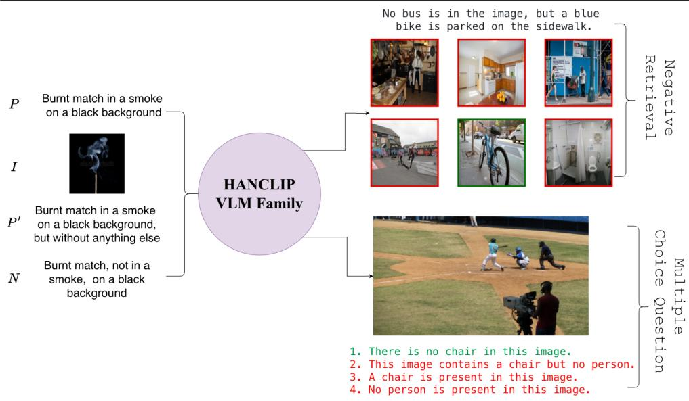
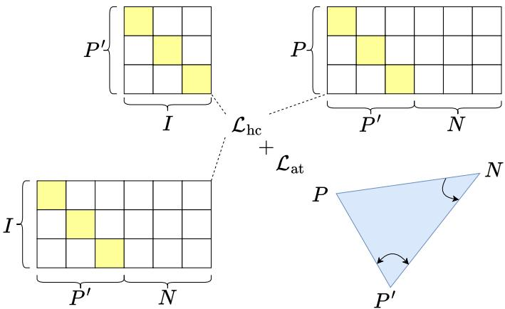
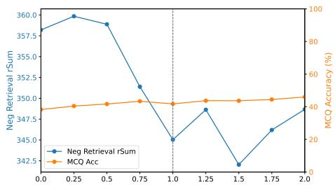
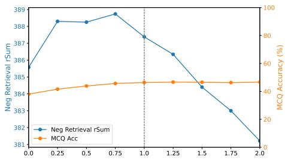
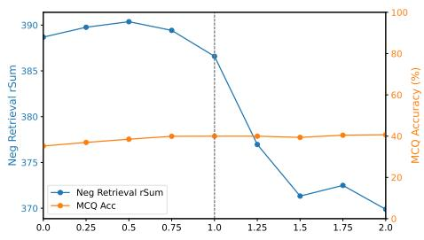
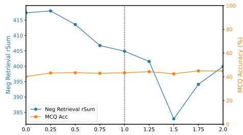
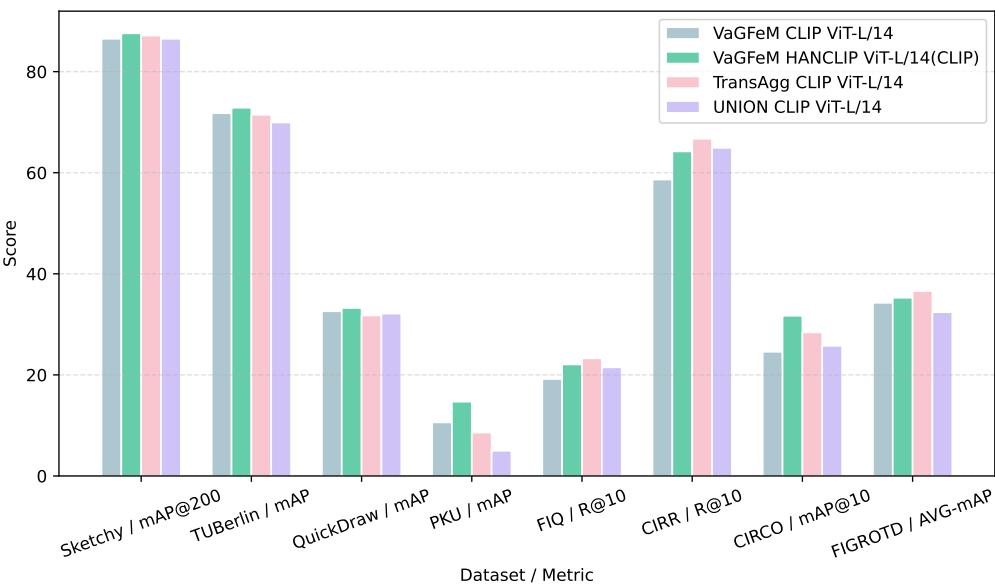

# HANCLIP: A Family of Hyperbolic Angular Negation Vision Language Models

Hoang-Bao Le1 bao.le2@mail.dcu.ie

Aiden Durrant2 6Aiden.Durrant@uea.ac.uk

0Thai Son Mai3 2ThaiSon.Mai@qub.ac.uk

nBinh T. Nguyen4 ungtbinh@hcmus.edu.vn

Liting Zhou1 liting.zhou@dcu.ie

Cathal Gurrin1 cathal.gurrin@dcu.ie 1 ADAPT Centre Dublin City University, Ireland

2 University of East Anglia Norwich, UK

3 Queen’s University Belfast Belfast, UK

4 University of Science Vietnam National University Ho Chi Minh City, Vietnam

## Abstract

Vision–Language Models (VLMs) are typically pre-trained on large-scale image–text datasets to capture semantic correspondences between visual content and natural lan guage. However, they remain surprisingly brittle to negation: models often rely on shallow word co-occurrence and are easily distracted by misleading or irrelevant textua cues, even when their overall retrieval or classification performance is strong. Moreover, directly finetuning on negation data can interfere with previously acquired knowledge, causing noticeable degradation on standard vision–language benchmarks. To tackle these issues, this work introduces HANCLIP (Hyperbolic + Angular + Negation), a family of VLMs that explicitly restructures the embedding space to encode “what an im age is not” alongside “what it is.” HANCLIP is trained on a compact set of 20,000 image–text quadruplets and combines a hyperbolic formulation, which models hierar chical semantic relations and asymmetries, with an angular triplet objective that drives systematic separation between negated descriptions and their corresponding positives. This geometry-aware design strengthens negation sensitivity while preserving the global structure of pretrained representations, rather than overwriting them. Extensive exper iments across multiple vision–language tasks show that HANCLIP delivers consistent gains on the negation-focused NegBench benchmark, while maintaining competitive or improved performance on standard classification and image–text retrieval benchmarks. The framework is model-agnostic and can be plugged into CLIP, LongCLIP, SmartCLIP, and HiMo-CLIP without large-scale retraining, demonstrating that a carefully designed geometric objective can substantially extend the reasoning capabilities of existing VLMs using only modest additional data.

  
Figure 1: Overview of HANCLIP Framework with a quadruplet input of $\left( I , P , P ^ { \prime } , N \right)$ and two examples on NegBench.

## 1 Introduction

Negation is a fundamental logical operation that maps a proposition P to its complement, not P. While linguistic negation is often expressed through simple syntactic transformations, grounding negation in visual context is substantially more complex. For instance, given an image, the negation of the statement “The cat is next to an apple tree” may be conveyed in multiple semantically valid ways, such as “The cat is next to a chair, not an apple tree” or “The cat is on the apple tree”. These variations highlight that visual negation is inherently compositional, requiring models to reason over object relations, attributes, and alternatives rather than performing surface-level lexical inversion.

Despite impressive progress in vision–language modeling, recent studies reveal that large Vision–Language Models (VLMs) struggle with such negation understanding [2, 29]. Yuksekgönül et al. [48] demonstrate that models trained with standard contrastive objectives primarily learn shallow word–object associations, aligning individual nouns with visual entities while failing to capture relational and logical structure. As a result, VLMs often assign high similarity scores to both affirmative and negated captions, leading to unreliable behaviour in real-world applications that demand precise semantic understanding.

To address these limitations, a growing body of work proposes negation-aware datasets, specialised contrastive objectives [29, 33, 48], and challenging evaluation benchmarks [2, 8, 15]. While effective, these approaches typically rely on large-scale curated data and extensive retraining, which limits their practicality and reproducibility. Furthermore, while improving negation sensitivity is a priority, it often leads to knowledge forgetting [48, 54]. This creates a trade-off where gains in negation handling can reduce the performance of VLMs on standard retrieval and zero-shot tasks.

Recently, hyperbolic representation learning has emerged as a promising alternative to Euclidean embedding spaces for modeling hierarchical and asymmetric [9] Several hyperbolic VLMs have been proposed, including MERU [4], HyCoCLIP [27], and HyperVLM [34]. While MERU emphasises inter-modal partial ordering between images and texts, but overlooks intra-modal semantic structure, HyCoCLIP addresses this limitation by modeling object-level hierarchies through region-based alignments. HyperVLM further generalises partial ordering by dynamically inferring modality dominance on a per-instance basis. These works suggest that hyperbolic geometry is well-suited for capturing semantic hierarchies, yet its potential for negation modeling remains underexplored [27, 46].

In this study, to address the aforementioned challenges of negation understanding in VLMs, we introduce Hyperbolic Angular Negation CLIP (HANCLIP), a family of VLMs equipped with two complementary components: (i) Hyperbolic Contrastive Objective (HCO) and (ii) Angular Triplet Negation Loss (ATNL). Instead of only pushing image–text pairs apart in Euclidean space, the HCO uses a hyperbolic distance over inter-textual negatives to carve out a hierarchy of “what the image is” versus “what it is not”, so that negated captions occupy separated regions in the embedding space. This design explicitly encourages affirmative captions and their negated-positive counterparts to remain close in the embedding space, while pushing semantically incompatible negatives away. Additionally, the ATNL introduces a geometry-aware regularisation that operates on relative directions rather than absolute distances. Specifically, it enforces angular alignment between the negated-positive caption and the affirmative caption when viewed from the negative anchor, while simultaneously increasing the angular separation between positive and negative semantic directions. By optimising cosine-based angular relationships, this objective preserves semantic proximity under negation while preventing spurious correlations caused by lexical overlap, thereby complementing the hyperbolic contrastive learning and stabilising global image–text alignment. Finally, to evaluate our proposed approach, we conduct of extensive experiments to validate the efficiency on four models as CLIP [31], LongCLIP [51], SmartCLIP [41] and HiMo-CLIP [40] across different datasets.

Contributions In summary, we make the following contributions:

• Firstly, we use Hyperbolic space to solve the Negation Understanding knowledge of Vision Language Models. Compared to the original VLMs, by leveraging an non-Euclidean metric space, our HANCLIP VLM Family delivers better understanding on negation-containing problems.

• Secondly, we introduce Angular Triplet Negation Loss as a bifold way to pull the True positive sentence and push the Negative one away the anchor embedding.

• Thirdly, with 20,000 training samples, extensive experiments across CLIP, LongCLIP, SmartCLIP and HiMo-CLIP on several benchmarks show that our methodology significantly improve their performance with an average improvement of more than 4% in Negative Retrieval and an average boost of nearly 35% in Multiple Choice Question tasks.

Codes and data Source codes of the paper will be publicly available upon acceptance.

## 2 Methodology

## 2.1 Preliminaries

Let $V \in \mathcal V$ denote an image paired with three types of captions: a positive caption $P \in { \mathcal { P } }$ , a negated-positive caption $P ^ { \prime } \in \mathcal { P } ^ { \prime }$ , and a negative caption $N \in \mathcal N$ . We consider a pre-trained Vision-Language Model (VLM) $f ( \cdot )$ that encodes both images and texts into a shared $d -$ dimensional embedding space. The corresponding representations are denoted by $\mathbf { v } , \mathbf { p } , \mathbf { p ^ { \prime } } .$ and $\mathbf { n } \in \mathbb { R } ^ { d }$ , respectively.

  
Figure 2: We incorporate negation samples in Hyperbolic Contrastive Objective ${ \mathcal { L } } _ { \mathrm { h c } }$ and $\mathrm { A n \mathrm { - } }$ gular Triplet Negation Loss ${ \mathcal { L } } _ { \mathrm { a t } }$ to help pre-trained VLM distinguish ground-truth captions from opposite groups.

## 2.2 Hyperbolic Geometry Background

Hyperbolic space $\mathbb { H } ^ { n }$ is a non-Euclidean geometry with constant negative curvature, which naturally models data with hierarchical or tree-like structure. Compared to Euclidean space, distances in hyperbolic space grow exponentially with radius, allowing it to represent inclusion relations and semantic hierarchies more efficiently. This property has recently motivated its use in representation learning and vision-language models. We formulate our method in the Poincaré ball model of hyperbolic geometry [9], chosen for its numerical stability and compatibility with gradient-based optimization. The Poincaré ball is the open n-dimensional ball

$$
\mathbb {D} _ {c} ^ {n} = \left\{\mathbf {x} \in \mathbb {R} ^ {n} \mid c \| \mathbf {x} \| _ {2} ^ {2} <   1 \right\},\tag{1}
$$

where $c \geq 0$ controls the curvature (with actual curvature $- c ^ { 2 } )$

Since hyperbolic space is not a vector space, standard Euclidean operations such as addition do not apply. Instead, we use the gyrovector formalism [38], which provides algebraic operations consistent with the underlying geometry. For $\mathbf { x } , \mathbf { y } \in \mathbb { D } _ { c } ^ { n }$ , the Möbius addition is defined as

$$
\mathbf {x} \oplus_ {c} \mathbf {y} = \frac {(1 + 2 c \langle \mathbf {x} , \mathbf {y} \rangle + c \| \mathbf {y} \| _ {2} ^ {2}) \mathbf {x} + (1 - c \| \mathbf {x} \| _ {2} ^ {2}) \mathbf {y}}{1 + 2 c \langle \mathbf {x} , \mathbf {y} \rangle + c ^ {2} \| \mathbf {x} \| _ {2} ^ {2} \| \mathbf {y} \| _ {2} ^ {2}}.\tag{2}
$$

Using this operation, the hyperbolic distance between two points $\mathbf { x } , \mathbf { y } \in \mathbb { D } _ { c } ^ { n }$ is given by

$$
D _ {h} (\mathbf {x}, \mathbf {y}) = \frac {2}{\sqrt {c}} \tanh ^ {- 1} \left(\sqrt {c} \| - \mathbf {x} \oplus_ {c} \mathbf {y} \| _ {2}\right),\tag{3}
$$

where $\| \cdot \| _ { 2 }$ denotes the Euclidean norm. To embed Euclidean features into hyperbolic space, we employ the Riemannian exponential map. Given a base point $\mathbf { x } \in \mathbb { D } _ { c } ^ { n }$ and a tangent vector $\mathbf { a } \in \mathbb { R } ^ { n }$ , the exponential mapping is defined as

$$
\exp_ {\mathbf {x}} ^ {c} (\mathbf {a}) = \mathbf {x} \oplus_ {c} \left(\tanh \left(\frac {\sqrt {c} \lambda_ {\mathbf {x}} ^ {c} \| \mathbf {a} \| _ {2}}{2}\right) \frac {\mathbf {a}}{\sqrt {c} \| \mathbf {a} \| _ {2}}\right).\tag{4}
$$

In practice, we use the origin as the base point, which simplifies the mapping and ensures stable optimisation.

## 2.3 Hyperbolic Contrastive Objective

Hyperbolic Contrastive Objective (HCO) As illustrated in Figure 2, our proposed HCO explicitly model negation using hyperbolic geometry and is guided by a key observation: given an image I, a true negative caption N is semantically and hierarchically more distant from I than both the affirmative caption P and its negated-positive counterpart $P ^ { \prime }$ . While P and $P ^ { \prime }$ may differ syntactically, they describe closely related visual contents, whereas N describes a genuinely incompatible concept. In hyperbolic geometry, semantically related concepts are embedded closer to each other near the center of the space, while unrelated or contradictory concepts are pushed toward the boundary. We therefore embed image and text features into the Poincaré ball, where hierarchical separation between $( P , P ^ { \prime } )$ and N can be expressed through hyperbolic distance.

Concretely, let $g ( \cdot ) = \exp _ { 0 } ^ { c } ( \cdot )$ denote the exponential map from Euclidean space to the hyperbolic manifold with curvature $c .$ Unlike the standard CLIP objective, which treats all non-matching samples as implicit negatives, our HCO explicitly includes the true negative captions $\mathcal { N }$ in the denominator of the contrastive loss. This design enforces stronger discrimination between negated positives and genuine negatives. Given a batch of size B, temperature τ, a set of image features $\mathcal { T } ,$ , and the corresponding triplet captions $( \mathcal { P } , \mathcal { P } ^ { \prime } , \mathcal { N } )$ , the proposed HCO loss ${ \mathcal { L } } _ { \mathrm { h c } }$ consists of three complementary terms $\mathcal { L } ( \mathcal { P } ^ { \prime } \to \mathcal { T } ) , \mathcal { L } ( \mathcal { T } \to \mathcal { P } ^ { \prime } \cup \mathcal { N } )$ and $\mathcal { L } ( \mathcal { P } ^ { \prime } \to \mathcal { P } \cup \mathcal { N } )$ as follows:

$$
\mathcal {L} \left(\mathcal {P} ^ {\prime} \rightarrow \mathcal {I}\right) = - \sum_ {i \in B} \log \frac {\exp \left(D _ {h} \left(g \left(\mathbf {p} _ {i} ^ {\prime}\right) , g \left(\mathbf {v} _ {i}\right)\right) / \tau\right)}{\sum_ {k = 1} ^ {B} \exp \left(D _ {h} \left(g \left(\mathbf {p} _ {k} ^ {\prime}\right) , g \left(\mathbf {v} _ {k}\right)\right) / \tau\right)}\tag{5}
$$

$$
\begin{array}{c} \mathcal {L} (\mathcal {I} \to \mathcal {P} ^ {\prime} \cup \mathcal {N}) = - \sum_ {i \in B} \log \frac {\exp (D _ {h} (g (\mathbf {v} _ {i}) , g (\mathbf {p} _ {i} ^ {\prime})) / \tau)}{\sum_ {k = 1} ^ {B} \left[ \exp \bigl (D _ {h} \bigl (g (\mathbf {v} _ {k}) , g (\mathbf {p} _ {k} ^ {\prime}) \bigr) / \tau \bigr) + \exp (D _ {h} (g (\mathbf {v} _ {k}) , g (\mathbf {n} _ {k})) / \tau) \right]} \end{array}\tag{6}
$$

$$
\begin{array}{l} \mathcal {L} (\mathcal {P} ^ {\prime} \to \mathcal {P} \cup \mathcal {N}) = - \sum_ {i \in B} \log \frac {\exp (D _ {h} (g (\mathbf {p} _ {i} ^ {\prime}) , g (\mathbf {p} _ {i})) / \tau)}{\sum_ {k = 1} ^ {B} \left[ \exp \big (D _ {h} \big (g (\mathbf {p} _ {k} ^ {\prime}) , g (\mathbf {p} _ {k}) \big) / \tau \big) + \exp \big (D _ {h} \big (g (\mathbf {p} _ {k} ^ {\prime}) , g (\mathbf {n} _ {k}) \big) / \tau \big) \right]} \\ \mathcal {L} _ {\mathrm{hc}} = \mathcal {L} (\mathcal {P} ^ {\prime} \to \mathcal {I}) + \mathcal {L} (\mathcal {I} \to \mathcal {P} ^ {\prime} \cup \mathcal {N}) + \mathcal {L} (\mathcal {P} ^ {\prime} \to \mathcal {P} \cup \mathcal {N}) \end{array}\tag{7}
$$

(8)

where ${ \mathcal { L } } ( { \mathcal { P } } ^ { \prime } \to { \mathcal { T } } )$ encourages each negated-positive caption $P _ { i } ^ { \prime }$ to be aligned with its corresponding image $I _ { i }$ while contrasting against other images in the batch, $\mathcal { L } ( \mathcal { T } \to \mathcal { P } ^ { \prime } \cup \mathcal { N } )$ enforces that an image $I _ { i }$ is closer to its negated-positive caption $P _ { i } ^ { \prime }$ than to any true negative caption $N _ { k }$ , explicitly including genuine negatives in the denominator to strengthen discrimination, and $\mathcal { L } ( \mathcal { P } ^ { \prime } \to \mathcal { P } \cup \mathcal { N } )$ aligns negated-positive captions with their corresponding positive captions $P _ { i }$ while simultaneously separating them from negative captions $N _ { k }$ ensuring semantic consistency between affirmative and negated descriptions.

## 2.4 Angular Triplet Negation Loss

Angular Triplet Negation Loss (ATNL) As illustrated in Figure 2, ATNL explicitly models negation reasoning by constraining the relative angular geometry among a positive caption p, its negated-positive counterpart $\mathbf { p } ^ { \prime }$ , and a negative caption n. We consider the triangle $\triangle P P ^ { \prime } N$ formed by the three textual embeddings.

First, using the negative caption N as the anchor, we encourage the directions from N to P and from N to $P ^ { \prime }$ to be aligned. Geometrically, a smaller angle ${ \widehat { P N P ^ { \prime } } }$ implies that P and $P ^ { \prime }$ lie in similar semantic directions viewed from N. This enforces that negation does not distort the core semantic content shared by P and $P ^ { \prime }$

Second, motivated by the observation that sim $( \mathbf { n } , \mathbf { p } ) > \mathrm { s i m } ( \mathbf { n } , \mathbf { p } ^ { \prime } )$ under bag-of-words similarity, we further enforce separation between the positive and negative captions. Using the negated-positive caption $P ^ { \prime }$ as the anchor, we require the directions toward P and toward N to diverge. Geometrically, this corresponds to enlarging the angle $\widehat { P P ^ { \prime } N }$ , ensuring that the true positive caption is pushed away from the negative one in feature space.

Accordingly, the Angular Triplet Negation Loss ${ \mathcal { L } } _ { \mathrm { a t } }$ consists of two complementary com ponents: (i) a positive-alignment term ${ \mathcal { L } } _ { \mathrm { p o s } }$ , which minimizes the angle between $\overrightarrow { N P }$ and $\overrightarrow { N P ^ { \prime } }$ and (ii) a negation-separation term $\mathcal { L } _ { \mathrm { n e g } }$ , which maximizes the angle between $\overrightarrow { P ^ { \prime } P }$ and $\overrightarrow { P ^ { \prime } N }$ Together, these constraints ensure that negation-aware captions preserve semantic alignment with their positives while remaining discriminative from genuine negatives.

Positive-alignment term We first define two direction vectors originating from the negative caption n:

$$
\overrightarrow {N P} = \mathbf {p} - \mathbf {n}, \quad \overrightarrow {N P ^ {\prime}} = \mathbf {p} ^ {\prime} - \mathbf {n}.\tag{9}
$$

Their cosine similarity is computed as

$$
\cos \theta_ {\text { pos }} = \frac {\langle \overrightarrow {N P} , \overrightarrow {N P ^ {\prime}} \rangle}{\| \overrightarrow {N P} \| _ {2} \| \overrightarrow {N P ^ {\prime}} \| _ {2}}.\tag{10}
$$

The corresponding positive-alignment loss is defined as

$$
\mathcal {L} _ {\mathrm{pos}} = \mathbb {E} [ 1 - \cos \theta_ {\mathrm{pos}} ],\tag{11}
$$

which is minimised when cos $\theta _ { \mathrm { p o s } }$ approaches one. This encourages the negated caption $\mathbf { p } ^ { \prime }$ to lie in a similar direction to the true positive p when viewed from the negative anchor n, effectively pulling the two positive variants closer together in angular space.

Negative-separation term To enforce separation from the negative caption, we next consider directions originating from the positive caption p:

$$
\overrightarrow {P ^ {\prime} N} = \mathbf {n} - \mathbf {p} ^ {\prime}, \quad \overrightarrow {P ^ {\prime} P} = \mathbf {p} - \mathbf {p} ^ {\prime}.\tag{12}
$$

Their cosine similarity is given by

$$
\cos \theta_ {\text {neg}} = \frac {\langle \overrightarrow {P ^ {\prime} N} , \overrightarrow {P ^ {\prime} P} \rangle}{\| \overrightarrow {P ^ {\prime} N} \| _ {2} \| \overrightarrow {P ^ {\prime} P} \| _ {2}}.\tag{13}
$$

We define the negative-separation loss as

$$
\mathcal {L} _ {\mathrm{neg}} = \mathbb {E} [ \cos \theta_ {\mathrm{neg}} ],\tag{14}
$$

which is minimised to encourage a large angular difference between $\xrightarrow [ P N ] { }$ and $\overrightarrow { P P ^ { \prime } }$ . This pushes the negated caption away from the negative caption along distinct semantic directions.

Final Angular Triplet Negation Loss Function The overall Angular Triplet Negation Loss is given by

$$
\mathcal {L} _ {\mathrm{at}} = \mathcal {L} _ {\mathrm{pos}} + \mathcal {L} _ {\mathrm{neg}} = \mathbb {E} [ 1 - \cos \theta_ {\mathrm{pos}} ] + \mathbb {E} [ \cos \theta_ {\mathrm{neg}} ].\tag{15}
$$

This formulation simultaneously aligns the negated caption with its true positive while enforcing angular separation from the negative, yielding a geometry-aware objective wellsuited for negation understanding in vision–language models.

HANCLIP training objective In summary, the training objective of HANCLIP is a weighted sum of loss terms in Eq. 8 and 15:

$$
\mathcal {L} _ {\text { final }} = \mathcal {L} _ {\text { hc }} + \alpha \mathcal {L} _ {\text { at }}.\tag{16}
$$

Here, α is a balance hyperparameter between HCO and ATNL.

## 2.5 LoRA Integration For Forgetting Mitigation

C-CLIP [24] treats LoRA [16] not only as a parameter-efficient finetuning tool, but as an explicit mechanism to localise new knowledge and thereby reduce forgetting. The key idea is to freeze the pre-trained backbone and route all task-specific adaptation through small, controllable LoRA branches.

Concretely, the base weights W are kept fixed and each weight matrix is augmented as

$$
W _ {\mathrm{eff}} = W + \alpha A B,
$$

where $A \in \mathbb { R } ^ { d \times r }$ and $\boldsymbol { B } \in \mathbb { R } ^ { r \times d }$ are low-rank factors with $r \ll d ,$ , and α is a scaling factor. Because W never changes, the original capabilities of the model (e.g., long-text retrieval for LongCLIP/SmartCLIP) are preserved by construction; any forgetting can only arise through the small LoRA branch rather than through destructive updates to the backbone.

New tasks or domains are handled by attaching additional LoRA branches instead of overwriting existing ones. Each branch acts as a task-specific memory, and C-CLIP combines them via gating or regularisation so that the new branch contributes where it is useful, but does not overwrite the subspace used by earlier branches. This modular design allows the model to accumulate new skills while retaining strong performance on previously learned tasks.

Finally, C-CLIP explicitly regularises the LoRA parameters to minimise interference with pre-trained knowledge. Regularisers derived from, for example, Laplace approximations or orthogonality constraints keep the low-rank updates small in norm or approximately orthogonal to directions that are important for the backbone. As a result, LoRA is not only parameter-efficient; it is constrained to live in a subspace that perturbs existing representations as little as possible, turning the adapter into a controllable “side channel” for new knowledge rather than a source of catastrophic forgetting.

## 3 Experiments

## 3.1 Implementation Details

All the images are resized to $2 2 4 \times 2 2 4$ . We use a curvature with $c = 0 . 1$ for the exponential map. The temperature $\tau = 0 . 0 1$ for all experiments. For the loss function in Eq. 16, we set $\alpha = 1$ for all experiments. All experiments are implemented on 1 GPU A100 NVIDIA-80G with 1 epoch, weight decay $5 \mathrm { e } - 2$ , warm-up iterations 200 and batch size 64. The model is optimised by AdamW [26]. We follow the settings at CLIP-LoRA [49] for LoRA Adaptation in our code. Especially, we set two learning rate $5 \mathrm { e } - 6$ and $\ e ^ { - 4 }$ in all experiments with and without LoRA respectively.

We randomly select 20,000 samples from CC-Neg [33] for training. To create the negated-positive group $\mathcal { P } ^ { \prime }$ , we utilise one in twenty special templates (Section 8).

In this work, we apply our approach on 4 models that can be divided into two groups:

• Traditional Models: CLIP [31] (B/32, B/16 and L/14) is popular applied on downstream tasks.

• Modern Models: LongCLIP [51], SmartCLIP [41] and HiMo-CLIP $[ \pm \pmb { \mathbb { G } } ] ^ { 1 }$ . All the models are designed upon ViT-B/16 and L/14 architecture to handle longer captions with 248 tokens for text encoder.

## 3.2 Negation Understanding

Datasets and Metrics We select NegBench [2] containing two tasks: Negative Retrieval and Multiple Choice Question (MCQ). NegBench is a benchmark for evaluating how well vision-language models understand negation, covering 79k examples across images, videos, and medical data with 18 task variations. It focuses on retrieval with negation and multiplechoice questions with negated captions, revealing that many modern models perform near chance level on negation-sensitive queries. In the Negative Retrieval task, the caption is modified by adding negation factors. Furthermore, each MCQ question comprises one image following by one correct answer and three wrong answers to trick the model if it does not understand. Their format can be described as:

<table><tr><td rowspan="3">Model</td><td rowspan="3">ViT</td><td rowspan="3">Setting</td><td colspan="7">Retrieval-Neg Task</td><td colspan="4">Zero-shot MCQ-Neg Task</td></tr><tr><td colspan="3">Image-to-Text</td><td colspan="3">Text-to-Image</td><td rowspan="2">rSum</td><td colspan="4">MCQ Type</td></tr><tr><td>R@1</td><td>R@5</td><td>R@10</td><td>R@1</td><td>R@5</td><td>R@10</td><td>Affirmed</td><td>Negated</td><td>Hybrid</td><td>AVG</td></tr><tr><td rowspan="3">NegationCLIP [☐]</td><td>B/16</td><td>Base</td><td>59.52</td><td>83.22</td><td>89.62</td><td>41.67</td><td>68.49</td><td>78.38</td><td>420.89</td><td>43.70</td><td>21.23</td><td>25.84</td><td>30.52</td></tr><tr><td>B/32</td><td>Base</td><td>56.06</td><td>80.72</td><td>88.24</td><td>38.59</td><td>65.80</td><td>76.39</td><td>405.80</td><td>43.95</td><td>22.41</td><td>26.04</td><td>31.04</td></tr><tr><td>L/14</td><td>Base</td><td>62.58</td><td>85.70</td><td>91.66</td><td>45.08</td><td>70.66</td><td>80.38</td><td>436.06</td><td>40.40</td><td>22.25</td><td>27.78</td><td>30.37</td></tr><tr><td rowspan="2">CoNCLIP [☐]</td><td>B/32</td><td>Base</td><td>45.54</td><td>69.22</td><td>77.54</td><td>26.76</td><td>51.22</td><td>62.56</td><td>332.83</td><td>14.42</td><td>33.64</td><td>24.50</td><td>23.93</td></tr><tr><td>L/14</td><td>Base</td><td>51.94</td><td>75.24</td><td>82.58</td><td>33.09</td><td>57.13</td><td>67.87</td><td>367.85</td><td>17.47</td><td>32.03</td><td>29.77</td><td>26.26</td></tr><tr><td>CE_CLIP [☐]</td><td>B/32</td><td>Base</td><td>47.26</td><td>76.10</td><td>85.64</td><td>39.21</td><td>66.39</td><td>76.65</td><td>391.24</td><td>69.59</td><td>11.44</td><td>29.27</td><td>37.49</td></tr><tr><td>NegCLIP [☐]</td><td>B/32</td><td>Base</td><td>56.04</td><td>80.52</td><td>88.18</td><td>39.88</td><td>67.17</td><td>77.34</td><td>409.14</td><td>47.24</td><td>14.76</td><td>16.40</td><td>26.48</td></tr><tr><td>NegCLIP $_{CC12M}$  [☐]</td><td>B/32</td><td>Base</td><td>58.34</td><td>82.04</td><td>88.96</td><td>41.18</td><td>68.10</td><td>78.26</td><td>416.88</td><td>80.22</td><td>27.86</td><td>60.09</td><td>56.81</td></tr><tr><td>CLIP $_{CC12M}$  [☐]</td><td>B/32</td><td>Base</td><td>48.72</td><td>73.24</td><td>81.82</td><td>30.84</td><td>55.81</td><td>66.63</td><td>357.06</td><td>72.98</td><td>34.06</td><td>56.41</td><td>55.04</td></tr><tr><td rowspan="6">CLIP [☐]</td><td rowspan="2">B/16</td><td rowspan="2">Base+ Ours</td><td>47.86</td><td>72.36</td><td>81.46</td><td>27.05</td><td>50.26</td><td>61.31</td><td>340.30</td><td>73.03</td><td>10.53</td><td>39.36</td><td>41.82</td></tr><tr><td>50.56</td><td>75.20</td><td>83.64</td><td>29.73</td><td>53.73</td><td>64.70</td><td>357.58</td><td>67.86</td><td>12.25</td><td>53.53</td><td>45.40</td></tr><tr><td rowspan="2">B/32</td><td rowspan="2">Base+ Ours</td><td>45.34</td><td>69.72</td><td>79.08</td><td>24.93</td><td>47.93</td><td>59.41</td><td>326.42</td><td>69.24</td><td>6.90</td><td>39.46</td><td>39.40</td></tr><tr><td>48.53</td><td>73.34</td><td>82.02</td><td>28.83</td><td>53.34</td><td>64.55</td><td>350.65</td><td>64.91</td><td>8.98</td><td>49.06</td><td>41.83</td></tr><tr><td rowspan="2">L/14</td><td rowspan="2">Base+ Ours</td><td>50.88</td><td>74.26</td><td>82.42</td><td>29.06</td><td>52.38</td><td>62.95</td><td>351.96</td><td>62.40</td><td>7.65</td><td>41.55</td><td>37.99</td></tr><tr><td>53.40</td><td>76.76</td><td>84.72</td><td>32.67</td><td>56.98</td><td>67.27</td><td>371.80</td><td>59.40</td><td>10.32</td><td>46.17</td><td>39.38</td></tr><tr><td rowspan="4">LongCLIP [☐]</td><td rowspan="2">B/16</td><td rowspan="2">Base+ Ours</td><td>52.08</td><td>76.28</td><td>83.96</td><td>35.83</td><td>61.37</td><td>71.70</td><td>381.22</td><td>65.06</td><td>12.30</td><td>26.69</td><td>35.32</td></tr><tr><td>55.56</td><td>78.78</td><td>86.20</td><td>37.91</td><td>63.66</td><td>73.65</td><td>395.77</td><td>67.52</td><td>13.48</td><td>38.82</td><td>40.67</td></tr><tr><td rowspan="2">L/14</td><td rowspan="2">Base+ Ours</td><td>56.36</td><td>79.28</td><td>86.80</td><td>40.95</td><td>66.10</td><td>75.67</td><td>405.15</td><td>64.67</td><td>11.44</td><td>33.70</td><td>37.30</td></tr><tr><td>60.90</td><td>83.58</td><td>89.74</td><td>43.79</td><td>68.66</td><td>77.86</td><td>424.54</td><td>69.73</td><td>15.13</td><td>43.19</td><td>43.44</td></tr><tr><td rowspan="4">SmartCLIP [☐]</td><td rowspan="2">B/16</td><td rowspan="2">Base+ Ours</td><td>57.44</td><td>80.42</td><td>87.82</td><td>38.48</td><td>64.56</td><td>74.44</td><td>403.17</td><td>51.08</td><td>15.88</td><td>17.05</td><td>28.37</td></tr><tr><td>58.82</td><td>81.10</td><td>88.62</td><td>41.18</td><td>66.99</td><td>76.85</td><td>413.56</td><td>63.53</td><td>19.89</td><td>36.83</td><td>40.65</td></tr><tr><td rowspan="2">L/14</td><td rowspan="2">Base+ Ours</td><td>63.00</td><td>84.00</td><td>90.02</td><td>43.75</td><td>68.77</td><td>77.96</td><td>427.49</td><td>61.27</td><td>13.32</td><td>32.26</td><td>36.24</td></tr><tr><td>64.62</td><td>85.16</td><td>91.22</td><td>46.39</td><td>71.10</td><td>80.02</td><td>438.51</td><td>62.25</td><td>19.09</td><td>37.33</td><td>40.13</td></tr><tr><td rowspan="2">HiMo-CLIP [☐]</td><td rowspan="2">L/14</td><td rowspan="2">Base+ Ours</td><td>60.96</td><td>83.12</td><td>89.92</td><td>43.18</td><td>68.35</td><td>77.28</td><td>422.80</td><td>79.82</td><td>4.87</td><td>51.04</td><td>46.33</td></tr><tr><td>62.70</td><td>84.36</td><td>90.72</td><td>45.36</td><td>70.63</td><td>79.31</td><td>433.08</td><td>84.55</td><td>8.34</td><td>61.18</td><td>52.50</td></tr></table>

Table 1: Results on the Retrieval-Neg and Zero-shot MCQ-Neg tasks using different models and ViT backbones from the NegBench evaluation. In each column, bold values indicate the best overall performance, while red values denote the best results achieved by applying our method.

• Affirmed: “This image includes A (and C).”

• Negated: “This image does not include B.”

• Hybrid: “This image includes A but not B.”

We utilise Recall at K (R@K) with K ∈ {1,5,10} on Negative Retrieval task, and Accuracy by the query template (Affirmed, Negated, Hybrid) on Zero-shot MCQ-Neg Task.

Baselines We evaluate our HANCLIP family against NegationCLIP [29], CoNCLIP [33], CE\_CLIP [54], NegCLIP [48] and two version of NegCLIP and CLIP pre-trained on Negated CC12M [2].

Main results The performance of our models in NegBench are shown in Table 1.

Retrieval–Neg task. Our methodology consistently improves all chosen backbones on NegBench retrieval. Across CLIP, LongCLIP, SmartCLIP, and HiMo-CLIP, the overall rSum score increases by roughly 5%−10% relative to the vanilla counterparts, showing that the proposed losses substantially strengthen negation-aware retrieval. For example, SmartCLIP-L improves its rSum from 427.49 to 438.51, and HiMo-CLIP-L increases from 422.80 to 433.08. Notably, our SmartCLIP-L variant outperforms NegationCLIP on both I2T and T2I, even though it is trained with only 20,000 samples, highlighting the data efficiency of our approach.

<table><tr><td rowspan="3">Model</td><td rowspan="3">ViT</td><td rowspan="3">Setting</td><td colspan="3">Classification</td><td colspan="4">Tradition retrieval</td><td colspan="4">Long text-to-image retrieval</td></tr><tr><td>ImageNet</td><td>CIFAR-10</td><td>CIFAR-100</td><td colspan="2">COCO</td><td colspan="2">Flickr30k</td><td colspan="2">Urban1k</td><td colspan="2">ShareGPT4V</td></tr><tr><td>Acc</td><td>Acc</td><td>Acc</td><td>I2T</td><td>T2I</td><td>I2T</td><td>T2I</td><td>I2T</td><td>T2I</td><td>I2T</td><td>T2I</td></tr><tr><td rowspan="6">CLIP</td><td rowspan="2">B/16</td><td>Base</td><td>68.35</td><td>90.81</td><td>67.22</td><td>51.72</td><td>32.66</td><td>43.25</td><td>24.70</td><td>67.50</td><td>53.30</td><td>84.50</td><td>79.60</td></tr><tr><td>+ Ours</td><td>67.97↓</td><td>90.84↑</td><td>67.10↓</td><td>52.68↑</td><td>35.33↑</td><td>44.63↑</td><td>27.83↑</td><td>68.20↑</td><td>57.90↑</td><td>84.70↑</td><td>82.90↑</td></tr><tr><td rowspan="2">B/32</td><td>Base</td><td>63.34</td><td>89.76</td><td>64.31</td><td>50.00</td><td>30.37</td><td>39.45</td><td>21.51</td><td>61.20</td><td>46.60</td><td>83.10</td><td>77.20</td></tr><tr><td>+ Ours</td><td>62.58↓</td><td>89.66↓</td><td>64.34↑</td><td>50.86↑</td><td>32.50↑</td><td>41.03↑</td><td>23.69↑</td><td>60.60↓</td><td>52.30↑</td><td>83.90↑</td><td>79.60↑</td></tr><tr><td rowspan="2">L/14</td><td>Base</td><td>75.53</td><td>95.70</td><td>76.44</td><td>56.10</td><td>35.33</td><td>47.70</td><td>27.89</td><td>68.20</td><td>56.00</td><td>84.20</td><td>83.60</td></tr><tr><td>+ Ours</td><td>75.57↑</td><td>95.75↓</td><td>77.27↑</td><td>56.14↑</td><td>36.38↑</td><td>49.21↑</td><td>29.29↑</td><td>69.30↑</td><td>58.60↑</td><td>86.00↑</td><td>84.50↑</td></tr><tr><td rowspan="4">LongCLIP</td><td rowspan="2">B/16</td><td>Base</td><td>66.82</td><td>90.76</td><td>69.16</td><td>57.30</td><td>40.36</td><td>47.19</td><td>33.17</td><td>79.30</td><td>79.40</td><td>94.80</td><td>93.30</td></tr><tr><td>+ Ours</td><td>66.72↓</td><td>90.98↑</td><td>68.88↓</td><td>58.04↑</td><td>40.18↓</td><td>50.91↑</td><td>33.57↑</td><td>82.10↑</td><td>81.10↓</td><td>95.60↑</td><td>93.40↑</td></tr><tr><td rowspan="2">L/14</td><td>Base</td><td>72.82</td><td>96.12</td><td>79.67</td><td>62.86</td><td>46.34</td><td>53.53</td><td>41.26</td><td>82.50</td><td>86.10</td><td>97.20</td><td>97.30</td></tr><tr><td>+ Ours</td><td>74.13↑</td><td>95.79↓</td><td>79.95↑</td><td>63.78↑</td><td>46.56↑</td><td>57.15↑</td><td>42.20↑</td><td>85.30↑</td><td>86.80↑</td><td>96.90↓</td><td>97.30</td></tr><tr><td rowspan="4">SmartCLIP</td><td rowspan="2">B/16</td><td>Base</td><td>66.05</td><td>91.50</td><td>69.17</td><td>61.90</td><td>42.42</td><td>55.61</td><td>36.32</td><td>90.50</td><td>87.30</td><td>98.70</td><td>98.10</td></tr><tr><td>+ Ours</td><td>66.11↑</td><td>91.50</td><td>69.02↓</td><td>61.06↓</td><td>42.38↓</td><td>55.21↓</td><td>36.15↓</td><td>90.70↑</td><td>86.80↓</td><td>98.60↓</td><td>97.70↓</td></tr><tr><td rowspan="2">L/14</td><td>Base</td><td>72.51</td><td>95.81</td><td>78.29</td><td>66.08</td><td>48.44</td><td>63.98</td><td>43.84</td><td>93.30</td><td>90.10</td><td>97.90</td><td>98.50</td></tr><tr><td>+ Ours</td><td>72.48↓</td><td>95.77↓</td><td>78.01↓</td><td>65.84↓</td><td>48.41↓</td><td>64.16↑</td><td>43.90↑</td><td>93.00↓</td><td>89.50↓</td><td>97.70↓</td><td>98.50</td></tr><tr><td rowspan="2">HiMo-CLIP</td><td rowspan="2">L/14</td><td>Base</td><td>69.45</td><td>94.66</td><td>75.66</td><td>65.14</td><td>47.14</td><td>57.74</td><td>42.45</td><td>93.00</td><td>93.00</td><td>99.50</td><td>99.00</td></tr><tr><td>+ Ours</td><td>69.52↑</td><td>94.73↑</td><td>75.91↑</td><td>65.10↓</td><td>47.35↑</td><td>63.12↑</td><td>42.92↑</td><td>92.90↓</td><td>93.70↑</td><td>99.50</td><td>99.30↑</td></tr></table>

Table 2: Classification and Tradition Retrieval Benchmark. ↑ indicates improvement over Base, ↓ indicates degradation.

Zero-shot MCQ-Neg task. On the MCQ benchmark, all models also obtain higher average scores, indicating better zero-shot understanding of negated captions. However, the behaviour varies by question type. Within the CLIP group, performance on Affirmed sentences slightly degrades, while Hybrid questions improve the most, especially for our suggested Hybrid format. For instance, our CLIP-B/32 improves from 41.84% to 43.98% (+2.14%), and LongCLIP-L from 43.44% to 44.84% (+1.40%). These gains are mainly driven by the Hybrid type, where SmartCLIP-L, for example, increases from 32.26% to 37.33% (+5.07%), while the Negated type remains below 20% for most models.

Why Hybrid helps more than pure Negated. Hybrid questions combine an affirmed fragment with a negated fragment (e.g., “A but not B”), which closely matches our proposed caption formats where the model learns to compare the compatibility of multiple clauses rather than decide on a single global negation. In these settings, the model can still rely on strong positive evidence for part of the sentence (the “A” part) and only has to suppress inconsistent details (the “not B” part), a behavior our geometric losses explicitly encourage. In contrast, pure Negated questions often require judging the absence of a concept (“not B”) with no strong positive anchor, which is harder because the training captions rarely treat B as an obligatory element to be verified in the image. As a result, the model develops better relative reasoning between positive and negative clauses (Hybrid), but still struggles with absolute absence reasoning (Negated), explaining the much larger gains on Hybrid than on strictly Negated MCQs.

## 3.3 Classification and Retrieval tasks

Datasets and Metrics We further evaluate our methodology on the zero-shot image-to-text (I2T) and text-to-image (T2I) retrieval and classification task with the following datasets:

1. Classification: CIFAR-10 and CIFAR-100 [18] and ImageNet [32] with Accuracy as the key metric.

2. Tradition retrieval (Short T2I retrieval): COCO [22] and Flickr30K [47].

3. Long T2I retrieval: Urban1k [51] and ShareGPT4V [3].

While COCO and Flickr30k offer the short captions to evaluate the model on coarse-grained retrieval ability, Urban1k and ShareGPT4V were built to evaluate models on long description (average 101 words). We use I2T and T2I Recall at 1 (R@1) as the main metrics as LongCLIP [51].

Baselines We compare every HANCLIP model with its ancestors including CLIP, Long-CLIP, SmartCLIP and Himo-CLIP.

Main results The experiment details are described below across three aforementioned tasks as shown in Table 2.

Classification: Across all models, our method changes classification accuracy only marginall indicating that it largely preserves the base recognition ability. Most variants differ by at most ±0.3% on ImageNet and CIFAR-10/100. The only clearly positive case is HiMo-CLIP, which slightly improves on all three datasets, reaching 69.52% on ImageNet (+0.07), 94.73% on CIFAR-10 (+0.06), and 75.91% on CIFAR-100 (+0.25). This suggests that our geometryaware losses mainly reshape the joint embedding space for retrieval, without substantially affecting standard classification.

Tradition retrieval: On short-caption retrieval (COCO, Flickr30k), the overall trend is upward for CLIP, LongCLIP, and HiMo-CLIP, with only mild degradation for SmartCLIP. The image-to-text (I2T) direction is consistently improved: for COCO I2T, CLIP-B/16 rises from 51.72 to 52.68, and LongCLIP-L from 62.86 to 63.78; for Flickr30k I2T, CLIP-B/32 increases from 39.45 to 41.03, and SmartCLIP-L from 63.98 to 64.16. Text-to-image (T2I) is more mixed: CLIP variants generally gain on COCO T2I, while SmartCLIP-B/L exhibit small drops on Flickr30k T2I (around −0.05 to −0.2 absolute). Grouped by architecture, CLIP and LongCLIP benefit most steadily, indicating that the negation-aware contrastive and angular objectives primarily sharpen how images are ranked given a caption, which directly strengthens I2T performance.

Long text-to-image retrieval: For long-caption benchmarks (Urban1k, ShareGPT4V), the trends depend on whether the backbone is vanilla CLIP or a long-context variant. Standard CLIP models (B/16, B/32, L/14) consistently improve on Urban1k: for example, CLIP-B/16 goes from roughly 67.50/53.30 to 68.20/57.90 in I2T/T2I on. LongCLIP and SmartCLIP show a more nuanced pattern: LongCLIP-L gains on Urban1k I2T (from about 82.50 to 83.70), and SmartCLIP-B/L see modest I2T gains with slightly fluctuating T2I. HiMo-CLIP is the most stable, with Urban1k and ShareGPT4V scores preserved. Overall, CLIP-style models obtain the clearest gains on long-text retrieval, while long-context models trade a small amount of T2I robustness for better I2T ranking and more negation-aware behaviour.

<table><tr><td rowspan="2">Model</td><td rowspan="2"> $\mathcal{L}_{\text{hc}}$ </td><td rowspan="2"> $\mathcal{L}_{\text{at}}$ </td><td colspan="3">NegBench</td><td colspan="2">Urban1k</td><td colspan="2">Flickr30k</td><td>ImageNet</td></tr><tr><td>I2T</td><td>T2I</td><td>MCQ</td><td>I2T</td><td>T2I</td><td>I2T</td><td>T2I</td><td>Acc</td></tr><tr><td rowspan="3">CLIP</td><td rowspan="2">√</td><td rowspan="2"></td><td>50.88</td><td>29.06</td><td>37.99</td><td>68.20</td><td>56.00</td><td>47.70</td><td>27.89</td><td>75.53</td></tr><tr><td>53.36</td><td>32.01</td><td>37.20</td><td>69.00</td><td>58.40</td><td>49.16</td><td>29.08</td><td>75.52</td></tr><tr><td>√</td><td>√</td><td>53.40</td><td>32.67</td><td>39.38</td><td>69.30</td><td>58.60</td><td>49.21</td><td>29.29</td><td>75.57</td></tr><tr><td rowspan="3">LongCLIP</td><td rowspan="2">√</td><td rowspan="2"></td><td>56.36</td><td>40.95</td><td>37.30</td><td>82.50</td><td>86.10</td><td>53.53</td><td>41.26</td><td>72.82</td></tr><tr><td>60.74</td><td>43.33</td><td>38.64</td><td>84.00</td><td>86.20</td><td>57.01</td><td>41.75</td><td>73.21</td></tr><tr><td>√</td><td>√</td><td>61.12</td><td>43.97</td><td>43.86</td><td>85.30</td><td>86.90</td><td>57.25</td><td>41.87</td><td>73.19</td></tr><tr><td rowspan="3">SmartCLIP</td><td rowspan="2">√</td><td rowspan="2"></td><td>63.00</td><td>43.75</td><td>36.24</td><td>93.30</td><td>90.10</td><td>63.98</td><td>43.84</td><td>72.51</td></tr><tr><td>64.02</td><td>45.39</td><td>35.27</td><td>92.80</td><td>89.10</td><td>64.23</td><td>43.80</td><td>72.89</td></tr><tr><td>√</td><td>√</td><td>64.68</td><td>46.15</td><td>40.23</td><td>92.90</td><td>89.10</td><td>64.32</td><td>43.91</td><td>72.91</td></tr><tr><td rowspan="3">Himo-CLIP</td><td rowspan="2">√</td><td rowspan="2"></td><td>60.96</td><td>43.18</td><td>46.33</td><td>93.00</td><td>93.00</td><td>57.74</td><td>42.45</td><td>69.45</td></tr><tr><td>63.22</td><td>44.79</td><td>49.24</td><td>92.50</td><td>92.40</td><td>62.81</td><td>42.54</td><td>70.12</td></tr><tr><td>√</td><td>√</td><td>63.22</td><td>45.09</td><td>52.59</td><td>92.40</td><td>92.80</td><td>63.00</td><td>42.63</td><td>70.14</td></tr></table>

Table 3: Comparison using pastel color coding $( \mathrm { b e s t } \qquad = \qquad \mathrm { w o r s t } )$ ${ \mathcal { L } } _ { \mathrm { h c } }$ and ${ \mathcal { L } } _ { \mathrm { a t } }$ represent for hyclip and angular loss. We report results on ViT-L/14-based models.

## 3.4 Impacts of Each Objective Function

In Table 3, across models, the Hyperbolic Contrastive Objective (HCO) is the main driver of improved negation handling, while the Angular Triplet Negation Loss (ATNL) has a more model-dependent effect. Adding HCO alone consistently lifts NegBench retrieval and MCQ scores for all backbones: for example, on CLIP, NegBench I2T rSum rises from about 50.88 to 54.56 and MCQ from about 37.99 to 35.12 (with a similar gain for LongCLIP, where I2T grows from roughly 56.36 to 60.74), showing that reshaping the space in hyperbolic geometry and explicitly distinguishing positive versus negated-positive captions improves generic negation understanding without heavily harming standard retrieval or ImageNet accuracy. When ATNL is added on top, CLIP, LongCLIP, SmartCLIP, and Himo-CLIP usually see further gains on NegBench, especially on the MCQ task—for instance, LongCLIP MCQ increases again from 37.30 to 43.86 (+6.56), and Himo-CLIP MCQ climbs from 46.33 to 52.59 (+6.26); while ImageNet and COCO/Flickr retrieval remain close to their HCO-only values. This indicates that the angular constraints help carve a clearer negation direction once the hyperbolic structure is in place.

Overall, the numbers highlight two points: (i) HCO is a robust, backbone-agnostic way to improve negation reasoning, and (ii) ATNL is most effective for dual-encoder CLIP-style models (including LoRA-adapted LongCLIP, SmartCLIP and Himo-CLIP) where angular relationships between caption variants align naturally with the retrieval scoring function.

## 3.5 Impact of LoRA

We utilise LoRA on textual, visual and both encoders to observe its impact on Long-text Retrieval and Negation Understanding task. In Table 4, the main trend is that text-side LoRA (“T”) brings the largest negation gains, while joint visual+text LoRA (“V+T”) best balances NegBench and long-text retrieval.

For NegBench, adapting only the text encoder consistently gives the strongest improvements: for example, LongCLIP-L’s NegBench I2T rises from 56.36 in the base model to 60.90 with text-only LoRA, and SmartCLIP-B’s I2T jumps from 57.44 to 58.16 when adapting LoRA on textual encoder. In contrast, visual-only LoRA (“V”) gives smaller boosts or even minor regressions on MCQ, indicating that negation semantics live primarily in the text space. Adding LoRA to both encoders (“V+T”) slightly smooths these extremes: LongCLIP-L “V+T” keeps I2T roughly at its “T” level while slightly improving Flickr30k and maintaining Urban1k, and SmartCLIP-B “V+T” yields the best overall Neg-Bench I2T/T2I within that model group without sacrificing ShareGPT4V or Flickr performance. Himo-CLIP shows the same pattern: text-only LoRA gives the largest jump on NegBench MCQ, whereas $\mathrm { ^ { 6 6 } V { + } T ^ { 9 } }$ keeps those gains while stabilizing cross-benchmark retrieval. Overall, these results suggest that (i) text-side adaptation is crucial for learning negation-aware behavior, and (ii) adding a small amount of visual LoRA on top helps re-align the adapted text space with the original visual features, which is why $\mathrm { ^ { 6 6 } V { + } T ^ { 9 } }$ tends to be the best compromise across NegBench, Urban1k, ShareGPT4V, and Flickr30k.

<table><tr><td rowspan="2">Model</td><td rowspan="2">FT</td><td rowspan="2">LoRA</td><td colspan="3">NegBench</td><td colspan="2">Urban1k</td><td colspan="2">ShareGPT4V</td><td colspan="2">Flickr30k</td></tr><tr><td>I2T</td><td>T2I</td><td>MCQ</td><td>I2T</td><td>T2I</td><td>I2T</td><td>T2I</td><td>I2T</td><td>T2I</td></tr><tr><td rowspan="5">LongCLIP-B</td><td>-</td><td>-</td><td>52.08</td><td>35.83</td><td>35.32</td><td>79.30</td><td>79.40</td><td>94.80</td><td>93.30</td><td>47.19</td><td>33.17</td></tr><tr><td>√</td><td>-</td><td>52.56</td><td>37.17</td><td>46.35</td><td>79.50</td><td>72.00</td><td>93.60</td><td>90.40</td><td>48.85</td><td>32.22</td></tr><tr><td>√</td><td>V</td><td>50.62</td><td>35.36</td><td>29.40</td><td>74.70</td><td>78.00</td><td>94.10</td><td>93.20</td><td>48.19</td><td>32.27</td></tr><tr><td>√</td><td>T</td><td>55.56</td><td>37.91</td><td>40.67</td><td>82.10</td><td>81.10</td><td>95.60</td><td>93.40</td><td>50.91</td><td>33.57</td></tr><tr><td>√</td><td>V+T</td><td>52.60</td><td>37.24</td><td>44.13</td><td>76.70</td><td>77.40</td><td>95.00</td><td>93.10</td><td>48.23</td><td>32.33</td></tr><tr><td rowspan="5">LongCLIP-L</td><td>-</td><td>-</td><td>56.36</td><td>40.95</td><td>37.30</td><td>82.50</td><td>86.10</td><td>97.20</td><td>97.30</td><td>53.53</td><td>41.26</td></tr><tr><td>√</td><td>-</td><td>55.98</td><td>41.01</td><td>43.37</td><td>82.30</td><td>83.30</td><td>95.70</td><td>96.20</td><td>57.22</td><td>41.69</td></tr><tr><td>√</td><td>V</td><td>56.38</td><td>41.00</td><td>37.99</td><td>81.60</td><td>84.50</td><td>96.70</td><td>97.00</td><td>55.02</td><td>41.16</td></tr><tr><td>√</td><td>T</td><td>60.90</td><td>43.79</td><td>43.44</td><td>85.20</td><td>86.20</td><td>97.00</td><td>97.30</td><td>56.73</td><td>41.68</td></tr><tr><td>√</td><td>V+T</td><td>61.12</td><td>43.97</td><td>43.86</td><td>85.30</td><td>86.90</td><td>97.00</td><td>97.20</td><td>57.25</td><td>41.87</td></tr><tr><td rowspan="5">SmartCLIP-B</td><td>-</td><td>-</td><td>57.44</td><td>38.48</td><td>28.37</td><td>90.50</td><td>87.30</td><td>98.70</td><td>98.10</td><td>55.61</td><td>36.32</td></tr><tr><td>√</td><td>-</td><td>55.48</td><td>39.14</td><td>45.60</td><td>81.80</td><td>80.90</td><td>95.40</td><td>94.60</td><td>53.94</td><td>35.34</td></tr><tr><td>√</td><td>V</td><td>56.42</td><td>38.18</td><td>26.18</td><td>87.80</td><td>84.80</td><td>97.90</td><td>97.60</td><td>53.74</td><td>35.34</td></tr><tr><td>√</td><td>T</td><td>57.84</td><td>40.52</td><td>32.96</td><td>90.10</td><td>87.30</td><td>98.50</td><td>97.50</td><td>54.78</td><td>35.99</td></tr><tr><td>√</td><td>V+T</td><td>58.16</td><td>40.76</td><td>34.00</td><td>89.20</td><td>85.90</td><td>98.10</td><td>97.10</td><td>54.43</td><td>35.71</td></tr><tr><td rowspan="5">SmartCLIP-L</td><td>-</td><td>-</td><td>63.00</td><td>43.75</td><td>36.24</td><td>93.30</td><td>90.10</td><td>97.90</td><td>98.50</td><td>63.98</td><td>43.84</td></tr><tr><td>√</td><td>-</td><td>58.64</td><td>43.52</td><td>43.78</td><td>89.00</td><td>89.40</td><td>97.20</td><td>97.20</td><td>62.86</td><td>43.48</td></tr><tr><td>√</td><td>V</td><td>63.08</td><td>43.63</td><td>36.37</td><td>92.60</td><td>89.60</td><td>97.60</td><td>98.60</td><td>64.31</td><td>43.66</td></tr><tr><td>√</td><td>T</td><td>64.62</td><td>46.39</td><td>40.13</td><td>93.00</td><td>89.50</td><td>97.70</td><td>98.50</td><td>64.16</td><td>43.90</td></tr><tr><td>√</td><td>V+T</td><td>64.68</td><td>46.15</td><td>40.23</td><td>92.90</td><td>89.10</td><td>97.70</td><td>98.70</td><td>64.32</td><td>43.91</td></tr><tr><td rowspan="5">Himo-CLIP</td><td>-</td><td>-</td><td>60.96</td><td>43.18</td><td>46.33</td><td>93.00</td><td>93.00</td><td>99.50</td><td>99.00</td><td>57.74</td><td>42.45</td></tr><tr><td>√</td><td>-</td><td>59.04</td><td>44.43</td><td>41.85</td><td>90.00</td><td>91.90</td><td>98.40</td><td>99.00</td><td>60.82</td><td>42.93</td></tr><tr><td>√</td><td>V</td><td>61.04</td><td>42.91</td><td>46.52</td><td>92.00</td><td>91.80</td><td>99.00</td><td>99.20</td><td>62.17</td><td>42.14</td></tr><tr><td>√</td><td>T</td><td>62.70</td><td>45.36</td><td>52.50</td><td>92.90</td><td>93.70</td><td>99.50</td><td>99.30</td><td>63.12</td><td>42.92</td></tr><tr><td>√</td><td>V+T</td><td>63.22</td><td>45.09</td><td>52.59</td><td>92.40</td><td>92.80</td><td>99.10</td><td>99.00</td><td>63.00</td><td>42.63</td></tr></table>

Table 4: Comparison of three modern models under LoRA setting. Red text indicates the best performance within a model group (excluding baseline). $" \mathbf { V } "$ and "T" indicate LoRA adapted on Visual and Textual Encoder respectively.

## 4 Related Works and Discussions

Vision-Language Models Since Vision Transformers (ViT) [6] was introduced the first time in 2020, Vision language models (VLMs) have rapidly developed in a wide range of aspects. Early models as CLIP [31], BLIP [20, 21], and ALIGN [17] in general focus on one only pre-training objective by using Contrastive Learning loss function [11]. Built upon this architecture, recent VLMs introduce more diverse ideas to tackle one or many practical problems. For instance, SigLIP [37, 50] replaced the aforementioned function to Sigmoid loss function, which gains better performance on smaller train batch sizes and allows larger train batch sizes without requiring additional resources. Redesigning the main loss function is considered as a way to boost the model efficiency as CyCLIP [12], RankCLIP [55] or supporting the similarity with semantic elements as AlignCLIP [10], or an auxiliary alpha channel to suggest attentive regions as AlphaCLIP [35]. Moreover, as a result, recent VLMs also were motivated to solve different downstream tasks such as Composed Image Retrieval (MagicLens [53], TransAgg [25], UNION [14], FIGROTD [19]) or Object Detection with a series of DetCLIP [30, 42, 43, 44]. Instead of using the traditional loss function, we propose a new learning objective based on CLIP [31] that adds the negative group as negative samples.

Negation Alignment in VLMs Yuksekgonul et al. [48] showed the first attempt that observed the phenomena in VLMs only understanding the relationship between textual and visual modality as bag-of-words. Afterthat, NEAT [13] introduces a test-time adaptation framework for vision-language models that refines negation entropy, employs reversed contrastive learning to handle unrelated semantics, and debiases textual distributions using unlabeled multimodal negation data, achieving state-of-the-art results on negation benchmarks with minimal parameters. Furthermore, NegationCLIP [29] fine-tunes CLIP using LLMand multimodal LLM-generated negation-inclusive captions from images, enhancing negation comprehension on benchmarks like NegRefCOCOg and VALSE while preserving general performance and improving text-to-image generation. While CoNCLIP [33] fine-tunes foundation models like CLIP on negated image-caption pairs from the CC-Neg dataset to improve negation understanding and zero-shot classification across diverse tasks, CECLIP [54] enhances CLIP by contrasting intra-modal hard negatives within modalities and ranking cross-modal hard negatives to boost visio-linguistic semantic alignment. NegCLIP [48] augments CLIP training with synthetic hard negative captions derived from negation templates on datasets like COCO, improving compositional reasoning without substantial downstream performance loss. The finetuned CLIP model evaluated in NegBench [2] systematically addresses negation failures across 18 task variations and 79,000 examples, revealing and mitigating VLMs’ poor negation handling. Despite achieving high performance, these mod els are trained on a large amount of data. In contrast, from CC-Neg [33], we extract a small subset and create a new 20,000-quadruplet training dataset. Besides using Negative examples in the objective function, we also present the Angular Triplet Negation loss to sufficiently control the distance between the opposite groups and to not affect on the general one.

Non-Euclidean Vision Language Models Hyperbolic Vision Transformers [9] first demonstrated that hyperbolic layers in vision backbones enhance semantic hierarchy modeling and uncertainty representation compared to Euclidean counterparts, laying foundational evidence for non-Euclidean geometries in vision tasks. Building on this, MERU [4] introduced Lorentzian hyperbolic embeddings for joint image-text representations where general concepts occupy central regions entailing specific instances, outperforming Euclidean CLIP in hierarchical interpretability while matching it on standard retrieval and classification. HyCo CLIP [27] advanced hyperbolic VLMs by incorporating compositional entailment learning across images, object boxes, and texts in a hierarchical lattice, yielding better zero-shot generalization, retrieval, and hierarchical reasoning than both Euclidean CLIP and MERU through explicit multi-granularity structure. HyperVLM [34] refined Poincaré-based hyperbolic guidance for retail taxonomies, surpassing Euclidean CLIP and even Lorentzian MERU on zero-shot classification and retrieval by stronger preservation of coarse-to-fine partial orders in hierarchical multi-modal data. Finally, PHyCLIP [46] unified these advances via an ℓ -product of specialized hyperbolic factors-each handling intra-family hierarchies with the product encoding cross-family composition-achieving state-of-the-art zero-shot, retrieval, hierarchical classification, and compositional understanding over all prior single-space hyperbolic and Euclidean baselines. Our work proposes a hyperbolic-space formulation that equips VLMs with robust negation understanding while preserving their original capabilities on Tradition retrieval and Classification tasks.

## 5 Conclusion

In this study, we investigate why Vision–Language Models struggle with fine-grained negation and semantically hard negatives, even when trained with strong contrastive objectives. We show that standard CLIP-style losses, including triplet variants, largely treat negated and affirmative captions as coarsely related and therefore fail to carve out a distinct representational structure for “what an image is not”. To overcome this limitation, we propose a negation-aware representation learning framework that jointly reshapes the embedding space using hyperbolic geometry and an angle-based training objective, explicitly organising affirmed, negated, and hybrid descriptions into systematically separated regions. Extensive experiments on four widely used vision–language models demonstrate that this geometryaware framework consistently improves negation sensitivity and multiple-choice reasoning, while retaining strong image–text retrieval performance on standard benchmarks. Taken together, these results show that injecting logical structure directly into the geometry of the embedding space offers a principled and broadly applicable way to extend the reasoning capabilities of pre-trained VLMs without large-scale retraining.

## References

[1] Lorenzo Agnolucci, Alberto Baldrati, Alberto Del Bimbo, and Marco Bertini. iSEARLE: Improving Textual Inversion for Zero-Shot Composed Image Retrieval . IEEE Transactions on Pattern Analysis & Machine Intelligence, 47, 2025. doi: 10.1109/TPAMI.2025.3593539.

[2] Kumail Alhamoud, Shaden Alshammari, Yonglong Tian, Guohao Li, Philip HS Torr, Yoon Kim, and Marzyeh Ghassemi. Vision-language models do not understand negation. In Proceedings of the Computer Vision and Pattern Recognition Conference, pages 29612–29622, 2025.

[3] Lin Chen, Jinsong Li, Xiaoyi Dong, Pan Zhang, Conghui He, Jiaqi Wang, Feng Zhao, and Dahua Lin. Sharegpt4v: Improving large multi-modal models with better captions. In European Conference on Computer Vision, pages 370–387. Springer, 2024.

[4] Karan Desai, Maximilian Nickel, Tanmay Rajpurohit, Justin Johnson, and Shanmukha Ramakrishna Vedantam. Hyperbolic image-text representations. In International Conference on Machine Learning, pages 7694–7731. PMLR, 2023.

[5] Sounak Dey, Pau Riba, Anjan Dutta, Josep Llados, and Yi-Zhe Song. Doodle to search: Practical zero-shot sketch-based image retrieval. In Proceedings of the IEEE/CVF conference on computer vision and pattern recognition, pages 2179–2188, 2019.

[6] Alexey Dosovitskiy, Lucas Beyer, Alexander Kolesnikov, Dirk Weissenborn, Xiaohua Zhai, Thomas Unterthiner, Mostafa Dehghani, Matthias Minderer, Georg Heigold, Syl-

vain Gelly, et al. An image is worth 16x16 words: Transformers for image recognition at scale. In International Conference on Learning Representations, 2020.

[7] Sivan Doveh, Assaf Arbelle, Sivan Harary, Eli Schwartz, Roei Herzig, Raja Giryes, Rogerio Feris, Rameswar Panda, Shimon Ullman, and Leonid Karlinsky. Teaching structured vision & language concepts to vision & language models. In Proceedings of the IEEE/CVF Conference on Computer Vision and Pattern Recognition, pages 2657– 2668, 2023.

[8] Sri Harsha Dumpala, Aman Jaiswal, Chandramouli Shama Sastry, Evangelos Milios, Sageev Oore, and Hassan Sajjad. Sugarcrepe++ dataset: Vision-language model sensitivity to semantic and lexical alterations. Advances in Neural Information Processing Systems, 37:17972–18018, 2024.

[9] Aleksandr Ermolov, Leyla Mirvakhabova, Valentin Khrulkov, Nicu Sebe, and Ivan Oseledets. Hyperbolic vision transformers: Combining improvements in metric learning. In Proceedings of the IEEE/CVF conference on computer vision and pattern recognition, pages 7409–7419, 2022.

[10] Sedigheh Eslami and Gerard de Melo. Mitigate the gap: Improving cross-modal alignment in CLIP. In The Thirteenth International Conference on Learning Representa tions, 2025. URL https://openreview.net/forum?id=aPTGvFqile.

[11] Tianyu Gao, Xingcheng Yao, and Danqi Chen. SimCSE: Simple contrastive learning of sentence embeddings. In Empirical Methods in Natural Language Processing (EMNLP), pages 6894–6910, Online and Punta Cana, Dominican Republic, 2021. Association for Computational Linguistics.

[12] Shashank Goel, Hritik Bansal, Sumit Bhatia, Ryan Rossi, Vishwa Vinay, and Aditya Grover. Cyclip: Cyclic contrastive language-image pretraining. In S. Koyejo, S. Mohamed, A. Agarwal, D. Belgrave, K. Cho, and A. Oh, editors, Advances in Neural Information Processing Systems, volume 35, pages 6704–6719, 2022.

[13] Haochen Han, Alex Jinpeng Wang, Fangming Liu, and Jun Zhu. Negation-aware testtime adaptation for vision-language models. arXiv preprint arXiv:2507.19064, 2025.

[14] Le Hoang-Bao, Tran Allie, T. Nguyen Binh, Zhou Liting, and Gurrin Cathal. Union: A lightweight target representation for efficient image-guided retrieval with optional textual queries. In 2025 IEEE International Conference on Data Mining Workshops (ICDMW). IEEE, 2025.

[15] Cheng-Yu Hsieh, Jieyu Zhang, Zixian Ma, Aniruddha Kembhavi, and Ranjay Krishna. Sugarcrepe: Fixing hackable benchmarks for vision-language compositionality. In Thirty-Seventh Conference on Neural Information Processing Systems Datasets and Benchmarks Track, 2023.

[16] Edward J Hu, Yelong Shen, Phillip Wallis, Zeyuan Allen-Zhu, Yuanzhi Li, Shean Wang, Lu Wang, and Weizhu Chen. LoRA: Low-rank adaptation of large language models. In International Conference on Learning Representations, 2022.

[17] Chao Jia, Yinfei Yang, Ye Xia, Yi-Ting Chen, Zarana Parekh, Hieu Pham, Quoc Le, Yun-Hsuan Sung, Zhen Li, and Tom Duerig. Scaling up visual and vision-language representation learning with noisy text supervision. In International conference on machine learning, pages 4904–4916. PMLR, 2021.

[18] Alex Krizhevsky, Geoffrey Hinton, et al. Learning multiple layers of features from tiny images.(2009), 2009.

[19] Hoang-Bao Le, Allie Tran, Binh T. Nguyen, Liting Zhou, and Cathal Gurrin. Figrotd: A friendly-to-handle dataset for image guided retrieval with optional text. In MultiMedia Modeling, pages 117–132, Singapore, 2026. Springer Nature Singapore.

[20] Junnan Li, Dongxu Li, Caiming Xiong, and Steven Hoi. Blip: Bootstrapping languageimage pre-training for unified vision-language understanding and generation. In ICML, 2022.

[21] Junnan Li, Dongxu Li, Silvio Savarese, and Steven Hoi. Blip-2: Bootstrapping language-image pre-training with frozen image encoders and large language models. In International conference on machine learning, pages 19730–19742. PMLR, 2023.

[22] Tsung-Yi Lin, Michael Maire, Serge Belongie, Lubomir Bourdev, Ross Girshick, James Hays, Pietro Perona, Deva Ramanan, C. Lawrence Zitnick, and Piotr Dollár. Microsoft coco: Common objects in context, 2015. URL https://arxiv.org/ abs/1405.0312.

[23] Li Liu, Fumin Shen, Yuming Shen, Xianglong Liu, and Ling Shao. Deep sketch hashing: Fast free-hand sketch-based image retrieval. In Proceedings of the IEEE conference on computer vision and pattern recognition, pages 2862–2871, 2017.

[24] Wenzhuo Liu, Fei Zhu, Longhui Wei, and Qi Tian. C-clip: Multimodal continual learning for vision-language model. In The Thirteenth International Conference on Learning Representations, 2025.

[25] Yikun Liu, Jiangchao Yao, Ya Zhang, Yan-Feng Wang, and Weidi Xie. Zeroshot composed text-image retrieval. In BMVC, page 381, 2023. URL http: //proceedings.bmvc2023.org/381/.

[26] Ilya Loshchilov and Frank Hutter. Decoupled weight decay regularization. arXiv preprint arXiv:1711.05101, 2017.

[27] Avik Pal, Max van Spengler, Guido Maria D’Amely di Melendugno, Alessandro Flaborea, Fabio Galasso, and Pascal Mettes. Compositional entailment learning for hyperbolic vision-language models. In The Thirteenth International Conference on Learning Representations, ICLR 2025, Singapore, April 24-28, 2025, 2025. URL https://openreview.net/forum?id=3i13Gev2hV.

[28] Lu Pang, Yaowei Wang, Yi-Zhe Song, Tiejun Huang, and Yonghong Tian. Crossdomain adversarial feature learning for sketch re-identification. In Proceedings of the 26th ACM international conference on Multimedia, pages 609–617, 2018.

[29] Junsung Park, Jungbeom Lee, Jongyoon Song, Sangwon Yu, Dahuin Jung, and Sungroh Yoon. Know ”no” better: A data-driven approach for enhancing negation awareness in clip. In Proceedings of the IEEE/CVF International Conference on Computer Vision (ICCV), pages 2825–2835, October 2025.

[30] Renjie Pi, Lewei Yao, Jianhua Han, Xiaodan Liang, Wei Zhang, and Hang Xu. Insdetclip: Aligning detection model to follow human-language instruction. In The Twelfth International Conference on Learning Representations, 2024.

[31] Alec Radford, Jong Wook Kim, Chris Hallacy, Aditya Ramesh, Gabriel Goh, Sandhini Agarwal, Girish Sastry, Amanda Askell, Pamela Mishkin, Jack Clark, et al. Learning transferable visual models from natural language supervision. In International conference on machine learning, pages 8748–8763. PMLR, 2021.

[32] Olga Russakovsky, Jia Deng, Hao Su, Jonathan Krause, Sanjeev Satheesh, Sean Ma, Zhiheng Huang, Andrej Karpathy, Aditya Khosla, Michael Bernstein, et al. Imagenet large scale visual recognition challenge. International journal of computer vision, 115 (3):211–252, 2015.

[33] Jaisidh Singh, Ishaan Shrivastava, Mayank Vatsa, Richa Singh, and Aparna Bharati. Learning the power of ”no”: Foundation models with negations. In Proceedings of the Winter Conference on Applications of Computer Vision (WACV), pages 7991–8001, February 2025.

[34] Sarthak Srivastava and Kathy Wu. Hypervlm: Hyperbolic space guided vision language modeling for hierarchical multi-modal understanding. In Proceedings of the IEEE/CVF International Conference on Computer Vision, pages 2347–2358, 2025.

[35] Zeyi Sun, Ye Fang, Tong Wu, Pan Zhang, Yuhang Zang, Shu Kong, Yuanjun Xiong, Dahua Lin, and Jiaqi Wang. Alpha-clip: A clip model focusing on wherever you want. In 2024 IEEE/CVF Conference on Computer Vision and Pattern Recognition (CVPR), pages 13019–13029, 2024. doi: 10.1109/CVPR52733.2024.01237.

[36] Allie Tran and Luca Rossetto. On the brittleness of clip text encoders. arXiv preprint arXiv:2511.04247, 2025.

[37] Michael Tschannen, Alexey Gritsenko, Xiao Wang, Muhammad Ferjad Naeem, Ibrahim Alabdulmohsin, Nikhil Parthasarathy, Talfan Evans, Lucas Beyer, Ye Xia, Basil Mustafa, Olivier Hénaff, Jeremiah Harmsen, Andreas Steiner, and Xiaohua Zhai. Siglip 2: Multilingual vision-language encoders with improved semantic understanding, localization, and dense features. arXiv preprint arXiv:2502.14786, 2025.

[38] Abraham Ungar. A gyrovector space approach to hyperbolic geometry. Springer Na ture, 2022.

[39] Hui Wu, Yupeng Gao, Xiaoxiao Guo, Ziad Al-Halah, Steven Rennie, Kristen Grauman, and Rogerio Feris. The fashion iq dataset: Retrieving images by combining side information and relative natural language feedback. CVPR, 2021.

[40] Ruijia Wu, Ping Chen, Fei Shen, Shaoan Zhao, Qiang Hui, Huanlin Gao, Ting Lu, Zhaoxiang Liu, Fang Zhao, Kai Wang, et al. Himo-clip: Modeling semantic hierarchy and monotonicity in vision-language alignment. In Proceedings of the AAAI Confer ence on Artificial Intelligence, pages 26974–26982, 2026.

[41] Shaoan Xie, Lingjing Lingjing, Yujia Zheng, Yu Yao, Zeyu Tang, Eric P Xing, Guangyi Chen, and Kun Zhang. Smartclip: Modular vision-language alignment with identification guarantees. In Proceedings of the Computer Vision and Pattern Recognition Conference, pages 29780–29790, 2025.

[42] Lewei Yao, Jianhua Han, Youpeng Wen, Xiaodan Liang, Dan Xu, Wei Zhang, Zhenguo Li, Chunjing Xu, and Hang Xu. Detclip: Dictionary-enriched visual-concept paralleled pre-training for open-world detection. Advances in Neural Information Processing Systems, 35:9125–9138, 2022.

[43] Lewei Yao, Jianhua Han, Xiaodan Liang, Dan Xu, Wei Zhang, Zhenguo Li, and Hang Xu. Detclipv2: Scalable open-vocabulary object detection pre-training via word-region alignment. In Proceedings of the IEEE/CVF Conference on Computer Vision and Pattern Recognition, pages 23497–23506, 2023.

[44] Lewei Yao, Renjie Pi, Jianhua Han, Xiaodan Liang, Hang Xu, Wei Zhang, Zhenguo Li, and Dan Xu. Detclipv3: Towards versatile generative open-vocabulary object detection. In Proceedings of the IEEE/CVF conference on computer vision and pattern recognition, pages 27391–27401, 2024.

[45] Sasi Kiran Yelamarthi, Shiva Krishna Reddy, Ashish Mishra, and Anurag Mittal. A zero-shot framework for sketch based image retrieval. In Proceedings of the European Conference on Computer Vision (ECCV), pages 300–317, 2018.

[46] Daiki Yoshikawa and Takashi Matsubara. Phyclip: ℓ1-product of hyperbolic factors unifies hierarchy and compositionality in vision-language representation learning, 2025. URL https://arxiv.org/abs/2510.08919.

[47] Peter Young, Alice Lai, Micah Hodosh, and Julia Hockenmaier. From image descriptions to visual denotations: New similarity metrics for semantic inference over event descriptions. Transactions of the association for computational linguistics, 2:67–78, 2014.

[48] Mert Yuksekgonul, Federico Bianchi, Pratyusha Kalluri, Dan Jurafsky, and James Zou. When and why vision-language models behave like bags-of-words, and what to do about it? In The Eleventh International Conference on Learning Representations, 2023. URL https://openreview.net/forum?id=KRLUvxh8uaX.

[49] Maxime Zanella and Ismail Ben Ayed. Low-rank few-shot adaptation of visionlanguage models. In Proceedings of the IEEE/CVF Conference on Computer Vision and Pattern Recognition Workshops, pages 1593–1603, 2024.

[50] Xiaohua Zhai, Basil Mustafa, Alexander Kolesnikov, and Lucas Beyer. Sigmoid loss for language image pre-training. In Proceedings of the IEEE/CVF international conference on computer vision, pages 11975–11986, 2023.

[51] Beichen Zhang, Pan Zhang, Xiaoyi Dong, Yuhang Zang, and Jiaqi Wang. Long-clip: Unlocking the long-text capability of clip. In European conference on computer vision, pages 310–325. Springer, 2024.

[52] Hua Zhang, Si Liu, Changqing Zhang, Wenqi Ren, Rui Wang, and Xiaochun Cao. Sketchnet: Sketch classification with web images. In Proceedings of the IEEE confer ence on computer vision and pattern recognition, pages 1105–1113, 2016.

[53] Kai Zhang, Yi Luan, Hexiang Hu, Kenton Lee, Siyuan Qiao, Wenhu Chen, Yu Su, and Ming-Wei Chang. Magiclens: Self-supervised image retrieval with open-ended instructions. In The Forty-first International Conference on Machine Learning (ICML), page to appear, 2024.

[54] Le Zhang, Rabiul Awal, and Aishwarya Agrawal. Contrasting intra-modal and ranking cross-modal hard negatives to enhance visio-linguistic compositional understanding. In 2024 IEEE/CVF Conference on Computer Vision and Pattern Recognition (CVPR), pages 13774–13784, 2024. doi: 10.1109/CVPR52733.2024.01307.

[55] Yiming Zhang, Zhuokai Zhao, Zhaorun Chen, Zhili Feng, Zenghui Ding, and Yining Sun. Rankclip: Ranking-consistent language-image pretraining. In Proceedings of the IEEE/CVF International Conference on Computer Vision (ICCV), pages 3874–3884, October 2025.

## 6 Ablation Studies (Cont.)

## 6.1 Impact of Weight α

  
(a) CLIP ViT-B/32

  
(b) LongCLIP-B

  
(c) CLIP ViT-L/14

  
(d) LongCLIP-L  
Figure 3: Performance of CLIP and LongCLIP on NegBench with different values α.

Across all four backbones in Figure 3, increasing the weighting factor α reveals a clear trade-off between negated retrieval (rSum) and negated MCQ accuracy on NegBench.

For small α (up to roughly 0.5–0.75), negated retrieval consistently improves over the $\alpha = 0$ baseline, but beyond $\alpha = 1 . 0$ the retrieval curves for CLIP and LongCLIP models all start to drop sharply, indicating that the negation-aware objective begins to overfit and distort the underlying image–text geometry that supports ranking. In contrast, MCQ accuracy evolves much more smoothly: it increases slightly as α grows and then largely saturates, with only minor fluctuations across the full range. This divergence suggests that, after a certain point, additional weight on the negation loss mostly reshapes the embedding space in ways that benefit the easier, discrete MCQ decision task but hurt the more sensitive retrieval ranking.

Choosing $\alpha = 1 . 0$ therefore represents a good operating point: it sits near the peak of negated retrieval rSum for all models while still capturing most of the attainable MCQ gains, providing a balanced compromise between the two NegBench tasks rather than over-optimising one at the cost of the other.

## 6.2 Impact on Other retrieval tasks

Image-Guided Retrieval with Optional Text (IGROT) [14, 19] unifies Composed Image Retrieval (CIR) [1, 39] and Sketch-Based Image Retrieval (SBIR) [23, 52] by using an anchor image query, optionally enhanced with text, to retrieve semantically relevant target images. CIR combines a reference image with textual modifications (e.g., attribute changes) for precise retrieval in applications like e-commerce, while SBIR employs user sketches to match natural images based on structural similarity, bridging domain gaps through feature extraction.

We use three training datasets LlavaSCo and Training-Sketchy [14] for CIR and SBIR respectively having 5,000 training samples, and FIGROTD [19] for its validation.

  
Figure 4: SBIR, CIR and IGROT performance across HANCLIP and CLIP ViT-L/14 based methods.

Datasets and Metrics We select several benchmark datasets in Sketch-Based Image Retrieval domain: 1) Sketchy [45] has 12,694 queries including 21 classes from ImageNet-1k and 12,694 target images. 2) TUBerlin [52] with 2,400 sketches across 30 categories and 27,989 index images. 3) QuickDraw [5] consists of 92,291 queries of 30 classes and a collection of 54,146 images. 4) PKU-Sketch [28] contains 200 sketch images and 400 identification photos (2 photos for each sketch). In Composed Image Retrieval: 1) FIQ [39] contains 2,005 triplets covering three fashion categories (Dress, Shirt, and Toptee) and 5,179 images in the image pool. 2) CIRR comprises 4,148 image-caption input pairs targeting 2,316 images. 3) CIRCO [1] includes 800 queries and a 123,403-image target collection. Lastly, FIGROTD test set has 1,262 queries with 126,026 pool images, covering covers three tasks: SBIR, CIR and Composed Sketch Text Based Image Retrieval (CSTBIR).

For SBIR tasks, we report mean Average Precision (mAP) across chosen datasets. While we use R@10 to compare the performance on FIQ and CIRR, we report mAP@10 score for CIRCO as each query contains more than one ground truth. And we select Average mAP (AVG-mAP) score on FIGROTD.

Baselines For a fair comparison, we utilise VaGFeM [19], which supports these tasks by applying variance-guided feature masking to eliminate redundancy, with HANCLIP-based CLIP ViT-L/14 and itself against TransAgg [25] with/without UNION [14].

Main results Figure 4 shows that the HANCLIP’s CLIP ViT-L/14 variant consistently strengthens retrieval performance across SBIR, CIR, and FIGROTD tasks while remaining competitive with specialised methods. For SBIR, HANCLIP gives clearer gains on two datasets QuickDraw and PKU, indicating better robustness to abstract sketch semantics. In CIR, HANCLIP improves over CLIP by roughly +4% R@10 on CIRR and +5% mAP@10 on CIRCO, demonstrating stronger compositional reasoning, though it still trails TransAgg on CIRCO by a small margin (2% mAP@10). For FIGROTD, HANCLIP increases the average mAP from about 34.26 to 35.50 (+3.6%), showing more effective in tegration of image guidance with optional text, but remains slightly weaker than the bestperforming aggregation-based method. Overall, HANCLIP delivers stable, cross-task improvements with modest weaknesses on heavily aggregation-dependent benchmarks, highlighting a favourable balance between generality and performance.

## 7 Limitations

Although our HANCLIP VLM Family can provide a good performance for both Negation and Compositional Understanding, it still contains some limitations that remain avenues for future research. First, long-token CLIP-based models such as LongCLIP and SmartCLIP under our settings perform a slight drop on Long text-to-image retrieval benchmarks, though they understand the semantic language greater. Furthermore, our negation-containing positive group is designed as simple as possible, that helps this group cover a small proportion of many ways to describe negation. Since we aim to take advantage of an already published dataset as well as to avoid using Large Language Models for caption generation, we believe that the performance of VLMs consistently depend on the design of images and descriptions [7, 36].

## 8 Negated-positive Caption Template

We design multiple prompt variants with different negation structures:

## • Double negation:

– It is not true that not {caption}.

– It is not the case that {caption} is not happening.

– It is not false that {caption}.

## • Implicit affirmation via negation:

– There is no doubt that {caption}.

– One cannot deny that {caption}.

– It cannot be denied that {caption}.

– It is not in doubt that {caption}.

– There is no uncertainty that {caption}.

## • Negation of alternatives:

– It is not something else; rather, {caption}.

– It is not the case that something else is happening; instead, {caption}.

– Not something else, but {caption}.

## • Evidence-based negation:

– No evidence suggests that not {caption}.

– There is nothing indicating that not {caption}.

– There is no reason to believe that not {caption}.

– Nothing contradicts the fact that {caption}.

– No part of the scene suggests that not {caption}.

– There is no indication against {caption}.

## • Uncertainty framing:

– We cannot say that {caption} is not true.

– It is not impossible that {caption}.

## • Contradiction-free statements:

– Without any contradiction, {caption}.

– {caption}, without anything suggesting otherwise.

## • Rhetorical forms:

– Why would it not be true that {caption}?

– Who would say that {caption} is not happening?

## • Other negation forms:

– It is not true that the opposite of {caption} holds.

– It is not the case that {caption} never happens.

– {caption} is not absent.