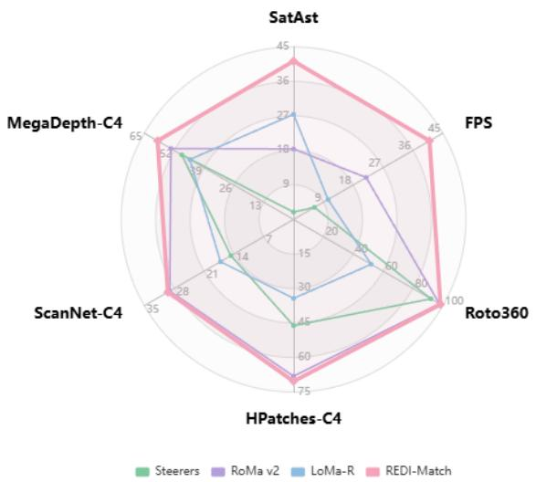
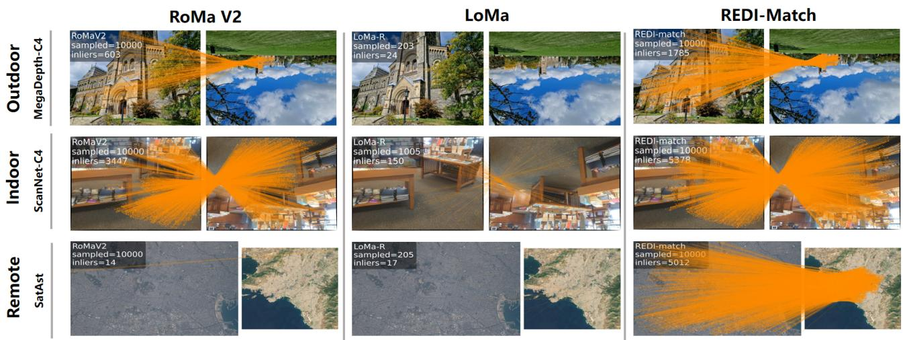
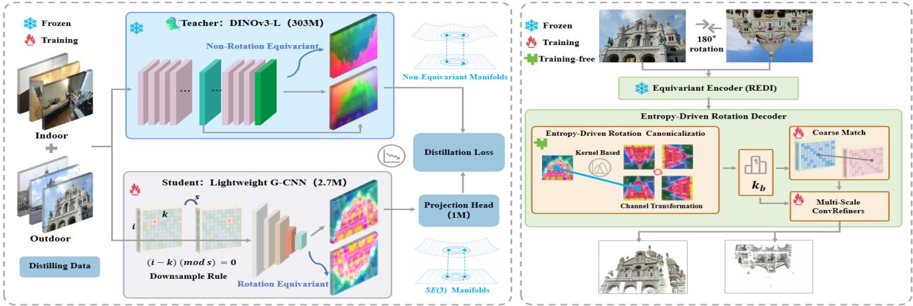
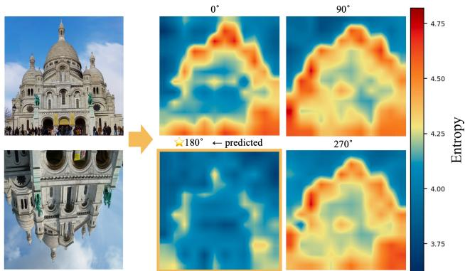
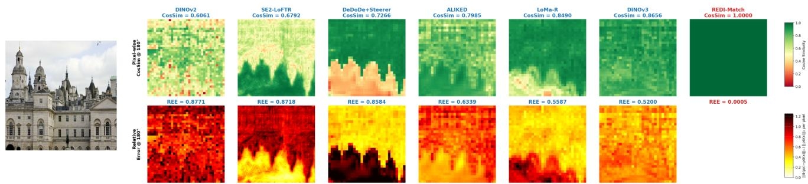

# REDI-Match: Rotation-Equivariant Distillation for Efficient and Robust Dense Matching

Yinji Ge1\* Guixu Zheng2\* Wulong Guo3 Qian Feng4

Xu Wu1 Kai Zhou1† Xinyuan Liu1† Fei Xing1†

1Tsinghua University 2Southern University of Science and Technology 3Beihang University 4Zhejiang University

geyj25@mails.tsinghua.edu.cn, xingfei@mail.tsinghua.edu.cn

## Abstract

Vision Foundation Models (VFMs) have significantly advanced dense feature matching, yet severe in-plane rotation remains a critical challenge. Existing solutions face a fundamental dilemma: data-driven methods require inefficient parameter scaling to implicitly learn rotations, whereas strictly equivariant networks lack the semantic capacity of modern VFMs. Consequently, current frameworks typically freeze VFMs and shift the entire burden of rotation generalization to the downstream decoder. To break this architectural bottleneck, we propose REDI-Match, an efficient framework driven by a novel Rotation-Equivariant Distillation (REDI) paradigm. Instead of relying on rotation data augmentation to establish rotational correspondences, REDI distills the non-equivariant semantic representations of a VFM into a lightweight, strictly rotationequivariant encoder, leveraging an equivariant geometric architecture to constrain robust high-dimensional semantics. To fully exploit these features, we equip the decoder with an entropy-driven spatial alignment module. By evaluating discrete rotation hypotheses, this mechanism explicitly locks onto the canonical coordinate system, eliminating global ambiguity before continuous refinement. Extensive experiments demonstrate that REDI-Match establishes a new stateof-the-art (SOTA) across multiple benchmarks. Notably, it achieves a 13.89% absolute pose accuracy improvement on the highly challenging SatAst dataset while operating 1.9× faster than the current SOTA (RoMa v2), enabling real-time inference (∼41 FPS) on a single RTX 4090 GPU. Code: https://github.com/YinjiGe/REDI-Match.

  
Figure 1. Radar comparison of REDI-Match against SOTA methods. All axes except FPS report AUC scores (higher is better). REDI-Match achieves the best overall accuracy–efficiency trade-off across all benchmarks.

## 1. Introduction

Feature matching aims to establish reliable point correspondences across images, serving as a cornerstone for downstream tasks like Structure-from-Motion (SfM), 3D reconstruction, and robotic navigation [33, 36]. Recently, dense matching has advanced this field by providing pixel-level correspondences [13, 16]. This success is largely driven by Vision Foundation Models (VFMs) [5, 28, 35], which serve as powerful encoders capable of extracting deep semantics for high-accuracy matching.

However, severe in-plane rotation remains a critical bottleneck, degrading performance in applications such as aerial visual localization, remote sensing, and medical imaging [2, 21]. To address this, recent research diverges into two paradigms. On one hand, data-driven methods rely on extensive data augmentation to implicitly learn rotational transformations [17]. On the other hand, structure-driven methods employ Group Equivariant Convolutional Neural Networks (G-CNNs) [8, 9, 45] to mathematically guarantee geometric consistency. Fundamentally, both approaches are trapped in a strict trade-off between semantic capacity and geometric consistency. Data-driven strategies require massive scaling of model parameters to accommodate rotational augmentations, yielding brittle generalization and computational inefficiency. Conversely, strictly equivariant networks struggle to match the rich semantic capacity of modern foundation models.

  
Figure 2. Qualitative comparison of REDI-Match against SOTA methods under severe in-plane rotations. We evaluate across outdoor (MegaDepth-C4), indoor (ScanNet-C4), and remote sensing (SatAst) datasets. All input images are resized to 576 × 576. The reported inliers indicate the number of points after RANSAC, and orange lines visualize their one-to-one correspondences. For dense matchers (RoMa V2 and REDI-Match), visualizations are based on a fixed sampling of 10,000 points; for the sparse matcher (LoMa-R), the sample count reflects the detected keypoints. Notably, while existing SOTA methods suffer from catastrophic failure on the highly challenging SatAst dataset, REDI-Match consistently maintains dense and highly accurate alignments, demonstrating its robust zero-shot rotation generalization.

Driven by the necessity of these robust representations, modern frameworks typically freeze pre-trained VFMs. Consequently, state-of-the-art (SOTA) architectures resort to implicit data augmentation, shifting the entire burden of rotation generalization to the downstream decoder. To break this architectural bottleneck, we recognize that the geometric consistency of G-CNNs and the semantic capacity of VFMs are highly complementary. We propose a novel Rotation-Equivariant Distillation (REDI) paradigm. By distilling the representations of a heavy VFM into a lightweight, strictly rotation-equivariant encoder, we unify robust semantic representations with strict geometric consistency. This approach structurally models geometric variations early at the feature extraction stage, completely bypassing the need for massive data augmentation.

Building upon this paradigm, we introduce REDI-Match, an efficient dense matching framework tailored for rotationrobust applications. To exploit the equivariant features from our encoder, we equip the downstream decoder with a lightweight, entropy-driven spatial alignment module. Rather than forcing the network to implicitly learn geometric transformations, this module explicitly evaluates discrete rotation hypotheses. By utilizing information entropy to lock onto the canonical orientation, it eliminates global ambiguity before refining small-angle variations. Ultimately, this mathematically grounded pipeline achieves an optimal balance between computational efficiency and geometric robustness.

The main contributions of this paper are summarized as follows:

• We propose REDI, an equivariant distillation paradigm that transfers the semantic knowledge of a VFM into a lightweight, strictly rotation-equivariant encoder, unifying robust semantics with strict geometric equivariance in a single feature manifold.

• We introduce an entropy-driven alignment module that resolves global rotation ambiguity by explicitly evaluating discrete hypotheses, eliminating the need for implicit datafitting.

• We present REDI-Match, an efficient dense matching framework that delivers SOTA performance under severe rotations.Notably, it achieves a 13.89% absolute pose accuracy improvement on the highly challenging SatAst dataset while operating 1.9× faster than the current SOTA (RoMa v2), enabling real-time inference (∼41 FPS) on a single RTX 4090 GPU.

## 2. Related Work

## 2.1. Feature Matching

Feature matching methods can be broadly categorized into sparse, semi-dense, and dense approaches, which establish image correspondences at varying granularities ranging from discrete keypoints to global pixel-wise mappings. Early sparse methods [6, 11, 24, 25, 30, 32, 33] rely on local associations for fast inference, albeit at the cost of lower precision. To bridge this gap, semi-dense methods [7, 18, 36, 38, 44, 46, 47, 50] emerged as a pragmatic middle ground, balancing matching performance with computational speed. Pushing toward ultimate accuracy, dense matching methods [13, 39] establish pixel-wise correspondences. Recently, frameworks like the RoMa series [16] have integrated rich semantic priors from VFMs. To further push performance boundaries, SOTA algorithms such as UFM [48] and RoMa v2 [17] scale their training paradigms across extensively augmented, multi-domain datasets.

However, we observe that in pursuit of competitive accuracy, many sparse and semi-dense methods now adopt heavy modules that severely compromise their original real-time efficiency. Meanwhile, although dense matchers excel in fine-grained alignment, their massive parameter counts and heavy computational burdens, often exacerbated by reliance on VFMs, typically restrict them to offline applications. This unresolved trade-off between semantic capacity and realtime efficiency highlights the urgent need for a lightweight matching architecture capable of high-speed inference.

## 2.2. Equivariant Networks and Rotation Consistency

Rotation matching has long stood as a fundamental challenge in the field of feature matching. To overcome the rotational sensitivity of standard CNNs, G-CNNs [8, 9, 45] mathematically guarantee geometric consistency. Efforts like Rotation-Steerers [3] and co-design strategies [14, 15] attempt to inject these priors but achieve only approximate equivariance, failing under extreme baseline shifts. Alternatively, recent methods like LoMA-R [27] attempt to improve robustness through extensive rotation augmentation across mixed datasets.

Despite these advancements, a fundamental dilemma persists. Strictly equivariant matchers require training from scratch, preventing them from leveraging the rich semantic capacity of modern VFMs. Conversely, post-hoc solutions relying on either approximate steering or heavy data augmentation inevitably degrade the geometric phase information critical for dense alignment. Consequently, they falter under the compound challenge of extreme rotations and large viewpoint changes. This exposes a critical structural gap: the inability to unify deep semantic power with rigorous geometric consistency within a single feature manifold.

## 2.3. Vision Foundation Models and Knowledge Distillation

VFMs such as DINO [5], DINOv2 [28], and DINOv3 [35] have demonstrated remarkable semantic understanding, making them powerful backbones for dense prediction tasks. Downstream applications favor lightweight VFM variants compressed via Knowledge Distillation (KD) [19]. Early KD methods focused on aligning intermediate feature representations [31], while later works improved fidelity through similarity preservation [40] and relational consistency [29].

Traditionally, KD has been treated exclusively as a utility for model compression, aimed at maximally retaining the teacher’s performance. Breaking from this convention, we investigate a novel perspective: can KD act as a principled bridge to unify two fundamentally distinct feature manifolds? Specifically, we explore its potential to connect the nonequivariant semantic space of a teacher with the structured equivariant space of a student.

## 3. Method

## 3.1. Overall Architecture

To address severe in-plane rotations without relying on heuristic data augmentation, our framework builds upon an equivariant distillation architecture that bridges nonequivariant VFMs with G-CNNs. This design is fundamentally motivated by a key empirical observation: while standard dense matchers degrade catastrophically under extreme rotations (as evidenced in Tab. 1), their native spatial correlation priors inherently tolerate continuous, small-angle perturbations . To achieve an optimal trade-off between robustness and computational efficiency, we abandon the prohibitive cost of continuous rotation group modeling. Instead, we propose a “discrete canonicalization plus continuous residual refinement” paradigm, strategically factoring out large-angle variations explicitly while leaving local deviations to be handled by the network’s inherent capacity.

As illustrated in Fig. 3, the matching pipeline begins with a lightweight, semantic-guided CN -equivariant encoder. By distilling knowledge from a heavy VFM (Sec. 3.2), this encoder structurally endows the features with explicit geometric priors, resolving arbitrary large-angle transformations into deterministic combinations of spatial rotations and group-channel permutations. At the coarsest feature scale, an entropy-driven module (Sec. 3.3) evaluates $C _ { N }$ discrete rotation hypotheses in parallel. Guided by the sharpness of the resulting matching distributions, it selects the optimal rotation index $k ^ { * }$ , thereby performing global spatial canonicalization. This critical step eliminates the dominant large-scale orientation ambiguity and maps the features into a unified, gravity-aligned reference frame.

Operating entirely within this canonical space, the remaining relative rotation between the feature maps is strictly bounded within a small residual regime . In this constrained space, a multi-scale ConvRefiner executes top-down refinement to resolve local structural inconsistencies and continuous small-angle deviations. Benefiting from the initial discrete alignment, the refiner’s native correlation mechanisms remain highly effective entirely without the need for rotationbased data augmentation during training. Finally, a decanonicalization step inversely transforms the refined dense correspondence field back to the original image coordinate system. As validated in Tab. 1, this architecture yields unique advantages on continuous rotation benchmarks, consistently outperforming methods that rely solely on data-driven augmentation, under a decoupled two-stage optimization paradigm (Sec. 3.4).

Stage 1: Rotation-Equivariant Distillatio (REDI)  
Stage 2: REDI-Match  
  
Figure 3. Overview of the REDI-Match framework. (Left) Stage 1: Rotation-Equivariant Distillation (REDI). A frozen VFM (DINOv3- L) is distilled into a lightweight G-CNN. Optimized via Mean Squared Error (MSE) loss to strictly preserve geometric phase information, this process projects non-equivariant semantics onto an SE(3) manifold. (Right) Stage 2: REDI-Match. Given rotated image pairs, the frozen REDI encoder extracts equivariant features for the Entropy-Driven Rotation Decoder. Within this decoder, a training-free canonicalization module utilizes information entropy to evaluate discrete hypotheses, explicitly locking onto the canonical orientation (kb). This eliminates global ambiguity early, allowing the trainable coarse matcher and multi-scale refiners to establish robust dense correspondences without rotation-augmented data.

## 3.2. Equivariant Distillation Framework

We distill semantic representations from the non-equivariant VFM DINOv3-L (teacher $\Phi _ { T } )$ into a lightweight G-CNN (student $\Phi _ { S } )$ . To bridge the representational gap between the two, we introduce a standard linear projection head P . Since the teacher’s feature space lacks strict rotational symmetry, this unconstrained linear projection provides the necessary flexibility to align the feature manifolds, avoiding the mapping capacity bottlenecks imposed by an equivariant projection head.

Although group convolutions exhibit algebraic equivariance, internal spatial subsampling operations (e.g., striding or pooling) introduce aliasing, which breaks grid-orbit consistency and degrades geometric phase information. To guarantee strict layer-wise equivariance under discrete transformation groups G , we impose rigorous structural constraints on $\Phi _ { S }$ . Following architectural designs in standard equivariant networks [45], for any subsampling layer with input dimension i (including padding), kernel size k, and stride s, we enforce the following grid-alignment modulo condition:

$$
(i - k) \bmod s = 0\tag{1}
$$

Crucially, while this constraint was initially proposed for standard supervised training [12], we demonstrate its critical structural role within the REDI paradigm. By explicitly preventing spatial aliasing through this structural constraint, $\Phi _ { S }$ satisfies the exact equivariance condition:

$$
\Phi_ {S} \big (\mathcal {T} _ {g} x \big) = \mathcal {R} _ {g} \Phi_ {S} (x), \quad \forall g \in G\tag{2}
$$

where $\mathcal { T } _ { g }$ denotes the spatial transformation applied to the input image, and $\mathcal { R } _ { g }$ represents the corresponding group action in the feature space.

While $\mathrm { 5 } _ { S }$ is architecturally equivariant, empirical results indicate that rotation-augmented distillation further improves robustness by explicitly aligning semantic manifolds across multiple orientations, rather than relying solely on architec tural priors. Finally, to capture both fine-grained textures and global context, the student is aligned with a weighted aggregation of the teacher’s multi-scale features. Let L denote the set of selected intermediate and final layers, and $w _ { l }$ their corresponding weights. The aggregated multi-scale Teacher feature serves as the distillation target:

$$
\Phi_ {T} (x) = \sum_ {l \in \mathcal {L}} w _ {l} \Phi_ {T} ^ {(l)} (x)\tag{3}
$$

A standard projection head P maps the student output to this target space, thereby preserving the dense local saliency required for precise sub-pixel matching. The concrete optimization loss function is discussed in Sec. 3.4.

## 3.3. Entropy-Driven Rotation Decoder

We adopt Gaussian Process (GP) kernel regression for its inherent continuous spatial correlation priors, which stabilize predictions under large geometric deformations. However, existing kernel-based matchers lack explicit rotation awareness. To bridge this gap, we introduce our core contribution: an entropy-driven rotation estimation module.

Leveraging the equivariance property from Eq. 2, we obtain feature maps at the coarsest scale corresponding to the four $C _ { 4 }$ orientations by applying the group action $\mathcal { R } _ { k }$ to the B-side features $F _ { B } \colon$

$$
Y ^ {(k)} = \mathcal {R} _ {k} (F _ {B}), \quad k \in \{0, 1, 2, 3 \},\tag{4}
$$

where $\mathcal { R } _ { k }$ denotes the composite spatial rotation and groupchannel permutation, and k indexes $0 ^ { \circ } , 9 0 ^ { \circ } , 1 8 0 ^ { \circ } , 2 7 0 ^ { \circ }$ . For efficient global context, $F _ { A }$ and $Y ^ { ( k ) }$ are uniformly downsampled via adaptive pooling to sequence tokens $X , Y ^ { ( k ) } \in$ $\mathbb { R } ^ { B \times N \times d }$

As illustrated in Fig. 4, the key insight is that the correct rotation yields a sharp, low-entropy matching distribution, while incorrect rotations produce diffuse, high-entropy affinities. We compute an exponential cosine affinity kernel with temperature $T > 0 \mathrm { : }$

$$
K _ {b, i j} ^ {(k)} = \exp \left(\frac {\langle X _ {b , i} , Y _ {b , j} ^ {(k)} \rangle}{T \cdot \| X _ {b , i} \| \| Y _ {b , j} ^ {(k)} \|}\right),\tag{5}
$$

and obtain the row-normalized matching probabilities

$$
P _ {b, i j} ^ {(k)} = \frac {K _ {b , i j} ^ {(k)}}{\sum_ {j ^ {\prime} = 1} ^ {M} K _ {b , i j ^ {\prime}} ^ {(k)}}.\tag{6}
$$

Matching certainty is quantified via mean Shannon entropy normalized by log M. Let $\alpha = 1 /$ log M :

$$
\tilde {H} _ {b} ^ {(k)} = - \frac {\alpha}{N} \sum_ {i, j} P _ {b, i j} ^ {(k)} \log P _ {b, i j} ^ {(k)}.\tag{7}
$$

We select the rotation minimizing entropy:

$$
k _ {b} = \operatorname * {a r g   m i n} _ {k \in \{0, 1, 2, 3 \}} \tilde {H} _ {b} ^ {(k)}.\tag{8}
$$

Once $k _ { b }$ is identified, we apply the inverse transform $\mathcal { R } _ { k _ { b } } ^ { - 1 }$ to the multi-scale B-side features, projecting all branches into a unified gravity-aligned reference frame. Within this canonical space, the multi-scale ConvRefiner resolves residual local inconsistencies and small-angle deviations via top-down refinement, after which a decanonicalization step restores the dense flow and its certainty map to the original image coordinates.

  
Figure 4. $C _ { 4 }$ rotation detection via rotation kernel entropy discrimination. Correct matching is consistently accompanied by a low-entropy distribution across orientation hypotheses. By evaluating the mean entropy H¯ , this module effectively identifies the optimal feature orientation, thereby resolving multi-modal distribution ambiguities in the dense matching process.

Notably, this rotation estimation module is entirely training-free, requiring no parameter updates beyond the distilled geometric symmetry. The optimization objectives are discussed in Sec. 3.4.

## 3.4. Two-Stage Decoupled Optimization Paradigm

A defining characteristic of our framework is that rotational robustness is architecturally encoded rather than purely datadriven.

Stage One: Equivariant Distillation Loss. The distillation loss is a Mean Squared Error (MSE) objective applied on $C _ { 4 }$ -rotated views:

$$
\mathcal {L} _ {\mathrm{distill}} = \left\| P \big (\Phi_ {S} (\mathcal {T} _ {g} x) \big) - \Phi_ {T} (\mathcal {T} _ {g} x) \right\| _ {2} ^ {2}.\tag{9}
$$

Our ablation study (Sec. 4.5) identifies MSE as the most robust distillation objective among KL divergence, cosine similarity, and MSE. Unlike these alternatives, MSE jointly constrains both direction and magnitude of feature vectors, preserving the feature-magnitude saliency essential for subpixel alignment under extreme domain shifts. After distillation, $P$ is discarded and only $\Phi _ { S }$ is retained.

Stage Two: Dense Matching Loss. The second stage optimizes the continuous correspondence estimator, comprising GP kernel regression and multi-scale ConvRefiner. The entropy-driven rotation decoder (Sec. 3.3) is a purely training-free module—it solely exploits the geometric sym metry distilled in Stage One. Consequently, the matching decoder is trained exclusively under gravity-aligned states without any in-plane rotation augmentation. Following RoMa [16], we employ a combined classification-regression loss to supervise dense flow predictions against ground-truth correspondences: the classification term optimizes match confidence, while the regression term minimizes the endpoint error of the dense warp.

Table 1. Quantitative evaluation on discrete rotation datasets (MegaDepth-C4, ScanNet-C4, and HPatches-C4) as well as continuous and extreme out-of-distribution rotation benchmarks (HPatches-Rot360 and SatAst). All tests are conducted at a resolution of 576 × 576. AUC scores are reported as raw values.

<table><tr><td rowspan="2">Method</td><td colspan="3">MegaDepth-C4 (AUC % ↑)</td><td colspan="3">ScanNet-C4 (AUC % ↑)</td><td colspan="3">HPatches-C4 (AUC % ↑)</td><td colspan="3">Roto360 (AUC % ↑)</td><td colspan="3">SATAST (AUC % ↑)</td></tr><tr><td>@5°</td><td>@10°</td><td>@20°</td><td>@5°</td><td>@10°</td><td>@20°</td><td>@3°</td><td>@5°</td><td>@10°</td><td>@3°</td><td>@5°</td><td>@10°</td><td>@5°</td><td>@10°</td><td>@20°</td></tr><tr><td colspan="16">Sparse</td></tr><tr><td>ALIKED+VGGT [43, 49]</td><td>18.44</td><td>32.57</td><td>47.01</td><td>10.64</td><td>23.72</td><td>38.94</td><td>13.62</td><td>23.24</td><td>38.03</td><td>52.74</td><td>75.64</td><td>94.39</td><td>14.33</td><td>19.64</td><td>22.72</td></tr><tr><td>RELF [21]</td><td>16.51</td><td>30.60</td><td>46.71</td><td>6.24</td><td>14.80</td><td>26.07</td><td>36.56</td><td>55.05</td><td>73.53</td><td>71.01</td><td>82.05</td><td>88.29</td><td>1.09</td><td>2.81</td><td>5.76</td></tr><tr><td>Steerers $^{CVPR'24}$ [3]</td><td>48.72</td><td>65.88</td><td>78.92</td><td>14.70</td><td>29.60</td><td>44.47</td><td>46.17</td><td>63.37</td><td>79.03</td><td>89.90</td><td>92.06</td><td>94.38</td><td>1.92</td><td>2.90</td><td>3.70</td></tr><tr><td>LoMa-R $^{CVPRW'26}$ [27]</td><td>45.20</td><td>62.61</td><td>76.63</td><td>17.13</td><td>31.94</td><td>45.38</td><td>34.32</td><td>49.76</td><td>65.46</td><td>45.24</td><td>52.01</td><td>61.15</td><td>27.43</td><td>41.98</td><td>51.74</td></tr><tr><td colspan="16">Semi-Dense</td></tr><tr><td>Se2-LoFTR $^{CVPRW'22}$ [2]</td><td>33.37</td><td>49.79</td><td>64.59</td><td>13.24</td><td>28.18</td><td>44.74</td><td>35.17</td><td>50.82</td><td>69.50</td><td>56.50</td><td>75.01</td><td>91.84</td><td>OOD</td><td>0.22</td><td>0.85</td></tr><tr><td colspan="16">Dense</td></tr><tr><td>DKMC $^{CVPR'23}$ [13]</td><td>16.20</td><td>20.57</td><td>23.77</td><td>12.92</td><td>24.52</td><td>35.70</td><td>23.30</td><td>28.93</td><td>34.83</td><td>48.40</td><td>50.15</td><td>52.04</td><td>9.89</td><td>12.12</td><td>13.57</td></tr><tr><td>ROMAC $^{CVPR'24}$ [16]</td><td>25.90</td><td>37.74</td><td>48.47</td><td>12.64</td><td>23.93</td><td>35.61</td><td>28.78</td><td>41.24</td><td>54.31</td><td>50.40</td><td>58.35</td><td>67.28</td><td>14.12</td><td>18.96</td><td>22.07</td></tr><tr><td>ROMAv2arXiv&#x27;25[17]</td><td>53.45</td><td>68.93</td><td>80.09</td><td>29.03</td><td>49.47</td><td>65.91</td><td>68.17</td><td>78.05</td><td>87.01</td><td>97.27</td><td>97.65</td><td>98.02</td><td>18.40</td><td>24.20</td><td>28.50</td></tr><tr><td>REDI-Match</td><td>59.22</td><td>74.27</td><td>84.76</td><td>29.48</td><td>50.60</td><td>67.98</td><td>70.41</td><td>79.59</td><td>87.71</td><td>98.45</td><td>98.57</td><td>98.64</td><td>41.32</td><td>50.62</td><td>57.37</td></tr></table>

Table 2. Training data comparison. REDI-Match achieves superior rotation robustness with only 2 datasets, versus 10–17 for prior matchers, demonstrating that our gains arise from equivariant distillation rather than data scaling.

<table><tr><td>Method</td><td>Training Datasets</td><td>Datasets</td><td>Paradigm</td></tr><tr><td>RoMa v2 [17]</td><td>MegaDepth, ScanNet++ v2, AerialMD, BlendedMVS, Hypersim, +5 others</td><td>10</td><td>Data-Driven</td></tr><tr><td>LoMa-R [27]</td><td>MegaDepth, ScanNet++ v2, MegaScenes, Map-Free, TartanAir v2, +12 others</td><td>17</td><td>Data-Driven</td></tr><tr><td>REDI-Match</td><td>MegaDepth, ScanNet++ v2</td><td>2</td><td>Method-Driven</td></tr></table>

This asymmetric decoupling yields a clear efficiency advantage: the Teacher is queried only once during distillation, and the matching decoder incurs zero rotation overhead at inference time, operating entirely under gravity-aligned canonical coordinates.

## 4. Experiments

## 4.1. Experimental Setup

Training Data. The outdoor version is trained on MegaDepth [22] and the indoor version on a MegaDepth-ScanNet [10] mixture. As summarized in Tab. 2, REDI-Match requires only two standard datasets, in stark contrast to prior methods that rely on massive multi-dataset mixtures, underscoring that our robustness is method-driven rather than data-driven.

Evaluation Benchmarks. We establish a multi-level benchmark [20, 34, 37]: (1) standard and $C _ { 4 }$ discrete rotation [1] matching on MegaDepth, ScanNet, and HPatches; (2) continuous full-angle rotation robustness on HPatches Rot360; and (3) extreme out-of-distribution generalization on SatAst [42], where most existing architectures suffer failure. To ensure fair comparison of inference speed and accuracy across model architectures, all methods are evaluated at a unified resolution of $5 7 6 \times 5 7 6$

Encoder Distillation. A frozen DINOv3 ViT-L/16 (∼303M) serves as the Teacher, with a lightweight $C _ { 4 } { \mathrm { - e q u i v a r i a n t } }$ VGG-FPN (∼2.7M) as the Student. A projection head (∼1.0M) bridges the two and is discarded after distillation, yielding ∼ 112× compression. Distillation uses only RGB images at 224 × 224 resolution, with MSE loss and continuous rotation augmentations, running for 100 epochs on three NVIDIA A100 GPUs (80GB) with DDP, bfloat16 mixed precision, the LARS optimizer, batch size 768, learning rate 4.0, and completes in approximately 1 days.

Decoder Training. The matching decoder is trained on four NVIDIA RTX 4090 GPUs at 560 × 560 resolution following the RoMa protocol with standard photometric augmentations, strictly excluding in-plane rotation augmentations, and completes in approximately 2 days with EMA.

## 4.2. State-of-the-Art Comparison on Rotation Benchmarks

As shown in Tab. 1, existing matchers degrade significantly under $C _ { 4 }$ discrete rotations on MegaDepth, ScanNet, and HPatches due to lacking explicit geometric constraints. In contrast, REDI-Match remains highly stable, achieving stateof-the-art performance across all discrete settings. Furthermore, our framework maintains consistent robustness under unconstrained continuous rotations (HPatches-Rot360). This confirms that the REDI-Match framework maintains excellent robustness against continuous rotations, despite not relying on massive data augmentation or complex continuousequivariant modeling.

Table 3. Quantitative evaluation on MegaDepth, ScanNet, and HPatches datasets, grouped into Sparse, Semi-Dense, and Dense categories, with additional model size and inference latency statistics. All tests are conducted at a resolution of $5 7 6 \times 5 7 6$ . Latency is measured on a single NVIDIA RTX 4090 GPU.

<table><tr><td rowspan="2">Method</td><td colspan="3">MegaDepth (AUC % ↑)</td><td colspan="3">ScanNet (AUC % ↑)</td><td colspan="3">HPatches (AUC % ↑)</td><td colspan="2">Efficiency</td></tr><tr><td>@5°</td><td>@10°</td><td>@20°</td><td>@5°</td><td>@10°</td><td>@20°</td><td>@3°</td><td>@5°</td><td>@10°</td><td>Params (M) ↓</td><td>Latency (ms) ↓</td></tr><tr><td colspan="12">Sparse</td></tr><tr><td> $ALIKED^{TIM'23}+LG^{CVPR'24}$ [24, 49]</td><td>37.25</td><td>55.31</td><td>70.87</td><td>16.65</td><td>33.28</td><td>49.95</td><td>60.38</td><td>73.08</td><td>84.37</td><td>12.56</td><td>27.31</td></tr><tr><td> $DISK^{NeurIPS'20}+LG$ [24, 41]</td><td>36.38</td><td>54.64</td><td>70.32</td><td>14.37</td><td>28.90</td><td>44.29</td><td>49.66</td><td>64.43</td><td>79.38</td><td>12.98</td><td>31.79</td></tr><tr><td> $SP^{CVPRW'18}+LSD+GT$ [11]</td><td>42.75</td><td>59.99</td><td>74.20</td><td>16.34</td><td>34.46</td><td>52.71</td><td>42.25</td><td>59.15</td><td>76.52</td><td>18.24</td><td>242.52</td></tr><tr><td> $ALIKED+VGGSFM^{CVPR'24}$ [43, 49]</td><td>37.05</td><td>55.05</td><td>69.80</td><td>10.89</td><td>21.71</td><td>32.73</td><td>51.38</td><td>66.25</td><td>80.07</td><td>51.41</td><td>780.27</td></tr><tr><td> $Steers^{CVPR'24}$ [3]</td><td>50.64</td><td>67.44</td><td>80.24</td><td>14.90</td><td>29.60</td><td>44.60</td><td>67.70</td><td>77.47</td><td>86.80</td><td>33.44</td><td>159.38</td></tr><tr><td> $LoMa-R^{CVPRW'26}$ [26]</td><td>50.06</td><td>66.82</td><td>79.81</td><td>25.93</td><td>47.70</td><td>66.55</td><td>61.13</td><td>73.79</td><td>85.38</td><td>341.52</td><td>91.94</td></tr><tr><td> $LoMa-G^{arXiv'26}$ [26]</td><td>51.38</td><td>67.76</td><td>80.50</td><td>28.13</td><td>50.52</td><td>68.97</td><td>59.32</td><td>72.79</td><td>84.82</td><td>518.89</td><td>141.63</td></tr><tr><td colspan="12">Semi-Dense</td></tr><tr><td> $CasMTR^{CVPR'24}$ [4]</td><td>52.66</td><td>69.02</td><td>81.21</td><td>26.15</td><td>46.24</td><td>63.61</td><td>67.77</td><td>77.61</td><td>86.59</td><td>14.70</td><td>55.93</td></tr><tr><td> $CoMatch^{ICCV'25}$ [23]</td><td>50.89</td><td>67.57</td><td>79.87</td><td>20.96</td><td>38.89</td><td>55.50</td><td>68.12</td><td>77.52</td><td>86.43</td><td>12.01</td><td>29.58</td></tr><tr><td> $EfficientLoFTR^{CVPR'24}$ [44]</td><td>48.48</td><td>65.40</td><td>78.31</td><td>18.66</td><td>36.57</td><td>53.55</td><td>68.26</td><td>77.57</td><td>86.17</td><td>15.05</td><td>18.22</td></tr><tr><td> $ASpanFormer^{ECCV'22}$ [7]</td><td>56.41</td><td>72.56</td><td>83.91</td><td>26.26</td><td>46.69</td><td>64.07</td><td>68.16</td><td>77.47</td><td>86.11</td><td>15.76</td><td>93.10</td></tr><tr><td> $PMatch^{CVPR'23}$ [51]</td><td>55.53</td><td>71.41</td><td>82.95</td><td>27.04</td><td>47.83</td><td>65.38</td><td>39.48</td><td>43.22</td><td>46.62</td><td>15.75</td><td>37.46</td></tr><tr><td> $Se2-LoFTR^{CVPRW'22}$ [2]</td><td>47.88</td><td>64.60</td><td>77.58</td><td>17.77</td><td>35.13</td><td>51.97</td><td>67.11</td><td>76.76</td><td>85.96</td><td>9.78</td><td>76.04</td></tr><tr><td colspan="12">Dense</td></tr><tr><td> $DKM^{CVPR'23}$ [13]</td><td>58.13</td><td>73.34</td><td>84.11</td><td>29.22</td><td>50.36</td><td>68.00</td><td>71.33</td><td>80.40</td><td>88.42</td><td>72.26</td><td>34.25</td></tr><tr><td> $RoMa^{CVPR'24}$ [16]</td><td>59.56</td><td>74.42</td><td>84.85</td><td>30.99</td><td>52.58</td><td>70.19</td><td>70.35</td><td>79.88</td><td>88.20</td><td>415.66</td><td>78.40</td></tr><tr><td> $RoMa v2^{arXiv'25}$ [17]</td><td>60.02</td><td>74.77</td><td>85.19</td><td>33.27</td><td>55.96</td><td>73.40</td><td>70.74</td><td>80.36</td><td>89.03</td><td>425.42</td><td>45.73</td></tr><tr><td> $UFM^{NeurIPS'25}$ [48]</td><td>34.08</td><td>51.00</td><td>66.45</td><td>28.11</td><td>50.65</td><td>69.12</td><td>58.60</td><td>70.44</td><td>82.40</td><td>477.76</td><td>95.18</td></tr><tr><td>REDI-Match</td><td>59.75</td><td>74.70</td><td>84.89</td><td>30.21</td><td>51.41</td><td>68.79</td><td>72.08</td><td>81.17</td><td>89.06</td><td>94.90</td><td>24.05</td></tr></table>

This advantage peaks on the challenging out-ofdistribution SatAst dataset, where REDI-Match improves the $\mathrm { A U C } @ 5 ^ { \circ }$ from 27.43% to 41.32%. We attribute this exceptional zero-shot generalization to the decoder’s compact two-stage logic. Entropy-driven canonicalization at the coarsest scale isolates large rotations, restricting the downstream ConvRefiner to a bounded residual range. Consequently, this structural prior enables superior geometric generalization without the massive data scaling required by data-driven methods like RoMa v2 or LoMa-R [17, 27].

## 4.3. Generalization on Standard Benchmarks and Efficiency

On standard benchmarks (Tab. 3), our framework delivers leading performance across all three datasets. On HPatches, it ranks first with 72.08/81.17/89.06 AUC at $3 ^ { \circ } / 5 ^ { \circ } / 1 0 ^ { \circ } ;$ on MegaDepth and ScanNet, it trails RoMa v2 by less than 0.5% while using 5× fewer parameters (85M vs. 425M). This confirms that embedding VFM semantics into an equivariant manifold incurs no meaningful degradation on gravityaligned scenes.

In terms of efficiency, the full pipeline achieves 24.05 ms (41 FPS) inference latency on a single NVIDIA RTX 4090, making it the fastest dense feature matcher to date. Combined with a compact 85.07M parameter footprint, the framework is well-suited for real-time deployment on consumergrade and edge hardware.

## 4.4. Equivariance Analysis

We quantitatively validate the strict equivariance properties of our encoder, maintaining machine-precision zero error and perfect spatial alignment across all discrete angles. As visualized in Fig. 5, we compare the feature distributions of different models under rotation. Standard non-equivariant foundation models such as DINOv3 exhibit severe feature distortions and structural collapse when subjected to in-plane rotations, resulting in high Pixel-wise Relative Equivariance Error (REE) and degraded Pixel-wise Cosine Similarity (PCS). In stark contrast, our equivariant encoder maintains strict spatial and semantic consistency across varying angles, visually confirming its immunity to geometric perturbations.

## 4.5. Ablation Studies

We conduct ablations on SatAst and MegaDepth-C4, categorized into encoder distillation and decoder design (Tab. 4). Encoder Distillation. Violating the grid-alignment modulo condition (Eq. 1) I reduces the encoder from strictly equivariant to only approximately equivariant, significantly degrading downstream matching accuracy. Training from scratch without distillation II leads to gradient explosion, indicating that the REDI paradigm provides necessary optimization stability. Regarding the loss function III, distributionmatching objectives like KL divergence and cosine similarity achieve performance comparable to MSE on the seen domain (MegaDepth-C4), but suffer from substantial degradation on the unseen remote sensing dataset (SatAst). This discrepancy indicates that MSE facilitates superior zero-shot generalization across domain gaps. By operating in the ambient Euclidean space and explicitly preserving geometric phase information, MSE prevents the student model from overfitting to the source domain’s activation statistics, thereby retaining robust cross-domain transferability.

  
Figure 5. Pixel-wise REE and PCS visualization of mainstream rotation matching encoders. We evaluate the rotation equivariance error and patch cosine similarity of current mainstream encoders under rotation. Our distilled equivariant encoder consistently preserves structural symmetry, achieving near-zero feature degradation. This is crucial for achieving efficient and robust rotation matching in subsequent stages.

Table 4. Ablation study. Evaluated on SatAst and MegaDepth-C4. Grad. Expl.: gradient explosion.

<table><tr><td rowspan="2">Variant</td><td colspan="2">SatAst (AUC % ↑)</td><td colspan="2">Mega-C4 (AUC % ↑)</td></tr><tr><td>@5°</td><td>@10°</td><td>@5°</td><td>@10°</td></tr><tr><td colspan="5">Encoder Distillation</td></tr><tr><td>I Model Designw/o (i - k) mod s = 0</td><td>14.33</td><td>20.68</td><td>21.44</td><td>36.07</td></tr><tr><td>II Training Strategyw/o Distill</td><td colspan="2">Grad. Expl.</td><td colspan="2">Grad. Expl.</td></tr><tr><td>III Loss FunctionMSE → KL</td><td>17.59</td><td>21.12</td><td>57.74</td><td>72.72</td></tr><tr><td>MSE → Cosine</td><td>13.67</td><td>17.33</td><td>57.91</td><td>72.93</td></tr><tr><td>IV Projection HeadMLP → Equiv. Head</td><td>15.73</td><td>20.81</td><td>56.30</td><td>71.46</td></tr><tr><td>V Data StrategyRot → Upright</td><td>40.30</td><td>50.00</td><td>58.91</td><td>74.00</td></tr><tr><td>VI Teacher ModelDINOv3-L → DINOv2-L</td><td>38.77</td><td>48.52</td><td>57.49</td><td>72.90</td></tr><tr><td colspan="5">Decoder Training</td></tr><tr><td>VII Rotation Decoderw/o Entropy Rot. module</td><td>16.42</td><td>19.48</td><td>16.94</td><td>21.52</td></tr><tr><td>VIII Matching BackendGP → Cross-Attn.</td><td>28.22</td><td>32.50</td><td>55.60</td><td>71.30</td></tr><tr><td>REDI-Match (Full )</td><td>41.32</td><td>50.62</td><td>59.22</td><td>74.27</td></tr></table>

Furthermore, replacing the standard MLP projection head with an equivariant projection head IV decreases performance. This indicates that a flexible, unconstrained MLP is necessary to bridge the structural gap between the student’s equivariant features and the teacher’s non-equivariant target space. Enforcing strict equivariance at the projection stage severely bottlenecks the distillation process, as it inherently struggles to map to the teacher’s unconstrained representations. For data augmentation, rotation-augmented distillation V improves out-of-domain robustness compared to upright-only training. Finally, utilizing DINOv2-L instead of DINOv3-L as the teacher VI causes a modest decline, demonstrating that the framework generalizes across different VFMs while still benefiting from stronger feature representations.

Decoder Design. Integrating the entropy-driven spatial alignment module into the decoder forms a compact two-stage logic. Removing this module VII causes the most significant performance degradation, indicating the necessity of explicit spatial canonicalization under extreme rotations. Additionally, substituting GP kernel regression with standard implicit cross-attention VIII not only doubles training memory but also notably reduces accuracy. This implies that kernel-based spatial correlation priors provide more effective regularization for rotation-robust generalization than unconstrained attention mechanisms.

## 5. Conclusion

We present REDI-Match, an efficient dense matching framework that achieves robust in-plane rotation invariance through architectural equivariance rather than data augmentation. At its core, our REDI paradigm utilizes MSE to embed the rich semantics of VFMs into a lightweight G-CNN while preserving geometric phase information for robust cross-domain generalization. To exploit these equivariant features efficiently, we embed a training-free, entropy-driven alignment module directly into the decoder, establishing a compact two-stage logic of discrete global canonicalization followed by continuous residual refinement that seamlessly resolves rotational ambiguities.

Extensive evaluations confirm that REDI-Match establishes new SOTA performance on rotation benchmarks. Most notably, it yields a 13.89% absolute accuracy improvement on the highly challenging SatAst dataset while achieving real-time inference at 41 FPS (24.05 ms).

Limitations and Future Work. Handling extreme lowtexture environments and full 3D viewpoints remains challenging. Future research will focus on expanding these planar constraints to full six-degree-of-freedom spatial symmetries, potentially via self-supervised depth integration, to further advance robust geometric matching.

## Acknowledgements

This work was supported by the National Key Research and Development Program of China (No. 2023YFB3906300), Tsinghua University Initiative Scientific Research Program and the New Cornerstone Science Foundation through the XPLORER PRIZE.

## References

[1] Vassileios Balntas, Karel Lenc, Andrea Vedaldi, and Krystian Mikolajczyk. Hpatches: A benchmark and evaluation of handcrafted and learned local descriptors. In Proceedings of the IEEE/CVF Conference on Computer Vision and Pattern Recognition (CVPR), pages 5173–5182, 2017. 6

[2] Georg Bokman and Fredrik Kahl. A case for using rotation¨ invariant features in state of the art feature matchers. In Proceedings of the IEEE/CVF Conference on Computer Vision and Pattern Recognition Workshops (CVPRW), pages 5110–5119, 2022. 2, 6, 7

[3] Georg Bokman, Johan Edstedt, Michael Felsberg, and Fredrik¨ Kahl. Steerers: A framework for rotation equivariant keypoint descriptors. In Proceedings of the IEEE/CVF Conference on Computer Vision and Pattern Recognition (CVPR), pages 4885–4895, 2024. 3, 6, 7

[4] Chenjie Cao and Yanwei Fu. Improving Transformer-based Image Matching by Cascaded Capturing Spatially Informative Keypoints. In Proceedings of the IEEE/CVF International Conference on Computer Vision (ICCV), pages 12095–12105, 2023. 7

[5] Mathilde Caron, Hugo Touvron, Ishan Misra, Herve J ´ egou,´ Julien Mairal, Piotr Bojanowski, and Armand Joulin. Emerging properties in self-supervised vision transformers. In Proceedings of the IEEE/CVF International Conference on Computer Vision (ICCV), pages 9650–9660, 2021. 1, 3

[6] Gonglin Chen, Tianwen Fu, Haiwei Chen, Wenbin Teng, Hanyuan Xiao, and Yajie Zhao. RDD: Robust Feature Detector and Descriptor using Deformable Transformer. In Proceedings of the IEEE/CVF Conference on Computer Vision and Pattern Recognition (CVPR), pages 6394–6403, 2025. 3

[7] Hongkai Chen, Zixin Luo, Lei Zhou, Yurun Tian, Mingmin Zhen, Tian Fang, David McKinnon, Yanghai Tsin, and Long Quan. ASpanFormer: Detector-Free Image Matching with Adaptive Span Transformer. In European Conference on Computer Vision (ECCV 2022), pages 20–36, 2022. 3, 7

[8] Taco Cohen and Max Welling. Group equivariant convolutional networks. In Proceedings of the International Conference on Machine Learning (ICML), pages 2990–2999, 2016. 2, 3

[9] Taco S. Cohen and Max Welling. Steerable cnns. In International Conference on Learning Representations (ICLR), 2017. 2, 3

[10] Angela Dai, Angel X Chang, Manolis Savva, Maciej Halber, Thomas Funkhouser, and Matthias Nießner. Scannet: Richlyannotated 3d reconstructions of indoor scenes. In Proceedings of the IEEE/CVF Conference on Computer Vision and Pattern Recognition (CVPR), pages 5828–5839, 2017. 6

[11] Daniel DeTone, Tomasz Malisiewicz, and Andrew Rabinovich. Superpoint: Self-supervised interest point detection and description. In Proceedings of the IEEE/CVF Conference on Computer Vision and Pattern Recognition Workshops (CVPRW), pages 224–236, 2018. 3, 7

[12] Tom Edixhoven, Attila Lengyel, and Jan C. van Gemert. Using and abusing equivariance. In Proceedings of the IEEE/CVF International Conference on Computer Vision Workshops (ICCVW), pages 119–128. IEEE, 2023. 4

[13] Johan Edstedt, Ioannis Athanasiadis, Marten Wadenb˚ ack, and¨ Michael Felsberg. Dkm: Dense kernelized feature matching for geometry estimation. In Proceedings of the IEEE/CVF Conference on Computer Vision and Pattern Recognition (CVPR), pages 17765–17775, 2023. 1, 3, 6, 7

[14] Johan Edstedt, Georg Bokman, M ¨ arten Wadenb ˚ ack, and¨ Michael Felsberg. Dedode: Detect, don’t describe—describe, don’t detect for local feature matching. In Proceedings of the IEEE International Conference on 3D Vision (3DV), pages 148–157. IEEE, 2024. 3

[15] Johan Edstedt, Georg Bokman, and Zhenjun Zhao. Dedode¨ v2: Analyzing and improving the dedode keypoint detector. In Proceedings of the IEEE/CVF Conference on Computer Vision and Pattern Recognition (CVPR), pages 4245–4253, 2024. 3

[16] Johan Edstedt, Qiyu Sun, Georg Bokman, M ¨ arten Wadenb ˚ ack,¨ and Michael Felsberg. RoMa: Robust Dense Feature Matching. In Proceedings of the IEEE/CVF Conference on Computer Vision and Pattern Recognition (CVPR), pages 19790– 19800, 2024. 1, 3, 6, 7

[17] Johan Edstedt, David Nordstrom, Yushan Zhang, Georg¨ Bokman, Jonathan Astermark, Viktor Larsson, Anders Hey-¨ den, Fredrik Kahl, Marten Wadenb˚ ack, and Michael Felsberg.¨ Roma v2: Harder better faster denser feature matching. arXiv preprint arXiv:2511.15706, 2025. 2, 3, 6, 7

[18] Khang Truong Giang, Soohwan Song, and Sungho Jo. Topicfm: Robust and interpretable topic-assisted feature matching. In Proceedings of the AAAI Conference on Artificial Intelligence (AAAI), pages 2447–2455, 2023. 3

[19] Geoffrey Hinton, Oriol Vinyals, and Jeff Dean. Distilling the knowledge in a neural network. arXiv preprint arXiv:1503.02531, 2015. 3

[20] Yuhe Jin, Dmytro Mishkin, Anastasiia Mishchuk, Jiri Matas, Pascal Fua, Kwang Moo Yi, and Eduard Trulls. Image matching across wide baselines: From paper to practice. International Journal of Computer Vision (IJCV), 129(2):517–547, 2021. 6

[21] Jongmin Lee, Byungjin Kim, Seungwook Kim, and Minsu Cho. Learning rotation-equivariant features for visual correspondence. In Proceedings of the IEEE/CVF Conference

on Computer Vision and Pattern Recognition (CVPR), pages 21887–21897, 2023. 2, 6

[22] Zhengqi Li and Noah Snavely. Megadepth: Learning singleview depth prediction from internet photos. In Proceedings of the IEEE/CVF Conference on Computer Vision and Pattern Recognition (CVPR), pages 2041–2050, 2018. 6

[23] Zizhuo Li, Yifan Lu, Linfeng Tang, Shihua Zhang, and Jiayi Ma. CoMatch: Dynamic Covisibility-Aware Transformer for Bilateral Subpixel-Level Semi-Dense Image Matching. In Proceedings of the IEEE/CVF International Conference on Computer Vision (ICCV), pages 18521–18530, 2025. 7

[24] Philipp Lindenberger, Paul-Edouard Sarlin, and Marc Pollefeys. LightGlue: Local Feature Matching at Light Speed. In Proceedings of the IEEE/CVF International Conference on Computer Vision (ICCV), pages 17627–17638, 2023. 3, 7

[25] Yepeng Liu, Wenpeng Lai, Zhou Zhao, Yuxuan Xiong, Jinchi Zhu, Jun Cheng, and Yongchao Xu. LiftFeat: 3D Geometry-Aware Local Feature Matching. In Proceedings of the IEEE International Conference on Robotics and Automation (ICRA), pages 11714–11720, 2025. 3

[26] David Nordstrom, Johan Edstedt, Georg B¨ okman, Jonathan¨ Astermark, Anders Heyden, Viktor Larsson, Marten˚ Wadenback, Michael Felsberg, and Fredrik Kahl. Loma:¨ Local feature matching revisited. arXiv preprint arXiv:2604.04931, 2026. 7

[27] David Nordstrom, Johan Edstedt, Georg B¨ okman, and Fredrik¨ Kahl. Who handles orientation? investigating invariance in feature matching. In Proceedings of the IEEE/CVF Conference on Computer Vision and Pattern Recognition Workshops (CVPRW), 2026. 3, 6, 7

[28] Maxime Oquab, Timothee Darcet, Th ´ eo Moutakanni, Huy V.´ Vo, Marc Szafraniec, Vasil Khalidov, Pierre Fernandez, Daniel Haziza, Francisco Massa, Alaaeldin El-Nouby, Mido Assran, Nicolas Ballas, Wojciech Galuba, Russell Howes, Po-Yao Huang, Shang-Wen Li, Ishan Misra, Michael Rabbat, Vasu Sharma, Gabriel Synnaeve, Hu Xu, Herve J´ egou, Julien´ Mairal, Patrick Labatut, Armand Joulin, and Piotr Bojanowski. Dinov2: Learning robust visual features without supervision. Trans. Mach. Learn. Res., 2024, 2024. 1, 3

[29] Wonpyo Park, Dongju Kim, Yan Lu, and Minsu Cho. Relational knowledge distillation. In Proceedings of the IEEE/CVF Conference on Computer Vision and Pattern Recognition (CVPR), pages 3967–3976, 2019. 3

[30] Remi Pautrat, Iago Su ´ arez, Yifan Yu, Marc Pollefeys, and Vik-´ tor Larsson. GlueStick: Robust Image Matching by Sticking Points and Lines Together. In Proceedings of the IEEE/CVF International Conference on Computer Vision (ICCV), pages 9706–9716, 2023. 3

[31] Adriana Romero, Nicolas Ballas, Samira Ebrahimi Kahou, Antoine Chassang, Carlo Gatta, and Yoshua Bengio. Fitnets: Hints for thin deep nets. In International Conference on Learning Representations (ICLR), 2015. 3

[32] Ethan Rublee, Vincent Rabaud, Kurt Konolige, and Gary Bradski. ORB: An efficient alternative to SIFT or SURF. In Proceedings of the IEEE International Conference on Computer Vision (ICCV), pages 2564–2571, 2011. 3

[33] Paul-Edouard Sarlin, Daniel DeTone, Tomasz Malisiewicz, and Andrew Rabinovich. SuperGlue: Learning Feature

Matching With Graph Neural Networks. In Proceedings of the IEEE/CVF Conference on Computer Vision and Pattern Recognition (CVPR), pages 4937–4946, 2020. 1, 3

[34] Torsten Sattler, Will Maddern, Carl Toft, Akihiko Torii, Lars Hammarstrand, Erik Stenborg, Daniel Safari, Masatoshi Okutomi, Marc Pollefeys, Josef Sivic, et al. Benchmarking 6dof outdoor visual localization in changing conditions. In Proceedings of the IEEE/CVF Conference on Computer Vision and Pattern Recognition (CVPR), pages 8601–8610, 2018. 6

[35] Oriane Simeoni, Huy V Vo, Maximilian Seitzer, Federico´ Baldassarre, Maxime Oquab, Cijo Jose, Vasil Khalidov, Marc Szafraniec, Seungeun Yi, Michael Ramamonjisoa, et al. Di-¨ nov3. arXiv preprint arXiv:2508.10104, 2025. 1, 3

[36] Jiaming Sun, Zehong Shen, Yuang Wang, Hujun Bao, and Xiaowei Zhou. LoFTR: Detector-Free Local Feature Matching With Transformers. In Proceedings of the IEEE/CVF Conference on Computer Vision and Pattern Recognition (CVPR), pages 8922–8931, 2021. 1, 3

[37] Hajime Taira, Masatoshi Okutomi, Torsten Sattler, Mircea Cimpoi, Marc Pollefeys, Josef Sivic, Tomas Pajdla, and Akihiko Torii. Inloc: Indoor visual localization with dense matching and view synthesis. In Proceedings of the IEEE/CVF Conference on Computer Vision and Pattern Recognition (CVPR), pages 7199–7209, 2018. 6

[38] Shitao Tang, Jiahui Zhang, Siyu Zhu, and Ping Tan. Quadtree Attention for Vision Transformers. In International Confer ence on Learning Representations (ICLR), 2021. 3

[39] Prune Truong, Martin Danelljan, and Radu Timofte. GLU-Net: Global-Local Universal Network for Dense Flow and Correspondences. In Proceedings of the IEEE/CVF Conference on Computer Vision and Pattern Recognition (CVPR), pages 6258–6268, 2020. 3

[40] Frederick Tung and Greg Mori. Similarity-preserving knowledge distillation. In Proceedings of the IEEE/CVF International Conference on Computer Vision (ICCV), pages 1365– 1374, 2019. 3

[41] Michał Tyszkiewicz, Pascal Fua, and Eduard Trulls. DISK: Learning local features with policy gradient. In Advances in Neural Information Processing Systems (NeurIPS), pages 14254–14265, 2020. 7

[42] Khiem Vuong, Anurag Ghosh, Deva Ramanan, Srinivasa Narasimhan, and Shubham Tulsiani. Aerialmegadepth: Learning aerial-ground reconstruction and view synthesis. In Proceedings of the IEEE/CVF Conference on Computer Vision and Pattern Recognition (CVPR), pages 21674–21684, 2025. 6

[43] Jianyuan Wang, Minghao Chen, Nikita Karaev, Andrea Vedaldi, Christian Rupprecht, and David Novotny. Vggt: Visual geometry grounded transformer. In Proceedings of the IEEE/CVF Conference on Computer Vision and Pattern Recognition (CVPR), pages 5294–5306, 2025. 6, 7

[44] Yifan Wang, Xingyi He, Sida Peng, Dongli Tan, and Xiaowei Zhou. Efficient LoFTR: Semi-Dense Local Feature Matching with Sparse-Like Speed. In Proceedings of the IEEE/CVF Conference on Computer Vision and Pattern Recognition (CVPR), pages 21666–21675, 2024. 3, 7

[45] Maurice Weiler and Gabriele Cesa. General e(2)-equivariant

steerable cnns. In Advances in Neural Information Processing Systems (NeurIPS), pages 14334–14345, 2019. 2, 3, 4

[46] Jiahuan Yu, Jiahao Chang, Jianfeng He, Tianzhu Zhang, Jiyang Yu, and Feng Wu. Adaptive Spot-Guided Transformer for Consistent Local Feature Matching. In Proceedings of the IEEE/CVF Conference on Computer Vision and Pattern Recognition (CVPR), pages 21898–21908, 2023. 3

[47] Jiahui Zhang, Dawei Sun, Zixin Luo, Anbang Yao, Lei Zhou, Tianwei Shen, Yurong Chen, Hongen Liao, and Long Quan. Learning Two-View Correspondences and Geometry Using Order-Aware Network. In Proceedings of the IEEE/CVF International Conference on Computer Vision (ICCV), pages 5844–5853, 2019. 3

[48] Yuchen Zhang, Nikhil Keetha, Chenwei Lyu, Bhuvan Jhamb, Yutian Chen, Yuheng Qiu, Jay Karhade, Shreyas Jha, Yaoyu Hu, Deva Ramanan, et al. Ufm: A simple path towards unified dense correspondence with flow. arXiv preprint arXiv:2506.09278, 2025. 3, 7

[49] Xiaoming Zhao, Xingming Wu, Weihai Chen, Peter CY Chen, Qingsong Xu, and Zhengguo Li. Aliked: A lighter keypoint and descriptor extraction network via deformable transformation. IEEE Transactions on Instrumentation and Measurement, 72:1–16, 2023. 6, 7

[50] Qunjie Zhou, Torsten Sattler, and Laura Leal-Taixe. Patch2Pix: Epipolar-Guided Pixel-Level Correspondences. In Proceedings of the IEEE/CVF Conference on Computer Vision and Pattern Recognition (CVPR), pages 4669–4678, 2021. 3

[51] Shengjie Zhu and Xiaoming Liu. PMatch: Paired Masked Image Modeling for Dense Geometric Matching. In Proceedings of the IEEE/CVF Conference on Computer Vision and Pattern Recognition (CVPR), pages 21909–21918, 2023. 7