# Structuring Sparsity: Block-Sparse Featurizers Capture Visual Concept Manifolds

Thomas Fel⋆,• Matthew Kowal⋆,• Mozes Jacobs⋆,•,a Dron Hazra⋆,• Usha Bhalla⋆,•

Lee Sharkey• Lucius Bushnaq• Satchel Grant• Tal Haklay•

Thomas Icard•,b Can Rager• Michael Pearce• Daniel Wurgaft•,b

Aiden Swann•,b Fenil Doshi•,a Siddharth Boppana• Curt Tigges•

Nick Cammarata• Thomas Serrec Vasudev Shyam• Owen Lewis

Thomas McGrath• Jack Merullo†,• Ekdeep Singh Lubana†,• Atticus Geiger†,•

⋆Equal contribution †Equal senior contribution

GOODFIRE

https://github.com/goodfire-ai/block-sparse-featurizer

•Goodfire aHarvard University bStanford University cBrown University

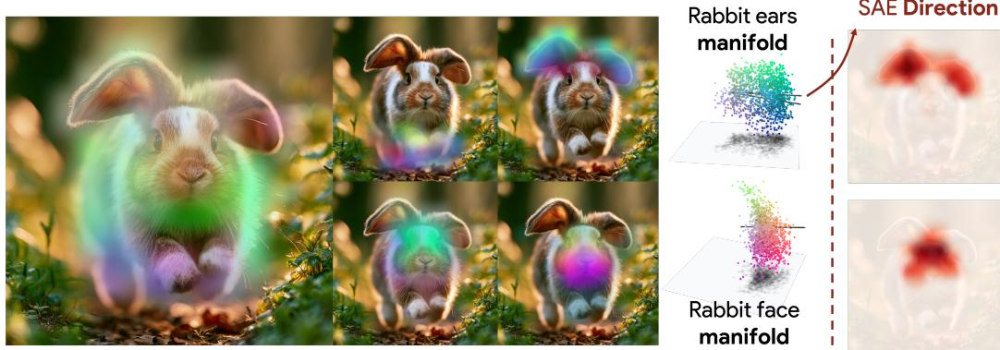

Figure 1: Block-sparse featurizers (BSF) capture the internal geometry of concepts. Sparse autoencoders (SAEs) are a popular method for decomposing neural representations using isolated directions as primitive atoms. On the right, we show how two SAE features activate over the image of a rabbit where darker red means a higher activation; observe that one feature picks out the rabbit’s ears and the other its face. Yet, recent work points to more structure in these models than a single direction allows. BSFs lift the primitive from directions to regions of activation space, which lets us recover the ear and face concepts as “manifolds” whose internal coordinates map out a conceptual space. On the left, we show how blocks of directions activate over the image where different colors correspond to different locations within a block. The exposed geometry is richer than an isolated direction would admit; for example, the face concept resolves into fine-grained facial features where the nose and the eyes are represented as different regions.

What is the geometry of a visual percept? The most widely used protocols for decomposing neural network representations into interpretable parts treat concepts as isolated directions, yet recent work shows that concepts are often realized as geometric structures in low dimensional regions of activation space. We turn to the literature of Structured sparsity to close this gap, and show that block sparsity, which groups directions into blocks, is the prior matched to a generative model in which a representation is a sparse sum of low-dimensional manifolds—the modern, learned form of a classical idea in visual neuroscience, where a visual feature is carried by a coordinated group of neurons rather than a single tuned one. We implement three variants of block-sparse featurizers (BSFs) and, through a minimum-description-length analysis, show that all three describe activations more compactly than direction-based featurizers, with the recovered concepts typically two- to four-dimensional. We then use BSFs to (i) recontextualize prior work, showing that curve detectors in InceptionV1 actually read from a single continuous curve manifold, (ii) discover novel manifolds including shadows and lighting in DINOv3, and (iii) support interpretable control of image generation in diffusion models (SDXL) via manifold steering.

## 1 Introduction

Shown nothing but natural images and told only to be sparse, the coding algorithm of Olshausen & Field (1996) recovered the oriented, localized receptive fields of the primary visual cortex. Two consequences ensued at once: it lent substance to Barlow et al.’s hypothesis that the human brain is shaped to code perceptual data efficiently, and it in turn gave rise to sparse dictionary learning (Tovsic & Frossard, 2011; Rubinstein et al., 2010; Elad, 2010; Mairal et al., 2014; Dumitrescu & Irofti, 2018).

Decades later, AI interpretability (Sharkey et al., 2025) has adopted this program to decompose neural representations into sparse combinations of atomic units. Indeed, sparse autoencoders (SAEs; Cunningham et al. 2023; Bricken et al. 2023; Gao et al. 2024; Bussmann et al. 2024; Rajamanoharan et al. 2024; Klindt et al. 2023, 2025; Costa et al. 2025; Thasarathan et al. 2025)—the most widely used featurizer for decomposing artificial neural activations—are an instantiation of sparse dictionary learning (cf. Ghorbani et al. 2017; Hindupur et al. 2025; Fel et al. 2023c,b; Zhang et al. 2021; Vielhaben et al. 2023; Parekh et al. 2024; Kowal et al. 2024b,a).

However, SAEs assume that the proper atoms are isolated directions, while recent work demonstrates concepts can be represented as dense features (Sun et al., 2025; Fel et al., 2025; Lubana et al., 2025), convex regions (Fel et al., 2025; Tvetkova et al., 2025; Park et al., 2024, 2026) and manifolds (Chung et al., 2018; Chung & Abbott, 2021; Modell et al., 2025; Kantamneni & Tegmark, 2025a; Engels et al., 2024; Gurnee et al., 2025; Yocum et al., 2025; Karkada et al., 2026; Feucht et al., 2026; Wurgaft et al., 2026; Bhalla et al., 2026a; Sarfati et al., 2026).1 This mismatch between the elicited phenomenology and the current apparatus is our starting point.

To close the gap, we ought to return to what a featurizer is: a hypothesis about the data-generating process of the activations (Hindupur et al., 2025). Read this way, the mismatch is resolved by matching the featurizer to the process the evidence supports, and the emerging picture is that these structures share a property SAEs currently ignore: a concept carries an internal geometry. The atoms of the featurizer must then be lifted accordingly, from individual directions to blocks of them. This idea is well established under the name of block sparsity—we also use the term group sparsity—a central instance of the broader Structured sparsity literature2 (Yuan & Lin, 2006; Eldar & Bolcskei, 2009; Jenatton et al., 2010; Bach et al., 2012).

Work in language model interpretability has begun to explore the same relaxation, proposing featuriz ers that move beyond the one-direction-per-concept assumption (Francel, 2026; Dalili & Mahdavi, 2026; Hindupur et al., 2025; Shafran et al., 2026). The crucial point for our purposes is that these methods instantiate, in modern interpretability language, a much older organizing idea: sparsity need not be placed on individual coordinates, but can instead be imposed over structured supports. This paper makes that connection explicit and argues for the principle of block sparsity as an inductive bias for decomposing neural representations by: (i) deriving the generative motivation, (ii) building practical featurizers around it, and (iii) analyzing the structures they recover in neural representations.

Our contributions are as follows:

• Representation geometry through the lens of structured sparsity. We connect the claims that concepts are represented by subspaces and manifolds in neural representations to the structured sparsity literature. We show that block sparsity is the inductive bias matched to a generative process in which each representation is a sparse sum of low-dimensional manifolds.

• Three block-sparse featurizers (BSFs). We introduce three BSFs that instantiate this principle: (1) the Vanilla BSF learns groups of directions where only the top k blocks with the largest norms are used in reconstruction; (2) the Grassmannian BSF where the encoder is the transpose of the decoder and enforces that directions within a block are orthogonal; and (3) the Group Lasso featurizer with linear encoder soft-threshold activation function and with a group lasso penalty.

• Quantifying concept dimensionality. We train our three BSF variants on DINOv3 and perform a minimum description length analysis to compare BSF variants with each other and SAEs. We find that grouping directions into blocks yields more efficient descriptions of activations. A stable-rank study lets us quantify the intrinsic dimensionality of individual features, revealing a spectrum of dimensions of features.

• Discovering concept manifolds in vision models. We use BSFs to discover previously unknown concept manifolds in vision models. In InceptionV1, we show that the famous curve-detector neurons (Cammarata et al., 2020; Gorton, 2024) all read off of a previously undiscovered curve manifold and expose additional Fourier modes. In DINOv3, we uncover manifolds that correspond to concepts that abstract from the details of objects in a scene, e.g., their lighting and shadows. In SDXL, we identify a variety of manifolds along which generation can be steered.

## 2 Structured Sparse Model of Feature Geometry

There is a deep duality between the architecture of a featurizer and the assumed geometry of neural representations (Hindupur et al., 2025). To design a new featurizer, we first hypothesize a data-generating process (DGP) based on recent work on representation manifolds (Fel et al., 2025; Lubana et al., 2025; Bhalla et al., 2026a; Modell et al., 2025; Gurnee et al., 2025). We will then show that the natural featurizer architecture for this DGP is a block-sparse method.

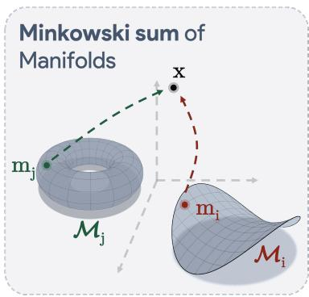

General notation. We work in the standard representationlearning setting. For $n \in \mathbb { N } ,$ , we write $[ n ] = \{ { \bar { 1 } } , \dots , n \}$ . A neural network model maps an input to an activation vector $\pmb { x } \in \mathbb { R } ^ { d }$ , and we study the set of activations $A \subset \mathbb { R } ^ { d }$ it induces over a data distribution. For a code (e.g., SAEs coefficients) $z \in \mathbb { R } ^ { b G }$ partitioned into G blocks $\boldsymbol { z } = ( z _ { 1 } , \dots , z _ { G } )$ with $z _ { g } ~ \in ~ \mathbb { R } ^ { b }$ , we write $\operatorname { s u p p } ( z ) = \{ i : z _ { i } \neq 0 \}$ and $\| z \| _ { 0 } \overset { \cdot } { = } | \operatorname { s u p p } ( z ) |$ for usual support and supp $\begin{array} { r } { { \bf \nabla } _ { \mathcal { G } } ( z ) = \{ g ^ { } \} = } \end{array}$ $z _ { g } \neq \mathbf { 0 } \}$ for the block support (the number of active blocks).

Figure 2: Activation x as a sparse sum of points drawn from a few lowdimensional regions $\mathcal { M } _ { i } .$ x lives in a Minkowski sum of manifolds (Def. 1).

## 2.1 Data-Generating Process

Following Bhalla et al. (2026a), we adopt the following model of representations, in which an activation is composed from a sparse set of manifolds immersed in low-dimensional regions.

Definition 1 (Additive Mixture of Manifolds (Bhalla et al., 2026a)). Let $\mathcal { N } _ { 1 } , \dots , \mathcal { N } _ { M }$ be abstract manifolds with dim $\mathcal { N } _ { i } \ll d ,$ immersed in activation space through $\gamma _ { i } : \mathcal { N } _ { i }  \mathbb { R } ^ { d }$ with images $\mathcal { M } _ { i } \stackrel { \cdot } { = } \gamma _ { i } ( \mathcal { N } _ { i } ) \subset \mathbb { R } ^ { d }$ . An activation $\pmb { x } \in \mathcal { A } f o l l o w s$ the additive mixture of manifolds model if

$$
\boldsymbol {x} = \sum_ {i \in S} \boldsymbol {m} _ {i}, \quad \boldsymbol {m} _ {i} \in \mathcal {M} _ {i}, \quad S \subseteq [ M ], \quad | S | \ll M,\tag{1}
$$

where S indexes the factors active in x. Equivalently, x lies in a Minkowski sum of M manifolds.

Importantly, we treat Def. 1 as a hypothesized model of representations rather than an assertion that neural activations exactly satisfy it; its role is to specify the unit of composition. Under this manifold model, each active factor contributes a point on a low-dimensional manifold; recovery asks two questions at once: (i) which factors are present, and (ii) where within each factor the activation lies. These two aspects should not be regularized in the same way. The first is a sparse selection problem over manifolds, while the second is a manifold learning problem. In the next section, we will show that block sparsity is precisely the prior that separates these roles: it enforces sparsity across factors while allowing dense variation inside each active factor.

## 2.2 Block Sparsity as the Matched Prior for Manifold Superposition

One may already sense the connection between this manifold-based data generating process and block sparsity. Here we make it explicit: under a Bayesian treatment of the model, the group-sparse penalty $\lvert | z \rvert | _ { 2 , 0 }$ falls out of the maximum a posteriori estimate, arising as the cost of switching a factor on (full argument in Appendix F). We add one geometric assumption, i.e., that each factor occupies a low-dimensional linear subspace of activation space, $\mathcal { V } _ { g } = \operatorname { s p a n } ( \mathcal { M } _ { g } )$ with dim $\begin{array} { r } { \mathcal { V } _ { g } = b \ll d . } \end{array}$ This condition is strictly stronger than low intrinsic dimension since a factor of intrinsic dimension r may still spread across many ambient directions.3

Resolved in the frame of each subspace, the superposition is a sum of block contributions. Each active manifold contributes a point $m _ { g } \in \mathcal { V } _ { g } ,$ , and fixing an orthonormal frame $D _ { g } \in \mathrm { S t } ( b , d )$ for $\mathcal { V } _ { g }$ , a point on the Stiefel manifold of orthonormal b-frames in $\mathbb { R } ^ { d }$ , writes that point in coordinates $\boldsymbol { z } _ { g } \in \mathbb { R } ^ { b }$ as $\begin{array} { r } { { \pmb { m } } _ { g } = z _ { g } { D } _ { g } , } \end{array}$ so that collecting the coordinates into $\boldsymbol { z } = ( z _ { 1 } , \dots , z _ { G } )$ and writing $\varepsilon \sim \mathcal { N } ( \mathbf { 0 } , \sigma ^ { 2 } I _ { d } )$ for the observation noise,

$$
\boldsymbol {x} = \sum_ {g \in S} \boldsymbol {m} _ {g} + \varepsilon = \sum_ {g \in S} \boldsymbol {z} _ {g} \boldsymbol {D} _ {g} + \varepsilon , \quad \operatorname{supp} _ {\mathcal {G}} (\boldsymbol {z}) = S.\tag{2}
$$

If we place a spike-and-slab prior on each block (Mitchell & Beauchamp, 1988; Soussen et al., 2011) the recovery problem follows directly.

Proposition 1 (Block sparsity is the maximum a posteriori (MAP)-matched prior). Let $\rho = \mathcal { U } ( B _ { R } )$ be the uniform density on the ball $B _ { R } = \{ \pmb { u } \in \mathbb { R } ^ { b } : \| \pmb { u } \| _ { 2 } \leq R \}$ , and $\delta _ { \mathbf { 0 } }$ the point mass at 0. Under the model of $E q . 2$ with the dictionary D fixed and independent spike-and-slab block priors

$$
p (\pmb {z} _ {g}) = (1 - \pi) \delta_ {\mathbf {0}} + \pi \rho , \qquad \pi \in (0, 1),
$$

the MAP estimate of the code is

$$
\hat {\boldsymbol {z}} = \underset {\boldsymbol {z}} {\arg \min} \frac {1}{2} \| \boldsymbol {x} - \boldsymbol {z} \boldsymbol {D} \| _ {2} ^ {2} + \lambda \| \boldsymbol {z} \| _ {2, 0},\tag{3}
$$

with $\lambda \ : = \ : \sigma ^ { 2 }$ log $\Big ( \frac { 1 - \pi } { \pi } \mathrm { v o l } ( B _ { R } ) \Big )$ , where $D = ( D _ { 1 } , \ldots , D _ { G } ) \in \mathbb { R } ^ { b G \times d }$ stacks the frames and $\boldsymbol { z } = ( z _ { 1 } , \dots , z _ { G } )$ their coordinates. Proof in Appendix F.

The term of interest that explicitly appears here is ${ \| z \| } _ { 2 , 0 }$ , which represents the number of distinct, non-overlapping groups that activate—i.e., block sparsity.

A few remarks follow. First, the penalty sees each block only through its norm $\begin{array} { r } { \| z _ { g } \| _ { 2 } } \end{array}$ because the same point ${ m _ { g } = z _ { g } D _ { g } }$ can be written in any rotated frame, $z _ { g } D _ { g } = ( z _ { g } Q ^ { \top } ) ( Q D _ { g } )$ for $Q \in \mathrm { O } ( b )$ , so a penalty intrinsic to the feature must be “blind” to the choice of basis, which leaves only the $\ell _ { 2 }$ norm. The atomic unit is thus the subspace itself, and not any particular basis of it. Second, an astute reader will notice that this is just the block analogue of a classical correspondence between Bernoulli priors and $\ell _ { 0 }$ penalties (Soussen et al., 2011; Olshausen & Field, 1997), lifted here to the level of factors (Zhang & Rao, 2013; Baraniuk et al., 2010). Third, Eq. 3 settles what to optimize without settling how: the support selection is NP-hard in general (Eldar & Bolcskei, 2009), admitting no closed form solution, so any practical featurizer must commit to an approximation strategy, whether by relaxing the penalty, selecting blocks greedily, or projecting onto the constraint, and we propose three instantiations of the principle in the next subsection.

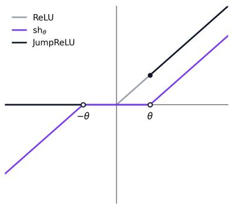  
Figure 3: The block soft-threshold. The shrinkage operator (applied on the norm of the group) against ReLU and JumpReLU (Rajamanoharan et al., 2024).

## 2.3 Block-Sparse Featurizers

We now propose three Block-Sparse Featurizers (BSFs), and stress that they are candidate architectures: each is one way of implementing the same principle (block sparsity). Our experiments support the general principle transfers, while revealing how concrete implementations trade off against each other. All three BSFs share the linear decoder $\hat { \pmb x } = z { \pmb D }$ of Eq. 2 and differ only in how the code z is produced.

To write them compactly, we introduce two operators that act block-wise, involving each block only through its $\ell _ { 2 }$ norm. The block projection Πk keeps the k blocks of largest norm ${ \check { \| } } z _ { g } { \| } _ { 2 }$ and zeroes the rest—the block analogue of absolute TopK (Gao et al., 2024; Zhu et al., 2025) and a projection onto the block-sparsity constraint $\| z \| _ { 2 , 0 } \leq k$ . The second object we need to define is the block soft-threshold activation function (Yuan & Lin, 2006; Puig et al., 2009), sh , that shrinks every block toward zero,

$$
\mathbf {s h} _ {\theta} (\pmb {z}) _ {g} = \max (1 - \frac {\theta}{\| \pmb {z} _ {g} \| _ {2}}, 0) \pmb {z} _ {g},
$$

where $\theta \in \mathbb { R }$ . This is exactly the proximal operator of the $\ell _ { 2 , 1 }$ norm (Bach et al., 2012). Because both block-wise operators depend on a block only through $\begin{array} { r } { \| z _ { g } \| _ { 2 } } \end{array}$ , the model selects subspaces and not a particular basis within them. This norm-based selection is also why no coordinate-wise nonlinearity appears: a ReLU or JumpReLU would keep only non-negative codes and so restrict each block to a cone rather than the full subspace, a restriction not motivated by Def. 1 and one that, as we show later, fails to recover superpositions a signed code resolves. The three BSF architectures are then:

$$
\boldsymbol {z} (\boldsymbol {x}) = \left\{ \begin{array}{l l} \boldsymbol {\Pi} _ {k} \big (\boldsymbol {x} \boldsymbol {W} + \boldsymbol {b} \big) & \text {(Vanilla BSF)} \\ \boldsymbol {\Pi} _ {k} \big (\gamma   \boldsymbol {x} \boldsymbol {D} ^ {\top} \big), & \boldsymbol {D} _ {g} \in \operatorname{St} (b, d) \quad \text {(Grassmannian BSF)} \\ \operatorname{sh} _ {\boldsymbol {\theta}} \big (\boldsymbol {x} \boldsymbol {W} + \boldsymbol {b} \big) & \text {(Group Lasso BSF)} \end{array} \right.\tag{4}
$$

All three BSF variants are trained to reconstruct min $\| { \pmb x } - { \pmb z } { \pmb D } \| _ { 2 } ^ { 2 }$ . The Group Lasso featurizer includes the additional penalty $\lambda \| z \| _ { 2 , 1 }$ , while the other two enforce sparsity by construction. They correspond to three approaches to the problem of Eq. 3 having no closed form solution. The vanilla BSF keeps the constraint on the code and projects, learning a free encoder $W$ and decoder D untied from each other, so that a linear map produces the code and $\mathbf { I I } _ { k }$ selects the k active blocks. The Grassmannian BSF moves the constraint to the dictionary: each block is an orthonormal chart, encoder and decoder are tied, and a single learned scalar γ compensates the energy lost by tying. The Group Lasso BSF shares this free linear encoder but replaces the projection with the soft-threshold shθ, so that blocks are selected by shrinkage rather than by a hard count, relaxing the penalty to its convex surrogate (Yuan & Lin, 2006) and trading exact sparsity for a smooth objective. We defer practical details of training to Appendix D.

The BSFs are ready to train, and the goal of the next section is to evaluates them. We first put the matched-prior claim of Def. 1 to a controlled test, on a synthetic superposition of manifolds whose ground-truth factors are known by design. We then turn to real activations, where two choices the objective leaves open must be settled: at what fidelity an activation counts as reconstructed, and how large the block dimension b should be, since reconstruction alone favors making it large (Fig. 6, bottom). An information-theoretic reading then locates the sweet spot for both.

## 3 Evaluating Block Sparse Featurizers

## 3.1 Toy model of Manifold Superposition

The data-generating process of neural network activations has underlying factors that are unobserved, and so recovery “in the wild” can be assessed only indirectly. Therefore, we begin in a controlled setting where the data-generating process is known by design and so we can test the central claim of Def. 1 head on: that block sparsity is the prior matched to an additive superposition of lowdimensional manifolds. Following Def. 1, we generate synthetic data as in Eq. 1: M primitive factors, a mix of one-dimensional concept atoms and curved manifolds (circles, spheres, tori, $\ldots ) .$ , are embedded into $\mathbb { R } ^ { d }$ through random orthonormal maps, and each data point is the sum of $| S | \ll M$ of them. Because the active set $S$ and every contribution $\mathbf { m } _ { i }$ are known, recovery can be scored directly: we match each primitive to the block whose firing best predicts its presence, and report, per primitive, the fraction of the variance of $\mathbf { m } _ { i }$ that block reconstructs $( R ^ { 2 } )$ . Full settings are deferred to Appendix H.

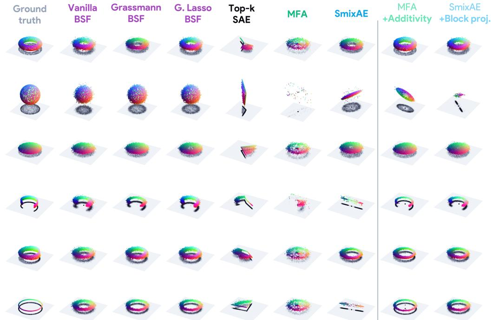  
Figure 4: Block sparsity recovers an additive manifold superposition. A controlled instance of Def. 1: M known low-dimensional manifolds embedded in $\bar { \mathbb { R } } ^ { d }$ and summed |S| at a time (here six factors, one per row). The leftmost column is the ground-truth contribution $\mathbf { \nabla } m _ { i } ;$ each remaining column is the contribution recovered by a featurizer, projected into the true factor’s 3-D principal frame and colored by that frame (hue = position on the manifold). The three BSFs (Grassmannian, Vanilla, Group Lasso) return the manifolds faithfully; the classical SAE and the as-published SMIXAE and MFA featurizers shatter or collapse them; the two rightmost “fixed” columns apply the blocksparse repairs described in the text.

BSFs recover the superposition. Figure 4 shows the recovered manifolds, rendered in the two-resolution reading of Sec. 2.3 (block norm for presence, PCA-of-contributions for intrinsic geometry), and Figure 5 the per-block recovery. All three BSFs recover the factors close to the oracle ceiling—per-block $R ^ { 2 }$ between 0.93 and 0.97, against an oracle of 0.99—using a single amortized forward pass with no iterative inference. The classical TopK SAE instead shatters each multi-dimensional factor across atoms and cannot isolate a single primitive’s contribution, so its per-block reconstruction collapses $( R ^ { 2 } ~ \approx ~ 0 . 5 3 )$ and its recovered clouds degenerate to scattered slivers rather than the manifolds the BSFs return.

The same principle repairs SMixAE and MFA.

The toy also lets us probe two recent featurizers that, like ours, take a multi-dimensional unit but are built on different assumptions: SMixAE (Francel, 2026) and MFA (Shafran et al., 2026). Both underperform on the additive toy (per-block $R ^ { 2 } \approx 0 . 7 1$ and 0.38), and in each case the cause is a departure from block sparsity that a small change can repair.

For SMixAE, the authors already note its failure on this toy task, and we find that replacing the rectifier with a signed code (motivated by the cone argument of Sec. 2.3) and substituting our block projection Πk for its activation function lifts recovery to $\mathbf { \bar { \mathit { R } } } ^ { 2 } \approx 0 . 8 5$

MFA fails for a more fundamental reason, one that separates a mixture from a sum. The assumed datagenerating process of MFA is a single component

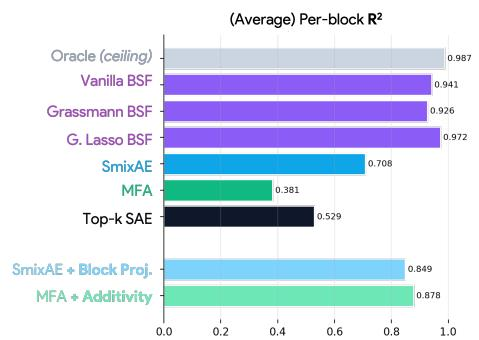  
Figure 5: Per-block recovery. Per-block $R ^ { 2 }$ averaged over factors. The block-sparse featurizers (purple) sit near the oracle ceiling; the two repaired variants (bottom) recover well above their original forms.

drawn per data point. This means that the points it can generate lie in the union of its component sub spaces rather than in their sum, and at inference it returns a convex combination of those components (weights sum to one). When a factor and another are both present, the reconstructed data point lands in the subspace they jointly span, which no convex combination of the individual subspaces reaches, since such a combination stays within the hull of its constituents while a genuine sum extends beyond it.

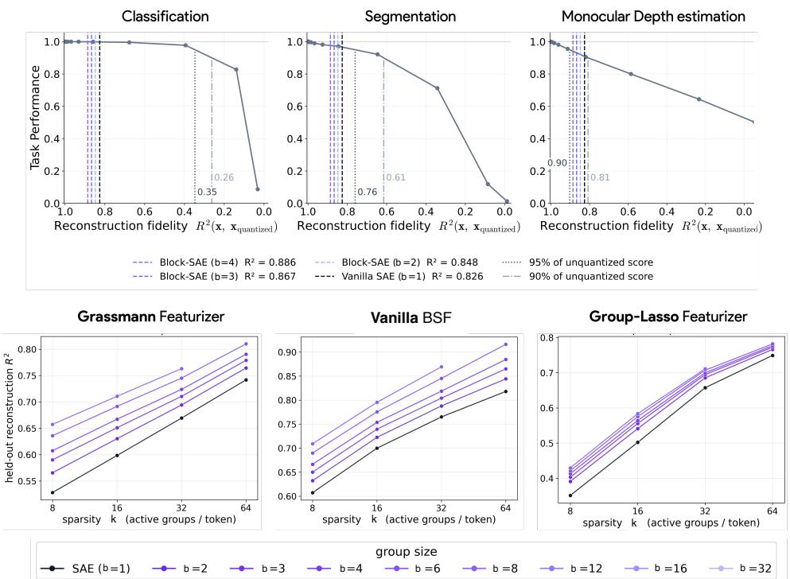  
Figure 6: Distortion estimation and reconstruction sparsity trade-off. (top) Estimating the reconstruction fidelity each task requires. DINOv3 activations are degraded by progressive quantization and passed to a frozen linear probe; the relative task metric is plotted against the fidelity $R ^ { 2 } ( { \pmb x } , { \pmb x } _ { q } )$ of the corrupted features. Performance is essentially unaffected down to $R ^ { 2 } \approx 0 . 8$ for classification and segmentation, whereas depth estimation is more demanding, requiring $R ^ { 2 } \approx 0 . 9$ to retain 95% of its accuracy. These task-dependent floors fix the distortion δ at which description length is read. Held-out $R ^ { 2 }$ against block sparsity k for the three featurizers. (bottom) Lines are colored by block dimension $b ( b { = } 1$ is the SAE where atoms are directions). Reconstruction rises monotonically with the dictionary width $G ,$ , the sparsity $k ,$ and the block dimension $b ,$ so reconstruction fidelity alone cannot rank the featurizers and an external criterion is needed.

Another way to see the difference is that the weights the model assigns express uncertainty over which one component is responsible rather than the co-presence of several, so MFA can recover the individual subspaces but not their sum (for reasons explained by Bhalla et al. (2026a), Appendix C), which is why its per-block reconstruction caps low. Yet, decoding the learned subspaces additively rather than through this convex posterior raises recovery to $R ^ { 2 } \approx 0 . 8 8$ . We stress that this additive decode is a heuristic relaxation rather than a coherent generative model, we therefore report it as a promising variant rather than a contribution of this work, and detail both fixes and our derivation of the implicit data-generating process of MFA in Appendix H.

With recovery established against known ground truth, we turn from synthetic data to activations from neural networks, where no ground truth is available. Now, the featurizers can instead be judged by how compactly and faithfully they describe what the model computes.

## 3.2 Faithfulness of Reconstruction

We begin by studying the degree to which block featurizers faithfully reconstruct activations by measuring variance explained $( R ^ { 2 } )$ ). But in order to ground this, we first establish the noise floor at which a quantized representation can perform some task. This allows us to set a bar for reconstruction our featurizer must hit to be usefully faithful. We measure this by gradually quantizing representations from DINOv3 more and more and measuring when performance degrades.

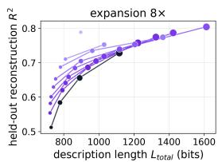

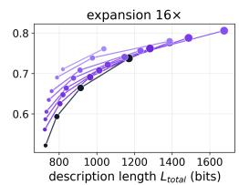

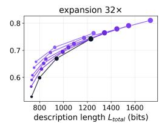

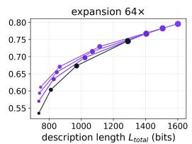

Figure 7: Block structure yields a lower description length than SAEs. Description length $L _ { \delta } ( { \pmb x } )$ (Eq. 5) for the Grassmannian BSF at the 20% distortion floor, against block dimension b, with one panel per dictionary width G and one curve per block sparsity k. Codes with $b { > } 1$ describe DINOv3 activations in fewer bits than the $b { = } 1 \operatorname { S A E }$ across every width and sparsity, the minimum falling at a moderate b between 2 and 4 that eases downward as G widens. Similar results hold for all three featurizers and the 10% floor and are reported in Appendix C.  
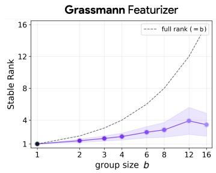

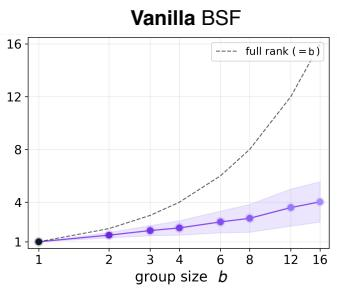

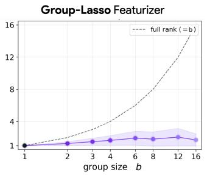  
Figure 8: Block dimensionality stabilizes between two and four. Mean stable rank of the per-block code, against the block dimension b the featurizer was granted. Although blocks are allotted up to $b = 1 6$ coordinates, the dimension they occupy saturates near 3, indicating that DINOv3 concepts are on average between two- and four-dimensional regardless of the room made available to them.

Figure 6 (top) estimates this fidelity empirically. Degrading activations by progressive quantization and recording the effect on three downstream tasks, we find that the tolerance is task-dependent: classification and segmentation are essentially unaffected down to $R ^ { 2 } \approx 0 . 8$ , while depth estimation is more demanding, requiring $R ^ { 2 } \approx 0 . 9$ to retain 95% of its accuracy. We take these task floors as the fidelity a featurizer must reach, reading each as the distortion its task tolerates without becoming less useful.

With the fidelity floor established, we turn to the Pareto frontiers of our featurizers in Figure 6 (bottom), where reconstruction improves monotonically with every structural parameter, as the dictionary widens, as more blocks are permitted to fire, and as the block dimension grows. This monotonicity is expected, and it is also what prevents reconstruction quality from ranking the featurizers against one another.

## 3.3 Minimum Description Length as a Comparison Principle

Next we compare the quality of reconstructions to Sparse Autoencoders (SAEs), which represent concepts one-dimensionally. The comparison is confounded at a fixed reconstruction budget, since the SAEs code is the less constrained of the two, free to activate any combination of atoms, whereas a block-sparse code is bound to its blockwise structure. A criterion that compares them on equal terms must therefore come from elsewhere, and the minimum description length principle (MDL) supplies one naturally, since prior work has appealed to it for similar reasoning (Ayonrinde et al., 2024).

We confine ourselves to a brief account and refer to Ayonrinde et al. (2024); Huang et al. (2009) and Appendix C for details. The principle is the following: a good explanation of a model is one that compresses its activations efficiently, transmitting what occurs in as few bits as possible. We therefore read a sparse code as a compression scheme, carrying the reading from directions to blocks, and ask how many bits are needed to transmit an activation x at a chosen distortion δ. The distortion is fixed by the task floor estimated above, the fidelity beyond which further reconstruction encodes detail the task does not draw on. The cost of transmission then decomposes into four parts: which blocks fire, the code they carry, the residual $\pmb { r } = \pmb { x } - z D$ they leave unexplained, and the dictionary D paid for once across the dataset. Writing $L _ { \delta } ( { \pmb x } )$ for the total number of bits this scheme spends to transmit an activation x up to distortion δ, the four parts sum to:

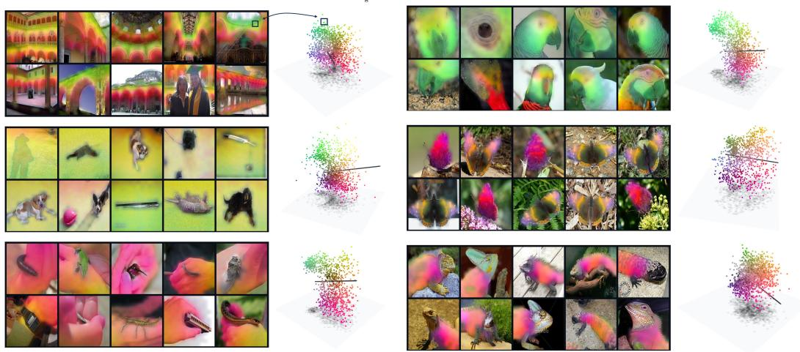  
Figure 9: A block carries a concept together with its intrinsic geometry. Six blocks from a Grassmann featurizer on DINOv3. For every block we overlay the patches it fires on a sample of images, coloring each patch by the first three principal coordinates of its contribution $\pmb { u } _ { g }$ mapped to the red, green, and blue channels, so that hue reports where on the concept a patch lies rather than merely how strongly it is present. The black arrow is the closest directional SAE atom contained in the block’s subspace, the single direction a b=1 code would assign to the concept: it captures one axis of a manifold the block resolves in full, the surrounding spread being exactly the internal variation a directional code discards.

$$
L _ {\delta} (\boldsymbol {x}) = \underbrace {\log_ {2} \binom {G} {k}} _ {\text { support   } S} + \underbrace {L _ {\delta} (\boldsymbol {z})} _ {\text { code }} + \underbrace {L _ {\delta} (\boldsymbol {r})} _ {\text { residual }} + \underbrace {\frac {1}{N} L (\boldsymbol {D})} _ {\text { dictionary }}.\tag{5}
$$

The first term counts which k of the G blocks make up the support $S = \operatorname { s u p p } _ { \mathcal { G } } ( z )$ , and it is the only term we require in closed form here. The remaining three measure the bits spent on the code z, on the residual r at distortion δ, and on the dictionary D amortized over the N tokens it serves, each set out in full in Appendix C.

The support term is the most important one, both because it is the largest (scaling with the size of the dictionary) and because it is the term that separates block sparsity from the unstructured sparsity of an ordinary SAE. To state the distinction precisely: an SAE code with kb of its Gb atoms active pays log2 $\binom { G b } { k b }$ bits to transmit them, whereas a block-sparse code transmit only its k active blocks at the far smaller cost of log $\textstyle { \binom { G } { k } }$ , the b coordinates inside each active block adding nothing to the index, so that a single block label stands in for b atoms.

Enlarging the block dimension therefore trades one cost against another: the residual shrinks, since a larger subspace leaves less unexplained, while the code term grows, since more coordinates must be transmitted per active block. Read at a distortion of δ = 0.2, Figure 7 shows that the Grassmannian featurizer describe DINOv3 activations in fewer bits than the b=1 SAE across every dictionary width and level of sparsity the block codes. The description is shortest at a moderate block dimension, b from 2 to 4, that eases downward as the dictionary widens. This effect is also observed for all three featurizers, at varying noise levels, as reported in Appendix C.

We have thus seen that, from an MDL standpoint, the inductive bias of block sparsity affords a more compact description of activations. There remains the question of the value of b itself: what is the optimal block dimension and what is the typical dimensionality of a concept?

## 3.4 Concepts Dimensionality

The optimal block dimension found above is a property of the dictionary taken as a whole, and it leaves a more basic question open. When a featurizer grants each atomic unit a b-dimensional block, does the block use all b dimensions, or does it occupy only a few and leave the rest idle? A block is free to ignore the room it is given, so the dimensions we allocate need not be the dimensions that are used. Suppose a block were used only to produce a single direction, its code $z _ { g }$ collapsing to a scalar multiple of one vector, as an SAE atom does. We would then say that, despite the group structure, the block has an effective rank one. A block used to its full extent, by contrast, would describe a b-dimensional subspace, with an effective rank approaching b when no direction within the block dominates the others.

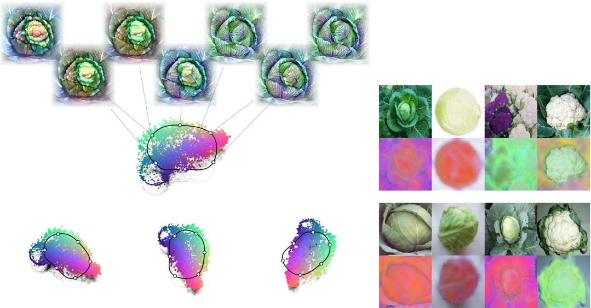  
Figure 10: Feature visualization on one recovered concept manifold. A single Grassmannian BSF block trained on DINOv3 recovers a cabbage/cauliflower manifold. The central colored point cloud is a projection of the block’s active contributions, with hue encoding the first three principal coordinates of the block’s intrinsic geometry. White points mark locations sampled along paths through this cloud, and the images above are MACO (Fel et al., 2023a) feature visualizations targeted at those locations. As the target moves through the manifold, the synthesized images change smoothly between leafy cabbage structure and cauliflower floret. The natural-image montages on the right ground the same regions in data, showing original patches together with overlays of block activation and manifold coordinate.

The stable rank (Rudelson & Vershynin, 2007) of the per-block code quantifies this, and comparing it against the allotted block dimension reveals how much of the available capacity each block in fact occupies. The mean stable rank saturates between two and four, so that for DINOv3 the average block spans between two and four dimensions, and continues to do so even when the block is allotted substantially greater capacity, up to b = 16 (Figure 8). For DINOv3, we found that blocks are on average roughly three-dimensional, a dimensionality perhaps inherited from the visuospatial nature of the tasks these representations serve.

This places the number in a longer line of work on representational dimensionality. The classical subspace models fixed the dimension of a block by hand—independent subspace analysis, for instance, used subspaces of a preset size (Hyvärinen & Hoyer, 2000)—whereas the stable rank lets the data choose it, and the value it returns sits within the range those models assumed. It is, moreover, a dimension per concept rather than of the population as a whole, complementing measures of the global dimensionality of cortical and model representations (Stringer et al., 2019; Fusi et al., 2016).

Having completed the quantitative study of these featurizers, we turn to a qualitative one. We first clarify how to read a block-sparse code, and then exhibit several examples of the structures such featurizers recover.

## 3.5 How to Interpret a Block Sparse Featurizer

A block-sparse code makes two quantities available per block where a classic SAE code makes only one, and it is worth fixing how each is read before turning to what the featurizers recover. We recall that a block fires only when it survives the selection $\Pi _ { k } ,$ that is when its norm $\begin{array} { r l } { \| z _ { g } \| _ { 2 } } \end{array}$ ranks among the k largest, and this norm is the first of the two quantities: it reports how strongly the concept carried by block g is present, exactly as the activation of an unstructured code does. So the familiar reading of an SAE remains unchanged and a per-token heatmap of $\| z _ { g }$ ∥2, painted in a single color, gives a coarse view of where a concept is active.

The second quantity has no counterpart in an SAE code, since the contribution of an active block, $m _ { g } = z _ { g } D _ { g } ,$ , ranges over the k-dimensional row space of $D _ { g }$ rather than along a single fixed direction, so the contributions a block produces across the tokens that fire it trace the intrinsic geometry of the concept, the factors of variation along which it moves once present. Reading that geometry asks for a basis, and the gauge invariance discussed before means that the learned chart is defined only up to an $O ( b )$ rotation, no coordinate of $z _ { g }$ is privileged over its rotated counterpart. Thus, rather than read the arbitrary basis that the featurizer happens to learn, we fit a principal component analysis (PCA) to the contributions $m _ { g }$ that a block produces, and we read the code in the resulting basis, which orders the concept’s variation by salience. The two readings are then

$$
\text { Concept   presence: } \| \boldsymbol {z} _ {g} \| _ {2} \quad \text { Concept   intrinsic   geometry: } \boldsymbol {u} _ {g} = \boldsymbol {z} _ {g} \boldsymbol {D} _ {g} \boldsymbol {V} _ {g} ^ {\top},
$$

$$
\text { where } \quad V _ {g} = \underset {V V ^ {\top} = I _ {k}} {\arg \max} \left\| M _ {g} V ^ {\top} \right\| _ {F} ^ {2}.
$$

The basis $V _ { g }$ consists of the principal components of the contributions $M _ { g }$ that the block produces over the tokens it fires, and the coordinates $\pmb { u } _ { g }$ are the code expressed in that basis, their entries being the concept’s factors of variation in decreasing order of salience. Reading a feature thus proceeds at two resolutions, and each maps onto a direct visualization (as shown in Figure 9). The block norm $| | z _ { g } | | _ { 2 }$ reports where a concept is present, rendered as a single-color heatmap over the patches in the manner of an SAE; the coordinates $\pmb { u } _ { g }$ report how it varies once active, rendered by assigning the first three principal coordinates to the red, green, and blue channels. Thus, the hue at a patch in the image reads off where on the concept manifold that patch lies as shown in Fig.1.

With our strategy to interpret the featurizers in place, we turn to what they recover, starting in a setting with independently known geometry to validate the method. We then demonstrate a state-of-the-art representation manipulation method where we show that we can improve downstream performance using this BSF basis as well as uncover new types of concepts (shading and shadow). Finally, we will use a generative model to use the recovered manifold as a coordinate system for intervention.

## 4 Revisiting How InceptionV1 Processes Curves

To evaluate our BSFs against a known ground truth, we begin with a setting whose answer is known in advance. Cammarata et al. (2020) famously demonstrated that there is a group of neurons in the early layers of InceptionV1 that function as detectors for curves of different orientations. Subsequently, this analysis was expanded by Gorton (2024) using SAEs. Using BSFs, we show that the neurons and SAE features both provide a fractured view of a unified manifold that represent a curve’s orientation.

As a population, both neurons and SAE features tile orientation of curves from $0 ^ { \circ }$ to $3 6 0 ^ { \circ }$ . The original neurons cover orientation coarsely, leaving “gaps”, and while SAE atoms fill most of those gaps, they still shatter the manifold (Sengupta et al., 2018; Michaud et al., 2025; Bhalla et al., 2026a), spending a separate atom on each slice of orientation. This is the predicted optimum of a unstructured prior applied to a curved factor (App. F).

This multiplicity of SAEs is an artifact of the featurizer—not a property of the network. Under the assumption 1, the BSFs make the following prediction: a block-sparse code, free to assign a low-dimensional subspace to a single feature, should hold the manifold together where a directional code fragments it. A single Grassmannian BSF block does exactly this, staying active across all orientations and reconstructing the whole curve manifold as one connected region (Figure 11a, right): the tiled petals of the directional readings collapse into one feature that carries the orientation circle as its internal geometry. Recovering the manifold in one block lets us ask how orientation is encoded within it, a question the shattered representation could not pose. We grant the featurizer block of b=16 dimensions—far more than a circle requires—and ask how many it uses and to what end.

Sweeping synthetic curves over orientation θ following Cammarata et al. (2020), we record the block’s contribution $m ( \theta )$ , a closed curve since θ is periodic, and decompose it into Fourier harmonics, each harmonic ω spanning a plane on which ${ \mathbf { } } m ( \theta )$ traces a loop that winds exactly ω times—the signature of a ω-fold periodic mode (Figure 11c). The block spreads its variance across several of these modes, the first three accounting for 89% (59/18/12%): ω=1 covers $3 6 0 ^ { \circ }$ directional orientation; $\omega { = } 2$ is invariant to a $1 8 0 ^ { \circ }$ flip, encoding orientation modulo direction; and $\omega { = } 3$ is invariant to $1 2 0 ^ { \circ } . ^ { 4 }$ This contextualizes the observation of Olah et al. (2020) that certain families of curve detecting neurons wrap at $1 8 0 ^ { \circ }$ rather than $3 6 0 ^ { \circ } ;$ ; these neurons are in fact reading from the second harmonic discovered by our BSFs. The curve block encodes orientation as an oriented-energy code, much as regions of the brain responsible for visual processing (V1 and V2) do. Higher in the ventral stream, area V4 reads a boundary’s curvature together with its position on the object (Pasupathy & Connor, 2001, 2002); the same block construction predicts that this richer contour code should appear in deeper layers. Because a sufficiently large Fourier basis can express any representation, we report a null baseline in Appendix E.

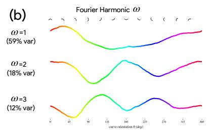

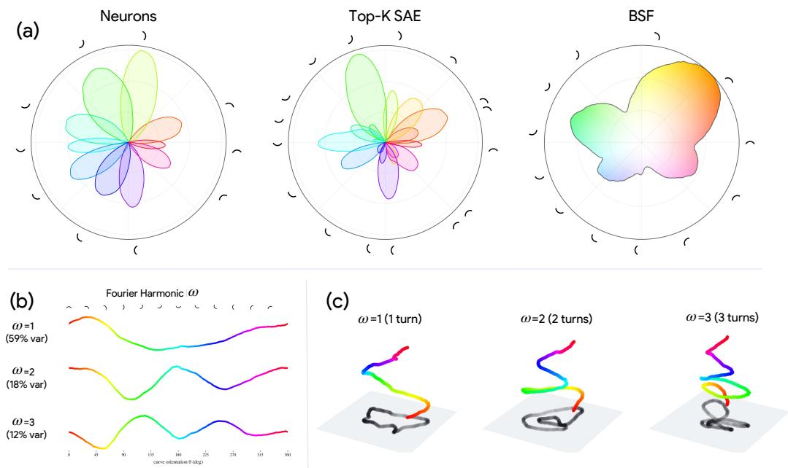  
Figure 11: A single block recovers the InceptionV1 curve manifold, and discovers higher-order Fourier modes. (a) Radial tuning curves on synthetic oriented stimuli: individual neurons (Cammarata et al., 2020) and Top-k SAE atoms (Gorton, 2024) each fire for a narrow wedge of orientations, shattering the family into many petals, whereas a single BSF block covers all orientations as one connected region. (b) Decomposed along orientation, the block carries more than the orientation circle: its leading components are higher-order Fourier modes, the first three $( \omega , = 1 , 2 , 3 )$ capturing 89% of its variance $( 5 \bar { 9 } / 1 8 / 1 2 \% )$ , far from random (see Appendix E) with the harmonics beyond the third sharing the remaining 11%, none rising near the first three. (c) Projected onto its harmonic-ω plane, the block traces a loop that winds exactly ω times.

## 5 Block Sparse Featurizers on a Vision Foundation Model

To evaluate our BSFs on a state-of-the-art foundation model, we turn to manifold discovery in the representations of the self-supervised vision model DINOv3 (Siméoni et al., 2025). Unless noted otherwise, we train a Grassmannian BSF with block size $b = 3$ on final-layer ViT-B patch activations.

## 5.1 Class-Selective and Spatially Coherent Concepts

To test whether the blocks correlate with concepts, we treat the codes as single-concept class detectors. We train BSFs of varying block dimension $b { = } 3$ on ImageNet-1k activations, freeze both the backbone and the featurizer, and for each ImageNet-1k class select the single concept whose codes best detect the class. We compare against a SAE (the b=1 vanilla BSF). The best single-concept F1 generally rises with the block sparsity k, and the BSF codes surpass the SAE at every sparsity with the gap widening as b increases (Figure 12 left). This pattern is consistent with blocks that carry finer, more class-selective concepts than the directional codes.

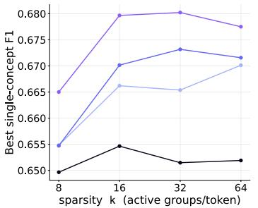

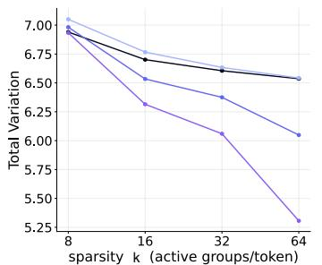  
SAE (b=1)  b=2  b=3  b=4

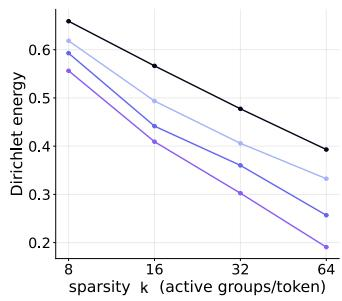

Figure 12: Block structure yields class selective, spatially coherent concepts. Best single-concept detector F1 (left) and concept-map smoothness measured by total variation (center) and Dirichlet energy (right), against sparsity k on the native W =32,768 grid; across every k the block-SAEs (b>1) reach higher F1 and lower total variation and Dirichlet energy than the $\scriptstyle b = \dot { 1 } \ S \mathrm { A E }$ , the gain widening with b.  
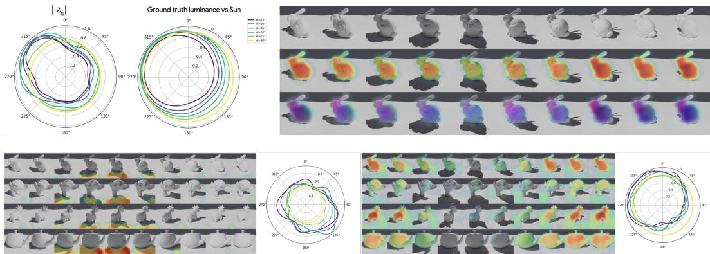  
Figure 13: Recovered concepts track scene illumination, consistently across objects. A Grassmannian BSF on DINOv3 is probed on a series of twelve Blender models rendered while the sun sweeps in azimuth and elevation. (Top left) The block norm $\| z _ { g } \|$ of the luminance block against sun azimuth, one curve per elevation in $\{ 1 5 ^ { \circ } , \ldots , 9 0 ^ { \circ } \}$ ; (Top middle) the ground-truth luminance over the same sweep, which the block norm follows at every elevation; (Top right) the recovered luminance concept overlaid on one model across the azimuth sweep, the second row showing concept presence $( \| z _ { g } \| )$ and the third row its intrinsic geometry $( { \pmb u } _ { g } )$ . (Bottom) A recovered shadow concept and the same luminance concept of the top row, overlaid with their azimuthal tuning on four further models (bunny, monkey, cow, teapot); both track illumination regardless of object identity.

If a block tracks a spatially localized attribute, the map of where it fires across an image should itself be spatially coherent, which we measure through the total variation and Dirichlet energy of the concept maps. Painting each patch with the concepts most active on it and summing the variation over the 4-connected grid (Appendix G.3), we find the BSF codes vary less than the SAE codes at matched sparsity, the gap widening as the dictionary grows (Figure 12, center and right); at k=64, the maps are roughly five times smoother at b=4 than at b=1. The recovered concepts are thus spatially coherent, as one would expect of features that track slowly moving contiguous attributes of a scene, the property the next result makes precise by identifying one such attribute exactly.

## 5.2 Discovering a Concept Manifold for a Physical Variable: Lighting and Shadow

The spatial coherence of the maps suggests that some blocks may track physical attributes of a scene rather than the objects in it.5 We test this possibility by searching for a block containing a manifold capturing lighting and shadows, because this concept can be precisely controlled. We render a series of twelve Blender models under controlled illumination, sweeping the sun’s azimuth and elevation, and rank blocks by how their contribution $m _ { g }$ co-varies with the lighting parameters across the whole series. A block scoring high must respond to illumination consistently across objects rather than to any single shape. Two blocks stand out: one tracks the scene luminance, i.e., the amount of sunlight reaching the object, and one tracks the volume of cast shadow in the image. Both blocks fire on every model in the series, so the concept they carry is attached to the lighting and not to the identity of the object lit.

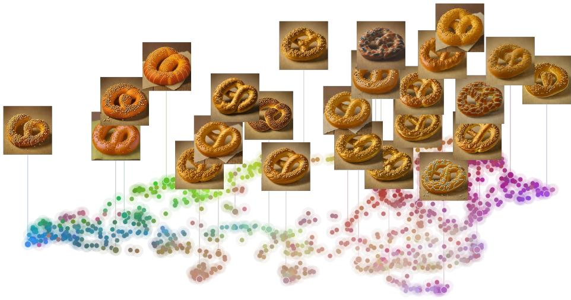  
Figure 14: Steering the pretzel manifold uncovered in SDXL by BSF. We steer an SDXL block from the component that represents the concept of a pretzel. We prompt SDXL for an image of a pretzel and then run four steps of diffusion while fixing the pretzel block to a particular value. We visualize the points within a block with UMAP because the $\bar { b } = 1 6$ , but color the plot according to the principal components of the block subspace. Observe how the images produced by steering reveal the semantics of the pretzel block.

Because the renderer fixes the lighting, we can check the recovered concept against ground truth. Traced against the sun’s azimuth, the block norm $\| z _ { g } \|$ follows the ground truth luminance curve at every elevation (Figure 13). Read at the two resolutions of the interpretation, the block norm localizes the lit and shadowed regions of each image while the internal coordinate orders the degree of illumination. The lighting that an SAE would fragment into many isolated directions, one per region and intensity, is captured by a single block in our BSF.

Having found the recovered structure to be useful for downstream prediction and, in this case, identifiable with a variable of the world, we turn finally to a generative model to evaluate whether blocks are effective for control via activation steering.

## 6 Steering Diffusion Models

Up until this point, our analysis has been purely statistical. However, if BSFs truly capture concepts, then moving within a block should manipulate the behavior according to the geometry of the concept within a block. To evaluate this, we train a Grassmannian BSF on a diffusion model—specifically SDXL (Podell et al., 2024)—and identify blocks whose subspace governs an interpretable concept. Then we prompt SDXL to produce an image of that concept and steer within block to generate alternative images. See Figure 14 for steering results on a pretzel manifold that steer to actually realized activations within a block.

In a follow up experiment, we steered along the manifolds within blocks in a more structured manner. Activations within a block do not fill a flat plane, but trace a curved low-dimensional manifold (Figure 15), so steering the concept is not a matter of moving along two fixed directions but of following that manifold. This is uniquely captured by BSF, while the isolated directions of SAEs fail to do so. To traverse it in a controlled way we fit a Kohonen map (Guthikonda, 2005) (inspired by Konkle (2021); Doshi & Konkle (2023); Yang et al. (2026)) to the block manifold and intervene during sampling by setting the block’s activations to each grid waypoint and generating one image per waypoint. The path trace a smooth moves variation in the activations space and the resulting images are displayed in Figure 15. The in-distribution behavior can be computed, although is evident from our assumption (thanks to the group size the variation is large but stay on-manifold in the block subspace). Put another way, an arbitrary direction in activation space could carry the generation off the manifold of natural images and degrade it, but movement confined to the block’s subspace high density regions does not do so, instead maintaining semantic relevance.

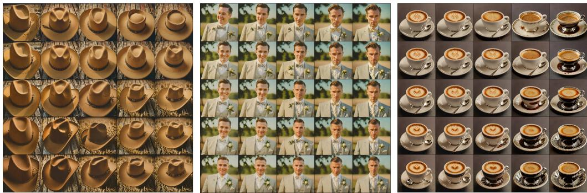  
Figure 15: Steering blocks in layer down.2.1 of SDXL. Generations produced by setting the block’s contribution and fitting a Kohonen map to fit the natural geometry of the subspace (Figure 14). To produce each grid of images, we prompt SDXL for an image of a hat/man/coffee and then steer across these grid coordinates within the block corresponding to a given concept. Observe that the grid axes aren’t interpretable, because this would correspond to two concepts represented by two isolated directions. However, regions of the grid are similar, revealing geometric organization within a block.

## 7 Discussion

In this work, we posit a data-generating process for neural network representations as a mixture of manifolds and from it derive the principle of block sparsity. We then investigate three candidate instantiations of this principle and demonstrate the superiority of BSFs over SAEs, which learn concepts as single directions, across a variety of evaluations.

We can now return briefly to the visual-neuroscience motivation with which we began. Where an SAE atom is a single direction, a block is a subspace—the distinction the visual cortex draws between simple and complex cells—and it clarifies what reading the block coordinate buys. Cortical models from the energy model (Adelson & Bergen, 1985) to HMAX (Riesenhuber & Poggio, 1999; Serre et al., 2007) pool over a subspace to discard its internal coordinate and gain invariance: a complex cell signals that an oriented edge is present, not its phase. A block-sparse featurizer instead keeps and reads that coordinate, separating representing a factor from being invariant to it—and that the coordinate carries perceptual content is not in doubt, since visual hyperacuity recovers continuous quantities finer than the detector spacing from the graded activity of a population rather than any single unit (Poggio et al., 1992). This is precisely what is needed if a feature is not a single direction but a low-dimensional manifold.

Useful as this lens is, the mixture of manifolds is a model and not the last word on neural network representations, and we expect that further progress, especially in other modalities, will call for featurizers whose atoms are something other than blocks of directions. To be precise, we suspect that applying block sparsity directly to language or to video would mismatch the prior (Bhalla et al., 2026b; Lubana et al., 2025) in the same way a SAE mismatches a mixture of manifolds. But this limitation is also the point. Blocks are not proposed here as the universal atom of representation, but as an example of what becomes possible when the featurizer is matched to the geometry of the representation it is meant to explain. Where the geometry is hierarchical, temporal, overlapping, or compositional, the matched object should change accordingly.

We therefore end where we began: with the claim that a featurizer is a hypothesis about a datagenerating process. The role of interpretability is not only to decompose neural representations into atomic units, but to infer what the atomic units of representations must be. BSFs are one answer to that question and one instance of the broader program of Neural Geometry (Geiger et al., 2026): to let the phenomenology of neural representations tell us what the next answer should be.

## Acknowledgments

We are grateful to Demba Ba and William Dorrell for fruitful discussions on structured sparsity and dictionary learning that shaped the framing of this work, and to Binxu Wang for helpful discussions on the geometry large vision models. We thank our colleagues at Goodfire, Ren Makino, Emmanuel Ameisen, and the broader interpretability community for valuable feedback at various stages of the project.

## References

Abdolali, M. and Gillis, N. Beyond linear subspace clustering: A comparative study of nonlinear manifold clustering algorithms. Computer Science Review, 2021.

Adebayo, J., Gilmer, J., Muelly, M., Goodfellow, I., Hardt, M., and Kim, B. Sanity checks for saliency maps. Advances in Neural Information Processing Systems (NIPS), 2018.

Adelson, E. H. and Bergen, J. R. Spatiotemporal energy models for the perception of motion. Journal of the Optical Society of America A, 2(2):284–299, 1985. doi: 10.1364/JOSAA.2.000284.

Ayonrinde, K., Pearce, M. T., and Sharkey, L. Interpretability as compression: Reconsidering sae explanations of neural activations with mdl-saes. arXiv preprint arXiv:2410.11179, 2024.

Bach, F., Jenatton, R., Mairal, J., and Obozinski, G. Structured sparsity through convex optimization. Statistical Science, 2012.

Bach, S., Binder, A., Montavon, G., Klauschen, F., Müller, K.-R., and Samek, W. On pixel-wise explanations for non-linear classifier decisions by layer-wise relevance propagation. Public Library of Science (PloS One), 2015.

Bao, P., She, L., McGill, M., and Tsao, D. Y. A map of object space in primate inferotemporal cortex. Nature, 583(7814):103–108, 2020. doi: 10.1038/s41586-020-2350-5.

Baraniuk, R. G., Cevher, V., Duarte, M. F., and Hegde, C. Model-based compressive sensing. IEEE Transactions on information theory, 2010.

Barlow, H. B. et al. Possible principles underlying the transformation of sensory messages. Sensory communication, 1961.

Belkin, M. and Niyogi, P. Laplacian eigenmaps and spectral techniques for embedding and clustering. Advances in Neural Information Processing Systems (NeurIPS), 2001.

Bhalla, U., Fel, T., Rager, C., Feucht, S., Haklay, T., Wurgaft, D., Boppana, S., Kowal, M., Shyam, V., Merullo, J., et al. Do sparse autoencoders capture concept manifolds? ArXiv e-print, 2026a.

Bhalla, U., Oesterling, A., Verdun, C. M., Lakkaraju, H., and Calmon, F. P. Temporal sparse autoencoders: Leveraging the sequential nature of language for interpretability. 2026b. URL https://arxiv.org/abs/2511.05541.

Bricken, T., Templeton, A., Batson, J., Chen, B., Jermyn, A., Conerly, T., Turner, N., Anil, C., Denison, C., Askell, A., Lasenby, R., Wu, Y., Kravec, S., Schiefer, N., Maxwell, T., Joseph, N., Hatfield-Dodds, Z., Tamkin, A., Nguyen, K., McLean, B., Burke, J. E., Hume, T., Carter, S., Henighan, T., and Olah, C. Towards monosemanticity: Decomposing language models with dictionary learning. Transformer Circuits Thread, 2023. https://transformer-circuits.pub/2023/monosemantic-features.

Bussmann, B., Leask, P., and Nanda, N. Batchtopk sparse autoencoders. ArXiv e-print, 2024.

Cadieu, C. F. and Olshausen, B. A. Learning intermediate-level representations of form and motion from natural movies. Neural Computation, 24(4):827–866, 2012. doi: 10.1162/NECO\_a\_00247.

Cammarata, N., Goh, G., Carter, S., Schubert, L., Petrov, M., and Olah, C. Curve detectors. Distill.pub, 2020.

Casella, G., Ghosh, M., Gill, J., and Kyung, M. Penalized regression, standard errors, and bayesian lassos. 2010.

Chang, L. and Tsao, D. Y. The code for facial identity in the primate brain. Cell, 169(6):1013–1028, 2017. doi: 10.1016/j.cell.2017.05.011.

Chung, S. and Abbott, L. F. Neural population geometry: An approach for understanding biological and artificial neural networks. Current opinion in neurobiology, 70:137–144, 2021.

Chung, S., Lee, D. D., and Sompolinsky, H. Classification and geometry of general perceptual manifolds. Physical Review X, 8(3):031003, 2018.

Churchland, M. M., Cunningham, J. P., Kaufman, M. T., Foster, J. D., Nuyujukian, P., Ryu, S. I., and Shenoy, K. V. Neural population dynamics during reaching. Nature, 2012.

Coifman, R. R. and Lafon, S. Diffusion maps. Applied and computational harmonic analysis, 2006.

Colin, J., Fel, T., Cadène, R., and Serre, T. What i cannot predict, i do not understand: A humancentered evaluation framework for explainability methods. Advances in Neural Information Processing Systems (NeurIPS), 2021.

Costa, V., Fel, T., Lubana, E. S., Tolooshams, B., and Ba, D. From flat to hierarchical: Extracting sparse representations with matching pursuit. arXiv preprint arXiv:2506.03093, 2025.

Cunningham, H., Ewart, A., Riggs, L., Huben, R., and Sharkey, L. Sparse autoencoders find highly interpretable features in language models. arXiv preprint arXiv:2309.08600, 2023.

Dalili, S. A. and Mahdavi, M. Subspace-aware sparse autoencoders for effective mechanistic interpretability. ArXiv e-print, 2026.

Donoho, D. L. and Grimes, C. Hessian eigenmaps: Locally linear embedding techniques for high-dimensional data. Proceedings of the National Academy of Sciences, 2003.

Doshi, F. R. and Konkle, T. Cortical topographic motifs emerge in a self-organized map of object space. Science Advances, 2023.

Dumitrescu, B. and Irofti, P. Dictionary learning algorithms and applications. 2018.

Ebitz, R. B. and Hayden, B. Y. The population doctrine in cognitive neuroscience. Neuron, 2021.

Elad, M. Sparse and redundant representations: from theory to applications in signal and image processing. Springer Science & Business Media, 2010.

Eldar, Y. C. and Bolcskei, H. Block-sparsity: Coherence and efficient recovery. 2009 IEEE International Conference on Acoustics, Speech and Signal Processing, 2009.

Elhamifar, E. and Vidal, R. Sparse manifold clustering and embedding. Advances in Neural Information Processing Systems (NeurIPS), 2011.

Elhamifar, E. and Vidal, R. Sparse subspace clustering: Algorithm, theory, and applications. IEEE transactions on pattern analysis and machine intelligence, 2013.

Engels, J., Michaud, E. J., Liao, I., Gurnee, W., and Tegmark, M. Not all language model features are one-dimensionally linear. arXiv preprint arXiv:2405.14860, 2024.

Fel, T., Cadene, R., Chalvidal, M., Cord, M., Vigouroux, D., and Serre, T. Look at the variance! efficient black-box explanations with sobol-based sensitivity analysis. Advances in Neural Information Processing Systems (NeurIPS), 2021.

Fel, T., Boissin, T., Boutin, V., Picard, A., Novello, P., Colin, J., Linsley, D., Rousseau, T., Cadène, R., Gardes, L., and Serre, T. Unlocking feature visualization for deeper networks with magnitude constrained optimization. Advances in Neural Information Processing Systems (NeurIPS), 2023a.

Fel, T., Boutin, V., Moayeri, M., Cadene, R., Bethune, L., Chalvidal, M., and Serre, T. A holistic approach to unifying automatic concept extraction and concept importance estimation. Advances in Neural Information Processing Systems (NeurIPS), 2023b.

Fel, T., Picard, A., Bethune, L., Boissin, T., Vigouroux, D., Colin, J., Cadène, R., and Serre, T. Craft: Concept recursive activation factorization for explainability. Proceedings of the IEEE Conference on Computer Vision and Pattern Recognition (CVPR), 2023c.

Fel, T., Wang, B., Lepori, M. A., Kowal, M., Lee, A., Balestriero, R., Joseph, S., Lubana, E. S., Konkle, T., Ba, D., et al. Into the rabbit hull: From task-relevant concepts in dino to minkowski geometry. arXiv preprint arXiv:2510.08638, 2025.

Feucht, S., Haklay, T., Bhalla, U., Wurgaft, D., Rager, C., Sarfati, R., Merullo, J., McGrath, T., Lewis, O., Lubana, E. S., et al. Arithmetic in the wild: Llama uses base-10 addition to reason about cyclic concepts. ArXiv e-print, 2026.

Foldiak, P. and Endres, D. M. Sparse coding. ArXiv e-print, 2008.

Fong, R. C. and Vedaldi, A. Interpretable explanations of black boxes by meaningful perturbation. Proceedings of the IEEE International Conference on Computer Vision (ICCV), 2017.

Francel, C. Smixae: Towards unsupervised manifold discovery in language models. ArXiv e-print, 2026.

Fu, D., Zhou, T., Belkin, M., Sharan, V., and Jia, R. Convergent evolution: How different language models learn similar number representations. ArXiv e-print, 2026.

Fusi, S., Miller, E. K., and Rigotti, M. Why neurons mix: high dimensionality for higher cognition. Current Opinion in Neurobiology, 37:66–74, 2016. doi: 10.1016/j.conb.2016.01.010.

Gallego, J. A., Perich, M. G., Miller, L. E., and Solla, S. A. Neural manifolds for the control of movement. Neuron, 2017.

Gao, L., la Tour, T. D., Tillman, H., Goh, G., Troll, R., Radford, A., Sutskever, I., Leike, J., and Wu, J. Scaling and evaluating sparse autoencoders. arXiv preprint arXiv:2406.04093, 2024.

Geiger, A., Lubana, E. S., Fel, T., Merullo, J., Lewis, O., and McGrath, T. The world inside neural networks: How neural geometry will unlock understanding and control of ai. Goodfire, May 2026.

Georgopoulos, A. P., Schwartz, A. B., and Kettner, R. E. Neuronal population coding of movement direction. Science, 233(4771):1416–1419, 1986.

Ghorbani, A., Abid, A., and Zou, J. Interpretation of neural networks is fragile. Proceedings of the AAAI Conference on Artificial Intelligence (AAAI), 2017.

Ghorbani, A., Wexler, J., Zou, J. Y., and Kim, B. Towards automatic concept-based explanations. Advances in Neural Information Processing Systems (NeurIPS), 2019.

Gorton, L. The missing curve detectors of inceptionv1: Applying sparse autoencoders to inceptionv1 early vision. ArXiv e-print, 2024.

Gregor, K. and LeCun, Y. Learning fast approximations of sparse coding. Proceedings of the International Conference on Machine Learning (ICML), 2010.

Gurnee, W., Ameisen, E., Kauvar, I., Tarng, J., Pearce, A., Olah, C., and Batson, J. When models manipulate manifolds: The geometry of a counting task. Transformer Circuits Thread, 2025. URL https://transformer-circuits.pub/2025/linebreaks/index.html.

Guthikonda, S. M. Kohonen self-organizing maps. Wittenberg University, 2005.

Hase, P., Xie, H., and Bansal, M. The out-of-distribution problem in explainability and search methods for feature importance explanations. Advances in Neural Information Processing Systems (NeurIPS), 2021.

Hindupur, S. S. R., Lubana, E. S., Fel, T., and Ba, D. Projecting assumptions: The duality between sparse autoencoders and concept geometry. arXiv preprint arXiv:2503.01822, 2025.

Hsieh, C.-Y., Yeh, C.-K., Liu, X., Ravikumar, P., Kim, S., Kumar, S., and Hsieh, C.-J. Evaluations and methods for explanation through robustness analysis. Proceedings of the International Conference on Learning Representations (ICLR), 2021.

Huang, J., Zhang, T., and Metaxas, D. Learning with structured sparsity. In Proceedings of the 26th Annual International Conference on Machine Learning, pp. 417–424, 2009.

Hyvärinen, A. and Hoyer, P. Emergence of phase- and shift-invariant features by decomposition of natural images into independent feature subspaces. Neural Computation, 12(7):1705–1720, 2000. doi: 10.1162/089976600300015312.

Hyvärinen, A., Hoyer, P. O., and Inki, M. Topographic independent component analysis. Neural Computation, 13(7):1527–1558, 2001. doi: 10.1162/089976601750264992.

Jenatton, R., Obozinski, G., and Bach, F. Structured sparse principal component analysis. International Conference on Artificial Intelligence and Statistics, 2010.

Ji, P., Zhang, T., Li, H., Salzmann, M., and Reid, I. Deep subspace clustering networks. Advances in Neural Information Processing Systems (NeurIPS), 2017.

Kantamneni, S. and Tegmark, M. Language models use trigonometry to do addition. arXiv preprint arXiv:2502.00873, 2025a.

Kantamneni, S. and Tegmark, M. Language models use trigonometry to do addition. ArXiv e-print, 2025b.

Karkada, D., Korchinski, D. J., Nava, A., Wyart, M., and Bahri, Y. Symmetry in language statistics shapes the geometry of model representations. arXiv preprint arXiv:2602.15029, 2026.

Karklin, Y. and Lewicki, M. S. Emergence of complex cell properties by learning to generalize in natural scenes. Nature, 457(7225):83–86, 2009. doi: 10.1038/nature07481.

Kim, B., Wattenberg, M., Gilmer, J., Cai, C., Wexler, J., Viegas, F., et al. Interpretability beyond feature attribution: Quantitative testing with concept activation vectors (tcav). In International conference on machine learning, pp. 2668–2677. PMLR, 2018.

Klindt, D., Sanborn, S., Acosta, F., Poitevin, F., and Miolane, N. Identifying interpretable visual features in artificial and biological neural systems. ArXiv e-print, 2023.

Klindt, D., O’Neill, C., Reizinger, P., Maurer, H., and Miolane, N. From superposition to sparse codes: interpretable representations in neural networks. arXiv preprint arXiv:2503.01824, 2025.

Konkle, T. Emergent organization of multiple visuotopic maps without a feature hierarchy. bioRxiv, 2021.

Kowal, M., Dave, A., Ambrus, R., Gaidon, A., Derpanis, K. G., and Tokmakov, P. Understanding video transformers via universal concept discovery. Proceedings of the IEEE Conference on Computer Vision and Pattern Recognition (CVPR), 2024a.

Kowal, M., Wildes, R. P., and Derpanis, K. G. Visual concept connectome (vcc): Open world concept discovery and their interlayer connections in deep models. Proceedings of the IEEE Conference on Computer Vision and Pattern Recognition (CVPR), 2024b.

Li, C.-G., You, C., and Vidal, R. Structured sparse subspace clustering: A joint affinity learning and subspace clustering framework. IEEE Transactions on Image Processing, 2017.

Li, Z., Chen, Y., LeCun, Y., and Sommer, F. T. Neural manifold clustering and embedding. ArXiv e-print, 2022.

Liu, G., Lin, Z., and Yu, Y. Robust subspace segmentation by low-rank representation. Proceedings of the International Conference on Machine Learning (ICML), 2010.

Liu, G., Lin, Z., Yan, S., Sun, J., Yu, Y., and Ma, Y. Robust recovery of subspace structures by low-rank representation. IEEE transactions on pattern analysis and machine intelligence, 2012.

Lubana, E. S., Rager, C., Hindupur, S. S. R., Costa, V., Tuckute, G., Patel, O., Murthy, S. K., Fel, T., Wurgaft, D., Bigelow, E. J., et al. Priors in time: Missing inductive biases for language model interpretability. arXiv preprint arXiv:2511.01836, 2025.

Mairal, J., Bach, F., and Ponce, J. Sparse modeling for image and vision processing. Foundations and Trends in Computer Graphics and Vision, 2014.

Michaud, E. J., Gorton, L., and McGrath, T. Understanding sparse autoencoder scaling in the presence of feature manifolds. ArXiv e-print, 2025.

Mitchell, T. J. and Beauchamp, J. J. Bayesian variable selection in linear regression. Journal of the american statistical association, 1988.

Modell, A., Rubin-Delanchy, P., and Whiteley, N. The origins of representation manifolds in large language models, 2025. URL https://arxiv.org/abs/2505.18235.

Mudide, A., Engels, J., Michaud, E., Tegmark, M., and Schroeder de Witt, C. Efficient dictionary learning with switch sparse autoencoders. Proceedings of the International Conference on Learning Representations (ICLR), 2025.

Muzellec, S., Andeol, L., Fel, T., VanRullen, R., and Serre, T. Gradient strikes back: How filtering out high frequencies improves explanations. Proceedings of the International Conference on Learning Representations (ICLR), 2024.

Nguyen, A., Yosinski, J., and Clune, J. Multifaceted feature visualization: Uncovering the different types of features learned by each neuron in deep neural networks. Visualization for Deep Learning workshop, Proceedings of the International Conference on Machine Learning (ICML), 2016.

Nguyen, A., Yosinski, J., and Clune, J. Understanding neural networks via feature visualization: A survey. ArXiv e-print, 2019.

Nguyen, G., Kim, D., and Nguyen, A. The effectiveness of feature attribution methods and its correlation with automatic evaluation scores. Advances in Neural Information Processing Systems (NeurIPS), 2021.

O’Keefe, J. and Dostrovsky, J. The hippocampus as a spatial map: preliminary evidence from unit activity in the freely-moving rat. Brain research, 1971.

Olah, C., Mordvintsev, A., and Schubert, L. Feature visualization. Distill, 2017.

Olah, C., Cammarata, N., Voss, C., Schubert, L., and Goh, G. Naturally occurring equivariance in neural networks. Distill, 2020.

Olshausen, B. A. and Field, D. J. Emergence of simple-cell receptive field properties by learning a sparse code for natural images. Nature, 381(6583):607–609, 1996.

Olshausen, B. A. and Field, D. J. Sparse coding with an overcomplete basis set: A strategy employed by v1? Vision research, 37(23):3311–3325, 1997.

Parekh, J., Khayatan, P., Shukor, M., Newson, A., and Cord, M. A concept-based explainability framework for large multimodal models. ArXiv e-print, 2024.

Park, K., Choe, Y. J., Jiang, Y., and Veitch, V. The geometry of categorical and hierarchical concepts in large language models. arXiv preprint arXiv:2406.01506, 2024.

Park, K., Nief, T., Choe, Y. J., and Veitch, V. The information geometry of softmax: Probing and steering. ArXiv e-print, 2026.

Pasupathy, A. and Connor, C. E. Shape representation in area V4: position-specific tuning for boundary conformation. Journal of Neurophysiology, 86(5):2505–2519, 2001. doi: 10.1152/jn. 2001.86.5.2505.

Pasupathy, A. and Connor, C. E. Population coding of shape in area V4. Nature Neuroscience, 5(12): 1332–1338, 2002. doi: 10.1038/nn972.

Patel, V. M. and Vidal, R. Kernel sparse subspace clustering. IEEE international conference on image processing, ICIP, 2014.

Podell, D., English, Z., Lacey, K., Blattmann, A., Dockhorn, T., Müller, J., Penna, J., and Rombach, R. Sdxl: Improving latent diffusion models for high-resolution image synthesis. Proceedings of the International Conference on Learning Representations (ICLR), 2024.

Poggio, T., Fahle, M., and Edelman, S. Fast perceptual learning in visual hyperacuity. Science, 256 (5059):1018–1021, 1992. doi: 10.1126/science.1589770.

Pouget, A., Dayan, P., and Zemel, R. Information processing with population codes. Nature Reviews Neuroscience, 1(2):125–132, 2000.

Puig, A. T., Wiesel, A., and Hero, A. O. A multidimensional shrinkage-thresholding operator. IEEE Workshop on Statistical Signal Processing (SSP’09), 2009.

Rajamanoharan, S., Lieberum, T., Sonnerat, N., Conmy, A., Varma, V., Kramar, J., and Nanda, N. Jumping ahead: Improving reconstruction fidelity with jumprelu sparse autoencoders. ArXiv e-print, 2024.

Riesenhuber, M. and Poggio, T. Hierarchical models of object recognition in cortex. Nature Neuroscience, 2(11):1019–1025, 1999. doi: 10.1038/14819.

Rigotti, M., Barak, O., Warden, M. R., Wang, X.-J., Daw, N. D., Miller, E. K., and Fusi, S. The importance of mixed selectivity in complex cognitive tasks. Nature, 2013.

Roweis, S. T. and Saul, L. K. Nonlinear dimensionality reduction by locally linear embedding. science, 2000.

Rubinstein, R., Bruckstein, A. M., and Elad, M. Dictionaries for sparse representation modeling. Proceedings of the IEEE, 2010.

Rudelson, M. and Vershynin, R. Sampling from large matrices: An approach through geometric functional analysis. Journal of the ACM, 2007.

Sarfati, R., Bigelow, E., Wurgaft, D., Merullo, J., Geiger, A., Lewis, O., McGrath, T., and Lubana, E. S. The shape of beliefs: Geometry, dynamics, and interventions along representation manifolds of language models’ posteriors. arXiv preprint arXiv:2602.02315, 2026.

Selvaraju, R. R., Cogswell, M., Das, A., Vedantam, R., Parikh, D., and Batra, D. Grad-cam: Visual explanations from deep networks via gradient-based localization. Proceedings of the IEEE International Conference on Computer Vision (ICCV), 2017.

Sengupta, A., Pehlevan, C., Tepper, M., Genkin, A., and Chklovskii, D. Manifold-tiling localized receptive fields are optimal in similarity-preserving neural networks. Advances in neural information processing systems, 31, 2018.

Serre, T. Learning a dictionary of shape-components in visual cortex: Comparison with neurons, humans and machines. PhD thesis, Massachusetts Institute of Technology, 2006.

Serre, T., Wolf, L., Bileschi, S., Riesenhuber, M., and Poggio, T. Robust object recognition with cortex-like mechanisms. IEEE Transactions on Pattern Analysis and Machine Intelligence, 29(3): 411–426, 2007. doi: 10.1109/TPAMI.2007.56.

Shafran, O., Ronen, S., Fahn, O., Ravfogel, S., Geiger, A., and Geva, M. From directions to regions: Decomposing activations in language models via local geometry. ArXiv e-print, 2026.

Sharkey, L., Chughtai, B., Batson, J., Lindsey, J., Wu, J., Bushnaq, L., Goldowsky-Dill, N., Heimersheim, S., Ortega, A., Bloom, J., et al. Open problems in mechanistic interpretability. arXiv preprint arXiv:2501.16496, 2025.

Silva, V. and Tenenbaum, J. Global versus local methods in nonlinear dimensionality reduction. Advances in Neural Information Processing Systems (NeurIPS), 2002.

Siméoni, O., Vo, H. V., Seitzer, M., Baldassarre, F., Oquab, M., Jose, C., Khalidov, V., Szafraniec, M., Yi, S., Ramamonjisoa, M., et al. Dinov3. arXiv preprint arXiv:2508.10104, 2025.

Simonyan, K., Vedaldi, A., and Zisserman, A. Deep inside convolutional networks: Visualising image classification models and saliency maps. Proceedings of the International Conference on Learning Representations (ICLR), 2013.

Slack, D., Hilgard, A., Lakkaraju, H., and Singh, S. Counterfactual explanations can be manipulated. Advances in Neural Information Processing Systems (NeurIPS), 2021.

Smilkov, D., Thorat, N., Kim, B., Viégas, F., and Wattenberg, M. Smoothgrad: removing noise by adding noise. Proceedings of the International Conference on Machine Learning (ICML), 2017.

Soltanolkotabi, M., Elhamifar, E., and Candès, E. J. Robust subspace clustering. The Annals of Statistics, 2014.

Soussen, C., Idier, J., Brie, D., and Duan, J. From bernoulli–gaussian deconvolution to sparse signal restoration. IEEE Transactions on Signal Processing, 2011.

Springenberg, J. T., Dosovitskiy, A., Brox, T., and Riedmiller, M. Striving for simplicity: The all convolutional net. Workshop Proceedings of the International Conference on Learning Representations (ICLR), 2014.

Stringer, C., Pachitariu, M., Steinmetz, N., Carandini, M., and Harris, K. D. High-dimensional geometry of population responses in visual cortex. Nature, 571(7765):361–365, 2019. doi: 10.1038/s41586-019-1346-5.

Sturmfels, P., Lundberg, S., and Lee, S.-I. Visualizing the impact of feature attribution baselines. Distill, 2020.

Sun, X., Stolfo, A., Engels, J., Wu, B., Rajamanoharan, S., Sachan, M., and Tegmark, M. Dense sae latents are features, not bugs. ArXiv e-print, 2025.

Sun, Y., Liu, Q., Tang, J., and Tao, D. Learning discriminative dictionary for group sparse representa tion. IEEE Transactions on Image Processing, 2014.

Sundararajan, M., Taly, A., and Yan, Q. Axiomatic attribution for deep networks. Proceedings of the International Conference on Machine Learning (ICML), 2017.

Tanaka, K. Inferotemporal cortex and object vision. Annual review of neuroscience, 1996.

Tanaka, K., Saito, H.-a., Fukada, Y., and Moriya, M. Coding visual images of objects in the inferotemporal cortex of the macaque monkey. Journal of neurophysiology, 1991.

Tenenbaum, J. B., Silva, V. d., and Langford, J. C. A global geometric framework for nonlinear dimensionality reduction. science, 2000.

Thasarathan, H., Forsyth, J., Fel, T., Kowal, M., and Derpanis, K. Universal sparse autoencoders: Interpretable cross-model concept alignment. ArXiv e-print, 2025.

Theodosis, E., Tolooshams, B., Tankala, P., Tasissa, A., and Ba, D. On the convergence of groupsparse autoencoders. ArXiv e-print, 2021.

Tovsic, I. and Frossard, P. Dictionary learning. IEEE Signal Processing Magazine, 2011.

Tschannen, M. and Bölcskei, H. Noisy subspace clustering via matching pursuits. IEEE Transactions on Information Theory, 2018.

Tvetkova, L., Bruesch, T., Dorszewski, T., Mager, F. M., Aagaard, R. O., Foldager, J., Alstrom, T. S., and Hansen, L. K. On convex decision regions in deep network representations. Nature Communications, 2025.

Vielhaben, J., Blücher, S., and Strodthoff, N. Multi-dimensional concept discovery (mcd): A unifying framework with completeness guarantees. The Journal of Transactions on Machine Learning Research (TMLR), 2023.

Vladymyrov, M. and Carreira-Perpinán, M. Á. Locally linear landmarks for large-scale manifold learning. Joint European Conference on Machine Learning and Knowledge Discovery in Databases, 2013.

Wurgaft, D., Rager, C., Kowal, M., Shyam, V., Feucht, S., Bhalla, U., Haklay, T., Bigelow, E., Sarfati, R., McGrath, T., et al. Manifold steering reveals the shared geometry of neural network representation and behavior. ArXiv e-print, 2026.

Xu, Z., Tan, Z., Wang, S., Xu, K., and Chen, T. Beyond redundancy: Diverse and specialized multi-expert sparse autoencoder. ArXiv e-print, 2025.

Yang, H., Xu, K., Lu, A., Grossberg, M. D., Bai, Y., and Shi, J. Vibe spaces for creatively connecting and expressing visual concepts. Proceedings of the IEEE Conference on Computer Vision and Pattern Recognition (CVPR), 2026.

Yocum, J., Allen, C., Olshausen, B., and Russell, S. Neural manifold geometry encodes feature fields. In NeurIPS 2025 Workshop on Symmetry and Geometry in Neural Representations, 2025.

You, C., Robinson, D., and Vidal, R. Scalable sparse subspace clustering by orthogonal matching pursuit. Proceedings of the IEEE Conference on Computer Vision and Pattern Recognition (CVPR), 2016.

Yuan, M. and Lin, Y. Model selection and estimation in regression with grouped variables. Journal of the Royal Statistical Society Series B: Statistical Methodology, 2006.

Zeiler, M. D. and Fergus, R. Visualizing and understanding convolutional networks. Proceedings of the IEEE European Conference on Computer Vision (ECCV), 2014.

Zhang, R., Madumal, P., Miller, T., Ehinger, K. A., and Rubinstein, B. I. Invertible concept-based explanations for cnn models with non-negative concept activation vectors. Proceedings of the AAAI Conference on Artificial Intelligence (AAAI), 2021.

Zhang, Z. and Rao, B. D. Extension of sbl algorithms for the recovery of block sparse signals with intra-block correlation. IEEE Transactions on Signal Processing, 2013.

Zhang, Z. and Zha, H. Principal manifolds and nonlinear dimensionality reduction via tangent space alignment. SIAM journal on scientific computing, 2004.

Zhou, T., Fu, D., Sharan, V., and Jia, R. Pre-trained large language models use fourier features to compute addition. ArXiv e-print, 2024.

Zhou, T., Fu, D., Soltanolkotabi, M., Jia, R., and Sharan, V. Fone: Precise single-token number embeddings via fourier features. ArXiv e-print, 2025.

Zhu, X., Khalili, M. M., and Zhu, Z. Abstopk: Rethinking sparse autoencoders for bidirectional features. ArXiv e-print, 2025.

## A Extended Related Work

Vision interpretability. The earliest attempts to explain a vision model relied on attribution methods, that are functionals that given an input and a predictor assign to each input value a scalar that reports its importance to a prediction (Simonyan et al., 2013; Zeiler & Fergus, 2014; Bach et al., 2015; Springenberg et al., 2014; Smilkov et al., 2017; Sundararajan et al., 2017; Selvaraju et al., 2017; Fong & Vedaldi, 2017; Fel et al., 2021; Muzellec et al., 2024); a subsequent series of papers later established issues and unreliability of those methods (Adebayo et al., 2018; Ghorbani et al., 2017; Colin et al., 2021; Slack et al., 2021; Sturmfels et al., 2020; Hsieh et al., 2021; Hase et al., 2021; Nguyen et al., 2021), notably that some of them can survive randomisation of the model weights or of the labels they claim to explain, which denies attribution any claim to report faithfully what the network computes. This motivated the turn to the concept as the unit of explanation, led by Kim et al. (2018) and developed through methods that recover a concept vocabulary by factorising activations rather than by inspecting individual coordinates, among them ACE (Ghorbani et al., 2019), ICE (Zhang et al., 2021), CRAFT (Fel et al., 2023c), and the work of Vielhaben et al. (2023); these were later unified as instances of a single dictionary-learning problem (Fel et al., 2023b). The sparse autoencoder soon supplied a way to learn such a vocabulary directly from activations under an explicit sparsity constraint (Cunningham et al., 2023; Bricken et al., 2023; Gao et al., 2024; Rajamanoharan et al., 2024; Bussmann et al., 2024; Gorton, 2024). Subsequent work includes Switch SAE that routes each activation to a single expert sub-dictionary through a learned gate and so trains a much wider dictionary at fixed compute (Mudide et al., 2025), while multi-expert variants co-activate several experts and rescale their features to undo the redundancy that single-expert routing induces (Xu et al., 2025). Closer to our concern, and as noted in the main paper, two efforts concurrent with ours, SMixAE (Francel, 2026) and a theoretical treatment of subspace-aware coding for language models (Dalili & Mahdavi, 2026), both applied to LLM, relax the assumption that a concept is carried by a single direction, and so point in the direction the present work develops.

Sparse subspace clustering and manifold learning. One might reasonably expect manifold learning to be the right apparatus here, and the literature is both large and geometrically sophisticated, offering methods tuned to a wide range of intrinsic geometries through global isometry (Tenenbaum et al., 2000; Silva & Tenenbaum, 2002), local linear reconstruction (Roweis & Saul, 2000; Vladymyrov & Carreira-Perpinán, 2013), spectral embedding of a neighbourhood graph (Belkin & Niyogi, 2001; Coifman & Lafon, 2006), and curvature-aware patches (Donoho & Grimes, 2003; Zhang & Zha, 2004); the difficulty is that these methods are built to recover a single manifold, so that they collapse once the representation becomes additive in the sense of a Minkowski sum, recovering the joint manifold its summands trace out together while leaving the concept manifolds, the summands themselves, unrecovered. That a similarity-preserving objective should give rise to localized, manifold-tiling receptive fields is itself a known optimality result (Sengupta et al., 2018), which anticipates the tiling regime (Bhalla et al., 2026a) identified, but for a single manifold rather than an additive mixture of several. Sparse subspace clustering (Elhamifar & Vidal, 2013) inherits an analogous limitation across an equally developed body of work (Liu et al., 2010, 2012; Soltanolkotabi et al., 2014; You et al., 2016; Li et al., 2017; Abdolali & Gillis, 2021), including its nonlinear extensions through locality preservation (Elhamifar & Vidal, 2011), kernels (Patel & Vidal, 2014), deep networks (Ji et al., 2017; Li et al., 2022), and matching pursuits (Tschannen & Bölcskei, 2018), since its affinity construction presumes that each point belongs to exactly one subspace, so that a point lying in the sum of several subspaces breaks the affinity matrix, or at least alters what it can be taken to mean. The interpretability work of Vielhaben et al. (2023) does not escape this either, and although it is to our knowledge the first to treat a concept as genuinely multi-dimensional, it does so without additivity, assigning each token to a single subspace rather than to a sum of several. The same single-assignment limitation reappears in probabilistic form in the recent mixture-of-factor-analyzers decomposition of Shafran et al. (2026) (and in the related SPADE (Hindupur et al., 2025)), which adopts the multi-dimensional unit we also take. They model each concept as a low-rank subspace identified up to rotation and the activation set as a mixture of local Gaussian regions to which each token is assigned by a posterior. An additive composition is again read as one region rather than factored, and the joint set is covered by local affine charts while the summand manifolds are not targeted (as explained in (Bhalla et al., 2026a), Appendix C.1).

Group sparsity and visual dictionaries. Closest to our own approach is a body of work on structured and group sparsity (Jenatton et al., 2010; Bach et al., 2012; Sun et al., 2014; Theodosis et al., 2021), which organizes a code into groups that activate or not together and thereby furnishes the principle on which our featurizer rests. A second and older source lies in visual neuroscience, where learning a dictionary of visual primitives from natural-image statistics has long been standard (Olshausen & Field, 1996, 1997; Foldiak & Endres, 2008; Serre, 2006), and where organizing a flat sparse code into blocks recovers the idea that a visual feature is borne by a coordinated group of units rather than by an isolated one, much as a continuous variable is read out from a population of overlapping receptive fields rather than from any single unit (Pouget et al., 2000; O’Keefe & Dostrovsky, 1971; Georgopoulos et al., 1986). More precisely, the natural neural analogue of a block— a subspace whose activation is the norm of its code—is the complex cell: independent subspace analysis learns exactly such subspaces from natural-image statistics, pooling a group of filters through their energy and thereby acquiring the phase invariance of complex cells (Hyvärinen & Hoyer, 2000; Hyvärinen et al., 2001), a learned form of the classical energy model (Adelson & Bergen, 1985) and later extended to higher-order image structure (Karklin & Lewicki, 2009; Cadieu & Olshausen, 2012). Where these models pool the within-subspace direction away to obtain invariance, our featurizer retains it, reading the block coordinate as the concept’s internal geometry. The same organization reappears at the top of the ventral stream: inferotemporal cortex is arranged into feature columns whose cells share an object feature but vary along an internal dimension, with objects represented as combinations of active columns (Tanaka et al., 1991; Tanaka, 1996). Recent work recasts this as a low-dimensional object space whose axes are tuned one at a time (Bao et al., 2020; Chang & Tsao, 2017)—a group whose norm signals a feature and whose coordinate parametrizes it, the same structure our block-sparse featurizer recovers in the high-level representations of DINOv3.Taken together, these two lineages converge on block sparsity as the structural primitive.

## B Feature Visualization

We visualize recovered concept manifolds with activation maximization (Nguyen et al., 2016; Olah et al., 2017; Nguyen et al., 2019), using specifically the MACO from (Fel et al., 2023a) to synthesize images targeted at selected locations of a block manifold. For a block g, we sample points along paths through the empirical cloud of block contributions and optimize images whose activations align with those targets. Figure 10 shows the procedure on a single cabbage/cauliflower block: moving across the recovered manifold changes the optimized image to from leafy cabbage to floret. Figure 16 extends the same readout to a broader gallery of blocks, showing that the internal coordinates recovered by BSFs expose smooth within-concept variation rather than only whether a concept is present.

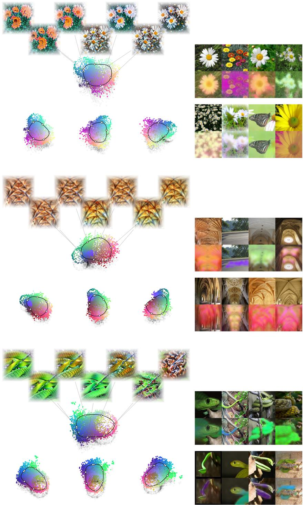  
Figure 16: A gallery of feature visualizations on recovered concept manifolds. Representative blocks from a Grassmannian BSF trained on DINOv3, visualized with the same convention as Figure 10. For each block, the colored point cloud projects the block’s active contributions, with hue encoding the first three principal coordinates of its intrinsic geometry. Feature visualizations sampled along paths through this geometry, shown above each cloud, change smoothly within a coherent visual concept, while the natural-image montages on the right ground the same regions in real activations. The examples span animal fur and markings, boats, cords, bedding, foliage, branches, and repeated manufactured textures, illustrating that a block does not merely detect whether a concept is present, but also provides coordinates for variation within the concept manifold.

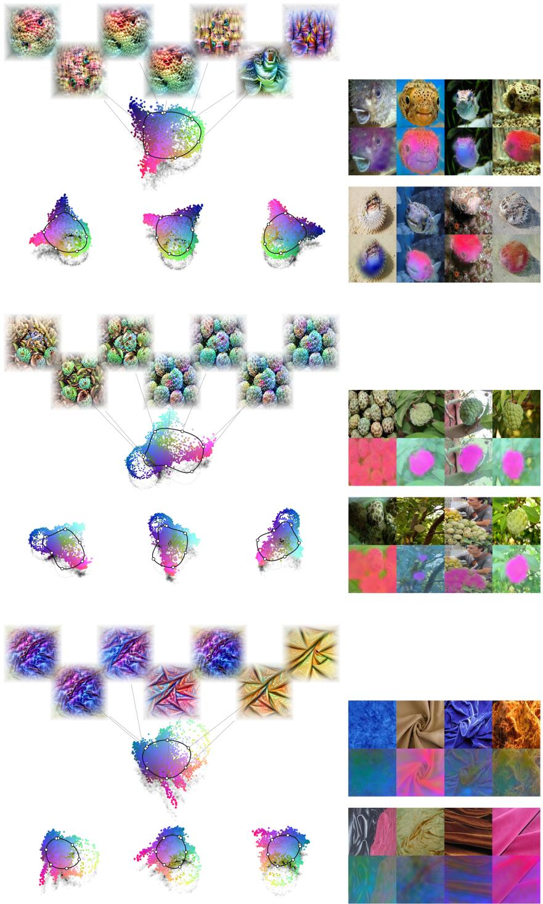  
Figure 17: A gallery of feature visualizations on recovered concept manifolds. Follow up of Fig.16.

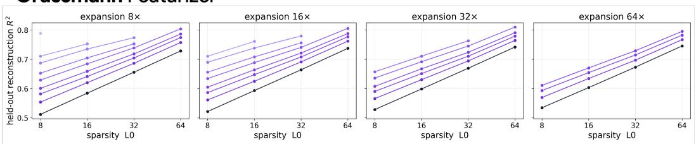

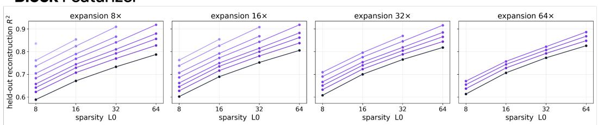

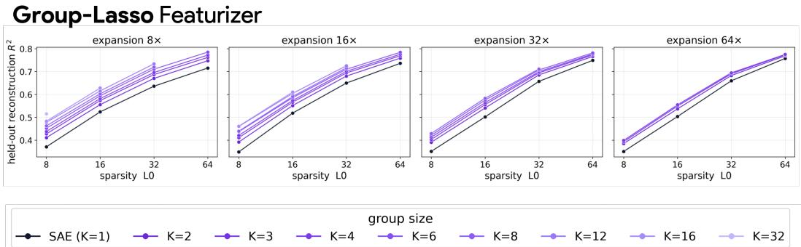  
Figure 18: Reconstruction improves monotonically with every structural parameter, for all three featurizers. Held-out $R ^ { \bar { 2 } }$ against block sparsity $\ell ,$ one row per featurizer (top to bottom: Block, Grassmannian, Group Lasso), one column per dictionary width G (expansions 8× to 64×), with curves colored by block dimension k (k=1, in black, is the directional SAE). Quality rises with ℓ, with G, and with k throughout, and the three parameters do not substitute for one another. The advantage of structure over the $k { = } 1$ baseline is largest at narrow dictionaries and contracts as G widens, since a wider dictionary can already cover a factor with several small blocks. Because reconstruction is monotone in every direction, it cannot by itself rank the featurizers, which motivates the description-length criterion of Section 3.3.

## C Minimum Description Length and Feature Dimensionality: Protocol and Full Results

This appendix details the controlled sweep behind Section 3.3, the exact estimator of the description length $L _ { \delta } ( { \pmb x } )$ of Eq. 5, and the per-feature dimensionality study that follows it. Every quantity is read from trained checkpoints and held-out activations, and every figure is regenerated by a committed script with no hand-entered numbers.

## C.1 Sweep and training protocol

We train the three featurizers of Eq. 4 on final-layer DINOv3 ViT-B patch activations $( d \mathbf { \theta } =$ 768) over a common grid: block dimension $k ~ \in ~ \{ 1 , 2 , 3 , 4 , 6 , 8 , 1 2 , 1 6 , 3 2 \}$ , dictionary width $G \in \{ 4 0 9 6 , 8 1 9 2 , 1 6 3 \bar { 8 } 4 , 3 2 7 6 8 \}$ (expansions 8× to 64×), and block sparsity $\ell = \| \dot { \boldsymbol { z } } \| _ { 2 , 0 } \in$ $\{ 8 , 1 6 , 3 2 , 6 4 \}$ . A cell is pruned when it exceeds $G k > 1 . 6 \times 1 0 ^ { 5 }$ atoms or $\ell k > 4 0 0$ active coordinates, which leaves 96 realized configurations per featurizer and 288 in all. The prune keeps every configuration well clear of degeneracy, since max $\ell k = 3 8 4 < d = 7 6 8$ . All runs share one optimizer schedule, a cosine decay of the learning rate from $1 0 ^ { - 4 } ~ \mathrm { t o } ~ 1 0 ^ { - 5 }$ with a 2000-step warmup, three epochs over the activation shards at batch size 8192, and the input normalization that places $\| \pmb { x } \| \approx { \sqrt { d } }$

## C.2 Estimating the description length

The three terms of Eq. 5 that are not combinatorial rest on three covariance spectra, each harvested per configuration from the featurizer’s own forward pass. On a held-out shard, disjoint from the training set, we take the eigenvalues $\lambda _ { a }$ of the covariance of the residual $\pmb { r } = \pmb { x } - z D$ together with the held-out $R ^ { 2 }$ . On a separate pool of in-distribution activations we take, for each block $^ { g , }$ its firing rate $p _ { g }$ and the eigenvalues $\sigma _ { g j } ^ { 2 }$ of the covariance of its code $z _ { g }$ conditional on the block being active. The codes are the featurizer’s real gated outputs in each case, the result of $\mathbf { \Pi } \mathbf { \Pi } \mathbf { \Pi } \pi$ for the Grassmannian and Block featurizers and of the block soft-threshold for the Group Lasso featurizer, so that for the latter the support size entering the combinatorial term is the measured mean number of active blocks per token rather than a prescribed target.

At a distortion $\delta ,$ the code and residual terms are the rate-distortion code lengths of these spectra, water-filled against the distortion floor, and the dictionary term amortizes one Grassmann chart over the N tokens it serves. Writing $( \cdot ) _ { + } = \operatorname* { m a x } ( \cdot , 0 )$

$$
L _ {\delta} (\boldsymbol {z}) = \sum_ {g} p _ {g} \sum_ {j = 1} ^ {k} \frac {1}{2} \left(\log_ {2} \frac {\sigma_ {g j} ^ {2}}{\delta}\right) _ {+}, \qquad L _ {\delta} (\boldsymbol {r}) = \sum_ {a} \frac {1}{2} \left(\log_ {2} \frac {\lambda_ {a}}{\delta}\right) _ {+}, \qquad \frac {1}{N} L (\boldsymbol {D}) = \frac {1}{2} \frac {G k (d - k)}{N} \log_ {2} N,\tag{6}
$$

the dictionary count following from the $k ( d - k )$ free parameters of a point on the Grassmannian $\operatorname { G r } ( k , d )$ . The support term is the exact combinatorial $\log _ { 2 } { \binom { G } { \ell } }$ , and the total is $\begin{array} { r } { L _ { \delta } ( \pmb { x } ) = \log _ { 2 } \binom { G } { \ell } + } \end{array}$ $\begin{array} { r } { L _ { \delta } ( z ) + L _ { \delta } ( r ) + \frac { 1 } { N } L ( { \cal D } ) } \end{array}$ of Eq. 5.

Distortion is measured relative to a reference variance common to every configuration, $\delta = \mathrm { f r a c } { \cdot } \mathrm { v a r } _ { \mathrm { r e f } }$ with frac $= 1 - R _ { \mathrm { t a r g e t } } ^ { 2 }$ , so that the four headline levels frac $\in \{ 0 . 0 1 , \dot { 0 } . 0 5 , \dot { 0 } . 1 0 , 0 . 2 0 \}$ correspond to $R _ { \mathrm { t a r g e t } } ^ { 2 } \in \{ 0 . 9 9 , 0 . 9 5 , 0 . 9 0 , 0 . 8 0 \}$ . The 20% level coincides with the DINOv3 noise floor estimated in Figure 6, and is the level at which the main text reads the result. We evaluate each water-filling term with the smooth Gaussian rate $\textstyle { \frac { 1 } { 2 } } \log _ { 2 } ( 1 + \sigma ^ { 2 } / \delta )$ , which agrees with the clipped form wherever $\sigma ^ { 2 } \gg \delta$ but removes the discontinuity an eigenvalue would otherwise introduce as it crosses $\delta ,$ leaving the description-optimal block dimension steadier as δ is varied.

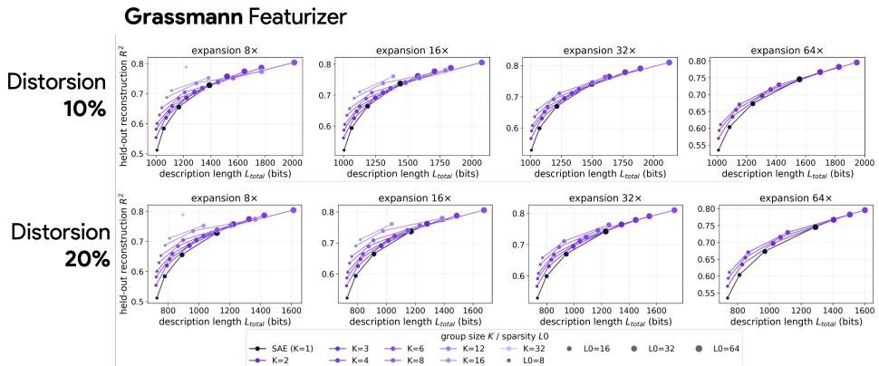  
Figure 19: Grassmannian featurizer, full description-length landscape. Description length $L _ { \delta } ( { \pmb x } )$ (Eq. 5) against block dimension $k ,$ with one panel per dictionary width G and one curve per block sparsity $\ell ,$ at each distortion level. The minimum of each curve marks the description-optimal block dimension, which sits at an interior k ≈ 3 and eases downward as G widens.

## C.3 Description length favours structure at every distortion

At the 20% noise floor the Grassmannian featurizer attains its shortest description at a block dimension between $2$ and $^ { 4 , }$ as reported in the main text (Figure 7). The conclusion holds across the other featurizers and the remaining distortion levels: the structured codes describe DINOv3 activations in fewer bits than the directional code to which they reduce at $k { = } 1$ , and the description-optimal block dimension is moderate and eases downward as the dictionary widens. The featurizers differ in where the optimum falls. The Grassmannian featurizer, whose orthonormal charts render every block dimension fully effective, shows the clearest interior optimum near $k \approx 3$ . The Block featurizer, its untied dictionary already free to spread structure across atoms, settles nearer the directional limit at $k \in \{ 1 , 2 , 3 \}$ . The Group Lasso featurizer tolerates the largest blocks but realizes them at a higher residual cost, in keeping with the lower per-block dimensionality documented below. As these optima are read from shallow minima on a coarse grid, we take the direction of the effect, and not any single value of k, to be the reliable conclusion.

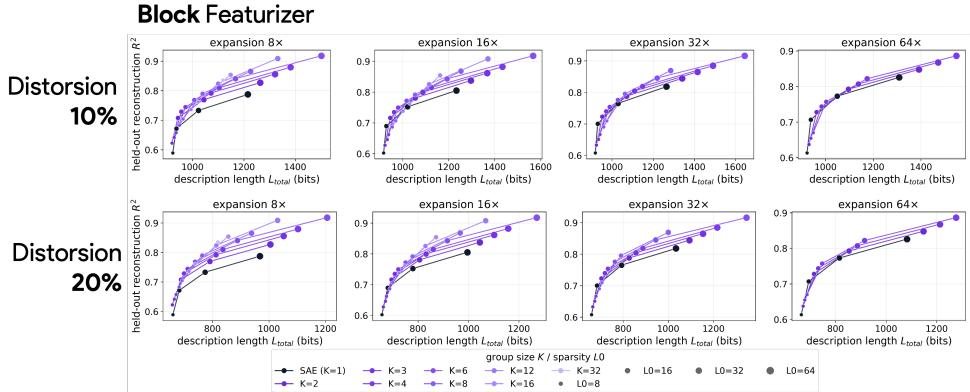  
Figure 20: Block featurizer, full description-length landscape. As in Figure 19, for the free-decoder Block featurizer. The structured codes again describe activations in fewer bits than the k=1 SAE, though the optimum sits nearer the directional limit, $k \in \{ 1 , 2 , 3 \}$ , since the untied dictionary already distributes structure across atoms.

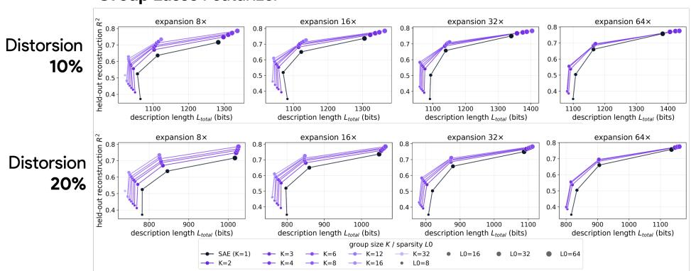  
Figure 21: Group Lasso featurizer, full description-length landscape. As in Figure 19, for the Group Lasso featurizer, compared at matched average $\lVert \boldsymbol { z } \rVert _ { 2 , 0 }$ since its sparsity is not fixed in advance. It saves the most support bits and tolerates the largest blocks, yet realizes them at a higher residual cost, in keeping with the low per-block utilization documented in Figure 22.

## C.4 Feature dimensionality: how much of a block is used

The description-length analysis selects a block dimension for the dictionary as a whole, and the per-feature study asks a complementary question: of the k dimensions a featurizer grants each block, how many does a feature actually occupy? We measure this with three rank statistics of the per-block code covariance, the stable rank $\| \cdot \| _ { F } ^ { 2 } / \| \cdot \| _ { 2 } ^ { 2 }$ , the participation ratio, and the effective rank (the exponential of the spectral entropy), each equal to 1 for a block that carries a single direction and approaching k for a block whose k dimensions are used evenly. We summarize occupancy by the utilization, the effective rank divided by the allotted k, which is 1 for a fully used block and falls toward 0 as the block leaves dimensions idle.

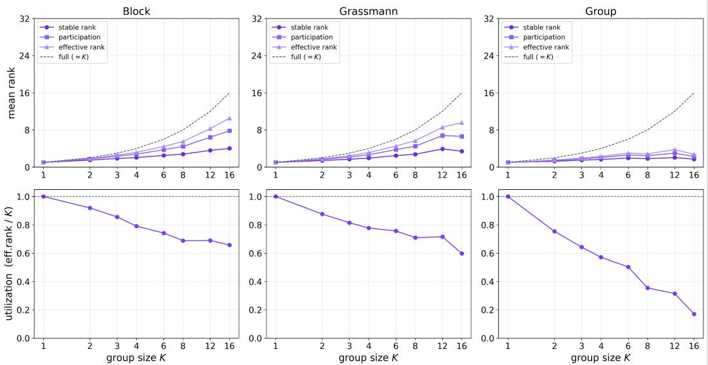  
Figure 22: Rank measures and utilization against block dimension. (top) Mean stable rank, participation ratio, and effective rank of the per-block code, against the allotted block dimension k, for the three featurizers; the dashed line is full occupancy (rank = k). All three measures grow far more slowly than the diagonal, so a block uses only a fraction of the dimensions it is given. (bottom) Utilization, the effective rank as a fraction of k, against k. Utilization falls from 1 throughout, mildly for the Block and Grassmannian featurizers (to roughly 0.6–0.66 at $k { = } 1 6 )$ and steeply for the Group Lasso featurizer (to about 0.17 at $k { = } 1 6 )$ ), whose convex shrinkage concentrates each block on a few directions.

Figure 22 reports the three measures and the utilization across the grid. All three ranks grow with k far more slowly than the full-rank diagonal, so a block uses only part of the dimensions it is allotted, and the gap widens as k grows. The Block and Grassmannian featurizers keep utilization high, falling from 1 to roughly two-thirds at $k { = } 1 6$ , consistent with blocks that genuinely fill a low-dimensional subspace. The Group Lasso featurizer is different: its utilization collapses toward 0.17 at $k { = } 1 6 .$ , so the blocks it nominally widens are in fact spent on a handful of directions, which is the per-feature counterpart of the higher residual cost it pays in the description-length analysis.

Read together, the description-length and per-feature analyses give one picture. Structure shortens the description of DINOv3 activations at a moderate block dimension, and the dimension a feature actually occupies is moderate for the same reason, with the average stable rank settling between two and four across featurizers (Figure 8) even when blocks are allotted up to $k { = } 1 6$ . The block dimension that the dictionary prefers and the dimension that a feature fills are two readings of the same fact, that DINOv3 features are on average roughly three-dimensional.

## D Implementation of the Block-Sparse Featurizers

All three featurizers share the same skeleton: a linear encoder that produce group of signed codes (positive or negative, no more ReLU involved) and a linear decoder. Activations are scaled such that $\mathbb { E } \big ( | | \pmb { x } | | _ { 2 } \big ) = \sqrt { d }$ before encoding, the decoder is linear, $\hat { \pmb x } = z { \pmb D }$ with $D \in \mathbb { R } ^ { G k \times d }$ stacking the blocks $\dot { \boldsymbol { D } } _ { g } \in \mathbb { R } ^ { k \times d }$ , and training minimizes reconstruction error over the dataset with Adam. They differ in the encoder, the constraint set, and the loss, which we now give per method.

Grassmannian BSF. The objective is reconstruction with orthonormal charts and a tied encoder,

$$
\min _ {\boldsymbol {D}, \gamma} \mathbb {E} \| \boldsymbol {x} - \boldsymbol {z} \boldsymbol {D} \| _ {2} ^ {2} \quad \text {s.t.} \quad \boldsymbol {D} _ {g} \boldsymbol {D} _ {g} ^ {\top} = \boldsymbol {I} _ {k} \forall g.
$$

Its parameters are the charts $D _ { g }$ and a single positive scalar $\gamma ,$ shared across blocks. The code is built block-wise,

$$
\boldsymbol {z} _ {g} = \gamma \boldsymbol {x} \boldsymbol {D} _ {g} ^ {\top} \in \mathbb {R} ^ {k}, \qquad \boldsymbol {z} = \Pi_ {\ell} \big (\boldsymbol {z} _ {1}, \ldots , \boldsymbol {z} _ {G} \big),
$$

where $\mathbf { \Pi } \mathbf { \Pi } \mathbf { \Pi } \pi$ retains $z _ { g }$ if g is among the ℓ blocks of largest norm and zeroes it otherwise. The loss is pure reconstruction, sparsity being enforced by $\Pi _ { \ell }$ and the constraint by re-projecting each $D _ { g }$ onto the Stiefel manifold via QR decomposition. In practice we found the re-projection need not occur at every step: blocks drift slowly from orthonormality, and projecting every 20 steps suffices. The scalar γ compensates the energy lost by tying encoder and decoder; we parameterize it through its logarithm to keep it positive and initialize it so reconstruction of the average activation is unbiased at step zero. Selection is per-sample; batch-level variants in the spirit of BatchTopK (Bussmann et al., 2024) are a natural extension we leave to future work.

Vanilla BSF. Both maps are now free. The parameters are an encoder $( W , b )$ with $W \in \mathbb { R } ^ { d \times G k }$ and the dictionary D, with each decoder block constrained to the unit ball, $\| \dot { \boldsymbol { D } } _ { g } \| _ { F } \leq 1$ , and the objective is reconstruction under the code constraint $\| z \| _ { 2 , 0 } \leq \ell .$ The code is

$$
\boldsymbol {z} _ {g} = (\boldsymbol {x} \boldsymbol {W} + \boldsymbol {b}) _ {g} \in \mathbb {R} ^ {k}, \quad \boldsymbol {z} = \Pi_ {\ell} \left(\boldsymbol {z} _ {1}, \dots , \boldsymbol {z} _ {G}\right).
$$

The loss is again pure reconstruction. The ball constraint resolves the scale ambiguity between z and $D ,$ which would otherwise let block norms drift and corrupt the top-ℓ selection. We initialize $W = D ^ { \top }$ with the encoder scaled so pre-code block norms have the correct order of magnitude at initialization, which removes most dead blocks without auxiliary losses.

Group Lasso BSF. The hard constraint is replaced by its convex surrogate. The parameters are $( W , \bar { b , } \theta , D )$ with one learned threshold ${ \theta } _ { g } > 0$ per block, and the code applies the block shrinkage,

$$
\boldsymbol {z} _ {g} = \mathrm{sh} _ {\theta_ {g}} \left((\boldsymbol {x} \boldsymbol {W} + \boldsymbol {b}) _ {g}\right), \qquad \boldsymbol {z} = (\boldsymbol {z} _ {1}, \dots , \boldsymbol {z} _ {G}),
$$

where $\begin{array} { r } { \mathrm { s h } _ { \theta } ( \pmb { u } ) = \big ( 1 - \frac { \theta } { \| \pmb { u } \| _ { 2 } } \big ) . } \end{array}$ u is the proximal operator of the $\ell _ { 2 , 1 }$ 1 norm, so a forward pass is one + step of proximal gradient on the relaxed objective (Gregor & LeCun, 2010). The featurizer specific loss is

$$
\mathbb {E} \left\| \boldsymbol {x} - \boldsymbol {z} \boldsymbol {D} \right\| _ {2} ^ {2} + \lambda \| \boldsymbol {z} \| _ {2, 1}.
$$

In practice, to target a point on the sparsity–reconstruction Pareto front, we apply the $\ell _ { 2 , 1 }$ term only when the block sparsity exceeds a target threshold; this gives better control over the resulting ${ \| \ z \| } _ { 2 , 0 }$ than tuning λ alone, though we regard the schedule as a practical device and a more principled treatment as future work. Since the resulting sparsity is not fixed in advance, comparisons against the other two featurizers are made at matched average $\mathrm { \bar { \vert } } | z \vert | _ { 2 , 0 }$

Losses. All three featurizers minimize the same objective,

$$
\mathcal {L} = \underbrace {\mathbb {E} \| \boldsymbol {x} - \boldsymbol {z} D \| _ {2} ^ {2}} _ {\text {reconstruction}} + \underbrace {\lambda   \mathbb {E}   \| \boldsymbol {z} \| _ {2 , 1}} _ {\text {Group Lasso only}} + \underbrace {\alpha   \mathbb {E}   \| \boldsymbol {r} - \boldsymbol {z} ^ {\prime} D \| _ {2} ^ {2}} _ {\text {AuxK}},
$$

where $\lambda = 0$ for the Grassmannian and Block BSFs. The last term is the block analogue of the auxiliary loss of Gao et al. (2024): $\pmb { r } = \pmb { x } - z D$ is the residual and $z ^ { \prime } = \Pi _ { \ell } ( z _ { 1 } , \dots , z _ { G } )$ is the code built from the next ℓ blocks by norm among those not selected, so the runner-up blocks are asked to explain what the selected ones missed. We use $\alpha = 1 / \ell$ throughout.

## E Revisiting InceptionV1 Curves.

A Fourier probe of a $K { = } 1 6$ subspace could in principle report power at modes $k \geq 2$ that arises from noise, or from the subspace and the featurizer, rather than from the signal, since a Fourier decomposition is a complete orthogonal basis that reconstructs any response on the circle exactly given enough components, so that power at the higher modes is something the basis can always supply and is not on its own evidence of periodic structure in the signal. This raises the question of how the modes the probe recovers can be shown to be real rather than artifacts of the basis: they are real in one sense already, in that the probe isolates directions a downstream layer or task could read off the representation, though legibility of this kind does not settle the matter, since a recovered direction counts only when the variance it explains, the norm of the response once projected onto it, is quantitatively large rather than negligible. We rule the artifact reading out with a matched null (Table 1).

Null hypothesis for higher order Fourier modes Orientation only and Orientation + isotropic noise  
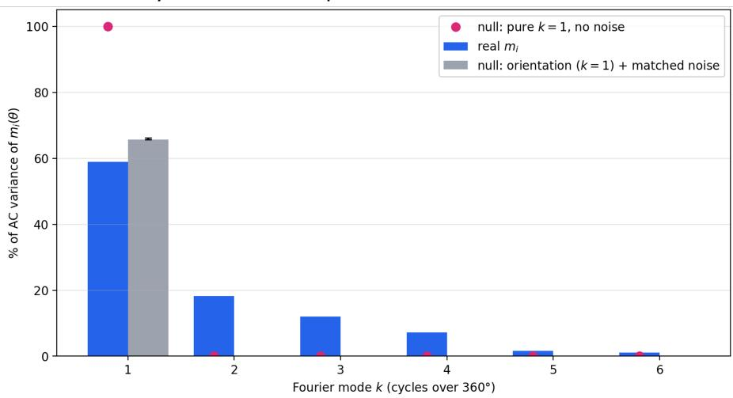  
Figure 23: The higher harmonics survive a matched null. Share of the AC variance of the recovered curve manifold $m _ { i } ( \theta )$ carried by each Fourier mode k as the stimulus orientation sweeps $[ 0 , 3 6 0 ^ { \circ } )$ The measured manifold (blue) retains 18.3% and 12.0% of its variance at $k { = } 2$ and $k { = } 3 .$ , while the two nulls leave these modes empty: a pure first-harmonic input (pink, k=1 only) places all of its power on the orientation circle, and the same input perturbed by white-in-θ noise of matched off-circle energy (grey) sits at the analytic white-noise floor for every $k \geq 2 .$ . The second and third harmonics are therefore periodic structure inherited from the network rather than an artifact of noise, the subspace, or the SAE.

Writing ${ \mathbf { } } m ( \theta )$ for the recovered curve group’s reconstruction contribution as the stimulus orientation θ sweeps [0, 360◦), we split the group’s input response into its first harmonic (the orientation circle, $k { = } 1 )$ and a residual, replace that residual with white-in-θ Gaussian noise of equal off-circle energy, and pass this orientation-plus-noise input through the same trained group and identical probe. The group is active at every orientation (coverage 1.0), so its gated code is a linear function of its input and cannot create harmonics by gating: a noiseless k=1 input returns a response that is purely first harmonic, and matched noise (56% of the input variance) reaches only the analytic white-noise floor $1 / ( n _ { \theta } / 2 ) = 0 . 0 6 \%$ per mode at $n _ { \theta } { = } 1 8 0 0$ . The measured manifold instead places 18.3% and 12.0% of its variance at $k { = } 2$ and $k { = } 3$ , exceeding the null by factors of 470 and 314 $( z \approx 1 . 5 \times 1 0 ^ { 3 }$ and $9 \times 1 0 ^ { 2 }$ over 200 draws). The second and third harmonics are therefore genuine periodic structure in the curve response, inherited from the network, whose raw response carries even more of it, and not an artifact of noise, the subspace, or the SAE.

Table 1: Null test for the higher harmonics. Percentage of AC variance of ${ \mathbf { } } m ( \theta )$ in each Fourier mode k. A pure first-harmonic input, and a first-harmonic input plus white-in-θ noise carrying the same off-circle energy, are passed through the same K=16 curve group. Both nulls leave $k \geq 2$ at the white-noise floor; the measured manifold exceeds it by two orders of magnitude, so modes $k { = } 2 ,$ , 3 are real structure inherited from the network.

<table><tr><td></td><td>k=1</td><td>k=2</td><td>k=3</td><td>k=4</td></tr><tr><td>raw curve response</td><td>43.6</td><td>25.9</td><td>16.8</td><td>7.4</td></tr><tr><td>recovered manifold m(θ)</td><td>58.9</td><td>18.3</td><td>12.0</td><td>7.2</td></tr><tr><td>null: orientation only (k=1, no noise)</td><td>100.0</td><td>0.0</td><td>0.0</td><td>0.0</td></tr><tr><td>null: orientation + matched noise</td><td>65.6</td><td>0.04</td><td>0.04</td><td>0.04</td></tr></table>

## F Group Sparsity as Matched prior

This appendix proves Proposition 1 and collects some surrounding remarks. We recall our claim here, starting from the data generating process defined in Def. 1, and our additional assumption introduced in the main text: for each factor $\mathcal { M } _ { g } ,$ , let $V _ { g } = \operatorname { s p a n } ( \mathcal { M } _ { g } )$ and assume dim $V _ { g } = b \ll d .$ If $D _ { g } \in \mathbb { R } ^ { b \times d }$ is an orthonormal basis for $V _ { g } ,$ then every $m _ { g } \in \mathcal { M } _ { g }$ has coordinates $\boldsymbol { z } _ { g } \in \mathbb { R } ^ { b }$ such that $\begin{array} { r } { \bar { \boldsymbol { m } } _ { g } = z _ { g } \boldsymbol { D } _ { g } . } \end{array}$ . Assuming active factors are nonzero almost surely, let $S = \{ g : \| z _ { g } \| _ { 2 } > 0 \} =$ $\operatorname { s u p p } _ { \mathcal { G } } ( z )$ , so that $z _ { g } = \mathbf { 0 }$ for $g \not \in S .$ . The noisy version of the data generating process then becomes

$$
\boldsymbol {x} = \sum_ {g \in S} \boldsymbol {m} _ {g} + \varepsilon = \sum_ {g \in S} \boldsymbol {z} _ {g} \boldsymbol {D} _ {g} + \varepsilon = \boldsymbol {z} \boldsymbol {D} + \varepsilon , \quad \varepsilon \sim \mathcal {N} (\boldsymbol {0}, \sigma^ {2} \boldsymbol {I} _ {d}).
$$

We can think of each block coordinate $z _ { g }$ drawn independently from some prior, such that x then arises as the sum of the contributions of (the embeddings back into the d-dimensional space of) each coordinate, corrupted by Gaussian noise. Our main result in this section clarifies the nature of the prior, such that our method emerges as the MAP estimate corresponding to this prior: block sparsity supplies the value z that maximize a suitable posterior $p ( \boldsymbol { z } | \boldsymbol { x } )$

Proposition 2 (Block sparsity is the MAP-matched prior). Let x be drawn from the noisy block-linear model ${ \pmb x } = z { \pmb D } + { \pmb \varepsilon }$ with $\varepsilon \sim \dot { \mathcal { N } } ( \mathbf { 0 } , \sigma ^ { 2 } I _ { d } )$ , such that each block coordinate $z _ { g }$ is drawn independently from a block prior

$$
p (\boldsymbol {z} _ {g}) = (1 - \pi) \delta_ {\mathbf {0}} + \pi \mathcal {U} _ {\mathcal {B} _ {R}}, \qquad \mathcal {B} _ {R} = \{\boldsymbol {u} \in \mathbb {R} ^ {b}: \| \boldsymbol {u} \| _ {2} \leq R \},
$$

where $\delta _ { \mathbf { 0 } }$ is the point mass on 0 and ${ { \mathcal { U } } _ { { { B } _ { R } } } }$ is the uniform distribution on the (closed) ball $\scriptstyle { B _ { R } }$ of radius R. Let $\Sigma = \{ z : \| z _ { g } \| _ { 2 } \leq R$ for all $g \leq G \}$ be the support of ${ \bf { \dot { \rho } } } _ { p . }$ Then the MAP estimate is

$$
\hat {\boldsymbol {z}} = \underset {\boldsymbol {z} \in \Sigma} {\arg \min} \frac {1}{2} \| \boldsymbol {x} - \boldsymbol {z} \boldsymbol {D} \| _ {2} ^ {2} + \lambda \| \boldsymbol {z} \| _ {2, 0}, \qquad \lambda = \sigma^ {2} \log \left(\frac {1 - \pi}{\pi} \operatorname{vol} (\mathcal {B} _ {R})\right).\tag{3}
$$

Proof. We want to maximize $\log p ( z | \pmb { x } ) \propto \log p ( z ) + \log p ( \pmb { x } | z )$ . Concerning the prior log $p ( z ) =$ $\sum _ { g } \log p ( z _ { g } )$ , we can consider the two cases for each $p ( z _ { g } )$ , depending on whether $z _ { g } = \mathbf { 0 } ~ ( \mathrm { i . e . }$ whether g $\mid \notin S )$ . If $z _ { g } = \mathbf { 0 }$ , then $\log p ( z _ { g } )$ contributes $- \log ( 1 - \pi )$ to the sum. If $z _ { g } \neq 0$ (and also $\| z _ { g } \| _ { 2 } \leq \dot { R } )$ , then it contributes log $\pi - \log { \mathrm { v o l } ( B _ { R } ) }$ . So this sum becomes

$$
\begin{array}{r c l} \log p (\boldsymbol {z}) & = & \big (G - \| \boldsymbol {z} \| _ {2, 0} \big) \log (1 - \pi) + \| \boldsymbol {z} \| _ {2, 0} \big (\log \pi - \log \operatorname{vol} (\mathcal {B} _ {R}) \big) \\ & = & G \log (1 - \pi) + \| \boldsymbol {z} \| _ {2, 0} \log \left(\frac {\pi}{(1 - \pi) \operatorname{vol} (\mathcal {B} _ {R})}\right). \end{array}
$$

The likelihood is Gaussian, so the log likelihood is

$$
\log p (\boldsymbol {x} | \boldsymbol {z}) = - \frac {d}{2} \log 2 \pi \sigma^ {2} - \frac {1}{2 \sigma^ {2}} \| \boldsymbol {x} - \boldsymbol {z} \boldsymbol {D} \| _ {2} ^ {2}.
$$

Dropping the two first constant terms, which do not depend on $z ,$ the negative log posterior becomes

$$
\begin{array}{r c l} - \log p (\boldsymbol {z} | \boldsymbol {x}) & = & \frac {1}{2 \sigma^ {2}} \| \boldsymbol {x} - \boldsymbol {z} \boldsymbol {D} \| _ {2} ^ {2} - \| \boldsymbol {z} \| _ {2, 0} \log \biggl (\frac {\pi}{(1 - \pi) \operatorname{vol} (\mathcal {B} _ {R})} \biggr) \\ & = & \frac {1}{2 \sigma^ {2}} \| \boldsymbol {x} - \boldsymbol {z} \boldsymbol {D} \| _ {2} ^ {2} + \log \biggl (\frac {1 - \pi}{\pi} \operatorname{vol} (\mathcal {B} _ {R}) \biggr) \| \boldsymbol {z} \| _ {2, 0}. \end{array}
$$

Multiplying by $\sigma ^ { 2 }$ does not change the minimum, so Eq. 3 follows immediately.

Now, few remarks on this result. First, one could show that the choice of slab is not load-bearing. A Gaussian slab gives the same selection term plus a ridge penalty on active blocks (Mitchell & Beauchamp, 1988), and a Laplace slab on the block norm gives the group lasso penalty $\| z \| _ { 2 , 1 }$ as exact MAP (Casella et al., 2010). The flat slab is simply the cleanest expression of the principle, and the family of penalties it generates is studied in the structured sparsity literature (Yuan & Lin, 2006; Bach et al., 2012). Second, the threshold λ grows with the block dimension. The volume of the ball scales as $R ^ { b }$ , sohigher thresholds are more costly: to put it otherwise, a feature is granted b dimensions only if it earns them in reconstruction. Third, the 2-norm inside the blocks is forced and can be interpreted as the signature of activity. As a manifold has no canonical chart: rotating the chart, $z _ { g } \mapsto \bar { z } _ { g } Q ^ { \top }$ and ${ \cal D } _ { g } \mapsto { \cal Q } { \cal D } _ { g }$ for $Q \in O ( b )$ , leaves the model unchanged, so a penalty intrinsic to the model must be blind to this rotation. The orbits of $O ( b )$ acting on $\mathbb { R } ^ { b }$ are the spheres of constant $\ell _ { 2 }$ norm, so a separable penalty is rotation-invariant exactly when it depends on each block through $\| z _ { g } \| _ { 2 }$ . Both $\lVert \cdot \rVert _ { 2 , 0 }$ and $\| \cdot \| _ { 2 , 1 }$ qualify.

It is also worth spelling out what happens when the prior is mismatched, since it retrodicts a known phenomenon. Under the model, an active factor occupies k coordinates, so a flat $\ell _ { 0 }$ budget charges b per faithfully represented factor. A coder can instead $ { \mathbf { \hat { p } } }  { \mathbf { a y } } ^ {  { \mathbf { \ell } } ,  { \mathbf { \ell } } }$ by approximating a local neighborhood of the manifold with a single direction, and as the budget tightens, the optimal flat-sparse solution covers each factor with many rank-one atoms, one per region. The tiling of curve detectors in InceptionV1 (Cammarata et al., 2020; Gorton, 2024) and the dilution analysis of Bhalla et al. (2026a); Lubana et al. (2025) are, under this reading, the predictable optimum of a mismatched prior.

Finally, Eq. 3 is combinatorial and NP-hard in general (Eldar & Bolcskei, 2009), and the structured sparsity literature offers various method to make the optimization tractable. For example, one can relax the penalty to its tightest convex surrogate, the group lasso norm (Yuan & Lin, 2006); one can select blocks greedily by residual correlation, as in Block-OMP (Eldar & Bolcskei, 2009); or one can keep the sparsity as a constraint and project, retaining the top blocks by energy, in the spirit of iterative hard thresholding.

## G Downstream performances

## G.1 Quantization and task ceiling (Figure 6)

In this experiment, we measure the effect of reconstruction error on task performance. We uniformly quantize the normalized patch activations per patch, ${ \pmb x } _ { \pmb q } = \Delta \mathrm { r o u n d } ( { \pmb x } / \Delta )$ and sweep $\Delta$ over 13 levels from 0 to 7. Then, we feed the quantized features to a linear probe trained once on the clean activations and held frozen (‘Basic Probe’) and record the task metric relative to its unquantized value. The corruption is measured by the centered reconstruction fidelity $R ^ { 2 } ( { \pmb x } , { \pmb x } _ { q } ) =$ $1 - \| \pmb { x } - \pmb { x _ { q } } \| ^ { 2 } / \| \pmb { x } - \pmb { \bar { x } } \| ^ { 2 }$ over the same tokens. Probes report ImageNet-1k top-1, ADE20k mIoU, and $\mathrm { N Y U v } 2 \bar { \delta } _ { 1 }$ (the fraction of pixels whose predicted depth is within 25% of ground truth).

## G.2 Single-concept F1 (Figure 12, left)

For each ImageNet-1k class we find the single concept that best detects it. Per patch a block emits a k-vector of code values, which we read out along a unit direction v in the block’s k-dimensional subspace (for the vanilla k=1 SAE this is just the signed code). The image-level score of a (block, v) pair is the maximum of this projection over the 196 patches. For each (class, block) we fit v by ℓ2-regularized logistic regression on the block’s firing patches labeled by image class, set the threshold that maximizes F1, and keep the block with the highest F1. Selection uses a 200k-image train subsample.

## G.3 Concept-map smoothness (Figure 12, center and right)

For each image and concept we form the 14 × 14 map of its per-patch activation (block: group $\ell _ { 2 }$ norm; vanilla: |code|) and keep the 8 highest-energy concepts per image, unit- $\boldsymbol { \cdot } \boldsymbol { \ell } _ { 2 }$ normalizing each map. We report total variation (sum of absolute 4-neighbor differences) and Dirichlet energy (sum of squared 4-neighbor differences), averaged over the 8 maps.

## G.4 Linear probing and cosine probe recovery (Figures 24 and 25)

With the backbone and featurizer frozen, we fit linear probes on the extracted codes for ImageNet-1k classification (max-abs pooled to image level), ADE20k segmentation, and NYUv2 depth (both per patch). We sweep over an SGD/AdamW learning-rate and weight-decay grid, picking the best performing validation probe for each condition. The basic probe baseline is the same probe fit directly on the raw activations, and we optionally concatenate the CLS token for classification and depth. For cosine probe recovery, we take each trained raw-activation probe direction and measure the cosine between it and its projection onto the span of its best-aligned block’s k decoder atoms. We report the median and IQR over probe directions against a random-direction floor and a real-activation ceiling.

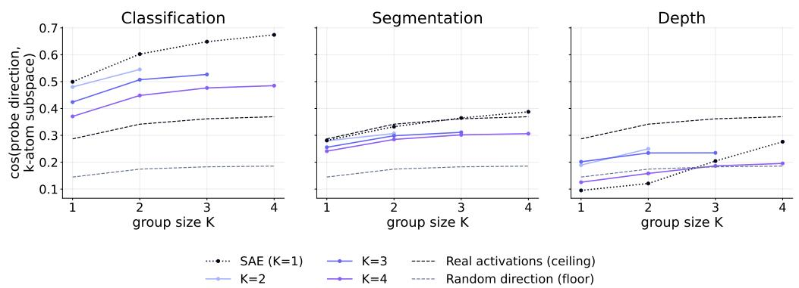

Additional Results We train BSFs of varying block dimension k on ImageNet-1k activations, freeze both the backbone and the featurizer, and fit linear probes on the extracted codes for three tasks, classification on ImageNet-1k, semantic segmentation on ADE20k, and monocular depth on NYUv2, comparing against a vanilla SAE (the k=1 BSF) and against a probe read directly off the raw DINOv3 activations (the basic probe). The codes improve on the basic probe for classification and approach it without surpassing it for segmentation and depth, and performance rises with the block sparsity ℓ on all three tasks (Figure 24).

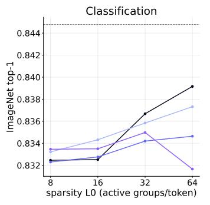

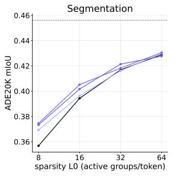

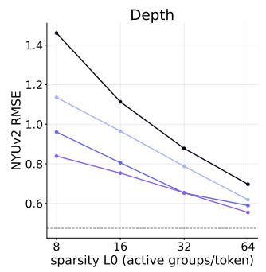  
Figure 24: Linear Probe Evaluation. We train linear probes on codes extracted by Vanilla SAEs and BSFs (Block-SAEs) on ImageNet-1k (classification), ADE20k (semantic segmentation) and NYUv2 (monocular depth estimation). We report validation set performance on each dataset.

Figure 25: Probe Recovery. We treat linear probes as activations and measure how well different SAEs can reconstruct them.  
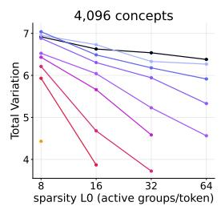

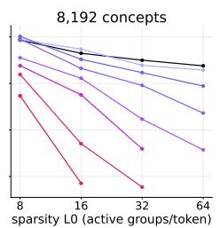

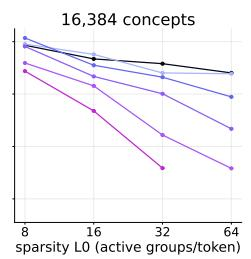

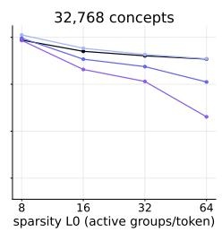  
SAE (K=1) K=2 K=3 K=4 K=6 K=8 K=12 K=16 K=32  
Figure 26: BSFs learn more spatially coherent concepts. We show total variation as a function of number of concepts predicted for a sweep of 96 SAEs.

## H Toy model of Manifold Superposition

The toy model is simple: each observation is a sparse sum of low-dimensional manifolds embedded into $\mathbb { R } ^ { \dot { d } }$ by random orthonormal maps, $\begin{array} { r } { \pmb { x } = \sum _ { i \in S } \tilde { \gamma } _ { i } ( \theta _ { i } ) \pmb { V } _ { i } + \varepsilon \mathrm { ~ w i t h ~ } | S | = L _ { 0 } } \end{array}$ , so that the question we put to a featurizer is whether it recovers the individual factors from their mixture.

Manifold zoo. Table 2 collects the manifold types we use, giving for each its intrinsic dimension $d _ { i } .$ , the dimension $b _ { i }$ of the ambient subspace its embedding occupies, and the parametric map $\gamma _ { i }$ The gap between $d _ { i }$ and $b _ { i }$ is the distinction that governs the construction throughout, since a circle is parameterized by a single angle, $d _ { i } { = } 1$ , yet its embedding (cos θ, sin θ) spans a two-dimensional subspace, $b _ { i } { = } 2 ,$ , so that a block must hold two directions to carry it. We instantiate $M = 1 2 8$ factors at ambient dimension $d = 1 2 8$ , half of them one-dimensional concept atoms in the classical dictionary-learning sense and half curved manifolds drawn in turn from the seven curved types.

Table 2: Manifold zoo used in the controlled toy.

<table><tr><td>Type</td><td> $d_i$ </td><td> $b_i$ </td><td>Embedding  $\gamma_i(\theta) \in \mathbb{R}^{b_i}$ </td></tr><tr><td>Concept (segment)</td><td>1</td><td>1</td><td>(t)</td></tr><tr><td>Circle</td><td>1</td><td>2</td><td> $(\cos \theta, \sin \theta)$ </td></tr><tr><td>Flat disk</td><td>2</td><td>2</td><td> $(r \cos \theta, r \sin \theta), \quad r \sim \sqrt{\mathcal{U}(0,1)}$ </td></tr><tr><td>Sphere</td><td>2</td><td>3</td><td> $(\sin \phi \cos \theta, \sin \phi \sin \theta, \cos \phi)$ </td></tr><tr><td>Torus</td><td>2</td><td>3</td><td> $((R+r \cos \phi) \cos \theta, (R+r \cos \phi) \sin \theta, r \sin \phi)$ </td></tr><tr><td>Möbius</td><td>2</td><td>3</td><td> $((1+t \cos \frac{\phi}{2}) \cos \phi, (1+t \cos \frac{\phi}{2}) \sin \phi, t \sin \frac{\phi}{2})$ </td></tr><tr><td>Swiss roll</td><td>2</td><td>3</td><td> $(\theta \cos \theta, h, \theta \sin \theta)$ </td></tr><tr><td>Helix</td><td>1</td><td>3</td><td> $(\cos \theta, \sin \theta, \alpha \theta)$ </td></tr></table>

Normalization. So that every factor weighs equally in the reconstruction loss, we center and isotropically rescale each instance at construction, since without this correction the large-coordinate manifolds, such as the Swiss roll whose coordinates run to $\theta \sim 4 . 5 \pi$ , would consume the featurizer’s capacity while the small ones would be read as noise. For each instance i we draw a calibration sample of 50,000 points from the raw embedding $\gamma _ { i } .$ , compute the mean $\pmb { \mu _ { i } }$ and the RMS norm of the centered samples $\sigma _ { i } = \sqrt { \mathbb { E } \| \gamma _ { i } ( \theta ) - \pmb { \mu } _ { i } \| ^ { 2 } }$ , and set $\tilde { \gamma } _ { i } ( \theta ) = ( \gamma _ { i } ( \theta ) - \mu _ { i } ) / \sigma _ { i }$ . Being a translation composed with an isotropic rescaling, this leaves angles, relative distances, curvature ratios, and topology untouched and fixes the RMS norm of every instance to one in local coordinates regardless of type.

For each instance we draw a random orthonormal matrix $V _ { i } \in \mathbb { R } ^ { b _ { i } \times d }$ as the transposed Q factor of the QR decomposition of a $d \times b _ { i }$ Gaussian, so that the embedding preserves norm, $\lVert z V _ { i } \rVert _ { 2 } = \lVert z \rVert _ { 2 }$ with bias offsets set to zero throughout.

Sparse mixture sampling. Observations follow

$$
\boldsymbol {x} = \sum_ {i \in S} \tilde {\gamma} _ {i} (\theta_ {i}) \boldsymbol {V} _ {i} + \varepsilon , \quad | S | = L _ {0} = 4,
$$

where the active set $S$ is drawn uniformly without replacement from the M instances and the intrinsic coordinates $\theta _ { i }$ uniformly on each manifold, and we take clean activations, $\varepsilon = 0$ , so that recovery reflects geometric organization rather than denoising. We generate $N = 3 { \times } 1 0 ^ { 5 }$ training samples and a held-out evaluation set of $1 0 ^ { 5 }$ samples at $L _ { 0 } { = } 4$ under a separate seed, retaining the per-manifold contributions $m _ { i } = \tilde { \gamma } _ { i } ( \theta _ { i } ) V _ { i }$ and the active masks, so that evaluation measures recovery on in-distribution superpositions whose ground truth is known. Activations are scaled so that $\mathbb { E } \| \dot { \pmb { x } } \| _ { 2 } ^ { 2 } = 1$

Featurizer training. We train the three BSFs of Eq. 4 together with the baselines, a TopK SAE that is the b=1 Vanilla BSF and the two concurrent subspace featurizers discussed below, using the single-forward-pass encoders of Appendix D and Adam over a few hundred epochs. Each featurizer is reported at its best configuration over a sweep of block sparsity k, dictionary width G, and block dimension $b ,$ the Vanilla BSF for instance at $\bar { b } { = } 4 , k { = } 4 , \bar { G } { = } 2 \bar { M }$ , and no reconstruction noise or auxiliary loss enters unless the method itself prescribes it.

Per-block recovery $( R ^ { 2 } )$ . The metric tests Def. 1 directly, asking for each ground-truth factor how well a single recovered block reconstructs that factor’s contribution. We encode the evaluation set to codes $\{ z ^ { ( j ) } \}$ and, for each instance i, restrict to the rows on which i is active using the ground-truth masks, which gives codes $\boldsymbol { Z } _ { i }$ and true contributions $M _ { i } ;$ we then match instance i to the block $g ^ { \star } ( i )$ whose firing best predicts its active mask and reconstruct the contribution from that block alone, $\hat { M } _ { i } = Z _ { i } ^ { ( g ^ { \star } ) } D$ , where $Z _ { i } ^ { ( g ^ { \star } ) }$ zeroes all blocks but $g ^ { \star } ( i )$ . The per-block $R ^ { 2 }$ is

$$
R ^ {2} (i) = 1 - \frac {\sum_ {j} \| \pmb {m} _ {i} ^ {(j)} - \hat {\pmb {m}} _ {i} ^ {(j)} \| ^ {2}}{\sum_ {j} \| \pmb {m} _ {i} ^ {(j)} - \bar {\pmb {m}} _ {i} \| ^ {2}},
$$

with $\bar { m } _ { i }$ the mean true contribution, averaged over factors that are active sufficiently often. For the directional SAE the matched block is taken to be its $b _ { i }$ best-fitting atoms, the restricted- $R ^ { 2 }$ subspace-capture reading, so that each featurizer is granted exactly the ambient dimension its factor requires. An oracle that reconstructs each $\mathbf { m } _ { i }$ from the true active subspaces by least squares reaches $R ^ { 2 } \approx 0 . 9 9$ , which we report as the recovery ceiling, and Figure 5 reports the mean per-block $R ^ { 2 }$

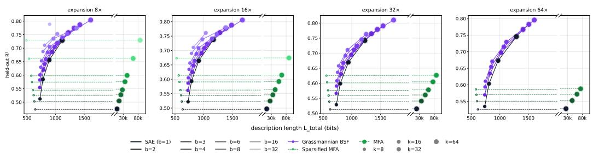  
Figure 27: Minimal description length comparison between Grassmannian BSFs and MFAs. MFAs are naturally dense, resulting in high description lengths during inference. Hard top-k thresholding can be applied to MFAs to induce sparsity, as shown by the open circles (sparsity of k=1), significantly reducing the MDL without impacting $R ^ { 2 }$ significantly.

Adapting SMixAE and MFA. SMixAE encodes through a rectified expert space and a per-expert low-dimensional bottleneck, mapping the input with a LearkyReLU after an affine projection and reshaping the result into K experts, then it projecting each to a b-dimensional bottleneck, select experts by a batch-level Top-k on the bottleneck norm, and decoding through $W _ { e } ^ { \mathrm { l a t } }$ and a shared $W _ { \mathrm { d e c } } .$ . As published it reaches per-block $R ^ { 2 } \approx 0 . 7 1$ on the toy, and two changes that align it with the block-sparse prior lift it to $\dot { R } ^ { 2 } \approx 0 . 8 5 \colon$ removing the LeakyRelu so that the code is signed and replacing the batch routing with the per-sample block projection $\mathbf { I I } _ { k }$ on the bottleneck norm, which is the Vanilla-BSF selection.

For MFA (Shafran et al., 2026), it fails for a different reason, its native convex combination (the responsability coefficients) allow MFA to reach only per-block $R ^ { 2 } \approx 0 . 3 8$ and a global reconstruction that saturates near $0 . 4 7 ,$ because a mixture assigns each activation to one component and so cannot account for an additive sum, as the next paragraph makes precise. Re-using its learned per-component subspaces $\{ W _ { c } \}$ as a block dictionary and decoding additively, by selecting the k best-fitting subspaces per activation and solving a single joint least-squares over their union, optionally followed by a short block-Top-k fine-tune, raises recovery to $R ^ { 2 } \stackrel { - } { \approx } 0 . 8 8$ . This additive decode abandons the model’s own one-component generative assumption and is therefore a decode-time heuristic rather than a coherent featurizer, included only to establish that the learned subspaces are themselves usable once they are read additively.

The implicit data-generating process of MFA. It is worth making explicit why MFA is mismatched to Def. 1, as a mixture of factor generates an activation by drawing a single component and then a Gaussian within it,

$$
c \sim \operatorname{Cat} (\boldsymbol {\pi}), \qquad \boldsymbol {z} \sim \mathcal {N} (\boldsymbol {0}, \boldsymbol {I} _ {q}), \qquad \boldsymbol {x} = \boldsymbol {\mu} _ {c} + \boldsymbol {W} _ {c} \boldsymbol {z} + \varepsilon , \qquad \varepsilon \sim \mathcal {N} (\boldsymbol {0}, \boldsymbol {\Psi} _ {c}),
$$

with $W _ { c } \in \mathbb { R } ^ { q \times d } :$ a low-rank loading and $\Psi _ { c }$ a diagonal noise, so that the marginal of component c is $\mathcal { N } ( \pmb { \mu _ { c } } , \pmb { W _ { c } ^ { \top } } \pmb { W _ { c } } + \pmb { \Psi _ { c } } )$ . Read in the language of Sec. 2.3, this is a block model with exactly one active block: the categorical c selects a single subspace $\mathcal { V } _ { c } = \operatorname { s p a n } ( W _ { c } )$ , the code z places the activation within it, and the diagonal Ψc absorbs the off-subspace residual. It is therefore the one-sparse, $\vert S \vert { = } 1$ special case of Eq. 2, with the spike-and-slab prior collapsed to the statement that exactly one factor is on.

The mismatch is now visible in a single number. Def. 1 admits $| S | > 1$ , so an activation is a sum of several factors, whereas the mixture admits only $\vert S \vert { = } 1$ and so represents a choice among factors. This is the difference between co-presence and selection: when the fitted mixture is uncertain, its responsibilities spread over the components as a convex weighting on the simplex, but that weighting still encodes uncertainty about which one factor produced the activation, and a convex combination of single factors can never be their Minkowski sum. A genuinely additive probabilistic treatment of the factor-analyzer family, one whose generative process places $\vert S \vert > 1$ factors on at once, is a natural and promising direction that lies outside the scope of this work.