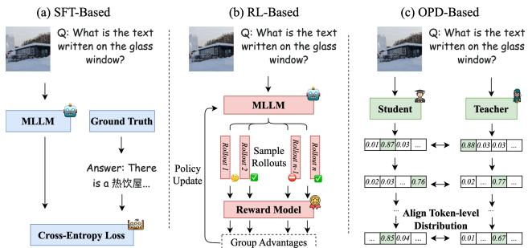
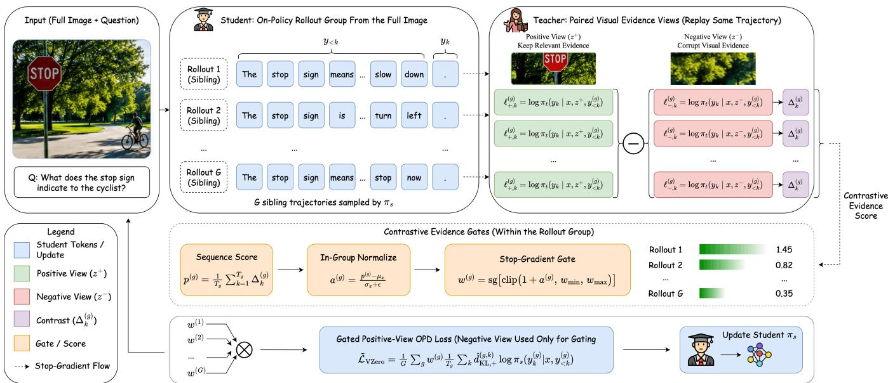
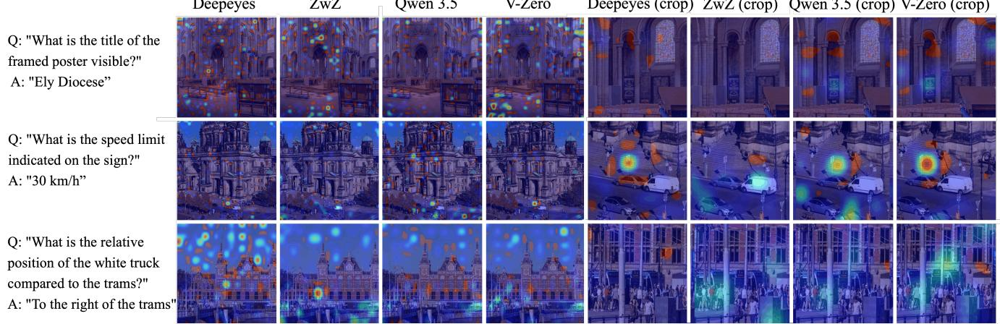
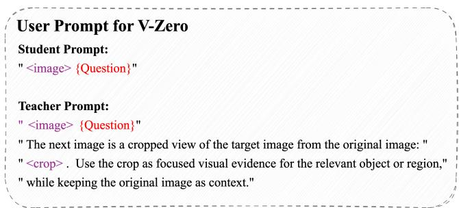

# V-Zero: Answer-Label-Free On-Policy Distillation with Contrastive Evidence Gating for Fine-Grained Visual Reasoning

Haoxiang Sun1\*, Zhihang Yi1\*, Langxuan Deng1, Yuhao Zhou1, Peiqi Jia2, Jian Zhao3, Li Yuan4, Jiancheng Lv1, Tao Wang1,†

1Sichuan University, 2Xi’an Jiaotong University 3TeleAI of China Telecom, 4Peking University

## Abstract

Fine-grained visual reasoning requires multimodal large language models (MLLMs) to identify task-relevant visual evidence and ground their reasoning in local image regions. Existing agentic methods typically rely on reinforcement learning with verifiable rewards or supervised fine-tuning on largescale annotated reasoning traces, leading to costly exploration, hand-designed verification rules, or heavy dependence on textual supervision. A natural way to avoid such external answer labels is to learn from trajectories sampled by the student itself, which points to On-Policy Distillation (OPD). To understand what OPD can and cannot provide for visual reasoning, we revisit it as negative-free stop-gradient alignment. This perspective shows that, although OPD provides effective token-level correction, its ceiling is constrained by the absence of trajectory-level discrimination. Motivated by these observations, we propose V-Zero, an answer-label-free framework for visual reasoning with contrastive evidence gating. V-Zero uses no annotated textual answer labels; instead, during training it pairs a question-relevant regional crop with a negative visual view to evaluate student-sampled trajectories and gate dense token-level distillation. Experiments on multiple visual reasoning benchmarks show that V-Zero consistently improves fine-grained visual reasoning while preserving strong generalization. Notably, V-Zero is more than 5× faster than previous supervised fine-tuning methods and more than 10× faster than reinforcement learning baselines. Code and dataset will be released at https://github.com/eVIgroup-SCU/V-Zero.

## Introduction

As Multimodal Large Language Models (MLLMs) rapidly develop (Bai et al. 2025; Comanici et al. 2025), fine-grained visual reasoning (Wu and Xie 2024; Wang et al. 2024) has become a critical capability for evaluating them. Unlike general visual understanding (Yu et al. 2023; Yue et al. 2024; Liu et al. 2024), fine-grained visual reasoning requires models to inspect local details, identify task-relevant visual evidence, and reason over specific image regions.

Recent studies have explored the integration of agentic visual search and reasoning (Zheng et al. 2025; Zhang et al. 2025a), often referred to as thinking with images (Su et al. 2025). By interleaving reasoning with visual search, this paradigm enables models to decide where to look, gather task-relevant visual evidence, and refine their answers in a grounded manner. Despite their promise, these methods (Zheng et al. 2025; Zhang et al. 2025a) often rely on reinforcement learning, which incurs costly exploration and requires predefined verifiable rules for training signals. Another line of work (Wei et al. 2026) adopts supervised fine-tuning (SFT) on large-scale annotated image-text data, achieving promising results but requiring massive textual supervision and risking catastrophic forgetting (Chu et al. 2025). These observations motivate the central question of this work:

  
Figure 1: Differences between Supervised Fine-tuning (SFT), Reinforcement Learning (RL), and On-Policy Distillation (OPD).

Can visual reasoning be improved without costly RL exploration, large-scale textual answer labels, or substantially disrupting the original capabilities of MLLMs?

To answer this question, we turn to On-Policy Distillation (OPD), which provides dense supervision on trajectories sampled from the student itself and therefore offers a promising alternative to reward-based RL and offline SFT. However, standard OPD treats all student-generated prefixes uniformly. Once the student enters an erroneous reasoning path, the teacher can only provide token-level correction conditioned on that prefix, without assessing whether the trajectory is drifting away from the correct answer (Fu et al. 2026).

In this paper, we first develop a complementary view of OPD by reinterpreting it as a negative-free stop-gradient alignment objective. This perspective explains why OPD is effective in providing dense on-policy supervision, while revealing that its potential is limited by the lack of explicit trajectory-level discrimination for erroneously drifting trajectories. Building on this view, V-Zero keeps the studentside rollout process of OPD, but adds a teacher-side evidence comparison module to evaluate each rollout at the trajectory level. Specifically, the teacher replays each student trajectory under paired positive and negative visual evidence views, and their contrast is used to estimate rollout reliability and gate dense visual reasoning supervision.

Notably, V-Zero eliminates the need for annotated textual answer labels while using less than half of the computational budget required by prior methods. Extensive experiments on multiple visual reasoning benchmarks show that V-Zero improves fine-grained visual reasoning by an average of 3.1 points compared with the Qwen3.5-4B base model while preserving strong generalization. Crucially, these gains come from training-time visual evidence crops rather than ground-truth answer labels, while still cutting training cost by over 5× relative to SFT methods and over 10× relative to RL baselines, with no extra tool-call overhead at inference time.

In summary, our contributions are as follows:

• A theoretical view of OPD. We reinterpret OPD as negative-free stop-gradient alignment and identify its missing trajectory-level discrimination.

• Contrastive evidence gating mechanism. We propose V-Zero, which contrasts paired positive and negative visual evidence views to gate answer-label-free on-policy distillation at the trajectory level.

• Efficient and generalizable visual reasoning. V-Zero improves the Qwen3.5-4B base model by 3.1 points on average while preserving general capabilities and cutting training cost by over 5×/10× relative to SFT/RL.

## Revisiting OPD as Negative-Free Stop-Gradient Alignment

Before presenting V-Zero, we revisit OPD as an alignment objective on student-induced states. OPD efficiently provides dense token-level correction by matching student predictions to teacher targets on sampled prefixes, but it lacks trajectory-level discriminative supervision.

## On-Policy Distillation with Teacher-Side Views

OPD trains a student policy $\pi _ { s }$ on states generated by the student itself. Let $\mathbf { \mathcal { D } } \doteq \{ \dot { x } _ { i } \} _ { i = 1 } ^ { N }$ be a set of prompts. For each prompt x, the student samples a group of G on-policy trajectories $\mathcal { Y } ( x ) ~ = ~ \{ y ^ { ( g ) } \} _ { g = 1 } ^ { G }$ , with the standard singlerollout case recovered when $G = 1$ . Each trajectory $y ^ { ( g ) } =$ $( y _ { 1 } ^ { ( g ) } , \dots , y _ { T _ { g } } ^ { ( g ) } )$ is generated autoregressively as

$$
y _ {k} ^ {(g)} \sim \pi_ {s} (\cdot | x, y _ {<   k} ^ {(g)}), \quad g = 1, \dots , G, \quad k = 1, \dots , T _ {g}.\tag{1}
$$

We denote the resulting group rollout distribution by $\pi _ { s } ^ { G } ( \cdot |$ x). The sampled trajectories are treated as stop-gradient training data. The teacher is then queried on the same student-induced prefixes, and the student is optimized to match the teacher on the states it actually visits:

$$
\mathcal {L} _ {\mathrm{OPD}} ^ {\mathrm{RKL}} (\pi_ {s}) = \mathbb {E} _ {x \sim \mathcal {D}, \mathcal {Y} (x) \sim \pi_ {s} ^ {G} (\cdot | x)} \left[ \mathcal {L} _ {\mathrm{OPD}} ^ {\mathrm{RKL}} (x, \mathcal {Y} (x)) \right]\tag{2}
$$

$$
\mathcal {L} _ {\mathrm{OPD}} ^ {\mathrm{RKL}} (x, \mathcal {Y} (x)) = \frac {1}{G} \sum_ {g = 1} ^ {G} \frac {1}{T _ {g}} \sum_ {k = 1} ^ {T _ {g}} D _ {\mathrm{KL}} ^ {(g, k)}.\tag{3}
$$

At each student-induced prefix, the full-vocabulary local reverse-KL is

$$
D _ {\mathrm{KL}} ^ {(g, k)} = \sum_ {v \in \mathcal {V}} \pi_ {s} (v \mid x, y _ {<   k} ^ {(g)}) \log \frac {\pi_ {s} (v \mid x , y _ {<   k} ^ {(g)})}{\pi_ {t} (v \mid x , y _ {<   k} ^ {(g)})}.\tag{4}
$$

In practice, sampled-token OPD (Lu and Lab 2025; Fu et al. 2026; Li et al. 2026b) is used to form a sampled log-ratio score for this local reverse-KL objective:

$$
\widehat {d} _ {\mathrm{KL}} ^ {(g, k)} = \mathrm{sg} \left[ \log \frac {\pi_ {s} (y _ {k} ^ {(g)} \mid x , y _ {<   k} ^ {(g)})}{\pi_ {t} (y _ {k} ^ {(g)} \mid x , y _ {<   k} ^ {(g)})} \right].\tag{5}
$$

$$
y _ {k} ^ {(g)} \sim \pi_ {s} (\cdot | x, y _ {<   k} ^ {(g)}).\tag{6}
$$

To optimize this reverse-KL minimization objective with student-sampled tokens, we use a stop-gradient sampled sur rogate:

$$
\widetilde {\ell} _ {\mathrm{OPD}} ^ {(g, k)} = \widehat {d} _ {\mathrm{KL}} ^ {(g, k)} \log \pi_ {s} (y _ {k} ^ {(g)} \mid x, y _ {<   k} ^ {(g)}).\tag{7}
$$

This formulation naturally extends to training with privileged information. The student still samples trajectories from the original prompt x, while the teacher may condition on additional information z that is unavailable to the student, such as a localized crop or a reference solution (Zhao et al. 2026). The teacher target is then evaluated as

$$
\pi_ {t} (\cdot \mid x, z, y _ {<   k} ^ {(g)}),\tag{8}
$$

and the OPD objective is obtained by replacing $\pi _ { t } ( \cdot \ |$ $x , y _ { < k } ^ { ( g ) } )$ with $\pi _ { t } ( \cdot \mid x , z , y _ { < k } ^ { ( g ) } )$ .

## An Asymmetric Alignment View of OPD

The privileged-information formulation reveals an asymmetric alignment structure underlying OPD. For each student-induced state $( x , y _ { < k } ^ { ( g ) } )$ , the student branch defines a base view $v _ { s } ^ { ( g , k ) } = ( x , y _ { < k } ^ { ( g ) } )$ , while the teacher branch defines a target view $v _ { t } ^ { ( g , k ) }$ . In standard OPD the two views share the same context; with teacher-side information, the teacher view is augmented to $v _ { t } ^ { ( g , k ) } = ( x , z , y _ { < k } ^ { ( g ) } )$ ). These two views induce predictive distributions over the same next-token decision:

$$
q _ {s} ^ {(g, k)} = \pi_ {s} (\cdot | v _ {s} ^ {(g, k)}), \quad q _ {t} ^ {(g, k)} = \operatorname{sg} \left[ \pi_ {t} (\cdot | v _ {t} ^ {(g, k)}) \right].\tag{9}
$$

Here $\pi _ { s } ( \cdot \ | \ v _ { s } ^ { ( g , k ) } )$ abbreviates $\pi _ { s } ( \cdot \ | \ x , y _ { < k } ^ { ( g ) } )$ , and $\pi _ { t } ( \cdot \ |$ $v _ { t } ^ { ( g , k ) } )$ abbreviates either $\pi _ { t } ( \cdot \mid x , y _ { < k } ^ { ( g ) } )$ in standard OPD or $\pi _ { t } ( \cdot \mid x , z , y _ { < k } ^ { ( g ) } )$ when teacher-side information is used. The stop-gradient operator makes the alignment asymmetric: the

V-Zero: On-Policy Distillation from Contrastive Visual Evidence

  
Figure 2: Overview of V-Zero. The student samples sibling rollouts from the full image, while a teacher-side evidence comparison module replays them under paired positive and negative visual evidence views to produce trajectory-level contrastive evidence gates. The final distillation target remains the positive teacher view.

student remains the online branch to be optimized, while the teacher provides a fixed target.

Thus, OPD can be viewed as a negative-free stop-gradient alignment objective over student-teacher views:

$$
\ell_ {\mathrm{align}} ^ {(g, k)} = d \Big (q _ {s} ^ {(g, k)}, q _ {t} ^ {(g, k)} \Big),\tag{10}
$$

where $d ( \cdot , \cdot )$ can be instantiated by the sampled-token reverse-KL score. The corresponding stop-gradient sampled score is

$$
\widehat {d} _ {\mathrm{KL}, \text { align }} ^ {(g, k)} = \operatorname{sg} \left[ \log q _ {s} ^ {(g, k)} (y _ {k} ^ {(g)}) - \log q _ {t} ^ {(g, k)} (y _ {k} ^ {(g)}) \right].\tag{11}
$$

$$
y _ {k} ^ {(g)} \sim q _ {s} ^ {(g, k)}.\tag{12}
$$

The corresponding surrogate loss is

$$
\widetilde {\ell} _ {\mathrm{align}} ^ {(g, k)} = \widehat {d} _ {\mathrm{KL}, \mathrm{align}} ^ {(g, k)} \log q _ {s} ^ {(g, k)} (y _ {k} ^ {(g)}).\tag{13}
$$

This view also exposes a key limitation of standard OPD. Although OPD provides dense token-level alignment, it does not explicitly score the correctness of the full trajectory. Once the student enters an erroneous reasoning path, the teacher can only provide local next-token targets conditioned on that prefix, without assessing whether the trajectory as a whole is approaching the correct answer. As a result, standard OPD may optimize locally plausible continuations while lacking trajectory-level discriminative supervision. V-Zero addresses this limitation by estimating rollout reliability through paired positive and negative teacher-side visual evidence views and using trajectory-level contrastive evidence gates to modulate dense token-level distillation.

## Method

V-Zero improves fine-grained visual reasoning by adding a contrastive evidence gating mechanism to on-policy distillation. The student samples on-policy trajectories from the full image, while the teacher replays the same trajectories with additional paired positive and negative visual evidence views beyond the original image. The resulting trajectorylevel contrastive evidence gate estimates rollout reliability and modulates positive-view OPD.

## Student Rollouts and Teacher Evidence Views

Given a prompt x with the original full image, the student samples a group of G trajectories:

$$
\mathcal {Y} (x) = \{y ^ {(g)} \} _ {g = 1} ^ {G}, \qquad y ^ {(g)} \sim \pi_ {s} (\cdot | x).\tag{14}
$$

These trajectories are sibling rollouts from the same prompt and policy. For each sampled trajectory, the teacher replays the same token sequence with the original full image plus an additional pair of visual evidence views. The positive view $z ^ { + }$ is a target-region crop that preserves task-relevant visual evidence, while the negative view $z ^ { - }$ is an equal-size crop randomly sampled outside the target region after a 2× downsampling of the original image. This teacher-side evidence comparison estimates how strongly each rollout depends on the relevant visual evidence. The teacher then computes sampled-token log-probabilities under the two additional views:

$$
\ell_ {+, k} ^ {(g)} = \log \pi_ {t} (y _ {k} ^ {(g)} \mid x, z ^ {+}, y _ {<   k} ^ {(g)}),
$$

$$
\ell_ {-, k} ^ {(g)} = \log \pi_ {t} (y _ {k} ^ {(g)} \mid x, z ^ {-}, y _ {<   k} ^ {(g)}).\tag{15}
$$

(16)

ZwZ  
Qwen 3.5  
V-Zero  
Deepeyes (crop) ZwZ (crop) Qwen 3.5 (crop) V-Zero (crop)  
  
Figure 3: Attention visualization on representative fine-grained reasoning samples. In the first row, the question focuses on the title of the framed poster in the lower-right image region; V-Zero and the Qwen3.5-4B baseline are the only methods that cover the correct visual area, with V-Zero producing stronger activation. In the second row, the answer depends on the speed limit sign near the bottom of the image, where V-Zero shows the strongest focus. In the third row, the question requires the spatial relation between the white truck and the trams, and V-Zero is the only method that clearly highlights both visual targets.

## Contrastive Evidence Gating

Given the positive and negative teacher evaluations above, V-Zero turns visual dependence into a contrastive signal. Intuitively, tokens that genuinely rely on task-relevant visual evidence should receive stronger teacher support from the target-region crop than from the downsampled irrelevant region. For each student-sampled token, we first compute the teacher-side visual evidence gap:

$$
\Delta_ {k} ^ {(g)} = \ell_ {+, k} ^ {(g)} - \ell_ {-, k} ^ {(g)}.\tag{17}
$$

A larger $\Delta _ { k } ^ { ( g ) }$ indicates that the token is more strongly supported when the teacher has access to the relevant visual evidence. We then aggregate these token-level gaps into a trajectory-level evidence score:

$$
p ^ {(g)} = \frac {1}{T _ {g}} \sum_ {k = 1} ^ {T _ {g}} \Delta_ {k} ^ {(g)}.\tag{18}
$$

Since raw evidence scores can vary across prompts, answer lengths, and visual contexts, V-Zero normalizes the sibling score vector $\mathbf { p } _ { x } = ( p ^ { ( 1 ) } , \dots , p ^ { ( G ) } )$ within each prompt:

$$
(\mu_ {x}, \sigma_ {x}) = \mathrm{MeanStd} (\mathbf {p} _ {x}), \qquad a ^ {(g)} = \frac {p ^ {(g)} - \mu_ {x}}{\sigma_ {x} + \epsilon}.\tag{19}
$$

The normalized quantity $a ^ { ( g ) }$ is a trajectory-level evidence advantage: it measures whether the current rollout is better visually grounded than its siblings under the same prompt. V-Zero converts this advantage into a non-negative stopgradient contrastive evidence gate:

$$
w ^ {(g)} = \operatorname{sg} \left[ \operatorname{clip} \left(1 + a ^ {(g)}, w _ {\min}, w _ {\max}\right) \right].\tag{20}
$$

The clipping bounds keep the OPD update stable. The gate strengthens OPD for rollouts whose tokens are better supported by the positive visual evidence view and suppresses rollouts whose teacher support is not improved by that evidence.

## V-Zero Objective

After estimating the trajectory-level contrastive evidence gate, V-Zero discards the negative view from the training target and distills only from the positive teacher view. At each student-induced prefix, the positive-view local reverse-KL is

$$
D _ {\mathrm{KL}, +} ^ {(g, k)} = \sum_ {v \in \mathcal {V}} \pi_ {s} (v \mid x, y _ {<   k} ^ {(g)}) \log \frac {\pi_ {s} (v \mid x , y _ {<   k} ^ {(g)})}{\pi_ {t} (v \mid x , z ^ {+} , y _ {<   k} ^ {(g)})}.\tag{21}
$$

The underlying V-Zero distillation objective follows the standard reverse-KL minimization convention:

$$
\mathcal {L} _ {\mathrm{V-Zero}} ^ {\mathrm{RKL}} (x, \mathcal {Y} (x)) = \frac {1}{G} \sum_ {g = 1} ^ {G} w ^ {(g)} \frac {1}{T _ {g}} \sum_ {k = 1} ^ {T _ {g}} D _ {\mathrm{KL}, +} ^ {(g, k)}.\tag{22}
$$

In practice, sampled-token OPD forms the detached positive-view sampled log-ratio score:

$$
\widehat {d} _ {\mathrm{KL,+}} ^ {(g, k)} = \mathrm{sg} \left[ \log \frac {\pi_ {s} (y _ {k} ^ {(g)} \mid x , y _ {<   k} ^ {(g)})}{\pi_ {t} (y _ {k} ^ {(g)} \mid x , z ^ {+} , y _ {<   k} ^ {(g)})} \right].\tag{23}
$$

The surrogate loss minimized in training is

$$
\begin{array}{c} \widetilde {\mathcal {L}} _ {\text {V - Zero}} (x, \mathcal {Y} (x)) = \frac {1}{G} \sum_ {g = 1} ^ {G} w ^ {(g)} \frac {1}{T _ {g}} \sum_ {k = 1} ^ {T _ {g}} \widehat {d} _ {\text {KL}, +} ^ {(g, k)} \\ \log \pi_ {s} (y _ {k} ^ {(g)} \mid x, y _ {<   k} ^ {(g)}). \end{array}\tag{24}
$$

With $w ^ { ( g ) }$ and $\widehat { d } _ { \mathrm { K L , + } } ^ { ( g , k ) }$ detached, this surrogate gives the contrastive-gated sampled reverse-KL gradient for the positive teacher view. This formulation separates evidence comparison from token-level imitation: paired visual evidence views decide how much to learn from each rollout, while the OPD target remains the positive teacher distribution. In this way, V-Zero constructs dense on-policy supervision without annotated textual answer labels and without external reward signals.

Algorithm 1: V-Zero Training

Input: dataset D, student  $\pi_{s}$ , teacher  $\pi_{t}$ , group size G

Hyperparameters:  $w_{min}, w_{max}$ 

1: for each training step do

2:  $B \leftarrow$  sample minibatch from D

3: for each prompt  $x_{i} \in B$  do

4:  $\{y_{i}^{(g)}\}_{g=1}^{G} \leftarrow$  sample G rollouts from  $\pi_{s}(\cdot \mid x_{i})$ 

5:  $z_{i}^{+} \leftarrow$  positive visual evidence view

6:  $z_{i}^{-} \leftarrow$  negative visual evidence view

7: for  $g = 1, \ldots, G$  do

8: compute  $\ell_{s,k}^{(g)}$  with  $(x_{i}, y_{i,&lt;k}^{(g)})$ 

9: compute  $\ell_{+,k}^{(g)}$  with  $(x_{i}, z_{i}^{+}, y_{i,&lt;k}^{(g)})$ 

10: compute  $\ell_{-,k}^{(g)}$  with  $(x_{i}, z_{i}^{-}, y_{i,&lt;k}^{(g)})$ 

11:  $\Delta_{i,k}^{(g)} \leftarrow \ell_{+,k}^{(g)} - \ell_{-,k}^{(g)}$ 

12:  $p_{i}^{(g)} \leftarrow \frac{1}{T_{i}^{(g)}} \sum_{k=1}^{T_{i}^{(g)}} \Delta_{i,k}^{(g)}$ 

13: end for

14:  $(\mu_{i}, \sigma_{i}) \leftarrow \text{MeanStd}_{g=1}^{G}(p_{i}^{(g)})$ 

15: for  $g = 1, \ldots, G$  do

16:  $a_{i}^{(g)} \leftarrow \frac{p_{i}^{(g)} - \mu_{i}}{\sigma_{i} + \epsilon}$ 

17:  $w_{i}^{(g)} \leftarrow \text{sg}\left[\text{clip}(1 + a_{i}^{(g)}, w_{\text{min}}, w_{\text{max}})\right]$ 

18:  $\widehat{d}_{\text{KL},i,k}^{(g)} \leftarrow \text{sg}\left[\ell_{s,k}^{(g)} - \ell_{+,k}^{(g)}\right]$  for all valid k

19: end for

20: end for

21:  $\widetilde{\mathcal{L}} \leftarrow \frac{1}{|\mathcal{B}|G} \sum_{i,g} w_{i}^{(g)} \frac{1}{T_{i}^{(g)}} \sum_{k=1}^{T_{i}^{(g)}} \widehat{d}_{\text{KL},i,k}^{(g)} \log \pi_{s}(y_{i,k}^{(g)}) |x_{i}, y_{i,&lt;k}^{(g)})$ 

22: update  $\pi_{s}$  using  $\nabla\widetilde{\mathcal{L}}$ 

23: end for

## Experiments

## Experiment Setup

Baselines. We compare V-Zero with three groups of baselines. First, we evaluate Qwen3-VL and Qwen3.5 models at different scales to measure the gain over the backbone family (Bai et al. 2025). Second, we compare with representative agentic visual reasoning and thinking-with-images systems, including DeepEyes (Zheng et al. 2026), Thyme (Zhang et al. 2025a), Pixel Reasoner (Wang et al. 2025), and Deep-EyesV2 (Hong et al. 2026). These systems enhance visual reasoning through agentic multimodal reasoning. Third, we compare with Zooming without Zooming (ZwZ), a closely related off-policy region-to-image distillation method that internalizes local visual perception into standard inference (Wei et al. 2026).

Benchmarks. Following ZwZ (Wei et al. 2026), we evaluate V-Zero on two groups of benchmarks. The first group focuses on general perception in high-resolution or real-world scenarios, including HR-Bench (Wang et al. 2024), VStar (Wu and Xie 2024), MME-RealWorld (Zhang et al. 2025b), and ZoomBench under the full-image setting (Wei et al. 2026). The second group tests out-of-distribution generalization with MMStar for general multimodal understanding (Chen et al. 2024).

  
Figure 4: Prompt format used in V-Zero. The student receives the full image and question, while the teacher replays the student answer with an additional crop as focused visual evidence.

Training Dataset. We use the 23K high-quality training samples curated by Zooming without Zooming (Wei et al. 2026). Each example contains a full image, a question, and a question-relevant regional crop. For V-Zero, we additionally generate a negative crop by downsampling the full image by 2× and randomly sampling an equal-size region outside the question-relevant crop; the generated negative crop is written into the training data. These crops are used only during training and are not provided at inference time. We do not construct additional tool-use trajectories or cold-start reasoning traces.

Implementation Details. We use Qwen3.5-4B and Qwen3.5-27B as our default student and teacher respectively. We implement V-Zero with the VeRL training framework (Sheng et al. 2025) and conduct all main training runs on one node equipped with NVIDIA RTX PRO 6000 96G GPUs. For optimization, we use a training batch size of 32 and a PPO mini-batch size of 16 with $G = 8$ for each prompt. We set the maximum prompt and response lengths to 25,000 and 2,048 tokens, respectively. We train with a learning rate of $1 \times 1 0 ^ { - 6 }$ . The distillation loss uses the sampled-token reverse-KL estimator from VeRL’s default OPD settings. The contrastive evidence gating mechanism uses clipping bounds $w _ { \mathrm { m i n } } = 0$ and $w _ { \mathrm { m a x } } = 2$ . We use the step-60 checkpoint for the main results. Training Cost.

<table><tr><td>Method</td><td>Hardware</td><td>Time</td><td>V-Zero speedup</td></tr><tr><td>ZwZ</td><td>8×H100</td><td> $\sim 1$  day</td><td> $>5\times$ </td></tr><tr><td>DeepEyes</td><td>8×H100</td><td> $\sim 2$  days</td><td> $>10\times$ </td></tr><tr><td>V-Zero</td><td>8×RTX PRO 6000</td><td>4.8 h</td><td>1×</td></tr></table>

ZwZ (Wei et al. 2026) and DeepEyes (Zheng et al. 2026) use 8 H100 GPUs; because V-Zero uses 8 RTX PRO 6000 GPUs with weaker practical BF16 throughput, these wallclock speedups are conservative.

## Main Results

Table 1 reports the main results on fine-grained visual reasoning benchmarks. Compared with the Qwen3.5-4B backbone, V-Zero improves all four fine-grained perception benchmarks with available backbone scores, including gains of +4.7 on VStar, +3.4 on HR-4K, +2.0 on HR-8K, and +5.5 on ZoomBench. These results show that contrastive evidence gating substantially strengthens the ability of the Qwen3.5-4B base model to reason over high-resolution and localized visual evidence while keeping the inference setting unchanged.

<table><tr><td rowspan="2">Method</td><td colspan="5">General Perception</td><td>OOD</td><td>Avg.</td></tr><tr><td>VStar</td><td>HR-4K</td><td>HR-8K</td><td>ZoomBench</td><td>MME-RW</td><td>MMStar</td><td>Avg.</td></tr><tr><td colspan="8">General Large Vision-Language Models</td></tr><tr><td>Qwen3-VL-4B*</td><td>81.7</td><td>78.5</td><td>75.3</td><td>40.4</td><td>63.5</td><td>69.7</td><td>68.2</td></tr><tr><td>Qwen3.5-4B*</td><td>84.3</td><td>84.4</td><td>80.1</td><td>52.2</td><td>69.2</td><td>71.8</td><td>73.7</td></tr><tr><td>Qwen3.5-9B*</td><td>89.0</td><td>87.8</td><td>84.5</td><td>56.8</td><td>70.2</td><td>77.5</td><td>77.6</td></tr><tr><td colspan="8">Visually Grounded Reasoning Models</td></tr><tr><td>DeepEyes (7B)</td><td>85.6</td><td>75.1</td><td>72.6</td><td>-</td><td>64.1</td><td>-</td><td>-</td></tr><tr><td>Pixel-Reasoner (7B)</td><td>84.3</td><td>72.6</td><td>66.1</td><td>-</td><td>64.4</td><td>-</td><td>-</td></tr><tr><td>Thyme (7B)</td><td>82.2</td><td>77.0</td><td>72.0</td><td>-</td><td>64.8</td><td>-</td><td>-</td></tr><tr><td>DeepEyesV2 (7B)</td><td>81.8</td><td>77.9</td><td>73.8</td><td>-</td><td>64.9</td><td>-</td><td>-</td></tr><tr><td> $ZwZ-4B^*$ </td><td>91.6</td><td>82.1</td><td>79.6</td><td>52.5</td><td>68.5</td><td>71.1</td><td>74.2</td></tr><tr><td> $ZwZ-8B^*$ </td><td>91.6</td><td>84.9</td><td>82.4</td><td>56.6</td><td>69.6</td><td>73.1</td><td>76.4</td></tr><tr><td>V-Zero-4B (Ours)</td><td>89.0</td><td>87.8</td><td>82.6</td><td>57.8</td><td>69.8</td><td>74.4</td><td>76.9</td></tr></table>

Table 1: Main results on fine-grained visual reasoning benchmarks. V-Zero is compared with general large vision-language models and visually grounded reasoning models across general perception, OOD generalization, and the average score. \* denotes results obtained from our independent testing under the same experimental conditions.

V-Zero also reaches top-tier performance among visually grounded reasoning systems. Since these methods are built on different backbones, such as ZwZ with Qwen3 and DeepEyes with Qwen2.5, this comparison should be read as a cross-system result rather than a controlled backbonematched ablation. Nevertheless, V-Zero achieves the best scores among visually grounded reasoning systems on HR-4K, HR-8K, ZoomBench, and MMStar, showing that contrastive evidence gating is competitive with specialized visually grounded training pipelines. This result is notable because V-Zero uses teacher-side visual evidence views only during training, while the student still performs standard full-image inference at test time.

Importantly, these gains are obtained without annotated textual answer labels. The only teacher-side signal used during training is paired visual evidence views: a positive view that preserves the relevant region and a 2× downsampled equal-size negative view sampled from an irrelevant region. Thus, V-Zero improves the Qwen3.5-4B backbone by contrasting paired visual evidence views rather than by imitating annotated reasoning traces or final answers.

## Ablation Study

Effect of contrastive evidence gating. Table 2 shows that removing the gate weakens perception-average performance and degrades VStar, HR-4K, and ZoomBench, indicating that group-relative evidence scores help emphasize student rollouts that are better supported by the positive visual evidence view. The change on HR-8K is small, which we attribute to the fact that the 8K setting already provides sufficiently rich visual information in the full-image input. As a result, the benefit of contrastive evidence gating is less pronounced. In contrast, the gate is more useful under relatively constrained visual settings, where distinguishing evidencesupported rollouts from weakly grounded rollouts has a larger effect on learning.

<table><tr><td>Variant</td><td>Pos.</td><td>Neg.</td><td>VStar</td><td>HR-4K</td><td>HR-8K</td><td>ZoomBench</td><td>Perc. Avg.</td></tr><tr><td>None</td><td>-</td><td>-</td><td>86.4</td><td>86.4</td><td>82.4</td><td>56.6</td><td>78.0</td></tr><tr><td>Rand.</td><td>R</td><td>R</td><td>83.3</td><td>82.4</td><td>77.3</td><td>47.2</td><td>72.5</td></tr><tr><td>V-Zero</td><td>√</td><td>R</td><td>89.0</td><td>87.8</td><td>82.1</td><td>57.7</td><td>79.2</td></tr></table>

Table 2: Ablation of the contrastive evidence gating mechanism. R denotes random evidence. Perception Avg. is com puted over VStar, HR-4K, HR-8K, and ZoomBench.

<table><tr><td>Teacher</td><td>Student</td><td>VStar</td><td>HR-4K</td><td>HR-8K</td><td>ZoomBench</td><td>Perc. Avg.</td></tr><tr><td>9B</td><td>4B</td><td>89.5</td><td>87.3</td><td>83.8</td><td>54.8</td><td>78.9</td></tr><tr><td>27B</td><td>4B</td><td>89.0</td><td>87.8</td><td>82.1</td><td>57.7</td><td>79.2</td></tr></table>

Table 3: Ablation of teacher and student model sizes. Perception Avg. is computed over VStar, HR-4K, HR-8K, and ZoomBench.

Teacher and student size. Table 3 compares different teacher–student size configurations. The 27B-to-4B setting corresponds to the main V-Zero result in Table 1 and gives the higher perception average. With the same 4B student, using a 9B teacher improves VStar and HR-8K, while the 27B teacher is stronger on HR-4K and ZoomBench.

Rollout group size. Table 4 studies the effect of the number of sibling rollouts. Increasing the group size from G = 4 to $G = 8$ improves the perception-average score as well as HR-4K, HR-8K, and ZoomBench, with the largest gain on ZoomBench. This indicates that a larger rollout group provides a more informative within-prompt comparison for the trajectory-level contrastive evidence gate, especially when the task requires identifying localized visual evidence.

Training step. Table 5 reports benchmark-specific scores and perception averages at different training steps from left to right. Step 0 corresponds to the Qwen3.5-4B base model without V-Zero training, while steps 30–70 are evaluated. The perception average improves substantially after training and peaks at step 60, showing that contrastive evidence gating strengthens fine-grained visual reasoning. Individual benchmarks peak at different checkpoints, suggesting that extended training can trade off gains across localized zooming ability and broader high-resolution perception.

<table><tr><td>Rollouts</td><td>VStar</td><td>HR-4K</td><td>HR-8K</td><td>ZoomBench</td><td>Perc. Avg.</td></tr><tr><td> $G = 4$ </td><td>89.0</td><td>87.1</td><td>82.0</td><td>54.1</td><td>78.1</td></tr><tr><td> $G = 8$ </td><td>89.0</td><td>87.8</td><td>82.1</td><td>57.7</td><td>79.2</td></tr></table>

Table 4: Ablation of rollout group size. Perception Avg. is computed over VStar, HR-4K, HR-8K, and ZoomBench.

<table><tr><td>Step</td><td>0</td><td>30</td><td>40</td><td>50</td><td>60</td><td>70</td></tr><tr><td>VStar</td><td>84.3</td><td>85.7</td><td>86.9</td><td>85.9</td><td>89.0</td><td>87.9</td></tr><tr><td>HR-4K</td><td>84.4</td><td>86.4</td><td>87.5</td><td>88.1</td><td>87.8</td><td>85.6</td></tr><tr><td>HR-8K</td><td>80.1</td><td>81.7</td><td>81.6</td><td>83.0</td><td>82.1</td><td>82.0</td></tr><tr><td>ZoomBench</td><td>52.2</td><td>55.2</td><td>53.5</td><td>56.7</td><td>57.7</td><td>55.6</td></tr><tr><td>Perc. Avg.</td><td>75.3</td><td>77.2</td><td>77.4</td><td>78.4</td><td>79.2</td><td>77.8</td></tr></table>

Table 5: Ablation of training steps. Step 0 denotes the Qwen3.5-4B base model before V-Zero training. Perception Avg. is computed over VStar, HR-4K, HR-8K, and ZoomBench.

## Discussion and Related Work

Agentic Visual Reasoning. Fine-grained multimodal reasoning requires models to identify and use small but critical visual evidence. Standard MLLMs struggle when answers depend on localized visual search rather than global scene understanding (Wu and Xie 2024; Wang et al. 2024). Recent works address this limitation by training MLLMs to interleave reasoning with visual operations, allowing models to gather new visual observations during inference (Zheng et al. 2026; Wang et al. 2025; Fan et al. 2025; Zhang et al. 2025a). However, these methods typically require costly RL exploration, predefined verifiable rewards, and additional inference-time operations. ZwZ (Wei et al. 2026) shows that comparable performance can be achieved without RL by scaling supervised fine-tuning, but this requires large-scale annotated image-text data and may increase the risk of catastrophic forgetting in MLLMs.

On-Policy Distillation. OPD trains on trajectories sampled from the student itself and uses a teacher to provide dense supervision on student-induced states (Agarwal et al. 2024; Lu and Lab 2025). Recent studies show that OPD can serve as an efficient post-training recipe, mitigating catastrophic forgetting while converging quickly (Li et al. 2026b; Shenfeld et al. 2026). Other works extend OPD to self-distillation settings, where teacher and student are constructed from the same model under different conditions (Zhao et al. 2026; Yang et al. 2026), or combine it with reinforcement learning to provide dense learning signals while preserving reward-based optimization for task correctness (Hubotter¨ et al. 2026). In multimodal settings, Video-OPD (Li et al.

2026a) extends OPD to temporal video grounding and shows that teacher-provided token-level supervision on on-policy trajectories can outperform GRPO with faster convergence and lower computational cost. Different from these works, we study OPD for fine-grained visual reasoning through a negative-free stop-gradient alignment view and convert teacher-side evidence comparisons under paired positive and negative visual evidence views into trajectory-level contrastive evidence gates.

## Conclusion

We presented V-Zero, a framework for improving finegrained visual reasoning without annotated textual answer labels. Starting from a negative-free stop-gradient alignment view of OPD, we identified the absence of trajectory-level discrimination as a key limitation of standard token-level distillation on student-induced prefixes. V-Zero addresses this limitation by sampling sibling rollouts from the full image and replaying them with teacher-side positive and negative visual evidence views. Their contrast yields a trajectorylevel evidence advantage, which is converted into a contrastive evidence gate for positive-view OPD. Across finegrained visual reasoning benchmarks, V-Zero consistently improves the Qwen3.5-4B backbone while keeping standard full-image inference at test time. The main results show strong performance against both general MLLMs and visually grounded reasoning systems, and the ablations further support the roles of evidence gating, rollout grouping, and training-step selection. Overall, V-Zero demonstrates that teacher-side visual evidence comparisons can provide a practical training signal for visual reasoning without annotated textual answer labels, external rewards, and inferencetime visual tools.

## References

Agarwal, R.; Vieillard, N.; Zhou, Y.; Stanczyk, P.; Ramos, S.; Geist, M.; and Bachem, O. 2024. On-Policy Distillation of Language Models: Learning from Self-Generated Mistakes. arXiv:2306.13649.

Bai, S.; Cai, Y.; Chen, R.; Chen, K.; Chen, X.; Cheng, Z.; Deng, L.; Ding, W.; Gao, C.; Ge, C.; et al. 2025. Qwen3-vl technical report. arXiv preprint arXiv:2511.21631.

Chen, L.; Li, J.; Dong, X.; Zhang, P.; Zang, Y.; Chen, Z.; Duan, H.; Wang, J.; Qiao, Y.; Lin, D.; and Zhao, F. 2024. Are We on the Right Way for Evaluating Large Vision-Language Models? arXiv:2403.20330.

Chu, T.; Zhai, Y.; Yang, J.; Tong, S.; Xie, S.; Schuurmans, D.; Le, Q. V.; Levine, S.; and Ma, Y. 2025. Sft memorizes, rl generalizes: A comparative study of foundation model posttraining. arXiv preprint arXiv:2501.17161.

Comanici, G.; Bieber, E.; Schaekermann, M.; Pasupat, I.; Sachdeva, N.; Dhillon, I.; Blistein, M.; Ram, O.; Zhang, D.; Rosen, E.; et al. 2025. Gemini 2.5: Pushing the frontier with advanced reasoning, multimodality, long context, and next generation agentic capabilities. arXiv preprint arXiv:2507.06261.

Fan, Y.; He, X.; Yang, D.; Zheng, K.; Kuo, C.-C.; Zheng, Y.; Narayanaraju, S. J.; Guan, X.; and Wang, X. E. 2025. GRIT: Teaching MLLMs to Think with Images. arXiv:2505.15879.

Fu, Y.; Huang, H.; Jiang, K.; Liu, J.; Jiang, Z.; Zhu, Y.; and Zhao, D. 2026. Revisiting on-policy distillation: Empirical failure modes and simple fixes. arXiv preprint arXiv:2603.25562.

Hong, J.; Zhao, C.; Zhu, C.; Lu, W.; Xu, G.; and Yu, X. 2026. DeepEyesV2: Toward Agentic Multimodal Model. arXiv:2511.05271.

Hubotter, J.; L¨ ubeck, F.; Behric, L.; Baumann, A.; Bagatella,¨ M.; Marta, D.; Hakimi, I.; Shenfeld, I.; Buening, T. K.; Guestrin, C.; et al. 2026. Reinforcement Learning via Self-Distillation. arXiv preprint arXiv:2601.20802.

Li, J.; Yin, H.; Xu, H.; Xu, B.; Tan, W.; He, Z.; Ju, J.; Luo, Z.; and Luan, J. 2026a. Video-OPD: Efficient Post-Training of Multimodal Large Language Models for Temporal Video Grounding via On-Policy Distillation. arXiv:2602.02994.

Li, Y.; Zuo, Y.; He, B.; Zhang, J.; Xiao, C.; Qian, C.; Yu, T.; ang Gao, H.; Yang, W.; Liu, Z.; and Ding, N. 2026b. Rethinking On-Policy Distillation of Large Language Models: Phenomenology, Mechanism, and Recipe. arXiv:2604.13016.

Liu, Y.; Duan, H.; Zhang, Y.; Li, B.; Zhang, S.; Zhao, W.; Yuan, Y.; Wang, J.; He, C.; Liu, Z.; et al. 2024. Mmbench: Is your multi-modal model an all-around player? In European conference on computer vision, 216–233. Springer.

Lu, K.; and Lab, T. M. 2025. On-Policy Distillation. Thinking Machines Lab: Connectionism. Https://thinkingmachines.ai/blog/on-policy-distillation.

Shenfeld, I.; Damani, M.; Hubotter, J.; and Agrawal,¨ P. 2026. Self-Distillation Enables Continual Learning. arXiv:2601.19897.

Sheng, G.; Zhang, C.; Ye, Z.; Wu, X.; Zhang, W.; Zhang, R.; Peng, Y.; Lin, H.; and Wu, C. 2025. HybridFlow: A Flexible and Efficient RLHF Framework. In Proceedings of the Twentieth European Conference on Computer Systems, EuroSys ’25, 1279–1297. ACM.

Su, Z.; Xia, P.; Guo, H.; Liu, Z.; Ma, Y.; Qu, X.; Liu, J.; Li, Y.; Zeng, K.; Yang, Z.; Li, L.; Cheng, Y.; Ji, H.; He, J.; and Fung, Y. R. 2025. Thinking with Images for Multimodal Reasoning: Foundations, Methods, and Future Frontiers. arXiv:2506.23918.

Wang, H.; Su, A.; Ren, W.; Lin, F.; and Chen, W. 2025. Pixel Reasoner: Incentivizing Pixel-Space Reasoning with Curiosity-Driven Reinforcement Learning. arXiv:2505.15966.

Wang, W.; Ding, L.; Zeng, M.; Zhou, X.; Shen, L.; Luo, Y.; and Tao, D. 2024. Divide, Conquer and Combine: A Training-Free Framework for High-Resolution Image Perception in Multimodal Large Language Models. arXiv preprint.

Wei, L.; He, L.; Lan, J.; Dong, L.; Cai, Y.; Li, S.; Zhu, H.; Wang, W.; Kong, L.; Wang, Y.; Zhang, Z.; and Huang, W. 2026. Zooming without Zooming: Region-to-Image Distillation for Fine-Grained Multimodal Perception. arXiv:2602.11858.

Wu, P.; and Xie, S. 2024. V?: Guided visual search as a core mechanism in multimodal llms. In Proceedings of the IEEE/CVF Conference on Computer Vision and Pattern Recognition, 13084–13094.

Yang, C.; Qin, C.; Si, Q.; Chen, M.; Gu, N.; Yao, D.; Lin, Z.; Wang, W.; Wang, J.; and Duan, N. 2026. Self-Distilled RLVR. arXiv:2604.03128.

Yu, W.; Yang, Z.; Li, L.; Wang, J.; Lin, K.; Liu, Z.; Wang, X.; and Wang, L. 2023. Mm-vet: Evaluating large multimodal models for integrated capabilities. arXiv preprint arXiv:2308.02490.

Yue, X.; Ni, Y.; Zhang, K.; Zheng, T.; Liu, R.; Zhang, G.; Stevens, S.; Jiang, D.; Ren, W.; Sun, Y.; et al. 2024. Mmmu: A massive multi-discipline multimodal understanding and reasoning benchmark for expert agi. In Proceedings of the IEEE/CVF conference on computer vision and pattern recognition, 9556–9567.

Zhang, Y.-F.; Lu, X.; Yin, S.; Fu, C.; Chen, W.; Hu, X.; Wen, B.; Jiang, K.; Liu, C.; Zhang, T.; Fan, H.; Chen, K.; Chen, J.; Ding, H.; Tang, K.; Zhang, Z.; Wang, L.; Yang, F.; Gao, T.; and Zhou, G. 2025a. Thyme: Think Beyond Images. arXiv:2508.11630.

Zhang, Y.-F.; Zhang, H.; Tian, H.; Fu, C.; Zhang, S.; Wu, J.; Li, F.; Wang, K.; Wen, Q.; Zhang, Z.; Wang, L.; Jin, R.; and Tan, T. 2025b. MME-RealWorld: Could Your Multimodal LLM Challenge High-Resolution Real-World Scenarios that are Difficult for Humans? arXiv:2408.13257.

Zhao, S.; Xie, Z.; Liu, M.; Huang, J.; Pang, G.; Chen, F.; and Grover, A. 2026. Self-Distilled Reasoner: On-Policy Self-Distillation for Large Language Models. arXiv:2601.18734.

Zheng, Z.; Yang, M.; Hong, J.; Zhao, C.; Xu, G.; Yang, L.; Shen, C.; and Yu, X. 2025. Deepeyes: Incentivizing” thinking with images” via reinforcement learning. arXiv preprint arXiv:2505.14362.

Zheng, Z.; Yang, M.; Hong, J.; Zhao, C.; Xu, G.; Yang, L.; Shen, C.; and Yu, X. 2026. DeepEyes: Incentivizing ”Thinking with Images” via Reinforcement Learning. arXiv:2505.14362.